# Chapter 47: SystemUI

SystemUI is the Android process responsible for nearly everything visible on screen
outside of the currently focused application.  It draws the status bar, the
notification shade, Quick Settings, the lock screen, the navigation bar, the
volume dialog, the power menu, the screenshot experience, and the recent-apps
overlay.  It lives in a single APK that runs as a persistent system service
under the UID `android.uid.systemui` and cannot be killed without the framework
automatically restarting it through `RescueParty`.

SystemUI is one of the largest single packages in AOSP.  Its source directory
contains over 187 sub-packages under
`src/com/android/systemui/`, covering domains from `accessibility` to `wmshell`.
The codebase is undergoing a multi-year migration: legacy single-class
god-objects are being replaced by an MVI architecture (Model-View-Intent) with
Dagger dependency injection, Kotlin coroutines, and Jetpack Compose.

This chapter examines every major subsystem in detail, tracing the code from
process startup through each visible surface.

---

## 47.1  SystemUI Architecture

### 47.1.1  Process Startup

SystemUI is declared in its manifest with `android:sharedUserId="android.uid.systemui"`
and `coreApp="true"`:

```xml
<!-- frameworks/base/packages/SystemUI/AndroidManifest.xml -->
<manifest xmlns:android="http://schemas.android.com/apk/res/android"
    package="com.android.systemui"
    android:sharedUserId="android.uid.systemui"
    coreApp="true">
```

The process starts when `system_server` calls
`IStatusBarService.registerStatusBar()`.  The entry point is
`SystemUIService`, a plain Android `Service`:

```java
// frameworks/base/packages/SystemUI/src/com/android/systemui/SystemUIService.java
public class SystemUIService extends Service {
    @Inject
    public SystemUIService(
            @Main Handler mainHandler,
            DumpHandler dumpHandler,
            BroadcastDispatcher broadcastDispatcher,
            LogBufferEulogizer logBufferEulogizer,
            LogBufferFreezer logBufferFreezer,
            BatteryStateNotifier batteryStateNotifier,
            UncaughtExceptionPreHandlerManager uncaughtExceptionPreHandlerManager) {
        // ...
    }

    @Override
    public void onCreate() {
        super.onCreate();
        // Start all of SystemUI
        ((SystemUIApplication) getApplication()).startSystemUserServicesIfNeeded();
        // ...
    }
}
```

The `Application` subclass is `SystemUIApplicationImpl`.  Its `onCreate`
initialises the Dagger graph and registers for `BOOT_COMPLETED`:

```java
// frameworks/base/packages/SystemUI/src/com/android/systemui/application/impl/
//   SystemUIApplicationImpl.java
public class SystemUIApplicationImpl extends SystemUIApplication
        implements ApplicationContextInitializer, HasWMComponent {

    @Override
    public void onCreate() {
        super.onCreate();
        TimingsTraceLog log = new TimingsTraceLog("SystemUIBootTiming",
                Trace.TRACE_TAG_APP);
        log.traceBegin("DependencyInjection");
        mInitializer = mContextAvailableCallback.onContextAvailable(this);
        mSysUIComponent = mInitializer.getSysUIComponent();
        mBootCompleteCache = mSysUIComponent.provideBootCacheImpl();
        log.traceEnd();
        // ...
    }
}
```

### 47.1.2  Dagger Dependency Injection

SystemUI uses a three-level Dagger component hierarchy:

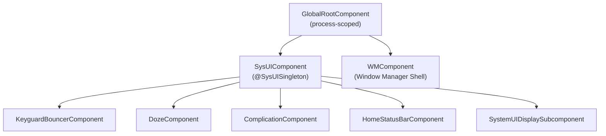
```mermaid
graph TD
    A["GlobalRootComponent<br/>(process-scoped)"] --> B["SysUIComponent<br/>(@SysUISingleton)"]
    A --> C["WMComponent<br/>(Window Manager Shell)"]
    B --> D["KeyguardBouncerComponent"]
    B --> E["DozeComponent"]
    B --> F["ComplicationComponent"]
    B --> G["HomeStatusBarComponent"]
    B --> H["SystemUIDisplaySubcomponent"]
```

**GlobalRootComponent** is the top-level component.  It is bound to the
`Context` of the application and exposes the `SysUIComponent.Builder`:

```java
// frameworks/base/packages/SystemUI/src/com/android/systemui/dagger/
//   GlobalRootComponent.java
public interface GlobalRootComponent {
    interface Builder {
        @BindsInstance Builder context(Context context);
        @BindsInstance Builder instrumentationTest(@InstrumentationTest boolean test);
        GlobalRootComponent build();
    }

    WMComponent.Builder getWMComponentBuilder();
    SysUIComponent.Builder getSysUIComponent();
    InitializationChecker getInitializationChecker();
    @Main Looper getMainLooper();
}
```

**SysUIComponent** is the main subcomponent where most of SystemUI's singletons
live.  It installs a large number of Dagger modules:

```java
// frameworks/base/packages/SystemUI/src/com/android/systemui/dagger/
//   SysUIComponent.java
@SysUISingleton
@Subcomponent(modules = {
        DefaultComponentBinder.class,
        DependencyProvider.class,
        MultiUserUtilsModule.class,
        NotificationInsetsModule.class,
        QsFrameTranslateModule.class,
        ReferenceSystemUIModule.class,
        StartControlsStartableModule.class,
        StartBinderLoggerModule.class,
        SystemUIModule.class,
        SystemUICoreStartableModule.class,
        WallpaperModule.class})
public interface SysUIComponent {
    // ...
    Map<Class<?>, Provider<CoreStartable>> getStartables();
    @PerUser Map<Class<?>, Provider<CoreStartable>> getPerUserStartables();
}
```

The builder accepts shell interfaces from WMComponent, such as `Pip`,
`SplitScreen`, `Bubbles`, and `ShellTransitions`.  This is how SystemUI
integrates with the window manager shell process.

**SystemUIInitializer** orchestrates the Dagger graph construction:

```java
// frameworks/base/packages/SystemUI/src/com/android/systemui/SystemUIInitializer.java
public abstract class SystemUIInitializer {
    public void init(boolean fromTest) throws ExecutionException, InterruptedException {
        mRootComponent = getGlobalRootComponentBuilder()
                .context(mContext)
                .instrumentationTest(fromTest)
                .build();

        // Stand up WMComponent
        setupWmComponent(mContext);

        // Build SysUI, injecting Shell interfaces
        SysUIComponent.Builder builder = mRootComponent.getSysUIComponent();
        builder = prepareSysUIComponentBuilder(builder, mWMComponent)
                .setShell(mWMComponent.getShell())
                .setPip(mWMComponent.getPip())
                .setSplitScreen(mWMComponent.getSplitScreen())
                // ... more shell bindings
                ;
        mSysUIComponent = builder.build();

        Dependency dependency = mSysUIComponent.createDependency();
        dependency.start();
    }
}
```

### 47.1.3  CoreStartable -- The Service Lifecycle

Every major SystemUI feature is implemented as a `CoreStartable`.  This
interface defines the lifecycle that the application drives:

```
CoreStartable
  +-- start()          // Called once, in topological order
  +-- onBootCompleted()
  +-- isDumpCritical() // Included in bugreport CRITICAL section?
  +-- dump()           // For `adb shell dumpsys`
```

CoreStartables are registered in Dagger modules using multibinding:

```kotlin
// frameworks/base/packages/SystemUI/src/com/android/systemui/dagger/
//   SystemUICoreStartableModule.kt
@Module
abstract class SystemUICoreStartableModule {
    @Binds @IntoMap @ClassKey(KeyguardViewMediator::class)
    abstract fun bindKeyguardViewMediator(sysui: KeyguardViewMediator): CoreStartable

    @Binds @IntoMap @ClassKey(GlobalActionsComponent::class)
    abstract fun bindGlobalActionsComponent(sysui: GlobalActionsComponent): CoreStartable

    @Binds @IntoMap @ClassKey(WMShell::class)
    abstract fun bindWMShell(sysui: WMShell): CoreStartable

    // ... 30+ more bindings
}
```

The application starts them with a topological sort that respects declared
dependencies:

```java
// SystemUIApplicationImpl.java -- topological start loop
boolean startedAny = false;
ArrayDeque<Map.Entry<Class<?>, Provider<CoreStartable>>> queue;
ArrayDeque<Map.Entry<Class<?>, Provider<CoreStartable>>> nextQueue =
        new ArrayDeque<>(startables.entrySet());

do {
    startedAny = false;
    queue = nextQueue;
    nextQueue = new ArrayDeque<>(startables.size());
    while (!queue.isEmpty()) {
        Map.Entry<Class<?>, Provider<CoreStartable>> entry = queue.removeFirst();
        Class<?> cls = entry.getKey();
        Set<Class<? extends CoreStartable>> deps =
                mSysUIComponent.getStartableDependencies().get(cls);
        if (deps == null || startedStartables.containsAll(deps)) {
            mServices[i] = startStartable(clsName, entry.getValue());
            startedStartables.add(cls);
            startedAny = true;
        } else {
            nextQueue.add(entry);
        }
    }
} while (startedAny && !nextQueue.isEmpty());
```

If any startable's dependencies cannot be resolved, the process throws a
`RuntimeException` with details about which dependencies are missing.

### 47.1.4  Plugin System

SystemUI supports runtime extensibility through a plugin architecture.
Plugins are APKs that implement interfaces from the `plugin` source set:

```
frameworks/base/packages/SystemUI/plugin/src/com/android/systemui/plugins/
  qs/QSTile.java
  qs/QSFactory.java
  qs/QS.java
  GlobalActions.java
  VolumeDialogController.java
  ...
```

The `ExtensionController` discovers and loads plugins, with the
`GlobalActionsComponent` being a canonical example:

```java
// frameworks/base/packages/SystemUI/src/com/android/systemui/globalactions/
//   GlobalActionsComponent.java
@Override
public void start() {
    mExtension = mExtensionController.newExtension(GlobalActions.class)
            .withPlugin(GlobalActions.class)
            .withDefault(mGlobalActionsProvider::get)
            .withCallback(this::onExtensionCallback)
            .build();
    mPlugin = mExtension.get();
}
```

This pattern allows OEMs to replace the default power menu, volume dialog, or
QS tiles by shipping a plugin APK signed with the platform key.

### 47.1.5  Feature Flags

SystemUI uses Android's aconfig flag system for feature gating.  Flags are
defined in:

```
frameworks/base/packages/SystemUI/aconfig/
```

Code checks flags via generated accessors:

```java
import com.android.systemui.Flags;

if (Flags.predictiveBackAnimateShade()) {
    // new behavior
}
```

The QS pipeline has its own flag repository:

```kotlin
// frameworks/base/packages/SystemUI/src/com/android/systemui/qs/pipeline/shared/
//   QSPipelineFlagsRepository.kt
@SysUISingleton
class QSPipelineFlagsRepository @Inject constructor() {
    val tilesEnabled: Boolean
        get() = AconfigFlags.qsNewTiles()
}
```

### 47.1.6  Directory Structure

The following is an abbreviated listing of the 187+ sub-packages under
`src/com/android/systemui/`:

```
accessibility/    -- Magnification, floating menu
activity/         -- Activity lifecycle helpers
ambient/          -- Ambient display
authentication/   -- Device authentication domain layer
back/             -- Predictive back gesture
battery/          -- Battery state
biometrics/       -- Fingerprint, face, UDFPS
bluetooth/        -- Bluetooth QS tile data
bouncer/          -- Keyguard bouncer (MVI)
brightness/       -- Brightness slider
camera/           -- Camera access tracking
charging/         -- Charging animation
classifier/       -- Touch classifier (falsing)
clipboardoverlay/ -- Clipboard preview overlay
communal/         -- Communal (glanceable hub) mode
controls/         -- Device controls (home automation)
dagger/           -- DI components and modules
demomode/         -- Demo mode for screenshots
display/          -- Display management
doze/             -- Doze/AOD
dreams/           -- Screen saver (daydream)
flags/            -- Feature flag infrastructure
fragments/        -- Fragment host
globalactions/    -- Power menu
keyguard/         -- Lock screen
media/            -- Media controls, route picker
navigationbar/    -- Navigation bar and gesture nav
notifications/    -- Notification pipeline
plugins/          -- Plugin infrastructure
power/            -- Power domain layer
privacy/          -- Privacy indicators
qs/               -- Quick Settings
recents/          -- Recent apps
scene/            -- Scene container (next-gen UI)
screenshot/       -- Screenshot capture and editing
shade/            -- Notification shade
statusbar/        -- Status bar, icons, policies
volume/           -- Volume dialog
wallpapers/       -- Wallpaper management
wmshell/          -- WM Shell integration
```

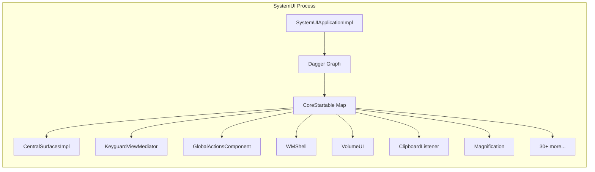
```mermaid
graph LR
    subgraph "SystemUI Process"
        SysUIApp["SystemUIApplicationImpl"]
        SysUIApp --> DI["Dagger Graph"]
        DI --> CS["CoreStartable Map"]
        CS --> SB["CentralSurfacesImpl"]
        CS --> KVM["KeyguardViewMediator"]
        CS --> GAC["GlobalActionsComponent"]
        CS --> WMS["WMShell"]
        CS --> VOL["VolumeUI"]
        CS --> CLIP["ClipboardListener"]
        CS --> MAG["Magnification"]
        CS --> MORE["30+ more..."]
    end
```

---

## 47.2  Status Bar

The status bar is the narrow strip at the top of the screen that displays the
clock, notification icons, battery level, signal strength, and system status
icons.  It is one of the first visual elements created during SystemUI startup.

### 47.2.1  CentralSurfaces -- The Orchestrator

`CentralSurfaces` is an interface extending both `CoreStartable` and
`LifecycleOwner`.  Its implementation, `CentralSurfacesImpl`, is a 3,291-line
class that historically served as the central coordinator for the status bar,
notification shade, keyguard, and more:

```java
// frameworks/base/packages/SystemUI/src/com/android/systemui/statusbar/phone/
//   CentralSurfaces.java
public interface CentralSurfaces extends Dumpable, LifecycleOwner, CoreStartable {
    String TAG = "CentralSurfaces";
    boolean SHOW_LOCKSCREEN_MEDIA_ARTWORK = true;
    long LAUNCH_TRANSITION_TIMEOUT_MS = 5000;
    // ...
}
```

`CentralSurfacesImpl` is injected with an enormous constructor -- it depends on
virtually every other SystemUI component.  It manages:

- Status bar window creation and positioning
- Notification shade expansion
- Keyguard/bouncer transitions
- Light bar (dark/light icon tinting)
- Biometric unlock animations
- Media artwork on lock screen
- Demo mode

The class is progressively being decomposed.  New code should depend on
narrower interfaces (e.g., `ShadeController`, `ShadeViewController`,
`KeyguardStateController`) rather than `CentralSurfaces` directly.

### 47.2.2  StatusBarWindowController

The status bar occupies a system window of type
`WindowManager.LayoutParams.TYPE_STATUS_BAR`.  Its window management is
encapsulated in `StatusBarWindowControllerImpl`:

```java
// frameworks/base/packages/SystemUI/src/com/android/systemui/statusbar/window/
//   StatusBarWindowControllerImpl.java
public class StatusBarWindowControllerImpl implements StatusBarWindowController {
    // Window type, insets configuration, cutout handling
}
```

Key aspects of the status bar window:

| Property | Value |
|---|---|
| Window type | `TYPE_STATUS_BAR` |
| Pixel format | `PixelFormat.TRANSLUCENT` |
| Cutout mode | `LAYOUT_IN_DISPLAY_CUTOUT_MODE_ALWAYS` |
| Gravity | `Gravity.TOP` |
| Flags | `FLAG_NOT_FOCUSABLE`, `FLAG_TOUCHABLE_WHEN_WAKING` |

The controller handles display cutouts (notches, punch-holes) and configures
`InsetsFrameProvider` so that the status bar participates in the inset system.
Applications receive `statusBars()` insets corresponding to the height of this
window.

### 47.2.3  CollapsedStatusBarFragment

The visible content of the status bar is managed by
`CollapsedStatusBarFragment`, a `Fragment` that inflates the
`R.layout.status_bar` layout:

```java
// frameworks/base/packages/SystemUI/src/com/android/systemui/statusbar/phone/
//   fragment/CollapsedStatusBarFragment.java
public class CollapsedStatusBarFragment extends Fragment
        implements CommandQueue.Callbacks,
                   StatusBarStateController.StateListener,
                   SystemStatusAnimationCallback {
    // Manages icon visibility, system event animations, ongoing call chip
}
```

The fragment listens to several signals:

- **CommandQueue.Callbacks** -- disable flags from `system_server` that hide icons
- **StatusBarStateController** -- state transitions (SHADE, KEYGUARD, SHADE_LOCKED)
- **SystemStatusAnimationCallback** -- animated chips for privacy indicators
- **ShadeExpansionStateManager** -- fading out icons during shade expansion

### 47.2.4  PhoneStatusBarView

`PhoneStatusBarView` is the root `View` of the collapsed status bar:

```java
// frameworks/base/packages/SystemUI/src/com/android/systemui/statusbar/phone/
//   PhoneStatusBarView.java
public class PhoneStatusBarView extends BaseStatusBarFrameLayout
        implements DarkReceiverImpl.DarkReceiver {
    // Touch handling, dark mode tinting
}
```

The view controller (`PhoneStatusBarViewController`) coordinates dark/light
icon tinting based on the underlying content, using region sampling to
determine whether the wallpaper or app content below the status bar is light or
dark.

### 47.2.5  Status Bar Icon Pipeline

Icons in the status bar flow through a multi-stage pipeline:

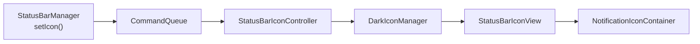
```mermaid
graph LR
    A["StatusBarManager<br/>setIcon()"] --> B["CommandQueue"]
    B --> C["StatusBarIconController"]
    C --> D["DarkIconManager"]
    D --> E["StatusBarIconView"]
    E --> F["NotificationIconContainer"]
```

The `StatusBarIconController` maintains the list of icons and their visibility.
`DarkIconManager` applies tinting: white icons over dark backgrounds, dark
icons over light backgrounds.  The tinting boundary is computed by
`LightBarController` using the `Drawable` content of the window behind the
status bar.

### 47.2.6  Status Bar States

The status bar operates in several logical states managed by
`StatusBarStateControllerImpl`:

```java
// frameworks/base/packages/SystemUI/src/com/android/systemui/statusbar/
//   StatusBarState.java
public class StatusBarState {
    public static final int SHADE = 0;          // Normal unlocked
    public static final int KEYGUARD = 1;       // Lock screen
    public static final int SHADE_LOCKED = 2;   // Shade pulled down over keyguard
}
```

Transitions between states drive animations throughout SystemUI.  The state
controller broadcasts changes to all registered `StateListener` instances.

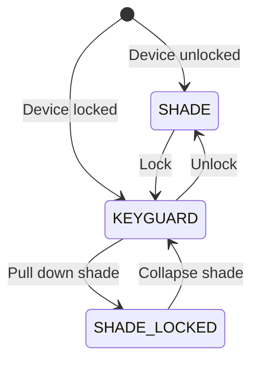
```mermaid
stateDiagram-v2
    [*] --> SHADE : Device unlocked
    [*] --> KEYGUARD : Device locked
    KEYGUARD --> SHADE_LOCKED : Pull down shade
    SHADE_LOCKED --> KEYGUARD : Collapse shade
    KEYGUARD --> SHADE : Unlock
    SHADE --> KEYGUARD : Lock
```

---

## 47.3  Notification Shade

The notification shade is the panel that slides down from the top of the
screen, revealing notifications and Quick Settings.  It is one of the most
complex UI components in Android.

### 47.3.1  Window Configuration

The notification shade occupies a separate window from the status bar.  Its
window type is `TYPE_NOTIFICATION_SHADE` (a special type that allows it to
receive input above other system windows):

```java
// frameworks/base/packages/SystemUI/src/com/android/systemui/shade/
//   NotificationShadeWindowControllerImpl.java
@SysUISingleton
public class NotificationShadeWindowControllerImpl
        implements NotificationShadeWindowController, Dumpable {
    // Manages the notification shade window parameters
    // Adjusts focus, touchability, and dimensions based on state
}
```

The window controller dynamically adjusts the window parameters based on the
current state:

| State | Window Behaviour |
|---|---|
| Shade collapsed | Not focusable, minimal height |
| Shade expanding | Expanding height, receives touch |
| Shade expanded | Full screen, focusable for remote input |
| Keyguard | Full screen, bouncer may be focusable |
| Dozing/AOD | Minimal, low power |

### 47.3.2  NotificationPanelViewController

At 4,329 lines, `NotificationPanelViewController` is the primary controller for
the shade panel.  It manages:

- Touch tracking and velocity-based expansion/collapse
- QS expansion within the shade
- Keyguard-specific behaviour (clock, notifications on lock screen)
- Split shade on large screens (notifications left, QS right)
- Blur effects during expansion

```java
// frameworks/base/packages/SystemUI/src/com/android/systemui/shade/
//   NotificationPanelViewController.java
public class NotificationPanelViewController
        implements Dumpable, ShadeViewController, ShadeSurface {
    // Handles all shade panel touch events and state transitions
}
```

Key touch handling flow:

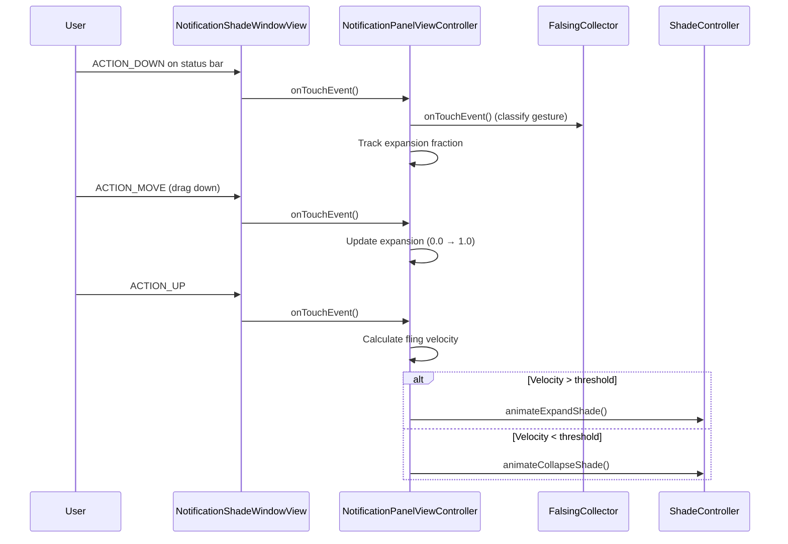
```mermaid
sequenceDiagram
    participant User
    participant NSWV as NotificationShadeWindowView
    participant NPVC as NotificationPanelViewController
    participant FC as FalsingCollector
    participant SC as ShadeController

    User->>NSWV: ACTION_DOWN on status bar
    NSWV->>NPVC: onTouchEvent()
    NPVC->>FC: onTouchEvent() (classify gesture)
    NPVC->>NPVC: Track expansion fraction
    User->>NSWV: ACTION_MOVE (drag down)
    NSWV->>NPVC: onTouchEvent()
    NPVC->>NPVC: Update expansion (0.0 → 1.0)
    User->>NSWV: ACTION_UP
    NSWV->>NPVC: onTouchEvent()
    NPVC->>NPVC: Calculate fling velocity
    alt Velocity > threshold
        NPVC->>SC: animateExpandShade()
    else Velocity < threshold
        NPVC->>SC: animateCollapseShade()
    end
```

### 47.3.3  ShadeController

`ShadeController` is the interface that abstracts shade operations.  It extends
`CoreStartable`:

```java
// frameworks/base/packages/SystemUI/src/com/android/systemui/shade/
//   ShadeController.java
public interface ShadeController extends CoreStartable {
    boolean isShadeEnabled();
    void instantExpandShade();
    void instantCollapseShade();
    void animateCollapseShade(int flags, boolean force,
                              boolean delayed, float speedUpFactor);
    void animateExpandShade();
    void animateExpandQs();
    void cancelExpansionAndCollapseShade();
    boolean isShadeFullyOpen();
    boolean isExpandingOrCollapsing();
    void collapseShade();
    void collapseShadeForActivityStart();
    // ...
}
```

The default implementation is `ShadeControllerImpl`, while
`ShadeControllerSceneImpl` is the next-generation implementation for the scene
container architecture.

### 47.3.4  NotificationStackScrollLayout

The notification list is rendered by `NotificationStackScrollLayout`, a custom
`ViewGroup` that implements:

- Variable-height child views (notification rows)
- Over-scroll physics
- Dismissal gestures (swipe to dismiss)
- Grouping and section headers
- Heads-up notification insertion
- Shelf for overflow icons

Each notification row is an `ExpandableNotificationRow`, which itself contains
inflated notification views (contracted, expanded, heads-up variants).

### 47.3.5  Scrim Management

The scrim (dimming overlay) behind the shade is managed by `ScrimController`,
which handles multiple scrim layers:

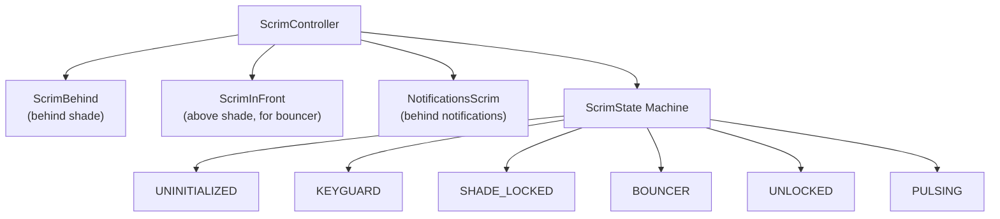
```mermaid
graph TD
    A["ScrimController"] --> B["ScrimBehind<br/>(behind shade)"]
    A --> C["ScrimInFront<br/>(above shade, for bouncer)"]
    A --> D["NotificationsScrim<br/>(behind notifications)"]
    A --> E["ScrimState Machine"]
    E --> F["UNINITIALIZED"]
    E --> G["KEYGUARD"]
    E --> H["SHADE_LOCKED"]
    E --> I["BOUNCER"]
    E --> J["UNLOCKED"]
    E --> K["PULSING"]
```

Each `ScrimState` defines alpha values and tint colours for the scrims.
Transitions between states animate these properties smoothly.

### 47.3.6  Lockscreen-to-Shade Transition

The `LockscreenShadeTransitionController` manages the drag-down gesture from
the lock screen into the shade.  It coordinates:

- QS expansion fraction
- Scrim alpha transitions
- Keyguard visibility
- Notification position interpolation

---

## 47.4  Quick Settings

Quick Settings (QS) is the tile grid accessible by pulling down the
notification shade.  The first pull shows a "Quick QS" strip of a few tiles;
a second pull expands to the full QS panel.

### 47.4.1  Architecture Overview

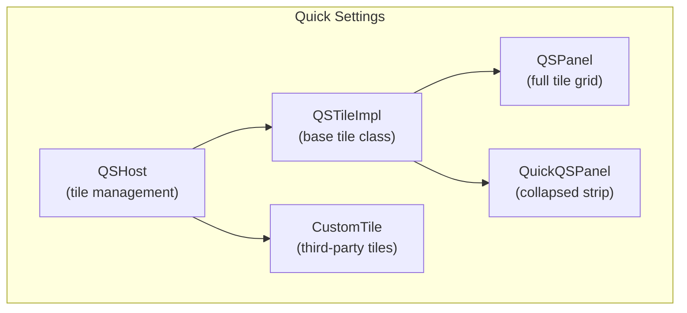
```mermaid
graph TD
    subgraph "Quick Settings"
        QSHost["QSHost<br/>(tile management)"]
        QSPanel["QSPanel<br/>(full tile grid)"]
        QuickQS["QuickQSPanel<br/>(collapsed strip)"]
        QSTileImpl["QSTileImpl<br/>(base tile class)"]
        CustomTile["CustomTile<br/>(third-party tiles)"]
    end
    QSHost --> QSTileImpl
    QSHost --> CustomTile
    QSTileImpl --> QSPanel
    QSTileImpl --> QuickQS
```

### 47.4.2  QSHost -- Tile Management

`QSHost` is the interface that manages the set of active QS tiles:

```java
// frameworks/base/packages/SystemUI/src/com/android/systemui/qs/QSHost.java
public interface QSHost {
    String TILES_SETTING = Settings.Secure.QS_TILES;

    static List<String> getDefaultSpecs(Resources res) {
        final ArrayList<String> tiles = new ArrayList();
        int resource = QsInCompose.isEnabled()
                ? R.string.quick_settings_tiles_new_default
                : R.string.quick_settings_tiles_default;
        final String defaultTileList = res.getString(resource);
        tiles.addAll(Arrays.asList(defaultTileList.split(",")));
        return tiles;
    }

    Collection<QSTile> getTiles();
    void addTile(String spec);
    void addTile(String spec, int requestPosition);
    void addTile(ComponentName tile);
    void removeTile(String tileSpec);
    QSTile createTile(String tileSpec);
    void changeTilesByUser(List<String> previousTiles, List<String> newTiles);
}
```

The tile configuration is stored in `Settings.Secure.QS_TILES` as a
comma-separated list of tile specs (e.g., `"wifi,bt,flashlight,rotation"`).
The default set is defined in a string resource, which OEMs commonly overlay.

### 47.4.3  QSTile Interface

Every QS tile implements the `QSTile` plugin interface:

```java
// frameworks/base/packages/SystemUI/plugin/src/com/android/systemui/plugins/qs/
//   QSTile.java
@ProvidesInterface(version = QSTile.VERSION)
public interface QSTile {
    int VERSION = 5;

    String getTileSpec();
    boolean isAvailable();
    void refreshState();
    void click(@Nullable Expandable expandable);
    void secondaryClick(@Nullable Expandable expandable);
    void longClick(@Nullable Expandable expandable);
    @NonNull State getState();
    CharSequence getTileLabel();
    void setListening(Object client, boolean listening);
    void destroy();
}
```

The `State` inner class carries all visual state:

| Field | Description |
|---|---|
| `state` | `Tile.STATE_ACTIVE`, `STATE_INACTIVE`, `STATE_UNAVAILABLE` |
| `icon` | Drawable or resource |
| `label` | Primary text |
| `secondaryLabel` | Secondary text (e.g., network name) |
| `contentDescription` | Accessibility |
| `dualTarget` | Whether long press has a separate action |

### 47.4.4  QSTileImpl -- Base Implementation

`QSTileImpl` is the abstract base class for built-in tiles:

```java
// frameworks/base/packages/SystemUI/src/com/android/systemui/qs/tileimpl/
//   QSTileImpl.java
public abstract class QSTileImpl<TState extends State>
        implements QSTile, LifecycleOwner, Dumpable {

    protected final QSHost mHost;
    private static final long DEFAULT_STALE_TIMEOUT = 10 * DateUtils.MINUTE_IN_MILLIS;

    // Subclasses must implement:
    // - newTileState()
    // - handleClick()
    // - handleUpdateState(TState state, Object arg)
    // - getLongClickIntent()
    // - getTileLabel()
}
```

State management runs on a background looper.  The flow is:

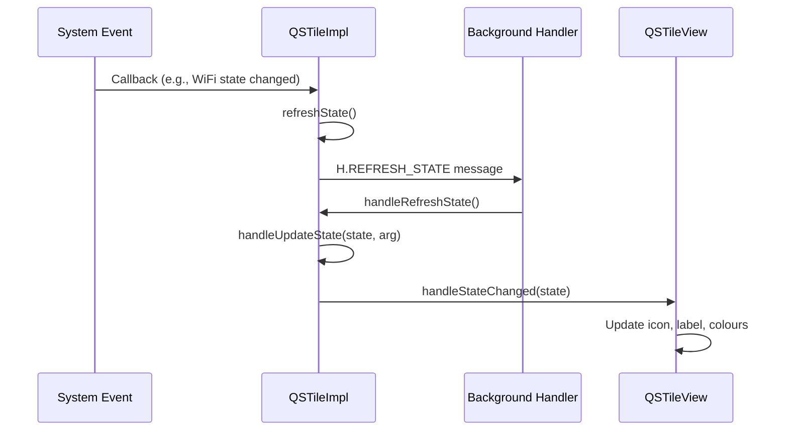
```mermaid
sequenceDiagram
    participant System as System Event
    participant Tile as QSTileImpl
    participant Handler as Background Handler
    participant View as QSTileView

    System->>Tile: Callback (e.g., WiFi state changed)
    Tile->>Tile: refreshState()
    Tile->>Handler: H.REFRESH_STATE message
    Handler->>Tile: handleRefreshState()
    Tile->>Tile: handleUpdateState(state, arg)
    Tile->>View: handleStateChanged(state)
    View->>View: Update icon, label, colours
```

### 47.4.5  Built-in Tiles

AOSP ships approximately 35 built-in QS tiles:

```
frameworks/base/packages/SystemUI/src/com/android/systemui/qs/tiles/
  AirplaneModeTile.java        LocationTile.java
  AlarmTile.kt                 MicrophoneToggleTile.java
  BatterySaverTile.java        MobileDataTile.kt
  BluetoothTile.java           ModesDndTile.kt
  CameraToggleTile.java        NfcTile.java
  CastTile.java                NightDisplayTile.java
  ColorCorrectionTile.java     NotesTile.kt
  ColorInversionTile.java      OneHandedModeTile.java
  DataSaverTile.java           QRCodeScannerTile.java
  DeviceControlsTile.kt        QuickAccessWalletTile.java
  DreamTile.java               ReduceBrightColorsTile.java
  FlashlightTile.java          RotationLockTile.java
  FontScalingTile.kt           ScreenRecordTile.java
  HearingDevicesTile.java      UiModeNightTile.java
  HotspotTile.java             WifiTile.kt
  InternetTileNewImpl.kt       WorkModeTile.java
```

Each tile follows the same pattern.  Here is `FlashlightTile` as a
representative example:

```java
// frameworks/base/packages/SystemUI/src/com/android/systemui/qs/tiles/
//   FlashlightTile.java
public class FlashlightTile extends QSTileImpl<BooleanState>
        implements FlashlightController.FlashlightListener {

    public static final String TILE_SPEC = "flashlight";
    private final FlashlightController mFlashlightController;

    @Inject
    public FlashlightTile(
            QSHost host,
            QsEventLogger uiEventLogger,
            @Background Looper backgroundLooper,
            @Main Handler mainHandler,
            FalsingManager falsingManager,
            MetricsLogger metricsLogger,
            StatusBarStateController statusBarStateController,
            ActivityStarter activityStarter,
            QSLogger qsLogger,
            FlashlightController flashlightController) {
        super(host, uiEventLogger, backgroundLooper, mainHandler,
                falsingManager, metricsLogger, statusBarStateController,
                activityStarter, qsLogger);
        mFlashlightController = flashlightController;
        mFlashlightController.observe(getLifecycle(), this);
    }
}
```

Modern tiles like `WifiTile` use a layered architecture with domain
interactors:

```kotlin
// frameworks/base/packages/SystemUI/src/com/android/systemui/qs/tiles/
//   WifiTile.kt
class WifiTile @Inject constructor(
    private val host: QSHost,
    // ...
    private val dataInteractor: WifiTileDataInteractor,
    private val tileMapper: WifiTileMapper,
    private val userActionInteractor: WifiTileUserActionInteractor,
) : QSTileImpl<QSTile.State?>(/* ... */) {
    // Data flows through interactor -> mapper -> view
}
```

### 47.4.6  Custom Tiles (Third-Party)

Third-party apps can add QS tiles by implementing
`android.service.quicksettings.TileService`.  SystemUI manages these through
`CustomTile`:

```java
// frameworks/base/packages/SystemUI/src/com/android/systemui/qs/external/
//   CustomTile.java
public class CustomTile extends QSTileImpl<State>
        implements TileChangeListener, CustomTileInterface {
    public static final String PREFIX = "custom(";
    // Tile spec format: "custom(com.example.app/.MyTileService)"
}
```

The lifecycle of a custom tile is managed by `TileLifecycleManager`, which
binds to the third-party `TileService` and manages the `IQSTileService`
interface.  `TileServiceManager` throttles bindings to prevent resource
exhaustion.

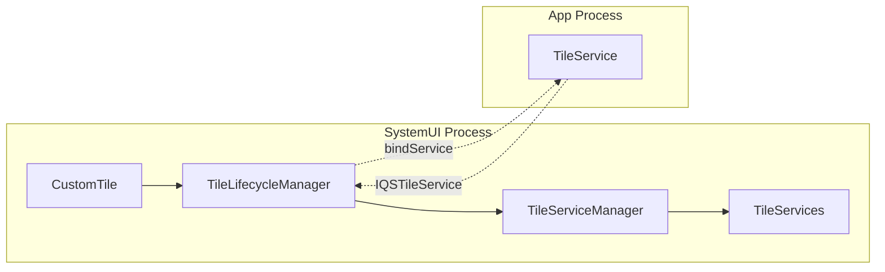
```mermaid
graph LR
    subgraph "SystemUI Process"
        CT["CustomTile"]
        TLM["TileLifecycleManager"]
        TSM["TileServiceManager"]
        TS["TileServices"]
    end
    subgraph "App Process"
        TService["TileService"]
    end
    CT --> TLM
    TLM --> TSM
    TSM --> TS
    TLM -.->|bindService| TService
    TService -.->|IQSTileService| TLM
```

### 47.4.7  Auto-Add Tiles

Some tiles are automatically added when certain conditions are met (e.g., the
Work Profile tile appears when a managed profile is created).  This logic is
implemented in the QS pipeline's data layer:

```
frameworks/base/packages/SystemUI/src/com/android/systemui/qs/pipeline/
  data/    -- Repositories for tile data and auto-add rules
  domain/  -- Interactors for tile lifecycle
  shared/  -- Shared flags and models
```

### 47.4.8  QSPanel Layout

The full QS panel uses `QSPanel` with `TileLayout` (or `PagedTileLayout` for
pagination).  The Quick QS strip uses `QuickQSPanel` with `QuickTileLayout`.
Both are managed by their respective controllers (`QSPanelController`,
`QuickQSPanelController`).

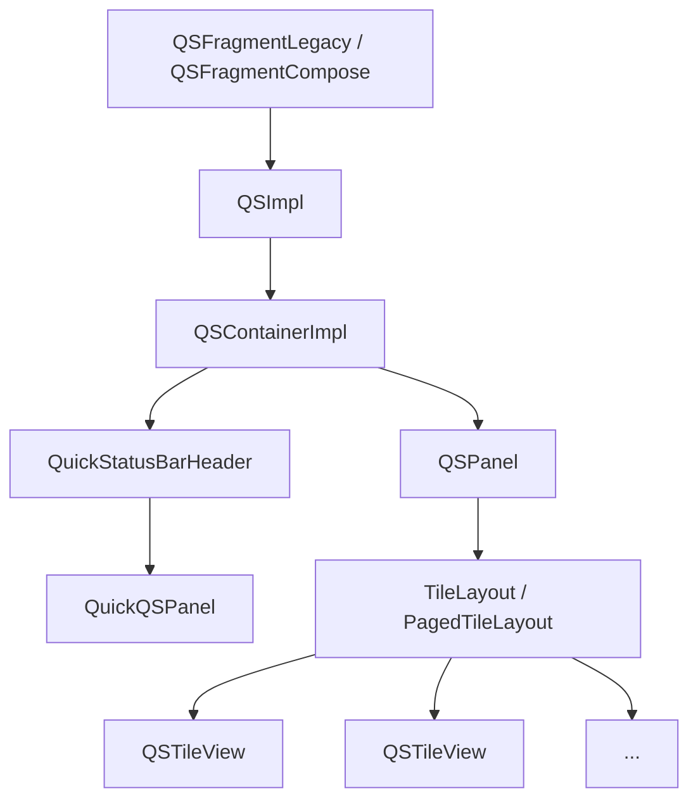
```mermaid
graph TD
    QSFragment["QSFragmentLegacy / QSFragmentCompose"]
    QSFragment --> QSImpl["QSImpl"]
    QSImpl --> QSContainerImpl["QSContainerImpl"]
    QSContainerImpl --> QuickStatusBarHeader["QuickStatusBarHeader"]
    QSContainerImpl --> QSPanel["QSPanel"]
    QuickStatusBarHeader --> QuickQSPanel["QuickQSPanel"]
    QSPanel --> TileLayout["TileLayout / PagedTileLayout"]
    TileLayout --> TileView1["QSTileView"]
    TileLayout --> TileView2["QSTileView"]
    TileLayout --> TileViewN["..."]
```

---

## 47.5  Lock Screen

The lock screen (keyguard) is a critical security surface.  It must display
before any user content is visible and must correctly manage authentication
(PIN, pattern, password, biometrics).

### 47.5.1  KeyguardViewMediator

`KeyguardViewMediator` is the largest CoreStartable in SystemUI at 4,573 lines.
It mediates between the `KeyguardService` (which receives lock/unlock commands
from the framework) and the keyguard UI:

```java
// frameworks/base/packages/SystemUI/src/com/android/systemui/keyguard/
//   KeyguardViewMediator.java
public class KeyguardViewMediator implements CoreStartable, Dumpable {
    // Manages keyguard lifecycle: show, hide, dismiss, lock
}
```

Key responsibilities:

| Responsibility | Description |
|---|---|
| Lock timeout | Schedules lock after screen-off timeout |
| Keyguard sounds | Lock/unlock sound effects |
| SIM PIN handling | Prompts for SIM unlock |
| Trust agents | Integrates with Smart Lock |
| Occlusion | Handles activities shown over keyguard |
| Unlock animation | Coordinates the unlock transition |

The mediator receives callbacks from `system_server` through
`ViewMediatorCallback`:

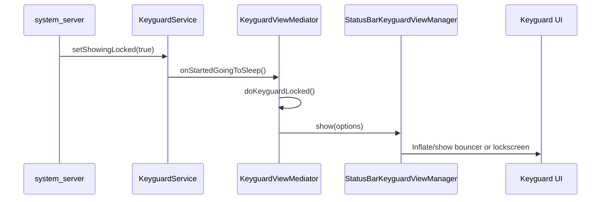
```mermaid
sequenceDiagram
    participant SS as system_server
    participant KS as KeyguardService
    participant KVM as KeyguardViewMediator
    participant SBKVM as StatusBarKeyguardViewManager
    participant UI as Keyguard UI

    SS->>KS: setShowingLocked(true)
    KS->>KVM: onStartedGoingToSleep()
    KVM->>KVM: doKeyguardLocked()
    KVM->>SBKVM: show(options)
    SBKVM->>UI: Inflate/show bouncer or lockscreen
```

### 47.5.2  StatusBarKeyguardViewManager

`StatusBarKeyguardViewManager` bridges the mediator and the actual keyguard
views.  It manages the primary bouncer (PIN/pattern/password input), the
alternate bouncer (biometric prompt), and the keyguard-to-shade transitions:

```java
// frameworks/base/packages/SystemUI/src/com/android/systemui/statusbar/phone/
//   StatusBarKeyguardViewManager.java
@SysUISingleton
public class StatusBarKeyguardViewManager implements Dumpable {
    // Manages bouncer visibility, predictive back animation,
    // alternate bouncer, global actions visibility
}
```

It interacts with several domain interactors from the new MVI architecture:

- `PrimaryBouncerInteractor` -- shows/hides the PIN/pattern/password bouncer
- `AlternateBouncerInteractor` -- manages the biometric (UDFPS) bouncer
- `KeyguardDismissActionInteractor` -- handles dismiss actions after unlock
- `KeyguardTransitionInteractor` -- tracks keyguard state transitions

### 47.5.3  Bouncer

The bouncer is the security challenge (PIN, pattern, or password).  Its
implementation lives in:

```
frameworks/base/packages/SystemUI/src/com/android/systemui/bouncer/
  data/repository/BouncerRepositoryModule.kt
  domain/interactor/BouncerInteractor.kt
  domain/interactor/PrimaryBouncerInteractor.kt
  domain/interactor/AlternateBouncerInteractor.kt
  domain/startable/BouncerStartable.kt
  ui/BouncerView.kt
```

The bouncer follows the MVI pattern:

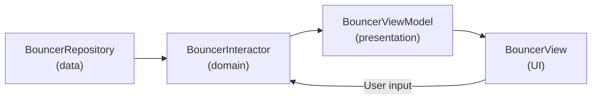
```mermaid
graph LR
    A["BouncerRepository<br/>(data)"] --> B["BouncerInteractor<br/>(domain)"]
    B --> C["BouncerViewModel<br/>(presentation)"]
    C --> D["BouncerView<br/>(UI)"]
    D -->|"User input"| B
```

### 47.5.4  AOD (Always-On Display) Integration

When the device is dozing, the lock screen transitions to Always-On Display
mode.  This is coordinated by:

- **DozeServiceHost** -- bridges the `DreamService`-based doze with SystemUI
- **DozeScrimController** -- manages scrim opacity during doze
- **DozeParameters** -- configuration (pulse on notification, tap-to-check)

The keyguard state machine includes AOD-specific transitions:

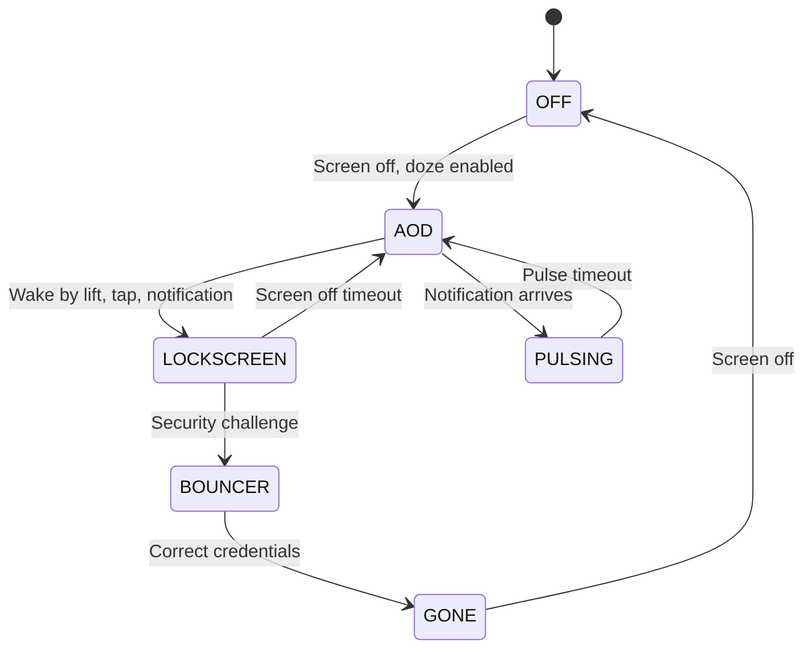
```mermaid
stateDiagram-v2
    [*] --> OFF
    OFF --> AOD : Screen off, doze enabled
    AOD --> LOCKSCREEN : Wake by lift, tap, notification
    LOCKSCREEN --> AOD : Screen off timeout
    LOCKSCREEN --> BOUNCER : Security challenge
    BOUNCER --> GONE : Correct credentials
    AOD --> PULSING : Notification arrives
    PULSING --> AOD : Pulse timeout
    GONE --> OFF : Screen off
```

### 47.5.5  Lock Screen Customization

The lock screen supports:

- **Clock customization** -- pluggable clock faces via `ClockRegistryModule`
- **Quick affordances** -- shortcuts on the lock screen corners (camera, wallet)
- **Complication** -- weather, date, battery on AOD
- **Wallpaper** -- distinct lock screen wallpaper
- **Communal (Glanceable Hub)** -- widget surface accessible from lock screen

---

## 47.6  Recent Apps

SystemUI does not implement the Recents UI directly.  Instead, it delegates
to Launcher3 (or a Launcher-based quickstep implementation) through the
`OverviewProxy` pattern.

### 47.6.1  Recents Architecture

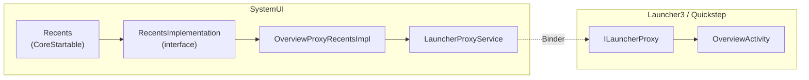
```mermaid
graph LR
    subgraph "SystemUI"
        RC["Recents<br/>(CoreStartable)"]
        RI["RecentsImplementation<br/>(interface)"]
        OPRI["OverviewProxyRecentsImpl"]
        LPS["LauncherProxyService"]
    end
    subgraph "Launcher3 / Quickstep"
        LP["ILauncherProxy"]
        OA["OverviewActivity"]
    end
    RC --> RI
    RI --> OPRI
    OPRI --> LPS
    LPS -.->|Binder| LP
    LP --> OA
```

### 47.6.2  OverviewProxyRecentsImpl

The default `RecentsImplementation` proxies all calls to Launcher:

```java
// frameworks/base/packages/SystemUI/src/com/android/systemui/recents/
//   OverviewProxyRecentsImpl.java
@SysUISingleton
public class OverviewProxyRecentsImpl implements RecentsImplementation {

    @Override
    public void showRecentApps(boolean triggeredFromAltTab) {
        ILauncherProxy launcherProxy = mLauncherProxyService.getProxy();
        if (launcherProxy != null) {
            try {
                launcherProxy.onOverviewShown(triggeredFromAltTab);
            } catch (RemoteException e) {
                Log.e(TAG, "Failed to send overview show event to launcher.", e);
            }
        }
    }

    @Override
    public void toggleRecentApps() {
        ILauncherProxy launcherProxy = mLauncherProxyService.getProxy();
        if (launcherProxy != null) {
            final Runnable toggleRecents = () -> {
                try {
                    mLauncherProxyService.getProxy().onOverviewToggle();
                    mLauncherProxyService.notifyToggleRecentApps();
                } catch (RemoteException e) {
                    Log.e(TAG, "Cannot send toggle recents through proxy service.", e);
                }
            };
            if (mKeyguardStateController.isShowing()) {
                mActivityStarter.executeRunnableDismissingKeyguard(
                        () -> mHandler.post(toggleRecents), null, true, false, true);
            } else {
                toggleRecents.run();
            }
        }
    }
}
```

### 47.6.3  LauncherProxyService

The `LauncherProxyService` maintains the binder connection to Launcher's
overview implementation.  When the user swipes up from the navigation bar,
SystemUI routes the gesture to Launcher, which renders the task thumbnails and
handles task switching.

### 47.6.4  RecentsModule

The Dagger module binds the implementation:

```java
// frameworks/base/packages/SystemUI/src/com/android/systemui/recents/
//   RecentsModule.java
@Module
public abstract class RecentsModule {
    @Binds
    abstract RecentsImplementation bindRecentsImplementation(
            OverviewProxyRecentsImpl impl);
}
```

---

## 47.7  Volume Dialog

The volume dialog appears when the user presses hardware volume keys or when
system volume changes programmatically.

### 47.7.1  VolumeDialogControllerImpl

The controller is the source of truth for volume state.  It runs on a dedicated
background thread:

```java
// frameworks/base/packages/SystemUI/src/com/android/systemui/volume/
//   VolumeDialogControllerImpl.java
@SysUISingleton
public class VolumeDialogControllerImpl implements VolumeDialogController, Dumpable {
    // All work done on a dedicated background worker thread
    // Methods ending in "W" must be called on the worker thread
}
```

The controller:

- Registers an `IVolumeController` callback with `AudioManager`
- Tracks state for multiple audio streams (MUSIC, RING, ALARM, VOICE_CALL, ACCESSIBILITY)
- Monitors ringer mode (normal, vibrate, silent)
- Tracks DND (Do Not Disturb) state
- Manages media sessions for per-app volume

### 47.7.2  VolumeDialogImpl

The dialog UI is implemented as a `Dialog` with a custom layout:

```java
// frameworks/base/packages/SystemUI/src/com/android/systemui/volume/
//   VolumeDialogImpl.java  (2,859 lines)
public class VolumeDialogImpl implements VolumeDialog {
    // Window type: TYPE_VOLUME_OVERLAY
    // Displays seekbars for active audio streams
    // Handles ringer mode toggle (ring -> vibrate -> silent)
}
```

The dialog uses a vertical layout with one `SeekBar` per active stream:

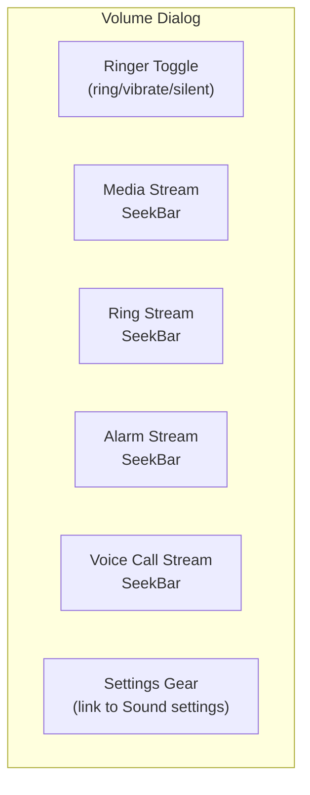
```mermaid
graph TD
    subgraph "Volume Dialog"
        RS["Ringer Toggle<br/>(ring/vibrate/silent)"]
        MS["Media Stream<br/>SeekBar"]
        RS2["Ring Stream<br/>SeekBar"]
        AS["Alarm Stream<br/>SeekBar"]
        VC["Voice Call Stream<br/>SeekBar"]
        SET["Settings Gear<br/>(link to Sound settings)"]
    end
```

Key features:

| Feature | Implementation |
|---|---|
| Auto-dismiss | Timeout handler (default 3 seconds) |
| Live feedback | Updates as system volume changes |
| CSD warning | `CsdWarningDialog` for hearing safety |
| Safety warning | `SafetyWarningDialog` for media volume |
| Captions toggle | `CaptionsToggleImageButton` |
| Posture-aware | Dismiss on foldable posture change |

### 47.7.3  VolumeDialogComponent

`VolumeDialogComponent` wires the controller and dialog together as a
`CoreStartable`:

```java
// frameworks/base/packages/SystemUI/src/com/android/systemui/volume/
//   VolumeDialogComponent.java
public class VolumeDialogComponent implements VolumeComponent {
    // Integates VolumeDialogControllerImpl with VolumeDialogImpl
}
```

### 47.7.4  Volume Events

The `Events` class defines all volume-related telemetry events:

```java
// frameworks/base/packages/SystemUI/src/com/android/systemui/volume/Events.java
public class Events {
    public static final int EVENT_SHOW_DIALOG = 0;
    public static final int EVENT_DISMISS_DIALOG = 1;
    public static final int EVENT_ACTIVE_STREAM_CHANGED = 2;
    public static final int EVENT_LEVEL_CHANGED = 3;
    public static final int EVENT_RINGER_TOGGLE = 4;
    // ...
    public static final int DISMISS_REASON_SETTINGS_CLICKED = 7;
    public static final int DISMISS_REASON_POSTURE_CHANGED = 12;
}
```

---

## 47.8  Power Menu

The power menu (Global Actions) appears when the user long-presses the power
button.  It provides options to power off, restart, emergency call, and
optionally lockdown.

### 47.8.1  GlobalActionsComponent

`GlobalActionsComponent` is the CoreStartable entry point.  It uses the plugin
extension pattern to allow OEM replacement:

```java
// frameworks/base/packages/SystemUI/src/com/android/systemui/globalactions/
//   GlobalActionsComponent.java
@SysUISingleton
public class GlobalActionsComponent
        implements CoreStartable, Callbacks, GlobalActionsManager {

    @Override
    public void start() {
        mBarService = IStatusBarService.Stub.asInterface(
                ServiceManager.getService(Context.STATUS_BAR_SERVICE));
        mExtension = mExtensionController.newExtension(GlobalActions.class)
                .withPlugin(GlobalActions.class)
                .withDefault(mGlobalActionsProvider::get)
                .withCallback(this::onExtensionCallback)
                .build();
        mPlugin = mExtension.get();
        mCommandQueue.addCallback(this);
    }

    @Override
    public void handleShowGlobalActionsMenu() {
        mStatusBarKeyguardViewManager.setGlobalActionsVisible(true);
        mExtension.get().showGlobalActions(this);
    }

    @Override
    public void shutdown() {
        mBarService.shutdown();
    }

    @Override
    public void reboot(boolean safeMode) {
        mBarService.reboot(safeMode);
    }
}
```

### 47.8.2  GlobalActionsImpl

The default plugin implementation:

```java
// frameworks/base/packages/SystemUI/src/com/android/systemui/globalactions/
//   GlobalActionsImpl.java
public class GlobalActionsImpl implements GlobalActions, CommandQueue.Callbacks {

    @Override
    public void showGlobalActions(GlobalActionsManager manager) {
        if (mDisabled) return;
        mGlobalActionsDialog.showOrHideDialog(
                mKeyguardStateController.isShowing(),
                mDeviceProvisionedController.isDeviceProvisioned(),
                null /* view */,
                mContext.getDisplayId());
    }

    @Override
    public void showShutdownUi(boolean isReboot, String reason) {
        mShutdownUi.showShutdownUi(isReboot, reason);
        mShadeController.instantCollapseShade();
    }

    @Override
    public void disable(int displayId, int state1, int state2, boolean animate) {
        final boolean disabled = (state2 & DISABLE2_GLOBAL_ACTIONS) != 0;
        if (displayId != mContext.getDisplayId() || disabled == mDisabled) return;
        mDisabled = disabled;
        if (disabled) {
            mGlobalActionsDialog.dismissDialog();
        }
    }
}
```

### 47.8.3  GlobalActionsDialogLite

At 3,043 lines, `GlobalActionsDialogLite` implements the actual power menu
dialog:

```java
// frameworks/base/packages/SystemUI/src/com/android/systemui/globalactions/
//   GlobalActionsDialogLite.java
// Window type: TYPE_STATUS_BAR_SUB_PANEL
// Layout mode: LAYOUT_IN_DISPLAY_CUTOUT_MODE_ALWAYS
```

The dialog dynamically builds its action list based on device capabilities:

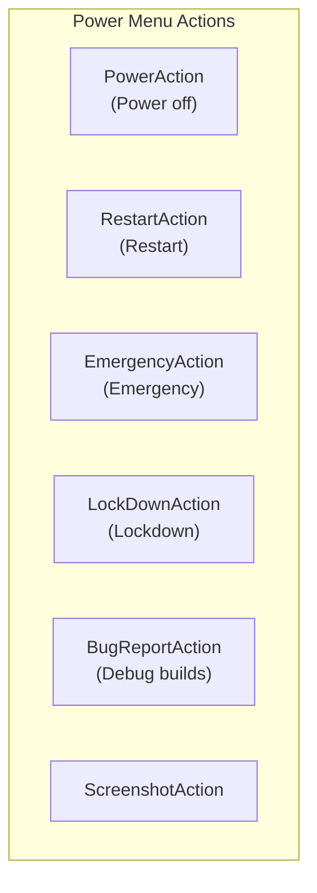
```mermaid
graph TD
    subgraph "Power Menu Actions"
        PA["PowerAction<br/>(Power off)"]
        RA["RestartAction<br/>(Restart)"]
        EA["EmergencyAction<br/>(Emergency)"]
        LA["LockDownAction<br/>(Lockdown)"]
        BA["BugReportAction<br/>(Debug builds)"]
        SA["ScreenshotAction"]
    end
```

Action availability depends on:

| Condition | Effect |
|---|---|
| Device provisioned | All actions available |
| Keyguard showing | May restrict some actions |
| User lockdown | Changes lockdown button text |
| Airplane mode | Affects emergency dialer |
| Telephony available | Controls emergency action |
| Debug build | Enables bug report action |

### 47.8.4  ShutdownUi

When a shutdown or reboot is initiated, `ShutdownUi` displays a full-screen
progress animation while the system shuts down.  The shade is instantly
collapsed to prevent interaction during the shutdown sequence.

### 47.8.5  Power Menu Layouts

Multiple layout classes support different screen configurations:

```
GlobalActionsColumnLayout.java   -- Vertical column (phones, portrait)
GlobalActionsFlatLayout.java     -- Horizontal row
GlobalActionsGridLayout.java     -- Grid (tablets)
GlobalActionsLayoutLite.java     -- Base layout logic
GlobalActionsPowerDialog.java    -- Power-specific dialog variant
```

---

## 47.9  Screenshots

The screenshot system captures the screen content, displays a preview, and
provides editing/sharing actions.

### 47.9.1  TakeScreenshotService

Screenshot requests arrive from `system_server` via `TakeScreenshotService`,
a bound service:

```java
// frameworks/base/packages/SystemUI/src/com/android/systemui/screenshot/
//   TakeScreenshotService.java
public class TakeScreenshotService extends Service {
    // Receives screenshot requests from PhoneWindowManager
    // Routes to appropriate handler (headless or interactive)
}
```

### 47.9.2  ScreenshotController

`ScreenshotController` (Kotlin, using `@AssistedInject`) manages the entire
screenshot flow:

```kotlin
// frameworks/base/packages/SystemUI/src/com/android/systemui/screenshot/
//   ScreenshotController.kt
class ScreenshotController @AssistedInject internal constructor(
    appContext: Context,
    screenshotWindowFactory: ScreenshotWindow.Factory,
    viewProxyFactory: ScreenshotShelfViewProxy.Factory,
    screenshotNotificationsControllerFactory:
        ScreenshotNotificationsController.Factory,
    screenshotActionsControllerFactory:
        ScreenshotActionsController.Factory,
    actionExecutorFactory: ActionExecutor.Factory,
    private val screenshotSoundController: ScreenshotSoundController,
    private val uiEventLogger: UiEventLogger,
    private val imageExporter: ImageExporter,
    private val imageCapture: ImageCapture,
    private val scrollCaptureExecutor: ScrollCaptureExecutor,
    // ...
    @Assisted private val display: Display,
) : InteractiveScreenshotHandler {
```

### 47.9.3  Screenshot Flow

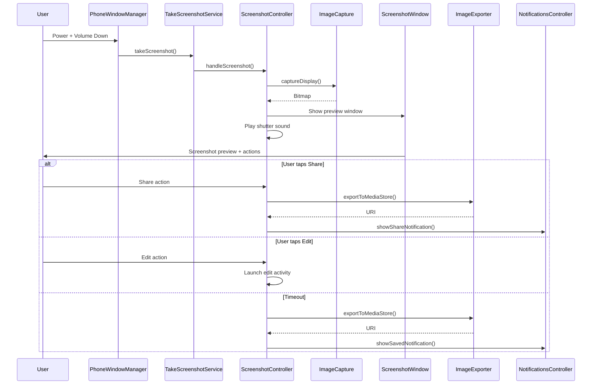
```mermaid
sequenceDiagram
    participant User
    participant PWM as PhoneWindowManager
    participant TSS as TakeScreenshotService
    participant SC as ScreenshotController
    participant IC as ImageCapture
    participant SW as ScreenshotWindow
    participant IE as ImageExporter
    participant NC as NotificationsController

    User->>PWM: Power + Volume Down
    PWM->>TSS: takeScreenshot()
    TSS->>SC: handleScreenshot()
    SC->>IC: captureDisplay()
    IC-->>SC: Bitmap
    SC->>SW: Show preview window
    SC->>SC: Play shutter sound
    SW->>User: Screenshot preview + actions
    alt User taps Share
        User->>SC: Share action
        SC->>IE: exportToMediaStore()
        IE-->>SC: URI
        SC->>NC: showShareNotification()
    else User taps Edit
        User->>SC: Edit action
        SC->>SC: Launch edit activity
    else Timeout
        SC->>IE: exportToMediaStore()
        IE-->>SC: URI
        SC->>NC: showSavedNotification()
    end
```

### 47.9.4  Screenshot Components

| Component | Role |
|---|---|
| `ImageCapture` / `ImageCaptureImpl` | Captures screen content as a `Bitmap` |
| `ScreenshotWindow` | Manages the preview overlay window |
| `ScreenshotShelfViewProxy` | Preview shelf UI (thumbnail + actions) |
| `ImageExporter` | Saves to `MediaStore` |
| `ScreenshotNotificationsController` | Shows save/share notifications |
| `ScreenshotSoundController` | Plays camera shutter sound |
| `ScrollCaptureExecutor` | Long/scrolling screenshot capture |
| `ScreenshotDetectionController` | Notifies apps of screenshot capture |
| `MessageContainerController` | Shows work profile messages |
| `TimeoutHandler` | Auto-dismisses after timeout |
| `ScreenshotActionsController` | Manages action buttons (share, edit) |
| `ActionIntentCreator` | Creates intents for share/edit |

### 47.9.5  Long Screenshots

The scroll capture system enables capturing content beyond the visible
viewport.  `ScrollCaptureExecutor` communicates with the app's
`ScrollCaptureCallback` to progressively capture tiles of content, which are
then stitched together into a single image.

### 47.9.6  Cross-Profile Screenshots

`ScreenshotCrossProfileService` handles screenshots that involve managed
profile content, using `ICrossProfileService` to proxy operations across
user boundaries.

---

## 47.10  Multi-Display SystemUI

Modern Android supports multiple displays (external monitors, foldables with
two screens, automotive secondary displays).  SystemUI must render appropriate
UI on each display.

### 47.10.1  PerDisplayRepository Pattern

The `PerDisplayRepository<T>` pattern (from `com.android.app.displaylib`)
maintains per-display instances of components:

```kotlin
// frameworks/base/packages/SystemUI/src/com/android/systemui/dagger/
//   PerDisplayRepositoriesModule.kt
@Module
interface PerDisplayRepositoriesModule {
    companion object {
        @SysUISingleton
        @Provides
        fun provideSysUiStateRepository(
            repositoryFactory: PerDisplayInstanceRepositoryImpl.Factory<SysUiState>,
            instanceProvider: SysUIStateInstanceProvider,
        ): PerDisplayRepository<SysUiState> {
            val debugName = "SysUiStatePerDisplayRepo"
            return if (ShadeWindowGoesAround.isEnabled) {
                repositoryFactory.create(debugName, instanceProvider)
            } else {
                DefaultDisplayOnlyInstanceRepositoryImpl(debugName, instanceProvider)
            }
        }
    }
}
```

When the `ShadeWindowGoesAround` flag is enabled, components like `SysUiState`
are instantiated per-display.  Otherwise, they fall back to default-display-only
behaviour.

### 47.10.2  Per-Display Status Bar

The status bar window controller uses `StatusBarWindowControllerStore` to
manage per-display instances:

```
frameworks/base/packages/SystemUI/src/com/android/systemui/statusbar/window/
  StatusBarWindowControllerStore.kt    -- Store for per-display controllers
  StatusBarWindowControllerImpl.java   -- Per-display window management
  StatusBarWindowStateController.kt    -- Per-display window state tracking
```

Each display gets its own status bar window with appropriate insets and
cutout handling.

### 47.10.3  Per-Display Navigation Bar

`NavigationBarControllerImpl` manages navigation bars on all displays:

```java
// frameworks/base/packages/SystemUI/src/com/android/systemui/navigationbar/
//   NavigationBarControllerImpl.java
@SysUISingleton
public class NavigationBarControllerImpl implements
        ConfigurationController.ConfigurationListener,
        NavigationModeController.ModeChangedListener,
        Dumpable, NavigationBarController {

    private final SparseArray<NavigationBar> mNavigationBars = new SparseArray<>();
    // SparseArray keyed by display ID
}
```

When a new display is added, `createNavigationBar()` is called.  When removed,
`removeNavigationBar()` cleans up.

### 47.10.4  Display Subcomponent

The `SystemUIDisplaySubcomponent` provides display-scoped dependencies:

```
frameworks/base/packages/SystemUI/src/com/android/systemui/display/
  dagger/SystemUIDisplaySubcomponent.java
  data/repository/DisplayComponentRepository.kt
```

Each display gets its own coroutine scope, configuration controller, and
set of display-aware UI components.

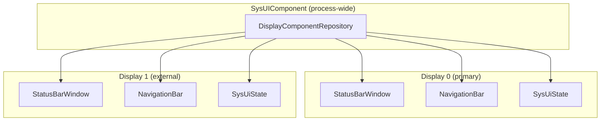
```mermaid
graph TD
    subgraph "SysUIComponent (process-wide)"
        DCS["DisplayComponentRepository"]
    end
    subgraph "Display 0 (primary)"
        SB0["StatusBarWindow"]
        NB0["NavigationBar"]
        SS0["SysUiState"]
    end
    subgraph "Display 1 (external)"
        SB1["StatusBarWindow"]
        NB1["NavigationBar"]
        SS1["SysUiState"]
    end
    DCS --> SB0
    DCS --> NB0
    DCS --> SS0
    DCS --> SB1
    DCS --> NB1
    DCS --> SS1
```

### 47.10.5  Connected Displays

The `StatusBarConnectedDisplays` flag gates the expansion of status bar
functionality to connected displays.  When enabled, `CollapsedStatusBarFragment`
instances are created per-display, each with its own icon pipeline and
visibility management.

---

## 47.11  Navigation Bar

The navigation bar provides the system navigation controls at the bottom (or
side) of the screen.  It supports three modes: 3-button, 2-button, and fully
gestural.

### 47.11.1  Navigation Mode Controller

`NavigationModeController` tracks the current navigation mode, which is
determined by an overlay package:

```java
// frameworks/base/packages/SystemUI/src/com/android/systemui/navigationbar/
//   NavigationModeController.java
@SysUISingleton
public class NavigationModeController implements Dumpable {
    public interface ModeChangedListener {
        void onNavigationModeChanged(int mode);
    }
    // Reads navigation mode from overlay applied to
    // com.android.internal.R.integer.config_navBarInteractionMode
}
```

The three modes are defined in `WindowManagerPolicyConstants`:

| Mode | Constant | Description |
|---|---|---|
| 3-button | `NAV_BAR_MODE_3BUTTON` | Back, Home, Recents buttons |
| 2-button | `NAV_BAR_MODE_2BUTTON` | Back gesture + Home pill |
| Gestural | `NAV_BAR_MODE_GESTURAL` | Full gesture navigation |

### 47.11.2  NavigationBarView

`NavigationBarView` is the root view for the navigation bar:

```java
// frameworks/base/packages/SystemUI/src/com/android/systemui/navigationbar/views/
//   NavigationBarView.java
public class NavigationBarView extends FrameLayout
        implements Gefingerpoken {
    // Contains ButtonDispatchers for Home, Back, Recents
    // Manages rotation, layout direction, and button visibility
}
```

The view uses `ButtonDispatcher` to abstract button behaviour across different
button implementations (physical, software, or gesture targets):

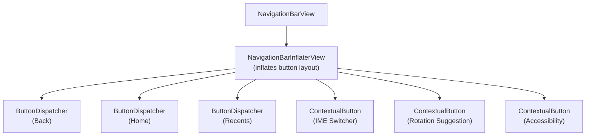
```mermaid
graph TD
    NBV["NavigationBarView"]
    NBV --> NBIV["NavigationBarInflaterView<br/>(inflates button layout)"]
    NBIV --> BD_Back["ButtonDispatcher<br/>(Back)"]
    NBIV --> BD_Home["ButtonDispatcher<br/>(Home)"]
    NBIV --> BD_Recents["ButtonDispatcher<br/>(Recents)"]
    NBIV --> BD_IME["ContextualButton<br/>(IME Switcher)"]
    NBIV --> BD_Rotate["ContextualButton<br/>(Rotation Suggestion)"]
    NBIV --> BD_A11y["ContextualButton<br/>(Accessibility)"]
```

### 47.11.3  NavigationBarInflaterView

The button layout is defined by a string spec that
`NavigationBarInflaterView` parses:

```
// Default 3-button layout spec:
"back[1.0];home;recent[1.0]"

// 2-button layout spec:
"back[1.0];home;contextual[1.0]"

// Gestural layout (minimal):
"home_handle"
```

This allows OEMs to customise button order and sizes through overlays.

### 47.11.4  Gesture Navigation

In gestural mode, the navigation bar is replaced by a thin home indicator
handle.  Navigation gestures are handled by `EdgeBackGestureHandler`:

```java
// frameworks/base/packages/SystemUI/src/com/android/systemui/navigationbar/
//   gestural/EdgeBackGestureHandler.java
public class EdgeBackGestureHandler implements DisplayManager.DisplayListener,
        NavigationModeController.ModeChangedListener {
    // Handles edge swipe gestures for back navigation
    // Manages gesture exclusion zones
    // Integrates with predictive back animation
}
```

The gesture system:

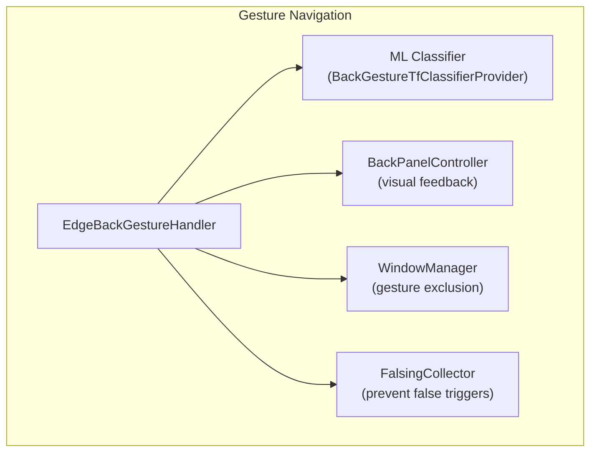
```mermaid
graph TD
    subgraph "Gesture Navigation"
        EBG["EdgeBackGestureHandler"]
        EBG --> ML["ML Classifier<br/>(BackGestureTfClassifierProvider)"]
        EBG --> BP["BackPanelController<br/>(visual feedback)"]
        EBG --> WM["WindowManager<br/>(gesture exclusion)"]
        EBG --> FC["FalsingCollector<br/>(prevent false triggers)"]
    end
```

Edge back gesture detection:

1. The handler registers an input monitor for the display edges
2. When a touch starts within the edge zone (typically 24dp), tracking begins
3. A TensorFlow Lite classifier evaluates whether the gesture is a back swipe
   or an app gesture (e.g., drawer open)
4. If classified as back, the `BackPanelController` shows the visual arrow
5. The gesture is dispatched as a `BackEvent` to the focused window
6. If predictive back is enabled, the app can animate in response

### 47.11.5  DisplayBackGestureHandler

For multi-display support, `DisplayBackGestureHandler` wraps the per-display
gesture handling:

```kotlin
// frameworks/base/packages/SystemUI/src/com/android/systemui/navigationbar/
//   gestural/DisplayBackGestureHandler.kt
// Per-display back gesture handling
```

### 47.11.6  NavigationBarTransitions

`NavigationBarTransitions` manages the visual transitions of the navigation
bar between modes:

```
// Transition modes:
MODE_OPAQUE         -- Solid background (default)
MODE_SEMI_TRANSPARENT  -- Partially transparent
MODE_TRANSLUCENT    -- Fully transparent with scrim
MODE_LIGHTS_OUT     -- Dimmed (immersive mode)
MODE_TRANSPARENT    -- Fully transparent
```

### 47.11.7  Taskbar Integration

On large screens (tablets, foldables), the traditional navigation bar may be
replaced by a taskbar provided by Launcher.  `TaskbarDelegate` in SystemUI
coordinates with the Launcher-provided taskbar:

```java
// frameworks/base/packages/SystemUI/src/com/android/systemui/navigationbar/
//   TaskbarDelegate.java
public class TaskbarDelegate implements // ...
    // Routes navigation bar callbacks to the Launcher taskbar
    // Falls back to traditional nav bar when Launcher is unavailable
```

The `enableTaskbarOnPhones` feature flag controls whether the taskbar is also
available on phone form factors.

---

## 47.12  Monet / Dynamic Color / Material You

Android 12 introduced **Material You**, a design language where the entire
system UI derives its colour palette from the user's wallpaper.  The engine
behind this is called **Monet** -- a colour-science pipeline that extracts a
seed colour from `WallpaperColors`, generates tonal palettes through the
Material Color Utilities library, and applies the resulting colours as
fabricated resource overlays across every package.

### 47.12.1  End-to-End Pipeline

```mermaid
graph TB
    subgraph "Wallpaper Stack"
        WP[WallpaperManager]
        WC["WallpaperColors<br/>Primary / Secondary / Tertiary<br/>+ allColors population map"]
    end

    subgraph "SystemUI -- ThemeOverlayController"
        TOC["ThemeOverlayController<br/>CoreStartable"]
        SEED["getSeedColor()<br/>ColorScheme.getSeedColors()"]
        CS_DARK["ColorScheme<br/>(dark)"]
        CS_LIGHT["ColorScheme<br/>(light)"]
        FAB["FabricatedOverlay x3<br/>accent / neutral / dynamic"]
    end

    subgraph "Monet Library"
        HCT["Hct.fromInt(seed)"]
        SCHEME["DynamicScheme<br/>TonalSpot / Vibrant /<br/>Expressive / Neutral / ..."]
        TP["TonalPalette<br/>13 shade stops<br/>0..1000"]
    end

    subgraph "OverlayManager"
        OM["OverlayManagerService"]
        RES["android.R.color.system_*"]
    end

    subgraph "All Apps"
        APPS["Apps read<br/>system_accent1_500,<br/>system_neutral1_100, ..."]
    end

    WP -->|"onColorsChanged"| TOC
    TOC --> SEED
    SEED --> HCT
    HCT --> SCHEME
    SCHEME --> TP
    TP --> CS_DARK
    TP --> CS_LIGHT
    CS_DARK --> FAB
    CS_LIGHT --> FAB
    TOC -->|"applyCurrentUserOverlays()"| OM
    FAB --> OM
    OM -->|"registerFabricatedOverlay"| RES
    RES --> APPS
```

### 47.12.2  Colour Extraction -- Seed Selection

`ColorScheme.getSeedColors()` implements the Monet seed-selection algorithm.
Given `WallpaperColors` (which contains all quantized colours with population
data), it:

1. **Builds a hue histogram** -- 360 slots, each accumulating the proportion
   of colours with that hue.
2. **Scores each colour** by a weighted combination of hue proportion (70%)
   and chroma distance from the 48.0 target (30%).
3. **Filters low-chroma colours** (chroma < 5) which would produce grey
   themes.
4. **Selects hue-distinct seeds** -- iteratively reduces the minimum hue
   distance from 90 degrees down to 15, picking up to 4 seeds.
5. **Falls back to `GOOGLE_BLUE` (0xFF1b6ef3)** if no suitable colour
   exists.

```java
// frameworks/libs/systemui/monet/src/com/android/systemui/monet/ColorScheme.java
public static List<Integer> getSeedColors(WallpaperColors wallpaperColors, boolean filter) {
    // ...
    // Score: 0.7 * hueProportion + 0.3 * (chroma - 48)
    // Iterative hue-distance selection from 90° down to 15°
    // Fallback: GOOGLE_BLUE
}
```

For Live Wallpapers where quantization population is zero, the method trusts
the ordering of the three main colours directly, filtering only by minimum
chroma.

### 47.12.3  The ColorScheme Class

`ColorScheme` wraps the Material Color Utilities `DynamicScheme` and exposes
six `TonalPalette` instances:

```java
// frameworks/libs/systemui/monet/src/com/android/systemui/monet/ColorScheme.java
@Deprecated  // migrating to MaterialDynamicColors
public class ColorScheme {
    private final TonalPalette mAccent1;   // primaryPalette
    private final TonalPalette mAccent2;   // secondaryPalette
    private final TonalPalette mAccent3;   // tertiaryPalette
    private final TonalPalette mNeutral1;  // neutralPalette
    private final TonalPalette mNeutral2;  // neutralVariantPalette
    private final TonalPalette mError;     // errorPalette
}
```

Each palette is constructed from `Hct` (Hue-Chroma-Tone) colour space via
the Material library's `TonalPalette`.  The class delegates to a style-specific
`DynamicScheme` based on `ThemeStyle`:

| ThemeStyle | DynamicScheme | Character |
|---|---|---|
| `TONAL_SPOT` | `SchemeTonalSpot` | Default -- balanced, moderate chroma |
| `VIBRANT` | `SchemeVibrant` | Higher chroma for bolder colours |
| `EXPRESSIVE` | `SchemeExpressive` | Maximum chromatic variety |
| `SPRITZ` | `SchemeNeutral` | Desaturated, subdued |
| `RAINBOW` | `SchemeRainbow` | Full hue rotation |
| `FRUIT_SALAD` | `SchemeFruitSalad` | Playful multi-hue |
| `CONTENT` | `SchemeContent` | Faithful to source image |
| `MONOCHROMATIC` | `SchemeMonochrome` | Single-hue grayscale |
| `CLOCK` | `SchemeClock` | Custom SystemUI scheme for lock screen clocks |
| `CLOCK_VIBRANT` | `SchemeClockVibrant` | High-chroma clock variant |

### 47.12.4  TonalPalette and Shade Stops

Each `TonalPalette` contains 13 tonal stops:

```java
// frameworks/libs/systemui/monet/src/com/android/systemui/monet/TonalPalette.java
public static final List<Integer> SHADE_KEYS =
    Arrays.asList(0, 10, 50, 100, 200, 300, 400, 500, 600, 700, 800, 900, 1000);
```

Shade 0 is white, shade 1000 is black.  The `getAtTone(shade)` method maps
the 0-1000 range to the Material library's 0-100 tone scale via
`(1000 - shade) / 10`.  This produces Android's `system_accent1_0` through
`system_accent1_1000` resource colours.

### 47.12.5  ThemeOverlayController -- The Orchestrator

`ThemeOverlayController` is a `CoreStartable` that wires together wallpaper
change detection, colour scheme generation, and overlay application:

```java
// frameworks/base/packages/SystemUI/src/com/android/systemui/theme/
//   ThemeOverlayController.java
@SysUISingleton
public class ThemeOverlayController implements CoreStartable, Dumpable {
    // Key fields:
    protected ColorScheme mColorScheme;
    protected int mMainWallpaperColor = Color.TRANSPARENT;
    private int mThemeStyle = ThemeStyle.TONAL_SPOT;
    private double mContrast = 0.0;
    private FabricatedOverlay mAccentOverlay;
    private FabricatedOverlay mNeutralOverlay;
    private FabricatedOverlay mDynamicOverlay;
}
```

**Listeners registered on `start()`:**

| Listener | Purpose |
|---|---|
| `WallpaperManager.OnColorsChangedListener` | Detects wallpaper colour changes for all users |
| `SecureSettings` ContentObserver | Detects `THEME_CUSTOMIZATION_OVERLAY_PACKAGES` changes |
| `UserTracker.Callback` | Re-evaluates on user switch |
| `UiModeManager.ContrastChangeListener` | Re-evaluates when contrast level changes |
| `BroadcastReceiver` for `ACTION_PROFILE_ADDED` | Applies overlays to new managed profiles |
| `BroadcastReceiver` for `ACTION_WALLPAPER_CHANGED` | Re-enables colour event acceptance |
| `KeyguardTransitionInteractor` (asleep state) | Defers processing until screen off |

### 47.12.6  Colour Event Deferral

The controller uses a sophisticated deferral mechanism to avoid jarring
mid-use colour changes.  When the user is looking at the screen, colour
events are suppressed until the display goes off:

```mermaid
sequenceDiagram
    participant WM as WallpaperManager
    participant TOC as ThemeOverlayController
    participant KTI as KeyguardTransitionInteractor
    participant OMS as OverlayManagerService

    WM->>TOC: onColorsChanged(colors, userId)
    alt Screen is ON and acceptColorEvents=false
        TOC->>TOC: mDeferredWallpaperColors.put(userId, colors)
        Note over TOC: "Deferred until screen off"
    else acceptColorEvents=true
        TOC->>TOC: mAcceptColorEvents = false
        TOC->>TOC: handleWallpaperColors()
        TOC->>TOC: reevaluateSystemTheme()
    end

    KTI-->>TOC: isFinishedIn(DOZING) = true
    TOC->>TOC: Process deferred colours
    TOC->>TOC: createOverlays(seedColor)
    TOC->>OMS: applyCurrentUserOverlays()
```

The wallpaper picker sets `EXTRA_FROM_FOREGROUND_APP=true` on the
`ACTION_WALLPAPER_CHANGED` broadcast, which resets `mAcceptColorEvents` to
`true` -- so user-initiated changes apply immediately.

### 47.12.7  Overlay Creation and Application

The `createOverlays()` method produces three fabricated overlays:

```java
private void createOverlays(int color) {
    mDarkColorScheme = new ColorScheme(color, true, mThemeStyle, mContrast);
    mLightColorScheme = new ColorScheme(color, false, mThemeStyle, mContrast);

    mAccentOverlay = newFabricatedOverlay("accent");
    assignColorsToOverlay(mAccentOverlay, DynamicColors.getAllAccentPalette(), false);

    mNeutralOverlay = newFabricatedOverlay("neutral");
    assignColorsToOverlay(mNeutralOverlay, DynamicColors.getAllNeutralPalette(), false);

    mDynamicOverlay = newFabricatedOverlay("dynamic");
    assignColorsToOverlay(mDynamicOverlay, DynamicColors.getAllDynamicColorsMapped(), false);
    assignColorsToOverlay(mDynamicOverlay, DynamicColors.getFixedColorsMapped(), true);
    assignColorsToOverlay(mDynamicOverlay, DynamicColors.getCustomColorsMapped(), false);
}
```

For themed (non-fixed) colours, each resource has `_light` and `_dark`
variants:

```java
overlay.setResourceValue(prefix + "_light", TYPE_INT_COLOR_ARGB8,
    p.second.getArgb(mLightColorScheme.getMaterialScheme()), null);
overlay.setResourceValue(prefix + "_dark", TYPE_INT_COLOR_ARGB8,
    p.second.getArgb(mDarkColorScheme.getMaterialScheme()), null);
```

Fixed colours (e.g. `primaryFixed`) are not dark/light variant and use the
light scheme only.

### 47.12.8  DynamicColors Token Mapping

The `DynamicColors` class generates the full set of colour tokens:

```java
// frameworks/libs/systemui/monet/src/com/android/systemui/monet/DynamicColors.java
public class DynamicColors {
    // Palette colours: accent1_0..1000, accent2_*, accent3_*, neutral1_*, neutral2_*
    public static List<Pair<String, DynamicColor>> getAllAccentPalette();
    public static List<Pair<String, DynamicColor>> getAllNeutralPalette();

    // Material Dynamic Colors: primary, onPrimary, primaryContainer, ...
    public static List<Pair<String, DynamicColor>> getAllDynamicColorsMapped();

    // Fixed colours: primaryFixed, secondaryFixed, ...
    public static List<Pair<String, DynamicColor>> getFixedColorsMapped();

    // Custom SystemUI-specific colours
    public static List<Pair<String, DynamicColor>> getCustomColorsMapped();
}
```

The token names are mapped to Android resource names with the prefix
`android:color/system_`.  For example, `accent1_500` becomes
`android:color/system_accent1_500`.

### 47.12.9  ThemeOverlayApplier -- The Transaction

`ThemeOverlayApplier` takes the fabricated overlays and applies them via
`OverlayManager` in a single atomic transaction:

```java
// frameworks/base/packages/SystemUI/src/com/android/systemui/theme/
//   ThemeOverlayApplier.java
@SysUISingleton
public class ThemeOverlayApplier implements Dumpable {
    // Overlay categories applied in order:
    static final List<String> THEME_CATEGORIES = Lists.newArrayList(
        OVERLAY_CATEGORY_SYSTEM_PALETTE,    // Tonal palette
        OVERLAY_CATEGORY_ICON_LAUNCHER,     // Launcher icons
        OVERLAY_CATEGORY_SHAPE,             // Adaptive icon shape
        OVERLAY_CATEGORY_FONT,              // System font
        OVERLAY_CATEGORY_ACCENT_COLOR,      // Accent colour
        OVERLAY_CATEGORY_DYNAMIC_COLOR,     // Dynamic Material colours
        OVERLAY_CATEGORY_ICON_ANDROID,      // Framework icons
        OVERLAY_CATEGORY_ICON_SYSUI,        // SystemUI icons
        OVERLAY_CATEGORY_ICON_SETTINGS,     // Settings icons
        OVERLAY_CATEGORY_ICON_THEME_PICKER  // Theme picker icons
    );
}
```

The applier first disables all currently enabled overlays in the affected
categories, then registers new fabricated overlays, and enables them -- all
in a single `OverlayManagerTransaction` to minimise configuration changes.

Categories in `SYSTEM_USER_CATEGORIES` are applied to both the current user
and user 0 (system user), ensuring SystemUI and framework processes see the
correct colours.

### 47.12.10  Settings Integration

Theme customisation is persisted in
`Settings.Secure.THEME_CUSTOMIZATION_OVERLAY_PACKAGES` as a JSON object:

```json
{
  "android.theme.customization.system_palette": "1b6ef3",
  "android.theme.customization.accent_color": "1b6ef3",
  "android.theme.customization.color_source": "home_wallpaper",
  "android.theme.customization.theme_style": "TONAL_SPOT",
  "android.theme.customization.color_both": "1",
  "_applied_timestamp": 1234567890
}
```

The `ThemeOverlayController` monitors this setting and re-evaluates on every
change.  When the wallpaper changes and no preset colour is selected, it
updates this setting automatically, recording the colour source and timestamp.

### 47.12.11  Hardware Default Colours

Starting with Android 15, the `hardwareColorStyles` flag enables OEMs to
provide device-specific default colour palettes during the Setup Wizard.
Before the device is provisioned, the controller reads hardware defaults
(seed colour + style + source) and persists them as the initial theme
setting.

### 47.12.12  Contrast Support

`ThemeOverlayController` integrates with `UiModeManager.getContrast()` to
apply Material Design contrast levels.  When the user changes the display
contrast in Accessibility settings, the controller receives a callback,
passes the new contrast value to `ColorScheme`, and regenerates overlays:

```java
// In ColorScheme constructor:
new ColorScheme(seed, isDark, mThemeStyle, mContrast)
// mContrast flows through to DynamicScheme's contrastLevel parameter
```

This adjusts the tonal mapping so that foreground/background colour pairs
maintain the selected contrast ratio.

### 47.12.13  Key Source Paths (Monet)

| Path | Description |
|---|---|
| `frameworks/libs/systemui/monet/src/com/android/systemui/monet/ColorScheme.java` | Seed selection, palette generation |
| `frameworks/libs/systemui/monet/src/com/android/systemui/monet/TonalPalette.java` | 13-stop tonal palette wrapper |
| `frameworks/libs/systemui/monet/src/com/android/systemui/monet/DynamicColors.java` | Token-to-DynamicColor mapping |
| `frameworks/libs/systemui/monet/src/com/android/systemui/monet/CustomDynamicColors.java` | SystemUI-specific custom tokens |
| `frameworks/libs/systemui/monet/src/com/android/systemui/monet/Shades.java` | Legacy shade generation |
| `frameworks/libs/systemui/monet/src/com/android/systemui/monet/SchemeClock.java` | Clock face colour scheme |
| `frameworks/libs/systemui/monet/src/com/android/systemui/monet/SchemeClockVibrant.java` | Vibrant clock variant |
| `frameworks/base/packages/SystemUI/src/com/android/systemui/theme/ThemeOverlayController.java` | Orchestrator (CoreStartable) |
| `frameworks/base/packages/SystemUI/src/com/android/systemui/theme/ThemeOverlayApplier.java` | OverlayManager transaction |
| `frameworks/base/packages/SystemUI/src/com/android/systemui/theme/ThemeModule.java` | Dagger module |

---

## 47.13  Window Manager Shell Deep Dive

Section 47.1.2 mentioned that SystemUI receives "shell interfaces" — `Pip`,
`SplitScreen`, `Bubbles`, `ShellTransitions` — from a separate Dagger
subcomponent called `WMComponent`. That subcomponent and the code behind
those interfaces live in their own AOSP library at `frameworks/base/libs/WindowManager/Shell`,
called *WM Shell* throughout the codebase (Java package
`com.android.wm.shell`). This section walks through what WM Shell is, how it
integrates with SystemUI, and how its per-feature subpackages map to the
multi-window experiences a user sees on screen.

### 47.13.1  Shell Is a Library, Not a Process

The name "shell" can mislead. WM Shell does **not** run as a separate
process — there is no `wm_shell` entry in `ps`. It is a Java library
(`wm_shell-sources` filegroup in `frameworks/base/libs/WindowManager/Shell/Android.bp`)
that the SystemUI APK statically links and loads into its own process. The
"shell" name reflects its conceptual role: a shell *around* the
`WindowManagerService` core, providing the policy and UI for windowing
features without bloating `system_server`.

This division has a concrete reason. Multi-window UX (PIP windows, split
view dividers, freeform window decorations, bubble badges) needs to render
Views, listen to gestures, and react to configuration changes — work that
naturally belongs in a foreground UI process rather than the system server.
SystemUI is already a long-lived foreground process with rendering, input,
and IPC plumbing in place, so the Shell library piggy-backs on it. On Wear,
TV, or Auto, a different SystemUI variant links a different form-factor
Shell module (see 47.13.7), but the loading mechanism is the same.

```mermaid
flowchart LR
    subgraph SystemServer["system_server process"]
        WMS["WindowManagerService<br/>(window tree, layout)"]
        ATM["ActivityTaskManagerService"]
        ITaskOrg["ITaskOrganizerController<br/>(Binder)"]
        WMS --> ITaskOrg
        ATM --> WMS
    end
    subgraph SystemUI["systemui process"]
        WMComponent["WMComponent<br/>(Dagger subcomponent)"]
        ShellInterface["ShellInterface<br/>(lifecycle facade)"]
        ShellTaskOrg["ShellTaskOrganizer<br/>(extends TaskOrganizer)"]
        Features["pip/<br/>splitscreen/<br/>bubbles/<br/>freeform/<br/>desktopmode/<br/>onehanded/<br/>recents/<br/>transition/<br/>startingsurface"]
        SysUI["SysUI components<br/>(WMShell adapter, QS, NotifShade, ...)"]
        WMComponent --> ShellInterface
        WMComponent --> ShellTaskOrg
        WMComponent --> Features
        ShellInterface --> SysUI
        Features --> SysUI
    end
    ShellTaskOrg <-.Binder.-> ITaskOrg
```

The right-hand process loads the entire Shell library; the left-hand
process owns the source of truth for what windows exist. They communicate
through one Binder interface (`ITaskOrganizerController`) plus a handful of
event listeners.

### 47.13.2  WMComponent: Shell's Dagger Boundary

WM Shell exposes a strict surface to SystemUI through the `WMComponent`
Dagger subcomponent:

```java
// Source: frameworks/base/libs/WindowManager/Shell/src/com/android/wm/shell/
//   dagger/WMComponent.java:56
@WMSingleton
@Subcomponent(modules = {WMShellModule.class})
public interface WMComponent {

    default void init() {
        getShell().onInit();
    }

    // Interfaces provided to SysUI
    @WMSingleton ShellInterface getShell();
    @WMSingleton Optional<OneHanded> getOneHanded();
    @WMSingleton Optional<Pip> getPip();
    @WMSingleton Optional<SplitScreen> getSplitScreen();
    @WMSingleton Optional<Bubbles> getBubbles();
    @WMSingleton Optional<TaskViewFactory> getTaskViewFactory();
    @WMSingleton ShellTransitions getShellTransitions();
    @WMSingleton KeyguardTransitions getKeyguardTransitions();
    @WMSingleton Optional<StartingSurface> getStartingSurface();
    @WMSingleton Optional<DisplayAreaHelper> getDisplayAreaHelper();
    @WMSingleton Optional<RecentTasks> getRecentTasks();
    @WMSingleton Optional<BackAnimation> getBackAnimation();
    @WMSingleton Optional<DesktopMode> getDesktopMode();
    @WMSingleton Optional<AppZoomOut> getAppZoomOut();
    @WMSingleton Optional<AppHandles> getAppHandles();
    // ... plus a few injector methods for field injection
}
```

Two design rules show in this signature:

- **Almost everything is `Optional<>`**. PIP only exists on form factors
  that allow it. Split-screen is absent on watches. `RecentTasks` is
  present on phones but consumed by Launcher, not SystemUI directly.
  Wrapping every feature in `Optional` lets the same SystemUI codebase
  build across phones, tablets, TV, Wear, and Auto.
- **The component lists Dagger *modules*, not classes**. `WMComponent`
  installs `WMShellModule`. The TV variant `TvWMComponent` installs
  `TvWMShellModule` instead, which binds different implementations of the
  same `Pip` / `Bubbles` / etc. interfaces. The interface contract with
  SystemUI is identical; the implementation is form-factor specific.

The `@WMSingleton` scope ensures each feature gets exactly one instance
per Shell. `WMSingleton` is a custom Dagger scope defined in
`WMSingleton.java` — it is *not* `@Singleton`, because the SysUI side has
its own `@SysUISingleton`, and the two scopes need to coexist in the same
process without colliding.

### 47.13.3  ShellInterface: The Lifecycle Facade

Most features live behind their own type, but the Shell as a whole is
exposed through a single facade called `ShellInterface`:

```java
// Source: frameworks/base/libs/WindowManager/Shell/src/com/android/wm/shell/
//   sysui/ShellInterface.java:34
public interface ShellInterface {
    default void onInit() {}
    default void onConfigurationChanged(Configuration newConfiguration) {}
    default void onKeyguardVisibilityChanged(boolean visible, boolean occluded,
            boolean animatingDismiss) {}
    default void onKeyguardDismissAnimationFinished() {}
    default void onUserChanged(int newUserId, @NonNull Context userContext) {}
    default void onUserProfilesChanged(@NonNull List<UserInfo> profiles) {}
    default void addDisplayImeChangeListener(DisplayImeChangeListener listener,
            Executor executor) {}
    default void removeDisplayImeChangeListener(DisplayImeChangeListener listener) {}
    // ... handles shell commands, dumps, etc.
}
```

The interface mirrors the lifecycle events SystemUI already tracks
(keyguard visibility, user changes, configuration changes, IME position).
The implementation is `ShellController`, which fans these events out to
each registered Shell feature.

This shape means the Shell does not poll SystemUI; SystemUI *pushes*
state changes. The SysUI-side adapter is `com.android.systemui.wmshell.WMShell`,
a `@SysUISingleton CoreStartable` whose `start()` method wires every
SystemUI signal SystemUI emits — `KeyguardStateController`,
`WakefulnessLifecycle`, `ConfigurationController`, `UserTracker`,
`CommandQueue` — to the corresponding `ShellInterface` method.

### 47.13.4  ShellInit: Ordered Initialization

A library injected by Dagger has a known *construction* order (driven by
the dependency graph), but Dagger does not guarantee a known
*initialization* order. `ShellInit` adds that guarantee:

```java
// Source: frameworks/base/libs/WindowManager/Shell/src/com/android/wm/shell/
//   sysui/ShellInit.java:62
public <T extends Object> void addInitCallback(Runnable r, T instance) {
    if (mHasInitialized) {
        if (Build.isDebuggable()) {
            // All callbacks must be added prior to the Shell being initialized
            throw new IllegalArgumentException("Can not add callback after init");
        }
        return;
    }
    final String className = instance.getClass().getSimpleName();
    mInitCallbacks.add(new Pair<>(className, r));
    ProtoLog.v(WM_SHELL_INIT, "Adding init callback for %s", className);
}

@VisibleForTesting
public void init() {
    ProtoLog.v(WM_SHELL_INIT, "Initializing Shell Components: %d", mInitCallbacks.size());
    SurfaceControl.setDebugUsageAfterRelease(true);
    // Init in order of registration
    for (int i = 0; i < mInitCallbacks.size(); i++) {
        final Pair<String, Runnable> info = mInitCallbacks.get(i);
        final long t1 = SystemClock.uptimeMillis();
        info.second.run();
        final long t2 = SystemClock.uptimeMillis();
        ProtoLog.v(WM_SHELL_INIT, "\t%s init took %dms", info.first, (t2 - t1));
    }
    mInitCallbacks.clear();
    mHasInitialized = true;
}
```

Each Shell component injects `ShellInit` in its constructor and calls
`addInitCallback(this::onInit, this)`. Because Dagger constructs the
graph leaves-first, the callbacks land in dependency order
automatically. When `WMComponent.init()` later fires `getShell().onInit()`,
`ShellController` calls `ShellInit.init()`, which drains the queue in
registration order. The per-component init time is logged through
ProtoLog (see 47.13.10) so regressions in Shell start-up cost show up in
traces.

In debug builds, adding a callback after `init()` throws. This is a
deliberate guard: late init usually means a feature got constructed
through lazy injection on the main thread instead of at component
build-time, which would defeat the dependency-ordered startup.

### 47.13.5  ShellTaskOrganizer: The Bridge to WindowManager

Shell features need to *observe* and *manipulate* the system's task tree:
PIP needs to know when a task enters picture-in-picture mode,
split-screen needs to reparent tasks under its divider, transitions need
to inspect what just appeared. `system_server`'s
`ActivityTaskManagerService` exposes that observation surface through the
`TaskOrganizer` API, and `ShellTaskOrganizer` is the Shell's single
implementation of it:

```java
// Source: frameworks/base/libs/WindowManager/Shell/src/com/android/wm/shell/
//   ShellTaskOrganizer.java:90
public class ShellTaskOrganizer extends TaskOrganizer {
    // ...
    public ShellTaskOrganizer(ShellInit shellInit, /* ... */) {
        super(/* ... */);
        // wait to register until Transitions is initialized
        shellInit.addInitCallback(this::onInit, this);
    }

    @Override
    public List<TaskAppearedInfo> registerOrganizer() {
        synchronized (mLock) {
            final List<TaskAppearedInfo> taskInfos = super.registerOrganizer();
            // ... rebroadcast current tasks to Shell listeners
            return taskInfos;
        }
    }
}
```

`TaskOrganizer` is an AOSP-internal Binder interface. When the Shell
calls `registerOrganizer()`, `system_server` starts pushing
`onTaskAppeared` / `onTaskInfoChanged` / `onTaskVanished` callbacks back
to the Shell process. The Shell maintains a single registration —
features like PIP and split-screen don't each register their own
`TaskOrganizer`; they subscribe to `ShellTaskOrganizer` via per-feature
listener interfaces. That keeps the IPC channel narrow and avoids
duplicate notifications for the same window event.

### 47.13.6  Per-Feature Subpackages

The Shell groups each multi-window experience under its own package. The
following table maps the visible features to their source locations:

| Package under `com.android.wm.shell.` | What the user sees |
|---------------------------------------|---------------------|
| `pip/`, `pip2/` | Picture-in-picture video windows. `pip2` is the staged rewrite of the legacy `pip` package. |
| `splitscreen/` | Side-by-side or top-bottom split with the central drag divider. |
| `bubbles/` | Floating conversation bubbles + the bubble bar. |
| `freeform/` | Free-floating, resizable windows on large screens. |
| `desktopmode/` | Connected-display desktop with multiple visible app windows. |
| `onehanded/` | One-handed mode that drags the screen contents downward. |
| `back/` | Predictive back animation (system & cross-activity). |
| `transition/` | Cross-activity / cross-task transitions driven by Shell. |
| `startingsurface/` | App splash screens and snapshot starting windows. |
| `recents/` | Recent-tasks data feed to Launcher. |
| `windowdecor/` | Title bars / handles on freeform & desktop windows. |
| `compatui/` | Restart-for-resize and aspect-ratio-mismatch buttons. |
| `taskview/` | The `TaskView` reusable view that hosts a task inside another window. |
| `unfold/` | Foldable unfold/fold animation pipeline. |
| `activityembedding/` | Jetpack ActivityEmbedding host-side support. |
| `keyguard/` | `KeyguardTransitions` — Shell's slice of keyguard show/hide animations. |
| `apptoweb/` | Web-link launch helpers for embedded browsing. |
| `appzoomout/` | Zoomed-out app overview used by Recents. |
| `hidedisplaycutout/` | Lets apps opt the cutout into a black bar. |
| `crashhandling/` | Surface-level crash overlay during AppCrash. |

Each subpackage owns its model, its UI (often a Compose or View tree
that renders inside a Shell-owned window), and its public interface in
`WMComponent`. Cross-package interactions go through Shell-internal
contracts (`Transitions`, `ShellTaskOrganizer` listeners,
`ShellController` callbacks) rather than direct calls — the same
isolation discipline that keeps `WMComponent`'s surface minimal applies
inside the library too.

### 47.13.7  Form-Factor Variants: WMShellModule vs TvWMShellModule

The same `WMComponent` interface is satisfied by different Dagger
modules depending on the build target. The largest module is
`WMShellModule` (~phone/tablet/foldable behaviour); TV builds substitute
`TvWMShellModule`, which binds TV-specific PIP, TV-style transitions,
and disables features that do not apply (split-screen, freeform). The
TV variant is selected through `TvWMComponent`:

```blueprint
// Conceptually:
//   WMComponent       includes WMShellModule
//   TvWMComponent     includes TvWMShellModule
```

A SystemUI build picks one or the other based on its product flavour.
Wear and Auto plug in their own variants the same way. OEMs that ship a
custom form factor (Chromebook, AR headset, …) typically add another
Subcomponent rather than forking the Shell library, because every
variant still benefits from upstream feature work going into the base
`WMShellModule`.

The base module `WMShellBaseModule` is shared across variants and runs
to ~1200 lines: it binds the transports (`ShellExecutor`,
`HandlerThread`, `Choreographer`), the cross-cutting services
(`ShellInit`, `ShellController`, `ShellCommandHandler`,
`ProtoLogController`, `ShellTaskOrganizer`, `Transitions`,
`DisplayController`), and a long list of providers for things every form
factor needs (back animation, drag-and-drop, splash screens, IME
position tracking).

### 47.13.8  Transitions: Driving Animations from Shell

Pre-Android-12, cross-activity animations were driven by
`system_server` with hardcoded animations baked into
`WindowManagerService`. The modern model moves the *animation
implementation* into Shell, while `system_server` still owns the
*decision* to start an animation. The plumbing lives in
`com.android.wm.shell.transition.Transitions`:

- `system_server` calls `IShellTransitions#onTransitionReady(...)` over
  Binder, handing the Shell a `TransitionInfo` that lists the windows
  appearing / disappearing / changing.
- `Transitions` matches the info against registered `TransitionHandler`s
  in priority order. The first handler that accepts becomes the animator
  for that transition.
- The handler manipulates `SurfaceControl`s and runs animators on the
  Shell main thread. When the animation finishes, the Shell calls
  `finishTransition(...)` back to `system_server`, which then applies
  the queued `WindowContainerTransaction`.

Each feature that wants custom motion (PIP enter/exit, split-screen
divider drag, desktop window animate, predictive back) registers its own
`TransitionHandler`. The Shell's central `DefaultTransitionHandler` is
the fallback when nothing else handles the transition.

`ShellTransitions` is the small interface SystemUI receives through
`WMComponent` (`getShellTransitions()`); it exposes only the hooks that
SystemUI needs (e.g. registering its own handlers for shade and keyguard
animations) and hides the internals.

### 47.13.9  TaskView: Embedding a Task in a View

`taskview/` provides one of the Shell's most reused primitives: a
`TaskView` that hosts a real task inside a regular `View`. Bubbles use
it to render the conversation app inside the expanded bubble window.
Settings panels use it for embedded preferences. Apps with the
right permission use it for trusted overlays.

Internally, `TaskViewFactory` is the `@WMSingleton` factory exposed
through `WMComponent`. It creates `TaskViewTaskController` and a
`SurfaceControl`-backed `TaskView` View, registers the task with
`ShellTaskOrganizer`, and re-parents its surface under the View when
the task appears. Resize and bounds updates flow through
`WindowContainerTransaction`s back to `system_server`. The visible
result is that a single child View shows another app's UI while the
host process still owns input dispatch above the surface.

### 47.13.10  ProtoLog: Build-Time Log Transformation

Shell logging is unusual: it does not call `Log.d(TAG, ...)` directly.
Instead, every log call goes through `ProtoLog`, and a build-time tool
(`protologtool`, defined in `Android.bp`) rewrites the calls into a
compact binary form. The rewrite is driven by `ShellProtoLogGroup` and
the `wm_shell_protolog-groups` Java library.

```blueprint
// Source: frameworks/base/libs/WindowManager/Shell/Android.bp:65
java_genrule {
    name: "wm_shell_protolog_src",
    srcs: [
        ":protolog-impl",
        ":wm_shell-sources",
        ":wm_shell_protolog-groups",
    ],
    tools: ["protologtool"],
    cmd: "$(location protologtool) transform-protolog-calls " +
        "--protolog-class com.android.internal.protolog.ProtoLog " +
        "--loggroups-class com.android.wm.shell.protolog.ShellProtoLogGroup " +
        "--loggroups-jar $(location :wm_shell_protolog-groups) " +
        "--viewer-config-file-path /system_ext/etc/wmshell.protolog.pb " +
        "--output-srcjar $(out) " +
        "$(locations :wm_shell-sources)",
    out: ["wm_shell_protolog.srcjar"],
}
```

The build emits two artefacts:

- A `.srcjar` of *rewritten* Shell sources, where each `ProtoLog.v(GROUP, "format", args)`
  becomes a numeric ID plus its arg values, dropping the format string
  from the runtime binary.
- `wmshell.protolog.pb` (installed into `/system_ext/etc/`), a
  protobuf-encoded map from log ID back to format string.

This split keeps Shell log statements cheap (one ID + args, no string
work in the hot path) while still letting `dumpsys` and trace tools
reconstruct human-readable lines on demand. Chapter 56's tracing section
covers ProtoLog in detail; for Shell purposes, the key point is that
`grep`ing the Shell source for human log text returns the
*pre-transform* code, which is what developers read and review.

### 47.13.11  The Jetpack Half (libs/WindowManager/Jetpack)

The sibling `frameworks/base/libs/WindowManager/Jetpack/` directory is
*not* part of the Shell library. It implements
`androidx.window.extensions.*` — the platform side of the AndroidX
`WindowManager` Jetpack library — and ships as `androidx.window.extensions`
on the device. Apps that depend on `androidx.window` (foldable posture
APIs, ActivityEmbedding, area extensions) talk to this extensions APK,
which in turn talks to the platform.

Source: `frameworks/base/libs/WindowManager/Jetpack/src/androidx/window/extensions/`
(`WindowExtensionsImpl.java`, `WindowExtensionsProvider.java`, plus
`area/`, `bubble/`, `embedding/`, `layout/`, `util/` subpackages).

The two libraries share a parent directory because they share a domain
(WindowManager-adjacent client code) and historically share contributors,
but they are otherwise independent: the Shell runs inside SystemUI; the
Jetpack extensions library is loaded into each app's process via the
extensions discovery API.

### 47.13.12  How SystemUI Talks Back to Shell: The WMShell CoreStartable

The SystemUI side has a single adapter that wires SystemUI's state into
Shell's listeners:

```java
// Source: frameworks/base/packages/SystemUI/src/com/android/systemui/wmshell/
//   WMShell.java:99
@SysUISingleton
public final class WMShell implements CoreStartable, CommandQueue.Callbacks {
    // Injected: ShellInterface, Optional<Pip>, Optional<SplitScreen>,
    //           Optional<Bubbles>, Optional<OneHanded>, Optional<RecentTasks>,
    //           Optional<DesktopMode>, KeyguardStateController,
    //           WakefulnessLifecycle, ConfigurationController, ...
}
```

The class JavaDoc states the explicit ordering rule:

> SysUI application starts
>  → SystemUIFactory is initialized
>    → WMComponent is created
>    → SysUIComponent is created (with WMComponents injected)
>  → SysUI services are started
>    → WMShell starts and binds SysUI with Shell components via exported Shell interfaces

In other words: the entire Shell graph is built and initialized *before*
any SysUI `CoreStartable` runs. By the time `WMShell.start()` fires,
every Shell feature is ready to receive callbacks. `WMShell` then
subscribes to the SystemUI lifecycle controllers and forwards each
change into the corresponding `ShellInterface` / per-feature method
(e.g. `KeyguardStateController` → `mShellInterface.onKeyguardVisibilityChanged(...)`,
`UserTracker` → `mShellInterface.onUserChanged(...)`).

### 47.13.13  Key Source Files Reference (WM Shell)

| File | Purpose |
|------|---------|
| `frameworks/base/libs/WindowManager/Shell/Android.bp` | Module definitions, ProtoLog genrules, form-factor variants |
| `frameworks/base/libs/WindowManager/Shell/src/com/android/wm/shell/dagger/WMComponent.java` | Dagger subcomponent — Shell's public surface |
| `frameworks/base/libs/WindowManager/Shell/src/com/android/wm/shell/dagger/WMShellBaseModule.java` | Cross-form-factor base bindings (~1200 lines) |
| `frameworks/base/libs/WindowManager/Shell/src/com/android/wm/shell/dagger/WMShellModule.java` | Phone/tablet form-factor bindings |
| `frameworks/base/libs/WindowManager/Shell/src/com/android/wm/shell/dagger/TvWMShellModule.java` | TV form-factor bindings |
| `frameworks/base/libs/WindowManager/Shell/src/com/android/wm/shell/sysui/ShellInterface.java` | Lifecycle facade SysUI calls into |
| `frameworks/base/libs/WindowManager/Shell/src/com/android/wm/shell/sysui/ShellController.java` | Implementation of `ShellInterface` — event fan-out |
| `frameworks/base/libs/WindowManager/Shell/src/com/android/wm/shell/sysui/ShellInit.java` | Ordered init callback registry |
| `frameworks/base/libs/WindowManager/Shell/src/com/android/wm/shell/ShellTaskOrganizer.java` | Single `TaskOrganizer` registration; per-feature listeners |
| `frameworks/base/libs/WindowManager/Shell/src/com/android/wm/shell/transition/Transitions.java` | Transition handler registry and dispatch |
| `frameworks/base/libs/WindowManager/Shell/src/com/android/wm/shell/protolog/ShellProtoLogGroup.java` | ProtoLog group enum, transformed at build time |
| `frameworks/base/packages/SystemUI/src/com/android/systemui/wmshell/WMShell.java` | SysUI-side adapter `CoreStartable` |
| `frameworks/base/libs/WindowManager/Jetpack/src/androidx/window/extensions/` | Jetpack window extensions APK (separate from Shell) |

---

## 47.14  Low-Light Dream Library

Sections 47.5 and (later) 47.15 mention the `DREAMING` keyguard state — the
period where a `DreamService` (Android's screensaver mechanism, often called
a *daydream*) is showing on top of the lock screen. The system dream is
chosen by `DreamManagerService`, but on form factors that want to switch to
a *different* dream in low ambient light — typically a dim, clock-only
screensaver on a smart display, tablet, or Hub — the choice is mediated by
a small library at `frameworks/base/libs/dream/lowlight/`, packaged as
`LowLightDreamLib` and linked into SystemUI variants that need it.

This section walks through the library's surface, the state machine it
implements, and how SystemUI's `LowLightMonitor` consumes it.

### 47.14.1  What the Library Owns and What It Does Not

`LowLightDreamLib` is intentionally narrow. It owns:

- The three-value ambient-light enum (`AMBIENT_LIGHT_MODE_UNKNOWN`,
  `AMBIENT_LIGHT_MODE_REGULAR`, `AMBIENT_LIGHT_MODE_LOW_LIGHT`).
- The "transition coordinator" that lets other SystemUI components run
  animations *before* the dream swap.
- The Dagger plumbing that lets a host SystemUI variant inject a
  `ComponentName?` for "the dream to show when it's dark".

It does **not** own:

- Ambient-light sensing. The host provides the sensor reading.
- The dream UI itself. The host (or an OEM-supplied APK) implements
  the `DreamService` whose `ComponentName` is wired through Dagger.
- The base "regular" dream. `DreamManagerService` chooses that from the
  per-user `Settings.Secure.SCREENSAVER_COMPONENTS` list — the library
  only overrides via `setSystemDreamComponent`.

Source layout (~5 source files, ~250 lines):

```
frameworks/base/libs/dream/lowlight/
  src/com/android/dream/lowlight/
    LowLightDreamManager.kt          -- core 3-mode state machine
    LowLightTransitionCoordinator.kt -- enter/exit animation hooks
    util/{KotlinUtils.kt, TruncatedInterpolator.kt}
    dagger/
      LowLightDreamModule.kt          -- @Provides for timeout, scope, dispatcher
      LowLightDreamComponent.kt       -- Subcomponent + Factory (host wires DreamManager + dream ComponentName)
      qualifiers/{Application.kt, Main.kt}
  res/values/config.xml               -- config_lowLightTransitionTimeoutMs (default 2000ms)
```

### 47.14.2  LowLightDreamManager: The 3-Mode State Machine

`LowLightDreamManager` is the only public class with side effects. Its
state is a single `@AmbientLightMode` int plus an in-flight transition
`Job`:

```kotlin
// Source: frameworks/base/libs/dream/lowlight/src/com/android/dream/lowlight/
//   LowLightDreamManager.kt:42
class LowLightDreamManager @Inject constructor(
    @Application private val coroutineScope: CoroutineScope,
    private val dreamManager: DreamManager,
    private val lowLightTransitionCoordinator: LowLightTransitionCoordinator,
    @param:Named(LowLightDreamModule.LOW_LIGHT_DREAM_COMPONENT)
    private val lowLightDreamComponent: ComponentName?,
    @param:Named(LowLightDreamModule.LOW_LIGHT_TRANSITION_TIMEOUT_MS)
    private val lowLightTransitionTimeoutMs: Long
) {
    @RequiresPermission(Manifest.permission.WRITE_DREAM_STATE)
    fun setAmbientLightMode(@AmbientLightMode ambientLightMode: Int) {
        if (lowLightDreamComponent == null) {
            // ... log + bail. Host opted out of low-light dreams.
            return
        }
        if (mAmbientLightMode == ambientLightMode) return
        mAmbientLightMode = ambientLightMode
        val shouldEnterLowLight = mAmbientLightMode == AMBIENT_LIGHT_MODE_LOW_LIGHT

        mTransitionJob?.cancel()
        mTransitionJob = coroutineScope.launch {
            try {
                lowLightTransitionCoordinator.waitForLowLightTransitionAnimation(
                    timeout = mLowLightTransitionTimeout,
                    entering = shouldEnterLowLight
                )
            } catch (ex: TimeoutCancellationException) {
                Log.e(TAG, "timed out while waiting for low light animation", ex)
            } catch (ex: CancellationException) {
                Log.w(TAG, "low light transition animation cancelled")
                // Catch the cancellation so that we still set the system dream component if the
                // animation is cancelled, such as by a user tapping to wake as the transition to
                // low light happens.
            }
            dreamManager.setSystemDreamComponent(
                if (shouldEnterLowLight) lowLightDreamComponent else null
            )
        }
    }
}
```

Three details worth noting:

- **`lowLightDreamComponent == null` is the opt-out.** Hosts that do not
  want this feature bind the qualified `ComponentName?` to `null`. The
  manager then short-circuits every call without ever touching
  `DreamManager`. This is how the same SystemUI Dagger graph compiles
  across products that have a low-light dream and those that don't.
- **One in-flight transition at a time.** Each call cancels the previous
  `mTransitionJob`. If the ambient sensor oscillates around the
  threshold, you get *at most one* animation+`setSystemDreamComponent`
  per stable interval.
- **The animation is awaited, not raced.** The `coroutineScope.launch`
  blocks on the coordinator's `waitForLowLightTransitionAnimation`
  before swapping dreams. The swap happens *after* the host's enter/exit
  animator completes — so a SystemUI Compose animation runs first, then
  the dream cuts. The `CancellationException` branch deliberately falls
  through to still call `setSystemDreamComponent`, so a "wake while
  transitioning" still leaves the system in a coherent state instead of
  half-transitioned.

The `WRITE_DREAM_STATE` annotation reflects the underlying
`DreamManagerService` permission: only the system UID and apps holding
`android.permission.WRITE_DREAM_STATE` (a signature-or-system
permission) can call this method, which matches the SystemUI process
profile.

### 47.14.3  LowLightTransitionCoordinator: Letting the Host Animate First

A naked dream swap looks abrupt — the screen would cut from the regular
dream (or the lock screen wallpaper) to the low-light dream with no
fade. `LowLightTransitionCoordinator` lets the host register *one*
enter listener and *one* exit listener, each of which returns an
`Animator?`:

```kotlin
// Source: frameworks/base/libs/dream/lowlight/src/com/android/dream/lowlight/
//   LowLightTransitionCoordinator.kt:30
@Singleton
class LowLightTransitionCoordinator @Inject constructor() {
    interface LowLightEnterListener {
        fun onBeforeEnterLowLight(): Animator?
    }
    interface LowLightExitListener {
        fun onBeforeExitLowLight(): Animator?
    }
    // ... setLowLightEnterListener(...) / setLowLightExitListener(...)

    suspend fun waitForLowLightTransitionAnimation(timeout: Duration, entering: Boolean) =
        suspendCoroutineWithTimeout(timeout) { continuation ->
            // ... call listener, listen on Animator.onAnimationEnd, resume continuation
        }
}
```

Two design choices stand out:

- **One listener per direction.** The coordinator deliberately does
  *not* support a list of subscribers. Stacking animations across
  multiple subsystems would race in ways the dream swap can't recover
  from. The host picks one orchestrator (usually a
  `lowlightclock` UI controller in the SystemUI variant that owns the
  low-light surface) and that orchestrator is responsible for fanning
  out internally.
- **Returning `null` means "no animation, swap immediately."** The
  helper resumes the continuation synchronously when the listener
  returns null, so a no-op host still gets the dream cut without an
  extra event-loop hop.

The 2000ms default timeout (`config_lowLightTransitionTimeoutMs`) is a
floor: a stuck animation cannot block the dream forever, and
`setAmbientLightMode` logs the timeout and proceeds with the swap.

### 47.14.4  Dagger Wiring on the Host Side

A SystemUI variant that wants the library injects a
`LowLightDreamComponent.Factory` from its top-level component and
provides the two values the library can't know: the system
`DreamManager` and the dream `ComponentName?`.

```kotlin
// Source: frameworks/base/libs/dream/lowlight/src/com/android/dream/lowlight/
//   dagger/LowLightDreamComponent.kt:25
@Subcomponent(modules = [LowLightDreamModule::class])
interface LowLightDreamComponent {
    @Subcomponent.Factory
    interface Factory {
        fun create(
            @BindsInstance dreamManager: DreamManager,
            @Named(LowLightDreamModule.LOW_LIGHT_DREAM_COMPONENT)
            @BindsInstance lowLightDreamComponent: ComponentName?
        ): LowLightDreamComponent
    }
}
```

`LowLightDreamModule` then provides the rest from `Context` resources:

```kotlin
// Source: frameworks/base/libs/dream/lowlight/src/com/android/dream/lowlight/
//   dagger/LowLightDreamModule.kt:35
@Module
object LowLightDreamModule {
    @Provides @Named(LOW_LIGHT_TRANSITION_TIMEOUT_MS)
    fun providesLowLightTransitionTimeout(context: Context): Long =
        context.resources.getInteger(R.integer.config_lowLightTransitionTimeoutMs).toLong()

    @Provides @Main
    fun providesMainDispatcher(): CoroutineDispatcher = Dispatchers.Main.immediate

    @Provides @Application
    fun providesApplicationScope(@Main dispatcher: CoroutineDispatcher): CoroutineScope =
        CoroutineScope(dispatcher)
}
```

`@Named(LOW_LIGHT_DREAM_COMPONENT)` is the key seam. A product that
defines a low-light dream points the binding at e.g.
`com.example.systemui/.LowLightDream`; a product that does not want one
binds `null`, and `LowLightDreamManager.setAmbientLightMode` becomes a
no-op. The library compiles into every SystemUI flavour either way.

### 47.14.5  Consumption Path: SystemUI's LowLightMonitor

The consumer of the library in upstream AOSP is
`com.android.systemui.lowlightclock.LowLightMonitor`. The monitor
subscribes to whatever ambient-light source the SystemUI variant
provides (vendor sensor service, light sensor, OEM cloud signal),
maps that signal to one of the three enum values, and calls
`lowLightDreamManager.setAmbientLightMode(mode)`. The library handles
the rest:

```mermaid
flowchart LR
    Sensor["Ambient light source<br/>(sensor / OEM service)"]
    Monitor["LowLightMonitor<br/>(SystemUI)"]
    Mgr["LowLightDreamManager<br/>(LowLightDreamLib)"]
    Coord["LowLightTransitionCoordinator"]
    HostUI["Host enter/exit listener<br/>(lowlightclock UI)"]
    DM["DreamManager<br/>(DreamManagerService)"]
    Dream["Low-light DreamService<br/>(per-product APK)"]

    Sensor --> Monitor
    Monitor --> Mgr
    Mgr --> Coord
    Coord --> HostUI
    HostUI --> Coord
    Mgr --> DM
    DM --> Dream
```

Note that the host UI sits *behind* the coordinator — the library calls
the host, not the other way around. That keeps the SystemUI listener
purely reactive (it never asks "is it dark?") and concentrates the
state in the manager.

### 47.14.6  Where This Fits in the Wider Dream Story

The library is intentionally agnostic about *what* the low-light dream
shows. In practice these are minimal, dim, mostly-static surfaces —
common patterns are a low-brightness clock, an album-art screensaver,
or a date/weather panel. The point of swapping at the `DreamService`
level instead of inside one dream is composition: the regular dream
can be a third-party screensaver picked by the user, while the
low-light dream is a system-controlled, high-contrast,
low-power-budget surface. The library is the bridge that lets a SystemUI
variant flip between them without forcing every dream to implement
its own dim mode.

For the broader screensaver / `DreamService` architecture (DreamManagerService,
`DreamOverlayService`, doze + AOD interaction), see Chapter 47 §47.5
(Lock Screen) and §47.15 (Keyguard Deep Dive), which trace the
`DREAMING` state through the keyguard state machine.

### 47.14.7  Key Source Files Reference (LowLightDreamLib)

| File | Purpose |
|------|---------|
| `frameworks/base/libs/dream/lowlight/Android.bp` | `LowLightDreamLib` `android_library` module, declares Dagger compiler plugin |
| `frameworks/base/libs/dream/lowlight/src/com/android/dream/lowlight/LowLightDreamManager.kt` | 3-mode state machine, calls `DreamManager.setSystemDreamComponent` |
| `frameworks/base/libs/dream/lowlight/src/com/android/dream/lowlight/LowLightTransitionCoordinator.kt` | Enter/exit `Animator?` listener pair, coroutine `await` helper |
| `frameworks/base/libs/dream/lowlight/src/com/android/dream/lowlight/dagger/LowLightDreamModule.kt` | `@Provides` for timeout, main dispatcher, application coroutine scope |
| `frameworks/base/libs/dream/lowlight/src/com/android/dream/lowlight/dagger/LowLightDreamComponent.kt` | Dagger `@Subcomponent` host wires `DreamManager` + `ComponentName?` into |
| `frameworks/base/libs/dream/lowlight/res/values/config.xml` | `config_lowLightTransitionTimeoutMs` (default 2000ms) |
| `frameworks/base/packages/SystemUI/src/com/android/systemui/lowlightclock/LowLightMonitor.kt` | SystemUI consumer that converts sensor signal to `setAmbientLightMode` |

---

## 47.15  Keyguard Deep Dive

Section 47.5 introduced the lock screen architecture.  This section explores
the internal state machine, biometric unlock modes, bouncer flow, AOD
transitions, and the MVI modernisation in much greater detail, drawing on the
full keyguard source tree.

### 47.15.1  Keyguard State Machine

The keyguard subsystem is fundamentally a state machine.  The
`KeyguardState` enum defines all possible states:

```kotlin
// frameworks/base/packages/SystemUI/src/com/android/systemui/keyguard/shared/model/
//   KeyguardState.kt
enum class KeyguardState {
    OFF,              // Display completely off, sensors disabled
    DOZING,           // Low-power mode, some sensors active
    DREAMING,         // Third-party dream (screensaver) showing
    AOD,              // Always-On Display showing minimal UI
    ALTERNATE_BOUNCER,// Biometric credential prompt (e.g. UDFPS)
    PRIMARY_BOUNCER,  // PIN / Pattern / Password prompt
    LOCKSCREEN,       // Full lock screen UI, device awake
    GLANCEABLE_HUB,   // Widget surface accessible from lock screen
    GONE,             // Keyguard dismissed, user in launcher/app
    UNDEFINED,        // Scene framework: any non-lockscreen scene
    OCCLUDED,         // Activity showing over keyguard
}
```

The full state transition graph:

```mermaid
stateDiagram-v2
    [*] --> OFF

    OFF --> DOZING : Screen off,<br/>sensors enabled
    OFF --> AOD : Screen off,<br/>AOD enabled

    DOZING --> AOD : AOD trigger
    DOZING --> LOCKSCREEN : Wake gesture<br/>lift/tap/power
    DOZING --> GONE : Fingerprint<br/>WAKE_AND_UNLOCK

    AOD --> LOCKSCREEN : Wake gesture
    AOD --> DOZING : AOD disabled
    AOD --> GONE : Fingerprint<br/>WAKE_AND_UNLOCK

    LOCKSCREEN --> PRIMARY_BOUNCER : Security challenge
    LOCKSCREEN --> ALTERNATE_BOUNCER : UDFPS prompt
    LOCKSCREEN --> AOD : Screen off timeout
    LOCKSCREEN --> DOZING : Screen off, no AOD
    LOCKSCREEN --> GONE : Swipe unlock<br/>no security
    LOCKSCREEN --> GLANCEABLE_HUB : Right edge swipe
    LOCKSCREEN --> OCCLUDED : showWhenLocked<br/>Activity
    LOCKSCREEN --> DREAMING : Dream starts

    PRIMARY_BOUNCER --> GONE : Correct credentials
    PRIMARY_BOUNCER --> LOCKSCREEN : Back / cancel

    ALTERNATE_BOUNCER --> GONE : Biometric match
    ALTERNATE_BOUNCER --> PRIMARY_BOUNCER : Fallback to PIN

    GLANCEABLE_HUB --> LOCKSCREEN : Left edge swipe
    GLANCEABLE_HUB --> PRIMARY_BOUNCER : Swipe up

    OCCLUDED --> LOCKSCREEN : Activity finishes
    OCCLUDED --> GONE : Unlock while occluded

    DREAMING --> LOCKSCREEN : Wake from dream
    DREAMING --> DOZING : Dream to doze

    GONE --> OFF : Screen off
    GONE --> DOZING : Screen off,<br/>sensors enabled
    GONE --> LOCKSCREEN : Lock timeout
```

States marked `@Deprecated` (`PRIMARY_BOUNCER`, `GLANCEABLE_HUB`, `GONE`,
`OCCLUDED`) are being replaced by the Scene Container framework, which maps
them to `UNDEFINED` and manages transitions through `SceneTransitionLayout`.

### 47.15.2  Awake vs Asleep State Classification

The `KeyguardState` companion object classifies each state for power
management:

| State | Awake | Asleep |
|---|:---:|:---:|
| OFF | | X |
| DOZING | | X |
| DREAMING | | X |
| AOD | | X |
| ALTERNATE_BOUNCER | X | |
| PRIMARY_BOUNCER | X | |
| LOCKSCREEN | X | |
| GLANCEABLE_HUB | X | |
| GONE | X | |
| OCCLUDED | X | |
| UNDEFINED | X | |

This classification drives the `ThemeOverlayController` deferred-colour
logic (section 47.12.6) and various power-dependent behaviours.

### 47.15.3  KeyguardTransitionInteractor

`KeyguardTransitionInteractor` is the primary API for observing and driving
transitions between keyguard states:

```kotlin
// frameworks/base/packages/SystemUI/src/com/android/systemui/keyguard/domain/interactor/
//   KeyguardTransitionInteractor.kt
@SysUISingleton
class KeyguardTransitionInteractor @Inject constructor(
    @Application val scope: CoroutineScope,
    private val repository: KeyguardTransitionRepository,
    private val sceneInteractor: SceneInteractor,
    private val powerInteractor: PowerInteractor,
) {
    // Core observable:
    val transitionState: StateFlow<TransitionStep>

    // Per-state transition value (0.0 to 1.0):
    // Caches a MutableSharedFlow per KeyguardState for efficiency
    private val transitionValueCache = mutableMapOf<KeyguardState, MutableSharedFlow<Float>>()
}
```

Each `TransitionStep` contains:

- `from: KeyguardState` -- source state
- `to: KeyguardState` -- destination state
- `value: Float` -- progress from 0.0 (start) to 1.0 (complete)
- `transitionState: TransitionState` -- STARTED, RUNNING, CANCELED, FINISHED

Per-edge flows allow specific interactors to observe only the transitions
they care about:

```kotlin
// Observe only LOCKSCREEN -> AOD transitions
keyguardTransitionInteractor.transition(Edge.create(from = LOCKSCREEN, to = AOD))
    .collect { step -> /* animate based on step.value */ }
```

### 47.15.4  Transition Interactor Hierarchy

Each state-to-state transition has a dedicated interactor:

```
FromAodTransitionInteractor
FromAlternateBouncerTransitionInteractor
FromDozingTransitionInteractor
FromDreamingTransitionInteractor
FromGlanceableHubTransitionInteractor
FromGoneTransitionInteractor
FromLockscreenTransitionInteractor
FromOccludedTransitionInteractor
FromPrimaryBouncerTransitionInteractor
```

These interactors listen for signals (power state changes, biometric events,
user gestures) and call `startTransition()` on the repository to move the
state machine forward.  The `StartKeyguardTransitionModule` wires them all
into Dagger.

### 47.15.5  KeyguardViewMediator Internals

`KeyguardViewMediator` (4,573 lines) remains the bridge between
`system_server` and SystemUI's keyguard.  Key internal mechanisms:

**Lock Timeout Scheduling:**

When the screen turns off, `onStartedGoingToSleep()` schedules a timeout via
`doKeyguardLocked()`.  The lock delay depends on:

- `Settings.Secure.LOCK_SCREEN_LOCK_AFTER_TIMEOUT` -- user-configured delay
- Trust agent state (Smart Lock may defer locking)
- Whether the device was locked manually (power button = immediate lock)

**SIM PIN Management:**

When the SIM requires a PIN, `KeyguardViewMediator` enters a special flow:

1. `onSimStateChanged()` detects `SIM_LOCKED` state
2. `doKeyguardLocked()` forces keyguard display regardless of other settings
3. The bouncer presents a SIM PIN input (distinct from the device PIN)
4. Upon successful verification, keyguard may dismiss or remain if device
   security is also pending

**Occlusion Handling:**

Activities declaring `showWhenLocked=true` can appear over the keyguard.
The mediator tracks occlusion via `setOccluded(boolean)` and coordinates
with `StatusBarKeyguardViewManager` to hide/show the underlying keyguard
views.

### 47.15.6  Biometric Unlock Modes

The `BiometricUnlockInteractor` translates integer mode constants from
`BiometricUnlockController` into the typed `BiometricUnlockMode` enum:

```kotlin
// frameworks/base/packages/SystemUI/src/com/android/systemui/keyguard/shared/model/
//   BiometricUnlockModel.kt
enum class BiometricUnlockMode {
    NONE,                      // No biometric action
    WAKE_AND_UNLOCK,           // Fingerprint while screen off -> wake + dismiss
    WAKE_AND_UNLOCK_PULSING,   // Fingerprint during AOD pulse -> fade out + dismiss
    SHOW_BOUNCER,              // Biometric failure -> show PIN/pattern
    ONLY_WAKE,                 // Wake device, keyguard stays
    UNLOCK_COLLAPSING,         // Face/fingerprint while keyguard visible
    DISMISS_BOUNCER,           // Biometric while bouncer visible -> dismiss
    WAKE_AND_UNLOCK_FROM_DREAM // Fingerprint while dreaming -> wake + dismiss
}
```

The mode determines the keyguard state transition:

```mermaid
graph TD
    FP["Fingerprint<br/>Acquired"]
    FACE["Face<br/>Acquired"]

    FP --> |"Screen OFF"| WAU["WAKE_AND_UNLOCK<br/>OFF/DOZING -> GONE"]
    FP --> |"AOD Pulsing"| WAUP["WAKE_AND_UNLOCK_PULSING<br/>AOD -> GONE"]
    FP --> |"Screen ON,<br/>Keyguard visible"| UC["UNLOCK_COLLAPSING<br/>LOCKSCREEN -> GONE"]
    FP --> |"Dreaming"| WAUD["WAKE_AND_UNLOCK_FROM_DREAM<br/>DREAMING -> GONE"]
    FP --> |"Bouncer visible"| DB["DISMISS_BOUNCER<br/>PRIMARY_BOUNCER -> GONE"]

    FACE --> |"Bypass enabled"| UC
    FACE --> |"Bypass disabled,<br/>on lockscreen"| OW["ONLY_WAKE<br/>Stay on LOCKSCREEN"]
    FACE --> |"Bouncer visible"| DB
    FACE --> |"Failed"| SB["SHOW_BOUNCER<br/>LOCKSCREEN -> PRIMARY_BOUNCER"]
```

The `BiometricUnlockModel` pairs the mode with a `BiometricUnlockSource`
(FINGERPRINT_SENSOR, FACE_SENSOR, etc.) for audit and animation purposes.

### 47.15.7  Bouncer Flow Detail

The bouncer subsystem uses the MVI pattern with a clear data/domain/UI
separation:

```
frameworks/base/packages/SystemUI/src/com/android/systemui/bouncer/
  data/repository/
    BouncerRepositoryModule.kt        -- Dagger bindings
    KeyguardBouncerRepository.kt      -- State repository
  domain/interactor/
    BouncerInteractor.kt              -- Main interactor
    PrimaryBouncerInteractor.kt       -- PIN/pattern/password
    AlternateBouncerInteractor.kt     -- UDFPS/biometric
  domain/startable/
    BouncerStartable.kt               -- CoreStartable wiring
  ui/
    BouncerView.kt                    -- Compose UI
```

**Primary Bouncer Lifecycle:**

```mermaid
sequenceDiagram
    participant User
    participant KTI as KeyguardTransitionInteractor
    participant PBI as PrimaryBouncerInteractor
    participant KBR as KeyguardBouncerRepository
    participant BV as BouncerView
    participant LPU as LockPatternUtils

    User->>KTI: Swipe up on lockscreen
    KTI->>KTI: startTransition(LOCKSCREEN -> PRIMARY_BOUNCER)
    KTI->>PBI: Transition triggers bouncer show
    PBI->>KBR: setPrimaryShow(true)
    KBR-->>BV: primaryBouncerShow flow emits true
    BV->>BV: Inflate PIN/Pattern/Password input

    User->>BV: Enter PIN "1234"
    BV->>PBI: onAuthenticate(pin)
    PBI->>LPU: checkCredential(pin, userId)

    alt Correct
        LPU-->>PBI: Success
        PBI->>KBR: setPrimaryShow(false)
        PBI->>KTI: startTransition(PRIMARY_BOUNCER -> GONE)
    else Wrong
        LPU-->>PBI: Failure
        PBI->>BV: showError("Wrong PIN")
        Note over BV: Lockout after N failures
    end
```

**Alternate Bouncer (UDFPS):**

When the device has an under-display fingerprint sensor, the alternate
bouncer presents a fingerprint icon overlay:

1. `AlternateBouncerInteractor` detects the device supports UDFPS
2. On lockscreen wake, it triggers `LOCKSCREEN -> ALTERNATE_BOUNCER`
3. The UDFPS overlay shows a fingerprint icon at the sensor location
4. If the user taps the sensor and fingerprint matches -> `GONE`
5. If the user wants PIN instead -> `ALTERNATE_BOUNCER -> PRIMARY_BOUNCER`

### 47.15.8  AOD Transition Pipeline

The Always-On Display transition involves multiple coordinated subsystems:

```mermaid
sequenceDiagram
    participant PM as PowerManager
    participant KVM as KeyguardViewMediator
    participant DSH as DozeServiceHost
    participant DSC as DozeScrimController
    participant KTI as KeyguardTransitionInteractor
    participant FADE as FromAodTransitionInteractor

    PM->>KVM: onStartedGoingToSleep()
    KVM->>KTI: startTransition(LOCKSCREEN -> AOD)
    KTI-->>DSC: transitionValue(AOD): 0.0 -> 1.0
    DSC->>DSC: Animate scrim alpha

    Note over DSH: Doze service starts
    DSH->>DSH: Set pulse parameters

    PM->>KVM: onFinishedGoingToSleep()
    Note over DSC: AOD UI fully visible

    Note over DSH: Notification arrives
    DSH->>KTI: startTransition(AOD -> LOCKSCREEN)
    KTI-->>FADE: FromAodTransitionInteractor triggers
    FADE->>DSC: Animate scrim to transparent
    FADE->>DSC: Wake screen
```

Doze parameters control AOD behaviour:

- **DozeParameters.getAlwaysOn()** -- whether AOD is enabled
- **DozeParameters.shouldControlScreenOff()** -- animation vs immediate off
- **DozeParameters.getPulseVisibleDuration()** -- how long notification
  pulse shows

### 47.15.9  KeyguardRepository -- The Data Layer

The `KeyguardRepository` interface centralises all keyguard state:

```
frameworks/base/packages/SystemUI/src/com/android/systemui/keyguard/data/repository/
  KeyguardRepository.kt               -- Core keyguard state
  BiometricSettingsRepository.kt       -- Biometric configuration
  DevicePostureRepository.kt           -- Fold state
  KeyguardBypassRepository.kt          -- Face bypass settings
  KeyguardClockRepository.kt           -- Clock face selection
  KeyguardOcclusionRepository.kt       -- Activity occlusion
  KeyguardQuickAffordanceRepository.kt -- Bottom shortcuts
  KeyguardSmartspaceRepository.kt      -- Smart suggestions
  KeyguardSurfaceBehindRepository.kt   -- Behind-keyguard surface
  InWindowLauncherUnlockAnimationRepository.kt -- Unlock animation
```

Key flows exposed by `KeyguardRepository`:

- `isKeyguardShowing: StateFlow<Boolean>`
- `isKeyguardOccluded: StateFlow<Boolean>`
- `biometricUnlockState: StateFlow<BiometricUnlockModel>`
- `isDozing: StateFlow<Boolean>`
- `isDreaming: StateFlow<Boolean>`
- `wakefulness: StateFlow<WakefulnessModel>`

### 47.15.10  Scene Container Migration

The keyguard is undergoing a major migration to the Scene Container
architecture.  Under this model:

```mermaid
graph TB
    subgraph "Legacy (being replaced)"
        KVM_L["KeyguardViewMediator<br/>manages show/hide"]
        SBKVM_L["StatusBarKeyguardViewManager<br/>bridges to views"]
        CS_L["CentralSurfacesImpl<br/>owns the window"]
    end

    subgraph "Scene Container (new)"
        STL["SceneTransitionLayout<br/>Compose-based scene manager"]
        LS["Lockscreen Scene"]
        BS["Bouncer Overlay"]
        GS["Gone Scene"]
        OS["Occluded Scene"]
        CHS["Communal Scene"]
    end

    KVM_L -.->|"migrating to"| STL
    SBKVM_L -.->|"migrating to"| LS
    CS_L -.->|"migrating to"| STL
```

`KeyguardState.mapToSceneContainerContent()` maps legacy states to scene
keys:

- `LOCKSCREEN`, `AOD`, `DOZING`, `DREAMING`, `OFF`, `ALTERNATE_BOUNCER`
  all map to `Scenes.Lockscreen`
- `PRIMARY_BOUNCER` maps to `Overlays.Bouncer`
- `GONE` maps to `Scenes.Gone`
- `OCCLUDED` maps to `Scenes.Occluded`
- `GLANCEABLE_HUB` maps to `Scenes.Communal`

The `SceneContainerFlag` controls whether the new path is active, with
`@Deprecated` annotations on states that will not exist post-migration.

### 47.15.11  Key Source Paths (Keyguard)

| Path | Description |
|---|---|
| `frameworks/base/packages/SystemUI/src/com/android/systemui/keyguard/KeyguardViewMediator.java` | 4,573-line mediator |
| `frameworks/base/packages/SystemUI/src/com/android/systemui/keyguard/KeyguardService.java` | system_server bridge |
| `frameworks/base/packages/SystemUI/src/com/android/systemui/keyguard/KeyguardLifecyclesDispatcher.java` | Lifecycle events |
| `frameworks/base/packages/SystemUI/src/com/android/systemui/keyguard/KeyguardUnlockAnimationController.kt` | Unlock animation |
| `frameworks/base/packages/SystemUI/src/com/android/systemui/keyguard/shared/model/KeyguardState.kt` | State enum (11 states) |
| `frameworks/base/packages/SystemUI/src/com/android/systemui/keyguard/shared/model/BiometricUnlockModel.kt` | Unlock mode enum (8 modes) |
| `frameworks/base/packages/SystemUI/src/com/android/systemui/keyguard/shared/model/TransitionStep.kt` | Transition progress |
| `frameworks/base/packages/SystemUI/src/com/android/systemui/keyguard/shared/model/TransitionState.kt` | Transition state (STARTED/RUNNING/CANCELED/FINISHED) |
| `frameworks/base/packages/SystemUI/src/com/android/systemui/keyguard/shared/model/DozeStateModel.kt` | Doze states |
| `frameworks/base/packages/SystemUI/src/com/android/systemui/keyguard/shared/model/DozeTransitionModel.kt` | Doze transitions |
| `frameworks/base/packages/SystemUI/src/com/android/systemui/keyguard/data/repository/KeyguardRepository.kt` | Core state repository |
| `frameworks/base/packages/SystemUI/src/com/android/systemui/keyguard/data/repository/KeyguardTransitionRepository.kt` | Transition state repository |
| `frameworks/base/packages/SystemUI/src/com/android/systemui/keyguard/data/repository/BiometricSettingsRepository.kt` | Biometric config repository |
| `frameworks/base/packages/SystemUI/src/com/android/systemui/keyguard/data/repository/KeyguardOcclusionRepository.kt` | Occlusion tracking repository |
| `frameworks/base/packages/SystemUI/src/com/android/systemui/keyguard/domain/interactor/KeyguardInteractor.kt` | General keyguard interactor |
| `frameworks/base/packages/SystemUI/src/com/android/systemui/keyguard/domain/interactor/KeyguardTransitionInteractor.kt` | Transition observation |
| `frameworks/base/packages/SystemUI/src/com/android/systemui/keyguard/domain/interactor/BiometricUnlockInteractor.kt` | Biometric mode mapping |
| `frameworks/base/packages/SystemUI/src/com/android/systemui/keyguard/domain/interactor/KeyguardDismissInteractor.kt` | Dismiss handling |
| `frameworks/base/packages/SystemUI/src/com/android/systemui/keyguard/domain/interactor/KeyguardEnabledInteractor.kt` | Enable/disable |
| `frameworks/base/packages/SystemUI/src/com/android/systemui/keyguard/domain/interactor/From*TransitionInteractor.kt` | Per-state transition drivers |
| `frameworks/base/packages/SystemUI/src/com/android/systemui/keyguard/domain/interactor/TrustInteractor.kt` | Smart Lock interactor |
| `frameworks/base/packages/SystemUI/src/com/android/systemui/keyguard/domain/interactor/DozeInteractor.kt` | Doze management |
| `frameworks/base/packages/SystemUI/src/com/android/systemui/keyguard/ui/KeyguardViewConfigurator.kt` | View setup |
| `frameworks/base/packages/SystemUI/src/com/android/systemui/bouncer/data/repository/KeyguardBouncerRepository.kt` | Bouncer repository |
| `frameworks/base/packages/SystemUI/src/com/android/systemui/bouncer/domain/interactor/PrimaryBouncerInteractor.kt` | Primary bouncer interactor |
| `frameworks/base/packages/SystemUI/src/com/android/systemui/bouncer/domain/interactor/AlternateBouncerInteractor.kt` | Alternate bouncer interactor |
| `frameworks/base/packages/SystemUI/src/com/android/systemui/bouncer/ui/BouncerView.kt` | Bouncer view |

---

## 47.16  Try It: Add a Custom QS Tile

This hands-on exercise demonstrates how to add a new built-in Quick Settings
tile to SystemUI.  We will create a "Caffeine" tile that keeps the screen awake.

### 47.16.1  Step 1: Create the Tile Class

Create a new file in the tiles directory:

```
frameworks/base/packages/SystemUI/src/com/android/systemui/qs/tiles/
  CaffeineTile.java
```

```java
package com.android.systemui.qs.tiles;

import android.content.Intent;
import android.os.Handler;
import android.os.Looper;
import android.os.PowerManager;
import android.service.quicksettings.Tile;

import androidx.annotation.Nullable;

import com.android.internal.logging.MetricsLogger;
import com.android.systemui.animation.Expandable;
import com.android.systemui.dagger.qualifiers.Background;
import com.android.systemui.dagger.qualifiers.Main;
import com.android.systemui.plugins.ActivityStarter;
import com.android.systemui.plugins.FalsingManager;
import com.android.systemui.plugins.qs.QSTile.BooleanState;
import com.android.systemui.plugins.statusbar.StatusBarStateController;
import com.android.systemui.qs.QSHost;
import com.android.systemui.qs.QsEventLogger;
import com.android.systemui.qs.logging.QSLogger;
import com.android.systemui.qs.tileimpl.QSTileImpl;
import com.android.systemui.res.R;

import javax.inject.Inject;

/**
 * Quick settings tile: Caffeine (keep screen awake).
 *
 * This tile acquires a partial wake lock to prevent the screen from
 * turning off.  The wake lock is released when the tile is toggled
 * off or when SystemUI is destroyed.
 */
public class CaffeineTile extends QSTileImpl<BooleanState> {

    public static final String TILE_SPEC = "caffeine";

    private final PowerManager.WakeLock mWakeLock;
    private boolean mIsActive = false;

    @Inject
    public CaffeineTile(
            QSHost host,
            QsEventLogger uiEventLogger,
            @Background Looper backgroundLooper,
            @Main Handler mainHandler,
            FalsingManager falsingManager,
            MetricsLogger metricsLogger,
            StatusBarStateController statusBarStateController,
            ActivityStarter activityStarter,
            QSLogger qsLogger,
            PowerManager powerManager) {
        super(host, uiEventLogger, backgroundLooper, mainHandler,
                falsingManager, metricsLogger, statusBarStateController,
                activityStarter, qsLogger);
        mWakeLock = powerManager.newWakeLock(
                PowerManager.FULL_WAKE_LOCK, "SystemUI:CaffeineTile");
    }

    @Override
    public BooleanState newTileState() {
        BooleanState state = new BooleanState();
        state.handlesLongClick = false;
        return state;
    }

    @Override
    protected void handleClick(@Nullable Expandable expandable) {
        mIsActive = !mIsActive;
        if (mIsActive) {
            mWakeLock.acquire();
        } else {
            if (mWakeLock.isHeld()) {
                mWakeLock.release();
            }
        }
        refreshState();
    }

    @Override
    protected void handleUpdateState(BooleanState state, Object arg) {
        state.value = mIsActive;
        state.state = mIsActive ? Tile.STATE_ACTIVE : Tile.STATE_INACTIVE;
        state.label = "Caffeine";
        state.contentDescription = "Keep screen awake";
        // Use an appropriate icon resource:
        state.icon = ResourceIcon.get(mIsActive
                ? R.drawable.ic_caffeine_on   // You must add these drawables
                : R.drawable.ic_caffeine_off);
    }

    @Override
    public int getMetricsCategory() {
        return 0; // Custom category or use MetricsEvent.QS_CUSTOM
    }

    @Override
    public Intent getLongClickIntent() {
        return new Intent(android.provider.Settings.ACTION_DISPLAY_SETTINGS);
    }

    @Override
    public CharSequence getTileLabel() {
        return "Caffeine";
    }

    @Override
    protected void handleDestroy() {
        super.handleDestroy();
        if (mWakeLock.isHeld()) {
            mWakeLock.release();
        }
    }
}
```

### 47.16.2  Step 2: Register the Tile in the QS Factory

The tile must be registered so `QSHost` can create it from its tile spec.
Find the tile creation factory (typically in the QS Dagger module or
`QSFactoryImpl`) and add a case for `"caffeine"`:

```java
// In the factory that maps tile specs to tile instances:
case CaffeineTile.TILE_SPEC:
    return mCaffeineTileProvider.get();
```

You also need to add the Dagger provider.  In the relevant Dagger module:

```java
@Binds
@IntoMap
@StringKey(CaffeineTile.TILE_SPEC)
abstract QSTile bindCaffeineTile(CaffeineTile tile);
```

### 47.16.3  Step 3: Add Drawable Resources

Add icon resources to the SystemUI `res/` directory:

```
frameworks/base/packages/SystemUI/res/drawable/
  ic_caffeine_on.xml    -- Filled coffee cup icon (active state)
  ic_caffeine_off.xml   -- Outlined coffee cup icon (inactive state)
```

For vector drawables, use 24x24dp with the appropriate tint.

### 47.16.4  Step 4: Add to Default Tile List (Optional)

To include the tile in the default QS panel, modify the string resource:

```xml
<!-- frameworks/base/packages/SystemUI/res/values/config.xml -->
<string name="quick_settings_tiles_default" translatable="false">
    wifi,cell,battery,flashlight,rotation,caffeine
</string>
```

### 47.16.5  Step 5: Build and Test

```bash
# Build SystemUI
m SystemUI

# Push to device
adb root
adb remount
adb sync system
adb shell stop
adb shell start

# Or for faster iteration, restart just SystemUI:
adb shell killall com.android.systemui
```

Verify the tile appears in the QS editor.  If not in the default list, open
the QS edit mode (pencil icon) and drag the "Caffeine" tile into the active
area.

### 47.16.6  Step 6: Verify Functionality

```bash
# Check wake lock state
adb shell dumpsys power | grep -i "wake lock"

# Toggle the tile and verify the wake lock appears/disappears
# Look for: "SystemUI:CaffeineTile" in the output
```

### 47.16.7  Architecture Summary of a QS Tile

```mermaid
graph TD
    subgraph "Your Tile"
        CT["CaffeineTile"]
        CT -->|"extends"| QTI["QSTileImpl<BooleanState>"]
        QTI -->|"implements"| QST["QSTile (plugin interface)"]
    end
    subgraph "QS Framework"
        QSH["QSHost"]
        QSF["QSFactory"]
        QSP["QSPanel"]
        QTV["QSTileView"]
    end
    subgraph "Dagger"
        MOD["Dagger Module<br/>@IntoMap @StringKey"]
    end
    MOD -->|"provides"| CT
    QSH -->|"creates via"| QSF
    QSF -->|"instantiates"| CT
    CT -->|"state updates"| QTV
    QTV -->|"displayed in"| QSP
```

### 47.16.8  Testing the Tile

For unit testing, follow the existing pattern in the SystemUI test directory:

```
frameworks/base/packages/SystemUI/multivalentTests/
```

Create a test class that:

1. Mocks `PowerManager` and `PowerManager.WakeLock`
2. Calls `handleClick()` and verifies wake lock acquisition
3. Calls `handleClick()` again and verifies wake lock release
4. Calls `handleDestroy()` and verifies cleanup

```java
@SmallTest
@RunWith(AndroidTestingRunner.class)
public class CaffeineTileTest extends SysuiTestCase {
    private CaffeineTile mTile;
    @Mock private PowerManager mPowerManager;
    @Mock private PowerManager.WakeLock mWakeLock;

    @Before
    public void setUp() {
        MockitoAnnotations.initMocks(this);
        when(mPowerManager.newWakeLock(anyInt(), anyString()))
                .thenReturn(mWakeLock);
        // Create tile with mocked dependencies
    }

    @Test
    public void testClick_acquiresWakeLock() {
        mTile.handleClick(null);
        verify(mWakeLock).acquire();
    }

    @Test
    public void testDoubleClick_releasesWakeLock() {
        when(mWakeLock.isHeld()).thenReturn(true);
        mTile.handleClick(null);  // ON
        mTile.handleClick(null);  // OFF
        verify(mWakeLock).release();
    }

    @Test
    public void testDestroy_releasesWakeLock() {
        when(mWakeLock.isHeld()).thenReturn(true);
        mTile.handleClick(null);  // ON
        mTile.handleDestroy();
        verify(mWakeLock).release();
    }
}
```

---

## Summary

SystemUI is a massive, continuously evolving codebase that implements nearly
every system-level UI surface on Android.  This chapter covered:

| Section | Key Classes | Lines of Code (approx.) |
|---|---|---|
| Architecture | `SystemUIApplicationImpl`, `GlobalRootComponent`, `SysUIComponent`, `CoreStartable` | ~500 |
| Status Bar | `CentralSurfacesImpl`, `StatusBarWindowControllerImpl`, `CollapsedStatusBarFragment` | ~3,300 |
| Notification Shade | `NotificationPanelViewController`, `ShadeController`, `NotificationStackScrollLayout` | ~4,300 |
| Quick Settings | `QSHost`, `QSTileImpl`, `QSPanel`, `CustomTile` | ~2,000 |
| Lock Screen | `KeyguardViewMediator`, `StatusBarKeyguardViewManager`, Bouncer | ~4,600 |
| Recent Apps | `OverviewProxyRecentsImpl`, `LauncherProxyService` | ~110 |
| Volume Dialog | `VolumeDialogControllerImpl`, `VolumeDialogImpl` | ~2,900 |
| Power Menu | `GlobalActionsComponent`, `GlobalActionsDialogLite` | ~3,100 |
| Screenshots | `ScreenshotController`, `ImageCapture`, `ImageExporter` | ~1,200 |
| Multi-Display | `PerDisplayRepository`, `StatusBarWindowControllerStore` | ~300 |
| Navigation Bar | `NavigationBarView`, `EdgeBackGestureHandler`, `NavigationModeController` | ~2,500 |
| Monet / Dynamic Color | `ThemeOverlayController`, `ColorScheme`, `TonalPalette`, `DynamicColors` | ~1,600 |
| Keyguard Deep Dive | `KeyguardState`, `KeyguardTransitionInteractor`, `BiometricUnlockInteractor` | ~4,600 |

The codebase is transitioning from monolithic controllers to an MVI
architecture with Dagger DI, Kotlin coroutines, and Jetpack Compose.  Key
modernisation efforts include:

- **Scene Container** -- replacing `CentralSurfaces` with a scene-based
  architecture
- **QS Compose** -- rewriting Quick Settings in Jetpack Compose
- **ShadeWindowGoesAround** -- per-display shade windows
- **Predictive Back** -- back gesture with animation preview
- **StatusBarConnectedDisplays** -- status bar on external displays

### Key Source Paths

| Path | Description |
|---|---|
| `frameworks/base/packages/SystemUI/AndroidManifest.xml` | Process declaration |
| `frameworks/base/packages/SystemUI/src/com/android/systemui/application/impl/SystemUIApplicationImpl.java` | App startup |
| `frameworks/base/packages/SystemUI/src/com/android/systemui/SystemUIService.java` | Entry service |
| `frameworks/base/packages/SystemUI/src/com/android/systemui/SystemUIInitializer.java` | Dagger initialisation |
| `frameworks/base/packages/SystemUI/src/com/android/systemui/dagger/GlobalRootComponent.java` | Root DI component |
| `frameworks/base/packages/SystemUI/src/com/android/systemui/dagger/SysUIComponent.java` | Main DI subcomponent |
| `frameworks/base/packages/SystemUI/src/com/android/systemui/dagger/SystemUICoreStartableModule.kt` | Startable bindings |
| `frameworks/base/packages/SystemUI/src/com/android/systemui/dagger/SystemUIModule.java` | Module aggregator |
| `frameworks/base/packages/SystemUI/src/com/android/systemui/dagger/PerDisplayRepositoriesModule.kt` | Multi-display DI |
| `frameworks/base/packages/SystemUI/src/com/android/systemui/statusbar/phone/CentralSurfaces.java` | Status bar interface |
| `frameworks/base/packages/SystemUI/src/com/android/systemui/statusbar/phone/CentralSurfacesImpl.java` | Status bar implementation |
| `frameworks/base/packages/SystemUI/src/com/android/systemui/statusbar/phone/StatusBarKeyguardViewManager.java` | Keyguard bridge |
| `frameworks/base/packages/SystemUI/src/com/android/systemui/statusbar/window/StatusBarWindowControllerImpl.java` | Status bar window |
| `frameworks/base/packages/SystemUI/src/com/android/systemui/statusbar/phone/fragment/CollapsedStatusBarFragment.java` | Status bar content |
| `frameworks/base/packages/SystemUI/src/com/android/systemui/shade/NotificationPanelViewController.java` | Shade panel |
| `frameworks/base/packages/SystemUI/src/com/android/systemui/shade/ShadeController.java` | Shade abstraction |
| `frameworks/base/packages/SystemUI/src/com/android/systemui/shade/NotificationShadeWindowControllerImpl.java` | Shade window |
| `frameworks/base/packages/SystemUI/src/com/android/systemui/qs/QSHost.java` | QS tile management |
| `frameworks/base/packages/SystemUI/src/com/android/systemui/qs/QSPanel.java` | QS tile grid |
| `frameworks/base/packages/SystemUI/src/com/android/systemui/qs/tileimpl/QSTileImpl.java` | Base tile |
| `frameworks/base/packages/SystemUI/src/com/android/systemui/qs/tiles/` | Built-in tiles |
| `frameworks/base/packages/SystemUI/src/com/android/systemui/qs/external/CustomTile.java` | Third-party tiles |
| `frameworks/base/packages/SystemUI/src/com/android/systemui/qs/pipeline/` | New tile pipeline |
| `frameworks/base/packages/SystemUI/src/com/android/systemui/keyguard/KeyguardViewMediator.java` | Lock screen logic |
| `frameworks/base/packages/SystemUI/src/com/android/systemui/bouncer/` | Bouncer (security challenge, MVI) |
| `frameworks/base/packages/SystemUI/src/com/android/systemui/navigationbar/NavigationBarControllerImpl.java` | Nav bar controller |
| `frameworks/base/packages/SystemUI/src/com/android/systemui/navigationbar/NavigationModeController.java` | Nav bar mode tracking |
| `frameworks/base/packages/SystemUI/src/com/android/systemui/navigationbar/views/NavigationBarView.java` | Nav bar view |
| `frameworks/base/packages/SystemUI/src/com/android/systemui/navigationbar/gestural/EdgeBackGestureHandler.java` | Gesture navigation |
| `frameworks/base/packages/SystemUI/src/com/android/systemui/volume/VolumeDialogControllerImpl.java` | Volume state |
| `frameworks/base/packages/SystemUI/src/com/android/systemui/volume/VolumeDialogImpl.java` | Volume UI |
| `frameworks/base/packages/SystemUI/src/com/android/systemui/globalactions/GlobalActionsComponent.java` | Power menu entry |
| `frameworks/base/packages/SystemUI/src/com/android/systemui/globalactions/GlobalActionsImpl.java` | Power menu default impl |
| `frameworks/base/packages/SystemUI/src/com/android/systemui/globalactions/GlobalActionsDialogLite.java` | Power menu dialog UI |
| `frameworks/base/packages/SystemUI/src/com/android/systemui/screenshot/ScreenshotController.kt` | Screenshot flow |
| `frameworks/base/packages/SystemUI/src/com/android/systemui/screenshot/TakeScreenshotService.java` | Screenshot service |
| `frameworks/base/packages/SystemUI/src/com/android/systemui/recents/OverviewProxyRecentsImpl.java` | Recents proxy |
| `frameworks/base/packages/SystemUI/src/com/android/systemui/display/dagger/SystemUIDisplaySubcomponent.java` | Display-scoped DI |
| `frameworks/base/packages/SystemUI/plugin/src/com/android/systemui/plugins/qs/QSTile.java` | Tile plugin interface |
| `frameworks/base/packages/SystemUI/plugin/src/com/android/systemui/plugins/GlobalActions.java` | Power menu plugin |
| `frameworks/base/packages/SystemUI/plugin/src/com/android/systemui/plugins/VolumeDialogController.java` | Volume plugin |
