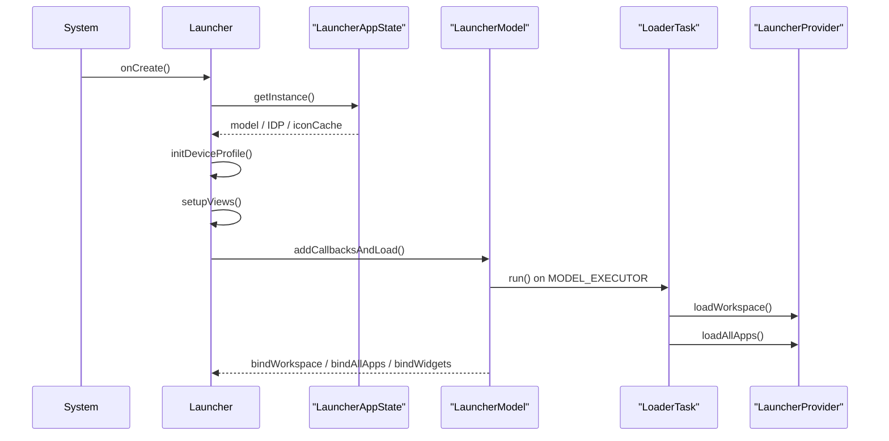
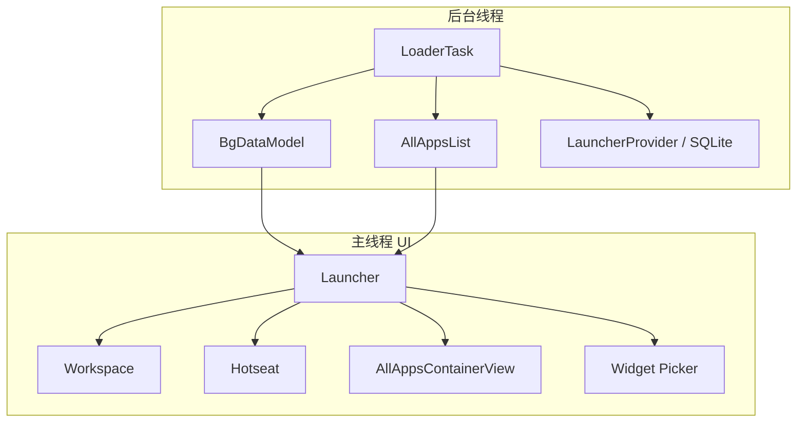

# 第 48 章：Launcher3，Android 主屏

Launcher3 是 AOSP 默认桌面应用，也是用户解锁设备后最先看到的系统界面之一。它负责工作区图标、All Apps、Widget、文件夹、拖放、大屏 taskbar，以及通过 Quickstep 与最近任务、手势导航的集成。其代码位于 `packages/apps/Launcher3/`，主体源码分布在 `src/`、`quickstep/`、`widget/`、`folder/`、`dragndrop/` 等多个目录中。

本章从 Launcher3 的整体架构出发，依次分析图标与网格系统、Widget 管理、拖放引擎、Recents 集成、Taskbar、搜索、文件夹、主题机制，以及最后的网格定制实践。

---

## 48.1 Launcher3 架构

### 48.1.1 项目布局

Launcher3 顶层目录大致如下：

```text
packages/apps/Launcher3/
  src/
  quickstep/
  src_no_quickstep/
  src_plugins/
  shared/
  res/
  compose/
  dagger/
  tests/
  AndroidManifest.xml
  Android.bp
```

关键子目录：

| 子目录 | 作用 |
|---|---|
| `allapps/` | 应用列表与搜索 |
| `dragndrop/` | 拖放控制器、拖影、拖放层 |
| `folder/` | 文件夹图标、展开视图、命名 |
| `widget/` | Widget host、picker、预览 |
| `model/` | 数据模型、加载任务、数据库 |
| `icons/` | 图标缓存和图标提供 |
| `graphics/` | 主题、形状、背景处理 |
| `statemanager/` | 启动器状态机 |
| `responsive/` | 自适应网格规格 |
| `deviceprofile/` | 设备与网格配置 |

### 48.1.2 主 Activity：`Launcher`

入口类是 `Launcher.java`，它继承 `StatefulActivity<LauncherState>`，同时实现 model 回调与若干系统交互接口。它持有的关键成员基本就定义了主视图层级：

- `Workspace`
- `DragLayer`
- `Hotseat`
- `ActivityAllAppsContainerView`
- `AllAppsTransitionController`
- `LauncherDragController`

换句话说，Launcher Activity 本身就是工作区、应用抽屉、拖放系统和状态切换的总入口。

### 48.1.3 `onCreate` 生命周期

`Launcher.onCreate()` 的主要初始化顺序可概括为：

1. 读取 `LauncherAppState`
2. 获取 `LauncherModel`
3. 初始化 `DeviceProfile`
4. 创建拖放控制器和状态机
5. 初始化 widget 基础设施
6. inflate 主视图
7. 启动 widget listening
8. 触发模型层加载

对应关系如下：



### 48.1.4 `LauncherAppState`：单例中枢

`LauncherAppState` 汇聚了若干核心单例，例如：

- `LauncherIconProvider`
- `IconCache`
- `LauncherModel`
- `InvariantDeviceProfile`

虽然新架构倾向于直接通过 Dagger 注入具体依赖，而不是统一从这个单例取，但它仍然是理解旧路径和当前过渡架构的重要入口。

### 48.1.5 `LauncherModel`：数据骨干

`LauncherModel` 是 Launcher3 的数据主轴。它主要维护两块核心状态：

- `BgDataModel`
  持有工作区图标、文件夹、widget、屏幕顺序等。
- `AllAppsList`
  持有全部可启动应用。

模型加载运行在 `MODEL_EXECUTOR` 后台线程上，而不是主线程直接查询数据库。

### 48.1.6 模型与视图分离

Launcher3 非常典型地采用 model-view 分离：



这种结构的价值是：数据库 IO、应用列表加载和图标解析尽量不阻塞主线程，而 UI 则通过 bind 回调增量更新。

### 48.1.7 状态机

Launcher3 使用 `StateManager` 驱动主界面状态切换。常见状态包括：

- `NORMAL`
- `ALL_APPS`
- `SPRING_LOADED`
- `OVERVIEW`
- `EDIT_MODE`

状态机会统一管理：

- 页面动画
- scrim
- 触摸交互规则
- 拖放时的特殊模式

### 48.1.8 Dagger 依赖注入

Launcher3 近年也逐步引入 Dagger，把 model、task controller、icon cache、theme manager 等能力做成可注入依赖，减少历史单例和硬耦合初始化逻辑。

## 48.2 应用图标与网格

### 48.2.1 `ItemInfo` 层级

Launcher3 中几乎所有可摆放到工作区上的对象都继承自 `ItemInfo`。常见子类包括：

- `WorkspaceItemInfo`
- `FolderInfo`
- `LauncherAppWidgetInfo`
- `AppInfo`

这套层级允许工作区、文件夹、Hotseat 和 widget 共享一套坐标与容器语义。

### 48.2.2 `CellLayout`：网格容器

`CellLayout` 是单个工作区页面或文件夹页中的网格容器，负责：

- cell 占位
- 坐标到像素映射
- 重排预览
- 拖放落点判断

它不是简单的 GridLayout，而是为主屏交互专门定制的网格系统。

### 48.2.3 `Workspace`：分页容器

`Workspace` 承载多个 `CellLayout` 页面，负责左右分页、页面切换、拖动跨页和工作区级动画。

### 48.2.4 `BubbleTextView`：图标视图

桌面图标通常由 `BubbleTextView` 渲染，它负责：

- 图标
- 应用名文字
- 通知点 / badge
- 长按与点击反馈

### 48.2.5 `Hotseat`

`Hotseat` 是底部固定栏，本质上也是特殊的 grid 容器，只是布局、保留位置和行为都不同于普通工作区页面。

### 48.2.6 `DeviceProfile` 与网格配置

Launcher3 使用两层 profile：

- `InvariantDeviceProfile`
  表示更稳定的网格与设备能力配置。
- `DeviceProfile`
  结合当前尺寸、方向和 form factor 计算实际运行时布局。

这是 Launcher3 适配手机、平板、折叠屏和不同密度设备的核心机制。

### 48.2.7 图标加载与缓存

图标并不是每次都从 `PackageManager` 即时取，而是通过 `IconCache` 和图标提供层做缓存、标准化与主题适配。

### 48.2.8 自适应网格系统

新版本 Launcher3 会结合 responsive spec 和 profile 插值，在不同尺寸下动态调整：

- 图标大小
- 文字大小
- 间距
- hotseat 容量

## 48.3 Widget 系统

### 48.3.1 Widget 架构总览

Launcher3 的 widget 体系建立在系统 `AppWidgetHost` / `AppWidgetManager` 之上，但又包了一层 launcher 专用适配：

- `LauncherWidgetHolder`
- `LauncherAppWidgetHost`
- `LauncherAppWidgetInfo`
- `WidgetsFullSheet`

### 48.3.2 `LauncherWidgetHolder`

它封装 widget 监听生命周期，使 Launcher 可以更平滑地在 onStart / onStop、动画和配置变化中管理 widgets。

### 48.3.3 `LauncherAppWidgetHost`

这是 Launcher 自己的 `AppWidgetHost` 实现扩展，用来适配 launcher 特定需求。

### 48.3.4 `LauncherAppWidgetInfo`

widget 在工作区中的数据模型，包括 provider、spanX/spanY、restore 状态等。

### 48.3.5 Widget Pinning 流程

Widget pinning 大致经历：

1. 申请 pin
2. 分配 `appWidgetId`
3. 绑定 provider
4. 如有需要进入配置 Activity
5. 最终放入工作区

### 48.3.6 Widget Picker：`WidgetsFullSheet`

这是 Launcher3 的 widget 选择面板，负责分类展示、搜索、预览与拖放入口。

### 48.3.7 Widget 预览渲染

widget 预览并不是简单截图，而是根据 provider 元数据和预览逻辑生成合适的卡片展示。

### 48.3.8 Widget 调整大小

当用户拉伸 widget 时，Launcher3 会重新计算 span，并回调系统 widget 框架让 provider 感知 options 变化。

### 48.3.9 Widget 可见性跟踪

为动画、资源和统计需要，Launcher3 还会追踪 widget 的可见性与展示状态。

## 48.4 拖放

### 48.4.1 拖放架构

Launcher3 的拖放系统由以下核心部分组成：

- `DragController`
- `DragLayer`
- `DragView`
- DropTarget 集合
- `SpringLoadedDragController`

### 48.4.2 `DragController`

它管理一次拖拽的生命周期，包括开始、移动、命中 drop target、完成或取消。

### 48.4.3 `DragLayer`

`DragLayer` 是顶层触摸和拖影承载层，负责截获事件并把拖影绘制在最上层。

### 48.4.4 `DragView`

拖动时的视觉反馈对象，例如被拖起的图标或 widget 预览。

### 48.4.5 Drop Targets

常见 drop target 包括：

- `Workspace`
- `Hotseat`
- `Folder`
- 删除 / 卸载区域

### 48.4.6 `SpringLoadedDragController`

用于处理拖拽过程中延迟翻页、进入特殊 spring-loaded 状态等逻辑。

### 48.4.7 系统拖放支持

除了 Launcher 自己的内部拖放，它也逐步整合系统 drag-and-drop 能力，用于跨应用和更复杂场景。

### 48.4.8 完整拖放流程

一次典型拖放大致是：

1. 长按开始拖拽
2. 生成 `DragView`
3. `DragController` 分发移动事件
4. 高亮候选目标
5. 落下后写回 model/database
6. 触发重排和动画

### 48.4.9 重排预览动画

当拖动图标经过工作区时，网格会预览重排结果。这是 `CellLayout` 与动画系统共同完成的复杂交互细节。

## 48.5 Recents 集成

### 48.5.1 Launcher 作为 Recents Provider

在 Quickstep 架构下，Launcher 不只是主屏，还承担最近任务入口与 overview UI 的一部分职责。

### 48.5.2 架构总览

Recents 集成涉及：

- `QuickstepLauncher`
- `OverviewCommandHelper`
- `RecentsView`
- `TaskView`
- `TouchInteractionService`

### 48.5.3 `OverviewCommandHelper`

负责接收和调度 overview / recents 命令。

### 48.5.4 `RecentsView`

承载最近任务卡片列表，是 overview 页面最核心的视图。

### 48.5.5 `TaskView`

每个任务卡片的具体视图，负责截图、图标、状态和任务级操作。

### 48.5.6 与 Recents 相关的 Launcher 状态切换

Launcher 状态机会把普通主屏、overview 和 all apps 等模式统一起来，使手势导航和 recents 切换能平滑衔接。

### 48.5.7 手势导航流程

手势导航下，从底部上滑进入 overview，本质上是 Launcher 与系统手势服务共同驱动的跨进程动画和状态过渡。

## 48.6 Taskbar

### 48.6.1 Taskbar 架构

大屏设备上的 taskbar 已成为 Launcher3 的重要组成部分，而不再只是一个附属功能。

### 48.6.2 Taskbar 控制器架构

taskbar 内部进一步拆成多控制器管理：

- 显示 / 隐藏
- stash / unstash
- 图标填充
- 与 launcher 同步

### 48.6.3 `StashedHandleViewController`

当 taskbar 折叠时，负责显示可交互的 handle。

### 48.6.4 不同 form factor 上的 taskbar

手机、平板、折叠屏和桌面模式对 taskbar 的定位与行为并不相同。

### 48.6.5 Taskbar 与 Launcher 通信

taskbar 和 launcher 虽然在同一代码库中，但常以不同上下文或窗口存在，因此需要专门通信机制协调状态。

### 48.6.6 Taskbar 图标填充

图标来源通常包括 hotseat、最近使用应用或系统决定的固定集合。

## 48.7 搜索集成

### 48.7.1 搜索架构

Launcher3 搜索主要集中在 All Apps 场景，但也可以扩展到外部 provider。

### 48.7.2 `AllAppsSearchBarController`

负责把用户输入转成搜索请求并驱动 UI 更新。

### 48.7.3 `SearchAlgorithm` 接口

定义搜索实现抽象，允许替换具体搜索后端。

### 48.7.4 `DefaultAppSearchAlgorithm`

默认实现主要基于应用标题匹配。

### 48.7.5 搜索过渡

搜索与 All Apps、键盘弹出、滚动位置和结果列表之间存在专门过渡逻辑。

### 48.7.6 外部搜索提供者

某些设备或产品形态下，Launcher 搜索可以替换为更强的外部 provider。

## 48.8 文件夹系统

### 48.8.1 文件夹架构

文件夹由几类对象协作构成：

- `FolderIcon`
- `FolderInfo`
- `Folder`
- `FolderPagedView`
- `FolderGridOrganizer`

### 48.8.2 `FolderIcon`

工作区上的文件夹入口图标，通常会展示前几个子项预览。

### 48.8.3 `FolderInfo`

文件夹数据模型，保存名字和包含的项目列表。

### 48.8.4 `Folder`

用户点开后看到的展开视图。

### 48.8.5 `FolderPagedView`

当文件夹内容较多时，提供分页展示。

### 48.8.6 `FolderGridOrganizer`

负责文件夹内部网格组织与页面分布。

### 48.8.7 自动整理与命名

Launcher3 可以根据应用类别或规则为新文件夹建议名称。

### 48.8.8 文件夹开关动画

开合动画是 Launcher3 观感的关键组成部分，会联动图标预览、背景与内容布局。

### 48.8.9 通过拖放创建文件夹

最常见文件夹创建方式就是将一个图标拖到另一个图标上方，这也是拖放系统与文件夹系统交汇最深的地方。

## 48.9 主题

### 48.9.1 `ThemeManager`

Launcher3 的主题管理中枢，协调图标形状、颜色、背景与壁纸相关效果。

### 48.9.2 动态色（Material You）

Launcher3 会与系统 Monet / 动态色协作，使主屏、文件夹、搜索框和部分组件跟随壁纸色彩变化。

### 48.9.3 Themed Icons

主题图标通过单色层和调色板 tint 机制与系统主题对齐。

### 48.9.4 图标形状

不同设备或主题可对图标 mask / shape 做统一定制。

### 48.9.5 Scrim 与背景处理

All Apps、文件夹、搜索等界面的背景 scrim 也是主题体验的重要部分。

### 48.9.6 基于壁纸的颜色

壁纸色提取不只影响系统栏，也会影响 Launcher 的卡片、背景和交互色。

### 48.9.7 深色模式支持

Launcher3 需要在 icon、文本、背景和对比度之间做专门适配。

## 48.10 动手实践：自定义 Launcher 网格

### 48.10.1 理解网格系统

理解网格定制前，先要分清：

- `InvariantDeviceProfile`
- `DeviceProfile`
- `device_profiles.xml`
- responsive specs

网格不是写死的整数格子，而是 profile、屏幕尺寸与插值共同决定的结果。

### 48.10.2 第一步：添加新的网格选项

可在 `res/xml/device_profiles.xml` 中加入新的 grid 定义，例如自定义 6x5 配置。

### 48.10.3 第二步：创建默认布局

如果新增 grid，需要相应准备默认工作区布局 XML，使首次启动时能按新网格正常填充图标。

### 48.10.4 第三步：更新网格选择逻辑

`InvariantDeviceProfile` 会读取 grid preference。开发阶段可以通过设置或直接写偏好值强制选择新 grid。

### 48.10.5 第四步：调整自适应规格

高密度网格往往还需要专门的 responsive spec XML，单独调整：

- icon size
- text size
- drawable padding
- cell 可用空间

### 48.10.6 第五步：构建与测试

```bash
source build/envsetup.sh
lunch <target>
m Launcher3
adb install -r out/target/product/<device>/system/priv-app/Launcher3/Launcher3.apk
adb shell am force-stop com.android.launcher3
```

前三条在 AOSP 根目录执行，后两条用于把修改后的 APK 部署到设备并重启 launcher。

### 48.10.7 第六步：验证网格指标

验证时重点看：

1. 工作区列数是否正确
2. hotseat 容量是否同步变化
3. 图标是否仍可读
4. 文件夹内部网格是否合理

### 48.10.8 理解网格计算

`InvariantDeviceProfile` 会基于最近邻显示配置和加权插值，计算最终图标大小、间距和相关布局指标。它不是简单匹配一个固定 profile。

### 48.10.9 进阶：添加双面板网格

折叠屏和平板可进一步定义 two-panel portrait / landscape 相关 profile，使不同姿态下拥有独立网格。

## Summary

Launcher3 是 Android 主屏体验的中心应用，也是一个典型的“大型交互式系统 app”：它一边要维持低延迟、强动画和复杂拖放，一边又要承接 widgets、recents、taskbar、主题和搜索等多条系统级功能链。

本章的关键点可以概括为：

- `Launcher`、`LauncherAppState` 和 `LauncherModel` 共同构成了主屏的启动入口、单例中枢与数据主干。
- `BgDataModel` / `AllAppsList` 与主线程 UI 的分离，是 Launcher3 能保持流畅的重要基础。
- `CellLayout`、`Workspace`、`Hotseat`、`DeviceProfile` 和 `InvariantDeviceProfile` 共同定义了桌面网格系统。
- Widget、文件夹和拖放系统都不是孤立功能，而是围绕工作区模型深度耦合的子系统。
- Quickstep 把 Launcher3 与 recents、手势导航和 taskbar 连接起来，使 launcher 不再只是“放图标的主屏”。
- 主题、动态色、图标缓存与 responsive grid 体现了 Launcher3 近年在大屏、自适应和 Material You 方向上的持续演进。

### 关键源码路径

所有路径均相对 `packages/apps/Launcher3/`：

| 组件 | 路径 |
|---|---|
| Launcher Activity | `src/com/android/launcher3/Launcher.java` |
| Workspace | `src/com/android/launcher3/Workspace.java` |
| CellLayout | `src/com/android/launcher3/CellLayout.java` |
| BubbleTextView | `src/com/android/launcher3/BubbleTextView.java` |
| Hotseat | `src/com/android/launcher3/Hotseat.java` |
| LauncherModel | `src/com/android/launcher3/LauncherModel.kt` |
| LauncherAppState | `src/com/android/launcher3/LauncherAppState.kt` |
| InvariantDeviceProfile | `src/com/android/launcher3/InvariantDeviceProfile.java` |
| DeviceProfile | `src/com/android/launcher3/DeviceProfile.java` |
| LauncherState | `src/com/android/launcher3/LauncherState.java` |
| StateManager | `src/com/android/launcher3/statemanager/StateManager.java` |
| DragController | `src/com/android/launcher3/dragndrop/DragController.java` |
| DragLayer | `src/com/android/launcher3/dragndrop/DragLayer.java` |
| DragView | `src/com/android/launcher3/dragndrop/DragView.java` |
| SpringLoadedDragController | `src/com/android/launcher3/dragndrop/SpringLoadedDragController.kt` |
| FolderIcon | `src/com/android/launcher3/folder/FolderIcon.java` |
| Folder | `src/com/android/launcher3/folder/Folder.java` |
| FolderPagedView | `src/com/android/launcher3/folder/FolderPagedView.java` |
| FolderGridOrganizer | `src/com/android/launcher3/folder/FolderGridOrganizer.java` |
| FolderNameProvider | `src/com/android/launcher3/folder/FolderNameProvider.java` |
| LauncherWidgetHolder | `src/com/android/launcher3/widget/LauncherWidgetHolder.java` |
| LauncherAppWidgetHost | `src/com/android/launcher3/widget/LauncherAppWidgetHost.java` |
| WidgetCell | `src/com/android/launcher3/widget/WidgetCell.java` |
| WidgetsFullSheet | `src/com/android/launcher3/widget/picker/WidgetsFullSheet.java` |
| ThemeManager | `src/com/android/launcher3/graphics/ThemeManager.kt` |
| All Apps 容器 | `src/com/android/launcher3/allapps/ActivityAllAppsContainerView.java` |
| AlphabeticalAppsList | `src/com/android/launcher3/allapps/AlphabeticalAppsList.java` |
| SearchBarController | `src/com/android/launcher3/allapps/search/AllAppsSearchBarController.java` |
| Default Search | `src/com/android/launcher3/allapps/search/DefaultAppSearchAlgorithm.java` |
| ItemInfo | `src/com/android/launcher3/model/data/ItemInfo.java` |
| WorkspaceItemInfo | `src/com/android/launcher3/model/data/WorkspaceItemInfo.java` |
| Grid 配置 | `res/xml/device_profiles.xml` |
| QuickstepLauncher | `quickstep/src/com/android/launcher3/uioverrides/QuickstepLauncher.java` |
| RecentsView | `quickstep/src/com/android/quickstep/views/RecentsView.java` |
| TaskView | `quickstep/src/com/android/quickstep/views/TaskView.kt` |
| OverviewCommandHelper | `quickstep/src/com/android/quickstep/OverviewCommandHelper.kt` |
| TaskbarActivityContext | `quickstep/src/com/android/launcher3/taskbar/TaskbarActivityContext.java` |
| StashedHandleViewController | `quickstep/src/com/android/launcher3/taskbar/StashedHandleViewController.java` |
