# Chapter 48: Launcher3 -- The Android Home Screen

Launcher3 is the default home screen application in AOSP, responsible for the experience
users see first after unlocking their device. It manages app icons on the workspace,
the all-apps drawer, widgets, folders, drag-and-drop, the taskbar on large screens, and,
through its Quickstep integration, the recent-apps overview. The codebase lives in
`packages/apps/Launcher3/` and spans approximately 19 subdirectories of Java and Kotlin
source, plus a `quickstep/` module for gesture-navigation and recents features.

This chapter walks through the full architecture of Launcher3, from the model layer that
loads workspace data off a background thread, through the view hierarchy that renders
icons and widgets, to the drag-and-drop engine that ties it all together. Every section
references real AOSP source files and quotes key code constructs.

---

## 48.1 Launcher3 Architecture

### 48.1.1 Project Layout

The top-level directory of Launcher3 is organized as follows:

```
packages/apps/Launcher3/
  src/                     # Core launcher source
  quickstep/               # Gesture nav, recents, taskbar
  src_no_quickstep/        # Stubs for builds without quickstep
  src_plugins/             # Plugin interfaces
  src_build_config/        # Build-time configuration
  shared/                  # Code shared across variants
  res/                     # Resources (layouts, XML configs)
  protos/                  # Protocol buffer definitions
  compose/                 # Jetpack Compose integration
  dagger/                  # Dagger dependency injection modules
  tests/                   # Unit and integration tests
  tools/                   # Build tooling
  AndroidManifest.xml      # Application manifest
  Android.bp               # Soong build file
```

The primary source tree at `src/com/android/launcher3/` contains the following
key subdirectories:

| Subdirectory | Purpose |
|---|---|
| `allapps/` | All-apps drawer, alphabetical list, tabs |
| `dragndrop/` | Drag controller, drag layer, drag views |
| `folder/` | Folder icon, folder paged view, grid organizer |
| `widget/` | Widget host views, widget picker |
| `model/` | Data model, loader task, database |
| `icons/` | Icon cache, icon provider |
| `graphics/` | Theme manager, scrim, shape delegate |
| `statemanager/` | State machine for launcher states |
| `celllayout/` | Cell layout parameters, reorder algorithms |
| `search/` | Search algorithm interfaces |
| `responsive/` | Responsive grid specifications |
| `touch/` | Touch controllers, click handlers |
| `anim/` | Animation utilities |
| `config/` | Feature flags |
| `deviceprofile/` | Device-specific layout profiles |
| `views/` | Common view utilities |
| `popup/` | Long-press popup menus |
| `shortcuts/` | Deep shortcuts |
| `logging/` | Stats and event logging |

### 48.1.2 The Main Activity: Launcher

The entry point is `Launcher.java`, a 3065-line class that extends `StatefulActivity<LauncherState>`:

```java
// src/com/android/launcher3/Launcher.java
public class Launcher extends StatefulActivity<LauncherState>
        implements Callbacks, InvariantDeviceProfile.OnIDPChangeListener,
        PluginListener<LauncherOverlayPlugin> {
```

`StatefulActivity` is a generic base class that integrates with the `StateManager`
to handle transitions between launcher states (NORMAL, ALL_APPS, SPRING_LOADED,
EDIT_MODE, and others). The `Callbacks` interface is defined in `BgDataModel` and
provides the contract through which the model layer delivers loaded data to the UI.

The key member variables of `Launcher` establish the view hierarchy:

```java
// src/com/android/launcher3/Launcher.java
Workspace<?> mWorkspace;
DragLayer mDragLayer;
Hotseat mHotseat;
ActivityAllAppsContainerView<Launcher> mAppsView;
AllAppsTransitionController mAllAppsController;
ScrimView mScrimView;
LauncherDragController mDragController;
```

### 48.1.3 Launcher Lifecycle: onCreate

The `onCreate` method is the central initialization path. Here is the sequence:

```java
// src/com/android/launcher3/Launcher.java, onCreate()
protected void onCreate(Bundle savedInstanceState) {
    // 1. Startup tracing
    TraceHelper.INSTANCE.beginSection(ON_CREATE_EVT);

    super.onCreate(savedInstanceState);
    mWallpaperThemeManager = new WallpaperThemeManager(this);

    // 2. Obtain the application-wide state
    LauncherAppState app = LauncherAppState.getInstance(this);
    mModel = app.getModel();

    // 3. Initialize device profile and rotation
    mRotationHelper = new RotationHelper(this);
    InvariantDeviceProfile idp = app.getInvariantDeviceProfile();
    initDeviceProfile(idp);

    // 4. Set up drag controller and state manager
    initDragController();
    mAllAppsController = new AllAppsTransitionController(this);
    mStateManager = new StateManager<>(this, NORMAL);

    // 5. Widget infrastructure
    mAppWidgetManager = new WidgetManagerHelper(this);
    mAppWidgetHolder = LauncherWidgetHolder.newInstance(this);

    // 6. Inflate views
    setupViews();

    // 7. Start widget listening
    mAppWidgetHolder.startListening();

    // 8. Start model loading
    mModel.addCallbacksAndLoad(this);
}
```

The flow can be visualized:

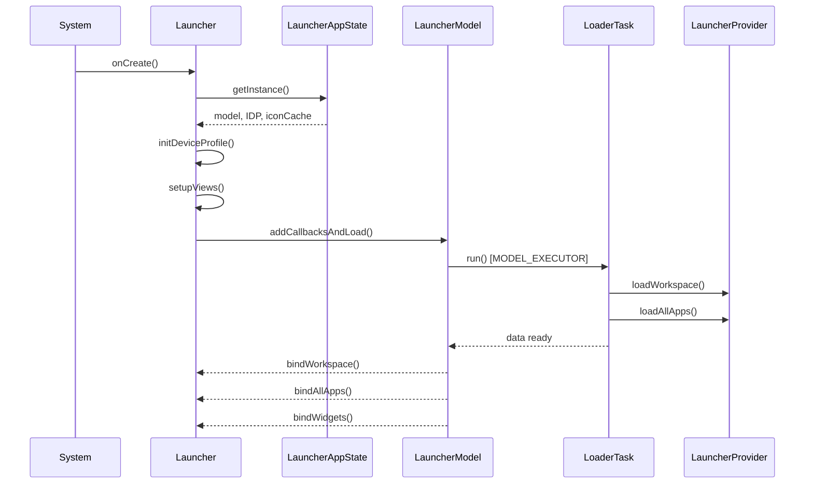

### 48.1.4 LauncherAppState: The Singleton Hub

`LauncherAppState` (now a Kotlin `data class`) aggregates the core singletons:

```kotlin
// src/com/android/launcher3/LauncherAppState.kt
@Deprecated("Inject the specific targets directly instead of using LauncherAppState")
data class LauncherAppState
@Inject
constructor(
    @ApplicationContext val context: Context,
    val iconProvider: LauncherIconProvider,
    val iconCache: IconCache,
    val model: LauncherModel,
    val invariantDeviceProfile: InvariantDeviceProfile,
    @Named("SAFE_MODE") val isSafeModeEnabled: Boolean,
)
```

Note the `@Deprecated` annotation -- the codebase is migrating toward Dagger injection
of individual components rather than going through this singleton. The `companion object`
still exposes the legacy `INSTANCE` and `getInstance()` accessor for compatibility.

### 48.1.5 LauncherModel: The Data Backbone

`LauncherModel` is annotated `@LauncherAppSingleton` and manages all in-memory
launcher data. It is constructed via Dagger injection:

```kotlin
// src/com/android/launcher3/LauncherModel.kt
@LauncherAppSingleton
class LauncherModel
@Inject
constructor(
    @ApplicationContext private val context: Context,
    private val taskControllerProvider: Provider<ModelTaskController>,
    private val iconCache: IconCache,
    private val prefs: LauncherPrefs,
    private val installQueue: ItemInstallQueue,
    @Named("ICONS_DB") dbFileName: String?,
    initializer: ModelInitializer,
    lifecycle: DaggerSingletonTracker,
    val modelDelegate: ModelDelegate,
    private val mBgAllAppsList: AllAppsList,
    private val mBgDataModel: BgDataModel,
    private val loaderFactory: LoaderTaskFactory,
    private val binderFactory: BaseLauncherBinderFactory,
    val modelDbController: ModelDbController,
    dumpManager: DumpManager,
) : LauncherDumpable {
```

The model maintains two critical data structures:

- **`BgDataModel`** -- holds workspace items, folders, app widgets, and screen order
- **`AllAppsList`** -- holds the complete list of launchable activities

Loading runs on `MODEL_EXECUTOR` (a dedicated background thread). The model tracks load
state with `mModelLoaded`, `mLoaderTask`, and `lastLoadId`:

```kotlin
// src/com/android/launcher3/LauncherModel.kt
fun isModelLoaded() =
    synchronized(mLock) { mModelLoaded && mLoaderTask == null && !mModelDestroyed }
```

### 48.1.6 Model-View Separation

The architecture follows a strict model-view separation:

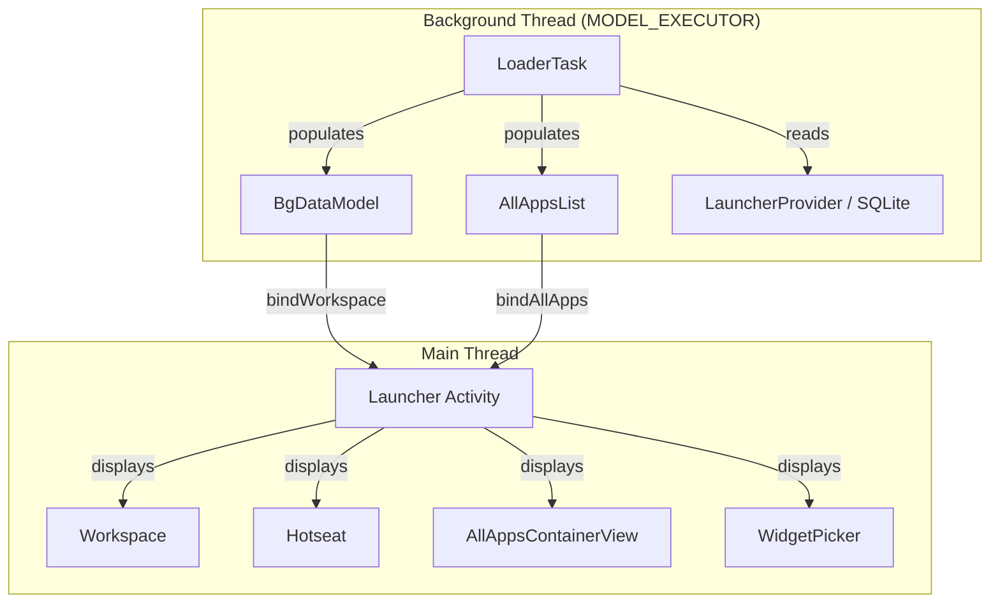

The `Callbacks` interface (implemented by `Launcher`) defines the binding contract:

- `bindItems()` -- delivers workspace items (icons, shortcuts)
- `bindAppWidgets()` -- delivers widget instances
- `bindAllApplications()` -- delivers the full app list
- `bindWidgetsModel()` -- delivers widget catalog for the picker

Model writes go through `ModelWriter`, obtained via `LauncherModel.getWriter()`.
All database mutations happen on the model thread, ensuring consistency.

### 48.1.7 State Machine

`StateManager` is a generic state machine that drives animated transitions between
launcher states. Each state is a subclass of `LauncherState`:

```java
// src/com/android/launcher3/LauncherState.java
public abstract class LauncherState implements BaseState<LauncherState> {
    public static final int HOTSEAT_ICONS = 1 << 0;
    public static final int ALL_APPS_CONTENT = 1 << 1;
    public static final int WORKSPACE_PAGE_INDICATOR = 1 << 5;
    public static final int FLOATING_SEARCH_BAR = 1 << 7;
    // ...
    public static final int FLAG_MULTI_PAGE = BaseState.getFlag(0);
    public static final int FLAG_WORKSPACE_ICONS_CAN_BE_DRAGGED = BaseState.getFlag(2);
    public static final int FLAG_RECENTS_VIEW_VISIBLE = BaseState.getFlag(6);
```

The concrete states include:

| State | Ordinal | Description |
|---|---|---|
| `NORMAL` | 0 | Default workspace view |
| `SPRING_LOADED` | 1 | Workspace shrunk during drag |
| `ALL_APPS` | 2 | All-apps drawer open |
| `HINT_STATE` | 3 | Swipe-up hint indicator |
| `OVERVIEW` | 4 | Recents view (Quickstep) |
| `EDIT_MODE` | 5 | Workspace customization mode |
| `BACKGROUND_APP` | 6 | App is in foreground |
| `QUICK_SWITCH` | 7 | Quick switch gesture |
| `OVERVIEW_MODAL_TASK` | 8 | Task menu open |
| `OVERVIEW_SPLIT_SELECT` | 9 | Split-screen selection |

The `StateManager` drives transitions with animations:

```java
// src/com/android/launcher3/statemanager/StateManager.java
public class StateManager<S extends BaseState<S>, T extends StatefulContainer<S>> {
    private final AnimationState<S> mConfig = new AnimationState<>();
    private final T mContainer;
    private final ArrayList<StateListener<S>> mListeners = new ArrayList<>();
    private S mState;
    private S mLastStableState;
    private S mCurrentStableState;
```

State handlers (`StateHandler<S>[]`) are responsible for applying state-specific
property changes. For example, `AllAppsTransitionController` adjusts the vertical
position and alpha of the all-apps panel during transitions.

### 48.1.8 Dependency Injection with Dagger

The Launcher3 codebase uses Dagger for dependency injection, with key annotations:

- `@LauncherAppSingleton` -- scoped to the application lifecycle
- `@ApplicationContext` -- the application `Context`
- `@Inject` -- constructor injection
- `@Named` -- qualifier for specific instances (e.g., `"ICONS_DB"`)

The DI graph is rooted at `LauncherAppComponent`, which provides singletons like
`InvariantDeviceProfile`, `LauncherModel`, `IconCache`, and `ThemeManager`.

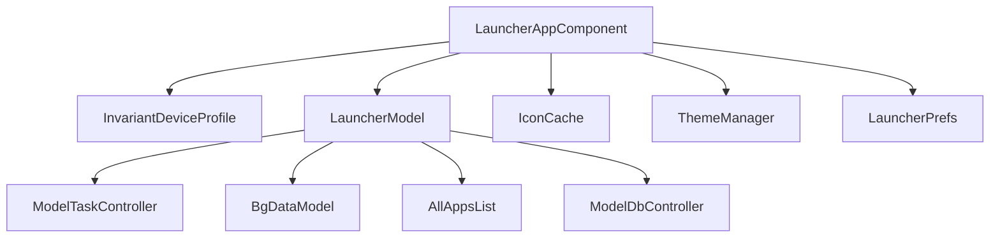

---

## 48.2 App Icons and Grid

### 48.2.1 ItemInfo Hierarchy

Every element on the launcher home screen -- app icons, shortcuts, widgets, folders --
is represented by a subclass of `ItemInfo`:

```java
// src/com/android/launcher3/model/data/ItemInfo.java
public class ItemInfo {
    public int id = NO_ID;
    public int itemType;
    public int container = NO_ID;
    public int screenId = -1;
    public int cellX = -1;
    public int cellY = -1;
    public int spanX = 1;
    public int spanY = 1;
    public int minSpanX = 1;
    public int minSpanY = 1;
    public int rank = 0;
    public CharSequence title;
```

The `itemType` field determines the concrete type:

| Constant | Value | Meaning |
|---|---|---|
| `ITEM_TYPE_APPLICATION` | 0 | App shortcut |
| `ITEM_TYPE_DEEP_SHORTCUT` | 6 | Pinned deep shortcut |
| `ITEM_TYPE_FOLDER` | 2 | Folder container |
| `ITEM_TYPE_APPWIDGET` | 4 | App widget |
| `ITEM_TYPE_APP_PAIR` | 15 | App pair for split screen |
| `ITEM_TYPE_TASK` | 7 | Task (recents) |
| `ITEM_TYPE_FILE_SYSTEM_FILE` | 8 | Home screen file |

The inheritance tree:

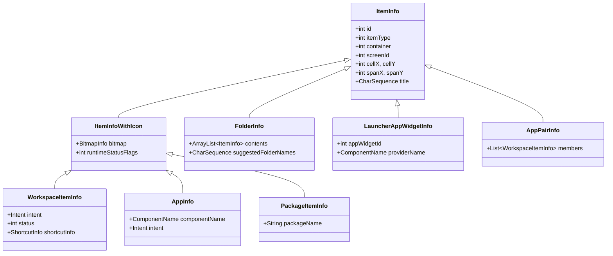

The `container` field specifies where the item lives:

```java
// src/com/android/launcher3/LauncherSettings.java
public static final int CONTAINER_DESKTOP = -100;
public static final int CONTAINER_HOTSEAT = -101;
public static final int CONTAINER_ALL_APPS = -104;
```

### 48.2.2 CellLayout: The Grid Container

`CellLayout` is the fundamental grid container. Every workspace page and the hotseat
are `CellLayout` instances. It manages a grid of cells where items can be placed:

```java
// src/com/android/launcher3/CellLayout.java
public class CellLayout extends ViewGroup {
    @Thunk int mCellWidth;
    @Thunk int mCellHeight;
    protected Point mBorderSpace;
    protected int mCountX;
    protected int mCountY;
```

Each `CellLayout` maintains a `GridOccupancy` that tracks which cells are occupied:

```java
// src/com/android/launcher3/util/GridOccupancy.java
public class GridOccupancy {
    boolean[][] cells;
    int countX;
    int countY;
```

Items are positioned using `CellLayoutLayoutParams`:

```java
// src/com/android/launcher3/celllayout/CellLayoutLayoutParams.java
public class CellLayoutLayoutParams extends MarginLayoutParams {
    public int cellX;
    public int cellY;
    public int cellHSpan;
    public int cellVSpan;
    public int tmpCellX;
    public int tmpCellY;
```

The `CellLayout` uses a child container called `ShortcutAndWidgetContainer` that
performs the actual layout of children. This separation allows `CellLayout` to
manage the grid logic while the container handles `ViewGroup` layout mechanics.

### 48.2.3 Workspace: The Paging Container

`Workspace` extends `PagedView` and holds multiple `CellLayout` pages:

```java
// src/com/android/launcher3/Workspace.java
public class Workspace<T extends View & PageIndicator> extends PagedView<T>
        implements DropTarget, DragSource, View.OnTouchListener,
        LauncherOverlayCallbacks, Insettable {
```

The workspace supports:

- **Horizontal paging** between home screen pages
- **Drag-and-drop** of items between pages
- **Page creation and deletion** based on content
- **Wallpaper scrolling** via `WallpaperOffsetInterpolator`
- **Spring-loaded mode** where pages shrink during drag operations

### 48.2.4 BubbleTextView: The Icon View

`BubbleTextView` is the custom `TextView` subclass that renders app icons:

```java
// src/com/android/launcher3/BubbleTextView.java
public class BubbleTextView extends TextView
        implements ItemInfoUpdateReceiver, DraggableView, Poppable {
```

It renders both the icon (as a compound drawable on top) and the label text below.
Key features include:

- **Notification dots** -- rendered via `DotRenderer` when the app has notifications
- **Download progress** -- overlay progress ring during installation
- **Themed icons** -- monochrome icon rendering when Material You theming is active
- **Running app state** -- visual indicator on taskbar icons for running apps

The view supports multiple display contexts via constants:

```java
// src/com/android/launcher3/BubbleTextView.java
public static final int DISPLAY_WORKSPACE = 0;
public static final int DISPLAY_ALL_APPS = 1;
public static final int DISPLAY_FOLDER = 2;
public static final int DISPLAY_SEARCH_RESULT = 6;
public static final int DISPLAY_TASKBAR = 7;
```

### 48.2.5 Hotseat: The Bottom Row

The `Hotseat` is a specialized `CellLayout` that represents the persistent bottom row:

```java
// src/com/android/launcher3/Hotseat.java
public class Hotseat extends CellLayout implements Insettable {
```

It differs from workspace `CellLayout` instances in that:

- It uses a single-row grid (`mCountY = 1`)
- Items are not associated with a specific screen ID
- It participates in predictions (suggested apps appear here)

### 48.2.6 DeviceProfile and Grid Configuration

Launcher3 adapts its grid to different screen sizes through a two-tier system:

**InvariantDeviceProfile (IDP)** is the device-independent specification loaded from
`res/xml/device_profiles.xml`:

```xml
<!-- res/xml/device_profiles.xml -->
<grid-option
    launcher:name="4_by_4"
    launcher:numRows="4"
    launcher:numColumns="4"
    launcher:numFolderRows="3"
    launcher:numFolderColumns="4"
    launcher:numHotseatIcons="4"
    launcher:numExtendedHotseatIcons="6"
    launcher:dbFile="launcher_4_by_4.db"
    launcher:defaultLayoutId="@xml/default_workspace_4x4"
    launcher:deviceCategory="phone" >
```

The IDP supports multiple grid sizes: `3_by_3`, `4_by_4`, `5_by_5`, `5_by_8`,
`6_by_5`, `7_by_3`, and `8_by_3`. Each grid definition includes display options
that specify icon sizes, text sizes, and border spacing for different screen
dimensions.

**DeviceProfile** is the runtime profile computed for the current display
configuration. It incorporates responsive specifications:

```java
// src/com/android/launcher3/DeviceProfile.java
public class DeviceProfile {
    public final InvariantDeviceProfile inv;
    public final boolean isQsbInline;
    public final boolean isLeftRightSplit;
    private final boolean mIsScalableGrid;
    private final boolean mIsResponsiveGrid;
```

The device profile delegates layout calculations to sub-profiles:

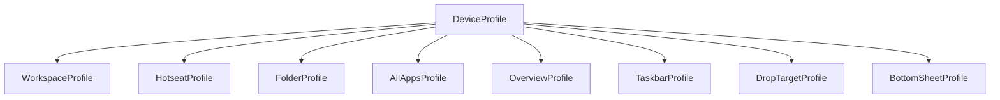

The device type classification determines layout behavior:

```java
// src/com/android/launcher3/InvariantDeviceProfile.java
public static final int TYPE_PHONE = 0;
public static final int TYPE_MULTI_DISPLAY = 1;
public static final int TYPE_TABLET = 2;
public static final int TYPE_DESKTOP = 3;
```

### 48.2.7 Icon Loading and Caching

The `IconCache` is responsible for loading and caching app icons. Icons are loaded
asynchronously on a background thread and cached in a SQLite database
(`app_icons.db` by default).

The icon loading pipeline:

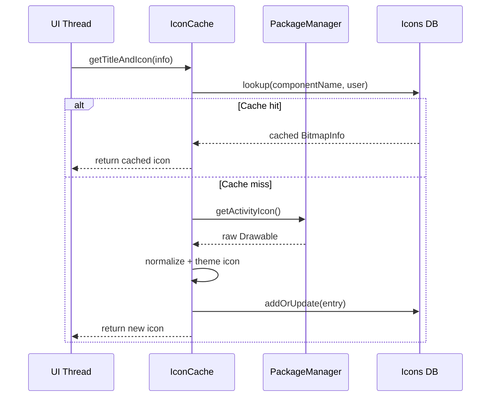

The `LauncherIconProvider` handles icon loading with theme support. When themed
icons are enabled, it attempts to load a monochrome icon variant and applies
the user's wallpaper-based color palette.

### 48.2.8 Responsive Grid System

The responsive grid system in `src/com/android/launcher3/responsive/` dynamically
adjusts cell sizes and spacing based on available screen space:

```
responsive/
  ResponsiveSpec.kt              # Core spec definition
  ResponsiveSpecsProvider.kt     # Provider for workspace specs
  ResponsiveCellSpecsProvider.kt # Provider for cell specs
  HotseatSpecsProvider.kt        # Provider for hotseat specs
  SizeSpec.kt                    # Individual size specification
  ResponsiveSpecGroup.kt         # Grouping of specs
  ResponsiveSpecsParser.kt       # XML parser for spec files
```

Responsive specs are defined in XML resource files (e.g., `spec_col_count_3_row.xml`,
`spec_handheld_all_apps_3_row.xml`) and the system selects the appropriate spec
based on available dimensions at runtime.

---

## 48.3 Widget System

### 48.3.1 Widget Architecture Overview

Launcher3's widget system bridges the Android `AppWidgetManager` framework with the
launcher's own view hierarchy. The key classes form a layered architecture:

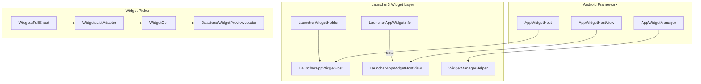

### 48.3.2 LauncherWidgetHolder

`LauncherWidgetHolder` wraps `AppWidgetHost` to allow widget operations from
background threads:

```java
// src/com/android/launcher3/widget/LauncherWidgetHolder.java
public class LauncherWidgetHolder {
    public static final int APPWIDGET_HOST_ID = 1024;

    protected static final int FLAG_LISTENING = 1;
    protected static final int FLAG_STATE_IS_NORMAL = 1 << 1;
    protected static final int FLAG_ACTIVITY_STARTED = 1 << 2;
    protected static final int FLAG_ACTIVITY_RESUMED = 1 << 3;

    @NonNull protected final Context mContext;
    @NonNull protected final ListenableAppWidgetHost mWidgetHost;
    @NonNull protected final SparseArray<LauncherAppWidgetHostView> mViews;
```

The holder tracks activity lifecycle flags to determine when to listen for updates.
Widget views only receive remote view updates when all `FLAGS_SHOULD_LISTEN` are set
(the activity is in NORMAL state, started, and resumed).

### 48.3.3 LauncherAppWidgetHost

`LauncherAppWidgetHost` extends `ListenableAppWidgetHost` and creates
`LauncherAppWidgetHostView` instances:

```java
// src/com/android/launcher3/widget/LauncherAppWidgetHost.java
class LauncherAppWidgetHost extends ListenableAppWidgetHost {
    @Override
    @NonNull
    public LauncherAppWidgetHostView onCreateView(Context context, int appWidgetId,
            AppWidgetProviderInfo appWidget) {
        ListenableHostView result =
                mViewToRecycle != null ? mViewToRecycle : new ListenableHostView(context);
        mViewToRecycle = null;
        return result;
    }
```

Note the view recycling mechanism: when a widget is reconfigured, the existing view
is passed to `recycleViewForNextCreation()` to avoid recreating the host view.

### 48.3.4 Widget Data: LauncherAppWidgetInfo

Widgets are represented in the model by `LauncherAppWidgetInfo`:

```java
// src/com/android/launcher3/model/data/LauncherAppWidgetInfo.java
public class LauncherAppWidgetInfo extends ItemInfo {
    public int appWidgetId;
    public ComponentName providerName;
    public int restoreStatus;
    public int installProgress;
```

The `restoreStatus` field tracks the restore lifecycle:

- `FLAG_ID_NOT_VALID` -- widget ID needs allocation
- `FLAG_PROVIDER_NOT_READY` -- provider not yet installed
- `FLAG_UI_NOT_READY` -- view not yet inflated
- `RESTORE_COMPLETED` -- fully restored

### 48.3.5 Widget Pinning Flow

When a user adds a widget from the widget picker, this flow executes:

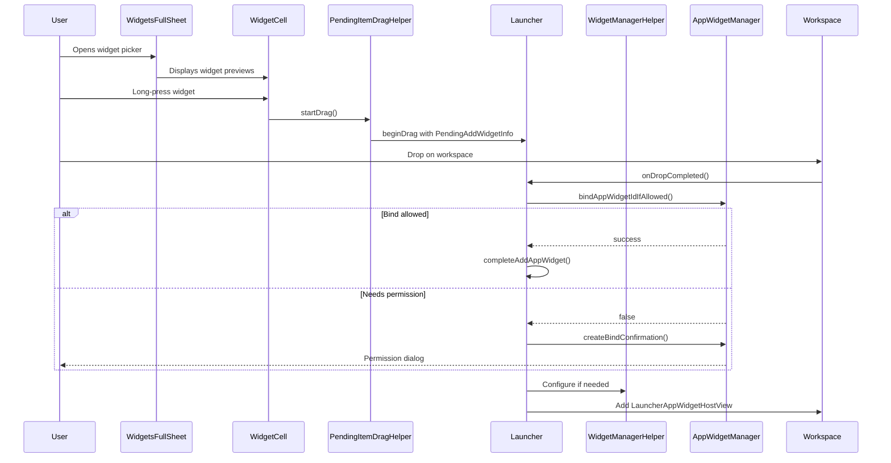

### 48.3.6 Widget Picker: WidgetsFullSheet

The widget picker is a bottom sheet (`WidgetsFullSheet`) that displays available widgets:

```java
// src/com/android/launcher3/widget/picker/WidgetsFullSheet.java
public class WidgetsFullSheet extends BaseWidgetSheet {
```

It uses `WidgetsListAdapter` -- a `RecyclerView.Adapter` that supports two view types:

1. **`WidgetsListHeader`** -- the collapsed app entry showing app name and widget count
2. **`WidgetsListContentEntry`** -- the expanded table of widget previews

```java
// src/com/android/launcher3/widget/picker/WidgetsListAdapter.java
public class WidgetsListAdapter extends Adapter<ViewHolder>
        implements OnHeaderClickListener {
```

The adapter uses `DiffUtil` for efficient list updates and supports searching
via `WidgetsSearchBar`.

### 48.3.7 Widget Preview Rendering

`WidgetCell` displays a preview of the widget in the picker:

```java
// src/com/android/launcher3/widget/WidgetCell.java
public class WidgetCell extends LinearLayout {
    private WidgetImageView mWidgetImage;
    private TextView mWidgetName;
    private TextView mWidgetDims;
    private TextView mWidgetDescription;
    private Button mWidgetAddButton;
```

Widget previews are loaded by `DatabaseWidgetPreviewLoader`, which generates
preview bitmaps either from the widget's own preview image or by inflating a
dummy `RemoteViews` and rendering it to a bitmap.

### 48.3.8 Widget Resize

Placed widgets can be resized via `AppWidgetResizeFrame` (now a Kotlin file):

```
src/com/android/launcher3/AppWidgetResizeFrame.kt
```

The resize frame draws handles on the widget edges and updates the cell span
as the user drags. Minimum span constraints (`minSpanX`, `minSpanY`) and maximum
span constraints (from `AppWidgetProviderInfo.minResizeWidth/Height`) are enforced.

### 48.3.9 Widget Visibility Tracking

`WidgetVisibilityTracker` monitors which widgets are currently visible on screen
and notifies the `AppWidgetHost` accordingly, allowing the system to optimize
resource usage for off-screen widgets:

```java
// src/com/android/launcher3/widget/WidgetVisibilityTracker.java
// Initialized in Launcher.onCreate():
mWidgetVisibilityTracker = new WidgetVisibilityTracker(
    this, mAppWidgetHolder, mWorkspace, mStateManager);
```

---

## 48.4 Drag and Drop

### 48.4.1 Drag-and-Drop Architecture

The drag-and-drop system is one of the most complex subsystems in Launcher3, involving
multiple coordinating classes:

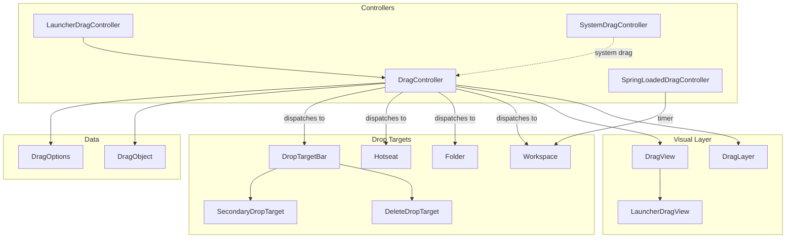

### 48.4.2 DragController

`DragController` is the abstract base that manages the drag lifecycle:

```java
// src/com/android/launcher3/dragndrop/DragController.java
public abstract class DragController<T extends ActivityContext>
        implements DragDriver.EventListener, TouchController {

    private static final int DEEP_PRESS_DISTANCE_FACTOR = 3;

    protected final T mActivity;
    protected DragDriver mDragDriver = null;
    public DragOptions mOptions;
    protected final Point mMotionDown = new Point();
    protected final Point mLastTouch = new Point();

    public DropTarget.DragObject mDragObject;

    private final ArrayList<DropTarget> mDropTargets = new ArrayList<>();
    private final ArrayList<DragListener> mListeners = new ArrayList<>();
    protected DropTarget mLastDropTarget;
```

The drag lifecycle:

1. **Pre-drag** -- A long press is detected; the controller enters pre-drag mode
2. **Drag start** -- If the user moves beyond the threshold, `DragView` is created
3. **Drag move** -- Touch events update `DragView` position and find drop targets
4. **Drop** -- The item is released; the appropriate `DropTarget` receives it

### 48.4.3 DragLayer

`DragLayer` is a custom `ViewGroup` that sits at the root of the launcher's
view hierarchy and intercepts all touch events during a drag:

```java
// src/com/android/launcher3/dragndrop/DragLayer.java
public class DragLayer extends BaseDragLayer<Launcher>
        implements LauncherOverlayCallbacks {

    public static final int ALPHA_INDEX_OVERLAY = 0;
    public static final int ALPHA_INDEX_LOADER = 1;
```

It coordinates:

- Rendering the `DragView` above all other content
- Forwarding touch events to the `DragController`
- Playing drop animations
- Managing folder open/close overlay animations

### 48.4.4 DragView

`DragView` is the floating view that follows the user's finger during a drag:

```java
// src/com/android/launcher3/dragndrop/DragView.java
public abstract class DragView<T extends Context & ActivityContext>
        extends FrameLayout {

    public static final int VIEW_ZOOM_DURATION = 150;

    private final View mContent;
    private final int mWidth;
    private final int mHeight;
    private final int mBlurSizeOutline;
    protected final int mRegistrationX;
    protected final int mRegistrationY;
    private final float mInitialScale;
    private final float mEndScale;
    protected final float mScaleOnDrop;
```

The `DragView` uses spring animations for a natural feel:

```java
// Uses SpringAnimation from AndroidX dynamic animation
private SpringAnimation mSpring;
```

The `mRegistrationX/Y` values represent the offset from the touch point to the
drag view's origin, ensuring the view follows the finger naturally.

### 48.4.5 Drop Targets

The `DropTarget` interface defines how views accept drops:

```java
// src/com/android/launcher3/DropTarget.java
public interface DropTarget {
    boolean acceptDrop(DragObject dragObject);
    void onDrop(DragObject dragObject, DragOptions options);
    void onDragEnter(DragObject dragObject);
    void onDragOver(DragObject dragObject);
    void onDragExit(DragObject dragObject);
```

The main drop targets are:

- **`Workspace`** -- accepts icons, shortcuts, widgets on workspace pages
- **`Hotseat`** -- accepts icons in the bottom dock
- **`Folder`** -- accepts icons when dragged over a folder
- **`DeleteDropTarget`** -- removes items from the home screen
- **`SecondaryDropTarget`** -- provides "Uninstall" or "App info" actions

### 48.4.6 SpringLoadedDragController

When the user drags an item and hovers over a workspace page, the
`SpringLoadedDragController` manages page switching with a delay:

```kotlin
// src/com/android/launcher3/dragndrop/SpringLoadedDragController.kt
class SpringLoadedDragController(private val launcher: Launcher) : OnAlarmListener {
    internal val alarm = Alarm().also { it.setOnAlarmListener(this) }
    private var screen: CellLayout? = null

    fun setAlarm(cl: CellLayout?) {
        cancel()
        alarm.setAlarm(
            when {
                cl == null -> ENTER_SPRING_LOAD_CANCEL_HOVER_TIME
                Utilities.isRunningInTestHarness() -> ENTER_SPRING_LOAD_HOVER_TIME_IN_TEST
                else -> ENTER_SPRING_LOAD_HOVER_TIME
            }
        )
        screen = cl
    }

    override fun onAlarm(alarm: Alarm) {
        if (screen != null) {
            with(launcher.workspace) {
                if (!isVisible(screen) && launcher.dragController.mDistanceSinceScroll != 0) {
                    snapToPage(indexOfChild(screen))
                }
            }
        } else {
            launcher.dragController.cancelDrag()
        }
    }

    companion object {
        private const val ENTER_SPRING_LOAD_HOVER_TIME: Long = 500
        private const val ENTER_SPRING_LOAD_HOVER_TIME_IN_TEST: Long = 3000
        private const val ENTER_SPRING_LOAD_CANCEL_HOVER_TIME: Long = 950
    }
}
```

The 500ms hover delay before page switching is a deliberate UX choice to prevent
accidental page navigation during drag operations.

### 48.4.7 System Drag Support

Launcher3 also supports Android's system drag-and-drop API for cross-app drag:

```kotlin
// src/com/android/launcher3/dragndrop/SystemDragController.kt
```

`SystemDragController` handles drag events that originate from outside the launcher
(e.g., dragging a file from another app onto the home screen). It creates
`SystemDragItemInfo` to represent the dragged content and routes it through
the standard drop target mechanism.

### 48.4.8 The Complete Drag Flow

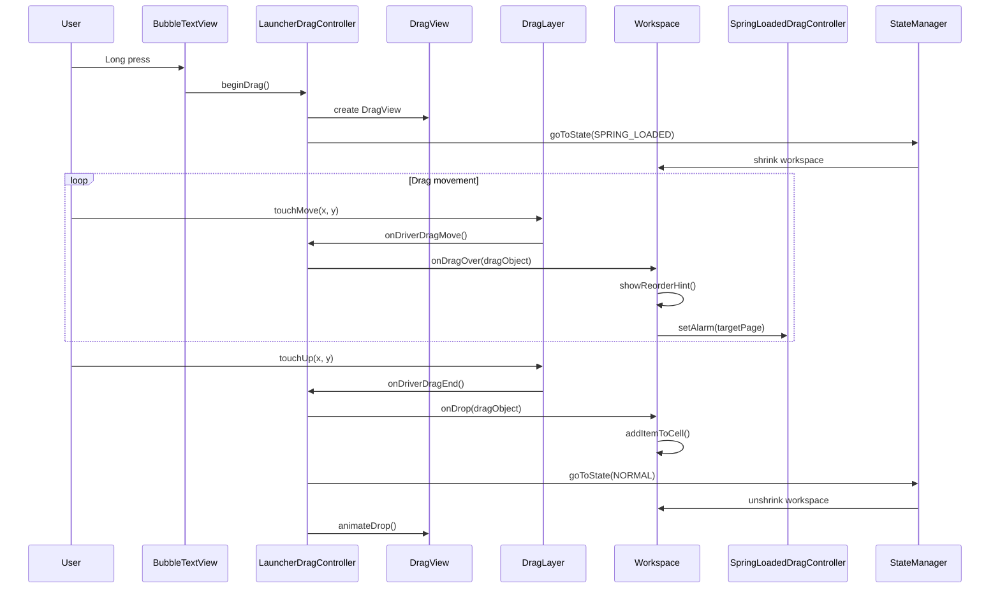

### 48.4.9 Reorder Preview Animation

During drag, when items need to shift to make room, `CellLayout` shows reorder
preview animations:

```java
// src/com/android/launcher3/celllayout/ReorderPreviewAnimation.java
// src/com/android/launcher3/celllayout/ReorderAlgorithm.java
```

The reorder algorithm computes item configurations that minimize displacement
while fitting the dragged item, and `ReorderPreviewAnimation` smoothly
translates items to their new positions.

---

## 48.5 Recents Integration

### 48.5.1 Launcher as Recents Provider

In modern Android (since Android 10), Launcher3 serves as both the home screen
and the recent-apps provider when the Quickstep module is included. The class
`QuickstepLauncher` extends `Launcher` to add recents functionality:

```java
// quickstep/src/com/android/launcher3/uioverrides/QuickstepLauncher.java
public class QuickstepLauncher extends Launcher {
```

This integration is controlled by the system property and Quickstep's
`TouchInteractionService`, which intercepts gesture-navigation events and
routes them to either the launcher (for going home or showing recents) or
the foreground app.

### 48.5.2 Architecture Overview

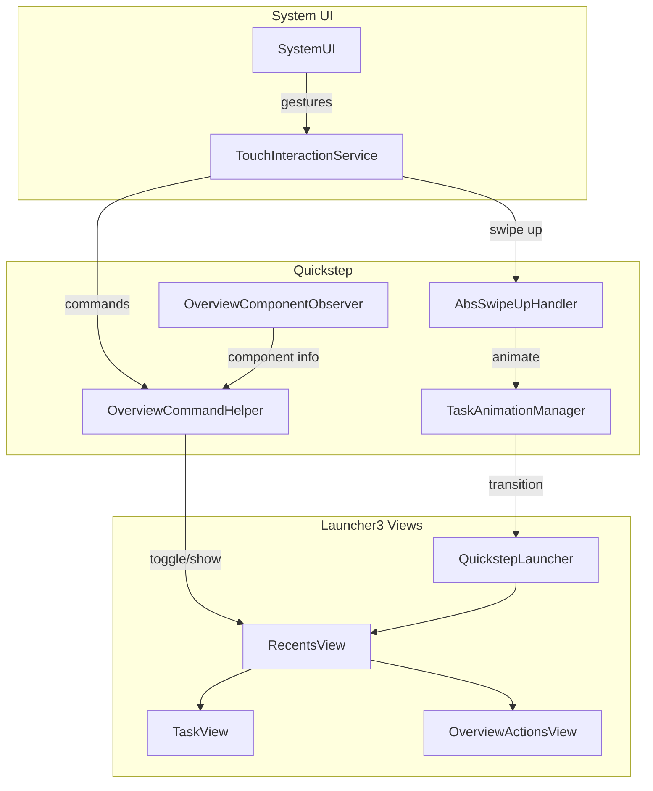

### 48.5.3 OverviewCommandHelper

`OverviewCommandHelper` manages atomic commands for showing/hiding the recents view:

```kotlin
// quickstep/src/com/android/quickstep/OverviewCommandHelper.kt
class OverviewCommandHelper
@AssistedInject
constructor(
    @Assisted private val touchInteractionService: TouchInteractionService,
    private val overviewComponentObserver: OverviewComponentObserver,
    private val dispatcherProvider: DispatcherProvider,
    private val displayRepository: DisplayRepository,
    @Assisted private val taskbarManager: TaskbarManager,
    private val taskAnimationManagerRepository: PerDisplayRepository<TaskAnimationManager>,
    @ElapsedRealtimeLong private val elapsedRealtime: () -> Long,
    @Assisted private val systemUiProxy: SystemUiProxy,
) {
    private val coroutineScope =
        CoroutineScope(SupervisorJob() + dispatcherProvider.lightweightBackground)
    private val commandQueue = ConcurrentLinkedDeque<CommandInfo>()
```

The command types include:

```kotlin
enum class CommandType {
    HOME,
    TOGGLE,
    TOGGLE_WITH_FOCUS,
    TOGGLE_OVERVIEW_PREVIOUS,
    SHOW_WITH_FOCUS,
    SHOW_ALT_TAB,
    HIDE_ALT_TAB,
}
```

### 48.5.4 RecentsView

`RecentsView` is a horizontally-scrolling container for recent task thumbnails:

```java
// quickstep/src/com/android/quickstep/views/RecentsView.java
public abstract class RecentsView<ACTIVITY_TYPE extends StatefulActivity<STATE_TYPE>,
        STATE_TYPE extends BaseState<STATE_TYPE>>
        extends PagedView<PageIndicator> {
```

Key features of `RecentsView`:

- **Task cards** are `TaskView` instances showing app thumbnails
- **Clear All** button to dismiss all recent tasks
- **Split screen** initiation by dragging a task to the split placeholder
- **Desktop task views** for windowed/desktop mode tasks
- **Grid-only overview** mode where tasks are shown in a grid layout

### 48.5.5 TaskView

`TaskView` represents a single recent task:

```kotlin
// quickstep/src/com/android/quickstep/views/TaskView.kt
open class TaskView
@JvmOverloads
constructor(
    context: Context,
    attrs: AttributeSet? = null,
    defStyleAttr: Int = 0,
) : FrameLayout(context, attrs, defStyleAttr), Reusable {
```

Each `TaskView` contains:

- A task thumbnail (rendered from a recent screenshot)
- An icon chip showing the app icon
- An overlay for running state indicators
- Touch handling for launching, dismissing, and split-screen gestures

`GroupedTaskView` extends `TaskView` for split-screen task pairs, showing
two thumbnails side by side.

### 48.5.6 Launcher State Transitions for Recents

The `OVERVIEW` state is added by the Quickstep module:

```java
// quickstep/src/com/android/launcher3/uioverrides/states/OverviewState.java
public class OverviewState extends LauncherState {
```

The `RecentsViewStateController` handles animation between states:

```kotlin
// quickstep/src/com/android/launcher3/uioverrides/RecentsViewStateController.kt
```

Transitions between `NORMAL` and `OVERVIEW` involve:

1. Scaling the workspace down
2. Fading in the recents view
3. Showing/hiding overview action buttons
4. Adjusting the taskbar state

### 48.5.7 Gesture Navigation Flow

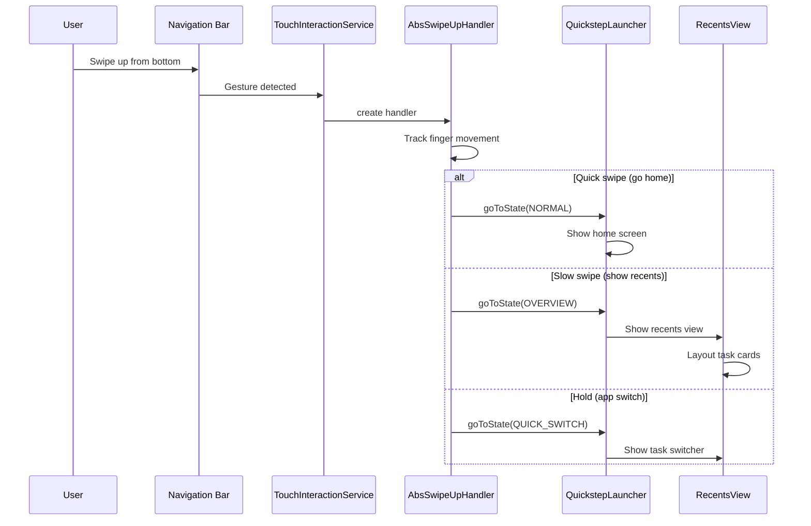

---

## 48.6 Taskbar

### 48.6.1 Taskbar Architecture

The taskbar is a persistent navigation element on large screens (tablets,
foldables, desktop mode). It exists as a separate window managed by
`TaskbarActivityContext`:

```java
// quickstep/src/com/android/launcher3/taskbar/TaskbarActivityContext.java
public class TaskbarActivityContext extends BaseTaskbarContext {
```

The taskbar window is of type `TYPE_NAVIGATION_BAR`, placing it at the same
system UI level as the navigation bar. It uses `FLAG_NOT_FOCUSABLE` to avoid
stealing input focus from foreground apps.

### 48.6.2 Taskbar Controller Architecture

The taskbar uses a complex controller architecture where each aspect is managed
by a dedicated controller:

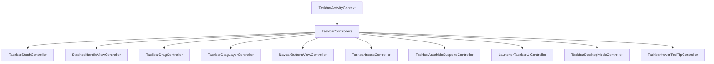

Key controllers:

- **`TaskbarStashController`** -- manages stashing/unstashing the taskbar
- **`StashedHandleViewController`** -- manages the small handle shown when stashed
- **`NavbarButtonsViewController`** -- manages the back/home/recents buttons
- **`TaskbarDragController`** -- handles drag from taskbar to workspace
- **`TaskbarInsetsController`** -- reports insets to the system

### 48.6.3 StashedHandleViewController

When the taskbar is stashed (hidden), a small handle is displayed that can be
swiped to reveal it:

```java
// quickstep/src/com/android/launcher3/taskbar/StashedHandleViewController.java
public class StashedHandleViewController
        implements TaskbarControllers.LoggableTaskbarController, NavHandle {

    public static final int ALPHA_INDEX_STASHED = 0;
    public static final int ALPHA_INDEX_HOME_DISABLED = 1;
    public static final int ALPHA_INDEX_ASSISTANT_INVOKED = 2;
    public static final int ALPHA_INDEX_HIDDEN_WHILE_DREAMING = 3;
    public static final int ALPHA_INDEX_NUDGED = 4;
    public static final int ALPHA_INDEX_ALL_SET_TRANSITION = 5;
    private static final int NUM_ALPHA_CHANNELS = 6;
```

The stashed handle has multiple alpha channels that control its visibility
in different scenarios. The handle uses region sampling to adapt its color
to the underlying content.

### 48.6.4 Taskbar on Different Form Factors

The taskbar adapts to different device types:

| Form Factor | Behavior |
|---|---|
| **Phone** | No taskbar; uses gesture nav bar |
| **Tablet** | Persistent taskbar with app icons |
| **Foldable** | Taskbar appears in unfolded state |
| **Desktop mode** | Full-featured taskbar with overflow |
| **Connected display** | Separate taskbar per display |

The `TaskbarDesktopModeController` handles desktop-specific behavior,
including:

- Pinned taskbar mode
- Auto-hide on immersive apps
- Overflow apps container for too many pinned apps
- Desktop experience flags integration

### 48.6.5 Taskbar-Launcher Communication

The taskbar communicates with the launcher through `LauncherTaskbarUIController`:

```java
// quickstep/src/com/android/launcher3/taskbar/LauncherTaskbarUIController.java
```

This controller synchronizes:

- Icon state between taskbar and launcher
- Stash state based on launcher state changes
- Drag operations between taskbar and workspace
- All-apps page progress for smooth transitions

### 48.6.6 Taskbar Icon Population

Taskbar icons are loaded from the same model as the hotseat. The
`TaskbarInteractor` manages the data flow:

```kotlin
// quickstep/src/com/android/launcher3/taskbar/TaskbarInteractor.kt
```

Running app state is tracked and displayed as a dot indicator under running
app icons, using `BubbleTextView.RunningAppState`:

```java
// src/com/android/launcher3/BubbleTextView.java
public enum RunningAppState {
    RUNNING,
    MINIMIZED,
}
```

---

## 48.7 Search Integration

### 48.7.1 Search Architecture

The All Apps drawer includes an integrated search system with a pluggable architecture:

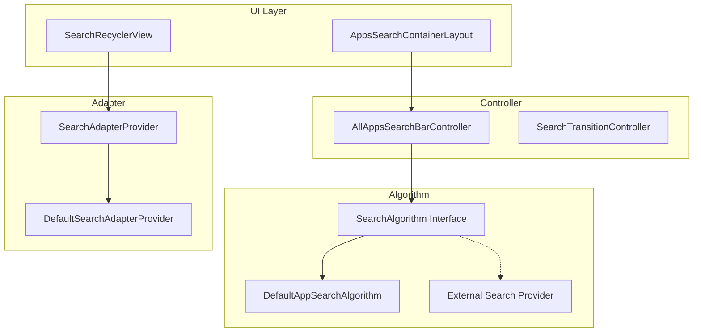

### 48.7.2 AllAppsSearchBarController

The search bar controller manages text input and search dispatching:

```java
// src/com/android/launcher3/allapps/search/AllAppsSearchBarController.java
public class AllAppsSearchBarController
        implements TextWatcher, OnEditorActionListener,
        ExtendedEditText.OnBackKeyListener {

    protected SearchAlgorithm<AdapterItem> mSearchAlgorithm;
    protected SearchCallback<AdapterItem> mCallback;
    protected ExtendedEditText mInput;
    protected String mQuery;
```

Initialization connects the controller to the search algorithm and UI:

```java
public final void initialize(
        SearchAlgorithm<AdapterItem> searchAlgorithm,
        ExtendedEditText input,
        ActivityContext launcher,
        SearchCallback<AdapterItem> callback) {
    mCallback = callback;
    mLauncher = launcher;
    mInput = input;
    mInput.addTextChangedListener(this);
    mInput.setOnEditorActionListener(this);
    mInput.setOnBackKeyListener(this);
    mSearchAlgorithm = searchAlgorithm;
}
```

### 48.7.3 SearchAlgorithm Interface

The `SearchAlgorithm` interface allows different search implementations:

```java
// src/com/android/launcher3/search/SearchAlgorithm.java
public interface SearchAlgorithm<T> {
    void doSearch(String query, SearchCallback<T> callback);
    void cancel(boolean interruptActiveRequests);
}
```

### 48.7.4 DefaultAppSearchAlgorithm

The built-in search performs case-insensitive title matching:

```java
// src/com/android/launcher3/allapps/search/DefaultAppSearchAlgorithm.java
public class DefaultAppSearchAlgorithm implements SearchAlgorithm<AdapterItem> {

    private static final int MAX_RESULTS_COUNT = 5;

    @Override
    public void doSearch(String query, SearchCallback<AdapterItem> callback) {
        mAppState.getModel().enqueueModelUpdateTask(
            (taskController, dataModel, apps) -> {
                ArrayList<AdapterItem> result = getTitleMatchResult(apps.data, query);
                if (mAddNoResultsMessage && result.isEmpty()) {
                    result.add(getEmptyMessageAdapterItem(query));
                }
                mResultHandler.post(() -> callback.onSearchResult(query, result));
            });
    }
```

The search runs on the model thread to safely access `AllAppsList.data`, then
delivers results back on the main thread. `StringMatcherUtility` provides the
matching logic, supporting substring matching with word boundary awareness.

### 48.7.5 Search Transition

When the user types a search query, `SearchTransitionController` animates
the All Apps view from the alphabetical list to search results:

```java
// src/com/android/launcher3/allapps/SearchTransitionController.java
```

The transition involves:

1. Hiding the alphabetical fast scroller
2. Switching the RecyclerView adapter to the search adapter
3. Animating the tab indicator off-screen
4. Adjusting the header height

### 48.7.6 External Search Providers

Launcher3 supports external search via `SearchUiManager`:

```java
// src/com/android/launcher3/allapps/SearchUiManager.java
```

OEMs and Google Search can provide custom search experiences by implementing
the `AllAppsSearchUiDelegate` interface, which controls:

- The search input layout
- The search result adapter
- The search algorithm implementation

The `qsb/` package provides the Quick Search Bar integration on the workspace,
which is a separate search entry point that typically launches Google Search.

---

## 48.8 Folder System

### 48.8.1 Folder Architecture

Folders allow grouping multiple app icons. The system involves three key components:

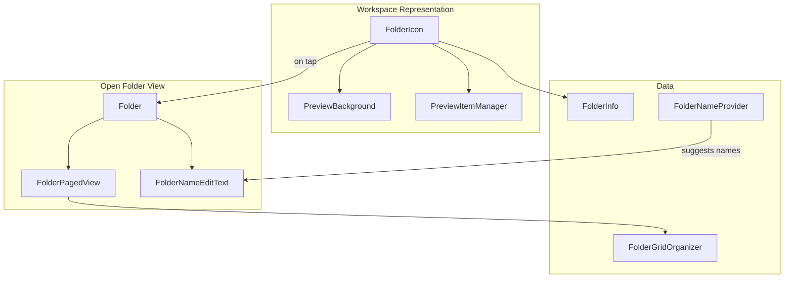

### 48.8.2 FolderIcon

`FolderIcon` is the view displayed on the workspace representing a folder:

```java
// src/com/android/launcher3/folder/FolderIcon.java
public class FolderIcon extends FrameLayout implements FloatingIconViewCompanion,
        DraggableView, Reorderable, Poppable {

    @Thunk ActivityContext mActivity;
    @Thunk Folder mFolder;
    public FolderInfo mInfo;
    static final int DROP_IN_ANIMATION_DURATION = 400;
    public static final boolean SPRING_LOADING_ENABLED = true;
    private static final int ON_OPEN_DELAY = 800;
```

The icon displays a preview of up to 4 items (controlled by
`MAX_NUM_ITEMS_IN_PREVIEW`) in a clipped layout managed by
`ClippedFolderIconLayoutRule`:

```java
// src/com/android/launcher3/folder/ClippedFolderIconLayoutRule.java
public static final int MAX_NUM_ITEMS_IN_PREVIEW = 4;
public static final float ICON_OVERLAP_FACTOR = 0.23f;
```

When an item is dragged over a `FolderIcon`, spring loading causes the folder
to open after an 800ms delay (`ON_OPEN_DELAY`).

### 48.8.3 FolderInfo: The Data Model

`FolderInfo` holds the folder's contents:

```java
// src/com/android/launcher3/model/data/FolderInfo.java
public class FolderInfo extends CollectionInfo {
    public ArrayList<ItemInfo> contents;
    public CharSequence suggestedFolderNames;
```

The `willAcceptItemType` static method determines which item types can be placed
in a folder:

```java
public static boolean willAcceptItemType(int itemType) {
    return (itemType == ITEM_TYPE_APPLICATION ||
            itemType == ITEM_TYPE_DEEP_SHORTCUT ||
            itemType == ITEM_TYPE_APP_PAIR);
}
```

### 48.8.4 Folder: The Open View

`Folder` is an `AbstractFloatingView` that appears when a folder icon is tapped:

```java
// src/com/android/launcher3/folder/Folder.java
public class Folder extends AbstractFloatingView implements
        ClipPathView, DragSource, DragListener {
```

Folder types:

```java
@IntDef({NORMAL, EMPTY_FOLDER_DEFAULT, WORK_FOLDER})
public @interface FolderType {}
```

The folder view includes:

- A `FolderPagedView` for paging through items
- A `FolderNameEditText` for editing the folder name
- Page indicators for multi-page folders
- Drag-and-drop support for reordering items within the folder

### 48.8.5 FolderPagedView

`FolderPagedView` extends `PagedView` to display folder contents in a grid:

```java
// src/com/android/launcher3/folder/FolderPagedView.java
public class FolderPagedView extends PagedView<PageIndicatorDots>
        implements ClipPathView {

    private static final int REORDER_ANIMATION_DURATION = 230;
    private static final int START_VIEW_REORDER_DELAY = 30;
    private static final float VIEW_REORDER_DELAY_FACTOR = 0.9f;

    private final FolderGridOrganizer mOrganizer;
    private int mGridCountX;
    private int mGridCountY;
```

Each page in the folder is a `CellLayout` with the folder's grid dimensions
(typically 3x4 or 4x4 depending on the device profile).

### 48.8.6 FolderGridOrganizer

`FolderGridOrganizer` manages item positions based on rank:

```java
// src/com/android/launcher3/folder/FolderGridOrganizer.java
public class FolderGridOrganizer {
    private final int mMaxCountX;
    private final int mMaxCountY;
    private final int mMaxItemsPerPage;
    private int mNumItemsInFolder;
    private int mCountX;
    private int mCountY;

    public static FolderGridOrganizer createFolderGridOrganizer(DeviceProfile profile) {
        return new FolderGridOrganizer(
                profile.getFolderProfile().getNumColumns(),
                profile.getFolderProfile().getNumRows()
        );
    }
```

The organizer dynamically adjusts the grid size based on content count:

- 1 item: 1x1 grid
- 2-3 items: 2x2 grid
- 4+ items: full grid dimensions

### 48.8.7 Auto-Organize and Folder Naming

When items are dragged together to create a folder, the system automatically
suggests a folder name using `FolderNameProvider`:

```java
// src/com/android/launcher3/folder/FolderNameProvider.java
public class FolderNameProvider {
    public static final int SUGGEST_MAX = 4;

    @Inject
    public FolderNameProvider() {
        Preconditions.assertWorkerThread();
    }
```

The naming algorithm examines the apps in the folder and attempts to find a
common category. It uses information from the model and can provide up to 4
name suggestions. The `FolderNameSuggestionLoader` coordinates loading suggestions
asynchronously:

```kotlin
// src/com/android/launcher3/folder/FolderNameSuggestionLoader.kt
```

### 48.8.8 Folder Open/Close Animation

The folder open animation is managed by `FolderAnimationManager`:

```java
// src/com/android/launcher3/folder/FolderAnimationManager.java
```

The animation includes:

1. **Preview-to-folder** -- the small preview icons scale up to the full folder
2. **Background reveal** -- the folder background circle expands
3. **Content fade-in** -- folder items fade in with a stagger
4. **Scrim darkening** -- the background dims behind the folder

Spring animations (`FolderSpringAnimatorSet`) provide a bouncy, natural feel:

```kotlin
// src/com/android/launcher3/folder/FolderSpringAnimatorSet.kt
```

The close animation reverses these steps. `FolderOpenCloseAnimationListener`
handles callbacks for animation lifecycle events.

### 48.8.9 Folder Creation via Drag

When the user drags one icon over another on the workspace, a folder is created:

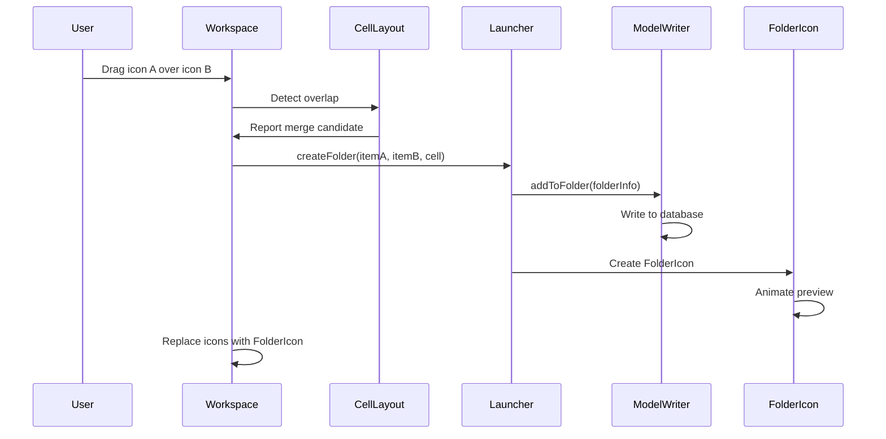

---

## 48.9 Theming

### 48.9.1 ThemeManager

The `ThemeManager` is a Dagger singleton that centralizes icon theming:

```kotlin
// src/com/android/launcher3/graphics/ThemeManager.kt
@LauncherAppSingleton
class ThemeManager
@Inject
constructor(
    @ApplicationContext private val context: Context,
    @Ui private val uiExecutor: LooperExecutor,
    private val prefs: LauncherPrefs,
    private val themePreference: ThemePreference,
    @Named(ICON_FACTORY_DAGGER_KEY)
    private val iconThemeFactories: Map<String, IconThemeFactory>,
    @Ui mainExecutor: LooperExecutor,
    lifecycle: DaggerSingletonTracker,
) {
    private val _iconShapeData = MutableListenableRef(IconShape.EMPTY)
    val iconShapeData: ListenableRef<IconShape> = _iconShapeData.asListenable()
    var iconState = parseIconState(null)
```

The `ThemeManager` manages:

- **Icon shape** -- the adaptive icon mask shape (circle, squircle, etc.)
- **Icon theme** -- monochrome/themed icon rendering
- **Folder shape** -- the shape used for folder backgrounds
- **Theme controller** -- coordinates icon recoloring

### 48.9.2 Dynamic Color (Material You)

Launcher3 integrates with Android's Material You dynamic color system. The color
pipeline extracts colors from the wallpaper and applies them throughout the UI.

`WallpaperThemeManager` is initialized in `Launcher.onCreate()`:

```java
// src/com/android/launcher3/Launcher.java
mWallpaperThemeManager = new WallpaperThemeManager(this);
```

The wallpaper colors flow through the system:

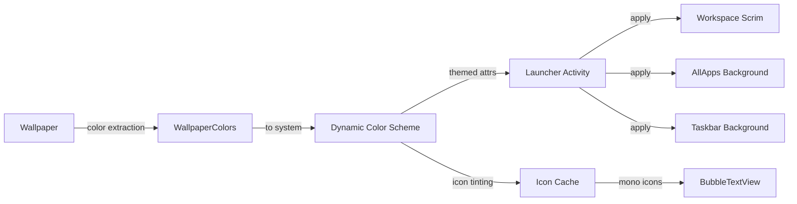

### 48.9.3 Themed Icons

When themed icons are enabled, the `ThemeManager` applies monochrome icon
rendering:

```kotlin
// src/com/android/launcher3/graphics/ThemeManager.kt
@Deprecated("Use [ThemePreference] instead")
var isMonoThemeEnabled
    set(value) = themePreference.setValue(if (value) MONO_THEME_VALUE else null)
    get() = MONO_THEME_VALUE == themePreference.value
```

The themed icon pipeline:

1. Check if the app provides a monochrome icon in its `AdaptiveIconDrawable`
2. If available, extract the monochrome layer
3. Tint it with the wallpaper-derived palette color
4. Cache the themed version in the icon database

Apps that do not provide a monochrome layer receive a fallback treatment
(the full-color icon may be desaturated or overlaid).

### 48.9.4 Icon Shapes

Icon shapes are defined via `ShapeDelegate` and loaded from the system overlay:

```kotlin
// src/com/android/launcher3/graphics/ShapeDelegate.kt
```

The `ShapesProvider` loads available shapes:

```kotlin
// src/com/android/launcher3/shapes/ShapesProvider.kt
```

Supported shapes include circles, rounded squares, squircles, teardrops, and
custom SVG-based paths. The icon shape affects:

- App icon clipping
- Folder icon background
- Widget corner radius
- Notification dot positioning

### 48.9.5 Scrim and Background Treatment

Scrim views provide the visual background treatment:

```java
// src/com/android/launcher3/graphics/Scrim.java
// src/com/android/launcher3/graphics/SysUiScrim.java
```

`SysUiScrim` manages the gradient scrim over the system bars, while
the all-apps scrim provides the dark overlay when the drawer opens.

The `PillColorProvider` generates colors for rounded-pill UI elements:

```kotlin
// src/com/android/launcher3/PillColorProvider.kt
```

### 48.9.6 Wallpaper-Based Colors

The `LocalColorExtractor` extracts colors from the wallpaper behind each widget:

```java
// src/com/android/launcher3/widget/LocalColorExtractor.java
```

This allows widgets to adapt their appearance to the wallpaper region they
cover, providing a cohesive visual experience across the home screen.

### 48.9.7 Dark Mode Support

Launcher3 responds to system dark mode changes via `CONFIG_UI_MODE`:

```java
// src/com/android/launcher3/Launcher.java (imports)
import static android.content.pm.ActivityInfo.CONFIG_UI_MODE;
```

Dark mode affects:

- Workspace page indicators
- All-apps drawer background and text colors
- Folder backgrounds
- Widget background tinting
- Scrim colors and opacity
- Taskbar appearance

The `Themes` utility class provides helpers for reading themed attributes:

```java
// src/com/android/launcher3/util/Themes.java
```

---

## 48.10 Try It: Customize the Launcher Grid

This section walks through modifying the Launcher3 grid configuration to create
a custom layout. We will change the default phone grid from 4x5 to 6x5 and adjust
icon sizes accordingly.

### 48.10.1 Understanding the Grid System

The grid is defined in two files:

1. **`res/xml/device_profiles.xml`** -- declares grid options with row/column counts
2. **`InvariantDeviceProfile.java`** -- parses and selects the appropriate grid

The XML defines grid options like this:

```xml
<!-- res/xml/device_profiles.xml -->
<grid-option
    launcher:name="4_by_4"
    launcher:numRows="4"
    launcher:numColumns="4"
    launcher:numFolderRows="3"
    launcher:numFolderColumns="4"
    launcher:numHotseatIcons="4"
    launcher:dbFile="launcher_4_by_4.db"
    launcher:defaultLayoutId="@xml/default_workspace_4x4"
    launcher:deviceCategory="phone" >

    <display-option
        launcher:name="Super Short Stubby"
        launcher:minWidthDps="255"
        launcher:minHeightDps="300"
        launcher:iconImageSize="48"
        launcher:iconTextSize="13.0"
        launcher:allAppsBorderSpace="16"
        launcher:allAppsCellHeight="104"
        launcher:canBeDefault="true" />
```

### 48.10.2 Step 1: Add a New Grid Option

Add a new `grid-option` entry in `res/xml/device_profiles.xml`:

```xml
<grid-option
    launcher:name="6_by_5_custom"
    launcher:numRows="5"
    launcher:numColumns="6"
    launcher:numFolderRows="3"
    launcher:numFolderColumns="4"
    launcher:numHotseatIcons="6"
    launcher:dbFile="launcher_6_by_5_custom.db"
    launcher:defaultLayoutId="@xml/default_workspace_6x5"
    launcher:deviceCategory="phone" >

    <display-option
        launcher:name="Custom Dense Grid"
        launcher:minWidthDps="300"
        launcher:minHeightDps="500"
        launcher:iconImageSize="40"
        launcher:iconTextSize="11.0"
        launcher:allAppsBorderSpace="12"
        launcher:allAppsCellHeight="88"
        launcher:canBeDefault="true" />
</grid-option>
```

Key parameters:

- `numRows="5"` and `numColumns="6"` -- defines the 6x5 grid
- `iconImageSize="40"` -- smaller icons (48dp is the default)
- `iconTextSize="11.0"` -- smaller text to fit more columns
- `numHotseatIcons="6"` -- matches the column count
- `allAppsCellHeight="88"` -- compact cells for the all-apps drawer

### 48.10.3 Step 2: Create a Default Layout

Create `res/xml/default_workspace_6x5.xml` with the initial home screen content:

```xml
<?xml version="1.0" encoding="utf-8"?>
<favorites
    xmlns:launcher="http://schemas.android.com/apk/res-auto"
    xmlns:android="http://schemas.android.com/apk/res/android">

    <!-- First row: favorite apps -->
    <favorite
        launcher:packageName="com.android.dialer"
        launcher:className="com.android.dialer.main.impl.MainActivity"
        launcher:container="-101"
        launcher:screen="0"
        launcher:x="0"
        launcher:y="0" />

    <favorite
        launcher:packageName="com.android.contacts"
        launcher:className="com.android.contacts.activities.PeopleActivity"
        launcher:container="-101"
        launcher:screen="0"
        launcher:x="1"
        launcher:y="0" />

    <!-- Hotseat items -->
    <favorite
        launcher:packageName="com.android.messaging"
        launcher:className="com.android.messaging.ui.conversationlist.ConversationListActivity"
        launcher:container="-101"
        launcher:screen="0"
        launcher:x="2"
        launcher:y="0" />
</favorites>
```

### 48.10.4 Step 3: Update Grid Selection Logic

In `InvariantDeviceProfile.java`, the grid selection uses the `GRID_NAME` preference.
To force your custom grid during development, temporarily modify the initialization:

The relevant file is:
```
src/com/android/launcher3/InvariantDeviceProfile.java
```

The IDP reads the grid preference with:

```java
// InvariantDeviceProfile initialization
LauncherPrefs prefs = ...;
String gridName = prefs.get(GRID_NAME);
```

You can set the grid name to `"6_by_5_custom"` via the launcher settings UI
or by writing the preference directly in a debug build:

```java
// In a test or debug setup:
LauncherPrefs.getPrefs(context)
    .edit()
    .putString("idp_grid_name", "6_by_5_custom")
    .apply();
```

### 48.10.5 Step 4: Adjust Responsive Specs

For the denser grid, create or modify responsive spec XML files. The workspace
cell spec controls how much space each cell gets:

Create `res/xml/spec_workspace_6_by_5_custom.xml`:

```xml
<?xml version="1.0" encoding="utf-8"?>
<responsive-specs>
    <workspace-spec>
        <cell-size
            launcher:maxAvailableSize="600"
            launcher:iconSize="40dp"
            launcher:iconTextSize="11sp"
            launcher:iconDrawablePadding="4dp" />
        <cell-size
            launcher:maxAvailableSize="1200"
            launcher:iconSize="44dp"
            launcher:iconTextSize="12sp"
            launcher:iconDrawablePadding="5dp" />
    </workspace-spec>
</responsive-specs>
```

### 48.10.6 Step 5: Build and Test

Build the modified launcher:

```bash
# From AOSP root
source build/envsetup.sh
lunch <target>
m Launcher3
```

To test on an emulator, push the APK:

```bash
adb install -r out/target/product/<device>/system/priv-app/Launcher3/Launcher3.apk
adb shell am force-stop com.android.launcher3
```

### 48.10.7 Step 6: Verify Grid Metrics

Launch the Settings app on the device, navigate to the Launcher settings, and
select the custom grid. Alternatively, use the customization surface:

1. Long-press on the home screen to enter Edit Mode
2. The workspace should show the 6-column grid
3. Verify that icons are smaller but still readable
4. Check that the hotseat shows 6 slots
5. Open a folder and verify the 4x3 folder grid

### 48.10.8 Understanding the Grid Calculation

When a grid option is selected, `InvariantDeviceProfile` computes the device
profile through interpolation between defined display options:

```java
// InvariantDeviceProfile.java
private static final float KNEARESTNEIGHBOR = 3;
private static final float WEIGHT_POWER = 5;
private static final float WEIGHT_EFFICIENT = 100000f;
```

The algorithm:

1. Find the `K` nearest display options (by screen dimension distance)
2. Weight each option inversely proportional to distance raised to `WEIGHT_POWER`
3. Interpolate icon size, text size, and spacing between the options

This ensures smooth scaling across different screen sizes within a grid option.

### 48.10.9 Advanced: Adding a Two-Panel Grid

For foldable devices, you can define a two-panel grid option with separate
portrait and landscape configurations. The IDP supports four size indices:

```java
// InvariantDeviceProfile.java
static final int INDEX_DEFAULT = 0;         // Portrait
static final int INDEX_LANDSCAPE = 1;       // Landscape
static final int INDEX_TWO_PANEL_PORTRAIT = 2;  // Two-panel portrait
static final int INDEX_TWO_PANEL_LANDSCAPE = 3; // Two-panel landscape
```

Border spaces, cell heights, and other dimensions can be specified independently
for each index, allowing fine-grained control over the layout in each
configuration.

### 48.10.10 Key Files Reference

For the grid customization exercise, these are the essential files:

| File | Purpose |
|---|---|
| `res/xml/device_profiles.xml` | Grid option definitions |
| `src/.../InvariantDeviceProfile.java` | Grid selection and interpolation |
| `src/.../DeviceProfile.java` | Runtime layout computation |
| `src/.../CellLayout.java` | Grid cell rendering |
| `src/.../Workspace.java` | Page-level grid management |
| `src/.../Hotseat.java` | Bottom row grid |
| `res/xml/default_workspace_*.xml` | Default workspace layouts |
| `src/.../responsive/*.kt` | Responsive spec system |

---

## Summary

This chapter has explored the Launcher3 codebase in AOSP, covering:

- **Architecture** (Section 23.1): The model-view separation between `LauncherModel`
  (data loading on `MODEL_EXECUTOR`) and the view hierarchy rooted at `Launcher`.
  The `StateManager` drives animated transitions between states like NORMAL,
  ALL_APPS, SPRING_LOADED, and OVERVIEW. Dagger dependency injection manages the
  singleton graph.

- **App Icons and Grid** (Section 23.2): The `ItemInfo` hierarchy represents all
  launcher items. `CellLayout` provides the grid container, `BubbleTextView`
  renders icons, and the `DeviceProfile`/`InvariantDeviceProfile` system adapts
  the layout to different screen sizes via XML-defined grid options and responsive
  specifications.

- **Widget System** (Section 23.3): `LauncherWidgetHolder` wraps `AppWidgetHost`
  for lifecycle-aware widget management. The widget picker (`WidgetsFullSheet` and
  `WidgetsListAdapter`) presents available widgets, while `WidgetCell` renders
  previews. The pinning flow involves binding, configuration, and resize.

- **Drag and Drop** (Section 23.4): `DragController` manages the drag lifecycle
  with `DragView` as the visual feedback and `DragLayer` as the intercept layer.
  `SpringLoadedDragController` handles delayed page switching. Drop targets
  include `Workspace`, `Folder`, `Hotseat`, and `DeleteDropTarget`.

- **Recents Integration** (Section 23.5): `QuickstepLauncher` extends `Launcher`
  to serve as the recents provider. `OverviewCommandHelper` processes commands,
  `RecentsView` displays task cards, and `TaskView` renders individual tasks.
  Gesture navigation flows through `TouchInteractionService`.

- **Taskbar** (Section 23.6): `TaskbarActivityContext` manages a separate window
  for the taskbar on large screens. Multiple controllers handle stashing,
  drag-and-drop, desktop mode, and appearance. `StashedHandleViewController`
  shows the handle when the taskbar is hidden.

- **Search Integration** (Section 23.7): `AllAppsSearchBarController` dispatches
  queries to `SearchAlgorithm` implementations. `DefaultAppSearchAlgorithm`
  performs title matching on the model thread. External providers can replace
  the search implementation.

- **Folder System** (Section 23.8): `FolderIcon` represents folders on the
  workspace with a 4-item preview. `Folder` is the expanded view containing
  `FolderPagedView` for paged content. `FolderNameProvider` suggests names
  based on app categories. Spring animations provide natural folder open/close
  transitions.

- **Theming** (Section 23.9): `ThemeManager` centralizes icon shape and theme
  management. Material You integration extracts wallpaper colors for dynamic
  theming. Themed icons use monochrome layers tinted with the palette.
  `LocalColorExtractor` adapts widget backgrounds to the wallpaper.

- **Grid Customization** (Section 23.10): A hands-on exercise for adding a custom
  6x5 grid by modifying `device_profiles.xml`, creating default layouts, and
  adjusting responsive specs.

### Key Source Paths

All paths relative to `packages/apps/Launcher3/`:

| Component | Path |
|---|---|
| Launcher activity | `src/com/android/launcher3/Launcher.java` |
| Workspace | `src/com/android/launcher3/Workspace.java` |
| CellLayout | `src/com/android/launcher3/CellLayout.java` |
| BubbleTextView | `src/com/android/launcher3/BubbleTextView.java` |
| Hotseat | `src/com/android/launcher3/Hotseat.java` |
| LauncherModel | `src/com/android/launcher3/LauncherModel.kt` |
| LauncherAppState | `src/com/android/launcher3/LauncherAppState.kt` |
| InvariantDeviceProfile | `src/com/android/launcher3/InvariantDeviceProfile.java` |
| DeviceProfile | `src/com/android/launcher3/DeviceProfile.java` |
| LauncherState | `src/com/android/launcher3/LauncherState.java` |
| StateManager | `src/com/android/launcher3/statemanager/StateManager.java` |
| DragController | `src/com/android/launcher3/dragndrop/DragController.java` |
| DragLayer | `src/com/android/launcher3/dragndrop/DragLayer.java` |
| DragView | `src/com/android/launcher3/dragndrop/DragView.java` |
| SpringLoadedDragController | `src/com/android/launcher3/dragndrop/SpringLoadedDragController.kt` |
| FolderIcon | `src/com/android/launcher3/folder/FolderIcon.java` |
| Folder | `src/com/android/launcher3/folder/Folder.java` |
| FolderPagedView | `src/com/android/launcher3/folder/FolderPagedView.java` |
| FolderGridOrganizer | `src/com/android/launcher3/folder/FolderGridOrganizer.java` |
| FolderNameProvider | `src/com/android/launcher3/folder/FolderNameProvider.java` |
| LauncherWidgetHolder | `src/com/android/launcher3/widget/LauncherWidgetHolder.java` |
| LauncherAppWidgetHost | `src/com/android/launcher3/widget/LauncherAppWidgetHost.java` |
| WidgetCell | `src/com/android/launcher3/widget/WidgetCell.java` |
| WidgetsFullSheet | `src/com/android/launcher3/widget/picker/WidgetsFullSheet.java` |
| WidgetsListAdapter | `src/com/android/launcher3/widget/picker/WidgetsListAdapter.java` |
| ThemeManager | `src/com/android/launcher3/graphics/ThemeManager.kt` |
| AllAppsContainer | `src/com/android/launcher3/allapps/ActivityAllAppsContainerView.java` |
| AlphabeticalAppsList | `src/com/android/launcher3/allapps/AlphabeticalAppsList.java` |
| SearchBarController | `src/com/android/launcher3/allapps/search/AllAppsSearchBarController.java` |
| DefaultSearch | `src/com/android/launcher3/allapps/search/DefaultAppSearchAlgorithm.java` |
| ItemInfo | `src/com/android/launcher3/model/data/ItemInfo.java` |
| WorkspaceItemInfo | `src/com/android/launcher3/model/data/WorkspaceItemInfo.java` |
| Grid profiles | `res/xml/device_profiles.xml` |
| QuickstepLauncher | `quickstep/src/com/android/launcher3/uioverrides/QuickstepLauncher.java` |
| RecentsView | `quickstep/src/com/android/quickstep/views/RecentsView.java` |
| TaskView | `quickstep/src/com/android/quickstep/views/TaskView.kt` |
| OverviewCommandHelper | `quickstep/src/com/android/quickstep/OverviewCommandHelper.kt` |
| TaskbarActivityContext | `quickstep/src/com/android/launcher3/taskbar/TaskbarActivityContext.java` |
| StashedHandleVC | `quickstep/src/com/android/launcher3/taskbar/StashedHandleViewController.java` |
