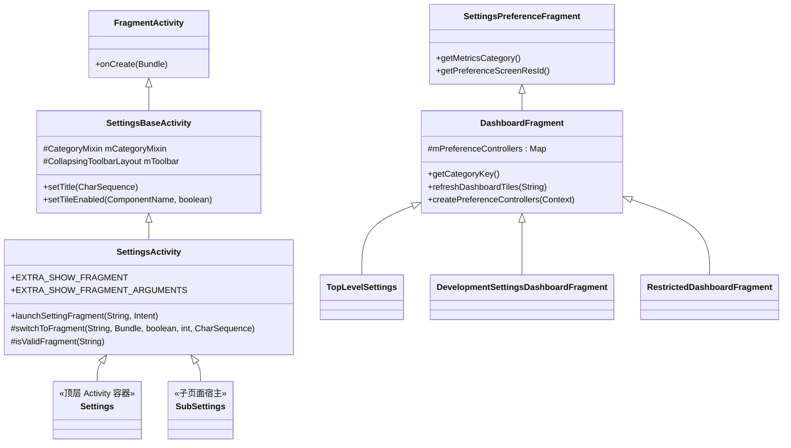
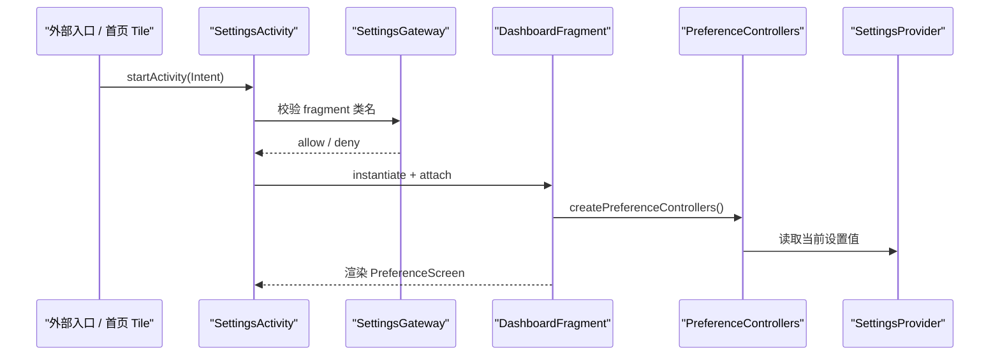
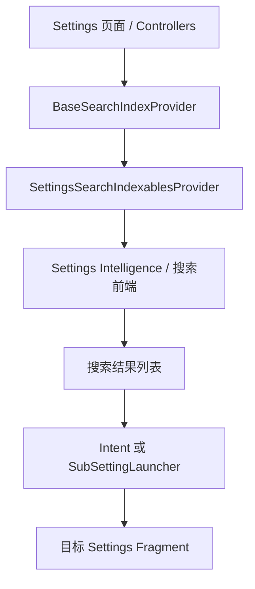
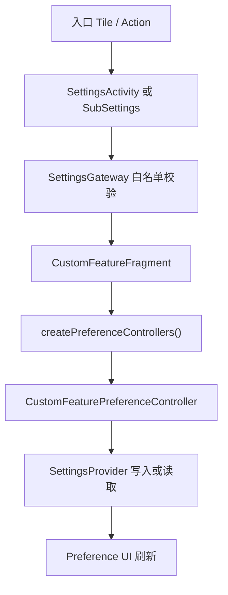

# 第 49 章：Settings 应用

Settings 是 Android 设备最核心的系统应用之一。表面上它像是一个统一的配置入口，实际上背后由 Activity 宿主、Fragment、`PreferenceController`、dashboard tile、搜索索引、`SettingsProvider` 和多种 OEM 扩展点共同组成。它既要管理上百个设置项，又要保证可搜索、可嵌入、可定制，并且在手机、平板和折叠屏上都维持一致的导航体验。

本章以 `packages/apps/Settings/` 为主线，并延伸到 `frameworks/base/packages/SettingsProvider/`。我们会从 Settings 的页面宿主和 dashboard 结构出发，分析开发者选项、搜索索引、主题与双栏布局、FeatureFactory、Slice、SPA 迁移，以及底层的设置值持久化和调试方法，最后通过一个自定义页面的实践把整条链路串起来。

---

## 49.1 Settings 架构

### 49.1.1 目录布局

Settings 应用主代码位于 `packages/apps/Settings/`。顶层目录大致如下：

```text
packages/apps/Settings/
  Android.bp
  AndroidManifest.xml
  res/
  res-export/
  res-product/
  src/
  tests/
  proguard.flags
```

`src/com/android/settings/` 下的子目录与用户可见的大类基本一一对应：

| 目录 | 作用 |
|---|---|
| `homepage/` | 首页 Activity、TopLevelSettings、上下文卡片 |
| `dashboard/` | `DashboardFragment`、`CategoryManager`、tile 注入 |
| `core/` | `SettingsBaseActivity`、`BasePreferenceController`、`SubSettingLauncher` |
| `development/` | 开发者选项及其控制器 |
| `search/` | 搜索索引和查询入口 |
| `network/` | Wi-Fi、移动数据、共享网络 |
| `connecteddevice/` | 蓝牙、NFC、USB |
| `display/` | 亮度、深色主题、显示大小 |
| `sound/` | 音量、铃声、勿扰 |
| `security/` | 锁屏、加密、生物识别 |
| `privacy/` | 权限管理、Safety Center |
| `applications/` | 应用信息、默认应用、特殊权限 |
| `system/` | 语言、日期时间、重置 |
| `deviceinfo/` | 关于手机、版本号、IMEI |
| `accessibility/` | TalkBack、放大、字幕 |
| `activityembedding/` | 大屏双栏布局 |
| `slices/` | Settings Slices 提供者 |
| `overlay/` | `FeatureFactory` OEM 扩展点 |
| `spa/` | 新的 Settings Page Architecture |

Settings 是 AOSP 体量最大的系统应用之一，源码规模远超普通 App，很多页面都依赖统一的基础设施而不是各自独立实现。

### 49.1.2 类层级总览

下面这条继承链可以帮助理解 Settings 的页面宿主模型：



### 49.1.3 `SettingsBaseActivity`：基础宿主

`SettingsBaseActivity` 是所有主页面 Activity 的基础类，主要负责：

- action bar 和 collapsing toolbar
- category mixin
- 大屏和嵌入式布局适配
- 通用窗口样式和导航行为

它本身不理解某个具体设置项，但定义了 Settings 整体的外壳。

### 49.1.4 `SettingsActivity`：Fragment 宿主

`SettingsActivity` 是真正承载大多数设置页的通用宿主。它通过 `EXTRA_SHOW_FRAGMENT` 和参数 bundle 决定要展示哪个 Fragment，并通过 `SettingsGateway` 做白名单校验，避免任意外部 Intent 直接注入不受信任的 Fragment。

这意味着 Settings 的页面切换大量依赖“同一个宿主 Activity + 不同 Fragment”，而不是每个页面都有完整独立的 Activity。

### 49.1.5 `Settings.java`：Stub Activity 集合

`Settings.java` 中定义了大量静态内部类，例如 Wi-Fi、蓝牙、显示、开发者选项等页面对应的 stub Activity。它们通常只是为了给 `AndroidManifest.xml` 提供一个具体入口类名，真正的内容仍由 `SettingsActivity` 和内部 Fragment 承载。

这种做法同时满足了三件事：

1. Manifest 中可以声明大量独立入口。
2. 深链或 action 可以指向具体页面。
3. 实际实现仍可复用统一宿主与生命周期逻辑。

### 49.1.6 `SettingsPreferenceFragment` 与控制器模式

`SettingsPreferenceFragment` 是 Preference 风格页面的基础类。其核心思想是页面本身只负责承载 preference screen，而每个设置项的业务逻辑由 `BasePreferenceController` 子类负责：

- 决定该项是否可用
- 更新摘要或状态
- 响应点击
- 参与搜索索引
- 暴露 Slice 或其他扩展能力

这样可以把“页面布局”和“设置项逻辑”拆开，便于测试和复用。

### 49.1.7 `SubSettingLauncher`

`SubSettingLauncher` 是 Settings 内部统一的子页面跳转工具。它会封装目标 Fragment、参数、标题、来源页面等元数据，并最终跳到 `SubSettings` 或等效宿主。

它的价值在于：

- 避免每个页面手写 fragment transaction
- 保持内部导航参数格式统一
- 与 metrics、highlight、双栏嵌入逻辑对齐

### 49.1.8 生命周期流

Settings 页面的典型启动链路如下：



## 49.2 Dashboard 与分类体系

### 49.2.1 Dashboard 是什么

在 Settings 里，dashboard 指的是“由静态 preference 和动态 tile 混合组成的配置页”。首页 `TopLevelSettings`、网络、系统、隐私等很多页面都不是纯 XML，而是会在运行时装配额外条目。

### 49.2.2 `DashboardFragment`

`DashboardFragment` 是这套机制的核心。它会：

- 加载 XML 中定义的 preference
- 创建并持有一组 `PreferenceController`
- 从 `CategoryManager` 拿到动态 tiles
- 根据控制器状态刷新可见性、摘要和顺序

这使得 Settings 可以在不修改固定布局 XML 的前提下，插入 OEM、模块化组件或条件触发的设置入口。

### 49.2.3 Category Key 与注册表

每个 dashboard 页面都有自己的 category key，用于把页面和某一组 tiles 对应起来。注册关系通常由 `DashboardFragmentRegistry` 或等价映射维护。这样当 `CategoryManager` 重新加载 tile 数据时，框架能知道该把哪些入口分发到哪个页面。

### 49.2.4 Tile 注入机制

tile 注入依赖以下几层配合：

1. Manifest 中声明带特定 action / metadata 的 Activity。
2. `CategoryManager` 扫描系统中可注入的入口。
3. 解析 category、图标、标题、优先级和目标 Intent。
4. `DashboardFeatureProviderImpl` 把 tile 绑定到具体 Preference。

这也是 OEM 自定义 Settings 首页最常用的扩展点之一。

### 49.2.5 `DashboardFeatureProviderImpl`

该类负责 tile 到 Preference 的最后绑定工作，包括：

- 设置标题、摘要、图标
- 绑定点击行为
- 按需处理 external tile
- 和 highlight、搜索、深链逻辑对齐

### 49.2.6 首页：`TopLevelSettings`

`TopLevelSettings` 是 Settings 首页的核心 Fragment。它不仅展示顶层类别，还会与大屏双栏、搜索栏、上下文卡片、动态颜色和图标配色协同工作。很多用户认知中的“Settings 首页布局”实际上都在这里形成。

### 49.2.7 条件可见性

某些 tile 只在特定条件下显示，例如：

- 某项硬件能力存在
- 某个用户类型允许访问
- 某个功能标志开启
- 某个 OEM 模块安装

因此 Dashboard 并不是静态菜单，而是运行时按设备能力和策略裁剪后的结果。

## 49.3 开发者选项

### 49.3.1 七连点彩蛋

开发者选项默认不会直接展示，用户需要在“版本号 / Build number”上连续点击七次。相关逻辑通常由 `BuildNumberPreferenceController` 管理，同时还会结合：

- 用户是否为管理员
- 设备是否受企业策略限制
- 是否需要锁屏凭据验证
- 某些版本下是否允许生物识别确认

### 49.3.2 `DevelopmentSettingsDashboardFragment`

开发者选项页面本身也是一个 `DashboardFragment`。区别在于它拥有极多控制器和更复杂的 enable / disable 生命周期，需要在总开关变化时把状态下发到所有子控制器。

### 49.3.3 分类与控制器

开发者选项通常按类别拆分，例如：

- 调试
- 网络
- 输入
- 绘制
- 应用
- 系统行为
- 监控和日志

每个条目都对应一个 `PreferenceController`。这种模式让新增一个开发选项时，只需增加控制器、XML 和注册逻辑即可。

### 49.3.4 开启门槛

开发者选项的门槛是分层的：

1. 页面入口本身是否显示。
2. 用户是否完成七连点解锁。
3. 是否通过凭据或身份验证。
4. 某些高风险选项是否还要额外受系统属性或设备策略控制。

这不是单一布尔值开关，而是一整套逐层放开的模型。

### 49.3.5 `SystemProperties` 集成

不少开发者选项本质上是 `SystemProperties` 的前端，例如动画缩放、GPU 调试、日志和渲染开关。Settings 中的控制器负责把 UI 状态映射为属性值，再由 framework 或 native 服务消费这些属性。

## 49.4 SettingsProvider

### 49.4.1 总览

虽然 Settings 应用是用户界面入口，但真正持久化设置值的是 `SettingsProvider`。它位于 `frameworks/base/packages/SettingsProvider/`，对 framework 和应用层暴露 `Settings.System`、`Settings.Secure` 与 `Settings.Global` 这三套命名空间。

### 49.4.2 三个命名空间

三者的差异主要在作用域和权限：

| 命名空间 | 典型范围 | 权限级别 |
|---|---|---|
| `System` | 普通系统配置，很多是按用户存储 | 相对较低 |
| `Secure` | 对安全和隐私更敏感的配置 | 更严格 |
| `Global` | 设备级全局配置，跨用户共享 | 最高、通常仅系统可写 |

这也是为什么同样看起来像“一个设置值”，在框架 API 中却分散到不同静态类里。

### 49.4.3 存储机制

SettingsProvider 底层不是 SQLite，而是每个命名空间按用户维护一组 XML 状态文件。这样做的重点不是复杂查询，而是：

- 键值读写快
- 持久化格式清晰
- 易于按用户拆分
- 与 generation tracking 配合简单

### 49.4.4 `call()` API

大量读取和写入通过 `ContentProvider.call()` 走快路径，而不是每次都走通用 query / update 接口。原因是 settings 的访问非常高频，通用 SQL 风格接口开销更大。

### 49.4.5 设置迁移

随着 Android 版本演进，一些 key 会迁移命名空间、改默认值，或者彻底弃用。`SettingsProvider` 在启动和升级过程中需要做兼容迁移，保证老设备升级后不会因 key 漏迁而丢失行为。

### 49.4.6 ContentObserver 模式

读取方通常不会轮询设置值，而是注册 `ContentObserver` 监听变化。这样系统服务或 UI 控件可以在设置被改动时即时更新自身状态。

### 49.4.7 校验

并不是任何 key 都可以接受任意值。Provider 会对一部分重要设置做值校验，避免写入非法枚举、超出范围的数字，或第三方应用伪造危险状态。

### 49.4.8 按用户与按设备存储

有些设置天然属于用户，例如字体大小、无障碍开关；有些则属于整个设备，例如某些无线或调试能力。这也是 `System` / `Secure` / `Global` 分层背后的一个核心维度。

### 49.4.9 常见设置引用

开发中最常碰到的 key 包括：

- `Settings.Global.ADB_ENABLED`
- `Settings.Secure.DEVELOPMENT_SETTINGS_ENABLED`
- `Settings.System.SCREEN_BRIGHTNESS`
- `Settings.Secure.ACCESSIBILITY_ENABLED`
- `Settings.Global.AIRPLANE_MODE_ON`

## 49.5 搜索与索引

### 49.5.1 为什么 Settings 搜索复杂

Settings 搜索的难点在于：很多条目并不是静态存在的，它们可能受设备能力、用户身份、OEM 扩展、Feature Flag、甚至当前运行状态影响。简单全文搜索资源字符串并不能准确反映“当前设备可访问的设置页”。

### 49.5.2 `@SearchIndexable`

不少页面会通过注解或约定暴露可索引元数据，告诉索引系统这个 Fragment 对应哪些 XML 资源或动态数据应该被纳入搜索。

### 49.5.3 `BaseSearchIndexProvider`

这是搜索索引的基础实现。页面可以覆盖以下几类输出：

- XML 资源索引
- 动态 raw data
- 不可索引 key 列表

这让页面在“默认资源可索引”的基础上，还能根据当前状态裁剪搜索结果。

### 49.5.4 `SettingsSearchIndexablesProvider`

它以 ContentProvider 的形式对外暴露 Settings 可索引内容，供 Settings Intelligence 或搜索前端消费。这样索引生产者和搜索展示端可以解耦。

### 49.5.5 注入条目的索引

不仅静态页面要进索引，被注入的 tile 也可能需要被搜索发现。索引系统需要同时理解 dashboard 注入机制和页面本身的元数据，否则搜索结果会出现“能搜到页面但搜不到注入入口”的裂缝。

### 49.5.6 动态 Raw Data

某些搜索条目不直接来自 XML，比如设备名、连接状态、账户类型或 OEM 自定义项，这些都要通过动态 raw data 注入。

### 49.5.7 `SearchFeatureProvider`

这是一层抽象接口，用于屏蔽不同设备或产品形态上的搜索实现差异。OEM 可以通过它接管部分搜索能力，而不必大面积改动每个 Settings 页面。

### 49.5.8 端到端搜索流

搜索链路大致如下：



## 49.6 主题与界面

### 49.6.1 Material Design 与 Settings

Settings 近年的 UI 演进主要围绕 Material Design、Monet 动态色和大屏适配展开。它不是一个强调视觉炫技的应用，但必须保证信息密度、可读性和一致性。

### 49.6.2 Preference Widgets

很多 UI 组件并不是系统默认 Preference 的直接样式，而是 Settings 自己扩展出的 widget，例如带自定义图标、开关、二级摘要或辅助说明的行项目。

### 49.6.3 Collapsing Toolbar

在部分页面中，标题栏会随着滚动发生折叠或展开。`SettingsBaseActivity` 与相关 mixin 负责管理这种交互，确保视觉层次清楚但不影响传统 Preference 列表的稳定性。

### 49.6.4 大屏双栏布局

平板和折叠屏上，Settings 会进入双栏模式：左侧是分类列表，右侧是当前子页面。实现上通常依赖 Activity Embedding，而不是手工维护两套完全不同的 Activity。

### 49.6.5 首页图标配色

首页顶层类别的图标会跟随主题和动态色调调整，不同产品还可能叠加自己的品牌色策略。这通常由首页和主题相关 provider 共同决定。

### 49.6.6 Setup Wizard 集成

某些设置页会在初始向导期间以受限模式运行，显示逻辑、返回行为和可用项都可能与正常设置应用不同。

### 49.6.7 Edge-to-Edge

新版本 Settings 也逐渐适配 edge-to-edge 窗口模式，需要显式处理 system bars、insets 和列表内边距。

### 49.6.8 圆角 Preference 适配

为了配合新版视觉规范，列表条目经常需要按 group 自动应用圆角背景、分隔样式和点击反馈。这也是 Settings 自定义 adapter 和装饰逻辑存在的原因之一。

## 49.7 CategoryManager 与 Tile 加载深入

### 49.7.1 单例角色

`CategoryManager` 是 tile 数据的权威单例。它负责缓存已加载的类别和入口，避免每次打开页面都重新扫描整个系统。

### 49.7.2 初始化流程

初始化通常包括：

1. 扫描声明了 Settings action 的组件。
2. 解析 metadata。
3. 按 category 分组。
4. 建立缓存。
5. 为 dashboard 页面提供查询结果。

### 49.7.3 后处理步骤

加载后的 tile 往往还要进一步处理：

- 去重
- 按优先级排序
- 兼容旧 category key
- 合并安全 / 隐私等特例类别
- 过滤当前设备不适用的入口

### 49.7.4 Deny List

某些入口即便形式上符合 tile 注入规则，也会被 deny list 或安全策略拦截，避免无关或不可信组件污染 Settings 导航结构。

## 49.8 `SettingsPreferenceFragment` 深入

### 49.8.1 基础职责

`SettingsPreferenceFragment` 在普通 `PreferenceFragmentCompat` 之上增加了 Settings 所需的统一能力，例如 metrics、帮助链接、loading、highlight 和受限页面处理。

### 49.8.2 Preference 高亮

当页面通过搜索结果或双栏左侧导航跳入时，框架可以自动高亮特定 preference，帮助用户快速定位。这个行为看似简单，但需要 Fragment、adapter 和滚动逻辑共同配合。

### 49.8.3 对话框管理

很多设置项会弹出确认框、列表选择框或危险操作对话框，基础类会统一管理 dialog 生命周期，避免配置变化时状态错乱。

### 49.8.4 Loading 状态

一些页面依赖后台查询或系统服务返回结果，不适合在主线程直接构建完整 UI，因此基础类也封装了 loading 和延迟刷新模式。

### 49.8.5 `RestrictedDashboardFragment`

这是一个重要子类，用于处理“页面本身存在，但仅管理员或满足特定策略时才允许完整访问”的场景。工作资料、企业策略和多用户设备都经常会用到它。

## 49.9 开发者选项控制器体系

### 49.9.1 控制器注册

开发者选项页拥有数量极多的控制器。通常会在页面初始化时集中创建这些控制器，并把它们注册到统一列表，再由页面宿主在开关变化时逐个回调。

### 49.9.2 Enable / Disable 回调

总开关开启时，控制器会把自身状态同步到 UI 与底层系统；关闭时，则要回滚或恢复默认值。这里的复杂点在于并非所有选项都简单写一个 key，有些会：

- 修改系统属性
- 调系统服务接口
- 触发重启某个子系统
- 与 adb、overlay、渲染管线联动

### 49.9.3 控制器模式的价值

如果没有控制器抽象，开发者选项会迅速退化成一个难以维护的巨大 Fragment。正是因为每个条目独立封装，Settings 才能承受上百个调试开关的长期演进。

## 49.10 SettingsProvider 内部实现

### 49.10.1 `SettingsState` 与 XML 持久化

`SettingsState` 是 Provider 内部维护某个命名空间状态的关键对象，负责：

- 在内存中维护键值表
- 处理脏状态
- 序列化到 XML
- 按用户隔离

### 49.10.2 Key 与类型

虽然对外看起来大多数值都是字符串，但内部会区分默认值、是否保留、包归属以及某些附加元数据，因此它不是一个最原始的 `Map<String, String>` 而已。

### 49.10.3 Generation Tracking

Provider 会维护 generation 计数，帮助调用方快速判断数据是否变化。这对高频观察者和缓存有效性判断非常关键。

### 49.10.4 广播与通知

设置变化后，Provider 除了更新自身状态，还要通过 URI 通知和广播机制唤醒依赖方。这是 framework 服务对设置变化能够实时响应的关键基础。

### 49.10.5 权限模型

不同 key 的读写权限差异非常大，Provider 需要综合：

- 调用方 UID
- 目标命名空间
- 具体 key
- 是否系统应用
- 是否持有特殊权限

### 49.10.6 对第三方应用的限制

第三方应用通常只能读少量公开设置，写能力更受限。否则任何应用都能随意改动安全或设备级配置，会直接破坏系统模型。

## 49.11 `FeatureFactory` 扩展点

### 49.11.1 架构

`FeatureFactory` 是 Settings 的 OEM 扩展入口之一。它把搜索、指标、支持、隐私、安全等 provider 抽象成可替换接口，使设备厂商能替换局部能力，而不必硬 fork 大量 Settings 代码。

### 49.11.2 可替换 Provider

常见可替换组件包括：

- 搜索 provider
- metrics provider
- 支持 / 帮助 provider
- 安全或隐私相关 provider
- 首页卡片或建议逻辑

### 49.11.3 工厂加载方式

通常由 Overlay、产品配置或反射入口决定最终加载哪个实现。框架层只依赖抽象接口，避免主代码直接绑定某个 OEM 类名。

## 49.12 Slices 集成

### 49.12.1 Settings Slices

Settings Slice 允许某个设置项以“可嵌入的小块 UI”形式暴露给其他系统界面，例如搜索结果、智能建议或外部容器。这意味着一个设置项不仅能在 Settings 页面里出现，还能在别的系统表面被局部呈现。

### 49.12.2 Slice 类型

常见类型包括：

- 开关型
- 主从说明型
- 跳转型
- 带图标和摘要的展示型

Slice 的难点不在 UI 本身，而在于把一个受权限和状态约束的设置项安全地暴露给外部容器。

## 49.13 `AndroidManifest.xml` 与入口注册

### 49.13.1 规模与权限

Settings 的 Manifest 体量很大，因为它要声明大量页面入口、intent filter、权限、provider 和 metadata。很多用户可见页面最终都对应一个 manifest Activity 入口，哪怕内部逻辑仍落到统一宿主上。

### 49.13.2 Activity 声明模式

最常见模式是：

1. 在 `Settings.java` 中添加一个 stub Activity。
2. 在 Manifest 里声明它。
3. 通过 metadata 或宿主逻辑把它映射到某个 Fragment。

这种模式兼顾了显式入口、向后兼容和统一实现。

### 49.13.3 Manifest 中的 Tile 注入

某些外部组件之所以能进入 Settings 首页或分类页，就是因为它们通过 manifest metadata 声明了 tile 所需信息，而 `CategoryManager` 会在运行时解析这些声明。

## 49.14 Catalyst / Settings SPA

### 49.14.1 Catalyst 迁移

Settings 近年在逐步引入新的 SPA 架构，用于把部分页面迁移到更现代的状态管理和 UI 组织方式。这个过程是渐进式的，不会一夜之间替换整个传统 Preference 树。

### 49.14.2 `CatalystSettingsActivity`

这是新架构下的页面宿主之一，用于承载新的 Settings 页面实现，同时保持与旧导航和深链体系兼容。

### 49.14.3 `CatalystFragment`

新页面通常会围绕专门的 fragment 或 host 结构展开，把旧式控制器模型与新的 UI 组织方式桥接起来。

### 49.14.4 Hybrid 模式

现实中 Settings 不可能纯新或纯旧，因此大量场景会处于 hybrid 状态：一部分页面仍是传统 `DashboardFragment`，另一部分已经迁移到新的 SPA 栈，宿主和导航层需要同时理解两边。

## 49.15 测试 Settings 应用

### 49.15.1 测试基础设施

Settings 同时依赖单元测试、Robolectric 和 instrumentation 测试。因为大量逻辑都被拆进 `PreferenceController`，这类类通常是最容易做快速测试的切入点。

### 49.15.2 测试控制器

控制器测试重点通常包括：

- `isAvailable()`
- 摘要是否正确
- 点击是否触发正确副作用
- 搜索索引是否按预期暴露

### 49.15.3 测试 `DashboardFragment`

页面级测试更多关注：

- 静态 XML 是否加载
- 动态 tile 是否绑定
- Fragment 跳转参数是否正确
- 高亮与双栏行为是否正常

### 49.15.4 测试搜索索引

```bash
adb shell content query \
    --uri content://com.android.settings.intelligence.search.indexables/resource
```

这类命令能帮助确认页面是否真正进入了索引，而不仅仅是实现了 `SEARCH_INDEX_DATA_PROVIDER` 但没有被正确消费。

## 49.16 性能考量

### 49.16.1 延迟初始化控制器

如果页面一启动就创建并查询所有控制器，很容易拖慢首帧。很多页面会把昂贵逻辑延后到真正显示时，或者分批初始化。

### 49.16.2 UI Blocker 模式

某些设置项依赖系统服务或 Binder 回调，UI blocker 模式的目标是：在必须等待关键数据时显式控制页面阻塞，而不是让列表渲染半截后频繁闪烁。

### 49.16.3 Provider 缓存

SettingsProvider 的 generation 与缓存机制并不是“锦上添花”，而是整个系统能高频读取设置而不至于频繁走磁盘和 IPC 的必要基础。

### 49.16.4 Preference 比较回调

页面刷新时，如果能精确比较 Preference 是否真的变化，就能避免整个列表重建和不必要动画。这对于首页、搜索结果页和大屏双栏场景尤其重要。

## 49.17 双栏布局与 Activity Embedding 深入

### 49.17.1 架构总览

Activity Embedding 允许 Settings 在大屏设备上同时显示目录和详情页，而不必维护完全独立的 tablet 专用页面体系。

### 49.17.2 双栏检测

是否启用双栏通常取决于：

- 窗口宽度
- 设备形态
- 当前方向
- Jetpack WindowManager 提供的 split 能力

### 49.17.3 `SplitPairRule`

它定义哪些 Activity 可以并排显示，以及左右栏的占比、最小宽度和分割行为。Settings 用它把首页与子页面组合成稳定的 master-detail 体验。

### 49.17.4 深链处理

从外部深链直接打开某个页面时，双栏模式下还要决定左栏应选中哪个父类目、右栏是否直接展示目标页，以及返回栈如何组织。

### 49.17.5 Highlight Mixin

双栏模式里，左侧选中态与右侧实际页面必须同步，否则用户会看到“左边高亮 A，右边显示 B”的错位体验。highlight mixin 就是为了解决这一层一致性问题。

### 49.17.6 `SplitInfo` 回调

运行时布局变化时，框架会通过 split 信息回调通知当前是否仍在双栏、左右 Activity 如何配对，Settings 需要据此动态刷新 UI 行为。

## 49.18 常见调试技巧

### 49.18.1 查看设置值

```bash
adb shell settings get secure development_settings_enabled
adb shell settings get global adb_enabled
adb shell settings list system
adb shell settings list secure
adb shell settings list global
adb shell settings delete system custom_setting_key
```

### 49.18.2 直接打开页面

```bash
adb shell am start -a android.settings.SETTINGS
adb shell am start -a android.settings.WIFI_SETTINGS
adb shell am start -a android.settings.BLUETOOTH_SETTINGS
adb shell am start -a android.settings.APPLICATION_DEVELOPMENT_SETTINGS
adb shell am start -n com.android.settings/.Settings\$DevelopmentSettingsActivity
adb shell am start -n com.android.settings/.SubSettings \
    --es ":settings:show_fragment" \
    "com.android.settings.development.DevelopmentSettingsDashboardFragment"
```

### 49.18.3 调试 Tile 注入

```bash
adb shell dumpsys activity providers com.android.settings
adb shell pm query-activities -a com.android.settings.action.EXTRA_SETTINGS
```

### 49.18.4 调试搜索索引

```bash
adb shell am broadcast -a com.android.settings.intelligence.REINDEX
adb shell content query \
    --uri content://com.android.settings.intelligence.search.indexables/resource
```

### 49.18.5 监控设置变化

```bash
adb shell settings monitor
adb shell dumpsys settings
```

前者适合实时观察变更流，后者适合一次性查看完整 Provider 状态、generation 和默认值来源。

## 49.19 动手实践：添加一个自定义 Settings 页面

### 49.19.1 第一步：定义 Preference XML

先在 `res/xml/` 下创建页面资源，例如：

```xml
<PreferenceScreen xmlns:android="http://schemas.android.com/apk/res/android">
    <SwitchPreference
        android:key="custom_feature_enabled"
        android:title="Custom Feature"
        android:summary="Enable the custom feature" />
</PreferenceScreen>
```

### 49.19.2 第二步：创建 `DashboardFragment`

```java
public class CustomFeatureFragment extends DashboardFragment {
    private static final String TAG = "CustomFeatureFragment";

    @Override
    protected String getLogTag() {
        return TAG;
    }

    @Override
    public int getMetricsCategory() {
        return SettingsEnums.PAGE_UNKNOWN;
    }

    @Override
    protected int getPreferenceScreenResId() {
        return R.xml.custom_feature_settings;
    }
}
```

### 49.19.3 第三步：创建控制器

```java
public class CustomFeaturePreferenceController extends TogglePreferenceController {
    private static final String KEY = "custom_feature_enabled";

    public CustomFeaturePreferenceController(Context context) {
        super(context, KEY);
    }

    @Override
    public boolean isChecked() {
        return Settings.Secure.getInt(
                mContext.getContentResolver(), KEY, 0) != 0;
    }

    @Override
    public boolean setChecked(boolean isChecked) {
        return Settings.Secure.putInt(
                mContext.getContentResolver(), KEY, isChecked ? 1 : 0);
    }

    @Override
    public int getAvailabilityStatus() {
        return AVAILABLE;
    }
}
```

### 49.19.4 第四步：在页面中注册控制器

在 Fragment 中实现 `createPreferenceControllers()`，把控制器加入返回列表。这样页面在构建 Preference 时才能把 XML 条目与控制器逻辑绑定起来。

### 49.19.5 第五步：创建 Activity Stub

在 `Settings.java` 中添加一个内部类，例如：

```java
public static class CustomFeatureSettingsActivity extends SettingsActivity { }
```

### 49.19.6 第六步：声明 Manifest

```xml
<activity
    android:name=".Settings$CustomFeatureSettingsActivity"
    android:exported="false" />
```

如果需要从外部 action 或 tile 打开，还要补上相应的 intent filter 或 metadata。

### 49.19.7 第七步：注册 `SettingsGateway`

如果页面通过统一宿主加载 Fragment，就必须把新的 Fragment 类名加入 `SettingsGateway` 白名单，否则运行时会因为安全校验失败而拒绝加载。

### 49.19.8 第八步：从系统设置中挂入口

有两种常见方法：

1. 在某个已有 dashboard XML 中加静态入口。
2. 通过 tile 注入机制动态加入首页或某个分类页。

前者简单直接，后者更适合可选功能或 OEM 扩展。

### 49.19.9 第九步：让它可搜索

为页面提供 `SEARCH_INDEX_DATA_PROVIDER`，至少把 XML 资源和不可索引 key 逻辑定义清楚。否则用户只能通过导航层级找到它，无法从搜索入口直达。

### 49.19.10 第十步：完整生命周期图



### 49.19.11 第十一步：构建与验证

```bash
source build/envsetup.sh
lunch <target>
m Settings
adb install -r out/target/product/<device>/system/priv-app/Settings/Settings.apk
adb shell am force-stop com.android.settings
adb shell am start -n com.android.settings/.Settings\$CustomFeatureSettingsActivity
adb shell settings get secure custom_feature_enabled
```

前三条在 AOSP 根目录执行，后面几条用于部署 APK、重启 Settings 并验证设置值是否真的写入了 `SettingsProvider`。

### 49.19.12 第十二步：进阶扩展

进一步可以做的事情包括：

- 给首页增加 tile
- 接入 Slice
- 为搜索结果增加动态摘要
- 通过 `FeatureFactory` 或 overlay 做 OEM 定制
- 在双栏模式下增加 highlight 支持

## Summary

Settings 是 Android 框架中最“应用化”的系统组件之一，但它的内部组织方式却非常工程化：宿主 Activity、Fragment、控制器、tile 注入、搜索索引和 `SettingsProvider` 各司其职，使上百个设置项能在同一个应用中长期演化而不至于失控。

本章的关键点可以概括为：

- `SettingsActivity` 和 `SubSettings` 构成了统一页面宿主，`SettingsGateway` 则保证 Fragment 跳转受白名单控制。
- `DashboardFragment` 与 `PreferenceController` 的组合，是 Settings 维持可扩展性和可测试性的核心模式。
- `CategoryManager`、`DashboardFeatureProviderImpl` 和 manifest metadata 共同实现了 tile 注入与首页分类系统。
- 开发者选项并不是单纯的隐藏页面，而是一套由七连点、凭据验证、控制器回调和 `SystemProperties` 共同组成的分层模型。
- 真正持久化设置值的是 `SettingsProvider`，其底层依赖按用户划分的 XML 状态、权限校验、generation tracking 与 `ContentObserver` 通知。
- 搜索体系通过 `BaseSearchIndexProvider` 和 `SettingsSearchIndexablesProvider` 把静态 XML、动态 raw data 和不可索引项统一整理成可搜索数据。
- 大屏双栏、Activity Embedding、FeatureFactory、Slices 与 SPA 迁移，体现了 Settings 既要兼容传统 Preference 页面，又要持续适配新形态和新架构。

### 关键源码路径

| 组件 | 路径 |
|---|---|
| Settings 宿主 Activity | `packages/apps/Settings/src/com/android/settings/SettingsActivity.java` |
| Settings Activity Stub 集合 | `packages/apps/Settings/src/com/android/settings/Settings.java` |
| 基础 Activity | `packages/apps/Settings/src/com/android/settings/core/SettingsBaseActivity.java` |
| Fragment 白名单 | `packages/apps/Settings/src/com/android/settings/core/gateway/SettingsGateway.java` |
| 子页面跳转器 | `packages/apps/Settings/src/com/android/settings/core/SubSettingLauncher.java` |
| 基础 Preference Fragment | `packages/apps/Settings/src/com/android/settings/SettingsPreferenceFragment.java` |
| 控制器基类 | `packages/apps/Settings/src/com/android/settings/core/BasePreferenceController.java` |
| Dashboard 基类 | `packages/apps/Settings/src/com/android/settings/dashboard/DashboardFragment.java` |
| Dashboard 注册表 | `packages/apps/Settings/src/com/android/settings/dashboard/DashboardFragmentRegistry.java` |
| Dashboard Tile 绑定 | `packages/apps/Settings/src/com/android/settings/dashboard/DashboardFeatureProviderImpl.java` |
| Tile 管理器 | `packages/apps/Settings/src/com/android/settings/dashboard/CategoryManager.java` |
| 首页 Activity | `packages/apps/Settings/src/com/android/settings/homepage/SettingsHomepageActivity.java` |
| 首页 Fragment | `packages/apps/Settings/src/com/android/settings/homepage/TopLevelSettings.java` |
| 开发者选项页面 | `packages/apps/Settings/src/com/android/settings/development/DevelopmentSettingsDashboardFragment.java` |
| Build Number 控制器 | `packages/apps/Settings/src/com/android/settings/deviceinfo/BuildNumberPreferenceController.java` |
| 搜索索引基类 | `packages/apps/Settings/src/com/android/settings/search/BaseSearchIndexProvider.java` |
| 搜索索引 Provider | `packages/apps/Settings/src/com/android/settings/search/SettingsSearchIndexablesProvider.java` |
| 搜索能力抽象 | `packages/apps/Settings/src/com/android/settings/search/SearchFeatureProvider.java` |
| 双栏工具类 | `packages/apps/Settings/src/com/android/settings/activityembedding/ActivityEmbeddingUtils.java` |
| FeatureFactory | `packages/apps/Settings/src/com/android/settings/overlay/FeatureFactory.java` |
| Slice 相关代码 | `packages/apps/Settings/src/com/android/settings/slices/` |
| SPA 代码目录 | `packages/apps/Settings/src/com/android/settings/spa/` |
| 首页 XML | `packages/apps/Settings/res/xml/top_level_settings.xml` |
| SettingsProvider | `frameworks/base/packages/SettingsProvider/src/com/android/providers/settings/SettingsProvider.java` |
| SettingsState | `frameworks/base/packages/SettingsProvider/src/com/android/providers/settings/SettingsState.java` |
