# Chapter 49: Settings App

The Settings app is the primary user-facing interface for configuring an Android
device.  What appears to be a single monolithic application is in reality a
carefully layered system of activities, fragments, preference controllers,
content providers, and search indexers -- all working together to present hundreds
of configurable options in a discoverable, searchable, and extensible manner.
This chapter dissects the architecture of `packages/apps/Settings/` and its
companion service `frameworks/base/packages/SettingsProvider/`, tracing every
layer from the homepage dashboard down to the persistent key-value store that
backs `Settings.System`, `Settings.Secure`, and `Settings.Global`.

---

## 49.1 Settings Architecture

### 49.1.1 Directory Layout

The Settings app source tree lives under `packages/apps/Settings/`.  Its top
level contains the usual Android project files:

```
packages/apps/Settings/
  Android.bp              # Soong build definition
  AndroidManifest.xml     # 200+ activity declarations
  res/                    # Layouts, drawables, XML preference screens
  res-export/             # Resources exported to other modules
  res-product/            # Product-overlay resources
  src/                    # Java/Kotlin sources
  tests/                  # Robolectric and instrumentation tests
  proguard.flags          # R8 keep rules
```

The `src/com/android/settings/` directory is organised into feature packages
that mirror the top-level categories a user sees:

| Package | Purpose |
|---------|---------|
| `homepage/` | Homepage activity, TopLevelSettings, contextual cards |
| `dashboard/` | DashboardFragment, CategoryManager, tile injection |
| `core/` | SettingsBaseActivity, BasePreferenceController, SubSettingLauncher |
| `development/` | Developer Options -- 100+ preference controllers |
| `search/` | Search indexing infrastructure |
| `network/` | Wi-Fi, Mobile data, Tethering |
| `connecteddevice/` | Bluetooth, NFC, USB |
| `display/` | Brightness, Dark theme, Display size |
| `sound/` | Volume, Ringtone, Do-Not-Disturb |
| `security/` | Screen lock, Encryption, Biometrics |
| `privacy/` | Permission manager, Safety center |
| `fuelgauge/` | Battery stats and battery saver |
| `applications/` | App info, Default apps, Special access |
| `system/` | Languages, Date/time, Reset |
| `deviceinfo/` | About phone, Build number, IMEI |
| `accessibility/` | TalkBack, Magnification, Captions |
| `accounts/` | Account sync, Add account |
| `notification/` | Notification channels, DND modes |
| `activityembedding/` | Two-pane layout for large screens |
| `widget/` | Custom preference widgets |
| `slices/` | Settings Slices provider |
| `overlay/` | FeatureFactory for OEM customisation |
| `spa/` | Settings Page Architecture (new Compose-based UI) |

The total source tree contains well over 1,000 Java/Kotlin files -- making the
Settings app one of the largest applications in AOSP.

### 49.1.2 Class Hierarchy Overview

The following diagram shows the inheritance chain from the Android framework's
`FragmentActivity` all the way down to a concrete settings page such as
`TopLevelSettings` (the homepage) or `DevelopmentSettingsDashboardFragment`
(Developer Options):

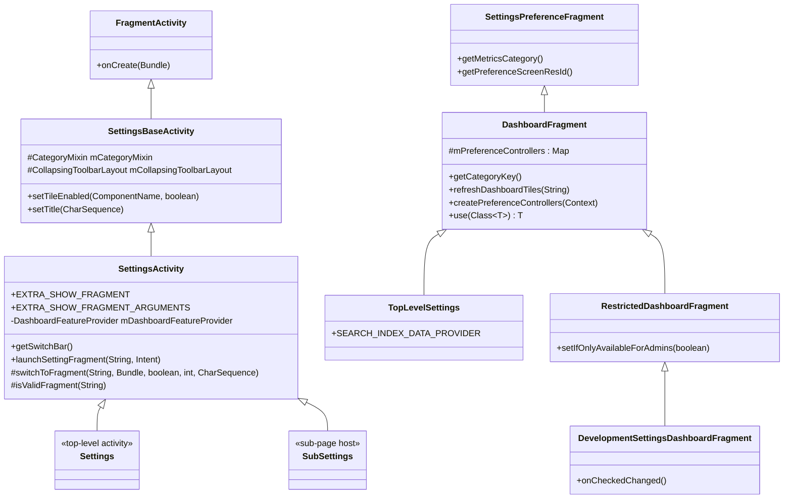

**Source file**: `packages/apps/Settings/src/com/android/settings/SettingsActivity.java`

### 49.1.3 SettingsBaseActivity -- The Foundation

Every page in the Settings app (except the homepage) is hosted by a subclass of
`SettingsBaseActivity`.  This class, defined in
`packages/apps/Settings/src/com/android/settings/core/SettingsBaseActivity.java`,
performs several critical setup tasks during `onCreate()`:

1. **Edge-to-edge layout**: Calls `Utils.setupEdgeToEdge(this)` to enable
   immersive window insets.

2. **Toolbar inflation**: Selects either the expressive Material 3 collapsing
   toolbar or the traditional collapsing toolbar based on the current theme:

```java
// SettingsBaseActivity.java
int resId = SettingsThemeHelper.isExpressiveTheme(getApplicationContext())
        ? EXPRESSIVE_LAYOUT_ID : COLLAPSING_LAYOUT_ID;
super.setContentView(resId);
```

3. **CategoryMixin**: Initialises `CategoryMixin`, which manages dashboard
   category change notifications across the activity lifecycle.

4. **Overlay protection**: Adds `HideNonSystemOverlayMixin` to the lifecycle
   to block non-system overlays from capturing sensitive settings.

5. **Tile enable/disable**: Exposes `setTileEnabled(ComponentName, boolean)` for
   dynamically showing/hiding feature tiles based on hardware capabilities.

### 49.1.4 SettingsActivity -- The Fragment Host

`SettingsActivity` extends `SettingsBaseActivity` and serves as the container
activity for all settings fragments.  Its key responsibilities include:

**Fragment routing via Intent extras**:

```java
// SettingsActivity.java, lines 101-114
public static final String EXTRA_SHOW_FRAGMENT = ":settings:show_fragment";
public static final String EXTRA_SHOW_FRAGMENT_ARGUMENTS = ":settings:show_fragment_args";
public static final String EXTRA_FRAGMENT_ARG_KEY = ":settings:fragment_args_key";
```

When another app (or Settings itself) launches a specific settings page, it
puts the fully-qualified fragment class name in `EXTRA_SHOW_FRAGMENT`.
`SettingsActivity` then validates this fragment against the allowlist in
`SettingsGateway.ENTRY_FRAGMENTS` and instantiates it:

```java
// SettingsActivity.java
void launchSettingFragment(String initialFragmentName, Intent intent) {
    if (initialFragmentName != null) {
        // ...
        switchToFragment(initialFragmentName, initialArguments, true,
                mInitialTitleResId, mInitialTitle);
    } else {
        switchToFragment(TopLevelSettings.class.getName(), null, false,
                mInitialTitleResId, mInitialTitle);
    }
}
```

**Security validation** -- The `isValidFragment()` method checks the fragment
name against the `SettingsGateway.ENTRY_FRAGMENTS` array:

```java
// SettingsActivity.java
protected boolean isValidFragment(String fragmentName) {
    for (int i = 0; i < SettingsGateway.ENTRY_FRAGMENTS.length; i++) {
        if (SettingsGateway.ENTRY_FRAGMENTS[i].equals(fragmentName)) return true;
    }
    return false;
}
```

This is a security measure introduced in Android 4.4 (KitKat) to prevent
malicious apps from injecting arbitrary fragments via intent extras.

**Source file**: `packages/apps/Settings/src/com/android/settings/core/gateway/SettingsGateway.java`

The `SettingsGateway.ENTRY_FRAGMENTS` array contains over 150 fragment class
names -- every fragment that is permitted to be hosted inside `SettingsActivity`.

### 49.1.5 The Settings.java Stub Classes

The file `packages/apps/Settings/src/com/android/settings/Settings.java`
contains an extraordinary pattern: it defines over 150 public static inner
classes, each extending `SettingsActivity`, with empty bodies:

```java
// Settings.java
public static class BluetoothSettingsActivity extends SettingsActivity { /* empty */ }
public static class WifiSettingsActivity extends SettingsActivity { /* empty */ }
public static class DevelopmentSettingsActivity extends SettingsActivity { /* empty */ }
public static class DisplaySettingsActivity extends SettingsActivity { /* empty */ }
// ... 150+ more
```

Each inner class is declared as a separate `<activity>` in
`AndroidManifest.xml` with metadata specifying which fragment to display.
This pattern allows each settings page to have its own `Intent` action and
`ComponentName` while sharing a single activity implementation.  The
`getStartingFragmentClass()` method in `SettingsActivity` resolves the fragment
class from the metadata:

```java
// SettingsActivity.java
private void getMetaData() {
    ActivityInfo ai = getPackageManager().getActivityInfo(getComponentName(),
            PackageManager.GET_META_DATA);
    if (ai == null || ai.metaData == null) return;
    mFragmentClass = ai.metaData.getString(META_DATA_KEY_FRAGMENT_CLASS);
    mHighlightMenuKey = ai.metaData.getString(META_DATA_KEY_HIGHLIGHT_MENU_KEY);
}
```

Some of the inner classes in `Settings.java` contain non-trivial logic.  For
instance, `SecurityDashboardActivity` redirects to SafetyCenter when it is
enabled, and `MobileNetworkActivity` handles intent conversion for SIM
subscriptions.

### 49.1.6 SettingsPreferenceFragment and PreferenceControllers

`SettingsPreferenceFragment` is the base class for all fragments that display
a `PreferenceScreen`.  It provides:

- Metrics reporting via `getMetricsCategory()`
- Help link support via `getHelpResource()`
- Highlight support for deep-linked preferences

The preference controller pattern is the primary mechanism for managing
individual setting items.  Each controller:

1. Extends `BasePreferenceController` (for XML-declared controllers) or
   `AbstractPreferenceController` (for code-declared controllers)

2. Declares an **availability status** via `getAvailabilityStatus()`
3. Manages state updates via `updateState(Preference)`
4. Handles click events via `handlePreferenceTreeClick(Preference)`

```java
// BasePreferenceController.java -- availability constants
public static final int AVAILABLE = 0;
public static final int AVAILABLE_UNSEARCHABLE = 1;
public static final int CONDITIONALLY_UNAVAILABLE = 2;
public static final int UNSUPPORTED_ON_DEVICE = 3;
public static final int DISABLED_FOR_USER = 4;
public static final int DISABLED_DEPENDENT_SETTING = 5;
```

Controllers can be declared in XML with the `settings:controller` attribute:

```xml
<SwitchPreferenceCompat
    android:key="wifi_calling"
    android:title="@string/wifi_calling_title"
    settings:controller="com.android.settings.wifi.calling.WifiCallingPreferenceController"/>
```

At fragment creation time, `PreferenceControllerListHelper.getPreferenceControllersFromXml()`
parses the XML and instantiates each controller via reflection.

### 49.1.7 The SubSettingLauncher

Rather than creating raw intents, Settings pages use `SubSettingLauncher` to
navigate to sub-pages.  This builder class sets the fragment name, arguments,
metrics category, title, and user handle before creating the intent:

```java
new SubSettingLauncher(getContext())
    .setDestination(AdbWirelessDebuggingFragment.class.getName())
    .setSourceMetricsCategory(SettingsEnums.SETTINGS_ADB_WIRELESS)
    .launch();
```

### 49.1.8 Lifecycle Flow

The complete lifecycle of loading a settings page is:

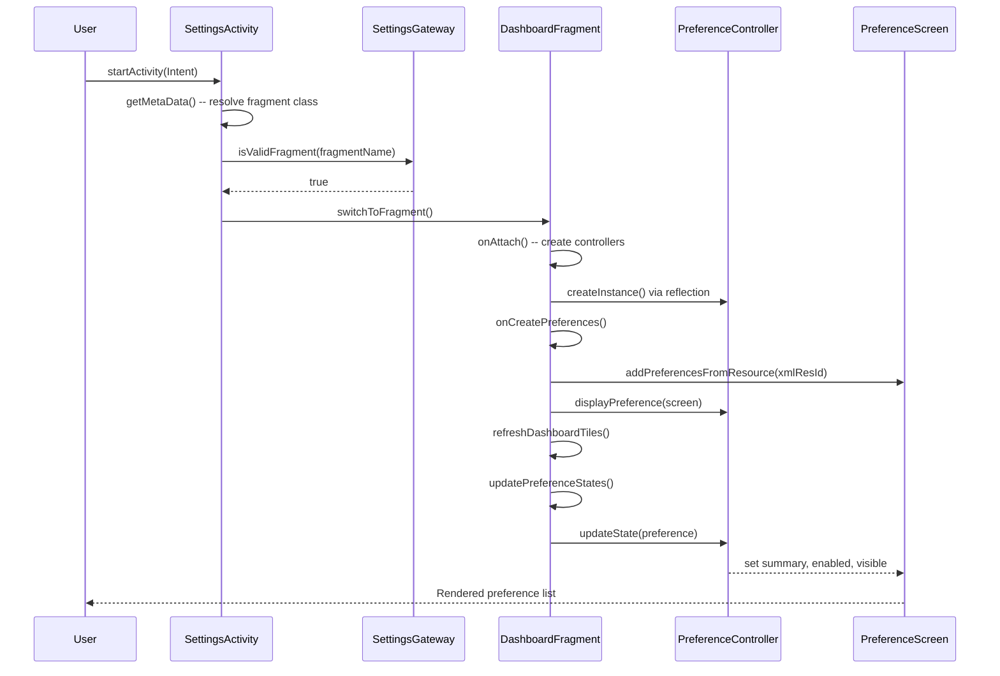

---

## 49.2 Dashboard and Categories

### 49.2.1 What is a Dashboard?

In Settings terminology, a "dashboard" is a `PreferenceScreen` that combines
two sources of preference items:

1. **Static preferences** -- defined in an XML resource file (e.g.,
   `res/xml/top_level_settings.xml`).

2. **Dynamic tiles** -- injected at runtime from other apps or system
   components that declare matching `<intent-filter>` categories.

`DashboardFragment` is the abstract base class that orchestrates this merging.

**Source file**: `packages/apps/Settings/src/com/android/settings/dashboard/DashboardFragment.java`

### 49.2.2 DashboardFragment Internals

The `DashboardFragment` class extends `SettingsPreferenceFragment` and
implements several interfaces:

```java
public abstract class DashboardFragment extends SettingsPreferenceFragment
        implements CategoryListener, Indexable,
        PreferenceGroup.OnExpandButtonClickListener,
        BasePreferenceController.UiBlockListener {
```

Its core data structures are:

| Field | Type | Purpose |
|-------|------|---------|
| `mPreferenceControllers` | `Map<Class, List<AbstractPreferenceController>>` | All controllers, indexed by class |
| `mControllers` | `List<AbstractPreferenceController>` | Flat list of all controllers |
| `mDashboardTilePrefKeys` | `ArrayMap<String, List<DynamicDataObserver>>` | Keys of injected tiles with their data observers |
| `mBlockerController` | `UiBlockerController` | Coordinates async UI-blocking controllers |

The key lifecycle methods:

**`onAttach(Context)`** -- Creates preference controllers from two sources:

```java
// DashboardFragment.java
@Override
public void onAttach(Context context) {
    super.onAttach(context);
    // Load controllers from code (subclass override)
    final List<AbstractPreferenceController> controllersFromCode =
            createPreferenceControllers(context);
    // Load controllers from XML definition
    final List<BasePreferenceController> controllersFromXml =
            PreferenceControllerListHelper.getPreferenceControllersFromXml(
                context, getPreferenceScreenResId());
    // Filter duplicates
    final List<BasePreferenceController> uniqueControllerFromXml =
            PreferenceControllerListHelper.filterControllers(
                controllersFromXml, controllersFromCode);
    // Wire up with lifecycle
    uniqueControllerFromXml.forEach(controller -> {
        if (controller instanceof LifecycleObserver) {
            lifecycle.addObserver((LifecycleObserver) controller);
        }
    });
}
```

**`onCreatePreferences()`** -- Inflates the XML preference screen and
performs initial display:

```java
@Override
public void onCreatePreferences(Bundle savedInstanceState, String rootKey) {
    checkUiBlocker(mControllers);
    refreshAllPreferences(getLogTag());
}
```

**`refreshDashboardTiles()`** -- Queries the `DashboardFeatureProvider` for
tiles matching the fragment's category key and adds, updates, or removes
them from the `PreferenceScreen`.

### 49.2.3 Category Keys and the Registry

Each dashboard fragment is associated with a **category key** via the
`DashboardFragmentRegistry.PARENT_TO_CATEGORY_KEY_MAP`:

```java
// DashboardFragmentRegistry.java
static {
    PARENT_TO_CATEGORY_KEY_MAP = new ArrayMap<>();
    PARENT_TO_CATEGORY_KEY_MAP.put(
        TopLevelSettings.class.getName(), CategoryKey.CATEGORY_HOMEPAGE);
    PARENT_TO_CATEGORY_KEY_MAP.put(
        NetworkDashboardFragment.class.getName(), CategoryKey.CATEGORY_NETWORK);
    PARENT_TO_CATEGORY_KEY_MAP.put(
        ConnectedDeviceDashboardFragment.class.getName(), CategoryKey.CATEGORY_CONNECT);
    PARENT_TO_CATEGORY_KEY_MAP.put(
        DevelopmentSettingsDashboardFragment.class.getName(),
        CategoryKey.CATEGORY_SYSTEM_DEVELOPMENT);
    // ... 30+ mappings
}
```

**Source file**: `packages/apps/Settings/src/com/android/settings/dashboard/DashboardFragmentRegistry.java`

The complete set of category keys for the Settings homepage includes:

| Category Key | Host Fragment | Dashboard Page |
|-------------|---------------|----------------|
| `CATEGORY_HOMEPAGE` | `TopLevelSettings` | Main Settings screen |
| `CATEGORY_NETWORK` | `NetworkDashboardFragment` | Network & internet |
| `CATEGORY_CONNECT` | `ConnectedDeviceDashboardFragment` | Connected devices |
| `CATEGORY_APPS` | `AppDashboardFragment` | Apps |
| `CATEGORY_BATTERY` | `PowerUsageSummary` | Battery |
| `CATEGORY_DISPLAY` | `DisplaySettings` | Display |
| `CATEGORY_SOUND` | `SoundSettings` | Sound & vibration |
| `CATEGORY_STORAGE` | `StorageDashboardFragment` | Storage |
| `CATEGORY_SECURITY` | `SecuritySettings` | Security |
| `CATEGORY_ACCOUNT` | `AccountDashboardFragment` | Passwords & accounts |
| `CATEGORY_SYSTEM` | `SystemDashboardFragment` | System |
| `CATEGORY_SYSTEM_DEVELOPMENT` | `DevelopmentSettingsDashboardFragment` | Developer options |
| `CATEGORY_PRIVACY` | `PrivacyDashboardFragment` | Privacy |
| `CATEGORY_NOTIFICATIONS` | `ConfigureNotificationSettings` | Notifications |
| `CATEGORY_EMERGENCY` | `EmergencyDashboardFragment` | Emergency |

A reverse mapping (`CATEGORY_KEY_TO_PARENT_MAP`) allows the search system to
determine which fragment hosts a given category.

### 49.2.4 Tile Injection Mechanism

Third-party apps and system components can inject tiles into any dashboard by
declaring an `<activity>` with the appropriate `<intent-filter>` in their
manifest:

```xml
<activity android:name=".MySettingsActivity">
    <intent-filter>
        <action android:name="com.android.settings.action.EXTRA_SETTINGS"/>
        <category android:name="com.android.settings.category.ia.homepage"/>
    </intent-filter>
    <meta-data
        android:name="com.android.settings.title"
        android:resource="@string/my_tile_title"/>
    <meta-data
        android:name="com.android.settings.summary"
        android:resource="@string/my_tile_summary"/>
    <meta-data
        android:name="com.android.settings.icon"
        android:resource="@drawable/ic_my_tile"/>
</activity>
```

The injection flow:

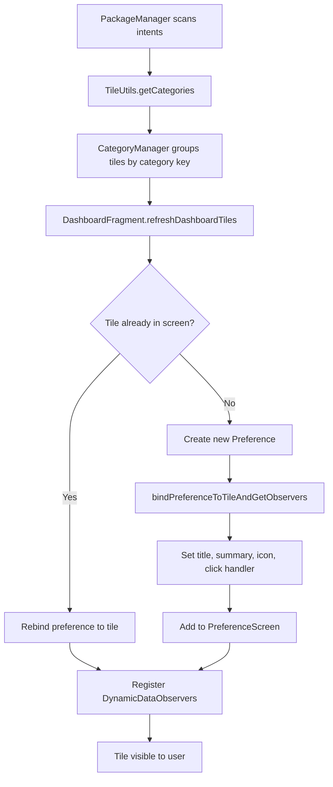

### 49.2.5 DashboardFeatureProviderImpl

The `DashboardFeatureProviderImpl` class (source:
`packages/apps/Settings/src/com/android/settings/dashboard/DashboardFeatureProviderImpl.java`)
provides the concrete implementation for tile management.  Its key method is
`bindPreferenceToTileAndGetObservers()`, which:

1. Sets the preference key from the tile
2. Binds the title (static or dynamic via content URI)
3. Binds the summary (static or dynamic via content URI)
4. Binds the switch state if the tile declares a switch URI
5. Binds the icon (static, from content URI, or from the raw icon provider)
6. Sets the click handler for navigation or profile selection

Dynamic content is fetched by registering `DynamicDataObserver` instances that
watch content URIs.  When the backing data changes, the observer triggers a
background fetch and posts the result to the main thread:

```java
// DashboardFeatureProviderImpl.java
private void refreshSummary(Uri uri, Preference preference, DynamicDataObserver observer) {
    ThreadUtils.postOnBackgroundThread(() -> {
        final Map<String, IContentProvider> providerMap = new ArrayMap<>();
        final String summaryFromUri = TileUtils.getTextFromUri(
                mContext, uri, providerMap, META_DATA_PREFERENCE_SUMMARY);
        if (!TextUtils.equals(summaryFromUri, preference.getSummary())) {
            observer.post(() -> preference.setSummary(summaryFromUri));
        }
    });
}
```

### 49.2.6 The Homepage: TopLevelSettings

The top-level Settings screen is displayed by `TopLevelSettings`, which extends
`DashboardFragment`.  Its XML layout is defined in
`packages/apps/Settings/res/xml/top_level_settings.xml`.

The homepage is organised into `PreferenceCategory` groups:

| Category | Tiles |
|----------|-------|
| Accounts | Injected user account tiles |
| Connectivity | Network & internet, Connected devices |
| Personalise | Apps, Notifications, Sound, Display, Wallpaper, Priority modes, Communal |
| System Info | Storage, Battery, System, About device |
| Security & Privacy | Safety Center, Security, Privacy, Location, Accounts, Emergency |
| Support | Accessibility, Tips & support |

Each tile is a `HomepagePreference` widget with a `settings:controller` and a
`settings:highlightableMenuKey` for two-pane highlighting:

```xml
<com.android.settings.widget.HomepagePreference
    android:fragment="com.android.settings.network.NetworkDashboardFragment"
    android:icon="@drawable/ic_settings_wireless_filled"
    android:key="top_level_network"
    android:title="@string/network_dashboard_title"
    android:summary="@string/summary_placeholder"
    settings:highlightableMenuKey="@string/menu_key_network"
    settings:controller="com.android.settings.network.TopLevelNetworkEntryPreferenceController"/>
```

### 49.2.7 Conditional Tile Visibility

`SettingsActivity.doUpdateTilesList()` dynamically enables or disables tiles
based on hardware capabilities and user state:

```java
// SettingsActivity.java
private void doUpdateTilesList() {
    PackageManager pm = getPackageManager();
    final boolean isAdmin = um.isAdminUser();

    somethingChanged = setTileEnabled(changedList,
            new ComponentName(packageName, WifiSettingsActivity.class.getName()),
            pm.hasSystemFeature(PackageManager.FEATURE_WIFI), isAdmin)
            || somethingChanged;

    somethingChanged = setTileEnabled(changedList,
            new ComponentName(packageName,
                Settings.BluetoothSettingsActivity.class.getName()),
            pm.hasSystemFeature(PackageManager.FEATURE_BLUETOOTH), isAdmin)
            || somethingChanged;

    somethingChanged = setTileEnabled(changedList,
            new ComponentName(packageName,
                Settings.PowerUsageSummaryActivity.class.getName()),
            mBatteryPresent, isAdmin)
            || somethingChanged;
    // ...
}
```

For restricted (non-admin) users, only the fragments listed in
`SettingsGateway.SETTINGS_FOR_RESTRICTED` remain accessible.

---

## 49.3 Developer Options

### 49.3.1 The 7-Tap Easter Egg

Developer Options is hidden by default.  To reveal them, the user must tap the
"Build number" preference 7 times in the "About phone" screen.  This is
implemented in `BuildNumberPreferenceController`:

**Source file**: `packages/apps/Settings/src/com/android/settings/deviceinfo/BuildNumberPreferenceController.java`

```java
// BuildNumberPreferenceController.java
static final int TAPS_TO_BE_A_DEVELOPER = 7;

@Override
public void onStart() {
    mDevHitCountdown = DevelopmentSettingsEnabler.isDevelopmentSettingsEnabled(mContext)
            ? -1 : TAPS_TO_BE_A_DEVELOPER;
}

@Override
public boolean handlePreferenceTreeClick(Preference preference) {
    if (mDevHitCountdown > 0) {
        mDevHitCountdown--;
        if (mDevHitCountdown == 0 && !mProcessingLastDevHit) {
            mDevHitCountdown++;
            // Confirm device credentials before enabling
            mProcessingLastDevHit = builder
                    .setRequestCode(REQUEST_CONFIRM_PASSWORD_FOR_DEV_PREF)
                    .setTitle(title)
                    .show();
            if (!mProcessingLastDevHit) {
                enableDevelopmentSettings();
            }
        } else if (mDevHitCountdown > 0
                && mDevHitCountdown < (TAPS_TO_BE_A_DEVELOPER - 2)) {
            mDevHitToast = Toast.makeText(mContext,
                    StringUtil.getIcuPluralsString(mContext, mDevHitCountdown,
                            R.string.show_dev_countdown),
                    Toast.LENGTH_SHORT);
            mDevHitToast.show();
        }
    }
    return true;
}
```

The unlock flow includes several security gates:

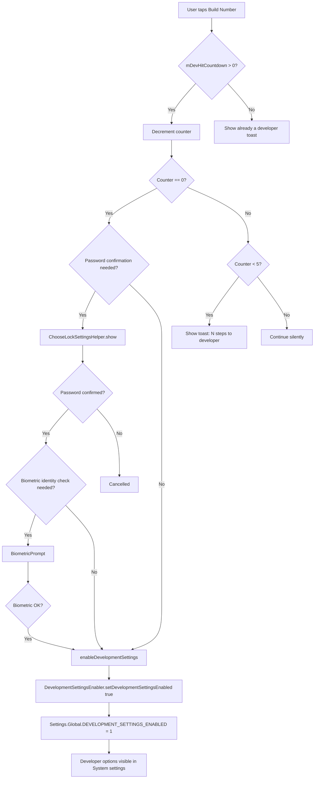

Once enabled, the method writes to `Settings.Global.DEVELOPMENT_SETTINGS_ENABLED`:

```java
// BuildNumberPreferenceController.java
private void enableDevelopmentSettings() {
    mDevHitCountdown = 0;
    DevelopmentSettingsEnabler.setDevelopmentSettingsEnabled(mContext, true);
    mDevHitToast = Toast.makeText(mContext, R.string.show_dev_on, Toast.LENGTH_LONG);
    mDevHitToast.show();
    FeatureFactory.getFeatureFactory().getSearchFeatureProvider()
            .sendPreIndexIntent(mContext);
}
```

### 49.3.2 DevelopmentSettingsDashboardFragment

The main developer options fragment lives at
`packages/apps/Settings/src/com/android/settings/development/DevelopmentSettingsDashboardFragment.java`.

It extends `RestrictedDashboardFragment` (which adds admin-user gating) and
implements a long list of dialog host interfaces:

```java
@SearchIndexable(forTarget = SearchIndexable.ALL & ~SearchIndexable.ARC)
public class DevelopmentSettingsDashboardFragment extends RestrictedDashboardFragment
        implements OnCheckedChangeListener, OemUnlockDialogHost, AdbDialogHost,
        AdbClearKeysDialogHost, LogPersistDialogHost,
        BluetoothRebootDialog.OnRebootDialogListener,
        AbstractBluetoothPreferenceController.Callback,
        NfcRebootDialog.OnNfcRebootDialogConfirmedListener, BluetoothSnoopLogHost {
```

The fragment manages a primary **master switch** (`SettingsMainSwitchBar`) at the
top of the screen.  Toggling it on shows the enable-warning dialog;  toggling it
off either disables immediately or shows a reboot-required dialog if Bluetooth
hardware offload settings have been changed.

### 49.3.3 Developer Option Categories

The developer options page contains over 100 individual preferences, managed by
dedicated `PreferenceController` classes in
`packages/apps/Settings/src/com/android/settings/development/`.

Here is a categorised overview of the most important options:

#### Debugging

| Controller | Setting | Effect |
|-----------|---------|--------|
| `AdbPreferenceController` | USB debugging | Enables `adbd` for development over USB |
| `AdbWirelessDebuggingPreferenceController` | Wireless debugging | ADB over Wi-Fi with pairing |
| `ClearAdbKeysPreferenceController` | Revoke USB debugging authorisations | Clears the authorized RSA key whitelist |
| `MockLocationAppPreferenceController` | Select mock location app | Allows an app to inject fake GPS data |
| `WaitForDebuggerPreferenceController` | Wait for debugger | Pauses app launch until JDWP debugger connects |
| `SelectDebugAppPreferenceController` | Select debug app | Designates the app to debug |
| `VerifyAppsOverUsbPreferenceController` | Verify apps over USB | Scans sideloaded apps for safety |
| `StrictModePreferenceController` | Strict mode enabled | Flashes the screen on main-thread violations |
| `BugReportPreferenceController` | Take bug report | Triggers `dumpstate` |

#### Drawing / GPU

| Controller | Setting | Effect |
|-----------|---------|--------|
| `ShowLayoutBoundsPreferenceController` | Show layout bounds | Draws clip bounds, margins, padding |
| `ShowKeyPressesPreferenceController` | Show key presses | Highlights keyboard interactions |
| `DebugGpuOverdrawPreferenceController` | Debug GPU overdraw | Colour-codes overlapping draws |
| `ProfileGpuRenderingPreferenceController` | Profile GPU rendering | Shows bars per frame |
| `ForceMSAAPreferenceController` | Force 4x MSAA | Anti-aliasing in OpenGL ES 2.0 apps |
| `HardwareLayersUpdatesPreferenceController` | Show hardware layers updates | Flashes green on HW layer updates |
| `HardwareOverlaysPreferenceController` | Disable HW overlays | Forces GPU composition |
| `GpuViewUpdatesPreferenceController` | Show GPU view updates | Flashes on window redraw |
| `ShowSurfaceUpdatesPreferenceController` | Show surface updates | SurfaceFlinger overlay |

#### Animation

| Controller | Setting | Effect |
|-----------|---------|--------|
| `WindowAnimationScalePreferenceController` | Window animation scale | 0.5x - 10x or disabled |
| `TransitionAnimationScalePreferenceController` | Transition animation scale | 0.5x - 10x or disabled |
| `AnimatorDurationScalePreferenceController` | Animator duration scale | 0.5x - 10x or disabled |

These three settings write to `Settings.Global.WINDOW_ANIMATION_SCALE`,
`Settings.Global.TRANSITION_ANIMATION_SCALE`, and
`Settings.Global.ANIMATOR_DURATION_SCALE` respectively.

#### Networking

| Controller | Setting | Effect |
|-----------|---------|--------|
| `MobileDataAlwaysOnPreferenceController` | Mobile data always active | Keeps mobile data up when Wi-Fi is active |
| `TetheringHardwareAccelPreferenceController` | Tethering hardware acceleration | Enables or disables hardware NAT |
| `WifiVerboseLoggingPreferenceController` | Wi-Fi verbose logging | Increase Wi-Fi log level |
| `WifiScanThrottlingPreferenceController` | Wi-Fi scan throttling | Limits background scans |

#### System

| Controller | Setting | Effect |
|-----------|---------|--------|
| `StayAwakePreferenceController` | Stay awake | Screen never sleeps while charging |
| `OemUnlockPreferenceController` | OEM unlocking | Allows bootloader unlock |
| `LocalTerminalPreferenceController` | Linux terminal | Enables embedded terminal |
| `KeepActivitiesPreferenceController` | Don't keep activities | Destroys every activity on leave |
| `BackgroundProcessLimitPreferenceController` | Background process limit | 0-4 or standard limit |
| `LogdSizePreferenceController` | Logger buffer sizes | 64K - 16M |

#### Bluetooth

| Controller | Setting | Effect |
|-----------|---------|--------|
| `BluetoothCodecListPreferenceController` | Bluetooth audio codec | SBC, AAC, aptX, LDAC |
| `BluetoothSampleRateDialogPreferenceController` | Sample rate | 44.1 / 48 / 88.2 / 96 kHz |
| `BluetoothBitPerSampleDialogPreferenceController` | Bits per sample | 16 / 24 / 32 |
| `BluetoothA2dpHwOffloadPreferenceController` | Disable BT A2DP HW offload | Force software encoding |
| `BluetoothLeAudioHwOffloadPreferenceController` | Disable BT LE audio HW offload | Force software for LE audio |
| `BluetoothSnoopLogPreferenceController` | Enable Bluetooth HCI snoop log | Full / filtered / disabled |

### 49.3.4 How Developer Options are Gated

Developer options are globally gated by `Settings.Global.DEVELOPMENT_SETTINGS_ENABLED`.
The fragment checks this at startup:

```java
// DevelopmentSettingsDashboardFragment.java
@Override
public void onCreate(Bundle icicle) {
    super.onCreate(icicle);
    if (!um.isAdminUser()) {
        Toast.makeText(context, R.string.dev_settings_available_to_admin_only_warning,
                Toast.LENGTH_SHORT).show();
        finish();
    } else if (!DevelopmentSettingsEnabler.isDevelopmentSettingsEnabled(context)) {
        Toast.makeText(context, R.string.dev_settings_disabled_warning,
                Toast.LENGTH_SHORT).show();
        finish();
    }
}
```

Additionally, the fragment registers a `ContentObserver` on the setting URI to
detect external changes (such as `adb shell settings put global
development_settings_enabled 0`) and auto-disables if needed:

```java
// DevelopmentSettingsDashboardFragment.java
private final ContentObserver mDeveloperSettingsObserver = new ContentObserver(...) {
    @Override
    public void onChange(boolean selfChange, Uri uri) {
        final boolean developmentEnabledState =
                DevelopmentSettingsEnabler.isDevelopmentSettingsEnabled(activity);
        final boolean switchState = mSwitchBar.isChecked();
        if (developmentEnabledState != switchState) {
            if (!developmentEnabledState) {
                disableDeveloperOptions();
                activity.runOnUiThread(() -> finishFragment());
            }
        }
    }
};
```

### 49.3.5 SystemProperties Integration

Many developer options write to both `Settings.Global` / `Settings.Secure` and
to `SystemProperties`.  The fragment registers a system-property change
callback:

```java
SystemProperties.addChangeCallback(mSystemPropertiesChanged);
```

When a system property changes, the callback triggers `updatePreferenceStates()`
on the UI thread to refresh all preference summaries and states.

After toggling developer options on or off, the fragment calls
`SystemPropPoker.getInstance().poke()` to notify all system services that
properties have changed.

---

## 49.4 Settings Provider

### 49.4.1 Overview

The `SettingsProvider` is a `ContentProvider` that serves as the persistent
storage backend for all system settings.  It is one of the first providers
initialised during boot and runs in the `system_server` process.

**Source file**: `frameworks/base/packages/SettingsProvider/src/com/android/providers/settings/SettingsProvider.java`

As the source documentation states:

> This class is a content provider that publishes the system settings.
> It can be accessed via the content provider APIs or via custom call
> commands.  The latter is a bit faster and is the preferred way to access
> the platform settings.

### 49.4.2 The Three Namespaces

Settings are divided into three namespaces, each with different access
controls and scoping:

| Namespace | Class | Scope | Permission | Examples |
|-----------|-------|-------|------------|----------|
| **System** | `Settings.System` | Per-user, per-device | `WRITE_SETTINGS` (dangerous) | Ring volume, screen brightness, font size |
| **Secure** | `Settings.Secure` | Per-user, per-device | Signature-level | Location mode, accessibility services, default input method |
| **Global** | `Settings.Global` | All users, device-wide | Signature-level | Airplane mode, development settings enabled, ADB enabled |

There are also two additional internal namespaces:

| Namespace | Purpose |
|-----------|---------|
| `SSAID` | Per-app unique IDs (`Settings.Secure.ANDROID_ID`) |
| `Config` | `DeviceConfig` flags (feature flags, server-pushed experiments) |

The provider defines table constants for each:

```java
// SettingsProvider.java
public static final String TABLE_SYSTEM = "system";
public static final String TABLE_SECURE = "secure";
public static final String TABLE_GLOBAL = "global";
public static final String TABLE_SSAID = "ssaid";
public static final String TABLE_CONFIG = "config";
```

### 49.4.3 Storage Mechanism

Settings are **not** stored in SQLite despite the legacy table names.  Modern
Android uses `SettingsState`, which stores each namespace as an XML file:

```
/data/system/users/<userId>/settings_system.xml
/data/system/users/<userId>/settings_secure.xml
/data/system/users/0/settings_global.xml
```

Each setting is a key-value pair, stored as:

```xml
<setting id="42" name="screen_brightness" value="128"
    package="com.android.settings" defaultValue="128"
    defaultSysSet="true" tag="" />
```

Settings are loaded synchronously on provider creation and persisted
asynchronously on mutation.  Critical settings (such as `DEVICE_PROVISIONED`)
are persisted synchronously:

```java
// SettingsProvider.java
private static final Set<String> CRITICAL_GLOBAL_SETTINGS = new ArraySet<>();
static {
    CRITICAL_GLOBAL_SETTINGS.add(Settings.Global.DEVICE_PROVISIONED);
}

private static final Set<String> CRITICAL_SECURE_SETTINGS = new ArraySet<>();
static {
    CRITICAL_SECURE_SETTINGS.add(Settings.Secure.USER_SETUP_COMPLETE);
}
```

### 49.4.4 The Call Method API

While `SettingsProvider` implements the standard `ContentProvider` query/insert
interface, the preferred access path is the `call()` method, which avoids
cursor overhead.  The `call()` method dispatches on method strings:

```java
// SettingsProvider.java
@Override
public Bundle call(String method, String name, Bundle args) {
    switch (method) {
        case Settings.CALL_METHOD_GET_GLOBAL -> {
            Setting setting = getGlobalSetting(name);
            return packageValueForCallResult(...);
        }
        case Settings.CALL_METHOD_GET_SECURE -> {
            Setting setting = getSecureSetting(name, requestingUserId, callingDeviceId);
            return packageValueForCallResult(...);
        }
        case Settings.CALL_METHOD_GET_SYSTEM -> {
            Setting setting = getSystemSetting(name, requestingUserId, callingDeviceId);
            return packageValueForCallResult(...);
        }
        case Settings.CALL_METHOD_PUT_GLOBAL -> {
            insertGlobalSetting(name, value, tag, makeDefault, requestingUserId, ...);
        }
        case Settings.CALL_METHOD_PUT_SECURE -> {
            insertSecureSetting(name, value, tag, makeDefault, requestingUserId, ...);
        }
        case Settings.CALL_METHOD_PUT_SYSTEM -> {
            insertSystemSetting(name, value, requestingUserId, overrideableByRestore);
        }
        // DELETE, RESET, LIST methods...
    }
}
```

### 49.4.5 Settings Migration

Settings move between namespaces across Android versions.  The provider
maintains static sets that track these migrations:

```java
// SettingsProvider.java
static final Set<String> sSecureMovedToGlobalSettings = new ArraySet<>();
static {
    Settings.Secure.getMovedToGlobalSettings(sSecureMovedToGlobalSettings);
}

static final Set<String> sSystemMovedToGlobalSettings = new ArraySet<>();
static {
    Settings.System.getMovedToGlobalSettings(sSystemMovedToGlobalSettings);
}

static final Set<String> sSystemMovedToSecureSettings = new ArraySet<>();
static {
    Settings.System.getMovedToSecureSettings(sSystemMovedToSecureSettings);
}
```

When a client queries `Settings.System` for a key that has been moved to
`Settings.Global`, the provider transparently redirects the query.

### 49.4.6 Content Observer Pattern

The `Settings` API provides a change-notification mechanism through
`ContentObserver`.  Any component can register to watch a specific setting:

```java
// Registering a content observer
ContentResolver cr = context.getContentResolver();
Uri uri = Settings.System.getUriFor(Settings.System.SCREEN_BRIGHTNESS);
cr.registerContentObserver(uri, false, new ContentObserver(handler) {
    @Override
    public void onChange(boolean selfChange) {
        int brightness = Settings.System.getInt(cr,
            Settings.System.SCREEN_BRIGHTNESS, 128);
        // React to brightness change
    }
});
```

The notification flow:

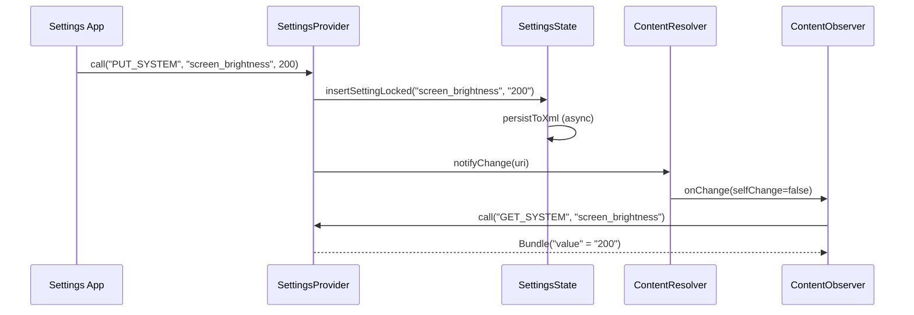

### 49.4.7 Validation

`Settings.System` values are validated using a framework of `Validator`
classes to prevent apps from writing invalid data:

```java
// SettingsProvider uses SystemSettingsValidators
import android.provider.settings.validators.SystemSettingsValidators;
import android.provider.settings.validators.Validator;
```

For example, `SCREEN_BRIGHTNESS` is validated to ensure it falls within the
hardware-supported range.  `Settings.Global` and `Settings.Secure` do not
undergo validation because they are only writable by privileged callers.

### 49.4.8 Per-User and Per-Device Settings

`Settings.System` and `Settings.Secure` are per-user: each Android user profile
has its own set of values.  `Settings.Global` is device-wide and stored under
user 0.

Starting with Android 14, settings also support per-virtual-device scoping.
When a setting is queried from a virtual device context, the provider first
checks for a device-specific override, falling back to the default device:

```java
// SettingsProvider.java, call() method
case Settings.CALL_METHOD_GET_SECURE -> {
    Setting setting = getSecureSetting(name, requestingUserId, callingDeviceId);
    if (callingDeviceId != Context.DEVICE_ID_DEFAULT
            && (setting == null || setting.isNull())) {
        setting = getSecureSetting(name, requestingUserId, Context.DEVICE_ID_DEFAULT);
    }
    return packageValueForCallResult(...);
}
```

### 49.4.9 Common Settings Reference

A quick reference for the most commonly used settings:

| Namespace | Key | Type | Description |
|-----------|-----|------|-------------|
| System | `screen_brightness` | int | Manual brightness (0-255) |
| System | `screen_brightness_mode` | int | 0=manual, 1=auto |
| System | `font_scale` | float | Display font scaling factor |
| System | `ringtone` | string | Default ringtone URI |
| Secure | `android_id` | string | Per-app unique device ID |
| Secure | `enabled_accessibility_services` | string | Colon-separated list of accessibility services |
| Secure | `location_mode` | int | Location access mode |
| Secure | `default_input_method` | string | Component name of the current IME |
| Global | `airplane_mode_on` | int | 0=off, 1=on |
| Global | `development_settings_enabled` | int | 0=hidden, 1=shown |
| Global | `adb_enabled` | int | 0=disabled, 1=enabled |
| Global | `window_animation_scale` | float | Window animation speed multiplier |
| Global | `transition_animation_scale` | float | Activity transition speed multiplier |
| Global | `animator_duration_scale` | float | ValueAnimator speed multiplier |
| Global | `device_provisioned` | int | 0=setup wizard pending, 1=provisioned |

---

## 49.5 Search and Indexing

### 49.5.1 Why Settings Search is Complex

The Settings app contains hundreds of individual preferences spread across
dozens of fragments.  Making all of these searchable requires an indexing
system that can:

1. Parse every XML preference screen to extract titles, summaries, and keys
2. Collect raw data from programmatically created preferences
3. Index injected tiles from third-party apps
4. Track which preferences are currently unavailable (non-indexable keys)
5. Provide this data to the Settings Intelligence app for ranking and display

### 49.5.2 The @SearchIndexable Annotation

Every fragment that participates in search is annotated with
`@SearchIndexable`:

```java
@SearchIndexable
public class MyDeviceInfoFragment extends DashboardFragment { ... }

@SearchIndexable(forTarget = SearchIndexable.ALL & ~SearchIndexable.ARC)
public class DevelopmentSettingsDashboardFragment extends RestrictedDashboardFragment { ... }
```

This annotation is processed at compile time by the Settings search annotation
processor, which generates a registry of all indexable classes.

### 49.5.3 BaseSearchIndexProvider

Each indexable fragment declares a `public static final BaseSearchIndexProvider
SEARCH_INDEX_DATA_PROVIDER` field.  This provider implements the
`Indexable.SearchIndexProvider` interface:

**Source file**: `packages/apps/Settings/src/com/android/settings/search/BaseSearchIndexProvider.java`

The provider supplies three types of data:

**XML resources** -- Preference screen XML files to parse:

```java
@Override
public List<SearchIndexableResource> getXmlResourcesToIndex(Context context, boolean enabled) {
    if (mXmlRes != 0) {
        final SearchIndexableResource sir = new SearchIndexableResource(context);
        sir.xmlResId = mXmlRes;
        return Arrays.asList(sir);
    }
    return null;
}
```

**Raw data** -- Programmatically generated search entries:

```java
@Override
public List<SearchIndexableRaw> getRawDataToIndex(Context context, boolean enabled) {
    final List<SearchIndexableRaw> raws = new ArrayList<>();
    final List<AbstractPreferenceController> controllers = getPreferenceControllers(context);
    for (AbstractPreferenceController controller : controllers) {
        if (controller instanceof BasePreferenceController) {
            ((BasePreferenceController) controller).updateRawDataToIndex(raws);
        }
    }
    return raws;
}
```

**Non-indexable keys** -- Keys to exclude from search results:

```java
@Override
@CallSuper
public List<String> getNonIndexableKeys(Context context) {
    final List<String> nonIndexableKeys = new ArrayList<>();
    if (!isPageSearchEnabled(context)) {
        nonIndexableKeys.addAll(getNonIndexableKeysFromXml(context, true));
        return nonIndexableKeys;
    }
    nonIndexableKeys.addAll(getNonIndexableKeysFromXml(context, false));
    updateNonIndexableKeysFromControllers(context, nonIndexableKeys);
    return nonIndexableKeys;
}
```

The non-indexable key mechanism ensures that preferences which are currently
unavailable (e.g., a USB debugging option when developer mode is off) are
excluded from search results.  This is driven by each controller's
`getAvailabilityStatus()`:

```java
// BasePreferenceController.java
public void updateNonIndexableKeys(List<String> keys) {
    final String key = getPreferenceKey();
    if (!keys.contains(key) && !isAvailableForSearch()) {
        keys.add(key);
    }
}
```

### 49.5.4 SettingsSearchIndexablesProvider

The `SettingsSearchIndexablesProvider` is a `ContentProvider` that the
Settings Intelligence app queries to build its search index.

**Source file**: `packages/apps/Settings/src/com/android/settings/search/SettingsSearchIndexablesProvider.java`

It implements the `SearchIndexablesContract` protocol, providing four types
of data through cursor-based queries:

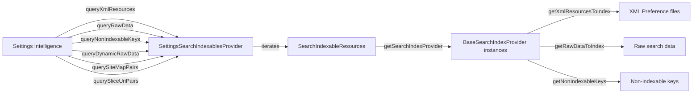

The provider also builds a **site map** -- parent-child relationships between
fragments -- so that Settings Intelligence can show breadcrumb paths in
search results:

```java
// SettingsSearchIndexablesProvider.java
@Override
public Cursor querySiteMapPairs() {
    final MatrixCursor cursor = new MatrixCursor(SITE_MAP_COLUMNS);
    final List<DashboardCategory> categories =
            FeatureFactory.getFeatureFactory()
                .getDashboardFeatureProvider().getAllCategories();
    for (DashboardCategory category : categories) {
        final String parentClass = CATEGORY_KEY_TO_PARENT_MAP.get(category.key);
        for (Tile tile : category.getTiles()) {
            String childClass = tile.getMetaData().getString(
                    SettingsActivity.META_DATA_KEY_FRAGMENT_CLASS);
            cursor.newRow()
                    .add(SiteMapColumns.PARENT_CLASS, parentClass)
                    .add(SiteMapColumns.CHILD_CLASS, childClass);
        }
    }
    return cursor;
}
```

### 49.5.5 Injection Indexing

Third-party tiles injected via the dashboard system are also searchable.  The
`getInjectionIndexableRawData()` method iterates all categories and creates
`SearchIndexableRaw` entries for each eligible tile:

```java
// SettingsSearchIndexablesProvider.java
List<SearchIndexableRaw> getInjectionIndexableRawData(Context context) {
    for (DashboardCategory category : dashboardFeatureProvider.getAllCategories()) {
        for (Tile tile : category.getTiles()) {
            if (!isEligibleForIndexing(currentPackageName, tile)) {
                continue;
            }
            final SearchIndexableRaw raw = new SearchIndexableRaw(context);
            raw.title = tile.getTitle(context).toString();
            raw.key = dashboardFeatureProvider.getDashboardKeyForTile(tile);
            raw.summaryOn = tile.getSummary(context).toString();
            raw.className = CATEGORY_KEY_TO_PARENT_MAP.get(tile.getCategory());
            rawList.add(raw);
        }
    }
    return rawList;
}
```

The `isEligibleForIndexing()` method skips Settings' own activity tiles (which
are indexed through their own fragments) and respects the `isSearchable()` flag.

### 49.5.6 Dynamic Raw Data

Some search results need to be generated at query time rather than index time.
The `queryDynamicRawData()` method calls each provider's
`getDynamicRawDataToIndex()`:

```java
// BaseSearchIndexProvider.java
@Override
@CallSuper
public List<SearchIndexableRaw> getDynamicRawDataToIndex(Context context, boolean enabled) {
    final List<SearchIndexableRaw> dynamicRaws = new ArrayList<>();
    if (!isPageSearchEnabled(context)) {
        return dynamicRaws;
    }
    final List<AbstractPreferenceController> controllers = getPreferenceControllers(context);
    for (AbstractPreferenceController controller : controllers) {
        if (controller instanceof BasePreferenceController) {
            ((BasePreferenceController) controller).updateDynamicRawDataToIndex(dynamicRaws);
        }
    }
    return dynamicRaws;
}
```

This is used for preferences whose titles or summaries change dynamically
(e.g., the current Wi-Fi network name).

### 49.5.7 SearchFeatureProvider

The `SearchFeatureProvider` interface connects the Settings app to Settings
Intelligence:

**Source file**: `packages/apps/Settings/src/com/android/settings/search/SearchFeatureProvider.java`

It provides:

- `getSearchIndexableResources()` -- Returns the compile-time-generated registry
- `getSettingsIntelligencePkgName()` -- Returns the package name of the search app
- `initSearchToolbar()` -- Initialises the search bar on the homepage
- `buildSearchIntent()` -- Creates the intent to launch the search UI
- `sendPreIndexIntent()` -- Notifies Settings Intelligence to re-index

The search toolbar is initialised on the homepage and triggers a transition to
the Settings Intelligence search activity:

```java
// SearchFeatureProvider.java
default void initSearchToolbar(@NonNull FragmentActivity activity, @Nullable View toolbar,
        int pageId) {
    // ...
    final Intent intent = buildSearchIntent(context, pageId)
            .addFlags(Intent.FLAG_ACTIVITY_CLEAR_TOP);
    toolbar.setOnClickListener(tb -> startSearchActivity(context, activity, pageId, intent));
    toolbar.setHandwritingDelegatorCallback(
            () -> startSearchActivity(context, activity, pageId, intent));
}
```

### 49.5.8 End-to-End Search Flow

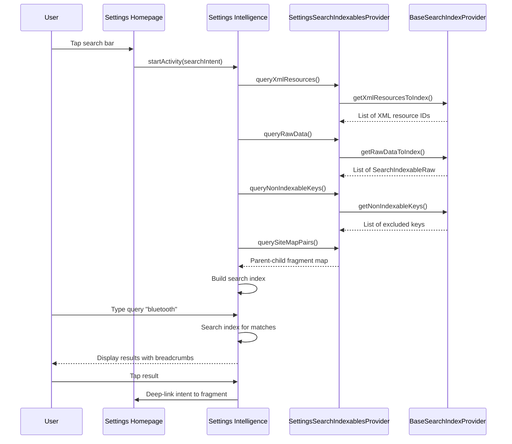

---

## 49.6 Theming and UI

### 49.6.1 Material Design in Settings

The Settings app has evolved through multiple design languages:

- **Holo** (Android 4.x): Dark ActionBar with preference lists
- **Material Design 1** (Android 5.x-8.x): White cards, CollapsingToolbar
- **Material Design 2** (Android 9-11): Rounded corners, accent colours
- **Material Design 3 / Material You** (Android 12+): Dynamic colour, large headlines
- **Expressive Design** (Android 16+): New icon styles, enhanced typography

The current theme is selected at runtime:

```java
// SettingsBaseActivity.java
if (isToolbarEnabled() && !isAnySetupWizard) {
    int resId = SettingsThemeHelper.isExpressiveTheme(getApplicationContext())
            ? EXPRESSIVE_LAYOUT_ID : COLLAPSING_LAYOUT_ID;
    super.setContentView(resId);
}
```

For sub-settings pages, the theme is applied based on context:

```java
// SettingsActivity.java
if (isSubSettings(intent) && !WizardManagerHelper.isAnySetupWizard(getIntent())) {
    int themeId = SettingsThemeHelper.isExpressiveTheme(this)
            ? R.style.Theme_SubSettings_Expressive : R.style.Theme_SubSettings;
    setTheme(themeId);
}
```

### 49.6.2 Preference Widgets

The Settings app uses several custom preference widgets beyond the standard
AndroidX `Preference` library:

| Widget | Source | Purpose |
|--------|--------|---------|
| `HomepagePreference` | `widget/HomepagePreference.java` | Homepage tiles with icon, title, summary |
| `SettingsMainSwitchBar` | `widget/SettingsMainSwitchBar.java` | Page-level primary toggle (e.g., Wi-Fi, Developer options) |
| `PrimarySwitchPreference` | `settingslib/` | Preference with an independent switch on the right |
| `SummaryPreference` | `SummaryPreference.java` | Preference with primary/secondary text and chart |
| `RestrictedSwitchPreference` | `RestrictedSwitchPreference` | Switch that shows admin restriction info |
| `LayoutPreference` | `settingslib/` | Wraps a custom layout inside a preference row |
| `SelectorWithWidgetPreference` | `settingslib/` | Radio button preference |
| `CustomListPreference` | `CustomListPreference.java` | List preference with custom dialog |

### 49.6.3 Collapsing Toolbar

Both the homepage and sub-pages use a collapsing toolbar that shows a large
title when scrolled to the top and collapses into the action bar on scroll.

The toolbar implementation lives in `settingslib`:

```
frameworks/libs/settingslib/CollapsingToolbarBaseActivity/
    src/com/android/settingslib/collapsingtoolbar/
        CollapsingToolbarDelegate.java
        FloatingToolbarHandler.java
```

The `SettingsBaseActivity` initialises the toolbar delegate in `onCreate()`:

```java
// SettingsBaseActivity.java
mCollapsingToolbarLayout = findViewById(
    com.android.settingslib.collapsingtoolbar.R.id.collapsing_toolbar);
mAppBarLayout = findViewById(R.id.app_bar);
getToolbarDelegate().initCollapsingToolbar(mCollapsingToolbarLayout, mAppBarLayout);
```

### 49.6.4 Two-Pane Layout for Large Screens

On tablets and foldables, Settings uses **Activity Embedding** to show a
two-pane layout: the homepage list on the left and the selected settings
page on the right.

The key classes for this are in `packages/apps/Settings/src/com/android/settings/activityembedding/`:

| File | Purpose |
|------|---------|
| `ActivityEmbeddingUtils.java` | Checks if embedding is enabled and screen is large enough |
| `ActivityEmbeddingRulesController.java` | Registers `SplitPairRule` for Settings activities |
| `EmbeddedDeepLinkUtils.kt` | Handles deep links in two-pane mode |

The `SettingsHomepageActivity` detects the two-pane state:

```java
// SettingsHomepageActivity.java
mIsEmbeddingActivityEnabled = ActivityEmbeddingUtils.isEmbeddingActivityEnabled(this);
```

When embedding is active, clicking a homepage tile shows the sub-settings page
in the right pane while keeping the homepage visible on the left.  The
`TopLevelHighlightMixin` highlights the selected tile in the left pane.

The embedding rules are registered as `SplitPairRule` objects using the Jetpack
WindowManager library:

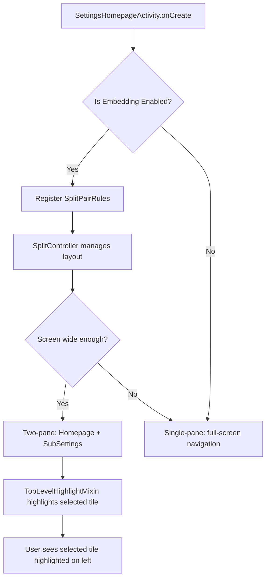

When the activity is in two-pane mode, `SettingsActivity.shouldShowMultiPaneDeepLink()`
detects deep link intents and redirects them through the homepage trampoline to
ensure both panes are visible.

### 49.6.5 Homepage Icon Colour Scheme

In the expressive theme, homepage icons use a colour scheme system.  Each tile
can declare an icon colour scheme in its metadata:

```java
// DashboardFeatureProviderImpl.java
@VisibleForTesting
enum ColorScheme {
    blue_variant(R.color.homepage_blue_variant_fg, R.color.homepage_blue_variant_bg),
    blue(R.color.homepage_blue_fg, R.color.homepage_blue_bg),
    pink(R.color.homepage_pink_fg, R.color.homepage_pink_bg),
    orange(R.color.homepage_orange_fg, R.color.homepage_orange_bg),
    yellow(R.color.homepage_yellow_fg, R.color.homepage_yellow_bg),
    green(R.color.homepage_green_fg, R.color.homepage_green_bg),
    grey(R.color.homepage_grey_fg, R.color.homepage_grey_bg),
    cyan(R.color.homepage_cyan_fg, R.color.homepage_cyan_bg),
    red(R.color.homepage_red_fg, R.color.homepage_red_bg),
    purple(R.color.homepage_purple_fg, R.color.homepage_purple_bg);
}
```

The icon is rendered as an `AdaptiveIcon` with the foreground tinted and
the background filled with the scheme's background colour.

### 49.6.6 Setup Wizard Integration

When Settings is launched during the setup wizard, it applies special themes
and transitions:

```java
// SettingsBaseActivity.java
final boolean isAnySetupWizard = WizardManagerHelper.isAnySetupWizard(getIntent());
if (isAnySetupWizard) {
    TransitionHelper.applyForwardTransition(this);
    TransitionHelper.applyBackwardTransition(this);
    if (this instanceof SubSettings) {
        if (SettingsThemeHelper.isExpressiveTheme(this)) {
            setTheme(R.style.SettingsPreferenceTheme_SetupWizard_Expressive);
        } else {
            setTheme(R.style.SettingsPreferenceTheme_SetupWizard);
        }
        ThemeHelper.trySetSuwTheme(this);
    }
}
```

The setup wizard theme removes the toolbar, adds slide transitions, and
uses Google's SetupDesign library for consistent look-and-feel.

### 49.6.7 Edge-to-Edge Display

Modern Android Settings uses edge-to-edge display where the content extends
behind the system bars.  The `Utils.setupEdgeToEdge()` call in
`SettingsBaseActivity` enables this:

- Status bar is transparent
- Navigation bar is transparent
- Content uses `WindowInsetsCompat` for padding

### 49.6.8 Round-Corner Preference Adapter

On the homepage, preferences are rendered with rounded corners using
`RoundCornerPreferenceAdapter`:

```java
// TopLevelSettings.java
@Override
protected RecyclerView.Adapter onCreateAdapter(PreferenceScreen preferenceScreen) {
    if (mIsEmbeddingActivityEnabled && (getActivity() instanceof SettingsHomepageActivity)) {
        return mHighlightMixin.onCreateAdapter(this, preferenceScreen, mScrollNeeded);
    }
    return new RoundCornerPreferenceAdapter(preferenceScreen);
}
```

---

## 49.7 Try It: Add a Custom Settings Page

This section walks through adding a complete custom settings page to the
Settings app, from XML definition through preference controller to search
integration.

### 49.7.1 Step 1: Define the Preference XML

Create a new XML preference screen.  For this example, we will build a
"Custom Lab" page with a toggle and a list preference:

```xml
<!-- res/xml/custom_lab_settings.xml -->
<?xml version="1.0" encoding="utf-8"?>
<PreferenceScreen
    xmlns:android="http://schemas.android.com/apk/res/android"
    xmlns:settings="http://schemas.android.com/apk/res-auto"
    android:title="@string/custom_lab_title">

    <SwitchPreferenceCompat
        android:key="custom_lab_feature_toggle"
        android:title="Enable Lab Feature"
        android:summary="Toggles the experimental lab feature"
        settings:controller="com.android.settings.development.CustomLabToggleController"/>

    <ListPreference
        android:key="custom_lab_mode"
        android:title="Lab Mode"
        android:summary="%s"
        android:entries="@array/custom_lab_mode_entries"
        android:entryValues="@array/custom_lab_mode_values"
        settings:controller="com.android.settings.development.CustomLabModeController"/>

    <Preference
        android:key="custom_lab_info"
        android:title="Lab Information"
        android:summary="Displays information about the custom lab"
        android:selectable="false"/>

</PreferenceScreen>
```

### 49.7.2 Step 2: Create the DashboardFragment

Create a new fragment that extends `DashboardFragment`:

```java
// src/com/android/settings/development/CustomLabFragment.java
package com.android.settings.development;

import android.app.settings.SettingsEnums;
import android.content.Context;
import com.android.settings.R;
import com.android.settings.dashboard.DashboardFragment;
import com.android.settings.search.BaseSearchIndexProvider;
import com.android.settingslib.search.SearchIndexable;

@SearchIndexable
public class CustomLabFragment extends DashboardFragment {

    private static final String TAG = "CustomLabFragment";

    @Override
    protected int getPreferenceScreenResId() {
        return R.xml.custom_lab_settings;
    }

    @Override
    protected String getLogTag() {
        return TAG;
    }

    @Override
    public int getMetricsCategory() {
        return SettingsEnums.PAGE_UNKNOWN;  // Use a proper enum in production
    }

    public static final BaseSearchIndexProvider SEARCH_INDEX_DATA_PROVIDER =
            new BaseSearchIndexProvider(R.xml.custom_lab_settings);
}
```

### 49.7.3 Step 3: Create Preference Controllers

Create a toggle controller that reads/writes a setting:

```java
// src/com/android/settings/development/CustomLabToggleController.java
package com.android.settings.development;

import android.content.Context;
import android.provider.Settings;
import com.android.settings.core.TogglePreferenceController;

public class CustomLabToggleController extends TogglePreferenceController {

    private static final String SETTING_KEY = "custom_lab_feature_enabled";

    public CustomLabToggleController(Context context, String preferenceKey) {
        super(context, preferenceKey);
    }

    @Override
    public int getAvailabilityStatus() {
        return AVAILABLE;
    }

    @Override
    public boolean isChecked() {
        return Settings.System.getInt(mContext.getContentResolver(),
                SETTING_KEY, 0) == 1;
    }

    @Override
    public boolean setChecked(boolean isChecked) {
        return Settings.System.putInt(mContext.getContentResolver(),
                SETTING_KEY, isChecked ? 1 : 0);
    }

    @Override
    public int getSliceHighlightMenuRes() {
        return 0;  // Not used in Slices
    }
}
```

### 49.7.4 Step 4: Register in SettingsGateway

Add the fragment to the `ENTRY_FRAGMENTS` array in `SettingsGateway.java` so
that `SettingsActivity` will accept it:

```java
// SettingsGateway.java
public static final String[] ENTRY_FRAGMENTS = {
    // ... existing entries ...
    CustomLabFragment.class.getName(),
};
```

### 49.7.5 Step 5: Create the Activity Stub

Add an inner class in `Settings.java`:

```java
// Settings.java
public static class CustomLabActivity extends SettingsActivity { /* empty */ }
```

### 49.7.6 Step 6: Declare in AndroidManifest.xml

Add the activity declaration with metadata pointing to the fragment:

```xml
<activity
    android:name="Settings$CustomLabActivity"
    android:label="@string/custom_lab_title"
    android:exported="true">
    <intent-filter android:priority="1">
        <action android:name="android.settings.CUSTOM_LAB_SETTINGS"/>
        <category android:name="android.intent.category.DEFAULT"/>
    </intent-filter>
    <meta-data
        android:name="com.android.settings.FRAGMENT_CLASS"
        android:value="com.android.settings.development.CustomLabFragment"/>
    <meta-data
        android:name="com.android.settings.HIGHLIGHT_MENU_KEY"
        android:value="@string/menu_key_system"/>
</activity>
```

### 49.7.7 Step 7: Add a Link from System Settings

To make the new page accessible, add a preference to an existing XML screen
(e.g., `res/xml/system_dashboard_fragment.xml`):

```xml
<Preference
    android:key="custom_lab"
    android:title="@string/custom_lab_title"
    android:summary="@string/custom_lab_summary"
    android:fragment="com.android.settings.development.CustomLabFragment"/>
```

### 49.7.8 Step 8: Make It Searchable

The `@SearchIndexable` annotation and the `SEARCH_INDEX_DATA_PROVIDER` field
we added in Step 2 are sufficient.  The compile-time annotation processor
will include the fragment in the search index.

To verify, you can query the index:

```bash
adb shell content query \
  --uri content://com.android.settings.intelligence.search.indexables/resource \
  | grep custom_lab
```

### 49.7.9 Complete Lifecycle Diagram

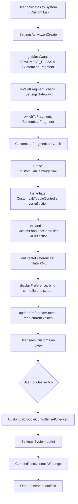

### 49.7.10 Testing Your Custom Page

Run the Settings app on an emulator:

```bash
# Build and flash
m Settings -j$(nproc)
adb install -r $OUT/system/priv-app/Settings/Settings.apk

# Launch the custom page directly
adb shell am start -n com.android.settings/.Settings\$CustomLabActivity

# Or via the action
adb shell am start -a android.settings.CUSTOM_LAB_SETTINGS

# Verify the setting is written
adb shell settings get system custom_lab_feature_enabled
```

You can also test the search integration by opening Settings, tapping the
search bar, and typing "Lab".  The custom preferences should appear in the
results if the search index has been refreshed.

### 49.7.11 Advanced: Adding a Tile to the Homepage

To inject your page as a tile on the homepage, you would modify
`res/xml/top_level_settings.xml` to add a `HomepagePreference`:

```xml
<com.android.settings.widget.HomepagePreference
    android:fragment="com.android.settings.development.CustomLabFragment"
    android:icon="@drawable/ic_custom_lab"
    android:key="top_level_custom_lab"
    android:order="50"
    android:title="@string/custom_lab_title"
    android:summary="@string/custom_lab_summary"
    settings:highlightableMenuKey="@string/menu_key_custom_lab"
    settings:controller="com.android.settings.development.CustomLabHomepageController"/>
```

And register the category mapping in `DashboardFragmentRegistry`:

```java
PARENT_TO_CATEGORY_KEY_MAP.put(
    CustomLabFragment.class.getName(), "com.android.settings.category.custom_lab");
```

### 49.7.12 Advanced: OEM Customisation via FeatureFactory

OEMs can customise the Settings app without forking by implementing
a custom `FeatureFactory` via the overlay system.  The factory provides
feature-specific providers:

```
packages/apps/Settings/src/com/android/settings/overlay/FeatureFactory.java
```

Key extension points include:

| Provider | Purpose |
|----------|---------|
| `DashboardFeatureProvider` | Custom tile binding logic |
| `SearchFeatureProvider` | Custom search indexing |
| `MetricsFeatureProvider` | Custom analytics |
| `SecurityFeatureProvider` | Custom security settings |
| `SupportFeatureProvider` | Custom support/help integration |
| `EnterprisePrivacyFeatureProvider` | MDM integration |

OEMs declare their custom factory in a resource overlay:

```xml
<!-- overlay/res/values/config.xml -->
<string name="config_featureFactory">
    com.myoem.settings.MyFeatureFactoryImpl
</string>
```

---

## 49.8 Deep Dive: CategoryManager and Tile Loading

### 49.8.1 CategoryManager as Singleton

The `CategoryManager` is a singleton that caches all dashboard tiles.  It is
the authoritative source for tile data in the Settings app.

**Source file**: `packages/apps/Settings/src/com/android/settings/dashboard/CategoryManager.java`

```java
// CategoryManager.java
public static CategoryManager get(Context context) {
    if (sInstance == null) {
        sInstance = new CategoryManager(context);
    }
    return sInstance;
}
```

Its core data structures:

| Field | Type | Purpose |
|-------|------|---------|
| `mTileByComponentCache` | `Map<Pair<String, String>, Tile>` | Package+Activity to Tile mapping |
| `mCategoryByKeyMap` | `Map<String, DashboardCategory>` | Category key to DashboardCategory |
| `mCategories` | `List<DashboardCategory>` | All categories in order |
| `mInterestingConfigChanges` | `InterestingConfigChanges` | Detects locale/density/theme changes |

### 49.8.2 Category Initialisation Flow

Categories are lazily initialised on first access via `tryInitCategories()`:

```java
// CategoryManager.java
private synchronized void tryInitCategories(Context context, boolean forceClearCache) {
    if (!WizardManagerHelper.isUserSetupComplete(context)) {
        return;  // Don't init during setup wizard
    }
    if (mCategories == null) {
        if (forceClearCache) {
            mTileByComponentCache.clear();
        }
        mCategoryByKeyMap.clear();
        mCategories = TileUtils.getCategories(context, mTileByComponentCache);
        for (DashboardCategory category : mCategories) {
            mCategoryByKeyMap.put(category.key, category);
        }
        backwardCompatCleanupForCategory(mTileByComponentCache, mCategoryByKeyMap);
        mergeSecurityPrivacyKeys(context, mTileByComponentCache, mCategoryByKeyMap);
        sortCategories(context, mCategoryByKeyMap);
        filterDuplicateTiles(mCategoryByKeyMap);
    }
}
```

`TileUtils.getCategories()` queries the `PackageManager` for all activities
with the `com.android.settings.action.EXTRA_SETTINGS` action and groups them
by their declared category.

### 49.8.3 Post-Processing Steps

After raw tiles are loaded, the `CategoryManager` applies several
post-processing steps:

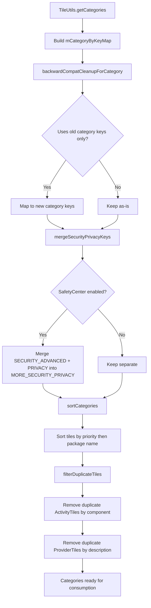

**Backward compatibility**: Old category key constants (pre-Android P) are
mapped to current keys using `CategoryKey.KEY_COMPAT_MAP`.

**Security/Privacy merge**: When SafetyCenter is enabled, tiles from
`CATEGORY_SECURITY_ADVANCED_SETTINGS` and `CATEGORY_PRIVACY` are merged into
`CATEGORY_MORE_SECURITY_PRIVACY_SETTINGS`.

**Deduplication**: Tiles pointing to the same component are removed.  For
`ProviderTile` instances, deduplication is based on the tile description.

### 49.8.4 Tile Deny List

The `CategoryMixin` (managed by `SettingsBaseActivity`) maintains a deny list
of components that should be hidden:

```java
// CategoryManager.java
public synchronized void updateCategoryFromDenylist(Set<ComponentName> tileDenylist) {
    for (int i = 0; i < mCategories.size(); i++) {
        DashboardCategory category = mCategories.get(i);
        for (int j = 0; j < category.getTilesCount(); j++) {
            Tile tile = category.getTile(j);
            if (tileDenylist.contains(tile.getIntent().getComponent())) {
                category.removeTile(j--);
            }
        }
    }
}
```

This is used by `SettingsActivity.doUpdateTilesList()` when hardware features
are absent (e.g., no Wi-Fi chip, no battery).

---

## 49.9 Deep Dive: SettingsPreferenceFragment

### 49.9.1 Fragment Base Class

`SettingsPreferenceFragment` is the base class for all settings pages that
display a preference list.

**Source file**: `packages/apps/Settings/src/com/android/settings/SettingsPreferenceFragment.java`

```java
public abstract class SettingsPreferenceFragment extends InstrumentedPreferenceFragment
        implements DialogCreatable, HelpResourceProvider, Indexable {
```

It extends `InstrumentedPreferenceFragment`, which provides metrics/logging
integration, and implements:

- `DialogCreatable` -- Hosts dialog fragments with stable IDs
- `HelpResourceProvider` -- Provides help link URIs for the overflow menu
- `Indexable` -- Enables search indexing

### 49.9.2 Preference Highlighting

When a deep link targets a specific preference (e.g., from search results),
`SettingsPreferenceFragment` highlights it using
`HighlightablePreferenceGroupAdapter`:

The target preference key is passed via `EXTRA_FRAGMENT_ARG_KEY`:

```java
// SettingsActivity.java
public static final String EXTRA_FRAGMENT_ARG_KEY = ":settings:fragment_args_key";
```

The fragment reads this key and scrolls to/highlights the matching preference
when the view is created.

### 49.9.3 Dialog Management

`SettingsPreferenceFragment` provides a stable dialog hosting mechanism.  Each
dialog is identified by an integer ID, and the fragment manages the dialog
lifecycle across configuration changes using `SettingsDialogFragment`.

### 49.9.4 Loading State

For pages that load data asynchronously, `LoadingViewController` shows a
progress indicator until the data is ready.  This prevents the jarring
appearance of an empty screen followed by a sudden list.

### 49.9.5 RestrictedDashboardFragment

`RestrictedDashboardFragment` adds enterprise restriction support:

```java
// DevelopmentSettingsDashboardFragment.java
public DevelopmentSettingsDashboardFragment() {
    super(UserManager.DISALLOW_DEBUGGING_FEATURES);
}
```

When a user restriction is active, the fragment shows an admin-support dialog
or an empty state message instead of the preference list.

---

## 49.10 Deep Dive: The Complete Developer Options Controller List

### 49.10.1 Controller Registration

The `buildPreferenceControllers()` method in
`DevelopmentSettingsDashboardFragment` creates over 100 controller instances.
Here is the complete categorised list as found in the source:

**Source file**: `packages/apps/Settings/src/com/android/settings/development/DevelopmentSettingsDashboardFragment.java` (lines 706-849)

#### Memory and Diagnostics
- `MemoryUsagePreferenceController` -- Shows RAM usage
- `BugReportPreferenceController` -- Take a bug report
- `BugReportHandlerPreferenceController` -- Choose bug report handler app
- `SystemServerHeapDumpPreferenceController` -- Dump system_server heap
- `DevelopmentMemtagPagePreferenceController` -- Memory tagging (MTE)
- `AutomaticSystemServerHeapDumpPreferenceController` -- Auto heap dumps on low memory

#### Security and Boot
- `OemUnlockPreferenceController` -- Enable OEM bootloader unlocking
- `Enable16kPagesPreferenceController` -- Enable 16K page size (experimental)
- `LocalBackupPasswordPreferenceController` -- Desktop backup password

#### Debug Tools
- `AdbPreferenceController` -- USB debugging
- `ClearAdbKeysPreferenceController` -- Revoke USB debug authorisations
- `AdbWirelessDebuggingPreferenceController` -- Wireless debugging (ADB over Wi-Fi)
- `AdbAuthorizationTimeoutPreferenceController` -- ADB auth timeout
- `LocalTerminalPreferenceController` -- Enable local terminal app
- `LinuxTerminalPreferenceController` -- Linux terminal (Crostini-style)
- `BugReportInPowerPreferenceController` -- Bug report in power menu
- `MockLocationAppPreferenceController` -- Mock location provider
- `MockModemPreferenceController` -- Mock modem for telephony testing
- `DebugViewAttributesPreferenceController` -- View attribute inspection
- `SelectDebugAppPreferenceController` -- Select app to debug
- `WaitForDebuggerPreferenceController` -- Wait for debugger attach
- `EnableGpuDebugLayersPreferenceController` -- GPU debug layer support
- `GraphicsDriverEnableAngleAsSystemDriverController` -- Use ANGLE as system GPU driver
- `VerifyAppsOverUsbPreferenceController` -- Verify sideloaded apps
- `ArtVerifierPreferenceController` -- ART bytecode verification

#### Display and Rendering
- `PictureColorModePreferenceController` -- Wide colour gamut
- `WebViewAppPreferenceController` -- Choose WebView implementation
- `WebViewDevUiPreferenceController` -- WebView developer tools
- `CoolColorTemperaturePreferenceController` -- Cool colour temperature
- `ForcePeakRefreshRatePreferenceController` -- Force highest refresh rate
- `ShowTapsPreferenceController` -- Visual feedback for screen taps
- `PointerLocationPreferenceController` -- Overlay with pointer coordinates
- `ShowKeyPressesPreferenceController` -- Visual feedback for key presses
- `TouchpadVisualizerPreferenceController` -- Touchpad input visualizer
- `ShowSurfaceUpdatesPreferenceController` -- Flash on surface update
- `ShowLayoutBoundsPreferenceController` -- Draw layout bounds
- `ShowHdrSdrRatioPreferenceController` -- Show HDR/SDR brightness ratio
- `ShowRefreshRatePreferenceController` -- Overlay with current refresh rate
- `RtlLayoutPreferenceController` -- Force RTL layout direction
- `EmulateDisplayCutoutPreferenceController` -- Simulated display cutout
- `TransparentNavigationBarPreferenceController` -- Transparent nav bar
- `SecondaryDisplayPreferenceController` -- Simulated secondary display

#### Animation
- `WindowAnimationScalePreferenceController` -- Window animation speed
- `TransitionAnimationScalePreferenceController` -- Activity transition speed
- `AnimatorDurationScalePreferenceController` -- Animator duration multiplier

#### GPU Profiling
- `GpuViewUpdatesPreferenceController` -- Flash views on GPU draw
- `HardwareLayersUpdatesPreferenceController` -- Flash hardware layers
- `DebugGpuOverdrawPreferenceController` -- Colour-code overdraw regions
- `DebugNonRectClipOperationsPreferenceController` -- Non-rect clip debugging
- `ForceDarkPreferenceController` -- Force dark mode on all apps
- `EnableBlursPreferenceController` -- Window blur effects
- `ForceMSAAPreferenceController` -- Force 4x MSAA anti-aliasing
- `HardwareOverlaysPreferenceController` -- Disable HW overlays
- `SimulateColorSpacePreferenceController` -- Colour blindness simulation
- `ProfileGpuRenderingPreferenceController` -- Profile GPU rendering bars
- `GameDefaultFrameRatePreferenceController` -- Default game frame rate

#### Networking
- `WifiDisplayCertificationPreferenceController` -- Wi-Fi Display certification mode
- `WifiVerboseLoggingPreferenceController` -- Verbose Wi-Fi logging
- `WifiScanThrottlingPreferenceController` -- Wi-Fi scan throttling
- `WifiNonPersistentMacRandomizationPreferenceController` -- Non-persistent MAC
- `MobileDataAlwaysOnPreferenceController` -- Keep mobile data active
- `TetheringHardwareAccelPreferenceController` -- Tethering HW acceleration
- `IngressRateLimitPreferenceController` -- Network ingress rate limiting

#### Bluetooth
- `BluetoothDeviceNoNamePreferenceController` -- Show nameless devices
- `BluetoothAbsoluteVolumePreferenceController` -- Disable absolute volume
- `BluetoothAvrcpVersionPreferenceController` -- AVRCP version
- `BluetoothMapVersionPreferenceController` -- MAP version
- `BluetoothLeAudioPreferenceController` -- LE Audio feature toggle
- `BluetoothLeAudioModePreferenceController` -- LE Audio mode
- `BluetoothLeAudioDeviceDetailsPreferenceController` -- LE device info
- `BluetoothLeAudioAllowListPreferenceController` -- LE allowlist
- `BluetoothA2dpHwOffloadPreferenceController` -- Disable A2DP HW offload
- `BluetoothLeAudioHwOffloadPreferenceController` -- Disable LE audio HW offload
- `BluetoothMaxConnectedAudioDevicesPreferenceController` -- Max connected devices
- `BluetoothSnoopLogPreferenceController` -- HCI snoop log
- `BluetoothSnoopLogFilterProfileMapPreferenceController` -- Snoop log MAP filter
- `BluetoothSnoopLogFilterProfilePbapPreferenceController` -- Snoop log PBAP filter
- `BluetoothCodecListPreferenceController` -- Audio codec selection
- `BluetoothSampleRateDialogPreferenceController` -- Audio sample rate
- `BluetoothBitPerSampleDialogPreferenceController` -- Audio bit depth
- `BluetoothQualityDialogPreferenceController` -- Audio quality
- `BluetoothChannelModeDialogPreferenceController` -- Audio channel mode
- `BluetoothHDAudioPreferenceController` -- HD Audio toggle
- `BluetoothStackLogPreferenceController` -- Bluetooth stack log level

#### NFC
- `NfcSnoopLogPreferenceController` -- NFC HCI snoop log
- `NfcVerboseVendorLogPreferenceController` -- Verbose NFC vendor log

#### Audio
- `UsbAudioRoutingPreferenceController` -- Disable USB audio routing

#### Process Management
- `StayAwakePreferenceController` -- Screen stays on while charging
- `StrictModePreferenceController` -- StrictMode flash on violation
- `KeepActivitiesPreferenceController` -- Destroy activities on leave
- `BackgroundProcessLimitPreferenceController` -- Background process limit
- `CachedAppsFreezerPreferenceController` -- Freeze cached apps
- `ShowFirstCrashDialogPreferenceController` -- Show crash dialog on first crash
- `AppsNotRespondingPreferenceController` -- Show ANR dialog for background apps
- `NotificationChannelWarningsPreferenceController` -- Channel warning toasts
- `PhantomProcessPreferenceController` -- Phantom process monitoring

#### Logging
- `LogdSizePreferenceController` -- Logger buffer sizes (64K - 16M)
- `LogPersistPreferenceController` -- Persist logs across reboot
- `EnableVerboseVendorLoggingPreferenceController` -- Vendor verbose logging
- `PrintVerboseLoggingController` -- Print service verbose logging

#### Desktop and Windowing
- `ResizableActivityPreferenceController` -- Force activities resizable
- `FreeformWindowsPreferenceController` -- Freeform window support
- `DesktopModePreferenceController` -- Desktop mode
- `DesktopModeSecondaryDisplayPreferenceController` -- Desktop on secondary display
- `DesktopExperiencePreferenceController` -- Full desktop experience
- `NonResizableMultiWindowPreferenceController` -- Non-resizable in multi-window

#### Miscellaneous
- `AllowAppsOnExternalPreferenceController` -- Apps on external storage
- `ShortcutManagerThrottlingPreferenceController` -- Shortcut rate limiting
- `EnableGnssRawMeasFullTrackingPreferenceController` -- Raw GNSS measurements
- `DefaultUsbConfigurationPreferenceController` -- Default USB mode
- `OverlaySettingsPreferenceController` -- Overlay settings
- `StylusHandwritingPreferenceController` -- Stylus handwriting
- `ForceEnableNotesRolePreferenceController` -- Force Notes role
- `GrammaticalGenderPreferenceController` -- Grammatical gender override
- `SensitiveContentProtectionPreferenceController` -- Content sensitivity
- `SharedDataPreferenceController` -- Shared storage
- `DisableAutomaticUpdatesPreferenceController` -- Disable OTA updates
- `SelectDSUPreferenceController` -- Dynamic System Updates
- `AutofillCategoryController` -- Autofill settings
- `AutofillLoggingLevelPreferenceController` -- Autofill debug logging
- `AutofillResetOptionsPreferenceController` -- Reset autofill state

### 49.10.2 Enable/Disable Callbacks

When the master switch is toggled, every controller receives a callback:

```java
// DevelopmentSettingsDashboardFragment.java
private void enableDeveloperOptions() {
    DevelopmentSettingsEnabler.setDevelopmentSettingsEnabled(getContext(), true);
    for (AbstractPreferenceController controller : mPreferenceControllers) {
        if (controller instanceof DeveloperOptionsPreferenceController) {
            ((DeveloperOptionsPreferenceController) controller).onDeveloperOptionsEnabled();
        }
    }
}

private void disableDeveloperOptions() {
    DevelopmentSettingsEnabler.setDevelopmentSettingsEnabled(getContext(), false);
    final SystemPropPoker poker = SystemPropPoker.getInstance();
    poker.blockPokes();
    for (AbstractPreferenceController controller : mPreferenceControllers) {
        if (controller instanceof DeveloperOptionsPreferenceController) {
            ((DeveloperOptionsPreferenceController) controller).onDeveloperOptionsDisabled();
        }
    }
    poker.unblockPokes();
    poker.poke();
}
```

The `SystemPropPoker.blockPokes()` / `unblockPokes()` / `poke()` sequence
ensures that system property changes are batched and all services are notified
exactly once.

---

## 49.11 Deep Dive: SettingsProvider Internals

### 49.11.1 SettingsState and XML Persistence

Each namespace (system, secure, global) is backed by a `SettingsState` object
that handles in-memory caching and XML persistence.

**Source file**: `frameworks/base/packages/SettingsProvider/src/com/android/providers/settings/SettingsState.java`

Key characteristics:

- Settings are stored as an `ArrayMap<String, Setting>` for fast key lookup
- Writes are batched and persisted asynchronously via a `Handler` message
- The XML file uses a versioned format with support for default values
- A fallback copy mechanism creates `.bak` files for crash recovery

### 49.11.2 Setting Keys and Types

Each setting entry internally contains:

| Field | Description |
|-------|-------------|
| `name` | The setting key (e.g., "screen_brightness") |
| `value` | The current value as a string |
| `defaultValue` | The default value (used for reset operations) |
| `packageName` | The package that last wrote this setting |
| `tag` | Optional tag for selective reset |
| `defaultSystemSet` | Whether this was set by the system (not user-modified) |
| `id` | Auto-incrementing generation ID for change tracking |

### 49.11.3 Generation Tracking

The SettingsProvider uses a generation-tracking mechanism for efficient
change detection.  Each `SettingsState` maintains a `currentGeneration` counter
that increments on every write.  Clients can pass a generation number with their
read request, and the provider returns whether the data has changed:

```java
// In the call() method
return packageValueForCallResult(SETTINGS_TYPE_GLOBAL, name, requestingUserId,
        Context.DEVICE_ID_DEFAULT, setting, isTrackingGeneration(args));
```

The `Settings` framework class uses this on the client side to maintain a
local cache.  If the generation has not changed, the cached value is used
without IPC -- making settings reads extremely fast.

### 49.11.4 Broadcast Notifications

Beyond `ContentObserver`, certain settings changes trigger system-wide
broadcasts.  For example, changing `AIRPLANE_MODE_ON` triggers an
`ACTION_AIRPLANE_MODE_CHANGED` broadcast that all interested apps receive.

### 49.11.5 Permission Model

| Namespace | Read | Write |
|-----------|------|-------|
| `Settings.System` | All apps | `WRITE_SETTINGS` (dangerous permission, requires user grant) |
| `Settings.Secure` | All apps (public keys only) | Signature-level or `WRITE_SECURE_SETTINGS` |
| `Settings.Global` | All apps (public keys only) | Signature-level or `WRITE_SECURE_SETTINGS` |
| `DeviceConfig` | System apps | `WRITE_DEVICE_CONFIG` (signature) |

Starting from Android S, read access to non-public settings is restricted.
The provider maintains `sReadableSecureSettings`, `sReadableSystemSettings`,
and `sReadableGlobalSettings` sets that define which keys are publicly
readable.

### 49.11.6 Setting Limits for Third-Party Apps

To prevent abuse, the provider limits how many custom settings third-party
apps can add to `Settings.System`:

- Apps targeting API 22 (Lollipop MR1) or lower receive a warning when
  adding custom settings

- Apps targeting API 23+ are prohibited from adding custom system settings

When a package is uninstalled, all settings it added are automatically deleted.

---

## 49.12 Deep Dive: The FeatureFactory Extension Point

### 49.12.1 Architecture

The `FeatureFactory` is the primary OEM extension mechanism for the Settings
app.  It is an abstract class with factory methods for each subsystem provider:

**Source file**: `packages/apps/Settings/src/com/android/settings/overlay/FeatureFactory.java`

OEMs override it by specifying a custom implementation class in a resource
overlay:

```xml
<!-- res/values/config.xml (in OEM overlay) -->
<string name="config_featureFactory">
    com.myoem.settings.overlay.MyFeatureFactory
</string>
```

### 49.12.2 Available Providers

| Provider Interface | Default Implementation | OEM Can Customise |
|-------------------|----------------------|-------------------|
| `DashboardFeatureProvider` | `DashboardFeatureProviderImpl` | Tile binding, icon styling |
| `SearchFeatureProvider` | `SearchFeatureProviderImpl` | Search intelligence integration |
| `MetricsFeatureProvider` | `MetricsFeatureProviderImpl` | Analytics/logging backend |
| `SupportFeatureProvider` | (null) | Help & feedback integration |
| `SecurityFeatureProvider` | `SecurityFeatureProviderImpl` | Security settings customisation |
| `EnterprisePrivacyFeatureProvider` | `EnterprisePrivacyFeatureProviderImpl` | MDM controls |
| `AccountFeatureProvider` | `AccountFeatureProviderImpl` | Account management |

### 49.12.3 How the Factory is Loaded

```java
// FeatureFactory.java
public static FeatureFactory getFeatureFactory() {
    if (sFactory != null) {
        return sFactory;
    }
    // Read the class name from resources
    String clsName = context.getString(R.string.config_featureFactory);
    // Instantiate via reflection
    sFactory = (FeatureFactory) Class.forName(clsName).newInstance();
    return sFactory;
}
```

---

## 49.13 Deep Dive: Slices Integration

### 49.13.1 Settings Slices

Settings exposes individual preferences as Android **Slices** -- remote
UI snippets that can be embedded in other apps (like the Google app or
Quick Settings).

The `SettingsSliceProvider` (in `packages/apps/Settings/src/com/android/settings/slices/`)
maps preference keys to Slice URIs:

```
content://com.android.settings.slices/action/<preference_key>
```

Each `BasePreferenceController` can declare its slice type:

```java
// BasePreferenceController.java
@Override
public Uri getSliceUri() {
    return new Uri.Builder()
            .scheme(ContentResolver.SCHEME_CONTENT)
            .authority(SettingsSliceProvider.SLICE_AUTHORITY)
            .appendPath(SettingsSlicesContract.PATH_SETTING_ACTION)
            .appendPath(getPreferenceKey())
            .build();
}
```

### 49.13.2 Slice Types

| Type | Behaviour |
|------|-----------|
| `INTENT` | Clicking the slice opens the settings page |
| `SWITCH` | The slice contains an inline toggle switch |
| `SLIDER` | The slice contains an inline slider |

---

## 49.14 Deep Dive: The AndroidManifest

### 49.14.1 Scale and Permissions

The Settings app `AndroidManifest.xml` is one of the largest manifest files in
AOSP at over 6,000 lines.  It declares:

- Over 150 activities (one per settings page)
- Multiple content providers (search, slices, biometrics)
- Services (dump service, settings service)
- Broadcast receivers (boot, locale change, package change)

The app runs with `android.uid.system` shared UID, giving it system-level
access:

```xml
<manifest xmlns:android="http://schemas.android.com/apk/res/android"
    package="com.android.settings"
    coreApp="true"
    android:sharedUserId="android.uid.system">
```

It declares an extensive set of permissions including:

```xml
<uses-permission android:name="android.permission.WRITE_SETTINGS" />
<uses-permission android:name="android.permission.WRITE_SECURE_SETTINGS" />
<uses-permission android:name="android.permission.DEVICE_POWER" />
<uses-permission android:name="android.permission.CHANGE_CONFIGURATION" />
<uses-permission android:name="android.permission.BLUETOOTH_PRIVILEGED" />
<uses-permission android:name="android.permission.MASTER_CLEAR" />
<uses-permission android:name="android.permission.READ_PRIVILEGED_PHONE_STATE" />
<uses-permission android:name="android.permission.MANAGE_USB" />
<uses-permission android:name="android.permission.SET_TIME" />
<uses-permission android:name="android.permission.MANAGE_USERS" />
```

### 49.14.2 Activity Declaration Pattern

Each settings page activity is declared with metadata that maps it to a
fragment and a highlight menu key:

```xml
<activity
    android:name=".Settings$DevelopmentSettingsActivity"
    android:label="@string/development_settings_title"
    android:exported="true">
    <intent-filter android:priority="1">
        <action android:name="android.settings.APPLICATION_DEVELOPMENT_SETTINGS"/>
        <category android:name="android.intent.category.DEFAULT"/>
    </intent-filter>
    <meta-data
        android:name="com.android.settings.FRAGMENT_CLASS"
        android:value="com.android.settings.development.DevelopmentSettingsDashboardFragment"/>
    <meta-data
        android:name="com.android.settings.HIGHLIGHT_MENU_KEY"
        android:value="@string/menu_key_system"/>
</activity>
```

This pattern means that:

- External apps can launch `android.settings.APPLICATION_DEVELOPMENT_SETTINGS`
- `SettingsActivity` reads the `FRAGMENT_CLASS` metadata to know which
  fragment to display

- The `HIGHLIGHT_MENU_KEY` tells the two-pane layout which homepage tile
  to highlight

### 49.14.3 Tile Injection in Manifest

The Settings app also injects its own tiles into dashboard categories:

```xml
<activity
    android:name=".Settings$WifiSettingsActivity"
    ...>
    <intent-filter>
        <action android:name="com.android.settings.action.EXTRA_SETTINGS"/>
        <category android:name="com.android.settings.category.ia.homepage"/>
    </intent-filter>
    <meta-data android:name="com.android.settings.order" android:value="-20"/>
    <meta-data android:name="com.android.settings.icon_tintable" android:value="true"/>
</activity>
```

The `order` metadata controls the position within the category.

---

## 49.15 Deep Dive: Catalyst / Settings Page Architecture (SPA)

### 49.15.1 The Catalyst Migration

AOSP is gradually migrating Settings pages from the traditional
`DashboardFragment` + XML approach to a new architecture called **Catalyst**
(internally also referred to as SPA -- Settings Page Architecture).

**Source file**: `packages/apps/Settings/src/com/android/settings/CatalystSettingsActivity.kt`

Catalyst uses a declarative preference hierarchy defined in code (using
the `settingslib/metadata` APIs) rather than XML resources.  This enables:

- Type-safe preference definitions
- Programmatic preference composition
- Better testing support
- Gradual migration (hybrid mode)

### 49.15.2 CatalystSettingsActivity

The `CatalystSettingsActivity` is a Kotlin class that extends
`SettingsActivity` with support for binding to a preference screen by key:

```kotlin
// CatalystSettingsActivity.kt
open class CatalystSettingsActivity
@JvmOverloads
constructor(
    private val bindingScreenKey: String,
    private val fragmentClass: Class<out PreferenceFragment> = CatalystFragment::class.java,
) : SettingsActivity() {

    override fun isValidFragment(fragmentName: String?) = fragmentName == fragmentClass.name

    override fun getInitialFragmentName(intent: Intent?): String = fragmentClass.name

    override fun getInitialFragmentArguments(intent: Intent?): Bundle? =
        (super.getInitialFragmentArguments(intent) ?: Bundle()).apply {
            putString(EXTRA_BINDING_SCREEN_KEY, bindingScreenKey)
            putBundle(EXTRA_BINDING_SCREEN_ARGS,
                intent?.getBundleExtra(EXTRA_BINDING_SCREEN_ARGS))
        }
}
```

Several pages have already been migrated to Catalyst:

```java
// Settings.java -- Catalyst activities
public static class FirmwareVersionActivity extends CatalystSettingsActivity {
    public FirmwareVersionActivity() {
        super(FirmwareVersionScreen.KEY);
    }
}

public static class ResetDashboardActivity extends CatalystSettingsActivity {
    public ResetDashboardActivity() {
        super(ResetDashboardScreen.KEY, ResetDashboardFragment.class);
    }
}

public static class VibrationSettingsActivity extends CatalystSettingsActivity {
    public VibrationSettingsActivity() {
        super(VibrationScreen.KEY, VibrationSettings.class);
    }
}
```

### 49.15.3 CatalystFragment

The `CatalystFragment` is a `DashboardFragment` that creates its preference
screen programmatically from a `PreferenceScreenCreator`:

```kotlin
// CatalystSettingsActivity.kt
open class CatalystFragment : DashboardFragment() {
    override fun getPreferenceScreenResId() = 0  // No XML resource

    override fun onCreatePreferences(savedInstanceState: Bundle?, rootKey: String?) {
        preferenceScreen = createPreferenceScreen()
        refreshDashboardTiles(logTag)
    }
}
```

### 49.15.4 Hybrid Mode

During the migration, fragments can operate in **hybrid mode** where the
preference hierarchy comes from Catalyst but XML-defined controllers are
still used for some preferences.  The `DashboardFragment` handles this by
detecting hybrid mode and removing controllers for preferences that have
been migrated:

```java
// DashboardFragment.java
private void removeControllersForHybridMode() {
    Set<String> keys = getPreferenceKeysInHierarchy();
    Iterator<AbstractPreferenceController> iterator = mControllers.iterator();
    while (iterator.hasNext()) {
        AbstractPreferenceController controller = iterator.next();
        String key = controller.getPreferenceKey();
        if (keys.contains(key)) {
            Log.i(TAG, "Remove preference controller for " + key);
            iterator.remove();
        }
    }
}
```

---

## 49.16 Deep Dive: Testing the Settings App

### 49.16.1 Test Infrastructure

The Settings app has a comprehensive test suite under
`packages/apps/Settings/tests/`:

- **Robolectric tests**: Fast unit tests that run on the host JVM
- **Instrumentation tests**: On-device tests using AndroidX Test
- **Screenshot tests**: Visual regression tests for preference layouts

### 49.16.2 Testing Preference Controllers

Each `BasePreferenceController` is designed to be independently testable:

```java
// Example test structure
@RunWith(RobolectricTestRunner.class)
public class WifiCallingPreferenceControllerTest {
    private Context mContext;
    private WifiCallingPreferenceController mController;

    @Before
    public void setUp() {
        mContext = RuntimeEnvironment.application;
        mController = new WifiCallingPreferenceController(mContext, "test_key");
    }

    @Test
    public void getAvailabilityStatus_wifiCallingSupported_returnsAvailable() {
        // Configure shadow PackageManager to report FEATURE_WIFI
        assertThat(mController.getAvailabilityStatus())
                .isEqualTo(BasePreferenceController.AVAILABLE);
    }
}
```

### 49.16.3 Testing DashboardFragment

The `DashboardFragment` provides the `use()` method that makes it easy to
retrieve and test controllers:

```java
// In a fragment test
DevelopmentSettingsDashboardFragment fragment = new DevelopmentSettingsDashboardFragment();
AdbPreferenceController controller = fragment.use(AdbPreferenceController.class);
assertThat(controller).isNotNull();
```

### 49.16.4 Testing Search Indexing

The search system can be validated by checking that:

1. All indexable fragments declare `SEARCH_INDEX_DATA_PROVIDER`
2. Non-indexable keys match unavailable controllers
3. XML resources are parseable without errors

```bash
# Verify search indexing via adb
adb shell content query \
    --uri content://com.android.settings/indexables_xml_res \
    --projection xmlResId,className
```

---

## 49.17 Performance Considerations

### 49.17.1 Lazy Controller Initialisation

Preference controllers are instantiated via reflection during `onAttach()`,
which can be expensive for pages with many controllers (Developer Options
has 100+).  The Settings app mitigates this by:

1. Using `AsyncTask` for tile list updates
2. Implementing `UiBlocker` for controllers that need async data
3. Using `CountDownLatch` with a 50ms timeout for dynamic tile observers

```java
// DashboardFragment.java
private static final long TIMEOUT_MILLIS = 50L;

private void awaitObserverLatch(CountDownLatch latch) {
    try {
        latch.await(TIMEOUT_MILLIS, TimeUnit.MILLISECONDS);
    } catch (InterruptedException e) {
        // Do nothing
    }
}
```

### 49.17.2 UI Blocker Pattern

Some preferences need to wait for asynchronous data before they can determine
their visibility.  The `UiBlocker` interface marks these controllers:

```java
// BasePreferenceController.java
public interface UiBlocker {
}
```

The `UiBlockerController` in `DashboardFragment` hides all preferences until
every `UiBlocker` controller has reported completion.  This prevents jarky
layout changes as preferences appear one by one.

### 49.17.3 Settings Provider Caching

The `Settings` framework class maintains a per-process LRU cache of settings
values.  Combined with generation tracking, most `Settings.System.getInt()`
calls complete without any IPC.

### 49.17.4 Preference Comparison Callback

`DashboardFragment` sets a `SimplePreferenceComparisonCallback` on the
`PreferenceManager` to enable efficient RecyclerView animations when the
preference list changes:

```java
// DashboardFragment.java
@Override
public void onCreate(Bundle icicle) {
    super.onCreate(icicle);
    getPreferenceManager().setPreferenceComparisonCallback(
            new PreferenceManager.SimplePreferenceComparisonCallback());
}
```

---

## 49.18 Deep Dive: Activity Embedding for Two-Pane Layout

### 49.18.1 Architecture Overview

On large-screen devices (tablets, foldables, ChromeOS), Settings displays a
split layout: the homepage list on the left and the selected sub-page on the
right.  This is implemented using **Activity Embedding** from the Jetpack
WindowManager library.

**Source files**:

- `packages/apps/Settings/src/com/android/settings/activityembedding/ActivityEmbeddingUtils.java`
- `packages/apps/Settings/src/com/android/settings/activityembedding/ActivityEmbeddingRulesController.java`

### 49.18.2 Embedding Detection

`ActivityEmbeddingUtils.isEmbeddingActivityEnabled()` checks whether the
device and configuration support two-pane embedding:

- The screen must be wide enough (based on the smallest width)
- The feature flag must be enabled
- The device must not be in setup wizard

This is checked at multiple points: homepage creation, fragment transitions,
and deep link handling.

### 49.18.3 Split Pair Rules

`ActivityEmbeddingRulesController` registers `SplitPairRule` objects that
define how activities are paired in the split layout:

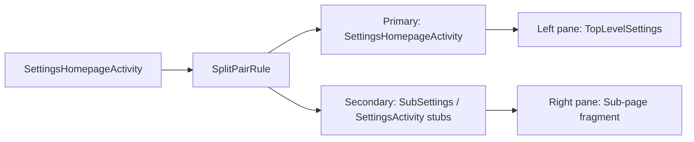

Key rules:

- Homepage is always the primary (left) activity
- Any `SubSettings` or `Settings.*Activity` stub becomes the secondary (right)
- `clearTop` is set so navigating to a new sub-page replaces the right pane
- `finishSecondaryWithPrimary=true` so closing the homepage closes everything

### 49.18.4 Deep Link Handling in Two-Pane Mode

When Settings receives a deep link intent (e.g., from a notification or
another app), `SettingsActivity.shouldShowMultiPaneDeepLink()` determines
whether to show it in two-pane mode:

```java
// SettingsActivity.java
private boolean shouldShowMultiPaneDeepLink(Intent intent) {
    if (!ActivityEmbeddingUtils.isEmbeddingActivityEnabled(this)) {
        return false;
    }
    if (!isTaskRoot() && (intent.getFlags() & Intent.FLAG_ACTIVITY_NEW_TASK) == 0) {
        return false;
    }
    if (intent.getAction() == null) {
        return false;  // Not a deep link
    }
    if (isSubSettings(intent)) {
        return false;
    }
    return true;
}
```

If two-pane deep link is needed, `EmbeddedDeepLinkUtils.tryStartMultiPaneDeepLink()`
trampolines through the homepage activity to ensure both panes are visible.

### 49.18.5 Highlight Mixin

The `TopLevelHighlightMixin` manages visual highlighting of the selected
tile in the left pane.  When a sub-page is shown in the right pane, the
corresponding homepage tile gets a highlight background:

```java
// TopLevelSettings.java
@Override
public boolean onPreferenceTreeClick(Preference preference) {
    if (isDuplicateClick(preference)) {
        return true;  // Prevent re-launching the same page
    }
    ActivityEmbeddingRulesController.registerSubSettingsPairRule(
            getContext(), true /* clearTop */);
    setHighlightPreferenceKey(preference.getKey());
    return super.onPreferenceTreeClick(preference);
}
```

The highlight adapts to configuration changes (e.g., rotation) and
transitions between one-pane and two-pane modes.

### 49.18.6 SplitInfo Callback

The homepage activity listens for split layout changes via
`SplitControllerCallbackAdapter`:

```java
// SettingsHomepageActivity.java
private SplitControllerCallbackAdapter mSplitControllerAdapter;
private SplitInfoCallback mCallback;
```

When the split state changes (e.g., the device folds/unfolds), the callback
updates the homepage layout, icon visibility, and highlight state.

---

## 49.19 Common Debugging Techniques

### 49.19.1 Inspecting Settings Values

```bash
# Read a specific setting
adb shell settings get system screen_brightness
adb shell settings get secure enabled_accessibility_services
adb shell settings get global development_settings_enabled

# Write a setting
adb shell settings put global development_settings_enabled 1

# List all settings in a namespace
adb shell settings list system
adb shell settings list secure
adb shell settings list global

# Delete a setting
adb shell settings delete system custom_setting_key
```

### 49.19.2 Launching Specific Settings Pages

```bash
# Launch by action
adb shell am start -a android.settings.SETTINGS
adb shell am start -a android.settings.WIFI_SETTINGS
adb shell am start -a android.settings.BLUETOOTH_SETTINGS
adb shell am start -a android.settings.APPLICATION_DEVELOPMENT_SETTINGS
adb shell am start -a android.settings.DISPLAY_SETTINGS

# Launch by component
adb shell am start -n com.android.settings/.Settings\$DevelopmentSettingsActivity
adb shell am start -n com.android.settings/.Settings\$WifiSettingsActivity

# Launch a specific fragment
adb shell am start -n com.android.settings/.SubSettings \
    --es ":settings:show_fragment" \
    "com.android.settings.development.DevelopmentSettingsDashboardFragment"
```

### 49.19.3 Debugging Tile Injection

To see which tiles are loaded and their categories:

```bash
# Dump the Settings app state
adb shell dumpsys activity providers com.android.settings

# Check which activities have the settings action
adb shell pm query-activities -a com.android.settings.action.EXTRA_SETTINGS
```

### 49.19.4 Debugging Search Indexing

```bash
# Force re-index
adb shell am broadcast -a com.android.settings.intelligence.REINDEX

# Query the search provider directly
adb shell content query \
    --uri content://com.android.settings.intelligence.search.indexables/resource
```

### 49.19.5 Monitoring Settings Changes

```bash
# Watch for settings changes in real-time
adb shell settings monitor
```

This command prints all settings changes as they happen, showing the
namespace, key, value, and calling package.

### 49.19.6 SettingsProvider Dump

```bash
# Dump complete SettingsProvider state
adb shell dumpsys settings

# This shows:
# - All global, secure, and system settings for each user
# - Generation numbers
# - Default values
# - Package ownership
```

---

## 49.20 Key Source Files Reference

For easy reference, here is a consolidated list of all key source files
discussed in this chapter:

| File | Purpose |
|------|---------|
| `packages/apps/Settings/src/com/android/settings/SettingsActivity.java` | Fragment host activity |
| `packages/apps/Settings/src/com/android/settings/Settings.java` | 150+ activity stub classes |
| `packages/apps/Settings/src/com/android/settings/core/SettingsBaseActivity.java` | Base activity with toolbar, CategoryMixin |
| `packages/apps/Settings/src/com/android/settings/core/BasePreferenceController.java` | Preference controller base class |
| `packages/apps/Settings/src/com/android/settings/core/gateway/SettingsGateway.java` | Fragment allowlist for security |
| `packages/apps/Settings/src/com/android/settings/dashboard/DashboardFragment.java` | Dashboard fragment base class |
| `packages/apps/Settings/src/com/android/settings/dashboard/DashboardFragmentRegistry.java` | Category key to fragment mapping |
| `packages/apps/Settings/src/com/android/settings/dashboard/DashboardFeatureProviderImpl.java` | Tile binding implementation |
| `packages/apps/Settings/src/com/android/settings/dashboard/CategoryManager.java` | Singleton tile cache and loader |
| `packages/apps/Settings/src/com/android/settings/homepage/SettingsHomepageActivity.java` | Homepage activity with two-pane support |
| `packages/apps/Settings/src/com/android/settings/homepage/TopLevelSettings.java` | Homepage dashboard fragment |
| `packages/apps/Settings/src/com/android/settings/development/DevelopmentSettingsDashboardFragment.java` | Developer options page |
| `packages/apps/Settings/src/com/android/settings/development/BuildNumberPreferenceController.java` | 7-tap easter egg controller |
| `packages/apps/Settings/src/com/android/settings/search/BaseSearchIndexProvider.java` | Search index data provider base |
| `packages/apps/Settings/src/com/android/settings/search/SettingsSearchIndexablesProvider.java` | ContentProvider for search indexing |
| `packages/apps/Settings/src/com/android/settings/search/SearchFeatureProvider.java` | Search feature abstraction |
| `packages/apps/Settings/src/com/android/settings/SettingsPreferenceFragment.java` | Base preference fragment |
| `packages/apps/Settings/src/com/android/settings/deviceinfo/aboutphone/MyDeviceInfoFragment.java` | About phone page |
| `packages/apps/Settings/src/com/android/settings/activityembedding/ActivityEmbeddingUtils.java` | Two-pane detection |
| `packages/apps/Settings/res/xml/top_level_settings.xml` | Homepage XML layout |
| `frameworks/base/packages/SettingsProvider/src/com/android/providers/settings/SettingsProvider.java` | Settings content provider |
| `frameworks/base/packages/SettingsProvider/src/com/android/providers/settings/SettingsState.java` | Per-namespace settings storage |

---

## Summary

The Settings app is one of the most architecturally rich applications in
AOSP.  Its layered design -- from the `SettingsBaseActivity` foundation
through the `DashboardFragment` tile-injection system to the
`SettingsProvider` key-value store -- demonstrates how a complex user interface
can be built on top of Android's component model while remaining extensible
to OEMs and third-party developers.

Key takeaways:

1. **SettingsActivity** is a universal fragment host that routes to the
   correct page via `EXTRA_SHOW_FRAGMENT` and validates fragments through
   `SettingsGateway`.

2. **DashboardFragment** merges static XML preferences with dynamically
   injected tiles from the `CategoryManager`, enabling third-party and OEM
   settings integration.

3. **PreferenceControllers** encapsulate the logic for each setting --
   availability, display, click handling, search indexing, and Slice
   support -- in a single testable class.

4. **SettingsProvider** stores all settings as XML key-value files, with
   three namespaces (`System`, `Secure`, `Global`) that differ in scope and
   permission level.  The `call()` API is the fast path for reads and writes.

5. **Search indexing** operates at build time (annotation processing) and
   runtime (dynamic raw data, non-indexable key filtering) to make every
   preference discoverable through Settings Intelligence.

6. **Two-pane layout** via Activity Embedding allows the Settings app to
   provide a tablet-optimised experience using `SplitPairRule` from the
   Jetpack WindowManager library.

7. **Developer Options** is gated behind the 7-tap build-number easter egg,
   credential verification, and an optional biometric identity check -- a
   layered security model for exposing powerful debugging tools.

8. **CategoryManager** is the authoritative singleton for tile data, applying
   backward-compatible key mapping, security/privacy merging, sorting, and
   deduplication before tiles reach the UI.

9. **FeatureFactory** provides a clean OEM extension mechanism, allowing
   vendors to customise search, metrics, support, and security providers
   without forking the Settings source tree.

10. **Slices** expose individual settings as remotely embeddable UI
    components, enabling system surfaces like Quick Settings and the Google
    app to inline setting controls.

The next chapter examines the Launcher application -- the home screen that
greets users after they leave the Settings app.
