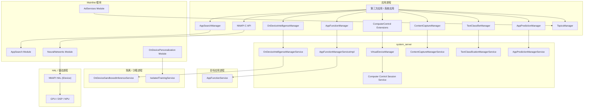
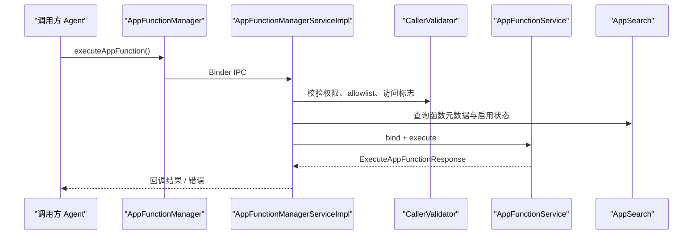
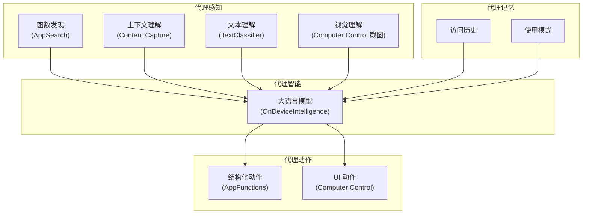

# 第 50 章：AI、AppFunctions 与 Computer Control

Android 正在从“运行应用的平台”演进为“理解并协调应用的平台”。在新的系统能力栈中，`AppFunctions` 让智能体以结构化 RPC 方式调用应用功能，`Computer Control` 让代理通过虚拟显示执行点击、滑动、截图和文本输入，`OnDeviceIntelligence` 提供隔离的端侧推理环境，`NNAPI` 则把硬件加速能力统一暴露给原生推理工作负载。再加上 AppSearch、Content Capture、TextClassifier、OnDevicePersonalization 与 AdServices，这些能力共同构成了 AOSP 的“智能基础设施”。

本章沿着这条链路，从公开 SDK API 一直下钻到 AIDL、`system_server` 服务实现、隔离进程和 HAL 层。重点不是把“AI”当成一个抽象概念，而是拆开 AOSP 中真正存在的框架、服务、权限模型和跨进程协议，理解 Android 是如何把代理执行、端侧推理、元数据索引与隐私隔离拼接成一个完整系统的。

---

## 50.1 AOSP 的 AI 版图

在进入单个子系统之前，先把 AOSP 中与 AI、自动化和智能服务相关的主要组件放到一张图里。



### 50.1.1 智能子系统分类

| 子系统 | 典型入口 | 主要职责 |
|---|---|---|
| AppFunctions | `AppFunctionManager` | 结构化跨应用函数调用 |
| Computer Control | `ComputerControlSession` | 通过虚拟显示执行 UI 自动化 |
| OnDeviceIntelligence | `OnDeviceIntelligenceManager` | 端侧模型推理与特性调度 |
| NNAPI | `NeuralNetworks.h` / `ANeuralNetworks*` | 统一硬件推理接口 |
| AppSearch | `AppSearchManager` | 端侧索引、搜索与文档存储 |
| Content Capture | `ContentCaptureManager` | 实时 UI 结构捕获 |
| TextClassifier | `TextClassifierService` | 文本分类、实体识别、语言识别 |
| AppPrediction | `AppPredictionManager` | 基于使用模式的预测与排序 |
| OnDevicePersonalization | `IsolatedTrainingService` | 端侧个性化与联邦学习 |
| AdServices | `TopicsManager` 等 | 隐私沙箱广告能力 |

### 50.1.2 反复出现的设计主题

这些子系统虽然目标不同，但设计主题高度一致：

1. 强隔离。模型推理、训练和代理执行尽量放在隔离进程或受控虚拟环境中运行。
2. 类型化协议。参数和结果不鼓励裸 `Bundle` 泛滥，而是尽量通过稳定文档模型或结构化请求对象传输。
3. AppSearch 中心化。函数元数据、索引、发现和部分智能数据都逐渐汇聚到 AppSearch。
4. 权限加白名单。很多能力不仅要求权限，还要求 allowlist、角色、设备配置或 shell 管理开关。
5. system_server 作为调度中介。真正的跨应用和跨边界调用几乎都会落到 `system_server` 中间层再做决策和审计。

## 50.2 AppFunctions 框架

### 50.2.1 架构总览

AppFunctions 解决的是“智能体如何安全地调用一个 App 暴露出的结构化功能”。它的总体链路是：

1. 调用方通过 `AppFunctionManager` 发起请求。
2. 请求经由 `IAppFunctionManager` 进入 `system_server`。
3. `AppFunctionManagerServiceImpl` 检查权限、allowlist、目标启用状态和访问历史。
4. 服务端绑定目标应用中的 `AppFunctionService`。
5. 目标服务执行函数并返回结构化结果。



### 50.2.2 客户端：`AppFunctionManager`

`AppFunctionManager` 是面向应用的 SDK 入口。调用方通常会提供：

- 目标包名
- function identifier
- 结构化请求参数
- 执行器与回调
- 可选 attribution 数据

它的职责不是执行函数本身，而是把请求送入系统服务并维持客户端侧的回调封装。

### 50.2.3 启用状态管理

函数是否可执行并不只取决于“目标应用是否声明了服务”，还包括：

- 该函数元数据是否已同步到 AppSearch
- 当前用户下是否启用
- 目标应用是否安装且可用
- 某些设备配置或企业策略是否禁用

### 50.2.4 访问控制模型

AppFunctions 的访问控制是分层的：

1. 调用方是否持有 `EXECUTE_APP_FUNCTIONS` 等相关权限。
2. 调用方是否属于 agent allowlist。
3. 调用方与目标应用之间是否具备当前访问标志。
4. 目标函数本身是否公开、启用且允许当前用户访问。

这套模型保证了“不是任何拿到 SDK 的应用都能随便调用别的应用功能”。

### 50.2.5 AIDL 接口

核心 AIDL 通常包括：

- `IAppFunctionManager.aidl`
- `IAppFunctionService.aidl`
- 相关 callback / request / response parcelable

这里的设计重点在于：公共 SDK 层给开发者更友好的 Java API，而 Binder 层保持稳定、清晰且尽量少暴露实现细节。

### 50.2.6 目标端：`AppFunctionService`

目标应用通过实现 `AppFunctionService` 对外暴露函数。服务需要：

- 声明自身可处理的函数标识
- 按协议解析请求
- 在后台线程执行逻辑
- 返回结构化结果或明确错误码

这本质上是“面向 AI agent 的服务化 API”，但仍完全建立在 Android 现有服务与权限模型之上。

### 50.2.7 请求与响应格式

AppFunctions 非常强调可演化的 wire format。原文把 `GenericDocument` 视为核心载体，这一点很关键：它允许参数和结果作为结构化文档在 AppSearch 生态中流转，而不是为每个函数强行生成一套专门 parcelable。

### 50.2.8 Attribution 与审计轨迹

AppFunctions 不只是“能调用”，还必须“可追踪”。系统会记录：

- 谁调用了谁
- 调用了哪个 function identifier
- 何时执行
- 是否成功
- 访问是如何授予的

这为审计、调试和未来的用户可见隐私披露打下基础。

### 50.2.9 错误处理

错误通常要区分几类：

- 权限不足
- 未在 allowlist 中
- 目标函数不存在
- 元数据未同步
- 目标服务绑定失败
- 目标服务内部执行异常

如果所有错误都被折叠成“调用失败”，调用方根本无法判断自己该修权限、查索引，还是修目标服务实现。

### 50.2.10 system_server 实现

`AppFunctionManagerServiceImpl` 是整个体系的中枢。它负责：

- Binder 入口
- 多用户路由
- 访问检查
- 绑定远端服务
- 写访问历史
- 管理 shell 命令入口

### 50.2.11 通过 AppSearch 做函数发现

函数发现不是手写注册表，而是依赖 AppSearch 中的元数据文档。这带来两个好处：

1. 查询和过滤能力统一。
2. 启用状态、可见性、索引同步都能与现有搜索基础设施复用。

### 50.2.12 `SafeOneTimeExecuteAppFunctionCallback`

这个类存在的根本原因是 Binder 回调很容易出现“双回调”或“回调丢失”的问题。系统需要一个一次性封装器，保证：

- 成功和失败只会回调一次
- 超时或异常时能安全收敛
- 服务端竞态不会破坏客户端状态

### 50.2.13 `executeAppFunction()` 深入

执行路径大致如下：

1. 客户端发起 Binder 请求。
2. 系统服务校验调用方和目标。
3. 查询 AppSearch 元数据确认函数存在且启用。
4. 通过远端服务调用器绑定目标服务。
5. 将请求转交目标应用。
6. 目标应用返回结果。
7. 系统服务记录历史、处理 URI grant、转发给客户端。

### 50.2.14 `RemoteServiceCaller` 模式

AppFunctions 没有直接把 Binder 细节散落在每个调用点，而是通过 `RemoteServiceCallerImpl` 这类模式统一封装：

- 服务绑定
- 生命周期管理
- 回调超时
- 线程切换
- 失败恢复

这是 Android 系统服务里非常常见的“远端能力调用模板”。

### 50.2.15 多用户支持

AppFunctions 必须明确：

- 调用发生在哪个 user
- 目标应用安装在哪个 user
- 元数据索引属于哪个 user
- grant 和访问历史写到哪里

如果忽略 user 维度，工作资料、多用户平板和受管设备会立刻出现越权或找不到服务的问题。

### 50.2.16 Agent Allowlist 架构

allowlist 通常由 DeviceConfig、secure settings 或 shell 工具共同参与控制。它的意义不只是“临时关一关”，而是在平台级规定哪些应用可以充当 agent。

### 50.2.17 响应中的 URI Grant

某些函数返回值会引用 `content://` 资源。系统需要在响应路径中处理临时 URI grant，否则 agent 拿到结果文档却没有权限读取关联资源。

### 50.2.18 Shell 命令支持

为了调试和验收，AppFunctions 会提供 shell 命令查看：

- 服务状态
- allowlist
- target 列表
- 当前访问状态
- 历史记录

这也是新框架可维护性的关键一环。

### 50.2.19 Boot Phase 处理

AppFunctions 依赖的组件很多，包括 AppSearch、包管理、用户状态和 settings。因此服务通常不会在最早启动阶段就完全可用，而要在合适 boot phase 后再开放关键能力。

## 50.3 Computer Control

### 50.3.1 架构

Computer Control 的定位是“当应用没有暴露 AppFunctions 时，AI 代理仍可以通过虚拟显示像人一样操作界面”。它不是 Accessibility 自动化的简单包装，而是建立在 `VirtualDeviceManager` 和扩展库上的独立能力。

### 50.3.2 会话生命周期

一次典型 session 流程包括：

1. 创建 session 参数。
2. 请求虚拟显示与目标任务启动环境。
3. 获得截图 / 稳定信号 / 可选无障碍树。
4. 执行点击、滑动、按键或文本输入。
5. 重复观察与动作。
6. 关闭 session 并释放资源。

### 50.3.3 核心 Session API

`ComputerControlSession` 通常会暴露以下能力：

- 启动目标应用
- 注入输入事件
- 捕获截图
- 监听稳定状态
- 关闭会话

它的价值在于把复杂的虚拟设备和显示管理抽象成更适合 agent 使用的 API。

### 50.3.4 Session 参数

常见参数包括：

- 目标包名或 launcher activity
- 显示大小
- 是否启用镜像显示
- 稳定检测策略
- 回调与执行器

### 50.3.5 Interactive Mirror Display

镜像显示允许人类或调试工具看到代理当前操作的虚拟界面。它既是开发调试工具，也是一种用户可见性和可控性的实现形式。

### 50.3.6 UI 稳定检测

代理操作最怕“页面还没稳定就继续点击”。因此 Computer Control 会额外提供稳定检测，让调用方知道：

- 动画是否结束
- 内容是否静止
- 当前是否适合执行下一步动作

### 50.3.7 与 Accessibility 的集成

Computer Control 不一定完全依赖 Accessibility，但两者天然互补：

- 截图适合视觉模型分析
- Accessibility 树适合结构化理解 UI 节点

组合起来才能让代理既“看得见”，又“知道该点哪里”。

### 50.3.8 自动包监听器

在会话启动和目标应用切换过程中，系统需要监控目标包是否已经真正出现在虚拟显示中，这通常由类似 `AutomatedPackageListener` 的组件承担。

### 50.3.9 与 `VirtualDeviceManager` 的集成

Computer Control 的底座不是凭空而来，而是 VirtualDevice / VirtualDisplay 体系。也正因为如此，它天然更适合被做成“受控执行环境”，而不是直接在主显示上任意注入事件。

### 50.3.10 扩展层输入转换

扩展库会负责把更高层的“tap at x,y”或“type this string”转换成底层输入事件、显示坐标和目标窗口上下文。

### 50.3.11 文本插入 API

文本输入并不是简单模拟物理键盘。为了支持代理稳定输入，系统通常还会提供更高层的文本插入接口，避免逐键输入带来的时序和输入法问题。

### 50.3.12 调试用触摸监听

开发阶段需要把代理动作可视化，因此会有触摸监听、事件回显或调试日志帮助分析坐标和动作是否正确。

### 50.3.13 Co-pilot 模式

Computer Control 的一个重要使用模式是“代理建议或半自动执行，人类可在镜像界面中观察与介入”。这比完全黑盒自动化更符合系统级代理能力的安全演进路径。

### 50.3.14 会话关闭与清理

会话结束后必须清理：

- 虚拟显示
- 任务栈
- 输入注入状态
- 注册的监听器
- 回调引用

否则长期运行的 agent 会非常容易泄漏资源。

### 50.3.15 稳定检测架构

从架构上看，稳定检测通常是独立组件，因为它既可能依赖截图 diff，也可能依赖窗口事件或无障碍树变化，而不是绑死在某一种输入方式上。

### 50.3.16 扩展库文件清单

原文章把扩展库文件做了完整清单。这类信息在中文稿里保留为实现线索：`frameworks/base/libs/computercontrol/` 下的 session、listener、display 和输入转换类共同构成了扩展库骨架。

### 50.3.17 权限模型

Computer Control 通常要求专门权限，例如 `ACCESS_COMPUTER_CONTROL`，并且这类权限天然应限制在系统应用、受信 agent 或测试环境中。

## 50.4 OnDeviceIntelligence

### 50.4.1 架构

OnDeviceIntelligence 的目标是把端侧推理能力系统化、服务化。与其让每个应用各自带一整套推理沙箱，不如由平台统一提供：

- 特性发现
- 模型服务接入
- 推理会话
- 生命周期监听
- 状态、功耗与下载管理

### 50.4.2 客户端：`OnDeviceIntelligenceManager`

这个 manager 提供应用侧入口，负责请求模型能力、发起处理、注册监听器以及查询特性状态。

### 50.4.3 `OnDeviceSandboxedInferenceService`

真正执行推理的地方往往在沙箱隔离进程中。这样即使模型代码、原生库或第三方运行时出现问题，也不会直接获得普通应用或系统服务的全部访问能力。

### 50.4.4 双服务架构

原文强调了一个关键点：ODI 往往是双服务结构。

1. 一个服务负责模型生命周期、下载和管理。
2. 另一个隔离服务负责真正的推理执行。

这样管理与执行职责可以彻底分开。

### 50.4.5 模型生命周期事件

系统需要感知模型何时：

- 可用
- 下载中
- 更新
- 不可用
- 正在处理

否则上层完全无法做稳定的 feature discovery 和 fallback。

### 50.4.6 系统服务

`OnDeviceIntelligenceManagerService` 在 `system_server` 中负责把应用调用、安全策略、远端推理服务和设备配置拼接起来。

### 50.4.7 `InferenceInfo`

这是推理请求或结果相关的元信息容器，通常会描述：

- 使用了哪个 feature
- 运行时状态
- token 统计
- 处理模式
- 可能的资源归因

### 50.4.8 特性发现与下载

ODI 不是假定所有模型一直本地可用，而是允许：

- 按 feature 查询
- 按需下载
- 查询下载状态
- 根据设备条件决定是否允许获取

### 50.4.9 处理模式

原文提到多种 processing mode，这反映出 ODI 并不是单一“给我一个 prompt 返回一个字符串”，还可能区分：

- 同步 / 异步
- 流式 / 非流式
- 交互式 / 批处理

### 50.4.10 Token 信息

token 统计对于端侧推理很重要，因为它直接影响：

- 延迟
- 资源消耗
- 限流
- 功耗归因

### 50.4.11 生命周期监听器

应用可以监听 feature 或处理状态变化，这对于 UI 反馈、重试和后台任务编排都很重要。

### 50.4.12 处理状态更新

推理不一定瞬间完成，因此系统需要把“进行中、已完成、已取消、失败”等状态明确建模，而不是单靠一次回调结束。

### 50.4.13 配置与 DeviceConfig

ODI 的大量行为往往受 DeviceConfig 控制，例如：

- 默认服务包
- 下载开关
- 限流
- 调试覆盖

### 50.4.14 流式推理协议

流式模式意味着系统要处理：

- 分片输出
- 中途取消
- 部分失败
- 完成信号

这比一次性返回结果复杂得多，但对 LLM 场景非常关键。

### 50.4.15 数据增强协议

原文还讨论了 data augmentation，这说明 ODI 不只是一层“裸推理调用”，还可能允许模型访问额外上下文或经过受控增强的数据源。

### 50.4.16 `ProcessingSignal`

这是一个显式取消或控制句柄，使上层可以在处理中断时通知推理链路停止工作。

### 50.4.17 功耗归因

端侧推理不是免费能力。系统必须能把一次处理对应到调用方、feature 和资源消耗，否则电池统计和系统调度都无从谈起。

### 50.4.18 安全边界

ODI 的安全核心在于：

- 隔离进程
- 明确权限
- system_server 中介
- 服务包可配置但受控
- 推理代码和管理代码职责分离

## 50.5 NeuralNetworks（NNAPI）

### 50.5.1 架构

NNAPI 是 AOSP 中最底层、最通用的推理加速接口。它并不直接提供“智能体”能力，而是为任何神经网络推理工作负载提供统一抽象。

### 50.5.2 C API

NNAPI 长期以 C API 为核心，对外暴露 `ANeuralNetworks*` 系列接口。这与其面向 native runtime、框架层和多种语言绑定的定位一致。

### 50.5.3 运行时流水线

典型执行过程是：

1. 创建 model。
2. 添加 operand 和 operation。
3. 完成 model。
4. 创建 compilation。
5. 创建 execution。
6. 设置输入输出。
7. 启动计算。

### 50.5.4 HAL：`IDevice`

真正的硬件能力通过 `IDevice` 这类 HAL 抽象暴露给 NNAPI runtime。这样 GPU、DSP、NPU 等不同加速器都能被统一发现和调度。

### 50.5.5 多设备分区

一个模型未必只能跑在一个设备上。runtime 可以根据支持的 operation、内存布局和性能特征，把不同子图分区到不同加速器。

### 50.5.6 Burst Execution

对于反复执行同一编译模型的场景，burst execution 可以减少重复开销，提高吞吐。

### 50.5.7 厂商扩展

NNAPI 允许 vendor extension，在不破坏统一接口的前提下承载厂商自定义 operation 或优化路径。

### 50.5.8 Support Library 与 Shim

为了兼容不同平台和模块更新节奏，NNAPI 还包含 support library 和兼容层，减少 framework 与具体驱动实现的硬耦合。

### 50.5.9 `RuntimePreparedModel`

原文把 `RuntimePreparedModel` 单独拿出来讲，是因为它体现了 runtime 视角下“编译后可执行模型实例”的核心抽象。

### 50.5.10 数据类型

NNAPI 需要清晰支持：

- 标量
- 张量
- 量化类型
- 浮点类型
- 布尔与索引类数据

否则跨设备和跨驱动执行根本无法保持一致。

### 50.5.11 设备发现

runtime 会查询当前系统可用的设备能力，并基于 feature level、支持操作和性能信息做调度。

### 50.5.12 内存管理

大模型和频繁推理场景非常依赖高效内存共享，NNAPI 因此必须显式处理共享内存、映射、生命周期和设备侧访问方式。

### 50.5.13 Feature Level

feature level 让系统能够明确区分不同版本 NNAPI 的能力集，避免新模型在老设备上以不透明方式失败。

### 50.5.14 遥测

性能和稳定性监测对 NNAPI 很重要，因为问题可能来自模型、runtime、驱动或硬件本身。

### 50.5.15 C API 生命周期

从 API 设计上看，NNAPI 非常典型地采用“创建 -> 配置 -> 完成 -> 执行 -> 释放”的对象生命周期模型。

### 50.5.16 Compilation Preferences

调用方可以为 compilation 指定偏好，例如更关注：

- 低延迟
- 低功耗
- 高吞吐

### 50.5.17 错误处理

NNAPI 必须明确区分：

- 模型不合法
- 操作不支持
- 设备不可用
- 资源不足
- 执行失败

### 50.5.18 支持的操作

NNAPI 的价值最终仍取决于它能覆盖哪些常见神经网络操作，以及驱动对这些操作的支持度。

### 50.5.19 模块交付与更新

NNAPI 已被模块化，这意味着其运行时和相关组件可以通过 Mainline 模块节奏独立演进。

## 50.6 OnDevicePersonalization 与联邦学习

### 50.6.1 架构

OnDevicePersonalization 关注的是“用本地数据做个性化，但不把原始数据直接汇总到中心”。它与单纯端侧推理不同，更强调隔离训练、调度和隐私聚合。

### 50.6.2 联邦学习概念

联邦学习的关键点是：

- 数据留在设备上
- 设备在本地训练或计算更新
- 只上传经过处理的更新结果
- 服务端聚合多个设备结果

### 50.6.3 `IsolatedTrainingService`

训练服务运行在隔离进程中，这是因为训练代码和数据都高度敏感，而且更容易消耗大量 CPU / 内存资源。

### 50.6.4 Example Store

系统需要一种受控方式向训练任务提供样本数据，这就是 example store 一类组件存在的原因。

### 50.6.5 调度与条件

训练不是随时进行，而是通常受如下条件限制：

- 正在充电
- 空闲
- 连接 Wi-Fi
- 设备温度与资源允许

### 50.6.6 隐私保护

这里会用到差分隐私、安全聚合或类似机制，以降低单设备贡献被逆推出去的风险。

### 50.6.7 Federated Compute 模块结构

原文详细拆了 federated compute 模块。中文稿保留结论：调度、训练、协议与存储是分层的，不是一组散乱工具类。

### 50.6.8 训练协议

训练协议需要定义：

- 输入样本格式
- 训练轮次
- 更新回传
- 错误与取消

### 50.6.9 Example Store 架构

Example Store 负责把本地样本提供给隔离训练服务，同时尽量减少服务对真实业务数据结构的直接耦合。

### 50.6.10 插件架构

原文强调插件化，说明系统希望允许不同个性化任务在统一基础设施上接入，而不是每个任务重新实现一遍训练框架。

## 50.7 Content Capture 与智能服务

### 50.7.1 `ContentCaptureManager`

Content Capture 的本质是实时捕获 UI 结构和用户交互上下文，为自动填充、智能建议和内容理解提供原始信号。

### 50.7.2 `ContentCaptureService`

系统通过服务化方式把捕获的结构事件交给受信智能服务消费，而不是在应用进程中直接做所有后续推理。

### 50.7.3 `TextClassifierService`

文本分类服务负责实体识别、语言识别、链接建议等能力，是系统智能文本处理的核心基础之一。

### 50.7.4 `AppPredictionManager`

它面向启动器、最近任务或系统 UI 提供基于使用模式的排序与预测能力。

### 50.7.5 Manifest 与接口

这些智能服务通常都通过 manifest 声明权限绑定和服务入口，再通过 Binder 接口由系统统一调度。

### 50.7.6 文本分类流程

文本分类通常走的是：

1. 客户端请求分类。
2. framework 进入系统管理器。
3. 绑定目标服务。
4. 服务返回分类结果或建议动作。

### 50.7.7 Content Capture 批处理

捕获事件是高频流，不能每个事件都立即跨进程提交，因此批处理和节流是其架构关键。

### 50.7.8 内容捕获与数据共享

这类能力天然涉及敏感 UI 数据，因此必须严格限制谁能消费、何时消费以及消费到什么粒度。

### 50.7.9 Content Protection

除了常规权限，还要处理敏感字段过滤、受保护内容排除和服务可信边界。

### 50.7.10 Intelligence Pipeline

如果把 Content Capture、TextClassifier 和 AppPrediction 串起来看，会得到一条“被动智能流水线”：先捕获上下文，再做理解，再驱动预测或建议。

### 50.7.11 AppPrediction 上下文

预测不是只看包名统计，还要结合 launcher、surface、usage context 等信息。

### 50.7.12 智能服务的隐私架构

这些服务虽然都处理上下文数据，但共同原则是：

- 数据最小化
- 服务受系统控制
- 权限清晰
- 尽可能在本地完成处理

## 50.8 AppSearch

### 50.8.1 架构

AppSearch 是本章的枢纽之一。它不仅是搜索引擎，更是很多系统智能能力的元数据与文档存储基础。

### 50.8.2 核心概念

理解 AppSearch 至少要掌握：

- database
- schema
- document
- namespace
- visibility
- observer

### 50.8.3 Schema 定义

写入文档前要先定义 schema，这让查询、索引与兼容升级都有明确边界。

### 50.8.4 文档索引

文档写入后会进入底层索引引擎，支持关键字搜索、过滤、排序和可见性控制。

### 50.8.5 Search

AppSearch 提供本地高性能搜索能力，使系统不必为每个新型智能功能重新造一套文档存储和检索系统。

### 50.8.6 `IcingSearchEngine`

原文大量展开 Icing，是因为它是 AppSearch 的底层核心实现。

### 50.8.7 可见性与访问控制

AppSearch 不是“写进去谁都能搜”，可见性规则决定：

- 哪些调用方能看到哪些 schema
- 是否允许全局搜索
- 跨包访问是否受限

### 50.8.8 Global Search

全局搜索能力让系统级索引和智能发现成为可能，但也因此必须更严格地控制暴露范围。

### 50.8.9 与 AppFunctions 的集成

AppFunctions 使用 AppSearch 存储和发现函数元数据，这是两者结合最典型的例子。

### 50.8.10 查询语法

原文详细列出查询语法，说明 AppSearch 已不只是简单 key-value 查找，而是一套成熟的本地搜索接口。

### 50.8.11 `GenericDocument` 深入

`GenericDocument` 是 AppSearch 的通用文档抽象，也是 AppFunctions wire format 的基础。

### 50.8.12 `AppSearchImpl`

这是服务端核心实现之一，用于协调 schema、写入、查询、删除和可见性逻辑。

### 50.8.13 Observer API

观察者接口允许调用方监听索引变化，使上层能力能做增量同步和 UI 刷新。

### 50.8.14 `IcingSearchEngine` 内部

底层会处理倒排索引、存储、查询规划和恢复等问题，这部分解释了为什么 AppSearch 可以胜任系统级索引负载。

### 50.8.15 Schema 管理

Schema 升级、兼容和删除策略决定了文档系统能否长期演进。

### 50.8.16 Visibility Store

可见性规则本身也是一套持久化状态，而不是随手写在内存里的配置。

### 50.8.17 Blob Storage

部分场景需要配套存储大块二进制数据，因此原文也提到了 blob 能力。

### 50.8.18 线程安全与锁模型

AppSearch 是系统共享基础设施，线程安全和锁粒度决定了吞吐、延迟与稳定性。

### 50.8.19 文档生命周期与 TTL

并不是所有文档都要永久保留。TTL 机制可以让过期元数据自动失效。

### 50.8.20 Join Queries

更复杂的查询模式表明 AppSearch 已经超出“轻量缓存”的范畴，开始承担更强的数据关联检索角色。

### 50.8.21 `AppSearchManagerService`

system_server 层的 manager service 把应用 API 与底层引擎衔接起来，并负责权限与多用户隔离。

## 50.9 AdServices

### 50.9.1 架构

AdServices 是 Privacy Sandbox 在 Android 上的系统实现。它并不完全等同于“AI 框架”，但其分类、建模、拍卖与沙箱设计都与智能子系统密切相关。

### 50.9.2 Topics API

Topics API 尝试在不直接暴露用户详细行为画像的前提下，为广告场景提供粗粒度兴趣主题。

### 50.9.3 Protected Audiences

即 FLEDGE / Protected Audiences，用于在设备侧进行受保护的受众匹配与广告选择。

### 50.9.4 SDK Sandbox

广告 SDK 被放进沙箱运行，是 Android 新隐私模型的重要变化之一。

### 50.9.5 Topics 分类流水线

主题分类背后依赖端侧分类流水线，而不是服务端直接拿走原始行为做黑盒分析。

### 50.9.6 受保护受众深入

这部分重点在于：广告选择逻辑尽量放在本地执行，减少跨边界暴露用户数据。

### 50.9.7 Attribution Reporting

归因报告让系统在保护用户隐私的前提下提供广告效果统计。

### 50.9.8 模块结构

AdServices 已高度模块化，方便独立演进和修复。

### 50.9.9 AI 隐私机制比较

原文把 Topics、联邦学习、端侧推理与隔离机制做了比较，这一点很有价值：Android 的“智能能力”并不是单一隐私模型，而是多种策略并存。

### 50.9.10 Topics 深入

Topics 的核心不是一个 API，而是从输入行为到主题输出的一整条受控分类链路。

### 50.9.11 Auction 架构

Protected Audiences 的拍卖架构体现了“在设备上运行敏感逻辑”的设计理念。

### 50.9.12 SDK Sandbox 架构

SDK Sandbox 让广告 SDK 的执行边界更接近一个独立运行时，而不再和宿主 App 无边界共享。

### 50.9.13 模块结构深入

原文最后详细展开模块目录结构。中文稿保留结论：AdServices 不是几条 API，而是一整个隐私沙箱子平台。

## 50.10 跨子系统架构模式

### 50.10.1 Manager-AIDL-Service 模式

本章绝大多数能力都遵循同一模板：

1. 应用侧 manager
2. Binder / AIDL
3. system_server service
4. 远端服务、模块或 HAL

这说明 Android 正在用最熟悉、最可控的系统架构承载新一代智能能力，而不是另起炉灶。

### 50.10.2 权限模型对比

不同子系统的权限不同，但共同特点是：

- 高风险能力大多不是普通权限
- 很多还叠加 allowlist 或角色
- system_server 始终掌握最终仲裁权

### 50.10.3 数据线协议

本章出现了多种 wire format：

- `GenericDocument`
- `PersistableBundle`
- parcelable request / response
- HAL 原生结构

这体现出 Android 在“开放性”和“类型约束”之间做平衡。

### 50.10.4 线程与执行器模式

客户端通常提供 executor 和 callback，服务端则必须显式管理 Binder 线程、后台线程和超时，避免把重工作放在 Binder 线程池上执行。

### 50.10.5 取消模式

无论是 AppFunctions 回调、ODI 处理信号，还是长时间训练任务，取消都是一级能力，而不是失败处理的附属品。

## 50.11 演进与未来方向

### 50.11.1 演进时间线

从 TextClassifier、Content Capture、AppPrediction 这样的“被动智能”，到 AppFunctions 和 Computer Control 这样的“主动代理能力”，Android 的演进方向非常清楚：从理解内容，走向理解意图并执行动作。

### 50.11.2 Agent 架构栈

把这些能力放在一起，可以抽象出一个代理栈：



### 50.11.3 AppFunctions 与 Computer Control 的分工

两者并不是竞争关系，而是互补关系：

| 维度 | AppFunctions | Computer Control |
|---|---|---|
| 是否需要应用配合 | 需要 | 不需要 |
| 可靠性 | 高 | 中等 |
| 速度 | 快 | 慢 |
| 覆盖范围 | 仅支持已接入应用 | 理论上可覆盖任意有界面的应用 |
| 适合场景 | 明确定义的结构化动作 | 没有结构化 API 的通用兜底 |

## 50.12 动手实践

### 50.12.1 检查 AppFunction 元数据

```bash
adb shell cmd appsearch list-databases --user 0 <package>
adb shell cmd appsearch query-documents \
    --user 0 \
    --package <package> \
    --database <db> \
    --query "AppFunctionStaticMetadata"
```

### 50.12.2 检查 AppFunctions 服务状态

```bash
adb shell cmd appfunctions help
adb shell cmd appfunctions get-service-state
adb shell cmd appfunctions list-agents
adb shell cmd appfunctions list-targets --user 0
adb shell cmd appfunctions check-access --user 0 --agent <agent> --target <target>
```

### 50.12.3 实现一个最小 `AppFunctionService`

```java
public final class DemoAppFunctionService extends AppFunctionService {
    @Override
    public void onExecuteAppFunction(
            ExecuteAppFunctionRequest request,
            String callingPackage,
            CancellationSignal cancellationSignal,
            OutcomeReceiver<ExecuteAppFunctionResponse, AppFunctionException> receiver) {
        GenericDocument result =
                new GenericDocument.Builder<>("namespace", "demo-result", "DemoResult")
                        .setPropertyString("message", "hello from app function")
                        .build();
        receiver.onResult(new ExecuteAppFunctionResponse(result));
    }
}
```

### 50.12.4 调用一个 AppFunction

```java
AppFunctionManager manager = context.getSystemService(AppFunctionManager.class);
ExecuteAppFunctionRequest request =
        new ExecuteAppFunctionRequest.Builder("com.example.target", "demo.echo")
                .build();
manager.executeAppFunction(
        request,
        context.getMainExecutor(),
        new OutcomeReceiver<>() {
            @Override
            public void onResult(ExecuteAppFunctionResponse result) {}

            @Override
            public void onError(AppFunctionException error) {}
        });
```

### 50.12.5 创建 Computer Control Session

```java
ComputerControlSessionParams params =
        new ComputerControlSessionParams.Builder()
                .setPackageName("com.example.target")
                .setEnableInteractiveMirrorDisplay(true)
                .build();
```

真正使用时还需要注册回调、等待稳定信号，并根据截图或无障碍树决定动作序列。

### 50.12.6 查看 NNAPI 设备

```bash
adb shell cmd neuralnetworks list
atest NeuralNetworksTest_static
```

### 50.12.7 检查 OnDeviceIntelligence 配置

```bash
adb shell cmd ondeviceintelligence help
adb shell cmd ondeviceintelligence get-service
adb shell device_config get ondeviceintelligence service_enabled
```

### 50.12.8 观察 Content Capture

```bash
adb shell cmd content_capture get bind-instant-service-allowed
adb shell cmd content_capture set temporary-service 0 <service-package>/<service-class> 60000
adb shell dumpsys content_capture
```

### 50.12.9 调试 Topics API

```bash
adb shell cmd adservices help
adb shell cmd adservices topics force-compute-epoch
adb shell cmd adservices topics print-topics
```

### 50.12.10 构建并测试 AppFunctions

```bash
source build/envsetup.sh
lunch <target>
m AppFunctionManagerServiceTests
atest CtsAppFunctionsTestCases
```

前三条在 AOSP 根目录执行，最后一条用于运行 CTS 验证。

### 50.12.11 查询 ODI Feature

```java
OnDeviceIntelligenceManager manager =
        context.getSystemService(OnDeviceIntelligenceManager.class);
manager.listFeatures(context.getMainExecutor(), features -> {
    // inspect available features
});
```

### 50.12.12 使用 AppSearch 做函数发现

```java
AppSearchManager manager = context.getSystemService(AppSearchManager.class);
// Open session, query metadata schema, then resolve visible app functions.
```

### 50.12.13 管理 AppFunction 访问标志

```bash
adb shell settings put secure app_functions_additional_agents <agent.package>
adb shell cmd appfunctions grant-access --user 0 --agent <agent> --target <target>
adb shell cmd appfunctions check-access --user 0 --agent <agent> --target <target>
adb shell cmd appfunctions revoke-access --user 0 --agent <agent> --target <target>
adb shell settings delete secure app_functions_additional_agents
```

### 50.12.14 带 Attribution 的 AppFunction

实现时应把 agent 身份、调用来源和目标功能一并纳入 attribution 信息，以便系统侧留下完整可审计记录。

### 50.12.15 带 URI Grant 的 AppFunction

如果响应中包含 `content://` URI，记得验证系统是否正确附带了 grant，否则 agent 会在读取资源时失败。

### 50.12.16 常见故障排查

```bash
adb shell dumpsys package <target.package> | findstr AppFunctionService
adb shell cmd appfunctions list-targets --user 0
adb shell cmd appfunctions check-access --user 0 --agent <agent> --target <target>
adb shell cmd appsearch query-documents --user 0 --package <target.package> --query "<function>"
adb shell setprop log.tag.AppFunctionManagerService VERBOSE
```

### 50.12.17 端到端追踪一次 AppFunction 执行

```bash
adb shell perfetto -o /data/misc/perfetto-traces/appfunctions.pftrace -t 10s \
    sched freq idle am wm binder_driver
adb pull /data/misc/perfetto-traces/appfunctions.pftrace .
```

抓 trace 时同步触发一次真实的函数执行，可以用来分析 Binder、服务绑定和回调延迟。

## Summary

这一章覆盖了 Android 在“代理执行”和“端侧智能”方向上的关键系统能力。它们表面上分属不同模块，实际上共享非常接近的系统设计语言：应用侧 manager、Binder/AIDL、`system_server` 中介、隔离服务或 HAL、严格权限，以及面向调试和审计的 shell 与日志入口。

本章的关键点可以概括为：

- `AppFunctions` 为智能体提供了结构化的跨应用动作调用链路，函数元数据依赖 AppSearch 存储和发现，访问控制则同时依赖权限、allowlist、访问标志与审计历史。
- `Computer Control` 是结构化函数调用的兜底路径，通过虚拟显示、稳定检测、输入注入和可选镜像显示，让代理在应用未接入 AppFunctions 时仍可执行任务。
- `OnDeviceIntelligence` 把端侧推理做成双服务架构，管理逻辑与实际推理隔离，强调流式处理、可取消、可配置和功耗可归因。
- `NNAPI` 是所有硬件加速推理的基础统一层，通过 `IDevice` HAL、编译与执行抽象、设备发现和模块化交付连接 runtime 与 GPU / DSP / NPU。
- `OnDevicePersonalization` 与联邦学习把个性化训练放进隔离环境，并通过调度条件、隐私保护和聚合协议控制风险。
- `Content Capture`、`TextClassifier` 与 `AppPrediction` 代表 Android 的被动智能层，而 AppSearch 则为这些能力提供了统一文档、索引和可见性管理基础。
- `AdServices` 展示了另一类端侧智能路径：在强隐私约束下完成分类、拍卖、归因和 SDK 沙箱执行。
- 从整体趋势看，Android 正在从“理解内容”走向“理解意图并执行动作”，而 AppFunctions 与 Computer Control 分别承担结构化主路径和 UI 自动化兜底路径。

### 关键源码路径

| 组件 | 路径 |
|---|---|
| AppFunctionManager | `frameworks/base/core/java/android/app/appfunctions/AppFunctionManager.java` |
| AppFunctionService | `frameworks/base/core/java/android/app/appfunctions/AppFunctionService.java` |
| IAppFunctionManager | `frameworks/base/core/java/android/app/appfunctions/IAppFunctionManager.aidl` |
| IAppFunctionService | `frameworks/base/core/java/android/app/appfunctions/IAppFunctionService.aidl` |
| AppFunctionManagerServiceImpl | `frameworks/base/services/appfunctions/java/com/android/server/appfunctions/AppFunctionManagerServiceImpl.java` |
| SafeOneTime 回调 | `frameworks/base/core/java/android/app/appfunctions/SafeOneTimeExecuteAppFunctionCallback.java` |
| RemoteServiceCaller | `frameworks/base/services/appfunctions/java/com/android/server/appfunctions/RemoteServiceCallerImpl.java` |
| CallerValidator | `frameworks/base/services/appfunctions/java/com/android/server/appfunctions/CallerValidatorImpl.java` |
| MetadataSyncAdapter | `frameworks/base/services/appfunctions/java/com/android/server/appfunctions/MetadataSyncAdapter.java` |
| Execute Request | `frameworks/base/core/java/android/app/appfunctions/ExecuteAppFunctionRequest.java` |
| Execute Response | `frameworks/base/core/java/android/app/appfunctions/ExecuteAppFunctionResponse.java` |
| AppFunctionException | `frameworks/base/core/java/android/app/appfunctions/AppFunctionException.java` |
| AppFunctionAttribution | `frameworks/base/core/java/android/app/appfunctions/AppFunctionAttribution.java` |
| ComputerControlSession | `frameworks/base/core/java/android/companion/virtual/computercontrol/ComputerControlSession.java` |
| ComputerControlSessionParams | `frameworks/base/core/java/android/companion/virtual/computercontrol/ComputerControlSessionParams.java` |
| InteractiveMirrorDisplay | `frameworks/base/core/java/android/companion/virtual/computercontrol/InteractiveMirrorDisplay.java` |
| 扩展层入口 | `frameworks/base/libs/computercontrol/src/com/android/extensions/computercontrol/ComputerControlExtensions.java` |
| 扩展层 Session | `frameworks/base/libs/computercontrol/src/com/android/extensions/computercontrol/ComputerControlSession.java` |
| AutomatedPackageListener | `frameworks/base/libs/computercontrol/src/com/android/extensions/computercontrol/AutomatedPackageListener.java` |
| OnDeviceIntelligenceManager | `frameworks/base/packages/NeuralNetworks/framework/platform/java/android/app/ondeviceintelligence/OnDeviceIntelligenceManager.java` |
| OnDeviceSandboxedInferenceService | `frameworks/base/packages/NeuralNetworks/framework/platform/java/android/service/ondeviceintelligence/OnDeviceSandboxedInferenceService.java` |
| OnDeviceIntelligenceManagerService | `frameworks/base/packages/NeuralNetworks/service/platform/java/com/android/server/ondeviceintelligence/OnDeviceIntelligenceManagerService.java` |
| NNAPI C API | `packages/modules/NeuralNetworks/runtime/NeuralNetworks.cpp` |
| NNAPI Manager | `packages/modules/NeuralNetworks/runtime/Manager.cpp` |
| NNAPI Manager 头文件 | `packages/modules/NeuralNetworks/runtime/Manager.h` |
| NNAPI HAL `IDevice` | `packages/modules/NeuralNetworks/common/types/include/nnapi/IDevice.h` |
| IsolatedTrainingService | `packages/modules/OnDevicePersonalization/federatedcompute/src/com/android/federatedcompute/services/training/IsolatedTrainingService.java` |
| ContentCaptureManager | `frameworks/base/core/java/android/view/contentcapture/ContentCaptureManager.java` |
| ContentCaptureService | `frameworks/base/core/java/android/service/contentcapture/ContentCaptureService.java` |
| TextClassifierService | `frameworks/base/core/java/android/service/textclassifier/TextClassifierService.java` |
| AppPredictionManager | `frameworks/base/core/java/android/app/prediction/AppPredictionManager.java` |
| AppSearchManager | `packages/modules/AppSearch/framework/java/android/app/appsearch/AppSearchManager.java` |
| GenericDocument | `packages/modules/AppSearch/framework/java/external/android/app/appsearch/GenericDocument.java` |
| AppSearchImpl | `packages/modules/AppSearch/service/java/com/android/server/appsearch/external/localstorage/AppSearchImpl.java` |
| TopicsManager | `packages/modules/AdServices/adservices/framework/java/android/adservices/topics/TopicsManager.java` |
| CustomAudienceManager | `packages/modules/AdServices/adservices/framework/java/android/adservices/customaudience/CustomAudienceManager.java` |
| TopicsWorker | `packages/modules/AdServices/adservices/service-core/java/com/android/adservices/service/topics/TopicsWorker.java` |

### 术语表

| 术语 | 含义 |
|---|---|
| Agent | 编排其他应用完成任务的智能体应用 |
| Target | 被调用、并暴露 AppFunctionService 的目标应用 |
| Function Identifier | 一个应用内部函数的唯一标识 |
| GenericDocument | AppSearch 的通用文档模型，也是 AppFunctions 的核心数据载体 |
| Feature | ODI 中可被发现和调用的模型能力 |
| Trusted Display | 允许受控输入和观察的虚拟显示 |
| Isolated Process | 没有常规网络和存储访问权限的隔离进程 |
| Burst Execution | NNAPI 中重复执行同一模型时的低开销模式 |
| Allowlist | 被允许充当 agent 或访问某能力的包名单 |
| Access Flags | 描述 AppFunction 访问授予来源和状态的位标志 |
| Stability Signal | Computer Control 中表明 UI 已稳定的通知 |
| Differential Privacy | 通过噪声保护单设备贡献不可逆推出的技术 |
| Secure Aggregation | 在不暴露个体更新的前提下聚合联邦学习结果的协议 |
