# Chapter 50 — AI, AppFunctions, and Computer Control

Android has evolved from a platform that merely _runs_ apps into one that
_understands_ them. A constellation of on-device intelligence services now
connects user intent to app behavior: the **AppFunctions** framework lets
assistants invoke arbitrary app functionality through a typed RPC contract;
**Computer Control** gives AI agents a virtual display they can tap, swipe,
and screenshot; **OnDeviceIntelligence** runs large language models in an
isolated sandbox; and **NNAPI** exposes hardware accelerators to any native
workload. Together with AppSearch, Content Capture, AdServices, and Federated
Learning, these subsystems form Android's AI nervous system.

This chapter traces every layer -- from the public SDK class down through AIDL
interfaces, into the system\_server service implementation, and out to the
sandboxed or HAL process on the far side. Every code path is backed by real
source files in the current AOSP tree.

---

## 50.1 AOSP AI Landscape

Before examining any single framework in detail, it helps to see the entire
AI / ML surface of AOSP at a glance. The following diagram maps the major
subsystems, the process boundaries they cross, and the data flows that connect
them.

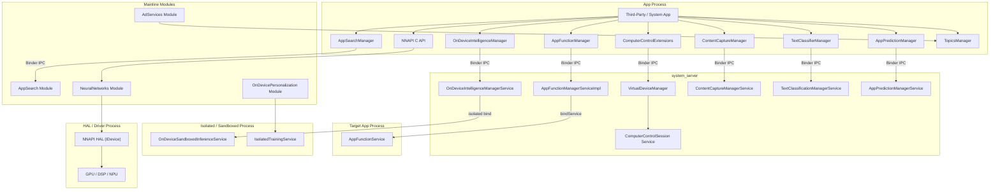
```mermaid
graph TB
    subgraph "App Process"
        APP[Third-Party / System App]
        AFM[AppFunctionManager]
        ODIM[OnDeviceIntelligenceManager]
        NNAPI_C["NNAPI C API"]
        CCExt[ComputerControlExtensions]
        ASM[AppSearchManager]
        TCM[TextClassifierManager]
        CCM[ContentCaptureManager]
        APM[AppPredictionManager]
        TM[TopicsManager]
    end

    subgraph "system_server"
        AFMS[AppFunctionManagerServiceImpl]
        ODIMS[OnDeviceIntelligenceManagerService]
        VDM[VirtualDeviceManager]
        CCS_SVC[ComputerControlSession Service]
        CCAS[ContentCaptureManagerService]
        TCMS[TextClassificationManagerService]
        APMS[AppPredictionManagerService]
    end

    subgraph "Target App Process"
        AFS[AppFunctionService]
    end

    subgraph "Isolated / Sandboxed Process"
        ODSIS[OnDeviceSandboxedInferenceService]
        ITS[IsolatedTrainingService]
    end

    subgraph "HAL / Driver Process"
        NNHAL["NNAPI HAL (IDevice)"]
        ACCEL["GPU / DSP / NPU"]
    end

    subgraph "Mainline Modules"
        APS["AppSearch Module"]
        NNM["NeuralNetworks Module"]
        ODP["OnDevicePersonalization Module"]
        ADS["AdServices Module"]
    end

    APP --> AFM
    APP --> ODIM
    APP --> NNAPI_C
    APP --> CCExt
    APP --> ASM
    APP --> TCM
    APP --> CCM
    APP --> APM
    APP --> TM

    AFM -- "Binder IPC" --> AFMS
    AFMS -- "bindService" --> AFS
    ODIM -- "Binder IPC" --> ODIMS
    ODIMS -- "isolated bind" --> ODSIS
    CCExt -- "Binder IPC" --> VDM
    VDM --> CCS_SVC
    CCM -- "Binder IPC" --> CCAS
    TCM -- "Binder IPC" --> TCMS
    APM -- "Binder IPC" --> APMS
    ASM -- "Binder IPC" --> APS

    NNAPI_C --> NNM
    NNM --> NNHAL
    NNHAL --> ACCEL

    ODP --> ITS
    ADS --> TM
```

### 50.1.1 Taxonomy of AOSP Intelligence Subsystems

| Subsystem | API Level | Module? | Purpose |
|-----------|-----------|---------|---------|
| **AppFunctions** | 16 (Android 16) | No (framework) | Typed cross-app function invocation |
| **Computer Control** | 16 (Android 16) | No (framework + extensions lib) | AI-driven UI automation via virtual display |
| **OnDeviceIntelligence** | 15+ | NeuralNetworks module | Sandboxed LLM / ML inference |
| **NNAPI** | 8.1+ | NeuralNetworks module | Hardware-accelerated neural network inference |
| **AppSearch** | 12+ | AppSearch module | On-device full-text search and indexing |
| **Content Capture** | 10+ | No (framework) | Real-time UI structure capture for intelligence |
| **TextClassifier** | 8.0+ | No (framework) | Entity recognition, language detection |
| **AppPrediction** | 10+ | No (framework) | Usage-based app ranking |
| **OnDevicePersonalization** | 14+ | ODP module | Federated compute, isolated training |
| **AdServices** | 13+ | AdServices module | Privacy-preserving ad targeting (Topics, FLEDGE) |

### 50.1.2 Cross-Cutting Design Themes

Several architectural themes recur across every AI subsystem:

1. **Process isolation.** Intelligence services run in isolated or sandboxed
   processes. `OnDeviceSandboxedInferenceService` declares
   `android:isolatedProcess="true"`. `IsolatedTrainingService` loads TFLite in
   a separate process. Even `ComputerControlSession` operates through a virtual
   display that is separated from the default display.

2. **Typed contracts over open-ended Bundles.** AppFunctions uses
   `GenericDocument` (from AppSearch) as its parameter wire format. ODI uses
   `PersistableBundle` for feature/request metadata. Both encourage
   SDK-level typed wrappers.

3. **AppSearch as the universal metadata store.** App function metadata, app
   prediction data, and content capture intelligence all converge on AppSearch
   for indexing and discovery.

4. **Permission-gated access with allowlisting.** AppFunctions gates execution
   behind `EXECUTE_APP_FUNCTIONS` plus a device-config agent allowlist.
   Computer Control requires `ACCESS_COMPUTER_CONTROL`. ODI requires
   `USE_ON_DEVICE_INTELLIGENCE`. AdServices requires
   `ACCESS_ADSERVICES_TOPICS`.

5. **Cancellation propagation.** Nearly every asynchronous API passes an
   `ICancellationSignal` transport across the Binder boundary, allowing the
   caller to abort long-running inference or function execution.

---

## 50.2 AppFunctions Framework

The AppFunctions framework, introduced as a beta feature in Android 16 (2024),
provides a standardized mechanism for AI assistants (agents) to discover and
invoke functionality exposed by arbitrary apps (targets). An assistant can
say "save XYZ into my notes" and the framework routes the request to the
appropriate `AppFunctionService` implementation without the assistant needing
any compile-time dependency on the note-taking app.

**Source tree overview:**

```
frameworks/base/core/java/android/app/appfunctions/
    AppFunctionManager.java              (973 lines)  -- Client-side system service
    AppFunctionService.java              (224 lines)  -- Abstract base for target apps
    ExecuteAppFunctionRequest.java       (270 lines)  -- Request parcelable
    ExecuteAppFunctionResponse.java      (206 lines)  -- Response parcelable
    AppFunctionException.java            (280 lines)  -- Typed error hierarchy
    AppFunctionAttribution.java          (292 lines)  -- Interaction provenance
    IAppFunctionManager.aidl             (97 lines)   -- System server AIDL
    IAppFunctionService.aidl             (50 lines)   -- Target app AIDL (oneway)
    IExecuteAppFunctionCallback.aidl                  -- Async result callback
    ICancellationCallback.aidl                        -- Cancellation transport
    ...
frameworks/base/services/appfunctions/
    java/com/android/server/appfunctions/
        AppFunctionManagerServiceImpl.java            -- IAppFunctionManager.Stub
        RemoteServiceCallerImpl.java                  -- Service binding logic
        CallerValidatorImpl.java                      -- Permission enforcement
        MetadataSyncAdapter.java                      -- AppSearch metadata sync
        AppFunctionAccessHistory.java                 -- Access audit trail
        AppFunctionAgentAllowlistStorage.java         -- Agent allowlist
        ...
```

### 50.2.1 Architecture Overview

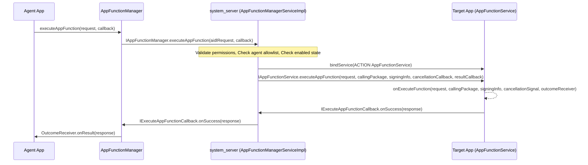
```mermaid
sequenceDiagram
    participant Agent as Agent App
    participant AFM as AppFunctionManager
    participant SS as system_server (AppFunctionManagerServiceImpl)
    participant AFS as Target App (AppFunctionService)

    Agent->>AFM: executeAppFunction(request, callback)
    AFM->>SS: IAppFunctionManager.executeAppFunction(aidlRequest, callback)
    Note over SS: Validate permissions, Check agent allowlist, Check enabled state
    SS->>AFS: bindService(ACTION AppFunctionService)
    SS->>AFS: IAppFunctionService.executeAppFunction(request, callingPackage, signingInfo, cancellationCallback, resultCallback)
    AFS-->>AFS: onExecuteFunction(request, callingPackage, signingInfo, cancellationSignal, outcomeReceiver)
    AFS->>SS: IExecuteAppFunctionCallback.onSuccess(response)
    SS->>AFM: IExecuteAppFunctionCallback.onSuccess(response)
    AFM->>Agent: OutcomeReceiver.onResult(response)
```

### 50.2.2 The Client: AppFunctionManager

`AppFunctionManager` is registered as a system service under
`Context.APP_FUNCTION_SERVICE`:

```
// frameworks/base/core/java/android/app/appfunctions/AppFunctionManager.java

@FlaggedApi(FLAG_ENABLE_APP_FUNCTION_MANAGER)
@SystemService(Context.APP_FUNCTION_SERVICE)
public final class AppFunctionManager {
```

The primary API is `executeAppFunction()`, which takes four parameters:

```java
// frameworks/base/core/java/android/app/appfunctions/AppFunctionManager.java

@RequiresPermission(value = Manifest.permission.EXECUTE_APP_FUNCTIONS, conditional = true)
@UserHandleAware
public void executeAppFunction(
        @NonNull ExecuteAppFunctionRequest request,
        @NonNull @CallbackExecutor Executor executor,
        @NonNull CancellationSignal cancellationSignal,
        @NonNull OutcomeReceiver<ExecuteAppFunctionResponse, AppFunctionException> callback) {
```

Internally, the manager wraps the public request into an
`ExecuteAppFunctionAidlRequest` that adds caller identity and timing:

```java
ExecuteAppFunctionAidlRequest aidlRequest =
        new ExecuteAppFunctionAidlRequest(
                request,
                mContext.getUser(),
                mContext.getPackageName(),
                /* requestTime= */ SystemClock.elapsedRealtime(),
                /* requestWallTime= */ System.currentTimeMillis());
```

The Binder call returns an `ICancellationSignal` transport that is
wired back to the caller's `CancellationSignal`:

```java
ICancellationSignal cancellationTransport =
        mService.executeAppFunction(
                aidlRequest,
                new IExecuteAppFunctionCallback.Stub() {
                    @Override
                    public void onSuccess(ExecuteAppFunctionResponse result) {
                        executor.execute(() -> callback.onResult(result));
                    }
                    @Override
                    public void onError(AppFunctionException exception) {
                        executor.execute(() -> callback.onError(exception));
                    }
                });
if (cancellationTransport != null) {
    cancellationSignal.setRemote(cancellationTransport);
}
```

### 50.2.3 Enabled State Management

Each app function has a tri-state lifecycle:

| Constant | Value | Meaning |
|----------|-------|---------|
| `APP_FUNCTION_STATE_DEFAULT` | 0 | Reset to the default (typically enabled) |
| `APP_FUNCTION_STATE_ENABLED` | 1 | Explicitly enabled |
| `APP_FUNCTION_STATE_DISABLED` | 2 | Explicitly disabled |

Apps control their own functions via `setAppFunctionEnabled()`:

```java
// frameworks/base/core/java/android/app/appfunctions/AppFunctionManager.java

@UserHandleAware
public void setAppFunctionEnabled(
        @NonNull String functionIdentifier,
        @EnabledState int newEnabledState,
        @NonNull Executor executor,
        @NonNull OutcomeReceiver<Void, Exception> callback) {
```

The enabled state is persisted in AppSearch as an
`AppFunctionRuntimeMetadata` document, which is separate from the
`AppFunctionStaticMetadata` that describes the function's schema.

### 50.2.4 Access Control Model

The AppFunctions access model operates on three levels:

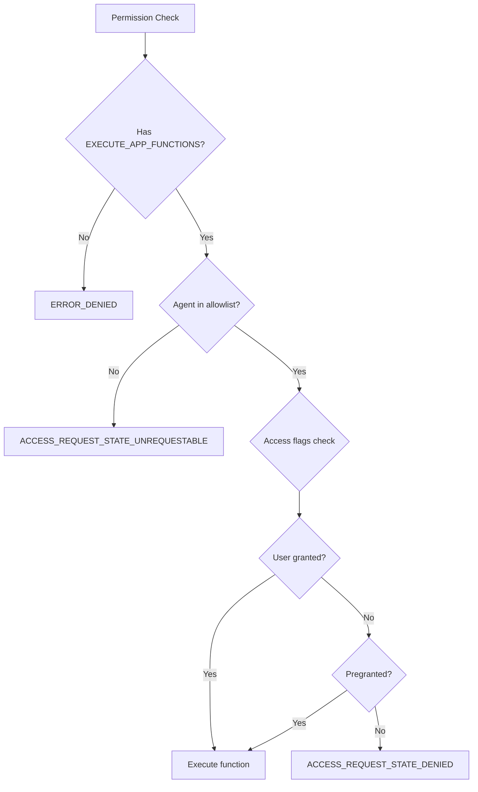
```mermaid
graph TD
    A[Permission Check] --> B{Has EXECUTE_APP_FUNCTIONS?}
    B -->|No| C[ERROR_DENIED]
    B -->|Yes| D{Agent in allowlist?}
    D -->|No| E[ACCESS_REQUEST_STATE_UNREQUESTABLE]
    D -->|Yes| F{Access flags check}
    F --> G{User granted?}
    G -->|Yes| H[Execute function]
    G -->|No| I{Pregranted?}
    I -->|Yes| H
    I -->|No| J[ACCESS_REQUEST_STATE_DENIED]
```

Access flags are a bitmask stored per (agent, target) pair:

| Flag | Value | Meaning |
|------|-------|---------|
| `ACCESS_FLAG_PREGRANTED` | 0x01 | System pre-granted the access |
| `ACCESS_FLAG_OTHER_GRANTED` | 0x02 | Granted via ADB or other mechanism |
| `ACCESS_FLAG_OTHER_DENIED` | 0x04 | Denied via ADB or self-revoke |
| `ACCESS_FLAG_USER_GRANTED` | 0x08 | User explicitly granted via UI |
| `ACCESS_FLAG_USER_DENIED` | 0x10 | User explicitly denied via UI |

The agent allowlist is maintained via DeviceConfig under the
`machine_learning` namespace with key `allowlisted_app_functions_agents`,
plus an additional per-device override in
`Settings.Secure.APP_FUNCTION_ADDITIONAL_AGENT_ALLOWLIST`.

```java
// frameworks/base/services/appfunctions/.../AppFunctionManagerServiceImpl.java

private static final String ALLOWLISTED_APP_FUNCTIONS_AGENTS =
        "allowlisted_app_functions_agents";
private static final String NAMESPACE_MACHINE_LEARNING = "machine_learning";
```

The `CallerValidatorImpl` class checks both the runtime permission and the
allowlist before any execution proceeds.

### 50.2.5 The AIDL Interfaces

The framework defines two AIDL interfaces -- one facing the client, one facing
the target app.

**IAppFunctionManager** (client-to-system\_server):

```
// frameworks/base/core/java/android/app/appfunctions/IAppFunctionManager.aidl

interface IAppFunctionManager {
    ICancellationSignal executeAppFunction(
        in ExecuteAppFunctionAidlRequest request,
        in IExecuteAppFunctionCallback callback);

    void setAppFunctionEnabled(
        in String callingPackage,
        in String functionIdentifier,
        in UserHandle userHandle,
        int enabledState,
        in IAppFunctionEnabledCallback callback);

    int getAccessRequestState(
        in String agentPackageName, int agentUserId,
        in String targetPackageName, int targetUserId);

    int getAccessFlags(...);
    boolean updateAccessFlags(...);
    void revokeSelfAccess(in String targetPackageName);
    List<String> getValidAgents(int userId);
    List<String> getValidTargets(int targetUserId);
    List<SignedPackageParcel> getAgentAllowlist();
    void clearAccessHistory(int userId);
    Intent createRequestAccessIntent(in String targetPackageName);
}
```

**IAppFunctionService** (system\_server-to-target app, `oneway`):

```
// frameworks/base/core/java/android/app/appfunctions/IAppFunctionService.aidl

oneway interface IAppFunctionService {
    void executeAppFunction(
        in ExecuteAppFunctionRequest request,
        in String callingPackage,
        in android.content.pm.SigningInfo callingPackageSigningInfo,
        in ICancellationCallback cancellationCallback,
        in IExecuteAppFunctionCallback callback);
}
```

The `oneway` modifier is critical: the system\_server does not block waiting
for the target app to finish. Results flow back through the
`IExecuteAppFunctionCallback`.

### 50.2.6 The Target: AppFunctionService

Target apps extend `AppFunctionService` and implement a single abstract method:

```java
// frameworks/base/core/java/android/app/appfunctions/AppFunctionService.java

@MainThread
public abstract void onExecuteFunction(
        @NonNull ExecuteAppFunctionRequest request,
        @NonNull String callingPackage,
        @NonNull SigningInfo callingPackageSigningInfo,
        @NonNull CancellationSignal cancellationSignal,
        @NonNull OutcomeReceiver<ExecuteAppFunctionResponse, AppFunctionException> callback);
```

The service enforces that only system\_server (which holds
`BIND_APP_FUNCTION_SERVICE`) can call it:

```java
// frameworks/base/core/java/android/app/appfunctions/AppFunctionService.java

if (context.checkCallingPermission(BIND_APP_FUNCTION_SERVICE)
        == PERMISSION_DENIED) {
    throw new SecurityException("Can only be called by the system server.");
}
```

The manifest declaration requires the binding permission:

```xml
<service android:name=".YourService"
       android:permission="android.permission.BIND_APP_FUNCTION_SERVICE">
    <intent-filter>
      <action android:name="android.app.appfunctions.AppFunctionService" />
    </intent-filter>
</service>
```

### 50.2.7 Request and Response Wire Format

Both `ExecuteAppFunctionRequest` and `ExecuteAppFunctionResponse` use
AppSearch's `GenericDocument` as their parameter wire format. This is not
arbitrary -- it ensures that function parameters can be described by a schema
that AppSearch already knows how to index and query.

**Request:**

```java
// frameworks/base/core/java/android/app/appfunctions/ExecuteAppFunctionRequest.java

public final class ExecuteAppFunctionRequest implements Parcelable {
    @NonNull private final String mTargetPackageName;
    @NonNull private final String mFunctionIdentifier;
    @NonNull private final Bundle mExtras;
    @NonNull private final GenericDocumentWrapper mParameters;
    @Nullable private final AppFunctionAttribution mAttribution;
```

**Response:**

```java
// frameworks/base/core/java/android/app/appfunctions/ExecuteAppFunctionResponse.java

public final class ExecuteAppFunctionResponse implements Parcelable {
    public static final String PROPERTY_RETURN_VALUE = "androidAppfunctionsReturnValue";
    @NonNull private final GenericDocumentWrapper mResultDocumentWrapper;
    @NonNull private final Bundle mExtras;
    @NonNull private final List<AppFunctionUriGrant> mUriGrants;
```

The return value lives at the key `PROPERTY_RETURN_VALUE` inside the result
`GenericDocument`. The `AppFunction SDK` (a separate Jetpack library) provides
typed wrappers that pack/unpack these documents.

### 50.2.8 Attribution and Audit Trail

Every execution can carry an `AppFunctionAttribution` describing the
interaction that triggered it:

```java
// frameworks/base/core/java/android/app/appfunctions/AppFunctionAttribution.java

public static final int INTERACTION_TYPE_OTHER = 0;
public static final int INTERACTION_TYPE_USER_QUERY = 1;
public static final int INTERACTION_TYPE_USER_SCHEDULED = 2;
```

The system records these attributions in an access history database
(`AppFunctionSQLiteAccessHistory` / `MultiUserAppFunctionAccessHistory`)
exposed through a content provider at:

```
content://com.android.appfunction.accesshistory/user/{userId}
```

The access history schema includes:

| Column | Type | Description |
|--------|------|-------------|
| `agent_package_name` | TEXT | The AI agent that made the call |
| `target_package_name` | TEXT | The app that was invoked |
| `interaction_type` | INT | Interaction type constant |
| `interaction_uri` | TEXT | Link back to interaction context |
| `thread_id` | TEXT | Groups related function calls |
| `access_time` | LONG | Timestamp in milliseconds |
| `access_duration` | LONG | Execution duration in milliseconds |

### 50.2.9 Error Handling

`AppFunctionException` defines a categorized error code scheme:

```java
// frameworks/base/core/java/android/app/appfunctions/AppFunctionException.java

// Request errors (1000-1999)
public static final int ERROR_DENIED = 1000;
public static final int ERROR_INVALID_ARGUMENT = 1001;
public static final int ERROR_DISABLED = 1002;
public static final int ERROR_FUNCTION_NOT_FOUND = 1003;

// System errors (2000-2999)
public static final int ERROR_SYSTEM_ERROR = 2000;
public static final int ERROR_CANCELLED = 2001;
public static final int ERROR_ENTERPRISE_POLICY_DISALLOWED = 2002;

// App errors (3000-3999)
public static final int ERROR_APP_UNKNOWN_ERROR = 3000;
```

The `getErrorCategory()` method maps ranges to categories:

```java
public int getErrorCategory() {
    if (mErrorCode >= 1000 && mErrorCode < 2000) return ERROR_CATEGORY_REQUEST_ERROR;
    if (mErrorCode >= 2000 && mErrorCode < 3000) return ERROR_CATEGORY_SYSTEM;
    if (mErrorCode >= 3000 && mErrorCode < 4000) return ERROR_CATEGORY_APP;
    return ERROR_CATEGORY_UNKNOWN;
}
```

### 50.2.10 System Server Implementation

The service implementation in
`frameworks/base/services/appfunctions/java/com/android/server/appfunctions/AppFunctionManagerServiceImpl.java`
extends `IAppFunctionManager.Stub` and coordinates:

```java
// frameworks/base/services/appfunctions/.../AppFunctionManagerServiceImpl.java

public class AppFunctionManagerServiceImpl extends IAppFunctionManager.Stub {
    private final RemoteServiceCaller<IAppFunctionService> mRemoteServiceCaller;
    private final CallerValidator mCallerValidator;
    private final AppFunctionAccessServiceInterface mAppFunctionAccessService;
    private final IUriGrantsManager mUriGrantsManager;
    private final MultiUserAppFunctionAccessHistory mMultiUserAppFunctionAccessHistory;
    ...
```

Key supporting classes:

| Class | Responsibility |
|-------|---------------|
| `RemoteServiceCallerImpl` | Binds to target `AppFunctionService`, manages connection lifecycle |
| `CallerValidatorImpl` | Enforces `EXECUTE_APP_FUNCTIONS`, checks allowlist |
| `MetadataSyncAdapter` | Syncs function metadata to AppSearch on package changes |
| `AppFunctionPackageMonitor` | Watches for package install/update/remove |
| `FutureAppSearchSessionImpl` | Async wrapper around AppSearch sessions |
| `AppFunctionAgentAllowlistStorage` | Persists agent allowlist from DeviceConfig + Settings |
| `AppFunctionSQLiteAccessHistory` | SQLite backend for the access audit trail |

### 50.2.11 Function Discovery via AppSearch

When a package is installed, updated, or the device boots, the
`MetadataSyncAdapter` extracts app function metadata from the target app's
`AppFunctionService` and indexes it as `AppFunctionStaticMetadata` documents
in AppSearch. Agents discover functions by querying AppSearch:

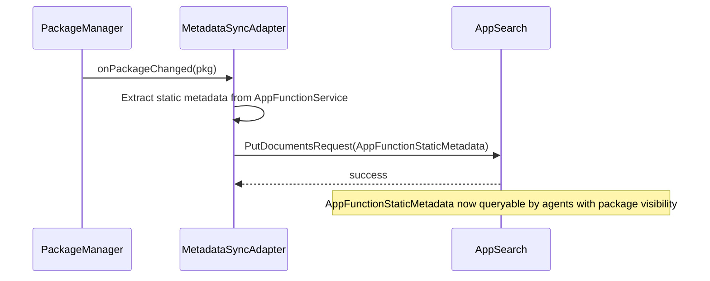
```mermaid
sequenceDiagram
    participant PM as PackageManager
    participant MSync as MetadataSyncAdapter
    participant AS as AppSearch

    PM->>MSync: onPackageChanged(pkg)
    MSync->>MSync: Extract static metadata from AppFunctionService
    MSync->>AS: PutDocumentsRequest(AppFunctionStaticMetadata)
    AS-->>MSync: success

    Note over AS: AppFunctionStaticMetadata now queryable by agents with package visibility
```

### 50.2.12 SafeOneTimeExecuteAppFunctionCallback

A critical defensive wrapper ensures exactly-once delivery:

```java
// frameworks/base/core/java/android/app/appfunctions/SafeOneTimeExecuteAppFunctionCallback.java

public class SafeOneTimeExecuteAppFunctionCallback {
    private final AtomicBoolean mOnResultCalled = new AtomicBoolean(false);
    @NonNull private final IExecuteAppFunctionCallback mCallback;
    @Nullable private final CompletionCallback mCompletionCallback;
    @Nullable private final BeforeCompletionCallback mBeforeCompletionCallback;
    private final AtomicLong mExecutionStartTimeAfterBindMillis = new AtomicLong();

    public void onResult(@NonNull ExecuteAppFunctionResponse result) {
        if (!mOnResultCalled.compareAndSet(false, true)) {
            Log.w(TAG, "Ignore subsequent calls to onResult/onError()");
            return;
        }
        try {
            if (mBeforeCompletionCallback != null) {
                mBeforeCompletionCallback.beforeOnSuccess(result);
            }
            mCallback.onSuccess(result);
            if (mCompletionCallback != null) {
                mCompletionCallback.finalizeOnSuccess(
                        result, mExecutionStartTimeAfterBindMillis.get());
            }
        } catch (RemoteException ex) {
            Log.w(TAG, "Failed to invoke the callback", ex);
        }
    }

    public void onError(@NonNull AppFunctionException error) {
        if (!mOnResultCalled.compareAndSet(false, true)) {
            Log.w(TAG, "Ignore subsequent calls to onResult/onError()");
            return;
        }
        try {
            mCallback.onError(error);
            if (mCompletionCallback != null) {
                mCompletionCallback.finalizeOnError(
                        error, mExecutionStartTimeAfterBindMillis.get());
            }
        } catch (RemoteException ex) {
            Log.w(TAG, "Failed to invoke the callback", ex);
        }
    }
```

This design pattern is essential because:

1. **Target apps might call back multiple times** -- The `AppFunctionService`
   is third-party code that might erroneously invoke the callback twice.
   The `AtomicBoolean.compareAndSet()` ensures only the first call succeeds.

2. **RemoteException swallowing** -- If the calling process has died by the
   time the result arrives, the `RemoteException` is logged and swallowed
   rather than crashing the system server.

3. **Completion hooks** -- The `BeforeCompletionCallback` and
   `CompletionCallback` allow the system server to perform actions (like
   logging, URI grants, and access history recording) around the callback
   delivery:

```java
    public interface CompletionCallback {
        void finalizeOnSuccess(
                ExecuteAppFunctionResponse result, long executionStartTimeMillis);
        void finalizeOnError(
                AppFunctionException error, long executionStartTimeMillis);
    }

    public interface BeforeCompletionCallback {
        void beforeOnSuccess(ExecuteAppFunctionResponse result);
    }
```

4. **Latency tracking** -- The `mExecutionStartTimeAfterBindMillis` field
   records when execution began after service binding completed, allowing
   the system to distinguish binding overhead from execution time.

5. **Disable mechanism** -- The `disable()` method can prevent any further
   callback delivery, used when the request is cancelled or timed out.

### 50.2.13 The executeAppFunction Implementation Deep Dive

The system server's `executeAppFunction` method is the most critical path in
the entire framework. Let us trace it line by line from the AIDL entry point
through to the target service binding.

**Step 1: Entry and initial validation.**

```java
// frameworks/base/services/appfunctions/.../AppFunctionManagerServiceImpl.java

@Override
public ICancellationSignal executeAppFunction(
        @NonNull ExecuteAppFunctionAidlRequest requestInternal,
        @NonNull IExecuteAppFunctionCallback executeAppFunctionCallback) {

    int callingUid = Binder.getCallingUid();
    int callingPid = Binder.getCallingPid();

    final SafeOneTimeExecuteAppFunctionCallback safeExecuteAppFunctionCallback =
            initializeSafeExecuteAppFunctionCallback(
                    requestInternal, executeAppFunctionCallback, callingUid);

    String validatedCallingPackage;
    try {
        validatedCallingPackage =
                mCallerValidator.validateCallingPackage(requestInternal.getCallingPackage());
        mCallerValidator.verifyTargetUserHandle(
                requestInternal.getUserHandle(), validatedCallingPackage);
    } catch (SecurityException exception) {
        safeExecuteAppFunctionCallback.onError(
                new AppFunctionException(
                        AppFunctionException.ERROR_DENIED, exception.getMessage()));
        return null;
    }
```

The `SafeOneTimeExecuteAppFunctionCallback` wrapper ensures that exactly one
response (success or error) is delivered, even if the target app sends multiple
replies or crashes before responding.

**Step 2: Asynchronous execution on the thread pool.**

```java
    ICancellationSignal localCancelTransport = CancellationSignal.createTransport();

    THREAD_POOL_EXECUTOR.execute(
            () -> {
                try {
                    executeAppFunctionInternal(
                            requestInternal,
                            callingUid, callingPid,
                            localCancelTransport,
                            safeExecuteAppFunctionCallback,
                            executeAppFunctionCallback.asBinder());
                } catch (Exception e) {
                    safeExecuteAppFunctionCallback.onError(
                            mapExceptionToExecuteAppFunctionResponse(e));
                }
            });
    return localCancelTransport;
}
```

The work is dispatched to `THREAD_POOL_EXECUTOR` (defined in
`AppFunctionExecutors`) to avoid blocking the Binder thread pool.

**Step 3: Permission and state validation.**

```java
@WorkerThread
private void executeAppFunctionInternal(...) {
    // Enterprise policy check
    if (!mCallerValidator.verifyEnterprisePolicyIsAllowed(callingUser, targetUser)) {
        safeExecuteAppFunctionCallback.onError(
                new AppFunctionException(
                        AppFunctionException.ERROR_ENTERPRISE_POLICY_DISALLOWED, ...));
        return;
    }

    // Empty target package check
    if (TextUtils.isEmpty(targetPackageName)) {
        safeExecuteAppFunctionCallback.onError(
                new AppFunctionException(
                        AppFunctionException.ERROR_INVALID_ARGUMENT, ...));
        return;
    }
```

**Step 4: Future-chained permission and enabled-state checks.**

The implementation uses `AndroidFuture.thenCompose()` for non-blocking
permission verification followed by AppSearch-backed enabled-state lookup:

```java
    mCallerValidator
            .verifyCallerCanExecuteAppFunction(
                    callingUid, callingPid, targetUser,
                    requestInternal.getCallingPackage(),
                    targetPackageName,
                    requestInternal.getClientRequest().getFunctionIdentifier())
            .thenCompose(canExecuteResult -> {
                if (canExecuteResult == CAN_EXECUTE_APP_FUNCTIONS_DENIED) {
                    return AndroidFuture.failedFuture(
                            new SecurityException("Caller does not have permission"));
                }
                return isAppFunctionEnabled(
                        functionIdentifier, targetPackageName,
                        getAppSearchManagerAsUser(userHandle), THREAD_POOL_EXECUTOR)
                    .thenApply(isEnabled -> {
                        if (!isEnabled) {
                            throw new DisabledAppFunctionException("Disabled");
                        }
                        return canExecuteResult;
                    });
            })
```

**Step 5: Service resolution and binding.**

```java
            .thenAccept(canExecuteResult -> {
                int bindFlags = Context.BIND_AUTO_CREATE;
                if (canExecuteResult
                        == CAN_EXECUTE_APP_FUNCTIONS_ALLOWED_HAS_PERMISSION) {
                    bindFlags |= Context.BIND_FOREGROUND_SERVICE;
                }
                Intent serviceIntent =
                        mInternalServiceHelper.resolveAppFunctionService(
                                targetPackageName, targetUser);
                // Grant implicit visibility to allow target to see caller
                mPackageManagerInternal.grantImplicitAccess(
                        grantRecipientUserId, serviceIntent,
                        grantRecipientAppId, callingUid, /* direct= */ true);
                bindAppFunctionServiceUnchecked(
                        requestInternal, serviceIntent, targetUser,
                        localCancelTransport, safeExecuteAppFunctionCallback,
                        bindFlags, callerBinder, callingUid);
            })
```

This reveals an important detail: when the caller has
`EXECUTE_APP_FUNCTIONS`, the system uses `BIND_FOREGROUND_SERVICE` to elevate
the target service's process priority. Self-calls (same package) do not get
this elevation.

### 50.2.14 The RemoteServiceCaller Pattern

`RemoteServiceCallerImpl` implements the one-shot service binding pattern:

```java
// frameworks/base/services/appfunctions/.../RemoteServiceCallerImpl.java

public class RemoteServiceCallerImpl<T> implements RemoteServiceCaller<T> {
    public boolean runServiceCall(
            Intent intent, int bindFlags, UserHandle userHandle,
            long cancellationTimeoutMillis, CancellationSignal cancellationSignal,
            RunServiceCallCallback<T> callback, IBinder callerBinder) {

        OneOffServiceConnection serviceConnection =
                new OneOffServiceConnection(intent, bindFlags, userHandle,
                        cancellationTimeoutMillis, cancellationSignal,
                        callback, callerBinder);
        return serviceConnection.bindAndRun();
    }
```

The `OneOffServiceConnection` is a `ServiceConnection` that:

1. Calls `Context.bindServiceAsUser()` to connect to the target
2. Sets a cancellation listener that triggers unbinding after a timeout
3. Links to the caller's binder death to cancel if the caller dies
4. Unbinds automatically after the callback completes

```java
private class OneOffServiceConnection
        implements ServiceConnection, ServiceUsageCompleteListener {

    public boolean bindAndRun() {
        boolean bindServiceResult =
                mContext.bindServiceAsUser(mIntent, this, mFlags, mUserHandle);

        if (bindServiceResult) {
            mCancellationSignal.setOnCancelListener(() -> {
                mCallback.onCancelled();
                mHandler.postDelayed(mCancellationTimeoutRunnable,
                        mCancellationTimeoutMillis);
            });
            mDirectServiceVulture = () -> {
                Slog.w(TAG, "Caller process onDeath signal received");
                mCancellationSignal.cancel();
            };
            mCallerBinder.linkToDeath(mDirectServiceVulture, 0);
        }
        return bindServiceResult;
    }
```

This pattern ensures that the service connection is always cleaned up,
even if the caller crashes, the target crashes, or the user cancels.

### 50.2.15 Multi-User Support

The service implementation is multi-user aware. Each user has:

- Their own AppSearch database for function metadata
- Their own `PackageMonitor` for tracking package changes
- Their own access history database
- Separate access flags per (agent, target) pair

```java
// AppFunctionManagerServiceImpl.java

public void onUserUnlocked(TargetUser user) {
    registerAppSearchObserver(user);
    trySyncRuntimeMetadata(user);
    PackageMonitor pkgMonitorForUser =
            AppFunctionPackageMonitor.registerPackageMonitorForUser(mContext, user);
    mPackageMonitors.append(user.getUserIdentifier(), pkgMonitorForUser);
    if (accessCheckFlagsEnabled()) {
        mMultiUserAppFunctionAccessHistory.onUserUnlocked(user);
    }
}

public void onUserStopping(@NonNull TargetUser user) {
    MetadataSyncPerUser.removeUserSyncAdapter(user.getUserHandle());
    mPackageMonitors.get(userIdentifier).unregister();
    mPackageMonitors.delete(userIdentifier);
    mMultiUserAppFunctionAccessHistory.onUserStopping(user);
}
```

### 50.2.16 Agent Allowlist Architecture

The agent allowlist has three tiers, merged at boot and on configuration
changes:

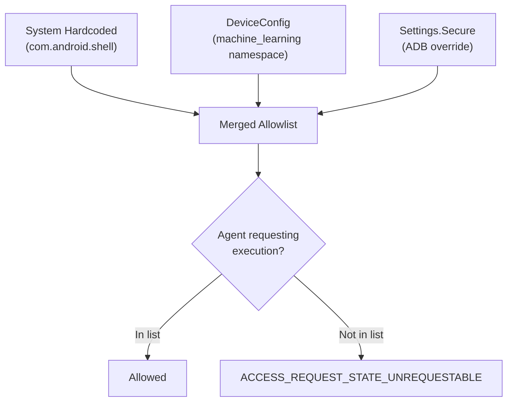
```mermaid
graph TD
    A["System Hardcoded<br/>(com.android.shell)"] --> D[Merged Allowlist]
    B["DeviceConfig<br/>(machine_learning namespace)"] --> D
    C["Settings.Secure<br/>(ADB override)"] --> D

    D --> E{"Agent requesting<br/>execution?"}
    E -->|In list| F[Allowed]
    E -->|Not in list| G[ACCESS_REQUEST_STATE_UNREQUESTABLE]
```

```java
// AppFunctionManagerServiceImpl.java

private static final List<SignedPackage> sSystemAllowlist =
        List.of(new SignedPackage(SHELL_PKG, null));

@GuardedBy("mAgentAllowlistLock")
private List<SignedPackage> mUpdatableAgentAllowlist = Collections.emptyList();

@GuardedBy("mAgentAllowlistLock")
private List<SignedPackage> mSecureSettingAgentAllowlist = Collections.emptyList();

@GuardedBy("mAgentAllowlistLock")
private ArraySet<SignedPackage> mAgentAllowlist = new ArraySet<>(sSystemAllowlist);
```

The `DeviceConfig.OnPropertiesChangedListener` reloads the allowlist when
the server-side configuration changes:

```java
private final DeviceConfig.OnPropertiesChangedListener mDeviceConfigListener =
        properties -> {
            if (properties.getKeyset().contains(ALLOWLISTED_APP_FUNCTIONS_AGENTS)) {
                updateAgentAllowlist(true, false);
            }
        };
```

A `ContentObserver` watches for the ADB override:

```java
private final ContentObserver mAdbAgentObserver =
        new ContentObserver(FgThread.getHandler()) {
            @Override
            public void onChange(boolean selfChange, Uri uri) {
                if (!ADDITIONAL_AGENTS_URI.equals(uri)) return;
                updateAgentAllowlist(false, true);
            }
        };
```

### 50.2.17 URI Grants for AppFunction Responses

When a target app returns content URIs in its response, the framework can
grant temporary URI permissions to the calling agent:

```java
// AppFunctionManagerServiceImpl.java

private final IUriGrantsManager mUriGrantsManager;
private final UriGrantsManagerInternal mUriGrantsManagerInternal;
private final IBinder mPermissionOwner;

// In constructor:
mPermissionOwner = mUriGrantsManagerInternal.newUriPermissionOwner("appfunctions");
```

The `AppFunctionUriGrant` objects in the response specify which URIs should be
granted. These grants typically persist until device reboot.

### 50.2.18 Shell Command Support

The service implements `onShellCommand()` for developer debugging:

```java
// AppFunctionManagerServiceImpl.java

@Override
public void onShellCommand(
        FileDescriptor in, FileDescriptor out, FileDescriptor err,
        @NonNull String[] args, ShellCallback callback,
        @NonNull ResultReceiver resultReceiver) {
    new AppFunctionManagerServiceShellCommand(mContext, this)
            .exec(this, in, out, err, args, callback, resultReceiver);
}
```

Available via `adb shell cmd app_function`.

### 50.2.19 Boot Phase Handling

The service initializes its configuration during the
`PHASE_SYSTEM_SERVICES_READY` boot phase:

```java
public void onBootPhase(int phase) {
    if (phase == SystemService.PHASE_SYSTEM_SERVICES_READY) {
        mBackgroundExecutor.execute(() ->
                updateAgentAllowlist(true, true));
        DeviceConfig.addOnPropertiesChangedListener(
                NAMESPACE_MACHINE_LEARNING, mBackgroundExecutor, mDeviceConfigListener);
        mContext.getContentResolver()
                .registerContentObserver(ADDITIONAL_AGENTS_URI, false, mAdbAgentObserver);
    }
}
```

---

## 50.3 Computer Control

Computer Control is Android 16's framework for allowing AI agents to
programmatically interact with applications through a virtual display. Instead
of requiring apps to implement specific APIs, an agent can launch any app on a
headless virtual display, observe the screen via screenshots, inject tap/swipe
events, and read accessibility trees -- the same paradigm used by "computer
use" AI agents.

**Source tree:**

```
frameworks/base/core/java/android/companion/virtual/computercontrol/
    ComputerControlSession.java          (490 lines) -- Core session API
    ComputerControlSessionParams.java    (280 lines) -- Session configuration
    InteractiveMirrorDisplay.java         (72 lines) -- Mirror display for user view
    AutomatedPackageListener.java                    -- Package change notifications
    IComputerControlSession.aidl                     -- Session Binder interface
    IComputerControlSessionCallback.aidl             -- Creation lifecycle callback
    IComputerControlStabilityListener.aidl           -- UI stability signal
    IInteractiveMirrorDisplay.aidl                   -- Mirror display interface

frameworks/base/libs/computercontrol/              -- Extension library
    src/com/android/extensions/computercontrol/
        ComputerControlExtensions.java   (206 lines) -- Entry point
        ComputerControlSession.java      (684 lines) -- Extension session wrapper
        InteractiveMirror.java                       -- Mirror abstraction
        EventIdleTracker.java                        -- UI idle detection
        StabilityHintCallbackTracker.java            -- Stability signals
        AutomatedPackageListener.java                -- Extension listener
        input/KeyEvent.java                          -- Input event wrapper
        input/TouchEvent.java                        -- Touch event wrapper
        view/MirrorView.java                         -- Mirror display view
```

### 50.3.1 Architecture

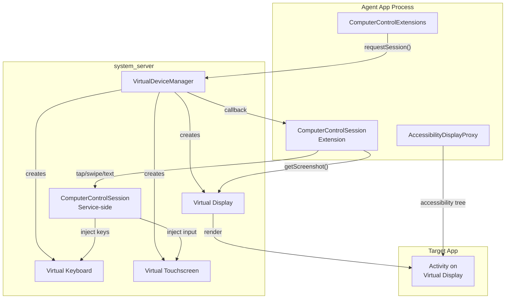
```mermaid
graph TB
    subgraph "Agent App Process"
        CCE[ComputerControlExtensions]
        CCS_EXT["ComputerControlSession<br/>Extension"]
        AP[AccessibilityDisplayProxy]
    end

    subgraph "system_server"
        VDM[VirtualDeviceManager]
        CCS_SVC["ComputerControlSession<br/>Service-side"]
        VD[Virtual Display]
        VKB[Virtual Keyboard]
        VTS[Virtual Touchscreen]
    end

    subgraph "Target App"
        ACTIVITY["Activity on<br/>Virtual Display"]
    end

    CCE -- "requestSession()" --> VDM
    VDM -- "creates" --> VD
    VDM -- "creates" --> VKB
    VDM -- "creates" --> VTS
    VDM -- "callback" --> CCS_EXT
    CCS_EXT -- "tap/swipe/text" --> CCS_SVC
    CCS_SVC -- "inject input" --> VTS
    CCS_SVC -- "inject keys" --> VKB
    VD -- "render" --> ACTIVITY
    CCS_EXT -- "getScreenshot()" --> VD
    AP -- "accessibility tree" --> ACTIVITY
```

### 50.3.2 Session Lifecycle

The entry point is `ComputerControlExtensions.getInstance()`, which checks for
`FEATURE_ACTIVITIES_ON_SECONDARY_DISPLAYS` and `VirtualDeviceManager`
availability:

```java
// frameworks/base/libs/computercontrol/.../ComputerControlExtensions.java

private static boolean isAvailable(Context context) {
    if (!context.getPackageManager().hasSystemFeature(
                PackageManager.FEATURE_ACTIVITIES_ON_SECONDARY_DISPLAYS)) {
        return false;
    }
    return context.getSystemService(VirtualDeviceManager.class) != null;
}
```

Session creation flows through `requestSession()` which requires
`ACCESS_COMPUTER_CONTROL`:

```java
// frameworks/base/libs/computercontrol/.../ComputerControlExtensions.java

@RequiresPermission(Manifest.permission.ACCESS_COMPUTER_CONTROL)
public void requestSession(@NonNull ComputerControlSession.Params params,
        @NonNull Executor executor, @NonNull ComputerControlSession.Callback callback) {
    // Build platform params
    ComputerControlSessionParams sessionParams =
            new ComputerControlSessionParams.Builder()
                    .setName(params.getName())
                    .setTargetPackageNames(params.getTargetPackageNames())
                    .setDisplayWidthPx(params.getDisplayWidthPx())
                    .setDisplayHeightPx(params.getDisplayHeightPx())
                    .setDisplayDpi(params.getDisplayDpi())
                    .setDisplaySurface(params.getDisplaySurface())
                    .setDisplayAlwaysUnlocked(params.isDisplayAlwaysUnlocked())
                    .build();

    VirtualDeviceManager vdm = params.getContext().getSystemService(VirtualDeviceManager.class);
    vdm.requestComputerControlSession(sessionParams, executor, sessionCallback);
}
```

The callback lifecycle mirrors VirtualDeviceManager session creation:

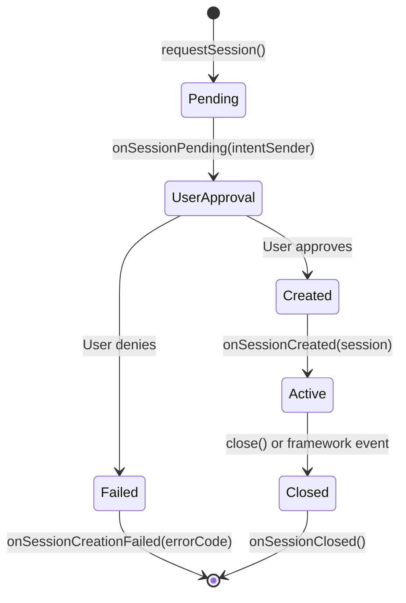
```mermaid
stateDiagram-v2
    [*] --> Pending: requestSession()
    Pending --> UserApproval: onSessionPending(intentSender)
    UserApproval --> Created: User approves
    UserApproval --> Failed: User denies
    Created --> Active: onSessionCreated(session)
    Active --> Closed: close() or framework event
    Failed --> [*]: onSessionCreationFailed(errorCode)
    Closed --> [*]: onSessionClosed()
```

Error codes for session creation:

```java
// frameworks/base/core/java/android/companion/virtual/computercontrol/ComputerControlSession.java

public static final int ERROR_SESSION_LIMIT_REACHED = 1;
public static final int ERROR_DEVICE_LOCKED = 2;
public static final int ERROR_PERMISSION_DENIED = 3;
```

### 50.3.3 The Core Session API

Once created, `ComputerControlSession` exposes a high-level input API:

```java
// frameworks/base/core/java/android/companion/virtual/computercontrol/ComputerControlSession.java

// Launch an app
public void launchApplication(@NonNull String packageName);

// Hand over to user
public void handOverApplications();

// Screenshot
@Nullable public Image getScreenshot();

// Input injection
public void tap(int x, int y);
public void swipe(int fromX, int fromY, int toX, int toY);
public void longPress(int x, int y);
public void insertText(@NonNull String text, boolean replaceExisting, boolean commit);
public void performAction(@Action int actionCode);

// Low-level input
public void sendKeyEvent(@NonNull VirtualKeyEvent event);
public void sendTouchEvent(@NonNull VirtualTouchEvent event);

// Mirror display
@Nullable public InteractiveMirrorDisplay createInteractiveMirrorDisplay(
        int width, int height, @NonNull Surface surface);

// UI stability
public void setStabilityListener(Executor executor, StabilityListener listener);
```

Screenshots are captured through an `ImageReader` that is attached to the
virtual display surface:

```java
// frameworks/base/core/java/android/companion/virtual/computercontrol/ComputerControlSession.java

mImageReader = ImageReader.newInstance(displayInfo.logicalWidth,
        displayInfo.logicalHeight, PixelFormat.RGBA_8888, /* maxImages= */ 2);
displayManagerGlobal.setVirtualDisplaySurface(displayToken, mImageReader.getSurface());

public Image getScreenshot() {
    synchronized (mLock) {
        return mImageReader == null ? null : mImageReader.acquireLatestImage();
    }
}
```

### 50.3.4 Session Parameters

`ComputerControlSessionParams` configures the virtual display:

```java
// frameworks/base/core/java/android/companion/virtual/computercontrol/ComputerControlSessionParams.java

public final class ComputerControlSessionParams implements Parcelable {
    private final String mName;
    private final List<String> mTargetPackageNames;
    private final int mDisplayWidthPx;
    private final int mDisplayHeightPx;
    private final int mDisplayDpi;
    private final Surface mDisplaySurface;
    private final boolean mIsDisplayAlwaysUnlocked;
```

The `targetPackageNames` field restricts which apps can be launched in the
session. Each package must have a valid launcher intent and cannot be the
device permission controller.

### 50.3.5 Interactive Mirror Display

The `InteractiveMirrorDisplay` mirrors the session's virtual display and
allows a human user to observe and interact simultaneously:

```java
// frameworks/base/core/java/android/companion/virtual/computercontrol/InteractiveMirrorDisplay.java

public final class InteractiveMirrorDisplay implements AutoCloseable {
    public void resize(int width, int height);
    public void sendTouchEvent(@NonNull VirtualTouchEvent event);
    public void close();
}
```

This enables a "co-pilot" pattern where an AI agent drives the automation
while a human watches and can intervene.

### 50.3.6 UI Stability Detection

Knowing when an app's UI has "settled" is critical for AI agents that need
to screenshot and analyze before acting. The `StabilityListener` interface
provides this signal:

```java
// frameworks/base/core/java/android/companion/virtual/computercontrol/ComputerControlSession.java

public interface StabilityListener {
    void onSessionStable();
}
```

The extension library's `ComputerControlAccessibilityProxy` and
`EventIdleTracker` monitor accessibility events and animation completion
to determine when the display content is stable.

### 50.3.7 Accessibility Integration

The extension-layer `ComputerControlSession` registers an
`AccessibilityDisplayProxy` for the virtual display, enabling the agent to
query the accessibility tree:

```java
// frameworks/base/libs/computercontrol/.../ComputerControlSession.java

mAccessibilityProxy = new ComputerControlAccessibilityProxy(mVirtualDisplayId);
mAccessibilityManager.registerDisplayProxy(mAccessibilityProxy);
```

This gives the agent structured information about the UI (view hierarchy,
content descriptions, bounding boxes) without relying solely on pixel-level
screenshot analysis.

### 50.3.8 Automated Package Listener

Launcher apps can register to be notified when apps are being automated:

```java
// frameworks/base/libs/computercontrol/.../ComputerControlExtensions.java

public void registerAutomatedPackageListener(
        @NonNull Context context,
        @NonNull @CallbackExecutor Executor executor,
        @NonNull AutomatedPackageListener listener) {
    VirtualDeviceManager vdm = context.getSystemService(VirtualDeviceManager.class);
    vdm.registerAutomatedPackageListener(executor, platformListener);
}
```

This allows the launcher to display an indicator that an app is currently
under AI control.

### 50.3.9 Integration with VirtualDeviceManager

Computer Control builds on top of the VirtualDeviceManager framework
(Chapter 21). The relationship is:

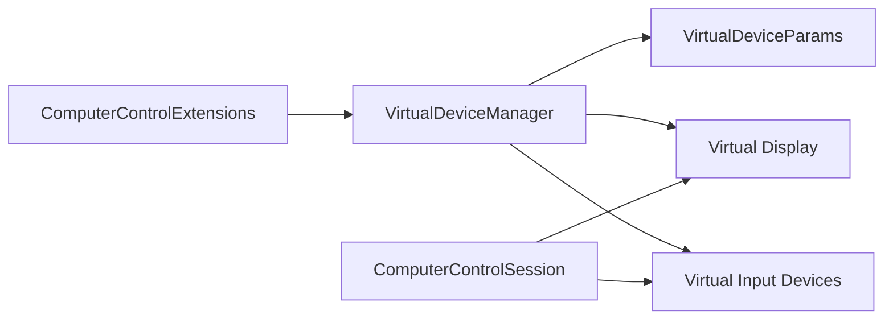
```mermaid
graph LR
    CCE[ComputerControlExtensions] --> VDM[VirtualDeviceManager]
    VDM --> VDD[VirtualDeviceParams]
    VDM --> VDisplay[Virtual Display]
    VDM --> VInput[Virtual Input Devices]
    CCS[ComputerControlSession] --> VDisplay
    CCS --> VInput
```

The key difference from general VirtualDevice usage is that Computer Control
sessions create a **trusted** virtual display with input injection
capabilities. The system server enforces that only the session owner can
inject input events.

### 50.3.10 Extension-Layer Input Conversion

The extension library wraps platform input types with its own wrapper classes
for API stability:

```java
// frameworks/base/libs/computercontrol/.../ComputerControlSession.java

public void sendTouchEvent(TouchEvent touchEvent) {
    VirtualTouchEvent virtualTouchEvent =
            new VirtualTouchEvent.Builder()
                    .setX(touchEvent.getX())
                    .setY(touchEvent.getY())
                    .setPressure(touchEvent.getPressure())
                    .setToolType(touchEvent.getToolType())
                    .setAction(touchEvent.getAction())
                    .setPointerId(touchEvent.getPointerId())
                    .setEventTimeNanos(touchEvent.getEventTimeNanos())
                    .setMajorAxisSize(touchEvent.getMajorAxisSize())
                    .build();
    mSession.sendTouchEvent(virtualTouchEvent);
    mAccessibilityProxy.resetStabilityState();

    if (mTouchListener != null) {
        mTouchListener.onTouchEvent(touchEvent);
    }
}
```

After every input injection, `resetStabilityState()` is called on the
accessibility proxy. This resets the stability timer, since the UI is now
expected to change.

### 50.3.11 Text Insertion API

For text fields, Computer Control provides a high-level `insertText()` method
that avoids the complexity of individual key events:

```java
// frameworks/base/libs/computercontrol/.../ComputerControlSession.java

public void insertText(@NonNull String text, boolean replaceExisting, boolean commit) {
    mSession.insertText(text, replaceExisting, commit);
    mAccessibilityProxy.resetStabilityState();
}
```

This method uses `InputConnection` on the server side to directly manipulate
the text field's content, bypassing the virtual keyboard. The `commit`
parameter triggers an IME action (like pressing "Done" or "Send").

### 50.3.12 Touch Listener for Debugging

The extension session supports a `TouchListener` for observing all injected
touch events:

```java
// frameworks/base/libs/computercontrol/.../ComputerControlSession.java

public interface TouchListener {
    void onTouchEvent(@NonNull TouchEvent event);
}

public void setTouchListener(@Nullable TouchListener listener) {
    mTouchListener = listener;
}
```

This is useful for logging, visualization, or coordinating multiple
automation agents.

### 50.3.13 Interactive Mirror and Co-Pilot Pattern

The `InteractiveMirror` class in the extension layer wraps the platform's
`InteractiveMirrorDisplay`:

```java
// frameworks/base/libs/computercontrol/.../ComputerControlSession.java

public InteractiveMirror createInteractiveMirror(
        int width, int height, @NonNull Surface surface) {
    InteractiveMirrorDisplay interactiveMirrorDisplay =
            mSession.createInteractiveMirrorDisplay(width, height, surface);
    if (interactiveMirrorDisplay == null) {
        return null;
    }
    return new InteractiveMirror(interactiveMirrorDisplay);
}
```

This enables several important use cases:

1. **Debugging**: Developers can watch AI automation in real-time
2. **Human-in-the-loop**: A user can observe the AI's actions and intervene
3. **Streaming**: The mirror can be used to broadcast automation sessions
4. **Multi-agent**: One agent controls, another observes via the mirror

### 50.3.14 Session Close and Resource Cleanup

```java
// frameworks/base/libs/computercontrol/.../ComputerControlSession.java

@Override
public void close() {
    synchronized (mIsValid) {
        if (!mIsValid.get()) {
            return;
        }
        mAccessibilityManager.unregisterDisplayProxy(mAccessibilityProxy);
        mSession.close();
        mIsValid.set(false);
    }
}
```

Close is idempotent (protected by `AtomicBoolean mIsValid`) and properly
unregisters the accessibility proxy before closing the platform session.

### 50.3.15 Stability Detection Architecture

The extension layer's stability detection combines multiple signals:

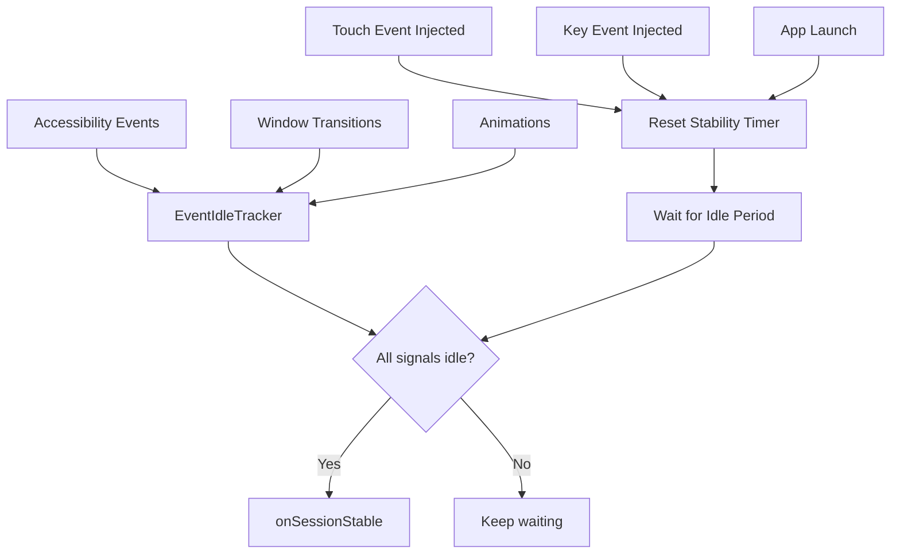
```mermaid
graph TB
    A[Touch Event Injected] --> B[Reset Stability Timer]
    C[Key Event Injected] --> B
    D[App Launch] --> B
    B --> E[Wait for Idle Period]

    F[Accessibility Events] --> G[EventIdleTracker]
    H[Window Transitions] --> G
    I[Animations] --> G

    G --> J{All signals idle?}
    E --> J
    J -->|Yes| K[onSessionStable]
    J -->|No| L[Keep waiting]
```

The `StabilityHintCallbackTracker` in the extension layer handles the legacy
callback-based API, while the newer `StabilityListener` interface routes
through the platform-level `IComputerControlStabilityListener` AIDL interface.

### 50.3.16 Complete Extension Library File Inventory

| File | Lines | Purpose |
|------|-------|---------|
| `ComputerControlExtensions.java` | 206 | Entry point, session factory |
| `ComputerControlSession.java` | 684 | Extension session wrapper with accessibility |
| `InteractiveMirror.java` | 86 | Mirror display wrapper |
| `EventIdleTracker.java` | 92 | Accessibility event idle detection |
| `StabilityHintCallbackTracker.java` | 55 | Legacy stability callback |
| `AutomatedPackageListener.java` | 43 | Package automation notifications |
| `input/KeyEvent.java` | 134 | Extension key event type |
| `input/TouchEvent.java` | 296 | Extension touch event type |
| `view/MirrorView.java` | 406 | Mirror display view widget |

### 50.3.17 Permission Model

Computer Control uses a layered permission model:

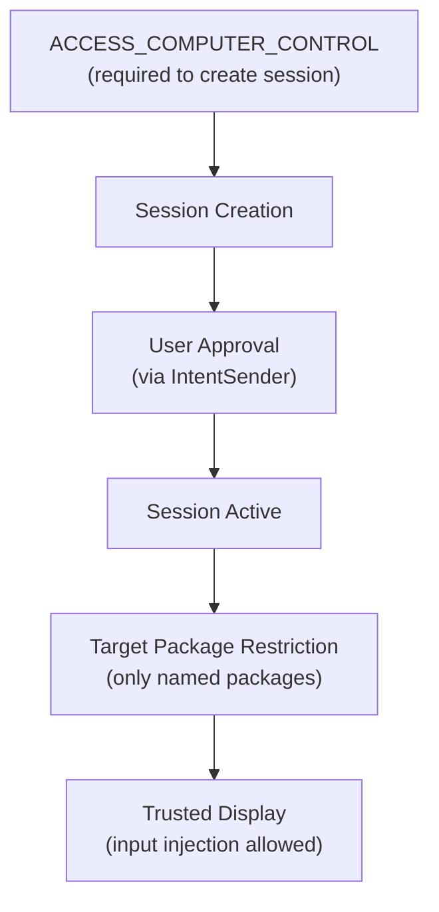
```mermaid
graph TD
    A["ACCESS_COMPUTER_CONTROL<br/>(required to create session)"] --> B[Session Creation]
    B --> C["User Approval<br/>(via IntentSender)"]
    C --> D["Session Active"]
    D --> E["Target Package Restriction<br/>(only named packages)"]
    E --> F["Trusted Display<br/>(input injection allowed)"]
```

1. The app must hold `ACCESS_COMPUTER_CONTROL`
2. The system presents a user approval dialog via `IntentSender`
3. Only packages listed in `targetPackageNames` can be launched
4. The virtual display is trusted, enabling input injection
5. The permission controller package is always excluded from automation

---

## 50.4 OnDeviceIntelligence

The OnDeviceIntelligence (ODI) framework provides a system-level API for
running large ML models (including LLMs) in a sandboxed process. It is
designed around the principle that model weights and inference logic should
never be directly accessible to the calling app.

**Source tree:**

```
frameworks/base/packages/NeuralNetworks/
    framework/platform/java/android/app/ondeviceintelligence/
        OnDeviceIntelligenceManager.java        -- Client API
        Feature.java                            -- Model feature descriptor
        FeatureDetails.java                     -- Feature metadata
        InferenceInfo.java                      -- Inference statistics
        ProcessingCallback.java                 -- Non-streaming result callback
        StreamingProcessingCallback.java        -- Streaming result callback
        OnDeviceIntelligenceException.java      -- Typed errors
        TokenInfo.java                          -- Token-level information
        ...
    framework/platform/java/android/service/ondeviceintelligence/
        OnDeviceSandboxedInferenceService.java  -- Isolated inference service
        OnDeviceIntelligenceService.java        -- Non-isolated counterpart
        ...
    service/platform/java/com/android/server/ondeviceintelligence/
        OnDeviceIntelligenceManagerService.java -- SystemService
        RemoteOnDeviceSandboxedInferenceService.java
        RemoteOnDeviceIntelligenceService.java
        ServiceConnector.java
        InferenceInfoStore.java
        ...
```

### 50.4.1 Architecture

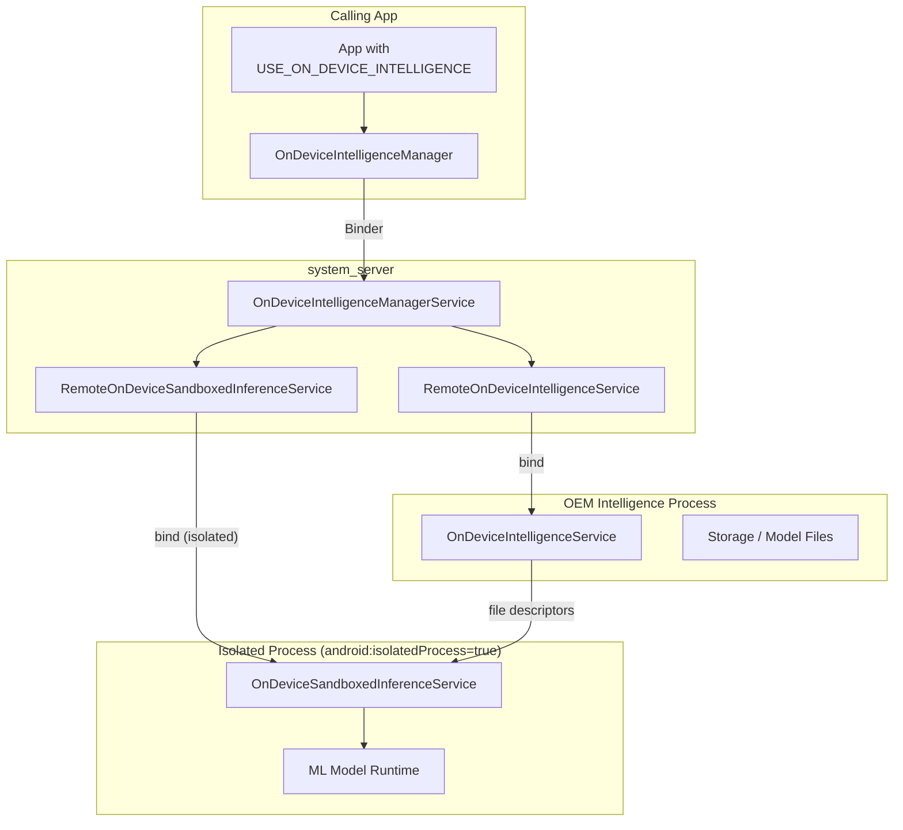
```mermaid
graph TB
    subgraph "Calling App"
        APP["App with<br/>USE_ON_DEVICE_INTELLIGENCE"]
        ODIM[OnDeviceIntelligenceManager]
    end

    subgraph "system_server"
        ODIMS[OnDeviceIntelligenceManagerService]
        RODI[RemoteOnDeviceIntelligenceService]
        RODSI[RemoteOnDeviceSandboxedInferenceService]
    end

    subgraph "OEM Intelligence Process"
        ODIS[OnDeviceIntelligenceService]
        STORAGE[Storage / Model Files]
    end

    subgraph "Isolated Process (android:isolatedProcess=true)"
        ODSIS[OnDeviceSandboxedInferenceService]
        MODEL[ML Model Runtime]
    end

    APP --> ODIM
    ODIM -- "Binder" --> ODIMS
    ODIMS --> RODI
    ODIMS --> RODSI
    RODI -- "bind" --> ODIS
    RODSI -- "bind (isolated)" --> ODSIS
    ODIS -- "file descriptors" --> ODSIS
    ODSIS --> MODEL
```

### 50.4.2 The Client: OnDeviceIntelligenceManager

The manager is a `@SystemApi` service requiring `USE_ON_DEVICE_INTELLIGENCE`:

```java
// frameworks/base/packages/NeuralNetworks/framework/platform/java/
//   android/app/ondeviceintelligence/OnDeviceIntelligenceManager.java

@SystemApi
@SystemService(Context.ON_DEVICE_INTELLIGENCE_SERVICE)
public final class OnDeviceIntelligenceManager {
```

Key operations:

| Method | Purpose |
|--------|---------|
| `getVersion()` | Query remote implementation version |
| `getRemoteServicePackageName()` | Get the OEM package providing inference |
| `listFeatures()` | List available ML features/models |
| `getFeature()` | Get details of a specific feature |
| `requestFeatureDownload()` | Trigger model download |
| `processRequest()` | Non-streaming inference request |
| `processRequestStreaming()` | Streaming (token-by-token) inference |
| `getTokenInfo()` | Token counting/analysis |
| `registerLifecycleListener()` | Model load/unload notifications |

### 50.4.3 The Sandboxed Inference Service

The actual inference runs in an isolated process:

```java
// frameworks/base/packages/NeuralNetworks/framework/platform/java/
//   android/service/ondeviceintelligence/OnDeviceSandboxedInferenceService.java

@SystemApi
public abstract class OnDeviceSandboxedInferenceService extends Service {
    public static final String SERVICE_INTERFACE =
            "android.service.ondeviceintelligence.OnDeviceSandboxedInferenceService";
```

The manifest declares:
```xml
<service android:name=".SampleSandboxedInferenceService"
         android:permission="android.permission.BIND_ONDEVICE_SANDBOXED_INFERENCE_SERVICE"
         android:isolatedProcess="true">
</service>
```

The `isolatedProcess="true"` flag means the service:

- Has no network access
- Has no access to the app's data directory
- Cannot access content providers
- Can only receive file descriptors passed explicitly by the system

Model weights reach the isolated process through `ParcelFileDescriptor`
objects passed by the `OnDeviceIntelligenceService` (the non-isolated
companion).

### 50.4.4 Dual-Service Architecture

ODI employs a two-service architecture:

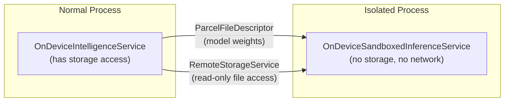
```mermaid
graph LR
    subgraph "Normal Process"
        ODIS["OnDeviceIntelligenceService<br/>(has storage access)"]
    end
    subgraph "Isolated Process"
        ODSIS["OnDeviceSandboxedInferenceService<br/>(no storage, no network)"]
    end
    ODIS -- "ParcelFileDescriptor<br/>(model weights)" --> ODSIS
    ODIS -- "RemoteStorageService<br/>(read-only file access)" --> ODSIS
```

1. **OnDeviceIntelligenceService** -- runs in the OEM's normal process with
   full storage access. Handles model management, downloads, and serves model
   files to the isolated process.

2. **OnDeviceSandboxedInferenceService** -- runs in an isolated process.
   Performs actual inference. Receives model weights only through file
   descriptors. This design ensures that even a compromised inference engine
   cannot exfiltrate model weights or user data.

### 50.4.5 Model Lifecycle Events

The framework supports model load/unload broadcast notifications:

```java
// OnDeviceSandboxedInferenceService.java

public static final String MODEL_LOADED_BROADCAST_INTENT =
    "android.service.ondeviceintelligence.MODEL_LOADED";
public static final String MODEL_UNLOADED_BROADCAST_INTENT =
    "android.service.ondeviceintelligence.MODEL_UNLOADED";
```

### 50.4.6 The System Service

`OnDeviceIntelligenceManagerService` extends `SystemService` and runs under
the SYSTEM user (not per-user), since ML models may have high memory
footprint:

```java
// frameworks/base/packages/NeuralNetworks/service/platform/java/
//   com/android/server/ondeviceintelligence/OnDeviceIntelligenceManagerService.java

public class OnDeviceIntelligenceManagerService extends SystemService {
    private static final String NAMESPACE_ON_DEVICE_INTELLIGENCE = "ondeviceintelligence";
    private static final long MAX_AGE_MS = TimeUnit.HOURS.toMillis(3);
    ...
```

The service maintains connection state to both remote services and handles:

- Permission enforcement (only apps with `USE_ON_DEVICE_INTELLIGENCE`)
- Configuration via `DeviceConfig` namespace `ondeviceintelligence`
- `InferenceInfoStore` for tracking inference statistics
- Temporary service overrides for testing

### 50.4.7 InferenceInfo

The framework introduces `InferenceInfo` for providing performance metadata:

```java
// OnDeviceIntelligenceManager.java

public static final String KEY_REQUEST_INFERENCE_INFO = "request_inference_info";
```

When requested, the callback receives `InferenceInfo` containing timing and
throughput metrics from the inference run.

### 50.4.8 Feature Discovery and Download

The feature lifecycle follows a discover-download-use pattern:

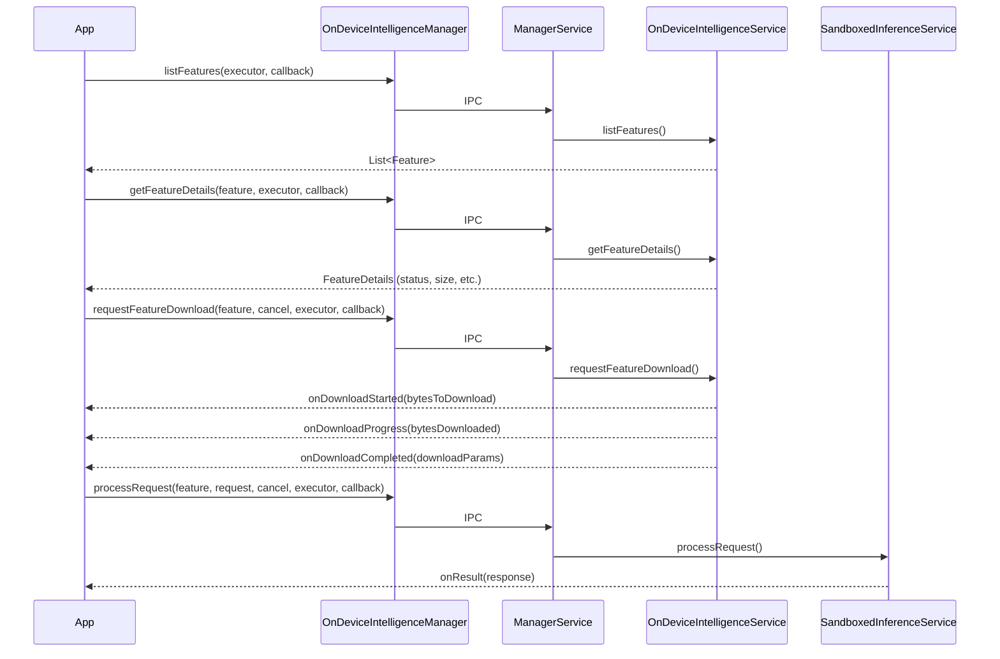
```mermaid
sequenceDiagram
    participant App
    participant Manager as OnDeviceIntelligenceManager
    participant Service as ManagerService
    participant OEM as OnDeviceIntelligenceService
    participant Sandbox as SandboxedInferenceService

    App->>Manager: listFeatures(executor, callback)
    Manager->>Service: IPC
    Service->>OEM: listFeatures()
    OEM-->>App: List<Feature>

    App->>Manager: getFeatureDetails(feature, executor, callback)
    Manager->>Service: IPC
    Service->>OEM: getFeatureDetails()
    OEM-->>App: FeatureDetails (status, size, etc.)

    App->>Manager: requestFeatureDownload(feature, cancel, executor, callback)
    Manager->>Service: IPC
    Service->>OEM: requestFeatureDownload()
    OEM-->>App: onDownloadStarted(bytesToDownload)
    OEM-->>App: onDownloadProgress(bytesDownloaded)
    OEM-->>App: onDownloadCompleted(downloadParams)

    App->>Manager: processRequest(feature, request, cancel, executor, callback)
    Manager->>Service: IPC
    Service->>Sandbox: processRequest()
    Sandbox-->>App: onResult(response)
```

The `DownloadCallback` interface provides fine-grained progress:

```java
// OnDeviceIntelligenceManager.java

public void requestFeatureDownload(@NonNull Feature feature,
        @Nullable CancellationSignal cancellationSignal,
        @NonNull @CallbackExecutor Executor callbackExecutor,
        @NonNull DownloadCallback callback) {
```

Download failure reasons include:

- `DOWNLOAD_FAILURE_STATUS_DOWNLOADING` -- Already downloading
- `DOWNLOAD_FAILURE_STATUS_NOT_ENOUGH_DISK_SPACE`
- `DOWNLOAD_FAILURE_STATUS_NETWORK_FAILURE`

### 50.4.9 Processing Modes

ODI supports two processing modes:

**Non-streaming (request/response):**

```java
@RequiresPermission(Manifest.permission.USE_ON_DEVICE_INTELLIGENCE)
public void processRequest(@NonNull Feature feature,
        @NonNull @InferenceParams Bundle request,
        @Nullable CancellationSignal cancellationSignal,
        @NonNull @CallbackExecutor Executor callbackExecutor,
        @NonNull ProcessingCallback callback);
```

**Streaming (token-by-token):**

```java
@RequiresPermission(Manifest.permission.USE_ON_DEVICE_INTELLIGENCE)
public void processRequestStreaming(@NonNull Feature feature,
        @NonNull @InferenceParams Bundle request,
        @Nullable CancellationSignal cancellationSignal,
        @NonNull @CallbackExecutor Executor callbackExecutor,
        @NonNull StreamingProcessingCallback callback);
```

The streaming mode is essential for LLM inference, where generating a full
response may take seconds but individual tokens arrive much faster.

### 50.4.10 Token Information

The `requestTokenInfo()` API computes token-level metadata without performing
full inference:

```java
@RequiresPermission(Manifest.permission.USE_ON_DEVICE_INTELLIGENCE)
public void requestTokenInfo(@NonNull Feature feature,
        @NonNull @InferenceParams Bundle request,
        @Nullable CancellationSignal cancellationSignal,
        @NonNull @CallbackExecutor Executor callbackExecutor,
        @NonNull OutcomeReceiver<TokenInfo, OnDeviceIntelligenceException> outcomeReceiver);
```

This is useful for:

- Counting tokens before inference (to check context limits)
- Estimating inference cost/time
- Token-level analysis without full generation

### 50.4.11 Lifecycle Listeners

Apps can register to be notified when models are loaded or unloaded:

```java
// OnDeviceIntelligenceManager.java

private final Map<OnDeviceSandboxedInferenceService.LifecycleListener,
        ILifecycleListener.Stub> mLifecycleListeners = new ConcurrentHashMap<>();
```

This allows apps to:

- Show loading indicators when a model is being loaded
- Adapt UI based on model availability
- Pre-warm by triggering model loading before the user needs it

### 50.4.12 Processing State Updates

The sandboxed service can update its processing state:

```java
// OnDeviceSandboxedInferenceService.java

public static final String PROCESSING_STATE_BUNDLE_KEY = "processing_state";
```

State updates allow the system to track:

- Whether the service is actively processing
- How much memory the model is using
- Whether the service is in a degraded state

### 50.4.13 Configuration and DeviceConfig

The system service is controlled through the `ondeviceintelligence`
DeviceConfig namespace:

```java
// OnDeviceIntelligenceManagerService.java

private static final String NAMESPACE_ON_DEVICE_INTELLIGENCE = "ondeviceintelligence";
private static final String KEY_SERVICE_ENABLED = "service_enabled";
private static final boolean DEFAULT_SERVICE_ENABLED = true;
```

OEMs configure the implementation package through system resources. The
service can be temporarily overridden for testing via shell commands.

### 50.4.14 Streaming Inference Protocol Detail

The streaming API provides token-by-token delivery for LLM inference:

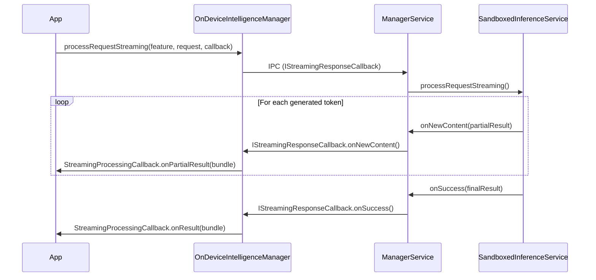
```mermaid
sequenceDiagram
    participant App
    participant Manager as OnDeviceIntelligenceManager
    participant Service as ManagerService
    participant Sandbox as SandboxedInferenceService

    App->>Manager: processRequestStreaming(feature, request, callback)
    Manager->>Service: IPC (IStreamingResponseCallback)
    Service->>Sandbox: processRequestStreaming()

    loop For each generated token
        Sandbox->>Service: onNewContent(partialResult)
        Service->>Manager: IStreamingResponseCallback.onNewContent()
        Manager->>App: StreamingProcessingCallback.onPartialResult(bundle)
    end

    Sandbox->>Service: onSuccess(finalResult)
    Service->>Manager: IStreamingResponseCallback.onSuccess()
    Manager->>App: StreamingProcessingCallback.onResult(bundle)
```

The `IStreamingResponseCallback` defines the wire protocol:

```java
// OnDeviceIntelligenceManager.java (processRequestStreaming)

IStreamingResponseCallback callback = new IStreamingResponseCallback.Stub() {
    @Override
    public void onNewContent(@InferenceParams Bundle result) {
        Binder.withCleanCallingIdentity(() -> {
            callbackExecutor.execute(
                    () -> streamingProcessingCallback.onPartialResult(result));
        });
    }

    @Override
    public void onSuccess(@InferenceParams Bundle result) {
        Binder.withCleanCallingIdentity(() -> {
            callbackExecutor.execute(
                    () -> streamingProcessingCallback.onResult(result));
        });
    }

    @Override
    public void onFailure(int errorCode, String errorMessage,
            PersistableBundle errorParams) {
        Binder.withCleanCallingIdentity(() -> {
            callbackExecutor.execute(
                    () -> streamingProcessingCallback.onError(
                            new OnDeviceIntelligenceException(
                                    errorCode, errorMessage, errorParams)));
        });
    }
```

### 50.4.15 Data Augmentation Protocol

A unique feature of ODI is the data augmentation callback, which allows the
sandboxed inference service to request additional data from the calling app
mid-inference:

```java
// OnDeviceIntelligenceManager.java

@Override
public void onDataAugmentRequest(@NonNull @InferenceParams Bundle request,
        @NonNull RemoteCallback contentCallback) {
    Binder.withCleanCallingIdentity(() -> callbackExecutor.execute(
            () -> processingCallback.onDataAugmentRequest(request, result -> {
                Bundle bundle = new Bundle();
                bundle.putParcelable(AUGMENT_REQUEST_CONTENT_BUNDLE_KEY, result);
                callbackExecutor.execute(() -> contentCallback.sendResult(bundle));
            })));
}
```

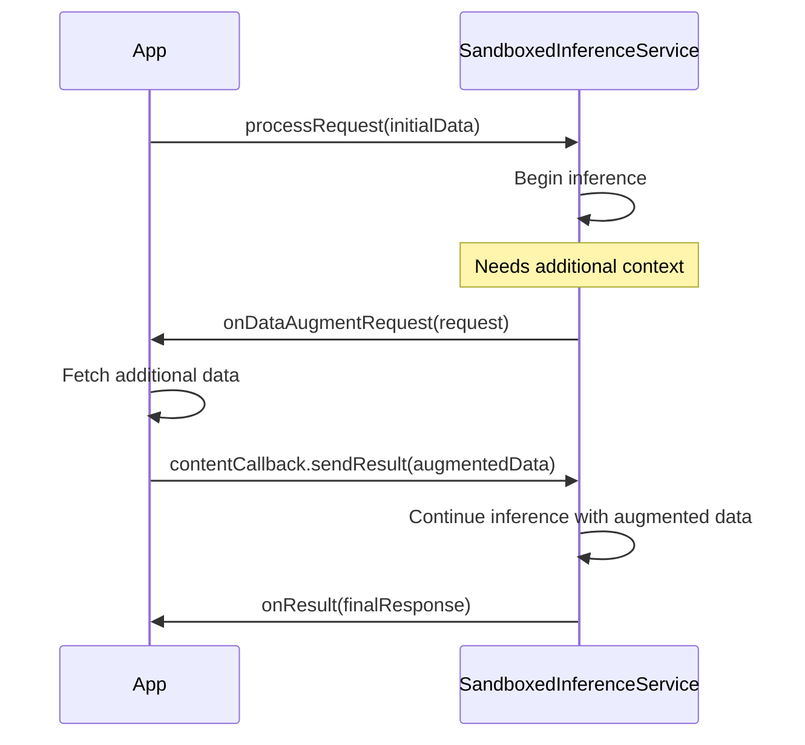
```mermaid
sequenceDiagram
    participant App
    participant Sandbox as SandboxedInferenceService

    App->>Sandbox: processRequest(initialData)
    Sandbox->>Sandbox: Begin inference
    Note over Sandbox: Needs additional context
    Sandbox->>App: onDataAugmentRequest(request)
    App->>App: Fetch additional data
    App->>Sandbox: contentCallback.sendResult(augmentedData)
    Sandbox->>Sandbox: Continue inference with augmented data
    Sandbox->>App: onResult(finalResponse)
```

This pattern enables retrieval-augmented generation (RAG) where the model
can request relevant documents mid-generation.

### 50.4.16 ProcessingSignal

Beyond `CancellationSignal`, ODI provides a `ProcessingSignal` for
sending custom control signals to the inference service during processing:

```java
// OnDeviceIntelligenceManager.java

public void processRequest(@NonNull Feature feature,
        @NonNull @InferenceParams Bundle request,
        @RequestType int requestType,
        @Nullable CancellationSignal cancellationSignal,
        @Nullable ProcessingSignal processingSignal,
        @NonNull @CallbackExecutor Executor callbackExecutor,
        @NonNull ProcessingCallback processingCallback) {
```

This allows apps to:

- Adjust generation parameters mid-stream (e.g., change temperature)
- Signal context updates
- Provide real-time feedback to the model

### 50.4.17 Power Attribution

ODI tracks inference power usage for attribution:

```java
// OnDeviceIntelligenceManager.java

@RequiresPermission(Manifest.permission.DUMP)
@FlaggedApi(FLAG_ON_DEVICE_INTELLIGENCE_25Q4)
public @NonNull List<InferenceInfo> getLatestInferenceInfo(
        @CurrentTimeMillisLong long startTimeEpochMillis) {
    return mService.getLatestInferenceInfo(startTimeEpochMillis);
}
```

This allows the system to correctly attribute battery usage to the app that
triggered the inference rather than blaming the inference service itself.

### 50.4.18 Security Boundaries

The ODI framework enforces several security boundaries:

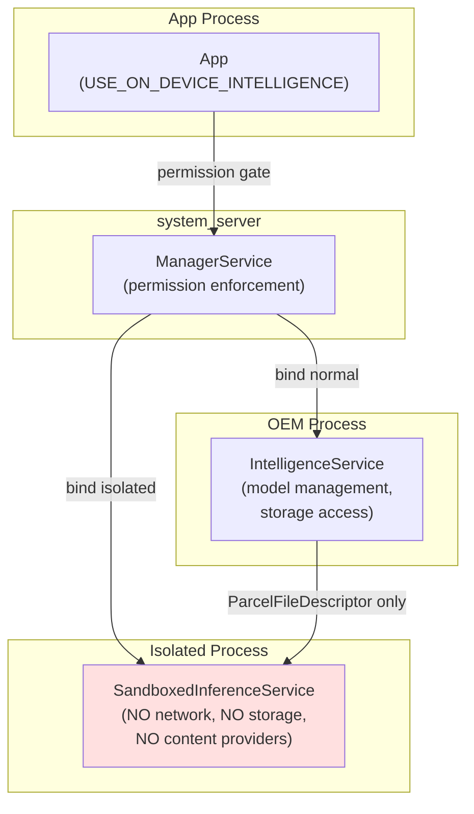
```mermaid
graph TB
    subgraph "App Process"
        A["App<br/>(USE_ON_DEVICE_INTELLIGENCE)"]
    end

    subgraph "system_server"
        B["ManagerService<br/>(permission enforcement)"]
    end

    subgraph "OEM Process"
        C["IntelligenceService<br/>(model management,<br/>storage access)"]
    end

    subgraph "Isolated Process"
        D["SandboxedInferenceService<br/>(NO network, NO storage,<br/>NO content providers)"]
    end

    A -->|"permission gate"| B
    B -->|"bind normal"| C
    B -->|"bind isolated"| D
    C -->|"ParcelFileDescriptor only"| D

    style D fill:#ffe0e0
```

**Key restrictions on the isolated process:**

- No network access (android:isolatedProcess=true)
- No access to app data directory
- No access to content providers
- Can only receive explicitly passed file descriptors
- Memory limits enforced by the system
- Process can be killed by the system at any time

This design means that even if an attacker compromises the inference engine
(e.g., through a model weight poisoning attack), they cannot exfiltrate
data from the device.

---

## 50.5 NeuralNetworks (NNAPI)

The Neural Networks API (NNAPI) is AOSP's hardware abstraction for
accelerated ML inference. It has been part of AOSP since Android 8.1 and is
now delivered as a Mainline module.

**Source tree:**

```
packages/modules/NeuralNetworks/          (104 MB)
    runtime/                              -- C++ runtime library
        NeuralNetworks.cpp                -- C API entry points
        Manager.cpp                       (1376 lines) -- Device management
        CompilationBuilder.cpp            -- Model compilation
        ExecutionBuilder.cpp              -- Inference execution
        ExecutionPlan.cpp                 -- Multi-device partitioning
        ...
    common/types/include/nnapi/
        IDevice.h                         -- HAL device interface
        Types.h                           -- Shared type definitions
    driver/                               -- Reference CPU driver
    framework/                            -- Java/AIDL framework
    service/                              -- NNAPI service
    extensions/                           -- Vendor extensions
    shim_and_sl/                          -- Support library / shim
```

### 50.5.1 Architecture

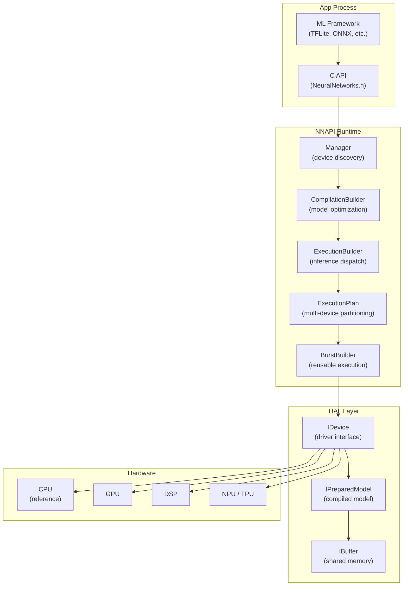
```mermaid
graph TB
    subgraph "App Process"
        APP["ML Framework<br/>(TFLite, ONNX, etc.)"]
        CAPI["C API<br/>(NeuralNetworks.h)"]
    end

    subgraph "NNAPI Runtime"
        MGR["Manager<br/>(device discovery)"]
        COMP["CompilationBuilder<br/>(model optimization)"]
        EXEC["ExecutionBuilder<br/>(inference dispatch)"]
        PLAN["ExecutionPlan<br/>(multi-device partitioning)"]
        BURST["BurstBuilder<br/>(reusable execution)"]
    end

    subgraph "HAL Layer"
        IDEV["IDevice<br/>(driver interface)"]
        IPM["IPreparedModel<br/>(compiled model)"]
        IBUF["IBuffer<br/>(shared memory)"]
    end

    subgraph "Hardware"
        CPU["CPU<br/>(reference)"]
        GPU["GPU"]
        DSP["DSP"]
        NPU["NPU / TPU"]
    end

    APP --> CAPI
    CAPI --> MGR
    MGR --> COMP
    COMP --> EXEC
    EXEC --> PLAN
    PLAN --> BURST
    BURST --> IDEV
    IDEV --> IPM
    IPM --> IBUF
    IDEV --> CPU
    IDEV --> GPU
    IDEV --> DSP
    IDEV --> NPU
```

### 50.5.2 The C API

The public API is a C interface defined in `NeuralNetworks.h`. The
implementation in `NeuralNetworks.cpp` validates parameters and delegates to
C++ builder classes:

```cpp
// packages/modules/NeuralNetworks/runtime/NeuralNetworks.cpp

// Contains all the entry points to the C Neural Networks API.
// We do basic validation of the operands and then call the class
// that implements the functionality.
```

Key data types verified at compile time:

```cpp
static_assert(ANEURALNETWORKS_FLOAT32 == 0, "...");
static_assert(ANEURALNETWORKS_INT32 == 1, "...");
static_assert(ANEURALNETWORKS_UINT32 == 2, "...");
static_assert(ANEURALNETWORKS_TENSOR_FLOAT32 == 3, "...");
static_assert(ANEURALNETWORKS_TENSOR_INT32 == 4, "...");
static_assert(ANEURALNETWORKS_TENSOR_QUANT8_ASYMM == 5, "...");
```

### 50.5.3 The Runtime Pipeline

The NNAPI execution pipeline has four stages:

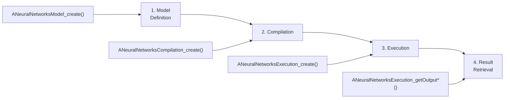
```mermaid
graph LR
    A["1. Model<br/>Definition"] --> B["2. Compilation"]
    B --> C["3. Execution"]
    C --> D["4. Result<br/>Retrieval"]

    A2["ANeuralNetworksModel_create()"] --> A
    B2["ANeuralNetworksCompilation_create()"] --> B
    C2["ANeuralNetworksExecution_create()"] --> C
    D2["ANeuralNetworksExecution_getOutput*()"] --> D
```

1. **Model Definition** -- Build a computation graph with operands and
   operations. Each operation maps to a standardized neural network operator
   (convolution, pooling, activation, etc.).

2. **Compilation** -- The `CompilationBuilder` selects devices, partitions the
   model across multiple accelerators if beneficial, and generates
   device-specific code.

3. **Execution** -- The `ExecutionBuilder` dispatches work to devices. Can be
   synchronous, asynchronous, or fenced.

4. **Result Retrieval** -- Output tensors are read from shared memory buffers.

### 50.5.4 The HAL: IDevice

The `IDevice` interface represents a hardware accelerator driver:

```cpp
// packages/modules/NeuralNetworks/common/types/include/nnapi/IDevice.h

class IDevice {
   public:
    virtual const std::string& getName() const = 0;
    virtual const std::string& getVersionString() const = 0;
    virtual Version getFeatureLevel() const = 0;
    virtual DeviceType getType() const = 0;
    // Model compilation
    virtual GeneralResult<SharedPreparedModel> prepareModel(...) const = 0;
    // Memory allocation
    virtual GeneralResult<SharedBuffer> allocate(...) const = 0;
    ...
```

Device types include:

| Type | Description |
|------|-------------|
| `DeviceType::CPU` | Reference CPU implementation |
| `DeviceType::GPU` | Graphics processing unit |
| `DeviceType::ACCELERATOR` | Dedicated ML accelerator (NPU/TPU) |
| `DeviceType::OTHER` | Other hardware |

### 50.5.5 Multi-Device Partitioning

The `ExecutionPlan` handles model partitioning across multiple devices.
If a model contains operations that different accelerators handle best,
NNAPI can split the model:

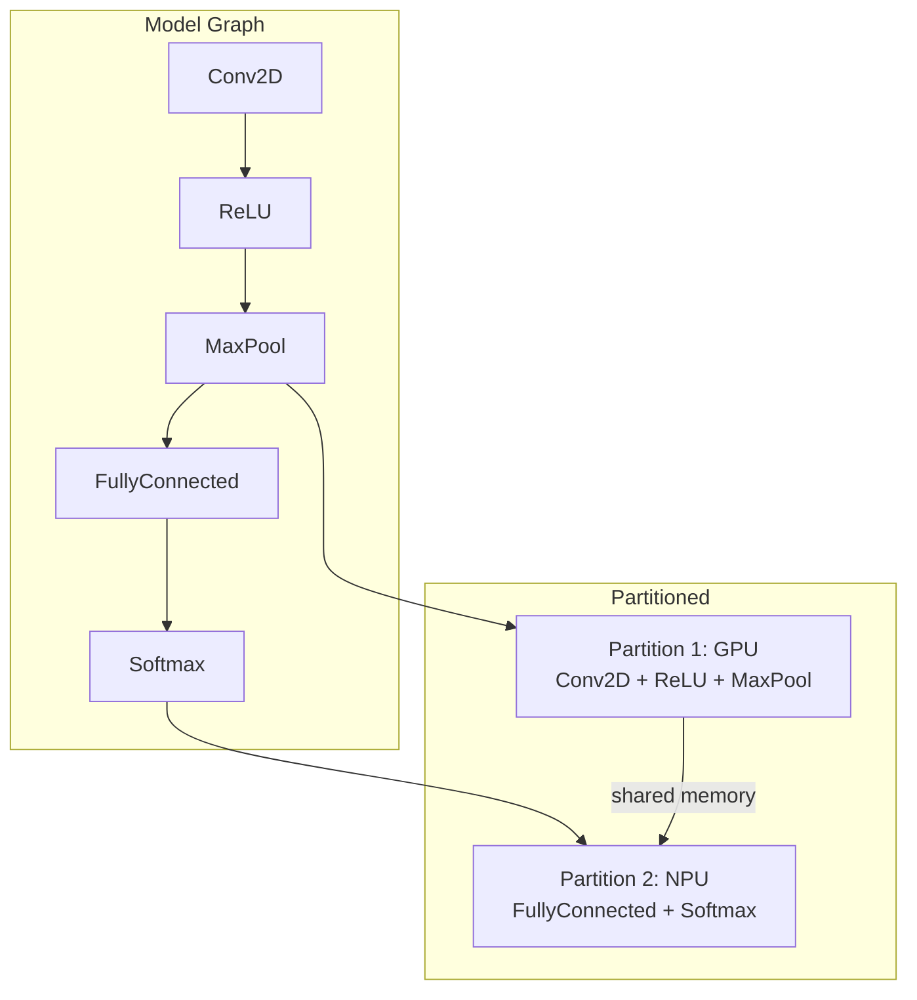
```mermaid
graph TB
    subgraph "Model Graph"
        OP1[Conv2D] --> OP2[ReLU]
        OP2 --> OP3[MaxPool]
        OP3 --> OP4[FullyConnected]
        OP4 --> OP5[Softmax]
    end

    subgraph "Partitioned"
        P1["Partition 1: GPU<br/>Conv2D + ReLU + MaxPool"]
        P2["Partition 2: NPU<br/>FullyConnected + Softmax"]
    end

    OP3 --> P1
    OP5 --> P2
    P1 -- "shared memory" --> P2
```

### 50.5.6 Burst Execution

The `BurstBuilder` creates a reusable execution context for repeated
inferences with different input data but the same model. This amortizes
compilation and setup costs:

```cpp
// packages/modules/NeuralNetworks/runtime/Manager.h

class RuntimeExecution {
   public:
    virtual std::tuple<int, std::vector<OutputShape>, Timing> compute(
            const SharedBurst& burstController,
            const OptionalTimePoint& deadline) const = 0;

    virtual std::tuple<int, int, ExecuteFencedInfoCallback, Timing> computeFenced(
            const std::vector<int>& waitFor,
            const OptionalTimePoint& deadline,
            const OptionalDuration& timeoutDurationAfterFence) const = 0;
};
```

### 50.5.7 Vendor Extensions

The `extensions/` directory allows vendors to define custom operations and
data types beyond the standard NNAPI specification. Extensions use a
namespaced identifier to avoid conflicts:

```
vendor.google.custom_op = 0x0001
```

### 50.5.8 Support Library and Shim

The `shim_and_sl/` directory provides:

- **Support Library (SL):** A standalone library that apps can bundle for
  consistent NNAPI behavior across Android versions.

- **Shim:** Bridges between AIDL and HIDL HAL versions for backward
  compatibility.

### 50.5.9 The RuntimePreparedModel Abstraction

The `RuntimePreparedModel` provides a unified interface for both hardware
accelerated and CPU-based execution:

```cpp
// packages/modules/NeuralNetworks/runtime/Manager.h

class RuntimePreparedModel {
   public:
    virtual const Device* getDevice() const = 0;
    virtual SharedPreparedModel getInterface() const = 0;

    virtual std::tuple<int, std::vector<OutputShape>, Timing> execute(
            const std::vector<ModelArgumentInfo>& inputs,
            const std::vector<ModelArgumentInfo>& outputs,
            const std::vector<const RuntimeMemory*>& memories,
            const SharedBurst& burstController,
            MeasureTiming measure,
            const OptionalTimePoint& deadline,
            const OptionalDuration& loopTimeoutDuration,
            const std::vector<TokenValuePair>& metaData) const = 0;

    virtual std::tuple<int, int, ExecuteFencedInfoCallback, Timing> executeFenced(
            const std::vector<ModelArgumentInfo>& inputs,
            const std::vector<ModelArgumentInfo>& outputs,
            const std::vector<const RuntimeMemory*>& memories,
            const std::vector<int>& waitFor,
            MeasureTiming measure,
            const OptionalTimePoint& deadline,
            const OptionalDuration& loopTimeoutDuration,
            const OptionalDuration& timeoutDurationAfterFence,
            const std::vector<TokenValuePair>& metaData) const = 0;
```

The `executeFenced` variant supports:

- **Wait-for fences**: Synchronize with other GPU/DSP work
- **Timeout after fence**: Set a deadline relative to fence signaling
- **Timing measurement**: Optionally collect execution timing

### 50.5.10 NNAPI Data Types

The C API defines a rich set of tensor and scalar types:

```cpp
// packages/modules/NeuralNetworks/runtime/NeuralNetworks.cpp

static_assert(ANEURALNETWORKS_FLOAT32 == 0);
static_assert(ANEURALNETWORKS_INT32 == 1);
static_assert(ANEURALNETWORKS_UINT32 == 2);
static_assert(ANEURALNETWORKS_TENSOR_FLOAT32 == 3);
static_assert(ANEURALNETWORKS_TENSOR_INT32 == 4);
static_assert(ANEURALNETWORKS_TENSOR_QUANT8_ASYMM == 5);
static_assert(ANEURALNETWORKS_BOOL == 6);
static_assert(ANEURALNETWORKS_TENSOR_QUANT16_SYMM == 7);
static_assert(ANEURALNETWORKS_TENSOR_FLOAT16 == 8);
static_assert(ANEURALNETWORKS_TENSOR_BOOL8 == 9);
static_assert(ANEURALNETWORKS_FLOAT16 == 10);
static_assert(ANEURALNETWORKS_TENSOR_QUANT8_SYMM_PER_CHANNEL == 11);
static_assert(ANEURALNETWORKS_TENSOR_QUANT16_ASYMM == 12);
static_assert(ANEURALNETWORKS_TENSOR_QUANT8_SYMM == 13);
```

The `static_assert` checks guarantee ABI stability -- if any constant changes,
compilation fails.

### 50.5.11 Device Discovery

The `Manager` class discovers available accelerators at runtime:

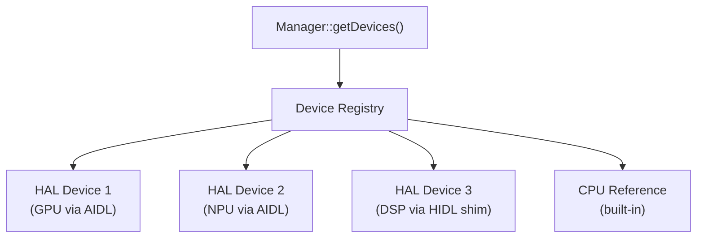
```mermaid
graph TB
    MGR["Manager::getDevices()"]
    MGR --> REG["Device Registry"]
    REG --> HAL_DEV1["HAL Device 1<br/>(GPU via AIDL)"]
    REG --> HAL_DEV2["HAL Device 2<br/>(NPU via AIDL)"]
    REG --> HAL_DEV3["HAL Device 3<br/>(DSP via HIDL shim)"]
    REG --> CPU_DEV["CPU Reference<br/>(built-in)"]
```

The Manager:

1. Queries the `IDevice` service manager for registered accelerators
2. Reads their capabilities (supported operations, performance info)
3. Maintains a device list for model compilation and execution
4. Falls back to the CPU reference implementation if no accelerators match

### 50.5.12 Memory Management

NNAPI uses shared memory for zero-copy data transfer between the app and
accelerators:

```mermaid
graph LR
    APP["App Memory<br/>(AHardwareBuffer)"] --> SHARED["Shared Memory<br/>(ashmem / ion)"]
    SHARED --> ACCEL["Accelerator<br/>DMA"]
```

The `RuntimeMemory` class manages memory pools:

- **AHardwareBuffer**: For GPU-accessible memory
- **Ashmem**: For CPU-to-accelerator sharing
- **Ion/DMA-buf**: For direct hardware DMA access

### 50.5.13 NNAPI Feature Levels

NNAPI has evolved through several feature levels, each adding new operations
and capabilities:

| Feature Level | Android Version | Key Additions |
|---------------|-----------------|---------------|
| 1 | 8.1 (API 27) | Basic ops: Conv2D, MaxPool, ReLU |
| 2 | 9 (API 28) | BatchNorm, LSTM, more quantized ops |
| 3 | 10 (API 29) | Control flow (IF, WHILE), fenced execution |
| 4 | 11 (API 30) | Quality of service, model priority |
| 5 | 12 (API 31) | Signed 8-bit quantization |
| 6 | 13 (API 33) | AIDL HAL interface |
| 7 | 14 (API 34) | Vendor extensions |
| 8 | 15 (API 35) | Flatbuffer model format |

### 50.5.14 Telemetry

The runtime includes a `Telemetry` module that collects anonymized performance
metrics:

```cpp
// packages/modules/NeuralNetworks/runtime/NeuralNetworks.cpp

#include "Telemetry.h"
```

Metrics include:

- Compilation time per device
- Execution latency
- Error rates
- Device selection outcomes
- Memory allocation patterns

### 50.5.15 The NNAPI C API Lifecycle

A complete NNAPI workflow involves these API calls in order:

```mermaid
graph TD
    A["ANeuralNetworksModel_create()"] --> B["ANeuralNetworksModel_addOperand()<br/>(repeat for each tensor)"]
    B --> C["ANeuralNetworksModel_setOperandValue()<br/>(for constants)"]
    C --> D["ANeuralNetworksModel_addOperation()<br/>(repeat for each op)"]
    D --> E["ANeuralNetworksModel_identifyInputsAndOutputs()"]
    E --> F["ANeuralNetworksModel_finish()"]
    F --> G["ANeuralNetworksCompilation_create()"]
    G --> H["ANeuralNetworksCompilation_setPreference()"]
    H --> I["ANeuralNetworksCompilation_finish()"]
    I --> J["ANeuralNetworksExecution_create()"]
    J --> K["ANeuralNetworksExecution_setInput()<br/>(bind input buffers)"]
    K --> L["ANeuralNetworksExecution_setOutput()<br/>(bind output buffers)"]
    L --> M["ANeuralNetworksExecution_compute()<br/>or startCompute()"]
    M --> N["Read output buffers"]
    N --> O["ANeuralNetworksExecution_free()"]
    O --> P["ANeuralNetworksCompilation_free()"]
    P --> Q["ANeuralNetworksModel_free()"]
```

### 50.5.16 Compilation Preferences

```c
// ANeuralNetworksCompilation_setPreference() options:
ANEURALNETWORKS_PREFER_LOW_POWER       // Battery efficient
ANEURALNETWORKS_PREFER_FAST_SINGLE_ANSWER  // Minimum latency
ANEURALNETWORKS_PREFER_SUSTAINED_SPEED    // Sustained throughput
```

These preferences guide device selection:

- `LOW_POWER` may prefer a DSP over a GPU
- `FAST_SINGLE_ANSWER` may prefer GPU with highest peak performance
- `SUSTAINED_SPEED` may prefer a device with thermal headroom

### 50.5.17 Error Handling

NNAPI uses integer error codes for all operations:

| Code | Name | Meaning |
|------|------|---------|
| 0 | `ANEURALNETWORKS_NO_ERROR` | Success |
| 1 | `ANEURALNETWORKS_OUT_OF_MEMORY` | Memory allocation failed |
| 2 | `ANEURALNETWORKS_INCOMPLETE` | Operation not yet completed |
| 3 | `ANEURALNETWORKS_UNEXPECTED_NULL` | Null pointer where non-null expected |
| 4 | `ANEURALNETWORKS_BAD_DATA` | Invalid model or data |
| 5 | `ANEURALNETWORKS_OP_FAILED` | Hardware execution failure |
| 6 | `ANEURALNETWORKS_BAD_STATE` | Invalid state for this operation |
| 7 | `ANEURALNETWORKS_UNMAPPABLE` | Cannot map to this device |
| 8 | `ANEURALNETWORKS_OUTPUT_INSUFFICIENT_SIZE` | Output buffer too small |
| 9 | `ANEURALNETWORKS_UNAVAILABLE_DEVICE` | Device unavailable |
| 10 | `ANEURALNETWORKS_MISSED_DEADLINE_TRANSIENT` | Temporary deadline miss |
| 11 | `ANEURALNETWORKS_MISSED_DEADLINE_PERSISTENT` | Persistent deadline miss |
| 12 | `ANEURALNETWORKS_RESOURCE_EXHAUSTED_TRANSIENT` | Temporary resource exhaustion |
| 13 | `ANEURALNETWORKS_RESOURCE_EXHAUSTED_PERSISTENT` | Persistent resource exhaustion |
| 14 | `ANEURALNETWORKS_DEAD_OBJECT` | Driver process died |

### 50.5.18 Supported Operations

NNAPI supports over 100 neural network operations including:

**Activation functions:**

- RELU, RELU1, RELU6
- LOGISTIC (sigmoid)
- TANH
- ELU, HARD_SWISH

**Convolution:**

- CONV_2D, DEPTHWISE_CONV_2D
- TRANSPOSE_CONV_2D
- GROUPED_CONV_2D

**Pooling:**

- AVERAGE_POOL_2D, MAX_POOL_2D
- L2_POOL_2D

**Normalization:**

- BATCH_NORMALIZATION
- L2_NORMALIZATION
- LOCAL_RESPONSE_NORMALIZATION
- INSTANCE_NORMALIZATION

**Recurrent:**

- LSTM, UNIDIRECTIONAL_SEQUENCE_LSTM
- BIDIRECTIONAL_SEQUENCE_LSTM
- UNIDIRECTIONAL_SEQUENCE_RNN
- BIDIRECTIONAL_SEQUENCE_RNN

**Element-wise:**

- ADD, SUB, MUL, DIV
- FLOOR, CEIL, ABS, NEG
- POW, SQRT, RSQRT, EXP, LOG
- SIN, MINIMUM, MAXIMUM
- LESS, LESS_EQUAL, EQUAL, NOT_EQUAL

**Shape manipulation:**

- RESHAPE, SQUEEZE, EXPAND_DIMS
- CONCATENATION, SPLIT
- TRANSPOSE, GATHER, SELECT
- SLICE, STRIDED_SLICE, PAD
- TILE, REVERSE, BATCH_TO_SPACE_ND

**Control flow:**

- IF, WHILE (added in Feature Level 3)

### 50.5.19 Module Delivery and Updates

NNAPI is delivered as part of the NeuralNetworks Mainline module
(`com.android.neuralnetworks`), which allows:

- Security patches without full OS update
- New operation support for existing devices
- Bug fixes independent of OEM update cycles
- Consistent behavior across devices

The module is built from:
```
packages/modules/NeuralNetworks/apex/
```

---

## 50.6 OnDevicePersonalization and Federated Learning

The OnDevicePersonalization (ODP) Mainline module provides infrastructure for
privacy-preserving machine learning that keeps raw data on-device while
producing useful aggregate models.

**Source tree:**

```
packages/modules/OnDevicePersonalization/     (642 files)
    framework/                                -- Public API
    federatedcompute/                         -- Federated learning engine
        src/com/android/federatedcompute/services/
            training/
                IsolatedTrainingService.java  -- Isolated TFLite runtime
                IsolatedTrainingServiceImpl.java
            examplestore/                     -- Training data management
            scheduling/                       -- Job scheduling
            common/                           -- Shared utilities
    systemservice/                            -- System service
    pluginlib/                                -- Plugin interface for OEMs
    samples/                                  -- Sample implementations
```

### 50.6.1 Architecture

```mermaid
graph TB
    subgraph "App Process"
        APP_DATA[App Data]
        ODP_CLIENT[ODP Client API]
    end

    subgraph "ODP Module Process"
        ODP_SVC["OnDevicePersonalization<br/>Service"]
        FC_SCHED["Federated Compute<br/>Scheduler"]
        EXAMPLE_STORE[Example Store]
    end

    subgraph "Isolated Process"
        ITS[IsolatedTrainingService]
        TFLITE[TFLite Runtime]
    end

    subgraph "Remote Server"
        FC_SERVER["Federated Compute<br/>Server"]
    end

    APP_DATA --> ODP_CLIENT
    ODP_CLIENT --> ODP_SVC
    ODP_SVC --> FC_SCHED
    FC_SCHED --> EXAMPLE_STORE
    EXAMPLE_STORE --> ITS
    ITS --> TFLITE
    FC_SCHED -- "aggregated updates<br/>(differential privacy)" --> FC_SERVER
    FC_SERVER -- "global model<br/>updates" --> FC_SCHED
```

### 50.6.2 Federated Learning Concepts

Federated learning trains a shared model across many devices without
centralizing the training data:

```mermaid
sequenceDiagram
    participant Server as Federated Compute Server
    participant Device1 as Device A
    participant Device2 as Device B
    participant Device3 as Device C

    Server->>Device1: Send global model v1
    Server->>Device2: Send global model v1
    Server->>Device3: Send global model v1

    Device1->>Device1: Train on local data
    Device2->>Device2: Train on local data
    Device3->>Device3: Train on local data

    Device1->>Server: Send gradient update (+ noise)
    Device2->>Server: Send gradient update (+ noise)
    Device3->>Server: Send gradient update (+ noise)

    Server->>Server: Aggregate updates, Apply differential privacy
    Server->>Device1: Send global model v2
```

### 50.6.3 IsolatedTrainingService

The actual TFLite training runs in an isolated process:

```java
// packages/modules/OnDevicePersonalization/federatedcompute/
//   src/.../training/IsolatedTrainingService.java

public class IsolatedTrainingService extends Service {
    private IIsolatedTrainingService.Stub mBinder;

    @Override
    public void onCreate() {
        mBinder = new IsolatedTrainingServiceImpl(this);
    }

    @Override
    public IBinder onBind(Intent intent) {
        return mBinder;
    }
}
```

The `IsolatedTrainingServiceImpl` loads the TFLite runtime and executes
training rounds. Training data is provided through an `ExampleStore`
abstraction that iterates over the device's local examples without exposing
raw data to the network-connected scheduling process.

### 50.6.4 Example Store

The example store provides training data to the isolated process:

```
federatedcompute/src/.../examplestore/
    ExampleIterator.java              -- Iterator interface
    FederatedExampleIterator.java     -- Federated compute iterator
    ExampleConsumptionRecorder.java   -- Tracks data usage
    ExampleStoreServiceProvider.java  -- Service binding
```

### 50.6.5 Scheduling and Conditions

Federated compute jobs are scheduled through Android's `JobScheduler`
with conditions that protect user experience:

```
federatedcompute/src/.../scheduling/
    FederatedComputeJobManager.java
```

Training runs only when the device is:

- Charging (or above a battery threshold)
- Connected to unmetered network (Wi-Fi)
- Idle

These conditions are tracked by `BatteryInfo` and `NetworkStats` in the
`common/` package.

### 50.6.6 Privacy Protections

The federated compute protocol applies multiple privacy layers:

1. **Isolated process**: Training data never leaves the isolated process
2. **Secure aggregation**: Individual updates are encrypted before sending
3. **Differential privacy**: Noise is added to gradient updates
4. **Minimum cohort size**: Updates are only accepted from groups above
   a threshold, preventing single-device fingerprinting

### 50.6.7 Federated Compute Module Structure

```
packages/modules/OnDevicePersonalization/federatedcompute/
    src/com/android/federatedcompute/services/
        training/
            IsolatedTrainingService.java          -- Isolated service entry
            IsolatedTrainingServiceImpl.java      -- Training logic
        examplestore/
            ExampleIterator.java                  -- Training data iterator
            FederatedExampleIterator.java         -- Federated-specific iterator
            ExampleConsumptionRecorder.java       -- Usage tracking
            ExampleStoreServiceProvider.java      -- Service binding
        scheduling/
            FederatedComputeJobManager.java       -- Job scheduling
        common/
            Flags.java                            -- Feature flags
            PhFlags.java                          -- Phone-home flags
            Constants.java                        -- Shared constants
            FederatedComputeExecutors.java        -- Thread pools
            BatteryInfo.java                      -- Battery state
            NetworkStats.java                     -- Network conditions
            TrainingEventLogger.java              -- Metrics
            TrainingResult.java                   -- Training outcome
```

### 50.6.8 Training Protocol

The federated training protocol follows these steps on each device:

```mermaid
graph TB
    A["Scheduler triggers<br/>training job"] --> B{Check conditions}
    B -->|Charging + WiFi + Idle| C["Download global model<br/>from server"]
    B -->|Conditions not met| Z[Skip this round]
    C --> D["Load model in<br/>IsolatedTrainingService"]
    D --> E["Iterate over<br/>local examples"]
    E --> F["Compute local<br/>gradient update"]
    F --> G["Clip gradient<br/>to bounded norm"]
    G --> H["Add calibrated<br/>noise"]
    H --> I["Encrypt with<br/>secure aggregation key"]
    I --> J["Upload encrypted<br/>update to server"]
    J --> K["Server aggregates<br/>once cohort is complete"]
    K --> L["New global model<br/>available"]
```

### 50.6.9 Example Store Architecture

The example store provides a clean abstraction for training data:

```mermaid
graph TB
    subgraph "App Process"
        APP_DATA[App-Specific Data]
    end

    subgraph "ODP Module"
        ESP[ExampleStoreServiceProvider]
        EI[ExampleIterator]
    end

    subgraph "Isolated Training Process"
        FEI[FederatedExampleIterator]
        TF[TFLite Training]
    end

    APP_DATA --> ESP
    ESP --> EI
    EI --> FEI
    FEI --> TF
```

The `ExampleConsumptionRecorder` tracks which training examples have been
used, preventing over-representation of frequently available data.

### 50.6.10 Plugin Architecture

OEMs can extend ODP through the plugin library:

```
packages/modules/OnDevicePersonalization/pluginlib/
```

Plugins allow OEMs to:

- Provide custom example stores
- Implement device-specific training optimizations
- Add custom metrics collection
- Define custom scheduling policies

---

## 50.7 Content Capture and Intelligence

Three framework services work together to capture UI state, classify text
entities, and predict app usage. These services form the "passive
intelligence" layer that powers features like Smart Linkify, Smart Copy,
and app usage predictions.

### 50.7.1 ContentCaptureManager

The Content Capture subsystem silently captures the structure and content of
activities as the user interacts with them:

```java
// frameworks/base/core/java/android/view/contentcapture/ContentCaptureManager.java

@SystemService(Context.CONTENT_CAPTURE_MANAGER_SERVICE)
public final class ContentCaptureManager {
```

**Source:**
`frameworks/base/core/java/android/view/contentcapture/ContentCaptureManager.java`
(1221 lines)

From the Javadoc:

> Content capture provides real-time, continuous capture of application
> activity, display and events to an intelligence service that is provided by
> the Android system. The intelligence service then uses that info to mediate
> and speed user journey through different apps.

**Design principles:**

| Concern | Mechanism |
|---------|-----------|
| **Privacy** | Intelligence service is a trusted system component; cannot be changed by user; data used only for on-device ML; enforced by process isolation and CDD |
| **Performance** | Only enabled for allowlisted apps/activities; events are buffered and sent in batches |

### 50.7.2 ContentCaptureService

The service side receives captured content:

```
frameworks/base/core/java/android/service/contentcapture/
    ContentCaptureService.java           -- Abstract service base
    ContentCaptureServiceInfo.java       -- Service metadata
    IContentCaptureService.aidl          -- Binder interface
    ActivityEvent.java                   -- Activity lifecycle events
    FlushMetrics.java                    -- Batching metrics
    DataShareCallback.java               -- Data export
```

```mermaid
sequenceDiagram
    participant Activity
    participant CCSession as ContentCaptureSession
    participant CCM as ContentCaptureManager
    participant CCMS as ContentCaptureManagerService
    participant CCS as ContentCaptureService (OEM implementation)

    Activity->>CCSession: onStart/onResume
    CCSession->>CCSession: Capture view structure
    CCSession->>CCM: Buffer events
    CCM->>CCMS: Flush batch
    CCMS->>CCS: onContentCaptureEvents(sessionId, events)
    CCS->>CCS: ML analysis (entity detection, context building)
```

### 50.7.3 TextClassifierService

The `TextClassifierService` provides entity classification for text:

```
frameworks/base/core/java/android/service/textclassifier/
    TextClassifierService.java          (513 lines)
```

Capabilities:

| API | Function |
|-----|----------|
| `onSuggestSelection()` | Expand a text selection to cover a complete entity |
| `onClassifyText()` | Classify selected text (phone, email, address, etc.) |
| `onGenerateLinks()` | Generate clickable links for entities in text |
| `onDetectLanguage()` | Detect the language of a text span |
| `onSuggestConversationActions()` | Suggest actions for conversation messages |

```mermaid
graph LR
    A[User selects text] --> B[TextClassifierManager]
    B --> C[TextClassifierService]
    C --> D{Entity Type}
    D -->|Phone| E[Dial action]
    D -->|Address| F[Map action]
    D -->|Email| G[Compose action]
    D -->|URL| H[Browse action]
    D -->|DateTime| I[Calendar action]
```

### 50.7.4 AppPredictionManager

The App Prediction service predicts which apps the user will use next:

```java
// frameworks/base/core/java/android/app/prediction/AppPredictionManager.java

@SystemApi
public final class AppPredictionManager {
    public AppPredictor createAppPredictionSession(
            @NonNull AppPredictionContext predictionContext) {
        return new AppPredictor(mContext, predictionContext);
    }
}
```

The `AppPredictor` provides ranked lists of apps based on context (time of
day, location, recent usage patterns). Launchers use this to order the app
drawer and populate suggestions.

### 50.7.5 TextClassifierService Manifest and Interface

```java
// frameworks/base/core/java/android/service/textclassifier/TextClassifierService.java

@SystemApi
public abstract class TextClassifierService extends Service {
    public static final String SERVICE_INTERFACE =
            "android.service.textclassifier.TextClassifierService";
```

Manifest registration:

```xml
<service android:name=".YourTextClassifierService"
         android:permission="android.permission.BIND_TEXTCLASSIFIER_SERVICE">
    <intent-filter>
        <action android:name="android.service.textclassifier.TextClassifierService" />
    </intent-filter>
</service>
```

The system's default implementation is configured via
`config_defaultTextClassifierPackage`. If unset, a local
`TextClassifierImpl` runs in the calling app's process.

### 50.7.6 Text Classification Flow

```mermaid
sequenceDiagram
    participant App
    participant TCManager as TextClassificationManager
    participant TCMS as TextClassificationManagerService
    participant TCSvc as TextClassifierService

    App->>TCManager: classifyText(text, options)
    TCManager->>TCMS: Binder IPC
    TCMS->>TCSvc: onClassifyText(sessionId, request, callback)
    TCSvc->>TCSvc: Run ML model (entity recognition)
    TCSvc-->>TCMS: TextClassification result
    TCMS-->>TCManager: TextClassification result
    TCManager-->>App: TextClassification (entities, actions, confidence)
```

The `TextClassification` result includes:

- Entity type (phone, email, address, URL, datetime, flight number)
- Confidence score
- Suggested `RemoteAction` objects for each entity
- Language detection results

### 50.7.7 Content Capture Event Batching

The Content Capture system optimizes for performance through event batching:

```mermaid
graph LR
    A["View Change<br/>Event"] --> B["Buffer<br/>(per session)"]
    C["View Change<br/>Event"] --> B
    D["View Change<br/>Event"] --> B
    B -->|"Buffer full<br/>or timeout"| E["Flush"]
    E --> F["ContentCaptureManagerService"]
    F --> G["ContentCaptureService"]
```

Events are buffered per `ContentCaptureSession` and flushed:

- When the buffer reaches capacity
- When a timeout expires
- When the session ends
- When the activity pauses or stops

`FlushMetrics` provides statistics about the batching:

```
frameworks/base/core/java/android/service/contentcapture/FlushMetrics.java
```

### 50.7.8 Content Capture and Data Sharing

The `DataShareCallback` and `DataShareReadAdapter` support sharing captured
content with external analytics while preserving privacy:

```
frameworks/base/core/java/android/service/contentcapture/
    DataShareCallback.java
    DataShareReadAdapter.java
    IDataShareCallback.aidl
    IDataShareReadAdapter.aidl
```

Data sharing uses file descriptors and pipe-based transfer to avoid copying
sensitive content through shared memory.

### 50.7.9 Content Protection

A separate `IContentProtectionService` interface supports content protection
use cases (detecting and redacting sensitive content):

```
frameworks/base/core/java/android/service/contentcapture/
    IContentProtectionService.aidl
    IContentProtectionAllowlistCallback.aidl
```

### 50.7.10 The Intelligence Pipeline

These three services form a coherent pipeline:

```mermaid
graph TB
    subgraph "Capture Layer"
        CC[ContentCaptureService]
    end

    subgraph "Understanding Layer"
        TC[TextClassifierService]
        NER[Named Entity Recognition]
    end

    subgraph "Prediction Layer"
        AP[AppPredictionService]
        RANKING[Usage Ranking Model]
    end

    subgraph "Consumer Layer"
        LAUNCHER[Launcher]
        AUTOFILL[Autofill]
        SHARE[Share Sheet]
        SMARTLINK[Smart Linkify]
    end

    CC --> TC
    CC --> AP
    TC --> NER
    AP --> RANKING
    NER --> SMARTLINK
    NER --> AUTOFILL
    RANKING --> LAUNCHER
    RANKING --> SHARE
```

### 50.7.11 AppPrediction Context

The `AppPredictionContext` configures what kind of predictions are requested:

```java
// frameworks/base/core/java/android/app/prediction/AppPredictionManager.java

@SystemApi
public final class AppPredictionManager {
    @NonNull
    public AppPredictor createAppPredictionSession(
            @NonNull AppPredictionContext predictionContext) {
        return new AppPredictor(mContext, predictionContext);
    }
}
```

The prediction context specifies:

- **UI surface**: Where predictions will be displayed (launcher, share sheet)
- **Prediction count**: How many predictions to return
- **Package name**: The app requesting predictions
- **Extras**: Additional context-specific parameters

### 50.7.12 Privacy Architecture for Intelligence Services

All three services share a common privacy model:

```mermaid
graph TB
    subgraph "Privacy Guarantees"
        A["Trusted System Component<br/>(cannot be changed by user)"]
        B["Process Isolation<br/>(separate process)"]
        C["CDD Requirements<br/>(OEM attestation)"]
        D["On-Device Only<br/>(no cloud upload)"]
        E["User Control<br/>(global disable via Settings)"]
    end

    A --> F["Intelligence Service"]
    B --> F
    C --> F
    D --> F
    E --> F
```

The CDD (Compatibility Definition Document) requires that:

- The intelligence service cannot transmit captured data off-device
- The service must respect user's privacy settings
- The service must be declared by the device manufacturer
- Third-party apps cannot replace the intelligence service

---

## 50.8 AppSearch

AppSearch is AOSP's on-device full-text search engine, delivered as a Mainline
module. It underpins the AppFunctions discovery mechanism and provides
structured data indexing for any app.

**Source tree:**

```
packages/modules/AppSearch/
    framework/java/android/app/appsearch/
        AppSearchManager.java                -- System service entry point
        AppSearchSession.java                -- Per-database session
        GenericDocument.java                 -- Base document type
        SearchSpec.java                      -- Query specification
        SetSchemaRequest.java                -- Schema definition
        ...
    service/java/com/android/server/appsearch/
        AppSearchManagerService.java         -- System server
        external/localstorage/
            AppSearchImpl.java               -- Local storage engine
```

### 50.8.1 Architecture

```mermaid
graph TB
    subgraph "App Process"
        APP[Application]
        ASM[AppSearchManager]
        SESS[AppSearchSession]
    end

    subgraph "AppSearch Module"
        ASMS[AppSearchManagerService]
        IMPL["AppSearchImpl<br/>IcingSearchEngine"]
        INDEX[Full-Text Index]
        SCHEMA[Schema Store]
    end

    APP --> ASM
    ASM -- "Binder IPC" --> ASMS
    ASM --> SESS
    SESS -- "CRUD operations" --> ASMS
    ASMS --> IMPL
    IMPL --> INDEX
    IMPL --> SCHEMA
```

### 50.8.2 Core Concepts

From the `AppSearchManager` Javadoc:

```java
// packages/modules/AppSearch/framework/java/android/app/appsearch/AppSearchManager.java

// AppSearch is an offline, on-device search library for managing structured
// data featuring:
// - APIs to index and retrieve data via full-text search
// - An API for applications to explicitly grant read-access permission of
//   their data to other applications
// - An API for applications to opt into or out of having their data displayed
//   on System UI surfaces
```

**Key abstractions:**

| Concept | Description |
|---------|-------------|
| **Database** | Isolated per-app search namespace, created via `SearchContext` |
| **Schema** | Defines document types and their properties (like SQL DDL) |
| **GenericDocument** | A document instance with namespace, ID, properties, and score |
| **SearchSpec** | Query parameters: text query, filters, ranking strategy |
| **Visibility** | Per-schema access control for cross-app search |

### 50.8.3 Schema Definition

```java
AppSearchSchema emailSchemaType = new AppSearchSchema.Builder("Email")
    .addProperty(new StringPropertyConfig.Builder("subject")
       .setCardinality(PropertyConfig.CARDINALITY_OPTIONAL)
       .setIndexingType(PropertyConfig.INDEXING_TYPE_PREFIXES)
       .setTokenizerType(PropertyConfig.TOKENIZER_TYPE_PLAIN)
   .build()
).build();
```

### 50.8.4 Document Indexing

```java
GenericDocument email = new GenericDocument.Builder<>(NAMESPACE, ID, "Email")
    .setPropertyString("subject", EMAIL_SUBJECT)
    .setScore(EMAIL_SCORE)
    .build();

PutDocumentsRequest request = new PutDocumentsRequest.Builder()
    .addGenericDocuments(email)
    .build();
session.put(request, executor, callback);
```

### 50.8.5 Search

```java
SearchSpec spec = new SearchSpec.Builder()
    .addFilterSchemas("Email")
    .setRankingStrategy(SearchSpec.RANKING_STRATEGY_RELEVANCE_SCORE)
    .build();

SearchResults results = session.search("important meeting", spec);
```

### 50.8.6 The IcingSearchEngine

Under the hood, AppSearch is backed by the IcingSearchEngine, a C++ library
that provides:

- Full-text indexing with BM25F scoring
- Prefix matching
- Namespace-based isolation
- Integer and document-level indexing
- Query syntax with boolean operators

### 50.8.7 Visibility and Access Control

AppSearch enforces visibility at the schema level:

```java
SetSchemaRequest.Builder builder = new SetSchemaRequest.Builder();
builder.addSchemas(emailSchemaType);
builder.setSchemaTypeVisibilityForPackage(
        "Email",
        /* visible= */ true,
        new PackageIdentifier("com.example.reader", sigDigest));
builder.setSchemaTypeDisplayedBySystem("Email", /* displayed= */ true);
```

Three visibility levels:

- **Package visibility**: Specific packages can read documents of a type
- **System visibility**: System-designated querier can access for system UI
- **Self-only**: Default, only the indexing app can query

### 50.8.8 Global Search

Apps with the `READ_GLOBAL_APP_SEARCH_DATA` permission (typically system apps)
can search across all packages' visible data:

```mermaid
graph TB
    subgraph "App A Database"
        A_EMAILS[Email documents]
        A_CONTACTS[Contact documents]
    end

    subgraph "App B Database"
        B_NOTES[Note documents]
        B_TASKS[Task documents]
    end

    subgraph "AppSearch Service"
        INDEX["Unified Index<br/>(IcingSearchEngine)"]
        VIS[Visibility Filter]
    end

    subgraph "System App"
        QUERIER["Global Search<br/>Querier"]
    end

    A_EMAILS --> INDEX
    A_CONTACTS --> INDEX
    B_NOTES --> INDEX
    B_TASKS --> INDEX
    QUERIER --> VIS
    VIS --> INDEX
```

### 50.8.9 AppSearch and AppFunctions Integration

When AppFunctions indexes function metadata, it creates documents of type
`AppFunctionStaticMetadata` in AppSearch. Agents discover functions by:

1. Opening a global search session
2. Querying for `AppFunctionStaticMetadata` documents
3. Extracting `functionIdentifier` and schema information
4. Using these to construct `ExecuteAppFunctionRequest`

```mermaid
sequenceDiagram
    participant Agent as AI Agent
    participant AS as AppSearch
    participant AFM as AppFunctionManager

    Agent->>AS: search("CreateNote", filterSchemas=AppFunctionStaticMetadata)
    AS-->>Agent: [doc: {functionId: "com.notes.app#createNote", schema: "CreateNote"}]
    Agent->>AFM: executeAppFunction(targetPkg="com.notes.app", functionId="com.notes.app#createNote")
    AFM-->>Agent: ExecuteAppFunctionResponse(resultDocument)
```

### 50.8.10 AppSearch Query Syntax

AppSearch supports a rich query language:

| Feature | Example | Description |
|---------|---------|-------------|
| Full-text | `"important meeting"` | Match documents containing these terms |
| Boolean AND | `term1 AND term2` | Both terms must match |
| Boolean OR | `term1 OR term2` | Either term matches |
| Negation | `NOT term` | Exclude documents with term |
| Prefix | `meet*` | Prefix matching |
| Property restrict | `subject:meeting` | Match in specific property |
| Semantic search | `semanticSearch(...)` | Vector similarity search |

The AST (Abstract Syntax Tree) for queries is represented by node classes:

```
packages/modules/AppSearch/framework/java/external/android/app/appsearch/ast/
    FunctionNode.java
    NegationNode.java
    query/SearchNode.java
    query/SemanticSearchNode.java
    query/HasPropertyNode.java
    operators/ComparatorNode.java
    operators/PropertyRestrictNode.java
```

### 50.8.11 GenericDocument Deep Dive

The `GenericDocument` is the foundational data type shared between AppSearch
and AppFunctions:

```java
// packages/modules/AppSearch/framework/java/external/android/app/appsearch/GenericDocument.java

GenericDocument doc = new GenericDocument.Builder<>(namespace, id, schemaType)
    .setPropertyString("name", "John")
    .setPropertyLong("age", 30)
    .setPropertyDouble("score", 0.95)
    .setPropertyBoolean("active", true)
    .setPropertyBytes("avatar", imageBytes)
    .setPropertyDocument("address", addressDoc)
    .setScore(100)
    .setTtlMillis(TimeUnit.DAYS.toMillis(30))
    .setCreationTimestampMillis(System.currentTimeMillis())
    .build();
```

Properties support multiple cardinalities:

- `CARDINALITY_REQUIRED` -- Exactly one value
- `CARDINALITY_OPTIONAL` -- Zero or one value
- `CARDINALITY_REPEATED` -- Zero or more values

### 50.8.12 AppSearchImpl and IcingSearchEngine

The `AppSearchImpl` class wraps the native IcingSearchEngine:

```
packages/modules/AppSearch/service/java/com/android/server/appsearch/
    external/localstorage/AppSearchImpl.java
```

IcingSearchEngine provides:

- BM25F scoring for relevance ranking
- Inverted index for fast full-text search
- Forward index for property retrieval
- Namespace-based isolation
- TTL-based automatic document expiry
- Schema migration support

### 50.8.13 Observer API

Apps can register observers to be notified of changes:

```java
// AppSearchManager observer
appSearchManager.registerObserverCallback(
        "com.example.app",
        new ObserverSpec.Builder().addFilterSchemas("Email").build(),
        executor,
        new ObserverCallback() {
            @Override
            public void onSchemaChanged(SchemaChangeInfo info) { ... }
            @Override
            public void onDocumentChanged(DocumentChangeInfo info) { ... }
        });
```

This is how the AppFunctions system monitors for metadata changes -- the
service registers an observer in AppSearch and reacts to
`AppFunctionStaticMetadata` document changes.

### 50.8.14 IcingSearchEngine Internals

`AppSearchImpl` wraps the native IcingSearchEngine through a JNI boundary.
The engine provides a complete search stack implemented in C++:

```java
// packages/modules/AppSearch/service/java/com/android/server/appsearch/
//   external/localstorage/AppSearchImpl.java
@WorkerThread
public final class AppSearchImpl implements Closeable {
    @GuardedBy("mReadWriteLock")
    IcingSearchEngineInterface mIcingSearchEngineLocked;

    // Thread safety: ReadWriteLock separating query (READ) from mutation (WRITE)
    private final ReadWriteLock mReadWriteLock = new ReentrantReadWriteLock();

    // Caches for performance
    private final SchemaCache mSchemaCacheLocked = new SchemaCache();
    private final NamespaceCache mNamespaceCacheLocked = new NamespaceCache();
    private volatile DocumentLimiter mDocumentLimiterLocked;
}
```

**Prefix-Based Isolation:**

`AppSearchImpl` achieves per-package, per-database isolation within a single
IcingSearchEngine instance by prefixing all schema types, namespaces, and
document IDs:

```mermaid
graph TB
    subgraph "App A, Database 'mail'"
        A_TYPE["Schema: Email"]
        A_NS["Namespace: inbox"]
        A_DOC["Doc ID: msg123"]
    end

    subgraph "IcingSearchEngine (physical storage)"
        I_TYPE["Schema: com.app.a$mail/Email"]
        I_NS["Namespace: com.app.a$mail/inbox"]
        I_DOC["Doc ID: com.app.a$mail/inbox#msg123"]
    end

    subgraph "App B, Database 'notes'"
        B_TYPE["Schema: Note"]
        B_NS["Namespace: personal"]
        B_DOC["Doc ID: note456"]
    end

    subgraph "IcingSearchEngine (same instance)"
        J_TYPE["Schema: com.app.b$notes/Note"]
        J_NS["Namespace: com.app.b$notes/personal"]
        J_DOC["Doc ID: com.app.b$notes/personal#note456"]
    end

    A_TYPE -->|"addPrefix()"| I_TYPE
    A_NS -->|"addPrefix()"| I_NS
    A_DOC -->|"addPrefix()"| I_DOC
    B_TYPE -->|"addPrefix()"| J_TYPE
    B_NS -->|"addPrefix()"| J_NS
    B_DOC -->|"addPrefix()"| J_DOC
```

When retrieving results, `removePrefix()` and `removePrefixesFromDocument()`
strip the prefix so callers never see the internal naming.

**Converter Layer:**

A set of converter classes translate between the Java AppSearch API types and
Icing protobuf types:

| Converter | Direction |
|---|---|
| `GenericDocumentToProtoConverter` | `GenericDocument` <-> `DocumentProto` |
| `SchemaToProtoConverter` | `AppSearchSchema` <-> `SchemaTypeConfigProto` |
| `SearchSpecToProtoConverter` | `SearchSpec` <-> `SearchSpecProto` + `ScoringSpecProto` + `ResultSpecProto` |
| `SearchResultToProtoConverter` | `SearchResultProto` -> `SearchResult` |
| `SetSchemaResponseToProtoConverter` | `SetSchemaResultProto` -> `SetSchemaResponse` |
| `BlobHandleToProtoConverter` | `AppSearchBlobHandle` <-> `BlobProto` |

**Scoring and Ranking:**

IcingSearchEngine supports multiple ranking strategies:

| Strategy | Description |
|---|---|
| `RANKING_STRATEGY_RELEVANCE_SCORE` | BM25F text relevance |
| `RANKING_STRATEGY_CREATION_TIMESTAMP` | Newest first |
| `RANKING_STRATEGY_DOCUMENT_SCORE` | App-provided score |
| `RANKING_STRATEGY_USAGE_COUNT` | Number of usage reports |
| `RANKING_STRATEGY_USAGE_LAST_USED_TIMESTAMP` | Most recently used |
| `RANKING_STRATEGY_JOIN_AGGREGATE_SCORE` | Score from joined docs |

BM25F (Best Matching 25 with Field weighting) is the default relevance
algorithm.  It considers term frequency, inverse document frequency, and
document length normalisation across indexed properties with configurable
field weights.

**Optimization:**

`AppSearchImpl` periodically optimises the Icing index:

```java
@VisibleForTesting static final int CHECK_OPTIMIZE_INTERVAL = 100;
// After every 100 mutations, check GetOptimizeInfoResult
// If significant space can be reclaimed, run optimize()
```

Optimisation compacts the index, removing tombstoned documents and
rebuilding internal data structures.

### 50.8.15 Schema Management Deep Dive

Schema management is a critical concern because schema changes can break
existing documents.  `AppSearchImpl.setSchema()` handles migrations:

```mermaid
sequenceDiagram
    participant App
    participant ASMS as AppSearchManagerService
    participant Impl as AppSearchImpl
    participant Icing as IcingSearchEngine

    App->>ASMS: setSchema(SetSchemaRequest)
    ASMS->>Impl: setSchema(prefix, schemas, visibilityConfigs)
    Impl->>Impl: Add prefix to all schema types
    Impl->>Icing: setSchema(SchemaProto, forceOverride?)

    alt Compatible change (add optional property)
        Icing-->>Impl: SUCCESS
        Impl->>Impl: Update SchemaCache
    else Incompatible change (remove required property)
        Icing-->>Impl: SetSchemaResult with incompatibleTypes
        Impl-->>App: SetSchemaResponse with migrationTypes
        Note over App: App provides Migrator to transform docs
    end
```

Incompatible schema changes include:

- Removing a property
- Changing cardinality from OPTIONAL to REQUIRED
- Changing property data type
- Changing indexing type on an existing property

For each incompatible type, the app can provide a `Migrator` that transforms
documents from the old schema to the new one.

### 50.8.16 Visibility Store Architecture

The `VisibilityStore` manages per-schema access control within
`AppSearchImpl`:

```
packages/modules/AppSearch/service/java/com/android/server/appsearch/
  external/localstorage/visibilitystore/
    VisibilityStore.java                  -- Stores visibility configs
    VisibilityChecker.java                -- Interface for permission checks
    VisibilityUtil.java                   -- Resolution logic
    CallerAccess.java                     -- Encapsulates caller identity
    VisibilityToDocumentConverter.java    -- Persists configs as documents
    VisibilityStoreMigrationHelperFromV0.java  -- V0 -> V1 migration
    VisibilityStoreMigrationHelperFromV1.java  -- V1 -> V2 migration
```

Visibility is stored as AppSearch documents themselves, using a special
internal database.  When a global search query is executed, `VisibilityUtil`
filters results by checking:

1. **Package visibility** -- Is the querying package in the schema's allowed
   package list, verified by signature digest?

2. **System visibility** -- Does the querier hold the role/permission
   designated for system UI access?

3. **Self-access** -- Is the querier the same package that indexed the
   schema?

```mermaid
graph TB
    Q["Global Search Query"]
    Q --> VU["VisibilityUtil.isSchemaSearchableByCaller()"]

    VU --> C1{"Same package?"}
    C1 -->|"Yes"| ALLOW["Allow"]
    C1 -->|"No"| C2{"Package in<br/>visibility list?"}
    C2 -->|"Yes, signature matches"| ALLOW
    C2 -->|"No"| C3{"System querier<br/>with permission?"}
    C3 -->|"Yes"| C4{"Schema displayed<br/>by system?"}
    C4 -->|"Yes"| ALLOW
    C4 -->|"No"| DENY["Deny"]
    C3 -->|"No"| DENY
```

### 50.8.17 Blob Storage

AppSearch supports storing binary large objects (BLOBs) alongside documents
through `AppSearchBlobHandle`:

```java
// AppSearchImpl wraps IcingSearchEngine's blob support:
// - BlobProto for storage
// - BlobHandleToProtoConverter for conversion
// - NamespaceBlobStorageInfoProto for storage statistics
```

BLOBs are stored in a dedicated directory (`mBlobFilesDir`) separate from
the index, with `ParcelFileDescriptor` used for efficient transfer across
process boundaries.

### 50.8.18 Thread Safety and Locking Model

`AppSearchImpl` uses a `ReentrantReadWriteLock` to achieve high query
throughput while maintaining data consistency:

```mermaid
graph TB
    subgraph "READ Lock (concurrent)"
        Q1["search()"]
        Q2["getDocument()"]
        Q3["getSchema()"]
        Q4["getStorageInfo()"]
        Q5["getNamespaces()"]
    end

    subgraph "WRITE Lock (exclusive)"
        W1["setSchema()"]
        W2["putDocument()"]
        W3["remove()"]
        W4["removeByQuery()"]
        W5["optimize()"]
        W6["reset()"]
        W7["close()"]
    end

    RWL["ReentrantReadWriteLock"]
    Q1 --> RWL
    Q2 --> RWL
    Q3 --> RWL
    W1 --> RWL
    W2 --> RWL
    W5 --> RWL
```

All read operations (queries, document retrieval, schema inspection) run
concurrently under the READ lock.  All mutating operations (schema changes,
document puts/deletes, optimisation) require the exclusive WRITE lock.  The
`@WorkerThread` annotation enforces that no AppSearch operations run on the
main thread.

### 50.8.19 Document Lifecycle and TTL

Documents in AppSearch have a configurable time-to-live:

```java
GenericDocument doc = new GenericDocument.Builder<>(namespace, id, schemaType)
    .setTtlMillis(TimeUnit.DAYS.toMillis(30))  // Expire after 30 days
    .setCreationTimestampMillis(System.currentTimeMillis())
    .build();
```

IcingSearchEngine enforces TTL by:

1. Recording `creationTimestampMillis` + `ttlMillis` as the expiry time
2. During `optimize()`, deleting documents past their expiry
3. Excluding expired documents from search results even before optimisation

A TTL of 0 means the document never expires (default).

### 50.8.20 Join Queries

AppSearch supports join queries that combine results from two schema types:

```java
JoinSpec joinSpec = new JoinSpec.Builder("referencedPropertyName")
    .setNestedSearch("childQuery", new SearchSpec.Builder().build())
    .setAggregationScoringStrategy(
        JoinSpec.AGGREGATION_SCORING_RESULT_COUNT)
    .build();

SearchSpec spec = new SearchSpec.Builder()
    .setJoinSpec(joinSpec)
    .build();
```

Join queries enable patterns like "find emails with the most attachments"
or "find contacts with recent messages":

```mermaid
graph LR
    subgraph "Parent Documents"
        P1["Email {id: e1}"]
        P2["Email {id: e2}"]
    end

    subgraph "Child Documents"
        C1["Attachment {emailRef: e1}"]
        C2["Attachment {emailRef: e1}"]
        C3["Attachment {emailRef: e2}"]
    end

    C1 -->|"referencedPropertyName"| P1
    C2 -->|"referencedPropertyName"| P1
    C3 -->|"referencedPropertyName"| P2

    subgraph "Join Result"
        R1["Email e1 (score: 2 attachments)"]
        R2["Email e2 (score: 1 attachment)"]
    end
```

### 50.8.21 AppSearchManagerService -- The System Server Layer

`AppSearchManagerService` is the system\_server component that mediates all
AppSearch access:

```java
// packages/modules/AppSearch/service/java/com/android/server/appsearch/
//   AppSearchManagerService.java
```

It handles:

- **Per-user instances**: Maintains separate `AppSearchImpl` instances per
  user profile

- **Permission enforcement**: Validates caller identity and permissions
  before delegating to `AppSearchImpl`

- **Rate limiting**: Enforces API call quotas per-package
- **Statistics collection**: Gathers `InitializeStats`, `PutDocumentStats`,
  `QueryStats`, `SetSchemaStats`, `RemoveStats`, `OptimizeStats` for
  performance monitoring

The statistics pipeline tracks:

| Stat Class | Measures |
|---|---|
| `InitializeStats` | Engine initialisation time, document count |
| `PutDocumentStats` | Indexing latency, document size |
| `QueryStats` | Query latency, result count, ranking time |
| `SetSchemaStats` | Schema migration time, incompatible changes |
| `RemoveStats` | Deletion latency |
| `OptimizeStats` | Optimisation duration, space reclaimed |
| `PersistToDiskStats` | Flush latency |

---

## 50.9 AdServices

The AdServices Mainline module provides privacy-preserving advertising APIs
as part of the Privacy Sandbox initiative. While primarily advertising-focused,
the underlying technology demonstrates key on-device ML patterns.

**Source tree:**

```
packages/modules/AdServices/
    adservices/
        framework/java/android/adservices/
            topics/TopicsManager.java           -- Topics API
            customaudience/CustomAudienceManager.java -- FLEDGE/Protected Audiences
        service-core/java/com/android/adservices/service/
            topics/TopicsWorker.java            -- On-device topic classification
        service/                                -- Main service
    sdksandbox/                                 -- SDK Runtime sandbox
```

### 50.9.1 Architecture

```mermaid
graph TB
    subgraph "App / SDK"
        APP[App or Ad SDK]
        TM[TopicsManager]
        CAM[CustomAudienceManager]
    end

    subgraph "AdServices Module"
        TS[Topics Service]
        TW[TopicsWorker]
        CLASSIFIER[On-Device Classifier]
        PA["Protected Audiences<br/>FLEDGE"]
        MODEL["ML Model<br/>App-to-Topic mapping"]
    end

    subgraph "SDK Sandbox"
        SDK[Sandboxed SDK Runtime]
    end

    APP --> TM
    APP --> CAM
    TM -- "Binder" --> TS
    CAM -- "Binder" --> PA
    TS --> TW
    TW --> CLASSIFIER
    CLASSIFIER --> MODEL
    APP --> SDK
```

### 50.9.2 Topics API

The Topics API classifies apps into interest categories using an on-device
ML classifier:

```java
// packages/modules/AdServices/adservices/framework/java/
//   android/adservices/topics/TopicsManager.java

@RequiresApi(Build.VERSION_CODES.S)
public final class TopicsManager {
    @RequiresPermission(ACCESS_ADSERVICES_TOPICS)
    public void getTopics(
            @NonNull GetTopicsRequest getTopicsRequest,
            @NonNull @CallbackExecutor Executor executor,
            @NonNull OutcomeReceiver<GetTopicsResponse, Exception> callback) {
```

The classifier runs entirely on-device:

1. The system downloads a taxonomy of ~470 topics
2. An ML model maps app package names to topic categories
3. Each epoch (~1 week), the system records which topics the user's apps map to
4. When an SDK calls `getTopics()`, it receives a privacy-safe selection of
   topics with noise added

### 50.9.3 Protected Audiences (FLEDGE)

Protected Audiences runs ad auctions on-device:

```mermaid
sequenceDiagram
    participant Buyer as Ad Buyer SDK
    participant CAM as CustomAudienceManager
    participant Service as AdServices
    participant Seller as Ad Seller

    Buyer->>CAM: joinCustomAudience(audience)
    Note over Service: Audience stored on-device

    Seller->>Service: selectAds(adSelectionConfig)
    Service->>Service: Run bidding logic (JavaScript in sandbox)
    Service->>Service: Run scoring logic
    Service-->>Seller: AdSelectionOutcome
```

### 50.9.4 SDK Sandbox

AdServices introduced the SDK Runtime sandbox:

```
packages/modules/AdServices/sdksandbox/
    framework/    -- SDK sandbox framework
    SdkSandbox/   -- Sandbox process
    service/      -- Sandbox service
```

Third-party SDKs run in a separate process with restricted permissions,
preventing unauthorized data collection.

### 50.9.5 Topics Classification Pipeline

The on-device topics classifier follows this pipeline:

```mermaid
graph TB
    A[App Usage Data] --> B["Epoch Computation<br/>Weekly"]
    B --> C{"For each app used<br/>this epoch"}
    C --> D["ML Classifier<br/>App -> Topics mapping"]
    D --> E["User Interest Topics<br/>for this epoch"]
    E --> F["Store Top Topics<br/>Last 3 epochs"]

    G["getTopics() API call"] --> H{Random selection}
    H --> I["Return 1 topic<br/>from past epoch"]
    H --> J["Return random topic<br/>(5% noise)"]
```

The classifier uses a pre-trained ML model that maps app package names to
a fixed taxonomy of approximately 470 topics. The model is downloaded and
updated through the AdServices module.

Privacy mechanisms:

- **Epoch-based**: Topics are computed weekly, not per-access
- **Top-K selection**: Only the top topics per epoch are stored
- **Random noise**: 5% of returned topics are random
- **Per-caller isolation**: Different SDKs see different topic selections
- **User controls**: Users can view and remove topics in Settings

### 50.9.6 Protected Audiences (FLEDGE) Deep Dive

The Protected Audiences API runs a full ad auction on-device:

```mermaid
graph TB
    subgraph "Buyer Phase"
        B1["Custom Audience 1<br/>from Buyer A"]
        B2["Custom Audience 2<br/>from Buyer B"]
        BID1["generateBid.js<br/>Buyer A"]
        BID2["generateBid.js<br/>Buyer B"]
    end

    subgraph "Seller Phase"
        SCORE["scoreAd.js<br/>Seller"]
        REPORT["reportResult.js<br/>Reporting"]
    end

    subgraph "On-Device Auction"
        AUCTION[Ad Selection Engine]
    end

    B1 --> BID1
    B2 --> BID2
    BID1 --> AUCTION
    BID2 --> AUCTION
    AUCTION --> SCORE
    SCORE --> REPORT
    REPORT --> WINNER[Winning Ad]
```

Key components:

- **Custom Audience**: User interest group, stored on-device
- **Bidding Logic**: JavaScript functions that run in a sandboxed environment
- **Scoring Logic**: Seller-provided JavaScript that ranks bids
- **Reporting**: Privacy-preserving impression reporting

All JavaScript execution happens in a sandboxed environment with no network
access during the auction. This prevents information leakage between the
bidding and scoring phases.

### 50.9.7 Attribution Reporting

AdServices includes attribution reporting that links ad impressions to
conversions while preserving privacy:

```mermaid
sequenceDiagram
    participant Publisher as Publisher App
    participant AdServices as AdServices Module
    participant Advertiser as Advertiser App

    Publisher->>AdServices: registerSource(impression)
    Note over AdServices: Store impression locally

    Advertiser->>AdServices: registerTrigger(conversion)
    Note over AdServices: Match with stored impression

    AdServices->>AdServices: Apply privacy noise
    AdServices->>AdServices: Schedule delayed report
    AdServices-->>Publisher: Aggregated report (after delay)
```

### 50.9.8 AdServices Module Structure

```
packages/modules/AdServices/
    adservices/
        framework/         -- Public APIs (Topics, FLEDGE, Attribution)
        service-core/      -- Core service logic
        service/           -- System service
        libraries/         -- Shared libraries
        clients/           -- Client libraries for callers
        flags/             -- Feature flags
    sdksandbox/
        framework/         -- SDK Runtime APIs
        SdkSandbox/        -- Sandbox implementation
        service/           -- Sandbox system service
    apex/                  -- APEX module packaging
```

---

### 50.9.9 Comparison of AI Privacy Mechanisms

A comparison of privacy approaches across AOSP AI subsystems:

```mermaid
graph TB
    subgraph "Process Isolation"
        ODI["OnDeviceIntelligence<br/>isolatedProcess=true"]
        FC["Federated Compute<br/>IsolatedTrainingService"]
        SDK["SDK Sandbox<br/>SdkSandbox"]
    end

    subgraph "Data Minimization"
        TOPICS["Topics API<br/>K-anonymity + noise"]
        FLEDGE["FLEDGE<br/>On-device auction"]
        ATTR["Attribution<br/>Aggregation + delay"]
    end

    subgraph "Access Control"
        AF["AppFunctions<br/>Allowlist + permissions"]
        CC["Computer Control<br/>User approval + target restriction"]
        CAP["Content Capture<br/>System-only + allowlist"]
    end
```

| Subsystem | Isolation | Encryption | Noise | User Consent |
|-----------|-----------|------------|-------|-------------|
| OnDeviceIntelligence | Process | N/A | N/A | Permission |
| Federated Compute | Process | Secure aggregation | Differential privacy | N/A |
| Topics API | N/A | N/A | 5% random | Settings |
| FLEDGE | JavaScript sandbox | N/A | N/A | Opt-out |
| AppFunctions | N/A | N/A | N/A | Permission + allowlist |
| Computer Control | Virtual display | N/A | N/A | Per-session user approval |
| Content Capture | Process | N/A | N/A | Global toggle |

### 50.9.10 Topics API Classification Pipeline Deep Dive

The Topics classification pipeline is orchestrated by `EpochManager`, which
runs epoch computation as a scheduled job.  The complete data flow from app
usage to topic delivery involves several key classes:

```
packages/modules/AdServices/adservices/service-core/java/com/android/adservices/service/topics/
  TopicsWorker.java          -- API implementation, thread-safe singleton
  EpochManager.java          -- Epoch computation orchestrator
  CacheManager.java          -- In-memory topic cache
  BlockedTopicsManager.java  -- User-blocked topics
  AppUpdateManager.java      -- App install/uninstall handling
  EncryptionManager.java     -- Topic encryption for transport
  classifier/
    Classifier.java          -- Classification interface
    ClassifierManager.java   -- Classifier selection
    OnDeviceClassifier.java  -- TFLite BERT-based classifier
    PrecomputedClassifier.java -- Lookup-table classifier
    ModelManager.java        -- ML model lifecycle
    ClassifierInputManager.java -- Input preprocessing
    Preprocessor.java        -- Text preprocessing
```

**EpochManager -- The Computation Engine:**

`EpochManager` maintains a database of per-epoch computations:

```java
// packages/modules/AdServices/adservices/service-core/java/com/android/adservices/service/topics/
//   EpochManager.java
public class EpochManager {
    // Tables tracked for garbage collection:
    // - AppClassificationTopicsContract  -- app -> topics mapping per epoch
    // - TopTopicsContract                -- top topics per epoch
    // - ReturnedTopicContract            -- topics returned to callers
    // - UsageHistoryContract             -- SDK usage per epoch
    // - AppUsageHistoryContract          -- app usage per epoch
    // - TopicContributorsContract        -- which apps contributed to each topic
}
```

**Epoch Computation Flow:**

```mermaid
sequenceDiagram
    participant JM as EpochJobService
    participant EM as EpochManager
    participant CM as ClassifierManager
    participant OD as OnDeviceClassifier
    participant DB as TopicsDao

    JM->>EM: processEpoch()
    EM->>DB: getAppsUsedInEpoch(currentEpoch)
    DB-->>EM: Set<AppInfo>

    EM->>CM: classify(appPackageNames)
    CM->>OD: classify(apps)
    Note over OD: BertNLClassifier.classify()<br/>Maps package name -> topic IDs
    OD-->>CM: Map<App, List<Topic>>
    CM-->>EM: appClassificationTopics

    EM->>EM: computeTopTopics(appTopics, numTopTopics=5, numRandom=1)
    Note over EM: Count topic frequency across apps<br/>Select top-5 by frequency<br/>Add 1 random topic as noise

    EM->>DB: persistTopTopics(epoch, topTopics)
    EM->>DB: persistAppClassificationTopics(epoch, appTopics)
    EM->>DB: persistTopicContributors(epoch, contributorMap)

    EM->>EM: garbageCollectOldEpochs()
    Note over EM: Remove data older than<br/>lookBackEpochs (default: 3)
```

**Dual Classifier Strategy:**

The `ClassifierManager` supports two classifiers and selects based on
configuration:

```mermaid
graph TB
    CM["ClassifierManager"]

    CM -->|"Flag: ON_DEVICE"| OD["OnDeviceClassifier<br/>TFLite BERT model"]
    CM -->|"Flag: PRECOMPUTED"| PC["PrecomputedClassifier<br/>Server-side lookup table"]
    CM -->|"Flag: BOTH"| BOTH["Run both,<br/>merge results"]

    OD --> BERT["BertNLClassifier<br/>(TFLite Task Library)"]
    BERT --> MODEL["Downloaded TFLite Model"]

    PC --> TABLE["Precomputed<br/>App -> Topic Map"]
    TABLE --> ASSET["Downloaded from server"]
```

The on-device classifier uses TensorFlow Lite's `BertNLClassifier`:

```java
// packages/modules/AdServices/adservices/service-core/java/com/android/adservices/service/topics/
//   classifier/OnDeviceClassifier.java
public class OnDeviceClassifier implements Classifier {
    private BertNLClassifier mBertNLClassifier;  // TFLite BERT model
    private ImmutableList<Integer> mLabels;       // Topic ID label set

    // classify() preprocesses app info, runs inference,
    // maps output categories to Topic IDs
}
```

The model and labels are managed by `ModelManager`, which downloads assets
from the server and tracks version information.  The `ClassifierInputManager`
and `Preprocessor` prepare app metadata (package name, app title,
description) as input text for the BERT model.

**Topic Delivery with Privacy:**

When `TopicsManager.getTopics()` is called:

```mermaid
sequenceDiagram
    participant SDK as Ad SDK
    participant TW as TopicsWorker
    participant CM as CacheManager
    participant BM as BlockedTopicsManager
    participant EM as EncryptionManager

    SDK->>TW: getTopics(request)
    TW->>TW: Acquire READ lock
    TW->>CM: getTopicsForCaller(sdkName, epoch-1..epoch-3)

    CM->>CM: For each past epoch:<br/>1. Get top topics<br/>2. Select topic assigned to this SDK<br/>3. Apply 5% random substitution

    CM-->>TW: List<CombinedTopic>

    TW->>BM: filterBlockedTopics(topics)
    BM-->>TW: filteredTopics

    TW->>EM: encryptTopics(filteredTopics)
    Note over EM: HpkeEncrypter encrypts<br/>each topic for transport
    EM-->>TW: List<EncryptedTopic>

    TW-->>SDK: GetTopicsResult(topics, encryptedTopics)
```

**TopicsWorker Thread Safety:**

`TopicsWorker` uses a `ReentrantReadWriteLock` to allow concurrent reads
while serialising writes:

| Operation | Lock |
|---|---|
| `getTopics()` | READ |
| `processEpoch()` | WRITE |
| `handleAppUninstallation()` | WRITE |
| `loadCache()` | WRITE |

### 50.9.11 Protected Audiences Auction Architecture

The Protected Audiences (FLEDGE) auction is implemented through a multi-phase
pipeline that executes JavaScript in a sandboxed environment:

```mermaid
graph TB
    subgraph "Phase 1: Custom Audience Management"
        JOIN["joinCustomAudience()"]
        STORE["On-Device Storage"]
        FETCH["BackgroundFetchRunner<br/>Daily update"]
    end

    subgraph "Phase 2: Auction Preparation"
        SEL["selectAds(AdSelectionConfig)"]
        BUYERS["Fetch buyer bidding signals"]
        SELLER_S["Fetch seller scoring signals"]
    end

    subgraph "Phase 3: Bidding (per buyer)"
        GEN_BID["generateBid.js<br/>JavaScript in sandbox"]
        CA_DATA["Custom Audience data"]
        BID_SIG["Buyer signals"]
    end

    subgraph "Phase 4: Scoring"
        SCORE_AD["scoreAd.js<br/>JavaScript in sandbox"]
        SELLER_SIG["Seller signals"]
    end

    subgraph "Phase 5: Reporting"
        REPORT_WIN["reportWin.js<br/>Winner notification"]
        REPORT_RES["reportResult.js<br/>Seller notification"]
    end

    JOIN --> STORE
    STORE --> FETCH
    FETCH -->|"Update bidding logic,<br/>ads, signals"| STORE

    SEL --> BUYERS
    SEL --> SELLER_S
    BUYERS --> GEN_BID
    STORE --> CA_DATA
    CA_DATA --> GEN_BID
    BID_SIG --> GEN_BID
    GEN_BID -->|"Bid + ad"| SCORE_AD
    SELLER_S --> SELLER_SIG
    SELLER_SIG --> SCORE_AD
    SCORE_AD -->|"Winning ad"| REPORT_WIN
    SCORE_AD --> REPORT_RES
```

Key service classes:

```
packages/modules/AdServices/adservices/service-core/java/com/android/adservices/service/
  customaudience/
    CustomAudienceServiceImpl.java       -- joinCustomAudience / leaveCustomAudience
    CustomAudienceImpl.java              -- Core logic
    BackgroundFetchRunner.java           -- Daily update fetch
    BackgroundFetchWorker.java           -- Work scheduling
    CustomAudienceValidator.java         -- Input validation
    CustomAudienceQuantityChecker.java   -- Per-app audience limits
    FetchCustomAudienceImpl.java         -- Server-initiated audiences
```

**Custom Audience Validation:**

Before a custom audience is stored, it passes through a chain of validators:

| Validator | Check |
|---|---|
| `CustomAudienceNameValidator` | Name length and format |
| `CustomAudienceActivationTimeValidator` | Activation not in far future |
| `CustomAudienceExpirationTimeValidator` | Expiration within allowed range |
| `CustomAudienceBiddingLogicUriValidator` | HTTPS URI, correct authority |
| `CustomAudienceDailyUpdateUriValidator` | HTTPS URI for daily refresh |
| `CustomAudienceAdsValidator` | Ad render URIs and metadata |
| `CustomAudienceFieldSizeValidator` | Total size within limits |
| `CustomAudienceUserBiddingSignalsValidator` | Signal data format |
| `CustomAudienceQuantityChecker` | Per-app audience count limit |

**Background Fetch Pipeline:**

`BackgroundFetchRunner` periodically updates custom audience data:

```mermaid
sequenceDiagram
    participant BFS as BackgroundFetchJobService
    participant BFW as BackgroundFetchWorker
    participant BFR as BackgroundFetchRunner
    participant NET as Network

    BFS->>BFW: Schedule daily job
    BFW->>BFR: runBackgroundFetch()

    loop For each Custom Audience
        BFR->>NET: GET dailyUpdateUri
        NET-->>BFR: Updated bidding logic, ads, signals
        BFR->>BFR: Validate updated data
        BFR->>BFR: Store updated Custom Audience
    end

    Note over BFR: Remove expired audiences
```

### 50.9.12 SDK Sandbox Architecture

The SDK Runtime sandbox isolates third-party advertising SDKs in a separate
process:

```
packages/modules/AdServices/sdksandbox/
  framework/java/android/app/sdksandbox/
    SdkSandboxManager.java              -- Public API for loading SDKs
    SandboxedSdkProvider.java           -- Base class for sandboxed SDKs
    SandboxedSdkContext.java            -- Restricted Context for SDK process
    SandboxedSdk.java                   -- Handle to loaded SDK
    LoadSdkException.java               -- Error reporting
    SharedPreferencesSyncManager.java   -- App->SDK shared prefs sync
  SdkSandbox/                           -- Sandbox process implementation
  service/                              -- System service
```

**SDK Loading Flow:**

```mermaid
sequenceDiagram
    participant App
    participant SSM as SdkSandboxManager
    participant SSS as SdkSandboxService
    participant SBP as SandboxProcess

    App->>SSM: loadSdk(sdkName, params)
    SSM->>SSS: loadSdk(callingPackage, sdkName, params)
    SSS->>SSS: Verify SDK is declared<br/>in app manifest
    SSS->>SBP: Start/bind sandbox process
    SBP->>SBP: Load SDK in isolated ClassLoader
    SBP->>SBP: Create SandboxedSdkContext<br/>(restricted permissions)
    SBP->>SBP: Call SandboxedSdkProvider.onLoadSdk()
    SBP-->>SSS: SandboxedSdk handle
    SSS-->>App: SandboxedSdk (via callback)

    App->>SSM: requestSurfacePackage(sdk)
    SSM->>SBP: Render UI in sandbox
    SBP-->>App: SurfacePackage for embedding
```

**SDK Sandbox Restrictions:**

The `SandboxedSdkContext` imposes strict limits:

| Capability | Allowed |
|---|---|
| Network access | Limited (through AdServices APIs only) |
| Storage access | Isolated per-SDK directory |
| Content providers | Blocked |
| Broadcast receivers | Blocked |
| StartActivity | Blocked (no direct UI) |
| Shared preferences | Read-only sync from host app |
| UI rendering | Via SurfacePackage only |

This ensures that advertising SDKs cannot:

- Exfiltrate user data through side channels
- Access the host app's storage or databases
- Launch activities or services independently
- Fingerprint users through system APIs

### 50.9.13 AdServices Module Structure Deep Dive

```mermaid
graph TB
    subgraph "APEX Module (com.android.adservices)"
        subgraph "Framework Layer"
            TM_F["TopicsManager"]
            CAM_F["CustomAudienceManager"]
            ATR_F["MeasurementManager<br/>(Attribution)"]
            SSM_F["SdkSandboxManager"]
        end

        subgraph "Service Layer"
            TS_S["TopicsServiceImpl"]
            CAS_S["CustomAudienceServiceImpl"]
            ADS_S["AdSelectionServiceImpl"]
            MS_S["MeasurementServiceImpl"]
        end

        subgraph "Data Layer"
            TD["TopicsDao<br/>(SQLite)"]
            CAD["CustomAudienceDao"]
            ASD["AdSelectionDatabase"]
            MD["MeasurementDatabase"]
        end

        subgraph "ML / Classification"
            CM_C["ClassifierManager"]
            OD_C["OnDeviceClassifier<br/>(TFLite BERT)"]
            PC_C["PrecomputedClassifier"]
            MM_C["ModelManager"]
        end

        subgraph "SDK Sandbox"
            SSS["SdkSandboxServiceImpl"]
            SBP_S["SandboxProcess"]
            SSP["SandboxedSdkProvider"]
        end
    end

    TM_F --> TS_S
    CAM_F --> CAS_S
    ATR_F --> MS_S
    SSM_F --> SSS
    TS_S --> CM_C
    CM_C --> OD_C
    CM_C --> PC_C
    OD_C --> MM_C
    TS_S --> TD
    CAS_S --> CAD
    ADS_S --> ASD
    MS_S --> MD
    SSS --> SBP_S
    SBP_S --> SSP
```

**Feature Flags:**

AdServices uses extensive feature flagging to control rollout:

```
packages/modules/AdServices/adservices/flags/  -- Feature flag definitions
```

Key flags control:

- Classifier type (on-device vs precomputed vs both)
- Encryption mode for topic transport
- Background fetch intervals for custom audiences
- SDK sandbox enforcement mode
- Attribution reporting windowing parameters

---

## 50.10 Try It

### Exercise 25-1: Inspect AppFunction Metadata in AppSearch

Use the AppSearch shell command to dump indexed app function metadata:

```bash
# List all AppSearch databases for a package
adb shell cmd appsearch list-databases --package com.example.app

# Search for AppFunctionStaticMetadata documents
adb shell cmd appsearch query \
    --database "appfunctions-static-metadata" \
    --query "" \
    --schema "AppFunctionStaticMetadata"
```

### Exercise 25-2: AppFunctionManagerService Shell Commands

The `AppFunctionManagerServiceImpl` supports shell commands for testing:

```bash
# Check AppFunctions service status
adb shell dumpsys app_function

# List valid agents
adb shell cmd app_function list-agents

# List valid targets for a user
adb shell cmd app_function list-targets --user 0

# Check access state
adb shell cmd app_function get-access-state \
    --agent com.example.agent \
    --target com.example.target
```

### Exercise 25-3: Implement a Minimal AppFunctionService

Create a service that exposes a "createNote" function:

```java
public class NoteAppFunctionService extends AppFunctionService {

    @Override
    public void onExecuteFunction(
            ExecuteAppFunctionRequest request,
            String callingPackage,
            SigningInfo callingPackageSigningInfo,
            CancellationSignal cancellationSignal,
            OutcomeReceiver<ExecuteAppFunctionResponse, AppFunctionException> callback) {

        String functionId = request.getFunctionIdentifier();

        if ("createNote".equals(functionId)) {
            GenericDocument params = request.getParameters();
            String title = params.getPropertyString("title");
            String body = params.getPropertyString("body");

            // Create the note in your app's database
            long noteId = createNoteInDb(title, body);

            // Build response
            GenericDocument result = new GenericDocument.Builder<>("", "", "NoteResult")
                    .setPropertyLong(
                            ExecuteAppFunctionResponse.PROPERTY_RETURN_VALUE, noteId)
                    .build();

            callback.onResult(new ExecuteAppFunctionResponse(result));
        } else {
            callback.onError(new AppFunctionException(
                    AppFunctionException.ERROR_FUNCTION_NOT_FOUND,
                    "Unknown function: " + functionId));
        }
    }
}
```

Register in `AndroidManifest.xml`:

```xml
<service android:name=".NoteAppFunctionService"
         android:permission="android.permission.BIND_APP_FUNCTION_SERVICE"
         android:exported="true">
    <intent-filter>
        <action android:name="android.app.appfunctions.AppFunctionService" />
    </intent-filter>
</service>
```

### Exercise 25-4: Call an AppFunction

```java
AppFunctionManager afm = context.getSystemService(AppFunctionManager.class);

GenericDocument params = new GenericDocument.Builder<>("", "", "CreateNoteParams")
        .setPropertyString("title", "Meeting Notes")
        .setPropertyString("body", "Discuss Q3 roadmap")
        .build();

ExecuteAppFunctionRequest request = new ExecuteAppFunctionRequest.Builder(
        "com.example.noteapp", "createNote")
        .setParameters(params)
        .build();

CancellationSignal cancellation = new CancellationSignal();

afm.executeAppFunction(request, executor, cancellation,
        new OutcomeReceiver<>() {
            @Override
            public void onResult(ExecuteAppFunctionResponse response) {
                GenericDocument result = response.getResultDocument();
                long noteId = result.getPropertyLong(
                        ExecuteAppFunctionResponse.PROPERTY_RETURN_VALUE);
                Log.d(TAG, "Created note with ID: " + noteId);
            }

            @Override
            public void onError(AppFunctionException error) {
                Log.e(TAG, "Error: " + error.getErrorCode()
                        + " (" + error.getErrorCategory() + ")");
            }
        });
```

### Exercise 25-5: Computer Control Session

Request a computer control session and take a screenshot:

```java
ComputerControlExtensions extensions =
        ComputerControlExtensions.getInstance(context);
if (extensions == null) {
    Log.w(TAG, "Computer Control not available on this device");
    return;
}

ComputerControlSession.Params params = new ComputerControlSession.Params.Builder()
        .setName("my-automation-session")
        .setTargetPackageNames(List.of("com.example.target"))
        .setDisplayWidthPx(1080)
        .setDisplayHeightPx(2400)
        .setDisplayDpi(420)
        .setDisplaySurface(mySurface)
        .build();

extensions.requestSession(params, executor,
        new ComputerControlSession.Callback() {
            @Override
            public void onSessionPending(IntentSender intentSender) {
                // Show user approval UI
                startIntentSenderForResult(intentSender, REQUEST_CODE, ...);
            }

            @Override
            public void onSessionCreated(ComputerControlSession session) {
                // Launch an app
                session.launchApplication("com.example.target");

                // Set up stability listener
                session.setStabilityListener(executor, () -> {
                    // UI is stable, take a screenshot
                    Image screenshot = session.getScreenshot();
                    if (screenshot != null) {
                        // Process the screenshot with your AI model
                        processScreenshot(screenshot);
                        screenshot.close();
                    }
                });
            }

            @Override
            public void onSessionCreationFailed(int errorCode) {
                Log.e(TAG, "Session creation failed: " + errorCode);
            }

            @Override
            public void onSessionClosed() {
                Log.d(TAG, "Session closed");
            }
        });
```

### Exercise 25-6: Inspect NNAPI Devices

```bash
# List available NNAPI accelerators
adb shell dumpsys neuralnetworks

# Run the NNAPI sample test
adb shell /data/local/tmp/NeuralNetworksTest_static \
    --gtest_filter=*TrivialModel*
```

### Exercise 25-7: OnDeviceIntelligence Shell Commands

```bash
# Check OnDeviceIntelligence service status
adb shell dumpsys on_device_intelligence

# Query the configured remote service package
adb shell cmd on_device_intelligence get-service-package

# Override the service temporarily (for testing)
adb shell cmd on_device_intelligence set-temporary-service \
    --component com.example.test/.TestInferenceService \
    --duration 60000
```

### Exercise 25-8: Explore Content Capture

```bash
# Check Content Capture status
adb shell dumpsys content_capture

# Enable content capture debugging
adb shell settings put secure content_capture_enabled 1

# View captured content for a specific package
adb shell dumpsys content_capture --verbose --package com.example.app
```

### Exercise 25-9: Topics API Debugging

```bash
# Check AdServices status
adb shell dumpsys adservices

# Force epoch computation (normally weekly)
adb shell device_config put adservices topics_epoch_job_period_ms 60000

# View classified topics
adb shell cmd adservices topics list
```

### Exercise 25-10: Build and Test AppFunctions

```bash
# Build the AppFunctions framework module
cd $AOSP_ROOT
m AppFunctionManagerService

# Run unit tests
atest AppFunctionManagerServiceImplTest

# Run CTS tests for AppFunctions
atest CtsAppFunctionTestCases
```

### Exercise 25-11: Implement a ComputerControlSession Callback

```java
public class AutomationCallback implements ComputerControlSession.Callback {

    private ComputerControlSession mSession;

    @Override
    public void onSessionPending(IntentSender intentSender) {
        // In a real app, present this to the user for approval
        Log.d(TAG, "Session pending user approval");
        try {
            startIntentSenderForResult(intentSender, REQUEST_CODE,
                    null, 0, 0, 0);
        } catch (IntentSender.SendIntentException e) {
            Log.e(TAG, "Failed to start approval UI", e);
        }
    }

    @Override
    public void onSessionCreated(ComputerControlSession session) {
        mSession = session;
        Log.d(TAG, "Session created with display ID: "
                + session.getParams().getDisplayWidthPx() + "x"
                + session.getParams().getDisplayHeightPx());

        // Launch the target app
        session.launchApplication("com.example.target");

        // Wait for stability before taking action
        session.setStabilityListener(Runnable::run, () -> {
            Image screenshot = session.getScreenshot();
            if (screenshot != null) {
                // Analyze with AI model
                analyzeAndAct(session, screenshot);
                screenshot.close();
            }
        });
    }

    private void analyzeAndAct(ComputerControlSession session, Image image) {
        // Example: tap the center of the screen
        int centerX = image.getWidth() / 2;
        int centerY = image.getHeight() / 2;
        session.tap(centerX, centerY);

        // Example: type text into a field
        session.insertText("Hello from AI", /* replaceExisting= */ true,
                /* commit= */ false);

        // Example: swipe down
        session.swipe(centerX, 200, centerX, 800);
    }

    @Override
    public void onSessionCreationFailed(int errorCode) {
        switch (errorCode) {
            case ComputerControlSession.ERROR_SESSION_LIMIT_REACHED:
                Log.w(TAG, "Too many sessions");
                break;
            case ComputerControlSession.ERROR_DEVICE_LOCKED:
                Log.w(TAG, "Device is locked");
                break;
            case ComputerControlSession.ERROR_PERMISSION_DENIED:
                Log.w(TAG, "User denied permission");
                break;
        }
    }

    @Override
    public void onSessionClosed() {
        Log.d(TAG, "Session closed");
        mSession = null;
    }
}
```

### Exercise 25-12: Query OnDeviceIntelligence Features

```java
OnDeviceIntelligenceManager odim =
        context.getSystemService(OnDeviceIntelligenceManager.class);
if (odim == null) {
    Log.w(TAG, "OnDeviceIntelligence not available");
    return;
}

// Check implementation version
odim.getVersion(executor, version -> {
    Log.d(TAG, "ODI version: " + version);
});

// List available features
odim.listFeatures(executor, new OutcomeReceiver<>() {
    @Override
    public void onResult(List<Feature> features) {
        for (Feature feature : features) {
            Log.d(TAG, "Feature: " + feature.getId()
                    + " params: " + feature.getFeatureParams());

            // Get feature details
            odim.getFeatureDetails(feature, executor, new OutcomeReceiver<>() {
                @Override
                public void onResult(FeatureDetails details) {
                    Log.d(TAG, "Feature details: " + details);
                }
                @Override
                public void onError(OnDeviceIntelligenceException e) {
                    Log.e(TAG, "Failed: " + e.getErrorCode());
                }
            });
        }
    }

    @Override
    public void onError(OnDeviceIntelligenceException e) {
        Log.e(TAG, "Failed to list features: " + e.getErrorCode());
    }
});
```

### Exercise 25-13: Use AppSearch for Function Discovery

```java
AppSearchManager appSearchManager =
        context.getSystemService(AppSearchManager.class);

// Create a global search session to find app functions
AppSearchManager.SearchContext searchContext =
        new AppSearchManager.SearchContext.Builder()
                .setDatabaseName("appfunctions-static-metadata")
                .build();

appSearchManager.createSearchSession(searchContext, executor, result -> {
    AppSearchSession session = result.getResultValue();

    // Search for functions that handle "CreateNote"
    SearchSpec searchSpec = new SearchSpec.Builder()
            .addFilterSchemas("AppFunctionStaticMetadata")
            .setRankingStrategy(SearchSpec.RANKING_STRATEGY_RELEVANCE_SCORE)
            .build();

    SearchResults results = session.search("CreateNote", searchSpec);
    results.getNextPage(executor, page -> {
        for (SearchResult searchResult : page.getResultValue()) {
            GenericDocument doc = searchResult.getGenericDocument();
            String functionId = doc.getPropertyString("functionIdentifier");
            String packageName = doc.getNamespace();
            Log.d(TAG, "Found function: " + functionId
                    + " in package: " + packageName);
        }
    });
});
```

### Exercise 25-14: AppFunction Access Management

```java
AppFunctionManager afm = context.getSystemService(AppFunctionManager.class);

// Check access state before execution
String targetPackage = "com.example.noteapp";
int accessState = afm.getAccessRequestState(targetPackage);

switch (accessState) {
    case AppFunctionManager.ACCESS_REQUEST_STATE_GRANTED:
        Log.d(TAG, "Access granted, can execute functions");
        break;
    case AppFunctionManager.ACCESS_REQUEST_STATE_DENIED:
        Log.d(TAG, "Access denied, request via UI");
        // Create and launch access request intent
        Intent requestIntent = afm.createRequestAccessIntent(targetPackage);
        startActivityForResult(requestIntent, ACCESS_REQUEST_CODE);
        break;
    case AppFunctionManager.ACCESS_REQUEST_STATE_UNREQUESTABLE:
        Log.w(TAG, "Cannot request access (not in allowlist, "
                + "or target has no AppFunctionService)");
        break;
}

// Check function enabled state
afm.isAppFunctionEnabled("createNote", targetPackage, executor,
        new OutcomeReceiver<>() {
            @Override
            public void onResult(Boolean isEnabled) {
                Log.d(TAG, "Function enabled: " + isEnabled);
            }
            @Override
            public void onError(Exception e) {
                Log.e(TAG, "Function not found", e);
            }
        });
```

### Exercise 25-15: NNAPI Model Building (C API)

```c
#include <NeuralNetworks.h>

// Create a model
ANeuralNetworksModel* model;
ANeuralNetworksModel_create(&model);

// Add input operand (1x3x3x1 float tensor)
uint32_t inputDims[] = {1, 3, 3, 1};
ANeuralNetworksOperandType inputType = {
    .type = ANEURALNETWORKS_TENSOR_FLOAT32,
    .dimensionCount = 4,
    .dimensions = inputDims,
    .scale = 0.0f,
    .zeroPoint = 0
};
ANeuralNetworksModel_addOperand(model, &inputType);

// Add filter operand (1x2x2x1 float tensor)
uint32_t filterDims[] = {1, 2, 2, 1};
ANeuralNetworksOperandType filterType = {
    .type = ANEURALNETWORKS_TENSOR_FLOAT32,
    .dimensionCount = 4,
    .dimensions = filterDims
};
ANeuralNetworksModel_addOperand(model, &filterType);

// Add bias operand
uint32_t biasDims[] = {1};
ANeuralNetworksOperandType biasType = {
    .type = ANEURALNETWORKS_TENSOR_FLOAT32,
    .dimensionCount = 1,
    .dimensions = biasDims
};
ANeuralNetworksModel_addOperand(model, &biasType);

// Add scalar operands for padding, stride, activation
ANeuralNetworksOperandType scalarType = {
    .type = ANEURALNETWORKS_INT32
};
for (int i = 0; i < 4; i++) {
    ANeuralNetworksModel_addOperand(model, &scalarType);
}

// Add output operand (1x2x2x1 float tensor)
uint32_t outputDims[] = {1, 2, 2, 1};
ANeuralNetworksOperandType outputType = {
    .type = ANEURALNETWORKS_TENSOR_FLOAT32,
    .dimensionCount = 4,
    .dimensions = outputDims
};
ANeuralNetworksModel_addOperand(model, &outputType);

// Add CONV_2D operation
uint32_t inputIndexes[] = {0, 1, 2, 3, 4, 5, 6};
uint32_t outputIndexes[] = {7};
ANeuralNetworksModel_addOperation(model,
    ANEURALNETWORKS_CONV_2D,
    7, inputIndexes,
    1, outputIndexes);

// Mark inputs/outputs and finish
uint32_t modelInputs[] = {0};
uint32_t modelOutputs[] = {7};
ANeuralNetworksModel_identifyInputsAndOutputs(model,
    1, modelInputs, 1, modelOutputs);
ANeuralNetworksModel_finish(model);

// Compile
ANeuralNetworksCompilation* compilation;
ANeuralNetworksCompilation_create(model, &compilation);
ANeuralNetworksCompilation_setPreference(compilation,
    ANEURALNETWORKS_PREFER_FAST_SINGLE_ANSWER);
ANeuralNetworksCompilation_finish(compilation);

// Execute
ANeuralNetworksExecution* execution;
ANeuralNetworksExecution_create(compilation, &execution);
// ... set inputs, run, get outputs

// Cleanup
ANeuralNetworksExecution_free(execution);
ANeuralNetworksCompilation_free(compilation);
ANeuralNetworksModel_free(model);
```

### Exercise 25-16: AppFunction Access Flag Management via ADB

```bash
# Add an agent to the secure setting allowlist
adb shell settings put secure app_function_additional_agent_allowlist \
    "com.example.agent"

# Verify the agent is in the allowlist
adb shell cmd app_function list-agents

# Grant access from an agent to a target
adb shell cmd app_function update-access-flags \
    --agent com.example.agent \
    --target com.example.noteapp \
    --set OTHER_GRANTED \
    --clear OTHER_DENIED

# Check the current access flags
adb shell cmd app_function get-access-flags \
    --agent com.example.agent \
    --target com.example.noteapp

# Revoke access
adb shell cmd app_function update-access-flags \
    --agent com.example.agent \
    --target com.example.noteapp \
    --set OTHER_DENIED \
    --clear OTHER_GRANTED

# Clear the additional agents setting
adb shell settings delete secure app_function_additional_agent_allowlist

# View access history
adb shell content query \
    --uri content://com.android.appfunction.accesshistory/user/0
```

### Exercise 25-17: Implement AppFunction with Attribution

```java
// Caller side: include attribution in request
AppFunctionAttribution attribution = new AppFunctionAttribution.Builder()
        .setInteractionType(AppFunctionAttribution.INTERACTION_TYPE_USER_QUERY)
        .setThreadId("conversation-123")
        .setInteractionUri(Uri.parse("myapp://conversation/123"))
        .build();

ExecuteAppFunctionRequest request = new ExecuteAppFunctionRequest.Builder(
        "com.example.noteapp", "createNote")
        .setParameters(params)
        .setAttribution(attribution)
        .build();
```

```java
// Target side: read attribution
@Override
public void onExecuteFunction(
        ExecuteAppFunctionRequest request,
        String callingPackage,
        SigningInfo callingPackageSigningInfo,
        CancellationSignal cancellationSignal,
        OutcomeReceiver<ExecuteAppFunctionResponse, AppFunctionException> callback) {

    // Check who is calling
    Log.d(TAG, "Called by: " + callingPackage);

    // Read attribution if present
    AppFunctionAttribution attribution = request.getAttribution();
    if (attribution != null) {
        Log.d(TAG, "Interaction type: " + attribution.getInteractionType());
        Log.d(TAG, "Thread ID: " + attribution.getThreadId());
        Log.d(TAG, "Interaction URI: " + attribution.getInteractionUri());
    }

    // Handle cancellation
    cancellationSignal.setOnCancelListener(() -> {
        Log.d(TAG, "Request cancelled");
        callback.onError(new AppFunctionException(
                AppFunctionException.ERROR_CANCELLED,
                "User cancelled the request"));
    });

    // Execute function on background thread
    executor.execute(() -> {
        try {
            GenericDocument result = executeFunction(request);
            callback.onResult(new ExecuteAppFunctionResponse(result));
        } catch (Exception e) {
            callback.onError(new AppFunctionException(
                    AppFunctionException.ERROR_APP_UNKNOWN_ERROR,
                    e.getMessage()));
        }
    });
}
```

### Exercise 25-18: AppFunction with URI Grants

```java
// Target side: return a URI grant in the response
@Override
public void onExecuteFunction(
        ExecuteAppFunctionRequest request,
        String callingPackage,
        SigningInfo callingPackageSigningInfo,
        CancellationSignal cancellationSignal,
        OutcomeReceiver<ExecuteAppFunctionResponse, AppFunctionException> callback) {

    // Create the document
    Uri documentUri = createDocument(request.getParameters());

    // Build response with URI grant
    GenericDocument result = new GenericDocument.Builder<>("", "", "DocumentResult")
            .setPropertyString(
                    ExecuteAppFunctionResponse.PROPERTY_RETURN_VALUE,
                    documentUri.toString())
            .build();

    // Create URI grant for the caller
    AppFunctionUriGrant uriGrant = new AppFunctionUriGrant.Builder(documentUri)
            .setModeFlags(Intent.FLAG_GRANT_READ_URI_PERMISSION)
            .build();

    callback.onResult(new ExecuteAppFunctionResponse(
            result, Bundle.EMPTY, List.of(uriGrant)));
}
```

### Exercise 25-19: Computer Control with Mirror Display

```java
// Create a session with a mirror for human observation
ComputerControlSession session = ...; // from callback

// Create a mirror display for observation
SurfaceView mirrorView = new SurfaceView(context);
Surface mirrorSurface = mirrorView.getHolder().getSurface();

InteractiveMirror mirror = session.createInteractiveMirror(
        720, 1280, mirrorSurface);

// The mirror shows the same content as the automation display
// Human can also inject touch events through the mirror
mirror.sendTouchEvent(new TouchEvent.Builder()
        .setX(360)
        .setY(640)
        .setAction(TouchEvent.ACTION_DOWN)
        .build());

// When done, clean up
mirror.close();
session.close();
```

### Exercise 25-20: Debugging Common AppFunction Issues

**Problem: Function not found**
```bash
# Check if the target has an AppFunctionService
adb shell dumpsys package com.example.noteapp | grep -A5 "AppFunctionService"

# Check if metadata is indexed
adb shell cmd appsearch query \
    --database "appfunctions-static-metadata" \
    --query "" \
    --namespace "com.example.noteapp"
```

**Problem: Permission denied**
```bash
# Check if agent has EXECUTE_APP_FUNCTIONS
adb shell dumpsys package com.example.agent | grep EXECUTE_APP_FUNCTIONS

# Check if agent is in allowlist
adb shell cmd app_function list-agents

# Check access state
adb shell cmd app_function get-access-state \
    --agent com.example.agent \
    --target com.example.noteapp
```

**Problem: Function is disabled**
```bash
# Check function enabled state in AppSearch
adb shell cmd appsearch query \
    --database "appfunctions-runtime-metadata" \
    --query "" \
    --schema "AppFunctionRuntimeMetadata"

# Re-enable a function
adb shell cmd app_function set-enabled \
    --package com.example.noteapp \
    --function "createNote" \
    --state enabled
```

**Problem: Service binding timeout**
```bash
# Check if the service is running
adb shell dumpsys activity services | grep AppFunctionService

# Check for ANR issues
adb shell dumpsys activity anr | grep appfunction

# Enable verbose logging
adb shell setprop log.tag.AppFunctionsServiceCall VERBOSE
adb logcat -s AppFunctionsServiceCall
```

### Exercise 25-21: Trace an AppFunction Execution End-to-End

Use systrace/perfetto to observe the complete flow:

```bash
# Start a perfetto trace capturing binder transactions
adb shell perfetto \
    -c - --txt \
    -o /data/misc/perfetto-traces/appfunctions.perfetto-trace \
    <<EOF
buffers: {
    size_kb: 63488
    fill_policy: RING_BUFFER
}
data_sources: {
    config {
        name: "linux.ftrace"
        ftrace_config {
            ftrace_events: "binder/binder_transaction"
            ftrace_events: "binder/binder_transaction_received"
            atrace_categories: "am"
            atrace_categories: "wm"
        }
    }
}
duration_ms: 10000
EOF

# Trigger an app function execution during the trace
# Then pull and analyze the trace
adb pull /data/misc/perfetto-traces/appfunctions.perfetto-trace .
```

---

## 50.11 Cross-Subsystem Architecture Patterns

### 50.11.1 The Manager-AIDL-Service Pattern

Every AI subsystem in AOSP follows the same three-layer pattern:

```mermaid
graph LR
    subgraph "App Process"
        MGR["*Manager<br/>(@SystemService)"]
    end
    subgraph "system_server"
        STUB["I*Manager.Stub<br/>(AIDL impl)"]
    end
    subgraph "Remote Process"
        SVC["*Service<br/>(abstract base)"]
    end

    MGR -- "Binder IPC" --> STUB
    STUB -- "bindService" --> SVC
```

| Component | AppFunctions | Computer Control | ODI | NNAPI | Content Capture |
|-----------|-------------|-----------------|-----|-------|-----------------|
| Manager | `AppFunctionManager` | `ComputerControlExtensions` | `OnDeviceIntelligenceManager` | C API (no Java manager) | `ContentCaptureManager` |
| AIDL | `IAppFunctionManager` | `IComputerControlSession` | `IOnDeviceIntelligenceManager` | N/A (native) | `IContentCaptureManager` |
| system_server | `AppFunctionManagerServiceImpl` | In VDM service | `OnDeviceIntelligenceManagerService` | `NeuralNetworksService` | `ContentCaptureManagerService` |
| Remote Service | `AppFunctionService` | Activity on VDisplay | `OnDeviceSandboxedInferenceService` | `IDevice` (HAL) | `ContentCaptureService` |

### 50.11.2 Permission Model Comparison

```mermaid
graph TB
    subgraph "Runtime Permissions"
        P1["EXECUTE_APP_FUNCTIONS<br/>(AppFunctions)"]
        P2["ACCESS_COMPUTER_CONTROL<br/>(Computer Control)"]
        P3["USE_ON_DEVICE_INTELLIGENCE<br/>(ODI)"]
        P4["ACCESS_ADSERVICES_TOPICS<br/>(Topics)"]
    end

    subgraph "Binding Permissions"
        B1["BIND_APP_FUNCTION_SERVICE"]
        B2["BIND_TEXTCLASSIFIER_SERVICE"]
        B3["BIND_ONDEVICE_SANDBOXED_INFERENCE_SERVICE"]
        B4["BIND_CONTENT_CAPTURE_SERVICE"]
    end

    subgraph "Management Permissions"
        M1["MANAGE_APP_FUNCTION_ACCESS"]
    end
```

### 50.11.3 Data Wire Formats

| Subsystem | Wire Format | Serialization |
|-----------|------------|---------------|
| AppFunctions | `GenericDocument` (AppSearch) | Parcelable |
| Computer Control | `Image` / `VirtualTouchEvent` | Raw pixels / Parcelable |
| ODI | `Bundle` / `PersistableBundle` | Parcelable |
| NNAPI | Shared memory buffers | Native (ashmem/ion) |
| Content Capture | `ContentCaptureEvent` | Parcelable (batched) |
| AppSearch | `GenericDocument` | Parcelable / Icing protobuf |
| Topics | `Topic` | Parcelable |

### 50.11.4 Thread and Executor Patterns

Most AI subsystems dispatch work off the Binder thread pool:

```mermaid
graph TD
    A[Binder Thread Pool] --> B{Dispatch}
    B --> C["THREAD_POOL_EXECUTOR<br/>AppFunctions"]
    B --> D["Executors.newCachedThreadPool<br/>ODI"]
    B --> E["Background Thread<br/>Content Capture"]
    B --> F["Main Executor<br/>AppFunctionService callback"]
```

AppFunctions uses its own `THREAD_POOL_EXECUTOR`:
```java
// frameworks/base/services/appfunctions/.../AppFunctionExecutors.java
static final Executor THREAD_POOL_EXECUTOR = ...;
```

ODI uses multiple cached thread pools for different purposes:
```java
// OnDeviceIntelligenceManagerService.java
private final Executor resourceClosingExecutor = Executors.newCachedThreadPool();
private final Executor callbackExecutor = Executors.newCachedThreadPool();
private final Executor broadcastExecutor = Executors.newCachedThreadPool();
private final Executor mLifecycleExecutor = Executors.newSingleThreadExecutor(
        r -> new Thread(r, "odi-lifecycle-broadcast"));
```

### 50.11.5 Cancellation Pattern

All asynchronous AI APIs support cancellation through the same mechanism:

```mermaid
sequenceDiagram
    participant App
    participant SystemServer
    participant RemoteService

    App->>SystemServer: request(... cancelSignal)
    SystemServer->>RemoteService: execute(... cancelTransport)
    Note over SystemServer: cancelSignal.setRemote(cancelTransport)

    App->>App: cancellationSignal.cancel()
    App->>SystemServer: ICancellationSignal.cancel()
    SystemServer->>RemoteService: CancellationSignal fires
    RemoteService->>RemoteService: Stop processing
```

The `ICancellationSignal` transport crosses the Binder boundary so that
cancellation in the app process propagates to the remote service.

---

## 50.12 Evolution and Future Direction

### 50.12.1 Historical Timeline

```mermaid
gantt
    title AOSP AI Feature Timeline
    dateFormat  YYYY
    section Core ML
    NNAPI (8.1)                    :2017, 2025
    section Intelligence
    TextClassifier (8.0)           :2017, 2025
    Content Capture (10)           :2019, 2025
    AppPrediction (10)             :2019, 2025
    section Privacy
    AdServices (13)                :2022, 2025
    OnDevicePersonalization (14)   :2023, 2025
    section Agents
    OnDeviceIntelligence (15)      :2024, 2025
    AppFunctions (16)              :2024, 2025
    Computer Control (16)          :2025, 2025
```

The trend is clear: Android is evolving from passive intelligence (capturing
and classifying) toward active agent capabilities (executing functions,
controlling apps).

### 50.12.2 The Agent Architecture Stack

Looking at all the pieces together, a modern AI agent on Android uses
multiple layers:

```mermaid
graph TB
    subgraph "Agent Intelligence"
        LLM["Large Language Model<br/>(via OnDeviceIntelligence)"]
    end

    subgraph "Agent Actions"
        AF["Structured Actions<br/>(AppFunctions)"]
        CC["UI Actions<br/>(Computer Control)"]
    end

    subgraph "Agent Perception"
        AS["Function Discovery<br/>(AppSearch)"]
        CCap["Context Understanding<br/>(Content Capture)"]
        TC["Text Understanding<br/>(TextClassifier)"]
        Screenshot["Visual Understanding<br/>(Computer Control screenshots)"]
    end

    subgraph "Agent Memory"
        AH["Action History<br/>(Access History)"]
        AP["Usage Patterns<br/>(AppPrediction)"]
    end

    LLM --> AF
    LLM --> CC
    AS --> LLM
    CCap --> LLM
    TC --> LLM
    Screenshot --> LLM
    AH --> LLM
    AP --> LLM
```

**AppFunctions** is the "clean path" -- when apps expose structured functions,
the agent can invoke them directly with typed parameters and receive typed
responses.

**Computer Control** is the "universal fallback" -- when an app does not
expose AppFunctions, the agent can fall back to UI automation, launching the
app on a virtual display and controlling it through tap, swipe, and text
injection guided by screenshot analysis.

### 50.12.3 AppFunctions vs Computer Control: When to Use Each

| Criterion | AppFunctions | Computer Control |
|-----------|-------------|-----------------|
| **App cooperation required** | Yes (must implement service) | No |
| **Reliability** | High (typed contract) | Medium (UI can change) |
| **Speed** | Fast (direct RPC) | Slow (screenshot + analysis loop) |
| **Coverage** | Only participating apps | Any app with launcher activity |
| **Privacy** | Parameters visible to target app | Screenshots visible to agent |
| **User visibility** | Invisible to user | Can show mirror display |
| **Complexity** | Low (implement one method) | High (vision model needed) |
| **Error handling** | Typed error codes | Heuristic (check if UI changed) |

---

## Summary

This chapter traced Android's AI infrastructure from high-level SDK APIs
through system services to hardware accelerators and isolated processes.

**AppFunctions** introduced a standardized mechanism for AI agents to invoke
app functionality. The framework uses `GenericDocument` (from AppSearch) as
its wire format, enforces access through a layered permission/allowlist model,
and maintains a full audit trail of agent-to-app interactions. The architecture
follows the classic Android pattern: client manager, AIDL interface,
system\_server implementation, and remote service binding.

**Computer Control** enables AI agents to interact with arbitrary apps through
a virtual display -- launching activities, injecting touch/key events, capturing
screenshots, and reading accessibility trees. It builds on VirtualDeviceManager
infrastructure and adds stability detection so agents know when to act.

**OnDeviceIntelligence** provides a dual-service architecture where an OEM
intelligence service manages model weights while a sandboxed isolated process
performs actual inference. The isolation guarantees that even compromised
inference code cannot access the network or filesystem.

**NNAPI** remains the foundation for hardware-accelerated inference, providing
a C API that partitions models across GPU, DSP, and NPU accelerators through
the `IDevice` HAL interface.

**OnDevicePersonalization** implements federated learning with TFLite in an
isolated process, keeping training data on-device while producing
privacy-preserving aggregate models through differential privacy and secure
aggregation.

**Content Capture, TextClassifier, and AppPrediction** form the passive
intelligence layer -- capturing UI state, classifying text entities, and
predicting app usage to power smart features across the system.

**AppSearch** provides the on-device indexing engine that underpins function
discovery, content search, and metadata management.

**AdServices** demonstrates the Privacy Sandbox pattern: on-device ML
classifiers, sandboxed SDK runtimes, and auction logic that keeps user data
local while still enabling advertising functionality.

The common thread across all these subsystems is Android's commitment to
**on-device intelligence with process isolation**. Every subsystem that touches
user data does so within carefully bounded processes, with explicit permission
gates, and with the system server mediating all cross-boundary communication.

### Key Source Files

| File | Path |
|------|------|
| AppFunctionManager | `frameworks/base/core/java/android/app/appfunctions/AppFunctionManager.java` |
| AppFunctionService | `frameworks/base/core/java/android/app/appfunctions/AppFunctionService.java` |
| AppFunctionManagerServiceImpl | `frameworks/base/services/appfunctions/java/com/android/server/appfunctions/AppFunctionManagerServiceImpl.java` |
| IAppFunctionManager.aidl | `frameworks/base/core/java/android/app/appfunctions/IAppFunctionManager.aidl` |
| IAppFunctionService.aidl | `frameworks/base/core/java/android/app/appfunctions/IAppFunctionService.aidl` |
| ComputerControlSession | `frameworks/base/core/java/android/companion/virtual/computercontrol/ComputerControlSession.java` |
| ComputerControlExtensions | `frameworks/base/libs/computercontrol/src/com/android/extensions/computercontrol/ComputerControlExtensions.java` |
| OnDeviceIntelligenceManager | `frameworks/base/packages/NeuralNetworks/framework/platform/java/android/app/ondeviceintelligence/OnDeviceIntelligenceManager.java` |
| OnDeviceSandboxedInferenceService | `frameworks/base/packages/NeuralNetworks/framework/platform/java/android/service/ondeviceintelligence/OnDeviceSandboxedInferenceService.java` |
| OnDeviceIntelligenceManagerService | `frameworks/base/packages/NeuralNetworks/service/platform/java/com/android/server/ondeviceintelligence/OnDeviceIntelligenceManagerService.java` |
| NNAPI IDevice | `packages/modules/NeuralNetworks/common/types/include/nnapi/IDevice.h` |
| NeuralNetworks.cpp | `packages/modules/NeuralNetworks/runtime/NeuralNetworks.cpp` |
| Manager.cpp (NNAPI) | `packages/modules/NeuralNetworks/runtime/Manager.cpp` |
| IsolatedTrainingService | `packages/modules/OnDevicePersonalization/federatedcompute/src/com/android/federatedcompute/services/training/IsolatedTrainingService.java` |
| ContentCaptureManager | `frameworks/base/core/java/android/view/contentcapture/ContentCaptureManager.java` |
| TextClassifierService | `frameworks/base/core/java/android/service/textclassifier/TextClassifierService.java` |
| AppPredictionManager | `frameworks/base/core/java/android/app/prediction/AppPredictionManager.java` |
| AppSearchManager | `packages/modules/AppSearch/framework/java/android/app/appsearch/AppSearchManager.java` |
| TopicsManager | `packages/modules/AdServices/adservices/framework/java/android/adservices/topics/TopicsManager.java` |
| ComputerControlSessionParams | `frameworks/base/core/java/android/companion/virtual/computercontrol/ComputerControlSessionParams.java` |
| InteractiveMirrorDisplay | `frameworks/base/core/java/android/companion/virtual/computercontrol/InteractiveMirrorDisplay.java` |
| AppFunctionException | `frameworks/base/core/java/android/app/appfunctions/AppFunctionException.java` |
| AppFunctionAttribution | `frameworks/base/core/java/android/app/appfunctions/AppFunctionAttribution.java` |
| ExecuteAppFunctionRequest | `frameworks/base/core/java/android/app/appfunctions/ExecuteAppFunctionRequest.java` |
| ExecuteAppFunctionResponse | `frameworks/base/core/java/android/app/appfunctions/ExecuteAppFunctionResponse.java` |
| SafeOneTimeCallback | `frameworks/base/core/java/android/app/appfunctions/SafeOneTimeExecuteAppFunctionCallback.java` |
| RemoteServiceCallerImpl | `frameworks/base/services/appfunctions/java/com/android/server/appfunctions/RemoteServiceCallerImpl.java` |
| CallerValidatorImpl | `frameworks/base/services/appfunctions/java/com/android/server/appfunctions/CallerValidatorImpl.java` |
| MetadataSyncAdapter | `frameworks/base/services/appfunctions/java/com/android/server/appfunctions/MetadataSyncAdapter.java` |
| Extension ComputerControlSession | `frameworks/base/libs/computercontrol/src/com/android/extensions/computercontrol/ComputerControlSession.java` |
| Extension AutomatedPackageListener | `frameworks/base/libs/computercontrol/src/com/android/extensions/computercontrol/AutomatedPackageListener.java` |
| GenericDocument | `packages/modules/AppSearch/framework/java/external/android/app/appsearch/GenericDocument.java` |
| AppSearchImpl | `packages/modules/AppSearch/service/java/com/android/server/appsearch/external/localstorage/AppSearchImpl.java` |
| ContentCaptureService | `frameworks/base/core/java/android/service/contentcapture/ContentCaptureService.java` |
| CustomAudienceManager | `packages/modules/AdServices/adservices/framework/java/android/adservices/customaudience/CustomAudienceManager.java` |
| TopicsWorker | `packages/modules/AdServices/adservices/service-core/java/com/android/adservices/service/topics/TopicsWorker.java` |
| Manager.h (NNAPI) | `packages/modules/NeuralNetworks/runtime/Manager.h` |
| IDevice.h (NNAPI HAL) | `packages/modules/NeuralNetworks/common/types/include/nnapi/IDevice.h` |
| FederatedComputeJobManager | `packages/modules/OnDevicePersonalization/federatedcompute/src/com/android/federatedcompute/services/scheduling/` |

### Glossary of Key Terms

| Term | Definition |
|------|-----------|
| **Agent** | An AI-powered app that orchestrates other apps (e.g., an assistant) |
| **Target** | An app that exposes functionality via AppFunctionService |
| **Function Identifier** | A unique string identifying an app function within a package |
| **GenericDocument** | AppSearch's universal document type, used as wire format for AppFunctions |
| **Feature** | An ML model capability in OnDeviceIntelligence (e.g., text generation) |
| **Epoch** | A time period in the Topics API (~1 week) during which topic data is collected |
| **Custom Audience** | A user interest group in FLEDGE/Protected Audiences |
| **Trusted Display** | A virtual display that allows input injection (Computer Control) |
| **Isolated Process** | An Android process with no network, storage, or content provider access |
| **Feature Level** | NNAPI version identifier indicating supported operations |
| **Burst Execution** | NNAPI mechanism for repeated inference with the same compiled model |
| **Stability Signal** | Computer Control notification that the UI has settled |
| **Access Flags** | Bitmask tracking how AppFunction access was granted/denied |
| **Allowlist** | Device-config list of packages permitted to be AppFunction agents |
| **Secure Aggregation** | Cryptographic protocol that aggregates updates without revealing individuals |
| **Differential Privacy** | Mathematical guarantee that individual contributions are obscured by noise |
