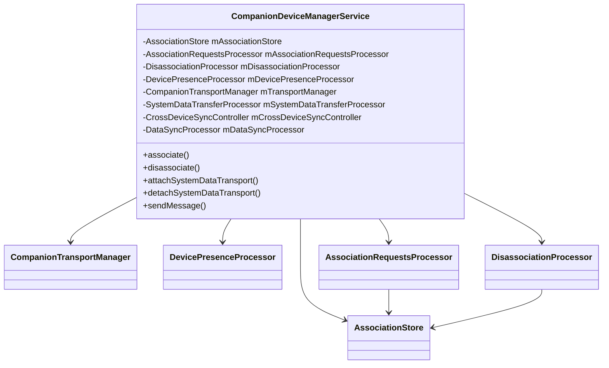
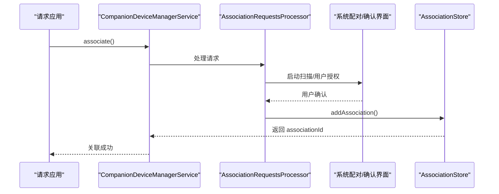
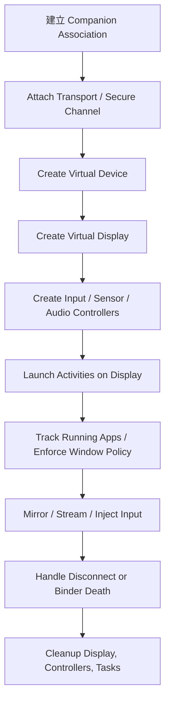

# 第 51 章：CompanionDeviceManager 与 Virtual Devices

`CompanionDeviceManager`（CDM）与 `VirtualDeviceManager`（VDM）共同构成了 Android 的多设备协作基础设施。前者负责设备发现、用户授权、关联关系、设备在场检测、安全传输和跨设备数据同步；后者建立在已关联设备之上，把远端硬件抽象成可承载 Android 体验的“虚拟设备”，从而支持虚拟显示、虚拟输入、虚拟传感器、虚拟音频和相机访问控制。

从系统实现上看，这不是两个彼此无关的 API，而是一条完整链路：先通过 CDM 与手表、平板、车机、PC 或 AR 设备建立信任关系和数据通道，再通过 VDM 把这些外部设备变成 Android 的一等计算表面。本章就沿着这条链路，从服务端入口、关联与发现、传输与同步，一直走到虚拟显示、输入注入和窗口策略。

---

## 51.1 CompanionDeviceManager 架构

### 51.1.1 服务总览

服务端入口是 `CompanionDeviceManagerService`，位于：

```text
frameworks/base/services/companion/java/com/android/server/companion/
    CompanionDeviceManagerService.java
```

它本身更像一个总调度器，而不是把所有逻辑都塞进单个类里。围绕它分布着一组专门的处理器与管理器：

| 子目录 | 关键类 | 职责 |
|---|---|---|
| `association/` | `AssociationRequestsProcessor` | 处理关联请求 |
| `association/` | `AssociationStore` | 关联记录的持久化与查询 |
| `association/` | `DisassociationProcessor` | 解除关联与角色清理 |
| `devicepresence/` | `DevicePresenceProcessor` | BLE / BT 在场检测 |
| `transport/` | `CompanionTransportManager` | 数据传输通道管理 |
| `securechannel/` | `SecureChannel` | 基于 UKEY2 的安全通道 |
| `datatransfer/` | `SystemDataTransferProcessor` | 权限等系统数据同步 |
| `datatransfer/contextsync/` | `CrossDeviceSyncController` | 通话等上下文同步 |
| `datatransfer/continuity/` | `TaskContinuityManagerService` | 任务连续性与跨端接续 |
| `datasync/` | `DataSyncProcessor` | 通用数据同步 |
| `virtual/` | `VirtualDeviceManagerService` | 虚拟设备创建与管理 |

### 51.1.2 服务协作关系

下面这张图可以帮助理解 `CompanionDeviceManagerService` 如何协调各个子模块：



### 51.1.3 权限模型

CDM 的权限模型是分层的。原文列出的关键权限包括：

- `ASSOCIATE_COMPANION_DEVICES`
- `REQUEST_COMPANION_SELF_MANAGED`
- `REQUEST_OBSERVE_COMPANION_DEVICE_PRESENCE`
- `USE_COMPANION_TRANSPORTS`
- `DELIVER_COMPANION_MESSAGES`
- `MANAGE_COMPANION_DEVICES`
- `ACCESS_COMPANION_INFO`
- `BLUETOOTH_CONNECT`

这些权限并不是同义词，而是分别约束：

1. 能不能创建关联。
2. 能不能创建 self-managed 关联。
3. 能不能监听设备在场状态。
4. 能不能附加系统传输通道。
5. 能不能通过通道投递消息。
6. 能不能做 shell / 管理操作。

### 51.1.4 启动时序

CDM 在系统启动时需要等包管理、用户和蓝牙相关状态都准备到位后，再恢复持久化的关联和 presence 监控。因此它不是“进程起来立刻全部可用”的服务，而是会在合适阶段初始化 store、processor 和监听器。

### 51.1.5 内部 Binder Stub

`CompanionDeviceManagerService` 通过内部 Binder stub 对 framework 暴露能力。这里的关键点不是 Binder 本身，而是服务在 Binder 入口统一完成权限校验、用户维度处理和参数归一化。

### 51.1.6 Shell 命令接口

CDM 提供 `CompanionDeviceShellCommand` 之类的调试入口，用于：

- 查看关联
- 创建测试关联
- 修改传输类型
- 查询虚拟设备
- 做状态诊断

新型系统框架如果没有 shell 命令，调试成本会非常高，CDM/VDM 明显吸取了这方面的经验。

## 51.2 设备关联与发现

### 51.2.1 关联数据模型

CDM 的核心数据对象是 association。它至少要描述：

- 关联 ID
- 用户 ID
- 包名
- 设备地址或自管理标识
- 设备 profile
- 是否 self-managed
- 附加元数据

这不是单纯的“配对记录”，而是系统级信任关系记录。

### 51.2.2 Device Profiles

device profile 定义了某类设备关联后附带的系统语义，例如：

- 手表类设备
- 车机类设备
- 计算伴侣设备
- 自定义 profile

profile 会影响角色授权、行为策略和系统 UI 呈现方式，因此不是纯标签字段。

### 51.2.3 关联流程

一次典型关联流程如下：

1. 应用发起 association request。
2. 系统检查权限与 profile 合法性。
3. 进入扫描或用户确认流程。
4. 用户在系统 UI 中批准。
5. 创建 association 并写入 `AssociationStore`。
6. 根据 profile 做角色或后续策略配置。



### 51.2.4 限流

为了避免恶意应用反复拉起扫描或授权流程，CDM 需要对 association 请求做 rate limiting。这类限流一般不是用户可见功能，但却是系统服务抗滥用的关键。

### 51.2.5 `AssociationStore`

`AssociationStore` 既负责持久化，也负责变更通知。它通常需要提供：

- 按 user / package / ID 查询
- 新增 / 更新 / 删除
- 内存缓存
- 磁盘落盘
- 监听变更回调

因此它不是一个被动的数据类，而是整个 CDM 数据层中心。

### 51.2.6 解除关联

解除关联不仅仅是删一条记录。系统通常还需要：

- 清理角色授权
- 停止在场监听
- 关闭传输通道
- 停止同步任务
- 释放与虚拟设备相关的上下文

### 51.2.7 设备在场监控

presence monitoring 让系统知道关联设备何时出现或离开。不同实现路径可能依赖：

- BLE 广播
- 蓝牙连接状态
- self-managed app 上报

presence 是后续“是否需要同步”“是否可自动连接传输”的关键输入。

## 51.3 数据传输与上下文同步

### 51.3.1 传输架构

CDM 的 transport 层负责在已关联设备之间挂接系统数据通道。它主要解决两件事：

1. 把文件描述符或底层连接抽象成统一 `Transport`。
2. 在系统层统一投递消息、做安全升级与生命周期管理。

### 51.3.2 传输协议

原文详细拆了 transport protocol。这部分的重点不是某个具体字段，而是系统需要有一套明确协议来区分：

- 系统同步消息
- 权限同步
- 通话上下文
- 连续性任务
- 自定义应用消息

### 51.3.3 传输生命周期

transport 生命周期大致包括：

1. attach
2. 可选握手与安全升级
3. 消息收发
4. 错误恢复或重连
5. detach

如果生命周期管理不好，跨设备同步非常容易出现“设备已断开但状态还在”“通道被多次 attach”这类问题。

### 51.3.4 安全通道（UKEY2）

CDM 在需要安全传输时会通过 `SecureChannel` 建立基于 UKEY2 的加密通道。原文把这一节展开得比较细，关键结论是：

- 原始 transport 只负责底层字节流
- 安全层在其上做握手和加密
- attestation 可用于进一步校验对端可信性

这让系统既能支持原始传输调试，也能在正式链路中强制加密。

### 51.3.5 权限同步

`SystemDataTransferProcessor` 之类组件会把部分系统权限或授权状态同步到关联设备，使跨设备体验不必每次重新请求同一权限语义。

### 51.3.6 元数据同步（DataSync）

DataSync 负责更通用的元数据同步，不限于单个专用场景。它的价值在于把“跨设备同步”从单点功能提升为平台基础设施。

### 51.3.7 Cross-Device Call Sync

通话上下文同步是最典型的 companion 场景之一，例如手表或车机获取手机上的呼叫状态。这说明 CDM 并不只服务于“设备配对”，而是为跨设备协同体验提供统一底座。

### 51.3.8 Task Continuity

任务连续性让当前设备上的任务可以在另一个伴侣设备上继续执行。它依赖：

- 已建立的信任关系
- 稳定的 transport
- 任务状态或 metadata 的同步

这也是 VDM 和 app streaming 场景的前置基础之一。

## 51.4 VirtualDeviceManager

### 51.4.1 服务架构

`VirtualDeviceManagerService` 位于 CDM 的 `virtual/` 子目录下，说明它并不是完全独立体系，而是建立在 companion 基础设施之上的服务。

### 51.4.2 虚拟设备创建

创建虚拟设备通常需要：

1. 已存在的 companion 关系或受信调用方。
2. 设备参数与策略配置。
3. 创建虚拟显示及相关子系统控制器。
4. 返回应用侧可持有的虚拟设备句柄。

### 51.4.3 `VirtualDeviceImpl`

`VirtualDeviceImpl` 是具体虚拟设备实例，通常负责：

- 保存 deviceId
- 维护显示、输入、传感器、音频等控制器
- 跟踪运行中的应用
- 管理生命周期与死亡清理

### 51.4.4 设备策略引擎

虚拟设备不是“复制一个显示就完事”，还必须带策略。例如：

- 哪些 Activity 可在虚拟显示上启动
- 是否允许 secure window
- 是否允许录制 / 截图
- 哪些应用可被流式投射

### 51.4.5 Activity 监听与 Intent 拦截

VDM 需要与 ActivityTaskManager / WindowManager 协同，知道虚拟显示上启动了什么 Activity，并在必要时拦截不符合策略的跳转。

### 51.4.6 运行中应用跟踪

原文强调了 running apps tracking，这说明 VDM 需要清楚哪些应用当前运行在某个虚拟设备上，以便做：

- 音频路由
- 生命周期管理
- 资源清理
- 调试输出

### 51.4.7 电源管理

虚拟设备仍然要与系统功耗模型兼容，不能无限制保持显示、音频和传感器活跃，因此也需要和电源状态联动。

### 51.4.8 镜像显示

mirror display 是 Computer Control 和 app streaming 这类场景的重要能力，使外部表面能够承载一个 Android 界面副本或可交互表面。

### 51.4.9 死亡处理与清理

当持有虚拟设备的应用或对端连接死亡时，系统必须清理：

- 虚拟显示
- 输入设备
- 传感器注册
- 音频路由
- 相关任务和监听器

这类死亡处理是系统服务稳定性的基本要求。

## 51.5 虚拟设备子系统

### 51.5.1 `InputController`

`InputController` 负责在虚拟设备上创建并管理输入设备，例如：

- 虚拟触摸屏
- 虚拟鼠标
- 虚拟键盘
- 其他输入源

它的关键价值是把外部硬件输入映射到 Android 标准输入栈，而不是走一套旁路实现。

### 51.5.2 `SensorController`

虚拟传感器允许外部设备或测试框架向系统注入传感器数据。这对 XR、跨设备控制和自动化测试都很重要。

### 51.5.3 `CameraAccessController`

相机访问在虚拟设备场景下是高风险能力。系统需要明确哪些应用、哪些显示、哪些上下文允许摄像头相关操作，否则远端表面可能间接获得不该有的硬件访问。

### 51.5.4 `VirtualAudioController`

音频是虚拟设备里最容易被低估、但最复杂的部分之一。控制器需要处理：

- 哪些应用音频应被重定向
- 音频何时开始或停止播放
- 录音与回放路径
- 与 deviceId 关联的路由状态

## 51.6 虚拟设备与显示集成

### 51.6.1 虚拟显示创建

VDM 最直观的能力就是创建虚拟显示。创建后，它会成为 Android 显示体系中的一个正式 display，而不是应用自己维护的离屏画布。

### 51.6.2 `GenericWindowPolicyController`

这是整套显示策略里最关键的组件之一。它负责在窗口和 Activity 启动层面执行虚拟设备策略，例如：

- 某个 Activity 是否允许出现在该 display 上
- 是否允许 secure 内容
- 是否要阻止敏感页面被远端显示

### 51.6.3 Secure Window 处理

secure window 不只是“不能截图”这么简单。在虚拟显示场景下，它直接涉及敏感 UI 是否能被投到外部设备，因此系统必须在 WindowManager 层面严格执行策略。

### 51.6.4 Display Categories

不同类型的虚拟显示可以声明不同类别，这有助于系统和应用根据表面类型决定布局、Activity 路由和交互策略。

### 51.6.5 与 Recent Tasks 集成

如果虚拟显示上能运行应用，就不可避免要考虑它们如何出现在 recents、如何与主显示任务栈交互，以及关闭虚拟设备时如何收尾。

### 51.6.6 自定义 Home Activity

某些虚拟表面可能有自己的 home/launcher 语义，这使它们更像“独立计算空间”，而不仅是一个远端窗口。

### 51.6.7 App Streaming 架构

app streaming 场景本质上是：

1. 在虚拟显示上运行应用。
2. 把画面与交互映射到外部设备。
3. 把输入、音频和策略统一纳入 VDM。

这也是 CDM + VDM 组合价值最完整的体现之一。

### 51.6.8 完整生命周期

从整体上看，一次虚拟设备生命周期如下：



## 51.7 动手实践

### 51.7.1 检查 Companion 关联

```bash
adb shell dumpsys companion_device_manager associations
adb shell cmd companiondevice list
```

### 51.7.2 通过 shell 创建测试关联

```bash
adb shell cmd companiondevice associate <user-id> <package-name> <device-mac-address>
```

不同平台分支上的具体参数格式可能略有差异，但核心用途都是快速创建测试 association。

### 51.7.3 查看虚拟设备

```bash
adb shell dumpsys companion_device_manager virtual
adb shell cmd companiondevice list-virtual-devices
```

### 51.7.4 使用 `VirtualDeviceManager` API

```java
VirtualDeviceManager manager = context.getSystemService(VirtualDeviceManager.class);
VirtualDeviceParams params = new VirtualDeviceParams.Builder().build();
VirtualDevice device = manager.createVirtualDevice(associationId, params);

VirtualDisplayConfig config =
        new VirtualDisplayConfig.Builder("RemoteDisplay", 1920, 1080, 320).build();
VirtualDisplay display = device.createVirtualDisplay(config, null, null);

VirtualTouchscreenConfig touchConfig =
        new VirtualTouchscreenConfig.Builder(1920, 1080)
                .setAssociatedDisplayId(display.getDisplay().getDisplayId())
                .build();
device.createVirtualTouchscreen(touchConfig);
```

### 51.7.5 调试传输问题

```bash
adb shell dumpsys companion_device_manager transports
adb shell cmd companiondevice override-transport-type 1
adb shell cmd companiondevice override-transport-type 2
adb shell cmd companiondevice override-transport-type 0
```

这三条分别表示强制 raw transport、强制 secure transport，以及恢复默认行为。

### 51.7.6 检查窗口策略

```bash
adb logcat -s GenericWindowPolicyController
```

如果某个 Activity 不允许在虚拟显示上启动，相关拒绝原因会从这里输出。

### 51.7.7 测试传感器注入

```bash
adb shell dumpsys sensorservice
```

通过 VDM 创建的虚拟传感器会出现在标准传感器列表中。

### 51.7.8 监控音频路由

```bash
adb logcat -s VirtualAudioController
```

### 51.7.9 监控相机访问阻断

```bash
adb logcat -s CameraAccessController
```

## Summary

`CompanionDeviceManager` 与 `VirtualDeviceManager` 共同构成了 Android 多设备协作和远端计算表面的基础设施。CDM 解决的是“信任关系与通道”的问题，VDM 解决的是“如何把一个受信远端设备变成 Android 可管理的虚拟执行环境”的问题。

本章的关键点可以概括为：

- CDM 通过 association、device profile、presence monitoring、transport 和 secure channel 建立并维护伴侣设备的系统级信任关系。
- `AssociationStore` 是 CDM 的数据中心，负责关联记录的持久化、查询和变更通知，而解除关联则同时牵涉角色清理、通道关闭和同步停止。
- transport 层将原始通道、安全通道、权限同步、上下文同步和任务连续性连接起来，使跨设备协作不止停留在“发现设备”这一层。
- VDM 建立在 companion 关系之上，通过 `VirtualDeviceImpl`、策略引擎和各类控制器把远端硬件抽象成正式的 Android 虚拟设备。
- `InputController`、`SensorController`、`CameraAccessController` 和 `VirtualAudioController` 分别承担输入、传感器、相机和音频等关键子系统的虚拟化职责。
- `GenericWindowPolicyController` 是虚拟显示安全模型的核心，它决定哪些 Activity 和窗口可以出现在外部表面上，防止敏感内容泄露到不受信显示。
- 从完整链路看，CDM 提供信任和数据通道，VDM 提供显示与执行环境，两者合起来支撑了手表协同、车机扩展、桌面级 app streaming 以及 AI 驱动的远端控制场景。

### 关键源码路径

| 组件 | 路径 |
|---|---|
| CDM 服务入口 | `frameworks/base/services/companion/java/com/android/server/companion/CompanionDeviceManagerService.java` |
| CDM Internal API | `frameworks/base/services/companion/java/com/android/server/companion/CompanionDeviceManagerServiceInternal.java` |
| Shell 命令 | `frameworks/base/services/companion/java/com/android/server/companion/CompanionDeviceShellCommand.java` |
| 配置 | `frameworks/base/services/companion/java/com/android/server/companion/CompanionDeviceConfig.java` |
| 关联请求处理 | `frameworks/base/services/companion/java/com/android/server/companion/association/AssociationRequestsProcessor.java` |
| 关联存储 | `frameworks/base/services/companion/java/com/android/server/companion/association/AssociationStore.java` |
| 磁盘持久化 | `frameworks/base/services/companion/java/com/android/server/companion/association/AssociationDiskStore.java` |
| 解除关联 | `frameworks/base/services/companion/java/com/android/server/companion/association/DisassociationProcessor.java` |
| 空闲关联清理 | `frameworks/base/services/companion/java/com/android/server/companion/association/InactiveAssociationsRemovalService.java` |
| Presence 处理器 | `frameworks/base/services/companion/java/com/android/server/companion/devicepresence/DevicePresenceProcessor.java` |
| BLE 处理器 | `frameworks/base/services/companion/java/com/android/server/companion/devicepresence/BleDeviceProcessor.java` |
| BT 处理器 | `frameworks/base/services/companion/java/com/android/server/companion/devicepresence/BluetoothDeviceProcessor.java` |
| CompanionAppBinder | `frameworks/base/services/companion/java/com/android/server/companion/devicepresence/CompanionAppBinder.java` |
| Transport 基类 | `frameworks/base/services/companion/java/com/android/server/companion/transport/Transport.java` |
| RawTransport | `frameworks/base/services/companion/java/com/android/server/companion/transport/RawTransport.java` |
| SecureTransport | `frameworks/base/services/companion/java/com/android/server/companion/transport/SecureTransport.java` |
| TransportManager | `frameworks/base/services/companion/java/com/android/server/companion/transport/CompanionTransportManager.java` |
| SecureChannel | `frameworks/base/services/companion/java/com/android/server/companion/securechannel/SecureChannel.java` |
| AttestationVerifier | `frameworks/base/services/companion/java/com/android/server/companion/securechannel/AttestationVerifier.java` |
| 权限同步 | `frameworks/base/services/companion/java/com/android/server/companion/datatransfer/SystemDataTransferProcessor.java` |
| Context Sync | `frameworks/base/services/companion/java/com/android/server/companion/datatransfer/contextsync/CrossDeviceSyncController.java` |
| Task Continuity | `frameworks/base/services/companion/java/com/android/server/companion/datatransfer/continuity/TaskContinuityManagerService.java` |
| VDM 服务 | `frameworks/base/services/companion/java/com/android/server/companion/virtual/VirtualDeviceManagerService.java` |
| 虚拟设备实现 | `frameworks/base/services/companion/java/com/android/server/companion/virtual/VirtualDeviceImpl.java` |
| 窗口策略控制器 | `frameworks/base/services/companion/java/com/android/server/companion/virtual/GenericWindowPolicyController.java` |
| 输入控制器 | `frameworks/base/services/companion/java/com/android/server/companion/virtual/InputController.java` |
| 传感器控制器 | `frameworks/base/services/companion/java/com/android/server/companion/virtual/SensorController.java` |
| 相机访问控制器 | `frameworks/base/services/companion/java/com/android/server/companion/virtual/CameraAccessController.java` |
| 虚拟音频控制器 | `frameworks/base/services/companion/java/com/android/server/companion/virtual/audio/VirtualAudioController.java` |
