# Chapter 51: CompanionDeviceManager and Virtual Devices

Android's CompanionDeviceManager (CDM) and VirtualDeviceManager (VDM) form a
layered infrastructure that enables phones to pair with external hardware --
smartwatches, tablets, automotive head-units, PCs, even AR glasses -- and present
them as first-class computing surfaces. CDM manages the lifecycle of device
associations, presence detection, secure transport channels, and cross-device
data synchronization. VDM, built on top of CDM associations, lets a remote
companion device host virtual displays, virtual input devices, virtual sensors,
virtual cameras, and virtual audio pipelines -- effectively projecting an entire
Android experience onto external hardware.

This chapter walks through the full server-side implementation of both systems,
from the initial BLE/Bluetooth discovery handshake through to a running
virtual display with injected touch events and re-routed audio streams.

All source paths are relative to the AOSP source tree root.

---

## 51.1 CompanionDeviceManager Architecture

### 51.1.1 Service Overview

The server-side entry point is `CompanionDeviceManagerService`, located at:

```
frameworks/base/services/companion/java/com/android/server/companion/
    CompanionDeviceManagerService.java
```

This single file (~999 lines) serves as the orchestrator. It does not implement
all functionality itself; instead it delegates to a set of specialized
processors and managers, each living in its own sub-package:

| Sub-package        | Key Class                          | Responsibility                                |
|--------------------|------------------------------------|-----------------------------------------------|
| `association/`     | `AssociationRequestsProcessor`     | Handle incoming association requests          |
| `association/`     | `AssociationStore`                 | CRUD for association records                  |
| `association/`     | `DisassociationProcessor`          | Disassociation and role cleanup               |
| `devicepresence/`  | `DevicePresenceProcessor`          | BLE/BT presence monitoring                    |
| `transport/`       | `CompanionTransportManager`        | Attach/detach data transports                 |
| `securechannel/`   | `SecureChannel`                    | UKEY2-based encrypted channel                 |
| `datatransfer/`    | `SystemDataTransferProcessor`      | Permission sync across devices                |
| `datatransfer/contextsync/` | `CrossDeviceSyncController` | Call metadata sync                       |
| `datatransfer/continuity/`  | `TaskContinuityManagerService` | Task handoff between devices            |
| `datasync/`        | `DataSyncProcessor`                | Generic data synchronization                  |
| `virtual/`         | `VirtualDeviceManagerService`      | Virtual device creation & management          |

The class diagram below shows how `CompanionDeviceManagerService` coordinates
its delegates:

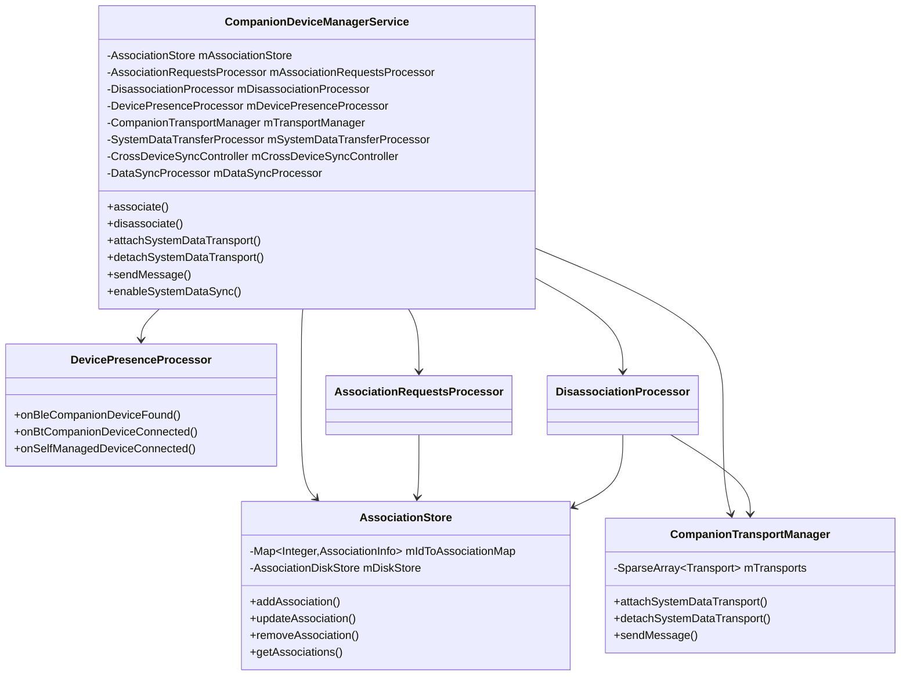

### 51.1.2 Permission Model

CDM enforces a strict permission model. The key permissions are declared as
static imports at the top of `CompanionDeviceManagerService.java`:

```java
import static android.Manifest.permission.ACCESS_COMPANION_INFO;
import static android.Manifest.permission.ASSOCIATE_COMPANION_DEVICES;
import static android.Manifest.permission.BLUETOOTH_CONNECT;
import static android.Manifest.permission.DELIVER_COMPANION_MESSAGES;
import static android.Manifest.permission.MANAGE_COMPANION_DEVICES;
import static android.Manifest.permission.REQUEST_COMPANION_SELF_MANAGED;
import static android.Manifest.permission.REQUEST_OBSERVE_COMPANION_DEVICE_PRESENCE;
import static android.Manifest.permission.USE_COMPANION_TRANSPORTS;
```

These map to distinct capabilities:

- **ASSOCIATE_COMPANION_DEVICES** -- required to create any new association.
- **REQUEST_COMPANION_SELF_MANAGED** -- required for self-managed associations
  (where the app manages transport rather than relying on MAC-address-based
  presence).

- **REQUEST_OBSERVE_COMPANION_DEVICE_PRESENCE** -- required to register for
  presence callbacks (BLE/BT notifications when the companion device appears
  or disappears).

- **USE_COMPANION_TRANSPORTS** -- required to attach a system data transport
  (file descriptor) for cross-device messaging.

- **DELIVER_COMPANION_MESSAGES** -- required to send messages through CDM
  transports.

- **MANAGE_COMPANION_DEVICES** -- system-level permission for shell commands
  and administrative operations.

- **ACCESS_COMPANION_INFO** -- required to query companion information for
  other users.

### 51.1.3 Boot Sequence

`CompanionDeviceManagerService` is a `SystemService` that participates in the
standard server boot lifecycle. During `onBootPhase()`, the service:

1. Reads persisted association data from disk via `AssociationStore.refreshCache()`.
2. Initializes the `DevicePresenceProcessor` to start monitoring BLE/BT
   connections.

3. Registers with `CompanionTransportManager` for transport lifecycle events.
4. Sets up the `CrossDeviceSyncController` for call metadata sync.
5. Initializes the `SystemDataTransferProcessor` for permission sync.

The association data is stored in Device Encrypted (DE) storage, so it is
available before the user unlocks the device. This is explicit in the
`AssociationStore.refreshCache()` implementation:

```java
// The data is stored in DE directories, so we can read the data for all users now
// (which would not be possible if the data was stored to CE directories).
Map<Integer, Associations> userToAssociationsMap =
        mDiskStore.readAssociationsByUsers(userIds);
```

Source:
`frameworks/base/services/companion/java/com/android/server/companion/association/AssociationStore.java`, line 169.

### 51.1.4 The Inner Binder Stub

The actual IPC endpoint is an inner class `CompanionDeviceManagerImpl` inside
`CompanionDeviceManagerService`. This class extends `ICompanionDeviceManager.Stub`
and routes each Binder call to the appropriate processor. For example, the
`associate()` call:

1. Validates the caller's identity and permissions.
2. Delegates to `AssociationRequestsProcessor.processNewAssociationRequest()`.

Similarly, `disassociate()` routes to `DisassociationProcessor.disassociate()`.

The service also publishes internal APIs via
`CompanionDeviceManagerServiceInternal`, which other system services can access
via `LocalServices`:

```
frameworks/base/services/companion/java/com/android/server/companion/
    CompanionDeviceManagerServiceInternal.java
```

### 51.1.5 Shell Command Interface

For debugging and testing, CDM exposes shell commands via:

```
frameworks/base/services/companion/java/com/android/server/companion/
    CompanionDeviceShellCommand.java
```

This enables operations like:

```bash
adb shell cmd companiondevice list 0
adb shell cmd companiondevice associate --userId 0 --package com.example.app \
    --mac AA:BB:CC:DD:EE:FF
adb shell cmd companiondevice disassociate 0 com.example.app AA:BB:CC:DD:EE:FF
```

---

## 51.2 Device Association and Discovery

### 51.2.1 Association Data Model

Every companion device relationship is represented by an `AssociationInfo` object.
The `AssociationInfo.Builder` reveals its fields (from
`AssociationRequestsProcessor.createAssociation()`):

```java
final AssociationInfo association =
        new AssociationInfo.Builder(id, userId, packageName)
                .setDeviceMacAddress(macAddress)
                .setDisplayName(displayName)
                .setDeviceProfile(deviceProfile)
                .setAssociatedDevice(associatedDevice)
                .setSelfManaged(selfManaged)
                .setNotifyOnDeviceNearby(false)
                .setRevoked(false)
                .setPending(false)
                .setTimeApproved(timestamp)
                .setLastTimeConnected(Long.MAX_VALUE)
                .setSystemDataSyncFlags(0)
                .setTransportFlags(transportFlags)
                .setDeviceIcon(deviceIcon)
                .setDeviceId(null)
                .setPackagesToNotify(null)
                .setMetadata(new PersistableBundle())
                .build();
```

Source:
`frameworks/base/services/companion/java/com/android/server/companion/association/AssociationRequestsProcessor.java`, lines 326-344.

Key fields:

| Field                  | Purpose                                                       |
|------------------------|---------------------------------------------------------------|
| `id`                   | Unique integer identifier, monotonically increasing           |
| `userId`               | The Android user who owns this association                    |
| `packageName`          | The companion app's package name                              |
| `deviceMacAddress`     | MAC address for hardware-based presence detection             |
| `displayName`          | Human-readable name for the companion device                  |
| `deviceProfile`        | Role-based profile (watch, glasses, app streaming, etc.)      |
| `selfManaged`          | If true, the app manages transport; no MAC-based monitoring   |
| `revoked`              | If true, the association is pending final cleanup              |
| `systemDataSyncFlags`  | Bitmask controlling what system data is synced                |
| `transportFlags`       | Flags controlling transport behavior                          |
| `deviceId`             | Optional `DeviceId` with custom ID and MAC                    |

### 51.2.2 Device Profiles

Device profiles determine what permissions and roles are granted to the
companion app. The profiles with required user confirmation are defined in
`AssociationRequestsProcessor`:

```java
private static final Set<String> DEVICE_PROFILES_WITH_REQUIRED_CONFIRMATION = new ArraySet<>(
        Arrays.asList(
                AssociationRequest.DEVICE_PROFILE_APP_STREAMING,
                AssociationRequest.DEVICE_PROFILE_NEARBY_DEVICE_STREAMING));
```

Source:
`frameworks/base/services/companion/java/com/android/server/companion/association/AssociationRequestsProcessor.java`, lines 142-145.

The full set of device profiles includes:

- **DEVICE_PROFILE_WATCH** -- smartwatch companion
- **DEVICE_PROFILE_GLASSES** -- AR/VR glasses
- **DEVICE_PROFILE_APP_STREAMING** -- remote display/app streaming
- **DEVICE_PROFILE_NEARBY_DEVICE_STREAMING** -- nearby device projection
- **DEVICE_PROFILE_AUTOMOTIVE_PROJECTION** -- car head-unit projection
- **DEVICE_PROFILE_COMPUTER** -- desktop/laptop companion
- **DEVICE_PROFILE_WEARABLE_SENSING** -- wearable health/sensor devices

Each profile maps to an Android Role. When an association is created, the
companion app is automatically granted the corresponding role (if it does not
already hold it):

```java
addRoleHolderForAssociation(mContext, association, success -> {
    if (success) {
        Slog.i(TAG, "Added " + deviceProfile + " role to userId="
                + association.getUserId() + ", packageName="
                + association.getPackageName());
        mAssociationStore.addAssociation(association);
        sendCallbackAndFinish(association, callback, resultReceiver);
    } else {
        Slog.e(TAG, "Failed to add u" + association.getUserId()
                + "\\" + association.getPackageName()
                + " to the list of " + deviceProfile + " holders.");
        sendCallbackAndFinish(null, callback, resultReceiver);
    }
});
```

Source:
`AssociationRequestsProcessor.java`, lines 375-388.

### 51.2.3 The Association Flow

The association process has two variants: the **full flow** (with UI) and
the **No-UI flow** (for self-managed associations). The `AssociationRequestsProcessor`
Javadoc explains both:

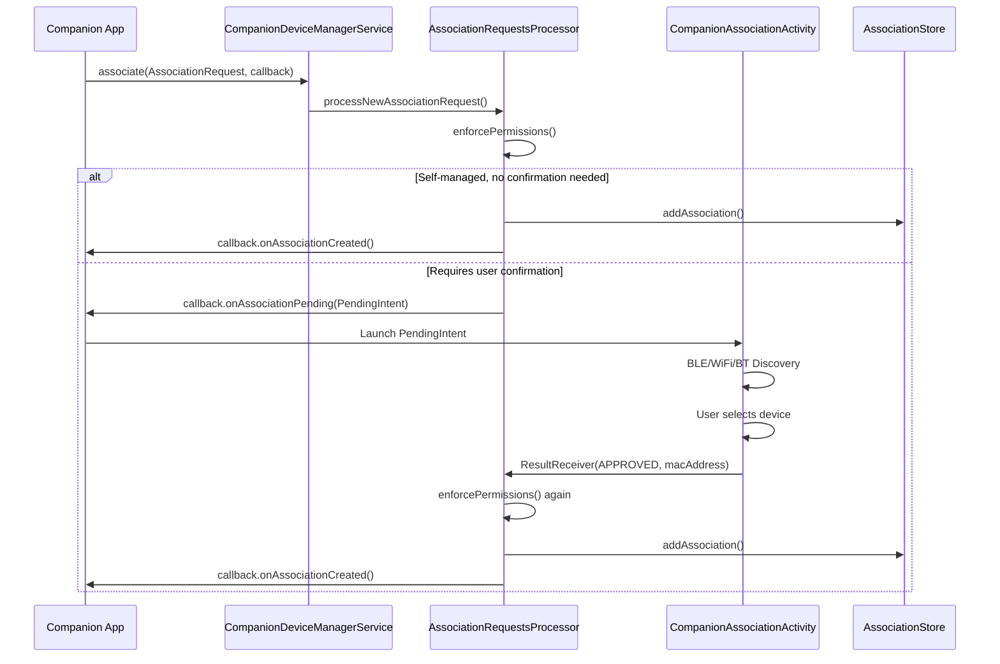

The full flow implementation in `processNewAssociationRequest()`:

```java
public void processNewAssociationRequest(@NonNull AssociationRequest request,
        @NonNull String packageName, @UserIdInt int userId,
        @NonNull IAssociationRequestCallback callback) {
    // 1. Enforce permissions and other requirements.
    enforcePermissionForCreatingAssociation(mContext, request, packageUid);
    enforceUsesCompanionDeviceFeature(mContext, userId, packageName);

    // 2a. Check if association can be created without launching UI
    if (request.isSelfManaged() && !request.isForceConfirmation()
            && !DEVICE_PROFILES_WITH_REQUIRED_CONFIRMATION.contains(request.getDeviceProfile())
            && !willAddRoleHolder(request, packageName, userId)) {
        createAssociationAndNotifyApplication(request, packageName, userId,
                /* macAddress */ null, callback, /* resultReceiver */ null);
        return;
    }
    // ...
    // 2b. Build a PendingIntent for launching the confirmation UI
    request.setSkipPrompt(mayAssociateWithoutPrompt(packageName, userId));
    // ...
}
```

Source:
`AssociationRequestsProcessor.java`, lines 169-242.

### 51.2.4 Rate Limiting

The No-UI association path has built-in rate limiting to prevent abuse:

```java
private static final int ASSOCIATE_WITHOUT_PROMPT_MAX_PER_TIME_WINDOW = 5;
private static final long ASSOCIATE_WITHOUT_PROMPT_WINDOW_MS = 60 * 60 * 1000; // 60 min
```

The `mayAssociateWithoutPrompt()` method checks how many associations the
package has created within the last 60 minutes. If the count exceeds 5,
the prompt is enforced:

```java
if (++recent >= ASSOCIATE_WITHOUT_PROMPT_MAX_PER_TIME_WINDOW) {
    Slog.w(TAG, "Too many associations: " + packageName + " already "
            + "associated " + recent + " devices within the last "
            + ASSOCIATE_WITHOUT_PROMPT_WINDOW_MS + "ms");
    return false;
}
```

Source:
`AssociationRequestsProcessor.java`, lines 536-557.

### 51.2.5 AssociationStore -- Persistence and Change Notification

The `AssociationStore` is the central CRUD interface for association records.
It maintains an in-memory cache (`mIdToAssociationMap`) backed by disk storage
via `AssociationDiskStore`.

```
frameworks/base/services/companion/java/com/android/server/companion/association/
    AssociationStore.java
    AssociationDiskStore.java
    Associations.java
```

The store supports two types of change listeners:

1. **Local listeners** (`OnChangeListener`) -- used by other server-side
   components (DevicePresenceProcessor, TransportManager, etc.).

2. **Remote listeners** (`IOnAssociationsChangedListener`) -- used by apps
   via Binder.

Change types are enumerated:

```java
public static final int CHANGE_TYPE_ADDED = 0;
public static final int CHANGE_TYPE_REMOVED = 1;
public static final int CHANGE_TYPE_UPDATED_ADDRESS_CHANGED = 2;
public static final int CHANGE_TYPE_UPDATED_ADDRESS_UNCHANGED = 3;
```

Source:
`AssociationStore.java`, lines 73-76.

The notification logic distinguishes between address-changing and non-changing
updates. Remote listeners are only notified for significant changes (add,
remove, address change) -- not for minor config tweaks:

```java
// Do NOT notify when UPDATED_ADDRESS_UNCHANGED, which means a minor tweak in
// association's configs, which "listeners" won't (and shouldn't) be able to see.
if (changeType != CHANGE_TYPE_UPDATED_ADDRESS_UNCHANGED) {
    mRemoteListeners.broadcast((listener, callbackUserId) -> { ... });
}
```

Source:
`AssociationStore.java`, lines 570-582.

Write operations are dispatched to a single-threaded executor to avoid blocking
the caller:

```java
private void writeCacheToDisk(@UserIdInt int userId) {
    mExecutor.execute(() -> {
        Associations associations = new Associations();
        synchronized (mLock) {
            associations.setMaxId(mMaxId);
            associations.setAssociations(
                    CollectionUtils.filter(mIdToAssociationMap.values().stream().toList(),
                            a -> a.getUserId() == userId));
        }
        mDiskStore.writeAssociationsForUser(userId, associations);
    });
}
```

Source:
`AssociationStore.java`, lines 307-318.

### 51.2.6 Disassociation

The `DisassociationProcessor` handles both user-initiated disassociation (via
the API) and automatic cleanup of idle self-managed associations.

```
frameworks/base/services/companion/java/com/android/server/companion/association/
    DisassociationProcessor.java
```

Disassociation reasons are tracked for debugging:

```java
public static final String REASON_REVOKED = "revoked";
public static final String REASON_SELF_IDLE = "self-idle";
public static final String REASON_SHELL = "shell";
public static final String REASON_LEGACY = "legacy";
public static final String REASON_API = "api";
public static final String REASON_PKG_DATA_CLEARED = "pkg-data-cleared";
```

Source:
`DisassociationProcessor.java`, lines 61-66.

A critical design aspect: if the companion app process is in the foreground
when disassociation is triggered, the actual removal is deferred. The
association is marked as "revoked" and an `OnUidImportanceListener` is
registered. When the process moves to the background, the cleanup completes:

```java
if (packageProcessImportance <= IMPORTANCE_FOREGROUND && deviceProfile != null
        && !isRoleInUseByOtherAssociations) {
    AssociationInfo revokedAssociation = (new AssociationInfo.Builder(
            association)).setRevoked(true).build();
    mAssociationStore.updateAssociation(revokedAssociation);
    startListening();
    return;
}
```

Source:
`DisassociationProcessor.java`, lines 146-156.

Self-managed associations are automatically removed after 90 days of inactivity:

```java
private static final long ASSOCIATION_REMOVAL_TIME_WINDOW_DEFAULT = DAYS.toMillis(90);
```

Source:
`DisassociationProcessor.java`, line 72.

The `InactiveAssociationsRemovalService` (a `JobService`) periodically invokes
`removeIdleSelfManagedAssociations()` to clean up stale entries.

### 51.2.7 Device Presence Monitoring

The `DevicePresenceProcessor` tracks whether companion devices are nearby or
connected:

```
frameworks/base/services/companion/java/com/android/server/companion/devicepresence/
    DevicePresenceProcessor.java
    BleDeviceProcessor.java
    BluetoothDeviceProcessor.java
    CompanionAppBinder.java
    CompanionServiceConnector.java
    ObservableUuid.java
    ObservableUuidStore.java
```

The processor handles multiple presence event types:

```java
EVENT_BLE_APPEARED
EVENT_BLE_DISAPPEARED
EVENT_BT_CONNECTED
EVENT_BT_DISCONNECTED
EVENT_SELF_MANAGED_APPEARED
EVENT_SELF_MANAGED_DISAPPEARED
EVENT_SELF_MANAGED_NEARBY
EVENT_SELF_MANAGED_NOT_NEARBY
EVENT_ASSOCIATION_REMOVED
```

When a companion device appears (via BLE scan or BT connection),
`DevicePresenceProcessor` can bind to the companion app's
`CompanionDeviceService`. This binding is managed by `CompanionAppBinder`
and `CompanionServiceConnector`, which handle the lifecycle of the
service connection across device presence changes.

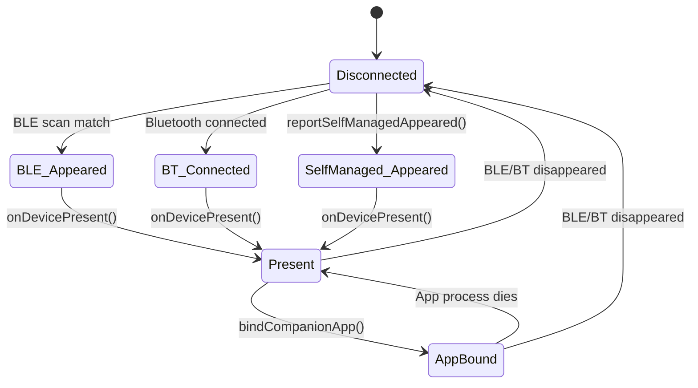

---

## 51.3 Data Transfer and Context Sync

### 51.3.1 Transport Architecture

The transport subsystem provides a bidirectional message channel between a local
Android device and its companion. The architecture is layered:

```
frameworks/base/services/companion/java/com/android/server/companion/transport/
    Transport.java              -- abstract base class
    RawTransport.java           -- unencrypted transport
    SecureTransport.java        -- UKEY2-encrypted transport
    CompanionTransportManager.java  -- lifecycle manager
    CryptoManager.java          -- cryptographic utilities
```

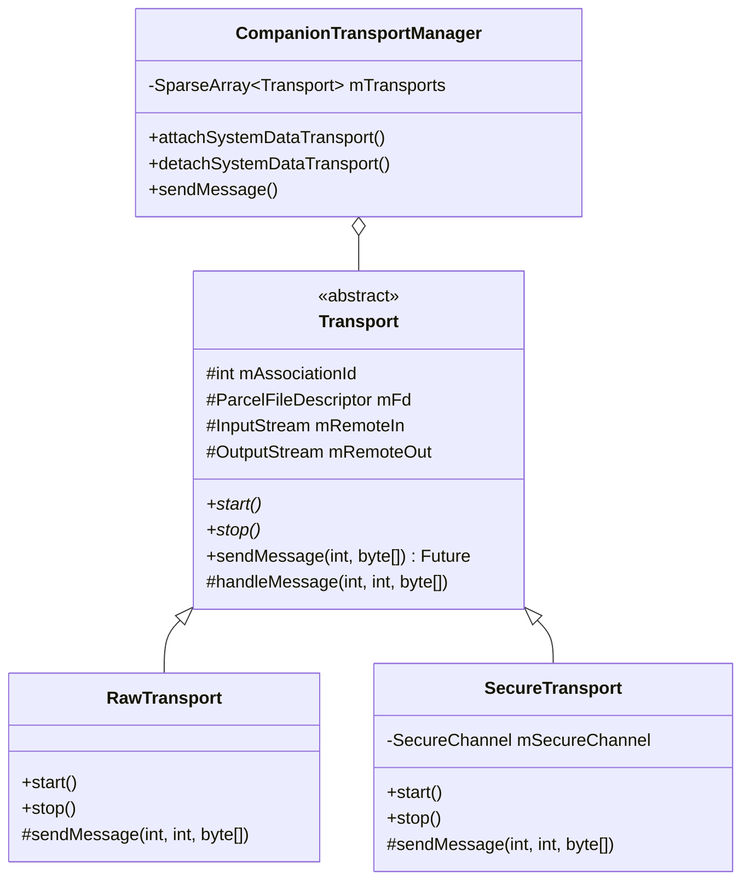

### 51.3.2 Transport Protocol

The `Transport` base class defines a message protocol with a 12-byte header:

```java
protected static final int HEADER_LENGTH = 12;
```

Messages are classified by their top byte:

```java
private static boolean isRequest(int message) {
    return (message & 0xFF000000) == 0x63000000;
}

private static boolean isResponse(int message) {
    return (message & 0xFF000000) == 0x33000000;
}

private static boolean isOneway(int message) {
    return (message & 0xFF000000) == 0x43000000;
}
```

Source:
`Transport.java`, lines 119-129.

This classification determines message handling:

- **Request messages** (`0x63xxxxxx`) -- wait for a response from the remote.
  The sender gets a `CompletableFuture<byte[]>` that resolves when the response
  arrives.

- **Oneway messages** (`0x43xxxxxx`) -- fire-and-forget; the future resolves
  immediately upon sending.

- **Response messages** (`0x33xxxxxx`) -- complete a pending request's future.

The standard message types include:

```java
static final int MESSAGE_RESPONSE_SUCCESS = 0x33838567; // !SUC
static final int MESSAGE_RESPONSE_FAILURE = 0x33706573; // !FAI
```

And from `CompanionDeviceManager`:

| Constant                               | Type    | Purpose                            |
|----------------------------------------|---------|------------------------------------|
| `MESSAGE_REQUEST_PING`                 | Request | Connectivity check                 |
| `MESSAGE_REQUEST_PERMISSION_RESTORE`   | Request | Permission sync payload            |
| `MESSAGE_REQUEST_CONTEXT_SYNC`         | Request | Call metadata sync                 |
| `MESSAGE_REQUEST_REMOTE_AUTHENTICATION`| Request | Remote authentication exchange     |
| `MESSAGE_REQUEST_METADATA_UPDATE`      | Request | Metadata update                    |
| `MESSAGE_ONEWAY_PING`                 | Oneway  | Lightweight ping                   |
| `MESSAGE_ONEWAY_FROM_WEARABLE`        | Oneway  | Wearable-originated data           |
| `MESSAGE_ONEWAY_TO_WEARABLE`          | Oneway  | Data destined for wearable         |
| `MESSAGE_ONEWAY_TASK_CONTINUITY`      | Oneway  | Task handoff data                  |

The message handling pipeline in `Transport.handleMessage()`:

```java
protected final void handleMessage(int message, int sequence, @NonNull byte[] data)
        throws IOException {
    if (isOneway(message)) {
        processOneway(message, data);
    } else if (isRequest(message)) {
        try {
            processRequest(message, sequence, data);
        } catch (IOException e) {
            Slog.w(TAG, "Failed to respond to 0x" + Integer.toHexString(message), e);
        }
    } else if (isResponse(message)) {
        processResponse(message, sequence, data);
    } else {
        Slog.w(TAG, "Unknown message 0x" + Integer.toHexString(message));
    }
}
```

Source:
`Transport.java`, lines 278-299.

### 51.3.3 Transport Lifecycle

The `CompanionTransportManager` manages the lifecycle of transports per
association:

```java
/** Association id -> Transport */
@GuardedBy("mTransports")
private final SparseArray<Transport> mTransports = new SparseArray<>();
```

When a companion app calls `attachSystemDataTransport()`, the manager creates
the appropriate transport type based on build type and configuration:

```java
private Transport createTransport(AssociationInfo association,
        ParcelFileDescriptor fd, byte[] preSharedKey, int flags) {
    // If device is debug build, use hardcoded test key for authentication
    if (Build.isDebuggable()) {
        final byte[] testKey = "CDM".getBytes(StandardCharsets.UTF_8);
        return new SecureTransport(associationId, fd, mContext, testKey, null, 0);
    }

    // If either device is not Android, then use app-specific pre-shared key
    if (preSharedKey != null) {
        return new SecureTransport(associationId, fd, mContext, preSharedKey, null, 0);
    }

    // If none of the above applies, then use secure channel with attestation verification
    return new SecureTransport(associationId, fd, mContext, flags);
}
```

Source:
`CompanionTransportManager.java`, lines 299-333.

The transport type selection follows a priority:

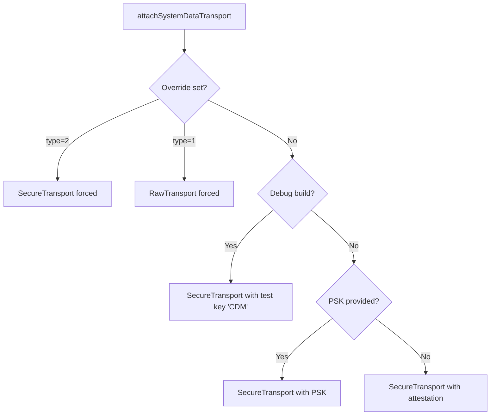

The manager also supports three categories of listeners:

1. **Message listeners** (`IOnMessageReceivedListener`) -- per message type.
2. **Event listeners** (`IOnTransportEventListener`) -- per association.
3. **Transports-changed listeners** (`IOnTransportsChangedListener`) -- for
   any transport attach/detach.

### 51.3.4 Secure Channel (UKEY2)

The `SecureChannel` class implements the encrypted communication layer using
Google's UKEY2 protocol:

```
frameworks/base/services/companion/java/com/android/server/companion/securechannel/
    SecureChannel.java
    AttestationVerifier.java
    AttestationVerificationException.java
    KeyStoreUtils.java
    SecureChannelException.java
```

The channel establishes security in three phases:

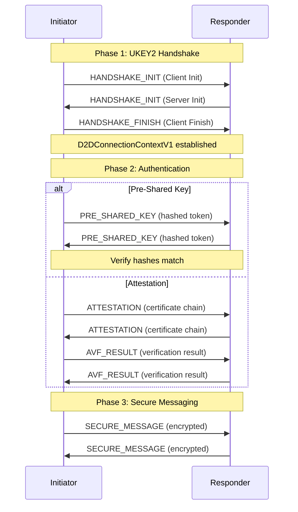

The message types are encoded as 2-byte values:

```java
private enum MessageType {
    HANDSHAKE_INIT(0x4849),   // HI
    HANDSHAKE_FINISH(0x4846), // HF
    PRE_SHARED_KEY(0x504b),   // PK
    ATTESTATION(0x4154),      // AT
    AVF_RESULT(0x5652),       // VR
    SECURE_MESSAGE(0x534d),   // SM
    UNKNOWN(0);               // X
}
```

Source:
`SecureChannel.java`, lines 622-629.

The channel handles a potential collision where both sides try to initiate
simultaneously. The resolution uses byte-level comparison of the Client Init
messages:

```java
// if received message is "larger" than the sent message, then reset the handshake context.
if (compareByteArray(mClientInit, handshakeMessage) < 0) {
    Slog.d(TAG, "Assigned: Responder");
    mHandshakeContext = null;
    return handshakeMessage;
} else {
    Slog.d(TAG, "Assigned: Initiator; Discarding received Client Init");
    // ...
}
```

Source:
`SecureChannel.java`, lines 387-406.

Pre-shared key authentication constructs a role-specific token by hashing the
role name concatenated with the key:

```java
private byte[] constructToken(D2DHandshakeContext.Role role, byte[] authValue)
        throws GeneralSecurityException {
    MessageDigest hash = MessageDigest.getInstance("SHA-256");
    String roleName = role == Role.INITIATOR ? "Initiator" : "Responder";
    byte[] roleUtf8 = roleName.getBytes(StandardCharsets.UTF_8);
    int tokenLength = roleUtf8.length + authValue.length;
    return hash.digest(ByteBuffer.allocate(tokenLength)
            .put(roleUtf8)
            .put(authValue)
            .array());
}
```

Source:
`SecureChannel.java`, lines 586-596.

### 51.3.5 Permission Sync

The `SystemDataTransferProcessor` manages the synchronization of runtime
permissions between paired devices:

```
frameworks/base/services/companion/java/com/android/server/companion/datatransfer/
    SystemDataTransferProcessor.java
    SystemDataTransferRequestStore.java
```

The permission sync flow:

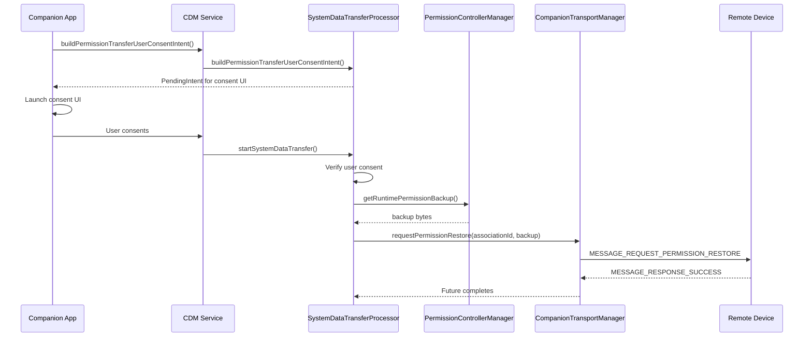

The processor registers a message listener for incoming permission restore
requests:

```java
mTransportManager.addListener(MESSAGE_REQUEST_PERMISSION_RESTORE, messageListener);
```

When a permission restore message arrives on the receiving device, it applies
the permissions:

```java
private void onReceivePermissionRestore(byte[] message) {
    if (!Build.isDebuggable() && !mContext.getPackageManager().hasSystemFeature(
            FEATURE_WATCH)) {
        Slog.e(LOG_TAG, "Permissions restore is only available on watch.");
        return;
    }
    mPermissionControllerManager.stageAndApplyRuntimePermissionsBackup(
            message, user);
}
```

Source:
`SystemDataTransferProcessor.java`, lines 273-290.

Note the current restriction: permission restore is only available on watch
devices in production builds. This is a security measure to prevent unauthorized
permission escalation.

### 51.3.6 Metadata Synchronization (DataSync)

The `DataSyncProcessor` (copyright 2025) enables device metadata synchronization
between paired devices. Unlike permission sync (which transfers runtime
permissions), metadata sync exchanges arbitrary feature-keyed `PersistableBundle`
data:

```
frameworks/base/services/companion/java/com/android/server/companion/datasync/
    DataSyncProcessor.java
    LocalMetadataStore.java
```

The processor registers two listeners at construction time:

```java
public DataSyncProcessor(
        AssociationStore associationStore,
        LocalMetadataStore localMetadataStore,
        CompanionTransportManager transportManager) {
    // ...
    mTransportManager.addListener(MESSAGE_REQUEST_METADATA_UPDATE,
            new IOnMessageReceivedListener.Stub() {
                @Override
                public void onMessageReceived(int associationId, byte[] data) {
                    onReceiveMetadataUpdate(associationId, data);
                }
            });
    mTransportManager.addListener(
            new IOnTransportsChangedListener.Stub() {
                @Override
                public void onTransportsChanged(List<AssociationInfo> associations) {
                    broadcastMetadata(associations);
                }
            });
}
```

Source:
`DataSyncProcessor.java`, lines 58-81.

When a transport connects, the processor automatically broadcasts the local
device's metadata to all newly connected associations. The metadata is grouped
by user ID to ensure privacy:

```java
private void broadcastMetadata(List<AssociationInfo> associations) {
    synchronized (mAssociationsWithTransport) {
        // Isolate newly attached associations and group by user.
        associations.stream()
                .filter(association ->
                        !mAssociationsWithTransport.contains(association.getId()))
                .collect(Collectors.groupingBy(AssociationInfo::getUserId))
                .forEach(this::sendMetadataUpdate);
        // Update the set of associations with transport.
        mAssociationsWithTransport.clear();
        mAssociationsWithTransport.addAll(associations.stream()
                .map(AssociationInfo::getId)
                .collect(Collectors.toSet()));
    }
}
```

Source:
`DataSyncProcessor.java`, lines 116-131.

When metadata is received from a remote device, a timestamp is automatically
added and the association record is updated:

```java
private void onReceiveMetadataUpdate(int associationId, byte[] data) {
    PersistableBundle metadata;
    metadata = PersistableBundle.readFromStream(new ByteArrayInputStream(data));
    metadata.putLong(AssociationInfo.METADATA_TIMESTAMP, System.currentTimeMillis());

    AssociationInfo association =
            mAssociationStore.getAssociationWithCallerChecks(associationId);
    AssociationInfo updated = (new AssociationInfo.Builder(association))
            .setMetadata(metadata)
            .build();
    mAssociationStore.updateAssociation(updated);
}
```

Source:
`DataSyncProcessor.java`, lines 133-150.

The `LocalMetadataStore` manages per-user metadata persistence using XML:

```java
public class LocalMetadataStore {
    private static final String FILE_NAME = "cdm_local_metadata.xml";
    private static final String ROOT_TAG = "bundle";
    private static final int READ_FROM_DISK_TIMEOUT = 5; // in seconds
```

Source:
`LocalMetadataStore.java`, lines 56-61.

It uses a cache-first strategy: reads go to the in-memory `SparseArray` first,
falling back to disk reads with a 5-second timeout:

```java
@GuardedBy("mLock")
@NonNull
private PersistableBundle readMetadataFromCache(@UserIdInt int userId) {
    PersistableBundle cachedMetadata = mCachedPerUser.get(userId);
    if (cachedMetadata == null) {
        Future<PersistableBundle> future =
                mExecutor.submit(() -> readMetadataFromStore(userId));
        try {
            cachedMetadata = future.get(READ_FROM_DISK_TIMEOUT, TimeUnit.SECONDS);
        } catch (TimeoutException e) {
            Slog.e(TAG, "Reading metadata from disk timed out.", e);
        }
        // ...
    }
    return cachedMetadata;
}
```

Source:
`LocalMetadataStore.java`, lines 99-121.

The metadata sync architecture:

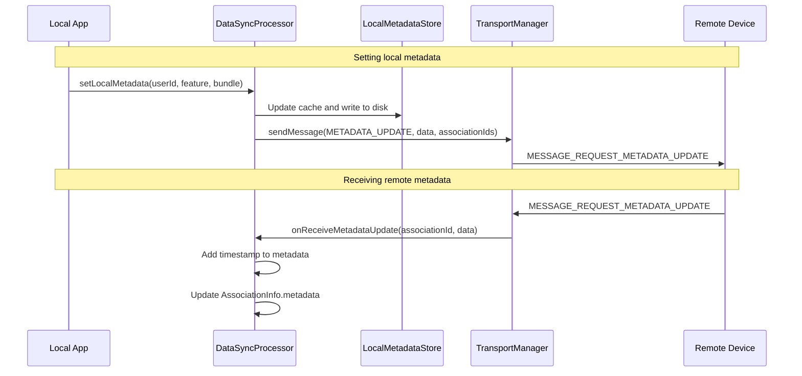

### 51.3.7 Cross-Device Call Sync

The `CrossDeviceSyncController` enables call metadata to be synchronized
between paired devices. This allows a smartwatch to show incoming calls from the
phone, or a phone to display calls from a wearable:

```
frameworks/base/services/companion/java/com/android/server/companion/datatransfer/contextsync/
    CrossDeviceSyncController.java
    CallMetadataSyncData.java
    CallMetadataSyncConnectionService.java
    CallMetadataSyncInCallService.java
    CrossDeviceCall.java
    CrossDeviceSyncControllerCallback.java
```

The controller manages:

- **Phone account registration** -- creating virtual phone accounts for
  remote devices.

- **Call metadata exchange** -- syncing call state, caller info, and
  facilitator data via `MESSAGE_REQUEST_CONTEXT_SYNC`.

- **Bidirectional call control** -- allowing either device to answer, reject,
  or end calls.

### 51.3.8 Task Continuity

The `TaskContinuityManagerService` (copyright 2025) is a newer feature that
enables seamless task handoff between paired devices:

```
frameworks/base/services/companion/java/com/android/server/companion/datatransfer/continuity/
    TaskContinuityManagerService.java
    TaskBroadcaster.java
    UniversalClipboardService.java
    connectivity/
    handoff/
    messages/
    tasks/
```

The service components:

```java
public final class TaskContinuityManagerService
    extends SystemService implements TaskContinuityMessenger.Listener {

    private InboundHandoffRequestController mInboundHandoffRequestController;
    private OutboundHandoffRequestController mOutboundHandoffRequestController;
    private TaskContinuityManagerServiceImpl mTaskContinuityManagerService;
    private TaskBroadcaster mTaskBroadcaster;
    private TaskContinuityMessenger mTaskContinuityMessenger;
    private RemoteTaskStore mRemoteTaskStore;
}
```

Source:
`TaskContinuityManagerService.java`, lines 56-66.

The service publishes a binder service under `Context.TASK_CONTINUITY_SERVICE`
and provides APIs for:

- **Registering remote task listeners** (requires `READ_REMOTE_TASKS` permission)
- **Requesting task handoff** (requires `REQUEST_TASK_HANDOFF` permission)

Task continuity messages flow through the CDM transport using
`MESSAGE_ONEWAY_TASK_CONTINUITY`. The message types include:

- `ContinuityDeviceConnected` -- notifies that a continuity-capable device
  has connected.

- `HandoffRequestMessage` / `HandoffRequestResultMessage` -- request/response
  for task transfer.

- `RemoteTaskAddedMessage` / `RemoteTaskUpdatedMessage` / `RemoteTaskRemovedMessage`
  -- remote task list synchronization.

---

## 51.4 VirtualDeviceManager

### 51.4.1 Service Architecture

The `VirtualDeviceManagerService` is the system service that manages virtual
devices. It lives alongside CDM but serves a different purpose: while CDM
manages the _association_ with companion hardware, VDM manages the _virtual
representation_ of that hardware within the Android framework.

```
frameworks/base/services/companion/java/com/android/server/companion/virtual/
    VirtualDeviceManagerService.java   (~1070 lines)
    VirtualDeviceImpl.java             (~1872 lines)
    GenericWindowPolicyController.java (~482 lines)
    InputController.java               (~226 lines)
    SensorController.java              (~391 lines)
    CameraAccessController.java        (~335 lines)
    VirtualDeviceLog.java
    PermissionUtils.java
    ViewConfigurationController.java
    audio/
    camera/
    computercontrol/
```

The service architecture:

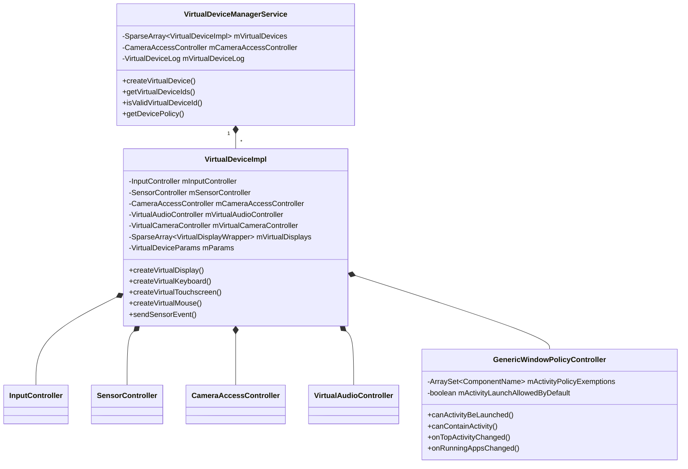

### 51.4.2 Virtual Device Creation

Creating a virtual device requires an existing CDM association. The
`VirtualDeviceManagerService` validates this relationship during creation.

The service exposes its Binder interface via an inner `LocalService` class and
a public Binder stub. The creation flow:

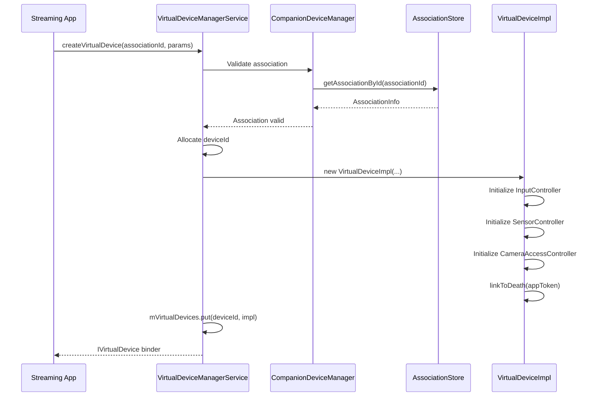

### 51.4.3 VirtualDeviceImpl -- The Device Instance

`VirtualDeviceImpl` (1872 lines) is the concrete implementation of a single
virtual device. It extends `IVirtualDevice.Stub` and implements
`IBinder.DeathRecipient` to auto-cleanup when the owning app dies.

The constructor initializes all subsystem controllers:

```java
VirtualDeviceImpl(
        Context context,
        AssociationInfo associationInfo,
        VirtualDeviceManagerService service,
        VirtualDeviceLog virtualDeviceLog,
        IBinder token,
        AttributionSource attributionSource,
        int deviceId,
        CameraAccessController cameraAccessController,
        PendingTrampolineCallback pendingTrampolineCallback,
        IVirtualDeviceActivityListener activityListener,
        IVirtualDeviceSoundEffectListener soundEffectListener,
        VirtualDeviceParams params) {
```

Source:
`VirtualDeviceImpl.java`, lines 426-438.

Key initialization details:

1. **Default display flags** for all virtual displays on this device:

```java
private static final int DEFAULT_VIRTUAL_DISPLAY_FLAGS =
        DisplayManager.VIRTUAL_DISPLAY_FLAG_TOUCH_FEEDBACK_DISABLED
                | DisplayManager.VIRTUAL_DISPLAY_FLAG_DESTROY_CONTENT_ON_REMOVAL
                | DisplayManager.VIRTUAL_DISPLAY_FLAG_SUPPORTS_TOUCH
                | DisplayManager.VIRTUAL_DISPLAY_FLAG_OWN_FOCUS;
```

Source:
`VirtualDeviceImpl.java`, lines 155-159.

2. **Persistent device ID** is derived from the CDM association:

```java
static String createPersistentDeviceId(int associationId) {
    return PERSISTENT_ID_PREFIX_CDM_ASSOCIATION + associationId;
}
```

Source:
`VirtualDeviceImpl.java`, lines 588-590.

3. **Device policies** are copied from `VirtualDeviceParams`:

```java
mDevicePolicies = params.getDevicePolicies();
```

These policies control behavior across multiple dimensions:

- `POLICY_TYPE_ACTIVITY` -- which activities can launch
- `POLICY_TYPE_AUDIO` -- audio routing behavior
- `POLICY_TYPE_CAMERA` -- camera access policy
- `POLICY_TYPE_CLIPBOARD` -- clipboard isolation
- `POLICY_TYPE_RECENTS` -- whether tasks appear in recents
- `POLICY_TYPE_BLOCKED_ACTIVITY` -- explicitly blocked activities

### 51.4.4 Device Policy Engine

The `VirtualDeviceParams` defines two policy modes:

- `DEVICE_POLICY_DEFAULT` -- framework default behavior applies.
- `DEVICE_POLICY_CUSTOM` -- the app specifies an allowlist or blocklist.

For activity launching, the policy is enforced by the
`GenericWindowPolicyController`. The VDM owner can dynamically update policies:

```java
void setActivityLaunchDefaultAllowed(boolean activityLaunchDefaultAllowed) {
    synchronized (mGenericWindowPolicyControllerLock) {
        if (mActivityLaunchAllowedByDefault != activityLaunchDefaultAllowed) {
            mActivityPolicyExemptions.clear();
            mActivityPolicyPackageExemptions.clear();
        }
        mActivityLaunchAllowedByDefault = activityLaunchDefaultAllowed;
    }
}
```

### 51.4.5 Activity Listening and Intent Interception

The `VirtualDeviceImpl` sets up a `GwpcActivityListener` that bridges
between the `GenericWindowPolicyController`'s callbacks and the client app:

```java
private class GwpcActivityListener implements GenericWindowPolicyController.ActivityListener {

    @Override
    public void onTopActivityChanged(int displayId, @NonNull ComponentName topActivity,
            @UserIdInt int userId) {
        try {
            mActivityListener.onTopActivityChanged(displayId, topActivity, userId);
        } catch (RemoteException e) {
            Slog.w(TAG, "Unable to call mActivityListener for display: " + displayId, e);
        }
    }

    @Override
    public void onDisplayEmpty(int displayId) {
        try {
            mActivityListener.onDisplayEmpty(displayId);
        } catch (RemoteException e) {
            Slog.w(TAG, "Unable to call mActivityListener for display: " + displayId, e);
        }
    }
    // ...
}
```

Source:
`VirtualDeviceImpl.java`, lines 251-270.

The intent interception mechanism allows the VDM owner to intercept specific
intents launched on virtual displays:

```java
@GuardedBy("mIntentInterceptors")
private final Map<IBinder, IntentFilter> mIntentInterceptors = new ArrayMap<>();
```

When an activity launch matches a registered filter, the launch is aborted
and the `IVirtualDeviceIntentInterceptor` callback fires with a sanitized
intent (containing only action and data, for privacy):

```java
IVirtualDeviceIntentInterceptor.Stub.asInterface(interceptor.getKey())
        .onIntentIntercepted(
                new Intent(intent.getAction(), intent.getData()));
```

Source:
`VirtualDeviceImpl.java`, lines 369-374.

### 51.4.6 Running Apps Tracking

The `GwpcActivityListener.onRunningAppsChanged()` callback maintains a
per-display and aggregate set of running UID/package pairs:

```java
@GuardedBy("mVirtualDeviceLock")
private final SparseArray<ArraySet<Pair<Integer, String>>> mRunningUidPackagePairsPerDisplay =
        new SparseArray<>();
@GuardedBy("mVirtualDeviceLock")
private ArraySet<Pair<Integer, String>> mAllRunningUidPackagePairs = new ArraySet<>();
```

Source:
`VirtualDeviceImpl.java`, lines 220-225.

When the set changes, it notifies multiple subsystems:

```java
mService.onRunningAppsChanged(
        mDeviceId, mOwnerPackageName, runningUids, newAllRunningUidPackagePairs);
if (mVirtualAudioController != null) {
    mVirtualAudioController.onRunningAppsChanged(runningUids);
}
if (mCameraAccessController != null) {
    mCameraAccessController.blockCameraAccessIfNeeded(runningUids);
}
```

Source:
`VirtualDeviceImpl.java`, lines 415-422.

### 51.4.7 Power Management

Virtual devices have their own power state, independent of the physical device.
The implementation handles lockdown (when the physical device is locked) and
explicit wake/sleep requests:

```java
void onLockdownChanged(boolean lockdownActive) {
    synchronized (mPowerLock) {
        if (lockdownActive != mLockdownActive) {
            mLockdownActive = lockdownActive;
            if (mLockdownActive) {
                goToSleepInternal(PowerManager.GO_TO_SLEEP_REASON_DISPLAY_GROUPS_TURNED_OFF);
            } else if (mRequestedToBeAwake) {
                wakeUpInternal(PowerManager.WAKE_REASON_DISPLAY_GROUP_TURNED_ON,
                        "android.server.companion.virtual:LOCKDOWN_ENDED");
            }
        }
    }
}
```

Source:
`VirtualDeviceImpl.java`, lines 562-574.

The `LOCK_STATE_ALWAYS_UNLOCKED` option requires the
`ADD_ALWAYS_UNLOCKED_DISPLAY` permission and sets the
`VIRTUAL_DISPLAY_FLAG_ALWAYS_UNLOCKED` flag on all displays.

### 51.4.8 Mirror Displays

VDM supports mirror displays for screen sharing use cases. Creating mirror
displays requires specific device profiles and permissions:

```java
private static final List<String> DEVICE_PROFILES_ALLOWING_MIRROR_DISPLAYS = List.of(
        AssociationRequest.DEVICE_PROFILE_APP_STREAMING);
```

Source:
`VirtualDeviceImpl.java`, lines 163-164.

After Android Baklava, the `ADD_MIRROR_DISPLAY` permission is required instead
of relying on the app streaming role:

```java
@ChangeId
@EnabledAfter(targetSdkVersion = Build.VERSION_CODES.BAKLAVA)
public static final long CHECK_ADD_MIRROR_DISPLAY_PERMISSION = 378605160L;
```

Source:
`VirtualDeviceImpl.java`, lines 151-153.

### 51.4.9 Death Handling and Cleanup

Since `VirtualDeviceImpl` implements `IBinder.DeathRecipient`, it is notified
when the owning app process dies:

```java
try {
    token.linkToDeath(this, 0);
} catch (RemoteException e) {
    throw e.rethrowFromSystemServer();
}
```

Source:
`VirtualDeviceImpl.java`, lines 537-540.

When the death callback fires, the device performs a comprehensive cleanup:
closing all virtual displays, releasing all input devices, stopping the audio
controller, removing sensors, closing camera injection sessions, and
unregistering from the service's device map.

---

## 51.5 Virtual Device Subsystems

### 51.5.1 InputController

The `InputController` manages the lifecycle of virtual input devices on a
virtual device:

```
frameworks/base/services/companion/java/com/android/server/companion/virtual/
    InputController.java
```

It creates and tracks virtual input devices via `InputManagerInternal`:

```java
class InputController {
    @GuardedBy("mLock")
    private final ArrayMap<IBinder, IVirtualInputDevice> mInputDevices = new ArrayMap<>();

    private final InputManagerInternal mInputManagerInternal;
    private final InputManager mInputManager;
    private final WindowManager mWindowManager;
```

Source:
`InputController.java`, lines 47-57.

The controller supports seven types of virtual input devices:

| Method                      | Device Type              | Metrics Counter Key                                      |
|-----------------------------|--------------------------|----------------------------------------------------------|
| `createDpad()`              | Virtual D-pad            | `virtual_devices.value_virtual_dpad_created_count`       |
| `createKeyboard()`          | Virtual Keyboard         | `virtual_devices.value_virtual_keyboard_created_count`   |
| `createMouse()`             | Virtual Mouse            | `virtual_devices.value_virtual_mouse_created_count`      |
| `createTouchscreen()`       | Virtual Touchscreen      | `virtual_devices.value_virtual_touchscreen_created_count`|
| `createNavigationTouchpad()`| Navigation Touchpad      | `virtual_devices.value_virtual_navigationtouchpad_created_count` |
| `createStylus()`            | Virtual Stylus           | `virtual_devices.value_virtual_stylus_created_count`     |
| `createRotaryEncoder()`     | Rotary Encoder           | `virtual_devices.value_virtual_rotary_created_count`     |

Each creation follows the same pattern:

```java
IVirtualInputDevice createKeyboard(@NonNull IBinder token,
        @NonNull VirtualKeyboardConfig config) {
    IVirtualInputDevice device = mInputManagerInternal.createVirtualKeyboard(token, config);
    Counter.logIncrementWithUid("virtual_devices.value_virtual_keyboard_created_count",
            mAttributionSource.getUid());
    addDevice(token, device);
    return device;
}
```

Source:
`InputController.java`, lines 93-100.

The `close()` method iterates over all tracked devices and closes them via
`InputManagerInternal`:

```java
void close() {
    mInputManager.unregisterInputDeviceListener(mInputDeviceListener);
    synchronized (mLock) {
        final Iterator<Map.Entry<IBinder, IVirtualInputDevice>> iterator =
                mInputDevices.entrySet().iterator();
        while (iterator.hasNext()) {
            final Map.Entry<IBinder, IVirtualInputDevice> entry = iterator.next();
            final IBinder token = entry.getKey();
            iterator.remove();
            mInputManagerInternal.closeVirtualInputDevice(token);
        }
    }
}
```

Source:
`InputController.java`, lines 71-83.

Additional display-level settings are managed through the controller:

```java
void setShowPointerIcon(boolean visible, int displayId);
void setMouseScalingEnabled(boolean enabled, int displayId);
void setDisplayEligibilityForPointerCapture(boolean isEligible, int displayId);
void setDisplayImePolicy(int displayId, @WindowManager.DisplayImePolicy int policy);
```

### 51.5.2 SensorController

The `SensorController` manages virtual sensors that can feed sensor data from
a companion device into the Android sensor framework:

```
frameworks/base/services/companion/java/com/android/server/companion/virtual/
    SensorController.java
```

The controller creates "runtime sensors" via `SensorManagerInternal`:

```java
final int handle = mSensorManagerInternal.createRuntimeSensor(mVirtualDeviceId,
        config.getType(), config.getName(),
        config.getVendor() == null ? "" : config.getVendor(), config.getMaximumRange(),
        config.getResolution(), config.getPower(), config.getMinDelay(),
        config.getMaxDelay(), config.getFlags(), mRuntimeSensorCallback);
```

Source:
`SensorController.java`, lines 131-135.

Each sensor is tracked by two data structures:

```java
@GuardedBy("mLock")
private final ArrayMap<IBinder, SensorDescriptor> mSensorDescriptors = new ArrayMap<>();

@GuardedBy("mLock")
private SparseArray<VirtualSensor> mVirtualSensors = new SparseArray<>();
```

The `SensorDescriptor` is a simple value class:

```java
static final class SensorDescriptor {
    private final int mHandle;
    private final int mType;
    private final String mName;
}
```

Source:
`SensorController.java`, lines 355-365.

Sending sensor events goes through the native sensor infrastructure:

```java
boolean sendSensorEvent(@NonNull IBinder token, @NonNull VirtualSensorEvent event) {
    synchronized (mLock) {
        final SensorDescriptor sensorDescriptor = mSensorDescriptors.get(token);
        return mSensorManagerInternal.sendSensorEvent(
                sensorDescriptor.getHandle(), sensorDescriptor.getType(),
                event.getTimestampNanos(), event.getValues());
    }
}
```

Source:
`SensorController.java`, lines 156-168.

The controller also supports sensor additional info (e.g., calibration data):

```java
boolean sendSensorAdditionalInfo(@NonNull IBinder token,
        @NonNull VirtualSensorAdditionalInfo info) {
    // Wraps additional info in FRAME_BEGIN / data / FRAME_END
    mSensorManagerInternal.sendSensorAdditionalInfo(
            sensorDescriptor.getHandle(), SensorAdditionalInfo.TYPE_FRAME_BEGIN, ...);
    for (int i = 0; i < info.getValues().size(); ++i) {
        mSensorManagerInternal.sendSensorAdditionalInfo(
                sensorDescriptor.getHandle(), info.getType(), /* serial= */ i, ...);
    }
    mSensorManagerInternal.sendSensorAdditionalInfo(
            sensorDescriptor.getHandle(), SensorAdditionalInfo.TYPE_FRAME_END, ...);
}
```

Source:
`SensorController.java`, lines 170-199.

The `RuntimeSensorCallbackWrapper` bridges framework sensor configuration
requests back to the VDM client:

```java
private final class RuntimeSensorCallbackWrapper
        implements SensorManagerInternal.RuntimeSensorCallback {

    @Override
    public int onConfigurationChanged(int handle, boolean enabled,
            int samplingPeriodMicros, int batchReportLatencyMicros) {
        VirtualSensor sensor = mVdmInternal.getVirtualSensor(mVirtualDeviceId, handle);
        mCallback.onConfigurationChanged(sensor, enabled, samplingPeriodMicros,
                batchReportLatencyMicros);
        return OK;
    }
}
```

Source:
`SensorController.java`, lines 246-280.

Direct sensor channels are also supported, allowing high-rate sensor data to
be shared via shared memory:

```java
@Override
public int onDirectChannelCreated(ParcelFileDescriptor fd) {
    SharedMemory sharedMemory = SharedMemory.fromFileDescriptor(fd);
    final int channelHandle = sNextDirectChannelHandle.getAndIncrement();
    mCallback.onDirectChannelCreated(channelHandle, sharedMemory);
    return channelHandle;
}
```

Source:
`SensorController.java`, lines 283-307.

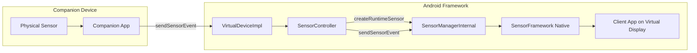

### 51.5.3 CameraAccessController

The `CameraAccessController` enforces camera access policies for apps running
on virtual displays. It blocks camera access using the camera injection
framework:

```
frameworks/base/services/companion/java/com/android/server/companion/virtual/
    CameraAccessController.java
```

The controller extends `CameraManager.AvailabilityCallback`:

```java
class CameraAccessController extends CameraManager.AvailabilityCallback
        implements AutoCloseable {
```

Source:
`CameraAccessController.java`, line 45.

It uses a reference-counting mechanism for observers:

```java
public void startObservingIfNeeded() {
    synchronized (mObserverLock) {
        if (mObserverCount == 0) {
            mCameraManager.registerAvailabilityCallback(mContext.getMainExecutor(), this);
        }
        mObserverCount++;
    }
}
```

Source:
`CameraAccessController.java`, lines 121-128.

When a camera is opened (`onCameraOpened`), the controller checks if the
opening app is running on any virtual device:

```java
@Override
public void onCameraOpened(@NonNull String cameraId, @NonNull String packageName) {
    synchronized (mLock) {
        // ...
        if (mVirtualDeviceManagerInternal != null
                && mVirtualDeviceManagerInternal.isAppRunningOnAnyVirtualDevice(appUid)) {
            startBlocking(packageName, cameraId);
            return;
        }
        // Track for future blocking if app moves to virtual display
        OpenCameraInfo openCameraInfo = new OpenCameraInfo();
        openCameraInfo.packageName = packageName;
        openCameraInfo.packageUids = packageUids;
        mAppsToBlockOnVirtualDevice.put(cameraId, openCameraInfo);
    }
}
```

Source:
`CameraAccessController.java`, lines 196-236.

Blocking is implemented through camera injection -- injecting a non-existent
external camera ID, which effectively disconnects the app from the real camera:

```java
private void startBlocking(String packageName, String cameraId) {
    mCameraManager.injectCamera(packageName, cameraId, /* externalCamId */ "",
            mContext.getMainExecutor(),
            new CameraInjectionSession.InjectionStatusCallback() {
                @Override
                public void onInjectionSucceeded(@NonNull CameraInjectionSession session) {
                    CameraAccessController.this.onInjectionSucceeded(cameraId, packageName,
                            session);
                }
                @Override
                public void onInjectionError(@NonNull int errorCode) {
                    CameraAccessController.this.onInjectionError(cameraId, packageName,
                            errorCode);
                }
            });
}
```

Source:
`CameraAccessController.java`, lines 260-286.

The `ERROR_INJECTION_UNSUPPORTED` error is expected and means the camera was
successfully blocked (no external camera to map to). A callback notifies the
VDM owner:

```java
if (errorCode != ERROR_INJECTION_UNSUPPORTED) {
    Slog.e(TAG, "Unexpected injection error code:" + errorCode);
    return;
}
synchronized (mLock) {
    InjectionSessionData data = mPackageToSessionData.get(packageName);
    if (data != null) {
        mBlockedCallback.onCameraAccessBlocked(data.appUid);
    }
}
```

Source:
`CameraAccessController.java`, lines 307-320.

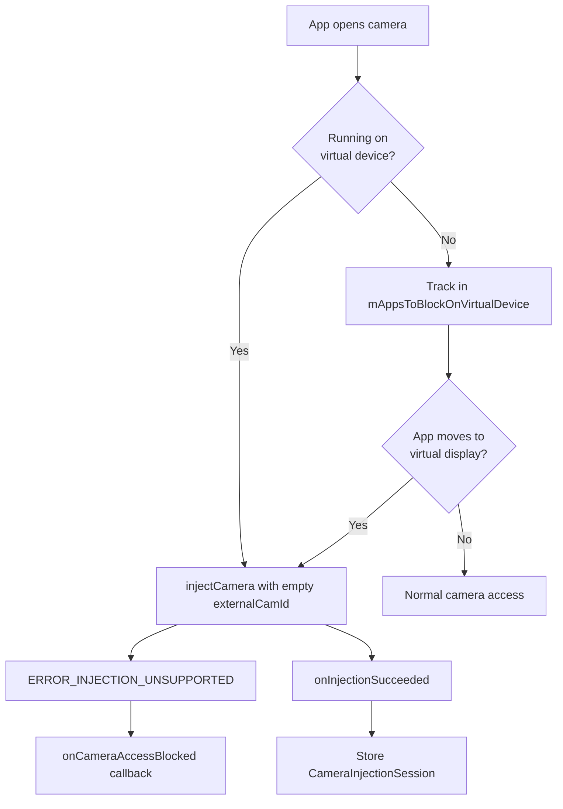

### 51.5.4 VirtualAudioController

The `VirtualAudioController` manages audio routing for apps running on virtual
displays:

```
frameworks/base/services/companion/java/com/android/server/companion/virtual/audio/
    VirtualAudioController.java
    AudioPlaybackDetector.java
    AudioRecordingDetector.java
```

The controller implements both audio playback and recording callbacks:

```java
public final class VirtualAudioController
        implements AudioPlaybackCallback, AudioRecordingCallback {
```

Source:
`VirtualAudioController.java`, line 52.

The key challenge is avoiding audio leaks during transitions. When an app moves
to or from a virtual display, its audio must be re-routed without any sound
leaking through the physical speaker. The controller uses a delay mechanism:

```java
private static final int UPDATE_REROUTING_APPS_DELAY_MS = 2000;

public void onRunningAppsChanged(@NonNull ArraySet<Integer> runningUids) {
    synchronized (mLock) {
        // ...
        // Do not change rerouted applications while any application is playing
        if (!mPlayingAppUids.isEmpty()) {
            Slog.i(TAG, "Audio is playing, do not change rerouted apps");
            return;
        }

        // An application previously playing audio was removed from the display.
        if (!oldPlayingAppUids.isEmpty()) {
            Slog.i(TAG, "The last playing app removed, delay change rerouted apps");
            mHandler.postDelayed(mUpdateAudioRoutingRunnable, UPDATE_REROUTING_APPS_DELAY_MS);
            return;
        }
    }

    notifyAppsNeedingAudioRoutingChanged();
}
```

Source:
`VirtualAudioController.java`, lines 129-175.

The routing notification sends the list of UIDs that need audio re-routing
to the client via `IAudioRoutingCallback`:

```java
private void notifyAppsNeedingAudioRoutingChanged() {
    int[] runningUids;
    synchronized (mLock) {
        runningUids = new int[mRunningAppUids.size()];
        for (int i = 0; i < mRunningAppUids.size(); i++) {
            runningUids[i] = mRunningAppUids.valueAt(i);
        }
    }
    synchronized (mCallbackLock) {
        if (mRoutingCallback != null) {
            mRoutingCallback.onAppsNeedingAudioRoutingChanged(runningUids);
        }
    }
}
```

Source:
`VirtualAudioController.java`, lines 231-253.

The controller also forwards playback and recording configuration changes
to the client via `IAudioConfigChangedCallback`:

```java
@Override
public void onPlaybackConfigChanged(List<AudioPlaybackConfiguration> configs) {
    updatePlayingApplications(configs);
    List<AudioPlaybackConfiguration> audioPlaybackConfigurations;
    synchronized (mLock) {
        audioPlaybackConfigurations = findPlaybackConfigurations(configs, mRunningAppUids);
    }
    synchronized (mCallbackLock) {
        if (mConfigChangedCallback != null) {
            mConfigChangedCallback.onPlaybackConfigChanged(audioPlaybackConfigurations);
        }
    }
}
```

Source:
`VirtualAudioController.java`, lines 177-195.

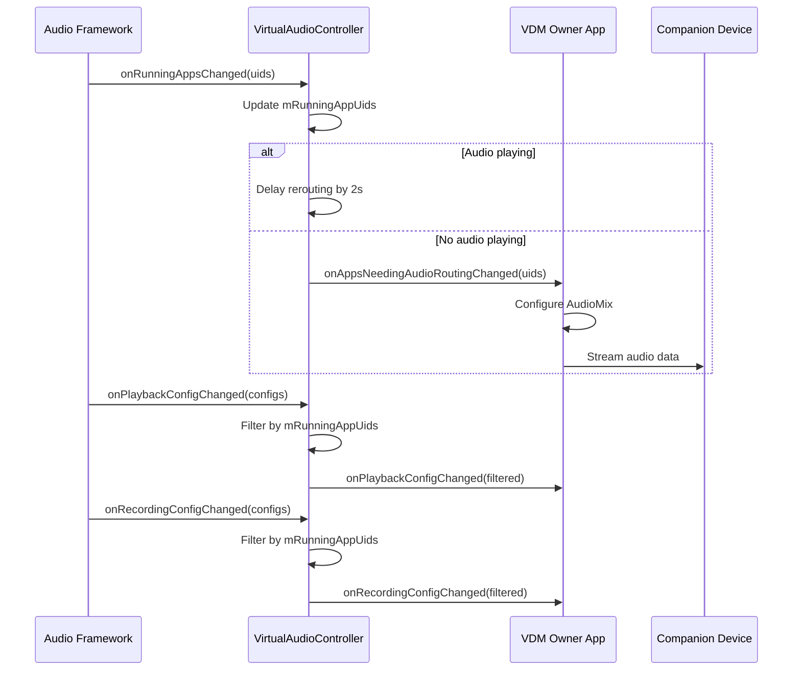

---

## 51.6 Virtual Device and Display Integration

### 51.6.1 Virtual Display Creation

Virtual displays are created through `VirtualDeviceImpl` and wrapped in a
`VirtualDisplayWrapper` that tracks the associated
`GenericWindowPolicyController`:

```java
@GuardedBy("mVirtualDeviceLock")
private final SparseArray<VirtualDisplayWrapper> mVirtualDisplays = new SparseArray<>();
```

The display creation process:

1. The VDM owner calls `createVirtualDisplay()` on their `IVirtualDevice`.
2. `VirtualDeviceImpl` constructs a `VirtualDisplayConfig` with the base flags
   plus any additional flags from the request.

3. A new `GenericWindowPolicyController` is created for this display.
4. The display is created via `DisplayManagerGlobal`.
5. The policy controller is registered with the display via
   `setDisplayId()`.

The default flags ensure the virtual display:

- Does **not** provide touch feedback (haptics).
- Destroys content when the display is removed.
- Supports touch input.
- Has its own focus (independent of the default display).

### 51.6.2 GenericWindowPolicyController -- Activity Policy Enforcement

The `GenericWindowPolicyController` is the gatekeeper that decides which
activities can launch on a virtual display. It extends
`DisplayWindowPolicyController` and is consulted by WindowManager for every
activity launch:

```
frameworks/base/services/companion/java/com/android/server/companion/virtual/
    GenericWindowPolicyController.java
```

The policy enforcement chain for `canContainActivity()`:

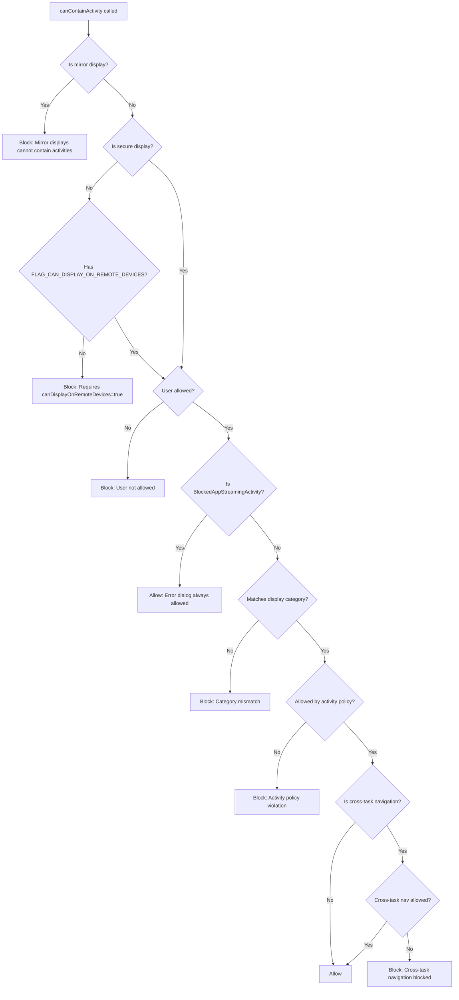

Implementation:

```java
@Override
public boolean canContainActivity(@NonNull ActivityInfo activityInfo,
        @WindowConfiguration.WindowingMode int windowingMode, int launchingFromDisplayId,
        boolean isNewTask) {
    // Mirror displays cannot contain activities.
    if (waitAndGetIsMirrorDisplay()) {
        return false;
    }
    if (!mIsSecureDisplay && (activityInfo.flags & FLAG_CAN_DISPLAY_ON_REMOTE_DEVICES) == 0) {
        return false;
    }
    final UserHandle activityUser =
            UserHandle.getUserHandleForUid(activityInfo.applicationInfo.uid);
    if (!activityUser.isSystem() && !mAllowedUsers.contains(activityUser)) {
        return false;
    }
    // ...
    if (!isAllowedByPolicy(activityComponent)) {
        return false;
    }
    if (isNewTask && launchingFromDisplayId != DEFAULT_DISPLAY
            && !isAllowedByPolicy(mCrossTaskNavigationAllowedByDefault,
                    mCrossTaskNavigationExemptions, activityComponent)) {
        return false;
    }
    return true;
}
```

Source:
`GenericWindowPolicyController.java`, lines 299-348.

The policy logic is an XOR pattern:

```java
private boolean isAllowedByPolicy(ComponentName component) {
    synchronized (mGenericWindowPolicyControllerLock) {
        if (mActivityPolicyExemptions.contains(component)
                || mActivityPolicyPackageExemptions.contains(component.getPackageName())) {
            return !mActivityLaunchAllowedByDefault;
        }
        return mActivityLaunchAllowedByDefault;
    }
}
```

Source:
`GenericWindowPolicyController.java`, lines 466-474.

When `mActivityLaunchAllowedByDefault` is `true`, the exemptions list acts as
a **blocklist**. When `false`, the exemptions act as an **allowlist**.

### 51.6.3 Secure Window Handling

When a window with `FLAG_SECURE` appears on a virtual display, the policy
controller notifies the VDM owner and optionally blocks the window:

```java
@Override
public boolean keepActivityOnWindowFlagsChanged(ActivityInfo activityInfo, int windowFlags,
        int systemWindowFlags) {
    if ((windowFlags & FLAG_SECURE) != 0 && (mCurrentWindowFlags & FLAG_SECURE) == 0) {
        mHandler.post(
                () -> mActivityListener.onSecureWindowShown(displayId, activityInfo));
    }
    if ((windowFlags & FLAG_SECURE) == 0 && (mCurrentWindowFlags & FLAG_SECURE) != 0) {
        mHandler.post(() -> mActivityListener.onSecureWindowHidden(displayId));
    }
    mCurrentWindowFlags = windowFlags;

    if (!CompatChanges.isChangeEnabled(ALLOW_SECURE_ACTIVITY_DISPLAY_ON_REMOTE_DEVICE, ...)) {
        if ((windowFlags & FLAG_SECURE) != 0
                || (systemWindowFlags & SYSTEM_FLAG_HIDE_NON_SYSTEM_OVERLAY_WINDOWS) != 0) {
            notifyActivityBlocked(activityInfo, null);
            return false;
        }
    }
    return true;
}
```

Source:
`GenericWindowPolicyController.java`, lines 355-386.

For apps targeting Tiramisu or later, the `FLAG_SECURE` check can be opted
into via the `ALLOW_SECURE_ACTIVITY_DISPLAY_ON_REMOTE_DEVICE` compatibility
change (ID `201712607`).

### 51.6.4 Display Categories

Virtual displays can be tagged with categories, and activities can declare
required display categories. The matching logic:

```java
private boolean activityMatchesDisplayCategory(ActivityInfo activityInfo) {
    if (mDisplayCategories.isEmpty()) {
        return activityInfo.requiredDisplayCategory == null;
    }
    return activityInfo.requiredDisplayCategory != null
                && mDisplayCategories.contains(activityInfo.requiredDisplayCategory);
}
```

Source:
`GenericWindowPolicyController.java`, lines 444-450.

This enables specialized displays (e.g., a "AUTOMOTIVE" category display
that only shows automotive-flagged activities).

### 51.6.5 Recents Integration

The `showTasksInHostDeviceRecents` parameter controls whether activities
running on virtual displays appear in the host device's recent apps:

```java
@Override
public boolean canShowTasksInHostDeviceRecents() {
    synchronized (mGenericWindowPolicyControllerLock) {
        return mShowTasksInHostDeviceRecents;
    }
}
```

Source:
`GenericWindowPolicyController.java`, lines 419-423.

This can be dynamically updated:

```java
public void setShowInHostDeviceRecents(boolean showInHostDeviceRecents) {
    synchronized (mGenericWindowPolicyControllerLock) {
        mShowTasksInHostDeviceRecents = showInHostDeviceRecents;
    }
}
```

### 51.6.6 Custom Home Activity

Virtual displays can specify a custom home activity component:

```java
@Override
public @Nullable ComponentName getCustomHomeComponent() {
    return mCustomHomeComponent;
}
```

Source:
`GenericWindowPolicyController.java`, lines 425-427.

This is applicable only to displays that support home activities (created with
the relevant virtual display flags). If null, the system-default secondary
home activity is used.

### 51.6.7 App Streaming Architecture

Putting it all together, app streaming from a phone to a companion device
follows this architecture:

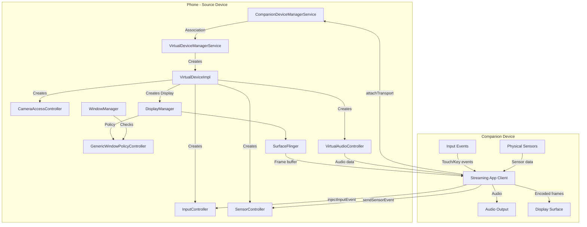

### 51.6.8 The Complete Lifecycle

The complete lifecycle of a virtual device session:

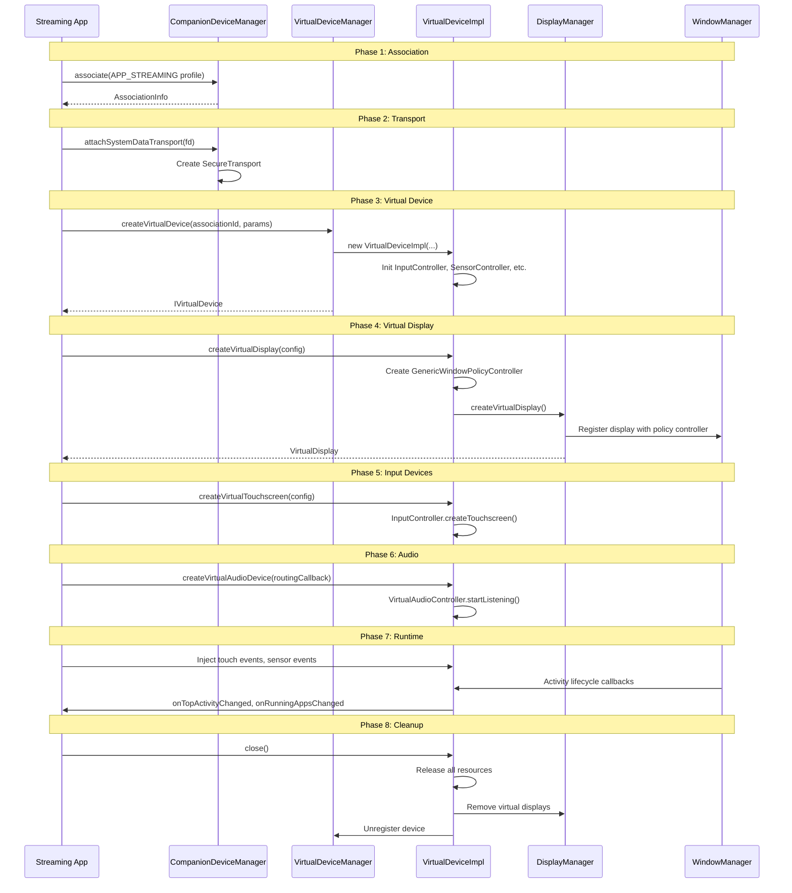

---

## 51.7 Try It

### 51.7.1 Inspect Companion Device Associations

List all associations for user 0:

```bash
adb shell cmd companiondevice list 0
```

Sample output:

```
Association{id=1,
  userId=0,
  packageName=com.google.android.gms,
  deviceMacAddress=AA:BB:CC:DD:EE:FF,
  displayName=Pixel Watch,
  deviceProfile=android.app.role.COMPANION_DEVICE_WATCH,
  selfManaged=false,
  notifyOnDeviceNearby=true,
  revoked=false,
  pending=false,
  timeApproved=1710000000000,
  lastTimeConnected=1710100000000}
```

### 51.7.2 Create a Test Association via Shell

Create a self-managed association for testing:

```bash
adb shell cmd companiondevice associate \
    --userId 0 \
    --package com.example.myapp \
    --self-managed \
    --display-name "Test Device"
```

### 51.7.3 Inspect Virtual Devices

Dump the state of all virtual devices:

```bash
adb shell dumpsys companion_device_manager
```

This outputs the full state including:

- Active associations
- Active transports
- Virtual devices and their displays
- Input devices per virtual device
- Sensor controllers

For virtual device-specific information:

```bash
adb shell dumpsys companion_device_manager virtual_devices
```

### 51.7.4 Using the VirtualDeviceManager API

To create a virtual device programmatically, an app needs:

1. A CDM association with an appropriate device profile.
2. The `CREATE_VIRTUAL_DEVICE` permission (normal permission).
3. For certain features, additional permissions:
   - `ADD_TRUSTED_DISPLAY` for clipboard policy customization.
   - `ADD_ALWAYS_UNLOCKED_DISPLAY` for always-unlocked displays.
   - `ADD_MIRROR_DISPLAY` for mirror displays.
   - `ACCESS_COMPUTER_CONTROL` for computer control features.

Example code flow:

```java
// Step 1: Create a CompanionDeviceManager association
CompanionDeviceManager cdm = getSystemService(CompanionDeviceManager.class);
AssociationRequest request = new AssociationRequest.Builder()
        .setDeviceProfile(AssociationRequest.DEVICE_PROFILE_APP_STREAMING)
        .setDisplayName("My Companion")
        .setSelfManaged(true)
        .build();
cdm.associate(request, callback, handler);

// Step 2: In the callback, create a virtual device
VirtualDeviceManager vdm = getSystemService(VirtualDeviceManager.class);
VirtualDeviceParams params = new VirtualDeviceParams.Builder()
        .setDevicePolicy(VirtualDeviceParams.POLICY_TYPE_AUDIO,
                VirtualDeviceParams.DEVICE_POLICY_CUSTOM)
        .setName("Streaming Device")
        .build();
VirtualDevice device = vdm.createVirtualDevice(associationInfo.getId(), params);

// Step 3: Create a virtual display
VirtualDisplay display = device.createVirtualDisplay(
        new VirtualDisplayConfig.Builder("MyDisplay", 1920, 1080, 240)
                .build(),
        callback, handler);

// Step 4: Create input devices
VirtualTouchscreenConfig touchConfig = new VirtualTouchscreenConfig.Builder(1920, 1080)
        .setAssociatedDisplayId(display.getDisplay().getDisplayId())
        .build();
device.createVirtualTouchscreen(touchConfig);
```

### 51.7.5 Debugging Transport Issues

To inspect active transports:

```bash
adb shell dumpsys companion_device_manager transports
```

To override the transport type for testing:

```bash
# Force raw (unencrypted) transport
adb shell cmd companiondevice override-transport-type 1

# Force secure transport
adb shell cmd companiondevice override-transport-type 2

# Reset to default
adb shell cmd companiondevice override-transport-type 0
```

### 51.7.6 Inspecting Window Policy

To see which activities are blocked on virtual displays:

```bash
adb logcat -s GenericWindowPolicyController
```

Look for log messages like:

```
D GenericWindowPolicyController: Virtual device activity launch disallowed
    on display 2, reason: Activity launch disallowed by policy: com.example/.SecretActivity
```

### 51.7.7 Testing Sensor Injection

Virtual sensors appear in the standard sensor list. To verify:

```bash
adb shell dumpsys sensorservice
```

Virtual sensors created through VDM will show up with the device ID and
name specified in the `VirtualSensorConfig`.

### 51.7.8 Monitoring Audio Routing

To monitor audio routing changes for virtual devices:

```bash
adb logcat -s VirtualAudioController
```

Key messages to watch for:

```
I VirtualAudioController: Audio is playing, do not change rerouted apps
I VirtualAudioController: The last playing app removed, delay change rerouted apps
```

### 51.7.9 Camera Access Blocking

To monitor camera blocking on virtual devices:

```bash
adb logcat -s CameraAccessController
```

Look for:

```
D CameraAccessController: startBlocking() cameraId: 0 packageName: com.example.camera
```

### 51.7.10 Key Source Files Reference

For quick reference, here are all the key source files discussed in this
chapter, organized by subsystem:

**CompanionDeviceManager Core:**

| File | Path |
|------|------|
| Service entry point | `frameworks/base/services/companion/java/com/android/server/companion/CompanionDeviceManagerService.java` |
| Internal API | `frameworks/base/services/companion/java/com/android/server/companion/CompanionDeviceManagerServiceInternal.java` |
| Shell commands | `frameworks/base/services/companion/java/com/android/server/companion/CompanionDeviceShellCommand.java` |
| Configuration | `frameworks/base/services/companion/java/com/android/server/companion/CompanionDeviceConfig.java` |

**Association:**

| File | Path |
|------|------|
| Request processing | `frameworks/base/services/companion/java/com/android/server/companion/association/AssociationRequestsProcessor.java` |
| CRUD store | `frameworks/base/services/companion/java/com/android/server/companion/association/AssociationStore.java` |
| Disk persistence | `frameworks/base/services/companion/java/com/android/server/companion/association/AssociationDiskStore.java` |
| Disassociation | `frameworks/base/services/companion/java/com/android/server/companion/association/DisassociationProcessor.java` |
| Idle cleanup | `frameworks/base/services/companion/java/com/android/server/companion/association/InactiveAssociationsRemovalService.java` |

**Transport and Security:**

| File | Path |
|------|------|
| Transport base | `frameworks/base/services/companion/java/com/android/server/companion/transport/Transport.java` |
| Raw transport | `frameworks/base/services/companion/java/com/android/server/companion/transport/RawTransport.java` |
| Secure transport | `frameworks/base/services/companion/java/com/android/server/companion/transport/SecureTransport.java` |
| Transport manager | `frameworks/base/services/companion/java/com/android/server/companion/transport/CompanionTransportManager.java` |
| Secure channel | `frameworks/base/services/companion/java/com/android/server/companion/securechannel/SecureChannel.java` |
| Attestation verifier | `frameworks/base/services/companion/java/com/android/server/companion/securechannel/AttestationVerifier.java` |

**Device Presence:**

| File | Path |
|------|------|
| Presence processor | `frameworks/base/services/companion/java/com/android/server/companion/devicepresence/DevicePresenceProcessor.java` |
| BLE processor | `frameworks/base/services/companion/java/com/android/server/companion/devicepresence/BleDeviceProcessor.java` |
| Bluetooth processor | `frameworks/base/services/companion/java/com/android/server/companion/devicepresence/BluetoothDeviceProcessor.java` |
| App binder | `frameworks/base/services/companion/java/com/android/server/companion/devicepresence/CompanionAppBinder.java` |

**Data Transfer:**

| File | Path |
|------|------|
| Permission sync | `frameworks/base/services/companion/java/com/android/server/companion/datatransfer/SystemDataTransferProcessor.java` |
| Context sync | `frameworks/base/services/companion/java/com/android/server/companion/datatransfer/contextsync/CrossDeviceSyncController.java` |
| Task continuity | `frameworks/base/services/companion/java/com/android/server/companion/datatransfer/continuity/TaskContinuityManagerService.java` |

**VirtualDeviceManager:**

| File | Path |
|------|------|
| VDM service | `frameworks/base/services/companion/java/com/android/server/companion/virtual/VirtualDeviceManagerService.java` |
| Device impl | `frameworks/base/services/companion/java/com/android/server/companion/virtual/VirtualDeviceImpl.java` |
| Window policy | `frameworks/base/services/companion/java/com/android/server/companion/virtual/GenericWindowPolicyController.java` |
| Input controller | `frameworks/base/services/companion/java/com/android/server/companion/virtual/InputController.java` |
| Sensor controller | `frameworks/base/services/companion/java/com/android/server/companion/virtual/SensorController.java` |
| Camera controller | `frameworks/base/services/companion/java/com/android/server/companion/virtual/CameraAccessController.java` |
| Audio controller | `frameworks/base/services/companion/java/com/android/server/companion/virtual/audio/VirtualAudioController.java` |

---

## Summary

The CompanionDeviceManager and VirtualDeviceManager together form a
comprehensive framework for multi-device Android experiences:

- **CDM** handles the trust relationship: discovery, user consent, association
  persistence, presence detection, secure transport, and data synchronization.
  Its modular processor architecture keeps each concern isolated while the
  `AssociationStore` provides a unified data layer with change notification.

- **VDM** handles the virtual representation: creating virtual displays with
  fine-grained activity policies, injecting input from remote hardware, routing
  audio to/from companion devices, providing virtual sensors, and controlling
  camera access. The `GenericWindowPolicyController` enforces security at the
  WindowManager level, ensuring that only authorized activities can appear on
  virtual surfaces.

- The **transport layer** ties them together: UKEY2-encrypted channels with
  attestation verification carry permission sync data, call metadata, task
  handoff messages, and custom application data between paired devices.

- The **security model** is layered: CDM permissions gate association creation,
  device profiles control role grants, transport encryption protects data
  in transit, camera injection blocks unauthorized hardware access, and window
  policies prevent sensitive activities from leaking to remote displays.

This architecture enables use cases ranging from smartwatch pairing to full
desktop-class app streaming, all built on the same foundational infrastructure.
