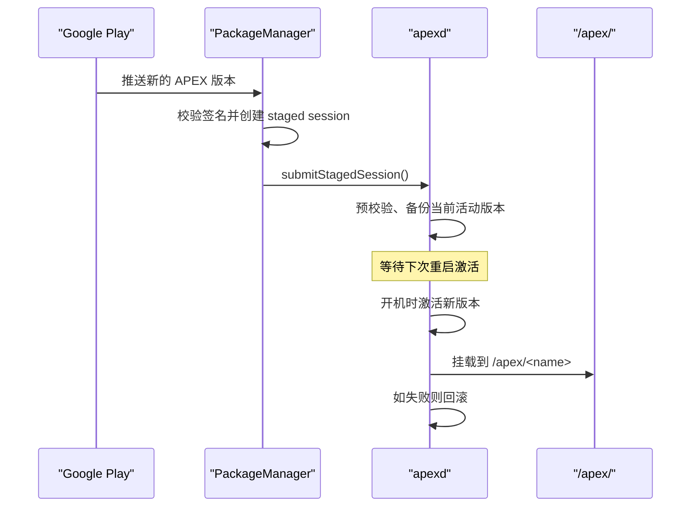
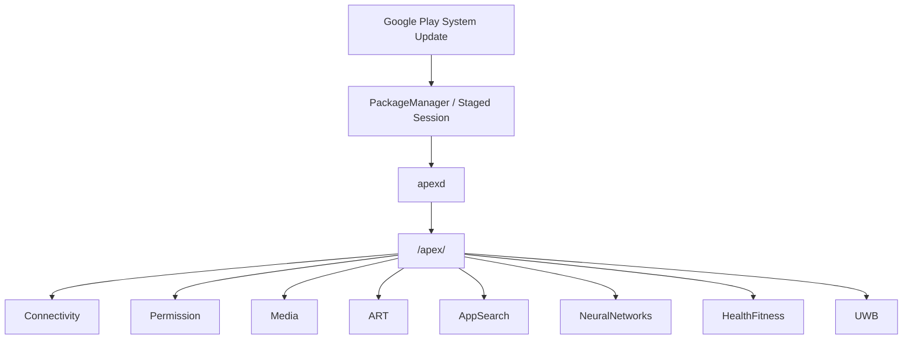
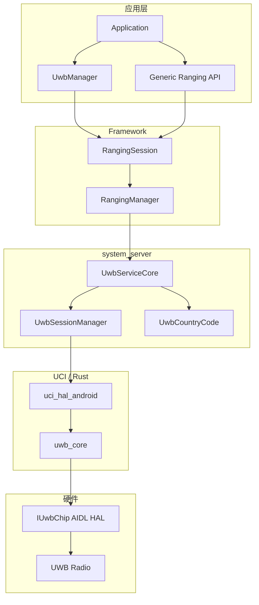

# 第 52 章：Mainline Modules

传统 Android 更新长期依赖整机 OTA：安全补丁、漏洞修复、API 改进都要经过 OEM 合并、运营商认证和设备推送，最终常常以“数月后到达，甚至永不到达”收场。Project Mainline 的核心变化，是把平台拆成一组可以独立更新的模块，让 Google 能通过 Google Play System Update 直接向设备投递系统组件更新，而不必等待整机固件升级。

要实现这一点，Android 必须同时解决几个问题：如何封装和验证可更新的系统组件，如何在开机早期安全激活它们，如何在运行时判断某个模块版本是否存在，如何为模块划清 API 和依赖边界，以及如何让这些模块在不同 Android 版本上稳定演进。本章围绕这些问题，拆解 APEX、`apexd`、模块目录、SDK Extensions、Soong 规则、设备端安装与回滚机制，以及几个代表性模块的深入分析。

---

## 52.1 Project Mainline

### 52.1.1 问题：碎片化与补丁滞后

在 Android 10 之前，平台组件更新几乎都要走完整 OTA 流程：

1. Google 将修复提交到 AOSP。
2. OEM 把修复合入自己的设备分支。
3. 构建整机系统镜像。
4. 经过运营商或设备认证。
5. 通过 OTA 推送给终端用户。

对 DNS、媒体编解码器、权限栈这类高风险组件来说，这条链路过长，直接导致大量设备长期运行旧版本平台代码。

### 52.1.2 解决方案：模块化、可更新组件

Project Mainline 的思路是把平台切成可独立交付的模块。模块可采用两种主要形式：

- `APEX`：用于承载 native 代码、可执行文件、配置和部分 bootclasspath 内容。
- `APK`：用于纯 Java/Kotlin 类模块。

其中 APEX 是 Mainline 的核心，因为它让平台级 native 组件也能被安全更新。

### 52.1.3 设计目标

| 目标 | 机制 |
|---|---|
| 无需整机 OTA 更新系统组件 | APEX 容器格式与 `apexd` 激活 |
| 维持跨版本 ABI / API 稳定 | `@SystemApi`、隐藏 API 限制、稳定 AIDL |
| 回滚安全 | staged session、开机激活、失败回退 |
| 尽量减少 OEM 干扰 | 模块预装，后续增量更新 |
| 让应用知道运行时能力 | SDK Extensions |

### 52.1.4 历史时间线

| Android 版本 | Mainline 里程碑 |
|---|---|
| Android 10 | 初始引入，约 12 个 APEX 模块 |
| Android 11 | 引入 `min_sdk_version`、压缩 APEX（CAPEX） |
| Android 12 | SDK Extensions，ART 模块可更新 |
| Android 13 | AdServices、AppSearch、OnDevicePersonalization 等 |
| Android 14 | ConfigInfrastructure、HealthFitness |
| Android 15 | NeuralNetworks、ThreadNetwork、Profiling |
| Android 16 | 更多品牌新 APEX / brand-new APEX 能力 |

### 52.1.5 高层更新流程



Mainline 更新的关键点是“先下载和校验，再在下一次启动时原子激活”。这也是 APEX 更新往往需要 staged session 的原因。

## 52.2 APEX 格式

### 52.2.1 为什么不能只用 APK

APK 适合应用代码和资源，但不适合平台级 native 组件，因为它缺少：

- 基于 dm-verity 的 payload 完整性保护
- 类文件系统的挂载语义
- 开机早期激活能力
- 替换平台级共享库和可执行文件的机制

APEX 解决的就是“如何把系统级组件做成可更新、可验证、可挂载单元”。

### 52.2.2 文件结构

一个 `.apex` 文件通常是 ZIP 容器，内含：

```text
my_module.apex
  AndroidManifest.xml
  apex_manifest.pb
  apex_payload.img
  apex_pubkey
  META-INF/
```

其中 `apex_payload.img` 才是核心，它是一个真实文件系统镜像，内容最终会挂载到 `/apex/<module_name>/`。

### 52.2.3 APEX Manifest（protobuf）

`apex_manifest.pb` 描述模块名、版本、native 库暴露信息等。相较 APK manifest，它更偏底层激活和挂载元数据，而不是应用组件注册。

### 52.2.4 压缩 APEX（CAPEX）

压缩 APEX 主要解决预装体积问题。设备端在需要时再展开或激活它，这让预装 Mainline 模块的系统镜像更易于控制大小。

### 52.2.5 `ApexFile`

`ApexFile` 类负责解析和表示单个 APEX 文件，通常包括：

- 判断容器是否合法
- 读取 manifest
- 读取 pubkey
- 识别 payload 文件系统类型
- 提供后续验证和挂载所需信息

### 52.2.6 签名

APEX 至少涉及两层签名语义：

1. 容器层签名，用于分发与包管理路径验证。
2. payload / AVB 验证，用于确保挂载镜像未被篡改。

这和 APK 的“只关心包体签名”完全不是一回事。

### 52.2.7 构建时生成：`apexer`

`apexer` 是主构建工具之一，用于把模块内容组装成 APEX。它会负责：

- 生成 payload 文件系统镜像
- 写入 manifest
- 注入签名与公钥
- 生成最终容器

原文在这里把 `apexer.py` 代码注释写成了标题样式，中文稿里统一整理成正常说明。

### 52.2.8 Soong 中的 APEX 模块定义

Soong 通过 `apex { ... }`、`prebuilt_apex { ... }` 等模块类型描述 APEX。一个典型模块定义会声明：

- 名称
- key
- updatable 属性
- 内容列表
- `min_sdk_version`
- `apex_available`

### 52.2.9 开机激活：`apexd`

`apexd` 是 Mainline 激活链路的核心守护进程。它负责：

- 扫描预装与已更新的 APEX
- 验证与选择活动版本
- 准备挂载点
- 建立 loop / dm-verity / mount
- 在失败时回滚

### 52.2.10 `OnBootstrap` 与 `OnStart`

原文详细拆了 apexd 生命周期。关键点是：部分准备工作必须在系统引导早期完成，而真正激活、属性设置和状态推进会在后续阶段继续进行。

### 52.2.11 无重启更新路径

APEX 主路径仍以 staged + reboot 为核心，但某些能力在演进中也试图减少必须整机重启的场景。理解这部分时要注意：Mainline 的安全模型优先级高于“所有东西都热更新”。

### 52.2.12 Brand-New APEX 支持

后续 Android 版本开始增强对全新 APEX 的支持，不再只是假设“系统里已有旧版本，再替换为新版本”。

### 52.2.13 预编译 APEX 与 `deapexer`

`deapexer` 是宿主侧查看 APEX 内容的重要工具，常见用法包括：

```bash
deapexer extract <module.apex> <out-dir>
deapexer list <module.apex>
deapexer info <module.apex>
```

### 52.2.14 APEX 变种与变异

同一模块在不同构建目标上可能生成不同变体，这与 Soong 的 variant、目标 SDK、分区和架构配置有关。

### 52.2.15 设备上的目录布局

设备端常见目录包括：

- `/system/apex/`、`/product/apex/`、`/system_ext/apex/`：预装来源
- `/data/apex/`：更新后的会话与内容
- `/apex/<module>/`：当前激活视图

### 52.2.16 APEX 分区位置

不同模块可从不同分区预装，但激活后都会收敛到统一的 `/apex/` 视图，这是运行时最关键的访问入口。

### 52.2.17 回滚与安全

Mainline 的可信度很大程度上来自回滚安全。系统会结合 staged session、校验状态和开机失败恢复，确保一次坏更新不会永久破坏设备。

## 52.3 模块目录

### 52.3.1 模块全量清单

AOSP 当前 Mainline 模块数量已经相当多，覆盖连接、媒体、权限、DNS、健康、神经网络、线程网络、UWB、配置基础设施等多个方向。中文稿不逐项重抄全表，而保留几个关键类别和代表模块。

### 52.3.2 按内容类型分类

模块大致可按以下维度分类：

- 基础系统服务模块
- 网络与连接模块
- 媒体与编解码模块
- 权限与隐私模块
- AI / 搜索 / 个性化模块
- 硬件能力模块

### 52.3.3 模块架构图



### 52.3.4 Connectivity 模块

Connectivity 模块是 Mainline 最具代表性的系统模块之一，因为它直接承载网络栈相关功能，安全性和更新频率都很关键。

### 52.3.5 Permission 模块

权限模块展示了 Mainline 的另一个典型价值：高频演进、强安全属性、又必须尽可能减少整机 OTA 依赖。

### 52.3.6 Virtualization 模块

虚拟化模块体现出 Mainline 正逐步承载更复杂、甚至接近平台基础设施的能力，而不只是一些孤立库。

### 52.3.7 StatsD 模块

StatsD 之类模块说明“系统统计和遥测基础设施”也可以从整机镜像里解耦出来。

### 52.3.8 DnsResolver 模块

DNS 解析器是 Project Mainline 最容易理解的受益者之一：它安全敏感、历史问题多，而且不应受制于缓慢的整机升级节奏。

### 52.3.9 Profiling 模块

Profiling 模块在较新版本中被 Mainline 化，说明性能分析和调试能力也开始作为平台组件独立演进。

### 52.3.10 adb 模块

adb 模块化则进一步说明，开发者相关基础设施也在朝 Mainline 方向迁移。

### 52.3.11 跨版本生命周期

模块会随着版本推进发生三类变化：

1. 新增模块。
2. 已有模块继续扩容。
3. 某些模块内容或边界调整。

### 52.3.12 Media 模块

媒体栈 Mainline 化是安全收益最高的一类场景之一，因为媒体解析与编解码历史上一直是高危攻击面。

## 52.4 SDK Extensions

### 52.4.1 问题：运行时 API 可用性

模块可以独立更新后，应用只看 `Build.VERSION.SDK_INT` 已经不够了。某个设备虽然系统版本没变，但某个 Mainline 模块已经更新到了更高能力集。

### 52.4.2 工作原理

SDK Extensions 的思路是：为一组模块能力定义扩展版本号，并允许应用在运行时查询当前设备支持到哪个版本。

### 52.4.3 版本推导算法

系统会根据设备当前活跃的模块集合与配置，推导不同扩展的版本号。这不是写死常量，而是从模块状态计算出来的结果。

### 52.4.4 Java API：`SdkExtensions`

应用最常见的入口是：

```java
int ext = SdkExtensions.getExtensionVersion(Build.VERSION_CODES.S);
```

### 52.4.5 在应用中使用扩展版本

典型模式是：

1. 编译时依赖新 API。
2. 运行时先检查 extension version。
3. 满足要求时再调用对应能力。

### 52.4.6 推导示例

原文给了详细 worked example，核心目的是说明扩展版本不是拍脑袋数字，而是模块更新状态的可编程投影。

### 52.4.7 Ad Services Extension

AdServices 是最典型的扩展版本使用场景之一，因为它本身高度模块化，而且 API 演进快。

### 52.4.8 `SdkExtensions` APEX

扩展机制本身也有专门模块支撑，这说明 Android 已经把“运行时 API 能力发现”本身做成平台基础设施。

### 52.4.9 扩展版本生命周期

扩展版本与平台版本并行演进，这意味着“同一 Android 版本，不同设备的运行时能力并不完全一致”成为正式设计前提。

## 52.5 模块边界

### 52.5.1 `apex_available`

`apex_available` 是 Soong 中最关键的边界属性之一，用来声明一个库或模块允许被哪些 APEX 使用。

### 52.5.2 API Surface Levels

Mainline 模块不能随意依赖系统里任何未稳定接口，因此必须区分公开 API、模块内 API、系统 API 和隐藏 API。

### 52.5.3 隐藏 API 限制

隐藏 API 限制在 Mainline 语境下尤其重要，因为模块需要跨版本稳定演进，不能偷偷依赖不稳定内部实现。

### 52.5.4 什么可以放进模块

典型可放入内容包括：

- native 共享库
- 可执行文件
- Java 库
- 配置文件
- bootclasspath fragment

### 52.5.5 什么不能放进模块

不能随意放入的内容通常是：

- 与平台耦合过深、无法稳定更新的实现
- 违反 API / ABI 稳定边界的内容
- 缺少合法依赖声明的组件

### 52.5.6 模块依赖与 `min_sdk_version`

`min_sdk_version` 保证模块及其依赖不会在过老平台上启用不被支持的能力。

### 52.5.7 DCLA

Dynamic Common Lib APEXes（DCLA）体现了 Mainline 正在进一步抽象公共依赖，以减少每个模块各自重复打包或直接跨层依赖。

### 52.5.8 跨模块依赖

跨模块依赖必须显式、可追踪且稳定，否则模块化只会把问题从“单体系统”变成“多模块地狱”。

### 52.5.9 `apex_available` 的执行机制

Soong 不只是把它当文档字段，而是实际在构建图中做校验，阻止不合法链接关系进入最终产物。

### 52.5.10 Linker Namespace 配置

native APEX 运行时还依赖 linker namespace 隔离，确保库解析路径和依赖边界受控。

### 52.5.11 Bootclasspath 与 System Server Classpath

某些 Mainline 模块会影响 bootclasspath 或 system server classpath，这使它们的激活时序和兼容性要求更严格。

## 52.6 模块开发

### 52.6.1 构建 Mainline 模块

常见命令包括：

```bash
m com.android.example.apex
m mainline_modules
m com.android.example.apex dist
```

### 52.6.2 一次模块构建包含什么

一次构建通常会经历：

1. Soong 解析模块定义。
2. 收集内容与依赖。
3. 构建 payload。
4. 运行 `apexer` 组包。
5. 签名。
6. 产出 APEX / CAPEX。

### 52.6.3 从零创建新模块

创建新模块至少要准备：

- APEX key
- 容器签名 key
- `Android.bp`
- `apex_manifest`
- SELinux / file_contexts
- 测试与版本策略

### 52.6.4 测试 Mainline 模块

常见测试包括：

- MTS（Mainline Test Suite）
- apexd 单元测试
- `derive_sdk` 测试
- 模块相关 CTS

### 52.6.5 在设备上安装与更新

设备端可通过 staged session 安装更新后的 APEX，并在重启后生效。这一步是理解真实更新路径的关键。

### 52.6.6 调试 APEX 问题

常见检查手段包括：

```bash
adb shell cmd apex list
adb shell cmd apex info com.android.example
adb shell logcat -b all | grep apexd
```

### 52.6.7 Staged Session 与更新工作流

Mainline 安装流程必须围绕 staged session 理解，因为真正的激活点在重启阶段，不是在 `adb install` 当下。

### 52.6.8 完整 APEX 构建流水线

从 Soong 到 `apexer` 再到签名与安装，Mainline 构建链条明显比普通 APK 复杂，因为它最终要生成的是“系统级可挂载单元”。

### 52.6.9 APEX 服务接口（AIDL）

原文单独讨论了 APEX service interface，说明 Mainline 也逐步把一些服务接口标准化到可稳定演进的边界上。

### 52.6.10 持续集成与模块测试

模块化之后，CI 不能只看整机构建是否成功，还必须验证模块单体、模块测试集和跨版本兼容。

### 52.6.11 模块中的 API 演进

模块演进必须兼顾：

- 旧设备已安装版本
- 新扩展版本
- 依赖模块兼容性
- 隐藏 API 限制

### 52.6.12 调试构建失败

Mainline 构建失败通常集中在：

- `apex_available` 不匹配
- `min_sdk_version` 冲突
- key / 签名配置错误
- linker namespace 或依赖问题

### 52.6.13 模块版本策略

模块版本不是随便加一，而要与更新策略、扩展版本、回滚和兼容性要求保持一致。

## 52.7 深入分析：HealthFitness（Health Connect）

### 52.7.1 模块结构

HealthFitness 模块展示了“高层用户数据平台能力如何 Mainline 化”。它通常包含 framework API、服务实现、数据模型和配套存储。

### 52.7.2 架构总览

Health Connect 的核心不是某个 UI，而是健康数据统一存储、授权和聚合平台，因此很适合作为独立模块演进。

### 52.7.3 数据类型

健康模块需要支持多种数据类型，例如步数、心率、运动记录和睡眠数据等，这决定了其 schema 与聚合接口设计。

### 52.7.4 FHIR / Personal Health Record

原文单独讨论了 FHIR，说明 Mainline 模块已经不仅限于“系统底层组件”，也开始承载更高层、数据模型更复杂的平台能力。

### 52.7.5 权限模型

健康数据高度敏感，因此 HealthFitness 的权限模型比普通内容提供者更严格。

### 52.7.6 设备端存储

Health Connect 强调本地统一存储与受控访问，这也符合 Mainline “快速更新又尽量本地处理”的总体方向。

### 52.7.7 数据优先级与聚合

同类健康数据可能来自多个来源，模块需要定义合并、冲突处理和聚合规则。

### 52.7.8 备份、恢复与导出

这类高价值数据平台能力必须考虑备份恢复路径，否则模块独立演进会影响用户数据连续性。

## 52.8 深入分析：Profiling 模块

### 52.8.1 模块结构

Profiling 模块体现了“性能分析能力平台化”的趋势。它可能包含 profile 类型定义、服务入口、采样策略和结果处理链路。

### 52.8.2 架构

这类模块通常在 system_server、native 工具链和调试接口之间建立桥梁，让 profiling 能力可独立更新。

### 52.8.3 Profiling 类型

原文列出多种 profiling 类型，说明模块目标不是单一 trace，而是统一管理多类分析能力。

### 52.8.4 限流

性能分析如果没有限流，很容易被滥用或对用户设备造成干扰，因此 profiling 模块天然要包含配额和速率控制。

### 52.8.5 系统触发的 Profiling

不仅开发者手动触发，一些性能异常或系统诊断场景也可能由系统主动触发 profiling。

### 52.8.6 Trace 脱敏与隐私

trace 往往包含进程、线程、文件路径和运行行为，因此必须考虑脱敏和隐私保护。

### 52.8.7 异常检测器

原文中的 anomaly detector 表明模块不仅收集数据，还可能在平台侧直接做初步分析与触发判断。

## 52.9 深入分析：UWB 模块

### 52.9.1 模块结构

UWB 模块展示了无线硬件能力如何通过 Mainline 独立演进。它通常包括 framework API、system_server 服务、Rust UCI 层、HAL 接口和通用 ranging API。

### 52.9.2 协议栈架构



### 52.9.3 UWB 协议

原文列出了 FiRA、CCC、ALIRO 等协议家族，说明 UWB 模块承载的是多场景能力，而不只是单一测距 API。

### 52.9.4 UCI

UCI（UWB Command Interface）层在当前实现里高度依赖 Rust 代码，是 UWB 模块中相当现代化的一块实现。

### 52.9.5 测距结果

`RangingReport` 可包含距离、到达角、双向测量等信息，这些构成上层 UWB 能力的原始输出。

### 52.9.6 通用测距 API

原文还提到了技术无关的 Generic Ranging API，这说明 Android 希望把 UWB 与其他测距技术抽象到更高层统一接口中。

### 52.9.7 Session 管理

`UwbSessionManager` 负责 session 生命周期、状态转换、回调分发和多对端管理。

### 52.9.8 国家码与监管

无线能力必须受国家/地区监管限制控制，因此 `UwbCountryCode` 这类组件是协议栈不可缺少的一部分。

## 52.10 动手实践

### 52.10.1 检查已激活的 APEX

```bash
adb shell cmd apex list
adb shell ls /apex
```

### 52.10.2 阅读 `apex-info-list.xml`

```bash
adb shell cat /apex/apex-info-list.xml
```

### 52.10.3 查询扩展版本

```bash
adb shell cmd sdkextensions get
```

### 52.10.4 查看 APEX 构建规则

```bash
rg "apex \\{" -n packages modules frameworks system
rg "prebuilt_apex" -n packages modules frameworks system
```

### 52.10.5 构建并安装一个 APEX

```bash
source build/envsetup.sh
lunch <target>
m com.android.example.apex
adb install --staged out/target/product/<device>/system/apex/com.android.example.apex
```

前三条在 AOSP 根目录执行，最后一条用于 staged 安装。

### 52.10.6 追踪 APEX 激活日志

```bash
adb reboot
adb logcat -b all | findstr apexd
```

### 52.10.7 检查 dm-verity

```bash
adb shell dmctl list devices
adb shell dmctl table <device-mapper-name>
```

### 52.10.8 比较预装与更新版 APEX

```bash
adb shell cmd apex list | findstr <module>
deapexer info <module.apex>
```

### 52.10.9 查看模块边界

```bash
rg "apex_available" -n packages modules frameworks system
```

### 52.10.10 编写扩展版本检查

```java
if (SdkExtensions.getExtensionVersion(Build.VERSION_CODES.S) >= 7) {
    // safe to use the newer API
}
```

### 52.10.11 查看 APEX 构建系统

```bash
rg "RegisterModuleType\\(\"apex\"" -n build/soong
rg "apexer" -n build/soong system/apex
```

### 52.10.12 映射模块依赖

```bash
rg "jni_libs|native_shared_libs|java_libs" -n <module-dir>
rg "apex_available" -n <dependency-dir>
```

### 52.10.13 模拟一次回滚

```bash
adb shell cmd apex list
adb install --staged <newer-module.apex>
adb reboot
adb shell cmd rollback list
```

### 52.10.14 分析 dm-verity 保护

```bash
adb shell dmctl list devices
adb shell dmctl table <apex-dm-device>
```

### 52.10.15 运行模块测试集

```bash
atest SdkExtensionsTest
atest apexd_test
atest derive_sdk_test
```

### 52.10.16 创建一个最小测试 APEX

```bash
mkdir -p packages/modules/MyApex/apex
```

然后补充 `Android.bp`、manifest、key 和最小内容，走完整构建链路验证自己的理解。

## Summary

Mainline Modules 是 Android 平台更新模型的一次基础性重构。它把一部分过去只能随整机 OTA 更新的系统组件拆成了可独立交付、可校验、可挂载、可回滚的模块，让平台能力和安全修复能以比传统固件更快的节奏分发到设备。

本章的关键点可以概括为：

- Project Mainline 的核心目标是把平台从“整机镜像更新”转向“模块级更新”，而 APEX 是承载 native 平台组件可更新化的关键容器格式。
- APEX 不只是压缩包，它依赖 payload 文件系统镜像、AVB 验证、`apexd` 激活、staged session 和回滚机制共同构成完整生命周期。
- 模块目录不断扩展，说明 Mainline 已从早期少量系统组件演进为覆盖网络、媒体、权限、AI、健康、硬件能力等多个方向的平台更新体系。
- SDK Extensions 解决了“运行时到底有没有这个模块能力”的问题，使应用能在同一 Android 版本内部继续基于扩展版本做能力判断。
- `apex_available`、`min_sdk_version`、隐藏 API 限制、linker namespace 和 classpath 管理共同划定了模块边界，防止模块化演化成无约束依赖网。
- Mainline 模块开发比普通 APK 更接近平台工程：需要处理 key、签名、Soong 规则、测试套件、设备端 staged 安装与日志诊断。
- HealthFitness、Profiling 和 UWB 这些深入案例说明，Mainline 不再只是“补丁分发机制”，而是平台能力演进的正式承载体。

### 关键源码路径

| 组件 | 路径 |
|---|---|
| apexd 守护进程 | `system/apex/apexd/` |
| `ApexFile` 解析 | `system/apex/apexd/apex_file.cpp` |
| apexd rc | `system/apex/apexd/apexd.rc` |
| `apexer` | `system/apex/apexer/apexer.py` |
| deapexer | `system/apex/tools/deapexer.py` |
| APEX Soong 规则 | `build/soong/apex/` |
| SDK Extensions API | `frameworks/base/core/java/android/os/ext/SdkExtensions.java` |
| derive_sdk / 扩展推导 | `packages/modules/SdkExtensions/` |
| AppSearch 模块 | `packages/modules/AppSearch/` |
| AdServices 模块 | `packages/modules/AdServices/` |
| NeuralNetworks 模块 | `packages/modules/NeuralNetworks/` |
| OnDevicePersonalization 模块 | `packages/modules/OnDevicePersonalization/` |
| HealthFitness 模块 | `packages/modules/HealthFitness/` |
| Profiling 模块 | `packages/modules/Profiling/` |
| UWB 模块 | `packages/modules/Uwb/` |
| UWB ServiceCore | `packages/modules/Uwb/service/java/com/android/server/uwb/UwbServiceCore.java` |
| UWB SessionManager | `packages/modules/Uwb/service/java/com/android/server/uwb/UwbSessionManager.java` |
| UWB Rust UCI Core | `packages/modules/Uwb/libuwb-uci/src/rust/uwb_core/src/` |
| UWB Generic Ranging API | `packages/modules/Uwb/ranging/framework/` |
