# Chapter 52: Mainline Modules

Android has historically shipped operating-system updates as monolithic OTA
images.  Every security patch, every bug fix, every API improvement had to flow
through the device manufacturer, wait for carrier certification, and finally
reach the user -- a pipeline that often took months.  Project Mainline
fundamentally changes this model by carving the platform into *independently
updatable modules* that Google can push directly to devices through the Google
Play infrastructure.  This chapter dissects the architecture that makes that
possible: the **APEX** container format, the **apexd** daemon that activates
modules at boot, the catalog of 40+ Mainline modules shipped in AOSP, and the
SDK Extensions mechanism that lets apps discover which module versions are
present at runtime.

---

## 52.1  Project Mainline

### 52.1.1  The Problem: Fragmentation and Stale Security Fixes

Before Android 10 (Q), the update lifecycle for every platform component looked
roughly the same:

1. Google engineers commit a fix to AOSP.
2. Each OEM cherry-picks the fix into their own BSP branch.
3. The OEM builds a full system image.
4. Carriers certify the image.
5. The OTA reaches end-user devices.

For a critical CVE in, say, the DNS resolver or the media codec stack, this
pipeline could take anywhere from three months to *never*, depending on the
OEM's commitment and the device's age.  The result was a fragmented ecosystem
where billions of devices ran dangerously outdated platform code.

### 52.1.2  The Solution: Modular, Updatable Components

Project Mainline, introduced in Android 10 and expanded in every subsequent
release, slices the platform into **modules** that can be updated independently
of the base system image.  Each module is packaged as either:

- An **APEX** (Android Pony EXpress) -- a new container format for native
  code, Java libraries, and configuration files.

- A standard **APK** -- for modules that are pure Java / Kotlin.

Google pushes module updates through the **Google Play system update**
mechanism (branded "Google Play system updates" on devices), allowing
security-critical fixes to reach *all* supported devices within days rather
than months.

### 52.1.3  Design Goals

| Goal | Mechanism |
|------|-----------|
| Update native code without a full OTA | APEX file format with dm-verity payload |
| Maintain ABI stability across releases | `@SystemApi`, hidden-API enforcement, stable AIDL |
| Ensure rollback safety | Staged sessions, checkpoint/restore in apexd |
| Minimize OEM disruption | Modules ship pre-installed; updates are incremental |
| Support old and new devices alike | `min_sdk_version` per module, SDK Extensions for runtime checks |

### 52.1.4  Historical Timeline

| Release | Codename | Mainline Milestone |
|---------|----------|-------------------|
| Android 10 | Q (2019) | Initial launch with ~12 APEX modules |
| Android 11 | R (2020) | Added `min_sdk_version` enforcement; compressed APEX (CAPEX) |
| Android 12 | S (2021) | SDK Extensions; ART module becomes updatable |
| Android 13 | T (2022) | AdServices, AppSearch, OnDevicePersonalization modules |
| Android 14 | U (2023) | ConfigInfrastructure, HealthFitness modules |
| Android 15 | V (2024) | NeuralNetworks, ThreadNetwork, Profiling modules |
| Android 16 | B / Baklava (2025) | UprobeStats; brand-new APEX support in apexd |

### 52.1.5  The Update Flow (High Level)

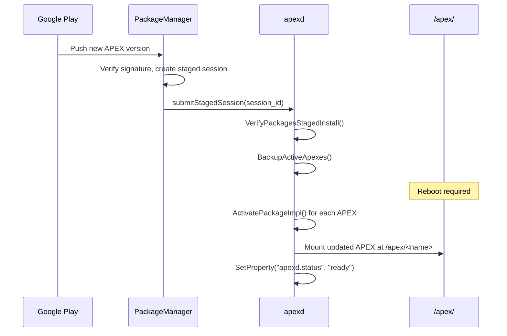

The key insight is that APEX updates are *staged* -- they are downloaded and
verified before a reboot, then atomically activated during the next boot.  If
activation fails, apexd rolls back to the pre-installed version.

---

## 52.2  APEX Format

The APEX file format is the cornerstone of Project Mainline.  It solves a
problem that APKs cannot: packaging and updating **native shared libraries**,
**executables**, **configuration files**, and **Java bootclasspath fragments**
as a single, signed, integrity-verified unit.

### 52.2.1  Why Not Just APK?

APKs are ZIP archives designed for Dalvik/ART applications.  They carry DEX
bytecode, resources, and native libraries (`lib/<abi>/`).  But they lack:

- **dm-verity protection** for the payload image.
- **Loop-device mounting** that allows the kernel to treat the payload as a
  real filesystem.

- **Boot-time activation** before zygote starts.
- The ability to replace platform-level native libraries like `libc++` or
  `libcrypto`.

APEX addresses all of these.

### 52.2.2  File Structure

An APEX file (`.apex`) is a ZIP archive containing:

```
my_module.apex (ZIP)
+-- AndroidManifest.xml        # Standard APK manifest (for Play Store)
+-- apex_manifest.pb           # Protobuf: name, version, provideNativeLibs, ...
+-- apex_payload.img           # ext4/f2fs/erofs filesystem image
+-- apex_pubkey                # AVB public key (embedded for verification)
+-- META-INF/                  # JAR signing (v2/v3 APK signature)
```

The critical component is `apex_payload.img`.  This is a real filesystem image
-- ext4, f2fs, or erofs -- containing the module's files laid out exactly as
they will appear when mounted at `/apex/<module_name>/`.

The `apex_file.cpp` implementation in `system/apex/apexd/` recognizes all three
filesystem types by their magic bytes:

```cpp
// Source: system/apex/apexd/apex_file.cpp

constexpr const char* kImageFilename = "apex_payload.img";
constexpr const char* kCompressedApexFilename = "original_apex";
constexpr const char* kBundledPublicKeyFilename = "apex_pubkey";

struct FsMagic {
  const char* type;
  int32_t offset;
  int16_t len;
  const char* magic;
};
constexpr const FsMagic kFsType[] = {
    {"f2fs", 1024, 4, "\x10\x20\xf5\xf2"},
    {"ext4", 1024 + 0x38, 2, "\123\357"},
    {"erofs", 1024, 4, "\xe2\xe1\xf5\xe0"}
};
```

### 52.2.3  APEX Manifest (Protobuf)

Every APEX carries a protobuf manifest defined in
`system/apex/proto/apex_manifest.proto`:

```protobuf
// Source: system/apex/proto/apex_manifest.proto

message ApexManifest {
  // Name used to mount under /apex/<name>
  string name = 1;

  // Version Number
  int64 version = 2;

  // Pre Install Hook
  string preInstallHook = 3;

  // Version Name
  string versionName = 5;

  // If true, apexd mounts with MS_NOEXEC
  bool noCode = 6;

  // Native libs provided to other APEXes or the platform
  repeated string provideNativeLibs = 7;

  // Native libs required from other APEXes or the platform
  repeated string requireNativeLibs = 8;

  // JNI libraries (used by linkerconfig/libnativeloader)
  repeated string jniLibs = 9;

  // Compressed APEX metadata
  CompressedApexMetadata capexMetadata = 12;

  // Can be updated without reboot
  bool supportsRebootlessUpdate = 13;

  // Whether activated in bootstrap phase
  bool bootstrap = 16;
}
```

The `provideNativeLibs` and `requireNativeLibs` fields are particularly
important: they allow apexd and the linker configuration system to construct
correct shared-library namespaces at boot time.

### 52.2.4  Compressed APEX (CAPEX)

Starting in Android 11, APEXes can be **compressed** on the system partition to
save space.  A compressed APEX has the suffix `.capex` and contains the original
APEX inside, compressed.  At boot, apexd decompresses it to
`/data/apex/decompressed/`:

```
// Source: system/apex/apexd/apex_constants.h

static constexpr const char* kApexDecompressedDir = "/data/apex/decompressed";
static constexpr const char* kCompressedApexPackageSuffix = ".capex";
static constexpr const char* kDecompressedApexPackageSuffix =
    ".decompressed.apex";
```

The `ApexFile::IsCompressed()` method detects whether an APEX is compressed,
and `ApexFile::Decompress()` handles the decompression.

### 52.2.5  The ApexFile Class

The C++ `ApexFile` class (`system/apex/apexd/apex_file.h`) is the primary
abstraction for working with APEX packages at runtime:

```cpp
// Source: system/apex/apexd/apex_file.h

class ApexFile {
 public:
  static android::base::Result<ApexFile> Open(const std::string& path);

  const std::string& GetPath() const { return apex_path_; }
  const std::optional<uint32_t>& GetImageOffset() const {
    return image_offset_;
  }
  const std::optional<size_t>& GetImageSize() const { return image_size_; }
  const ::apex::proto::ApexManifest& GetManifest() const {
    return manifest_;
  }
  const std::string& GetBundledPublicKey() const { return apex_pubkey_; }
  const std::optional<std::string>& GetFsType() const { return fs_type_; }

  android::base::Result<ApexVerityData> VerifyApexVerity(
      const std::string& public_key) const;
  bool IsCompressed() const { return is_compressed_; }
  android::base::Result<void> Decompress(
      const std::string& output_path) const;

 private:
  std::string apex_path_;
  std::optional<uint32_t> image_offset_;
  std::optional<size_t> image_size_;
  ::apex::proto::ApexManifest manifest_;
  std::string apex_pubkey_;
  std::optional<std::string> fs_type_;
  bool is_compressed_;
};
```

The `ApexVerityData` struct carries the information needed to set up dm-verity:

```cpp
// Source: system/apex/apexd/apex_file.h

struct ApexVerityData {
  std::unique_ptr<AvbHashtreeDescriptor> desc;
  std::string hash_algorithm;
  std::string salt;
  std::string root_digest;
};
```

The `Open()` factory method performs the following steps:

1. Opens the file as a ZIP archive using `libziparchive`.
2. Reads the `apex_manifest.pb` entry and parses the protobuf.
3. Reads the `apex_pubkey` entry (the AVB public key).
4. Locates the `apex_payload.img` entry and records its offset and size within
   the ZIP.

5. Detects the filesystem type by reading magic bytes from the payload image.
6. Checks whether this is a compressed APEX (contains `original_apex` instead
   of `apex_payload.img`).

```cpp
// Source: system/apex/apexd/apex_file.cpp (Open method, simplified)

Result<ApexFile> ApexFile::Open(const std::string& path) {
  // Open as ZIP archive
  ZipArchiveHandle handle;
  int ret = OpenArchiveFd(fd.get(), path.c_str(), &handle, false);

  // Try to find apex_payload.img
  ZipEntry entry;
  ret = FindEntry(handle, kImageFilename, &entry);
  if (ret == 0) {
    image_offset = entry.offset;
    image_size = entry.uncompressed_length;
    // Detect filesystem type (ext4, f2fs, erofs)
    fs_type = RetrieveFsType(fd, entry.offset);
  }

  // Read manifest
  FindEntry(handle, kManifestFilenamePb, &entry);
  // ... parse protobuf ...

  // Read public key
  FindEntry(handle, kBundledPublicKeyFilename, &entry);
  // ... read key ...

  return ApexFile(path, image_offset, image_size,
                  manifest, pubkey, fs_type, is_compressed);
}
```

### 52.2.6  Signing

APEX uses two layers of signing:

1. **Payload signing (AVB)**: The `apex_payload.img` is signed with
   [Android Verified Boot](https://source.android.com/security/verifiedboot)
   using `avbtool`.  The public key is bundled as `apex_pubkey` inside the ZIP.

2. **Container signing (APK Signature Scheme v2/v3)**: The outer ZIP is signed
   like a regular APK, so the Google Play infrastructure can verify it.

The build system defines keys using the `apex_key` module type:

```
// Source: packages/modules/SdkExtensions/Android.bp

apex_key {
    name: "com.android.sdkext.key",
    public_key: "com.android.sdkext.avbpubkey",
    private_key: "com.android.sdkext.pem",
}

android_app_certificate {
    name: "com.android.sdkext.certificate",
    certificate: "com.android.sdkext",
}
```

The Soong implementation in `build/soong/apex/key.go` resolves these keys:

```go
// Source: build/soong/apex/key.go

type apexKeyProperties struct {
    // Path or module to the public key file in avbpubkey format.
    Public_key *string `android:"path"`
    // Path or module to the private key file in pem format.
    Private_key *string `android:"path"`
}
```

Key resolution follows a fallback chain: first the global apex key directory
(configurable), then the local module directory.

### 52.2.7  Build-Time Construction: The `apexer` Tool

The `apexer` tool (`system/apex/apexer/apexer.py`) is the command-line utility
that assembles an APEX file from a directory of contents:

```python
# Source: system/apex/apexer/apexer.py (line 16-20)

"""apexer is a command line tool for creating an APEX file, a package
format for system components.

Typical usage: apexer input_dir output.apex
"""
```

The Soong build rule that invokes `apexer` is defined in
`build/soong/apex/builder.go`:

```go
// Source: build/soong/apex/builder.go

apexRule = pctx.StaticRule("apexRule", blueprint.RuleParams{
    Command: `rm -rf ${image_dir} && mkdir -p ${image_dir} && ` +
        `(. ${out}.copy_commands) && ` +
        `APEXER_TOOL_PATH=${tool_path} ` +
        `${apexer} --force --manifest ${manifest} ` +
        `--file_contexts ${file_contexts} ` +
        `--canned_fs_config ${canned_fs_config} ` +
        `--include_build_info ` +
        `--payload_type image ` +
        `--key ${key} ${opt_flags} ${image_dir} ${out} `,
    ...
})
```

The process:

1. Collect all native libraries, binaries, Java libraries, and config files.
2. Copy them into a staging directory (`${image_dir}`).
3. Create a filesystem image (ext4/f2fs/erofs) using `mke2fs`, `make_f2fs`, or
   `mkfs.erofs`.

4. Sign the image with `avbtool`.
5. Package everything into a ZIP with `soong_zip`.
6. Sign the ZIP with APK Signature Scheme.


### 52.2.8  APEX Module Definition in Soong

The `apex` module type is registered in `build/soong/apex/apex.go`:

```go
// Source: build/soong/apex/apex.go

func registerApexBuildComponents(ctx android.RegistrationContext) {
    ctx.RegisterModuleType("apex", BundleFactory)
    ctx.RegisterModuleType("apex_test", TestApexBundleFactory)
    ctx.RegisterModuleType("apex_vndk", vndkApexBundleFactory)
    ctx.RegisterModuleType("apex_defaults", DefaultsFactory)
    ctx.RegisterModuleType("prebuilt_apex", PrebuiltFactory)
    ctx.RegisterModuleType("override_apex", OverrideApexFactory)
    ctx.RegisterModuleType("apex_set", apexSetFactory)
}
```

A typical APEX definition in an `Android.bp` file looks like:

```
// Source: packages/modules/SdkExtensions/Android.bp

apex {
    name: "com.android.sdkext",
    defaults: ["com.android.sdkext-defaults"],
    bootclasspath_fragments: ["com.android.sdkext-bootclasspath-fragment"],
    binaries: [
        "derive_classpath",
        "derive_sdk",
    ],
    prebuilts: [
        "current_sdkinfo",
        "extensions_db",
    ],
    manifest: "manifest.json",
}
```

The `apexBundleProperties` struct in `apex.go` exposes the full set of
configurable properties:

```go
// Source: build/soong/apex/apex.go (selected properties)

type apexBundleProperties struct {
    Manifest *string `android:"path"`
    AndroidManifest proptools.Configurable[string] `android:"path,..."`
    File_contexts *string `android:"path"`

    // Whether this APEX is updatable (default: true)
    Updatable *bool

    // Filesystem type: 'ext4', 'f2fs', or 'erofs' (default: 'ext4')
    Payload_fs_type *string

    // Marks future updatability without enabling it yet
    Future_updatable *bool

    // Whether this APEX can use platform APIs (only when updatable: false)
    Platform_apis *bool

    // Variant version of the mainline module (0-9)
    Variant_version *string
}
```

The dependency properties allow an APEX to include different types of content:

```go
// Source: build/soong/apex/apex.go

type ApexNativeDependencies struct {
    Native_shared_libs proptools.Configurable[[]string]
    Jni_libs proptools.Configurable[[]string]
    Rust_dyn_libs []string
    Binaries proptools.Configurable[[]string]
    Tests []string
    Filesystems []string
    Prebuilts proptools.Configurable[[]string]
}
```

### 52.2.9  Activation at Boot: The apexd Daemon

The `apexd` daemon (`system/apex/apexd/`) is the system service responsible
for activating APEX modules at boot time.  It runs as three distinct service
configurations defined in `apexd.rc`:

```
# Source: system/apex/apexd/apexd.rc

service apexd /system/bin/apexd
    interface aidl apexservice
    class core
    user root
    group system
    oneshot
    disabled
    reboot_on_failure reboot,apexd-failed
    capabilities CHOWN DAC_OVERRIDE DAC_READ_SEARCH FOWNER SYS_ADMIN

service apexd-bootstrap /system/bin/apexd --bootstrap
    user root
    group system
    oneshot
    disabled
    reboot_on_failure reboot,bootloader,bootstrap-apexd-failed
    capabilities SYS_ADMIN

service apexd-snapshotde /system/bin/apexd --snapshotde
    user root
    group system
    oneshot
    disabled
    capabilities CHOWN DAC_OVERRIDE DAC_READ_SEARCH FOWNER
```

Three service configurations serve distinct phases:

| Service | Phase | Purpose |
|---------|-------|---------|
| `apexd-bootstrap` | Early boot | Mount critical APEXes (runtime, tzdata, i18n) before `/data` |
| `apexd` | After `/data` mount | Mount all remaining APEXes, process staged sessions |
| `apexd-snapshotde` | After activation | Snapshot/restore DE data for rollback safety |

#### Boot-Time Activation Flow

The `MountPackageImpl` function in `apexd.cpp` implements the five-step
mounting process:

```cpp
// Source: system/apex/apexd/apexd.cpp (MountPackageImpl)

// Steps to mount an APEX file:
//
// 1. create a mount point (directory)
// 2. create a block device for the payload part of the APEX
// 3. wrap it with a dm-verity device if the APEX is not on top of verity
//    device
// 4. mount the payload filesystem
// 5. verify the mount
```

Step 2 creates a loop device from the `apex_payload.img` entry within the ZIP:

```cpp
// Source: system/apex/apexd/apexd.cpp

if (IsMountBeforeDataEnabled() && GetImageManager()->IsPinnedApex(apex)) {
    linear_dev = OR_RETURN(CreateDmLinearForPayload(apex));
    block_device = linear_dev.GetDevPath();
} else {
    loop = OR_RETURN(CreateLoopForApex(apex, loop_id));
    block_device = loop.name;
}
```

Step 3 wraps the block device with dm-verity for integrity verification.  Pre-
installed APEXes on dm-verity-protected partitions (like `/system`) can skip
this additional layer:

```cpp
// Source: system/apex/apexd/apexd.cpp

const bool mount_on_verity = !instance.IsPreInstalledApex(apex) ||
                             instance.IsDecompressedApex(apex) ||
                             instance.IsBlockApex(apex);
```

#### dm-verity Table Construction

The `CreateVerityTable` function constructs the device-mapper verity table
from the AVB hashtree descriptor embedded in the APEX:

```cpp
// Source: system/apex/apexd/apexd.cpp

std::unique_ptr<DmTable> CreateVerityTable(
    const ApexVerityData& verity_data,
    const std::string& block_device,
    bool restart_on_corruption) {
  AvbHashtreeDescriptor* desc = verity_data.desc.get();
  auto table = std::make_unique<DmTable>();

  const uint64_t start = 0;
  const uint64_t length = desc->image_size / 512;  // in sectors

  const std::string& hash_device = block_device;
  const uint32_t num_data_blocks =
      desc->image_size / desc->data_block_size;
  const uint32_t hash_start_block =
      desc->tree_offset / desc->hash_block_size;

  auto target = std::make_unique<DmTargetVerity>(
      start, length, desc->dm_verity_version,
      block_device, hash_device,
      desc->data_block_size, desc->hash_block_size,
      num_data_blocks, hash_start_block,
      verity_data.hash_algorithm,
      verity_data.root_digest,
      verity_data.salt);

  target->IgnoreZeroBlocks();
  if (restart_on_corruption) {
    target->SetVerityMode(kDmVerityRestartOnCorruption);
  }
  table->AddTarget(std::move(target));
  table->set_readonly(true);

  return table;
}
```

Key dm-verity parameters:

- **Data block size** and **hash block size** -- Typically 4096 bytes each.
- **Hash algorithm** -- Usually SHA-256.
- **Root digest** -- The top-level hash that chains to all data blocks.
- **Salt** -- Random data mixed into the hash computation.
- **restart_on_corruption** -- If set, the kernel reboots if a verity
  corruption is detected (as opposed to returning I/O errors).

For pre-installed APEXes on `/system` (which is already dm-verity protected),
the additional dm-verity layer is skipped to avoid double-verification
overhead.  Updated APEXes on `/data` always get their own dm-verity device.

#### Filesystem Mounting

After the dm-verity device is created, the payload is mounted as a read-only
filesystem:

```cpp
// Source: system/apex/apexd/apexd.cpp

// Step 4. Mount the payload filesystem at the mount point
uint32_t mount_flags = MS_NOATIME | MS_NODEV | MS_DIRSYNC | MS_RDONLY;
if (apex.GetManifest().nocode()) {
    mount_flags |= MS_NOEXEC;
}

mount(block_device.c_str(), mount_point.c_str(),
      apex.GetFsType().value().c_str(), mount_flags, nullptr);
```

The mount flags enforce:

- `MS_RDONLY` -- Read-only (APEXes are immutable once activated).
- `MS_NOATIME` -- Don't update access times (performance).
- `MS_NODEV` -- Don't allow device nodes.
- `MS_DIRSYNC` -- Synchronous directory updates.
- `MS_NOEXEC` -- Disallow execution (for `noCode` APEXes like tzdata).

After mounting, Step 5 verifies the mounted image matches the manifest:

```cpp
// Source: system/apex/apexd/apexd.cpp

// Step 5. After mounting, verify the mounted image
auto status = VerifyMountedImage(apex, mount_point);
if (!status.ok()) {
    umount2(mount_point.c_str(), UMOUNT_NOFOLLOW);
    return Error() << "Failed to verify " << full_path;
}
```

The `ActivatePackageImpl` function then bind-mounts the latest version to
`/apex/<package_name>`:

```cpp
// Source: system/apex/apexd/apexd.cpp

Result<void> ActivatePackageImpl(const ApexFile& apex_file, ...) {
    // ...
    // Bind mount the latest version to /apex/<package_name>.
    auto st = gMountedApexes.DoIfLatest(
        manifest.name(), apex_file.GetPath(), [&]() -> Result<void> {
            return apexd_private::BindMount(
                apexd_private::GetActiveMountPoint(manifest), mount_point);
        });
    // ...
}
```

After all packages are activated, apexd sets system properties to signal
readiness:

```cpp
// Source: system/apex/apexd/apexd.cpp

void OnAllPackagesActivated() {
    LOG(INFO) << "Marking APEXd as activated";
    SetProperty(gConfig->apex_status_sysprop, kApexStatusActivated);
}

void OnAllPackagesReady() {
    LOG(INFO) << "Marking APEXd as ready";
    SetProperty(gConfig->apex_status_sysprop, kApexStatusReady);
    SetProperty(kApexAllReadyProp, "true");
}
```

Other services can wait on these properties:

```
// In an init .rc file:
on property:apexd.status=ready
    start my_service_that_needs_apex
```

The following diagram shows the complete boot-time activation flow:

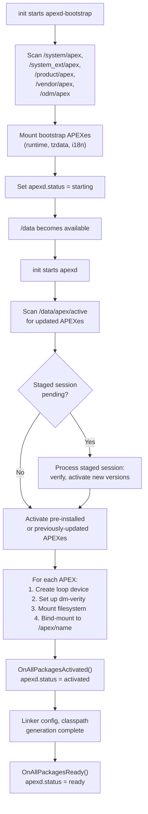

### 52.2.10  The OnBootstrap and OnStart Lifecycle

The `apexd` daemon has two primary entry points corresponding to two boot
phases.  Understanding this split is critical for diagnosing boot failures.

**Phase 1: OnBootstrap (before /data)**

```cpp
// Source: system/apex/apexd/apexd.cpp

int OnBootstrap() {
  ATRACE_NAME("OnBootstrap");
  auto time_started = boot_clock::now();

  ApexFileRepository& instance = ApexFileRepository::GetInstance();
  // Scan /system/apex, /system_ext/apex, /product/apex, /vendor/apex, /odm/apex
  if (auto st = AddPreinstalledData(instance); !st.ok()) {
    LOG(ERROR) << st.error();
    return 1;
  }

  ActivationContext ctx;
  std::vector<ApexFileRef> activation_list;

  if (IsMountBeforeDataEnabled()) {
    // New flow: wait for coldboot, process sessions, scan data
    base::WaitForProperty("ro.cold_boot_done", "true",
                          std::chrono::seconds(10));
    ProcessSessions(ctx);
    auto data_apexes = ScanDataApexFiles(GetImageManager());
    instance.AddDataApexFiles(std::move(data_apexes));
    activation_list = instance.SelectApexForActivation();
  } else {
    // Legacy flow: only activate bootstrap APEXes
    const auto& pre_installed_apexes = instance.GetPreInstalledApexFiles();
    for (const auto& apex : pre_installed_apexes) {
      if (IsBootstrapApex(apex.get())) {
        LOG(INFO) << "Found bootstrap APEX " << apex.get().GetPath();
        activation_list.push_back(apex);
      }
    }
  }

  auto result = ActivateApexPackages(ctx, activation_list,
      ActivationMode::kBootstrapMode, ...);
  EmitApexInfoList(result.activated, /*is_bootstrap=*/true);
  LOG(INFO) << "OnBootstrap done, duration=" << time_elapsed;
  return 0;
}
```

Bootstrap APEXes (those with `bootstrap: true` in their manifest) must be
available before `/data` is mounted because other early services depend on
them.  Examples include:

- `com.android.art` -- The runtime itself must be active for zygote.
- `com.android.i18n` -- ICU data is needed for text processing.
- `com.android.tzdata` -- Time zone data is needed for clock display.

**Phase 2: OnStart (after /data)**

```cpp
// Source: system/apex/apexd/apexd.cpp

void OnStart() {
  ATRACE_NAME("OnStart");
  LOG(INFO) << "Marking APEXd as starting";
  SetProperty(gConfig->apex_status_sysprop, kApexStatusStarting);

  // Check if filesystem checkpointing needs a rollback
  if (gSupportsFsCheckpoints) {
    Result<bool> needs_revert = gVoldService->NeedsRollback();
    if (needs_revert.ok() && *needs_revert) {
      LOG(INFO) << "Exceeded number of session retries. "
                << "Starting a revert";
      RevertActiveSessions("", "");
    }
  }

  // Activate remaining APEXes (the ones not in bootstrap)
  if (!IsMountBeforeDataEnabled()) {
    ActivateApexesOnStart();
  }

  // Snapshot or restore DE_sys data for rollback support
  SnapshotOrRestoreDeSysData();
  LOG(INFO) << "OnStart done, duration=" << time_elapsed;
}
```

The `ActivateApexesOnStart()` function first processes any pending staged
sessions, then scans `/data/apex/active/` for updated APEXes, and activates
the best version of each module:

```cpp
// Source: system/apex/apexd/apexd.cpp

void ActivateApexesOnStart() {
  ActivationContext ctx;
  // Process staged sessions first: revert or activate
  ProcessSessions(ctx);

  auto& instance = ApexFileRepository::GetInstance();
  // Scan /data/apex/active/ for updated APEXes
  instance.AddDataApex(gConfig->active_apex_data_dir);

  auto activate_status = ActivateApexPackages(
      ctx, instance.SelectApexForActivation(),
      ActivationMode::kBootMode,
      /*revert_on_error=*/true, /*fallback_on_error=*/true);
  EmitApexInfoList(activate_status.activated, /*is_bootstrap=*/false);
}
```

The `SelectApexForActivation()` method compares pre-installed and data APEXes
and picks the highest version for each module name.

**Session Processing**

The `ProcessSessions()` function handles pending staged sessions:

```cpp
// Source: system/apex/apexd/apexd.cpp

void ProcessSessions(ActivationContext& ctx) {
  auto sessions = gSessionManager->GetSessions();

  if (sessions.empty()) {
    LOG(INFO) << "No sessions to revert/activate.";
    return;
  }

  // If there's any pending revert, revert active sessions.
  if (std::ranges::any_of(sessions, [](const auto& session) {
        return session.GetState() == SessionState::REVERT_IN_PROGRESS;
      })) {
    RevertActiveSessions("", "");
  } else {
    // Otherwise, activate STAGED sessions.
    ActivateStagedSessions(ctx, std::move(sessions));
  }
}
```

This is the core logic that makes Mainline updates work across reboots: a
session is "staged" before reboot, and then on the next boot, `ProcessSessions`
activates it.

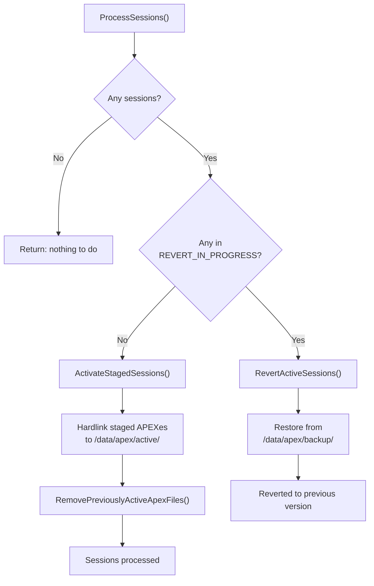

### 52.2.11  The Rebootless Update Path

Starting in Android 13, APEXes that declare `supportsRebootlessUpdate: true`
in their manifest can be updated without a device reboot.  The
`installAndActivatePackage()` AIDL method implements this:

1. Verify the new APEX package.
2. Unload the current APEX from init (stop services, unload init scripts).
3. Unmount the currently active APEX.
4. Hard-link the new APEX to `/data/apex/active/`.
5. Activate (mount) the new APEX.
6. Reload the APEX into init (restart services, re-read init scripts).

```cpp
// Source: system/apex/apexd/apexd.cpp (rebootless update, simplified)

// 1. Unload from init
OR_RETURN(UnloadApexFromInit(module_name));

// Scope guard: reload from init whether we succeed or fail
auto reload_apex = android::base::make_scope_guard([&]() {
    LoadApexFromInit(module_name);
});

// 2. Unmount currently active APEX
OR_RETURN(UnmountPackage(*cur_apex, /*deferred=*/true, ...));

// 3. Hard-link new APEX to /data/apex/active/
link(package_path.c_str(), target_file.c_str());

// 4. Activate new APEX
ActivatePackageImpl(*new_apex, loop::kFreeLoopId, new_id, false);
```

This is particularly useful for modules that contain only configuration data
or that can gracefully restart their services.

### 52.2.12  Brand-New APEX Support

Android 16 (Baklava) introduces the concept of **brand-new APEXes** -- APEXes
that can be installed on a device even if they were not pre-installed.  This
allows Google to add entirely new modules to existing devices through Play
updates.

The key infrastructure files:

```cpp
// Source: system/apex/apexd/apex_constants.h

static constexpr const char* kBrandNewApexPublicKeySuffix = ".avbpubkey";
static constexpr const char* kBrandNewApexBlocklistFileName = "blocklist.json";
static constexpr const char* kBrandNewApexConfigSystemDir =
    "/system/etc/brand_new_apex";
```

Each partition can provide a configuration directory containing:

- **Public keys** (`.avbpubkey` files) -- Trusted keys for verifying new APEXes.
- **Blocklists** (`blocklist.json`) -- APEXes that should not be installed.

The `ApexFileRepository` handles brand-new APEX verification:

```cpp
// Source: system/apex/apexd/apexd.cpp (AddPreinstalledData)

if (ApexFileRepository::IsBrandNewApexEnabled()) {
    instance.AddBrandNewApexCredentialAndBlocklist(
        gConfig->brand_new_apex_config_dirs);
}
```

### 52.2.13  Prebuilt APEX and the Deapexer

In addition to building APEXes from source, the build system supports
**prebuilt APEXes**.  This is common when a module is built in a separate
build pipeline and the result is checked into the tree as a binary:

```go
// Source: build/soong/apex/prebuilt.go

var (
    extractMatchingApex = pctx.StaticRule(
        "extractMatchingApex",
        blueprint.RuleParams{
            Command: `${extract_apks} -o "${out}" ` +
                `-allow-prereleased=${allow-prereleased} ` +
                `-sdk-version=${sdk-version} ` +
                `-skip-sdk-check=${skip-sdk-check} ` +
                `-abis=${abis} ` +
                `-screen-densities=all -extract-single ` +
                `${in}`,
        },
        "abis", "allow-prereleased", "sdk-version", "skip-sdk-check")
    decompressApex = pctx.StaticRule("decompressApex",
        blueprint.RuleParams{
            Command: `${deapexer} decompress ` +
                `--copy-if-uncompressed ` +
                `--input ${in} --output ${out}`,
        })
)
```

A prebuilt APEX is declared as:

```
prebuilt_apex {
    name: "com.android.art",
    src: "com.android.art-arm64.apex",
    prefer: true,
}
```

When the build system needs to access the contents of a prebuilt APEX (e.g., to
compile against a bootclasspath fragment's JAR files), it uses the `deapexer`
tool to extract the contents:

```bash
# Extract all contents
$ deapexer extract com.android.art.apex output_dir/

# List contents
$ deapexer list com.android.art.apex

# Get APEX info (name, version)
$ deapexer info com.android.art.apex
```

The `deapexer` tool understands the APEX format at a low level: it opens the
ZIP, finds the payload image, mounts or reads it (using `debugfs` for ext4 or
`fsck.erofs` for erofs), and extracts the files.

This two-way flow -- building APEXes with `apexer` and decomposing them with
`deapexer` -- enables the modular development workflow where different teams
can work on different modules and integrate through prebuilt artifacts.

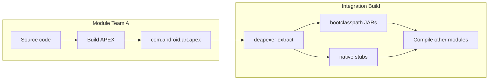

### 52.2.14  APEX Mutation and Variants

The Soong build system creates APEX-specific variants of all modules that are
included in an APEX.  This is handled by the `apexTransitionMutator`:

```go
// Source: build/soong/apex/apex.go

func RegisterPostDepsMutators(ctx android.RegisterMutatorsContext) {
    ctx.BottomUp("apex_unique", apexUniqueVariationsMutator)
    ctx.BottomUp("mark_platform_availability",
        markPlatformAvailability)
    ctx.InfoBasedTransition("apex",
        android.NewGenericTransitionMutatorAdapter(
            &apexTransitionMutator{}))
}
```

This mutator creates separate build variants for each library: one for the
platform and one for each APEX that includes it.  The APEX variant may have
different compilation flags, particularly:

- Different `min_sdk_version` restrictions.
- Different symbol visibility (for NDK compliance in updatable modules).
- Different linking behavior (static vs. dynamic for DCLA).

For example, `libc++` might have:

- A **platform variant** linking against system `libc`.
- A **com.android.tethering variant** compiled for `min_sdk_version: 30`.
- A **com.android.art variant** compiled for `min_sdk_version: 31`.

### 52.2.15  APEX Directory Layout on Device

When an APEX is activated, its contents become visible under `/apex/`:

```
/apex/
+-- apex-info-list.xml           # Metadata about all activated APEXes
+-- com.android.sdkext/          # Active (latest) version
|   +-- bin/
|   |   +-- derive_classpath
|   |   +-- derive_sdk
|   +-- etc/
|   |   +-- sdkinfo.pb
|   |   +-- extensions_db
|   +-- javalib/
|       +-- framework-sdkextensions.jar
+-- com.android.sdkext@340090000/ # Versioned mount point
+-- com.android.tethering/
+-- com.android.permission/
+-- ...
```

The versioned mount point (`@<version>`) preserves the actual mounted
filesystem.  The unversioned path (`/apex/com.android.sdkext/`) is a bind
mount pointing to the highest-version mount point.

### 52.2.16  APEX Partition Locations

APEX files can be pre-installed on multiple partitions:

```cpp
// Source: system/apex/apexd/apex_constants.h

static constexpr const char* kApexPackageSystemDir = "/system/apex";
static constexpr const char* kApexPackageSystemExtDir = "/system_ext/apex";
static constexpr const char* kApexPackageProductDir = "/product/apex";
static constexpr const char* kApexPackageVendorDir = "/vendor/apex";
static constexpr const char* kApexPackageOdmDir = "/odm/apex";
```

Updated APEXes (from Google Play or `adb install`) are stored in:

```cpp
// Source: system/apex/apexd/apex_constants.h

static constexpr const char* kActiveApexPackagesDataDir = "/data/apex/active";
static constexpr const char* kApexBackupDir = "/data/apex/backup";
```

The `ApexFileRepository` class (`system/apex/apexd/apex_file_repository.h`)
manages the mapping between pre-installed and updated APEXes:

```cpp
// Source: system/apex/apexd/apex_file_repository.h

class ApexFileRepository final {
 public:
    static ApexFileRepository& GetInstance();

    // Populate from pre-installed directories
    android::base::Result<void> AddPreInstalledApex(
        const std::unordered_map<ApexPartition, std::string>&
            partition_to_prebuilt_dirs);

    // Query methods
    bool IsPreInstalledApex(const ApexFile& apex) const;
    bool IsDecompressedApex(const ApexFile& apex) const;
    bool IsBlockApex(const ApexFile& apex) const;
};
```

### 52.2.17  Rollback and Safety

If an updated APEX fails to activate, apexd supports rollback:

1. **Backup**: Before staging, `BackupActiveApexes()` copies current active
   APEXes to `/data/apex/backup/`.

2. **Verification**: `VerifyPackagesStagedInstall()` validates signatures and
   compatibility before any activation.

3. **Checkpoint**: On devices with filesystem checkpoint support (via vold),
   the entire `/data` state can be rolled back.

4. **Revert-on-failure**: If `reboot_on_failure` triggers, the next boot
   skips the failed update and uses the pre-installed version.

```cpp
// Source: system/apex/apexd/apexd.cpp (SubmitStagedSession)

OR_RETURN(BackupActiveApexes());
auto ret = OR_RETURN(
    OpenApexFilesInSessionDirs(session_id, child_session_ids));
auto result = OR_RETURN(VerifyPackagesStagedInstall(ret));
```

---

## 52.3  Module Catalog

The `packages/modules/` directory in AOSP contains the source code for all
Mainline modules.  Each module typically produces one or more APEX packages.

### 52.3.1  Complete Module Inventory

The following table lists every module directory in `packages/modules/`, its
APEX package name(s), the Android release in which it became updatable, and a
summary of what it provides.

| # | Module Directory | APEX Name | Launch | Description |
|---|-----------------|-----------|--------|-------------|
| 1 | `AdServices` | `com.android.adservices` | T (13) | Privacy Sandbox: Topics, Attribution, FLEDGE |
| 2 | `AppSearch` | `com.android.appsearch` | T (13) | On-device structured search indexing engine |
| 3 | `ArtPrebuilt` | `com.android.art` | S (12) | Android Runtime (ART), DEX compiler, core libraries |
| 4 | `Bluetooth` | `com.android.bt` | B (16) | Bluetooth stack (Gabeldorsche / Fluoride) |
| 5 | `CaptivePortalLogin` | *(APK in Connectivity)* | R (11) | Captive portal detection & sign-in UI |
| 6 | `CellBroadcastService` | `com.android.cellbroadcast` | R (11) | Emergency alert message handling (CMAS/ETWS) |
| 7 | `ConfigInfrastructure` | `com.android.configinfrastructure` | U (14) | Device configuration framework (`DeviceConfig`) |
| 8 | `Connectivity` | `com.android.tethering` | R (11) | Tethering, Connectivity, Cronet HTTP stack |
| 9 | `CrashRecovery` | `com.android.crashrecovery` | V (15) | System crash detection and recovery |
| 10 | `DeviceLock` | `com.android.devicelock` | U (14) | Device financing/locking framework |
| 11 | `DnsResolver` | `com.android.resolv` | Q (10) | DNS resolution (DNS-over-TLS, private DNS) |
| 12 | `ExtServices` | `com.android.extservices` | R (11) | Extension services (notification ranking, autofill) |
| 13 | `GeoTZ` | `com.android.geotz` | S (12) | Geolocation-based time zone detection |
| 14 | `Gki` | `com.android.gki.*` | S (12) | Generic Kernel Image support modules |
| 15 | `HealthFitness` | `com.android.healthfitness` | U (14) | Health Connect: health/fitness data platform |
| 16 | `IPsec` | `com.android.ipsec` | R (11) | IKEv2/IPsec VPN framework |
| 17 | `ImsMedia` | *(in Telephony)* | T (13) | IMS media handling for VoLTE/VoNR |
| 18 | `IntentResolver` | *(APK)* | T (13) | Chooser/intent resolution UI |
| 19 | `Media` | `com.android.media` / `com.android.media.swcodec` | Q (10) | Media framework, software codecs |
| 20 | `ModuleMetadata` | *(APK)* | Q (10) | Module metadata provider |
| 21 | `NetworkStack` | `com.android.networkstack` | Q (10) | Network connectivity evaluation, DHCP client |
| 22 | `NeuralNetworks` | `com.android.neuralnetworks` | R (11) | NNAPI runtime and HAL |
| 23 | `Nfc` | `com.android.nfcservices` | B (16) | NFC stack and services |
| 24 | `OnDevicePersonalization` | `com.android.ondevicepersonalization` | T (13) | On-device ML personalization framework |
| 25 | `Permission` | `com.android.permission` | R (11) | Permission controller, role manager, SafetyCenter |
| 26 | `Profiling` | `com.android.profiling` | V (15) | System profiling infrastructure |
| 27 | `RemoteKeyProvisioning` | `com.android.rkpd` | U (14) | Remote key provisioning for KeyStore |
| 28 | `RuntimeI18n` | `com.android.i18n` | Q (10) | ICU internationalization library |
| 29 | `Scheduling` | `com.android.scheduling` | S (12) | Job scheduling infrastructure |
| 30 | `SdkExtensions` | `com.android.sdkext` | R (11) | SDK extension version management |
| 31 | `StatsD` | `com.android.os.statsd` | R (11) | Metrics collection daemon |
| 32 | `Telecom` | `com.android.telecom` | V (15) | Telecom call management framework |
| 33 | `Telephony` | `com.android.telephonycore` / `com.android.telephonymodules` | U (14) | Telephony core and modules |
| 34 | `ThreadNetwork` | `com.android.threadnetwork` | V (15) | Thread / Matter smart home networking |
| 35 | `UprobeStats` | `com.android.uprobestats` | B (16) | eBPF-based uprobe statistics collection |
| 36 | `Uwb` | `com.android.uwb` | T (13) | Ultra-Wideband ranging framework |
| 37 | `Virtualization` | `com.android.virt` | T (13) | Android Virtualization Framework (pKVM, Microdroid) |
| 38 | `Wifi` | `com.android.wifi` | R (11) | Wi-Fi framework and services |
| 39 | `adb` | `com.android.adbd` | R (11) | Android Debug Bridge daemon |
| 40 | `desktop` | *(multiple)* | V (15) | Desktop windowing support |

In addition to `packages/modules/`, several APEX modules are defined elsewhere
in the tree:

| APEX Name | Source Location | Description |
|-----------|----------------|-------------|
| `com.android.media` | `frameworks/av/apex/` | Media framework (extractors, codecs) |
| `com.android.media.swcodec` | `frameworks/av/apex/` | Software codec process |
| `com.android.conscrypt` | `external/conscrypt/` | TLS/SSL provider (BoringSSL wrapper) |
| `com.android.mediaprovider` | `packages/providers/MediaProvider/` | MediaStore content provider |
| `com.android.tzdata` | `system/timezone/` | Time zone data |

### 52.3.2  Module Classification by Content Type

Mainline modules can be classified by what they primarily contain:

**Native-heavy modules** (primarily C/C++ shared libraries and binaries):

| Module | APEX Name | Key Native Components |
|--------|-----------|----------------------|
| DnsResolver | `com.android.resolv` | `libnetd_resolv.so` |
| NeuralNetworks | `com.android.neuralnetworks` | NNAPI runtime, HAL client |
| adb | `com.android.adbd` | `adbd` binary |
| RuntimeI18n | `com.android.i18n` | ICU libraries |

**Java-heavy modules** (primarily JAR files with bootclasspath/systemserver
contributions):

| Module | APEX Name | Key Java Components |
|--------|-----------|-------------------|
| Permission | `com.android.permission` | `framework-permission.jar`, PermissionController app |
| AppSearch | `com.android.appsearch` | `framework-appsearch.jar`, `service-appsearch.jar` |
| SdkExtensions | `com.android.sdkext` | `framework-sdkextensions.jar` |
| AdServices | `com.android.adservices` | Privacy Sandbox Java framework |
| ConfigInfrastructure | `com.android.configinfrastructure` | `framework-configinfrastructure.jar` |

**Mixed modules** (both native and Java components):

| Module | APEX Name | Key Mixed Components |
|--------|-----------|---------------------|
| Connectivity | `com.android.tethering` | `framework-connectivity.jar` + `libnetd_updatable.so` |
| Media | `com.android.media` | `framework-media.jar` + media extractors (native) |
| Wifi | `com.android.wifi` | `framework-wifi.jar` + native HAL bridge |
| Bluetooth | `com.android.bt` | `framework-bluetooth.jar` + native stack |
| Telephony | `com.android.telephonycore` | `framework-telephony.jar` + RIL components |
| Virtualization | `com.android.virt` | VirtualizationService + native hypervisor support |

**Data-only modules** (configuration/data with `noCode: true`):

| Module | APEX Name | Content |
|--------|-----------|---------|
| GeoTZ | `com.android.geotz` | Geolocation time zone database |
| tzdata | `com.android.tzdata` | IANA time zone data |

### 52.3.3  Module Architecture Diagram

```mermaid
graph TB
    subgraph "Google Play System Updates"
        GP[Google Play Infrastructure]
    end

    subgraph "Mainline Modules (APEX)"
        direction LR
        subgraph "Networking"
            CONN["com.android.tethering<br/>Connectivity"]
            DNS["com.android.resolv<br/>DNS Resolver"]
            NET[NetworkStack]
            WIFI["com.android.wifi<br/>Wi-Fi"]
            NFC["com.android.nfcservices<br/>NFC"]
            UWB["com.android.uwb<br/>UWB"]
            THR["com.android.threadnetwork<br/>Thread"]
        end
        subgraph "Security & Privacy"
            PERM["com.android.permission<br/>Permission"]
            CONSCRYPT["com.android.conscrypt<br/>TLS/SSL"]
            IPSEC["com.android.ipsec<br/>IPsec"]
            ADS["com.android.adservices<br/>Ad Services"]
            RKP["com.android.rkpd<br/>Remote Key"]
        end
        subgraph "Runtime & Core"
            ART["com.android.art<br/>ART Runtime"]
            I18N["com.android.i18n<br/>ICU"]
            SDKEXT["com.android.sdkext<br/>SDK Extensions"]
            STATSD["com.android.os.statsd<br/>StatsD"]
        end
        subgraph "Media & ML"
            MEDIA["com.android.media<br/>Media"]
            SWCODEC["com.android.media.swcodec<br/>SW Codecs"]
            NNAPI["com.android.neuralnetworks<br/>Neural Networks"]
        end
        subgraph "Telephony"
            TCORE["com.android.telephonycore<br/>Telephony"]
            TELECOM["com.android.telecom<br/>Telecom"]
        end
    end

    GP --> CONN
    GP --> ART
    GP --> PERM
    GP --> MEDIA
    GP --> TCORE

    subgraph "apexd"
        APEXD[APEX Daemon]
    end

    APEXD --> |"mount /apex/..."| CONN
    APEXD --> |"mount /apex/..."| ART
    APEXD --> |"mount /apex/..."| PERM
```

### 52.3.4  Deep Dive: Connectivity Module

The Connectivity module (`com.android.tethering`) is one of the most complex
Mainline modules.  Despite its APEX name referencing "tethering," it actually
encompasses the entire connectivity stack:

```
// Source: packages/modules/Connectivity/Tethering/apex/Android.bp

apex {
    name: "com.android.tethering",
    defaults: [
        "ConnectivityApexDefaults",
        "CronetInTetheringApexDefaults",
        "r-launched-apex-module",
    ],
    compile_multilib: "both",
    bootclasspath_fragments: [
        "com.android.tethering-bootclasspath-fragment",
    ],
    systemserverclasspath_fragments: [
        "com.android.tethering-systemserverclasspath-fragment",
    ],
    multilib: {
        first: {
            jni_libs: [
                "libservice-connectivity",
                "libservice-thread-jni",
                ...
            ],
            native_shared_libs: [
                "libcom.android.tethering.dns_helper",
                "libcom.android.tethering.connectivity_native",
                "libnetd_updatable",
            ],
        },
    },
}
```

Key components within this module:

- **Tethering service**: USB, Wi-Fi, Bluetooth, and Ethernet tethering
- **Connectivity service fragments**: `framework-connectivity` and
  `service-connectivity`

- **Cronet**: Google's HTTP stack (optionally bundled)
- **clatd**: CLAT NAT64 translator (native binary)
- **Thread Network**: IEEE 802.15.4 Thread support (JNI library)

### 52.3.5  Deep Dive: Permission Module

The Permission module manages the runtime permission subsystem:

```
// Source: packages/modules/Permission/Android.bp

apex {
    name: "com.android.permission",
    defaults: ["com.android.permission-defaults"],
    manifest: "apex_manifest.json",
}

apex_defaults {
    name: "com.android.permission-defaults",
    defaults: ["r-launched-apex-module"],
    // Indicates that pre-installed version can be compressed.
    // Actual compression is per-device.
    ...
}
```

This module contains:

- **PermissionController**: The system app that manages permission grants
- **Role Manager**: The system for declaring and assigning default apps
- **Safety Center**: The unified security & privacy dashboard (Android 13+)

### 52.3.6  Deep Dive: Virtualization Module

The Virtualization module (`com.android.virt`) is notable for its conditional
build configuration:

```
// Source: packages/modules/Virtualization/apex/Android.bp

virt_apex {
    name: "com.android.virt",
    soong_config_variables: {
        avf_enabled: {
            defaults: ["com.android.virt_avf_enabled"],
            conditions_default: {
                defaults: ["com.android.virt_avf_disabled"],
            },
        },
    },
}

apex_defaults {
    name: "com.android.virt_common",
    updatable: false,
    future_updatable: false,
    platform_apis: true,  // Can use non-public APIs
    ...
}
```

Unlike most Mainline modules, the Virtualization APEX is explicitly **not
updatable** today (`updatable: false`), and it uses `platform_apis: true` to
access internal platform APIs.  It contains the pKVM (protected KVM)
hypervisor support, Microdroid filesystem images, and the
VirtualizationService.

### 52.3.7  Deep Dive: StatsD Module

The StatsD module (`com.android.os.statsd`) is the metrics collection daemon:

```
// Source: packages/modules/StatsD/apex/Android.bp

apex {
    name: "com.android.os.statsd",
    defaults: ["com.android.os.statsd-defaults"],
    manifest: "apex_manifest.json",
}

apex_defaults {
    name: "com.android.os.statsd-defaults",
    defaults: ["r-launched-apex-module"],
    ...
}
```

StatsD is responsible for:

- Collecting system metrics (CPU, memory, battery, network statistics).
- Processing metric subscriptions from apps and system services.
- Providing the `android.app.StatsManager` API.
- Forwarding metrics to the server-side analytics pipeline.

Its launch in R (Android 11) was significant because it moved a core platform
service into a Mainline module, allowing Google to fix metrics collection bugs
and add new atom definitions without a full platform OTA.

### 52.3.8  Deep Dive: DnsResolver Module

The DNS resolver was one of the original Mainline modules in Android 10:

```
// Source: packages/modules/DnsResolver/apex/Android.bp

apex {
    name: "com.android.resolv",
    manifest: "manifest.json",
    multilib: { ... },
}
```

This module contains `libnetd_resolv.so`, the native library that handles all
DNS resolution on the device.  Key features updatable through Mainline:

- DNS-over-TLS (DoT) support.
- DNS-over-HTTPS (DoH) support.
- Private DNS configuration.
- Bug fixes for DNS cache poisoning vulnerabilities.

Being a pure native module (no Java code), `com.android.resolv` is one of the
simpler APEX structures -- it contains only shared libraries and no
bootclasspath fragments.

### 52.3.9  Deep Dive: Profiling Module

The Profiling module, launched in Baklava, demonstrates a modern module
definition with conditional enablement:

```
// Source: packages/modules/Profiling/apex/Android.bp

apex {
    enabled: select(
        release_flag("RELEASE_PACKAGE_PROFILING_MODULE"), {
            true: true,
            false: false,
        }),

    name: "com.android.profiling",
    manifest: "manifest.json",
    key: "com.android.profiling.key",
    certificate: ":com.android.profiling.certificate",
    defaults: ["b-launched-apex-module"],

    binaries: ["trace_redactor"],

    bootclasspath_fragments: [
        "com.android.profiling-bootclasspath-fragment"
    ],
    systemserverclasspath_fragments: [
        "com.android.profiling-systemserverclasspath-fragment"
    ],
}
```

Notable aspects:

- **Conditional build**: Uses `select(release_flag(...))` to enable/disable
  based on a release flag, allowing the module to be excluded from certain
  build configurations.

- **Native binary**: Includes `trace_redactor`, a tool for redacting PII from
  system traces.

- **Both classpath fragments**: Contributes to both the boot classpath and the
  system server classpath.

- **B-launched**: Uses the `b-launched-apex-module` defaults, meaning
  `min_sdk_version: "36"`.

### 52.3.10  Deep Dive: adb Module

The ADB daemon module is notable for using DCLA (Dynamic Common Lib APEX):

```
// Source: packages/modules/adb/apex/Android.bp

apex {
    name: "com.android.adbd",
    defaults: [
        "com.android.adbd-defaults",
        "r-launched-dcla-enabled-apex-module",
    ],
    ...
}
```

By using DCLA, the adb APEX can share common libraries (like `libc++`) with
other APEXes instead of bundling its own copy, reducing the total on-device
storage footprint.

### 52.3.11  Module Lifecycle Across Releases

The following diagram shows how the number of Mainline modules has grown
across Android releases:

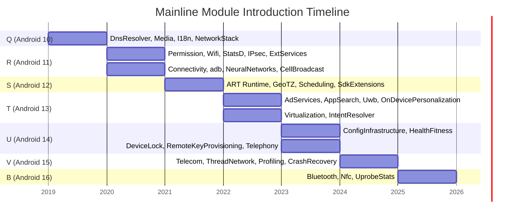

### 52.3.12  Deep Dive: Media Module

The Media module is split across two APEXes defined in `frameworks/av/apex/`:

```
// Source: frameworks/av/apex/Android.bp

apex {
    name: "com.android.media",
    manifest: "manifest.json",
    defaults: ["com.android.media-defaults"],
    ...
}

apex {
    name: "com.android.media.swcodec",
    manifest: "manifest_codec.json",
    defaults: ["com.android.media.swcodec-defaults"],
    ...
}
```

- `com.android.media` -- The main media APEX containing extractors, the media
  framework service, and `framework-media.jar`.

- `com.android.media.swcodec` -- A separate process for software codecs
  (isolated for security via `mediaswcodec` service).

This separation is a security measure: software codec bugs (often triggered by
untrusted media files) are contained in a separate, sandboxed process.

---

## 52.4  SDK Extensions

### 52.4.1  The Problem: API Availability at Runtime

Mainline modules are updated independently of the platform.  This means a
device running Android 12 (S) might have an R-era module or a much newer one.
How can an app know which APIs are actually available?

Traditional `Build.VERSION.SDK_INT` checks tell you the *platform* version but
say nothing about the *module* version.  The **SDK Extensions** mechanism fills
this gap.

### 52.4.2  How It Works

Each Android release defines an **extension version** -- an integer that
advances as modules in that "train" are updated together.  The version is
derived at boot time by the `derive_sdk` binary, which inspects the actual
versions of installed modules.

The `derive_sdk` process:

1. Reads `sdkinfo.pb` from each mounted APEX (at `/apex/<name>/etc/sdkinfo.pb`).
2. Reads the `extensions_db` (a protobuf database of version requirements).
3. For each extension (R, S, T, U, V, B, ad_services), calculates the highest
   version where all module requirements are met.

4. Sets system properties: `build.version.extensions.r`, `.s`, `.t`, etc.

```cpp
// Source: packages/modules/SdkExtensions/derive_sdk/derive_sdk.cpp

static const std::unordered_map<std::string, SdkModule> kApexNameToModule = {
    {"com.android.adservices", SdkModule::AD_SERVICES},
    {"com.android.appsearch", SdkModule::APPSEARCH},
    {"com.android.art", SdkModule::ART},
    {"com.android.configinfrastructure", SdkModule::CONFIG_INFRASTRUCTURE},
    {"com.android.conscrypt", SdkModule::CONSCRYPT},
    {"com.android.extservices", SdkModule::EXT_SERVICES},
    {"com.android.healthfitness", SdkModule::HEALTH_FITNESS},
    {"com.android.ipsec", SdkModule::IPSEC},
    {"com.android.media", SdkModule::MEDIA},
    {"com.android.mediaprovider", SdkModule::MEDIA_PROVIDER},
    {"com.android.neuralnetworks", SdkModule::NEURAL_NETWORKS},
    {"com.android.ondevicepersonalization", SdkModule::ON_DEVICE_PERSONALIZATION},
    {"com.android.permission", SdkModule::PERMISSIONS},
    {"com.android.scheduling", SdkModule::SCHEDULING},
    {"com.android.sdkext", SdkModule::SDK_EXTENSIONS},
    {"com.android.os.statsd", SdkModule::STATSD},
    {"com.android.tethering", SdkModule::TETHERING},
};
```

Each extension train is associated with a set of modules:

```cpp
// Source: packages/modules/SdkExtensions/derive_sdk/derive_sdk.cpp

static const std::unordered_set<SdkModule> kRModules = {
    SdkModule::CONSCRYPT,      SdkModule::EXT_SERVICES,
    SdkModule::IPSEC,          SdkModule::MEDIA,
    SdkModule::MEDIA_PROVIDER, SdkModule::PERMISSIONS,
    SdkModule::SDK_EXTENSIONS, SdkModule::STATSD,
    SdkModule::TETHERING,
};

static const std::unordered_set<SdkModule> kSModules = {
    SdkModule::ART, SdkModule::SCHEDULING
};

static const std::unordered_set<SdkModule> kTModules = {
    SdkModule::AD_SERVICES, SdkModule::APPSEARCH,
    SdkModule::ON_DEVICE_PERSONALIZATION
};

static const std::unordered_set<SdkModule> kUModules = {
    SdkModule::CONFIG_INFRASTRUCTURE, SdkModule::HEALTH_FITNESS
};

static const std::unordered_set<SdkModule> kVModules = {};

static const std::unordered_set<SdkModule> kBModules = {
    SdkModule::NEURAL_NETWORKS
};
```

### 52.4.3  Version Derivation Algorithm

The `GetSdkLevel` function determines the highest extension version whose
requirements are all met:

```cpp
// Source: packages/modules/SdkExtensions/derive_sdk/derive_sdk.cpp

int GetSdkLevel(const ExtensionDatabase& db,
                const std::unordered_set<SdkModule>& relevant_modules,
                const std::unordered_map<SdkModule, int>& module_versions) {
  int max = 0;
  for (const auto& ext_version : db.versions()) {
    if (ext_version.version() > max &&
        VersionRequirementsMet(ext_version, relevant_modules,
                               module_versions)) {
      max = ext_version.version();
    }
  }
  return max;
}
```

And `VersionRequirementsMet` checks each module individually:

```cpp
// Source: packages/modules/SdkExtensions/derive_sdk/derive_sdk.cpp

bool VersionRequirementsMet(
    const ExtensionVersion& ext_version,
    const std::unordered_set<SdkModule>& relevant_modules,
    const std::unordered_map<SdkModule, int>& module_versions) {
  for (const auto& requirement : ext_version.requirements()) {
    if (relevant_modules.find(requirement.module()) ==
        relevant_modules.end())
      continue;

    auto version = module_versions.find(requirement.module());
    if (version == module_versions.end()) return false;
    if (version->second < requirement.version().version())
      return false;
  }
  return true;
}
```

The algorithm: for each extension level (R, S, T, ...), iterate over all
defined versions in the database.  For each version number, check if every
required module meets the minimum version threshold.  The highest passing
version number becomes the extension level.

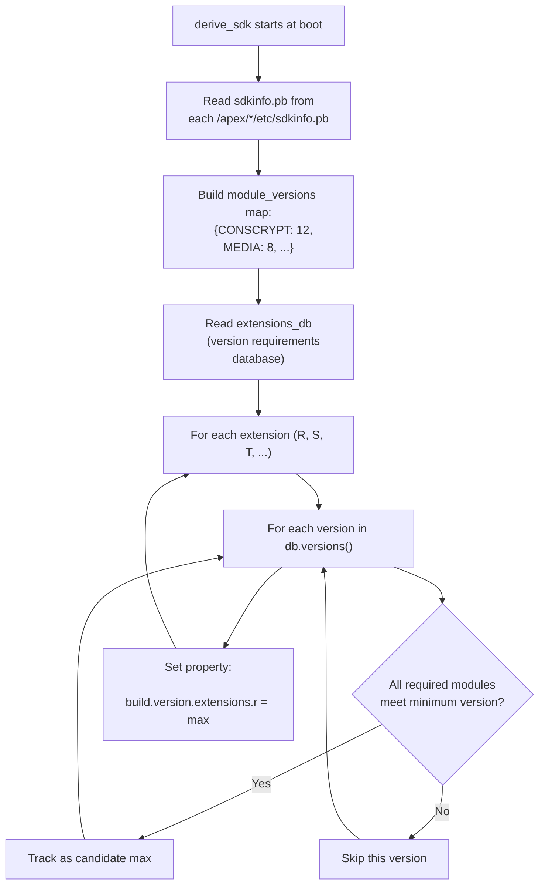

### 52.4.4  The Java API: SdkExtensions Class

Apps query extension versions through `android.os.ext.SdkExtensions`:

```java
// Source: packages/modules/SdkExtensions/java/android/os/ext/SdkExtensions.java

public class SdkExtensions {
    public static final int AD_SERVICES = 1_000_000;

    private static final int R_EXTENSION_INT;
    private static final int S_EXTENSION_INT;
    private static final int T_EXTENSION_INT;
    private static final int U_EXTENSION_INT;
    private static final int V_EXTENSION_INT;
    private static final int B_EXTENSION_INT;
    private static final int AD_SERVICES_EXTENSION_INT;

    static {
        R_EXTENSION_INT = SystemProperties.getInt(
            "build.version.extensions.r", 0);
        S_EXTENSION_INT = SystemProperties.getInt(
            "build.version.extensions.s", 0);
        T_EXTENSION_INT = SystemProperties.getInt(
            "build.version.extensions.t", 0);
        U_EXTENSION_INT = SystemProperties.getInt(
            "build.version.extensions.u", 0);
        V_EXTENSION_INT = SystemProperties.getInt(
            "build.version.extensions.v", 0);
        B_EXTENSION_INT = SystemProperties.getInt(
            "build.version.extensions.b", 0);
        AD_SERVICES_EXTENSION_INT = SystemProperties.getInt(
            "build.version.extensions.ad_services", 0);
    }

    /**
     * Return the version of the specified extensions.
     *
     * Example:
     *   if (getExtensionVersion(VERSION_CODES.R) >= 3) {
     *       // Safely use API available since R extensions version 3
     *   }
     */
    public static int getExtensionVersion(@Extension int extension) {
        if (extension < VERSION_CODES.R) {
            throw new IllegalArgumentException(
                "not a valid extension: " + extension);
        }
        if (extension == VERSION_CODES.R) return R_EXTENSION_INT;
        if (extension == VERSION_CODES.S) return S_EXTENSION_INT;
        if (extension == VERSION_CODES.TIRAMISU) return T_EXTENSION_INT;
        if (extension == VERSION_CODES.UPSIDE_DOWN_CAKE) return U_EXTENSION_INT;
        if (extension == VERSION_CODES.VANILLA_ICE_CREAM) return V_EXTENSION_INT;
        if (extension == VERSION_CODES.BAKLAVA) return B_EXTENSION_INT;
        if (extension == AD_SERVICES) return AD_SERVICES_EXTENSION_INT;
        return 0;
    }

    public static Map<Integer, Integer> getAllExtensionVersions() {
        return ALL_EXTENSION_INTS;
    }
}
```

### 52.4.5  Using Extension Versions in App Code

The typical pattern for an app developer:

```java
import android.os.Build;
import android.os.ext.SdkExtensions;

// Check if a T-extensions API (added in extension version 5) is available
if (Build.VERSION.SDK_INT >= Build.VERSION_CODES.TIRAMISU &&
    SdkExtensions.getExtensionVersion(Build.VERSION_CODES.TIRAMISU) >= 5) {
    // Safe to use the API
    useNewTiramisuApi();
}
```

The `@RequiresExtension` annotation (from AndroidX) makes this more ergonomic:

```java
@RequiresExtension(extension = Build.VERSION_CODES.TIRAMISU, version = 5)
public void useNewTiramisuApi() {
    // ...
}
```

### 52.4.6  Worked Example: How Extension Version is Computed

Let us walk through a concrete example of how `derive_sdk` computes the R
extension version.

**Input**: The `extensions_db` contains the following (simplified) entries:

```
version: 5
requirements:
  - module: CONSCRYPT,       min_version: 10
  - module: MEDIA,           min_version: 8
  - module: PERMISSIONS,     min_version: 12
  - module: TETHERING,       min_version: 6

version: 6
requirements:
  - module: CONSCRYPT,       min_version: 11
  - module: MEDIA,           min_version: 9
  - module: PERMISSIONS,     min_version: 14
  - module: TETHERING,       min_version: 7
```

**Installed module versions** (from `sdkinfo.pb` in each APEX):

```
CONSCRYPT: 12
MEDIA: 9
PERMISSIONS: 14
TETHERING: 6
```

**Evaluation**:

For version 5:

- CONSCRYPT 12 >= 10 -- pass
- MEDIA 9 >= 8 -- pass
- PERMISSIONS 14 >= 12 -- pass
- TETHERING 6 >= 6 -- pass
- **All met: version 5 is a candidate.**

For version 6:

- CONSCRYPT 12 >= 11 -- pass
- MEDIA 9 >= 9 -- pass
- PERMISSIONS 14 >= 14 -- pass
- TETHERING 6 >= 7 -- **FAIL** (6 < 7)
- **Not all met: version 6 is rejected.**

**Result**: R extension version = 5.

The TETHERING module at version 6 does not meet the minimum requirement of 7
for extension version 6.  If Google pushes a Connectivity module update that
brings TETHERING to version 7 or higher, the R extension version would
automatically advance to 6 on the next reboot.

This mechanism ensures that apps can trust extension version checks: if
`SdkExtensions.getExtensionVersion(R) >= 6`, then *all* modules in the R
train are at or above the required versions, and all APIs introduced in R
extension 6 are available.

### 52.4.7  Ad Services Extension

The Ad Services extension is a special case: it has its own independent
extension track (`AD_SERVICES = 1_000_000`) because the Privacy Sandbox
APIs evolve on a different cadence from the platform extensions:

```java
// Source: packages/modules/SdkExtensions/java/android/os/ext/SdkExtensions.java

public static final int AD_SERVICES = 1_000_000;

// In the static initializer:
AD_SERVICES_EXTENSION_INT = SystemProperties.getInt(
    "build.version.extensions.ad_services", 0);

if (SdkLevel.isAtLeastT()) {
    extensions.put(AD_SERVICES, AD_SERVICES_EXTENSION_INT);
}
```

Apps that use Privacy Sandbox APIs check:

```java
if (SdkExtensions.getExtensionVersion(SdkExtensions.AD_SERVICES) >= 4) {
    // Safe to use Ad Services API from extension version 4
}
```

### 52.4.8  The SdkExtensions APEX

The SdkExtensions module itself is packaged as an APEX:

```
// Source: packages/modules/SdkExtensions/Android.bp

apex {
    name: "com.android.sdkext",
    defaults: ["com.android.sdkext-defaults"],
    bootclasspath_fragments: [
        "com.android.sdkext-bootclasspath-fragment"
    ],
    binaries: [
        "derive_classpath",
        "derive_sdk",
    ],
    prebuilts: [
        "current_sdkinfo",
        "extensions_db",
    ],
    manifest: "manifest.json",
}
```

It bundles:

- `derive_sdk` -- The binary that computes extension versions at boot.
- `derive_classpath` -- A binary that generates the DEX2OAT boot classpath
  configuration based on installed modules.

- `extensions_db` -- The protobuf database of version requirements.
- `framework-sdkextensions.jar` -- The Java API (`SdkExtensions` class).

### 52.4.9  Extension Version Lifecycle

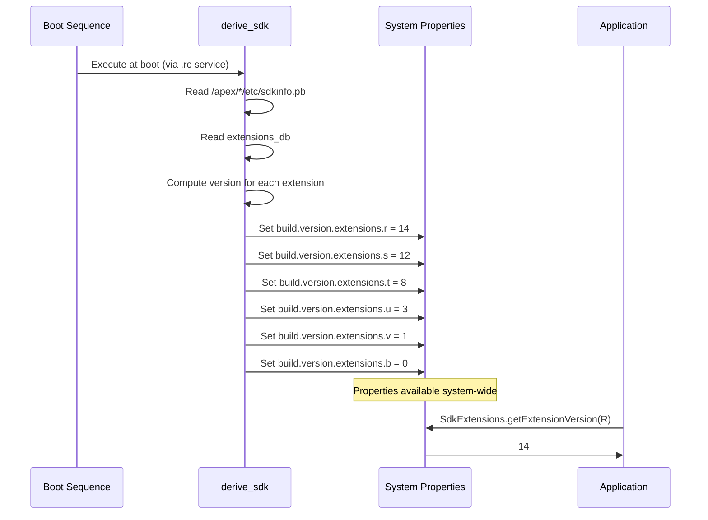

---

## 52.5  Module Boundaries

Mainline modules must coexist with both the platform and other modules while
maintaining strict interface boundaries.  This section explains the rules that
govern what can and cannot be inside a module.

### 52.5.1  The `apex_available` Property

Every library, binary, or app that wants to be included in an APEX must declare
which APEXes it is available for:

```go
// Source: build/soong/android/apex.go

type ApexProperties struct {
    // Availability of this module in APEXes. Only the listed APEXes
    // can contain this module.
    //
    // "//apex_available:anyapex" matches any APEX.
    // "//apex_available:platform" refers to non-APEX partitions.
    // Prefix pattern (com.foo.*) can match any APEX with that prefix.
    // Default is ["//apex_available:platform"].
    Apex_available []string
}
```

For example, a library that should be available to both the platform and the
Connectivity APEX would declare:

```
cc_library {
    name: "libnetutils",
    apex_available: [
        "//apex_available:platform",
        "com.android.tethering",
    ],
}
```

The build system enforces that a module cannot be included in an APEX unless
its `apex_available` list permits it.  This prevents accidental dependency
bloat and ensures clear ownership.

### 52.5.2  API Surface Levels

Mainline modules interact with the platform and with each other through
carefully defined API surfaces.  The `java_sdk_library` module type in Soong
generates multiple API scopes:

```go
// Source: build/soong/java/sdk_library.go

apiScopePublic = initApiScope(&apiScope{
    name: "public",
    sdkVersion: "current",
    kind: android.SdkPublic,
})

apiScopeSystem = initApiScope(&apiScope{
    name: "system",
    annotation: "android.annotation.SystemApi(
        client=android.annotation.SystemApi.Client.PRIVILEGED_APPS)",
    kind: android.SdkSystem,
})

apiScopeModuleLib = initApiScope(&apiScope{
    name: "module-lib",
    annotation: "android.annotation.SystemApi(
        client=android.annotation.SystemApi.Client.MODULE_LIBRARIES)",
    kind: android.SdkModule,
})

apiScopeSystemServer = initApiScope(&apiScope{
    name: "system-server",
    annotation: "android.annotation.SystemApi(
        client=android.annotation.SystemApi.Client.SYSTEM_SERVER)",
    kind: android.SdkSystemServer,
})
```

These map to five distinct API surfaces:

| Surface | Annotation | Who Can Use It |
|---------|-----------|---------------|
| **Public** | (none) | Any app (stable, CTS-tested) |
| **System** | `@SystemApi(PRIVILEGED_APPS)` | Privileged apps and system services |
| **Module-lib** | `@SystemApi(MODULE_LIBRARIES)` | Other Mainline modules only |
| **System-server** | `@SystemApi(SYSTEM_SERVER)` | System server process only |
| **Test** | `@TestApi` | CTS and other test suites |

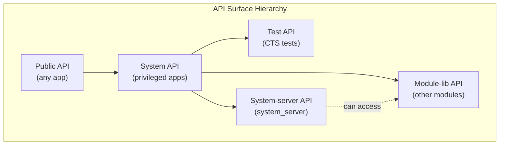

### 52.5.3  Hidden API Enforcement

APIs not annotated with any of the above markers are considered **hidden APIs**.
Mainline modules are subject to hidden-API enforcement just like regular apps:

- The build system tracks hidden APIs through `hidden_api` stanza in
  bootclasspath fragment definitions.

- At runtime, the `libnativeloader` and ART enforce access restrictions based
  on the calling module's API level.

A bootclasspath fragment declares which packages it owns and their hidden API
flags:

```
bootclasspath_fragment {
    name: "com.android.permission-bootclasspath-fragment",
    contents: ["framework-permission"],
    apex_available: ["com.android.permission"],
    hidden_api: {
        split_packages: ["*"],
        // annotation flags, metadata, index files
    },
}
```

### 52.5.4  What Can Be in a Module

A Mainline module (APEX) can contain:

| Content Type | Build Module Type | Property |
|-------------|------------------|----------|
| Native shared libraries | `cc_library` | `native_shared_libs` |
| Native executables | `cc_binary` | `binaries` |
| JNI libraries | `cc_library` (with `is_jni: true`) | `jni_libs` |
| Java libraries | `java_library` | `java_libs` |
| Bootclasspath fragments | `bootclasspath_fragment` | `bootclasspath_fragments` |
| System server fragments | `systemserverclasspath_fragment` | `systemserverclasspath_fragments` |
| Android apps (APKs) | `android_app` | `apps` |
| Shell scripts | `sh_binary` | `sh_binaries` |
| Configuration files | `prebuilt_etc` | `prebuilts` |
| Rust dynamic libraries | `rust_library` | `rust_dyn_libs` |
| Filesystem images | `android_filesystem` | `filesystems` |
| Runtime resource overlays | `runtime_resource_overlay` | `rros` |
| Compat config files | `platform_compat_config` | `compat_configs` |

### 52.5.5  What Cannot Be in a Module

Not everything can be modularized.  The following constraints apply:

1. **Kernel modules** -- Kernel code is updated through GKI, not APEX.
2. **HAL implementations** -- HALs are vendor-specific; they use VINTF
   manifests and are not part of Mainline (though vendor APEXes exist).

3. **Boot-critical init scripts** -- The very earliest init stages must work
   without any APEX mounted.

4. **SELinux policy** -- Base policy ships with the platform; modules only
   contribute `file_contexts` for their own mount points.

5. **Resources from framework-res** -- Core framework resources are not in an
   APEX (though overlays are possible).

### 52.5.6  Module Dependencies and `min_sdk_version`

Each APEX declares a `min_sdk_version` that determines:

- The minimum platform version on which the APEX can be installed.
- Which NDK/SDK APIs the module's native code can use.

The `packages/modules/common/sdk/Android.bp` file defines standard defaults
for each launch window:

```
// Source: packages/modules/common/sdk/Android.bp

apex_defaults {
    name: "r-launched-apex-module",
    defaults: ["any-launched-apex-modules"],
    min_sdk_version: "30",  // APEX_LOWEST_MIN_SDK_VERSION
}

apex_defaults {
    name: "s-launched-apex-module",
    defaults: ["any-launched-apex-modules"],
    min_sdk_version: "31",
    compressible: true,
}

apex_defaults {
    name: "t-launched-apex-module",
    defaults: ["any-launched-apex-modules"],
    min_sdk_version: "Tiramisu",
    compressible: true,
}

apex_defaults {
    name: "u-launched-apex-module",
    defaults: ["any-launched-apex-modules"],
    min_sdk_version: "UpsideDownCake",
    compressible: true,
}

apex_defaults {
    name: "v-launched-apex-module",
    defaults: ["any-launched-apex-modules"],
    min_sdk_version: "VanillaIceCream",
    compressible: true,
}

apex_defaults {
    name: "b-launched-apex-module",
    defaults: ["any-launched-apex-modules"],
    min_sdk_version: "36",
    compressible: true,
}
```

All updatable APEXes inherit from `any-launched-apex-modules`:

```
// Source: packages/modules/common/sdk/Android.bp

apex_defaults {
    name: "any-launched-apex-modules",
    updatable: true,
}
```

This sets `updatable: true`, which triggers additional build-time checks:

- All native dependencies must use stable NDK APIs.
- All Java dependencies must use `sdk_version: "module_current"` or lower.
- Symbol versioning is enforced for shared libraries.

### 52.5.7  Dynamic Common Lib APEXes (DCLA)

Some modules use the **DCLA** (Dynamic Common Lib APEX) strategy to share
native libraries across multiple APEXes without duplicating them:

```
// Source: packages/modules/common/sdk/Android.bp

DCLA_MIN_SDK_VERSION = "31"

library_linking_strategy_apex_defaults {
    name: "r-launched-dcla-enabled-apex-module",
    defaults: ["r-launched-apex-module"],
    soong_config_variables: {
        library_linking_strategy: {
            prefer_static: {},
            conditions_default: {
                min_sdk_version: DCLA_MIN_SDK_VERSION,
            },
        },
    },
}
```

When DCLA is enabled, shared libraries like `libc++` and `libcrypto` are
loaded from a shared location rather than being duplicated in each APEX.
This reduces on-device storage but requires API level 31+ for the shared
library loading infrastructure.

### 52.5.8  Cross-Module Dependencies

Modules can depend on each other through:

1. **provideNativeLibs / requireNativeLibs** -- Declared in the APEX manifest,
   these let one APEX export a native library that another APEX imports.

2. **java_sdk_library** -- Provides stable Java API stubs that other modules
   compile against.

3. **Stable AIDL** -- For IPC between services in different modules.

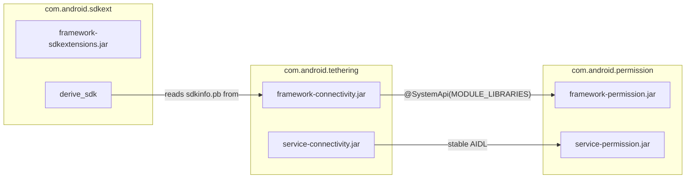

### 52.5.9  The `apex_available` Enforcement Mechanism

The build system enforces `apex_available` at the Soong module-graph level.
The `ApexModule` interface in `build/soong/android/apex.go` defines the
contract:

```go
// Source: build/soong/android/apex.go

type ApexModule interface {
    // Returns true if this module is available in any APEX
    InAnyApex() bool

    // Returns true if the module is NOT available to the platform
    NotInPlatform() bool

    // Tests if this module can have APEX variants
    CanHaveApexVariants() bool

    // Tests if installable as a file in an APEX
    IsInstallableToApex() bool

    // Tests availability for a specific APEX or ":platform"
    AvailableFor(what string) bool

    // Returns the list of APEXes this module is available for
    ApexAvailableFor() []string

    // Returns the min SDK version the module supports
    MinSdkVersionSupported(ctx BaseModuleContext) ApiLevel
}
```

When an APEX definition references a library (e.g., `native_shared_libs:
["libfoo"]`), the build system:

1. Creates an APEX variant of `libfoo` through the `apexTransitionMutator`.
2. Checks that `libfoo`'s `apex_available` list includes the APEX name.
3. Validates that `libfoo`'s `min_sdk_version` is compatible with the APEX.
4. Transitively checks all dependencies of `libfoo`.

If any check fails, the build aborts with a clear error message indicating
which module violates the boundary.

### 52.5.10  Linker Namespace Configuration

When an APEX is activated, its native libraries need their own linker
namespace to avoid conflicts with platform libraries and other APEXes.  The
`linkerconfig` tool generates namespace configuration dynamically based on the
activated APEXes.

Each APEX's `apex_manifest.pb` declares:

- `provideNativeLibs` -- Libraries this APEX exports to others.
- `requireNativeLibs` -- Libraries this APEX needs from others.

The linker configuration ensures:

- Libraries inside an APEX can see each other.
- Libraries from the platform are accessible only through the platform
  namespace.

- Cross-APEX library sharing follows explicit `provideNativeLibs` /
  `requireNativeLibs` declarations.

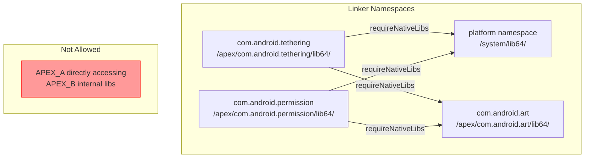

### 52.5.11  Bootclasspath and System Server Classpath

Java-containing Mainline modules participate in the boot classpath through
**bootclasspath fragments** and **systemserverclasspath fragments**.  These
fragments define which JAR files from the module should be added to the
classpath.

A bootclasspath fragment declaration:

```
bootclasspath_fragment {
    name: "com.android.tethering-bootclasspath-fragment",
    contents: [
        "framework-connectivity",
        "framework-connectivity-t",
    ],
    apex_available: ["com.android.tethering"],
    hidden_api: {
        split_packages: ["*"],
        // ...
    },
}
```

At boot time, the `derive_classpath` binary (from the SdkExtensions module)
reads the active APEXes and generates:

- `BOOTCLASSPATH` -- The list of JARs for the boot class loader.
- `DEX2OATBOOTCLASSPATH` -- The subset compiled ahead-of-time by dex2oat.
- `SYSTEMSERVERCLASSPATH` -- JARs loaded into the system server process.

This dynamic generation is essential because the set of active modules can
change with updates, and the classpath must always reflect what is actually
installed.

---

## 52.6  Module Development

### 52.6.1  Building a Mainline Module

Building a specific module:

```bash
# Build a single APEX
$ m com.android.tethering

# Build all Mainline modules
$ m mainline_modules

# Build a module and install it on a connected device
$ m com.android.sdkext && adb install out/target/product/generic_arm64/system/apex/com.android.sdkext.apex
```

### 52.6.2  Anatomy of a Module Build

A complete module definition typically involves:

1. **APEX definition** (`Android.bp` in module's `apex/` directory)
2. **APEX key** (`apex_key` module)
3. **Certificate** (`android_app_certificate` module)
4. **Bootclasspath fragment** (for Java-containing modules)
5. **System server classpath fragment** (for modules with system server code)
6. **Framework library** (usually `java_sdk_library`)
7. **Service implementation** (usually `java_library`)

Here is the minimal structure, using the SdkExtensions module as an example:

```
packages/modules/SdkExtensions/
+-- Android.bp                    # APEX definition + key + certificate
+-- manifest.json                 # APEX manifest (JSON, converted to protobuf)
+-- com.android.sdkext.avbpubkey  # AVB public key
+-- com.android.sdkext.pem        # AVB private key
+-- com.android.sdkext.pk8        # Container signing private key
+-- com.android.sdkext.x509.pem   # Container signing certificate
+-- derive_sdk/
|   +-- derive_sdk.cpp            # Boot-time binary
|   +-- derive_sdk.rc             # init service definition
+-- java/
|   +-- android/os/ext/
|       +-- SdkExtensions.java    # Public API
+-- gen_sdk/                      # SDK version database generation
+-- javatests/                    # Tests
```

### 52.6.3  Creating a New Module from Scratch

If you were to create a new Mainline module, the steps would be:

**Step 1: Generate signing keys.**

```bash
# Generate AVB key pair
$ openssl genrsa -out com.android.mymodule.pem 4096
$ avbtool extract_public_key --key com.android.mymodule.pem \
    --output com.android.mymodule.avbpubkey

# Generate container signing key
$ development/tools/make_key com.android.mymodule \
    '/CN=com.android.mymodule'
```

**Step 2: Write the Android.bp.**

```
apex {
    name: "com.android.mymodule",
    defaults: ["v-launched-apex-module"],  // launched in V
    manifest: "apex_manifest.json",
    key: "com.android.mymodule.key",
    certificate: ":com.android.mymodule.certificate",
    bootclasspath_fragments: [
        "com.android.mymodule-bootclasspath-fragment",
    ],
    native_shared_libs: ["libmymodule"],
    java_libs: ["mymodule-java-lib"],
}

apex_key {
    name: "com.android.mymodule.key",
    public_key: "com.android.mymodule.avbpubkey",
    private_key: "com.android.mymodule.pem",
}

android_app_certificate {
    name: "com.android.mymodule.certificate",
    certificate: "com.android.mymodule",
}
```

**Step 3: Write the APEX manifest.**

```json
{
    "name": "com.android.mymodule",
    "version": 1
}
```

**Step 4: Create SELinux file contexts.**

```
# system/sepolicy/apex/com.android.mymodule-file_contexts
(/.*)?       u:object_r:system_file:s0
/bin(/.*)?   u:object_r:mymodule_exec:s0
/lib(64)?(/.*)?  u:object_r:system_lib_file:s0
```

**Step 5: Declare apex_available in all dependencies.**

```
cc_library {
    name: "libmymodule",
    srcs: ["mymodule.cpp"],
    apex_available: [
        "com.android.mymodule",
    ],
    min_sdk_version: "VanillaIceCream",
}
```

### 52.6.4  Testing Mainline Modules

#### CTS (Compatibility Test Suite)

CTS tests verify that the device behaves correctly with the installed module
versions.  Many module-specific CTS tests live alongside the module source:

```
packages/modules/SdkExtensions/javatests/
+-- com/android/os/ext/SdkExtensionsTest.java
+-- com/android/sdkext/extensions/SdkExtensionsHostTest.java
```

#### MTS (Mainline Test Suite)

MTS is a subset of CTS designed specifically for testing Mainline module
updates.  It can be run independently:

```bash
# Run MTS for a specific module
$ atest --mts com.android.sdkext.tests

# Or use the MTS test plan
$ cts-tradefed run mts --module SdkExtensionsTests
```

#### Unit Tests

Individual module components have their own unit tests:

```bash
# Run apexd unit tests
$ atest apex_file_test
$ atest apex_manifest_test
$ atest apex_database_test
$ atest apex_file_repository_test

# Run derive_sdk tests
$ atest derive_sdk_test
```

#### TEST_MAPPING

Modules use `TEST_MAPPING` files to declare which tests should run during
pre-submit and post-submit:

```json
{
    "presubmit": [
        {"name": "SdkExtensionsTests"},
        {"name": "derive_sdk_test"}
    ],
    "postsubmit": [
        {"name": "SdkExtensionsHostTest"}
    ]
}
```

### 52.6.5  Installing and Updating on Device

**Install a locally-built APEX:**

```bash
$ adb install --staged out/target/product/generic_arm64/system/apex/com.android.sdkext.apex
$ adb reboot
```

The `--staged` flag is required for APEXes because they need a reboot to
activate (unless the APEX supports rebootless update via
`supportsRebootlessUpdate` in the manifest).

**Revert to the pre-installed version:**

```bash
$ adb shell cmd -w apexservice revertActiveSession
$ adb reboot
```

**Check installed APEX versions:**

```bash
$ adb shell pm list packages --apex-only --show-versioncode
package:com.android.adbd versionCode:340090000
package:com.android.art versionCode:340090000
package:com.android.conscrypt versionCode:340090000
package:com.android.i18n versionCode:340090000
package:com.android.media versionCode:340090000
package:com.android.media.swcodec versionCode:340090000
package:com.android.os.statsd versionCode:340090000
package:com.android.permission versionCode:340090000
package:com.android.resolv versionCode:340090000
package:com.android.sdkext versionCode:340090000
package:com.android.tethering versionCode:340090000
package:com.android.wifi versionCode:340090000
...
```

**Inspect a mounted APEX:**

```bash
$ adb shell ls /apex/com.android.sdkext/
bin/
etc/
javalib/

$ adb shell cat /apex/apex-info-list.xml
```

**Query extension versions:**

```bash
$ adb shell getprop build.version.extensions.r
14
$ adb shell getprop build.version.extensions.s
12
$ adb shell getprop build.version.extensions.t
8
```

### 52.6.6  Debugging APEX Issues

**Check apexd logs:**

```bash
$ adb logcat -s apexd
$ adb logcat -s apexd-bootstrap
```

**Examine the APEX database:**

```bash
# List all activated APEXes
$ adb shell cmd -w apexservice getActivePackages

# Get info about a specific APEX
$ adb shell cmd -w apexservice getApexInfo com.android.sdkext
```

**Inspect APEX file contents from host:**

```bash
$ deapexer list com.android.sdkext.apex
$ deapexer extract com.android.sdkext.apex output_dir/
```

**Check SELinux contexts:**

```bash
$ adb shell ls -Z /apex/com.android.sdkext/
$ adb shell ls -Z /apex/com.android.sdkext/bin/
```

### 52.6.7  Staged Sessions and Update Workflow

The complete lifecycle of a Mainline module update:

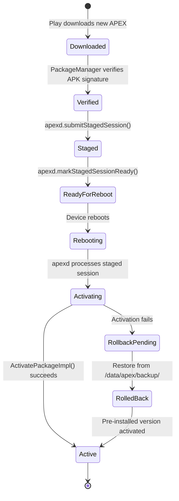

### 52.6.8  The APEX Build Pipeline (Full)

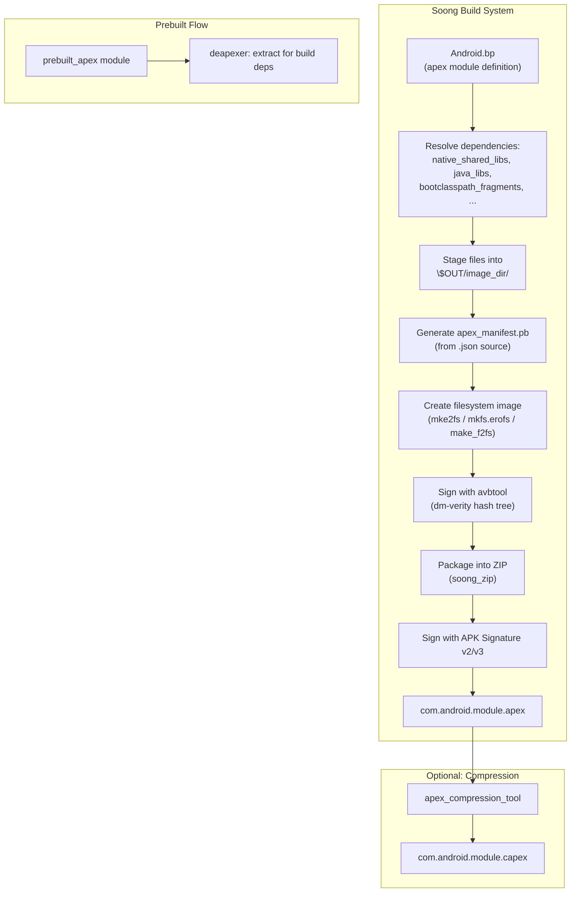

### 52.6.9  The APEX Service Interface (AIDL)

The `apexd` daemon exposes an AIDL service interface that `PackageManager` and
other system components use to manage APEX packages.  Key methods include:

```
// Source: system/apex/apexd/aidl (simplified interface)

interface IApexService {
    ApexSessionInfo[] getStagedSessionInfo();
    void submitStagedSession(in ApexSessionParams params,
                             out ApexInfoList packages);
    void markStagedSessionReady(int session_id);
    void markStagedSessionSuccessful();
    void markBootCompleted();
    ApexInfo[] getActivePackages();
    ApexInfo[] getAllPackages();
    void installAndActivatePackage(String packagePath,
                                   out ApexInfo info);
    void revertActiveSession();
}
```

The `installAndActivatePackage` method is the entry point for rebootless
updates.  It validates the caller (must be system or root), verifies the
package, and performs the activation steps described in Section 32.2.10.

### 52.6.10  Continuous Integration and Module Testing

Mainline modules follow a rigorous testing pipeline:

**Pre-submit (before code lands):**

1. Unit tests (specified in `TEST_MAPPING`).
2. Build verification (module must build cleanly).
3. API compatibility checks (no breaking changes to stable APIs).

**Post-submit (after code lands):**

1. MTS (Mainline Test Suite) runs on multiple device types.
2. CTS (Compatibility Test Suite) for behavior verification.
3. Performance benchmarks to catch regressions.

**Before module release:**

1. Full MTS pass on target devices.
2. Dogfood deployment to internal devices.
3. Staged rollout (1%, 5%, 25%, 50%, 100%).
4. Monitoring for crash rates, ANR rates, and metric anomalies.

### 52.6.11  Handling API Evolution in Modules

When a Mainline module adds a new API, the process is:

1. Add the API with appropriate annotations (`@SystemApi`, `@TestApi`, etc.).
2. Update the API surface files (`current.txt` / `system-current.txt`).
3. Run `m update-api` to regenerate API tracking files.
4. Add CTS tests for the new API.
5. If the API should be gated on extension version, add the module to the
   appropriate extension train in `derive_sdk.cpp`.

For example, if a new API was added to the Permission module for the T
extension train at version 5, the `extensions_db` would be updated to require
a minimum Permission module version that includes the new API.

### 52.6.12  Debugging Build Failures

Common build issues with Mainline modules:

**`apex_available` violations:**

```
error: "libfoo" is not available for "com.android.mymodule"
    Add "com.android.mymodule" to apex_available of "libfoo"
```

Fix: Add the APEX name to the library's `apex_available` property.

**`min_sdk_version` violations:**

```
error: "libfoo" with min_sdk_version "current" cannot be used
    in "com.android.mymodule" with min_sdk_version "30"
```

Fix: Set a concrete `min_sdk_version` on the dependency library.

**Updatable module restrictions:**

```
error: "com.android.mymodule" is updatable but references "libbar"
    which uses unstable platform APIs
```

Fix: Ensure all dependencies use stable API levels (NDK, SDK stubs).

### 52.6.13  Module Versioning Strategy

APEX version codes follow a specific format: `XYYZZZ000` where:

- `X` -- Reserved (usually 3 for trunk).
- `YY` -- Platform SDK version (e.g., 40 for B/Baklava SDK 36 encoded).
- `ZZZ` -- Build number within the release.
- `000` -- Variant (000 for release, 090 for development).

For example, `340090000` means:

- `3` -- Trunk
- `40` -- SDK version encoding
- `090` -- Development build
- `000` -- Default variant

This scheme ensures that newer module versions always have higher version codes,
which is critical for the Play Store update mechanism.

---

## 52.7  Try It

The following exercises walk through inspecting Mainline modules on a running
device and understanding their structure from source.

### Exercise 52.1: Inspect Activated APEXes

List all activated APEXes on a device or emulator:

```bash
$ adb shell ls /apex/ | grep -v '@'
```

For each APEX, inspect its contents:

```bash
$ adb shell ls -la /apex/com.android.sdkext/
$ adb shell ls -la /apex/com.android.tethering/
$ adb shell ls -la /apex/com.android.permission/
```

**Question**: Which modules contain native binaries (`bin/` directory)? Which
contain only Java libraries (`javalib/`)?

### Exercise 52.2: Read the APEX Info List

The file `/apex/apex-info-list.xml` contains metadata about every activated
APEX:

```bash
$ adb shell cat /apex/apex-info-list.xml
```

Parse the XML to answer:

- Which APEXes are on the `/system` partition vs. `/system_ext`?
- Which APEXes have been updated from their pre-installed version?
- What is the version code of each APEX?

### Exercise 52.3: Query Extension Versions

Check all SDK extension versions:

```bash
$ adb shell getprop | grep build.version.extensions
```

Compare the R, S, T, U, V, and B extension versions.  Using the
`kRModules`, `kSModules`, `kTModules` sets from `derive_sdk.cpp`, identify
which modules contribute to each extension level.

### Exercise 52.4: Examine APEX Build Rules

Read the APEX module definition for the Permission module:

```bash
$ cat packages/modules/Permission/Android.bp
```

Trace the dependency chain:

1. What defaults does it inherit?
2. What is its `min_sdk_version`?
3. What bootclasspath fragments does it include?
4. What key and certificate does it use?

### Exercise 52.5: Build and Install an APEX

Build the SdkExtensions module and install it:

```bash
$ source build/envsetup.sh
$ lunch aosp_cf_x86_64_phone-trunk_staging-userdebug
$ m com.android.sdkext

# Install on a running emulator
$ adb install --staged out/target/product/vsoc_x86_64/system/apex/com.android.sdkext.apex
$ adb reboot
```

After reboot, verify the version changed:

```bash
$ adb shell pm list packages --apex-only --show-versioncode | grep sdkext
```

### Exercise 52.6: Trace the APEX Activation in Logcat

Capture boot logs to see apexd in action:

```bash
# Reboot and capture logs
$ adb reboot
$ adb wait-for-device
$ adb logcat -d -s apexd | head -100
```

Look for:

- `"Scanning <path>"` messages showing where APEXes are found.
- `"Successfully activated"` messages for each APEX.
- The `"Marking APEXd as activated"` and `"Marking APEXd as ready"` milestones.
- Timing information (`"OnStart done, duration=..."`) for boot performance.

### Exercise 52.7: Examine the dm-verity Setup

For an updated APEX (one in `/data/apex/active/`), the dm-verity layer adds
integrity protection.  Use `dmsetup` to inspect:

```bash
$ adb root
$ adb shell dmsetup table | grep apex
```

This shows the dm-verity parameters: hash algorithm, data block size, hash
block size, number of blocks, and root hash.

### Exercise 52.8: Compare Pre-installed vs. Updated APEX

Find a module that has both a pre-installed version and an updated version:

```bash
# Pre-installed (factory) version
$ adb shell ls /system/apex/ | grep sdkext

# Updated (if any) version
$ adb shell ls /data/apex/active/ | grep sdkext
```

Pull both and compare their manifests:

```bash
# On host (requires deapexer)
$ deapexer info /path/to/system_version.apex
$ deapexer info /path/to/data_version.apex
```

### Exercise 52.9: Examine Module Boundaries

Pick two modules that have a dependency relationship (e.g., `com.android.tethering`
depends on APIs from `com.android.permission`).

In the source:

1. Find the `java_sdk_library` definitions in both modules.
2. Identify which API scope (`public`, `system`, `module-lib`) is used for
   the cross-module dependency.

3. Check the `apex_available` declarations on shared dependencies.

### Exercise 52.10: Write an Extension Version Check

Write a small Android app (or use `adb shell am` with a test APK) that:

1. Calls `SdkExtensions.getExtensionVersion(Build.VERSION_CODES.R)`.
2. Calls `SdkExtensions.getAllExtensionVersions()`.
3. Prints all extension versions to logcat.
4. Conditionally uses an API based on the extension version.

This demonstrates the runtime API-availability checking pattern that all apps
should use when targeting APIs introduced through Mainline modules.

### Exercise 52.11: Explore the APEX Build System

Examine the Soong build rules for APEX construction:

```bash
# Look at the APEX module type registration
$ cat build/soong/apex/apex.go | grep -A5 "RegisterModuleType"

# Look at the builder rules
$ cat build/soong/apex/builder.go | grep -A10 "apexRule ="

# Examine the key management
$ cat build/soong/apex/key.go | grep -A10 "apexKeyProperties"
```

**Question**: What host tools does the APEX builder depend on? List at least
ten tools that participate in building an APEX file.

### Exercise 52.12: Map Module Dependencies

For the Connectivity module (`com.android.tethering`), trace the dependency
chain:

```bash
# Find all libraries declared in the APEX
$ grep -A30 "multilib" \
    packages/modules/Connectivity/Tethering/apex/Android.bp

# For each JNI library, find its apex_available declaration
$ grep -r "apex_available" \
    packages/modules/Connectivity/service/ \
    --include="*.bp" | grep tethering
```

Draw a dependency graph showing:

1. The APEX package.
2. Its bootclasspath fragments.
3. Its system server classpath fragments.
4. The native shared libraries.
5. The JNI libraries.
6. The apps (APKs) inside the APEX.

### Exercise 52.13: Simulate an APEX Update Rollback

On a userdebug device:

```bash
# 1. Check current APEX versions
$ adb shell pm list packages --apex-only --show-versioncode | grep sdkext

# 2. Build a modified APEX with a higher version
# (edit the manifest.json to bump version)

# 3. Install it as a staged session
$ adb install --staged com.android.sdkext.apex

# 4. Reboot
$ adb reboot
$ adb wait-for-device

# 5. Verify the new version is active
$ adb shell pm list packages --apex-only --show-versioncode | grep sdkext

# 6. Trigger a rollback
$ adb shell cmd -w apexservice revertActiveSession
$ adb reboot
$ adb wait-for-device

# 7. Verify we're back to the original version
$ adb shell pm list packages --apex-only --show-versioncode | grep sdkext
```

### Exercise 52.14: Analyze dm-verity Protection

The dm-verity layer is what makes APEX tamper-proof.  Examine how it works:

```bash
# 1. List all device-mapper devices
$ adb root
$ adb shell dmsetup ls

# 2. Show the dm-verity table for an APEX
$ adb shell dmsetup table | grep com.android

# 3. The table format is:
# <start_sector> <num_sectors> verity <version> <data_dev> <hash_dev>
# <data_block_size> <hash_block_size> <num_data_blocks> <hash_start_block>
# <algorithm> <digest> <salt> [optional_params]
```

**Question**: What hash algorithm is used? What happens if a block is
corrupted (look for `restart_on_corruption` in the table)?

### Exercise 52.15: Build the Full Module Test Suite

Run the test suite for a specific Mainline module:

```bash
# Run SdkExtensions tests
$ atest SdkExtensionsTests

# Run apexd unit tests
$ atest apex_file_test apex_manifest_test apex_database_test

# Run derive_sdk tests
$ atest derive_sdk_test

# Run CTS tests for a module
$ atest CtsApexTestCases
```

### Exercise 52.16: Examine the apex-info-list.xml Schema

The `apex-info-list.xml` file is the authoritative record of all APEXes on the
device.  Examine its schema:

```bash
$ adb shell cat /apex/apex-info-list.xml
```

The XML contains entries like:

```xml
<apex-info
    moduleName="com.android.sdkext"
    modulePath="/system/apex/com.android.sdkext.apex"
    preinstalledModulePath="/system/apex/com.android.sdkext.apex"
    versionCode="340090000"
    versionName=""
    isFactory="true"
    isActive="true"
    lastUpdateMillis="0" />
```

For each entry, identify:

- `isFactory` -- Was this the pre-installed version?
- `isActive` -- Is this the currently active version?
- `modulePath` vs. `preinstalledModulePath` -- Has it been updated?

### Exercise 52.17: Create a Minimal Test APEX

Create a minimal APEX that contains a single shell script:

1. Create a directory `packages/modules/MyTest/`:

```
MyTest/
+-- Android.bp
+-- apex_manifest.json
+-- my_script.sh
```

2. Write the `Android.bp`:

```
apex {
    name: "com.android.mytest",
    updatable: false,
    platform_apis: true,
    manifest: "apex_manifest.json",
    sh_binaries: ["my_test_script"],
    key: "com.android.mytest.key",
    certificate: ":com.android.mytest.certificate",
    file_contexts: ":apex.test-file_contexts",
}

sh_binary {
    name: "my_test_script",
    src: "my_script.sh",
    apex_available: ["com.android.mytest"],
}
```

3. Build and inspect:

```bash
$ m com.android.mytest
$ deapexer list out/.../com.android.mytest.apex
```

**Question**: What files are inside the APEX besides your script? What
generates them?

### Exercise 52.18: Trace derive_sdk Boot Behavior

Monitor what `derive_sdk` does at boot time:

```bash
# Enable verbose logging
$ adb shell setprop log.tag.derive_sdk VERBOSE
$ adb reboot
$ adb wait-for-device
$ adb logcat -d -s derive_sdk | head -50
```

Match the log output against the code in
`packages/modules/SdkExtensions/derive_sdk/derive_sdk.cpp`:

- Which APEXes were found?
- What `sdkinfo.pb` versions were read?
- What extension version was computed for each train (R, S, T, U, V, B)?

---

## Summary

### Architecture Recap

The following diagram captures the complete Mainline architecture from build
time to runtime:

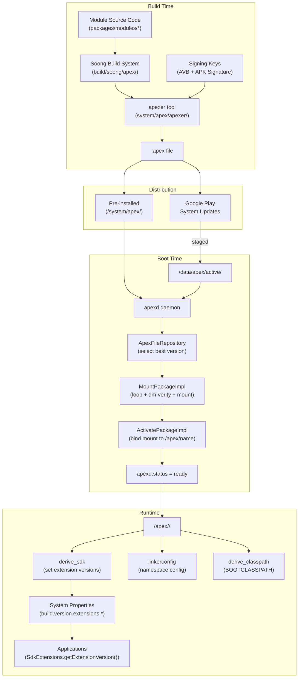

### Key Data Paths

| Path | Purpose |
|------|---------|
| `/system/apex/` | Pre-installed APEXes (factory image) |
| `/system_ext/apex/` | System-ext partition APEXes |
| `/product/apex/` | Product partition APEXes |
| `/vendor/apex/` | Vendor partition APEXes |
| `/odm/apex/` | ODM partition APEXes |
| `/data/apex/active/` | Updated APEXes (from Play or adb) |
| `/data/apex/backup/` | Backup for rollback |
| `/data/apex/decompressed/` | Decompressed CAPEXes |
| `/data/app-staging/` | Staged sessions (pending reboot) |
| `/apex/<name>/` | Active mount point (bind mount to latest) |
| `/apex/<name>@<version>/` | Versioned mount point |
| `/apex/apex-info-list.xml` | Metadata about all activated APEXes |

### Key Source Files

Project Mainline represents one of the most significant architectural changes
in Android's history.  By packaging platform components into independently
updatable APEX modules, Google can deliver security fixes and feature
improvements to billions of devices without waiting for the traditional OEM
update pipeline.

Key takeaways from this chapter:

- **APEX** is a ZIP containing a dm-verity-signed filesystem image, enabling
  native code, Java libraries, and configuration to be updated as a single
  atomic unit.

- **apexd** manages the full lifecycle: scanning partitions at boot, creating
  loop devices and dm-verity tables, bind-mounting active versions, processing
  staged updates, and supporting rollback.

- **40+ modules** in `packages/modules/` cover networking, security, media,
  telephony, ML, and more -- each with its own APEX name, signing key, and
  version lifecycle.

- **SDK Extensions** solve the runtime API-availability problem by deriving
  extension version numbers from actual installed module versions at boot time.

- **Module boundaries** are enforced through `apex_available`, API surface
  annotations (`@SystemApi`), `min_sdk_version`, and hidden-API policies.

The source files central to understanding this system:

| Component | Path |
|-----------|------|
| APEX build rules | `build/soong/apex/apex.go`, `builder.go`, `key.go` |
| APEX tool | `system/apex/apexer/apexer.py` |
| APEX manifest proto | `system/apex/proto/apex_manifest.proto` |
| apexd daemon | `system/apex/apexd/apexd.cpp`, `apex_file.cpp`, `apex_constants.h` |
| apexd init config | `system/apex/apexd/apexd.rc` |
| Module defaults | `packages/modules/common/sdk/Android.bp` |
| SDK Extensions API | `packages/modules/SdkExtensions/java/android/os/ext/SdkExtensions.java` |
| derive_sdk | `packages/modules/SdkExtensions/derive_sdk/derive_sdk.cpp` |
| APEX file repository | `system/apex/apexd/apex_file_repository.h` |

---

## 52.8  Deep Dive: HealthFitness (Health Connect)

The HealthFitness module (`com.android.healthfitness`) provides the **Health
Connect** platform -- a centralized, on-device repository for health and
fitness data.  It allows apps from different publishers (fitness trackers,
sleep monitors, medical apps) to share health records through a unified API
with fine-grained, per-data-type permissions.

### 52.8.1  Module Structure

```
packages/modules/HealthFitness/
    apex/               APEX packaging & bootclasspath fragment
    apk/                HealthConnectController (Settings UI)
    backuprestore/      HealthConnectBackupRestore (cloud B&R agent)
    framework/          Public API (android.health.connect.*)
    service/            System server implementation
    flags/              Feature flags (aconfig)
    lint/               Custom lint checks
    testapps/           Development toolbox app
    tests/              CTS, unit, and integration tests
```

The APEX bundles two APKs plus the framework and system server JARs:

```
// Source: packages/modules/HealthFitness/apex/Android.bp

apex {
    name: "com.android.healthfitness",
    apps: [
        "HealthConnectBackupRestore",
        "HealthConnectController",
    ],
    bootclasspath_fragments: [
        "com.android.healthfitness-bootclasspath-fragment"
    ],
    systemserverclasspath_fragments: [
        "com.android.healthfitness-systemserverclasspath-fragment"
    ],
    min_sdk_version: "34",
    updatable: true,
}
```

### 52.8.2  Architecture Overview

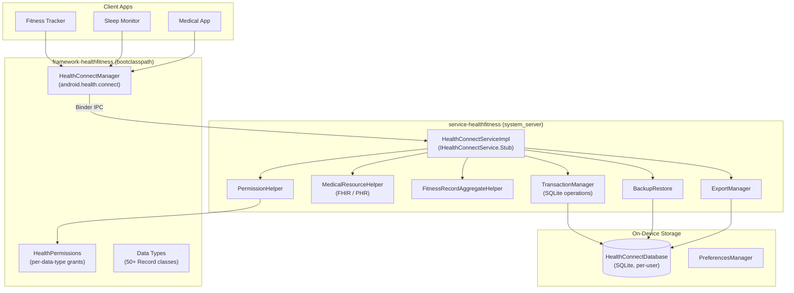

### 52.8.3  Data Types

Health Connect defines **50+ record types** in the
`android.health.connect.datatypes` package.  Every record class extends one of
two base classes:

| Base Class | Semantics | Examples |
|------------|-----------|---------|
| `InstantRecord` | Single point-in-time measurement | `HeartRateRecord`, `BloodPressureRecord`, `BloodGlucoseRecord`, `OxygenSaturationRecord`, `BodyTemperatureRecord` |
| `IntervalRecord` | Measurement over a time range | `StepsRecord`, `ExerciseSessionRecord`, `SleepSessionRecord`, `NutritionRecord`, `HydrationRecord`, `DistanceRecord` |

Data types span six categories defined by `HealthDataCategory`:

1. **Activity** -- Steps, distance, calories, exercise sessions, cycling
   cadence, floors climbed, elevation gained, exercise routes.

2. **Body measurements** -- Weight, height, body fat, bone mass, lean body
   mass, basal metabolic rate, body water mass.

3. **Cycle tracking** -- Menstruation flow, cervical mucus, ovulation test,
   intermenstrual bleeding, sexual activity.

4. **Nutrition** -- Nutrition records (per-nutrient detail), hydration, meal
   type.

5. **Sleep** -- Sleep sessions with per-stage breakdown (awake, light, deep,
   REM).

6. **Vitals** -- Heart rate, heart rate variability (RMSSD), blood pressure,
   blood glucose, oxygen saturation, respiratory rate, body temperature.

Each record carries `Metadata` (data origin, device info, client record ID,
last-modified time) enabling deduplication and priority ordering.

### 52.8.4  Personal Health Record (FHIR) Support

A major expansion in recent versions is the **Personal Health Record** (PHR)
API, enabling storage of clinical medical data using the **FHIR R4** standard:

```java
// Source: framework/java/android/health/connect/datatypes/MedicalResource.java
// Source: framework/java/android/health/connect/datatypes/MedicalDataSource.java
// Source: framework/java/android/health/connect/datatypes/FhirResource.java

// Apps create a MedicalDataSource, then upsert FHIR resources:
CreateMedicalDataSourceRequest request =
    new CreateMedicalDataSourceRequest.Builder(
        "Hospital Portal", Uri.parse("https://fhir.hospital.example"))
        .build();

UpsertMedicalResourceRequest upsert =
    new UpsertMedicalResourceRequest.Builder(
        dataSourceId,
        FhirVersion.parseFhirVersion("4.0.1"),
        fhirJsonString)
        .build();
```

PHR data requires the `WRITE_MEDICAL_DATA` permission and is structurally
validated against FHIR R4 specifications using a binary protobuf spec bundled
in the service JAR.

### 52.8.5  Permission Model

Health Connect uses a two-level permission system:

**Per-data-type permissions** -- Each record type has a read and write
permission defined in `HealthPermissions`:

```
android.permission.health.READ_HEART_RATE
android.permission.health.WRITE_HEART_RATE
android.permission.health.READ_STEPS
android.permission.health.WRITE_STEPS
android.permission.health.READ_SLEEP
...
```

**System-level permissions** (signature/privileged):

| Permission | Level | Purpose |
|-----------|-------|---------|
| `MANAGE_HEALTH_PERMISSIONS` | signature | Grant/revoke health permissions |
| `MANAGE_HEALTH_DATA` | privileged | Delete records, manage priorities |
| `START_ONBOARDING` | signature | Launch client onboarding flows |
| `READ_HEALTH_DATA_IN_BACKGROUND` | privileged | Background reads |
| `READ_HEALTH_DATA_HISTORY` | privileged | Access historical records |
| `WRITE_MEDICAL_DATA` | dangerous | Write FHIR medical resources |

Apps must also declare an activity handling
`ACTION_VIEW_PERMISSION_USAGE` with the `CATEGORY_HEALTH_PERMISSIONS`
category to be eligible for health permission grants.

### 52.8.6  On-Device Storage

All health data is stored in a per-user SQLite database managed by
`HealthConnectDatabase` (extends `SQLiteOpenHelper`).  The database lives in
credential-encrypted storage, ensuring it is inaccessible when the device is
locked.

Key storage components:

| Class | Responsibility |
|-------|---------------|
| `TransactionManager` | Executes all SQLite read/write operations within transactions |
| `DatabaseHelper` | Schema creation and upgrades |
| `DatabaseUpgradeHelper` | Version migration logic |
| `FitnessRecordUpsertHelper` | Insert or update fitness records with deduplication |
| `FitnessRecordReadHelper` | Query records with time filters, pagination, data-origin filters |
| `FitnessRecordAggregateHelper` | Compute aggregations (sum, avg, min, max) over time windows |
| `FitnessRecordDeleteHelper` | Delete by ID, time range, or data origin |

The service enforces per-app **rate limiting** via `RateLimiter` -- each UID
has a sliding-window quota for read, write, and aggregate operations.

### 52.8.7  Data Priority and Aggregation

When multiple apps write the same data type (e.g., both a watch and a phone
record steps), Health Connect uses a **data origin priority order** to resolve
conflicts during aggregation.  Users can reorder the priority in Settings.

```java
// Source: framework/java/android/health/connect/HealthConnectManager.java

void updateDataOriginPriorityOrder(
    UpdateDataOriginPriorityOrderRequest request,
    Executor executor,
    OutcomeReceiver<Void, HealthConnectException> callback);

void fetchDataOriginsPriorityOrder(
    int dataCategory,
    Executor executor,
    OutcomeReceiver<FetchDataOriginsPriorityOrderResponse,
                    HealthConnectException> callback);
```

### 52.8.8  Backup, Restore, and Export

Health Connect supports three data-portability mechanisms:

1. **Cloud backup/restore** -- The `HealthConnectBackupRestore` APK integrates
   with Android's backup infrastructure.  Changes are tracked via
   `BackupChangeTokenHelper` and serialized using Protocol Buffers.

2. **Device-to-device restore** -- Migration from an older device uses
   `MigrationEntity` records staged in a separate process.

3. **Export/import** -- Users can export their data to external storage via
   `ExportManager`, which compresses the database into a ZIP archive.  The
   `ImportManager` and `DatabaseMerger` handle re-importing and deduplication.

### 52.8.9  Key Source Paths

| Component | Path |
|-----------|------|
| Public API | `packages/modules/HealthFitness/framework/java/android/health/connect/` |
| Data types | `packages/modules/HealthFitness/framework/java/android/health/connect/datatypes/` |
| AIDL interfaces | `packages/modules/HealthFitness/framework/java/android/health/connect/aidl/` |
| System service | `packages/modules/HealthFitness/service/java/com/android/server/healthconnect/` |
| Storage layer | `packages/modules/HealthFitness/service/java/com/android/server/healthconnect/storage/` |
| Backup/restore | `packages/modules/HealthFitness/service/java/com/android/server/healthconnect/backuprestore/` |
| Export/import | `packages/modules/HealthFitness/service/java/com/android/server/healthconnect/exportimport/` |
| Settings UI (APK) | `packages/modules/HealthFitness/apk/` |
| APEX config | `packages/modules/HealthFitness/apex/Android.bp` |

---

## 52.9  Deep Dive: Profiling Module

The Profiling module (`com.android.profiling`) is a Mainline module that
provides **app-accessible system profiling** through the `ProfilingManager`
API.  It wraps Perfetto, heapprofd, and simpleperf behind a safe,
rate-limited, privacy-preserving interface that any app can call without root
access or special permissions.

### 52.9.1  Module Structure

```
packages/modules/Profiling/
    aidl/               IProfilingService.aidl
    apex/               APEX packaging (includes trace_redactor binary)
    framework/          Public API (android.os.ProfilingManager)
    service/            ProfilingService (system_server)
    anomaly-detector/   AnomalyDetectorService (optional, flag-gated)
    flags/              Feature flags (aconfig)
    tests/              CTS tests
```

The APEX is feature-flag gated:

```
// Source: packages/modules/Profiling/apex/Android.bp

apex {
    name: "com.android.profiling",
    enabled: select(
        release_flag("RELEASE_PACKAGE_PROFILING_MODULE"),
        { true: true, false: false }),
    binaries: ["trace_redactor"],
    bootclasspath_fragments: [
        "com.android.profiling-bootclasspath-fragment"
    ],
    systemserverclasspath_fragments: [
        "com.android.profiling-systemserverclasspath-fragment"
    ],
}
```

### 52.9.2  Architecture

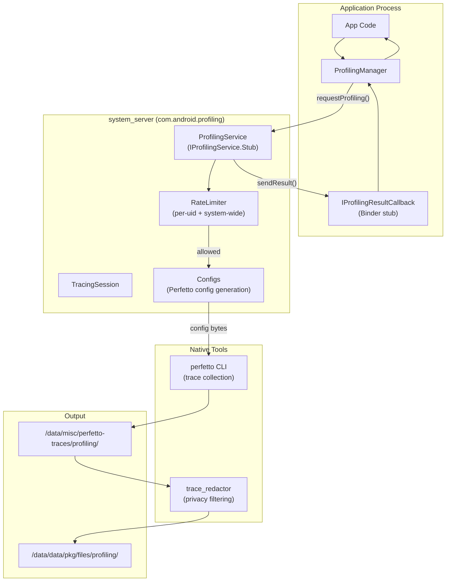

### 52.9.3  Profiling Types

`ProfilingManager` supports four profiling types, each backed by a different
Perfetto data source:

| Type | Constant | Backend | Output suffix |
|------|----------|---------|---------------|
| Java Heap Dump | `PROFILING_TYPE_JAVA_HEAP_DUMP` | `JavaHprofConfig` | `.perfetto-java-heap-dump` |
| Heap Profile | `PROFILING_TYPE_HEAP_PROFILE` | `HeapprofdConfig` | `.perfetto-heap-profile` |
| Stack Sampling | `PROFILING_TYPE_STACK_SAMPLING` | `PerfEventConfig` | `.perfetto-stack-sample` |
| System Trace | `PROFILING_TYPE_SYSTEM_TRACE` | `FtraceConfig` + `ProcessStatsConfig` | `.perfetto-trace` |

The `Configs` class (`service/java/.../Configs.java`) translates the
`ProfilingManager` request parameters into Perfetto `TraceConfig` protobufs.
Each profiling type has DeviceConfig-controlled bounds for duration, buffer
size, and sampling rate:

```java
// Source: packages/modules/Profiling/service/java/.../Configs.java
// Example: heap profile defaults

sHeapProfileDurationMsDefault  // e.g. 60 seconds
sHeapProfileDurationMsMin      // minimum allowed
sHeapProfileDurationMsMax      // maximum allowed
sHeapProfileSizeKbDefault      // buffer size
sHeapProfileSamplingIntervalBytesDefault  // Poisson interval
```

### 52.9.4  Rate Limiting

The `RateLimiter` uses a **cost-based sliding-window** model to prevent
abuse:

| Window | System-wide default | Per-process default |
|--------|-------------------|-------------------|
| 1 hour | 20 cost units | 10 cost units |
| 1 day | 50 cost units | 20 cost units |
| 1 week | 150 cost units | 30 cost units |

Each profiling session costs 10 units (app-initiated) or 5 units
(system-triggered).  Rate limiting can be disabled for local testing:

```bash
adb shell device_config put profiling_testing rate_limiter.disabled true
```

### 52.9.5  System-Triggered Profiling

Beyond on-demand requests, apps can register **triggers** -- system events
that automatically produce profiling data:

| Trigger | Constant | When it fires |
|---------|----------|--------------|
| App fully drawn | `TRIGGER_TYPE_APP_FULLY_DRAWN` | After `Activity.reportFullyDrawn()` on cold start |
| ANR | `TRIGGER_TYPE_ANR` | When an ANR is detected for the app |
| App requests running trace | `TRIGGER_TYPE_APP_REQUEST_RUNNING_TRACE` | On-demand snapshot of background trace |
| Force stop kill | `TRIGGER_TYPE_KILL_FORCE_STOP` | User force-stops via Settings |
| Recents kill | `TRIGGER_TYPE_KILL_RECENTS` | User swipes away in Recents |

The system maintains a background trace (configurable via DeviceConfig) and
clones a snapshot when a trigger fires.  Results are delivered through
`registerForAllProfilingResults()` callbacks.

### 52.9.6  Trace Redaction and Privacy

All profiling output is **redacted** by the `trace_redactor` binary before
delivery to the app.  Redaction strips data belonging to other processes,
leaving only information about the requesting app's own UID.  This enables
unprivileged apps to safely receive system traces.

The redaction pipeline:

1. Perfetto writes the raw trace to `/data/misc/perfetto-traces/profiling/`.
2. `ProfilingService` invokes `trace_redactor` to filter the trace.
3. The redacted output is written to the app's files directory via a
   `ParcelFileDescriptor` sent over Binder.

4. The temporary unredacted trace is deleted.

### 52.9.7  Anomaly Detector

The Profiling APEX optionally includes the **AnomalyDetectorService**, gated
behind the `RELEASE_ANOMALY_DETECTOR` flag.  It provides a framework for
system-level anomaly detection through pluggable `SignalCollector` components:

```java
// Source: packages/modules/Profiling/anomaly-detector/service/java/.../
//         AnomalyDetectorService.java

public final class AnomalyDetectorService extends SystemService {
    final Map<Class<? extends SignalCollectorConfig>,
              CollectorEntry> mRegisteredCollectors;
}
```

Signal collectors (e.g., `BinderSpamConfig` / `BinderSpamData`) detect
anomalous patterns and can trigger profiling automatically.

### 52.9.8  Key Source Paths

| Component | Path |
|-----------|------|
| AIDL interface | `packages/modules/Profiling/aidl/android/os/IProfilingService.aidl` |
| Public API | `packages/modules/Profiling/framework/java/android/os/ProfilingManager.java` |
| Result class | `packages/modules/Profiling/framework/java/android/os/ProfilingResult.java` |
| Trigger class | `packages/modules/Profiling/framework/java/android/os/ProfilingTrigger.java` |
| Service impl | `packages/modules/Profiling/service/java/com/android/os/profiling/ProfilingService.java` |
| Config gen | `packages/modules/Profiling/service/java/com/android/os/profiling/Configs.java` |
| Rate limiter | `packages/modules/Profiling/service/java/com/android/os/profiling/RateLimiter.java` |
| Session state | `packages/modules/Profiling/service/java/com/android/os/profiling/TracingSession.java` |
| Anomaly detector | `packages/modules/Profiling/anomaly-detector/service/java/.../AnomalyDetectorService.java` |
| APEX config | `packages/modules/Profiling/apex/Android.bp` |

---

## 52.10  Deep Dive: UWB (Ultra-Wideband)

The UWB module (`com.android.uwb`) provides Android's Ultra-Wideband radio
stack -- a short-range, high-bandwidth wireless technology used for precise
ranging (distance measurement), angle-of-arrival positioning, and secure
device-to-device communication.

### 52.10.1  Module Structure

```
packages/modules/Uwb/
    apex/               APEX packaging
    framework/          Public API (android.uwb.*)
    service/            UwbServiceCore, UwbSessionManager
      fusion_lib/       Sensor fusion for positioning
      multichip-parser/ Multi-chip UWB configuration
      proto/            UWB stats logging protos
      support_lib/      FiRA, CCC, ALIRO param builders
      uci/              UCI command layer
    libuwb-uci/         Rust UCI HAL implementation
      src/rust/
        uci_hal_android/  Android HAL binding
        uwb_core/         Core UWB state machine
    ranging/            Generic Ranging API (multi-technology)
      framework/        android.ranging.*
      uwb_backend/      UWB backend for generic ranging
      rtt_backend/      Wi-Fi RTT backend for generic ranging
    androidx_backend/   AndroidX UWB library backend
    indev_uwb_adaptation/  In-development UWB adaptation
    flags/              Feature flags
```

### 52.10.2  Protocol Stack Architecture

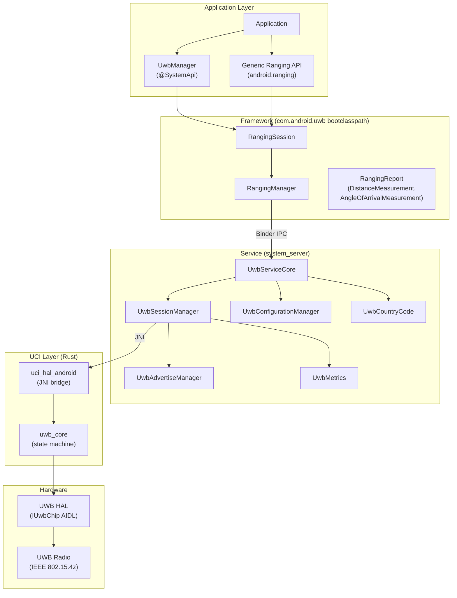

### 52.10.3  UWB Protocols

The module supports three protocol families, each with its own parameter
builder in the support library:

| Protocol | Class | Use Case |
|----------|-------|----------|
| **FiRA** | `FiraOpenSessionParams`, `FiraParams` | Standardized IEEE 802.15.4z ranging (phones, tags, IoT) |
| **CCC** (Car Connectivity Consortium) | `CccOpenRangingParams`, `CccParams` | Digital car keys |
| **ALIRO** | `AliroOpenRangingParams`, `AliroParams` | Access control (door locks, gates) |

Additionally, `RadarParams` and `RfTestParams` support UWB radar sensing
and RF testing modes.

### 52.10.4  UCI (UWB Command Interface)

The UCI layer is implemented in **Rust** (`libuwb-uci/src/rust/`) and
provides the low-level command interface to UWB hardware:

```
libuwb-uci/src/rust/
    uwb_core/src/
        lib.rs          Core library entry
        service.rs      UWB service state machine
        params.rs       Parameter definitions
        params/
            fira_app_config_params.rs
            ccc_app_config_params.rs
            aliro_app_config_params.rs
            uci_packets.rs     UCI packet parsing
    uci_hal_android/
        uci_hal_android.rs     JNI bridge to Java service
```

UCI session states follow the standard state machine:

| State | Value | Description |
|-------|-------|-------------|
| `INIT` | 0x00 | Session initialized |
| `DEINIT` | 0x01 | Session deinitialized |
| `ACTIVE` | 0x02 | Actively ranging |
| `IDLE` | 0x03 | Configured but not ranging |

### 52.10.5  Ranging Measurements

A `RangingReport` contains one or more `RangingMeasurement` objects, each
providing:

| Measurement | Class | Data |
|-------------|-------|------|
| **Distance** | `DistanceMeasurement` | Distance in meters with confidence |
| **Angle of Arrival** | `AngleOfArrivalMeasurement` | Azimuth and altitude angles |
| **Two-Way Measurement** | `UwbTwoWayMeasurement` | Raw ToF data |
| **OWR AoA** | `UwbOwrAoaMeasurement` | One-way ranging angle |
| **DL TDoA** | `UwbDlTDoAMeasurement` | Downlink time-difference-of-arrival |

### 52.10.6  Generic Ranging API

The `ranging/` subdirectory introduces a **technology-agnostic Ranging API**
(`android.ranging.*`) that abstracts over multiple ranging technologies:

```
ranging/
    framework/      android.ranging.* API surface
    uwb_backend/    UWB implementation of generic ranging
    rtt_backend/    Wi-Fi RTT implementation of generic ranging
    service/        RangingService
```

This allows apps to request ranging without binding to a specific technology.
The bootclasspath fragment conditionally includes `framework-ranging`:

```
// Source: packages/modules/Uwb/apex/Android.bp

soong_config_variables: {
    release_ranging_stack: {
        contents: [
            "framework-uwb",
            "framework-ranging",
        ],
    },
},
```

### 52.10.7  Session Management

`UwbSessionManager` is the central class for UWB session lifecycle:

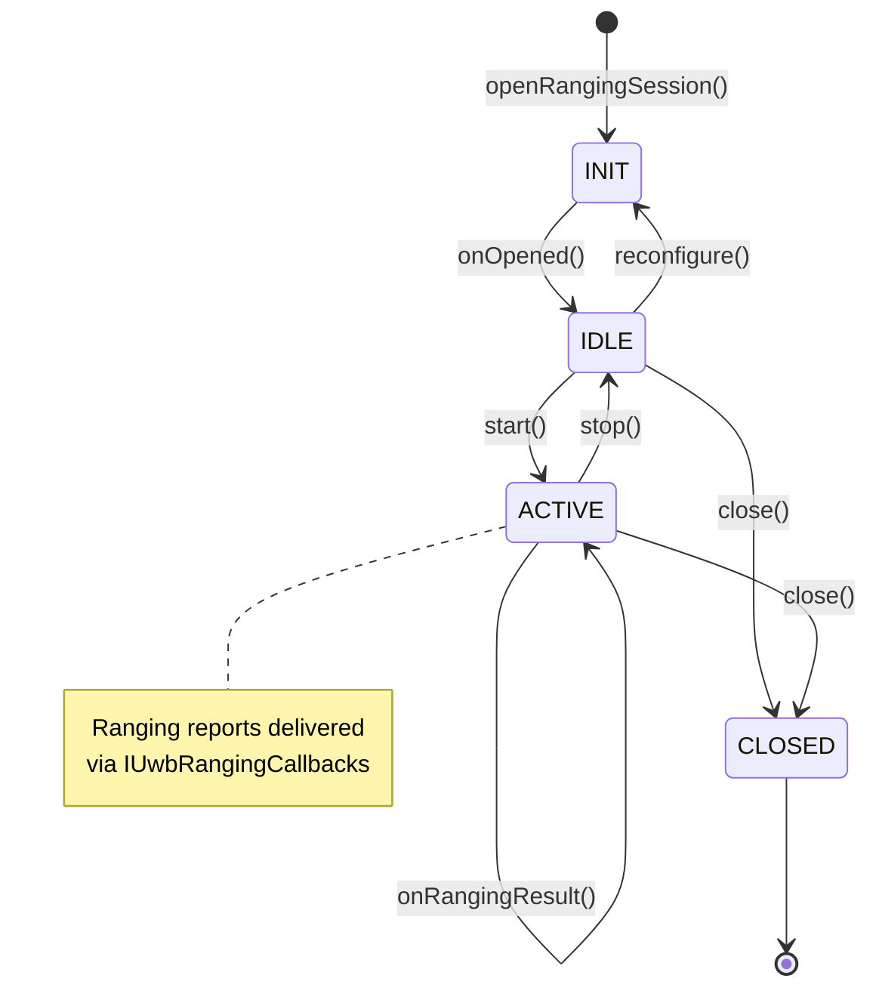

The session manager tracks per-session state, handles multicast list updates
(adding/removing controlees), manages suspend/resume, and routes ranging
notifications to the correct callback.

### 52.10.8  Country Code and Regulatory

`UwbCountryCode` determines the device's operating country and configures
channel restrictions accordingly.  It listens for telephony and Wi-Fi country
code changes, defaulting to the SIM-based country.  Regulatory compliance is
enforced through channel usage restrictions (`ChannelUsage`).

### 52.10.9  Key Source Paths

| Component | Path |
|-----------|------|
| Public API | `packages/modules/Uwb/framework/java/android/uwb/` |
| UwbManager | `packages/modules/Uwb/framework/java/android/uwb/UwbManager.java` |
| RangingSession | `packages/modules/Uwb/framework/java/android/uwb/RangingSession.java` |
| Service core | `packages/modules/Uwb/service/java/com/android/server/uwb/UwbServiceCore.java` |
| Session manager | `packages/modules/Uwb/service/java/com/android/server/uwb/UwbSessionManager.java` |
| UCI constants | `packages/modules/Uwb/service/java/com/android/server/uwb/data/UwbUciConstants.java` |
| Rust UCI core | `packages/modules/Uwb/libuwb-uci/src/rust/uwb_core/src/` |
| JNI bridge | `packages/modules/Uwb/libuwb-uci/src/rust/uci_hal_android/` |
| Support library | `packages/modules/Uwb/service/support_lib/` |
| Generic Ranging API | `packages/modules/Uwb/ranging/framework/` |
| APEX config | `packages/modules/Uwb/apex/Android.bp` |
