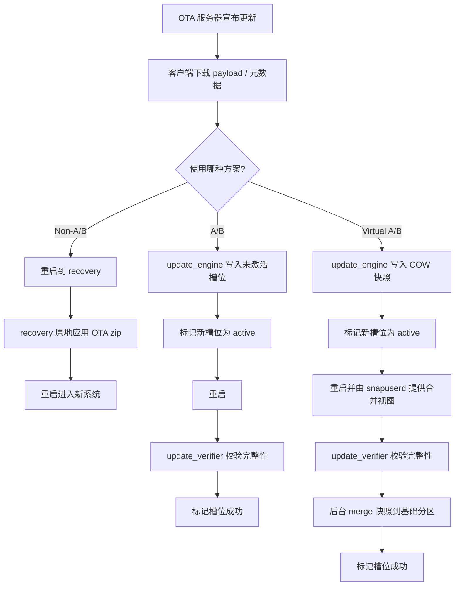
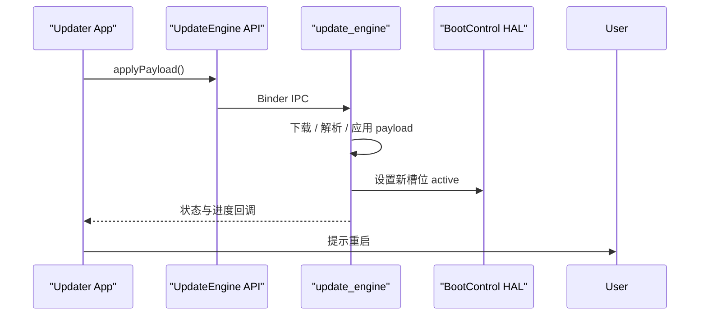
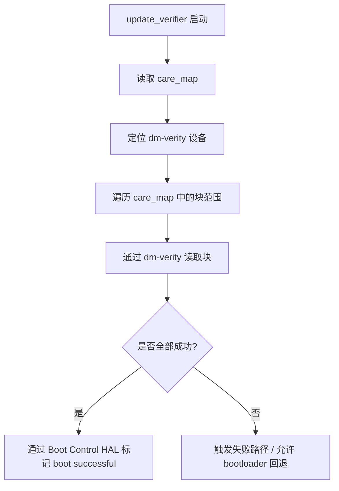
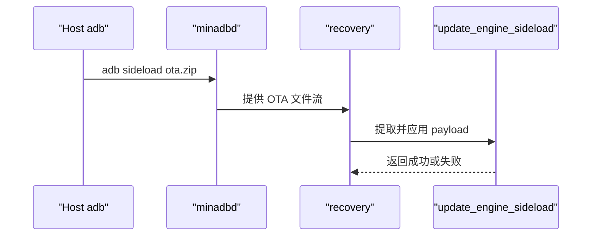

# 第 53 章：OTA Updates

OTA（Over-the-Air）更新是 Android 设备接收系统镜像、安全补丁和功能更新的核心机制。最早的 Android OTA 只是“下载一个 zip，重启到 recovery，原地打补丁”的模型；而现代 Android 已经把 OTA 演进成一个横跨 `update_engine`、bootloader、A/B 槽位、Virtual A/B 快照、`snapuserd`、payload 生成工具链和 framework API 的完整子系统。

本章沿着一次 OTA 的全路径展开：从服务端宣布更新开始，到设备下载 payload、写入分区或快照、切换槽位、验证新系统、完成合并并标记成功。重点不仅是“怎么更新”，而是 Android 如何把可靠性、可回滚性、流式应用、大镜像处理和兼容旧机型的多种更新模式统一起来。

---

## 53.1 OTA 架构总览

### 53.1.1 三种更新方案

Android 历史上存在三套主要 OTA 方案：

- `Non-A/B`：传统 recovery 模式，只有一套系统分区，更新时重启进 recovery 原地修改。
- `A/B`：双槽位无缝更新，系统在后台写入未激活槽位，重启后切换。
- `Virtual A/B`：保持 A/B 体验，但通过快照和 COW 只保存变化块，显著降低存储开销。

这三种方案今天仍然都值得理解，因为实际量产设备覆盖了完整谱系。

### 53.1.2 高层数据流

无论是哪种 OTA 方案，整体生命周期都大致相同：



### 53.1.3 分区布局对比

| 维度 | Non-A/B | A/B | Virtual A/B |
|---|---|---|---|
| 物理分区布局 | 单套分区 | 双槽位分区 | 基础分区 + 快照 |
| recovery 分区 | 独立存在 | 通常无独立 recovery | 通常无独立 recovery |
| 存储开销 | 最低 | 最高 | 中等，按变化块计算 |
| 更新方式 | 原地改写 | 写入 inactive slot | 写入 snapshot / COW |
| 回滚 | 不可靠 | 自动 | 自动 |
| 更新时停机 | 长 | 短 | 短 |

### 53.1.4 关键系统属性

系统通常通过属性和 fstab 配置判断当前设备支持哪种 OTA 模式。典型属性包括：

```bash
getprop ro.build.ab_update
getprop ro.boot.slot_suffix
getprop ro.virtual_ab.enabled
getprop ro.virtual_ab.retrofit
getprop ro.virtual_ab.compression.enabled
getprop ro.virtual_ab.userspace.snapshots.enabled
getprop ro.virtual_ab.compression.xor.enabled
```

前两项主要反映 A/B 能力，后几项则描述 Virtual A/B、用户态快照和压缩 / XOR 是否启用。

### 53.1.5 源码树地图

理解 OTA 子系统时，最重要的源码目录主要有：

| 路径 | 作用 |
|---|---|
| `system/update_engine/` | A/B / Virtual A/B 更新引擎 |
| `system/update_engine/payload_consumer/` | payload 消费与写入 |
| `system/update_engine/payload_generator/` | payload 生成 |
| `build/make/tools/releasetools/` | OTA 包生成脚本 |
| `bootable/recovery/` | recovery 更新路径 |
| `system/core/fs_mgr/libsnapshot/` | Virtual A/B 快照管理 |
| `system/core/fs_mgr/libsnapshot/snapuserd/` | 用户态快照服务 |

## 53.2 `update_engine`

### 53.2.1 守护进程生命周期

`update_engine` 是现代 Android OTA 的中心守护进程。它负责：

- 接收 OTA 请求
- 下载或接收 payload
- 校验元数据
- 调度 action pipeline
- 写入 inactive slot 或 snapshot
- 管理状态和结果

它通常作为独立 native 服务运行，而不是 framework Java 服务。

### 53.2.2 Action Pipeline

`update_engine` 的核心执行模型是 action pipeline。每一步 OTA 工作都被拆成 action，前一个 action 的输出成为后一个 action 的输入。

常见 action 包括：

- 下载或读取 payload
- 解析 manifest
- 写入分区或快照
- 校验文件系统
- 执行 postinstall

### 53.2.3 `UpdateAttempterAndroid`

`UpdateAttempterAndroid` 是 Android 侧 OTA 尝试协调器。它负责：

- 管理状态机
- 接收 Binder / Java API 请求
- 创建并启动 pipeline
- 处理暂停、恢复和取消
- 记录结果并与 boot control 交互

### 53.2.4 OTA 结果追踪

系统不仅要知道“成功或失败”，还要记录：

- 失败发生在哪个阶段
- 是否已经写入部分数据
- 是否需要回滚
- 上一次更新结果是什么

这也是 `update_engine` 持久化首选项和 metrics 存在的原因。

### 53.2.5 构建更新 actions

不同 OTA 方案、不同 payload 类型、是否有 postinstall、是否走 streaming，都会影响 action pipeline 的组合方式。

### 53.2.6 Binder 服务接口

Android framework 和系统应用并不直接操纵底层 writer，而是通过 `update_engine` 服务接口发起：

- `applyPayload`
- `cancel`
- `suspend`
- `resume`
- `resetStatus`
- 状态回调绑定

## 53.3 Payload 格式

### 53.3.1 Payload 二进制结构

OTA payload 通常由以下部分构成：

1. 头部（例如 `CrAU` magic）。
2. 版本信息。
3. manifest 长度和签名长度。
4. protobuf manifest。
5. 数据 blob 区域。
6. 元数据签名。

payload 不是简单文件镜像，而是一个描述“如何把旧系统变成新系统”的操作集合。

### 53.3.2 Major / Minor 版本

payload 版本决定：

- manifest 结构是否兼容
- 支持哪些 install operation
- 是否支持新的压缩或快照能力

因此 `update_engine` 在开始应用前必须先确认自身支持该 payload 版本。

### 53.3.3 `DeltaArchiveManifest`

manifest 是 payload 的灵魂，通常包含：

- 目标分区列表
- 每个分区的旧 / 新大小
- install operations 序列
- postinstall 配置
- 签名与校验相关元数据

### 53.3.4 Install Operation 类型

OTA 不会永远只做整块替换。原文列出了多种 operation，核心可归纳为：

- `REPLACE` / `REPLACE_BZ` / `REPLACE_XZ`
- `SOURCE_COPY`
- `SOURCE_BSDIFF`
- `ZERO`
- Virtual A/B / XOR 相关操作

这些操作描述了如何从旧块、数据 blob 或零块生成新分区内容。

### 53.3.5 Full 与 Delta Payload

| 类型 | 特点 |
|---|---|
| Full OTA | 不依赖旧版本内容，体积大，兼容性强 |
| Delta OTA | 依赖源版本，体积小，但要求源镜像匹配 |

### 53.3.6 Payload 签名与校验

OTA payload 的校验通常包括：

- 元数据签名校验
- payload 内容完整性校验
- 写入后的文件系统或块验证

这保证了 OTA 包即使通过网络流式传输，也不会被无声篡改。

## 53.4 `DeltaPerformer`

### 53.4.1 流式应用

`DeltaPerformer` 是 payload 真正落地执行的关键对象。它按顺序消费 install operations，并把结果写到目标分区或快照中。

“Streaming application” 的重点是：系统不需要把完整 OTA 包先落盘到 userdata，再统一解包，而是可以边接收边应用。

### 53.4.2 Operation 分发

`DeltaPerformer` 会根据 operation 类型选择不同执行路径，例如是直接写 data blob、做 diff 还原、从旧块复制，还是生成 COW 记录。

### 53.4.3 Partition Writers

真正执行写入的是各类 `PartitionWriter`。不同 OTA 模式下，writer 的目标不同：

- A/B：直接写 inactive slot block device
- Virtual A/B：写 snapshot / COW 文件

### 53.4.4 Checkpoint 与恢复

OTA 是长事务，必须支持断点恢复。系统会记录：

- 已完成到哪个 operation
- 哪些分区已写入
- 当前 merge / apply 状态

这样断电或重启后才能继续，而不是从头开始。

## 53.5 A/B 更新：槽位切换与回滚

### 53.5.1 Boot Control HAL

A/B 成功的关键在于 bootloader 能理解槽位状态。Boot Control HAL 通常提供：

- 获取当前活动槽位
- 标记槽位可引导
- 标记槽位成功
- 切换下次启动槽位

### 53.5.2 槽位命名

最常见命名规则是 `_a` / `_b`。update_engine、bootloader、fstab 和属性都会使用同一套槽位后缀约定。

### 53.5.3 A/B 更新生命周期

1. 当前从 slot A 运行。
2. `update_engine` 将新系统写入 slot B。
3. 设置下次启动为 slot B。
4. 重启进入 B。
5. 首次引导验证成功后标记 B 为 successful。
6. 若启动失败，则 bootloader 回退到 A。

### 53.5.4 Bootloader 集成

如果 bootloader 不支持槽位重试和失败回退，A/B 模型就无法真正闭环。因此 OTA 子系统与 bootloader 的契约非常关键。

### 53.5.5 回滚机制

A/B 回滚通常由 bootloader 在“新槽位连续启动失败”时触发，而不是等系统 Java 层来决定。

### 53.5.6 `care_map`

`care_map` 描述哪些块真正包含文件系统数据，后续 `update_verifier` 只需验证这些块，而不必扫描整分区空洞区域。

## 53.6 Virtual A/B 更新

### 53.6.1 架构总览

Virtual A/B 保留了 A/B 的可靠性，但不再要求每个动态分区都物理复制一遍，而是通过快照覆盖变化块。

### 53.6.2 动态分区与 super

Virtual A/B 与动态分区密切相关。super 分区提供更灵活的逻辑分区布局，使 snapshot 和 merge 能在逻辑层完成。

### 53.6.3 Snapshot Manager

Snapshot Manager 负责：

- 创建更新所需快照
- 维护 snapshot 元数据
- 跟踪 merge 状态
- 失败时恢复或清理

### 53.6.4 COW 格式

COW（copy-on-write）格式记录变化块，而不是完整新分区。其内容通常是对目标块的：

- replace
- copy
- zero
- xor

描述。

### 53.6.5 `snapuserd`

`snapuserd` 是 Virtual A/B 的关键用户态守护进程。开机进入新系统后，它会把 base 分区和 COW 记录拼接成逻辑上的“新分区视图”。

### 53.6.6 Merge 过程

启动进入新系统并验证成功后，系统会把 snapshot 中的数据逐步 merge 回基础分区。这样更新完成后临时 COW 空间就可以回收。

### 53.6.7 Merge 状态机

merge 通常会经历：

- 未开始
- 合并中
- 已完成
- 失败 / 需要恢复

状态机存在的目的是支持断点续合并和失败恢复。

### 53.6.8 压缩与 XOR

Virtual A/B Compression（VABC）通过压缩和 XOR 进一步减少 COW 大小，降低 `/data` 临时空间占用。

### 53.6.9 空间分配

Virtual A/B 最大工程挑战之一就是临时空间预算。系统必须预估有多少变化块、需要多少压缩后 COW 空间，以及 merge 前后如何安全回收。

## 53.7 Payload 生成

### 53.7.1 `ota_from_target_files`

这是最常见的 OTA 生成入口，既能生成 full OTA，也能生成 incremental OTA。

```bash
ota_from_target_files <target-files.zip> full-ota.zip
ota_from_target_files -i old-target-files.zip new-target-files.zip incremental-ota.zip
```

### 53.7.2 生成流程

高层流程一般是：

1. 读取 target-files。
2. 分析分区内容与元数据。
3. 若是增量 OTA，则对比旧版与新版。
4. 调用 `delta_generator` / `brillo_update_payload`。
5. 组装最终 OTA 包。

### 53.7.3 `brillo_update_payload`

这个工具链组件负责更底层的 payload 生成与处理，例如：

```bash
brillo_update_payload generate ...
brillo_update_payload hash ...
brillo_update_payload sign ...
brillo_update_payload properties ...
brillo_update_payload verify ...
```

### 53.7.4 `delta_generator`

`delta_generator` 负责生成操作序列和 blob，是真正把“新旧镜像差异”变成 install operations 的关键工具。

### 53.7.5 Diff 算法选择

不同分区、不同文件类型和不同压缩策略会影响算法选择。OTA 生成工具会在体积、生成耗时和应用耗时之间权衡。

### 53.7.6 OTA 包结构

最终 OTA zip 常见内容包括：

- `payload.bin`
- `payload_properties.txt`
- `META-INF/com/android/metadata`
- `care_map.pb`

## 53.8 Streaming Updates

### 53.8.1 下载架构

Streaming OTA 的目标是避免把完整大文件先落盘。客户端可以边下载边交给 `update_engine`。

### 53.8.2 Streaming 流程

关键点包括：

- 先获取 payload metadata
- 支持范围请求（range request）
- 按需读取 operation 所需片段

### 53.8.3 基于文件描述符的更新

framework 或系统应用通常通过文件描述符把 OTA 数据交给 `update_engine`，而不是要求 update_engine 自己理解所有上层下载器逻辑。

### 53.8.4 网络考虑

流式 OTA 对网络提出更高要求，例如：

- 支持断点续传
- 支持随机范围读取
- 元数据优先可用

## 53.9 Recovery 模式

### 53.9.1 Recovery 架构

Recovery 仍然是 legacy 非 A/B OTA 的主路径，也是 sideload、工厂恢复等能力的基础环境。

### 53.9.2 Bootloader Control Block（BCB）

BCB 是 bootloader 与 recovery / Android 之间传递控制命令的重要媒介，例如“下次启动进 recovery 并执行某命令”。

### 53.9.3 Recovery 命令

recovery 通过 BCB 或命令文件接收操作，例如：

- 应用 OTA
- 清除数据
- 重启

### 53.9.4 在 Recovery 中安装 OTA

对非 A/B 方案来说，recovery 负责解析 zip、校验签名并原地执行 updater。

### 53.9.5 ADB Sideload

最常见命令是：

```bash
adb sideload ota.zip
```

宿主侧通过 adb 发送包，设备侧 recovery 通过最小 adb 服务接收并安装。

### 53.9.6 Recovery UI

Recovery UI 不只是“几个菜单”，还承担向用户展示 OTA 进度、失败信息和恢复操作入口。

### 53.9.7 Recovery 对 Virtual A/B 的感知

即便主要更新路径不再依赖 recovery，recovery 仍需要理解 Virtual A/B 设备上的更新状态与恢复路径。

## 53.10 Framework 集成：`UpdateEngine` API

### 53.10.1 Java API

Framework 为系统应用提供 `UpdateEngine` Java API，典型能力包括：

- `applyPayload`
- 绑定状态回调
- `cancel`
- `suspend`
- `resume`
- `resetStatus`

### 53.10.2 错误码

错误码必须足够细致，否则上层无法区分：

- 下载失败
- payload 校验失败
- 分区写入失败
- postinstall 失败
- boot 切换失败

### 53.10.3 更新状态码

状态码通常描述当前 OTA 所在阶段，例如检查、下载、验证、写入、重启等待、合并中等。

### 53.10.4 `UpdateEngineStable`

该接口反映出 Android 也在尝试为更新引擎暴露更稳定、更受控的 API 面。

### 53.10.5 Updater 示例应用

示例应用的价值在于展示 framework 层如何与 `update_engine` 协同，而不是让开发者直接调用 native 工具。

### 53.10.6 端到端更新流



## 53.11 Postinstall

### 53.11.1 什么是 Postinstall

有些 OTA 完成块写入后，还需要在新系统分区上执行额外步骤，例如优化、迁移或模块准备，这就是 postinstall。

### 53.11.2 Postinstall 配置

哪些分区需要 postinstall、执行什么程序、是否阻塞成功标记，都会在 OTA 元数据中明确定义。

### 53.11.3 `PostinstallRunnerAction`

这是 action pipeline 中专门执行 postinstall 的步骤，通常发生在主要写入完成之后。

### 53.11.4 单独触发 Postinstall

原文还讨论了单独触发 postinstall 的路径，说明 Android 在更新流程里把它视为独立且可观测的阶段。

## 53.12 防回滚保护

### 53.12.1 基于时间戳的保护

系统可通过版本时间戳避免设备降级到更老、更脆弱的系统版本。

### 53.12.2 SPL 检查

安全补丁级别（SPL）检查是防回滚保护的重要组成部分。

### 53.12.3 与 Verified Boot 集成

真正强有力的防回滚必须与 Verified Boot 和 bootloader 策略集成，而不是仅靠用户态做比较。

## 53.13 指标与日志

### 53.13.1 更新指标

OTA 系统需要记录：

- 下载耗时
- 写入耗时
- 重启后验证结果
- 失败码

### 53.13.2 Merge 统计

Virtual A/B 还需要额外统计 merge 速度、剩余数据量、是否中断等信息。

### 53.13.3 日志位置

常见排查入口包括：

- `logcat` 中的 `update_engine`
- `snapuserd` 日志
- recovery 日志
- `dumpsys` / 持久化首选项

## 53.14 动手实践：OTA 实验

### 53.14.1 检查 Payload

```bash
m brillo_update_payload
brillo_update_payload properties --payload payload.bin
```

输出通常会包含 payload 版本、manifest 长度、分区数量以及每个分区的操作统计。

### 53.14.2 生成 Full OTA

```bash
ota_from_target_files target-files.zip full-ota.zip
```

生成后可检查其中的 `payload.bin`、`payload_properties.txt` 和 metadata 文件。

### 53.14.3 生成 Incremental OTA

```bash
ota_from_target_files -i old-target-files.zip new-target-files.zip incremental-ota.zip
```

### 53.14.4 通过 ADB 应用 OTA

```bash
adb push ota.zip /data/ota_package/ota.zip
adb shell update_engine_client --update --payload=file:///data/ota_package/ota.zip
adb sideload ota.zip
```

前两条更偏 A/B / `update_engine` 路径，最后一条是 recovery sideload 常见方式。

### 53.14.5 监控更新进度

```bash
adb logcat -s update_engine
adb shell update_engine_client --status
adb shell bootctl get-current-slot
```

### 53.14.6 观察 Virtual A/B Merge

```bash
adb shell snapshotctl dump
adb logcat -s snapuserd
```

### 53.14.7 在 Cuttlefish 上模拟更新

Cuttlefish 对 A/B 和 Virtual A/B 支持较完整，非常适合做增量 OTA 和 merge 行为实验。

### 53.14.8 检查 Recovery 模式

```bash
adb reboot recovery
adb shell cat /cache/recovery/last_log
```

### 53.14.9 使用特定 VABC 选项构建 OTA

原文在这里讨论了自定义 VABC 参数。实践重点是理解生成参数如何影响 snapshot / COW 行为，而不是记住某个单独命令。

### 53.14.10 Payload 校验

```bash
brillo_update_payload verify --payload payload.bin
brillo_update_payload properties --payload payload.bin
```

## 53.15 排查 OTA 失败

### 53.15.1 常见失败模式

常见问题包括：

- payload 下载失败
- 分区空间不足
- 签名或元数据不匹配
- merge 卡住
- boot 切换失败
- postinstall 失败

### 53.15.2 调试 `update_engine`

```bash
adb shell setprop log.tag.update_engine VERBOSE
adb shell update_engine_client --dump
```

### 53.15.3 调试 `snapuserd`

```bash
adb shell ps -A | findstr snapuserd
adb shell dmctl list devices
adb shell snapshotctl dump
```

### 53.15.4 从失败的 Virtual A/B 更新恢复

```bash
adb shell update_engine_client --cancel
adb shell update_engine_client --reset_status
```

## 53.16 内部深入：完整数据路径

### 53.16.1 单个 `REPLACE` 操作

对一个 `REPLACE` 操作来说，数据路径大致是：

1. 从 payload blob 读取新数据。
2. 由 `DeltaPerformer` 交给 writer。
3. 写入 inactive slot 或 COW。

### 53.16.2 `SOURCE_COPY` 的数据流

这类操作会从旧分区读取源块，再拷贝到目标位置。其意义在于减少 payload 大小，而不是重新传输未变化数据。

### 53.16.3 XOR 操作的数据流

启用 VABC XOR 时，系统会记录旧数据与新数据之间的 XOR 差异，以进一步压缩 COW 记录。

## 53.17 高级主题

### 53.17.1 Partial Updates

并非所有 OTA 都必须覆盖所有分区。部分更新可以只针对特定分区或模块，但前提是依赖与版本关系足够清晰。

### 53.17.2 Multi-Payload Updates

某些场景会打包多个 payload，使系统可按设备状态或组件分组应用更新。

### 53.17.3 通过 OTA 更新 APEX

除了 Play System Update，某些场景下 APEX 也可以随整机 OTA 一并更新，这说明 Mainline 与 OTA 并不是互斥体系。

### 53.17.4 动态分区 resize

动态分区在 OTA 过程中可能需要调整大小，这会直接影响 snapshot 和可用空间计算。

### 53.17.5 Non-A/B OTA 内部

legacy OTA 仍有其存在价值，特别是在旧设备和恢复路径上。原文给了 updater-script 片段，中文稿保留结论：其实现风格与 A/B 完全不同，更偏 recovery 驱动的脚本式更新。

### 53.17.6 Two-Step Updates

两阶段更新用于处理一些必须跨重启完成的复杂场景。

### 53.17.7 Brick OTAs

所谓 brick OTA 讨论的是最坏情况更新失败模型，也提醒读者理解为什么 A/B 和 Virtual A/B 会被设计成当前主流方案。

## 53.18 安全考量

### 53.18.1 Payload 签名

没有签名校验，OTA 就会成为最高权限远程代码执行入口。

### 53.18.2 Metadata 签名

不仅 payload 数据本身要可信，描述如何应用 payload 的 metadata 也必须可信。

### 53.18.3 传输安全

从服务器到设备的下载链路也必须考虑 TLS、断点续传安全和中间人风险。

### 53.18.4 SELinux Context

OTA 相关服务、临时文件和分区映射都依赖严格的 SELinux 上下文隔离。

### 53.18.5 Verity 与 COW 交互

Virtual A/B 中 verity 与 snapshot / COW 如何配合，是该方案安全模型的关键部分。

## 53.19 `update_engine` 服务配置

### 53.19.1 init 服务定义

`update_engine` 通过 init 配置启动，并常带有较低 IO 优先级，避免更新过程严重影响前台系统体验。

### 53.19.2 持久化首选项

服务会把关键状态写入持久化首选项，用于断点恢复、结果追踪和调试。

### 53.19.3 CPU 限流

更新和 merge 都可能消耗较多 CPU，因此也可能带有节流或调度策略，减少对交互体验的影响。

## 53.20 错误码参考

### 53.20.1 Native 错误码

原文列了完整 native 错误码表。中文稿保留结论：错误码设计非常细，是因为 OTA 失败原因跨下载、签名、写入、merge、boot 验证等多个边界。

### 53.20.2 错误码分类

把错误码分组理解更有效，例如：

- 网络 / 下载类
- payload / metadata 类
- 分区写入类
- postinstall 类
- merge / snapshot 类
- boot / 验证类

## 53.21 `DownloadAction` 深入

### 53.21.1 初始化

`DownloadAction` 负责准备下载或流式读取路径，建立 fetcher，并对接 pipeline 下游。

### 53.21.2 进度上报

进度不是简单按“已下载字节 / 总字节”计算，还会结合写入和校验阶段映射到用户可见进度。

### 53.21.3 `MultiRangeHttpFetcher`

该组件体现了 streaming OTA 的核心要求：支持 HTTP range，多段读取，而不必整包一次性下载。

## 53.22 文件系统验证

### 53.22.1 `FilesystemVerifierAction`

写入完成后，系统还需要验证结果是否符合预期。该 action 就承担这类校验职责。

### 53.22.2 Verity Hash Tree 生成

verity 哈希树让系统可以在后续读取过程中持续验证块完整性，而不是只在安装时做一次性校验。

## 53.23 `InstallPlan` 数据结构

### 53.23.1 顶层字段

`InstallPlan` 用于描述一次 OTA 应用所需的总体信息，例如 payload、目标槽位、分区计划和 postinstall 配置。

### 53.23.2 每分区信息

每个分区项通常包含：

- 名称
- 源 / 目标大小
- source hash / target hash
- writer 所需参数

### 53.23.3 Payload 元数据

安装计划会把 payload manifest 和运行期决策抽象成更易消费的数据结构，供 pipeline 各 action 共享。

## 53.24 Partition Writer Factory

Writer Factory 的意义在于根据当前 OTA 模式选择正确 writer，而不让 `DeltaPerformer` 自己理解所有后端细节。

### 53.24.1 `PartitionWriter` I/O 路径

标准 A/B 常见路径可概括为：

```text
DeltaPerformer -> PartitionWriter -> ExtentWriter -> pwrite() -> inactive slot block device
```

### 53.24.2 `VABCPartitionWriter` I/O 路径

Virtual A/B Compression 常见路径则更接近：

```text
DeltaPerformer -> VABCPartitionWriter -> ICowWriter -> CowWriterV3 -> COW file on /data
```

### 53.24.3 XOR Map 处理

启用 XOR 时，writer 需要额外维护块映射，决定哪些块使用 XOR merge 语义而不是普通 copy。

## 53.25 `update_verifier`

### 53.25.1 目的与时机

`update_verifier` 在 OTA 后首次引导时运行，用于确认新系统分区可被完整读取和验证。

### 53.25.2 校验流程



### 53.25.3 与 dm-verity 集成

`update_verifier` 自身不重新计算 hash，而是依赖 dm-verity 在读取过程中完成真实性验证。

## 53.26 Sideload 模式：`update_engine_sideload`

### 53.26.1 基于 Recovery 的 OTA 应用

`update_engine_sideload` 是 recovery 场景下使用的精简版更新引擎。它不依赖完整 Android framework，也不需要正常运行的 Binder 世界。

### 53.26.2 Sideload 流程



## Summary

OTA 更新是 Android 最关键、也最复杂的系统基础设施之一。它的目标从来不只是“把新文件写上去”，而是要在保证设备可引导、用户几乎无感、网络条件不稳定、镜像体积巨大和安全要求极高的前提下，可靠地把整套系统演进到下一版本。

本章的关键点可以概括为：

- Android OTA 主要有三条演进路径：legacy `Non-A/B`、无缝更新的 `A/B`，以及通过 snapshot / COW / `snapuserd` 提升空间效率的 `Virtual A/B`。
- `update_engine` 是现代 OTA 的中心执行器，它通过 action pipeline、`UpdateAttempterAndroid`、writers、状态持久化和 Binder 服务接口协调整条更新流程。
- OTA payload 不是简单镜像，而是由 header、manifest、签名和 install operations 组成的可执行更新计划；`DeltaPerformer` 则负责把这些操作真正应用到分区或快照中。
- A/B 通过 Boot Control HAL 和 bootloader 槽位策略实现可靠切换与回滚，而 Virtual A/B 则通过 Snapshot Manager、COW、`snapuserd` 和 merge 状态机在较低存储成本下获得类似可靠性。
- `ota_from_target_files`、`brillo_update_payload` 和 `delta_generator` 组成了 OTA 生成工具链，使系统能够生产 full OTA、incremental OTA 和带 VABC 特性的 payload。
- recovery、ADB sideload、`update_verifier`、postinstall、防回滚和 dm-verity 共同补齐了 legacy 兼容、首次引导验证和完整性保护链路。
- OTA 问题排查往往跨越 payload、writer、snapshot、merge、bootloader 和 framework 多个边界，因此日志、错误码、状态机和独立工具链在这个子系统里格外重要。

### 关键源码路径

| 组件 | 路径 |
|---|---|
| update_engine 守护进程 | `system/update_engine/` |
| Android 集成层 | `system/update_engine/aosp/` |
| payload consumer | `system/update_engine/payload_consumer/` |
| payload generator | `system/update_engine/payload_generator/` |
| OTA 生成脚本 | `build/make/tools/releasetools/` |
| recovery | `bootable/recovery/` |
| update_verifier | `bootable/recovery/update_verifier/` |
| Snapshot Manager | `system/core/fs_mgr/libsnapshot/` |
| snapuserd | `system/core/fs_mgr/libsnapshot/snapuserd/` |
| COW 格式实现 | `system/core/fs_mgr/libsnapshot/libsnapshot_cow/` |
| Framework API | `frameworks/base/core/java/android/os/UpdateEngine.java` |
