# Chapter 53: OTA Updates

Over-the-Air (OTA) updates are the mechanism by which Android devices receive
new system images, security patches, and feature updates without requiring
physical access or manual flashing. What began as a simple "download a zip, boot
into recovery, apply it" model has evolved into one of AOSP's most sophisticated
subsystems -- spanning a dedicated native daemon (`update_engine`), kernel-level
copy-on-write snapshots, bootloader integration protocols, and a streaming
pipeline that can apply gigabyte-scale payloads without ever writing the full
image to userdata.

This chapter traces an OTA update from the moment a server announces its
availability to the moment the device has rebooted into the new software and
marked the slot as successful. We examine every layer: the payload binary
format, the action pipeline inside `update_engine`, the A/B and Virtual A/B
slot-switching mechanisms, the `snapuserd` daemon that makes compressed
copy-on-write possible in userspace, the Python tooling that generates payloads,
recovery mode as the legacy fallback, and the framework APIs that tie everything
together.

---

## 53.1 OTA Architecture Overview

### 53.1.1 The Three Update Schemes

Android has used three distinct OTA schemes across its history. Understanding all
three is essential because production devices span the full range.

```
Source path: system/update_engine/        -- A/B and Virtual A/B engine
             bootable/recovery/           -- Non-A/B recovery updater
             system/core/fs_mgr/libsnapshot/ -- Virtual A/B snapshots
```

**Non-A/B (Legacy)**. The original scheme, used from Android 1.0 through
approximately Android 9 (though it remains supported). The device has a single
set of partitions (system, boot, vendor, etc.) plus a dedicated `recovery`
partition. To update, the device reboots into recovery, which mounts the OTA
package (a signed zip file containing an updater binary and image data), and
applies block-level patches in-place. If the update fails partway through, the
device may be left in an unbootable state -- the dreaded "brick."

**A/B (Seamless)**. Introduced in Android 7.0. The device carries two copies of
every updatable partition: slot A and slot B. While the user runs from one slot,
`update_engine` writes the new image to the other slot in the background. When
complete, the bootloader is instructed to switch active slots. If the new slot
fails to boot, the bootloader rolls back. The device never enters recovery for
OTA purposes, and the user experiences zero downtime during the write phase.
The cost is roughly doubled partition storage.

**Virtual A/B**. Introduced in Android 11 and mandatory since Android 13.
Virtual A/B retains the seamless-update user experience of A/B but eliminates
the need to physically duplicate every partition. Instead, it uses device-mapper
snapshots (and, since Android 12, compressed copy-on-write via `snapuserd`) to
store only the *changed blocks* during the update. After reboot and successful
verification, the snapshot is *merged* into the base partition, reclaiming the
temporary storage. This gives A/B reliability with near-non-A/B storage
efficiency.

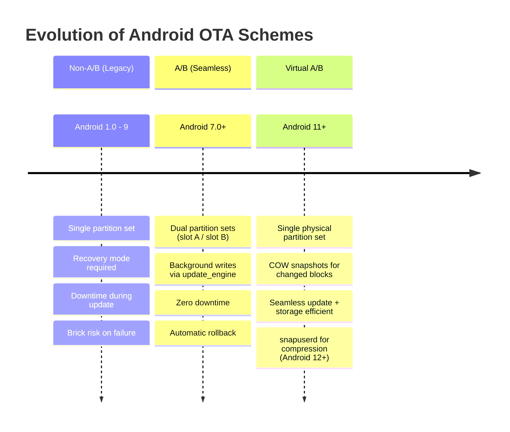
```mermaid
timeline
    title Evolution of Android OTA Schemes
    section Non-A/B (Legacy)
        Android 1.0 - 9 : Single partition set
                         : Recovery mode required
                         : Downtime during update
                         : Brick risk on failure
    section A/B (Seamless)
        Android 7.0+ : Dual partition sets (slot A / slot B)
                     : Background writes via update_engine
                     : Zero downtime
                     : Automatic rollback
    section Virtual A/B
        Android 11+  : Single physical partition set
                     : COW snapshots for changed blocks
                     : Seamless update + storage efficient
                     : snapuserd for compression (Android 12+)
```

### 53.1.2 High-Level Data Flow

Regardless of the scheme, every OTA update follows a common lifecycle:

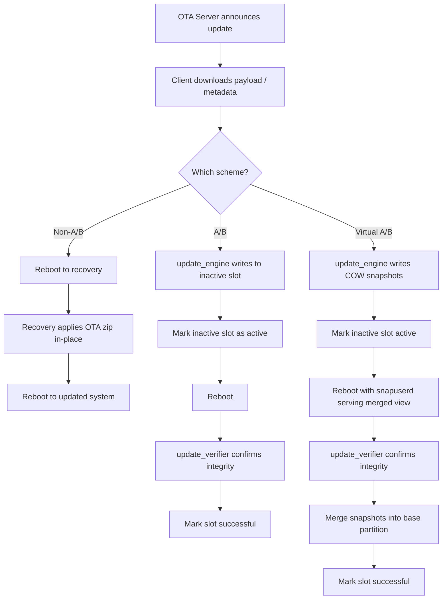
```mermaid
flowchart TD
    A[OTA Server announces update] --> B[Client downloads payload / metadata]
    B --> C{Which scheme?}
    C -->|Non-A/B| D[Reboot to recovery]
    D --> E[Recovery applies OTA zip in-place]
    E --> F[Reboot to updated system]
    C -->|A/B| G[update_engine writes to inactive slot]
    G --> H[Mark inactive slot as active]
    H --> I[Reboot]
    I --> J[update_verifier confirms integrity]
    J --> K[Mark slot successful]
    C -->|Virtual A/B| L[update_engine writes COW snapshots]
    L --> M[Mark inactive slot active]
    M --> N[Reboot with snapuserd serving merged view]
    N --> O[update_verifier confirms integrity]
    O --> P[Merge snapshots into base partition]
    P --> Q[Mark slot successful]
```

### 53.1.3 Partition Layout Comparison

The following table summarizes how partitions are organized under each scheme.

| Aspect | Non-A/B | A/B | Virtual A/B |
|--------|---------|-----|-------------|
| Physical partitions | system, boot, vendor, recovery | system_a/b, boot_a/b, vendor_a/b | system_a/b (logical), boot_a/b (physical) |
| Recovery partition | Dedicated | None (recovery in boot) | None (recovery in boot or init_boot) |
| Storage overhead | ~0% | ~100% (full duplication) | ~5-15% (COW of changed blocks) |
| Update target | In-place on running partitions | Inactive slot | COW device mapped over inactive slot |
| Rollback | Not guaranteed | Automatic via bootloader | Automatic via bootloader |
| Downtime | Full reboot + apply time | Reboot only (~30s) | Reboot only (~30s) |
| Post-update merge | None | None | Background merge of COW |
| Minimum Android version | 1.0 | 7.0 | 11 |

### 53.1.4 Key System Properties

The update scheme is determined by system properties and fstab configuration:

```
# A/B device detection
ro.boot.slot_suffix=_a          # Present on A/B and Virtual A/B
ro.build.ab_update=true         # A/B capable

# Virtual A/B detection
ro.virtual_ab.enabled=true      # Virtual A/B enabled
ro.virtual_ab.retrofit=true     # Retrofitted (vs. launch)

# Virtual A/B Compression
ro.virtual_ab.compression.enabled=true
ro.virtual_ab.userspace.snapshots.enabled=true
ro.virtual_ab.compression.xor.enabled=true
```

The relevant feature flag detection code lives in:

```
Source: system/update_engine/aosp/dynamic_partition_control_android.h
```

```cpp
// DynamicPartitionControlAndroid exposes:
FeatureFlag GetDynamicPartitionsFeatureFlag() override;
FeatureFlag GetVirtualAbFeatureFlag() override;
FeatureFlag GetVirtualAbCompressionFeatureFlag() override;
FeatureFlag GetVirtualAbCompressionXorFeatureFlag() override;
FeatureFlag GetVirtualAbUserspaceSnapshotsFeatureFlag() override;
```

Each `FeatureFlag` can be `NONE`, `RETROFIT`, or `LAUNCH`, distinguishing
devices that were upgraded to a feature from those that shipped with it.

### 53.1.5 Source Tree Map

```
system/update_engine/
    main.cc                          -- Daemon entry point
    aosp/
        daemon_android.cc            -- Android-specific daemon setup
        update_attempter_android.cc  -- Orchestrates the update attempt
        boot_control_android.cc      -- A/B slot control via HAL
        binder_service_android.cc    -- Binder interface for framework
        dynamic_partition_control_android.cc -- Dynamic partition + VAB control
        cleanup_previous_update_action.cc   -- Post-reboot merge trigger
    payload_consumer/
        delta_performer.cc           -- Applies payload operations
        payload_metadata.cc          -- Parses payload header
        payload_constants.cc         -- Magic bytes, version constants
        vabc_partition_writer.cc     -- Virtual A/B Compression writer
        partition_writer.cc          -- Standard partition writer
        install_plan.h               -- Update plan data structure
    payload_generator/
        delta_diff_generator.cc      -- Generates delta payloads
        full_update_generator.cc     -- Generates full payloads
    common/
        boot_control_interface.h     -- Abstract slot management
        action_processor.cc          -- Action pipeline scheduler
    scripts/
        brillo_update_payload        -- Shell tool for payload operations

build/make/tools/releasetools/
    ota_from_target_files.py         -- Primary OTA package generator
    non_ab_ota.py                    -- Legacy non-A/B generator

bootable/recovery/
    recovery_main.cpp                -- Recovery entry point
    recovery.cpp                     -- Main recovery logic
    install/install.cpp              -- Package installation
    update_verifier/                 -- Post-boot verification

system/core/fs_mgr/libsnapshot/
    snapshot.cpp                     -- Snapshot manager
    snapuserd/                       -- Userspace snapshot daemon
        user-space-merge/
            snapuserd_core.cpp       -- Core merge logic

frameworks/base/core/java/android/os/
    UpdateEngine.java                -- Framework API wrapper
```

---

## 53.2 update_engine

`update_engine` is the native daemon that drives A/B and Virtual A/B updates.
Originally developed as part of Chrome OS, it was adapted for Android starting
with the A/B scheme in Android 7.0. On Android, it runs as a persistent
system service, listening for update commands over Binder.

### 53.2.1 Daemon Lifecycle

The daemon starts from `main.cc`:

```
Source: system/update_engine/main.cc
```

```cpp
int main(int argc, char** argv) {
  chromeos_update_engine::Terminator::Init();
  gflags::SetUsageMessage("A/B Update Engine");
  gflags::ParseCommandLineFlags(&argc, &argv, true);
  // ... logging setup ...
  xz_crc32_init();
  umask(S_IRWXG | S_IRWXO);  // Restrictive permissions

  auto daemon = chromeos_update_engine::DaemonBase::CreateInstance();
  int exit_code = daemon->Run();
  // ...
}
```

On Android, `DaemonBase::CreateInstance()` returns a `DaemonAndroid`:

```
Source: system/update_engine/aosp/daemon_android.cc
```

```cpp
int DaemonAndroid::OnInit() {
  subprocess_.Init(this);
  int exit_code = brillo::Daemon::OnInit();

  android::BinderWrapper::Create();
  binder_watcher_.Init();

  DaemonStateAndroid* daemon_state_android = new DaemonStateAndroid();
  daemon_state_.reset(daemon_state_android);
  daemon_state_android->Initialize();

  // Register Binder services
  binder_service_ = new BinderUpdateEngineAndroidService{
      daemon_state_android->service_delegate()};
  binder_wrapper->RegisterService(
      binder_service_->ServiceName(), binder_service_);

  // Also register the "stable" AIDL service
  stable_binder_service_ = new BinderUpdateEngineAndroidStableService{
      daemon_state_android->service_delegate()};
  binder_wrapper->RegisterService(
      stable_binder_service_->ServiceName(), stable_binder_service_);

  daemon_state_->StartUpdater();
  return EX_OK;
}
```

The daemon registers two Binder services:

1. `android.os.UpdateEngineService` -- the primary interface
2. A "stable" AIDL variant for cross-version compatibility

### 53.2.2 The Action Pipeline

`update_engine` uses an *action pipeline* pattern. Each step of the update is an
`Action` subclass, and they are chained together by an `ActionProcessor`. Data
flows between actions through type-safe `ActionPipe` connections.


```mermaid
flowchart LR
    A[InstallPlanAction] --> B[DownloadAction]
    B --> C[FilesystemVerifierAction]
    C --> D[PostinstallRunnerAction]

    style A fill:#e1f5fe
    style B fill:#fff3e0
    style C fill:#e8f5e9
    style D fill:#fce4ec
```

```
Source: system/update_engine/common/action.h
        system/update_engine/common/action_processor.h
```

The `ActionProcessor` runs one action at a time. When an action completes
(success or failure), the processor advances to the next or terminates:

```cpp
// action_processor.cc
void ActionProcessor::ActionComplete(AbstractAction* actionptr,
                                     ErrorCode code) {
  // ... notify delegate ...
  if (code != ErrorCode::kSuccess) {
    // Pipeline failed
    actions_.clear();
    // ... error handling ...
  } else {
    // Advance to next action
    actions_.erase(actions_.begin());
    if (!actions_.empty()) {
      actions_.front()->PerformAction();
    }
  }
}
```

### 53.2.3 UpdateAttempterAndroid

The `UpdateAttempterAndroid` class is the top-level orchestrator for Android
updates. It implements `ServiceDelegateAndroidInterface` (called by the Binder
service) and `ActionProcessorDelegate` (receiving callbacks from the pipeline).

```
Source: system/update_engine/aosp/update_attempter_android.h
```

Key responsibilities:

- **ApplyPayload**: Entry point for an update. Parses the URL/fd, headers,
  constructs the `InstallPlan`, builds the action pipeline, and starts it.

- **SuspendUpdate / ResumeUpdate**: Pauses and resumes an in-progress download.
- **CancelUpdate**: Aborts a running update and cleans up.
- **ResetStatus**: Clears persistent state from a completed or failed update.
- **CleanupSuccessfulUpdate**: Triggers snapshot merge on Virtual A/B.

```cpp
// The update status state machine
enum class UpdateStatus {
  IDLE,
  CHECKING_FOR_UPDATE,
  UPDATE_AVAILABLE,
  DOWNLOADING,
  VERIFYING,
  FINALIZING,
  UPDATED_NEED_REBOOT,
  REPORTING_ERROR_EVENT,
  ATTEMPTING_ROLLBACK,
  DISABLED,
  CLEANUP_PREVIOUS_UPDATE,
};
```

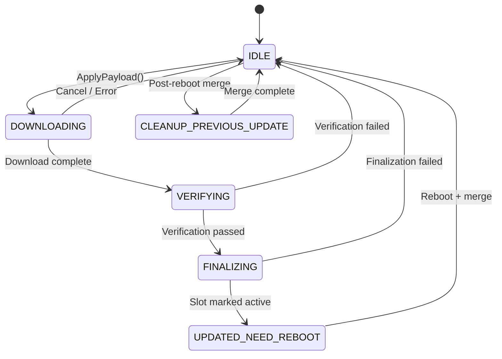
```mermaid
stateDiagram-v2
    [*] --> IDLE
    IDLE --> DOWNLOADING : ApplyPayload()
    DOWNLOADING --> VERIFYING : Download complete
    VERIFYING --> FINALIZING : Verification passed
    FINALIZING --> UPDATED_NEED_REBOOT : Slot marked active
    UPDATED_NEED_REBOOT --> IDLE : Reboot + merge
    DOWNLOADING --> IDLE : Cancel / Error
    VERIFYING --> IDLE : Verification failed
    FINALIZING --> IDLE : Finalization failed
    IDLE --> CLEANUP_PREVIOUS_UPDATE : Post-reboot merge
    CLEANUP_PREVIOUS_UPDATE --> IDLE : Merge complete
```

### 53.2.4 The OTA Result Tracking

After a reboot, `update_engine` determines the outcome of the previous update
attempt:

```cpp
// update_attempter_android.h
enum class OTAResult {
  NOT_ATTEMPTED,
  ROLLED_BACK,
  UPDATED_NEED_REBOOT,
  OTA_SUCCESSFUL,
};
```

The `GetOTAUpdateResult()` method checks persistent preferences and boot slot
state to determine if the update succeeded, was rolled back, or was never
attempted. This drives metrics reporting and merge scheduling.

### 53.2.5 Building the Update Actions

When `ApplyPayload` is called, `BuildUpdateActions` constructs the pipeline:


```mermaid
flowchart TD
    subgraph "Action Pipeline Construction"
        A["Create InstallPlanAction<br/>with payload metadata"] --> B["Create DownloadAction<br/>with HttpFetcher"]
        B --> C["Create FilesystemVerifierAction<br/>hash verification"]
        C --> D["Create PostinstallRunnerAction<br/>runs postinstall scripts"]
    end

    subgraph "During Execution"
        E["DownloadAction streams data<br/>to DeltaPerformer"] --> F["DeltaPerformer applies<br/>operations to target partitions"]
        F --> G["FilesystemVerifier reads back<br/>and verifies hashes"]
        G --> H["PostinstallRunner mounts target<br/>and runs scripts"]
        H --> I[SetActiveBootSlot on success]
    end
```

### 53.2.6 Binder Service Interface

The Binder interface exposes these primary methods:

```
Source: system/update_engine/aosp/binder_service_android.h
```

| Method | Description |
|--------|-------------|
| `applyPayload(url, offset, size, headers)` | Start update from URL |
| `applyPayloadFd(fd, offset, size, headers)` | Start update from file descriptor |
| `bind(callback)` | Register for status callbacks |
| `suspend()` | Pause download |
| `resume()` | Resume download |
| `cancel()` | Cancel update |
| `resetStatus()` | Clear completed/failed state |
| `verifyPayloadApplicable(metadata_file)` | Check if a payload can be applied |
| `allocateSpaceForPayload(metadata, headers)` | Pre-allocate space for VAB |
| `cleanupSuccessfulUpdate(callback)` | Trigger snapshot merge |
| `setShouldSwitchSlotOnReboot(metadata)` | Set slot switch flag |
| `resetShouldSwitchSlotOnReboot()` | Clear slot switch flag |
| `triggerPostinstall(partition)` | Run postinstall for a partition |

The `applyPayload` headers are key-value pairs that control behavior:

```
METADATA_HASH=<base64>     -- Expected hash of payload metadata
METADATA_SIZE=<bytes>      -- Size of payload metadata
PAYLOAD_HASH=<base64>      -- Expected hash of entire payload
PAYLOAD_SIZE=<bytes>       -- Size of entire payload
SWITCH_SLOT_ON_REBOOT=1    -- Whether to switch slots (default: 1)
RUN_POST_INSTALL=1         -- Whether to run postinstall (default: 1)
NETWORK_ID=<id>            -- Network to use for download
```

---

## 53.3 Payload Format

The OTA payload is a binary file that encodes all the information needed to
transform a source partition layout into a target layout. The same format is
used for both full and delta (incremental) updates.

### 53.3.1 Payload Binary Structure

```
Source: system/update_engine/payload_consumer/payload_constants.cc
        system/update_engine/payload_consumer/payload_metadata.cc
```

The payload begins with a fixed header, followed by a serialized protobuf
manifest, an optional metadata signature, the binary data blobs, and finally
a payload signature.

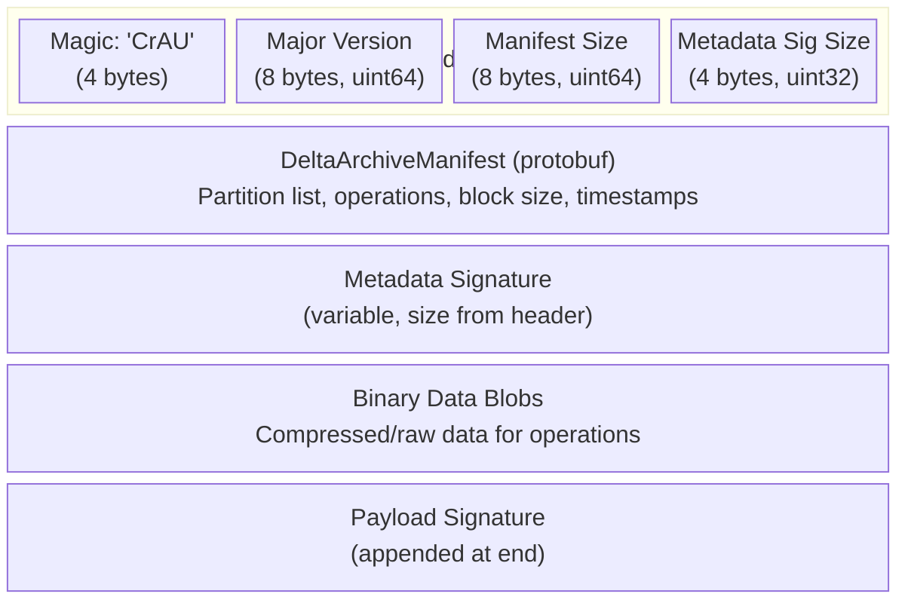
```mermaid
block-beta
    columns 1
    block:header["Payload Header (24 bytes)"]
        columns 4
        magic["Magic: 'CrAU'<br/>(4 bytes)"]
        version["Major Version<br/>(8 bytes, uint64)"]
        manifest_size["Manifest Size<br/>(8 bytes, uint64)"]
        sig_size["Metadata Sig Size<br/>(4 bytes, uint32)"]
    end
    manifest["DeltaArchiveManifest (protobuf)<br/>Partition list, operations, block size, timestamps"]
    metadata_sig["Metadata Signature<br/>(variable, size from header)"]
    blobs["Binary Data Blobs<br/>Compressed/raw data for operations"]
    payload_sig["Payload Signature<br/>(appended at end)"]
```

The header fields are parsed in `PayloadMetadata::ParsePayloadHeader`:

```cpp
// payload_metadata.cc
const uint64_t PayloadMetadata::kDeltaVersionOffset = sizeof(kDeltaMagic); // 4
const uint64_t PayloadMetadata::kDeltaVersionSize = 8;
const uint64_t PayloadMetadata::kDeltaManifestSizeOffset =
    kDeltaVersionOffset + kDeltaVersionSize;                               // 12
const uint64_t PayloadMetadata::kDeltaManifestSizeSize = 8;
const uint64_t PayloadMetadata::kDeltaMetadataSignatureSizeSize = 4;
// Total header: 4 + 8 + 8 + 4 = 24 bytes
```

The magic bytes `CrAU` are a legacy from Chrome OS Update format:

```cpp
// payload_constants.cc
const char kDeltaMagic[4] = {'C', 'r', 'A', 'U'};
```

### 53.3.2 Major and Minor Versions

The payload format has two version numbers:

**Major version** identifies the overall format. Currently only version 2
(Brillo) is supported:

```cpp
const uint64_t kBrilloMajorPayloadVersion = 2;
const uint64_t kMinSupportedMajorPayloadVersion = kBrilloMajorPayloadVersion;
const uint64_t kMaxSupportedMajorPayloadVersion = kBrilloMajorPayloadVersion;
```

**Minor version** identifies the set of supported operations and features:

| Minor Version | Constant | Feature |
|--------------|----------|---------|
| 0 | `kFullPayloadMinorVersion` | Full payload (no source needed) |
| 2 | `kSourceMinorPayloadVersion` | Source-based delta (A-to-B) |
| 3 | `kOpSrcHashMinorPayloadVersion` | Per-operation source hash |
| 4 | `kBrotliBsdiffMinorPayloadVersion` | BROTLI_BSDIFF, ZERO, DISCARD |
| 5 | `kPuffdiffMinorPayloadVersion` | PUFFDIFF operation |
| 6 | `kVerityMinorPayloadVersion` | Verity hash tree + FEC generation |
| 7 | `kPartialUpdateMinorPayloadVersion` | Partial updates (e.g., kernel only) |
| 8 | `kZucchiniMinorPayloadVersion` | ZUCCHINI binary diffing |
| 9 | `kLZ4DIFFMinorPayloadVersion` | LZ4DIFF for EROFS |

### 53.3.3 The DeltaArchiveManifest

The manifest is a protobuf message that describes every partition and every
operation needed to produce the target image. Key fields include:

```protobuf
message DeltaArchiveManifest {
  repeated PartitionUpdate partitions = 13;
  uint32 block_size = 3;           // Typically 4096
  uint32 minor_version = 12;
  uint64 max_timestamp = 14;       // Anti-rollback timestamp
  DynamicPartitionMetadata dynamic_partition_metadata = 15;
}

message PartitionUpdate {
  string partition_name = 1;
  repeated InstallOperation operations = 7;
  PartitionInfo old_partition_info = 10;
  PartitionInfo new_partition_info = 11;
  // Verity/FEC fields ...
  repeated CowMergeOperation merge_operations = 18;
}

message InstallOperation {
  enum Type {
    REPLACE = 0;
    REPLACE_BZ = 1;
    SOURCE_COPY = 4;
    SOURCE_BSDIFF = 5;
    ZERO = 6;
    DISCARD = 7;
    REPLACE_XZ = 8;
    PUFFDIFF = 9;
    BROTLI_BSDIFF = 10;
    ZUCCHINI = 11;
    LZ4DIFF_BSDIFF = 12;
    LZ4DIFF_PUFFDIFF = 13;
  }
  Type type = 1;
  repeated Extent src_extents = 6;
  repeated Extent dst_extents = 8;
  uint64 data_offset = 4;
  uint64 data_length = 5;
  bytes src_sha256_hash = 9;
  bytes data_sha256_hash = 10;
}
```

### 53.3.4 Install Operation Types

Each operation transforms source blocks into target blocks:

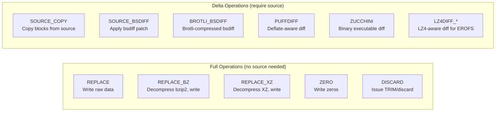
```mermaid
flowchart LR
    subgraph "Full Operations (no source needed)"
        REPLACE["REPLACE<br/>Write raw data"]
        REPLACE_BZ["REPLACE_BZ<br/>Decompress bzip2, write"]
        REPLACE_XZ["REPLACE_XZ<br/>Decompress XZ, write"]
        ZERO["ZERO<br/>Write zeros"]
        DISCARD["DISCARD<br/>Issue TRIM/discard"]
    end

    subgraph "Delta Operations (require source)"
        SOURCE_COPY["SOURCE_COPY<br/>Copy blocks from source"]
        SOURCE_BSDIFF["SOURCE_BSDIFF<br/>Apply bsdiff patch"]
        BROTLI_BSDIFF["BROTLI_BSDIFF<br/>Brotli-compressed bsdiff"]
        PUFFDIFF["PUFFDIFF<br/>Deflate-aware diff"]
        ZUCCHINI["ZUCCHINI<br/>Binary executable diff"]
        LZ4DIFF["LZ4DIFF_*<br/>LZ4-aware diff for EROFS"]
    end
```

| Operation | Source Required | Description |
|-----------|---------------|-------------|
| `REPLACE` | No | Write raw uncompressed data to target extents |
| `REPLACE_BZ` | No | Decompress bzip2 blob, write to target |
| `REPLACE_XZ` | No | Decompress XZ blob, write to target |
| `ZERO` | No | Fill target extents with zeros |
| `DISCARD` | No | Issue discard/trim to target extents |
| `SOURCE_COPY` | Yes | Copy extents from source to target |
| `SOURCE_BSDIFF` | Yes | Read source, apply bsdiff patch, write target |
| `BROTLI_BSDIFF` | Yes | Like SOURCE_BSDIFF but blob is Brotli-compressed |
| `PUFFDIFF` | Yes | Deflate-aware diff -- handles gzip/zlib streams |
| `ZUCCHINI` | Yes | Executable-aware binary diff |
| `LZ4DIFF_BSDIFF` | Yes | LZ4-compressed block diff (EROFS optimization) |
| `LZ4DIFF_PUFFDIFF` | Yes | LZ4 + puffdiff combination |

### 53.3.5 Full vs. Delta Payloads

**Full payloads** contain the complete target image. Every operation is one of
the `REPLACE` variants, `ZERO`, or `DISCARD`. No source partition is needed.
The minor version is 0 (`kFullPayloadMinorVersion`). Full payloads are larger
but can update any device regardless of its current state.

**Delta (incremental) payloads** encode only the differences between a known
source image and the target. They use `SOURCE_COPY`, `SOURCE_BSDIFF`,
`PUFFDIFF`, `ZUCCHINI`, and similar operations that reference source blocks.
Delta payloads are dramatically smaller (often 50-200 MB vs. 2-4 GB for a full
payload) but require the device to be running the exact source build.

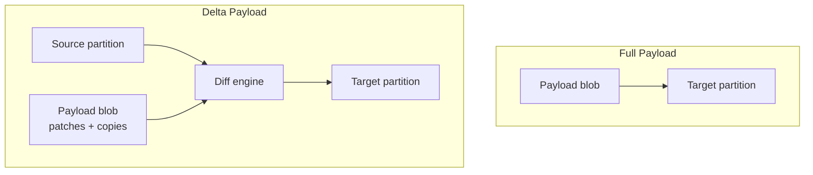
```mermaid
flowchart TD
    subgraph "Full Payload"
        direction LR
        FP[Payload blob] --> FT[Target partition]
    end

    subgraph "Delta Payload"
        direction LR
        SP[Source partition] --> DIFF[Diff engine]
        DP["Payload blob<br/>patches + copies"] --> DIFF
        DIFF --> DT[Target partition]
    end
```

### 53.3.6 Payload Signing and Verification

Payloads are cryptographically signed to prevent tampering:

1. **Metadata signature**: Signs the header + manifest, verified before parsing
   the manifest to prevent exploitation of protobuf parsing bugs.

2. **Payload signature**: Signs the entire payload (excluding the signature
   itself), verified after all operations are applied.

```
Source: system/update_engine/payload_consumer/payload_verifier.h
```

The device carries trusted certificates in `/system/etc/security/otacerts.zip`
(or the path specified by `kUpdateCertificatesPath`). During verification,
`PayloadVerifier` extracts the public keys from these certificates and validates
the RSA/EC signatures.

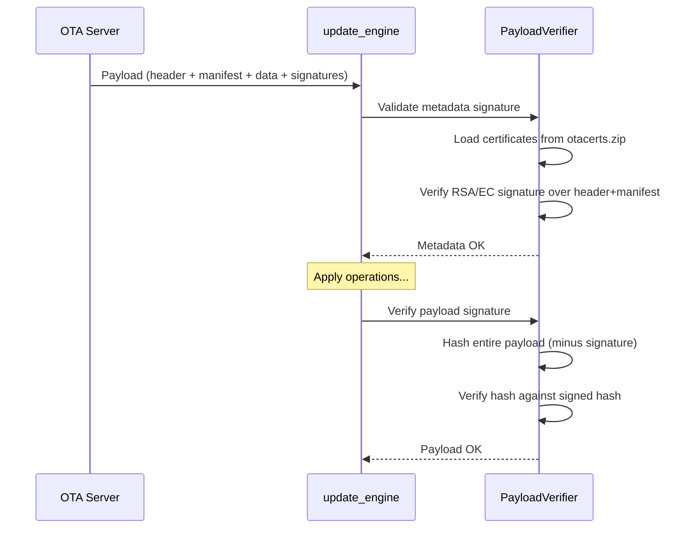
```mermaid
sequenceDiagram
    participant S as OTA Server
    participant UE as update_engine
    participant V as PayloadVerifier

    S->>UE: Payload (header + manifest + data + signatures)
    UE->>V: Validate metadata signature
    V->>V: Load certificates from otacerts.zip
    V->>V: Verify RSA/EC signature over header+manifest
    V-->>UE: Metadata OK

    Note over UE: Apply operations...

    UE->>V: Verify payload signature
    V->>V: Hash entire payload (minus signature)
    V->>V: Verify hash against signed hash
    V-->>UE: Payload OK
```

---

## 53.4 The DeltaPerformer

The `DeltaPerformer` is the workhorse class that actually applies payload
operations to target partitions. It implements the `FileWriter` interface,
receiving payload bytes incrementally as they are downloaded.

### 53.4.1 Streaming Application

```
Source: system/update_engine/payload_consumer/delta_performer.h
        system/update_engine/payload_consumer/delta_performer.cc
```

`DeltaPerformer::Write()` is called repeatedly with chunks of the payload as
they arrive from the network. The performer maintains internal state to track
where it is in the parsing/application process:

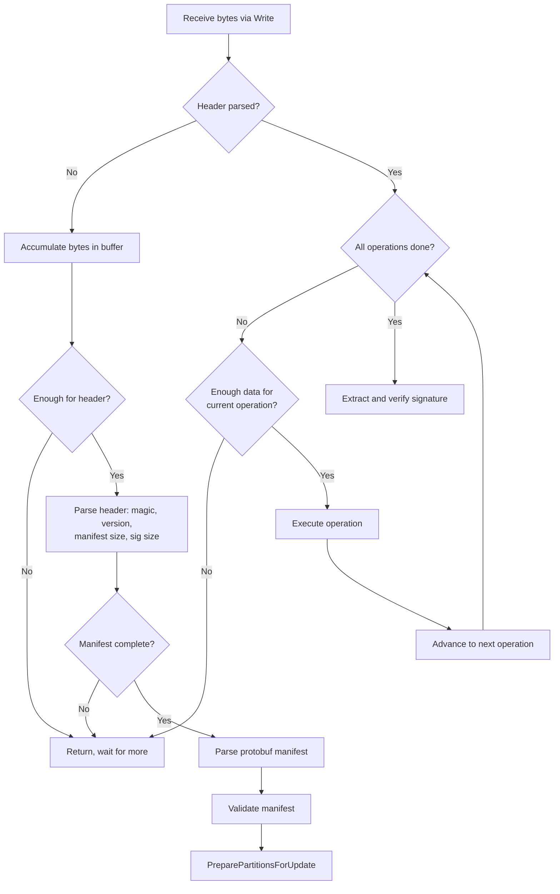
```mermaid
flowchart TD
    A[Receive bytes via Write] --> B{Header parsed?}
    B -->|No| C[Accumulate bytes in buffer]
    C --> D{Enough for header?}
    D -->|No| E[Return, wait for more]
    D -->|Yes| F["Parse header: magic, version,<br/>manifest size, sig size"]
    F --> G{Manifest complete?}
    G -->|No| E
    G -->|Yes| H[Parse protobuf manifest]
    H --> I[Validate manifest]
    I --> J[PreparePartitionsForUpdate]
    B -->|Yes| K{All operations done?}
    K -->|No| L{"Enough data for<br/>current operation?"}
    L -->|No| E
    L -->|Yes| M[Execute operation]
    M --> N[Advance to next operation]
    N --> K
    K -->|Yes| O[Extract and verify signature]
```

Key state variables in the performer:

```cpp
class DeltaPerformer : public FileWriter {
  DeltaArchiveManifest manifest_;
  bool manifest_parsed_{false};
  bool manifest_valid_{false};

  std::vector<PartitionUpdate> partitions_;
  size_t current_partition_{0};
  size_t next_operation_num_{0};
  size_t num_total_operations_{0};

  brillo::Blob buffer_;             // Accumulates incoming data
  uint64_t buffer_offset_{0};       // Offset in blob section
  uint32_t block_size_{0};          // From manifest (usually 4096)

  HashCalculator payload_hash_calculator_;
  HashCalculator signed_hash_calculator_;
};
```

### 53.4.2 Operation Dispatch

Once the manifest is parsed and partitions are prepared, each operation is
dispatched based on its type:

```cpp
bool DeltaPerformer::PerformInstallOperation(
    const InstallOperation& operation) {
  switch (operation.type()) {
    case InstallOperation::REPLACE:
    case InstallOperation::REPLACE_BZ:
    case InstallOperation::REPLACE_XZ:
      return PerformReplaceOperation(operation);
    case InstallOperation::ZERO:
    case InstallOperation::DISCARD:
      return PerformZeroOrDiscardOperation(operation);
    case InstallOperation::SOURCE_COPY:
      return PerformSourceCopyOperation(operation, &error);
    case InstallOperation::SOURCE_BSDIFF:
    case InstallOperation::BROTLI_BSDIFF:
    case InstallOperation::PUFFDIFF:
    case InstallOperation::ZUCCHINI:
    case InstallOperation::LZ4DIFF_BSDIFF:
    case InstallOperation::LZ4DIFF_PUFFDIFF:
      return PerformDiffOperation(operation, &error);
  }
}
```

### 53.4.3 Partition Writers

The actual I/O is delegated to `PartitionWriterInterface` implementations. For
standard A/B updates, a `PartitionWriter` writes directly to the block device.
For Virtual A/B with compression, a `VABCPartitionWriter` writes through a COW
writer.

```
Source: system/update_engine/payload_consumer/vabc_partition_writer.h
```

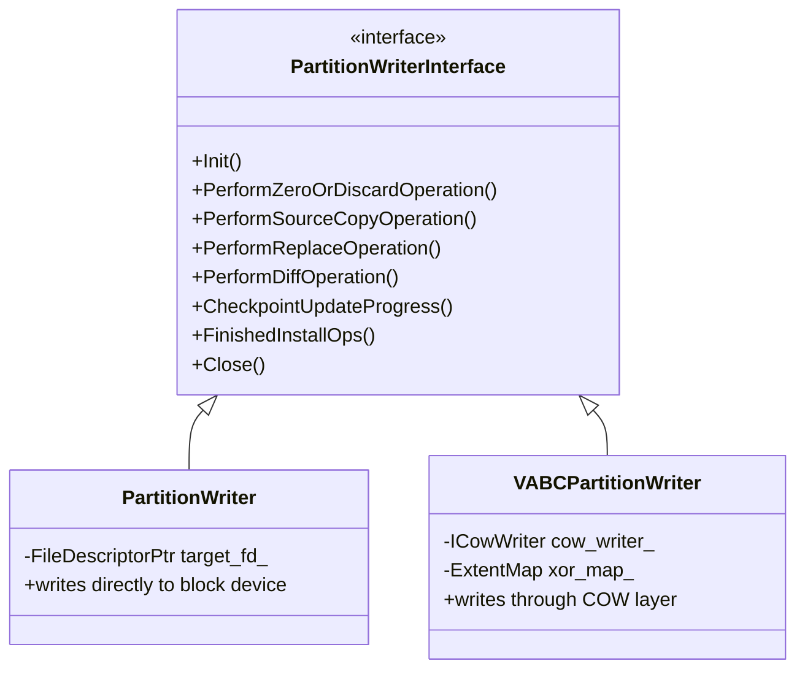
```mermaid
classDiagram
    class PartitionWriterInterface {
        <<interface>>
        +Init()
        +PerformZeroOrDiscardOperation()
        +PerformSourceCopyOperation()
        +PerformReplaceOperation()
        +PerformDiffOperation()
        +CheckpointUpdateProgress()
        +FinishedInstallOps()
        +Close()
    }

    class PartitionWriter {
        -FileDescriptorPtr target_fd_
        +writes directly to block device
    }

    class VABCPartitionWriter {
        -ICowWriter cow_writer_
        -ExtentMap xor_map_
        +writes through COW layer
    }

    PartitionWriterInterface <|-- PartitionWriter
    PartitionWriterInterface <|-- VABCPartitionWriter
```

The VABC partition writer translates OTA operations into COW operations:

| OTA Operation | COW Operation |
|--------------|---------------|
| `ZERO` | `COW_ZERO` |
| `SOURCE_COPY` | `COW_COPY` |
| `REPLACE` / `*_BSDIFF` / etc. | `COW_REPLACE` |

### 53.4.4 Checkpointing and Resume

`DeltaPerformer` supports resuming interrupted updates. Periodically (every
`kCheckpointFrequencySeconds`), it saves progress to persistent preferences:

```cpp
bool DeltaPerformer::CheckpointUpdateProgress(bool force) {
  // Save: current operation number, manifest metadata hash,
  // partition states, etc.
  Checkpoint();
  // On resume, CanResumeUpdate() checks the stored hash against
  // the new payload's hash to determine if resume is possible.
}
```

When the device reboots mid-update (power loss, crash), the next `ApplyPayload`
call detects the stored checkpoint and resumes from where it left off, skipping
already-applied operations.

---

## 53.5 A/B Updates: Slot Switching and Rollback

### 53.5.1 Boot Control HAL

The slot management layer is abstracted behind `BootControlInterface`:

```
Source: system/update_engine/common/boot_control_interface.h
```

```cpp
class BootControlInterface {
 public:
  using Slot = unsigned int;
  static const Slot kInvalidSlot = UINT_MAX;

  virtual unsigned int GetNumSlots() const = 0;
  virtual Slot GetCurrentSlot() const = 0;
  virtual bool GetPartitionDevice(const std::string& partition_name,
                                  Slot slot, std::string* device) const = 0;
  virtual bool IsSlotBootable(Slot slot) const = 0;
  virtual bool MarkSlotUnbootable(Slot slot) = 0;
  virtual bool SetActiveBootSlot(Slot slot) = 0;
  virtual Slot GetActiveBootSlot() = 0;
  virtual bool MarkBootSuccessfulAsync(
      base::Callback<void(bool)> callback) = 0;
  virtual bool IsSlotMarkedSuccessful(Slot slot) const = 0;
};
```

On Android, `BootControlAndroid` implements this via the Boot Control HAL
(`IBootControl`):

```
Source: system/update_engine/aosp/boot_control_android.h
```

```cpp
class BootControlAndroid final : public BootControlInterface {
  std::unique_ptr<android::hal::BootControlClient> module_;
  std::unique_ptr<DynamicPartitionControlAndroid> dynamic_control_;
};
```

### 53.5.2 Slot Naming Convention

AOSP supports up to 26 slots (A through Z), though in practice only 2 are used:

```cpp
static std::string SlotName(Slot slot) {
  if (slot == kInvalidSlot) return "INVALID";
  if (slot < 26) return std::string(1, 'A' + slot);
  return "TOO_BIG";
}
```

Partition names are suffixed: `system_a`, `system_b`, `boot_a`, `boot_b`, etc.

### 53.5.3 The A/B Update Lifecycle

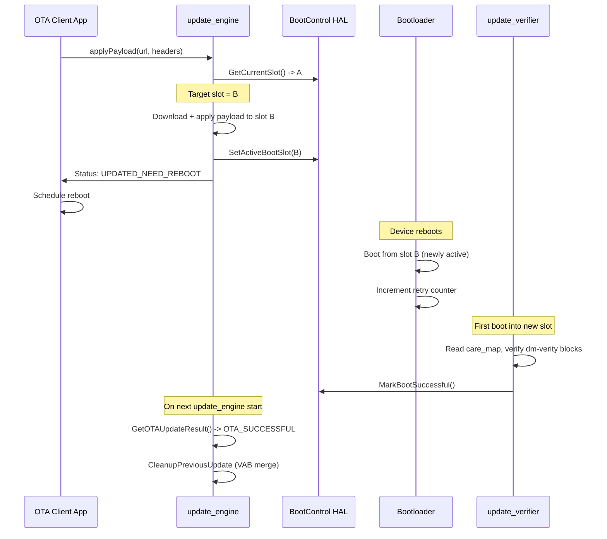
```mermaid
sequenceDiagram
    participant App as OTA Client App
    participant UE as update_engine
    participant BC as BootControl HAL
    participant BL as Bootloader
    participant UV as update_verifier

    App->>UE: applyPayload(url, headers)
    UE->>BC: GetCurrentSlot() -> A
    Note over UE: Target slot = B

    UE->>UE: Download + apply payload to slot B
    UE->>BC: SetActiveBootSlot(B)
    UE->>App: Status: UPDATED_NEED_REBOOT

    App->>App: Schedule reboot

    Note over BL: Device reboots
    BL->>BL: Boot from slot B (newly active)
    BL->>BL: Increment retry counter

    Note over UV: First boot into new slot
    UV->>UV: Read care_map, verify dm-verity blocks
    UV->>BC: MarkBootSuccessful()

    Note over UE: On next update_engine start
    UE->>UE: GetOTAUpdateResult() -> OTA_SUCCESSFUL
    UE->>UE: CleanupPreviousUpdate (VAB merge)
```

### 53.5.4 Bootloader Integration

The bootloader maintains per-slot metadata:

| Field | Description |
|-------|-------------|
| `bootable` | Whether the slot can be booted |
| `successful` | Whether the slot has been verified |
| `active` | Which slot to boot next |
| `retry_count` | Remaining boot attempts before marking unbootable |

The boot flow:

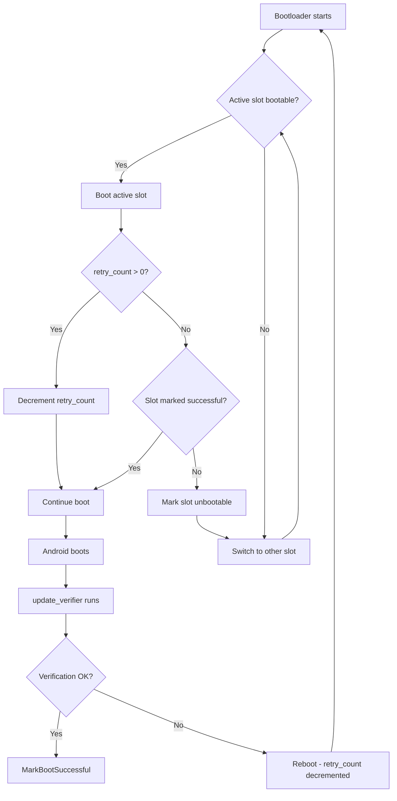
```mermaid
flowchart TD
    A[Bootloader starts] --> B{Active slot bootable?}
    B -->|Yes| C[Boot active slot]
    C --> D{retry_count > 0?}
    D -->|Yes| E[Decrement retry_count]
    E --> F[Continue boot]
    D -->|No| G{Slot marked successful?}
    G -->|Yes| F
    G -->|No| H[Mark slot unbootable]
    H --> I[Switch to other slot]
    I --> B

    B -->|No| I

    F --> J[Android boots]
    J --> K[update_verifier runs]
    K --> L{Verification OK?}
    L -->|Yes| M[MarkBootSuccessful]
    L -->|No| N[Reboot - retry_count decremented]
    N --> A
```

### 53.5.5 Rollback Mechanism

Rollback is automatic and requires no user intervention:

1. **Boot failure**: If the device cannot boot the new slot at all, the
   bootloader's retry counter reaches zero, and it switches back.

2. **Verification failure**: `update_verifier` reads all blocks listed in the
   `care_map` and relies on dm-verity to detect corruption. If any read fails,
   the device reboots. After enough failures, the bootloader marks the slot
   unbootable.

3. **Explicit rollback**: `update_engine` can be asked to rollback by marking
   the previous slot active again, but this is not commonly exposed to users.

```
Source: bootable/recovery/update_verifier/update_verifier.cpp
```

```cpp
// update_verifier relies on device-mapper-verity (dm-verity) to capture
// any corruption on the partitions being verified. The verification will
// be skipped if dm-verity is not enabled on the device.
//
// Upon detecting verification failures, the device will be rebooted.
```

### 53.5.6 The care_map

The `care_map` is a protobuf file that lists which blocks on each partition
contain meaningful data (as opposed to free/unused space). `update_verifier`
reads only these "cared" blocks to trigger dm-verity verification without
reading the entire partition:

```protobuf
// bootable/recovery/update_verifier/care_map.proto
message CareMap {
  repeated CareMapEntry partitions = 1;
}

message CareMapEntry {
  string name = 1;
  string ranges = 2;      // Block ranges, e.g., "0-1000,2000-3000"
  string id = 3;           // Fingerprint/hash
}
```

---

## 53.6 Virtual A/B Updates

Virtual A/B is the most complex update scheme. It provides the seamless update
experience of A/B while using roughly the same storage as non-A/B by employing
copy-on-write (COW) snapshots.

### 53.6.1 Architecture Overview

```
Source: system/core/fs_mgr/libsnapshot/
        system/update_engine/aosp/dynamic_partition_control_android.h
```

The key insight: rather than maintaining a full copy of each partition, Virtual
A/B stores only the *differences* between the running (source) and updated
(target) versions. These differences are stored in COW format, and a daemon
(`snapuserd`) presents a merged view of the base partition + COW data to the
rest of the system.

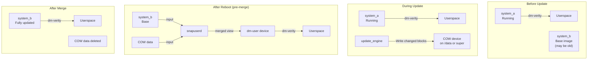
```mermaid
flowchart TD
    subgraph "Before Update"
        SA["system_a<br/>Running"] --> |dm-verity| USER[Userspace]
        SB["system_b<br/>Base image<br/>(may be old)"]
    end

    subgraph "During Update"
        SA2["system_a<br/>Running"] --> |dm-verity| USER2[Userspace]
        UE[update_engine] --> |Write changed blocks| COW["COW device<br/>on /data or super"]
    end

    subgraph "After Reboot (pre-merge)"
        SB3["system_b<br/>Base"] --> |input| SU[snapuserd]
        COW3[COW data] --> |input| SU
        SU --> |merged view| DM[dm-user device]
        DM --> |dm-verity| USER3[Userspace]
    end

    subgraph "After Merge"
        SB4["system_b<br/>Fully updated"] --> |dm-verity| USER4[Userspace]
        Note4[COW data deleted]
    end
```

### 53.6.2 Dynamic Partitions and Super

Virtual A/B builds on the *dynamic partitions* feature (introduced in Android
10), which uses a "super" partition containing logical volume metadata. The
super partition is a physical partition that contains a GPT-like metadata table
(LpMetadata) describing logical partitions (system, vendor, product, etc.)
within it.

For Virtual A/B, the logical partitions have A and B entries in the metadata,
but the actual data can overlap because the inactive slot may not physically
exist until a COW is created.

### 53.6.3 Snapshot Manager

The `ISnapshotManager` interface (implemented by `SnapshotManager`) coordinates
snapshot creation, merge, and cleanup:

```
Source: system/core/fs_mgr/libsnapshot/include/libsnapshot/snapshot.h
```

```cpp
class ISnapshotManager {
 public:
  virtual bool BeginUpdate() = 0;
  virtual bool CancelUpdate() = 0;
  virtual bool FinishedSnapshotWrites(bool wipe) = 0;
  // Map a snapshotted partition for the first stage of init.
  virtual bool MapAllSnapshots(const std::chrono::milliseconds& timeout) = 0;
  virtual bool UnmapAllSnapshots() = 0;
  // Initiate merge of all snapshots.
  virtual bool InitiateMerge() = 0;
  // Process the merge (called repeatedly until complete).
  virtual UpdateState ProcessUpdateState(
      const std::function<bool()>& callback,
      const std::function<bool()>& before_cancel) = 0;
  // Get overall update state.
  virtual UpdateState GetUpdateState(double* progress = nullptr) = 0;
};
```

### 53.6.4 The COW Format

The Copy-On-Write format stores the modified blocks efficiently. AOSP has
iterated on this format, currently supporting v2 and v3:

```
Source: system/core/fs_mgr/libsnapshot/libsnapshot_cow/
```

COW operations:

| Operation | Description |
|-----------|-------------|
| `COW_COPY` | Block unchanged; read from source |
| `COW_REPLACE` | Block replaced; full new data in COW |
| `COW_ZERO` | Block is all zeros |
| `COW_XOR` | Block changed slightly; store XOR delta |
| `COW_LABEL` | Checkpoint marker for crash recovery |

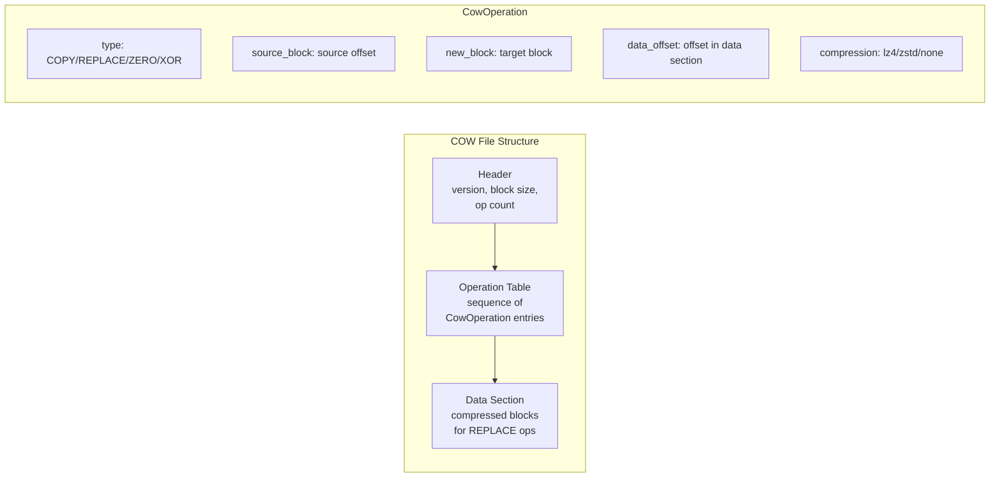
```mermaid
flowchart LR
    subgraph "COW File Structure"
        H["Header<br/>version, block size,<br/>op count"] --> OPS["Operation Table<br/>sequence of<br/>CowOperation entries"]
        OPS --> DATA["Data Section<br/>compressed blocks<br/>for REPLACE ops"]
    end

    subgraph "CowOperation"
        direction TB
        T[type: COPY/REPLACE/ZERO/XOR]
        S[source_block: source offset]
        N[new_block: target block]
        D[data_offset: offset in data section]
        CMP[compression: lz4/zstd/none]
    end
```

### 53.6.5 snapuserd

`snapuserd` is the userspace daemon that serves snapshot block devices. It runs
very early in the boot process (first-stage init) and presents merged views of
base-partition + COW data through `dm-user` kernel devices.

```
Source: system/core/fs_mgr/libsnapshot/snapuserd/
        system/core/fs_mgr/libsnapshot/snapuserd/user-space-merge/
```

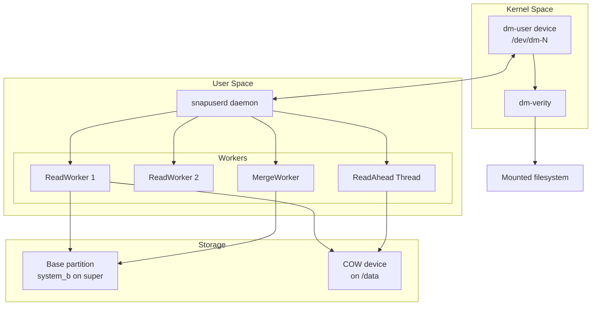
```mermaid
flowchart TD
    subgraph "Kernel Space"
        DM_USER["dm-user device<br/>/dev/dm-N"]
        DM_VERITY[dm-verity]
    end

    subgraph "User Space"
        SNAPUSERD[snapuserd daemon]
        subgraph "Workers"
            RW1[ReadWorker 1]
            RW2[ReadWorker 2]
            MW[MergeWorker]
            RA[ReadAhead Thread]
        end
    end

    subgraph "Storage"
        BASE["Base partition<br/>system_b on super"]
        COW_DEV["COW device<br/>on /data"]
    end

    DM_USER <--> SNAPUSERD
    SNAPUSERD --> RW1
    SNAPUSERD --> RW2
    SNAPUSERD --> MW
    SNAPUSERD --> RA
    RW1 --> BASE
    RW1 --> COW_DEV
    MW --> BASE
    RA --> COW_DEV
    DM_USER --> DM_VERITY
    DM_VERITY --> MOUNT[Mounted filesystem]
```

The `SnapshotHandler` class manages a single partition snapshot:

```cpp
// snapuserd_core.h
class SnapshotHandler : public std::enable_shared_from_this<SnapshotHandler> {
 public:
  SnapshotHandler(std::string misc_name,
                  std::string cow_device,
                  std::string backing_device,
                  std::string base_path_merge,
                  std::shared_ptr<IBlockServerOpener> opener,
                  HandlerOptions options);

  bool InitCowDevice();
  bool Start();
  bool InitializeWorkers();
  // ...
};
```

### 53.6.6 The Merge Process

After the device boots into the new slot and `update_verifier` confirms
integrity, the COW data must be *merged* into the base partition. This
permanently applies the update and frees the COW storage.

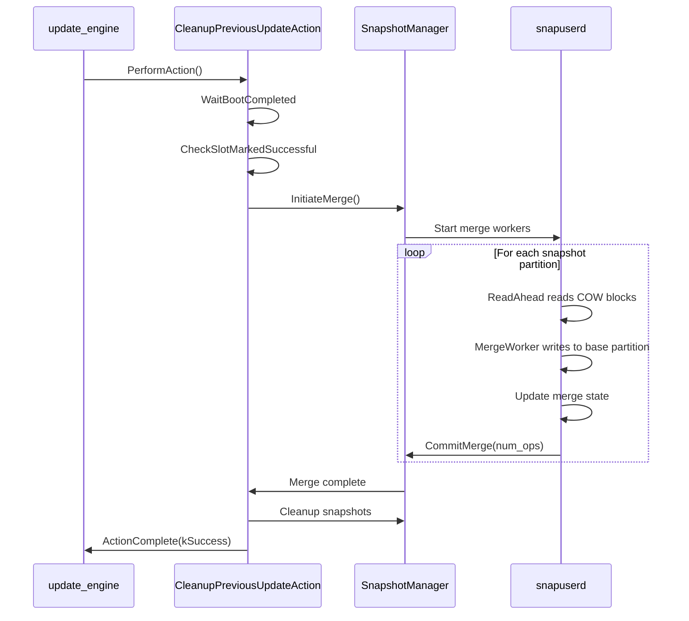
```mermaid
sequenceDiagram
    participant UE as update_engine
    participant CPA as CleanupPreviousUpdateAction
    participant SM as SnapshotManager
    participant SU as snapuserd

    UE->>CPA: PerformAction()
    CPA->>CPA: WaitBootCompleted
    CPA->>CPA: CheckSlotMarkedSuccessful
    CPA->>SM: InitiateMerge()
    SM->>SU: Start merge workers

    loop For each snapshot partition
        SU->>SU: ReadAhead reads COW blocks
        SU->>SU: MergeWorker writes to base partition
        SU->>SU: Update merge state
        SU->>SM: CommitMerge(num_ops)
    end

    SM->>CPA: Merge complete
    CPA->>SM: Cleanup snapshots
    CPA->>UE: ActionComplete(kSuccess)
```

The merge happens in the background, orchestrated by `CleanupPreviousUpdateAction`:

```
Source: system/update_engine/aosp/cleanup_previous_update_action.h
```

```cpp
class CleanupPreviousUpdateAction : public Action<...> {
  void PerformAction() override;
  // Internal flow:
  // 1. ScheduleWaitBootCompleted
  // 2. CheckSlotMarkedSuccessfulOrSchedule
  // 3. StartMerge -> InitiateMergeAndWait
  // 4. WaitForMergeOrSchedule (polls merge progress)
  // 5. ReportMergeStats
};
```

### 53.6.7 Merge State Machine

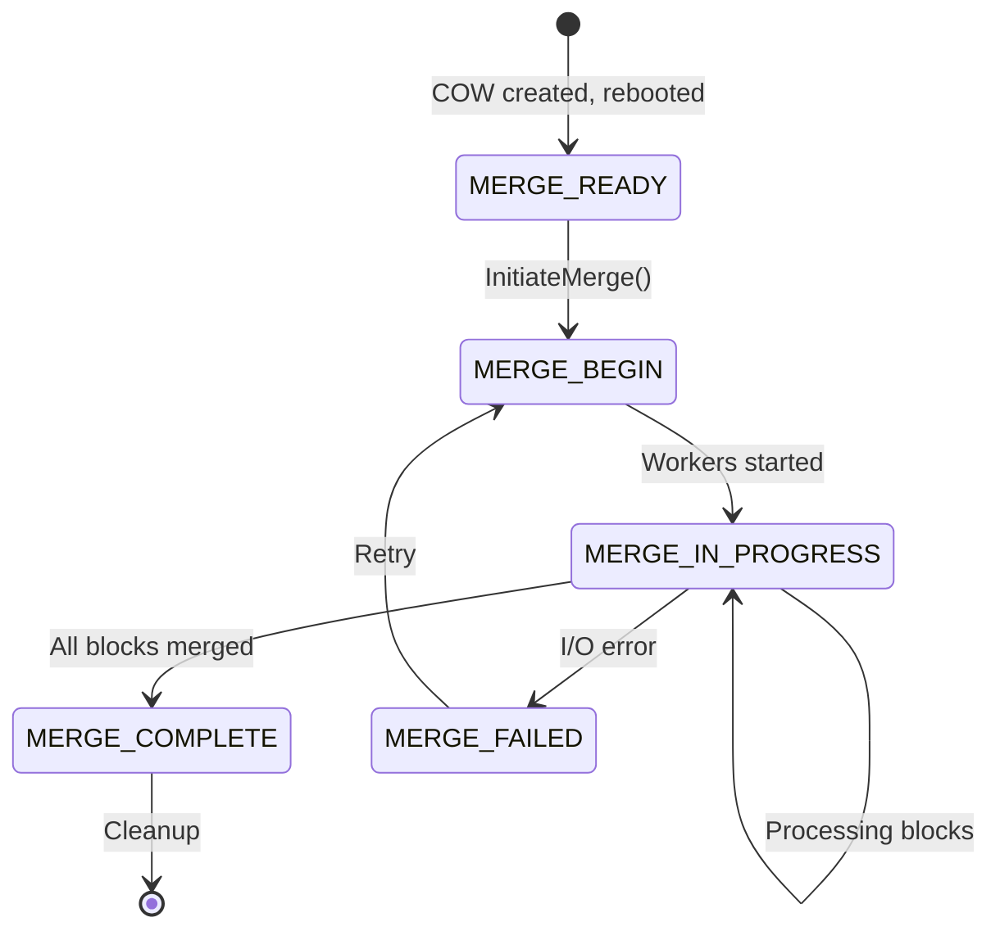
```mermaid
stateDiagram-v2
    [*] --> MERGE_READY : COW created, rebooted
    MERGE_READY --> MERGE_BEGIN : InitiateMerge()
    MERGE_BEGIN --> MERGE_IN_PROGRESS : Workers started
    MERGE_IN_PROGRESS --> MERGE_IN_PROGRESS : Processing blocks
    MERGE_IN_PROGRESS --> MERGE_COMPLETE : All blocks merged
    MERGE_IN_PROGRESS --> MERGE_FAILED : I/O error
    MERGE_FAILED --> MERGE_BEGIN : Retry
    MERGE_COMPLETE --> [*] : Cleanup
```

Inside `snapuserd`, per-block-group merge states track fine-grained progress:

```cpp
enum class MERGE_GROUP_STATE {
    GROUP_MERGE_PENDING,
    GROUP_MERGE_RA_READY,
    GROUP_MERGE_IN_PROGRESS,
    GROUP_MERGE_COMPLETED,
    GROUP_MERGE_FAILED,
    GROUP_INVALID,
};
```

### 53.6.8 Compression and XOR

Virtual A/B Compression (VABC) compresses the COW data to reduce space usage.
Supported compression algorithms:

| Algorithm | Property Value | Characteristics |
|-----------|---------------|-----------------|
| LZ4 | `lz4` | Fast decompression, moderate ratio |
| Zstandard | `zstd` | Better ratio, good speed |
| None | `none` | No compression |

XOR compression (`ro.virtual_ab.compression.xor.enabled=true`) further reduces
COW size by storing XOR deltas instead of full replacement blocks. When a block
changes only slightly (e.g., a timestamp in a header), the XOR of old and new
blocks compresses much better than the full new block.

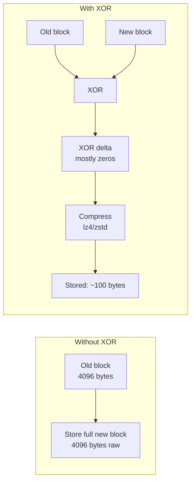
```mermaid
flowchart LR
    subgraph "Without XOR"
        OLD1["Old block<br/>4096 bytes"] --> STORE1["Store full new block<br/>4096 bytes raw"]
    end

    subgraph "With XOR"
        OLD2[Old block] --> XOR[XOR]
        NEW2[New block] --> XOR
        XOR --> DELTA["XOR delta<br/>mostly zeros"]
        DELTA --> COMPRESS["Compress<br/>lz4/zstd"]
        COMPRESS --> STORED[Stored: ~100 bytes]
    end
```

### 53.6.9 Space Allocation

Before an update begins, `update_engine` must ensure enough space exists for the
COW data. This is handled by `AllocateSpaceForPayload`:

```cpp
// update_attempter_android.h
uint64_t AllocateSpaceForPayload(
    const std::string& metadata_filename,
    const std::vector<std::string>& key_value_pair_headers,
    Error* error) override;
```

The COW data can be stored in:

- **Super partition free space**: If the super partition has unused capacity.
- **Userdata partition**: The `/data` partition provides overflow storage.

The system checks `ro.virtual_ab.compression.enabled` and estimates COW size
based on the payload manifest. If insufficient space is available, the API
returns the required size, and the framework can prompt the user to free space.

---

## 53.7 Payload Generation

OTA payloads are generated on the build server using Python scripts and native
tools.

### 53.7.1 ota_from_target_files

The primary entry point for OTA generation:

```
Source: build/make/tools/releasetools/ota_from_target_files.py
```

Usage:
```bash
# Full OTA
ota_from_target_files target-files.zip ota_package.zip

# Incremental OTA
ota_from_target_files -i source-target-files.zip \
    target-target-files.zip ota_package.zip
```

The script supports numerous options:

```python
# Key options (from source)
OPTIONS.wipe_user_data = False
OPTIONS.worker_threads = multiprocessing.cpu_count() // 2
OPTIONS.two_step = False
OPTIONS.include_secondary = False
OPTIONS.block_based = True
OPTIONS.disable_vabc = False
OPTIONS.enable_vabc_xor = True
OPTIONS.enable_zucchini = False
OPTIONS.enable_puffdiff = None
OPTIONS.enable_lz4diff = False
OPTIONS.vabc_compression_param = None    # lz4, zstd, none
OPTIONS.max_threads = None
OPTIONS.vabc_cow_version = None
OPTIONS.compression_factor = None        # 4k-256k
```

Key constants referenced during generation:

```python
POSTINSTALL_CONFIG = 'META/postinstall_config.txt'
DYNAMIC_PARTITION_INFO = 'META/dynamic_partitions_info.txt'
MISC_INFO = 'META/misc_info.txt'
AB_PARTITIONS = 'META/ab_partitions.txt'
```

### 53.7.2 Generation Flow

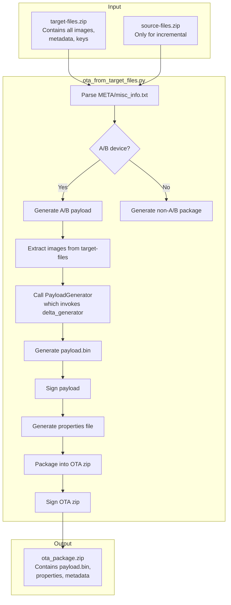
```mermaid
flowchart TD
    subgraph "Input"
        TF["target-files.zip<br/>Contains all images,<br/>metadata, keys"]
        SF["source-files.zip<br/>Only for incremental"]
    end

    subgraph "ota_from_target_files.py"
        A[Parse META/misc_info.txt] --> B{A/B device?}
        B -->|Yes| C[Generate A/B payload]
        B -->|No| D[Generate non-A/B package]

        C --> E[Extract images from target-files]
        E --> F["Call PayloadGenerator<br/>which invokes delta_generator"]
        F --> G[Generate payload.bin]
        G --> H[Sign payload]
        H --> I[Generate properties file]
        I --> J[Package into OTA zip]
        J --> K[Sign OTA zip]
    end

    subgraph "Output"
        OTA["ota_package.zip<br/>Contains payload.bin,<br/>properties, metadata"]
    end

    TF --> A
    SF --> A
    K --> OTA
```

### 53.7.3 brillo_update_payload

The lower-level shell script for direct payload manipulation:

```
Source: system/update_engine/scripts/brillo_update_payload
```

Commands:
```bash
# Generate unsigned payload
brillo_update_payload generate \
    --payload output.bin \
    --target_image target.img \
    [--source_image source.img]   # Omit for full payload

# Generate hash for signing
brillo_update_payload hash \
    --unsigned_payload payload.bin \
    --signature_size 256 \
    --payload_hash_file payload_hash \
    --metadata_hash_file metadata_hash

# Insert signatures
brillo_update_payload sign \
    --unsigned_payload unsigned.bin \
    --payload signed.bin \
    --signature_size 256 \
    --payload_signature_file payload.sig \
    --metadata_signature_file metadata.sig

# Extract properties
brillo_update_payload properties \
    --payload signed.bin \
    --properties_file props.txt

# Verify payload
brillo_update_payload verify \
    --payload signed.bin \
    --target_image target.img \
    [--source_image source.img]
```

### 53.7.4 delta_generator

The native binary that does the actual diff computation:

```
Source: system/update_engine/payload_generator/generate_delta_main.cc
        system/update_engine/payload_generator/delta_diff_generator.h
```

```cpp
// delta_diff_generator.h
bool GenerateUpdatePayloadFile(const PayloadGenerationConfig& config,
                               const std::string& output_path,
                               const std::string& private_key_path,
                               uint64_t* metadata_size);
```

For each partition, `delta_generator`:

1. Reads the source and target images.
2. Identifies the filesystem type (ext4, EROFS, etc.).
3. Groups blocks by file for better diffing.
4. Selects the best diff algorithm per block range:
   - `SOURCE_COPY` for identical blocks.
   - `ZERO` for zero-filled blocks.
   - `BSDIFF`, `PUFFDIFF`, `ZUCCHINI`, or `LZ4DIFF` based on content type
     and enabled features.
   - `REPLACE` (with compression) as fallback.
5. Serializes operations and data blobs into the payload format.

### 53.7.5 Diff Algorithm Selection

```mermaid
flowchart TD
    A[Block range to encode] --> B{Identical to source?}
    B -->|Yes| C[SOURCE_COPY]
    B -->|No| D{All zeros?}
    D -->|Yes| E[ZERO]
    D -->|No| F{"LZ4-compressed<br/>EROFS block?"}
    F -->|Yes| G{LZ4DIFF enabled?}
    G -->|Yes| H["LZ4DIFF_BSDIFF or<br/>LZ4DIFF_PUFFDIFF"]
    G -->|No| I[Fall through]
    F -->|No| I
    I --> J{Deflate stream?}
    J -->|Yes| K{PUFFDIFF enabled?}
    K -->|Yes| L[PUFFDIFF]
    K -->|No| M[Fall through]
    J -->|No| M
    M --> N{Executable code?}
    N -->|Yes| O{ZUCCHINI enabled?}
    O -->|Yes| P[ZUCCHINI]
    O -->|No| Q[BROTLI_BSDIFF]
    N -->|No| Q
    Q --> R{"Diff smaller than<br/>REPLACE?"}
    R -->|Yes| S[Use diff]
    R -->|No| T[REPLACE with compression]
```

### 53.7.6 OTA Package Structure

For A/B devices, the output OTA zip contains:

```
ota_package.zip
    payload.bin                    -- The binary payload
    payload_properties.txt         -- Key-value metadata
    META-INF/
        com/android/metadata       -- Package metadata
        com/android/metadata.pb    -- Protobuf metadata
    care_map.pb                    -- Block care map for verification
```

The `payload_properties.txt` contains values needed by the client:

```
FILE_HASH=<sha256>
FILE_SIZE=<bytes>
METADATA_HASH=<sha256>
METADATA_SIZE=<bytes>
```

For non-A/B devices, the zip contains the traditional updater-script and
update-binary instead of a payload.bin.

---

## 53.8 Streaming Updates

One of A/B's key advantages is support for *streaming* updates -- the payload
can be applied as it downloads, without first saving the entire file.

### 53.8.1 Download Architecture

```mermaid
flowchart LR
    subgraph "Network"
        SERVER["OTA Server<br/>HTTPS"]
    end

    subgraph "update_engine"
        FETCHER["HttpFetcher<br/>libcurl-based"]
        DA[DownloadAction]
        DP[DeltaPerformer]
    end

    subgraph "Storage"
        TARGET["Target partition<br/>or COW device"]
    end

    SERVER -->|HTTP GET with Range| FETCHER
    FETCHER -->|byte chunks| DA
    DA -->|"Write()"| DP
    DP -->|block writes| TARGET
```

The `LibcurlHttpFetcher` handles:

- HTTP/HTTPS downloads with TLS.
- Range requests for resuming interrupted downloads.
- Network selection (cellular vs. Wi-Fi) via `NetworkSelectorInterface`.

### 53.8.2 Streaming Flow

Because `DeltaPerformer` processes the payload incrementally:

1. It parses the header (24 bytes) from the first chunk.
2. It accumulates bytes until the full manifest is available.
3. It parses the manifest and prepares partitions.
4. For each subsequent operation, it waits until enough data blob bytes have
   arrived, then applies the operation immediately.

5. The write is pipelined: while one operation's data is being written to the
   target, the next operation's data is being downloaded.

This means the device never needs free space equal to the full payload size. The
buffer `DeltaPerformer::buffer_` holds only the data for the current operation.

### 53.8.3 File Descriptor-Based Updates

In addition to URL-based streaming, updates can be applied from a local file
descriptor:

```java
// UpdateEngine.java
updateEngine.applyPayloadFd(fd, offset, size, headerKeyValuePairs);
```

This is used for:

- ADB sideload: `adb sideload ota_package.zip`
- SD card installation
- Updates downloaded by the OTA client app to local storage

### 53.8.4 Network Considerations

The update engine supports:

- **Suspend/Resume**: If the device loses connectivity, the download pauses.
  When resumed, it uses HTTP Range headers to continue from where it left off.

- **Multi-network**: The `NETWORK_ID` header allows specifying which network
  interface to use.

- **Metered network awareness**: The OTA client (not update_engine itself)
  typically decides whether to download over metered connections.

---

## 53.9 Recovery Mode

While A/B and Virtual A/B updates avoid recovery mode, it remains the mechanism
for non-A/B updates and provides important fallback functionality.

### 53.9.1 Recovery Architecture

```
Source: bootable/recovery/recovery_main.cpp
        bootable/recovery/recovery.cpp
```

Recovery is a minimal Linux environment with its own init, UI, and a stripped-
down set of utilities. On non-A/B devices, it lives in a dedicated `recovery`
partition. On A/B devices, it is embedded in the `boot` or `init_boot`
partition and extracted at boot time.

```mermaid
flowchart TD
    subgraph "Bootloader"
        BL[Bootloader checks BCB]
    end

    subgraph "Recovery Environment"
        INIT[Recovery init]
        MAIN["recovery_main.cpp<br/>main()"]
        REC["recovery.cpp<br/>start_recovery()"]
        UI["RecoveryUI<br/>screen/text UI"]
        INSTALL["install.cpp<br/>InstallPackage()"]
        FASTBOOT["fastboot.cpp<br/>StartFastboot()"]
    end

    BL -->|boot-recovery| INIT
    INIT --> MAIN
    MAIN --> |--fastboot| FASTBOOT
    MAIN --> |default| REC
    REC --> UI
    REC --> INSTALL
```

### 53.9.2 Bootloader Control Block (BCB)

Recovery communicates with the main system through the Bootloader Control Block,
a well-known structure in the `misc` partition:

```
Source: bootable/recovery/bootloader_message/
```

```cpp
struct bootloader_message {
    char command[32];     // "boot-recovery", "boot-fastboot", etc.
    char status[32];      // Status string (deprecated)
    char recovery[768];   // Recovery command args, newline-separated
    char stage[32];       // Multi-stage update progress
    char reserved[1184];  // Reserved for future use
};
```

The BCB protocol:

1. The main system writes `boot-recovery` to `command` and the recovery
   arguments to `recovery`.

2. The bootloader reads `command` and boots into recovery.
3. Recovery reads its arguments from the BCB.
4. On completion, recovery clears the BCB so the device boots normally.

### 53.9.3 Recovery Commands

```
Source: bootable/recovery/recovery.cpp (start_recovery function)
```

Recovery accepts these commands via the BCB or `/cache/recovery/command`:

| Command | Description |
|---------|-------------|
| `--update_package=<path>` | Install an OTA package |
| `--install_with_fuse` | Use FUSE for large packages |
| `--wipe_data` | Factory reset |
| `--wipe_cache` | Wipe cache partition |
| `--prompt_and_wipe_data` | Show corruption prompt, offer reset |
| `--sideload` | Enter ADB sideload mode |
| `--sideload_auto_reboot` | Sideload then auto-reboot |
| `--rescue` | Enter rescue mode |
| `--just_exit` | Do nothing, reboot |
| `--shutdown_after` | Shut down instead of reboot |
| `--show_text` | Show text mode UI |

### 53.9.4 OTA Package Installation in Recovery

For non-A/B devices, recovery installs OTA packages:

```mermaid
sequenceDiagram
    participant REC as recovery
    participant PKG as OTA Package
    participant UPD as update-binary/script

    REC->>PKG: Verify ZIP signature
    REC->>PKG: Extract update-binary
    REC->>UPD: Fork and exec update-binary
    UPD->>UPD: Parse updater-script (edify)
    UPD->>UPD: Apply block-level patches
    UPD->>REC: Report progress via pipe
    UPD->>REC: Exit with status
    REC->>REC: Clear BCB
    REC->>REC: Reboot
```

The `InstallPackage` function in `install.cpp` handles:

1. Signature verification using `/system/etc/security/otacerts.zip`.
2. Extracting and executing the `META-INF/com/google/android/update-binary`.
3. Monitoring progress through a pipe (command protocol: `progress`, `set_progress`, `ui_print`).
4. Retry logic (up to 4 retries for I/O errors).

```cpp
// install.cpp
static constexpr int kRecoveryApiVersion = 3;
static constexpr int VERIFICATION_PROGRESS_TIME = 60;
static constexpr float VERIFICATION_PROGRESS_FRACTION = 0.25;
// RETRY_LIMIT for automatic retry on transient errors
static constexpr int RETRY_LIMIT = 4;
```

### 53.9.5 ADB Sideload

Recovery supports receiving OTA packages over ADB:

```bash
# On host
adb sideload ota_package.zip
```

When in sideload mode, recovery starts a mini ADB daemon (`minadbd`) that
accepts the package over USB and feeds it to the installer.

### 53.9.6 Recovery UI

Recovery provides a text/graphical UI for user interaction:

```
Source: bootable/recovery/recovery_ui/
```

The UI supports:

- Menu navigation via volume keys and power button.
- Progress bars for installation and verification.
- Multiple resolution resources (`res-hdpi`, `res-xhdpi`, etc.).
- Locale-specific text overlays.

Menu items (from `Device::GetMenuItems()`):

| Item | Action |
|------|--------|
| Reboot system now | `REBOOT` |
| Reboot to bootloader | `REBOOT_BOOTLOADER` |
| Enter fastboot | `ENTER_FASTBOOT` |
| Apply update from ADB | `APPLY_ADB_SIDELOAD` |
| Apply update from SD card | `APPLY_SDCARD` |
| Wipe data/factory reset | `WIPE_DATA` |
| Wipe cache partition | `WIPE_CACHE` |
| Mount /system | `MOUNT_SYSTEM` |
| View recovery logs | `VIEW_RECOVERY_LOGS` |
| Run graphics test | `RUN_GRAPHICS_TEST` |
| Power off | `SHUTDOWN` |

### 53.9.7 Virtual A/B Awareness in Recovery

Recovery is aware of Virtual A/B snapshots. When mounting the system partition,
it first sets up snapshot devices:

```cpp
// recovery.cpp
case Device::MOUNT_SYSTEM:
  // For Virtual A/B, set up the snapshot devices (if exist).
  if (!CreateSnapshotPartitions()) {
    ui->Print("Virtual A/B: snapshot partitions creation failed.\n");
    break;
  }
  if (ensure_path_mounted_at(
      android::fs_mgr::GetSystemRoot(), "/mnt/system") != -1) {
    ui->Print("Mounted /system.\n");
  }
  break;
```

Recovery can also cancel an in-progress Virtual A/B update (e.g., when the user
wants to sideload a different OTA):

```cpp
// In ask_to_cancel_ota()
std::vector<std::string> headers{
  "Overwrite in-progress update?",
  "An update may already be in progress. If you proceed, "
  "the existing OS may not longer boot, and completing "
  "an update via ADB will be required."
};
```

---

## 53.10 Framework Integration: UpdateEngine API

### 53.10.1 The UpdateEngine Java API

```
Source: frameworks/base/core/java/android/os/UpdateEngine.java
```

`UpdateEngine` is a `@SystemApi` class that wraps the Binder interface to
`update_engine`. On Google devices, GmsCore (Google Play Services) is the
primary client.

```java
@SystemApi
public class UpdateEngine {
    private static final String UPDATE_ENGINE_SERVICE =
        "android.os.UpdateEngineService";

    // Usage flow:
    // 1. Create instance
    UpdateEngine engine = new UpdateEngine();

    // 2. Bind with callbacks
    engine.bind(new UpdateEngineCallback() {
        @Override
        public void onStatusUpdate(int status, float percent) {
            // Update UI
        }
        @Override
        public void onPayloadApplicationComplete(int errorCode) {
            // Handle completion
        }
    });

    // 3. Apply payload
    engine.applyPayload(url, offset, size, headerKeyValuePairs);
}
```

### 53.10.2 Error Codes

```
Source: frameworks/base/core/java/android/os/UpdateEngine.java
```

The `ErrorCodeConstants` class exposes error codes from `update_engine`:

| Constant | Value | Meaning |
|----------|-------|---------|
| `SUCCESS` | 0 | Update applied successfully |
| `ERROR` | 1 | Generic error |
| `FILESYSTEM_COPIER_ERROR` | 4 | Filesystem copy failed |
| `POST_INSTALL_RUNNER_ERROR` | 5 | Postinstall script failed |
| `PAYLOAD_MISMATCHED_TYPE_ERROR` | 6 | Payload incompatible |
| `INSTALL_DEVICE_OPEN_ERROR` | 7 | Cannot open target device |
| `KERNEL_DEVICE_OPEN_ERROR` | 8 | Cannot open kernel device |
| `DOWNLOAD_TRANSFER_ERROR` | 9 | Network download failed |
| `PAYLOAD_HASH_MISMATCH_ERROR` | 10 | Payload hash mismatch |
| `PAYLOAD_SIZE_MISMATCH_ERROR` | 11 | Payload size mismatch |
| `DOWNLOAD_PAYLOAD_VERIFICATION_ERROR` | 12 | Signature verification failed |
| `PAYLOAD_TIMESTAMP_ERROR` | 51 | Anti-rollback timestamp violation |
| `UPDATED_BUT_NOT_ACTIVE` | 52 | Applied but slot not switched |

### 53.10.3 Update Status Codes

```java
public static final class UpdateStatusConstants {
    public static final int IDLE = 0;
    public static final int CHECKING_FOR_UPDATE = 1;
    public static final int UPDATE_AVAILABLE = 2;
    public static final int DOWNLOADING = 3;
    public static final int VERIFYING = 4;
    public static final int FINALIZING = 5;
    public static final int UPDATED_NEED_REBOOT = 6;
    public static final int REPORTING_ERROR_EVENT = 7;
    public static final int ATTEMPTING_ROLLBACK = 8;
    public static final int DISABLED = 9;
    public static final int CLEANUP_PREVIOUS_UPDATE = 10;
}
```

### 53.10.4 UpdateEngineStable

For OEM updaters that need to work across Android versions, AOSP provides
`UpdateEngineStable`:

```
Source: frameworks/base/core/java/android/os/UpdateEngineStable.java
```

This binds to a "stable" AIDL interface rather than the versioned one, providing
forward/backward compatibility for the core `applyPayload` / `bind` / `cancel`
operations.

### 53.10.5 The Updater Sample App

AOSP includes a sample OTA client application:

```
Source: bootable/recovery/updater_sample/
```

This demonstrates the complete flow of using the `UpdateEngine` API:

- Parsing an OTA server response.
- Calling `applyPayload` with proper headers.
- Displaying download and verification progress.
- Handling completion and requesting reboot.

### 53.10.6 End-to-End Update Flow

```mermaid
sequenceDiagram
    participant Server as OTA Server
    participant App as OTA Client App (GmsCore)
    participant FW as UpdateEngine (Java API)
    participant UE as update_engine (Native daemon)
    participant BC as Boot Control HAL
    participant SM as SnapshotManager
    participant BL as Bootloader
    participant UV as update_verifier
    participant SU as snapuserd

    Note over Server,App: Phase 1: Check for update
    App->>Server: Check for available OTA
    Server-->>App: OTA metadata (URL, size, hash, etc.)

    Note over App,UE: Phase 2: Apply update
    App->>FW: new UpdateEngine().bind(callback)
    App->>FW: applyPayload(url, offset, size, headers)
    FW->>UE: Binder: applyPayload()

    UE->>BC: GetCurrentSlot() -> slot A
    UE->>SM: BeginUpdate() [Virtual A/B]
    UE->>SM: CreateUpdateSnapshots() [Virtual A/B]

    UE->>UE: Build action pipeline
    UE->>UE: DownloadAction: stream payload
    UE->>UE: DeltaPerformer: apply operations

    UE-->>FW: onStatusUpdate(DOWNLOADING, 0.5)
    FW-->>App: callback.onStatusUpdate()

    UE->>UE: FilesystemVerifierAction: verify hashes
    UE->>UE: PostinstallRunnerAction: run scripts

    UE->>BC: SetActiveBootSlot(B)
    UE->>SM: FinishedSnapshotWrites() [Virtual A/B]

    UE-->>FW: onPayloadApplicationComplete(SUCCESS)
    FW-->>App: callback.onPayloadApplicationComplete(0)
    App->>App: Notify user, schedule reboot

    Note over BL,UV: Phase 3: Reboot and verify
    BL->>BL: Boot slot B
    SU->>SU: Map snapshots [Virtual A/B]
    UV->>UV: Verify care_map blocks
    UV->>BC: MarkBootSuccessful()

    Note over UE,SU: Phase 4: Post-update merge
    UE->>UE: CleanupPreviousUpdateAction
    UE->>SM: InitiateMerge() [Virtual A/B]
    SU->>SU: Merge COW into base [Virtual A/B]
    SM-->>UE: Merge complete
```

---

## 53.11 Postinstall

### 53.11.1 What Is Postinstall?

After all partition data is written and verified, `update_engine` can run
*postinstall* scripts from the newly-written target partitions. This is
primarily used for:

- DEX optimization (dex2oat) of system apps for the new build.
- Filesystem relabeling.
- Custom OEM setup steps.

### 53.11.2 Postinstall Configuration

The postinstall configuration is embedded in the OTA package manifest:

```protobuf
message PartitionUpdate {
  bool run_postinstall = 13;
  string postinstall_path = 14;      // e.g., "bin/postinstall"
  string filesystem_type = 15;       // e.g., "ext4"
  bool postinstall_optional = 16;    // OK to skip if it fails
}
```

### 53.11.3 PostinstallRunnerAction

```mermaid
flowchart TD
    A[PostinstallRunnerAction starts] --> B[For each partition with run_postinstall]
    B --> C[Mount target partition read-only]
    C --> D[Fork and exec postinstall_path]
    D --> E{Exit code 0?}
    E -->|Yes| F[Unmount, next partition]
    E -->|No| G{postinstall_optional?}
    G -->|Yes| H[Log warning, continue]
    G -->|No| I[Fail the update]
    F --> B
    B --> J[All done]
```

The postinstall script runs in a restricted environment:

- The target partition is mounted at a temporary path.
- The script inherits `update_engine`'s UID/GID.
- SELinux context is `update_engine`.
- Progress is communicated back through a progress pipe.

### 53.11.4 Triggering Postinstall Separately

The Binder interface allows triggering postinstall for a specific partition
without a full OTA:

```cpp
// binder_service_android.h
android::binder::Status triggerPostinstall(
    const android::String16& partition) override;
```

This is useful for scenarios like updating a single APEX that requires
postinstall processing.

---

## 53.12 Anti-Rollback Protection

### 53.12.1 Timestamp-Based Protection

The OTA payload manifest includes a `max_timestamp` field. `DeltaPerformer`
checks this against the device's current build timestamp:

```cpp
ErrorCode DeltaPerformer::CheckTimestampError() const {
  // If the new build's timestamp is older than current,
  // return kPayloadTimestampError unless explicitly allowed.
}
```

This prevents downgrading to older, potentially vulnerable builds.

### 53.12.2 Security Patch Level (SPL) Checking

The SPL is verified during OTA installation:

```
Source: bootable/recovery/install/spl_check.h
```

If the target build has an older SPL than the source, the OTA is rejected unless
the `--spl_downgrade` flag was used during generation.

### 53.12.3 Verified Boot Integration

On A/B and Virtual A/B devices:

- Each slot has its own `vbmeta` partition containing Android Verified Boot
  metadata.

- The bootloader verifies the chain of trust before booting a slot.
- `dm-verity` protects partition integrity at runtime.
- `update_verifier` triggers a full dm-verity scan of cared blocks on first
  boot.

```mermaid
flowchart TD
    A[Bootloader] --> B[Verify vbmeta_b signature]
    B --> C[Verify boot_b hash in vbmeta]
    C --> D[Boot kernel from boot_b]
    D --> E["init sets up dm-verity<br/>for system_b, vendor_b, etc."]
    E --> F["update_verifier reads<br/>care_map blocks"]
    F --> G{"All reads succeed<br/>via dm-verity?"}
    G -->|Yes| H[MarkBootSuccessful]
    G -->|No| I[Reboot, eventually rollback]
```

---

## 53.13 Metrics and Logging

### 53.13.1 Update Metrics

`update_engine` collects detailed metrics about each update attempt:

```
Source: system/update_engine/aosp/update_attempter_android.h
```

Tracked metrics include:

- `kPrefsPayloadAttemptNumber` -- Number of attempts for current payload.
- `kPrefsNumReboots` -- Number of reboots during update.
- `kPrefsCurrentBytesDownloaded` -- Download progress.
- `kPrefsTotalBytesDownloaded` -- Total download across all attempts.
- `kPrefsUpdateTimestampStart` -- When the update started.
- `kPrefsUpdateBootTimestampStart` -- Boot-time version of above.

These are reported via `MetricsReporterInterface` after successful completion or
failure.

### 53.13.2 Merge Statistics

For Virtual A/B, merge performance is tracked by `ISnapshotMergeStats`:

```
Source: system/update_engine/aosp/cleanup_previous_update_action.h
        system/core/fs_mgr/libsnapshot/include/libsnapshot/snapshot_stats.h
```

Merge stats include:

- Total merge duration.
- Number of COW operations processed.
- I/O statistics (bytes read/written).
- Whether the merge was interrupted and resumed.

### 53.13.3 Log Locations

| Log | Location | When |
|-----|----------|------|
| update_engine daemon | `logcat -b all \| grep update_engine` | During update |
| update_engine log file | `/data/misc/update_engine_log/` | Persisted |
| Recovery log | `/cache/recovery/last_log` | After recovery mode |
| Kernel messages in recovery | `/cache/recovery/last_kmsg` | After recovery mode |
| Update verifier | `logcat -b all \| grep update_verifier` | First boot after OTA |
| snapuserd | `logcat -b all \| grep snapuserd` | During merge |

---

## 53.14 Try It: Hands-On OTA Experiments

### 53.14.1 Inspecting a Payload

```bash
# Build the OTA tools
source build/envsetup.sh
lunch aosp_cf_x86_64_phone-userdebug
m otatools

# Inspect a payload
python3 system/update_engine/scripts/payload_info.py payload.bin

# Output shows:
#   Payload version: 2
#   Manifest length: ...
#   Number of partitions: N
#   For each partition:
#     - Name, old/new size
#     - Number of operations by type
#     - Data blob size
```

### 53.14.2 Generating a Full OTA

```bash
# After building an image
m dist

# Generate full OTA from target-files
python3 build/make/tools/releasetools/ota_from_target_files.py \
    out/dist/aosp_cf_x86_64_phone-target_files-*.zip \
    full_ota.zip

# Examine the output
unzip -l full_ota.zip
# payload.bin
# payload_properties.txt
# META-INF/com/android/metadata
# META-INF/com/android/metadata.pb
# care_map.pb
```

### 53.14.3 Generating an Incremental OTA

```bash
# Build source version
m dist
cp out/dist/aosp_cf_x86_64_phone-target_files-*.zip source_tf.zip

# Make changes, rebuild
m dist

# Generate incremental OTA
python3 build/make/tools/releasetools/ota_from_target_files.py \
    -i source_tf.zip \
    out/dist/aosp_cf_x86_64_phone-target_files-*.zip \
    incremental_ota.zip
```

### 53.14.4 Applying an OTA via ADB

```bash
# On the host, push the OTA package
adb push full_ota.zip /data/ota_package/

# Using update_engine_client (on device)
adb shell update_engine_client \
    --payload=file:///data/ota_package/payload.bin \
    --offset=<offset_from_properties> \
    --size=<size_from_properties> \
    --headers="<key=value pairs from properties file>"

# Or via ADB sideload (requires recovery mode for non-A/B)
adb reboot sideload
adb sideload full_ota.zip
```

### 53.14.5 Monitoring Update Progress

```bash
# Watch update_engine logs
adb logcat -s update_engine

# Check update status
adb shell update_engine_client --follow

# Check boot slots
adb shell bootctl get-current-slot
adb shell bootctl get-suffix 0  # _a
adb shell bootctl get-suffix 1  # _b
adb shell bootctl is-slot-bootable 0
adb shell bootctl is-slot-bootable 1
adb shell bootctl is-slot-marked-successful 0
adb shell bootctl is-slot-marked-successful 1
```

### 53.14.6 Observing Virtual A/B Merge

```bash
# After rebooting into new slot, watch the merge
adb logcat -s snapuserd

# Check snapshot status
adb shell snapshotctl dump

# Monitor merge progress
adb shell snapshotctl map-snapshots
```

### 53.14.7 Simulating an Update on Cuttlefish

```bash
# Launch Cuttlefish
launch_cvd

# Generate two builds (source and target)
# Apply incremental OTA via the updater sample app
# or use update_engine_client

# Cuttlefish fully supports A/B and Virtual A/B,
# making it ideal for OTA testing.
```

### 53.14.8 Examining Recovery Mode

```bash
# Boot into recovery
adb reboot recovery

# In recovery, navigate with volume keys:
# - View recovery logs
# - Apply update from ADB
# - Wipe data/factory reset

# Read recovery logs after returning to Android
adb pull /cache/recovery/last_log
adb pull /cache/recovery/last_kmsg
```

### 53.14.9 Building a Custom OTA with VABC Options

```bash
# Generate OTA with specific VABC options
python3 build/make/tools/releasetools/ota_from_target_files.py \
    --vabc_compression_param=zstd,9 \
    --enable_vabc_xor \
    --enable_zucchini \
    --enable_lz4diff \
    --compression_factor=64k \
    --max_threads=8 \
    -i source_tf.zip \
    target_tf.zip \
    optimized_ota.zip
```

### 53.14.10 Payload Verification

```bash
# Verify a payload's integrity
brillo_update_payload check \
    --payload payload.bin \
    --target_image target.img \
    --source_image source.img

# Extract payload properties
brillo_update_payload properties \
    --payload payload.bin \
    --properties_file -
```

---

## 53.15 Troubleshooting OTA Failures

### 53.15.1 Common Failure Modes

| Symptom | Likely Cause | Diagnostic |
|---------|-------------|------------|
| `DOWNLOAD_TRANSFER_ERROR` | Network issue | Check connectivity, retry |
| `PAYLOAD_HASH_MISMATCH_ERROR` | Corrupt download | Re-download payload |
| `PAYLOAD_TIMESTAMP_ERROR` | Anti-rollback violation | Target build is older than source |
| `FILESYSTEM_COPIER_ERROR` | I/O error on target | Check storage health |
| `POST_INSTALL_RUNNER_ERROR` | Postinstall script failed | Check postinstall logs |
| Merge stalls | I/O contention | Check `snapuserd` logs, storage load |
| Boot loop after OTA | New build has fatal bug | Bootloader will rollback after retry exhaustion |
| Insufficient space (VABC) | Not enough room for COW | Free space on /data, check super free space |

### 53.15.2 Debugging update_engine

```bash
# Enable verbose logging
adb shell setprop persist.update_engine.log_level DEBUG

# Force a log dump
adb shell kill -SIGUSR1 $(adb shell pidof update_engine)

# Examine persistent preferences
adb shell ls /data/misc/update_engine/prefs/
```

### 53.15.3 Debugging snapuserd

```bash
# Check if snapuserd is running
adb shell ps -A | grep snapuserd

# Check dm-user devices
adb shell ls -la /dev/dm-*
adb shell cat /sys/block/dm-*/dm/name

# Check snapshot status in metadata
adb shell snapshotctl dump
```

### 53.15.4 Recovering from a Failed Virtual A/B Update

If an update fails before reboot:
```bash
# Cancel the update
adb shell update_engine_client --cancel

# Or reset state
adb shell update_engine_client --reset_status
```

If the device is in a boot loop after an update:

1. The bootloader will automatically rollback after exhausting retry attempts.
2. If stuck, boot into recovery and use "Wipe data" or sideload a known-good OTA.

---

## 53.16 Internals Deep Dive: The Complete Data Path

To solidify understanding, let us trace a single REPLACE operation through the
entire stack, from network byte to disk block.

### 53.16.1 A Single REPLACE Operation

Consider a delta OTA where one 4 KB block of the `system` partition is
completely replaced with new content.

```mermaid
flowchart TD
    subgraph "1. Generation - build server"
        GEN["delta_generator compares<br/>source and target images"]
        GEN --> OP["Creates InstallOperation:<br/>type=REPLACE<br/>dst_extents=block 42<br/>data_offset=X, data_length=4096"]
        OP --> BLOB["Writes 4096 bytes to<br/>payload data blob section"]
    end

    subgraph "2. Download - device"
        HTTP[HTTP response bytes] --> FETCH[LibcurlHttpFetcher]
        FETCH --> DA["DownloadAction::ReceivedBytes"]
        DA --> WRITE["DeltaPerformer::Write"]
    end

    subgraph "3. Parse - device"
        WRITE --> BUF["Accumulate in buffer_"]
        BUF --> CHECK{"Enough data for<br/>current operation?"}
        CHECK -->|Yes| EXEC[PerformReplaceOperation]
    end

    subgraph "4. Execute - device"
        EXEC --> PW{"Virtual A/B?"}
        PW -->|No| DIRECT["PartitionWriter:<br/>pwrite to /dev/block/...system_b"]
        PW -->|Yes| VABC["VABCPartitionWriter:<br/>COW_REPLACE via ICowWriter"]
        VABC --> COW_FILE["COW operation written to<br/>COW device on /data"]
    end

    subgraph "5. After Reboot - Virtual A/B"
        COW_FILE --> SNAPUSERD2[snapuserd ReadWorker]
        SNAPUSERD2 --> DM_USER2["dm-user presents<br/>merged block 42"]
        DM_USER2 --> VERITY["dm-verity verifies"]
        VERITY --> FS["Filesystem reads<br/>updated block"]
    end

    subgraph "6. After Merge - Virtual A/B"
        MERGE["MergeWorker reads COW<br/>writes to base system_b"] --> DONE["Block 42 permanently<br/>in system_b"]
    end
```

### 53.16.2 Data Flow for a SOURCE_COPY Operation

A `SOURCE_COPY` is even simpler -- no data blob is needed:

```mermaid
flowchart LR
    subgraph "A/B"
        SRC[Read blocks from source slot] --> DST[Write to target slot]
    end

    subgraph "Virtual A/B"
        OP[SOURCE_COPY operation] --> COW_COPY["Write COW_COPY operation<br/>referencing source blocks"]
        COW_COPY --> SNAP["snapuserd serves reads<br/>from source partition directly"]
    end
```

For Virtual A/B, `SOURCE_COPY` becomes `COW_COPY` -- the most efficient
operation, as it stores no data at all. During reads, `snapuserd` fetches the
block from the source partition.

### 53.16.3 Data Flow for XOR Operations

When XOR is enabled, small changes generate even smaller COW entries:

```mermaid
flowchart LR
    OLD["Old block<br/>from source"] --> XOR_OP[XOR with new block]
    NEW["New block<br/>from payload diff"] --> XOR_OP
    XOR_OP --> DELTA["XOR delta<br/>mostly zeros"]
    DELTA --> COMPRESS["Compress with<br/>lz4/zstd"]
    COMPRESS --> STORE["Store as COW_XOR<br/>in COW device"]
    STORE --> READ["On read: decompress XOR delta,<br/>read source block,<br/>XOR to produce result"]
```

---

## 53.17 Advanced Topics

### 53.17.1 Partial Updates

Since minor version 7, the payload format supports partial updates -- updating
only a subset of partitions. This is controlled by the `--partial` flag:

```bash
ota_from_target_files.py --partial "boot vendor" \
    -i source.zip target.zip partial_ota.zip
```

Partial updates are useful for:

- Security-critical kernel updates that don't touch system.
- Vendor partition updates independent of system.
- Faster OTA cycles for specific components.

The `untouched_dynamic_partitions` field in `InstallPlan` tracks which
partitions are left unchanged.

### 53.17.2 Multi-Payload Updates

`update_engine` supports applying multiple payloads in sequence via the
`payloads` vector in `InstallPlan`:

```cpp
struct InstallPlan {
  std::vector<Payload> payloads;
  // First payload might update system/vendor
  // Second payload might update a secondary slot image
};
```

This is used with `--include_secondary` for updating both primary and secondary
slot images in a staged process.

### 53.17.3 APEX Updates via OTA

Modern Android distributes some system components as APEX packages. The OTA
system integrates with APEX handling:

```
Source: system/update_engine/aosp/apex_handler_android.h
```

During postinstall, APEX packages in the new build may need to be activated or
decompressed. The `ApexHandlerInterface` manages this integration.

### 53.17.4 Dynamic Partition Resizing

Virtual A/B supports resizing dynamic partitions during an update. If the target
build has a larger `system` partition, the OTA process:

1. Reads the target partition layout from the manifest's
   `dynamic_partition_metadata`.

2. Updates the logical partition metadata in the super partition.
3. Creates COW snapshots sized for the new partition layout.

```cpp
// dynamic_partition_control_android.h
bool PreparePartitionsForUpdate(uint32_t source_slot,
                                uint32_t target_slot,
                                const DeltaArchiveManifest& manifest,
                                bool update,
                                uint64_t* required_size,
                                ErrorCode* error);
```

### 53.17.5 Non-A/B OTA Internals

For completeness, the non-A/B path uses an entirely different code path:

```
Source: build/make/tools/releasetools/non_ab_ota.py
```

Non-A/B OTAs use the `edify` scripting language in `updater-script`:

```edify
# Example updater-script fragment
assert(getprop("ro.product.device") == "walleye");
show_progress(0.750000, 0);
block_image_update("/dev/block/.../system",
    package_extract_file("system.transfer.list"),
    "system.new.dat.br",
    "system.patch.dat");
```

The `update-binary` (typically `update_engine_sideload` on newer builds)
interprets these scripts to apply block-level patches.

### 53.17.6 Two-Step Updates

The `--two_step` flag generates OTAs that update recovery first, then use the
new recovery to update the rest of the system. This ensures that any new
features needed in the updater script are available:

```mermaid
flowchart TD
    A[Phase 1: Update recovery partition] --> B[Reboot into new recovery]
    B --> C[Phase 2: Update system, vendor, etc.]
    C --> D[Reboot into updated system]
```

### 53.17.7 Brick OTAs

A specialized OTA type for deliberately making a device unbootable (e.g., for
carrier returns or fleet management):

```
Source: build/make/tools/releasetools/create_brick_ota.py
```

These are tightly controlled and require specific signing keys.

---

## 53.18 Security Considerations

### 53.18.1 Payload Signing

All production OTA payloads must be signed with the device's OTA key. The
signing chain:

1. Build system signs the payload with the release key.
2. Device carries matching certificates in `otacerts.zip`.
3. `update_engine` (or recovery) verifies the signature before applying.

For development, test keys in `build/make/target/product/security/` are used.

### 53.18.2 Metadata Signature

The metadata (header + manifest) is signed separately from the full payload.
This allows `update_engine` to verify the manifest before processing any
operations, preventing attacks that exploit parsing vulnerabilities in the
manifest handler.

### 53.18.3 Transport Security

`update_engine` uses HTTPS (via libcurl) for downloading payloads, providing
transport-layer encryption and server authentication. The payload signature
provides end-to-end integrity independent of transport security.

### 53.18.4 SELinux Context

`update_engine` runs with the `update_engine` SELinux domain, which has:

- Read access to source partitions.
- Write access to target partitions (inactive slot).
- Access to the Boot Control HAL.
- Access to its persistent data in `/data/misc/update_engine/`.
- No access to user data, app data, or most system services.

### 53.18.5 Verity and COW Interaction

For Virtual A/B, dm-verity must work with the snapshot layer:

```
dm-user (snapuserd) --> dm-verity --> mounted filesystem
```

The verity hash tree and FEC (Forward Error Correction) data are part of the
target partition image and are included in the COW. `snapuserd` serves these
metadata blocks alongside content blocks, allowing dm-verity to verify the
merged view transparently.

---

## 53.19 update_engine Service Configuration

### 53.19.1 Init Service Definition

On Android, `update_engine` is started by init as a persistent service. The
Chrome OS heritage is visible in the Upstart-style configuration file:

```
Source: system/update_engine/init/update-engine.conf
```

```conf
description     "System software update service"
start on starting system-services
stop on stopping system-services
respawn
respawn limit 10 20  # Max 10 restarts in 20 seconds

# Runs at low/idle IO priority to avoid impacting system responsiveness
exec ionice -c3 update_engine
```

On Android, this is translated to an init `.rc` service definition:

```
service update_engine /system/bin/update_engine --logtostderr --foreground
    class late_start
    user root
    group root system wakelock inet cache
    writepid /dev/cpuset/system-background/tasks
```

Key service characteristics:

- Runs as **root** (needs direct block device access).
- Member of `system`, `wakelock`, `inet`, `cache` groups.
- Placed in the **system-background** CPU set to minimize UI impact.
- Uses **idle I/O priority** (`ionice -c3`) so updates don't cause jank.

### 53.19.2 Persistent Preferences

`update_engine` stores its state in a persistent preferences directory:

```
/data/misc/update_engine/prefs/
```

Key preference files:

| Preference | Purpose |
|-----------|---------|
| `update-state-initialized` | Whether state was initialized |
| `update-state-next-operation` | Resume point (operation index) |
| `update-state-next-data-offset` | Resume point (data offset) |
| `update-state-next-data-length` | Expected data length |
| `update-state-payload-index` | Current payload in multi-payload |
| `update-state-manifest-metadata-size` | Cached manifest size |
| `update-state-manifest-signature-size` | Cached signature size |
| `update-completed-on-boot-id` | Boot ID when update completed |
| `previous-version` | Pre-update build fingerprint |
| `boot-id` | Current boot ID for tracking reboots |
| `payload-attempt-number` | Number of attempts for current payload |
| `total-bytes-downloaded` | Cumulative download progress |
| `dynamic-partition-metadata-updated` | Whether metadata was updated |

### 53.19.3 CPU Throttling

To prevent the update from heating up the device or draining the battery too
quickly, `update_engine` employs CPU throttling:

```
Source: system/update_engine/common/cpu_limiter.h
        system/update_engine/common/cpu_limiter.cc
```

The `CpuLimiter` class monitors system load and throttles the update process
when the CPU is under heavy use. This is especially important during the
compute-intensive phases of applying diff operations (bsdiff, puffdiff,
zucchini).

---

## 53.20 Error Code Reference

### 53.20.1 Complete Native Error Codes

The full error code enumeration lives in:

```
Source: system/update_engine/common/error_code.h
```

```cpp
enum class ErrorCode : int {
  kSuccess = 0,
  kError = 1,
  kOmahaRequestError = 2,
  kOmahaResponseHandlerError = 3,
  kFilesystemCopierError = 4,
  kPostinstallRunnerError = 5,
  kPayloadMismatchedType = 6,
  kInstallDeviceOpenError = 7,
  kKernelDeviceOpenError = 8,
  kDownloadTransferError = 9,
  kPayloadHashMismatchError = 10,
  kPayloadSizeMismatchError = 11,
  kDownloadPayloadVerificationError = 12,
  kDownloadNewPartitionInfoError = 13,
  kDownloadWriteError = 14,
  kNewRootfsVerificationError = 15,
  kNewKernelVerificationError = 16,
  kSignedDeltaPayloadExpectedError = 17,
  kDownloadPayloadPubKeyVerificationError = 18,
  kDownloadStateInitializationError = 20,
  kDownloadInvalidMetadataMagicString = 21,
  kDownloadSignatureMissingInManifest = 22,
  kDownloadManifestParseError = 23,
  kDownloadMetadataSignatureError = 24,
  kDownloadMetadataSignatureVerificationError = 25,
  kDownloadMetadataSignatureMismatch = 26,
  kDownloadOperationHashVerificationError = 27,
  kDownloadOperationExecutionError = 28,
  kDownloadOperationHashMismatch = 29,
  kDownloadInvalidMetadataSize = 32,
  kDownloadInvalidMetadataSignature = 33,
  kUnsupportedMajorPayloadVersion = 44,
  kUnsupportedMinorPayloadVersion = 45,
  kFilesystemVerifierError = 47,
  kUserCanceled = 48,
  kPayloadTimestampError = 51,
  kUpdatedButNotActive = 52,
  kNoUpdate = 53,
  kRollbackNotPossible = 54,
  kVerityCalculationError = 56,
  kNotEnoughSpace = 60,
  kDeviceCorrupted = 61,
  kPostInstallMountError = 63,
  kUpdateProcessing = 65,
  kUpdateAlreadyInstalled = 66,
};
```

### 53.20.2 Error Code Categories

These error codes can be grouped by failure phase:

| Phase | Error Codes | Description |
|-------|------------|-------------|
| Download | 9, 14, 57, 58 | Network, write, curl errors |
| Metadata | 21-26, 32-33, 44-45 | Header/manifest validation |
| Operations | 27-29 | Per-operation hash mismatch |
| Verification | 10-12, 15-16, 47 | Payload/partition hash failures |
| Device | 7, 8, 60, 61 | Storage/device access errors |
| Policy | 48, 51, 52, 65, 66 | User canceled, timestamp, state |
| Postinstall | 5, 63 | Script failure, mount error |

---

## 53.21 The DownloadAction in Detail

### 53.21.1 DownloadAction Initialization

The `DownloadAction` is the most complex action in the pipeline. It coordinates
the `HttpFetcher`, `DeltaPerformer`, and resume logic.

```
Source: system/update_engine/download_action.cc
```

```cpp
void DownloadAction::PerformAction() {
  http_fetcher_->set_delegate(this);

  install_plan_ = GetInputObject();  // From InstallPlanAction
  install_plan_.Dump();              // Log the plan

  // Calculate total bytes across all payloads
  bytes_total_ = 0;
  for (const auto& payload : install_plan_.payloads)
    bytes_total_ += payload.size;

  // Handle resume: skip already-applied payloads
  if (install_plan_.is_resume) {
    int64_t payload_index = 0;
    if (prefs_->GetInt64(kPrefsUpdateStatePayloadIndex, &payload_index)) {
      resume_payload_index_ = payload_index;
      for (int i = 0; i < payload_index; i++)
        install_plan_.payloads[i].already_applied = true;
    }
  }

  // Mark target slot as unbootable during write
  LOG(INFO) << "Marking new slot as unbootable";
  boot_control_->MarkSlotUnbootable(install_plan_.target_slot);

  StartDownloading();
}
```

Key design decisions:

- The target slot is marked **unbootable** before any writes begin, ensuring
  the bootloader will not attempt to boot a partially-written image.

- The `MultiRangeHttpFetcher` wraps the raw `HttpFetcher` to support Range
  requests for resuming.

### 53.21.2 Progress Reporting

Progress updates are throttled to avoid flooding the Binder callbacks:

```cpp
// update_attempter_android.cc
const double kBroadcastThresholdProgress = 0.01;  // 1%
const int kBroadcastThresholdSeconds = 10;
```

The `UpdateAttempterAndroid::BytesReceived` callback computes overall progress
as a weighted combination of download progress and operation progress:

```cpp
// DeltaPerformer weights (from delta_performer.h)
static const unsigned kProgressDownloadWeight;     // Download contribution
static const unsigned kProgressOperationsWeight;   // Apply contribution
// These add up to 100
```

### 53.21.3 The MultiRangeHttpFetcher

For multi-payload updates, the `MultiRangeHttpFetcher` handles:

- Sequential downloading of multiple payloads.
- Byte range requests for each payload (allowing resume at payload boundaries).
- Delegation of received bytes to the appropriate `DeltaPerformer`.

---

## 53.22 Filesystem Verification

### 53.22.1 FilesystemVerifierAction

After all operations are applied, the `FilesystemVerifierAction` reads back the
target partitions and computes their hashes:

```mermaid
flowchart TD
    A[FilesystemVerifierAction starts] --> B[For each partition in InstallPlan]
    B --> C[Open target partition device]
    C --> D[Read all blocks sequentially]
    D --> E[Compute SHA-256 hash]
    E --> F{Hash matches InstallPlan?}
    F -->|Yes| G[Next partition]
    F -->|No| H[Fail with kFilesystemVerifierError]
    G --> B
    B --> I[All partitions verified]
```

This step is critical because it catches:

- Bit-rot on the storage medium.
- Bugs in the DeltaPerformer.
- Incomplete writes due to power loss (before checkpoint).

### 53.22.2 Verity Hash Tree Generation

For partitions with dm-verity, the performer also generates the verity hash
tree and FEC (Forward Error Correction) data as part of the update:

```protobuf
message PartitionUpdate {
  uint64 hash_tree_data_offset = 19;
  uint64 hash_tree_data_size = 20;
  uint64 hash_tree_offset = 21;
  uint64 hash_tree_size = 22;
  string hash_tree_algorithm = 23;   // "sha256"
  bytes hash_tree_salt = 24;

  uint64 fec_data_offset = 25;
  uint64 fec_data_size = 26;
  uint64 fec_offset = 27;
  uint64 fec_size = 28;
  uint32 fec_roots = 29;             // Typically 2
}
```

When `write_verity` is true in the `InstallPlan`, the performer computes
hash trees and FEC codes on-device after writing partition data, rather than
including them in the payload. This saves payload size significantly.

---

## 53.23 The Install Plan Data Structure

The `InstallPlan` is the central data structure that flows through the action
pipeline, carrying all information needed to apply an update.

```
Source: system/update_engine/payload_consumer/install_plan.h
```

### 53.23.1 Top-Level Fields

```cpp
struct InstallPlan {
  bool is_resume{false};              // Resuming a previous attempt
  bool vabc_none{false};              // Disable VABC
  bool disable_vabc{false};           // Another VABC disable path
  std::string download_url;           // URL for download

  std::vector<Payload> payloads;      // One or more payloads
  Slot source_slot{kInvalidSlot};     // Running slot
  Slot target_slot{kInvalidSlot};     // Destination slot
  std::vector<Partition> partitions;  // Per-partition info

  bool hash_checks_mandatory{false};  // Require hash verification
  bool powerwash_required{false};     // Wipe data after reboot
  bool spl_downgrade{false};          // SPL downgrade OTA
  bool switch_slot_on_reboot{true};   // Switch active slot
  bool run_post_install{true};        // Run postinstall scripts
  bool write_verity{true};            // Generate verity data

  std::vector<std::string> untouched_dynamic_partitions;
  bool batched_writes = false;        // Batch COW writes
  std::optional<bool> enable_threading; // Multi-threaded compression
};
```

### 53.23.2 Per-Partition Information

Each partition entry contains source and target metadata:

```cpp
struct Partition {
  std::string name;              // e.g., "system"

  std::string source_path;       // e.g., "/dev/block/by-name/system_a"
  uint64_t source_size{0};
  brillo::Blob source_hash;      // SHA-256 of source

  std::string target_path;       // e.g., "/dev/block/by-name/system_b"
  std::string readonly_target_path; // For mounting post-install
  uint64_t target_size{0};
  brillo::Blob target_hash;      // Expected SHA-256 of target

  uint32_t block_size{0};        // Usually 4096

  bool run_postinstall{false};
  std::string postinstall_path;  // Script path within partition
  std::string filesystem_type;   // "ext4", "erofs"
  bool postinstall_optional{false};

  // Verity configuration
  uint64_t hash_tree_data_offset{0};
  uint64_t hash_tree_data_size{0};
  uint64_t hash_tree_offset{0};
  uint64_t hash_tree_size{0};
  std::string hash_tree_algorithm;
  brillo::Blob hash_tree_salt;

  uint64_t fec_data_offset{0};
  uint64_t fec_data_size{0};
  uint64_t fec_offset{0};
  uint64_t fec_size{0};
  uint32_t fec_roots{0};
};
```

### 53.23.3 Payload Metadata

Each payload in the plan carries URL, size, and hash information:

```cpp
struct Payload {
  std::vector<std::string> payload_urls;
  uint64_t size = 0;
  uint64_t metadata_size = 0;
  std::string metadata_signature;  // Base64
  brillo::Blob hash;               // SHA-256
  InstallPayloadType type{kUnknown}; // kFull or kDelta
  std::string fp;                  // Fingerprint
  std::string app_id;              // Application ID
  bool already_applied = false;    // For resume
};
```

---

## 53.24 Partition Writer Factory

The factory function selects the appropriate writer implementation based on
device capabilities:

```
Source: system/update_engine/payload_consumer/partition_writer.h
```

```cpp
namespace partition_writer {
std::unique_ptr<PartitionWriterInterface> CreatePartitionWriter(
    const PartitionUpdate& partition_update,
    const InstallPlan::Partition& install_part,
    DynamicPartitionControlInterface* dynamic_control,
    size_t block_size,
    bool is_interactive,
    bool is_dynamic_partition);
}
```

The selection logic:

```mermaid
flowchart TD
    A[CreatePartitionWriter] --> B{"Virtual A/B<br/>Compression enabled?"}
    B -->|Yes| C{Is dynamic partition?}
    C -->|Yes| D["VABCPartitionWriter<br/>Writes through COW"]
    C -->|No| E["PartitionWriter<br/>Direct block writes"]
    B -->|No| E
```

The `VABCPartitionWriter` uses `ICowWriter` (from libsnapshot) to write COW
operations. The regular `PartitionWriter` opens the target block device directly
with `pwrite()`.

### 53.24.1 PartitionWriter I/O Path

For standard A/B (non-VABC):

```
DeltaPerformer -> PartitionWriter -> ExtentWriter -> FileDescriptor -> pwrite()
                                                                    -> /dev/block/by-name/system_b
```

### 53.24.2 VABCPartitionWriter I/O Path

For Virtual A/B with Compression:

```
DeltaPerformer -> VABCPartitionWriter -> ICowWriter -> CowWriterV3
                                                    -> COW file on /data
```

The `ICowWriter` serializes operations into the COW binary format. The COW file
is later read by `snapuserd` during boot.

### 53.24.3 XOR Map Handling

When XOR compression is enabled, the `VABCPartitionWriter` maintains an
`ExtentMap` that tracks which target blocks have XOR merge operations:

```cpp
ExtentMap<const CowMergeOperation*, ExtentLess> xor_map_;
```

For blocks in the XOR map, source copy operations produce `COW_XOR` entries
instead of `COW_COPY`, storing the XOR delta between old and new data for
better compression.

---

## 53.25 The Update Verifier

### 53.25.1 Purpose and Timing

The `update_verifier` runs as a one-shot service during the first boot after an
OTA update. It is triggered by init before the system is fully operational:

```
Source: bootable/recovery/update_verifier/update_verifier.cpp
```

```cpp
// update_verifier verifies the integrity of the partitions after an
// A/B OTA update. It gets invoked by init, and will only perform the
// verification if it's the first boot post an A/B OTA update.
```

### 53.25.2 Verification Process

```mermaid
flowchart TD
    A[update_verifier starts] --> B["Read care_map.pb from<br/>/data/ota_package/"]
    B --> C["Find dm-verity mapped<br/>block devices in /sys/block/dm-*"]
    C --> D["Match partition names<br/>to dm devices"]
    D --> E[For each partition in care_map]
    E --> F[Parse block ranges]
    F --> G["Read each block range<br/>through dm-verity device"]
    G --> H{All reads succeed?}
    H -->|Yes| I["Call MarkBootSuccessful<br/>via Boot Control HAL"]
    H -->|No| J["Reboot device<br/>bootloader decrements retry count"]
```

The care_map contains only the blocks that have actual filesystem data (not
free space), so verification is faster than reading the entire partition.

### 53.25.3 dm-verity Integration

`update_verifier` does not compute hashes itself. Instead, it relies on
dm-verity in the kernel to verify each block as it is read:

- **Enforcing mode**: dm-verity reboots the device on corruption.
- **EIO mode**: dm-verity returns I/O errors, and `update_verifier` reboots.
- **Other modes**: Not supported; `update_verifier` reboots.

This design means the verification is as strong as the device's verified boot
chain, requiring no additional trust in the verifier binary itself.

---

## 53.26 Sideload Mode: update_engine_sideload

### 53.26.1 Recovery-Based OTA Application

For recovery-mode OTA application (ADB sideload on A/B devices), a special
build of `update_engine` called `update_engine_sideload` is used:

```
Source: system/update_engine/aosp/sideload_main.cc
```

This stripped-down version:

- Does not require a running Android system.
- Does not use Binder (no framework services available).
- Reads the payload directly from an ADB connection or file.
- Applies operations directly, without network fetching.

### 53.26.2 Sideload Flow

```mermaid
sequenceDiagram
    participant User as User (host)
    participant ADB as adb (host)
    participant MINI as minadbd (recovery)
    participant REC as recovery
    participant UES as update_engine_sideload

    User->>ADB: adb sideload ota.zip
    ADB->>MINI: Send OTA package over USB
    MINI->>REC: Provide file to installer
    REC->>UES: Extract and apply payload.bin
    UES->>UES: Apply operations to target slot
    UES->>REC: Report success/failure
    REC->>User: Display result
```

---

## 53.27 Summary

```mermaid
mindmap
  root((OTA Updates))
    Schemes
      Non-A/B Legacy
        Recovery mode
        In-place patching
        Brick risk
      A/B Seamless
        Dual physical slots
        Background writes
        Automatic rollback
      Virtual A/B
        COW snapshots
        snapuserd
        Post-reboot merge
        Compression XOR
    update_engine
      Action Pipeline
        DownloadAction
        DeltaPerformer
        FilesystemVerifier
        PostinstallRunner
      Binder Service
        applyPayload
        suspend/resume/cancel
      Boot Control
        Slot management
        HAL integration
    Payload Format
      CrAU header
      Protobuf manifest
      Operations
        REPLACE variants
        SOURCE_COPY
        Diff algorithms
      Signing
    Generation
      ota_from_target_files
      brillo_update_payload
      delta_generator
    Recovery
      BCB protocol
      ADB sideload
      Non-A/B installer
    Framework
      UpdateEngine API
      Error codes
      Status callbacks
```

The OTA subsystem is one of Android's most critical yet least visible pieces of
infrastructure. A well-functioning OTA pipeline means devices stay secure and
up-to-date without user intervention. The evolution from non-A/B through A/B to
Virtual A/B reflects a persistent engineering drive toward reliability (no
bricks), user experience (no downtime), and storage efficiency (no wasted
space).

The key source paths for further exploration:

| Component | Path |
|-----------|------|
| update_engine daemon | `system/update_engine/` |
| Android-specific integration | `system/update_engine/aosp/` |
| Payload consumer (application) | `system/update_engine/payload_consumer/` |
| Payload generator (creation) | `system/update_engine/payload_generator/` |
| OTA generation scripts | `build/make/tools/releasetools/` |
| Recovery mode | `bootable/recovery/` |
| Update verifier | `bootable/recovery/update_verifier/` |
| Snapshot manager | `system/core/fs_mgr/libsnapshot/` |
| snapuserd daemon | `system/core/fs_mgr/libsnapshot/snapuserd/` |
| COW format implementation | `system/core/fs_mgr/libsnapshot/libsnapshot_cow/` |
| Framework API | `frameworks/base/core/java/android/os/UpdateEngine.java` |
