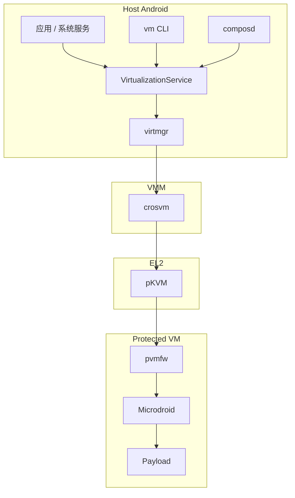
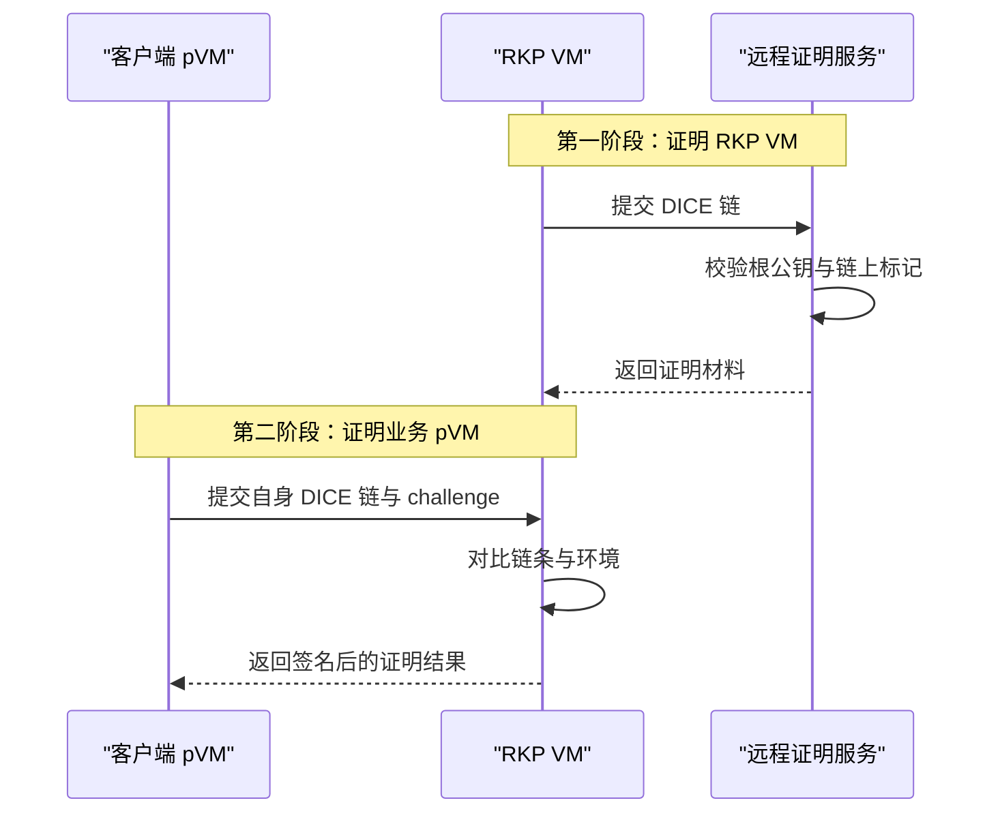

# 第 54 章：Virtualization Framework

Android Virtualization Framework（AVF）把硬件支持的虚拟机能力正式带进了 Android。它不是把服务器领域的“大而全”虚拟化方案简单搬到手机上，而是围绕移动设备的威胁模型、可更新模块、远程证明、受保护执行和轻量来宾系统重新做了一套栈：底层是 `pKVM`，中间是 Rust 编写的 `crosvm` 与 `pvmfw`，上层则是 `VirtualizationService`、`virtmgr`、`vm` 工具和 `Microdroid`。

这一章按栈自底向上展开：先看 AVF 为什么存在，再看 `pKVM` 的隔离模型、`crosvm` 的 VMM 设计、`Microdroid` 与 `pvmfw` 的启动路径，最后把服务架构、远程证明、加密存储、调试、构建和特性开关串成一张完整的系统图。

---

## 54.1 Android Virtualization Framework (AVF)

### 54.1.1 概览与动机

传统 Android 沙箱提供的是“进程级隔离”，核心依赖 Linux 内核、SELinux、UID 和 namespace；AVF 提供的是“硬件虚拟化隔离”，核心依赖 CPU 虚拟化扩展和 EL2 的 `pKVM`。这意味着即使宿主 Android 内核被攻破，受保护虚拟机（protected VM, pVM）的内存仍然不应被宿主直接读取。

`packages/modules/Virtualization/README.md` 把 AVF 的定位写得很清楚：它用于需要比应用沙箱更强隔离保证的安全敏感负载。典型场景包括：

- 机密计算：在宿主不可见的环境里运行模型、规则引擎或敏感算法。
- 可信编译：`composd` 把 ART 编译工作放进 VM，避免宿主篡改编译器或编译结果。
- 远程密钥提供：RKP 相关工作负载可以在可证明的执行环境中运行。
- 第三方隔离服务：为 OEM 或合作方定义的机密负载提供统一运行时。

### 54.1.2 高层架构

AVF 的关键不是“只有一个 hypervisor”，而是把多个边界清楚切开：宿主应用通过 Java 或 Binder API 接入；系统服务把 VM 生命周期抽象成 `VirtualizationService`；具体启动由 `virtmgr` 和 `crosvm` 完成；`pKVM` 负责最终的内存隔离；来宾内部再由 `pvmfw` 验证并启动 `Microdroid` 和 payload。

虚拟化栈的总体分层如下：



### 54.1.3 `com.android.virt` APEX

AVF 通过 `com.android.virt` APEX 分发，这一点非常关键。它意味着虚拟化框架不是只能随整机 OTA 更新，而是可以作为 Mainline 模块独立升级。这个 APEX 里通常包含：

- `vm` 命令行工具
- `VirtualizationService` 与 `virtmgr`
- `crosvm`
- `pvmfw.bin`
- `Microdroid` 内核与镜像
- Java / native 客户端库
- `composd`

这类布局把“框架 API、系统服务、来宾镜像、firmware、VMM”收敛到同一个可更新交付单元中，降低了版本漂移风险。

### 54.1.4 Protected 与 Non-Protected VM

AVF 同时支持两种运行模式：

| 维度 | Non-Protected VM | Protected VM |
|---|---|---|
| 内存隔离 | 普通 KVM 隔离 | `pKVM` 强制宿主不可见 |
| 固件 | 无 `pvmfw` | 由 `pvmfw` 验证启动 |
| DICE 证明链 | 无 | 完整 |
| 远程证明 | 不支持 | 支持 |
| 调试能力 | 基本完整 | 受 debug policy 控制 |
| Cuttlefish | 可用 | 不可用 |

实际设备上常用 `vm info` 查看支持情况。`packages/modules/Virtualization/android/vm/src/main.rs` 会组合 `/dev/kvm`、hypervisor 属性和 protected VM 能力输出最终结果。

### 54.1.5 支持的设备

按 `packages/modules/Virtualization/docs/getting_started.md` 的描述，AVF 主要面向具备 `pKVM` 能力的 Pixel 系列设备；而 Cuttlefish 只能跑 non-protected VM，因为它没有真实的受保护内存隔离路径。

这也决定了 AVF 的很多功能必须区分“开发验证可跑”与“真正具备安全承诺”。模拟器能让你走通 API 和基本启动流程，但不能代替带 `pKVM` 的真机验证。

### 54.1.6 DICE 证明链

DICE（Device Identifier Composition Engine）是 AVF 信任链的核心。它把设备 ROM、bootloader、`pvmfw`、来宾内核、`Microdroid` 用户空间与最终 payload 串成一条可加密验证的测量链。

DICE 链的测量关系如下：


在这条链中，`CDI_Attest` 用于派生证明身份的密钥，`CDI_Seal` 用于派生密封与持久化数据相关的密钥。也就是说，VM 的“我是谁”与“我能解开什么”都不是任意软件声明出来的，而是从测量链递归派生出来的。

### 54.1.7 远程证明

VM 远程证明不是单机自说自话，而是需要第三方可验证。AVF 的设计是先让一个可信 VM 获得远程服务器的认可，再由它为其他 pVM 出具证明材料。

远程证明的双阶段模型如下：



这里最重要的工程判断是：Android 不让所有 pVM 都直接对外做复杂的远程证明交互，而是通过专门的受信 VM 来减小攻击面、统一策略并便于演进。

### 54.1.8 源码仓库结构

AVF 主要分布在以下目录：

| 路径 | 作用 |
|---|---|
| `packages/modules/Virtualization/android/virtualizationservice/` | 核心服务 |
| `packages/modules/Virtualization/android/virtmgr/` | VM 管理器 |
| `packages/modules/Virtualization/android/vm/` | 命令行工具 |
| `packages/modules/Virtualization/android/composd/` | 可信编译调度 |
| `packages/modules/Virtualization/guest/pvmfw/` | pVM firmware |
| `packages/modules/Virtualization/build/microdroid/` | Microdroid 构建 |
| `packages/modules/Virtualization/libs/libvm_payload/` | payload API |
| `external/crosvm/` | VMM |

理解这些目录的职责边界，基本就掌握了 AVF 的代码地图。

## 54.2 pKVM Hypervisor

### 54.2.1 架构概览

`pKVM` 是 Android 针对受保护虚拟机场景裁剪出来的 hypervisor 模型。它运行在 EL2，目标不是提供“通用云主机管理平台”，而是用尽可能小的可信计算基（TCB）提供强内存隔离。

### 54.2.2 内存隔离模型

`pKVM` 的关键承诺是：pVM 页面的所有权可以从宿主转交给 hypervisor / guest，宿主一旦失去所有权，就不能再直接映射访问。这样即使宿主内核拥有最高软件权限，也仍然无法窥探来宾敏感内存。

### 54.2.3 pKVM Hypervisor 接口

宿主侧主要经由 KVM ioctl 与 `pKVM` 交互，但“protected”语义并不只是 KVM 通用接口的一个开关。Android 在内核与用户态之间还定义了一套与受保护 VM 生命周期、内存共享、设备映射相关的扩展约束。

### 54.2.4 Stage-2 页表管理

二阶段页表是硬件虚拟化隔离的关键。宿主进程可能拥有自己的虚拟地址和一阶段页表，但对来宾物理地址是否可见，最终由 EL2 控制的 stage-2 映射决定。AVF 的安全性本质上建立在这里，而不是建立在宿主“自觉不去读”上。

### 54.2.5 `pvmfw` 的加载

protected VM 启动时，`pvmfw` 不由普通宿主随意注入并执行，而是走受控加载路径。`pKVM` 会确保这个 firmware 作为受保护启动链的第一站运行，使后续 DICE 派生和来宾验证有可信起点。

### 54.2.6 内存共享协议

完全隔离不等于完全不通信。宿主与 pVM 仍然需要共享少量缓冲区用于控制信息、I/O 和启动参数。`pKVM` 通过显式共享 / 回收协议管理这些页，避免“隔离”在工程上变成不可用。

### 54.2.7 MMIO Guard

对 pVM 来说，设备 MMIO 是敏感边界。MMIO guard 的作用是限制设备映射与访问路径，确保宿主不能借设备模型或错误映射把受保护内存重新暴露出来。

## 54.3 `crosvm`：虚拟机监视器

### 54.3.1 概览

Android 选择 `crosvm` 而不是传统单体式 QEMU，有两个核心原因：

- `crosvm` 用 Rust 编写，内存安全基线更高。
- 它天然偏向“每类设备独立进程 + 沙箱”的模型，更适合缩小 TCB。

### 54.3.2 启动序列

`virtmgr` 负责准备配置、镜像、fd 和控制通道，随后拉起 `crosvm`。`crosvm` 创建 VM、注册虚拟设备、建立 guest 内存映射，再把控制权交给 vCPU 循环。对 protected VM 来说，这个过程还会插入 `pvmfw` 和受保护内存的准备步骤。

### 54.3.3 退出状态

VM 退出并不等价于“失败”。`crosvm` 需要区分正常关机、payload 请求退出、设备错误、hypervisor fault、调试退出和崩溃。上层 `VirtualizationService` 再把这些底层状态折算成 Binder 语义和 tombstone。

### 54.3.4 架构支持

AVF 主要关注 ARM64，但 `crosvm` 本身是跨架构的。Android 只启用其中与移动设备需求匹配的那部分，并通过特性开关裁掉桌面 / Chromebook 场景里才有意义的组件。

### 54.3.5 每设备单进程沙箱

设备模拟是 VMM 攻击面最大的区域之一。`crosvm` 的设计会把若干设备逻辑拆到单独进程里，通过进程边界和最小权限限制来减小“一处设备实现 bug 直接拿下整个 VMM”的风险。

### 54.3.6 `minijail` 沙箱

在 Android 上，`crosvm` 还会结合 `minijail` 进一步限制进程能力，包括 `seccomp`、namespace、capability 与文件系统访问范围。Rust 降低了内存破坏面，`minijail` 再降低了进程逃逸后的权限面。

### 54.3.7 Hypervisor 抽象层

`crosvm` 并不把 KVM 细节散落到所有设备代码里，而是通过 hypervisor abstraction layer 抽象 vCPU、VM、IRQ、memory slot 和 capability 查询。这使 Android 能在保留上层设备模型的同时，对底层 hypervisor 行为做平台特化。

### 54.3.8 设备模型

AVF 中的设备模型明显偏“够用即可”，不是给通用桌面 OS 提供完整硬件兼容层。常见设备包括：

- `virtio-blk`
- `virtio-console`
- `virtio-vsock`
- `virtio-net`
- `virtio-gpu`
- 若干 Android 特定控制或服务通道

这种设计和 `Microdroid` 一样，强调极简而非兼容一切。

### 54.3.9 `GuestMemory` 架构

`GuestMemory` 负责描述来宾物理地址空间、region、mapping 与访问辅助函数。它不是普通缓冲区封装，而是 VMM 所有设备 DMA、加载镜像、填充 FDT 与固件入口参数的基础抽象。

### 54.3.10 VM 控制套接字

控制套接字承担状态查询、关闭、调试、设备事件等控制面职责。把控制面独立出来，能让 `virtmgr`、`vm` 工具或调试器在不直接侵入 VMM 内部实现的前提下与 VM 交互。

### 54.3.11 `WaitContext` 事件循环

`crosvm` 大量依赖事件驱动。`WaitContext` 把 fd、event、queue kick、signal 等统一进一个事件循环，避免不同设备各自管理一套阻塞模型，从而让整体并发结构更可控。

### 54.3.12 代码组织

`external/crosvm/` 本身就是一个大型多 crate 工程。Android 使用其中与 ARM、KVM、virtio、控制面和 sandbox 相关的子集，并通过 Cargo feature 明确裁剪范围。

## 54.4 Microdroid

### 54.4.1 概览

`Microdroid` 可以理解为“为了 AVF 专门裁出来的最小 Android 来宾系统”。它不是通用手机系统镜像，也不是随便塞个 initramfs，而是一个足够小、足够可验证、又能运行 Android payload API 的受控环境。

### 54.4.2 Microdroid 去掉了什么

为了减小攻击面和启动成本，`Microdroid` 去掉了大量普通 Android 用户空间组件，例如复杂 UI、电话、媒体、多数系统应用、宽泛的后台服务，以及与普通设备生命周期强绑定的框架部件。

### 54.4.3 VM 配置

启动 `Microdroid` 需要描述镜像、payload APK 或二进制、CPU / 内存、protected 标志、调试策略、vsock / 网络 / 设备映射等信息。AVF 用结构化配置而不是“传一长串神秘参数”的方式来管理这些输入。

### 54.4.4 启动流程

`Microdroid` 的启动路径大致是：

1. 宿主发起创建请求。
2. `virtmgr` 准备镜像与配置。
3. `crosvm` 创建 VM。
4. protected VM 先执行 `pvmfw`。
5. `pvmfw` 校验来宾内核、ramdisk、配置数据。
6. 来宾 init 拉起最小用户空间。
7. payload 由 `microdroid_manager` 等组件加载并执行。

### 54.4.5 文件系统布局

`Microdroid` 通常会有只读系统内容、payload 相关挂载点、实例级持久区和临时目录。它追求的是“布局可证明、职责可分离”，而不是普通 Android 那套面向交互设备的复杂分区语义。

### 54.4.6 Vendor Image 支持

某些功能或设备集成需要 vendor 侧内容进入 VM。AVF 支持 vendor image，但边界控制非常严格，因为 vendor 内容一旦被允许进入 protected VM，就会直接参与可信计算基。

### 54.4.7 VM Payload API

`libvm_payload` 和 framework 对应 API 给 payload 提供了与宿主交互、上报结果、读取配置、请求服务等能力。这个 API 的存在说明 Android 把 VM 看成一类“系统支持的一等执行环境”，而不是孤立的黑盒进程。

### 54.4.8 平台前置条件

要让 `Microdroid` 真正工作，设备必须同时满足：

- KVM / `pKVM` 支持
- 正确打包 `com.android.virt` APEX
- 来宾镜像与 firmware 版本兼容
- 相关 SELinux、属性和 product 配置启用

缺一项都可能导致你“命令能跑，VM 起不来”。

### 54.4.9 加密存储

`Microdroid` 的加密存储不是简单把一个文件系统格式化再 mount，而是和 DICE 派生的密钥、实例身份、升级策略绑定。这样可以保证只有同一受信实例在满足策略时才能再次解密先前的数据。

## 54.5 pVM Firmware

### 54.5.1 目标与威胁模型

`pvmfw` 是 protected VM 内部的第一段可信软件。它必须在宿主不可信的前提下完成几件关键工作：验证来宾内容、派生 DICE、准备启动参数、限制设备树内容，并把控制权安全交给内核。

### 54.5.2 源码架构

`packages/modules/Virtualization/guest/pvmfw/` 是一个 Rust 工程，按配置解析、验证、DICE、FDT 处理、boot 流程、调试与平台兼容等模块分拆。它的结构明显偏向“审计友好”，因为这部分代码属于 AVF 的高敏感区。

### 54.5.3 入口点与启动流

`pvmfw` 启动后先接收 hypervisor 传入的内存布局、设备树和附加配置，再建立最小运行环境，随后解析配置块、测量相关镜像、做验证，并构造交接给内核的最终状态。

### 54.5.4 主验证流程

主流程可以概括成：

1. 解析配置数据与 handover 信息。
2. 校验内核、initrd、vbmeta 等来宾组件。
3. 派生 DICE 链和密封密钥。
4. 清洗并重写设备树。
5. 记录重启或调试策略。
6. 跳转到来宾内核入口。

### 54.5.5 Verified Boot

`pvmfw` 在 VM 内部复用了 Android Verified Boot 的思想：不是只信任“别人说这是对的”，而是自己验证 payload 与相关元数据。这样受保护 VM 的启动信任根不会在进入来宾后突然断掉。

### 54.5.6 DICE 派生

每经过一层测量，`pvmfw` 都会基于前一层状态派生新的 CDI 和证书链。这样 payload 身份不是外部静态分配的，而是由“当前设备 + 当前启动链 + 当前代码测量值”共同决定。

### 54.5.7 重启原因

重启原因会被纳入策略判断，因为安全系统必须区分“正常生命周期中的重启”和“可能意味着回滚、篡改或调试注入的异常重启”。

### 54.5.8 配置数据格式

`pvmfw` 读取的配置数据不是无结构字节串，而是版本化、带 entry 类型的格式。配置项可能包括调试策略、payload 元数据、回滚保护信息、设备分配信息等。

### 54.5.9 配置版本

版本协商的作用是保证新旧系统之间可以渐进演进。旧版 `pvmfw` 不必理解未来所有字段，但至少要能识别版本边界并在必要时拒绝不兼容输入，而不是静默误解析。

### 54.5.10 VBMeta 属性

某些安全决策来自 `vbmeta` 属性，例如是否允许调试、是否可视为 debuggable payload、是否带特定 capability。把这些属性纳入 firmware 决策，可以让宿主无法在验证之后再偷偷改语义。

### 54.5.11 交接给来宾内核

交接阶段最敏感的不是“跳过去运行”本身，而是交接前你到底给了内核什么：设备树、命令行、内存区域、密钥材料、共享页和调试开关是否都已经被最小化并正确标记。

### 54.5.12 内存布局

`pvmfw` 需要明确管理自身代码段、栈、来宾内核、ramdisk、配置区、设备树区和共享缓冲。布局不清晰会直接放大越界、泄露和错误 handoff 的风险。

### 54.5.13 开发工作流

原文给出了替换测试版 `pvmfw`、推到设备并运行 protected VM 的流程。实务上这类调试只能在可控开发设备上做，因为 firmware 变更会直接影响信任链结果。

## 54.6 VM Service Architecture

### 54.6.1 服务概览

AVF 并不是一个“单一 daemon”。它包含至少三层用户态角色：

- `VirtualizationService`：对外暴露系统服务接口。
- `virtmgr`：负责单次 VM 启动和运行管理。
- `vm` / Java API / `composd`：具体调用入口。

### 54.6.2 `VirtualizationService`

`VirtualizationService` 是对外主入口。它负责权限校验、全局状态维护、创建 / 关闭 VM、把配置折算成底层启动参数，以及与 Binder 客户端对接。

### 54.6.3 全局状态管理

系统必须知道当前有哪些 VM 正在运行、占用了哪些 CID、实例 ID 是否冲突、哪些 tombstone 尚待收集、设备能力是否满足等。因此服务端需要一个全局状态层，而不是每个调用临时现算。

### 54.6.4 AIDL 接口

对 framework 和 native 客户端来说，AVF 是通过稳定 AIDL 暴露的。这样 Java API、`vm` CLI 和系统服务可以复用同一套生命周期语义，而不是各搞一套私有协议。

### 54.6.5 VM 生命周期

一个 VM 的生命周期通常经历：创建配置、申请资源、启动、运行、接收状态回调、关闭、回收资源、收集日志 / tombstone。protected VM 还会在中间插入更多验证与策略步骤。

### 54.6.6 VM 创建流程

创建流程的职责分配很明确：

1. 客户端提供配置。
2. `VirtualizationService` 做权限与参数校验。
3. `virtmgr` 准备运行环境、fd 和控制通道。
4. `crosvm` 真正创建虚拟机。
5. 服务端跟踪实例并订阅回调。

### 54.6.7 `vm` CLI 工具

`vm` 是最直接的调试入口。原文演示了运行默认 `Microdroid`、protected 模式、自定义 CPU / 内存拓扑，以及列出运行中 VM、查询支持能力等命令。这个工具是理解 AVF 行为的最佳入口之一。

### 54.6.8 VM 配置类型

AVF 区分不同配置类型，例如直接运行 `Microdroid`、运行 payload APK、使用自定义 kernel / initrd、启用设备分配或网络等。配置结构越清晰，后续安全审计和版本演进越容易。

### 54.6.9 `composd`：可信编译服务

`composd` 把 ART 编译工作负载放进 VM 中执行。它的核心价值不在“能编译”，而在“证明这次编译发生在一个受控且可证明的环境中”，从而减少宿主污染 oat / vdex 的风险。

### 54.6.10 关机协议

VM 关机不能只靠“宿主杀进程”。AVF 定义了来宾通知、服务端状态同步、超时与强制回收路径，使正常退出与异常终止能被上层分辨。

### 54.6.11 Service VM

Service VM 是 Android 用来承载某些系统级受信工作负载的特殊 VM 形态。它不是面向普通 app 的通用容器，而更接近系统内部的可信隔离服务运行时。

### 54.6.12 实例 ID 与 CID 管理

`vsock` 需要 CID；持久化实例需要实例 ID；调试、日志、回滚保护与加密存储又常常与它们绑定。因此 ID 管理不是小事，一旦冲突就可能造成连接错乱、状态串线甚至错误解密。

### 54.6.13 Tombstone 收集

AVF 会把来宾崩溃信息收集回宿主侧，供系统诊断。没有这一步的话，VM 会像“黑洞”一样失败后只剩一个退出码，工程上根本不可维护。

## 54.7 Hardware Capabilities

### 54.7.1 `IVmCapabilitiesService` HAL

Android 用 HAL 形式抽象设备的 VM 能力，让 framework 可以问清楚：是否支持 VM、是否支持 protected VM、是否支持设备分配、是否具备 TEE 相关能力。

### 54.7.2 实现结构

能力 HAL 的实现通常需要整合 boot 属性、内核能力、hypervisor 状态与 vendor 限制，并把这些结果规整成稳定接口，而不是让上层自己去拼系统属性。

### 54.7.3 服务注册

HAL 通过标准服务注册流程进入系统。对 AVF 来说，这一步的意义在于把“硬件是否支持”从散乱的底层探测收敛成可依赖的系统能力查询。

### 54.7.4 TEE 服务访问流

某些 VM 能力与 TEE 或安全世界能力联动，例如远程证明、设备分配授权或密钥派生。这一层决定了 AVF 并不是完全独立的小栈，而是会与 Android 安全基础设施深度耦合。

### 54.7.5 设备分配

设备分配要求系统确认具体硬件是否允许直通或受控映射给 VM。这通常比“开个网络”更危险，因此必须依赖能力服务、设备树描述和 `pvmfw` 校验共同收口。

### 54.7.6 Hypervisor 属性

`vm info`、framework API 和调试工具最终都要回到一组统一的 hypervisor 属性，例如 KVM 是否存在、protected VM 是否支持、版本号是多少、某些扩展是否启用。

## 54.9 Rollback Protection

### 54.9.1 概览

如果 VM 能随便回滚到旧镜像，那所有“已修复漏洞”都能被重新带回系统。AVF 因此把 rollback protection 作为核心安全特性，而不是额外选项。

### 54.9.2 回滚保护策略

原文覆盖了多种策略：基于实例镜像、基于版本计数、基于受保护存储以及与 DICE / Secretkeeper 结合的方案。它们共同目标是防止旧状态在新策略下被重复接受。

## 54.10 Configuration Data Deep Dive

### 54.10.1 配置解析器实现

`pvmfw` 里的配置解析器承担“读取不可信输入，然后生成可信启动语义”的责任，所以它既要能识别版本与 entry 类型，也要对越界、缺失、顺序错误和多余字段保持严格。

### 54.10.2 Entry 类型

配置 entry 会覆盖 payload、调试策略、回滚保护、设备分配、密钥材料和其他启动控制字段。把它们做成显式类型，而不是 ad-hoc blob，是为了保证审计与兼容性。

### 54.10.3 版本协商

版本协商不是为了“尽量兼容一切”，而是为了在安全前提下允许新旧版本共存。安全系统里最危险的往往是静默兼容，因为它意味着错误配置可能被误当成合法输入。

### 54.10.4 错误处理

对 `pvmfw` 来说，配置解析失败时最安全的行为通常是拒绝启动，而不是猜测意图继续往下跑。

## 54.11 Device Tree Handling in pvmfw

### 54.11.1 FDT 清洗

`pvmfw` 必须把传入 FDT 中不该暴露给来宾的信息剥掉，例如宿主侧细节、未授权设备描述或不安全参数。FDT 不是普通配置文件，而是直接影响来宾可见硬件边界的安全输入。

### 54.11.2 为下一阶段修改设备树

在清洗之后，`pvmfw` 还要补充内核真正需要的信息，例如内存区、chosen 节点、bootargs、共享页或设备分配后的节点。

### 54.11.3 FDT 的安全边界

理解这一节时要抓住一点：`pvmfw` 不是被动转发设备树，而是在主动定义“来宾世界长什么样”。这个边界如果守不住，宿主就能通过伪造硬件描述绕过大量安全假设。

## 54.12 `vmbase`：公共 VM 基础库

### 54.12.1 目标

`vmbase` 为 `pvmfw` 之类的 VM 基础二进制提供公共设施，避免每个早期启动组件都自己实现一套内存、日志、异常和平台兼容逻辑。

### 54.12.2 提供的基础设施

通常包括：

- 早期启动支撑
- 内存与地址辅助
- 日志 / panic 支撑
- 平台兼容层
- 与 `no_std` 场景配套的运行时组件

### 54.12.3 源码组织

把这些公共逻辑集中起来可以显著降低高敏感早期代码的重复实现量，也更利于做安全审计和 fuzz。

### 54.12.4 为自定义二进制使用 `vmbase`

如果 OEM 或平台要引入新的早期 VM 组件，复用 `vmbase` 能保持与 `pvmfw` 相似的运行模型，而不是另起炉灶做出一份不可维护的早期代码。

### 54.12.5 `vmbase` 中的内存管理

这一层的内存管理目标不是“功能最强”，而是“启动足够早、行为足够明确、审计足够简单”。这和通用 OS 分配器的目标完全不同。

## 54.13 Device Assignment in Detail

### 54.13.1 架构

设备分配允许某些硬件资源以严格受控方式暴露给 VM。它的风险远高于纯软件 `virtio` 设备，因此整个链路必须由配置、能力、设备树和 `pvmfw` 验证共同约束。

### 54.13.2 VM DTBO 结构

VM DTBO 描述了分配给 VM 的设备节点和属性。把它单独成形而不是直接混进主 FDT，有助于在验证阶段更精细地控制可接受字段。

### 54.13.3 `pvmfw` 的设备分配校验

`pvmfw` 需要确认 DTBO 中的设备既在允许列表内，又没有携带会破坏隔离语义的属性。这里的核心不是“设备能不能工作”，而是“设备会不会打穿安全边界”。

### 54.13.4 IOMMU Token 验证

IOMMU token 用来证明某个设备映射请求来自合法路径。没有这一步，恶意宿主可能伪造设备授权，让 DMA 重新接触到不该看到的内存。

## 54.14 Async I/O in crosvm

### 54.14.1 `cros_async` 运行时

`crosvm` 使用 `cros_async` 处理大量异步 I/O。这样控制面、块设备、网络与队列事件可以在统一运行时中调度，而不是混成不可维护的线程风暴。

### 54.14.2 Virtio 队列处理

virtio 队列处理的关键是 descriptor 链解析、guest 内存访问、完成中断和错误回传。这里既是性能热点，也是设备模拟最容易出错的地方。

### 54.14.3 VirtIO 传输层

Android 侧大多数 VM 设备都偏向 virtio，因为它足够标准、足够简单，也更适合与轻量 guest 协同演进。

## 54.15 Network and Display Support

### 54.15.1 网络支持

AVF 可以为 VM 提供网络能力，但默认并不是“把宿主网络完整镜像进去”。网络通常通过 `virtio-net`、受控转发和策略开关启用。对安全负载来说，网络本身就是巨大攻击面，应按需开启。

### 54.15.2 显示支持

大多数 `Microdroid` 负载是无头的，但 AVF 也支持图形与显示路径，主要依赖 `virtio-gpu` 和宿主转发链路。图形支持的存在说明 AVF 不是只能做后端计算，还可承载受控交互式 Linux VM。

## 54.16 Running Linux with Graphics Acceleration

这一大节说明 AVF 并不只服务 `Microdroid` 最小负载，也可以承载更完整的 Linux 用户空间。

### 54.16.1 架构概览

图形加速 Linux VM 的路径通常包括 `crosvm`、`virtio-gpu`、宿主显示转发和输入回传。和桌面虚拟化不同，Android 更强调在移动设备约束下做到“可用且受控”，而不是追求极致硬件直通。

### 54.16.2 `TerminalApp`：Linux VM 前端

`TerminalApp` 代表一种前端集成形态：宿主应用负责用户入口、会话管理和显示容器，真正的 Linux 用户空间运行在 VM 内部。这种模式很适合开发工具、隔离式 shell 或受控 Linux 运行时。

### 54.16.3 图形加速模式

不同设备或构建可能启用不同程度的图形支持：纯软件路径、受限 GPU 转发或更完整的 `virtio-gpu` 加速。AVF 通过特性开关控制这些能力，而不是假设所有硬件都一致。

### 54.16.4 显示转发流水线

显示转发的核心问题是：来宾生成的帧如何传给宿主、宿主如何合成、同步与缓冲如何处理。它既影响体验，也影响隔离，因为图形共享内存天然敏感。

### 54.16.5 输入转发

输入需要从宿主 UI 传给来宾。这里必须处理焦点、事件翻译、权限和生命周期，避免输入在多 VM 或多窗口情况下串到错误目标。

### 54.16.6 Debian VM 配置

原文给了运行带图形 Linux VM 的配置示例。工程上这类示例的意义在于证明 AVF 能承载比 `Microdroid` 更丰富的用户空间，但同时也暴露出更多性能和设备兼容性要求。

### 54.16.7 特性开关

图形、网络、vendor 模块、设备分配和 host service 等能力都依赖构建期开关。你能否在设备上看到某个选项，往往首先取决于它有没有被编进 `vm` 与 `crosvm`。

### 54.16.8 `virtio-gpu` 能力

`virtio-gpu` 是图形支持的核心接口层。它决定 guest 如何请求 buffer、提交命令以及与宿主渲染路径协作。

### 54.16.9 使用场景

典型使用场景包括隔离开发环境、受保护终端、特定 OEM Linux 工作负载，以及需要把 Linux 用户空间与宿主 Android 明确隔离的系统工具。

## 54.17 Security Analysis

### 54.17.1 信任边界

本章最重要的安全结论是：AVF 明确把宿主 Android 视为对 pVM 来说“不必完全可信”。真正的信任边界位于 `pKVM`、`pvmfw`、DICE 链和受控共享内存协议。

### 54.17.2 攻击面分析

主要攻击面包括：

- VMM 与设备模拟
- 共享内存协议
- 设备树与配置输入
- 调试开关
- 设备分配与 DMA
- 图形 / 网络等可选外设支持

AVF 的设计思路是逐层缩小这些攻击面，而不是假设其中任何一层永远不会出错。

### 54.17.3 Rust 的安全收益

`crosvm` 与 `pvmfw` 使用 Rust，并不意味着系统自动安全，但它确实大幅压低了传统 C/C++ VMM / firmware 最常见的内存破坏类问题。这在高价值攻击面上非常划算。

### 54.17.4 DICE 链完整性

DICE 链完整性决定了远程证明和密封存储是否真的可信。只要链中某层测量或交接被伪造，后续所有“这台 VM 是谁”的结论都会失效。

## 54.18 Performance Considerations

### 54.18.1 内存开销

VM 天生带来额外内存成本：来宾内核、页表、设备缓冲、共享页与镜像内容都要占空间。AVF 通过 `Microdroid` 极简化和按需设备启用尽量压低这部分成本。

### 54.18.2 Huge Pages

大页能减少页表开销和 TLB 压力，但也会影响内存碎片与分配灵活性。是否启用、在哪些区间启用，取决于来宾负载特征。

### 54.18.3 CPU 拓扑

VM vCPU 数和拓扑直接影响并行度、调度开销与能耗。移动设备上并不是 vCPU 越多越好，很多轻负载 VM 只需要少量 vCPU 就足够。

### 54.18.4 I/O 性能调优

原文列出了一组面向调试和实验的宿主参数调整，例如 compaction、swappiness 和 reclaim 相关开关。它们有助于分析 I/O 与内存回收对 VM 启动和运行性能的影响，但不应机械照抄到量产配置。

## 54.19 Vsock Communication

### 54.19.1 概览

`vsock` 是宿主与 VM、VM 与 VM 之间最重要的通信机制之一。它比把一堆 ad-hoc socket 暴露进 guest 更适合虚拟化场景，因为它直接以 CID 为寻址基础。

### 54.19.2 CID 分配

CID 必须全局唯一且与 VM 生命周期绑定，这也是为什么 `VirtualizationService` 要集中管理实例与 CID。

### 54.19.3 通信通道

典型通道包括控制面、payload 服务、调试和 Binder over vsock。不同通道共享同一种底座，但安全级别和访问策略可以不同。

### 54.19.4 Binder Over Vsock

Binder over vsock 让 Android 世界里熟悉的 RPC 模型可以延伸到 VM 边界上。不过这并不意味着把 Binder 原语原封不动搬进去，而是要在虚拟化约束下重新定义桥接与权限边界。

## 54.20 Encrypted Storage

### 54.20.1 架构

AVF 的加密存储通常以实例为单位，与 VM 身份、回滚策略和密封密钥绑定。目标是让“拿到磁盘镜像副本”这件事本身没有意义。

### 54.20.2 密钥派生

密钥通常从 DICE / `CDI_Seal` 及其实例化结果派生，因此同一份数据只有在正确设备、正确实例、正确启动链条件下才能再次解开。

### 54.20.3 存储生命周期

生命周期包括创建、首次密封、正常挂载、更新后重开、实例删除和回收。这里每一步都必须考虑升级、回滚与 debug policy。

### 54.20.4 存储空间管理

受保护存储需要同时兼顾大小限制、性能和恢复策略。把它当通用大容量磁盘来用并不现实。

## 54.21 Updatable VMs and Secretkeeper

### 54.21.1 更新问题

一旦 VM 可更新，旧密钥、旧状态和新镜像之间的关系就变复杂了。你必须回答：升级后哪些数据还能解、回滚后哪些数据必须拒绝、如何证明这是“同一个逻辑实例”的合法新版本。

### 54.21.2 Secretkeeper 协议

Secretkeeper 的角色就是在这种更新与信任迁移问题上提供更稳定的密钥 / 秘密管理语义，让机密材料不至于因为单次镜像升级就完全失控。

### 54.21.3 供 Secretkeeper 使用的 VM Reference DT

为了让 Secretkeeper 判断某个 VM 是否符合预期，需要一份可比较、可验证的 VM 参考描述，设备树就是承载这类结构化信息的自然位置之一。

## 54.22 Early VM（启动期 VM）

### 54.22.1 概念

Early VM 指在系统更早阶段启动的 VM，而不是等完整 Android 用户空间起来后再启动。这样做通常是为了让某些安全敏感工作负载尽早可用。

### 54.22.2 与启动序列集成

把 VM 提前到 boot 流程中会引入新的排序要求：镜像何时可得、能力何时可探测、谁来托管生命周期、系统异常恢复怎么处理。

## 54.23 Debugging Deep Dive

### 54.23.1 调试策略

AVF 不会把 protected VM 默认当普通开发进程那样随便调。是否允许控制台、GDB、`earlycon` 或更宽松日志，都要受 debug policy 限制。

### 54.23.2 调试等级

调试等级越高，排障越容易，但攻击面也越大。工程上必须把“开发便利性”和“受保护语义”分开处理。

### 54.23.3 早期控制台 `earlycon`

`earlycon` 对排查早期启动失败极其关键，因为很多问题发生在常规日志系统就绪之前。

### 54.23.4 GDB 调试

原文给了启动 GDB server、转发端口并附着调试的示例。对 protected VM 来说，这种调试能力必须只在明确允许时开放。

### 54.23.5 设备树导出

设备树导出是排查“为什么来宾看到了这个硬件 / 没看到那个参数”的最高效方法之一。

### 54.23.6 VM 回调调试

除了 guest 内部日志，宿主对回调事件的观察同样重要，因为很多问题其实出在服务端生命周期或控制通道，而不是来宾内核。

## 54.24 Testing Infrastructure

### 54.24.1 测试套件

AVF 包括 host test、app test、VTS 与针对 DICE、`Microdroid`、能力 HAL 的专项测试。对于这种跨内核、APEX、VMM、来宾镜像的系统，不可能只靠单元测试兜住。

### 54.24.2 DICE 链验证测试

DICE 是安全核心，所以必须有单独测试验证链条格式、测量值和证书关系，而不是把它藏在“VM 能启动”这种粗粒度成功条件后面。

### 54.24.3 运行特定测试

原文列出了运行全部 `Microdroid` host tests、单个 DICE 测试以及能力 HAL VTS 的命令。定位问题时，先缩小到最小失败用例比一遍遍全量跑更有效。

### 54.24.4 测试 VM 配置

测试环境通常会刻意构造更激进的配置组合，以覆盖调试模式、受保护模式、不同 payload 和异常输入。

## 54.25 Build System Integration

### 54.25.1 APEX 构建

`com.android.virt` APEX 是构建集成的中心。只要这个 APEX 打包不对，哪怕源代码都编过去了，设备上也不可能得到可用的虚拟化框架。

### 54.25.2 `Microdroid` 镜像构建

`Microdroid` 不是普通系统镜像复制过来，而是专门的构建产物链。镜像内容、签名、版本和 APEX 内部引用必须一致。

### 54.25.3 `pvmfw` 构建

`pvmfw` 构建通常伴随 Rust feature 和不同目标配置。因为它直接进入受信启动链，所以构建参数本身就是安全语义的一部分。

### 54.25.4 Product 配置

产品侧必须显式开启相关包、属性和能力，必要时还要打开 vendor 支持、设备分配或远程证明功能。AVF 从来不是“内核支持了就自动有”。

## 54.26 Feature Flags and Conditional Compilation

### 54.26.1 `pvmfw` 的 Cargo feature

`pvmfw` 用 Rust `cfg` 和 Cargo feature 控制实例镜像回滚保护、旧版 DICE handover 兼容、debuggable VM 增强以及新旧 DICE 行为差异。这是早期启动代码保持“同一套源码支持多代平台”的关键机制。

### 54.26.2 `vm` CLI 的构建期开关

`vm` 工具会按 feature 决定是否暴露网络、vendor 模块、设备分配、TEE allowlist、`earlycon` 和 host service 等参数。也就是说，命令行选项本身就是构建产物的一部分。

### 54.26.3 `VirtualizationService` 的特性开关

服务端也会按 `cfg` 控制某些功能，例如 LLPVM 维护服务。上层 API 是否注册、系统里是否真的存在该服务，都依赖编译期开关。

### 54.26.4 `crosvm` 的特性开关

`crosvm` 大量使用 Cargo feature 控制磁盘格式、GPU、网络、音频、balloon、热插拔和加固分配器。Android 通常只保留移动设备需要的部分，并启用更硬化的默认值。

## 54.27 Comparison with Other Virtualization Solutions

### 54.27.1 AVF 与传统 hypervisor 对比

和 Xen 这类典型 Type-1 hypervisor 相比，AVF / `pKVM` 的目标不是托管大量通用 VM，而是在移动设备上用更小 TCB 提供机密计算；和 QEMU/KVM 这类 Type-2 方案相比，AVF 更强调宿主对受保护 VM 的“不可信”假设，以及 DICE、`pvmfw`、受控设备模型这些安全设计。

### 54.27.2 AVF 与 ARM CCA 对比

ARM CCA 提供 Realm 机制，方向上与 pVM 很接近。AVF / `pKVM` 可以看成是在现有 Android 设备与软件栈约束下先落地的一套受保护执行框架；未来在具备 CCA 的硬件上，它与 Realm 模型存在汇合空间。

## 54.28 Try It

### 54.28.1 检查设备支持

先确认设备是否具备 AVF 的基本条件：

```bash
# 检查 /dev/kvm
adb shell ls -l /dev/kvm

# 查询 vm 支持信息
adb shell /apex/com.android.virt/bin/vm info
```

### 54.28.2 运行一个 `Microdroid` VM

最基础的启动实验如下：

```bash
# 启动 non-protected Microdroid
adb shell /apex/com.android.virt/bin/vm run-microdroid

# 启动 protected Microdroid
adb shell /apex/com.android.virt/bin/vm run-microdroid --protected
```

如果设备不支持 `pKVM`，第二条命令不会成功，这是预期行为。

### 54.28.3 构建一个 Payload App

AVF 的价值不在“空 VM 能起来”，而在 payload 能作为可信工作负载运行。典型流程是：

1. 构建带 payload 的 APK。
2. 安装到设备。
3. 通过 `vm` 或 Java API 启动。
4. 观察宿主与来宾回调。

### 54.28.4 Java API 用法

应用或系统组件可以通过 framework virtualization API 创建 VM 配置、订阅状态并控制生命周期。阅读 `packages/modules/Virtualization/libs/framework-virtualization/` 是理解 Java 侧契约的最佳入口。

### 54.28.5 运行测试

原文列出了 `Microdroid` host test、app test 以及 DICE 有效性验证命令。建议先在 non-protected 模式跑通测试基线，再迁移到带 `pKVM` 的设备验证 protected 路径。

### 54.28.6 调试 VM

常见调试方式包括：

- 把控制台输出重定向到文件
- 使用 `earlycon` 看早期启动日志
- 启动 GDB server 调试来宾
- 导出来宾设备树做离线检查

### 54.28.7 自定义 VM 配置

可以逐步加入自定义内核、initrd、CPU 数、内存大小、调试策略和设备分配项，观察 `VirtualizationService` 与 `crosvm` 如何折算这些配置。

### 54.28.8 检查 AVF 组件

建议直接查看 APEX 内容、`pvmfw.bin`、`Microdroid` 镜像与 `vm` 二进制，建立“哪些东西实际上被打包进来”的直觉。

### 54.28.9 从源码构建 AVF

开发时通常会只单独构建 `com.android.virt` APEX，加快迭代；而验证与平台兼容性问题时，再回到整机构建。

### 54.28.10 常见故障排查

排查顺序建议固定为：

1. 先看设备能力。
2. 再看 APEX 是否正确安装。
3. 再看命令行 / Java 配置。
4. 再看 `logcat`、tombstone 和控制台输出。
5. 最后才怀疑 guest 内核或 payload。

### 54.28.11 远程证明演示

远程证明实验通常需要配套服务端或测试工具链。重点不是把证书打印出来，而是核对 DICE 链、challenge、叶子证书扩展和 VM component 描述是否符合预期。

## Summary

AVF 是 Android 安全架构的一次明显升级：它把“应用沙箱之外的硬件级隔离执行环境”做成了可更新、可证明、可调度、可构建的一整套平台能力。

- `pKVM` 提供真正的受保护内存隔离。
- `pvmfw` 在 VM 内部建立最早的可信启动与验证链。
- `crosvm` 以 Rust 和多进程沙箱收敛设备模拟攻击面。
- `Microdroid` 提供足够小、足够可验证的来宾系统。
- `VirtualizationService`、`virtmgr` 与 `vm` 工具把底层能力变成 Android 可消费的系统接口。
- DICE、远程证明、回滚保护与密封存储共同定义了 VM 的长期信任模型。

从系统工程角度看，AVF 最有价值的不是“Android 也能跑虚拟机”这件事，而是它把虚拟机正式纳入了 Android 平台的安全、构建、调试、升级和模块化更新体系。

### 关键源码路径

| 组件 | 路径 |
|---|---|
| AVF 模块 | `packages/modules/Virtualization/` |
| `VirtualizationService` | `packages/modules/Virtualization/android/virtualizationservice/` |
| `virtmgr` | `packages/modules/Virtualization/android/virtmgr/` |
| `vm` CLI | `packages/modules/Virtualization/android/vm/` |
| `composd` | `packages/modules/Virtualization/android/composd/` |
| `pvmfw` | `packages/modules/Virtualization/guest/pvmfw/` |
| Service VM | `packages/modules/Virtualization/guest/service_vm/` |
| `Microdroid` 构建 | `packages/modules/Virtualization/build/microdroid/` |
| VM Payload API | `packages/modules/Virtualization/libs/libvm_payload/` |
| Java API | `packages/modules/Virtualization/libs/framework-virtualization/` |
| `crosvm` | `external/crosvm/` |
| VM Capabilities HAL | `hardware/interfaces/virtualization/capabilities_service/` |
| DICE 文档 | `packages/modules/Virtualization/docs/pvm_dice_chain.md` |
| 远程证明文档 | `packages/modules/Virtualization/docs/vm_remote_attestation.md` |
| 关机协议文档 | `packages/modules/Virtualization/docs/shutdown.md` |
| 设备分配文档 | `packages/modules/Virtualization/docs/device_assignment.md` |
