# Chapter 54: Virtualization Framework

Android Virtualization Framework (AVF) brings hardware-backed virtual machines to Android
devices, enabling confidential computing workloads that are isolated even from the host
operating system. Built on pKVM (protected KVM), crosvm, and Microdroid, AVF creates a
complete ecosystem for running trusted code within protected virtual machines (pVMs).
This chapter examines every layer of the stack -- from the EL2 hypervisor through the
VM firmware, the Rust-based virtual machine monitor, the lightweight guest OS, and the
userspace service architecture that ties it all together.

---

## 54.1 Android Virtualization Framework (AVF)

### 54.1.1 Overview and Motivation

The Android Virtualization Framework provides secure and private execution environments
that go beyond the traditional Android app sandbox. While the app sandbox provides
process-level isolation enforced by the Linux kernel, AVF provides hardware-enforced
isolation through CPU virtualization extensions. A protected VM's memory is inaccessible
even to a compromised Android host kernel.

The framework's README at `packages/modules/Virtualization/README.md` states the core
value proposition:

> Android Virtualization Framework (AVF) provides secure and private execution
> environments for executing code. AVF is ideal for security-oriented use cases that
> require stronger isolation assurances over those offered by Android's app sandbox.

AVF targets several critical use cases:

1. **Confidential computation** -- Running machine learning models or sensitive algorithms
   where the code and data must not be observable by the host.

2. **Trusted compilation** -- The `composd` service uses AVF to compile ART artifacts
   inside a VM, ensuring the compiler itself has not been tampered with.

3. **Remote Key Provisioning** -- The RKP VM handles cryptographic key operations in an
   isolated environment attested by a remote server.

4. **Isolated services** -- Third-party workloads that require strong guarantees about
   their execution environment.

### 54.1.2 High-Level Architecture

AVF is structured as a layered system with clear boundaries between components:

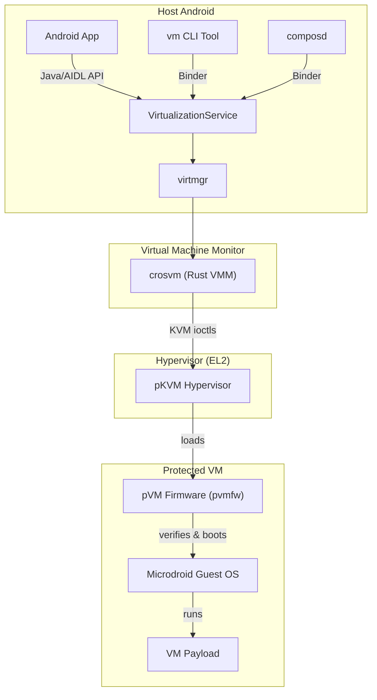
```mermaid
graph TB
    subgraph "Host Android"
        APP["Android App"]
        VS["VirtualizationService"]
        VM_CLI["vm CLI Tool"]
        COMPOSD["composd"]
        VIRTMGR["virtmgr"]
    end

    subgraph "Virtual Machine Monitor"
        CROSVM["crosvm (Rust VMM)"]
    end

    subgraph "Hypervisor (EL2)"
        PKVM["pKVM Hypervisor"]
    end

    subgraph "Protected VM"
        PVMFW["pVM Firmware (pvmfw)"]
        MICRODROID["Microdroid Guest OS"]
        PAYLOAD["VM Payload"]
    end

    APP -->|"Java/AIDL API"| VS
    VM_CLI -->|"Binder"| VS
    COMPOSD -->|"Binder"| VS
    VS --> VIRTMGR
    VIRTMGR --> CROSVM
    CROSVM -->|"KVM ioctls"| PKVM
    PKVM -->|"loads"| PVMFW
    PVMFW -->|"verifies & boots"| MICRODROID
    MICRODROID -->|"runs"| PAYLOAD
```

### 54.1.3 The com.android.virt APEX

AVF is delivered as the `com.android.virt` APEX module, making it updatable
independently of the main Android platform. The APEX contains:

- The `vm` command-line tool
- The `VirtualizationService` and `virtmgr` daemons
- The Microdroid kernel and system images
- The `pvmfw.bin` firmware binary
- The `crosvm` binary
- Java and native client libraries
- The `composd` compilation orchestration daemon

To install the APEX from source:

```sh
banchan com.android.virt aosp_arm64
UNBUNDLED_BUILD_SDKS_FROM_SOURCE=true m apps_only dist
adb install out/dist/com.android.virt.apex
adb reboot
```

### 54.1.4 Protected vs Non-Protected VMs

AVF supports two VM modes:

| Property | Non-Protected VM | Protected VM (pVM) |
|---|---|---|
| Memory isolation | Standard KVM isolation | pKVM-enforced: host cannot access guest memory |
| Firmware | No pvmfw | pvmfw validates guest before boot |
| DICE chain | Not available | Full DICE chain from ROM to payload |
| Remote attestation | Not supported | Supported via RKP VM |
| Cuttlefish support | Yes | No (requires hardware pKVM) |
| Debug support | Full | Limited (controlled by debug policy) |

The `vm info` command reports which modes a device supports:

```
Both protected and non-protected VMs are supported.
Hypervisor version: 1.0
/dev/kvm exists.
```

From `packages/modules/Virtualization/android/vm/src/main.rs`, the info command
implementation queries device capabilities:

```rust
fn command_info(service: &dyn IVirtualizationService) -> Result<(), Error> {
    let non_protected_vm_supported = hypervisor_props::is_vm_supported()?;
    let protected_vm_supported = hypervisor_props::is_protected_vm_supported()?;
    match (non_protected_vm_supported, protected_vm_supported) {
        (false, false) => println!("VMs are not supported."),
        (false, true) => println!("Only protected VMs are supported."),
        (true, false) => println!("Only non-protected VMs are supported."),
        (true, true) => println!("Both protected and non-protected VMs are supported."),
    }
    // ...
}
```

### 54.1.5 Supported Devices

As documented in `packages/modules/Virtualization/docs/getting_started.md`, AVF
supports:

- **Pixel 7 / 7 Pro** (`aosp_panther`, `aosp_cheetah`) -- pKVM enabled by default
- **Pixel 6 / 6 Pro** (`aosp_oriole`, `aosp_raven`) -- pKVM requires explicit enable
- **Pixel Fold** (`aosp_felix`)
- **Pixel Tablet** (`aosp_tangorpro`)
- **Cuttlefish** (`aosp_cf_x86_64_phone`) -- Non-protected VMs only

For Pixel 6 devices, pKVM must be explicitly enabled:

```shell
adb reboot bootloader
fastboot flashing unlock
fastboot oem pkvm enable
fastboot reboot
```

### 54.1.6 DICE Attestation Chain

The Device Identifier Composition Engine (DICE) provides a cryptographic chain of trust
from device ROM through each boot stage to the running VM payload. Each stage measures
the next, creating a certificate chain that can prove the VM's identity.

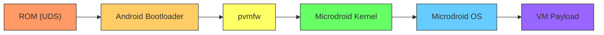
```mermaid
graph LR
    ROM["ROM (UDS)"] --> ABL["Android Bootloader"]
    ABL --> PVMFW["pvmfw"]
    PVMFW --> KERNEL["Microdroid Kernel"]
    KERNEL --> OS["Microdroid OS"]
    OS --> PAYLOAD["VM Payload"]

    style ROM fill:#f96,stroke:#333
    style ABL fill:#fc6,stroke:#333
    style PVMFW fill:#ff6,stroke:#333
    style KERNEL fill:#6f6,stroke:#333
    style OS fill:#6cf,stroke:#333
    style PAYLOAD fill:#96f,stroke:#333
```

As described in `packages/modules/Virtualization/docs/pvm_dice_chain.md`:

> A VM DICE chain is a cryptographically linked certificates chain that captures
> measurements of the VM's entire execution environment.
>
> This chain should be rooted in the device's ROM and encompass all components
> involved in the VM's loading and boot process.

Vendors construct the chain from ROM to ABL, then hand it off to pvmfw. The
handover format is CBOR-encoded:

```
PvmfwDiceHandover = {
  1 : bstr .size 32,     ; CDI_Attest
  2 : bstr .size 32,     ; CDI_Seal
  3 : DiceCertChain,     ; Android DICE chain
}
```

The CDI (Compound Device Identifier) values serve two purposes:

- **CDI_Attest** -- Used to derive the attestation key pair for identity proofs
- **CDI_Seal** -- Used to derive sealing keys for encrypting persistent data

### 54.1.7 Remote Attestation

VM remote attestation allows a pVM to prove its trustworthiness to a third party. The
mechanism involves two stages as described in
`packages/modules/Virtualization/docs/vm_remote_attestation.md`:

1. **RKP VM attestation** -- The lightweight RKP VM is attested against the remote
   RKP server, which validates the DICE chain is rooted in a genuine device.

2. **pVM attestation** -- The now-trusted RKP VM validates the DICE chain of client
   pVMs, confirming they are running expected code in a genuine VM environment.

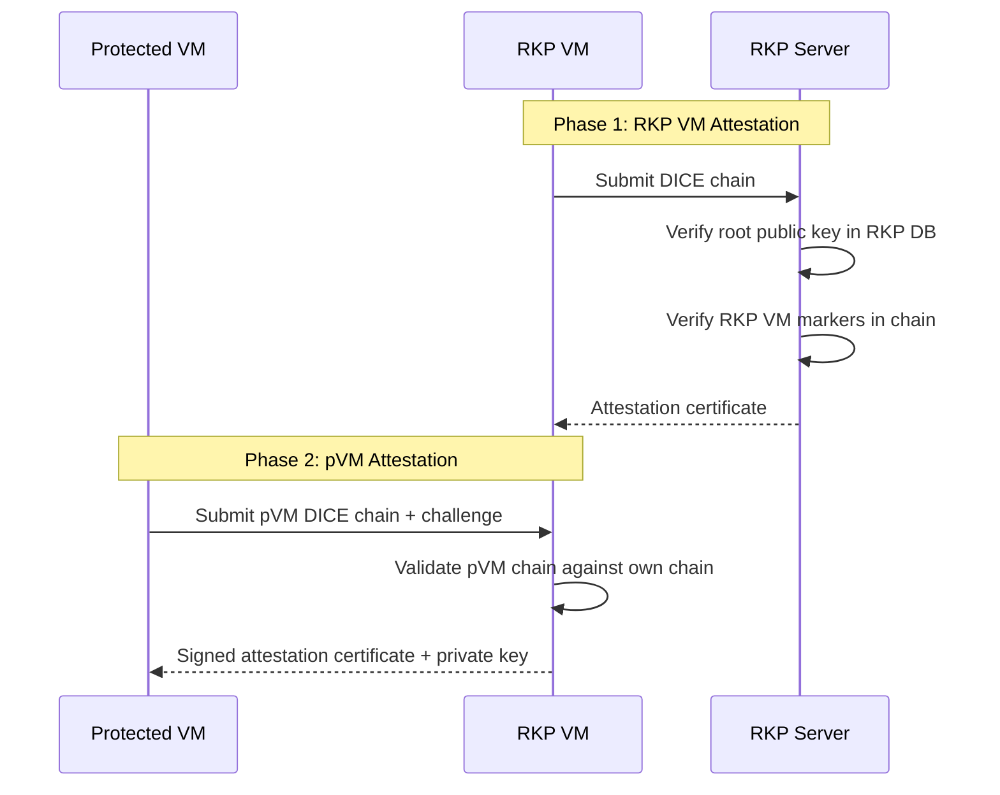
```mermaid
sequenceDiagram
    participant pVM as Protected VM
    participant RKP_VM as RKP VM
    participant RKP_Server as RKP Server

    Note over RKP_VM,RKP_Server: Phase 1: RKP VM Attestation
    RKP_VM->>RKP_Server: Submit DICE chain
    RKP_Server->>RKP_Server: Verify root public key in RKP DB
    RKP_Server->>RKP_Server: Verify RKP VM markers in chain
    RKP_Server-->>RKP_VM: Attestation certificate

    Note over pVM,RKP_VM: Phase 2: pVM Attestation
    pVM->>RKP_VM: Submit pVM DICE chain + challenge
    RKP_VM->>RKP_VM: Validate pVM chain against own chain
    RKP_VM-->>pVM: Signed attestation certificate + private key
```

The output of successful attestation includes a leaf certificate with a custom OID
extension (`1.3.6.1.4.1.11129.2.1.29.1`) that describes the VM payload:

```
AttestationExtension ::= SEQUENCE {
    attestationChallenge       OCTET_STRING,
    isVmSecure                 BOOLEAN,
    vmComponents               SEQUENCE OF VmComponent,
}
```

### 54.1.8 Source Repository Structure

The AVF repository at `packages/modules/Virtualization/` is organized as:

```
packages/modules/Virtualization/
    android/
        composd/                 # Compilation orchestration service
        virtualizationservice/   # Core VirtualizationService daemon
        virtmgr/                 # VM manager (per-VM process)
        vm/                      # vm CLI tool
        MicrodroidDemoApp/       # Demo application
        VmAttestationDemoApp/    # Attestation demo
        fd_server/               # File descriptor server
    build/
        microdroid/              # Microdroid OS build files
    guest/
        pvmfw/                   # pVM Firmware
        service_vm/              # Service VM (RKP)
        kernel/                  # Microdroid kernel config
        encryptedstore/          # Encrypted storage support
    libs/
        framework-virtualization/ # Java API
        libvm_payload/            # VM Payload native API
        libvmbase/                # Common VM base library
        libvmclient/              # VM client library
        libhypervisor_backends/   # Hypervisor abstraction
    docs/                        # Documentation
    tests/                       # Test suites
```

---

## 54.2 pKVM Hypervisor

### 54.2.1 Architecture Overview

pKVM (protected KVM) is a lightweight hypervisor that runs at ARM Exception Level 2
(EL2). It extends the standard Linux KVM to provide memory isolation guarantees that
hold even if the host kernel is compromised. Unlike traditional hypervisors, pKVM is
designed to have a minimal trusted computing base (TCB) -- it does not manage devices
or schedule VMs; instead, it focuses exclusively on memory access control.

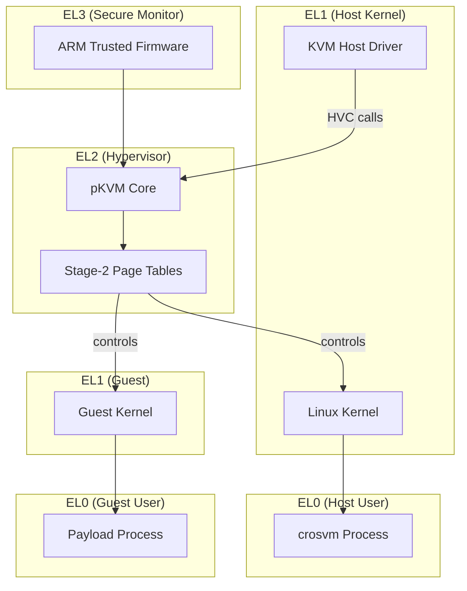
```mermaid
graph TB
    subgraph "EL3 (Secure Monitor)"
        TF_A["ARM Trusted Firmware"]
    end

    subgraph "EL2 (Hypervisor)"
        PKVM_CORE["pKVM Core"]
        S2PT["Stage-2 Page Tables"]
    end

    subgraph "EL1 (Host Kernel)"
        HOST_KVM["KVM Host Driver"]
        HOST_KERNEL["Linux Kernel"]
    end

    subgraph "EL1 (Guest)"
        GUEST_OS["Guest Kernel"]
    end

    subgraph "EL0 (Host User)"
        CROSVM_PROC["crosvm Process"]
    end

    subgraph "EL0 (Guest User)"
        PAYLOAD_PROC["Payload Process"]
    end

    TF_A --> PKVM_CORE
    PKVM_CORE --> S2PT
    HOST_KVM -->|"HVC calls"| PKVM_CORE
    S2PT -->|"controls"| HOST_KERNEL
    S2PT -->|"controls"| GUEST_OS
    HOST_KERNEL --> CROSVM_PROC
    GUEST_OS --> PAYLOAD_PROC
```

### 54.2.2 Memory Isolation Model

The fundamental security property of pKVM is that a protected VM's memory is
inaccessible to the host. This is enforced through ARM Stage-2 page tables controlled
exclusively by the EL2 hypervisor:

1. **Host memory** -- Mapped in the host's Stage-2 tables, unmapped from all guest
   Stage-2 tables.

2. **Guest memory** -- Mapped in the guest's Stage-2 tables, unmapped from the host's
   Stage-2 tables. The host cannot read, write, or execute guest memory.

3. **Shared memory** -- Explicitly shared regions mapped in both host and guest Stage-2
   tables. Used for virtio communication.

This design means that even a kernel-level exploit on the host cannot read a pVM's
private memory. The hypervisor intercepts and validates all memory mapping operations.

### 54.2.3 pKVM Hypervisor Interface

The pvmfw documentation at `packages/modules/Virtualization/guest/pvmfw/README.md`
specifies the hypervisor calls available to guests:

**Memory management:**

- `MEMINFO` (function ID `0xc6000002`) -- Query memory granule information
- `MEM_SHARE` (function ID `0xc6000003`) -- Share a memory region with the host
- `MEM_UNSHARE` (function ID `0xc6000004`) -- Revoke host access to a shared region

**MMIO guard:**

- `MMIO_GUARD_INFO` (function ID `0xc6000005`) -- Query MMIO guard information
- `MMIO_GUARD_ENROLL` (function ID `0xc6000006`) -- Enable MMIO guarding
- `MMIO_GUARD_MAP` (function ID `0xc6000007`) -- Map an MMIO region
- `MMIO_GUARD_UNMAP` (function ID `0xc6000008`) -- Unmap an MMIO region

**Standard ARM interfaces:**

- ARM SMCCC v1.1 -- Calling convention
- PSCI v1.0 -- Power state coordination (reset, shutdown)
- TRNG v1.0 -- True random number generation

### 54.2.4 Stage-2 Page Table Management

When pKVM starts a protected VM, it creates a dedicated set of Stage-2 page tables.
The key operations are:

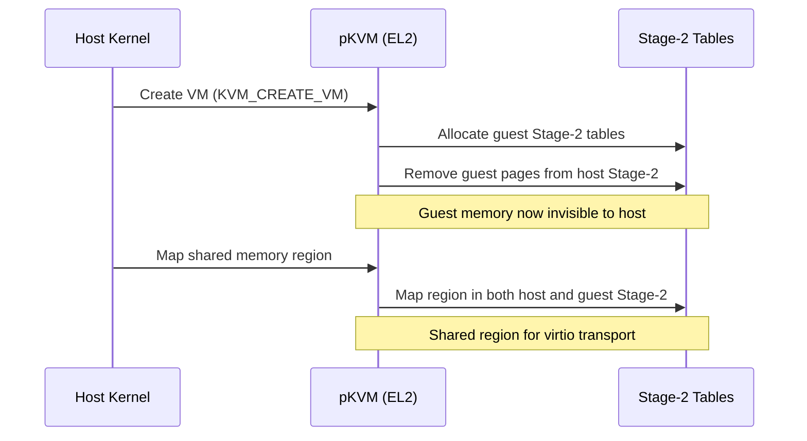
```mermaid
sequenceDiagram
    participant Host as Host Kernel
    participant pKVM as pKVM (EL2)
    participant S2 as Stage-2 Tables

    Host->>pKVM: Create VM (KVM_CREATE_VM)
    pKVM->>S2: Allocate guest Stage-2 tables
    pKVM->>S2: Remove guest pages from host Stage-2

    Note over pKVM,S2: Guest memory now invisible to host

    Host->>pKVM: Map shared memory region
    pKVM->>S2: Map region in both host and guest Stage-2

    Note over pKVM,S2: Shared region for virtio transport
```

### 54.2.5 pvmfw Loading by pKVM

When the VMM requests a protected VM, pKVM loads pvmfw from a protected memory region
into the guest's address space. This region was prepared by the Android Bootloader (ABL)
and is described via a device tree reserved memory node:

```
reserved-memory {
    pkvm_guest_firmware {
        compatible = "linux,pkvm-guest-firmware-memory";
        reg = <0x0 0x80000000 0x40000>;
        no-map;
    }
}
```

Key points about pvmfw loading:

1. The hypervisor does not interpret pvmfw -- it only protects and loads the pre-prepared
   binary.

2. The pvmfw binary must be 4KiB-aligned in guest address space.
3. Configuration data is appended to pvmfw and included in the same protected region.
4. Once loaded, pvmfw becomes the entry point of the VM, executing before any guest code.

### 54.2.6 Memory Sharing Protocol

For virtio communication, guest memory must be explicitly shared with the host. The
sharing protocol uses hypercalls:

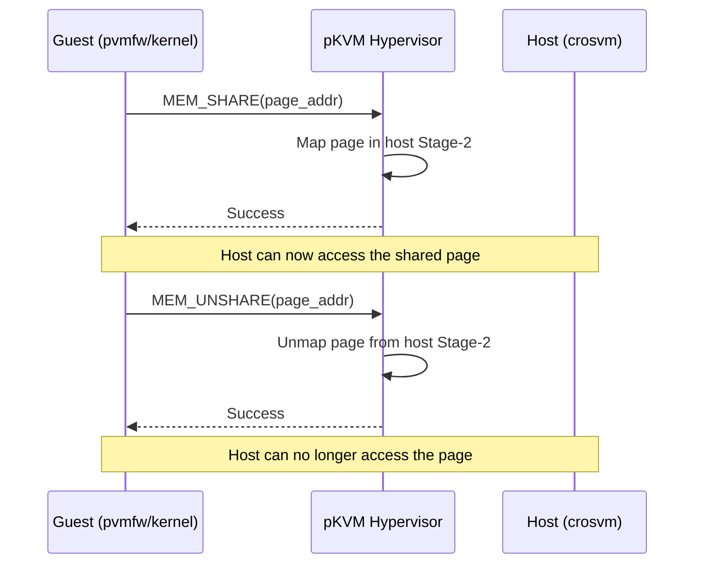
```mermaid
sequenceDiagram
    participant Guest as Guest (pvmfw/kernel)
    participant pKVM as pKVM Hypervisor
    participant Host as Host (crosvm)

    Guest->>pKVM: MEM_SHARE(page_addr)
    pKVM->>pKVM: Map page in host Stage-2
    pKVM-->>Guest: Success

    Note over Guest,Host: Host can now access the shared page

    Guest->>pKVM: MEM_UNSHARE(page_addr)
    pKVM->>pKVM: Unmap page from host Stage-2
    pKVM-->>Guest: Success

    Note over Guest,Host: Host can no longer access the page
```

The guest is responsible for ensuring that sensitive data is never placed in shared
memory regions. The pvmfw firmware handles initial memory sharing for the virtio
transport before handing off to the guest kernel.

### 54.2.7 MMIO Guard

The MMIO Guard mechanism prevents the guest from accessing arbitrary MMIO regions.
This is important because in a virtual machine, MMIO access is typically trapped by
the hypervisor and forwarded to the VMM. A malicious VMM could present fake device
responses. With MMIO Guard:

1. The guest must explicitly enroll in MMIO guarding (`MMIO_GUARD_ENROLL`).
2. Only mapped MMIO regions (`MMIO_GUARD_MAP`) generate traps to the VMM.
3. Access to unmapped MMIO regions triggers an abort rather than a trap.

This limits the attack surface from a potentially compromised VMM.

---

## 54.3 crosvm: The Virtual Machine Monitor

### 54.3.1 Overview

crosvm is a Rust-based Virtual Machine Monitor (VMM) that originated in ChromiumOS
and was adopted by Android for AVF. It manages the lifecycle of virtual machines,
providing virtual hardware devices and acting as the interface between the host kernel
and the guest.

The `external/crosvm/ARCHITECTURE.md` document describes the core design principles:

> The principle characteristics of crosvm are:
>
> - A process per virtual device, made using fork on Linux
> - Each process is sandboxed using minijail
> - Support for several CPU architectures, operating systems, and hypervisors
> - Written in Rust for security and safety

### 54.3.2 Startup Sequence

A crosvm VM session follows a well-defined startup sequence, as documented in
`external/crosvm/ARCHITECTURE.md`:

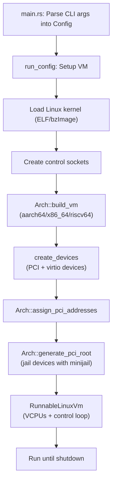
```mermaid
graph TB
    A["main.rs: Parse CLI args into Config"] --> B["run_config: Setup VM"]
    B --> C["Load Linux kernel (ELF/bzImage)"]
    C --> D["Create control sockets"]
    D --> E["Arch::build_vm\n(aarch64/x86_64/riscv64)"]
    E --> F["create_devices\n(PCI + virtio devices)"]
    F --> G["Arch::assign_pci_addresses"]
    G --> H["Arch::generate_pci_root\n(jail devices with minijail)"]
    H --> I["RunnableLinuxVm\n(VCPUs + control loop)"]
    I --> J["Run until shutdown"]
```

From `external/crosvm/src/main.rs`, the top-level `run_vm` function:

```rust
fn run_vm(cmd: RunCommand, log_config: LogConfig) -> Result<CommandStatus> {
    let cfg = match TryInto::<Config>::try_into(cmd) {
        Ok(cfg) => cfg,
        Err(e) => {
            eprintln!("{}", e);
            return Err(anyhow!("{}", e));
        }
    };
    // ...
    let exit_state = crate::sys::run_config(cfg)?;
    Ok(CommandStatus::from(exit_state))
}
```

### 54.3.3 Exit States

crosvm defines specific exit codes that distinguish between different VM termination
conditions, as defined in `external/crosvm/src/main.rs`:

```rust
#[repr(i32)]
enum CommandStatus {
    /// Exit with success. Also used to mean VM stopped successfully.
    SuccessOrVmStop = 0,
    /// VM requested reset.
    VmReset = 32,
    /// VM crashed.
    VmCrash = 33,
    /// VM exit due to kernel panic in guest.
    GuestPanic = 34,
    /// Invalid argument was given to crosvm.
    InvalidArgs = 35,
    /// VM exit due to vcpu stall detection.
    WatchdogReset = 36,
}
```

These exit codes allow `virtmgr` to determine why a VM terminated and report the
appropriate death reason to the VM owner.

### 54.3.4 Architecture Support

crosvm supports three CPU architectures, each with dedicated modules:

| Architecture | Source Directory | Key Components |
|---|---|---|
| AArch64 | `external/crosvm/aarch64/src/` | FDT generation, GIC setup, PSCI |
| x86_64 | `external/crosvm/x86_64/src/` | ACPI tables, CPUID, GDT, boot params |
| RISC-V 64 | `external/crosvm/riscv64/src/` | FDT generation, SBI interface |

Each architecture implements the `Arch` trait with these key methods:

- `build_vm()` -- Create architecture-specific VM configuration
- `assign_pci_addresses()` -- Assign PCI bus addresses
- `generate_pci_root()` -- Build the PCI device tree

The x86_64 module contains additional components not needed on ARM:

```
external/crosvm/x86_64/src/
    acpi.rs        # ACPI table generation
    bootparam.rs   # Linux boot parameter structure
    bzimage.rs     # bzImage kernel loading
    cpuid.rs       # CPUID emulation
    fdt.rs         # Flattened Device Tree
    gdb.rs         # GDB stub for debugging
    gdt.rs         # Global Descriptor Table
    interrupts.rs  # Interrupt handling
    mpspec.rs      # Multiprocessor specification
```

### 54.3.5 Process-Per-Device Sandboxing

The most distinctive architectural feature of crosvm is its process-per-device model.
Each virtual device runs in a separate forked process, sandboxed using minijail:

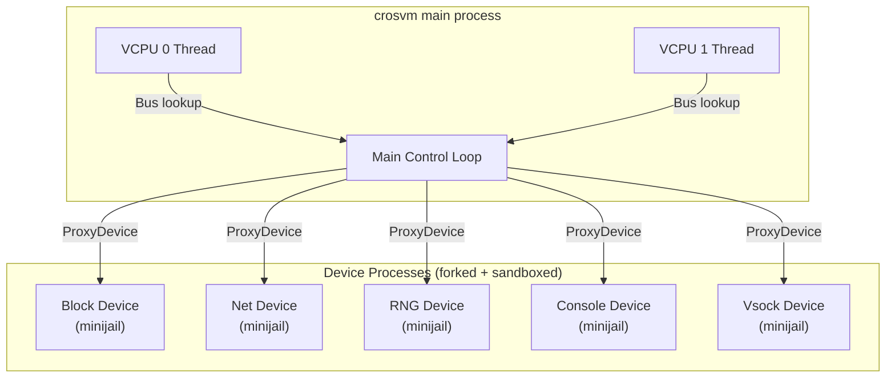
```mermaid
graph TB
    subgraph "crosvm main process"
        MAIN["Main Control Loop"]
        VCPU1["VCPU 0 Thread"]
        VCPU2["VCPU 1 Thread"]
    end

    subgraph "Device Processes (forked + sandboxed)"
        BLK["Block Device\n(minijail)"]
        NET["Net Device\n(minijail)"]
        RNG["RNG Device\n(minijail)"]
        CONSOLE["Console Device\n(minijail)"]
        VSOCK["Vsock Device\n(minijail)"]
    end

    MAIN -->|"ProxyDevice"| BLK
    MAIN -->|"ProxyDevice"| NET
    MAIN -->|"ProxyDevice"| RNG
    MAIN -->|"ProxyDevice"| CONSOLE
    MAIN -->|"ProxyDevice"| VSOCK

    VCPU1 -->|"Bus lookup"| MAIN
    VCPU2 -->|"Bus lookup"| MAIN
```

As described in the architecture documentation:

> During the device creation routine, each device will be created and then wrapped in
> a `ProxyDevice` which will internally `fork` (but not `exec`) and minijail the
> device, while dropping it for the main process. The only interaction that the device
> is capable of having with the main process is via the proxied trait methods of
> `BusDevice`, shared memory mappings such as the guest memory, and file descriptors
> that were specifically allowed by that device's security policy.

### 54.3.6 Minijail Sandboxing

Each device process is sandboxed using minijail with Linux namespaces and seccomp
filters. Seccomp policies are architecture-specific:

```
external/crosvm/jail/seccomp/
    aarch64/           # ARM64 seccomp policies
    arm/               # ARM32 seccomp policies
    x86_64/            # x86_64 seccomp policies
    riscv64/           # RISC-V seccomp policies
```

Each device has its own seccomp policy file that whitelists only the syscalls it
needs. The policy files include a common base (`common_device.policy`) and add
device-specific syscalls.

The sandboxing provides defense in depth: even if a malicious guest compromises a
virtual device process, the attacker is confined to a minimal syscall set within
an isolated namespace.

### 54.3.7 Hypervisor Abstraction Layer

crosvm supports multiple hypervisor backends through an abstraction layer:

```
external/crosvm/hypervisor/src/
    lib.rs          # Trait definitions
    kvm/            # Linux KVM backend
    geniezone/      # MediaTek GenieZone
    gunyah/         # Qualcomm Gunyah
    halla/          # (development backend)
    haxm/           # Intel HAXM (for Windows)
    whpx/           # Windows Hypervisor Platform
```

On Android, the primary backend is KVM (including pKVM for protected VMs). The
hypervisor module in `external/crosvm/hypervisor/src/` provides:

```
hypervisor/src/
    aarch64.rs      # ARM64-specific hypervisor traits
    x86_64.rs       # x86_64-specific hypervisor traits
    riscv64.rs      # RISC-V specific hypervisor traits
    caps.rs         # Capability detection
```

### 54.3.8 Device Model

The crosvm device model is built on a hierarchy of traits:

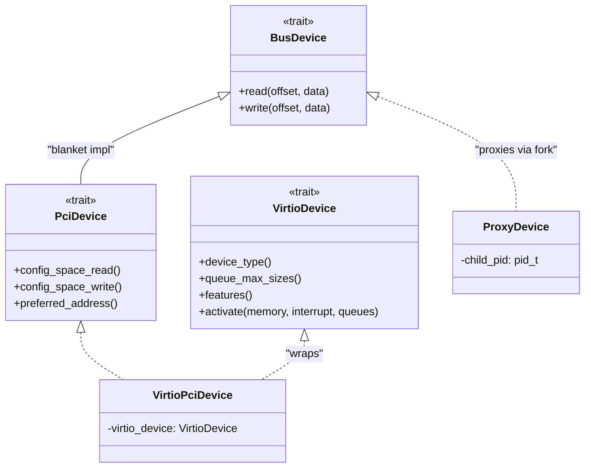
```mermaid
classDiagram
    class BusDevice {
        <<trait>>
        +read(offset, data)
        +write(offset, data)
    }

    class PciDevice {
        <<trait>>
        +config_space_read()
        +config_space_write()
        +preferred_address()
    }

    class VirtioDevice {
        <<trait>>
        +device_type()
        +queue_max_sizes()
        +features()
        +activate(memory, interrupt, queues)
    }

    class VirtioPciDevice {
        -virtio_device: VirtioDevice
    }

    class ProxyDevice {
        -child_pid: pid_t
    }

    BusDevice <|-- PciDevice : "blanket impl"
    PciDevice <|.. VirtioPciDevice
    VirtioDevice <|.. VirtioPciDevice : "wraps"
    BusDevice <|.. ProxyDevice : "proxies via fork"
```

As the ARCHITECTURE.md explains:

> The root of the crosvm device model is the `Bus` structure and its friend the
> `BusDevice` trait. The `Bus` structure is a virtual computer bus used to emulate
> the memory-mapped I/O bus and also I/O ports for x86 VMs.

The virtio device implementations include:

| Device | Source File | Purpose |
|---|---|---|
| Block | `devices/src/virtio/block/` | Disk I/O |
| Net | `devices/src/virtio/net.rs` | Network I/O |
| Console | `devices/src/virtio/console/` | Serial console |
| RNG | `devices/src/virtio/rng.rs` | Random number generation |
| Vsock | `devices/src/virtio/vsock/` | Host-guest socket communication |
| Balloon | `devices/src/virtio/balloon.rs` | Memory ballooning |
| SCSI | `devices/src/virtio/scsi/` | SCSI device emulation |
| Sound | `devices/src/virtio/snd/` | Audio device |
| GPU | `devices/src/virtio/gpu/` | Graphics rendering |
| IOMMU | `devices/src/virtio/iommu.rs` | I/O memory management |
| Pmem | `devices/src/virtio/pmem.rs` | Persistent memory |
| Filesystem | `devices/src/virtio/fs/` | Shared filesystem (virtio-fs) |
| TPM | `devices/src/virtio/tpm.rs` | Trusted Platform Module |

### 54.3.9 GuestMemory Architecture

Guest memory management is a critical subsystem. The ARCHITECTURE.md describes
five related types:

- **`GuestMemory`** -- Reference to all guest memory. Can be cloned, but the
  underlying memory is always the same. Implemented using `MemoryMapping` and
  `SharedMemory`. For non-protected VMs, it is mapped into host address space
  but is non-contiguous.

- **`SharedMemory`** -- Wraps a `memfd`. Can be mapped using `MemoryMapping`.
  Cannot be cloned.

- **`VolatileMemory`** -- Trait for generic access to non-contiguous memory.
  `GuestMemory` implements this trait.

- **`VolatileSlice`** -- Analogous to a Rust slice but with asynchronously
  changing data. Useful for scatter-gather table entries.

- **`MemoryMapping`** -- Safe wrapper around `mmap`/`munmap`. Provides RAII
  semantics. Access via Rust references is forbidden; use `VolatileSlice`.

For protected VMs, guest memory is NOT mapped into host address space -- the
pKVM hypervisor prevents this. Shared memory regions for virtio transport are
the exception.

### 54.3.10 VM Control Sockets

crosvm uses Unix domain sockets for inter-process communication between the
main process and device processes. From the architecture doc:

> For the operations that devices need to perform on the global VM state, such
> as mapping into guest memory address space, there are the VM control sockets.
> There are a few kinds, split by the type of request and response that the
> socket will process. This also provides basic security privilege separation
> in case a device becomes compromised by a malicious guest.

The control socket types handle:

- Memory mapping requests
- MSI route allocation
- Guest memory registration/deregistration
- VM state changes (pause, resume, reset)

External control is available via the `--socket` argument, accessed through
the `crosvm_control` library or CLI subcommands like `crosvm stop`.

### 54.3.11 WaitContext Event Loop

Most crosvm threads use a `WaitContext` for their event loop. This is a
cross-platform abstraction over `epoll` (Linux) and `WaitForMultipleObjects`
(Windows):

```rust
// Conceptual event loop (simplified)
#[derive(EventToken)]
enum Token {
    VirtioQueue,
    InterruptResample,
    Kill,
}

let wait_ctx = WaitContext::new()?;
wait_ctx.add(&queue_evt, Token::VirtioQueue)?;
wait_ctx.add(&interrupt_resample, Token::InterruptResample)?;
wait_ctx.add(&kill_evt, Token::Kill)?;

loop {
    let events = wait_ctx.wait()?;
    for event in events {
        match event.token {
            Token::VirtioQueue => { /* process queue */ },
            Token::InterruptResample => { /* resample interrupt */ },
            Token::Kill => return Ok(()),
        }
    }
}
```

### 54.3.12 Code Organization

The crosvm codebase is organized into Rust crates, as documented in
`external/crosvm/ARCHITECTURE.md`:

```
external/crosvm/
    src/                  # Top-level binary frontend
    aarch64/              # ARM64 architecture support
    x86_64/               # x86_64 architecture support
    riscv64/              # RISC-V 64 architecture support
    base/                 # Cross-platform safe wrappers
    cros_async/           # Async runtime (io_uring + epoll)
    devices/              # Virtual device implementations
    disk/                 # Disk image manipulation (raw, qcow)
    hypervisor/           # Hypervisor abstraction layer
    jail/                 # Minijail sandboxing helpers
    jail/seccomp/         # Per-architecture seccomp policies
    kernel_loader/        # Kernel image loading
    kvm_sys/              # KVM ioctl structures
    kvm/                  # KVM wrapper
    net_util/             # TUN/TAP device creation
    sync/                 # Custom Mutex/Condvar
    vfio_sys/             # VFIO structures for device passthrough
    vhost/                # Vhost device wrappers
    virtio_sys/           # Virtio kernel interface
    vm_control/           # VM IPC definitions
    vm_memory/            # VM memory objects
```

---

## 54.4 Microdroid

### 54.4.1 Overview

Microdroid is a minimal Android distribution designed specifically for running inside
AVF virtual machines. As described in `packages/modules/Virtualization/build/microdroid/README.md`:

> Microdroid is a (very) lightweight version of Android that is intended to run on
> on-device virtual machines. It is built from the same source code as the regular
> Android, but it is much smaller; no system server, no HALs, no GUI, etc. It is
> intended to host headless & native workloads only.

### 54.4.2 What Microdroid Removes

Compared to full Android, Microdroid strips away nearly everything:

| Component | Full Android | Microdroid |
|---|---|---|
| System Server | Yes | No |
| Hardware Abstraction Layers | Full suite | None |
| GUI/SurfaceFlinger | Yes | No |
| Package Manager | Yes | No |
| Telephony | Yes | No |
| Bluetooth | Yes | No |
| WiFi stack | Yes | No |
| Camera | Yes | No |
| Audio service | Yes | No |
| SELinux policy | Full | Minimal |
| Init scripts | Hundreds | One (init.rc) |

What Microdroid retains:

- Linux kernel
- Bionic libc
- Init process (minimal configuration)
- APEX daemon (in VM mode)
- `microdroid_manager` (payload orchestration)
- Tombstoned (crash reporting)
- Basic filesystem support

### 54.4.3 VM Configuration

Microdroid VMs are configured through JSON files. The base configuration from
`packages/modules/Virtualization/build/microdroid/microdroid.json`:

```json
{
  "kernel": "/apex/com.android.virt/etc/fs/microdroid_kernel",
  "disks": [
    {
      "partitions": [
        {
          "label": "vbmeta_a",
          "path": "/apex/com.android.virt/etc/fs/microdroid_vbmeta.img"
        },
        {
          "label": "super",
          "path": "/apex/com.android.virt/etc/fs/microdroid_super.img"
        }
      ],
      "writable": false
    }
  ],
  "memory_mib": 256,
  "console_input_device": "hvc0",
  "platform_version": "~1.0"
}
```

The configuration specifies:

- **Kernel** -- Path to the Microdroid kernel binary
- **Disks** -- Disk images including vbmeta (for verified boot) and super (the system
  partition in Android's dynamic partitions format)

- **Memory** -- 256 MiB default allocation
- **Console** -- `hvc0` for virtio console I/O

### 54.4.4 Boot Process

The Microdroid boot process is tightly controlled:

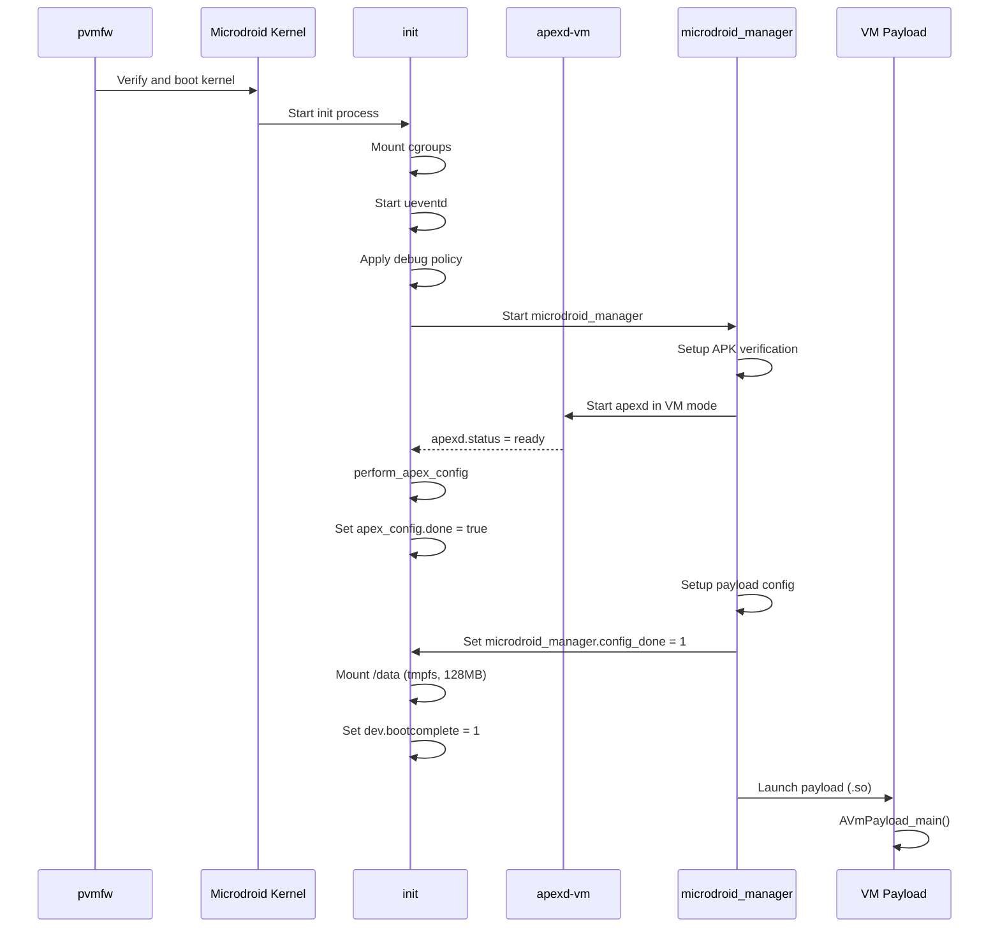
```mermaid
sequenceDiagram
    participant PVMFW as pvmfw
    participant KERNEL as Microdroid Kernel
    participant INIT as init
    participant APEXD as apexd-vm
    participant MM as microdroid_manager
    participant PAYLOAD as VM Payload

    PVMFW->>KERNEL: Verify and boot kernel
    KERNEL->>INIT: Start init process

    INIT->>INIT: Mount cgroups
    INIT->>INIT: Start ueventd
    INIT->>INIT: Apply debug policy

    INIT->>MM: Start microdroid_manager
    MM->>MM: Setup APK verification
    MM->>APEXD: Start apexd in VM mode
    APEXD-->>INIT: apexd.status = ready

    INIT->>INIT: perform_apex_config
    INIT->>INIT: Set apex_config.done = true

    MM->>MM: Setup payload config
    MM->>INIT: Set microdroid_manager.config_done = 1

    INIT->>INIT: Mount /data (tmpfs, 128MB)
    INIT->>INIT: Set dev.bootcomplete = 1

    MM->>PAYLOAD: Launch payload (.so)
    PAYLOAD->>PAYLOAD: AVmPayload_main()
```

The init.rc from `packages/modules/Virtualization/build/microdroid/init.rc` reveals
the boot orchestration:

```
on init
    mkdir /mnt/apk 0755 root root
    mkdir /mnt/extra-apk 0755 root root
    mkdir /mnt/tenant-apk 0755 root root

    # Microdroid_manager starts apkdmverity/zipfuse/apexd
    start microdroid_manager

    # Wait for apexd to finish activating APEXes
    wait_for_prop apexd.status ready
    perform_apex_config

    # Notify microdroid_manager that APEX config is done
    setprop apex_config.done true
```

### 54.4.5 Filesystem Layout

Microdroid uses a minimal filesystem layout from
`packages/modules/Virtualization/build/microdroid/fstab.microdroid`:

```
system /system ext4 noatime,ro,errors=panic wait,slotselect,avb=vbmeta,first_stage_mount,logical
/dev/block/by-name/microdroid-vendor /vendor ext4 noatime,ro,errors=panic wait,first_stage_mount,avb_hashtree_digest=/proc/device-tree/avf/vendor_hashtree_descriptor_root_digest
```

Key filesystem characteristics:

- **Root** -- Read-only, remounted after post-fs
- **/system** -- Read-only, verified boot via AVB
- **/vendor** -- Optional, verified via hashtree digest
- **/data** -- tmpfs (128 MiB), ephemeral
- **/mnt/apk** -- Mount point for payload APK
- **/mnt/encryptedstore** -- Encrypted persistent storage

### 54.4.6 Vendor Image Support

Microdroid supports optional vendor partitions for device-specific modules. The vendor
image verification process differs between protected and non-protected VMs:

**Non-protected VM:**
The `virtualizationmanager` creates a DTBO containing the vendor hashtree digest
and passes it to the VM via crosvm. The digest is obtained from the host Android
device tree under `/avf/reference/`.

**Protected VM:**
The VM reference DT included in the pvmfw configuration data is used for additional
validation. The bootloader appends the vendor hashtree digest into the VM reference
DT. pvmfw validates that if a matching property is present in the VM's device tree,
its value exactly matches the reference.

From the Microdroid README:

> For pVM, VM reference DT included in pvmfw config data is additionally used
> for validating vendor hashtree digest. Bootloader should append vendor hashtree
> digest into VM reference DT based on fstab.microdroid.

### 54.4.7 VM Payload API

The VM Payload API provides the interface for code running inside a Microdroid VM.
It is a C API defined in `packages/modules/Virtualization/libs/libvm_payload/`:

```c
// Entry point for VM payload code
extern "C" int AVmPayload_main() {
    printf("Hello Microdroid!\n");
    // Use VM Payload APIs here
}
```

Available APIs include:

- `AVmPayload_requestAttestation()` -- Request remote attestation
- `AVmPayload_runVsockRpcServer()` -- Host a binder server over vsock
- Secret derivation and sealing functions
- NDK subset: libc, logging, NdkBinder

Building a VM payload requires two build modules:

```blueprint
// The payload shared library
cc_library_shared {
    name: "MyMicrodroidPayload",
    srcs: ["**/*.cpp"],
    sdk_version: "current",
}

// The host app that contains the payload
android_app {
    name: "MyApp",
    srcs: ["**/*.java"],
    jni_libs: ["MyMicrodroidPayload"],
    use_embedded_native_libs: true,
    sdk_version: "current",
}
```

### 54.4.8 Platform Prerequisites

Microdroid requires:

1. **64-bit target** -- Either x86_64 or arm64. 32-bit is not supported.
2. **com.android.virt APEX** -- Must be pre-installed on the device.
3. **KVM support** -- `/dev/kvm` must exist.
4. **For protected VMs** -- pKVM hypervisor must be active.

The APEX can be added to a product by including in the product makefile:

```makefile
$(call inherit-product, packages/modules/Virtualization/build/apex/product_packages.mk)
```

### 54.4.9 Encrypted Storage

Microdroid supports encrypted persistent storage for VMs that need to preserve
data across reboots. The encrypted store is backed by a file on the host and
mounted at `/mnt/encryptedstore` inside the VM.

From the init.rc:

```
on property:microdroid_manager.encrypted_store.status=mounted
    restorecon /mnt/encryptedstore
    # Performance tuning for storage
    write /proc/sys/vm/compaction_proactiveness 0
    write /sys/module/dm_verity/parameters/prefetch_cluster 0
    write /proc/sys/vm/swappiness 100
    setprop microdroid_manager.encrypted_store.status ready
```

The encryption keys are derived from the VM's DICE chain, ensuring that only the
same VM instance (with the same code and configuration) can decrypt the data.

---

## 54.5 pVM Firmware

### 54.5.1 Purpose and Threat Model

The pVM firmware (pvmfw) is the first code that executes inside a protected VM.
It serves as the root of trust for the VM, validating the guest environment before
allowing any guest code to run.

From `packages/modules/Virtualization/guest/pvmfw/README.md`:

> As pVMs are managed by a VMM running on the untrusted host, the virtual machine
> it configures can't be trusted either. Furthermore, even though the isolation
> mentioned above allows pVMs to protect their secrets from the host, it does not
> help with provisioning them during boot. In particular, the threat model would
> prohibit the host from ever having access to those secrets, preventing the VMM
> from passing them to the pVM.

The threat model assumes:

- The host OS may be fully compromised
- The VMM (crosvm) may be malicious
- The hypervisor (pKVM) and pvmfw itself are trusted
- Device hardware (including firmware up to pvmfw loading) is trusted

### 54.5.2 Source Architecture

The pvmfw source code is at `packages/modules/Virtualization/guest/pvmfw/src/` and
is a `no_std` Rust binary:

```rust
// packages/modules/Virtualization/guest/pvmfw/src/main.rs
#![no_main]
#![no_std]

extern crate alloc;

mod arch;
mod bootargs;
mod config;
mod device_assignment;
mod dice;
mod entry;
mod fdt;
mod gpt;
mod instance;
mod memory;
mod rollback;
```

The `no_std` constraint means pvmfw operates without a standard library -- it has
no heap allocator by default (it uses a configured one), no filesystem, and no
operating system services. This minimizes the trusted computing base.

### 54.5.3 Entry Point and Boot Flow

The entry point in `packages/modules/Virtualization/guest/pvmfw/src/entry.rs` defines
the boot arguments and initialization sequence:

```rust
pub struct BootArgs {
    /// Address of FDT
    pub fdt: Option<usize>,
    /// Address of first byte in payload image
    pub payload_start: Option<usize>,
    /// Size of payload in bytes
    pub payload_size: Option<usize>,
    /// Address of Linux x86 boot params structure
    pub boot_params: Option<usize>,
}
```

Platform-specific argument parsing handles the differences between AArch64 and x86_64:

```rust
pub fn from_vmbase_args(argv: &[usize]) -> Self {
    cfg_if::cfg_if! {
        if #[cfg(target_arch = "aarch64")] {
            Self {
                fdt: argv.first().copied(),
                payload_start: argv.get(1).copied(),
                payload_size: argv.get(2).copied(),
                boot_params: None,
            }
        } else if #[cfg(target_arch = "x86_64")] {
            Self {
                fdt: None,
                payload_start: None,
                payload_size: None,
                boot_params: argv.get(1).copied(),
            }
        }
    }
}
```

### 54.5.4 Main Verification Flow

The main function in `packages/modules/Virtualization/guest/pvmfw/src/main.rs`
orchestrates the complete verification process:

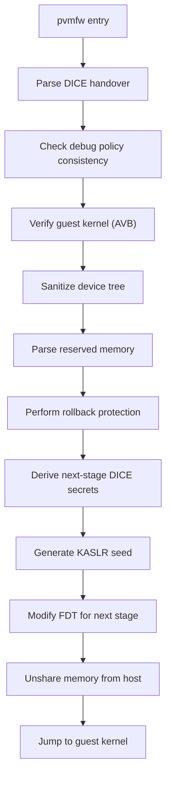
```mermaid
graph TB
    START["pvmfw entry"] --> PARSE_DICE["Parse DICE handover"]
    PARSE_DICE --> CHECK_DEBUG["Check debug policy consistency"]
    CHECK_DEBUG --> VERIFY_BOOT["Verify guest kernel (AVB)"]
    VERIFY_BOOT --> SANITIZE_DT["Sanitize device tree"]
    SANITIZE_DT --> PARSE_RESMEM["Parse reserved memory"]
    PARSE_RESMEM --> ROLLBACK["Perform rollback protection"]
    ROLLBACK --> DICE_DERIVE["Derive next-stage DICE secrets"]
    DICE_DERIVE --> KASLR["Generate KASLR seed"]
    KASLR --> MODIFY_FDT["Modify FDT for next stage"]
    MODIFY_FDT --> UNSHARE["Unshare memory from host"]
    UNSHARE --> JUMP["Jump to guest kernel"]
```

The core `main` function signature from the source:

```rust
fn main<'a>(
    untrusted_fdt: &mut Fdt,
    signed_kernel: &[u8],
    ramdisk: Option<&[u8]>,
    current_dice_handover: Option<&[u8]>,
    mut debug_policy: Option<&[u8]>,
    vm_dtbo: Option<&mut [u8]>,
    vm_ref_dt: Option<&[u8]>,
    reserved_mem: Option<&[u8]>,
) -> Result<(&'a [u8], bool), RebootReason> {
    info!("pVM firmware");
    // ...
}
```

### 54.5.5 Verified Boot

pvmfw uses Android Verified Boot (AVB) to verify the guest kernel and optional
ramdisk. The verification uses an embedded public key:

```rust
/// Trusted public key, used during verification of the signed kernel & ramdisk.
const PUBLIC_KEY: &[u8] = include_bytes!(
    concat!(env!("OUT_DIR"), "/pvmfw_embedded_key_pub.bin")
);
```

The verified boot process:

```rust
fn perform_verified_boot<'a>(
    signed_kernel: &[u8],
    ramdisk: Option<&[u8]>,
) -> Result<(VerifiedBootData<'a>, bool, usize), RebootReason> {
    let verified_boot_data = verify_payload(signed_kernel, ramdisk, PUBLIC_KEY)
        .map_err(|e| {
            error!("Failed to verify the payload: {e}");
            RebootReason::PayloadVerificationError
        })?;
    let debuggable = verified_boot_data.debug_level != DebugLevel::None;
    let guest_page_size = verified_boot_data.page_size.unwrap_or(SIZE_4KB);
    Ok((verified_boot_data, debuggable, guest_page_size))
}
```

### 54.5.6 DICE Derivation

After verification, pvmfw derives the next-stage DICE secrets. The DICE module at
`packages/modules/Virtualization/guest/pvmfw/src/dice/mod.rs` handles this:

```rust
// DICE Configuration Descriptor keys
const COMPONENT_NAME_KEY: i64 = -70002;
const SECURITY_VERSION_KEY: i64 = -70005;
const RKP_VM_MARKER_KEY: i64 = -70006;
const INSTANCE_HASH_KEY: i64 = -71003;
```

The derivation process:

1. Parse the incoming DICE handover (CDIs + certificate chain)
2. Compute partial DICE inputs from verified boot data
3. Incorporate the instance hash (for per-VM differentiation)
4. Perform rollback protection
5. Derive the next-stage CDIs and certificate

```rust
fn perform_dice_derivation(
    dice_handover_bytes: &[u8],
    dice_context: DiceContext,
    dice_inputs: PartialInputs,
    salt: &[u8; HIDDEN_SIZE],
    defer_rollback_protection: bool,
    next_dice_handover: &mut [u8],
) -> Result<(), RebootReason> {
    dice_inputs
        .write_next_handover(
            dice_handover_bytes.as_ref(),
            salt,
            defer_rollback_protection,
            next_dice_handover,
            dice_context,
        )
        .map_err(|e| {
            error!("Failed to derive next-stage DICE secrets: {e:?}");
            RebootReason::SecretDerivationError
        })?;
    Ok(())
}
```

The instance-specific salt ensures that different VM instances with identical payloads
receive different secrets:

```rust
fn salt_from_instance_id(fdt: &Fdt) -> Result<Option<Hidden>, RebootReason> {
    let Some(id) = read_instance_id(fdt).map_err(|e| {
        error!("Failed to get instance-id in DT: {e}");
        RebootReason::InvalidFdt
    })?
    else {
        return Ok(None);
    };
    let salt = Digester::sha512()
        .digest(&[&b"InstanceId:"[..], id].concat())
        // ...
    Ok(Some(salt))
}
```

### 54.5.7 Reboot Reasons

pvmfw defines specific reboot reasons that help diagnose boot failures. From
`packages/modules/Virtualization/guest/pvmfw/src/entry.rs`:

```rust
pub enum RebootReason {
    InvalidDiceHandover,       // "PVM_FIRMWARE_INVALID_DICE_HANDOVER"
    InvalidConfig,             // "PVM_FIRMWARE_INVALID_CONFIG_DATA"
    InternalError,             // "PVM_FIRMWARE_INTERNAL_ERROR"
    InvalidFdt,                // "PVM_FIRMWARE_INVALID_FDT"
    InvalidPayload,            // "PVM_FIRMWARE_INVALID_PAYLOAD"
    InvalidRamdisk,            // "PVM_FIRMWARE_INVALID_RAMDISK"
    PayloadVerificationError,  // "PVM_FIRMWARE_PAYLOAD_VERIFICATION_FAILED"
    SecretDerivationError,     // "PVM_FIRMWARE_SECRET_DERIVATION_FAILED"
}
```

Each reason is written to a dedicated console before reboot:

```rust
const REBOOT_REASON_CONSOLE: usize = 1;
console_writeln!(REBOOT_REASON_CONSOLE, "{}", reboot_reason.as_avf_reboot_string())
    .unwrap();
reboot()
```

### 54.5.8 Configuration Data Format

pvmfw receives configuration data appended to its binary by the bootloader.
The configuration uses a versioned header format from
`packages/modules/Virtualization/guest/pvmfw/src/config/mod.rs`:

```rust
#[repr(C, packed)]
#[derive(Clone, Copy, Debug, FromBytes, Immutable, KnownLayout)]
struct Header {
    /// Magic number; must be `Header::MAGIC`.
    magic: u32,
    /// Version of the header format.
    version: Version,
    /// Total size of the configuration data.
    total_size: u32,
    /// Feature flags; currently reserved and must be zero.
    flags: u32,
}
```

The configuration data memory layout:

```
+===============================+
|          pvmfw.bin            |
+~~~~~~~~~~~~~~~~~~~~~~~~~~~~~~~+
|  (Padding to 4KiB alignment)  |
+===============================+ <-- HEAD
|      Magic (= 0x666d7670)     |
+-------------------------------+
|           Version             |
+-------------------------------+
|   Total Size = (TAIL - HEAD)  |
+-------------------------------+
|            Flags              |
+-------------------------------+
|     Entry 0: DICE chain       |
|     Entry 1: Debug Policy     |
|     Entry 2: VM DTBO (v1.1)   |
|     Entry 3: VM ref DT (v1.2) |
|     Entry 4: Reserved Mem (v1.3)|
+-------------------------------+
|      Blob data follows...     |
+===============================+ <-- TAIL
```

### 54.5.9 Configuration Versions

The configuration format has evolved across four versions:

**Version 1.0:**

- Entry 0: DICE chain handover (mandatory)
- Entry 1: Debug policy DTBO (optional)

**Version 1.1:**

- Entry 2: VM Device Assignment DTBO (optional, for device passthrough)

**Version 1.2:**

- Entry 3: VM reference DT (optional, for secure property passing)

**Version 1.3:**

- Entry 4: Reserved memory (optional, for confidential data to specific guests)

Each blob is referred to by offset and size in the entry array. Missing optional
entries are denoted by zero size.

### 54.5.10 VBMeta Properties

AVF defines special AVB VBMeta descriptor properties that pvmfw recognizes:

- **`com.android.virt.cap`** -- Capabilities list (pipe-separated):
  - `remote_attest` -- Hard-coded rollback protection index
  - `secretkeeper_protection` -- Defers rollback protection to guest
  - `supports_uefi_boot` -- Boots VM as EFI payload (experimental)
  - `trusty_security_vm` -- Skips rollback protection
- **`com.android.virt.page_size`** -- Guest page size in KiB (default: 4)
- **`com.android.virt.name`** -- VM name, used in DICE certificate:
  - `"rkp_vm"` -- Reserved for Remote Key Provisioning VM
  - `"desktop-trusty"` -- Reserved for Trusty desktop TEE VM

### 54.5.11 Handover to Guest Kernel

After all verification and derivation is complete, pvmfw prepares the guest
environment and jumps to the kernel:

1. Unshare all non-essential memory from the host
2. Unshare all MMIO regions except UART (if debuggable)
3. Flush preserved memory (DICE handover, reserved memory)
4. Compute the kernel entry point
5. Jump to the payload

The DICE chain is passed to the guest via a device tree reserved-memory node:

```
/ {
    reserved-memory {
        dice {
            compatible = "google,open-dice";
            no-map;
            reg = <0x0 0x7fe0000>, <0x0 0x1000>;
        };
    };
};
```

### 54.5.12 Memory Layout

pvmfw operates within a fixed memory layout defined by the crosvm protected VM
configuration:

| Address | Size | Purpose |
|---|---|---|
| `0x7fc0_0000` | Variable | pvmfw binary + config data |
| `0x7fe0_0000` | 2 MiB | Scratch memory |
| `0x3f8` | MMIO | 16550 UART for logging |
| PCI bus | MMIO | virtio devices |

### 54.5.13 Development Workflow

For rapid iteration, pvmfw can be built and pushed without reflashing the
device partition:

```shell
m pvmfw-tool pvmfw_bin
PVMFW_BIN=${ANDROID_PRODUCT_OUT}/system/etc/pvmfw.bin
DICE=${ANDROID_BUILD_TOP}/packages/modules/Virtualization/tests/pvmfw/assets/dice.dat

# Create pvmfw with test DICE chain
pvmfw-tool custom_pvmfw ${PVMFW_BIN} ${DICE}

# Push to device and set system property
adb push custom_pvmfw /data/local/tmp/pvmfw
adb root
adb shell setprop hypervisor.pvmfw.path /data/local/tmp/pvmfw

# Run a protected VM with the custom pvmfw
adb shell /apex/com.android.virt/bin/vm run-microdroid --protected
```

To run without pvmfw entirely (for debugging early boot issues):

```shell
adb shell 'setprop hypervisor.pvmfw.path "none"'
```

---

## 54.6 VM Service Architecture

### 54.6.1 Service Overview

The AVF userspace service architecture consists of several cooperating components
that manage VM lifecycle, security, and communication:

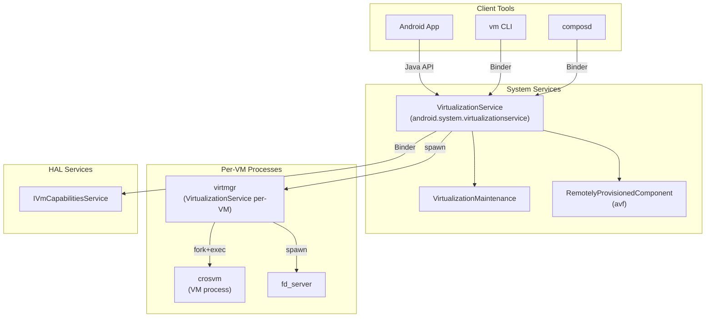
```mermaid
graph TB
    subgraph "System Services"
        VS["VirtualizationService\n(android.system.virtualizationservice)"]
        MAINT["VirtualizationMaintenance"]
        RPC["RemotelyProvisionedComponent\n(avf)"]
    end

    subgraph "Per-VM Processes"
        VIRTMGR["virtmgr\n(VirtualizationService per-VM)"]
        CROSVM["crosvm\n(VM process)"]
        FD_SERVER["fd_server"]
    end

    subgraph "Client Tools"
        VM_CLI["vm CLI"]
        COMPOSD["composd"]
        APP["Android App"]
    end

    subgraph "HAL Services"
        CAPS["IVmCapabilitiesService"]
    end

    APP -->|"Java API"| VS
    VM_CLI -->|"Binder"| VS
    COMPOSD -->|"Binder"| VS
    VS -->|"spawn"| VIRTMGR
    VIRTMGR -->|"fork+exec"| CROSVM
    VIRTMGR -->|"spawn"| FD_SERVER
    VS -->|"Binder"| CAPS
    VS --> MAINT
    VS --> RPC
```

### 54.6.2 VirtualizationService

The `VirtualizationService` is the central daemon that manages global VM resources.
From `packages/modules/Virtualization/android/virtualizationservice/src/main.rs`:

```rust
fn try_main() -> Result<()> {
    // ...
    ProcessState::start_thread_pool();

    let service = VirtualizationServiceInternal::init();
    let internal_service =
        BnVirtualizationServiceInternal::new_binder(
            service.clone(), BinderFeatures::default()
        );
    register(INTERNAL_SERVICE_NAME, internal_service)?;

    if is_remote_provisioning_hal_declared().unwrap_or(false) {
        let remote_provisioning_service = remote_provisioning::new_binder();
        register(REMOTELY_PROVISIONED_COMPONENT_SERVICE_NAME,
                 remote_provisioning_service)?;
    }

    if cfg!(llpvm_changes) {
        let maintenance_service =
            BnVirtualizationMaintenance::new_binder(
                service.clone(), BinderFeatures::default()
            );
        register(MAINTENANCE_SERVICE_NAME, maintenance_service)?;
    }

    ProcessState::join_thread_pool();
    // ...
}
```

The service registers up to three Binder interfaces:

1. **`android.system.virtualizationservice`** -- The internal API for VM management
2. **`android.hardware.security.keymint.IRemotelyProvisionedComponent/avf`** --
   Remote key provisioning (if declared)

3. **`android.system.virtualizationmaintenance`** -- VM maintenance operations

### 54.6.3 Global State Management

The `VirtualizationServiceInternal` singleton manages globally-unique resources:

```rust
pub struct VirtualizationServiceInternal {
    state: Arc<Mutex<GlobalState>>,
    display_service_set: Arc<Condvar>,
    shutdown_monitor: Arc<Mutex<ShutdownMonitor>>,
}
```

Key managed resources include:

- **CID allocation** -- Each VM receives a unique vsock CID in the range 2048-65535:

```rust
const GUEST_CID_MIN: Cid = 2048;
const GUEST_CID_MAX: Cid = 65535;
```

- **Temporary directories** -- Per-VM working directories under
  `/data/misc/virtualizationservice/`

- **Tombstone receiver** -- Collects crash dumps from VMs
- **Display service** -- Optional display forwarding

### 54.6.4 AIDL Interface

The VirtualizationService exposes a rich AIDL interface. The key types from
`packages/modules/Virtualization/android/virtmgr/src/aidl.rs`:

```rust
// VM configuration types
pub use VirtualMachineConfig::VirtualMachineConfig;
pub use VirtualMachineAppConfig::VirtualMachineAppConfig;
pub use VirtualMachineRawConfig::VirtualMachineRawConfig;
pub use VirtualMachineState::VirtualMachineState;

// VM lifecycle
pub use IVirtualMachine::IVirtualMachine;
pub use IVirtualMachineCallback::IVirtualMachineCallback;
pub use IVirtualizationService::IVirtualizationService;

// Security
pub use ISecretkeeper::ISecretkeeper;
pub use IAuthGraphKeyExchange::IAuthGraphKeyExchange;
pub use Certificate::Certificate;
```

### 54.6.5 VM Lifecycle

A VM goes through a well-defined lifecycle managed by the service:

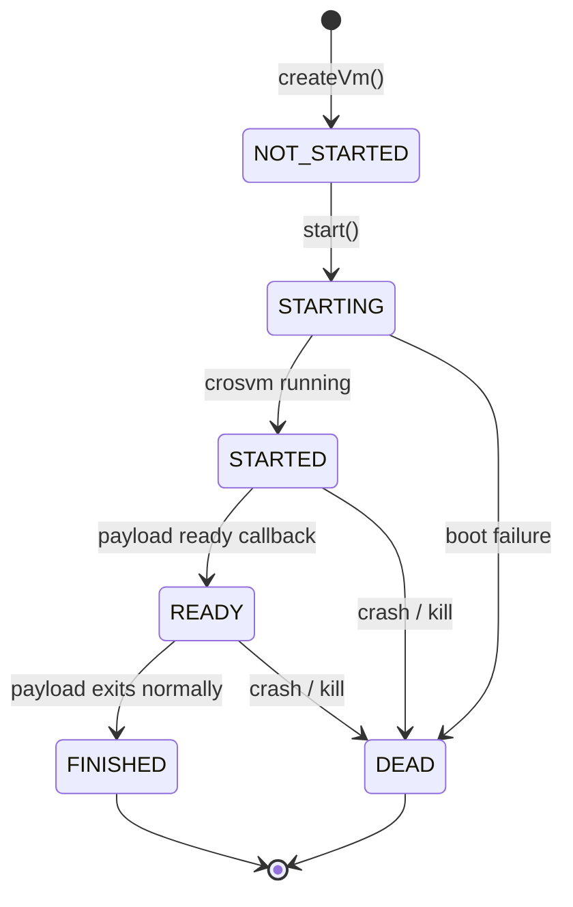
```mermaid
stateDiagram-v2
    [*] --> NOT_STARTED: createVm()
    NOT_STARTED --> STARTING: start()
    STARTING --> STARTED: crosvm running
    STARTED --> READY: payload ready callback
    READY --> FINISHED: payload exits normally
    READY --> DEAD: crash / kill
    STARTED --> DEAD: crash / kill
    STARTING --> DEAD: boot failure
    FINISHED --> [*]
    DEAD --> [*]
```

VM states from the AIDL definition:

```rust
fn state_to_str(vm_state: VirtualMachineState) -> &'static str {
    match vm_state {
        VirtualMachineState::NOT_STARTED => "NOT_STARTED",
        VirtualMachineState::STARTING => "STARTING",
        VirtualMachineState::STARTED => "STARTED",
        VirtualMachineState::READY => "READY",
        VirtualMachineState::FINISHED => "FINISHED",
        VirtualMachineState::DEAD => "DEAD",
        _ => "(invalid state)",
    }
}
```

### 54.6.6 VM Creation Flow

The complete flow of creating and starting a VM:

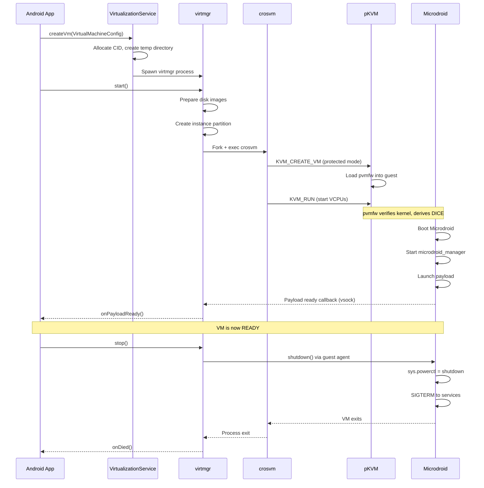
```mermaid
sequenceDiagram
    participant App as Android App
    participant VS as VirtualizationService
    participant VM as virtmgr
    participant CV as crosvm
    participant pKVM as pKVM
    participant Guest as Microdroid

    App->>VS: createVm(VirtualMachineConfig)
    VS->>VS: Allocate CID, create temp directory
    VS->>VM: Spawn virtmgr process

    App->>VM: start()
    VM->>VM: Prepare disk images
    VM->>VM: Create instance partition
    VM->>CV: Fork + exec crosvm
    CV->>pKVM: KVM_CREATE_VM (protected mode)
    pKVM->>pKVM: Load pvmfw into guest
    CV->>pKVM: KVM_RUN (start VCPUs)

    Note over pKVM,Guest: pvmfw verifies kernel, derives DICE

    Guest->>Guest: Boot Microdroid
    Guest->>Guest: Start microdroid_manager
    Guest->>Guest: Launch payload

    Guest-->>VM: Payload ready callback (vsock)
    VM-->>App: onPayloadReady()

    Note over App,Guest: VM is now READY

    App->>VM: stop()
    VM->>Guest: shutdown() via guest agent
    Guest->>Guest: sys.powerctl = shutdown
    Guest->>Guest: SIGTERM to services
    Guest-->>CV: VM exits
    CV-->>VM: Process exit
    VM-->>App: onDied()
```

### 54.6.7 The vm CLI Tool

The `vm` command-line tool at `packages/modules/Virtualization/android/vm/src/main.rs`
provides shell access to VM operations:

```rust
#[derive(Parser)]
enum Opt {
    /// Check if the feature is enabled on device.
    CheckFeatureEnabled { feature: String },
    /// Run a virtual machine with a config in APK
    RunApp { config: RunAppConfig },
    /// Run a virtual machine with Microdroid inside
    RunMicrodroid { config: RunMicrodroidConfig },
    /// Run a virtual machine
    Run { config: RunCustomVmConfig },
    /// List running virtual machines
    List,
    /// Print information about virtual machine support
    Info,
    /// Create a new empty partition
    CreatePartition { path, size, partition_type },
    /// Creates or update the idsig file
    CreateIdsig { apk, path },
    /// Connect to the serial console of a VM
    Console { cid: Option<i32> },
}
```

Common operations:

```shell
# Run Microdroid with default configuration
adb shell /apex/com.android.virt/bin/vm run-microdroid

# Run a protected Microdroid VM
adb shell /apex/com.android.virt/bin/vm run-microdroid --protected

# Run with custom memory and CPU topology
adb shell /apex/com.android.virt/bin/vm run-microdroid \
    --mem 512 --cpu-topology match_host

# List running VMs
adb shell /apex/com.android.virt/bin/vm list

# Get VM support information
adb shell /apex/com.android.virt/bin/vm info
```

### 54.6.8 VM Configuration Types

Two configuration types are supported:

**AppConfig** -- For running payloads from an APK:

```rust
VirtualMachineConfig::AppConfig(VirtualMachineAppConfig {
    name: "VmRunApp".to_string(),
    apk: apk_fd.into(),
    idsig: idsig_fd.into(),
    instanceImage: open_parcel_file(&instance, true)?.into(),
    instanceId: instance_id,
    payload: Payload::PayloadConfig(VirtualMachinePayloadConfig {
        payloadBinaryName: "MyPayload.so".to_string(),
        extraApks: vec![],
    }),
    debugLevel: DebugLevel::FULL,
    protectedVm: true,
    memoryMib: 256,
    cpuOptions: CpuOptions { cpuTopology: CpuTopology::MatchHost(true) },
    osName: "microdroid".to_string(),
    hugePages: false,
    // ...
})
```

**RawConfig** -- For running custom VM configurations from a JSON file:

```rust
let config_file = File::open(&config_path)?;
let vm_config = VmConfig::load(&config_file)?.to_parcelable()?;
VirtualMachineConfig::RawConfig(vm_config)
```

### 54.6.9 composd: Trusted Compilation Service

The `composd` service orchestrates trusted compilation of ART artifacts inside
a VM. From `packages/modules/Virtualization/android/composd/src/composd_main.rs`:

```rust
fn try_main() -> Result<()> {
    // ...
    let virtmgr = vmclient::VirtualizationService::new()
        .context("Failed to spawn VirtualizationService")?;
    let virtualization_service = virtmgr.connect()
        .context("Failed to connect to VirtualizationService")?;

    let instance_manager = Arc::new(InstanceManager::new(virtualization_service));
    let composd_service = service::new_binder(instance_manager);
    register_lazy_service("android.system.composd", composd_service.as_binder())
        .context("Registering composd service")?;
    // ...
}
```

The composd architecture:

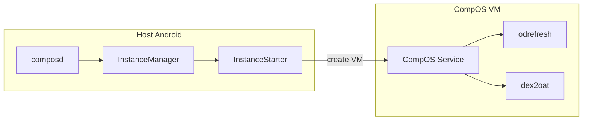
```mermaid
graph LR
    subgraph "Host Android"
        COMPOSD["composd"]
        IM["InstanceManager"]
        IS["InstanceStarter"]
    end

    subgraph "CompOS VM"
        COMPOS["CompOS Service"]
        ODREFRESH["odrefresh"]
        DEX2OAT["dex2oat"]
    end

    COMPOSD --> IM
    IM --> IS
    IS -->|"create VM"| COMPOS
    COMPOS --> ODREFRESH
    COMPOS --> DEX2OAT
```

composd uses the VM to run dex2oat compilation in a trusted environment, ensuring
that the compiled artifacts have not been tampered with. The output is signed with
a key derived from the VM's DICE chain.

### 54.6.10 Shutdown Protocol

VM shutdown follows a graceful protocol as defined in
`packages/modules/Virtualization/docs/shutdown.md`:

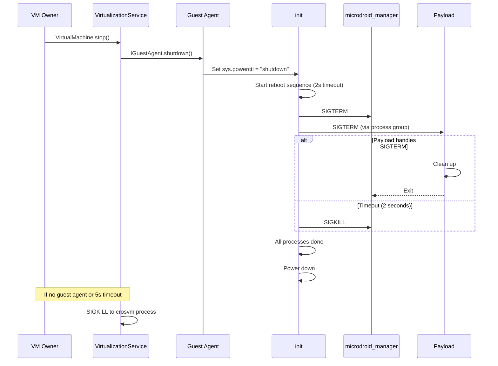
```mermaid
sequenceDiagram
    participant Host as VM Owner
    participant VS as VirtualizationService
    participant Agent as Guest Agent
    participant Init as init
    participant MM as microdroid_manager
    participant Payload as Payload

    Host->>VS: VirtualMachine.stop()
    VS->>Agent: IGuestAgent.shutdown()
    Agent->>Init: Set sys.powerctl = "shutdown"

    Init->>Init: Start reboot sequence (2s timeout)
    Init->>MM: SIGTERM
    Init->>Payload: SIGTERM (via process group)

    alt Payload handles SIGTERM
        Payload->>Payload: Clean up
        Payload-->>MM: Exit
    else Timeout (2 seconds)
        Init->>MM: SIGKILL
    end

    Init->>Init: All processes done
    Init->>Init: Power down

    Note over Host,VS: If no guest agent or 5s timeout
    VS->>VS: SIGKILL to crosvm process
```

The graceful shutdown timeout hierarchy:

1. **Payload** receives SIGTERM and should clean up promptly
2. **init** waits 2 seconds (`ro.build.shutdown_timeout`) before SIGKILL
3. **VirtualizationService** waits 5 seconds after calling the guest agent,
   then kills the crosvm process directly

### 54.6.11 Service VM

The Service VM is a special-purpose VM used for Remote Key Provisioning. From
`packages/modules/Virtualization/guest/service_vm/README.md`:

> The Service VM is a lightweight, bare-metal virtual machine specifically designed
> to run various services for other virtual machines.

Key characteristics:

- Only one instance runs at a time
- Instance ID remains constant across updates
- Shares common code with pvmfw via `libvmbase`
- Processes CBOR-encoded requests over virtio-vsock

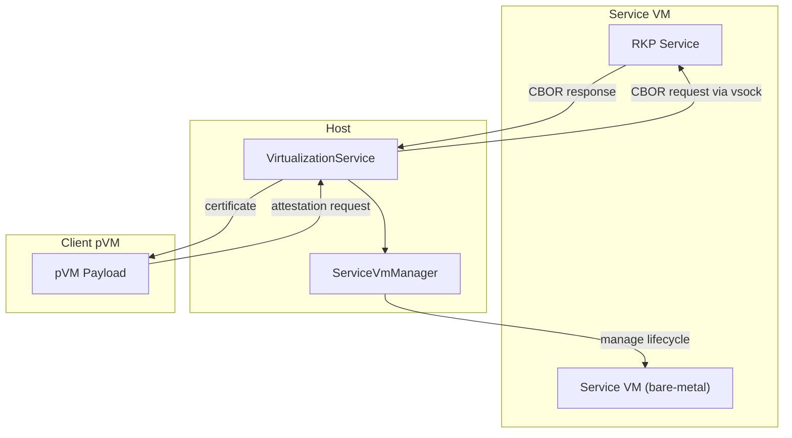
```mermaid
graph TB
    subgraph "Service VM"
        SVM["Service VM (bare-metal)"]
        RKP_SVC["RKP Service"]
    end

    subgraph "Host"
        VS["VirtualizationService"]
        SVM_MGR["ServiceVmManager"]
    end

    subgraph "Client pVM"
        CLIENT["pVM Payload"]
    end

    CLIENT -->|"attestation request"| VS
    VS --> SVM_MGR
    SVM_MGR -->|"manage lifecycle"| SVM
    VS -->|"CBOR request via vsock"| RKP_SVC
    RKP_SVC -->|"CBOR response"| VS
    VS -->|"certificate"| CLIENT
```

### 54.6.12 Instance ID and CID Management

Each VM receives two identifiers:

- **Instance ID** -- A 64-byte random identifier that persists across VM reboots.
  It is stored in a file and incorporated into DICE derivation for consistent secrets.

- **CID** -- A 32-bit vsock Context ID allocated from the range 2048-65535.
  Used for host-guest communication.

Instance ID allocation from `packages/modules/Virtualization/android/vm/src/run.rs`:

```rust
let instance_id = {
    let id_file = config.instance_id;
    if id_file.exists() {
        let mut id = [0u8; 64];
        let mut instance_id_file = File::open(id_file)?;
        instance_id_file.read_exact(&mut id)?;
        id
    } else {
        let id = service.allocateInstanceId()
            .context("Failed to allocate instance_id")?;
        let mut instance_id_file = File::create(id_file)?;
        instance_id_file.write_all(&id)?;
        id
    }
};
```

### 54.6.13 Tombstone Collection

VirtualizationService runs a tombstone receiver that listens for crash dumps
from VMs over vsock. The receiver port is defined by the AIDL interface:

```rust
use virtualmachineservice::IVirtualMachineService::VM_TOMBSTONES_SERVICE_PORT;
```

When a VM crashes, the tombstoned client in the guest sends the crash dump to
the host, where it is stored using the standard Android tombstone infrastructure.

---

## 54.7 Hardware Capabilities

### 54.7.1 IVmCapabilitiesService HAL

The `IVmCapabilitiesService` HAL enables vendor-specific capabilities to be
granted to VMs. It is defined at
`hardware/interfaces/virtualization/capabilities_service/aidl/android/hardware/virtualization/capabilities/IVmCapabilitiesService.aidl`:

```java
@VintfStability
interface IVmCapabilitiesService {
    /**
     * Grant access for the VM represented by the given vm_fd to the given
     * vendor-owned tee services. The names in |vendorTeeServices| must match
     * the ones defined in the tee_service_contexts files.
     */
    void grantAccessToVendorTeeServices(
            in ParcelFileDescriptor vmFd, in String[] vendorTeeServices);
}
```

As described in `hardware/interfaces/virtualization/capabilities_service/README.md`:

> The IVmCapabilitiesService HAL is used in a flow to grant a pVM a capability to
> issue vendor-specific SMCs.

### 54.7.2 Implementation Structure

The HAL has three implementations:

```
hardware/interfaces/virtualization/capabilities_service/
    aidl/        # Interface definition
    default/     # Reference implementation for partners
    noop/        # No-op implementation for Cuttlefish/testing
    vts/         # VTS (Vendor Test Suite) tests
```

**Default implementation** at
`hardware/interfaces/virtualization/capabilities_service/default/src/aidl.rs`:

```rust
pub struct VmCapabilitiesService {}

impl IVmCapabilitiesService for VmCapabilitiesService {
    fn grantAccessToVendorTeeServices(
        &self,
        vm_fd: &ParcelFileDescriptor,
        tee_services: &[String]
    ) -> binder::Result<()> {
        info!("received {vm_fd:?} {tee_services:?}");
        // TODO(b/360102915): implement
        Ok(())
    }
}
```

**No-op implementation** at
`hardware/interfaces/virtualization/capabilities_service/noop/src/aidl.rs`:

```rust
pub struct NoOpVmCapabilitiesService {}

impl IVmCapabilitiesService for NoOpVmCapabilitiesService {
    fn grantAccessToVendorTeeServices(
        &self,
        vm_fd: &ParcelFileDescriptor,
        tee_services: &[String]
    ) -> binder::Result<()> {
        info!("received {vm_fd:?} {tee_services:?}");
        Ok(())
    }
}
```

### 54.7.3 Service Registration

The default service registers as a lazy Binder service from
`hardware/interfaces/virtualization/capabilities_service/default/src/main.rs`:

```rust
const SERVICE_NAME: &str =
    "android.hardware.virtualization.capabilities.IVmCapabilitiesService/default";

fn try_main() -> Result<()> {
    android_logger::init_once(
        android_logger::Config::default()
            .with_tag("IVmCapabilitiesService")
            .with_max_level(LevelFilter::Info)
            .with_log_buffer(android_logger::LogId::System),
    );

    ProcessState::start_thread_pool();
    let service_impl = VmCapabilitiesService::init();
    let service = BnVmCapabilitiesService::new_binder(
        service_impl, BinderFeatures::default()
    );
    register_lazy_service(SERVICE_NAME, service.as_binder())
        .with_context(|| format!("failed to register {SERVICE_NAME}"))?;
    ProcessState::join_thread_pool();
    bail!("thread pool unexpectedly ended");
}
```

### 54.7.4 TEE Service Access Flow

The capability grant flow allows VMs to issue vendor-specific SMC (Secure
Monitor Call) instructions to communicate with trusted execution environments:

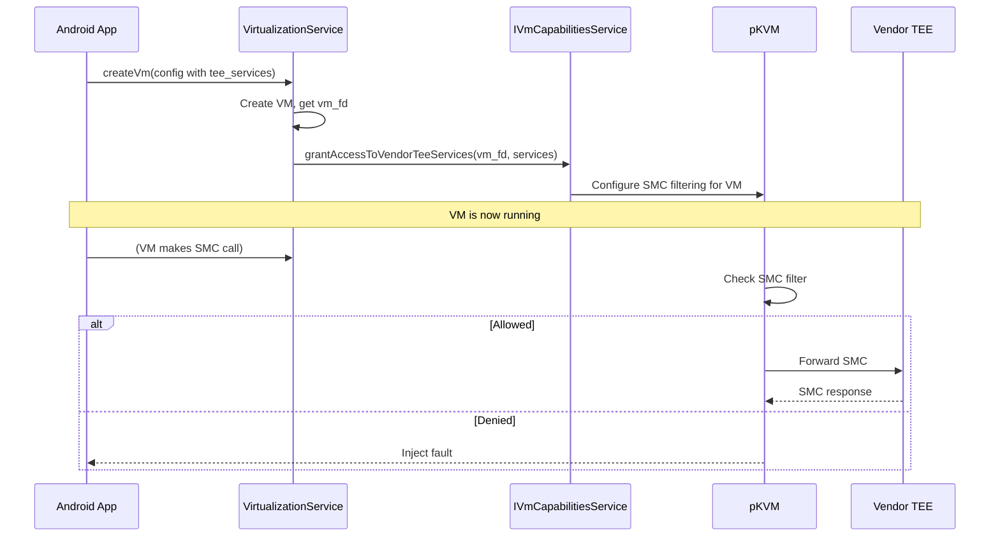
```mermaid
sequenceDiagram
    participant App as Android App
    participant VS as VirtualizationService
    participant CAPS as IVmCapabilitiesService
    participant pKVM as pKVM
    participant TEE as Vendor TEE

    App->>VS: createVm(config with tee_services)
    VS->>VS: Create VM, get vm_fd

    VS->>CAPS: grantAccessToVendorTeeServices(vm_fd, services)
    CAPS->>pKVM: Configure SMC filtering for VM

    Note over App,TEE: VM is now running

    App->>VS: (VM makes SMC call)
    pKVM->>pKVM: Check SMC filter
    alt Allowed
        pKVM->>TEE: Forward SMC
        TEE-->>pKVM: SMC response
    else Denied
        pKVM-->>App: Inject fault
    end
```

### 54.7.5 Device Assignment

AVF supports hardware device assignment using VFIO-platform. This allows a VM
to have direct access to physical hardware devices without host intervention.

From `packages/modules/Virtualization/docs/device_assignment.md`:

> Device assignment allows a VM to have direct access to HW without host/hyp
> intervention. AVF uses `vfio-platform` for device assignment, and host kernel
> support is required.

The device assignment flow requires:

1. A VM DTBO describing assignable devices
2. Physical device nodes with IOMMU references
3. VFIO-platform kernel driver support

The `vm` CLI supports device assignment through the `--devices` flag:

```shell
adb shell /apex/com.android.virt/bin/vm run-microdroid \
    --devices /sys/bus/platform/devices/example-device
```

Device presence is checked by the `vm info` command:

```rust
if Path::new("/dev/vfio/vfio").exists() {
    println!("/dev/vfio/vfio exists.");
}
if Path::new("/sys/bus/platform/drivers/vfio-platform").exists() {
    println!("VFIO-platform is supported.");
}
```

### 54.7.6 Hypervisor Properties

AVF queries hypervisor capabilities through system properties, managed by the
`hypervisor_props` library:

```rust
let non_protected_vm_supported = hypervisor_props::is_vm_supported()?;
let protected_vm_supported = hypervisor_props::is_protected_vm_supported()?;
if let Some(version) = hypervisor_props::version()? {
    println!("Hypervisor version: {version}");
}
```

Key system properties:

- `ro.boot.hypervisor.vm.supported` -- Whether non-protected VMs are supported
- `ro.boot.hypervisor.protected_vm.supported` -- Whether pVMs are supported
- `ro.boot.hypervisor.version` -- Hypervisor version string
- `hypervisor.pvmfw.path` -- Override path for pvmfw binary

---

## 54.8 Try It

### 54.8.1 Checking Device Support

First, verify that your device supports virtualization:

```shell
# Check for KVM support
adb shell ls -la /dev/kvm

# Check VM support via the vm tool
adb shell /apex/com.android.virt/bin/vm info
```

Expected output on a supported device:

```
Both protected and non-protected VMs are supported.
Hypervisor version: 1.0
/dev/kvm exists.
/dev/vfio/vfio does not exist.
VFIO-platform is not supported.
Assignable devices: []
Available OS list: ["microdroid"]
Debug policy: none
```

### 54.8.2 Running a Microdroid VM

The simplest way to run a VM is using the shell helper script:

```shell
# Run a non-protected Microdroid VM
packages/modules/Virtualization/android/vm/vm_shell.sh start-microdroid

# Run a protected Microdroid VM with auto-connect
packages/modules/Virtualization/android/vm/vm_shell.sh \
    start-microdroid --auto-connect -- --protected
```

Or directly with the `vm` tool:

```shell
# Run Microdroid directly
adb shell /apex/com.android.virt/bin/vm run-microdroid

# Run protected with debug output
adb shell /apex/com.android.virt/bin/vm run-microdroid \
    --protected \
    --debug full \
    --console /data/local/tmp/virt/console.txt \
    --log /data/local/tmp/virt/log.txt
```

### 54.8.3 Building a Payload App

Create a minimal VM payload:

**Native payload (C++):**

```cpp
// my_payload.cpp
#include <stdio.h>

extern "C" int AVmPayload_main() {
    printf("Hello from Microdroid VM!\n");
    // Payload code runs here
    return 0;
}
```

**Build rules (Android.bp):**

```blueprint
cc_library_shared {
    name: "MyMicrodroidPayload",
    srcs: ["my_payload.cpp"],
    shared_libs: ["libvm_payload#current"],
    sdk_version: "current",
}

android_app {
    name: "MyPayloadApp",
    srcs: ["**/*.java"],
    jni_libs: ["MyMicrodroidPayload"],
    use_embedded_native_libs: true,
    sdk_version: "current",
}
```

**Run the payload:**

```shell
# Build and install
TARGET_BUILD_APPS=MyPayloadApp m apps_only dist
adb install out/dist/MyPayloadApp.apk

# Get the installed APK path
APK_PATH=$(adb shell pm path com.example.mypayloadapp | cut -d: -f2)

# Run the VM
TEST_ROOT=/data/local/tmp/virt
adb shell /apex/com.android.virt/bin/vm run-app \
    --log $TEST_ROOT/log.txt \
    --console $TEST_ROOT/console.txt \
    $APK_PATH \
    $TEST_ROOT/MyPayloadApp.apk.idsig \
    $TEST_ROOT/instance.img \
    --instance-id-file $TEST_ROOT/instance_id \
    --payload-binary-name MyMicrodroidPayload.so
```

### 54.8.4 Java API Usage

For programmatic VM management from an Android app:

```java
// Create VM configuration
VirtualMachineConfig config = new VirtualMachineConfig.Builder(context)
    .setPayloadBinaryName("MyMicrodroidPayload.so")
    .setDebugLevel(VirtualMachineConfig.DEBUG_LEVEL_FULL)
    .setProtectedVm(true)
    .setMemoryBytes(256 * 1024 * 1024)  // 256 MiB
    .build();

// Create and start the VM
VirtualMachineManager vmm = context.getSystemService(VirtualMachineManager.class);
VirtualMachine vm = vmm.getOrCreate("my-vm", config);
vm.setCallback(executor, new VirtualMachineCallback() {
    @Override
    public void onPayloadStarted(VirtualMachine vm) {
        Log.i(TAG, "Payload started");
    }

    @Override
    public void onPayloadReady(VirtualMachine vm) {
        Log.i(TAG, "Payload ready");
    }

    @Override
    public void onPayloadFinished(VirtualMachine vm, int exitCode) {
        Log.i(TAG, "Payload finished: " + exitCode);
    }

    @Override
    public void onError(VirtualMachine vm, int errorCode, String message) {
        Log.e(TAG, "VM error: " + message);
    }
});
vm.run();
```

### 54.8.5 Running Tests

AVF includes comprehensive test suites:

```shell
# Run the main Microdroid host tests
atest MicrodroidHostTestCases

# Run the Microdroid app tests
atest MicrodroidTestApp

# Verify DICE chain validity (pVM required)
atest MicrodroidTests#protectedVmHasValidDiceChain
```

### 54.8.6 Debugging VMs

**Console output:**

```shell
# Direct console to a file
adb shell /apex/com.android.virt/bin/vm run-microdroid \
    --console /data/local/tmp/console.txt

# Read console output
adb shell cat /data/local/tmp/console.txt
```

**GDB debugging:**

```shell
# Start VM with GDB server
adb shell /apex/com.android.virt/bin/vm run-microdroid \
    --debug full --gdb 1234

# Connect GDB (from host)
adb forward tcp:1234 tcp:1234
gdb-multiarch -ex "target remote :1234"
```

**Early console (earlycon):**

```shell
# Enable earlycon for early boot debugging
adb shell /apex/com.android.virt/bin/vm run-microdroid \
    --debug full --enable-earlycon
```

**Listing running VMs:**

```shell
adb shell /apex/com.android.virt/bin/vm list
```

**Device tree dump:**

```shell
# Dump the VM's device tree for inspection
adb shell /apex/com.android.virt/bin/vm run-microdroid \
    --dump-device-tree /data/local/tmp/vm_dt.dtb
```

### 54.8.7 Custom VM Configuration

For advanced use cases, you can create a custom VM configuration:

```json
{
    "name": "my-custom-vm",
    "kernel": "/data/local/tmp/Image",
    "initrd": "/data/local/tmp/initramfs.img",
    "params": "console=hvc0 earlycon=uart8250,mmio,0x3f8",
    "disks": [
        {
            "partitions": [
                {
                    "label": "rootfs",
                    "path": "/data/local/tmp/rootfs.img"
                }
            ],
            "writable": false
        }
    ],
    "protected": false,
    "memory_mib": 512,
    "platform_version": "~1.0"
}
```

Run with:

```shell
adb push my_vm_config.json /data/local/tmp/
adb shell /apex/com.android.virt/bin/vm run /data/local/tmp/my_vm_config.json
```

### 54.8.8 Inspecting AVF Components

**APEX contents:**

```shell
# List what's inside the AVF APEX
adb shell ls -la /apex/com.android.virt/

# Check the pvmfw binary
adb shell ls -la /apex/com.android.virt/etc/pvmfw.bin

# Check the Microdroid images
adb shell ls -la /apex/com.android.virt/etc/fs/
```

**System properties:**

```shell
# Check hypervisor status
adb shell getprop ro.boot.hypervisor.vm.supported
adb shell getprop ro.boot.hypervisor.protected_vm.supported
adb shell getprop ro.boot.hypervisor.version

# Check AVF features
adb shell /apex/com.android.virt/bin/vm check-feature-enabled remote_attestation
adb shell /apex/com.android.virt/bin/vm check-feature-enabled vendor_modules
adb shell /apex/com.android.virt/bin/vm check-feature-enabled device_assignment
```

### 54.8.9 Building AVF from Source

To build the complete AVF stack from AOSP source:

```shell
# Set up build environment
source build/envsetup.sh
lunch aosp_cf_x86_64_phone-userdebug  # or aosp_panther-userdebug for Pixel 7

# Build the entire system (including AVF)
m

# Or build just the AVF APEX for faster iteration
banchan com.android.virt aosp_arm64  # or aosp_x86_64
UNBUNDLED_BUILD_SDKS_FROM_SOURCE=true m apps_only dist

# Install the APEX
adb install out/dist/com.android.virt.apex
adb reboot
```

### 54.8.10 Troubleshooting

**VM fails to start:**

- Check `/dev/kvm` exists: `adb shell ls -la /dev/kvm`
- Verify APEX is installed: `adb shell pm list packages | grep virt`
- Check logcat: `adb logcat -s VirtualizationService:* virtmgr:* crosvm:*`

**Protected VM fails:**

- Verify pKVM is enabled: `adb shell getprop ro.boot.hypervisor.protected_vm.supported`
- Check pvmfw path: `adb shell getprop hypervisor.pvmfw.path`
- Check pvmfw reboot reasons in console output

**Performance issues:**

- Use `--hugepages` for transparent huge pages support
- Use `--cpu-topology match_host` to match host CPU topology
- Use `--boost-uclamp` for benchmarking stability

### 54.8.11 Remote Attestation Demo

The `VmAttestationDemoApp` at `packages/modules/Virtualization/android/VmAttestationDemoApp/`
demonstrates how a pVM payload can request remote attestation:

```cpp
// Inside VM payload
extern "C" int AVmPayload_main() {
    // Generate a challenge (typically from a remote server)
    uint8_t challenge[32];
    // ... fill challenge from server ...

    // Request attestation
    AVmAttestationResult* result = nullptr;
    int status = AVmPayload_requestAttestation(challenge, sizeof(challenge), &result);
    if (status != 0) {
        // Attestation failed
        return status;
    }

    // Use the attestation result
    // - Get the certificate chain
    // - Get the attested private key
    // - Send certificate to remote server for verification

    AVmPayload_freeAttestationResult(result);
    return 0;
}
```

The attestation flow within the device:

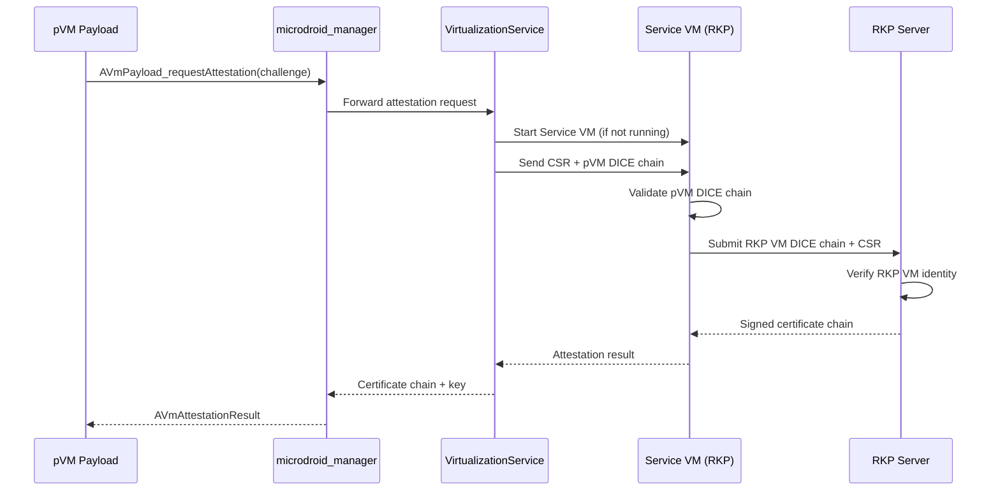
```mermaid
sequenceDiagram
    participant Payload as pVM Payload
    participant MM as microdroid_manager
    participant VS as VirtualizationService
    participant SVM as Service VM (RKP)
    participant RKP as RKP Server

    Payload->>MM: AVmPayload_requestAttestation(challenge)
    MM->>VS: Forward attestation request
    VS->>SVM: Start Service VM (if not running)
    VS->>SVM: Send CSR + pVM DICE chain
    SVM->>SVM: Validate pVM DICE chain
    SVM->>RKP: Submit RKP VM DICE chain + CSR
    RKP->>RKP: Verify RKP VM identity
    RKP-->>SVM: Signed certificate chain
    SVM-->>VS: Attestation result
    VS-->>MM: Certificate chain + key
    MM-->>Payload: AVmAttestationResult
```

---

## 54.9 Rollback Protection

### 54.9.1 Overview

Rollback protection prevents an attacker from running an older, vulnerable version
of a VM payload and accessing secrets that were provisioned to a newer version.
pvmfw implements multiple rollback protection strategies, selected based on the
VM type and platform capabilities.

From `packages/modules/Virtualization/guest/pvmfw/src/rollback.rs`:

```rust
pub fn perform_rollback_protection(
    fdt: &Fdt,
    verified_boot_data: &VerifiedBootData,
    dice_inputs: &PartialInputs,
    cdi_seal: &[u8],
) -> Result<(bool, Hidden, bool), RebootReason> {
    let instance_hash = dice_inputs.instance_hash;
    if let Some(fixed) = get_fixed_rollback_protection(verified_boot_data) {
        perform_fixed_rollback_protection(verified_boot_data, fixed)?;
        Ok((false, instance_hash.unwrap(), false))
    } else if (should_defer_rollback_protection(fdt)?
        && verified_boot_data.has_capability(Capability::SecretkeeperProtection))
        || verified_boot_data.has_capability(Capability::TrustySecurityVm)
    {
        perform_deferred_rollback_protection(verified_boot_data)?;
        Ok((false, instance_hash.unwrap(), true))
    } else if cfg!(feature = "instance-img") {
        perform_legacy_rollback_protection(fdt, dice_inputs, cdi_seal, instance_hash)
    } else {
        force_new_instance()
    }
}
```

### 54.9.2 Rollback Protection Strategies

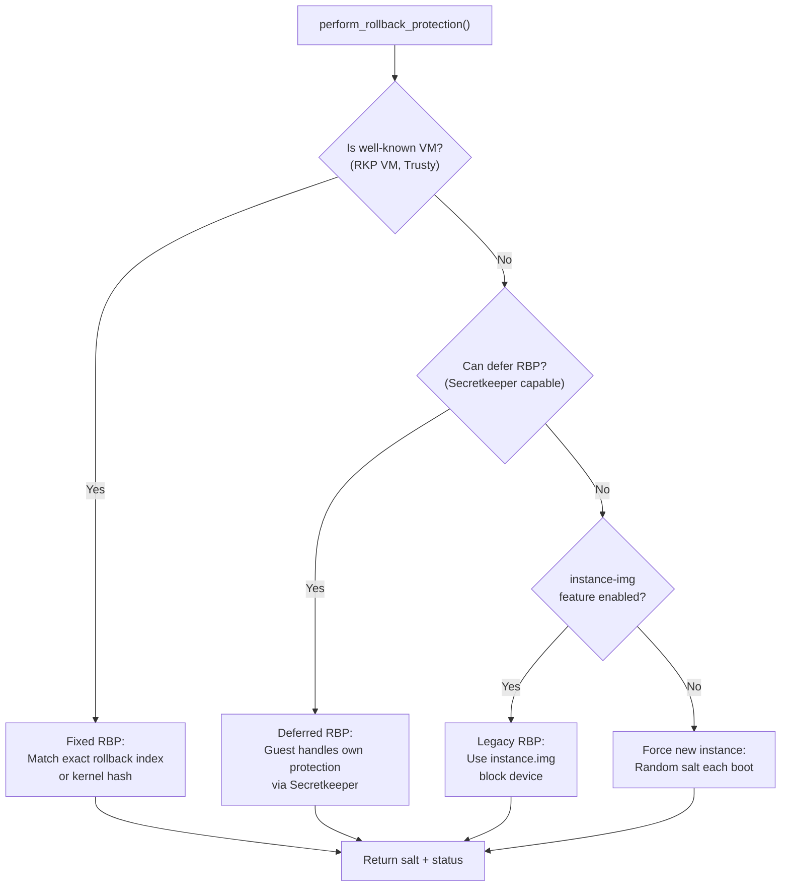
```mermaid
graph TB
    START["perform_rollback_protection()"] --> CHECK_FIXED{"Is well-known VM?\n(RKP VM, Trusty)"}
    CHECK_FIXED -->|Yes| FIXED["Fixed RBP:\nMatch exact rollback index\nor kernel hash"]
    CHECK_FIXED -->|No| CHECK_DEFER{"Can defer RBP?\n(Secretkeeper capable)"}
    CHECK_DEFER -->|Yes| DEFER["Deferred RBP:\nGuest handles own protection\nvia Secretkeeper"]
    CHECK_DEFER -->|No| CHECK_INSTANCE{"instance-img\nfeature enabled?"}
    CHECK_INSTANCE -->|Yes| LEGACY["Legacy RBP:\nUse instance.img\nblock device"]
    CHECK_INSTANCE -->|No| NEW["Force new instance:\nRandom salt each boot"]

    FIXED --> DONE["Return salt + status"]
    DEFER --> DONE
    LEGACY --> DONE
    NEW --> DONE
```

**Fixed Rollback Protection** -- For well-known system VMs with specific identity:

```rust
enum FixedRollbackCriterion {
    /// Image must match the exact kernel hash.
    KernelHash { digest: Digest },
    /// Image must match the exact rollback index and public key.
    RollbackIndexPublicKey { index: u64, public_key: &'static [u8] },
    /// Reserved name not supported on this platform.
    Reserved { name: &'static str },
}
```

The RKP VM uses rollback index + public key verification:

```rust
match verified_boot_data.name.as_deref()? {
    VerifiedBootData::RKP_VM_NAME =>
        Some(FixedRollbackCriterion::RollbackIndexPublicKey {
            index: service_vm_version::VERSION,
            public_key: PUBLIC_KEY,
        }),
    VerifiedBootData::DESKTOP_TRUSTY_VM_NAME => {
        // Platform-specific: kernel hash verification
    }
    _ => None,
}
```

**Deferred Rollback Protection** -- The guest handles its own rollback protection
through Secretkeeper. pvmfw only validates that the rollback index is positive:

```rust
fn perform_deferred_rollback_protection(
    verified_boot_data: &VerifiedBootData,
) -> Result<(), RebootReason> {
    info!("Deferring rollback protection");
    if verified_boot_data.rollback_index == 0 {
        error!("Expected positive rollback_index, found 0");
        Err(RebootReason::InvalidPayload)
    } else {
        Ok(())
    }
}
```

**Legacy Rollback Protection** -- Uses the instance.img block device to store
recorded DICE measurements. On subsequent boots, pvmfw compares current
measurements against the recorded entry:

```rust
fn ensure_dice_measurements_match_entry(
    dice_inputs: &PartialInputs,
    entry: &EntryBody,
) -> Result<(), InstanceError> {
    if entry.code_hash != dice_inputs.code_hash {
        Err(InstanceError::RecordedCodeHashMismatch)
    } else if entry.auth_hash != dice_inputs.auth_hash {
        Err(InstanceError::RecordedAuthHashMismatch)
    } else if entry.mode() != dice_inputs.mode {
        Err(InstanceError::RecordedDiceModeMismatch)
    } else {
        Ok(())
    }
}
```

---

## 54.10 Configuration Data Deep Dive

### 54.10.1 Config Parser Implementation

The pvmfw configuration parser at
`packages/modules/Virtualization/guest/pvmfw/src/config/mod.rs` implements rigorous
validation of the configuration data appended by the bootloader:

```rust
impl Header {
    const MAGIC: u32 = u32::from_ne_bytes(*b"pvmf");
    const VERSION_1_0: Version = Version { major: 1, minor: 0 };
    const VERSION_1_1: Version = Version { major: 1, minor: 1 };
    const VERSION_1_2: Version = Version { major: 1, minor: 2 };
    const VERSION_1_3: Version = Version { major: 1, minor: 3 };
}
```

The parser validates:

1. Magic number (`0x666d7670` = "pvmf" in little-endian)
2. Version compatibility
3. Total size fits within the reserved region
4. All entry offsets and sizes are within bounds
5. Entries are in order (no overlapping)

### 54.10.2 Entry Types

The configuration entries are defined as an enum with a count sentinel:

```rust
#[derive(Clone, Copy, Debug)]
pub enum Entry {
    DiceHandover,    // Entry 0: DICE chain (mandatory)
    DebugPolicy,     // Entry 1: Debug policy DTBO (optional)
    VmDtbo,          // Entry 2: Device assignment DTBO (v1.1)
    VmBaseDtbo,      // Entry 3: VM reference DT (v1.2)
    ReservedMem,     // Entry 4: Reserved memory (v1.3)
    _VARIANT_COUNT,  // Sentinel for counting
}
```

The entries structure that main receives:

```rust
#[derive(Default)]
pub struct Entries<'a> {
    pub dice_handover: Option<&'a mut [u8]>,  // Mutable: will be zeroized
    pub debug_policy: Option<&'a [u8]>,        // Read-only
    pub vm_dtbo: Option<&'a mut [u8]>,         // Mutable: DTBO processing
    pub vm_ref_dt: Option<&'a [u8]>,           // Read-only
    pub reserved_mem: Option<&'a mut [u8]>,    // Mutable: will be zeroized
}
```

Note the careful ownership: mutable references are used for entries that contain
secrets (DICE handover, reserved memory) so they can be zeroized after use.
Read-only references are used for entries that only need inspection.

### 54.10.3 Version Negotiation

The parser handles forward compatibility by treating unknown minor versions
as the latest known version:

```rust
pub fn entry_count(&self) -> Result<usize> {
    let last_entry = match self.version {
        Self::VERSION_1_0 => Entry::DebugPolicy,
        Self::VERSION_1_1 => Entry::VmDtbo,
        Self::VERSION_1_2 => Entry::VmBaseDtbo,
        Self::VERSION_1_3 => Entry::ReservedMem,
        v @ Version { major: 1, .. } => {
            const LATEST: Version = Header::VERSION_1_3;
            warn!("Parsing unknown config data version {v} as version {LATEST}");
            return Ok(Entry::COUNT);
        }
        v => return Err(Error::UnsupportedVersion(v)),
    };
    Ok(last_entry as usize + 1)
}
```

This means a v1.4 config will be parsed as v1.3, with any new entries beyond
the known set silently ignored. Major version changes (2.x) would be rejected.

### 54.10.4 Error Handling

The config module defines precise error variants for each failure mode:

```rust
pub enum Error {
    BufferTooSmall,
    HeaderMisaligned,
    InvalidMagic,
    UnsupportedVersion(Version),
    InvalidSize(usize),
    MissingEntry(Entry),
    EntryOutOfBounds(Entry, Range<usize>, Range<usize>),
    EntryOutOfOrder,
}
```

Each error produces a clear diagnostic message. The `InvalidMagic` error has
special handling -- it triggers the legacy DICE handover path for backward
compatibility with Android T:

```rust
match config::Config::new(data) {
    Ok(valid) => Some(Self::Config(valid)),
    Err(config::Error::InvalidMagic) if cfg!(feature = "compat-raw-dice-handover") => {
        warn!("Assuming the appended data to be a raw DICE handover");
        Some(Self::LegacyDiceHandover(&mut data[..DICE_CHAIN_SIZE]))
    }
    Err(e) => {
        error!("Invalid configuration data at {data_ptr:?}: {e}");
        None
    }
}
```

---

## 54.11 Device Tree Handling in pvmfw

### 54.11.1 FDT Sanitization

The device tree provided by the VMM is untrusted and must be sanitized before use.
pvmfw uses a template-based approach, starting from a known-good FDT template and
selectively copying validated properties from the untrusted FDT.

From `packages/modules/Virtualization/guest/pvmfw/src/fdt.rs`:

```rust
// Architecture-specific FDT templates
#[cfg(target_arch = "aarch64")]
const FDT_TEMPLATE: &Fdt = unsafe {
    Fdt::unchecked_from_slice(pvmfw_fdt_template::RAW)
};

#[cfg(target_arch = "x86_64")]
const FDT_TEMPLATE: &Fdt = unsafe {
    Fdt::unchecked_from_slice(pvmfw_fdt_template::RAW_X86_64)
};
```

The FDT validation catches several error conditions:

```rust
pub enum FdtValidationError {
    /// Invalid CPU count.
    InvalidCpuCount(usize),
    /// Invalid VCpufreq Range.
    InvalidVcpufreq(u64, u64),
    /// Forbidden /avf/untrusted property.
    ForbiddenUntrustedProp(&'static CStr),
}
```

### 54.11.2 Device Tree Modification for Next Stage

After sanitization, pvmfw modifies the FDT to pass information to the guest kernel:

1. **DICE chain** -- Added as a `/reserved-memory/dice` node with
   `compatible = "google,open-dice"`

2. **KASLR seed** -- Random seed for kernel address space layout randomization
3. **Boot parameters** -- Debug level, instance status
4. **Reserved memory** -- Confidential data regions
5. **Device assignment info** -- If device passthrough is configured

The reserved-memory DICE node format:

```
/ {
    reserved-memory {
        #address-cells = <0x02>;
        #size-cells = <0x02>;
        ranges;
        dice {
            compatible = "google,open-dice";
            no-map;
            reg = <0x0 0x7fe0000>, <0x0 0x1000>;
        };
    };
};
```

### 54.11.3 Security Boundary at the FDT

The FDT represents a critical security boundary. The VMM constructs the FDT to
describe the virtual platform, but in the protected VM threat model, the VMM is
untrusted. pvmfw must therefore:

- **Never trust** device addresses or sizes from the untrusted FDT without validation
- **Never trust** the number of CPUs or memory layout without bounds checking
- **Validate** that properties critical to security (like the DICE chain location)
  are correctly formed

- **Replace** the untrusted FDT with a sanitized version before handing off to the
  guest kernel

This is why pvmfw starts from a template FDT rather than modifying the VMM-provided
one in place -- it ensures the guest receives a device tree that only contains
known-safe contents.

---

## 54.12 vmbase: Common VM Base Library

### 54.12.1 Purpose

The `vmbase` library at `packages/modules/Virtualization/libs/libvmbase/` provides
shared low-level infrastructure for bare-metal Rust binaries running in crosvm VMs.
Both pvmfw and the Service VM build upon vmbase.

From the vmbase README:

> This directory contains a Rust crate and static library which can be used to write
> `no_std` Rust binaries to run in an aarch64 VM under crosvm (via the
> VirtualizationService), such as for pVM firmware, a VM bootloader or kernel.

### 54.12.2 Provided Infrastructure

vmbase provides:

- **Entry point** -- Initializes the MMU with identity mapping, enables cache,
  prepares the image, and allocates a stack

- **Exception vector** -- Calls user-defined exception handlers
- **UART driver** -- Console logging via `println!` at MMIO address `0x3f8`
- **Power management** -- `shutdown()` and `reboot()` via PSCI calls
- **Heap allocation** -- Configurable heap for `no_std` binaries
- **Page table manipulation** -- Memory management unit setup
- **PSCI calls** -- Power State Coordination Interface wrappers

### 54.12.3 Source Organization

```
packages/modules/Virtualization/libs/libvmbase/
    arch/              # Architecture-specific code
    arch.rs            # Architecture abstraction
    bionic.rs          # Bionic compatibility shims
    bzimage.rs         # bzImage (Linux) boot support
    console.rs         # Console output
    entry.rs           # Entry point macros
    fdt/               # Flattened Device Tree support
    fdt.rs             # FDT utilities
    heap.rs            # Heap allocator
    layout.rs          # Memory layout definitions
    lib.rs             # Crate root
    linker.rs          # Linker support
    logger.rs          # Logging infrastructure
    memory/            # Memory management
    memory.rs          # Memory tracking
    mmu.rs             # Memory Management Unit
    power.rs           # PSCI power management
    rand.rs            # Random number generation
    uart.rs            # UART driver
    util.rs            # Utilities
    virtio/            # VirtIO device support
    virtio.rs          # VirtIO abstractions
```

### 54.12.4 Using vmbase for Custom Binaries

A minimal vmbase binary requires:

```rust
#![no_main]
#![no_std]

use vmbase::{logger, main};
use log::{info, LevelFilter};

main!(main);

pub fn main(arg0: u64, arg1: u64, arg2: u64, arg3: u64) {
    logger::init(LevelFilter::Info).unwrap();
    info!("Hello world");
}
```

The build system uses a combination of `rust_ffi_static` and `cc_binary` rules
with custom linker scripts:

```soong
rust_ffi_static {
    name: "libvmbase_example",
    defaults: ["vmbase_ffi_defaults"],
    crate_name: "vmbase_example",
    srcs: ["src/main.rs"],
    rustlibs: ["libvmbase"],
}
```

The entry point macro wraps the user function with:

1. Console driver initialization (UART at `0x3f8`)
2. Stack setup
3. PSCI `SYSTEM_OFF` call on return

### 54.12.5 Memory Management in vmbase

The `memory.rs` module in pvmfw uses vmbase's memory tracking:

```rust
pub(crate) struct MemorySlices<'a> {
    pub fdt: &'a mut libfdt::Fdt,
    pub kernel: &'a [u8],
    pub ramdisk: Option<&'a [u8]>,
    pub preserved_memory: Option<&'a [u8]>,
    pub boot_params: Option<&'a mut bzimage::boot_params>,
}
```

Memory regions are mapped with explicit read-only or read-write permissions:

```rust
fn map_data_slice_mut<'a>(addr: usize, size: usize)
    -> Result<&'a mut [u8], MemoryTrackerError>
{
    let nonzero_size = size.try_into().map_err(|_| {
        error!("Invalid size specified for the range: {size:#x}");
        MemoryTrackerError::SizeTooSmall
    })?;
    map_data(addr, nonzero_size)?;
    let mut_slice = unsafe {
        slice::from_raw_parts_mut(addr as *mut u8, size)
    };
    Ok(mut_slice)
}

fn map_data_slice<'a>(addr: usize, size: usize)
    -> Result<&'a [u8], MemoryTrackerError>
{
    let nonzero_size = size.try_into().map_err(|e| {
        error!("Invalid size specified for the range: {e}");
        MemoryTrackerError::SizeTooSmall
    })?;
    map_rodata(addr, nonzero_size)?;
    let slice = unsafe {
        slice::from_raw_parts(addr as *const u8, size)
    };
    Ok(slice)
}
```

This separation ensures that code regions (kernel image) are mapped read-only
while data regions (FDT, ramdisk) are mapped read-write as needed.

---

## 54.13 Device Assignment in Detail

### 54.13.1 Architecture

Device assignment (also called device passthrough) allows a VM to directly access
physical hardware devices without host/hypervisor intervention on the data path.
AVF uses VFIO-platform for this purpose.

From `packages/modules/Virtualization/docs/device_assignment.md`:

> Device assignment allows a VM to have direct access to HW without host/hyp
> intervention. AVF uses `vfio-platform` for device assignment, and host kernel
> support is required.

```mermaid
graph TB
    subgraph "Host"
        VFIO["VFIO-platform Driver"]
        IOMMU["Physical IOMMU"]
    end

    subgraph "pKVM"
        S2["Stage-2 Tables"]
        DA["Device Assignment\nValidation"]
    end

    subgraph "VM"
        GUEST_DRV["Guest Device Driver"]
    end

    subgraph "Hardware"
        DEV["Physical Device"]
    end

    GUEST_DRV -->|"MMIO access"| S2
    S2 -->|"direct"| DEV
    DEV -->|"DMA"| IOMMU
    IOMMU -->|"translated"| S2
    VFIO -->|"unbind from host"| DEV
    DA -->|"validate DTBO"| S2
```

### 54.13.2 VM DTBO Structure

The VM Device Tree Blob Overlay (DTBO) describes assignable devices. It has two
sections:

**Overlayable devices** (applied to VM DT):
```dts
// Devices visible to the VM
&{/} {
    my_device@12340000 {
        compatible = "vendor,my-device";
        reg = <0x0 0x12340000 0x0 0x1000>;
        interrupts = <0 42 4>;
    };
};
```

**Physical device descriptions** (not applied, used for verification):
```dts
/host {
    // Physical IOMMU
    iommu@0 {
        #iommu-cells = <1>;
        android,pvmfw,token = <0x0 0x12345678>;
    };

    // Physical device
    phys_device@abcd0000 {
        reg = <0x0 0xabcd0000 0x0 0x1000>;
        iommus = <&iommu 0x1>;
        android,pvmfw,target = <&my_device>;
    };
};
```

### 54.13.3 pvmfw Device Assignment Validation

The pvmfw device assignment module at
`packages/modules/Virtualization/guest/pvmfw/src/device_assignment.rs` validates
the DTBO against the physical platform:

```rust
pub enum DeviceAssignmentError {
    InvalidDtbo,
    InvalidSymbols,
    MalformedReg,
    MissingReg(u64, u64),
    ExtraReg(u64, u64),
    InvalidReg(u64),
    InvalidRegToken(u64, u64),
    InvalidRegSize(u64, u64),
    InvalidInterrupts,
    MalformedIommus,
    InvalidIommus,
    InvalidPhysIommu,
    InvalidPvIommu,
    TooManyPvIommu,
    DuplicatedIommuIds,
    DuplicatedPvIommuIds,
    UnsupportedPathFormat,
    // ... additional error variants
}
```

The validation ensures:

1. Physical register addresses match what the hypervisor reports
2. IOMMU tokens are valid and consistent
3. Device nodes reference valid overlayable targets
4. No duplicate IOMMU or device entries exist

### 54.13.4 IOMMU Token Verification

Each IOMMU in the VM DTBO carries a token -- a hypervisor-specific 64-bit value
that uniquely identifies a physical IOMMU. pvmfw validates these tokens against
what the hypervisor reports:

```mermaid
sequenceDiagram
    participant ABL as Bootloader
    participant pKVM as pKVM
    participant PVMFW as pvmfw

    ABL->>pKVM: Provide VM DTBO with IOMMU tokens
    Note over ABL,pKVM: Tokens must be constant across boots

    pKVM->>PVMFW: Load pvmfw + config (includes VM DTBO)
    PVMFW->>pKVM: Query device IOMMU bindings
    pKVM-->>PVMFW: Physical IOMMU tokens

    PVMFW->>PVMFW: Validate DTBO tokens match pKVM tokens
    alt Tokens match
        PVMFW->>PVMFW: Apply DTBO to VM device tree
    else Tokens mismatch
        PVMFW->>PVMFW: Reject device assignment
    end
```

---

## 54.14 Async I/O in crosvm

### 54.14.1 cros_async Runtime

crosvm includes its own async runtime (`cros_async`) that provides two executor
backends:

- **io_uring** -- Uses Linux io_uring for high-performance asynchronous I/O
- **epoll** -- Falls back to epoll-based polling

From the code organization in `external/crosvm/ARCHITECTURE.md`:

> `cros_async` - Runtime for async/await programming. This crate provides a
> `Future` executor based on `io_uring` and one based on `epoll`.

The executor type can be configured at VM startup:

```rust
if let Some(async_executor) = cfg.async_executor {
    cros_async::Executor::set_default_executor_kind(async_executor)
        .context("Failed to set the default async executor")?;
}
```

### 54.14.2 Virtio Queue Processing

Each virtio device's worker thread uses the async runtime for queue processing.
The general pattern (simplified from the architecture doc):

```rust
// Worker thread for a virtio device (conceptual)
async fn process_queue(
    queue: Queue,
    mem: GuestMemory,
    interrupt: Interrupt,
) -> Result<()> {
    loop {
        // Wait for the guest to submit descriptors
        let desc_chain = queue.next_async(&mem).await?;

        // Process the request
        let response = handle_request(&desc_chain, &mem)?;

        // Write response and signal completion
        queue.add_used(&mem, desc_chain.index, response.len());
        interrupt.signal_used_queue(queue.vector());
    }
}
```

### 54.14.3 VirtIO Transport

For protected VMs, the virtio transport operates over shared memory regions.
The guest must explicitly share the memory used for virtio rings with the host
using pKVM hypercalls:

```mermaid
graph LR
    subgraph "Guest Memory (Protected)"
        PRIV["Private Data"]
    end

    subgraph "Shared Memory"
        VRING["Virtio Rings\n(descriptor table,\navailable ring,\nused ring)"]
        BUFFERS["Data Buffers\n(for I/O)"]
    end

    subgraph "Host/crosvm"
        DEV["Device Backend"]
    end

    PRIV -.->|"Copy to shared"| BUFFERS
    VRING <-->|"MMIO trap"| DEV
    BUFFERS <-->|"DMA"| DEV
```

---

## 54.15 Network and Display Support

### 54.15.1 Network Support

AVF provides optional network support for VMs through the `vmnic` and
`vmtethering` services. Network capability is gated behind a feature flag:

```rust
// From vm CLI configuration
#[cfg(network)]
#[arg(short, long)]
network_supported: bool,
```

When enabled, the VM configuration includes:

```rust
custom_config.networkSupported = config.common.network_supported();
```

The network stack uses virtio-net for guest-host communication, with the
`VmTethering` service handling NAT/tethering on the host side.

### 54.15.2 Display Support

The `TerminalApp` at `packages/modules/Virtualization/android/TerminalApp/`
provides a terminal interface for VM interaction. Display forwarding uses
the `display_service` registered with VirtualizationService:

```rust
pub struct VirtualizationServiceInternal {
    state: Arc<Mutex<GlobalState>>,
    display_service_set: Arc<Condvar>,
    // ...
}
```

---

## 54.16 Running Linux with Graphics Acceleration

Android's Virtualization Framework (AVF) supports running full Linux
distributions (Debian) inside VMs with hardware-accelerated graphics. This
enables a desktop Linux experience — including GUI applications, browsers,
and development tools — running alongside Android apps on the same device.

### 54.16.1 Architecture Overview

The Linux VM stack combines several components:

```mermaid
graph TB
    subgraph Android["Android Host"]
        TA["TerminalApp<br/>DisplayActivity"]
        SV["SurfaceView<br/>Display output"]
        IF["InputForwarder<br/>Touch/keyboard/mouse"]
        VMS["VmLauncherService<br/>VM lifecycle"]
        ADS["Android Display<br/>Backend (C++)"]

        TA --> SV
        TA --> IF
        TA --> VMS
        VMS --> ADS
    end

    subgraph VM["Linux Guest VM (Debian)"]
        KERN["Linux Kernel<br/>virtio drivers"]
        DESK["Desktop Environment<br/>GUI applications"]
        KERN --> DESK
    end

    subgraph crosvm["crosvm VMM"]
        VGPU["virtio-gpu<br/>gfxstream / 2D"]
        VINP["virtio-input<br/>evdev forwarding"]
        VNET["virtio-net<br/>Network"]
        VBLK["virtio-blk<br/>Root filesystem"]
    end

    SV <-->|"ANativeWindow<br/>surface buffer"| ADS
    ADS <-->|"ICrosvmAndroid<br/>DisplayService"| VGPU
    IF -->|"VirtualMachine<br/>sendKeyEvent()"| VINP
    KERN <--> VGPU
    KERN <--> VINP
    KERN <--> VNET
    KERN <--> VBLK
```

### 54.16.2 TerminalApp: The Linux VM Frontend

The TerminalApp at `packages/modules/Virtualization/android/TerminalApp/`
is the Android-side UI for Linux VMs. It manages the full lifecycle:

#### VM Launch Flow

```mermaid
sequenceDiagram
    participant User
    participant TA as TerminalApp
    participant VMS as VmLauncherService
    participant VMM as VirtualMachineManager
    participant CV as crosvm

    User->>TA: Open Terminal App
    TA->>VMS: startService(displayInfo)
    VMS->>VMS: Parse vm_config.json
    VMS->>VMS: Configure GPU (gfxstream or 2D)
    VMS->>VMM: create("debian", config)
    VMM->>CV: Launch crosvm with virtio devices
    CV-->>VMS: VM running
    VMS->>TA: VM_LAUNCHER_SERVICE_READY
    TA->>TA: Start DisplayActivity
    TA->>VMS: Connect display surface
    Note over TA,CV: Display output flows<br/>Guest → virtio-gpu → crosvm → Android Surface
```

```kotlin
// Source: packages/modules/Virtualization/android/TerminalApp/java/.../VmLauncherService.kt:67
// VmLauncherService manages VM lifecycle, GPU config, disk management
// Launches Debian VM with display, audio, input, and network
```

#### Display Configuration

The VM display adapts to the Android device's screen:

```kotlin
// Source: packages/modules/Virtualization/android/TerminalApp/java/.../VmLauncherService.kt:622
data class DisplayInfo(
    val width: Int,      // Device display width
    val height: Int,     // Device display height
    val dpi: Int,        // Pixel density
    val refreshRate: Int // Display refresh rate
) : Parcelable
```

### 54.16.3 Graphics Acceleration Modes

The Linux VM supports two GPU rendering modes:

| Mode | Backend | Rendering | Performance | Use Case |
|---|---|---|---|---|
| **Gfxstream** | `gfxstream` | Host GPU via Vulkan | Near-native | Devices with GPU support |
| **Lavapipe** | `2d` | Software (CPU-based) | Slow but universal | Fallback / testing |

#### Gfxstream Configuration

When hardware GPU acceleration is available, the VM uses gfxstream to forward
Vulkan commands from the guest to the host GPU:

```kotlin
// Source: packages/modules/Virtualization/android/TerminalApp/java/.../VmLauncherService.kt:355
if (isGfxstreamEnabled()) {
    builder.setGpuConfig(
        GpuConfig.Builder()
            .setBackend("gfxstream")
            .setRendererUseSurfaceless(true)
            .setRendererUseVulkan(true)
            .setContextTypes(arrayOf("gfxstream-vulkan", "gfxstream-composer"))
            .setRendererFeatures("VulkanDisableCoherentMemoryAndEmulate:enabled")
            .build()
    )
}
```

The GPU configuration supports these parameters:

```java
// Source: packages/modules/Virtualization/.../VirtualMachineCustomImageConfig.java:911
class GpuConfig {
    String backend;           // "gfxstream" or "2d"
    String[] contextTypes;    // ["gfxstream-vulkan", "gfxstream-composer"]
    boolean rendererUseEgl;
    boolean rendererUseGles;
    boolean rendererUseSurfaceless;
    boolean rendererUseVulkan;
    String rendererFeatures;  // Feature flags
    String pciAddress;        // GPU PCI address
}
```

#### Graphics Acceleration Selection

The `GraphicsManager` lets users choose between hardware and software
rendering:

```kotlin
// Source: packages/modules/Virtualization/android/TerminalApp/java/.../GraphicsManager.kt
// Checks R.bool.gfxstream_supported (default: false, overridable per device)
// Persists selection in SharedPreferences
```

Device manufacturers enable gfxstream by overriding the resource:

```xml
<!-- Source: packages/modules/Virtualization/android/TerminalApp/res/values/config.xml:20 -->
<bool name="gfxstream_supported">false</bool>
<!-- Device overlay sets to true when host GPU supports gfxstream -->
```

### 54.16.4 Display Forwarding Pipeline

The display pipeline bridges the Linux guest's framebuffer to an Android
`SurfaceView`:

```mermaid
graph LR
    subgraph Guest["Linux Guest"]
        MESA["Mesa / virtio-gpu<br/>DRM driver"]
    end

    subgraph crosvm["crosvm"]
        VGPU["virtio-gpu device"]
        ADB["Android Display<br/>Backend"]
    end

    subgraph Android["Android"]
        ANW["ANativeWindow"]
        SC["SurfaceControl"]
        SF["SurfaceFlinger"]
        SCREEN["Screen"]
    end

    MESA -->|"virtio-gpu<br/>commands"| VGPU
    VGPU -->|"Render to<br/>surface"| ADB
    ADB -->|"Lock buffer<br/>draw pixels<br/>post buffer"| ANW
    ANW --> SC
    SC --> SF
    SF --> SCREEN
```

#### ICrosvmAndroidDisplayService AIDL

The crosvm GPU backend communicates with Android through a Binder interface:

```java
// Source: packages/modules/Virtualization/libs/android_display_backend/aidl/
//         android/crosvm/ICrosvmAndroidDisplayService.aidl
interface ICrosvmAndroidDisplayService {
    void setSurface(in Surface surface, boolean forCursor);
    void removeSurface(boolean forCursor);
    void setCursorStream(in ParcelFileDescriptor stream);
    void saveFrameForSurface(boolean forCursor);
    void drawSavedFrameForSurface(boolean forCursor);
}
```

The display backend manages two surfaces — **MAIN** for the desktop and
**CURSOR** for the mouse pointer:

```kotlin
// Source: packages/modules/Virtualization/android/TerminalApp/java/.../DisplayProvider.kt
// Manages Surface lifecycle for MAIN and CURSOR
// Cursor position streamed via socket (8-byte x,y coordinates per update)
```

#### Android Display Backend (C++)

The native backend interfaces with Android's graphics stack:

```cpp
// Source: packages/modules/Virtualization/libs/android_display_backend/
//         crosvm_android_display_client.cpp:81
class AndroidDisplaySurface {
    // Lock ANativeWindow buffer for GPU rendering
    // Post rendered frame via SurfaceControl
    // Direct AHardwareBuffer sharing for zero-copy display
    // Pixel format: HAL_PIXEL_FORMAT_BGRA_8888
};
```

### 54.16.5 Input Forwarding

Android input events (touch, keyboard, mouse, trackpad) are forwarded to the
Linux guest as evdev events:

#### Key Code Translation

```kotlin
// Source: packages/modules/Virtualization/android/TerminalApp/java/
//         .../DisplaySurfaceView.kt:37-110
// 60+ Android key codes mapped to Linux evdev scan codes:
//   KEYCODE_A     → 0x1E (KEY_A)
//   KEYCODE_ENTER → 0x1C (KEY_ENTER)
//   KEYCODE_ESC   → 0x01 (KEY_ESC)
//   KEYCODE_TAB   → 0x0F (KEY_TAB)
// Special handling for SHIFT+key combinations
```

#### Input Mode Detection

The `InputForwarder` automatically adapts to the input device:

```kotlin
// Source: packages/modules/Virtualization/android/TerminalApp/java/
//         .../InputForwarder.kt:111-137
// Detects physical keyboard → enables mouse pointer capture
// Touch-only → touch events scaled to VM display dimensions
// Trackpad → separate mouse input path
```

Touch coordinates are scaled from the Android SurfaceView dimensions to the
VM's configured display resolution.

### 54.16.6 Debian VM Configuration

Linux VMs are configured via a JSON file that maps to
`VirtualMachineCustomImageConfig`:

```json
// Source: packages/modules/Virtualization/build/debian/vm_config.json
{
    "name": "debian",
    "kernel": "$PAYLOAD_DIR/vmlinuz",
    "initrd": "$PAYLOAD_DIR/initrd.img",
    "disks": [
        { "image": "$PAYLOAD_DIR/root_part", "writable": true, "partitions": [...] }
    ],
    "cpu_topology": "match_host",
    "memory_mib": 4096,
    "network": true,
    "auto_memory_balloon": true,
    "gpu": { "backend": "2d" },
    "protected": false,
    "debuggable": true,
    "input": {
        "keyboard": true,
        "mouse": true,
        "multi_touch": true,
        "trackpad": true,
        "switches": true
    }
}
```

#### Debian Image Building

The build system creates Debian VM images from scratch:

```
packages/modules/Virtualization/build/debian/
├── build.sh                 # Main build script
├── build_custom_kernel.sh   # Custom kernel build
├── fai/                     # FAI (Fully Automatic Installation) configs
│   └── config/              # Debian Bookworm/Trixie profiles
├── localdebs/               # Custom .deb packages
├── ttyd/                    # Terminal-over-web support
└── vm_config.json           # VM configuration template
```

Supported architectures: **amd64**, **arm64**, **ppc64el**, **riscv64**

The resulting image includes a Linux kernel, initrd, and a writable root
partition with Debian userspace. The VM uses `cpu_topology: "match_host"`
to expose the device's actual CPU topology to the guest.

### 54.16.7 Feature Flags

Linux VM GUI support is gated behind aconfig feature flags:

```
// Source: packages/modules/Virtualization/build/avf_flags.aconfig:14-18
flag {
    name: "terminal_gui_support"
    namespace: "virtualization"
    description: "Enable GUI display feature in terminal app"
}
```

```
// Source: packages/modules/Virtualization/build/avf_flags.aconfig:22-27
flag {
    name: "terminal_storage_balloon"
    namespace: "virtualization"
    description: "Enable storage ballooning for sparse disk support"
}
```

When `terminal_gui_support` is disabled, the TerminalApp falls back to a
text-only terminal (ttyd over WebView) instead of the full graphical display.

### 54.16.8 Virtio GPU Capabilities

The crosvm virtio-gpu implementation supports multiple capability sets that
determine how the guest GPU driver communicates:

```rust
// Source: external/crosvm/devices/src/virtio/gpu/protocol.rs:423
VIRTIO_GPU_CAPSET_CROSS_DOMAIN = 0x5  // Cross-domain buffer sharing
```

| Capability | Purpose |
|---|---|
| VIRGL | Virgl3D — OpenGL command forwarding |
| GFXSTREAM | Gfxstream — Vulkan/GLES command forwarding |
| CROSS_DOMAIN | Cross-domain buffer sharing (host ↔ guest) |

Feature flags on the virtio-gpu device:

| Feature | Description |
|---|---|
| `RESOURCE_BLOB` | Blob memory resources (zero-copy buffers) |
| `FENCE_PASSING` | Synchronization fence forwarding |
| `CONTEXT_INIT` | Context initialization with capability selection |
| `RESOURCE_UUID` | UUID-based buffer identification |

The cross-domain capability enables direct sharing of AHardwareBuffers between
the Android host and the Linux guest, allowing the guest's display output to
appear in Android's SurfaceFlinger composition without extra copies.

### 54.16.9 Use Cases

#### Desktop Linux on Android Devices

The primary use case is running a full Linux desktop environment on Android
tablets and foldables. Developers can use familiar Linux tools (VS Code,
terminal, compilers) alongside Android apps:

```mermaid
graph LR
    subgraph Device["Android Device"]
        ANDROID["Android Apps<br/>(Play Store, Settings)"]
        LINUX["Linux VM<br/>(Debian Desktop, VS Code,<br/>Terminal, Browser)"]
        ANDROID -.->|"Shared network"| LINUX
    end
```

#### Development Environment

Running native Linux development tools on Android hardware without dual-boot
or external machines — compilers, IDEs, container runtimes, and databases run
in the isolated VM with near-native performance via gfxstream GPU acceleration.

#### Secure Isolation

The Linux VM runs under pKVM's Stage-2 page table protection (see section
54.4), ensuring that a compromised guest cannot access Android's memory or
vice versa. This provides stronger isolation than containers.

---

## 54.17 Security Analysis

### 54.16.1 Trust Boundaries

AVF defines clear trust boundaries between components:

```mermaid
graph TB
    subgraph "Fully Trusted"
        HW["Device Hardware"]
        ROM["ROM / UDS"]
        PKVM["pKVM Hypervisor"]
        PVMFW["pvmfw"]
    end

    subgraph "Partially Trusted (after attestation)"
        GUEST_KERNEL["Microdroid Kernel"]
        GUEST_OS["Microdroid OS"]
        PAYLOAD["VM Payload"]
    end

    subgraph "Untrusted"
        HOST_KERNEL["Host Linux Kernel"]
        CROSVM_HOST["crosvm"]
        HOST_APPS["Host Applications"]
    end

    ROM -->|"DICE chain"| PKVM
    PKVM -->|"loads & protects"| PVMFW
    PVMFW -->|"verifies"| GUEST_KERNEL
    GUEST_KERNEL --> GUEST_OS
    GUEST_OS --> PAYLOAD

    HOST_KERNEL -.->|"cannot access\nguest memory"| GUEST_KERNEL
    CROSVM_HOST -.->|"cannot access\nguest secrets"| PVMFW
```

### 54.16.2 Attack Surface Analysis

**Host-to-guest attacks (mitigated by pKVM):**

- Direct memory access: Blocked by Stage-2 page tables
- DMA attacks: Blocked by IOMMU and MMIO guard
- Side channels: Partially mitigated by cache/TLB isolation

**VMM-to-guest attacks (mitigated by pvmfw):**

- Malicious device tree: Sanitized by pvmfw using template FDT
- Fake devices: MMIO guard limits accessible devices
- Rollback attacks: Multiple RBP strategies prevent secret reuse

**Guest-to-host attacks (mitigated by crosvm sandboxing):**

- Device escape: Process-per-device with seccomp + namespaces
- Virtio attacks: Each device has minimal syscall allowlist
- Resource exhaustion: Memory limits, CPU quotas

### 54.16.3 Rust Safety Guarantees

Both pvmfw and crosvm are written in Rust, providing:

- **Memory safety** -- No buffer overflows, use-after-free, or double-free
- **Thread safety** -- Data races prevented at compile time
- **No undefined behavior** -- Except in explicitly marked `unsafe` blocks
- **Zero-cost abstractions** -- Safety without runtime overhead

The pvmfw codebase uses `#![no_std]` to minimize the trusted computing base,
and `unsafe` blocks are limited to:

- Hardware register access
- Assembly instructions (HVC calls, memory barriers)
- Raw pointer manipulation for FDT parsing
- Inter-stage memory handoff

### 54.16.4 DICE Chain Integrity

The DICE chain provides cryptographic binding between boot stages. Key
derivation follows the Open DICE specification:

```
CDI_Attest_pub, CDI_Attest_priv = KDF_ASYM(KDF(CDI_Attest))
```

Requirements from `packages/modules/Virtualization/docs/pvm_dice_chain.md`:

> - KDF: You must use HKDF-SHA-512, as specified in RFC 5869.
> - KDF_ASYM: You must use one of the following supported algorithms:
>   * Ed25519
>   * ECDSA with NIST P-256 (RFC 6979)
>   * ECDSA with NIST P-384 (RFC 6979)

Any mismatch in key derivation between the vendor's bootloader and pvmfw
breaks the certificate chain, causing remote attestation, Secretkeeper, and
Trusted HAL authentication to fail.

---

## 54.18 Performance Considerations

### 54.18.1 Memory Overhead

Each VM requires:

- **Microdroid base** -- ~256 MiB minimum (configurable)
- **pvmfw** -- ~256 KiB heap + 48 KiB stack
- **crosvm overhead** -- Per-device process memory
- **Page tables** -- Stage-2 tables for the guest

### 54.18.2 Huge Pages

AVF supports transparent huge pages (THP) for improved memory performance:

```rust
/// Ask the kernel for transparent huge-pages (THP). This is only a hint
/// and the kernel will allocate THP-backed memory only if globally enabled
/// by the system and if any can be found.
#[arg(short, long)]
hugepages: bool,
```

### 54.18.3 CPU Topology

The `--cpu-topology` option controls vCPU allocation:

```rust
fn parse_cpu_topology(s: &str) -> Result<CpuTopology, String> {
    match s {
        "one_cpu" => Ok(CpuTopology::CpuCount(1)),
        "match_host" => Ok(CpuTopology::MatchHost(true)),
        _ if s.starts_with("cpu_count=") => {
            let val = s.strip_prefix("cpu_count=").unwrap();
            Ok(CpuTopology::CpuCount(val.parse().map_err(|e|
                format!("Invalid CPU Count: {e}"))?))
        }
        _ => Err(format!("Invalid cpu topology {s}")),
    }
}
```

`match_host` mirrors the host's CPU topology in the guest, which is essential
for performance-sensitive workloads and correct NUMA behavior.

### 54.18.4 I/O Performance Tuning

Microdroid applies several I/O optimizations in init.rc:

```
# Disable proactive compaction
write /proc/sys/vm/compaction_proactiveness 0
# Disable dm-verity prefetch (reduces I/O)
write /sys/module/dm_verity/parameters/prefetch_cluster 0
# Maximize swappiness
write /proc/sys/vm/swappiness 100
# Increase watermark scale factor for memory reclaim
write /proc/sys/vm/watermark_scale_factor 600
```

---

## 54.19 Vsock Communication

### 54.19.1 Overview

AVF uses vsock (Virtual Machine Sockets) for communication between the host and
guest VMs. Vsock provides a socket interface similar to TCP/UDP but operates
over a virtual transport that does not require network configuration.

### 54.19.2 CID Assignment

Each VM receives a unique CID (Context ID) for vsock addressing. The
VirtualizationService manages CID allocation:

```rust
const GUEST_CID_MIN: Cid = 2048;
const GUEST_CID_MAX: Cid = 65535;
const SYSPROP_LAST_CID: &str = "virtualizationservice.state.last_cid";
```

Special CID values:

- `VMADDR_CID_HYPERVISOR` (0) -- The hypervisor
- `VMADDR_CID_LOCAL` (1) -- Local loopback
- `VMADDR_CID_HOST` (2) -- The host
- 2048-65535 -- Guest VMs managed by VirtualizationService

### 54.19.3 Communication Channels

AVF uses vsock for several internal communication channels:

```mermaid
graph LR
    subgraph "Guest VM"
        MM["microdroid_manager"]
        PAYLOAD["VM Payload"]
        ADBD["adbd"]
    end

    subgraph "Host"
        VS["VirtualizationService"]
        VIRTMGR["virtmgr"]
        ADB["adb"]
    end

    MM <-->|"vsock: lifecycle\ncallbacks"| VIRTMGR
    PAYLOAD <-->|"vsock: Binder RPC"| VS
    ADBD <-->|"vsock: 5555"| ADB
    MM <-->|"vsock: tombstones"| VS
```

### 54.19.4 Binder Over Vsock

The VM Payload API allows hosting Binder RPC servers over vsock:

```c
// Host a Binder server in the VM, accessible from the host
void AVmPayload_runVsockRpcServer(
    AIBinder* service,
    unsigned int port,
    AVmPayload_VsockRpcServerCallback onReady,
    void* param);
```

This enables structured RPC communication between the host app and VM payload
without requiring a network stack.

---

## 54.20 Encrypted Storage

### 54.20.1 Architecture

Microdroid provides encrypted persistent storage for VMs that need to retain
data across reboots. The storage is backed by a host-side file but encrypted
with keys derived from the VM's DICE chain.

```mermaid
graph TB
    subgraph "Host"
        FILE["Encrypted store file\n(/data/...)"]
    end

    subgraph "crosvm"
        VIRTIO_BLK["virtio-blk\n(encrypted store disk)"]
    end

    subgraph "Microdroid"
        DM_CRYPT["dm-crypt"]
        MOUNT["/mnt/encryptedstore"]
        MM["microdroid_manager"]
    end

    FILE --> VIRTIO_BLK
    VIRTIO_BLK --> DM_CRYPT
    DM_CRYPT --> MOUNT
    MM -->|"derive key\nfrom DICE CDI_Seal"| DM_CRYPT
```

### 54.20.2 Key Derivation

The encryption key is derived from the VM's `CDI_Seal` value, which is part of
the DICE chain. This ensures that:

1. Only the same VM (same code, same configuration) can decrypt the data
2. A different VM instance cannot access another instance's data
3. A rolled-back VM version cannot access data from a newer version
4. The host cannot decrypt the data (it never sees the key)

### 54.20.3 Storage Lifecycle

```mermaid
sequenceDiagram
    participant App as Host App
    participant VS as VirtualizationService
    participant CV as crosvm
    participant MM as microdroid_manager
    participant FS as Encrypted Store

    App->>VS: Create VM with encryptedStorageImage
    VS->>CV: Pass storage file as virtio-blk disk
    CV->>MM: VM boots, disk available

    MM->>MM: Derive encryption key from CDI_Seal
    MM->>FS: Setup dm-crypt on virtio-blk device
    MM->>FS: Mount at /mnt/encryptedstore

    MM->>MM: Set microdroid_manager.encrypted_store.status=mounted
    Note over MM,FS: init.rc restorecon and tuning

    MM->>MM: Set microdroid_manager.encrypted_store.status=ready
    Note over MM,FS: Payload can now use /mnt/encryptedstore
```

### 54.20.4 Storage Size Management

Storage can be pre-allocated or resized:

```rust
let storage = if let Some(ref path) = config.storage {
    if !path.exists() {
        command_create_partition(
            service,
            path,
            config.microdroid.storage_size.unwrap_or(10 * 1024 * 1024),
            PartitionType::ENCRYPTEDSTORE,
        )?;
    } else if let Some(storage_size) = config.microdroid.storage_size {
        set_encrypted_storage(service, path, storage_size)?;
    }
    Some(open_parcel_file(path, true)?)
} else {
    None
};
```

Default size is 10 MiB, configurable via `--storage-size`.

---

## 54.21 Updatable VMs and Secretkeeper

### 54.21.1 The Update Problem

When a VM's code is updated, the DICE chain changes because the code measurements
are different. This means the CDI values change, and any data encrypted with the
old CDI cannot be decrypted by the new version.

### 54.21.2 Secretkeeper Protocol

Secretkeeper solves this by providing a secure key-value store that persists
across VM updates. The VM stores its secrets in Secretkeeper rather than
encrypting them directly with DICE-derived keys.

```mermaid
sequenceDiagram
    participant VM_v1 as VM (version 1)
    participant SK as Secretkeeper HAL
    participant VM_v2 as VM (version 2)

    Note over VM_v1,SK: Initial provisioning
    VM_v1->>SK: Store secret (key=vm_id, value=data_key)
    SK->>SK: Verify VM identity via DICE chain
    SK->>SK: Store encrypted with platform key

    Note over VM_v2,SK: After update
    VM_v2->>SK: Retrieve secret (key=vm_id)
    SK->>SK: Verify VM identity (new DICE chain)
    SK->>SK: Check rollback protection
    SK-->>VM_v2: Return data_key
    VM_v2->>VM_v2: Decrypt persistent data with data_key
```

The pvmfw integration handles Secretkeeper-capable VMs:

```rust
if verified_boot_data.has_capability(Capability::SecretkeeperProtection) {
    perform_deferred_rollback_protection(verified_boot_data)?;
    Ok((false, instance_hash.unwrap(), true))
}
```

### 54.21.3 VM Reference DT for Secretkeeper

The VM reference DT (pvmfw config version 1.2) provides a mechanism to securely
pass the Secretkeeper public key to VMs:

> Use-cases of VM reference DT include:
>
> - Passing the public key of the Secretkeeper HAL implementation to each VM.
> - Passing the vendor hashtree digest to run Microdroid with verified vendor image.

The bootloader adds the Secretkeeper public key to the host device tree under
`/avf/reference/`, and pvmfw validates that if the same property appears in the
VM's device tree, its value matches the reference.

---

## 54.22 Early VM (Boot-Time VMs)

### 54.22.1 Concept

AVF supports early VMs that start during device boot, before the full Android
userspace is available. These are documented in
`packages/modules/Virtualization/docs/early_vm.md`.

Early VMs are used for:

- Security-critical services that must be available from first boot
- TEE services that need to start before Android init completes
- Hardware initialization that requires a trusted execution environment

### 54.22.2 Boot Sequence Integration

```mermaid
graph TB
    ABL["Android Bootloader"] --> KERNEL["Linux Kernel Boot"]
    KERNEL --> PKVM["pKVM Initialization"]
    PKVM --> EARLY_VM["Early VM Start"]
    EARLY_VM --> INIT["Android init"]
    INIT --> VS["VirtualizationService"]
    VS --> REGULAR_VM["Regular VM Start"]
```

---

## 54.23 Debugging Deep Dive

### 54.23.1 Debug Policy

The debug policy controls what debugging features are available for protected VMs.
It is passed as a DTBO in the pvmfw configuration data (entry 1).

The debug policy is only applied when the DICE chain indicates debug mode:

```rust
// The bootloader should never pass us a debug policy when the boot is secure
if debug_policy.is_some() && !dice_debug_mode {
    warn!("Ignoring debug policy, DICE handover does not indicate Debug mode");
    debug_policy = None;
}
```

### 54.23.2 Debug Levels

The `vm` CLI supports two debug levels:

```rust
fn parse_debug_level(s: &str) -> Result<DebugLevel, String> {
    match s {
        "none" => Ok(DebugLevel::NONE),
        "full" => Ok(DebugLevel::FULL),
        _ => Err(format!("Invalid debug level {s}")),
    }
}
```

- **`none`** -- Production mode. No console output, no logging, no ADB.
- **`full`** -- Debug mode. Console output, logging, ADB access in Microdroid.

### 54.23.3 Early Console (earlycon)

For debugging early boot issues, earlycon can be enabled to get kernel output
before the normal console driver initializes:

```rust
if config.debug.enable_earlycon() {
    if cfg!(target_arch = "aarch64") {
        custom_config.extraKernelCmdlineParams
            .push(String::from("earlycon=uart8250,mmio,0x3f8"));
    } else if cfg!(target_arch = "x86_64") {
        custom_config.extraKernelCmdlineParams
            .push(String::from("earlycon=uart8250,io,0x3f8"));
    }
    custom_config.extraKernelCmdlineParams
        .push(String::from("keep_bootcon"));
}
```

For protected VMs, pvmfw controls UART access. Debuggable payloads keep UART
mapped after pvmfw hands off:

```rust
// Keep UART MMIO_GUARD-ed for debuggable payloads, to enable earlycon.
let keep_uart = cfg!(debuggable_vms_improvements) && debuggable_payload;
```

### 54.23.4 GDB Debugging

crosvm supports GDB remote debugging of the guest kernel:

```rust
/// Port at which crosvm will start a gdb server to debug guest kernel.
/// Note: this is only supported on Android kernels android14-5.15 and higher.
#[arg(long)]
gdb: Option<NonZeroU16>,
```

Usage:

```shell
# Start VM with GDB server
adb shell /apex/com.android.virt/bin/vm run-microdroid \
    --debug full --gdb 1234

# Forward the port
adb forward tcp:1234 tcp:1234

# Connect with GDB
gdb-multiarch vmlinux -ex "target remote :1234"
```

### 54.23.5 Device Tree Dump

The `--dump-device-tree` option captures the VM's device tree for inspection:

```rust
#[arg(long)]
dump_device_tree: Option<PathBuf>,
```

This is useful for debugging device assignment issues or verifying the
sanitized FDT that pvmfw produces.

### 54.23.6 VM Callback Debugging

The `vm` CLI implements callbacks that print VM lifecycle events:

```rust
struct Callback {}

impl vmclient::VmCallback for Callback {
    fn on_payload_started(&self, _cid: i32) {
        eprintln!("payload started");
    }

    fn on_payload_ready(&self, _cid: i32) {
        eprintln!("payload is ready");
    }

    fn on_payload_finished(&self, _cid: i32, exit_code: i32) {
        eprintln!("payload finished with exit code {exit_code}");
    }

    fn on_error(&self, _cid: i32, error_code: ErrorCode, message: &str) {
        eprintln!("VM encountered an error: code={error_code:?}, message={message}");
    }
}
```

---

## 54.24 Testing Infrastructure

### 54.24.1 Test Suites

AVF includes several test suites:

| Test Suite | Purpose |
|---|---|
| `MicrodroidHostTestCases` | Host-side integration tests |
| `MicrodroidTestApp` | In-VM test application |
| `MicrodroidTests` | DICE chain validation, boot verification |
| pvmfw unit tests | Firmware-level unit tests |
| crosvm e2e tests | End-to-end VM tests |
| VTS tests | Vendor test suite for HAL compliance |

### 54.24.2 DICE Chain Validation Test

The `protectedVmHasValidDiceChain` test verifies:

1. All DICE chain fields conform to the Android Profile for DICE
2. The chain is a valid certificate chain where each certificate's subject
   public key verifies the next certificate's signature

From `packages/modules/Virtualization/docs/pvm_dice_chain.md`:

> The test retrieves the DICE chain from within a Microdroid VM in protected mode
> and checks the following properties using the hwtrust library.

### 54.24.3 Running Specific Tests

```shell
# Run all Microdroid host tests
atest MicrodroidHostTestCases

# Run specific DICE chain test
atest MicrodroidTests#protectedVmHasValidDiceChain

# Run with verbose output
atest MicrodroidHostTestCases -v

# Run VTS tests for capabilities HAL
atest VtsHalVirtualizationCapabilitiesTargetTest
```

### 54.24.4 Test VM Configuration

Tests use the `EmptyPayloadApp` as a baseline VM payload:

```rust
fn find_empty_payload_apk_path() -> Result<PathBuf, Error> {
    const GLOB_PATTERN: &str =
        "/apex/com.android.virt/app/**/EmptyPayloadApp*.apk";
    let mut entries: Vec<PathBuf> = glob(GLOB_PATTERN)
        .context("failed to glob")?
        .filter_map(|e| e.ok())
        .collect();
    match entries.pop() {
        Some(path) => Ok(path),
        None => Err(anyhow!("No apks match {}", GLOB_PATTERN)),
    }
}
```

---

## 54.25 Build System Integration

### 54.25.1 APEX Build

The `com.android.virt` APEX is built using the `banchan` build target:

```shell
banchan com.android.virt aosp_arm64
UNBUNDLED_BUILD_SDKS_FROM_SOURCE=true m apps_only dist
```

### 54.25.2 Microdroid Image Build

The Microdroid system image is built as part of the APEX. The build configuration
files are at `packages/modules/Virtualization/build/microdroid/`:

- `microdroid.json` -- VM configuration template
- `init.rc` -- Init process configuration
- `fstab.microdroid` -- Filesystem mount table
- `build.prop` -- System properties
- `cgroups.json` -- Cgroup configuration
- `bootconfig.*` -- Architecture-specific boot configs
- `microdroid_manifest.xml` -- Android manifest
- `microdroid_group` / `microdroid_passwd` -- User/group definitions

### 54.25.3 pvmfw Build

pvmfw is built as a bare-metal binary using the vmbase infrastructure:

```
packages/modules/Virtualization/guest/pvmfw/
    Android.bp       # Build rules
    src/             # Rust source code
    platform_arm64.dts   # ARM64 device tree source
    platform_x86_64.dts  # x86_64 device tree source
    avb/             # AVB verification keys
    testdata/        # Test data
```

The build produces `pvmfw.bin`, which is included in the APEX and optionally
written to a dedicated `pvmfw` partition on the device.

### 54.25.4 Product Configuration

To enable AVF in a product, add to the product makefile:

```makefile
$(call inherit-product, packages/modules/Virtualization/build/apex/product_packages.mk)
```

For devices with protected VM support, additional configuration may be needed:

```makefile
PRODUCT_BUILD_PVMFW_IMAGE := true
PRODUCT_AVF_REMOTE_ATTESTATION_DISABLED := false
```

---

## 54.26 Feature Flags and Conditional Compilation

### 54.26.1 Cargo Feature Flags in pvmfw

pvmfw uses Rust `cfg` attributes to conditionally compile features based on the
target platform:

```rust
// instance.img-based rollback protection
} else if cfg!(feature = "instance-img") {
    perform_legacy_rollback_protection(fdt, dice_inputs, cdi_seal, instance_hash)
}

// Legacy raw DICE handover compatibility (Android T)
Err(config::Error::InvalidMagic) if cfg!(feature = "compat-raw-dice-handover") => {
    warn!("Assuming the appended data to be a raw DICE handover");
    Some(Self::LegacyDiceHandover(&mut data[..DICE_CHAIN_SIZE]))
}

// Debuggable VM improvements
let keep_uart = cfg!(debuggable_vms_improvements) && debuggable_payload;

// DICE chain changes
let bytes_for_next = if cfg!(dice_changes) {
    Cow::Borrowed(bytes)
} else {
    Cow::Owned(truncated_bytes)
};
```

### 54.26.2 Build-Time Feature Flags in the vm CLI

The `vm` CLI uses `cfg` blocks to gate features that may not be available on
all platforms:

```rust
// Network support
#[cfg(network)]
#[arg(short, long)]
network_supported: bool,

// Vendor modules
#[cfg(vendor_modules)]
#[arg(long)]
vendor: Option<PathBuf>,

// Device assignment
#[cfg(device_assignment)]
#[arg(long)]
devices: Vec<PathBuf>,

// TEE services allowlist
#[cfg(tee_services_allowlist)]
#[arg(long)]
tee_services: Vec<String>,

// Debuggable VM improvements
#[cfg(debuggable_vms_improvements)]
#[arg(long)]
enable_earlycon: bool,

// VM-to-host services
#[cfg(vm_to_host_services)]
#[arg(long)]
host_services: Vec<String>,
```

Each feature flag is accompanied by a runtime accessor that returns a default
value when the feature is not compiled in:

```rust
impl CommonConfig {
    fn network_supported(&self) -> bool {
        cfg_if::cfg_if! {
            if #[cfg(network)] {
                self.network_supported
            } else {
                false
            }
        }
    }
}
```

### 54.26.3 VirtualizationService Feature Flags

The VirtualizationService uses `cfg` for the LLPVM (Long-Lived Protected VM)
maintenance service:

```rust
if cfg!(llpvm_changes) {
    let maintenance_service =
        BnVirtualizationMaintenance::new_binder(
            service.clone(), BinderFeatures::default()
        );
    register(MAINTENANCE_SERVICE_NAME, maintenance_service)?;
}
```

### 54.26.4 crosvm Feature Flags

crosvm uses Cargo features extensively to control optional components:

```rust
#[cfg(feature = "composite-disk")]
use disk::create_composite_disk;

#[cfg(feature = "qcow")]
use disk::QcowFile;

#[cfg(feature = "gpu")]
use devices::virtio::vhost::user::device::run_gpu_device;

#[cfg(feature = "net")]
use devices::virtio::vhost::user::device::run_net_device;

#[cfg(feature = "audio")]
use devices::virtio::vhost::user::device::run_snd_device;

#[cfg(feature = "balloon")]
use vm_control::BalloonControlCommand;

#[cfg(feature = "pci-hotplug")]
use vm_control::client::do_net_add;

#[cfg(feature = "scudo")]
#[global_allocator]
static ALLOCATOR: scudo::GlobalScudoAllocator = scudo::GlobalScudoAllocator;
```

For Android builds, the `scudo` allocator is enabled for hardened memory
allocation, and GPU/audio features are typically disabled since Microdroid
VMs are headless.

---

## 54.27 Comparison with Other Virtualization Solutions

### 54.27.1 AVF vs Traditional Hypervisors

| Aspect | AVF/pKVM | Type-1 Hypervisor (e.g., Xen) | Type-2 (e.g., QEMU/KVM) |
|---|---|---|---|
| TCB size | Minimal (pKVM at EL2) | Large (full hypervisor) | Very large (host OS + QEMU) |
| Host trust | Untrusted (for pVMs) | Partially trusted | Fully trusted |
| Memory isolation | Stage-2 enforced | Stage-2 enforced | Stage-2 enforced |
| DICE attestation | Built-in | Not standard | Not standard |
| Device model | crosvm (Rust, sandboxed) | Various | QEMU (C, monolithic) |
| Guest OS | Microdroid (minimal Android) | Any | Any |
| Primary use case | Confidential mobile compute | Server virtualization | Desktop/server VMs |

### 54.27.2 AVF vs ARM CCA

ARM Confidential Compute Architecture (CCA) introduces Realms as a hardware
feature for confidential computing. pKVM is designed to be compatible with
CCA where available:

```mermaid
graph TB
    subgraph "Current (pKVM)"
        EL2_PKVM["EL2: pKVM Hypervisor"]
        NS_HOST["Non-Secure: Host"]
        NS_GUEST["Non-Secure: Protected VM"]
    end

    subgraph "Future (ARM CCA)"
        EL2_RMM["EL2: Realm Management Monitor"]
        NS_HOST2["Non-Secure: Host"]
        REALM["Realm: Protected VM"]
    end
```

The pvmfw README acknowledges this forward compatibility:

> The pVM concept is not Google-exclusive. Partner-defined VMs (SoC/OEM) meeting
> isolation/memory access restrictions are also pVMs.

---

## Summary

The Android Virtualization Framework represents a fundamental shift in Android's
security architecture, bringing hardware-backed confidential computing to mobile
devices. The key components work together to create a complete virtualization
ecosystem:

- **pKVM** at EL2 provides the foundational memory isolation guarantee
- **pvmfw** establishes the root of trust within each protected VM
- **crosvm** manages the virtual machine with per-device sandboxing
- **Microdroid** provides a minimal Android runtime for VM payloads
- **VirtualizationService** orchestrates the entire lifecycle from userspace
- **DICE attestation** provides a cryptographic chain of trust from ROM to payload

The framework is designed with defense in depth: even if the host kernel is
compromised, a protected VM's secrets remain safe. The Rust implementation of
both crosvm and pvmfw provides memory safety guarantees in the most
security-critical components.

### Key Source Paths

| Component | Path |
|---|---|
| AVF Module | `packages/modules/Virtualization/` |
| VirtualizationService | `packages/modules/Virtualization/android/virtualizationservice/` |
| virtmgr | `packages/modules/Virtualization/android/virtmgr/` |
| vm CLI | `packages/modules/Virtualization/android/vm/` |
| composd | `packages/modules/Virtualization/android/composd/` |
| pvmfw | `packages/modules/Virtualization/guest/pvmfw/` |
| Service VM | `packages/modules/Virtualization/guest/service_vm/` |
| Microdroid build | `packages/modules/Virtualization/build/microdroid/` |
| VM Payload API | `packages/modules/Virtualization/libs/libvm_payload/` |
| Java API | `packages/modules/Virtualization/libs/framework-virtualization/` |
| crosvm | `external/crosvm/` |
| VM Capabilities HAL | `hardware/interfaces/virtualization/capabilities_service/` |
| DICE chain docs | `packages/modules/Virtualization/docs/pvm_dice_chain.md` |
| Remote attestation docs | `packages/modules/Virtualization/docs/vm_remote_attestation.md` |
| Shutdown docs | `packages/modules/Virtualization/docs/shutdown.md` |
| Device assignment docs | `packages/modules/Virtualization/docs/device_assignment.md` |

The Android Virtualization Framework represents a fundamental shift in Android's
security architecture, bringing hardware-backed confidential computing to mobile
devices. The key components work together to create a complete virtualization
ecosystem:

- **pKVM** at EL2 provides the foundational memory isolation guarantee
- **pvmfw** establishes the root of trust within each protected VM
- **crosvm** manages the virtual machine with per-device sandboxing
- **Microdroid** provides a minimal Android runtime for VM payloads
- **VirtualizationService** orchestrates the entire lifecycle from userspace
- **DICE attestation** provides a cryptographic chain of trust from ROM to payload

The framework is designed with defense in depth: even if the host kernel is
compromised, a protected VM's secrets remain safe. The Rust implementation of
both crosvm and pvmfw provides memory safety guarantees in the most
security-critical components.

### Key Source Paths

| Component | Path |
|---|---|
| AVF Module | `packages/modules/Virtualization/` |
| VirtualizationService | `packages/modules/Virtualization/android/virtualizationservice/` |
| virtmgr | `packages/modules/Virtualization/android/virtmgr/` |
| vm CLI | `packages/modules/Virtualization/android/vm/` |
| composd | `packages/modules/Virtualization/android/composd/` |
| pvmfw | `packages/modules/Virtualization/guest/pvmfw/` |
| Service VM | `packages/modules/Virtualization/guest/service_vm/` |
| Microdroid build | `packages/modules/Virtualization/build/microdroid/` |
| VM Payload API | `packages/modules/Virtualization/libs/libvm_payload/` |
| Java API | `packages/modules/Virtualization/libs/framework-virtualization/` |
| crosvm | `external/crosvm/` |
| VM Capabilities HAL | `hardware/interfaces/virtualization/capabilities_service/` |
| DICE chain docs | `packages/modules/Virtualization/docs/pvm_dice_chain.md` |
| Remote attestation docs | `packages/modules/Virtualization/docs/vm_remote_attestation.md` |
| Shutdown docs | `packages/modules/Virtualization/docs/shutdown.md` |
| Device assignment docs | `packages/modules/Virtualization/docs/device_assignment.md` |
