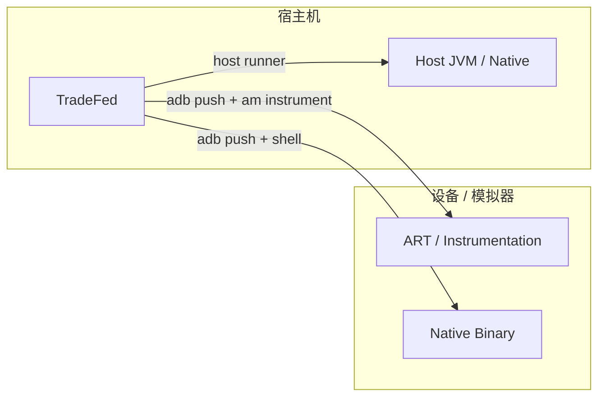
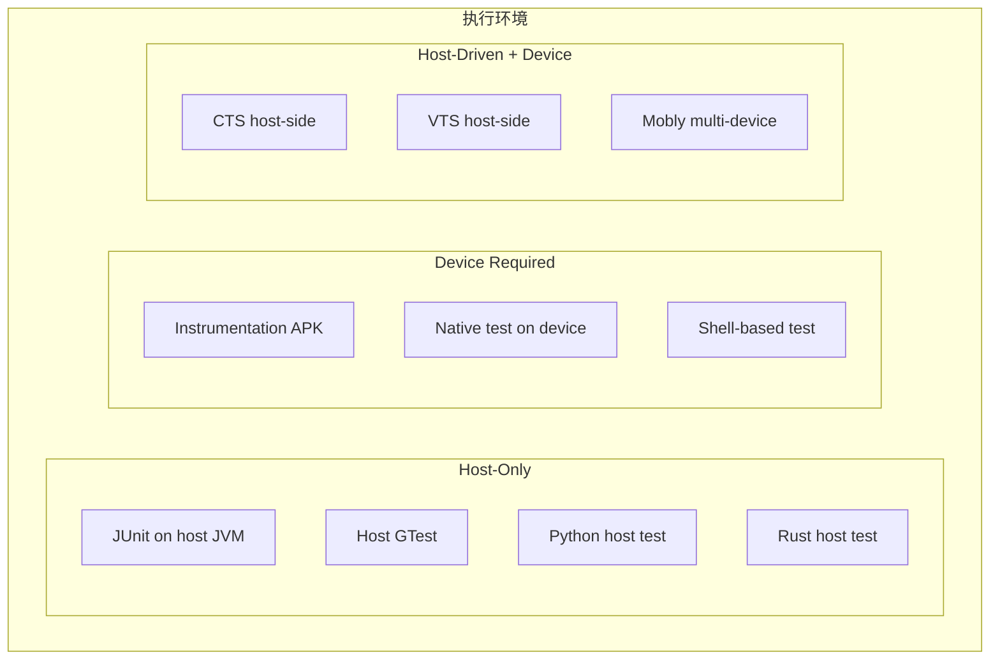
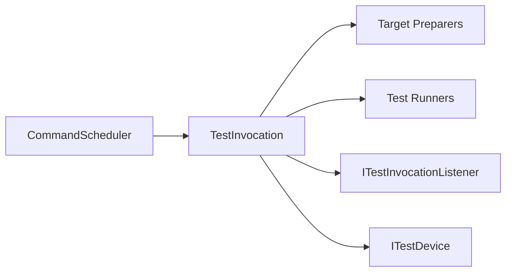
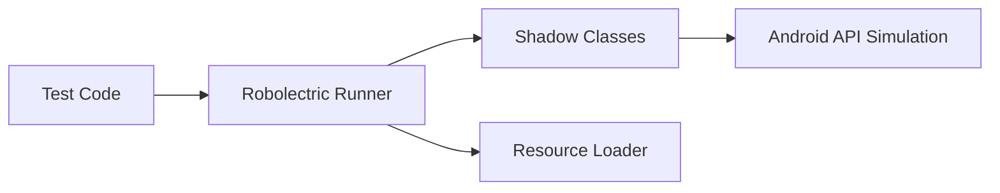
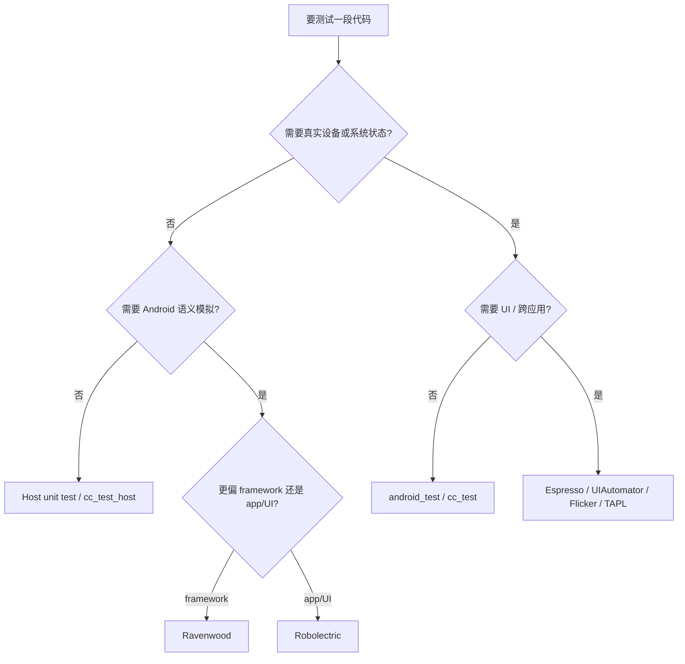
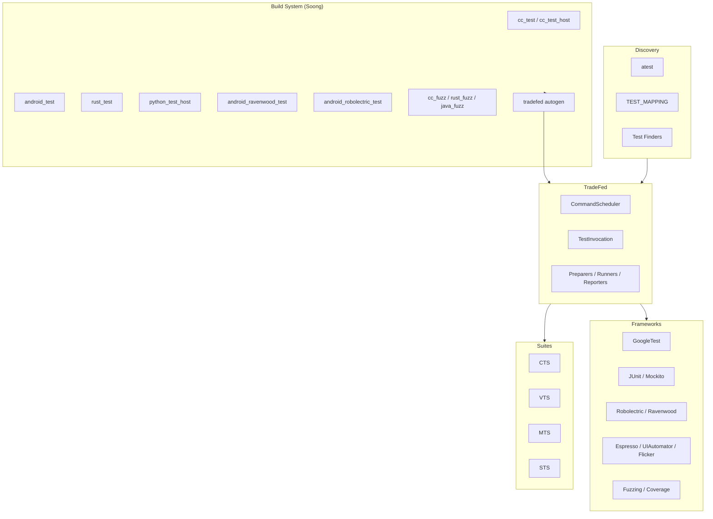

# 第 55 章：Testing Frameworks and Infrastructure

Android 的测试体系不是“代码写完再补一些 case”的附属物，而是平台工程本身的一部分。AOSP 需要服务海量设备、跨越内核到 UI 的完整栈，还要面对 OEM 差异、Treble 边界、Mainline 模块更新和兼容性认证，因此测试系统必须同时解决三件事：怎么构建测试、怎么发现测试、怎么在不同环境里稳定执行测试。

本章从测试哲学讲起，依次梳理 Trade Federation、`atest`、`TEST_MAPPING`、Soong 测试模块、CTS / VTS / MTS、Ravenwood、Robolectric、GoogleTest、UI 测试、mock、fuzz、覆盖率以及 `platform_testing` 库。重点不是只记住命令，而是看清 AOSP 如何把“写测试”收束成一套平台级基础设施。

---

## 55.1 Testing Philosophy

### 55.1.1 Android 测试金字塔

Android 延续了经典测试金字塔，但做了平台化扩展。因为 AOSP 同时包含内核、native 库、ART / framework 和应用层，所以测试层级不仅按“单元 / 集成 / 端到端”划分，还要按“宿主 / 设备 / 宿主驱动设备”划分。

测试金字塔的核心原则仍然没变：越靠底层的测试数量越多、速度越快、隔离越强；越靠上层的测试数量越少、成本越高、环境越接近真实设备。

```text
                           /\
                          /  \
                         / E2E\
                        /------\
                       / Integr.\
                      /----------\
                     /   Unit     \
                    /--------------\
```

| 层级 | 典型执行器 | 运行目标 | 速度 | 示例 |
|---|---|---|---|---|
| 宿主单元测试 | JUnit / host GTest | 无需设备 | 毫秒级 | Ravenwood、Robolectric、`cc_test_host` |
| 设备单元测试 | `AndroidJUnitRunner` | 设备 / 模拟器 | 秒级 | 小范围 `android_test` |
| 集成测试 | TradeFed | 设备 / 模拟器 | 分钟级 | CTS 模块、VTS HAL |
| 端到端测试 | UIAutomator / TAPL / Flicker | 设备 / 模拟器 | 分钟级 | Launcher 过渡测试 |

### 55.1.2 主要测试套件

AOSP 把大型兼容性与验证工作组织成 suite。每个 suite 本质上都是一个 TradeFed plan，从一组测试模块中挑选需要执行的部分；而每个测试模块则通过 `test_suites` 属性声明自己属于哪些 suite。

| 套件 | 全称 | 用途 | 典型入口 |
|---|---|---|---|
| CTS | Compatibility Test Suite | 校验 Android API 与应用兼容性契约 | `cts-tradefed` |
| VTS | Vendor Test Suite | 校验 HAL / kernel / Treble 边界 | `vts-tradefed` |
| GTS | Google Test Suite | GMS 相关要求 | `gts-tradefed` |
| STS | Security Test Suite | 安全公告补丁验证 | `sts-tradefed` |
| MTS | Mainline Test Suite | Mainline 模块兼容性 | `mts-tradefed` |
| CTS-root | 需要 root 的 CTS | root 场景验证 | `cts-root-tradefed` |
| Catbox | 车载兼容性子集 | Automotive 场景 | `catbox-tradefed` |

### 55.1.3 Host Tests 与 Device Tests

在 AOSP 里，测试的第一分界线是“跑在哪里”。

- Host test：直接跑在构建机 JVM 或 native binary 上，不占设备。
- Device test：通过 `adb` 推送后在设备或模拟器上运行。
- Host-driven device test：逻辑在宿主，行为在设备，例如大量 CTS host-side case。

这三类测试决定了构建模块类型、是否需要连接设备、TradeFed 应该分配什么 runner，以及 `atest` 如何选择执行模式。



### 55.1.4 Presubmit 与 Postsubmit

Android CI 把测试分成两层：

- Presubmit：变更合入前执行，要求快、稳、可复现。
- Postsubmit：变更合入后执行，允许更重、更慢、覆盖更广。

`TEST_MAPPING` 是 presubmit / postsubmit 选择的关键机制。目录级维护者不需要手写一套 CI 配置，只要在源码树里声明哪些测试应随目录变更而触发。

### 55.1.5 测试执行环境

选错执行环境，会直接让测试既慢又不稳定。AOSP 常见环境可以分成三类：



Host-only 测试是最优先的，因为没有设备调度成本；但涉及硬件、系统服务、进程边界或真实 UI 时，仍然必须回到设备。

### 55.1.6 测试尺寸标注

Android 用尺寸标注表达测试预期成本：

```java
@SmallTest
@MediumTest
@LargeTest
```

常见语义是：

- `@SmallTest`：非常快，不依赖 I/O 或网络。
- `@MediumTest`：允许轻量文件系统使用。
- `@LargeTest`：运行时间更长，可能依赖数据库、网络或复杂交互。

除此之外，AOSP 还大量使用 `@Presubmit`、`@FlakyTest`、`@RequiresDevice`、`@SecurityTest`、`@AppModeFull`、`@CddTest` 等注解，供过滤、调度和报告系统消费。

### 55.1.7 测试隔离原则

平台测试体系高度强调隔离：

1. 进程隔离：测试不应互相污染进程内状态。
2. 用户隔离：多用户或临时用户状态应可创建与清理。
3. 设备状态回收：preparer 在执行后要恢复环境。
4. 类加载器隔离：Ravenwood 会为不同模块使用隔离 classloader。
5. Shard 隔离：TradeFed 每个 shard 使用独立配置副本。

如果没有这些隔离层，大规模并行执行几乎必然退化成一片脆弱的 flaky 海洋。

## 55.2 Trade Federation (TradeFed)

### 55.2.1 概览

Trade Federation，通常简称 TradeFed 或 TF，是 Android 最核心的测试执行框架。它并不关心“某个模块具体怎么测”的业务语义，而是提供统一的调度骨架：分配设备、准备环境、执行模块、收集结果、重试失败、输出报告。

关键源码主要在：

```text
tools/tradefederation/
    core/
    contrib/
    prebuilts/
```

### 55.2.2 架构

TradeFed 的核心架构可以概括成“调度器 + invocation 生命周期 + 设备抽象 + 插件化执行组件”。



`CommandScheduler` 负责全局调度，`TestInvocation` 负责一次具体执行，preparer 负责环境准备，runner 负责真正跑测试，listener 负责结果回传。

### 55.2.3 配置系统

TradeFed 的配置主要基于 XML。测试模块在构建期可以自动生成默认 XML，suite 或调用端再通过 `option`、template 与 include 叠加行为。这个系统的价值在于：测试逻辑与执行装配解耦。

### 55.2.4 Sharding

Sharding 是把一批测试切成多个 shard，并发跑在多个设备或多个进程上的能力。大型 CTS / VTS 运行如果没有 shard，耗时会不可接受；但 shard 同时要求模块能隔离状态，否则并发只会放大不稳定性。

### 55.2.5 Retry 逻辑

TradeFed 内建重试逻辑，用来处理环境抖动、偶发超时或单次执行失败。但重试是“发现和缓解不稳定”的手段，不是掩盖测试质量差的借口。

### 55.2.6 测试类型与 Runner

TradeFed 通过不同 runner 接入不同测试类型，例如 JUnit、instrumentation、GTest、Python、shell 和 suite runner。统一 harness 的好处是：不管底层语言是什么，调度层都能用一致的生命周期处理它。

### 55.2.7 Target Preparers

Target preparer 用于在测试前修改设备环境，例如安装 APK、推送文件、刷机、设置属性、创建用户、修改开关。它是很多“测试代码本身很简单，但前置环境复杂”的关键支撑。

### 55.2.8 Suite Mode

Suite mode 会把多个测试模块按 suite 组合起来执行，而不是只运行单个 module。CTS、VTS、MTS 等大套件本质上都建立在这一层能力上。

### 55.2.9 Invocation 生命周期

一次 invocation 的典型流程是：

1. 解析命令与配置。
2. 分配设备。
3. 运行 preparer。
4. 执行测试模块。
5. 收集结果。
6. 触发重试或清理。
7. 输出报告。

这套生命周期是 Android 测试世界最基础的公共语义。

### 55.2.10 多设备测试

某些场景需要两台以上设备协同，例如蓝牙配对、Nearby、多端同步或 Mobly 场景。TradeFed 可以在 invocation 级别分配多台设备并维持角色映射。

### 55.2.11 Sandbox Mode

Sandbox mode 用于把一次执行放到更受控的环境里，减少主调度进程之间的干扰，并提升失败隔离能力。

### 55.2.12 结果上报

TradeFed 通过 `ITestInvocationListener` 把模块开始 / 结束、case 结果、指标、日志与附件统一上报。CI、suite 汇总器与本地报告都依赖这条通路。

## 55.3 atest

### 55.3.1 概览

`atest` 是开发者最常用的入口。它把“我要跑这个测试”翻译成“构建哪些模块、需不需要设备、应该调用哪种 TradeFed 配置、如何过滤类和方法”的一整套流程。

### 55.3.2 架构

`atest` 本身不是测试框架，它更像“面向开发者的前端编排器”。它负责发现测试、选择 runner、构建命令、检查设备与环境，然后把真正执行交给 TradeFed。

### 55.3.3 测试发现

`atest` 支持多种发现方式：

```bash
# 按模块名
atest CtsWindowManagerDeviceTestCases

# 按 module:class
atest FrameworksCoreTests:android.app.SomeTest

# 按文件路径
atest frameworks/base/core/tests/coretests

# 按 package
atest com.android.server.pm.test

# 按当前目录 TEST_MAPPING
atest --test-mapping

# 按类名
atest SomeTestClass
```

### 55.3.4 执行与过滤

`atest` 可以按模块、类、方法、注解、suite 和设备类型过滤。对开发迭代来说，最重要的是把一次大型 suite 缩到足够小的相关集。

### 55.3.5 执行模式校验

`atest` 会在开跑前检查执行模式是否合理，例如：

- 这是 host test 还是 device test
- 当前是否连接了足够的设备
- 指定的过滤条件是否与模块类型兼容

### 55.3.6 常用命令

```bash
# 跑单个模块
atest FrameworksServicesTests

# 跑某个类
atest FrameworksServicesTests:com.android.server.SomeTest

# 跑某个方法
atest FrameworksServicesTests:com.android.server.SomeTest#testFoo

# 跑当前目录 TEST_MAPPING
atest --test-mapping

# 只跑 host tests
atest --host FrameworksServicesTests

# 4 设备分片
atest --sharding 4 CtsWindowManagerDeviceTestCases

# dry run
atest --dry-run FrameworksServicesTests

# 多轮运行排查 flaky
atest --iterations 10 FrameworksServicesTests

# 带覆盖率
atest --coverage FrameworksServicesTests
```

### 55.3.7 Test Runner Registry

`atest` 内部维护一套测试查找器和 runner 注册表，用来决定“这个目标属于哪种测试”和“该翻译成什么 TradeFed 命令”。

### 55.3.8 `CLITranslator`

`CLITranslator` 负责把开发者输入翻译成内部的测试引用对象，再进一步拼出 TF 命令。这一步把“人类友好的入口”映射成“机器可执行的计划”。

### 55.3.9 `_AtestMain`

`_AtestMain` 是 `atest` 主流程的编排中心，负责参数解析、缓存、发现、模式检查、构建与最终执行。

### 55.3.10 `TEST_MAPPING` 集成

`atest --test-mapping` 会从当前目录向上查找 `TEST_MAPPING`，解析预定义 group，并按文件变化模式筛选测试。这也是日常目录级 presubmit 最常用的运行方式。

### 55.3.11 智能测试选择

较新的 `atest` 逻辑会尽量减少不必要执行，例如根据改动目录、缓存结果和 finder 输出缩小测试集合。

### 55.3.12 设备可用性检查

在 device test / multi-device 场景中，`atest` 会先判断设备数量、状态和兼容性，避免构建完才发现跑不起来。

### 55.3.13 多设备支持

`atest` 不只是 TradeFed 的薄包装。它也要能表达多设备场景，例如把分片数、设备需求或某些 suite 参数透传下去。

## 55.4 TEST_MAPPING

### 55.4.1 目的与格式

`TEST_MAPPING` 是把“目录改动”与“应该触发哪些测试”绑定起来的机制。它的价值在于：测试选择跟代码放在一起维护，不需要中央平台团队替每个目录写规则。

### 55.4.2 JSON 结构

`TEST_MAPPING` 本质是 JSON，常见 group 有：

- `presubmit`
- `postsubmit`
- `imports`

其中每条测试声明可以带模块名、参数、文件匹配模式和继承关系。

### 55.4.3 Test Object 字段

单个对象常见字段包括：

- `name`
- `options`
- `host`
- `file_patterns`
- `keywords`

### 55.4.4 Test Groups

group 的语义非常直接：

- `presubmit`：变更前必须尽快验证的测试
- `postsubmit`：允许更慢、更重的测试
- `imports`：复用其他目录的声明

### 55.4.5 继承与目录向上查找

当目录中没有完整覆盖时，系统会向上层目录回溯，组合多个 `TEST_MAPPING`。这让大目录可以定义基线，小目录再做局部补充。

### 55.4.6 `TestMappingSuiteRunner`

TradeFed 和 `atest` 并不是各自独立实现 `TEST_MAPPING`，而是通过统一解析逻辑把目录映射结果接入执行计划。

### 55.4.7 最佳实践

`TEST_MAPPING` 的最佳实践通常包括：

- presubmit 尽量只放快且稳定的测试
- 按目录责任边界拆分，而不是堆一个全局巨表
- 对文件模式保持克制，避免每次改动都触发大套件

### 55.4.8 查找 `TEST_MAPPING`

```bash
find . -name TEST_MAPPING
```

### 55.4.9 校验

`TEST_MAPPING` 需要被校验格式和引用合法性，否则目录维护者以为“配上了”，实际 CI 却没有按预期执行。

## 55.5 Build System Test Modules

### 55.5.1 概览

Soong 为不同语言和执行环境定义了专门的测试模块类型。测试模块不是普通库或二进制顺手加个 tag，而是会触发额外的打包、安装、自动 XML 生成和 suite 集成逻辑。

### 55.5.2 `android_test`

`android_test` 用于 Java / Kotlin instrumentation 测试。它会生成测试 APK，通常依赖 `AndroidJUnitRunner`，并在设备上通过 `am instrument` 执行。

### 55.5.3 `cc_test`

`cc_test` 用于 native GTest，目标通常是设备侧二进制。Soong 会处理链接、安装路径、数据依赖以及与 TradeFed 的集成。

### 55.5.4 `cc_test_host`

`cc_test_host` 是 host 版本 GTest。只要逻辑不依赖设备环境，优先选它而不是 `cc_test`。

### 55.5.5 `rust_test`

`rust_test` 对应 Rust 测试模块。是否需要设备取决于具体配置和产物形态。

### 55.5.6 `python_test_host`

`python_test_host` 适合宿主自动化和工具类测试，经常用于 host-driven device 工作流。

### 55.5.7 `java_test_host`

`java_test_host` 运行在 host JVM 上，但可以驱动设备，是 CTS host-side 和很多平台工具测试的重要形态。

### 55.5.8 自动生成测试配置

Soong 会为很多测试模块自动生成 TradeFed XML，这一点非常重要。开发者不需要为每个简单模块重复写样板 harness 配置。

### 55.5.9 模块类型汇总

从工程决策角度看，模块类型的选择决定了：

- 运行位置
- 是否需要安装到设备
- 使用哪类 runner
- 如何进入 suite

### 55.5.10 独立测试

有些测试既能被 suite 调用，也能独立跑。Soong 需要为这种“双重入口”保持一致的构建与配置语义。

### 55.5.11 Benchmark 模块

性能测试通常有单独模块类型或额外属性，用于区分功能验证与基准测试。

### 55.5.12 测试配置模板

模板机制减少大量重复 XML，同时保证大批相似模块的执行行为一致。

### 55.5.13 `TestSuiteInfo` Provider

`TestSuiteInfo` 用于把 suite 归属、测试元数据等构建期信息传给后续阶段，是 Soong 与测试基础设施的关键桥接。

## 55.6 CTS

### 55.6.1 概览

CTS 是 Android 兼容性体系中最核心的公开套件。它验证设备是否遵守 Android API 和行为契约，从而保证第三方应用能在不同厂商设备上正常运行。

### 55.6.2 测试组织方式

CTS 按模块组织，不同领域分散在 `cts/tests/`、`cts/hostsidetests/`、`cts/libs/` 等目录中。

### 55.6.3 CTS 模块结构

一个典型 CTS 模块会包含测试代码、Android.bp、必要资源与配置，并通过 suite 标记归入 CTS plan。

### 55.6.4 CtsVerifier

`CtsVerifier` 面向需要人工参与或交互验证的场景，例如传感器、NFC、某些多媒体和 UI 行为。它不是自动化 suite 的替代品，而是补足无法完全自动验证的部分。

### 55.6.5 运行 CTS

```bash
# 全量 CTS
cts-tradefed run cts

# 单模块
cts-tradefed run cts --module CtsWindowManagerDeviceTestCases

# 单个测试
cts-tradefed run cts --module CtsWindowManagerDeviceTestCases --test android.server.wm.SomeTest

# 带 retry
cts-tradefed run retry --retry <session-id>

# 用 atest
atest CtsWindowManagerDeviceTestCases
```

### 55.6.6 CTS 架构

CTS 并不是“一个巨大命令”，而是大量 TradeFed 模块的集合。它依赖 suite 计划、shard、result 聚合与 host/device 双侧 runner。

### 55.6.7 CTS Defaults

很多 CTS 模块共享一组默认配置，例如 runner、注解过滤、安装行为和 report 选项，以减少重复定义。

### 55.6.8 CTS 多设备分片

```bash
# 4 台设备分片
cts-tradefed run cts --shard-count 4

# 动态分片池
cts-tradefed run cts --dynamic-sharding
```

### 55.6.9 CTS 结果结构

CTS 结果通常按 session、module、test case、metric 与附件组织，便于后续 retry、比对与认证交付。

### 55.6.10 CTS 模块开发流程

写 CTS 时要始终围绕“兼容性契约”思考，而不是写成实现细节单测。它验证的是平台对外承诺，而不是某个内部类正好怎么实现。

## 55.7 VTS

### 55.7.1 概览

VTS 面向 Treble 边界，重点验证 vendor 实现是否遵守 framework 与 HAL 合约。

### 55.7.2 测试分类

VTS 通常包括：

- HAL 测试
- kernel 测试
- VINTF / manifest / compatibility 测试
- host-side vendor 交互测试

### 55.7.3 HAL 测试方法论

HAL 测试的目标不是测 app 行为，而是测接口契约、返回值、时序、错误处理和版本兼容。

### 55.7.4 Treble 合规性

VTS 是 Treble 合规的重要支柱，它让 framework 与 vendor 可独立演进的假设具备可执行验证。

### 55.7.5 Kernel Tests

某些 VTS 场景会直接验证 kernel 能力和配置，因为 HAL / vendor 语义最终常常落到内核。

### 55.7.6 运行 VTS

```bash
# 全量 VTS
vts-tradefed run vts

# 单模块
vts-tradefed run vts --module VtsHalCameraProviderV2_4Target

# 用 atest
atest VtsHalCameraProviderV2_4Target

# kernel 测试
vts-tradefed run vts --module KernelApiSysfsTest
```

### 55.7.7 VTS 与 CTS 的 Treble 边界

简单说，CTS 更偏“面向 app / framework 的兼容契约”，VTS 更偏“面向 vendor / HAL / kernel 的系统契约”。

### 55.7.8 运行 HAL Tests

```bash
# 查看可用 HAL 测试
atest --host | findstr VtsHal

# 运行具体 HAL test
atest VtsHalHealthTarget

# 运行某个 HAL 的全部 tests
atest VtsHal*Health*
```

### 55.7.9 VINTF Manifest Testing

VINTF 相关测试用来校验设备声明的接口版本、兼容矩阵和实现实际情况是否一致。

## 55.8 Ravenwood

### 55.8.1 概览

Ravenwood 是 Android 新一代 host-side framework 测试方案之一，目标是让更多 framework Java / Kotlin 逻辑脱离设备，在宿主 JVM 中以更快方式运行。

### 55.8.2 `android_ravenwood_test`

对应的 Soong 模块类型是 `android_ravenwood_test`。从命名就能看出，它不是普通 JUnit host test，而是针对 Android framework 环境做了专门适配。

### 55.8.3 架构

Ravenwood 的核心思路是：把 framework 所需的一部分运行时与依赖注入到 host JVM 中，再通过隔离 classloader 和定制 runner 运行测试。

### 55.8.4 Ravenwood Properties

模块可以用属性控制资源、清单、依赖与运行行为，决定测试宿主化程度。

### 55.8.5 Runtime 组件

Ravenwood 运行时通常涉及：

- 宿主 JVM 测试 runner
- 受控 classloader
- 资源与清单支持
- Android framework 兼容层

### 55.8.6 Ravenizer

Ravenizer 负责把普通测试 / 模块调整成适合 Ravenwood 运行的形式，是宿主化适配链的一部分。

### 55.8.7 Manifest Properties

某些 framework 场景仍然依赖 manifest 语义，因此 Ravenwood 也需要一定程度支持 manifest 属性。

### 55.8.8 示例测试

Ravenwood 非常适合写“framework 逻辑但不需要真实设备”的测试，例如 manager、parser、service 内部策略和状态机。

### 55.8.9 在 `TEST_MAPPING` 中使用

Ravenwood host-only、速度快，非常适合放进 presubmit。

### 55.8.10 测试生命周期

它仍然走标准测试生命周期，只是执行环境从设备切到了宿主，并额外依赖隔离 classloader 与运行时模拟。

### 55.8.11 资源支持

Ravenwood 可以支持一定范围的资源访问，这一点让它比纯粹逻辑单测更接近 framework 真实运行环境。

### 55.8.12 适用场景

如果你的代码是 framework 逻辑、依赖 Android 语义、但不需要真实设备状态，那么 Ravenwood 往往是更好的首选。

## 55.9 Robolectric

### 55.9.1 概览

Robolectric 是 Android 生态里非常成熟的 host-side 测试方案。它通过 shadow 机制在 host JVM 中模拟 Android SDK / framework 行为。

### 55.9.2 `android_robolectric_test`

在 AOSP 中，Robolectric 对应 `android_robolectric_test` 模块类型。

### 55.9.3 Properties

模块属性会控制 manifest、资源、依赖、运行时版本和测试入口。

### 55.9.4 默认依赖

Robolectric 通常会自动带上若干基础依赖，降低模块接入门槛。

### 55.9.5 Strict Mode

严格模式用于限制不被允许的 API 或运行方式，防止测试在“看似通过、实际不可信”的模拟环境中漂移。

### 55.9.6 测试配置生成

与其他测试模块一样，Soong 会帮助 Robolectric 生成执行所需配置。

### 55.9.7 Runtime

Robolectric 通过受支持的 Android runtime 模拟层与资源系统在 host JVM 上运行测试。

### 55.9.8 Shadow System

shadow 是 Robolectric 的核心。它为 Android 类提供宿主替身实现，使测试既能跑得快，又能保留一定 Android 语义。

### 55.9.9 示例测试

它非常适合 Activity、Fragment、ViewModel、资源解析和应用层逻辑验证。

### 55.9.10 Robolectric 与 Ravenwood 对比

两者都服务 host-side Java / Kotlin 测试，但关注点不同：

- Robolectric 更偏应用层 / UI 层 Android 语义模拟。
- Ravenwood 更偏 AOSP framework 宿主化测试。

### 55.9.11 测试配置属性

属性决定 manifest、资源、SDK 版本、shadows 与依赖是否正确接入。

### 55.9.12 Coverage 集成

Robolectric 可以与 JaCoCo 等覆盖率工具联动，适合做 host-side Java 覆盖率统计。

### 55.9.13 Robolectric 架构图



## 55.10 Native Testing (GoogleTest)

### 55.10.1 AOSP 中的 GoogleTest

GoogleTest 是 AOSP native 单元测试的主力框架，尤其适合 C / C++ 库和服务。

### 55.10.2 `cc_test` 如何使用 GoogleTest

`cc_test` 会把 GTest 二进制按 Soong 规则构建出来，并为设备执行准备安装路径和 TradeFed 配置。

### 55.10.3 编写 GoogleTest

典型结构包括 fixture、断言和必要 mock。对平台代码来说，优先先把可纯逻辑验证的部分压到 host test。

### 55.10.4 Build Rule

Android.bp 中只需声明 `cc_test` 或 `cc_test_host`，Soong 会处理绝大部分样板工作。

### 55.10.5 GoogleMock

GoogleMock 用于构造依赖替身，避免 native 测试被真实系统依赖拖慢或拖脆。

### 55.10.6 安装与执行

设备侧 GTest 会被推送后通过 shell 执行，host 侧则直接运行二进制。

### 55.10.7 `cc_test` 中的 GTest 属性

常见属性涉及数据依赖、安装位置、suite 归属和执行环境。

### 55.10.8 Isolated GTest Runner

隔离 runner 能避免设备侧 GTest 在共享状态下相互干扰。

### 55.10.9 参数化测试

参数化测试适合覆盖输入组合丰富、逻辑一致的 native API。

### 55.10.10 Death Tests

Death test 用于验证崩溃、断言终止或非法使用路径，是系统级代码经常需要的验证手段。

### 55.10.11 Test Data 与 Fixtures

fixture 和测试数据要尽量清晰、最小、可复用，避免 native test 变成庞大输入样本的堆砌。

### 55.10.12 设备上执行 Native Tests

设备执行的价值在于验证真实 libc、binder、SELinux、syscall 和硬件交互边界，这是 host GTest 不可能完全覆盖的。

## 55.11 UI Testing

### 55.11.1 概览

UI 测试是 AOSP 最贵的一类测试之一，因为它最依赖真实交互、时序和设备状态。

### 55.11.2 Espresso

Espresso 主要测试应用内部 UI 交互，依赖 instrumentation 与 idling resource 机制，适合单应用内场景。

### 55.11.3 UIAutomator

UIAutomator 能跨应用、跨系统 UI 组件工作，因此更适合系统设置、权限弹窗、跨 app 跳转等场景。

### 55.11.4 TAPL

TAPL（Test Automation Platform Library）主要服务 Launcher / SystemUI 等复杂系统 UI 自动化。

### 55.11.5 Flicker

Flicker 面向窗口管理和动画 / 过渡验证，适合验证 launch、rotation、split-screen、PIP 等复杂窗口行为。

### 55.11.6 Screenshot Testing

截图测试把 UI 回归从“行为是否通过”扩展到“视觉是否变化”，适合组件库和稳定界面回归。

### 55.11.7 UI 测试框架对比

| 框架 | 典型边界 | 适用场景 |
|---|---|---|
| Espresso | 单应用内部 | View / Fragment / Activity |
| UIAutomator | 跨应用 / 系统 UI | 设置、权限、系统弹窗 |
| TAPL | Launcher / SystemUI | 主屏、Recents、手势 |
| Flicker | 窗口 / 动画 | WM / Shell / 转场 |
| Screenshot | 视觉回归 | 稳定 UI 对比 |

### 55.11.8 Espresso Idling Resources

Idling resource 是 Espresso 稳定性的关键，它让异步任务完成后再断言，而不是靠睡眠时间碰运气。

### 55.11.9 Flicker 断言

Flicker 的强项不是简单点击，而是对窗口可见性、层级变化和时间序列做结构化断言。

## 55.12 Mocking Frameworks

### 55.12.1 Mockito

Mockito 是 Java / Kotlin 测试中最常见的 mock 框架。

### 55.12.2 Mockito-Kotlin

Mockito-Kotlin 提供更自然的 Kotlin API，减少样板代码。

### 55.12.3 Dexmaker

Dexmaker 常用于 Android 运行时环境下的 mock 生成，是 Mockito 在某些 Android 场景可用的底座之一。

### 55.12.4 JUnit 集成

mock 框架通常和 JUnit rule / runner / extension 一起工作，统一 setup、teardown 和依赖注入。

### 55.12.5 Mock Android 系统服务

系统服务 mock 是 framework 与 app 层测试的高频需求，它能把复杂系统依赖替换成可控替身。

### 55.12.6 Final Class 的扩展 Mockito

Android 平台代码里有大量 final class 和复杂 API，扩展 mock 能力能显著降低测试接入成本。

### 55.12.7 Test Rules

rule 用于统一环境初始化、权限、临时目录、线程策略和清理逻辑。

### 55.12.8 Mock 架构

mock 的价值不是“让任何代码都能测”，而是迫使代码把依赖边界显式化，这反过来会改善设计本身。

## 55.13 Fuzzing

### 55.13.1 概览

Fuzz 是 Android 安全测试的重要组成部分。它针对解析器、协议栈、系统服务边界和 native 库的异常输入空间做持续探索。

### 55.13.2 `cc_fuzz`

`cc_fuzz` 是 C / C++ fuzz target 的核心模块类型，通常与 LLVM sanitizers 联动。

### 55.13.3 Fuzz Frameworks

常见框架和技术包括 `libFuzzer`、AFL 风格输入变异以及与 sanitizer 结合的崩溃检测。

### 55.13.4 Fuzz Config

fuzz target 不只是一个二进制，还需要 config 描述 corpus、dictionary、ownership 和运行约束。

### 55.13.5 Fuzz Packaging

打包阶段会把 target、语料和配置一起组织好，便于持续基础设施消费。

### 55.13.6 `rust_fuzz`

Rust 代码同样可以通过专门模块类型接入 fuzz。

### 55.13.7 `java_fuzz`

Java fuzz 在 AOSP 里也有明确支持，适合解析、序列化和 JVM 逻辑。

### 55.13.8 Sanitizers

ASan、UBSan、HWASan 等 sanitizer 是 fuzz 发现问题的放大器，没有 sanitizer，很多内存与未定义行为问题根本无法可靠暴露。

### 55.13.9 Fuzz Target 架构

好的 fuzz target 要尽量：

- 输入边界清晰
- 启动快
- 单次执行成本低
- 能稳定复现崩溃

### 55.13.10 Corpus 管理

语料管理决定了 fuzz 是否真的在探索新状态，而不是不断重复旧样本。

### 55.13.11 Fuzz Config 细节

配置往往还会携带 dictionary、最小化选项、owner 和运行环境元数据。

### 55.13.12 持续 Fuzz 基础设施

AOSP 并不把 fuzz 当成开发者手工偶尔跑一次的工具，而是把它接入持续基础设施做长期挖掘。

### 55.13.13 编写高质量 Fuzz Target

高质量 target 的关键不是写得多花，而是把最关键的解析 / 状态边界抽出来，用最小 harness 反复打。

## 55.14 Code Coverage (JaCoCo)

### 55.14.1 概览

覆盖率不是质量本身，但它是定位测试盲区的有效信号。AOSP 主要通过 JaCoCo 处理 Java 覆盖率，通过 LLVM 工具链处理 native 覆盖率。

### 55.14.2 构建系统集成

覆盖率需要构建期开关、依赖注入和报告生成链路支持，不能只靠运行时工具临时拼。

### 55.14.3 Instrumentation Pipeline

JaCoCo 会在构建或执行过程中插桩，再汇总执行数据生成报告。

### 55.14.4 过滤规则

过滤规则用于排除自动生成代码、无意义样板或不应计入统计的部分，避免覆盖率数字失真。

### 55.14.5 Dependencies Mutator

Soong 需要在依赖图里注入覆盖率相关库与规则，这就是 mutator 存在的意义。

### 55.14.6 报告 ZIP 生成

报告输出通常会被打包成统一产物，供本地查看或 CI 收集。

### 55.14.7 设备测试覆盖率

设备侧覆盖率会更复杂，因为还涉及产物回收、设备数据拉取和与 host 报告合并。

### 55.14.8 带覆盖率运行

```bash
# 构建时启用覆盖率
m EMMA_INSTRUMENT=true FrameworksServicesTests

# 用 atest 跑覆盖率
atest --coverage FrameworksServicesTests

# 生成覆盖率报告
acloud coverage-report
```

### 55.14.9 覆盖率架构


### 55.14.10 Native 覆盖率

```bash
# 开启 native coverage
export NATIVE_COVERAGE=true

# 拉取设备上的覆盖率数据
adb pull /data/misc/trace .

# 生成报告
llvm-profdata merge ...
```

### 55.14.11 CI 中的覆盖率

CI 中更看重趋势与热点，而不是孤立数字。覆盖率上升不等于质量更高，但持续很低通常说明测试债务明显。

## 55.15 Platform Testing Libraries

### 55.15.1 概览

`platform_testing/libraries/` 提供了大量供平台测试复用的基础库，避免每个团队从零搭脚手架。

### 55.15.2 目录结构

这个目录通常涵盖 UI、性能、兼容性、公用工具、设备采集器和测试支撑组件。

### 55.15.3 关键库

常见库包括：

- Flicker
- Screenshot
- TAPL
- Device Collectors
- `compatibility-common-util`

### 55.15.4 如何使用

这些库的价值在于把“公共测试模式”沉淀为共享依赖，而不是在每个模块里复制粘贴脚本和辅助类。

### 55.15.5 Device Collectors

collector 用于在测试前后采集设备信息、性能指标、bugreport 或日志，是结果解释的重要上下文。

### 55.15.6 AUPT

AUPT（Automated User Performance Testing）用于自动化用户性能测试场景。

### 55.15.7 Annotations Library

统一注解库让 suite、过滤器和调度器能用一致方式理解测试元数据。

### 55.15.8 Compatibility Common Util

该库提供 CTS / 兼容性场景常用的通用工具。

### 55.15.9 库依赖图

`platform_testing` 的存在说明 Android 测试不是单一 harness 就够了，还需要丰富的共享组件生态。

## 55.16 Other Test Suites

### 55.16.1 MTS

MTS（Mainline Test Suite）用于验证 Mainline 模块更新与兼容性。

### 55.16.2 CTS-root

CTS-root 覆盖需要 root 权限的兼容性测试场景。

### 55.16.3 Catbox

Catbox 是车载相关兼容性测试集合。

### 55.16.4 DittoSuite

DittoSuite 也是 Android 测试生态中的一类专用 suite，面向特定领域验证。

### 55.16.5 Suite 层级关系

从工程视角看，suite 本质上是在同一套 TradeFed 与构建基础设施上，按不同产品边界组织出来的测试平面。

## 55.17 Try It: Write Tests at Every Level

### 55.17.1 练习 1：Host-Side Unit Test（`cc_test_host`）

写一个最小 native host test，验证纯逻辑函数。重点是体验“不接设备”的快速反馈。

### 55.17.2 练习 2：Ravenwood Framework Test

挑一个 framework 内部纯逻辑类，用 `android_ravenwood_test` 写宿主测试，感受它和设备 instrumentation 的成本差异。

### 55.17.3 练习 3：Device Instrumentation Test

为一个依赖真实 `Context`、`Binder` 或系统服务的行为写 `android_test`，观察设备环境在这里为什么不可替代。

### 55.17.4 练习 4：CTS 风格兼容性测试

把一个“平台对外承诺”写成 CTS 风格 case，而不是实现细节测试。这个练习能帮助你理解 CTS 的真正边界。

### 55.17.5 练习 5：Native Fuzz Target

为一个解析器或输入边界写最小 `cc_fuzz` target：

```bash
# 构建全部 fuzzers
m fuzz

# 运行特定 fuzzer
out/host/linux-x86/fuzz/<your_fuzzer>
```

### 55.17.6 练习 6：Robolectric Test

为一个 Activity、资源解析器或 ViewModel 写 Robolectric 测试，体验 host-side Android 语义模拟。

### 55.17.7 练习 7：Screenshot Test

挑一个稳定 UI 组件生成 golden image，再修改样式观察截图回归：

```bash
# 生成新的 golden images
atest <your_screenshot_module>

# 或运行更新脚本
update-screenshot-goldens
```

### 55.17.8 练习 8：Robolectric + Mockito

把一个依赖系统服务的逻辑类拆出接口，用 Mockito 替换外部依赖，再用 Robolectric 验证 Android 语义部分。

### 55.17.9 练习 9：多层测试策略

为同一功能同时设计：

1. host unit test
2. 设备集成测试
3. suite / 兼容性测试入口

这样你会更直观地看到三层测试各自覆盖什么。

### 55.17.10 测试检查清单

- 这部分逻辑是否真的需要设备？
- 能否先写 host test？
- 是否需要放进 `TEST_MAPPING`？
- 是否应进入 CTS / VTS / MTS？
- 是否存在 mock 或隔离改进空间？

### 55.17.11 常见陷阱

常见问题包括：

- 用设备测试验证本可 host 化的逻辑
- 依赖 `sleep` 导致 flaky
- `TEST_MAPPING` 放入过慢 case
- mock 过度，导致测试失去真实价值

### 55.17.12 测试决策流程图



### 55.17.13 端到端工作流

一次标准工作流通常是：

1. 改代码。
2. 跑当前目录 `TEST_MAPPING`。
3. 必要时补 host test。
4. 再跑目标 device / suite test。
5. 检查覆盖率、flaky 与结果报告。
6. 进入 presubmit。

### 55.17.14 性能优化建议

1. 先缩小目标，避免无关大模块构建。
2. 能用 `--host` 就不要占设备。
3. 充分利用 `atest` 缓存。
4. 大套件优先用 sharding。
5. 用 `--test-mapping` 跑与改动最相关的测试。
6. 在初次构建后可用 `--steps test` 只重跑执行阶段。

## Summary

Android 的测试基础设施本质上是一套跨构建系统、执行 harness、suite、语言框架和 CI 的平台工程。

1. TradeFed 是统一执行核心，负责设备分配、生命周期、结果收集和重试。
2. Soong 通过专门测试模块类型把构建、安装、suite 和自动 XML 生成打通。
3. `atest` 是开发者日常入口，把发现、过滤、构建和执行收敛成一个命令。
4. `TEST_MAPPING` 把目录改动和 presubmit / postsubmit 测试绑定起来，是 Android 规模化测试选择的关键机制。
5. Ravenwood、Robolectric、host GTest 等 host-side 测试决定了日常反馈速度，应尽可能优先使用。
6. CTS、VTS、MTS 等 suite 则定义了 Android 平台、Treble 边界和 Mainline 更新的合规面。
7. Fuzz、覆盖率、截图、Flicker 和 `platform_testing` 库把“测试”从单纯断言扩展成持续质量基础设施。

最实用的工程结论只有一句：先把能下沉到 host 的测试尽量下沉，再把真正依赖设备、系统边界和 UI 的部分交给 device / suite 测试处理。这样才能同时兼顾速度、稳定性和覆盖面。

### Test Infrastructure Component Map



### Quick Reference: Module Type Selection

| 我想测试…… | 语言 | 推荐模块类型 | 需要设备？ |
|---|---|---|---|
| 纯逻辑 / 数据结构 | Java / Kotlin | `android_ravenwood_test` | 否 |
| Activity / Fragment 行为 | Java / Kotlin | `android_robolectric_test` | 否 |
| SDK / 平台 API 契约 | Java / Kotlin | `android_test` | 是 |
| 应用 UI 行为 | Java / Kotlin | `android_test` + Espresso | 是 |
| 跨应用 / 系统 UI | Java / Kotlin | `android_test` + UIAutomator | 是 |
| Native 逻辑 | C / C++ | `cc_test_host` | 否 |
| Native 系统行为 | C / C++ | `cc_test` | 是 |
| HAL 实现 | C / C++ | `cc_test` / VTS | 是 |
| Rust 库 | Rust | `rust_test` | 视情况 |
| Python 自动化 | Python | `python_test_host` | 否 |
| 安全 Fuzz | C / C++ | `cc_fuzz` | 否 |
| 安全 Fuzz | Rust | `rust_fuzz` | 否 |
| 安全 Fuzz | Java | `java_fuzz` | 否 |
| Host 驱动设备测试 | Java | `java_test_host` | 是 |
| 性能基准 | C / C++ | `cc_benchmark` | 通常是 |
| 窗口转场 | Java | Flicker 相关库 | 是 |
| 视觉回归 | Java | Screenshot 测试 | 是 |

### Key Source Files Referenced

| 文件 | 关联主题 |
|---|---|
| `tools/tradefederation/core/src/com/android/tradefed/` | `55.2` |
| `tools/tradefederation/core/src/com/android/tradefed/invoker/TestInvocation.java` | `55.2.2` / `55.2.9` |
| `tools/tradefederation/core/src/com/android/tradefed/invoker/shard/ShardHelper.java` | `55.2.4` |
| `tools/tradefederation/core/src/com/android/tradefed/command/CommandScheduler.java` | `55.2.2` |
| `tools/tradefederation/core/src/com/android/tradefed/retry/BaseRetryDecision.java` | `55.2.5` |
| `tools/asuite/atest/atest_main.py` | `55.3` |
| `tools/asuite/atest/test_finders/` | `55.3.3` |
| `system/libbase/TEST_MAPPING` | `55.4` |
| `frameworks/base/TEST_MAPPING` | `55.4` |
| `build/soong/cc/test.go` | `55.5.3` / `55.10` |
| `build/soong/rust/test.go` | `55.5.5` |
| `build/soong/python/test.go` | `55.5.6` |
| `build/soong/tradefed/autogen.go` | `55.5.8` |
| `cts/` | `55.6` |
| `cts/apps/CtsVerifier/` | `55.6.4` |
| `test/vts/` | `55.7` |
| `test/vts-testcase/` | `55.7.2` |
| `build/soong/java/ravenwood.go` | `55.8` |
| `build/soong/java/robolectric.go` | `55.9` |
| `external/robolectric/` | `55.9` |
| `external/googletest/` | `55.10` |
| `build/soong/cc/fuzz.go` | `55.13.2` |
| `build/soong/fuzz/fuzz_common.go` | `55.13.3` |
| `build/soong/java/jacoco.go` | `55.14` |
| `external/jacoco/` | `55.14` |
| `external/mockito/` | `55.12.1` |
| `external/dexmaker/` | `55.12.3` |
| `platform_testing/libraries/` | `55.15` |
| `platform_testing/libraries/flicker/` | `55.11.5` |
| `platform_testing/libraries/screenshot/` | `55.11.6` |
| `platform_testing/libraries/systemui-tapl/` | `55.11.4` |
