# Chapter 55: Testing Frameworks and Infrastructure

Testing in the Android Open Source Project is not an afterthought bolted onto the
platform; it is a first-class citizen woven into every layer of the build system,
the continuous integration pipeline, and the compliance certification process.
Android ships on billions of devices made by hundreds of OEMs, which makes
correctness verification at scale a survival requirement rather than a luxury.

This chapter provides a comprehensive tour of every major testing subsystem in
AOSP: from the philosophy that guides where tests live and how they run, through
the build system module types that compile them, to the harness that executes
them on hosts and devices.  Every section references real source files in the
tree so you can follow along in your own checkout.

---

## 55.1  Testing Philosophy

### 55.1.1  The Android Test Pyramid

Android's testing strategy borrows the classic test pyramid concept and extends
it to account for the unique challenge of a platform that spans kernel, native
libraries, a managed-runtime framework, and user-space applications.

```
                           /\
                          /  \
                         / E2E\         Fewest, slowest, most realistic
                        /------\
                       / Integr.\       Medium count, device or emulator
                      /----------\
                     /   Unit     \     Most numerous, fastest, host-preferred
                    /--------------\
```

The pyramid's width at each level represents test volume, and its height
represents execution cost.  Android tooling actively pushes tests downward:

| Level | Typical runner | Target | Speed | Example |
|-------|---------------|--------|-------|---------|
| Unit (host) | JUnit / GoogleTest on host JVM/binary | No device | Milliseconds | Ravenwood, Robolectric, cc_test_host |
| Unit (device) | AndroidJUnitRunner | Device/emulator | Seconds | android_test with small scope |
| Integration | TradeFederation suites | Device/emulator | Minutes | CTS module, VTS HAL test |
| End-to-end | UIAutomator / TAPL / Flicker | Device/emulator | Minutes | Launcher transition test |

### 55.1.2  The Major Test Suites

Android defines several compliance and validation suites.  Each suite is a
TradeFederation *plan* that selects a set of test modules, and each module
declares its suite membership via the `test_suites` property in its build rule.

| Suite | Full Name | Purpose | Runner |
|-------|-----------|---------|--------|
| **CTS** | Compatibility Test Suite | Verify API contracts for app compatibility | `cts-tradefed` |
| **VTS** | Vendor Test Suite | Verify HAL/kernel contracts across Treble boundary | `vts-tradefed` |
| **GTS** | Google Test Suite | Verify Google Mobile Services requirements | `gts-tradefed` |
| **STS** | Security Test Suite | Verify patches for monthly security bulletins | `sts-tradefed` |
| **MTS** | Mainline Test Suite | Verify updatable Mainline modules | `mts-tradefed` |
| **CTS-root** | CTS with root | CTS modules requiring root privileges | `cts-root-tradefed` |
| **Catbox** | Automotive compliance | CTS subset for automotive builds | `catbox-tradefed` |

### 55.1.3  Host Tests vs Device Tests

A fundamental axis in Android testing is *where* the test executes:

- **Host tests** run on the build machine's JVM or as native binaries.  They
  never touch a device.  Examples: `java_test_host`, `cc_test_host`,
  `android_robolectric_test`, `android_ravenwood_test`.

- **Device tests** run on a physical device or emulator.  They are pushed via
  `adb`, and TradeFederation manages their lifecycle.  Examples: `android_test`,
  `cc_test` targeting device.

- **Host-driven device tests** run control logic on the host but exercise code
  on the device.  CTS host-side tests (`cts/hostsidetests/`) are the canonical
  example.

The build system encodes this distinction in module types and in the
`test_suites` property.  The `atest` tool uses it to decide whether to require a
connected device.

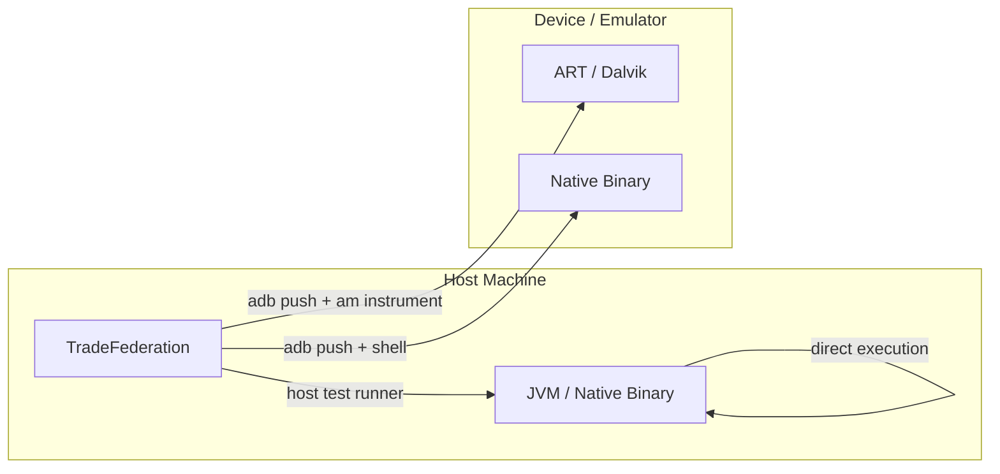

### 55.1.4  The Role of Presubmit and Postsubmit

Android's CI pipeline distinguishes two phases:

- **Presubmit**: Tests run *before* a change merges.  These must be fast and
  reliable.  `TEST_MAPPING` files declare which tests run in presubmit.

- **Postsubmit**: Tests run *after* a change merges, typically on the full build.
  Slower, flakier, or more resource-intensive tests live here.

The `TEST_MAPPING` system (Section 31.4) is the primary mechanism for declaring
presubmit and postsubmit coverage for a given directory.

### 55.1.5  Test Execution Environments

Understanding where tests *can* execute is crucial for choosing the right
module type.

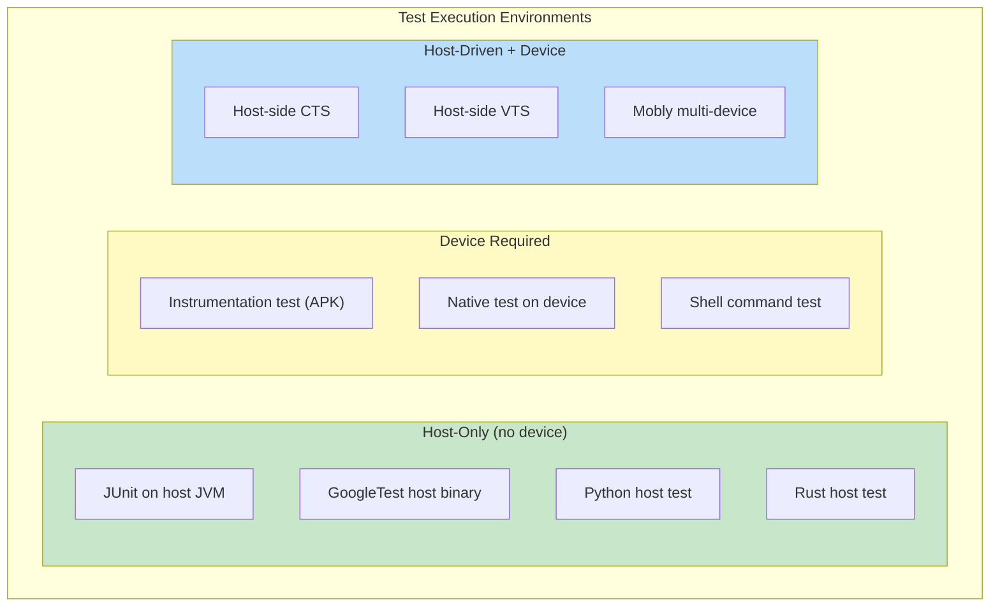

**Host-only** tests are the fastest and most reliable.  They have no external
dependencies beyond the build machine and can run in CI without device
allocation.  Ravenwood and Robolectric enable Java/Kotlin framework tests to
run host-only.

**Device-required** tests exercise real system behavior on actual hardware or
an emulator.  They are essential for hardware-specific features (camera,
sensors, telephony) and for verifying system integration.

**Host-driven** tests combine host-side logic with device interaction.  A Java
test running on the host uses `adb` commands or TradeFed device APIs to
manipulate the device and verify behavior.  This pattern is common in CTS
host-side tests where the test needs to install/uninstall apps, change device
state, or verify cross-process behavior.

### 55.1.6  Test Size Annotations

Android uses size annotations to categorize test execution time:

```java
import androidx.test.filters.SmallTest;
import androidx.test.filters.MediumTest;
import androidx.test.filters.LargeTest;

@SmallTest     // < 200ms, no I/O or network
@MediumTest    // < 1000ms, may use filesystem
@LargeTest     // No time limit, may use network/database
```

These annotations serve multiple purposes:

1. TradeFed can filter by test size for fast presubmit runs
2. CI pipelines can allocate appropriate timeouts
3. Developers can quickly identify test expectations

Additional annotations used in AOSP:

| Annotation | Purpose |
|-----------|---------|
| `@Presubmit` | Must pass in presubmit |
| `@FlakyTest` | Known flaky, excluded from presubmit |
| `@RequiresDevice` | Needs physical device (not emulator) |
| `@SecurityTest` | Security-related test |
| `@AppModeFull` | Run in full (non-instant) app mode |
| `@AppModeInstant` | Run in instant app mode |
| `@CddTest` | Maps to a CDD requirement |

### 55.1.7  Test Isolation Principles

Android tests strive for isolation to prevent interference:

1. **Process isolation**: Each instrumentation test runs in its own process
2. **User isolation**: Tests can create and destroy test users
3. **State cleanup**: Target preparers restore device state after tests
4. **Classloader isolation**: Ravenwood uses `IsolatedHostTest` with separate
   classloaders per module

5. **Shard isolation**: Each TradeFed shard gets cloned configuration objects

---

## 55.2  Trade Federation (TradeFed)

### 55.2.1  Overview

Trade Federation -- universally called TradeFed or just TF -- is Android's
primary test execution harness.  It manages the entire lifecycle: device
allocation, build artifact preparation, test execution, result collection, and
retry logic.

Source location:
```
tools/tradefederation/
  core/         -- Main harness
  contrib/      -- Community-contributed modules
  prebuilts/    -- Pre-built JARs for bootstrapping
```

The core Java source tree lives under:
```
tools/tradefederation/core/src/com/android/tradefed/
  command/        -- CommandScheduler, CommandRunner
  config/         -- XML configuration parsing
  invoker/        -- TestInvocation, InvocationExecution
  invoker/shard/  -- ShardHelper, StrictShardHelper, DynamicShardHelper
  testtype/       -- Test runners (IRemoteTest implementations)
  targetprep/     -- Device preparers (flash, install APK, root, etc.)
  result/         -- Result reporters and listeners
  retry/          -- BaseRetryDecision, RetryStatistics
  device/         -- Device abstraction (ITestDevice)
  build/          -- Build info providers
  suite/          -- Suite-level execution
```

### 55.2.2  Architecture

TradeFed's architecture is built around a pipeline of well-defined phases,
each represented by pluggable Java objects configured in XML.

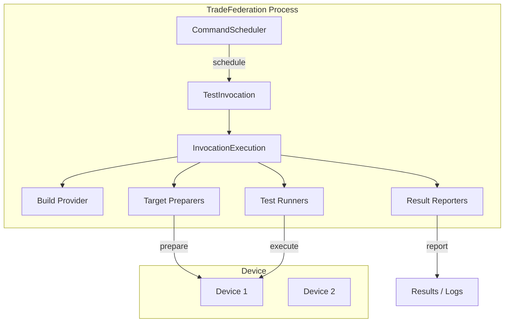

The key classes and interfaces:

**CommandScheduler** (`tools/tradefederation/core/src/com/android/tradefed/command/CommandScheduler.java`):
The central scheduler that accepts command-line invocations, matches them to
available devices, and dispatches `TestInvocation` instances.  It handles device
allocation from the `DeviceManager` and supports both interactive console mode
and headless batch mode.

**TestInvocation** (`tools/tradefederation/core/src/com/android/tradefed/invoker/TestInvocation.java`):
Represents a single test run.  It orchestrates the full pipeline:

1. Fetch build artifacts (`IBuildProvider`)
2. Prepare target devices (`ITargetPreparer`)
3. Run tests (`IRemoteTest`)
4. Collect results (`ITestInvocationListener`)
5. Clean up (`ITargetCleaner`)

**InvocationExecution** (`tools/tradefederation/core/src/com/android/tradefed/invoker/InvocationExecution.java`):
The concrete execution logic that drives the phases above.  For sandboxed
invocations, `SandboxedInvocationExecution` and `ParentSandboxInvocationExecution`
provide isolation.

### 55.2.3  Configuration System

TradeFed uses XML configuration files to describe test plans.  A configuration
specifies:

```xml
<configuration description="Example test config">
    <build_provider class="com.android.tradefed.build.DeviceBuildProvider" />

    <target_preparer class="com.android.tradefed.targetprep.DeviceSetup" />
    <target_preparer class="com.android.tradefed.targetprep.TestAppInstallSetup">
        <option name="test-file-name" value="MyTest.apk" />
    </target_preparer>

    <test class="com.android.tradefed.testtype.AndroidJUnitTest">
        <option name="package" value="com.example.mytest" />
        <option name="runner" value="androidx.test.runner.AndroidJUnitRunner" />
    </test>

    <result_reporter class="com.android.tradefed.result.ConsoleResultReporter" />
</configuration>
```

The configuration is parsed by `ConfigurationFactory`
(`tools/tradefederation/core/src/com/android/tradefed/config/ConfigurationFactory.java`)
and `ConfigurationXmlParser`.  Each `<option>` tag is injected into the target
object via `OptionSetter`, which uses Java reflection and the `@Option`
annotation:

```java
public class AndroidJUnitTest implements IRemoteTest, IDeviceTest {
    @Option(name = "package", description = "The test package to run.")
    private String mPackageName = null;

    @Option(name = "runner", description = "The instrumentation runner.")
    private String mRunnerName = "androidx.test.runner.AndroidJUnitRunner";
    // ...
}
```

### 55.2.4  Sharding

Sharding splits a test suite across multiple devices or invocations for parallel
execution.  TradeFed provides several sharding strategies:

**ShardHelper** (`tools/tradefederation/core/src/com/android/tradefed/invoker/shard/ShardHelper.java`):
The primary helper that creates shard invocations.  It clones configuration
objects to each shard to avoid shared state.  From the source:

```java
/** Helper class that handles creating the shards and scheduling them
 *  for an invocation. */
public class ShardHelper implements IShardHelper {
    public static final String LAST_SHARD_DETECTOR = "last_shard_detector";
    public static final String SHARED_TEST_INFORMATION = "shared_test_information";
    // ...
}
```

**StrictShardHelper**: Ensures each shard gets a deterministic, non-overlapping
partition of test cases.

**DynamicShardHelper**: Uses a gRPC-based dynamic sharding service
(`ConfigurableGrpcDynamicShardingClient`) that distributes tests to workers on
demand, improving load balancing when test durations vary widely.

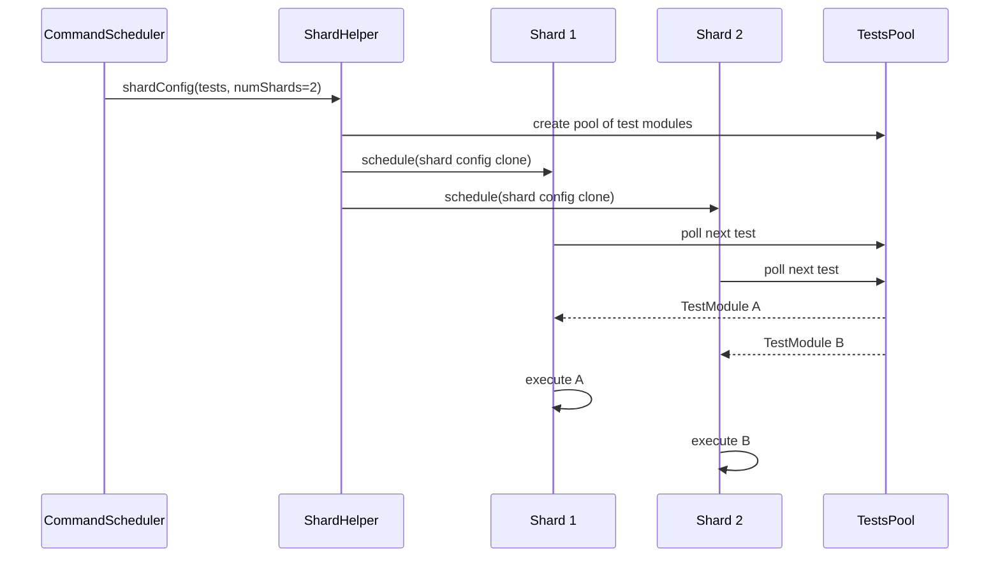

Key sharding-related classes:

- `TestsPoolPoller`: Polls from a shared `ITestsPool`
- `LocalPool`: In-process pool implementation
- `RemoteDynamicPool`: gRPC-backed distributed pool
- `ParentShardReplicate`: Replicates the parent invocation to each shard

### 55.2.5  Retry Logic

TradeFed has built-in retry support for handling flaky tests and transient
failures.  The retry subsystem is in:

```
tools/tradefederation/core/src/com/android/tradefed/retry/
  BaseRetryDecision.java    -- Core retry logic
  IRetryDecision.java       -- Interface
  ResultAggregator.java     -- Aggregates results across retries
  RetryStatistics.java      -- Tracks retry counts and outcomes
```

`BaseRetryDecision` implements the retry strategy:

- **Retry on failure**: Re-run only failed test cases
- **Retry count**: Configurable maximum number of retries
- **Result aggregation**: `ResultAggregator` merges results from multiple
  attempts, using the best outcome for each test case

The retry decision is wired into `TestInvocation` via `IRetryDecision`, which
examines the outcome of each test run module and decides whether to retry.

### 55.2.6  Test Types (Runners)

TradeFed provides a rich set of test runner implementations under
`tools/tradefederation/core/src/com/android/tradefed/testtype/`:

| Runner Class | Purpose |
|-------------|---------|
| `AndroidJUnitTest` | Instrumentation tests (JUnit4/5 on device) |
| `GTest` | Native GoogleTest binaries on device |
| `HostTest` | JUnit tests on host JVM |
| `IsolatedHostTest` | Host tests in isolated classloader (Ravenwood) |
| `PythonBinaryHostTest` | Python tests on host |
| `RustBinaryHostTest` | Rust test binaries on host |
| `FakeTest` | Generates fake results for testing TF itself |
| `TfTestLauncher` | Launches another TF process |

The `IRemoteTest` interface is the contract all runners implement:

```java
public interface IRemoteTest {
    void run(TestInformation testInfo, ITestInvocationListener listener)
        throws DeviceNotAvailableException;
}
```

### 55.2.7  Target Preparers

Target preparers set up the device before tests run.  Key preparers in
`tools/tradefederation/core/src/com/android/tradefed/targetprep/`:

| Preparer | Purpose |
|----------|---------|
| `DeviceSetup` | Configure device settings (screen, locale, etc.) |
| `DeviceFlashPreparer` | Flash device with a build image |
| `RootTargetPreparer` | Ensure device has root access |
| `TestAppInstallSetup` | Install test APKs |
| `StopServicesSetup` | Stop framework services during test |
| `PushFilePreparer` | Push files to device |

The `ITargetPreparer` interface and its counterpart `ITargetCleaner` provide
setup/teardown semantics:

```java
public interface ITargetPreparer {
    void setUp(TestInformation testInfo) throws TargetSetupError,
        BuildError, DeviceNotAvailableException;
}
public interface ITargetCleaner extends ITargetPreparer {
    void tearDown(TestInformation testInfo, Throwable e)
        throws DeviceNotAvailableException;
}
```

### 55.2.8  Suite Mode

TradeFed's suite mode (`ITestSuite`, `BaseTestSuite`) is the foundation for
CTS, VTS, MTS, and other compliance suites.  Key classes:

```
tools/tradefederation/core/src/com/android/tradefed/testtype/suite/
  ITestSuite.java                -- Base suite runner
  BaseTestSuite.java             -- Configurable suite loading
  ModuleDefinition.java          -- Represents a single test module
  ModuleListener.java            -- Per-module result listener
  ModuleSplitter.java            -- Splits modules for sharding
  SuiteModuleLoader.java         -- Loads module configs from disk
  TestMappingSuiteRunner.java    -- Runs tests from TEST_MAPPING
  GranularRetriableTestWrapper.java -- Per-test-case retry
```

`ModuleDefinition` encapsulates everything needed to run a single module:
preparers, tests, and cleanup.  `SuiteModuleLoader` discovers `*.config` files
in the test case directories and instantiates `ModuleDefinition` objects.

### 55.2.9  Invocation Lifecycle in Detail

A complete TradeFed invocation follows this detailed lifecycle:

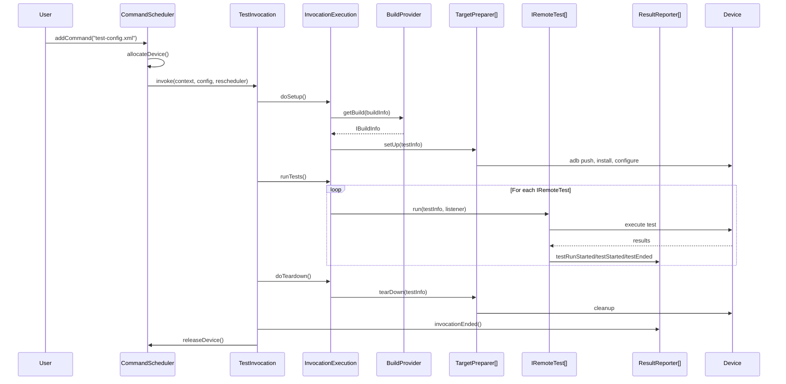

Key details of each phase:

**Build Provision** (`IBuildProvider`):

- `DeviceBuildProvider`: Fetches build artifacts from a build server
- `LocalDeviceBuildProvider`: Uses locally built artifacts
- `CommandLineBuildInfoBuilder`: Constructs build info from command-line args

**Target Preparation** (`ITargetPreparer`):
Preparers execute in order, and their teardowns execute in reverse order
(stack discipline).  Common preparation sequences:

1. Flash the device (`DeviceFlashPreparer`)
2. Wait for boot completion
3. Configure device settings (`DeviceSetup`)
4. Install test APKs (`TestAppInstallSetup`)
5. Push data files (`PushFilePreparer`)
6. Root the device if needed (`RootTargetPreparer`)

**Test Execution** (`IRemoteTest`):
Multiple tests can be configured in a single invocation.  Each test
reports results via the `ITestInvocationListener` callback interface:

```java
public interface ITestInvocationListener {
    void invocationStarted(IInvocationContext context);
    void testRunStarted(String runName, int testCount);
    void testStarted(TestDescription test);
    void testEnded(TestDescription test, HashMap<String, Metric> metrics);
    void testFailed(TestDescription test, FailureDescription failure);
    void testRunEnded(long elapsedTime, HashMap<String, Metric> metrics);
    void invocationEnded(long elapsedTime);
}
```

### 55.2.10  Multi-Device Testing

TradeFed supports multi-device test configurations where a single test
module requires multiple devices.  The configuration uses `<device>` tags:

```xml
<configuration description="Multi-device test">
    <device name="device1">
        <target_preparer class="...TestAppInstallSetup">
            <option name="test-file-name" value="App1.apk" />
        </target_preparer>
    </device>
    <device name="device2">
        <target_preparer class="...TestAppInstallSetup">
            <option name="test-file-name" value="App2.apk" />
        </target_preparer>
    </device>
    <test class="com.example.MultiDeviceTest" />
</configuration>
```

The test accesses devices via `TestInformation`:

```java
ITestDevice device1 = testInfo.getContext().getDevice("device1");
ITestDevice device2 = testInfo.getContext().getDevice("device2");
```

### 55.2.11  Sandbox Mode

TradeFed can run invocations in a sandbox for isolation.  The sandbox uses
a separate classloader or process to prevent test code from affecting the
harness.  This is critical for running untrusted test code in CI:

- `SandboxedInvocationExecution`: Runs inside the sandbox
- `ParentSandboxInvocationExecution`: Coordinates from outside

### 55.2.12  Result Reporting

TradeFed supports multiple result reporters simultaneously:

| Reporter | Output |
|----------|--------|
| `ConsoleResultReporter` | Terminal output |
| `TextResultReporter` | Plain text file |
| `XmlResultReporter` | JUnit XML format |
| `InvocationProtoResultReporter` | Protocol buffer format |
| `FileInputStreamSource` | Log file attachments |
| `LogSaverResultForwarder` | Saves logs to storage |

Results include:

- Pass/fail status for each test case
- Stack traces for failures
- Test metrics (timing, custom metrics)
- Device logs (logcat, bugreport)
- Screenshots on failure

---

## 55.3  atest

### 55.3.1  Overview

`atest` is the developer-facing CLI tool that automates the build-install-test
cycle.  It translates human-friendly test references into TradeFederation
invocations.

Source: `tools/asuite/atest/atest_main.py` (1683 lines)

From the module docstring:

```python
"""Command line utility for running Android tests through TradeFederation.

atest helps automate the flow of building test modules across the Android
code base and executing the tests via the TradeFederation test harness.

atest is designed to support any test types that can be ran by TradeFederation.
"""
```

### 55.3.2  Architecture

atest's execution flow follows three steps, controlled by the `Steps` dataclass:

```python
@dataclasses.dataclass
class Steps:
  """A dataclass that stores enabled steps."""
  build: bool
  install: bool
  test: bool
```

The main entry point creates an `AtestMain` object and calls `_run_all_steps()`,
which orchestrates:

1. **Test discovery** -- Find test modules matching the user's references
2. **Build** -- Invoke the build system to compile the test and its dependencies
3. **Test** -- Execute via TradeFederation

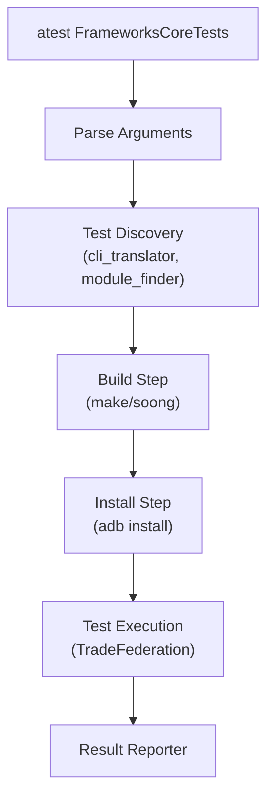

### 55.3.3  Test Discovery

atest supports multiple test reference formats:

```bash
# By module name
atest FrameworksCoreTests

# By module:class
atest FrameworksCoreTests:android.os.BundleTest

# By file path
atest frameworks/base/core/tests/coretests/src/android/os/BundleTest.java

# By package
atest com.android.server.pm

# By TEST_MAPPING (current directory)
atest --test-mapping

# By class name
atest android.os.BundleTest
```

Test discovery is handled by finders in `tools/asuite/atest/test_finders/`:

- `module_finder.py` -- Searches the module-info.json database
- `cache_finder.py` -- Uses cached results from previous runs
- `tf_integration_finder.py` -- Finds TradeFed integration configs
- `suite_plan_finder.py` -- Finds suite plans (CTS, VTS, etc.)
- `smart_test_finder/` -- AI/ML-based smart test selection

The `cli_translator.py` module coordinates the finders and translates user
input into `TestInfo` objects that the runner can execute.

### 55.3.4  Test Execution and Filtering

atest passes many options through to TradeFederation via extra args:

```python
arg_maps = {
    'all_abi': constants.ALL_ABI,
    'annotation_filter': constants.ANNOTATION_FILTER,
    'collect_tests_only': constants.COLLECT_TESTS_ONLY,
    'custom_args': constants.CUSTOM_ARGS,
    'device_only': constants.DEVICE_ONLY,
    'disable_teardown': constants.DISABLE_TEARDOWN,
    'dry_run': constants.DRY_RUN,
    'host': constants.HOST,
    'instant': constants.INSTANT,
    'iterations': constants.ITERATIONS,
    'serial': constants.SERIAL,
    'sharding': constants.SHARDING,
    'test_filter': constants.TEST_FILTER,
    'test_timeout': constants.TEST_TIMEOUT,
    # ...
}
```

Key filtering options:

- `--test-filter` / `-tf`: Filter by class or method name
- `--annotation-filter`: Include/exclude by Java annotation
- `--include-filter` / `--exclude-filter`: TradeFed-level module filtering
- `--host`: Force host-side execution
- `--device-only`: Force device-side execution

### 55.3.5  Execution Mode Validation

atest validates that host-only and device-only tests are not mixed in
conflicting ways.  From `_validate_exec_mode()`:

```python
def _validate_exec_mode(args, test_infos: list[TestInfo], host_tests=None):
  all_device_modes = {x.get_supported_exec_mode() for x in test_infos}
  # In the case of '$atest <device-only> --host', exit.
  if (host_tests or args.host) and device_only_test_detected:
    # ... error and exit
  # In the case of '$atest <host-only>', we add --host to run on host-side.
  if not args.host and host_tests is None and not device_only_test_detected:
    args.host = host_only_test_detected
```

### 55.3.6  Common atest Commands

```bash
# Run a single module
atest CtsNetTestCases

# Run a specific test class
atest CtsNetTestCases:android.net.cts.ConnectivityManagerTest

# Run a specific method
atest CtsNetTestCases:android.net.cts.ConnectivityManagerTest#testGetActiveNetwork

# Run tests from TEST_MAPPING in current directory
atest

# Run only host tests
atest --host FrameworksMockingServicesTests

# Run with sharding across 4 devices
atest LargeTestSuite --sharding 4

# Dry run (show TF command without executing)
atest --dry-run CtsNetTestCases

# Run with iterations for flakiness detection
atest --iterations 10 MyFlakyTest

# Run with coverage
atest --experimental-coverage MyTest
```

### 55.3.7  Test Runner Registry

atest maintains a registry of test runners in `test_runner_handler.py`.  Each
runner handles a different test execution backend:

```python
_TEST_RUNNERS = {
    atest_tf_test_runner.AtestTradefedTestRunner.NAME: (
        atest_tf_test_runner.AtestTradefedTestRunner
    ),
    mobly_test_runner.MoblyTestRunner.NAME: (
        mobly_test_runner.MoblyTestRunner
    ),
    robolectric_test_runner.RobolectricTestRunner.NAME: (
        robolectric_test_runner.RobolectricTestRunner
    ),
    suite_plan_test_runner.SuitePlanTestRunner.NAME: (
        suite_plan_test_runner.SuitePlanTestRunner
    ),
    vts_tf_test_runner.VtsTradefedTestRunner.NAME: (
        vts_tf_test_runner.VtsTradefedTestRunner
    ),
}
```

The runners:

- **AtestTradefedTestRunner**: Default runner, invokes TradeFed for most tests
- **MoblyTestRunner**: For Python-based multi-device tests using the Mobly
  framework

- **RobolectricTestRunner**: Specialized runner for Robolectric tests
- **SuitePlanTestRunner**: Runs full suite plans (cts, vts, etc.)
- **VtsTradefedTestRunner**: VTS-specific TradeFed runner

### 55.3.8  CLITranslator

The `CLITranslator` class (`tools/asuite/atest/cli_translator.py`) is the
brain of atest's test discovery.  From the source:

```python
class CLITranslator:
  """CLITranslator class contains public method translate() and some
  private helper methods. The atest tool can call the translate() method
  with a list of strings, each string referencing a test to run.
  Translate() will "translate" this list of test strings into a list of
  build targets and a list of TradeFederation run commands.

  Translation steps for a test string reference:
      1. Narrow down the type of reference the test string could be,
         i.e. whether it could be referencing a Module, Class,
         Package, etc.
      2. Try to find the test files assuming the test string is one
         of these types of reference.
      3. If test files found, generate Build Targets and the
         Run Command.
  """
```

The translation uses `module-info.json` -- a database of all modules in the
build, generated by Soong.  This database maps module names to their build
paths, installed paths, and test configuration files.

### 55.3.9  The _AtestMain Class

The main entry point is the `_AtestMain` class in `atest_main.py`:

```python
class _AtestMain:
  """Entry point of atest script."""

  def __init__(self, argv: list[str]):
    self._argv: list[str] = argv
    self._banner_printer: banner.BannerPrinter = None
    self._steps: Steps = None
    self._results_dir: str = None
    self._mod_info: module_info.ModuleInfo = None
    self._test_infos: list[test_info.TestInfo] = None
    self._test_execution_plan: _TestExecutionPlan = None
    self._acloud_proc: subprocess.Popen = None
    self._acloud_report_file: str = None
    self._test_info_loading_duration: float = 0
    self._build_duration: float = 0
```

The `run()` method orchestrates the complete flow:

1. Parse arguments (supports config file overrides)
2. Validate environment (ANDROID_BUILD_TOP, etc.)
3. Start acloud/AVD if requested
4. Discover test modules (CLITranslator)
5. Validate execution mode (host vs device)
6. Build required modules
7. Execute tests via TradeFed
8. Report results

### 55.3.10  TEST_MAPPING Integration in atest

When invoked without arguments in a directory containing TEST_MAPPING, atest
automatically discovers and runs the presubmit tests:

```python
def is_from_test_mapping(test_infos):
  """Check that the test_infos came from TEST_MAPPING files."""
  return list(test_infos)[0].from_test_mapping
```

TEST_MAPPING tests are split into device and host groups:

```python
def _split_test_mapping_tests(test_infos):
  """Split Test Mapping tests into 2 groups: device and host tests."""
  assert is_from_test_mapping(test_infos)
  host_test_infos = {info for info in test_infos if info.host}
  device_test_infos = {info for info in test_infos if not info.host}
  return device_test_infos, host_test_infos
```

### 55.3.11  Smart Test Selection

atest supports smart test selection (`--sts` flag), which uses ML/heuristics
to determine which tests are most relevant for a given code change:

```python
_SMART_TEST_SELECTION_FLAG = '--sts'
```

Smart test selection:

1. Analyzes the `git diff` of the current change
2. Maps changed files to historically relevant test modules
3. Runs only the most impactful tests
4. Reduces presubmit test time significantly

### 55.3.12  Device Availability Checking

atest validates device availability before running device tests:

```python
def _validate_adb_devices(args, test_infos):
  """Validate the availability of connected devices via adb command."""
  if not parse_steps(args).test:
    return
  if args.no_checking_device:
    return
  all_device_modes = {x.get_supported_exec_mode() for x in test_infos}
  if constants.DEVICE_TEST in all_device_modes:
    if (not any((args.host, args.start_avd, args.acloud_create))
        and not atest_utils.get_adb_devices()):
      err_msg = (
          f'Stop running test(s): {", ".join(device_tests)} '
          f'require a device.')
      # ... exit with DEVICE_NOT_FOUND
```

### 55.3.13  Multi-Device Support

atest can detect when a test requires multiple devices:

```python
def get_device_count_config(test_infos, mod_info):
  """Get the amount of desired devices from the test config."""
  max_count = 0
  for tinfo in test_infos:
    test_config, _ = test_finder_utils.get_test_config_and_srcs(
        tinfo, mod_info)
    if test_config:
      devices = atest_utils.get_config_device(test_config)
      if devices:
        max_count = max(len(devices), max_count)
  return max_count
```

```mermaid
flowchart TB
    subgraph atest["atest Architecture"]
        CLI["Command Line Interface<br>arg_parser.py"]
        Config["Config File<br>atest_configs.py"]
        Translator["CLITranslator<br>cli_translator.py"]

        subgraph Finders["Test Finders"]
            MF["ModuleFinder"]
            CF["CacheFinder"]
            TFF["TFIntegrationFinder"]
            SPF["SuitePlanFinder"]
            STF["SmartTestFinder"]
        end

        subgraph Runners["Test Runners"]
            ATF["AtestTradefedTestRunner"]
            Mobly["MoblyTestRunner"]
            Robo_R["RobolectricTestRunner"]
            Suite_R["SuitePlanTestRunner"]
            VTS_R["VtsTradefedTestRunner"]
        end

        Results["ResultReporter<br>result_reporter.py"]
    end

    CLI --> Config
    Config --> Translator
    Translator --> Finders
    Finders --> |"TestInfo"| Runners
    Runners --> Results
```

---

## 55.4  TEST_MAPPING

### 55.4.1  Purpose and Format

`TEST_MAPPING` files are JSON files placed alongside source code that declare
which tests should run when files in that directory (or its children) change.
They are the glue between code changes and presubmit/postsubmit test selection.

### 55.4.2  JSON Structure

A `TEST_MAPPING` file contains a JSON object whose keys are *test groups*
(typically `presubmit`, `postsubmit`, or custom names) and whose values are
arrays of test objects.

**Simple example** from `system/libbase/TEST_MAPPING`:

```json
{
  "presubmit": [
    {
      "name": "libbase_test"
    }
  ],
  "hwasan-presubmit": [
    {
      "name": "libbase_test"
    }
  ]
}
```

**Complex example** from `frameworks/base/TEST_MAPPING`:

```json
{
  "presubmit": [
    {
      "name": "ManagedProvisioningTests"
    },
    {
      "file_patterns": [
        "ApexManager\\.java",
        "SystemServer\\.java",
        "services/tests/apexsystemservices/.*"
      ],
      "name": "ApexSystemServicesTestCases"
    },
    {
      "name": "FrameworksUiServicesTests"
    },
    {
      "name": "FrameworksCoreTests_Presubmit"
    }
  ],
  "ravenwood-presubmit": [
    {
      "name": "CtsUtilTestCasesRavenwood",
      "host": true,
      "file_patterns": ["[Rr]avenwood"]
    }
  ],
  "postsubmit-managedprofile-stress": [
    {
      "name": "ManagedProfileLifecycleStressTest"
    }
  ],
  "auto-postsubmit": [
    {
      "name": "FrameworksUiServicesTests"
    },
    {
      "name": "TestablesTests"
    }
  ],
  "wear-cts-presubmit": [
    {
      "name": "CtsWidgetTestCases",
      "options": [
        {"include-filter": "android.widget.cts.RemoteViewsTest"},
        {"include-filter": "android.widget.cts.TextViewTest"}
      ]
    }
  ]
}
```

### 55.4.3  Test Object Fields

| Field | Type | Description |
|-------|------|-------------|
| `name` | string | Module name (must match a test module in the build) |
| `host` | boolean | If true, run as host test |
| `file_patterns` | string[] | Regex patterns; test only runs when matching files change |
| `options` | object[] | TradeFed options (include-filter, exclude-filter, etc.) |

### 55.4.4  Test Groups

| Group | When it runs | Typical content |
|-------|-------------|----------------|
| `presubmit` | Before merge, on every CL | Fast, reliable tests |
| `presubmit-large` | Before merge, more resources | Larger integration tests |
| `postsubmit` | After merge | Slower tests, stress tests |
| `ravenwood-presubmit` | Before merge, host-only | Ravenwood framework tests |
| `hwasan-presubmit` | Before merge, HWASAN builds | Memory-safety tests |
| `auto-postsubmit` | After merge, automotive targets | Automotive-specific |
| `wear-cts-presubmit` | Before merge, Wear targets | Wear-specific CTS subset |
| Custom groups | CI-defined | Any custom grouping |

### 55.4.5  Inheritance and Directory Walk

The TEST_MAPPING system walks *up* the directory tree from the changed file.
A test declared in `frameworks/base/TEST_MAPPING` applies to changes anywhere
under `frameworks/base/`.  This allows broad test coverage with a single file,
while subdirectories can add their own more specific tests.

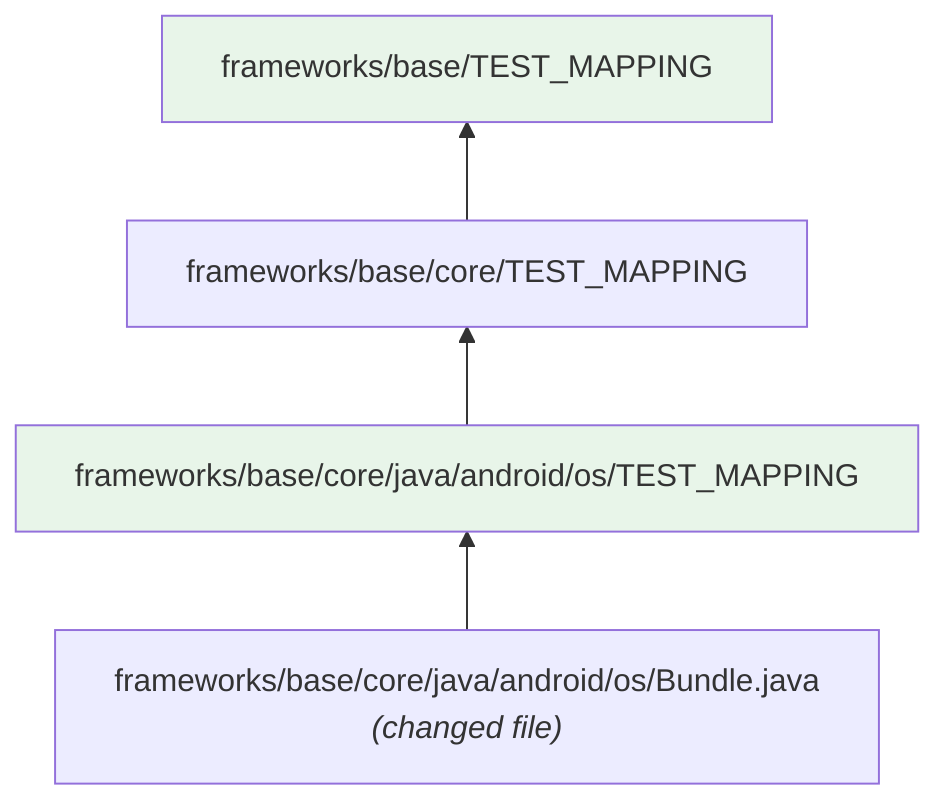

### 55.4.6  TestMappingSuiteRunner

TradeFed's `TestMappingSuiteRunner`
(`tools/tradefederation/core/src/com/android/tradefed/testtype/suite/TestMappingSuiteRunner.java`)
loads and executes tests from TEST_MAPPING files.  It:

1. Collects all TEST_MAPPING files for the changed paths
2. Filters by the requested test group (presubmit, postsubmit, etc.)
3. Applies file_patterns filtering
4. Resolves module names to test configurations
5. Executes via the standard suite pipeline

### 55.4.7  TEST_MAPPING Best Practices

1. **Keep presubmit fast**: Only include tests that complete in under 5 minutes
2. **Use file_patterns**: For large directories, scope tests to relevant changes
3. **Avoid duplication**: If a parent directory already tests a module, do not
   re-declare it in child directories

4. **Group tests logically**: Use custom groups for specialized targets
   (automotive, wear, etc.)

5. **Specify host where possible**: Add `"host": true` for host-only tests
   to avoid unnecessary device allocation

6. **Use options for filtering**: Apply `include-filter` to run only relevant
   test classes from large modules

### 55.4.8  Finding TEST_MAPPING Files

The CI system and atest both walk the directory tree to find TEST_MAPPING files.
The search starts from the changed file's directory and walks upward to the
repository root.

```python
# From cli_translator.py
# Pattern used to identify comments in TEST_MAPPING.
_COMMENTS_RE = re.compile(r'(?m)[\s\t]*(#|//).*|(\".*?\")')
_COMMENTS = frozenset(['//', '#'])
```

TEST_MAPPING supports comments (lines starting with `//` or `#`), which is
non-standard JSON.  The parser strips these before JSON parsing.

### 55.4.9  Validation

TEST_MAPPING files are validated at presubmit time.  The validation checks:

- Valid JSON (after comment stripping)
- All referenced test modules exist in the build
- Test group names match known groups
- Options are valid TradeFed options
- No circular references

---

## 55.5  Build System Test Modules

### 55.5.1  Overview

The Soong build system provides dedicated module types for every supported test
language and framework.  Each module type encapsulates:

- Compilation rules
- Auto-generation of TradeFed XML configuration
- Test suite membership
- Installation to the correct directory

### 55.5.2  android_test (Java/Kotlin Instrumentation Test)

The most common Java test module type.  It builds an APK containing test code
and installs it on a device via `am instrument`.

```blueprint
android_test {
    name: "FrameworksCoreTests",
    srcs: ["src/**/*.java"],
    static_libs: [
        "androidx.test.runner",
        "androidx.test.rules",
        "mockito-target-minus-junit4",
        "truth",
    ],
    test_suites: ["device-tests"],
    platform_apis: true,
    certificate: "platform",
    instrumentation_for: "framework",
}
```

The build system auto-generates `AndroidTest.xml` (the TradeFed config) using
`AutoGenInstrumentationTestConfig()` from
`build/soong/tradefed/autogen.go`.

### 55.5.3  cc_test (Native GoogleTest)

Defined in `build/soong/cc/test.go`.  Registered via:

```go
func init() {
    android.RegisterModuleType("cc_test", TestFactory)
    android.RegisterModuleType("cc_test_library", TestLibraryFactory)
    android.RegisterModuleType("cc_benchmark", BenchmarkFactory)
    android.RegisterModuleType("cc_test_host", TestHostFactory)
    android.RegisterModuleType("cc_benchmark_host", BenchmarkHostFactory)
}
```

Key properties from the source:

```go
type TestLinkerProperties struct {
    // if set, build against the gtest library. Defaults to true.
    Gtest *bool

    // if set, use the isolated gtest runner. Defaults to false.
    Isolated *bool
}

type TestBinaryProperties struct {
    // list of files or filegroup modules that provide data
    Data []string `android:"path,arch_variant"`

    // the name of the test configuration
    Test_config *string `android:"path,arch_variant"`

    // Add RootTargetPreparer to auto generated test config
    Require_root *bool

    // Add RunCommandTargetPreparer to stop framework
    Disable_framework *bool

    // Flag to indicate whether to create test config automatically
    Auto_gen_config *bool

    // Add parameterized mainline modules
    Test_mainline_modules []string

    // Install the test into a folder named for the module
    Per_testcase_directory *bool
}
```

When `gtest` is true (the default), the build system automatically links
`libgtest_main` and `libgtest`:

```go
func (test *testDecorator) linkerDeps(ctx BaseModuleContext, deps Deps) Deps {
    if test.gtest() {
        if ctx.useSdk() && ctx.Device() {
            deps.StaticLibs = append(deps.StaticLibs,
                "libgtest_main_ndk_c++", "libgtest_ndk_c++")
        } else if test.isolated(ctx) {
            deps.StaticLibs = append(deps.StaticLibs, "libgtest_isolated_main")
            deps.SharedLibs = append(deps.SharedLibs, "liblog")
        } else {
            deps.StaticLibs = append(deps.StaticLibs, "libgtest_main", "libgtest")
        }
    }
    return deps
}
```

The GTest flags are set based on the target platform:

```go
func (test *testDecorator) linkerFlags(ctx ModuleContext, flags Flags) Flags {
    if !test.gtest() {
        return flags
    }
    flags.Local.CFlags = append(flags.Local.CFlags, "-DGTEST_HAS_STD_STRING")
    if ctx.Host() {
        switch ctx.Os() {
        case android.Windows:
            flags.Local.CFlags = append(flags.Local.CFlags, "-DGTEST_OS_WINDOWS")
        case android.Linux:
            flags.Local.CFlags = append(flags.Local.CFlags, "-DGTEST_OS_LINUX")
        case android.Darwin:
            flags.Local.CFlags = append(flags.Local.CFlags, "-DGTEST_OS_MAC")
        }
    } else {
        flags.Local.CFlags = append(flags.Local.CFlags, "-DGTEST_OS_LINUX_ANDROID")
    }
    return flags
}
```

Example `cc_test`:

```blueprint
cc_test {
    name: "libbase_test",
    defaults: ["libbase_test_defaults"],
    srcs: [
        "chrono_utils_test.cpp",
        "endian_test.cpp",
        "errors_test.cpp",
        "expected_test.cpp",
        "file_test.cpp",
        "logging_test.cpp",
        "mapped_file_test.cpp",
        "parsebool_test.cpp",
        "parsedouble_test.cpp",
        "parseint_test.cpp",
        "result_test.cpp",
        "scopeguard_test.cpp",
        "stringprintf_test.cpp",
        "strings_test.cpp",
    ],
    test_suites: ["device-tests"],
}
```

### 55.5.4  cc_test_host

A convenience variant of `cc_test` that targets only the host:

```go
func TestHostFactory() android.Module {
    module := NewTest(android.HostSupported)
    return module.Init()
}
```

### 55.5.5  rust_test

Defined in `build/soong/rust/test.go`.  Properties mirror `cc_test`:

```go
type TestProperties struct {
    No_named_install_directory *bool
    Test_config *string `android:"path,arch_variant"`
    Test_config_template *string `android:"path,arch_variant"`
    Test_suites []string `android:"arch_variant"`
    Data []string `android:"path,arch_variant"`
    Data_libs []string `android:"arch_variant"`
    Data_bins []string `android:"arch_variant"`
    Auto_gen_config *bool
    // if set, build with the standard Rust test harness. Defaults to true.
    Test_harness *bool
    Test_options android.CommonTestOptions
    Require_root *bool
}
```

When `test_harness` is true (default), the Rust compiler is invoked with
`--test`, which enables the built-in test framework that discovers functions
annotated with `#[test]`.

Example:

```blueprint
rust_test {
    name: "libkeystore2_test",
    crate_name: "keystore2_test",
    srcs: ["tests/*.rs"],
    test_suites: ["general-tests"],
    static_libs: ["libkeystore2"],
}
```

### 55.5.6  python_test_host

Defined in `build/soong/python/test.go`:

```go
func init() {
    registerPythonTestComponents(android.InitRegistrationContext)
}

func registerPythonTestComponents(ctx android.RegistrationContext) {
    ctx.RegisterModuleType("python_test_host", PythonTestHostFactory)
    ctx.RegisterModuleType("python_test", PythonTestFactory)
}
```

Python test options include runner selection:

```go
type TestOptions struct {
    android.CommonTestOptions
    // Runner for the test. Supports "tradefed" and "mobly"
    // (for multi-device tests). Default is "tradefed".
    Runner *string
    // Metadata to describe the test configuration.
    Metadata []Metadata
}
```

### 55.5.7  java_test_host

A Java test that runs on the host JVM.  Commonly used for host-side CTS tests
that use `adb` to interact with the device programmatically.

```blueprint
java_test_host {
    name: "CtsAppSecurityHostTestCases",
    srcs: ["src/**/*.java"],
    libs: [
        "cts-tradefed",
        "tradefed",
        "compatibility-host-util",
    ],
    test_suites: ["cts", "general-tests"],
}
```

### 55.5.8  Auto-Generated Test Configuration

The build system's `tradefed` package (`build/soong/tradefed/autogen.go`)
auto-generates TradeFed XML configs for test modules.  The key function is
`AutoGenTestConfig()`:

```go
type AutoGenTestConfigOptions struct {
    Name                    string
    OutputFileName          string
    TestConfigProp          *string
    TestConfigTemplateProp  *string
    TestSuites              []string
    Config                  []Config
    OptionsForAutogenerated []Option
    TestRunnerOptions       []Option
    AutoGenConfig           *bool
    UnitTest                *bool
    TestInstallBase         string
    DeviceTemplate          string
    HostTemplate            string
    HostUnitTestTemplate    string
    StandaloneTest          *bool
}

func AutoGenTestConfig(ctx android.ModuleContext,
    options AutoGenTestConfigOptions) android.Path {
    // ...
    if ctx.Device() {
        autogenTemplate(ctx, name, autogenPath,
            options.DeviceTemplate, configs, ...)
    } else {
        if Bool(options.UnitTest) {
            autogenTemplate(ctx, name, autogenPath,
                options.HostUnitTestTemplate, configs, ...)
        } else {
            autogenTemplate(ctx, name, autogenPath,
                options.HostTemplate, configs, ...)
        }
    }
    // ...
}
```

The auto-generation uses `sed` to substitute placeholders in template XML
files:

```go
var autogenTestConfig = pctx.StaticRule("autogenTestConfig", blueprint.RuleParams{
    Command: "sed 's&{MODULE}&${name}&g;" +
        "s&{EXTRA_CONFIGS}&'${extraConfigs}'&g;" +
        "s&{EXTRA_TEST_RUNNER_CONFIGS}&'${extraTestRunnerConfigs}'&g;" +
        "s&{OUTPUT_FILENAME}&'${outputFileName}'&g;" +
        "s&{TEST_INSTALL_BASE}&'${testInstallBase}'&g' $template > $out",
    // ...
})
```

### 55.5.9  Module Type Summary

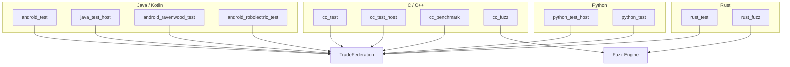

### 55.5.10  Standalone Tests

The `standalone_test` property for `cc_test` enables self-contained test
packages that bundle their shared library dependencies:

```go
// Install the test's dependencies into a folder named standalone-libs
// relative to the test's installation path.
Standalone_test *bool
```

When enabled, the build system:

1. Collects all transitive shared library dependencies
2. Installs them alongside the test binary
3. Sets `ld-library-path` in the auto-generated config
4. Creates packaging specs for the standalone directory

From `build/soong/cc/test.go`:

```go
if Bool(test.Properties.Standalone_test) {
    packagingSpecsBuilder := depset.NewBuilder[android.PackagingSpec](
        depset.TOPOLOGICAL)
    ctx.VisitDirectDepsProxy(func(dep android.ModuleProxy) {
        deps := android.OtherModuleProviderOrDefault(ctx, dep,
            android.InstallFilesProvider)
        packagingSpecsBuilder.Transitive(deps.TransitivePackagingSpecs)
    })
    for _, standaloneTestDep := range packagingSpecsBuilder.Build().ToList() {
        if standaloneTestDep.SrcPath() == nil { continue }
        if standaloneTestDep.SkipInstall() { continue }
        if standaloneTestDep.Partition() == "data" { continue }
        test.binaryDecorator.baseInstaller.installStandaloneTestDep(
            ctx, standaloneTestDep)
    }
}
```

And the TradeFed config gets the library path:

```go
if Bool(options.StandaloneTest) {
    options.TestRunnerOptions = append(options.TestRunnerOptions, Option{
        Name:  "ld-library-path",
        Value: "{TEST_INSTALL_BASE}/" + name + "/" +
            ctx.Arch().ArchType.String() + "/standalone-libs",
    })
}
```

### 55.5.11  Benchmark Modules

The `cc_benchmark` module type builds performance benchmark binaries using
Google Benchmark:

```go
func BenchmarkFactory() android.Module {
    module := NewBenchmark(android.HostAndDeviceSupported)
    module.testModule = true
    return module.Init()
}
```

Benchmarks automatically link against `libgoogle-benchmark`:

```go
func (benchmark *benchmarkDecorator) linkerDeps(ctx DepsContext, deps Deps) Deps {
    deps = benchmark.binaryDecorator.linkerDeps(ctx, deps)
    deps.StaticLibs = append(deps.StaticLibs, "libgoogle-benchmark")
    return deps
}
```

Benchmarks are installed to a separate directory:

```go
benchmark.binaryDecorator.baseInstaller.dir = filepath.Join(
    "benchmarktest", ctx.ModuleName())
benchmark.binaryDecorator.baseInstaller.dir64 = filepath.Join(
    "benchmarktest64", ctx.ModuleName())
```

Example benchmark:

```blueprint
cc_benchmark {
    name: "libutils_benchmark",
    srcs: ["Looper_bench.cpp", "String8_bench.cpp"],
    shared_libs: ["libutils"],
    test_suites: ["device-tests"],
}
```

### 55.5.12  Test Config Templates

The build system uses template XML files for auto-generating TradeFed configs.
Key templates referenced in the code:

| Template Variable | Usage |
|------------------|-------|
| `${NativeTestConfigTemplate}` | Device cc_test |
| `${NativeHostTestConfigTemplate}` | Host cc_test |
| `${NativeBenchmarkTestConfigTemplate}` | cc_benchmark |
| `${InstrumentationTestConfigTemplate}` | android_test |
| `${RobolectricTestConfigTemplate}` | android_robolectric_test |
| `${RavenwoodTestConfigTemplate}` | android_ravenwood_test |

Templates contain placeholders that get substituted:

- `{MODULE}` -- Module name
- `{EXTRA_CONFIGS}` -- Additional XML config elements
- `{EXTRA_TEST_RUNNER_CONFIGS}` -- Runner-specific options
- `{OUTPUT_FILENAME}` -- Output file name
- `{TEST_INSTALL_BASE}` -- Installation base directory

### 55.5.13  TestSuiteInfo Provider

All test modules set the `TestSuiteInfoProvider` so that the build system and
CI can discover test attributes:

```go
ctx.SetTestSuiteInfo(android.TestSuiteInfo{
    NameSuffix:           c.SubName(),
    TestSuites:           test.InstallerProperties.Test_suites,
    MainFile:             file,
    MainFileStem:         file.Base(),
    ConfigFile:           test.testConfig,
    ExtraConfigs:         test.extraTestConfigs,
    Data:                 test.data,
    NeedsArchFolder:      true,
    PerTestcaseDirectory: Bool(test.Properties.Per_testcase_directory),
    IsUnitTest:           Bool(test.Properties.Test_options.Unit_test),
})
```

The `IsUnitTest` flag marks host tests as unit tests, which:

- Adds them to the `host-unit-tests` suite
- Enables faster execution paths in CI
- Allows filtering in atest with `--host`

---

## 55.6  CTS -- Compatibility Test Suite

### 55.6.1  Overview

The Compatibility Test Suite (CTS) is the cornerstone of Android's ecosystem
compatibility guarantees.  Every device that ships with Google Play must pass CTS.
CTS verifies that the public SDK APIs behave according to their documented
contracts.

Source location: `cts/`

```
cts/
  tests/          -- Device-side test modules (87 directories)
  hostsidetests/  -- Host-side test modules (95 directories)
  apps/           -- Test helper apps (CtsVerifier, etc.)
  common/         -- Shared utilities
  libs/           -- Shared libraries
  tools/          -- CTS-specific tooling
  suite/          -- Suite configuration
  build/          -- Build configuration
```

### 55.6.2  Test Organization

CTS organizes tests by Android API area.  Each directory under `cts/tests/`
typically maps to a framework package or subsystem:

| Directory | API Area |
|-----------|----------|
| `cts/tests/app/` | Activity, Service, ContentProvider |
| `cts/tests/net/` | Networking APIs |
| `cts/tests/media/` | Media codecs, player, recorder |
| `cts/tests/security/` | Security/crypto APIs |
| `cts/tests/permission/` | Permission model |
| `cts/tests/widget/` | UI widgets |
| `cts/tests/graphics/` | Graphics, Canvas, OpenGL |
| `cts/tests/camera/` | Camera2 API |
| `cts/tests/telecom/` | Telephony/telecom |
| `cts/tests/accessibility/` | Accessibility services |

Host-side tests under `cts/hostsidetests/` test behaviors that require
host-level orchestration, such as:

| Directory | Purpose |
|-----------|---------|
| `cts/hostsidetests/appsecurity/` | App signing, permissions, isolation |
| `cts/hostsidetests/devicepolicy/` | Device admin, managed profiles |
| `cts/hostsidetests/apex/` | APEX module testing |
| `cts/hostsidetests/backup/` | Backup and restore |
| `cts/hostsidetests/car/` | Automotive features |
| `cts/hostsidetests/blobstore/` | Blob store API |

### 55.6.3  CTS Module Structure

A typical CTS device test module:

```
cts/tests/net/
  Android.bp             -- Build rule (android_test)
  AndroidManifest.xml    -- Test APK manifest
  AndroidTest.xml        -- TradeFed configuration
  src/                   -- Test source code
  res/                   -- Test resources (if needed)
```

The build rule declares CTS suite membership:

```blueprint
android_test {
    name: "CtsNetTestCases",
    defaults: ["cts_defaults"],
    srcs: ["src/**/*.java"],
    test_suites: [
        "cts",
        "general-tests",
    ],
    static_libs: [
        "ctstestrunner-axt",
        "compatibility-device-util-axt",
    ],
}
```

### 55.6.4  CtsVerifier

CtsVerifier (`cts/apps/CtsVerifier/`) is a special interactive test app that
verifies hardware-dependent behaviors that cannot be automated:

```
cts/apps/CtsVerifier/
  AndroidManifest.xml
  src/               -- Test activities
  res/               -- UI resources
  jni/               -- Native test helpers
  assets/            -- Test data
```

CtsVerifier covers:

- Sensor accuracy (accelerometer, gyroscope)
- Audio routing and latency
- Camera image quality
- Bluetooth, NFC, Wi-Fi behavior
- USB connectivity
- Biometric enrollment

Operators manually perform each test using the CtsVerifier app and confirm
pass/fail results.

### 55.6.5  Running CTS

```bash
# Full CTS run
cts-tradefed run cts

# Single module
cts-tradefed run cts --module CtsNetTestCases

# Single test
cts-tradefed run cts --module CtsNetTestCases \
    --test android.net.cts.ConnectivityManagerTest

# With retry
cts-tradefed run retry --retry <session_id>

# Using atest
atest CtsNetTestCases
```

### 55.6.6  CTS Architecture

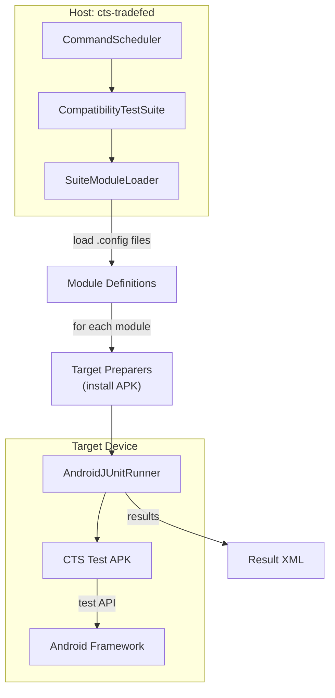

### 55.6.7  CTS Defaults

CTS tests use a shared `cts_defaults` to ensure consistent configuration:

```blueprint
java_defaults {
    name: "cts_defaults",
    platform_apis: true,
    optimize: {
        enabled: false,
    },
    static_libs: [
        "ctstestrunner-axt",
        "compatibility-device-util-axt",
        "junit",
        "truth",
    ],
    test_suites: [
        "cts",
        "general-tests",
    ],
}
```

### 55.6.8  CTS Sharding Across Devices

For large CTS runs (10,000+ test cases), sharding is essential.  CTS supports:

- **Static sharding**: Split modules into N equal shards
- **Dynamic sharding**: Use a pool-based approach for load balancing
- **Module-level sharding**: Each module runs on one device
- **Test-level sharding**: Individual test cases within a module split

```bash
# Shard across 4 devices
cts-tradefed run cts --shard-count 4

# Dynamic sharding with pool
cts-tradefed run cts --enable-token-sharding
```

### 55.6.9  CTS Result Structure

CTS produces structured results:

```
android-cts/results/
  YYYY.MM.DD_HH.MM.SS/
    test_result.xml           -- JUnit XML results
    test_result_failures.html -- Human-readable failures
    compatibility_result.xsl  -- XSL stylesheet
    result.pb                 -- Protocol buffer results
    invocation_summary.txt    -- Summary
    device_logcat*.txt        -- Device logs
    host_log*.txt             -- Host logs
```

The `test_result.xml` is the canonical result file used for compliance
certification submission.

### 55.6.10  CTS Module Development Workflow

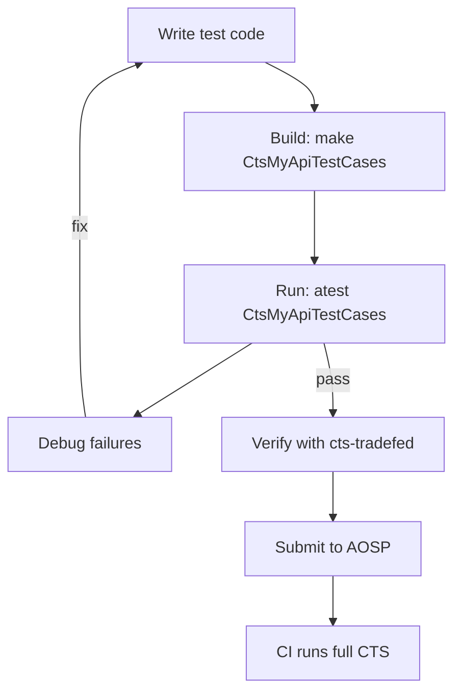

---

## 55.7  VTS -- Vendor Test Suite

### 55.7.1  Overview

The Vendor Test Suite (VTS) verifies the contract between the Android framework
and vendor implementations across the Treble architecture boundary.  While CTS
tests the public SDK, VTS tests HAL implementations, the VNDK, and kernel
interfaces.

Source locations:
```
test/vts/          -- VTS infrastructure and tools
test/vts-testcase/ -- VTS test cases
```

### 55.7.2  Test Categories

VTS test cases are organized under `test/vts-testcase/`:

**HAL Tests** (`test/vts-testcase/hal/`):

- `automotive/` -- Automotive HAL tests
- `neuralnetworks/` -- NNAPI HAL tests
- `thermal/` -- Thermal HAL tests
- `treble/` -- Treble compliance tests
- `usb/` -- USB HAL tests

**Kernel Tests** (`test/vts-testcase/kernel/`):

- `abi/` -- Kernel ABI stability
- `api/` -- Kernel API compliance
- `bow/` -- Block on write testing
- `checkpoint/` -- Checkpoint support
- `encryption/` -- Disk encryption
- `f2fs/` -- F2FS filesystem tests
- `fuse_bpf/` -- FUSE BPF tests
- `gki/` -- Generic Kernel Image tests
- `ltp/` -- Linux Test Project integration
- `virtual_ab/` -- Virtual A/B testing
- `zram/` -- ZRAM compression tests

**VNDK Tests** (`test/vts-testcase/vndk/`):

- `abi/` -- VNDK ABI stability
- `dependency/` -- VNDK dependency verification
- `files/` -- VNDK file list validation
- `golden/` -- Golden image comparison

### 55.7.3  HAL Testing Methodology

VTS HAL tests verify that vendor HAL implementations conform to their HIDL/AIDL
interface definitions.  The test framework:

1. Discovers HAL instances on the device via `hwservicemanager` or
   `servicemanager`

2. Opens a client connection to each HAL
3. Exercises the interface methods with known inputs
4. Validates outputs against the interface specification

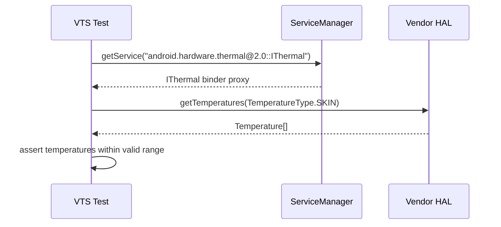

### 55.7.4  Treble Compliance

The Treble tests under `test/vts-testcase/hal/treble/` verify the architectural
separation:

- **VINTF manifest validation**: Verifies that the vendor manifest correctly
  declares all HALs

- **Framework-vendor separation**: Ensures no unauthorized cross-boundary
  dependencies

- **VNDK usage**: Validates that vendor code only uses VNDK libraries

### 55.7.5  Kernel Tests

VTS kernel tests (`test/vts-testcase/kernel/`) verify kernel behavior:

- **GKI tests**: Validate Generic Kernel Image compliance
- **ABI tests**: Ensure kernel ABI stability for module loading
- **LTP integration**: Runs Linux Test Project tests on Android
- **Syscall tests**: Verify syscall behavior matches requirements

### 55.7.6  Running VTS

```bash
# Full VTS run
vts-tradefed run vts

# Single module
vts-tradefed run vts --module VtsHalThermalV2_0TargetTest

# Using atest
atest VtsHalThermalV2_0TargetTest

# Kernel test
atest vts_kernel_gki_test
```

### 55.7.7  VTS vs CTS: The Treble Boundary

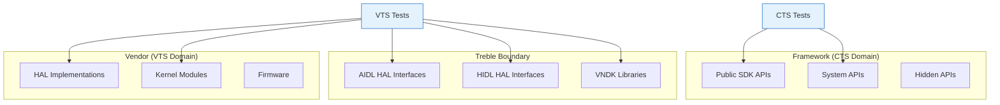

CTS tests the *framework* side of the boundary -- APIs that apps use.
VTS tests the *vendor* side -- HAL implementations, VNDK compliance, and
kernel behavior.  Together they enforce the Treble contract that allows
framework and vendor components to be updated independently.

### 55.7.8  Running VTS HAL Tests

A typical VTS HAL test invocation:

```bash
# Discover available HAL tests
vts-tradefed list modules | grep -i thermal

# Run a specific HAL test
vts-tradefed run vts --module VtsHalThermalTargetTest

# Run all HAL tests for a specific HAL
vts-tradefed run vts --include-filter 'VtsHal*Thermal*'
```

VTS HAL tests use the `GTest` runner for C++ tests and `HostTest` for
Python-based tests.  The test binaries are compiled against the HAL interface
headers and linked against the HAL client libraries.

### 55.7.9  VINTF Manifest Testing

A critical VTS test verifies the VINTF (Vendor Interface) manifest.  This
manifest declares which HALs a device provides:

```xml
<manifest version="2.0" type="device">
    <hal format="aidl">
        <name>android.hardware.thermal</name>
        <version>1</version>
        <fqname>IThermal/default</fqname>
    </hal>
</manifest>
```

VTS tests verify:

- Every declared HAL is actually available at runtime
- No undeclared HALs are present (no hidden implementations)
- Version numbers match the interface definitions
- Framework compatibility matrix is satisfied

---

## 55.8  Ravenwood -- Host-Side Framework Testing

### 55.8.1  Overview

Ravenwood is Android's solution for running framework tests on the host JVM
without requiring a device or emulator.  It provides a lightweight environment
where Android framework classes execute directly on a JDK 21+ host JVM,
dramatically reducing test execution time from minutes to seconds.

Source: `build/soong/java/ravenwood.go` (539 lines)

### 55.8.2  Module Type: android_ravenwood_test

The `android_ravenwood_test` module type is registered in `ravenwood.go`:

```go
func RegisterRavenwoodBuildComponents(ctx android.RegistrationContext) {
    ctx.RegisterModuleType("android_ravenwood_test", ravenwoodTestFactory)
    ctx.RegisterModuleType("android_ravenwood_libgroup", ravenwoodLibgroupFactory)
}
```

The factory function sets up default suite membership:

```go
func ravenwoodTestFactory() android.Module {
    module := &ravenwoodTest{}
    module.addHostAndDeviceProperties()
    module.AddProperties(&module.aaptProperties,
        &module.testProperties, &module.ravenwoodTestProperties)
    module.Module.dexpreopter.isTest = true
    module.Module.linter.properties.Lint.Test_module_type = proptools.BoolPtr(true)

    module.testProperties.Test_suites = []string{
        "general-tests",
        "ravenwood-tests",
    }
    // ...
    InitJavaModule(module, android.DeviceSupported)
    return module
}
```

### 55.8.3  Architecture

Ravenwood tests declare `android.DeviceSupported` but are *forced* to the host
OS at generation time:

```go
func (r *ravenwoodTest) GenerateAndroidBuildActions(ctx android.ModuleContext) {
    r.forceOSType = ctx.Config().BuildOS
    r.forceArchType = ctx.Config().BuildArch
    // ...
}
```

This means the test is compiled as a device JAR (using Android SDK classes) but
executed on the host JVM.  The Ravenwood runtime provides stub/shadow
implementations of Android framework classes that are not available on the host.

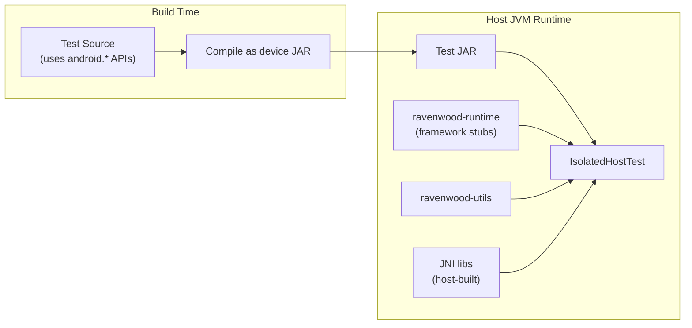

### 55.8.4  Ravenwood Properties

```go
type ravenwoodTestProperties struct {
    // Specify the name of the Instrumentation subclass to use.
    Instrumentation_class *string

    // Specify the package name of the test target apk.
    Target_package_name *string

    // Specify another android_app module here to copy it to the
    // test directory, so that the ravenwood test can access it.
    Target_resource_apk *string

    // Specify whether to build resources.
    Build_resources *bool
}
```

### 55.8.5  Runtime Components

Ravenwood depends on two library groups:

- **ravenwood-utils**: Utility libraries needed at compile time
- **ravenwood-runtime**: Runtime environment providing framework class
  implementations

Both are `android_ravenwood_libgroup` modules that install JARs and JNI
libraries alongside the test:

```go
func (r *ravenwoodLibgroup) GenerateAndroidBuildActions(ctx android.ModuleContext) {
    r.forceOSType = ctx.Config().BuildOS
    r.forceArchType = ctx.Config().BuildArch

    // Install JAR libraries
    for _, lib := range r.ravenwoodLibgroupProperties.Libs {
        libJar := android.OutputFileForModule(ctx, libModule, "")
        ctx.InstallFile(installPath, libJar.Base(), libJar)
    }

    // Install JNI libraries
    for _, jniLib := range jniLibs {
        install(soInstallPath, jniLib.path)
    }

    // Install data files (e.g., framework-res.apk)
    // Install font files
    // Install aconfig flag storage files
    // ...
}
```

The runtime also installs aconfig flag storage files for feature flag testing:

```go
if r.Name() == ravenwoodRuntimeName {
    // Binary proto file and the text proto.
    install(installPath.Join(ctx, "aconfig/metadata/aconfig/etc"),
        aadi.ParsedFlagsFile, aadi.TextProtoFlagsFile)
    // The "new" storage files.
    install(installPath.Join(ctx, "aconfig/metadata/aconfig/maps"),
        aadi.StoragePackageMap, aadi.StorageFlagMap)
    install(installPath.Join(ctx, "aconfig/metadata/aconfig/boot"),
        aadi.StorageFlagVal, aadi.StorageFlagInfo)
}
```

### 55.8.6  Ravenizer

Ravenwood tests go through a "Ravenizer" bytecode transformation step:

```go
// Always enable Ravenizer for ravenwood tests.
r.Library.ravenizer.enabled = true
```

The Ravenizer rewrites bytecode to redirect framework calls to Ravenwood's
host-compatible implementations, similar to how Robolectric's shadow system
works but integrated more tightly with the platform build.

### 55.8.7  Manifest Properties

Ravenwood generates a properties file for each test module:

```go
ctx.Build(pctx, android.BuildParams{
    Rule:        genManifestProperties,
    Description: "genManifestProperties",
    Output:      propertiesOutputPath,
    Args: map[string]string{
        "targetSdkVersionInt":  strconv.Itoa(targetSdkVersionInt),
        "targetSdkVersionRaw":  targetSdkVersion,
        "packageName":          packageName,
        "targetPackageName":    targetPackageName,
        "instrumentationClass": instClassName,
        "moduleName":           ctx.ModuleName(),
        "resourceApk":          resApkName,
        "targetResourceApk":    targetResApkName,
    },
})
```

### 55.8.8  Example Ravenwood Test

```blueprint
android_ravenwood_test {
    name: "CtsUtilTestCasesRavenwood",
    srcs: ["src/**/*.java"],
    static_libs: [
        "androidx.test.rules",
        "ravenwood-junit",
    ],
    sdk_version: "test_current",
    target_sdk_version: "35",
    build_resources: true,
    package_name: "android.util.cts.ravenwood",
}
```

### 55.8.9  Ravenwood in TEST_MAPPING

Ravenwood tests appear in the `ravenwood-presubmit` group:

```json
{
  "ravenwood-presubmit": [
    {
      "name": "CtsUtilTestCasesRavenwood",
      "host": true,
      "file_patterns": ["[Rr]avenwood"]
    }
  ]
}
```

### 55.8.10  Ravenwood Test Lifecycle

The Ravenwood test lifecycle through TradeFed:

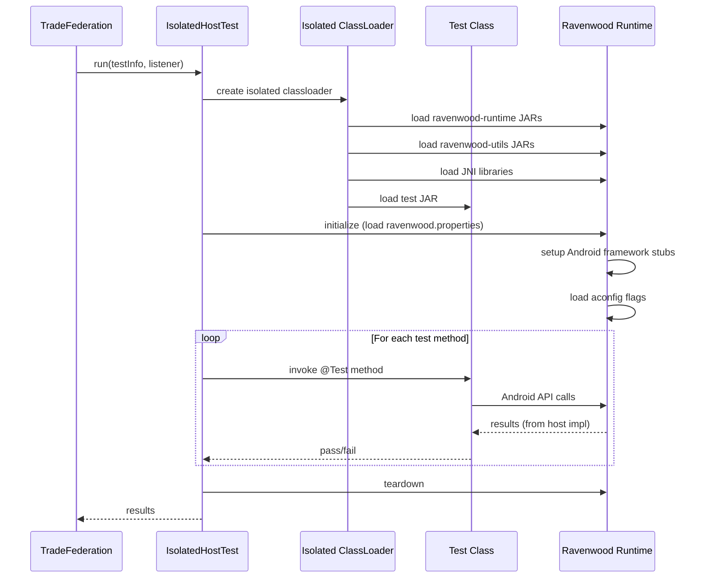

### 55.8.11  Resource Support

Ravenwood supports Android resources via the `build_resources` property:

```go
if proptools.Bool(r.ravenwoodTestProperties.Build_resources) {
    r.aaptBuildActions(ctx)
    resourceApk = r.aapt.exportPackage
}
```

The `aaptBuildActions` method adapts the standard Android app resource
processing pipeline for Ravenwood:

```go
func (r *ravenwoodTest) aaptBuildActions(ctx android.ModuleContext) {
    usePlatformAPI := proptools.Bool(r.Module.deviceProperties.Platform_apis)
    r.aapt.usesNonSdkApis = usePlatformAPI

    aconfigTextFilePaths := getAconfigFilePaths(ctx)
    r.aapt.buildActions(ctx, aaptBuildActionOptions{
        sdkContext:                     android.SdkContext(r),
        enforceDefaultTargetSdkVersion: true,
        forceNonFinalResourceIDs:       true,
        aconfigTextFiles:               aconfigTextFilePaths,
        usesLibrary:                    &r.usesLibrary,
    })
}
```

Resource APKs are installed alongside the test:

```go
if resourceApk != nil {
    installResApk := ctx.InstallFile(resApkInstallPath,
        "ravenwood-res.apk", resourceApk)
    installDeps = append(installDeps, installResApk)
    resApkName = "ravenwood-res.apk"
}
```

### 55.8.12  When to Use Ravenwood

Ravenwood is ideal for:

- Testing `android.os.*` utilities (Bundle, Parcel, Handler, etc.)
- Testing `android.util.*` data structures (SparseArray, LruCache, etc.)
- Testing `android.content.*` basic classes
- Testing framework services that can run without hardware
- Testing code that uses Android feature flags (aconfig)

Ravenwood is NOT suitable for:

- Tests requiring real UI rendering
- Tests needing real hardware (camera, sensors)
- Tests involving Binder IPC to system services
- Tests that need a full Activity lifecycle

---

## 55.9  Robolectric

### 55.9.1  Overview

Robolectric is the established open-source framework for running Android unit
tests on a host JVM without an emulator.  It provides "shadow" implementations
of Android framework classes, intercepting calls at the bytecode level.

Source locations:
```
external/robolectric/           -- Upstream Robolectric source
build/soong/java/robolectric.go -- Build system integration (444 lines)
```

### 55.9.2  Module Type: android_robolectric_test

Registered in `build/soong/java/robolectric.go`:

```go
func RegisterRobolectricBuildComponents(ctx android.RegistrationContext) {
    ctx.RegisterModuleType("android_robolectric_test", RobolectricTestFactory)
    ctx.RegisterModuleType("android_robolectric_runtimes", robolectricRuntimesFactory)
}
```

The factory function:

```go
func RobolectricTestFactory() android.Module {
    module := &robolectricTest{}
    module.addHostProperties()
    module.AddProperties(
        &module.Module.deviceProperties,
        &module.robolectricProperties,
        &module.testProperties)
    module.Module.dexpreopter.isTest = true
    module.Module.linter.properties.Lint.Test_module_type = proptools.BoolPtr(true)
    module.Module.sourceProperties.Test_only = proptools.BoolPtr(true)
    module.Module.sourceProperties.Top_level_test_target = true
    module.testProperties.Test_suites = []string{"robolectric-tests"}
    InitJavaModule(module, android.DeviceSupported)
    return module
}
```

### 55.9.3  Properties

```go
type robolectricProperties struct {
    // The name of the android_app module that the tests will run against.
    Instrumentation_for *string

    // Additional libraries for which coverage data should be generated
    Coverage_libs []string

    Test_options struct {
        // Timeout in seconds when running the tests.
        Timeout *int64
        // Number of shards to use when running the tests.
        Shards *int64
    }

    // Use /external/robolectric rather than /external/robolectric-shadows
    Upstream *bool

    // Use strict mode to limit access of Robolectric API directly.
    Strict_mode *bool

    Jni_libs proptools.Configurable[[]string]
}
```

### 55.9.4  Default Dependencies

Robolectric tests automatically get these libraries:

```go
var robolectricDefaultLibs = []string{
    "mockito-robolectric-prebuilt",
    "truth",
    "junitxml",
}

const robolectricCurrentLib = "Robolectric_all-target"
const clearcutJunitLib = "ClearcutJunitListenerAar"
```

### 55.9.5  Strict Mode

Robolectric strict mode (`strict_mode: true`, the default) limits direct access
to Robolectric APIs, encouraging tests to use standard Android APIs:

```go
func (r *robolectricTest) DepsMutator(ctx android.BottomUpMutatorContext) {
    // ...
    if proptools.BoolDefault(r.robolectricProperties.Strict_mode, true) {
        ctx.AddVariationDependencies(nil, roboRuntimeOnlyDepTag, robolectricCurrentLib)
    } else {
        ctx.AddVariationDependencies(nil, staticLibTag, robolectricCurrentLib)
    }
    // ...
}
```

In strict mode, the Robolectric library is added as a runtime-only dependency
(not compile-time), preventing test code from directly calling Robolectric
shadow APIs.

### 55.9.6  Test Config Generation

Robolectric tests get a special config template:

```go
r.testConfig = tradefed.AutoGenTestConfig(ctx, tradefed.AutoGenTestConfigOptions{
    // ...
    DeviceTemplate: "${RobolectricTestConfigTemplate}",
    HostTemplate:   "${RobolectricTestConfigTemplate}",
})
```

Additional JVM flags are injected:

```go
var extraTestRunnerOptions []tradefed.Option
extraTestRunnerOptions = append(extraTestRunnerOptions,
    tradefed.Option{Name: "java-flags", Value: "-Drobolectric=true"})
if proptools.BoolDefault(r.robolectricProperties.Strict_mode, true) {
    extraTestRunnerOptions = append(extraTestRunnerOptions,
        tradefed.Option{Name: "java-flags", Value: "-Drobolectric.strict.mode=true"})
}
```

### 55.9.7  Runtimes

The `android_robolectric_runtimes` module provides pre-built Android framework
JARs for each SDK level that Robolectric uses to simulate different API
versions:

```go
func (r *robolectricRuntimes) GenerateAndroidBuildActions(ctx android.ModuleContext) {
    files := android.PathsForModuleSrc(ctx, r.props.Jars)
    androidAllDir := android.PathForModuleInstall(ctx, "android-all")
    for _, from := range files {
        installedRuntime := ctx.InstallFile(androidAllDir, from.Base(), from)
        r.runtimes = append(r.runtimes, installedRuntime)
    }
    // Build from source for the "TREE" (current) version
    if !ctx.Config().AlwaysUsePrebuiltSdks() && r.props.Lib != nil {
        runtimeName := "android-all-current-robolectric-r0.jar"
        installedRuntime := ctx.InstallFile(androidAllDir, runtimeName,
            runtimeFromSourceJar)
        r.runtimes = append(r.runtimes, installedRuntime)
    }
}
```

### 55.9.8  Shadow System

Robolectric's shadows live under `external/robolectric/shadows/`:

```
external/robolectric/shadows/
  framework/      -- Shadows for android.* framework classes
  httpclient/     -- Apache HttpClient shadows
  multidex/       -- Multidex shadows
  playservices/   -- Google Play Services shadows
  versioning/     -- SDK version handling
```

Shadows intercept method calls using bytecode instrumentation.  For example,
a shadow of `android.content.Context` provides host-compatible implementations
of `getSharedPreferences()`, `getContentResolver()`, etc.

### 55.9.9  Example Robolectric Test

```blueprint
android_robolectric_test {
    name: "SettingsRoboTests",
    srcs: ["tests/robotests/src/**/*.java"],
    instrumentation_for: "Settings",
    static_libs: [
        "Settings-testutils",
        "testng",
    ],
    java_resource_dirs: ["tests/robotests/config"],
}
```

```java
@RunWith(RobolectricTestRunner.class)
@Config(shadows = {ShadowUserManager.class})
public class SettingsActivityTest {
    @Test
    public void onCreate_shouldNotCrash() {
        ActivityController<SettingsActivity> controller =
            Robolectric.buildActivity(SettingsActivity.class);
        controller.create();
        assertThat(controller.get().isFinishing()).isFalse();
    }
}
```

### 55.9.10  Robolectric vs Ravenwood

| Aspect | Robolectric | Ravenwood |
|--------|-------------|-----------|
| Origin | Open source (GitHub) | Google internal, AOSP |
| Mechanism | Shadow classes (bytecode rewriting) | Actual framework code + Ravenizer |
| Fidelity | Approximate (shadows may drift) | Higher (real framework classes) |
| Framework coverage | Broad but shallow | Narrower but deeper |
| Build module | `android_robolectric_test` | `android_ravenwood_test` |
| Suite | `robolectric-tests` | `ravenwood-tests` |
| JDK requirement | JDK 11+ | JDK 21+ |

### 55.9.11  Robolectric Test Config Properties

The `generateSameDirRoboTestConfigJar` function creates a configuration JAR
that tells Robolectric where to find the app's manifest and resources:

```go
func generateSameDirRoboTestConfigJar(ctx android.ModuleContext,
    outputFile android.ModuleOutPath) {

    rule := android.NewRuleBuilder(pctx, ctx)
    outputDir := outputFile.InSameDir(ctx)
    configFile := outputDir.Join(ctx,
        "com/android/tools/test_config.properties")

    rule.Command().Text("(").
        Textf(`echo "android_merged_manifest=%s-AndroidManifest.xml" &&`,
            ctx.ModuleName()).
        Textf(`echo "android_resource_apk=%s.apk"`, ctx.ModuleName()).
        Text(") >>").Output(configFile)
    rule.Command().
        BuiltTool("soong_zip").
        FlagWithArg("-C ", outputDir.String()).
        FlagWithInput("-f ", configFile).
        FlagWithOutput("-o ", outputFile)

    rule.Build("generate_test_config_samedir",
        "generate test_config.properties")
}
```

This config JAR is merged with the test JAR and instrumented app JAR so that
Robolectric can find resources at runtime.

### 55.9.12  Coverage Integration

Robolectric tests can collect JaCoCo coverage for additional libraries:

```go
type robolectricProperties struct {
    // Additional libraries for which coverage data should be generated
    Coverage_libs []string
    // ...
}
```

The coverage libraries are added as dependencies:

```go
ctx.AddVariationDependencies(nil, roboCoverageLibsTag,
    r.robolectricProperties.Coverage_libs...)
```

### 55.9.13  Robolectric Architecture Diagram

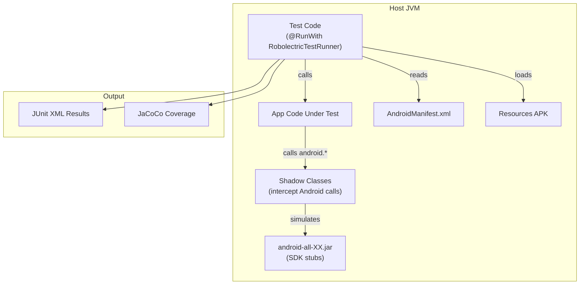

---

## 55.10  Native Testing (GoogleTest)

### 55.10.1  GoogleTest in AOSP

AOSP includes Google Test (gtest) and Google Mock (gmock) as the standard
native C/C++ testing framework.

Source: `external/googletest/`

```
external/googletest/
  googletest/       -- Google Test framework
    include/        -- Public headers (gtest/gtest.h)
    src/            -- Implementation
  googlemock/       -- Google Mock framework
    include/        -- Public headers (gmock/gmock.h)
    src/            -- Implementation
  Android.bp        -- Build rules
```

### 55.10.2  How cc_test Uses GoogleTest

When a `cc_test` module has `gtest: true` (the default), the build system
automatically:

1. Links `libgtest_main` and `libgtest` as static libraries
2. Adds compiler flags: `-DGTEST_HAS_STD_STRING`, platform-specific OS define
3. Uses a TradeFed `GTest` runner in the auto-generated XML config

From `build/soong/cc/test.go`:

```go
func (test *testDecorator) gtest() bool {
    return BoolDefault(test.LinkerProperties.Gtest, true)
}
```

### 55.10.3  Writing a GoogleTest

```cpp
// my_module_test.cpp
#include <gtest/gtest.h>
#include "my_module.h"

class MyModuleTest : public ::testing::Test {
protected:
    void SetUp() override {
        module_ = CreateModule();
    }
    void TearDown() override {
        DestroyModule(module_);
    }
    Module* module_;
};

TEST_F(MyModuleTest, InitializeSucceeds) {
    EXPECT_EQ(module_->Initialize(), 0);
}

TEST_F(MyModuleTest, ProcessValidInput) {
    int result = module_->Process("valid_input");
    ASSERT_GE(result, 0);
    EXPECT_EQ(result, 42);
}

TEST(MyModuleStandaloneTest, NullInput) {
    EXPECT_DEATH(Process(nullptr), "");
}
```

### 55.10.4  Build Rule

```blueprint
cc_test {
    name: "my_module_test",
    srcs: ["my_module_test.cpp"],
    shared_libs: ["libmy_module"],
    test_suites: ["device-tests"],
    // gtest: true,  // implicit default
}
```

### 55.10.5  GoogleMock

Google Mock (gmock) is included alongside gtest for creating mock objects:

```cpp
#include <gmock/gmock.h>
#include <gtest/gtest.h>

class MockDatabase : public IDatabase {
public:
    MOCK_METHOD(bool, Connect, (const std::string& host), (override));
    MOCK_METHOD(Result, Query, (const std::string& sql), (override));
};

TEST(ServiceTest, HandlesConnectionFailure) {
    MockDatabase db;
    EXPECT_CALL(db, Connect(testing::_))
        .WillOnce(testing::Return(false));

    Service service(&db);
    EXPECT_EQ(service.Start(), Status::CONNECTION_FAILED);
}
```

### 55.10.6  Test Installation and Execution

Native tests are installed to `/data/local/tmp/nativetest/` (32-bit) or
`/data/local/tmp/nativetest64/` (64-bit) on the device:

```go
func NewTestInstaller() *baseInstaller {
    return NewBaseInstaller("nativetest", "nativetest64", InstallInData)
}
```

For vendor tests:

```go
func getTestInstallBase(useVendor bool) string {
    testInstallBase := "/data/local/tmp"
    if useVendor {
        testInstallBase = "/data/local/tests/vendor"
    }
    return testInstallBase
}
```

### 55.10.7  GTest Properties in cc_test

The `TestOptions` struct provides TradeFed-level configuration:

```go
type TestOptions struct {
    android.CommonTestOptions
    Run_test_as *string
    Test_suite_tag []string
    Extra_test_configs []string `android:"path,arch_variant"`
    Min_shipping_api_level *int64
    Vsr_min_shipping_api_level *int64
    Min_vndk_version *int64
    Test_runner_options []tradefed.Option
}
```

These translate to TradeFed module controllers for API-level gating:

```go
if properties.Test_options.Min_shipping_api_level != nil {
    var options []tradefed.Option
    options = append(options, tradefed.Option{
        Name: "min-api-level",
        Value: strconv.FormatInt(
            int64(*properties.Test_options.Min_shipping_api_level), 10)})
    configs = append(configs, tradefed.Object{
        "module_controller",
        "com.android.tradefed.testtype.suite.module.ShippingApiLevelModuleController",
        options})
}
```

### 55.10.8  Isolated GTest Runner

The isolated gtest runner runs each test in a separate process for better
isolation:

```go
func (test *testDecorator) isolated(ctx android.BaseModuleContext) bool {
    return BoolDefault(test.LinkerProperties.Isolated, false) && !ctx.Windows()
}
```

When isolated:
```go
if test.isolated(ctx) {
    deps.StaticLibs = append(deps.StaticLibs, "libgtest_isolated_main")
    deps.SharedLibs = append(deps.SharedLibs, "liblog")
}
```

And the TradeFed config marks it as non-shardable:

```go
if isolated {
    configs = append(configs,
        tradefed.Option{Name: "not-shardable", Value: "true"})
}
```

### 55.10.9  GoogleTest Parameterized Tests

GoogleTest supports parameterized tests, commonly used for testing
multiple input combinations:

```cpp
class ParseIntTest : public ::testing::TestWithParam<
    std::pair<std::string, int>> {};

TEST_P(ParseIntTest, ParsesCorrectly) {
    auto [input, expected] = GetParam();
    EXPECT_EQ(ParseInt(input), expected);
}

INSTANTIATE_TEST_SUITE_P(
    IntegerParsing, ParseIntTest,
    ::testing::Values(
        std::make_pair("0", 0),
        std::make_pair("42", 42),
        std::make_pair("-1", -1),
        std::make_pair("2147483647", INT_MAX)
    ));
```

### 55.10.10  Death Tests

GoogleTest's death test macros verify that code correctly terminates on
invalid input:

```cpp
TEST(SecurityTest, NullPointerCausesAbort) {
    ASSERT_DEATH(ProcessUntrustedInput(nullptr, 0),
                 ".*CHECK.*input != nullptr.*");
}

TEST(SecurityTest, BufferOverflowDetected) {
    char buf[10];
    EXPECT_DEATH(memcpy(buf, large_input, 1000), "");
}
```

These are particularly important for Android's security-critical native code.

### 55.10.11  Test Data and Fixtures

The `data` property in `cc_test` installs additional files alongside the test:

```blueprint
cc_test {
    name: "media_codec_test",
    srcs: ["media_codec_test.cpp"],
    data: [
        "testdata/video.mp4",
        "testdata/audio.aac",
    ],
    test_suites: ["device-tests"],
}
```

Data files are installed to the same directory as the test binary and can be
accessed via relative paths:

```cpp
TEST_F(MediaCodecTest, DecodeVideo) {
    std::string path = GetTestDataPath() + "/video.mp4";
    auto codec = CreateCodec(path);
    ASSERT_NE(codec, nullptr);
    EXPECT_EQ(codec->Decode(), OK);
}
```

### 55.10.12  Native Test Execution on Device

When TradeFed runs a native test on device, the flow is:

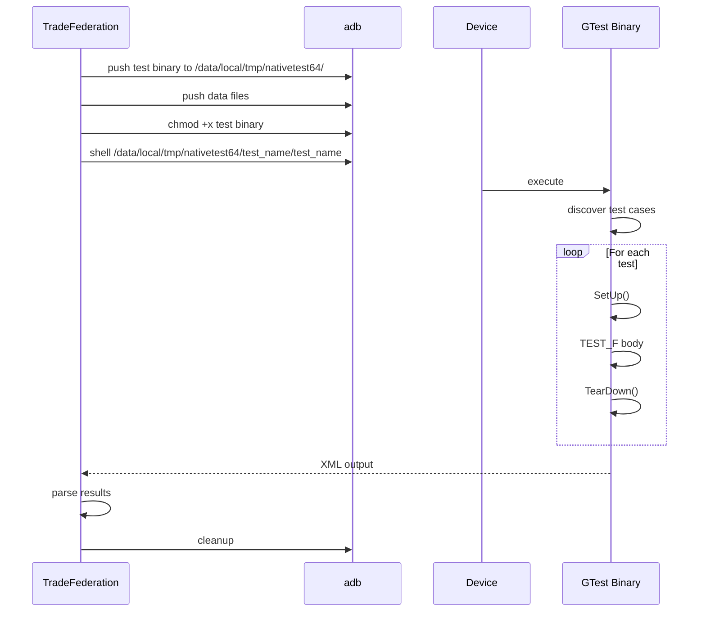

---

## 55.11  UI Testing

### 55.11.1  Overview

Android provides several frameworks for testing user interfaces, each targeting
a different abstraction level and use case.

### 55.11.2  Espresso

Espresso is Google's recommended framework for *within-app* UI testing.  It
provides a fluent API for finding views, performing actions, and asserting
states.

```java
import static androidx.test.espresso.Espresso.onView;
import static androidx.test.espresso.action.ViewActions.click;
import static androidx.test.espresso.action.ViewActions.typeText;
import static androidx.test.espresso.assertion.ViewAssertions.matches;
import static androidx.test.espresso.matcher.ViewMatchers.withId;
import static androidx.test.espresso.matcher.ViewMatchers.withText;

@RunWith(AndroidJUnit4.class)
public class LoginActivityTest {

    @Rule
    public ActivityScenarioRule<LoginActivity> activityRule =
        new ActivityScenarioRule<>(LoginActivity.class);

    @Test
    public void loginWithValidCredentials() {
        onView(withId(R.id.username))
            .perform(typeText("user@example.com"));
        onView(withId(R.id.password))
            .perform(typeText("password123"));
        onView(withId(R.id.login_button))
            .perform(click());
        onView(withId(R.id.welcome_text))
            .check(matches(withText("Welcome!")));
    }
}
```

Key characteristics:

- Synchronizes with the UI thread automatically
- Waits for idle before performing actions
- Runs in the same process as the app under test
- Part of AndroidX Test libraries

### 55.11.3  UIAutomator

UIAutomator enables *cross-app* UI testing.  Unlike Espresso, it can interact
with any visible UI element, including system UI, notifications, and other apps.

```java
import androidx.test.uiautomator.UiDevice;
import androidx.test.uiautomator.UiObject2;
import androidx.test.uiautomator.By;
import androidx.test.uiautomator.Until;

@RunWith(AndroidJUnit4.class)
public class SystemUITest {
    private UiDevice device;

    @Before
    public void setUp() {
        device = UiDevice.getInstance(
            InstrumentationRegistry.getInstrumentation());
    }

    @Test
    public void openNotificationShade() {
        device.openNotification();
        device.wait(Until.hasObject(By.pkg("com.android.systemui")), 5000);
        UiObject2 clearAll = device.findObject(
            By.text("Clear all"));
        assertThat(clearAll).isNotNull();
    }
}
```

AOSP provides UIAutomator helpers in:
```
platform_testing/libraries/uiautomator-helpers/
```

### 55.11.4  TAPL (Test Automation Platform Library)

TAPL provides high-level abstractions for testing system UI components like
the Launcher, SystemUI, and Settings.  It lives in:

```
platform_testing/libraries/systemui-tapl/  -- SystemUI TAPL
platform_testing/libraries/tapl-common/    -- Common TAPL utilities
```

TAPL creates page objects for system components:

```java
// Using Launcher TAPL
LauncherInstrumentation launcher = new LauncherInstrumentation();
Workspace workspace = launcher.getWorkspace();
AllApps allApps = workspace.switchToAllApps();
AppIcon calculator = allApps.getAppIcon("Calculator");
calculator.launch();
```

The advantage of TAPL over raw UIAutomator is that it encapsulates the UI
structure of system components, making tests more maintainable when the UI
changes.

### 55.11.5  Flicker Testing

The Flicker framework detects visual regressions in window transitions.  It
captures window manager and surface flinger traces during transitions and
validates invariants.

Source: `platform_testing/libraries/flicker/`

```
platform_testing/libraries/flicker/
  Android.bp
  src/              -- Flicker framework source
  test/             -- Framework self-tests
  utils/            -- Trace processing utilities
  appHelpers/       -- App helper classes
  collector/        -- Data collection
```

Flicker tests verify properties like:

- No flickering (rapid visibility changes) during transitions
- Correct layer ordering
- No unexpected blank frames
- Proper window animations

```java
@RunWith(FlickerTestRunner.class)
public class OpenAppFromLauncherTest {
    @FlickerBuilderProvider
    public static FlickerBuilder buildFlicker(
            FlickerTestParameter testSpec) {
        return new FlickerBuilder(testSpec)
            .withTransition(() -> {
                testSpec.getDevice().launchApp("com.example.app");
            })
            .withAssertion(new WindowManagerTrace.Assertion(
                "appWindowIsVisible") {
                @Override
                public void invoke(WindowManagerTrace trace) {
                    trace.visibleWindowsShownMoreThanOneConsecutiveEntry(
                        "com.example.app");
                }
            });
    }
}
```

### 55.11.6  Screenshot Testing

Screenshot testing captures rendered UI and compares it against golden images
to detect visual regressions.

Source: `platform_testing/libraries/screenshot/`

```
platform_testing/libraries/screenshot/
  Android.bp
  src/                  -- Screenshot capture and comparison
  deviceless/           -- Host-side screenshot tests
  proto/                -- Protobuf definitions
  scripts/              -- Helper scripts
  update_goldens.py     -- Golden image update tool
  utils/                -- Utility functions
```

The workflow:

1. Test renders a UI component
2. Screenshot framework captures the rendered bitmap
3. Bitmap is compared against a golden image
4. Pixel-level differences are reported

```java
@Test
public void testButtonAppearance() {
    View button = createTestButton();
    ScreenshotTestRule.assertScreenshot(
        "button_default_state",
        button,
        /* maxPixelDifference= */ 0.01f
    );
}
```

Golden images are updated with `update_goldens.py` when intentional visual
changes occur.

### 55.11.7  UI Testing Framework Comparison

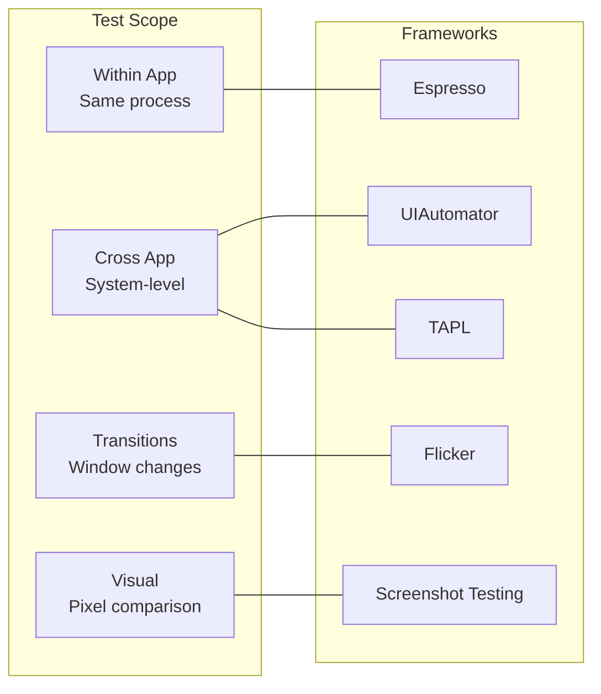

| Framework | Scope | Speed | Reliability | Use Case |
|-----------|-------|-------|-------------|----------|
| Espresso | In-app | Fast | High | Unit-level UI tests |
| UIAutomator | Cross-app | Medium | Medium | System integration |
| TAPL | System UI | Medium | High | Launcher, SystemUI |
| Flicker | Transitions | Slow | Medium | Animation quality |
| Screenshot | Visual | Medium | High | Design regression |

### 55.11.8  Espresso Idling Resources

Espresso's key advantage is synchronization with the UI thread.  For
asynchronous operations, Espresso uses idling resources:

```java
public class NetworkIdlingResource implements IdlingResource {
    private ResourceCallback callback;
    private boolean isIdle = true;

    @Override
    public String getName() { return "NetworkIdling"; }

    @Override
    public boolean isIdleNow() { return isIdle; }

    @Override
    public void registerIdleTransitionCallback(ResourceCallback callback) {
        this.callback = callback;
    }

    public void setIdle(boolean idle) {
        isIdle = idle;
        if (idle && callback != null) {
            callback.onTransitionToIdle();
        }
    }
}

// In test:
@Before
public void setUp() {
    IdlingRegistry.getInstance().register(networkIdlingResource);
}

@After
public void tearDown() {
    IdlingRegistry.getInstance().unregister(networkIdlingResource);
}
```

### 55.11.9  Flicker Test Assertions

Flicker tests define assertions on WindowManager and SurfaceFlinger traces:

```java
// Common Flicker assertions:
// 1. No flickering (visibility does not change rapidly)
flicker.assertWm { wmTrace ->
    wmTrace.visibleWindowsShownMoreThanOneConsecutiveEntry(componentName)
}

// 2. App window becomes visible
flicker.assertWmEnd { wmState ->
    wmState.containsAppWindow(componentName)
}

// 3. No blank layers
flicker.assertLayers { layerTrace ->
    layerTrace.visibleLayersShownMoreThanOneConsecutiveEntry()
}

// 4. Correct layer ordering
flicker.assertLayersEnd { layerState ->
    layerState.isAbove(appLayer, wallpaperLayer)
}
```

---

## 55.12  Mocking Frameworks

### 55.12.1  Mockito

Mockito is the primary mocking framework used throughout AOSP for Java tests.

Source: `external/mockito/`

```
external/mockito/
  Android.bp
  src/                -- Mockito source
  subprojects/        -- Sub-modules
```

Mockito provides the familiar `mock()`, `when()`, `verify()` API:

```java
import static org.mockito.Mockito.*;

@RunWith(MockitoJUnitRunner.class)
public class PackageManagerTest {
    @Mock
    private PackageManager mockPm;

    @Test
    public void getInstalledPackages_returnsExpected() {
        List<PackageInfo> packages = List.of(new PackageInfo());
        when(mockPm.getInstalledPackages(anyInt())).thenReturn(packages);

        assertEquals(1, mockPm.getInstalledPackages(0).size());
        verify(mockPm).getInstalledPackages(0);
    }
}
```

Common Mockito dependencies in Android builds:

- `mockito-target-minus-junit4` -- For device tests
- `mockito-robolectric-prebuilt` -- For Robolectric tests
- `mockito-target-extended-minus-junit4` -- Extended mocking with inline support

### 55.12.2  Mockito-Kotlin

For Kotlin test code, Mockito-Kotlin provides idiomatic extensions:

```kotlin
import org.mockito.kotlin.*

@Test
fun `test service binding`() {
    val mockContext: Context = mock()
    val mockConnection: ServiceConnection = mock()

    whenever(mockContext.bindService(any(), any(), anyInt()))
        .thenReturn(true)

    val result = ServiceBinder(mockContext).bind(mockConnection)
    assertTrue(result)
    verify(mockContext).bindService(any(), eq(mockConnection), eq(BIND_AUTO_CREATE))
}
```

### 55.12.3  Dexmaker

Dexmaker enables runtime mock generation on Android's ART runtime, where
standard Java byte-code manipulation libraries do not work.

Source: `external/dexmaker/`

```
external/dexmaker/
  dexmaker/                              -- Core DEX generation
  dexmaker-mockito/                      -- Mockito adapter
  dexmaker-mockito-inline/               -- Inline mocking (final classes)
  dexmaker-mockito-inline-extended/      -- Extended inline mocking
  dexmaker-mockito-inline-tests/         -- Tests
  dexmaker-mockito-inline-extended-tests/ -- Extended tests
  dexmaker-mockito-inline-dispatcher/    -- Dispatch mechanism
```

Dexmaker solves a fundamental Android challenge: the Dalvik/ART runtime cannot
use cglib or ByteBuddy (the standard JVM mock generation libraries) because
they generate JVM bytecode, not DEX bytecode.  Dexmaker generates DEX files
at runtime for mock classes.

The inline variant (`dexmaker-mockito-inline`) enables mocking of final classes
and methods, which is essential for Android framework classes that are
frequently declared final.

### 55.12.4  JUnit Integration

AOSP includes both JUnit 4 and JUnit 5 (jupiter).  Most platform tests use
JUnit 4 with the AndroidJUnit4 runner:

```java
@RunWith(AndroidJUnit4.class)
@SmallTest
public class BundleTest {
    @Rule
    public final ExpectedException thrown = ExpectedException.none();

    @Before
    public void setUp() {
        // ...
    }

    @Test
    public void testBasicTypes() {
        Bundle bundle = new Bundle();
        bundle.putInt("key", 42);
        assertEquals(42, bundle.getInt("key"));
    }

    @After
    public void tearDown() {
        // ...
    }
}
```

Test annotations used in AOSP:

- `@SmallTest` -- Unit tests (< 200ms)
- `@MediumTest` -- Integration tests (< 1000ms)
- `@LargeTest` -- End-to-end tests (no limit)
- `@FlakyTest` -- Known flaky tests
- `@Presubmit` -- Required for presubmit
- `@RequiresDevice` -- Needs a physical device

### 55.12.5  Mocking Android System Services

A common pattern in Android testing is mocking system services:

```java
@RunWith(AndroidJUnit4.class)
public class ConnectivityTest {
    @Mock private ConnectivityManager mockCm;
    @Mock private Context mockContext;

    @Before
    public void setUp() {
        MockitoAnnotations.initMocks(this);
        when(mockContext.getSystemService(ConnectivityManager.class))
            .thenReturn(mockCm);
    }

    @Test
    public void testNetworkAvailable() {
        NetworkInfo networkInfo = mock(NetworkInfo.class);
        when(networkInfo.isConnected()).thenReturn(true);
        when(mockCm.getActiveNetworkInfo()).thenReturn(networkInfo);

        NetworkChecker checker = new NetworkChecker(mockContext);
        assertTrue(checker.isNetworkAvailable());
    }

    @Test
    public void testNoNetwork() {
        when(mockCm.getActiveNetworkInfo()).thenReturn(null);

        NetworkChecker checker = new NetworkChecker(mockContext);
        assertFalse(checker.isNetworkAvailable());
    }
}
```

### 55.12.6  Extended Mockito for Final Classes

Android framework classes are often `final`, which standard Mockito cannot
mock.  The extended variant uses Dexmaker inline mocking:

```java
// Use extended mockito for final class mocking
import static com.android.dx.mockito.inline.extended.ExtendedMockito.*;

@RunWith(AndroidJUnit4.class)
public class SettingsProviderTest {
    @Test
    public void testReadSetting() {
        // Settings.Secure is a final class
        mockitoSession()
            .mockStatic(Settings.Secure.class)
            .startMocking();

        when(Settings.Secure.getString(any(), eq("my_setting")))
            .thenReturn("mock_value");

        assertEquals("mock_value",
            Settings.Secure.getString(resolver, "my_setting"));

        finishMocking();
    }
}
```

### 55.12.7  Test Rules in AOSP

AOSP provides many custom JUnit rules:

```java
// DeviceState rule for managing device configuration
@Rule
public final DeviceState deviceState = new DeviceState();

// Screen recording rule
@Rule
public final ScreenRecordRule screenRecord = new ScreenRecordRule();

// Activity scenario rule
@Rule
public ActivityScenarioRule<MyActivity> activityRule =
    new ActivityScenarioRule<>(MyActivity.class);

// Feature flag rule
@Rule
public final SetFlagsRule flagRule = new SetFlagsRule();
```

### 55.12.8  Mocking Architecture

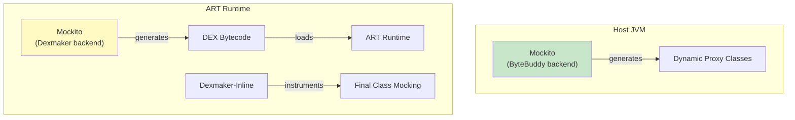

---

## 55.13  Fuzzing

### 55.13.1  Overview

Fuzzing (fuzz testing) automatically generates random or semi-random inputs to
discover crashes, memory corruption, and undefined behavior.  Android's fuzzing
infrastructure covers C/C++, Rust, and Java.

### 55.13.2  cc_fuzz

Defined in `build/soong/cc/fuzz.go`:

```go
func init() {
    android.RegisterModuleType("cc_fuzz", LibFuzzFactory)
    android.RegisterParallelSingletonType("cc_fuzz_packaging", fuzzPackagingFactory)
    android.RegisterParallelSingletonType("cc_fuzz_presubmit_packaging",
        fuzzPackagingFactoryPresubmit)
}
```

The factory automatically enables sanitizers:

```go
func NewFuzzer(hod android.HostOrDeviceSupported) *Module {
    // ...
    module.fuzzer.Properties.FuzzFramework = fuzz.LibFuzzer

    android.AddLoadHook(module, func(ctx android.LoadHookContext) {
        extraProps := struct {
            Sanitize struct {
                Fuzzer *bool
            }
            // ...
        }{}
        extraProps.Sanitize.Fuzzer = BoolPtr(true)
        // Disable on Darwin and Linux Bionic
        extraProps.Target.Darwin.Enabled = BoolPtr(false)
        extraProps.Target.Linux_bionic.Enabled = BoolPtr(false)
        ctx.AppendProperties(&extraProps)
        // ...
    })
    return module
}
```

### 55.13.3  Fuzz Frameworks

From `build/soong/fuzz/fuzz_common.go`:

```go
type Framework string

const (
    AFL              Framework = "afl"
    LibFuzzer        Framework = "libfuzzer"
    Jazzer           Framework = "jazzer"
    UnknownFramework Framework = "unknownframework"
)
```

**LibFuzzer** (default): LLVM's coverage-guided fuzzer.  Links
`libFuzzerRuntimeLibrary`.

**AFL** (American Fuzzy Lop): Alternative fuzzer using compile-time
instrumentation:

```go
func (fuzzer *fuzzer) flags(ctx ModuleContext, flags Flags) Flags {
    if fuzzer.Properties.FuzzFramework == fuzz.AFL {
        flags.Local.CFlags = append(flags.Local.CFlags, []string{
            "-fsanitize-coverage=trace-pc-guard",
            "-Wno-unused-result",
            "-Wno-unused-parameter",
            "-Wno-unused-function",
        }...)
    }
    return flags
}
```

**Jazzer**: Java fuzzer (for `java_fuzz` modules).

### 55.13.4  Fuzz Config

Each fuzzer can include a configuration specifying its risk profile:

```go
type Vector string

const (
    unknown_access_vector            Vector = "unknown_access_vector"
    remote                           = "remote"
    local_no_privileges_required     = "local_no_privileges_required"
    // ...
)
```

The `fuzz_config` block in Android.bp:

```blueprint
cc_fuzz {
    name: "media_codec_fuzzer",
    srcs: ["media_codec_fuzzer.cpp"],
    shared_libs: ["libmedia", "libstagefright"],
    corpus: ["corpus/*"],
    dictionary: "media.dict",
    fuzz_config: {
        cc: ["security-team@google.com"],
        componentid: 155276,
        hotlists: ["4593311"],
        description: "Fuzzer for media codec parsing",
        vector: "remote",
        service_privilege: "constrained",
        users: "multi_user",
        fuzzed_code_usage: "shipped",
        use_for_presubmit: true,
    },
}
```

### 55.13.5  Fuzz Packaging

The `ccRustFuzzPackager` singleton collects all fuzz targets and creates
distributable ZIP archives:

```go
func (s *ccRustFuzzPackager) GenerateBuildActions(ctx android.SingletonContext) {
    archDirs := make(map[fuzz.ArchOs][]fuzz.FileToZip)
    s.FuzzTargets = make(map[string]bool)

    ctx.VisitAllModuleProxies(func(module android.ModuleProxy) {
        // Collect fuzz modules, their shared libraries, corpus, config
        // ...
        files = s.PackageArtifacts(ctx, module, &fuzzInfo, archDir, builder)
        files = append(files,
            GetSharedLibsToZip(ccModule.FuzzSharedLibraries, ...))
        files = append(files,
            fuzz.FileToZip{SourceFilePath: android.OutputFileForModule(
                ctx, module, "unstripped")})
        // ...
    })
    s.CreateFuzzPackage(ctx, archDirs, fuzz.Cc, pctx)
    ctx.Phony(s.phonyName, s.Packages...)
}
```

The `make haiku` target builds and packages all fuzzers.

### 55.13.6  rust_fuzz

Rust fuzz targets use `libfuzzer-sys` or LLVM's libFuzzer backend:

```blueprint
rust_fuzz {
    name: "binder_parcel_fuzzer",
    srcs: ["fuzz/parcel_fuzzer.rs"],
    rustlibs: ["libbinder_rs"],
    fuzz_config: {
        vector: "local_no_privileges_required",
    },
}
```

### 55.13.7  java_fuzz

Java fuzzing uses the Jazzer framework:

```blueprint
java_fuzz {
    name: "xml_parser_fuzzer",
    srcs: ["XmlParserFuzzer.java"],
    libs: ["framework"],
    fuzz_config: {
        description: "Fuzzer for XML parsing",
    },
}
```

### 55.13.8  Sanitizers

Fuzzers work best with sanitizers enabled.  The build system supports:

| Sanitizer | Flag | Detects |
|-----------|------|---------|
| ASan | `-fsanitize=address` | Buffer overflows, use-after-free |
| HWASan | `-fsanitize=hwaddress` | Same as ASan, lower overhead (ARM64) |
| UBSan | `-fsanitize=undefined` | Undefined behavior |
| MSan | `-fsanitize=memory` | Uninitialized memory reads |
| TSan | `-fsanitize=thread` | Data races |
| CFI | `-fsanitize=cfi` | Control-flow integrity violations |

When `Fuzzer` sanitizer is enabled, the build adds appropriate coverage
instrumentation:

```go
func (fuzzBin *fuzzBinary) linkerDeps(ctx DepsContext, deps Deps) Deps {
    if ctx.Config().Getenv("FUZZ_FRAMEWORK") == "AFL" {
        deps.HeaderLibs = append(deps.HeaderLibs, "libafl_headers")
    } else {
        deps.StaticLibs = append(deps.StaticLibs,
            config.LibFuzzerRuntimeLibrary())
        if module, ok := ctx.Module().(*Module); ok {
            if module.IsSanitizerEnabled(Hwasan) {
                deps.StaticLibs = append(deps.StaticLibs,
                    config.LibFuzzerRuntimeInterceptors())
            }
        }
    }
    // ...
}
```

### 55.13.9  Fuzz Target Architecture

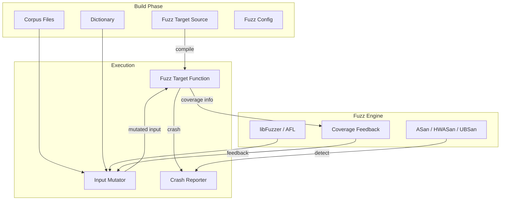

### 55.13.10  Fuzz Corpus Management

A corpus is a collection of seed inputs that the fuzzer uses as starting
points for mutation.  Good corpus management is critical for fuzzer
effectiveness.

```blueprint
cc_fuzz {
    name: "xml_parser_fuzzer",
    srcs: ["xml_parser_fuzzer.cpp"],
    corpus: ["corpus/*"],     // Initial seed corpus
    dictionary: "xml.dict",    // Token dictionary
}
```

The dictionary file contains tokens the fuzzer should try:

```
# xml.dict
"<xml"
"</xml>"
"encoding="
"UTF-8"
"version="
"<![CDATA["
"]]>"
"&amp;"
"&lt;"
```

### 55.13.11  Fuzz Config Details

The fuzz config specifies metadata for the fuzzing infrastructure:

```go
type FuzzConfig struct {
    // Contacts
    Cc []string
    // Component ID in bug tracker
    Componentid int64
    // Hotlist IDs
    Hotlists []string
    // Human-readable description
    Description string
    // Attack vector
    Vector Vector
    // Service privilege level
    ServicePrivilege string
    // User modes affected
    Users string
    // Usage: shipped, internal, experimental
    FuzzedCodeUsage string
    // Include in presubmit fuzzing
    UseForPresubmit bool
}
```

The `Vector` field categorizes the attack surface:

| Vector | Meaning |
|--------|---------|
| `remote` | Reachable from network (e.g., media codecs) |
| `local_no_privileges_required` | Reachable by any app |
| `local_privileged` | Requires special permissions |
| `physical` | Requires physical access |

### 55.13.12  Continuous Fuzzing Infrastructure

Android runs fuzzers continuously in the background.  The CI infrastructure:

1. Builds all `cc_fuzz` and `rust_fuzz` targets with sanitizers
2. Distributes fuzzers across a fuzzing cluster
3. Runs each fuzzer for extended periods (hours to weeks)
4. Reports new crashes to the security team
5. Minimizes crashing inputs
6. Checks for regressions when code changes

The `make haiku` target packages all fuzzers for the cluster:

```go
func (s *ccRustFuzzPackager) GenerateBuildActions(
    ctx android.SingletonContext) {
    // ...
    s.CreateFuzzPackage(ctx, archDirs, fuzz.Cc, pctx)
    ctx.Phony(s.phonyName, s.Packages...)
    ctx.DistForGoals([]string{s.phonyName}, s.Packages...)
}
```

The `haiku-presubmit` variant packages only fuzzers marked with
`use_for_presubmit: true` for faster presubmit runs:

```go
func fuzzPackagingFactoryPresubmit() android.Singleton {
    fuzzPackager := &ccRustFuzzPackager{
        onlyIncludePresubmits: true,
        phonyName:             "haiku-presubmit",
    }
    return fuzzPackager
}
```

### 55.13.13  Writing Effective Fuzz Targets

Guidelines for writing effective fuzz targets:

```cpp
// GOOD: Focused on a single parser
extern "C" int LLVMFuzzerTestOneInput(const uint8_t* data, size_t size) {
    // Create a FuzzedDataProvider for structured fuzzing
    FuzzedDataProvider fdp(data, size);

    // Consume structured data from fuzz input
    std::string format = fdp.ConsumeRandomLengthString(256);
    int width = fdp.ConsumeIntegralInRange<int>(1, 8192);
    int height = fdp.ConsumeIntegralInRange<int>(1, 8192);
    std::vector<uint8_t> image_data =
        fdp.ConsumeRemainingBytes<uint8_t>();

    // Exercise the code under test
    ImageDecoder decoder;
    decoder.SetFormat(format);
    decoder.Decode(image_data.data(), image_data.size(), width, height);

    return 0;
}
```

Key principles:

1. **Single entry point**: One `LLVMFuzzerTestOneInput` per fuzzer
2. **Structured fuzzing**: Use `FuzzedDataProvider` for complex inputs
3. **No global state**: Each invocation should be independent
4. **Fast execution**: Keep each iteration under 1ms
5. **Cover all error paths**: Do not validate input before passing to SUT
6. **No memory leaks**: The fuzzer runs millions of iterations

---

## 55.14  Code Coverage (JaCoCo)

### 55.14.1  Overview

JaCoCo (Java Code Coverage) measures which Java/Kotlin code paths are exercised
during test execution.  AOSP integrates JaCoCo at the build system level via
`build/soong/java/jacoco.go`.

The external JaCoCo library lives at `external/jacoco/`.

### 55.14.2  Build System Integration

The JaCoCo build rule is defined in `build/soong/java/jacoco.go`:

```go
var (
    jacoco = pctx.AndroidStaticRule("jacoco", blueprint.RuleParams{
        Command: `rm -rf $tmpDir && mkdir -p $tmpDir && ` +
            `${config.Zip2ZipCmd} -i $in -o $strippedJar $stripSpec && ` +
            `${config.JavaCmd} ${config.JavaVmFlags} ` +
            `  -jar ${config.JacocoCLIJar} ` +
            `  instrument --quiet --dest $tmpDir $strippedJar && ` +
            `${config.MergeZipsCmd} --ignore-duplicates -j $out $tmpJar $in`,
        CommandDeps: []string{
            "${config.Zip2ZipCmd}",
            "${config.JavaCmd}",
            "${config.JacocoCLIJar}",
            "${config.MergeZipsCmd}",
        },
    }, "strippedJar", "stripSpec", "tmpDir", "tmpJar")
)
```

### 55.14.3  Instrumentation Pipeline

The JaCoCo instrumentation pipeline works in three steps:

1. **Strip**: Extract relevant classes from the input JAR using `zip2zip`
   with include/exclude filters

2. **Instrument**: Run `jacoco instrument` on the stripped JAR to insert
   coverage probes

3. **Merge**: Combine the instrumented classes back with the original JAR,
   preferring instrumented versions

```go
func jacocoInstrumentJar(ctx android.ModuleContext,
    instrumentedJar, strippedJar android.WritablePath,
    inputJar android.Path, stripSpec string) {

    tmpJar := android.PathForModuleOut(ctx, "jacoco", "tmp", strippedJar.Base())
    ctx.Build(pctx, android.BuildParams{
        Rule:           jacoco,
        Description:    "jacoco",
        Output:         instrumentedJar,
        ImplicitOutput: strippedJar,
        Input:          inputJar,
        Args: map[string]string{
            "strippedJar": strippedJar.String(),
            "stripSpec":   stripSpec,
            "tmpDir":      filepath.Dir(tmpJar.String()),
            "tmpJar":      tmpJar.String(),
        },
    })
}
```

### 55.14.4  Filter Specifications

JaCoCo filters control which classes get instrumented.  The filter syntax uses
Java package notation with wildcards:

```go
func jacocoFilterToSpec(filter string) (string, error) {
    recursiveWildcard := strings.HasSuffix(filter, "**")
    nonRecursiveWildcard := false
    if !recursiveWildcard {
        nonRecursiveWildcard = strings.HasSuffix(filter, "*")
        filter = strings.TrimSuffix(filter, "*")
    } else {
        filter = strings.TrimSuffix(filter, "**")
    }
    spec := strings.Replace(filter, ".", "/", -1)
    if recursiveWildcard {
        spec += "**/*.class"
    } else if nonRecursiveWildcard {
        spec += "*.class"
    } else {
        spec += ".class"
    }
    return spec, nil
}
```

In `Android.bp`, modules specify coverage filters:

```blueprint
java_library {
    name: "my_library",
    srcs: ["src/**/*.java"],
    jacoco: {
        include_filter: ["com.android.mypackage.**"],
        exclude_filter: ["com.android.mypackage.test.**"],
    },
}
```

### 55.14.5  Dependencies Mutator

The `jacocoDepsMutator` automatically adds the `jacocoagent` dependency to
instrumentable modules:

```go
func jacocoDepsMutator(ctx android.BottomUpMutatorContext) {
    type instrumentable interface {
        shouldInstrument(ctx android.BaseModuleContext) bool
        shouldInstrumentInApex(ctx android.BaseModuleContext) bool
        setInstrument(value bool)
    }
    j, ok := ctx.Module().(instrumentable)
    if !ctx.Module().Enabled(ctx) || !ok {
        return
    }
    if j.shouldInstrument(ctx) && ctx.ModuleName() != "jacocoagent" {
        ctx.AddFarVariationDependencies(
            ctx.Module().Target().Variations(), libTag, "jacocoagent")
    }
}
```

### 55.14.6  Report ZIP Generation

The `BuildJacocoZip()` function collects instrumented classes from all modules
into a single ZIP for report generation:

```go
func BuildJacocoZip(ctx BuildJacocoZipContext,
    modules []android.ModuleProxy,
    outputFile android.WritablePath) {

    jacocoZipBuilder := android.NewRuleBuilder(pctx, ctx)
    jacocoZipCmd := jacocoZipBuilder.Command().
        BuiltTool("soong_zip").
        FlagWithOutput("-o ", outputFile).
        Flag("-L 0")

    for _, m := range modules {
        if javaInfo, ok := android.OtherModuleProvider(ctx, m,
            JavaInfoProvider); ok && javaInfo.JacocoInfo.ReportClassesFile != nil {
            jacoco := javaInfo.JacocoInfo
            jacocoZipCmd.FlagWithArg("-e ",
                fmt.Sprintf("out/target/common/obj/%s/%s_intermediates/"+
                    "jacoco-report-classes.jar",
                    jacoco.Class, jacoco.ModuleName)).
                FlagWithInput("-f ", jacoco.ReportClassesFile)
        }
    }
    // ...
}
```

### 55.14.7  Device Test Coverage

Device test coverage can be included via an environment variable:

```go
func BuildJacocoZipWithPotentialDeviceTests(ctx android.ModuleContext,
    modules []android.ModuleProxy,
    outputFile android.WritablePath) {

    if !ctx.Config().IsEnvTrue("JACOCO_PACKAGING_INCLUDE_DEVICE_TESTS") {
        BuildJacocoZip(ctx, modules, outputFile)
        return
    }
    // Merge device test coverage with regular coverage
    // ...
}
```

The `device_tests_jacoco_zip` singleton collects JaCoCo data from all modules
in the `device-tests` suite:

```go
func (d *deviceTestsJacocoZipSingleton) GenerateBuildActions(
    ctx android.SingletonContext) {

    var deviceTestModules []android.ModuleProxy
    ctx.VisitAllModuleProxies(func(m android.ModuleProxy) {
        if tsm, ok := android.OtherModuleProvider(ctx, m,
            android.TestSuiteInfoProvider); ok {
            if slices.Contains(tsm.TestSuites, "device-tests") {
                deviceTestModules = append(deviceTestModules, m)
            }
        }
    })
    jacocoZip := DeviceTestsJacocoReportZip(ctx)
    BuildJacocoZip(ctx, deviceTestModules, jacocoZip)
}
```

### 55.14.8  Running with Coverage

```bash
# Build with coverage enabled
EMMA_INSTRUMENT=true make MyModule

# Run tests with atest coverage flag
atest --experimental-coverage MyTestModule

# Generate coverage report
java -jar jacoco-cli.jar report \
    coverage.exec \
    --classfiles out/target/common/obj/ \
    --html coverage-report/
```

### 55.14.9  Coverage Architecture

```mermaid
flowchart LR
    subgraph Build["Build Phase"]
        Source["Java Source"]
        Compile["javac"]
        Instrument["JaCoCo Instrument"]
    end
    subgraph Test["Test Phase"]
        InstrJAR["Instrumented JAR"]
        Runtime["JaCoCo Agent"]
        ExecFile["coverage.exec"]
    end
    subgraph Report["Report Phase"]
        CLI["JaCoCo CLI"]
        HTML["HTML Report"]
        XML["XML Report"]
    end

    Source --> Compile --> Instrument
    Instrument --> InstrJAR
    InstrJAR --> Runtime
    Runtime --> |"probe data"| ExecFile
    ExecFile --> CLI
    CLI --> HTML
    CLI --> XML
```

### 55.14.10  Native Code Coverage

For C/C++ code, AOSP supports native coverage using LLVM's source-based
coverage (`-fprofile-instr-generate -fcoverage-mapping`) and GCC-compatible
gcov format.

Native coverage is enabled via build flags:

```bash
# Enable native coverage
NATIVE_COVERAGE=true make my_module
```

The coverage data can be collected using:

```bash
# Pull coverage data from device
adb pull /data/misc/trace/ coverage_data/

# Generate report
llvm-cov show binary -instr-profile=coverage.profdata
```

### 55.14.11  Coverage in CI

The CI pipeline integrates coverage collection:

1. **Build phase**: Instrument modules with JaCoCo / LLVM coverage
2. **Test phase**: Run tests, collect `.exec` files (Java) or `.profdata` (native)
3. **Report phase**: Generate HTML/XML reports
4. **Gate phase**: Block merge if coverage drops below threshold

```mermaid
flowchart LR
    Build["Instrumented Build"] --> Test["Test Execution"]
    Test --> Collect["Collect Coverage Data"]
    Collect --> Report["Generate Report"]
    Report --> Gate["Coverage Gate"]
    Gate --> |"pass"| Merge["Allow Merge"]
    Gate --> |"fail"| Block["Block Merge"]
```

---

## 55.15  Platform Testing Libraries

### 55.15.1  Overview

AOSP provides a rich collection of shared testing libraries under
`platform_testing/libraries/` (35 subdirectories).  These libraries encapsulate
common patterns, reduce boilerplate, and provide device interaction helpers.

### 55.15.2  Directory Listing

```
platform_testing/libraries/
  annotations/                 -- Custom test annotations
  app-helpers/                 -- App interaction helpers
  audio-test-harness/          -- Audio testing framework
  aupt-lib/                    -- Automated User Performance Testing
  automotive/                  -- Automotive test utilities
  automotive-helpers/          -- Automotive helper functions
  car-helpers/                 -- Car-specific test helpers
  collectors-helper/           -- Metric collector helpers
  compatibility-common-util/   -- CTS/VTS shared utilities
  desktop-test-lib/            -- Desktop mode testing
  device-collectors/           -- Device-side metric collectors
  flag-helpers/                -- Feature flag test helpers
  flicker/                     -- Window transition testing (31.11.5)
  health/                      -- Device health checks
  junit-rules/                 -- Custom JUnit rules
  junitxml/                    -- JUnit XML result format
  launcher-helper/             -- Launcher interaction helpers
  media-helper/                -- Media test utilities
  metrics-helper/              -- Metrics collection and reporting
  motion/                      -- Motion/gesture testing
  notes-role-test-helper/      -- Notes role testing
  power-helper/                -- Power measurement helpers
  rdroidtest/                  -- R Droid test utilities
  runner/                      -- Custom test runners
  screenshot/                  -- Screenshot testing (31.11.6)
  sts-common-util/             -- STS shared utilities
  system-helpers/              -- System interaction helpers
  systemui-helper/             -- SystemUI test helpers
  systemui-tapl/               -- SystemUI TAPL (31.11.4)
  tapl-common/                 -- Common TAPL utilities
  timeresult-helper/           -- Time-based result helpers
  tradefed-error-prone/        -- Error-prone rules for TF
  uiautomator-helpers/         -- UIAutomator extensions
  uinput-device-test-helper/   -- Synthetic input device helpers
```

### 55.15.3  Key Libraries

**device-collectors/**: Provides metric collectors that run alongside tests to
gather performance data:

- CPU usage
- Memory allocation
- Battery drain
- JankStats (frame timing)
- Method tracing

**collectors-helper/**: Helpers for device collectors that simplify the
setup and teardown of metric collection.

**junit-rules/**: Custom JUnit rules for common Android test patterns:

- `DeviceStateRule` -- Manage device state across tests
- `RavenRule` -- Ravenwood-specific test rules
- `ScreenRecordRule` -- Record screen during test

**flag-helpers/**: Utilities for testing with Android feature flags:
```java
@EnableFlags(Flags.FLAG_NEW_FEATURE)
@Test
public void testNewFeature_enabled() {
    // Test code that exercises the new feature
}

@DisableFlags(Flags.FLAG_NEW_FEATURE)
@Test
public void testNewFeature_disabled() {
    // Test code that exercises the old behavior
}
```

**health/**: Device health check utilities that verify device state before
and after tests (battery level, disk space, network connectivity).

**runner/**: Custom test runner implementations that extend AndroidJUnitRunner
with additional capabilities like test orchestration and result formatting.

**sts-common-util/**: Shared utilities for Security Test Suite tests, including
exploit helpers and vulnerability verification tools.

### 55.15.4  Using Platform Testing Libraries

These libraries are available as build dependencies:

```blueprint
android_test {
    name: "MyIntegrationTest",
    srcs: ["src/**/*.java"],
    static_libs: [
        "platform-test-annotations",
        "platform-test-rules",
        "collector-device-lib",
        "launcher-helper-lib",
        "uiautomator-helpers",
    ],
    test_suites: ["device-tests"],
}
```

### 55.15.5  Device Collectors

Device collectors (`platform_testing/libraries/device-collectors/`) gather
metrics during test execution.  They implement the `IMetricCollector` interface
and are configured in TradeFed XML:

```xml
<metrics_collector
    class="com.android.helpers.CpuUsageHelper" />
<metrics_collector
    class="com.android.helpers.MemoryUsageHelper" />
<metrics_collector
    class="com.android.helpers.PerfettoHelper">
    <option name="pull-pattern-metric-key" value="perfetto_trace" />
</metrics_collector>
```

Common collectors:

- **CpuUsageHelper**: Measures CPU utilization during tests
- **MemoryUsageHelper**: Tracks memory allocation patterns
- **BatteryStatsHelper**: Records battery consumption
- **JankHelper**: Measures frame timing and jank
- **PerfettoHelper**: Captures system-wide Perfetto traces
- **AppStartupHelper**: Measures app cold/warm/hot start times

### 55.15.6  AUPT (Automated User Performance Testing)

AUPT (`platform_testing/libraries/aupt-lib/`) provides a framework for
long-running user-journey performance tests:

```java
public class SettingsJourney extends AbstractAuptTestCase {
    @Override
    protected void setUp() throws Exception {
        super.setUp();
        mDevice = UiDevice.getInstance(getInstrumentation());
    }

    public void testBrowseSettings() throws Exception {
        // Simulate user navigating through Settings
        mDevice.pressHome();
        openSettings();
        navigateToDisplay();
        navigateToSound();
        navigateToSecurity();
        // Metrics collected automatically throughout
    }
}
```

AUPT automatically collects memory, CPU, and battery metrics throughout the
user journey.

### 55.15.7  Annotations Library

The `platform_testing/libraries/annotations/` library provides custom
annotations for Android tests:

```java
@Retention(RetentionPolicy.RUNTIME)
@Target({ElementType.METHOD, ElementType.TYPE})
public @interface PlatformScenario {
    String value() default "";
}

@Retention(RetentionPolicy.RUNTIME)
@Target({ElementType.METHOD, ElementType.TYPE})
public @interface HermeticTest {
    // Test does not require network or external services
}

@Retention(RetentionPolicy.RUNTIME)
@Target({ElementType.METHOD, ElementType.TYPE})
public @interface NonHermeticTest {
    String reason() default "";
}
```

### 55.15.8  Compatibility Common Util

The `compatibility-common-util` library provides shared utilities for CTS/VTS:

```java
// Device info collection
DeviceInfo deviceInfo = DeviceInfo.getInstance(device);
String buildId = deviceInfo.getBuildId();
String model = deviceInfo.getModel();
int sdkVersion = deviceInfo.getSdkVersion();

// Test filtering
ModuleFilterHelper filter = new ModuleFilterHelper(
    includeFilters, excludeFilters);
boolean shouldRun = filter.shouldRunModule(moduleName);

// Result aggregation
ResultAggregator aggregator = new ResultAggregator();
aggregator.addResult(moduleResult);
TestResultSummary summary = aggregator.getSummary();
```

### 55.15.9  Library Dependency Graph

```mermaid
graph TB
    Test["Your Test Module"]
    Test --> |"static_libs"| Runner["platform-test-runner"]
    Test --> |"static_libs"| Annotations["platform-test-annotations"]
    Test --> |"static_libs"| Rules["platform-test-rules"]
    Test --> |"static_libs"| Collectors["collector-device-lib"]
    Test --> |"static_libs"| UIA["uiautomator-helpers"]
    Test --> |"static_libs"| SysUI["systemui-helper-lib"]
    Test --> |"static_libs"| Flags["flag-junit-helper"]
    Collectors --> |"depends"| Metrics["metrics-helper"]
    UIA --> |"depends"| TaplCommon["tapl-common"]
    SysUI --> |"depends"| TaplCommon
```

---

## 55.16  Other Test Suites

### 55.16.1  MTS (Mainline Test Suite)

MTS validates updatable Mainline modules.  Each Mainline module (networking,
media, permissions, etc.) can be updated independently via Google Play, and MTS
ensures updates do not break compatibility.

MTS test modules declare their suite membership with `mts` prefix variants:

```blueprint
android_test {
    name: "CtsNetTestCases",
    test_suites: [
        "cts",
        "mts-networking",
        "general-tests",
    ],
}
```

The build system automatically adds `mts` as a compatibility suite when any
`mts-*` prefix is present:

```go
func (test *testDecorator) moduleInfoJSON(ctx android.ModuleContext,
    moduleInfoJSON *android.ModuleInfoJSON) {
    if android.PrefixInList(moduleInfoJSON.CompatibilitySuites, "mts-") &&
        !android.InList("mts", moduleInfoJSON.CompatibilitySuites) {
        moduleInfoJSON.CompatibilitySuites = append(
            moduleInfoJSON.CompatibilitySuites, "mts")
    }
}
```

MTS tests are parameterized with `Test_mainline_modules` to test specific module
combinations:

```blueprint
cc_test {
    name: "resolv_integration_test",
    test_mainline_modules: [
        "CaptivePortalLoginGoogle.apk+NetworkStackGoogle.apk+" +
        "com.google.android.resolv.apex",
    ],
}
```

### 55.16.2  CTS-root

CTS-root contains CTS test modules that require root access on the device.
These tests verify behaviors that are only accessible with elevated privileges
but are still part of the compatibility contract.

```bash
cts-root-tradefed run cts-root
```

### 55.16.3  Catbox

Catbox is the automotive compliance test suite.  It runs a subset of CTS tests
relevant to Android Automotive OS along with automotive-specific tests:

```bash
catbox-tradefed run catbox
```

Catbox validates automotive-specific APIs including:

- Car service APIs
- Vehicle HAL interactions
- Automotive UI requirements
- Multi-display support

### 55.16.4  DittoSuite

DittoSuite is a benchmark and stress-testing framework for storage I/O
performance.  It generates configurable workloads to measure:

- Sequential and random read/write throughput
- IOPS (Input/Output Operations Per Second)
- Latency distribution
- Storage behavior under pressure

### 55.16.5  Suite Hierarchy

```mermaid
graph TB
    subgraph Compliance["Compliance Suites"]
        CTS["CTS<br>(App compatibility)"]
        VTS["VTS<br>(Vendor/HAL)"]
        GTS["GTS<br>(Google services)"]
    end
    subgraph Security["Security Suites"]
        STS["STS<br>(Security patches)"]
    end
    subgraph Mainline["Mainline Suites"]
        MTS["MTS<br>(Module updates)"]
    end
    subgraph Specialized["Specialized Suites"]
        CTS_ROOT["CTS-root<br>(Root-required)"]
        CATBOX["Catbox<br>(Automotive)"]
        DITTO["DittoSuite<br>(Storage perf)"]
    end
    subgraph Development["Development Suites"]
        GENERAL["general-tests<br>(Presubmit)"]
        DEVICE["device-tests<br>(Device-side)"]
        ROBO["robolectric-tests<br>(Host Robolectric)"]
        RAVEN["ravenwood-tests<br>(Host Ravenwood)"]
    end

    CTS --> CTS_ROOT
    CTS --> CATBOX
```

---

## 55.17  Try It: Write Tests at Every Level

This hands-on section walks through writing tests at each level of the Android
test pyramid, using a hypothetical `StringUtils` module as the system under test.

### 55.17.1  Exercise 1: Host-Side Unit Test (cc_test_host)

Create a native host-side unit test for a C++ utility library.

**Step 1: Create the test source**

```cpp
// frameworks/libs/stringutils/tests/string_utils_test.cpp
#include <gtest/gtest.h>
#include "string_utils.h"

TEST(StringUtilsTest, TrimRemovesLeadingSpaces) {
    EXPECT_EQ(trim("  hello"), "hello");
}

TEST(StringUtilsTest, TrimRemovesTrailingSpaces) {
    EXPECT_EQ(trim("hello  "), "hello");
}

TEST(StringUtilsTest, TrimPreservesMiddleSpaces) {
    EXPECT_EQ(trim("  hello world  "), "hello world");
}

TEST(StringUtilsTest, TrimHandlesEmptyString) {
    EXPECT_EQ(trim(""), "");
}

TEST(StringUtilsTest, TrimHandlesAllSpaces) {
    EXPECT_EQ(trim("   "), "");
}
```

**Step 2: Create the build rule**

```blueprint
// frameworks/libs/stringutils/tests/Android.bp
cc_test_host {
    name: "string_utils_test",
    srcs: ["string_utils_test.cpp"],
    static_libs: ["libstringutils"],
    test_suites: ["general-tests"],
    test_options: {
        unit_test: true,
    },
}
```

**Step 3: Run it**

```bash
atest string_utils_test
```

### 55.17.2  Exercise 2: Ravenwood Framework Test

Test an Android framework utility class on the host JVM.

**Step 1: Create the test source**

```java
// frameworks/base/core/tests/ravenwood/src/android/util/SparseArrayRavenwoodTest.java
package android.util;

import static org.junit.Assert.*;

import android.util.SparseArray;
import org.junit.Test;
import org.junit.runner.RunWith;
import org.junit.runners.JUnit4;

@RunWith(JUnit4.class)
public class SparseArrayRavenwoodTest {

    @Test
    public void testPutAndGet() {
        SparseArray<String> array = new SparseArray<>();
        array.put(1, "one");
        array.put(2, "two");
        assertEquals("one", array.get(1));
        assertEquals("two", array.get(2));
    }

    @Test
    public void testSize() {
        SparseArray<String> array = new SparseArray<>();
        assertEquals(0, array.size());
        array.put(1, "one");
        assertEquals(1, array.size());
    }

    @Test
    public void testRemove() {
        SparseArray<String> array = new SparseArray<>();
        array.put(1, "one");
        array.remove(1);
        assertNull(array.get(1));
    }
}
```

**Step 2: Create the build rule**

```blueprint
android_ravenwood_test {
    name: "SparseArrayRavenwoodTest",
    srcs: ["src/**/*.java"],
    static_libs: [
        "ravenwood-junit",
    ],
    sdk_version: "test_current",
    auto_gen_config: true,
}
```

**Step 3: Run it**

```bash
atest --host SparseArrayRavenwoodTest
```

### 55.17.3  Exercise 3: Device Instrumentation Test

Write a test that exercises real device behavior.

**Step 1: Create the test source**

```java
// packages/apps/MyApp/tests/src/com/example/myapp/MainActivityTest.java
package com.example.myapp;

import static org.junit.Assert.*;
import android.content.Intent;
import androidx.test.core.app.ActivityScenario;
import androidx.test.ext.junit.runners.AndroidJUnit4;
import androidx.test.filters.SmallTest;
import org.junit.Test;
import org.junit.runner.RunWith;

@RunWith(AndroidJUnit4.class)
@SmallTest
public class MainActivityTest {

    @Test
    public void testActivityLaunches() {
        try (ActivityScenario<MainActivity> scenario =
                ActivityScenario.launch(MainActivity.class)) {
            scenario.onActivity(activity -> {
                assertNotNull(activity);
                assertFalse(activity.isFinishing());
            });
        }
    }
}
```

**Step 2: Create the build rule**

```blueprint
android_test {
    name: "MyAppTests",
    srcs: ["tests/src/**/*.java"],
    instrumentation_for: "MyApp",
    static_libs: [
        "androidx.test.runner",
        "androidx.test.rules",
        "androidx.test.ext.junit",
        "truth",
    ],
    test_suites: ["device-tests", "general-tests"],
}
```

**Step 3: Create TEST_MAPPING**

```json
{
  "presubmit": [
    {
      "name": "MyAppTests"
    }
  ]
}
```

**Step 4: Run it**

```bash
atest MyAppTests
```

### 55.17.4  Exercise 4: CTS-Style Compliance Test

Write a test that verifies API behavior as a CTS module.

**Step 1: Create the test source**

```java
// cts/tests/myapi/src/android/myapi/cts/MyApiTest.java
package android.myapi.cts;

import static org.junit.Assert.*;
import android.myapi.MyApiManager;
import android.content.Context;
import androidx.test.InstrumentationRegistry;
import androidx.test.ext.junit.runners.AndroidJUnit4;
import org.junit.Before;
import org.junit.Test;
import org.junit.runner.RunWith;

@RunWith(AndroidJUnit4.class)
public class MyApiTest {
    private MyApiManager mManager;

    @Before
    public void setUp() {
        Context context = InstrumentationRegistry.getTargetContext();
        mManager = context.getSystemService(MyApiManager.class);
        assertNotNull("MyApiManager must be available", mManager);
    }

    @Test
    public void testGetVersion_returnsNonNegative() {
        int version = mManager.getVersion();
        assertTrue("Version must be non-negative, got: " + version,
            version >= 0);
    }
}
```

**Step 2: Create the build rule with CTS suite**

```blueprint
android_test {
    name: "CtsMyApiTestCases",
    defaults: ["cts_defaults"],
    srcs: ["src/**/*.java"],
    test_suites: [
        "cts",
        "general-tests",
    ],
    static_libs: [
        "ctstestrunner-axt",
        "compatibility-device-util-axt",
    ],
    sdk_version: "test_current",
}
```

### 55.17.5  Exercise 5: Native Fuzz Target

Write a fuzzer for a parsing function.

**Step 1: Create the fuzz target**

```cpp
// frameworks/libs/stringutils/fuzz/string_parser_fuzzer.cpp
#include <stdint.h>
#include <stddef.h>
#include "string_parser.h"

extern "C" int LLVMFuzzerTestOneInput(const uint8_t* data, size_t size) {
    // Create a null-terminated string from the fuzz input
    std::string input(reinterpret_cast<const char*>(data), size);

    // Exercise the parser with fuzz input
    ParseResult result;
    parse_string(input.c_str(), &result);

    return 0;
}
```

**Step 2: Create the build rule**

```blueprint
cc_fuzz {
    name: "string_parser_fuzzer",
    srcs: ["string_parser_fuzzer.cpp"],
    static_libs: ["libstringutils"],
    corpus: ["corpus/*"],
    fuzz_config: {
        description: "Fuzzer for string parser",
        vector: "local_no_privileges_required",
        service_privilege: "constrained",
    },
}
```

**Step 3: Run it**

```bash
# Build all fuzzers
make haiku

# Run the specific fuzzer
$ANDROID_HOST_OUT/fuzz/x86_64/string_parser_fuzzer/string_parser_fuzzer \
    corpus/
```

### 55.17.6  Exercise 6: Robolectric Test

Test an Activity's behavior without a device.

**Step 1: Create the test source**

```java
// packages/apps/Settings/tests/robotests/src/com/android/settings/
// SettingsActivityRoboTest.java
package com.android.settings;

import static org.junit.Assert.*;
import android.content.Intent;
import org.junit.Test;
import org.junit.runner.RunWith;
import org.robolectric.Robolectric;
import org.robolectric.RobolectricTestRunner;
import org.robolectric.android.controller.ActivityController;

@RunWith(RobolectricTestRunner.class)
public class SettingsActivityRoboTest {

    @Test
    public void testOnCreate_doesNotCrash() {
        ActivityController<SettingsActivity> controller =
            Robolectric.buildActivity(SettingsActivity.class);
        controller.create();
        assertFalse(controller.get().isFinishing());
    }

    @Test
    public void testStartedWithIntent_handlesNull() {
        ActivityController<SettingsActivity> controller =
            Robolectric.buildActivity(SettingsActivity.class, null);
        controller.create().start().resume();
        assertNotNull(controller.get());
    }
}
```

**Step 2: Build rule**

```blueprint
android_robolectric_test {
    name: "SettingsRoboTests",
    srcs: ["tests/robotests/src/**/*.java"],
    instrumentation_for: "Settings",
    java_resource_dirs: ["tests/robotests/config"],
}
```

**Step 3: Run it**

```bash
atest SettingsRoboTests
```

### 55.17.7  Exercise 7: Screenshot Test

Write a screenshot test to catch visual regressions.

**Step 1: Create the test source**

```java
// packages/apps/MyApp/tests/screenshot/src/com/example/myapp/
// ButtonScreenshotTest.java
package com.example.myapp;

import android.view.View;
import android.widget.Button;
import androidx.test.ext.junit.runners.AndroidJUnit4;
import platform.test.screenshot.DeviceEmulationSpec;
import platform.test.screenshot.ScreenshotTestRule;
import org.junit.Rule;
import org.junit.Test;
import org.junit.runner.RunWith;

@RunWith(AndroidJUnit4.class)
public class ButtonScreenshotTest {

    @Rule
    public final ScreenshotTestRule screenshotRule =
        new ScreenshotTestRule(DeviceEmulationSpec.PHONE);

    @Test
    public void testPrimaryButton_defaultState() {
        Button button = new Button(screenshotRule.getContext());
        button.setText("Save");
        button.setEnabled(true);

        screenshotRule.assertBitmapAgainstGolden(
            screenshotRule.render(button),
            "primary_button_default"
        );
    }

    @Test
    public void testPrimaryButton_disabledState() {
        Button button = new Button(screenshotRule.getContext());
        button.setText("Save");
        button.setEnabled(false);

        screenshotRule.assertBitmapAgainstGolden(
            screenshotRule.render(button),
            "primary_button_disabled"
        );
    }
}
```

**Step 2: Build rule**

```blueprint
android_test {
    name: "MyAppScreenshotTests",
    srcs: ["tests/screenshot/src/**/*.java"],
    static_libs: [
        "platform-screenshot-diff-core",
        "androidx.test.runner",
    ],
    asset_dirs: ["tests/screenshot/goldens"],
    test_suites: ["device-tests"],
}
```

**Step 3: Update golden images when designs change**

```bash
# Run tests to generate new golden images
atest MyAppScreenshotTests -- \
    --update-goldens

# Or use the update script
python3 platform_testing/libraries/screenshot/update_goldens.py \
    --module MyAppScreenshotTests
```

### 55.17.8  Exercise 8: Robolectric with Mockito

Combine Robolectric's environment with Mockito for isolated testing.

**Step 1: Create the test**

```java
package com.android.settings.wifi;

import static org.junit.Assert.*;
import static org.mockito.Mockito.*;

import android.content.Context;
import android.net.wifi.WifiManager;
import org.junit.Before;
import org.junit.Test;
import org.junit.runner.RunWith;
import org.mockito.Mock;
import org.mockito.MockitoAnnotations;
import org.robolectric.RobolectricTestRunner;
import org.robolectric.RuntimeEnvironment;

@RunWith(RobolectricTestRunner.class)
public class WifiControllerRoboTest {
    @Mock private WifiManager mockWifiManager;
    private Context context;
    private WifiController controller;

    @Before
    public void setUp() {
        MockitoAnnotations.initMocks(this);
        context = RuntimeEnvironment.getApplication();
        controller = new WifiController(context, mockWifiManager);
    }

    @Test
    public void testToggleWifi_enablesWhenDisabled() {
        when(mockWifiManager.isWifiEnabled()).thenReturn(false);
        controller.toggleWifi();
        verify(mockWifiManager).setWifiEnabled(true);
    }

    @Test
    public void testToggleWifi_disablesWhenEnabled() {
        when(mockWifiManager.isWifiEnabled()).thenReturn(true);
        controller.toggleWifi();
        verify(mockWifiManager).setWifiEnabled(false);
    }

    @Test
    public void testGetWifiState_returnsCorrectString() {
        when(mockWifiManager.getWifiState())
            .thenReturn(WifiManager.WIFI_STATE_ENABLED);
        assertEquals("Enabled", controller.getWifiStateString());
    }
}
```

### 55.17.9  Exercise 9: Multi-Level Test Strategy

For a new system service, create tests at every level.

**Level 1: Ravenwood unit tests (host, no device)**
```blueprint
android_ravenwood_test {
    name: "MyServiceUnitTestsRavenwood",
    srcs: ["tests/ravenwood/src/**/*.java"],
    // Tests pure logic, data structures, state machines
}
```

**Level 2: Robolectric tests (host, with shadows)**
```blueprint
android_robolectric_test {
    name: "MyServiceRoboTests",
    srcs: ["tests/robo/src/**/*.java"],
    instrumentation_for: "MyServiceApp",
    // Tests service behavior with simulated framework
}
```

**Level 3: Device integration tests**
```blueprint
android_test {
    name: "MyServiceIntegrationTests",
    srcs: ["tests/integration/src/**/*.java"],
    test_suites: ["device-tests", "general-tests"],
    // Tests real Binder calls, permissions, multi-process
}
```

**Level 4: CTS compliance tests**
```blueprint
android_test {
    name: "CtsMyServiceTestCases",
    defaults: ["cts_defaults"],
    srcs: ["tests/cts/src/**/*.java"],
    test_suites: ["cts", "general-tests"],
    // Tests public API contract
}
```

**Level 5: Fuzz targets**
```blueprint
cc_fuzz {
    name: "my_service_input_fuzzer",
    srcs: ["fuzz/input_fuzzer.cpp"],
    // Fuzzes native code in the service
}
```

```mermaid
flowchart TB
    subgraph Pyramid["Multi-Level Test Strategy"]
        L5["Level 5: Fuzz Targets<br>cc_fuzz, rust_fuzz<br><i>Find crashes</i>"]
        L4["Level 4: CTS Compliance<br>android_test (cts suite)<br><i>API contracts</i>"]
        L3["Level 3: Device Integration<br>android_test<br><i>Real system behavior</i>"]
        L2["Level 2: Robolectric<br>android_robolectric_test<br><i>Shadow-based testing</i>"]
        L1["Level 1: Ravenwood / Host Unit<br>android_ravenwood_test / cc_test_host<br><i>Pure logic, fastest</i>"]
    end
    L5 --- L4
    L4 --- L3
    L3 --- L2
    L2 --- L1
    style L1 fill:#c8e6c9
    style L2 fill:#dcedc8
    style L3 fill:#fff9c4
    style L4 fill:#ffe0b2
    style L5 fill:#ffccbc
```

### 55.17.10  Testing Checklist

Use this checklist when adding tests to your AOSP module:

- [ ] **Unit tests exist** for all public functions/methods
- [ ] **Host-preferred**: Can the test run without a device? Use
      `cc_test_host`, `android_ravenwood_test`, or `android_robolectric_test`

- [ ] **TEST_MAPPING updated**: Added test to `presubmit` group
- [ ] **test_suites declared**: Module specifies `general-tests` at minimum
- [ ] **auto_gen_config**: Let the build system generate TradeFed XML
- [ ] **Security-critical code fuzzed**: Created `cc_fuzz` or `rust_fuzz` target
- [ ] **Coverage measured**: JaCoCo filters set for coverage reporting
- [ ] **No flakiness**: Test passes reliably in 100+ consecutive runs
- [ ] **Fast execution**: Unit tests complete in < 1 second
- [ ] **Minimal device dependency**: Only use device when truly necessary

### 55.17.11  Common Pitfalls and Solutions

| Pitfall | Symptom | Solution |
|---------|---------|----------|
| Missing test_suites | Test not picked up by CI | Add `"general-tests"` to test_suites |
| No TEST_MAPPING | No presubmit coverage | Create TEST_MAPPING in your directory |
| Device-only when host possible | Slow presubmit | Convert to Ravenwood or Robolectric |
| Flaky timing assertions | Intermittent failures | Use polling/waiting instead of sleep |
| Hardcoded device paths | Fails on different devices | Use context/environment APIs |
| Missing auto_gen_config | Test not runnable by TF | Either provide AndroidTest.xml or set auto_gen_config: true |
| Wrong runner | Test executes but fails | Verify runner matches test framework |
| No data property | Test cannot find test files | Add data files to the data property |
| Shared mutable state | Tests interfere with each other | Use fresh state in @Before, clean in @After |
| Missing permissions | SecurityException | Use require_root or proper test manifest |

### 55.17.12  Test Decision Flowchart

```mermaid
flowchart TB
    Start["Need to test code"] --> Q1{"Does it need<br>a real device?"}
    Q1 --> |"No"| Q2{"Java/Kotlin or<br>C/C++?"}
    Q1 --> |"Yes"| Q3{"UI testing<br>needed?"}

    Q2 --> |"Java"| Q4{"Framework APIs<br>needed?"}
    Q2 --> |"C/C++"| CCHost["cc_test_host"]

    Q4 --> |"Yes, high fidelity"| Raven["android_ravenwood_test"]
    Q4 --> |"Yes, broad coverage"| Robo["android_robolectric_test"]
    Q4 --> |"No"| JTH["java_test_host"]

    Q3 --> |"Within app"| Espresso["Espresso<br>(android_test)"]
    Q3 --> |"Cross app"| UIAuto["UIAutomator<br>(android_test)"]
    Q3 --> |"Transitions"| Flicker["Flicker<br>(platform_testing)"]
    Q3 --> |"No"| Q5{"Compliance<br>test?"}

    Q5 --> |"API contract"| CTS_T["CTS module<br>(android_test)"]
    Q5 --> |"HAL/vendor"| VTS_T["VTS module<br>(cc_test)"]
    Q5 --> |"No"| DeviceTest["android_test /<br>cc_test"]

    style Raven fill:#c8e6c9
    style Robo fill:#c8e6c9
    style CCHost fill:#c8e6c9
    style JTH fill:#c8e6c9
```

### 55.17.13  End-to-End Workflow: From Code Change to Test Execution

This section traces the complete path from a developer making a code change
to the tests being executed in CI.

```mermaid
sequenceDiagram
    participant Dev as Developer
    participant Repo as Code Repository
    participant CI as CI System
    participant TM as TEST_MAPPING Parser
    participant Soong as Soong Build System
    participant TF as TradeFederation
    participant Device as Test Device

    Dev->>Repo: Upload CL (code change)
    CI->>Repo: Detect changed files
    CI->>TM: Walk directory tree for TEST_MAPPING
    TM-->>CI: List of presubmit tests
    CI->>Soong: Build test modules + dependencies
    Soong->>Soong: Compile, link, generate TF configs
    Soong-->>CI: Test APKs, binaries, configs
    CI->>TF: Create invocation with test plan
    TF->>TF: CommandScheduler.addCommand()
    TF->>TF: Allocate device(s)
    TF->>Device: Prepare (flash, install, configure)
    loop For each test module
        TF->>Device: Execute tests
        Device-->>TF: Results
    end
    TF->>TF: Aggregate results, apply retry
    TF-->>CI: Pass/Fail report
    CI-->>Dev: Presubmit result
    alt All tests pass
        CI->>Repo: Allow merge
    else Tests fail
        CI->>Dev: Block merge, show failures
    end
```

**Step 1: Change Detection**
The CI system identifies which files changed in the CL and maps them to
TEST_MAPPING files using directory walk-up.

**Step 2: Test Selection**
TEST_MAPPING files are parsed, and the `presubmit` group tests are collected.
`file_patterns` are matched against the changed files to scope tests.

**Step 3: Build**
Soong compiles the required test modules and all their dependencies.  It
auto-generates TradeFed XML configs for each test module.

**Step 4: Execution**
TradeFederation receives the test plan and:

- Allocates devices from the device pool
- Runs target preparers (install APKs, push files, etc.)
- Executes each test module
- Collects results via ITestInvocationListener
- Applies retry logic for failures

**Step 5: Reporting**
Results are aggregated and reported back to the CI system, which
updates the CL status.

### 55.17.14  Performance Optimization Tips

1. **Minimize build targets**: Use `--build-output brief` with atest to reduce
   build noise

2. **Use --host**: Always add `--host` for host-only tests to skip device setup
3. **Leverage caching**: atest caches test discovery results; avoid `--clear-cache`
   unless necessary

4. **Parallel sharding**: Use `--sharding N` for large test suites across
   multiple devices

5. **Incremental testing**: Use `atest --test-mapping` to run only tests
   relevant to your change

6. **Skip install**: Use `--steps test` to skip build+install when iterating on
   test code changes (after initial build)

---

## Summary

Android's testing infrastructure is a comprehensive ecosystem that spans the
entire stack from kernel to UI, supporting billions of devices across hundreds
of manufacturers.  The key takeaways from this chapter:

1. **TradeFederation** is the central test harness that unifies all test
   execution.  Its pluggable architecture of preparers, runners, and reporters
   supports every test type in the platform.

2. **The build system** provides dedicated module types (`cc_test`, `android_test`,
   `rust_test`, etc.) that auto-generate TradeFed configurations, manage
   dependencies, and install tests correctly.

3. **TEST_MAPPING** connects code changes to test execution, enabling targeted
   presubmit testing without manual configuration.

4. **Host-side testing** (Ravenwood, Robolectric, host GTest) provides fast
   feedback loops by eliminating device dependencies.  New code should prefer
   host-side tests wherever possible.

5. **Compliance suites** (CTS, VTS, MTS) enforce the contracts that enable
   Android's ecosystem to function across diverse hardware.

6. **Fuzzing** is first-class, with build system support for `cc_fuzz`,
   `rust_fuzz`, and `java_fuzz` targets that integrate with LLVM sanitizers
   for comprehensive vulnerability discovery.

7. **atest** bridges the gap between developers and the test infrastructure,
   providing a simple CLI that handles building, installing, and running any
   test in the tree.

The best testing strategy for any AOSP module follows the pyramid: maximize
fast host-side unit tests, add focused device integration tests for behavior
that requires real hardware, and ensure compliance with the relevant test
suites for your component.

### Test Infrastructure Component Map

```mermaid
graph TB
    subgraph BuildSystem["Build System (Soong)"]
        CCTest["cc_test / cc_test_host"]
        AndroidTest["android_test"]
        RustTest["rust_test"]
        PythonTest["python_test_host"]
        RavenTest["android_ravenwood_test"]
        RoboTest["android_robolectric_test"]
        CCFuzz["cc_fuzz"]
        Autogen["tradefed/autogen.go<br>Auto-gen XML config"]
    end

    subgraph Harness["Test Harness (TradeFed)"]
        Scheduler["CommandScheduler"]
        Invocation["TestInvocation"]
        Sharding["ShardHelper"]
        Retry["BaseRetryDecision"]
        Runners["Test Runners<br>(GTest, JUnit, Python, ...)"]
        Preparers["Target Preparers"]
        Reporters["Result Reporters"]
    end

    subgraph Discovery["Test Discovery"]
        TestMapping["TEST_MAPPING"]
        Atest["atest"]
        Finders["Test Finders<br>(Module, Cache, TF, Suite)"]
    end

    subgraph Suites["Compliance Suites"]
        CTS_S["CTS"]
        VTS_S["VTS"]
        MTS_S["MTS"]
        STS_S["STS"]
    end

    subgraph Frameworks["Test Frameworks"]
        GTest_F["GoogleTest (C++)"]
        JUnit_F["JUnit 4/5 (Java)"]
        Mockito_F["Mockito + Dexmaker"]
        Espresso_F["Espresso (UI)"]
        UIA_F["UIAutomator"]
        Flicker_F["Flicker"]
        Screenshot_F["Screenshot Testing"]
        Robolectric_F["Robolectric (Shadows)"]
        Ravenwood_F["Ravenwood (Host JVM)"]
        Fuzzing_F["libFuzzer / AFL / Jazzer"]
    end

    subgraph Coverage["Coverage"]
        JaCoCo_C["JaCoCo (Java)"]
        LLVM_C["LLVM Coverage (C++)"]
    end

    BuildSystem --> Autogen
    Autogen --> Harness
    Discovery --> Harness
    Harness --> Frameworks
    Harness --> Suites
    Frameworks --> Coverage
```

### Quick Reference: Module Type Selection

| I want to test... | Language | Module type | Needs device? |
|-------------------|----------|-------------|---------------|
| Pure logic / data structures | Java/Kotlin | `android_ravenwood_test` | No |
| Activity/Fragment behavior | Java/Kotlin | `android_robolectric_test` | No |
| Public SDK API contracts | Java/Kotlin | `android_test` (CTS) | Yes |
| App UI behavior | Java/Kotlin | `android_test` + Espresso | Yes |
| Cross-app / system UI | Java/Kotlin | `android_test` + UIAutomator | Yes |
| Native library logic | C/C++ | `cc_test_host` | No |
| Native system behavior | C/C++ | `cc_test` | Yes |
| HAL implementation | C/C++ | `cc_test` (VTS) | Yes |
| Rust library | Rust | `rust_test` | Depends |
| Python automation | Python | `python_test_host` | No |
| Security fuzzing | C/C++ | `cc_fuzz` | No (host) |
| Security fuzzing | Rust | `rust_fuzz` | No (host) |
| Security fuzzing | Java | `java_fuzz` | No (host) |
| Host-driven device test | Java | `java_test_host` | Yes (remote) |
| Performance benchmark | C/C++ | `cc_benchmark` | Yes |
| Window transitions | Java | Flicker library | Yes |
| Visual regression | Java | Screenshot library | Yes |

---

### Key Source Files Referenced

| File | Section |
|------|---------|
| `tools/tradefederation/core/src/com/android/tradefed/` | 31.2 |
| `tools/tradefederation/core/src/com/android/tradefed/invoker/TestInvocation.java` | 31.2.2 |
| `tools/tradefederation/core/src/com/android/tradefed/invoker/shard/ShardHelper.java` | 31.2.4 |
| `tools/tradefederation/core/src/com/android/tradefed/command/CommandScheduler.java` | 31.2.2 |
| `tools/tradefederation/core/src/com/android/tradefed/retry/BaseRetryDecision.java` | 31.2.5 |
| `tools/asuite/atest/atest_main.py` | 31.3 |
| `tools/asuite/atest/test_finders/` | 31.3.3 |
| `system/libbase/TEST_MAPPING` | 31.4.2 |
| `frameworks/base/TEST_MAPPING` | 31.4.2 |
| `build/soong/cc/test.go` | 31.5.3, 31.10 |
| `build/soong/rust/test.go` | 31.5.5 |
| `build/soong/python/test.go` | 31.5.6 |
| `build/soong/tradefed/autogen.go` | 31.5.8 |
| `cts/` | 31.6 |
| `cts/apps/CtsVerifier/` | 31.6.4 |
| `test/vts/` | 31.7 |
| `test/vts-testcase/` | 31.7.2 |
| `build/soong/java/ravenwood.go` | 31.8 |
| `build/soong/java/robolectric.go` | 31.9 |
| `external/robolectric/` | 31.9 |
| `external/googletest/` | 31.10 |
| `build/soong/cc/fuzz.go` | 31.13.2 |
| `build/soong/fuzz/fuzz_common.go` | 31.13.3 |
| `build/soong/java/jacoco.go` | 31.14 |
| `external/jacoco/` | 31.14 |
| `external/mockito/` | 31.12.1 |
| `external/dexmaker/` | 31.12.3 |
| `platform_testing/libraries/` | 31.15 |
| `platform_testing/libraries/flicker/` | 31.11.5 |
| `platform_testing/libraries/screenshot/` | 31.11.6 |
| `platform_testing/libraries/systemui-tapl/` | 31.11.4 |
