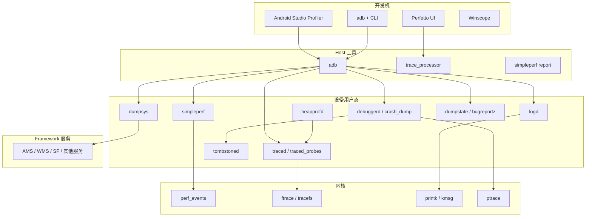
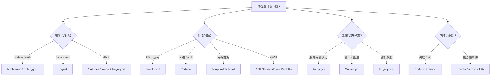
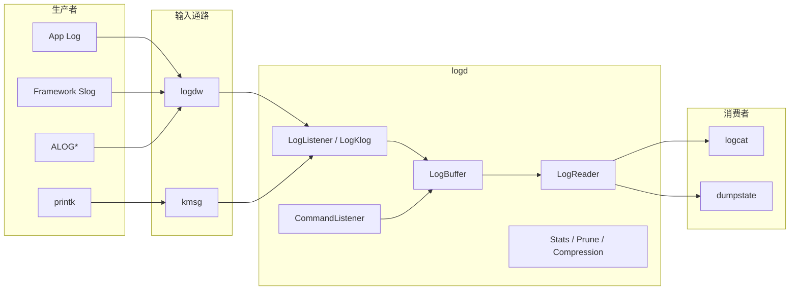
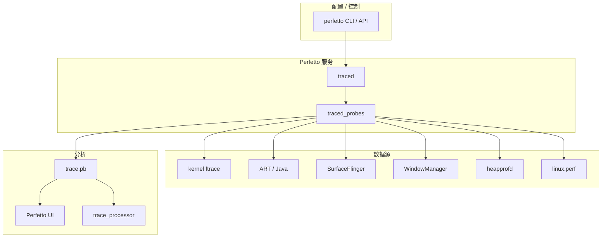
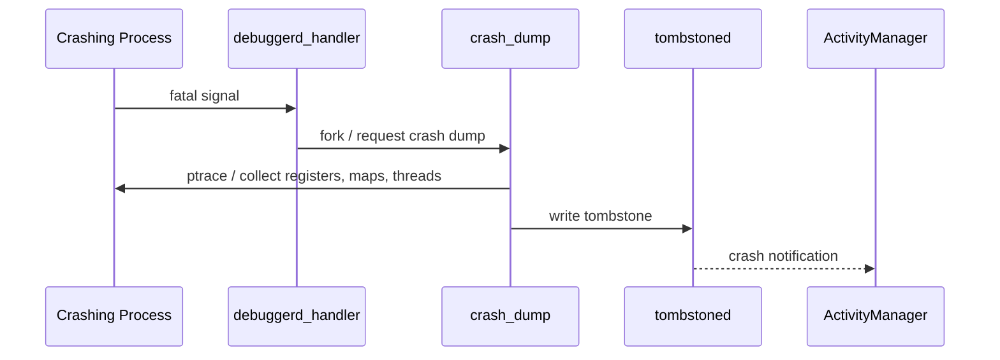
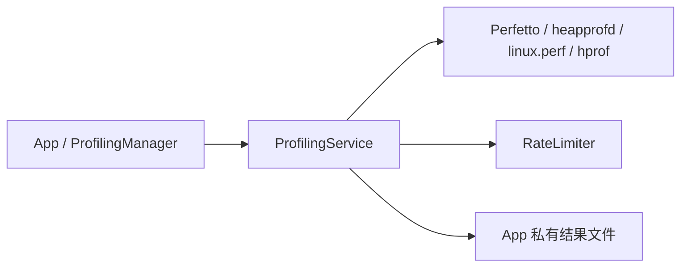

# 第 56 章：Debugging and Profiling Tools

Android 平台自带了一整套远比“看日志”更完整的调试与分析体系。它们不是外挂式工具，而是直接嵌在系统实现里：`logd` 由 `init` 拉起、`debuggerd` 的信号处理逻辑存在于每个 native 进程、Perfetto 数据源分布在内核与 framework 中、`dumpsys` 可以对几乎所有 Binder 服务做结构化导出、`bugreportz` 则把全系统快照打包成统一证据。

这一章把常用工具按分层方式梳理出来：先看调试栈总览，再分别看日志、系统级 trace、CPU / heap profiling、服务转储、窗口追踪、崩溃转储、GPU / 内存 / ANR 调试，以及 Android 新增的 Mainline Profiling 模块。重点不是死记命令，而是理解每个工具负责哪类问题、数据从哪里来、应该如何组合使用。

---

## 56.1 Debugging Architecture Overview

### 56.1.1 完整调试栈

Android 的调试基础设施覆盖了从 kernel 到 IDE 的完整链路。不同工具关注点不同，但它们并不是彼此孤立的：日志、trace、服务 dump、crash dump 和 bugreport 经常是同一问题分析流程中的不同证据面。

调试栈的高层关系如下：



### 56.1.2 设计原则

AOSP 调试工具反复体现几条设计原则：

1. 常驻但低开销。平时只埋点，不主动做重分析。
2. 采集与分析解耦。设备负责抓数据，工作站负责重分析。
3. 结构化优先。Perfetto、proto tombstone、bugreport 都偏向结构化格式。
4. 权限最小化。读取敏感数据时明确做权限与 SELinux 控制。
5. 服务统一出口。大量系统状态统一通过 Binder `dump()` 暴露给 `dumpsys`。

### 56.1.3 工具选择指南

遇到问题时，先选对工具，往往比“多试几条命令”更关键。



### 56.1.4 常见传输机制

调试数据最终都要离开设备，典型通路包括：

| 通路 | 典型工具 | 方式 |
|---|---|---|
| `adb logcat` | logd | 读 `/dev/socket/logdr` |
| `adb shell perfetto` | Perfetto | 产物写到 trace 文件 |
| `adb pull` | tombstone / trace / hprof | 拉文件 |
| `adb bugreport` | `dumpstate` / `bugreportz` | 直接流式导出 zip |
| `adb forward` | profiler / lldb | TCP 转发 |

## 56.2 Logcat and the Logging Subsystem

### 56.2.1 架构概览

`logcat` 是最常见的第一现场工具，但它背后是完整日志子系统：应用层 `Log`、framework `Slog`、native `ALOG*` 和 kernel `printk` 会通过不同入口汇入 `logd`，再由 reader 端按 buffer、tag、PID、UID 和优先级过滤输出。



### 56.2.2 Log Buffers 与 Log IDs

Android 并不是只有一个混合日志流。常见 buffer 包括：

- `main`
- `system`
- `radio`
- `events`
- `crash`
- `kernel`

不同 buffer 有不同使用语义，这能避免无线电日志、事件日志和普通应用日志互相淹没。

### 56.2.3 `LogBuffer` 接口

`LogBuffer` 是 `logd` 内部核心抽象，负责插入、读取、统计、裁剪与顺序维护。它本质上是多 buffer、受权限控制、支持 reader 游标的存储层。

### 56.2.4 `LogBufferElement`

`LogBufferElement` 是单条日志在 `logd` 内部的基本单位，通常包含时间戳、pid、tid、uid、tag / message 和优先级等元数据。

### 56.2.5 日志摄取

`LogListener` 负责读取用户态写入，`LogKlog` 则负责把 kernel log 纳入同一体系。也就是说，`logcat` 虽然看起来像单一命令，实际上它整合了多类生产者。

### 56.2.6 日志读取

reader 侧会根据客户端请求、权限和过滤条件，决定从哪些 buffer、什么时间点开始返回数据，并维持阻塞式或快照式读取。

### 56.2.7 `CommandListener`

`CommandListener` 提供 buffer 控制接口，例如大小调整、清空、统计等。

### 56.2.8 统计与裁剪

日志系统必须控制空间占用。`logd` 会记录统计信息，并在需要时按规则裁剪老日志，防止某类 noisy producer 占满 buffer。

### 56.2.9 Buffer 大小配置

buffer 大小可由属性和运行时命令共同影响。生产环境要在“保留足够现场”与“减少内存占用”之间折中。

### 56.2.10 压缩

较新实现会对某些日志路径做压缩处理，以降低占用和导出成本。

### 56.2.11 审计日志

SELinux denial 等安全相关信息会通过专门路径进入日志系统，方便系统与安全分析工具检索。

### 56.2.12 Event Log Tags

`events` buffer 使用 tag 编号与格式描述，而不是普通文本行。它更适合机器分析与结构化事件统计。

### 56.2.13 日志级别与过滤

最常见的过滤方式包括 tag、优先级、PID、UID 和正则。

```bash
# 只看 MyApp 的 Error 及以上
adb logcat MyApp:E *:S

# 默认 threadtime 输出
adb logcat -v threadtime

# 彩色输出
adb logcat -v color

# 按 PID 过滤
adb logcat --pid 12345

# 按 UID 过滤
adb logcat --uid 10123

# 正则过滤
adb logcat -e "ANR|FATAL"

# 只打印最近 N 行
adb logcat -t 200

# 打印后退出
adb logcat -d
```

### 56.2.14 用 `EventLog` 做结构化日志

事件日志适合记录数值型和结构化事件，例如 AMS、WM、PM 的关键状态变更。

### 56.2.15 权限与安全

不是所有进程都能随便读取所有日志。日志读取涉及应用隔离、隐私与系统内部实现细节，必须由 `logd` 做访问控制。

### 56.2.16 `logcat` 常用速查

平台调试里最常见的做法不是“全量刷屏看运气”，而是：

1. 先按 PID / UID / tag 缩小范围。
2. 再结合 `crash` / `events` / `system` buffer。
3. 需要保留上下文时使用 `-b all -v threadtime -d > file`。

## 56.3 Perfetto: System-Wide Tracing

### 56.3.1 架构

Perfetto 是 Android 当前系统级 tracing 的主力。它整合 kernel ftrace、userspace trace events、surface / scheduler / binder / memory 等数据源，并把采集结果保存成统一 trace 文件，再由 `trace_processor` 或 Perfetto UI 做分析。



### 56.3.2 `traced`

`traced` 是 central service，负责接受配置、建立 tracing session、协调数据源生命周期。

### 56.3.3 Data Sources

Perfetto 的强项是数据源非常丰富。常见包括：

- `linux.ftrace`
- `android.surfaceflinger`
- `android.packages_list`
- `android.heapprofd`
- `linux.perf`
- `track_event`

### 56.3.4 Trace 配置

Perfetto 通常用 `pbtxt` 或 proto 配置声明 buffer、数据源、时长、采样频率和目标进程。

```bash
# 录 10 秒 trace
adb shell perfetto -o /data/misc/perfetto-traces/trace.pftrace -t 10s sched freq idle am wm gfx view binder_driver

# 拉回 trace
adb pull /data/misc/perfetto-traces/trace.pftrace
```

### 56.3.5 与 `atrace` 集成

Perfetto 实际上吸收了旧 `atrace` 模式的很多能力。对于平台工程师来说，今天更多是把 `atrace` category 当成 Perfetto 的一个兼容入口。

### 56.3.6 `trace_processor` 与 SQL

Perfetto 的另一个核心优势是 trace 可以用 SQL 分析，而不是只能肉眼看 timeline。

```bash
# 交互式 SQL shell
trace_processor_shell trace.pftrace

# 运行查询文件
trace_processor_shell -q query.sql trace.pftrace
```

### 56.3.7 Perfetto UI

Perfetto UI 用于时间轴可视化、slice 查看、thread state 追踪和指标交互，是分析 jank、binder 阻塞和调度问题的主力前端。

### 56.3.8 Trace 格式

底层 trace 是结构化 proto，不是简单文本日志。这使得离线分析、指标计算和跨版本演进都更稳定。

### 56.3.9 Perfetto Metrics

很多系统指标可以直接通过内置 metrics 计算：

```bash
# 列出可用 metrics
trace_processor_shell --run-metrics ? trace.pftrace

# 计算一个 metric
trace_processor_shell --run-metrics android_startup trace.pftrace

# 运行一组 Android metrics
trace_processor_shell --run-metrics android_* trace.pftrace
```

### 56.3.10 常用 Perfetto 配方

Perfetto 最常见的几类场景：

- 查卡顿：`sched` + `gfx` + `view` + `wm` + `sf`
- 查 binder 堵塞：`binder_driver` + thread state
- 查 I/O：`block` / `f2fs` / `sched`
- 查冷启动：`am` + `wm` + `binder_driver` + app 进程

## 56.4 simpleperf: CPU Profiling

### 56.4.1 架构

`simpleperf` 是 Android 对 `perf_event_open` 的用户态封装，负责 CPU 采样与火焰图分析，是定位热点函数、调用链和硬件事件的常用工具。

### 56.4.2 命令框架

核心命令通常包括：

- `record`
- `report`
- `stat`
- `inject`
- 若干辅助脚本

### 56.4.3 `perf_event` 接口

底层采样最终还是依赖内核 `perf_events` 子系统，`simpleperf` 只是让 Android 上的使用更统一、跨 ABI 更好用。

### 56.4.4 录制 CPU Profile

```bash
# 采样运行中的进程
adb shell simpleperf record -p 12345 --duration 10

# 采样一个命令
adb shell simpleperf record --app com.example.app --duration 10

# dwarf call graph
adb shell simpleperf record -p 12345 -g --call-graph dwarf

# frame-pointer call graph
adb shell simpleperf record -p 12345 -g --call-graph fp

# system-wide
adb shell su root simpleperf record -a --duration 10

# debuggable/profileable app
adb shell simpleperf record --app com.example.app --duration 10
```

### 56.4.5 结果分析

```bash
# 拉数据
adb pull /data/local/tmp/perf.data

# 基础 report
simpleperf report -i perf.data

# 不同排序
simpleperf report --sort pid,comm,symbol -i perf.data

# 显示调用图
simpleperf report -g -i perf.data

# 按 so 过滤
simpleperf report --dsos libfoo.so -i perf.data
```

### 56.4.6 火焰图

```bash
# 生成 HTML 火焰图
simpleperf report_html.py -i perf.data

# Brendan Gregg 风格
simpleperf report_sample.py -i perf.data

# folded stacks
simpleperf stackcollapse.py -i perf.data
```

### 56.4.7 硬件计数器

`simpleperf stat` 可以查看 cache miss、branch misprediction、IPC 等硬件事件。

```bash
adb shell simpleperf stat -e cache-misses -p 12345 --duration 5
adb shell simpleperf stat -e branch-misses -p 12345 --duration 5
adb shell simpleperf stat -e instructions,cycles -p 12345 --duration 5
adb shell simpleperf list
```

### 56.4.8 ETM 支持

在支持 ETM 的设备上，可以采更细粒度的分支执行路径，但成本与硬件依赖都更高。

### 56.4.9 脚本

`simpleperf` 自带大量脚本，用来完成记录、pull、符号化与 HTML 报告的一体化流程。

### 56.4.10 调用图方法对比

`dwarf` 更准但更重，`fp` 更快但依赖 frame pointer 完整性。查短命热点或线上设备时，经常先用 `fp`，需要更精确调用链再切 `dwarf`。

### 56.4.11 JIT Debug 支持

对于 ART / JIT 场景，`simpleperf` 也需要处理动态生成代码的符号和映射，避免热点全落成匿名段。

## 56.5 heapprofd: Heap Profiling via Perfetto

### 56.5.1 架构

`heapprofd` 是基于 Perfetto 生态的堆分析工具，适合定位长期分配热点与泄漏趋势。它和直接做一次 Java heap dump 不同，更偏采样式、时间维度式的内存画像。

### 56.5.2 关键源码

实现主要分布在 Perfetto 与 Android heap profiling 相关目录中，和 `traced` 协同工作。

### 56.5.3 工作方式

典型路径是：

1. 配置目标进程与采样间隔。
2. 由 Perfetto 会话激活 `heapprofd`。
3. 记录分配调用栈与样本。
4. 输出到 trace。
5. 用 Perfetto UI / SQL 分析。

### 56.5.4 使用 `heapprofd`

```bash
# 录堆采样
adb shell perfetto -c /data/local/tmp/heap_profile.pbtxt -o /data/misc/perfetto-traces/heap.pftrace

# 或用便捷脚本
adb shell heapprofd --help
```

### 56.5.5 用 `trace_processor` 分析

和普通 Perfetto trace 一样，heap profile 结果也能用 SQL 做聚合分析。

### 56.5.6 Java Heap Profiling

如果需要对象级 Java 堆图而不是采样趋势，可以直接 dump hprof：

```bash
# 导出 Java heap
adb shell am dumpheap <pid-or-process> /data/local/tmp/app.hprof

# 拉回后用 Android Studio 或 MAT 分析
adb pull /data/local/tmp/app.hprof
```

## 56.6 dumpsys: Service Inspection

### 56.6.1 架构

`dumpsys` 是 Android 服务自检的统一出口。它不是解析一堆日志，而是通过 `IServiceManager` 枚举系统服务，再调用对应服务的 `dump()` 接口获取结构化状态。

### 56.6.2 `Dumpsys` 类

`frameworks/native/cmds/dumpsys/` 下的实现负责参数解析、服务枚举、优先级过滤和输出整合。

### 56.6.3 Dump 执行流

典型流程是：

1. 找服务。
2. 决定 dump 优先级与格式。
3. 调 Binder `dump()`。
4. 汇总输出或 proto。

### 56.6.4 按优先级导出

```bash
# 只导关键优先级服务
adb shell dumpsys --priority CRITICAL

# 高优先级
adb shell dumpsys --priority HIGH

# 普通优先级
adb shell dumpsys --priority NORMAL
```

### 56.6.5 其他 dump 类型

`dumpsys` 还支持显示宿主进程 pid、client pid、Binder 稳定性、线程使用情况等辅助信息。

### 56.6.6 常用命令

```bash
# AMS
adb shell dumpsys activity
adb shell dumpsys activity activities
adb shell dumpsys activity services
adb shell dumpsys activity broadcasts
adb shell dumpsys activity providers
adb shell dumpsys activity recents
adb shell dumpsys activity processes
adb shell dumpsys activity intents
adb shell dumpsys activity oom
adb shell dumpsys activity package com.example.app
adb shell dumpsys meminfo <pid>

# WMS
adb shell dumpsys window
adb shell dumpsys window windows
adb shell dumpsys window displays
adb shell dumpsys input_method
adb shell dumpsys window policy
adb shell dumpsys window animator
adb shell dumpsys window tokens
adb shell dumpsys window visible-apps

# PackageManager
adb shell dumpsys package
adb shell dumpsys package packages
adb shell dumpsys package com.example.app
adb shell dumpsys package permissions
adb shell dumpsys package preferred-activities
adb shell dumpsys package shared-users
adb shell dumpsys package features

# SurfaceFlinger
adb shell dumpsys SurfaceFlinger
adb shell dumpsys SurfaceFlinger --list
adb shell dumpsys SurfaceFlinger --display-id
adb shell dumpsys SurfaceFlinger --latency

# 其他
adb shell dumpsys batterystats
adb shell dumpsys power
adb shell dumpsys deviceidle
adb shell dumpsys cpuinfo
adb shell dumpsys netstats
adb shell dumpsys connectivity
adb shell dumpsys wifi
adb shell dumpsys telephony.registry
adb shell dumpsys audio
adb shell dumpsys media_session
adb shell dumpsys camera
adb shell dumpsys input
adb shell dumpsys notification
adb shell dumpsys alarm
adb shell dumpsys jobscheduler
adb shell dumpsys sensorservice
adb shell dumpsys usb
adb shell dumpsys account
adb shell service list
adb shell dumpsys -T proto
```

### 56.6.7 命令行参考

做系统行为分析时，`dumpsys` 的价值在于它给的是“服务当前自认为的内部状态”，而不是事后日志猜测。

## 56.7 Winscope: Window and Surface Tracing

### 56.7.1 概览

Winscope 用于可视化 WindowManager 与 SurfaceFlinger 的状态演化，特别适合查窗口层级、焦点、转场、图层和 transaction 问题。

### 56.7.2 抓取 trace

```bash
# SurfaceFlinger layer trace
adb shell cmd SurfaceFlinger tracing start
adb shell cmd SurfaceFlinger tracing stop
adb pull /data/misc/wmtrace/layers_trace.pb

# transaction trace
adb shell cmd SurfaceFlinger transaction-trace start
adb shell cmd SurfaceFlinger transaction-trace stop

# WM trace
adb shell cmd window tracing start
adb shell cmd window tracing stop
adb pull /data/misc/wmtrace/wm_trace.pb
```

### 56.7.3 Winscope 功能

它可以同时显示：

- layer hierarchy
- window hierarchy
- transaction 演化
- 输入焦点与可见性

### 56.7.4 常见使用场景

常见于：

- 焦点错乱
- 图层未消失
- 窗口动画顺序异常
- SystemUI / Launcher 转场

### 56.7.5 数据解读

分析 Winscope 的关键不是只看某一帧，而是看状态如何跨时间变化，以及 WM 与 SF 是否一致。

### 56.7.6 焦点问题调试

如果焦点显示不对，通常要同时比对：

- 输入焦点
- top focused window
- 可见 layer
- 是否有 token / transition 尚未完成

## 56.8 bugreport and bugreportz

### 56.8.1 架构

`adb bugreport` / `bugreportz` 是整机快照工具。它会协调 `dumpstate`、`dumpsys`、日志、属性、ANR、tombstone 和大量系统文件，最后输出 zip。

### 56.8.2 `bugreport` 与 `bugreportz`

今天常用的是 `bugreportz` 形式，输出压缩包而不是裸文本。

```bash
# 推荐，adb 会自动走 bugreportz
adb bugreport

# 会生成 bugreport-<device>-<date>.zip
```

### 56.8.3 内容组成

bugreport 通常包含：

- 各类 `dumpsys`
- `logcat`
- `event log`
- ANR traces
- tombstones
- `dumpstate_board.txt`
- properties / kernel info / 电池信息

### 56.8.4 进度跟踪

`bugreportz` 支持进度输出，避免长时间抓取看起来像卡死。

### 56.8.5 `dumpstate` 内部机制

`dumpstate` 是 orchestrator，它按顺序调用各组件导出，再把产物打包。很多“为什么 bugreport 里有这个文件”的答案，都在 `dumpstate` 的收集逻辑里。

### 56.8.6 分析 bugreport

```bash
# 解压
unzip bugreport-*.zip -d bugreport

# 查崩溃
grep -R "FATAL EXCEPTION\\|signal 11\\|Abort message" bugreport

# 查 ANR
grep -R "ANR in" bugreport

# 找 tombstone
find bugreport -name "tombstone_*"

# 查电池消耗
grep -R "Estimated power use" bugreport
```

Battery Historian 也是 bugreport 的常见下游分析工具。

## 56.9 Tombstones and debuggerd

### 56.9.1 架构概览

native crash 的主线是：进程收到致命信号，`debuggerd` 介入，`crash_dump` 收集上下文，`tombstoned` 管理落盘，最终生成 tombstone 并通知上层系统。



### 56.9.2 Signal Handler

`debuggerd_handler` 会在 native 进程里注册，对崩溃信号做统一接管。

### 56.9.3 `CrashInfo` 协议

handler 与 `crash_dump` 之间需要共享崩溃元数据，例如 signal、tid、abort message 和管道 fd。

### 56.9.4 `crash_dump`

`crash_dump` 负责 ptrace 目标进程、读取寄存器、maps、线程栈和必要的内存片段，是 tombstone 主要内容的采集者。

### 56.9.5 `tombstoned`

`tombstoned` 管理 tombstone 文件分配、命名和存储，避免多个崩溃同时写乱。

### 56.9.6 Tombstone 格式

常见文本 tombstone 内容包括：

- signal 与 abort message
- register dump
- backtrace
- memory map
- 其他线程栈
- open files / nearby memory（视配置而定）

### 56.9.7 Protobuf Tombstones

除了文本格式，还支持 proto tombstone，便于机器处理。

```bash
# 以文本看 proto tombstone
adb shell tombstoned --help

# 或拉回本地处理
adb pull /data/tombstones
```

### 56.9.8 读取与分析

```bash
# 最近 tombstones
adb shell ls -lt /data/tombstones

# 直接看一个 tombstone
adb shell cat /data/tombstones/tombstone_00

# 全量拉回
adb pull /data/tombstones

# 用 ndk-stack 符号化
ndk-stack -sym out/target/product/<product>/symbols -dump tombstone_00

# 或 addr2line
addr2line -e libfoo.so <pc>
```

### 56.9.9 手动使用 `debuggerd`

```bash
# 为运行中的进程生成 tombstone
adb shell debuggerd <pid>

# 只要 native backtrace
adb shell debuggerd -b <pid>

# 生成 Java traces
adb shell debuggerd -j <pid>
```

### 56.9.10 ActivityManager 通知

崩溃不仅是 native 现场，还要进入 AMS 的进程管理与用户可见错误通路。

### 56.9.11 `libdebuggerd`

崩溃转储逻辑并不全在单个可执行文件里，`libdebuggerd` 提供了共享能力。

### 56.9.12 GWP-ASan 集成

GWP-ASan 能为稀有内存错误提供更高质量现场，对线上低频堆损坏很有帮助。

### 56.9.13 Scudo 集成

Scudo allocator 会让某些 heap corruption 更早、更可诊断地暴露出来。

### 56.9.14 Crash Detail Pages

现代崩溃分析不仅是文本堆栈，还会有更多结构化详情页或聚合视图。

### 56.9.15 `wait_for_debugger`

对某些开发场景，可以让进程等待调试器附着后再继续，便于抓启动早期问题。

## 56.10 Android Studio Profiler Integration

### 56.10.1 架构

Android Studio Profiler 本质上是对底层 profiling 能力的 GUI 封装与整合，它并不是独立于平台之外的新采样后端。

### 56.10.2 CPU Profiler 模式

常见模式包括 sampled、instrumented、system trace 等，底层通常映射到 simpleperf / Perfetto 能力。

### 56.10.3 CPU Profiling 工作方式

Studio 会通过 `adb`、agent 和 profileable / debuggable 权限模型与设备交互，再把结果可视化。

### 56.10.4 Memory Profiler 模式

内存侧则会整合 Java heap dump、allocation tracking 和 native / Perfetto 相关能力。

### 56.10.5 `profileable` 与 `debuggable`

很多开发者混淆两者：

- `debuggable`：允许更完整调试能力。
- `profileable`：允许受控 profiling，但不等于可任意调试。

## 56.11 GPU Debugging

### 56.11.1 概览

GPU 问题往往不能只靠 CPU profile 或日志看出来。Android GPU 调试通常需要验证层、帧捕获和系统 trace 联合使用。

### 56.11.2 Vulkan Validation Layers

```bash
# 推送 validation layer
adb push <layer> /data/local/debug/vulkan

# 为某个 app 启用
adb shell setprop debug.vulkan.layers VK_LAYER_KHRONOS_validation

# 在 logcat 看消息
adb logcat | findstr Vulkan
```

### 56.11.3 Android GPU Inspector

AGI 用于 GPU 计时、硬件计数器和帧分析，是 Android 平台和游戏侧都常用的工具。

### 56.11.4 RenderDoc

RenderDoc 更偏单帧捕获与渲染命令级分析，适合定位具体 draw call 或资源问题。

### 56.11.5 用 Perfetto 看 GPU

Perfetto 也可以采 GPU 相关 timeline，用来做 CPU / GPU 关联分析。

### 56.11.6 overdraw 可视化

```bash
# 开启 overdraw 调试
adb shell setprop debug.hwui.overdraw show

# 关闭
adb shell setprop debug.hwui.overdraw false

# GPU rendering bars
adb shell setprop debug.hwui.profile visual_bars
```

## 56.12 Memory Debugging Tools

### 56.12.1 内存分析总览

内存问题分很多类：泄漏、碎片、峰值过高、错误 free、越界、未初始化读、匿名映射膨胀。不同问题应选不同工具。

### 56.12.2 `malloc debug`

```bash
# 为指定 app 开启 malloc debug
adb shell setprop libc.debug.malloc.program com.example.app

# dump 当前分配
adb shell kill -47 <pid>
```

`malloc debug` 适合开发构建中的本地内存排查，但开销较大。

### 56.12.3 ASan 与 HWASan

ASan / HWASan 更适合在专门构建或测试环境下查越界、UAF、双重释放等问题，属于“强侵入、强收益”的手段。

### 56.12.4 `showmap` 与 `procrank`

```bash
# 看进程详细内存映射
adb shell showmap <pid>

# 看全局 PSS 排序
adb shell procrank

# 详细 meminfo
adb shell dumpsys meminfo <pid>
```

### 56.12.5 `libmemunreachable`

```bash
# 对进程做泄漏探测
adb shell dumpsys meminfo --unreachable <pid>
```

## 56.13 ANR Analysis

### 56.13.1 ANR 的成因

ANR 常见成因包括：

- 主线程阻塞
- binder 调用链卡住
- 锁竞争
- I/O 阻塞
- 广播 / service / input timeout

### 56.13.2 查找 ANR 信息

```bash
# 当前 ANR traces
adb shell ls /data/anr

# bugreport 中重点搜索
grep -R "ANR in" bugreport
grep -R "traces.txt" bugreport
grep -R "CPU usage from" bugreport
```

### 56.13.3 阅读 ANR traces

看 ANR traces 时优先关注：

1. 主线程当前栈。
2. 是否在 Binder、锁或 I/O 上阻塞。
3. 其他关键线程是否形成依赖链。

### 56.13.4 常见 ANR 模式

典型模式包括：

- 主线程直接做磁盘 / 网络
- `BroadcastReceiver` / `Service` 超时
- binder 依赖链回环
- UI 线程等待后台线程，后台线程又等待主线程

### 56.13.5 预防 ANR

```bash
# 开发期打开 StrictMode
adb shell settings put global debug_view_attributes 1

# 看 ANR 历史
adb shell dumpsys activity anr
```

## 56.14 Cross-Tool Integration

### 56.14.1 工具互补关系

真实问题很少能靠单一工具彻底解释。更常见的路径是：

- `logcat` 看症状与时间点
- `dumpsys` 看系统当前状态
- Perfetto 看时间线与调度
- `simpleperf` 看热点函数
- `heapprofd` / hprof 看内存趋势
- `bugreport` 做全局归档

### 56.14.2 组合 Perfetto 与 simpleperf

Perfetto 告诉你“哪一段时间卡”，`simpleperf` 告诉你“CPU 到底跑在哪”。两者组合是性能调优的常规打法。

### 56.14.3 以 bugreport 为入口

很多线上问题第一手只有 bugreport。正确姿势通常是先从 bugreport 确定时间窗、进程和异常模式，再决定是否补抓 Perfetto、simpleperf 或更细的 dump。

## 56.15 Advanced Topics

### 56.15.1 自定义 Perfetto Data Source

如果现有数据源不够，可以自定义 data source，把平台内部关键事件接进 Perfetto。

### 56.15.2 自定义 `atrace` Category

某些 framework / native 模块会新增 trace category，用于在不污染普通日志的前提下暴露高价值时间线事件。

### 56.15.3 直接使用 `tracefs`

```bash
# 必要时挂载 tracefs
adb shell mount -t tracefs tracefs /sys/kernel/tracing

# 列事件
adb shell ls /sys/kernel/tracing/events

# 开指定事件
adb shell 'echo 1 > /sys/kernel/tracing/events/sched/sched_switch/enable'

# 设置 buffer
adb shell 'echo 16384 > /sys/kernel/tracing/buffer_size_kb'

# 开始 tracing
adb shell 'echo 1 > /sys/kernel/tracing/tracing_on'

# ... 复现问题 ...

# 停止并读取
adb shell 'echo 0 > /sys/kernel/tracing/tracing_on'
adb shell cat /sys/kernel/tracing/trace
```

### 56.15.4 用 `lldb` 远程调试

```bash
# 设备上起 lldb-server
adb shell run-as com.example.app /data/local/tmp/lldb-server platform --listen unix-abstract:///data/local/tmp/debug.sock

# host 上转发并连接
adb forward tcp:5039 localabstract:/data/local/tmp/debug.sock
lldb
```

### 56.15.5 `strace` 与 seccomp

```bash
# 跟踪进程系统调用
adb shell strace -p <pid>

# 跟踪一个命令
adb shell strace <cmd>
```

`strace` 开销很大，不适合拿来做精确性能测量。

### 56.15.6 GDB vs LLDB

Android 现代 native 调试通常更偏向 LLDB，特别是在 Clang / lldb-server 工作流下。

### 56.15.7 调试 SELinux denial

```bash
# 看 SELinux denial
adb logcat -b all | findstr avc:

# 看当前模式
adb shell getenforce

# userdebug 下临时 permissive
adb shell setenforce 0

# 从 denial 生成策略建议
adb shell audit2allow
```

## 56.16 Performance Debugging Properties Reference

性能调试常用属性通常集中在几类：

- `debug.hwui.*`
- `persist.traced.*`
- `debug.sf.*`
- `debug.egl.*`
- `debug.vulkan.*`

它们的共同特点是：能临时放大可观测性，但不应直接当成量产配置。

## 56.17 Quick Reference Card

### 56.17.1 开始采集

```bash
# logcat
adb logcat

# Perfetto 10 秒系统 trace
adb shell perfetto -o /data/misc/perfetto-traces/quick.pftrace -t 10s sched freq idle am wm gfx view binder_driver

# simpleperf CPU profile
adb shell simpleperf record -p <pid> --duration 10

# heapprofd
adb shell perfetto -c /data/local/tmp/heap_profile.pbtxt -o /data/misc/perfetto-traces/heap.pftrace

# bugreport
adb bugreport

# dumpsys
adb shell dumpsys <service>

# tombstone
adb shell debuggerd <pid>
```

### 56.17.2 分析结果

```bash
# Perfetto UI
ui.perfetto.dev

# simpleperf report
simpleperf report -i perf.data

# flame graph
simpleperf report_html.py -i perf.data

# tombstone 符号化
ndk-stack -sym out/target/product/<product>/symbols -dump tombstone_00

# Battery Historian
https://bathist.ef.lc/

# trace_processor SQL
trace_processor_shell trace.pftrace
```

### 56.17.3 应急命令

```bash
# 进程卡死，拿 Java traces
adb shell debuggerd -j <pid>

# 进程卡死，拿 native backtrace
adb shell debuggerd -b <pid>

# 系统变慢，快速看 CPU
adb shell dumpsys cpuinfo

# 系统变慢，快速看内存
adb shell procrank

# 系统变慢，快速看 I/O
adb shell dumpsys diskstats

# app 崩溃，看 tombstone
adb shell ls -lt /data/tombstones

# ANR，看 traces
adb shell ls -lt /data/anr
```

## 56.18 Profiling Module: Mainline-Delivered Profiling for Apps

这一节是原文放在 `Summary` 之后的后置内容。我在中文稿里前移它，保证本章仍然按本书规则以动手实践和总结收尾。

### 56.18.1 动机

Android 新增的 Profiling Mainline 模块尝试把“应用可用的 profiling 能力”做成正式平台 API，而不是让 app 只能间接依赖底层工具或 IDE。

### 56.18.2 集成架构

Profiling 模块的大致位置如下：



### 56.18.3 `ProfilingService` 如何驱动 Perfetto

服务会按请求类型拼装不同数据源配置，再启动底层 tracing / profiling 会话。

### 56.18.4 Perfetto 配置构造

不同 profiling 类型会映射到不同 Perfetto data source，例如：

- heap profile -> `android.heapprofd`
- stack sampling -> `linux.perf`
- Java heap dump -> `android.java_hprof`

### 56.18.5 系统触发型 profiling

Mainline Profiling 不只支持 app 主动请求，还支持系统触发，例如 ANR、`reportFullyDrawn()` 或被强杀等事件。

### 56.18.6 速率限制

模块内建 rate limiter，避免 profiling 被滥用拖慢系统或泄露过多数据。

```bash
# 关闭 rate limiting
adb shell device_config put profiling_testing rate_limiter.disabled true

# 为 trigger 设测试包
adb shell device_config put profiling_testing system_triggered_profiling.testing_package_name com.example.myapp

# 保留临时文件
adb shell device_config put profiling_testing delete_temporary_results.disabled true
```

### 56.18.7 结果交付

结果通过 Binder callback 和 app 私有文件交付；如果结果生成时 app 不在前台或未运行，服务会先排队保存，再等待稍后投递。

### 56.18.8 实际用法模式

典型模式包括：

- one-shot system trace
- 为 ANR / 冷启动注册 trigger
- 做受控 heap profile

### 56.18.9 与其他工具的关系

Profiling 模块并没有替代 Perfetto / simpleperf / heapprofd，而是把它们包装成更受控、可交付给 app 的平台能力。

### 56.18.10 关键源码路径

| 组件 | 路径 |
|---|---|
| `ProfilingManager` | `packages/modules/Profiling/framework/java/android/os/ProfilingManager.java` |
| `ProfilingResult` | `packages/modules/Profiling/framework/java/android/os/ProfilingResult.java` |
| `ProfilingTrigger` | `packages/modules/Profiling/framework/java/android/os/ProfilingTrigger.java` |
| `ProfilingService` | `packages/modules/Profiling/service/java/com/android/os/profiling/ProfilingService.java` |
| 配置构造 | `packages/modules/Profiling/service/java/com/android/os/profiling/Configs.java` |
| RateLimiter | `packages/modules/Profiling/service/java/com/android/os/profiling/RateLimiter.java` |
| `TracingSession` | `packages/modules/Profiling/service/java/com/android/os/profiling/TracingSession.java` |
| `IProfilingService.aidl` | `packages/modules/Profiling/aidl/android/os/IProfilingService.aidl` |

## 56.19 Try It: Debug a Real Performance Issue

### 56.19.1 问题描述

假设某个列表页滚动明显卡顿，但只在真机上出现，开发者肉眼能感受到掉帧，却说不清是 CPU 热点、Binder 堵塞、内存抖动还是 SurfaceFlinger 合成延迟。

### 56.19.2 第一步：先用 `gfxinfo` 确认问题

```bash
# 重置 frame stats
adb shell dumpsys gfxinfo com.example.app reset

# 复现滚动
# ...

# 收集帧时间
adb shell dumpsys gfxinfo com.example.app framestats
```

### 56.19.3 第二步：抓一段 Perfetto 系统 trace

```bash
# 准备配置并开始 trace
adb shell perfetto -o /data/misc/perfetto-traces/jank.pftrace -t 15s sched freq idle am wm gfx view binder_driver

# 在 15 秒窗口内复现滚动
# ...

# 拉回 trace
adb pull /data/misc/perfetto-traces/jank.pftrace
```

### 56.19.4 第三步：在 Perfetto UI 里分析

重点看：

- UI thread / RenderThread 是否被长任务占用
- Binder 调用是否阻塞主线程
- SF / HWC 是否出现合成延迟
- 调度是否频繁切出

### 56.19.5 第四步：对热点路径做 CPU Profiling

```bash
# 滚动时采样调用图
adb shell simpleperf record --app com.example.app -g --duration 10

# 拉回并分析
adb pull /data/local/tmp/perf.data
simpleperf report -g -i perf.data
```

### 56.19.6 第五步：检查是否有内存问题

```bash
# 用 heapprofd 观察滚动期间分配
adb shell perfetto -c /data/local/tmp/heap_profile.pbtxt -o /data/misc/perfetto-traces/heap_scroll.pftrace

# 复现滚动
# ...
```

### 56.19.7 第六步：用 `dumpsys meminfo` 验证

```bash
# 滚动前
adb shell dumpsys meminfo com.example.app

# 持续滚动 30 秒后
adb shell dumpsys meminfo com.example.app
```

### 56.19.8 第七步：定位根因并修复

一个常见结论是：主线程在每次 bind item 时做了重对象分配和 bitmap 处理，导致频繁 GC 与渲染线程竞争 CPU，最终形成 jank。

### 56.19.9 第八步：验证修复

```bash
# 重新收集 gfxinfo
adb shell dumpsys gfxinfo com.example.app framestats

# 重新抓 Perfetto 验证
adb shell perfetto -o /data/misc/perfetto-traces/jank_fixed.pftrace -t 15s sched freq idle am wm gfx view binder_driver
```

### 56.19.10 调试检查清单

- 先确认症状，再抓数据。
- 先看系统 trace，再决定是否要 CPU / heap 细化。
- 把时间线和调用热点对上。
- 修复后一定要重新采集同类证据，而不是凭感觉宣布完成。

## Summary

Android 的调试与分析体系并不是一堆彼此无关的小工具，而是一套跨日志、trace、性能、服务状态、崩溃现场和系统快照的完整取证链。

- `logcat` 适合快速看现象、错误和时间点。
- Perfetto 适合看系统级时间线、调度、jank 和跨进程行为。
- `simpleperf` 适合定位 CPU 热点与调用链。
- `heapprofd`、hprof、ASan / HWASan 和 `showmap` 适合不同粒度的内存问题。
- `dumpsys` 让各系统服务通过统一接口暴露内部状态。
- Winscope 用于窗口和图层问题，`debuggerd` / tombstone 用于 native crash。
- `bugreportz` 则把所有关键证据聚合成一份整机快照。
- 新的 Profiling Mainline 模块把部分底层 profiling 能力提升成了正式平台 API。

实际工作中最有效的方式通常不是“先挑一个最熟的工具硬查到底”，而是按问题类型组合它们：先用最轻量工具缩小范围，再用更重的 trace、profile 或 dump 精确定位。这也是 Android 平台工程里调试效率的核心。
