# Chapter 56: Debugging and Profiling Tools

Android ships a rich arsenal of debugging and profiling tools, most of them
built directly into AOSP.  Unlike aftermarket solutions that attach from
outside, these tools are woven into the platform: logd is an init service,
debuggerd is a signal handler compiled into every native process, Perfetto
data-sources live inside SurfaceFlinger, ART, and the kernel, and dumpsys
talks to every registered Binder service.  This chapter walks through each
tool layer by layer -- from the source code that implements them in the tree
to the command-line invocations and analysis workflows that platform engineers
use every day.

> **Source paths** in this chapter are relative to the AOSP root unless marked
> otherwise.  The primary directories we reference are:
>
> | Tool | AOSP path |
> |------|-----------|
> | logd / logcat | `system/logging/logd/` |
> | Perfetto | `external/perfetto/` |
> | simpleperf | `system/extras/simpleperf/` |
> | dumpsys | `frameworks/native/cmds/dumpsys/` |
> | debuggerd / tombstones | `system/core/debuggerd/` |
> | dumpstate / bugreport | `frameworks/native/cmds/dumpstate/` |
> | bugreportz | `frameworks/native/cmds/bugreportz/` |
> | Winscope | `development/tools/winscope/` |

---

## 56.1 Debugging Architecture Overview

### 56.1.1 The Full Debugging Stack

Android's debugging infrastructure spans every layer of the system -- from
kernel tracepoints at the bottom to Android Studio's GUI at the top.  The
following diagram provides the 30,000-foot view.

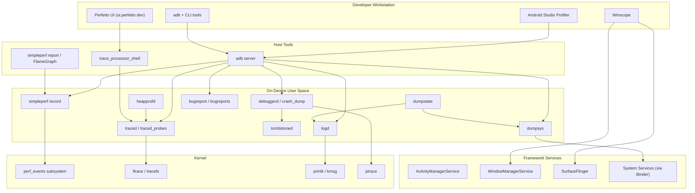

### 56.1.2 Design Principles

Several recurring themes run through AOSP's debugging tools:

1. **Always-on low-overhead instrumentation.** logd runs on every device;
   atrace markers are compiled into framework code; debuggerd signal handlers
   are registered in every native process.  The overhead is zero or near-zero
   until someone starts listening.

2. **Separation of collection and analysis.** Perfetto separates `traced`
   (collection) from `trace_processor` (analysis).  simpleperf separates
   `record` from `report`.  This allows collection on resource-constrained
   devices and analysis on powerful workstations.

3. **Protobuf-first wire formats.** Tombstones, Perfetto traces, and
   bugreports all use protobuf for structured data, with text rendering as a
   presentation layer.

4. **Privilege minimization.** crash_dump drops capabilities after reading
   registers; logd checks credentials before serving log data; heapprofd uses
   SELinux to constrain which processes it can profile.

5. **Service-manager integration.** dumpsys enumerates services through
   `IServiceManager`, and each service implements its own `dump()` method --
   providing a uniform diagnostic interface across hundreds of subsystems.

### 56.1.3 Tool Selection Guide

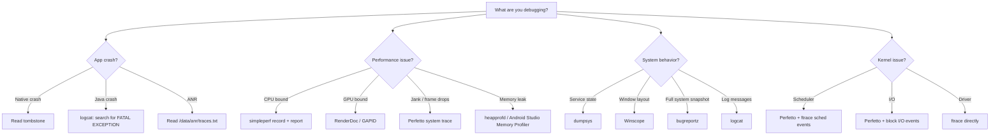

### 56.1.4 Common Transport Mechanisms

All debugging data must get off the device.  The primary transports are:

| Transport | Used by | Mechanism |
|-----------|---------|-----------|
| `adb logcat` | logd | Socket `/dev/socket/logdr` |
| `adb shell perfetto` | Perfetto | Writes to `/data/misc/perfetto-traces/` |
| `adb pull` | Tombstones | Files in `/data/tombstones/` |
| `adb bugreport` | dumpstate | Zip streamed over adb |
| `adb jdwp` | Java debugger | JDWP protocol over adb |
| `adb forward` | Various profilers | TCP port forwarding |

---

## 56.2 Logcat and the Logging Subsystem

### 56.2.1 Architecture Overview

Android's logging system is one of the oldest and most heavily used
debugging facilities in the platform.  Every `Log.d()` call from Java, every
`ALOGD()` macro from C++, and every `printk()` from the kernel ultimately
flows through the `logd` daemon.

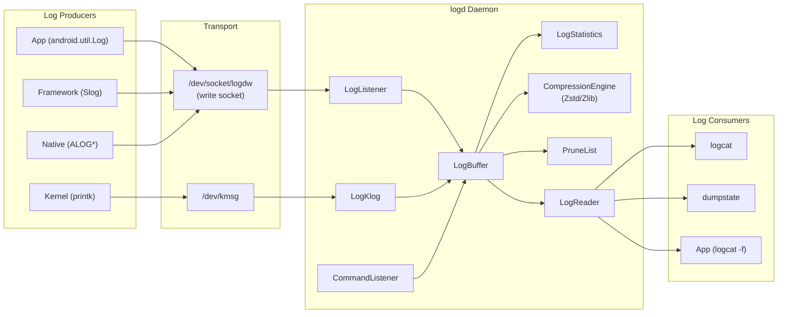

### 56.2.2 Log Buffers and Log IDs

logd maintains several independent ring buffers, each identified by a
`log_id_t` enumeration value:

| Buffer | log_id_t | Default size | Purpose |
|--------|----------|-------------|---------|
| **main** | `LOG_ID_MAIN` | 256 KB | General application logging |
| **system** | `LOG_ID_SYSTEM` | 256 KB | Framework/system logging |
| **radio** | `LOG_ID_RADIO` | 256 KB | Telephony stack |
| **events** | `LOG_ID_EVENTS` | 256 KB | Binary event logging |
| **crash** | `LOG_ID_CRASH` | 256 KB | Crash/ANR traces |
| **kernel** | `LOG_ID_KERNEL` | 256 KB | Kernel messages (via kmsg) |
| **security** | `LOG_ID_SECURITY` | 256 KB | Security audit events |

The size constants are defined in `system/logging/logd/LogSize.h`:

```cpp
// system/logging/logd/LogSize.h
static constexpr size_t kDefaultLogBufferSize = 256 * 1024;
static constexpr size_t kLogBufferMinSize = 64 * 1024;
static constexpr size_t kLogBufferMaxSize = 256 * 1024 * 1024;
```

Buffer sizes can be adjusted at runtime with `logcat -G <size>` or by
setting system properties like `persist.logd.size.main`.  The function
`GetBufferSizeFromProperties()` reads these properties during `LogBuffer::Init()`.

### 56.2.3 The LogBuffer Interface

The `LogBuffer` class in `system/logging/logd/LogBuffer.h` defines the
abstract interface that all buffer implementations must satisfy:

```cpp
// system/logging/logd/LogBuffer.h
class LogBuffer {
  public:
    virtual ~LogBuffer() {}
    virtual void Init() = 0;

    virtual int Log(log_id_t log_id, log_time realtime, uid_t uid, pid_t pid,
                    pid_t tid, const char* msg, uint16_t len) = 0;

    virtual std::unique_ptr<FlushToState> CreateFlushToState(
        uint64_t start, LogMask log_mask) = 0;
    virtual bool FlushTo(
        LogWriter* writer, FlushToState& state,
        const std::function<FilterResult(log_id_t, pid_t, uint64_t,
                                         log_time)>& filter) = 0;

    virtual bool Clear(log_id_t id, uid_t uid) = 0;
    virtual size_t GetSize(log_id_t id) = 0;
    virtual bool SetSize(log_id_t id, size_t size) = 0;
    virtual uint64_t sequence() const = 0;
};
```

Key design points:

- **`Log()`** is the write path.  It receives a pre-validated message with
  identity information (uid, pid, tid) from the kernel socket credentials.

- **`FlushTo()`** is the read path.  It iterates the buffer using
  `FlushToState` to maintain position across calls, and applies a filter
  callback that returns `FilterResult::kSkip`, `kStop`, or `kWrite`.

- **`LogMask`** is a bitmask (`uint32_t`) selecting which buffers a reader
  wants.  The constant `kLogMaskAll = 0xFFFFFFFF` selects everything.

### 56.2.4 LogBufferElement: The Unit of Storage

Each log message is stored as a `LogBufferElement`, defined in
`system/logging/logd/LogBufferElement.h`:

```cpp
// system/logging/logd/LogBufferElement.h
class __attribute__((packed)) LogBufferElement {
  public:
    LogBufferElement(log_id_t log_id, log_time realtime, uid_t uid,
                     pid_t pid, pid_t tid, uint64_t sequence,
                     const char* msg, uint16_t len);

    uint32_t GetTag() const;
    bool FlushTo(LogWriter* writer);
    LogStatisticsElement ToLogStatisticsElement() const;

    log_id_t log_id() const;
    uid_t uid() const;
    pid_t pid() const;
    pid_t tid() const;
    uint16_t msg_len() const;
    const char* msg() const;
    uint64_t sequence() const;
    log_time realtime() const;

  private:
    const uint32_t uid_;
    const uint32_t pid_;
    const uint32_t tid_;
    uint64_t sequence_;
    log_time realtime_;
    char* msg_;
    const uint16_t msg_len_;
    const uint8_t log_id_;
};
```

The `__attribute__((packed))` ensures minimal memory overhead -- every byte
counts when you are storing hundreds of thousands of messages.  The element
is designed to match the incoming packet layout on the socket.

When flushing to a reader, `FlushTo()` constructs a `logger_entry` header:

```cpp
// system/logging/logd/LogBufferElement.cpp
bool LogBufferElement::FlushTo(LogWriter* writer) {
    struct logger_entry entry = {};
    entry.hdr_size = sizeof(struct logger_entry);
    entry.lid = log_id_;
    entry.pid = pid_;
    entry.tid = tid_;
    entry.uid = uid_;
    entry.sec = realtime_.tv_sec;
    entry.nsec = realtime_.tv_nsec;
    entry.len = msg_len_;
    return writer->Write(entry, msg_);
}
```

### 56.2.5 Log Ingestion: LogListener and LogKlog

Two distinct pathways bring log messages into logd:

**LogListener** (`system/logging/logd/LogListener.h`) receives messages from
user-space processes via the Unix domain socket `/dev/socket/logdw`.  It
supports both synchronous reads and io_uring for higher throughput:

```cpp
// system/logging/logd/LogListener.h
class LogListener {
  public:
    explicit LogListener(LogBuffer* buf);
    bool StartListener();
  private:
    void HandleDataUring();
    void HandleDataSync();
    void ProcessBuffer(struct ucred* cred, void* buffer, ssize_t n);
    bool InitializeUring();
    std::unique_ptr<IOUringSocketHandler> uring_listener_;
    int socket_;
    LogBuffer* logbuf_;
};
```

The `ProcessBuffer()` method extracts the sender's credentials (`uid`, `gid`,
`pid`) from the socket ancillary data (`SCM_CREDENTIALS`), ensuring that
log messages cannot be spoofed.

**LogKlog** (`system/logging/logd/LogKlog.h`) reads kernel messages from
`/dev/kmsg` and injects them into the `LOG_ID_KERNEL` buffer.  It also
handles monotonic-to-realtime clock conversion:

```cpp
// system/logging/logd/LogKlog.h
class LogKlog : public SocketListener {
    static log_time correction;
  public:
    static void convertMonotonicToReal(log_time& real) {
        real += correction;
    }
  protected:
    log_time sniffTime(const char*& buf, ssize_t len, bool reverse);
    pid_t sniffPid(const char*& buf, ssize_t len);
};
```

### 56.2.6 Log Reading: LogReader and LogReaderThread

The read side of logd serves clients that connect to `/dev/socket/logdr`.
`LogReader` (`system/logging/logd/LogReader.h`) extends `SocketListener`
and creates a `LogReaderThread` for each connected client:

```cpp
// system/logging/logd/LogReader.h
class LogReader : public SocketListener {
  public:
    explicit LogReader(LogBuffer* logbuf, LogReaderList* reader_list);
  protected:
    virtual bool onDataAvailable(SocketClient* cli);
  private:
    LogBuffer* log_buffer_;
    LogReaderList* reader_list_;
};
```

Each `LogReaderThread` maintains its own read position and filter criteria:

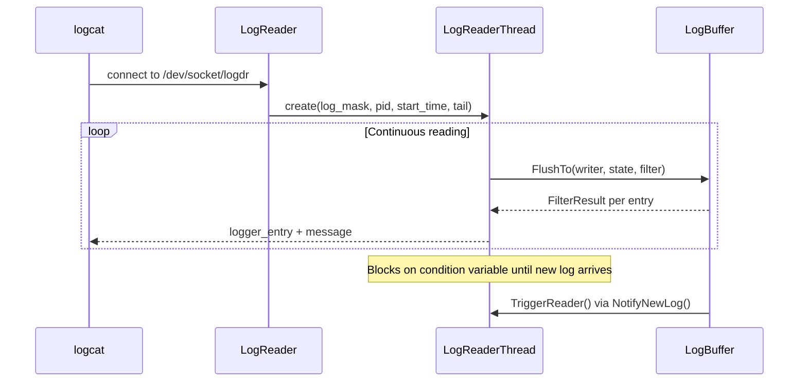

Key fields in `LogReaderThread` (from `system/logging/logd/LogReaderThread.h`):

- **`tail_`**: For `-t N` / `-T N` mode, the number of recent lines to show.
- **`pid_`**: Optional PID filter (for `logcat --pid=<pid>`).
- **`non_block_`**: When true, disconnect after dumping (for `logcat -d`).
- **`skip_ahead_[]`**: Per-buffer skip counts used when the buffer overflows
  and old entries are pruned while a reader is still referencing them.

- **`deadline_`**: CLOCK_MONOTONIC deadline for log wrapping operations.

### 56.2.7 The CommandListener: Control Interface

The `CommandListener` (`system/logging/logd/CommandListener.h`) provides a
control socket at `/dev/socket/logd` for administrative commands.  It uses a
macro-based pattern to register command handlers:

```cpp
// system/logging/logd/CommandListener.h
#define LogCmd(name, command_string)                                \
    class name##Cmd : public FrameworkCommand {                     \
      public:                                                       \
        explicit name##Cmd(CommandListener* parent)                 \
            : FrameworkCommand(#command_string), parent_(parent) {} \
        int runCommand(SocketClient* c, int argc, char** argv);    \
      private:                                                      \
        CommandListener* parent_;                                   \
    }

    LogCmd(Clear, clear);
    LogCmd(GetBufSize, getLogSize);
    LogCmd(SetBufSize, setLogSize);
    LogCmd(GetStatistics, getStatistics);
    LogCmd(GetPruneList, getPruneList);
    LogCmd(SetPruneList, setPruneList);
    LogCmd(GetEventTag, getEventTag);
    LogCmd(Reinit, reinit);
```

These commands back the `logcat` administrative operations:

| Command | logcat equivalent | Purpose |
|---------|------------------|---------|
| `clear` | `logcat -c` | Clear a buffer |
| `getLogSize` | `logcat -g` | Query buffer size |
| `setLogSize` | `logcat -G <size>` | Resize a buffer |
| `getStatistics` | `logcat -S` | Per-UID/PID statistics |
| `getPruneList` | `logcat -p` | List prune rules |
| `setPruneList` | `logcat -P '<rules>'` | Set prune rules |

### 56.2.8 Log Statistics and Pruning

When a buffer fills up, logd must decide what to drop.  The `LogStatistics`
class (`system/logging/logd/LogStatistics.h`) maintains per-UID, per-PID,
per-TID, and per-tag counters:

```cpp
// system/logging/logd/LogStatistics.h  (simplified)
class LogStatistics {
    size_t mSizes[LOG_ID_MAX];
    size_t mElements[LOG_ID_MAX];

    // Per-buffer, per-UID size tracking
    typedef LogHashtable<uid_t, UidEntry> uidTable_t;
    uidTable_t uidTable[LOG_ID_MAX];

    // Per-buffer, per-PID tracking for system processes
    typedef LogHashtable<pid_t, PidEntry> pidSystemTable_t;
    pidSystemTable_t pidSystemTable[LOG_ID_MAX];

    // Global pid-to-uid and tid-to-uid maps
    typedef LogHashtable<pid_t, PidEntry> pidTable_t;
    pidTable_t pidTable;
    typedef LogHashtable<pid_t, TidEntry> tidTable_t;
    tidTable_t tidTable;

    // Tag tracking
    typedef LogHashtable<uint32_t, TagEntry> tagTable_t;
    tagTable_t tagTable;
    tagTable_t securityTagTable;
};
```

The `PruneList` class works alongside statistics to implement smart pruning:

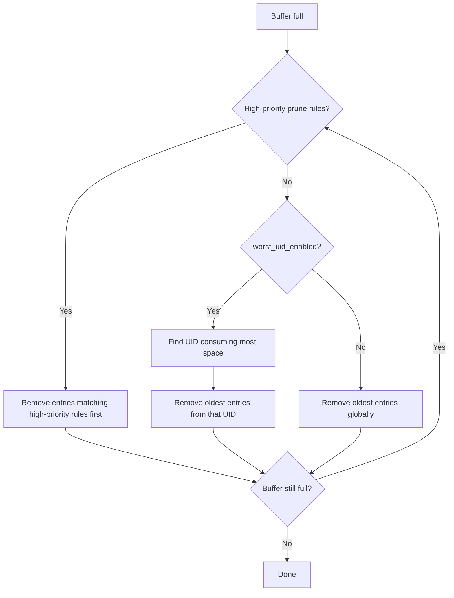

### 56.2.9 Buffer Size Configuration in Detail

The buffer size initialization logic in `system/logging/logd/LogSize.cpp`
reveals important platform-specific behavior:

```cpp
// system/logging/logd/LogSize.cpp
size_t GetBufferSizeFromProperties(log_id_t log_id) {
    static const bool isDebuggable =
        android::base::GetBoolProperty("ro.debuggable", false);
    if (isDebuggable) {
        static const bool mayOverride = isAllowedToOverrideBufferSize();
        if (mayOverride) {
            if (auto size = GetBufferSizePropertyOverride(log_id)) {
                return *size;
            }
        }
    } else {
        static const bool isLowRam =
            android::base::GetBoolProperty("ro.config.low_ram", false);
        if (isLowRam) {
            return kLogBufferMinSize;  // 64 KB for low-RAM devices
        }
    }
    return kDefaultLogBufferSize;  // 256 KB
}
```

The property lookup follows a priority chain:

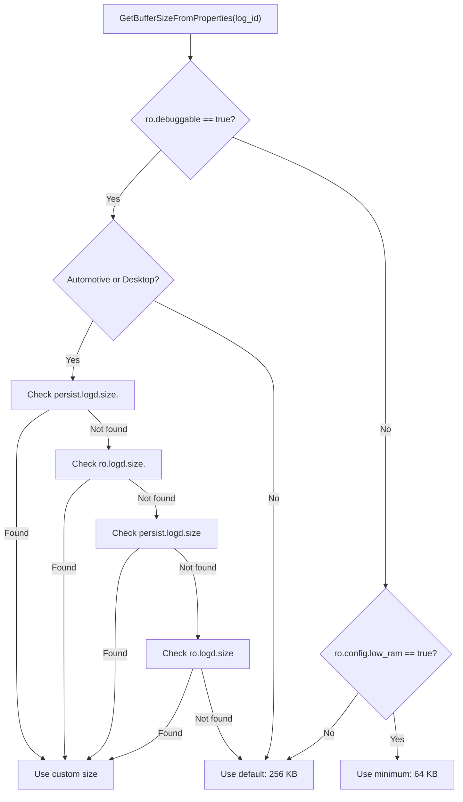

This design addresses a real problem documented in the source: overly large
custom log sizes combined with compressed logging can cause logcat to time
out during bugreport collection (see comment referencing b/196856709).

### 56.2.10 Compression

logd supports compressed storage via the `CompressionEngine` hierarchy
(`system/logging/logd/CompressionEngine.h`):

```cpp
// system/logging/logd/CompressionEngine.h
class CompressionEngine {
  public:
    static CompressionEngine& GetInstance();
    virtual bool Compress(SerializedData& in, size_t data_length,
                          SerializedData& out) = 0;
    virtual bool Decompress(SerializedData& in, SerializedData& out) = 0;
};

class ZstdCompressionEngine : public CompressionEngine { ... };
class ZlibCompressionEngine : public CompressionEngine { ... };
```

Zstd compression is the default on modern devices, providing roughly 3-5x
compression ratios on typical log streams while adding minimal CPU overhead.

The `LogStatistics` class tracks both compressed and uncompressed sizes
independently.  The `Sizes()` method returns the compressed size (actual
memory consumed), while `SizeReadable()` returns the uncompressed size (what
users expect):

```cpp
// system/logging/logd/LogStatistics.h
size_t Sizes(log_id_t id) const {
    auto lock = std::lock_guard{lock_};
    if (overhead_[id]) {
        return *overhead_[id];  // compressed size
    }
    return mSizes[id];
}

size_t SizeReadable(log_id_t id) const {
    auto lock = std::lock_guard{lock_};
    return mSizes[id];  // uncompressed size
}
```

### 56.2.11 Audit Logging: LogAudit

The `LogAudit` class (`system/logging/logd/LogAudit.h`) handles SELinux
audit messages from the kernel's audit subsystem:

```cpp
// system/logging/logd/LogAudit.h
class LogAudit : public SocketListener {
    LogBuffer* logbuf;
    int fdDmesg;
    bool main;     // log to main buffer
    bool events;   // log to events buffer
  public:
    LogAudit(LogBuffer* buf, int fdDmesg);
    int log(char* buf, size_t len);
  private:
    std::string denialParse(const std::string& denial,
                            char terminator,
                            const std::string& search_term);
    std::string auditParse(const std::string& string, uid_t uid);
};
```

LogAudit parses kernel audit messages (SELinux denials, capability checks)
and routes them into the appropriate log buffers.  The `denialParse()` method
extracts structured fields from raw denial strings, making them searchable
through logcat.

### 56.2.12 Event Log Tags: LogTags

The `LogTags` class (`system/logging/logd/LogTags.h`) manages the mapping
between numeric event tag IDs and their human-readable names/formats:

```cpp
// system/logging/logd/LogTags.h
class LogTags {
    android::RWLock rwlock;

    // key is Name + "+" + Format
    std::unordered_map<std::string, uint32_t> key2tag;

    // UID-based access control for tags
    typedef std::unordered_set<uid_t> uid_list;
    std::unordered_map<uint32_t, uid_list> tag2uid;

    std::unordered_map<uint32_t, std::string> tag2name;
    std::unordered_map<uint32_t, std::string> tag2format;

    static const size_t max_per_uid = 256;  // Cap on tags per uid
    std::unordered_map<uid_t, size_t> uid2count;

  public:
    static const char system_event_log_tags[];
    static const char dynamic_event_log_tags[];
    static const char debug_event_log_tags[];

    const char* tagToName(uint32_t tag) const;
    const char* tagToFormat(uint32_t tag) const;
    uint32_t nameToTag(const char* name) const;
};
```

Tag sources include:

- **System tags**: `/system/etc/event-log-tags` (built from source)
- **Dynamic tags**: `/data/misc/logd/event-log-tags` (runtime-registered)
- **Debug tags**: `/data/misc/logd/debug-event-log-tags` (userdebug/eng only)

The per-UID cap of 256 tags prevents any single application from exhausting
the tag namespace.

### 56.2.13 Log Levels and Filtering

Android defines the following log levels, in order of increasing severity:

| Level | Integer | Macro | Java constant |
|-------|---------|-------|--------------|
| Verbose | 2 | `ALOGV` | `Log.VERBOSE` |
| Debug | 3 | `ALOGD` | `Log.DEBUG` |
| Info | 4 | `ALOGI` | `Log.INFO` |
| Warn | 5 | `ALOGW` | `Log.WARN` |
| Error | 6 | `ALOGE` | `Log.ERROR` |
| Fatal | 7 | `ALOGF` (assert) | `Log.ASSERT` |

In production builds, `ALOGV` calls are compiled out entirely (they expand
to `if (false)` blocks), so there is zero cost for verbose logging in release
builds.

**Filtering with logcat:**

```bash
# Show only error and above from tag "MyApp"
adb logcat MyApp:E *:S

# Show with threadtime format (default)
adb logcat -v threadtime

# Show with color
adb logcat -v color

# Filter by PID
adb logcat --pid=1234

# Filter by UID
adb logcat --uid=10042

# Regular expression filter
adb logcat -e "Exception|Error"

# Show recent N lines then exit
adb logcat -t 100

# Print and exit (don't block)
adb logcat -d
```

### 56.2.14 Structured Logging with EventLog

For machine-parseable logging, Android provides the EventLog system.
Events are defined in `system/logging/logd/event.logtags` and logged
as binary data rather than text strings:

```
# Tag number, tag name, format
# Format: (name|type), where type:
#   1: int
#   2: long
#   3: string
#   4: list
42    answer     (to_life|1)
2718  e          (euler|1|5)
2747  contacts   (contact_count|1|1),(lookup_count|1|1)
```

Advantages of structured logging:

- Smaller on-wire size (no string formatting overhead)
- Machine-parseable without regex
- Tag-based aggregation in logcat statistics
- Integration with metrics collection

### 56.2.15 Permissions and Security

Log access is controlled at multiple layers:

1. **Write-side**: Any process can write to the main and system buffers.
   Writing to the security buffer requires `LOG_ID_SECURITY` permission,
   checked in `clientCanWriteSecurityLog()`.

2. **Read-side**: The function `clientHasLogCredentials()` in
   `system/logging/logd/LogPermissions.h` checks whether a connecting
   client is authorized:

```cpp
// system/logging/logd/LogPermissions.h
bool clientHasLogCredentials(uid_t uid, gid_t gid, pid_t pid);
bool clientHasLogCredentials(SocketClient* cli);
bool clientCanWriteSecurityLog(uid_t uid, gid_t gid, pid_t pid);
bool clientIsExemptedFromUserConsent(SocketClient* cli);
```

3. **Binder approval**: The `LogdNativeService` provides a Binder interface
   for `approve`/`decline` decisions on pending reader threads, allowing the
   system to gate log access through AppOps:

```cpp
// system/logging/logd/LogdNativeService.cpp
android::binder::Status LogdNativeService::approve(
    int32_t uid, int32_t gid, int32_t pid, int32_t fd) {
    reader_list_->HandlePendingThread(uid, gid, pid, fd, true);
    return android::binder::Status::ok();
}
```

### 56.2.16 Logcat Command Reference

| Command | Description |
|---------|-------------|
| `logcat` | Stream all log buffers |
| `logcat -b <buffer>` | Select buffer (main, system, radio, events, crash) |
| `logcat -c` | Clear selected buffers |
| `logcat -g` | Display buffer sizes |
| `logcat -G <size>` | Set buffer size (e.g., `16M`) |
| `logcat -S` | Show per-UID/PID statistics |
| `logcat -p` | Show prune rules |
| `logcat -P '<rules>'` | Set prune rules |
| `logcat -v <format>` | Set output format (brief, process, tag, thread, threadtime, time, color, epoch, monotonic, uid, long, raw) |
| `logcat -d` | Dump and exit (non-blocking) |
| `logcat -t <count>` | Show last N lines and exit |
| `logcat -T '<time>'` | Show lines since timestamp |
| `logcat --pid=<pid>` | Filter by process ID |
| `logcat --uid=<uid>` | Filter by user ID |
| `logcat -e '<regex>'` | Filter by regular expression |
| `logcat -f <file>` | Log to file |
| `logcat -r <kbytes>` | Rotate log every N KB |
| `logcat -n <count>` | Number of rotated logs to keep |
| `logcat --wrap` | Sleep and print when wrapping |

---

## 56.3 Perfetto: System-Wide Tracing

### 56.3.1 Architecture

Perfetto is Android's system-wide tracing framework, replacing the legacy
`systrace` tool.  Its architecture follows a producer-consumer model where
multiple data sources write trace packets to a centralized tracing service.

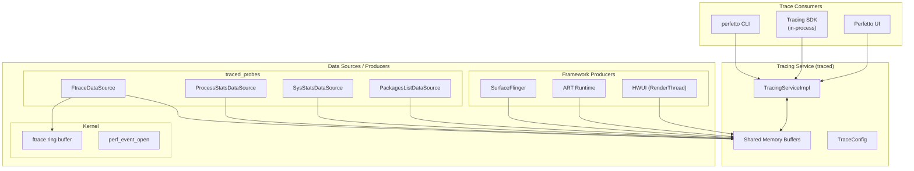

The source code lives in `external/perfetto/` with the following structure:

| Directory | Contents |
|-----------|----------|
| `src/traced/` | The tracing daemon (`traced`) |
| `src/traced/service/` | Core service implementation |
| `src/traced/probes/` | Built-in data source producers |
| `src/tracing/` | Tracing SDK and client library |
| `src/trace_processor/` | SQL-based trace analysis engine |
| `src/perfetto_cmd/` | The `perfetto` command-line tool |
| `src/profiling/` | heapprofd and perf profiling |
| `protos/perfetto/trace/` | Protobuf definitions for trace packets |
| `include/perfetto/tracing/` | Public C++ tracing API |

### 56.3.2 The Tracing Service: traced

The tracing service (`traced`) is the central coordinator.  It:

1. Accepts connections from producers (data sources) and consumers (trace
   sessions).

2. Manages shared-memory buffers between producers and the service.
3. Applies the `TraceConfig` to select which data sources to enable.
4. Handles trace output (file, streaming, or in-memory).

The service runs as a persistent daemon, started by init:

```
# external/perfetto/perfetto.rc (simplified)
service traced /system/bin/traced
    class late_start
    disabled
    user nobody
    group nobody
    writepid /dev/cpuset/system-background/tasks
```

### 56.3.3 Data Sources

Perfetto's power comes from its extensible data source model.  Each data
source is a plugin that produces trace packets in protobuf format.

**Built-in data sources** (from `traced_probes`):

| Data Source | Category | What it captures |
|-------------|----------|-----------------|
| `linux.ftrace` | Kernel | Scheduling, I/O, memory, custom tracepoints |
| `linux.process_stats` | Process | /proc-based process/thread stats |
| `linux.sys_stats` | System | /proc/stat, /proc/meminfo, /proc/vmstat |
| `linux.system_info` | System | CPU info, kernel version |
| `android.packages_list` | Android | Installed packages mapping |
| `android.log` | Android | Logcat integration |
| `android.gpu.memory` | GPU | GPU memory tracking |

**Framework data sources** (atrace-integrated):

| Category tag | Framework component |
|-------------|-------------------|
| `gfx` | SurfaceFlinger, HWUI |
| `view` | View system |
| `wm` | WindowManager |
| `am` | ActivityManager |
| `audio` | AudioFlinger |
| `video` | MediaCodec |
| `camera` | CameraService |
| `input` | InputDispatcher |
| `res` | Resource loading |
| `dalvik` | ART VM |
| `binder_driver` | Binder kernel driver |
| `sched` | CPU scheduler |
| `freq` | CPU frequency |
| `idle` | CPU idle states |
| `disk` | Disk I/O |

### 56.3.4 Trace Configuration

A Perfetto trace session is configured with a `TraceConfig` protobuf.
Here is a representative configuration for debugging frame drops:

```protobuf
# jank_trace.pbtxt
buffers {
    size_kb: 131072
    fill_policy: RING_BUFFER
}
data_sources {
    config {
        name: "linux.ftrace"
        ftrace_config {
            ftrace_events: "sched/sched_switch"
            ftrace_events: "sched/sched_waking"
            ftrace_events: "power/cpu_frequency"
            ftrace_events: "power/cpu_idle"
            ftrace_events: "power/suspend_resume"
            atrace_categories: "gfx"
            atrace_categories: "view"
            atrace_categories: "wm"
            atrace_categories: "am"
            atrace_categories: "input"
            atrace_apps: "*"
        }
    }
}
data_sources {
    config {
        name: "linux.process_stats"
        process_stats_config {
            scan_all_processes_on_start: true
            proc_stats_poll_ms: 1000
        }
    }
}
duration_ms: 10000
```

Running the trace:

```bash
# Record a 10-second trace
adb shell perfetto -c /data/local/tmp/jank_trace.pbtxt \
    -o /data/misc/perfetto-traces/trace.perfetto-trace

# Pull the trace
adb pull /data/misc/perfetto-traces/trace.perfetto-trace .
```

### 56.3.5 atrace Integration

Perfetto integrates with the legacy `atrace` system through the ftrace
data source.  When `atrace_categories` are specified in the config,
`traced_probes` enables the corresponding atrace categories, which in turn
enable `ATRACE_BEGIN()`/`ATRACE_END()` markers in framework code.

The flow is:

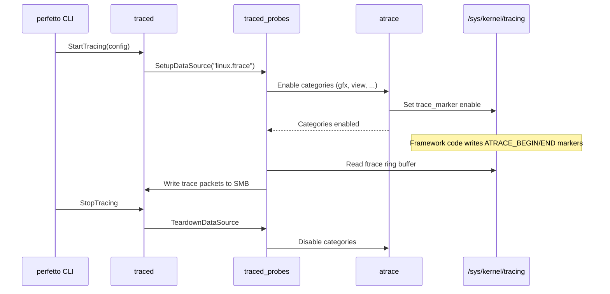

### 56.3.6 The Trace Processor and SQL Queries

Perfetto's `trace_processor` is a powerful analysis engine that imports trace
files and exposes them as a SQL database.  It lives in
`external/perfetto/src/trace_processor/`.

Key tables and views:

| Table/View | Contents |
|------------|----------|
| `slice` | All trace events (begin/end pairs) |
| `thread_slice` | Slices associated with threads |
| `process` | Process metadata (pid, name, uid) |
| `thread` | Thread metadata (tid, name, process) |
| `sched_slice` | CPU scheduler events |
| `counter` | Counter values (CPU freq, memory, etc.) |
| `android_logs` | Logcat entries |
| `ftrace_event` | Raw ftrace events |
| `args` | Key-value arguments on slices |
| `metadata` | Trace-level metadata |

**Example SQL queries:**

```sql
-- Find the longest main-thread slices (potential jank sources)
SELECT
    ts,
    dur / 1e6 as dur_ms,
    name
FROM slice
WHERE track_id IN (
    SELECT id FROM thread_track
    WHERE utid IN (
        SELECT utid FROM thread
        WHERE is_main_thread = 1
    )
)
ORDER BY dur DESC
LIMIT 20;

-- CPU frequency distribution during the trace
SELECT
    cpu,
    CAST(value AS INT) as freq_khz,
    COUNT(*) as sample_count,
    SUM(dur) / 1e9 as total_seconds
FROM counter
JOIN counter_track ON counter.track_id = counter_track.id
WHERE counter_track.name = 'cpufreq'
GROUP BY cpu, freq_khz
ORDER BY cpu, freq_khz;

-- Scheduling latency for a specific process
SELECT
    thread.name,
    AVG(sched_slice.dur) / 1e6 as avg_runtime_ms,
    MAX(sched_slice.dur) / 1e6 as max_runtime_ms,
    COUNT(*) as schedule_count
FROM sched_slice
JOIN thread USING (utid)
JOIN process USING (upid)
WHERE process.name LIKE '%myapp%'
GROUP BY thread.name
ORDER BY avg_runtime_ms DESC;

-- Binder transaction latency
SELECT
    client_ts,
    client_dur / 1e6 as dur_ms,
    client_process,
    server_process
FROM android_binder_txns
WHERE client_dur > 16e6  -- longer than one frame
ORDER BY client_dur DESC
LIMIT 20;
```

Using `trace_processor_shell` interactively:

```bash
# Launch interactive SQL shell
trace_processor_shell trace.perfetto-trace

# Run a query file
trace_processor_shell --query-file=analysis.sql trace.perfetto-trace
```

### 56.3.7 Perfetto UI

The Perfetto UI (at `ui.perfetto.dev`) provides a web-based visualization:

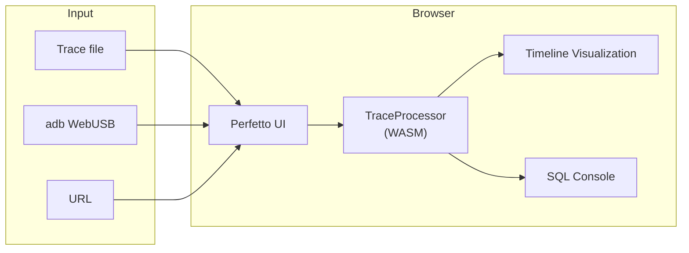

Key UI features:

- **Timeline view**: Scroll/zoom through trace events organized by process
  and thread.

- **SQL console**: Run ad-hoc queries against the trace.
- **Metrics**: Pre-built metric queries for common analyses (startup time,
  jank, memory, etc.).

- **Flamegraph**: For CPU profiling and heap profiling data.
- **Flow events**: Visualize causal relationships (e.g., binder
  request->response).

### 56.3.8 Perfetto Trace Format

Perfetto traces use a protobuf-based format defined in
`external/perfetto/protos/perfetto/trace/trace.proto`.  The trace is a
sequence of `TracePacket` messages:

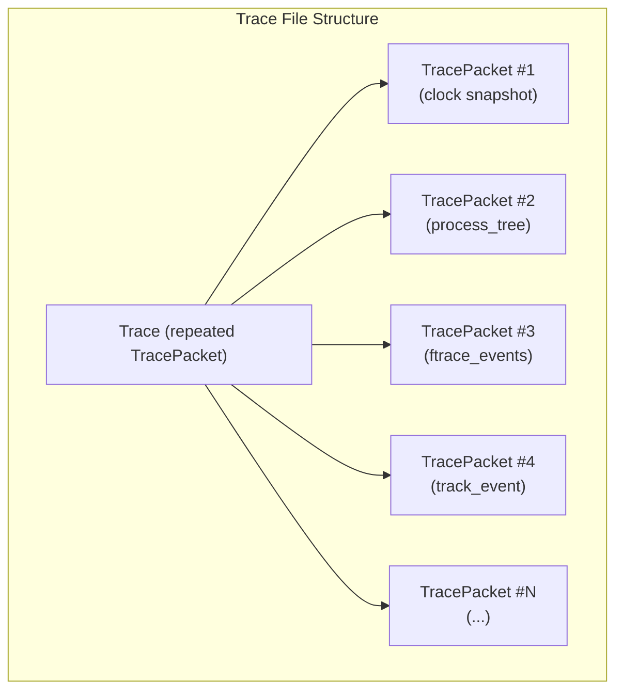

Key protobuf types in the trace format:

| Proto file | Contents |
|------------|----------|
| `trace.proto` | Top-level Trace message |
| `trace_packet.proto` | TracePacket with all possible data source payloads |
| `ftrace/ftrace_event_bundle.proto` | Ftrace event data |
| `track_event/track_event.proto` | User-space trace events |
| `ps/process_tree.proto` | Process/thread metadata |
| `clock_snapshot.proto` | Clock synchronization data |
| `profiling/profile_packet.proto` | CPU/heap profile data |
| `android/packages_list.proto` | Android package metadata |
| `power/battery_counters.proto` | Battery counter data |

The trace processor imports all these packet types and builds a relational
database from them, which is then queryable via SQL.

### 56.3.9 Perfetto Metrics

Perfetto ships with pre-built metrics that can be computed on a trace
without writing SQL:

```bash
# List available metrics
trace_processor_shell --list-metrics trace.perfetto-trace

# Compute a specific metric
trace_processor_shell --run-metrics android_startup \
    trace.perfetto-trace

# Compute all Android metrics
trace_processor_shell --run-metrics android_mem,android_startup,\
android_binder,android_blocking_calls trace.perfetto-trace
```

Available Android-specific metrics:

| Metric | Description |
|--------|-------------|
| `android_startup` | App cold/warm/hot startup time breakdown |
| `android_binder` | Binder transaction latency statistics |
| `android_mem` | Memory usage over time |
| `android_blocking_calls` | Calls that block the main thread |
| `android_camera` | Camera pipeline latency |
| `android_cpu` | CPU usage and scheduling metrics |
| `android_gpu` | GPU utilization metrics |
| `android_jank` | Frame jank detection and classification |
| `android_lmk` | Low memory killer events |
| `android_ion` | ION/DMA-BUF memory allocation |

### 56.3.10 Common Perfetto Recipes

**Record a system trace from the command line:**

```bash
# Quick 10-second trace with common categories
adb shell perfetto -o /data/misc/perfetto-traces/trace \
    -t 10s \
    sched freq idle am wm gfx view input

# Record with custom config file
adb shell perfetto -c - --txt < config.pbtxt \
    -o /data/misc/perfetto-traces/trace
```

**Record a long trace to file with circular buffer:**

```bash
adb shell perfetto \
    --txt \
    -c - \
    -o /data/misc/perfetto-traces/trace <<EOF
buffers { size_kb: 262144  fill_policy: RING_BUFFER }
data_sources {
    config {
        name: "linux.ftrace"
        ftrace_config {
            ftrace_events: "sched/sched_switch"
            atrace_categories: "gfx"
            atrace_categories: "view"
        }
    }
}
duration_ms: 60000
EOF
```

**Record app startup:**

```bash
# Start trace, launch app, stop trace
adb shell perfetto --background \
    -o /data/misc/perfetto-traces/startup_trace \
    -t 15s sched freq am wm gfx view dalvik

adb shell am start -W com.example.myapp/.MainActivity
sleep 15
adb pull /data/misc/perfetto-traces/startup_trace .
```

---

## 56.4 simpleperf: CPU Profiling

### 56.4.1 Architecture

simpleperf is Android's native CPU profiler, built on top of the Linux
`perf_events` subsystem.  Its source lives in `system/extras/simpleperf/`.

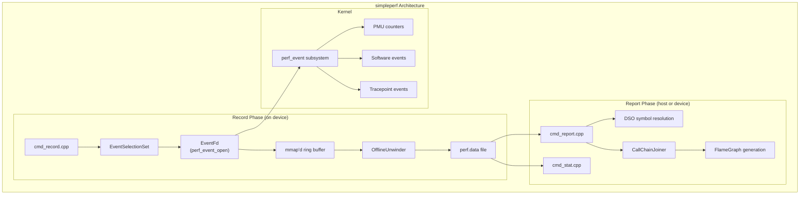

### 56.4.2 The Command Framework

simpleperf uses a modular command framework defined in
`system/extras/simpleperf/command.h`:

```cpp
// system/extras/simpleperf/command.h
class Command {
 public:
  Command(const std::string& name, const std::string& short_help_string,
          const std::string& long_help_string);
  virtual bool Run(const std::vector<std::string>&) { return false; }
  // ...
};

// Registered commands:
void RegisterRecordCommand();
void RegisterReportCommand();
void RegisterStatCommand();
void RegisterListCommand();
void RegisterKmemCommand();
void RegisterTraceSchedCommand();
void RegisterMonitorCommand();
// ... and more
```

The main commands:

| Command | Source | Purpose |
|---------|--------|---------|
| `record` | `cmd_record.cpp` | Collect profiling samples |
| `report` | `cmd_report.cpp` | Analyze recorded data |
| `stat` | `cmd_stat.cpp` | Count hardware events |
| `list` | `cmd_list.cpp` | List available events |
| `dumprecord` | `cmd_dumprecord.cpp` | Dump raw record content |
| `inject` | `cmd_inject.cpp` | Process ETM data |
| `kmem` | `cmd_kmem.cpp` | Kernel memory profiling |
| `trace-sched` | `cmd_trace_sched.cpp` | Scheduling trace analysis |
| `monitor` | `cmd_monitor.cpp` | Real-time event monitoring |

### 56.4.3 EventFd: The perf_event Interface

The `EventFd` class (`system/extras/simpleperf/event_fd.h`) wraps the
kernel's `perf_event_open()` system call:

```cpp
// system/extras/simpleperf/event_fd.h
class EventFd {
 public:
  static std::unique_ptr<EventFd> OpenEventFile(
      const perf_event_attr& attr, pid_t tid, int cpu,
      EventFd* group_event_fd, const std::string& event_name,
      bool report_error = true);

  bool SetEnableEvent(bool enable);
  bool ReadCounter(PerfCounter* counter);
  bool CreateMappedBuffer(size_t mmap_pages, bool report_error);
  std::vector<char> GetAvailableMmapData();
  bool CreateAuxBuffer(size_t aux_buffer_size, bool report_error);
  bool StartPolling(IOEventLoop& loop,
                    const std::function<bool()>& callback);

 protected:
  const perf_event_attr attr_;
  int perf_event_fd_;
  volatile perf_event_mmap_page* mmap_metadata_page_;
  char* mmap_data_buffer_;
  size_t mmap_data_buffer_size_;
};
```

The `PerfCounter` structure captures counter values with time-enabled and
time-running fields for multiplexing:

```cpp
struct PerfCounter {
  uint64_t value;         // The event count
  uint64_t time_enabled;  // Time the counter was enabled
  uint64_t time_running;  // Time the counter was actually running
  uint64_t id;            // Counter ID for group identification
};
```

### 56.4.4 Recording CPU Profiles

**Basic CPU profiling:**

```bash
# Profile a running process
adb shell simpleperf record -p <pid> --duration 10 -o /data/local/tmp/perf.data

# Profile a command
adb shell simpleperf record -o /data/local/tmp/perf.data -- ls /

# Profile with dwarf-based call graphs
adb shell simpleperf record -p <pid> --call-graph dwarf \
    --duration 10 -o /data/local/tmp/perf.data

# Profile with frame-pointer call graphs (faster, less accurate)
adb shell simpleperf record -p <pid> --call-graph fp \
    --duration 10 -o /data/local/tmp/perf.data

# Profile system-wide (requires root)
adb shell simpleperf record -a --duration 10 -o /data/local/tmp/perf.data
```

**Profiling a specific app:**

```bash
# Profile a debuggable/profileable app
adb shell simpleperf record --app com.example.myapp \
    --call-graph dwarf --duration 10 \
    -o /data/local/tmp/perf.data
```

### 56.4.5 Analyzing Results

**Text-based report:**

```bash
# Pull the data
adb pull /data/local/tmp/perf.data .

# Basic report
simpleperf report -i perf.data

# Sort by different criteria
simpleperf report -i perf.data --sort comm,pid,tid,dso,symbol

# Show call graph
simpleperf report -i perf.data -g

# Filter by DSO
simpleperf report -i perf.data --dsos /system/lib64/libc.so
```

**Sample report output:**

```
Overhead  Shared Object            Symbol
60.23%    libmyapp.so              MyApp::processFrame()
 15.42%   libc.so                  memcpy
  8.17%   libart.so                art::gc::Heap::ConcurrentCopying
  5.33%   libhwui.so               android::uirenderer::RenderNode::pr...
  3.89%   [kernel.kallsyms]        copy_page
  2.11%   libutils.so              android::RefBase::incStrong
  ...
```

### 56.4.6 Flame Graphs

simpleperf includes scripts to generate flame graphs:

```bash
# Generate flame graph HTML
python simpleperf/scripts/report_html.py -i perf.data -o report.html

# Generate Brendan Gregg-style flame graph
python simpleperf/scripts/inferno.py -i perf.data -o flame.html

# Generate FlameGraph-compatible folded stacks
simpleperf report -i perf.data -g --print-callgraph > stacks.txt
```

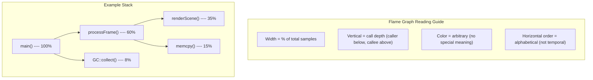

### 56.4.7 Hardware Performance Counters

simpleperf can count specific hardware events:

```bash
# Count cache misses
adb shell simpleperf stat -e cache-misses,cache-references \
    -p <pid> --duration 5

# Count branch mispredictions
adb shell simpleperf stat \
    -e branch-misses,branch-instructions \
    -p <pid> --duration 5

# Count instructions per cycle (IPC)
adb shell simpleperf stat \
    -e instructions,cpu-cycles \
    -p <pid> --duration 5

# List all available events
adb shell simpleperf list
```

**Sample stat output:**

```
Performance counter statistics:

    523,847,293  cpu-cycles          # 1.523 GHz
    312,567,891  instructions        # 0.60 insn per cycle
     12,345,678  cache-references
      1,234,567  cache-misses        # 10.00% of all cache refs
         56,789  branch-misses       # 0.18% of all branches

       0.344123  seconds time elapsed
```

### 56.4.8 ETM (Embedded Trace Macrocell) Support

simpleperf supports ARM's ETM for instruction-level tracing, exposed through
files like `ETMDecoder.h`, `ETMRecorder.h`, and `ETMConstants.h`:

```bash
# Record ETM trace
adb shell simpleperf record -e cs-etm --duration 1 \
    -p <pid> -o /data/local/tmp/etm.data

# Inject and process ETM data
simpleperf inject -i etm.data -o etm_processed.data

# Analyze branch coverage
simpleperf inject -i etm.data --output branch-list \
    -o branch_list.txt
```

### 56.4.9 simpleperf Scripts

simpleperf includes a rich set of Python scripts in
`system/extras/simpleperf/scripts/` for common workflows:

| Script | Purpose |
|--------|---------|
| `app_profiler.py` | Automated app profiling with symbol resolution |
| `report_html.py` | Generate interactive HTML report with flame chart |
| `inferno.py` | Generate standalone flame graph HTML |
| `report_sample.py` | Convert perf.data to protocol buffer format |
| `annotate.py` | Source-level annotation of hot functions |
| `pprof_proto_generator.py` | Generate pprof format for Go ecosystem |
| `simpleperf_report_lib.py` | Python library for custom analysis scripts |
| `binary_cache_builder.py` | Build a cache of binaries for symbolization |
| `debug_unwind_reporter.py` | Debug unwinding issues |

Example workflow using `app_profiler.py`:

```bash
# This script handles the entire record-pull-symbolize workflow
python3 app_profiler.py \
    -p com.example.myapp \
    -r "-g --duration 10" \
    -lib path/to/app/native/libs/

# Then generate an HTML report
python3 report_html.py -i perf.data -o report.html
```

### 56.4.10 Call Graph Methods Comparison

simpleperf supports multiple methods for capturing call stacks:

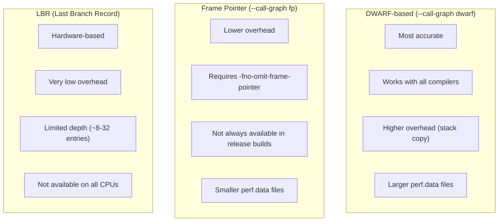

| Method | Flag | Accuracy | Overhead | Stack Depth |
|--------|------|----------|----------|-------------|
| DWARF | `--call-graph dwarf` | Excellent | Medium-High | Unlimited |
| Frame Pointer | `--call-graph fp` | Good | Low | Unlimited (if FP set) |
| LBR | (automatic on supported HW) | Good | Very Low | 8-32 entries |
| None | (default) | Flat only | Minimal | 0 |

### 56.4.11 JIT Debug Support

simpleperf handles JIT-compiled code (from ART) through the
`JITDebugReader` class (`system/extras/simpleperf/JITDebugReader.h`), which
reads the JIT debug descriptor from the ART runtime to resolve symbols in
JIT-compiled methods.

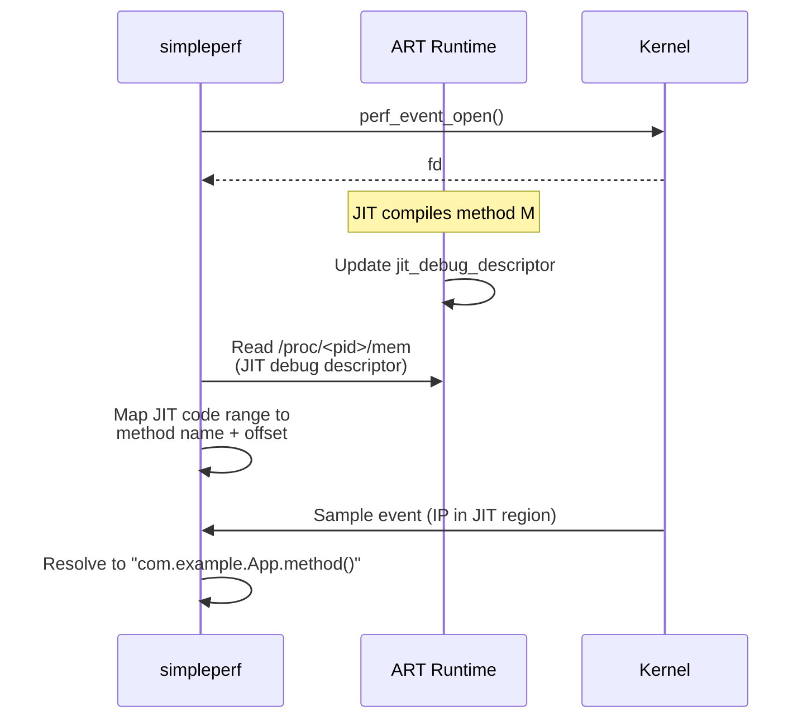

---

## 56.5 heapprofd: Heap Profiling via Perfetto

### 56.5.1 Architecture

heapprofd is a native heap profiler that integrates with Perfetto for
collection and visualization.  Its source is in
`external/perfetto/src/profiling/memory/`.

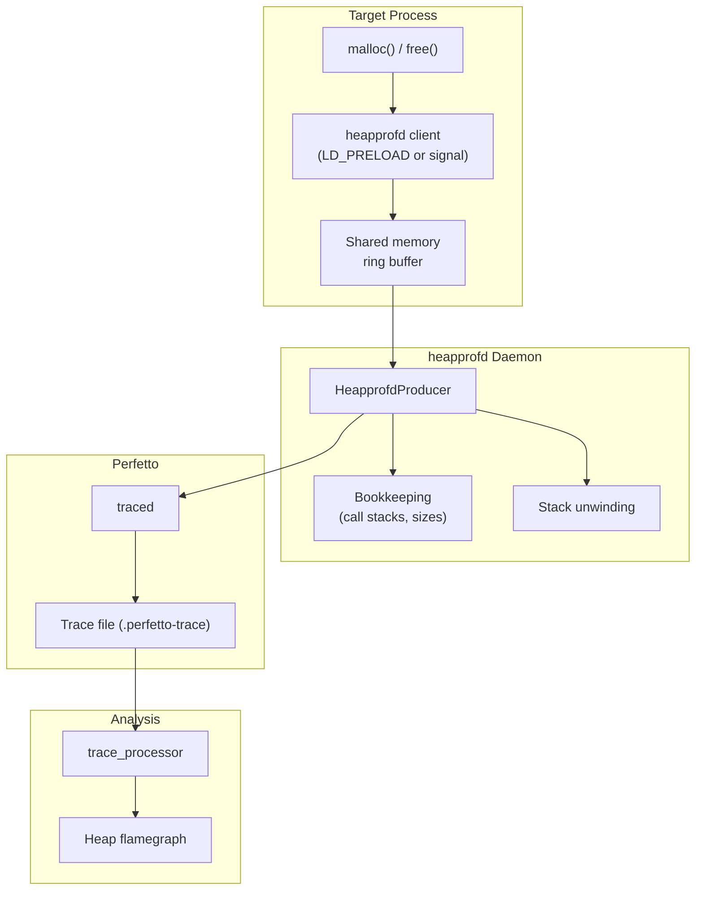

### 56.5.2 Key Source Files

| File | Purpose |
|------|---------|
| `heapprofd.cc` | Daemon entry point |
| `heapprofd_producer.cc` | Perfetto producer integration |
| `client.cc` | In-process client library |
| `client_api.cc` | Public API for custom allocators |
| `bookkeeping.cc` | Call-stack deduplication and size tracking |
| `bookkeeping_dump.cc` | Serialization of profile data |

### 56.5.3 How It Works

1. **Interception**: heapprofd intercepts `malloc`/`free` calls either via
   `LD_PRELOAD` (for debuggable apps) or via a signal-based mechanism that
   patches the malloc dispatch table at runtime.

2. **Sampling**: Not every allocation is recorded.  heapprofd uses Poisson
   sampling: each allocation has a probability proportional to its size of
   being sampled.  The sampling interval is configurable (default: 4096
   bytes).

3. **Stack unwinding**: When an allocation is sampled, the client captures
   the stack (using frame pointers or DWARF) and sends it to the daemon
   via shared memory.

4. **Bookkeeping**: The daemon deduplicates call stacks and tracks cumulative
   allocation sizes, producing a compact representation.

5. **Output**: Profile data flows into Perfetto's trace format, viewable in
   the Perfetto UI as a flamegraph.

### 56.5.4 Using heapprofd

**Via Perfetto config:**

```protobuf
# heap_profile.pbtxt
buffers { size_kb: 131072 }
data_sources {
    config {
        name: "android.heapprofd"
        heapprofd_config {
            sampling_interval_bytes: 4096
            process_cmdline: "com.example.myapp"
            continuous_dump_config {
                dump_phase_ms: 0
                dump_interval_ms: 5000
            }
            shmem_size_bytes: 8388608
            block_client: true
        }
    }
}
duration_ms: 30000
```

```bash
# Record heap profile
adb shell perfetto -c /data/local/tmp/heap_profile.pbtxt \
    -o /data/misc/perfetto-traces/heap.perfetto-trace

# Or use the convenience script
python3 external/perfetto/tools/heap_profile \
    -n com.example.myapp \
    -d 30 \
    --sampling-interval 4096
```

**Via Android Studio**: The Memory Profiler in Android Studio can trigger
native heap dumps that use heapprofd under the hood.

### 56.5.5 Analysis with trace_processor

```sql
-- Find the largest allocation call stacks
SELECT
    SUM(size) as total_bytes,
    COUNT(*) as alloc_count,
    GROUP_CONCAT(frame_name, ' <- ') as callstack
FROM heap_profile_allocation
JOIN stack_profile_frame ON frame_id = stack_profile_frame.id
GROUP BY callstack_id
ORDER BY total_bytes DESC
LIMIT 20;

-- Track allocations over time
SELECT
    ts / 1e9 as time_s,
    SUM(size) as cumulative_bytes
FROM heap_profile_allocation
WHERE size > 0
GROUP BY CAST(ts / 1e9 AS INT)
ORDER BY time_s;
```

### 56.5.6 Java Heap Profiling

For Java heap analysis, use `am dumpheap`:

```bash
# Dump Java heap for analysis
adb shell am dumpheap <pid> /data/local/tmp/heap.hprof

# Pull and analyze with Android Studio or MAT
adb pull /data/local/tmp/heap.hprof .
```

Java heap dumps capture:

- All live objects with their fields
- GC roots and reference chains
- Class metadata and instance counts
- Retained size calculations

---

## 56.6 dumpsys: Service Inspection

### 56.6.1 Architecture

`dumpsys` is Android's universal service diagnostic tool.  It connects to
every registered Binder service and invokes their `dump()` method.

The implementation is in `frameworks/native/cmds/dumpsys/`:

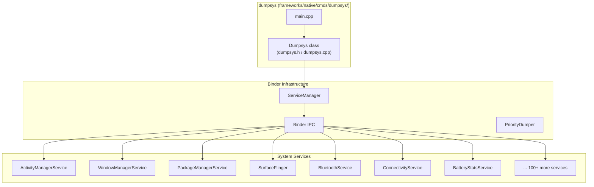

### 56.6.2 The Dumpsys Class

The `Dumpsys` class (`frameworks/native/cmds/dumpsys/dumpsys.h`) orchestrates
service enumeration and dump collection:

```cpp
// frameworks/native/cmds/dumpsys/dumpsys.h
class Dumpsys {
  public:
    explicit Dumpsys(android::IServiceManager* sm) : sm_(sm) {}

    int main(int argc, char* const argv[]);

    Vector<String16> listServices(int priorityFlags,
                                   bool supportsProto) const;

    static void setServiceArgs(Vector<String16>& args, bool asProto,
                               int priorityFlags);

    enum Type {
        TYPE_DUMP = 0x1,
        TYPE_PID = 0x2,
        TYPE_STABILITY = 0x4,
        TYPE_THREAD = 0x8,
        TYPE_CLIENTS = 0x10,
    };

    status_t startDumpThread(int dumpTypeFlags,
                              const String16& serviceName,
                              const Vector<String16>& args);
    status_t writeDump(int fd, const String16& serviceName,
                       std::chrono::milliseconds timeout,
                       bool asProto, ...);
    void stopDumpThread(bool dumpComplete);
};
```

### 56.6.3 Dump Execution Flow

When you run `dumpsys <service>`, the following sequence occurs:

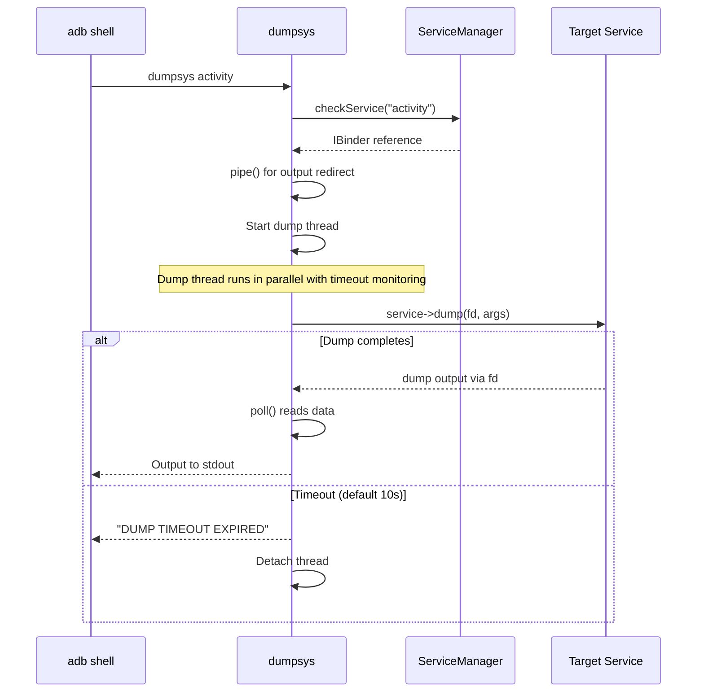

The thread-based execution with timeout protection is critical -- a hung
service cannot block the entire dumpsys process.  The default timeout is
10 seconds, configurable with `-t`:

```cpp
// frameworks/native/cmds/dumpsys/dumpsys.cpp
int timeoutArgMs = 10000;  // default 10 seconds
```

### 56.6.4 Priority-Based Dumping

Services register with dump priority levels, and dumpsys can filter by
priority:

```cpp
// From dumpsys.cpp
static bool ConvertPriorityTypeToBitmask(const String16& type,
                                          int& bitmask) {
    if (type == PriorityDumper::PRIORITY_ARG_CRITICAL) {
        bitmask = IServiceManager::DUMP_FLAG_PRIORITY_CRITICAL;
        return true;
    }
    if (type == PriorityDumper::PRIORITY_ARG_HIGH) {
        bitmask = IServiceManager::DUMP_FLAG_PRIORITY_HIGH;
        return true;
    }
    if (type == PriorityDumper::PRIORITY_ARG_NORMAL) {
        bitmask = IServiceManager::DUMP_FLAG_PRIORITY_NORMAL;
        return true;
    }
    return false;
}
```

Usage:

```bash
# Dump only critical-priority services
adb shell dumpsys --priority CRITICAL

# Dump only high-priority services
adb shell dumpsys --priority HIGH

# Dump only normal-priority services
adb shell dumpsys --priority NORMAL
```

### 56.6.5 Additional Dump Types

Beyond the standard `dump()` call, dumpsys supports several alternative
information queries:

```bash
# Show PID of the service host process
adb shell dumpsys --pid activity

# Show Binder stability information
adb shell dumpsys --stability activity

# Show thread usage
adb shell dumpsys --thread activity

# Show client PIDs
adb shell dumpsys --clients activity
```

These are implemented as separate dump type flags:

```cpp
// From dumpsys.cpp - startDumpThread()
if (dumpTypeFlags & TYPE_PID) {
    status_t err = dumpPidToFd(service, remote_end, ...);
}
if (dumpTypeFlags & TYPE_STABILITY) {
    status_t err = dumpStabilityToFd(service, remote_end);
}
if (dumpTypeFlags & TYPE_THREAD) {
    status_t err = dumpThreadsToFd(service, remote_end);
}
if (dumpTypeFlags & TYPE_CLIENTS) {
    status_t err = dumpClientsToFd(service, remote_end);
}
if (dumpTypeFlags & TYPE_DUMP) {
    status_t err = service->dump(remote_end.get(), args);
}
```

### 56.6.6 Essential dumpsys Commands Reference

This is a comprehensive reference of the most useful dumpsys commands for
each major subsystem:

**Activity Manager:**

```bash
# Full activity manager state
adb shell dumpsys activity

# Currently running activities
adb shell dumpsys activity activities

# Running services
adb shell dumpsys activity services

# Broadcast receivers
adb shell dumpsys activity broadcasts

# Content providers
adb shell dumpsys activity providers

# Recent tasks
adb shell dumpsys activity recents

# Process states
adb shell dumpsys activity processes

# Intent resolution
adb shell dumpsys activity intents

# OOM adjustment levels
adb shell dumpsys activity oom

# Specific package info
adb shell dumpsys activity package com.example.myapp

# Memory info for a process
adb shell dumpsys meminfo <pid_or_package>
```

**Window Manager:**

```bash
# Full window manager state
adb shell dumpsys window

# Window hierarchy
adb shell dumpsys window windows

# Display information
adb shell dumpsys window displays

# Input method state
adb shell dumpsys window input

# Policy state
adb shell dumpsys window policy

# Animator state
adb shell dumpsys window animator

# Tokens
adb shell dumpsys window tokens

# Visible apps
adb shell dumpsys window visible-apps
```

**Package Manager:**

```bash
# Full package manager dump
adb shell dumpsys package

# List all packages
adb shell dumpsys package packages

# Specific package
adb shell dumpsys package com.example.myapp

# Permission state
adb shell dumpsys package permissions

# Preferred activities
adb shell dumpsys package preferred-xml

# Shared users
adb shell dumpsys package shared-users

# Features
adb shell dumpsys package features
```

**SurfaceFlinger (Graphics):**

```bash
# Full SurfaceFlinger state
adb shell dumpsys SurfaceFlinger

# Layer hierarchy
adb shell dumpsys SurfaceFlinger --list

# Display state
adb shell dumpsys SurfaceFlinger --display-id

# Frame statistics
adb shell dumpsys SurfaceFlinger --latency <window_name>

# GPU composition statistics
adb shell dumpsys SurfaceFlinger --timestats
```

**Battery and Power:**

```bash
# Battery statistics
adb shell dumpsys batterystats

# Battery stats for a package
adb shell dumpsys batterystats <package>

# Reset battery stats
adb shell dumpsys batterystats --reset

# Power manager state
adb shell dumpsys power

# Device idle (Doze) state
adb shell dumpsys deviceidle

# CPU info
adb shell dumpsys cpuinfo
```

**Networking:**

```bash
# Network stats
adb shell dumpsys netstats

# Connectivity state
adb shell dumpsys connectivity

# Wi-Fi state
adb shell dumpsys wifi

# Telephony state
adb shell dumpsys telephony.registry
```

**Media:**

```bash
# Audio state
adb shell dumpsys audio

# Media session state
adb shell dumpsys media_session

# Camera state
adb shell dumpsys media.camera
```

**Miscellaneous:**

```bash
# Input system state
adb shell dumpsys input

# Notification state
adb shell dumpsys notification

# Alarm manager
adb shell dumpsys alarm

# Job scheduler
adb shell dumpsys jobscheduler

# Sensor service
adb shell dumpsys sensorservice

# USB state
adb shell dumpsys usb

# Account information
adb shell dumpsys account

# List all services
adb shell dumpsys -l

# Proto format output (for machine parsing)
adb shell dumpsys --proto <service>
```

### 56.6.7 dumpsys Command-Line Reference

```
Usage: dumpsys
         To dump all services.
or:
       dumpsys [-t TIMEOUT] [--priority LEVEL] [--clients] [--dump]
               [--pid] [--thread]
               [--help | -l | --skip SERVICES | SERVICE [ARGS]]

Options:
  --help           Show help
  -l               Only list services, do not dump them
  -t TIMEOUT_SEC   Timeout in seconds (default 10)
  -T TIMEOUT_MS    Timeout in milliseconds (default 10000)
  --clients        Dump client PIDs instead of usual dump
  --dump           Ask the service to dump itself (default)
  --pid            Dump PID instead of usual dump
  --proto          Filter services that support proto dumps
  --priority LEVEL Filter by priority (CRITICAL|HIGH|NORMAL)
  --skip SERVICES  Dump all except listed services (comma-separated)
  --stability      Dump binder stability information
  --thread         Dump thread usage
```

---

## 56.7 Winscope: Window and Surface Tracing

### 56.7.1 Overview

Winscope is a web-based tool for inspecting window and surface state.  It
captures snapshots from WindowManagerService and SurfaceFlinger to visualize
the entire window hierarchy at any point in time.

The source lives in `development/tools/winscope/`.

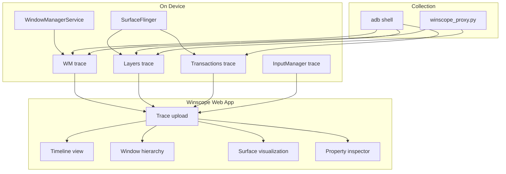

### 56.7.2 Capturing Traces

**SurfaceFlinger traces:**

```bash
# Start SurfaceFlinger layer trace
adb shell su root service call SurfaceFlinger 1025 i32 1

# Stop SurfaceFlinger layer trace
adb shell su root service call SurfaceFlinger 1025 i32 0

# Pull the trace
adb pull /data/misc/wmtrace/layers_trace.winscope .

# Start transaction trace
adb shell su root service call SurfaceFlinger 1041 i32 1

# Stop transaction trace
adb shell su root service call SurfaceFlinger 1041 i32 0
adb pull /data/misc/wmtrace/transactions_trace.winscope .
```

**WindowManager traces:**

```bash
# Start WM trace
adb shell wm tracing start

# Stop WM trace
adb shell wm tracing stop

# Pull the trace
adb pull /data/misc/wmtrace/wm_trace.winscope .
```

**Using the Winscope proxy (recommended):**

```bash
# Start the proxy
python3 development/tools/winscope/src/trace_collection/winscope_proxy/winscope_proxy.py

# Open Winscope in browser
# Navigate to winscope.googleplex.com or a local build
# Connect to the proxy for direct device interaction
```

### 56.7.3 Winscope Features

Winscope provides several analysis views:

| View | Purpose |
|------|---------|
| **Timeline** | Scrub through time, see state changes |
| **Window hierarchy** | Tree view of all windows, tasks, activities |
| **Layer hierarchy** | SurfaceFlinger layer tree with properties |
| **Surface visualization** | 2D/3D rendering of visible surfaces |
| **Transitions** | Shell transition animations |
| **Properties** | Detailed properties for selected item |
| **Input** | Input event dispatch visualization |

### 56.7.4 Common Winscope Use Cases

1. **Window overlap debugging**: Identify unexpected windows in the Z-order
   that may be obscuring content.

2. **Transition animation issues**: Step through shell transitions
   frame-by-frame to find animation glitches.

3. **Surface leak detection**: Look for surfaces that remain allocated after
   their owning activity is destroyed.

4. **IME (keyboard) layout issues**: Inspect the window stack when the soft
   keyboard is visible to debug resize/pan behavior.

5. **Multi-display debugging**: Examine window placement across multiple
   logical displays.

### 56.7.5 Interpreting Winscope Data

When analyzing Winscope traces, focus on these key properties:

**Window properties to inspect:**

| Property | What to check |
|----------|--------------|
| `mIsVisible` | Is the window actually visible? |
| `mSurfaceControl` | Does it have a valid surface? |
| `mFrame` | Position and size on screen |
| `mFlags` | Window flags (FLAG_NOT_TOUCHABLE, FLAG_SECURE, etc.) |
| `mInputChannel` | Is input dispatched to this window? |
| `mAnimating` | Is the window mid-animation? |
| `mTaskId` | Which task owns this window? |

**SurfaceFlinger layer properties to inspect:**

| Property | What to check |
|----------|--------------|
| `z` | Z-order in the layer tree |
| `bounds` | Visible bounds |
| `color.alpha` | Transparency |
| `bufferTransform` | Rotation/flip applied |
| `compositionType` | Client vs. device composition |
| `isOpaque` | Can layers behind be skipped? |
| `damage` | Dirty region for this frame |

### 56.7.6 Debugging Window Focus Issues

A common Winscope use case is debugging focus-related problems:

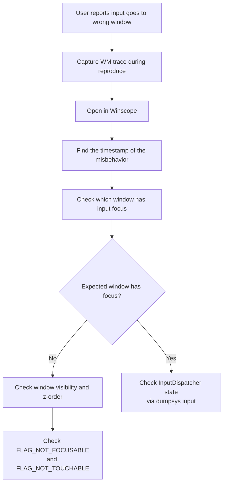

---

## 56.8 bugreport and bugreportz

### 56.8.1 Architecture

A bugreport is a comprehensive snapshot of device state, implemented by the
`dumpstate` service (`frameworks/native/cmds/dumpstate/`).  It aggregates
logs, system properties, service dumps, and diagnostic commands into a single
ZIP file.

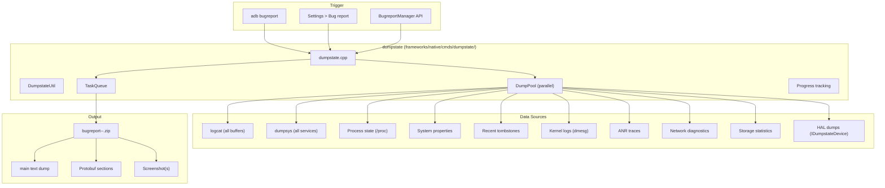

### 56.8.2 bugreport vs bugreportz

| Tool | Source | Output | Use case |
|------|--------|--------|----------|
| `bugreport` | `frameworks/native/cmds/bugreport/bugreport.cpp` | Text to stdout | Legacy, simple |
| `bugreportz` | `frameworks/native/cmds/bugreportz/bugreportz.cpp` | Zip file path | Modern, comprehensive |
| `adb bugreport` | adb client | Downloads zip | Recommended method |

The modern workflow:

```bash
# Recommended: adb bugreport automatically uses bugreportz
adb bugreport ./bugreport.zip

# Generates: bugreport-<device>-<date>.zip
```

### 56.8.3 Bugreport Contents

A typical bugreport ZIP contains:

```
bugreport-device-2024-01-15-14-30-00.zip
  |-- bugreport-device-2024-01-15-14-30-00.txt   (main dump)
  |-- version.txt                                 (format version)
  |-- dumpstate_board.bin                         (HAL binary data)
  |-- proto/
  |     |-- battery_stats.proto
  |     |-- window_manager.proto
  |     |-- ...
  |-- lshal-debug/
  |     |-- android.hardware.graphics.composer@2.4
  |     |-- ...
  |-- screenshot.png
```

The main text dump includes (in order):

1. System build information
2. Uptime and date
3. System properties
4. Process and thread listings
5. **logcat** output (main, system, crash, events, radio buffers)
6. **dumpsys** output for every service
7. Kernel log (dmesg)
8. Recent tombstones
9. ANR traces
10. File system state
11. Network diagnostics
12. Battery statistics
13. Memory information
14. Disk usage

### 56.8.4 Progress Tracking

The `Progress` class in `dumpstate.h` provides real-time progress reporting
to the UI or adb:

```cpp
// frameworks/native/cmds/dumpstate/dumpstate.h
class Progress {
  public:
    static const int kDefaultMax;  // empirical estimate
    explicit Progress(const std::string& path = "");
    // ...
};

class DurationReporter {
  public:
    explicit DurationReporter(const std::string& title,
                              bool logcat_only = false,
                              bool verbose = false,
                              int duration_fd = STDOUT_FILENO);
    ~DurationReporter();
  private:
    std::string title_;
    uint64_t started_;
};
```

### 56.8.5 dumpstate Internals

The `Dumpstate` class in `frameworks/native/cmds/dumpstate/dumpstate.h`
orchestrates the entire bugreport collection.  Key architectural features:

**Parallel collection with DumpPool**: Modern dumpstate uses a thread pool
(`DumpPool`) to collect independent sections in parallel, significantly
reducing total bugreport generation time:

```mermaid
graph TB
    subgraph "DumpPool (parallel execution)"
        T1["Thread 1:<br/>logcat main"]
        T2["Thread 2:<br/>logcat system"]
        T3["Thread 3:<br/>dumpsys activity"]
        T4["Thread 4:<br/>dmesg"]
        T5["Thread 5:<br/>procfs reads"]
    end

    subgraph "TaskQueue (ordered assembly)"
        Q1["Section: Build info"]
        Q2["Section: System props"]
        Q3["Section: Logcat (main)"]
        Q4["Section: Logcat (system)"]
        Q5["Section: Dumpsys"]
        QN["Section: ..."]
    end

    subgraph "Output"
        ZIP_O["bugreport.zip"]
    end

    T1 --> Q3
    T2 --> Q4
    T3 --> Q5
    T4 --> QN
    T5 --> Q2

    Q1 --> ZIP_O
    Q2 --> ZIP_O
    Q3 --> ZIP_O
    Q4 --> ZIP_O
    Q5 --> ZIP_O
    QN --> ZIP_O
```

**HAL integration**: dumpstate calls into the vendor HAL
(`IDumpstateDevice`) to include hardware-specific diagnostic data:

```cpp
// Simplified from dumpstate.cpp
void Dumpstate::DumpstateBoard() {
    auto dumpstate_device = IDumpstateDevice::getService();
    if (dumpstate_device != nullptr) {
        dumpstate_device->dumpstateBoard(handle, mode, deadline);
    }
}
```

**Duration tracking**: Every section is timed with `DurationReporter`,
providing insight into which sections are slow and may need optimization:

```cpp
class DurationReporter {
  public:
    explicit DurationReporter(const std::string& title, ...);
    ~DurationReporter();  // Logs elapsed time on destruction
  private:
    std::string title_;
    uint64_t started_;
};
```

### 56.8.6 Analyzing Bugreports

**Manual analysis:**

```bash
# Unzip
unzip bugreport-*.zip

# Search for crashes
grep -n "FATAL EXCEPTION" bugreport-*.txt

# Search for ANRs
grep -n "ANR in" bugreport-*.txt

# Find tombstones
grep -n "Tombstone" bugreport-*.txt

# Check battery drain
grep -n "Battery Stats" bugreport-*.txt
```

**Using Battery Historian:**

```bash
# Upload bugreport to Battery Historian web interface
# https://bathist.ef.lc/ (or self-hosted)

# Or run locally:
docker run -p 9999:9999 gcr.io/battery-historian/stable
# Upload zip to http://localhost:9999
```

---

## 56.9 Tombstones and debuggerd

### 56.9.1 Architecture Overview

When a native process crashes, Android's `debuggerd` infrastructure captures
a tombstone -- a detailed crash dump including registers, backtrace, memory
maps, and open files.  This is implemented in `system/core/debuggerd/`.

```mermaid
graph TB
    subgraph "Crash Flow"
        direction TB
        CRASH["Process receives fatal signal<br/>(SIGSEGV, SIGABRT, etc.)"]
        HANDLER["debuggerd_handler.cpp<br/>(signal handler)"]
        PSEUDO["Pseudothread<br/>(clone'd thread)"]
        CRASH_DUMP["crash_dump<br/>(crash_dump.cpp)"]
        TOMBSTONED_D["tombstoned<br/>(tombstoned.cpp)"]
        TOMBSTONE_FILE["Tombstone file<br/>(/data/tombstones/)"]
        AM_NOTIFY["ActivityManager<br/>notification"]
    end

    CRASH --> HANDLER
    HANDLER --> PSEUDO
    PSEUDO --> CRASH_DUMP
    CRASH_DUMP --> TOMBSTONED_D
    TOMBSTONED_D --> TOMBSTONE_FILE
    CRASH_DUMP --> AM_NOTIFY
```

### 56.9.2 The Signal Handler: debuggerd_handler

Every native process has a signal handler registered by
`system/core/debuggerd/handler/debuggerd_handler.cpp`.  This handler
catches fatal signals and spawns the `crash_dump` process:

```cpp
// system/core/debuggerd/handler/debuggerd_handler.cpp
#define CRASH_DUMP_NAME "crash_dump64"  // or crash_dump32
#define CRASH_DUMP_PATH "/apex/com.android.runtime/bin/" CRASH_DUMP_NAME
```

The handler follows strict safety rules:

- It runs in signal context, so it cannot use malloc, locks, or most libc
  functions.

- It uses `clone()` to create a "pseudothread" that can safely call
  `execle()` to spawn `crash_dump`.

- It communicates crash info (registers, siginfo, ucontext) via a pipe.

### 56.9.3 The CrashInfo Protocol

The handler sends crash information to `crash_dump` through a pipe, using
the `CrashInfo` structure from `system/core/debuggerd/protocol.h`:

```cpp
// system/core/debuggerd/protocol.h
struct CrashInfoDataCommon {
  uint32_t version;
  siginfo_t siginfo;
  ucontext_t ucontext;
  uintptr_t abort_msg_address;
};

struct CrashInfoDataDynamic {
  uintptr_t fdsan_table_address;
  uintptr_t gwp_asan_state;
  uintptr_t gwp_asan_metadata;
  uintptr_t scudo_stack_depot;
  uintptr_t scudo_region_info;
  uintptr_t scudo_ring_buffer;
  size_t scudo_ring_buffer_size;
  size_t scudo_stack_depot_size;
  bool recoverable_crash;
  uintptr_t crash_detail_page;
};

struct CrashInfo {
  CrashInfoDataCommon c;
  CrashInfoDataDynamic d;
};
```

The dynamic section includes addresses for:

- **fdsan table**: File descriptor sanitizer state
- **GWP-ASan**: Sampling-based memory error detection state
- **Scudo**: Heap allocator metadata for detecting use-after-free and buffer
  overflows

### 56.9.4 crash_dump: The Data Collector

`crash_dump` (`system/core/debuggerd/crash_dump.cpp`) is the main workhorse.
Its operation follows this sequence:

```mermaid
sequenceDiagram
    participant Handler as Signal Handler
    participant PT as Pseudothread
    participant CD as crash_dump
    participant Kernel as Kernel
    participant TS as tombstoned
    participant AM as ActivityManager

    Handler->>PT: clone()
    PT->>CD: execle("crash_dump64")

    Note over CD: ParseArgs(target_tid, pseudothread_tid, dump_type)

    CD->>CD: alarm(30s) -- timeout safety

    loop For each thread
        CD->>Kernel: PTRACE_SEIZE(tid)
        CD->>Kernel: PTRACE_INTERRUPT(tid)
        CD->>Kernel: Read registers
        CD->>CD: Read thread name, SELinux label
    end

    CD->>PT: Signal to fork VM process
    PT->>Kernel: clone() -> vm_pid
    CD->>Kernel: PTRACE_DETACH(all threads)

    Note over CD: drop_capabilities()

    CD->>TS: connect_tombstone_server()
    TS-->>CD: output_fd, proto_fd

    alt Backtrace mode
        CD->>CD: dump_backtrace()
    else Tombstone mode
        CD->>CD: engrave_tombstone()
    end

    CD->>AM: activity_manager_notify()
    CD->>TS: notify_completion()
```

Key code points from `crash_dump.cpp`:

1. **Thread enumeration**: Uses `GetProcessTids()` from procinfo to find all
   threads.

2. **Register reading**: Uses `ptrace(PTRACE_SEIZE)` and
   `PTRACE_INTERRUPT` to stop threads and read registers without disturbing
   the process more than necessary.

3. **VM process snapshot**: Forks a copy of the target process's address
   space, allowing crash_dump to read memory even after threads resume.

4. **Guest architecture support**: For processes running under NativeBridge
   (e.g., ARM on x86), `ReadGuestRegisters()` extracts the translated
   architecture's register state from TLS.

5. **Stack unwinding**: Uses `unwindstack::AndroidRemoteUnwinder` to produce
   backtraces from the VM process snapshot.

### 56.9.5 tombstoned: The Storage Manager

`tombstoned` (`system/core/debuggerd/tombstoned/tombstoned.cpp`) manages
tombstone file storage and intercept registration:

```cpp
// tombstoned.cpp (simplified)
class CrashQueue {
 public:
  CrashQueue(const std::string& dir_path,
             const std::string& file_name_prefix,
             size_t max_artifacts,
             size_t max_concurrent_dumps,
             bool supports_proto,
             bool world_readable);
  // ...
};
```

tombstoned maintains separate queues for:

- **Native crashes**: Stored as `tombstone_XX` in `/data/tombstones/`
- **Java traces**: Stored for ANR analysis
- **Intercepts**: Registered by debuggers that want to receive crash data
  instead of writing to disk

The communication uses three named sockets:

```cpp
// system/core/debuggerd/protocol.h
constexpr char kTombstonedCrashSocketName[] = "tombstoned_crash";
constexpr char kTombstonedJavaTraceSocketName[] = "tombstoned_java_trace";
constexpr char kTombstonedInterceptSocketName[] = "tombstoned_intercept";
```

### 56.9.6 Tombstone Format

A tombstone file contains multiple sections:

```
*** *** *** *** *** *** *** *** *** *** *** *** *** *** *** ***
Build fingerprint: 'google/crosshatch/crosshatch:14/AP1A.12345/...'
Revision: 'MP1.0'
ABI: 'arm64'
Timestamp: 2024-01-15 14:30:00.123456789+0000
Process uptime: 523s
Cmdline: /system/bin/myservice
pid: 12345, tid: 12345, name: myservice  >>> /system/bin/myservice <<<
uid: 1000
tagged_addr_ctrl: 0x0000000000000001 (PR_TAGGED_ADDR_ENABLE)
signal 11 (SIGSEGV), code 1 (SEGV_MAPERR), fault addr 0x0000000000000000
    x0  0x0000007b4c123450  x1  0x0000000000000000  x2  0x0000000000000010
    x3  0x0000007b4c123460  x4  0x0000000000000001  x5  0x0000000000000000
    ...
    sp  0x0000007fc8765400  lr  0x0000007b4c001234  pc  0x0000007b4c005678

backtrace:
      #00 pc 0000000000005678  /system/lib64/libmyservice.so (MyFunc+24)
      #01 pc 0000000000001234  /system/lib64/libmyservice.so (main+56)
      #02 pc 00000000000abcde  /apex/com.android.runtime/lib64/bionic/libc.so
                               (__libc_init+100)

stack:
         0000007fc8765380  0000000000000000
         0000007fc8765388  0000007b4c123450  /system/lib64/libmyservice.so
         ...

memory near x0 ([anon:scudo:primary]):
    0000007b4c123440 6f6c6c6548 726f5720 0021646c 00000000  HelloWorld!.....
    ...

open files:
    fd 0: /dev/null (unowned)
    fd 1: /dev/null (unowned)
    fd 2: /dev/null (unowned)
    fd 3: socket:[12345] (unowned)
    fd 4: /data/myservice/cache.db (owned by FILE* 0x7b4c200100)
    ...

memory map (165 entries):
    ...
    0000007b4c000000-0000007b4c010000 r-xp  /system/lib64/libmyservice.so
    0000007b4c010000-0000007b4c011000 r--p  /system/lib64/libmyservice.so
    0000007b4c011000-0000007b4c012000 rw-p  /system/lib64/libmyservice.so
    ...
```

### 56.9.7 Protobuf Tombstones

Modern tombstones are also written in protobuf format, defined in
`system/core/debuggerd/proto/tombstone.proto`.  The protobuf format is
machine-parseable and can be converted to text:

```bash
# View proto tombstone as text
adb shell tombstone_symbolize /data/tombstones/tombstone_00.pb

# Or pull and process locally
adb pull /data/tombstones/tombstone_00.pb
```

### 56.9.8 Reading and Analyzing Tombstones

**Finding tombstones:**

```bash
# List recent tombstones
adb shell ls -la /data/tombstones/

# Read a tombstone
adb shell cat /data/tombstones/tombstone_00

# Pull all tombstones
adb pull /data/tombstones/ ./tombstones/
```

**Analysis workflow:**

```mermaid
flowchart TD
    A["Read tombstone"] --> B["Identify signal and fault address"]
    B --> C{"Signal type?"}

    C -- "SIGSEGV (11)" --> D["NULL deref? Check fault addr"]
    D -- "addr == 0x0" --> D1["Null pointer dereference"]
    D -- "addr in code range" --> D2["Code corruption / bad jump"]
    D -- "addr near stack" --> D3["Stack overflow"]
    D -- "other" --> D4["Use-after-free / wild pointer"]

    C -- "SIGABRT (6)" --> E["Check abort message"]
    E --> E1["Look for FORTIFY, fdsan,<br/>assertion failure messages"]

    C -- "SIGBUS (7)" --> F["Alignment / mapping error"]

    B --> G["Read backtrace"]
    G --> H["Identify crashing function"]
    H --> I["Cross-reference with source code"]

    B --> J["Check memory map"]
    J --> K["Verify fault address is<br/>mapped/unmapped"]

    B --> L["Check GWP-ASan / Scudo info"]
    L --> M["Memory error details<br/>(use-after-free, overflow)"]
```

**Symbolizing tombstones:**

```bash
# Use ndk-stack for symbolization
adb logcat | ndk-stack -sym path/to/symbols/

# Or use addr2line directly
aarch64-linux-android-addr2line -f -e libmyservice.so 0x5678
```

### 56.9.9 Using debuggerd Manually

The `debuggerd` command can be used to trigger dumps of running processes:

```bash
# Generate a tombstone for a running process
adb shell debuggerd <pid>

# Generate just a backtrace
adb shell debuggerd -b <pid>

# Generate Java traces
adb shell debuggerd -j <pid>
```

### 56.9.10 ActivityManager Notification

When a fatal crash occurs, `crash_dump` notifies ActivityManager through a
local socket:

```cpp
// crash_dump.cpp
static bool activity_manager_notify(pid_t pid, int signal,
    const std::string& amfd_data, bool recoverable_crash) {
    unique_fd amfd(socket_local_client(
        "/data/system/ndebugsocket",
        ANDROID_SOCKET_NAMESPACE_FILESYSTEM, SOCK_STREAM));

    // Protocol: pid (32-bit), signal (32-bit), recoverable (byte), dump text
    uint32_t datum = htonl(pid);
    WriteFully(amfd, &datum, sizeof(datum));
    datum = htonl(signal);
    WriteFully(amfd, &datum, sizeof(datum));
    uint8_t recoverable_byte = recoverable_crash ? 1 : 0;
    WriteFully(amfd, &recoverable_byte, sizeof(recoverable_byte));
    WriteFully(amfd, amfd_data.c_str(), amfd_data.size() + 1);
    // ...
}
```

This notification triggers the familiar "app has stopped" dialog and allows
ActivityManager to decide whether to restart the process.

### 56.9.11 libdebuggerd: Tombstone Generation

The actual tombstone content is generated by `libdebuggerd`
(`system/core/debuggerd/libdebuggerd/`), which contains the logic for
formatting crash dumps:

| File | Purpose |
|------|---------|
| `tombstone.cpp` | Text-format tombstone generation |
| `tombstone_proto.cpp` | Protobuf-format tombstone generation |
| `tombstone_proto_to_text.cpp` | Proto-to-text conversion |
| `backtrace.cpp` | Backtrace-only dumps (for `debuggerd -b`) |
| `utility.cpp` | Shared utilities (memory dumps, register formatting) |
| `gwp_asan.cpp` | GWP-ASan crash analysis |
| `scudo.cpp` | Scudo allocator crash analysis |
| `open_files_list.cpp` | Open file descriptor enumeration |

The tombstone generation flow:

```mermaid
flowchart TD
    A["engrave_tombstone()"] --> B["Write header<br/>(build, ABI, timestamp)"]
    B --> C["Write signal info<br/>(signal number, fault address)"]
    C --> D["Write registers"]
    D --> E["Write backtrace<br/>(using AndroidRemoteUnwinder)"]
    E --> F["Write stack memory dump"]
    F --> G["Write memory near registers"]
    G --> H{"GWP-ASan state available?"}
    H -- Yes --> I["Write GWP-ASan report<br/>(allocation/deallocation stacks)"]
    H -- No --> J{"Scudo metadata available?"}
    J -- Yes --> K["Write Scudo report<br/>(heap corruption details)"]
    J -- No --> L["Write open files list"]
    I --> L
    K --> L
    L --> M["Write memory map"]
    M --> N["Write other thread backtraces"]
    N --> O["Write log tail"]
```

### 56.9.12 GWP-ASan Integration

GWP-ASan (a sampling-based memory error detector) integrates with debuggerd
to provide detailed crash information for memory errors.  When GWP-ASan
detects an error, the tombstone includes:

- The allocation backtrace (where the memory was allocated)
- The deallocation backtrace (where it was freed, for use-after-free)
- The error type (use-after-free, buffer-overflow, buffer-underflow,
  double-free)

- The exact offset of the access relative to the allocation

```
Cause: [GWP-ASan]: Use After Free, 0 bytes into a 64-byte
    allocation at 0x7b4c123450

Allocated by thread 12345:
      #00 pc 0x1234  /system/lib64/libc.so (malloc+16)
      #01 pc 0x5678  /system/lib64/libmyservice.so (create_buffer+24)
      #02 pc 0x9abc  /system/lib64/libmyservice.so (init+80)

Deallocated by thread 12345:
      #00 pc 0x1240  /system/lib64/libc.so (free+16)
      #01 pc 0x5700  /system/lib64/libmyservice.so (destroy_buffer+24)
      #02 pc 0x9b00  /system/lib64/libmyservice.so (cleanup+64)
```

### 56.9.13 Scudo Allocator Integration

Scudo (Android's hardened memory allocator) also reports detailed information
in tombstones when it detects heap corruption:

- Chunk header corruption
- Invalid free (freeing non-allocated memory)
- Double free
- Buffer overflow detected via quarantine

### 56.9.14 Crash Detail Pages

The `crash_detail_page` field in `CrashInfoDataDynamic` allows processes to
register custom crash detail strings that will be included in the tombstone.
This is useful for applications to provide context about what they were doing
when the crash occurred.

### 56.9.15 wait_for_debugger

For interactive debugging of native crashes, set the system property
`debug.debuggerd.wait_for_debugger` to `true`.  When a crash occurs,
crash_dump will send SIGSTOP to the crashing process and print a message:

```
***********************************************************

* Process 12345 has been suspended while crashing.
* To attach the debugger, run this on the host:
*

*     lldbclient.py -p 12345
*
***********************************************************
```

---

## 56.10 Android Studio Profiler Integration

### 56.10.1 Architecture

Android Studio's Profiler provides a GUI for the same underlying tools
discussed above.  It communicates with on-device agents through `adb forward`.

```mermaid
graph TB
    subgraph "Android Studio"
        CPU_PROF["CPU Profiler"]
        MEM_PROF["Memory Profiler"]
        NET_PROF["Network Profiler"]
        ENERGY["Energy Profiler"]
        LAYOUT["Layout Inspector"]
        DB_INSP["Database Inspector"]
    end

    subgraph "Transport Layer"
        ADB_PROF["adb forward"]
        JDWP["JDWP Agent"]
        PERFD["perfd (legacy)"]
        PERF_AGENT["profiler agent"]
    end

    subgraph "On-Device Tools"
        SIMPRF_AS["simpleperf"]
        HEAPPROFD_AS["heapprofd"]
        PERFETTO_AS["Perfetto"]
        ART_PROF["ART profiling"]
        NETWORK_AGENT["Network agent"]
    end

    CPU_PROF --> ADB_PROF
    MEM_PROF --> ADB_PROF
    NET_PROF --> ADB_PROF
    ENERGY --> ADB_PROF

    ADB_PROF --> JDWP
    ADB_PROF --> PERF_AGENT

    PERF_AGENT --> SIMPRF_AS
    PERF_AGENT --> HEAPPROFD_AS
    PERF_AGENT --> PERFETTO_AS
    JDWP --> ART_PROF
    PERF_AGENT --> NETWORK_AGENT

    LAYOUT --> ADB_PROF
    DB_INSP --> ADB_PROF
```

### 56.10.2 CPU Profiler Modes

| Mode | Implementation | Output |
|------|---------------|--------|
| **Sample Java Methods** | ART sampling profiler | Method trace |
| **Trace Java Methods** | ART method tracing (full instrumentation) | Method trace |
| **Sample C/C++ Functions** | simpleperf | Flame chart |
| **Trace System Calls** | Perfetto (atrace) | System trace |

### 56.10.3 How CPU Profiling Works

**Java method sampling** uses the ART runtime's built-in sampling profiler,
which periodically records the Java call stack without instrumenting every
method entry/exit.

**Native sampling** uses simpleperf under the hood:

1. Android Studio configures simpleperf with the appropriate PID and
   sampling rate.

2. simpleperf collects samples using `perf_event_open()`.
3. Samples are streamed back to the host via the transport agent.
4. Android Studio renders the flame chart in the UI.

**System trace** uses Perfetto:

1. A `TraceConfig` is generated based on the user's selections.
2. `perfetto` records system-wide events.
3. The trace file is pulled and loaded into Android Studio's trace viewer,
   which shares code with the Perfetto UI.

### 56.10.4 Memory Profiler Modes

| Mode | Implementation | What it shows |
|------|---------------|--------------|
| **Java heap dump** | `Debug.dumpHprofData()` | All live Java objects |
| **Native heap dump** | heapprofd | Native allocations with stacks |
| **Allocation tracking** | ART allocation callbacks | Per-object allocation site |
| **Leak detection** | hprof + leak canary logic | Likely leaked activities/fragments |

### 56.10.5 Profileable vs Debuggable

For profiling release builds:

```xml
<!-- AndroidManifest.xml -->
<application
    android:profileableByShell="true"
    ...>
```

This allows simpleperf and heapprofd to attach without requiring
`debuggable=true`, which would disable compiler optimizations and give
misleading performance data.

| Attribute | CPU Profile | Heap Profile | Java Debug | Perf Impact |
|-----------|-------------|-------------|------------|-------------|
| `debuggable=true` | Yes | Yes | Yes | Significant |
| `profileable=true` | Yes | Yes | No | Minimal |
| Neither | No | No | No | None |

---

## 56.11 GPU Debugging

### 56.11.1 Overview

GPU debugging on Android requires specialized tools because GPU operations
are asynchronous and occur on separate hardware.

```mermaid
graph TB
    subgraph "Application"
        GL["OpenGL ES / Vulkan"]
    end

    subgraph "GPU Debugging Tools"
        RENDERDOC["RenderDoc"]
        GAPID["GAPID (AGI)"]
        LAYERS["Vulkan Validation Layers"]
        GPU_INSP["Android GPU Inspector"]
        SYSTRACE["Perfetto GPU counters"]
    end

    subgraph "Driver Layer"
        HAL_G["Graphics HAL"]
        DRIVER["GPU Driver"]
        VALIDATION["VK_LAYER_KHRONOS_validation"]
    end

    subgraph "GPU Hardware"
        GPU["GPU"]
    end

    GL --> RENDERDOC
    GL --> GAPID
    GL --> LAYERS
    GL --> GPU_INSP

    RENDERDOC --> HAL_G
    GAPID --> HAL_G
    LAYERS --> VALIDATION
    GPU_INSP --> HAL_G
    SYSTRACE --> HAL_G

    HAL_G --> DRIVER
    VALIDATION --> DRIVER
    DRIVER --> GPU
```

### 56.11.2 Vulkan Validation Layers

Vulkan validation layers catch API misuse at runtime.  They can be enabled
on Android without recompiling:

```bash
# Push validation layers to device
adb push libVkLayer_khronos_validation.so /data/local/tmp/

# Enable layers for a specific app
adb shell settings put global enable_gpu_debug_layers 1
adb shell settings put global gpu_debug_app com.example.myapp
adb shell settings put global gpu_debug_layers VK_LAYER_KHRONOS_validation
adb shell settings put global gpu_debug_layer_app com.example.myapp

# View validation messages in logcat
adb logcat -s vulkan
```

Common validation errors:

- **Missing synchronization**: Reading a resource before a write is complete.
- **Invalid usage flags**: Using a buffer without the appropriate usage bit.
- **Descriptor set errors**: Binding incompatible or expired descriptors.
- **Render pass errors**: Incorrect attachment usage or subpass dependencies.

### 56.11.3 Android GPU Inspector (AGI)

AGI (formerly GAPID) provides frame-level GPU debugging:

1. **Frame capture**: Intercept a single frame of Vulkan/GLES commands.
2. **State inspection**: Examine the full GPU state at any draw call.
3. **Texture/buffer viewing**: Inspect resource contents.
4. **Shader debugging**: Step through shader execution.
5. **Performance counters**: Read GPU hardware counters.

```bash
# AGI uses a layered approach - push the AGI layer
adb push libgapii.so /data/local/tmp/

# Configure for an app
adb shell am start -n com.example.myapp/.MainActivity \
    --es gapii_interceptor /data/local/tmp/libgapii.so
```

### 56.11.4 RenderDoc

RenderDoc is an open-source frame debugger that supports Android Vulkan:

```bash
# Push RenderDoc layer
adb push libVkLayer_RENDERDOC_Capture.so /data/local/tmp/

# Configure Vulkan layers
adb shell settings put global gpu_debug_layers \
    VK_LAYER_RENDERDOC_Capture
adb shell settings put global gpu_debug_app com.example.myapp
```

### 56.11.5 GPU Profiling with Perfetto

Perfetto integrates with GPU counters on supported hardware:

```protobuf
# gpu_trace.pbtxt
data_sources {
    config {
        name: "gpu.counters"
        gpu_counter_config {
            counter_period_ns: 1000000  # 1ms
            counter_ids: 1              # GPU busy
            counter_ids: 2              # Fragment active
            counter_ids: 3              # Vertex active
        }
    }
}
data_sources {
    config {
        name: "gpu.renderstages"
    }
}
```

Key GPU metrics available through Perfetto:

| Metric | Description |
|--------|-------------|
| GPU Busy | Percentage of time GPU is actively processing |
| Fragment Active | Fragment shader activity |
| Vertex Active | Vertex shader activity |
| GPU Frequency | Current GPU clock speed |
| GPU Memory | VRAM usage |
| Render stages | Per-render-pass timing |

### 56.11.6 overdraw Visualization

Android provides built-in overdraw visualization:

```bash
# Enable GPU overdraw debugging
adb shell setprop debug.hwui.overdraw show

# Disable
adb shell setprop debug.hwui.overdraw false

# Profile GPU rendering (shows colored bars)
adb shell setprop debug.hwui.profile true

# Show GPU rendering as bars on screen
adb shell setprop debug.hwui.profile visual_bars
```

Overdraw color coding:

- **No color**: Drawn once (ideal)
- **Blue**: Overdrawn 1x
- **Green**: Overdrawn 2x
- **Pink**: Overdrawn 3x
- **Red**: Overdrawn 4x+ (problem area)

---

## 56.12 Try It: Debug a Real Performance Issue

This section walks through a complete debugging workflow for a realistic
performance problem: an application that exhibits jank (dropped frames)
during list scrolling.

### 56.12.1 Problem Statement

A user reports that a RecyclerView-based application stutters when scrolling
quickly.  The app displays a list of items with images and text.  The
stutter is reproducible on a Pixel device.

### 56.12.2 Step 1: Confirm the Problem with gfxinfo

```bash
# Reset frame stats
adb shell dumpsys gfxinfo com.example.myapp reset

# Reproduce the scroll gesture

# Collect frame timing data
adb shell dumpsys gfxinfo com.example.myapp
```

**Expected output (excerpt):**

```
Total frames rendered: 523
Janky frames: 87 (16.63%)
50th percentile: 8ms
90th percentile: 22ms
95th percentile: 35ms
99th percentile: 52ms

HISTOGRAM:
  5ms=234  6ms=89  7ms=45  8ms=32  ...  32ms=15  64ms=5
```

The 16.63% jank rate confirms the problem.  For smooth 60fps scrolling,
frame rendering must complete within 16.67ms.

### 56.12.3 Step 2: Capture a Perfetto System Trace

```bash
# Create trace config
cat > /tmp/scroll_trace.pbtxt << 'EOF'
buffers {
    size_kb: 131072
    fill_policy: RING_BUFFER
}
data_sources {
    config {
        name: "linux.ftrace"
        ftrace_config {
            ftrace_events: "sched/sched_switch"
            ftrace_events: "sched/sched_waking"
            ftrace_events: "sched/sched_blocked_reason"
            ftrace_events: "power/cpu_frequency"
            ftrace_events: "power/cpu_idle"
            atrace_categories: "gfx"
            atrace_categories: "view"
            atrace_categories: "wm"
            atrace_categories: "am"
            atrace_categories: "input"
            atrace_categories: "res"
            atrace_categories: "dalvik"
            atrace_apps: "com.example.myapp"
        }
    }
}
data_sources {
    config {
        name: "linux.process_stats"
        process_stats_config {
            scan_all_processes_on_start: true
            proc_stats_poll_ms: 100
        }
    }
}
duration_ms: 15000
EOF

# Push config and start trace
adb push /tmp/scroll_trace.pbtxt /data/local/tmp/
adb shell perfetto -c /data/local/tmp/scroll_trace.pbtxt \
    -o /data/misc/perfetto-traces/scroll_trace.perfetto-trace &

# Reproduce the scroll gesture during the 15-second window
# ...

# Pull the trace
adb pull /data/misc/perfetto-traces/scroll_trace.perfetto-trace .
```

### 56.12.4 Step 3: Analyze in Perfetto UI

Open the trace in `ui.perfetto.dev` or Perfetto embedded in Android Studio.

**What to look for:**

```mermaid
flowchart TD
    A["Open trace in Perfetto UI"] --> B["Find the app's main thread"]
    B --> C["Locate long frames (>16ms)"]
    C --> D{"What's the main thread doing?"}

    D -- "Long slice in Choreographer#doFrame" --> E["Check sub-slices"]
    E --> F{"Which phase is slow?"}
    F -- "input" --> G["Input handling is slow"]
    F -- "animation" --> H["Animation callback is slow"]
    F -- "traversal (measure/layout/draw)" --> I["View hierarchy work"]
    F -- "RenderThread > draw" --> J["GPU-bound rendering"]

    D -- "Blocked on binder" --> K["Check which service<br/>is blocking"]
    D -- "Blocked on lock" --> L["Contention with<br/>background thread"]
    D -- "GC pause" --> M["Memory pressure"]

    I --> N["Check onBindViewHolder duration"]
    N --> O{"Why is bind slow?"}
    O -- "Image loading" --> P["Load images asynchronously"]
    O -- "Layout inflation" --> Q["Use ViewHolder pattern correctly"]
    O -- "Complex layout" --> R["Simplify layout hierarchy"]
```

### 56.12.5 Step 4: CPU Profile the Hot Path

The Perfetto trace shows that `onBindViewHolder` is taking 25ms on some
frames.  Let us use simpleperf to understand why:

```bash
# Record with call graph while scrolling
adb shell simpleperf record \
    --app com.example.myapp \
    --call-graph dwarf \
    --duration 10 \
    -o /data/local/tmp/perf.data

# Pull and report
adb pull /data/local/tmp/perf.data .
simpleperf report -i perf.data -g --sort comm,dso,symbol
```

**Sample output:**

```
Overhead  Command     Shared Object       Symbol
35.2%     RenderThread libhwui.so         SkImage::makeTextureImage()
22.1%     main        libjpeg-turbo.so   jpeg_decompress()
18.3%     main        libmyapp.so        ImageLoader::decode()
 8.7%     main        libart.so          art::gc::Heap::ConcurrentCopying
 5.2%     main        libc.so            memcpy
```

The CPU profile reveals that JPEG decompression (`jpeg_decompress()`) is
happening synchronously on the main thread during view binding.

### 56.12.6 Step 5: Check for Memory Issues

The GC activity in the trace suggests memory pressure.  Let us profile
allocations:

```bash
# Use heapprofd to track allocations during scrolling
cat > /tmp/heap_config.pbtxt << 'EOF'
buffers { size_kb: 65536 }
data_sources {
    config {
        name: "android.heapprofd"
        heapprofd_config {
            sampling_interval_bytes: 4096
            process_cmdline: "com.example.myapp"
            shmem_size_bytes: 8388608
        }
    }
}
duration_ms: 10000
EOF

adb push /tmp/heap_config.pbtxt /data/local/tmp/
adb shell perfetto -c /data/local/tmp/heap_config.pbtxt \
    -o /data/misc/perfetto-traces/heap.perfetto-trace

# Reproduce scrolling

adb pull /data/misc/perfetto-traces/heap.perfetto-trace .
```

Analyze with trace_processor:

```sql
SELECT
    SUM(size) as total_bytes,
    COUNT(*) as alloc_count,
    frame_name
FROM heap_profile_allocation
JOIN stack_profile_frame ON frame_id = stack_profile_frame.id
WHERE size > 0
GROUP BY frame_name
ORDER BY total_bytes DESC
LIMIT 10;
```

**Expected finding**: Large allocations from bitmap decoding during each
scroll event.

### 56.12.7 Step 6: Verify with dumpsys meminfo

```bash
# Before scrolling
adb shell dumpsys meminfo com.example.myapp > meminfo_before.txt

# Scroll vigorously for 30 seconds

# After scrolling
adb shell dumpsys meminfo com.example.myapp > meminfo_after.txt

# Compare
diff meminfo_before.txt meminfo_after.txt
```

**Key metrics to compare:**

```
                   Before    After     Delta
Java Heap:          12,345    18,567    +6,222 KB
Native Heap:        8,901     15,432    +6,531 KB
Graphics:           4,567     4,567         0 KB
Total PSS:         35,678    48,321   +12,643 KB
```

The significant growth in both Java and Native heap during scrolling
confirms that images are being decoded and not properly cached.

### 56.12.8 Step 7: Root Cause and Fix

The debugging workflow reveals:

1. **Root cause**: Images are being decoded from JPEG on the main thread
   during `onBindViewHolder`, and no image cache is being used.

2. **Contributing factors**:
   - Each scroll event triggers new decode operations.
   - Decoded bitmaps are not cached, causing repeated allocation/GC cycles.
   - The GC pauses compound the rendering latency.

**Fix strategy:**

```mermaid
flowchart LR
    A["Current: Sync decode on main thread"]
    B["Fix 1: Async decode on background thread"]
    C["Fix 2: Add LRU image cache"]
    D["Fix 3: Use thumbnail for scroll, full res on stop"]
    E["Result: <2ms bind time, 0% jank"]

    A --> B
    B --> C
    C --> D
    D --> E
```

### 56.12.9 Step 8: Verify the Fix

After implementing the fix, re-run the same measurements:

```bash
# Re-collect gfxinfo
adb shell dumpsys gfxinfo com.example.myapp reset
# Scroll...
adb shell dumpsys gfxinfo com.example.myapp

# Expected:
# Total frames rendered: 510
# Janky frames: 3 (0.59%)
# 90th percentile: 10ms
```

```bash
# Re-run Perfetto trace to confirm
adb shell perfetto -c /data/local/tmp/scroll_trace.pbtxt \
    -o /data/misc/perfetto-traces/scroll_fixed.perfetto-trace
```

The Perfetto trace should show:

- `onBindViewHolder` completing in < 2ms
- No GC pauses during scroll
- Smooth Choreographer frame cadence

### 56.12.10 Debugging Checklist

Use this checklist when debugging performance issues:

```
[ ] Identify symptom (jank, ANR, slow startup, memory growth)
[ ] Quantify with dumpsys gfxinfo / Perfetto metrics
[ ] Capture system trace (Perfetto) to identify which thread/phase is slow
[ ] CPU profile (simpleperf) the hot functions
[ ] Memory profile (heapprofd) if GC or allocation-related
[ ] Check service state (dumpsys) for relevant subsystems
[ ] Identify root cause
[ ] Implement fix
[ ] Re-measure to verify improvement
[ ] Document findings
```

---

## 56.13 Memory Debugging Tools

### 56.13.1 Memory Analysis Overview

Android provides several layers of memory debugging tools, each targeting
different types of memory issues:

```mermaid
graph TB
    subgraph "Java Memory"
        HPROF["Java heap dump (hprof)"]
        ALLOC["Allocation tracking"]
        GC_LOG["GC logging"]
        LEAK["LeakCanary / AS Leak Detection"]
    end

    subgraph "Native Memory"
        HEAPPROFD_M["heapprofd"]
        MALLOC_DEBUG["malloc debug (libc_debug_malloc)"]
        ASAN["AddressSanitizer (ASan)"]
        HWASAN["HWAddressSanitizer (HWASan)"]
        GWP_ASAN["GWP-ASan (sampling)"]
        MEMTAG["Memory Tagging (MTE)"]
    end

    subgraph "Kernel Memory"
        MEMINFO["/proc/meminfo"]
        PROCMEM["/proc/<pid>/smaps"]
        ION["ION/DMA-BUF tracking"]
        LMK["LMK statistics"]
    end

    subgraph "Analysis Tools"
        DUMPSYS_MEM["dumpsys meminfo"]
        SHOWMAP["showmap"]
        PROCRANK["procrank"]
        LIBMEMUNREACHABLE["libmemunreachable"]
    end
```

### 56.13.2 malloc debug

Android's bionic libc includes a debug malloc implementation that can be
enabled at runtime:

```bash
# Enable malloc debug for a specific app
adb shell setprop libc.debug.malloc.options "backtrace guard"
adb shell am restart com.example.myapp

# Available options:
# backtrace        - Record allocation backtraces
# backtrace_size=N - Maximum frames to record (default: 16)
# guard            - Add guard pages around allocations
# fill_on_alloc    - Fill allocated memory with 0xEB
# fill_on_free     - Fill freed memory with 0xEF
# leak_track       - Track all allocations for leak detection
# record_allocs    - Record all allocations to a file

# Dump current allocations
adb shell am dumpheap -n <pid> /data/local/tmp/native_heap.txt
```

### 56.13.3 AddressSanitizer (ASan) and HWASan

ASan and HWASan detect memory errors at runtime with different trade-offs:

| Feature | ASan | HWASan | MTE |
|---------|------|--------|-----|
| Overhead (CPU) | 2x | 1.5-2x | ~3-5% |
| Overhead (Memory) | 2-3x | ~15% | ~3% |
| Detects use-after-free | Yes | Yes | Yes |
| Detects buffer overflow | Yes | Yes | Yes |
| Detects stack corruption | Yes | Yes | No |
| Available builds | Eng only | Eng/userdebug | Arm v8.5+ |
| Sampling | No | No | Can be per-allocation |

### 56.13.4 showmap and procrank

```bash
# Show detailed memory map for a process
adb shell showmap <pid>

# Example output:
#   virtual                     shared   shared  private  private
#      size      RSS      PSS    clean    dirty    clean    dirty  object
#      ----     ----     ----    -----    -----    -----    -----  ------
#     12288     8192     4096        0     4096     4096        0  /system/lib64/libc.so
#      4096     4096     2048     2048        0        0     2048  [anon:stack]
#      ...

# Show memory usage for all processes (sorted by PSS)
adb shell dumpsys meminfo --package <package>

# Detailed per-process memory breakdown
adb shell dumpsys meminfo <pid>
```

### 56.13.5 libmemunreachable

Android includes a built-in leak detector that can scan the heap for
unreachable allocations:

```bash
# Trigger leak detection for a process
adb shell kill -47 <pid>  # SIGRTMIN+13

# Results appear in logcat
adb logcat -s memunreachable
```

---

## 56.14 ANR Analysis

### 56.14.1 What Causes ANRs

An Application Not Responding (ANR) event occurs when the main thread of an
application does not respond to an input event within 5 seconds or a
BroadcastReceiver does not complete within the timeout period (10 seconds
for foreground, 60 seconds for background).

```mermaid
flowchart TD
    A["User touches screen"] --> B["InputDispatcher sends event"]
    B --> C{"Main thread responds<br/>within 5 seconds?"}
    C -- Yes --> D["Normal operation"]
    C -- No --> E["InputDispatcher triggers ANR"]
    E --> F["ActivityManager notifies"]
    F --> G["Dump thread stacks"]
    G --> H["Write to /data/anr/traces.txt"]
    F --> I["Show 'App not responding' dialog"]
```

### 56.14.2 Finding ANR Information

ANR traces are stored in multiple locations:

```bash
# Current ANR traces
adb pull /data/anr/traces.txt

# In a bugreport, search for:
# 1. The ANR section
grep -n "ANR in" bugreport-*.txt

# 2. The thread dump at the time of ANR
grep -n "Cmd line:" bugreport-*.txt

# 3. CPU usage at ANR time
grep -A 20 "CPU usage from" bugreport-*.txt
```

### 56.14.3 Reading ANR Traces

A typical ANR trace dump includes:

```
----- pid 12345 at 2024-01-15 14:30:00.123 -----
Cmd line: com.example.myapp
Build fingerprint: 'google/crosshatch/crosshatch:14/...'

"main" prio=5 tid=1 Blocked
  | group="main" sCount=1 ucsCount=0 flags=1 obj=0x72345678
  | sysTid=12345 nice=-10 cgrp=top-app sched=0/0 handle=0x7654321
  | state=S schedstat=( 1234567890 234567890 12345 )
  | stack=0x7ff0000000-0x7ff0002000 stackSize=8192KB
  at com.example.myapp.MyDatabase.query(MyDatabase.java:123)
  - waiting to lock <0xabcdef01> (a java.lang.Object)
    held by thread 15
  at com.example.myapp.MainActivity.onResume(MainActivity.java:45)
  at android.app.Activity.performResume(Activity.java:8321)
  ...

"DatabaseThread" prio=5 tid=15 Runnable
  | group="main" sCount=0 ucsCount=0 flags=0 obj=0x72345679
  at com.example.myapp.MyDatabase.bulkInsert(MyDatabase.java:456)
  ...
```

**Analysis steps:**

1. **Identify the blocked thread**: The main thread shows state "Blocked"
   and is waiting to lock an object held by another thread.

2. **Find the holder**: Thread 15 ("DatabaseThread") holds the lock and is
   performing a bulk insert operation.

3. **Root cause**: A long-running database operation on a background thread
   holds a lock that the main thread needs during `onResume()`.

### 56.14.4 Common ANR Patterns

| Pattern | Main Thread State | Root Cause |
|---------|-------------------|------------|
| Lock contention | Blocked (waiting to lock) | Background thread holds lock |
| I/O on main thread | Native (in read/write) | Disk/network access on main |
| Binder stall | Native (in binder transaction) | Remote service is slow |
| Deadlock | Blocked (circular wait) | Two threads waiting on each other |
| GC pause | WaitingForGcToComplete | Heavy allocation pressure |
| CPU starvation | Runnable (but not running) | Other processes consuming CPU |

### 56.14.5 Preventing ANRs

```bash
# Enable strict mode to catch I/O on main thread during development
adb shell settings put global strict_mode_visual_indicator true

# Monitor ANR frequency with dumpsys
adb shell dumpsys activity processes | grep -A 5 "ANR"

# Get detailed ANR history
adb shell dumpsys activity anr-history
```

---

## 56.15 Cross-Tool Integration

### 56.15.1 How the Tools Complement Each Other

No single tool tells the complete story.  The following table shows which
tool to reach for based on the layer you need to investigate:

```mermaid
graph LR
    subgraph "Problem Identification"
        LOGCAT_ID["logcat<br/>(errors, warnings)"]
        DUMPSYS_ID["dumpsys gfxinfo<br/>(frame stats)"]
        BUGREPORT_ID["bugreport<br/>(full snapshot)"]
    end

    subgraph "Temporal Analysis"
        PERFETTO_TA["Perfetto<br/>(timeline of events)"]
        WINSCOPE_TA["Winscope<br/>(window state over time)"]
    end

    subgraph "Statistical Profiling"
        SIMPLEPERF_SP["simpleperf<br/>(CPU hotspots)"]
        HEAPPROFD_SP["heapprofd<br/>(allocation hotspots)"]
    end

    subgraph "Crash Analysis"
        TOMB_CA["Tombstones<br/>(native crashes)"]
        LOGCAT_CA["logcat<br/>(Java crashes + ANR)"]
    end

    subgraph "State Inspection"
        DUMPSYS_SI["dumpsys<br/>(service state)"]
        PROCFS["/proc filesystem<br/>(kernel state)"]
    end

    LOGCAT_ID --> PERFETTO_TA
    DUMPSYS_ID --> PERFETTO_TA
    PERFETTO_TA --> SIMPLEPERF_SP
    PERFETTO_TA --> HEAPPROFD_SP
    BUGREPORT_ID --> TOMB_CA
    BUGREPORT_ID --> DUMPSYS_SI
```

### 56.15.2 Combining Perfetto with simpleperf

A common workflow is to use Perfetto to identify _when_ performance issues
occur, then use simpleperf to identify _why_ at the CPU level:

1. **Perfetto trace**: Reveals that the main thread's `doFrame` takes 35ms
   during a scroll, and most of the time is in `draw()`.

2. **simpleperf record**: Targeted at the time window and thread identified
   by Perfetto, reveals that `SkImage::makeTextureImage()` is the CPU
   bottleneck.

3. **heapprofd**: Confirms that each frame allocates new bitmaps rather than
   reusing cached ones.

### 56.15.3 bugreport as a Starting Point

For issues reported by users (where you cannot interactively collect traces),
the bugreport serves as the entry point:

```mermaid
flowchart TD
    BUG["Receive bugreport.zip"]
    BUG --> UNZIP["Unzip and read main text"]

    UNZIP --> CRASH{"Contains crashes?"}
    CRASH -- Yes --> TOMB_ANAL["Analyze tombstone sections"]
    CRASH -- No --> ANR_CHECK{"Contains ANR?"}

    ANR_CHECK -- Yes --> ANR_ANAL["Read ANR trace files"]
    ANR_CHECK -- No --> PERF_CHECK{"Performance complaint?"}

    PERF_CHECK -- Yes --> GFXINFO["Read dumpsys gfxinfo section"]
    PERF_CHECK -- No --> STATE["Read relevant dumpsys sections"]

    TOMB_ANAL --> REPRODUCE["Reproduce on local device"]
    ANR_ANAL --> REPRODUCE
    GFXINFO --> REPRODUCE

    REPRODUCE --> LIVE_DEBUG["Use Perfetto + simpleperf<br/>for detailed analysis"]
```

---

## 56.16 Advanced Topics

### 56.16.1 Custom Perfetto Data Sources

You can create custom Perfetto data sources in framework or app code:

```cpp
#include <perfetto/tracing.h>

// Define a custom data source
class MyDataSource : public perfetto::DataSource<MyDataSource> {
 public:
  void OnSetup(const SetupArgs&) override {}
  void OnStart(const StartArgs&) override {}
  void OnStop(const StopArgs&) override {}
};

PERFETTO_DECLARE_DATA_SOURCE_STATIC_MEMBERS(MyDataSource);
PERFETTO_DEFINE_DATA_SOURCE_STATIC_MEMBERS(MyDataSource);

// Register
perfetto::DataSourceDescriptor dsd;
dsd.set_name("com.example.my_data_source");
MyDataSource::Register(dsd);

// Write trace events
MyDataSource::Trace([](MyDataSource::TraceContext ctx) {
    auto packet = ctx.NewTracePacket();
    packet->set_timestamp(perfetto::TrackEvent::GetTraceTimeNs());
    // ... fill packet fields
});
```

### 56.16.2 Custom atrace Categories

Framework services can register custom atrace categories:

```cpp
#define ATRACE_TAG ATRACE_TAG_APP

void MyService::processRequest() {
    ATRACE_CALL();  // Traces the full function

    {
        ATRACE_NAME("decode_phase");
        // ... decoding work
    }

    {
        ATRACE_NAME("render_phase");
        // ... rendering work
    }

    ATRACE_INT("queue_depth", queue_.size());  // Counter
}
```

### 56.16.3 Kernel ftrace Direct Access

For kernel-level debugging beyond what Perfetto exposes, you can access
ftrace directly:

```bash
# Mount tracefs if needed
adb shell mount -t tracefs tracefs /sys/kernel/tracing

# List available events
adb shell cat /sys/kernel/tracing/available_events | head -20

# Enable specific events
adb shell "echo 1 > /sys/kernel/tracing/events/sched/sched_switch/enable"
adb shell "echo 1 > /sys/kernel/tracing/events/sched/sched_wakeup/enable"

# Set buffer size
adb shell "echo 4096 > /sys/kernel/tracing/buffer_size_kb"

# Start tracing
adb shell "echo 1 > /sys/kernel/tracing/tracing_on"

# ... reproduce issue ...

# Stop and read
adb shell "echo 0 > /sys/kernel/tracing/tracing_on"
adb shell cat /sys/kernel/tracing/trace > ftrace_output.txt
```

### 56.16.4 Remote Debugging with lldb

For interactive native debugging:

```bash
# Start lldb-server on device
adb push lldb-server /data/local/tmp/
adb shell /data/local/tmp/lldb-server platform \
    --listen "*:5039" --server

# On host
lldb
(lldb) platform select remote-android
(lldb) platform connect connect://localhost:5039
(lldb) process attach --pid <pid>

# Or use the convenience script
python3 development/scripts/lldbclient.py -p <pid>
```

### 56.16.5 strace and seccomp Considerations

`strace` can be useful for system call tracing, but note that Android's
seccomp filters may interfere:

```bash
# Trace system calls for a process
adb shell strace -f -p <pid> -o /data/local/tmp/strace.txt

# Trace a specific command
adb shell strace -f -e trace=open,read,write ls /data/

# Note: strace adds significant overhead and should not be used
# for performance-sensitive measurements
```

### 56.16.6 GDB vs LLDB

Android has migrated from GDB to LLDB for native debugging:

| Feature | GDB (legacy) | LLDB (current) |
|---------|-------------|----------------|
| Primary tool | `gdbclient.py` | `lldbclient.py` |
| Server | `gdbserver` | `lldb-server` |
| Script language | Python (GDB API) | Python (LLDB API) |
| Integration | NDK r24 and earlier | NDK r25+ |
| Platform support | Deprecated | Active development |

### 56.16.7 Debugging SELinux Denials

SELinux audit messages appear in logcat and can block debugging tools:

```bash
# Find SELinux denials
adb logcat -d | grep "avc:  denied"

# Check current SELinux mode
adb shell getenforce

# Temporarily set permissive (userdebug builds only)
adb shell setenforce 0

# Generate a policy fix from denials
adb logcat -d | grep "avc:" | audit2allow -p policy
```

---

## 56.17 Performance Debugging Properties Reference

Android provides numerous system properties that control debugging behavior:

| Property | Values | Effect |
|----------|--------|--------|
| `debug.debuggerd.wait_for_debugger` | `true`/`false` | Pause on crash for debugger attachment |
| `debug.hwui.overdraw` | `show`/`false` | GPU overdraw visualization |
| `debug.hwui.profile` | `true`/`visual_bars` | GPU rendering profiling |
| `debug.hwui.show_dirty_regions` | `true`/`false` | Highlight invalidated regions |
| `debug.layout` | `true`/`false` | Show layout bounds |
| `persist.logd.size` | Size (e.g., `16M`) | Default log buffer size |
| `persist.logd.size.<buffer>` | Size | Per-buffer log size |
| `debug.atrace.tags.enableflags` | Bitmask | Force-enable atrace categories |
| `persist.traced.enable` | `1`/`0` | Enable/disable Perfetto daemon |
| `dalvik.vm.dex2oat-threads` | Integer | DEX compilation thread count |
| `debug.stagefright.omx_default_rank` | Integer | Media codec selection |

---

## 56.18 Quick Reference Card

### Starting Data Collection

```bash
# Logcat (continuous)
adb logcat -v threadtime

# Perfetto (10-second system trace)
adb shell perfetto -o /data/misc/perfetto-traces/trace \
    -t 10s sched freq idle am wm gfx view

# simpleperf (CPU profile)
adb shell simpleperf record --app <pkg> --call-graph dwarf \
    --duration 10 -o /data/local/tmp/perf.data

# heapprofd (memory profile)
adb shell perfetto -c /data/local/tmp/heap.pbtxt \
    -o /data/misc/perfetto-traces/heap.perfetto-trace

# bugreport (full snapshot)
adb bugreport ./bugreport.zip

# dumpsys (service state)
adb shell dumpsys <service>

# Tombstone (after crash)
adb shell ls /data/tombstones/
```

### Analyzing Results

```bash
# Perfetto trace -> Perfetto UI
# Open ui.perfetto.dev, load trace file

# simpleperf -> report
simpleperf report -i perf.data -g

# simpleperf -> flame graph HTML
python simpleperf/scripts/report_html.py -i perf.data

# Tombstone -> symbolize
ndk-stack -sym path/to/symbols/ < tombstone_00

# bugreport -> Battery Historian
# Upload to bathist.ef.lc

# trace_processor -> SQL analysis
trace_processor_shell trace.perfetto-trace
```

### Emergency Commands

```bash
# Process is hung - get Java traces
adb shell kill -3 <pid>
adb pull /data/anr/traces.txt

# Process is hung - get native backtrace
adb shell debuggerd -b <pid>

# System is slow - quick CPU check
adb shell top -n 1

# System is slow - quick memory check
adb shell cat /proc/meminfo

# System is slow - quick I/O check
adb shell cat /proc/diskstats

# App crashed - get tombstone
adb shell cat /data/tombstones/tombstone_00

# ANR occurred - get traces
adb pull /data/anr/ .
```

---

## Summary

Android's debugging and profiling toolkit is comprehensive and deeply
integrated with the platform.  The key takeaways from this chapter:

1. **logd** (`system/logging/logd/`) provides the foundational logging
   infrastructure.  Its `LogBuffer` abstraction, per-UID statistics, and
   pruning algorithms ensure that log data is both available and bounded.
   The `LogListener` class uses io_uring for high-throughput ingestion, while
   `LogReaderThread` provides per-client filtering and tail support.

2. **Perfetto** (`external/perfetto/`) is the system-wide tracing platform.
   Its producer-consumer architecture with shared memory buffers enables
   low-overhead collection from dozens of data sources.  The SQL-based
   `trace_processor` provides powerful analysis capabilities, and the web UI
   makes traces visually accessible.

3. **simpleperf** (`system/extras/simpleperf/`) leverages the kernel's
   `perf_events` subsystem for CPU profiling with hardware counter support,
   call graphs via DWARF unwinding, and JIT-aware symbol resolution.

4. **heapprofd** (`external/perfetto/src/profiling/memory/`) uses Poisson
   sampling of malloc/free calls with shared-memory transport to Perfetto for
   low-overhead native heap profiling.

5. **dumpsys** (`frameworks/native/cmds/dumpsys/`) provides uniform access
   to every registered Binder service's diagnostic state, with priority
   filtering, timeout protection, and proto output support.

6. **Winscope** (`development/tools/winscope/`) captures time-series
   snapshots of WindowManager and SurfaceFlinger state for debugging
   window hierarchy and transition issues.

7. **bugreport/dumpstate** (`frameworks/native/cmds/dumpstate/`) aggregates
   all the above into a single ZIP file for offline analysis, using parallel
   dump collection and progress tracking.

8. **debuggerd/tombstoned** (`system/core/debuggerd/`) provides automatic
   crash dump generation with register capture via ptrace, stack unwinding,
   memory snapshots via VM process forking, and integration with GWP-ASan
   and Scudo for memory error diagnosis.

The tools are designed to work together: use logcat and bugreport for triage,
Perfetto for temporal analysis, simpleperf for CPU profiling, heapprofd for
memory profiling, dumpsys for service state inspection, and tombstones for
crash investigation.  Mastering this toolkit is essential for any Android
platform engineer.

---

## 56.19  Profiling Module: Mainline-Delivered Profiling for Apps

Android 15 introduced the **Profiling Mainline Module**
(`com.android.profiling`), which wraps Perfetto, heapprofd, and simpleperf
behind a safe, rate-limited API that any app can call without root access
or special permissions.  This section examines how the module integrates with
the debugging tools covered earlier in this chapter.

### 56.19.1  Motivation

Before the Profiling module, collecting system traces or heap profiles from
production devices required either:

1. **Root access** (to run `perfetto` or `heapprofd` directly), or
2. **Developer options** enabled on-device, or
3. **Android Studio** attached via USB.

None of these work for production crash investigation.  The Profiling module
solves this by allowing apps to request profiling programmatically, with
results redacted to contain only the requesting app's own data.

### 56.19.2  Integration Architecture

```mermaid
graph TB
    subgraph "App Process"
        APP["Application"]
        PM["ProfilingManager<br/>(android.os)"]
        RESULT["ProfilingResult<br/>(file path + status)"]
    end

    subgraph "Profiling Module (system_server)"
        PS["ProfilingService"]
        RL["RateLimiter"]
        CFG["Configs"]
        SESSION["TracingSession"]
    end

    subgraph "Perfetto Infrastructure"
        PERFETTO["perfetto CLI"]
        TRACED["traced<br/>(Perfetto daemon)"]
        PRODUCERS["Data Sources<br/>(ftrace, heapprofd,<br/>perf_events, java_hprof)"]
    end

    subgraph "Privacy Layer"
        REDACTOR["trace_redactor<br/>(APEX binary)"]
    end

    subgraph "Storage"
        TEMP["/data/misc/perfetto-traces/profiling/"]
        APPFILES["app/files/profiling/*.perfetto-trace"]
    end

    APP -->|"requestProfiling(TYPE, params)"| PM
    PM -->|Binder| PS
    PS --> RL
    RL -->|cost check| SESSION
    SESSION --> CFG
    CFG -->|"TraceConfig proto"| PERFETTO
    PERFETTO --> TRACED
    TRACED --> PRODUCERS
    PERFETTO -->|raw trace| TEMP
    TEMP --> REDACTOR
    REDACTOR -->|redacted trace| APPFILES
    PS -->|"sendResult(path)"| PM
    PM --> RESULT
    RESULT --> APP
```

### 56.19.3  How ProfilingService Drives Perfetto

When `ProfilingService` receives a `requestProfiling()` call, the flow is:

1. **Rate limit check** -- The `RateLimiter` uses a cost-based sliding window
   (per-hour, per-day, per-week) at both system and per-process levels.  If
   the request exceeds the budget, the callback receives
   `ERROR_FAILED_RATE_LIMIT_SYSTEM` or `ERROR_FAILED_RATE_LIMIT_PROCESS`.

2. **Config generation** -- The `Configs` class builds a Perfetto
   `TraceConfig` protobuf tailored to the request type.  The mapping from
   `ProfilingManager` types to Perfetto data sources:

   | ProfilingManager Type | Perfetto DataSourceConfig | Underlying tool |
   |-----------------------|--------------------------|-----------------|
   | `PROFILING_TYPE_SYSTEM_TRACE` | `FtraceConfig` + `ProcessStatsConfig` | `traced_probes` (ftrace) |
   | `PROFILING_TYPE_HEAP_PROFILE` | `HeapprofdConfig` | `heapprofd` |
   | `PROFILING_TYPE_STACK_SAMPLING` | `PerfEventConfig` | `traced_perf` (simpleperf backend) |
   | `PROFILING_TYPE_JAVA_HEAP_DUMP` | `JavaHprofConfig` | ART hprof producer |

3. **Perfetto invocation** -- `ProfilingService` launches the `perfetto` CLI
   as a child process with the generated config.  The output goes to
   `/data/misc/perfetto-traces/profiling/`.

4. **Session monitoring** -- A `TracingSession` object tracks the state
   machine:

   ```
   REQUESTED -> PROFILING_STARTED -> PROFILING_FINISHED ->
   REDACTING -> REDACTION_FINISHED -> FILE_TRANSFER ->
   NOTIFIED_REQUESTER -> CLEANUP_COMPLETE
   ```

   The service periodically checks if the Perfetto process has finished
   (every `PROFILING_DEFAULT_RECHECK_DELAY_MS` = 5 seconds).

5. **Trace redaction** -- For system traces, the `trace_redactor` binary
   (bundled in the APEX) filters the raw trace to include only data from the
   requesting UID.  This strips scheduling events, memory maps, and other
   data belonging to other processes.

6. **File transfer** -- The redacted file is transferred to the app's private
   storage (`/data/data/<pkg>/files/profiling/`) via a `ParcelFileDescriptor`
   passed over Binder.  The app receives a `ProfilingResult` with the file
   path.

### 56.19.4  Perfetto Config Construction

The `Configs` class translates high-level parameters to Perfetto protobufs.
Each profiling type has DeviceConfig-controlled bounds:

**System Trace** (wraps ftrace + process stats):

```java
// Source: packages/modules/Profiling/service/java/.../Configs.java
// Generated TraceConfig includes:

TraceConfig.Builder config = TraceConfig.newBuilder();
config.setDurationMs(durationMs);         // clamped to [min, max]

// Buffer 1: ftrace data (ring buffer)
config.addBuffers(bufferConfig);

// Data source 1: ftrace
DataSourceConfig.Builder ftraceDs = DataSourceConfig.newBuilder();
ftraceDs.setName("linux.ftrace");
FtraceConfig.Builder ftrace = FtraceConfig.newBuilder();
ftrace.addFtraceEvents("sched/sched_switch");
ftrace.addFtraceEvents("power/suspend_resume");
// ... more events

// Data source 2: process stats
DataSourceConfig.Builder procDs = DataSourceConfig.newBuilder();
procDs.setName("linux.process_stats");
```

**Heap Profile** (wraps heapprofd):

```java
DataSourceConfig.Builder heapDs = DataSourceConfig.newBuilder();
heapDs.setName("android.heapprofd");
HeapprofdConfig.Builder heapprofd = HeapprofdConfig.newBuilder();
heapprofd.addProcessCmdline(packageName);
heapprofd.setSamplingIntervalBytes(samplingInterval);  // Poisson sampling
heapprofd.setBlockClient(false);
```

**Stack Sampling** (wraps perf_events / simpleperf backend):

```java
DataSourceConfig.Builder perfDs = DataSourceConfig.newBuilder();
perfDs.setName("linux.perf");
PerfEventConfig.Builder perf = PerfEventConfig.newBuilder();
perf.setFrequency(frequencyHz);           // e.g. 100 Hz
perf.addTargetCmdline(packageName);
perf.setCallstackTimed(
    PerfEvents.Timebase.newBuilder()
        .setFrequency(frequencyHz)
        .build());
```

**Java Heap Dump** (wraps ART hprof):

```java
DataSourceConfig.Builder hprofDs = DataSourceConfig.newBuilder();
hprofDs.setName("android.java_hprof");
JavaHprofConfig.Builder hprof = JavaHprofConfig.newBuilder();
hprof.addProcessCmdline(packageName);
```

### 56.19.5  System-Triggered Profiling

Beyond on-demand requests, the Profiling module supports **triggers** --
system events that automatically produce profiling data without any app
action at the time of the event.

```mermaid
sequenceDiagram
    participant App as Application
    participant PM as ProfilingManager
    participant PS as ProfilingService
    participant BG as Background Trace (perfetto)

    Note over PS,BG: System maintains periodic background traces

    App->>PM: addProfilingTriggers([ANR, FULLY_DRAWN])
    PM->>PS: Store triggers for UID

    Note over App: ANR occurs

    PS->>PS: processTrigger(uid, ANR)
    PS->>BG: Clone trace snapshot
    BG-->>PS: Raw trace file
    PS->>PS: Redact trace
    PS->>PM: sendResult(redacted file)
    PM->>App: Consumer<ProfilingResult> callback
```

The background trace runs periodically (default ~24 hours, jittered between
18--30 hours).  When a trigger fires, `ProfilingService` calls
`processTrigger()` which snapshots the ring buffer.

Available trigger types:

| Trigger | When it fires | Data captured |
|---------|--------------|---------------|
| `TRIGGER_TYPE_APP_FULLY_DRAWN` | After `reportFullyDrawn()` on cold start | System trace snapshot (cold start performance) |
| `TRIGGER_TYPE_ANR` | ANR detected for the app | System trace snapshot (thread contention, I/O) |
| `TRIGGER_TYPE_APP_REQUEST_RUNNING_TRACE` | App calls `requestRunningSystemTrace()` | On-demand background trace snapshot |
| `TRIGGER_TYPE_KILL_FORCE_STOP` | User force-stops the app | System trace snapshot |
| `TRIGGER_TYPE_KILL_RECENTS` | User swipes app from Recents | System trace snapshot |

### 56.19.6  Rate Limiting Details

The `RateLimiter` prevents abuse through a multi-tier cost model:

```
// Source: packages/modules/Profiling/service/java/.../RateLimiter.java

// Default cost budgets:
System-wide:  20/hour,  50/day,  150/week
Per-process:  10/hour,  20/day,   30/week

// Cost per session:
App-initiated:       10 units
System-triggered:     5 units
```

Rate limiter state is persisted to disk (every 30 minutes) and survives
reboots.  For local testing, disable with:

```bash
# Disable rate limiting
adb shell device_config put profiling_testing rate_limiter.disabled true

# Set testing package for triggers (bypasses system rate limit)
adb shell device_config put profiling_testing \
    system_triggered_profiling.testing_package_name com.example.myapp

# Enable debug mode (retains temporary files for inspection)
adb shell device_config put profiling_testing \
    delete_temporary_results.disabled true
```

### 56.19.7  Result Delivery and Queued Results

Results are delivered through Binder callbacks.  If the app is not running
when a result is ready (common for system-triggered profiling), the service
**queues** the result and retries delivery:

- Maximum retry count: 3 (configurable via `DEFAULT_MAX_RESULT_REDELIVERY_COUNT`)
- Maximum retention: 7 days (`QUEUED_RESULT_MAX_RETAINED_DURATION_MS`)
- Queued results are persisted to disk as protobuf

When the app next registers a global listener via
`registerForAllProfilingResults()`, queued callbacks are delivered.

### 56.19.8  Practical Usage Patterns

**Pattern 1: One-shot system trace**

```java
ProfilingManager pm = context.getSystemService(ProfilingManager.class);

// Use AndroidX wrappers for parameter construction (recommended)
Bundle params = new Bundle();  // or use androidx.core.os.Profiling helpers

pm.requestProfiling(
    ProfilingManager.PROFILING_TYPE_SYSTEM_TRACE,
    params,
    "my-startup-trace",           // tag for filename
    cancellationSignal,
    executor,
    result -> {
        if (result.getErrorCode() == ProfilingResult.ERROR_NONE) {
            File trace = new File(result.getResultFilePath());
            // Upload trace to your analytics backend
        }
    });
```

**Pattern 2: Register for ANR and cold-start triggers**

```java
ProfilingManager pm = context.getSystemService(ProfilingManager.class);

// Register a global listener (survives individual requests)
pm.registerForAllProfilingResults(executor, result -> {
    Log.d(TAG, "Profiling result: " + result.getResultFilePath()
        + " trigger: " + result.getTriggerType());
    uploadTrace(result);
});

// Register triggers for automatic collection
List<ProfilingTrigger> triggers = List.of(
    new ProfilingTrigger.Builder(ProfilingTrigger.TRIGGER_TYPE_ANR).build(),
    new ProfilingTrigger.Builder(
        ProfilingTrigger.TRIGGER_TYPE_APP_FULLY_DRAWN).build()
);
pm.addProfilingTriggers(triggers);
```

**Pattern 3: Quick heap profile for memory investigation**

```java
pm.requestProfiling(
    ProfilingManager.PROFILING_TYPE_HEAP_PROFILE,
    params,
    "memory-leak-investigation",
    null,  // no cancellation
    executor,
    result -> {
        // Open in Perfetto UI: ui.perfetto.dev
        // or analyze with trace_processor
    });
```

### 56.19.9  Integration with Other Debugging Tools

The Profiling module complements the tools covered earlier in this chapter:

| Scenario | Tool(s) | Profiling Module role |
|----------|---------|---------------------|
| Production ANR investigation | Perfetto + trace_processor | Auto-captures system trace at ANR via trigger |
| Startup performance regression | Perfetto | Auto-captures trace at `reportFullyDrawn()` |
| Memory leak triage | heapprofd | Provides safe, rate-limited heap profiling API |
| CPU hotspot identification | simpleperf | Exposes stack sampling via `PROFILING_TYPE_STACK_SAMPLING` |
| Java memory analysis | ART hprof | Exposes heap dumps via `PROFILING_TYPE_JAVA_HEAP_DUMP` |

The key advantage over using the underlying tools directly is that the
Profiling module handles:

- **Privacy**: Trace redaction ensures apps see only their own data.
- **Rate limiting**: Prevents runaway profiling from impacting device
  performance.

- **Delivery**: Results are placed in the app's private storage with Binder
  callbacks.

- **Persistence**: System-triggered results are queued and delivered later.

### 56.19.10  Key Source Paths

| Component | Path |
|-----------|------|
| ProfilingManager | `packages/modules/Profiling/framework/java/android/os/ProfilingManager.java` |
| ProfilingResult | `packages/modules/Profiling/framework/java/android/os/ProfilingResult.java` |
| ProfilingTrigger | `packages/modules/Profiling/framework/java/android/os/ProfilingTrigger.java` |
| ProfilingService | `packages/modules/Profiling/service/java/com/android/os/profiling/ProfilingService.java` |
| Configs (Perfetto config gen) | `packages/modules/Profiling/service/java/com/android/os/profiling/Configs.java` |
| RateLimiter | `packages/modules/Profiling/service/java/com/android/os/profiling/RateLimiter.java` |
| TracingSession | `packages/modules/Profiling/service/java/com/android/os/profiling/TracingSession.java` |
| IProfilingService.aidl | `packages/modules/Profiling/aidl/android/os/IProfilingService.aidl` |
| APEX config | `packages/modules/Profiling/apex/Android.bp` |
| AnomalyDetectorService | `packages/modules/Profiling/anomaly-detector/service/java/.../AnomalyDetectorService.java` |
