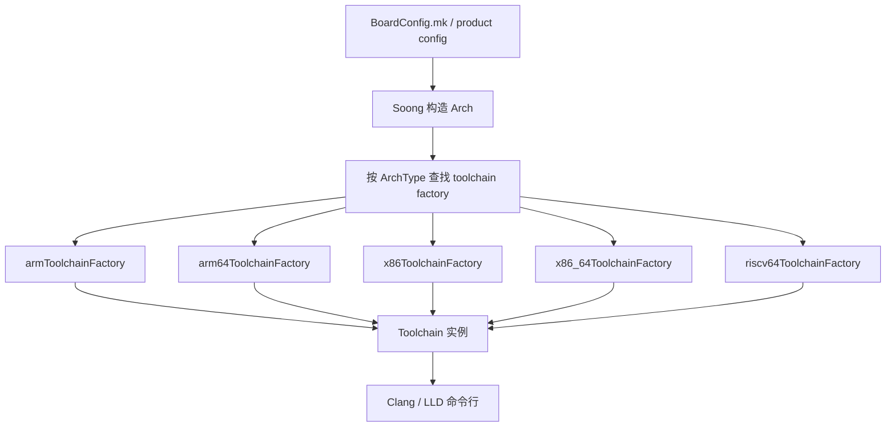

# 第 57 章：Architecture Support

Android 支持的处理器架构范围，比绝大多数主流操作系统都更宽。从入门机上的 ARM Cortex-A7，到旗舰 SoC 上的 Cortex-X4，从模拟器和部分设备使用的 x86 / x86_64，到仍在持续演进中的 RISC-V 64，AOSP 构建系统都必须为每个目标生成正确、可优化、可链接的二进制。

这一章关注的不是某个单点优化技巧，而是 Android 架构支持的整条链路：`BoardConfig.mk` 如何声明 `TARGET_ARCH` 与 `TARGET_CPU_VARIANT`，Soong 如何把这些输入折算成 `Arch` 结构和 `Toolchain`，编译器 flag 如何分层叠加，Bionic 和 ART 又如何在运行时为不同架构与 CPU 特性选择最优路径。

---

## 57.1 Supported Architectures

AOSP 当前正式支持的 CPU 架构可以概括为五类：

| 架构 | Soong `ArchType` | Clang Triple | 主要配置文件 | 位数 |
|---|---|---|---|---|
| ARM（32 位） | `android.Arm` | `armv7a-linux-androideabi` | `arm_device.go` | 32 |
| ARM64 | `android.Arm64` | `aarch64-linux-android` | `arm64_device.go` | 64 |
| x86 | `android.X86` | `i686-linux-android` | `x86_device.go` | 32 |
| x86_64 | `android.X86_64` | `x86_64-linux-android` | `x86_64_device.go` | 64 |
| RISC-V 64 | `android.Riscv64` | `riscv64-linux-android` | `riscv64_device.go` | 64 |

这些配置文件与 `global.go`、`toolchain.go`、`clang.go`、`bionic.go` 一起，构成了 Android 跨架构编译基础设施的核心。

### 57.1.1 架构注册流程

每个架构都会在 Go 包初始化时调用 `registerToolchainFactory()` 注册自己的 toolchain factory。Soong 在为模块创建目标变体时，会依据 `ArchType` 找到对应 factory，再据此构造具体的 `Toolchain` 实例。

整个注册与选择链路如下：



### 57.1.2 Toolchain 接口

`build/soong/cc/config/toolchain.go` 中的 `Toolchain` 接口，是架构支持的最核心抽象。它把目标标识、编译参数、汇编参数、链接参数、CRT 选择、默认共享库和 ABI 细节都统一封装起来。

从职责上看，这个接口主要分成四组：

- 标识：`Name()`、`ClangTriple()`
- 编译：`Cflags()`、`Cppflags()`、`ToolchainCflags()`、`Asflags()`
- 链接：`Ldflags()`、`ToolchainLdflags()`、各类 CRT 方法
- 平台属性：`Is64Bit()`、`Bionic()`、`Glibc()`、`Musl()`

这层抽象的价值在于：Soong 不需要到处写 `if arch == arm64` 的硬编码逻辑，而是统一通过 toolchain 提取需要的信息。

### 57.1.3 `Arch` 结构体

Soong 用 `build/soong/android/arch.go` 里的 `Arch` 结构体描述一次目标架构配置，关键字段通常包括：

- `ArchType`
- `ArchVariant`
- `CpuVariant`
- `Abi`
- `ArchFeatures`

这几个字段分别回答不同问题：

- 这是哪一类 ISA？
- 该 ISA 的哪个变体？
- 具体针对哪类 CPU 微架构调优？
- 暴露哪些 ABI？
- 开了哪些附加特性？

### 57.1.4 Toolchain 中的架构层级

Android 的架构支持不是“一个架构只对应一套 flag”，而是至少有三层：

1. 架构层：例如 ARM64、x86_64。
2. ISA 变体层：例如 `armv8-a`、`armv8-2a`、`haswell`。
3. CPU 变体层：例如 `cortex-a53`、`kryo`、`generic`。

最终生成的 Clang 命令行，正是这几层参数和全局 flag 叠加出来的结果。

## 57.2 ARM64 (AArch64)

ARM64 是今天 Android 设备最主流的架构。它同时是性能、能效和平台特性演进最活跃的地方。

### 57.2.1 架构变体

ARM64 在 Soong 里支持多个 `ArchVariant`，例如从基础 `armv8-a` 到包含更多扩展的 `armv8-2a`、`armv9` 系列。变体会影响 `-march=` 等编译参数，从而决定编译器可以使用哪些指令能力。

### 57.2.2 Branch Protection：PAC 与 BTI

现代 ARM64 设备越来越多地启用分支保护特性：

- PAC：Pointer Authentication Code
- BTI：Branch Target Identification

它们主要用于提高控制流攻击防护强度。对构建系统来说，这意味着某些全局或架构级 flag 必须与平台能力、C library 与 toolchain 版本协同。

### 57.2.3 MTE

MTE（Memory Tagging Extension）是 ARM64 上最重要的内存调试与安全能力之一。它不仅影响运行时调试工具，也会影响 Bionic、编译器插桩和系统属性配置。

### 57.2.4 CPU 变体调优与 big.LITTLE

ARM64 调优不能简单理解为“总是为最快的大核优化”。Android 设备普遍是异构多核，若只针对大核激进优化，反而可能让任务在小核上出现更糟糕的退化。因此 AOSP 的策略更偏务实：优先保证异构集群上的整体稳定表现。

### 57.2.5 Cortex-A53 Erratum

Cortex-A53 曾有多项需要在编译或运行时规避的硬件勘误。AOSP 在 ARM64 和 ART 相关路径中保留了相应 workaround 逻辑，这也是“架构支持”不仅仅是加个 triple 的原因。

### 57.2.6 ARM64 Toolchain Factory

`arm64ToolchainFactory` 会基于 `ArchVariant`、`CpuVariant` 和全局 flag 组装最终 toolchain。对 bring-up 来说，这通常是回答“为什么某个 ARM64 目标用了这组 `-march/-mcpu` 参数”的最直接入口。

### 57.2.7 Page Size 配置

ARM64 近年还涉及 page size 扩展，例如 4K 与更大页大小的支持。页大小会影响链接、宏定义、运行时行为和部分 ABI 假设，因此不是单纯内核侧开关。

## 57.3 x86 and x86_64

x86 / x86_64 主要出现在模拟器、部分开发设备与历史设备支持路径中，但其实现仍然很完整。

### 57.3.1 x86 架构变体

x86 系列在 Android 中支持多种 `ArchVariant`，例如从较老的 `prescott` 到更新的桌面级微架构。它们影响编译器是否可使用更先进的指令集与调优模型。

### 57.3.2 SIMD：SSE 与 AVX

x86 的优化重点之一是 SIMD 能力选择。AOSP 必须在“尽量利用 SSE / AVX”与“不要生成目标设备不支持的指令”之间平衡，因此变体和最小指令集基线都很关键。

### 57.3.3 x86 特定编译参数

x86 常见的架构相关 flag 包括：

- `-march=...`
- `-mstackrealign`
- SSE / AVX 相关开关
- 某些 ABI 与对齐约束

### 57.3.4 x86 Toolchain 结构

和 ARM64 一样，x86 也通过独立 toolchain factory 生成自己的 triple、CFLAGS 和 LDFLAGS，只是它的 CPU 变体体系通常没有 ARM 那么细。

### 57.3.5 Native Bridge 与 ARM 兼容

x86 上运行 ARM 应用或原生库，通常需要 Native Bridge 机制，例如 Berberis 或历史上的 Houdini。它提供的是“跨架构二进制翻译”能力，而不是重新编译。

### 57.3.6 模拟器目标

x86_64 是 Android Emulator 与 generic device 配置中的重要目标之一。大量 AOSP 开发和测试流程都依赖这条路径。

### 57.3.7 ARM 32 位作为历史次架构

在某些 x86_64 或 ARM64 多架构设备上，32 位 ABI 仍然被保留为 secondary architecture，用于兼容旧应用和旧原生库。

### 57.3.8 ARM 32 位链接器配置

即使 primary 架构不是 ARM32，只要系统仍支持 32 位 ARM ABI，链接器、输出目录和 zygote 配置就仍要保持完整配套。

## 57.4 RISC-V 64

RISC-V 是 Android 架构支持里最具前瞻性的一部分。它还远没 ARM64 成熟，但已经具备清晰的构建与运行时支持骨架。

### 57.4.1 Base ISA 与扩展

RISC-V 64 在 AOSP 中不是“裸 RV64I”，而是带一组必需扩展的配置。构建参数里的 `-march=` 串，决定了系统认为最小可依赖的 ISA 能力集合。

### 57.4.2 QEMU 与 Berberis Workaround

由于硬件和预编译生态尚未完全成熟，RISC-V 支持经常需要对 QEMU、预编译缺口或翻译层做临时兼容处理。

### 57.4.3 最小变体配置

与 ARM / x86 不同，RISC-V 当前在 AOSP 中的 variant / CPU variant 体系要简单得多，这反映了它仍处于早期支持阶段。

### 57.4.4 RISC-V 链接器配置

页大小、动态链接器路径、运行时库与默认链接参数都需要单独定义，说明它已经不是“实验性脚本”，而是正式受支持目标的一部分。

### 57.4.5 Berberis 二进制翻译

Berberis 是 Android 在跨架构兼容方向上的重要探索。对 RISC-V 来说，它有助于缓解生态尚未完全就绪时的应用 / 原生库兼容问题。

### 57.4.6 ART 的 RISC-V 特性探测

ART 需要知道目标架构支持哪些 ISA 特征，才能选择合适的 entrypoint、调用约定和优化策略。RISC-V 的支持路径已经在 ART 中有了明确实现。

### 57.4.7 RISC-V 与 ARM64 特性追踪对比

ARM64 的特性体系已经非常丰富，而 RISC-V 还在逐步完善。比较两者可以看出 Android 如何为一个新架构逐步补齐构建、Bionic、ART 和设备配置。

### 57.4.8 ART ARM64 特性位图

原文在这里插入了 ARM64 feature bitmap 作为对照，核心意义是说明 ART 的 feature 识别是架构相关的独立子系统，而不是编译器 flag 的简单镜像。

### 57.4.9 RISC-V 设备配置

`device/generic/art/riscv64/` 等目录说明 AOSP 已经为 RISC-V 提供了最小化设备和测试配置骨架，即使其中仍夹杂一些“预编译尚不齐全”的临时处理。

## 57.5 Multi-Architecture Builds

Android 很多产品不是单架构，而是 primary + secondary architecture 共存。

### 57.5.1 主架构与次架构

最典型的例子是 ARM64 主架构同时保留 ARM32 次架构，用于兼容 32 位 app 和 native 库。

### 57.5.2 Zygote 配置

Zygote 选择必须与 multilib 模型对齐。64 位优先、32 位兼容，还是纯 64 位设备，都会影响最终使用哪套 zygote 脚本和系统属性。

### 57.5.3 `compile_multilib`

`compile_multilib` 属性决定一个模块生成：

- 只编 32 位
- 只编 64 位
- 同时编双份
- 按 first / preferred 架构选择

这是单个 `Android.bp` 模块适配多架构输出的关键开关。

### 57.5.4 `Android.bp` 中的架构特定源码

Soong 支持在 `arch:` block 里按架构替换或追加源码、flag 与依赖，使模块可以在保持统一定义的同时，对不同架构采用不同实现。

### 57.5.5 输出目录结构

多架构构建最终会把产物放进不同输出路径，例如 `lib/` 与 `lib64/`，以及对应的中间目录。理解输出布局，对排查“到底链接了哪份 so”很重要。

## 57.6 Compiler Configuration

编译器参数的组织，是本章最核心的工程主题之一。Android 不是把所有 flag 堆成一串固定文本，而是按层叠加。

### 57.6.1 通用全局 CFLAGS

这层通常负责：

- 通用警告
- 优化级别
- 安全加固
- 兼容行为控制

### 57.6.2 设备特定 CFLAGS

设备或产品可以在 global 层之上再追加一层 flag，用于适配具体平台需求。

### 57.6.3 设备链接参数

链接阶段同样会有设备级调整，例如 page size、segment 布局、运行时库选择和符号处理策略。

### 57.6.4 不可覆盖参数

某些关键 flag 被放进 no-override 层，防止模块局部配置把全局安全 / 稳定性要求绕开。

### 57.6.5 Flag 分层模型

实际的 flag 链路通常可以概括成：

1. `commonGlobalCflags`
2. `deviceGlobalCflags`
3. 架构级 `Cflags()`
4. `ToolchainCflags()`（variant + CPU）
5. 模块自带 `cflags`
6. `noOverrideGlobalCflags`

### 57.6.6 Clang 版本

AOSP 统一锁定并管理 Clang 版本，以确保所有架构下的行为、警告和优化能力可控。

### 57.6.7 自动变量初始化

自动变量初始化属于较新的安全增强策略之一，会直接影响生成代码、性能和某些未初始化读取问题的暴露方式。

### 57.6.8 Sanitizer 运行时库

ASan、HWASan、UBSan 等 sanitizer 不只影响编译插桩，也影响各架构下运行时库的提供与链接方式。

### 57.6.9 External 代码参数

外部导入代码常常需要特殊兼容 flag，但 Android 也会限制这些例外不要污染整个平台的统一基线。

### 57.6.10 非法参数

Soong 会过滤或拒绝某些不允许的 flag，避免模块任意突破平台约束。

### 57.6.11 语言标准版本

C / C++ / Rust 的语言标准版本同样由构建系统统一管理，而不是每个模块自行决定到无法收敛。

### 57.6.12 Clang 未知参数过滤

当某些外部模块或旧代码仍带有历史 flag 时，Soong / Clang 配置层还要处理“未知参数如何兼容或过滤”的问题。

## 57.7 Generic Device Configurations

AOSP 为若干通用架构目标提供了 generic device 配置，方便 bring-up、测试和 CI。

### 57.7.1 目录结构

主要分布在 `device/generic/` 及相关产品目录下。

### 57.7.2 ARM64 Generic Device

`device/generic/arm64/` 提供 ARM64 通用参考配置，是理解 `TARGET_ARCH`、`TARGET_CPU_VARIANT` 和 product 继承关系的好入口。

### 57.7.3 ARM 32 位 Generic Device

ARM32 generic 配置更多承载历史兼容和测试价值。

### 57.7.4 x86_64 Generic Device

x86_64 generic 配置经常与模拟器、通用 CI 环境和开发验证有关。

### 57.7.5 ART 测试设备

`device/generic/art/` 系列配置说明 ART 团队会为不同架构单独准备测试目标。

### 57.7.6 Android Automotive

车载产品并不是独立架构，但它们会组合特定 generic / product 配置，从而体现出不同设备形态对架构支持的使用方式。

### 57.7.7 Trusty TEE

Trusty 的通用 QEMU 配置也展示了“架构支持”不仅服务完整 Android 系统，也服务 TEE / 子系统镜像构建。

### 57.7.8 AOSP Product Build

`aosp_arm64.mk` 这类 product 文件，把通用架构配置进一步包装成可构建产品。

## 57.8 Architecture-Specific Code Patterns

真正体现“架构差异”的，不只是编译参数，还包括源码组织和运行时选择模式。

### 57.8.1 Bionic 的架构目录

Bionic 会按架构拆分源码目录，例如 `arch-arm64`、`arch-riscv64`、`arch-x86_64`。这样 libc 的性能关键路径可以按架构分别优化。

### 57.8.2 ARM64 `ifunc` 分发

ARM64 上，Bionic 经常使用 `ifunc` 机制在运行时按硬件能力选择最优实现，例如 `memcpy`、`memset`、字符串函数等。

### 57.8.3 ARM32 的 CPU 变体字符串函数

ARM32 历史包袱更重，因此很多字符串函数会按 CPU 变体维护多份实现。

### 57.8.4 RISC-V 向量扩展字符串函数

RISC-V 上，向量扩展相关优化表明 Android 已经不只是在“让它能编译”，而是在逐步补齐性能路径。

### 57.8.5 Bionic 低层架构函数

诸如原子操作、setjmp / longjmp、syscall wrapper、缓存与 TLS 相关逻辑，都是最依赖架构特性的低层部分。

### 57.8.6 Bionic 的 MTE 集成

ARM64 的 MTE 会反向影响 Bionic 的分配器、内存访问辅助函数和调试路径。

### 57.8.7 ART 的架构特定 Entrypoint

ART 的 quick entrypoint、桥接代码与汇编入口，都是按架构分别维护的。

### 57.8.8 ART 指令集特性探测

ART 必须在运行时识别目标设备真实支持的 ISA feature，而不是完全依赖编译期假设。

### 57.8.9 ART Quick Entrypoints

这些入口把 managed 代码调用和 native / runtime 机制衔接起来，是每个架构最敏感、最性能关键的一层之一。

### 57.8.10 多种特性探测策略

原文特别强调，AOSP 不是只用一种方式探测能力，而是会结合编译期、运行时和平台配置做综合判断。

### 57.8.11 架构特定构建模式总结

综合来看，Android 常见模式包括：

- 目录级按架构拆分源码
- `arch:` block 条件编译
- runtime dispatch（如 `ifunc`）
- ART / Bionic 运行时特性探测

### 57.8.12 ARM32 指令集：ARM 与 Thumb

ARM32 仍然需要处理 ARM / Thumb 指令集模式差异，这是它相较 ARM64 更复杂的一部分。

### 57.8.13 ARM32 的 Soft Float 与 NEON

ARM32 历史上在 soft float、NEON 和 ABI 之间存在复杂兼容关系，这也是 Android 最终转向 ARM64 的重要背景之一。

### 57.8.14 Bionic 按架构 Strip 配置

不同架构下，strip 与符号保留策略也可能存在差异。

### 57.8.15 Page Size 宏处理

页大小变化不仅影响链接，还会影响头文件宏、运行时假设与部分汇编实现。

### 57.8.16 ARM32 LPAE Workaround

ARM32 还保留一些与 LPAE 等历史平台特性相关的 workaround，体现出 Android 对旧架构的兼容深度。

## 57.9 Try It

### 57.9.1 练习 1：检查设备的架构参数

沿着你的目标设备配置，依次确认：

```bash
# 1. 找到架构配置
grep -R "TARGET_ARCH\\|TARGET_CPU_VARIANT" device/<vendor>/<product> -n

# 2. 找变体 flag
grep -R "arch variant" build/soong/cc/config -n

# 3. 找 CPU variant flag
grep -R "cpu variant" build/soong/cc/config -n

# 4. 看全局 flag
grep -R "commonGlobalCflags\\|deviceGlobalCflags" build/soong/cc/config -n
```

### 57.9.2 练习 2：添加一个新的架构变体

在对应 `*_device.go` 中加一个新 variant，观察 Soong 如何校验这个 variant 是否存在，并追踪它如何进入 `ToolchainCflags()`。

### 57.9.3 练习 3：检查 `ifunc` 分发

```bash
# 1. 看 ARM64 memcpy 的 ifunc resolver
sed -n '1,220p' bionic/libc/arch-arm64/ifuncs.cpp

# 2. 在设备上确认选中了哪个实现
adb shell getprop | grep -i cpu

# 3. 反汇编目标实现
llvm-objdump -d out/target/product/<product>/symbols/apex/com.android.runtime/lib64/bionic/libc.so
```

### 57.9.4 练习 4：比较不同架构的字符串函数

对比：

- ARM32：多 CPU 变体实现
- ARM64：运行时 `ifunc`
- RISC-V：向量扩展路径
- x86_64：SSE / AVX 路径

### 57.9.5 练习 5：做多架构构建

```bash
# ARM64
lunch aosp_arm64-userdebug
m liblog

# x86_64
lunch aosp_x86_64-userdebug
m liblog
```

然后比对 Ninja 命令行中的 target triple 与关键 flag。

### 57.9.6 练习 6：追完整条 flag 链

针对某个模块，按本章 `57.6` 的层级模型，把完整编译参数链抄出来，再对照 Ninja 生成结果验证。

### 57.9.7 练习 7：探索 ART 架构支持

```bash
# 1. 看架构特定 ART 目录
ls art/runtime/arch/arm64/
ls art/runtime/arch/riscv64/

# 2. 看 ARM64 instruction set features
sed -n '1,220p' art/runtime/arch/arm64/instruction_set_features_arm64.cc

# 3. 对比各架构 quick entrypoints 规模
wc -l art/runtime/arch/*/quick_entrypoints_*.S
```

### 57.9.8 练习 8：评估 RISC-V 准备度

```bash
# 1. 看哪些预编译依赖还缺
grep -R "ALLOW_MISSING_DEPENDENCIES" device/generic/art/riscv64/

# 2. 统计 bionic 里 RISC-V 汇编文件
find bionic/libc/arch-riscv64 -name "*.S" | wc -l

# 3. 看 ISA 字符串
grep "march=" build/soong/cc/config/riscv64_device.go

# 4. 看 Berberis 目录
ls frameworks/libs/binary_translation/
```

### 57.9.9 练习 9：写一个最小设备配置

尝试给一个假设中的 RISC-V 设备写 `BoardConfig.mk` 和 product file，确认：

- 为什么它应走 `core_64_bit_only.mk`
- 为什么不存在 32 位 secondary arch
- zygote 应该使用哪条 64 位路径

### 57.9.10 练习 10：分析完整 Clang 命令链

选择 `liblog` 之类简单模块，找到某个 `.o` 的 Ninja 规则，把所有 flag 来源标出来：

1. `commonGlobalCflags`
2. `deviceGlobalCflags`
3. 架构级 `Cflags`
4. `toolchainCflags`
5. 模块自定义 `cflags`
6. `noOverrideGlobalCflags`

这个练习就是把本章 `57.6` 的分层模型还原成真实构建命令。原文这里误写成了 `28.6`，中文稿已按本章编号修正。

## Summary

Android 的架构支持，本质上是构建系统、C library、运行时和设备配置共同参与的分层系统。

1. `Toolchain` 接口把五类正式支持架构的编译与链接细节统一抽象出来。
2. `ArchType`、`ArchVariant`、`CpuVariant` 共同决定最终 triple 与调优参数。
3. `compile_multilib` 和 `TARGET_2ND_ARCH` 让 Android 能在同一设备上同时承载 32 位与 64 位代码。
4. Bionic 和 ART 的性能关键路径通常按架构分别实现，并在需要时结合 `ifunc` 或运行时特性探测做更细粒度选择。
5. ARM64 是当前最成熟的主力目标；x86 / x86_64 在模拟器与兼容路径上仍然重要；RISC-V 则代表 Android 正在铺设的新架构未来。
6. 真正排查构建与性能问题时，最有效的方法往往不是盯着某个单一 `BoardConfig.mk`，而是沿着“设备配置 -> `Arch` -> toolchain -> flag layering -> 架构特定源码”整条链往下追。

从平台工程角度看，Android 架构支持最有价值的一点，在于它没有把“多架构”做成一堆散落的特殊分支，而是尽量用统一接口、统一 mutator 和统一 flag 分层模型，把差异控制在可审计、可扩展的范围内。
