# Chapter 57: Architecture Support

Android runs on a wider range of processor architectures than any other major
operating system. From low-power ARM Cortex-A7 chips in entry-level phones to
high-performance Cortex-X4 cores in flagship devices, from Intel x86 in
Chromebooks and emulators to the emerging RISC-V ecosystem, the AOSP build
system must produce correct, optimized code for every target. This chapter
traces exactly how architecture support works -- from the Soong toolchain
definitions that select compiler flags, through the bionic libc assembly
routines hand-tuned for individual CPU cores, to the ART runtime entrypoints
that bridge managed Java code with native hardware.

Understanding this machinery matters for several audiences. Device bring-up
engineers need to add a new `BoardConfig.mk` that declares the right
`TARGET_ARCH` and `TARGET_CPU_VARIANT`. Performance engineers need to know where
architecture-specific hot paths live so they can tune or replace them. Platform
developers working on the build system need to understand the layered design of
Soong's `Toolchain` interface, its architecture variants, and the multilib
mechanism that lets a single `Android.bp` module produce both 32-bit and 64-bit
binaries.

---

## 57.1 Supported Architectures

AOSP officially supports five CPU architectures, each mapped to a specific
Soong `ArchType` and Clang target triple. These five architectures are
registered via `registerToolchainFactory()` calls in the files under
`build/soong/cc/config/`:

| Architecture | Soong ArchType | Clang Triple | Device Config File | Bits |
|---|---|---|---|---|
| ARM (32-bit) | `android.Arm` | `armv7a-linux-androideabi` | `arm_device.go` | 32 |
| ARM64 | `android.Arm64` | `aarch64-linux-android` | `arm64_device.go` | 64 |
| x86 (32-bit) | `android.X86` | `i686-linux-android` | `x86_device.go` | 32 |
| x86_64 | `android.X86_64` | `x86_64-linux-android` | `x86_64_device.go` | 64 |
| RISC-V 64 | `android.Riscv64` | `riscv64-linux-android` | `riscv64_device.go` | 64 |

Each architecture has a corresponding `*_device.go` file in
`build/soong/cc/config/` that defines architecture-specific compiler flags, CPU
variant tuning, and linker flags. These five files -- plus the shared
`global.go`, `toolchain.go`, `clang.go`, and `bionic.go` -- form the
foundation of AOSP's cross-compilation infrastructure.

### 57.1.1 Architecture Registration Flow

Every architecture registers itself with the build system during Go package
initialization. The pattern is identical across all five architectures. Here is
the registration from `arm64_device.go`:

```go
// build/soong/cc/config/arm64_device.go, line 210-212
func init() {
    registerToolchainFactory(android.Android, android.Arm64, arm64ToolchainFactory)
}
```

And the corresponding registration from `riscv64_device.go`:

```go
// build/soong/cc/config/riscv64_device.go, line 131-133
func init() {
    registerToolchainFactory(android.Android, android.Riscv64, riscv64ToolchainFactory)
}
```

The `registerToolchainFactory` function in `toolchain.go` stores these factories
in a two-dimensional map indexed by OS type and architecture type:

```go
// build/soong/cc/config/toolchain.go, line 32-39
var toolchainFactories = make(map[android.OsType]map[android.ArchType]toolchainFactory)

func registerToolchainFactory(os android.OsType, arch android.ArchType, factory toolchainFactory) {
    if toolchainFactories[os] == nil {
        toolchainFactories[os] = make(map[android.ArchType]toolchainFactory)
    }
    toolchainFactories[os][arch] = factory
}
```

When Soong needs to compile a module for a given OS and architecture, it looks
up the factory and calls it with the target `Arch` struct. The factory returns a
`Toolchain` implementation that provides all the flags needed:

```go
// build/soong/cc/config/toolchain.go, line 62-68
func findToolchain(os android.OsType, arch android.Arch) (Toolchain, error) {
    factory := toolchainFactories[os][arch.ArchType]
    if factory == nil {
        return nil, fmt.Errorf("Toolchain not found for %s arch %q", os.String(), arch.String())
    }
    return factory(arch), nil
}
```

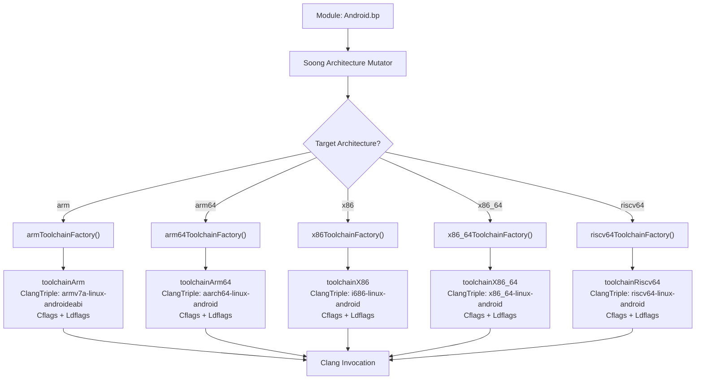

### 57.1.2 The Toolchain Interface

All architecture-specific toolchains implement the `Toolchain` interface defined
in `build/soong/cc/config/toolchain.go`. This is the central abstraction that
lets Soong compile C/C++ code without hard-coding any architecture details:

```go
// build/soong/cc/config/toolchain.go, line 70-112
type Toolchain interface {
    Name() string
    IncludeFlags() string
    ClangTriple() string
    ToolchainCflags() string
    ToolchainLdflags() string
    Asflags() string
    Cflags() string
    Cppflags() string
    Ldflags() string
    InstructionSetFlags(string) (string, error)
    ndkTriple() string
    YasmFlags() string
    Is64Bit() bool
    ShlibSuffix() string
    ExecutableSuffix() string
    LibclangRuntimeLibraryArch() string
    AvailableLibraries() []string
    CrtBeginStaticBinary() []string
    CrtBeginSharedBinary() []string
    CrtBeginSharedLibrary() []string
    CrtEndStaticBinary() []string
    CrtEndSharedBinary() []string
    CrtEndSharedLibrary() []string
    CrtPadSegmentSharedLibrary() []string
    DefaultSharedLibraries() []string
    Bionic() bool
    Glibc() bool
    Musl() bool
}
```

The interface breaks down into several logical groups:

**Identity**: `Name()` and `ClangTriple()` identify the target. `Name()`
returns a short identifier like `"arm64"` or `"x86"`. `ClangTriple()` returns
the full Clang target triple used with the `--target=` flag.

**Compilation flags**: `Cflags()`, `Cppflags()`, `ToolchainCflags()`, and
`Asflags()` provide the flags passed to the compiler at various levels.
`ToolchainCflags()` carries architecture-variant and CPU-variant specific flags
that are layered on top of the base `Cflags()`.

**Linking**: `Ldflags()`, `ToolchainLdflags()`, and the CRT (C Runtime)
methods control how binaries are linked. Every bionic-based toolchain uses CRT
objects like `crtbegin_dynamic` and `crtend_android`.

**Platform**: `Bionic()`, `Glibc()`, and `Musl()` indicate which C library the
toolchain links against.

The base types `toolchain64Bit` and `toolchain32Bit` provide the `Is64Bit()`
method, while `toolchainBionic` provides the Android-specific CRT objects and
default shared libraries:

```go
// build/soong/cc/config/bionic.go, line 17-46
type toolchainBionic struct {
    toolchainBase
}

var (
    bionicDefaultSharedLibraries = []string{"libc", "libm", "libdl"}
    bionicCrtBeginStaticBinary  = []string{"crtbegin_static"}
    bionicCrtEndStaticBinary    = []string{"crtend_android"}
    bionicCrtBeginSharedBinary  = []string{"crtbegin_dynamic"}
    bionicCrtEndSharedBinary    = []string{"crtend_android"}
    bionicCrtBeginSharedLibrary = []string{"crtbegin_so"}
    bionicCrtEndSharedLibrary   = []string{"crtend_so"}
    bionicCrtPadSegmentSharedLibrary = []string{"crt_pad_segment"}
)
```

### 57.1.3 The Arch Struct

Soong represents a target architecture using the `Arch` struct from
`build/soong/android/arch.go`. This struct carries all the information needed
to select the right toolchain, compiler flags, and source files:

```go
// build/soong/android/arch.go (around line 95-110)
type Arch struct {
    ArchType    ArchType
    ArchVariant string
    CpuVariant  string
    Abi         []string
    ArchFeatures []string
}
```

Each field has a specific role:

- **`ArchType`**: One of `Arm`, `Arm64`, `X86`, `X86_64`, or `Riscv64`. This
  determines which toolchain factory is used.

- **`ArchVariant`**: The ISA version, such as `"armv8-2a"` or `"haswell"`.
  Maps to `-march=` flags.

- **`CpuVariant`**: The specific CPU micro-architecture, such as
  `"cortex-a55"` or `"kryo385"`. Maps to `-mcpu=` flags.

- **`Abi`**: The list of Application Binary Interfaces supported, such as
  `["arm64-v8a"]` or `["armeabi-v7a", "armeabi"]`.

- **`ArchFeatures`**: Optional hardware features like `"branchprot"` or
  `"sse4_2"`.

The `ArchType` itself is defined as a simple struct with name and multilib
classification:

```go
// build/soong/android/arch.go (around line 128-138)
type ArchType struct {
    Name     string   // "arm", "arm64", "x86", "x86_64", or "riscv64"
    Field    string   // Property field name, e.g., "Arm64"
    Multilib string   // "lib32" or "lib64"
}
```

The five architecture types are registered as package-level variables:

```go
// build/soong/android/arch.go (around line 160-164)
Arm     = newArch("arm", "lib32")
Arm64   = newArch("arm64", "lib64")
Riscv64 = newArch("riscv64", "lib64")
X86     = newArch("x86", "lib32")
X86_64  = newArch("x86_64", "lib64")
```

When a `BoardConfig.mk` declares `TARGET_ARCH := arm64` and
`TARGET_ARCH_VARIANT := armv8-2a-dotprod`, Soong constructs an `Arch` struct
with `ArchType=Arm64`, `ArchVariant="armv8-2a-dotprod"`, and the appropriate
`CpuVariant` and `ArchFeatures`. This struct is then passed to
`arm64ToolchainFactory()`, which uses each field to select the right flags.

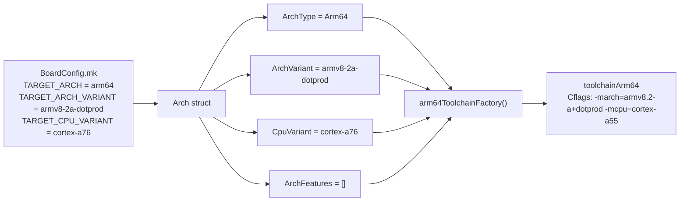

### 57.1.4 Architecture Hierarchy in the Toolchain

Each architecture toolchain is assembled from three layers through Go struct
embedding:

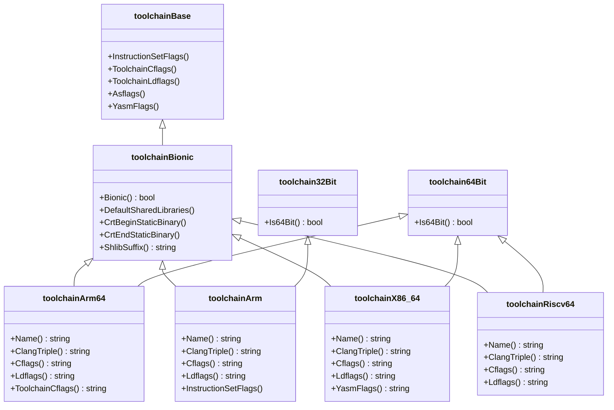

---

## 57.2 ARM64 (AArch64)

ARM64, formally AArch64, is the primary architecture for Android devices.
Virtually every phone, tablet, and wearable shipping today uses an ARM64
processor. The AOSP build system supports a wide range of ARM64
micro-architectures, from the original ARMv8-A through the latest ARMv9.4-A
extensions.

**Source file**: `build/soong/cc/config/arm64_device.go` (212 lines)

### 57.2.1 Architecture Variants

ARM64 supports ten architecture variants, each mapping to a specific `-march=`
compiler flag:

```go
// build/soong/cc/config/arm64_device.go, line 30-41
arm64ArchVariantCflags = map[string][]string{
    "armv8-a":            {"-march=armv8-a"},
    "armv8-a-branchprot": {"-march=armv8-a"},
    "armv8-2a":           {"-march=armv8.2-a"},
    "armv8-2a-dotprod":   {"-march=armv8.2-a+dotprod"},
    "armv8-5a":           {"-march=armv8.5-a"},
    "armv8-7a":           {"-march=armv8.7-a"},
    "armv9-a":            {"-march=armv9-a"},
    "armv9-2a":           {"-march=armv9.2-a"},
    "armv9-3a":           {"-march=armv9.3-a"},
    "armv9-4a":           {"-march=armv9.4-a"},
}
```

Each variant represents a generation of the ARM architecture specification,
adding features:

| Variant | ARM Spec | Key Additions |
|---|---|---|
| `armv8-a` | ARMv8.0-A | Base 64-bit, NEON, VFPv4, AES, SHA |
| `armv8-a-branchprot` | ARMv8.0-A + PAC/BTI | Branch protection (see below) |
| `armv8-2a` | ARMv8.2-A | FP16, statistical profiling |
| `armv8-2a-dotprod` | ARMv8.2-A + DotProd | INT8 dot product for ML |
| `armv8-5a` | ARMv8.5-A | MTE, BTI, RNG, FRINTTS |
| `armv8-7a` | ARMv8.7-A | Enhanced PAC, WFI/WFE with timeout |
| `armv9-a` | ARMv9.0-A | SVE2, RME, base for new generation |
| `armv9-2a` | ARMv9.2-A | SME (scalable matrix), ETE tracing |
| `armv9-3a` | ARMv9.3-A | SME2, extended BFloat16 |
| `armv9-4a` | ARMv9.4-A | Latest: SVE2.1, GCS |

The `armv8-a-branchprot` variant is notable: it uses the same `-march=armv8-a`
flag as plain `armv8-a`, but the build system knows to apply the `branchprot`
architecture feature, which adds compiler flags for hardware-enforced control
flow integrity.

### 57.2.2 Branch Protection: PAC and BTI

Pointer Authentication Codes (PAC) and Branch Target Identification (BTI) are
hardware security features that protect against control-flow hijacking attacks
like ROP (Return-Oriented Programming) and JOP (Jump-Oriented Programming).

When the `branchprot` feature is enabled, AOSP applies these compiler flags:

```go
// build/soong/cc/config/arm64_device.go, line 43-49
arm64ArchFeatureCflags = map[string][]string{
    "branchprot": {
        "-mbranch-protection=standard",
        "-fno-stack-protector",
    },
}
```

The `-mbranch-protection=standard` flag tells Clang to:

1. Sign return addresses with PAC instructions (`PACIASP` / `AUTIASP`)
2. Add BTI landing pads at function entries and branch targets

The `-fno-stack-protector` flag is deliberately paired with PAC because
PAC-signed return addresses already protect against stack buffer overflows that
corrupt the return address -- the primary threat that stack protectors also
defend against. Disabling the stack protector avoids the redundant canary check,
saving a few instructions per function entry/exit.

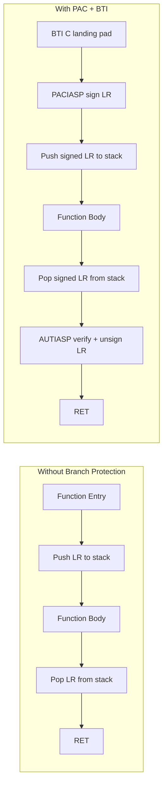

In the PAC+BTI flow, if an attacker overwrites the saved LR on the stack, the
`AUTIASP` instruction will fail to authenticate the corrupted pointer, causing a
fault. The BTI landing pad ensures that indirect branches can only land at
intended targets.

### 57.2.3 Memory Tagging Extension (MTE)

ARMv8.5-A introduced the Memory Tagging Extension (MTE), a hardware feature
that detects memory safety bugs such as use-after-free and buffer overflows.
AOSP has deep integration with MTE at the bionic level.

The file `bionic/libc/arch-arm64/bionic/note_memtag_heap_async.S` contains
an ELF note that requests the kernel to enable MTE for heap allocations:

```asm
// bionic/libc/arch-arm64/bionic/note_memtag_heap_async.S, line 34-46
  .section ".note.android.memtag", "a", %note
  .p2align 2
  .long 1f - 0f                 // int32_t namesz
  .long 3f - 2f                 // int32_t descsz
  .long NT_ANDROID_TYPE_MEMTAG  // int32_t type
0:
  .asciz "Android"              // char name[]
1:
  .p2align 2
2:
  .long (NT_MEMTAG_LEVEL_ASYNC | NT_MEMTAG_HEAP) // value
3:
  .p2align 2
```

Bionic's ifunc dispatchers also use MTE as a selection criterion, choosing
MTE-aware implementations when the hardware supports it. From
`bionic/libc/arch-arm64/ifuncs.cpp`:

```cpp
// bionic/libc/arch-arm64/ifuncs.cpp, line 54-60
DEFINE_IFUNC_FOR(memchr) {
  if (arg->_hwcap2 & HWCAP2_MTE) {
    RETURN_FUNC(memchr_func_t, __memchr_aarch64_mte);
  } else {
    RETURN_FUNC(memchr_func_t, __memchr_aarch64);
  }
}
```

MTE-aware string routines need special handling because the tag bits occupy the
upper bits of pointers. Regular pointer arithmetic or SIMD-based comparisons
might accidentally trip over the tag bits unless the code is written to be
tag-aware.

### 57.2.4 CPU Variant Tuning and big.LITTLE

ARM's big.LITTLE (and later DynamIQ) heterogeneous computing architecture pairs
high-performance "big" cores (e.g., Cortex-A76) with efficient "LITTLE" cores
(e.g., Cortex-A55). This creates a scheduling optimization challenge: code
compiled for the big core's pipeline might stall on the LITTLE core.

AOSP takes a pragmatic approach -- it tunes code for the LITTLE core, because
that code runs correctly (and acceptably fast) on both core types, while code
tuned for the big core might be pathologically slow on the LITTLE core:

```go
// build/soong/cc/config/arm64_device.go, line 65-77
"cortex-a75": []string{
    // Use the cortex-a55 since it is similar to the little
    // core (cortex-a55) and is sensitive to ordering.
    "-mcpu=cortex-a55",
},
"cortex-a76": []string{
    // Use the cortex-a55 since it is similar to the little
    // core (cortex-a55) and is sensitive to ordering.
    "-mcpu=cortex-a55",
},
```

This is not a mistake in the source code. The comments explain the reasoning:
the Cortex-A75 (big) and Cortex-A76 (big) variants deliberately use
`-mcpu=cortex-a55` (LITTLE) because the instruction scheduling for the little
core is "sensitive to ordering" -- meaning poor scheduling for the little core
causes significant performance degradation, whereas the big core's
out-of-order pipeline can compensate for sub-optimal scheduling.

The complete set of supported ARM64 CPU variants:

```go
// build/soong/cc/config/arm64_device.go, line 58-88
arm64CpuVariantCflags = map[string][]string{
    "cortex-a53": {"-mcpu=cortex-a53"},
    "cortex-a55": {"-mcpu=cortex-a55"},
    "cortex-a75": {"-mcpu=cortex-a55"},  // Uses little core tuning
    "cortex-a76": {"-mcpu=cortex-a55"},  // Uses little core tuning
    "kryo":       {"-mcpu=kryo"},
    "kryo385":    {"-mcpu=cortex-a53"},  // kryo385 not in clang
    "exynos-m1":  {"-mcpu=exynos-m1"},
    "exynos-m2":  {"-mcpu=exynos-m2"},
}
```

The mapping from CPU variant to compile flags is resolved through a two-level
lookup. First, the variant-to-variable map:

```go
// build/soong/cc/config/arm64_device.go, line 123-135
arm64CpuVariantCflagsVar = map[string]string{
    "cortex-a53": "${config.Arm64CortexA53Cflags}",
    "cortex-a55": "${config.Arm64CortexA55Cflags}",
    "cortex-a72": "${config.Arm64CortexA53Cflags}",
    "cortex-a73": "${config.Arm64CortexA53Cflags}",
    "cortex-a75": "${config.Arm64CortexA55Cflags}",
    "cortex-a76": "${config.Arm64CortexA55Cflags}",
    "kryo":       "${config.Arm64KryoCflags}",
    "kryo385":    "${config.Arm64CortexA53Cflags}",
    "exynos-m1":  "${config.Arm64ExynosM1Cflags}",
    "exynos-m2":  "${config.Arm64ExynosM2Cflags}",
}
```

Notice how the big cores (A72, A73, A75, A76) all map to their corresponding
LITTLE core flags (A53 or A55).

### 57.2.5 Cortex-A53 Erratum Workarounds

The Cortex-A53, one of the most widely deployed ARM cores in history, has two
notable hardware errata that AOSP works around at link time:

```go
// build/soong/cc/config/arm64_device.go, line 120
pctx.StaticVariable("Arm64FixCortexA53Ldflags", "-Wl,--fix-cortex-a53-843419")
```

```go
// build/soong/cc/config/arm64_device.go, line 137-144
arm64CpuVariantLdflags = map[string]string{
    "cortex-a53": "${config.Arm64FixCortexA53Ldflags}",
    "cortex-a72": "${config.Arm64FixCortexA53Ldflags}",
    "cortex-a73": "${config.Arm64FixCortexA53Ldflags}",
    "kryo":       "${config.Arm64FixCortexA53Ldflags}",
    "exynos-m1":  "${config.Arm64FixCortexA53Ldflags}",
    "exynos-m2":  "${config.Arm64FixCortexA53Ldflags}",
}
```

**Erratum 843419** causes incorrect execution when certain sequences of ADRP
instructions appear near page boundaries. The linker flag
`--fix-cortex-a53-843419` tells LLD to detect these problematic patterns and
insert veneer code to avoid them. Note that this fix is also applied to A72,
A73, Kryo, and Exynos cores, because they may be paired with A53 LITTLE cores
in big.LITTLE configurations.

### 57.2.6 ARM64 Toolchain Factory

The factory function assembles all the layers into a single toolchain:

```go
// build/soong/cc/config/arm64_device.go, line 187-208
func arm64ToolchainFactory(arch android.Arch) Toolchain {
    if _, ok := arm64ArchVariantCflags[arch.ArchVariant]; !ok {
        panic(fmt.Sprintf("Unknown ARM64 architecture version: %q", arch.ArchVariant))
    }

    toolchainCflags := []string{"${config.Arm64" + arch.ArchVariant + "VariantCflags}"}
    toolchainCflags = append(toolchainCflags,
        variantOrDefault(arm64CpuVariantCflagsVar, arch.CpuVariant))
    for _, feature := range arch.ArchFeatures {
        toolchainCflags = append(toolchainCflags, arm64ArchFeatureCflags[feature]...)
    }

    extraLdflags := variantOrDefault(arm64CpuVariantLdflags, arch.CpuVariant)
    return &toolchainArm64{
        ldflags: strings.Join([]string{
            "${config.Arm64Ldflags}",
            extraLdflags,
        }, " "),
        toolchainCflags: strings.Join(toolchainCflags, " "),
    }
}
```

The flags are layered in this order:

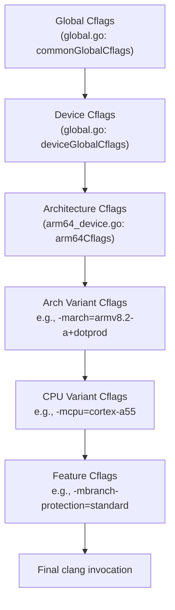

### 57.2.7 Page Size Configuration

ARM64 supports multiple page sizes (4KB, 16KB, 64KB). The linker flags enforce
the maximum page size for correct segment alignment:

```go
// build/soong/cc/config/arm64_device.go, line 92-96
pctx.VariableFunc("Arm64Ldflags", func(ctx android.PackageVarContext) string {
    maxPageSizeFlag := "-Wl,-z,max-page-size=" + ctx.Config().MaxPageSizeSupported()
    flags := append(arm64Ldflags, maxPageSizeFlag)
    return strings.Join(flags, " ")
})
```

The base linker flags also include segment separation for security:

```go
// build/soong/cc/config/arm64_device.go, line 51-54
arm64Ldflags = []string{
    "-Wl,-z,separate-code",
    "-Wl,-z,separate-loadable-segments",
}
```

These flags ensure that code segments, data segments, and read-only segments are
placed in separate memory pages, preventing accidental (or malicious) execution
of data or modification of code.

---

## 57.3 x86 and x86_64

The x86 architecture family serves two main roles in AOSP: as the target for
Chromebook and embedded devices, and as the native architecture for the Android
Emulator. The emulator historically ran ARM images under translation, but native
x86/x86_64 images provide dramatically better performance during development.

**Source files**:

- `build/soong/cc/config/x86_device.go` (193 lines)
- `build/soong/cc/config/x86_64_device.go` (200 lines)

### 57.3.1 x86 Architecture Variants

The x86 (32-bit) toolchain supports a wide range of Intel microarchitectures:

```go
// build/soong/cc/config/x86_device.go, line 38-86
x86ArchVariantCflags = map[string][]string{
    "": []string{
        "-march=prescott",
    },
    "x86_64": []string{
        "-march=prescott",
    },
    "alderlake": []string{"-march=alderlake"},
    "atom":      []string{"-march=atom"},
    "broadwell": []string{"-march=broadwell"},
    "goldmont":  []string{"-march=goldmont"},
    "goldmont-plus": []string{"-march=goldmont-plus"},
    "goldmont-without-sha-xsaves": []string{
        "-march=goldmont",
        "-mno-sha",
        "-mno-xsaves",
    },
    "haswell":     []string{"-march=core-avx2"},
    "ivybridge":   []string{"-march=core-avx-i"},
    "sandybridge": []string{"-march=corei7"},
    "silvermont":  []string{"-march=slm"},
    "skylake":     []string{"-march=skylake"},
    "stoneyridge": []string{"-march=bdver4"},
    "tremont":     []string{"-march=tremont"},
}
```

The x86_64 toolchain has the same set of microarchitecture variants:

```go
// build/soong/cc/config/x86_64_device.go, line 36-79
x86_64ArchVariantCflags = map[string][]string{
    "": []string{"-march=x86-64"},
    "alderlake":  []string{"-march=alderlake"},
    "broadwell":  []string{"-march=broadwell"},
    "goldmont":   []string{"-march=goldmont"},
    // ... same variants as x86
    "haswell":    []string{"-march=core-avx2"},
    "skylake":    []string{"-march=skylake"},
    "tremont":    []string{"-march=tremont"},
}
```

The default for x86 is `prescott` (Pentium 4 with SSE3), while x86_64 defaults
to the baseline `x86-64` instruction set.

### 57.3.2 SIMD Instruction Sets: SSE and AVX

The x86 SIMD landscape is more fragmented than ARM's NEON -- instead of a
single mandatory SIMD extension, x86 has a progression of optional extensions.
Both the x86 and x86_64 toolchains define feature flags for these:

```go
// build/soong/cc/config/x86_64_device.go, line 81-97
x86_64ArchFeatureCflags = map[string][]string{
    "ssse3":  []string{"-mssse3"},
    "sse4":   []string{"-msse4"},
    "sse4_1": []string{"-msse4.1"},
    "sse4_2": []string{"-msse4.2"},

    // Not all cases there is performance gain by enabling -mavx -mavx2
    // flags so these flags are not enabled by default.
    // if there is performance gain in individual library components,
    // the compiler flags can be set in corresponding bp files.
    // "avx":    []string{"-mavx"},
    // "avx2":   []string{"-mavx2"},
    // "avx512": []string{"-mavx512"}

    "popcnt": []string{"-mpopcnt"},
    "aes_ni": []string{"-maes"},
}
```

Note the commented-out AVX/AVX2/AVX512 entries. The comment explains the
reasoning: AVX does not always provide a performance gain. In fact, on some
Intel processors, AVX instructions cause the CPU to reduce its clock frequency
("AVX frequency throttling"), which can actually hurt performance for code that
mixes AVX and non-AVX instructions. Individual libraries can opt into AVX via
their `Android.bp` files when they know it helps.

### 57.3.3 x86-Specific Compiler Flags

The 32-bit x86 toolchain has several unique requirements:

```go
// build/soong/cc/config/x86_device.go, line 25-32
x86Cflags = []string{
    "-msse3",
    // -mstackrealign is needed to realign stack in native code
    // that could be called from JNI, so that movaps instruction
    // will work on assumed stack aligned local variables.
    "-mstackrealign",
}
```

The `-mstackrealign` flag addresses a subtle ABI issue. The i386 System V ABI
only requires 4-byte stack alignment, but SSE instructions like `movaps` require
16-byte alignment. When native code is called from JNI (through the Dalvik/ART
runtime), the stack may not be 16-byte aligned, causing crashes.
`-mstackrealign` inserts code at function entry to realign the stack.

The x86 toolchain also uses Yasm for assembly:

```go
// build/soong/cc/config/x86_device.go, line 117
pctx.StaticVariable("X86YasmFlags", "-f elf32 -m x86")
```

```go
// build/soong/cc/config/x86_64_device.go, line 124
pctx.StaticVariable("X86_64YasmFlags", "-f elf64 -m amd64")
```

### 57.3.4 x86 Toolchain Structure

Both x86 toolchains share the same pattern as ARM64:

```go
// build/soong/cc/config/x86_device.go, line 125-129
type toolchainX86 struct {
    toolchainBionic
    toolchain32Bit
    toolchainCflags string
}
```

```go
// build/soong/cc/config/x86_64_device.go, line 132-136
type toolchainX86_64 struct {
    toolchainBionic
    toolchain64Bit
    toolchainCflags string
}
```

The key difference from ARM64 is the explicit `-m32`/`-m64` toolchain flags
that control code generation model:

```go
// build/soong/cc/config/x86_device.go, line 107-108
pctx.StaticVariable("X86ToolchainCflags", "-m32")
pctx.StaticVariable("X86ToolchainLdflags", "-m32")
```

```go
// build/soong/cc/config/x86_64_device.go, line 101-102
pctx.StaticVariable("X86_64ToolchainCflags", "-m64")
pctx.StaticVariable("X86_64ToolchainLdflags", "-m64")
```

### 57.3.5 Native Bridge for ARM Compatibility

x86/x86_64 Android devices face a compatibility challenge: the vast majority of
Android NDK apps are compiled for ARM. To run these apps, AOSP includes the
Native Bridge infrastructure, which provides transparent binary translation.

The Native Bridge mechanism is defined in
`frameworks/libs/binary_translation/native_bridge/native_bridge.h`, which
declares the `NativeBridgeCallbacks` interface:

```cpp
// frameworks/libs/binary_translation/native_bridge/native_bridge.h, line 48-62
struct NativeBridgeCallbacks {
  uint32_t version;

  bool (*initialize)(const NativeBridgeRuntimeCallbacks* runtime_cbs,
                     const char* private_dir,
                     const char* instruction_set);

  void* (*loadLibrary)(const char* libpath, int flag);

  // Get a native bridge trampoline for specified native method.
  // The trampoline has same signature as the native method.
  ...
};
```

The Native Bridge works by intercepting library loads: when ART's class loader
encounters a native library compiled for a foreign architecture, it delegates
to the native bridge implementation, which translates the foreign code.

Two main implementations exist:

- **Berberis** (open source, in `frameworks/libs/binary_translation/`) --
  Google's reference implementation for translating RISC-V to x86_64

- **Houdini** (proprietary, from Intel) -- translates ARM/ARM64 to x86/x86_64

The Emulator uses a different strategy: it runs the ARM system image under
QEMU-based full system emulation with hardware-accelerated virtualization, so
native bridge is not involved in the typical emulator workflow.

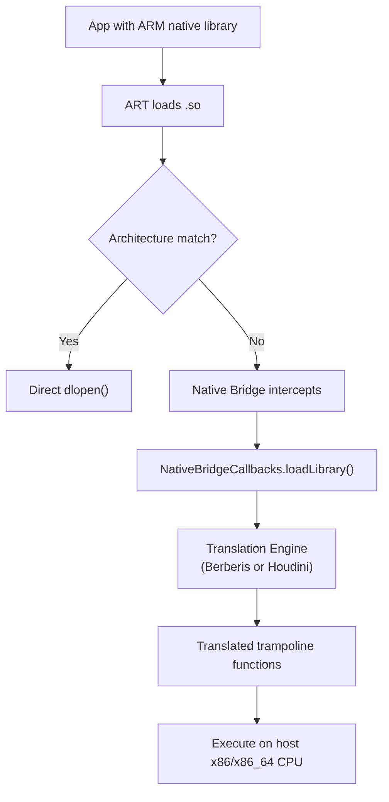

### 57.3.6 The Emulator Target

The default x86_64 generic device configuration targets the emulator:

```makefile
# device/generic/x86_64/BoardConfig.mk, line 9-15
TARGET_CPU_ABI := x86_64
TARGET_ARCH := x86_64
TARGET_ARCH_VARIANT := x86_64

TARGET_2ND_CPU_ABI := x86
TARGET_2ND_ARCH := x86
TARGET_2ND_ARCH_VARIANT := x86_64
```

The `goldmont-without-sha-xsaves` variant deserves special mention: it targets
Intel Goldmont (Apollo Lake) processors but disables SHA and XSAVES
instructions. This exists because some Chromebooks and embedded devices use
Goldmont-based processors that do not implement these optional extensions:

```go
"goldmont-without-sha-xsaves": []string{
    "-march=goldmont",
    "-mno-sha",
    "-mno-xsaves",
},
```

### 57.3.7 ARM 32-bit: The Legacy Secondary Architecture

ARM 32-bit support in AOSP exists primarily as the secondary architecture for
ARM64 devices, allowing legacy 32-bit apps to run. The ARM toolchain is the
most complex of all five architectures because it supports the widest range of
CPU variants (from ancient Cortex-A7 to modern Cortex-A76 in 32-bit mode) and
two instruction encodings (ARM and Thumb).

The ARM toolchain struct reflects its 32-bit nature:

```go
// build/soong/cc/config/arm_device.go (line 247-252)
type toolchainArm struct {
    toolchainBionic
    toolchain32Bit
    ldflags         string
    toolchainCflags string
}
```

The ARM factory function assembles three levels of flags:

```go
// build/soong/cc/config/arm_device.go (line 303-316)
func armToolchainFactory(arch android.Arch) Toolchain {
    toolchainCflags := make([]string, 2, 3)
    toolchainCflags[0] = "${config.ArmToolchainCflags}"
    toolchainCflags[1] = armArchVariantCflagsVar[arch.ArchVariant]
    toolchainCflags = append(toolchainCflags,
        variantOrDefault(armCpuVariantCflagsVar, arch.CpuVariant))
    return &toolchainArm{
        ldflags:         "${config.ArmLdflags}",
        toolchainCflags: strings.Join(toolchainCflags, " "),
    }
}
```

**Layer 1** -- `ArmToolchainCflags`: The `-msoft-float` flag, which is universal
for all ARM 32-bit Android targets.

**Layer 2** -- Arch variant: One of `armv7-a`, `armv7-a-neon`, `armv8-a`, or
`armv8-2a`, determining the baseline ISA and FPU configuration.

**Layer 3** -- CPU variant: The specific core tuning, selected from a map that
includes 18 different variants:

```go
// build/soong/cc/config/arm_device.go (line 225-244)
armCpuVariantCflagsVar = map[string]string{
    "":               "${config.ArmGenericCflags}",
    "cortex-a7":      "${config.ArmCortexA7Cflags}",
    "cortex-a8":      "${config.ArmCortexA8Cflags}",
    "cortex-a9":      "${config.ArmGenericCflags}",
    "cortex-a15":     "${config.ArmCortexA15Cflags}",
    "cortex-a32":     "${config.ArmCortexA32Cflags}",
    "cortex-a53":     "${config.ArmCortexA53Cflags}",
    "cortex-a53.a57": "${config.ArmCortexA53Cflags}",
    "cortex-a55":     "${config.ArmCortexA55Cflags}",
    "cortex-a72":     "${config.ArmCortexA53Cflags}",
    "cortex-a73":     "${config.ArmCortexA53Cflags}",
    "cortex-a75":     "${config.ArmCortexA55Cflags}",
    "cortex-a76":     "${config.ArmCortexA55Cflags}",
    "krait":          "${config.ArmKraitCflags}",
    "kryo":           "${config.ArmKryoCflags}",
    "kryo385":        "${config.ArmCortexA53Cflags}",
    "exynos-m1":      "${config.ArmCortexA53Cflags}",
    "exynos-m2":      "${config.ArmCortexA53Cflags}",
}
```

The Cortex-A8 erratum workaround is also specific to ARM 32-bit:

```go
// build/soong/cc/config/arm_device.go (line 45-47)
armFixCortexA8LdFlags   = []string{"-Wl,--fix-cortex-a8"}
armNoFixCortexA8LdFlags = []string{"-Wl,--no-fix-cortex-a8"}
```

The Cortex-A8 has a hardware bug that can cause incorrect execution in certain
branch-to-branch sequences. This is separate from the Cortex-A53 errata
handled in the ARM64 toolchain.

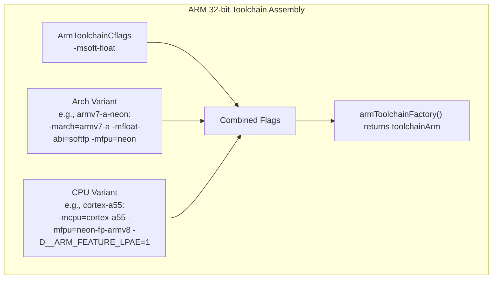

### 57.3.8 ARM 32-bit Linker Configuration

The ARM 32-bit linker has its own specific flags:

```go
// build/soong/cc/config/arm_device.go (line 39-43)
armLdflags = []string{
    "-Wl,-m,armelf",
    "-Wl,-mllvm", "-Wl,-enable-shrink-wrap=false",
}
```

The `-Wl,-m,armelf` flag tells the linker to use the ARM ELF format. The
`-enable-shrink-wrap=false` flags disable an LLVM optimization that was causing
incorrect code generation (tracked as bug b/322359235). The same workaround
appears in the compiler and linker flags, showing how hardware errata and
compiler bugs create a complex web of workarounds across the toolchain.

---

## 57.4 RISC-V 64

RISC-V is the newest architecture supported by AOSP, first added in 2022. It
is an open, royalty-free instruction set architecture that has generated
significant industry interest. The AOSP RISC-V port is still maturing, as
evidenced by the smaller configuration file and explicit workarounds for
incomplete toolchain support.

**Source file**: `build/soong/cc/config/riscv64_device.go` (133 lines)

### 57.4.1 Base ISA and Extensions

The RISC-V configuration specifies a rich set of extensions:

```go
// build/soong/cc/config/riscv64_device.go, line 25-36
riscv64Cflags = []string{
    "-Werror=implicit-function-declaration",
    // This is already the driver's Android default, but duplicated here (and
    // below) for ease of experimentation with additional extensions.
    "-march=rv64gcv_zba_zbb_zbs",
    // TODO: remove when qemu V works
    // (Note that we'll probably want to wait for berberis to be good enough
    // that most people don't care about qemu's V performance either!)
    "-mno-implicit-float",
}
```

The ISA string `-march=rv64gcv_zba_zbb_zbs` decodes as follows:

| Component | Meaning |
|---|---|
| `rv64` | 64-bit base integer ISA (RV64I) |
| `g` | "General" = `IMAFD` (Integer, Multiply, Atomic, Float, Double) |
| `c` | Compressed instructions (16-bit encodings for common ops) |
| `v` | Vector extension (RISC-V V 1.0) |
| `zba` | Address generation instructions (sh1add, sh2add, sh3add) |
| `zbb` | Basic bit manipulation (clz, ctz, cpop, rev8, etc.) |
| `zbs` | Single-bit instructions (bset, bclr, binv, bext) |

This is a notably modern baseline -- the Vector extension in particular enables
SIMD-like operations analogous to ARM's NEON or Intel's SSE, but with a
scalable design that does not hard-code the vector width.

### 57.4.2 QEMU and Berberis Workarounds

The RISC-V configuration contains a revealing TODO comment about the state of
the ecosystem:

```go
// TODO: remove when qemu V works (https://gitlab.com/qemu-project/qemu/-/issues/1976)
// (Note that we'll probably want to wait for berberis to be good enough
// that most people don't care about qemu's V performance either!)
"-mno-implicit-float",
```

This comment reveals the practical challenge of RISC-V development: QEMU's
Vector extension support is incomplete, and the Berberis binary translator
(which could translate RISC-V to x86_64 for development) is still maturing.
The `-mno-implicit-float` flag prevents the compiler from automatically using
floating-point or vector instructions for non-floating-point operations
(like structure copies), which works around QEMU V bugs.

### 57.4.3 Minimal Variant Configuration

Unlike ARM64 and x86, RISC-V has no CPU variant tuning:

```go
// build/soong/cc/config/riscv64_device.go, line 38-49
riscv64ArchVariantCflags = map[string][]string{}
riscv64CpuVariantCflags  = map[string][]string{}
```

The variant maps are empty, and the factory function only accepts the default
(empty string) variant:

```go
// build/soong/cc/config/riscv64_device.go, line 110-115
func riscv64ToolchainFactory(arch android.Arch) Toolchain {
    switch arch.ArchVariant {
    case "":
    default:
        panic(fmt.Sprintf("Unknown Riscv64 architecture version: %q", arch.ArchVariant))
    }
    // ...
}
```

This simplicity reflects the current state of the RISC-V Android ecosystem:
there is only one target configuration, and the hardware landscape has not yet
diversified to the point where micro-architecture-specific tuning is needed.

### 57.4.4 RISC-V Linker Configuration

The RISC-V linker flags are straightforward:

```go
// build/soong/cc/config/riscv64_device.go, line 40-45
riscv64Ldflags = []string{
    "-march=rv64gcv_zba_zbb_zbs",
    "-Wl,-z,max-page-size=4096",
}
```

Note the hardcoded 4KB page size, unlike ARM64 which uses a configurable
`MaxPageSizeSupported()`. RISC-V Android currently only supports 4KB pages.

### 57.4.5 Berberis Binary Translation

The `frameworks/libs/binary_translation/` directory contains Berberis, Google's
open-source binary translation framework. While primarily designed for
translating guest architectures to x86_64 host systems, Berberis is
strategically important for RISC-V development:

```
frameworks/libs/binary_translation/
    assembler/        - Code generation backend
    backend/          - Translation engine
    decoder/          - Guest instruction decoder
    guest_abi/        - ABI conversion layer
    guest_loader/     - Library loading and linking
    guest_state/      - CPU state abstraction
    interpreter/      - Interpreted execution fallback
    jni/              - JNI trampoline generation
    native_bridge/    - NativeBridge interface implementation
    android_api/      - Framework API proxies
    lite_translator/  - Lightweight translation path
    heavy_optimizer/  - Full optimization path
```

The Berberis `enable_riscv64_to_x86_64.mk` file in the top directory reveals
the primary translation direction: RISC-V 64 guest code running on an x86_64
host. This allows developers to work with RISC-V Android images on x86_64
workstations.

### 57.4.6 ART RISC-V Feature Detection

The ART runtime has full RISC-V support with its own ISA feature tracking. The
`Riscv64InstructionSetFeatures` class tracks extensions as a bitmap:

```cpp
// art/runtime/arch/riscv64/instruction_set_features_riscv64.h (line 31-39)
class Riscv64InstructionSetFeatures final : public InstructionSetFeatures {
 public:
  enum {
    kExtGeneric    = (1 << 0),  // G: IMAFD base set
    kExtCompressed = (1 << 1),  // C: compressed instructions
    kExtVector     = (1 << 2),  // V: vector instructions
    kExtZba        = (1 << 3),  // Zba: address generation
    kExtZbb        = (1 << 4),  // Zbb: basic bit-manipulation
    kExtZbs        = (1 << 5),  // Zbs: single-bit manipulation
  };
```

The feature methods allow ART's JIT compiler to query capabilities:

```cpp
// art/runtime/arch/riscv64/instruction_set_features_riscv64.h (line 71-79)
bool HasCompressed() const { return (bits_ & kExtCompressed) != 0; }
bool HasVector() const { return (bits_ & kExtVector) != 0; }
bool HasZba() const { return (bits_ & kExtZba) != 0; }
bool HasZbb() const { return (bits_ & kExtZbb) != 0; }
bool HasZbs() const { return (bits_ & kExtZbs) != 0; }
```

The `FromVariant()` implementation currently only recognizes the `"generic"`
variant and uses the full basic feature set:

```cpp
// art/runtime/arch/riscv64/instruction_set_features_riscv64.cc (line 30-46)
constexpr uint32_t BasicFeatures() {
  return Riscv64InstructionSetFeatures::kExtGeneric |
         Riscv64InstructionSetFeatures::kExtCompressed |
         Riscv64InstructionSetFeatures::kExtVector |
         Riscv64InstructionSetFeatures::kExtZba |
         Riscv64InstructionSetFeatures::kExtZbb |
         Riscv64InstructionSetFeatures::kExtZbs;
}

Riscv64FeaturesUniquePtr Riscv64InstructionSetFeatures::FromVariant(
    const std::string& variant, [[maybe_unused]] std::string* error_msg) {
  if (variant != "generic") {
    LOG(WARNING) << "Unexpected CPU variant for Riscv64 using defaults: " << variant;
  }
  return Riscv64FeaturesUniquePtr(
      new Riscv64InstructionSetFeatures(BasicFeatures()));
}
```

Feature detection from C preprocessor defines is also implemented, allowing
the build system to detect extensions at compile time:

```cpp
// art/runtime/arch/riscv64/instruction_set_features_riscv64.cc (line 52-71)
Riscv64FeaturesUniquePtr Riscv64InstructionSetFeatures::FromCppDefines() {
  uint32_t bits = kExtGeneric;
#ifdef __riscv_c
  bits |= kExtCompressed;
#endif
#ifdef __riscv_v
  bits |= kExtVector;
#endif
#ifdef __riscv_zba
  bits |= kExtZba;
#endif
#ifdef __riscv_zbb
  bits |= kExtZbb;
#endif
#ifdef __riscv_zbs
  bits |= kExtZbs;
#endif
  return FromBitmap(bits);
}
```

Note that the `FromCpuInfo()` and `FromHwcap()` methods are not yet implemented
for RISC-V:

```cpp
// art/runtime/arch/riscv64/instruction_set_features_riscv64.cc (line 73-80)
Riscv64FeaturesUniquePtr Riscv64InstructionSetFeatures::FromCpuInfo() {
  UNIMPLEMENTED(WARNING);
  return FromCppDefines();
}

Riscv64FeaturesUniquePtr Riscv64InstructionSetFeatures::FromHwcap() {
  UNIMPLEMENTED(WARNING);
  return FromCppDefines();
}
```

The `UNIMPLEMENTED(WARNING)` calls indicate that runtime hardware detection is
not yet complete for RISC-V, which is another marker of the architecture's
early-adoption status in AOSP.

### 57.4.7 Comparing RISC-V and ARM64 Feature Tracking

The contrast between RISC-V and ARM64 feature tracking in ART reveals the
maturity gap:

| Aspect | ARM64 | RISC-V 64 |
|---|---|---|
| CPU variants | 15+ recognized | Only "generic" |
| Feature flags | 7 (CRC, LSE, FP16, DotProd, SVE, errata) | 6 (G, C, V, Zba, Zbb, Zbs) |
| FromHwcap() | Fully implemented | UNIMPLEMENTED |
| FromCpuInfo() | Fully implemented | UNIMPLEMENTED |
| Errata tracking | A53 835769, A53 843419 | None |
| Runtime validation | Yes (Pixel 3a workaround) | No |
| SVE support | Defined but disabled (`kArm64AllowSVE = false`) | N/A |

The ARM64 feature header explicitly disables SVE:

```cpp
// art/runtime/arch/arm64/instruction_set_features_arm64.h (line 25-26)
// SVE is currently not enabled.
static constexpr bool kArm64AllowSVE = false;
```

This means that even though the Soong toolchain supports ARMv9 variants
(which include SVE2), ART's JIT compiler does not yet generate SVE
instructions. This is a pragmatic choice -- SVE support requires significant
changes to the register allocator and instruction selector.

### 57.4.8 ART ARM64 Feature Bitmap

ART stores ARM64 features as a compact bitmap for serialization:

```cpp
// art/runtime/arch/arm64/instruction_set_features_arm64.h (line 142-150)
enum {
    kA53Bitfield     = 1 << 0,
    kCRCBitField     = 1 << 1,
    kLSEBitField     = 1 << 2,
    kFP16BitField    = 1 << 3,
    kDotProdBitField = 1 << 4,
    kSVEBitField     = 1 << 5,
};
```

And the private member variables track each feature:

```cpp
// art/runtime/arch/arm64/instruction_set_features_arm64.h (line 152-158)
const bool fix_cortex_a53_835769_;
const bool fix_cortex_a53_843419_;
const bool has_crc_;      // optional in ARMv8.0, mandatory in ARMv8.1
const bool has_lse_;      // ARMv8.1 Large System Extensions
const bool has_fp16_;     // ARMv8.2 FP16 extensions
const bool has_dotprod_;  // optional in ARMv8.2, mandatory in ARMv8.4
const bool has_sve_;      // optional in ARMv8.2
```

The JIT compiler uses these feature flags to select instruction patterns.
For example, when `has_lse_` is true, atomic operations use the single-instruction
`LDADD`, `SWPAL`, etc., instead of the multi-instruction LL/SC loop
(`LDAXR` / `STLXR`). This can be 2-3x faster in high-contention scenarios.

### 57.4.9 RISC-V Device Configuration

The ART test device for RISC-V reveals the early-adoption nature of the port:

```makefile
# device/generic/art/riscv64/BoardConfig.mk
include device/generic/art/BoardConfigCommon.mk

TARGET_ARCH := riscv64
TARGET_CPU_ABI := riscv64
TARGET_CPU_VARIANT := generic
TARGET_ARCH_VARIANT :=

TARGET_SUPPORTS_64_BIT_APPS := true

# Temporary hack while prebuilt modules are missing riscv64.
ALLOW_MISSING_DEPENDENCIES := true
```

The `ALLOW_MISSING_DEPENDENCIES := true` line is significant -- it allows the
build to proceed even when some prebuilt modules do not have RISC-V binaries
yet. This is a temporary measure while the RISC-V ecosystem catches up.

---

## 57.5 Multi-Architecture Builds

Modern Android devices typically support multiple architectures simultaneously.
A 64-bit ARM device also runs 32-bit ARM code. An x86_64 device also runs
x86 code. AOSP's build system handles this through the "multilib" mechanism,
which builds the same module for multiple architectures.

### 57.5.1 Primary and Secondary Architectures

Device configurations declare a primary architecture and an optional secondary
architecture using `TARGET_ARCH` and `TARGET_2ND_ARCH`:

```makefile
# device/generic/arm64/BoardConfig.mk, line 10-19
TARGET_ARCH := arm64
TARGET_ARCH_VARIANT := armv8-a
TARGET_CPU_VARIANT := generic
TARGET_CPU_ABI := arm64-v8a

TARGET_2ND_ARCH := arm
TARGET_2ND_ARCH_VARIANT := armv7-a-neon
TARGET_2ND_CPU_VARIANT := cortex-a15
TARGET_2ND_CPU_ABI := armeabi-v7a
TARGET_2ND_CPU_ABI2 := armeabi
```

Similarly, for x86_64:

```makefile
# device/generic/x86_64/BoardConfig.mk, line 9-15
TARGET_CPU_ABI := x86_64
TARGET_ARCH := x86_64
TARGET_ARCH_VARIANT := x86_64

TARGET_2ND_CPU_ABI := x86
TARGET_2ND_ARCH := x86
TARGET_2ND_ARCH_VARIANT := x86_64
```

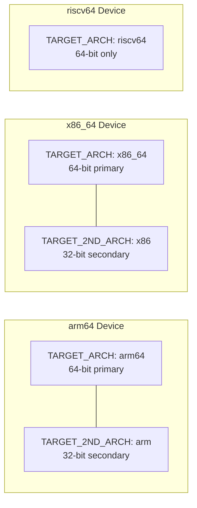

RISC-V currently has no secondary architecture -- it is 64-bit only. There is
no 32-bit RISC-V Android port.

### 57.5.2 Zygote Configuration

The multilib choice directly affects how Zygote processes are started. AOSP
includes several Zygote initialization scripts:

```makefile
# build/make/target/product/core_64_bit.mk, line 26-34
PRODUCT_PACKAGES += init.zygote64.rc init.zygote64_32.rc

# Set the zygote property to select the 64-bit primary, 32-bit secondary script
ifeq ($(ZYGOTE_FORCE_64),true)
PRODUCT_VENDOR_PROPERTIES += ro.zygote=zygote64
else
PRODUCT_VENDOR_PROPERTIES += ro.zygote=zygote64_32
endif

TARGET_SUPPORTS_32_BIT_APPS := true
TARGET_SUPPORTS_64_BIT_APPS := true
```

For 64-bit-only devices:

```makefile
# build/make/target/product/core_64_bit_only.mk, line 23-33
PRODUCT_PACKAGES += init.zygote64.rc

PRODUCT_VENDOR_PROPERTIES += ro.zygote=zygote64
PRODUCT_VENDOR_PROPERTIES += dalvik.vm.dex2oat64.enabled=true

TARGET_SUPPORTS_32_BIT_APPS := false
TARGET_SUPPORTS_64_BIT_APPS := true
TARGET_SUPPORTS_OMX_SERVICE := false
```

### 57.5.3 The compile_multilib Property

In `Android.bp` files, modules use the `compile_multilib` property to control
which architectures they are built for:

```
cc_library {
    name: "libexample",
    compile_multilib: "both",  // Build for both 32 and 64 bit
    srcs: ["example.cpp"],
}
```

The valid values are decoded by `decodeMultilibTargets()` in
`build/soong/android/arch.go`:

```go
// build/soong/android/arch.go, line 1939-1981
func decodeMultilibTargets(multilib string, targets []Target, prefer32 bool) ([]Target, error) {
    var buildTargets []Target
    switch multilib {
    case "common":
        buildTargets = getCommonTargets(targets)
    case "both":
        if prefer32 {
            buildTargets = append(buildTargets, filterMultilibTargets(targets, "lib32")...)
            buildTargets = append(buildTargets, filterMultilibTargets(targets, "lib64")...)
        } else {
            buildTargets = append(buildTargets, filterMultilibTargets(targets, "lib64")...)
            buildTargets = append(buildTargets, filterMultilibTargets(targets, "lib32")...)
        }
    case "32":
        buildTargets = filterMultilibTargets(targets, "lib32")
    case "64":
        buildTargets = filterMultilibTargets(targets, "lib64")
    case "first":
        if prefer32 {
            buildTargets = FirstTarget(targets, "lib32", "lib64")
        } else {
            buildTargets = FirstTarget(targets, "lib64", "lib32")
        }
    case "first_prefer32":
        buildTargets = FirstTarget(targets, "lib32", "lib64")
    case "prefer32":
        buildTargets = filterMultilibTargets(targets, "lib32")
        if len(buildTargets) == 0 {
            buildTargets = filterMultilibTargets(targets, "lib64")
        }
    // ...
    }
    return buildTargets, nil
}
```

| Value | Meaning |
|---|---|
| `"both"` | Build for both 32-bit and 64-bit |
| `"first"` | Build only for the primary architecture |
| `"32"` | Build only for 32-bit |
| `"64"` | Build only for 64-bit |
| `"prefer32"` | Build for 32-bit if available, else 64-bit |
| `"first_prefer32"` | Like `first` but prefers 32-bit |
| `"common"` | Architecture-independent (e.g., Java) |

### 57.5.4 Architecture-Specific Sources in Android.bp

The `arch:` block in `Android.bp` files allows modules to include
architecture-specific source files, compiler flags, or dependencies:

```
cc_library {
    name: "libexample",
    srcs: ["common.cpp"],
    arch: {
        arm: {
            srcs: ["arm_optimized.S"],
            cflags: ["-DHAS_NEON"],
        },
        arm64: {
            srcs: ["arm64_optimized.S"],
        },
        x86: {
            srcs: ["x86_optimized.S"],
            cflags: ["-DHAS_SSE"],
        },
        x86_64: {
            srcs: ["x86_64_optimized.S"],
        },
        riscv64: {
            srcs: ["riscv64_optimized.S"],
        },
    },
}
```

A real example from bionic shows this pattern at scale:

```
// bionic/libc/Android.bp (around line 980)
arch: {
    arm: {
        srcs: [
            "arch-arm/bionic/__aeabi_read_tp.S",
            "arch-arm/bionic/__bionic_clone.S",
            "arch-arm/bionic/__restore.S",
            "arch-arm/bionic/_exit_with_stack_teardown.S",
            "arch-arm/bionic/atomics_arm.c",
            "arch-arm/bionic/setjmp.S",
            "arch-arm/bionic/syscall.S",
            "arch-arm/bionic/vfork.S",

            "arch-arm/cortex-a7/string/memcpy.S",
            "arch-arm/cortex-a7/string/memset.S",
            "arch-arm/cortex-a9/string/memcpy.S",
            "arch-arm/cortex-a15/string/memcpy.S",
            // ... many more CPU-specific string routines
        ],
    },
    arm64: {
        srcs: [
            "arch-arm64/bionic/__bionic_clone.S",
            "arch-arm64/bionic/_exit_with_stack_teardown.S",
            "arch-arm64/bionic/setjmp.S",
            "arch-arm64/bionic/syscall.S",
            "arch-arm64/bionic/vfork.S",
            "arch-arm64/oryon/memcpy-nt.S",
            "arch-arm64/oryon/memset-nt.S",
        ],
    },
    riscv64: {
        srcs: [
            "arch-riscv64/bionic/__bionic_clone.S",
            "arch-riscv64/bionic/_exit_with_stack_teardown.S",
            "arch-riscv64/bionic/setjmp.S",
            "arch-riscv64/bionic/syscall.S",
            "arch-riscv64/bionic/vfork.S",
            "arch-riscv64/string/memchr.S",
            "arch-riscv64/string/memcmp.S",
            "arch-riscv64/string/memcpy.S",
            // ... more RISC-V string routines
        ],
    },
},
```

### 57.5.5 Output Directory Structure

The multilib mechanism produces output in separate directories. The 32-bit
secondary architecture outputs go to `obj_<arch>`:

```
out/target/product/generic_arm64/
    obj/              # 64-bit (primary) object files
    obj_arm/          # 32-bit (secondary) object files
    system/
        lib64/        # 64-bit shared libraries
        lib/          # 32-bit shared libraries
```

This is configured in `build/make/core/envsetup.mk`:

```makefile
# build/make/core/envsetup.mk, line 582-586
$(TARGET_2ND_ARCH_VAR_PREFIX)TARGET_OUT_INTERMEDIATES := \
    $(PRODUCT_OUT)/obj_$(TARGET_2ND_ARCH)
$(TARGET_2ND_ARCH_VAR_PREFIX)TARGET_OUT_SHARED_LIBRARIES := \
    $(target_out_shared_libraries_base)/lib
```

---

## 57.6 Compiler Configuration

The compiler configuration in AOSP is centralized in
`build/soong/cc/config/global.go` (633 lines) and applies to all architectures.
This file defines the common compilation flags, warning policies, debug
settings, and Clang toolchain paths that form the baseline for every native
build.

### 57.6.1 Common Global CFLAGS

The `commonGlobalCflags` array defines flags applied to every C/C++ compilation
in AOSP:

```go
// build/soong/cc/config/global.go, line 32-160
commonGlobalCflags = []string{
    "-O2",
    "-Wall",
    "-Wextra",
    "-Wpointer-arith",
    "-Wunguarded-availability",

    // Warnings treated as errors
    "-Werror=bool-operation",
    "-Werror=date-time",          // Nondeterministic builds
    "-Werror=int-conversion",
    "-Werror=multichar",
    "-Werror=pragma-pack",
    "-Werror=sizeof-array-div",
    "-Werror=sizeof-pointer-memaccess",
    "-Werror=string-plus-int",
    "-Werror=unreachable-code-loop-increment",
    // ...

    // Preprocessor defines
    "-DANDROID",
    "-DNDEBUG",
    "-UDEBUG",
    "-D__compiler_offsetof=__builtin_offsetof",
    "-D__ANDROID_UNAVAILABLE_SYMBOLS_ARE_WEAK__",

    // Code generation options
    "-faddrsig",
    "-fdebug-default-version=5",
    "-fcolor-diagnostics",
    "-ffp-contract=off",
    "-fno-exceptions",
    "-fno-strict-aliasing",
    "-fmessage-length=0",
    "-gsimple-template-names",
    "-gz=zstd",
    "-no-canonical-prefixes",
}
```

Several of these deserve explanation:

**`-O2`**: The default optimization level for all Android code. Not `-O3`,
because `-O3` enables aggressive optimizations (like loop unrolling and function
inlining) that can increase code size, which matters on mobile devices where
instruction cache pressure affects battery life.

**`-DANDROID`**: Defines the `ANDROID` preprocessor macro, which is checked by
thousands of `#ifdef ANDROID` blocks throughout AOSP and third-party code.

**`-DNDEBUG`**: Disables `assert()` in release builds. This is defined globally
because even debug builds of the platform generally do not want assert failures
in production code.

**`-fno-exceptions`**: Disables C++ exceptions globally. The Google C++ style
guide forbids exceptions, and bionic's C++ support library (libc++) is built
without exception support on Android.

**`-fno-strict-aliasing`**: Disables type-based alias analysis optimizations.
While this could improve performance, the comment explains the trade-off:
"The performance benefit of enabling them currently does not outweigh the risk
of hard-to-reproduce bugs."

**`-gz=zstd`**: Compresses debug information with Zstandard, significantly
reducing build output size without losing debug capability.

### 57.6.2 Device-Specific CFLAGS

Flags that apply only to device (not host) code:

```go
// build/soong/cc/config/global.go, line 172-193
deviceGlobalCflags = []string{
    "-ffunction-sections",
    "-fdata-sections",
    "-fno-short-enums",
    "-funwind-tables",
    "-fstack-protector-strong",
    "-Wa,--noexecstack",
    "-D_FORTIFY_SOURCE=3",

    "-Werror=non-virtual-dtor",
    "-Werror=address",
    "-Werror=sequence-point",
    "-Werror=format-security",
}
```

**`-ffunction-sections` / `-fdata-sections`**: Each function and data object
gets its own ELF section, enabling the linker to discard unused functions and
data via `--gc-sections`. This is critical for reducing binary size on mobile.

**`-fstack-protector-strong`**: Inserts stack canaries in functions that have
local arrays or take the address of a local variable. The "strong" variant
protects more functions than `-fstack-protector` but fewer than
`-fstack-protector-all`, balancing security with performance.

**`-D_FORTIFY_SOURCE=3`**: The highest level of compile-time and runtime
buffer overflow detection. Level 3 extends beyond the basic `memcpy` /
`strcpy` checks of level 2 to cover more functions and usage patterns.

### 57.6.3 Device Linker Flags

```go
// build/soong/cc/config/global.go, line 206-220
deviceGlobalLdflags = slices.Concat([]string{
    "-Wl,-z,noexecstack",
    "-Wl,-z,relro",
    "-Wl,-z,now",
    "-Wl,--build-id=md5",
    "-Wl,--fatal-warnings",
    "-Wl,--no-undefined-version",
    "-Wl,--exclude-libs,libgcc.a",
    "-Wl,--exclude-libs,libgcc_stripped.a",
    "-Wl,--exclude-libs,libunwind_llvm.a",
    "-Wl,--exclude-libs,libunwind.a",
    "-Wl,--compress-debug-sections=zstd",
}, commonGlobalLdflags)
```

The security-relevant flags:

- **`-Wl,-z,noexecstack`**: Marks the stack as non-executable (NX bit).
- **`-Wl,-z,relro`**: Read-only relocations -- makes GOT entries read-only
  after relocation.

- **`-Wl,-z,now`**: Immediate binding -- resolves all symbols at load time
  rather than lazily, eliminating the window where GOT entries are writable.

Together, these flags form a defense-in-depth strategy against exploitation.

The common linker flags shared between device and host:

```go
// build/soong/cc/config/global.go, line 195-199
commonGlobalLdflags = []string{
    "-fuse-ld=lld",
    "-Wl,--icf=safe",
    "-Wl,--no-demangle",
}
```

**`-fuse-ld=lld`**: Use LLVM's LLD linker instead of GNU ld. LLD is
significantly faster and is the only linker supported by AOSP.

**`-Wl,--icf=safe`**: Identical Code Folding -- merges functions with identical
machine code to save space. The "safe" mode only folds functions whose address
is never taken, avoiding subtle bugs.

### 57.6.4 Non-Overridable Flags

Some warnings are so important that modules cannot disable them even if they use
`-Wno-error` or similar flags in their `Android.bp`:

```go
// build/soong/cc/config/global.go, line 255-326
noOverrideGlobalCflags = []string{
    "-Werror=address-of-temporary",
    "-Werror=dangling",
    "-Werror=format-insufficient-args",
    "-Werror=fortify-source",
    "-Werror=incompatible-function-pointer-types",
    "-Werror=int-in-bool-context",
    "-Werror=int-to-pointer-cast",
    "-Werror=null-dereference",
    "-Werror=return-type",
    "-Werror=xor-used-as-pow",
    // ... plus many temporary compiler upgrade workarounds
}
```

These are appended *after* the module's own cflags, so they cannot be
overridden. The flags target critical safety issues: null dereference, dangling
pointers, format string bugs, and buffer overflows.

### 57.6.5 The Flag Layering Model

The complete set of flags applied to a compilation command is assembled in
layers:

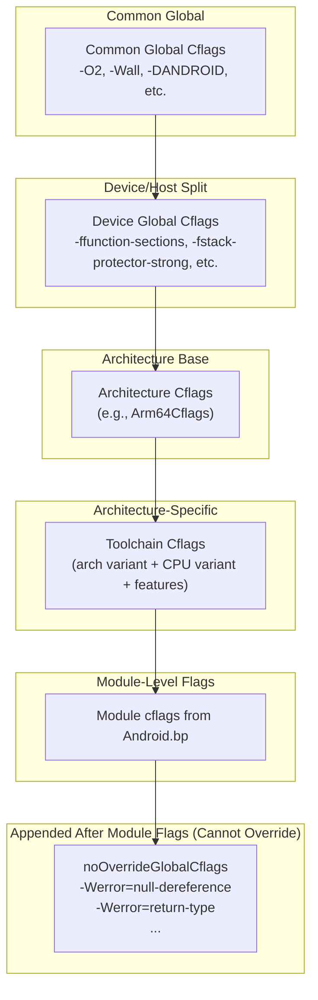

### 57.6.6 Clang Toolchain Version

Global.go also manages the Clang compiler version:

```go
// build/soong/cc/config/global.go, line 410-422
CStdVersion               = "gnu23"
CppStdVersion             = "gnu++20"
ExperimentalCStdVersion   = "gnu2y"
ExperimentalCppStdVersion = "gnu++2b"

ClangDefaultBase         = "prebuilts/clang/host"
ClangDefaultVersion      = "clang-r563880c"
ClangDefaultShortVersion = "21"
```

AOSP uses C23 (`gnu23`) for C code and C++20 (`gnu++20`) for C++ code.
The `gnu` prefix means GNU extensions are enabled. The specific Clang version
`clang-r563880c` (Clang 21) is pinned in the source and can be overridden
via environment variables.

### 57.6.7 Auto Variable Initialization

A notable security feature is automatic variable initialization:

```go
// build/soong/cc/config/global.go, line 454-463
if ctx.Config().IsEnvTrue("AUTO_ZERO_INITIALIZE") {
    flags = append(flags, "-ftrivial-auto-var-init=zero")
} else if ctx.Config().IsEnvTrue("AUTO_PATTERN_INITIALIZE") {
    flags = append(flags, "-ftrivial-auto-var-init=pattern")
} else if ctx.Config().IsEnvTrue("AUTO_UNINITIALIZE") {
    flags = append(flags, "-ftrivial-auto-var-init=uninitialized")
} else {
    // Default to zero initialization.
    flags = append(flags, "-ftrivial-auto-var-init=zero")
}
```

By default, all stack variables are zero-initialized. This eliminates an
entire class of uninitialized-variable bugs at a small runtime cost. The
comment references bug b/131390872, which tracked the rollout of this feature.

### 57.6.8 Sanitizer Runtime Libraries

The `toolchain.go` file defines helper functions for all the sanitizer runtime
libraries:

```go
// build/soong/cc/config/toolchain.go, line 219-265
func AddressSanitizerRuntimeLibrary() string {
    return LibclangRuntimeLibrary("asan")
}
func HWAddressSanitizerRuntimeLibrary() string {
    return LibclangRuntimeLibrary("hwasan")
}
func UndefinedBehaviorSanitizerRuntimeLibrary() string {
    return LibclangRuntimeLibrary("ubsan_standalone")
}
func ThreadSanitizerRuntimeLibrary() string {
    return LibclangRuntimeLibrary("tsan")
}
func ScudoRuntimeLibrary() string {
    return LibclangRuntimeLibrary("scudo")
}
func LibFuzzerRuntimeLibrary() string {
    return LibclangRuntimeLibrary("fuzzer")
}
```

These functions return library names like `libclang_rt.asan`, which are then
resolved to architecture-specific binaries using the
`LibclangRuntimeLibraryArch()` method from each toolchain (e.g., `"aarch64"` for
ARM64, `"i686"` for x86).

### 57.6.9 External Code Flags

Third-party code (anything under `external/`, most of `vendor/`, and most of
`hardware/`) gets relaxed warning treatment:

```go
// build/soong/cc/config/global.go (line 339-364)
extraExternalCflags = []string{
    "-Wno-enum-compare",
    "-Wno-enum-compare-switch",
    "-Wno-null-pointer-arithmetic",
    "-Wno-psabi",
    "-Wno-null-pointer-subtraction",
    "-Wno-string-concatenation",
    "-Wno-deprecated-non-prototype",
    "-Wno-unused",
    "-Wno-unused-but-set-variable",
    "-Wno-deprecated",
    "-Wno-tautological-constant-compare",
    "-Wno-error=range-loop-construct",
}
```

And the non-overridable flags for external code are even more permissive:

```go
// build/soong/cc/config/global.go (line 370-393)
noOverrideExternalGlobalCflags = []string{
    "-fcommon",
    "-Wno-format-insufficient-args",
    "-Wno-misleading-indentation",
    "-Wno-unused",
    "-Wno-unused-parameter",
    "-Wno-unused-but-set-parameter",
    "-Wno-unused-variable",
    "-Wno-unqualified-std-cast-call",
    "-Wno-array-parameter",
    "-Wno-gnu-offsetof-extensions",
    "-Wno-pessimizing-move",
    "-Wno-pointer-to-int-cast",
}
```

The `-fcommon` flag (marked with bug b/151457797) is particularly notable.
Modern C compilers default to `-fno-common`, which makes tentative definitions
of global variables into strong symbols. Many legacy C libraries rely on the
old behavior where tentative definitions are "common" symbols that can be
merged across translation units. Without `-fcommon`, these libraries fail to
link.

### 57.6.10 Illegal Flags

AOSP bans certain compiler flags entirely:

```go
// build/soong/cc/config/global.go (line 401-408)
IllegalFlags = []string{
    "-w",
    "-pedantic",
    "-pedantic-errors",
    "-Werror=pedantic",
    "-Wno-all",
    "-Wno-everything",
}
```

The `-w` flag suppresses all warnings, which would undermine the entire
warning infrastructure. `-Wno-all` and `-Wno-everything` have the same
effect. `-pedantic` flags are banned because they trigger thousands of
warnings from legitimate GNU extension usage throughout AOSP.

### 57.6.11 Language Standard Versions

AOSP specifies modern language standards:

```go
// build/soong/cc/config/global.go (line 410-413)
CStdVersion               = "gnu23"
CppStdVersion             = "gnu++20"
ExperimentalCStdVersion   = "gnu2y"
ExperimentalCppStdVersion = "gnu++2b"
```

- **C23** (`gnu23`): The latest C standard (ISO/IEC 9899:2024), with GNU
  extensions. This enables features like `typeof`, `auto`, `constexpr`, and
  improved `_Static_assert`.

- **C++20** (`gnu++20`): Enables concepts, ranges, coroutines, modules,
  three-way comparison, and many other major C++ features.

- The "experimental" versions (`gnu2y`, `gnu++2b`) target the next standard
  revision and are used for modules that opt into bleeding-edge features.

### 57.6.12 Clang Unknown Flags Filter

The `clang.go` file maintains a list of GCC flags that Clang does not
understand, which must be filtered out when processing legacy build files:

```go
// build/soong/cc/config/clang.go, line 25-74
var ClangUnknownCflags = sorted([]string{
    "-finline-functions",
    "-finline-limit=64",
    "-fno-canonical-system-headers",
    // ...
    // arm + arm64
    "-fgcse-after-reload",
    "-frerun-cse-after-loop",
    "-frename-registers",
    // arm
    "-mthumb-interwork",
    "-fno-caller-saves",
    // x86 + x86_64
    "-finline-limit=300",
    "-mfpmath=sse",
    "-mbionic",
    // windows
    "--enable-stdcall-fixup",
})
```

This list is a historical artifact -- AOSP used to support GCC compilation, and
many third-party projects still reference GCC-specific flags. The filter
silently removes these rather than causing build failures.

---

## 57.7 Generic Device Configurations

AOSP provides generic device configurations under `device/generic/` for
reference, testing, and emulator use. These configurations define the minimum
viable settings for each supported architecture.

### 57.7.1 Directory Structure

```
device/generic/
    arm64/            - 64-bit ARM reference device
    armv7-a-neon/     - 32-bit ARM with NEON
    x86/              - 32-bit x86
    x86_64/           - 64-bit x86
    art/              - ART runtime test devices
        armv8/        - ARM64 for ART testing
        riscv64/      - RISC-V for ART testing
        silvermont/   - x86 Silvermont for ART testing
        arm_krait/    - ARM Krait for ART testing
        arm_v7_v8/    - ARM v7/v8 for ART testing
        armv8_cortex_a55/  - ARM64 Cortex-A55 tuned
        armv8_kryo385/     - ARM64 Kryo 385 tuned
    car/              - Android Automotive targets
    trusty/           - Trusted Execution Environment
    common/           - Shared resources
    goldfish/         - Legacy emulator
```

### 57.7.2 ARM64 Generic Device

The ARM64 generic device is the most common reference target:

```makefile
# device/generic/arm64/BoardConfig.mk
TARGET_ARCH := arm64
TARGET_ARCH_VARIANT := armv8-a
TARGET_CPU_VARIANT := generic
TARGET_CPU_ABI := arm64-v8a

TARGET_2ND_ARCH := arm
TARGET_2ND_ARCH_VARIANT := armv7-a-neon
TARGET_2ND_CPU_VARIANT := cortex-a15
TARGET_2ND_CPU_ABI := armeabi-v7a
TARGET_2ND_CPU_ABI2 := armeabi
```

This configuration establishes a dual-architecture device:

- **Primary**: ARM64 with the baseline ARMv8-A ISA
- **Secondary**: 32-bit ARM with NEON, tuned for Cortex-A15

The product configuration inherits the 64-bit core and the common mini
configuration:

```makefile
# device/generic/arm64/mini_arm64.mk
$(call inherit-product, $(SRC_TARGET_DIR)/product/core_64_bit.mk)
$(call inherit-product, device/generic/armv7-a-neon/mini_common.mk)

PRODUCT_NAME := mini_arm64
PRODUCT_DEVICE := arm64
```

### 57.7.3 ARM 32-bit Generic Device

The 32-bit ARM device targets the ARMv7-A architecture with NEON:

```makefile
# device/generic/armv7-a-neon/BoardConfig.mk
TARGET_ARCH := arm
TARGET_ARCH_VARIANT := armv7-a-neon
TARGET_CPU_VARIANT := generic
TARGET_CPU_ABI := armeabi-v7a
TARGET_CPU_ABI2 := armeabi
```

This has no secondary architecture -- it is pure 32-bit. The `armeabi`
secondary ABI provides compatibility with ancient pre-NEON ARM code (ARMv5TE).

### 57.7.4 x86_64 Generic Device

```makefile
# device/generic/x86_64/BoardConfig.mk
TARGET_CPU_ABI := x86_64
TARGET_ARCH := x86_64
TARGET_ARCH_VARIANT := x86_64

TARGET_2ND_CPU_ABI := x86
TARGET_2ND_ARCH := x86
TARGET_2ND_ARCH_VARIANT := x86_64
```

### 57.7.5 ART Test Devices

The `device/generic/art/` directory contains specialized configurations for
testing the ART runtime on different CPU variants. These are not real devices
but rather build targets that exercise specific ISA features:

```makefile
# device/generic/art/BoardConfigCommon.mk
TARGET_NO_BOOTLOADER := true
TARGET_NO_KERNEL := true
TARGET_CPU_SMP := true
$(call soong_config_set,art_module,source_build,true)
```

```makefile
# device/generic/art/armv8/BoardConfig.mk
TARGET_ARCH := arm64
TARGET_CPU_ABI := arm64-v8a
TARGET_CPU_VARIANT := generic
TARGET_ARCH_VARIANT := armv8-a
TARGET_SUPPORTS_64_BIT_APPS := true
```

The ART test configurations also include vendor-specific variants:

| Directory | Configuration | Purpose |
|---|---|---|
| `armv8/` | Generic ARMv8-A | Baseline ARM64 testing |
| `armv8_cortex_a55/` | Cortex-A55 | LITTLE core testing |
| `armv8_kryo385/` | Kryo 385 | Qualcomm core testing |
| `arm_krait/` | Krait | Qualcomm 32-bit testing |
| `arm_v7_v8/` | ARMv7/v8 | Cross-version testing |
| `riscv64/` | RISC-V 64 | RISC-V ART testing |
| `silvermont/` | Silvermont | Intel Atom testing |

### 57.7.6 Android Automotive (Car)

The `device/generic/car/` directory demonstrates multi-architecture automotive
targets:

```
device/generic/car/
    emulator_car64_arm64/     - ARM64 automotive emulator
    emulator_car64_x86_64/    - x86_64 automotive emulator
    car_x86_64/               - x86_64 automotive device
    sdk_car_arm64.mk          - ARM64 SDK
    sdk_car_x86_64.mk         - x86_64 SDK
    sdk_car_md_arm64.mk       - Multi-display ARM64
    sdk_car_md_x86_64.mk      - Multi-display x86_64
    gsi_car_arm64.mk          - ARM64 GSI (Generic System Image)
    gsi_car_x86_64.mk         - x86_64 GSI
```

### 57.7.7 Trusty TEE

The Trusty Trusted Execution Environment provides a secure world that runs
alongside Android:

```makefile
# device/generic/trusty/qemu_trusty_arm64.mk
# (Trusty configuration for ARM64 QEMU)
```

Trusty runs as a separate OS in ARM TrustZone (or equivalent secure monitor
mode), and its build system must produce code for the secure world that is
compatible with the normal world's architecture.

### 57.7.8 The AOSP Product Build

The full AOSP product combines a generic device with system, vendor, and
product image configurations:

```makefile
# build/make/target/product/aosp_arm64.mk
$(call inherit-product, $(SRC_TARGET_DIR)/product/core_64_bit.mk)
$(call inherit-product, $(SRC_TARGET_DIR)/product/generic_system.mk)

PRODUCT_NAME := aosp_arm64
PRODUCT_DEVICE := generic_arm64
PRODUCT_BRAND := Android
PRODUCT_MODEL := AOSP on ARM64

PRODUCT_NO_BIONIC_PAGE_SIZE_MACRO := true
```

The `PRODUCT_NO_BIONIC_PAGE_SIZE_MACRO := true` flag is a recent addition that
prevents bionic from exposing a fixed `PAGE_SIZE` macro, allowing the system to
support 16KB pages on ARM64 (a kernel configuration option that improves TLB
performance).

---

## 57.8 Architecture-Specific Code Patterns

Across AOSP, several major components contain hand-tuned assembly code for each
supported architecture. This section examines the patterns used in bionic, ART,
and other performance-critical subsystems.

### 57.8.1 Bionic: Architecture Directories

Bionic organizes architecture-specific code in `arch-<arch>/` subdirectories:

```
bionic/libc/
    arch-arm/
        bionic/       - Low-level ARM32 routines (clone, setjmp, syscall)
        cortex-a7/    - Cortex-A7 tuned string functions
        cortex-a9/    - Cortex-A9 tuned string functions
        cortex-a15/   - Cortex-A15 tuned string functions
        cortex-a53/   - Cortex-A53 tuned string functions
        cortex-a55/   - Cortex-A55 tuned string functions
        generic/      - Generic ARM string functions
        krait/        - Qualcomm Krait tuned string functions
        kryo/         - Qualcomm Kryo tuned string functions
    arch-arm64/
        bionic/       - Low-level ARM64 routines
        string/       - ARM64 string function stubs
        oryon/        - Qualcomm Oryon tuned routines
    arch-x86/
        bionic/       - Low-level x86 routines
        string/       - x86 string functions
    arch-x86_64/
        bionic/       - Low-level x86_64 routines
        string/       - x86_64 string functions
    arch-riscv64/
        bionic/       - Low-level RISC-V routines
        string/       - RISC-V string functions (SiFive contributed)
```

### 57.8.2 Bionic: The ifunc Dispatch Pattern (ARM64)

ARM64 bionic uses the GNU indirect function (ifunc) mechanism to select the
best implementation of common functions at runtime. The ifunc resolver runs
during dynamic linking and chooses an implementation based on hardware
capabilities:

```cpp
// bionic/libc/arch-arm64/ifuncs.cpp (line 41-49)
static inline bool __bionic_is_oryon(unsigned long hwcap) {
  if (!(hwcap & HWCAP_CPUID)) return false;

  unsigned long midr;
  __asm__ __volatile__("mrs %0, MIDR_EL1" : "=r"(midr));

  // Check for implementor Qualcomm's parts 0..15 (Oryon).
  return implementer(midr) == 'Q' && part(midr) <= 15;
}
```

The `memcpy` ifunc resolver demonstrates the multi-level dispatch:

```cpp
// bionic/libc/arch-arm64/ifuncs.cpp (line 69-79)
DEFINE_IFUNC_FOR(memcpy) {
  if (arg->_hwcap2 & HWCAP2_MOPS) {
    RETURN_FUNC(memcpy_func_t, __memmove_aarch64_mops);
  } else if (__bionic_is_oryon(arg->_hwcap)) {
    RETURN_FUNC(memcpy_func_t, __memcpy_aarch64_nt);
  } else if (arg->_hwcap & HWCAP_ASIMD) {
    RETURN_FUNC(memcpy_func_t, __memcpy_aarch64_simd);
  } else {
    RETURN_FUNC(memcpy_func_t, __memcpy_aarch64);
  }
}
```

The priority order is:

1. **MOPS** (Memory Copy and Memory Set instructions, ARMv8.8-A) -- hardware
   `memcpy` instructions

2. **Oryon** -- Qualcomm's custom core with non-temporal store optimizations
3. **ASIMD** (Advanced SIMD, a.k.a. NEON) -- vectorized copy
4. **Fallback** -- scalar implementation

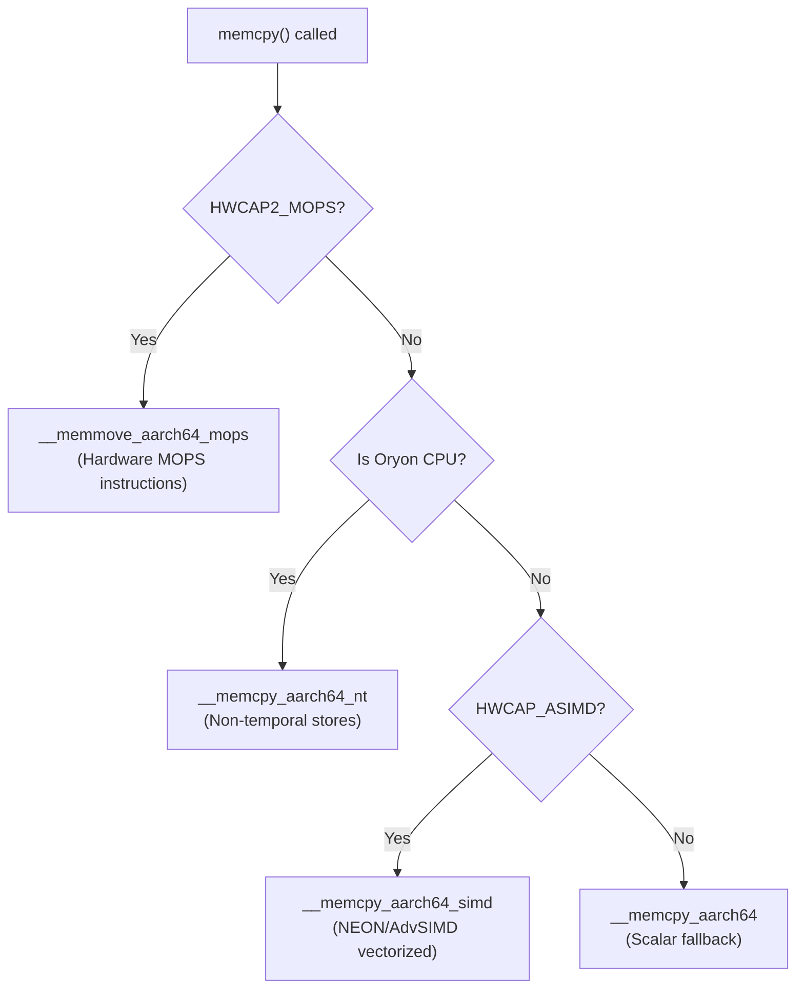

The same pattern applies to `memmove`, `memset`, `strlen`, `strchr`, and other
hot string functions. MTE-aware variants are selected when `HWCAP2_MTE` is
present:

```cpp
// bionic/libc/arch-arm64/ifuncs.cpp (line 100-108)
DEFINE_IFUNC_FOR(memset) {
  if (arg->_hwcap2 & HWCAP2_MOPS) {
    RETURN_FUNC(memset_func_t, __memset_aarch64_mops);
  } else if (__bionic_is_oryon(arg->_hwcap)) {
    RETURN_FUNC(memset_func_t, __memset_aarch64_nt);
  } else {
    RETURN_FUNC(memset_func_t, __memset_aarch64);
  }
}
```

```cpp
// bionic/libc/arch-arm64/ifuncs.cpp (line 117-123)
DEFINE_IFUNC_FOR(strchr) {
  if (arg->_hwcap2 & HWCAP2_MTE) {
    RETURN_FUNC(strchr_func_t, __strchr_aarch64_mte);
  } else {
    RETURN_FUNC(strchr_func_t, __strchr_aarch64);
  }
}
```

### 57.8.3 Bionic: ARM 32-bit CPU-Variant String Functions

ARM 32-bit bionic takes a different approach: instead of runtime ifunc dispatch,
it compiles multiple CPU-variant-specific implementations and selects at build
time based on the device's `TARGET_CPU_VARIANT`. The source tree contains
separate directories for each CPU variant:

```
arch-arm/cortex-a7/string/memcpy.S    - Tuned for A7's in-order pipeline
arch-arm/cortex-a9/string/memcpy.S    - Tuned for A9's partial out-of-order
arch-arm/cortex-a15/string/memcpy.S   - Tuned for A15's full out-of-order
arch-arm/cortex-a53/string/memcpy.S   - Tuned for A53's 64-bit in-order
arch-arm/cortex-a55/string/memcpy.S   - Tuned for A55's enhanced in-order
arch-arm/krait/string/memcpy.S        - Tuned for Qualcomm Krait
arch-arm/kryo/string/memcpy.S         - Tuned for Qualcomm Kryo
```

Each `memcpy.S` contains different hand-written assembly that exploits the
target core's pipeline characteristics -- prefetch distances, store buffer
depths, cache line sizes, and NEON instruction scheduling.

### 57.8.4 Bionic: RISC-V String Functions with Vector Extension

The RISC-V string implementations in bionic were contributed by SiFive and use
the RISC-V Vector extension:

```
bionic/libc/arch-riscv64/string/
    memchr.S    memcmp.S    memcpy.S    memmove.S    memset.S
    stpcpy.S    strcat.S    strchr.S    strcmp.S     strcpy.S
    strlen.S    strncat.S   strncmp.S   strncpy.S    strnlen.S
```

The copyright headers in these files attribute them to both "The Android Open
Source Project" and "SiFive, Inc." -- SiFive is a leading RISC-V chip designer
that contributed these optimized implementations.

### 57.8.5 Bionic: Low-Level Architecture Functions

Every architecture must implement a set of core low-level functions in assembly.
These cannot be written in C because they manipulate the stack, registers, or
execution context in ways that C cannot express:

| Function | Purpose | Why Assembly? |
|---|---|---|
| `__bionic_clone.S` | `clone()` syscall wrapper | Must set up child stack and call entry point |
| `_exit_with_stack_teardown.S` | Thread exit | Must deallocate own stack while running |
| `setjmp.S` / `longjmp.S` | Non-local jumps | Must save/restore all callee-saved registers |
| `syscall.S` | Raw syscall interface | Must move args to syscall registers |
| `vfork.S` | `vfork()` implementation | Must not clobber parent's stack frame |

The ARM64 `setjmp.S` shows the register-level detail required:

```asm
// bionic/libc/arch-arm64/bionic/setjmp.S (line 32-51)
// According to AARCH64 PCS document we need to save:
//   Core     x19 - x30, sp (see section 5.1.1)
//   VFP      d8 - d15 (see section 5.1.2)
//
// jmp_buf layout:
//   word   name            description
//   0      sigflag/cookie  setjmp cookie in top 31 bits, signal mask flag in low bit
//   1      sigmask         signal mask
//   2      core_base       base of core registers (x18-x30, sp)
//   16     float_base      base of float registers (d8-d15)
//   24     checksum        checksum of core registers
//   25     reserved        reserved entries (room to grow)
```

### 57.8.6 Bionic: MTE Integration

ARM64 bionic includes ELF notes that control MTE behavior. Two variants exist:

- `note_memtag_heap_async.S` -- Requests asynchronous MTE checking (lower
  overhead, delayed error reporting)

- `note_memtag_heap_sync.S` -- Requests synchronous MTE checking (higher
  overhead, immediate error reporting)

```asm
// bionic/libc/arch-arm64/bionic/note_memtag_heap_async.S (line 34-46)
  .section ".note.android.memtag", "a", %note
  .p2align 2
  .long 1f - 0f                 // int32_t namesz
  .long 3f - 2f                 // int32_t descsz
  .long NT_ANDROID_TYPE_MEMTAG  // int32_t type
0:
  .asciz "Android"              // char name[]
1:
  .p2align 2
2:
  .long (NT_MEMTAG_LEVEL_ASYNC | NT_MEMTAG_HEAP) // value
3:
```

These notes are linked into binaries that opt into MTE. The dynamic linker
reads them and configures the process's memory tagging mode before the main
program runs.

### 57.8.7 ART Runtime: Architecture-Specific Entrypoints

The Android Runtime (ART) contains extensive architecture-specific code for JIT
compilation, garbage collection, and JNI transitions. Each architecture has a
complete set of entrypoint files:

```
art/runtime/arch/arm64/
    asm_support_arm64.S              - Assembly constants and macros
    asm_support_arm64.h              - Shared constants
    callee_save_frame_arm64.h        - Callee-save frame layout
    context_arm64.cc                 - CPU context save/restore
    entrypoints_init_arm64.cc        - Entrypoint table initialization
    fault_handler_arm64.cc           - Signal handler for null checks
    instruction_set_features_arm64.cc - ISA feature detection
    jni_entrypoints_arm64.S          - JNI call trampolines
    quick_entrypoints_arm64.S        - Quick compiler entrypoints
    registers_arm64.cc               - Register definitions
    thread_arm64.cc                  - Thread-local storage access
```

The same structure is replicated for every architecture:

```
art/runtime/arch/
    arm/     - ARM32 entrypoints
    arm64/   - ARM64 entrypoints
    x86/     - x86 entrypoints
    x86_64/  - x86_64 entrypoints
    riscv64/ - RISC-V 64 entrypoints
```

### 57.8.8 ART: Instruction Set Feature Detection

ART's `instruction_set_features.cc` dispatches feature detection to
architecture-specific implementations:

```cpp
// art/runtime/arch/instruction_set_features.cc (line 33-53)
std::unique_ptr<const InstructionSetFeatures> InstructionSetFeatures::FromVariant(
    InstructionSet isa, const std::string& variant, std::string* error_msg) {
  switch (isa) {
    case InstructionSet::kArm:
    case InstructionSet::kThumb2:
      return ArmInstructionSetFeatures::FromVariant(variant, error_msg);
    case InstructionSet::kArm64:
      return Arm64InstructionSetFeatures::FromVariant(variant, error_msg);
    case InstructionSet::kRiscv64:
      return Riscv64InstructionSetFeatures::FromVariant(variant, error_msg);
    case InstructionSet::kX86:
      return X86InstructionSetFeatures::FromVariant(variant, error_msg);
    case InstructionSet::kX86_64:
      return X86_64InstructionSetFeatures::FromVariant(variant, error_msg);
    // ...
  }
}
```

The ARM64 feature detection (`instruction_set_features_arm64.cc`) is
particularly detailed, tracking specific CPU errata and optional ISA extensions:

```cpp
// art/runtime/arch/arm64/instruction_set_features_arm64.cc (line 52-85)
static const char* arm64_variants_with_a53_835769_bug[] = {
    "default", "generic",
    "cortex-a53", "cortex-a53.a57", "cortex-a53.a72",
    "cortex-a57", "cortex-a72", "cortex-a73",
};

static const char* arm64_variants_with_crc[] = {
    "default", "generic", "cortex-a35", "cortex-a53", ...
};

static const char* arm64_variants_with_lse[] = {
    "cortex-a55", "cortex-a75", "cortex-a76", "kryo385", "kryo785",
};

static const char* arm64_variants_with_fp16[] = {
    "cortex-a55", "cortex-a75", "cortex-a76", "kryo385", "kryo785",
};

static const char* arm64_variants_with_dotprod[] = {
    "cortex-a55", "cortex-a75", "cortex-a76",
};
```

These feature lists are used by the ART JIT compiler to decide which
instructions to emit. For example, if `has_lse` is true, the JIT can emit LSE
(Large System Extensions) atomic instructions instead of the slower LL/SC
(Load-Linked/Store-Conditional) loop sequences.

ART also validates the compile-time feature assumptions against runtime
hardware capabilities using `FromVariantAndHwcap()`:

```cpp
// art/runtime/arch/instruction_set_features.cc (line 55-80)
std::unique_ptr<const InstructionSetFeatures> InstructionSetFeatures::FromVariantAndHwcap(
    InstructionSet isa, const std::string& variant, std::string* error_msg) {
  auto variant_features = FromVariant(isa, variant, error_msg);
  if (variant_features == nullptr) return nullptr;

  // Pixel3a is wrongly reporting itself as cortex-a75, so validate the
  // features with hwcaps.
  if (isa == InstructionSet::kArm64) {
    auto new_features = down_cast<const Arm64InstructionSetFeatures*>(
        variant_features.get())->IntersectWithHwcap();
    if (!variant_features->Equals(new_features.get())) {
      LOG(WARNING) << "Mismatch between instruction set variant of device ("
            << *variant_features << ") and features returned by the hardware ("
            << *new_features << ")";
    }
    return new_features;
  }
  return variant_features;
}
```

The comment about Pixel 3a is instructive -- it shows that even Google's own
devices can have incorrect `TARGET_CPU_VARIANT` settings, making runtime
validation essential.

### 57.8.9 ART: Quick Entrypoints

The `quick_entrypoints_arm64.S` file contains the assembly routines that bridge
managed (Java/Kotlin) code with the ART runtime. These are some of the most
performance-critical code in Android. The file begins with callee-save frame
setup macros:

```asm
// art/runtime/arch/arm64/quick_entrypoints_arm64.S (line 45-60)
.macro SETUP_SAVE_REFS_AND_ARGS_FRAME
    LOAD_RUNTIME_INSTANCE xIP0
    ldr xIP0, [xIP0, RUNTIME_SAVE_REFS_AND_ARGS_METHOD_OFFSET]
    INCREASE_FRAME FRAME_SIZE_SAVE_REFS_AND_ARGS
    SETUP_SAVE_REFS_AND_ARGS_FRAME_INTERNAL sp
    str xIP0, [sp]
    mov xIP0, sp
    str xIP0, [xSELF, # THREAD_TOP_QUICK_FRAME_OFFSET]
.endm
```

These macros manage the transition between managed code (which uses ART's
calling convention) and native code (which uses the platform ABI). The
`THREAD_TOP_QUICK_FRAME_OFFSET` references the thread-local storage where ART
tracks the current managed stack frame -- essential for garbage collection, stack
walking, and exception handling.

### 57.8.10 ART: Multiple Feature Detection Strategies

ART implements six different strategies for detecting CPU features, reflecting
the reality that no single detection method is reliable across all devices:

```cpp
// art/runtime/arch/arm64/instruction_set_features_arm64.h (line 35-55)
// 1. FromVariant() - Parse a CPU variant string like "cortex-a75"
static Arm64FeaturesUniquePtr FromVariant(const std::string& variant, std::string* error_msg);

// 2. FromBitmap() - Parse a bitmap (used for serialization/deserialization)
static Arm64FeaturesUniquePtr FromBitmap(uint32_t bitmap);

// 3. FromCppDefines() - Use C preprocessor defines set by the compiler
static Arm64FeaturesUniquePtr FromCppDefines();

// 4. FromCpuInfo() - Parse /proc/cpuinfo
static Arm64FeaturesUniquePtr FromCpuInfo();

// 5. FromHwcap() - Use the kernel's AT_HWCAP auxiliary vector
static Arm64FeaturesUniquePtr FromHwcap();

// 6. FromAssembly() - Run assembly tests to probe feature availability
static Arm64FeaturesUniquePtr FromAssembly();

// 7. FromCpuFeatures() - Use external cpu_features library
static Arm64FeaturesUniquePtr FromCpuFeatures();

// 8. IntersectWithHwcap() - Validate variant features against hardware
Arm64FeaturesUniquePtr IntersectWithHwcap() const;
```

The preferred approach on ARM64 is `FromVariantAndHwcap()`, which first creates
features from the build-time variant string, then validates them against
runtime hardware capabilities. This two-step process catches cases like the
Pixel 3a, where the device incorrectly reports its CPU variant.

For RISC-V, only `FromVariant()` and `FromCppDefines()` are currently
functional -- the hardware detection paths remain as stubs.

### 57.8.11 Architecture-Specific Build Patterns Summary

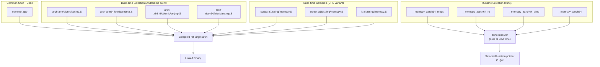

The three-level optimization strategy:

1. **Architecture selection** (build time): The `arch:` block in `Android.bp`
   selects completely different source files per architecture. This is for code
   that is fundamentally different between architectures (syscall wrappers,
   setjmp, thread creation).

2. **CPU variant selection** (build time): For ARM 32-bit, separate hand-tuned
   implementations exist for each major CPU variant. The build system compiles
   all of them into the same binary, with the appropriate one selected by the
   ifunc mechanism or by the linker based on device configuration.

3. **Runtime hardware detection** (load time): ARM64's ifunc resolvers check
   `hwcap` bits at library load time to select the best implementation for the
   actual hardware. This handles cases where the exact CPU model was not known
   at build time, or where a single binary must run on multiple hardware
   generations.

### 57.8.12 The ARM 32-bit Instruction Set: ARM vs. Thumb

ARM 32-bit has a unique feature among AOSP architectures: two instruction
encodings. The ARM toolchain supports switching between them:

```go
// build/soong/cc/config/arm_device.go (line 49-54)
armArmCflags = []string{}

armThumbCflags = []string{
    "-mthumb",
    "-Os",
}
```

The toolchain's `InstructionSetFlags()` method selects between them:

```go
// build/soong/cc/config/arm_device.go (line 288-297)
func (t *toolchainArm) InstructionSetFlags(isa string) (string, error) {
    switch isa {
    case "arm":
        return "${config.ArmArmCflags}", nil
    case "thumb", "":
        return "${config.ArmThumbCflags}", nil
    default:
        return t.toolchainBase.InstructionSetFlags(isa)
    }
}
```

**Thumb mode** (the default) uses 16-bit instruction encoding with `-Os`
(optimize for size). This reduces code size significantly -- critical for the
32-bit secondary architecture that exists primarily for compatibility.

**ARM mode** uses 32-bit instruction encoding. Modules can opt into ARM mode via
the `instruction_set: "arm"` property in their `Android.bp` when they need the
full 32-bit instruction set (e.g., for hand-tuned assembly that uses
instructions not available in Thumb).

### 57.8.13 The ARM 32-bit Soft Float and NEON

ARM 32-bit Android uses soft-float ABI (`-mfloat-abi=softfp`), meaning
floating-point values are passed in integer registers at function call
boundaries, even though the hardware FPU is used for computation:

```go
// build/soong/cc/config/arm_device.go (line 56-77)
armArchVariantCflags = map[string][]string{
    "armv7-a": []string{
        "-march=armv7-a",
        "-mfloat-abi=softfp",
        "-mfpu=vfpv3-d16",
    },
    "armv7-a-neon": []string{
        "-march=armv7-a",
        "-mfloat-abi=softfp",
        "-mfpu=neon",
    },
    "armv8-a": []string{
        "-march=armv8-a",
        "-mfloat-abi=softfp",
        "-mfpu=neon-fp-armv8",
    },
    "armv8-2a": []string{
        "-march=armv8.2-a",
        "-mfloat-abi=softfp",
        "-mfpu=neon-fp-armv8",
    },
}
```

The `-mfpu=` flag specifies the FPU type:

- `vfpv3-d16`: Basic VFP with 16 double-precision registers (no NEON)
- `neon`: Full NEON SIMD unit
- `neon-fp-armv8`: NEON with ARMv8 floating-point extensions

The `armv7-a-neon` variant is the most commonly used for modern 32-bit devices,
as it enables NEON SIMD optimizations.

### 57.8.14 Bionic Strip Configuration Per Architecture

Even the way binaries are stripped varies by architecture. Bionic's
`Android.bp` configures different strip behavior for each architecture:

```
// bionic/libc/Android.bp (around line 135-165)
arch: {
    arm: {
        // arm32 does not produce complete exidx unwind information,
        // so keep the .debug_frame which is relatively small and does
        // include needed unwind information.
        // See b/132992102 for details.
        strip: {
            keep_symbols_and_debug_frame: true,
        },
    },
    arm64: {
        strip: {
            keep_symbols: true,
        },
    },
    riscv64: {
        strip: {
            keep_symbols: true,
        },
    },
    x86: {
        strip: {
            keep_symbols: true,
        },
    },
    x86_64: {
        strip: {
            keep_symbols: true,
        },
    },
},
```

ARM 32-bit is the only architecture that needs `keep_symbols_and_debug_frame`.
This is because ARM 32-bit uses a different unwinding mechanism (EXIDX tables in
the `.ARM.exidx` section) that is incomplete in some cases, so the
`.debug_frame` section must be preserved as a fallback. All other architectures
use DWARF-based unwinding and only need the symbol table kept.

### 57.8.15 Page Size Macro Handling

The bionic page size macro handling is architecture-aware:

```go
// build/soong/cc/config/arm64_device.go (line 98-106)
pctx.VariableFunc("Arm64Cflags", func(ctx android.PackageVarContext) string {
    flags := arm64Cflags
    if ctx.Config().NoBionicPageSizeMacro() {
        flags = append(flags, "-D__BIONIC_NO_PAGE_SIZE_MACRO")
    } else {
        flags = append(flags, "-D__BIONIC_DEPRECATED_PAGE_SIZE_MACRO")
    }
    return strings.Join(flags, " ")
})
```

The same pattern exists for x86_64:

```go
// build/soong/cc/config/x86_64_device.go (line 111-119)
pctx.VariableFunc("X86_64Cflags", func(ctx android.PackageVarContext) string {
    flags := x86_64Cflags
    if ctx.Config().NoBionicPageSizeMacro() {
        flags = append(flags, "-D__BIONIC_NO_PAGE_SIZE_MACRO")
    } else {
        flags = append(flags, "-D__BIONIC_DEPRECATED_PAGE_SIZE_MACRO")
    }
    return strings.Join(flags, " ")
})
```

This is related to the ongoing effort to support 16KB pages on ARM64. The
`PAGE_SIZE` macro in `<unistd.h>` traditionally returns 4096, but this is
incorrect on devices running 16KB kernels. The
`__BIONIC_NO_PAGE_SIZE_MACRO` flag causes bionic to not define `PAGE_SIZE` at
all, forcing code to call `getpagesize()` or `sysconf(_SC_PAGE_SIZE)` at
runtime. The `__BIONIC_DEPRECATED_PAGE_SIZE_MACRO` flag keeps the macro but
marks it as deprecated, producing warnings when code uses it.

Product configurations opt into this behavior:

```makefile
# build/make/target/product/aosp_arm64.mk (line 80)
PRODUCT_NO_BIONIC_PAGE_SIZE_MACRO := true
```

### 57.8.16 ARM 32-bit LPAE Workaround

Several ARM 32-bit CPU variants require a manual define to advertise Large
Physical Address Extensions (LPAE) support:

```go
// build/soong/cc/config/arm_device.go (line 80-100)
"cortex-a7": []string{
    "-mcpu=cortex-a7",
    "-mfpu=neon-vfpv4",
    // Fake an ARM compiler flag as these processors support LPAE which clang
    // don't advertise.
    // TODO This is a hack and we need to add it for each processor that
    // supports LPAE until some better solution comes around. See Bug 27340895
    "-D__ARM_FEATURE_LPAE=1",
},
```

This is a long-standing workaround (Bug 27340895) where Clang does not
automatically define `__ARM_FEATURE_LPAE` for processors that support it. Code
that uses the LPAE-specific `ldrd`/`strd` instructions (64-bit atomic
load/store) relies on this macro to detect hardware support.

---

## 57.9 Try It

### Exercise 1: Inspect Architecture Flags for Your Device

Look up the `BoardConfig.mk` for your device (or a reference device) and trace
the compiler flags:

```bash
# 1. Find the architecture configuration
cat device/generic/arm64/BoardConfig.mk

# 2. Look up the arch variant flags
grep -A 3 '"armv8-a"' build/soong/cc/config/arm64_device.go

# 3. Look up the CPU variant flags
grep -A 3 '"cortex-a55"' build/soong/cc/config/arm64_device.go

# 4. Check what global flags are applied
head -60 build/soong/cc/config/global.go
```

**Questions to answer**:

- What `-march=` flag is used for your device?
- Is the Cortex-A53 erratum 843419 fix applied?
- What security features does your device enable (PAC/BTI, MTE)?

### Exercise 2: Add a New Architecture Variant

To add a hypothetical new ARM64 variant (e.g., ARMv9.5-A):

1. Add the variant to `arm64ArchVariantCflags` in `arm64_device.go`:

```go
"armv9-5a": {"-march=armv9.5-a"},
```

2. Create a `BoardConfig.mk` that uses it:

```makefile
TARGET_ARCH := arm64
TARGET_ARCH_VARIANT := armv9-5a
TARGET_CPU_VARIANT := generic
TARGET_CPU_ABI := arm64-v8a
```

3. Build and verify:

```bash
# The build system will validate the variant exists
m libc
```

### Exercise 3: Examine ifunc Dispatch

Study how bionic selects optimized implementations at runtime:

```bash
# 1. Read the ifunc resolver for memcpy
# File: bionic/libc/arch-arm64/ifuncs.cpp

# 2. Run on a device and check which implementation was selected
adb shell 'cat /proc/self/maps | grep memcpy'

# 3. Disassemble the selected implementation
adb shell 'objdump -d /apex/com.android.runtime/lib64/bionic/libc.so' | \
    grep -A 20 '__memcpy_aarch64_simd'
```

### Exercise 4: Compare String Functions Across Architectures

Compare how `memcpy` is implemented for different architectures:

```bash
# ARM 32-bit (multiple CPU-variant implementations)
ls bionic/libc/arch-arm/*/string/memcpy.S

# ARM64 (runtime-selected via ifunc)
cat bionic/libc/arch-arm64/ifuncs.cpp | grep -A 10 'DEFINE_IFUNC_FOR(memcpy)'

# RISC-V (vector extension based, from SiFive)
head -50 bionic/libc/arch-riscv64/string/memcpy.S

# x86_64 (SSE-based)
ls bionic/libc/arch-x86_64/string/
```

**Questions to answer**:

- How many distinct `memcpy` implementations exist for ARM 32-bit?
- What hardware feature does the ARM64 `memcpy` check first?
- What RISC-V extension does the RISC-V `memcpy` use?

### Exercise 5: Build for Multiple Architectures

Build the same module for different architectures to see the flag differences:

```bash
# Build for ARM64
lunch aosp_arm64-userdebug
m libcutils

# Build for x86_64
lunch aosp_x86_64-userdebug
m libcutils

# Compare the ninja commands to see different flags
cat out/build-aosp_arm64-userdebug.ninja | grep 'libcutils.*\.o' | head -1
cat out/build-aosp_x86_64-userdebug.ninja | grep 'libcutils.*\.o' | head -1
```

### Exercise 6: Trace the Full Flag Chain

For a specific module, reconstruct the complete list of compiler flags by
tracing through the Soong source:

1. Start with `commonGlobalCflags` in `global.go`
2. Add `deviceGlobalCflags` from `global.go`
3. Add the architecture-specific `Cflags()` (e.g., `Arm64Cflags`)
4. Add the `ToolchainCflags()` (arch variant + CPU variant)
5. Add the module's own `cflags` from its `Android.bp`
6. Append `noOverrideGlobalCflags` from `global.go`

Write out the complete flag list and verify it matches what Ninja generates.

### Exercise 7: Explore ART Architecture Support

Examine how ART handles architecture-specific code generation:

```bash
# 1. List all architecture-specific ART files
ls art/runtime/arch/arm64/
ls art/runtime/arch/riscv64/

# 2. Read the instruction set features for ARM64
cat art/runtime/arch/arm64/instruction_set_features_arm64.cc | head -100

# 3. Compare the entrypoint counts across architectures
wc -l art/runtime/arch/*/quick_entrypoints_*.S
```

**Questions to answer**:

- What CPU variants does ART recognize for ARM64?
- What errata does ART work around for Cortex-A53?
- Does ART have SVE support enabled for any ARM64 variant?

### Exercise 8: Investigate RISC-V Readiness

Assess the current state of RISC-V support in AOSP:

```bash
# 1. Check which prebuilt modules are missing for RISC-V
grep -r "ALLOW_MISSING_DEPENDENCIES" device/generic/art/riscv64/

# 2. Count RISC-V-specific source files in bionic
find bionic/libc/arch-riscv64 -name '*.S' | wc -l

# 3. Check the ISA string
grep 'march=' build/soong/cc/config/riscv64_device.go

# 4. Look at the Berberis translation framework
ls frameworks/libs/binary_translation/
```

**Questions to answer**:

- What RISC-V extensions does AOSP require?
- Why is `-mno-implicit-float` used?
- What is the page size for RISC-V Android?
- What translation direction does Berberis support?

---

### Exercise 9: Create a Minimal Device Configuration

Write a complete `BoardConfig.mk` for a hypothetical RISC-V device:

```makefile
# device/mycompany/myriscv/BoardConfig.mk
TARGET_NO_BOOTLOADER := true
TARGET_NO_KERNEL := true

TARGET_ARCH := riscv64
TARGET_CPU_ABI := riscv64
TARGET_CPU_VARIANT := generic
TARGET_ARCH_VARIANT :=

TARGET_SUPPORTS_64_BIT_APPS := true

# No secondary architecture for RISC-V
# (There is no 32-bit RISC-V Android port)

BOARD_SYSTEMIMAGE_PARTITION_SIZE := 2147483648
BOARD_USERDATAIMAGE_PARTITION_SIZE := 576716800
BOARD_FLASH_BLOCK_SIZE := 512
```

Then create the product configuration:

```makefile
# device/mycompany/myriscv/myriscv.mk
$(call inherit-product, $(SRC_TARGET_DIR)/product/core_64_bit_only.mk)
$(call inherit-product, $(SRC_TARGET_DIR)/product/generic_system.mk)

PRODUCT_NAME := myriscv
PRODUCT_DEVICE := myriscv
PRODUCT_BRAND := MyCompany
PRODUCT_MODEL := RISC-V Development Board
```

**Questions to answer**:

- Why does RISC-V use `core_64_bit_only.mk` instead of `core_64_bit.mk`?
- What happens if you set `TARGET_ARCH_VARIANT` to a non-empty value?
- What Zygote script will be included?

### Exercise 10: Analyze the Complete Flag Chain

Using the tools from this chapter, reconstruct the exact compiler invocation
for a specific file. Choose a simple module like `liblog`:

```bash
# 1. Find the ninja rule for a liblog source file
grep 'liblog.*logging.cpp.*\.o' out/combined-*.ninja | head -1

# 2. Extract and format the flags
# Look for the complete clang command line

# 3. Categorize each flag into its source:
#    - global.go commonGlobalCflags
#    - global.go deviceGlobalCflags
#    - arm64_device.go Arm64Cflags
#    - arm64_device.go toolchainCflags (arch variant + CPU variant)
#    - Module's own cflags from Android.bp
#    - global.go noOverrideGlobalCflags
```

This exercise demonstrates the practical result of the layered flag system
described in Section 28.6.

---

## Summary

Android's architecture support is a layered system built on a small set of
design principles:

1. **Toolchain abstraction**: The `Toolchain` interface in `toolchain.go`
   hides architecture details behind a uniform API. Each of the five supported
   architectures (ARM, ARM64, x86, x86_64, RISC-V 64) provides a factory that
   produces a `Toolchain` implementation configured with the right compiler
   flags.

2. **Three-tier flag layering**: Global flags (security, optimization, warnings)
   apply to all code. Architecture flags (`-march=`, `-mcpu=`) tune for the
   target ISA. Non-overridable flags enforce critical safety warnings.

3. **Multilib for dual-architecture**: The `compile_multilib` property and
   `TARGET_2ND_ARCH` mechanism let a single device support both 32-bit and
   64-bit code, essential for the ARM64 transition.

4. **Architecture-specific hot paths**: Performance-critical code in bionic and
   ART is hand-written in assembly for each architecture, with up to three
   levels of optimization selection (architecture, CPU variant, runtime hardware
   detection via ifunc).

5. **Pragmatic big.LITTLE tuning**: Rather than optimizing for the fastest
   core, AOSP tunes for the efficiency core to avoid pathological slowdowns
   in heterogeneous configurations.

6. **Native Bridge for cross-architecture compatibility**: The
   `NativeBridgeCallbacks` interface enables binary translation (Berberis,
   Houdini) for running foreign-architecture native code.

The following table summarizes the characteristics of each supported
architecture:

| Characteristic | ARM (32-bit) | ARM64 | x86 | x86_64 | RISC-V 64 |
|---|---|---|---|---|---|
| Bits | 32 | 64 | 32 | 64 | 64 |
| Clang Triple | `armv7a-linux-androideabi` | `aarch64-linux-android` | `i686-linux-android` | `x86_64-linux-android` | `riscv64-linux-android` |
| Arch Variants | 4 | 10 | 14 | 13 | 0 |
| CPU Variants | 18 | 10 | 0 | 0 | 0 |
| SIMD | NEON | NEON/SVE | SSE/AVX | SSE/AVX | RVV |
| Default `-march=` | `armv7-a` | `armv8-a` | `prescott` | `x86-64` | `rv64gcv_zba_zbb_zbs` |
| Instruction Sets | ARM + Thumb | AArch64 | x86 | x86-64 | RV64 + C |
| Errata Workarounds | Cortex-A8 | Cortex-A53 | None | None | QEMU V |
| Float ABI | Soft (`softfp`) | Hard | N/A | N/A | Hard |
| Yasm Support | No | No | Yes | Yes | No |
| Secondary Arch For | ARM64 | N/A | x86_64 | N/A | N/A |
| Toolchain Base | `toolchain32Bit` | `toolchain64Bit` | `toolchain32Bit` | `toolchain64Bit` | `toolchain64Bit` |

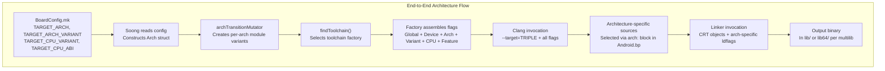

The key source files for architecture support are:

| File | Purpose |
|---|---|
| `build/soong/cc/config/arm64_device.go` | ARM64 toolchain configuration |
| `build/soong/cc/config/arm_device.go` | ARM 32-bit toolchain configuration |
| `build/soong/cc/config/x86_64_device.go` | x86_64 toolchain configuration |
| `build/soong/cc/config/x86_device.go` | x86 toolchain configuration |
| `build/soong/cc/config/riscv64_device.go` | RISC-V 64 toolchain configuration |
| `build/soong/cc/config/global.go` | Global compiler flags |
| `build/soong/cc/config/toolchain.go` | Toolchain interface and helpers |
| `build/soong/cc/config/clang.go` | Clang-specific flag filtering |
| `build/soong/cc/config/bionic.go` | Bionic CRT objects and defaults |
| `build/soong/android/arch.go` | Multilib and architecture mutators |
| `bionic/libc/arch-arm64/ifuncs.cpp` | ARM64 runtime function dispatch |
| `art/runtime/arch/instruction_set_features.cc` | ART ISA feature detection |
| `device/generic/arm64/BoardConfig.mk` | ARM64 reference device config |
| `build/make/target/product/core_64_bit.mk` | 64-bit product configuration |
| `frameworks/libs/binary_translation/` | Berberis binary translation |
