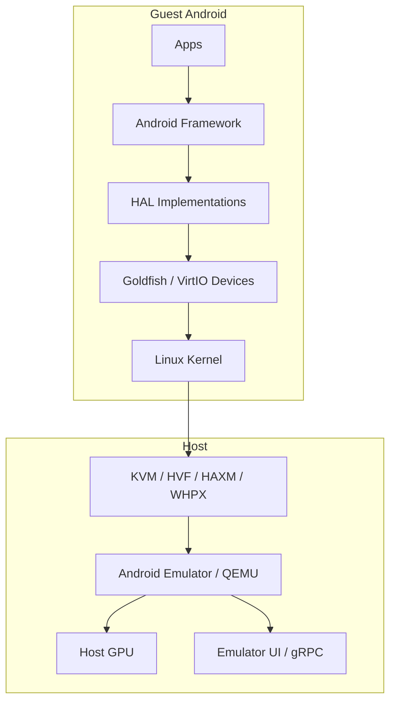
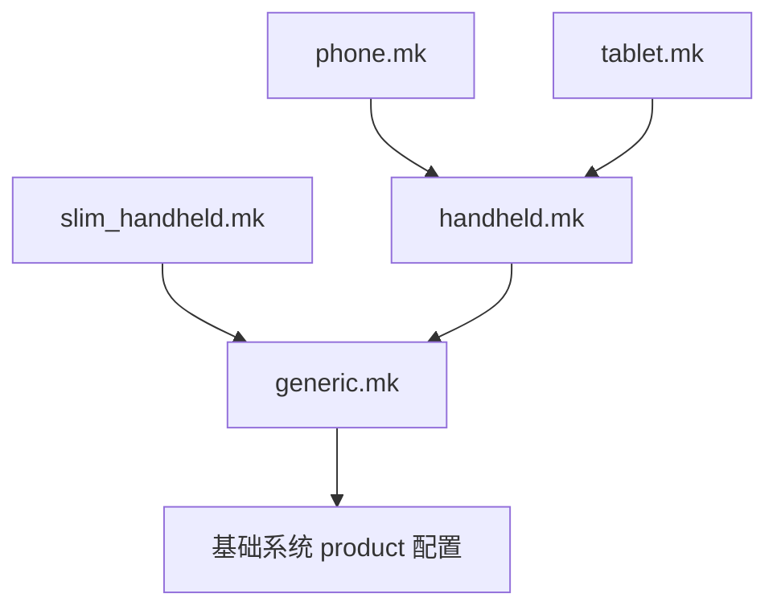
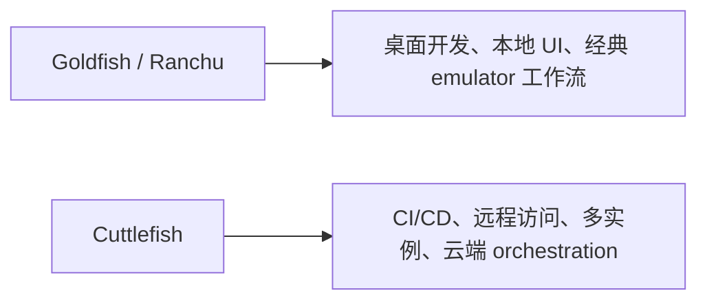

# 第 58 章：Emulator Architecture

Android Emulator 是 AOSP 生态里最关键的开发工具之一。它并不是一个简单的“界面模拟器”，而是一套完整的系统级虚拟化环境：宿主机上运行的是基于 QEMU 深度定制的 emulator 进程，来宾里跑的则是真实的 Android kernel、framework 和 system image。对平台工程师来说，emulator 的意义不只是“能开机”，而是它把没有实体硬件时的一整套 Android 设备语义补齐了。

本章按层次拆解 emulator：先看总体软件栈，再看 Goldfish / Ranchu 虚拟设备平台、guest 侧 HAL、网络模型、Cuttlefish 这条云端友好替代路径，以及 snapshots、多显示、折叠屏、控制台命令等开发期特性。重点不是记住某个启动参数，而是理解 Android 如何把“虚拟设备”做成一台足够真实的 Android 机器。

---

## 58.1 Emulator Architecture Overview

### 58.1.1 软件栈

Android Emulator 的主体是 Android 自己维护的一支 QEMU fork。开发者执行 `emulator` 命令后，真正开始工作的并不是单个 UI 程序，而是一整条虚拟化栈：

```text
宿主机
  |
  +-- Android Emulator / qemu-system-*
       |
       +-- QEMU 核心
       |    +-- KVM / HVF / HAXM / WHPX 硬件加速
       |    +-- TCG 软件翻译
       |    +-- vCPU / 内存 / 中断控制
       |
       +-- Goldfish / Ranchu 虚拟硬件
       |    +-- goldfish-pipe
       |    +-- virtio-gpu / net / blk / input / console
       |
       +-- 宿主侧 UI / gRPC / 控制接口
```

来宾侧跑的则是标准 Android 栈：Linux kernel、init、HAL、framework、SystemUI、应用。emulator 的工作是把这些软件期待的“硬件”全部伪装出来。

### 58.1.2 执行模式

Emulator 主要有两种执行模式：

1. 硬件加速模式：guest 指令尽量直接跑在宿主 CPU 上。
2. 软件翻译模式：通过 QEMU TCG 做动态翻译。

在 Linux 上通常是 KVM，在 macOS 上常见是 Hypervisor Framework，在 Windows 上则可能是 HAXM 或 WHPX。对性能来说，guest / host 架构一致时的硬件加速几乎是决定性前提。

### 58.1.3 高层数据流



### 58.1.4 关键源码目录

| 目录 | 作用 |
|---|---|
| `device/generic/goldfish/` | Goldfish / Ranchu 设备定义、HAL、init、SEPolicy |
| `device/google/cuttlefish/` | Cuttlefish 设备定义 |
| `device/generic/goldfish/hals/` | Emulator guest 侧 HAL |
| `device/generic/goldfish/init/` | 启动脚本 |
| `device/generic/goldfish/sepolicy/` | emulator 相关 SELinux 策略 |
| `device/generic/goldfish/board/` | Board 配置 |
| `device/generic/goldfish/product/` | Product makefile |

### 58.1.5 Product 配置

`device/generic/goldfish/AndroidProducts.mk` 列出多种 emulator 目标，包括：

- `sdk_phone64_x86_64`
- `sdk_phone64_arm64`
- `sdk_tablet_arm64`
- `sdk_slim_x86_64`
- 16KB page 变体
- 带 RISC-V native bridge 的混合变体

这些 target 说明 emulator 已经不只是“一个通用手机镜像”，而是覆盖 phone、tablet、slim、不同图形后端和不同架构组合的完整产品矩阵。

## 58.2 The Goldfish Device Platform

Goldfish 是 Android emulator 最早的虚拟设备平台名字。今天源码里常把 Goldfish 与 Ranchu 一起提，因为现代 emulator 里大量早期自定义设备已经被 virtio 替代，但相关目录和命名传统被保留下来了。

### 58.2.1 Product 配置继承层级

Goldfish product 配置通过多层 makefile 继承展开，把 handset / tablet / slim 等不同产品形态叠加到同一基础设备定义上。



`generic.mk` 里一类典型属性是：

- `ro.hardware.power=ranchu`
- `ro.kernel.qemu=1`
- `ro.soc.model=ranchu`

其中 `ro.kernel.qemu=1` 是 framework 识别“当前运行于 emulator”的经典信号。

### 58.2.2 Board 配置

`device/generic/goldfish/board/` 里按架构分了多个子目录，例如：

- `emu64x/`：x86_64
- `emu64a/`：ARM64
- `emu64xr/`：x86_64 + RISC-V bridge
- `emu64ar/`：ARM64 + RISC-V bridge
- `emu64x16k/`：x86_64 16KB page
- `emu64a16k/`：ARM64 16KB page

这些配置共同继承 `BoardConfigCommon.mk`，里面会定义图形相关 guest / host library、镜像格式、A/B 模式、super image 和存储大小等通用参数。

### 58.2.3 HAL 实现

Emulator 真正“像设备”的关键，不只在 QEMU，也在 guest 侧 HAL。`device/generic/goldfish/hals/` 里通常能看到这些模块：

- audio
- camera
- sensors
- GNSS
- radio
- fingerprint
- hwc3
- gralloc
- 以及若干辅助库

这些 HAL 并不是“空实现”。它们负责把 Android framework 的硬件接口请求转成与宿主 emulator 虚拟设备通信的协议。

### 58.2.4 Init 脚本

`init.ranchu.rc` 和相关 shell 脚本负责在 guest 启动阶段搭起 emulator 所需环境，例如：

- 启动 HAL 服务
- 配置图形渲染模式
- 启动网络初始化脚本
- 设置 qemu properties
- 配置多显示、UWB、Thread 等特性

### 58.2.5 SELinux 策略

Emulator 相关服务不是绕过 SELinux 的“特殊进程”。`device/generic/goldfish/sepolicy/` 为 qemu-props、GNSS HAL 等组件单独定义策略，说明 AOSP 仍然用正常系统边界约束这些虚拟设备服务。

### 58.2.6 详细包清单

`generic.mk` 里会拉入大量 emulator 专属组件，包括 HAL 模块、init 脚本、权限 XML、图形支持库和 feature 包。把这部分理清，通常就能知道“为什么 emulator 上会有这个能力”。

## 58.3 Virtual Hardware

### 58.3.1 Goldfish-Pipe：Host-Guest 通信

`goldfish-pipe` 是 emulator 里极重要的一条 host / guest 通信通道。很多 HAL 与宿主虚拟设备控制流都要经过它，因此它相当于 virtual hardware 世界里的内部总线之一。

### 58.3.2 Sensors HAL 线程模型

传感器 HAL 不是简单的阻塞读写。它通常会维护独立线程、事件队列和数据注入路径，既支持 emulator 控制台注入，也支持 CTS / framework 轮询。

### 58.3.3 显示发现与 VSync

display 栈要负责枚举虚拟显示、暴露模式、处理 VSync，并把 guest 的 SurfaceFlinger / HWC 时序与宿主图形后端对齐。

### 58.3.4 Audio 写线程

音频路径里最关键的是 write thread 与缓冲同步，因为 guest 的 AudioFlinger 节奏和宿主音频输出节奏必须被平滑桥接。

### 58.3.5 Wake Lock 管理

Emulator 需要在无真实 PMIC 和无真实 SoC 低功耗硬件的前提下，模拟 wake lock 语义，确保 framework 对电源状态的假设仍然成立。

### 58.3.6 QEMU Properties Service

qemu-props 服务会把宿主侧传下来的某些环境信息折算为 guest 属性，是“把 emulator 控制面输入注入 Android 属性系统”的关键桥。

### 58.3.7 虚拟传感器

虚拟传感器不仅要存在，还要：

- 被 framework 正确枚举
- 支持数据注入
- 满足 CTS 对事件格式和时间戳的要求

### 58.3.8 虚拟 GPS

GNSS HAL 会把宿主传入的位置数据或控制命令转成 Android 定位栈可消费的输入。

### 58.3.9 虚拟相机

Emulator camera HAL 负责把虚拟相机源、宿主摄像头或测试画面，映射到 camera provider / camera service 语义。

### 58.3.10 虚拟电话

电话与 radio HAL 支持网络类型、SIM、短信等仿真，是 telephony 相关测试能在 emulator 上跑通的基础。

### 58.3.11 GPU Emulation

GPU 模拟是 emulator 最复杂的能力之一。总体思路通常是：guest 的 GLES / Vulkan 调用被序列化，经由 host / guest 通道传给宿主，再由宿主真实 GPU 或软件渲染后端执行。

## 58.4 Emulator Networking

### 58.4.1 网络架构

Emulator 网络不是简单给 guest 挂一个网卡，而是包含虚拟路由、NAT、端口映射、guest 内部初始化脚本和某些多实例互联逻辑。

### 58.4.2 默认 IP 规划

Emulator 为 guest 预设了一套经典地址空间与网关模型，使得 framework 和应用可以像在普通设备上一样使用网络，而无需理解底层虚拟化细节。

### 58.4.3 VirtIO Wi-Fi

现代 emulator 更多依赖 VirtIO 网络设备而非早期定制方案。`init.net.ranchu.sh` 等脚本会在 guest 里完成网卡 bring-up 与属性设置。

### 58.4.4 端口转发与 ADB

```bash
# 将宿主 8080 转发到 guest 80
adb forward tcp:8080 tcp:80

# 将宿主 5000 转发到 guest 5000
adb forward tcp:5000 tcp:5000
```

ADB 自身也是建立在一套虚拟端口与 guest 连接模型之上的。

### 58.4.5 多 emulator 互联

Emulator 可以通过第二网口等方式支持实例间互联，这对某些分布式测试、多设备场景很有用。

### 58.4.6 蓝牙网络相关支持

蓝牙相关网络与服务初始化同样通过 guest init 配置打通，方便上层协议栈验证。

## 58.5 Ranchu vs. Goldfish Kernels

### 58.5.1 历史背景

Goldfish 是早期自定义虚拟设备模型；Ranchu 则代表现代 emulator 更多采用标准 virtio 设备的方向。名字仍然并存，但实现重点已经明显迁移。

### 58.5.2 VirtIO 设备迁移

从定制设备迁移到 VirtIO 的好处很明确：

- 更标准
- 更易复用
- 与现代虚拟化生态更一致
- guest 驱动和 host 实现都更容易维护

### 58.5.3 内核模块配置

不同 emulator / Cuttlefish target 会在 BoardConfig 里显式列出需要的 virtio 模块与 kernel 功能，这决定 guest 内核能否识别并驱动对应虚拟设备。

### 58.5.4 Kernel 版本选择

Kernel 版本并不只是“能启动就行”，还会影响 virtio 支持面、图形路径、页大小和测试兼容性。

### 58.5.5 ZRAM 与内存配置

Emulator 上常会配置 ZRAM 等内存策略，以改善低资源场景下的 I/O 与整体运行体验。

## 58.6 Cuttlefish: The Cloud-Friendly Alternative

### 58.6.1 Cuttlefish 是什么

Cuttlefish 是 Google 为云端、CI / CD 和服务器环境打造的 Android 虚拟设备方案。和传统桌面 emulator 相比，它更少依赖本地 GUI，更强调可脚本化、多实例和服务化运行。

### 58.6.2 架构对比

Goldfish / Ranchu 更像“面向开发者桌面”的 emulator；Cuttlefish 更像“面向自动化与远程环境”的虚拟设备平台。



### 58.6.3 Cuttlefish 设备目标

`device/google/cuttlefish/` 下定义了多种 host / guest 目标，覆盖不同架构与运行模式。

### 58.6.4 Host Tooling

Cuttlefish 不只是一套 guest 镜像，它还带着完整宿主工具链与控制命令，例如 `launch_cvd`、WebRTC 访问、ADB 连接等。

### 58.6.5 Board 配置差异

和 Goldfish 相比，Cuttlefish 的 BoardConfig 更强调：

- VirtIO 模块依赖
- 多服务拆分
- 更适合云端运行的宿主控制面

### 58.6.6 Cuttlefish 快速开始

```bash
# 1. 检查 KVM
ls /dev/kvm

# 2. 安装宿主包
# 3. 从 ci.android.com 下载镜像

# 4. 启动
launch_cvd

# 5. WebRTC 访问
# https://localhost:8443

# 6. 用 ADB 调试
adb devices

# 7. 停止
stop_cvd
```

### 58.6.7 VirtIO 模块依赖

Cuttlefish 对 guest kernel 的 virtio 模块依赖更明确，这也解释了它为什么更适合作为现代 Android 虚拟设备参考实现。

### 58.6.8 与 Goldfish 的架构差异

最核心区别不在“名字不同”，而在整体模型：

- Goldfish 偏桌面 emulator
- Cuttlefish 偏云端 / 远程
- Cuttlefish 的宿主侧服务拆分更彻底

### 58.6.9 什么时候用哪个

经验上：

- 本地开发、快速交互、Android Studio 工作流：Goldfish / 传统 emulator
- 远程、CI、多实例、无桌面环境：Cuttlefish

### 58.6.10 Crosvm 设备架构

Cuttlefish 广泛使用 `crosvm` 路线，这让它和 Android 虚拟化、VirtIO 生态以及更现代的 host / guest 设备模型靠得更近。

### 58.6.11 Vhost-User 设备模型

Vhost-user 让某些设备功能可以从单体 VMM 中拆出去，以更模块化的宿主微服务实现。

### 58.6.12 HVC 端口映射

HVC 端口承担 guest 和 host 之间多条控制通路，理解它对排查 Cuttlefish 通信问题很重要。

### 58.6.13 GPU 流水线与显示模式

Cuttlefish 也支持图形与显示，但组织方式比传统 emulator 更偏服务化和可远程访问。

### 58.6.14 网络架构

Cuttlefish 的网络模型支持多实例与更复杂的宿主编排，因此比单机 emulator 的 NAT 模型更工程化。

### 58.6.15 Guest HAL

它依然需要 guest 侧 HAL 承接 Android framework 语义，只是 host 侧后端实现与 orchestration 更复杂。

### 58.6.16 Host 微服务编排

这一节是理解 Cuttlefish 的关键：很多能力被拆成宿主微服务，而不是塞进单个 GUI 程序。

### 58.6.17 Vsock：Host 与 Guest 的胶水

Vsock 是 Cuttlefish 里非常重要的 host / guest 通信底座。

### 58.6.18 多实例支持

```bash
# 同时启动 3 个 Cuttlefish 实例
launch_cvd --num_instances=3
```

每个实例都会得到独立 CID、网络接口和端口资源，这让它非常适合并行测试。

## 58.7 Emulator Features

### 58.7.1 Snapshots

Snapshot 可以把 emulator 状态冻结并快速恢复，是提升开发迭代效率的核心特性之一。

### 58.7.2 屏幕录制

Screen recording 方便回归录制、测试复现和 UI 行为比对。

### 58.7.3 位置模拟

位置模拟通过控制接口把 GPS 数据注入 guest，支撑地图、GNSS、地理围栏等场景调试。

### 58.7.4 电池模拟

电池容量、充电状态、功耗相关情景都可以被仿真。

### 58.7.5 多显示支持

Emulator 可以构造多显示环境，对大屏、外接屏和多窗口验证很有价值。

### 58.7.6 折叠屏模拟

Foldable 模拟让框架和应用在没有真实折叠设备时也能验证姿态与布局行为。

### 58.7.7 Wear OS 与旋钮输入

Wear OS 相关输入模型，例如 rotary input，也有相应 product 配置和 guest 侧支持。

### 58.7.8 虚拟设备属性配置

不少 emulator 行为都可以通过 product 属性、init 配置和控制参数调节，这也是为什么很多“模拟能力”本质上仍然是系统构建问题。

### 58.7.9 Emulator 配置文件

AVD 目录中的 `config.ini` 等文件，和 product / Board 配置一起共同定义最终实例行为。

### 58.7.10 Display 配置文件

显示模式、尺寸、dpi 和多显示布局，都可以通过配置文件与 product makefile 一起描述。

### 58.7.11 UWB 模拟

新的近距无线能力，例如 UWB，也已经进入 emulator 支持面。

### 58.7.12 Thread Networking

Thread 网络相关组件同样可以被打包进 emulator image，用于 IoT / Matter 等测试。

## 58.8 Try It: Build and Launch a Custom Emulator Image

### 58.8.1 构建 emulator system image

```bash
# Step 1: 初始化构建环境
source build/envsetup.sh

# Step 2: 选择 target
# x86_64 emulator（x86 host 上通常最快）
lunch sdk_phone64_x86_64-userdebug

# ARM64 emulator
# lunch sdk_phone64_arm64-userdebug

# Step 3: 构建
m -j$(nproc)
```

### 58.8.2 启动 emulator

```bash
# 用刚构建的镜像启动
emulator

# 或带常用参数
emulator -gpu host -memory 4096 -cores 4
```

### 58.8.3 构建并启动 Cuttlefish

```bash
# Step 1: 选择 Cuttlefish target
lunch aosp_cf_x86_64_phone-userdebug

# Step 2: 构建
m -j$(nproc)

# Step 3: 启动
launch_cvd

# Step 4: 访问
adb devices

# Step 5: WebRTC
# https://localhost:8443
```

### 58.8.4 自定义 emulator image

可以通过自定义 product `.mk`：

- 加自定义 package
- 覆盖 system property
- 调整显示与特性配置

### 58.8.5 调试 emulator

```bash
# 看 kernel log
adb shell dmesg

# 看转发后的 logcat
adb logcat

# 传感器 HAL 日志
adb logcat -s goldfish:V MultihalSensors:V

# 看 HAL 服务是否存在
adb shell lshal

# 看当前渲染模式
adb shell getprop ro.hardware.egl

# 看 OpenGL ES 版本
adb shell dumpsys SurfaceFlinger | grep GLES

# 看 guest 网络配置
adb shell ip addr

# 测试网络
adb shell ping -c 4 8.8.8.8

# 看 Wi-Fi 状态
adb shell dumpsys wifi
```

### 58.8.6 性能调优

```bash
# 启动时给更多资源
emulator -memory 6144 -cores 8
```

常见调优点包括：

- 增大内存和 CPU
- 选择合适 GPU 后端：host / ANGLE / SwiftShader / guest
- 使用 SSD 存储 AVD 目录
- 关注 ZRAM 与随机 I/O

### 58.8.7 多实例运行

```bash
# 第一实例
emulator

# 第二实例
emulator -port 5556

# 查看设备
adb devices

# 同时起 3 个实例
emulator -read-only &
emulator -port 5556 -read-only &
emulator -port 5558 -read-only &
```

### 58.8.8 使用自定义 kernel

```bash
# Step 1: 获取 kernel 源码
# Step 2: 构建 kernel
# Step 3: 用自定义 kernel 启动
emulator -kernel <path-to-bzImage-or-Image>
```

### 58.8.9 理解 product 配置链

沿着 `AndroidProducts.mk -> phone.mk / tablet.mk -> handheld.mk -> generic.mk` 的继承链去读，是理解“一个 emulator image 为什么长这样”的最有效方法。

### 58.8.10 测试 HAL 实现

原文给出了替换 sensors HAL、camera provider 的最小工作流。核心是：

1. 只重编对应模块。
2. `adb root && adb remount`
3. 推送到 `/vendor/...`
4. 重启相关服务或整机
5. 用 `dumpsys sensorservice`、`dumpsys media.camera` 验证

### 58.8.11 跟踪 emulator 通信

```bash
# Sensor HAL
adb logcat -s goldfish:V MultihalSensors:V

# Camera HAL
adb logcat -s CameraProvider:V QemuCamera:V

# GNSS HAL
adb logcat -s GnssHwConn:V GnssHwListener:V

# Radio HAL
adb logcat -s RadioModem:V AtChannel:V
```

必要时也可以对 HAL 进程挂 `strace`，或通过 emulator console 看 `info qtree`、`info mtree`、`info ioports`。

### 58.8.12 构建 slim image

```bash
lunch sdk_slim_x86_64-userdebug
m -j$(nproc)
```

slim 变体适合 CI / CD，更关注启动时间和镜像体积。

### 58.8.13 在 emulator 上跑 CTS

```bash
# 启动满足 CTS 的 emulator
emulator -gpu host -memory 4096 -cores 4

# 等待开机
adb wait-for-device
adb shell getprop sys.boot_completed

# 跑 CTS
cd /path/to/cts
./android-cts/tools/cts-tradefed
```

### 58.8.14 Emulator Console 命令

```bash
# 连到 console
telnet localhost 5554

# 电源模拟
power capacity 50
power status charging

# 网络模拟
network speed gsm
network delay gprs

# 短信模拟
sms send 5551234567 Hello

# GPS 模拟
geo fix -122.084 37.422

# 传感器模拟
sensor set acceleration 0:9.8:0

# 指纹模拟
finger touch 1

# Snapshot 管理
avd snapshot save mysnap
avd snapshot load mysnap
avd snapshot list
```

## Summary

Android Emulator 不是一层 UI 壳子，而是一整套完整的虚拟设备平台：

1. QEMU 核心提供 CPU、内存和 I/O 虚拟化，必要时用 KVM 等能力做硬件加速。
2. Goldfish / Ranchu 提供 guest 所需的虚拟硬件语义，现代实现越来越依赖标准 VirtIO。
3. Guest 侧 HAL 把 Android framework 的硬件接口请求桥接到宿主 emulator 后端。
4. 图形、网络、电话、GNSS、传感器和相机等能力都不是“假按钮”，而是系统级实现的一部分。
5. Cuttlefish 则把这套思路进一步演化成云端友好、可多实例、适合 CI 的替代方案。
6. Snapshots、多显示、折叠屏、位置 / 电池 / 网络仿真和控制台命令，使 emulator 成为平台开发和测试的核心环境。

从系统工程角度看，emulator 最重要的价值不是“能跑 Android”，而是它让 Android 在没有物理硬件时，仍然保有一台结构完整、可脚本化、可调试、可扩展的虚拟设备。

### Key Source Files Reference

| 文件 | 作用 |
|---|---|
| `device/generic/goldfish/AndroidProducts.mk` | Product target 定义 |
| `device/generic/goldfish/board/BoardConfigCommon.mk` | 通用 board 配置 |
| `device/generic/goldfish/product/generic.mk` | 核心 product 配置 |
| `device/generic/goldfish/product/handheld.mk` | Handheld 变体 |
| `device/generic/goldfish/init/init.ranchu.rc` | 主要 init 脚本 |
| `device/generic/goldfish/hals/sensors/multihal_sensors.cpp` | Sensors HAL 核心 |
| `device/generic/goldfish/hals/sensors/multihal_sensors_qemu.cpp` | 传感器 QEMU 通道 |
| `device/generic/goldfish/hals/sensors/sensor_list.cpp` | 传感器列表 |
| `device/generic/goldfish/hals/camera/CameraProvider.cpp` | Camera provider |
| `device/generic/goldfish/hals/camera/qemu_channel.cpp` | Camera 与 QEMU 通信 |
| `device/generic/goldfish/hals/gnss/GnssHwConn.cpp` | GNSS 连接实现 |
| `device/generic/goldfish/hals/radio/RadioModem.cpp` | Radio HAL |
| `device/generic/goldfish/hals/fingerprint/hal.cpp` | Fingerprint HAL |
| `device/generic/goldfish/hals/hwc3/HostFrameComposer.cpp` | Host GPU 合成 |
| `device/generic/goldfish/hals/hwc3/GuestFrameComposer.cpp` | Guest DRM 合成 |
| `device/generic/goldfish/hals/gralloc/allocator.cpp` | Graphics buffer allocator |
| `device/generic/goldfish/hals/lib/qemud/qemud.cpp` | QEMU 多路通信库 |
| `device/generic/goldfish/qemu-props/qemu-props.cpp` | qemu property 服务 |
| `device/generic/goldfish/init/init.net.ranchu.sh` | 网络初始化脚本 |
| `device/generic/goldfish/sepolicy/vendor/qemu_props.te` | qemu-props SELinux 策略 |
| `device/generic/goldfish/sepolicy/vendor/hal_gnss_default.te` | GNSS HAL SELinux 策略 |
| `device/google/cuttlefish/shared/BoardConfig.mk` | Cuttlefish board 配置 |
| `device/google/cuttlefish/README.md` | Cuttlefish 入门说明 |
