# Chapter 58: Emulator Architecture

The Android Emulator is one of the most critical developer tools in the AOSP
ecosystem. Far more than a simple simulator, it is a full system-level virtual
machine that runs production Android system images inside a modified QEMU
hypervisor, with hardware acceleration via KVM on Linux and HAXM/Hypervisor
Framework on other platforms. This chapter dissects the emulator from the
inside out -- the QEMU execution engine, the Goldfish and Ranchu virtual
hardware platforms, the guest-side HAL implementations that bridge virtual
devices to the emulator host, the Cuttlefish cloud-oriented alternative, and
the rich set of developer-facing features (snapshots, multi-display, foldable
simulation) that make the emulator indispensable.

The device tree that underpins the emulator lives under
`device/generic/goldfish/` in the AOSP source. A second virtual device
platform, Cuttlefish, lives under `device/google/cuttlefish/`. Together these
two directories contain hundreds of thousands of lines of C++, shell scripts,
SELinux policy, and Makefile configuration that define what "an Android device"
means when there is no physical hardware.

---

## 58.1 Emulator Architecture Overview

### 58.1.1 The Software Stack

The Android Emulator is built on a custom fork of QEMU, the open-source
machine emulator and virtualizer. When a developer types `emulator` at the
command line, the following layered architecture comes into play:

```
Host machine (Linux/macOS/Windows)
  |
  +-- Android Emulator binary (emulator, qemu-system-*)
       |
       +-- QEMU core (TCG for software emulation, or KVM/HAXM for HW accel)
       |    |
       |    +-- Virtual CPU (vCPU) executing ARM/x86/RISC-V instructions
       |    +-- Virtual memory management (shadow page tables / EPT)
       |    +-- Interrupt controller (GICv2/v3 for ARM, IOAPIC for x86)
       |
       +-- Goldfish/Ranchu virtual hardware
       |    +-- goldfish-pipe: host<->guest communication channel
       |    +-- virtio-gpu: GPU passthrough / host rendering
       |    +-- virtio-net: virtual networking
       |    +-- virtio-input: touch, keyboard, sensors
       |    +-- virtio-blk: block device emulation
       |    +-- virtio-console: serial/console ports
       |
       +-- Emulator UI / gRPC control interface
            +-- Skin rendering, Extended Controls
            +-- Snapshot management
            +-- Location / Telephony / Battery simulation
```

### 58.1.2 Execution Modes

The emulator supports two fundamental execution modes:

1. **KVM-accelerated mode** (Linux): The guest code runs natively on the host
   CPU through the Kernel-based Virtual Machine (KVM) module. This is the
   fastest mode and is always preferred when the guest and host architectures
   match (x86 guest on x86 host, or ARM guest on ARM host). With KVM, most
   guest instructions execute at near-native speed. Only privileged operations
   (I/O, page table manipulation) trap to the emulator for handling.

2. **Software translation mode** (TCG): QEMU's Tiny Code Generator translates
   guest instructions to host instructions on the fly. This is used when
   architectures do not match (e.g., running an ARM guest image on an x86
   host). While significantly slower than KVM, TCG enables cross-architecture
   development.

On macOS, Apple's Hypervisor Framework replaces KVM; on Windows, the Intel
HAXM (Hardware Accelerated Execution Manager) or Windows Hypervisor Platform
(WHPX) serves the same role.

### 58.1.3 High-Level Data Flow

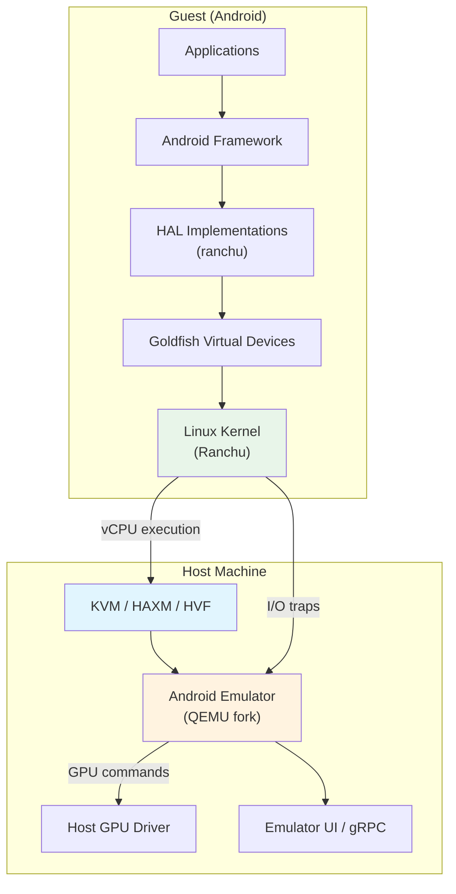

The critical insight is that the emulator is not "simulating" Android -- it is
_running_ Android. The kernel is a real Linux kernel. The userspace is the same
system image that ships on physical devices (or very close to it). The
emulator's job is to provide the virtual hardware that this real software
expects to find.

### 58.1.4 Key Source Directories

| Directory | Purpose |
|-----------|---------|
| `device/generic/goldfish/` | Goldfish virtual device definitions, HALs, init scripts |
| `device/google/cuttlefish/` | Cuttlefish virtual device definitions |
| `device/generic/goldfish/hals/` | Hardware Abstraction Layer implementations |
| `device/generic/goldfish/init/` | Init RC scripts for emulator boot |
| `device/generic/goldfish/sepolicy/` | SELinux policy for emulator-specific domains |
| `device/generic/goldfish/board/` | Board configuration (architecture-specific) |
| `device/generic/goldfish/product/` | Product configuration makefiles |

### 58.1.5 Product Configurations

The emulator defines several product targets, listed in
`device/generic/goldfish/AndroidProducts.mk`:

```makefile
# Source: device/generic/goldfish/AndroidProducts.mk
PRODUCT_MAKEFILES := \
    $(LOCAL_DIR)/64bitonly/product/sdk_phone64_x86_64.mk \
    $(LOCAL_DIR)/64bitonly/product/sdk_phone16k_x86_64.mk \
    $(LOCAL_DIR)/64bitonly/product/sdk_phone64_x86_64_minigbm.mk \
    $(LOCAL_DIR)/64bitonly/product/sdk_phone64_x86_64_riscv64.mk \
    $(LOCAL_DIR)/64bitonly/product/sdk_tablet_arm64.mk \
    $(LOCAL_DIR)/64bitonly/product/sdk_tablet_x86_64.mk \
    $(LOCAL_DIR)/64bitonly/product/sdk_phone64_arm64.mk \
    $(LOCAL_DIR)/64bitonly/product/sdk_phone64_arm64_minigbm.mk \
    $(LOCAL_DIR)/64bitonly/product/sdk_phone16k_arm64.mk \
    $(LOCAL_DIR)/64bitonly/product/sdk_phone64_arm64_riscv64.mk \
    $(LOCAL_DIR)/64bitonly/product/sdk_slim_x86_64.mk \
    $(LOCAL_DIR)/64bitonly/product/sdk_slim_arm64.mk
```

These targets cover x86_64, ARM64, and RISC-V architectures, as well as
specialized form factors (phone, tablet, slim) and graphics backends
(standard vs. minigbm).

---

## 58.2 The Goldfish Device Platform

"Goldfish" is the original virtual hardware platform for the Android Emulator.
The name refers to the collection of virtual devices (timers, interrupt
controllers, I/O buses, etc.) that QEMU presents to the guest kernel. Over
time, Goldfish has evolved significantly -- most of the original custom
Goldfish devices have been replaced by standard virtio devices in the modern
"Ranchu" platform, but the name persists in the AOSP source tree.

### 58.2.1 Product Configuration Hierarchy

The Goldfish product configuration follows a layered inheritance pattern:

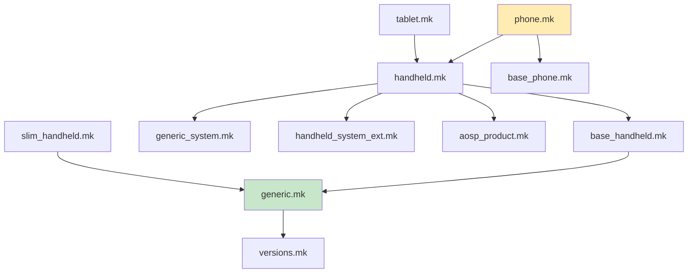

The root configuration file is `device/generic/goldfish/product/generic.mk`,
which establishes the core emulator device. From its contents:

```makefile
# Source: device/generic/goldfish/product/generic.mk (selected lines)
PRODUCT_VENDOR_PROPERTIES += \
    ro.hardware.power=ranchu \
    ro.kernel.qemu=1 \
    ro.soc.manufacturer=AOSP \
    ro.soc.model=ranchu \
```

The property `ro.kernel.qemu=1` is a well-known flag that the framework uses
to detect that it is running inside the emulator. The SoC model is reported as
"ranchu" -- the modern codename for the emulator's virtual platform.

### 58.2.2 Board Configuration

The board configuration lives in `device/generic/goldfish/board/`. Each
architecture variant has its own directory:

| Directory | Architecture |
|-----------|-------------|
| `board/emu64x/` | x86_64 |
| `board/emu64a/` | ARM64 |
| `board/emu64xr/` | x86_64 + RISC-V (native bridge) |
| `board/emu64ar/` | ARM64 + RISC-V (native bridge) |
| `board/emu64x16k/` | x86_64, 16KB pages |
| `board/emu64a16k/` | ARM64, 16KB pages |

All of them inherit from `board/BoardConfigCommon.mk`, which establishes
shared board-level settings:

```makefile
# Source: device/generic/goldfish/board/BoardConfigCommon.mk (key excerpts)
TARGET_BOOTLOADER_BOARD_NAME := goldfish_$(TARGET_ARCH)

# Build OpenGLES emulation guest and host libraries
BUILD_EMULATOR_OPENGL := true
BUILD_QEMU_IMAGES := true
USE_OPENGL_RENDERER := true

# Emulator doesn't support sparse image format.
TARGET_USERIMAGES_SPARSE_EXT_DISABLED := true

# emulator is Non-A/B device
AB_OTA_UPDATER := none

# emulator needs super.img
BOARD_BUILD_SUPER_IMAGE_BY_DEFAULT := true

# 8G + 8M
BOARD_SUPER_PARTITION_SIZE ?= 8598323200
BOARD_SUPER_PARTITION_GROUPS := emulator_dynamic_partitions
```

Key takeaways:

- The emulator uses the **super partition** with dynamic partitions, matching
  modern physical devices.

- It is a **Non-A/B device** (no seamless OTA dual partitions).
- OpenGL ES emulation libraries are built for both guest and host.
- The WiFi subsystem uses `NL80211` with the `mac80211_hwsim` kernel module
  to simulate a wireless network interface.

### 58.2.3 HAL Implementations

The heart of the Goldfish device platform is its collection of HAL
(Hardware Abstraction Layer) implementations. These are located under
`device/generic/goldfish/hals/` and provide the bridge between Android's
hardware interfaces and the emulator's virtual devices.

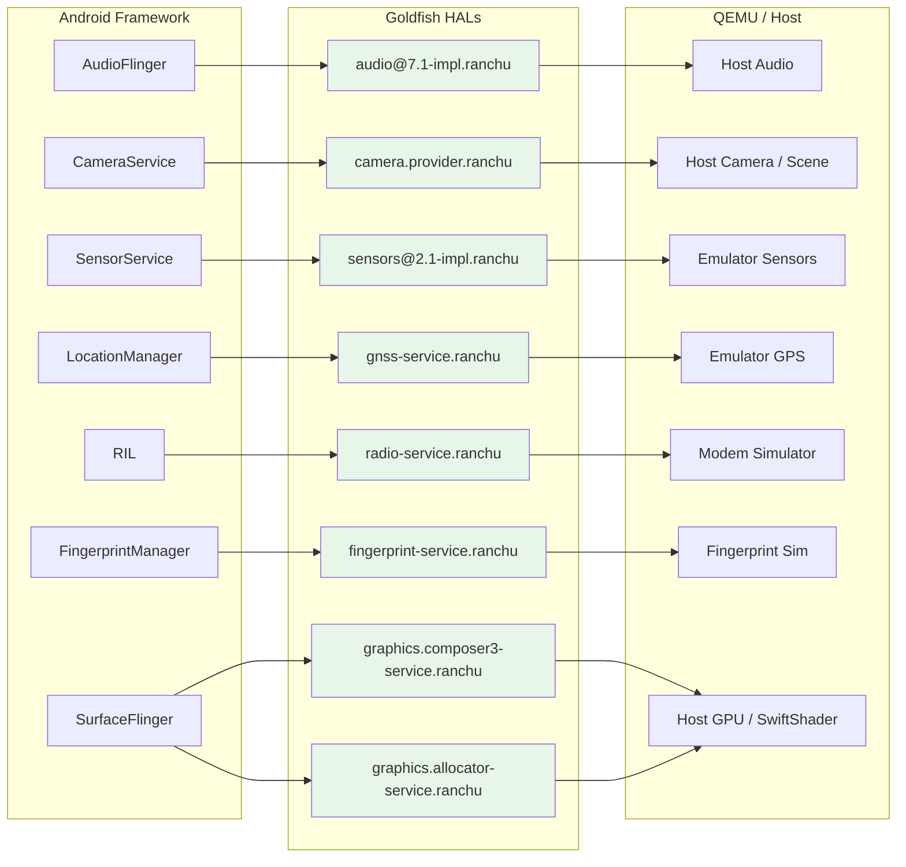

#### 58.2.3.1 Audio HAL

**Location:** `device/generic/goldfish/hals/audio/`

The audio HAL implements `android.hardware.audio@7.1`. It uses TinyALSA to
interface with a virtual sound card provided by QEMU. The implementation
includes:

- `primary_device.cpp` -- The main audio device, handling volume control, mic
  mute, and stream creation.

- `stream_out.cpp` / `stream_in.cpp` -- Output and input stream
  implementations.

- `talsa.cpp` -- TinyALSA wrapper layer.
- `device_port_sink.cpp` / `device_port_source.cpp` -- Port abstraction for
  audio routing.

From `device/generic/goldfish/hals/audio/primary_device.cpp`:

```cpp
// Source: device/generic/goldfish/hals/audio/primary_device.cpp
constexpr size_t kInBufferDurationMs = 15;
constexpr size_t kOutBufferDurationMs = 22;

Device::Device() {}

Return<Result> Device::initCheck() {
    return Result::OK;
}

Return<Result> Device::setMasterVolume(float volume) {
    if (isnan(volume) || volume < 0 || volume > 1.0) {
        return FAILURE(Result::INVALID_ARGUMENTS);
    }

    mMasterVolume = volume;
    updateOutputStreamVolume(mMasterMute ? 0.0f : volume);
    return Result::OK;
}
```

The audio latency configuration is set in the product makefile:

```makefile
# Source: device/generic/goldfish/product/generic.mk
PRODUCT_VENDOR_PROPERTIES += \
    ro.hardware.audio.tinyalsa.period_count=4 \
    ro.hardware.audio.tinyalsa.period_size_multiplier=2 \
    ro.hardware.audio.tinyalsa.host_latency_ms=80 \
```

The 80ms host latency is higher than a physical device (which targets 5-20ms)
because audio data must transit through QEMU's virtual sound card and the
host's audio subsystem.

#### 58.2.3.2 Camera HAL

**Location:** `device/generic/goldfish/hals/camera/`

The camera HAL implements the AIDL Camera Provider interface. It supports
multiple camera sources:

- **QEMU cameras** (`BaseQemuCamera`, `GasQemuCamera`,
  `MinigbmQemuCamera`) -- cameras backed by the host's webcam or a virtual
  scene, communicated through QEMU's pipe mechanism.

- **Fake rotating cameras** (`FakeRotatingCamera`) -- synthetic test cameras
  that render a rotating 3D pattern.

The communication with the QEMU host happens through the `qemu_channel`
abstraction. From `device/generic/goldfish/hals/camera/qemu_channel.cpp`:

```cpp
// Source: device/generic/goldfish/hals/camera/qemu_channel.cpp
const char kServiceName[] = "camera";

base::unique_fd qemuOpenChannel() {
    return base::unique_fd(qemud_channel_open(kServiceName));
}

int qemuRunQuery(const int fd,
                 const char* const query,
                 const size_t querySize,
                 std::vector<uint8_t>* result) {
    int e = qemu_pipe_write_fully(fd, query, querySize);
    if (e < 0) {
        return FAILURE(e);
    }

    std::vector<uint8_t> reply;
    e = qemuReceiveMessage(fd, &reply);
    if (e < 0) {
        return e;
    }
    // ... parse ok/ko response ...
}
```

The camera provider uses an ID scheme with the prefix
`device@1.1/internal/`:

```cpp
// Source: device/generic/goldfish/hals/camera/CameraProvider.cpp
constexpr char kCameraIdPrefix[] = "device@1.1/internal/";

std::string getLogicalCameraId(const int index) {
    char buf[sizeof(kCameraIdPrefix) + 8];
    snprintf(buf, sizeof(buf), "%s%d", kCameraIdPrefix, index);
    return buf;
}
```

#### 58.2.3.3 Sensors HAL

**Location:** `device/generic/goldfish/hals/sensors/`

The sensors HAL is one of the most instructive examples of how the emulator
virtualizes hardware. It implements `android.hardware.sensors@2.1` using
QEMU's sensor protocol.

**Sensor List:** The full list of emulated sensors is defined in
`device/generic/goldfish/hals/sensors/sensor_list.cpp`:

```cpp
// Source: device/generic/goldfish/hals/sensors/sensor_list.cpp
const char* const kQemuSensorName[] = {
    "acceleration",
    "gyroscope",
    "magnetic-field",
    "orientation",
    "temperature",
    "proximity",
    "light",
    "pressure",
    "humidity",
    "magnetic-field-uncalibrated",
    "gyroscope-uncalibrated",
    "hinge-angle0",
    "hinge-angle1",
    "hinge-angle2",
    "heart-rate",
    "rgbc-light",
    "wrist-tilt",
    "acceleration-uncalibrated",
    "heading",
};
```

This gives us 19 virtual sensors including:

| Sensor | Type | Reporting Mode |
|--------|------|---------------|
| Accelerometer | `ACCELEROMETER` | Continuous |
| Gyroscope | `GYROSCOPE` | Continuous |
| Magnetic field | `MAGNETIC_FIELD` | Continuous |
| Orientation | `ORIENTATION` | Continuous |
| Temperature | `AMBIENT_TEMPERATURE` | On-change |
| Proximity | `PROXIMITY` | On-change + wake-up |
| Light | `LIGHT` | On-change |
| Pressure | `PRESSURE` | Continuous |
| Humidity | `RELATIVE_HUMIDITY` | On-change |
| Hinge angle (x3) | `HINGE_ANGLE` | On-change + wake-up |
| Heart rate | `HEART_RATE` | On-change |
| Wrist tilt | `WRIST_TILT_GESTURE` | Special + wake-up |
| Heading | Custom type 42 | Continuous |

**Communication Protocol:** The sensor HAL communicates with QEMU using a
simple text-based protocol over the QEMU pipe. From
`device/generic/goldfish/hals/sensors/multihal_sensors_qemu.cpp`:

```cpp
// Source: device/generic/goldfish/hals/sensors/multihal_sensors_qemu.cpp
bool MultihalSensors::setSensorsReportingImpl(SensorsTransport& st,
                                              const int sensorHandle,
                                              const bool enabled) {
    char buffer[64];
    int len = snprintf(buffer, sizeof(buffer),
                       "set:%s:%d",
                       getQemuSensorNameByHandle(sensorHandle),
                       (enabled ? 1 : 0));

    if (st.Send(buffer, len) < 0) {
        ALOGE("%s:%d: send for %s failed", __func__, __LINE__, st.Name());
        return false;
    } else {
        return true;
    }
}
```

The protocol commands include:

- `list-sensors` -- query which sensors the host supports (returns a bitmask)
- `set:<sensor_name>:<0|1>` -- enable or disable a sensor
- `set-delay:<ms>` -- set the reporting interval in milliseconds
- `time:<ns>` -- synchronize the guest clock

**Parsing sensor events:** When the host sends sensor data, the guest parses
text messages like `acceleration:9.8:0.0:0.1`. The parsing is done in
`parseQemuSensorEventLocked`:

```cpp
// Source: device/generic/goldfish/hals/sensors/multihal_sensors_qemu.cpp
void MultihalSensors::parseQemuSensorEventLocked(QemuSensorsProtocolState* state) {
    char buf[256];
    const int len = m_sensorsTransport->Receive(buf, sizeof(buf) - 1);
    // ...
    if (const char* values = testPrefix(buf, end, "acceleration", ':')) {
        if (sscanf(values, "%f:%f:%f",
                   &vec3->x, &vec3->y, &vec3->z) == 3) {
            vec3->status = SensorStatus::ACCURACY_MEDIUM;
            event.timestamp = nowNs + state->timeBiasNs;
            event.sensorHandle = kSensorHandleAccelerometer;
            event.sensorType = SensorType::ACCELEROMETER;
            postSensorEventLocked(event);
            parsed = true;
        }
    }
    // ... similar blocks for gyroscope, magnetic, proximity, light, etc.
}
```

The architecture uses a dedicated listener thread (`qemuSensorListenerThread`)
and a batch thread (`batchThread`) for continuous-mode sensors:

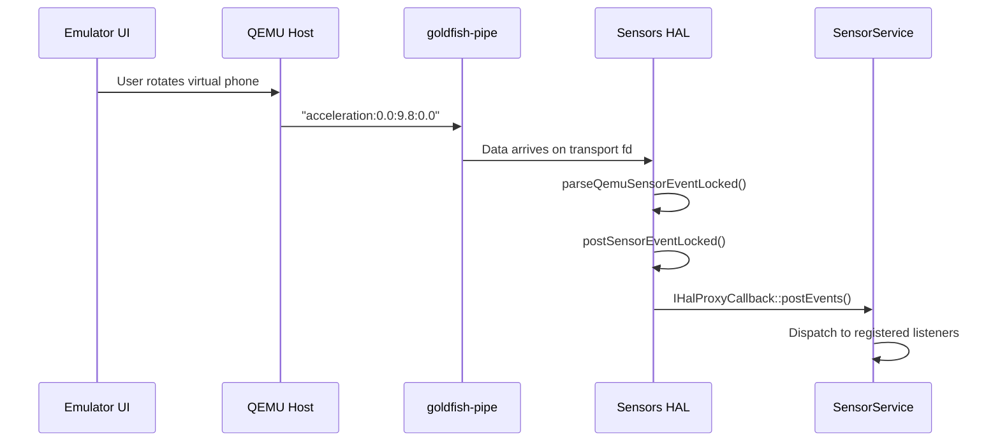

#### 58.2.3.4 GNSS HAL

**Location:** `device/generic/goldfish/hals/gnss/`

The GNSS (Global Navigation Satellite System) HAL provides virtual GPS data.
The key class is `GnssHwConn` which opens a QEMU pipe to the "gps" service:

```cpp
// Source: device/generic/goldfish/hals/gnss/GnssHwConn.cpp
GnssHwConn::GnssHwConn(IDataSink& sink) {
    mDevFd.reset(qemu_pipe_open_ns("qemud", "gps", O_RDWR));
    if (!mDevFd.ok()) {
        ALOGE("%s:%d: qemu_pipe_open_ns failed", __func__, __LINE__);
        return;
    }

    unique_fd threadsFd;
    if (!::android::base::Socketpair(AF_LOCAL, SOCK_STREAM, 0,
                                     &mCallersFd, &threadsFd)) {
        ALOGE("%s:%d: Socketpair failed", __func__, __LINE__);
        mDevFd.reset();
        return;
    }

    std::promise<void> isReadyPromise;
    const int devFd = mDevFd.get();
    mThread = std::thread([devFd, threadsFd = std::move(threadsFd), &sink,
                           &isReadyPromise]() {
        GnssHwListener listener(sink);
        isReadyPromise.set_value();
        workerThread(devFd, threadsFd.get(), listener);
    });

    isReadyPromise.get_future().wait();
}
```

The worker thread uses `epoll` to multiplex between the QEMU device fd (for
GPS data arriving from the host) and a command fd (for shutdown signals).
When the emulator's Extended Controls window sends a GPS fix, it flows
through QEMU's GPS service, through the pipe, into `GnssHwListener` which
parses NMEA sentences, and finally into Android's `LocationManager`.

The GNSS device node is created via a symlink in the init script:

```
# Source: device/generic/goldfish/init/init.ranchu.rc
on property:vendor.qemu.vport.gnss=*
    symlink ${vendor.qemu.vport.gnss} /dev/gnss0
```

The corresponding SELinux policy grants the GNSS HAL access to vsock
sockets:

```
# Source: device/generic/goldfish/sepolicy/vendor/hal_gnss_default.te
vndbinder_use(hal_gnss_default);
allow hal_gnss_default self:vsock_socket create_socket_perms_no_ioctl;
```

#### 58.2.3.5 Radio (Telephony) HAL

**Location:** `device/generic/goldfish/hals/radio/`

The radio HAL implements the full suite of telephony AIDL interfaces:

- `RadioModem` -- modem control (power on/off, IMEI, radio capability)
- `RadioSim` -- SIM card management
- `RadioNetwork` -- network registration, signal strength, cell info
- `RadioData` -- data calls and setup
- `RadioVoice` -- voice calls
- `RadioMessaging` -- SMS
- `RadioIms` -- IMS (IP Multimedia Subsystem)

The radio HAL communicates with a modem simulator using AT commands over a
channel. From `device/generic/goldfish/hals/radio/RadioModem.cpp`:

```cpp
// Source: device/generic/goldfish/hals/radio/RadioModem.cpp
constexpr char kBasebandversion[] = "1.0.0.0";
constexpr char kModemUuid[] = "com.android.modem.simulator";

ScopedAStatus RadioModem::getBasebandVersion(const int32_t serial) {
    NOT_NULL(mRadioModemResponse)->getBasebandVersionResponse(
            makeRadioResponseInfo(serial), kBasebandversion);
    return ScopedAStatus::ok();
}
```

The AT command interface uses a request-response pattern with an `AtChannel`
abstraction:

```cpp
// Source: device/generic/goldfish/hals/radio/RadioModem.cpp
ScopedAStatus RadioModem::getImei(const int32_t serial) {
    mAtChannel->queueRequester([this, serial](
            const AtChannel::RequestPipe requestPipe) -> bool {
        const AtResponsePtr response =
            mAtConversation(requestPipe, atCmds::getIMEI,
                            [](const AtResponse& response) -> bool {
                                return response.holds<std::string>();
                            });
        if (!response) {
            NOT_NULL(mRadioModemResponse)->getImeiResponse(
                    makeRadioResponseInfo(serial,
                        FAILURE(RadioError::INTERNAL_ERR)), {});
            return false;
        } else if (const std::string* imeiSvn =
                       response->get_if<std::string>()) {
            modem::ImeiInfo imeiInfo = {
                .type = modem::ImeiInfo::ImeiType::PRIMARY,
                .imei = imeiSvn->substr(0, 15),
                .svn = imeiSvn->substr(15, 2),
            };
            NOT_NULL(mRadioModemResponse)->getImeiResponse(
                makeRadioResponseInfo(serial), std::move(imeiInfo));
           return true;
        }
        // ...
    });
    return ScopedAStatus::ok();
}
```

The radio HAL also supports 5G NR, LTE, TD-SCDMA, CDMA, EVDO, GSM, and WCDMA
network types as configured in the product makefile:

```makefile
# Source: device/generic/goldfish/product/generic.mk
# NR 5G, LTE, TD-SCDMA, CDMA, EVDO, GSM and WCDMA
PRODUCT_VENDOR_PROPERTIES += ro.telephony.default_network=33
```

#### 58.2.3.6 Fingerprint HAL

**Location:** `device/generic/goldfish/hals/fingerprint/`

The fingerprint HAL is a relatively simple implementation that provides
AIDL `IFingerprint` service. From `device/generic/goldfish/hals/fingerprint/hal.cpp`:

```cpp
// Source: device/generic/goldfish/hals/fingerprint/hal.cpp
constexpr char HW_COMPONENT_ID[] = "FingerprintSensor";
constexpr char XW_VERSION[] = "ranchu/fingerprint/aidl";
constexpr char FW_VERSION[] = "1";
constexpr char SERIAL_NUMBER[] = "00000001";
constexpr char SW_COMPONENT_ID[] = "matchingAlgorithm";

ndk::ScopedAStatus Hal::getSensorProps(std::vector<SensorProps>* out) {
    // ...
    SensorProps props;
    props.commonProps.sensorId = 0;
    props.commonProps.sensorStrength = common::SensorStrength::STRONG;
    props.commonProps.maxEnrollmentsPerUser =
        Storage::getMaxEnrollmentsPerUser();
    props.sensorType = FingerprintSensorType::REAR;
    props.supportsNavigationGestures = false;
    props.supportsDetectInteraction = true;
    // ...
}
```

The emulator's Extended Controls window provides a virtual fingerprint
scanner that triggers authentication events through this HAL.

#### 58.2.3.7 Hardware Composer (HWC3) HAL

**Location:** `device/generic/goldfish/hals/hwc3/`

The hardware composer HAL has the richest implementation of all the
emulator HALs. It supports two composition modes:

1. **HostFrameComposer** -- delegates composition to the host GPU, achieving
   hardware-accelerated rendering.

2. **GuestFrameComposer** -- performs composition within the guest using DRM
   (Direct Rendering Manager) and libyuv.

The host frame composer uses the gfxstream protocol to send composition
commands to the emulator process:

```cpp
// Source: device/generic/goldfish/hals/hwc3/HostFrameComposer.cpp
#include "gfxstream/guest/goldfish_sync.h"
#include "virtgpu_drm.h"

namespace aidl::android::hardware::graphics::composer3::impl {
// ...
static bool isMinigbmFromProperty() {
    static constexpr const auto kGrallocProp = "ro.hardware.gralloc";
    const auto grallocProp =
        ::android::base::GetProperty(kGrallocProp, "");
    if (grallocProp == "minigbm") {
        return true;
    } else {
        return false;
    }
}
```

The guest frame composer is used as a fallback when host rendering is
unavailable:

```cpp
// Source: device/generic/goldfish/hals/hwc3/GuestFrameComposer.cpp
#include "Drm.h"
#include "Layer.h"
#include "DisplayFinder.h"

std::array<std::int8_t, 16> ToLibyuvColorMatrix(
        const std::array<float, 16>& in) {
    // Converts HAL color matrix to libyuv format
    std::array<std::int8_t, 16> out;
    for (int r = 0; r < 4; r++) {
        for (int c = 0; c < 4; c++) {
            int indexIn = (4 * r) + c;
            int indexOut = (4 * c) + r;
            float clampedValue = std::max(-128.0f,
                std::min(127.0f, in[indexIn] * 64.0f + 0.5f));
            out[indexOut] = static_cast<std::int8_t>(clampedValue);
        }
    }
    return out;
}
```

The HWC3 implementation supports DRM-based display management with proper
plane, CRTC, and connector abstractions -- visible in the extensive list of
DRM-related source files: `Drm.cpp`, `DrmClient.cpp`, `DrmConnector.cpp`,
`DrmCrtc.cpp`, `DrmDisplay.cpp`, `DrmPlane.cpp`, `DrmSwapchain.cpp`,
`DrmAtomicRequest.cpp`, `DrmBuffer.cpp`, `DrmEventListener.cpp`,
`DrmMode.cpp`.

#### 58.2.3.8 Gralloc (Graphics Allocator) HAL

**Location:** `device/generic/goldfish/hals/gralloc/`

The graphics allocator handles buffer allocation for both CPU and GPU
use. From `device/generic/goldfish/hals/gralloc/allocator.cpp`:

```cpp
// Source: device/generic/goldfish/hals/gralloc/allocator.cpp
struct GoldfishAllocator : public BnAllocator {
    GoldfishAllocator()
        : mHostConn(HostConnection::createUnique(kCapsetNone))
        , mDebugLevel(getDebugLevel()) {}

    ndk::ScopedAStatus allocate2(const BufferDescriptorInfo& desc,
                                 const int32_t count,
                                 AllocationResult* const outResult) override {
        // ...
        const uint64_t usage = toUsage64(desc.usage);

        if (needCpuBuffer(usage)) {
            req.needImageAllocation = true;
            // ...
        } else {
            req.needImageAllocation = false;
            // ...
        }
        // ...
    }
};
```

The key design decision is the split between **CPU buffers** (allocated in
guest memory via `GoldfishAddressSpaceBlock`) and **GPU buffers** (represented
as color buffers on the host). When a buffer needs GPU access, the allocator
creates a host-side color buffer through the render control encoder:

```cpp
// Source: device/generic/goldfish/hals/gralloc/allocator.cpp
if (needGpuBuffer(req.usage)) {
    hostHandleRefCountFd.reset(qemu_pipe_open("refcount"));

    hostHandle = rcEnc.rcCreateColorBufferDMA(
        &rcEnc, req.width, req.height,
        req.glFormat, static_cast<int>(req.emuFwkFormat));

    if (qemu_pipe_write(hostHandleRefCountFd.get(),
                        &hostHandle,
                        sizeof(hostHandle)) != sizeof(hostHandle)) {
        rcEnc.rcCloseColorBuffer(&rcEnc, hostHandle);
        return FAILURE(nullptr);
    }
}
```

The allocator supports a wide range of pixel formats including RGBA_8888,
RGB_565, RGBA_FP16, RGBA_1010102, YV12, YCBCR_420_888, and YCBCR_P010.
The mapper library suffix is "ranchu":

```cpp
ndk::ScopedAStatus getIMapperLibrarySuffix(std::string* outResult) override {
    *outResult = "ranchu";
    return ndk::ScopedAStatus::ok();
}
```

### 58.2.4 Init Scripts

The emulator's boot process is controlled by init scripts in
`device/generic/goldfish/init/`. The primary script is `init.ranchu.rc`:

```
# Source: device/generic/goldfish/init/init.ranchu.rc (key sections)
on early-init
    mount proc proc /proc remount hidepid=2,gid=3009
    setprop ro.cpuvulkan.version ${ro.boot.qemu.cpuvulkan.version}
    setprop ro.hardware.egl ${ro.boot.hardwareegl:-emulation}
    setprop ro.hardware.vulkan ${ro.boot.hardware.vulkan}
    setprop ro.opengles.version ${ro.boot.opengles.version}
    setprop dalvik.vm.heapsize ${ro.boot.dalvik.vm.heapsize:-192m}
    setprop debug.hwui.renderer ${ro.boot.debug.hwui.renderer:-skiagl}
    setprop vendor.qemu.dev.bootcomplete 0
    start vendor.dlkm_loader

on init
    write /sys/block/zram0/comp_algorithm lz4
    write /proc/sys/vm/page-cluster 0
    start qemu-props

on post-fs-data
    mkdir /data/vendor/var 0755 root root
    mkdir /data/vendor/var/run 0755 root root
    start ranchu-device-state
    start ranchu-adb-setup
```

Several services are defined for emulator-specific functionality:

- **`qemu-props`** -- reads boot properties from the emulator host and sets
  them as system properties.

- **`ranchu-adb-setup`** -- configures ADB for the emulator.
- **`ranchu-net`** -- sets up networking (VirtIO WiFi, inter-emulator
  connections).

- **`ranchu-setup`** -- performs post-boot-complete setup.
- **`goldfish-logcat`** -- forwards logcat output to the host via virtio
  console (`/dev/hvc1`).

- **`bt_vhci_forwarder`** -- forwards Bluetooth HCI traffic.

The rendering subsystem default is established at `early-init`:

```
# Source: device/generic/goldfish/init/init.ranchu.rc
setprop ro.hardware.egl ${ro.boot.hardwareegl:-emulation}
# default skiagl: skia uses gles to render
setprop debug.hwui.renderer ${ro.boot.debug.hwui.renderer:-skiagl}
# default skiaglthreaded
setprop debug.renderengine.backend \
    ${ro.boot.debug.renderengine.backend:-skiaglthreaded}
```

### 58.2.5 SELinux Policy

The emulator defines custom SELinux policy under
`device/generic/goldfish/sepolicy/`. The vendor policy directory contains
approximately 60 policy files covering all emulator-specific domains and
services.

Key policy files:

| File | Purpose |
|------|---------|
| `qemu_props.te` | Policy for the `qemu-props` property-setting service |
| `hal_sensors_default.te` | Sensors HAL access to vsock sockets |
| `hal_gnss_default.te` | GNSS HAL access to vsock and vnode binder |
| `hal_radio_default.te` | Radio HAL modem simulator access |
| `hal_camera_default.te` | Camera HAL QEMU pipe access |
| `hal_graphics_composer_default.te` | HWC3 DRM and GPU access |
| `hal_graphics_allocator_default.te` | Gralloc buffer allocation policy |
| `goldfish_setup.te` | Emulator setup scripts |
| `goldfish_ip.te` | Network configuration |

From `device/generic/goldfish/sepolicy/vendor/qemu_props.te`:

```
# Source: device/generic/goldfish/sepolicy/vendor/qemu_props.te
type qemu_props, domain;
type qemu_props_exec, vendor_file_type, exec_type, file_type;

init_daemon_domain(qemu_props)

set_prop(qemu_props, qemu_hw_prop)
set_prop(qemu_props, qemu_sf_lcd_density_prop)
set_prop(qemu_props, vendor_qemu_prop)
set_prop(qemu_props, vendor_net_share_prop)

allow qemu_props self:vsock_socket create_socket_perms_no_ioctl;
allow qemu_props sysfs:dir read;
allow qemu_props sysfs:dir open;
allow qemu_props sysfs:file getattr;
allow qemu_props sysfs:file read;
allow qemu_props sysfs:file open;
```

The `qemu_props` domain is granted permission to set specific property
categories and to communicate over vsock (VirtIO socket) -- the primary
communication channel between the guest kernel and the QEMU host.

### 58.2.6 Detailed Package Inventory

The emulator's product configuration pulls in a significant number of packages.
Here is a categorized breakdown from
`device/generic/goldfish/product/generic.mk`:

**Core Graphics Stack:**

```makefile
# Source: device/generic/goldfish/product/generic.mk
PRODUCT_PACKAGES += \
    vulkan.ranchu \
    libandroidemu \
    libOpenglCodecCommon \
    libOpenglSystemCommon \
    android.hardware.graphics.composer3-service.ranchu
```

The `vulkan.ranchu` package provides the Vulkan ICD (Installable Client
Driver) for the emulator. `libandroidemu` and the OpenGL codec/system
libraries implement the guest-side portion of the GPU emulation pipeline.

**OpenGL ES Emulation Libraries:**

```makefile
# Source: device/generic/goldfish/product/generic.mk
PRODUCT_PACKAGES += \
    libGLESv1_CM_emulation \
    lib_renderControl_enc \
    libEGL_emulation \
    libGLESv2_enc \
    libvulkan_enc \
    libGLESv2_emulation \
    libGLESv1_enc \
    libEGL_angle \
    libGLESv1_CM_angle \
    libGLESv2_angle
```

These libraries work in pairs:

- `lib*_emulation` -- guest-side EGL/GLES implementation that intercepts API
  calls

- `lib*_enc` -- encoders that serialize GLES/Vulkan commands into a binary
  stream for transport to the host

- `lib*_angle` -- ANGLE-based implementation for Vulkan-backed GLES

**Media Codecs:**

```makefile
# Source: device/generic/goldfish/product/generic.mk
PRODUCT_PACKAGES += \
    android.hardware.media.c2@1.0-service-goldfish \
    libcodec2_goldfish_vp8dec \
    libcodec2_goldfish_vp9dec \
    libcodec2_goldfish_avcdec \
    libcodec2_goldfish_hevcdec
```

The goldfish media codecs use the Codec2 framework and delegate video
decoding to the host through QEMU, enabling hardware-accelerated video
playback even inside the emulator.

**Compliance HALs ("Hello, world!" implementations):**

```makefile
# Source: device/generic/goldfish/product/generic.mk
PRODUCT_PACKAGES += \
    com.android.hardware.authsecret \
    com.android.hardware.contexthub \
    com.android.hardware.dumpstate \
    android.hardware.health-service.example \
    android.hardware.health.storage-service.default \
    android.hardware.lights-service.example \
    com.android.hardware.neuralnetworks \
    com.android.hardware.power \
    com.android.hardware.thermal \
    com.android.hardware.vibrator
```

These are minimal implementations that satisfy CTS requirements. They do not
perform real hardware operations but provide the AIDL service interfaces
that the framework expects.

**Conditional Package Selection:**

The product makefile uses several build flags to conditionally include
components:

| Flag | Default | Effect when `true` |
|------|---------|-------------------|
| `EMULATOR_DISABLE_RADIO` | false | Disables telephony HAL |
| `EMULATOR_VENDOR_NO_BIOMETRICS` | false | Disables fingerprint HAL |
| `EMULATOR_VENDOR_NO_GNSS` | false | Disables GNSS HAL |
| `EMULATOR_VENDOR_NO_SENSORS` | false | Disables sensors HAL |
| `EMULATOR_VENDOR_NO_CAMERA` | false | Disables camera HAL |
| `EMULATOR_VENDOR_NO_SOUND` | false | Disables audio HAL |
| `EMULATOR_VENDOR_NO_UWB` | false | Disables UWB HAL |
| `EMULATOR_VENDOR_NO_THREADNETWORK` | false | Disables Thread networking |
| `EMULATOR_VENDOR_NO_REBOOT_ESCROW` | false | Disables reboot escrow |

This allows building minimal emulator images for specialized testing where
only specific subsystems are needed.

---

## 58.3 Virtual Hardware

### 58.3.1 The Goldfish-Pipe: Host-Guest Communication

The goldfish-pipe is the central communication mechanism between the Android
guest and the QEMU host. It is a virtual device that provides a bidirectional
byte-stream interface, similar to a Unix pipe but crossing the VM boundary.

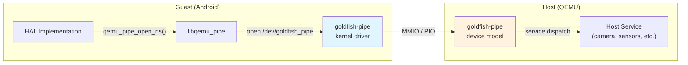

**Guest-side API:** The pipe is accessed through the `libqemu_pipe` library,
which provides functions like:

- `qemu_pipe_open_ns(namespace, name, flags)` -- opens a named pipe to a
  specific host service

- `qemu_pipe_write_fully(fd, data, size)` -- writes data to the pipe
- `qemu_pipe_read_fully(fd, data, size)` -- reads data from the pipe

The `qemud` layer adds multiplexing on top of the raw pipe. Multiple logical
channels can be opened through a single pipe connection. From
`device/generic/goldfish/hals/lib/qemud/qemud.cpp`:

```cpp
// Source: device/generic/goldfish/hals/lib/qemud/qemud.cpp
int qemud_channel_open(const char* name) {
    return qemu_pipe_open_ns("qemud", name, O_RDWR);
}

int qemud_channel_send(int pipe, const void* msg, int size) {
    char header[5];
    if (size < 0)
        size = strlen((const char*)msg);
    if (size == 0)
        return 0;

    if (size >= 64 * 1024) { // use binary encoding
        uint32_t length32be = htonl(size | (1U << 31));
        memcpy(header, &length32be, 4);
    } else { // use hex digit encoding
        snprintf(header, sizeof(header), "%04x", size);
    }

    if (qemu_pipe_write_fully(pipe, header, 4)) {
        return -1;
    }
    if (qemu_pipe_write_fully(pipe, msg, size)) {
        return -1;
    }
    return 0;
}

int qemud_channel_recv(int pipe, void* msg, int maxsize) {
    char header[5];
    int size;
    if (qemu_pipe_read_fully(pipe, header, 4)) {
        return -1;
    }
    header[4] = 0;
    if (sscanf(header, "%04x", &size) != 1) {
        return -1;
    }
    if (size > maxsize) {
        return -1;
    }
    if (qemu_pipe_read_fully(pipe, msg, size)) {
        return -1;
    }
    return size;
}
```

The protocol uses a simple length-prefixed framing:

- Messages under 64KB use a 4-character hex length prefix (e.g., `"001a"`)
- Messages of 64KB or larger use a 4-byte binary network-order length with
  the high bit set

### 58.3.2 The Sensor HAL Threading Model

The sensors HAL has a sophisticated multi-threaded architecture that merits
detailed examination. The `MultihalSensors` class header
(`device/generic/goldfish/hals/sensors/include/multihal_sensors.h`) reveals
the internal structure:

```cpp
// Source: device/generic/goldfish/hals/sensors/include/multihal_sensors.h
struct MultihalSensors : public ahs21::implementation::ISensorsSubHal {
    using SensorsTransportFactory =
        std::function<std::unique_ptr<SensorsTransport>()>;

    MultihalSensors(SensorsTransportFactory);
    ~MultihalSensors();

private:
    struct QemuSensorsProtocolState {
        int64_t timeBiasNs = -500000000;
        int32_t sensorsUpdateIntervalMs = 200;
        static constexpr float kSensorNoValue = -1e+30;

        // on change sensors (host does not support them)
        float lastAmbientTemperatureValue = kSensorNoValue;
        float lastProximityValue = kSensorNoValue;
        float lastLightValue = kSensorNoValue;
        float lastRelativeHumidityValue = kSensorNoValue;
        float lastHingeAngle0Value = kSensorNoValue;
        float lastHingeAngle1Value = kSensorNoValue;
        float lastHingeAngle2Value = kSensorNoValue;
        float lastHeartRateValue = kSensorNoValue;
        float lastWristTiltMeasurement = -1;
    };

    // batching
    struct BatchEventRef {
        int64_t  timestamp = -1;
        int      sensorHandle = -1;
        int      generation = 0;

        bool operator<(const BatchEventRef &rhs) const {
            // not a typo: we want top() to be smallest timestamp
            return timestamp > rhs.timestamp;
        }
    };

    struct BatchInfo {
        Event       event;
        int64_t     samplingPeriodNs = 0;
        int         generation = 0;
    };

    QemuSensorsProtocolState             m_protocolState;
    std::priority_queue<BatchEventRef>   m_batchQueue;
    std::vector<BatchInfo>               m_batchInfo;
    std::condition_variable              m_batchUpdated;
    std::thread                          m_batchThread;
    std::atomic<bool>                    m_batchRunning = true;
    mutable std::mutex                   m_mtx;
};
```

The threading model has three threads:

1. **Main thread** -- handles HIDL/AIDL calls from SensorService (`activate`,
   `batch`, `flush`, `injectSensorData_2_1`).

2. **Sensor listener thread** (`qemuSensorListenerThread`) -- reads sensor
   data from the QEMU transport and dispatches events. Uses `epoll` to
   multiplex between the transport fd and a command fd.

3. **Batch thread** (`batchThread`) -- implements continuous-mode sensor
   batching. Uses a priority queue ordered by timestamp to determine when to
   deliver the next sensor event.

The epoll-based listener thread implementation from
`device/generic/goldfish/hals/sensors/multihal_sensors_epoll.cpp`:

```cpp
// Source: device/generic/goldfish/hals/sensors/multihal_sensors_epoll.cpp
bool MultihalSensors::qemuSensorListenerThreadImpl(
        const int transportFd) {
    const unique_fd epollFd(epoll_create1(0));

    epollCtlAdd(epollFd.get(), transportFd);
    epollCtlAdd(epollFd.get(), m_sensorThreadFd.get());

    while (true) {
        struct epoll_event events[2];
        const int kTimeoutMs = 60000;
        const int n = TEMP_FAILURE_RETRY(epoll_wait(
            epollFd.get(), events, 2, kTimeoutMs));

        for (int i = 0; i < n; ++i) {
            const struct epoll_event* ev = &events[i];
            const int fd = ev->data.fd;

            if (fd == transportFd) {
                if (ev->events & EPOLLIN) {
                    std::unique_lock<std::mutex> lock(m_mtx);
                    parseQemuSensorEventLocked(&m_protocolState);
                }
            } else if (fd == m_sensorThreadFd.get()) {
                const int cmd = qemuSensortThreadRcvCommand(fd);
                switch (cmd) {
                case kCMD_QUIT: return false;
                case kCMD_RESTART: return true;
                }
            }
        }
    }
}
```

The `kCMD_RESTART` command is sent when the batch interval changes and the
transport needs to be reconfigured. The `kCMD_QUIT` command is sent during
shutdown. This design allows the sensor listener to be restarted without
tearing down the entire HAL.

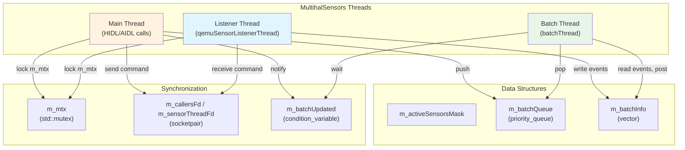

### 58.3.3 Display Discovery and VSync

The HWC3 HAL discovers displays by querying the QEMU host through the render
control encoder. From
`device/generic/goldfish/hals/hwc3/DisplayFinder.cpp`:

```cpp
// Source: device/generic/goldfish/hals/hwc3/DisplayFinder.cpp
static uint32_t getVsyncHzFromProperty() {
    static constexpr const auto kVsyncProp = "ro.boot.qemu.vsync";
    const auto vsyncProp =
        ::android::base::GetProperty(kVsyncProp, "");

    uint64_t vsyncPeriod;
    if (!::android::base::ParseUint(vsyncProp, &vsyncPeriod)) {
        return 60;  // default 60 Hz
    }
    return static_cast<uint32_t>(vsyncPeriod);
}

HWC3::Error findGoldfishPrimaryDisplay(
        std::vector<DisplayMultiConfigs>* outDisplays) {
    DEFINE_AND_VALIDATE_HOST_CONNECTION
    hostCon->lock();
    const int32_t vsyncPeriodNanos =
        HertzToPeriodNanos(getVsyncHzFromProperty());

    DisplayMultiConfigs display;
    display.displayId = 0;

    if (rcEnc->hasHWCMultiConfigs()) {
        int count = rcEnc->rcGetFBDisplayConfigsCount(rcEnc);
        display.activeConfigId =
            rcEnc->rcGetFBDisplayActiveConfig(rcEnc);

        for (int configId = 0; configId < count; configId++) {
            display.configs.push_back(DisplayConfig(
                configId,
                rcEnc->rcGetFBDisplayConfigsParam(
                    rcEnc, configId, FB_WIDTH),
                rcEnc->rcGetFBDisplayConfigsParam(
                    rcEnc, configId, FB_HEIGHT),
                rcEnc->rcGetFBDisplayConfigsParam(
                    rcEnc, configId, FB_XDPI),
                rcEnc->rcGetFBDisplayConfigsParam(
                    rcEnc, configId, FB_YDPI),
                vsyncPeriodNanos));
        }
    }
    // ...
}
```

The display finder queries the host for:

- **Resolution** (width, height) from `FB_WIDTH` and `FB_HEIGHT` parameters
- **DPI** (dots per inch) from `FB_XDPI` and `FB_YDPI` parameters
- **Refresh rate** from the `ro.boot.qemu.vsync` boot property

When the host supports multiple display configurations (multi-config mode),
the display finder enumerates all available configurations and presents them
to SurfaceFlinger through the HWC3 interface.

### 58.3.4 The Audio Write Thread

The audio HAL's output stream uses a dedicated write thread with FMQ (Fast
Message Queue) for low-latency communication with AudioFlinger. From
`device/generic/goldfish/hals/audio/stream_out.cpp`:

```cpp
// Source: device/generic/goldfish/hals/audio/stream_out.cpp
class WriteThread : public IOThread {
    typedef MessageQueue<IStreamOut::WriteCommand,
                         kSynchronizedReadWrite> CommandMQ;
    typedef MessageQueue<IStreamOut::WriteStatus,
                         kSynchronizedReadWrite> StatusMQ;
    typedef MessageQueue<uint8_t,
                         kSynchronizedReadWrite> DataMQ;

public:
    WriteThread(StreamOut *stream, const size_t mqBufferSize)
            : mStream(stream)
            , mCommandMQ(1)
            , mStatusMQ(1)
            , mDataMQ(mqBufferSize, true /* EventFlag */) {
        // ...
        EventFlag* rawEfGroup = nullptr;
        status_t status = EventFlag::createEventFlag(
            mDataMQ.getEventFlagWord(), &rawEfGroup);
        mEfGroup.reset(rawEfGroup);
        mThread = std::thread(&WriteThread::threadLoop, this);
    }
};
```

The FMQ mechanism allows AudioFlinger to write audio data without Binder
round-trips. The `EventFlag` provides lightweight signaling between the
AudioFlinger process and the HAL service process using shared memory.

### 58.3.5 Wake Lock Management

The emulator setup script manages power state through wake locks. From
`device/generic/goldfish/init/init.setup.ranchu.sh`:

```bash
# Source: device/generic/goldfish/init/init.setup.ranchu.sh
allowsuspend=`getprop ro.boot.qemu.allowsuspend`
case "$allowsuspend" in
    "") echo "emulator_wake_lock" > /sys/power/wake_lock
    ;;
    1) echo "emulator_wake_lock" > /sys/power/wake_unlock
    ;;
    *) echo "emulator_wake_lock" > /sys/power/wake_lock
    ;;
esac
```

By default, the emulator holds a permanent wake lock (`emulator_wake_lock`)
to prevent the guest from entering deep sleep. This is important for
development because a suspended emulator would be unresponsive. The
`ro.boot.qemu.allowsuspend=1` flag can be set to allow the guest to suspend,
which is useful for testing power management behavior.

### 58.3.6 The QEMU Properties Service

The `qemu-props` service (`device/generic/goldfish/qemu-props/qemu-props.cpp`)
is one of the first services started during emulator boot. It reads properties
from the emulator host and sets them as Android system properties:

```cpp
// Source: device/generic/goldfish/qemu-props/qemu-props.cpp
constexpr char kBootPropertiesService[] = "boot-properties";
constexpr char kHeartbeatService[] = "QemuMiscPipe";

int setBootProperties() {
    unique_fd qemud;
    for (int tries = 5; tries > 0; --tries) {
        qemud = unique_fd(qemud_channel_open(kBootPropertiesService));
        if (qemud.ok()) break;
        else if (tries > 1) sleep(1);
        else return FAILURE(1);
    }

    if (qemud_channel_send(qemud.get(), "list", -1) < 0) {
        return FAILURE(1);
    }

    while (true) {
        char temp[PROPERTY_KEY_MAX + PROPERTY_VALUE_MAX + 2];
        const int len = qemud_channel_recv(qemud.get(), temp, sizeof(temp) - 1);
        if (len < 0 || len > (sizeof(temp) - 1) || !temp[0]) break;

        temp[len] = '\0';
        char* prop_value = strchr(temp, '=');
        if (!prop_value) continue;
        *prop_value = 0;
        ++prop_value;

        // Properties are prefixed with "vendor." unless already prefixed
        // or in the system properties list
        if (need_prepend_prefix(temp, "vendor.")) {
            snprintf(renamed_property, sizeof(renamed_property),
                     "vendor.%s", temp);
            final_prop_name = renamed_property;
        }

        property_set(final_prop_name, prop_value);
    }
    return 0;
}
```

After setting properties, the service enters a heartbeat loop, periodically
sending "heartbeat" messages to the `QemuMiscPipe` service. This allows the
emulator host to detect if the guest is alive and responsive:

```cpp
// Source: device/generic/goldfish/qemu-props/qemu-props.cpp
int main(const int argc, const char* argv[]) {
    if ((argc == 2) && !strcmp(argv[1], "bootcomplete")) {
        sendMessage("bootcomplete");
        return 0;
    }

    int r = setBootProperties();
    parse_virtio_serial();
    sendHeartBeat();

    while (s_QemuMiscPipe >= 0) {
        if (android::base::WaitForProperty(
                    "vendor.qemu.dev.bootcomplete", "1",
                    std::chrono::seconds(5))) {
            break;
        }
        sendHeartBeat();
    }

    while (s_QemuMiscPipe >= 0) {
        usleep(30 * 1000000);  // 30 seconds
        sendHeartBeat();
    }
    // ...
}
```

### 58.3.7 Virtual Sensors

The virtual sensors (covered in detail in section 27.2.3.3) are driven by the
emulator's Extended Controls UI. When a user interacts with the sensor controls
(tilting the virtual device, changing proximity, adjusting light level), the
emulator host sends text-based sensor events through the QEMU pipe.

The sensor data flow:

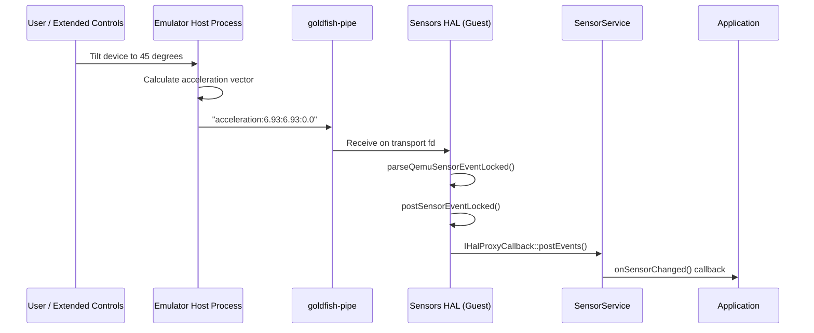

The sensor HAL adds calibration noise to uncalibrated sensor values to pass
CTS (Compatibility Test Suite):

```cpp
// Source: device/generic/goldfish/hals/sensors/multihal_sensors_qemu.cpp
} else if (const char* values = testPrefix(buf, end,
                                           "acceleration-uncalibrated", ':')) {
    if (sscanf(values, "%f:%f:%f",
               &uncal->x, &uncal->y, &uncal->z) == 3) {
        // A little bias noise to pass CTS
        uncal->x_bias = randomError(-0.003f, 0.003f);
        uncal->y_bias = randomError(-0.003f, 0.003f);
        uncal->z_bias = randomError(-0.003f, 0.003f);
        // ...
    }
}
```

### 58.3.8 Virtual GPS

GPS simulation flows through the GNSS HAL (section 27.2.3.4). The emulator
supports:

- Fixed GPS coordinates (set via Extended Controls)
- GPS routes (GPX/KML file playback)
- NMEA sentence injection

The GPS service is registered at the QEMU host level as the "gps" qemud
service. The `GnssHwListener` class on the guest side parses incoming NMEA
data and dispatches it to the Android location framework.

### 58.3.9 Virtual Camera

The camera subsystem supports multiple virtual camera backends:

1. **Host webcam passthrough** -- The emulator captures frames from the host's
   webcam and sends them to the guest through the QEMU "camera" service.

2. **Virtual scene** -- A 3D-rendered environment that responds to the virtual
   device's orientation sensors.

3. **Fake rotating camera** -- A synthetic test pattern (class
   `FakeRotatingCamera` in `device/generic/goldfish/hals/camera/`).

Camera data transfer uses the same qemud protocol, with a query-response
pattern:

```
Guest -> Host: "list"          (list available cameras)
Host -> Guest: "ok:<camera_list>"
Guest -> Host: "connect:<id>"  (connect to a specific camera)
Host -> Guest: "ok"
Guest -> Host: "start:<params>" (start capture)
Host -> Guest: "ok"
Host -> Guest: <frame_data>    (raw frame data)
```

### 58.3.10 Virtual Telephony

The telephony subsystem uses a full modem simulator that communicates with the
radio HAL via AT commands. The emulator supports:

- Voice calls (simulated call state machine)
- SMS sending and receiving
- Data connections
- SIM card simulation (ICC profile files are loaded from
  `data/misc/modem_simulator/`)

- Multiple radio access technologies (5G NR, LTE, GSM, etc.)

SIM profiles are pre-configured:

```makefile
# Source: device/generic/goldfish/product/generic.mk
PRODUCT_COPY_FILES += \
    device/generic/goldfish/hals/radio/data/apns-conf.xml:$(TARGET_COPY_OUT_VENDOR)/etc/apns/apns-conf.xml \
    device/generic/goldfish/hals/radio/data/iccprofile_for_sim0.xml:data/misc/modem_simulator/iccprofile_for_sim0.xml \
    device/generic/goldfish/hals/radio/data/numeric_operator.xml:data/misc/modem_simulator/etc/modem_simulator/files/numeric_operator.xml \
```

### 58.3.11 GPU Emulation

GPU emulation is one of the most architecturally complex parts of the
emulator. The system supports three rendering modes:

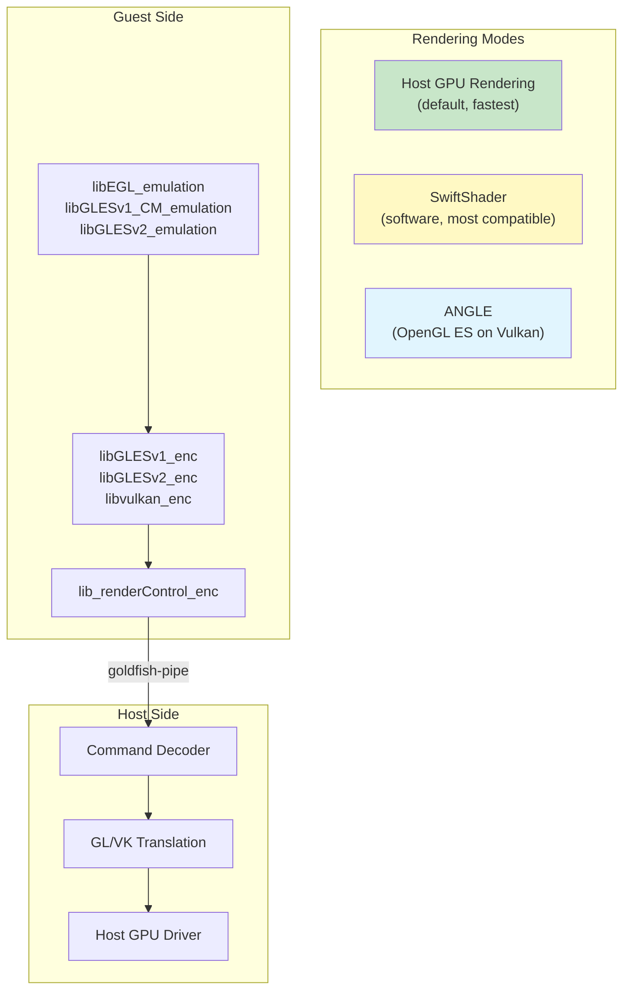

**Guest-side libraries** (installed into the system image):

```makefile
# Source: device/generic/goldfish/product/generic.mk
PRODUCT_PACKAGES += \
    libGLESv1_CM_emulation \
    lib_renderControl_enc \
    libEGL_emulation \
    libGLESv2_enc \
    libvulkan_enc \
    libGLESv2_emulation \
    libGLESv1_enc \
    libEGL_angle \
    libGLESv1_CM_angle \
    libGLESv2_angle
```

The guest-side EGL/GLES libraries serialize OpenGL ES commands into a binary
stream. This stream is sent to the host through the goldfish-pipe. On the
host side, the emulator decodes these commands and replays them against the
host's actual GPU driver.

When the host GPU is not available (e.g., on a headless CI server or a remote
SSH session), SwiftShader provides a software implementation of Vulkan that
runs entirely on the CPU.

ANGLE (Almost Native Graphics Layer Engine) provides an OpenGL ES
implementation on top of Vulkan, which is useful for hosts that have Vulkan
but not native OpenGL drivers (common on newer macOS systems).

The graphics rendering mode is selected via boot properties:

```
# Source: device/generic/goldfish/init/init.ranchu.rc
setprop ro.hardware.egl ${ro.boot.hardwareegl:-emulation}
setprop ro.hardware.vulkan ${ro.boot.hardware.vulkan}
setprop ro.opengles.version ${ro.boot.opengles.version}
```

The gralloc HAL creates host-side GPU resources ("color buffers") through the
render control encoder, as shown in section 27.2.3.8. This allows efficient
zero-copy rendering where the guest composes frames that are directly displayed
by the emulator's window.

---

## 58.4 Emulator Networking

### 58.4.1 Network Architecture

The emulator implements a virtual network that provides internet connectivity
to the guest while isolating it from the host's physical network. The
architecture uses a QEMU user-mode networking stack (SLIRP) by default, with
an optional TAP-based networking mode for advanced use cases.

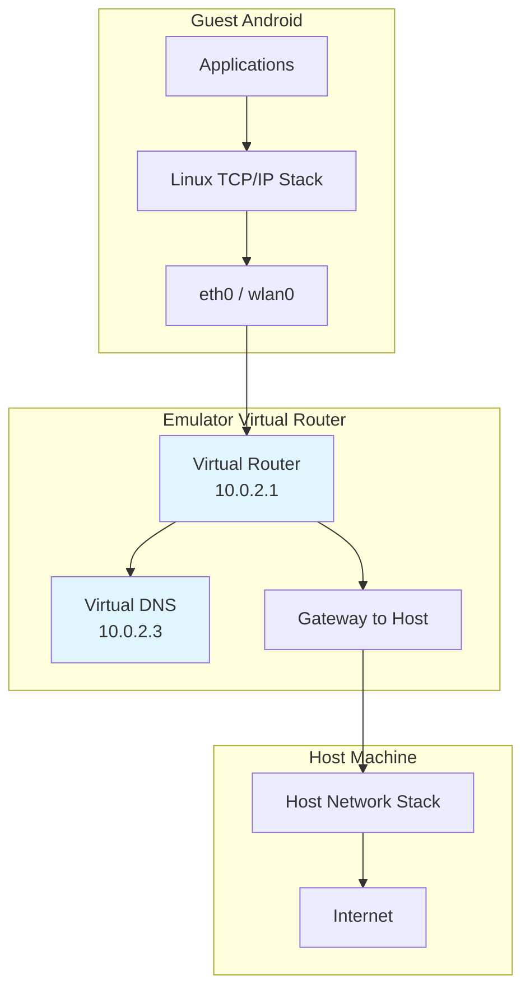

### 58.4.2 Default IP Addressing

Each emulator instance is assigned a unique IP address range:

| Component | Address |
|-----------|---------|
| Virtual router/gateway | 10.0.2.1 |
| Host loopback alias | 10.0.2.2 |
| DNS server | 10.0.2.3 |
| Guest eth0 | 10.0.2.15 (DHCP assigned) |

### 58.4.3 VirtIO WiFi

Modern emulator builds use VirtIO WiFi instead of the legacy `eth0` interface.
The networking script from
`device/generic/goldfish/init/init.net.ranchu.sh` handles this:

```bash
# Source: device/generic/goldfish/init/init.net.ranchu.sh
wifi_virtio=`getprop ro.boot.qemu.virtiowifi`
case "$wifi_virtio" in
    1) wifi_mac_prefix=`getprop vendor.net.wifi_mac_prefix`
      if [ -n "$wifi_mac_prefix" ]; then
          /vendor/bin/mac80211_create_radios 1 $wifi_mac_prefix || exit 1
      fi
      ;;
esac
```

When VirtIO WiFi is enabled, the `mac80211_hwsim` kernel module creates a
simulated WiFi radio. The `wpa_supplicant` service manages this virtual
interface:

```
# Source: device/generic/goldfish/init/init.ranchu.rc
service wpa_supplicant /vendor/bin/hw/wpa_supplicant \
    -Dnl80211 -iwlan0 \
    -c/vendor/etc/wifi/wpa_supplicant.conf \
    -g@android:wpa_wlan0
    interface aidl android.hardware.wifi.supplicant.ISupplicant/default
    socket wpa_wlan0 dgram 660 wifi wifi
    group system wifi inet
```

The VirtIO WiFi setup is triggered conditionally:

```
# Source: device/generic/goldfish/init/init.ranchu.rc
on post-fs-data && property:ro.boot.qemu.virtiowifi=1
    start ranchu-net
```

### 58.4.4 Port Forwarding and ADB Connection

The emulator supports TCP and UDP port forwarding between the host and guest.
ADB uses port forwarding to communicate with the guest:

- **Console port**: 5554 (first instance), 5556 (second), etc.
- **ADB port**: 5555 (first instance), 5557 (second), etc.

Port forwarding is configured through the emulator console:

```
# Forward host port 8080 to guest port 80
redir add tcp:8080:80

# Forward host port 5000 to guest port 5000
redir add tcp:5000:5000
```

The ADB daemon inside the guest listens on a well-known port. The emulator
automatically sets up the forwarding so that `adb devices` shows the emulator
instance as a connected device.

### 58.4.5 Inter-Emulator Networking

The networking script supports a secondary interface (`eth1`) for
inter-emulator communication:

```bash
# Source: device/generic/goldfish/init/init.net.ranchu.sh
# set up the second interface (for inter-emulator connections)
my_ip=`getprop vendor.net.shared_net_ip`
case "$my_ip" in
    "")
    ;;
    *) ifconfig eth1 "$my_ip" netmask 255.255.255.0 up
    ;;
esac
```

When multiple emulator instances need to communicate with each other (e.g.,
for testing multi-device scenarios), they can be configured with a shared
network where each instance gets a unique IP on the `eth1` interface.

### 58.4.6 Bluetooth Networking

Bluetooth is emulated through VirtIO console devices. The init script creates
a symlink for the Bluetooth device:

```
# Source: device/generic/goldfish/init/init.ranchu.rc
on property:vendor.qemu.vport.bluetooth=*
    symlink ${vendor.qemu.vport.bluetooth} /dev/bluetooth0

service bt_vhci_forwarder \
    /vendor/bin/bt_vhci_forwarder \
    -virtio_console_dev=/dev/bluetooth0
    class main
    user bluetooth
    group root bluetooth
```

The `bt_vhci_forwarder` service bridges between the VirtIO console device and
the Bluetooth VHCI (Virtual Host Controller Interface) driver, enabling the
guest to use the emulator's Bluetooth stack.

---

## 58.5 Ranchu vs. Goldfish Kernels

### 58.5.1 Historical Context

The emulator has gone through two major kernel generations:

1. **Goldfish kernel** (legacy): A custom-modified Linux kernel with
   Goldfish-specific device drivers for the original emulator virtual hardware
   (goldfish_timer, goldfish_fb, goldfish_audio, goldfish_battery, etc.).

2. **Ranchu kernel** (modern): A standard GKI (Generic Kernel Image) kernel
   that uses standard VirtIO devices instead of custom Goldfish devices. The
   name "ranchu" is a type of goldfish, reflecting the evolutionary
   relationship.

### 58.5.2 VirtIO Device Migration

The migration from custom Goldfish devices to standard VirtIO devices was a
major architectural improvement:

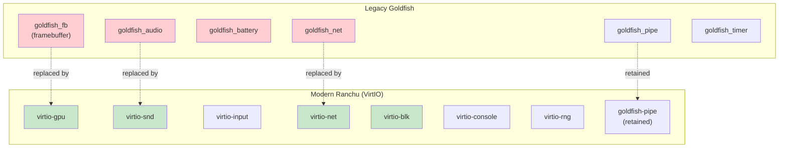

The goldfish-pipe device was retained because it serves a unique role that
VirtIO does not directly address: a high-bandwidth, low-latency channel for
serialized GPU commands and other bulk data transfers between guest HALs and
host services.

### 58.5.3 Kernel Module Configuration

The modern Ranchu kernel uses loadable kernel modules for VirtIO devices. The
Cuttlefish board configuration (which uses the same kernel) shows the required
ramdisk modules:

```makefile
# Source: device/google/cuttlefish/shared/BoardConfig.mk
RAMDISK_KERNEL_MODULES ?= \
    failover.ko \
    nd_virtio.ko \
    net_failover.ko \
    virtio_dma_buf.ko \
    virtio-gpu.ko \
    virtio_input.ko \
    virtio_net.ko \
    virtio-rng.ko \
```

These are the modules that must be loaded in first-stage init for the system
to boot. Additional modules loaded later include:

- `virtio_blk.ko` -- block device emulation
- `virtio_console.ko` -- serial console and virtual ports
- `virtio_pci.ko` -- PCI transport for VirtIO
- `vmw_vsock_virtio_transport.ko` -- vsock transport for guest-host
  communication

- `mac80211_hwsim.ko` -- WiFi simulation
- `cfg80211.ko`, `mac80211.ko` -- wireless networking stack

### 58.5.4 Kernel Version Selection

The Cuttlefish configuration shows how kernel versions are selected:

```makefile
# Source: device/google/cuttlefish/shared/BoardConfig.mk
TARGET_KERNEL_USE ?= 6.12

SYSTEM_DLKM_SRC ?= \
    kernel/prebuilts/$(TARGET_KERNEL_USE)/$(TARGET_KERNEL_ARCH)
KERNEL_MODULES_PATH ?= \
    kernel/prebuilts/common-modules/virtual-device/\
$(TARGET_KERNEL_USE)/$(subst _,-,$(TARGET_KERNEL_ARCH))

TARGET_KERNEL_PATH ?= \
    $(SYSTEM_DLKM_SRC)/kernel-$(TARGET_KERNEL_USE)
```

The default kernel version is 6.12, with prebuilt kernels stored under
`kernel/prebuilts/`. The `common-modules/virtual-device/` directory contains
kernel modules specifically built for virtual device use.

### 58.5.5 ZRAM and Memory Configuration

The Ranchu kernel enables zram for memory compression:

```
# Source: device/generic/goldfish/init/init.ranchu.rc
on early-init
    exec u:r:modprobe:s0 -- /system/bin/modprobe -a -d \
        /system/lib/modules zram.ko

on init
    write /sys/block/zram0/comp_algorithm lz4
    write /proc/sys/vm/page-cluster 0

on sys-boot-completed-set && property:persist.sys.zram_enabled=1
    swapon_all /vendor/etc/fstab.${ro.hardware}
```

The zram compression uses LZ4 for fast compression/decompression. The
`page-cluster 0` setting tells the kernel to read one page at a time from
swap, which is optimal for zram since there is no seek penalty.

---

## 58.6 Cuttlefish: The Cloud-Friendly Alternative

### 58.6.1 What is Cuttlefish?

Cuttlefish is a configurable virtual Android device that runs in cloud
environments without requiring a physical display, audio device, or any
hardware-specific infrastructure. While Goldfish/Ranchu is designed primarily
for the Android Studio emulator (a desktop application with a GUI),
Cuttlefish is designed for server-side use cases: CI/CD, automated testing,
cloud gaming, and development on remote machines.

**Location:** `device/google/cuttlefish/`

### 58.6.2 Architecture Comparison

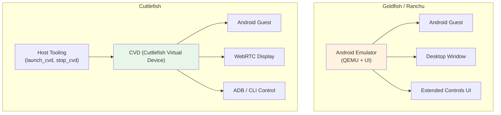

| Feature | Goldfish/Ranchu | Cuttlefish |
|---------|----------------|------------|
| Primary use case | Desktop development | Cloud / CI |
| Display | Desktop window | WebRTC or VNC |
| Audio | Host audio output | Virtual audio |
| GPU | Host GPU passthrough | virtio-gpu / SwiftShader |
| Networking | User-mode (SLIRP) | TAP / bridge |
| Multi-instance | Multiple processes | `launch_cvd --num_instances=N` |
| OTA updates | Not supported | A/B updates supported |
| Snapshotting | QEMU snapshots | Not a primary feature |
| Form factors | Phone, Tablet | Phone, TV, Auto, Wear |
| Architecture | x86_64, ARM64, RISC-V | x86_64, ARM64, RISC-V |

### 58.6.3 Cuttlefish Device Targets

From `device/google/cuttlefish/AndroidProducts.mk` and the directory
structure, Cuttlefish supports a wider array of architectures and form factors:

| Directory | Architecture |
|-----------|-------------|
| `vsoc_x86_64/` | x86_64 |
| `vsoc_arm64/` | ARM64 |
| `vsoc_riscv64/` | RISC-V 64-bit |
| `vsoc_x86_64_only/` | x86_64 (64-bit only) |
| `vsoc_arm64_only/` | ARM64 (64-bit only) |
| `vsoc_x86_64_minidroid/` | Minimal x86_64 |
| `vsoc_arm64_minidroid/` | Minimal ARM64 |
| `vsoc_riscv64_minidroid/` | Minimal RISC-V |
| `vsoc_arm64_pgagnostic/` | ARM64 page-size agnostic |

The "vsoc" prefix stands for "Virtual System on Chip."

### 58.6.4 Host Tooling

Cuttlefish includes an extensive suite of host-side tools under
`device/google/cuttlefish/host/commands/`:

| Tool | Purpose |
|------|---------|
| `start/` | Launch the virtual device |
| `stop/` | Stop the virtual device |
| `run_cvd/` | Core virtual device runtime |
| `assemble_cvd/` | Assemble disk images and configuration |
| `cvd_env/` | Environment management |
| `console_forwarder/` | Serial console forwarding |
| `kernel_log_monitor/` | Kernel log monitoring |
| `log_tee/` | Log tee-ing and forwarding |
| `logcat_receiver/` | Logcat reception from guest |
| `modem_simulator/` | Modem simulation for telephony |
| `gnss_grpc_proxy/` | GNSS data proxy via gRPC |
| `display/` | Display management |
| `screen_recording_server/` | Screen recording service |
| `record_cvd/` | Recording utility |
| `secure_env/` | Security environment (KeyMint, etc.) |
| `sensors_simulator/` | Sensor simulation |
| `health/` | Device health monitoring |
| `host_bugreport/` | Bug report collection |
| `metrics/` | Metrics collection |
| `snapshot_util_cvd/` | Snapshot management |
| `powerbtn_cvd/` | Power button simulation |
| `powerwash_cvd/` | Factory reset simulation |
| `cvd_send_sms/` | SMS injection |
| `cvd_update_location/` | Location update injection |

### 58.6.5 Board Configuration Differences

The Cuttlefish board configuration
(`device/google/cuttlefish/shared/BoardConfig.mk`) differs from Goldfish in
several important ways:

**A/B OTA support:**
```makefile
# Source: device/google/cuttlefish/shared/BoardConfig.mk
AB_OTA_UPDATER := true
```

**More dynamic partitions:**
```makefile
# Source: device/google/cuttlefish/shared/BoardConfig.mk
BOARD_SUPER_PARTITION_SIZE := 8589934592  # 8GiB
BOARD_SUPER_PARTITION_GROUPS := \
    google_system_dynamic_partitions \
    google_vendor_dynamic_partitions
BOARD_GOOGLE_SYSTEM_DYNAMIC_PARTITIONS_PARTITION_LIST := \
    product system system_ext system_dlkm
BOARD_GOOGLE_VENDOR_DYNAMIC_PARTITIONS_PARTITION_LIST := \
    odm vendor vendor_dlkm odm_dlkm
```

**Separate ODM and vendor_dlkm partitions:**
```makefile
# Source: device/google/cuttlefish/shared/BoardConfig.mk
BOARD_USES_ODMIMAGE := true
BOARD_USES_VENDOR_DLKMIMAGE := true
BOARD_USES_ODM_DLKMIMAGE := true
BOARD_USES_SYSTEM_DLKMIMAGE := true
```

**Kernel command line customization:**
```makefile
# Source: device/google/cuttlefish/shared/BoardConfig.mk
BOARD_KERNEL_CMDLINE += printk.devkmsg=on
BOARD_KERNEL_CMDLINE += audit=1
BOARD_KERNEL_CMDLINE += panic=-1
BOARD_KERNEL_CMDLINE += 8250.nr_uarts=1
BOARD_KERNEL_CMDLINE += binder.impl=rust
BOARD_KERNEL_CMDLINE += cma=0
BOARD_KERNEL_CMDLINE += firmware_class.path=/vendor/etc/
BOARD_KERNEL_CMDLINE += loop.max_part=7
BOARD_KERNEL_CMDLINE += init=/init
BOARD_BOOTCONFIG += androidboot.hardware=cutf_cvm
```

Notable Cuttlefish-specific kernel parameters:

- `binder.impl=rust` -- Uses the Rust binder driver implementation.
- `cma=0` -- Disables Contiguous Memory Allocator (not needed in a VM).
- `panic=-1` -- Reboots immediately on kernel panic.

### 58.6.6 Getting Started with Cuttlefish

From the official `device/google/cuttlefish/README.md`:

```bash
# 1. Ensure KVM is available
grep -c -w "vmx\|svm" /proc/cpuinfo

# 2. Install host packages
sudo apt install -y git devscripts config-package-dev \
    debhelper-compat golang curl
git clone https://github.com/google/android-cuttlefish
cd android-cuttlefish
./tools/buildutils/build_packages.sh
sudo dpkg -i ./cuttlefish-base_*_*64.deb || sudo apt-get install -f
sudo dpkg -i ./cuttlefish-user_*_*64.deb || sudo apt-get install -f
sudo usermod -aG kvm,cvdnetwork,render $USER
sudo reboot

# 3. Download images from ci.android.com
# 4. Launch
mkdir cf && cd cf
tar xvf /path/to/cvd-host_package.tar.gz
unzip /path/to/aosp_cf_x86_64_phone-img-xxxxxx.zip
HOME=$PWD ./bin/launch_cvd

# 5. Access via WebRTC at https://localhost:8443
# 6. Debug with ADB
./bin/adb -e shell

# 7. Stop
HOME=$PWD ./bin/stop_cvd
```

### 58.6.7 Cuttlefish VirtIO Module Dependencies

The Cuttlefish board configuration illustrates the full VirtIO stack required
for a virtual device. The modules are split between ramdisk (first-stage init)
and vendor partition (second-stage init):

**Ramdisk modules (required for boot):**

```makefile
# Source: device/google/cuttlefish/shared/BoardConfig.mk
RAMDISK_KERNEL_MODULES ?= \
    failover.ko \
    nd_virtio.ko \
    net_failover.ko \
    virtio_dma_buf.ko \
    virtio-gpu.ko \
    virtio_input.ko \
    virtio_net.ko \
    virtio-rng.ko \
```

These modules must be available in first-stage init because:

- `virtio-gpu.ko` -- required for display output
- `virtio_net.ko` -- required for network access during provisioning
- `virtio_input.ko` -- required for input events
- `nd_virtio.ko` -- VirtIO NUMA distance support
- `virtio-rng.ko` -- random number generation (required for crypto init)

**Transport modules:**

```makefile
# Source: device/google/cuttlefish/shared/BoardConfig.mk
BOARD_VENDOR_RAMDISK_KERNEL_MODULES += \
    $(SYSTEM_VIRTIO_PREBUILTS_PATH)/virtio_blk.ko \
    $(SYSTEM_VIRTIO_PREBUILTS_PATH)/virtio_console.ko \
    $(SYSTEM_VIRTIO_PREBUILTS_PATH)/virtio_pci.ko \
    $(SYSTEM_VIRTIO_PREBUILTS_PATH)/vmw_vsock_virtio_transport.ko
```

The VirtIO PCI transport module is the base for all VirtIO devices when
running on a PCI bus (which is the case for QEMU on x86). On ARM, VirtIO
MMIO transport (`virtio_mmio.ko`) may be used instead.

**WiFi modules (mac80211 stack):**

```makefile
# Source: device/google/cuttlefish/shared/BoardConfig.mk
BOARD_VENDOR_RAMDISK_KERNEL_MODULES += \
    $(wildcard $(SYSTEM_DLKM_SRC)/cfg80211.ko) \
    $(wildcard $(SYSTEM_DLKM_SRC)/libarc4.ko) \
    $(wildcard $(SYSTEM_DLKM_SRC)/mac80211.ko) \
    $(wildcard $(SYSTEM_DLKM_SRC)/rfkill.ko) \
    $(wildcard $(KERNEL_MODULES_PATH)/mac80211_hwsim.ko)
```

The `mac80211_hwsim` module provides software-simulated WiFi radios. This
module is loaded in first-stage init with `mac80211_hwsim.radios=0` to avoid
creating unwanted radios; the actual radio creation is done later by the
`mac80211_create_radios` tool.

### 58.6.8 Cuttlefish vs Goldfish: Architectural Differences

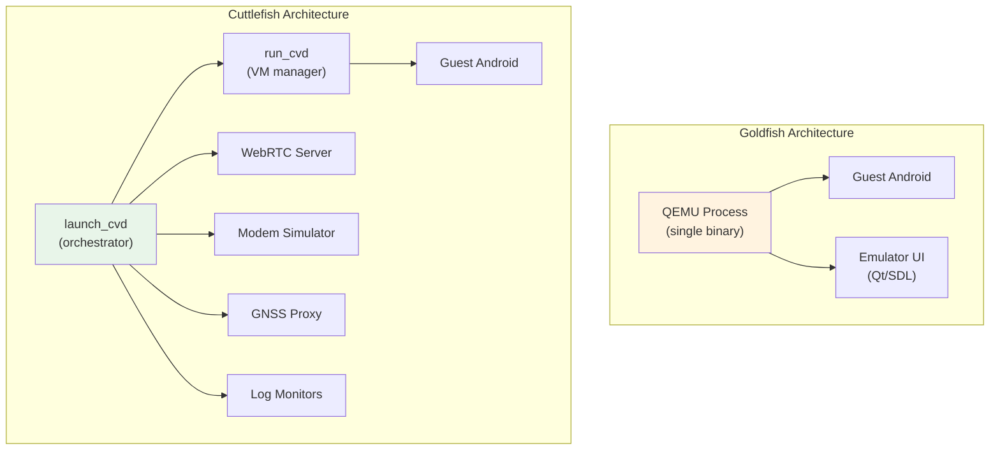

Key architectural difference: Goldfish is a monolithic QEMU process that
handles everything (VM, display, device emulation), while Cuttlefish uses a
microservice architecture where each function (VM management, display,
modem, GNSS, logging) runs as a separate process. This makes Cuttlefish more
modular and easier to debug, but also more complex to set up.

### 58.6.9 When to Use Which

| Scenario | Recommended |
|----------|------------|
| Android Studio development | Goldfish/Ranchu (emulator) |
| Local debugging with UI | Goldfish/Ranchu (emulator) |
| CI/CD automated testing | Cuttlefish |
| Cloud-based development | Cuttlefish |
| Performance testing | Cuttlefish (more deterministic) |
| CTS/VTS testing | Cuttlefish (primary reference) |
| Multi-instance testing | Cuttlefish |
| Snapshot-based workflows | Goldfish/Ranchu (emulator) |
| Foldable device testing | Both (Goldfish has richer UI) |
| Automotive / TV / Wear | Cuttlefish (more form factors) |

Cuttlefish is increasingly becoming the primary virtual reference device in
AOSP. Google uses it internally for continuous testing, and it is the
recommended target for platform developers who do not need the interactive
GUI features of the Android Studio emulator.

### 58.6.10 Crosvm Device Architecture

Cuttlefish's default VMM is **crosvm** (Chrome OS Virtual Machine monitor),
a Rust-based VMM originally developed for Chrome OS. The VM manager code at
`device/google/cuttlefish/host/libs/vm_manager/crosvm_manager.cpp` (1076 lines)
constructs the crosvm command line with all virtio device parameters.

#### Virtio Device Map

Every I/O device exposed to the guest is a virtio device over PCI transport:

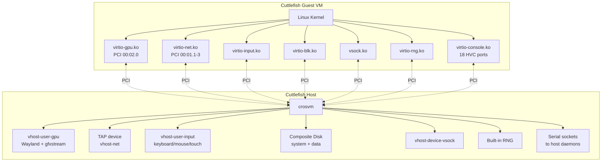

#### PCI Slot Assignments

```cpp
// Source: device/google/cuttlefish/host/libs/vm_manager/vm_manager.h:86-89
static const int kNetPciDeviceNum = 1;     // Network on PCI slot 1
static const int kGpuPciSlotNum = 2;        // GPU on PCI slot 2
static const int kDefaultNumBootDevices = 2;
static const int kMaxDisks = 3;
```

Network interfaces are assigned sub-addresses on PCI slot 1:

| Interface | PCI Address | TAP Device | Purpose |
|---|---|---|---|
| Mobile | 00:01.1 | `cvd-mtap-NN` | Cellular data simulation |
| Ethernet | 00:01.2 | `cvd-etap-NN` | Wired network |
| WiFi | 00:01.3 | `cvd-wtap-NN` | Wireless (optional) |

### 58.6.11 Vhost-User Device Model

Cuttlefish uses the **vhost-user** protocol to run device backends as separate
host processes, rather than inside the crosvm process. This provides better
isolation, independent restartability, and allows device backends to be written
in different languages (the input device is in Rust, the audio server in C++).

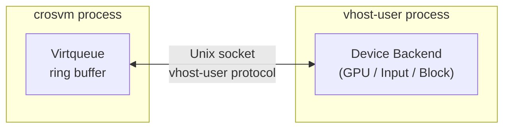

```cpp
// Source: device/google/cuttlefish/host/libs/vm_manager/crosvm_builder.h:64
void AddVhostUser(const std::string& type, const std::string& socket_path,
                  int max_queue_size = 256);
```

Supported vhost-user device types:

| Type | Backend Process | Socket Path | Purpose |
|---|---|---|---|
| `gpu` | vhost-user-gpu | `gpu_socket_path()` | Graphics rendering |
| `input` | vhost_user_input (Rust) | `keyboard_socket_path()` etc. | Input events |
| `vsock` | vhost-device-vsock | `vhost_user_vsock_path()` | Host-guest communication |
| `block` | vhost-user-block | disk socket | Storage (disk 2 only) |
| `mac80211-hwsim` | WiFi simulator | hwsim socket | WiFi radio simulation |

The default virtqueue size is 256 entries (must be a power of 2).

### 58.6.12 HVC Port Map

Cuttlefish uses 18 **Hypervisor Virtual Console** (HVC) ports to tunnel
communication between guest HALs and host-side daemons. Each HVC port
appears as `/dev/hvcN` in the guest:

```cpp
// Source: device/google/cuttlefish/host/libs/vm_manager/crosvm_manager.cpp:768-946
```

| Port | Guest Device | Host Endpoint | Purpose |
|---|---|---|---|
| `/dev/hvc0` | Kernel console | `kernel_log_pipe` | Kernel output |
| `/dev/hvc1` | Serial console | `console_pipe` | Android serial console |
| `/dev/hvc2` | Logcat | `logcat_pipe` | System log forwarding |
| `/dev/hvc3` | Keymaster | `secure_env` daemon | C++ KeyMaster HAL |
| `/dev/hvc4` | Gatekeeper | `secure_env` daemon | Lock screen verification |
| `/dev/hvc5` | Bluetooth | `root_canal` simulator | Bluetooth HCI channel |
| `/dev/hvc6` | GNSS | `gnss_grpc_proxy` | GPS/GNSS location data |
| `/dev/hvc7` | Location | Location daemon | Injected location fixes |
| `/dev/hvc8` | ConfirmationUI | Trusty integration | Secure confirmation dialogs |
| `/dev/hvc9` | UWB | UWB daemon | Ultra-Wideband ranging |
| `/dev/hvc10` | OEMLock | OEMLock daemon | OEM bootloader unlock |
| `/dev/hvc11` | KeyMint | `secure_env` daemon | Rust KeyMint HAL |
| `/dev/hvc12` | NFC | NFC daemon | NFC emulation |
| `/dev/hvc13` | Sensors | `sensors_simulator` | Accelerometer/gyro/etc. |
| `/dev/hvc14` | MCU control | MCU daemon | Microcontroller control |
| `/dev/hvc15` | MCU UART | MCU daemon | Microcontroller serial |
| `/dev/hvc16` | Ti50 TPM | TPM daemon | TPM FIFO commands |
| `/dev/hvc17` | JCardSim | Java Card simulator | eSIM/secure element |

Each HVC port is backed by either a Unix socket or a pipe on the host side:

```cpp
// Source: device/google/cuttlefish/host/libs/vm_manager/crosvm_builder.h:42-45
void AddHvcSink();                         // null device (unused port)
void AddHvcReadOnly(Fd output, bool console); // one-way (kernel logs)
void AddHvcReadWrite(Fd output, Fd input);    // bidirectional
void AddHvcSocket(const std::string& socket); // Unix socket
```

### 58.6.13 GPU Pipeline and Display Modes

Cuttlefish supports multiple GPU rendering modes, configured via the
`--gpu_mode` flag:

| Mode | Description |
|---|---|
| `gfxstream` | Host GPU passthrough via gfxstream protocol (default) |
| `gfxstream_guest_angle` | ANGLE in guest, gfxstream transport to host GPU |
| `drm_virgl` | Virgl3D — OpenGL commands forwarded via virtio-gpu DRM |
| `guest_swiftshader` | Pure software rendering in guest (SwiftShader Vulkan) |
| `none` | No GPU — headless mode |

#### Display Architecture

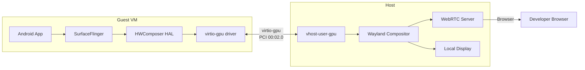

The gfxstream mode achieves near-native GPU performance by forwarding
OpenGL ES / Vulkan commands directly to the host GPU driver. The virtio-gpu
device acts as a transport channel rather than a GPU emulator.

The Wayland compositor receives rendered frames and can forward them to:

- **WebRTC** — streaming to a browser (cloud use case)
- **Local display** — direct rendering on the host screen

```cpp
// Source: device/google/cuttlefish/host/libs/vm_manager/crosvm_manager.cpp:474-495
// Display configuration with width, height, DPI, and refresh rate
// Frames sent via Wayland socket to compositor
```

### 58.6.14 Networking Architecture

#### TAP Devices and Bridge Configuration

Cuttlefish creates TAP (network tap) devices on the host for each network
interface, bridging guest virtio-net to the host network:

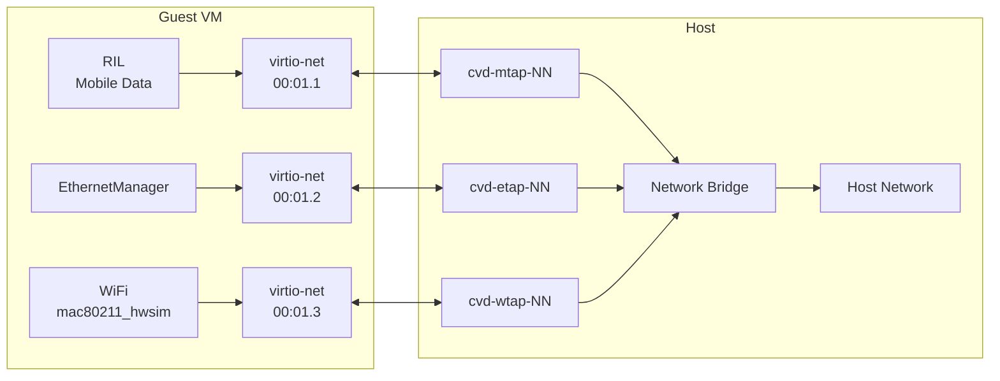

```cpp
// Source: device/google/cuttlefish/host/libs/vm_manager/crosvm_manager.cpp:707-727
// Mobile TAP:   PCI 00:01:01
// Ethernet TAP: PCI 00:01:02
// WiFi TAP:     auto-assigned PCI (optional)
```

#### WiFi Simulation

Cuttlefish supports two WiFi simulation modes:

1. **TAP bridge** — simple network bridging (no WiFi-specific behavior)
2. **mac80211_hwsim** — kernel module that simulates 802.11 radios, enabling
   real WiFi scanning, association, and WPA authentication within the VM

```cpp
// Source: device/google/cuttlefish/host/libs/vm_manager/crosvm_manager.cpp
// WiFi via mac80211_hwsim when config.virtio_mac80211_hwsim() is true
```

#### vhost-net Acceleration

When enabled, `vhost-net` moves network packet processing from crosvm
userspace into the host kernel, significantly improving network throughput:

```cpp
// Source: device/google/cuttlefish/host/libs/vm_manager/crosvm_manager.cpp:591
if (instance.vhost_net()) {
    crosvm_cmd.Cmd().AddParameter("--vhost-net");
}
```

### 58.6.15 Guest HALs

Cuttlefish implements 21 HALs that bridge Android's HAL interfaces to
host-side daemons via virtio devices, vsock, or HVC serial ports:

```
device/google/cuttlefish/guest/hals/
├── audio/           # virtio-snd / audio server
├── bluetooth/       # HVC → root_canal simulator
├── camera/          # vsock → host camera streaming
├── confirmationui/  # HVC → Trusty integration
├── gatekeeper/      # HVC → secure_env daemon
├── health/          # Battery/charge monitoring
├── identity/        # Identity credential HAL
├── keymint/         # HVC → secure_env (KeyMint)
├── light/           # vsock → light control (Rust)
├── nfc/             # HVC → NFC daemon
├── oemlock/         # HVC → OEM unlock
├── ril/             # HVC → modem_simulator (telephony)
├── secure_element/  # eSIM / secure chip access
├── sensors/         # HVC → sensors_simulator
├── vehicle/         # vsock → automotive VHAL
└── vulkan/          # Graphics support
```

Each guest HAL typically reads/writes a virtio-console device (`/dev/hvcN`)
or establishes a vsock connection to its host-side counterpart. The HAL
interface exposed to Android frameworks is identical to what a real hardware
HAL would provide — the virtualization is transparent to higher layers.

#### Example: Camera HAL via Vsock

The camera HAL streams frames from the host via vsock, allowing the host
webcam to appear as the guest's camera:

```cpp
// Source: device/google/cuttlefish/guest/hals/camera/vsock_camera_server.cpp
// Receives MJPEG/H264 frames from host over vsock
// Exposes standard Camera2 HAL interface to CameraService
```

#### Example: Light HAL via Vsock (Rust)

```rust
// Source: device/google/cuttlefish/guest/hals/light/lights_vsock_server.rs
// Receives light state changes over vsock
// Controls notification LED, backlight, etc.
```

### 58.6.16 Host Microservice Orchestration

Cuttlefish runs as a collection of ~48 host processes orchestrated by
`launch_cvd` and `run_cvd`:

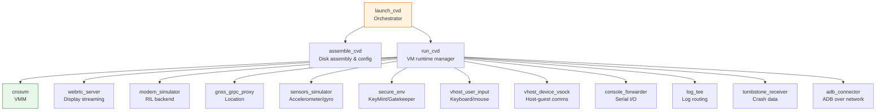

The `assemble_cvd` step builds composite disk images from individual partition
images (system, vendor, userdata, boot) and generates the crosvm configuration.
Then `run_cvd` launches crosvm and all supporting daemons, monitoring their
health and restarting them if they crash.

### 58.6.17 Vsock: The Glue Between Host and Guest

Vsock (Virtual Sockets) is the primary general-purpose communication channel
between the Cuttlefish host and guest. Unlike HVC ports (which are
point-to-point serial channels), vsock supports arbitrary TCP-like connections
with multiplexed ports:

```cpp
// Source: device/google/cuttlefish/host/libs/vm_manager/crosvm_manager.cpp:755-766
if (instance.vsock_guest_cid() >= 2) {
    if (instance.vhost_user_vsock()) {
        // vhost-user vsock (separate process)
        crosvm_cmd.AddVhostUser("vsock", socket_path);
    } else {
        // Built-in crosvm vsock
        crosvm_cmd.Cmd().AddParameter("--vsock=cid=",
                                       instance.vsock_guest_cid());
    }
}
```

Guest components that use vsock include:

- **Camera HAL** — streams frames from host webcam
- **Light HAL** — receives light state changes
- **Vehicle HAL** — automotive sensor data
- **V4L2 streamer** — video frame transfer
- **Socket proxy** — generic socket-to-vsock tunneling
  (`common/frontend/socket_vsock_proxy/`)

### 58.6.18 Multi-Instance Support

Cuttlefish can run multiple virtual devices simultaneously on a single host,
each with its own set of TAP devices, vsock CID, HVC ports, and display:

```bash
# Launch 3 concurrent Cuttlefish instances
launch_cvd --num_instances=3

# Each gets:
#   Instance 1: CID=3, TAP cvd-mtap-01, port 6520
#   Instance 2: CID=4, TAP cvd-mtap-02, port 6521
#   Instance 3: CID=5, TAP cvd-mtap-03, port 6522
```

Instance-specific paths are managed by `CuttlefishConfig::InstanceSpecific`,
which generates unique socket paths, FIFO paths, and log directories for each
instance. This enables large-scale parallel testing in CI/CD environments.

---

## 58.7 Emulator Features

### 58.7.1 Snapshots

Snapshots are one of the most powerful features of the Android Emulator. They
capture the complete state of the virtual machine -- CPU registers, memory
contents, device state, and disk state -- and save it to a file that can be
restored later.

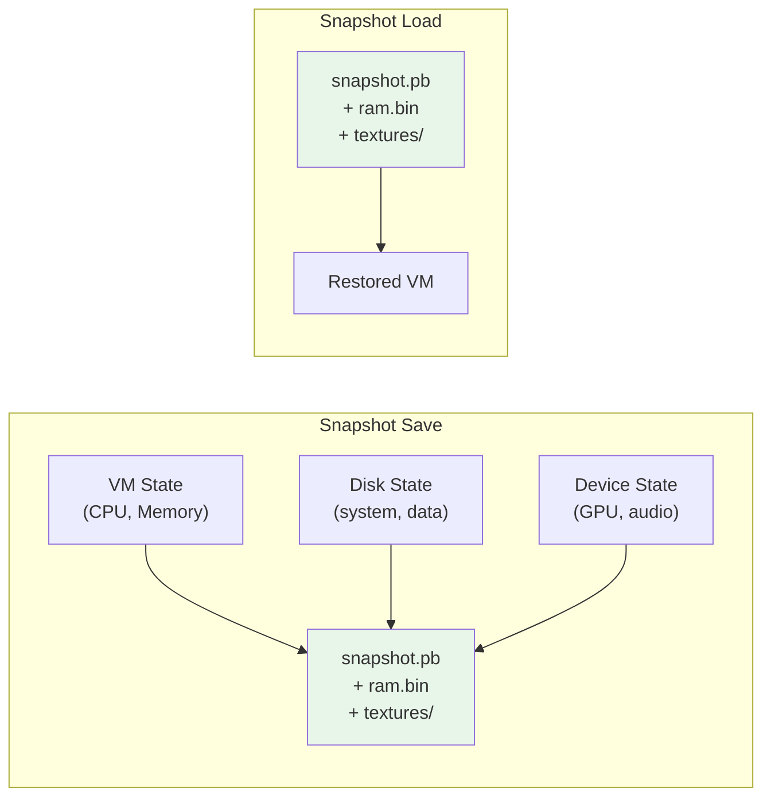

**Snapshot types:**

1. **QuickBoot snapshot** -- automatically saved when the emulator is closed
   and restored when it is next opened. This provides near-instant startup
   times (typically 2-5 seconds instead of 60+ seconds for a cold boot).

2. **Named snapshots** -- manually created by the user through the Extended
   Controls UI or the command line. These are used for saving specific device
   states (e.g., "logged in", "app installed", "specific screen").

Snapshots are stored in the emulator's AVD (Android Virtual Device) directory,
typically at `~/.android/avd/<name>.avd/snapshots/`.

**Snapshot contents:**

- `snapshot.pb` -- Protobuf metadata (machine configuration, timestamp)
- `ram.bin` -- Complete guest RAM contents
- `textures/` -- GPU texture and buffer data
- `<disk>-snapshot.img` -- Copy-on-write disk overlays

### 58.7.2 Screen Recording

The emulator supports screen recording in multiple formats:

- **WebM** (VP8/VP9 video, Vorbis/Opus audio)
- **GIF** (animated, for quick sharing)

Recording is started through the Extended Controls UI or via the gRPC
control interface. On the Cuttlefish side, the
`screen_recording_server` host command provides similar functionality.

### 58.7.3 Location Simulation

The emulator provides rich location simulation capabilities:

- **Single point** -- Set a specific latitude/longitude
- **Route playback** -- Play back a GPX or KML file along a route
- **Speed control** -- Adjust playback speed
- **Altitude** -- Set custom altitude values

These controls feed into the GNSS HAL through the QEMU GPS service.

### 58.7.4 Battery Simulation

The emulator simulates a virtual battery with configurable:

- Charge level (0-100%)
- Charging state (charging, discharging, full, not charging)
- AC/USB power connection status
- Battery health status
- Battery temperature

### 58.7.5 Multi-Display Support

The emulator supports multiple virtual displays, enabling developers to test
multi-screen scenarios. The `MultiDisplayProvider` package
(`device/generic/goldfish/MultiDisplayProvider/`) manages display
configuration on the guest side:

```makefile
# Source: device/generic/goldfish/product/multidisplay.mk
PRODUCT_PACKAGES += MultiDisplayProvider

PRODUCT_ARTIFACT_PATH_REQUIREMENT_ALLOWED_LIST += \
    system/lib/libemulator_multidisplay_jni.so \
    system/lib64/libemulator_multidisplay_jni.so \
    system/priv-app/MultiDisplayProvider/MultiDisplayProvider.apk \
```

The input device configuration supports up to 11 multi-touch input
devices (for 11 virtual displays):

```makefile
# Source: device/generic/goldfish/product/generic.mk
PRODUCT_COPY_FILES += \
    device/generic/goldfish/input/virtio_input_multi_touch_1.idc:... \
    device/generic/goldfish/input/virtio_input_multi_touch_2.idc:... \
    ...
    device/generic/goldfish/input/virtio_input_multi_touch_11.idc:...
```

### 58.7.6 Foldable Device Simulation

The emulator can simulate foldable devices, using the hinge angle sensors
defined in the sensors HAL. The goldfish source tree includes specific
configurations for foldable form factors:

**Pixel Fold configuration:**
`device/generic/goldfish/pixel_fold/` contains:

- `device_state_configuration.xml` -- defines physical states (folded, unfolded)
- `display_layout_configuration.xml` -- display layout for each state
- `display_settings.xml` -- display parameters
- `sensor_hinge_angle.xml` -- hinge angle sensor mapping

The sensors HAL supports three hinge angle sensors (hinge-angle0,
hinge-angle1, hinge-angle2), enabling simulation of devices with multiple
hinges:

```cpp
// Source: device/generic/goldfish/hals/sensors/sensor_list.cpp
{
    .sensorHandle = kSensorHandleHingeAngle0,
    .name = "Goldfish hinge sensor0 (in degrees)",
    .type = SensorType::HINGE_ANGLE,
    .maxRange = 360,
    .resolution = 1.0,
    .flags = SensorFlagBits::DATA_INJECTION |
             SensorFlagBits::ON_CHANGE_MODE |
             SensorFlagBits::WAKE_UP
},
```

The foldable emulation uses the existing device state framework. When the
user adjusts the hinge angle in the emulator UI, the change flows through:

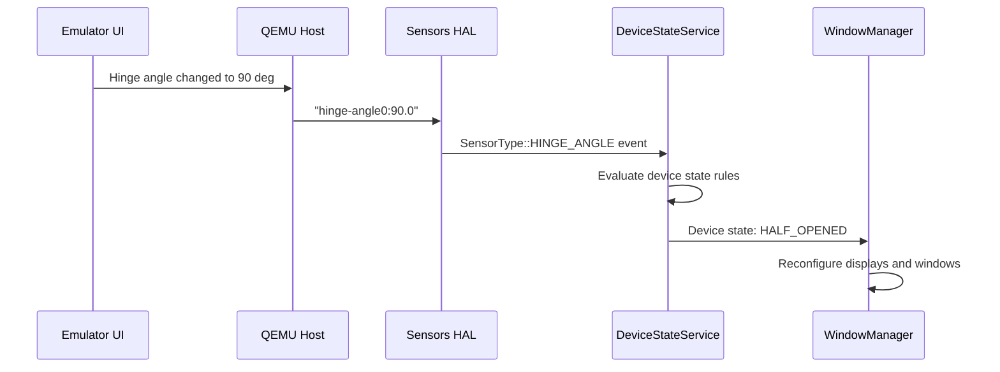

### 58.7.7 Wear OS and Rotary Input

The emulator supports Wear OS form factors with rotary input simulation.
The input device configuration file for rotary input:

```
# Referenced from product/generic.mk
device/generic/goldfish/input/virtio_input_rotary.idc
```

This allows developers to test Wear OS apps that respond to the rotating
bezel or crown.

### 58.7.8 Virtual Device Property Configuration

The emulator uses a layered property system to configure virtual hardware
parameters. Properties can be set at multiple levels:

**Boot properties (kernel command line / androidboot):**
These are set by the emulator binary and passed to the kernel. They are
available as `ro.boot.*` properties during early-init.

**QEMU properties (qemu-props service):**
These are fetched from the emulator host via the goldfish-pipe after boot.
They configure display density, hardware features, and emulator-specific
behavior.

**Product properties:**
These are baked into the system image at build time. From
`device/generic/goldfish/product/generic.mk`:

```makefile
# Source: device/generic/goldfish/product/generic.mk
PRODUCT_VENDOR_PROPERTIES += \
    ro.control_privapp_permissions=enforce \
    ro.crypto.dm_default_key.options_format.version=2 \
    ro.crypto.volume.filenames_mode=aes-256-cts \
    ro.hardware.power=ranchu \
    ro.incremental.enable=yes \
    ro.logd.size=1M \
    ro.kernel.qemu=1 \
    ro.soc.manufacturer=AOSP \
    ro.soc.model=ranchu \
    ro.surface_flinger.has_HDR_display=false \
    ro.surface_flinger.has_wide_color_display=false \
    ro.surface_flinger.protected_contents=false \
    ro.surface_flinger.supports_background_blur=1 \
    ro.surface_flinger.use_color_management=false \
    ro.zygote.disable_gl_preload=1 \
    debug.sf.vsync_reactor_ignore_present_fences=true \
    debug.stagefright.c2inputsurface=-1 \
    debug.stagefright.ccodec=4 \
    graphics.gpu.profiler.support=false \
    persist.sys.zram_enabled=1 \
    wifi.direct.interface=p2p-dev-wlan0 \
    wifi.interface=wlan0 \
```

Notable property explanations:

| Property | Value | Purpose |
|----------|-------|---------|
| `ro.kernel.qemu` | `1` | Framework flag: running in emulator |
| `ro.soc.model` | `ranchu` | Identifies the virtual SoC |
| `ro.hardware.power` | `ranchu` | Power HAL selection |
| `ro.surface_flinger.has_HDR_display` | `false` | No HDR support in virtual display |
| `ro.surface_flinger.protected_contents` | `false` | No DRM-protected content support |
| `ro.zygote.disable_gl_preload` | `1` | Skip GL preloading (may not have GPU ready at zygote start) |
| `debug.sf.vsync_reactor_ignore_present_fences` | `true` | Simplify VSync handling for virtual displays |
| `debug.stagefright.ccodec` | `4` | Use Codec2 for media decoding |
| `persist.sys.zram_enabled` | `1` | Enable zram swap |

### 58.7.9 Emulator Configuration Files

The emulator uses INI-format configuration files stored in the AVD
directory and in the device source tree. From
`device/generic/goldfish/data/etc/`:

| File | Purpose |
|------|---------|
| `advancedFeatures.ini` | Enable/disable emulator features |
| `config.ini` | Default hardware configuration |
| `config.ini.nexus5` | Nexus 5 emulation config |
| `config.ini.foldable` | Foldable device config |
| `config.ini.freeform` | Free-form window mode config |
| `config.ini.desktop` | Desktop mode config |
| `config.ini.nexus7tab` | Tablet config |
| `config.ini.pixeltablet` | Pixel Tablet config |
| `config.ini.tv` | Android TV config |

The phone product configuration copies these files to the output:

```makefile
# Source: device/generic/goldfish/product/phone.mk
PRODUCT_COPY_FILES += \
    device/generic/goldfish/data/etc/advancedFeatures.ini:advancedFeatures.ini \
    device/generic/goldfish/data/etc/config.ini.nexus5:config.ini
```

### 58.7.10 Display Configuration Files

The emulator supports multiple display layout configurations for different
device form factors:

```makefile
# Source: device/generic/goldfish/product/generic.mk
PRODUCT_COPY_FILES += \
    device/generic/goldfish/display_settings_app_compat.xml:\
        $(TARGET_COPY_OUT_VENDOR)/etc/display_settings_app_compat.xml \
    device/generic/goldfish/display_settings_freeform.xml:\
        $(TARGET_COPY_OUT_VENDOR)/etc/display_settings_freeform.xml \
```

These XML files configure display properties like:

- Display resolution and density
- Window management mode (standard, freeform)
- App compatibility overrides (for apps that do not handle
  multi-window/foldable correctly)

### 58.7.11 UWB (Ultra-Wideband) Emulation


The emulator includes UWB HAL support through VirtIO console:

```
# Source: device/generic/goldfish/init/init.ranchu.rc
on property:vendor.qemu.vport.uwb=*
    symlink ${vendor.qemu.vport.uwb} /dev/hvc2
    start vendor.uwb_hal

service vendor.uwb_hal \
    /vendor/bin/hw/android.hardware.uwb-service /dev/hvc2
    class hal
    user uwb
    disabled
```

### 58.7.12 Thread Networking

Thread network support is provided through a simulated RCP (Radio
Co-Processor):

```makefile
# Source: device/generic/goldfish/product/generic.mk
ifneq ($(EMULATOR_VENDOR_NO_THREADNETWORK), true)
PRODUCT_PACKAGES += \
    com.android.hardware.threadnetwork-simulation-rcp
endif
```

---

## 58.8 Try It: Build and Launch a Custom Emulator Image

This section walks through building a custom emulator image from source and
launching it.

### 58.8.1 Building the Emulator System Image

```bash
# Step 1: Set up the build environment
cd /path/to/aosp
source build/envsetup.sh

# Step 2: Choose a target
# For x86_64 emulator (fastest on x86 host):
lunch sdk_phone64_x86_64-userdebug

# For ARM64 emulator:
# lunch sdk_phone64_arm64-userdebug

# Step 3: Build the system image
m -j$(nproc)
```

The build produces images in `$ANDROID_PRODUCT_OUT/`:

| Image | Description |
|-------|-------------|
| `system.img` | System partition |
| `vendor.img` | Vendor partition |
| `super.img` | Super partition (containing dynamic partitions) |
| `userdata.img` | User data partition |
| `kernel-ranchu` | Kernel binary |
| `ramdisk.img` | Initial ramdisk |
| `vendor_boot.img` | Vendor boot image |

### 58.8.2 Launching with the Emulator

```bash
# Launch the emulator with the built images
emulator

# Or with specific options:
emulator \
    -no-snapshot \          # cold boot (skip QuickBoot)
    -gpu host \             # use host GPU acceleration
    -memory 4096 \          # 4GB RAM
    -cores 4 \              # 4 CPU cores
    -no-audio \             # disable audio (faster boot)
    -verbose                # verbose logging
```

### 58.8.3 Building and Launching Cuttlefish

```bash
# Step 1: Choose Cuttlefish target
lunch aosp_cf_x86_64_phone-userdebug

# Step 2: Build
m -j$(nproc)

# Step 3: Launch (requires cuttlefish-base/user packages installed)
launch_cvd

# Step 4: Access
adb shell

# Step 5: For WebRTC access
# Open https://localhost:8443 in a browser
```

### 58.8.4 Customizing the Emulator Image

#### Adding a Custom HAL

To add a custom HAL implementation to the emulator, modify the product
makefile:

```makefile
# In your custom product .mk file
$(call inherit-product, device/generic/goldfish/product/phone.mk)

# Add your custom packages
PRODUCT_PACKAGES += \
    my.custom.hal-service

# Override properties
PRODUCT_VENDOR_PROPERTIES += \
    ro.my.custom.property=value
```

#### Modifying Init Behavior

Create a custom init RC file and add it to the product:

```makefile
PRODUCT_COPY_FILES += \
    my/custom/init.custom.rc:$(TARGET_COPY_OUT_VENDOR)/etc/init/init.custom.rc
```

#### Modifying SELinux Policy

Add custom SELinux policy:

```makefile
BOARD_VENDOR_SEPOLICY_DIRS += my/custom/sepolicy
```

### 58.8.5 Debugging the Emulator

#### Kernel Logs

```bash
# View kernel logs from the emulator
adb shell dmesg

# Or through the emulator's logcat forwarding
adb logcat -b kernel
```

#### HAL Debugging

```bash
# Enable verbose logging for sensors HAL
adb shell setprop log.tag.SensorsHAL VERBOSE

# View HAL service logs
adb logcat -s SensorsHAL:V

# Check if HAL services are running
adb shell dumpsys hwservicemanager
```

#### GPU Debugging

```bash
# Check which rendering mode is active
adb shell getprop ro.hardware.egl
# Expected: "emulation" for host GPU, "swiftshader" for software

# Check OpenGL ES version
adb shell getprop ro.opengles.version
# 196610 = OpenGL ES 3.2

# Enable ANGLE debug
adb shell setprop debug.angle.feature_overrides_enabled ...
```

#### Network Debugging

```bash
# Check network configuration inside the guest
adb shell ip addr show
adb shell ip route show

# Test connectivity
adb shell ping -c 3 google.com

# Check WiFi state
adb shell dumpsys wifi

# Port forwarding from host
adb forward tcp:8080 tcp:8080
```

### 58.8.6 Performance Tuning

#### CPU and Memory

```bash
# Launch with more resources
emulator -memory 8192 -cores 8

# Or set in the AVD configuration (config.ini):
hw.ramSize=8192
hw.cpu.ncore=8
```

#### GPU Acceleration

```bash
# Host GPU (fastest, requires compatible host GPU)
emulator -gpu host

# ANGLE on Vulkan (good compatibility)
emulator -gpu angle_indirect

# SwiftShader (software, most compatible, slowest)
emulator -gpu swiftshader_indirect

# Guest rendering (DRM-based, no host GPU needed)
emulator -gpu guest
```

#### Disk Performance

```bash
# Use SSD-backed storage for the AVD directory
# The emulator heavily uses random I/O for disk images

# Increase ZRAM to reduce I/O
# (configured automatically via init.ranchu.rc)
```

### 58.8.7 Advanced: Running Multiple Instances

#### Emulator

```bash
# First instance (default ports)
emulator -avd Phone1 &

# Second instance (automatic port assignment)
emulator -avd Phone2 &

# Verify both are running
adb devices
# List of devices attached
# emulator-5554   device
# emulator-5556   device
```

#### Cuttlefish

```bash
# Launch 3 instances at once
launch_cvd --num_instances=3

# Each instance gets its own:
# - ADB port
# - WebRTC port
# - Console port
```

### 58.8.8 Advanced: Custom Kernel

```bash
# Step 1: Check out the kernel source
repo init -u https://android.googlesource.com/kernel/manifest \
    -b common-android-mainline
repo sync

# Step 2: Build the kernel
BUILD_CONFIG=common/build.config.gki.x86_64 build/build.sh

# Step 3: Launch emulator with custom kernel
emulator -kernel /path/to/bzImage \
    -system $ANDROID_PRODUCT_OUT/system.img \
    -vendor $ANDROID_PRODUCT_OUT/vendor.img
```

### 58.8.9 Understanding the Build Product Configuration Chain

When building an emulator image, the product configuration follows a specific
chain of inheritance. Let us trace through the x86_64 phone target:

```
sdk_phone64_x86_64.mk
  -> phone.mk
       -> handheld.mk
            -> base_handheld.mk
                 -> generic.mk
                      -> versions.mk
            -> generic_system.mk
            -> handheld_system_ext.mk
            -> aosp_product.mk
       -> base_phone.mk
            -> phone_overlays.mk
```

Each level adds specific functionality:

1. **`versions.mk`** -- Sets version codes and API levels
2. **`generic.mk`** -- Core emulator device: HALs, packages, properties
3. **`base_handheld.mk`** -- Handheld-specific settings (dalvik heap, etc.)
4. **`handheld.mk`** -- Full handheld product with system, system_ext, product
5. **`base_phone.mk`** -- Phone-specific overlays
6. **`phone.mk`** -- Ties it all together, adds config.ini

This layered design means that adding a new emulator product (e.g., a new
form factor) requires only creating a thin top-level makefile that inherits
from the appropriate base.

### 58.8.10 Testing HAL Implementations

One of the most useful aspects of the emulator for platform developers is
the ability to test HAL implementations. Here is a workflow for testing a
modified sensors HAL:

```bash
# Step 1: Make changes to the sensors HAL
# Edit device/generic/goldfish/hals/sensors/multihal_sensors.cpp

# Step 2: Rebuild just the sensors module
m android.hardware.sensors@2.1-impl.ranchu

# Step 3: Push the updated library
adb root
adb remount
adb push $ANDROID_PRODUCT_OUT/vendor/lib64/hw/\
    android.hardware.sensors@2.1-impl.ranchu.so \
    /vendor/lib64/hw/

# Step 4: Restart the sensors HAL
adb shell stop
adb shell start

# Step 5: Verify
adb shell dumpsys sensorservice
```

For the camera HAL:

```bash
# Rebuild camera provider
m android.hardware.camera.provider.ranchu

# Push and restart
adb root && adb remount
adb push $ANDROID_PRODUCT_OUT/vendor/bin/hw/\
    android.hardware.camera.provider.ranchu \
    /vendor/bin/hw/
adb shell stop
adb shell start

# Verify cameras are available
adb shell dumpsys media.camera
```

### 58.8.11 Tracing Emulator Communication

To debug the communication between guest HALs and the QEMU host, several
techniques are available:

**1. Logcat filtering:**

```bash
# Sensor HAL messages
adb logcat -s goldfish:V MultihalSensors:V

# Camera HAL messages
adb logcat -s CameraProvider:V QemuCamera:V

# GNSS HAL messages
adb logcat -s GnssHwConn:V GnssHwListener:V

# Radio HAL messages
adb logcat -s RadioModem:V AtChannel:V
```

**2. Strace on HAL services:**

```bash
# Find the HAL process
adb shell ps -A | grep sensors

# Attach strace
adb shell strace -p <pid> -e trace=read,write,ioctl -s 256
```

**3. QEMU monitor commands:**

From the emulator console (telnet to the console port), you can inspect
the state of virtual devices:

```
# Show device tree
info qtree

# Show memory regions
info mtree

# Show I/O ports
info ioports
```

### 58.8.12 Building Slim Emulator Images

For CI/CD scenarios where boot time and image size matter, the "slim"
emulator variant strips out unnecessary components:

```bash
# Build a slim image
lunch sdk_slim_x86_64-userdebug
m -j$(nproc)
```

The slim variant (`device/generic/goldfish/product/slim_handheld.mk`)
inherits from `generic.mk` directly without the full handheld product
stack, resulting in a smaller system image that boots faster.

### 58.8.13 Running CTS on the Emulator

The emulator is a supported CTS (Compatibility Test Suite) target:

```bash
# Step 1: Launch emulator with CTS-compatible settings
emulator -gpu host -memory 4096 -cores 4

# Step 2: Wait for boot to complete
adb wait-for-device
adb shell getprop sys.boot_completed  # should return "1"

# Step 3: Run CTS
cd /path/to/cts
./android-cts/tools/cts-tradefed
> run cts --plan CTS

# Or run specific modules
> run cts -m CtsMediaTestCases
> run cts -m CtsSensorTestCases
```

Some CTS tests require specific sensor values or hardware capabilities that
the emulator provides through its virtual HALs. The data injection support
in the sensors HAL (`SensorFlagBits::DATA_INJECTION` flag on all sensors)
is specifically designed for CTS compliance.

### 58.8.14 Emulator Console Commands

The emulator exposes a telnet-based console for direct control:

```bash
# Connect to the console
telnet localhost 5554

# Useful commands:
# Power simulation
power capacity 50          # set battery to 50%
power status charging      # set charging state

# Network simulation
network speed gsm          # simulate GSM speeds
network delay gprs         # simulate GPRS latency

# SMS simulation
sms send 5551234567 Hello from the console!

# GPS simulation
geo fix -122.084 37.422   # set GPS to Google HQ

# Sensor simulation
sensor set acceleration 0:9.8:0  # set accelerometer

# Fingerprint simulation
finger touch 1             # simulate fingerprint touch

# Snapshot management
avd snapshot save mysnap
avd snapshot load mysnap
avd snapshot list
```

---

## Summary

The Android Emulator is a sophisticated virtualization platform that runs real
Android system images on virtual hardware. This chapter covered its layered
architecture:

1. **QEMU core** -- Provides CPU virtualization via KVM (hardware) or TCG
   (software translation), memory management, and device emulation.

2. **Goldfish/Ranchu virtual platform** -- A collection of virtual devices
   including VirtIO (gpu, net, blk, input, console, rng) and the
   goldfish-pipe for high-bandwidth host-guest communication.

3. **HAL implementations** -- Nine HAL modules (audio, camera, sensors, GNSS,
   radio, fingerprint, HWC3, gralloc, plus supporting libraries) that bridge
   Android's hardware interfaces to the emulator's virtual devices.

4. **GPU emulation** -- A command-stream architecture where guest GLES/Vulkan
   calls are serialized, sent to the host via goldfish-pipe, and replayed
   against the host's actual GPU.

5. **Networking** -- Virtual router, VirtIO WiFi, port forwarding, and
   inter-emulator networking.

6. **Cuttlefish** -- A cloud-oriented alternative that uses the same kernel
   and VirtIO devices but runs without a desktop GUI, making it ideal for
   CI/CD and server-side testing.

7. **Developer features** -- Snapshots for instant restore, multi-display
   support, foldable simulation, location/battery/telephony simulation, and
   rich console commands.

The key architectural principle throughout is that the emulator runs _real_
Android -- the same kernel, the same framework, the same system image format.
The virtual hardware layer is designed to be transparent to the software above
it, so that apps and platform code behave identically whether running on a
physical device or in the emulator.

### Key Source Files Reference

| File | Role |
|------|------|
| `device/generic/goldfish/AndroidProducts.mk` | Product target definitions |
| `device/generic/goldfish/board/BoardConfigCommon.mk` | Board configuration |
| `device/generic/goldfish/product/generic.mk` | Core product configuration |
| `device/generic/goldfish/product/handheld.mk` | Handheld product configuration |
| `device/generic/goldfish/init/init.ranchu.rc` | Init script (boot sequence) |
| `device/generic/goldfish/hals/sensors/multihal_sensors.cpp` | Sensors HAL core |
| `device/generic/goldfish/hals/sensors/multihal_sensors_qemu.cpp` | QEMU sensor protocol |
| `device/generic/goldfish/hals/sensors/sensor_list.cpp` | Sensor definitions |
| `device/generic/goldfish/hals/camera/CameraProvider.cpp` | Camera provider |
| `device/generic/goldfish/hals/camera/qemu_channel.cpp` | Camera QEMU pipe communication |
| `device/generic/goldfish/hals/gnss/GnssHwConn.cpp` | GNSS hardware connection |
| `device/generic/goldfish/hals/radio/RadioModem.cpp` | Radio modem HAL |
| `device/generic/goldfish/hals/fingerprint/hal.cpp` | Fingerprint HAL |
| `device/generic/goldfish/hals/hwc3/HostFrameComposer.cpp` | Host GPU composition |
| `device/generic/goldfish/hals/hwc3/GuestFrameComposer.cpp` | Guest DRM composition |
| `device/generic/goldfish/hals/gralloc/allocator.cpp` | Graphics buffer allocator |
| `device/generic/goldfish/hals/lib/qemud/qemud.cpp` | QEMU multiplexed pipe library |
| `device/generic/goldfish/qemu-props/qemu-props.cpp` | Boot property service |
| `device/generic/goldfish/init/init.net.ranchu.sh` | Network initialization |
| `device/generic/goldfish/sepolicy/vendor/qemu_props.te` | SELinux policy for qemu-props |
| `device/generic/goldfish/sepolicy/vendor/hal_gnss_default.te` | SELinux policy for GNSS HAL |
| `device/google/cuttlefish/shared/BoardConfig.mk` | Cuttlefish board config |
| `device/google/cuttlefish/README.md` | Cuttlefish getting started guide |
