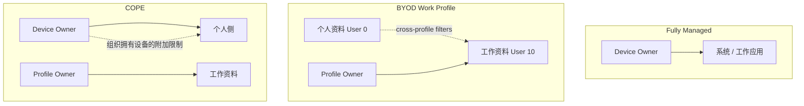
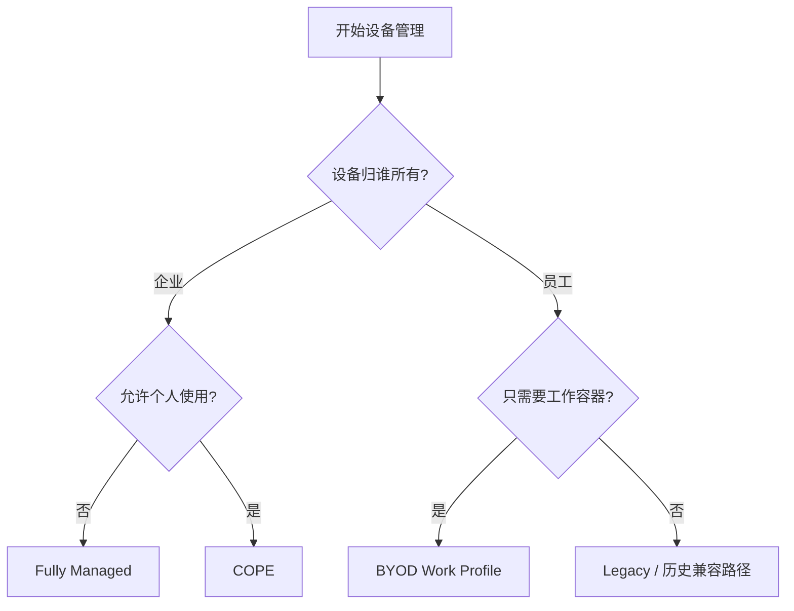
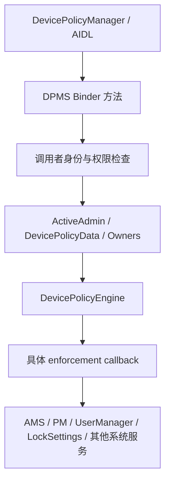
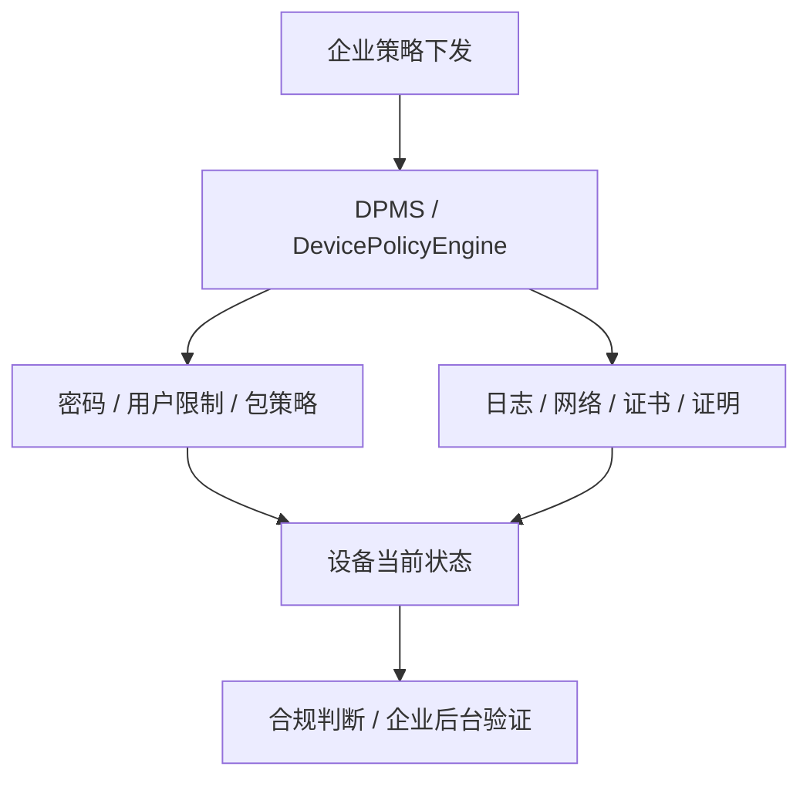

# 第 59 章：Device Policy and Android Enterprise

Android Enterprise 是 Android 在企业管理场景下的一整套平台能力集合。它并不是单独一组“企业 API”，而是横跨 `DevicePolicyManager`、`DevicePolicyManagerService`、多用户 / 工作资料、证书与密钥管理、网络与安全日志、系统更新控制以及大量 framework 子系统的统一治理层。站在系统实现角度看，企业管理的本质是把“组织想施加的约束”可靠地翻译成 Android 各层可以执行、可以持久化、可以审计的策略。

本章沿着真实 AOSP 代码路径展开：先看企业管理模式，再看 `DevicePolicyManagerService`（DPMS）内部结构和策略解析引擎，随后分别梳理工作资料、设备管理、managed configurations、COPE / fully managed、跨资料通信以及合规与安全体系，最后用一组可实操练习把这些概念串起来。

---

## 59.1 Enterprise Architecture

### 59.1.1 问题空间

企业移动管理要同时满足两组天然冲突的目标：

1. 企业侧需要控制：密码、应用部署、配置下发、远程擦除、日志审计、网络策略。
2. 用户侧需要隐私：个人照片、消息、位置与个人应用不应被企业随意查看或操纵。

Android Enterprise 的回答不是“只给一个超级管理员权限”，而是通过多种管理模式、工作资料隔离、多用户基础设施和细粒度策略 API 来切分边界。

### 59.1.2 管理模式

现代 Android 企业管理最常见的几类模式如下：

| 管理模式 | 设备归属 | 管理者类型 | 典型场景 |
|---|---|---|---|
| Fully Managed | 企业 | Device Owner | 公司发放、纯工作设备 |
| Work Profile / BYOD | 员工个人 | Profile Owner | 个人设备承载工作资料 |
| COPE | 企业 | Device Owner + Work Profile | 公司设备允许个人使用 |
| Legacy Device Admin | 多为历史兼容 | 旧式 admin | 旧方案兼容 |



### 59.1.3 Device Owner（DO）

Device Owner 是整机级企业管理员。它通常在首次开机配置期通过 QR、zero-touch、NFC、ADB 或其他受控方式完成置入，一旦建立，就拥有设备范围内最广泛的管理权限。

从系统实现上看，DO 的元数据会被 `Owners` / `OwnersData` 这类结构持久化，并在 system server 启动后推送给多个子系统。DO 的典型能力包括：

- 全局密码与锁屏策略
- Wi-Fi / VPN / 网络相关策略
- 系统更新窗口与安装策略
- FRP、恢复出厂设置、组织标识
- 证书、日志与合规策略

### 59.1.4 Profile Owner（PO）

Profile Owner 只管理一个 Android user，最典型就是 managed profile。与 DO 不同，PO 可以在同一设备的不同用户 / 资料中分别存在，因此它天然更适合“只管工作资料，不碰个人侧”的场景。

PO 的关键价值在于，它把企业管理边界从“整机”缩到“资料容器”，而这恰恰依赖 Android 多用户隔离模型。

### 59.1.5 COPE

COPE（Corporate-Owned, Personally-Enabled）是 Android 11 以后非常重要的模式。设备归企业所有，但允许用户保留个人使用空间；工作侧通常仍由 work profile 承载，而 DO 对个人侧拥有有限且更高等级的组织拥有设备限制能力。

这使 COPE 成为“既要安全控制，又不想把整机做成纯 kiosk”时最常见的企业方案。

### 59.1.6 BYOD

BYOD（Bring Your Own Device）强调设备属于员工个人，企业只在受管工作资料内施加策略。它是最尊重隐私的一类模式，也是工作资料存在的核心业务动机。

### 59.1.7 管理模式决策流



### 59.1.8 策略作用域矩阵

理解企业 API 最重要的一点，不是记某个方法名，而是先知道“它在什么模式下对谁生效”。同一项策略，在 DO、BYOD PO 与 COPE PO 下的作用域可能完全不同。

### 59.1.9 Android Enterprise 功能演进

企业管理能力是逐年演进出来的：

- 早期以 Device Admin 为主
- Android 5 引入 managed profile / profile owner
- Android 10/11 后 COPE 模式成形
- 新版本继续把权限模型从“admin component”演进为更细粒度的 `MANAGE_DEVICE_POLICY_*`
- Android 14 引入更正式的 `DevicePolicyEngine` 多管理员策略解析模型

### 59.1.10 Headless System User Mode

在某些企业或专用设备模式下，headless system user 让“系统用户”和“实际交互用户”分离，这会影响 owner 放置位置、用户创建和策略传播模型。

## 59.2 DevicePolicyManagerService

### 59.2.1 概览与类层级

`DevicePolicyManagerService`（DPMS）是整个企业策略框架的中枢。它既要暴露 Binder 接口给 `DevicePolicyManager` 客户端，又要管理 per-user / per-admin 状态、执行权限检查、触发策略解析，并把结果分发到系统其他组件。

DPMS 是 system server 里非常大的服务之一，围绕它还分布着：

- `ActiveAdmin`
- `DevicePolicyData`
- `Owners`
- `DevicePolicyEngine`
- `PolicyDefinition`
- `EnforcingAdmin`
- `SecurityLogMonitor`
- `NetworkLogger`

### 59.2.2 DPMS 内部架构

可以把 DPMS 理解成四层：

1. Binder API 入口层
2. Caller identity / permission 校验层
3. 策略状态与解析层
4. 具体 enforcement / 子系统同步层



### 59.2.3 服务注册与启动

DPMS 在 system server 启动期注册进 ServiceManager，并在 boot phases 里逐步接好依赖，例如 UserManager、PackageManager、LockSettings、ActivityTaskManager 等。

### 59.2.4 Admin 组件模型

企业管理员本质上是一个声明了特定 metadata 的应用组件。`DeviceAdminReceiver` 和 `DeviceAdminInfo` 负责把 manifest / XML 元数据解析成系统可理解的 admin 能力声明。

### 59.2.5 `ActiveAdmin`：每个管理员的状态

`ActiveAdmin` 保存某个 admin 生效的策略状态，例如：

- 密码要求
- camera disable
- keyguard 限制
- support message
- network / logging 开关

它不是最终解析结果，而是“单个管理员提出的策略集”。

### 59.2.6 `DevicePolicyData`：每用户状态

`DevicePolicyData` 则负责 per-user 维度的数据，例如这个 user 上有哪些 active admin、策略快照和持久化相关内容。

### 59.2.7 `DevicePolicyEngine`：多管理员策略解析

Android 14 开始，`DevicePolicyEngine` 成为理解现代 DPMS 的关键。它不是简单“最后一个写入覆盖前面”，而是为不同策略定义不同 resolution 机制，让多个管理员、角色式管理员与历史 device admin 可以共存。

### 59.2.8 Resolution Mechanisms

典型解析策略包括：

- `MostRestrictive`
- `TopPriority`
- `PackageSetUnion`
- `MostRecent`

也就是说，不同策略不是统一套一条冲突规则，而是按策略语义决定如何合并。

### 59.2.9 Policy Flags

Policy flag 用于描述一条策略的特征，例如是否设备范围、是否用户范围、是否支持某类解析行为。

### 59.2.10 `EnforcingAdmin`

`EnforcingAdmin` 是 policy engine 中对“谁在施加这条策略”的正式表示。它比传统 `ComponentName` 更通用，便于支持不同来源的管理员身份。

### 59.2.11 Policy API 权限模型

旧模型大量依赖“调用者是不是这个 admin component”，新模型越来越多依赖更细粒度权限，如 `MANAGE_DEVICE_POLICY_*`。这让一些非传统 DPC 参与设备管理成为可能。

### 59.2.12 Delegation

企业管理员并不一定什么都自己做。DPMS 支持 delegation，把一部分能力授权给其他应用，例如证书安装、app restrictions、网络日志等。

### 59.2.13 持久化与 XML

DPMS 会把 owner 信息、admin 状态和相关策略持久化为 XML。理解这些 XML 对排查“为什么这台设备还记着旧策略”很有帮助。

### 59.2.14 调用者身份与权限检查

DPMS 几乎每个重要 API 都会经历严格的 caller identity 校验：

- 当前用户是谁
- 是否目标 owner / admin
- 是否有对应 `MANAGE_DEVICE_POLICY_*`
- 是否允许跨用户或跨资料调用

### 59.2.15 线程安全与锁

DPMS 状态很多，涉及多用户、多管理员、多系统服务联动，因此大量代码依赖统一锁保护。理解锁边界对读源码和查死锁类问题都很重要。

### 59.2.16 策略执行流

一条策略的大致生命周期通常是：

1. 客户端调用 `DevicePolicyManager`
2. Binder 到 DPMS
3. 权限与身份校验
4. 写入 admin / policy 状态
5. 交给 `DevicePolicyEngine` 解析
6. 触发具体 enforcement callback
7. 同步到子系统并持久化

### 59.2.17 Binder Caches

为降低频繁策略查询成本，某些设备策略结果会通过缓存或状态推送方式同步给其他服务，而不是每次都走完整计算。

## 59.3 Work Profiles

### 59.3.1 概念模型

工作资料本质上是基于 Android 多用户机制构建的受管 profile。它不是一个简单文件夹，而是独立 user / profile 语义下的一整套应用、数据和策略空间。

### 59.3.2 Managed Profile 创建

创建 managed profile 需要经过 provisioning 流程，由 DPC 或系统受控入口发起，最终建立一个新的 profile user，并把相应 owner / policy 关系绑定上去。

### 59.3.3 Provisioning 前提条件

profile provisioning 不是任意时刻都能做，需要满足：

- 当前设备状态允许
- 目标模式支持
- 用户与 owner 关系合法
- setup 流程阶段符合要求

### 59.3.4 Cross-Profile Intent Filters

个人侧与工作侧并不是完全不通信。它们通过 cross-profile intent filter 明确声明允许哪些 intent 跨资料流动。

### 59.3.5 Work Mode Toggle

工作模式开关允许用户暂停工作资料运行，相当于对受管 profile 做“临时停用”。

### 59.3.6 COPE 下个人应用挂起

COPE 模式下，组织拥有设备可以在某些条件下挂起个人侧应用，这体现出它与普通 BYOD 在权限边界上的差异。

### 59.3.7 工作资料数据隔离

隔离不是口头概念，而是落实在：

- 独立 user / app data
- 包管理与安装边界
- intent / provider / 账户访问限制
- 通知与联系人等跨资料例外机制

### 59.3.8 Managed Subscriptions

工作资料可以拥有自己的受管订阅与通信策略，这对企业通信场景有实际意义。

### 59.3.9 Keep Profiles Running

系统支持控制 profile 是否持续运行，这影响通知、同步和后台策略行为。

### 59.3.10 Work Profile Telephony

工作资料与电话功能的关系比较特殊，因为 telephony 大量是整机资源，但策略又需要体现工作 / 个人边界。

### 59.3.11 工作资料删除

删除工作资料意味着撤销对应 profile owner、清理受管 app 与数据，并撤除相关 cross-profile 配置。

## 59.4 Device Administration

### 59.4.1 `DeviceAdminReceiver`

`DeviceAdminReceiver` 是 DPC / admin app 接收系统回调的经典入口，例如启用、禁用、密码变更等事件。

### 59.4.2 Admin 生命周期

生命周期通常包括：

- 声明 admin metadata
- 被用户或 provisioning 激活
- 成为 active admin
- 设置策略
- 失效或被移除

### 59.4.3 密码策略

密码相关是最基础的设备管理能力之一，涵盖复杂度、长度、历史、字符种类等要求。

### 59.4.4 密码过期

企业可以要求密码定期更新，这是典型合规项之一。

### 59.4.5 失败次数上限

设置错误解锁次数上限后，可以触发 wipe 或其他保护行为。

### 59.4.6 设备锁定

企业管理可以直接要求锁屏、立即上锁或调整空闲后自动锁定时间。

### 59.4.7 加密策略

早期 Android 更强调“是否要求设备加密”，现代系统很多设备默认加密，但企业策略仍然可能需要显式检查与声明。

### 59.4.8 禁用摄像头

禁用摄像头是最常见的硬件限制策略之一。

### 59.4.9 禁止截屏

screen capture disable 可以用于阻止敏感工作资料内容被录屏或截屏。

### 59.4.10 Keyguard 功能禁用

企业管理员可以细化控制锁屏界面允许哪些能力。

### 59.4.11 恢复出厂设置

wipe 相关 API 允许企业在设备遗失或移交时清除数据，但不同模式下可擦除的范围并不相同。

### 59.4.12 FRP

Factory Reset Protection 与企业策略结合后，可以防止被重置后的设备落入未授权状态。

### 59.4.13 账户管理

企业可以限制账户添加、删除和某些类型的同步行为。

### 59.4.14 VPN 策略

例如 always-on VPN，是 fully managed 与 COPE 中非常常见的网络治理能力。

### 59.4.15 Permitted Services

某些平台扩展服务需要白名单控制，避免未受信服务接入企业管理通路。

### 59.4.16 Metered Data

企业可以控制计费网络上的数据使用策略。

### 59.4.17 Trust Agent

Trust Agent 管理关系到解锁体验与企业安全要求之间的平衡。

### 59.4.18 Nearby Streaming Policies

附近共享、流式投屏等能力同样可能被纳入企业限制。

### 59.4.19 Organization Identity

组织名称、标识和相关展示信息会体现在工作资料 UI 与某些系统界面中。

### 59.4.20 Support Messages

管理员可以为锁屏、工作资料或特定管理状态设置支持信息。

### 59.4.21 Session Messages

多用户环境下还会涉及会话提示信息。

### 59.4.22 User Restrictions

user restriction 是企业策略与通用用户管理之间的一条桥，许多“禁止某行为”的要求最终都落在这里。

### 59.4.23 Lock Task Mode

Lock task / kiosk 模式让设备能被固定在少量受控应用中，是专用企业终端的核心能力之一。

## 59.5 Managed Configurations

### 59.5.1 App Restrictions Framework

Managed configuration 的核心，是把企业对某个应用的受管参数通过 app restrictions 框架下发进去，而不是要求应用自己造一套专用远控协议。

### 59.5.2 Restriction Types

restriction 可以是布尔、字符串、整数、选择项、bundle 等多种类型。

### 59.5.3 App Restrictions Delegation

某些情况下，设置 app restrictions 的能力也可以被委派。

### 59.5.4 `RestrictionsManager`

`RestrictionsManager` 是应用侧读取和理解这些受管配置的关键 API 之一。

### 59.5.5 在 Policy Engine 中的处理

Managed configurations 并不是旁路能力，它们同样会进入 DPMS / policy engine 的统一状态与解析体系。

### 59.5.6 Managed Config 架构


### 59.5.7 常见用例

典型例子包括：

- 企业邮箱服务器地址
- VPN / 代理参数
- 应用功能开关
- 强制登录企业域

## 59.6 COPE and Fully Managed Devices

### 59.6.1 Fully Managed 设备 provisioning

Fully managed provisioning 代表企业对整机的初始接管，是所有最强控制能力的前提。

### 59.6.2 Provisioning 方式

常见方式包括：

- NFC bump（历史）
- QR code
- zero-touch enrollment
- ADB / 测试命令

### 59.6.3 Device Owner 能力

DO 能力范围最广，尤其适合：

- 公司发放设备
- kiosk / 专用终端
- 统一更新与安全基线

### 59.6.4 COPE 架构

COPE 是“设备归组织、用户有个人空间”的折中模型。实现上依赖 DO + 受管工作资料的组合关系。

### 59.6.5 COPE 与 Fully Managed 对比

最核心差异不是企业控制强弱，而是是否保留受隔离的个人使用空间。

### 59.6.6 Financed Devices

Android 还考虑到融资设备等特殊企业拥有模型，对某些限制和 ownership 语义有扩展支持。

### 59.6.7 系统更新策略

系统更新窗口、冻结期和安装节奏，都是企业设备治理的重要组成部分。

### 59.6.8 Always-On VPN

Always-On VPN 在合规、流量审计和数据出站控制里非常常见。

## 59.7 Cross-Profile Communication

### 59.7.1 Cross-Profile 边界

个人资料与工作资料的边界默认是封闭的。任何跨界通信都必须被系统显式建模和限制。

### 59.7.2 Cross-Profile Intent Filters

这是最常见的跨资料通路配置方式，用于允许受控 intent 在 parent / managed 之间流动。

### 59.7.3 默认过滤器

系统会预置一部分默认规则，例如浏览器、拨号或联系人相关的受控路径。

### 59.7.4 `CrossProfileApps` API

`CrossProfileApps` 为应用提供正式 API 与工作资料交互，而不是偷偷绕开系统边界。

### 59.7.5 Manifest 声明

跨资料能力通常还需要 manifest 声明配合，避免普通应用无意中获得特殊行为。

### 59.7.6 个人应用查看工作联系人

联系人是最典型的跨资料例外场景：需要一定可见性，但不能破坏整体隔离。

### 59.7.7 Cross-Profile Calendar

日历共享是另一个常见的“有限可见、有限交互”例子。

### 59.7.8 Cross-Profile Widget Providers

Widget 也涉及跨资料显示和数据边界，因此有专门控制逻辑。

### 59.7.9 Cross-Profile Packages

某些包会在两侧资料同时存在，系统需要把它们作为“跨资料相关包”处理。

### 59.7.10 Connected Work and Personal Apps

Connected apps 模型的目标，是在维持隔离的同时提供受控协作体验。

### 59.7.11 数据共享模式

企业环境里常见的数据共享模式包括：

- 仅允许查看
- 仅允许某类 intent
- 仅允许特定 app
- 完全禁止

### 59.7.12 跨资料 Content Provider 访问

Provider 访问的风险比 intent 更直接，因此控制通常更严格。

### 59.7.13 资料交互流

整体看，cross-profile communication 的本质是“少数白名单通路 + 默认隔离”，而不是“先打通再补限制”。

## 59.8 Compliance and Security

### 59.8.1 Security Logging

Security logging 用于把关键安全事件暴露给企业管理员，帮助做合规审计与事件响应。

### 59.8.2 Audit Logging

除了系统安全事件，还需要覆盖更广义的审计信息。

### 59.8.3 Network Logging

网络日志通常涵盖 DNS、TCP 等网络活动，是企业治理与调查的重要证据面。

### 59.8.4 Device Attestation

设备证明允许企业验证设备是否处于可信硬件与可信系统状态，而不只是相信客户端自报信息。

### 59.8.5 证明证书链结构

Attestation 并不是单个证书，而是一条包含硬件、keymaster / keymint 与设备身份语义的证书链。

### 59.8.6 证书管理

企业设备往往需要下发 CA、管理证书信任和监视不安全证书变化。

### 59.8.7 密码合规检查

策略设置只是第一步，系统还需要判断当前实际密码是否满足要求。

### 59.8.8 Compliance Acknowledgement

某些策略变化和合规状态需要显式确认，避免“管理员设了，用户端并未真正进入合规状态”。

### 59.8.9 安全补丁验证

企业设备经常需要把 patch level 纳入合规条件。

### 59.8.10 USB Data Signaling Control

控制 USB 数据能力是防止设备被随意接入不受信主机的常见策略。

### 59.8.11 MTE

ARM64 的 MTE 已经开始进入企业安全语境，作为额外的运行时保护能力。

### 59.8.12 Content Protection

对受管内容的保护不只体现在加密，也体现在复制、分享、截屏和外发路径控制。

### 59.8.13 Stolen Device State

被盗设备状态的建模让系统能在更高风险条件下切换策略。

### 59.8.14 Device Policy State

把设备当前 policy state 暴露出来，有利于企业管理平台做验证和故障定位。

### 59.8.15 Enterprise-Specific ID

企业侧往往需要稳定但受控的设备标识语义，不能直接滥用消费者场景下的硬件标识。

### 59.8.16 Remote Bugreport

远程 bugreport 让企业管理员在受控条件下收集整机诊断信息。

### 59.8.17 Wi-Fi SSID Policy

企业可控制允许 / 禁止连接的 Wi-Fi 网络范围。

### 59.8.18 Private DNS Policy

Private DNS 能力也可纳入企业网络治理。

### 59.8.19 Preferential Network Service

某些 enterprise 流量可以被引导到特定网络优先级。

### 59.8.20 APN 配置

在移动网络管理场景中，APN 同样是典型企业策略项。

### 59.8.21 Package Policy

安装允许列表、阻止列表、更新行为和受保护包，都可以进入包策略治理。

### 59.8.22 Ephemeral Users

临时用户能力可用于共享设备或会话式设备模型。

### 59.8.23 Protected Packages

对关键包做额外保护，可以避免被普通用户或某些流程随意移除。

### 59.8.24 Bypass Role Qualifications

企业场景下有时需要让特定 app 越过某些普通角色资格限制。

### 59.8.25 Secondary Lock Screen

次级锁屏能力也是企业专用场景里的一个扩展点。

### 59.8.26 App Exemptions

有时某些应用需要从常规限制中豁免，这同样需要正式策略建模。

### 59.8.27 完整合规架构



## 59.9 Try It

### 59.9.1 练习 1：检查 DPMS 源码规模

```bash
# 统计主服务文件行数
wc -l frameworks/base/services/devicepolicy/java/com/android/server/devicepolicy/DevicePolicyManagerService.java

# 统计 devicepolicy 包中的 Java 文件
find frameworks/base/services/devicepolicy/java/com/android/server/devicepolicy -name "*.java" | wc -l

# 列出 policy definition 常量
grep -R "POLICY_" frameworks/base/services/devicepolicy/java/com/android/server/devicepolicy -n
```

### 59.9.2 练习 2：浏览客户端 API

```bash
# DevicePolicyManager 的 public 方法数量
grep -n "public .*(" frameworks/base/core/java/android/app/admin/DevicePolicyManager.java | wc -l

# delegation scopes
grep -n "DELEGATION_" frameworks/base/core/java/android/app/admin/DevicePolicyManager.java

# PASSWORD_COMPLEXITY 常量
grep -n "PASSWORD_COMPLEXITY" frameworks/base/core/java/android/app/admin/DevicePolicyManager.java
```

### 59.9.3 练习 3：写一个最小 Device Admin

实现一个最小 DPC / admin，包含：

- `DeviceAdminReceiver`
- 对应 metadata XML
- 一个调用 `DevicePolicyManager` 的 Activity

### 59.9.4 练习 4：设置测试 Device Owner

```bash
# 新鲜 emulator（初始状态）
adb shell dpm set-device-owner com.example.dpc/.MyDeviceAdminReceiver

# 验证 device owner
adb shell dpm get-device-owner

# 查看 device policy XML
adb shell ls /data/system
```

### 59.9.5 练习 5：创建并检查 Work Profile

```bash
# 列当前用户
adb shell pm list users

# 用 TestDPC 等创建 managed profile 后再查看
adb shell pm list users

# 查看 profile 下安装包
adb shell pm list packages --user 10
```

### 59.9.6 练习 6：探索 Managed Configurations

```bash
# 设置 app restrictions 后
adb shell dumpsys device_policy
```

重点看 app restrictions 是否进入当前 policy state。

### 59.9.7 练习 7：检查 Policy Engine 解析

```bash
# 查 resolution mechanism
grep -R "MostRestrictive\\|TopPriority\\|PackageSetUnion\\|MostRecent" \
  frameworks/base/services/devicepolicy/java/com/android/server/devicepolicy -n
```

### 59.9.8 练习 8：安全日志与网络日志

在具备 DO 权限的测试环境中，检查：

- `setSecurityLoggingEnabled`
- network logging state
- `SecurityLogMonitor`
- `NetworkLogger`

### 59.9.9 练习 9：跟一条策略调用走完整栈

以禁用摄像头为例，依次追：

1. `DevicePolicyManager` 客户端方法
2. `IDevicePolicyManager.aidl`
3. DPMS 服务端实现
4. `DevicePolicyEngine` 解析点
5. 具体 enforcement callback
6. Camera 或相关子系统如何读取并执行结果

### 59.9.10 练习 10：实现一个带 Managed Config 的完整 DPC

要求同时完成：

- 激活 admin
- 创建或接管工作资料
- 给目标应用下发 app restrictions
- 在目标应用内读取并生效这些配置

### 59.9.11 练习 11：Ownership Transfer API

跟读 ownership transfer 相关实现，理解 owner 元数据如何迁移与持久化。

### 59.9.12 练习 12：ADB 设备策略命令

```bash
# 查看 dpm 命令
adb shell dpm help

# dumpsys 也是重要入口
adb shell dumpsys device_policy
```

重点看输出中的：

- Device Owner
- Profile Owner
- Active Admins
- Policy states
- Affiliation IDs
- Security / Network logging status

### 59.9.13 练习 13：跨资料通信

```bash
# 确认 work profile 存在
adb shell pm list users

# 查看 cross-profile intent filters
adb shell dumpsys package cross-profile-intent-filters

# 从个人资料尝试打开网页
adb shell am start -a android.intent.action.VIEW -d "https://example.com" --user 0
```

### 59.9.14 练习 14：实现密码复杂度策略

实现一段最小 DPC 逻辑，调用：

- `setRequiredPasswordComplexity()`
- `isActivePasswordSufficient()`
- `setMaximumFailedPasswordsForWipe()`
- `setMaximumTimeToLock()`

### 59.9.15 练习 15：验证设备证明

编写一段代码：

- 生成带 challenge 的 attested key
- 取回 attestation chain
- 发送到服务端做校验

### 59.9.16 练习 16：工作资料 + Managed Config 端到端

把以下几步串起来：

1. 创建工作资料
2. 设置组织名与基础策略
3. 安装或接入企业邮箱类应用
4. 下发 managed config
5. 验证应用读取并应用这些配置

### 59.9.17 关键源码路径

| 文件 | 作用 |
|---|---|
| `frameworks/base/core/java/android/app/admin/DevicePolicyManager.java` | 客户端 API |
| `frameworks/base/core/java/android/app/admin/DeviceAdminReceiver.java` | Admin 回调接口 |
| `frameworks/base/core/java/android/app/admin/DeviceAdminInfo.java` | Admin metadata 解析 |
| `frameworks/base/core/java/android/app/admin/IDevicePolicyManager.aidl` | Binder 接口 |
| `frameworks/base/services/devicepolicy/java/com/android/server/devicepolicy/DevicePolicyManagerService.java` | DPMS 主实现 |
| `frameworks/base/services/devicepolicy/java/com/android/server/devicepolicy/DevicePolicyEngine.java` | 多管理员策略解析 |
| `frameworks/base/services/devicepolicy/java/com/android/server/devicepolicy/PolicyDefinition.java` | 策略定义与解析机制 |
| `frameworks/base/services/devicepolicy/java/com/android/server/devicepolicy/ActiveAdmin.java` | 单 admin 状态 |
| `frameworks/base/services/devicepolicy/java/com/android/server/devicepolicy/Owners.java` | DO / PO 跟踪 |
| `frameworks/base/services/devicepolicy/java/com/android/server/devicepolicy/DevicePolicyData.java` | 每用户策略数据 |
| `frameworks/base/services/devicepolicy/java/com/android/server/devicepolicy/EnforcingAdmin.java` | Policy engine 中的 admin 身份 |
| `frameworks/base/services/devicepolicy/java/com/android/server/devicepolicy/SecurityLogMonitor.java` | 安全日志 |
| `frameworks/base/services/devicepolicy/java/com/android/server/devicepolicy/NetworkLogger.java` | 网络日志 |
| `frameworks/base/services/devicepolicy/java/com/android/server/devicepolicy/CertificateMonitor.java` | 证书监控 |
| `frameworks/base/services/devicepolicy/java/com/android/server/devicepolicy/PersonalAppsSuspensionHelper.java` | COPE 个人应用挂起 |
| `frameworks/base/core/java/android/app/admin/ManagedProfileProvisioningParams.java` | 工作资料 provisioning 参数 |
| `frameworks/base/core/java/android/app/admin/FullyManagedDeviceProvisioningParams.java` | 全托管设备 provisioning 参数 |
| `frameworks/base/core/java/android/content/pm/CrossProfileApps.java` | 跨资料交互 API |
| `frameworks/base/core/java/android/app/admin/FactoryResetProtectionPolicy.java` | FRP 配置 |

## Summary

Android Enterprise 不是一个边缘特性，而是 Android 平台里极其深的一层系统治理框架。

1. Fully Managed、BYOD Work Profile 与 COPE 构成了企业管理的三种主轴，它们的差异首先体现在 ownership 与策略作用域上。
2. `DevicePolicyManagerService` 是中心代理，负责权限校验、状态持久化、策略解析和对子系统的执行传播。
3. `DevicePolicyEngine` 把多管理员场景正式建模为可配置的 resolution 机制，而不是简单覆盖写入。
4. 工作资料建立在 Android 多用户隔离之上，cross-profile communication 通过白名单通路受控开放。
5. Managed configurations 让企业应用配置成为平台级能力，而不是每个应用私自发明协议。
6. 安全日志、网络日志、设备证明、证书管理、FRP、USB 控制和补丁级验证，共同构成企业合规与安全证明面。
7. 新的权限模型和 delegation 机制则让 Android Enterprise 从“单一超级 DPC”逐步演进为更细粒度、更多角色可参与的管理体系。

从系统工程角度看，Android Enterprise 最值得注意的一点，是它把“企业策略”从抽象要求落成了可持久化、可解析、可审计、可由多个子系统协同执行的正式平台语义。这也是 DPMS 虽然复杂，却必须如此复杂的原因。
