# Chapter 59: Device Policy and Android Enterprise

Android Enterprise is the umbrella term for the collection of APIs,
infrastructure components, and management modes that allow organizations to
manage Android devices at scale.  At its core lies the **Device Policy
Framework** -- a system-server subsystem centered on `DevicePolicyManagerService`
(DPMS) that translates high-level enterprise intentions ("require a six-digit
PIN", "block the camera in the work profile") into concrete, enforced changes
across the Android stack.  This chapter traces every major path through the real
AOSP source code, from the XML metadata that declares an admin component, through
the 25,000-line DPMS implementation, into the policy-engine resolution layer and
out to the individual subsystem enforcers that make each policy stick.

---

## 59.1  Enterprise Architecture

### 59.1.1  The Problem Space

Enterprise mobility management (EMM) must reconcile two opposing requirements:

1. **Corporate control** -- the organization needs to enforce security policies,
   deploy apps, push configurations, wipe data on loss, and audit activity.

2. **User privacy** -- employees do not want their employer to see personal
   photos, read personal messages, or track their location after hours.

Android Enterprise solves this tension through a combination of user-space
isolation (work profiles), privilege tiers (Device Owner vs. Profile Owner),
and fine-grained policy APIs (over 250 individually controllable policies in
modern AOSP).

### 59.1.2  Management Modes

Android defines four primary management modes, each offering different
trade-offs between IT control and user freedom:

```
Management Mode       | Device Ownership | Profile Ownership | Typical Scenario
----------------------|------------------|-------------------|------------------
Fully Managed         | IT org           | N/A               | Company-issued device
Work Profile (BYOD)   | Employee         | IT org            | Personal device
COPE                  | IT org           | IT org            | Company device, personal use
Legacy Device Admin   | Employee         | N/A               | Pre-Android 5.0 compatibility
```

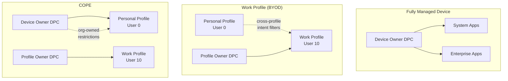
```mermaid
graph TB
    subgraph "Fully Managed Device"
        FMD_DO[Device Owner DPC]
        FMD_SYS[System Apps]
        FMD_WORK[Enterprise Apps]
        FMD_DO --> FMD_SYS
        FMD_DO --> FMD_WORK
    end

    subgraph "Work Profile (BYOD)"
        WP_PERSONAL["Personal Profile<br/>User 0"]
        WP_MANAGED["Work Profile<br/>User 10"]
        WP_PO[Profile Owner DPC]
        WP_PERSONAL -. "cross-profile<br/>intent filters" .-> WP_MANAGED
        WP_PO --> WP_MANAGED
    end

    subgraph "COPE"
        COPE_DO[Device Owner DPC]
        COPE_PERSONAL["Personal Profile<br/>User 0"]
        COPE_WORK["Work Profile<br/>User 10"]
        COPE_PO[Profile Owner DPC]
        COPE_DO --> COPE_PERSONAL
        COPE_PO --> COPE_WORK
        COPE_DO -. "org-owned<br/>restrictions" .-> COPE_PERSONAL
    end
```

### 59.1.3  Device Owner (DO)

A Device Owner is a Device Policy Client (DPC) app that has full management
authority over the entire device.  It is provisioned during the initial setup
wizard (or via `adb` for development).  In source terms, a Device Owner is
tracked in:

```
// frameworks/base/services/devicepolicy/java/com/android/server/devicepolicy/Owners.java
class Owners {
    @GuardedBy("mData")
    private final OwnersData mData;
    // mData.mDeviceOwner holds the OwnerInfo for the Device Owner
    // mData.mDeviceOwnerUserId identifies which user the DO runs as
}
```

Key characteristics:

- **Singleton**: exactly one Device Owner may exist per device.
- **Provisioning**: set during the out-of-box experience (OOBE) via NFC bump,
  QR code, zero-touch enrollment, or `adb shell dpm set-device-owner`.

- **Scope**: can set global policies (Wi-Fi, time zone, system update policy,
  factory reset protection) and per-user policies.

- **Cannot be removed**: once set, the Device Owner can only be removed by a
  factory reset (or the DO itself calling `clearDeviceOwnerApp()`).

The DPMS tracks management modes through stats logging constants:

```
// frameworks/base/services/devicepolicy/java/com/android/server/devicepolicy/
//   DevicePolicyManagerService.java (line ~244-250)
import static com.android.server.devicepolicy.DevicePolicyStatsLog
    .DEVICE_POLICY_MANAGEMENT_MODE__MANAGEMENT_MODE__DEVICE_OWNER;
import static com.android.server.devicepolicy.DevicePolicyStatsLog
    .DEVICE_POLICY_MANAGEMENT_MODE__MANAGEMENT_MODE__COPE;
import static com.android.server.devicepolicy.DevicePolicyStatsLog
    .DEVICE_POLICY_MANAGEMENT_MODE__MANAGEMENT_MODE__PROFILE_OWNER;
```

### 59.1.4  Profile Owner (PO)

A Profile Owner manages a single Android user (typically a managed profile).
Unlike a Device Owner, multiple Profile Owners can coexist on a device (one
per user).  The `Owners` class stores them in a `SparseArray`:

```
// Owners.java (within OwnersData)
// mData.mProfileOwners is SparseArray<OwnerInfo> keyed by userId
```

When the `Owners` class loads configuration from disk, it pushes owner
information to multiple subsystems:

```java
// Owners.java, load()
void load() {
    synchronized (mData) {
        int[] usersIds =
            mUserManager.getAliveUsers().stream().mapToInt(u -> u.id).toArray();
        mData.load(usersIds);
        // ... push to DeviceStateCache, ActivityTaskManager, PackageManager
        notifyChangeLocked();
        pushDeviceOwnerUidToActivityTaskManagerLocked();
        pushProfileOwnerUidsToActivityTaskManagerLocked();
    }
}
```

### 59.1.5  COPE (Corporate-Owned, Personally-Enabled)

COPE is a hybrid mode introduced in Android 11.  The device is corporate-owned
(a Device Owner exists), but the user also has a personal profile.  A Profile
Owner runs in the work profile, and the Device Owner can impose certain
restrictions on the personal side.

The COPE relationship is encoded in the provisioning parameters:

```java
// frameworks/base/core/java/android/app/admin/ManagedProfileProvisioningParams.java
public final class ManagedProfileProvisioningParams implements Parcelable {
    private final boolean mOrganizationOwnedProvisioning;
    // When true, the profile owner gains elevated privileges over
    // the personal profile (e.g., suspending personal apps).
}
```

The owner type tracking in `UserManagerInternal` distinguishes the three cases:

```java
// Referenced by DevicePolicyManagerService.java
import static com.android.server.pm.UserManagerInternal.OWNER_TYPE_DEVICE_OWNER;
import static com.android.server.pm.UserManagerInternal.OWNER_TYPE_PROFILE_OWNER;
import static com.android.server.pm.UserManagerInternal
    .OWNER_TYPE_PROFILE_OWNER_OF_ORGANIZATION_OWNED_DEVICE;
```

### 59.1.6  BYOD (Bring Your Own Device)

In BYOD mode, the device belongs to the employee.  Only a work profile is
created, and the Profile Owner manages only that profile.  The IT admin has no
control over the personal side.  This is the most privacy-respecting
management mode.

### 59.1.7  Management Mode Decision Flow

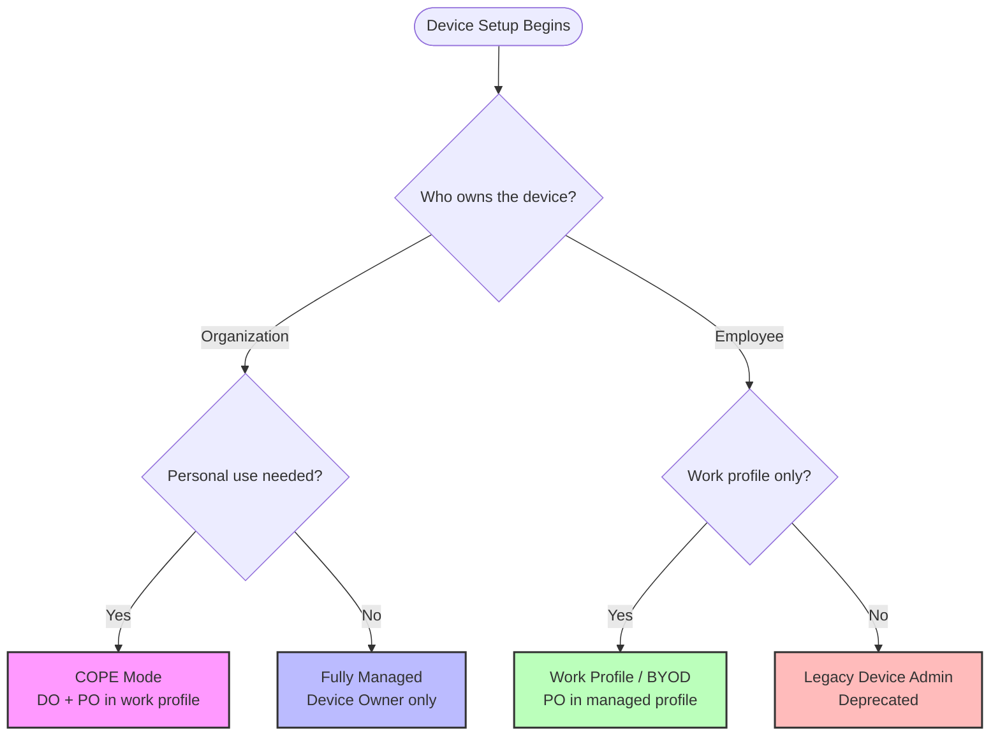
```mermaid
flowchart TD
    START([Device Setup Begins])
    Q1{Who owns the device?}
    Q2{Personal use needed?}
    Q3{Work profile only?}

    START --> Q1
    Q1 -- "Organization" --> Q2
    Q1 -- "Employee" --> Q3

    Q2 -- "Yes" --> COPE["COPE Mode<br/>DO + PO in work profile"]
    Q2 -- "No" --> FULLY["Fully Managed<br/>Device Owner only"]

    Q3 -- "Yes" --> BYOD["Work Profile / BYOD<br/>PO in managed profile"]
    Q3 -- "No" --> LEGACY["Legacy Device Admin<br/>Deprecated"]

    style COPE fill:#f9f,stroke:#333,stroke-width:2px
    style FULLY fill:#bbf,stroke:#333,stroke-width:2px
    style BYOD fill:#bfb,stroke:#333,stroke-width:2px
    style LEGACY fill:#fbb,stroke:#333,stroke-width:2px
```

### 59.1.8  Management Modes in Detail: Policy Scope Matrix

The following matrix shows which DPM APIs are available under each management
mode.  Understanding these scopes is essential when building a DPC.

```
API Category             | DO   | PO (BYOD) | PO (COPE) | Legacy Admin
-------------------------|------|-----------|-----------|-------------
Password quality         | Yes  | Work only | Work+Dev  | Yes
Camera disable           | Yes  | Work only | Work+Dev  | Yes
Screen capture disable   | Yes  | Work only | Work only | No
Wi-Fi configuration      | Yes  | No        | No        | No
System update policy     | Yes  | No        | No        | No
Factory reset            | Yes  | Profile   | Profile   | Yes
Lock now                 | Yes  | Work lock | Both      | Yes
Install CA cert          | Yes  | Work only | Work only | No
Security logging         | Yes  | No        | Yes       | No
Network logging          | Yes  | No        | Yes       | No
Personal app suspension  | N/A  | No        | Yes       | No
Always-on VPN            | Yes  | Work only | Work only | No
Cross-profile policies   | N/A  | Yes       | Yes       | No
Lock task mode           | Yes  | Yes       | Yes       | No
App restrictions         | Yes  | Work only | Work only | No
USB data signaling       | Yes  | No        | No        | No
```

### 59.1.9  Android Enterprise Feature Evolution

Android Enterprise capabilities have evolved significantly across platform
versions:

```
Android Version | Key Enterprise Features
----------------|------------------------
5.0 (Lollipop)  | Work profiles, Profile Owner, Device Owner
6.0 (M)         | COSU (Corporate-Owned Single-Use), always-on VPN
7.0 (Nougat)    | Network logging, security logging, DPC transfer
8.0 (Oreo)      | Ephemeral users, mandatory backup, companion DPC
9.0 (Pie)       | Compliance, QR provisioning improvements
10              | COPE (organization-owned managed profile)
11              | Personal app suspension, enhanced COPE
12              | Compliance acknowledgement, privacy dashboard
13              | Role-based management, fine-grained permissions
14              | DevicePolicyEngine, multi-admin resolution
15              | Enhanced MTE, audit logging, device theft API
```

### 59.1.10  Headless System User Mode

Modern Android supports headless system user mode, particularly relevant for
automotive and multi-user scenarios.  The `DeviceAdminInfo` class defines
three headless modes:

```java
// frameworks/base/core/java/android/app/admin/DeviceAdminInfo.java
public static final int HEADLESS_DEVICE_OWNER_MODE_UNSUPPORTED = 0;
public static final int HEADLESS_DEVICE_OWNER_MODE_AFFILIATED = 1;
public static final int HEADLESS_DEVICE_OWNER_MODE_SINGLE_USER = 2;
```

In affiliated mode, a Profile Owner is automatically added to all users
other than the system user (where the Device Owner runs).  In single-user
mode, the Device Owner is provisioned into the first secondary user, and
creation of additional secondary users is blocked.

---

## 59.2  DevicePolicyManagerService

### 59.2.1  Overview and Class Hierarchy

`DevicePolicyManagerService` is one of the largest system services in AOSP,
weighing in at over 25,000 lines.  It implements the `IDevicePolicyManager`
AIDL interface and runs inside the system server process.

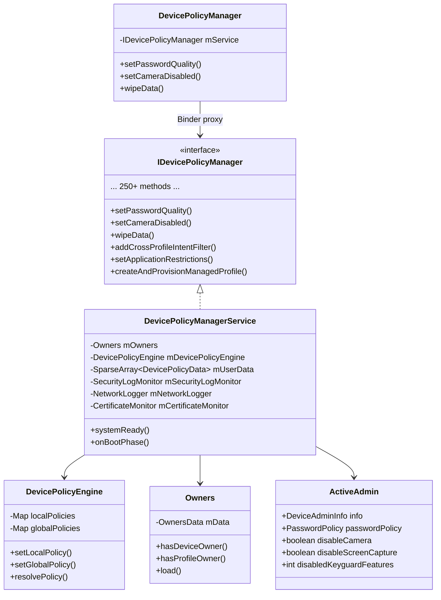
```mermaid
classDiagram
    class IDevicePolicyManager {
        <<interface>>
        +setPasswordQuality()
        +setCameraDisabled()
        +wipeData()
        +addCrossProfileIntentFilter()
        +setApplicationRestrictions()
        +createAndProvisionManagedProfile()
        ... 250+ methods ...
    }

    class DevicePolicyManagerService {
        -Owners mOwners
        -DevicePolicyEngine mDevicePolicyEngine
        -SparseArray~DevicePolicyData~ mUserData
        -SecurityLogMonitor mSecurityLogMonitor
        -NetworkLogger mNetworkLogger
        -CertificateMonitor mCertificateMonitor
        +systemReady()
        +onBootPhase()
    }

    class DevicePolicyManager {
        -IDevicePolicyManager mService
        +setPasswordQuality()
        +setCameraDisabled()
        +wipeData()
    }

    class DevicePolicyEngine {
        -Map localPolicies
        -Map globalPolicies
        +setLocalPolicy()
        +setGlobalPolicy()
        +resolvePolicy()
    }

    class Owners {
        -OwnersData mData
        +hasDeviceOwner()
        +hasProfileOwner()
        +load()
    }

    class ActiveAdmin {
        +DeviceAdminInfo info
        +PasswordPolicy passwordPolicy
        +boolean disableCamera
        +boolean disableScreenCapture
        +int disabledKeyguardFeatures
    }

    IDevicePolicyManager <|.. DevicePolicyManagerService
    DevicePolicyManager --> IDevicePolicyManager : Binder proxy
    DevicePolicyManagerService --> DevicePolicyEngine
    DevicePolicyManagerService --> Owners
    DevicePolicyManagerService --> ActiveAdmin
```

Source file locations:

| Component | Path |
|-----------|------|
| AIDL interface | `frameworks/base/core/java/android/app/admin/IDevicePolicyManager.aidl` |
| Client API | `frameworks/base/core/java/android/app/admin/DevicePolicyManager.java` |
| Service impl | `frameworks/base/services/devicepolicy/java/com/android/server/devicepolicy/DevicePolicyManagerService.java` |
| Policy engine | `frameworks/base/services/devicepolicy/java/com/android/server/devicepolicy/DevicePolicyEngine.java` |
| Owner tracking | `frameworks/base/services/devicepolicy/java/com/android/server/devicepolicy/Owners.java` |
| Admin state | `frameworks/base/services/devicepolicy/java/com/android/server/devicepolicy/ActiveAdmin.java` |
| Per-user data | `frameworks/base/services/devicepolicy/java/com/android/server/devicepolicy/DevicePolicyData.java` |

### 59.2.2  DPMS Internal Architecture

Before diving into boot, it helps to see the internal components of DPMS
and how they relate:

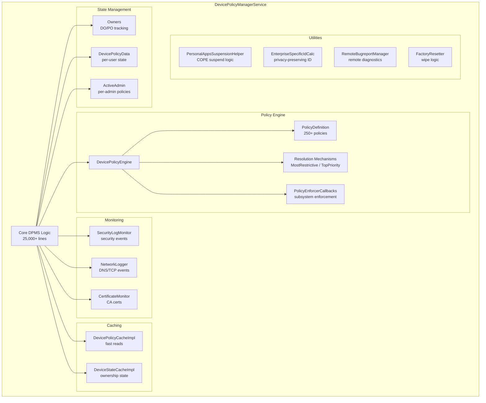
```mermaid
graph TB
    subgraph "DevicePolicyManagerService"
        CORE["Core DPMS Logic<br/>25,000+ lines"]

        subgraph "State Management"
            OWNERS["Owners<br/>DO/PO tracking"]
            DPD["DevicePolicyData<br/>per-user state"]
            AA["ActiveAdmin<br/>per-admin policies"]
        end

        subgraph "Policy Engine"
            ENGINE[DevicePolicyEngine]
            PDEF["PolicyDefinition<br/>250+ policies"]
            RESOLVE["Resolution Mechanisms<br/>MostRestrictive / TopPriority"]
            ENFORCE["PolicyEnforcerCallbacks<br/>subsystem enforcement"]
        end

        subgraph "Monitoring"
            SECLOG["SecurityLogMonitor<br/>security events"]
            NETLOG["NetworkLogger<br/>DNS/TCP events"]
            CERTMON["CertificateMonitor<br/>CA certs"]
        end

        subgraph "Caching"
            DPCACHE["DevicePolicyCacheImpl<br/>fast reads"]
            DSCACHE["DeviceStateCacheImpl<br/>ownership state"]
        end

        subgraph "Utilities"
            PSH["PersonalAppsSuspensionHelper<br/>COPE suspend logic"]
            ESID["EnterpriseSpecificIdCalc<br/>privacy-preserving ID"]
            BUG["RemoteBugreportManager<br/>remote diagnostics"]
            FACT["FactoryResetter<br/>wipe logic"]
        end
    end

    CORE --> OWNERS
    CORE --> DPD
    CORE --> AA
    CORE --> ENGINE
    ENGINE --> PDEF
    ENGINE --> RESOLVE
    ENGINE --> ENFORCE
    CORE --> SECLOG
    CORE --> NETLOG
    CORE --> CERTMON
    CORE --> DPCACHE
    CORE --> DSCACHE
```

The separation into these components reflects years of refactoring.  The
original DPMS was a single monolithic class; the engine, monitors, and
helpers were extracted to improve maintainability and testability.

### 59.2.3  Service Registration and Boot

DPMS is registered as a system service by `SystemServer`.  Its boot lifecycle
follows the standard `SystemService` phases:

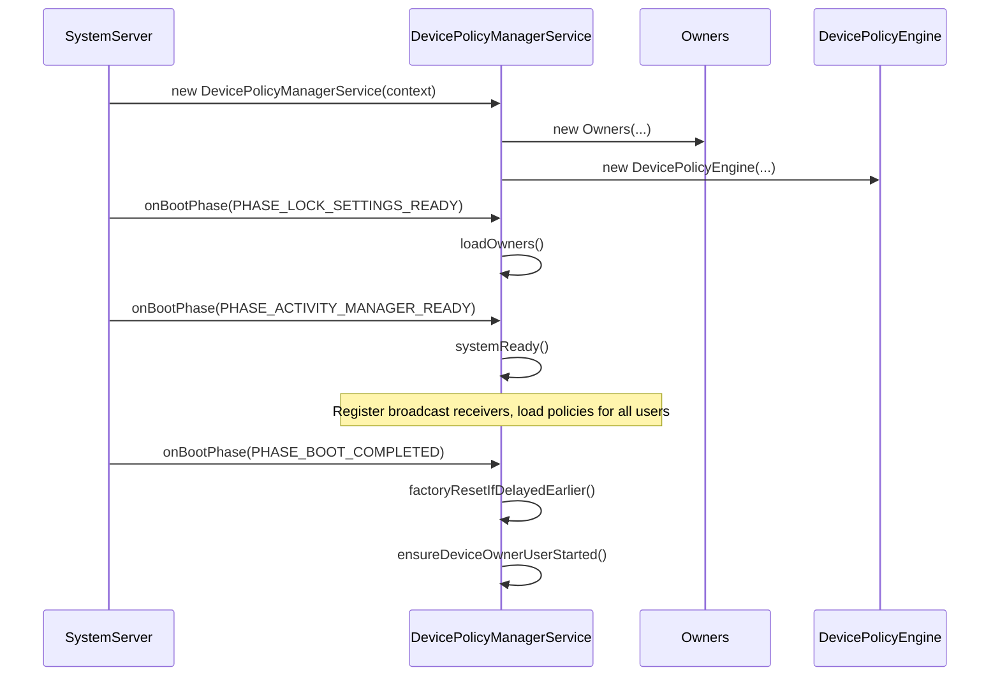
```mermaid
sequenceDiagram
    participant SS as SystemServer
    participant DPMS as DevicePolicyManagerService
    participant Owners as Owners
    participant Engine as DevicePolicyEngine

    SS->>DPMS: new DevicePolicyManagerService(context)
    DPMS->>Owners: new Owners(...)
    DPMS->>Engine: new DevicePolicyEngine(...)

    SS->>DPMS: onBootPhase(PHASE_LOCK_SETTINGS_READY)
    DPMS->>DPMS: loadOwners()

    SS->>DPMS: onBootPhase(PHASE_ACTIVITY_MANAGER_READY)
    DPMS->>DPMS: systemReady()
    Note over DPMS: Register broadcast receivers, load policies for all users

    SS->>DPMS: onBootPhase(PHASE_BOOT_COMPLETED)
    DPMS->>DPMS: factoryResetIfDelayedEarlier()
    DPMS->>DPMS: ensureDeviceOwnerUserStarted()
```

Upon `PHASE_BOOT_COMPLETED`, the service handles any delayed factory resets
and ensures the Device Owner user is started:

```java
// DevicePolicyManagerService.java, onBootPhase()
case SystemService.PHASE_BOOT_COMPLETED:
    // Ideally it should be done earlier, but currently it relies on
    // RecoverySystem, which would hang on earlier phases
    factoryResetIfDelayedEarlier();
    ensureDeviceOwnerUserStarted();
    break;
```

### 59.2.4  The Admin Component Model

An admin component is a `BroadcastReceiver` subclass that extends
`DeviceAdminReceiver`.  The system discovers it through manifest declarations:

```xml
<!-- Example: DPC app's AndroidManifest.xml -->
<receiver
    android:name=".MyDeviceAdminReceiver"
    android:permission="android.permission.BIND_DEVICE_ADMIN">
    <meta-data
        android:name="android.app.device_admin"
        android:resource="@xml/device_admin" />
    <intent-filter>
        <action android:name="android.app.action.DEVICE_ADMIN_ENABLED" />
    </intent-filter>
</receiver>
```

The referenced XML resource declares which policies the admin requires:

```xml
<!-- res/xml/device_admin.xml -->
<device-admin xmlns:android="http://schemas.android.com/apk/res/android">
    <uses-policies>
        <limit-password />
        <watch-login />
        <reset-password />
        <force-lock />
        <wipe-data />
        <encrypted-storage />
        <disable-camera />
        <disable-keyguard-features />
    </uses-policies>
</device-admin>
```

These policy tags map directly to constants in `DeviceAdminInfo`:

```java
// frameworks/base/core/java/android/app/admin/DeviceAdminInfo.java
public static final int USES_POLICY_LIMIT_PASSWORD = 0;
public static final int USES_POLICY_WATCH_LOGIN = 1;
public static final int USES_POLICY_RESET_PASSWORD = 2;
public static final int USES_POLICY_FORCE_LOCK = 3;
public static final int USES_POLICY_WIPE_DATA = 4;
public static final int USES_POLICY_SETS_GLOBAL_PROXY = 5;
public static final int USES_POLICY_EXPIRE_PASSWORD = 6;
public static final int USES_ENCRYPTED_STORAGE = 7;
public static final int USES_POLICY_DISABLE_CAMERA = 8;
public static final int USES_POLICY_DISABLE_KEYGUARD_FEATURES = 9;
```

### 59.2.5  ActiveAdmin: Per-Admin State

When an admin component is activated (either as a device admin, profile owner,
or device owner), DPMS creates an `ActiveAdmin` object that stores the complete
policy state for that admin:

```java
// frameworks/base/services/devicepolicy/java/com/android/server/devicepolicy/ActiveAdmin.java
class ActiveAdmin {
    DeviceAdminInfo info;
    PasswordPolicy passwordPolicy;
    boolean disableCamera;
    boolean disableScreenCapture;
    boolean disableCallerIdAccess;
    boolean disableContactsSearch;
    boolean disableBluetoothContactSharing;
    int disabledKeyguardFeatures;
    long maximumTimeToUnlock;
    int maximumFailedPasswordsForWipe;
    boolean encryptionRequested;
    boolean testOnlyAdmin;
    // ... dozens more policy fields
}
```

The `ActiveAdmin` class contains serialization tags for persisting every
policy field to XML:

```java
// ActiveAdmin.java
private static final String TAG_DISABLE_KEYGUARD_FEATURES = "disable-keyguard-features";
private static final String TAG_DISABLE_CAMERA = "disable-camera";
private static final String TAG_DISABLE_CALLER_ID = "disable-caller-id";
private static final String TAG_DISABLE_CONTACTS_SEARCH = "disable-contacts-search";
private static final String TAG_DISABLE_BLUETOOTH_CONTACT_SHARING =
    "disable-bt-contacts-sharing";
private static final String TAG_DISABLE_SCREEN_CAPTURE = "disable-screen-capture";
private static final String TAG_DISABLE_ACCOUNT_MANAGEMENT = "disable-account-management";
private static final String TAG_ENCRYPTION_REQUESTED = "encryption-requested";
private static final String TAG_MAX_FAILED_PASSWORD_WIPE = "max-failed-password-wipe";
private static final String TAG_MAX_TIME_TO_UNLOCK = "max-time-to-unlock";
private static final String TAG_PASSWORD_QUALITY = "password-quality";
private static final String TAG_MIN_PASSWORD_LENGTH = "min-password-length";
// ... many more
```

### 59.2.6  DevicePolicyData: Per-User State

Beyond individual admin state, DPMS maintains per-user data in
`DevicePolicyData`:

```java
// frameworks/base/services/devicepolicy/java/com/android/server/devicepolicy/
//   DevicePolicyData.java
class DevicePolicyData {
    private static final String TAG_ACCEPTED_CA_CERTIFICATES = "accepted-ca-certificate";
    private static final String TAG_LOCK_TASK_COMPONENTS = "lock-task-component";
    private static final String TAG_LOCK_TASK_FEATURES = "lock-task-features";
    private static final String TAG_STATUS_BAR = "statusbar";
    private static final String TAG_APPS_SUSPENDED = "apps-suspended";
    private static final String TAG_SECONDARY_LOCK_SCREEN = "secondary-lock-screen";
    private static final String TAG_AFFILIATION_ID = "affiliation-id";
    private static final String TAG_LAST_SECURITY_LOG_RETRIEVAL = "last-security-log-retrieval";
    private static final String TAG_LAST_BUG_REPORT_REQUEST = "last-bug-report-request";
    private static final String TAG_LAST_NETWORK_LOG_RETRIEVAL = "last-network-log-retrieval";
    // ...
}
```

Per-user data includes:

- **Lock task mode configuration** (allowed packages, features).
- **Accepted CA certificates** installed by the admin.
- **Affiliation IDs** used to determine if users are affiliated.
- **Factory reset tracking** (pending flags, reason).
- **Password token handle** for escrow tokens.

The data is persisted to XML files in each user's system directory:

```
/data/system/users/<userId>/device_policies.xml
/data/system/device_owner_2.xml
```

### 59.2.7  The DevicePolicyEngine: Multi-Admin Policy Resolution

Starting in Android 14, AOSP introduced the `DevicePolicyEngine` to handle
scenarios where multiple management admins set conflicting policies.  This is
critical for the coexistence of Device Owner, Profile Owner, and role-based
admins.

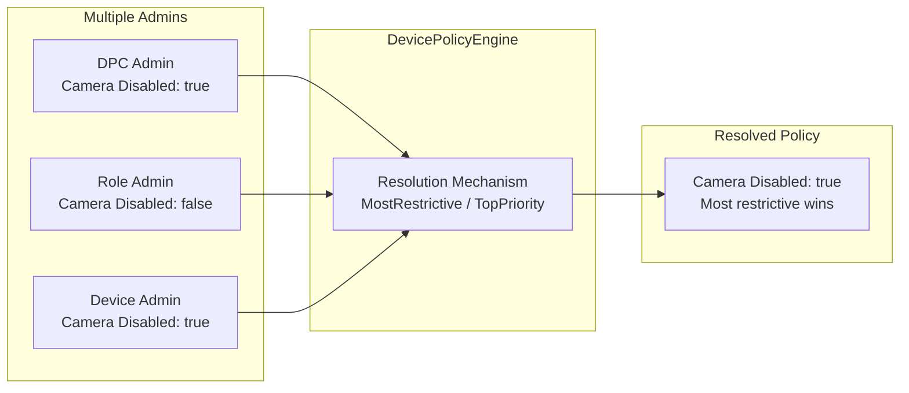
```mermaid
graph LR
    subgraph "Multiple Admins"
        A1["DPC Admin<br/>Camera Disabled: true"]
        A2["Role Admin<br/>Camera Disabled: false"]
        A3["Device Admin<br/>Camera Disabled: true"]
    end

    subgraph "DevicePolicyEngine"
        RESOLVE["Resolution Mechanism<br/>MostRestrictive / TopPriority"]
    end

    subgraph "Resolved Policy"
        RESULT["Camera Disabled: true<br/>Most restrictive wins"]
    end

    A1 --> RESOLVE
    A2 --> RESOLVE
    A3 --> RESOLVE
    RESOLVE --> RESULT
```

The engine stores policies at two scopes:

```java
// frameworks/base/services/devicepolicy/java/com/android/server/devicepolicy/
//   DevicePolicyEngine.java
final class DevicePolicyEngine {
    // Map of <userId, Map<policyKey, policyState>>
    @GuardedBy("mLock")
    private final Map<Integer, Map<PolicyKey, PolicyState<?>>> mLocalPolicies;

    // Map of <policyKey, policyState>
    @GuardedBy("mLock")
    private final Map<PolicyKey, PolicyState<?>> mGlobalPolicies;
}
```

### 59.2.8  Resolution Mechanisms

Each policy definition declares a resolution mechanism that determines how
conflicting values from multiple admins are reconciled:

```java
// frameworks/base/services/devicepolicy/java/com/android/server/devicepolicy/
//   PolicyDefinition.java
private static final MostRestrictive<Boolean> FALSE_MORE_RESTRICTIVE =
    new MostRestrictive<>(
        List.of(new BooleanPolicyValue(false), new BooleanPolicyValue(true)));

private static final MostRestrictive<Boolean> TRUE_MORE_RESTRICTIVE =
    new MostRestrictive<>(
        List.of(new BooleanPolicyValue(true), new BooleanPolicyValue(false)));
```

Four resolution mechanisms exist:

| Mechanism | Description | Example Policy |
|-----------|-------------|----------------|
| `MostRestrictive` | The most restrictive value wins | Camera disable, screen capture disable |
| `TopPriority` | Higher-priority admin wins | Lock task, persistent preferred activity |
| `PackageSetUnion` | Union of all admin values | User-control disabled packages |
| `MostRecent` | Last value set wins | Specific per-admin settings |

Example: Security logging is resolved with `TRUE_MORE_RESTRICTIVE`, meaning
if any admin enables security logging, it stays enabled:

```java
// PolicyDefinition.java
static PolicyDefinition<Boolean> SECURITY_LOGGING = new PolicyDefinition<>(
    new NoArgsPolicyKey(DevicePolicyIdentifiers.SECURITY_LOGGING_POLICY),
    TRUE_MORE_RESTRICTIVE,
    POLICY_FLAG_GLOBAL_ONLY_POLICY,
    PolicyEnforcerCallbacks::enforceSecurityLogging,
    new BooleanPolicySerializer());
```

### 59.2.9  Policy Flags

Each `PolicyDefinition` carries flags that control its scope and behavior:

```java
// PolicyDefinition.java
private static final int POLICY_FLAG_NONE = 0;
private static final int POLICY_FLAG_GLOBAL_ONLY_POLICY = 1;
private static final int POLICY_FLAG_LOCAL_ONLY_POLICY = 1 << 1;
private static final int POLICY_FLAG_INHERITABLE = 1 << 2;
private static final int POLICY_FLAG_NON_COEXISTABLE_POLICY = 1 << 3;
private static final int POLICY_FLAG_USER_RESTRICTION_POLICY = 1 << 4;
private static final int POLICY_FLAG_SKIP_ENFORCEMENT_IF_UNCHANGED = 1 << 5;
```

- **GLOBAL_ONLY**: the policy applies device-wide (e.g., auto time zone).
- **LOCAL_ONLY**: the policy applies per-user (e.g., permission grants).
- **INHERITABLE**: child profiles inherit the policy from their parent.
- **NON_COEXISTABLE**: admin values are kept separate (e.g., app restrictions).
- **USER_RESTRICTION**: marks user-restriction policies for special handling.

### 59.2.10  EnforcingAdmin: Admin Identity in the Policy Engine

The `EnforcingAdmin` class models the identity of an admin within the policy
engine.  It supports three authority types:

```java
// frameworks/base/services/devicepolicy/java/com/android/server/devicepolicy/
//   EnforcingAdmin.java
final class EnforcingAdmin {
    static final String DPC_AUTHORITY = "enterprise";
    static final String DEVICE_ADMIN_AUTHORITY = "device_admin";
    static final String DEFAULT_AUTHORITY = "default";
    static final String ROLE_AUTHORITY_PREFIX = "role:";

    private final String mPackageName;
    private final ComponentName mComponentName;
    private Set<String> mAuthorities;
    private final int mUserId;
    private final boolean mIsRoleAuthority;
}
```

Factory methods create the appropriate type:

```java
static EnforcingAdmin createEnterpriseEnforcingAdmin(
        ComponentName componentName, int userId) {
    return new EnforcingAdmin(
        componentName.getPackageName(), componentName,
        Set.of(DPC_AUTHORITY), userId);
}

static EnforcingAdmin createDeviceAdminEnforcingAdmin(
        ComponentName componentName, int userId) {
    // Uses DEVICE_ADMIN_AUTHORITY for legacy admins
}
```

### 59.2.11  Permission Model for Policy APIs

Starting in Android 13, many DPM APIs transitioned from requiring a specific
admin `ComponentName` to using fine-grained permissions.  The DPMS imports
dozens of `MANAGE_DEVICE_POLICY_*` permissions:

```java
// DevicePolicyManagerService.java (lines 19-49)
import static android.Manifest.permission.MANAGE_DEVICE_POLICY_ACCOUNT_MANAGEMENT;
import static android.Manifest.permission.MANAGE_DEVICE_POLICY_APPS_CONTROL;
import static android.Manifest.permission.MANAGE_DEVICE_POLICY_APP_RESTRICTIONS;
import static android.Manifest.permission.MANAGE_DEVICE_POLICY_CAMERA;
import static android.Manifest.permission.MANAGE_DEVICE_POLICY_CERTIFICATES;
import static android.Manifest.permission.MANAGE_DEVICE_POLICY_FACTORY_RESET;
import static android.Manifest.permission.MANAGE_DEVICE_POLICY_INPUT_METHODS;
import static android.Manifest.permission.MANAGE_DEVICE_POLICY_KEYGUARD;
import static android.Manifest.permission.MANAGE_DEVICE_POLICY_LOCK;
import static android.Manifest.permission.MANAGE_DEVICE_POLICY_LOCK_CREDENTIALS;
import static android.Manifest.permission.MANAGE_DEVICE_POLICY_LOCK_TASK;
import static android.Manifest.permission.MANAGE_DEVICE_POLICY_SCREEN_CAPTURE;
import static android.Manifest.permission.MANAGE_DEVICE_POLICY_SECURITY_LOGGING;
import static android.Manifest.permission.MANAGE_DEVICE_POLICY_WIPE_DATA;
// ... and many more
```

This allows non-DPC apps (such as role holders) to manage specific policies
without being a full Device Owner or Profile Owner.

### 59.2.12  Delegation: Sharing Admin Capabilities

A Device Owner or Profile Owner can delegate specific management capabilities
to other apps without granting them full admin status:

```java
// DevicePolicyManager.java
public static final String DELEGATION_APP_RESTRICTIONS = "delegation-app-restrictions";
public static final String DELEGATION_BLOCK_UNINSTALL = "delegation-block-uninstall";
public static final String DELEGATION_CERT_INSTALL = "delegation-cert-install";
public static final String DELEGATION_CERT_SELECTION = "delegation-cert-selection";
public static final String DELEGATION_ENABLE_SYSTEM_APP = "delegation-enable-system-app";
public static final String DELEGATION_INSTALL_EXISTING_PACKAGE =
    "delegation-install-existing-package";
public static final String DELEGATION_KEEP_UNINSTALLED_PACKAGES =
    "delegation-keep-uninstalled-packages";
public static final String DELEGATION_NETWORK_LOGGING = "delegation-network-logging";
public static final String DELEGATION_PACKAGE_ACCESS = "delegation-package-access";
public static final String DELEGATION_PERMISSION_GRANT = "delegation-permission-grant";
public static final String DELEGATION_SECURITY_LOGGING = "delegation-security-logging";
```

Delegated apps receive the `DelegatedAdminReceiver` callbacks:

```java
// frameworks/base/core/java/android/app/admin/DelegatedAdminReceiver.java
public class DelegatedAdminReceiver extends BroadcastReceiver {
    // Receives callbacks for delegated operations like
    // network logging, security logging, certificate selection
}
```

### 59.2.13  Policy Persistence and XML Format

DPMS persists all policy state to XML files.  Understanding the XML format
is essential for debugging and for reading the `dumpsys device_policy` output.

**Device Owner file** (`/data/system/device_owner_2.xml`):

```xml
<?xml version='1.0' encoding='utf-8' standalone='yes' ?>
<root>
    <device-owner
        package="com.example.dpc"
        name="Enterprise DPC"
        component="com.example.dpc/.MyDeviceAdminReceiver"
        userRestrictionsMigrated="true" />
    <device-owner-context userId="0" />
</root>
```

**Per-user policy file** (`/data/system/users/<userId>/device_policies.xml`):

```xml
<?xml version='1.0' encoding='utf-8' standalone='yes' ?>
<policies setup-complete="true" provisioning-state="3"
    permission-policy="0" device-paired="true"
    new-user-disclaimer="not_needed">
    <admin name="com.example.dpc/.MyDeviceAdminReceiver">
        <policies flags="255" />
        <password-quality value="327680" />
        <min-password-length value="6" />
        <password-history-length value="3" />
        <max-time-to-unlock value="300000" />
        <max-failed-password-wipe value="10" />
        <disable-camera value="true" />
        <disable-keyguard-features value="56" />
        <disable-screen-capture value="true" />
        <encryption-requested value="true" />
    </admin>
    <lock-task-component value="com.example.kiosk" />
    <lock-task-features value="16" />
    <affiliation-id id="enterprise-corp-123" />
</policies>
```

Key attributes in the policy XML:

| XML Tag | Description |
|---------|-------------|
| `password-quality` | Password quality level (hex-encoded constant) |
| `min-password-length` | Minimum password length |
| `max-time-to-unlock` | Maximum idle time before lock (milliseconds) |
| `max-failed-password-wipe` | Wipe after N failed attempts |
| `disable-camera` | Camera disabled flag |
| `disable-keyguard-features` | Bitmask of disabled keyguard features |
| `lock-task-component` | Allowed lock task packages |
| `affiliation-id` | Enterprise affiliation identifier |

### 59.2.14  Caller Identity and Permission Checking

Every DPM API call goes through rigorous caller identity verification.
The `CallerIdentity` class captures the calling context:

```java
// frameworks/base/services/devicepolicy/java/com/android/server/devicepolicy/
//   CallerIdentity.java
// Captures: calling UID, PID, package name, user ID
// Used to verify the caller is an active admin, DO, PO, or has
// the required MANAGE_DEVICE_POLICY_* permission
```

The typical permission check flow:

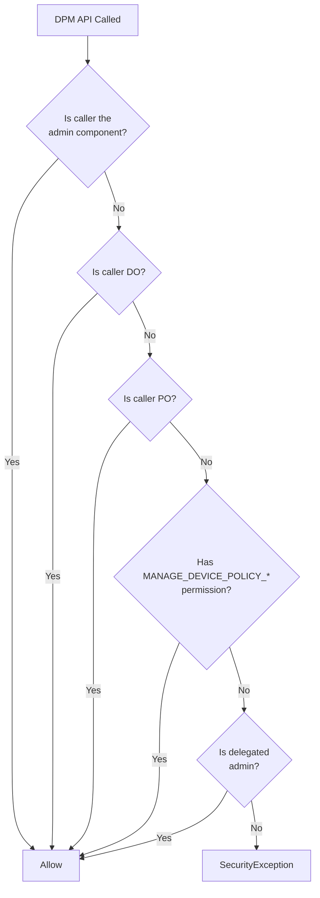
```mermaid
flowchart TD
    API[DPM API Called]
    CHECK1{"Is caller the<br/>admin component?"}
    CHECK2{Is caller DO?}
    CHECK3{Is caller PO?}
    CHECK4{"Has MANAGE_DEVICE_POLICY_*<br/>permission?"}
    CHECK5{"Is delegated<br/>admin?"}
    ALLOW[Allow]
    DENY[SecurityException]

    API --> CHECK1
    CHECK1 -- Yes --> ALLOW
    CHECK1 -- No --> CHECK2
    CHECK2 -- Yes --> ALLOW
    CHECK2 -- No --> CHECK3
    CHECK3 -- Yes --> ALLOW
    CHECK3 -- No --> CHECK4
    CHECK4 -- Yes --> ALLOW
    CHECK4 -- No --> CHECK5
    CHECK5 -- Yes --> ALLOW
    CHECK5 -- No --> DENY
```

### 59.2.15  Thread Safety and Locking

DPMS uses a global lock object for synchronization:

```java
// DevicePolicyManagerService.java
// getLockObject() returns the main synchronization lock
// Many methods are synchronized on this lock to ensure consistency
```

The `Owners` class uses its own lock (`mData`) to protect ownership data.
The `DevicePolicyEngine` uses `mLock` for policy state.  Care must be taken
to avoid deadlocks when acquiring multiple locks.

### 59.2.16  Policy Enforcement Flow

When an admin calls a DPM API, the request flows through several layers:

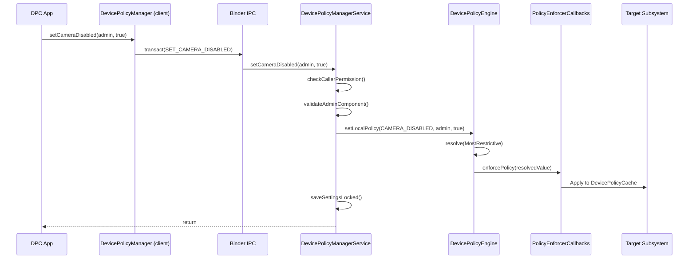
```mermaid
sequenceDiagram
    participant DPC as DPC App
    participant DPM as DevicePolicyManager (client)
    participant Binder as Binder IPC
    participant DPMS as DevicePolicyManagerService
    participant Engine as DevicePolicyEngine
    participant CB as PolicyEnforcerCallbacks
    participant SYS as Target Subsystem

    DPC->>DPM: setCameraDisabled(admin, true)
    DPM->>Binder: transact(SET_CAMERA_DISABLED)
    Binder->>DPMS: setCameraDisabled(admin, true)

    DPMS->>DPMS: checkCallerPermission()
    DPMS->>DPMS: validateAdminComponent()

    DPMS->>Engine: setLocalPolicy(CAMERA_DISABLED, admin, true)
    Engine->>Engine: resolve(MostRestrictive)
    Engine->>CB: enforcePolicy(resolvedValue)
    CB->>SYS: Apply to DevicePolicyCache

    DPMS->>DPMS: saveSettingsLocked()
    DPMS-->>DPC: return
```

### 59.2.17  Binder Caches

DPMS uses `IpcDataCache` to avoid repeated Binder calls for frequently
queried policy states.  The `DevicePolicyCacheImpl` class provides an
in-process cache for common queries:

```java
// frameworks/base/services/devicepolicy/java/com/android/server/devicepolicy/
//   DevicePolicyCacheImpl.java
// Caches: screen capture disabled, camera disabled, password complexity, etc.
```

When ownership changes, the cache is explicitly invalidated:

```java
// Owners.java
private void pushToDevicePolicyManager() {
    DevicePolicyManagerService.invalidateBinderCaches();
}
```

---

## 59.3  Work Profiles

### 59.3.1  Conceptual Model

A work profile is an Android managed profile -- a separate user space that
runs on the same device as the personal profile.  It has its own:

- App instances (separate copies of apps)
- Data directory (`/data/user/<profileUserId>/`)
- Contacts database
- Calendar storage
- Notification shade section
- Separate encryption keys (with File-Based Encryption)

The work profile appears to the user as a "Work" tab in the launcher and a
briefcase badge on work app icons.

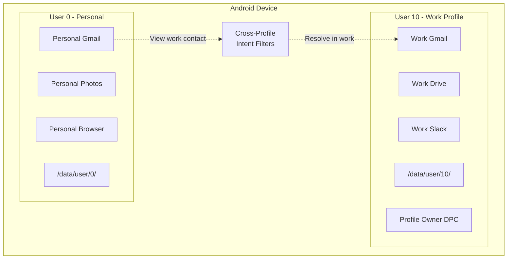
```mermaid
graph TB
    subgraph "Android Device"
        subgraph "User 0 - Personal"
            PA1[Personal Gmail]
            PA2[Personal Photos]
            PA3[Personal Browser]
            PD["/data/user/0/"]
        end

        subgraph "User 10 - Work Profile"
            WA1[Work Gmail]
            WA2[Work Drive]
            WA3[Work Slack]
            WD["/data/user/10/"]
            PO[Profile Owner DPC]
        end

        CROSS["Cross-Profile<br/>Intent Filters"]
        PA1 -. "View work contact" .-> CROSS
        CROSS -. "Resolve in work" .-> WA1
    end
```

### 59.3.2  Managed Profile Creation

Work profiles are created through the `DevicePolicyManager` API.  The
primary entry point is `createAndProvisionManagedProfile()`:

```java
// DevicePolicyManager.java
// @SystemApi
public UserHandle createAndProvisionManagedProfile(
    @NonNull ManagedProfileProvisioningParams provisioningParams)
    throws ProvisioningException { ... }
```

The provisioning parameters control the profile setup:

```java
// ManagedProfileProvisioningParams.java
public final class ManagedProfileProvisioningParams implements Parcelable {
    @NonNull private final ComponentName mProfileAdminComponentName;
    @NonNull private final String mOwnerName;
    @Nullable private final String mProfileName;
    @Nullable private final Account mAccountToMigrate;
    private final boolean mLeaveAllSystemAppsEnabled;
    private final boolean mOrganizationOwnedProvisioning;
    private final boolean mKeepAccountOnMigration;
    @NonNull private final PersistableBundle mAdminExtras;
}
```

On the server side, DPMS orchestrates the creation:

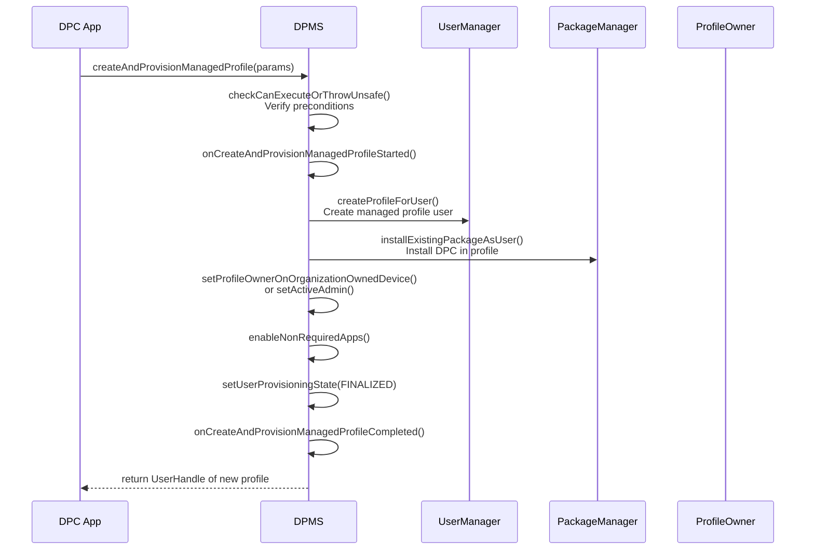
```mermaid
sequenceDiagram
    participant DPC as DPC App
    participant DPMS as DPMS
    participant UM as UserManager
    participant PM as PackageManager
    participant PO as ProfileOwner

    DPC->>DPMS: createAndProvisionManagedProfile(params)

    DPMS->>DPMS: checkCanExecuteOrThrowUnsafe()<br/>Verify preconditions

    DPMS->>DPMS: onCreateAndProvisionManagedProfileStarted()

    DPMS->>UM: createProfileForUser()<br/>Create managed profile user

    DPMS->>PM: installExistingPackageAsUser()<br/>Install DPC in profile

    DPMS->>DPMS: setProfileOwnerOnOrganizationOwnedDevice()<br/>or setActiveAdmin()

    DPMS->>DPMS: enableNonRequiredApps()

    DPMS->>DPMS: setUserProvisioningState(FINALIZED)

    DPMS->>DPMS: onCreateAndProvisionManagedProfileCompleted()

    DPMS-->>DPC: return UserHandle of new profile
```

The DPMS implementation validates numerous preconditions before creating
the profile:

```java
// DevicePolicyManagerService.java, createAndProvisionManagedProfile()
@Override
public UserHandle createAndProvisionManagedProfile(
        @NonNull ManagedProfileProvisioningParams provisioningParams,
        @NonNull String callerPackage) {
    Objects.requireNonNull(provisioningParams, "provisioningParams is null");
    Objects.requireNonNull(callerPackage, "callerPackage is null");
    // ... permission checks, precondition validation, profile creation
}
```

### 59.3.3  Profile Provisioning Preconditions

DPMS checks extensive preconditions before allowing profile creation.  The
status codes reveal what can go wrong:

```java
// DevicePolicyManager.java
public static final int STATUS_OK = 0;
public static final int STATUS_ACCOUNTS_NOT_EMPTY = 3;
public static final int STATUS_CANNOT_ADD_MANAGED_PROFILE = 7;
public static final int STATUS_HAS_DEVICE_OWNER = 1;
public static final int STATUS_USER_HAS_PROFILE_OWNER = 2;
public static final int STATUS_USER_SETUP_COMPLETED = 4;
public static final int STATUS_MANAGED_USERS_NOT_SUPPORTED = 8;
public static final int STATUS_NOT_SYSTEM_USER = 9;
// ... and more
```

### 59.3.4  Cross-Profile Intent Filters

Cross-profile intent filters control which intents can be resolved across
the work/personal boundary.  The DPC configures them through:

```java
// DevicePolicyManager.java
public static final int FLAG_PARENT_CAN_ACCESS_MANAGED = 0x0001;
public static final int FLAG_MANAGED_CAN_ACCESS_PARENT = 0x0002;

@RequiresPermission(value = MANAGE_DEVICE_POLICY_PROFILE_INTERACTION,
                     conditional = true)
public void addCrossProfileIntentFilter(
    @Nullable ComponentName admin, IntentFilter filter, int flags) { ... }
```

When a personal app fires an intent that matches a cross-profile filter,
the system resolves it in the work profile (or vice versa, depending on
the flags).

Common cross-profile intent filter scenarios:

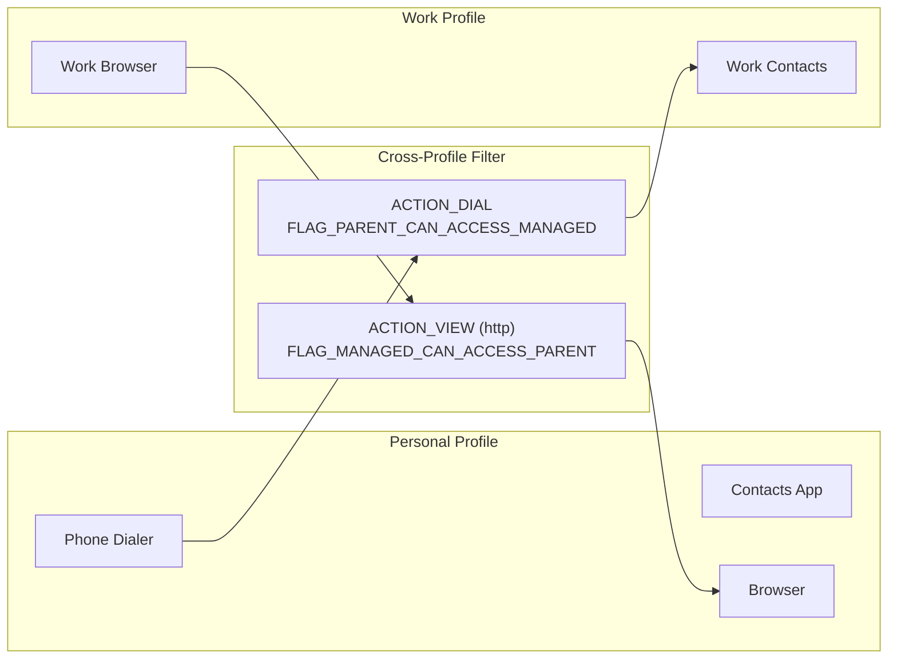
```mermaid
graph LR
    subgraph "Personal Profile"
        PHONE[Phone Dialer]
        CONTACTS[Contacts App]
        BROWSER[Browser]
    end

    subgraph "Cross-Profile Filter"
        F1["ACTION_DIAL<br/>FLAG_PARENT_CAN_ACCESS_MANAGED"]
        F2["ACTION_VIEW (http)<br/>FLAG_MANAGED_CAN_ACCESS_PARENT"]
    end

    subgraph "Work Profile"
        W_CONTACTS[Work Contacts]
        W_BROWSER[Work Browser]
    end

    PHONE --> F1 --> W_CONTACTS
    W_BROWSER --> F2 --> BROWSER
```

The `PolicyDefinition` for cross-profile widgets illustrates the engine
integration:

```java
// PolicyDefinition.java (referenced via ActiveAdmin)
private static final String TAG_CROSS_PROFILE_WIDGET_PROVIDERS =
    "cross-profile-widget-providers";
```

### 59.3.5  Work Mode Toggle

Users can turn the work profile on and off.  When the work profile is
paused, all work apps are suspended, notifications are hidden, and
work data is inaccessible.

The system broadcasts specific intents when the profile state changes:

```java
// DevicePolicyManagerService.java
import static android.content.Intent.ACTION_MANAGED_PROFILE_AVAILABLE;
import static android.content.Intent.ACTION_MANAGED_PROFILE_UNAVAILABLE;
```

The DPMS tracks the profile state and can suspend personal apps if the
work profile has been off for too long (COPE mode):

```java
// ActiveAdmin.java
private static final String TAG_SUSPEND_PERSONAL_APPS = "suspend-personal-apps";
private static final String TAG_PROFILE_MAXIMUM_TIME_OFF = "profile-max-time-off";
private static final String TAG_PROFILE_OFF_DEADLINE = "profile-off-deadline";
```

### 59.3.6  Personal Apps Suspension (COPE)

In organization-owned scenarios, the Profile Owner can suspend personal
apps if the work profile has been turned off beyond a configured deadline.
The `PersonalAppsSuspensionHelper` determines which personal apps to
suspend:

```java
// frameworks/base/services/devicepolicy/java/com/android/server/devicepolicy/
//   PersonalAppsSuspensionHelper.java
public final class PersonalAppsSuspensionHelper {
    // Determines which personal apps to suspend, excluding:
    // - IME apps
    // - Accessibility services
    // - Default SMS app
    // - Required system apps
}
```

The suspension states are tracked in `DevicePolicyManager`:

```java
// DevicePolicyManager.java
public static final int PERSONAL_APPS_NOT_SUSPENDED = 0;
public static final int PERSONAL_APPS_SUSPENDED_EXPLICITLY = 1;
public static final int PERSONAL_APPS_SUSPENDED_PROFILE_TIMEOUT = 2;
```

### 59.3.7  Work Profile Data Isolation

The work profile achieves data isolation through multiple mechanisms:

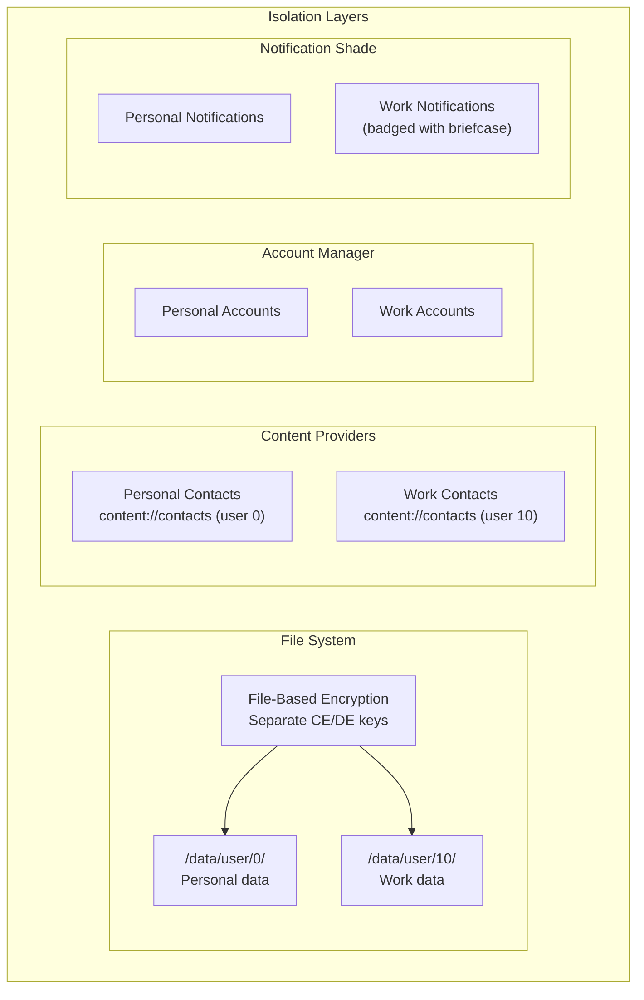
```mermaid
graph TB
    subgraph "Isolation Layers"
        subgraph "File System"
            FS_P["/data/user/0/<br/>Personal data"]
            FS_W["/data/user/10/<br/>Work data"]
            FBE["File-Based Encryption<br/>Separate CE/DE keys"]
        end

        subgraph "Content Providers"
            CP_P["Personal Contacts<br/>content://contacts (user 0)"]
            CP_W["Work Contacts<br/>content://contacts (user 10)"]
        end

        subgraph "Account Manager"
            AM_P["Personal Accounts"]
            AM_W["Work Accounts"]
        end

        subgraph "Notification Shade"
            NS_P["Personal Notifications"]
            NS_W["Work Notifications<br/>(badged with briefcase)"]
        end
    end

    FBE --> FS_P
    FBE --> FS_W
```

Each isolation boundary is enforced independently:

1. **File system**: each user gets its own directory under `/data/user/`.
   With File-Based Encryption (FBE), each user's credential-encrypted (CE)
   storage has its own key.  When the work profile is locked, the CE key is
   evicted, making work data inaccessible.

2. **Content providers**: the framework routes queries to the correct user's
   content provider instance.  A personal app querying `content://contacts`
   sees only personal contacts unless cross-profile access is explicitly
   granted.

3. **Package visibility**: by default, apps in one profile cannot see apps
   in another profile.  The `PackageManager` filters results based on the
   calling user.

4. **Network**: the work profile can have its own VPN, proxy, and network
   preferences.  The DPMS configures these through `ConnectivityManager`:

```java
// DevicePolicyManagerService.java
import static android.net.ConnectivityManager.PROFILE_NETWORK_PREFERENCE_DEFAULT;
import static android.net.ConnectivityManager.PROFILE_NETWORK_PREFERENCE_ENTERPRISE;
import static android.net.ConnectivityManager
    .PROFILE_NETWORK_PREFERENCE_ENTERPRISE_BLOCKING;
import static android.net.ConnectivityManager
    .PROFILE_NETWORK_PREFERENCE_ENTERPRISE_NO_FALLBACK;
```

### 59.3.8  Work Profile Managed Subscriptions

On devices with eSIM support, the work profile can have its own managed
subscription:

```java
// frameworks/base/core/java/android/app/admin/ManagedSubscriptionsPolicy.java
public final class ManagedSubscriptionsPolicy implements Parcelable {
    // Controls how managed subscriptions are handled in the work profile
}
```

### 59.3.9  Keep Profiles Running

A relatively new feature allows profiles to keep running even when they
are in the "quiet" state:

```java
// DevicePolicyData.java
private static final String TAG_KEEP_PROFILES_RUNNING = "keep-profiles-running";
```

This is important for scenarios where work apps need to receive push
notifications or sync data even when the work profile is "paused" from the
user's perspective.

### 59.3.10  Work Profile Telephony

Work profiles have implications for telephony.  When the work profile is
paused, the DPMS can show notifications about missed work calls:

```java
// DevicePolicyManagerService.java (referenced string resources)
import static android.app.admin.DevicePolicyResources.Strings.Core
    .WORK_PROFILE_TELEPHONY_PAUSED_BODY;
import static android.app.admin.DevicePolicyResources.Strings.Core
    .WORK_PROFILE_TELEPHONY_PAUSED_TITLE;
import static android.app.admin.DevicePolicyResources.Strings.Core
    .WORK_PROFILE_TELEPHONY_PAUSED_TURN_ON_BUTTON;
```

### 59.3.11  Work Profile Deletion

When a work profile is deleted (either by the user, the admin, or due to
policy violations), the DPMS sends appropriate notifications:

```java
// Referenced string resources
import static android.app.admin.DevicePolicyResources.Strings.Core
    .WORK_PROFILE_DELETED_FAILED_PASSWORD_ATTEMPTS_MESSAGE;
import static android.app.admin.DevicePolicyResources.Strings.Core
    .WORK_PROFILE_DELETED_GENERIC_MESSAGE;
import static android.app.admin.DevicePolicyResources.Strings.Core
    .WORK_PROFILE_DELETED_ORG_OWNED_MESSAGE;
import static android.app.admin.DevicePolicyResources.Strings.Core
    .WORK_PROFILE_DELETED_TITLE;
```

---

## 59.4  Device Administration

### 59.4.1  DeviceAdminReceiver: The Admin Callback Interface

`DeviceAdminReceiver` is the base class for all device admin components.  It
extends `BroadcastReceiver` and provides callback methods for policy events:

```java
// frameworks/base/core/java/android/app/admin/DeviceAdminReceiver.java
public class DeviceAdminReceiver extends BroadcastReceiver {
    // Lifecycle callbacks
    public static final String ACTION_DEVICE_ADMIN_ENABLED
        = "android.app.action.DEVICE_ADMIN_ENABLED";
    public static final String ACTION_DEVICE_ADMIN_DISABLE_REQUESTED
        = "android.app.action.DEVICE_ADMIN_DISABLE_REQUESTED";
    public static final String ACTION_DEVICE_ADMIN_DISABLED
        = "android.app.action.DEVICE_ADMIN_DISABLED";

    // Password callbacks
    public static final String ACTION_PASSWORD_CHANGED
        = "android.app.action.ACTION_PASSWORD_CHANGED";
    public static final String ACTION_PASSWORD_FAILED
        = "android.app.action.ACTION_PASSWORD_FAILED";
    public static final String ACTION_PASSWORD_SUCCEEDED
        = "android.app.action.ACTION_PASSWORD_SUCCEEDED";
    public static final String ACTION_PASSWORD_EXPIRING
        = "android.app.action.ACTION_PASSWORD_EXPIRING";
}
```

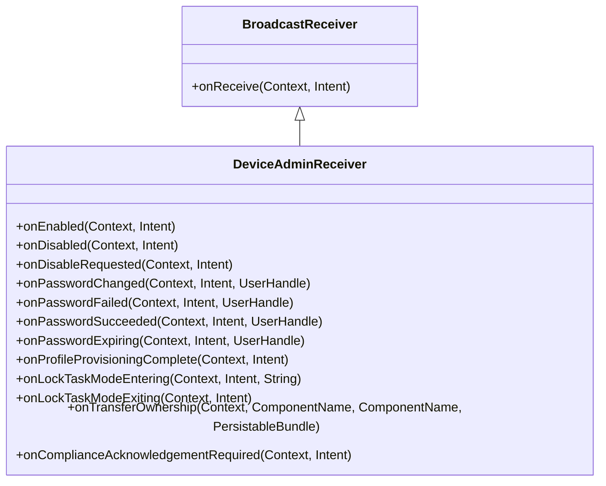
```mermaid
classDiagram
    class BroadcastReceiver {
        +onReceive(Context, Intent)
    }

    class DeviceAdminReceiver {
        +onEnabled(Context, Intent)
        +onDisabled(Context, Intent)
        +onDisableRequested(Context, Intent)
        +onPasswordChanged(Context, Intent, UserHandle)
        +onPasswordFailed(Context, Intent, UserHandle)
        +onPasswordSucceeded(Context, Intent, UserHandle)
        +onPasswordExpiring(Context, Intent, UserHandle)
        +onProfileProvisioningComplete(Context, Intent)
        +onLockTaskModeEntering(Context, Intent, String)
        +onLockTaskModeExiting(Context, Intent)
        +onTransferOwnership(Context, ComponentName, ComponentName, PersistableBundle)
        +onComplianceAcknowledgementRequired(Context, Intent)
    }

    BroadcastReceiver <|-- DeviceAdminReceiver
```

### 59.4.2  Admin Lifecycle

The admin lifecycle follows a specific sequence:

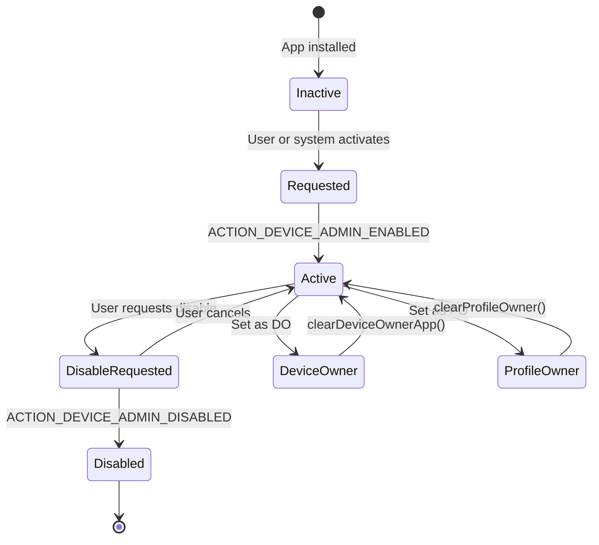
```mermaid
stateDiagram-v2
    [*] --> Inactive : App installed
    Inactive --> Requested : User or system activates
    Requested --> Active : ACTION_DEVICE_ADMIN_ENABLED
    Active --> DisableRequested : User requests disable
    DisableRequested --> Active : User cancels
    DisableRequested --> Disabled : ACTION_DEVICE_ADMIN_DISABLED
    Disabled --> [*]

    Active --> DeviceOwner : Set as DO
    Active --> ProfileOwner : Set as PO

    DeviceOwner --> Active : clearDeviceOwnerApp()
    ProfileOwner --> Active : clearProfileOwner()
```

### 59.4.3  Password Policies

Password policies are among the most commonly used device admin capabilities.
Android supports two approaches:

**Legacy quality-based approach** (deprecated but still supported):

```java
// DevicePolicyManager.java
public static final int PASSWORD_QUALITY_UNSPECIFIED = 0;
public static final int PASSWORD_QUALITY_BIOMETRIC_WEAK = 0x8000;
public static final int PASSWORD_QUALITY_SOMETHING = 0x10000;
public static final int PASSWORD_QUALITY_NUMERIC = 0x20000;
public static final int PASSWORD_QUALITY_NUMERIC_COMPLEX = 0x30000;
public static final int PASSWORD_QUALITY_ALPHABETIC = 0x40000;
public static final int PASSWORD_QUALITY_ALPHANUMERIC = 0x50000;
public static final int PASSWORD_QUALITY_COMPLEX = 0x60000;
```

**Modern complexity-based approach** (recommended):

```java
// DevicePolicyManager.java
public static final int PASSWORD_COMPLEXITY_NONE = 0;
public static final int PASSWORD_COMPLEXITY_LOW = 0x10000;
public static final int PASSWORD_COMPLEXITY_MEDIUM = 0x30000;
public static final int PASSWORD_COMPLEXITY_HIGH = 0x50000;
```

The complexity bands map to concrete requirements:

| Complexity | PIN | Pattern | Password |
|-----------|-----|---------|----------|
| LOW | 4+ digits | any | 4+ chars |
| MEDIUM | 4+ digits, no repeating/ordered | any | 4+ chars |
| HIGH | 8+ digits, no repeating/ordered | N/A | 6+ chars with letter+digit |

The `ActiveAdmin` class stores the password policy in a dedicated object:

```java
// ActiveAdmin.java
PasswordPolicy passwordPolicy = new PasswordPolicy();
// Fields include: quality, length, uppercase, lowercase,
// letters, numeric, symbols, nonletter, history length
```

### 59.4.4  Password Expiration

Admins can force periodic password changes:

```java
// ActiveAdmin.java
private static final String TAG_PASSWORD_EXPIRATION_DATE = "password-expiration-date";
private static final String TAG_PASSWORD_EXPIRATION_TIMEOUT = "password-expiration-timeout";
```

When a password expires, the `ACTION_PASSWORD_EXPIRING` broadcast is sent
to the admin.  The admin can then prompt the user to change their password.

### 59.4.5  Maximum Failed Password Attempts

Admins can configure automatic data wipe after too many failed unlock
attempts:

```java
// ActiveAdmin.java
private static final String TAG_MAX_FAILED_PASSWORD_WIPE = "max-failed-password-wipe";
```

When the threshold is exceeded, DPMS either wipes the work profile (for
a Profile Owner) or factory-resets the device (for a Device Owner).

### 59.4.6  Device Lock

The `USES_POLICY_FORCE_LOCK` policy allows an admin to immediately lock the
device or set a maximum idle time before automatic lock:

```java
// DeviceAdminInfo.java
public static final int USES_POLICY_FORCE_LOCK = 3;
```

```java
// ActiveAdmin.java
private static final String TAG_MAX_TIME_TO_UNLOCK = "max-time-to-unlock";
private static final String TAG_STRONG_AUTH_UNLOCK_TIMEOUT = "strong-auth-unlock-timeout";
```

When `lockNow()` is called, DPMS triggers strong authentication:

```java
// DevicePolicyManagerService.java (referenced constants)
import static com.android.internal.widget.LockPatternUtils.StrongAuthTracker
    .STRONG_AUTH_REQUIRED_AFTER_DPM_LOCK_NOW;
```

### 59.4.7  Encryption Policy

Admins can require storage encryption:

```java
// DeviceAdminInfo.java
public static final int USES_ENCRYPTED_STORAGE = 7;

// ActiveAdmin.java
private static final String TAG_ENCRYPTION_REQUESTED = "encryption-requested";
```

The DPMS queries encryption status through `DevicePolicyManager` constants:

```java
// DevicePolicyManager.java
public static final int ENCRYPTION_STATUS_ACTIVE_PER_USER = 5;
// Indicates file-based encryption is active
```

### 59.4.8  Camera Disable Policy

The camera disable policy is a boolean policy that can be set per-user or
globally:

```java
// DeviceAdminInfo.java
public static final int USES_POLICY_DISABLE_CAMERA = 8;

// ActiveAdmin.java
private static final String TAG_DISABLE_CAMERA = "disable-camera";
```

In the policy engine, camera disable uses the `TRUE_MORE_RESTRICTIVE`
resolution -- if any admin disables the camera, it stays disabled:

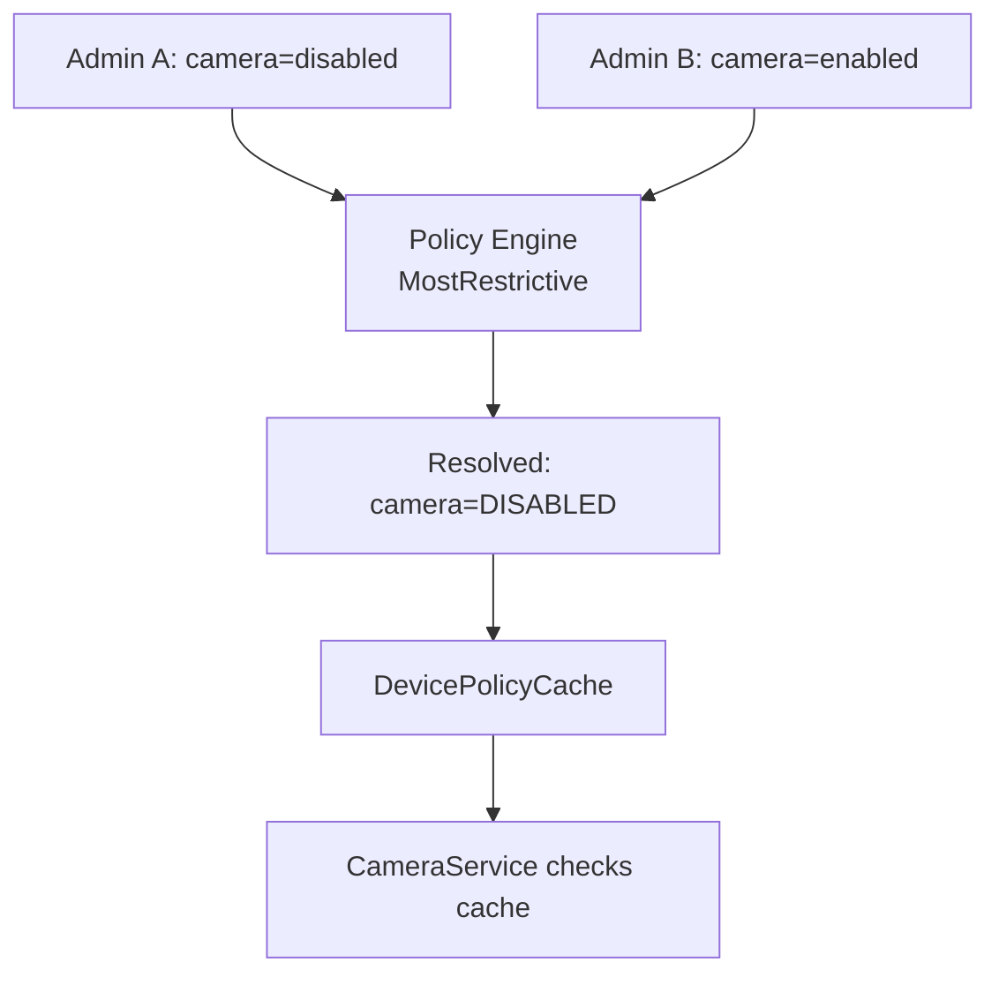
```mermaid
graph TD
    A1[Admin A: camera=disabled] --> ENGINE["Policy Engine<br/>MostRestrictive"]
    A2[Admin B: camera=enabled] --> ENGINE
    ENGINE --> RESULT[Resolved: camera=DISABLED]
    RESULT --> CACHE[DevicePolicyCache]
    CACHE --> CAMERA[CameraService checks cache]
```

### 59.4.9  Screen Capture Disable

Similar to camera disable, screen capture can be disabled per-user:

```java
// ActiveAdmin.java
private static final String TAG_DISABLE_SCREEN_CAPTURE = "disable-screen-capture";
```

### 59.4.10  Keyguard Feature Disable

Admins can selectively disable keyguard features:

```java
// DeviceAdminInfo.java
public static final int USES_POLICY_DISABLE_KEYGUARD_FEATURES = 9;

// DevicePolicyManager.java (lock task features, related)
public static final int LOCK_TASK_FEATURE_KEYGUARD = ...;
public static final int LOCK_TASK_FEATURE_NOTIFICATIONS = ...;
public static final int LOCK_TASK_FEATURE_OVERVIEW = ...;
public static final int LOCK_TASK_FEATURE_GLOBAL_ACTIONS = ...;
public static final int LOCK_TASK_FEATURE_HOME = ...;
```

The `KEYGUARD_DISABLED_FEATURES` policy is handled specially in the engine:

```java
// PolicyDefinition.java (referenced)
static final PolicyDefinition<Integer> KEYGUARD_DISABLED_FEATURES = ...;
```

### 59.4.11  Factory Reset (Wipe)

The most drastic admin action is wiping the device:

```java
// DeviceAdminInfo.java
public static final int USES_POLICY_WIPE_DATA = 4;

// DevicePolicyManager.java (wipe flags)
public static final int WIPE_EXTERNAL_STORAGE = 0x0001;
public static final int WIPE_RESET_PROTECTION_DATA = 0x0002;
public static final int WIPE_EUICC = 0x0004;
public static final int WIPE_SILENTLY = 0x0008;
```

The DPMS implementation delegates to a `FactoryResetter`:

```java
// DevicePolicyManagerService.java (Injector inner class)
.build().factoryReset();
```

Factory reset can be delayed if the system is not fully booted:

```java
// DevicePolicyData.java
public static final int FACTORY_RESET_FLAG_ON_BOOT = 1;
public static final int FACTORY_RESET_FLAG_WIPE_EXTERNAL_STORAGE = 2;
public static final int FACTORY_RESET_FLAG_WIPE_EUICC = 4;
public static final int FACTORY_RESET_FLAG_WIPE_FACTORY_RESET_PROTECTION = 8;
```

### 59.4.12  Factory Reset Protection (FRP)

FRP prevents unauthorized factory resets.  The admin can configure which
accounts are allowed to unlock after a factory reset:

```java
// frameworks/base/core/java/android/app/admin/FactoryResetProtectionPolicy.java
public final class FactoryResetProtectionPolicy implements Parcelable {
    // Contains list of allowed accounts and whether FRP is enabled
}
```

### 59.4.13  Account Management

Admins can control which account types can be added or removed:

```java
// ActiveAdmin.java
private static final String TAG_DISABLE_ACCOUNT_MANAGEMENT = "disable-account-management";
private static final String TAG_ACCOUNT_TYPE = "account-type";
```

### 59.4.14  VPN Policy

Admins can enforce always-on VPN with lockdown mode:

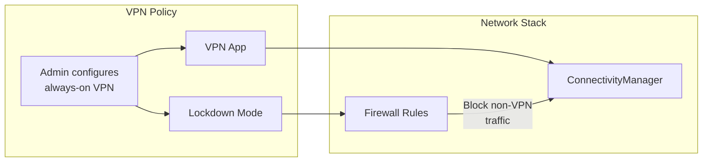
```mermaid
graph LR
    subgraph "VPN Policy"
        CONF["Admin configures<br/>always-on VPN"]
        VPN_APP[VPN App]
        LOCKDOWN[Lockdown Mode]
    end

    subgraph "Network Stack"
        CONN[ConnectivityManager]
        FW[Firewall Rules]
    end

    CONF --> VPN_APP
    CONF --> LOCKDOWN
    LOCKDOWN --> FW
    VPN_APP --> CONN
    FW --> |"Block non-VPN<br/>traffic"| CONN
```

When lockdown mode is enabled:

- All network traffic is blocked until the VPN connects.
- If the VPN disconnects, traffic is blocked again.
- Certain system-level traffic (captive portal detection) may be exempted.

### 59.4.15  Permitted Services Control

Admins can restrict which accessibility services and input methods are allowed:

```java
// ActiveAdmin.java
private static final String TAG_PERMITTED_ACCESSIBILITY_SERVICES =
    "permitted-accessiblity-services";  // Note: typo preserved from source
private static final String TAG_PERMITTED_IMES = "permitted-imes";
private static final String TAG_PERMITTED_NOTIFICATION_LISTENERS =
    "permitted-notification-listeners";
```

This ensures that only approved accessibility services and keyboards are
used in the managed environment, preventing data leakage through malicious
input methods or accessibility services.

### 59.4.16  Metered Data Control

Admins can prevent specific apps from using metered (cellular) data:

```java
// ActiveAdmin.java
private static final String TAG_METERED_DATA_DISABLED_PACKAGES =
    "metered_data_disabled_packages";
```

### 59.4.17  Trust Agent Management

Admins can control trust agents (Smart Lock features):

```java
// ActiveAdmin.java
private static final String TAG_MANAGE_TRUST_AGENT_FEATURES =
    "manage-trust-agent-features";
private static final String TAG_TRUST_AGENT_COMPONENT_OPTIONS =
    "trust-agent-component-options";
private static final String TAG_TRUST_AGENT_COMPONENT = "component";
```

### 59.4.18  Nearby Streaming Policies

Admins can control nearby streaming of notifications and apps:

```java
// ActiveAdmin.java
private static final String TAG_NEARBY_NOTIFICATION_STREAMING_POLICY =
    "nearby-notification-streaming-policy";
private static final String TAG_NEARBY_APP_STREAMING_POLICY =
    "nearby-app-streaming-policy";
```

### 59.4.19  Organization Identity

The admin can set organization name and color for branding:

```java
// ActiveAdmin.java
private static final String TAG_ORGANIZATION_COLOR = "organization-color";
private static final String TAG_ORGANIZATION_NAME = "organization-name";
```

The organization name appears in Settings and in notifications related to
the managed profile.

### 59.4.20  Support Messages

Admins can set short and long support messages displayed to users:

```java
// ActiveAdmin.java
private static final String TAG_SHORT_SUPPORT_MESSAGE = "short-support-message";
private static final String TAG_LONG_SUPPORT_MESSAGE = "long-support-message";
```

The short message appears in the Settings app next to the admin entry.
The long message provides detailed information about the management policies.

### 59.4.21  Session Messages (Multi-User)

For multi-user devices (e.g., shared tablets), admins can set session
start/end messages:

```java
// ActiveAdmin.java
private static final String TAG_START_USER_SESSION_MESSAGE = "start_user_session_message";
private static final String TAG_END_USER_SESSION_MESSAGE = "end_user_session_message";
```

### 59.4.22  User Restrictions

Beyond the specific policy APIs, Device Owners and Profile Owners can set
user restrictions that limit device functionality:

```java
// ActiveAdmin.java
private static final String TAG_USER_RESTRICTIONS = "user-restrictions";
private static final String TAG_DEFAULT_ENABLED_USER_RESTRICTIONS =
    "default-enabled-user-restrictions";
private static final String TAG_RESTRICTION = "restriction";
```

Common user restrictions include:

```
UserManager.DISALLOW_INSTALL_APPS
UserManager.DISALLOW_UNINSTALL_APPS
UserManager.DISALLOW_CONFIG_WIFI
UserManager.DISALLOW_SHARE_LOCATION
UserManager.DISALLOW_MODIFY_ACCOUNTS
UserManager.DISALLOW_CONFIG_BLUETOOTH
UserManager.DISALLOW_USB_FILE_TRANSFER
UserManager.DISALLOW_DEBUGGING_FEATURES
UserManager.DISALLOW_CONFIG_VPN
UserManager.DISALLOW_FACTORY_RESET
UserManager.DISALLOW_REMOVE_MANAGED_PROFILE
UserManager.DISALLOW_ADD_USER
UserManager.DISALLOW_MOUNT_PHYSICAL_MEDIA
UserManager.DISALLOW_OUTGOING_CALLS
UserManager.DISALLOW_SMS
UserManager.DISALLOW_CELLULAR_2G
```

The policy engine handles user restrictions specially:

```java
// PolicyDefinition.java
private static final int POLICY_FLAG_USER_RESTRICTION_POLICY = 1 << 4;
// "Add this flag to any policy that is a user restriction, the reason for
//  this is that there are some special APIs to handle user restriction
//  policies and this is the way we can identify them."
```

### 59.4.23  Lock Task Mode

Lock task mode pins the device to specific apps, useful for kiosks and
single-purpose devices:

```java
// DevicePolicyManager.java
public static final int LOCK_TASK_FEATURE_BLOCK_ACTIVITY_START_IN_TASK = ...;
public static final int LOCK_TASK_FEATURE_GLOBAL_ACTIONS = ...;
public static final int LOCK_TASK_FEATURE_HOME = ...;
public static final int LOCK_TASK_FEATURE_KEYGUARD = ...;
public static final int LOCK_TASK_FEATURE_NOTIFICATIONS = ...;
public static final int LOCK_TASK_FEATURE_OVERVIEW = ...;
public static final int LOCK_TASK_FEATURE_QUICK_SETTINGS = ...;
public static final int LOCK_TASK_FEATURE_SYSTEM_INFO = ...;
```

The policy definition uses `TopPriority` resolution:

```java
// PolicyDefinition.java
static PolicyDefinition<LockTaskPolicy> LOCK_TASK = new PolicyDefinition<>(
    new NoArgsPolicyKey(DevicePolicyIdentifiers.LOCK_TASK_POLICY),
    new TopPriority<>(List.of(
        EnforcingAdmin.getRoleAuthorityOf(ROLE_SYSTEM_FINANCED_DEVICE_CONTROLLER),
        EnforcingAdmin.DPC_AUTHORITY)),
    POLICY_FLAG_LOCAL_ONLY_POLICY,
    (LockTaskPolicy value, Context context, Integer userId, PolicyKey policyKey) ->
        PolicyEnforcerCallbacks.setLockTask(value, context, userId),
    new LockTaskPolicySerializer());
```

---

## 59.5  Managed Configurations

### 59.5.1  App Restrictions Framework

Managed configurations (also called app restrictions) allow an admin to
push key-value configuration to managed apps.  This is the primary mechanism
for configuring work apps without user interaction.

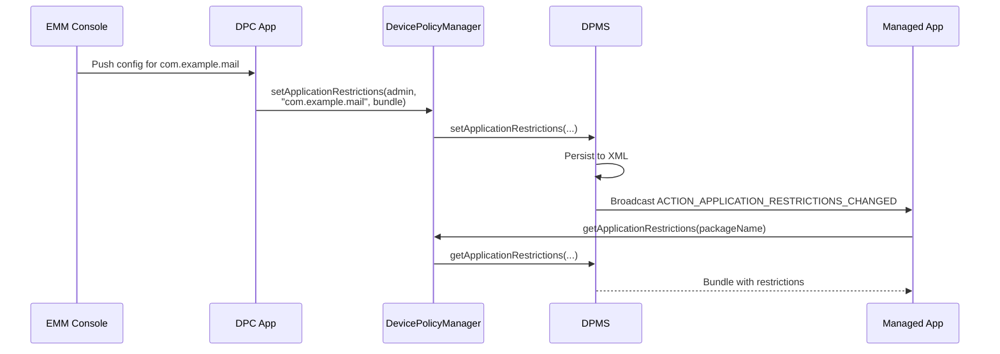
```mermaid
sequenceDiagram
    participant EMM as EMM Console
    participant DPC as DPC App
    participant DPM as DevicePolicyManager
    participant DPMS as DPMS
    participant APP as Managed App

    EMM->>DPC: Push config for com.example.mail
    DPC->>DPM: setApplicationRestrictions(admin,<br/>"com.example.mail", bundle)
    DPM->>DPMS: setApplicationRestrictions(...)
    DPMS->>DPMS: Persist to XML
    DPMS->>APP: Broadcast ACTION_APPLICATION_RESTRICTIONS_CHANGED

    APP->>DPM: getApplicationRestrictions(packageName)
    DPM->>DPMS: getApplicationRestrictions(...)
    DPMS-->>APP: Bundle with restrictions
```

### 59.5.2  Restriction Types

The restrictions are communicated as a `Bundle` containing typed key-value
pairs.  Apps declare their supported restrictions in an XML resource:

```xml
<!-- res/xml/app_restrictions.xml -->
<restrictions xmlns:android="http://schemas.android.com/apk/res/android">
    <restriction
        android:key="server_url"
        android:restrictionType="string"
        android:title="@string/server_url_title"
        android:description="@string/server_url_description"
        android:defaultValue="https://mail.example.com" />
    <restriction
        android:key="allow_personal_use"
        android:restrictionType="bool"
        android:title="@string/personal_use_title"
        android:defaultValue="false" />
    <restriction
        android:key="max_attachment_size"
        android:restrictionType="integer"
        android:title="@string/max_attachment_title"
        android:defaultValue="10" />
</restrictions>
```

Supported restriction types:

| Type | XML Value | Java Type |
|------|-----------|-----------|
| Boolean | `bool` | `boolean` |
| String | `string` | `String` |
| Integer | `integer` | `int` |
| Multi-select | `multi-select` | `String[]` |
| Choice | `choice` | `String` |
| Bundle | `bundle` | `Bundle` (nested) |
| Bundle array | `bundle_array` | `Parcelable[]` |

### 59.5.3  Delegation of App Restrictions

The app-restrictions capability can be delegated:

```java
// DevicePolicyManager.java
public static final String DELEGATION_APP_RESTRICTIONS = "delegation-app-restrictions";
```

This allows an EMM agent to delegate configuration management to a
purpose-built configuration app.

### 59.5.4  RestrictionsManager

Apps retrieve their managed configurations through `RestrictionsManager`:

```java
// android.content.RestrictionsManager
public Bundle getApplicationRestrictions() { ... }
public List<RestrictionEntry> getManifestRestrictions(String packageName) { ... }
```

The `RestrictionsReceiver` allows apps to receive asynchronous restriction
updates:

```java
// frameworks/base/core/java/android/service/restrictions/RestrictionsReceiver.java
// Referenced in DevicePolicyManager.java imports:
import android.service.restrictions.RestrictionsReceiver;
```

### 59.5.5  Policy Engine Treatment

App restrictions use the `NON_COEXISTABLE_POLICY` flag, meaning each admin's
restrictions are stored independently rather than being merged:

```java
// PolicyDefinition.java
// POLICY_FLAG_NON_COEXISTABLE_POLICY = 1 << 3
// "admin policies should be treated independently of each other and should not
//  have any resolution logic applied... e.g. application restrictions set by
//  different admins for a single package should not be merged, but saved and
//  queried independent of each other."
```

### 59.5.6  Managed Configurations Architecture

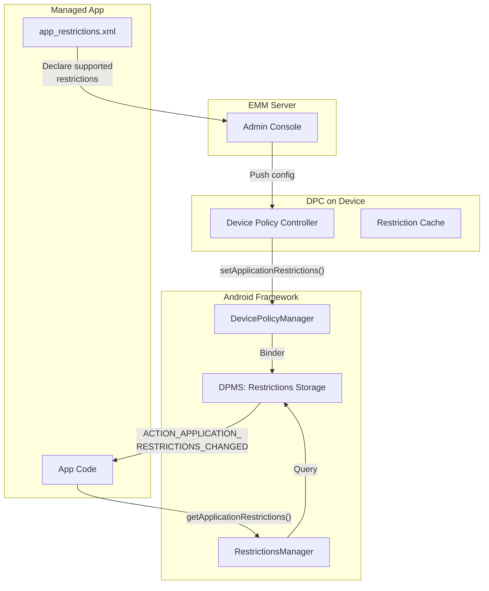
```mermaid
graph TB
    subgraph "EMM Server"
        CONSOLE[Admin Console]
    end

    subgraph "DPC on Device"
        DPC[Device Policy Controller]
        DPC_STORE[Restriction Cache]
    end

    subgraph "Android Framework"
        DPM[DevicePolicyManager]
        DPMS_R[DPMS: Restrictions Storage]
        RM[RestrictionsManager]
    end

    subgraph "Managed App"
        APP[App Code]
        APP_XML[app_restrictions.xml]
    end

    CONSOLE --> |"Push config"| DPC
    DPC --> |"setApplicationRestrictions()"| DPM
    DPM --> |"Binder"| DPMS_R
    DPMS_R --> |"ACTION_APPLICATION_<br/>RESTRICTIONS_CHANGED"| APP
    APP --> |"getApplicationRestrictions()"| RM
    RM --> |"Query"| DPMS_R

    APP_XML --> |"Declare supported<br/>restrictions"| CONSOLE
```

### 59.5.7  Managed App Config for Common Use Cases

Common managed configuration patterns:

**VPN Configuration**:
```xml
<restriction android:key="vpn_server" android:restrictionType="string" />
<restriction android:key="vpn_protocol" android:restrictionType="choice"
    android:entries="@array/vpn_protocols"
    android:entryValues="@array/vpn_protocol_values" />
```

**Email Configuration**:
```xml
<restriction android:key="email_server" android:restrictionType="string" />
<restriction android:key="email_port" android:restrictionType="integer" />
<restriction android:key="use_ssl" android:restrictionType="bool" />
```

**Wi-Fi Configuration** (via DPC):
```xml
<restriction android:key="wifi_ssid" android:restrictionType="string" />
<restriction android:key="wifi_security_type" android:restrictionType="choice" />
```

---

## 59.6  COPE and Fully Managed Devices

### 59.6.1  Fully Managed Device Provisioning

A fully managed device is provisioned during the initial setup through
`provisionFullyManagedDevice()`:

```java
// frameworks/base/core/java/android/app/admin/FullyManagedDeviceProvisioningParams.java
public final class FullyManagedDeviceProvisioningParams implements Parcelable {
    @NonNull private final ComponentName mDeviceAdminComponentName;
    @NonNull private final String mOwnerName;
    private final boolean mLeaveAllSystemAppsEnabled;
    @Nullable private final String mTimeZone;
    private final long mLocalTime;
    @Nullable private final Locale mLocale;
    private final boolean mDeviceOwnerCanGrantSensorsPermissions;
    @NonNull private final PersistableBundle mAdminExtras;
    private final boolean mDemoDevice;
}
```

### 59.6.2  Provisioning Methods

Android supports multiple provisioning entry points:

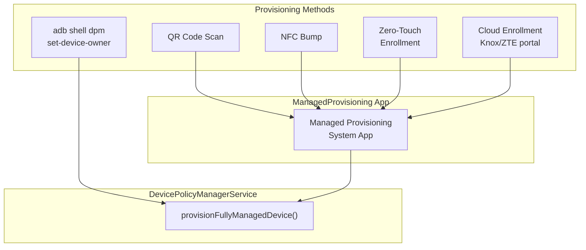
```mermaid
graph TB
    subgraph "Provisioning Methods"
        QR[QR Code Scan]
        NFC[NFC Bump]
        ZTE["Zero-Touch<br/>Enrollment"]
        ADB["adb shell dpm<br/>set-device-owner"]
        CLOUD["Cloud Enrollment<br/>Knox/ZTE portal"]
    end

    subgraph "ManagedProvisioning App"
        MP["Managed Provisioning<br/>System App"]
    end

    subgraph "DevicePolicyManagerService"
        DPMS_PROV["provisionFullyManagedDevice()"]
    end

    QR --> MP
    NFC --> MP
    ZTE --> MP
    ADB --> DPMS_PROV
    CLOUD --> MP
    MP --> DPMS_PROV
```

The provisioning intents:

```java
// DevicePolicyManager.java
public static final String ACTION_PROVISION_MANAGED_DEVICE
    = "android.app.action.PROVISION_MANAGED_DEVICE";
public static final String ACTION_PROVISION_MANAGED_PROFILE
    = "android.app.action.PROVISION_MANAGED_PROFILE";
public static final String ACTION_PROVISION_MANAGED_USER
    = "android.app.action.PROVISION_MANAGED_USER";
```

### 59.6.3  Device Owner Capabilities

A Device Owner has the broadest set of capabilities:

| Category | Capabilities |
|----------|-------------|
| **Network** | Set global proxy, configure Wi-Fi, set VPN, configure private DNS |
| **Security** | Enable security logging, enable network logging, generate attestation keys |
| **Apps** | Install/uninstall apps silently, hide apps, suspend apps, block uninstall |
| **System** | Set system update policy, reboot device, set time/timezone |
| **Users** | Create/remove users, switch users, set affiliation IDs |
| **Hardware** | Disable camera, disable screen capture, disable USB data |
| **Telephony** | Configure APNs, manage subscriptions |
| **Identity** | Set organization name, set device owner lock screen info |

### 59.6.4  COPE Architecture

COPE combines Device Owner authority on the personal side with Profile Owner
authority in the work profile.  The key distinction is the
`mOrganizationOwnedProvisioning` flag:

```java
// ManagedProfileProvisioningParams.java
private final boolean mOrganizationOwnedProvisioning;
```

When this flag is true, the Profile Owner gains additional capabilities over
the personal profile:

1. **Suspend personal apps** when the work profile is off too long.
2. **Enforce password policies** on the device-level lock screen.
3. **Control network logging** for the entire device.
4. **Query device identifiers** (IMEI, serial number).

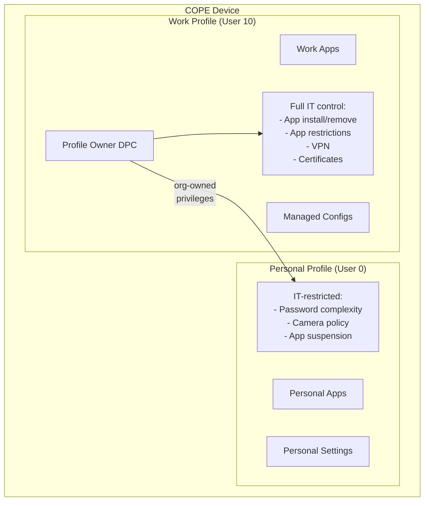
```mermaid
graph TB
    subgraph "COPE Device"
        subgraph "Personal Profile (User 0)"
            PP_APPS[Personal Apps]
            PP_SETTINGS[Personal Settings]
            PP_RESTRICT["IT-restricted:<br/>- Password complexity<br/>- Camera policy<br/>- App suspension"]
        end

        subgraph "Work Profile (User 10)"
            WP_APPS[Work Apps]
            WP_DPC[Profile Owner DPC]
            WP_CONFIG[Managed Configs]
            WP_FULL["Full IT control:<br/>- App install/remove<br/>- App restrictions<br/>- VPN<br/>- Certificates"]
        end

        WP_DPC --> |"org-owned<br/>privileges"| PP_RESTRICT
        WP_DPC --> WP_FULL
    end
```

### 59.6.5  COPE vs. Fully Managed Comparison

```
Feature                  | Fully Managed | COPE
-------------------------|---------------|------
Device Owner present     | Yes           | No (profile owner with elevated rights)
Personal apps allowed    | IT decision   | Yes (primary purpose)
Personal app visibility  | IT can see    | IT cannot see
Work profile exists      | Optional      | Yes
User can remove work     | No            | No (org-owned)
Factory reset control    | Full          | Via FRP
Personal app suspension  | N/A           | Yes (if work off too long)
```

### 59.6.6  Financed Devices

Android also supports a "financed device" mode for devices under a financing
agreement:

```java
// DevicePolicyManager.java
public static final int DEVICE_OWNER_TYPE_DEFAULT = 0;
public static final int DEVICE_OWNER_TYPE_FINANCED = 1;
```

Financed device controllers use the `ROLE_SYSTEM_FINANCED_DEVICE_CONTROLLER`
role and have specific priority in policy resolution:

```java
// PolicyDefinition.java (example: Lock task)
new TopPriority<>(List.of(
    EnforcingAdmin.getRoleAuthorityOf(ROLE_SYSTEM_FINANCED_DEVICE_CONTROLLER),
    EnforcingAdmin.DPC_AUTHORITY))
```

### 59.6.7  System Update Policy

Device Owners can control how system updates are applied:

```java
// Referenced in Owners.java
import android.app.admin.SystemUpdatePolicy;
import android.app.admin.SystemUpdateInfo;
```

Four update strategies:

- **Automatic** -- install updates as soon as available.
- **Windowed** -- install during a configured maintenance window.
- **Postpone** -- postpone updates for up to 30 days.
- **Freeze periods** -- block updates entirely during specified date ranges.

```java
// DevicePolicyManager.java
// FreezePeriod allows blocking updates (e.g., during holiday sales)
import android.app.admin.FreezePeriod;
```

### 59.6.8  Always-On VPN

Device and profile owners can enforce always-on VPN:

```java
// ActiveAdmin.java
private static final String TAG_ALWAYS_ON_VPN_PACKAGE = "vpn-package";
```

When always-on VPN is configured, network traffic is blocked until the VPN
connects (lockdown mode).

---

## 59.7  Cross-Profile Communication

### 59.7.1  The Cross-Profile Boundary

The work/personal boundary is one of Android Enterprise's most important
security features.  By default, apps in one profile cannot see or interact
with apps or data in another profile.  Cross-profile communication must be
explicitly enabled through several mechanisms.

```mermaid
graph TB
    subgraph "Personal Profile"
        P_APP[Personal App]
        P_CONTACTS[Personal Contacts]
        P_CALENDAR[Personal Calendar]
    end

    subgraph "Cross-Profile Mechanisms"
        CPI["Cross-Profile<br/>Intent Filters"]
        CPA["CrossProfileApps<br/>API"]
        CPP["Cross-Profile<br/>Providers"]
        CPCP["Cross-Profile<br/>Calendar/Contacts"]
    end

    subgraph "Work Profile"
        W_APP[Work App]
        W_CONTACTS[Work Contacts]
        W_CALENDAR[Work Calendar]
    end

    P_APP --> CPI --> W_APP
    P_APP --> CPA --> W_APP
    P_CONTACTS <--> CPP <--> W_CONTACTS
    P_CALENDAR <--> CPCP <--> W_CALENDAR
```

### 59.7.2  Cross-Profile Intent Filters

The DPC controls which intents cross the profile boundary:

```java
// DevicePolicyManager.java
public void addCrossProfileIntentFilter(
    @Nullable ComponentName admin,
    IntentFilter filter,
    int flags) { ... }

public void clearCrossProfileIntentFilters(
    @Nullable ComponentName admin) { ... }
```

The flags control direction:

```java
// DevicePolicyManager.java
public static final int FLAG_PARENT_CAN_ACCESS_MANAGED = 0x0001;
// Personal apps can resolve intents to work apps

public static final int FLAG_MANAGED_CAN_ACCESS_PARENT = 0x0002;
// Work apps can resolve intents to personal apps
```

### 59.7.3  Default Cross-Profile Intent Filters

The system provides default cross-profile intent filters for essential
functionality even before the DPC configures any.  These typically include:

- **Phone calls**: allowing the personal dialer to show work contacts.
- **Web URLs**: allowing link navigation across profiles.
- **Settings**: allowing access to device settings from either profile.

### 59.7.4  CrossProfileApps API

The `CrossProfileApps` class provides a higher-level API for cross-profile
interaction:

```java
// frameworks/base/core/java/android/content/pm/CrossProfileApps.java
public class CrossProfileApps {

    public static final String ACTION_CAN_INTERACT_ACROSS_PROFILES_CHANGED =
        "android.content.pm.action.CAN_INTERACT_ACROSS_PROFILES_CHANGED";

    // Start an activity in another profile
    public void startMainActivity(
        ComponentName component, UserHandle targetUser) { ... }

    // Get profiles available for cross-profile interaction
    public List<UserHandle> getTargetUserProfiles() { ... }

    // Check if cross-profile interaction is allowed
    public boolean canInteractAcrossProfiles() { ... }
    public boolean canRequestInteractAcrossProfiles() { ... }
}
```

### 59.7.5  Cross-Profile App Manifest Declaration

Apps that want to interact across profiles declare this in their manifest:

```xml
<manifest>
    <application android:crossProfile="true">
        <!-- App can receive CAN_INTERACT_ACROSS_PROFILES_CHANGED
             in manifest receivers -->
    </application>
</manifest>
```

### 59.7.6  Work Contacts in Personal Apps

One of the most visible cross-profile features is showing work contacts
in the personal phone app.  This is controlled by multiple policies:

```java
// ActiveAdmin.java
private static final String TAG_DISABLE_CALLER_ID = "disable-caller-id";
private static final String TAG_DISABLE_CONTACTS_SEARCH = "disable-contacts-search";
private static final String TAG_DISABLE_BLUETOOTH_CONTACT_SHARING =
    "disable-bt-contacts-sharing";
```

The admin can independently control:

1. **Caller ID** across profiles (showing work contact names for incoming calls).
2. **Contact search** across profiles (finding work contacts from personal apps).
3. **Bluetooth contact sharing** (sharing work contacts via Bluetooth with car kits).

```mermaid
graph LR
    subgraph "Personal Side"
        DIALER[Phone Dialer]
        BT["Bluetooth<br/>Car Kit"]
    end

    subgraph "Policy Controls"
        CID["disableCallerIdAccess<br/>(per admin)"]
        CS["disableContactsSearch<br/>(per admin)"]
        BCS["disableBluetoothContactSharing<br/>(per admin)"]
    end

    subgraph "Work Contacts"
        WC[Work Contacts DB]
    end

    DIALER -->|"Caller ID lookup"| CID
    DIALER -->|"Contact search"| CS
    BT -->|"Contact sync"| BCS
    CID -->|"if allowed"| WC
    CS -->|"if allowed"| WC
    BCS -->|"if allowed"| WC
```

### 59.7.7  Cross-Profile Calendar

The admin can allow personal calendar apps to see work calendar events:

```java
// ActiveAdmin.java
private static final String TAG_CROSS_PROFILE_CALENDAR_PACKAGES =
    "cross-profile-calendar-packages";
private static final String TAG_CROSS_PROFILE_CALENDAR_PACKAGES_NULL =
    "cross-profile-calendar-packages-null";
```

### 59.7.8  Cross-Profile Widget Providers

Widget providers can be allowed to show work widgets on the personal
launcher:

```java
// ActiveAdmin.java
private static final String TAG_CROSS_PROFILE_WIDGET_PROVIDERS =
    "cross-profile-widget-providers";
private static final String TAG_PROVIDER = "provider";
```

The policy engine defines this as a specific policy:

```java
// PolicyDefinition.java (referenced)
static final PolicyDefinition<...> CROSS_PROFILE_WIDGET_PROVIDER = ...;
```

### 59.7.9  Cross-Profile Packages

Admins can configure a set of packages allowed for cross-profile communication:

```java
// ActiveAdmin.java
private static final String TAG_CROSS_PROFILE_PACKAGES = "cross-profile-packages";
```

### 59.7.10  Connected Work and Personal Apps

The `crossProfile` manifest attribute enables "connected" apps that work
across both profiles:

```xml
<!-- App manifest -->
<application android:crossProfile="true">
    <activity android:name=".MainActivity">
        <intent-filter>
            <action android:name="android.intent.action.MAIN" />
            <category android:name="android.intent.category.LAUNCHER" />
        </intent-filter>
    </activity>
</application>
```

When an app declares `crossProfile="true"`, it gains several capabilities:

1. It can receive the `CAN_INTERACT_ACROSS_PROFILES_CHANGED` broadcast
   in manifest receivers (not just dynamically registered ones).

2. The system may prompt the user to grant cross-profile interaction
   permission to the app.

3. The app can use `CrossProfileApps.canInteractAcrossProfiles()` to check
   whether it currently has permission.

### 59.7.11  Cross-Profile Data Sharing Patterns

Several patterns exist for sharing data across profiles:

```mermaid
graph TB
    subgraph "Pattern 1: Intent-Based"
        P1_SRC[Personal App] -->|"startActivity()"| P1_FILTER["Cross-Profile<br/>Intent Filter"]
        P1_FILTER -->|"Resolved"| P1_DST[Work App]
    end

    subgraph "Pattern 2: Provider-Based"
        P2_SRC[Personal App] -->|"ContentResolver.query()"| P2_PROV["Cross-Profile<br/>Content Provider"]
        P2_PROV -->|"Filtered results"| P2_DATA[Work Data]
    end

    subgraph "Pattern 3: Direct Start"
        P3_SRC[Personal App] -->|"CrossProfileApps<br/>.startMainActivity()"| P3_DST[Work App Instance]
    end

    subgraph "Pattern 4: Clipboard"
        P4_SRC["Work App<br/>(copy)"] -->|"Clipboard<br/>(if allowed)"| P4_DST["Personal App<br/>(paste)"]
    end
```

Each pattern has different security implications:

| Pattern | Control Level | Use Case |
|---------|--------------|----------|
| Intent-based | Admin configures filters | Opening links, sharing content |
| Provider-based | Admin + system control | Contacts, calendar lookup |
| Direct start | App + user + admin consent | Switching between personal/work instances |
| Clipboard | Admin-controlled | Copy-paste across profiles |

### 59.7.12  Cross-Profile Content Provider Access

The system provides special URIs for cross-profile provider access.
For contacts, the `ContactsContract.Directory` class provides:

```java
// DevicePolicyManager.java imports
import android.provider.ContactsContract.Directory;
```

Directories with the `ENTERPRISE` flag indicate work contacts available
to the personal profile.  The system enforces access based on the admin's
caller ID and contact search policies.

### 59.7.13  Profile Interaction Flow

The complete flow when a personal app tries to interact with a work app:

```mermaid
sequenceDiagram
    participant PA as Personal App
    participant AMS as ActivityManagerService
    participant PMS as PackageManagerService
    participant DPMS as DevicePolicyManagerService
    participant WA as Work App

    PA->>AMS: startActivity(intent)
    AMS->>PMS: resolveActivity(intent, userId=0)

    PMS->>PMS: Check local resolvers<br/>(personal profile)

    PMS->>DPMS: getCrossProfileIntentFilters()
    DPMS-->>PMS: List of IntentFilters

    PMS->>PMS: Match intent against<br/>cross-profile filters

    alt Match found with FLAG_MANAGED_CAN_ACCESS_PARENT
        PMS->>PMS: Resolve in work profile (userId=10)
        PMS-->>AMS: ResolveInfo (work app)
        AMS->>WA: Start activity in work profile
    else No match
        PMS-->>AMS: No cross-profile match
        AMS-->>PA: ActivityNotFoundException
    end
```

---

## 59.8  Compliance and Security

### 59.8.1  Security Logging

Security logging captures security-relevant events on the device.  The
`SecurityLogMonitor` class manages the log buffer:

```java
// frameworks/base/services/devicepolicy/java/com/android/server/devicepolicy/
//   SecurityLogMonitor.java
class SecurityLogMonitor implements Runnable {
    // "A class managing access to the security logs. It maintains an internal
    //  buffer of pending logs to be retrieved by the device owner. The logs are
    //  retrieved from the logd daemon via JNI binding, and kept until device
    //  owner has retrieved to prevent loss of logs. Access to the logs from
    //  the device owner is rate-limited, and device owner is notified when the
    //  logs are ready to be retrieved. This happens every two hours, or when
    //  our internal buffer is larger than a certain threshold."
}
```

```mermaid
graph LR
    subgraph "Kernel/System"
        LOGD[logd daemon]
    end

    subgraph "SecurityLogMonitor"
        JNI[JNI Bridge]
        BUFFER[Internal Buffer]
        TIMER[2-hour Timer]
        THRESHOLD["1024 Entry<br/>Threshold"]
    end

    subgraph "Device Owner"
        DPC_SEC[DPC App]
        DPC_CB["onSecurityLogsAvailable()"]
    end

    LOGD -->|"Security events"| JNI
    JNI --> BUFFER

    TIMER -->|"Notify"| DPC_CB
    THRESHOLD -->|"Notify"| DPC_CB
    DPC_SEC -->|"retrieveSecurityLogs()"| BUFFER
```

Security events include:

- ADB connection/disconnection
- App process start
- Keyguard dismissed/secured
- Media mount/unmount
- OS startup/shutdown
- Password changes/failures
- Certificate installs
- Key generation events

### 59.8.2  Audit Logging

In addition to security logging, Android supports audit logging:

```java
// PolicyDefinition.java
static PolicyDefinition<Boolean> AUDIT_LOGGING = new PolicyDefinition<>(
    new NoArgsPolicyKey(DevicePolicyIdentifiers.AUDIT_LOGGING_POLICY),
    TRUE_MORE_RESTRICTIVE,
    POLICY_FLAG_GLOBAL_ONLY_POLICY,
    PolicyEnforcerCallbacks::enforceAuditLogging,
    new BooleanPolicySerializer());
```

The audit log callback interface:

```java
// Referenced in SecurityLogMonitor.java
import android.app.admin.IAuditLogEventsCallback;
```

### 59.8.3  Network Logging

Network logging captures DNS queries and TCP connections:

```java
// frameworks/base/services/devicepolicy/java/com/android/server/devicepolicy/
//   NetworkLogger.java
final class NetworkLogger {
    private final DevicePolicyManagerService mDpm;
    private final PackageManagerInternal mPm;
    private final AtomicBoolean mIsLoggingEnabled = new AtomicBoolean(false);
    private final int mTargetUserId;
}
```

The `NetworkLogger` registers a `INetdEventCallback` to intercept network
events:

```java
// NetworkLogger.java
private final INetdEventCallback mNetdEventCallback = new BaseNetdEventCallback() {
    @Override
    public void onDnsEvent(int netId, int eventType, int returnCode,
            String hostname, String[] ipAddresses, int ipAddressesCount,
            long timestamp, int uid) {
        if (!mIsLoggingEnabled.get()) return;
        if (!shouldLogNetworkEvent(uid)) return;
        DnsEvent dnsEvent = new DnsEvent(hostname, ipAddresses,
            ipAddressesCount, mPm.getNameForUid(uid), timestamp);
        sendNetworkEvent(dnsEvent);
    }

    @Override
    public void onConnectEvent(String ipAddr, int port,
            long timestamp, int uid) {
        if (!mIsLoggingEnabled.get()) return;
        // ... similar filtering and event creation
    }
};
```

The network logging handler batches events:

```java
// NetworkLoggingHandler.java
// (companion to NetworkLogger, handles batching and delivery)
```

```mermaid
sequenceDiagram
    participant NET as Network Stack
    participant NL as NetworkLogger
    participant NLH as NetworkLoggingHandler
    participant DPMS as DPMS
    participant DPC as DPC App

    NET->>NL: onDnsEvent(hostname, ips, uid)
    NL->>NL: shouldLogNetworkEvent(uid)?
    NL->>NLH: sendNetworkEvent(DnsEvent)

    NLH->>NLH: Buffer events<br/>(batch by time/count)

    NLH->>DPMS: Notify batch ready
    DPMS->>DPC: ACTION_NETWORK_LOGS_AVAILABLE

    DPC->>DPMS: retrieveNetworkLogs(batchToken)
    DPMS-->>DPC: List<NetworkEvent>
```

### 59.8.4  Device Attestation

Device attestation allows the DPC to prove device identity to a remote
server using hardware-backed keys:

```java
// DevicePolicyManager.java
public static final int ID_TYPE_BASE_INFO = 1;   // Manufacturer info
public static final int ID_TYPE_SERIAL = 2;       // Serial number
public static final int ID_TYPE_IMEI = 4;         // IMEI
public static final int ID_TYPE_MEID = 8;         // MEID
public static final int ID_TYPE_INDIVIDUAL_ATTESTATION = 16; // Device-unique key
```

The attestation flow:

```mermaid
sequenceDiagram
    participant DPC as DPC App
    participant DPM as DevicePolicyManager
    participant KS as KeyStore
    participant TEE as TEE/StrongBox
    participant SRV as Remote Server

    DPC->>DPM: generateKeyPair("RSA", keySpec,<br/>ID_TYPE_SERIAL | ID_TYPE_IMEI)
    DPM->>KS: Generate key with attestation
    KS->>TEE: Create key in secure hardware
    TEE-->>KS: Attestation certificate chain

    KS-->>DPM: AttestedKeyPair
    DPM-->>DPC: AttestedKeyPair

    DPC->>DPC: Extract attestation certs
    DPC->>SRV: Send attestation chain

    SRV->>SRV: Verify chain against<br/>Google root certificate
    SRV->>SRV: Extract device properties<br/>from attestation extension
    SRV-->>DPC: Device verified
```

The generated key pair includes an attestation certificate chain that
can be verified against Google's root CA.  The attestation extension
contains device properties (OS version, patch level, boot state,
device IDs).

### 59.8.5  Attestation Certificate Chain Structure

The attestation certificate chain has a specific structure that remote
servers verify:

```mermaid
graph TB
    subgraph "Attestation Chain"
        ROOT["Google Hardware<br/>Attestation Root CA"]
        INTER["Intermediate CA<br/>Batch Certificate"]
        DEVICE["Device Attestation<br/>Certificate"]
        KEY["Key Attestation<br/>Certificate"]
    end

    ROOT --> INTER
    INTER --> DEVICE
    DEVICE --> KEY

    subgraph "Attestation Extension"
        EXT_OS["OS Version: 15"]
        EXT_PATCH["Patch Level: 2025-03-01"]
        EXT_BOOT["Boot State: verified"]
        EXT_ID["Device ID: serial/IMEI"]
        EXT_VB["Verified Boot State: green"]
        EXT_APP["App ID: SHA-256 of signing cert"]
    end

    KEY --> EXT_OS
    KEY --> EXT_PATCH
    KEY --> EXT_BOOT
    KEY --> EXT_ID
    KEY --> EXT_VB
    KEY --> EXT_APP
```

The attestation extension (OID 1.3.6.1.4.1.11129.2.1.17) contains:

| Field | Description |
|-------|-------------|
| `attestationVersion` | Attestation format version |
| `attestationSecurityLevel` | TEE or StrongBox |
| `keymasterVersion` | KeyMaster/KeyMint version |
| `keymasterSecurityLevel` | Execution environment |
| `attestationChallenge` | Server-provided challenge (nonce) |
| `uniqueId` | Device-unique ID (if requested) |
| `softwareEnforced` | Software-enforced key properties |
| `teeEnforced` | Hardware-enforced key properties |

Within `teeEnforced`, the server can verify:

- `osVersion` -- exact Android version
- `osPatchLevel` -- security patch level
- `rootOfTrust` -- verified boot state, public key, device locked state
- `attestationApplicationId` -- signing certificate of requesting app

### 59.8.6  Certificate Management

The DPC can install CA certificates and client certificates:

```java
// DevicePolicyManager.java (delegation)
public static final String DELEGATION_CERT_INSTALL = "delegation-cert-install";
public static final String DELEGATION_CERT_SELECTION = "delegation-cert-selection";
```

The `CertificateMonitor` tracks admin-installed certificates:

```java
// frameworks/base/services/devicepolicy/java/com/android/server/devicepolicy/
//   CertificateMonitor.java
// Monitors CA certificates installed by the admin
```

### 59.8.7  Password Compliance Checking

The DPC can check if the current password meets requirements:

```java
// DevicePolicyManager.java
// isActivePasswordSufficient() - checks against admin's password policy
// getPasswordComplexity() - returns current complexity level

@RequiresPermission(REQUEST_PASSWORD_COMPLEXITY)
public static final String EXTRA_PASSWORD_COMPLEXITY =
    "android.app.extra.PASSWORD_COMPLEXITY";
```

The compliance action:

```java
// DevicePolicyManager.java
public static final String ACTION_CHECK_POLICY_COMPLIANCE
    = "android.app.action.CHECK_POLICY_COMPLIANCE";
```

### 59.8.8  Compliance Acknowledgement

Starting in Android 12, the system requires DPCs to acknowledge compliance
status:

```java
// DeviceAdminReceiver.java
public static final String ACTION_COMPLIANCE_ACKNOWLEDGEMENT_REQUIRED
    = "android.app.action.COMPLIANCE_ACKNOWLEDGEMENT_REQUIRED";
```

### 59.8.9  Security Patching Verification

The DPC can query the device's security patch level and enforce minimum
levels.  The DPMS imports system update query permissions:

```java
// DevicePolicyManagerService.java
import static android.Manifest.permission
    .MANAGE_DEVICE_POLICY_QUERY_SYSTEM_UPDATES;
```

### 59.8.10  USB Data Signaling Control

For high-security environments, USB data can be disabled:

```java
// DevicePolicyManagerService.java
import static android.Manifest.permission
    .MANAGE_DEVICE_POLICY_USB_DATA_SIGNALLING;
```

### 59.8.11  Memory Tagging Extension (MTE)

On supported hardware, the DPC can enable MTE for enhanced memory safety:

```java
// DevicePolicyManagerService.java
import static android.Manifest.permission.MANAGE_DEVICE_POLICY_MTE;

// PolicyDefinition.java
import static android.app.admin.DevicePolicyIdentifiers.MEMORY_TAGGING_POLICY;
```

### 59.8.12  Content Protection

The DPC can control content protection features:

```java
// DevicePolicyManager.java
public static final int CONTENT_PROTECTION_DISABLED = 0;

// DevicePolicyManagerService.java
import static android.Manifest.permission
    .MANAGE_DEVICE_POLICY_CONTENT_PROTECTION;
```

### 59.8.13  Stolen Device State

Android supports a device theft API:

```java
// DevicePolicyManager.java (flags)
import static android.app.admin.flags.Flags.FLAG_DEVICE_THEFT_API_ENABLED;

// DevicePolicyManagerService.java
import static android.Manifest.permission.QUERY_DEVICE_STOLEN_STATE;
```

### 59.8.14  Device Policy State

The DPC can query the complete device policy state:

```java
// frameworks/base/core/java/android/app/admin/DevicePolicyState.java
public final class DevicePolicyState implements Parcelable {
    // Complete snapshot of all active policies on the device
}
```

### 59.8.15  Enterprise-Specific ID

For privacy-preserving device identification, Android generates
enterprise-specific IDs:

```java
// frameworks/base/services/devicepolicy/java/com/android/server/devicepolicy/
//   EnterpriseSpecificIdCalculator.java
// Generates a stable per-enterprise device ID without exposing
// hardware identifiers
```

### 59.8.16  Remote Bugreport

The DPC can request a bug report from the device:

```java
// frameworks/base/services/devicepolicy/java/com/android/server/devicepolicy/
//   RemoteBugreportManager.java
// Manages remote bug report requests from the admin

// DevicePolicyData.java
private static final String TAG_LAST_BUG_REPORT_REQUEST = "last-bug-report-request";
```

### 59.8.17  Wi-Fi SSID Policy

Admins can control which Wi-Fi networks the device can connect to:

```java
// ActiveAdmin.java references WifiSsidPolicy
import android.app.admin.WifiSsidPolicy;

// Two modes:
import static android.app.admin.WifiSsidPolicy.WIFI_SSID_POLICY_TYPE_ALLOWLIST;
import static android.app.admin.WifiSsidPolicy.WIFI_SSID_POLICY_TYPE_DENYLIST;
```

In allowlist mode, only specified SSIDs can be connected to.  In denylist
mode, specified SSIDs are blocked.

### 59.8.18  Private DNS Policy

The admin can configure private DNS (DNS-over-TLS) settings:

```java
// DevicePolicyManager.java
public static final int PRIVATE_DNS_MODE_OFF = 1;
public static final int PRIVATE_DNS_MODE_OPPORTUNISTIC = 2;
public static final int PRIVATE_DNS_MODE_PROVIDER_HOSTNAME = 3;
public static final int PRIVATE_DNS_MODE_UNKNOWN = 0;

public static final int PRIVATE_DNS_SET_NO_ERROR = 0;
public static final int PRIVATE_DNS_SET_ERROR_FAILURE_SETTING = 1;
```

### 59.8.19  Preferential Network Service

For enterprise scenarios requiring dedicated network paths:

```java
// Referenced in ActiveAdmin
import android.app.admin.PreferentialNetworkServiceConfig;
```

This allows the admin to configure enterprise network preferences, ensuring
work traffic uses specific network slices or enterprise APNs.

### 59.8.20  APN Configuration (Telephony)

Device Owners can manage APN (Access Point Name) settings:

```java
// DevicePolicyManagerService.java
import static android.provider.Telephony.Carriers.DPC_URI;
import static android.provider.Telephony.Carriers.ENFORCE_KEY;
import static android.provider.Telephony.Carriers.ENFORCE_MANAGED_URI;
import static android.provider.Telephony.Carriers.INVALID_APN_ID;
```

### 59.8.21  Package Policy

Admins can control which packages are allowed for specific purposes:

```java
// Referenced in DevicePolicyManager
import android.app.admin.PackagePolicy;
// PackagePolicy allows allowlist/denylist of packages for specific
// capabilities (e.g., cross-profile intent handling)
```

### 59.8.22  Ephemeral Users

Device Owners can force ephemeral user creation, ensuring all user data
is deleted when the user logs out:

```java
// ActiveAdmin.java
private static final String TAG_FORCE_EPHEMERAL_USERS = "force_ephemeral_users";
```

This is particularly useful for shared devices in education or retail
environments.

### 59.8.23  Protected Packages

The admin can protect specific packages from user interference:

```java
// DevicePolicyData.java
private static final String TAG_PROTECTED_PACKAGES = "protected-packages";
```

### 59.8.24  Bypass Role Qualifications

In some enterprise scenarios, the admin needs to grant roles to packages
that do not meet the normal qualification criteria:

```java
// DevicePolicyData.java
private static final String TAG_BYPASS_ROLE_QUALIFICATIONS =
    "bypass-role-qualifications";
```

### 59.8.25  Secondary Lock Screen

The admin can enable a secondary lock screen:

```java
// DevicePolicyData.java
private static final String TAG_SECONDARY_LOCK_SCREEN = "secondary-lock-screen";
```

This allows the DPC to implement an additional lock screen (e.g., for
compliance verification) that appears before or after the standard lock
screen.

### 59.8.26  App Exemptions

Admins can exempt specific apps from various system restrictions:

```java
// DevicePolicyManager.java
public static final int EXEMPT_FROM_ACTIVITY_BG_START_RESTRICTION = ...;
public static final int EXEMPT_FROM_DISMISSIBLE_NOTIFICATIONS = ...;
public static final int EXEMPT_FROM_HIBERNATION = ...;
public static final int EXEMPT_FROM_POWER_RESTRICTIONS = ...;
public static final int EXEMPT_FROM_SUSPENSION = ...;
```

These exemptions ensure that critical enterprise apps (like VPN clients
or management agents) continue to function even under battery optimization
or suspension policies.

### 59.8.27  Complete Compliance Architecture

```mermaid
graph TB
    subgraph "EMM Server"
        SRV_POLICY[Policy Configuration]
        SRV_COMPLIANCE[Compliance Engine]
        SRV_ATTEST[Attestation Verifier]
    end

    subgraph "Device"
        subgraph "DPC App"
            DPC_AGENT[Management Agent]
            DPC_COMPLIANCE[Compliance Checker]
        end

        subgraph "DPMS"
            SEC_LOG[Security Log Monitor]
            NET_LOG[Network Logger]
            CERT_MON[Certificate Monitor]
            ATTEST[Key Attestation]
        end

        subgraph "Hardware"
            TEE_HW[TEE / StrongBox]
            KS_HW[Hardware Keystore]
        end
    end

    SRV_POLICY --> |"Push policies"| DPC_AGENT
    DPC_AGENT --> |"Set policies"| SEC_LOG
    DPC_AGENT --> |"Set policies"| NET_LOG
    DPC_AGENT --> |"Install certs"| CERT_MON

    SEC_LOG --> |"Security events"| DPC_COMPLIANCE
    NET_LOG --> |"Network events"| DPC_COMPLIANCE
    DPC_COMPLIANCE --> |"Report status"| SRV_COMPLIANCE

    DPC_AGENT --> |"Request attestation"| ATTEST
    ATTEST --> |"Generate key"| TEE_HW
    TEE_HW --> |"Cert chain"| ATTEST
    ATTEST --> |"Attestation result"| SRV_ATTEST
```

---

## 59.9  Try It

This section provides hands-on exercises to explore the Device Policy
framework using the AOSP source code and Android development tools.

### 59.9.1  Exercise 1: Inspect the DPMS Source

Examine the scale of the Device Policy Manager Service:

```bash
# Count lines in the main service file
wc -l frameworks/base/services/devicepolicy/java/com/android/server/devicepolicy/DevicePolicyManagerService.java
# Expected: ~25,000 lines

# Count all Java files in the devicepolicy package
find frameworks/base/services/devicepolicy/ -name "*.java" | wc -l

# List all policy definition constants
grep -n "static PolicyDefinition" \
    frameworks/base/services/devicepolicy/java/com/android/server/devicepolicy/PolicyDefinition.java

# Count the MANAGE_DEVICE_POLICY_* permissions imported by DPMS
grep "MANAGE_DEVICE_POLICY_" \
    frameworks/base/services/devicepolicy/java/com/android/server/devicepolicy/DevicePolicyManagerService.java \
    | wc -l
```

### 59.9.2  Exercise 2: Explore the DPM Client API

```bash
# Count public API methods in DevicePolicyManager
grep -c "public.*(" \
    frameworks/base/core/java/android/app/admin/DevicePolicyManager.java

# List all delegation scopes
grep "DELEGATION_" \
    frameworks/base/core/java/android/app/admin/DevicePolicyManager.java \
    | grep "public static final"

# Find all PASSWORD_COMPLEXITY constants
grep "PASSWORD_COMPLEXITY_" \
    frameworks/base/core/java/android/app/admin/DevicePolicyManager.java

# List all provisioning-related actions
grep "ACTION_PROVISION" \
    frameworks/base/core/java/android/app/admin/DevicePolicyManager.java
```

### 59.9.3  Exercise 3: Build a Minimal Device Admin

Create a minimal device admin app to understand the admin component lifecycle.

**Step 1: Create the admin receiver**

```java
// MyDeviceAdminReceiver.java
package com.example.myadmin;

import android.app.admin.DeviceAdminReceiver;
import android.content.Context;
import android.content.Intent;
import android.os.UserHandle;
import android.util.Log;

public class MyDeviceAdminReceiver extends DeviceAdminReceiver {
    private static final String TAG = "MyDeviceAdmin";

    @Override
    public void onEnabled(Context context, Intent intent) {
        Log.i(TAG, "Device admin enabled");
    }

    @Override
    public void onDisabled(Context context, Intent intent) {
        Log.i(TAG, "Device admin disabled");
    }

    @Override
    public void onPasswordChanged(Context context, Intent intent,
            UserHandle user) {
        Log.i(TAG, "Password changed for user: " + user);
    }

    @Override
    public void onPasswordFailed(Context context, Intent intent,
            UserHandle user) {
        Log.i(TAG, "Password failed for user: " + user);
    }

    @Override
    public void onPasswordSucceeded(Context context, Intent intent,
            UserHandle user) {
        Log.i(TAG, "Password succeeded for user: " + user);
    }
}
```

**Step 2: Create the admin policies XML**

```xml
<!-- res/xml/device_admin.xml -->
<device-admin xmlns:android="http://schemas.android.com/apk/res/android">
    <uses-policies>
        <limit-password />
        <watch-login />
        <force-lock />
        <wipe-data />
        <disable-camera />
    </uses-policies>
</device-admin>
```

**Step 3: Declare in manifest**

```xml
<receiver
    android:name=".MyDeviceAdminReceiver"
    android:exported="true"
    android:permission="android.permission.BIND_DEVICE_ADMIN">
    <meta-data
        android:name="android.app.device_admin"
        android:resource="@xml/device_admin" />
    <intent-filter>
        <action android:name="android.app.action.DEVICE_ADMIN_ENABLED" />
    </intent-filter>
</receiver>
```

**Step 4: Create a management activity**

```java
// AdminActivity.java
package com.example.myadmin;

import android.app.Activity;
import android.app.admin.DevicePolicyManager;
import android.content.ComponentName;
import android.content.Context;
import android.os.Bundle;
import android.util.Log;

public class AdminActivity extends Activity {
    private static final String TAG = "MyDeviceAdmin";
    private DevicePolicyManager mDPM;
    private ComponentName mAdminComponent;

    @Override
    protected void onCreate(Bundle savedInstanceState) {
        super.onCreate(savedInstanceState);

        mDPM = (DevicePolicyManager)
            getSystemService(Context.DEVICE_POLICY_SERVICE);
        mAdminComponent = new ComponentName(this,
            MyDeviceAdminReceiver.class);

        if (mDPM.isAdminActive(mAdminComponent)) {
            Log.i(TAG, "Admin is active");
            logPolicyState();
        } else {
            Log.i(TAG, "Admin is NOT active");
        }
    }

    private void logPolicyState() {
        Log.i(TAG, "Password sufficient: "
            + mDPM.isActivePasswordSufficient());
        Log.i(TAG, "Encryption status: "
            + mDPM.getStorageEncryptionStatus());
        Log.i(TAG, "Camera disabled: "
            + mDPM.getCameraDisabled(mAdminComponent));
    }
}
```

### 59.9.4  Exercise 4: Set Up a Test Device Owner

Use ADB to explore device owner functionality on an emulator:

```bash
# Start a fresh emulator (factory reset state)
emulator -avd Pixel_8_API_35 -wipe-data

# After initial setup, set a device owner
# (must be done before the user completes setup)
adb shell dpm set-device-owner com.example.myadmin/.MyDeviceAdminReceiver

# Verify the device owner is set
adb shell dumpsys device_policy

# Examine the device policy XML
adb shell cat /data/system/device_owner_2.xml

# Inspect per-user policy data
adb shell cat /data/system/users/0/device_policies.xml
```

### 59.9.5  Exercise 5: Create and Inspect a Work Profile

```bash
# On an emulator with the DPC test app installed:

# List current users
adb shell pm list users

# Create a managed profile (using TestDPC or similar)
# After creation, list users again
adb shell pm list users
# Expected: UserInfo{10:Work profile:...}

# Inspect the work profile's policy data
adb shell cat /data/system/users/10/device_policies.xml

# List packages in the work profile
adb shell pm list packages --user 10

# Check cross-profile intent filters
adb shell dumpsys package intent-filter-verifications

# Toggle work mode
adb shell am broadcast -a android.intent.action.MANAGED_PROFILE_UNAVAILABLE \
    --user 0
```

### 59.9.6  Exercise 6: Explore Managed Configurations

```bash
# Set app restrictions for a package in the work profile
adb shell content call \
    --uri content://com.android.providers.settings \
    --method GET_system \
    --arg device_provisioned

# Dump the device policy state
adb shell dumpsys device_policy | grep -A 20 "Active Admins"

# Look for app restrictions in the policy dump
adb shell dumpsys device_policy | grep -A 10 "application-restrictions"
```

### 59.9.7  Exercise 7: Examine Policy Engine Resolution

Study how the policy engine resolves conflicting policies:

```bash
# Find all resolution mechanisms in the source
grep -r "class.*Resolution\|MostRestrictive\|TopPriority\|PackageSetUnion\|MostRecent" \
    frameworks/base/services/devicepolicy/java/com/android/server/devicepolicy/ \
    --include="*.java" -l

# List all policy definitions
grep "static.*PolicyDefinition" \
    frameworks/base/services/devicepolicy/java/com/android/server/devicepolicy/PolicyDefinition.java

# Find the policy enforcer callbacks
grep "static.*CompletableFuture" \
    frameworks/base/services/devicepolicy/java/com/android/server/devicepolicy/PolicyEnforcerCallbacks.java \
    | head -20
```

### 59.9.8  Exercise 8: Security and Network Logging

```bash
# Enable security logging (requires device owner)
adb shell dpm set-device-owner com.example.myadmin/.MyDeviceAdminReceiver
# Then programmatically:
# dpm.setSecurityLoggingEnabled(admin, true);

# Check security log state
adb shell dumpsys device_policy | grep -A 5 "Security Log"

# Check network logging state
adb shell dumpsys device_policy | grep -A 5 "Network Log"

# Examine the SecurityLogMonitor implementation
wc -l frameworks/base/services/devicepolicy/java/com/android/server/devicepolicy/SecurityLogMonitor.java

# Examine the NetworkLogger implementation
wc -l frameworks/base/services/devicepolicy/java/com/android/server/devicepolicy/NetworkLogger.java
```

### 59.9.9  Exercise 9: Trace a Policy Call Through the Stack

Follow the `setCameraDisabled()` call from the client API through to
enforcement:

```bash
# 1. Find the client-side method
grep -n "setCameraDisabled" \
    frameworks/base/core/java/android/app/admin/DevicePolicyManager.java | head -5

# 2. Find the AIDL interface method
grep -n "setCameraDisabled" \
    frameworks/base/core/java/android/app/admin/IDevicePolicyManager.aidl

# 3. Find the server-side implementation
grep -n "setCameraDisabled" \
    frameworks/base/services/devicepolicy/java/com/android/server/devicepolicy/DevicePolicyManagerService.java | head -5

# 4. Find how the policy is resolved
grep -n "CAMERA\|camera.*disable" \
    frameworks/base/services/devicepolicy/java/com/android/server/devicepolicy/PolicyDefinition.java

# 5. Find the enforcer callback
grep -n "camera\|Camera" \
    frameworks/base/services/devicepolicy/java/com/android/server/devicepolicy/PolicyEnforcerCallbacks.java | head -5

# 6. Find how CameraService checks the policy
grep -rn "DevicePolicyCache\|isCameraDisabled\|CAMERA_DISABLED" \
    frameworks/base/services/core/ --include="*.java" | head -10
```

### 59.9.10  Exercise 10: Build a Complete DPC with Managed Config

Create a DPC that demonstrates managed configurations:

**Step 1: Create the managed app's restriction schema**

```xml
<!-- managed-app/res/xml/app_restrictions.xml -->
<restrictions xmlns:android="http://schemas.android.com/apk/res/android">
    <restriction
        android:key="server_url"
        android:restrictionType="string"
        android:title="Server URL"
        android:description="The server URL for syncing data"
        android:defaultValue="https://default.example.com" />
    <restriction
        android:key="auto_sync"
        android:restrictionType="bool"
        android:title="Auto Sync"
        android:description="Enable automatic data synchronization"
        android:defaultValue="true" />
    <restriction
        android:key="sync_interval_minutes"
        android:restrictionType="integer"
        android:title="Sync Interval"
        android:description="Minutes between automatic syncs"
        android:defaultValue="30" />
    <restriction
        android:key="allowed_file_types"
        android:restrictionType="multi-select"
        android:title="Allowed File Types"
        android:entries="@array/file_types"
        android:entryValues="@array/file_type_values" />
</restrictions>
```

**Step 2: Create the DPC that pushes config**

```java
// DPC: pushing restrictions to a managed app
public void configureApp(ComponentName admin) {
    DevicePolicyManager dpm = getSystemService(DevicePolicyManager.class);

    Bundle restrictions = new Bundle();
    restrictions.putString("server_url", "https://corp.example.com");
    restrictions.putBoolean("auto_sync", true);
    restrictions.putInt("sync_interval_minutes", 15);
    restrictions.putStringArray("allowed_file_types",
        new String[]{"pdf", "docx", "xlsx"});

    dpm.setApplicationRestrictions(admin,
        "com.example.managedapp", restrictions);
}
```

**Step 3: Managed app reads restrictions**

```java
// Managed app: reading restrictions
public void loadConfig() {
    RestrictionsManager rm = getSystemService(RestrictionsManager.class);
    Bundle restrictions = rm.getApplicationRestrictions();

    String serverUrl = restrictions.getString("server_url",
        "https://default.example.com");
    boolean autoSync = restrictions.getBoolean("auto_sync", true);
    int syncInterval = restrictions.getInt("sync_interval_minutes", 30);

    Log.i(TAG, "Server: " + serverUrl);
    Log.i(TAG, "Auto sync: " + autoSync);
    Log.i(TAG, "Interval: " + syncInterval + " min");
}

// Register for restriction changes
private void registerForChanges() {
    IntentFilter filter = new IntentFilter(
        Intent.ACTION_APPLICATION_RESTRICTIONS_CHANGED);
    registerReceiver(new BroadcastReceiver() {
        @Override
        public void onReceive(Context context, Intent intent) {
            loadConfig(); // Reload restrictions
        }
    }, filter);
}
```

### 59.9.11  Exercise 11: Explore the Ownership Transfer API

Device and profile ownership can be transferred between DPC apps:

```java
// DevicePolicyManager API
public void transferOwnership(ComponentName admin,
    ComponentName target, PersistableBundle bundle) { ... }
```

```bash
# Find the transfer ownership implementation
grep -n "transferOwnership" \
    frameworks/base/services/devicepolicy/java/com/android/server/devicepolicy/DevicePolicyManagerService.java \
    | head -5

# Find the transfer metadata manager
cat frameworks/base/services/devicepolicy/java/com/android/server/devicepolicy/TransferOwnershipMetadataManager.java \
    | head -30
```

The `TransferOwnershipMetadataManager` tracks admin types during transfer:

```java
// TransferOwnershipMetadataManager.java
static final String ADMIN_TYPE_DEVICE_OWNER = "device-owner";
static final String ADMIN_TYPE_PROFILE_OWNER = "profile-owner";
```

### 59.9.12  Exercise 12: ADB Device Policy Commands

The DPMS provides a shell command interface:

```bash
# List all available dpm commands
adb shell dpm help

# Key commands:
adb shell dpm set-device-owner <component>
adb shell dpm set-profile-owner <component>
adb shell dpm remove-active-admin <component>
adb shell dpm set-active-admin <component>

# DevicePolicyManagerService also supports dumpsys
adb shell dumpsys device_policy

# Key sections in dumpsys output:
# - Device Owner
# - Profile Owner (per user)
# - Active Admins (per user)
# - Policy states
# - Affiliation IDs
# - Security/Network logging status
```

The shell command handler is implemented in:

```
frameworks/base/services/devicepolicy/java/com/android/server/devicepolicy/
    DevicePolicyManagerServiceShellCommand.java
```

### 59.9.13  Exercise 13: Cross-Profile Communication

Test cross-profile intent resolution:

```bash
# Verify the work profile exists
adb shell pm list users

# Check current cross-profile intent filters
adb shell dumpsys device_policy | grep -A 30 "cross-profile"

# Test intent resolution across profiles
# From personal profile, try to open a web URL
adb shell am start -a android.intent.action.VIEW \
    -d "https://example.com" --user 0

# Check if it resolves in the work profile
adb shell dumpsys activity activities | grep -B 2 -A 5 "example.com"
```

Programmatically configure cross-profile intent filters:

```java
// In the DPC, add a cross-profile filter for web browsing
DevicePolicyManager dpm = getSystemService(DevicePolicyManager.class);
ComponentName admin = new ComponentName(this,
    MyDeviceAdminReceiver.class);

IntentFilter filter = new IntentFilter();
filter.addAction(Intent.ACTION_VIEW);
filter.addCategory(Intent.CATEGORY_BROWSABLE);
filter.addDataScheme("https");

// Allow personal apps to open links in work browser
dpm.addCrossProfileIntentFilter(admin, filter,
    DevicePolicyManager.FLAG_PARENT_CAN_ACCESS_MANAGED);

// Allow work apps to open links in personal browser
dpm.addCrossProfileIntentFilter(admin, filter,
    DevicePolicyManager.FLAG_MANAGED_CAN_ACCESS_PARENT);
```

### 59.9.14  Exercise 14: Implement Password Complexity Enforcement

```java
// DPC: enforcing password complexity
public void enforcePasswordPolicy(ComponentName admin) {
    DevicePolicyManager dpm = getSystemService(DevicePolicyManager.class);

    // Modern approach: use password complexity
    // (requires targetSdk >= 31)
    dpm.setRequiredPasswordComplexity(PASSWORD_COMPLEXITY_HIGH);

    // Check if current password meets requirements
    boolean sufficient = dpm.isActivePasswordSufficient();
    Log.i(TAG, "Password sufficient: " + sufficient);

    if (!sufficient) {
        // Launch password change screen
        Intent intent = new Intent(
            DevicePolicyManager.ACTION_SET_NEW_PASSWORD);
        intent.putExtra(DevicePolicyManager.EXTRA_PASSWORD_COMPLEXITY,
            PASSWORD_COMPLEXITY_HIGH);
        startActivity(intent);
    }

    // Set maximum failed password attempts before wipe
    dpm.setMaximumFailedPasswordsForWipe(admin, 10);

    // Set maximum idle time before lock (5 minutes)
    dpm.setMaximumTimeToLock(admin, 5 * 60 * 1000);
}
```

### 59.9.15  Exercise 15: Device Attestation Verification

```java
// DPC: generate an attested key pair
public void performDeviceAttestation(ComponentName admin) {
    DevicePolicyManager dpm = getSystemService(DevicePolicyManager.class);

    try {
        KeyGenParameterSpec spec = new KeyGenParameterSpec.Builder(
                "attestation-key",
                KeyProperties.PURPOSE_SIGN | KeyProperties.PURPOSE_VERIFY)
            .setDigests(KeyProperties.DIGEST_SHA256)
            .setAttestationChallenge(
                generateServerChallenge()) // nonce from server
            .build();

        AttestedKeyPair keyPair = dpm.generateKeyPair(admin, "EC", spec,
            DevicePolicyManager.ID_TYPE_SERIAL
                | DevicePolicyManager.ID_TYPE_IMEI);

        if (keyPair != null) {
            List<Certificate> chain = keyPair.getAttestationRecord();
            Log.i(TAG, "Attestation chain length: " + chain.size());

            // Send chain to server for verification
            sendAttestationToServer(chain);
        }
    } catch (Exception e) {
        Log.e(TAG, "Attestation failed", e);
    }
}

private byte[] generateServerChallenge() {
    // In production, this comes from the EMM server
    byte[] challenge = new byte[32];
    new java.security.SecureRandom().nextBytes(challenge);
    return challenge;
}
```

### 59.9.16  Exercise 16: Work Profile with Managed Config End-to-End

This exercise combines profile creation, app installation, and managed
configuration in a complete flow:

```java
// Step 1: Create work profile
public void setupWorkProfile() {
    DevicePolicyManager dpm = getSystemService(DevicePolicyManager.class);

    ManagedProfileProvisioningParams params =
        new ManagedProfileProvisioningParams.Builder(
            new ComponentName("com.example.dpc",
                "com.example.dpc.MyDeviceAdminReceiver"),
            "Corporate IT")
        .setProfileName("Work")
        .setOrganizationOwnedProvisioning(false) // BYOD mode
        .build();

    try {
        UserHandle workProfile =
            dpm.createAndProvisionManagedProfile(params);
        Log.i(TAG, "Work profile created: " + workProfile);
        configureWorkProfile(workProfile);
    } catch (ProvisioningException e) {
        Log.e(TAG, "Provisioning failed", e);
    }
}

// Step 2: Configure the work profile
private void configureWorkProfile(UserHandle workProfile) {
    DevicePolicyManager dpm = getSystemService(DevicePolicyManager.class);
    ComponentName admin = new ComponentName("com.example.dpc",
        "com.example.dpc.MyDeviceAdminReceiver");

    // Set password policy for work profile
    dpm.setRequiredPasswordComplexity(PASSWORD_COMPLEXITY_MEDIUM);

    // Configure cross-profile contacts
    // (allow personal phone app to see work contacts)
    // dpm.setCrossProfileContactsSearchDisabled(admin, false);

    // Push managed configuration to work email app
    Bundle emailConfig = new Bundle();
    emailConfig.putString("server", "mail.corp.example.com");
    emailConfig.putInt("port", 993);
    emailConfig.putBoolean("use_ssl", true);
    dpm.setApplicationRestrictions(admin,
        "com.example.workmail", emailConfig);

    // Set organization name
    dpm.setOrganizationName(admin, "Example Corp");
}
```

### 59.9.17  Key Source Files Reference

For further exploration, here are the critical source files:

| File | Purpose |
|------|---------|
| `frameworks/base/core/java/android/app/admin/DevicePolicyManager.java` | Client API (18,700+ lines) |
| `frameworks/base/core/java/android/app/admin/DeviceAdminReceiver.java` | Admin callback interface |
| `frameworks/base/core/java/android/app/admin/DeviceAdminInfo.java` | Admin metadata parsing |
| `frameworks/base/core/java/android/app/admin/IDevicePolicyManager.aidl` | Binder interface |
| `frameworks/base/services/devicepolicy/java/com/android/server/devicepolicy/DevicePolicyManagerService.java` | Service implementation (25,000+ lines) |
| `frameworks/base/services/devicepolicy/java/com/android/server/devicepolicy/DevicePolicyEngine.java` | Multi-admin policy resolution |
| `frameworks/base/services/devicepolicy/java/com/android/server/devicepolicy/PolicyDefinition.java` | Policy definitions and resolution mechanisms |
| `frameworks/base/services/devicepolicy/java/com/android/server/devicepolicy/ActiveAdmin.java` | Per-admin policy state |
| `frameworks/base/services/devicepolicy/java/com/android/server/devicepolicy/Owners.java` | DO/PO tracking |
| `frameworks/base/services/devicepolicy/java/com/android/server/devicepolicy/DevicePolicyData.java` | Per-user policy data |
| `frameworks/base/services/devicepolicy/java/com/android/server/devicepolicy/EnforcingAdmin.java` | Admin identity in policy engine |
| `frameworks/base/services/devicepolicy/java/com/android/server/devicepolicy/SecurityLogMonitor.java` | Security event logging |
| `frameworks/base/services/devicepolicy/java/com/android/server/devicepolicy/NetworkLogger.java` | Network event logging |
| `frameworks/base/services/devicepolicy/java/com/android/server/devicepolicy/CertificateMonitor.java` | CA cert monitoring |
| `frameworks/base/services/devicepolicy/java/com/android/server/devicepolicy/PersonalAppsSuspensionHelper.java` | COPE personal app suspension |
| `frameworks/base/core/java/android/app/admin/ManagedProfileProvisioningParams.java` | Work profile provisioning params |
| `frameworks/base/core/java/android/app/admin/FullyManagedDeviceProvisioningParams.java` | Full management provisioning params |
| `frameworks/base/core/java/android/content/pm/CrossProfileApps.java` | Cross-profile interaction API |
| `frameworks/base/core/java/android/app/admin/FactoryResetProtectionPolicy.java` | FRP configuration |

---

## Summary

The Android Enterprise framework is one of the most complex subsystems in AOSP,
spanning over 40,000 lines of code just in the core service and client API.
Here are the key architectural insights:

1. **Management modes** (Fully Managed, Work Profile/BYOD, COPE) offer a
   spectrum from complete IT control to maximum user privacy.  The mode is
   determined at provisioning time and fundamentally shapes what policies can
   be enforced.

2. **DevicePolicyManagerService** is the central policy broker.  At 25,000+
   lines, it is one of AOSP's largest system services.  It validates caller
   permissions, delegates to the policy engine for resolution, persists state
   to XML, and notifies subsystems of policy changes.

3. **The DevicePolicyEngine** (introduced in Android 14) brings formal
   multi-admin policy resolution with four strategies: `MostRestrictive`,
   `TopPriority`, `PackageSetUnion`, and `MostRecent`.  This enables
   coexistence of DPC admins, role-based admins, and legacy device admins.

4. **Work profiles** leverage Android's multi-user infrastructure to create
   a cryptographically separate container for work data.  Cross-profile
   communication is tightly controlled through intent filters, provider
   access policies, and the `CrossProfileApps` API.

5. **Security infrastructure** includes security logging (events from logd),
   network logging (DNS and TCP events via netd), hardware-backed device
   attestation, certificate management, and compliance checking -- all
   designed to give enterprises verifiable assurance about device state.

6. **The permission model** has evolved from requiring a specific admin
   `ComponentName` to fine-grained `MANAGE_DEVICE_POLICY_*` permissions,
   enabling non-DPC apps to participate in device management through roles
   and delegation.
