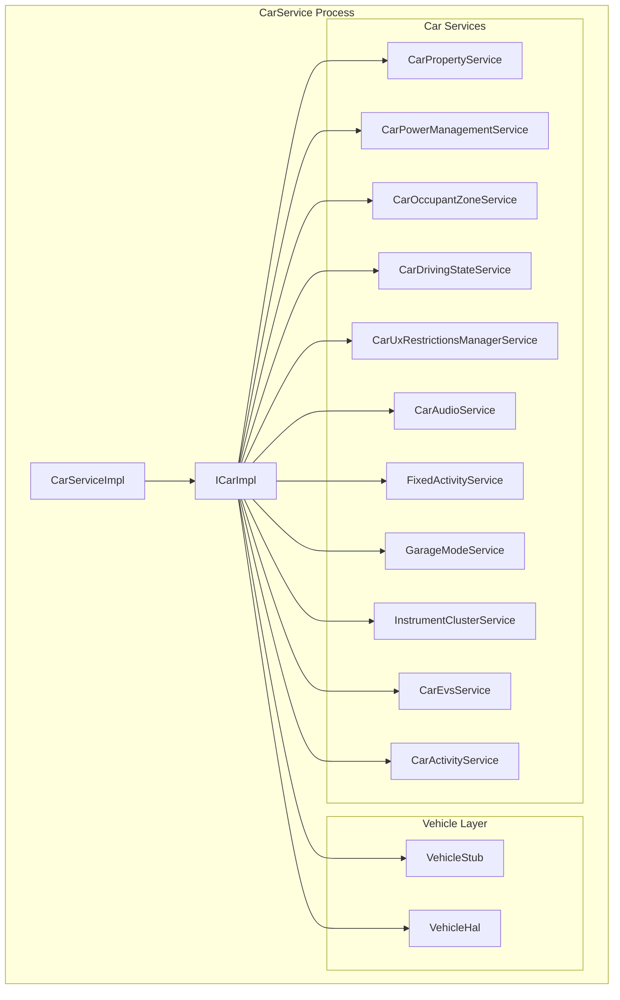
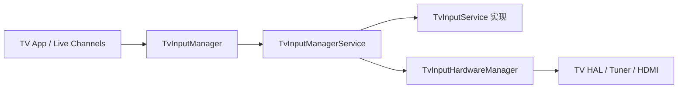

# 第 60 章：Automotive, TV, and Wear

Android 从来不是只面向手机的操作系统。同一套平台同时支撑车机中控、客厅电视和手腕上的可穿戴设备，而这三类形态对系统的要求几乎完全不同：车机必须处理多显示和驾驶安全限制，电视必须围绕 D-pad 与影音输入工作，手表则要在极小电池和圆形屏幕上运行。AOSP 的价值不只是“代码能复用”，而是它真的把这些差异压进了同一个平台架构里。

本章分别梳理 Android Automotive OS（AAOS）、Android TV 和 Wear OS 的关键系统层实现，再看它们在 SystemUI、WMShell、overlay、product 配置和输入模型上的定制点。重点不是产品功能介绍，而是看清 AOSP 如何沿着 HAL、系统服务、窗口管理和 form-factor shell 逐层适配不同设备。

---

## 60.1 Automotive (AAOS)

AAOS 是 AOSP 各种形态中系统改造最深的一支。它不是 Android Auto 那种手机投射协议，而是直接把 Android 作为整车主机系统，负责 HVAC、车辆状态、多显示、用户分区、音频分区、电源状态和驾驶分心限制。

### 60.1.1 CarService：汽车平台中心服务

`packages/services/Car/` 里的 CarService 是整个 AAOS 的中枢。`CarServiceImpl` 在启动时创建 `VehicleStub`，再构造 `ICarImpl` 并把 `car_service` 发布到 ServiceManager。之后几乎所有车相关子系统都挂在 `ICarImpl` 下面。

从架构上看，CarService 不是单一服务，而是一组汽车子系统的容器：



### 60.1.2 Vehicle HAL

Vehicle HAL（VHAL）是 Android 与车辆 ECU 之间的核心边界。它把速度、档位、门锁、空调温度、车灯状态等全部抽象成 property，而不是一组零散 ioctl 或专用协议。AIDL `IVehicle` 接口定义了 get / set / subscribe 等基础能力。

### 60.1.3 Car Property System

AAOS 上层几乎所有车控能力都围绕 car property 展开。系统服务从 VHAL 订阅 property 事件，向 framework 暴露稳定 API，再由应用或 SystemUI 消费。这种 property 化建模的好处是：硬件差异被压到底层，上层围绕统一语义工作。

### 60.1.4 Occupant Zones

occupant zone 是 AAOS 区别于手机 / 平板的关键抽象之一。系统不再默认只有“一个人、一个屏幕、一个音区”，而是显式建模：

- 驾驶位
- 副驾位
- 后排
- 各自对应的 display / input / audio zone / user

这也是为什么车机多显示不是简单的 secondary display 支持，而是要叠加乘员区语义。

### 60.1.5 Instrument Cluster

仪表屏是 AAOS 中安全等级极高的一块显示域。它既可能展示导航、车速、告警，也必须满足极高稳定性要求，因此通常有专门服务与 HAL 路径承接。

### 60.1.6 `FixedActivityService`

车机通常会要求某些 display / zone 固定展示特定应用或任务栈，例如中控导航区、后排娱乐区。`FixedActivityService` 就是这种“特定区域必须跑指定 Activity”模型的服务基础。

### 60.1.7 `CarActivityService`

它负责把普通 Android activity / task 管理能力调整为车机场景所需的行为，例如按 display、zone 和驾驶状态限制某些启动路径。

### 60.1.8 Car Power Management

AAOS 的电源模型与手机完全不同。它不是单纯的电池 / 充电器关系，而是与点火、熄火、休眠、唤醒、车辆总线状态深度绑定。

### 60.1.9 Garage Mode

Garage Mode 允许车辆在用户离车、熄火后短时间继续完成后台任务，例如同步、索引、维护。这是典型汽车特有 power state，不是普通 Android doze 能表达的模型。

### 60.1.10 Car Audio 多音区架构

车机音频通常要按前排 / 后排或不同乘员区拆成多个 audio zone，每个 zone 可有不同输出、不同用户内容和不同策略。

### 60.1.11 驾驶分心与 UX Restrictions

驾驶安全限制是 AAOS 最重要的策略层之一。系统会根据车速、挡位、行驶状态等动态限制 UI 能力，避免应用在驾驶时展示或允许不安全交互。

### 60.1.12 Car 专用 SystemUI

车机不会直接使用手机 SystemUI。它有自己的导航条、状态栏、HVAC 控件、用户切换和多显示展示逻辑。

### 60.1.13 Car Launcher

Car Launcher 不是桌面图标网格的轻微改版，而是围绕驾驶场景、媒体、导航和分心限制重构的入口界面。

### 60.1.14 EVS

External View System（EVS）主要服务倒车影像、环视等外部摄像头流。它是汽车场景专属的视频输入 / 显示路径。

### 60.1.15 Automotive HAL 目录结构

车机相关 HAL 主要散布在 `hardware/interfaces/automotive/` 下，包括：

- vehicle
- EVS
- audio control
- CAN / 其他车控接口

### 60.1.16 Product 配置

AAOS product 配置主要在 `packages/services/Car/car_product/` 下，通过一组 makefile 选出 car SystemUI、Car Launcher、CarService 和相关 overlay / feature。

## 60.2 Android TV

Android TV 的核心不是“电视上也能跑 Android app”，而是围绕遥控器、TV 输入源、Tuner、CEC 和大屏交互重塑系统行为。

### 60.2.1 TV Input Framework（TIF）架构

TIF 是 Android TV 的核心框架层，负责把不同电视输入源统一成稳定接口，例如 HDMI、Tuner、IPTV 等。



### 60.2.2 `TvInputService`

`TvInputService` 是输入源提供方要实现的服务接口。它负责向系统暴露输入会话、调谐、渲染和输入源元数据。

### 60.2.3 `TvInputManagerService`

`TvInputManagerService` 是 TIF 的服务端核心，负责输入源注册、状态管理、会话协调和权限边界。

### 60.2.4 `TvInputHardwareManager`

硬件输入相关管理由它承接，用于对接更低层的 TV hardware / HAL。

### 60.2.5 Tuner Resource Manager

电视场景里，tuner、demux 等资源是稀缺硬件资源，因此必须集中仲裁。

### 60.2.6 HDMI-CEC

HDMI-CEC 让电视、机顶盒、音响和其他 HDMI 设备能通过控制协议联动。Android TV 对它有完整系统服务与 HAL 支持。

### 60.2.7 TV HAL Interfaces

TV 相关 HAL 散布在 `hardware/interfaces/tv/`，覆盖 tuner、CEC 等专用电视能力。

### 60.2.8 TV PIP

电视上的 PIP 不等同于手机 PIP。它围绕 D-pad 焦点、窗口大小固定规则和 TV 专属交互模型工作。

### 60.2.9 D-pad 导航

TV 交互的核心是焦点导航，而不是触摸事件。大量 framework、Launcher 和应用逻辑都要围绕 D-pad 构建。

### 60.2.10 TvSettings

TV 上的设置应用不是简单把手机版 Settings 放大，而是重新围绕 D-pad、Leanback 和大屏菜单组织。

### 60.2.11 TV Interactive App Framework

这是 TV 扩展交互能力的重要入口，例如增强型广播 / 交互式内容场景。

### 60.2.12 Media Quality HAL

电视场景更强调画质链路与媒体质量控制，因此也有更专门的 HAL 能力。

## 60.3 Wear OS

Wear OS 代表的是另一种极端：超小屏幕、极低电池容量、手表交互模型和常显需求。

### 60.3.1 圆形屏幕支持

Wear 设备最典型的显示特征是圆屏。框架和资源系统需要显式支持 round display，而不是让应用自己猜裁切区域。

### 60.3.2 Ambient Mode 与 AOD

手表必须支持更长时间常显，因此 ambient mode 和 AOD 是系统级电源 / UI 模型，而不是普通应用效果。

### 60.3.3 Burn-in Protection

OLED 常显会面临烧屏风险，因此 Wear 系统层必须介入像素偏移、低功耗显示和内容限制。

### 60.3.4 Watch Face Framework

表盘不是普通 launcher widget，而是系统级核心 UI 能力，有自己独立的框架、生命周期和性能约束。

### 60.3.5 Tiles API

Tiles 为 Wear 提供轻量卡片式入口，是手表形态上替代复杂应用层级的重要 UI 机制。

### 60.3.6 简化窗口模型

Wear 通常不需要复杂多窗口，因此 windowing、task 管理和 SystemUI 壳层都比手机更简化。

### 60.3.7 面向可穿戴设备的电池优化

Wear 的电池约束比手机严格得多，所以 job、同步、显示和传感器策略都要更激进地省电。

### 60.3.8 Wear 资源限定符与配置

资源系统会通过 watch / round / small 等配置帮助应用适配手表场景。

### 60.3.9 Wearable Sensing Framework

手表对传感器依赖极高，因此 wearable sensing 相关系统服务和 API 是 Wear 形态的重要一层。

## 60.4 Form Factor Customization Points

这一节把三类形态放在一起看，重点不是业务功能，而是 AOSP 提供了哪些“定制插槽”。

### 60.4.1 SystemUI 变体

不同形态不会共用同一份 SystemUI：

- 汽车：Car SystemUI
- 电视：TV SystemUI
- 手表：Wear SystemUI
- 手机：默认 SystemUI

### 60.4.2 WMShell 模块变体

WindowManager Shell 也存在形态分支，例如 TV 使用自己的 `TvWMShellModule`，来满足 TV PIP、焦点和大屏窗口逻辑。

### 60.4.3 设备 Overlay（RRO）

RRO 是 form factor 定制的重要基础设施。很多视觉、尺寸、交互和资源差异都不是 fork framework，而是通过 overlay 树叠加出来。

### 60.4.4 Product 配置

最终一台车机、电视或手表是由 product makefile 决定的。它们负责选择：

- 哪些包进入镜像
- 哪些 overlay 生效
- 哪些 feature flag 打开
- 哪些属性默认启用

### 60.4.5 Feature Flags 与配置

feature flag 让同一套平台源码可以按产品线切出不同能力集合，而不必对 framework 大面积硬分叉。

### 60.4.6 OEM 如何按形态定制

OEM 常见做法包括：

- 替换 SystemUI / Launcher
- 加 overlay
- 增减 product package
- 加 vendor HAL 与策略
- 对 shell / settings 做定制模块替换

### 60.4.7 多显示架构

多显示在三种形态里都有，但语义不同：

- 车机：多乘员区、多显示域
- 电视：通常单显示
- 手表：通常单显示

### 60.4.8 服务注册差异

不同形态会额外注册不同系统服务。例如车机有 CarService 系列，电视有 TV / tuner / CEC 相关服务。

### 60.4.9 输入模型差异

输入模型是三种形态差异最大的地方之一：

- 车机：触摸 + 旋钮 + 语音
- 电视：D-pad + 遥控器
- 手表：触摸 + 按钮 / 表冠

## 60.5 Try It

### 60.5.1 练习 1：探索 CarService 子服务

```bash
# 在 automotive emulator 或设备上：
adb shell dumpsys car_service

# 列出 VHAL 属性：
adb shell cmd car_service list-properties

# 查看 occupant zone：
adb shell dumpsys car_service --occ-zone
```

### 60.5.2 练习 2：检查 Vehicle HAL 属性

```bash
# 读车速
adb shell cmd car_service get-property PERF_VEHICLE_SPEED

# 读档位
adb shell cmd car_service get-property GEAR_SELECTION

# 列出可用属性
adb shell cmd car_service list-properties
```

### 60.5.3 练习 3：跟踪一次 VHAL 属性事件

```bash
# 打开 car_service 相关日志
adb logcat -s car_service:V
```

然后在 emulator 里改变档位或 HVAC 状态，观察事件链路是否经过：

- `VehicleHal.onPropertyEvent`
- `PropertyHalService.onHalEvents`
- `CarPropertyService.onPropertyChange`

### 60.5.4 练习 4：检查 TV Input Framework

```bash
# 注册的 TV inputs
adb shell dumpsys tv_input

# tuner 资源
adb shell dumpsys media.resource_manager

# HDMI-CEC 状态
adb shell dumpsys hdmi_control
```

### 60.5.5 练习 5：观察 TV PIP

```bash
# 查看 PIP 状态
adb shell dumpsys activity pip
```

并结合 D-pad 导航验证 TV PIP 与手机版交互差异。

### 60.5.6 练习 6：识别设备形态

```bash
# hardware type
adb shell getprop ro.build.characteristics

# UI mode
adb shell dumpsys uimode

# features
adb shell pm list features | findstr "automotive leanback watch"
```

### 60.5.7 练习 7：检查 Automotive 电源状态

```bash
# 当前电源状态
adb shell dumpsys car_service --power

# garage mode 状态
adb shell dumpsys car_service --garage-mode
```

### 60.5.8 练习 8：浏览 Car SystemUI 组件

```bash
# Car SystemUI 服务
adb shell dumpsys activity services com.android.systemui | grep car

# system bar 状态
adb shell dumpsys car_service --act
```

### 60.5.9 练习 9：检查 Occupant Zones

```bash
adb shell dumpsys car_service --occ-zone
```

重点看：

- zone 定义
- display 分配
- user 分配
- audio zone 映射

### 60.5.10 练习 10：构建 Automotive Emulator Image

```bash
source build/envsetup.sh
lunch sdk_car_x86_64-userdebug
m -j$(nproc)
emulator -no-snapshot
```

### 60.5.11 练习 11：跟踪 CEC 消息处理

```bash
# 打开 CEC debug
adb shell setprop log.tag.HdmiCecLocalDeviceTv DEBUG
adb shell setprop log.tag.HdmiControlService DEBUG

# 看消息
adb logcat -s HdmiControlService:D HdmiCecLocalDeviceTv:D
```

### 60.5.12 练习 12：检查 WMShell 模块选择

```bash
# 手机
adb shell dumpsys activity service SystemUIService | grep WMShell

# TV
adb shell dumpsys activity service SystemUIService | grep TvPip
```

### 60.5.13 练习 13：观察 Wear AOD 电池影响

```bash
# 显示状态
adb shell dumpsys display | grep -A 5 "mScreenState"

# 电池
adb shell dumpsys battery

# ambient mode 切换
adb shell input keyevent KEYCODE_SLEEP
adb shell input keyevent KEYCODE_WAKEUP
```

### 60.5.14 练习 14：比较 RRO 叠加层

```bash
# 所有 overlays
adb shell cmd overlay list

# SystemUI 相关 overlay
adb shell cmd overlay list com.android.systemui

# overlay 优先级
adb shell dumpsys overlay
```

### 60.5.15 练习 15：源码走读任务

建议顺着以下路径读源码：

1. CarService 启动链：
   `CarServiceImpl.java`、`ICarImpl.java`、`VehicleStub.java`
2. Vehicle HAL：
   `IVehicle.aidl`
3. TV Input Framework：
   `TvInputService.java`、`TvInputManagerService.java`、`TvInputHardwareManager.java`
4. HDMI-CEC：
   `IHdmiCec.hal`、`HdmiCecLocalDeviceTv.java`
5. TV WMShell：
   `TvWMShellModule.java`、`TvPipModule.java`、`TvPipController.java`
6. Car SystemUI：
   `CarServiceProvider.java`、`CarSystemBar.java`
7. Occupant Zones：
   `CarOccupantZoneService.java`
8. Fixed Activity：
   `FixedActivityService.java`
9. Automotive Power：
   `CarPowerManagementService.java`、`GarageModeService.java`
10. Wearable Sensing：
   `WearableSensingManagerService.java`、`WearableSensingManager.java`

## Summary

### Form Factor Comparison Matrix

| 维度 | 手机 | 汽车 | TV | Wear |
|---|---|---|---|---|
| 主要输入 | 触摸 | 触摸 + 旋钮 + 语音 | D-pad 遥控器 | 触摸 + 表冠 / 按钮 |
| 显示数量 | 1-2 | 2-6+ | 1 | 1 |
| 显示形状 | 矩形 | 矩形 | 矩形 | 圆形或方形 |
| SystemUI | 默认 | Car SystemUI | TV SystemUI | Wear SystemUI |
| Launcher | Launcher3 | Car Launcher | TV Launcher | 表盘 / Tiles |
| WMShell | 默认模块 | 自有车机壳层组合 | `TvWMShellModule` | 更简化 |
| PIP | 完整 | 通常不用 | TV PIP | 无 |
| 多窗口 | 支持 | 按显示域 | 受限 | 极简 |
| 电源模型 | 电池 + 充电 | 点火 / 熄火 / Garage Mode | 常供电 | 超小电池 + AOD |
| 核心专属 HAL | 常规 | Vehicle / EVS / AudioControl | TvInput / CEC / Tuner | 传感器相关 |
| 关键 feature | 默认 | `android.hardware.type.automotive` | `android.software.leanback` | `android.hardware.type.watch` |

### Key Source Trees by Form Factor

| 形态 | 服务代码 | 应用 / UI | HAL 接口 | Product 配置 |
|---|---|---|---|---|
| Automotive | `packages/services/Car/service/` | `packages/apps/Car/` | `hardware/interfaces/automotive/` | `packages/services/Car/car_product/` |
| TV | `frameworks/base/services/core/.../tv/` | 多为产品定制 | `hardware/interfaces/tv/` | 多为产品定制 |
| Wear | `frameworks/base/services/core/.../wearable/` | 多为产品定制 | 标准 HAL + sensors | 多为产品定制 |

Android 在 form factor 适配上最值得注意的，并不是它“能跑在很多设备上”，而是它真的提供了一套分层清晰的定制机制：

1. HAL 抽象把车辆、电视输入、CEC、传感器等硬件差异隔离在 framework 之下。
2. 系统服务扩展把各形态的核心能力收口成正式平台语义，例如 CarService、TvInputManagerService、WearableSensingManagerService。
3. WMShell 模块替换和 SystemUI 变体让窗口与交互壳层可以按形态整体替换，而不是在默认实现里堆满条件分支。
4. Product 配置、overlay 和 feature flag 则负责把这些组件装配成真正的汽车、电视或手表产品。

其中汽车形态的系统改造最深，电视形态最强调输入源与遥控焦点模型，而 Wear 则把一切围绕电池、圆屏与极简交互重新取舍。三者共同证明了 Android 虽然复杂，但它的模块化程度确实足以支撑高度分化的设备类别。
