# Chapter 60: Automotive, TV, and Wear

Android is not a single-device operating system. The same platform that powers phones also drives
car dashboards, living-room televisions, and wrist-worn wearables. Each form factor imposes
radically different constraints -- an instrument cluster must never crash, a TV must respond to a
D-pad, a watch must survive on a tiny battery for days -- yet all three share the core Android
framework. This chapter dissects how AOSP adapts itself to three of its most divergent form
factors: Android Automotive OS (AAOS), Android TV, and Wear OS. We will trace each vertical from
the HAL layer through system services, window management, and specialized UI shells, quoting real
source code and referencing actual file paths throughout.

---

## 60.1 Automotive (AAOS)

Android Automotive OS is the most architecturally ambitious form-factor adaptation in AOSP. Unlike
Android Auto (a phone-projection protocol), AAOS runs as the primary head-unit operating system.
It controls HVAC, reads vehicle telemetry, manages multiple displays for driver and passengers,
handles power states tied to ignition, and enforces driver-distraction restrictions. The core
automotive code lives under:

```
packages/services/Car/           -- CarService and all car-specific system services
packages/apps/Car/               -- Car launcher, SystemUI, Settings, Cluster
hardware/interfaces/automotive/  -- Vehicle HAL, EVS, audio control, CAN
```

### 60.1.1 CarService: The Central Automotive Daemon

CarService is a persistent Android service that bootstraps all car-specific subsystems. Its
lifecycle begins in `CarServiceImpl`, which is the actual `Service` subclass:

```java
// packages/services/Car/service/src/com/android/car/CarServiceImpl.java

@Keep
public class CarServiceImpl extends ProxiedService {
    public static final String CAR_SERVICE_INIT_TIMING_TAG = "CAR.InitTiming";
    public static final int CAR_SERVICE_INIT_TIMING_MIN_DURATION_MS = 5;

    private ICarImpl mICarImpl;
    private VehicleStub mVehicle;

    @Override
    public void onCreate() {
        // ...
        mVehicle = VehicleStub.newVehicleStub();
        mICarImpl = new ICarImpl.Builder()
                .setServiceContext(this)
                .setBuiltInContext(getBuiltinPackageContext())
                .setVehicle(mVehicle)
                .setSystemInterface(
                        SystemInterface.Builder.defaultSystemInterface(this).build())
                .setVehicleInterfaceName(mVehicleInterfaceName)
                .build();
        mICarImpl.init();
        ServiceManagerHelper.addService("car_service", mICarImpl);
        SystemPropertiesHelper.set("boot.car_service_created", "1");
    }
}
```

The key pattern: `CarServiceImpl` creates a `VehicleStub` (the connection to the Vehicle HAL),
then constructs `ICarImpl`, which is the actual `ICar.Stub` binder service that clients connect
to. The `car_service` name is published to ServiceManager, making it globally accessible.

`ICarImpl` is where every individual car subsystem is instantiated. The constructor uses a
`CarServiceCreator` helper that manages dependency injection and tracing:

```java
// packages/services/Car/service/src/com/android/car/ICarImpl.java

public class ICarImpl extends ICar.Stub {
    private final VehicleHal mHal;
    private final CarPowerManagementService mCarPowerManagementService;
    private final CarOccupantZoneService mCarOccupantZoneService;
    private final FixedActivityService mFixedActivityService;
    private final CarAudioService mCarAudioService;
    private final CarPropertyService mCarPropertyService;
    private final CarDrivingStateService mCarDrivingStateService;
    private final CarUxRestrictionsManagerService mCarUXRestrictionsService;
    private final InstrumentClusterService mInstrumentClusterService;
    private final ClusterHomeService mClusterHomeService;
    private final CarEvsService mCarEvsService;
    private final GarageModeService mGarageModeService;
    private final CarBluetoothService mCarBluetoothService;
    private final CarUserService mCarUserService;
    private final CarWatchdogService mCarWatchdogService;
    private final CarTelemetryService mCarTelemetryService;
    private final CarActivityService mCarActivityService;
    private final CarOccupantConnectionService mCarOccupantConnectionService;
    private final CarRemoteDeviceService mCarRemoteDeviceService;
    private final CarRemoteAccessService mCarRemoteAccessService;
    // ... approximately 40 services total
}
```

The initialization ordering is critical. The HAL must be up before property services, which must
be up before driving-state services, which must be up before UX-restrictions. The
`CarServiceCreator.createService()` method ensures each service is added to a global list in
construction order:

```java
// packages/services/Car/service/src/com/android/car/ICarImpl.java

private ICarImpl(Builder builder) {
    // ...
    mHal = constructWithTrace(t, VehicleHal.class,
            () -> new VehicleHal(mContext, builder.mVehicle), allServices);
    mCarPropertyService = carServiceCreator.createService(
            CarPropertyService.class,
            () -> new CarPropertyService.Builder()
                    .setContext(mContext)
                    .setPropertyHalService(mHal.getPropertyHal())
                    .build());
    mCarDrivingStateService = carServiceCreator.createService(
            CarDrivingStateService.class,
            () -> new CarDrivingStateService(mContext, mCarPropertyService));
    mCarOccupantZoneService = carServiceCreator.createService(
            CarOccupantZoneService.class,
            () -> new CarOccupantZoneService(mContext));
    mCarUXRestrictionsService = carServiceCreator.createService(
            CarUxRestrictionsManagerService.class,
            () -> new CarUxRestrictionsManagerService(mContext, mCarDrivingStateService,
                    mCarPropertyService, mCarOccupantZoneService));
    // ...
}
```

The following diagram shows the overall CarService architecture:

```mermaid
graph TB
    subgraph "CarService Process"
        CSI["CarServiceImpl<br/>extends ProxiedService"]
        ICI["ICarImpl<br/>extends ICar.Stub"]

        subgraph "Vehicle Abstraction"
            VS[VehicleStub]
            AVS[AidlVehicleStub]
            HVS[HidlVehicleStub]
            FVS[FakeVehicleStub]
        end

        subgraph "HAL Layer"
            VH[VehicleHal]
            PHal[PowerHalService]
            PropHal[PropertyHalService]
            IHal[InputHalService]
            UHal[UserHalService]
            CHal[ClusterHalService]
            EHal[EvsHalService]
        end

        subgraph "Car Services"
            CPS[CarPropertyService]
            CPMS[CarPowerManagementService]
            COZS[CarOccupantZoneService]
            CDSS[CarDrivingStateService]
            CUXS[CarUxRestrictionsService]
            CAS[CarAudioService]
            CBS[CarBluetoothService]
            CUS[CarUserService]
            FAS[FixedActivityService]
            GMS[GarageModeService]
            ICS[InstrumentClusterService]
            CHS[ClusterHomeService]
            CEVS[CarEvsService]
            CTS[CarTelemetryService]
            CWS[CarWatchdogService]
            CACS[CarActivityService]
        end
    end

    subgraph "Hardware"
        VHAL["Vehicle HAL<br/>hardware/interfaces/automotive/vehicle/"]
        EVS_HAL["EVS HAL<br/>Camera subsystem"]
        AC_HAL[AudioControl HAL]
    end

    CSI --> ICI
    ICI --> VS
    VS --> AVS
    VS --> HVS
    VS --> FVS
    ICI --> VH
    VH --> PHal
    VH --> PropHal
    VH --> IHal
    VH --> UHal
    VH --> CHal
    VH --> EHal
    VH --> VS

    CPS --> PropHal
    CPMS --> PHal
    ICS --> CHal
    CHS --> CHal
    CEVS --> EHal

    AVS --> VHAL
    HVS --> VHAL
    CEVS --> EVS_HAL
    CAS --> AC_HAL
```

### 60.1.2 The Vehicle HAL

The Vehicle HAL is the boundary between Android and the vehicle's electronic control units (ECUs).
It defines a property-based abstraction: every piece of vehicle data (speed, gear, HVAC
temperature, door lock status) is exposed as a `VehicleProperty` with a property ID, area ID,
value type, and change mode.

The AIDL interface is defined at:
`hardware/interfaces/automotive/vehicle/aidl/android/hardware/automotive/vehicle/IVehicle.aidl`

```
@VintfStability
interface IVehicle {
    const long INVALID_MEMORY_ID = 0;
    const int MAX_SHARED_MEMORY_FILES_PER_CLIENT = 3;

    VehiclePropConfigs getAllPropConfigs();
    VehiclePropConfigs getPropConfigs(in int[] props);
    void getValues(IVehicleCallback callback, in GetValueRequests requests);
    void setValues(IVehicleCallback callback, in SetValueRequests requests);
    void subscribe(in IVehicleCallback callback, in SubscribeOptions[] options,
            int maxSharedMemoryFileCount);
    void unsubscribe(in IVehicleCallback callback, in int[] propIds);
    void returnSharedMemory(in IVehicleCallback callback, long sharedMemoryId);
    SupportedValuesListResults getSupportedValuesLists(in List<PropIdAreaId> propIdAreaIds);
    MinMaxSupportedValueResults getMinMaxSupportedValue(in List<PropIdAreaId> propIdAreaIds);
    void registerSupportedValueChangeCallback(
            in IVehicleCallback callback, in List<PropIdAreaId> propIdAreaIds);
    void unregisterSupportedValueChangeCallback(
            in IVehicleCallback callback, in List<PropIdAreaId> propIdAreaIds);
}
```

Key design decisions in the Vehicle HAL:

1. **Asynchronous operations**: `getValues()` and `setValues()` use callbacks, not blocking
   returns. This prevents the car service from stalling on slow ECU communication.

2. **Shared memory for large payloads**: The `returnSharedMemory` mechanism allows efficient
   transfer of bulk sensor data without repeated binder parceling.

3. **Property change modes**: Properties are either `STATIC` (never change, like VIN number),
   `ON_CHANGE` (event-driven, like door state), or `CONTINUOUS` (polled, like vehicle speed).

4. **Area IDs**: Properties can be scoped to vehicle areas. HVAC temperature might have
   different area IDs for driver-side and passenger-side. Seat-related properties use
   `VehicleAreaSeat` bit masks.

On the Java side, `VehicleHal` dispatches incoming property events to specialized
`HalServiceBase` implementations:

```java
// packages/services/Car/service/src/com/android/car/hal/VehicleHal.java

public class VehicleHal implements VehicleHalCallback, CarSystemService {
    private final PowerHalService mPowerHal;
    private final PropertyHalService mPropertyHal;
    private final InputHalService mInputHal;
    private final VmsHalService mVmsHal;
    private final UserHalService mUserHal;
    private final DiagnosticHalService mDiagnosticHal;
    private final ClusterHalService mClusterHalService;
    private final EvsHalService mEvsHal;
    private final TimeHalService mTimeHalService;
    // ...
}
```

Each `HalServiceBase` is responsible for subscribing to the VHAL properties it cares about,
converting raw `HalPropValue` events into higher-level data, and routing that data to the
corresponding `Car*Service`.

The event dispatch mechanism uses specialized `DispatchList` classes that route events
to the correct `HalServiceBase` on its dedicated executor:

```java
// packages/services/Car/service/src/com/android/car/hal/VehicleHal.java

private final class HalEventsDispatchList extends
        DispatchList<HalServiceBase, HalPropValue> {
    @Override
    protected void dispatchToClient(HalServiceBase service,
            List<HalPropValue> events) {
        var eventsCopy = List.copyOf(events);
        var executor = getExecutorForService(service);
        if (executor == null) return;
        executor.execute(() -> {
            service.onHalEvents(eventsCopy);
        });
    }
}

private final class PropertySetErrorDispatchList extends
        DispatchList<HalServiceBase, VehiclePropError> {
    @Override
    protected void dispatchToClient(HalServiceBase service,
            List<VehiclePropError> events) {
        var eventsCopy = List.copyOf(events);
        var executor = getExecutorForService(service);
        if (executor == null) return;
        executor.execute(() -> {
            service.onPropertySetError(eventsCopy);
        });
    }
}
```

The subscription system tracks rates and variable update rate (VUR) settings per
property-area pair:

```java
// packages/services/Car/service/src/com/android/car/hal/VehicleHal.java

/* package */ static final class HalSubscribeOptions {
    private final int mHalPropId;
    private final int[] mAreaIds;
    private final float mUpdateRateHz;
    private final boolean mEnableVariableUpdateRate;
    private final float mResolution;

    HalSubscribeOptions(int halPropId, int[] areaIds, float updateRateHz,
            boolean enableVariableUpdateRate, float resolution) {
        mHalPropId = halPropId;
        mAreaIds = areaIds;
        mUpdateRateHz = updateRateHz;
        mEnableVariableUpdateRate = enableVariableUpdateRate;
        mResolution = resolution;
    }
}
```

Variable Update Rate (VUR) is an important optimization: when enabled, the VHAL only delivers
events when the property value actually changes by more than the specified resolution, even if
the polling rate would trigger more frequent deliveries. This reduces CPU and binder overhead
for high-frequency properties like vehicle speed.

The `VehicleStub` abstraction supports both AIDL and legacy HIDL interfaces:

```java
// packages/services/Car/service/src/com/android/car/VehicleStub.java

public abstract class VehicleStub {
    public interface SubscriptionClient {
        void subscribe(SubscribeOptions[] options)
                throws RemoteException, ServiceSpecificException;
        void unsubscribe(int prop)
                throws RemoteException, ServiceSpecificException;
        void registerSupportedValuesChange(List<PropIdAreaId> propIdAreaIds);
        void unregisterSupportedValuesChange(List<PropIdAreaId> propIdAreaIds);
    }
    // ...
}
```

The concrete implementations `AidlVehicleStub` and `HidlVehicleStub` handle protocol-specific
details. A `FakeVehicleStub` (`SimulationVehicleStub`) exists for testing without real hardware.

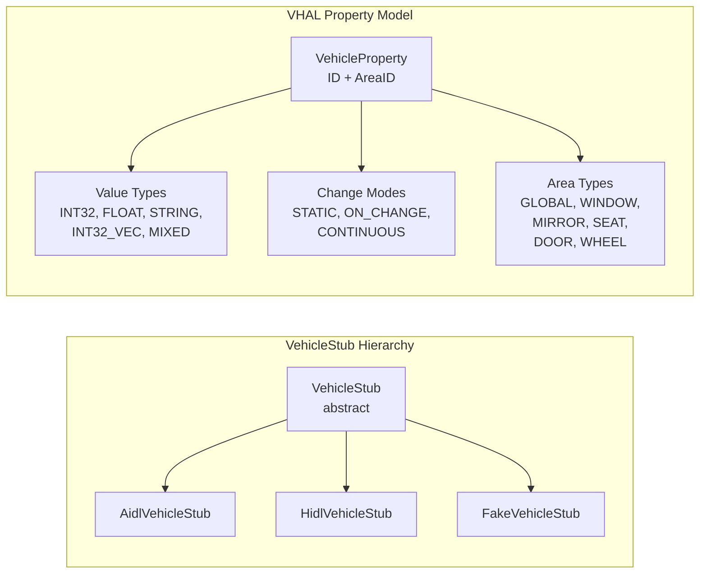

### 60.1.3 Car Property System

The car property system is the primary interface for applications to read and write vehicle data.
`CarPropertyService` exposes properties to apps through `CarPropertyManager`:

```java
// packages/services/Car/service/src/com/android/car/CarPropertyService.java
// (Referenced via ICarImpl constructor)

mCarPropertyService = carServiceCreator.createService(
        CarPropertyService.class,
        () -> new CarPropertyService.Builder()
                .setContext(mContext)
                .setPropertyHalService(mHal.getPropertyHal())
                .build());
```

The property flow from app to hardware:

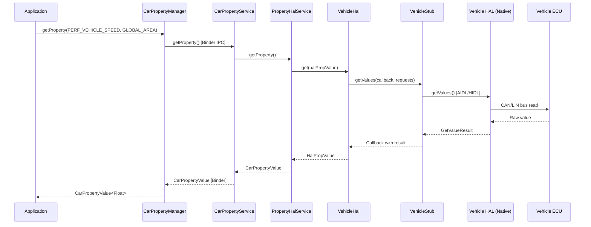

For subscription-based access (event-driven properties like speed or gear), apps register
callbacks that fire when the HAL pushes new values:

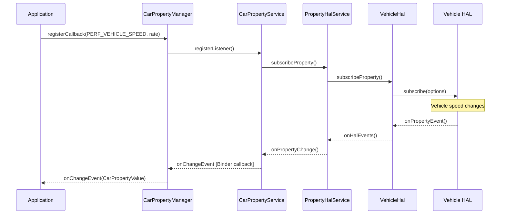

### 60.1.4 Occupant Zones

Multi-zone vehicles have separate displays and user sessions for different seating positions.
`CarOccupantZoneService` manages the mapping between physical seat positions, displays, Android
users, and input devices.

```java
// packages/services/Car/service/src/com/android/car/CarOccupantZoneService.java

public final class CarOccupantZoneService extends ICarOccupantZone.Stub
        implements CarServiceBase {

    public static final class DisplayConfig {
        public final int displayType;
        public final int occupantZoneId;
        public final int[] inputTypes;

        DisplayConfig(int displayType, int occupantZoneId, IntArray inputTypes) {
            this.displayType = displayType;
            this.occupantZoneId = occupantZoneId;
            this.inputTypes = inputTypes == null
                    ? EMPTY_INPUT_SUPPORT_TYPES : inputTypes.toArray();
        }
    }

    @VisibleForTesting
    static class OccupantConfig {
        public int userId = CarOccupantZoneManager.INVALID_USER_ID;
        public final ArrayList<DisplayInfo> displayInfos = new ArrayList<>();
        public int audioZoneId = CarAudioManager.INVALID_AUDIO_ZONE;
    }

    /** key : zoneId */
    @GuardedBy("mLock")
    private final SparseArray<OccupantConfig> mActiveOccupantConfigs = new SparseArray<>();

    @GuardedBy("mLock")
    private int mDriverZoneId = OccupantZoneInfo.INVALID_ZONE_ID;
}
```

The occupant zone model has several key concepts:

- **OccupantZoneInfo**: Represents a physical seating position (driver, front passenger, rear
  left, rear right, etc.), each identified by a unique zone ID.

- **DisplayConfig**: Maps a display type (main, instrument cluster, HUD) to an occupant zone and
  specifies what input types that display supports.

- **OccupantConfig**: The runtime state linking a zone to an Android user ID, a set of displays,
  and an audio zone.

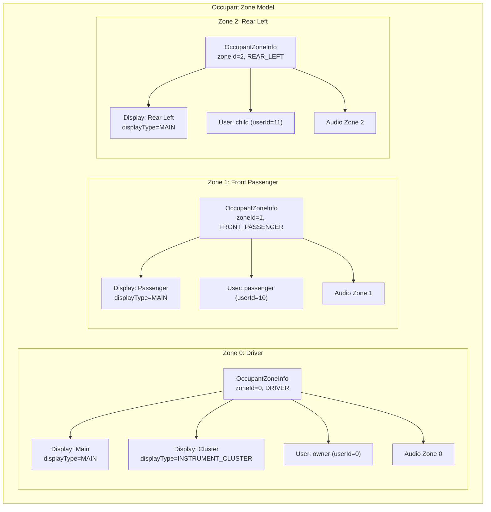

The service listens for display changes and user lifecycle events to dynamically reconfigure
zones:

```java
// packages/services/Car/service/src/com/android/car/CarOccupantZoneService.java

@VisibleForTesting
final UserLifecycleListener mUserLifecycleListener = event -> {
    if (DBG) Slogf.d(TAG, "onEvent(%s)", event);
    boolean isUserSwitching =
            (event.getEventType() == USER_LIFECYCLE_EVENT_TYPE_SWITCHING);
    handleUserChange(isUserSwitching);
};

@VisibleForTesting
final DisplayManager.DisplayListener mDisplayListener =
        new DisplayManager.DisplayListener() {
            @Override
            public void onDisplayAdded(int displayId) {
                handleDisplayChange(displayId);
            }
            @Override
            public void onDisplayRemoved(int displayId) {
                handleDisplayChange(displayId);
            }
            @Override
            public void onDisplayChanged(int displayId) {
                // nothing to do
            }
        };
```

When a display is hotplugged (a rear-seat entertainment screen is connected, for example), the
service re-evaluates the zone-to-display mapping and notifies all registered callbacks.

The `init()` method shows the full initialization sequence:

```java
// packages/services/Car/service/src/com/android/car/CarOccupantZoneService.java

@Override
public void init() {
    Car car = new Car(mContext, /* service= */null, /* handler= */ null);
    CarInfoManager infoManager = new CarInfoManager(car,
            CarLocalServices.getService(CarPropertyService.class));
    int driverSeat = infoManager.getDriverSeat();
    synchronized (mLock) {
        mDriverSeat = driverSeat;
        parseOccupantZoneConfigsLocked();   // Read zone config from RRO
        parseDisplayConfigsLocked();         // Map displays to zones
        handleActiveDisplaysLocked();        // Activate connected displays
        handleAudioZoneChangesLocked();      // Set up audio routing
        handleUserChangesLocked();           // Assign users to zones
    }
    mCarUserService = CarLocalServices.getService(CarUserService.class);
    UserLifecycleEventFilter userEventFilter =
            new UserLifecycleEventFilter.Builder()
                .addEventType(USER_LIFECYCLE_EVENT_TYPE_SWITCHING)
                .addEventType(USER_LIFECYCLE_EVENT_TYPE_STOPPING)
                .build();
    mCarUserService.addUserLifecycleListener(userEventFilter,
            mUserLifecycleListener);
    mDisplayManager.registerDisplayListener(mDisplayListener,
            new Handler(Looper.getMainLooper()));

    CarServiceHelperWrapper.getInstance().runOnConnection(
            () -> doSyncWithCarServiceHelper(
                    /* updateDisplay= */ true, /* updateUser= */ true));
}
```

The occupant zone configuration is read from the RRO config resource
`config_occupant_zones`. If this resource is empty, the service automatically creates a
single driver zone. The configuration specifies seat positions, display types, and input
support for each zone.

The profile user assignment feature (`mEnableProfileUserAssignmentForMultiDisplay`) allows
different Android user profiles to be assigned to different zones. A child profile might
be assigned to the rear-seat display while the primary user controls the driver display.
This requires both the `enableProfileUserAssignmentForMultiDisplay` config boolean and the
`FEATURE_MANAGED_USERS` system feature.

### 60.1.5 Instrument Cluster

The instrument cluster is the display behind the steering wheel. AAOS supports rendering
navigation, phone-call, and media information on this display. The
`InstrumentClusterService` binds to a vendor-provided rendering service:

```java
// packages/services/Car/service/src/com/android/car/cluster/InstrumentClusterService.java

@SystemApi
public class InstrumentClusterService implements CarServiceBase, KeyEventListener,
        ClusterNavigationService.ClusterNavigationServiceCallback {

    private static final long RENDERER_SERVICE_WAIT_TIMEOUT_MS = 5000;
    private static final long RENDERER_WAIT_MAX_RETRY = 2;

    private final Context mContext;
    private final CarInputService mCarInputService;
    private final ClusterNavigationService mClusterNavigationService;
    // ...
    @GuardedBy("mLock")
    private IInstrumentCluster mRendererService;
}
```

The newer `ClusterHomeService` provides a more modern approach where the cluster display runs
a full Android activity (the "Cluster Home" app), and content is rendered via
`ClusterHalService` communicating cluster state through VHAL properties.

The sample cluster application lives at:
`packages/apps/Car/Cluster/ClusterOsDouble/`

This ClusterOsDouble acts as a testing app for the Cluster2 framework, handling Cluster VHAL
properties and performing Cluster OS role functions. It includes:

- `ClusterOsDoubleActivity` -- Main activity displaying cluster information
- `NavStateController` -- Handles navigation state display
- `ClusterViewModel` -- ViewModel for cluster data
- Sensor integration classes for vehicle telemetry visualization

The cluster rendering flow:

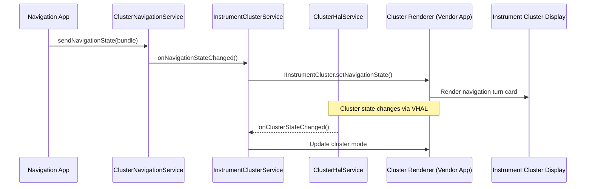

### 60.1.6 FixedActivityService

In automotive, certain displays must always show specific activities. The driver's instrument
cluster must always show the cluster UI; a rear-seat entertainment screen might always show a
media player. `FixedActivityService` guarantees that a designated activity is always in the
foreground on a given display, re-launching it if it crashes or is covered.

The service uses multiple monitoring mechanisms to detect when the fixed activity is no longer
visible and needs to be relaunched:

```java
// packages/services/Car/service/src/com/android/car/am/FixedActivityService.java

/**
 * Monitors top activity for a display and guarantee activity in fixed mode is
 * re-launched if it has crashed or gone to background for whatever reason.
 *
 * This component also monitors the update of the target package and re-launch
 * it once update is complete.
 */
public final class FixedActivityService implements CarServiceBase {

    private static final long RECHECK_INTERVAL_MS = 500;
    private static final int MAX_NUMBER_OF_CONSECUTIVE_CRASH_RETRY = 5;
    private static final long CRASH_FORGET_INTERVAL_MS = 2 * 60 * 1000; // 2 mins

    private static class RunningActivityInfo {
        @NonNull public final Intent intent;
        @NonNull public final Bundle activityOptions;
        @UserIdInt public final int userId;
        public boolean isVisible;
        public boolean isStarted;
        public long lastLaunchTimeMs;
        public int consecutiveRetries;
        public int taskId = INVALID_TASK_ID;
        public int previousTaskId = INVALID_TASK_ID;
        public boolean inBackground;
    }
}
```

The service maintains `RunningActivityInfo` records per display. Every 500ms it rechecks
whether the expected activity is on top. If the activity has crashed more than 5 times
consecutively, it backs off. After 2 minutes without a crash, the consecutive-retry counter
resets.

The monitoring infrastructure is comprehensive. `FixedActivityService` registers four
different event sources to detect when intervention is needed:

```java
// packages/services/Car/service/src/com/android/car/am/FixedActivityService.java

// 1. Process lifecycle monitoring
private final ProcessObserverCallback mProcessObserver = new ProcessObserverCallback() {
    @Override
    public void onForegroundActivitiesChanged(int pid, int uid,
            boolean foregroundActivities) {
        launchIfNecessary();
    }
    @Override
    public void onProcessDied(int pid, int uid) {
        launchIfNecessary();
    }
};

// 2. Package update monitoring
private final BroadcastReceiver mBroadcastReceiver = new BroadcastReceiver() {
    @Override
    public void onReceive(Context context, Intent intent) {
        String action = intent.getAction();
        if (Intent.ACTION_PACKAGE_CHANGED.equals(action)
                || Intent.ACTION_PACKAGE_REPLACED.equals(action)) {
            // Reset crash counter and relaunch
        }
    }
};

// 3. Display state monitoring
private final DisplayListener mDisplayListener = new DisplayListener() {
    @Override
    public void onDisplayChanged(int displayId) {
        launchForDisplay(displayId);
    }
};

// 4. Power state monitoring
private final CarPowerManager.CarPowerStateListener mCarPowerStateListener =
        (state) -> {
    if (state != CarPowerManager.STATE_ON) return;
    // Reset crash counters and relaunch on power on
    launchIfNecessary();
};
```

The `mRunningActivities` `SparseArray` maps display IDs to their `RunningActivityInfo`. The
default capacity is 1, optimized for the common case of a single instrument cluster:

```java
// key: displayId
@GuardedBy("mLock")
private final SparseArray<RunningActivityInfo> mRunningActivities =
        new SparseArray<>(/* capacity= */ 1); // default to one cluster only case
```

When `launchIfNecessary()` fires, it checks each monitored display, compares the current top
activity against the expected activity, and calls `startActivity()` if they differ. The
`activityOptions` Bundle in `RunningActivityInfo` contains the display ID targeting
information.

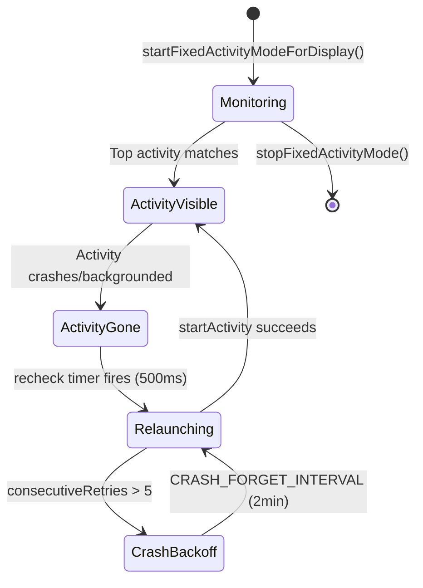

### 60.1.7 CarActivityService

`CarActivityService` manages activity placement across multiple displays, handles launch-on-
display routing, and provides the `CarSystemUIProxy` interface that lets Car SystemUI control
task organization:

```java
// packages/services/Car/service/src/com/android/car/am/CarActivityService.java

public class CarActivityService extends ICarActivityService.Stub
        implements CarServiceBase {
    // Manages per-display task placement, blocking activities for
    // distraction optimization, and SystemUI proxy registration
}
```

This service works closely with `CarPackageManagerService` to enforce which activities are
allowed on which displays based on driving state and UX restrictions.

The `CarActivityService` provides several critical capabilities:

1. **Display-specific activity launching**: When an app targets a specific occupant zone,
   the service routes the activity to the correct display using `ActivityOptions`:

```java
// Usage pattern for launching on a specific display:
ActivityOptions options = ActivityOptions.makeBasic();
options.setLaunchDisplayId(targetDisplayId);
context.startActivity(intent, options.toBundle());
```

2. **SystemUI proxy registration**: Car SystemUI registers itself as a proxy through
   `ICarSystemUIProxy`, allowing the service to control task presentation:

```java
// packages/services/Car/service/src/com/android/car/am/CarActivityService.java
// (field declarations showing the proxy mechanism)
// Uses ICarSystemUIProxy and ICarSystemUIProxyCallback
```

3. **Blocking activity management**: When a non-distraction-optimized activity attempts
   to display while driving, the service intercepts and replaces it with a blocking
   activity that shows a safety message. The display ID is passed via:

```java
// From the import:
// import static android.car.content.pm.CarPackageManager.BLOCKING_INTENT_EXTRA_DISPLAY_ID;
```

4. **Task mirroring and movement**: Tasks can be moved between displays (e.g., moving a
   passenger's navigation session to the driver's display).

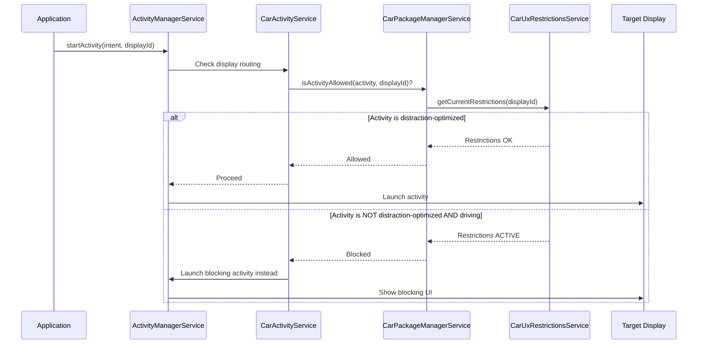

### 60.1.8 Car Power Management

Automotive power management differs fundamentally from mobile. A car's power state is driven
by the vehicle's ignition system, not a user pressing a power button. The
`CarPowerManagementService` manages transitions between power states:

```java
// packages/services/Car/service/src/com/android/car/power/CarPowerManagementService.java

public class CarPowerManagementService extends ICarPower.Stub implements
        CarServiceBase, PowerHalService.PowerEventListener {

    // Power state constants
    private static final int ACTION_ON_FINISH_SHUTDOWN = 0;
    private static final int ACTION_ON_FINISH_DEEP_SLEEP = 1;
    private static final int ACTION_ON_FINISH_HIBERNATION = 2;

    // Suspend retry with exponential backoff
    private static final long INITIAL_SUSPEND_RETRY_INTERVAL_MS = 10;
    private static final long MAX_RETRY_INTERVAL_MS = 100;

    // Garage mode constraints
    private static final int MIN_GARAGE_MODE_DURATION_MS = 15 * 60 * 1000; // 15 min
}
```

The automotive power state machine:

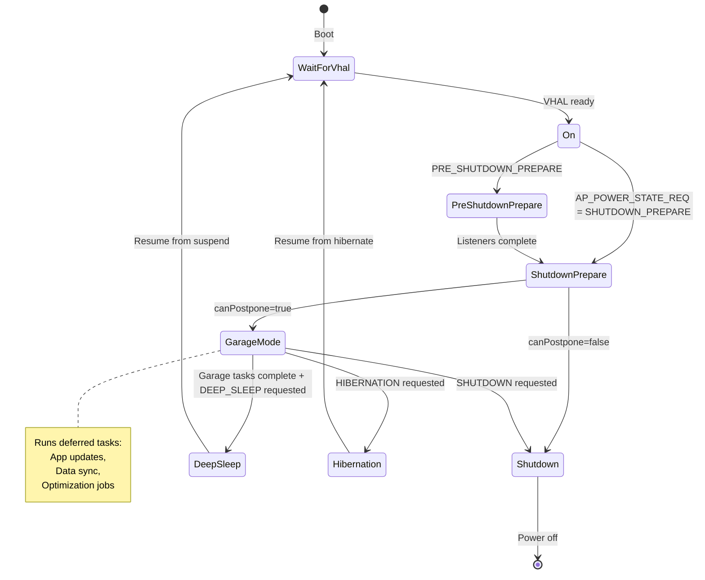

The power policy system controls which hardware components are powered on in each state.
For example, during deep sleep, displays and audio might be off, but the cellular modem
stays on for remote access:

```java
// packages/services/Car/service/src/com/android/car/power/CarPowerManagementService.java

private static final String WIFI_STATE_FILENAME = "wifi_state";
private static final String TETHERING_STATE_FILENAME = "tethering_state";
private static final String COMPONENT_STATE_MODIFIED = "forcibly_disabled";
private static final String COMPONENT_STATE_ORIGINAL = "original";
```

Power policy definitions interact with the native power policy daemon at:
`android.frameworks.automotive.powerpolicy.internal.ICarPowerPolicySystemNotification`

### 60.1.9 Garage Mode

Garage Mode is the period after the driver turns off the ignition but before the vehicle
fully shuts down. During this window, AAOS performs maintenance tasks:

```java
// packages/services/Car/service/src/com/android/car/garagemode/GarageModeService.java

/**
 * Main service container for car Garage Mode.
 * Garage Mode enables idle time in cars.
 */
public class GarageModeService implements CarServiceBase {
    private final GarageModeController mController;
    // ...
}
```

The `GarageModeController` is the brain of garage mode, implementing `ICarPowerStateListener`
to respond to power state transitions:

```java
// packages/services/Car/service/src/com/android/car/garagemode/GarageModeController.java

public class GarageModeController extends ICarPowerStateListener.Stub {
    private final GarageMode mGarageMode;
    private CarPowerManagementService mCarPowerService;

    public void init() {
        mCarPowerService = CarLocalServices.getService(
                CarPowerManagementService.class);
        mCarPowerService.registerInternalListener(GarageModeController.this);
        mGarageMode.init();
    }

    @Override
    public void onStateChanged(int state, long expirationTimeMs) {
        switch (state) {
            case CarPowerManager.STATE_SHUTDOWN_CANCELLED:
                resetGarageMode(null);
                break;
            case CarPowerManager.STATE_SHUTDOWN_ENTER:
            case CarPowerManager.STATE_SUSPEND_ENTER:
            case CarPowerManager.STATE_HIBERNATION_ENTER:
                resetGarageMode(() -> {
                    mCarPowerService.completeHandlingPowerStateChange(state,
                            GarageModeController.this);
                });
                break;
            case CarPowerManager.STATE_SHUTDOWN_PREPARE:
                initiateGarageMode(
                        () -> mCarPowerService.completeHandlingPowerStateChange(
                                state, GarageModeController.this));
                break;
            default:
                break;
        }
    }
}
```

The critical state transition is `STATE_SHUTDOWN_PREPARE`, which triggers
`initiateGarageMode()`. When garage mode completes (either all jobs finish or the timeout
expires), it calls `completeHandlingPowerStateChange()` to signal that the power service
can proceed with the actual shutdown or suspend.

The controller coordinates with `JobScheduler` to run deferred jobs that have
the `REQUIRE_DEVICE_IDLE` constraint. OEMs configure the maximum garage mode duration
through the system property `android.car.garagemodeduration`. The minimum enforced duration
is 15 minutes, ensuring enough time for critical updates.

Garage mode also handles edge cases:

- `STATE_SHUTDOWN_CANCELLED`: If the driver turns the ignition back on during shutdown
  preparation, garage mode is immediately cancelled.

- `STATE_SUSPEND_ENTER` / `STATE_HIBERNATION_ENTER`: Different paths for deep sleep vs.
  hibernate, both requiring garage mode cleanup before proceeding.

- The completion callback pattern ensures the power state machine does not proceed until
  garage mode has properly cleaned up.

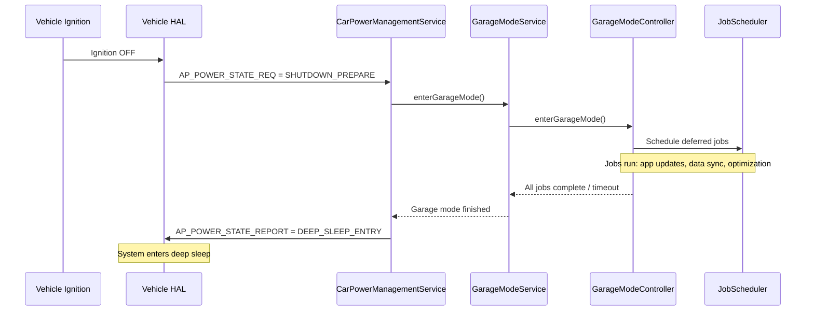

### 60.1.10 Car Audio Multi-Zone Architecture

Automotive audio is fundamentally more complex than phone audio. A car may have separate
speaker zones for driver, passenger, and rear seats, each playing different media. The
`CarAudioService` manages this through audio zone abstraction:

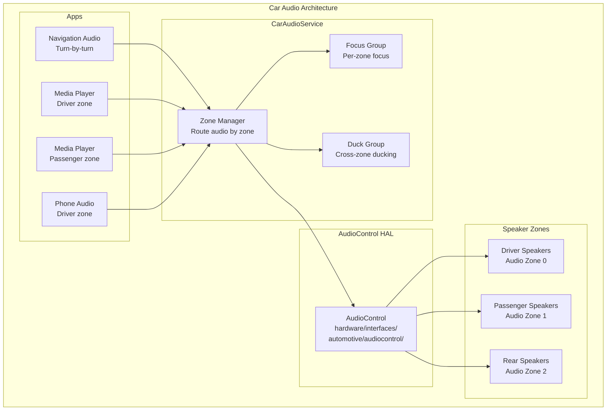

Audio zones are mapped to occupant zones, so each passenger gets independent volume
control and audio focus. Navigation audio in the driver zone can duck the driver's music
without affecting the passenger's audio.

### 60.1.11 Driver Distraction and UX Restrictions

AAOS enforces safety by restricting UI complexity while driving. The
`CarDrivingStateService` monitors vehicle speed and gear to determine whether the car is
parked, idling, or moving. The `CarUxRestrictionsManagerService` translates driving state into
concrete UX restrictions that apps must obey:

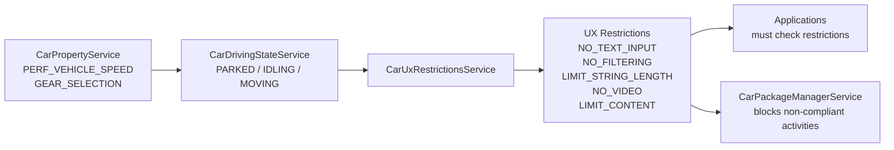

When the driving state is `MOVING`, activities that are not marked as distraction-optimized
are blocked and replaced with a blocking activity that informs the user.

### 60.1.12 Car-Specific SystemUI

AAOS replaces the phone's SystemUI with a car-specific variant located at:
`packages/apps/Car/SystemUI/`

This variant replaces the status bar with a car-specific system bar, adds HVAC controls, volume
controls tailored for multi-zone audio, and a user picker for multi-user vehicles.

```java
// packages/apps/Car/SystemUI/src/com/android/systemui/car/systembar/CarSystemBar.java

@SysUISingleton
public class CarSystemBar implements CoreStartable {
    private final CarSystemBarController mCarSystemBarController;

    @Inject
    public CarSystemBar(CarSystemBarController carSystemBarController) {
        mCarSystemBarController = carSystemBarController;
    }

    @Override
    public void start() {
        mCarSystemBarController.init();
    }
}
```

The Car SystemUI connects to CarService through `CarServiceProvider`:

```java
// packages/apps/Car/SystemUI/src/com/android/systemui/car/CarServiceProvider.java

@Singleton
public class CarServiceProvider {
    @Inject
    public CarServiceProvider(@CarSysUIDumpable Context context) {
        mCar = Car.createCar(mContext, null, Car.CAR_WAIT_TIMEOUT_DO_NOT_WAIT,
                (car, ready) -> {
                    synchronized (mCarLock) {
                        synchronized (mListeners) {
                            mIsCarReady = ready;
                            mCar = car;
                            if (ready) {
                                for (CarServiceOnConnectedListener listener : mListeners) {
                                    listener.onConnected(mCar);
                                }
                            }
                        }
                    }
                });
    }
}
```

Key Car SystemUI components:

| Component | Directory | Purpose |
|-----------|-----------|---------|
| System Bar | `car/systembar/` | Navigation bar replacement with car-specific buttons |
| HVAC Panel | `car/hvac/` | Climate control overlay |
| Volume UI | `car/volume/` | Multi-zone audio volume control |
| User Picker | `car/userpicker/` | Switch between vehicle occupant users |
| Keyguard | `car/keyguard/` | Car-specific lock screen |
| Notifications | `car/notification/` | Automotive notification handling |
| Status Icons | `car/statusicon/` | Vehicle status indicators |

The HVAC module demonstrates how Car SystemUI integrates with vehicle properties:

```
packages/apps/Car/SystemUI/src/com/android/systemui/car/hvac/
  HvacButtonController.java       -- Handles HVAC button interactions
  HvacPanelOverlayViewMediator.java -- Manages HVAC panel visibility
  HvacView.java                    -- Base HVAC view
  HvacPanelView.java               -- Full HVAC panel layout
  TemperatureControlView.java      -- Temperature adjustment widget
  referenceui/
    FanSpeedBar.java               -- Fan speed control
    FanDirectionButtons.java       -- Air direction buttons
```

### 60.1.13 Car Launcher

The automotive launcher is significantly different from the phone launcher. It provides a
home screen designed for large touchscreens with minimal distraction:

```
packages/apps/Car/Launcher/
  libs/
    appgrid/lib/src/com/android/car/carlauncher/
      AppLauncherUtils.java            -- App listing and filtering
      AppItem.java                     -- Data model for launcher items
      LauncherItemDiffCallback.java    -- Efficient list updates
      recyclerview/
        AppGridAdapter.java            -- Grid display adapter
        AppGridLayoutManager.java      -- Car-specific grid layout
  docklib/src/com/android/car/docklib/
    events/DockEventsReceiver.java     -- Dock state handling
    task/DockTaskStackChangeListener.java -- Task stack monitoring
```

The Car Launcher differs from phone Launcher3 in several fundamental ways:

1. **No home screen widgets**: The automotive home screen emphasizes quick app access
   and essential information (maps, media) rather than customizable widget grids.

2. **Dock-based navigation**: The dock at the bottom provides persistent access to
   navigation, phone, media, and app grid.

3. **Task stack awareness**: The `DockTaskStackChangeListener` monitors the task stack
   to keep the dock state synchronized with what is actually running.

4. **Package filtering**: `AppLauncherUtils` filters the app list to show only
   distraction-optimized applications when driving restrictions are active.

5. **Multi-display awareness**: The launcher must account for activities launching on
   different displays (driver vs passenger) and adjust its behavior accordingly.

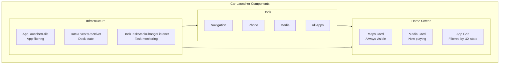

### 60.1.14 External View System (EVS)

The Exterior View System provides camera-based features like rearview, surround view, and
parking assistance. The EVS HAL is defined at:
`hardware/interfaces/automotive/evs/`

It supports both AIDL (current) and HIDL (legacy 1.1) interfaces. The `CarEvsService` in
CarService manages camera lifecycle, display routing, and integrates with the occupant zone
system to determine which display should show the camera feed.

### 60.1.15 Automotive HAL Directory Structure

The full set of automotive HAL interfaces:

```
hardware/interfaces/automotive/
  vehicle/       -- Vehicle property abstraction (AIDL + HIDL 2.0)
  evs/           -- Exterior View System cameras
  audiocontrol/  -- Multi-zone audio routing
  can/           -- CAN bus interface
  sv/            -- Surround View
  ivn_android_device/  -- In-Vehicle Networking
  occupant_awareness/  -- Occupant detection (presence, attention)
  remoteaccess/        -- Remote wake and task execution
```

### 60.1.16 Product Configuration

Automotive product builds are configured through makefiles in:
`packages/services/Car/car_product/build/`

```makefile
# packages/services/Car/car_product/build/car.mk

PRODUCT_PACKAGES += \
    Bluetooth \
    CarActivityResolver \
    CarDeveloperOptions \
    CarSettingsIntelligence \
    CarManagedProvisioning \
    StatementService \
    SystemUpdater

PRODUCT_PROPERTY_OVERRIDES += \
    ro.carrier=unknown \
    ro.hardware.type=automotive
```

The `ro.hardware.type=automotive` property is the fundamental flag that tells the framework
this is an automotive build. Feature flags, SEPolicy, and overlay configurations branch
on this property throughout the system.

Runtime Resource Overlays (RROs) customize the look and feel:

```
packages/services/Car/car_product/rro/
  CarSystemUIRRO/         -- SystemUI visual overrides
  DriveModeSportRRO/      -- Sport driving mode theme
  DriveModeEcoRRO/        -- Eco driving mode theme
  overlay-config/
    androidRRO/           -- Framework resource overrides
    SettingsProviderRRO/  -- Default settings values
    TelecommRRO/          -- Telecom UI adjustments
  oem-design-tokens/
    OEMDesignTokenRRO/    -- OEM visual design tokens
```

---

## 60.2 Android TV

Android TV transforms Android into a 10-foot UI experience. The framework additions focus on
three areas: a TV Input Framework (TIF) for managing broadcast and HDMI sources, HDMI-CEC
control for device coordination, and a specialized windowing system for D-pad navigation
and picture-in-picture.

### 60.2.1 TV Input Framework (TIF) Architecture

The TV Input Framework is the cornerstone of Android TV. It abstracts TV input sources --
built-in tuners, HDMI ports, IP streams, and third-party inputs -- into a uniform model.
The key system service is `TvInputManagerService`:

```java
// frameworks/base/services/core/java/com/android/server/tv/TvInputManagerService.java

public final class TvInputManagerService extends SystemService {
    private static final String TAG = "TvInputManagerService";
    private static final String DVB_DIRECTORY = "/dev/dvb";
    // ...
}
```

The TIF has three layers:

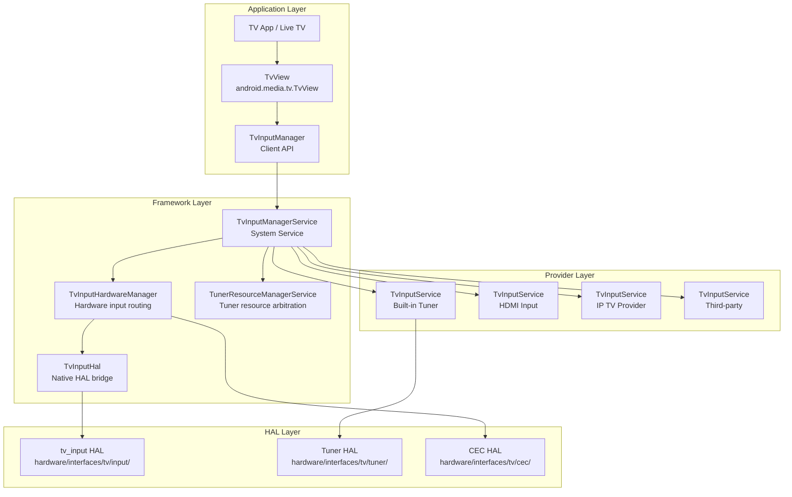

### 60.2.2 TvInputService

`TvInputService` is the abstract base class that all TV input providers must extend. It follows
a pattern similar to `InputMethodService` -- each provider runs as a bound service that creates
sessions on demand:

```java
// frameworks/base/media/java/android/media/tv/TvInputService.java

public abstract class TvInputService extends Service {
    public static final String SERVICE_INTERFACE = "android.media.tv.TvInputService";
    public static final String SERVICE_META_DATA = "android.media.tv.input";

    // Priority hint use case types for tuner resource management
    @IntDef(prefix = "PRIORITY_HINT_USE_CASE_TYPE_",
            value = {PRIORITY_HINT_USE_CASE_TYPE_BACKGROUND,
                     PRIORITY_HINT_USE_CASE_TYPE_SCAN,
                     PRIORITY_HINT_USE_CASE_TYPE_PLAYBACK,
                     PRIORITY_HINT_USE_CASE_TYPE_LIVE,
                     PRIORITY_HINT_USE_CASE_TYPE_RECORD})
    public @interface PriorityHintUseCaseType {}
}
```

Each `TvInputService` creates `Session` objects that handle individual tuning requests.
The session lifecycle:

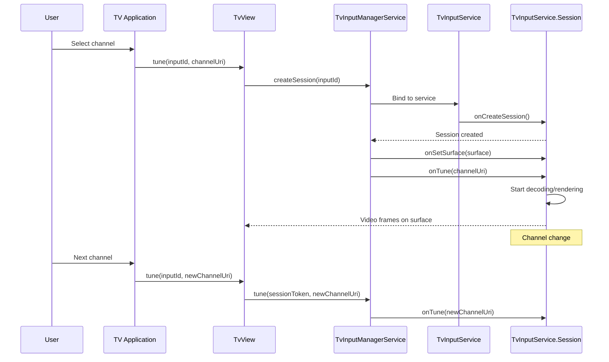

A `TvInputService` declares itself in the manifest with the `BIND_TV_INPUT` permission:

```xml
<service android:name=".MyTvInputService"
    android:permission="android.permission.BIND_TV_INPUT">
    <intent-filter>
        <action android:name="android.media.tv.TvInputService" />
    </intent-filter>
    <meta-data android:name="android.media.tv.input"
        android:resource="@xml/tv_input" />
</service>
```

### 60.2.3 TvInputManagerService Internals

Looking deeper at `TvInputManagerService`, the service manages per-user state and handles
DVB device discovery:

```java
// frameworks/base/services/core/java/com/android/server/tv/TvInputManagerService.java

public final class TvInputManagerService extends SystemService {
    private static final String DVB_DIRECTORY = "/dev/dvb";

    // DVB frontend device patterns:
    // Format 1: /dev/dvb%d.frontend%d
    // Format 2: /dev/dvb/adapter%d/frontend%d
    private static final Pattern sFrontEndDevicePattern =
            Pattern.compile("^dvb([0-9]+)\\.frontend([0-9]+)$");
    private static final Pattern sAdapterDirPattern =
            Pattern.compile("^adapter([0-9]+)$");
    private static final Pattern sFrontEndInAdapterDirPattern =
            Pattern.compile("^frontend([0-9]+)$");

    private final TvInputHardwareManager mTvInputHardwareManager;
    private final UserManager mUserManager;

    @GuardedBy("mLock")
    private int mCurrentUserId = UserHandle.USER_SYSTEM;
    @GuardedBy("mLock")
    private String mOnScreenInputId = null;
    @GuardedBy("mLock")
    private SessionState mOnScreenSessionState = null;

    // Per-user state management
    @GuardedBy("mLock")
    private final SparseArray<UserState> mUserStates = new SparseArray<>();
    @GuardedBy("mLock")
    private final Map<String, SessionState> mSessionIdToSessionStateMap =
            new HashMap<>();

    private HdmiControlManager mHdmiControlManager = null;
    private HdmiTvClient mHdmiTvClient = null;
    private MediaQualityManager mMediaQualityManager = null;
}
```

The service constructor initializes the HDMI-CEC integration:

```java
// frameworks/base/services/core/java/com/android/server/tv/TvInputManagerService.java

public TvInputManagerService(Context context) {
    super(context);
    mTvInputHardwareManager = new TvInputHardwareManager(context,
            new HardwareListener());
    mHdmiControlManager = mContext.getSystemService(HdmiControlManager.class);
    if (mHdmiControlManager != null) {
        mHdmiTvClient = mHdmiControlManager.getTvClient();
    }
    // ...
}

@Override
public void onStart() {
    publishBinderService(Context.TV_INPUT_SERVICE, new BinderService());
    // Register for CEC active source management:
    // Monitors SCREEN_ON/SCREEN_OFF to claim active source status
}
```

When the TV wakes up, the service sends a delayed message to claim CEC active source
status. This message is cancelled if the TV switches inputs or goes back to sleep, preventing
unnecessary CEC traffic.

### 60.2.4 TvInputHardwareManager

`TvInputHardwareManager` bridges the framework with physical TV input hardware. It manages
HDMI port connections, routes audio/video, and tracks hardware-backed TV inputs:

```java
// frameworks/base/services/core/java/com/android/server/tv/TvInputHardwareManager.java

class TvInputHardwareManager implements TvInputHal.Callback {
    private final TvInputHal mHal = new TvInputHal(this);

    @GuardedBy("mLock")
    private final SparseArray<Connection> mConnections = new SparseArray<>();
    @GuardedBy("mLock")
    private final List<TvInputHardwareInfo> mHardwareList = new ArrayList<>();
    @GuardedBy("mLock")
    private final List<HdmiDeviceInfo> mHdmiDeviceList = new ArrayList<>();
    /* A map from a device ID to the matching TV input ID. */
    @GuardedBy("mLock")
    private final SparseArray<String> mHardwareInputIdMap = new SparseArray<>();
    /* A map from a HDMI logical address to the matching TV input ID. */
    @GuardedBy("mLock")
    private final SparseArray<String> mHdmiInputIdMap = new SparseArray<>();
}
```

When an HDMI device is connected or disconnected, the hardware manager receives callbacks
from the HDMI-CEC service and updates the input list accordingly. This enables automatic
input source discovery -- when a user plugs in a Blu-ray player, it appears as a TV input
without manual configuration.

### 60.2.5 Tuner Resource Manager

The `TunerResourceManagerService` arbitrates access to limited hardware tuner resources
(frontends, demuxes, LNBs, CAS sessions) among competing clients:

```java
// frameworks/base/services/core/java/com/android/server/tv/
//   tunerresourcemanager/TunerResourceManagerService.java

public class TunerResourceManagerService extends SystemService
        implements IBinder.DeathRecipient {
    public static final int INVALID_CLIENT_ID = -1;
    private static final int MAX_CLIENT_PRIORITY = 1000;
}
```

The resource manager uses a priority system. Live TV viewing gets higher priority than
background recording. When a higher-priority client needs a tuner that is already in use,
the resource manager can reclaim it from the lower-priority client:

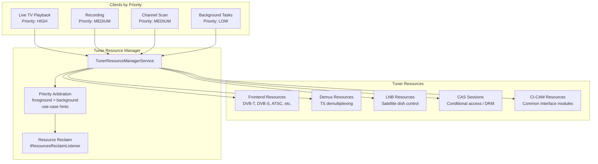

Resource types managed by the service:

```
frameworks/base/services/core/java/com/android/server/tv/tunerresourcemanager/
  FrontendResource.java    -- Tuner frontend (demodulator) resources
  DemuxResource.java       -- Demultiplexer resources
  LnbResource.java         -- Low-noise block (satellite) resources
  CasResource.java         -- Conditional Access System resources
  CiCamResource.java       -- Common Interface CAM resources
  ClientProfile.java       -- Client registration and priority
  UseCasePriorityHints.java -- Use-case to priority mapping
  TunerResourceBasic.java  -- Base resource class
```

### 60.2.6 HDMI-CEC

Consumer Electronics Control (CEC) allows HDMI-connected devices to control each other.
When you turn on a TV, CEC can automatically turn on the connected soundbar and switch
inputs. The CEC HAL is defined at:
`hardware/interfaces/tv/cec/1.0/IHdmiCec.hal`

```
interface IHdmiCec {
    addLogicalAddress(CecLogicalAddress addr) generates (Result result);
    clearLogicalAddress();
    getPhysicalAddress() generates (Result result, uint16_t addr);
    sendMessage(CecMessage message) generates (SendMessageResult result);
    setCallback(IHdmiCecCallback callback);
    getCecVersion() generates (int32_t version);
    getVendorId() generates (uint32_t vendorId);
    getPortInfo() generates (vec<HdmiPortInfo> infos);
    setOption(OptionKey key, bool value);
    setLanguage(string language);
    enableAudioReturnChannel(int32_t portId, bool enable);
    isConnected(int32_t portId) generates (bool status);
};
```

The Java-side CEC implementation lives in the HDMI control service:

```
frameworks/base/services/core/java/com/android/server/hdmi/
  HdmiCecLocalDeviceTv.java      -- TV-type CEC device implementation
  HdmiCecLocalDevice.java        -- Base CEC device
  HdmiCecMessage.java            -- CEC message representation
  HdmiCecMessageBuilder.java     -- Message construction helpers
  HdmiControlService.java        -- Main HDMI control service
  HdmiCecStandbyModeHandler.java -- Standby mode CEC handling
  ActiveSourceHandler.java       -- Active source switching
  DeviceSelectActionFromTv.java  -- Device selection flow
  RoutingControlAction.java      -- Input routing
  ArcInitiationActionFromAvr.java -- Audio Return Channel setup
  NewDeviceAction.java           -- New device discovery
```

The `HdmiCecLocalDeviceTv` represents the TV endpoint in CEC communication:

```java
// frameworks/base/services/core/java/com/android/server/hdmi/HdmiCecLocalDeviceTv.java

public class HdmiCecLocalDeviceTv extends HdmiCecLocalDevice {
    // Whether ARC is available. "true" means ARC is established between
    // TV and AVR as audio receiver.
    @ServiceThreadOnly
    private boolean mArcEstablished = false;

    // Stores whether ARC feature is enabled per port.
    private final SparseBooleanArray mArcFeatureEnabled = new SparseBooleanArray();
}
```

CEC message flow for "one-touch play" (user presses Play on a Blu-ray remote):

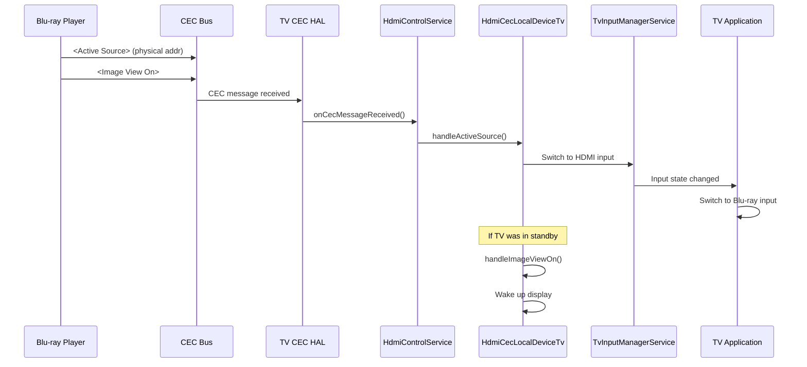

### 60.2.7 TV HAL Interfaces

The complete TV HAL surface:

```
hardware/interfaces/tv/
  input/          -- TV input hardware abstraction
  cec/
    1.0/          -- CEC HAL v1.0 (HIDL)
      IHdmiCec.hal
      IHdmiCecCallback.hal
      types.hal
    1.1/          -- CEC HAL v1.1 (HIDL, adds CEC 2.0)
      IHdmiCec.hal
      IHdmiCecCallback.hal
      types.hal
  hdmi/           -- HDMI connection management
  tuner/          -- Digital TV tuner HAL (AIDL)
    aidl/         -- Frontends, demuxes, filters, DVRs
  mediaquality/   -- Media quality processing HAL
```

The Tuner HAL (AIDL-based) provides a comprehensive digital TV stack:

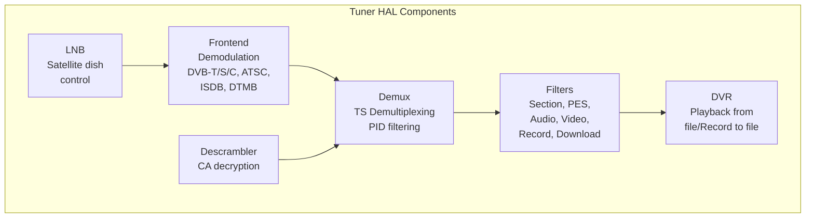

### 60.2.8 TV Picture-in-Picture (PIP)

Android TV has its own PIP implementation tailored for the big-screen experience. Unlike
the phone PIP (which shows a small floating window), TV PIP places the secondary content
in a fixed position appropriate for the lean-back experience:

```java
// frameworks/base/libs/WindowManager/Shell/src/com/android/wm/shell/pip/tv/TvPipController.java

public class TvPipController implements PipTransitionController.PipTransitionCallback,
        TvPipBoundsController.PipBoundsListener, TvPipMenuController.Delegate,
        DisplayController.OnDisplaysChangedListener, ConfigurationChangeListener,
        UserChangeListener {
    private static final String TAG = "TvPipController";
}
```

The TV PIP implementation consists of:

```
frameworks/base/libs/WindowManager/Shell/src/com/android/wm/shell/pip/tv/
  TvPipController.java            -- Main PIP controller for TV
  TvPipBoundsState.java           -- PIP window position/size state
  TvPipBoundsAlgorithm.java       -- Position calculation for TV layout
  TvPipBoundsController.java      -- Coordinates bounds changes
  TvPipMenuController.java        -- PIP overlay menu (play/close/etc.)
  TvPipMenuView.java              -- Menu visual layout
  TvPipNotificationController.java -- Notification when PIP is active
  TvPipTransition.java            -- Animations for PIP enter/exit
  TvPipAction.java                -- PIP action definitions
  TvPipCustomAction.java          -- App-provided custom actions
  TvPipActionsProvider.java       -- Action list management
  TvPipSystemAction.java          -- System-level PIP actions
  TvPipBackgroundView.java        -- Dimmed background behind PIP
  TvPipInterpolators.java         -- Animation curves
  TvPipMenuEduTextDrawer.java     -- Educational tooltip rendering
```

The `TvPipController` maintains a clear state machine for PIP lifecycle:

```java
// frameworks/base/libs/WindowManager/Shell/src/com/android/wm/shell/pip/tv/TvPipController.java

@Retention(RetentionPolicy.SOURCE)
@IntDef(prefix = {"STATE_"}, value = {
        STATE_NO_PIP,
        STATE_PIP,
        STATE_PIP_MENU,
})
public @interface State {}

private static final int STATE_NO_PIP = 0;   // No PIP window
private static final int STATE_PIP = 1;       // PIP at normal position
private static final int STATE_PIP_MENU = 2;  // PIP menu open, window centered

static final String ACTION_SHOW_PIP_MENU =
        "com.android.wm.shell.pip.tv.notification.action.SHOW_PIP_MENU";
static final String ACTION_CLOSE_PIP =
        "com.android.wm.shell.pip.tv.notification.action.CLOSE_PIP";
static final String ACTION_MOVE_PIP =
        "com.android.wm.shell.pip.tv.notification.action.MOVE_PIP";
static final String ACTION_TOGGLE_EXPANDED_PIP =
        "com.android.wm.shell.pip.tv.notification.action.TOGGLE_EXPANDED_PIP";
static final String ACTION_TO_FULLSCREEN =
        "com.android.wm.shell.pip.tv.notification.action.FULLSCREEN";
```

The TV PIP state machine:

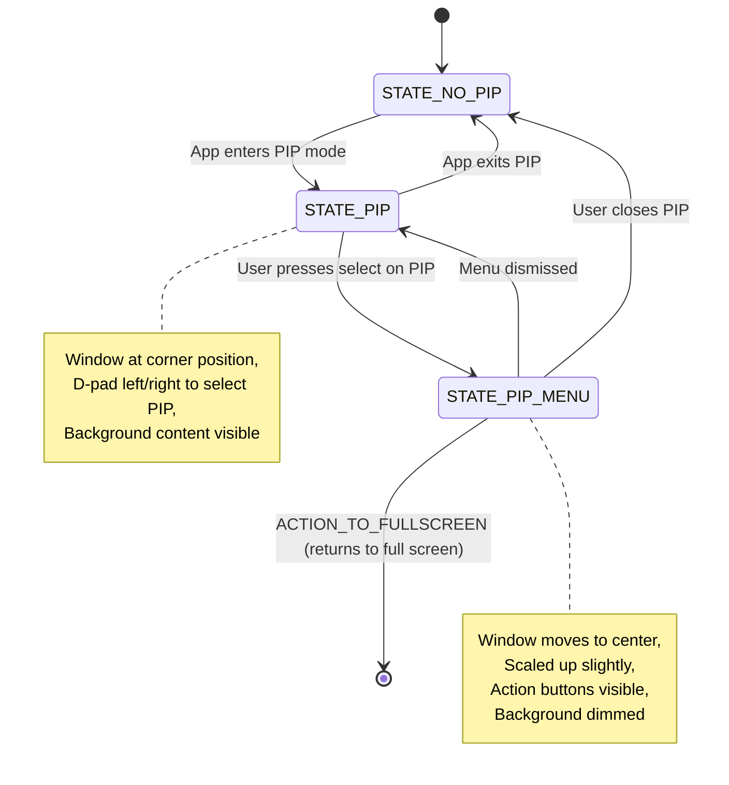

The controller collaborates with an extensive set of components. The constructor takes
over 20 dependencies, demonstrating the complexity of TV PIP management:

```java
// frameworks/base/libs/WindowManager/Shell/src/com/android/wm/shell/pip/tv/TvPipController.java

private TvPipController(
        Context context,
        ShellInit shellInit,
        ShellController shellController,
        TvPipBoundsState tvPipBoundsState,
        PipDisplayLayoutState pipDisplayLayoutState,
        TvPipBoundsAlgorithm tvPipBoundsAlgorithm,
        TvPipBoundsController tvPipBoundsController,
        PipTransitionState pipTransitionState,
        PipAppOpsListener pipAppOpsListener,
        PipTaskOrganizer pipTaskOrganizer,
        PipTransitionController pipTransitionController,
        TvPipMenuController tvPipMenuController,
        PipMediaController pipMediaController,
        TvPipNotificationController pipNotificationController,
        TaskStackListenerImpl taskStackListener,
        PipParamsChangedForwarder pipParamsChangedForwarder,
        DisplayController displayController,
        WindowManagerShellWrapper wmShellWrapper,
        Handler mainHandler,
        ShellExecutor mainExecutor) {
    // ... initialization of all components
}
```

TV PIP key differences from phone PIP:

- Position is typically a fixed corner, not user-draggable
- Menu is accessed via D-pad, not touch gestures
- Background content dims to avoid visual competition
- Actions include media controls (play/pause) prominent in the menu
- Broadcast-based actions (`ACTION_SHOW_PIP_MENU`, `ACTION_CLOSE_PIP`) allow
  the notification system to control PIP remotely

The `TvPipModule` provides Dagger dependency injection:

```java
// frameworks/base/libs/WindowManager/Shell/src/com/android/wm/shell/dagger/pip/TvPipModule.java

@Module(includes = {
        WMShellBaseModule.class,
        Pip1SharedModule.class})
public abstract class TvPipModule {
    @WMSingleton
    @Provides
    static Optional<Pip> providePip(
            Context context,
            ShellInit shellInit,
            ShellController shellController,
            TvPipBoundsState tvPipBoundsState,
            // ... many dependencies
    ) { /* ... */ }
}
```

### 60.2.9 D-pad Navigation

Android TV uses D-pad (directional pad) navigation instead of touch. This fundamentally changes
how focus management works in the framework. The key infrastructure:

1. **Focus search algorithm**: `View.focusSearch()` uses `FocusFinder` to determine which view
   should receive focus when the user presses Up/Down/Left/Right.

2. **Touch mode**: TV devices are always in "non-touch" mode. Views must handle focus state
   drawing (focused rings, highlights) explicitly.

3. **BrowseFragment / Leanback library**: The `androidx.leanback` library provides pre-built
   UI components optimized for D-pad navigation: `BrowseFragment`, `DetailsFragment`,
   `SearchFragment`, `PlaybackFragment`.

4. **Sound feedback**: D-pad presses trigger audible click sounds for spatial feedback.

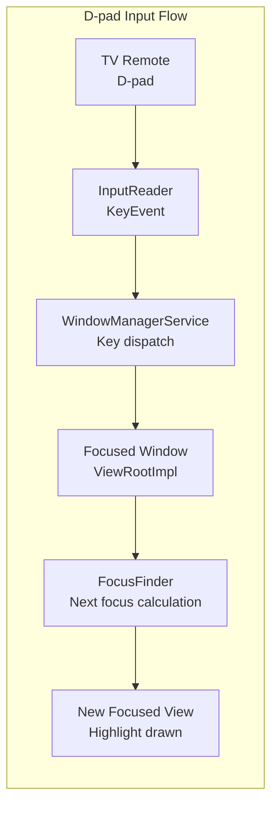

### 60.2.10 TvSettings

Android TV uses a specialized settings application rather than the standard phone Settings app.
The TV Settings app (`packages/apps/TvSettings/` -- typically vendor-specific) provides a
sidebar navigation pattern appropriate for D-pad control, with large text and high-contrast
visual design.

TV-specific settings include:

- **Input management**: HDMI input naming and ordering
- **Display and Sound**: Resolution, HDR, Audio output (HDMI ARC, Bluetooth, etc.)
- **CEC controls**: Enable/disable HDMI-CEC, one-touch play, system audio
- **Screen saver (Daydream)**: Ambient mode displays (photos, clock, etc.)
- **Accessibility**: Large text, high contrast, TalkBack navigation

### 60.2.11 TV Interactive App Framework

The TV Interactive App framework extends TIF to support hybrid broadcast/broadband (HBB-TV),
interactive advertisements, and two-screen experiences:

```
frameworks/base/services/core/java/com/android/server/tv/interactive/
  TvInteractiveAppManagerService.java
```

This service manages `TvInteractiveAppService` instances that can overlay interactive content
on top of TV video streams, responding to both broadcast signals and internet data.

### 60.2.12 Media Quality HAL

The Media Quality HAL (`hardware/interfaces/tv/mediaquality/`) enables TV-specific video
processing features:

- Picture mode presets (Standard, Cinema, Vivid, Game)
- Dynamic backlight control
- Content-adaptive processing
- Ambient light backlight adjustment

```java
// frameworks/base/media/java/android/media/quality/AmbientBacklightSettings.java
// -- TV ambient backlight configuration
// frameworks/base/media/java/android/media/quality/AmbientBacklightEvent.java
// -- Ambient backlight event notifications
```

---

## 60.3 Wear OS

Wear OS adapts Android for wrist-worn devices with tiny circular displays, extreme battery
constraints, and a UI paradigm centered on glanceable information. While much of Wear OS's
proprietary implementation lives outside AOSP (in Google Play Services for Wear), the
framework-level adaptations are visible in the base platform.

### 60.3.1 Round Display Support

The most visible Wear adaptation is support for circular displays. The framework provides
several mechanisms:

**Window Insets for Round Screens**

The `WindowInsets` system reports whether the display is round via
`WindowInsets.isRound()`. Apps use this to adjust padding so content is not clipped
by the curved edges:

```mermaid
graph TB
    subgraph "Round Display Handling"
        Display["Round Display<br/>diameter: 390px"]
        Insets["WindowInsets<br/>isRound()=true"]
        WIC["WatchViewStub /<br/>BoxInsetLayout"]
        SafeArea["Safe Content Area<br/>Inscribed square"]
    end

    Display --> Insets
    Insets --> WIC
    WIC --> SafeArea
```

The `BoxInsetLayout` (from the Wear support library) automatically applies insets to child
views, ensuring content stays within the inscribed rectangle of a circular display. Without
this, content at the edges would be clipped or unreadable.

**Configuration Reporting**

The framework reports `Configuration.UI_MODE_TYPE_WATCH` for Wear devices. This allows
apps and the system to branch behavior:

```java
int uiMode = context.getResources().getConfiguration().uiMode;
boolean isWatch = (uiMode & Configuration.UI_MODE_TYPE_MASK)
        == Configuration.UI_MODE_TYPE_WATCH;
```

Resource qualifiers (`-watch`, `-round`, `-notround`) enable dimension, layout, and drawable
overrides per display shape.

### 60.3.2 Ambient Mode and Always-On Display

Wear devices support an ambient mode where the watch face continues to be visible but in a
low-power state. This involves:

1. **Reduced refresh rate**: The display drops to 1 Hz or lower update rate.
2. **Limited color palette**: The screen switches to a grayscale or limited-color mode to
   reduce OLED pixel power consumption.

3. **Simplified rendering**: Watch faces switch from full-color interactive mode to a
   simplified ambient rendering.

The `AmbientModeSupport` class (from the Wear support library) provides the lifecycle
callbacks:

```mermaid
stateDiagram-v2
    [*] --> Interactive: Wrist raise / tap
    Interactive --> Ambient: Timeout / wrist down
    Ambient --> Interactive: Wrist raise / tap
    Ambient --> Off: Extended inactivity
    Off --> Interactive: Button press / wrist raise

    note right of Interactive
        Full color rendering,
        Full frame rate,
        Touch input active,
        Sensor sampling active
    end note

    note right of Ambient
        Simplified rendering,
        1 Hz refresh,
        Grayscale / low color,
        No touch input,
        Reduced sensor sampling
    end note
```

### 60.3.3 Burn-in Protection

OLED displays on watches are susceptible to burn-in if static pixels remain illuminated
continuously. The framework implements burn-in protection through:

1. **Pixel shifting**: In ambient mode, the entire display content shifts by a few pixels
   periodically (every minute or so). This is handled at the WindowManager level.

2. **Outline-only rendering**: Watch faces in ambient mode use outlined digits rather than
   filled shapes, reducing the number of lit pixels.

3. **Low-bit ambient**: Some displays support a true low-bit mode where each pixel is either
   fully on or fully off (no anti-aliasing), further reducing burn-in risk.

The watch face framework exposes burn-in protection information via `WatchFaceService`:

```mermaid
graph LR
    subgraph "Burn-in Protection Strategies"
        PS["Pixel Shift<br/>Content moves<br/>periodically"]
        OL["Outline Rendering<br/>No solid fills<br/>in ambient"]
        LB["Low-bit Mode<br/>1-bit per pixel<br/>no anti-aliasing"]
        TC["Time Limiting<br/>Screen off after<br/>extended ambient"]
    end

    subgraph "Implementation Points"
        WM["WindowManager<br/>Applies pixel offset"]
        WFS["WatchFaceService<br/>Ambient drawing mode"]
        DP["Display Policy<br/>Screen timeout"]
    end

    PS --> WM
    OL --> WFS
    LB --> WFS
    TC --> DP
```

### 60.3.4 Watch Face Framework

Watch faces are the most distinctive Wear UI element. The framework defines a
`WatchFaceService` that extends `WallpaperService` to provide always-visible, continuously
updating face rendering:

The watch face lifecycle:

```mermaid
sequenceDiagram
    participant WFS as WatchFaceService
    participant Engine as Engine (WallpaperService.Engine)
    participant Canvas as Canvas / GL Surface
    participant WM as WindowManager
    participant AMS as AmbientModeSupport

    Note over WFS: Service starts
    WFS->>Engine: onCreateEngine()
    Engine->>Canvas: onSurfaceCreated()
    Engine->>Engine: onDraw() [interactive mode]

    Note over AMS: User lowers wrist
    AMS->>Engine: onEnterAmbient(burnInProtection)
    Engine->>Canvas: Draw simplified face
    Engine->>Engine: Reduce update frequency to 1/min

    Note over AMS: User raises wrist
    AMS->>Engine: onExitAmbient()
    Engine->>Canvas: Draw full interactive face
    Engine->>Engine: Resume normal update frequency

    Note over WM: Burn-in protection active
    WM->>WM: Apply pixel shift offset
```

Watch face complications (small data displays showing weather, steps, battery, etc.) are
provided through the Complication API:

```mermaid
graph TB
    subgraph "Watch Face Complications"
        WF["Watch Face<br/>WatchFaceService"]
        CP1["Complication Provider 1<br/>Weather"]
        CP2["Complication Provider 2<br/>Step Count"]
        CP3["Complication Provider 3<br/>Battery"]
        CP4["Complication Provider 4<br/>Next Calendar Event"]
    end

    subgraph "Complication Types"
        SHORT["SHORT_TEXT<br/>72F"]
        LONG["LONG_TEXT<br/>Meeting at 2:00 PM"]
        ICON["ICON<br/>Small icon"]
        RANGE["RANGED_VALUE<br/>Progress arc"]
        IMG["SMALL_IMAGE<br/>Photo or icon"]
    end

    WF --> CP1
    WF --> CP2
    WF --> CP3
    WF --> CP4

    CP1 --> SHORT
    CP2 --> SHORT
    CP3 --> RANGE
    CP4 --> LONG
```

### 60.3.5 Tiles API

Wear OS Tiles provide glanceable information surfaces that users swipe between from the
watch face. Unlike full activities, Tiles are declaratively defined using a layout DSL and
updated by a `TileService`:

```mermaid
graph LR
    subgraph "Tiles Architecture"
        TS["TileService<br/>Provider app"]
        TR["TileRenderer<br/>Layout rendering"]
        TH["Tile Host<br/>System UI"]
    end

    subgraph "Tile Lifecycle"
        REQ["onTileRequest()"]
        RES["onResourcesRequest()"]
        UPD["Update interval<br/>or user swipe"]
    end

    TH --> REQ
    REQ --> TS
    TS --> RES
    RES --> TR
    TR --> TH
    UPD --> REQ
```

Tiles are built using a protobuf-based layout schema:

- **LayoutElement**: Row, Column, Box, Spacer, Image, Text, Arc
- **TimelineEntry**: Tiles can define time-based layouts that automatically switch
- **Clickable**: Elements can trigger actions (launch activity, send message)

### 60.3.6 Reduced Windowing

Wear OS significantly simplifies the windowing system compared to phone:

1. **Single-task model**: Only one activity is visible at a time. There is no split-screen,
   freeform, or PIP support.

2. **No navigation bar**: The system back gesture is handled by the physical button or a
   swipe gesture, not an on-screen button.

3. **Simplified recent apps**: The recent apps list is either absent or a simple vertical
   scroll, not the full phone-style overview.

4. **Reduced display areas**: No status bar in the traditional sense. Notifications appear
   as cards swiped in from the bottom.

```mermaid
graph TB
    subgraph "Phone Windowing"
        PStatusBar[Status Bar]
        PContent[App Content Area]
        PNavBar[Navigation Bar]
        PSplit[Split Screen Support]
        PPip[PIP Support]
        PFreeform[Freeform Windows]
    end

    subgraph "Wear Windowing"
        WFace["Watch Face<br/>always behind"]
        WContent["Single App<br/>full screen"]
        WNotif["Notification Cards<br/>swipe up"]
        WTiles["Tiles<br/>swipe left/right"]
    end

    subgraph "Simplifications"
        NoSplit[No split screen]
        NoPip[No PIP]
        NoFreeform[No freeform]
        NoNavBar[No navigation bar]
    end
```

### 60.3.7 Battery Optimization for Wearables

Wear OS employs aggressive battery optimization beyond standard Android:

1. **Doze on wrist-down**: When the accelerometer detects the wrist is lowered, the device
   enters a doze-like state much faster than a phone would.

2. **Network efficiency**: Wearable devices preferentially route network requests through a
   connected phone (Bluetooth proxy) rather than using their own Wi-Fi or cellular radio,
   saving significant power.

3. **Sensor batching**: Sensors batch readings and deliver them in bursts rather than
   continuously, allowing the processor to sleep between batches.

4. **Reduced background activity**: `JobScheduler` constraints are tighter on Wear. Fewer
   concurrent background services are allowed.

5. **Bedtime mode**: A special mode that disables always-on display, notifications, and
   tilt-to-wake during sleep hours.

```mermaid
graph TB
    subgraph "Wear Battery Optimization Stack"
        subgraph "Hardware Level"
            OLED["OLED Display<br/>Per-pixel power control"]
            ULP["Ultra-Low-Power<br/>Co-processor"]
            BLE["Bluetooth LE<br/>Low-energy comms"]
        end

        subgraph "Framework Level"
            AOD["Always-On Display<br/>1Hz update, grayscale"]
            BIP["Burn-in Protection<br/>Pixel shifting"]
            DOZE["Aggressive Doze<br/>Wrist-down trigger"]
            BATCH["Sensor Batching<br/>Periodic bulk delivery"]
            PROXY["BT Network Proxy<br/>Route through phone"]
        end

        subgraph "App Level"
            COMP["Complications<br/>Push updates, not poll"]
            TILES["Tiles<br/>Declarative, no Activity"]
            AMBI["Ambient Mode<br/>Simplified rendering"]
        end
    end

    OLED --> AOD
    ULP --> DOZE
    BLE --> PROXY
    AOD --> AMBI
    DOZE --> BATCH
```

### 60.3.8 Wear-Specific Resource Qualifiers and Configuration

Wear devices use a comprehensive set of resource qualifiers for adapting layouts:

| Qualifier | Values | Purpose |
|-----------|--------|---------|
| `-watch` | N/A | Applied to watch devices |
| `-round` | N/A | Round display shape |
| `-notround` | N/A | Square or rectangular display |
| `UI_MODE_TYPE_WATCH` | 6 | Configuration UI mode |
| `smallestScreenWidthDp` | ~180-220dp | Typical watch screen sizes |

The framework reports several watch-specific configuration values:

```java
// Configuration checks in framework code:
boolean isWatch = (config.uiMode & Configuration.UI_MODE_TYPE_MASK)
        == Configuration.UI_MODE_TYPE_WATCH;

// Screen shape check:
boolean isRound = config.isScreenRound();

// Typical watch display metrics:
// 390x390 pixels at ~300+ dpi for round
// 320x320 pixels at ~280 dpi for smaller models
```

Layout adaptations for round displays follow a specific pattern:

```mermaid
graph TB
    subgraph "Round Display Layout Strategy"
        subgraph "Full Circle"
            FC["Total display area<br/>pi * r^2"]
        end
        subgraph "Safe Rectangle"
            SR["Inscribed square<br/>side = diameter / sqrt(2)<br/>~70.7% of diameter"]
        end
        subgraph "Content Zones"
            CZ1["Center: primary content<br/>Full readable area"]
            CZ2["Edges: decorative only<br/>Arc progress, bezels"]
        end
    end

    FC --> SR
    SR --> CZ1
    FC --> CZ2
```

Apps targeting Wear must account for the ~30% of screen area near the edges of a round
display being partially clipped. The `BoxInsetLayout` and curved text APIs help manage
this constraint automatically.

### 60.3.9 Wearable Sensing Framework

AOSP includes a framework for wearable-specific sensing capabilities:

```
frameworks/base/services/core/java/com/android/server/wearable/
  WearableSensingManagerService.java      -- System service
  WearableSensingManagerPerUserService.java -- Per-user management
  RemoteWearableSensingService.java       -- Remote service connection
  WearableSensingSecureChannel.java       -- Secure data channel
  WearableSensingShellCommand.java        -- Debug shell commands
```

```java
// frameworks/base/core/java/android/app/wearable/WearableSensingManager.java
// -- Client API for wearable sensing

// frameworks/base/core/java/android/service/wearable/WearableSensingService.java
// -- Service that processes wearable sensor data
```

The wearable sensing framework provides a secure channel for processing sensitive health
and activity data from wearable sensors. It supports:

- Accelerometer and gyroscope data for activity recognition
- Heart rate and SpO2 monitoring
- Fall detection algorithms
- Context-aware ambient computing

```mermaid
graph TB
    subgraph "Wearable Sensing Architecture"
        Sensors["Wearable Sensors<br/>Accel, Gyro, HR, SpO2"]
        WSS["WearableSensingService<br/>On-device processing"]
        SC["Secure Channel<br/>WearableSensingSecureChannel"]
        WSMS["WearableSensingManagerService<br/>System service"]
        WSM["WearableSensingManager<br/>Client API"]
        App[Health/Fitness App]
    end

    Sensors --> WSS
    WSS --> SC
    SC --> WSMS
    WSMS --> WSM
    WSM --> App
```

---

## 60.4 Form Factor Customization Points

The key architectural insight across all three form factors is that AOSP does not use
compile-time `#ifdef` branching. Instead, customization is achieved through runtime
overlays, Dagger module substitution, product configuration, and abstraction layers. This
section catalogs the specific customization points.

### 60.4.1 SystemUI Variants

SystemUI is the most visibly customized component. AOSP provides three variants:

```
frameworks/base/packages/SystemUI/       -- Phone/tablet SystemUI (default)
packages/apps/Car/SystemUI/              -- Automotive SystemUI
(vendor-specific)/TvSystemUI/            -- TV SystemUI (vendor-provided)
```

The phone SystemUI is the default and most feature-rich. Car SystemUI replaces it entirely
with automotive-specific UI components. TV SystemUI is typically much simpler, focusing on
a minimal notification system and settings access.

The selection is made at build time through product configuration:

```makefile
# For automotive builds:
PRODUCT_PACKAGES += CarSystemUI
# Instead of the default:
# PRODUCT_PACKAGES += SystemUI
```

### 60.4.2 WMShell Module Variants

The Window Manager Shell provides Dagger module variants for different form factors. The
base module is shared, with form-factor-specific modules layered on top:

```
frameworks/base/libs/WindowManager/Shell/src/com/android/wm/shell/dagger/
  WMShellBaseModule.java       -- Shared dependencies (all form factors)
  WMShellModule.java           -- Phone/tablet specific
  TvWMShellModule.java         -- TV specific
  WMShellConcurrencyModule.java -- Thread pool configuration
```

The `TvWMShellModule` substitutes TV-specific implementations:

```java
// frameworks/base/libs/WindowManager/Shell/src/com/android/wm/shell/dagger/
//   TvWMShellModule.java

@Module(includes = {TvPipModule.class})
public class TvWMShellModule {

    @WMSingleton
    @Provides
    @DynamicOverride
    static StartingWindowTypeAlgorithm provideStartingWindowTypeAlgorithm() {
        return new TvStartingWindowTypeAlgorithm();
    }

    @WMSingleton
    @Provides
    @DynamicOverride
    static SplitScreenController provideSplitScreenController(/* ... */) {
        return new TvSplitScreenController(/* ... */);
    }
}
```

Key substitutions made by `TvWMShellModule`:

| Component | Phone | TV |
|-----------|-------|----|
| StartingWindowTypeAlgorithm | Default | TvStartingWindowTypeAlgorithm |
| SplitScreenController | SplitScreenController | TvSplitScreenController |
| PIP | Pip1Module / Pip2Module | TvPipModule |
| PIP Controller | PipController | TvPipController |
| PIP Bounds | PipBoundsAlgorithm | TvPipBoundsAlgorithm |

```mermaid
graph TB
    subgraph "WMShell Module Architecture"
        BASE["WMShellBaseModule<br/>Shared infrastructure"]

        subgraph "Form Factor Modules"
            PHONE["WMShellModule<br/>Phone/Tablet"]
            TV["TvWMShellModule<br/>TV"]
            AUTO["Car uses separate<br/>SystemUI entirely"]
        end

        subgraph "PIP Modules"
            PIP1["Pip1Module<br/>Phone PIP v1"]
            PIP2["Pip2Module<br/>Phone PIP v2"]
            TVPIP["TvPipModule<br/>TV PIP"]
        end
    end

    BASE --> PHONE
    BASE --> TV
    PHONE --> PIP1
    PHONE --> PIP2
    TV --> TVPIP
```

### 60.4.3 Device Overlays (Runtime Resource Overlays)

Runtime Resource Overlays (RROs) are the primary mechanism for visual and behavioral
customization without source code changes. Each form factor uses RROs extensively:

**Automotive RROs:**
```
packages/services/Car/car_product/rro/
  CarSystemUIRRO/             -- SystemUI visual overrides
  DriveModeSportRRO/          -- Sport mode visuals
  DriveModeEcoRRO/            -- Eco mode visuals
  overlay-config/
    androidRRO/               -- Framework defaults
    SettingsProviderRRO/      -- Settings provider defaults
    CertInstallerRRO/         -- Certificate installer
    TelecommRRO/              -- Telecom UI
  oem-design-tokens/
    OEMDesignTokenRRO/        -- OEM design system tokens
    OEMDesignTokenFrameworkResRRO/  -- Framework token overlays
    OEMDesignTokenCarUiPluginRRO/   -- Car UI plugin tokens
```

**Distant Display RROs** (for secondary screens):
```
packages/services/Car/car_product/distant_display/rro/
  distant_display_rro.mk
  MediashellRRO/
  CarServiceRRO/
  DriverUiRRO/
```

RROs work by overlaying resource values at runtime without modifying the target APK. An
overlay package declares which target package and resources it overrides:

```xml
<!-- Example: CarSystemUIRRO/AndroidManifest.xml -->
<manifest>
    <overlay android:targetPackage="com.android.systemui"
             android:isStatic="true"
             android:priority="10" />
</manifest>
```

The overlay can then replace any resource -- colors, dimensions, layouts, strings, booleans --
in the target package. This is how OEMs customize the look and feel of the car UI without
forking SystemUI source code.

### 60.4.4 Product Configuration

Product configuration is where form-factor selection begins. The build system reads makefile
variables to determine which packages, overlays, and properties to include.

**Automotive product configuration:**

```makefile
# packages/services/Car/car_product/build/car_base.mk
# packages/services/Car/car_product/build/car.mk

# Key automotive properties:
PRODUCT_PROPERTY_OVERRIDES += \
    ro.hardware.type=automotive

# Key automotive packages:
PRODUCT_PACKAGES += \
    CarService \
    CarSystemUI \
    CarLauncher \
    CarSettings
```

The `car_product/build/` directory hierarchy:

| File | Purpose |
|------|---------|
| `car.mk` | Common packages for all car builds |
| `car_base.mk` | Base product definition |
| `car_product.mk` | Full product packages |
| `car_system.mk` | System partition packages |
| `car_system_ext.mk` | System extension packages |
| `car_vendor.mk` | Vendor partition packages |
| `car_generic_system.mk` | Generic system image |

**TV product configuration** typically includes:

```makefile
# (vendor-specific or device-specific makefile)
PRODUCT_PROPERTY_OVERRIDES += \
    ro.hardware.type=tv

PRODUCT_PACKAGES += \
    TvSettings \
    TvSystemUI \
    TvProvider \
    TvLauncher
```

**Wear product configuration** typically includes:

```makefile
# (vendor-specific)
PRODUCT_PROPERTY_OVERRIDES += \
    config.override_forced_orient=true \
    config.override_forced_orient_value=0

# Watch-specific features
PRODUCT_PACKAGES += \
    WearSettings \
    ClockworkHome \
    WearSystemUI
```

### 60.4.5 Feature Flags and Configuration

Beyond properties and overlays, form-factor behavior is controlled through:

1. **PackageManager feature flags**: Each form factor declares features in `system/etc/
   permissions/`:

```xml
<!-- Automotive -->
<feature name="android.hardware.type.automotive" />

<!-- TV -->
<feature name="android.software.leanback" />
<feature name="android.hardware.type.television" />

<!-- Wear -->
<feature name="android.hardware.type.watch" />
```

2. **Config resources**: `frameworks/base/core/res/res/values/config.xml` contains hundreds
   of configurable values. Form-factor overlays change these:

```xml
<!-- Example: config_supportsPictureInPicture -->
<!-- Phone: true, Watch: false -->
<!-- config_hasAutomotiveDock: true for automotive -->
```

3. **SELinux policies**: Each form factor has specific SELinux policies:

```
packages/services/Car/car_product/sepolicy/  -- Automotive SEPolicy
```

### 60.4.6 How OEMs Customize Per Form Factor

The OEM customization stack for any form factor follows a layered pattern:

```mermaid
graph TB
    subgraph "Customization Stack (Bottom to Top)"
        AOSP["AOSP Base<br/>frameworks/base, packages/"]
        FF["Form Factor Layer<br/>packages/services/Car/<br/>TV/Wear framework additions"]
        PROD["Product Configuration<br/>device/vendor/product.mk<br/>Package selection, properties"]
        RRO["Runtime Resource Overlays<br/>Visual customization<br/>Default value overrides"]
        OEM_APK["OEM Replacement APKs<br/>Custom Launcher, SystemUI<br/>Custom Settings"]
        VENDOR["Vendor Partition<br/>HAL implementations<br/>Proprietary services"]
    end

    AOSP --> FF
    FF --> PROD
    PROD --> RRO
    RRO --> OEM_APK
    OEM_APK --> VENDOR
```

Specific OEM customization patterns by form factor:

**Automotive OEM Customization:**

- Custom `IVehicle` HAL implementation mapping to their specific ECU protocol
- Custom instrument cluster renderer bound by `InstrumentClusterService`
- Custom HVAC control panel via RRO on Car SystemUI
- Custom car launcher with brand-specific widgets
- OEM design tokens for brand-consistent visual identity
- Custom audio routing through AudioControl HAL

**TV OEM Customization:**

- Custom `TvInputService` implementations for proprietary tuner hardware
- Custom TV launcher with brand-specific content recommendations
- Custom CEC behavior for their specific device ecosystem
- Picture quality processing via Media Quality HAL
- Custom remote control integration

**Wear OEM Customization:**

- Custom watch face packs
- Custom sensor implementations for health features
- Custom tiles for device-specific features
- Battery optimization tuning for specific hardware
- Custom complications providers for device sensors

### 60.4.7 Multi-Display Architecture Across Form Factors

Multi-display support varies dramatically across form factors:

```mermaid
graph TB
    subgraph "Phone"
        PD1[Primary Display]
        PD2[Optional: Cast / External]
    end

    subgraph "Automotive"
        AD1[Driver Main Display]
        AD2[Instrument Cluster]
        AD3[Passenger Display]
        AD4[Rear Seat Left]
        AD5[Rear Seat Right]
        AD6[HUD Display]
    end

    subgraph "TV"
        TD1["Main TV Output<br/>HDMI"]
        TD2["Optional PIP<br/>Same display, separate task"]
    end

    subgraph "Wear"
        WD1["Single Round Display<br/>Always-on capable"]
    end
```

Automotive has the most complex multi-display needs, which is why the occupant zone system
exists exclusively in the Car framework. TV handles multi-content through PIP on a single
display. Wear has the simplest model with a single, small display.

### 60.4.8 Service Registration Differences

Each form factor registers different system services during `SystemServer` startup:

```mermaid
graph TB
    subgraph "Common Services (All Form Factors)"
        AMS[ActivityManagerService]
        WMS[WindowManagerService]
        PMS[PackageManagerService]
        IPMS[InputMethodManagerService]
        NMS[NotificationManagerService]
    end

    subgraph "Automotive Additional Services"
        CS["CarService<br/>~40 internal services"]
        OAS[OccupantAwarenessService]
        VHAL_S[Vehicle HAL Service]
    end

    subgraph "TV Additional Services"
        TIMS2[TvInputManagerService]
        TRMS2[TunerResourceManagerService]
        HDMI[HdmiControlService]
        TVWS[TvWatchdogService]
    end

    subgraph "Wear Additional Services"
        WSMS2[WearableSensingManagerService]
        ACM[AmbientContextManagerService]
    end
```

The services are conditionally started based on device features:

```java
// Automotive: started when ro.hardware.type == automotive
// CarService is started as a persistent service

// TV: started when android.software.leanback feature present
if (pm.hasSystemFeature(PackageManager.FEATURE_LEANBACK)) {
    mSystemServiceManager.startService(TvInputManagerService.class);
}

// HDMI-CEC: started on TV devices
if (pm.hasSystemFeature(PackageManager.FEATURE_HDMI_CEC)) {
    // HdmiControlService starts
}
```

### 60.4.9 Input Model Differences

Each form factor has a fundamentally different input model:

```mermaid
graph TB
    subgraph "Phone Input"
        Touch[Multi-touch Screen]
        Gesture["System Gestures<br/>Back, Home, Recents"]
        VoiceP[Voice Assistant]
    end

    subgraph "Automotive Input"
        TouchA["Touchscreen<br/>Driver + Passenger"]
        Rotary["Rotary Controller<br/>Knob input"]
        Steering[Steering Wheel Buttons]
        VoiceA["Voice Assistant<br/>Primary while driving"]
    end

    subgraph "TV Input"
        DPad["D-pad Remote<br/>Up/Down/Left/Right/Select"]
        VoiceT[Voice Remote]
        GamePad[Game Controller]
        Mouse["Air Mouse / Pointer<br/>Optional"]
    end

    subgraph "Wear Input"
        TouchW["Touch Screen<br/>Limited due to size"]
        Crown["Rotary Side Button<br/>Scroll/Navigation"]
        Buttons["Physical Buttons<br/>Back, Home"]
        WristG[Wrist Gestures]
    end
```

For automotive, the `RotaryController` app (`packages/apps/Car/RotaryController/`) handles
rotary knob input, translating it into focus navigation similar to D-pad on TV. The
`CarInputService` in CarService manages input routing across occupant zones:

```java
// Referenced in ICarImpl field declarations:
private final CarInputService mCarInputService;
```

---

## 60.5 Try It

### Exercise 60.1: Explore CarService Services

List all services registered by `ICarImpl`:

```bash
# On an automotive emulator or device:
adb shell dumpsys car_service --services

# List all VHAL properties:
adb shell dumpsys car_service --hal

# Check occupant zone configuration:
adb shell dumpsys car_service --occ-zone
```

Examine the CarService initialization timing:

```bash
# View initialization trace:
adb shell dumpsys car_service --print-timing

# Or look at the system property:
adb shell getprop boot.car_service_created
```

### Exercise 60.2: Inspect Vehicle HAL Properties

Query vehicle properties using the car service shell:

```bash
# Get vehicle speed:
adb shell cmd car_service get-property PERF_VEHICLE_SPEED

# Get gear selection:
adb shell cmd car_service get-property GEAR_SELECTION

# List all available properties:
adb shell cmd car_service list-properties

# Set HVAC temperature (on emulator):
adb shell cmd car_service set-property HVAC_TEMPERATURE_SET \
    --area 49 --type 1 -- 22.5
```

### Exercise 60.3: Trace a VHAL Property Event

Use `atrace` to follow a property change through the stack:

```bash
# Start tracing with car_service tag:
adb shell atrace --async_start -c -b 8192 car_service

# Trigger a property change (e.g., change gear on emulator)
# ... interact with the emulator's vehicle controls ...

# Stop tracing:
adb shell atrace --async_stop > car_trace.html

# Look for spans:
# VehicleHal.onPropertyEvent
# PropertyHalService.onHalEvents
# CarPropertyService.onPropertyChange
```

### Exercise 60.4: Examine TV Input Framework

On a TV emulator or device:

```bash
# List registered TV inputs:
adb shell dumpsys tv_input

# List tuner resources:
adb shell dumpsys tv_tuner_resource_mgr

# Check HDMI-CEC state:
adb shell dumpsys hdmi_control

# Send a CEC message (requires root):
adb shell cmd hdmi_control cec_setting set hdmi_cec_enabled 1
```

### Exercise 60.5: Investigate TV PIP Behavior

On a TV emulator:

```bash
# Check PIP state:
adb shell dumpsys activity service SystemUIService | grep -A 20 "PipController"

# Enter PIP mode for current activity:
adb shell input keyevent KEYCODE_WINDOW

# D-pad navigation while in PIP:
adb shell input keyevent KEYCODE_DPAD_LEFT
adb shell input keyevent KEYCODE_DPAD_RIGHT
```

### Exercise 60.6: Check Device Form Factor

Determine the form factor programmatically:

```bash
# Check hardware type:
adb shell getprop ro.hardware.type
# Returns: "automotive", "tv", "watch", or empty (phone)

# Check UI mode:
adb shell dumpsys uimode | grep "mCurUiMode"

# Check features:
adb shell pm list features | grep -E "automotive|leanback|watch"
# android.hardware.type.automotive
# android.software.leanback
# android.hardware.type.watch
```

### Exercise 60.7: Inspect Automotive Power States

On an automotive emulator:

```bash
# Check current power state:
adb shell dumpsys car_service --power

# Simulate garage mode:
adb shell cmd car_service garage-mode on

# Check garage mode status:
adb shell cmd car_service garage-mode query

# Simulate shutdown prepare:
adb shell cmd car_service power-off --skip-garagemode
```

### Exercise 60.8: Explore Car SystemUI Components

```bash
# List Car SystemUI services:
adb shell dumpsys activity services com.android.systemui | grep car

# Check system bar state:
adb shell dumpsys car_service --act

# Inspect HVAC properties used by SystemUI:
adb shell cmd car_service get-property HVAC_TEMPERATURE_SET
adb shell cmd car_service get-property HVAC_FAN_SPEED
```

### Exercise 60.9: Examine Occupant Zones

```bash
# Dump occupant zone configuration:
adb shell dumpsys car_service --occ-zone

# Output shows:
# - Zone definitions (driver, passenger, rear)
# - Display assignments per zone
# - User assignments per zone
# - Audio zone mappings
# - Input type support per display
```

### Exercise 60.10: Build Automotive Emulator Image

```bash
# Set up the build environment:
source build/envsetup.sh

# Choose an automotive target:
lunch sdk_car_x86_64-userdebug

# Build the image:
m -j$(nproc)

# Launch the automotive emulator:
emulator -no-snapshot
```

### Exercise 60.11: Trace CEC Message Handling

```bash
# Enable CEC debug logging:
adb shell setprop log.tag.HdmiCecLocalDeviceTv DEBUG
adb shell setprop log.tag.HdmiControlService DEBUG

# Watch CEC messages:
adb logcat -s HdmiControlService:D HdmiCecLocalDeviceTv:D

# Simulate a CEC device connection (if supported):
adb shell cmd hdmi_control onetouchplay
```

### Exercise 60.12: Investigate WMShell Module Selection

Examine which WMShell module is active:

```bash
# On phone:
adb shell dumpsys activity service SystemUIService | grep "WMShell"

# On TV:
adb shell dumpsys activity service SystemUIService | grep "TvPip"

# Inspect the PIP implementation class:
adb shell dumpsys activity service SystemUIService | grep -A 5 "Pip"
```

Compare the `TvWMShellModule` dependencies with the default `WMShellModule` by examining:

```
frameworks/base/libs/WindowManager/Shell/src/com/android/wm/shell/dagger/WMShellModule.java
frameworks/base/libs/WindowManager/Shell/src/com/android/wm/shell/dagger/TvWMShellModule.java
```

### Exercise 60.13: Measure Wear Battery Impact of AOD

On a Wear emulator or device:

```bash
# Check display state:
adb shell dumpsys display | grep -A 5 "mScreenState"

# Monitor battery drain:
adb shell dumpsys battery

# Toggle ambient mode:
adb shell input keyevent KEYCODE_SLEEP
adb shell input keyevent KEYCODE_WAKEUP

# Check power stats:
adb shell dumpsys batterystats --checkin
```

### Exercise 60.14: Compare RRO Layering

Examine how RROs stack across an automotive product:

```bash
# List all overlays:
adb shell cmd overlay list

# Check overlay state for SystemUI:
adb shell cmd overlay list com.android.systemui

# Dump overlay priority ordering:
adb shell dumpsys overlay | grep -A 3 "car"
```

### Exercise 60.15: Source Code Exploration Tasks

Study the following files to understand form-factor abstractions:

1. **CarService bootstrap chain**:
   - `packages/services/Car/service/src/com/android/car/CarServiceImpl.java`
   - `packages/services/Car/service/src/com/android/car/ICarImpl.java`
   - `packages/services/Car/service/src/com/android/car/VehicleStub.java`

2. **Vehicle HAL interface**:
   - `hardware/interfaces/automotive/vehicle/aidl/android/hardware/automotive/vehicle/IVehicle.aidl`

3. **TV Input Framework**:
   - `frameworks/base/media/java/android/media/tv/TvInputService.java`
   - `frameworks/base/services/core/java/com/android/server/tv/TvInputManagerService.java`
   - `frameworks/base/services/core/java/com/android/server/tv/TvInputHardwareManager.java`

4. **HDMI-CEC**:
   - `hardware/interfaces/tv/cec/1.0/IHdmiCec.hal`
   - `frameworks/base/services/core/java/com/android/server/hdmi/HdmiCecLocalDeviceTv.java`

5. **WMShell TV variant**:
   - `frameworks/base/libs/WindowManager/Shell/src/com/android/wm/shell/dagger/TvWMShellModule.java`
   - `frameworks/base/libs/WindowManager/Shell/src/com/android/wm/shell/dagger/pip/TvPipModule.java`
   - `frameworks/base/libs/WindowManager/Shell/src/com/android/wm/shell/pip/tv/TvPipController.java`

6. **Car SystemUI**:
   - `packages/apps/Car/SystemUI/src/com/android/systemui/car/CarServiceProvider.java`
   - `packages/apps/Car/SystemUI/src/com/android/systemui/car/systembar/CarSystemBar.java`

7. **Occupant Zones**:
   - `packages/services/Car/service/src/com/android/car/CarOccupantZoneService.java`

8. **Fixed Activity**:
   - `packages/services/Car/service/src/com/android/car/am/FixedActivityService.java`

9. **Automotive Power**:
   - `packages/services/Car/service/src/com/android/car/power/CarPowerManagementService.java`
   - `packages/services/Car/service/src/com/android/car/garagemode/GarageModeService.java`

10. **Wearable Sensing**:
    - `frameworks/base/services/core/java/com/android/server/wearable/WearableSensingManagerService.java`
    - `frameworks/base/core/java/android/app/wearable/WearableSensingManager.java`

---

## Summary

### Form Factor Comparison Matrix

| Aspect | Phone | Automotive | TV | Wear |
|--------|-------|------------|----|----|
| **Primary input** | Touch | Touch + Rotary + Voice | D-pad remote | Touch + Crown button |
| **Display count** | 1-2 | 2-6+ | 1 | 1 |
| **Display shape** | Rectangle | Rectangle | Rectangle | Round or square |
| **SystemUI** | Default SystemUI | Car SystemUI | TV SystemUI | Wear SystemUI |
| **Launcher** | Launcher3 | Car Launcher | TV Launcher | Clock/Tiles |
| **WMShell module** | WMShellModule | N/A (own SystemUI) | TvWMShellModule | Simplified |
| **PIP support** | Full (touch, drag) | None (safety) | TV PIP (D-pad) | None |
| **Split screen** | Yes | Per-display | TV Split | No |
| **Navigation** | Gesture/3-button | System bar buttons | D-pad focus | Swipe + button |
| **Power model** | Battery + charger | Vehicle ignition | Wall power | Small battery |
| **Special power state** | Doze | Garage Mode | Screen saver | Ambient/AOD |
| **Multi-user** | Single active | Per-zone users | Single | Single |
| **Safety restrictions** | None | UX restrictions while driving | None | None |
| **Key HAL interfaces** | Standard | Vehicle, EVS, AudioControl | TvInput, CEC, Tuner | Sensors |
| **Feature flag** | (default) | android.hardware.type.automotive | android.software.leanback | android.hardware.type.watch |
| **hardware.type** | (none) | automotive | tv | watch |

### Key Source Trees by Form Factor

| Form Factor | Service Code | Apps | HAL Interfaces | Product Config |
|-------------|-------------|------|----------------|---------------|
| Automotive | `packages/services/Car/service/` | `packages/apps/Car/` | `hardware/interfaces/automotive/` | `packages/services/Car/car_product/` |
| TV | `frameworks/base/services/core/.../tv/` | (vendor-specific) | `hardware/interfaces/tv/` | (vendor-specific) |
| Wear | `frameworks/base/services/core/.../wearable/` | (vendor-specific) | Standard + sensors | (vendor-specific) |

Android's form-factor extensibility is one of its most impressive architectural features. Rather
than maintaining separate codebases, the platform uses a layered customization approach:

1. **HAL abstraction** separates hardware-specific details (Vehicle HAL, TV tuner HAL, CEC HAL)
   from framework logic.

2. **System services** extend the base framework with form-factor-specific functionality
   (CarService with ~40 subsystems, TvInputManagerService, TunerResourceManagerService).

3. **Dagger module substitution** (WMShellModule vs. TvWMShellModule) swaps entire subsystem
   implementations at build time without forking the base code.

4. **SystemUI replacement** (Car SystemUI, TV SystemUI) provides completely different user
   shells while sharing the underlying window management infrastructure.

5. **Runtime Resource Overlays** enable visual and behavioral customization without source
   changes, organized in product-specific overlay trees.

6. **Product configuration** (makefiles, properties, feature flags) wires everything together,
   selecting which packages, overlays, and policies constitute a complete form-factor product.

The automotive stack is by far the most complex, with multi-zone displays, vehicle power
management, driver distraction enforcement, and a complete Vehicle HAL abstraction. TV adds
the TIF, CEC, and specialized PIP. Wear strips away complexity, simplifying windowing and
adding round-display and battery-optimization support. All three prove that Android's
architecture -- despite its complexity -- is genuinely modular enough to serve radically
different device categories from a single codebase.
