# 第 61 章：Print Services

Android 打印框架提供了一整套完整系统，用于发现打印机、渲染文档、管理打印队列，并把作业交付给物理或虚拟打印目标。它采用分层架构：系统服务 `PrintManagerService` 负责每用户状态和全局协调；独立的 print spooler 进程负责打印队列和打印 UI；可插拔的 print service 则负责与具体打印机、协议或厂商栈通信。

本章从 public API 一路往下，梳理打印框架的系统内部实现，包括打印作业生命周期、文档渲染协议、打印机发现流程，以及 spooler / service 的跨进程代理结构。

> **本章主要源码根目录：**
> `frameworks/base/core/java/android/print/`
> `frameworks/base/core/java/android/printservice/`
> `frameworks/base/core/java/android/print/pdf/`
> `frameworks/base/services/print/java/com/android/server/print/`

---

## 61.1 Architecture Overview

打印框架可以分成四层：

下图展示了应用、系统服务、spooler 和 print service 之间的总体关系。

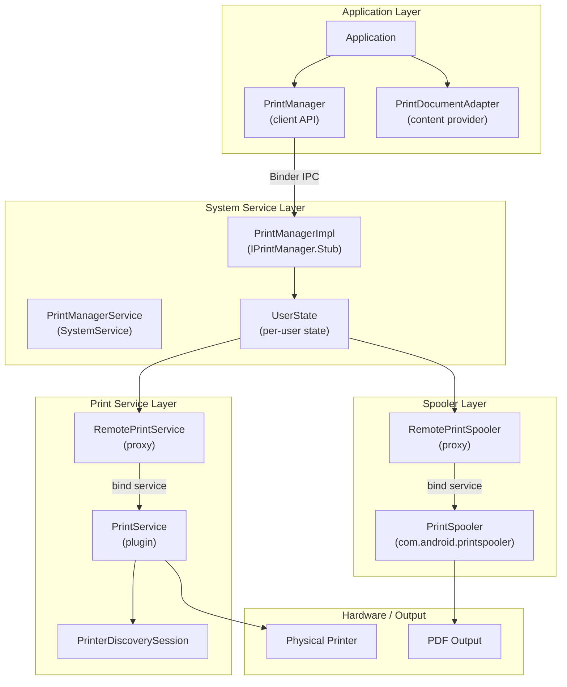

### 关键源码文件

| 文件 | 路径 | 作用 |
|------|------|------|
| `PrintManager.java` | `frameworks/base/core/java/android/print/` | 客户端 API |
| `PrintDocumentAdapter.java` | 同目录 | 应用渲染打印内容的契约 |
| `PrintJobInfo.java` | 同目录 | 打印作业状态模型 |
| `PrintJob.java` | 同目录 | 应用侧的打印作业句柄 |
| `PrintAttributes.java` | 同目录 | 页面尺寸、边距、颜色模式等属性 |
| `PrintedPdfDocument.java` | `frameworks/base/core/java/android/print/pdf/` | PDF 渲染辅助类 |
| `PrintService.java` | `frameworks/base/core/java/android/printservice/` | 打印服务插件基类 |
| `PrinterDiscoverySession.java` | 同目录 | 打印机发现会话 |
| `PrintManagerService.java` | `frameworks/base/services/print/java/com/android/server/print/` | 系统服务入口 |
| `UserState.java` | 同目录 | 每用户打印状态协调器 |
| `RemotePrintSpooler.java` | 同目录 | spooler 进程代理 |
| `RemotePrintService.java` | 同目录 | print service 进程代理 |

---

## 61.2 PrintManager -- The Client API

`PrintManager` 是应用访问打印能力的系统服务入口。它被标注为 `@SystemService`，并要求设备声明 `PackageManager.FEATURE_PRINTING`：

```java
// frameworks/base/core/java/android/print/PrintManager.java
@SystemService(Context.PRINT_SERVICE)
@RequiresFeature(PackageManager.FEATURE_PRINTING)
public final class PrintManager {
    public static final String PRINT_SPOOLER_PACKAGE_NAME = "com.android.printspooler";
```

### 61.2.1 Starting a Print Job

应用通常在 `Activity` 中通过 `PrintManager.print()` 发起打印：

```java
// Application code
PrintManager printManager = (PrintManager) getSystemService(Context.PRINT_SERVICE);
PrintJob job = printManager.print("My Document", new MyPrintDocumentAdapter(), null);
```

`print()` 的内部动作分成四步：

1. 为 `PrintDocumentAdapter` 创建可跨进程传递的代理。
2. 通过 Binder 把请求发给 `PrintManagerImpl`。
3. 由系统启动 `com.android.printspooler` 中的打印 UI。
4. 立即返回一个 `PrintJob` 句柄，供应用查询状态。

### 61.2.2 Querying Print Jobs

应用可以查询自己的打印任务，但不能看到其他应用的任务：

```java
// Get all print jobs for this app
List<PrintJob> jobs = printManager.getPrintJobs();

// Check specific job state
for (PrintJob job : jobs) {
    PrintJobInfo info = job.getInfo();
    if (info.getState() == PrintJobInfo.STATE_COMPLETED) {
        // Job finished successfully
    }
}
```

### 61.2.3 Print Job State Change Listeners

应用还可以注册作业状态变化监听器：

```java
// frameworks/base/core/java/android/print/PrintManager.java
private static final int MSG_NOTIFY_PRINT_JOB_STATE_CHANGED = 1;
```

通知最终通过主线程 `Handler` 分发，因此应用回调运行在 UI 线程。

### 61.2.4 Service Selection Constants

```java
// frameworks/base/core/java/android/print/PrintManager.java
public static final int ENABLED_SERVICES = 1 << 0;
public static final int DISABLED_SERVICES = 1 << 1;
public static final int ALL_SERVICES = ENABLED_SERVICES | DISABLED_SERVICES;
```

这些常量主要供系统级调用方使用，用来查询当前已启用或已禁用的 print service 列表。

---

## 61.3 PrintDocumentAdapter -- The Rendering Contract

`PrintDocumentAdapter` 是应用向打印框架提供内容的抽象类。它定义了严格的生命周期契约，系统只能按约定顺序调用。

### 61.3.1 Lifecycle

下图展示了 `PrintDocumentAdapter` 的回调生命周期。

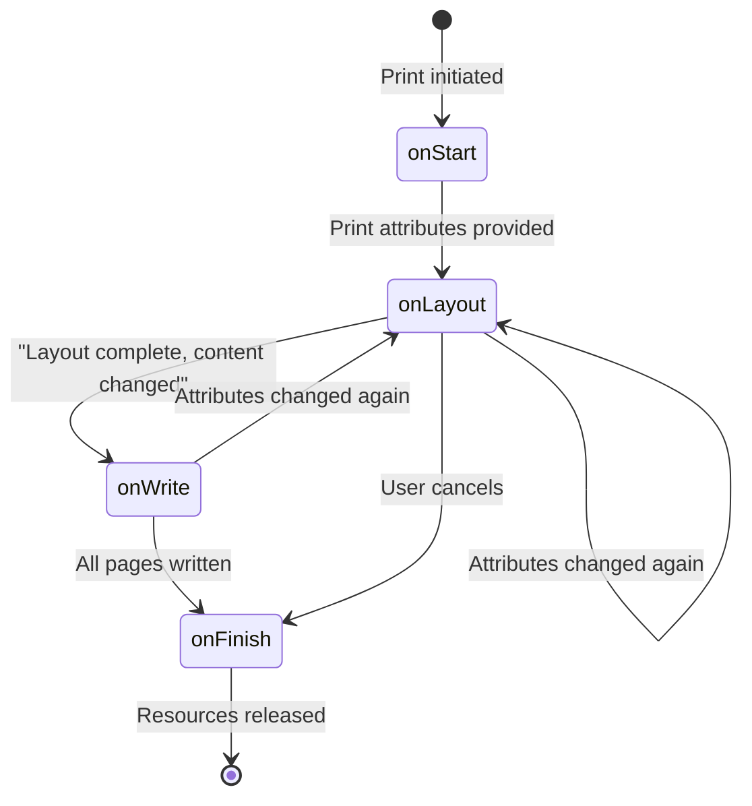

对应的核心回调如下：

```java
// frameworks/base/core/java/android/print/PrintDocumentAdapter.java
public abstract class PrintDocumentAdapter {
    public static final String EXTRA_PRINT_PREVIEW = "EXTRA_PRINT_PREVIEW";

    // 1. 打印开始时调用一次
    public void onStart() { /* stub */ }

    // 2. 打印属性发生变化时调用
    public abstract void onLayout(PrintAttributes oldAttributes,
            PrintAttributes newAttributes,
            CancellationSignal cancellationSignal,
            LayoutResultCallback callback,
            Bundle extras);

    // 3. 渲染指定页并输出 PDF
    public abstract void onWrite(PageRange[] pages,
            ParcelFileDescriptor destination,
            CancellationSignal cancellationSignal,
            WriteResultCallback callback);

    // 4. 打印结束时调用一次
    public void onFinish() { /* stub */ }
}
```

### 61.3.2 The Layout-Write Protocol

系统与 adapter 之间遵循一个明确的回调协议。

下图展示了 `onLayout()` 和 `onWrite()` 的交互顺序。

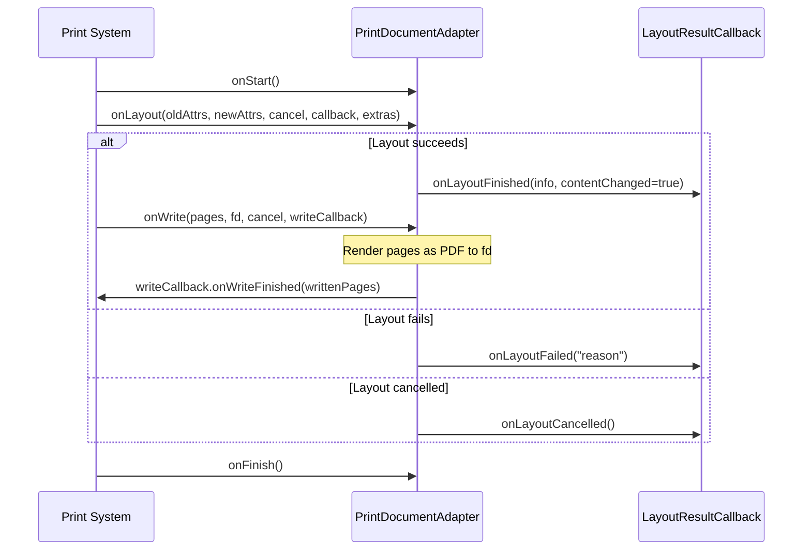

这套协议有几个必须遵守的规则：

- `onLayout()` 必须通过某个 callback 方法显式结束。
- `onWrite()` 也必须通过 callback 显式结束。
- 当前生命周期方法未完成前，系统不会进入下一步。
- `onWrite()` 中传入的 `ParcelFileDescriptor` 必须由 adapter 负责关闭。
- `extras` 中的 `EXTRA_PRINT_PREVIEW` 用于标记当前是否为预览模式。

### 61.3.3 Cancellation

`CancellationSignal` 允许系统请求取消当前工作：

```java
cancellationSignal.setOnCancelListener(new OnCancelListener() {
    @Override
    public void onCancel() {
        // 停止布局或写入工作
    }
});
```

这在用户修改纸张、方向、颜色模式等打印选项时很关键。系统会先取消旧的 layout / write，再发起新一轮请求。

### 61.3.4 PrintDocumentInfo

layout 结束后，adapter 需要回报文档元数据：

```java
PrintDocumentInfo info = new PrintDocumentInfo.Builder("document.pdf")
        .setContentType(PrintDocumentInfo.CONTENT_TYPE_DOCUMENT)
        .setPageCount(pageCount)
        .build();
callback.onLayoutFinished(info, contentChanged);
```

`contentChanged` 是这个协议里非常关键的标志位。如果它为 `false`，系统可以复用之前已经渲染好的页面，直接跳过 `onWrite()`。

---

## 61.4 Print Job Lifecycle

一个打印作业会在 `PrintJobInfo` 中经历七个状态。

### 61.4.1 State Constants

```java
// frameworks/base/core/java/android/print/PrintJobInfo.java
public static final int STATE_CREATED = 1;   // 在 print UI 中刚创建
public static final int STATE_QUEUED = 2;    // 已就绪，等待处理
public static final int STATE_STARTED = 3;   // 正在打印
public static final int STATE_BLOCKED = 4;   // 临时阻塞
public static final int STATE_COMPLETED = 5; // 打印成功，终态
public static final int STATE_FAILED = 6;    // 打印失败
public static final int STATE_CANCELED = 7;  // 已取消，终态
```

### 61.4.2 State Machine

下图展示了打印作业的状态机。

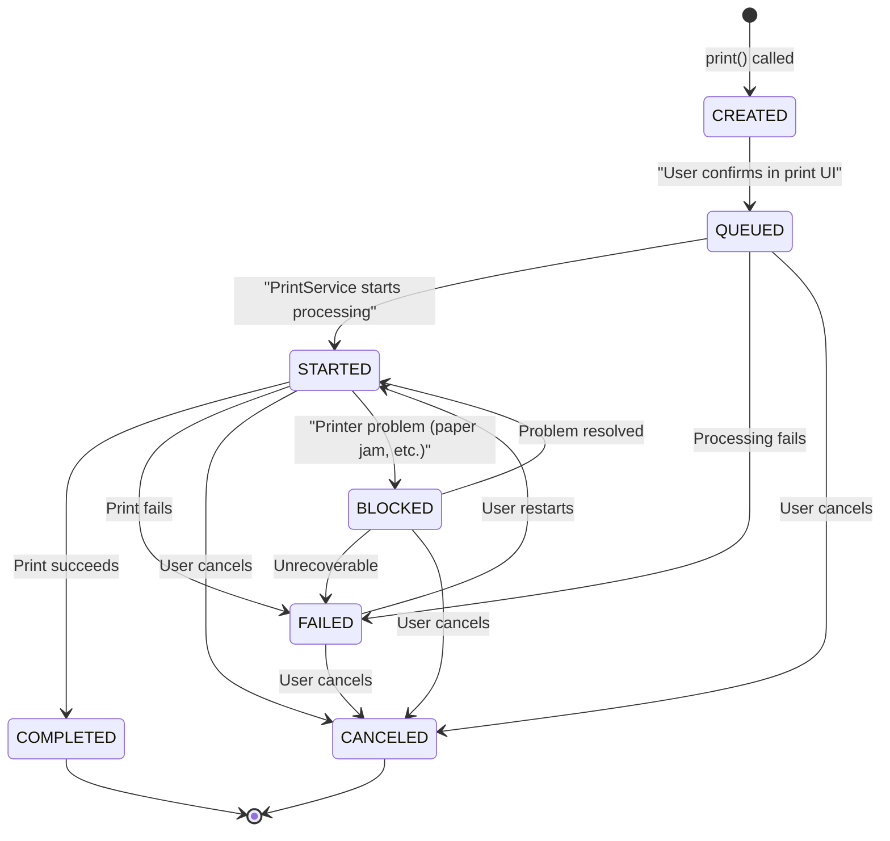

### 61.4.3 Internal State Groupings

系统内部还定义了若干聚合状态，方便筛选：

| 常量 | 包含状态 | 用途 |
|------|----------|------|
| `STATE_ANY` | 所有状态 | 不做过滤 |
| `STATE_ANY_VISIBLE_TO_CLIENTS` | 除 `CREATED` 外全部 | 应用可见状态 |
| `STATE_ANY_ACTIVE` | `CREATED`、`QUEUED`、`STARTED`、`BLOCKED` | 非终态作业 |
| `STATE_ANY_SCHEDULED` | `QUEUED`、`STARTED`、`BLOCKED` | 已投递到 print service 的作业 |

### 61.4.4 PrintJob Wrapper

`PrintJob` 为应用提供了更方便的包装：

```java
// frameworks/base/core/java/android/print/PrintJob.java
public final class PrintJob {
    private final @NonNull PrintManager mPrintManager;
    private @NonNull PrintJobInfo mCachedInfo;

    public void cancel() {
        final int state = getInfo().getState();
        if (state == PrintJobInfo.STATE_QUEUED
                || state == PrintJobInfo.STATE_STARTED
                || state == PrintJobInfo.STATE_BLOCKED
                || state == PrintJobInfo.STATE_FAILED) {
            mPrintManager.cancelPrintJob(mCachedInfo.getId());
        }
    }
}
```

对于活动中的作业，`getInfo()` 会刷新缓存；对 `COMPLETED`、`CANCELED` 等终态任务，系统直接返回缓存即可，因为这些状态不再变化。

---

## 61.5 PrintAttributes -- Describing Print Output

`PrintAttributes` 用来描述打印输出该如何格式化。

### 61.5.1 Media Size

纸张尺寸通过标准 `MediaSize` 类表达：

```java
// frameworks/base/core/java/android/print/PrintAttributes.java
// Standard sizes include:
MediaSize.ISO_A4       // 210 x 297mm
MediaSize.NA_LETTER    // 8.5 x 11 inches
MediaSize.NA_LEGAL     // 8.5 x 14 inches
MediaSize.JIS_B5       // 182 x 257mm
```

内部使用 mils（千分之一英寸）保存尺寸。

### 61.5.2 Color and Duplex Modes

```java
// Color modes
public static final int COLOR_MODE_MONOCHROME = 1; // 黑白
public static final int COLOR_MODE_COLOR = 2;      // 彩色

// Duplex modes
public static final int DUPLEX_MODE_NONE = 1;        // 单面
public static final int DUPLEX_MODE_LONG_EDGE = 2;   // 长边翻页
public static final int DUPLEX_MODE_SHORT_EDGE = 4;  // 短边翻页
```

### 61.5.3 Resolution and Margins

`Resolution` 定义横纵两个方向的 DPI；`Margins` 则定义四个边的最小边距，单位仍然是 mils。

---

## 61.6 PDF Rendering with PrintedPdfDocument

`PrintedPdfDocument` 是一个辅助类，用于把 Android 的 Canvas 绘制输出成 PDF：

```java
// frameworks/base/core/java/android/print/pdf/PrintedPdfDocument.java
public class PrintedPdfDocument extends PdfDocument {
    private static final int MILS_PER_INCH = 1000;
    private static final int POINTS_IN_INCH = 72;

    private final int mPageWidth;
    private final int mPageHeight;
    private final Rect mContentRect;
}
```

### 61.6.1 Coordinate System

这个类核心在于完成三种坐标单位之间的换算。

下图展示了 mils 到 PDF points 的转换关系。

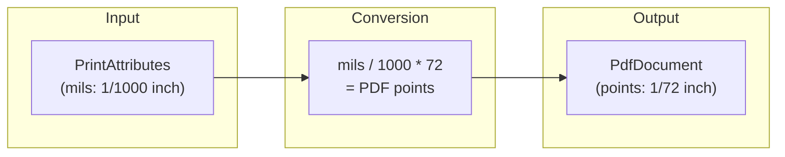

以 8.5 x 11 英寸的 Letter 为例：

- 宽度：`8500 mils -> 612 points`
- 高度：`11000 mils -> 792 points`

### 61.6.2 Usage Pattern

一个典型的 `onWrite()` 实现通常是这样：

```java
// Typical implementation in a PrintDocumentAdapter
@Override
public void onWrite(PageRange[] pages, ParcelFileDescriptor destination,
        CancellationSignal cancel, WriteResultCallback callback) {

    PrintedPdfDocument document = new PrintedPdfDocument(context, printAttributes);

    for (int pageNum : pagesToWrite) {
        PdfDocument.Page page = document.startPage(pageNum);

        // Get the Canvas and draw content
        Canvas canvas = page.getCanvas();
        drawPageContent(canvas, pageNum);

        document.finishPage(page);
    }

    // Write to the file descriptor
    document.writeTo(new FileOutputStream(destination.getFileDescriptor()));
    document.close();

    callback.onWriteFinished(new PageRange[] { PageRange.ALL_PAGES });
}
```

### 61.6.3 Content Rect

实际可绘制区域需要扣除边距：

```java
// frameworks/base/core/java/android/print/pdf/PrintedPdfDocument.java
Margins minMargins = attributes.getMinMargins();
final int marginLeft = (int) (((float) minMargins.getLeftMils() / MILS_PER_INCH)
        * POINTS_IN_INCH);
// ... similar for top, right, bottom
mContentRect = new Rect(marginLeft, marginTop,
        mPageWidth - marginRight, mPageHeight - marginBottom);
```

`mContentRect` 基本就是应用在 PDF 页上真正应该绘制内容的矩形。

---

## 61.7 PrintManagerService -- The System Service

`PrintManagerService` 负责把 `PrintManagerImpl` 接入 `SystemService` 生命周期：

```java
// frameworks/base/services/print/java/com/android/server/print/PrintManagerService.java
public final class PrintManagerService extends SystemService {
    private final PrintManagerImpl mPrintManagerImpl;

    @Override
    public void onStart() {
        publishBinderService(Context.PRINT_SERVICE, mPrintManagerImpl);
    }

    @Override
    public void onUserUnlocking(@NonNull TargetUser user) {
        mPrintManagerImpl.handleUserUnlocked(user.getUserIdentifier());
    }

    @Override
    public void onUserStopping(@NonNull TargetUser user) {
        mPrintManagerImpl.handleUserStopped(user.getUserIdentifier());
    }
}
```

### 61.7.1 Multi-User Architecture

每个 user 都对应一个独立 `UserState`，分别管理自己的 print service、spooler 连接和打印机发现状态。

下图展示了 `PrintManagerImpl` 的多用户结构。

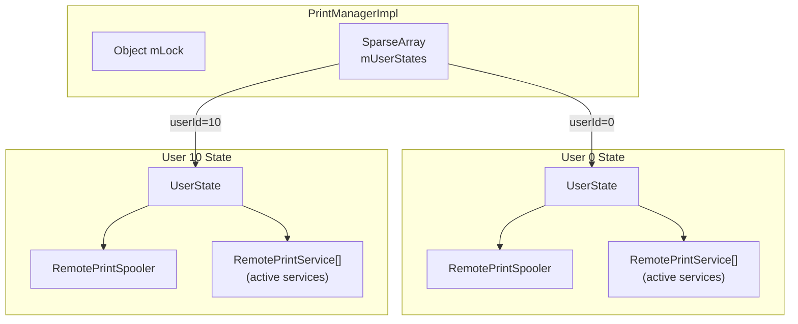

`UserState` 在用户解锁时创建，在用户停止时销毁：

```java
// frameworks/base/services/print/java/com/android/server/print/PrintManagerService.java
class PrintManagerImpl extends IPrintManager.Stub {
    private static final int BACKGROUND_USER_ID = -10;
    private final SparseArray<UserState> mUserStates = new SparseArray<>();
```

### 61.7.2 Permission Enforcement

`PrintManagerImpl.print()` 会做三类校验：

1. `PrintDocumentAdapter` 不能为 `null`。
2. 打印功能必须可用，不能被设备策略禁用。
3. 调用者 user 必须合法。

如果打印被 `DevicePolicyManager` 禁用，系统会向用户显示说明原因的 toast。

### 61.7.3 Content Observers and Broadcast Receivers

`PrintManagerImpl` 还会注册若干观察者：

- 监听 `Settings.Secure.ENABLED_PRINT_SERVICES` 的 content observer，用于感知用户在 Settings 里启用或禁用了哪些 print service。
- 监听包安装、删除、升级的 package monitor，用于刷新 print service 列表。

---

## 61.8 UserState -- Per-User Print Management

`UserState` 是真正的每用户打印协调中心。它实现了三个回调接口：

```java
// frameworks/base/services/print/java/com/android/server/print/UserState.java
final class UserState implements
        PrintSpoolerCallbacks,       // Spooler lifecycle events
        PrintServiceCallbacks,       // Print service events
        RemotePrintServiceRecommendationServiceCallbacks {  // Recommendations
```

### 61.8.1 Internal State

它的核心内部状态包括：

```java
// Active (bound) print services
private final ArrayMap<ComponentName, RemotePrintService> mActiveServices;

// All installed print service packages
private final List<PrintServiceInfo> mInstalledServices;

// Disabled print services
private final Set<ComponentName> mDisabledServices;

// Cache of print jobs visible to apps
private final PrintJobForAppCache mPrintJobForAppCache;

// Printer discovery session mediator
private PrinterDiscoverySessionMediator mPrinterDiscoverySession;

// Spooler connection
private final RemotePrintSpooler mSpooler;
```

### 61.8.2 Service Discovery

用户解锁后，`UserState` 会通过 `PackageManager` 查询 action 为 `android.printservice.PrintService` 的服务：

```java
// frameworks/base/services/print/java/com/android/server/print/UserState.java
private final Intent mQueryIntent =
        new Intent(android.printservice.PrintService.SERVICE_INTERFACE);
```

已启用的 print service 列表保存在 `Settings.Secure.ENABLED_PRINT_SERVICES`，格式是以冒号分隔的 `ComponentName` 列表。

### 61.8.3 Service Lifecycle Management

启用服务后，系统通过 `RemotePrintService` 代理去绑定和管理它们。

下图展示了从 user unlock 到 active service 的生命周期。

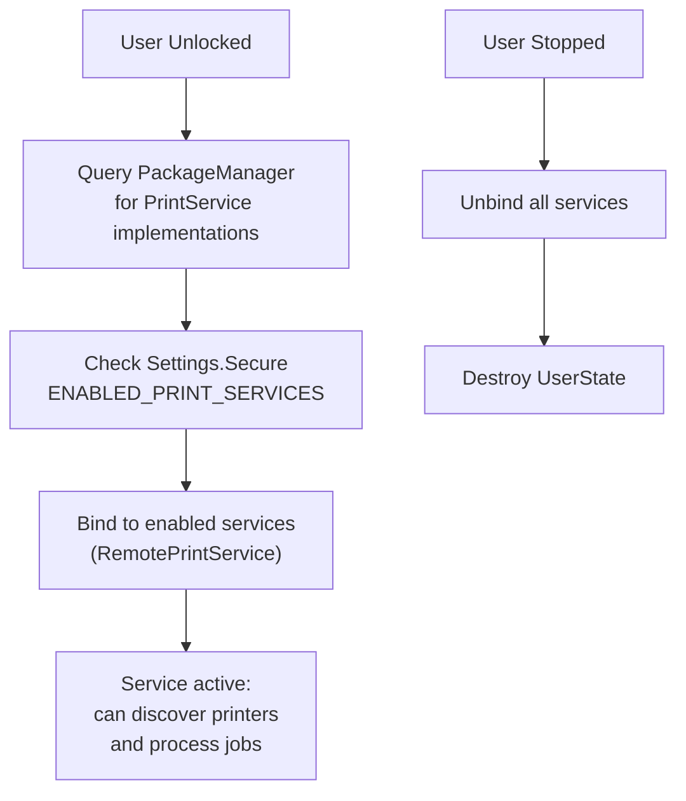

服务崩溃后，`UserState` 会在 500ms 后重启：

```java
// frameworks/base/services/print/java/com/android/server/print/UserState.java
private static final int SERVICE_RESTART_DELAY_MILLIS = 500;
```

---

## 61.9 PrintService -- The Plugin API

`PrintService` 是打印插件的基类。HP、Mopria 一类厂商或通用服务都通过扩展它接入系统。

### 61.9.1 Service Declaration

一个合法的 print service 需要在 manifest 里这样声明：

```xml
<service android:name=".MyPrintService"
         android:permission="android.permission.BIND_PRINT_SERVICE">
    <intent-filter>
        <action android:name="android.printservice.PrintService" />
    </intent-filter>
    <meta-data android:name="android.printservice"
               android:resource="@xml/printservice" />
</service>
```

`BIND_PRINT_SERVICE` 权限确保只有系统能绑定这个服务。

### 61.9.2 Key Callbacks

```java
// frameworks/base/core/java/android/printservice/PrintService.java
public abstract class PrintService extends Service {

    // 系统需要发现打印机时调用
    protected abstract PrinterDiscoverySession onCreatePrinterDiscoverySession();

    // 某个打印任务进入队列，可开始处理
    protected abstract void onPrintJobQueued(PrintJob printJob);

    // 用户请求取消打印任务
    protected abstract void onRequestCancelPrintJob(PrintJob printJob);

    // 系统绑定完成后
    protected void onConnected() { }

    // 系统解绑前
    protected void onDisconnected() { }
}
```

### 61.9.3 Print Job Processing Flow

下图展示了 print service 处理任务的典型流程。

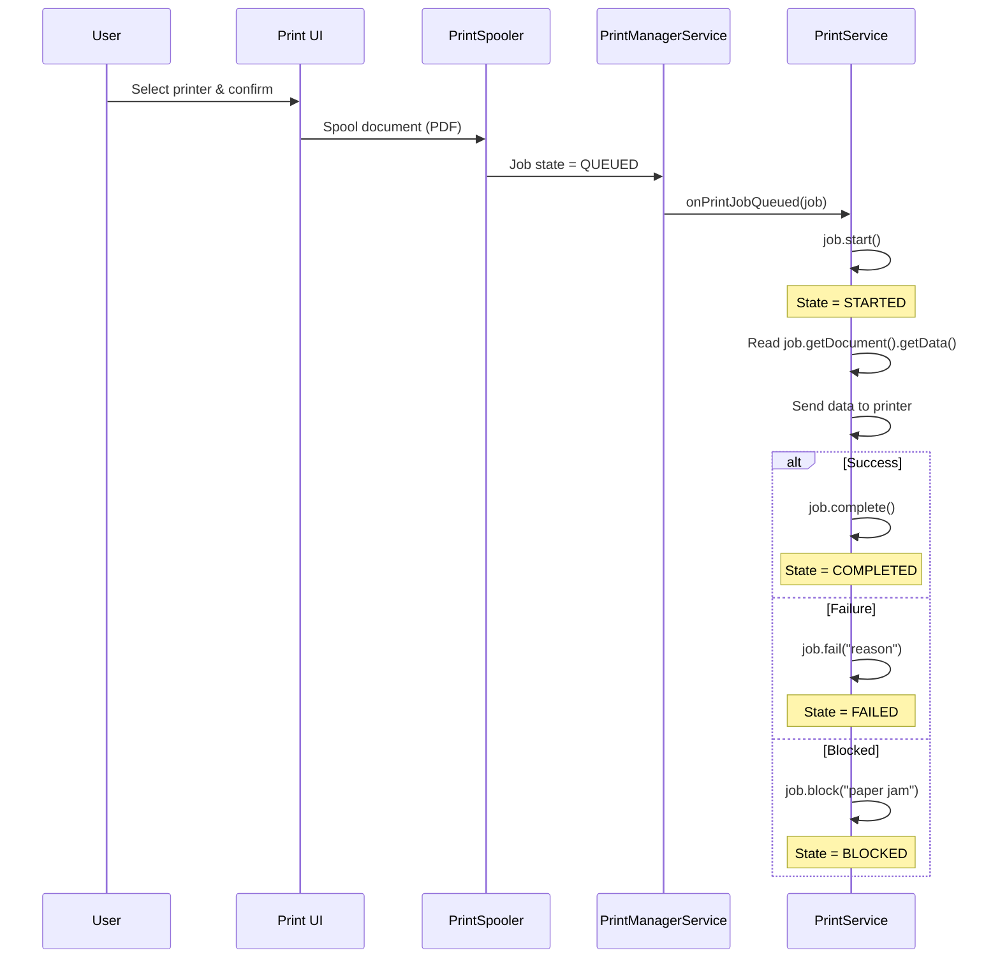

### 61.9.4 Accessing Print Data

print service 通过 `PrintDocument` 访问已经 spool 完成的数据：

```java
// In the PrintService
@Override
protected void onPrintJobQueued(PrintJob printJob) {
    printJob.start();

    PrintDocument document = printJob.getDocument();
    InputStream data = new FileInputStream(
            document.getData().getFileDescriptor());

    // data 始终是 PDF 文件
    sendToPrinter(data, printJob.getInfo());

    printJob.complete();
}
```

不管应用原始内容是什么格式，交给 print service 的都是 PDF。

---

## 61.10 Printer Discovery

打印机发现由 `PrinterDiscoverySession` 管理，它本身也有独立生命周期。

### 61.10.1 Discovery Lifecycle

下图展示了发现会话的状态变化。

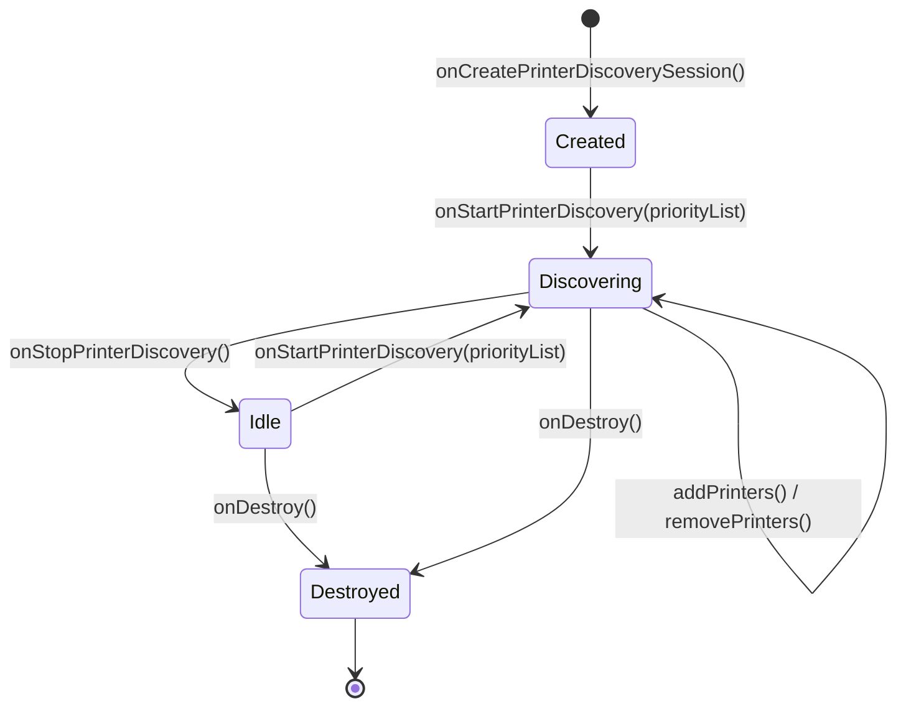

### 61.10.2 Key Methods

```java
// frameworks/base/core/java/android/printservice/PrinterDiscoverySession.java
public abstract class PrinterDiscoverySession {

    // 系统请求开始发现
    public abstract void onStartPrinterDiscovery(List<PrinterId> priorityList);

    // 系统请求停止发现
    public abstract void onStopPrinterDiscovery();

    // 系统要求验证若干 printer
    public abstract void onValidatePrinters(List<PrinterId> printerIds);

    // 系统需要某台 printer 的实时状态
    public abstract void onStartPrinterStateTracking(PrinterId printerId);

    // 系统不再关心这台 printer 的实时状态
    public abstract void onStopPrinterStateTracking(PrinterId printerId);

    // 会话销毁
    public abstract void onDestroy();

    // 服务通过这些方法上报打印机
    public final void addPrinters(List<PrinterInfo> printers);
    public final void removePrinters(List<PrinterId> printerIds);
}
```

### 61.10.3 PrinterInfo and Capabilities

打印机通过 `PrinterInfo` 建模：

```java
PrinterInfo printer = new PrinterInfo.Builder(printerId, "My Printer",
        PrinterInfo.STATUS_IDLE)
    .setDescription("Color Laser Printer")
    .setCapabilities(capabilities)
    .build();
```

其能力则由 `PrinterCapabilitiesInfo` 描述。

下图展示了能力模型包含的主要维度。


### 61.10.4 Priority List

`onStartPrinterDiscovery()` 的 `priorityList` 一般包含最近使用过的打印机。这样 print service 可以优先发现这些目标，减少用户等待时间。

### 61.10.5 Printer State Tracking

当用户在 print UI 中选中某台打印机后，系统会调用 `onStartPrinterStateTracking()`，要求服务对这台打印机持续上报状态、在线性和能力信息。这种按需加载的设计，避免系统在发现阶段就为所有打印机做高成本查询。

---

## 61.11 The Print Spooler

print spooler `com.android.printspooler` 是独立系统进程，负责维护打印队列，同时承载打印预览 UI。

### 61.11.1 RemotePrintSpooler

系统服务通过 `RemotePrintSpooler` 与它通信：

```java
// frameworks/base/services/print/java/com/android/server/print/RemotePrintSpooler.java
final class RemotePrintSpooler {
    private static final long BIND_SPOOLER_SERVICE_TIMEOUT =
            (Build.IS_ENG) ? 120000 : 10000;

    private final ServiceConnection mServiceConnection = new MyServiceConnection();
    private IPrintSpooler mRemoteInstance;
```

### 61.11.2 Timed Remote Calls

所有对 spooler 的 IPC 都通过 `TimedRemoteCaller` 封装，统一设置超时：

```java
// Individual timed callers for each operation
private final GetPrintJobInfosCaller mGetPrintJobInfosCaller;
private final GetPrintJobInfoCaller mGetPrintJobInfoCaller;
private final SetPrintJobStateCaller mSetPrintJobStatusCaller;
private final SetPrintJobTagCaller mSetPrintJobTagCaller;
```

生产版绑定超时是 10 秒；工程版放宽到 120 秒，方便调试器挂接。

### 61.11.3 Spooler Binding Lifecycle

下图展示了 `RemotePrintSpooler` 的绑定与调用过程。

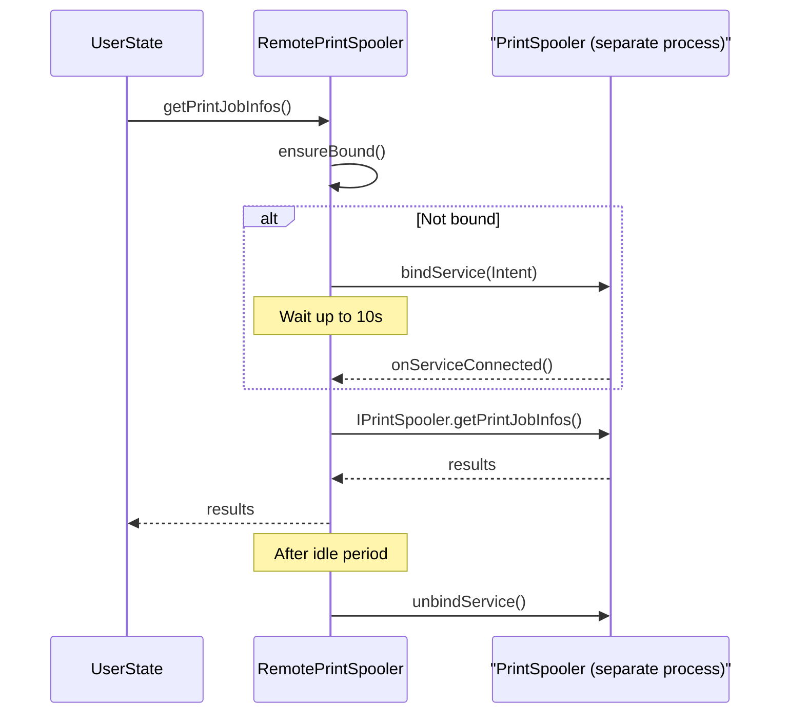

### 61.11.4 Spooler Callbacks

spooler 会通过 `PrintSpoolerCallbacks` 把状态变化回传给系统服务：

```java
// frameworks/base/services/print/java/com/android/server/print/RemotePrintSpooler.java
public static interface PrintSpoolerCallbacks {
    public void onPrintJobQueued(PrintJobInfo printJob);
    public void onAllPrintJobsForServiceHandled(ComponentName printService);
    public void onPrintJobStateChanged(PrintJobInfo printJob);
}
```

---

## 61.12 RemotePrintService -- Service Process Proxy

`RemotePrintService` 负责已绑定 print service 的生命周期管理：

```java
// frameworks/base/services/print/java/com/android/server/print/RemotePrintService.java
final class RemotePrintService implements DeathRecipient {
    private final List<Runnable> mPendingCommands = new ArrayList<>();
    private IPrintService mPrintService;
    private boolean mBinding;
    private boolean mHasActivePrintJobs;
    private boolean mHasPrinterDiscoverySession;
```

### 61.12.1 Deferred Commands

如果命令到达时服务尚未绑定，它会先排队到 `mPendingCommands`。

下图展示了 deferred command 的工作方式。

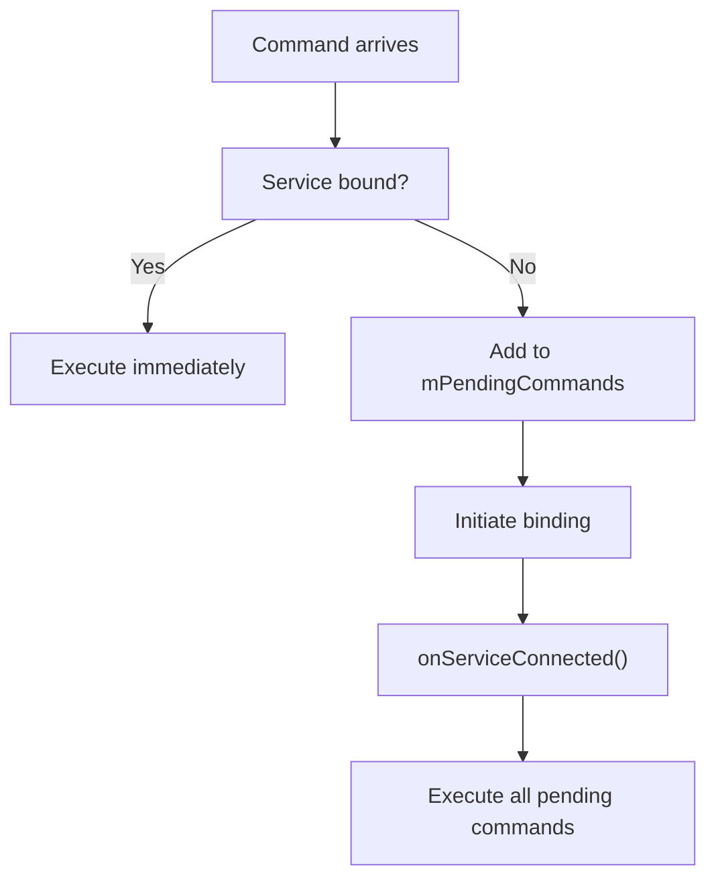

### 61.12.2 Death Handling

一旦 print service 进程死亡，`RemotePrintService` 会通过 `DeathRecipient` 收到通知，再把事件回报给 `UserState`，后者按 500ms 延迟拉起服务。

### 61.12.3 Tracked Printers

代理还要维护当前正在跟踪状态的打印机列表：

```java
@GuardedBy("mLock")
private List<PrinterId> mTrackedPrinterList;
```

这样在服务崩溃重启后，可以自动恢复原先的 printer state tracking。

---

## 61.13 The Complete Print Flow

把各层串起来，完整打印路径如下。

下图展示了从用户点击打印到数据送到打印机的端到端流程。

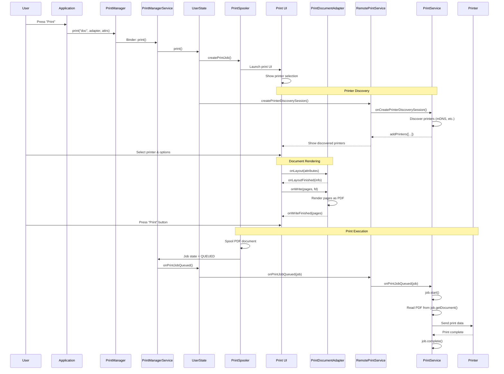

---

## 61.14 The print() Method Internals

`UserState.print()` 直接暴露了打印任务创建的内部机制：

```java
// frameworks/base/services/print/java/com/android/server/print/UserState.java
public Bundle print(@NonNull String printJobName, @NonNull IPrintDocumentAdapter adapter,
        @Nullable PrintAttributes attributes, @NonNull String packageName, int appId) {
    // Create print job place holder.
    final PrintJobInfo printJob = new PrintJobInfo();
    printJob.setId(new PrintJobId());
    printJob.setAppId(appId);
    printJob.setLabel(printJobName);
    printJob.setAttributes(attributes);
    printJob.setState(PrintJobInfo.STATE_CREATED);
    printJob.setCopies(1);
    printJob.setCreationTime(System.currentTimeMillis());

    // Track this job so we can forget it when the creator dies.
    if (!mPrintJobForAppCache.onPrintJobCreated(adapter.asBinder(), appId, printJob)) {
        return null; // Client is dead
    }

    Intent intent = new Intent(PrintManager.ACTION_PRINT_DIALOG);
    intent.setData(Uri.fromParts("printjob", printJob.getId().flattenToString(), null));
    intent.putExtra(PrintManager.EXTRA_PRINT_DOCUMENT_ADAPTER, adapter.asBinder());
    intent.putExtra(PrintManager.EXTRA_PRINT_JOB, printJob);
    intent.putExtra(Intent.EXTRA_PACKAGE_NAME, packageName);

    // Returns IntentSender to launch print dialog
    IntentSender intentSender = PendingIntent.getActivityAsUser(
            mContext, 0, intent, PendingIntent.FLAG_ONE_SHOT
                    | PendingIntent.FLAG_CANCEL_CURRENT | PendingIntent.FLAG_IMMUTABLE,
            activityOptions.toBundle(), new UserHandle(mUserId)).getIntentSender();
```

这里有四个关键点：

1. 通过 `PrintJobForAppCache` 追踪 adapter Binder，如果创建者进程死亡，系统就能清理相关作业。
2. print dialog 不是直接启动 Activity，而是通过 `PendingIntent` 返回 `IntentSender`，确保跨进程时安全上下文正确。
3. 通过 `MODE_BACKGROUND_ACTIVITY_START_DENIED` 规避后台拉起打印 UI。
4. 新创建作业一律从 `STATE_CREATED` 开始，默认份数是 1。

### 61.14.1 PrintJobForAppCache

`PrintJobForAppCache` 主要承担两个职责：

- **融合视图**：把应用缓存中的终态任务和 spooler 中的活动任务合并，返回完整结果。
- **剥离敏感字段**：对于返回给应用的对象，去掉 tag 和 advanced options 等只应由 print service 看到的字段。

```java
// frameworks/base/services/print/java/com/android/server/print/UserState.java
public List<PrintJobInfo> getPrintJobInfos(int appId) {
    List<PrintJobInfo> cachedPrintJobs = mPrintJobForAppCache.getPrintJobs(appId);
    // Note that the print spooler is not storing print jobs that
    // are in a terminal state as it is non-trivial to properly update
    // the spooler state for when to forget print jobs in terminal state.
    // Therefore, we fuse the cached print jobs for running apps (some
    // jobs are in a terminal state) with the ones that the print
    // spooler knows about (some jobs are being processed).
```

### 61.14.2 Cancel and Restart Flow

取消打印任务时，`UserState` 既要和 spooler 交互，也可能需要通知 print service。

下图展示了取消流程。

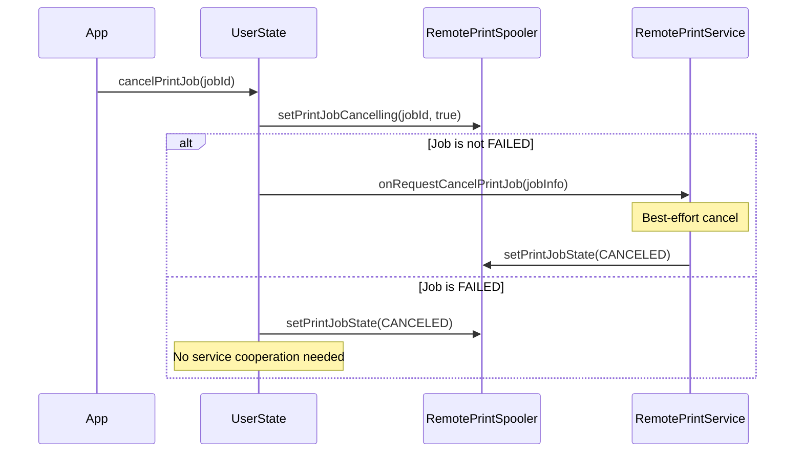

失败任务重试则简单得多，本质上就是把状态改回 `QUEUED`：

```java
// frameworks/base/services/print/java/com/android/server/print/UserState.java
public void restartPrintJob(@NonNull PrintJobId printJobId, int appId) {
    PrintJobInfo printJobInfo = getPrintJobInfo(printJobId, appId);
    if (printJobInfo == null || printJobInfo.getState() != PrintJobInfo.STATE_FAILED) {
        return;
    }
    mSpooler.setPrintJobState(printJobId, PrintJobInfo.STATE_QUEUED, null);
}
```

### 61.14.3 Job Routing to Services

当 spooler 通知某个作业进入 `QUEUED` 后，`UserState` 会根据 `PrinterId` 中的 `ComponentName` 把作业路由到正确的 print service：

```java
// frameworks/base/services/print/java/com/android/server/print/UserState.java
@Override
public void onPrintJobQueued(PrintJobInfo printJob) {
    ComponentName printServiceName = printJob.getPrinterId().getServiceName();
    RemotePrintService service = mActiveServices.get(printServiceName);

    if (service != null) {
        service.onPrintJobQueued(printJob);
    } else {
        // The service is no longer enabled
        mSpooler.setPrintJobState(printJob.getId(), PrintJobInfo.STATE_FAILED,
                mContext.getString(R.string.reason_service_unavailable));
    }
}
```

如果用户选中打印机后又把对应服务禁用了，这里会直接把作业置为 `FAILED`，原因是 service unavailable。

---

## 61.15 PrintManagerImpl Binder Service

`PrintManagerImpl` 是真正承接 Binder 调用的实现，所有 API 都要在这里做安全校验。

### 61.15.1 User Resolution

每个外部调用都要先解析 user / app / package 身份：

```java
// frameworks/base/services/print/java/com/android/server/print/PrintManagerService.java
final int resolvedUserId = resolveCallingUserEnforcingPermissions(userId);
final int resolvedAppId;
final UserState userState;
synchronized (mLock) {
    // Only the current group members can start new print jobs.
    if (resolveCallingProfileParentLocked(resolvedUserId) != getCurrentUserId()) {
        return null;
    }
    resolvedAppId = resolveCallingAppEnforcingPermissions(appId);
    resolvedPackageName = resolveCallingPackageNameEnforcingSecurity(packageName);
    userState = getOrCreateUserStateLocked(resolvedUserId, false);
}
```

### 61.15.2 Custom Printer Icon Security

print service 可以提供自定义打印机图标，但这些图标如果来自 URI，就必须做跨用户边界校验：

```java
// frameworks/base/services/print/java/com/android/server/print/PrintManagerService.java
private Icon validateIconUserBoundary(Icon icon, int resolvedCallingId) {
    if (icon != null && (icon.getType() == Icon.TYPE_URI
            || icon.getType() == Icon.TYPE_URI_ADAPTIVE_BITMAP)) {
        final int iconUserId = ContentProvider.getUserIdFromAuthority(
                icon.getUri().getAuthority(), resolvedCallingId);
        synchronized (mLock) {
            if (resolveCallingProfileParentLocked(iconUserId) != getCurrentUserId()) {
                return null; // Block cross-user icon access
            }
        }
    }
    return icon;
}
```

### 61.15.3 Print Services Query

枚举 print service 需要 `READ_PRINT_SERVICES` 权限：

```java
// frameworks/base/services/print/java/com/android/server/print/PrintManagerService.java
public List<PrintServiceInfo> getPrintServices(int selectionFlags, int userId) {
    Preconditions.checkFlagsArgument(selectionFlags,
            PrintManager.DISABLED_SERVICES | PrintManager.ENABLED_SERVICES);
    mContext.enforceCallingOrSelfPermission(
            android.Manifest.permission.READ_PRINT_SERVICES, null);
```

---

## 61.16 Print Service Recommendations

Android 还支持 print service 推荐机制。如果系统发现周边打印机无法由已安装服务处理，就可以推荐用户安装对应插件。

对应连接逻辑由 `RemotePrintServiceRecommendationService` 处理：

```java
// frameworks/base/services/print/java/com/android/server/print/
// RemotePrintServiceRecommendationService.java
```

这些推荐项最终显示在 print UI 中。

---

## 61.17 AIDL Interfaces

打印框架定义了多组 AIDL 接口来承载跨进程通信：

| 接口 | 方向 | 作用 |
|------|------|------|
| `IPrintManager` | App -> System | 创建、查询、取消打印作业 |
| `IPrintDocumentAdapter` | System -> App | 请求 layout / write |
| `IPrintDocumentAdapterObserver` | System -> App | adapter 生命周期通知 |
| `IPrintSpooler` | System -> Spooler | spooler 作业管理 |
| `IPrintSpoolerCallbacks` | Spooler -> System | 作业状态变化回调 |
| `IPrintSpoolerClient` | System -> Spooler | client 注册 |
| `IPrintService` | System -> Service | 控制 print service |
| `IPrintServiceClient` | Service -> System | 上报打印机和作业更新 |
| `IPrintJobStateChangeListener` | System -> App | 作业状态通知 |
| `IPrintServicesChangeListener` | System -> App | 服务列表变化通知 |
| `IPrinterDiscoveryObserver` | System -> App | 打印机发现事件 |
| `ILayoutResultCallback` | App -> System | layout 结果回传 |
| `IWriteResultCallback` | App -> System | write 结果回传 |

### 61.17.1 Listener Interfaces

`PrintManager` 客户端 API 暴露了三个监听器接口：

```java
// frameworks/base/core/java/android/print/PrintManager.java

// 任意打印任务状态变化时回调
public interface PrintJobStateChangeListener {
    void onPrintJobStateChanged(PrintJobId printJobId);
}

// print service 列表变化时回调
@SystemApi
public interface PrintServicesChangeListener {
    void onPrintServicesChanged();
}

// print service 推荐列表变化时回调
@SystemApi
public interface PrintServiceRecommendationsChangeListener {
    void onPrintServiceRecommendationsChanged();
}
```

这些监听器最终会被封装成 Binder 兼容 wrapper，再通过主线程 `Handler` 分发：

```java
// frameworks/base/core/java/android/print/PrintManager.java
mHandler = new Handler(context.getMainLooper(), null, false) {
    @Override
    public void handleMessage(Message message) {
        switch (message.what) {
            case MSG_NOTIFY_PRINT_JOB_STATE_CHANGED: {
                SomeArgs args = (SomeArgs) message.obj;
                PrintJobStateChangeListenerWrapper wrapper =
                        (PrintJobStateChangeListenerWrapper) args.arg1;
                PrintJobStateChangeListener listener = wrapper.getListener();
                if (listener != null) {
                    PrintJobId printJobId = (PrintJobId) args.arg2;
                    listener.onPrintJobStateChanged(printJobId);
                }
                args.recycle();
            } break;
        }
    }
};
```

### 61.17.2 PrintManager Internal Extras

`PrintManager` 和 print dialog Activity 之间还通过若干隐藏 extra 通信：

```java
// frameworks/base/core/java/android/print/PrintManager.java
public static final String ACTION_PRINT_DIALOG = "android.print.PRINT_DIALOG";
public static final String EXTRA_PRINT_DIALOG_INTENT =
        "android.print.intent.extra.EXTRA_PRINT_DIALOG_INTENT";
public static final String EXTRA_PRINT_JOB =
        "android.print.intent.extra.EXTRA_PRINT_JOB";
public static final String EXTRA_PRINT_DOCUMENT_ADAPTER =
        "android.print.intent.extra.EXTRA_PRINT_DOCUMENT_ADAPTER";
public static final int APP_ID_ANY = -2;
```

其中 `APP_ID_ANY` 用于 `getGlobalPrintManagerForUser()`，让系统级调用方绕过单 app 限制，访问所有打印任务。

---

## 61.18 PrintFileDocumentAdapter

如果只是打印一个现成文件，Android 还提供了 `PrintFileDocumentAdapter`，应用不需要自己完整实现 `PrintDocumentAdapter`：

```java
// frameworks/base/core/java/android/print/PrintFileDocumentAdapter.java
```

它负责从 `File` 读取内容，再把结果交给 print spooler。

---

## 61.19 Threading Model

打印框架在多线程上比较谨慎，目标是避免 UI 阻塞：

| 组件 | 线程 | 作用 |
|------|------|------|
| `PrintManager` 回调 | 主线程 | 把状态通知给应用 |
| `PrintDocumentAdapter.onLayout()` | 主线程 | 应用做 layout |
| `PrintDocumentAdapter.onWrite()` | 主线程 | 应用侧渲染 |
| `PrintManagerImpl` 操作 | Binder 线程 | 处理 service 请求 |
| `RemotePrintSpooler` 调用 | 后台线程 | 可能阻塞的 spooler IPC |
| `RemotePrintService` 绑定 | 后台线程 | 服务绑定 |
| `UserState` 状态访问 | `mLock` 保护 | 保证并发安全 |

文档里对 `RemotePrintSpooler` 还有一个很直接的警告：这些调用可能阻塞，而且完成它们又可能依赖主线程继续运行，所以不要在持有可能被主线程争用的锁时调用。

---

## 61.20 Security Model

打印框架有几条明确的安全边界。

### 61.20.1 Permission Requirements

| 权限 / 特性 | 作用 |
|-------------|------|
| `BIND_PRINT_SERVICE` | 只有系统可以绑定 print service |
| `INTERACT_ACROSS_USERS_FULL` | 跨用户打印管理 |
| `FEATURE_PRINTING` | 设备必须声明支持打印 |

### 61.20.2 App Isolation

应用只能看到自己的打印任务。`UserState` 中的 `PrintJobForAppCache` 就是按 app 维度维护缓存的：

```java
// frameworks/base/services/print/java/com/android/server/print/UserState.java
private final PrintJobForAppCache mPrintJobForAppCache = new PrintJobForAppCache();
```

### 61.20.3 Device Policy Integration

企业策略可以通过 `DevicePolicyManager` 彻底禁用打印：

```java
// frameworks/base/services/print/java/com/android/server/print/PrintManagerService.java
if (!isPrintingEnabled()) {
    DevicePolicyManagerInternal dpmi =
            LocalServices.getService(DevicePolicyManagerInternal.class);
    // Show disabled message to user
}
```

---

## 61.21 Debugging Print Services

### 61.21.1 Shell Commands

`PrintShellCommand` 提供了几条直接可用的调试命令：

```bash
# 列出 print services
adb shell cmd print list-services

# 列出 print jobs
adb shell cmd print get-print-jobs

# dump 打印系统状态
adb shell dumpsys print
```

### 61.21.2 Logging

如果需要更详细日志，可以打开这些 tag：

```bash
adb shell setprop log.tag.PrintManager VERBOSE
adb shell setprop log.tag.PrintManagerService VERBOSE
adb shell setprop log.tag.RemotePrintSpooler VERBOSE
adb shell setprop log.tag.RemotePrintService VERBOSE
adb shell setprop log.tag.UserState VERBOSE
```

### 61.21.3 Proto Dump

打印框架支持 protobuf 形式的结构化 dump：

```java
// frameworks/base/services/print/java/com/android/server/print/UserState.java
// Uses PrintUserStateProto, CachedPrintJobProto, InstalledPrintServiceProto,
// PrinterDiscoverySessionProto for structured dumps
```

这比纯文本 dump 更适合做自动化分析或上传到问题诊断管线。

---

## 61.22 Key Constants Reference

| 常量 | 值 | 位置 |
|------|----|------|
| `PRINT_SPOOLER_PACKAGE_NAME` | `com.android.printspooler` | `PrintManager.java` |
| `BIND_SPOOLER_SERVICE_TIMEOUT` | 10,000ms（eng 为 120,000ms） | `RemotePrintSpooler.java` |
| `SERVICE_RESTART_DELAY_MILLIS` | 500ms | `UserState.java` |
| `MILS_PER_INCH` | 1000 | `PrintedPdfDocument.java` |
| `POINTS_IN_INCH` | 72 | `PrintedPdfDocument.java` |
| `COMPONENT_NAME_SEPARATOR` | `:` | `UserState.java` |
| `BACKGROUND_USER_ID` | -10 | `PrintManagerImpl` |
| Service action | `android.printservice.PrintService` | `PrintService.java` |
| Meta-data key | `android.printservice` | `PrintService.java` |

---

## 61.23 动手实践（Try It）

### 61.23.1 练习 1：确认设备是否支持打印

```bash
adb shell pm list features | grep print
adb shell dumpsys package features | grep print
```

### 61.23.2 练习 2：查看当前已启用的 print service

```bash
adb shell settings get secure enabled_print_services
adb shell cmd print list-services
```

### 61.23.3 练习 3：抓取打印框架总状态

```bash
adb shell dumpsys print
```

重点观察：

- 每个 user 的 `UserState`
- active service 列表
- spooler 绑定状态
- printer discovery session

### 61.23.4 练习 4：追踪 print spooler 进程

```bash
adb shell ps -A | grep printspooler
adb shell dumpsys activity services com.android.printspooler
```

### 61.23.5 练习 5：打开详细日志

```bash
adb shell setprop log.tag.PrintManager VERBOSE
adb shell setprop log.tag.PrintManagerService VERBOSE
adb shell setprop log.tag.RemotePrintSpooler VERBOSE
adb shell setprop log.tag.RemotePrintService VERBOSE
adb shell setprop log.tag.UserState VERBOSE
adb logcat -s PrintManager PrintManagerService RemotePrintSpooler RemotePrintService UserState
```

### 61.23.6 练习 6：阅读 `print()` 调用链

按这个顺序走读源码：

1. `frameworks/base/core/java/android/print/PrintManager.java`
2. `frameworks/base/services/print/java/com/android/server/print/PrintManagerService.java`
3. `frameworks/base/services/print/java/com/android/server/print/UserState.java`
4. `packages/PrintSpooler/` 或设备上的 `com.android.printspooler`

### 61.23.7 练习 7：阅读 `PrintDocumentAdapter` 协议

重点看这些点：

1. `onLayout()` 和 `onWrite()` 必须何时回调完成。
2. `contentChanged=false` 时系统会如何优化。
3. `CancellationSignal` 如何处理中途取消。

### 61.23.8 练习 8：验证打印任务状态流转

如果设备上有真实可用打印插件，发起一次打印任务，然后观察：

```bash
adb shell cmd print get-print-jobs
adb shell dumpsys print
```

尝试确认任务是否经历了：

- `CREATED`
- `QUEUED`
- `STARTED`
- `COMPLETED` / `FAILED` / `CANCELED`

### 61.23.9 练习 9：检查 `ENABLED_PRINT_SERVICES` 的存储格式

```bash
adb shell settings get secure enabled_print_services
```

确认它是否是用冒号分隔的 `ComponentName` 列表，并对照 `UserState` 中的解析逻辑。

### 61.23.10 练习 10：分析 `RemotePrintSpooler` 的超时策略

阅读：

- `frameworks/base/services/print/java/com/android/server/print/RemotePrintSpooler.java`
- `frameworks/base/services/print/java/com/android/server/print/TimedRemoteCaller.java`

重点回答：

1. 生产版和 eng 版超时为什么不同。
2. 为什么 print 相关远程调用不能直接在主线程上执行。

### 61.23.11 练习 11：分析 `RemotePrintService` 的崩溃恢复

阅读：

- `frameworks/base/services/print/java/com/android/server/print/RemotePrintService.java`
- `frameworks/base/services/print/java/com/android/server/print/UserState.java`

重点看：

1. `DeathRecipient` 是如何接管进程死亡的。
2. `mPendingCommands` 如何避免“未绑定先到命令”丢失。
3. `mTrackedPrinterList` 如何帮助恢复状态跟踪。

### 61.23.12 练习 12：读 AIDL 边界

依次检查这些接口：

- `IPrintManager.aidl`
- `IPrintDocumentAdapter.aidl`
- `IPrintSpooler.aidl`
- `IPrintService.aidl`
- `IPrintServiceClient.aidl`

尝试自己画出一张 Binder 边界图，确认哪些调用方向是 app -> system，哪些是 system -> app / service。

### 61.23.13 练习 13：检查设备策略对打印的影响

阅读：

- `frameworks/base/services/print/java/com/android/server/print/PrintManagerService.java`
- DevicePolicy 相关调用点

如果你有企业测试环境，可以进一步验证被策略禁用后 print UI 的行为。

### 61.23.14 练习 14：研究 `PrintFileDocumentAdapter`

阅读：

- `frameworks/base/core/java/android/print/PrintFileDocumentAdapter.java`

比较它和自定义 `PrintDocumentAdapter` 的差异，确认它适合哪类“直接打印文件”的场景。

### 61.23.15 练习 15：关键源码路径总览

| 文件 | 作用 |
|------|------|
| `frameworks/base/core/java/android/print/PrintManager.java` | 应用打印 API |
| `frameworks/base/core/java/android/print/PrintDocumentAdapter.java` | 应用渲染契约 |
| `frameworks/base/core/java/android/print/PrintJobInfo.java` | 打印作业状态模型 |
| `frameworks/base/core/java/android/print/PrintAttributes.java` | 打印属性模型 |
| `frameworks/base/core/java/android/print/pdf/PrintedPdfDocument.java` | PDF 输出辅助类 |
| `frameworks/base/core/java/android/printservice/PrintService.java` | 插件服务基类 |
| `frameworks/base/core/java/android/printservice/PrinterDiscoverySession.java` | 打印机发现会话 |
| `frameworks/base/services/print/java/com/android/server/print/PrintManagerService.java` | 系统服务入口 |
| `frameworks/base/services/print/java/com/android/server/print/UserState.java` | 每用户协调器 |
| `frameworks/base/services/print/java/com/android/server/print/RemotePrintSpooler.java` | spooler 代理 |
| `frameworks/base/services/print/java/com/android/server/print/RemotePrintService.java` | print service 代理 |

## Summary

Android 打印框架的分层非常清晰：

1. `PrintManager` 负责提供应用侧 API。
2. `PrintManagerService` 和 `UserState` 负责系统侧调度、权限和每用户状态。
3. `com.android.printspooler` 负责打印队列与预览 UI。
4. `PrintService` 则把具体打印机协议、发现逻辑和作业执行留给可插拔服务实现。

`PrintDocumentAdapter` 是这个系统里最核心的应用契约。它把打印严格建模为 layout 和 write 两阶段，并要求应用始终输出 PDF。这样系统就可以在纸张尺寸、方向、边距、颜色模式变化时重新排版，而不用关心应用原始内容长什么样。

从系统实现角度看，`RemotePrintSpooler` 和 `RemotePrintService` 才是这套框架真正复杂的地方。它们不仅要封装 Binder IPC，还要处理绑定时机、超时、服务崩溃恢复、延迟命令执行、打印机状态跟踪恢复，以及多用户隔离。

打印框架本身不是 Android 最常被提起的模块，但它体现了平台工程里一个很典型的设计思路：把“应用提供内容”、“系统负责 UX 与状态机”、“插件负责设备协议”这三层彻底拆开。对系统工程师来说，这比打印功能本身更值得看。
