# Chapter 61: Print Services

Android's printing framework provides a complete system for discovering printers,
rendering documents, spooling print jobs, and delivering them to physical or
virtual printers. The framework uses a layered architecture: a system service
(`PrintManagerService`) manages per-user state and coordinates between
applications, a print spooler process manages the print queue, and pluggable
print services handle communication with specific printers or protocols.

This chapter examines the printing framework from the public API through the
system service internals, covering the print job lifecycle, document rendering,
printer discovery, and the spooler architecture.

> **Source roots for this chapter:**
> `frameworks/base/core/java/android/print/`
> `frameworks/base/core/java/android/printservice/`
> `frameworks/base/core/java/android/print/pdf/`
> `frameworks/base/services/print/java/com/android/server/print/`

---

## 61.1 Architecture Overview

The printing framework is organized into four major layers:

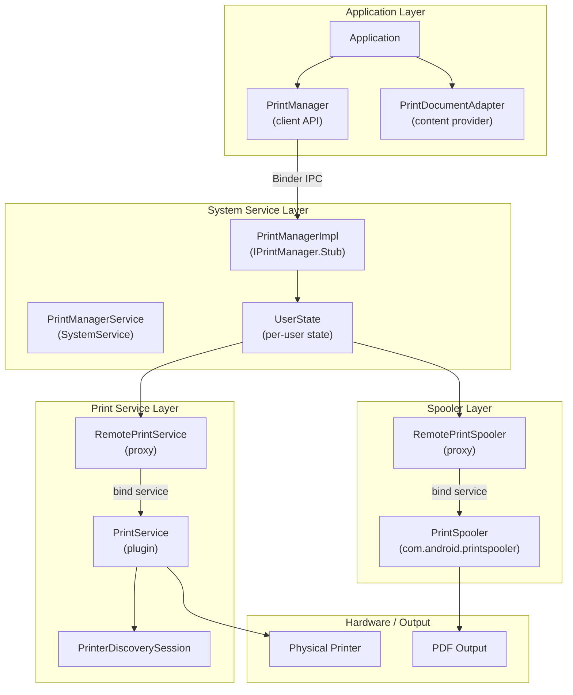

**Key source files:**

| File | Path | Purpose |
|------|------|---------|
| `PrintManager.java` | `frameworks/base/core/java/android/print/` | Client-facing API |
| `PrintDocumentAdapter.java` | Same directory | App document rendering contract |
| `PrintJobInfo.java` | Same directory | Print job state representation |
| `PrintJob.java` | Same directory | Print job handle for apps |
| `PrintAttributes.java` | Same directory | Page size, margins, color mode |
| `PrintedPdfDocument.java` | `frameworks/base/core/java/android/print/pdf/` | PDF rendering helper |
| `PrintService.java` | `frameworks/base/core/java/android/printservice/` | Print service plugin base class |
| `PrinterDiscoverySession.java` | Same directory | Printer discovery lifecycle |
| `PrintManagerService.java` | `frameworks/base/services/print/java/com/android/server/print/` | System service entry point |
| `UserState.java` | Same directory | Per-user print state management |
| `RemotePrintSpooler.java` | Same directory | Spooler process proxy |
| `RemotePrintService.java` | Same directory | Print service process proxy |

---

## 61.2 PrintManager -- The Client API

`PrintManager` is the system service accessor for printing capabilities. It
is annotated as a `@SystemService` and requires `PackageManager.FEATURE_PRINTING`:

```java
// frameworks/base/core/java/android/print/PrintManager.java
@SystemService(Context.PRINT_SERVICE)
@RequiresFeature(PackageManager.FEATURE_PRINTING)
public final class PrintManager {
    public static final String PRINT_SPOOLER_PACKAGE_NAME = "com.android.printspooler";
```

### 61.2.1 Starting a Print Job

An application initiates printing by calling `PrintManager.print()` from an
Activity:

```java
// Application code
PrintManager printManager = (PrintManager) getSystemService(Context.PRINT_SERVICE);
PrintJob job = printManager.print("My Document", new MyPrintDocumentAdapter(), null);
```

The `print()` method:

1. Creates a `PrintDocumentAdapter` proxy for cross-process communication
2. Sends the print request to `PrintManagerImpl` via Binder IPC
3. The system launches the print UI (from the `com.android.printspooler` package)
4. Returns a `PrintJob` handle for tracking state

### 61.2.2 Querying Print Jobs

Applications can query their own print jobs (but not those of other apps):

```java
// Get all print jobs for this app
List<PrintJob> jobs = printManager.getPrintJobs();

// Check specific job state
for (PrintJob job : jobs) {
    PrintJobInfo info = job.getInfo();
    if (info.getState() == PrintJobInfo.STATE_COMPLETED) {
        // Job finished successfully
    }
}
```

### 61.2.3 Print Job State Change Listeners

Apps can register for state change notifications:

```java
// frameworks/base/core/java/android/print/PrintManager.java
private static final int MSG_NOTIFY_PRINT_JOB_STATE_CHANGED = 1;
```

The listener mechanism uses a handler-based callback to deliver state changes
on the main thread.

### 61.2.4 Service Selection Constants

```java
// frameworks/base/core/java/android/print/PrintManager.java
public static final int ENABLED_SERVICES = 1 << 0;
public static final int DISABLED_SERVICES = 1 << 1;
public static final int ALL_SERVICES = ENABLED_SERVICES | DISABLED_SERVICES;
```

These constants are used by system-level callers to query which print services
are currently enabled or disabled in Settings.

---

## 61.3 PrintDocumentAdapter -- The Rendering Contract

`PrintDocumentAdapter` is the abstract class that applications implement to
provide content for printing. It defines a strict lifecycle contract between
the application and the print framework.

### 61.3.1 Lifecycle

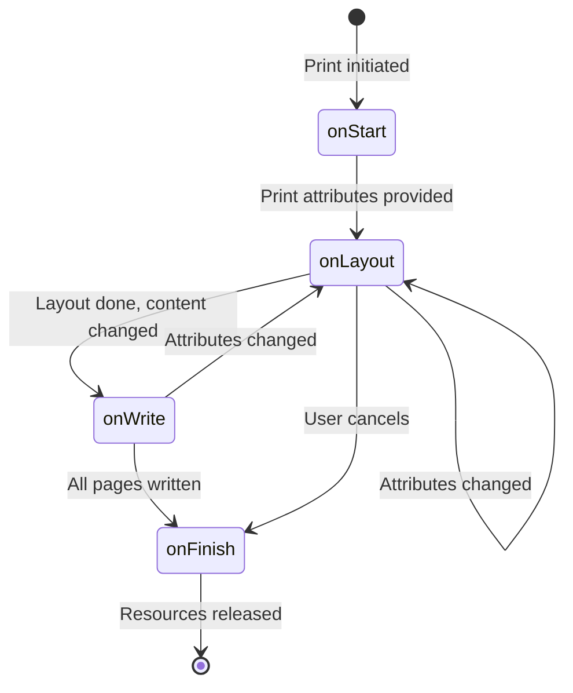

The lifecycle callbacks:

```java
// frameworks/base/core/java/android/print/PrintDocumentAdapter.java
public abstract class PrintDocumentAdapter {
    public static final String EXTRA_PRINT_PREVIEW = "EXTRA_PRINT_PREVIEW";

    // 1. Called once when printing starts
    public void onStart() { /* stub */ }

    // 2. Called when print attributes change (page size, density, etc.)
    public abstract void onLayout(PrintAttributes oldAttributes,
            PrintAttributes newAttributes,
            CancellationSignal cancellationSignal,
            LayoutResultCallback callback,
            Bundle extras);

    // 3. Called to render specific pages as PDF
    public abstract void onWrite(PageRange[] pages,
            ParcelFileDescriptor destination,
            CancellationSignal cancellationSignal,
            WriteResultCallback callback);

    // 4. Called once when printing finishes
    public void onFinish() { /* stub */ }
}
```

### 61.3.2 The Layout-Write Protocol

The interaction between the system and the adapter follows a callback protocol:

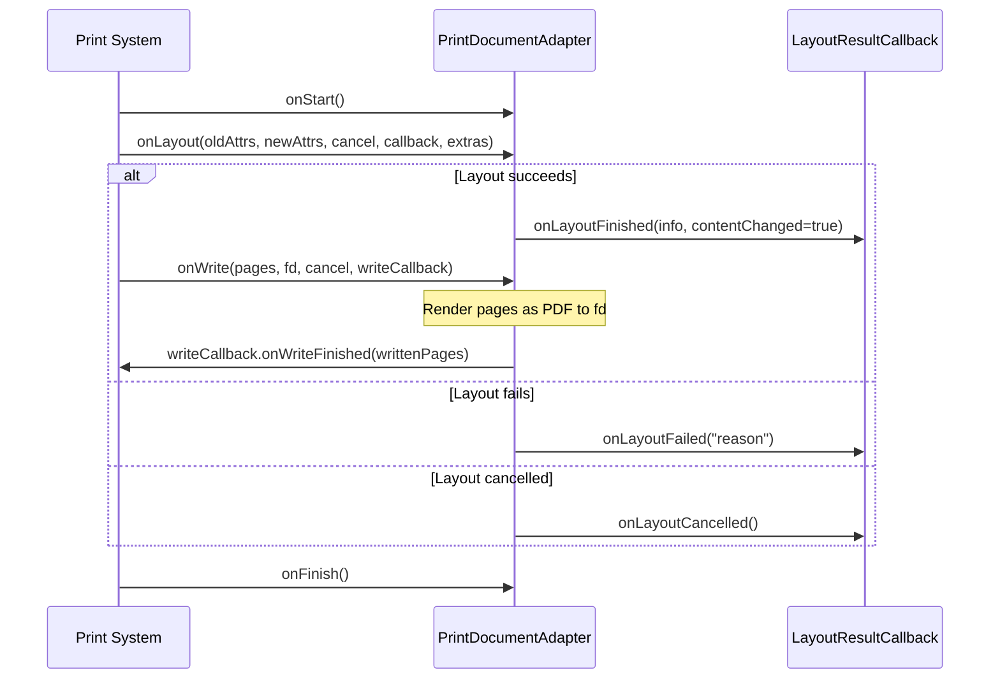

Key rules:

- `onLayout()` is **not** complete until one callback method is invoked
- `onWrite()` is **not** complete until one callback method is invoked
- No other lifecycle method will be called until the current one completes
- The adapter **must** close the `ParcelFileDescriptor` passed to `onWrite()`
- The `extras` bundle contains `EXTRA_PRINT_PREVIEW` to indicate preview mode

### 61.3.3 Cancellation

The `CancellationSignal` parameter allows the system to request cancellation:

```java
cancellationSignal.setOnCancelListener(new OnCancelListener() {
    @Override
    public void onCancel() {
        // Stop layout or write work
    }
});
```

This is important when the user changes print options during an ongoing
layout -- the system cancels the current layout and requests a new one.

### 61.3.4 PrintDocumentInfo

After layout, the adapter reports document metadata:

```java
PrintDocumentInfo info = new PrintDocumentInfo.Builder("document.pdf")
        .setContentType(PrintDocumentInfo.CONTENT_TYPE_DOCUMENT)
        .setPageCount(pageCount)
        .build();
callback.onLayoutFinished(info, contentChanged);
```

The `contentChanged` flag is critical: if `false`, the system can reuse
previously rendered pages and skip the `onWrite()` call.

---

## 61.4 Print Job Lifecycle

A print job transitions through seven states, tracked by `PrintJobInfo`:

### 61.4.1 State Constants

```java
// frameworks/base/core/java/android/print/PrintJobInfo.java
public static final int STATE_CREATED = 1;   // Being created in print UI
public static final int STATE_QUEUED = 2;    // Ready for processing
public static final int STATE_STARTED = 3;   // Being printed
public static final int STATE_BLOCKED = 4;   // Temporarily blocked
public static final int STATE_COMPLETED = 5; // Successfully printed (terminal)
public static final int STATE_FAILED = 6;    // Printing failed
public static final int STATE_CANCELED = 7;  // Canceled (terminal)
```

### 61.4.2 State Machine

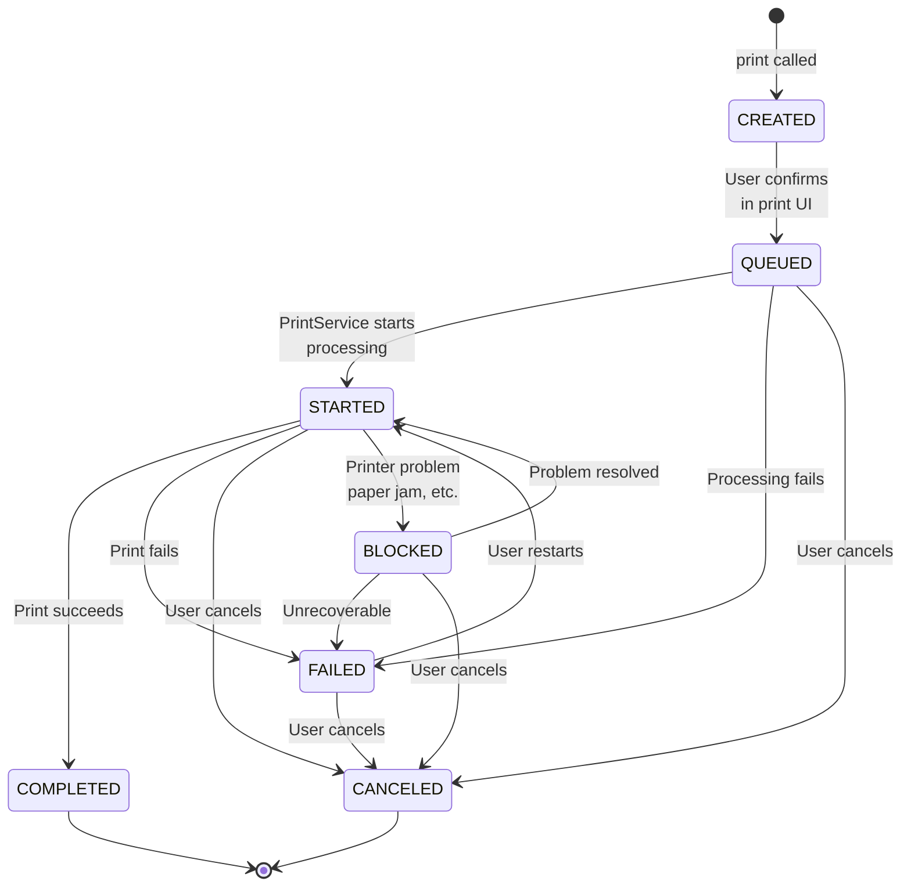

### 61.4.3 Internal State Groupings

The system uses aggregate state constants for filtering:

| Constant | States Included | Purpose |
|----------|----------------|---------|
| `STATE_ANY` | All states | No filtering |
| `STATE_ANY_VISIBLE_TO_CLIENTS` | All except `CREATED` | Visible to the creating app |
| `STATE_ANY_ACTIVE` | `CREATED`, `QUEUED`, `STARTED`, `BLOCKED` | Non-terminal states |
| `STATE_ANY_SCHEDULED` | `QUEUED`, `STARTED`, `BLOCKED` | Delivered to print service |

### 61.4.4 PrintJob Wrapper

The `PrintJob` class provides a convenient wrapper for applications:

```java
// frameworks/base/core/java/android/print/PrintJob.java
public final class PrintJob {
    private final @NonNull PrintManager mPrintManager;
    private @NonNull PrintJobInfo mCachedInfo;

    public void cancel() {
        final int state = getInfo().getState();
        if (state == PrintJobInfo.STATE_QUEUED
                || state == PrintJobInfo.STATE_STARTED
                || state == PrintJobInfo.STATE_BLOCKED
                || state == PrintJobInfo.STATE_FAILED) {
            mPrintManager.cancelPrintJob(mCachedInfo.getId());
        }
    }
```

The cached `PrintJobInfo` is refreshed on each `getInfo()` call for active
jobs but returned directly for terminal states (completed/canceled), since
those cannot change.

---

## 61.5 PrintAttributes -- Describing Print Output

`PrintAttributes` encapsulates how content should be formatted for printing:

### 61.5.1 Media Size

Media sizes define page dimensions using the standard `MediaSize` class:

```java
// frameworks/base/core/java/android/print/PrintAttributes.java
// Standard sizes include:
MediaSize.ISO_A4       // 210 x 297mm
MediaSize.NA_LETTER    // 8.5 x 11 inches
MediaSize.NA_LEGAL     // 8.5 x 14 inches
MediaSize.JIS_B5       // 182 x 257mm
```

Sizes are stored in mils (thousandths of an inch) internally.

### 61.5.2 Color and Duplex Modes

```java
// Color modes
public static final int COLOR_MODE_MONOCHROME = 1; // Black & white
public static final int COLOR_MODE_COLOR = 2;      // Full color

// Duplex modes
public static final int DUPLEX_MODE_NONE = 1;       // Single-sided
public static final int DUPLEX_MODE_LONG_EDGE = 2;  // Book-style
public static final int DUPLEX_MODE_SHORT_EDGE = 4;  // Notepad-style
```

### 61.5.3 Resolution and Margins

`Resolution` defines DPI (dots per inch) for horizontal and vertical axes.
`Margins` define minimum margins in mils on all four sides.

---

## 61.6 PDF Rendering with PrintedPdfDocument

`PrintedPdfDocument` is a helper class that simplifies creating PDF output
from Android's Canvas-based graphics API:

```java
// frameworks/base/core/java/android/print/pdf/PrintedPdfDocument.java
public class PrintedPdfDocument extends PdfDocument {
    private static final int MILS_PER_INCH = 1000;
    private static final int POINTS_IN_INCH = 72;

    private final int mPageWidth;
    private final int mPageHeight;
    private final Rect mContentRect;
```

### 61.6.1 Coordinate System

The class converts between three coordinate systems:

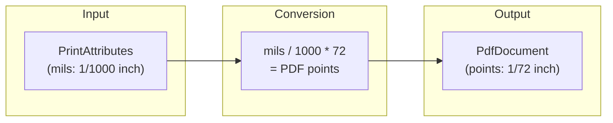

For an 8.5 x 11 inch letter page:

- Width: 8500 mils -> 612 points
- Height: 11000 mils -> 792 points

### 61.6.2 Usage Pattern

```java
// Typical implementation in a PrintDocumentAdapter
@Override
public void onWrite(PageRange[] pages, ParcelFileDescriptor destination,
        CancellationSignal cancel, WriteResultCallback callback) {

    PrintedPdfDocument document = new PrintedPdfDocument(context, printAttributes);

    for (int pageNum : pagesToWrite) {
        PdfDocument.Page page = document.startPage(pageNum);

        // Get the Canvas and draw content
        Canvas canvas = page.getCanvas();
        drawPageContent(canvas, pageNum);

        document.finishPage(page);
    }

    // Write to the file descriptor
    document.writeTo(new FileOutputStream(destination.getFileDescriptor()));
    document.close();

    callback.onWriteFinished(new PageRange[] { PageRange.ALL_PAGES });
}
```

### 61.6.3 Content Rect

The content rectangle accounts for margins, giving the drawable area:

```java
// frameworks/base/core/java/android/print/pdf/PrintedPdfDocument.java
Margins minMargins = attributes.getMinMargins();
final int marginLeft = (int) (((float) minMargins.getLeftMils() / MILS_PER_INCH)
        * POINTS_IN_INCH);
// ... similar for top, right, bottom
mContentRect = new Rect(marginLeft, marginTop,
        mPageWidth - marginRight, mPageHeight - marginBottom);
```

---

## 61.7 PrintManagerService -- The System Service

`PrintManagerService` wraps the `PrintManagerImpl` Binder service and integrates
with the `SystemService` lifecycle:

```java
// frameworks/base/services/print/java/com/android/server/print/PrintManagerService.java
public final class PrintManagerService extends SystemService {
    private final PrintManagerImpl mPrintManagerImpl;

    @Override
    public void onStart() {
        publishBinderService(Context.PRINT_SERVICE, mPrintManagerImpl);
    }

    @Override
    public void onUserUnlocking(@NonNull TargetUser user) {
        mPrintManagerImpl.handleUserUnlocked(user.getUserIdentifier());
    }

    @Override
    public void onUserStopping(@NonNull TargetUser user) {
        mPrintManagerImpl.handleUserStopped(user.getUserIdentifier());
    }
}
```

### 61.7.1 Multi-User Architecture

Each user gets an independent `UserState` instance that manages print services,
the spooler connection, and printer discovery:

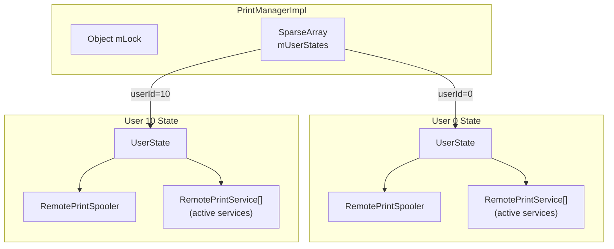

`UserState` is created on user unlock and destroyed on user stop:

```java
// frameworks/base/services/print/java/com/android/server/print/PrintManagerService.java
class PrintManagerImpl extends IPrintManager.Stub {
    private static final int BACKGROUND_USER_ID = -10;
    private final SparseArray<UserState> mUserStates = new SparseArray<>();
```

### 61.7.2 Permission Enforcement

The `print()` method in `PrintManagerImpl` validates:

1. The adapter is non-null
2. Printing is enabled (not disabled by device policy)
3. The calling user is valid

When printing is disabled by `DevicePolicyManager`, a toast message is shown
to the user explaining why.

### 61.7.3 Content Observers and Broadcast Receivers

`PrintManagerImpl` registers:

- **Content observers** on `Settings.Secure.ENABLED_PRINT_SERVICES` to track
  which print services the user has enabled in Settings

- **Package monitors** to detect installation, removal, or updates of print
  service packages

---

## 61.8 UserState -- Per-User Print Management

`UserState` is the core per-user coordinator. It implements three callback
interfaces:

```java
// frameworks/base/services/print/java/com/android/server/print/UserState.java
final class UserState implements
        PrintSpoolerCallbacks,       // Spooler lifecycle events
        PrintServiceCallbacks,       // Print service events
        RemotePrintServiceRecommendationServiceCallbacks {  // Recommendations
```

### 61.8.1 Internal State

```java
// Active (bound) print services
private final ArrayMap<ComponentName, RemotePrintService> mActiveServices;

// All installed print service packages
private final List<PrintServiceInfo> mInstalledServices;

// Disabled print services
private final Set<ComponentName> mDisabledServices;

// Cache of print jobs visible to apps
private final PrintJobForAppCache mPrintJobForAppCache;

// Printer discovery session mediator
private PrinterDiscoverySessionMediator mPrinterDiscoverySession;

// Spooler connection
private final RemotePrintSpooler mSpooler;
```

### 61.8.2 Service Discovery

When a user is unlocked, `UserState` discovers print services by querying
`PackageManager` for services with the action
`android.printservice.PrintService`:

```java
// frameworks/base/services/print/java/com/android/server/print/UserState.java
private final Intent mQueryIntent =
        new Intent(android.printservice.PrintService.SERVICE_INTERFACE);
```

Enabled services are stored in `Settings.Secure.ENABLED_PRINT_SERVICES` as
a colon-separated list of `ComponentName` strings.

### 61.8.3 Service Lifecycle Management

Active services are managed through `RemotePrintService` proxies:

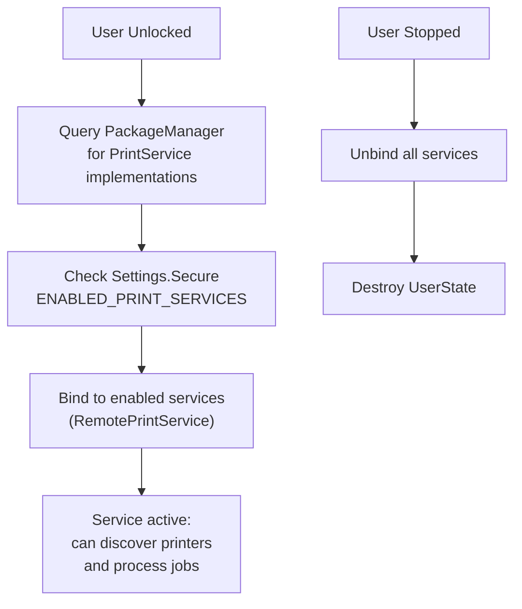

When a service crashes, `RemotePrintService` receives the death notification
and schedules a restart after 500ms:

```java
// frameworks/base/services/print/java/com/android/server/print/UserState.java
private static final int SERVICE_RESTART_DELAY_MILLIS = 500;
```

---

## 61.9 PrintService -- The Plugin API

`PrintService` is the base class for print service plugins. Third-party apps
(e.g., HP Print Service, Mopria Print Service) extend this class to support
specific printers.

### 61.9.1 Service Declaration

A print service must declare itself in the manifest with specific permissions
and intent filters:

```xml
<service android:name=".MyPrintService"
         android:permission="android.permission.BIND_PRINT_SERVICE">
    <intent-filter>
        <action android:name="android.printservice.PrintService" />
    </intent-filter>
    <meta-data android:name="android.printservice"
               android:resource="@xml/printservice" />
</service>
```

The `BIND_PRINT_SERVICE` permission ensures only the system can bind to it.

### 61.9.2 Key Callbacks

```java
// frameworks/base/core/java/android/printservice/PrintService.java
public abstract class PrintService extends Service {

    // Called when the system needs to discover printers
    protected abstract PrinterDiscoverySession onCreatePrinterDiscoverySession();

    // Called when a print job is queued and ready for processing
    protected abstract void onPrintJobQueued(PrintJob printJob);

    // Called when the user requests cancellation of a print job
    protected abstract void onRequestCancelPrintJob(PrintJob printJob);

    // Called after the system binds
    protected void onConnected() { }

    // Called before the system unbinds
    protected void onDisconnected() { }
}
```

### 61.9.3 Print Job Processing Flow

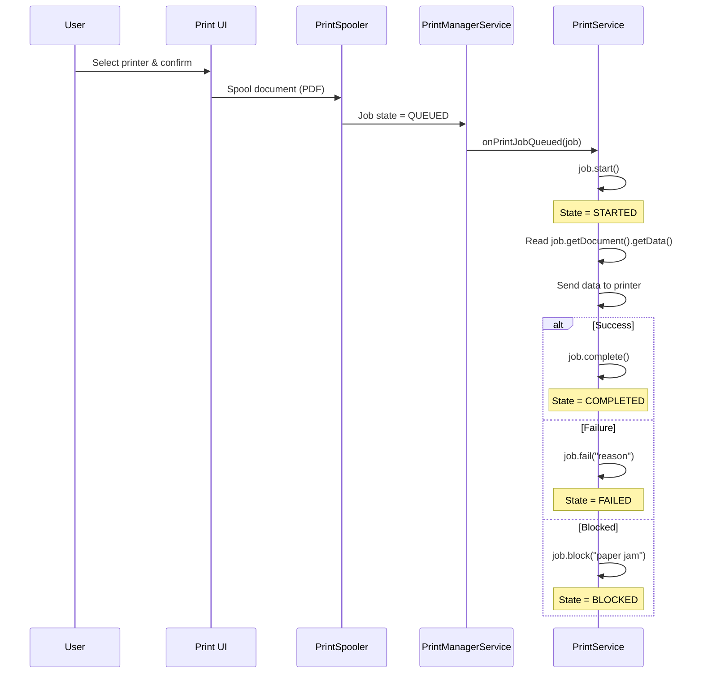

### 61.9.4 Accessing Print Data

The print service accesses the spooled document through `PrintDocument`:

```java
// In the PrintService
@Override
protected void onPrintJobQueued(PrintJob printJob) {
    printJob.start();

    PrintDocument document = printJob.getDocument();
    InputStream data = new FileInputStream(
            document.getData().getFileDescriptor());

    // data is a PDF file -- send to printer
    sendToPrinter(data, printJob.getInfo());

    printJob.complete();
}
```

The data is always a PDF file, regardless of the original content format.

---

## 61.10 Printer Discovery

Printer discovery is managed through `PrinterDiscoverySession`, which has
its own lifecycle independent of the print service.

### 61.10.1 Discovery Lifecycle

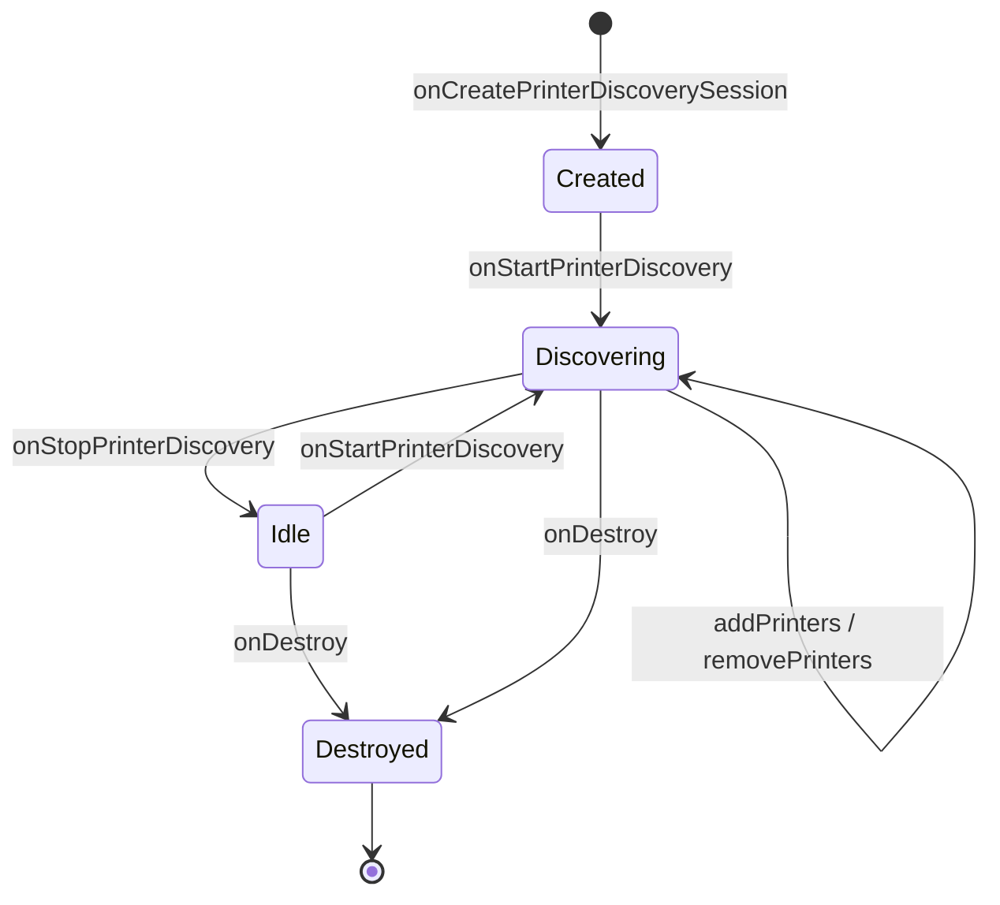

### 61.10.2 Key Methods

```java
// frameworks/base/core/java/android/printservice/PrinterDiscoverySession.java
public abstract class PrinterDiscoverySession {

    // System requests to start discovering printers
    public abstract void onStartPrinterDiscovery(List<PrinterId> priorityList);

    // System requests to stop discovering
    public abstract void onStopPrinterDiscovery();

    // System requests validation of specific printers
    public abstract void onValidatePrinters(List<PrinterId> printerIds);

    // System is interested in real-time updates for a printer
    public abstract void onStartPrinterStateTracking(PrinterId printerId);

    // System no longer needs real-time updates
    public abstract void onStopPrinterStateTracking(PrinterId printerId);

    // Session is being destroyed
    public abstract void onDestroy();

    // Services call these to report printers
    public final void addPrinters(List<PrinterInfo> printers);
    public final void removePrinters(List<PrinterId> printerIds);
}
```

### 61.10.3 PrinterInfo and Capabilities

Printers are described using `PrinterInfo`:

```java
PrinterInfo printer = new PrinterInfo.Builder(printerId, "My Printer",
        PrinterInfo.STATUS_IDLE)
    .setDescription("Color Laser Printer")
    .setCapabilities(capabilities)
    .build();
```

`PrinterCapabilitiesInfo` describes what a printer can do:

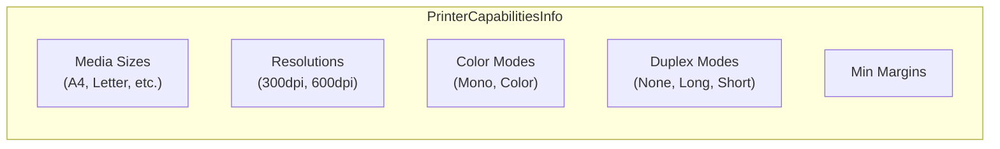

### 61.10.4 Priority List

The `priorityList` parameter in `onStartPrinterDiscovery()` contains printers
that should be discovered first -- typically printers the user has used
recently. This allows print services to prioritize network discovery for
known printers.

### 61.10.5 Printer State Tracking

When the user selects a printer in the print UI, the system calls
`onStartPrinterStateTracking()` for that printer. The service should then
provide real-time status updates (idle, busy, unavailable) and capabilities
if not yet provided. This lazy capability loading avoids querying all
discovered printers upfront.

---

## 61.11 The Print Spooler

The print spooler (`com.android.printspooler`) is a separate system process
that manages the print queue and hosts the print preview UI.

### 61.11.1 RemotePrintSpooler

`RemotePrintSpooler` is the system service's proxy to the spooler process:

```java
// frameworks/base/services/print/java/com/android/server/print/RemotePrintSpooler.java
final class RemotePrintSpooler {
    private static final long BIND_SPOOLER_SERVICE_TIMEOUT =
            (Build.IS_ENG) ? 120000 : 10000;

    private final ServiceConnection mServiceConnection = new MyServiceConnection();
    private IPrintSpooler mRemoteInstance;
```

### 61.11.2 Timed Remote Calls

All calls to the spooler use `TimedRemoteCaller` to enforce timeouts:

```java
// Individual timed callers for each operation
private final GetPrintJobInfosCaller mGetPrintJobInfosCaller;
private final GetPrintJobInfoCaller mGetPrintJobInfoCaller;
private final SetPrintJobStateCaller mSetPrintJobStatusCaller;
private final SetPrintJobTagCaller mSetPrintJobTagCaller;
```

The binding timeout is 10 seconds on production builds, 120 seconds on
engineering builds (to accommodate debugger attachment).

### 61.11.3 Spooler Binding Lifecycle

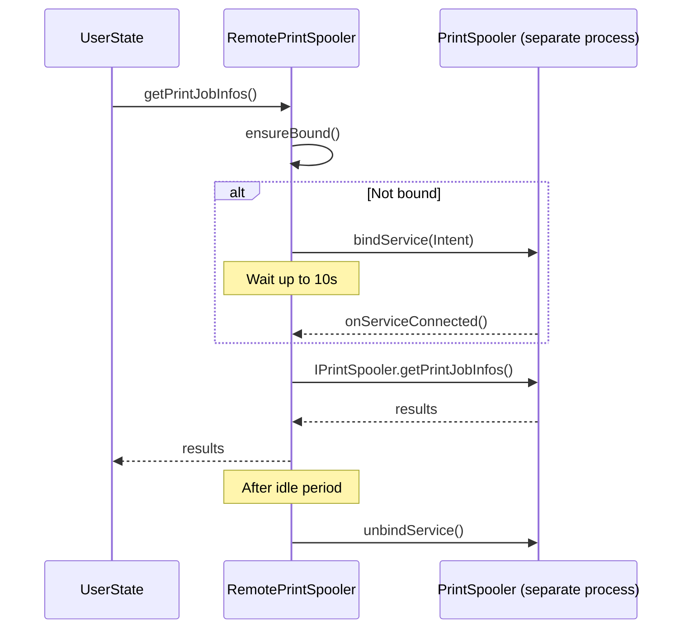

### 61.11.4 Spooler Callbacks

The spooler notifies the system service of state changes through
`PrintSpoolerCallbacks`:

```java
// frameworks/base/services/print/java/com/android/server/print/RemotePrintSpooler.java
public static interface PrintSpoolerCallbacks {
    public void onPrintJobQueued(PrintJobInfo printJob);
    public void onAllPrintJobsForServiceHandled(ComponentName printService);
    public void onPrintJobStateChanged(PrintJobInfo printJob);
}
```

---

## 61.12 RemotePrintService -- Service Process Proxy

`RemotePrintService` manages the lifecycle of a bound print service:

```java
// frameworks/base/services/print/java/com/android/server/print/RemotePrintService.java
final class RemotePrintService implements DeathRecipient {
    private final List<Runnable> mPendingCommands = new ArrayList<>();
    private IPrintService mPrintService;
    private boolean mBinding;
    private boolean mHasActivePrintJobs;
    private boolean mHasPrinterDiscoverySession;
```

### 61.12.1 Deferred Commands

If the service is not yet bound when a command arrives, it is added to
`mPendingCommands` and executed after binding completes:

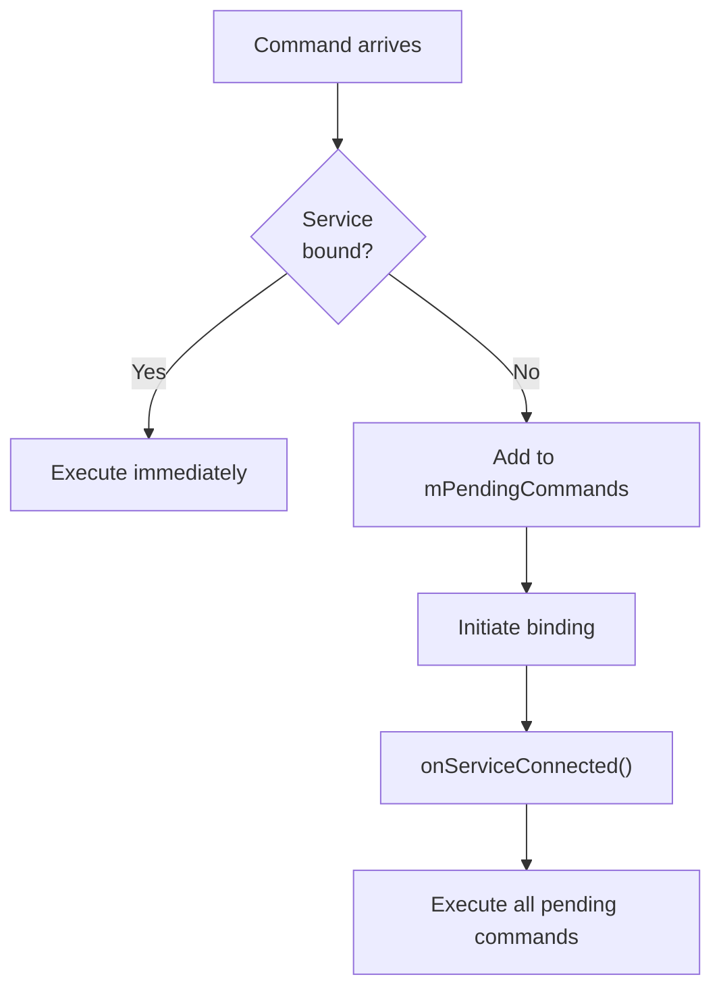

### 61.12.2 Death Handling

When a print service process dies:

```java
// frameworks/base/services/print/java/com/android/server/print/RemotePrintService.java
// implements DeathRecipient
```

The `RemotePrintService` detects the death, notifies `UserState` through
`PrintServiceCallbacks.onServiceDied()`, and the `UserState` schedules
a restart after 500ms.

### 61.12.3 Tracked Printers

The proxy tracks which printers are being actively monitored:

```java
@GuardedBy("mLock")
private List<PrinterId> mTrackedPrinterList;
```

This allows the proxy to re-request printer state tracking after a service
restart, providing seamless recovery from service crashes.

---

## 61.13 The Complete Print Flow

Here is the end-to-end flow from a user pressing "Print" in an application
to the document arriving at the printer:

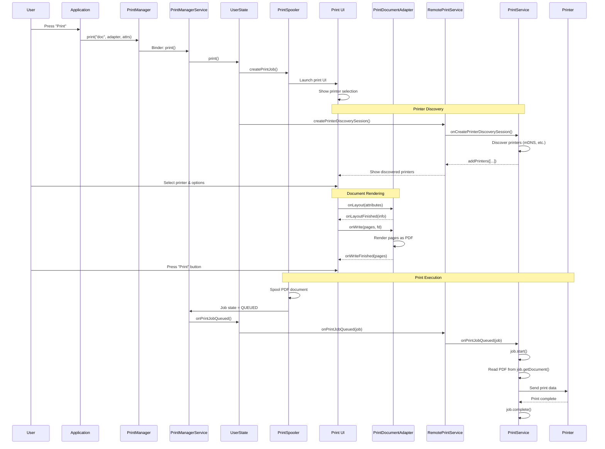

---

## 61.14 The print() Method Internals

The `UserState.print()` method reveals the internal mechanics of job creation:

```java
// frameworks/base/services/print/java/com/android/server/print/UserState.java
public Bundle print(@NonNull String printJobName, @NonNull IPrintDocumentAdapter adapter,
        @Nullable PrintAttributes attributes, @NonNull String packageName, int appId) {
    // Create print job place holder.
    final PrintJobInfo printJob = new PrintJobInfo();
    printJob.setId(new PrintJobId());
    printJob.setAppId(appId);
    printJob.setLabel(printJobName);
    printJob.setAttributes(attributes);
    printJob.setState(PrintJobInfo.STATE_CREATED);
    printJob.setCopies(1);
    printJob.setCreationTime(System.currentTimeMillis());

    // Track this job so we can forget it when the creator dies.
    if (!mPrintJobForAppCache.onPrintJobCreated(adapter.asBinder(), appId, printJob)) {
        return null; // Client is dead
    }

    Intent intent = new Intent(PrintManager.ACTION_PRINT_DIALOG);
    intent.setData(Uri.fromParts("printjob", printJob.getId().flattenToString(), null));
    intent.putExtra(PrintManager.EXTRA_PRINT_DOCUMENT_ADAPTER, adapter.asBinder());
    intent.putExtra(PrintManager.EXTRA_PRINT_JOB, printJob);
    intent.putExtra(Intent.EXTRA_PACKAGE_NAME, packageName);

    // Returns IntentSender to launch print dialog
    IntentSender intentSender = PendingIntent.getActivityAsUser(
            mContext, 0, intent, PendingIntent.FLAG_ONE_SHOT
                    | PendingIntent.FLAG_CANCEL_CURRENT | PendingIntent.FLAG_IMMUTABLE,
            activityOptions.toBundle(), new UserHandle(mUserId)).getIntentSender();
```

Key implementation details:

1. **Death tracking**: The adapter Binder is monitored via `PrintJobForAppCache` --
   if the creating app dies, its print jobs are cleaned up

2. **PendingIntent**: The print dialog is launched through a `PendingIntent`,
   ensuring proper security context even across process boundaries

3. **Background activity restriction**: Uses `MODE_BACKGROUND_ACTIVITY_START_DENIED`
   to prevent apps from launching the print dialog from the background

4. **Initial state**: Every print job starts as `STATE_CREATED` with 1 copy

### 61.14.1 PrintJobForAppCache

When applications create print jobs, they are tracked in a cache keyed by
app ID. This serves two purposes:

- **Job fusion**: The cache merges with spooler data in `getPrintJobInfos()`
  to provide a complete view. The spooler does not store terminal-state jobs,
  while the cache retains them until the app dies

- **Tag stripping**: Tags and advanced options are stripped when returning
  jobs to apps -- these are only visible to print services

```java
// frameworks/base/services/print/java/com/android/server/print/UserState.java
public List<PrintJobInfo> getPrintJobInfos(int appId) {
    List<PrintJobInfo> cachedPrintJobs = mPrintJobForAppCache.getPrintJobs(appId);
    // Note that the print spooler is not storing print jobs that
    // are in a terminal state as it is non-trivial to properly update
    // the spooler state for when to forget print jobs in terminal state.
    // Therefore, we fuse the cached print jobs for running apps (some
    // jobs are in a terminal state) with the ones that the print
    // spooler knows about (some jobs are being processed).
```

### 61.14.2 Cancel and Restart Flow

Canceling a print job involves both the spooler and the print service:

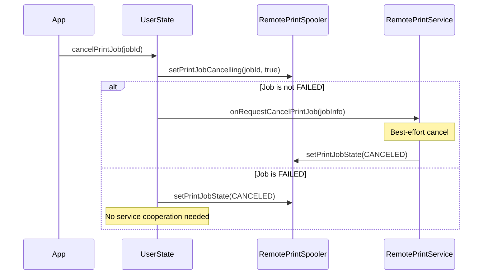

Restarting a failed job simply transitions it back to `QUEUED`:

```java
// frameworks/base/services/print/java/com/android/server/print/UserState.java
public void restartPrintJob(@NonNull PrintJobId printJobId, int appId) {
    PrintJobInfo printJobInfo = getPrintJobInfo(printJobId, appId);
    if (printJobInfo == null || printJobInfo.getState() != PrintJobInfo.STATE_FAILED) {
        return;
    }
    mSpooler.setPrintJobState(printJobId, PrintJobInfo.STATE_QUEUED, null);
}
```

### 61.14.3 Job Routing to Services

When the spooler notifies that a job is queued, `UserState` routes it to the
correct print service based on the printer's `ComponentName`:

```java
// frameworks/base/services/print/java/com/android/server/print/UserState.java
@Override
public void onPrintJobQueued(PrintJobInfo printJob) {
    ComponentName printServiceName = printJob.getPrinterId().getServiceName();
    RemotePrintService service = mActiveServices.get(printServiceName);

    if (service != null) {
        service.onPrintJobQueued(printJob);
    } else {
        // The service is no longer enabled
        mSpooler.setPrintJobState(printJob.getId(), PrintJobInfo.STATE_FAILED,
                mContext.getString(R.string.reason_service_unavailable));
    }
}
```

If the targeted print service has been disabled between when the user selected
the printer and when the job was queued, the job immediately fails with
"service unavailable."

---

## 61.15 PrintManagerImpl Binder Service

The `PrintManagerImpl` inner class handles all Binder calls with careful
security enforcement:

### 61.15.1 User Resolution

Every API call resolves the calling user and validates permissions:

```java
// frameworks/base/services/print/java/com/android/server/print/PrintManagerService.java
final int resolvedUserId = resolveCallingUserEnforcingPermissions(userId);
final int resolvedAppId;
final UserState userState;
synchronized (mLock) {
    // Only the current group members can start new print jobs.
    if (resolveCallingProfileParentLocked(resolvedUserId) != getCurrentUserId()) {
        return null;
    }
    resolvedAppId = resolveCallingAppEnforcingPermissions(appId);
    resolvedPackageName = resolveCallingPackageNameEnforcingSecurity(packageName);
    userState = getOrCreateUserStateLocked(resolvedUserId, false);
}
```

### 61.15.2 Custom Printer Icon Security

Custom printer icons from print services undergo user boundary validation
to prevent cross-user information leakage:

```java
// frameworks/base/services/print/java/com/android/server/print/PrintManagerService.java
private Icon validateIconUserBoundary(Icon icon, int resolvedCallingId) {
    if (icon != null && (icon.getType() == Icon.TYPE_URI
            || icon.getType() == Icon.TYPE_URI_ADAPTIVE_BITMAP)) {
        final int iconUserId = ContentProvider.getUserIdFromAuthority(
                icon.getUri().getAuthority(), resolvedCallingId);
        synchronized (mLock) {
            if (resolveCallingProfileParentLocked(iconUserId) != getCurrentUserId()) {
                return null; // Block cross-user icon access
            }
        }
    }
    return icon;
}
```

### 61.15.3 Print Services Query

The `READ_PRINT_SERVICES` permission is required to enumerate print services:

```java
// frameworks/base/services/print/java/com/android/server/print/PrintManagerService.java
public List<PrintServiceInfo> getPrintServices(int selectionFlags, int userId) {
    Preconditions.checkFlagsArgument(selectionFlags,
            PrintManager.DISABLED_SERVICES | PrintManager.ENABLED_SERVICES);
    mContext.enforceCallingOrSelfPermission(
            android.Manifest.permission.READ_PRINT_SERVICES, null);
```

---

## 61.16 Print Service Recommendations

Android provides a recommendation system for suggesting print services that
the user might want to install. `RemotePrintServiceRecommendationService`
handles the connection to recommendation services:

```java
// frameworks/base/services/print/java/com/android/server/print/
// RemotePrintServiceRecommendationService.java
```

Recommendations are displayed in the print UI when no installed print service
can communicate with a discovered printer.

---

## 61.17 AIDL Interfaces

The print framework defines several AIDL interfaces for cross-process
communication:

| Interface | Direction | Purpose |
|-----------|-----------|---------|
| `IPrintManager` | App -> System | Print job creation, query, cancel |
| `IPrintDocumentAdapter` | System -> App | Layout and write callbacks |
| `IPrintDocumentAdapterObserver` | System -> App | Adapter lifecycle notifications |
| `IPrintSpooler` | System -> Spooler | Job management in spooler |
| `IPrintSpoolerCallbacks` | Spooler -> System | Job state change callbacks |
| `IPrintSpoolerClient` | System -> Spooler | Client registration |
| `IPrintService` | System -> Service | Print service control |
| `IPrintServiceClient` | Service -> System | Printer and job updates |
| `IPrintJobStateChangeListener` | System -> App | Job state notifications |
| `IPrintServicesChangeListener` | System -> App | Service list notifications |
| `IPrinterDiscoveryObserver` | System -> App | Printer discovery events |
| `ILayoutResultCallback` | App -> System | Layout result delivery |
| `IWriteResultCallback` | App -> System | Write result delivery |

### 61.17.1 Listener Interfaces

The `PrintManager` client API exposes three listener interfaces:

```java
// frameworks/base/core/java/android/print/PrintManager.java

// Notified when any print job state changes
public interface PrintJobStateChangeListener {
    void onPrintJobStateChanged(PrintJobId printJobId);
}

// Notified when the set of print services changes
@SystemApi
public interface PrintServicesChangeListener {
    void onPrintServicesChanged();
}

// Notified when print service recommendations change
@SystemApi
public interface PrintServiceRecommendationsChangeListener {
    void onPrintServiceRecommendationsChanged();
}
```

State change listeners are wrapped in Binder-compatible wrappers and delivered
through the main looper handler:

```java
// frameworks/base/core/java/android/print/PrintManager.java
mHandler = new Handler(context.getMainLooper(), null, false) {
    @Override
    public void handleMessage(Message message) {
        switch (message.what) {
            case MSG_NOTIFY_PRINT_JOB_STATE_CHANGED: {
                SomeArgs args = (SomeArgs) message.obj;
                PrintJobStateChangeListenerWrapper wrapper =
                        (PrintJobStateChangeListenerWrapper) args.arg1;
                PrintJobStateChangeListener listener = wrapper.getListener();
                if (listener != null) {
                    PrintJobId printJobId = (PrintJobId) args.arg2;
                    listener.onPrintJobStateChanged(printJobId);
                }
                args.recycle();
            } break;
        }
    }
};
```

### 61.17.2 PrintManager Internal Extras

The `PrintManager` uses several hidden extras for communication with the
print dialog activity:

```java
// frameworks/base/core/java/android/print/PrintManager.java
public static final String ACTION_PRINT_DIALOG = "android.print.PRINT_DIALOG";
public static final String EXTRA_PRINT_DIALOG_INTENT =
        "android.print.intent.extra.EXTRA_PRINT_DIALOG_INTENT";
public static final String EXTRA_PRINT_JOB =
        "android.print.intent.extra.EXTRA_PRINT_JOB";
public static final String EXTRA_PRINT_DOCUMENT_ADAPTER =
        "android.print.intent.extra.EXTRA_PRINT_DOCUMENT_ADAPTER";
public static final int APP_ID_ANY = -2;
```

The `APP_ID_ANY` constant is used by `getGlobalPrintManagerForUser()` to create
a `PrintManager` instance that can access all print jobs regardless of app ID.

---

## 61.18 PrintFileDocumentAdapter

For the common case of printing an existing file, Android provides
`PrintFileDocumentAdapter`:

```java
// frameworks/base/core/java/android/print/PrintFileDocumentAdapter.java
```

This adapter handles reading from a `File` and writing to the print
spooler without the application needing to implement the full
`PrintDocumentAdapter` contract.

---

## 61.19 Threading Model

The print framework uses careful threading to avoid blocking the UI:

| Component | Thread | Purpose |
|-----------|--------|---------|
| `PrintManager` callbacks | Main thread | Deliver state changes to app |
| `PrintDocumentAdapter.onLayout()` | Main thread | App-driven layout |
| `PrintDocumentAdapter.onWrite()` | Main thread | App-driven rendering |
| `PrintManagerImpl` operations | Binder thread | Service request handling |
| `RemotePrintSpooler` calls | Background thread | Spooler IPC (may block) |
| `RemotePrintService` binding | Background thread | Service binding |
| `UserState` state management | Synchronized on `mLock` | Thread-safe state access |

The documentation explicitly warns:

> The calls [to RemotePrintSpooler] might be blocking and need the main
> thread to be unblocked to finish. Hence do not call this while holding
> any monitors that might need to be acquired on the main thread.

---

## 61.20 Security Model

The print framework enforces several security boundaries:

### 61.20.1 Permission Requirements

| Permission | Purpose |
|-----------|---------|
| `BIND_PRINT_SERVICE` | Only system can bind to print services |
| `INTERACT_ACROSS_USERS_FULL` | Cross-user print management |
| Feature: `FEATURE_PRINTING` | Device must support printing |

### 61.20.2 App Isolation

Applications can only see their own print jobs. The `PrintJobForAppCache`
in `UserState` maintains per-app caches:

```java
// frameworks/base/services/print/java/com/android/server/print/UserState.java
private final PrintJobForAppCache mPrintJobForAppCache = new PrintJobForAppCache();
```

### 61.20.3 Device Policy Integration

Enterprise management can disable printing entirely through `DevicePolicyManager`:

```java
// frameworks/base/services/print/java/com/android/server/print/PrintManagerService.java
if (!isPrintingEnabled()) {
    DevicePolicyManagerInternal dpmi =
            LocalServices.getService(DevicePolicyManagerInternal.class);
    // Show disabled message to user
}
```

---

## 61.21 Debugging Print Services

### 61.21.1 Shell Commands

The `PrintShellCommand` class provides debugging commands:

```bash
# List print services
$ adb shell cmd print list-services

# Get print jobs
$ adb shell cmd print get-print-jobs

# Dump print service state
$ adb shell dumpsys print
```

### 61.21.2 Logging

Enable verbose logging for print components:

```bash
$ adb shell setprop log.tag.PrintManager VERBOSE
$ adb shell setprop log.tag.PrintManagerService VERBOSE
$ adb shell setprop log.tag.RemotePrintSpooler VERBOSE
$ adb shell setprop log.tag.RemotePrintService VERBOSE
$ adb shell setprop log.tag.UserState VERBOSE
```

### 61.21.3 Proto Dump

The print framework supports protobuf-based dumps for structured analysis:

```java
// frameworks/base/services/print/java/com/android/server/print/UserState.java
// Uses PrintUserStateProto, CachedPrintJobProto, InstalledPrintServiceProto,
// PrinterDiscoverySessionProto for structured dumps
```

---

## 61.22 Key Constants Reference

| Constant | Value | Location |
|----------|-------|----------|
| `PRINT_SPOOLER_PACKAGE_NAME` | `com.android.printspooler` | `PrintManager.java` |
| `BIND_SPOOLER_SERVICE_TIMEOUT` | 10,000ms (eng: 120,000ms) | `RemotePrintSpooler.java` |
| `SERVICE_RESTART_DELAY_MILLIS` | 500ms | `UserState.java` |
| `MILS_PER_INCH` | 1000 | `PrintedPdfDocument.java` |
| `POINTS_IN_INCH` | 72 | `PrintedPdfDocument.java` |
| `COMPONENT_NAME_SEPARATOR` | `:` | `UserState.java` |
| `BACKGROUND_USER_ID` | -10 | `PrintManagerImpl` |
| Service action | `android.printservice.PrintService` | `PrintService.java` |
| Meta-data key | `android.printservice` | `PrintService.java` |

---

## Summary

Android's printing framework is a well-structured system built on four layers:
the client API (`PrintManager`), the system service (`PrintManagerService` with
per-user `UserState`), the print spooler process (`com.android.printspooler`),
and pluggable print services (`PrintService`).

The `PrintDocumentAdapter` contract between applications and the print framework
ensures content can be re-laid-out for different print attributes, with the
framework always requesting PDF output. The seven-state print job lifecycle
(`CREATED` -> `QUEUED` -> `STARTED` -> `COMPLETED`/`FAILED`/`CANCELED`, with
`BLOCKED` as an intermediate state) provides fine-grained tracking of print
progress.

Printer discovery is handled through `PrinterDiscoverySession`, which supports
lazy capability loading and real-time printer state tracking. The session-based
design ensures that print services only perform expensive network discovery
when the system needs it.

The spooler and print service proxies (`RemotePrintSpooler` and
`RemotePrintService`) handle the complexities of cross-process communication,
including binding lifecycle, timeouts, crash recovery, and deferred command
queuing. The multi-user architecture ensures complete isolation between
users while sharing the underlying framework infrastructure.
