# 第 62 章：Camera2 Pipeline 深入剖析

> *“Camera2 API 是 Android 里最贴近硬件的 API 之一。它本质上是一条 request-result 管线：在单帧时限内，把配置、元数据和像素 buffer 穿过三层进程边界，最终送进 vendor ISP 和 sensor。”*

相机子系统是 AOSP 中最复杂、也最讲究时延和吞吐的管线之一。一次拍照可能同时涉及几十上百个 metadata key、多个输出 surface、3A（AE / AF / AWB）收敛循环、ISP 配置、多帧降噪和 HDR 合成，而且这些步骤要跨越 Java framework、native `CameraService`、AIDL/HIDL HAL，以及厂商硬件协同完成。

本章从应用侧 `CameraManager` 出发，一路向下跟踪到 `CameraService`、`CameraDeviceClient`、`Camera3Device` 和 camera HAL，再顺着 `CaptureResult`、buffer 和 callback 回到应用。重点不是“怎么写一个拍照 Demo”，而是把 Camera2 的请求提交、流配置、metadata 映射、结果回传和多摄扩展机制整条链路讲清楚。

---

## 62.1 Camera2 Architecture

### 62.1.1 四层栈模型

Camera2 可以分成四层：

1. **Framework Java 层**：`android.hardware.camera2.*`。应用通过 `CameraManager`、`CameraDevice`、`CameraCaptureSession`、`CaptureRequest`、`CaptureResult` 交互。
2. **Camera Service（C++）层**：`frameworks/av/services/camera/libcameraservice/` 里的 `CameraService`、`CameraDeviceClient`、`Camera3Device`。这是运行在 `cameraserver` 进程中的 native 服务，负责 client 连接、权限、仲裁和 HAL 驱动。
3. **Camera HAL 层**：厂商提供的 `ICameraDevice` / `ICameraDeviceSession` AIDL 或 HIDL 实现，把 framework 请求翻译成 ISP / sensor 的实际控制。
4. **硬件层**：sensor、ISP 以及相关图像处理硬件。

关键源码路径：

```text
CameraManager ........... frameworks/base/core/java/android/hardware/camera2/CameraManager.java
CameraDevice ............ frameworks/base/core/java/android/hardware/camera2/CameraDevice.java
CameraCaptureSession .... frameworks/base/core/java/android/hardware/camera2/CameraCaptureSession.java
CaptureRequest .......... frameworks/base/core/java/android/hardware/camera2/CaptureRequest.java
CaptureResult ........... frameworks/base/core/java/android/hardware/camera2/CaptureResult.java
CameraCharacteristics ... frameworks/base/core/java/android/hardware/camera2/CameraCharacteristics.java
CameraDeviceImpl ........ frameworks/base/core/java/android/hardware/camera2/impl/CameraDeviceImpl.java
CameraService.cpp ....... frameworks/av/services/camera/libcameraservice/CameraService.cpp
CameraService.h ......... frameworks/av/services/camera/libcameraservice/CameraService.h
CameraDeviceClient ...... frameworks/av/services/camera/libcameraservice/api2/CameraDeviceClient.cpp
Camera3Device ........... frameworks/av/services/camera/libcameraservice/device3/Camera3Device.cpp
Camera3Device.h ......... frameworks/av/services/camera/libcameraservice/device3/Camera3Device.h
Camera3OutputStream ..... frameworks/av/services/camera/libcameraservice/device3/Camera3OutputStream.cpp
```

### 62.1.2 端到端架构图

下图展示了从应用到 HAL 再回到结果回调的整体路径。

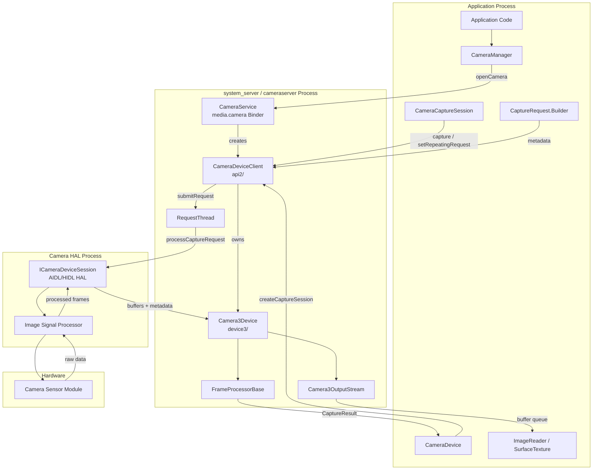
```mermaid
graph TD
    subgraph "Application Process"
        APP["Application Code"]
        CM["CameraManager"]
        CD["CameraDevice"]
        CCS["CameraCaptureSession"]
        CR["CaptureRequest.Builder"]
        IR["ImageReader / SurfaceTexture"]
    end

    subgraph "system_server / cameraserver Process"
        CS["CameraService<br/>media.camera Binder"]
        CDC["CameraDeviceClient<br/>api2/"]
        C3D["Camera3Device<br/>device3/"]
        C3OS["Camera3OutputStream"]
        RT["RequestThread"]
        FP["FrameProcessorBase"]
    end

    subgraph "Camera HAL Process"
        HAL["ICameraDeviceSession<br/>AIDL/HIDL HAL"]
        ISP["Image Signal Processor"]
    end

    subgraph "Hardware"
        SENSOR["Camera Sensor Module"]
    end

    APP --> CM
    CM -->|"openCamera"| CS
    CS -->|"creates"| CDC
    CDC -->|"owns"| C3D
    CD -->|"createCaptureSession"| CDC
    CCS -->|"capture / setRepeatingRequest"| CDC
    CR -->|"metadata"| CDC
    CDC -->|"submitRequest"| RT
    RT -->|"processCaptureRequest"| HAL
    HAL --> ISP
    ISP --> SENSOR
    SENSOR -->|"raw data"| ISP
    ISP -->|"processed frames"| HAL
    HAL -->|"buffers + metadata"| C3D
    C3D --> C3OS
    C3OS -->|"buffer queue"| IR
    C3D --> FP
    FP -->|"CaptureResult"| CD
```

### 62.1.3 CameraManager：应用入口

`CameraManager` 是应用通过 `Context.getSystemService(Context.CAMERA_SERVICE)` 获取的系统服务入口。

```text
Source: frameworks/base/core/java/android/hardware/camera2/CameraManager.java
```

它的核心职责：

| 方法 | 作用 |
|------|------|
| `getCameraIdList()` | 返回当前可用 camera ID 列表 |
| `getCameraCharacteristics(id)` | 返回静态能力和特征元数据 |
| `openCamera(id, callback, handler)` | 异步打开相机 |
| `registerAvailabilityCallback()` | 监听相机可用性变化 |
| `getConcurrentCameraIds()` | 返回可并发工作的 camera ID 组合 |

内部它会通过 `ServiceManager.getService("media.camera")` 获取 `ICameraService`：

```java
// Simplified from CameraManager.java
private ICameraService getCameraServiceLocked() {
    IBinder cameraServiceBinder = ServiceManager.getService("media.camera");
    ICameraService cameraService = ICameraService.Stub.asInterface(cameraServiceBinder);
    // Register a listener for device status changes
    cameraService.addListener(mCameraServiceListener);
    return cameraService;
}
```

`CameraManager` 还维护三类缓存：

1. **设备 ID 缓存**：由 `ICameraServiceListener.onStatusChanged()` 更新。
2. **Characteristics 缓存**：首次调用 `getCameraCharacteristics()` 时惰性填充。
3. **多分辨率配置缓存**：逻辑相机与物理相机流配置之间的映射，因为计算它要做多次 Binder 调用。

### 62.1.4 CameraDevice：打开后的设备句柄

`CameraDevice` 是一个抽象类，代表已经打开的 camera；具体实现是 `impl/` 下的 `CameraDeviceImpl`。

```text
Source: frameworks/base/core/java/android/hardware/camera2/CameraDevice.java
        frameworks/base/core/java/android/hardware/camera2/impl/CameraDeviceImpl.java
```

它定义了创建请求模板时会用到的 template 常量：

| Template | 值 | 用途 |
|----------|----|------|
| `TEMPLATE_PREVIEW` | 1 | 预览，优先帧率 |
| `TEMPLATE_STILL_CAPTURE` | 2 | 静态拍照，优先画质 |
| `TEMPLATE_RECORD` | 3 | 录像，优先稳定帧率 |
| `TEMPLATE_VIDEO_SNAPSHOT` | 4 | 录像中抓拍 |
| `TEMPLATE_ZERO_SHUTTER_LAG` | 5 | ZSL 拍照 |
| `TEMPLATE_MANUAL` | 6 | 全手动控制 |

`StateCallback` 描述其生命周期：

下图展示了 `open -> session -> capture -> close` 的状态演进。

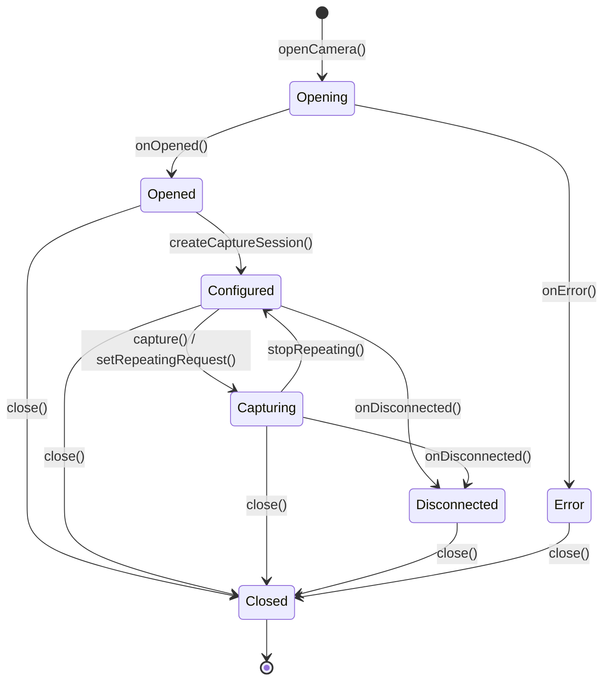
```mermaid
stateDiagram-v2
    [*] --> Opening: openCamera()
    Opening --> Opened: onOpened()
    Opening --> Error: onError()
    Opened --> Configured: createCaptureSession()
    Configured --> Capturing: capture() / setRepeatingRequest()
    Capturing --> Configured: stopRepeating()
    Configured --> Disconnected: onDisconnected()
    Capturing --> Disconnected: onDisconnected()
    Opened --> Closed: close()
    Configured --> Closed: close()
    Capturing --> Closed: close()
    Disconnected --> Closed: close()
    Error --> Closed: close()
    Closed --> [*]
```

### 62.1.5 CameraDeviceImpl：Java 侧真实实现

`CameraDeviceImpl` 是应用进程中的具体实现类，它通过 `ICameraDeviceUser` Binder 接口与 camera service 中的 `CameraDeviceClient` 通信。

```text
Source: frameworks/base/core/java/android/hardware/camera2/impl/CameraDeviceImpl.java
```

几个关键内部组件：

| 组件 | 作用 |
|------|------|
| `ICameraDeviceUser mRemoteDevice` | 指向 `CameraDeviceClient` 的 Binder proxy |
| `FrameNumberTracker mFrameNumberTracker` | 跟踪 frame number 与结果顺序 |
| `SparseArray<CaptureCallbackHolder> mCaptureCallbackMap` | sequenceId 到 callback 的映射 |
| `RequestLastFrameNumbersHolder` | 跟踪不同请求类型的最后一帧 |
| `CameraDeviceCallbacks` | 接收结果和错误的内部回调对象 |

其中 `CameraDeviceCallbacks` 实现了 `ICameraDeviceCallbacks`，是结果上行的主路径：

```java
// Simplified from CameraDeviceImpl.CameraDeviceCallbacks
public class CameraDeviceCallbacks extends ICameraDeviceCallbacks.Stub {

    @Override
    public void onResultReceived(CameraMetadataNative result,
            CaptureResultExtras resultExtras,
            PhysicalCaptureResultInfo[] physicalResults) {
        // Match result to pending request using frame number
        // Deliver partial or total result to application callback
    }

    @Override
    public void onCaptureStarted(CaptureResultExtras resultExtras,
            long timestamp) {
        // Deliver shutter callback to application
    }

    @Override
    public void onDeviceError(int errorCode, CaptureResultExtras resultExtras) {
        // Handle device errors, notify StateCallback
    }
}
```

### 62.1.6 Hardware Support Levels

Camera2 用 `INFO_SUPPORTED_HARDWARE_LEVEL` 描述硬件支持等级：

| 等级 | 含义 |
|------|------|
| `LEGACY` | 兼容旧 Camera API 的最低支持级别 |
| `LIMITED` | 大致相当于旧相机 API 能力 |
| `EXTERNAL` | 可移除外设相机，如 USB camera |
| `FULL` | 完整 Camera2 能力，含 RAW、手动控制、逐帧控制 |
| `LEVEL_3` | 在 FULL 之上再加 YUV reprocess 等高级能力 |

```text
Source: frameworks/base/core/java/android/hardware/camera2/CameraCharacteristics.java
        frameworks/base/core/java/android/hardware/camera2/CameraMetadata.java
```

### 62.1.7 CameraCaptureSession：已配置好的输出管线

`CameraCaptureSession` 代表一组已经配置完成的输出 surface。创建 session 往往比较昂贵，因为底层要配置 ISP 管线并分配 buffer。

```text
Source: frameworks/base/core/java/android/hardware/camera2/CameraCaptureSession.java
        frameworks/base/core/java/android/hardware/camera2/impl/CameraCaptureSessionImpl.java
```

它支持两种最常见的提交模式：

1. **单次 capture**：`capture(...)`，适合拍照。
2. **重复请求**：`setRepeatingRequest(...)`，适合预览和录像。

除此之外还支持：

- `captureBurst(...)`：一次性提交多个请求。
- `prepare(Surface)`：提前分配输出 buffer，降低首帧延迟。

下图展示了 session 生命周期。

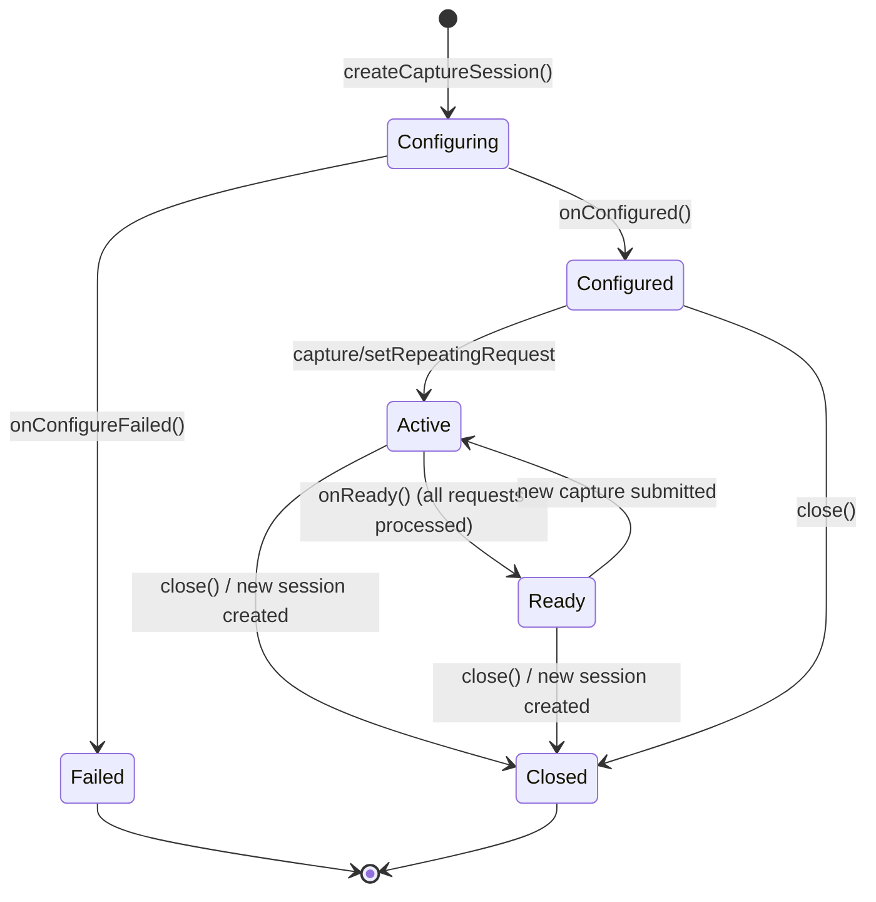
```mermaid
stateDiagram-v2
    [*] --> Configuring: createCaptureSession()
    Configuring --> Configured: onConfigured()
    Configuring --> Failed: onConfigureFailed()
    Configured --> Active: capture/setRepeatingRequest
    Active --> Ready: onReady() (all requests processed)
    Ready --> Active: new capture submitted
    Active --> Closed: close() / new session created
    Ready --> Closed: close() / new session created
    Configured --> Closed: close()
    Failed --> [*]
    Closed --> [*]
```

### 62.1.8 SessionConfiguration 和 OutputConfiguration

从 API 24 起，session 配置越来越依赖 `SessionConfiguration` 和 `OutputConfiguration`，因为它们能表达更细粒度的输出设置。

```text
Source: frameworks/base/core/java/android/hardware/camera2/params/OutputConfiguration.java
        frameworks/base/core/java/android/hardware/camera2/params/SessionConfiguration.java
```

`OutputConfiguration` 的几个关键特性：

| 特性 | 方法 | 作用 |
|------|------|------|
| Surface sharing | `enableSurfaceSharing()` | 一个流挂多个 consumer |
| 物理相机指定 | `setPhysicalCameraId()` | 流指向指定 physical camera |
| Deferred surface | `Size + Class` 构造函数 | Surface 尚未创建时预配置 |
| Group ID | `OutputConfiguration(int, Surface)` | 将相关输出分组 |

示例：

```java
List<OutputConfiguration> outputs = new ArrayList<>();
outputs.add(new OutputConfiguration(previewSurface));
outputs.add(new OutputConfiguration(imageReaderSurface));

SessionConfiguration config = new SessionConfiguration(
    SessionConfiguration.SESSION_REGULAR,
    outputs,
    executor,
    stateCallback
);

cameraDevice.createCaptureSession(config);
```

---

## 62.2 CameraService Internals

### 62.2.1 CameraService：native 总门卫

`CameraService` 是所有 camera 访问的总协调者，运行在 `cameraserver` 进程中，并以 `"media.camera"` 的名字注册到 service manager。

```text
Source: frameworks/av/services/camera/libcameraservice/CameraService.h
        frameworks/av/services/camera/libcameraservice/CameraService.cpp
```

它的类层级大致如下：

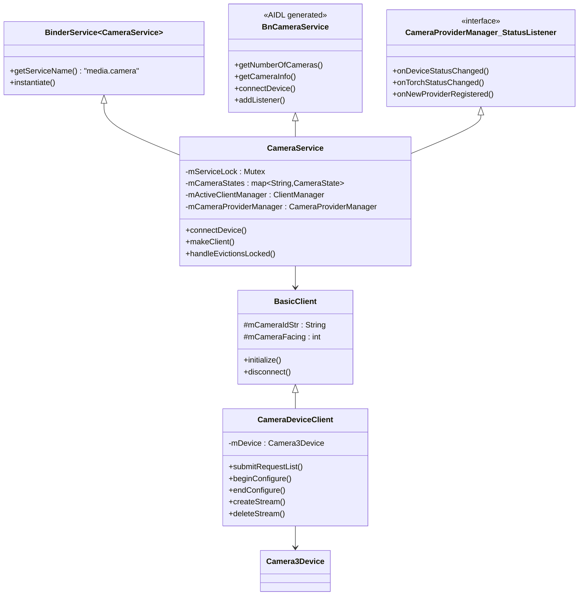
```mermaid
classDiagram
    class BinderService~CameraService~ {
        +getServiceName() "media.camera"
        +instantiate()
    }
    class BnCameraService {
        <<AIDL generated>>
        +getNumberOfCameras()
        +getCameraInfo()
        +connectDevice()
        +addListener()
    }
    class CameraProviderManager_StatusListener {
        <<interface>>
        +onDeviceStatusChanged()
        +onTorchStatusChanged()
        +onNewProviderRegistered()
    }
    class CameraService {
        -mServiceLock : Mutex
        -mCameraStates : map~String,CameraState~
        -mActiveClientManager : ClientManager
        -mCameraProviderManager : CameraProviderManager
        +connectDevice()
        +makeClient()
        +handleEvictionsLocked()
    }
    class BasicClient {
        #mCameraIdStr : String
        #mCameraFacing : int
        +initialize()
        +disconnect()
    }
    class CameraDeviceClient {
        -mDevice : Camera3Device
        +submitRequestList()
        +beginConfigure()
        +endConfigure()
        +createStream()
        +deleteStream()
    }

    BinderService~CameraService~ <|-- CameraService
    BnCameraService <|-- CameraService
    CameraProviderManager_StatusListener <|-- CameraService
    CameraService --> BasicClient
    BasicClient <|-- CameraDeviceClient
    CameraDeviceClient --> Camera3Device
```

### 62.2.2 服务启动与 provider 注册

`cameraserver` 启动时，`CameraService` 会通过 `CameraProviderManager` 枚举所有 camera provider，并从 VINTF 清单里找到 HAL 服务。

下图展示了 provider 初始化流程。

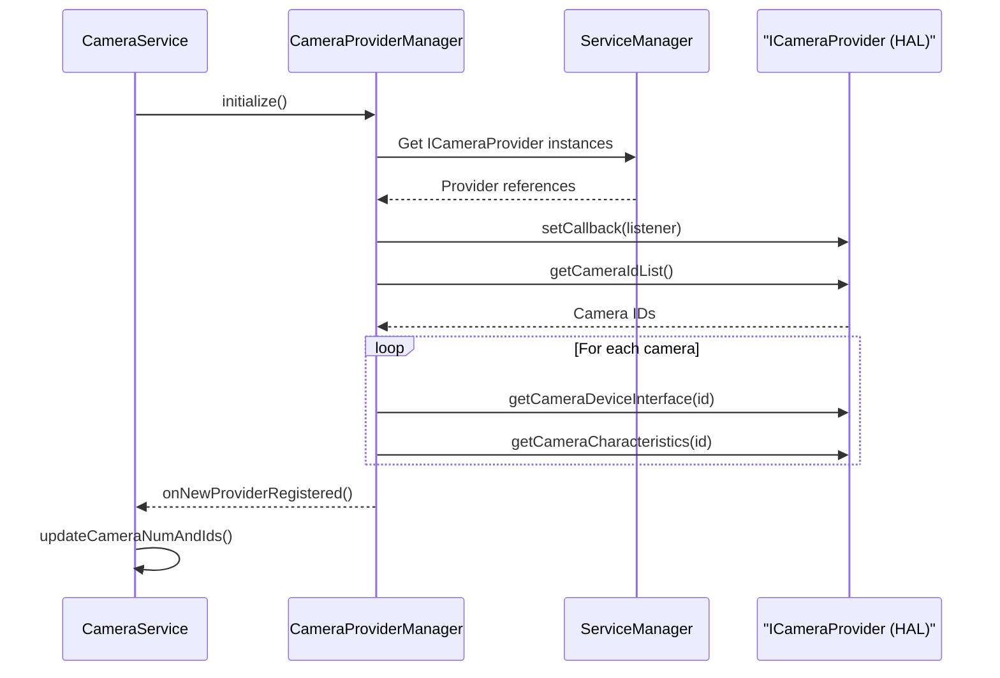
```mermaid
sequenceDiagram
    participant CS as CameraService
    participant CPM as CameraProviderManager
    participant SM as ServiceManager
    participant HAL as "ICameraProvider (HAL)"

    CS->>CPM: initialize()
    CPM->>SM: Get ICameraProvider instances
    SM-->>CPM: Provider references
    CPM->>HAL: setCallback(listener)
    CPM->>HAL: getCameraIdList()
    HAL-->>CPM: Camera IDs
    loop For each camera
        CPM->>HAL: getCameraDeviceInterface(id)
        CPM->>HAL: getCameraCharacteristics(id)
    end
    CPM-->>CS: onNewProviderRegistered()
    CS->>CS: updateCameraNumAndIds()
```

```text
Source: frameworks/av/services/camera/libcameraservice/common/CameraProviderManager.h
        frameworks/av/services/camera/libcameraservice/common/CameraProviderManager.cpp
```

### 62.2.3 Client 连接与驱逐

当应用调用 `openCamera()` 时，framework 会通过 AIDL 连接到 `CameraService`。服务端会做权限、策略和 client 驱逐判断：

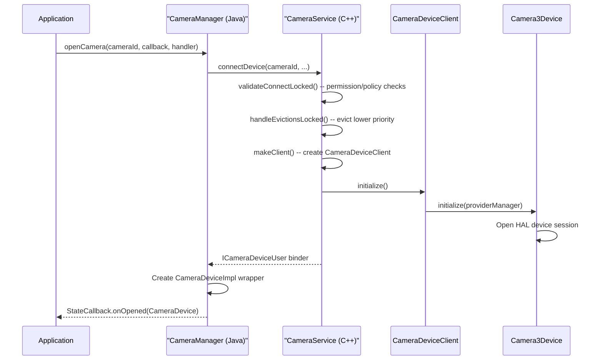
```mermaid
sequenceDiagram
    participant App as Application
    participant CM as "CameraManager (Java)"
    participant CS as "CameraService (C++)"
    participant CDC as CameraDeviceClient
    participant C3D as Camera3Device

    App->>CM: openCamera(cameraId, callback, handler)
    CM->>CS: connectDevice(cameraId, ...)
    CS->>CS: validateConnectLocked() -- permission/policy checks
    CS->>CS: handleEvictionsLocked() -- evict lower priority
    CS->>CS: makeClient() -- create CameraDeviceClient
    CS->>CDC: initialize()
    CDC->>C3D: initialize(providerManager)
    C3D->>C3D: Open HAL device session
    CS-->>CM: ICameraDeviceUser binder
    CM->>CM: Create CameraDeviceImpl wrapper
    CM-->>App: StateCallback.onOpened(CameraDevice)
```

驱逐策略是优先级驱动的：

| 优先级 | 说明 |
|--------|------|
| 前台 Activity | 最高 |
| 前台 Service | 高 |
| 常驻系统进程 | 高 |
| 顶层但未聚焦 Activity | 中 |
| 可见 Activity | 中 |
| 后台进程 | 最低 |

如果高优先级 client 请求一个已被低优先级占用的 camera，低优先级 client 会被驱逐，并收到 `onDisconnected()`。

```text
Source: frameworks/av/services/camera/libcameraservice/utils/ClientManager.h
```

### 62.2.4 CameraDeviceClient：API2 的服务端入口

`CameraDeviceClient` 是每个 client 对应的服务端对象，实现了 `ICameraDeviceUser` AIDL 接口。Java 层所有 capture、stream 配置，最终都要经过它。

```text
Source: frameworks/av/services/camera/libcameraservice/api2/CameraDeviceClient.h
        frameworks/av/services/camera/libcameraservice/api2/CameraDeviceClient.cpp
```

| AIDL 方法 | `CameraDeviceClient` 方法 | 含义 |
|-----------|--------------------------|------|
| `submitRequestList` | `submitRequestList()` | 提交拍照 / 预览请求 |
| `beginConfigure` | `beginConfigure()` | 开始配置流 |
| `endConfigure` | `endConfigure()` | 完成配置流 |
| `createStream` | `createStream()` | 创建输出流 |
| `deleteStream` | `deleteStream()` | 删除输出流 |
| `waitUntilIdle` | `waitUntilIdle()` | 等待管线排空 |
| `flush` | `flush()` | 中止待处理请求 |

### 62.2.5 Camera3Device：HAL 驱动核心

`Camera3Device` 是 Camera HAL v3+ 的核心驱动器。它负责把 framework request 转成 HAL request，并把 HAL result 再路由回来。

```text
Source: frameworks/av/services/camera/libcameraservice/device3/Camera3Device.h
        frameworks/av/services/camera/libcameraservice/device3/Camera3Device.cpp
```

它继承自 `CameraDeviceBase`，并实现多组内部接口：

```cpp
class Camera3Device :
    public CameraDeviceBase,
    public camera3::SetErrorInterface,
    public camera3::InflightRequestUpdateInterface,
    public camera3::RequestBufferInterface,
    public camera3::FlushBufferInterface,
    public AttributionAndPermissionUtilsEncapsulator {
```

它还有两个具体 transport 子类：

- `HidlCamera3Device`
- `AidlCamera3Device`

### 62.2.6 Camera3Device 内部线程

`Camera3Device` 不是单线程对象，而是靠多条内部线程协作运行：

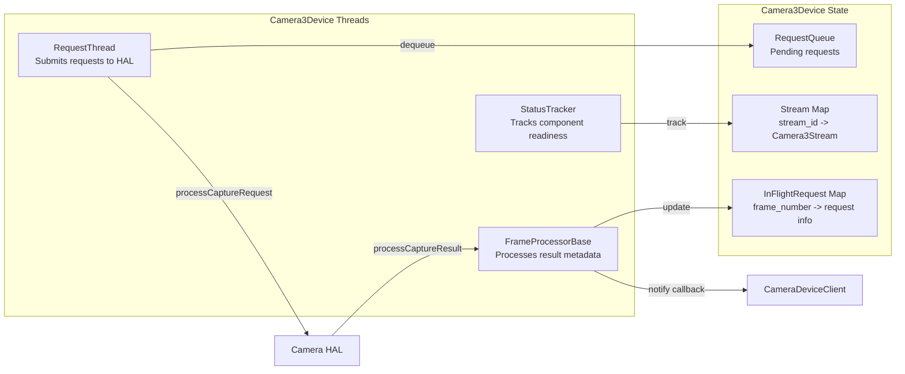
```mermaid
graph LR
    subgraph "Camera3Device Threads"
        RT["RequestThread<br/>Submits requests to HAL"]
        FP["FrameProcessorBase<br/>Processes result metadata"]
        ST["StatusTracker<br/>Tracks component readiness"]
    end

    subgraph "Camera3Device State"
        IFR["InFlightRequest Map<br/>frame_number -> request info"]
        SQ["RequestQueue<br/>Pending requests"]
        STREAMS["Stream Map<br/>stream_id -> Camera3Stream"]
    end

    RT -->|"dequeue"| SQ
    RT -->|"processCaptureRequest"| HAL["Camera HAL"]
    HAL -->|"processCaptureResult"| FP
    FP -->|"update"| IFR
    FP -->|"notify callback"| CDC["CameraDeviceClient"]
    ST -->|"track"| STREAMS
```

三条最重要的线程：

1. **RequestThread**
   - 从队列取 `CaptureRequest`
   - 应用 metadata mappers
   - 调用 HAL `processCaptureRequest()`
   - 把请求记入 `InFlightRequest`

2. **FrameProcessorBase**
   - 接收 HAL partial / final result
   - 按 frame number 匹配飞行中请求
   - 把结果交还给 `CameraDeviceClient`

3. **StatusTracker**
   - 跟踪 stream 和 HAL readiness
   - 避免 idle / active 状态抖动

### 62.2.7 Metadata Mappers

`Camera3Device` 在请求下发和结果返回时会做 metadata 坐标和数值映射：

| Mapper | 源文件 | 作用 |
|--------|--------|------|
| `DistortionMapper` | `device3/DistortionMapper.cpp` | 失真坐标矫正 |
| `ZoomRatioMapper` | `device3/ZoomRatioMapper.cpp` | `zoomRatio` 到 crop region 的转换 |
| `RotateAndCropMapper` | `device3/RotateAndCropMapper.cpp` | 处理 rotate-and-crop |
| `UHRCropAndMeteringRegionMapper` | `device3/UHRCropAndMeteringRegionMapper.cpp` | 超高分辨率裁剪和测光区域映射 |

这些 mapper 会在 request 路径和 result 路径都执行一次，只不过方向相反。

### 62.2.8 CameraProviderManager：HAL 发现和映射

`CameraProviderManager` 负责发现、连接和管理所有 camera provider 服务，并维护 camera ID 与 HAL 实现之间的映射。

```text
Source: frameworks/av/services/camera/libcameraservice/common/CameraProviderManager.h
        frameworks/av/services/camera/libcameraservice/common/CameraProviderManager.cpp
```

下图展示了它同时管理 AIDL 和 HIDL provider 的方式。

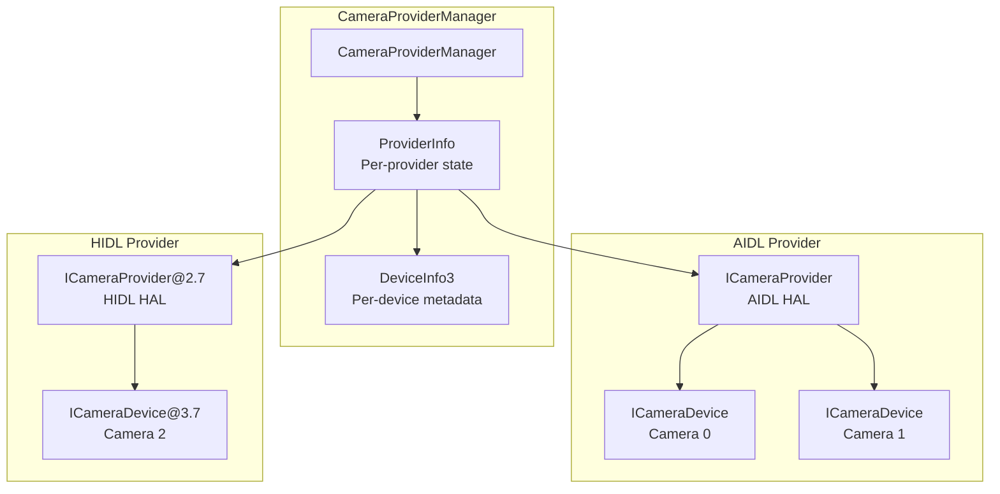
```mermaid
graph TD
    subgraph "CameraProviderManager"
        CPM["CameraProviderManager"]
        PH["ProviderInfo<br/>Per-provider state"]
        DH["DeviceInfo3<br/>Per-device metadata"]
    end

    subgraph "AIDL Provider"
        AP["ICameraProvider<br/>AIDL HAL"]
        AD1["ICameraDevice<br/>Camera 0"]
        AD2["ICameraDevice<br/>Camera 1"]
    end

    subgraph "HIDL Provider"
        HP["ICameraProvider@2.7<br/>HIDL HAL"]
        HD1["ICameraDevice@3.7<br/>Camera 2"]
    end

    CPM --> PH
    PH --> DH
    PH --> AP
    AP --> AD1
    AP --> AD2
    PH --> HP
    HP --> HD1
```

它为每个 camera 缓存：

- 静态 characteristics
- resource cost
- conflicting devices
- camera kind：`PUBLIC`、`SYSTEM_ONLY_CAMERA`、`HIDDEN_SECURE_CAMERA`

### 62.2.9 Flash/Torch 控制

手电筒模式是由 `CameraFlashlight` 单独管理的，不依赖完整 capture pipeline。

```text
Source: frameworks/av/services/camera/libcameraservice/CameraFlashlight.h
        frameworks/av/services/camera/libcameraservice/CameraFlashlight.cpp
```

framework 中的 `CameraManager.setTorchMode()` 最终会落到 `CameraService::setTorchMode()`。torch 可以在不打开 camera device 的情况下启用。

### 62.2.10 CameraService Watchdog

相机栈很容易因为 HAL 卡死、Binder 堵塞或 provider 异常而失去响应，因此 `CameraService` 里还集成了 watchdog / timeout 监视逻辑，核心目的就是：

1. 检测长期不返回的 HAL 操作。
2. 防止 camera service 永久卡住。
3. 在异常情况下留下调试信息，便于厂商排查。

---

## 62.3 Capture Pipeline

### 62.3.1 Request-Result 模型

Camera2 是完全异步的 request-result 模型。应用不会“拉取”一帧，而是提交 `CaptureRequest`，然后等待系统异步把 shutter、metadata 和 image buffer 推回来。

下图展示了请求和结果的双向路径。

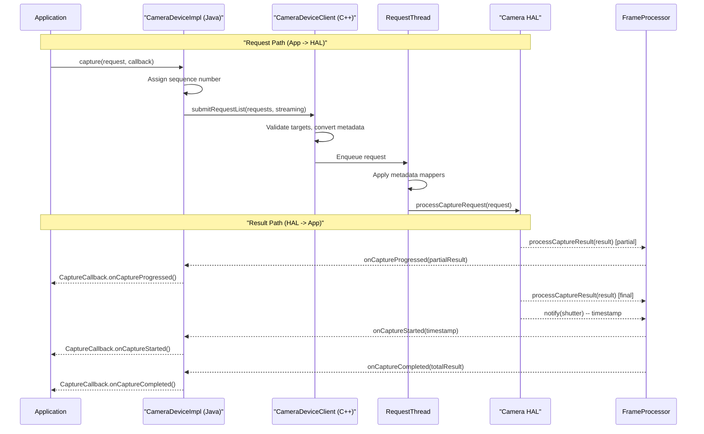
```mermaid
sequenceDiagram
    participant App as Application
    participant CDI as "CameraDeviceImpl (Java)"
    participant CDC as "CameraDeviceClient (C++)"
    participant RT as RequestThread
    participant HAL as "Camera HAL"
    participant FP as FrameProcessor

    Note over App,HAL: "Request Path (App -> HAL)"
    App->>CDI: capture(request, callback)
    CDI->>CDI: Assign sequence number
    CDI->>CDC: submitRequestList(requests, streaming)
    CDC->>CDC: Validate targets, convert metadata
    CDC->>RT: Enqueue request
    RT->>RT: Apply metadata mappers
    RT->>HAL: processCaptureRequest(request)

    Note over App,HAL: "Result Path (HAL -> App)"
    HAL-->>FP: processCaptureResult(result) [partial]
    FP-->>CDI: onCaptureProgressed(partialResult)
    CDI-->>App: CaptureCallback.onCaptureProgressed()
    HAL-->>FP: processCaptureResult(result) [final]
    HAL-->>FP: notify(shutter) -- timestamp
    FP-->>CDI: onCaptureStarted(timestamp)
    CDI-->>App: CaptureCallback.onCaptureStarted()
    FP-->>CDI: onCaptureCompleted(totalResult)
    CDI-->>App: CaptureCallback.onCaptureCompleted()
```

### 62.3.2 CaptureRequest 细节

`CaptureRequest` 是一个不可变对象，里面主要包含四类内容：

1. **Target Surfaces**
2. **Metadata Keys**
3. **应用自定义 Tag**
4. **Physical Camera Overrides**

```text
Source: frameworks/base/core/java/android/hardware/camera2/CaptureRequest.java
```

创建方式：

```java
CaptureRequest.Builder builder = cameraDevice.createCaptureRequest(
    CameraDevice.TEMPLATE_STILL_CAPTURE
);
builder.addTarget(imageReaderSurface);
builder.set(CaptureRequest.CONTROL_AE_MODE, CameraMetadata.CONTROL_AE_MODE_ON);
builder.set(CaptureRequest.JPEG_QUALITY, (byte) 95);
builder.set(CaptureRequest.JPEG_ORIENTATION, orientation);
CaptureRequest request = builder.build();
```

常见 metadata 分组：

| 类别 | 典型 key | 说明 |
|------|----------|------|
| 3A 控制 | `CONTROL_AE_MODE`、`CONTROL_AF_MODE`、`CONTROL_AWB_MODE` | AE / AF / AWB |
| Sensor | `SENSOR_EXPOSURE_TIME`、`SENSOR_SENSITIVITY` | 手动曝光与 ISO |
| Lens | `LENS_FOCAL_LENGTH`、`LENS_FOCUS_DISTANCE`、`LENS_APERTURE` | 镜头控制 |
| Scaler | `SCALER_CROP_REGION`、`CONTROL_ZOOM_RATIO` | 裁剪和变焦 |
| Flash | `FLASH_MODE`、`CONTROL_AE_PRECAPTURE_TRIGGER` | 闪光灯与预闪 |
| JPEG | `JPEG_QUALITY`、`JPEG_ORIENTATION` | JPEG 输出参数 |
| Noise Reduction | `NOISE_REDUCTION_MODE` | 降噪级别 |
| Edge | `EDGE_MODE` | 锐化控制 |
| Color Correction | `COLOR_CORRECTION_MODE` | 色彩处理 |
| Tonemap | `TONEMAP_MODE`、`TONEMAP_CURVE` | Tone mapping |

### 62.3.3 CaptureResult 细节

`CaptureResult` 记录的是某一帧**实际使用了什么参数**，以及额外的只读状态信息。

```text
Source: frameworks/base/core/java/android/hardware/camera2/CaptureResult.java
        frameworks/base/core/java/android/hardware/camera2/TotalCaptureResult.java
```

| 类型 | 类 | 含义 |
|------|----|------|
| Partial | `CaptureResult` | 提前到达的部分 metadata |
| Total | `TotalCaptureResult` | 完整 metadata 集 |

常用只读 result key：

| Key | 说明 |
|-----|------|
| `SENSOR_TIMESTAMP` | 精确曝光起始时间 |
| `SENSOR_EXPOSURE_TIME` | 实际曝光时长 |
| `SENSOR_SENSITIVITY` | 实际 ISO |
| `CONTROL_AE_STATE` | AE 收敛状态 |
| `CONTROL_AF_STATE` | AF 状态 |
| `CONTROL_AWB_STATE` | AWB 状态 |
| `LENS_STATE` | 镜头是否移动 |
| `STATISTICS_FACES` | 人脸检测结果 |
| `STATISTICS_LENS_SHADING_MAP` | 镜头阴影矫正图 |

### 62.3.4 Frame Number Tracking

每个请求都会分配一个递增的 frame number，用来串起：

- 应用提交的 `CaptureRequest`
- HAL `processCaptureRequest`
- shutter 通知
- metadata result
- 输出 buffer

`CameraDeviceImpl` 里的 `FrameNumberTracker` 负责保证结果按正确顺序交给应用：

```text
Source: frameworks/base/core/java/android/hardware/camera2/impl/FrameNumberTracker.java
```

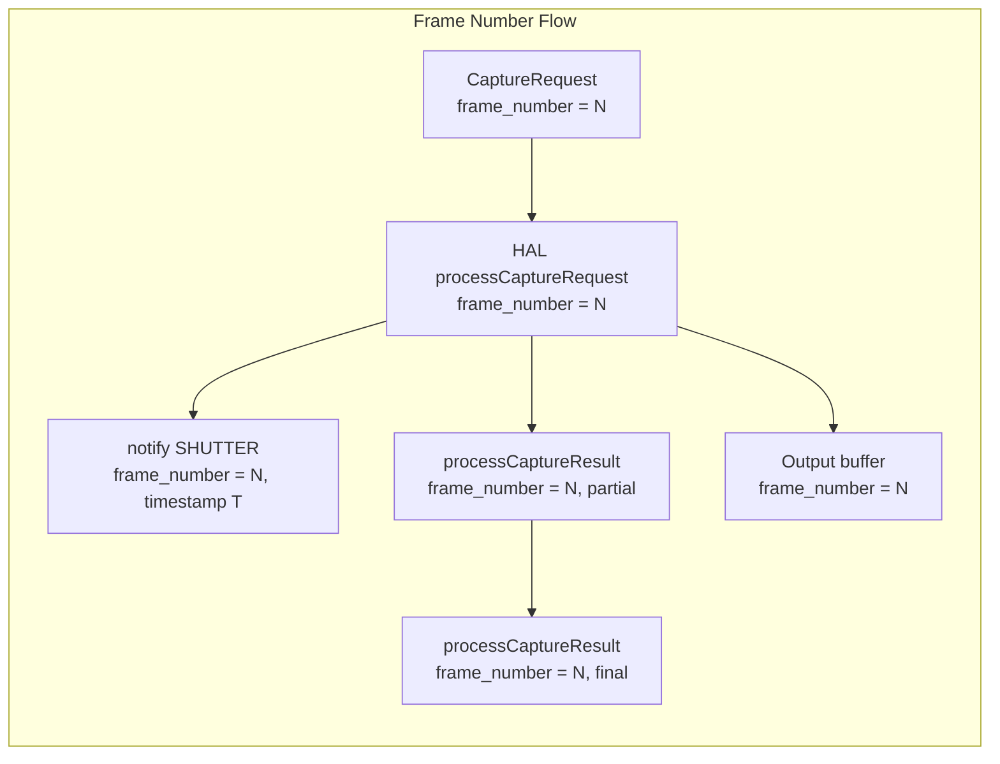
```mermaid
graph LR
    subgraph "Frame Number Flow"
        REQ["CaptureRequest<br/>frame_number = N"]
        HAL_REQ["HAL processCaptureRequest<br/>frame_number = N"]
        SHUTTER["notify SHUTTER<br/>frame_number = N, timestamp T"]
        PARTIAL["processCaptureResult<br/>frame_number = N, partial"]
        TOTAL["processCaptureResult<br/>frame_number = N, final"]
        BUFFER["Output buffer<br/>frame_number = N"]
    end

    REQ --> HAL_REQ
    HAL_REQ --> SHUTTER
    HAL_REQ --> PARTIAL
    PARTIAL --> TOTAL
    HAL_REQ --> BUFFER
```

### 62.3.5 3A 收敛循环

拍照前最关键的系统行为之一，就是 3A 收敛循环：AE、AF、AWB 必须先稳定，再真正触发 still capture。

下图展示了常见 still capture 的前序流程。

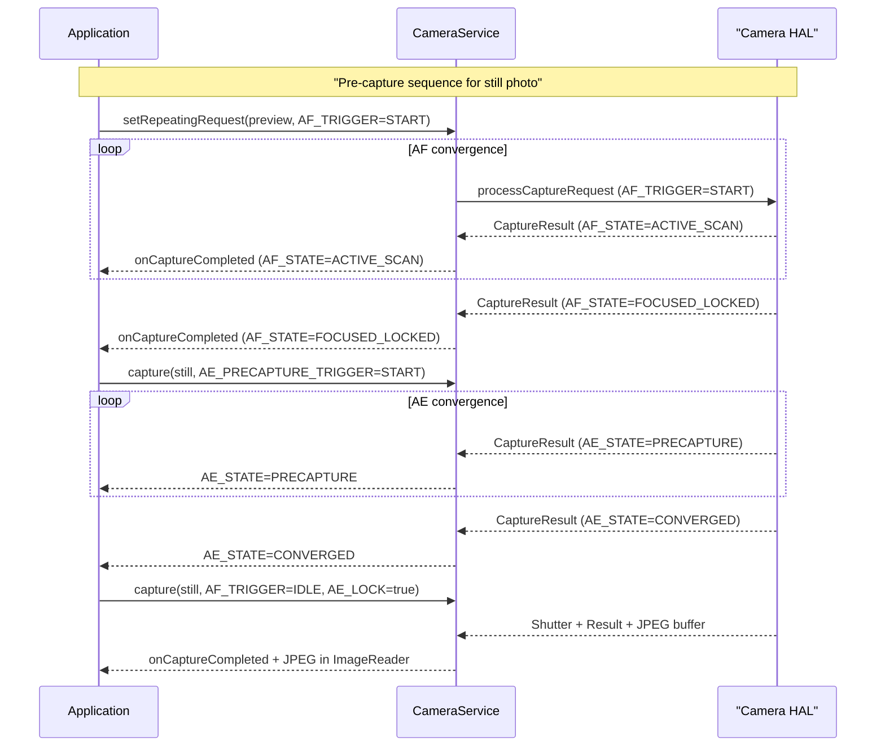
```mermaid
sequenceDiagram
    participant App as Application
    participant CS as CameraService
    participant HAL as "Camera HAL"

    Note over App,HAL: "Pre-capture sequence for still photo"

    App->>CS: setRepeatingRequest(preview, AF_TRIGGER=START)
    loop AF convergence
        CS->>HAL: processCaptureRequest (AF_TRIGGER=START)
        HAL-->>CS: CaptureResult (AF_STATE=ACTIVE_SCAN)
        CS-->>App: onCaptureCompleted (AF_STATE=ACTIVE_SCAN)
    end
    HAL-->>CS: CaptureResult (AF_STATE=FOCUSED_LOCKED)
    CS-->>App: onCaptureCompleted (AF_STATE=FOCUSED_LOCKED)

    App->>CS: capture(still, AE_PRECAPTURE_TRIGGER=START)
    loop AE convergence
        HAL-->>CS: CaptureResult (AE_STATE=PRECAPTURE)
        CS-->>App: AE_STATE=PRECAPTURE
    end
    HAL-->>CS: CaptureResult (AE_STATE=CONVERGED)
    CS-->>App: AE_STATE=CONVERGED

    App->>CS: capture(still, AF_TRIGGER=IDLE, AE_LOCK=true)
    HAL-->>CS: Shutter + Result + JPEG buffer
    CS-->>App: onCaptureCompleted + JPEG in ImageReader
```

AF 状态机：

| 状态 | 含义 |
|------|------|
| `INACTIVE` | 未工作 |
| `PASSIVE_SCAN` | 连续 AF 正在扫描 |
| `PASSIVE_FOCUSED` | 连续 AF 已找到焦点 |
| `PASSIVE_UNFOCUSED` | 连续 AF 未找到焦点 |
| `ACTIVE_SCAN` | 触发式对焦进行中 |
| `FOCUSED_LOCKED` | 成功锁焦 |
| `NOT_FOCUSED_LOCKED` | 锁焦失败 |

AE 状态机：

| 状态 | 含义 |
|------|------|
| `INACTIVE` | 未工作 |
| `SEARCHING` | 正在收敛 |
| `CONVERGED` | 已收敛 |
| `LOCKED` | 被锁定 |
| `FLASH_REQUIRED` | 需要闪光灯 |
| `PRECAPTURE` | 预捕获测光中 |

### 62.3.6 In-Flight Request 管理

`Camera3Device` 维护一个 `InFlightRequest` map，跟踪所有正在由 HAL 处理的请求。

```text
Source: frameworks/av/services/camera/libcameraservice/device3/InFlightRequest.h
```

每个 in-flight request 会保存：

- frame number
- 原始请求 metadata
- 输出 buffer 返回情况
- partial / final metadata
- shutter timestamp
- error 状态

只有在以下四项都到齐后，请求才会从 map 中移除：

1. shutter 通知
2. 所有 partial results
3. final result
4. 所有输出 buffers

### 62.3.7 HAL 契约

Camera HAL 必须满足一些严格约束：

1. shutter 通知必须按 frame number 顺序返回。
2. result metadata 可以乱序返回。
3. output buffers 也可乱序，但 preview buffer 应尽量优先返回。
4. 在达到 `maxPipelineDepth` 限制前，HAL 不能无限接受新帧。

```text
Source: hardware/interfaces/camera/device/aidl/android/hardware/camera/device/ICameraDeviceSession.aidl
```

### 62.3.8 Reprocessing

Camera2 支持 reprocess，也就是把一张已捕获图像再次送回 ISP 做高质量处理，典型场景是 ZSL。

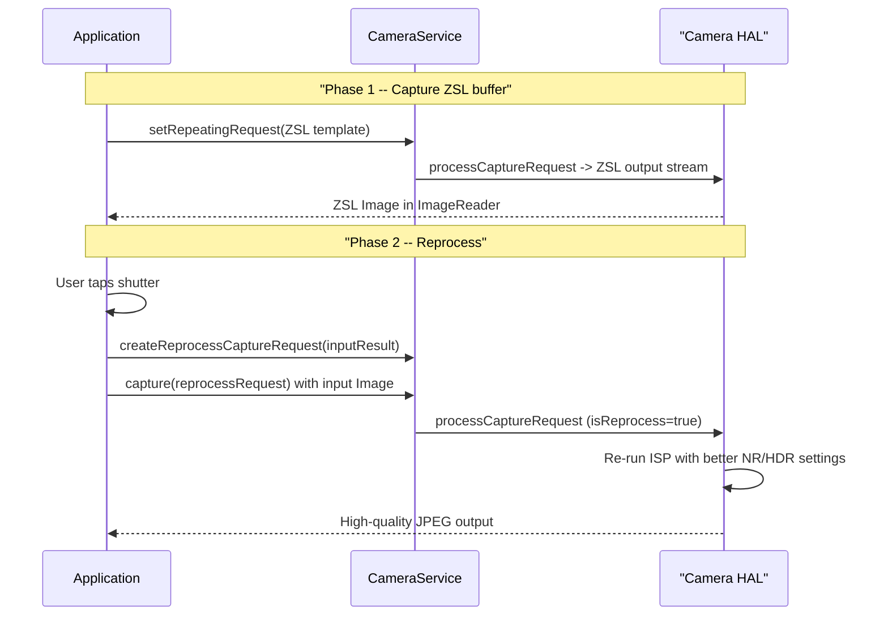
```mermaid
sequenceDiagram
    participant App as Application
    participant CS as CameraService
    participant HAL as "Camera HAL"

    Note over App,HAL: "Phase 1 -- Capture ZSL buffer"
    App->>CS: setRepeatingRequest(ZSL template)
    CS->>HAL: processCaptureRequest -> ZSL output stream
    HAL-->>App: ZSL Image in ImageReader

    Note over App,HAL: "Phase 2 -- Reprocess"
    App->>App: User taps shutter
    App->>CS: createReprocessCaptureRequest(inputResult)
    App->>CS: capture(reprocessRequest) with input Image
    CS->>HAL: processCaptureRequest (isReprocess=true)
    HAL->>HAL: Re-run ISP with better NR/HDR settings
    HAL-->>App: High-quality JPEG output
```

前提是创建一个 **reprocessable capture session**，即既有输入配置，也有输出配置。

### 62.3.9 DNG RAW 拍摄

Camera2 允许捕获 DNG（Digital Negative）RAW 图像，供专业工作流使用。

```text
Source: frameworks/base/core/java/android/hardware/camera2/DngCreator.java
```

```java
// Check RAW capability
int[] capabilities = characteristics.get(
    CameraCharacteristics.REQUEST_AVAILABLE_CAPABILITIES);
boolean hasRaw = Arrays.stream(capabilities)
    .anyMatch(c -> c == CameraMetadata.REQUEST_AVAILABLE_CAPABILITIES_RAW);

if (hasRaw) {
    StreamConfigurationMap map = characteristics.get(
        CameraCharacteristics.SCALER_STREAM_CONFIGURATION_MAP);
    Size[] rawSizes = map.getOutputSizes(ImageFormat.RAW_SENSOR);

    ImageReader rawReader = ImageReader.newInstance(
        rawSizes[0].getWidth(), rawSizes[0].getHeight(),
        ImageFormat.RAW_SENSOR, 2);

    DngCreator dngCreator = new DngCreator(characteristics, captureResult);
    dngCreator.setOrientation(ExifInterface.ORIENTATION_NORMAL);
    dngCreator.setDescription("AOSP Camera2 RAW capture");
    dngCreator.writeImage(outputStream, rawImage);
    dngCreator.close();
}
```

`DngCreator` 会把 calibration、lens correction、color matrix、noise model 等元数据一并写入 DNG，使桌面 RAW 软件能正确解码。

### 62.3.10 JPEG/R HDR 照片

Android 14 引入了 JPEG/R（Ultra HDR），其本质是在标准 JPEG 中嵌入 gain map。camera service 通过 `JpegRCompositeStream` 实现这一点。

```text
Source: frameworks/av/services/camera/libcameraservice/api2/JpegRCompositeStream.h
        frameworks/av/services/camera/libcameraservice/api2/JpegRCompositeStream.cpp
```

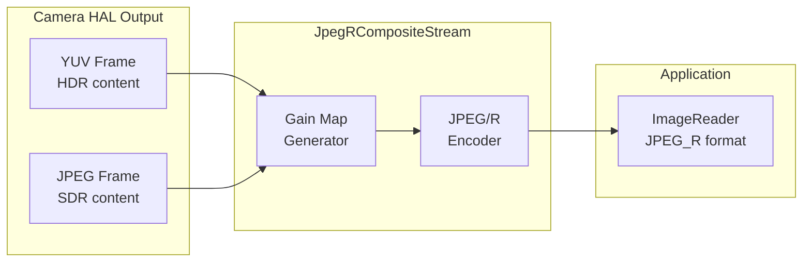
```mermaid
graph LR
    subgraph "Camera HAL Output"
        YUV["YUV Frame<br/>HDR content"]
        SDR["JPEG Frame<br/>SDR content"]
    end

    subgraph "JpegRCompositeStream"
        GM["Gain Map<br/>Generator"]
        ENC["JPEG/R<br/>Encoder"]
    end

    subgraph Application
        IR["ImageReader<br/>JPEG_R format"]
    end

    YUV --> GM
    SDR --> GM
    GM --> ENC
    ENC --> IR
```

它的好处是向后兼容：老设备只显示 SDR JPEG，新设备则可以利用 gain map 恢复 HDR 内容。

### 62.3.11 Flush 和 Idle

应用有两种方式排空或中断管线：

- `flush()`：尽快中止所有 pending / in-progress 请求。
- `waitUntilIdle()`：等待所有请求正常完成；重复请求激活时不能调用。

```text
Source: frameworks/av/services/camera/libcameraservice/device3/Camera3Device.cpp
  -> Camera3Device::flush()
  -> Camera3Device::waitUntilStateThenRelock()
```

---

## 62.4 Image Streams

### 62.4.1 Stream 架构

Camera2 的图像数据是通过 **stream** 交付的。每个 stream 背后都是一条 BufferQueue，并在 camera service 中对应一个 `Camera3Stream` 子类。

```text
Source: frameworks/av/services/camera/libcameraservice/device3/Camera3Stream.h
        frameworks/av/services/camera/libcameraservice/device3/Camera3Stream.cpp
        frameworks/av/services/camera/libcameraservice/device3/Camera3OutputStream.h
        frameworks/av/services/camera/libcameraservice/device3/Camera3OutputStream.cpp
        frameworks/av/services/camera/libcameraservice/device3/Camera3InputStream.h
        frameworks/av/services/camera/libcameraservice/device3/Camera3InputStream.cpp
```

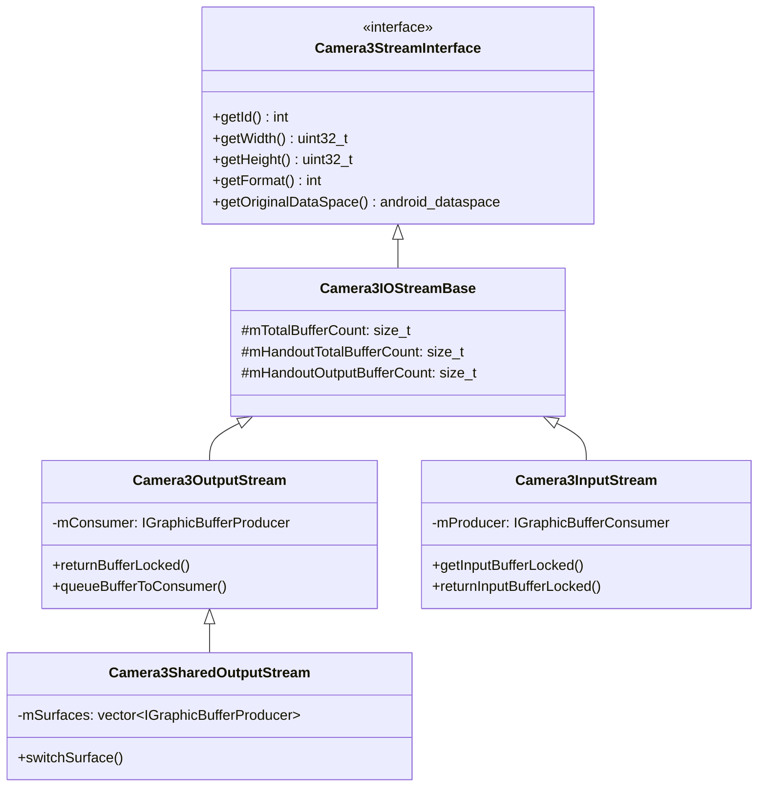
```mermaid
classDiagram
    class Camera3StreamInterface {
        <<interface>>
        +getId() int
        +getWidth() uint32_t
        +getHeight() uint32_t
        +getFormat() int
        +getOriginalDataSpace() android_dataspace
    }
    class Camera3IOStreamBase {
        #mTotalBufferCount: size_t
        #mHandoutTotalBufferCount: size_t
        #mHandoutOutputBufferCount: size_t
    }
    class Camera3OutputStream {
        -mConsumer: IGraphicBufferProducer
        +returnBufferLocked()
        +queueBufferToConsumer()
    }
    class Camera3InputStream {
        -mProducer: IGraphicBufferConsumer
        +getInputBufferLocked()
        +returnInputBufferLocked()
    }
    class Camera3SharedOutputStream {
        -mSurfaces: vector~IGraphicBufferProducer~
        +switchSurface()
    }

    Camera3StreamInterface <|-- Camera3IOStreamBase
    Camera3IOStreamBase <|-- Camera3OutputStream
    Camera3IOStreamBase <|-- Camera3InputStream
    Camera3OutputStream <|-- Camera3SharedOutputStream
```

### 62.4.2 ImageReader

`ImageReader` 是应用拿到相机图像做 CPU 处理最常用的机制：

```java
ImageReader imageReader = ImageReader.newInstance(
    4032, 3024,
    ImageFormat.JPEG,
    2
);

imageReader.setOnImageAvailableListener(reader -> {
    Image image = reader.acquireLatestImage();
    if (image != null) {
        ByteBuffer buffer = image.getPlanes()[0].getBuffer();
        byte[] jpegBytes = new byte[buffer.remaining()];
        buffer.get(jpegBytes);
        image.close();
    }
}, backgroundHandler);
```

支持的格式很多：

| 格式 | 常量 | 用途 |
|------|------|------|
| JPEG | `JPEG` | 压缩照片 |
| YUV_420_888 | `YUV_420_888` | 分析场景 |
| RAW_SENSOR | `RAW_SENSOR` | Bayer RAW |
| RAW10 | `RAW10` | 10-bit packed RAW |
| DEPTH16 | `DEPTH16` | 深度图 |
| DEPTH_POINT_CLOUD | `DEPTH_POINT_CLOUD` | 点云 |
| HEIC | `HEIC` | HEIF 照片 |
| JPEG_R | `JPEG_R` | Ultra HDR |
| PRIVATE | `PRIVATE` | 预览 / 录像 |

```text
Source: frameworks/base/core/java/android/media/ImageReader.java
        frameworks/base/core/jni/android_media_ImageReader.cpp
```

### 62.4.3 预览用 SurfaceTexture

预览一般使用 `SurfaceTexture`（例如 `TextureView`）或 `SurfaceView`。camera 输出 `PRIVATE` 格式，GPU 可以直接合成显示。

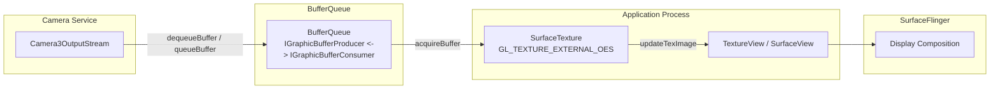
```mermaid
graph LR
    subgraph "Camera Service"
        C3OS["Camera3OutputStream"]
    end
    subgraph "BufferQueue"
        BQ["BufferQueue<br/>IGraphicBufferProducer <-> IGraphicBufferConsumer"]
    end
    subgraph "Application Process"
        ST["SurfaceTexture<br/>GL_TEXTURE_EXTERNAL_OES"]
        TV["TextureView / SurfaceView"]
    end
    subgraph "SurfaceFlinger"
        SF["Display Composition"]
    end

    C3OS -->|"dequeueBuffer / queueBuffer"| BQ
    BQ -->|"acquireBuffer"| ST
    ST -->|"updateTexImage"| TV
    TV --> SF
```

选择 `PRIVATE` 格式的原因：

1. 像素布局可针对 GPU 优化。
2. 不需要 CPU 访问。
3. 避免额外格式转换。

### 62.4.4 多路同时输出

Camera2 支持同时输出多个 stream。硬件级别不同，保证支持的组合也不同。以 `FULL` 级别为例，最小保证组合大致包括：

| Preview | Still | Recording | Analysis |
|---------|-------|-----------|----------|
| `PRIVATE/MAXIMUM` | | | |
| `PRIVATE/PREVIEW` | `JPEG/MAXIMUM` | | |
| `PRIVATE/PREVIEW` | `PRIVATE/PREVIEW` | | |
| `PRIVATE/PREVIEW` | `YUV/PREVIEW` | | |
| `PRIVATE/PREVIEW` | `JPEG/MAXIMUM` | | `YUV/PREVIEW` |
| `PRIVATE/PREVIEW` | | `PRIVATE/MAXIMUM` | |
| `PRIVATE/PREVIEW` | `JPEG/MAXIMUM` | `PRIVATE/PREVIEW` | |

应用可以通过 `SCALER_STREAM_CONFIGURATION_MAP` 查询支持尺寸和最小帧时长：

```java
StreamConfigurationMap map = characteristics.get(
    CameraCharacteristics.SCALER_STREAM_CONFIGURATION_MAP);
Size[] jpegSizes = map.getOutputSizes(ImageFormat.JPEG);
Size[] previewSizes = map.getOutputSizes(SurfaceTexture.class);
long minDuration = map.getOutputMinFrameDuration(ImageFormat.JPEG, jpegSizes[0]);
```

### 62.4.5 高速拍摄

高速录像（120fps / 240fps）依赖 `CameraConstrainedHighSpeedCaptureSession`：

```text
Source: frameworks/base/core/java/android/hardware/camera2/CameraConstrainedHighSpeedCaptureSession.java
        frameworks/base/core/java/android/hardware/camera2/impl/CameraConstrainedHighSpeedCaptureSessionImpl.java
```

约束较多：

| 约束 | 说明 |
|------|------|
| 最多 2 个输出 surface | 通常是预览 + 录像 |
| 固定 FPS range | 必须使用设备声明的高速范围 |
| 几乎没有逐帧控制 | 绝大多数 metadata 固定 |
| 不支持 still capture | 录像中不能普通 JPEG 抓拍 |
| 批量请求 | HAL 按 batch 处理 |

```java
StreamConfigurationMap map = characteristics.get(
    CameraCharacteristics.SCALER_STREAM_CONFIGURATION_MAP);
Size[] highSpeedSizes = map.getHighSpeedVideoSizes();

SessionConfiguration config = new SessionConfiguration(
    SessionConfiguration.SESSION_HIGH_SPEED,
    outputs,
    executor,
    stateCallback
);
cameraDevice.createCaptureSession(config);
```

然后通过 `createHighSpeedRequestList()` 生成 request batch：

```java
CaptureRequest.Builder builder =
    cameraDevice.createCaptureRequest(CameraDevice.TEMPLATE_RECORD);
builder.addTarget(previewSurface);
builder.addTarget(recorderSurface);

CameraConstrainedHighSpeedCaptureSession highSpeedSession =
    (CameraConstrainedHighSpeedCaptureSession) session;
List<CaptureRequest> highSpeedRequests =
    highSpeedSession.createHighSpeedRequestList(builder.build());

highSpeedSession.setRepeatingBurst(highSpeedRequests, callback, handler);
```

### 62.4.6 Stream Use Cases（Android 13+）

Android 13 引入 `StreamUseCase`，让 HAL 根据用途优化流配置：

| Use Case | 常量 | 优化目标 |
|----------|------|----------|
| Default | `DEFAULT` | 无特别优化 |
| Preview | `PREVIEW` | 面向显示 |
| Still | `STILL_CAPTURE` | 面向画质 |
| Video | `VIDEO_RECORD` | 面向编码 |
| Preview Video Still | `PREVIEW_VIDEO_STILL` | 平衡三者 |
| Video Call | `VIDEO_CALL` | 会议场景 |
| Cropped RAW | `CROPPED_RAW` | 带裁剪的 RAW |

### 62.4.7 Buffer 管理

`Camera3Device` 里有一个 `Camera3BufferManager`，支持两种缓冲策略：

```text
Source: frameworks/av/services/camera/libcameraservice/device3/Camera3BufferManager.h
        frameworks/av/services/camera/libcameraservice/device3/Camera3BufferManager.cpp
```

**Framework-managed buffers**

- camera service 自己分配 buffer
- `Camera3OutputStream.getBufferLocked()` 从 consumer dequeue
- framework 控制 buffer 生命周期

**HAL-managed buffers**

- HAL 通过 `requestStreamBuffers()` 按需申请
- 减少预分配开销
- 更适合复杂多路流场景

下图展示了两种 buffer 模式的差异。

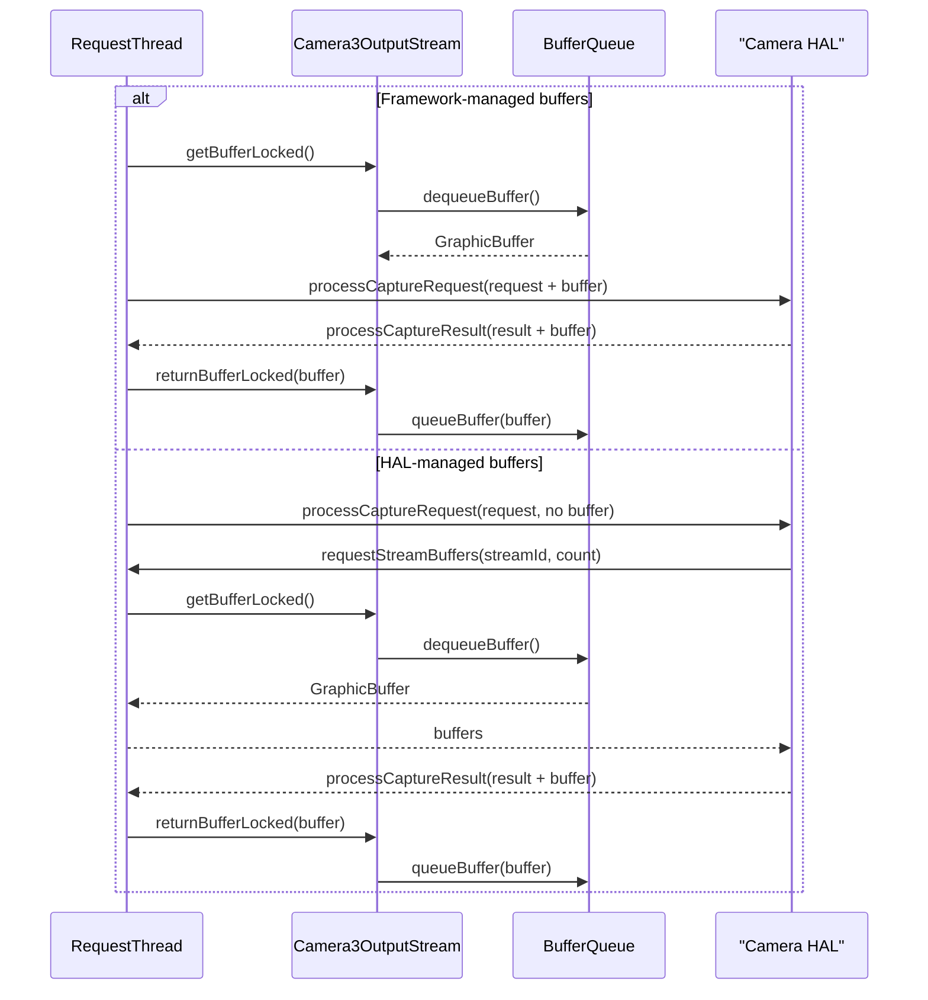
```mermaid
sequenceDiagram
    participant RT as RequestThread
    participant OS as Camera3OutputStream
    participant BQ as BufferQueue
    participant HAL as "Camera HAL"

    alt Framework-managed buffers
        RT->>OS: getBufferLocked()
        OS->>BQ: dequeueBuffer()
        BQ-->>OS: GraphicBuffer
        RT->>HAL: processCaptureRequest(request + buffer)
        HAL-->>RT: processCaptureResult(result + buffer)
        RT->>OS: returnBufferLocked(buffer)
        OS->>BQ: queueBuffer(buffer)
    else HAL-managed buffers
        RT->>HAL: processCaptureRequest(request, no buffer)
        HAL->>RT: requestStreamBuffers(streamId, count)
        RT->>OS: getBufferLocked()
        OS->>BQ: dequeueBuffer()
        BQ-->>RT: GraphicBuffer
        RT-->>HAL: buffers
        HAL-->>RT: processCaptureResult(result + buffer)
        RT->>OS: returnBufferLocked(buffer)
        OS->>BQ: queueBuffer(buffer)
    end
```

### 62.4.8 Composite Streams

camera service 里还有几种**组合流**，会在 HAL 输出之上再做一次加工：

| Composite Stream | 源文件 | 说明 |
|------------------|--------|------|
| `DepthCompositeStream` | `api2/DepthCompositeStream.cpp` | 合成动态景深 JPEG |
| `HeicCompositeStream` | `api2/HeicCompositeStream.cpp` | 用 MediaCodec 编码 HEIC |
| `JpegRCompositeStream` | `api2/JpegRCompositeStream.cpp` | 生成 JPEG/R |

对应用来说这些处理是透明的，应用只会看到自己请求的输出格式。

---

## 62.5 Multi-Camera

### 62.5.1 逻辑多摄架构

从 Android 9 开始，Camera2 引入 logical multi-camera。逻辑相机是由两颗或更多 physical camera 组合出的一个虚拟相机。

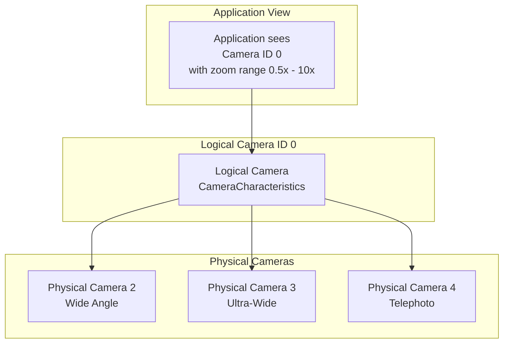
```mermaid
graph TD
    subgraph "Logical Camera ID 0"
        LC["Logical Camera<br/>CameraCharacteristics"]
    end

    subgraph "Physical Cameras"
        PC0["Physical Camera 2<br/>Wide Angle"]
        PC1["Physical Camera 3<br/>Ultra-Wide"]
        PC2["Physical Camera 4<br/>Telephoto"]
    end

    LC --> PC0
    LC --> PC1
    LC --> PC2

    subgraph "Application View"
        APP["Application sees<br/>Camera ID 0<br/>with zoom range 0.5x - 10x"]
    end

    APP --> LC
```

逻辑相机的特征：

- 有自己的 `CameraCharacteristics`
- 可根据 zoom ratio 自动切换 physical camera
- 负责 ISP 过渡、白平衡匹配和曝光同步

```java
Set<String> physicalCameraIds = characteristics.getPhysicalCameraIds();

int[] capabilities = characteristics.get(
    CameraCharacteristics.REQUEST_AVAILABLE_CAPABILITIES);
boolean isLogicalMultiCamera = Arrays.stream(capabilities)
    .anyMatch(c -> c == CameraMetadata.REQUEST_AVAILABLE_CAPABILITIES_LOGICAL_MULTI_CAMERA);
```

### 62.5.2 访问物理相机

应用可以把某个输出流显式路由到指定物理相机：

```java
OutputConfiguration ultraWideConfig = new OutputConfiguration(ultraWideSurface);
ultraWideConfig.setPhysicalCameraId("3");

OutputConfiguration teleConfig = new OutputConfiguration(teleSurface);
teleConfig.setPhysicalCameraId("4");

SessionConfiguration sessionConfig = new SessionConfiguration(
    SessionConfiguration.SESSION_REGULAR,
    Arrays.asList(ultraWideConfig, teleConfig),
    executor, stateCallback
);
```

`TotalCaptureResult` 还能返回每颗物理相机单独的 result：

```java
CaptureResult physicalResult = totalResult.getPhysicalCameraResults().get("3");
if (physicalResult != null) {
    Long timestamp = physicalResult.get(CaptureResult.SENSOR_TIMESTAMP);
}
```

### 62.5.3 多摄相关 Characteristics

逻辑相机的 `CameraCharacteristics` 会包含多摄关系的描述：

| Key | 说明 |
|-----|------|
| `LOGICAL_MULTI_CAMERA_PHYSICAL_IDS` | 物理相机 ID 集合 |
| `LOGICAL_MULTI_CAMERA_SENSOR_SYNC_TYPE` | `APPROXIMATE` 或 `CALIBRATED` |
| `LENS_POSE_REFERENCE` | 坐标系参考 |
| `LENS_POSE_ROTATION` | 相对旋转 |
| `LENS_POSE_TRANSLATION` | 相对平移 |
| `LENS_INTRINSIC_CALIBRATION` | 内参 |
| `LENS_DISTORTION` | 畸变参数 |

```text
Source: frameworks/base/core/java/android/hardware/camera2/CameraCharacteristics.java
```

### 62.5.4 多分辨率流

如果 logical multi-camera 背后的物理相机最大分辨率不同，`MultiResolutionImageReader` 可以提供统一读取接口。

```text
Source: frameworks/base/core/java/android/hardware/camera2/MultiResolutionImageReader.java
```

```java
MultiResolutionStreamConfigurationMap multiResMap = characteristics.get(
    CameraCharacteristics.SCALER_MULTI_RESOLUTION_STREAM_CONFIGURATION_MAP);

Collection<MultiResolutionStreamInfo> streams =
    multiResMap.getOutputInfo(ImageFormat.JPEG);

MultiResolutionImageReader multiResReader =
    new MultiResolutionImageReader(streams, ImageFormat.JPEG, 2);
```

### 62.5.5 HAL 视角下的物理流

请求 physical stream 时，camera service 会在 `configureStreams()` 阶段把 `physicalCameraId` 一并标注给 HAL。

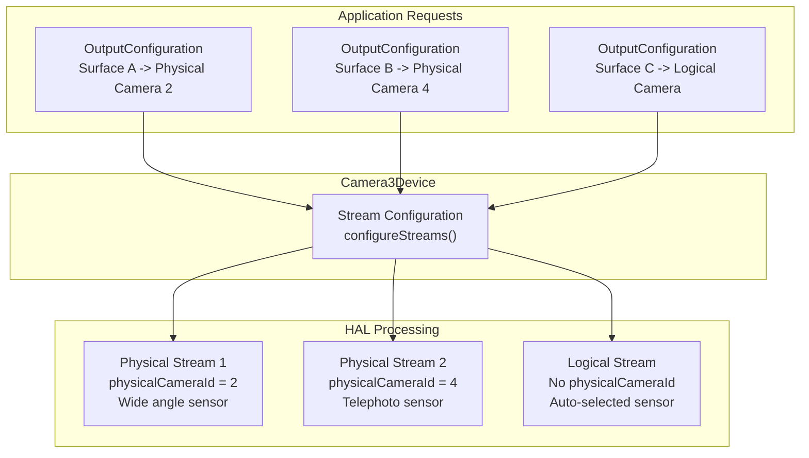
```mermaid
graph TD
    subgraph "Application Requests"
        R1["OutputConfiguration<br/>Surface A -> Physical Camera 2"]
        R2["OutputConfiguration<br/>Surface B -> Physical Camera 4"]
        R3["OutputConfiguration<br/>Surface C -> Logical Camera"]
    end

    subgraph "Camera3Device"
        SC["Stream Configuration<br/>configureStreams()"]
    end

    subgraph "HAL Processing"
        PS1["Physical Stream 1<br/>physicalCameraId = 2<br/>Wide angle sensor"]
        PS2["Physical Stream 2<br/>physicalCameraId = 4<br/>Telephoto sensor"]
        LS["Logical Stream<br/>No physicalCameraId<br/>Auto-selected sensor"]
    end

    R1 --> SC
    R2 --> SC
    R3 --> SC
    SC --> PS1
    SC --> PS2
    SC --> LS
```

HAL 需要负责：

1. 把流路由到正确 physical sensor。
2. 在 `CALIBRATED` sync 下同步曝光。
3. 应用 per-physical-camera metadata。
4. 做跨 sensor 色彩匹配。

### 62.5.6 相机姿态与标定

多摄框架还暴露了精确的几何标定数据，供 AR 和计算摄影使用：

| Key | 类型 | 说明 |
|-----|------|------|
| `LENS_POSE_ROTATION` | `float[4]` | 四元数旋转 |
| `LENS_POSE_TRANSLATION` | `float[3]` | 米为单位的平移 |
| `LENS_POSE_REFERENCE` | `int` | 参考系 |
| `LENS_INTRINSIC_CALIBRATION` | `float[5]` | fx, fy, cx, cy, skew |
| `LENS_DISTORTION` | `float[6]` | 畸变参数 |
| `LENS_RADIAL_DISTORTION` | `float[6]` | 已废弃 |

这些数据可用于：

- 双目深度估计
- 3D 点投影到图像
- 软件去畸变
- 多摄图像对齐

### 62.5.7 并发打开多相机

Android 11 引入 concurrent camera access，可以同时打开多颗相机：

```java
Set<Set<String>> concurrentCameraIds = cameraManager.getConcurrentCameraIds();

boolean supported = cameraManager.isConcurrentSessionConfigurationSupported(
    Map.of(
        "0", sessionConfig0,
        "1", sessionConfig1
    )
);
```

### 62.5.8 多摄数据流

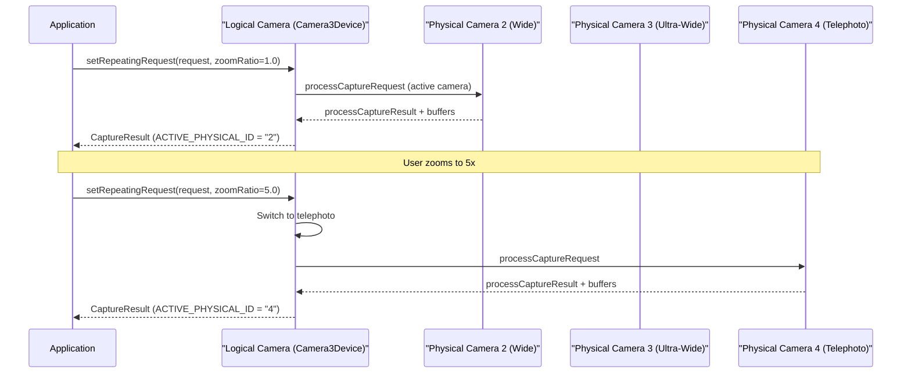
```mermaid
sequenceDiagram
    participant App as Application
    participant LC as "Logical Camera (Camera3Device)"
    participant PHY_W as "Physical Camera 2 (Wide)"
    participant PHY_UW as "Physical Camera 3 (Ultra-Wide)"
    participant PHY_T as "Physical Camera 4 (Telephoto)"

    App->>LC: setRepeatingRequest(request, zoomRatio=1.0)
    LC->>PHY_W: processCaptureRequest (active camera)
    PHY_W-->>LC: processCaptureResult + buffers
    LC-->>App: CaptureResult (ACTIVE_PHYSICAL_ID = "2")

    Note over App,PHY_T: User zooms to 5x
    App->>LC: setRepeatingRequest(request, zoomRatio=5.0)
    LC->>LC: Switch to telephoto
    LC->>PHY_T: processCaptureRequest
    PHY_T-->>LC: processCaptureResult + buffers
    LC-->>App: CaptureResult (ACTIVE_PHYSICAL_ID = "4")
```

### 62.5.9 Camera Offline Session

Android 11 还引入了 `CameraOfflineSession`。它允许应用从 camera device 断开，但保留在途请求，让长时间处理的多帧任务继续完成。

```text
Source: frameworks/base/core/java/android/hardware/camera2/CameraOfflineSession.java
        frameworks/av/services/camera/libcameraservice/device3/Camera3OfflineSession.h
        frameworks/av/services/camera/libcameraservice/device3/Camera3OfflineSession.cpp
        frameworks/av/services/camera/libcameraservice/api2/CameraOfflineSessionClient.h
```

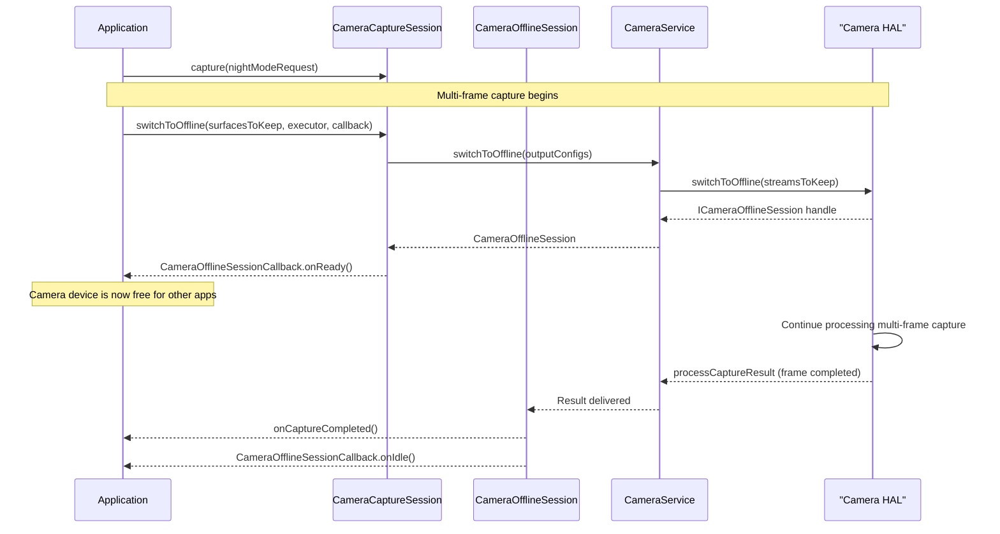
```mermaid
sequenceDiagram
    participant App as Application
    participant Session as CameraCaptureSession
    participant Offline as CameraOfflineSession
    participant CS as CameraService
    participant HAL as "Camera HAL"

    App->>Session: capture(nightModeRequest)
    Note over App,HAL: Multi-frame capture begins

    App->>Session: switchToOffline(surfacesToKeep, executor, callback)
    Session->>CS: switchToOffline(outputConfigs)
    CS->>HAL: switchToOffline(streamsToKeep)
    HAL-->>CS: ICameraOfflineSession handle
    CS-->>Session: CameraOfflineSession
    Session-->>App: CameraOfflineSessionCallback.onReady()

    Note over App: Camera device is now free for other apps

    HAL->>HAL: Continue processing multi-frame capture
    HAL-->>CS: processCaptureResult (frame completed)
    CS-->>Offline: Result delivered
    Offline-->>App: onCaptureCompleted()
    Offline-->>App: CameraOfflineSessionCallback.onIdle()
```

---

## 62.6 Camera Extensions

### 62.6.1 Extensions 架构

Camera Extensions 从 Android 12 起正式进入 framework。它为设备特定的多帧算法提供统一入口，如夜景、HDR、虚化等。

```text
Source: frameworks/base/core/java/android/hardware/camera2/CameraExtensionSession.java
        frameworks/base/core/java/android/hardware/camera2/CameraExtensionCharacteristics.java
        frameworks/base/core/java/android/hardware/camera2/impl/CameraAdvancedExtensionSessionImpl.java
        frameworks/base/core/java/android/hardware/camera2/impl/CameraExtensionSessionImpl.java
```

### 62.6.2 支持的 extension 类型

| 类型 | 常量 | 说明 |
|------|------|------|
| Night | `EXTENSION_NIGHT` | 多帧弱光增强 |
| HDR | `EXTENSION_HDR` | 高动态范围合成 |
| Bokeh | `EXTENSION_BOKEH` | 人像虚化 |
| Auto | `EXTENSION_AUTOMATIC` | 设备自动选择 |
| Face Retouch | `EXTENSION_FACE_RETOUCH` | 美颜 / 磨皮 |
| Eyes Free Videography | `EXTENSION_EYES_FREE_VIDEOGRAPHY` | 稳定免手持录像 |

```java
CameraExtensionCharacteristics extChars =
    cameraManager.getCameraExtensionCharacteristics(cameraId);

List<Integer> supportedExtensions = extChars.getSupportedExtensions();
for (int extension : supportedExtensions) {
    List<Size> sizes = extChars.getExtensionSupportedSizes(
        extension, ImageFormat.JPEG);
}
```

### 62.6.3 Extension Session 生命周期

创建 extension session 会替换普通 `CameraCaptureSession`：

```mermaid
sequenceDiagram
    participant App as Application
    participant CDI as CameraDeviceImpl
    participant EXT as CameraExtensionSessionImpl
    participant HAL as "Extension HAL Service"

    App->>CDI: createExtensionSession(config)
    CDI->>EXT: Create extension session
    EXT->>HAL: Bind to extension service
    HAL-->>EXT: "IAdvancedExtenderImpl / IImageCaptureExtenderImpl"
    EXT->>EXT: Configure internal capture session
    EXT-->>App: StateCallback.onConfigured(CameraExtensionSession)

    App->>EXT: setRepeatingRequest(request, callback)
    EXT->>EXT: Translate to internal Camera2 requests
    EXT->>HAL: Process frames through extension pipeline
    HAL-->>EXT: Processed output
    EXT-->>App: ExtensionCaptureCallback.onCaptureProcessStarted()

    App->>EXT: capture(request, callback)
    Note over EXT,HAL: Multi-frame burst capture
    EXT->>HAL: Capture N frames
    HAL->>HAL: Post-process (NR, HDR, etc.)
    HAL-->>EXT: Final processed image
    EXT-->>App: ExtensionCaptureCallback.onCaptureResultAvailable()
```

### 62.6.4 Extension 实现模型

两类实现模式：

**Basic Extender**

- `IImageCaptureExtenderImpl` + `IPreviewExtenderImpl`
- framework 仍管理主 capture pipeline
- extension 只处理单帧或局部处理

**Advanced Extender**

- `IAdvancedExtenderImpl`
- extension 自己掌控整条 pipeline
- 能下发自己的 capture request
- 更适合复杂多帧算法

```text
Source: frameworks/base/core/java/android/hardware/camera2/extension/IAdvancedExtenderImpl.aidl
        frameworks/base/core/java/android/hardware/camera2/extension/IImageCaptureExtenderImpl.aidl
        frameworks/base/core/java/android/hardware/camera2/extension/IPreviewExtenderImpl.aidl
```

### 62.6.5 Extension Proxy Service

大多数 extension 由 OEM APK 提供，并通过代理服务暴露给 framework：

```text
Source: frameworks/base/core/java/android/hardware/camera2/extension/ICameraExtensionsProxyService.aidl
```

```mermaid
graph TD
    A["CameraExtensionCharacteristics"] -->|"bind to"| B["ICameraExtensionsProxyService"]
    B -->|"query"| C["Extension Type?"]
    C -->|"Advanced"| D["IAdvancedExtenderImpl"]
    C -->|"Basic"| E["IImageCaptureExtenderImpl<br/>+ IPreviewExtenderImpl"]
    D -->|"isExtensionAvailable"| F["Check hardware capability"]
    E -->|"isExtensionAvailable"| F
    F -->|"true"| G["Extension available"]
    F -->|"false"| H["Extension unavailable"]
```

### 62.6.6 Extension Capture 回调

扩展会话有自己专门的 callback：

```java
ExtensionCaptureCallback callback = new ExtensionCaptureCallback() {
    @Override
    public void onCaptureStarted(CameraExtensionSession session,
            CaptureRequest request, long timestamp) {
        // Shutter moment
    }

    @Override
    public void onCaptureProcessStarted(CameraExtensionSession session,
            CaptureRequest request) {
        // Post-processing begins
    }

    @Override
    public void onCaptureFailed(CameraExtensionSession session,
            CaptureRequest request) {
    }

    @Override
    public void onCaptureResultAvailable(CameraExtensionSession session,
            CaptureRequest request, TotalCaptureResult result) {
    }
};
```

### 62.6.7 Extension Metadata 支持

从 Android 14 开始，extension 也能声明自己支持的 request / result metadata 子集：

```java
Set<CaptureRequest.Key> requestKeys =
    extChars.getAvailableCaptureRequestKeys(EXTENSION_NIGHT);

Set<CaptureResult.Key> resultKeys =
    extChars.getAvailableCaptureResultKeys(EXTENSION_NIGHT);
```

常见支持项包括：

- `CONTROL_ZOOM_RATIO`
- `CONTROL_AF_MODE`
- `CONTROL_AE_MODE`
- `JPEG_QUALITY`
- `JPEG_ORIENTATION`

### 62.6.8 Extension Strength Control（Android 15+）

Android 15 增加了 extension effect 强度控制，例如景深虚化强度：

```java
Range<Integer> strengthRange =
    extChars.getExtensionSpecificStrengthRange(
        CameraExtensionCharacteristics.EXTENSION_BOKEH);

CaptureRequest.Builder builder =
    cameraDevice.createCaptureRequest(CameraDevice.TEMPLATE_STILL_CAPTURE);
builder.set(CaptureRequest.EXTENSION_STRENGTH, 75);
```

### 62.6.9 Extension Postview

postview 会在最终高质量图像生成前，先给应用一个低分辨率、快速返回的预览图。

```mermaid
sequenceDiagram
    participant App as Application
    participant EXT as CameraExtensionSession
    participant HAL as "Extension HAL"

    App->>EXT: capture(request)
    EXT->>HAL: Begin multi-frame capture
    HAL-->>EXT: Postview image (quick, lower quality)
    EXT-->>App: onCaptureProcessProgressed(100%)
    Note over App: Display postview as thumbnail
    HAL->>HAL: Full post-processing...
    HAL-->>EXT: Final high-quality image
    EXT-->>App: onCaptureResultAvailable()
    Note over App: Replace postview with final image
```

### 62.6.10 Extension 延迟

extension 可以报告预估拍摄延迟：

```java
Range<Long> latencyRange = extChars.getEstimatedCaptureLatencyRangeMillis(
    EXTENSION_NIGHT, captureSize, outputFormat
);
```

应用可据此显示进度条或“请保持稳定”之类的 UI。

---

## 62.7 Camera NDK

### 62.7.1 NDK Camera API 总览

`libcamera2ndk.so` 为 native 应用提供了 C API，本质上与 Java Camera2 API 一一对应。

```text
Source: frameworks/av/camera/ndk/NdkCameraManager.cpp
        frameworks/av/camera/ndk/NdkCameraDevice.cpp
        frameworks/av/camera/ndk/NdkCameraCaptureSession.cpp
        frameworks/av/camera/ndk/NdkCaptureRequest.cpp
        frameworks/av/camera/ndk/NdkCameraMetadata.cpp
```

头文件：

```text
Source: frameworks/av/camera/ndk/include/camera/NdkCameraManager.h
        frameworks/av/camera/ndk/include/camera/NdkCameraDevice.h
        frameworks/av/camera/ndk/include/camera/NdkCameraCaptureSession.h
        frameworks/av/camera/ndk/include/camera/NdkCaptureRequest.h
        frameworks/av/camera/ndk/include/camera/NdkCameraMetadata.h
        frameworks/av/camera/ndk/include/camera/NdkCameraError.h
```

### 62.7.2 Java API 到 NDK API 的映射

| Java API | NDK 结构 / 前缀 | Header |
|----------|------------------|--------|
| `CameraManager` | `ACameraManager_*` | `NdkCameraManager.h` |
| `CameraDevice` | `ACameraDevice_*` | `NdkCameraDevice.h` |
| `CameraCaptureSession` | `ACameraCaptureSession_*` | `NdkCameraCaptureSession.h` |
| `CaptureRequest` | `ACaptureRequest_*` | `NdkCaptureRequest.h` |
| `CameraMetadata` | `ACameraMetadata_*` | `NdkCameraMetadata.h` |
| `CaptureResult` | `ACameraMetadata` | `NdkCameraMetadata.h` |

### 62.7.3 NDK 相机生命周期

```c
ACameraManager* manager = ACameraManager_create();

ACameraIdList* cameraIdList = NULL;
ACameraManager_getCameraIdList(manager, &cameraIdList);
const char* cameraId = cameraIdList->cameraIds[0];

ACameraMetadata* characteristics = NULL;
ACameraManager_getCameraCharacteristics(manager, cameraId, &characteristics);

ACameraDevice* device = NULL;
ACameraDevice_StateCallbacks deviceCallbacks = {
    .context = myContext,
    .onDisconnected = onDeviceDisconnected,
    .onError = onDeviceError,
};
ACameraManager_openCamera(manager, cameraId, &deviceCallbacks, &device);

ACaptureRequest* request = NULL;
ACameraDevice_createCaptureRequest(device, TEMPLATE_PREVIEW, &request);

ACaptureSessionOutput* output = NULL;
ACaptureSessionOutput_create(previewWindow, &output);
ACaptureSessionOutputContainer* outputs = NULL;
ACaptureSessionOutputContainer_create(&outputs);
ACaptureSessionOutputContainer_add(outputs, output);

ACameraOutputTarget* target = NULL;
ACameraOutputTarget_create(previewWindow, &target);
ACaptureRequest_addTarget(request, target);

ACameraCaptureSession* session = NULL;
ACameraCaptureSession_stateCallbacks sessionCallbacks = {
    .context = myContext,
    .onClosed = onSessionClosed,
    .onReady = onSessionReady,
    .onActive = onSessionActive,
};
ACameraDevice_createCaptureSession(device, outputs, &sessionCallbacks, &session);

ACameraCaptureSession_setRepeatingRequest(session, NULL, 1, &request, NULL);
```

### 62.7.4 NDK Capture 回调

```c
ACameraCaptureSession_captureCallbacks captureCallbacks = {
    .context = myContext,
    .onCaptureStarted = onCaptureStarted,
    .onCaptureProgressed = NULL,
    .onCaptureCompleted = onCaptureCompleted,
    .onCaptureFailed = onCaptureFailed,
    .onCaptureSequenceCompleted = onCaptureSequenceCompleted,
    .onCaptureSequenceAborted = onCaptureSequenceAborted,
    .onCaptureBufferLost = NULL,
};

void onCaptureCompleted(void* context,
        ACameraCaptureSession* session,
        ACaptureRequest* request,
        const ACameraMetadata* result) {
    ACameraMetadata_const_entry entry;
    ACameraMetadata_getConstEntry(result, ACAMERA_SENSOR_TIMESTAMP, &entry);
    int64_t timestamp = entry.data.i64[0];
}
```

### 62.7.5 NDK 到 framework 的内部映射

NDK 最终仍然走同一个 `CameraService`，并包装 `ICameraDeviceUser`：

```mermaid
graph TD
    subgraph "NDK Layer"
        NC["NdkCameraDevice.cpp"]
        NI["impl/ACameraDevice.cpp"]
    end

    subgraph "Binder IPC"
        BINDER["ICameraDeviceUser.aidl"]
    end

    subgraph "Camera Service"
        CDC["CameraDeviceClient"]
        C3D["Camera3Device"]
    end

    NC --> NI
    NI -->|"Binder"| BINDER
    BINDER --> CDC
    CDC --> C3D
```

也就是说，Java API 和 NDK API 的差异主要在接口表面，不在底层架构。

### 62.7.6 NDK Window Target

NDK 里用 `ANativeWindow` 表示输出目标，来源通常有三种：

- `ANativeWindow_fromSurface()`
- `ASurfaceTexture_acquireANativeWindow()`
- `AImageReader_getWindow()`

```c
AImageReader* imageReader = NULL;
AImageReader_new(width, height, AIMAGE_FORMAT_JPEG, maxImages, &imageReader);

AImageReader_ImageListener listener = {
    .context = myContext,
    .onImageAvailable = onImageAvailable,
};
AImageReader_setImageListener(imageReader, &listener);

ANativeWindow* readerWindow = NULL;
AImageReader_getWindow(imageReader, &readerWindow);
```

### 62.7.7 NDK 物理相机访问

从 API 29 开始，NDK 也支持多摄访问：

```c
ACameraMetadata* chars = NULL;
ACameraManager_getCameraCharacteristics(manager, logicalCameraId, &chars);

ACameraMetadata_const_entry physicalCameraIds;
ACameraMetadata_getConstEntry(chars,
    ACAMERA_LOGICAL_MULTI_CAMERA_PHYSICAL_IDS, &physicalCameraIds);

ACaptureRequest* request = NULL;
const char* physicalIds[] = {"2", "4"};
ACameraDevice_createCaptureRequestForPhysicalCameras(
    device, TEMPLATE_PREVIEW,
    2, physicalIds,
    &request);

ACameraOutputTarget* target = NULL;
ACameraOutputTarget_create(window, &target);
ACaptureRequest_addTarget(request, target);
ACaptureRequest_setPhysicalCameraTarget(request, target, "2");
```

### 62.7.8 NDK Metadata 访问

NDK 通过 tag 常量提供类型化 metadata 访问：

```c
ACameraMetadata_const_entry entry;

ACameraMetadata_getConstEntry(chars, ACAMERA_SENSOR_ORIENTATION, &entry);
int32_t orientation = entry.data.i32[0];

ACameraMetadata_getConstEntry(chars,
    ACAMERA_SCALER_AVAILABLE_STREAM_CONFIGURATIONS, &entry);
// Entry contains quads of [format, width, height, input]
```

### 62.7.9 NDK 错误处理

NDK API 会把 framework / service / HAL 各层错误映射成 `camera_status_t`。应用需要特别注意：

1. 所有操作都是异步的，调用成功不代表后续会成功。
2. 资源释放必须手动完成。
3. 要同时处理同步返回值和异步错误回调。

---

## 62.8 动手实践（Try It）

### 62.8.1 练习 1：枚举相机设备

```java
CameraManager cameraManager =
    (CameraManager) context.getSystemService(Context.CAMERA_SERVICE);

for (String cameraId : cameraManager.getCameraIdList()) {
    CameraCharacteristics chars =
        cameraManager.getCameraCharacteristics(cameraId);
    Integer facing = chars.get(CameraCharacteristics.LENS_FACING);
    Integer level = chars.get(
        CameraCharacteristics.INFO_SUPPORTED_HARDWARE_LEVEL);
    Range<Float> zoomRange = chars.get(
        CameraCharacteristics.CONTROL_ZOOM_RATIO_RANGE);

    System.out.println("Camera " + cameraId +
        " facing=" + facing +
        " level=" + level +
        " zoom=" + zoomRange);
}
```

重点观察：

- 设备暴露了多少 camera ID
- 每颗相机的 facing、hardware level、zoom range
- 是否存在 logical multi-camera

### 62.8.2 练习 2：预览 + 静态拍照管线

创建 `TextureView` 预览和 `ImageReader` 拍照输出，建立一个标准 preview + still session：

```java
ImageReader imageReader = ImageReader.newInstance(
    4032, 3024, ImageFormat.JPEG, 2);

CaptureRequest.Builder previewBuilder =
    cameraDevice.createCaptureRequest(CameraDevice.TEMPLATE_PREVIEW);
previewBuilder.addTarget(previewSurface);

CaptureRequest.Builder stillBuilder =
    cameraDevice.createCaptureRequest(CameraDevice.TEMPLATE_STILL_CAPTURE);
stillBuilder.addTarget(imageReader.getSurface());
```

重点看：

1. preview 用 `setRepeatingRequest()`
2. still 用单次 `capture()`
3. JPEG 实际通过 `ImageReader` 返回，而不是通过 callback 返回

### 62.8.3 练习 3：YUV 帧分析管线

```java
ImageReader yuvReader = ImageReader.newInstance(
    1280, 720, ImageFormat.YUV_420_888, 4);

yuvReader.setOnImageAvailableListener(reader -> {
    Image image = reader.acquireLatestImage();
    if (image == null) return;

    Image.Plane[] planes = image.getPlanes();
    ByteBuffer y = planes[0].getBuffer();
    ByteBuffer u = planes[1].getBuffer();
    ByteBuffer v = planes[2].getBuffer();
    // 做亮度统计、人脸前处理或 CV 分析
    image.close();
}, backgroundHandler);
```

重点观察：

- `YUV_420_888` 的 plane 布局不是单块连续内存
- `maxImages` 太小会导致 producer 卡住
- 分析流常和 preview 并行存在

### 62.8.4 练习 4：手动曝光控制

```java
CaptureRequest.Builder manual =
    cameraDevice.createCaptureRequest(CameraDevice.TEMPLATE_MANUAL);
manual.addTarget(previewSurface);
manual.set(CaptureRequest.CONTROL_MODE, CameraMetadata.CONTROL_MODE_OFF);
manual.set(CaptureRequest.SENSOR_EXPOSURE_TIME, 10_000_000L); // 10ms
manual.set(CaptureRequest.SENSOR_SENSITIVITY, 400);
manual.set(CaptureRequest.LENS_FOCUS_DISTANCE, 0.0f);
```

重点观察：

- 不是所有设备都支持完整手动
- `FULL` 或 `LEVEL_3` 设备更可能支持
- `CaptureResult` 中能看到实际曝光值是否被 HAL 调整

### 62.8.5 练习 5：多摄变焦

```java
CaptureRequest.Builder builder =
    cameraDevice.createCaptureRequest(CameraDevice.TEMPLATE_PREVIEW);
builder.addTarget(previewSurface);
builder.set(CaptureRequest.CONTROL_ZOOM_RATIO, 5.0f);
```

并在 callback 里观察：

```java
String activePhysicalId = result.get(
    CaptureResult.LOGICAL_MULTI_CAMERA_ACTIVE_PHYSICAL_ID);
Float actualZoom = result.get(CaptureResult.CONTROL_ZOOM_RATIO);
```

重点看：

- 逻辑相机如何自动切换广角 / 长焦
- `ACTIVE_PHYSICAL_ID` 如何变化
- 设备是否能做到平滑过渡

### 62.8.6 练习 6：Camera Extensions 夜景

```java
CameraExtensionCharacteristics extChars =
    cameraManager.getCameraExtensionCharacteristics(cameraId);

if (extChars.getSupportedExtensions().contains(
        CameraExtensionCharacteristics.EXTENSION_NIGHT)) {

    List<Size> nightSizes = extChars.getExtensionSupportedSizes(
        CameraExtensionCharacteristics.EXTENSION_NIGHT, ImageFormat.JPEG);
    Size captureSize = nightSizes.get(0);

    Range<Long> latency = extChars.getEstimatedCaptureLatencyRangeMillis(
        CameraExtensionCharacteristics.EXTENSION_NIGHT,
        captureSize, ImageFormat.JPEG);
    System.out.println("Night mode latency: " + latency + " ms");
}
```

重点看：

- extension session 会替换普通 session
- 夜景通常要多秒级处理时间
- 并非所有设备都支持 extensions

### 62.8.7 练习 7：NDK Camera 预览

写一个最小 NDK 版本预览：

```c
ACameraManager* cameraManager = ACameraManager_create();
ACameraDevice* cameraDevice = NULL;
ACameraCaptureSession* captureSession = NULL;
ACaptureRequest* captureRequest = NULL;
```

关键步骤：

1. `ACameraManager_getCameraIdList`
2. `ACameraManager_openCamera`
3. `ACameraDevice_createCaptureRequest`
4. `ACameraDevice_createCaptureSession`
5. `ACameraCaptureSession_setRepeatingRequest`

重点体会：

- API 结构与 Java 版几乎一一对应
- 资源释放完全手动
- 底层还是同一套 `CameraService`

### 62.8.8 练习 8：用 dumpsys 跟踪相机管线

```bash
# 列出 camera 设备和状态
adb shell dumpsys media.camera

# 观察特定 metadata
adb shell dumpsys media.camera --watch \
    android.control.aeState \
    android.control.afState \
    android.sensor.exposureTime

# Trace HAL 调用
adb shell atrace --async_start -c camera
# ... 执行拍照或预览 ...
adb shell atrace --async_stop -c camera -o /data/local/tmp/trace.txt
adb pull /data/local/tmp/trace.txt

# 查看显示时延
adb shell dumpsys SurfaceFlinger --latency <surface-name>
```

重点观察：

- active client（包名、PID、优先级）
- stream 配置（分辨率、格式、usage）
- 3A 状态变化
- 从 HAL 到显示的延迟

### 62.8.9 练习 9：源码走读

```bash
# 统计 Camera2 framework API 类数量
find frameworks/base/core/java/android/hardware/camera2/ \
    -name "*.java" | wc -l

# 查看 Camera3Device 实现体量
wc -l frameworks/av/services/camera/libcameraservice/device3/Camera3Device.cpp

# 查看 CaptureRequest key 数量
grep -r "public static final Key" \
    frameworks/base/core/java/android/hardware/camera2/CaptureRequest.java \
    | wc -l

# 列出 stream 实现
ls frameworks/av/services/camera/libcameraservice/device3/Camera3*Stream*

# 找 HAL 接口定义
find hardware/interfaces/camera/device/ -name "ICameraDeviceSession.aidl"

# 查看 composite stream
ls frameworks/av/services/camera/libcameraservice/api2/*CompositeStream*
```

重点看：

- Camera 子系统体量有多大
- per-frame controllable metadata key 有多少
- composite stream、buffer manager、多线程调度是如何拆开的

## Summary

Camera2 是 AOSP 中最成熟、也最复杂的硬件管线之一。这个子系统最值得抓住的几个点：

1. **Request-result 模型是核心抽象**。应用不是拿到“一个相机对象然后不断取帧”，而是逐帧提交 request，再异步接收 result、shutter 和 image buffer。
2. **中间跨了三层边界**。Java framework 到 `cameraserver` 走 Binder，`cameraserver` 到 HAL 走 AIDL/HIDL，HAL 再把请求翻译成 ISP / sensor 的硬件动作。
3. **`Camera3Device` 是真正的发动机**。流配置、请求排队、metadata mapper、buffer 管理、in-flight request 跟踪和结果分发，全都集中在这里。
4. **stream 本质上就是 BufferQueue**。无论是 `ImageReader`、`SurfaceTexture`、HEIC 还是 JPEG/R，最终都要落到 `Camera3OutputStream` 与 consumer 之间的 buffer 生命周期管理。
5. **多摄和 extension 不是附加小特性，而是主框架的一等公民**。logical multi-camera、physical stream、offline session、night / HDR / bokeh extension 都是建立在 Camera2 同一条基础设施之上。
6. **NDK 只是另一层外观**。它提供的是 C API，而不是另一套底层栈；真正工作的仍然是同一个 `CameraService` 和同一个 HAL。

从系统工程角度看，Camera2 最难的地方不在某一个 Java API，而在于它要把“逐帧可控的高性能硬件管线”包装成一个既稳定又可扩展的公共平台接口。这也是为什么相机子系统既庞大、又充满线程、状态机和 mapper 的原因。
