# Chapter 62: Camera2 Pipeline Deep Dive

> *"The Camera2 API is one of the most hardware-intimate APIs in Android --
> a request-result pipeline that pushes configuration, metadata, and pixel
> buffers through three process boundaries and into vendor silicon within a
> single frame deadline."*

The camera subsystem is among the most complex and performance-critical
pipelines in AOSP.  A single photo capture can involve dozens of metadata
keys, multiple output surfaces, 3A (auto-exposure, auto-focus,
auto-white-balance) convergence loops, hardware ISP configuration, and
multi-frame noise-reduction -- all orchestrated across Java framework code,
a native C++ `CameraService`, AIDL/HIDL HAL interfaces, and vendor silicon.

This chapter traces the entire path from the application-facing `CameraManager`
down through `CameraService`, `Camera3Device`, the camera HAL, and back up
through `CaptureResult` delivery.  Every class, callback, and thread mentioned
here is annotated with the exact AOSP source file where it lives.

---

## 62.1 Camera2 Architecture

### 62.1.1 The Four-Layer Stack

The Camera2 subsystem spans four layers:

1. **Framework Java** -- `android.hardware.camera2.*`.  Applications interact
   with `CameraManager`, `CameraDevice`, `CameraCaptureSession`,
   `CaptureRequest`, and `CaptureResult`.

2. **Camera Service (C++)** -- `CameraService`, `CameraDeviceClient`, and
   `Camera3Device` in `frameworks/av/services/camera/libcameraservice/`.  This
   native service runs as the `media.camera` Binder service, manages client
   connections, enforces permissions, and drives the HAL.

3. **Camera HAL** -- The vendor-supplied `ICameraDevice` / `ICameraDeviceSession`
   implementation (AIDL or HIDL).  The HAL translates Camera2 capture requests
   into hardware ISP register writes.

4. **Hardware ISP / Sensor** -- The actual image signal processor and sensor
   silicon.

```
Source paths (key files):
  CameraManager ........... frameworks/base/core/java/android/hardware/camera2/CameraManager.java
  CameraDevice ............ frameworks/base/core/java/android/hardware/camera2/CameraDevice.java
  CameraCaptureSession .... frameworks/base/core/java/android/hardware/camera2/CameraCaptureSession.java
  CaptureRequest .......... frameworks/base/core/java/android/hardware/camera2/CaptureRequest.java
  CaptureResult ........... frameworks/base/core/java/android/hardware/camera2/CaptureResult.java
  CameraCharacteristics ... frameworks/base/core/java/android/hardware/camera2/CameraCharacteristics.java
  CameraDeviceImpl ........ frameworks/base/core/java/android/hardware/camera2/impl/CameraDeviceImpl.java
  CameraService.cpp ....... frameworks/av/services/camera/libcameraservice/CameraService.cpp
  CameraService.h ......... frameworks/av/services/camera/libcameraservice/CameraService.h
  CameraDeviceClient ...... frameworks/av/services/camera/libcameraservice/api2/CameraDeviceClient.cpp
  Camera3Device ........... frameworks/av/services/camera/libcameraservice/device3/Camera3Device.cpp
  Camera3Device.h ......... frameworks/av/services/camera/libcameraservice/device3/Camera3Device.h
  Camera3OutputStream ..... frameworks/av/services/camera/libcameraservice/device3/Camera3OutputStream.cpp
```

### 62.1.2 End-to-End Architecture Diagram

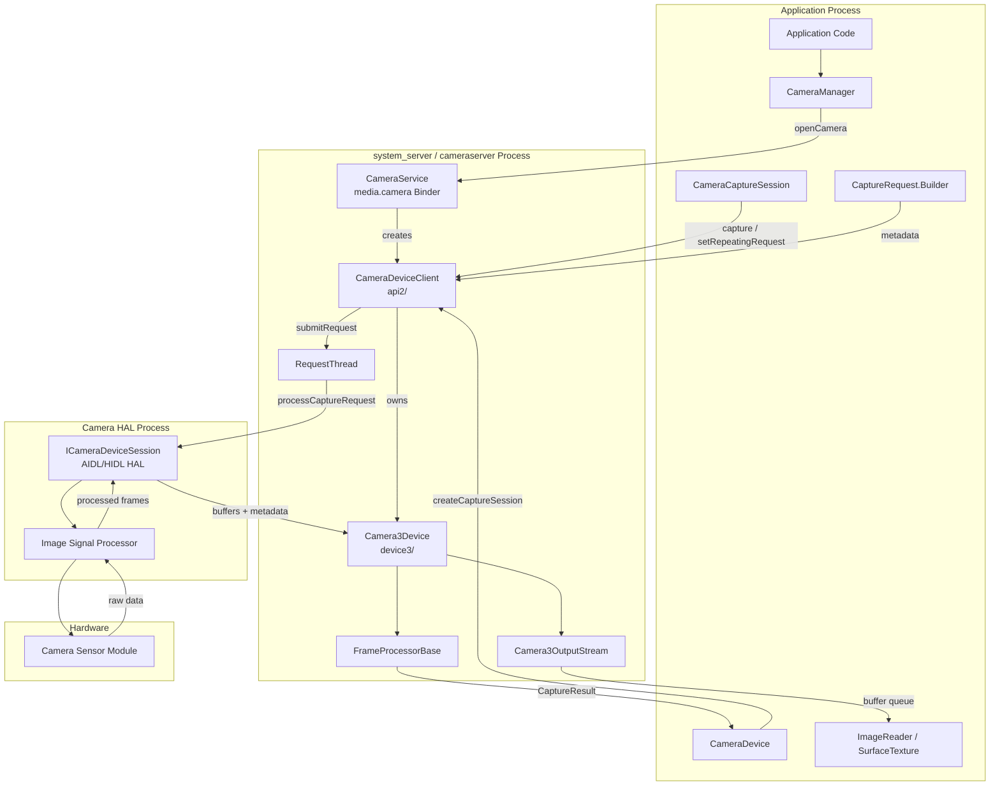
```mermaid
graph TD
    subgraph "Application Process"
        APP[Application Code]
        CM[CameraManager]
        CD[CameraDevice]
        CCS[CameraCaptureSession]
        CR[CaptureRequest.Builder]
        IR[ImageReader / SurfaceTexture]
    end

    subgraph "system_server / cameraserver Process"
        CS["CameraService<br/>media.camera Binder"]
        CDC["CameraDeviceClient<br/>api2/"]
        C3D["Camera3Device<br/>device3/"]
        C3OS[Camera3OutputStream]
        RT[RequestThread]
        FP[FrameProcessorBase]
    end

    subgraph "Camera HAL Process"
        HAL["ICameraDeviceSession<br/>AIDL/HIDL HAL"]
        ISP[Image Signal Processor]
    end

    subgraph "Hardware"
        SENSOR[Camera Sensor Module]
    end

    APP --> CM
    CM -->|openCamera| CS
    CS -->|creates| CDC
    CDC -->|owns| C3D
    CD -->|createCaptureSession| CDC
    CCS -->|capture / setRepeatingRequest| CDC
    CR -->|metadata| CDC
    CDC -->|submitRequest| RT
    RT -->|processCaptureRequest| HAL
    HAL --> ISP
    ISP --> SENSOR
    SENSOR -->|raw data| ISP
    ISP -->|processed frames| HAL
    HAL -->|buffers + metadata| C3D
    C3D --> C3OS
    C3OS -->|buffer queue| IR
    C3D --> FP
    FP -->|CaptureResult| CD
```

### 62.1.3 CameraManager -- The Entry Point

`CameraManager` is the system service that applications obtain via
`Context.getSystemService(Context.CAMERA_SERVICE)`.  It is annotated with
`@SystemService(Context.CAMERA_SERVICE)` in the source.

```
Source: frameworks/base/core/java/android/hardware/camera2/CameraManager.java
```

Key responsibilities:

| Method | Purpose |
|--------|---------|
| `getCameraIdList()` | Returns String array of available camera IDs |
| `getCameraCharacteristics(id)` | Returns static metadata for a camera |
| `openCamera(id, callback, handler)` | Opens a camera device asynchronously |
| `registerAvailabilityCallback()` | Notifies when cameras become available/unavailable |
| `getConcurrentCameraIds()` | Returns sets of camera IDs that can operate simultaneously |

Internally, `CameraManager` obtains a reference to `ICameraService` via
`ServiceManager.getService("media.camera")` and caches it:

```java
// Simplified from CameraManager.java
private ICameraService getCameraServiceLocked() {
    IBinder cameraServiceBinder = ServiceManager.getService("media.camera");
    ICameraService cameraService = ICameraService.Stub.asInterface(cameraServiceBinder);
    // Register a listener for device status changes
    cameraService.addListener(mCameraServiceListener);
    return cameraService;
}
```

The `CameraManager` maintains three internal caches:

1. **Device ID cache** -- The list of camera IDs, updated via
   `ICameraServiceListener.onStatusChanged()` callbacks.

2. **Characteristics cache** -- `CameraCharacteristics` objects keyed by
   camera ID, populated lazily on first `getCameraCharacteristics()` call.

3. **Multi-resolution configuration cache** -- Maps logical camera IDs to
   physical camera stream configurations, cached because the computation
   requires many Binder calls.

### 62.1.4 CameraDevice -- The Device Handle

`CameraDevice` is an abstract class representing an opened camera.  The
concrete implementation is `CameraDeviceImpl` in the `impl/` package.

```
Source: frameworks/base/core/java/android/hardware/camera2/CameraDevice.java
        frameworks/base/core/java/android/hardware/camera2/impl/CameraDeviceImpl.java
```

CameraDevice defines the request template constants used to create
pre-configured capture requests:

| Template Constant | Value | Use Case |
|-------------------|-------|----------|
| `TEMPLATE_PREVIEW` | 1 | Preview with high frame rate priority |
| `TEMPLATE_STILL_CAPTURE` | 2 | Still image with quality priority |
| `TEMPLATE_RECORD` | 3 | Video recording with stable frame rate |
| `TEMPLATE_VIDEO_SNAPSHOT` | 4 | Still image during video recording |
| `TEMPLATE_ZERO_SHUTTER_LAG` | 5 | ZSL capture |
| `TEMPLATE_MANUAL` | 6 | Manual control with all auto disabled |

The `StateCallback` abstract inner class provides the lifecycle notifications:

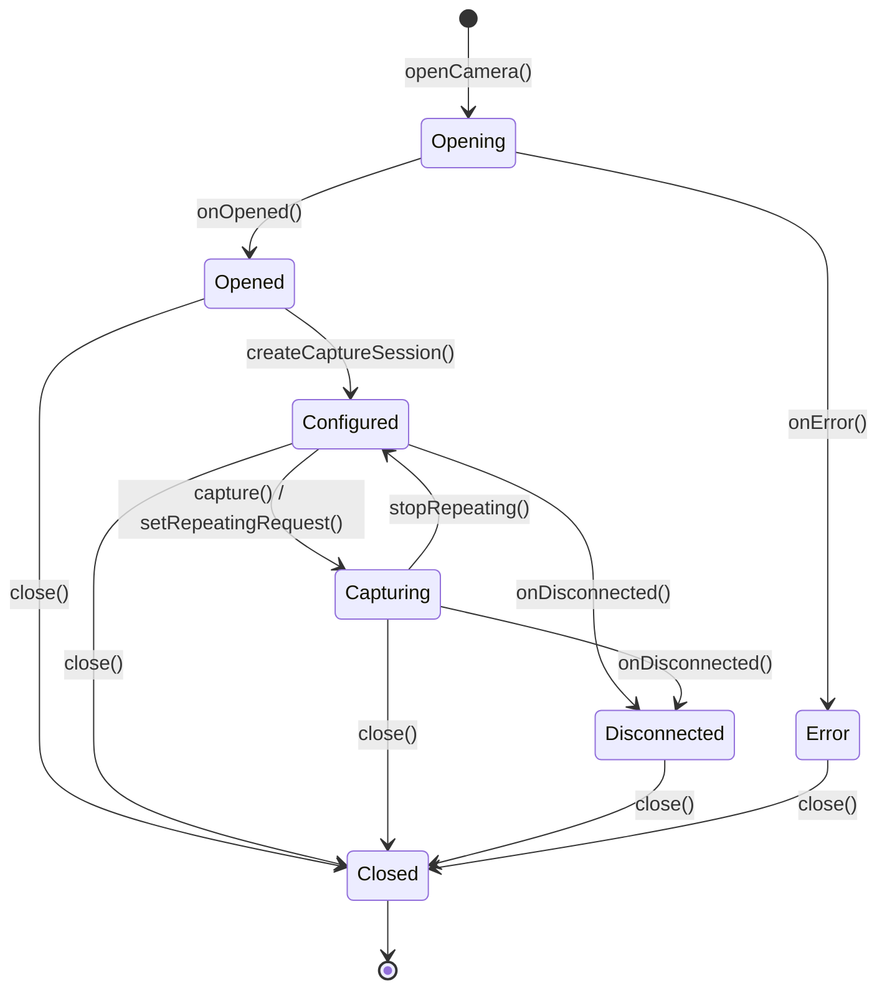
```mermaid
stateDiagram-v2
    [*] --> Opening: openCamera()
    Opening --> Opened: onOpened()
    Opening --> Error: onError()
    Opened --> Configured: createCaptureSession()
    Configured --> Capturing: capture() / setRepeatingRequest()
    Capturing --> Configured: stopRepeating()
    Configured --> Disconnected: onDisconnected()
    Capturing --> Disconnected: onDisconnected()
    Opened --> Closed: close()
    Configured --> Closed: close()
    Capturing --> Closed: close()
    Disconnected --> Closed: close()
    Error --> Closed: close()
    Closed --> [*]
```

### 62.1.5 CameraDeviceImpl -- The Java-Side Implementation

`CameraDeviceImpl` is the concrete implementation of the abstract
`CameraDevice` class.  It lives in the application process and communicates
with `CameraDeviceClient` in the camera service via the `ICameraDeviceUser`
Binder interface.

```
Source: frameworks/base/core/java/android/hardware/camera2/impl/CameraDeviceImpl.java
```

Key internal components:

| Component | Purpose |
|-----------|---------|
| `ICameraDeviceUser mRemoteDevice` | Binder proxy to CameraDeviceClient |
| `FrameNumberTracker mFrameNumberTracker` | Orders result delivery |
| `SparseArray<CaptureCallbackHolder> mCaptureCallbackMap` | Maps sequence IDs to callbacks |
| `RequestLastFrameNumbersHolder` | Tracks last frame number per request type |
| `CameraDeviceCallbacks` | Inner class receiving results from service |

The `CameraDeviceCallbacks` inner class implements the
`ICameraDeviceCallbacks` AIDL interface and is the primary result delivery
path.  When the camera service completes processing a frame, it invokes
methods on this callback object:

```java
// Simplified from CameraDeviceImpl.CameraDeviceCallbacks
public class CameraDeviceCallbacks extends ICameraDeviceCallbacks.Stub {

    @Override
    public void onResultReceived(CameraMetadataNative result,
            CaptureResultExtras resultExtras,
            PhysicalCaptureResultInfo[] physicalResults) {
        // Match result to pending request using frame number
        // Deliver partial or total result to application callback
    }

    @Override
    public void onCaptureStarted(CaptureResultExtras resultExtras,
            long timestamp) {
        // Deliver shutter callback to application
    }

    @Override
    public void onDeviceError(int errorCode, CaptureResultExtras resultExtras) {
        // Handle device errors, notify StateCallback
    }
}
```

### 62.1.6 Hardware Support Levels

The Camera2 API defines hardware support levels that indicate what features
a device can provide.  These are queried via
`CameraCharacteristics.INFO_SUPPORTED_HARDWARE_LEVEL`:

| Level | Description |
|-------|-------------|
| `LEGACY` | Backward compatibility mode with minimal Camera2 support |
| `LIMITED` | Roughly equivalent to the deprecated Camera API |
| `EXTERNAL` | Removable camera (e.g., USB), slightly less than LIMITED |
| `FULL` | Full Camera2 feature set (manual control, per-frame control, RAW) |
| `LEVEL_3` | YUV reprocessing + RAW + full manual + all of FULL |

```
Source: frameworks/base/core/java/android/hardware/camera2/CameraCharacteristics.java
        frameworks/base/core/java/android/hardware/camera2/CameraMetadata.java
```

### 62.1.7 CameraCaptureSession -- The Configured Pipeline

A `CameraCaptureSession` represents a configured set of output surfaces.
Creating a session is expensive (hundreds of milliseconds) because the
camera device must configure its internal pipelines and allocate memory
buffers.

```
Source: frameworks/base/core/java/android/hardware/camera2/CameraCaptureSession.java
        frameworks/base/core/java/android/hardware/camera2/impl/CameraCaptureSessionImpl.java
```

The session provides two modes of capture submission:

1. **Single capture** -- `capture(CaptureRequest, CaptureCallback, Handler)`.
   Submits one request; used for still photos.

2. **Repeating request** -- `setRepeatingRequest(CaptureRequest, CaptureCallback, Handler)`.
   The request is re-submitted continuously until `stopRepeating()` is called
   or a new repeating request replaces it.  Used for preview and video.

The session also supports:

- **Burst capture** -- `captureBurst(List<CaptureRequest>, ...)` submits
  multiple requests atomically.

- **Buffer pre-allocation** -- `prepare(Surface)` pre-allocates output
  buffers to avoid first-frame allocation latency.

Session lifecycle callbacks:

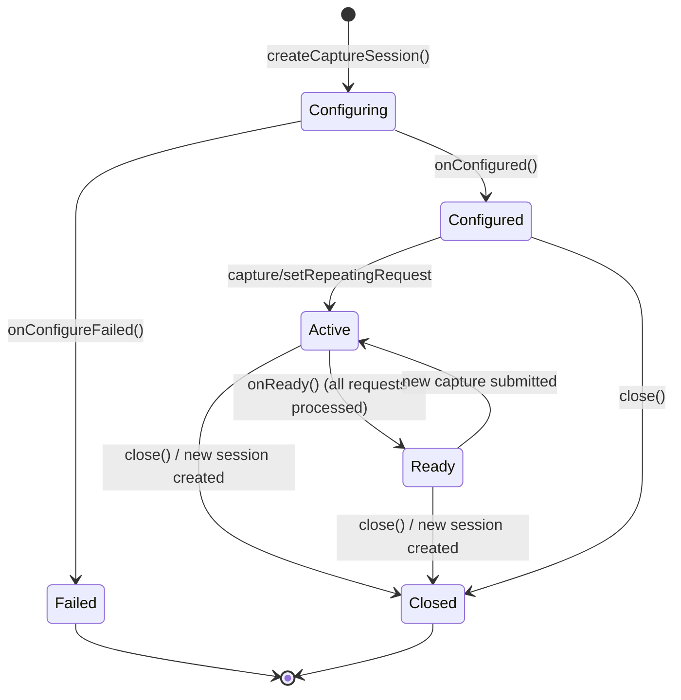
```mermaid
stateDiagram-v2
    [*] --> Configuring: createCaptureSession()
    Configuring --> Configured: onConfigured()
    Configuring --> Failed: onConfigureFailed()
    Configured --> Active: capture/setRepeatingRequest
    Active --> Ready: onReady() (all requests processed)
    Ready --> Active: new capture submitted
    Active --> Closed: close() / new session created
    Ready --> Closed: close() / new session created
    Configured --> Closed: close()
    Failed --> [*]
    Closed --> [*]
```

### 62.1.8 Session Configuration via OutputConfiguration

Starting with API 24, sessions are configured using `SessionConfiguration`
and `OutputConfiguration` objects that provide more control over how output
streams are set up:

```
Source: frameworks/base/core/java/android/hardware/camera2/params/OutputConfiguration.java
        frameworks/base/core/java/android/hardware/camera2/params/SessionConfiguration.java
```

`OutputConfiguration` supports:

| Feature | Method | Purpose |
|---------|--------|---------|
| Surface sharing | `enableSurfaceSharing()` | Multiple consumers on one stream |
| Physical camera | `setPhysicalCameraId()` | Route stream to specific physical camera |
| Deferred surface | Constructor with `Size` + `Class` | Configure stream before Surface exists |
| Group ID | `OutputConfiguration(int, Surface)` | Group related outputs |

`SessionConfiguration` wraps the complete configuration:

```java
// Example: Creating a SessionConfiguration
List<OutputConfiguration> outputs = new ArrayList<>();
outputs.add(new OutputConfiguration(previewSurface));
outputs.add(new OutputConfiguration(imageReaderSurface));

SessionConfiguration config = new SessionConfiguration(
    SessionConfiguration.SESSION_REGULAR,  // or SESSION_HIGH_SPEED
    outputs,
    executor,
    stateCallback
);

cameraDevice.createCaptureSession(config);
```

---

## 62.2 CameraService Internals

### 62.2.1 CameraService -- The Native Gatekeeper

`CameraService` is the central native service that mediates all camera
access.  It runs in its own process (`cameraserver`) and is registered with
the service manager under the name `"media.camera"`.

```
Source: frameworks/av/services/camera/libcameraservice/CameraService.h
        frameworks/av/services/camera/libcameraservice/CameraService.cpp
```

The class hierarchy:

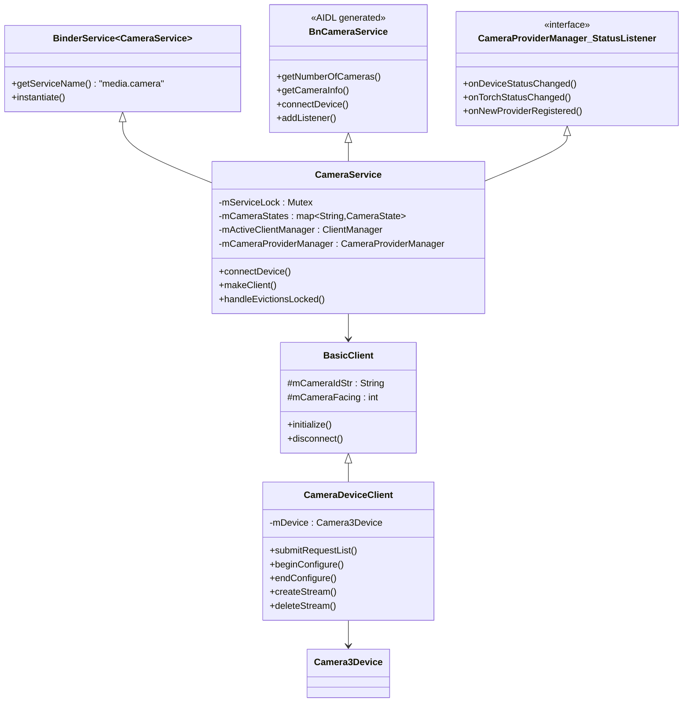
```mermaid
classDiagram
    class BinderService~CameraService~ {
        +getServiceName() "media.camera"
        +instantiate()
    }
    class BnCameraService {
        <<AIDL generated>>
        +getNumberOfCameras()
        +getCameraInfo()
        +connectDevice()
        +addListener()
    }
    class CameraProviderManager_StatusListener {
        <<interface>>
        +onDeviceStatusChanged()
        +onTorchStatusChanged()
        +onNewProviderRegistered()
    }
    class CameraService {
        -mServiceLock : Mutex
        -mCameraStates : map~String,CameraState~
        -mActiveClientManager : ClientManager
        -mCameraProviderManager : CameraProviderManager
        +connectDevice()
        +makeClient()
        +handleEvictionsLocked()
    }
    class BasicClient {
        #mCameraIdStr : String
        #mCameraFacing : int
        +initialize()
        +disconnect()
    }
    class CameraDeviceClient {
        -mDevice : Camera3Device
        +submitRequestList()
        +beginConfigure()
        +endConfigure()
        +createStream()
        +deleteStream()
    }

    BinderService~CameraService~ <|-- CameraService
    BnCameraService <|-- CameraService
    CameraProviderManager_StatusListener <|-- CameraService
    CameraService --> BasicClient
    BasicClient <|-- CameraDeviceClient
    CameraDeviceClient --> Camera3Device
```

### 62.2.2 Service Startup and Provider Registration

When `cameraserver` starts, `CameraService` enumerates camera providers
through `CameraProviderManager`.  The provider manager discovers camera
HAL implementations via the VINTF manifest and establishes connections:

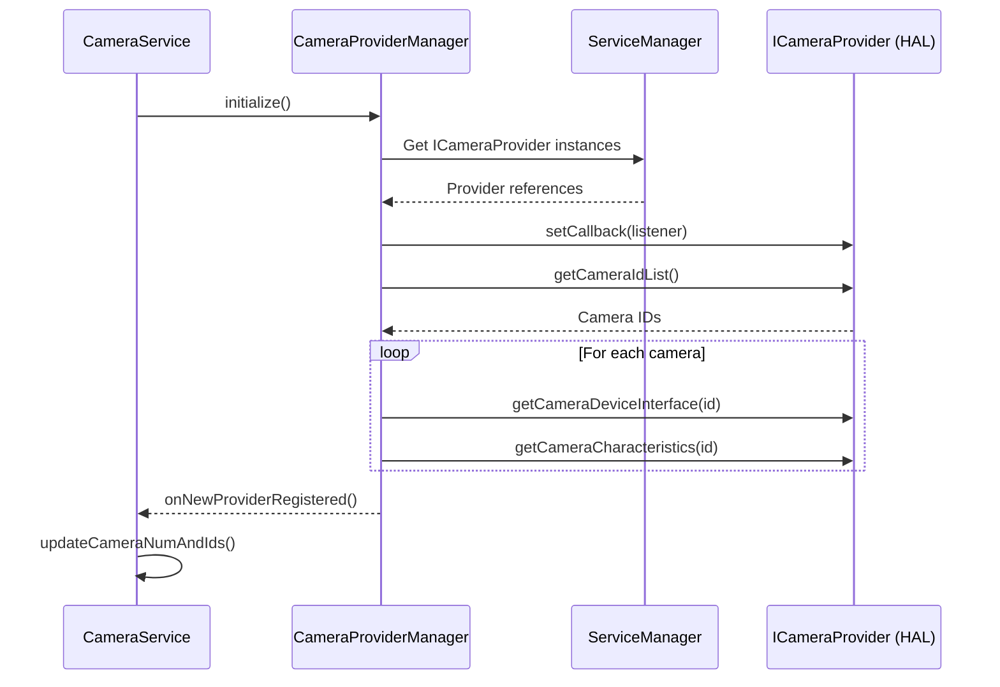
```mermaid
sequenceDiagram
    participant CS as CameraService
    participant CPM as CameraProviderManager
    participant SM as ServiceManager
    participant HAL as ICameraProvider (HAL)

    CS->>CPM: initialize()
    CPM->>SM: Get ICameraProvider instances
    SM-->>CPM: Provider references
    CPM->>HAL: setCallback(listener)
    CPM->>HAL: getCameraIdList()
    HAL-->>CPM: Camera IDs
    loop For each camera
        CPM->>HAL: getCameraDeviceInterface(id)
        CPM->>HAL: getCameraCharacteristics(id)
    end
    CPM-->>CS: onNewProviderRegistered()
    CS->>CS: updateCameraNumAndIds()
```

```
Source: frameworks/av/services/camera/libcameraservice/common/CameraProviderManager.h
        frameworks/av/services/camera/libcameraservice/common/CameraProviderManager.cpp
```

### 62.2.3 Client Connection and Eviction

When an application calls `CameraManager.openCamera()`, the Java framework
connects to `CameraService` via AIDL.  The service performs several checks
and may evict existing camera clients:

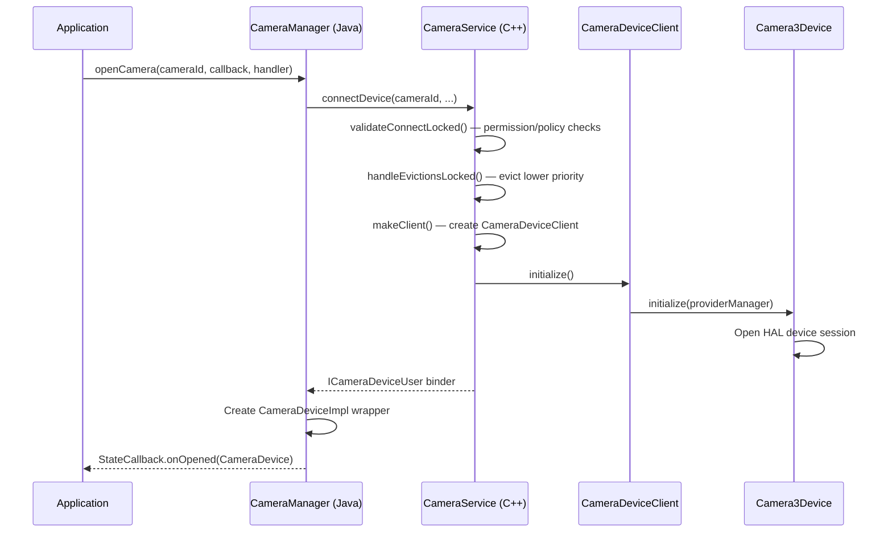
```mermaid
sequenceDiagram
    participant App as Application
    participant CM as CameraManager (Java)
    participant CS as CameraService (C++)
    participant CDC as CameraDeviceClient
    participant C3D as Camera3Device

    App->>CM: openCamera(cameraId, callback, handler)
    CM->>CS: connectDevice(cameraId, ...)
    CS->>CS: validateConnectLocked() — permission/policy checks
    CS->>CS: handleEvictionsLocked() — evict lower priority
    CS->>CS: makeClient() — create CameraDeviceClient
    CS->>CDC: initialize()
    CDC->>C3D: initialize(providerManager)
    C3D->>C3D: Open HAL device session
    CS-->>CM: ICameraDeviceUser binder
    CM->>CM: Create CameraDeviceImpl wrapper
    CM-->>App: StateCallback.onOpened(CameraDevice)
```

The eviction policy is priority-based:

| Priority Level | Description |
|----------------|-------------|
| Foreground activity | Highest priority |
| Foreground service | High priority |
| Persistent system process | High priority |
| Top activity (not focused) | Medium priority |
| Visible activity | Medium priority |
| Background process | Lowest priority |

When a higher-priority client requests a camera already in use, the
`ClientManager` evicts the lower-priority client.  The evicted client
receives `CameraDevice.StateCallback.onDisconnected()`.

```
Source: frameworks/av/services/camera/libcameraservice/utils/ClientManager.h
```

### 62.2.4 CameraDeviceClient -- The API2 Entry Point

`CameraDeviceClient` is the per-client object that implements the
`ICameraDeviceUser` AIDL interface.  It receives capture requests from the
Java framework and translates them into `Camera3Device` operations.

```
Source: frameworks/av/services/camera/libcameraservice/api2/CameraDeviceClient.h
        frameworks/av/services/camera/libcameraservice/api2/CameraDeviceClient.cpp
```

Key operations:

| AIDL Method | CameraDeviceClient Method | Description |
|-------------|---------------------------|-------------|
| `submitRequestList` | `submitRequestList()` | Submit capture/repeating requests |
| `beginConfigure` | `beginConfigure()` | Start stream configuration |
| `endConfigure` | `endConfigure()` | Finalize stream configuration |
| `createStream` | `createStream()` | Create a new output stream |
| `deleteStream` | `deleteStream()` | Remove an output stream |
| `waitUntilIdle` | `waitUntilIdle()` | Block until pipeline drains |
| `flush` | `flush()` | Abort all pending requests |

### 62.2.5 Camera3Device -- The HAL Interface Driver

`Camera3Device` is the core engine that manages the Camera HAL v3+
interface.  It translates framework requests into HAL capture requests and
routes HAL results back to the framework.

```
Source: frameworks/av/services/camera/libcameraservice/device3/Camera3Device.h
        frameworks/av/services/camera/libcameraservice/device3/Camera3Device.cpp
```

Camera3Device inherits from `CameraDeviceBase` and implements multiple
interfaces:

```cpp
// From Camera3Device.h
class Camera3Device :
    public CameraDeviceBase,
    public camera3::SetErrorInterface,
    public camera3::InflightRequestUpdateInterface,
    public camera3::RequestBufferInterface,
    public camera3::FlushBufferInterface,
    public AttributionAndPermissionUtilsEncapsulator {
  friend class HidlCamera3Device;
  friend class AidlCamera3Device;
  // ...
};
```

It has two transport-specific subclasses:

- `HidlCamera3Device` -- for HIDL-based camera HALs
- `AidlCamera3Device` -- for AIDL-based camera HALs

### 62.2.6 Camera3Device Internal Threads

Camera3Device operates several internal threads:

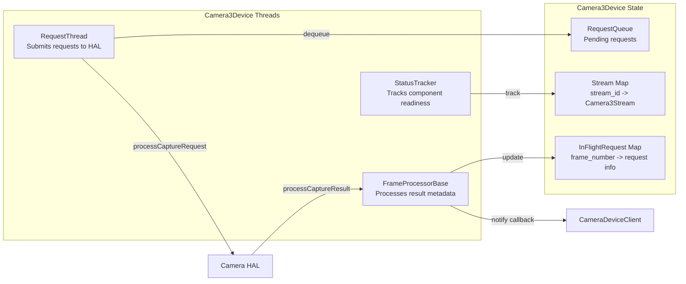
```mermaid
graph LR
    subgraph Camera3Device Threads
        RT["RequestThread<br/>Submits requests to HAL"]
        FP["FrameProcessorBase<br/>Processes result metadata"]
        ST["StatusTracker<br/>Tracks component readiness"]
    end

    subgraph Camera3Device State
        IFR["InFlightRequest Map<br/>frame_number -> request info"]
        SQ["RequestQueue<br/>Pending requests"]
        STREAMS["Stream Map<br/>stream_id -> Camera3Stream"]
    end

    RT -->|dequeue| SQ
    RT -->|processCaptureRequest| HAL[Camera HAL]
    HAL -->|processCaptureResult| FP
    FP -->|update| IFR
    FP -->|notify callback| CDC[CameraDeviceClient]
    ST -->|track| STREAMS
```

**RequestThread** is the most critical thread.  It runs in a loop:

1. Dequeues the next `CaptureRequest` from the request queue
2. Applies any per-frame metadata overrides (3A settings, crop region, etc.)
3. Applies stream configuration mappers (distortion correction, zoom ratio,
   rotate-and-crop)

4. Calls `processCaptureRequest()` on the HAL interface
5. Tracks the request in the `InFlightRequest` map

**FrameProcessorBase** runs in a separate thread and processes results
returned by the HAL:

1. Receives partial and final `CaptureResult` metadata
2. Matches results to in-flight requests using frame numbers
3. Delivers results to `CameraDeviceClient` which forwards them to Java

**StatusTracker** monitors the readiness of all streams and the HAL.  It
coalesces status updates to avoid thrashing the "idle" / "active" state.

### 62.2.7 Metadata Mappers

Camera3Device applies several metadata mappers that transform coordinates
and values between the application coordinate space and the HAL coordinate
space:

| Mapper | Source File | Purpose |
|--------|-------------|---------|
| `DistortionMapper` | `device3/DistortionMapper.cpp` | Corrects for lens distortion in metadata |
| `ZoomRatioMapper` | `device3/ZoomRatioMapper.cpp` | Translates zoom ratio to crop region |
| `RotateAndCropMapper` | `device3/RotateAndCropMapper.cpp` | Adjusts metadata for rotate-and-crop |
| `UHRCropAndMeteringRegionMapper` | `device3/UHRCropAndMeteringRegionMapper.cpp` | Ultra-high-resolution crop mapping |

These mappers are applied in order during both request submission (converting
app coordinates to HAL coordinates) and result delivery (converting HAL
coordinates back to app coordinates).

### 62.2.8 CameraProviderManager -- HAL Discovery

`CameraProviderManager` is responsible for discovering, connecting to, and
managing camera HAL provider services.  It maintains the mapping between
camera IDs and their underlying HAL implementations.

```
Source: frameworks/av/services/camera/libcameraservice/common/CameraProviderManager.h
        frameworks/av/services/camera/libcameraservice/common/CameraProviderManager.cpp
```

The provider manager handles both AIDL and HIDL HAL providers:

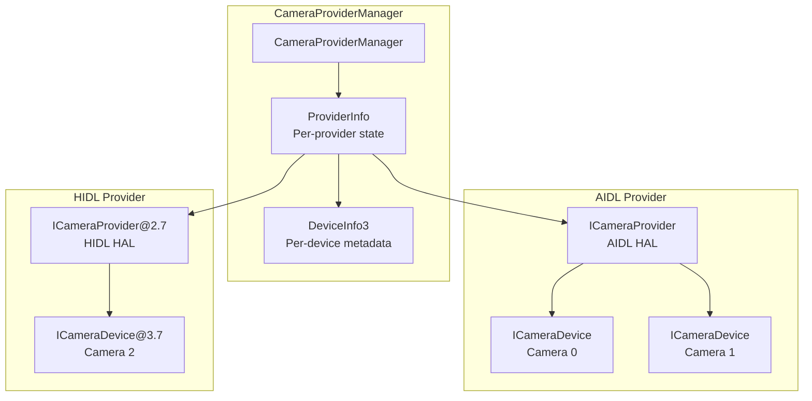
```mermaid
graph TD
    subgraph CameraProviderManager
        CPM[CameraProviderManager]
        PH["ProviderInfo<br/>Per-provider state"]
        DH["DeviceInfo3<br/>Per-device metadata"]
    end

    subgraph AIDL Provider
        AP["ICameraProvider<br/>AIDL HAL"]
        AD1["ICameraDevice<br/>Camera 0"]
        AD2["ICameraDevice<br/>Camera 1"]
    end

    subgraph HIDL Provider
        HP["ICameraProvider@2.7<br/>HIDL HAL"]
        HD1["ICameraDevice@3.7<br/>Camera 2"]
    end

    CPM --> PH
    PH --> DH
    PH --> AP
    AP --> AD1
    AP --> AD2
    PH --> HP
    HP --> HD1
```

For each discovered camera, the provider manager caches:

- **Camera characteristics** -- Static metadata (sensor size, capabilities, etc.)
- **Resource cost** -- An integer indicating the resource consumption of this camera
- **Conflicting devices** -- Other cameras that cannot operate simultaneously
- **System camera kind** -- PUBLIC, SYSTEM_ONLY_CAMERA, or HIDDEN_SECURE_CAMERA

### 62.2.9 Camera Flash Control

`CameraFlashlight` manages the camera flashlight (torch mode) independently
of the camera capture pipeline:

```
Source: frameworks/av/services/camera/libcameraservice/CameraFlashlight.h
        frameworks/av/services/camera/libcameraservice/CameraFlashlight.cpp
```

Torch mode is controlled through `CameraManager.setTorchMode()` in the
framework, which translates to `CameraService::setTorchMode()`.  The torch
can be enabled without opening the camera device.

When a camera device is opened by an application, any active torch on that
camera is automatically turned off (since the ISP takes control of the flash
LED).

### 62.2.10 CameraService Watchdog

`CameraServiceWatchdog` is a dedicated thread that monitors camera
operations for timeouts.  If a camera HAL call takes longer than the
configured timeout, the watchdog can trigger recovery actions:

```
Source: frameworks/av/services/camera/libcameraservice/CameraServiceWatchdog.h
        frameworks/av/services/camera/libcameraservice/CameraServiceWatchdog.cpp
```

The watchdog helps detect and recover from vendor HAL hangs, which are one
of the most common sources of camera failures on production devices.

---

## 62.3 Capture Pipeline

### 62.3.1 The Request-Result Model

Camera2 uses a fully asynchronous **request-result pipeline**.  Every frame
captured by the camera is the result of a `CaptureRequest` submitted by the
application.  The application never "pulls" frames -- it configures the
desired output parameters and the camera pushes results back.

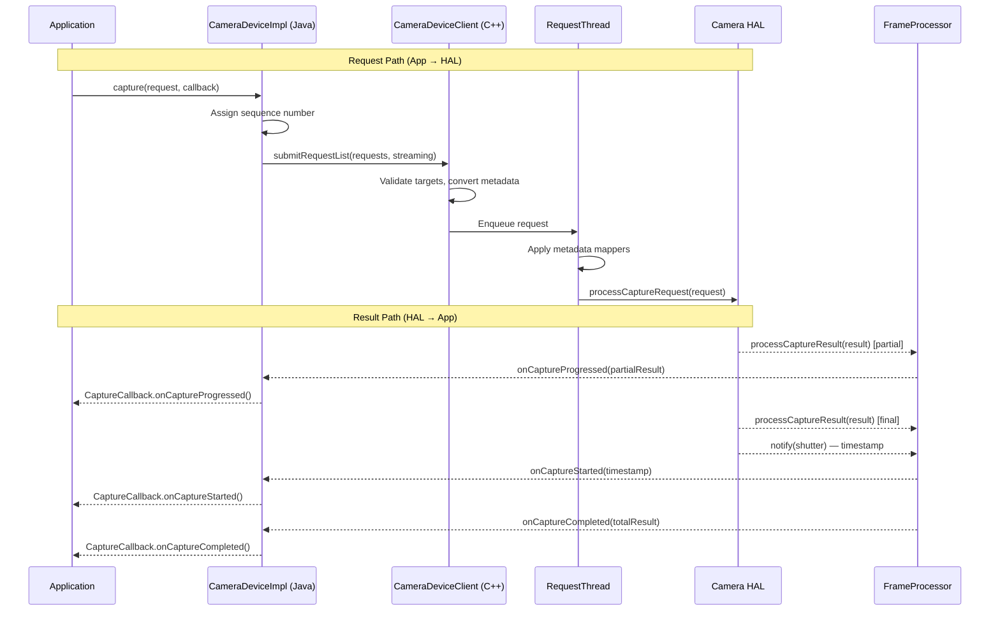
```mermaid
sequenceDiagram
    participant App as Application
    participant CDI as CameraDeviceImpl (Java)
    participant CDC as CameraDeviceClient (C++)
    participant RT as RequestThread
    participant HAL as Camera HAL
    participant FP as FrameProcessor

    Note over App,HAL: Request Path (App → HAL)
    App->>CDI: capture(request, callback)
    CDI->>CDI: Assign sequence number
    CDI->>CDC: submitRequestList(requests, streaming)
    CDC->>CDC: Validate targets, convert metadata
    CDC->>RT: Enqueue request
    RT->>RT: Apply metadata mappers
    RT->>HAL: processCaptureRequest(request)

    Note over App,HAL: Result Path (HAL → App)
    HAL-->>FP: processCaptureResult(result) [partial]
    FP-->>CDI: onCaptureProgressed(partialResult)
    CDI-->>App: CaptureCallback.onCaptureProgressed()
    HAL-->>FP: processCaptureResult(result) [final]
    HAL-->>FP: notify(shutter) — timestamp
    FP-->>CDI: onCaptureStarted(timestamp)
    CDI-->>App: CaptureCallback.onCaptureStarted()
    FP-->>CDI: onCaptureCompleted(totalResult)
    CDI-->>App: CaptureCallback.onCaptureCompleted()
```

### 62.3.2 CaptureRequest in Detail

A `CaptureRequest` is an immutable bundle of:

1. **Target Surfaces** -- The output surfaces that should receive image data
   for this request.

2. **Metadata Keys** -- Hundreds of camera control parameters.
3. **Tag** -- An optional application-defined tag for tracking.
4. **Physical Camera Settings** -- Per-physical-camera overrides for logical
   multi-camera devices.

```
Source: frameworks/base/core/java/android/hardware/camera2/CaptureRequest.java
```

The `CaptureRequest.Builder` is obtained from `CameraDevice`:

```java
// Creating a capture request
CaptureRequest.Builder builder = cameraDevice.createCaptureRequest(
    CameraDevice.TEMPLATE_STILL_CAPTURE
);
builder.addTarget(imageReaderSurface);
builder.set(CaptureRequest.CONTROL_AE_MODE, CameraMetadata.CONTROL_AE_MODE_ON);
builder.set(CaptureRequest.JPEG_QUALITY, (byte) 95);
builder.set(CaptureRequest.JPEG_ORIENTATION, orientation);
CaptureRequest request = builder.build();
```

Key metadata categories in CaptureRequest:

| Category | Example Keys | Description |
|----------|-------------|-------------|
| **3A Control** | `CONTROL_AE_MODE`, `CONTROL_AF_MODE`, `CONTROL_AWB_MODE` | Auto-exposure, focus, white balance |
| **Sensor** | `SENSOR_EXPOSURE_TIME`, `SENSOR_SENSITIVITY` | Direct sensor control (manual mode) |
| **Lens** | `LENS_FOCAL_LENGTH`, `LENS_FOCUS_DISTANCE`, `LENS_APERTURE` | Lens control |
| **Scaler** | `SCALER_CROP_REGION`, `CONTROL_ZOOM_RATIO` | Crop and zoom |
| **Flash** | `FLASH_MODE`, `CONTROL_AE_PRECAPTURE_TRIGGER` | Flash control |
| **JPEG** | `JPEG_QUALITY`, `JPEG_ORIENTATION`, `JPEG_THUMBNAIL_SIZE` | JPEG encoding parameters |
| **Noise Reduction** | `NOISE_REDUCTION_MODE` | Noise reduction level |
| **Edge Enhancement** | `EDGE_MODE` | Sharpening control |
| **Color Correction** | `COLOR_CORRECTION_MODE`, `COLOR_CORRECTION_TRANSFORM` | Color processing |
| **Tonemap** | `TONEMAP_MODE`, `TONEMAP_CURVE` | Tone mapping control |

### 62.3.3 CaptureResult in Detail

A `CaptureResult` contains the actual settings used by the camera device for
a particular frame, plus additional read-only metadata about the capture:

```
Source: frameworks/base/core/java/android/hardware/camera2/CaptureResult.java
        frameworks/base/core/java/android/hardware/camera2/TotalCaptureResult.java
```

The distinction between result types:

| Type | Class | Description |
|------|-------|-------------|
| **Partial** | `CaptureResult` | Subset of result metadata, delivered early |
| **Total** | `TotalCaptureResult` | Complete result with all available metadata |

Partial results allow applications to receive critical metadata (like 3A state)
before the full result is ready, reducing perceived latency.

Key read-only result metadata:

| Key | Description |
|-----|-------------|
| `SENSOR_TIMESTAMP` | Exact timestamp of frame start-of-exposure |
| `SENSOR_EXPOSURE_TIME` | Actual exposure time used |
| `SENSOR_SENSITIVITY` | Actual ISO used |
| `CONTROL_AE_STATE` | AE convergence state (SEARCHING/CONVERGED/LOCKED) |
| `CONTROL_AF_STATE` | AF convergence state |
| `CONTROL_AWB_STATE` | AWB convergence state |
| `LENS_STATE` | STATIONARY or MOVING |
| `STATISTICS_FACES` | Detected face rectangles, scores, IDs |
| `STATISTICS_LENS_SHADING_MAP` | Per-channel lens shading correction map |

### 62.3.4 Frame Number Tracking

Every request submitted through the pipeline is assigned a monotonically
increasing **frame number**.  This number ties together:

- The `CaptureRequest` submitted by the application
- The HAL `processCaptureRequest` call
- The shutter notification (`notify(SHUTTER, frameNumber, timestamp)`)
- The `CaptureResult` metadata
- The output image buffers

`CameraDeviceImpl` maintains a `FrameNumberTracker` that ensures results
are delivered to the application in order:

```
Source: frameworks/base/core/java/android/hardware/camera2/impl/FrameNumberTracker.java
```

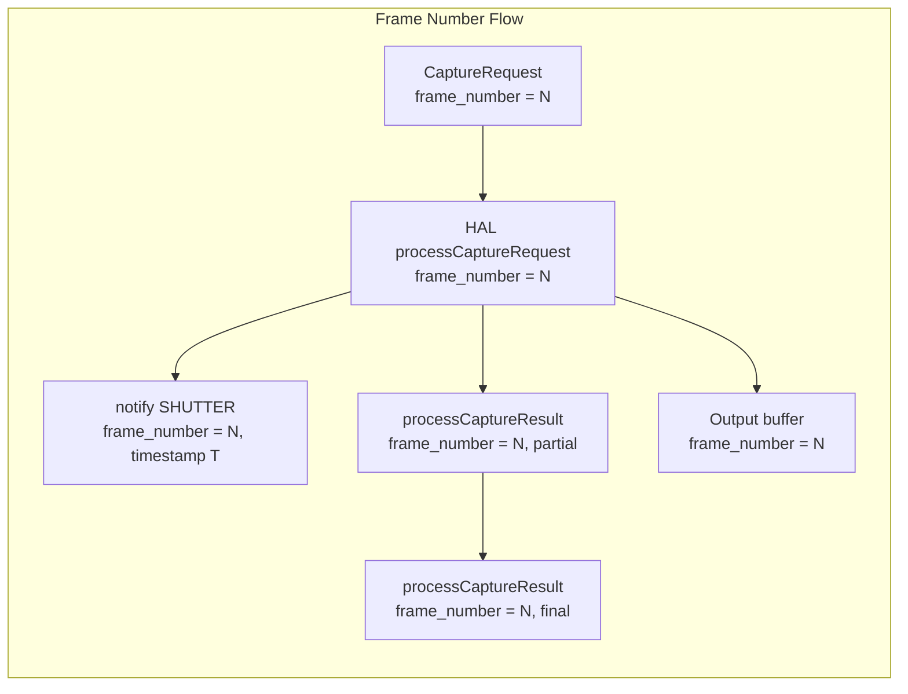
```mermaid
graph LR
    subgraph Frame Number Flow
        REQ["CaptureRequest<br/>frame_number = N"]
        HAL_REQ["HAL processCaptureRequest<br/>frame_number = N"]
        SHUTTER["notify SHUTTER<br/>frame_number = N, timestamp T"]
        PARTIAL["processCaptureResult<br/>frame_number = N, partial"]
        TOTAL["processCaptureResult<br/>frame_number = N, final"]
        BUFFER["Output buffer<br/>frame_number = N"]
    end

    REQ --> HAL_REQ
    HAL_REQ --> SHUTTER
    HAL_REQ --> PARTIAL
    PARTIAL --> TOTAL
    HAL_REQ --> BUFFER
```

### 62.3.5 3A Convergence Loop

One of the most critical aspects of the capture pipeline is the
**3A convergence loop** -- the process by which auto-exposure (AE),
auto-focus (AF), and auto-white-balance (AWB) algorithms reach stable
settings before a photo is taken.

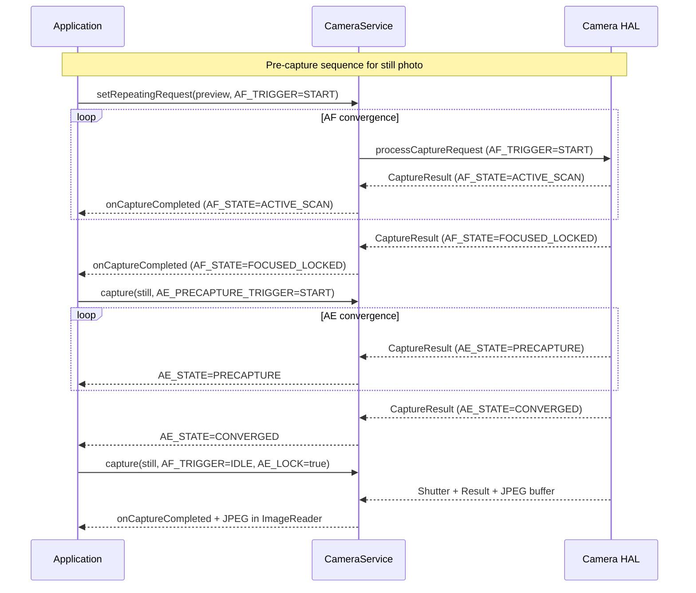
```mermaid
sequenceDiagram
    participant App as Application
    participant CS as CameraService
    participant HAL as Camera HAL

    Note over App,HAL: Pre-capture sequence for still photo

    App->>CS: setRepeatingRequest(preview, AF_TRIGGER=START)
    loop AF convergence
        CS->>HAL: processCaptureRequest (AF_TRIGGER=START)
        HAL-->>CS: CaptureResult (AF_STATE=ACTIVE_SCAN)
        CS-->>App: onCaptureCompleted (AF_STATE=ACTIVE_SCAN)
    end
    HAL-->>CS: CaptureResult (AF_STATE=FOCUSED_LOCKED)
    CS-->>App: onCaptureCompleted (AF_STATE=FOCUSED_LOCKED)

    App->>CS: capture(still, AE_PRECAPTURE_TRIGGER=START)
    loop AE convergence
        HAL-->>CS: CaptureResult (AE_STATE=PRECAPTURE)
        CS-->>App: AE_STATE=PRECAPTURE
    end
    HAL-->>CS: CaptureResult (AE_STATE=CONVERGED)
    CS-->>App: AE_STATE=CONVERGED

    App->>CS: capture(still, AF_TRIGGER=IDLE, AE_LOCK=true)
    HAL-->>CS: Shutter + Result + JPEG buffer
    CS-->>App: onCaptureCompleted + JPEG in ImageReader
```

The 3A state machines are defined in `CameraMetadata`:

**AF State Machine:**

| State | Meaning |
|-------|---------|
| `INACTIVE` | AF is not doing anything |
| `PASSIVE_SCAN` | Continuous AF is scanning |
| `PASSIVE_FOCUSED` | Continuous AF has focused |
| `PASSIVE_UNFOCUSED` | Continuous AF cannot find focus |
| `ACTIVE_SCAN` | Triggered AF scan in progress |
| `FOCUSED_LOCKED` | AF locked on target |
| `NOT_FOCUSED_LOCKED` | AF failed to focus, locked |

**AE State Machine:**

| State | Meaning |
|-------|---------|
| `INACTIVE` | AE is not active |
| `SEARCHING` | AE is converging |
| `CONVERGED` | AE has settled on exposure |
| `LOCKED` | AE is locked (user request) |
| `FLASH_REQUIRED` | Scene is too dark, needs flash |
| `PRECAPTURE` | Pre-capture metering in progress |

### 62.3.6 In-Flight Request Management

`Camera3Device` maintains an `InFlightRequest` map that tracks every
request currently being processed by the HAL:

```
Source: frameworks/av/services/camera/libcameraservice/device3/InFlightRequest.h
```

Each `InFlightRequest` stores:

- **Frame number** -- The unique identifier
- **Request metadata** -- The original CaptureRequest settings
- **Output buffer tracking** -- Which buffers have been returned
- **Result metadata** -- Accumulated partial + final metadata
- **Shutter timestamp** -- When the sensor exposure began
- **Error state** -- Whether any errors occurred

An in-flight request is removed from the map only when all of the following
have been received:

1. Shutter notification
2. All partial result metadata
3. Final result metadata
4. All output buffers

### 62.3.7 The HAL Contract

The camera HAL must satisfy a strict ordering contract:

1. **Shutter notifications** must arrive in frame-number order
2. **Result metadata** can arrive in any order (partial results may arrive
   before or after the shutter notification)

3. **Output buffers** may arrive in any order, but the HAL should prioritize
   returning preview buffers to minimize display latency

4. The HAL must return all outputs for frame N before accepting frame N + `maxPipelineDepth`

```
Source: hardware/interfaces/camera/device/aidl/android/hardware/camera/device/ICameraDeviceSession.aidl
```

### 62.3.8 Reprocessing

Camera2 supports reprocessing -- sending a previously captured image back
through the ISP for additional processing (e.g., ZSL capture):

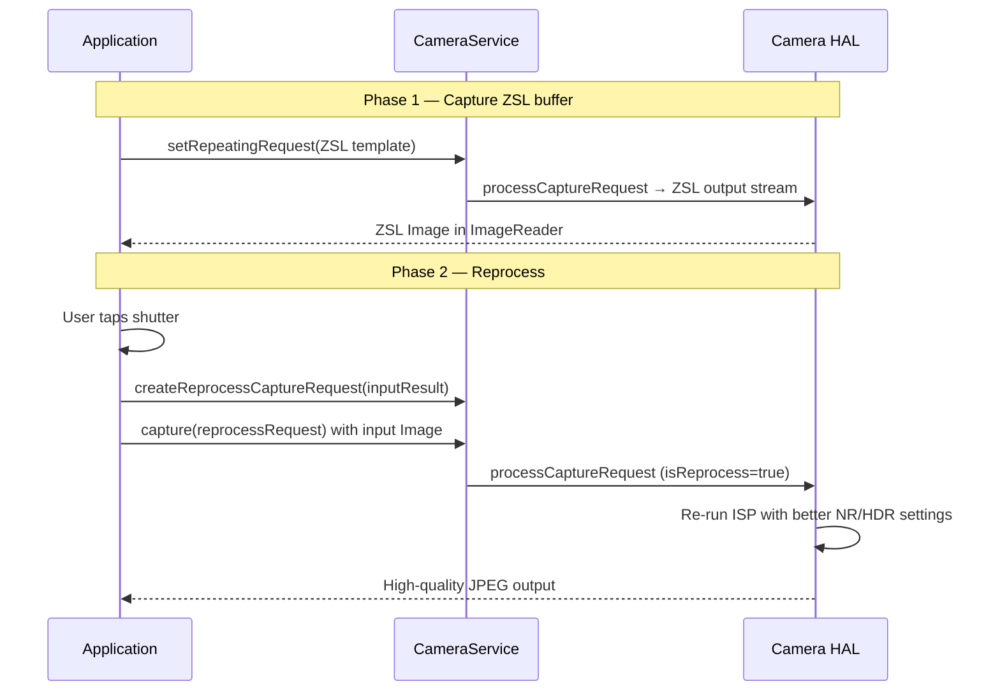
```mermaid
sequenceDiagram
    participant App as Application
    participant CS as CameraService
    participant HAL as Camera HAL

    Note over App,HAL: Phase 1 — Capture ZSL buffer
    App->>CS: setRepeatingRequest(ZSL template)
    CS->>HAL: processCaptureRequest → ZSL output stream
    HAL-->>App: ZSL Image in ImageReader

    Note over App,HAL: Phase 2 — Reprocess
    App->>App: User taps shutter
    App->>CS: createReprocessCaptureRequest(inputResult)
    App->>CS: capture(reprocessRequest) with input Image
    CS->>HAL: processCaptureRequest (isReprocess=true)
    HAL->>HAL: Re-run ISP with better NR/HDR settings
    HAL-->>App: High-quality JPEG output
```

The key requirement is a **reprocessable capture session**, created with
`CameraDevice.createReprocessableCaptureSession()`.  This session has both
an input configuration (for receiving frames to reprocess) and output
configurations (for the reprocessed results).

### 62.3.9 DNG Raw Capture

Camera2 supports capturing DNG (Digital Negative) raw images for
professional photography workflows:

```
Source: frameworks/base/core/java/android/hardware/camera2/DngCreator.java
```

```java
// Check RAW capability
int[] capabilities = characteristics.get(
    CameraCharacteristics.REQUEST_AVAILABLE_CAPABILITIES);
boolean hasRaw = Arrays.stream(capabilities)
    .anyMatch(c -> c == CameraMetadata.REQUEST_AVAILABLE_CAPABILITIES_RAW);

if (hasRaw) {
    // Get RAW output sizes
    StreamConfigurationMap map = characteristics.get(
        CameraCharacteristics.SCALER_STREAM_CONFIGURATION_MAP);
    Size[] rawSizes = map.getOutputSizes(ImageFormat.RAW_SENSOR);

    // Create ImageReader for RAW
    ImageReader rawReader = ImageReader.newInstance(
        rawSizes[0].getWidth(), rawSizes[0].getHeight(),
        ImageFormat.RAW_SENSOR, 2);

    // After capturing, create DNG file
    DngCreator dngCreator = new DngCreator(characteristics, captureResult);
    dngCreator.setOrientation(ExifInterface.ORIENTATION_NORMAL);
    dngCreator.setDescription("AOSP Camera2 RAW capture");
    // Write DNG to output stream
    dngCreator.writeImage(outputStream, rawImage);
    dngCreator.close();
}
```

`DngCreator` embeds the camera calibration data, lens correction profiles,
color matrices, and noise model from `CameraCharacteristics` and
`CaptureResult` into the DNG file.  This enables desktop RAW processors
(Lightroom, RawTherapee) to correctly develop the image.

### 62.3.10 JPEG/R HDR Photos

Android 14 introduced JPEG/R (also called Ultra HDR), which embeds an
HDR gain map inside a standard JPEG file.  The camera service implements
this through `JpegRCompositeStream`:

```
Source: frameworks/av/services/camera/libcameraservice/api2/JpegRCompositeStream.h
        frameworks/av/services/camera/libcameraservice/api2/JpegRCompositeStream.cpp
```

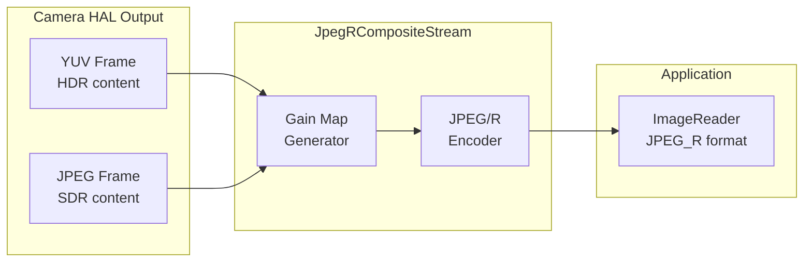
```mermaid
graph LR
    subgraph Camera HAL Output
        YUV["YUV Frame<br/>HDR content"]
        SDR["JPEG Frame<br/>SDR content"]
    end

    subgraph JpegRCompositeStream
        GM["Gain Map<br/>Generator"]
        ENC["JPEG/R<br/>Encoder"]
    end

    subgraph Application
        IR["ImageReader<br/>JPEG_R format"]
    end

    YUV --> GM
    SDR --> GM
    GM --> ENC
    ENC --> IR
```

The JPEG/R file is backward-compatible: devices that don't understand HDR
display the SDR JPEG, while HDR-capable displays use the gain map to
reconstruct the full HDR content.

### 62.3.11 Flush and Idle

Applications can drain the pipeline using two mechanisms:

- **`flush()`** -- Aborts all pending and in-progress requests as quickly as
  possible.  Partially completed requests return with error status.  Used
  when switching modes or closing the camera.

- **`waitUntilIdle()`** -- Blocks until all submitted requests have completed
  normally.  Cannot be called while a repeating request is active.

```
Source: frameworks/av/services/camera/libcameraservice/device3/Camera3Device.cpp
  → Camera3Device::flush()
  → Camera3Device::waitUntilStateThenRelock()
```

---

## 62.4 Image Streams

### 62.4.1 Stream Architecture

Camera2 delivers image data through **streams**.  Each stream is backed by a
BufferQueue (producer-consumer pair) and is represented by a
`Camera3Stream` subclass in the camera service:

```
Source: frameworks/av/services/camera/libcameraservice/device3/Camera3Stream.h
        frameworks/av/services/camera/libcameraservice/device3/Camera3Stream.cpp
        frameworks/av/services/camera/libcameraservice/device3/Camera3OutputStream.h
        frameworks/av/services/camera/libcameraservice/device3/Camera3OutputStream.cpp
        frameworks/av/services/camera/libcameraservice/device3/Camera3InputStream.h
        frameworks/av/services/camera/libcameraservice/device3/Camera3InputStream.cpp
```

Stream types:

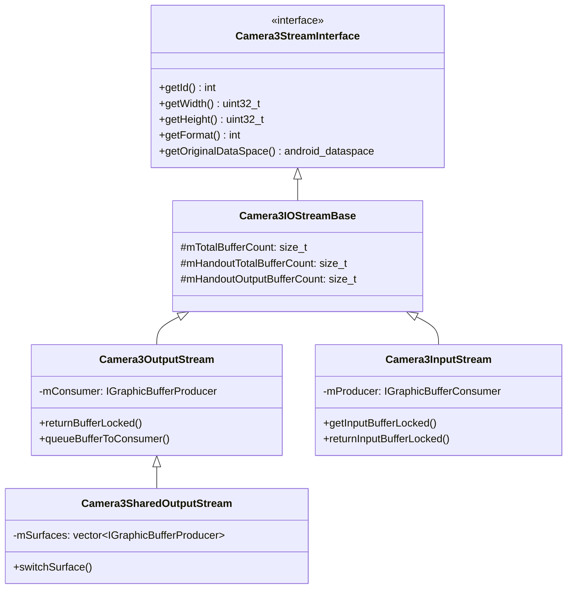
```mermaid
classDiagram
    class Camera3StreamInterface {
        <<interface>>
        +getId() int
        +getWidth() uint32_t
        +getHeight() uint32_t
        +getFormat() int
        +getOriginalDataSpace() android_dataspace
    }
    class Camera3IOStreamBase {
        #mTotalBufferCount: size_t
        #mHandoutTotalBufferCount: size_t
        #mHandoutOutputBufferCount: size_t
    }
    class Camera3OutputStream {
        -mConsumer: IGraphicBufferProducer
        +returnBufferLocked()
        +queueBufferToConsumer()
    }
    class Camera3InputStream {
        -mProducer: IGraphicBufferConsumer
        +getInputBufferLocked()
        +returnInputBufferLocked()
    }
    class Camera3SharedOutputStream {
        -mSurfaces: vector~IGraphicBufferProducer~
        +switchSurface()
    }

    Camera3StreamInterface <|-- Camera3IOStreamBase
    Camera3IOStreamBase <|-- Camera3OutputStream
    Camera3IOStreamBase <|-- Camera3InputStream
    Camera3OutputStream <|-- Camera3SharedOutputStream
```

### 62.4.2 ImageReader

`ImageReader` is the primary mechanism for applications to receive camera
image data for processing (as opposed to display):

```java
// Creating an ImageReader for JPEG capture
ImageReader imageReader = ImageReader.newInstance(
    4032, 3024,        // width x height
    ImageFormat.JPEG,  // format
    2                  // maxImages
);

imageReader.setOnImageAvailableListener(reader -> {
    Image image = reader.acquireLatestImage();
    if (image != null) {
        ByteBuffer buffer = image.getPlanes()[0].getBuffer();
        byte[] jpegBytes = new byte[buffer.remaining()];
        buffer.get(jpegBytes);
        // Save JPEG bytes
        image.close();
    }
}, backgroundHandler);
```

ImageReader supports multiple pixel formats:

| Format | `ImageFormat` Constant | Use Case |
|--------|----------------------|----------|
| JPEG | `JPEG` | Compressed still photos |
| YUV_420_888 | `YUV_420_888` | Flexible YUV for analysis |
| RAW_SENSOR | `RAW_SENSOR` | Bayer-pattern raw data |
| RAW10 | `RAW10` | 10-bit packed raw |
| DEPTH16 | `DEPTH16` | Depth maps |
| DEPTH_POINT_CLOUD | `DEPTH_POINT_CLOUD` | Point cloud data |
| HEIC | `HEIC` | HEIF-encoded still photos |
| JPEG_R | `JPEG_R` | JPEG with embedded gain map (HDR) |
| PRIVATE | `PRIVATE` | Opaque format for preview/video |

```
Source: frameworks/base/core/java/android/media/ImageReader.java
        frameworks/base/core/jni/android_media_ImageReader.cpp
```

### 62.4.3 SurfaceTexture for Preview

For camera preview, applications typically use `SurfaceTexture` (accessed via
`TextureView`) or `SurfaceView`.  The camera streams frames in `PRIVATE`
format, which the GPU can composite directly:

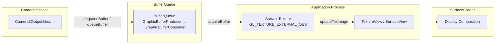
```mermaid
graph LR
    subgraph Camera Service
        C3OS[Camera3OutputStream]
    end
    subgraph BufferQueue
        BQ["BufferQueue<br/>IGraphicBufferProducer ↔ IGraphicBufferConsumer"]
    end
    subgraph Application Process
        ST["SurfaceTexture<br/>GL_TEXTURE_EXTERNAL_OES"]
        TV[TextureView / SurfaceView]
    end
    subgraph SurfaceFlinger
        SF[Display Composition]
    end

    C3OS -->|dequeueBuffer / queueBuffer| BQ
    BQ -->|acquireBuffer| ST
    ST -->|updateTexImage| TV
    TV --> SF
```

The preview stream uses the `PRIVATE` format because:

1. The exact pixel layout is device-specific (GPU-optimized)
2. No CPU access is needed -- pixels go directly from ISP to display
3. It avoids the overhead of format conversion

### 62.4.4 Multiple Simultaneous Streams

Camera2 supports multiple simultaneous output streams.  The guaranteed
stream combinations depend on the hardware level.  For a `FULL` device,
the minimum guaranteed combinations include:

| Preview | Still Capture | Recording | Analysis |
|---------|---------------|-----------|----------|
| `PRIVATE/MAXIMUM` | | | |
| `PRIVATE/PREVIEW` | `JPEG/MAXIMUM` | | |
| `PRIVATE/PREVIEW` | `PRIVATE/PREVIEW` | | |
| `PRIVATE/PREVIEW` | `YUV/PREVIEW` | | |
| `PRIVATE/PREVIEW` | `JPEG/MAXIMUM` | | `YUV/PREVIEW` |
| `PRIVATE/PREVIEW` | | `PRIVATE/MAXIMUM` | |
| `PRIVATE/PREVIEW` | `JPEG/MAXIMUM` | `PRIVATE/PREVIEW` | |

Applications can query the exact supported combinations via
`CameraCharacteristics.SCALER_STREAM_CONFIGURATION_MAP`:

```java
StreamConfigurationMap map = characteristics.get(
    CameraCharacteristics.SCALER_STREAM_CONFIGURATION_MAP);

// Get supported output sizes for JPEG
Size[] jpegSizes = map.getOutputSizes(ImageFormat.JPEG);

// Get supported output sizes for preview
Size[] previewSizes = map.getOutputSizes(SurfaceTexture.class);

// Get minimum frame duration for a specific size+format
long minDuration = map.getOutputMinFrameDuration(ImageFormat.JPEG, jpegSizes[0]);
```

### 62.4.5 High Speed Capture

Camera2 supports high-speed video capture (120fps or 240fps) through
`CameraConstrainedHighSpeedCaptureSession`:

```
Source: frameworks/base/core/java/android/hardware/camera2/CameraConstrainedHighSpeedCaptureSession.java
        frameworks/base/core/java/android/hardware/camera2/impl/CameraConstrainedHighSpeedCaptureSessionImpl.java
```

High-speed sessions have significant constraints:

| Constraint | Description |
|-----------|-------------|
| Max 2 output surfaces | Preview + recording only |
| Fixed FPS range | Must use one of the advertised high-speed FPS ranges |
| No per-frame control | Most metadata settings are fixed across the burst |
| No still capture | Cannot capture JPEG during high-speed recording |
| Batch requests | Multiple requests submitted as a single batch |

```java
// Query high-speed capabilities
StreamConfigurationMap map = characteristics.get(
    CameraCharacteristics.SCALER_STREAM_CONFIGURATION_MAP);
Size[] highSpeedSizes = map.getHighSpeedVideoSizes();

for (Size size : highSpeedSizes) {
    Range<Integer>[] fpsRanges =
        map.getHighSpeedVideoFpsRangesFor(size);
    for (Range<Integer> range : fpsRanges) {
        // e.g., Range(120, 120) or Range(240, 240)
        System.out.println(size + " @ " + range + " fps");
    }
}

// Create high-speed session
SessionConfiguration config = new SessionConfiguration(
    SessionConfiguration.SESSION_HIGH_SPEED,
    outputs,
    executor,
    stateCallback
);
cameraDevice.createCaptureSession(config);
```

The `createHighSpeedRequestList()` method generates a batch of requests
that the HAL processes as a group, enabling the high frame rate:

```java
CaptureRequest.Builder builder =
    cameraDevice.createCaptureRequest(CameraDevice.TEMPLATE_RECORD);
builder.addTarget(previewSurface);
builder.addTarget(recorderSurface);

// This creates a batch of requests for high-speed capture
CameraConstrainedHighSpeedCaptureSession highSpeedSession =
    (CameraConstrainedHighSpeedCaptureSession) session;
List<CaptureRequest> highSpeedRequests =
    highSpeedSession.createHighSpeedRequestList(builder.build());

highSpeedSession.setRepeatingBurst(highSpeedRequests, callback, handler);
```

### 62.4.6 Stream Use Cases (Android 13+)

Android 13 introduced `StreamUseCase` -- a hint that helps the camera HAL
optimize stream configuration:

| Use Case | Constant | Optimization |
|----------|----------|-------------|
| Default | `DEFAULT` | No specific optimization |
| Preview | `PREVIEW` | Optimized for display |
| Still Capture | `STILL_CAPTURE` | Optimized for quality |
| Video Record | `VIDEO_RECORD` | Optimized for encoding |
| Preview Video Still | `PREVIEW_VIDEO_STILL` | Balanced for all three |
| Video Call | `VIDEO_CALL` | Optimized for conferencing |
| Cropped RAW | `CROPPED_RAW` | RAW with crop applied |

### 62.4.7 Buffer Management

Camera3Device includes a `Camera3BufferManager` that provides two buffer
management strategies:

```
Source: frameworks/av/services/camera/libcameraservice/device3/Camera3BufferManager.h
        frameworks/av/services/camera/libcameraservice/device3/Camera3BufferManager.cpp
```

**Framework-managed buffers** (traditional):

- The camera service allocates buffers and provides them to the HAL
- `Camera3OutputStream.getBufferLocked()` dequeues from the consumer
- The service controls buffer allocation timing

**HAL-managed buffers** (modern):

- The HAL requests buffers on demand via `requestStreamBuffers()`
- Reduces buffer allocation overhead
- Allows the HAL to optimize buffer usage across streams

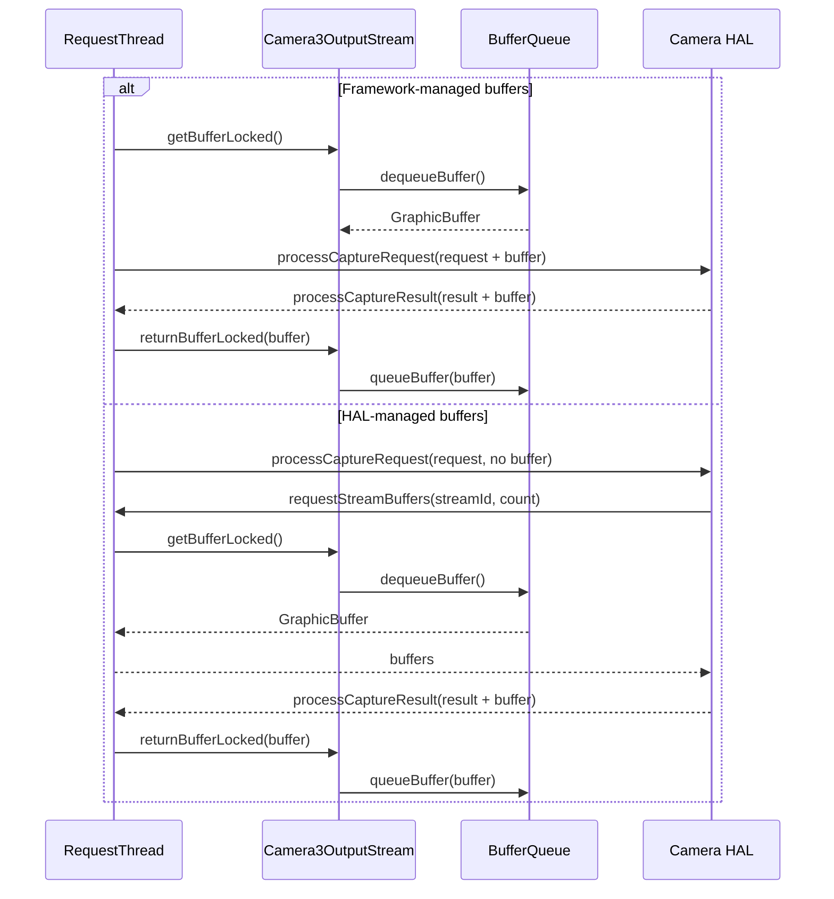
```mermaid
sequenceDiagram
    participant RT as RequestThread
    participant OS as Camera3OutputStream
    participant BQ as BufferQueue
    participant HAL as Camera HAL

    alt Framework-managed buffers
        RT->>OS: getBufferLocked()
        OS->>BQ: dequeueBuffer()
        BQ-->>OS: GraphicBuffer
        RT->>HAL: processCaptureRequest(request + buffer)
        HAL-->>RT: processCaptureResult(result + buffer)
        RT->>OS: returnBufferLocked(buffer)
        OS->>BQ: queueBuffer(buffer)
    else HAL-managed buffers
        RT->>HAL: processCaptureRequest(request, no buffer)
        HAL->>RT: requestStreamBuffers(streamId, count)
        RT->>OS: getBufferLocked()
        OS->>BQ: dequeueBuffer()
        BQ-->>RT: GraphicBuffer
        RT-->>HAL: buffers
        HAL-->>RT: processCaptureResult(result + buffer)
        RT->>OS: returnBufferLocked(buffer)
        OS->>BQ: queueBuffer(buffer)
    end
```

### 62.4.8 Composite Streams

The camera service implements several **composite streams** that perform
additional processing on HAL output before delivering to the application:

| Composite Stream | Source File | Description |
|-----------------|-------------|-------------|
| `DepthCompositeStream` | `api2/DepthCompositeStream.cpp` | Combines depth + color for dynamic depth JPEG |
| `HeicCompositeStream` | `api2/HeicCompositeStream.cpp` | Encodes HEIC using MediaCodec |
| `JpegRCompositeStream` | `api2/JpegRCompositeStream.cpp` | Creates JPEG/R (HDR photo with gain map) |

These composite streams are transparent to the application -- the app
requests a normal HEIC or DEPTH_JPEG output, and the camera service
internally sets up the composite processing pipeline.

---

## 62.5 Multi-Camera

### 62.5.1 Logical Camera Architecture

Starting with Android 9 (API 28), Camera2 introduced the **logical
multi-camera** model.  A logical camera is a virtual camera backed by two or
more physical cameras:

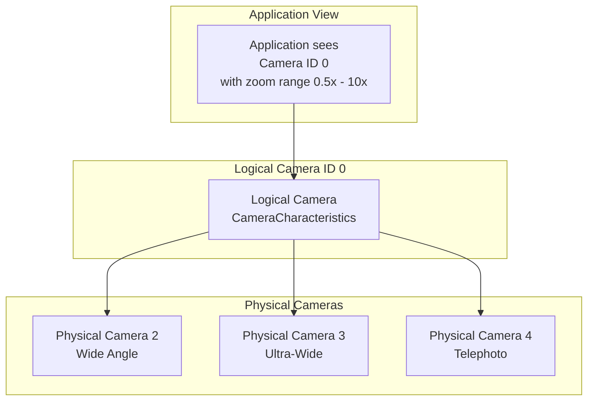
```mermaid
graph TD
    subgraph Logical Camera ID 0
        LC["Logical Camera<br/>CameraCharacteristics"]
    end

    subgraph Physical Cameras
        PC0["Physical Camera 2<br/>Wide Angle"]
        PC1["Physical Camera 3<br/>Ultra-Wide"]
        PC2["Physical Camera 4<br/>Telephoto"]
    end

    LC --> PC0
    LC --> PC1
    LC --> PC2

    subgraph Application View
        APP["Application sees<br/>Camera ID 0<br/>with zoom range 0.5x - 10x"]
    end

    APP --> LC
```

The logical camera:

- Has its own `CameraCharacteristics` that represent the combined capabilities
- Automatically switches between physical cameras based on zoom ratio
- Handles ISP transitions, white balance matching, and exposure synchronization

```java
// Query physical camera IDs
Set<String> physicalCameraIds = characteristics.getPhysicalCameraIds();
// Returns e.g., {"2", "3", "4"}

// Check if this is a logical multi-camera
int[] capabilities = characteristics.get(
    CameraCharacteristics.REQUEST_AVAILABLE_CAPABILITIES);
boolean isLogicalMultiCamera = Arrays.stream(capabilities)
    .anyMatch(c -> c == CameraMetadata.REQUEST_AVAILABLE_CAPABILITIES_LOGICAL_MULTI_CAMERA);
```

### 62.5.2 Physical Camera Access

Applications can access individual physical cameras through the logical
camera for specialized use cases:

```java
// Route a specific stream to a physical camera
OutputConfiguration ultraWideConfig = new OutputConfiguration(ultraWideSurface);
ultraWideConfig.setPhysicalCameraId("3");  // Ultra-wide physical camera

OutputConfiguration teleConfig = new OutputConfiguration(teleSurface);
teleConfig.setPhysicalCameraId("4");  // Telephoto physical camera

SessionConfiguration sessionConfig = new SessionConfiguration(
    SessionConfiguration.SESSION_REGULAR,
    Arrays.asList(ultraWideConfig, teleConfig),
    executor, stateCallback
);
```

Physical camera result metadata is accessed through `TotalCaptureResult`:

```java
// Get the result for a specific physical camera
CaptureResult physicalResult = totalResult.getPhysicalCameraResults().get("3");
if (physicalResult != null) {
    Long timestamp = physicalResult.get(CaptureResult.SENSOR_TIMESTAMP);
}
```

### 62.5.3 Camera Characteristics for Multi-Camera

The `CameraCharacteristics` for a logical camera includes keys that describe
the multi-camera relationship:

| Key | Description |
|-----|-------------|
| `LOGICAL_MULTI_CAMERA_PHYSICAL_IDS` | Set of physical camera IDs |
| `LOGICAL_MULTI_CAMERA_SENSOR_SYNC_TYPE` | APPROXIMATE or CALIBRATED sync |
| `LENS_POSE_REFERENCE` | Coordinate origin (PRIMARY_CAMERA or UNDEFINED) |
| `LENS_POSE_ROTATION` | Rotation relative to reference |
| `LENS_POSE_TRANSLATION` | Translation relative to reference |
| `LENS_INTRINSIC_CALIBRATION` | Focal length and principal point |
| `LENS_DISTORTION` | Radial and tangential distortion coefficients |

```
Source: frameworks/base/core/java/android/hardware/camera2/CameraCharacteristics.java
```

### 62.5.4 Multi-Resolution Streams

For logical multi-cameras where physical cameras have different maximum
resolutions, `MultiResolutionImageReader` provides a unified interface:

```
Source: frameworks/base/core/java/android/hardware/camera2/MultiResolutionImageReader.java
```

```java
// Get multi-resolution stream configurations
MultiResolutionStreamConfigurationMap multiResMap = characteristics.get(
    CameraCharacteristics.SCALER_MULTI_RESOLUTION_STREAM_CONFIGURATION_MAP);

Collection<MultiResolutionStreamInfo> streams =
    multiResMap.getOutputInfo(ImageFormat.JPEG);

// Create a MultiResolutionImageReader
MultiResolutionImageReader multiResReader =
    new MultiResolutionImageReader(streams, ImageFormat.JPEG, 2);

multiResReader.setOnImageAvailableListener(reader -> {
    Image image = reader.acquireNextImage();
    // Image size may vary depending on which physical camera was active
    image.close();
}, handler);
```

### 62.5.5 Physical Camera Streams at the HAL Level

When physical camera streams are requested, the camera service configures
the HAL with annotated stream configurations:

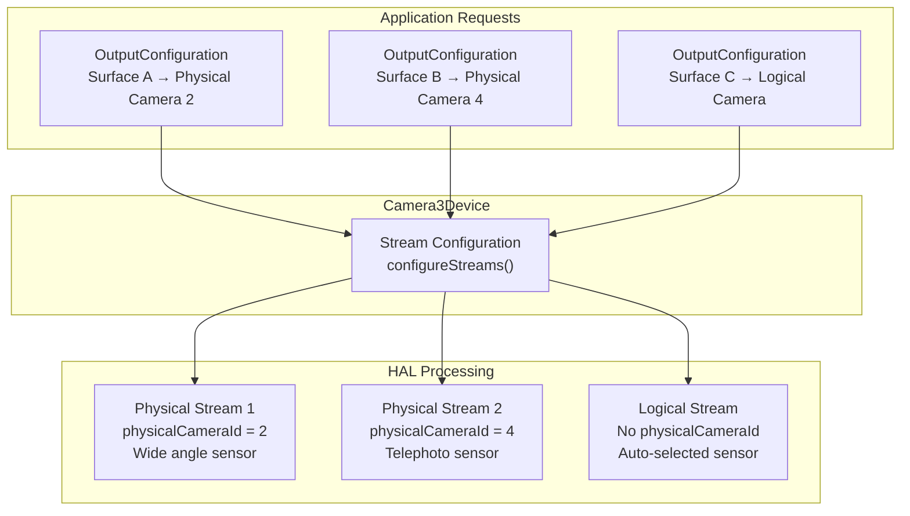
```mermaid
graph TD
    subgraph Application Requests
        R1["OutputConfiguration<br/>Surface A → Physical Camera 2"]
        R2["OutputConfiguration<br/>Surface B → Physical Camera 4"]
        R3["OutputConfiguration<br/>Surface C → Logical Camera"]
    end

    subgraph Camera3Device
        SC["Stream Configuration<br/>configureStreams()"]
    end

    subgraph HAL Processing
        PS1["Physical Stream 1<br/>physicalCameraId = 2<br/>Wide angle sensor"]
        PS2["Physical Stream 2<br/>physicalCameraId = 4<br/>Telephoto sensor"]
        LS["Logical Stream<br/>No physicalCameraId<br/>Auto-selected sensor"]
    end

    R1 --> SC
    R2 --> SC
    R3 --> SC
    SC --> PS1
    SC --> PS2
    SC --> LS
```

The HAL receives `StreamConfiguration` entries with the `physicalCameraId`
field set for physical streams.  The HAL is responsible for:

1. Routing each stream to the correct physical sensor
2. Synchronizing exposures across physical cameras when
   `LOGICAL_MULTI_CAMERA_SENSOR_SYNC_TYPE` is `CALIBRATED`

3. Applying per-physical-camera metadata overrides
4. Color-matching outputs from different sensors

### 62.5.6 Camera Pose and Calibration

For augmented reality and computational photography applications, the
multi-camera framework provides precise geometric calibration data:

| Characteristic Key | Type | Description |
|--------------------|------|-------------|
| `LENS_POSE_ROTATION` | float[4] | Quaternion rotation relative to reference |
| `LENS_POSE_TRANSLATION` | float[3] | Translation in meters |
| `LENS_POSE_REFERENCE` | int | PRIMARY_CAMERA, GYROSCOPE, or UNDEFINED |
| `LENS_INTRINSIC_CALIBRATION` | float[5] | fx, fy, cx, cy, s (focal, principal, skew) |
| `LENS_DISTORTION` | float[6] | Radial k1-k3 and tangential p1-p2 + k4 |
| `LENS_RADIAL_DISTORTION` | float[6] | Deprecated -- use LENS_DISTORTION |

These values enable applications to:

- Compute depth from stereo camera pairs
- Project 3D points onto camera images
- Correct lens distortion in software
- Align images from different physical cameras

### 62.5.7 Concurrent Camera Access

Android 11 (API 30) introduced concurrent camera access, allowing
applications to open multiple cameras simultaneously:

```java
// Query which cameras can operate concurrently
Set<Set<String>> concurrentCameraIds = cameraManager.getConcurrentCameraIds();
// e.g., {{"0", "1"}} means front+back can be open simultaneously

// Check if a specific configuration is supported
boolean supported = cameraManager.isConcurrentSessionConfigurationSupported(
    Map.of(
        "0", sessionConfig0,  // Back camera config
        "1", sessionConfig1   // Front camera config
    )
);
```

### 62.5.8 Multi-Camera Data Flow

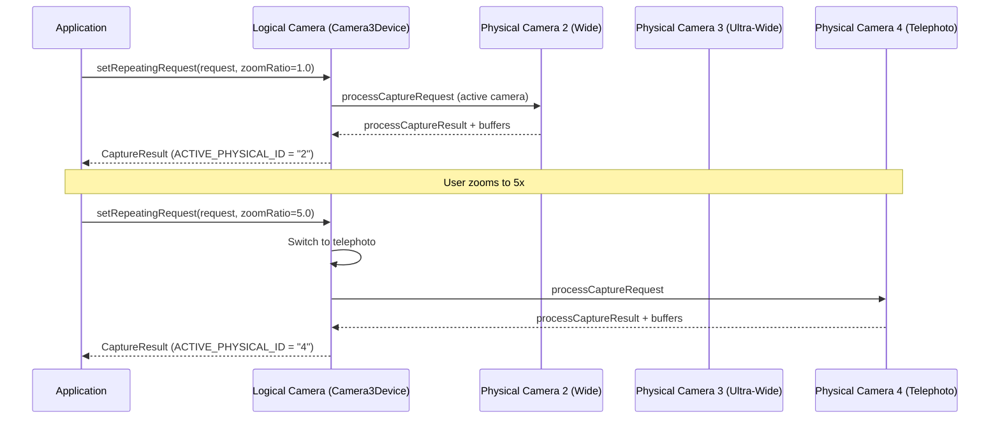
```mermaid
sequenceDiagram
    participant App as Application
    participant LC as Logical Camera (Camera3Device)
    participant PHY_W as Physical Camera 2 (Wide)
    participant PHY_UW as Physical Camera 3 (Ultra-Wide)
    participant PHY_T as Physical Camera 4 (Telephoto)

    App->>LC: setRepeatingRequest(request, zoomRatio=1.0)
    LC->>PHY_W: processCaptureRequest (active camera)
    PHY_W-->>LC: processCaptureResult + buffers
    LC-->>App: CaptureResult (ACTIVE_PHYSICAL_ID = "2")

    Note over App,PHY_T: User zooms to 5x
    App->>LC: setRepeatingRequest(request, zoomRatio=5.0)
    LC->>LC: Switch to telephoto
    LC->>PHY_T: processCaptureRequest
    PHY_T-->>LC: processCaptureResult + buffers
    LC-->>App: CaptureResult (ACTIVE_PHYSICAL_ID = "4")
```

---

### 62.5.9 Camera Offline Session

Android 11 introduced `CameraOfflineSession`, which allows an application
to disconnect from the camera device while preserving in-flight capture
requests.  This is useful for long-running multi-frame captures (like night
mode) where the application wants to release the camera for other apps:

```
Source: frameworks/base/core/java/android/hardware/camera2/CameraOfflineSession.java
        frameworks/av/services/camera/libcameraservice/device3/Camera3OfflineSession.h
        frameworks/av/services/camera/libcameraservice/device3/Camera3OfflineSession.cpp
        frameworks/av/services/camera/libcameraservice/api2/CameraOfflineSessionClient.h
```

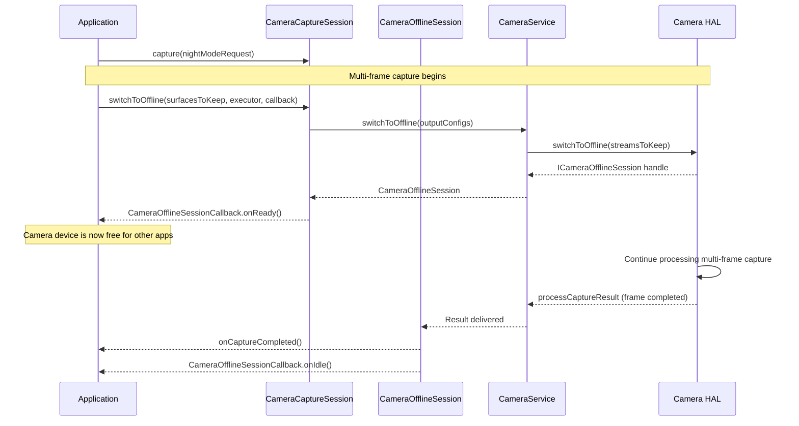
```mermaid
sequenceDiagram
    participant App as Application
    participant Session as CameraCaptureSession
    participant Offline as CameraOfflineSession
    participant CS as CameraService
    participant HAL as Camera HAL

    App->>Session: capture(nightModeRequest)
    Note over App,HAL: Multi-frame capture begins

    App->>Session: switchToOffline(surfacesToKeep, executor, callback)
    Session->>CS: switchToOffline(outputConfigs)
    CS->>HAL: switchToOffline(streamsToKeep)
    HAL-->>CS: ICameraOfflineSession handle
    CS-->>Session: CameraOfflineSession
    Session-->>App: CameraOfflineSessionCallback.onReady()

    Note over App: Camera device is now free for other apps

    HAL->>HAL: Continue processing multi-frame capture
    HAL-->>CS: processCaptureResult (frame completed)
    CS-->>Offline: Result delivered
    Offline-->>App: onCaptureCompleted()
    Offline-->>App: CameraOfflineSessionCallback.onIdle()
```

---

## 62.6 Camera Extensions

### 62.6.1 Extensions Architecture

Camera Extensions (introduced in Android 12, `CameraExtensionSession`)
provide access to device-specific image processing algorithms that go
beyond standard Camera2 capabilities.  Extensions typically use multi-frame
capture and sophisticated post-processing.

```
Source: frameworks/base/core/java/android/hardware/camera2/CameraExtensionSession.java
        frameworks/base/core/java/android/hardware/camera2/CameraExtensionCharacteristics.java
        frameworks/base/core/java/android/hardware/camera2/impl/CameraAdvancedExtensionSessionImpl.java
        frameworks/base/core/java/android/hardware/camera2/impl/CameraExtensionSessionImpl.java
```

### 62.6.2 Supported Extension Types

| Extension Type | Constant | Description |
|---------------|----------|-------------|
| Night Mode | `EXTENSION_NIGHT` | Multi-frame low-light enhancement |
| HDR | `EXTENSION_HDR` | High dynamic range merging |
| Bokeh | `EXTENSION_BOKEH` | Background blur / portrait mode |
| Auto | `EXTENSION_AUTOMATIC` | Device-selected best mode |
| Face Retouch | `EXTENSION_FACE_RETOUCH` | Skin smoothing and beautification |
| Eyes Free Videography | `EXTENSION_EYES_FREE_VIDEOGRAPHY` | Stabilized hands-free video |

```java
// Query supported extensions
CameraExtensionCharacteristics extChars =
    cameraManager.getCameraExtensionCharacteristics(cameraId);

List<Integer> supportedExtensions = extChars.getSupportedExtensions();
for (int extension : supportedExtensions) {
    // Get supported sizes for this extension
    List<Size> sizes = extChars.getExtensionSupportedSizes(
        extension, ImageFormat.JPEG);
}
```

### 62.6.3 Extension Session Lifecycle

Creating an extension session replaces the standard `CameraCaptureSession`:

```mermaid
sequenceDiagram
    participant App as Application
    participant CDI as CameraDeviceImpl
    participant EXT as CameraExtensionSessionImpl
    participant HAL as Extension HAL Service

    App->>CDI: createExtensionSession(config)
    CDI->>EXT: Create extension session
    EXT->>HAL: Bind to extension service
    HAL-->>EXT: IAdvancedExtenderImpl / IImageCaptureExtenderImpl
    EXT->>EXT: Configure internal capture session
    EXT-->>App: StateCallback.onConfigured(CameraExtensionSession)

    App->>EXT: setRepeatingRequest(request, callback)
    EXT->>EXT: Translate to internal Camera2 requests
    EXT->>HAL: Process frames through extension pipeline
    HAL-->>EXT: Processed output
    EXT-->>App: ExtensionCaptureCallback.onCaptureProcessStarted()

    App->>EXT: capture(request, callback)
    Note over EXT,HAL: Multi-frame burst capture
    EXT->>HAL: Capture N frames
    HAL->>HAL: Post-process (NR, HDR, etc.)
    HAL-->>EXT: Final processed image
    EXT-->>App: ExtensionCaptureCallback.onCaptureResultAvailable()
```

### 62.6.4 Extension Implementation Architecture

Extensions have two implementation models:

**Basic Extender** (legacy):

- Uses `IImageCaptureExtenderImpl` and `IPreviewExtenderImpl`
- Framework manages the capture pipeline
- Extension processes individual frames

**Advanced Extender** (modern):

- Uses `IAdvancedExtenderImpl`
- Extension controls the entire camera pipeline
- Can issue its own capture requests
- More flexible, preferred for complex algorithms

```
Source: frameworks/base/core/java/android/hardware/camera2/extension/IAdvancedExtenderImpl.aidl
        frameworks/base/core/java/android/hardware/camera2/extension/IImageCaptureExtenderImpl.aidl
        frameworks/base/core/java/android/hardware/camera2/extension/IPreviewExtenderImpl.aidl
```

### 62.6.5 Extension Proxy Service

Camera extensions are delivered by OEM-provided APKs that expose their
functionality through a proxy service:

```
Source: frameworks/base/core/java/android/hardware/camera2/extension/ICameraExtensionsProxyService.aidl
```

The extension discovery process:

```mermaid
graph TD
    A[CameraExtensionCharacteristics] -->|bind to| B[ICameraExtensionsProxyService]
    B -->|query| C{Extension Type?}
    C -->|Advanced| D[IAdvancedExtenderImpl]
    C -->|Basic| E["IImageCaptureExtenderImpl<br/>+ IPreviewExtenderImpl"]
    D -->|isExtensionAvailable| F[Check hardware capability]
    E -->|isExtensionAvailable| F
    F -->|true| G[Extension available]
    F -->|false| H[Extension unavailable]
```

### 62.6.6 Extension Capture Callbacks

`CameraExtensionSession.ExtensionCaptureCallback` provides extension-specific
lifecycle callbacks:

```java
ExtensionCaptureCallback callback = new ExtensionCaptureCallback() {
    @Override
    public void onCaptureStarted(CameraExtensionSession session,
            CaptureRequest request, long timestamp) {
        // Shutter moment -- play sound, update UI
    }

    @Override
    public void onCaptureProcessStarted(CameraExtensionSession session,
            CaptureRequest request) {
        // Multi-frame capture complete, post-processing has begun
        // This is when the extension algorithm starts running
    }

    @Override
    public void onCaptureFailed(CameraExtensionSession session,
            CaptureRequest request) {
        // Extension capture failed
    }

    @Override
    public void onCaptureResultAvailable(CameraExtensionSession session,
            CaptureRequest request, TotalCaptureResult result) {
        // Result metadata available (API 34+)
    }
};
```

### 62.6.7 Extension Metadata Support

Starting with Android 14, extensions can report and accept a subset of
Camera2 metadata keys:

```java
// Query supported request keys for an extension
Set<CaptureRequest.Key> requestKeys =
    extChars.getAvailableCaptureRequestKeys(EXTENSION_NIGHT);

// Query available result keys
Set<CaptureResult.Key> resultKeys =
    extChars.getAvailableCaptureResultKeys(EXTENSION_NIGHT);

// Extensions may support keys like:
// - CONTROL_ZOOM_RATIO
// - CONTROL_AF_MODE
// - CONTROL_AE_MODE
// - JPEG_QUALITY
// - JPEG_ORIENTATION
```

### 62.6.8 Extension Strength Control (Android 15+)

Android 15 added extension strength control, allowing applications to
adjust the intensity of extension effects:

```java
// Check if strength control is supported
if (extChars.isPostviewAvailable(
        CameraExtensionCharacteristics.EXTENSION_BOKEH)) {

    // Query supported strength range
    Range<Integer> strengthRange =
        extChars.getExtensionSpecificStrengthRange(
            CameraExtensionCharacteristics.EXTENSION_BOKEH);
    // e.g., Range(0, 100) where 0 = no effect, 100 = maximum

    // Apply strength to capture request
    CaptureRequest.Builder builder =
        cameraDevice.createCaptureRequest(CameraDevice.TEMPLATE_STILL_CAPTURE);
    builder.set(CaptureRequest.EXTENSION_STRENGTH, 75);  // 75% bokeh
}
```

### 62.6.9 Extension Postview

Postview provides a quick, lower-resolution preview image while the
extension processes the full-resolution output:

```mermaid
sequenceDiagram
    participant App as Application
    participant EXT as CameraExtensionSession
    participant HAL as Extension HAL

    App->>EXT: capture(request)
    EXT->>HAL: Begin multi-frame capture
    HAL-->>EXT: Postview image (quick, lower quality)
    EXT-->>App: onCaptureProcessProgressed(100%)
    Note over App: Display postview as thumbnail
    HAL->>HAL: Full post-processing...
    HAL-->>EXT: Final high-quality image
    EXT-->>App: onCaptureResultAvailable()
    Note over App: Replace postview with final image
```

This pattern is visible in Google Camera and similar apps -- a slightly
blurred preview appears immediately, then sharpens when processing completes.

### 62.6.10 Extension Latency

Extensions can report their expected capture latency:

```java
// Get estimated capture latency range (milliseconds)
Range<Long> latencyRange = extChars.getEstimatedCaptureLatencyRangeMillis(
    EXTENSION_NIGHT, captureSize, outputFormat
);
// e.g., Range(2000, 5000) means 2-5 seconds for night mode
```

This allows the application to display a progress indicator during the
multi-frame capture and post-processing phase.

---

## 62.7 Camera NDK

### 62.7.1 NDK Camera API Overview

The Camera NDK (`libcamera2ndk.so`) provides C-language access to the
Camera2 pipeline for native applications.  It mirrors the Java API structure
with C function prefixes:

```
Source: frameworks/av/camera/ndk/NdkCameraManager.cpp
        frameworks/av/camera/ndk/NdkCameraDevice.cpp
        frameworks/av/camera/ndk/NdkCameraCaptureSession.cpp
        frameworks/av/camera/ndk/NdkCaptureRequest.cpp
        frameworks/av/camera/ndk/NdkCameraMetadata.cpp
```

Headers:

```
Source: frameworks/av/camera/ndk/include/camera/NdkCameraManager.h
        frameworks/av/camera/ndk/include/camera/NdkCameraDevice.h
        frameworks/av/camera/ndk/include/camera/NdkCameraCaptureSession.h
        frameworks/av/camera/ndk/include/camera/NdkCaptureRequest.h
        frameworks/av/camera/ndk/include/camera/NdkCameraMetadata.h
        frameworks/av/camera/ndk/include/camera/NdkCameraError.h
```

### 62.7.2 NDK API Mapping

| Java API | NDK Struct / Function Prefix | Header |
|----------|------------------------------|--------|
| `CameraManager` | `ACameraManager_*` | `NdkCameraManager.h` |
| `CameraDevice` | `ACameraDevice_*` | `NdkCameraDevice.h` |
| `CameraCaptureSession` | `ACameraCaptureSession_*` | `NdkCameraCaptureSession.h` |
| `CaptureRequest` | `ACaptureRequest_*` | `NdkCaptureRequest.h` |
| `CameraMetadata` | `ACameraMetadata_*` | `NdkCameraMetadata.h` |
| `CaptureResult` | Uses `ACameraMetadata` | `NdkCameraMetadata.h` |

### 62.7.3 NDK Camera Lifecycle

```c
// 1. Get camera manager
ACameraManager* manager = ACameraManager_create();

// 2. Get camera ID list
ACameraIdList* cameraIdList = NULL;
ACameraManager_getCameraIdList(manager, &cameraIdList);
const char* cameraId = cameraIdList->cameraIds[0];

// 3. Get camera characteristics
ACameraMetadata* characteristics = NULL;
ACameraManager_getCameraCharacteristics(manager, cameraId, &characteristics);

// 4. Open camera
ACameraDevice* device = NULL;
ACameraDevice_StateCallbacks deviceCallbacks = {
    .context = myContext,
    .onDisconnected = onDeviceDisconnected,
    .onError = onDeviceError,
};
ACameraManager_openCamera(manager, cameraId, &deviceCallbacks, &device);

// 5. Create capture request
ACaptureRequest* request = NULL;
ACameraDevice_createCaptureRequest(device, TEMPLATE_PREVIEW, &request);

// 6. Create output
ACaptureSessionOutput* output = NULL;
ACaptureSessionOutput_create(previewWindow, &output);
ACaptureSessionOutputContainer* outputs = NULL;
ACaptureSessionOutputContainer_create(&outputs);
ACaptureSessionOutputContainer_add(outputs, output);

// 7. Add target to request
ACameraOutputTarget* target = NULL;
ACameraOutputTarget_create(previewWindow, &target);
ACaptureRequest_addTarget(request, target);

// 8. Create capture session
ACameraCaptureSession* session = NULL;
ACameraCaptureSession_stateCallbacks sessionCallbacks = {
    .context = myContext,
    .onClosed = onSessionClosed,
    .onReady = onSessionReady,
    .onActive = onSessionActive,
};
ACameraDevice_createCaptureSession(device, outputs, &sessionCallbacks, &session);

// 9. Start repeating request
ACameraCaptureSession_setRepeatingRequest(session, NULL, 1, &request, NULL);
```

### 62.7.4 NDK Capture Callbacks

```c
ACameraCaptureSession_captureCallbacks captureCallbacks = {
    .context = myContext,
    .onCaptureStarted = onCaptureStarted,
    .onCaptureProgressed = NULL,
    .onCaptureCompleted = onCaptureCompleted,
    .onCaptureFailed = onCaptureFailed,
    .onCaptureSequenceCompleted = onCaptureSequenceCompleted,
    .onCaptureSequenceAborted = onCaptureSequenceAborted,
    .onCaptureBufferLost = NULL,
};

void onCaptureCompleted(void* context,
        ACameraCaptureSession* session,
        ACaptureRequest* request,
        const ACameraMetadata* result) {
    // Read result metadata
    ACameraMetadata_const_entry entry;
    ACameraMetadata_getConstEntry(result, ACAMERA_SENSOR_TIMESTAMP, &entry);
    int64_t timestamp = entry.data.i64[0];
}
```

### 62.7.5 NDK to Framework Mapping

Internally, the NDK camera calls go through the same `CameraService` as the
Java API.  The NDK implementation wraps `ICameraDeviceUser`:

```mermaid
graph TD
    subgraph NDK Layer
        NC[NdkCameraDevice.cpp]
        NI[impl/ACameraDevice.cpp]
    end

    subgraph Binder IPC
        BINDER[ICameraDeviceUser.aidl]
    end

    subgraph Camera Service
        CDC[CameraDeviceClient]
        C3D[Camera3Device]
    end

    NC --> NI
    NI -->|Binder| BINDER
    BINDER --> CDC
    CDC --> C3D
```

The NDK uses the same request templates, the same metadata tag space
(prefixed with `ACAMERA_` instead of `CaptureRequest.`), and the same
error codes (mapped to `camera_status_t` enum values).

### 62.7.6 NDK Window Targets

The NDK camera uses `ANativeWindow` as the surface abstraction.  This is
typically obtained from:

- `ANativeWindow_fromSurface()` -- from a Java `Surface` passed via JNI
- `ASurfaceTexture_acquireANativeWindow()` -- from an `ASurfaceTexture`
- `AImageReader_getWindow()` -- from an `AImageReader` for CPU processing

```c
// Using AImageReader with NDK camera
AImageReader* imageReader = NULL;
AImageReader_new(width, height, AIMAGE_FORMAT_JPEG, maxImages, &imageReader);

AImageReader_ImageListener listener = {
    .context = myContext,
    .onImageAvailable = onImageAvailable,
};
AImageReader_setImageListener(imageReader, &listener);

ANativeWindow* readerWindow = NULL;
AImageReader_getWindow(imageReader, &readerWindow);
// Use readerWindow as a capture target
```

### 62.7.7 NDK Physical Camera Access

The NDK camera API also supports multi-camera features (API level 29+):

```c
// Get physical camera IDs
ACameraMetadata* chars = NULL;
ACameraManager_getCameraCharacteristics(manager, logicalCameraId, &chars);

ACameraMetadata_const_entry physicalCameraIds;
ACameraMetadata_getConstEntry(chars,
    ACAMERA_LOGICAL_MULTI_CAMERA_PHYSICAL_IDS, &physicalCameraIds);

// Create physical camera aware capture request
ACaptureRequest* request = NULL;
const char* physicalIds[] = {"2", "4"};
ACameraDevice_createCaptureRequestForPhysicalCameras(
    device, TEMPLATE_PREVIEW,
    2, physicalIds,
    &request);

// Set physical camera ID on output target
ACameraOutputTarget* target = NULL;
ACameraOutputTarget_create(window, &target);
ACaptureRequest_addTarget(request, target);
ACaptureRequest_setPhysicalCameraTarget(request, target, "2");
```

### 62.7.8 NDK Metadata Access

The NDK provides typed metadata access through tag constants:

```c
// Read characteristics
ACameraMetadata_const_entry entry;

// Get sensor orientation
ACameraMetadata_getConstEntry(chars, ACAMERA_SENSOR_ORIENTATION, &entry);
int32_t orientation = entry.data.i32[0];

// Get supported output sizes for a format
ACameraMetadata_getConstEntry(chars,
    ACAMERA_SCALER_AVAILABLE_STREAM_CONFIGURATIONS, &entry);
// Entry contains quads of [format, width, height, input]
for (uint32_t i = 0; i < entry.count; i += 4) {
    int32_t format = entry.data.i32[i];
    int32_t width = entry.data.i32[i + 1];
    int32_t height = entry.data.i32[i + 2];
    int32_t isInput = entry.data.i32[i + 3];
    if (format == AIMAGE_FORMAT_JPEG && !isInput) {
        // Available JPEG output size: width x height
    }
}

// Set capture request parameters
uint8_t aeMode = ACAMERA_CONTROL_AE_MODE_ON;
ACaptureRequest_setEntry_u8(request,
    ACAMERA_CONTROL_AE_MODE, 1, &aeMode);

int32_t afRegion[] = {100, 100, 300, 300, 1000};  // x,y,w,h,weight
ACaptureRequest_setEntry_i32(request,
    ACAMERA_CONTROL_AF_REGIONS, 5, afRegion);

float zoomRatio = 2.0f;
ACaptureRequest_setEntry_float(request,
    ACAMERA_CONTROL_ZOOM_RATIO, 1, &zoomRatio);
```

### 62.7.9 NDK Error Handling

The NDK camera returns `camera_status_t` error codes:

| Error Code | Value | Meaning |
|------------|-------|---------|
| `ACAMERA_OK` | 0 | Success |
| `ACAMERA_ERROR_INVALID_PARAMETER` | -10002 | Invalid argument |
| `ACAMERA_ERROR_CAMERA_DISCONNECTED` | -10004 | Camera disconnected |
| `ACAMERA_ERROR_NOT_ENOUGH_MEMORY` | -10005 | Memory allocation failure |
| `ACAMERA_ERROR_METADATA_NOT_FOUND` | -10006 | Metadata key not in result |
| `ACAMERA_ERROR_CAMERA_DEVICE` | -10007 | Fatal camera device error |
| `ACAMERA_ERROR_CAMERA_SERVICE` | -10008 | Camera service error |
| `ACAMERA_ERROR_SESSION_CLOSED` | -10009 | Capture session closed |
| `ACAMERA_ERROR_CAMERA_IN_USE` | -10013 | Camera already open |
| `ACAMERA_ERROR_MAX_CAMERAS_IN_USE` | -10014 | Max simultaneous cameras |
| `ACAMERA_ERROR_CAMERA_DISABLED` | -10015 | Camera disabled by policy |
| `ACAMERA_ERROR_PERMISSION_DENIED` | -10016 | No camera permission |
| `ACAMERA_ERROR_UNSUPPORTED_OPERATION` | -10017 | Operation not supported |

```
Source: frameworks/av/camera/ndk/include/camera/NdkCameraError.h
```

---

## 62.8 Try It

### Exercise 62.1: Camera Device Enumeration

Enumerate all cameras on the device and print their characteristics:

```java
import android.hardware.camera2.*;
import android.util.Size;

public class CameraEnumerator {

    public void enumerateCameras(CameraManager cameraManager) throws Exception {
        String[] cameraIds = cameraManager.getCameraIdList();
        System.out.println("Found " + cameraIds.length + " cameras:");

        for (String id : cameraIds) {
            CameraCharacteristics chars =
                cameraManager.getCameraCharacteristics(id);

            // Facing direction
            Integer facing = chars.get(CameraCharacteristics.LENS_FACING);
            String facingStr = facing == CameraCharacteristics.LENS_FACING_FRONT
                ? "FRONT" : facing == CameraCharacteristics.LENS_FACING_BACK
                ? "BACK" : "EXTERNAL";

            // Hardware level
            Integer hwLevel = chars.get(
                CameraCharacteristics.INFO_SUPPORTED_HARDWARE_LEVEL);
            String levelStr;
            switch (hwLevel) {
                case CameraMetadata.INFO_SUPPORTED_HARDWARE_LEVEL_LEGACY:
                    levelStr = "LEGACY"; break;
                case CameraMetadata.INFO_SUPPORTED_HARDWARE_LEVEL_LIMITED:
                    levelStr = "LIMITED"; break;
                case CameraMetadata.INFO_SUPPORTED_HARDWARE_LEVEL_FULL:
                    levelStr = "FULL"; break;
                case CameraMetadata.INFO_SUPPORTED_HARDWARE_LEVEL_3:
                    levelStr = "LEVEL_3"; break;
                case CameraMetadata.INFO_SUPPORTED_HARDWARE_LEVEL_EXTERNAL:
                    levelStr = "EXTERNAL"; break;
                default: levelStr = "UNKNOWN"; break;
            }

            // Physical cameras
            Set<String> physicalIds = chars.getPhysicalCameraIds();

            // Max JPEG size
            StreamConfigurationMap map = chars.get(
                CameraCharacteristics.SCALER_STREAM_CONFIGURATION_MAP);
            Size[] jpegSizes = map.getOutputSizes(ImageFormat.JPEG);
            Size maxJpeg = jpegSizes[0]; // First is largest

            System.out.println("Camera " + id + ":");
            System.out.println("  Facing: " + facingStr);
            System.out.println("  HW Level: " + levelStr);
            System.out.println("  Max JPEG: " + maxJpeg);
            System.out.println("  Physical cameras: " + physicalIds);

            // Zoom range (API 30+)
            Range<Float> zoomRange = chars.get(
                CameraCharacteristics.CONTROL_ZOOM_RATIO_RANGE);
            if (zoomRange != null) {
                System.out.println("  Zoom range: " + zoomRange);
            }
        }
    }
}
```

**What to observe:**

- How logical cameras report physical camera IDs
- The relationship between hardware level and available features
- Zoom ratio ranges that indicate multi-camera stitching

---

### Exercise 62.2: Preview + Still Capture Pipeline

Build a minimal preview + still capture pipeline:

```java
import android.hardware.camera2.*;
import android.media.ImageReader;
import android.view.SurfaceHolder;

public class MinimalCameraCapture {

    private CameraDevice mCamera;
    private CameraCaptureSession mSession;
    private ImageReader mImageReader;

    public void startCamera(CameraManager manager, String cameraId,
            SurfaceHolder previewHolder) throws Exception {

        // Step 1: Create ImageReader for JPEG capture
        CameraCharacteristics chars =
            manager.getCameraCharacteristics(cameraId);
        StreamConfigurationMap map = chars.get(
            CameraCharacteristics.SCALER_STREAM_CONFIGURATION_MAP);
        Size maxJpeg = map.getOutputSizes(ImageFormat.JPEG)[0];
        mImageReader = ImageReader.newInstance(
            maxJpeg.getWidth(), maxJpeg.getHeight(),
            ImageFormat.JPEG, 2);

        mImageReader.setOnImageAvailableListener(reader -> {
            Image image = reader.acquireLatestImage();
            if (image != null) {
                // Process JPEG data
                System.out.println("Got JPEG: " +
                    image.getWidth() + "x" + image.getHeight());
                image.close();
            }
        }, backgroundHandler);

        // Step 2: Open camera
        manager.openCamera(cameraId, new CameraDevice.StateCallback() {
            @Override
            public void onOpened(CameraDevice camera) {
                mCamera = camera;
                createSession(previewHolder.getSurface());
            }
            @Override
            public void onDisconnected(CameraDevice camera) {
                camera.close();
            }
            @Override
            public void onError(CameraDevice camera, int error) {
                camera.close();
            }
        }, backgroundHandler);
    }

    private void createSession(Surface previewSurface) {
        try {
            // Step 3: Create session with preview + JPEG outputs
            SessionConfiguration config = new SessionConfiguration(
                SessionConfiguration.SESSION_REGULAR,
                Arrays.asList(
                    new OutputConfiguration(previewSurface),
                    new OutputConfiguration(mImageReader.getSurface())
                ),
                executor,
                new CameraCaptureSession.StateCallback() {
                    @Override
                    public void onConfigured(CameraCaptureSession session) {
                        mSession = session;
                        startPreview(previewSurface);
                    }
                    @Override
                    public void onConfigureFailed(CameraCaptureSession session) {
                        System.err.println("Session configuration failed!");
                    }
                }
            );
            mCamera.createCaptureSession(config);
        } catch (CameraAccessException e) {
            e.printStackTrace();
        }
    }

    private void startPreview(Surface previewSurface) {
        try {
            // Step 4: Start repeating preview request
            CaptureRequest.Builder previewBuilder =
                mCamera.createCaptureRequest(CameraDevice.TEMPLATE_PREVIEW);
            previewBuilder.addTarget(previewSurface);
            mSession.setRepeatingRequest(previewBuilder.build(),
                null, backgroundHandler);
        } catch (CameraAccessException e) {
            e.printStackTrace();
        }
    }

    public void captureStillPhoto() {
        try {
            // Step 5: Submit single still capture request
            CaptureRequest.Builder captureBuilder =
                mCamera.createCaptureRequest(CameraDevice.TEMPLATE_STILL_CAPTURE);
            captureBuilder.addTarget(mImageReader.getSurface());
            captureBuilder.set(CaptureRequest.JPEG_QUALITY, (byte) 95);

            mSession.capture(captureBuilder.build(),
                new CameraCaptureSession.CaptureCallback() {
                    @Override
                    public void onCaptureCompleted(
                            CameraCaptureSession session,
                            CaptureRequest request,
                            TotalCaptureResult result) {
                        Long exposureTime = result.get(
                            CaptureResult.SENSOR_EXPOSURE_TIME);
                        Integer sensitivity = result.get(
                            CaptureResult.SENSOR_SENSITIVITY);
                        System.out.println("Captured! Exposure: " +
                            exposureTime + "ns, ISO: " + sensitivity);
                    }
                }, backgroundHandler);
        } catch (CameraAccessException e) {
            e.printStackTrace();
        }
    }
}
```

**What to observe:**

- The asynchronous nature of every operation
- Preview runs as a repeating request; capture is a one-shot
- The session must be configured with ALL surfaces upfront
- JPEG images are received through `ImageReader`

---

### Exercise 62.3: YUV Frame Analysis Pipeline

Add real-time frame analysis using a YUV stream alongside preview:

```java
// Create YUV ImageReader for real-time analysis
ImageReader analysisReader = ImageReader.newInstance(
    640, 480,
    ImageFormat.YUV_420_888,
    3  // Triple-buffer
);

analysisReader.setOnImageAvailableListener(reader -> {
    Image image = reader.acquireLatestImage();
    if (image == null) return;

    // Access Y, U, V planes
    Image.Plane yPlane = image.getPlanes()[0];
    Image.Plane uPlane = image.getPlanes()[1];
    Image.Plane vPlane = image.getPlanes()[2];

    ByteBuffer yBuffer = yPlane.getBuffer();
    int yRowStride = yPlane.getRowStride();
    int yPixelStride = yPlane.getPixelStride();

    // Calculate average luminance (simple brightness meter)
    long totalLuminance = 0;
    int pixelCount = 0;
    for (int row = 0; row < image.getHeight(); row += 10) {
        for (int col = 0; col < image.getWidth(); col += 10) {
            totalLuminance += yBuffer.get(row * yRowStride + col) & 0xFF;
            pixelCount++;
        }
    }
    float avgBrightness = (float) totalLuminance / pixelCount;
    System.out.println("Average brightness: " + avgBrightness);

    image.close();  // CRITICAL: always close to return buffer
}, backgroundHandler);
```

**What to observe:**

- YUV_420_888 guarantees a device-independent YUV format
- PixelStride and RowStride must be respected (not always contiguous)
- `acquireLatestImage()` drops old frames, preventing pipeline backup
- `image.close()` is mandatory -- failing to close leaks buffers

---

### Exercise 62.4: Manual Exposure Control

Implement a manual exposure control demonstrating per-frame metadata:

```java
// Check if manual sensor control is available
int[] capabilities = characteristics.get(
    CameraCharacteristics.REQUEST_AVAILABLE_CAPABILITIES);
boolean hasManualSensor = Arrays.stream(capabilities)
    .anyMatch(c -> c == CameraMetadata
        .REQUEST_AVAILABLE_CAPABILITIES_MANUAL_SENSOR);

if (hasManualSensor) {
    // Get sensor exposure time range
    Range<Long> exposureRange = characteristics.get(
        CameraCharacteristics.SENSOR_INFO_EXPOSURE_TIME_RANGE);
    // e.g., Range(13000, 683709000) = 13us to 683ms

    // Get sensor sensitivity (ISO) range
    Range<Integer> isoRange = characteristics.get(
        CameraCharacteristics.SENSOR_INFO_SENSITIVITY_RANGE);
    // e.g., Range(100, 6400)

    // Create manual exposure request
    CaptureRequest.Builder builder =
        cameraDevice.createCaptureRequest(CameraDevice.TEMPLATE_MANUAL);
    builder.addTarget(previewSurface);

    // Set manual AE off and specify exposure + ISO
    builder.set(CaptureRequest.CONTROL_AE_MODE,
        CameraMetadata.CONTROL_AE_MODE_OFF);
    builder.set(CaptureRequest.SENSOR_EXPOSURE_TIME,
        33_333_333L);  // 1/30 second
    builder.set(CaptureRequest.SENSOR_SENSITIVITY, 800);  // ISO 800

    session.setRepeatingRequest(builder.build(),
        new CameraCaptureSession.CaptureCallback() {
            @Override
            public void onCaptureCompleted(
                    CameraCaptureSession session,
                    CaptureRequest request,
                    TotalCaptureResult result) {
                // Verify actual values used
                Long actualExposure = result.get(
                    CaptureResult.SENSOR_EXPOSURE_TIME);
                Integer actualIso = result.get(
                    CaptureResult.SENSOR_SENSITIVITY);
                // These may differ slightly from requested values
            }
        }, handler);
}
```

**What to observe:**

- Manual control requires `MANUAL_SENSOR` capability (FULL or higher)
- `CONTROL_AE_MODE` must be set to `OFF` for manual exposure
- The result reports ACTUAL values used, which may differ from requested
- Per-frame control means each frame can have different settings

---

### Exercise 62.5: Multi-Camera Zoom

Demonstrate smooth zoom across physical cameras:

```java
// Get zoom ratio range
Range<Float> zoomRange = characteristics.get(
    CameraCharacteristics.CONTROL_ZOOM_RATIO_RANGE);
// e.g., Range(0.5, 10.0) for ultra-wide to telephoto

// Smooth zoom animation
float startZoom = 1.0f;
float endZoom = 5.0f;
int steps = 30;

for (int i = 0; i <= steps; i++) {
    float zoom = startZoom + (endZoom - startZoom) * i / steps;

    CaptureRequest.Builder builder =
        cameraDevice.createCaptureRequest(CameraDevice.TEMPLATE_PREVIEW);
    builder.addTarget(previewSurface);
    builder.set(CaptureRequest.CONTROL_ZOOM_RATIO, zoom);

    session.capture(builder.build(),
        new CameraCaptureSession.CaptureCallback() {
            @Override
            public void onCaptureCompleted(
                    CameraCaptureSession session,
                    CaptureRequest request,
                    TotalCaptureResult result) {
                // Check which physical camera is active
                String activePhysicalId = result.get(
                    CaptureResult.LOGICAL_MULTI_CAMERA_ACTIVE_PHYSICAL_ID);
                Float actualZoom = result.get(
                    CaptureResult.CONTROL_ZOOM_RATIO);
                System.out.println("Zoom: " + actualZoom +
                    " Active camera: " + activePhysicalId);
            }
        }, handler);
}
```

**What to observe:**

- The logical camera automatically switches physical cameras as zoom changes
- `LOGICAL_MULTI_CAMERA_ACTIVE_PHYSICAL_ID` reveals which sensor is active
- The transition between cameras is seamless (ISP handles color/exposure matching)
- Zoom ratios below 1.0 indicate ultra-wide (if supported)

---

### Exercise 62.6: Camera Extensions -- Night Mode

Use camera extensions to capture a night mode photo:

```java
// Check if night mode extension is available
CameraExtensionCharacteristics extChars =
    cameraManager.getCameraExtensionCharacteristics(cameraId);

if (extChars.getSupportedExtensions().contains(
        CameraExtensionCharacteristics.EXTENSION_NIGHT)) {

    // Get supported sizes
    List<Size> nightSizes = extChars.getExtensionSupportedSizes(
        CameraExtensionCharacteristics.EXTENSION_NIGHT, ImageFormat.JPEG);
    Size captureSize = nightSizes.get(0);  // Largest

    // Check latency
    Range<Long> latency = extChars.getEstimatedCaptureLatencyRangeMillis(
        CameraExtensionCharacteristics.EXTENSION_NIGHT,
        captureSize, ImageFormat.JPEG);
    System.out.println("Night mode latency: " + latency + " ms");

    // Create extension session
    OutputConfiguration captureOutput = new OutputConfiguration(
        imageReader.getSurface());
    OutputConfiguration previewOutput = new OutputConfiguration(
        previewSurface);

    ExtensionSessionConfiguration extConfig =
        new ExtensionSessionConfiguration(
            CameraExtensionCharacteristics.EXTENSION_NIGHT,
            Arrays.asList(captureOutput, previewOutput),
            executor,
            new CameraExtensionSession.StateCallback() {
                @Override
                public void onConfigured(CameraExtensionSession session) {
                    // Start preview
                    CaptureRequest.Builder previewBuilder =
                        cameraDevice.createCaptureRequest(
                            CameraDevice.TEMPLATE_PREVIEW);
                    previewBuilder.addTarget(previewSurface);
                    session.setRepeatingRequest(previewBuilder.build(),
                        executor, extensionCallback);

                    // Capture night mode photo
                    CaptureRequest.Builder captureBuilder =
                        cameraDevice.createCaptureRequest(
                            CameraDevice.TEMPLATE_STILL_CAPTURE);
                    captureBuilder.addTarget(imageReader.getSurface());
                    session.capture(captureBuilder.build(),
                        executor, extensionCallback);
                }
                @Override
                public void onClosed(CameraExtensionSession session) {}
                @Override
                public void onConfigureFailed(CameraExtensionSession session) {}
            }
        );

    cameraDevice.createExtensionSession(extConfig);
}
```

**What to observe:**

- Extension sessions replace standard capture sessions entirely
- Night mode may take several seconds due to multi-frame capture
- The extension handles all the complexity of frame stacking and noise reduction
- Not all devices support extensions; always check `getSupportedExtensions()`

---

### Exercise 62.7: NDK Camera Preview

Implement a minimal NDK camera preview using the C API:

```c
#include <camera/NdkCameraManager.h>
#include <camera/NdkCameraDevice.h>
#include <camera/NdkCameraCaptureSession.h>
#include <camera/NdkCaptureRequest.h>

// Global state
static ACameraManager* cameraManager = NULL;
static ACameraDevice* cameraDevice = NULL;
static ACameraCaptureSession* captureSession = NULL;
static ACaptureRequest* captureRequest = NULL;

// Device callbacks
static void onDisconnected(void* ctx, ACameraDevice* dev) {
    LOGI("Camera disconnected");
}
static void onError(void* ctx, ACameraDevice* dev, int err) {
    LOGE("Camera error: %d", err);
}

// Session callbacks
static void onSessionReady(void* ctx, ACameraCaptureSession* session) {
    LOGI("Session ready");
}
static void onSessionActive(void* ctx, ACameraCaptureSession* session) {
    LOGI("Session active");
}
static void onSessionClosed(void* ctx, ACameraCaptureSession* session) {
    LOGI("Session closed");
}

camera_status_t startNdkPreview(ANativeWindow* window) {
    camera_status_t status;

    // Create camera manager
    cameraManager = ACameraManager_create();

    // Get first camera ID
    ACameraIdList* idList = NULL;
    status = ACameraManager_getCameraIdList(cameraManager, &idList);
    if (status != ACAMERA_OK || idList->numCameras < 1) return status;

    const char* cameraId = idList->cameraIds[0];

    // Open camera
    ACameraDevice_StateCallbacks deviceCb = {
        .onDisconnected = onDisconnected,
        .onError = onError,
    };
    status = ACameraManager_openCamera(cameraManager, cameraId,
        &deviceCb, &cameraDevice);
    if (status != ACAMERA_OK) return status;

    // Create request
    status = ACameraDevice_createCaptureRequest(cameraDevice,
        TEMPLATE_PREVIEW, &captureRequest);
    if (status != ACAMERA_OK) return status;

    // Setup output
    ACameraOutputTarget* outputTarget = NULL;
    ACameraOutputTarget_create(window, &outputTarget);
    ACaptureRequest_addTarget(captureRequest, outputTarget);

    ACaptureSessionOutput* sessionOutput = NULL;
    ACaptureSessionOutput_create(window, &sessionOutput);
    ACaptureSessionOutputContainer* outputs = NULL;
    ACaptureSessionOutputContainer_create(&outputs);
    ACaptureSessionOutputContainer_add(outputs, sessionOutput);

    // Create session
    ACameraCaptureSession_stateCallbacks sessionCb = {
        .onReady = onSessionReady,
        .onActive = onSessionActive,
        .onClosed = onSessionClosed,
    };
    status = ACameraDevice_createCaptureSession(cameraDevice,
        outputs, &sessionCb, &captureSession);
    if (status != ACAMERA_OK) return status;

    // Start repeating request
    status = ACameraCaptureSession_setRepeatingRequest(captureSession,
        NULL, 1, &captureRequest, NULL);

    // Cleanup ID list
    ACameraManager_deleteCameraIdList(idList);

    return status;
}

void stopNdkPreview() {
    if (captureSession) {
        ACameraCaptureSession_stopRepeating(captureSession);
        ACameraCaptureSession_close(captureSession);
        captureSession = NULL;
    }
    if (cameraDevice) {
        ACameraDevice_close(cameraDevice);
        cameraDevice = NULL;
    }
    if (cameraManager) {
        ACameraManager_delete(cameraManager);
        cameraManager = NULL;
    }
}
```

**What to observe:**

- The NDK API mirrors the Java API pattern exactly
- Resource cleanup is manual (no garbage collection)
- All operations are still asynchronous via callbacks
- The same `CameraService` is used under the hood

---

### Exercise 62.8: Tracing the Camera Pipeline with dumpsys

Use `dumpsys` to inspect the running camera state:

```bash
# List camera devices and their status
adb shell dumpsys media.camera

# Key sections in the output:
# 1. Camera provider HAL information
# 2. Active camera clients
# 3. Camera device state
# 4. Stream configurations
# 5. Last few capture requests/results
# 6. Error events

# Watch for specific tags during capture
adb shell dumpsys media.camera --watch \
    android.control.aeState \
    android.control.afState \
    android.sensor.exposureTime

# Trace camera HAL calls
adb shell atrace --async_start -c camera
# ... perform camera operations ...
adb shell atrace --async_stop -c camera -o /data/local/tmp/trace.txt
adb pull /data/local/tmp/trace.txt

# Monitor camera framerate
adb shell dumpsys SurfaceFlinger --latency <surface-name>
```

**What to observe:**

- Active client information (package name, PID, priority)
- Stream configuration details (resolution, format, usage flags)
- 3A convergence state in real-time
- Frame delivery latency from HAL to display

---

### Exercise 62.9: Source Code Exploration

Explore the camera source code to understand the architecture:

```bash
# Count classes in the Camera2 framework API
find frameworks/base/core/java/android/hardware/camera2/ \
    -name "*.java" | wc -l

# Explore the Camera3Device implementation
wc -l frameworks/av/services/camera/libcameraservice/device3/Camera3Device.cpp
# Typically 5000+ lines -- one of the largest files in the camera service

# Find all capture request metadata keys
grep -r "public static final Key" \
    frameworks/base/core/java/android/hardware/camera2/CaptureRequest.java \
    | wc -l
# Over 100 controllable parameters per frame

# See all stream types
ls frameworks/av/services/camera/libcameraservice/device3/Camera3*Stream*

# Find the HAL interface definition
find hardware/interfaces/camera/device/ -name "ICameraDeviceSession.aidl"

# Examine composite stream implementations
ls frameworks/av/services/camera/libcameraservice/api2/*CompositeStream*
```

**What to observe:**

- The sheer scale of the camera subsystem (>100K lines of code)
- The number of metadata keys available for per-frame control
- The multiple composite stream implementations for different output formats
- How the AIDL HAL interface maps to the framework concepts

---

## Summary

The Camera2 pipeline is one of AOSP's most sophisticated subsystems.  The
key architectural insights from this chapter:

1. **Request-result model** -- Every frame is explicitly requested, and results
   arrive asynchronously with precise per-frame metadata.

2. **Three process boundaries** -- Java framework to `cameraserver` (Binder),
   `cameraserver` to camera HAL (AIDL/HIDL), HAL to hardware.

3. **Camera3Device is the engine** -- It manages the HAL lifecycle,
   request queuing, result routing, and stream management through dedicated
   threads (RequestThread, FrameProcessor, StatusTracker).

4. **Streams are BufferQueues** -- Every output surface maps to a
   Camera3OutputStream backed by a producer-consumer buffer queue.

5. **Metadata mappers** -- Coordinate space transformations (distortion,
   zoom, rotation) are applied transparently between the app and HAL.

6. **Extensions extend without replacing** -- Camera Extensions build on top
   of Camera2, using the same infrastructure but adding OEM-specific
   multi-frame algorithms.

7. **NDK parity** -- The NDK camera API provides identical functionality to
   the Java API through the same underlying service.

The next chapter explores the Account and Sync framework, which manages
user credentials and background data synchronization across the platform.
