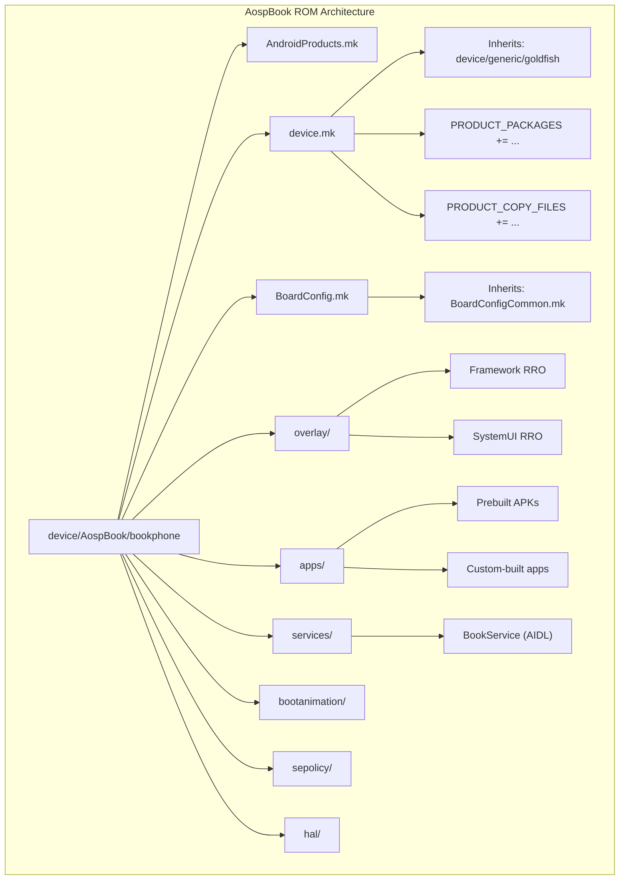

# 第 63 章：Custom ROM 指南

> *“开源真正的价值，不是你能读代码，而是你能修改它，并交付一套完全属于你自己的系统。”*

本章是全书的收官章节。前面关于 build system、init、HAL、system service、SystemUI、emulator、安全、签名和 OTA 的内容，到这里会被串成一条完整链路：从零开始构建、定制、签名并分发一套可运行的 Android Custom ROM。

目标设备选择 AOSP Goldfish emulator（`sdk_phone64_x86_64`）。这是一个有意的取舍，因为任何读者都可以在自己的工作站上复现，不依赖真实硬件。这里演示的 device tree、overlay、预装应用、系统服务、boot animation、内核和 HAL 修改，绝大多数方法同样适用于实体设备；区别主要在 `BoardConfig.mk`、vendor blob 和 kernel image 上。

本章中的路径、命令和代码片段都围绕 AOSP 源码树组织，重点不在“做一个好看的 ROM 品牌壳”，而在于建立一套系统工程视角下可维护、可签名、可升级的 ROM 制作方法。

---

## 63.1 Planning Your Custom ROM

### 63.1.1 什么是“Custom ROM”

Custom ROM 本质上是 Android 系统镜像的定制发行版。可修改的层次通常包括：

| 层级 | 例子 | 复杂度 |
|------|------|--------|
| Product configuration | 品牌名、默认应用、壁纸 | 低 |
| Resource overlay | 状态栏颜色、QS 布局、config flag | 低 |
| Prebuilt apps | 增删系统内置 APK | 低 |
| Framework behavior | 新系统服务、API 行为修改 | 中 |
| SystemUI | 状态栏、导航栏、主题风格 | 中 |
| Boot animation | 开机动画和启动品牌 | 低 |
| Kernel | 模块、调度参数、驱动开关 | 高 |
| HAL | 自定义硬件抽象层 | 高 |
| Signing / Distribution | release key、OTA 包 | 中 |

主流社区 ROM，如 LineageOS、/e/OS、GrapheneOS、CalyxOS 和 PixelExperience，基本都在这些层次上同时做了定制。

### 63.1.2 先明确你的 ROM 目标

真正写代码之前，先把这几件事说清楚：

1. 目标是什么：隐私导向、性能导向、企业管理还是学习实验。
2. 面向哪些设备：本章使用 emulator，真实设备则需要 vendor blob 和 kernel source。
3. 基于哪个 Android 版本：这里默认 AOSP `main`。
4. 如何做 branding：产品名、型号、build fingerprint 如何定义。
5. 默认预装什么应用：保留哪些 AOSP 应用，移除哪些，新增哪些第三方 APK。
6. 需要什么 framework 级修改：新服务、配置项、行为变更。

### 63.1.3 本章要构建的 ROM

本章统一使用 **AospBook ROM** 作为示例，包含：

- 基于 Goldfish 的自定义 device 配置
- 自定义 product name、model、build fingerprint
- 一个 prebuilt 第三方 APK
- 一个从源码构建并打进系统镜像的自定义应用
- 修改 framework / SystemUI 默认值的 RRO
- 一个通过 AIDL 暴露的自定义 system service
- 自定义 boot animation
- SystemUI 主题修改
- 自定义签名密钥
- OTA 更新包
- 一个自定义 kernel module
- 一个自定义 HAL 实现

### 63.1.4 架构总览

下图展示了 AospBook ROM 的主要目录和定制面。



### 63.1.5 目录布局

本章里最终会构造出这样一棵目录树：

```text
device/AospBook/bookphone/
    AndroidProducts.mk
    bookphone.mk
    BoardConfig.mk
    device.mk
    overlay/
        frameworks/
            base/
                core/res/res/values/config.xml
        BookSystemUIOverlay/
            AndroidManifest.xml
            Android.bp
            res/values/config.xml
    apps/
        BookSampleApp/
            Android.bp
            AndroidManifest.xml
            src/...
            res/...
        prebuilt/
            BookReader/
                Android.bp
                BookReader.apk
    services/
        BookService/
            Android.bp
            aidl/...
            src/...
    bootanimation/
        desc.txt
        part0/
        part1/
    hal/
        booklight/
            Android.bp
            aidl/...
            default/...
    sepolicy/
        vendor/
            file_contexts
            bookservice.te
            booklight.te
    keys/
        releasekey.pk8
        releasekey.x509.pem
        platform.pk8
        platform.x509.pem
        shared.pk8
        shared.x509.pem
        media.pk8
        media.x509.pem
```

---

## 63.2 Setting Up the Build Environment

### 63.2.1 硬件要求

AOSP 构建非常吃资源，尤其是磁盘和 RAM：

| 资源 | 最低 | 推荐 | 示例 |
|------|------|------|------|
| 源码磁盘 | 250 GB | 400 GB | 500 GB SSD |
| 含产物磁盘 | 400 GB | 600 GB+ | 1 TB NVMe |
| 内存 | 32 GB | 64 GB+ | 64 GB |
| CPU 核数 | 4 | 16+ | 16 核 |
| OS | Ubuntu 20.04+ | Ubuntu 22.04 LTS | Ubuntu 22.04 |
| 文件系统 | ext4 | ext4 | ext4 |

CPU 决定吞吐，RAM 决定你能开多少并发 job。对全量编译来说，这两个指标影响远大于“单核频率”。

### 63.2.2 Ubuntu / Debian 依赖包

主机构建依赖一般包括这些：

```bash
sudo apt-get update

sudo apt-get install -y \
    git-core gnupg flex bison build-essential \
    zip curl zlib1g-dev libc6-dev-i386 \
    x11proto-core-dev libx11-dev lib32z1-dev \
    libgl1-mesa-dev libxml2-utils xsltproc unzip \
    fontconfig libncurses5 procps python3 python3-pip \
    rsync libssl-dev

sudo apt-get install -y \
    lib32ncurses-dev lib32readline-dev lib32z1-dev

sudo apt-get install -y \
    libvulkan-dev mesa-vulkan-drivers \
    libpulse0 libgl1

sudo apt-get install -y \
    bc cpio kmod libelf-dev

sudo apt-get install -y \
    python3-protobuf python3-setuptools
```

### 63.2.3 安装 `repo`

`repo` 是 AOSP 多仓库协调工具：

```bash
mkdir -p ~/bin
curl https://storage.googleapis.com/git-repo-downloads/repo > ~/bin/repo
chmod a+x ~/bin/repo
export PATH=~/bin:$PATH
repo version
```

### 63.2.4 初始化 AOSP 源码树

```bash
mkdir -p ~/aosp && cd ~/aosp
repo init -u https://android.googlesource.com/platform/manifest -b main
repo sync -c -j$(nproc)
```

如果你是第一次同步：

1. 确认代理与网络环境稳定。
2. 提前准备足够磁盘。
3. `repo sync` 失败时优先重试，而不是重建工作区。

### 63.2.5 一键初始化脚本

把常用环境准备串成脚本会更省事：

```bash
#!/usr/bin/env bash
set -euo pipefail

sudo apt-get update
sudo apt-get install -y git-core gnupg flex bison build-essential zip curl \
    zlib1g-dev libc6-dev-i386 x11proto-core-dev libx11-dev lib32z1-dev \
    libgl1-mesa-dev libxml2-utils xsltproc unzip fontconfig libncurses5 \
    procps python3 python3-pip rsync libssl-dev libvulkan-dev \
    mesa-vulkan-drivers bc cpio kmod libelf-dev python3-protobuf \
    python3-setuptools

mkdir -p "$HOME/bin"
curl https://storage.googleapis.com/git-repo-downloads/repo > "$HOME/bin/repo"
chmod a+x "$HOME/bin/repo"
export PATH="$HOME/bin:$PATH"

mkdir -p "$HOME/aosp"
cd "$HOME/aosp"
repo init -u https://android.googlesource.com/platform/manifest -b main
repo sync -c -j"$(nproc)"
```

### 63.2.6 配置 ccache

ccache 对反复增量编译非常有价值：

```bash
export USE_CCACHE=1
prebuilts/misc/linux-x86/ccache/ccache -M 100G
prebuilts/misc/linux-x86/ccache/ccache -s
```

原则上：

- 开发期要开。
- CI 是否开取决于缓存命中率和磁盘预算。
- 大版本切换后要预期命中率显著下降。

### 63.2.7 初始化 build 环境

```bash
source build/envsetup.sh
```

这一步会提供：

- `lunch`
- `m`
- `mm` / `mmm`
- `croot`
- `hmm`

### 63.2.8 理解 lunch target

典型 lunch target 形如：

```bash
lunch sdk_phone64_x86_64-userdebug
```

三部分含义：

1. `product`：例如 `sdk_phone64_x86_64`
2. `release` / product family 相关配置
3. `variant`：`eng`、`userdebug`、`user`

常用 variant：

| Variant | 特点 |
|---------|------|
| `eng` | 最开放，调试能力最强 |
| `userdebug` | 接近发布版，但保留调试入口 |
| `user` | 面向最终用户，限制最严格 |

### 63.2.9 构建流程概览

典型链路是：

1. `source build/envsetup.sh`
2. `lunch bookphone-userdebug`
3. `m -j$(nproc)`
4. 生成各分区镜像和目标文件包
5. 启动 emulator 或刷入设备

---

## 63.3 Creating a Device Configuration

### 63.3.1 理解 Goldfish 设备树

本章基于 `device/generic/goldfish/` 继承。Goldfish / Ranchu 对 emulator 来说是最稳定的起点，因为：

1. AOSP 原生支持度高。
2. 不依赖第三方 vendor blob。
3. 调试成本低。

真正的 ROM 工程里，device tree 通常是你最该隔离的定制边界。

### 63.3.2 创建我们的设备目录

```bash
mkdir -p device/AospBook/bookphone
```

后续所有自定义 product 配置都收敛到这里。

### 63.3.3 AndroidProducts.mk

`AndroidProducts.mk` 的作用是把 product 注册给 build system：

```make
PRODUCT_MAKEFILES := \
    $(LOCAL_DIR)/bookphone.mk

COMMON_LUNCH_CHOICES := \
    bookphone-userdebug \
    bookphone-eng
```

### 63.3.4 Product Makefile：`bookphone.mk`

product makefile 定义“这个 ROM 作为一个产品是什么”：

```make
PRODUCT_NAME := bookphone
PRODUCT_DEVICE := bookphone
PRODUCT_BRAND := AospBook
PRODUCT_MODEL := AospBook Phone
PRODUCT_MANUFACTURER := AospBook

$(call inherit-product, device/AospBook/bookphone/device.mk)
$(call inherit-product, device/generic/goldfish/sdk_phone64_x86_64.mk)
```

这里最关键的是继承链顺序和 product 变量覆盖时机。

### 63.3.5 Device Makefile：`device.mk`

`device.mk` 更偏向“这个设备需要打进哪些包、文件和 overlay”：

```make
PRODUCT_PACKAGES += \
    BookSampleApp \
    BookService \
    com.aospbook.systemui.overlay

PRODUCT_COPY_FILES += \
    device/AospBook/bookphone/bootanimation/bootanimation.zip:system/media/bootanimation.zip
```

通常把这些东西放这里：

- `PRODUCT_PACKAGES`
- `PRODUCT_COPY_FILES`
- RRO 和权限 XML
- 设备相关属性

### 63.3.6 BoardConfig.mk

`BoardConfig.mk` 更偏向 board / image / kernel 相关配置：

```make
include device/generic/goldfish/BoardConfig.mk

TARGET_BOOT_ANIMATION_RES := 1080
BOARD_VENDOR_SEPOLICY_DIRS += device/AospBook/bookphone/sepolicy/vendor
```

真实设备里，这个文件往往还会包含：

- kernel image 路径
- dtbo / vbmeta 配置
- 分区大小
- AVB 开关
- vendor boot 参数

### 63.3.7 Build System 如何发现 product

发现链路大致是：

1. `build/envsetup.sh`
2. 搜索各 device 目录里的 `AndroidProducts.mk`
3. 收集 `PRODUCT_MAKEFILES` 和 `COMMON_LUNCH_CHOICES`
4. `lunch` 时加载对应 makefile

### 63.3.8 验证 product 注册

```bash
source build/envsetup.sh
lunch bookphone-userdebug
```

如果找不到：

1. 检查 `AndroidProducts.mk` 是否写对。
2. 检查 `PRODUCT_NAME` 是否一致。
3. 检查 makefile 路径是否存在。

### 63.3.9 Product 变量命名空间

Product 变量大致可以分成：

- branding：`PRODUCT_NAME`、`PRODUCT_BRAND`
- packaging：`PRODUCT_PACKAGES`
- copy files：`PRODUCT_COPY_FILES`
- properties：`PRODUCT_SYSTEM_PROPERTIES` 等

最重要的工程原则是：把“设备级”和“产品级”配置分开，不要把一切都塞进一个 makefile。

### 63.3.10 继承机制

Android 产品配置高度依赖 `inherit-product`：

```make
$(call inherit-product, device/generic/goldfish/sdk_phone64_x86_64.mk)
```

要点：

1. 继承顺序会影响覆盖结果。
2. 自定义 product 一般应尽量“增量覆盖”，而不是完全复制基线产品。
3. 复制现成 device tree 往往是 ROM 长期不可维护的开始。

---

## 63.4 Adding Custom Apps

### 63.4.1 理解 `PRODUCT_PACKAGES`

`PRODUCT_PACKAGES` 决定哪些模块被放入最终镜像。它既可以引用源码模块，也可以引用 prebuilt 模块。

### 63.4.2 添加 Prebuilt APK

典型 prebuilt APK 目录：

```text
device/AospBook/bookphone/apps/prebuilt/BookReader/
    Android.bp
    BookReader.apk
```

`Android.bp` 示例：

```bp
android_app_import {
    name: "BookReader",
    apk: "BookReader.apk",
    certificate: "platform",
    privileged: false,
}
```

然后在 `device.mk` 中加入：

```make
PRODUCT_PACKAGES += BookReader
```

### 63.4.3 把自定义源码应用打进系统镜像

应用源码模块可以这样定义：

```bp
android_app {
    name: "BookSampleApp",
    srcs: ["src/**/*.java"],
    resource_dirs: ["res"],
    manifest: "AndroidManifest.xml",
    platform_apis: true,
    certificate: "platform",
}
```

加入 product：

```make
PRODUCT_PACKAGES += BookSampleApp
```

### 63.4.4 移除默认应用

常见做法有两种：

1. 不再继承包含该应用的 product 配置。
2. 用 package 覆盖变量或 product 精简版基线，避免把不想要的 app 加进来。

定制 ROM 时，不要一上来就删除 AOSP 公共模块源码；优先从 product 组合层下手。

### 63.4.5 Privileged Apps 与权限

如果应用要放进 `priv-app`，需要认真处理：

- 签名证书
- `privapp-permissions` 白名单
- SELinux 和权限边界

示例权限白名单文件：

```xml
<permissions>
    <privapp-permissions package="com.aospbook.sample">
        <permission name="android.permission.INTERACT_ACROSS_USERS"/>
    </privapp-permissions>
</permissions>
```

### 63.4.6 应用安装位置

常见位置：

| 目录 | 含义 |
|------|------|
| `/system/app` | 普通系统应用 |
| `/system/priv-app` | privileged app |
| `/product/app` | product 分区应用 |
| `/vendor/app` | vendor 应用 |
| `/system_ext/app` | framework 紧耦合扩展应用 |

放哪一层，决定了可见 API、权限能力和 OTA 更新策略。

---

## 63.5 Modifying Framework Behavior

### 63.5.1 Runtime Resource Overlay（RRO）

RRO 是最值得优先使用的定制机制，因为它不需要直接改 framework 源码。

典型 overlay 目录：

```text
overlay/frameworks/base/core/res/res/values/config.xml
overlay/BookSystemUIOverlay/
```

示例 `Android.bp`：

```bp
runtime_resource_overlay {
    name: "BookSystemUIOverlay",
    theme: "BookSystemUIOverlay",
    sdk_version: "current",
    product_specific: true,
}
```

framework / SystemUI 默认值都可以通过 overlay 修改，例如：

- 状态栏图标行为
- quick settings 行列数
- 导航栏默认布局
- 开关型 feature flag

### 63.5.2 验证 RRO 安装

```bash
adb shell cmd overlay list
adb shell cmd overlay list com.android.systemui
adb shell cmd overlay enable --user 0 <overlay-package>
```

### 63.5.3 直接修改 Framework 源码

如果 overlay 无法表达目标行为，只能改源码。原则是：

1. 先定位行为归属模块。
2. 先找 config 是否可覆盖。
3. 最后才改 Java / C++ 逻辑。

这类修改维护成本最高，跨版本升级冲突也最多。

### 63.5.4 添加新的 System Service

系统服务是自定义 ROM 最有代表性的扩展方式之一。最小链路通常包括：

1. 定义 AIDL 接口
2. 写 service 实现
3. 在 `SystemServer` 注册
4. 暴露 manager API

一个最简 AIDL：

```aidl
package com.aospbook.service;

interface IBookService {
    String getBookName();
}
```

服务实现示意：

```java
public final class BookSystemService extends IBookService.Stub {
    @Override
    public String getBookName() {
        return "AospBook ROM";
    }
}
```

注册通常会涉及 `SystemServer` 或自定义服务启动链。

### 63.5.5 自定义服务的 SELinux 策略

SELinux 不是补充项，而是这类定制的必须项：

```te
type bookservice, system_api_service, service_manager_type;
type bookservice_app, domain;
```

还需要配套：

- `service_contexts`
- `file_contexts`
- 可能的 `init_rc` domain 切换

### 63.5.6 System Service 生命周期

服务生命周期通常依赖：

1. `SystemServer` 启动阶段
2. Binder service 注册
3. manager 暴露给 app / framework
4. 开机后状态恢复与错误处理

定制 ROM 时，不要只把服务“跑起来”，还要考虑：

- 开机时序
- 用户切换
- 多用户权限
- 崩溃恢复

---

## 63.6 Custom Boot Animation

### 63.6.1 Boot Animation 格式

Android 启动动画通常是 `bootanimation.zip`，内部包含：

- `desc.txt`
- `part0/`
- `part1/`

### 63.6.2 `desc.txt`

示例：

```text
1080 1920 30
p 1 0 part0
p 0 0 part1
```

含义分别是：

1. 分辨率
2. 帧率
3. 每个 part 的播放次数 / 停顿 / 目录

### 63.6.3 创建自定义 Boot Animation

典型流程：

1. 准备好按序编号的 PNG 帧
2. 写 `desc.txt`
3. 压成 `bootanimation.zip`
4. 通过 `PRODUCT_COPY_FILES` 放到 `system/media/`

```bash
zip -0 -r bootanimation.zip desc.txt part0 part1
```

### 63.6.4 测试 Boot Animation

```bash
adb root
adb remount
adb push bootanimation.zip /system/media/bootanimation.zip
adb reboot
```

### 63.6.5 带声音的开机动画

部分设备或定制系统会扩展播放声音，但这不属于最通用 AOSP 行为。做这类定制时，要评估：

- 设备音频初始化时序
- 合规性和用户体验
- 开机静音策略

### 63.6.6 动态着色

动态换色本质上还是启动动画实现逻辑里的主题化能力。如果只是品牌风格变化，优先在资源层做，而不是重写动画播放器。

### 63.6.7 Boot Animation 源码路径

```text
Source: frameworks/base/cmds/bootanimation/
```

要深入分析，就从这里读起。

---

## 63.7 Customizing SystemUI

### 63.7.1 SystemUI 架构概览

SystemUI 是视觉变化最直观、维护成本也较高的模块。大多数 ROM 的差异化 UI 都集中在这里。

```text
Source: frameworks/base/packages/SystemUI/
```

### 63.7.2 通过 RRO 做非侵入式定制

优先用 RRO 改：

- 颜色
- dimens
- 某些 config flags
- 默认布局参数

这是定制 SystemUI 成本最低的路径。

### 63.7.3 自定义状态栏布局

如果 overlay 不够，就需要改 layout XML 或相关控制器逻辑。风险在于：

1. 容易和不同分辨率 / 横竖屏冲突。
2. 升级新 AOSP 版本时冲突频繁。
3. 很多视觉问题本质来自约束和 animation，而不是 XML 本身。

### 63.7.4 修改 Quick Settings Tiles

常见定制包括：

- 默认 tile 列表
- 列数和页数
- tile 图标和标签
- 自定义 tile

这类修改最好先从 config / overlay 下手，再考虑代码级变更。

### 63.7.5 SystemUI 主题 Overlay

theme overlay 适合统一控制：

- 颜色
- 字体
- 圆角和间距
- 亮暗主题差异

### 63.7.6 自定义导航栏

导航栏可以从两层入手：

1. 配置 / overlay
2. `NavigationBar` 及其相关布局逻辑

如果你在做手势、三键、车机或大屏设备差异化，需要把 form factor 逻辑一起考虑进去。

### 63.7.7 SystemUI 构建集成

SystemUI 修改最终还是要回到 product / package 组合层，确保：

- 正确编译
- 正确打入目标分区
- overlay 生效顺序正确

---

## 63.8 Building and Flashing

### 63.8.1 构建命令

```bash
source build/envsetup.sh
lunch bookphone-userdebug
m -j$(nproc)
```

### 63.8.2 构建产物结构

常见产物目录：

```text
out/target/product/bookphone/
```

其中会包含：

- `system.img`
- `vendor.img`
- `product.img`
- `boot.img`
- `ramdisk.img`
- `vbmeta.img`
- `target_files.zip`
- `otapackage.zip`

### 63.8.3 理解分区镜像

| 镜像 | 作用 |
|------|------|
| `boot.img` | kernel + ramdisk |
| `system.img` | framework 和系统应用 |
| `vendor.img` | vendor 组件 |
| `product.img` | product 级资源和应用 |
| `vbmeta.img` | Verified Boot 元数据 |

### 63.8.4 启动 Emulator

```bash
emulator -show-kernel -verbose -writable-system \
    -avd <your-avd-name>
```

或者直接用 AOSP 构建产物启动对应 emulator target。

### 63.8.5 刷机到真实设备

真实设备通常要走：

```bash
adb reboot bootloader
fastboot flash boot boot.img
fastboot flash system system.img
fastboot flash vendor vendor.img
fastboot flash product product.img
fastboot flash vbmeta vbmeta.img
fastboot reboot
```

前提是：

- bootloader 已解锁
- 分区布局匹配
- AVB 策略与你的镜像一致

### 63.8.6 增量构建

最值得掌握的是增量构建，而不是每次全量 `m`：

```bash
m BookSampleApp
m SystemUI
mmm device/AospBook/bookphone/services/BookService
```

### 63.8.7 Build Variant 的影响

`eng`、`userdebug`、`user` 的区别会直接影响：

- 默认权限
- ADB root
- 调试接口
- SELinux 行为
- 性能与安全边界

ROM 开发期一般首选 `userdebug`。

### 63.8.8 Build 故障排查

常见问题：

1. lunch target 未注册
2. Blueprint / Soong 模块名冲突
3. 依赖图缺失
4. SELinux policy compile 失败
5. 分区内容超限

排查顺序通常是：

1. 先看首次报错位置
2. 再看依赖链
3. 最后再清理缓存或全量重编

---

## 63.9 Debugging Your ROM

### 63.9.1 `logcat`

`logcat` 仍然是第一调试入口：

```bash
adb logcat
adb logcat -b all
adb logcat SystemServer:* AndroidRuntime:E *:S
```

### 63.9.2 `dumpsys`

系统服务状态查询靠 `dumpsys`：

```bash
adb shell dumpsys activity
adb shell dumpsys package
adb shell dumpsys window
adb shell dumpsys overlay
```

### 63.9.3 `bugreport`

综合问题快照：

```bash
adb bugreport
adb shell bugreportz
```

### 63.9.4 Perfetto

性能和时序问题优先用 Perfetto：

```bash
adb shell perfetto -o /data/misc/perfetto-traces/boottrace.pftrace -t 10s sched freq idle am wm
adb pull /data/misc/perfetto-traces/boottrace.pftrace
```

### 63.9.5 Winscope

WindowManager / SurfaceFlinger / SystemUI 可视化调试适合用 Winscope。

### 63.9.6 启动问题调试

启动失败优先看：

1. kernel log
2. init log
3. SELinux denial
4. SystemServer crash
5. Boot animation 是否卡住只是表象

### 63.9.7 SELinux 调试

```bash
adb shell dmesg | grep avc
adb logcat | grep avc
```

必要时可用 `audit2allow` 辅助生成初稿，但最终必须人工收敛权限。

### 63.9.8 调试工具链

定制 ROM 最常用的一组工具：

- `logcat`
- `dumpsys`
- `bugreportz`
- `Perfetto`
- `Winscope`
- `adb shell`
- `fastboot`

### 63.9.9 ROM 开发常用 adb 命令

```bash
adb root
adb remount
adb shell setprop
adb push
adb pull
adb reboot
adb shell cmd overlay list
adb shell service list
```

---

## 63.10 Distribution

### 63.10.1 签名概览

ROM 分发前必须考虑：

1. APK / APEX 签名
2. target-files 签名
3. OTA 包签名
4. AVB / Verified Boot

### 63.10.2 生成 Release Keys

可以用 releasetools 或 OpenSSL 生成：

```bash
mkdir -p device/AospBook/bookphone/keys
development/tools/make_key device/AospBook/bookphone/keys/releasekey '/CN=AospBook/'
development/tools/make_key device/AospBook/bookphone/keys/platform '/CN=AospBook Platform/'
development/tools/make_key device/AospBook/bookphone/keys/shared '/CN=AospBook Shared/'
development/tools/make_key device/AospBook/bookphone/keys/media '/CN=AospBook Media/'
```

### 63.10.3 配置构建使用 Release Keys

关键是让 product / build 配置不再使用 test-keys。

### 63.10.4 对构建产物签名

常见链路是：

1. 生成 unsigned target-files
2. 用 release keys 重签
3. 再从已签名 target-files 生成 OTA 包

### 63.10.5 生成 OTA 包

```bash
m otapackage
```

或者用 releasetools 从 target-files 生成：

```bash
build/make/tools/releasetools/ota_from_target_files \
    signed-target_files.zip \
    bookphone-ota.zip
```

### 63.10.6 OTA 包结构

典型 OTA 包内部会包含：

- metadata
- payload / patch 数据
- updater 脚本或 payload 元信息

### 63.10.7 Verified Boot 与 AVB

如果设备启用了 AVB，你的自定义 ROM 就必须同步处理：

- vbmeta
- 分区 hash / chain
- 签名 key

否则镜像即使能编出来，也可能无法正常启动。

### 63.10.8 Build Fingerprint 与系统属性

ROM branding 还体现在：

- `ro.build.fingerprint`
- `ro.product.brand`
- `ro.product.model`

这些属性既影响用户可见信息，也影响兼容性判断和部分服务端策略。

### 63.10.9 发布前检查清单

发布前至少检查：

1. 是否仍然带 test-keys
2. 是否存在明显 SELinux denial
3. OTA 是否可用
4. 首次开机是否通过
5. 默认应用与 overlay 是否正确
6. 关键分区是否与目标设备布局匹配

### 63.10.10 发布校验和

发布 ROM 包时务必附带 checksum：

```bash
sha256sum bookphone-ota.zip
```

---

## 63.11 Advanced: Kernel Customization

### 63.11.1 AOSP 中的 Kernel

Android 内核不是独立于平台工程的附属品，而是 ROM 最深的一层定制边界之一。

### 63.11.2 GKI 架构

现代 Android 设备广泛采用 GKI。它的价值在于：

1. 降低设备厂商维护成本
2. 解耦通用内核与设备专属模块
3. 提高升级一致性

### 63.11.3 构建自定义 Kernel

核心流程通常是：

1. 获取内核源码
2. 选择 defconfig
3. 编译 kernel image 和 modules
4. 集成回 `boot.img` / `vendor_boot.img`

### 63.11.4 在 Emulator 中使用自定义 Kernel

对 emulator 来说，替换 kernel 更直接，因为你不需要处理真实硬件的 vendor blob 兼容性。

### 63.11.5 添加自定义 Kernel Module

自定义模块流程通常是：

1. 编写模块源码
2. 编译出 `.ko`
3. 配置模块装载路径
4. 通过 init 或模块列表控制加载

### 63.11.6 将 Kernel Module 纳入构建

可以把模块作为构建产物的一部分，复制到目标分区或 ramdisk 相关位置。

### 63.11.7 Kernel 配置调优

常见调优点：

- scheduler
- logging
- fs / memory 开关
- debug config

但任何面向发布的 ROM，都要严格区分“实验配置”和“可长期维护配置”。

### 63.11.8 Kernel Module 生命周期

需要考虑：

- 何时加载
- 依赖哪些驱动或设备节点
- SELinux / init 权限
- 升级后兼容性

---

## 63.12 Advanced: HAL Customization

### 63.12.1 Android 中的 HAL 架构

HAL 是 framework 与设备专属硬件能力之间的正式边界。自定义 ROM 只要碰硬件定制，几乎绕不开 HAL。

### 63.12.2 创建自定义 AIDL HAL

现代新 HAL 优先 AIDL。示例目录：

```text
device/AospBook/bookphone/hal/booklight/
```

### 63.12.3 定义 AIDL 接口

示例：

```aidl
package vendor.aospbook.booklight;

interface IBookLight {
    void setBrightness(int level);
    int getBrightness();
}
```

### 63.12.4 实现默认 HAL

默认实现通常是一个 binderized service：

```cpp
class BookLight : public BnBookLight {
public:
    ndk::ScopedAStatus setBrightness(int32_t level) override;
    ndk::ScopedAStatus getBrightness(int32_t* _aidl_return) override;
};
```

### 63.12.5 Init Service 配置

HAL service 需要 `init.rc`：

```rc
service vendor.booklight-hal /vendor/bin/hw/vendor.aospbook.booklight-service
    class hal
    user system
    group system
```

### 63.12.6 VINTF Manifest Fragment

还需要 VINTF 声明服务能力：

```xml
<manifest version="1.0" type="device">
    <hal format="aidl">
        <name>vendor.aospbook.booklight</name>
        <fqname>IBookLight/default</fqname>
    </hal>
</manifest>
```

### 63.12.7 HAL 的 SELinux 策略

至少要配：

- service domain
- 可执行文件 `file_contexts`
- binder service type
- 必要的设备节点访问权限

### 63.12.8 把 HAL 纳入构建

典型做法是在 product 中加入 HAL 模块，并把 manifest fragment、rc、sepolicy 一起纳入。

### 63.12.9 测试 HAL

```bash
adb shell service list | grep booklight
adb shell lshal
adb logcat | grep booklight
```

### 63.12.10 修改已有 HAL

修改现有 HAL 比新增 HAL 更危险，因为你会直接影响 framework 既有依赖和兼容性契约。

### 63.12.11 使用 VTS 测试 HAL

HAL 变更后应优先跑相关 VTS / CTS 子集，避免接口兼容性被破坏。

### 63.12.12 完整 HAL 架构

从上到下的链路是：

1. framework client
2. Binder / AIDL interface
3. HAL service
4. 内部驱动或设备节点访问

自定义 HAL 写得越好，后续 ROM 升级时越容易保持边界清晰。

---

## 63.13 Putting It All Together

### 63.13.1 完整构建流程演练

一个完整迭代通常是：

1. 准备并同步 AOSP 源码
2. 创建 `device/AospBook/bookphone/`
3. 注册 `AndroidProducts.mk`
4. 配置 `bookphone.mk`、`device.mk`、`BoardConfig.mk`
5. 加入自定义 app、overlay、bootanimation、service、HAL、sepolicy
6. `lunch bookphone-userdebug`
7. `m -j$(nproc)`
8. 启动 emulator 或刷机验证
9. 重签 target-files 并生成 OTA

### 63.13.2 测试清单

至少覆盖：

- 开机是否正常
- SystemUI 是否正常显示
- overlay 是否生效
- 预装 app 是否存在
- 自定义服务是否可调用
- HAL 是否注册
- SELinux 是否干净
- OTA 是否可升级

### 63.13.3 发布版构建流水线

比较稳妥的发布流程：

1. 干净源码树
2. 固定 lunch target
3. 全量构建
4. 签名 target-files
5. 生成 OTA 包
6. 计算 checksum
7. 保存构建元数据与签名记录

### 63.13.4 常见坑与解决方案

最常见的坑：

1. 用复制整个现有 device tree 的方式起项目，后期完全失控。
2. 一开始就直接改 framework 源码，忽略 RRO。
3. 服务或 HAL 能跑，但 SELinux 策略过宽。
4. 开发后期还在使用 test-keys。
5. 只在 emulator 上验证，从未考虑真实设备分区和 AVB。

### 63.13.5 跨 AOSP 更新维护你的 ROM

长期维护最重要的不是功能数量，而是改动边界清晰：

1. 尽量把定制集中在 `device/AospBook/bookphone/`
2. overlay 优先于源码 patch
3. 记录清楚 framework 改动点
4. 自定义 HAL / service 保持最小接口面

### 63.13.6 最终目录示意

```text
device/AospBook/bookphone/
|-- AndroidProducts.mk
|-- BoardConfig.mk
|-- bookphone.mk
|-- device.mk
|-- apps/
|   |-- BookSampleApp/
|   +-- prebuilt/
|       +-- BookReader/
|-- bootanimation/
|   |-- desc.txt
|   |-- part0/
|   +-- part1/
|-- hal/
|   +-- booklight/
|-- overlay/
|   |-- BookSystemUIOverlay/
|   +-- frameworks/base/core/res/res/values/
|       |-- config.xml
|       |-- dimens.xml
|       +-- colors.xml
|-- permissions/
|   +-- privapp-permissions-bookphone.xml
|-- sepolicy/vendor/
|   |-- booklight.te
|   |-- bookservice.te
|   |-- file_contexts
|   |-- service.te
|   +-- service_contexts
+-- services/BookService/
    |-- Android.bp
    |-- aidl/com/aospbook/service/IBookService.aidl
    +-- src/com/aospbook/service/
        |-- BookService.java
        |-- BookServiceManager.java
        +-- BookSystemService.java
```

### 63.13.7 延伸阅读索引

| 主题 | 源码位置 | 说明 |
|------|----------|------|
| Build system | `build/make/core/` | GNU Make 构建规则 |
| Soong | `build/soong/` | Blueprint / Soong 构建系统 |
| Product config | `build/make/target/product/` | 基础 product makefiles |
| Goldfish device | `device/generic/goldfish/` | Emulator device tree |
| Framework config | `frameworks/base/core/res/res/values/config.xml` | 可覆写 framework 配置 |
| SystemUI | `frameworks/base/packages/SystemUI/` | SystemUI 源码 |
| Boot animation | `frameworks/base/cmds/bootanimation/` | 启动画面播放器 |
| HAL interfaces | `hardware/interfaces/` | AIDL HAL 定义 |
| Release tools | `build/make/tools/releasetools/` | 签名和 OTA 工具 |
| Security keys | `build/make/target/product/security/` | 默认签名 key |
| SELinux | `system/sepolicy/` | 基础 SELinux policy |
| Init | `system/core/init/` | init 进程源码 |
| SystemServer | `frameworks/base/services/java/com/android/server/SystemServer.java` | 系统服务启动主线 |

## 63.14 Summary

本章把一套完整 Custom ROM 的关键工程面串了起来：

| 小节 | 主题 | 结果 |
|------|------|------|
| `63.1` | 规划 | 明确 AospBook ROM 的目标和架构 |
| `63.2` | 环境准备 | 完整 build host 配置与初始化 |
| `63.3` | 设备配置 | 建立 `AndroidProducts.mk`、`device.mk`、`BoardConfig.mk` |
| `63.4` | 应用集成 | 预装 APK 和源码应用纳入镜像 |
| `63.5` | Framework 行为 | RRO、源码修改和自定义 system service |
| `63.6` | Boot animation | 自定义启动动画制作和接入 |
| `63.7` | SystemUI | 状态栏、主题、导航栏定制 |
| `63.8` | 构建与刷机 | `m`、emulator 启动和 fastboot 刷写 |
| `63.9` | 调试 | logcat、dumpsys、Perfetto、Winscope、SELinux |
| `63.10` | 分发 | 生成 key、签名、OTA |
| `63.11` | Kernel | 内核和模块定制 |
| `63.12` | HAL | 自定义 AIDL HAL 定义与实现 |
| `63.13` | 收束 | 测试、发布、维护和延伸阅读 |

最重要的结论有五个：

1. **先用 overlay，再改源码。** 只要 RRO 和 product 配置能解决，就不要急着修改 framework 逻辑，这直接决定 ROM 后续升级成本。
2. **device tree 是你的主战场。** 尽量把定制收敛到 `device/AospBook/bookphone/`，这样 `repo sync` 后仍然容易维护。
3. **SELinux 绝不是可选项。** 自定义 service、HAL、daemon 都必须有明确策略，`audit2allow` 只能拿来起步，不能拿来收工。
4. **绝不要带着 test-keys 出货。** 一旦进入对外分发阶段，唯一正确做法就是使用自己的 release keys。
5. **emulator 是最佳试验场。** 绝大多数 ROM 定制都可以先在 emulator 上验证，再迁移到真实硬件。

从系统工程角度看，Custom ROM 的核心能力不是“改出一个不同的 UI”，而是你能否把 product 配置、overlay、framework 改动、SystemUI、签名、OTA、SELinux、kernel 和 HAL 组织成一套可重复构建、可调试、可升级的系统产线。这也是掌握 AOSP 的真正标志。
