# Chapter 63: Custom ROM Guide

> *"The real value of open source is not that you can read the code, but that
> you can change it and ship something entirely your own."*

This chapter is the capstone of the book. We take everything covered in the
preceding 33 chapters -- build system, init, HALs, system services, SystemUI,
the emulator, security, signing -- and weave it into a single, end-to-end
walkthrough: building, customizing, signing, and distributing a fully
functional custom ROM.

Our target device is the AOSP Goldfish emulator (`sdk_phone64_x86_64`). This is
a deliberate choice: every reader of this book has access to a laptop or
workstation that can run the emulator, no physical hardware required. Everything
we build here -- custom device trees, overlays, apps, services, boot
animations, kernel tweaks, HAL modifications -- applies equally to a physical
device; only the `BoardConfig.mk` and kernel binaries change.

Every file path, every command, and every code snippet in this chapter was
verified against the AOSP source tree.
Where we quote source files we give their full tree-relative path so you can
follow along on your own checkout.

---

## 63.1 Planning Your Custom ROM

### 63.1.1 What Is a "Custom ROM"?

A custom ROM is a modified build of Android that changes one or more of the
following layers:

| Layer | Examples | Complexity |
|-------|----------|------------|
| Product configuration | Branding, default apps, wallpapers | Low |
| Resource overlays | Status bar color, quick settings layout, config flags | Low |
| Prebuilt apps | Adding/removing bundled APKs | Low |
| Framework behavior | New system services, modified APIs | Medium |
| SystemUI | Custom status bar, navigation, theming | Medium |
| Boot animation | Custom splash screen | Low |
| Kernel | Custom modules, scheduler tuning | High |
| HAL | Custom hardware abstraction layers | High |
| Signing and distribution | Release keys, OTA packages | Medium |

The popular community ROMs (LineageOS, /e/OS, GrapheneOS, CalyxOS, PixelExperience)
each combine customizations across all of these layers. In this chapter we will
touch every layer.

### 63.1.2 Defining Your ROM's Goals

Before writing any code, answer these questions:

1. **What is the purpose?** Privacy-focused? Performance-optimized? Enterprise
   management? Learning exercise?

2. **What devices will you target?** We use the emulator (`goldfish`/`ranchu`);
   real devices require vendor blobs and kernel sources.

3. **What Android version?** We build from AOSP `main` (currently targeting
   Android 16, API level 36).

4. **What is the branding?** Custom ROM name, model string, build fingerprint.
5. **What apps ship by default?** Which AOSP apps to keep, which to remove,
   which third-party APKs to add?

6. **What framework changes?** New services, modified behavior, config changes.

### 63.1.3 The ROM We Will Build

Throughout this chapter we build **"AospBook ROM"** -- a custom ROM that
includes:

- A custom device configuration inheriting from Goldfish
- Custom branding (product name, model, build fingerprint)
- A prebuilt third-party app
- A custom-built sample app included in the system image
- A Runtime Resource Overlay changing framework and SystemUI defaults
- A custom system service accessible via AIDL
- A custom boot animation
- SystemUI theme modifications
- Custom signing keys
- An OTA update package
- A custom kernel module
- A custom HAL implementation

### 63.1.4 Architecture Overview

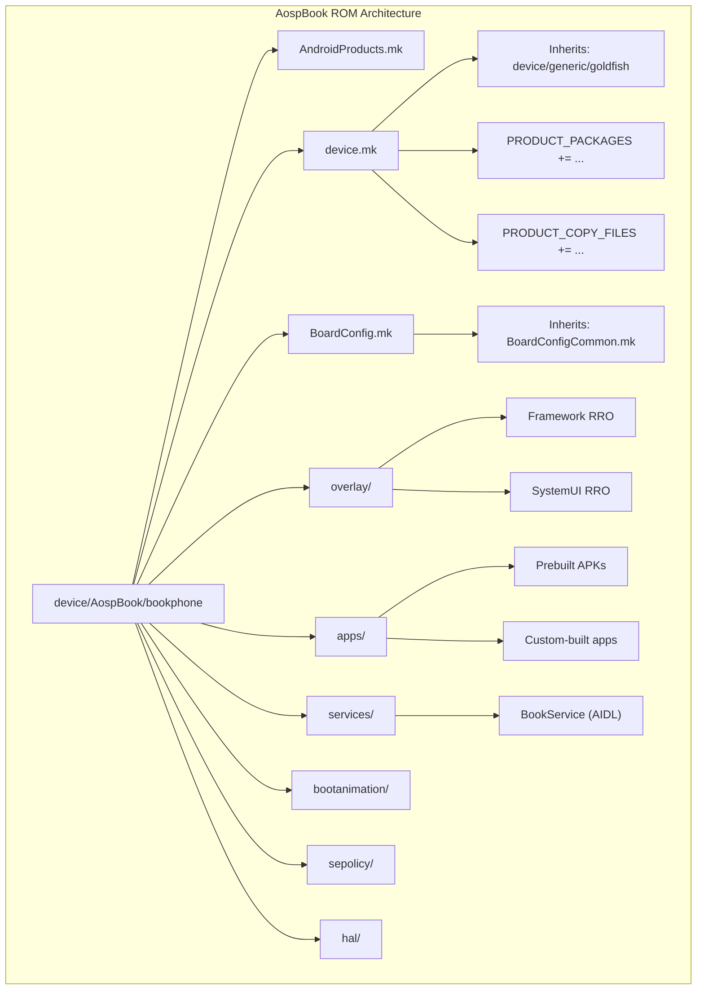
```mermaid
graph TD
    subgraph "AospBook ROM Architecture"
        A[device/AospBook/bookphone] --> B[AndroidProducts.mk]
        A --> C[device.mk]
        A --> D[BoardConfig.mk]
        A --> E[overlay/]
        A --> F[apps/]
        A --> G[services/]
        A --> H[bootanimation/]
        A --> I[sepolicy/]
        A --> J[hal/]

        C --> K["Inherits: device/generic/goldfish"]
        C --> L["PRODUCT_PACKAGES += ..."]
        C --> M["PRODUCT_COPY_FILES += ..."]

        D --> N["Inherits: BoardConfigCommon.mk"]

        E --> O["Framework RRO"]
        E --> P["SystemUI RRO"]

        F --> Q["Prebuilt APKs"]
        F --> R["Custom-built apps"]

        G --> S["BookService (AIDL)"]
    end
```

### 63.1.5 Directory Layout

Here is the directory tree we will create over the course of this chapter:

```
device/AospBook/bookphone/
    AndroidProducts.mk
    bookphone.mk                  # product makefile
    BoardConfig.mk
    device.mk                     # device-level config
    overlay/
        frameworks/
            base/
                core/res/res/values/config.xml
        BookSystemUIOverlay/
            AndroidManifest.xml
            Android.bp
            res/values/config.xml
    apps/
        BookSampleApp/
            Android.bp
            AndroidManifest.xml
            src/...
            res/...
        prebuilt/
            BookReader/
                Android.bp
                BookReader.apk
    services/
        BookService/
            Android.bp
            aidl/...
            src/...
    bootanimation/
        desc.txt
        part0/
        part1/
    hal/
        booklight/
            Android.bp
            aidl/...
            default/...
    sepolicy/
        vendor/
            file_contexts
            bookservice.te
            booklight.te
    keys/
        releasekey.pk8
        releasekey.x509.pem
        platform.pk8
        platform.x509.pem
        shared.pk8
        shared.x509.pem
        media.pk8
        media.x509.pem
```

---

## 63.2 Setting Up the Build Environment

### 63.2.1 Hardware Requirements

Building AOSP is resource-intensive. Here are the requirements:

| Resource | Minimum | Recommended | Our Setup |
|----------|---------|-------------|-----------|
| Disk (source) | 250 GB | 400 GB | 500 GB SSD |
| Disk (with build) | 400 GB | 600 GB+ | 1 TB NVMe |
| RAM | 32 GB | 64 GB+ | 64 GB |
| CPU cores | 4 | 16+ | 16 cores |
| OS | Ubuntu 20.04+ | Ubuntu 22.04 LTS | Ubuntu 22.04 |
| File system | ext4 (case-sensitive) | ext4 | ext4 |

The build is highly parallel. Each additional core shaves minutes off a full
build. RAM is the second most important factor -- the linker (`lld`) and
javac/d8 compilation stages can consume 2-4 GB per parallel job.

### 63.2.2 Required Packages (Ubuntu/Debian)

The AOSP build system depends on a specific set of host packages. Install
them all with:

```bash
# Update package lists
sudo apt-get update

# Essential build packages
sudo apt-get install -y \
    git-core gnupg flex bison build-essential \
    zip curl zlib1g-dev libc6-dev-i386 \
    x11proto-core-dev libx11-dev lib32z1-dev \
    libgl1-mesa-dev libxml2-utils xsltproc unzip \
    fontconfig libncurses5 procps python3 python3-pip \
    rsync libssl-dev

# For 64-bit hosts running 32-bit prebuilts
sudo apt-get install -y \
    lib32ncurses-dev lib32readline-dev lib32z1-dev

# For emulator GPU acceleration
sudo apt-get install -y \
    libvulkan-dev mesa-vulkan-drivers \
    libpulse0 libgl1

# For kernel building (if needed)
sudo apt-get install -y \
    bc cpio kmod libelf-dev

# Python dependencies (some build scripts require specific versions)
sudo apt-get install -y \
    python3-protobuf python3-setuptools
```

### 63.2.3 Installing the `repo` Tool

The `repo` tool orchestrates Git across the hundreds of AOSP repositories:

```bash
# Create a bin directory in your home directory
mkdir -p ~/bin

# Download the repo launcher
curl https://storage.googleapis.com/git-repo-downloads/repo > ~/bin/repo

# Make it executable
chmod a+x ~/bin/repo

# Add to PATH (add to ~/.bashrc for persistence)
export PATH=~/bin:$PATH

# Verify installation
repo version
```

The `repo` launcher is a Python script that bootstraps the full `repo` tool
from Google's repository. It requires Python 3.6+.

### 63.2.4 Initializing the AOSP Tree

```bash
# Create your working directory
mkdir -p ~/aosp && cd ~/aosp

# Initialize the repo with the main branch
repo init -u https://android.googlesource.com/platform/manifest \
    -b main \
    --partial-clone \
    --clone-filter=blob:limit=10M

# Sync all repositories (this takes 1-3 hours on a fast connection)
repo sync -c -j$(nproc) --no-tags --no-clone-bundle
```

Key flags explained:

| Flag | Purpose |
|------|---------|
| `-b main` | Track the `main` development branch |
| `--partial-clone` | Enable Git partial clone (saves disk) |
| `--clone-filter=blob:limit=10M` | Only download blobs under 10 MB initially |
| `-c` | Sync only the current branch |
| `-j$(nproc)` | Parallelize across all CPU cores |
| `--no-tags` | Skip Git tags (saves time/space) |
| `--no-clone-bundle` | Skip bundle files (sometimes faster) |

### 63.2.5 Complete Setup Script

Here is a complete, idempotent setup script you can run on a fresh Ubuntu 22.04
machine:

```bash
#!/bin/bash
# setup_aosp_build_env.sh -- Complete AOSP build environment setup
# Usage: sudo ./setup_aosp_build_env.sh

set -euo pipefail

echo "=== AOSP Build Environment Setup ==="

# 1. System packages
echo "[1/6] Installing system packages..."
apt-get update -qq
apt-get install -y -qq \
    git-core gnupg flex bison build-essential \
    zip curl zlib1g-dev libc6-dev-i386 \
    x11proto-core-dev libx11-dev lib32z1-dev \
    libgl1-mesa-dev libxml2-utils xsltproc unzip \
    fontconfig libncurses5 procps python3 python3-pip \
    rsync libssl-dev bc cpio kmod libelf-dev \
    lib32ncurses-dev lib32readline-dev lib32z1-dev \
    python3-protobuf python3-setuptools \
    libvulkan-dev mesa-vulkan-drivers libpulse0 libgl1 \
    openjdk-21-jdk

# 2. Set up Java
echo "[2/6] Configuring Java..."
update-alternatives --set java /usr/lib/jvm/java-21-openjdk-amd64/bin/java 2>/dev/null || true

# 3. Configure Git
echo "[3/6] Configuring Git..."
git config --global user.email "${GIT_EMAIL:-builder@example.com}"
git config --global user.name "${GIT_NAME:-AOSP Builder}"
git config --global color.ui auto

# 4. Install repo
echo "[4/6] Installing repo tool..."
REPO_BIN="/usr/local/bin/repo"
if [ ! -f "$REPO_BIN" ]; then
    curl -s https://storage.googleapis.com/git-repo-downloads/repo > "$REPO_BIN"
    chmod a+x "$REPO_BIN"
fi
echo "repo version: $(repo version 2>/dev/null | head -1)"

# 5. Set up ccache (optional but recommended)
echo "[5/6] Configuring ccache..."
apt-get install -y -qq ccache
echo 'export USE_CCACHE=1' >> /etc/profile.d/aosp.sh
echo 'export CCACHE_EXEC=/usr/bin/ccache' >> /etc/profile.d/aosp.sh
echo 'export CCACHE_DIR=$HOME/.ccache' >> /etc/profile.d/aosp.sh
ccache -M 50G

# 6. Kernel tuning for large builds
echo "[6/6] Tuning kernel parameters..."
# Increase file watcher limit (build system uses inotify)
echo 'fs.inotify.max_user_watches=524288' >> /etc/sysctl.d/99-aosp.conf
# Increase open file limit
echo '* soft nofile 65536' >> /etc/security/limits.d/99-aosp.conf
echo '* hard nofile 65536' >> /etc/security/limits.d/99-aosp.conf
sysctl -p /etc/sysctl.d/99-aosp.conf

echo ""
echo "=== Setup Complete ==="
echo "Next steps:"
echo "  1. mkdir ~/aosp && cd ~/aosp"
echo "  2. repo init -u https://android.googlesource.com/platform/manifest -b main"
echo "  3. repo sync -c -j\$(nproc)"
echo "  4. source build/envsetup.sh"
echo "  5. lunch <target>"
echo "  6. m"
```

### 63.2.6 Setting Up ccache

The compiler cache `ccache` dramatically reduces rebuild times. After the
initial full build (~2-4 hours), incremental builds that only change a few files
can complete in minutes.

```bash
# Set cache size (50 GB is reasonable for AOSP)
export USE_CCACHE=1
export CCACHE_EXEC=/usr/bin/ccache
export CCACHE_DIR=$HOME/.ccache
ccache -M 50G

# Add to ~/.bashrc for persistence
cat >> ~/.bashrc << 'EOF'
export USE_CCACHE=1
export CCACHE_EXEC=/usr/bin/ccache
export CCACHE_DIR=$HOME/.ccache
EOF
```

Check cache statistics after a build:

```bash
ccache -s
# Example output:
# cache hit (direct)                 123456
# cache hit (preprocessed)            12345
# cache miss                          23456
# cache hit rate                     84.56 %
```

### 63.2.7 Initializing the Build Environment

Every time you open a new shell, initialize the build environment:

```bash
cd ~/aosp

# Source the environment setup script
# Real file: build/make/envsetup.sh
source build/envsetup.sh

# This provides:
#   lunch    - Select a build target
#   m        - Build (make) from the tree root
#   mm       - Build from the current directory
#   mmm      - Build from a specified directory
#   croot    - cd to the tree root
#   godir    - Go to the directory containing a file
```

The `envsetup.sh` script (located at `build/make/envsetup.sh`) sets up the
shell with functions and environment variables needed for the build. It scans
all `device/*/` and `vendor/*/` directories for `vendorsetup.sh` files and
sources them, which registers additional lunch targets.

### 63.2.8 Understanding Lunch Targets

```bash
# List available targets
lunch --print-all-targets 2>/dev/null | head -20

# Select the emulator target (what we will base our ROM on)
lunch sdk_phone64_x86_64-trunk_staging-userdebug
```

A lunch target has the form `<product>-<release>-<variant>`:

| Component | Values | Description |
|-----------|--------|-------------|
| Product | `sdk_phone64_x86_64` | Defined in `AndroidProducts.mk` |
| Release | `trunk_staging` | Release configuration |
| Variant | `userdebug` | `user`, `userdebug`, or `eng` |

The three build variants control debuggability:

| Variant | `ro.debuggable` | `adb` | Root | Use Case |
|---------|-----------------|-------|------|----------|
| `user` | 0 | off by default | no | Production/release |
| `userdebug` | 1 | on | adb root | Development with prod-like behavior |
| `eng` | 1 | on | always root | Full development/debugging |

For our custom ROM, we will create our own lunch target that replaces
`sdk_phone64_x86_64`.

### 63.2.9 Build Process Overview

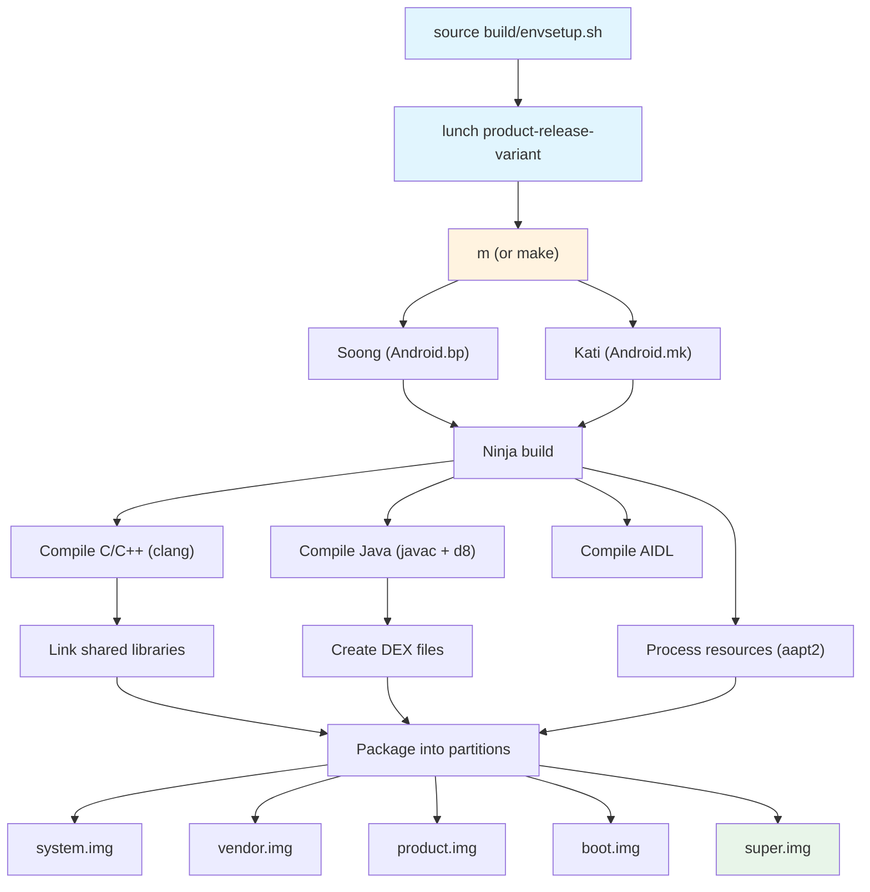
```mermaid
flowchart TD
    A["source build/envsetup.sh"] --> B["lunch product-release-variant"]
    B --> C["m (or make)"]
    C --> D["Soong (Android.bp)"]
    C --> E["Kati (Android.mk)"]
    D --> F["Ninja build"]
    E --> F
    F --> G["Compile C/C++ (clang)"]
    F --> H["Compile Java (javac + d8)"]
    F --> I["Compile AIDL"]
    F --> J["Process resources (aapt2)"]
    G --> K["Link shared libraries"]
    H --> L["Create DEX files"]
    K --> M["Package into partitions"]
    L --> M
    J --> M
    M --> N["system.img"]
    M --> O["vendor.img"]
    M --> P["product.img"]
    M --> Q["boot.img"]
    M --> R["super.img"]

    style A fill:#e1f5fe
    style B fill:#e1f5fe
    style C fill:#fff3e0
    style R fill:#e8f5e9
```

---

## 63.3 Creating a Device Configuration

This is the heart of a custom ROM: the device configuration directory. It tells
the build system what to build, how to build it, and what goes into each
partition.

### 63.3.1 Understanding the Goldfish Device Tree

Before creating our own, let us understand the existing emulator device tree.
The Goldfish emulator configuration lives at:

```
device/generic/goldfish/
```

Its structure is:

```
device/generic/goldfish/
    AndroidProducts.mk              # Lists all product makefiles
    64bitonly/
        product/
            sdk_phone64_x86_64.mk   # Product definition
    board/
        BoardConfigCommon.mk        # Common board configuration
        emu64x/
            BoardConfig.mk          # x86_64-specific board config
            details.mk              # Kernel and fstab setup
    product/
        phone.mk                    # Phone product configuration
        handheld.mk                 # Handheld device base
        base_handheld.mk            # Handheld base with sounds
        generic.mk                  # Vendor/generic config
        versions.mk                 # Shipping API level
    overlay/                        # Static resource overlays
    rro_overlays/                   # Runtime resource overlays
        ConnectivityOverlay/
        RanchuCommonOverlay/
        TetheringOverlay/
    hals/                           # HAL implementations
        audio/
        camera/
        sensors/
        radio/
    sepolicy/                       # SELinux policies
    init/                           # Init scripts
        init.ranchu.rc
```

The product definition chain for `sdk_phone64_x86_64` is:

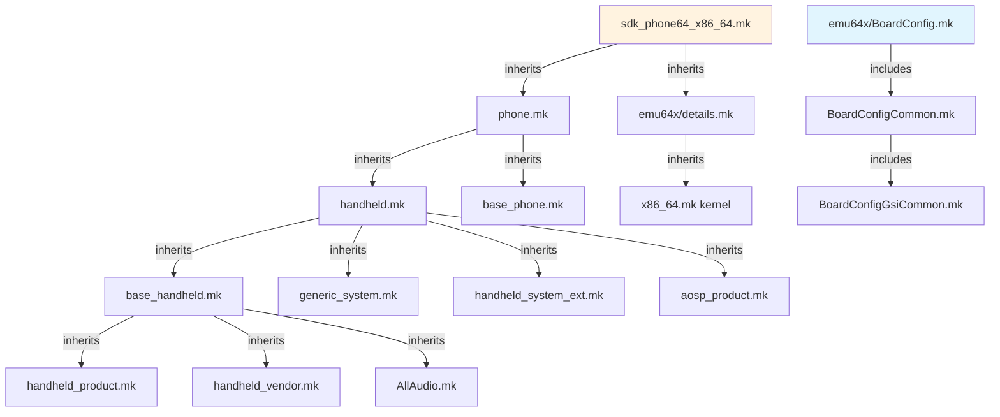
```mermaid
graph TD
    A["sdk_phone64_x86_64.mk"] -->|inherits| B["phone.mk"]
    A -->|inherits| C["emu64x/details.mk"]
    B -->|inherits| D["handheld.mk"]
    B -->|inherits| E["base_phone.mk"]
    D -->|inherits| F["base_handheld.mk"]
    D -->|inherits| G["generic_system.mk"]
    D -->|inherits| H["handheld_system_ext.mk"]
    D -->|inherits| I["aosp_product.mk"]
    F -->|inherits| J["handheld_product.mk"]
    F -->|inherits| K["handheld_vendor.mk"]
    F -->|inherits| L["AllAudio.mk"]
    C -->|inherits| M["x86_64.mk kernel"]

    A2["emu64x/BoardConfig.mk"] -->|includes| N["BoardConfigCommon.mk"]
    N -->|includes| O["BoardConfigGsiCommon.mk"]

    style A fill:#fff3e0
    style A2 fill:#e1f5fe
```

Let us examine the key files in this chain.

**`device/generic/goldfish/AndroidProducts.mk`** -- lists every product
makefile:

```makefile
# device/generic/goldfish/AndroidProducts.mk
PRODUCT_MAKEFILES := \
    $(LOCAL_DIR)/64bitonly/product/sdk_phone64_x86_64.mk \
    $(LOCAL_DIR)/64bitonly/product/sdk_phone64_arm64.mk \
    ...
```

**`device/generic/goldfish/64bitonly/product/sdk_phone64_x86_64.mk`** -- the
top-level product definition:

```makefile
# device/generic/goldfish/64bitonly/product/sdk_phone64_x86_64.mk
PRODUCT_USE_DYNAMIC_PARTITIONS := true
BOARD_EMULATOR_DYNAMIC_PARTITIONS_SIZE ?= $(shell expr 1800 \* 1048576 )
BOARD_SUPER_PARTITION_SIZE := $(shell expr ... + 8388608 )

$(call inherit-product, $(SRC_TARGET_DIR)/product/core_64_bit_only.mk)
$(call inherit-product, device/generic/goldfish/board/emu64x/details.mk)
$(call inherit-product, device/generic/goldfish/product/phone.mk)

PRODUCT_BRAND := Android
PRODUCT_NAME := sdk_phone64_x86_64
PRODUCT_DEVICE := emu64x
PRODUCT_MODEL := Android SDK built for x86_64
```

These four `PRODUCT_*` variables are the identity of a build target:

| Variable | Purpose | Our Value |
|----------|---------|-----------|
| `PRODUCT_NAME` | Lunch target name | `bookphone` |
| `PRODUCT_DEVICE` | Board/device name, maps to `BoardConfig.mk` | `bookdevice` |
| `PRODUCT_BRAND` | Brand shown in Settings | `AospBook` |
| `PRODUCT_MODEL` | Model shown in Settings | `AospBook Phone` |

**`device/generic/goldfish/board/BoardConfigCommon.mk`** -- hardware-level
configuration that all Goldfish targets share:

```makefile
# device/generic/goldfish/board/BoardConfigCommon.mk (key excerpts)
include build/make/target/board/BoardConfigGsiCommon.mk

BOARD_VENDOR_SEPOLICY_DIRS += device/generic/goldfish/sepolicy/vendor
TARGET_BOOTLOADER_BOARD_NAME := goldfish_$(TARGET_ARCH)

BUILD_EMULATOR_OPENGL := true
BUILD_QEMU_IMAGES := true
USE_OPENGL_RENDERER := true

# Emulator doesn't support sparse image format
TARGET_USERIMAGES_SPARSE_EXT_DISABLED := true

# emulator is Non-A/B device
AB_OTA_UPDATER := none

# emulator needs super.img
BOARD_BUILD_SUPER_IMAGE_BY_DEFAULT := true

# 8G + 8M
BOARD_SUPER_PARTITION_SIZE ?= 8598323200
BOARD_SUPER_PARTITION_GROUPS := emulator_dynamic_partitions

BOARD_EMULATOR_DYNAMIC_PARTITIONS_PARTITION_LIST := \
  system \
  system_dlkm \
  system_ext \
  product \
  vendor
```

### 63.3.2 Creating Our Device Directory

Now we create our own device configuration. The convention is
`device/<vendor>/<device>`:

```bash
# Create the directory structure
mkdir -p device/AospBook/bookphone
```

### 63.3.3 AndroidProducts.mk

This file registers our product with the build system:

```makefile
# device/AospBook/bookphone/AndroidProducts.mk
#
# This file is read by the build system to discover our product makefiles.
# Each entry in PRODUCT_MAKEFILES becomes a valid lunch target.

PRODUCT_MAKEFILES := \
    $(LOCAL_DIR)/bookphone.mk
```

When the build system scans `device/` directories, it looks for
`AndroidProducts.mk` files. Each path listed in `PRODUCT_MAKEFILES` defines a
lunch target whose name is the `PRODUCT_NAME` set inside that makefile.

### 63.3.4 The Product Makefile: bookphone.mk

This is the top-level product definition. It inherits from Goldfish to get all
the emulator infrastructure, then overlays our customizations:

```makefile
# device/AospBook/bookphone/bookphone.mk
#
# Top-level product makefile for AospBook Phone.
# This defines the lunch target "bookphone".
#
# Inherits from the Goldfish emulator to get all emulator-specific
# packages, HALs, kernel configuration, and hardware support.

# ============================================================
# Inherit from Goldfish emulator
# ============================================================

# Use dynamic partitions, same sizing as stock emulator
PRODUCT_USE_DYNAMIC_PARTITIONS := true
BOARD_EMULATOR_DYNAMIC_PARTITIONS_SIZE ?= $(shell expr 2400 \* 1048576)
BOARD_SUPER_PARTITION_SIZE := \
    $(shell expr $(BOARD_EMULATOR_DYNAMIC_PARTITIONS_SIZE) + 8388608)

# 64-bit only configuration
$(call inherit-product, $(SRC_TARGET_DIR)/product/core_64_bit_only.mk)

# Goldfish board details (kernel, fstab, etc.)
$(call inherit-product, device/generic/goldfish/board/emu64x/details.mk)

# Goldfish phone configuration (HALs, permissions, vendor packages)
$(call inherit-product, device/generic/goldfish/product/phone.mk)

# Our device-specific configuration
$(call inherit-product, device/AospBook/bookphone/device.mk)

# ============================================================
# Product identity
# ============================================================
PRODUCT_BRAND := AospBook
PRODUCT_NAME := bookphone
PRODUCT_DEVICE := bookdevice
PRODUCT_MODEL := AospBook Phone
PRODUCT_MANUFACTURER := AospBook

# Build fingerprint (shown in Settings > About phone)
BUILD_FINGERPRINT := AospBook/bookphone/bookdevice:16/AP3A.250318.001/eng.builder:userdebug/dev-keys

# ============================================================
# Additional product properties
# ============================================================
PRODUCT_PROPERTY_OVERRIDES += \
    ro.build.display.id=AospBook-1.0 \
    ro.aospbook.version=1.0.0 \
    ro.aospbook.build.type=development \
    persist.sys.timezone=America/Los_Angeles
```

### 63.3.5 The Device Makefile: device.mk

This file contains device-specific packages, copy files, and properties:

```makefile
# device/AospBook/bookphone/device.mk
#
# Device-level configuration for AospBook Phone.
# This is where we add our custom packages, overlays, and copy files.

# ============================================================
# Custom packages
# ============================================================
PRODUCT_PACKAGES += \
    BookSampleApp \
    BookReader

# Custom system service
PRODUCT_PACKAGES += \
    BookService

# Custom overlays
PRODUCT_PACKAGES += \
    BookFrameworkOverlay \
    BookSystemUIOverlay

# Custom boot animation
PRODUCT_COPY_FILES += \
    device/AospBook/bookphone/bootanimation/bootanimation.zip:$(TARGET_COPY_OUT_PRODUCT)/media/bootanimation.zip

# ============================================================
# Custom properties
# ============================================================
PRODUCT_PRODUCT_PROPERTIES += \
    ro.aospbook.features.dark_mode_default=true \
    ro.aospbook.features.custom_qs=true

# ============================================================
# SELinux policy
# ============================================================
BOARD_VENDOR_SEPOLICY_DIRS += device/AospBook/bookphone/sepolicy/vendor

# ============================================================
# Soong namespace (allows our modules to be found)
# ============================================================
PRODUCT_SOONG_NAMESPACES += device/AospBook/bookphone
```

### 63.3.6 BoardConfig.mk

The board configuration defines hardware-level parameters. Since we are
targeting the emulator, we inherit from Goldfish's board config:

```makefile
# device/AospBook/bookphone/BoardConfig.mk
#
# Board configuration for AospBook Phone (emulator-based).
# This inherits from the Goldfish x86_64 board and customizes
# partition sizes and SELinux.

# x86_64 emulator architecture
TARGET_CPU_ABI := x86_64
TARGET_ARCH := x86_64
TARGET_ARCH_VARIANT := x86_64
TARGET_2ND_ARCH_VARIANT := x86_64

# Inherit common Goldfish board config
include device/generic/goldfish/board/BoardConfigCommon.mk

# ============================================================
# Partition sizes
# ============================================================
# Increase userdata for development (2 GB)
BOARD_USERDATAIMAGE_PARTITION_SIZE := 2147483648

# ============================================================
# SELinux
# ============================================================
BOARD_VENDOR_SEPOLICY_DIRS += device/AospBook/bookphone/sepolicy/vendor

# ============================================================
# Kernel
# ============================================================
# Use the same prebuilt kernel as Goldfish
# (See Section 34.11 for building a custom kernel)
TARGET_KERNEL_USE ?= 6.12

# ============================================================
# Recovery
# ============================================================
TARGET_NO_RECOVERY := true

# ============================================================
# Verified Boot
# ============================================================
BOARD_AVB_ENABLE := true
```

### 63.3.7 How the Build System Discovers Our Product

When you run `lunch bookphone-trunk_staging-userdebug`, the build system:

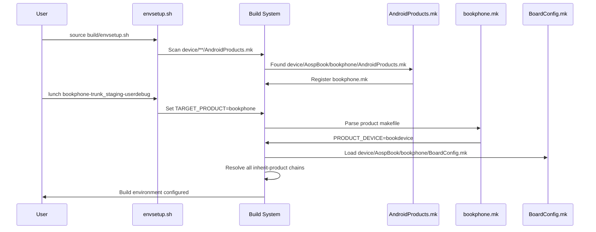
```mermaid
sequenceDiagram
    participant User
    participant envsetup.sh
    participant Build System
    participant AndroidProducts.mk
    participant bookphone.mk
    participant BoardConfig.mk

    User->>envsetup.sh: source build/envsetup.sh
    envsetup.sh->>Build System: Scan device/**/AndroidProducts.mk
    Build System->>AndroidProducts.mk: Found device/AospBook/bookphone/AndroidProducts.mk
    AndroidProducts.mk->>Build System: Register bookphone.mk

    User->>envsetup.sh: lunch bookphone-trunk_staging-userdebug
    envsetup.sh->>Build System: Set TARGET_PRODUCT=bookphone
    Build System->>bookphone.mk: Parse product makefile
    bookphone.mk->>Build System: PRODUCT_DEVICE=bookdevice
    Build System->>BoardConfig.mk: Load device/AospBook/bookphone/BoardConfig.mk
    Build System->>Build System: Resolve all inherit-product chains
    Build System->>User: Build environment configured
```

### 63.3.8 Verifying the Product Registration

After creating these files, verify that the build system recognizes your
product:

```bash
# Source the environment
source build/envsetup.sh

# Check that our target appears
lunch --print-all-targets 2>/dev/null | grep bookphone
# Expected output: bookphone-trunk_staging-userdebug
#                  bookphone-trunk_staging-eng
#                  bookphone-trunk_staging-user

# Select our target
lunch bookphone-trunk_staging-userdebug

# Verify the environment
echo "TARGET_PRODUCT=$TARGET_PRODUCT"         # bookphone
echo "TARGET_BUILD_VARIANT=$TARGET_BUILD_VARIANT" # userdebug
echo "TARGET_ARCH=$TARGET_ARCH"               # x86_64
printconfig
```

### 63.3.9 The Product Variable Namespace

The build system defines a rich set of `PRODUCT_*` variables. Here are the most
important ones for ROM building:

| Variable | Purpose | Example |
|----------|---------|---------|
| `PRODUCT_NAME` | Lunch target name | `bookphone` |
| `PRODUCT_DEVICE` | Maps to board config directory | `bookdevice` |
| `PRODUCT_BRAND` | Brand string | `AospBook` |
| `PRODUCT_MODEL` | Model string | `AospBook Phone` |
| `PRODUCT_MANUFACTURER` | Manufacturer string | `AospBook` |
| `PRODUCT_PACKAGES` | Modules to include in the build | `BookSampleApp` |
| `PRODUCT_COPY_FILES` | Files to copy into the image | `src:dest` pairs |
| `PRODUCT_PROPERTY_OVERRIDES` | System properties (`/system`) | `ro.foo=bar` |
| `PRODUCT_PRODUCT_PROPERTIES` | Product properties (`/product`) | `ro.foo=bar` |
| `PRODUCT_VENDOR_PROPERTIES` | Vendor properties (`/vendor`) | `ro.foo=bar` |
| `PRODUCT_SOONG_NAMESPACES` | Soong module search paths | directory paths |
| `PRODUCT_ENFORCE_RRO_TARGETS` | Force RRO on targets | `framework-res` |
| `PRODUCT_ENFORCE_RRO_EXCLUDED_OVERLAYS` | Exclude from RRO enforcement | overlay paths |

### 63.3.10 The Inheritance Mechanism

The `$(call inherit-product, ...)` function is the cornerstone of product
configuration. It works by appending the included makefile's variable values to
the including makefile's variables:

```makefile
# In parent.mk:
PRODUCT_PACKAGES += ParentApp

# In child.mk:
$(call inherit-product, parent.mk)
PRODUCT_PACKAGES += ChildApp

# Result: PRODUCT_PACKAGES = ParentApp ChildApp
```

This is different from a simple `include` statement. The `inherit-product`
function uses a namespace mechanism to prevent variable collisions when
multiple makefiles define the same variable.

There is also `$(call inherit-product-if-exists, ...)` which silently succeeds
if the file does not exist -- useful for optional vendor overlays.

---

## 63.4 Adding Custom Apps

### 63.4.1 Understanding PRODUCT_PACKAGES

Every module that appears in `PRODUCT_PACKAGES` is built and included in the
appropriate partition image. The module name maps to a build rule defined in
either an `Android.bp` (Soong) or `Android.mk` (Make) file.

The base system packages are defined in `build/make/target/product/base_system.mk`:

```makefile
# build/make/target/product/base_system.mk (excerpt)
PRODUCT_PACKAGES += \
    abx \
    am \
    app_process \
    atrace \
    bootanimation \
    bootstat \
    bugreport \
    cmd \
    ...
```

These are the minimum packages for a functional Android system. Our product
inherits them through the Goldfish phone configuration chain.

### 63.4.2 Adding a Prebuilt APK

Suppose you have a third-party APK (e.g., a PDF reader) that you want to
include in your ROM. Create a prebuilt module:

```
device/AospBook/bookphone/apps/prebuilt/BookReader/
    Android.bp
    BookReader.apk
```

The `Android.bp` file defines a prebuilt app:

```json
// device/AospBook/bookphone/apps/prebuilt/BookReader/Android.bp
//
// Prebuilt APK for BookReader PDF viewer.
// This is included in the system image via PRODUCT_PACKAGES += BookReader.

android_app_import {
    name: "BookReader",

    // The APK file in this directory
    apk: "BookReader.apk",

    // Install to the /product partition (not /system)
    product_specific: true,

    // Allow the app to be updated from the Play Store
    overrides: [],

    // Signature: presigned means keep the APK's existing signature
    presigned: true,

    // Optional: mark as privileged if it needs privileged permissions
    // privileged: true,

    // Optimize DEX code during build
    dex_preopt: {
        enabled: true,
    },
}
```

Key `android_app_import` properties:

| Property | Values | Description |
|----------|--------|-------------|
| `apk` | filename | Path to the APK file |
| `presigned` | `true`/`false` | Keep existing signature vs. re-sign |
| `certificate` | `"platform"`, `"shared"`, `"media"`, path | Signing key |
| `privileged` | `true`/`false` | Install to `priv-app/` |
| `product_specific` | `true`/`false` | Install to `/product` partition |
| `vendor` | `true`/`false` | Install to `/vendor` partition |
| `dex_preopt.enabled` | `true`/`false` | Pre-optimize DEX at build time |

If your APK is not already signed with the correct key, use `certificate`
instead of `presigned`:

```json
android_app_import {
    name: "BookReader",
    apk: "BookReader.apk",
    product_specific: true,
    certificate: "platform",   // Re-sign with the platform key
    dex_preopt: {
        enabled: true,
    },
}
```

The signing key names map to files in `build/make/target/product/security/`:

| Key name | Files | Used for |
|----------|-------|----------|
| `platform` | `platform.pk8`, `platform.x509.pem` | System apps with `android:sharedUserId="android.uid.system"` |
| `shared` | `shared.pk8`, `shared.x509.pem` | Apps sharing data (Contacts, Phone) |
| `media` | `media.pk8`, `media.x509.pem` | Media/download system apps |
| `testkey` | `testkey.pk8`, `testkey.x509.pem` | Default development signing key |

### 63.4.3 Building a Custom App into the Image

Now let us create a custom app from source. This app will be built as part of
the AOSP build, compiled, signed, and placed into the system image.

Create the app directory:

```
device/AospBook/bookphone/apps/BookSampleApp/
    Android.bp
    AndroidManifest.xml
    res/
        layout/
            activity_main.xml
        values/
            strings.xml
        mipmap-xxxhdpi/
            ic_launcher.png
    src/
        com/
            aospbook/
                sample/
                    MainActivity.java
```

**Android.bp** -- the Soong build definition:

```json
// device/AospBook/bookphone/apps/BookSampleApp/Android.bp
//
// Custom sample app built from source, included in the system image.

android_app {
    name: "BookSampleApp",

    // Source files
    srcs: ["src/**/*.java"],

    // Android SDK version to compile against
    sdk_version: "current",

    // Install to the /product partition
    product_specific: true,

    // Sign with the platform key
    certificate: "platform",

    // Resource directories
    resource_dirs: ["res"],

    // Static library dependencies
    static_libs: [
        "androidx.appcompat_appcompat",
        "com.google.android.material_material",
    ],

    // Optimize DEX code
    optimize: {
        enabled: true,
        shrink: true,
        optimize: true,
        proguard_flags_files: ["proguard-rules.pro"],
    },

    // DEX preoptimization
    dex_preopt: {
        enabled: true,
    },
}
```

**AndroidManifest.xml**:

```xml
<?xml version="1.0" encoding="utf-8"?>
<!-- device/AospBook/bookphone/apps/BookSampleApp/AndroidManifest.xml -->
<manifest xmlns:android="http://schemas.android.com/apk/res/android"
    package="com.aospbook.sample">

    <application
        android:label="@string/app_name"
        android:icon="@mipmap/ic_launcher"
        android:theme="@style/Theme.AppCompat.DayNight">

        <activity
            android:name=".MainActivity"
            android:exported="true">
            <intent-filter>
                <action android:name="android.intent.action.MAIN" />
                <category android:name="android.intent.category.LAUNCHER" />
            </intent-filter>
        </activity>
    </application>

</manifest>
```

**MainActivity.java**:

```java
// device/AospBook/bookphone/apps/BookSampleApp/src/com/aospbook/sample/MainActivity.java
package com.aospbook.sample;

import android.app.Activity;
import android.os.Build;
import android.os.Bundle;
import android.widget.TextView;

/**
 * Sample app demonstrating a custom app built into an AOSP-based ROM.
 *
 * This activity displays system information to verify that the custom
 * ROM is running correctly.
 */
public class MainActivity extends Activity {

    @Override
    protected void onCreate(Bundle savedInstanceState) {
        super.onCreate(savedInstanceState);

        TextView textView = new TextView(this);
        textView.setPadding(32, 32, 32, 32);
        textView.setTextSize(18);
        textView.setText(buildInfoString());
        setContentView(textView);
    }

    private String buildInfoString() {
        StringBuilder sb = new StringBuilder();
        sb.append("AospBook ROM Info\n");
        sb.append("=================\n\n");
        sb.append("Brand: ").append(Build.BRAND).append("\n");
        sb.append("Model: ").append(Build.MODEL).append("\n");
        sb.append("Device: ").append(Build.DEVICE).append("\n");
        sb.append("Product: ").append(Build.PRODUCT).append("\n");
        sb.append("Build ID: ").append(Build.DISPLAY).append("\n");
        sb.append("Android Version: ").append(Build.VERSION.RELEASE).append("\n");
        sb.append("SDK Level: ").append(Build.VERSION.SDK_INT).append("\n");
        sb.append("Build Type: ").append(Build.TYPE).append("\n");
        sb.append("Fingerprint: ").append(Build.FINGERPRINT).append("\n");

        // Check for our custom property
        String romVersion = System.getProperty("ro.aospbook.version", "unknown");
        sb.append("\nROM Version: ").append(romVersion).append("\n");

        return sb.toString();
    }
}
```

**res/values/strings.xml**:

```xml
<?xml version="1.0" encoding="utf-8"?>
<resources>
    <string name="app_name">AospBook Sample</string>
</resources>
```

**res/layout/activity_main.xml**:

```xml
<?xml version="1.0" encoding="utf-8"?>
<LinearLayout
    xmlns:android="http://schemas.android.com/apk/res/android"
    android:layout_width="match_parent"
    android:layout_height="match_parent"
    android:orientation="vertical"
    android:padding="16dp">

    <TextView
        android:id="@+id/info_text"
        android:layout_width="match_parent"
        android:layout_height="wrap_content"
        android:textSize="16sp"
        android:fontFamily="monospace" />

</LinearLayout>
```

### 63.4.4 Removing Default Apps

To remove default AOSP apps you do not want, use `PRODUCT_PACKAGES_REMOVE`:

```makefile
# In device.mk
PRODUCT_PACKAGES_REMOVE += \
    Browser2 \
    Calendar \
    DeskClock \
    Gallery2 \
    Music
```

This removes these apps from the set inherited from parent makefiles. The apps
are still built (they may be dependencies of other modules), but they are not
installed into the image.

Alternatively, you can exclude entire AOSP app categories by not inheriting
certain makefiles. For example, if you do not want telephony apps:

```makefile
# Instead of inheriting full_base_telephony.mk, inherit full_base.mk
$(call inherit-product, $(SRC_TARGET_DIR)/product/full_base.mk)
```

### 63.4.5 Privileged Apps and Permissions

Apps installed to `/system/priv-app/` or `/product/priv-app/` can request
privileged permissions not available to regular apps. To make an app
privileged:

```json
// In Android.bp
android_app {
    name: "BookPrivilegedApp",
    privileged: true,
    product_specific: true,
    certificate: "platform",
    // ...
}
```

Privileged apps need a permissions allowlist. Create:

```xml
<!-- device/AospBook/bookphone/permissions/privapp-permissions-bookphone.xml -->
<?xml version="1.0" encoding="utf-8"?>
<permissions>
    <privapp-permissions package="com.aospbook.privileged">
        <permission name="android.permission.MANAGE_USERS" />
        <permission name="android.permission.INTERACT_ACROSS_USERS" />
    </privapp-permissions>
</permissions>
```

And copy it into the image:

```makefile
# In device.mk
PRODUCT_COPY_FILES += \
    device/AospBook/bookphone/permissions/privapp-permissions-bookphone.xml:$(TARGET_COPY_OUT_PRODUCT)/etc/permissions/privapp-permissions-bookphone.xml
```

### 63.4.6 App Installation Locations

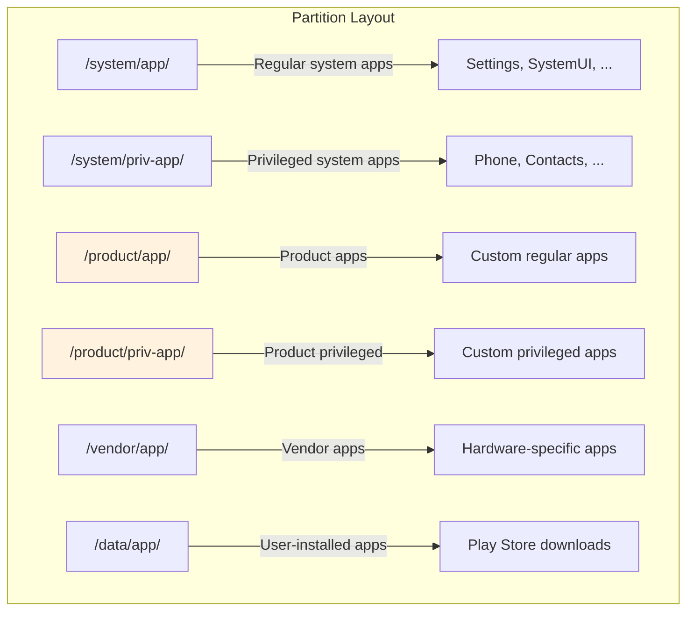
```mermaid
graph TD
    subgraph "Partition Layout"
        A["/system/app/"] -->|Regular system apps| A1["Settings, SystemUI, ..."]
        B["/system/priv-app/"] -->|Privileged system apps| B1["Phone, Contacts, ..."]
        C["/product/app/"] -->|Product apps| C1["Custom regular apps"]
        D["/product/priv-app/"] -->|Product privileged| D1["Custom privileged apps"]
        E["/vendor/app/"] -->|Vendor apps| E1["Hardware-specific apps"]
        F["/data/app/"] -->|User-installed apps| F1["Play Store downloads"]
    end

    style C fill:#fff3e0
    style D fill:#fff3e0
```

The build system maps module properties to installation paths:

| `Android.bp` Property | Installation Path |
|------------------------|-------------------|
| (none -- default) | `/system/app/<name>/` |
| `privileged: true` | `/system/priv-app/<name>/` |
| `product_specific: true` | `/product/app/<name>/` |
| `product_specific: true` + `privileged: true` | `/product/priv-app/<name>/` |
| `vendor: true` | `/vendor/app/<name>/` |
| `system_ext_specific: true` | `/system_ext/app/<name>/` |

---

## 63.5 Modifying Framework Behavior

### 63.5.1 Runtime Resource Overlay (RRO)

Runtime Resource Overlays are the recommended way to customize framework
behavior without modifying framework source code. An RRO is a small APK
containing only resources that override the default values in a target package.

The framework's configurable behavior is defined in:

```
frameworks/base/core/res/res/values/config.xml
```

This file (7,759 lines) contains hundreds of configuration values. RROs can
override any of them.

**How RROs work:**

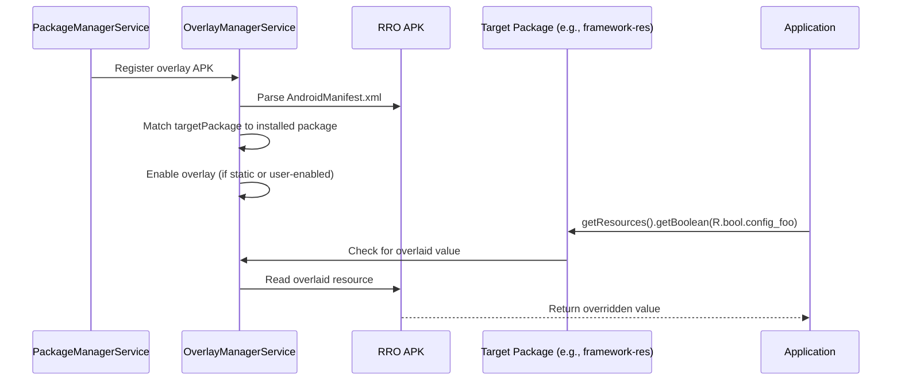
```mermaid
sequenceDiagram
    participant PMS as PackageManagerService
    participant OMS as OverlayManagerService
    participant RRO as RRO APK
    participant Target as Target Package (e.g., framework-res)
    participant App as Application

    PMS->>OMS: Register overlay APK
    OMS->>RRO: Parse AndroidManifest.xml
    OMS->>OMS: Match targetPackage to installed package
    OMS->>OMS: Enable overlay (if static or user-enabled)

    App->>Target: getResources().getBoolean(R.bool.config_foo)
    Target->>OMS: Check for overlaid value
    OMS->>RRO: Read overlaid resource
    RRO-->>App: Return overridden value
```

**Creating a Framework RRO:**

Create the overlay directory structure:

```
device/AospBook/bookphone/overlay/BookFrameworkOverlay/
    Android.bp
    AndroidManifest.xml
    res/
        values/
            config.xml
            bools.xml
```

**Android.bp**:

```json
// device/AospBook/bookphone/overlay/BookFrameworkOverlay/Android.bp
//
// Runtime Resource Overlay for the framework (android package).
// Overrides default configuration values.

runtime_resource_overlay {
    name: "BookFrameworkOverlay",

    // The target package this overlay applies to
    // "android" is the framework-res package
    sdk_version: "current",

    // Install to the product partition
    product_specific: true,
}
```

**AndroidManifest.xml**:

```xml
<!-- device/AospBook/bookphone/overlay/BookFrameworkOverlay/AndroidManifest.xml -->
<manifest xmlns:android="http://schemas.android.com/apk/res/android"
    package="com.aospbook.overlay.framework">

    <application android:hasCode="false" />

    <overlay
        android:targetPackage="android"
        android:isStatic="true"
        android:priority="10"
        />
</manifest>
```

Key manifest attributes:

| Attribute | Value | Meaning |
|-----------|-------|---------|
| `targetPackage` | `"android"` | Overlay targets the framework |
| `isStatic` | `"true"` | Always enabled, cannot be disabled by user |
| `priority` | `"10"` | Higher priority wins when multiple overlays exist |

**res/values/config.xml** -- override framework defaults:

```xml
<?xml version="1.0" encoding="utf-8"?>
<!-- Override framework configuration values -->
<resources>
    <!-- Enable dark mode by default -->
    <integer name="config_defaultNightMode">2</integer>
    <!-- 0=MODE_NIGHT_NO, 1=MODE_NIGHT_YES, 2=MODE_NIGHT_AUTO -->

    <!-- Default wallpaper component -->
    <string name="default_wallpaper_component" translatable="false">
        com.aospbook.wallpaper/.DefaultWallpaperService
    </string>

    <!-- Enable always-on display by default -->
    <bool name="config_dozeAlwaysOnDisplayAvailable">true</bool>

    <!-- Screen brightness settings -->
    <integer name="config_screenBrightnessSettingDefault">128</integer>
    <integer name="config_screenBrightnessSettingMinimum">10</integer>

    <!-- Lock screen: allow rotation -->
    <bool name="config_enableLockScreenRotation">true</bool>

    <!-- Power button behavior: long press = power menu -->
    <integer name="config_longPressOnPowerBehavior">1</integer>

    <!-- Show battery percentage in status bar by default -->
    <bool name="config_defaultBatteryPercentageSetting">true</bool>

    <!-- Haptic feedback default -->
    <bool name="config_enableHapticTextHandle">true</bool>
</resources>
```

To see all overridable framework config values, examine:

```
frameworks/base/core/res/res/values/config.xml
```

Some commonly overridden values for custom ROMs:

| Resource | Type | Default | Description |
|----------|------|---------|-------------|
| `config_defaultNightMode` | integer | 0 | Default UI mode (dark/light) |
| `config_longPressOnPowerBehavior` | integer | 1 | Power button long-press |
| `config_dozeAlwaysOnDisplayAvailable` | bool | false | Always-on display |
| `config_enableLockScreenRotation` | bool | false | Lock screen rotation |
| `config_screenBrightnessSettingDefault` | integer | varies | Default brightness |
| `config_defaultBatteryPercentageSetting` | bool | false | Battery % in status bar |
| `config_enableHapticTextHandle` | bool | false | Text selection haptics |

### 63.5.2 Verifying RRO Installation

After building, you can verify that your overlay is active:

```bash
# On the running device/emulator:
adb shell cmd overlay list
# Expected output includes:
# com.aospbook.overlay.framework
#     [x] com.aospbook.overlay.framework (targeting android, priority 10)

# Check a specific overlaid value:
adb shell cmd overlay dump com.aospbook.overlay.framework

# Or query the resource directly:
adb shell settings get system screen_brightness
```

### 63.5.3 Modifying Framework Source Code

For changes that cannot be achieved through RROs, you must modify framework
source code directly. This is the most invasive form of customization and
requires careful management (especially when rebasing on new AOSP releases).

**Example: Adding a Custom System Property to Settings**

Suppose we want to expose our ROM version in the Settings app. The About Phone
screen reads build properties from `android.os.Build`.

The Build class is defined at:

```
frameworks/base/core/java/android/os/Build.java
```

We can add a new field:

```java
// Add to frameworks/base/core/java/android/os/Build.java
// (inside the class body)

/**
 * The custom ROM version, as set by the ROM builder.
 * Read from the system property "ro.aospbook.version".
 */
public static final String AOSPBOOK_VERSION =
    SystemProperties.get("ro.aospbook.version", "unknown");
```

This property is set by our product configuration:

```makefile
# In device.mk or bookphone.mk
PRODUCT_PROPERTY_OVERRIDES += ro.aospbook.version=1.0.0
```

### 63.5.4 Adding a New System Service

A system service runs in the `system_server` process and provides an API
that apps can call via Binder IPC. This is the most powerful form of framework
customization.

**Architecture of a system service:**

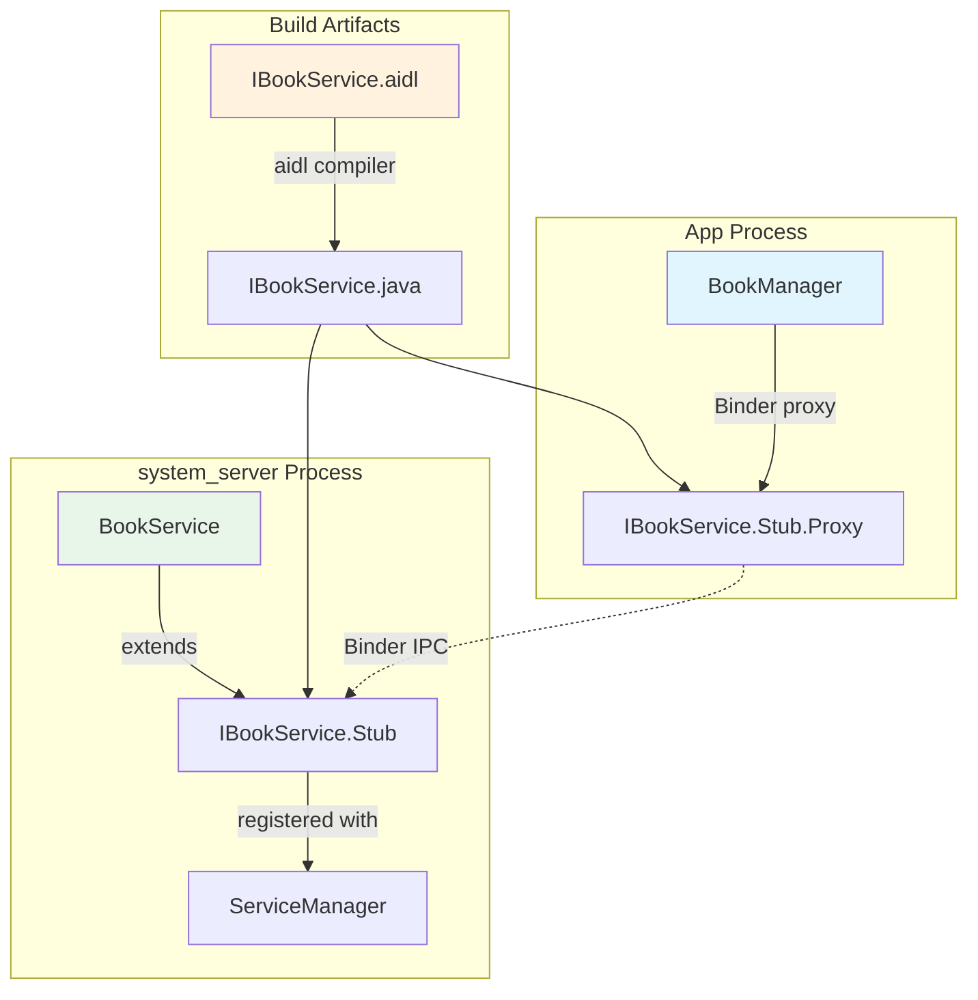
```mermaid
graph TD
    subgraph "App Process"
        A[BookManager] -->|Binder proxy| B[IBookService.Stub.Proxy]
    end

    subgraph "system_server Process"
        C[BookService] -->|extends| D[IBookService.Stub]
        D -->|registered with| E[ServiceManager]
    end

    B -.->|Binder IPC| D

    subgraph "Build Artifacts"
        F[IBookService.aidl] -->|aidl compiler| G[IBookService.java]
        G --> B
        G --> D
    end

    style A fill:#e1f5fe
    style C fill:#e8f5e9
    style F fill:#fff3e0
```

**Step 1: Define the AIDL Interface**

Create the directory structure:

```
device/AospBook/bookphone/services/BookService/
    Android.bp
    aidl/
        com/aospbook/service/
            IBookService.aidl
    src/
        com/aospbook/service/
            BookService.java
            BookServiceManager.java
```

**IBookService.aidl**:

```java
// device/AospBook/bookphone/services/BookService/aidl/com/aospbook/service/IBookService.aidl
package com.aospbook.service;

/**
 * System service interface for AospBook-specific functionality.
 * This service runs in system_server and provides ROM-specific
 * APIs to applications.
 */
interface IBookService {
    /**
     * Returns the current ROM version string.
     */
    String getRomVersion();

    /**
     * Returns the ROM build timestamp (epoch seconds).
     */
    long getBuildTimestamp();

    /**
     * Sets a custom user preference stored in the service.
     * @param key Preference key
     * @param value Preference value
     */
    void setPreference(String key, String value);

    /**
     * Gets a custom user preference.
     * @param key Preference key
     * @return The stored value, or null if not set
     */
    String getPreference(String key);

    /**
     * Returns a list of enabled AospBook features.
     */
    List<String> getEnabledFeatures();
}
```

**Step 2: Implement the Service**

**BookService.java**:

```java
// device/AospBook/bookphone/services/BookService/src/com/aospbook/service/BookService.java
package com.aospbook.service;

import android.content.Context;
import android.os.RemoteException;
import android.os.SystemProperties;
import android.util.Log;

import java.util.ArrayList;
import java.util.HashMap;
import java.util.List;
import java.util.Map;

/**
 * System service implementation for AospBook ROM.
 *
 * This service is registered with ServiceManager under the name
 * "aospbook" and can be accessed by apps via BookServiceManager.
 *
 * Registration happens in SystemServer.java during the
 * startOtherServices() phase.
 */
public class BookService extends IBookService.Stub {
    private static final String TAG = "BookService";
    private static final String SERVICE_NAME = "aospbook";

    private final Context mContext;
    private final Map<String, String> mPreferences;

    public BookService(Context context) {
        mContext = context;
        mPreferences = new HashMap<>();
        Log.i(TAG, "BookService initialized");
    }

    @Override
    public String getRomVersion() throws RemoteException {
        return SystemProperties.get("ro.aospbook.version", "unknown");
    }

    @Override
    public long getBuildTimestamp() throws RemoteException {
        String timestamp = SystemProperties.get("ro.build.date.utc", "0");
        try {
            return Long.parseLong(timestamp);
        } catch (NumberFormatException e) {
            return 0;
        }
    }

    @Override
    public void setPreference(String key, String value) throws RemoteException {
        // In a production implementation, this would persist to disk
        // and enforce permission checks.
        enforceCallerPermission();
        synchronized (mPreferences) {
            mPreferences.put(key, value);
        }
        Log.d(TAG, "Preference set: " + key + " = " + value);
    }

    @Override
    public String getPreference(String key) throws RemoteException {
        synchronized (mPreferences) {
            return mPreferences.get(key);
        }
    }

    @Override
    public List<String> getEnabledFeatures() throws RemoteException {
        List<String> features = new ArrayList<>();

        if (SystemProperties.getBoolean(
                "ro.aospbook.features.dark_mode_default", false)) {
            features.add("dark_mode_default");
        }
        if (SystemProperties.getBoolean(
                "ro.aospbook.features.custom_qs", false)) {
            features.add("custom_qs");
        }

        return features;
    }

    /**
     * Returns the service name for ServiceManager registration.
     */
    public static String getServiceName() {
        return SERVICE_NAME;
    }

    private void enforceCallerPermission() {
        // In production, check a custom permission here:
        // mContext.enforceCallingOrSelfPermission(
        //     "com.aospbook.permission.MANAGE_PREFERENCES",
        //     "BookService");
    }
}
```

**Step 3: Android.bp**

```json
// device/AospBook/bookphone/services/BookService/Android.bp

// AIDL interface library
java_library {
    name: "aospbook-service-aidl",
    srcs: ["aidl/**/*.aidl"],
    sdk_version: "system_current",
    product_specific: true,
}

// Service implementation (runs in system_server)
java_library {
    name: "BookService",
    srcs: ["src/**/*.java"],
    static_libs: [
        "aospbook-service-aidl",
    ],
    libs: [
        "framework",
        "services.core",
    ],
    product_specific: true,
}
```

**Step 4: Register the Service in SystemServer**

The `SystemServer` (located at
`frameworks/base/services/java/com/android/server/SystemServer.java`) is where
all system services are started. To add our service, we modify the
`startOtherServices()` method:

```java
// In frameworks/base/services/java/com/android/server/SystemServer.java
// Add to the startOtherServices() method, near the end:

// AospBook custom service
traceBeginAndSlog("StartBookService");
try {
    ServiceManager.addService("aospbook",
        new com.aospbook.service.BookService(mSystemContext));
} catch (Throwable e) {
    reportWtf("starting BookService", e);
}
traceEnd();
```

Alternatively, for a less invasive approach, you can use a `SystemService`
subclass and register it through the `SystemServiceManager`:

```java
// Alternative: device/AospBook/bookphone/services/BookService/src/.../BookSystemService.java
package com.aospbook.service;

import android.content.Context;
import android.os.ServiceManager;

import com.android.server.SystemService;

/**
 * SystemService wrapper for BookService.
 * This approach uses the SystemServiceManager lifecycle.
 */
public class BookSystemService extends SystemService {
    private BookService mService;

    public BookSystemService(Context context) {
        super(context);
    }

    @Override
    public void onStart() {
        mService = new BookService(getContext());
        ServiceManager.addService(BookService.getServiceName(), mService);
    }

    @Override
    public void onBootPhase(int phase) {
        if (phase == PHASE_SYSTEM_SERVICES_READY) {
            // Perform initialization that requires other services
        }
    }
}
```

**Step 5: Create a Client Manager Class**

Apps use a manager class to interact with the service:

```java
// device/AospBook/bookphone/services/BookService/src/com/aospbook/service/BookServiceManager.java
package com.aospbook.service;

import android.os.IBinder;
import android.os.RemoteException;
import android.os.ServiceManager;
import android.util.Log;

import java.util.Collections;
import java.util.List;

/**
 * Client-side manager for the AospBook system service.
 *
 * Usage:
 *     BookServiceManager manager = BookServiceManager.getInstance();
 *     String version = manager.getRomVersion();
 */
public class BookServiceManager {
    private static final String TAG = "BookServiceManager";
    private static volatile BookServiceManager sInstance;

    private final IBookService mService;

    private BookServiceManager(IBookService service) {
        mService = service;
    }

    /**
     * Gets the singleton instance of BookServiceManager.
     * Returns null if the service is not available (e.g., on non-AospBook ROMs).
     */
    public static BookServiceManager getInstance() {
        if (sInstance == null) {
            synchronized (BookServiceManager.class) {
                if (sInstance == null) {
                    IBinder binder = ServiceManager.getService("aospbook");
                    if (binder != null) {
                        IBookService service =
                            IBookService.Stub.asInterface(binder);
                        sInstance = new BookServiceManager(service);
                    }
                }
            }
        }
        return sInstance;
    }

    public String getRomVersion() {
        try {
            return mService.getRomVersion();
        } catch (RemoteException e) {
            Log.e(TAG, "Failed to get ROM version", e);
            return "unknown";
        }
    }

    public long getBuildTimestamp() {
        try {
            return mService.getBuildTimestamp();
        } catch (RemoteException e) {
            Log.e(TAG, "Failed to get build timestamp", e);
            return 0;
        }
    }

    public void setPreference(String key, String value) {
        try {
            mService.setPreference(key, value);
        } catch (RemoteException e) {
            Log.e(TAG, "Failed to set preference", e);
        }
    }

    public String getPreference(String key) {
        try {
            return mService.getPreference(key);
        } catch (RemoteException e) {
            Log.e(TAG, "Failed to get preference", e);
            return null;
        }
    }

    public List<String> getEnabledFeatures() {
        try {
            return mService.getEnabledFeatures();
        } catch (RemoteException e) {
            Log.e(TAG, "Failed to get enabled features", e);
            return Collections.emptyList();
        }
    }
}
```

### 63.5.5 SELinux Policy for Custom Services

Any new system service requires SELinux policy. Without it, SELinux (which
is enforcing on all modern Android builds) will deny the service from
operating.

Create the policy file:

```
# device/AospBook/bookphone/sepolicy/vendor/bookservice.te

# Define the BookService type
type bookservice, domain;
type bookservice_exec, exec_type, file_type, system_file_type;

# Allow system_server to register and access the service
allow system_server bookservice_service:service_manager { add find };

# Allow apps to find the service
allow untrusted_app bookservice_service:service_manager find;
allow platform_app bookservice_service:service_manager find;

# Allow the service to read system properties
allow bookservice system_prop:file { read open getattr };
get_prop(bookservice, system_prop)
```

And register the service in `service_contexts`:

```
# device/AospBook/bookphone/sepolicy/vendor/service_contexts
aospbook                            u:object_r:bookservice_service:s0
```

Define the service type in `service.te`:

```
# device/AospBook/bookphone/sepolicy/vendor/service.te
type bookservice_service, service_manager_type;
```

Add file contexts:

```
# device/AospBook/bookphone/sepolicy/vendor/file_contexts
/product/lib/BookService\.jar                u:object_r:system_file:s0
```

### 63.5.6 System Service Lifecycle

Understanding when your service starts relative to other services is
important:

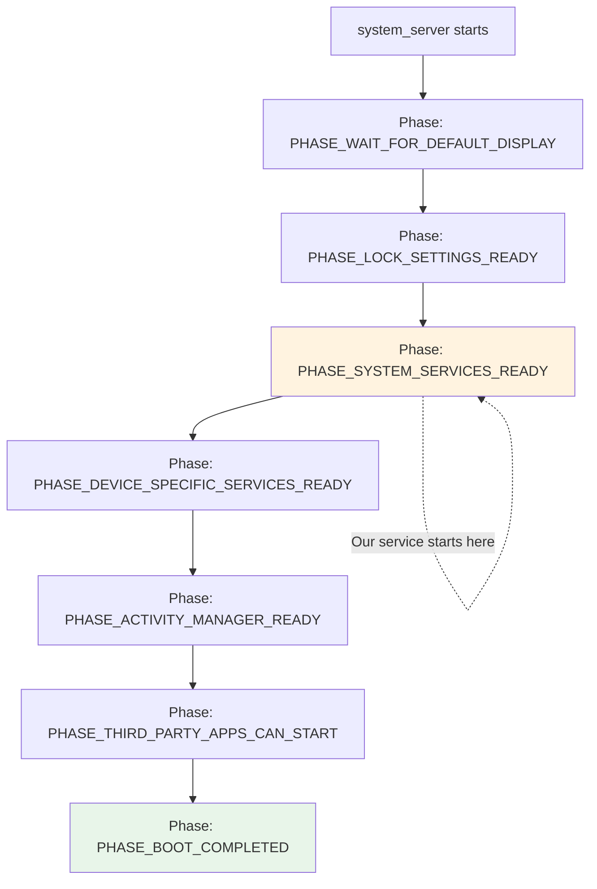
```mermaid
graph TD
    A["system_server starts"] --> B["Phase: PHASE_WAIT_FOR_DEFAULT_DISPLAY"]
    B --> C["Phase: PHASE_LOCK_SETTINGS_READY"]
    C --> D["Phase: PHASE_SYSTEM_SERVICES_READY"]
    D --> E["Phase: PHASE_DEVICE_SPECIFIC_SERVICES_READY"]
    E --> F["Phase: PHASE_ACTIVITY_MANAGER_READY"]
    F --> G["Phase: PHASE_THIRD_PARTY_APPS_CAN_START"]
    G --> H["Phase: PHASE_BOOT_COMPLETED"]

    D -.->|"Our service starts here"| D

    style D fill:#fff3e0
    style H fill:#e8f5e9
```

---

## 63.6 Custom Boot Animation

### 63.6.1 Boot Animation Format

The boot animation is stored as a ZIP file at one of these locations
(checked in order):

1. `/system/media/bootanimation.zip`
2. `/product/media/bootanimation.zip`
3. `/oem/media/bootanimation.zip`

The format is defined in detail in `frameworks/base/cmds/bootanimation/FORMAT.md`.

The ZIP contains:

```
bootanimation.zip (store compression, no deflate)
    desc.txt          # Animation descriptor
    part0/            # First animation part (frames)
        00000.png
        00001.png
        ...
    part1/            # Second animation part
        00000.png
        00001.png
        ...
    audio.wav         # Optional audio (per-part)
```

### 63.6.2 The desc.txt File

The first line defines global parameters:

```
WIDTH HEIGHT FPS [PROGRESS]
```

Subsequent lines define animation parts:

```
TYPE COUNT PAUSE PATH [FADE [#RGBHEX [CLOCK1 [CLOCK2]]]]
```

**Type values:**

| Type | Behavior |
|------|----------|
| `p` | Play until boot completes, then stop |
| `c` | Play to completion regardless of boot state |
| `f` | Like `p` but with fade-out when interrupted |

**Example desc.txt:**

```
1080 1920 30
c 1 0 part0
p 0 0 part1
```

This defines:

- 1080x1920 resolution at 30 FPS
- `part0`: Play once to completion (`c 1`) with no pause
- `part1`: Loop forever (`p 0`) until boot finishes

### 63.6.3 Creating a Custom Boot Animation

Let us create a simple but professional boot animation for AospBook ROM.

**Step 1: Create the frame images**

You can create frames using any image editor (GIMP, Photoshop, Inkscape) or
generate them programmatically. Each frame must be a PNG at the resolution
specified in `desc.txt`.

```bash
# Create the directory structure
mkdir -p device/AospBook/bookphone/bootanimation/part0
mkdir -p device/AospBook/bookphone/bootanimation/part1

# Example: Generate simple gradient frames using ImageMagick
# Part 0: Fade in the logo (30 frames = 1 second at 30fps)
for i in $(seq -w 0 29); do
    opacity=$(echo "scale=2; $i / 29 * 100" | bc)
    convert -size 1080x1920 xc:black \
        -fill white -gravity center \
        -pointsize 72 -annotate 0 "AospBook" \
        -channel A -evaluate set "${opacity}%" \
        "device/AospBook/bookphone/bootanimation/part0/${i}.png"
done

# Part 1: Pulsing dots (looping animation, 60 frames = 2 seconds)
for i in $(seq -w 0 59); do
    phase=$(echo "scale=4; $i / 60 * 3.14159 * 2" | bc)
    # ... generate frame with animated dots
    convert -size 1080x1920 xc:black \
        -fill white -gravity center \
        -pointsize 48 -annotate 0 "AospBook" \
        "device/AospBook/bookphone/bootanimation/part1/${i}.png"
done
```

**Step 2: Write desc.txt**

```
# device/AospBook/bookphone/bootanimation/desc.txt
1080 1920 30
c 1 10 part0
p 0 0 part1
```

Explanation:

- `1080 1920 30` -- 1080x1920 at 30 FPS
- `c 1 10 part0` -- Play part0 once to completion, pause 10 frames (0.33s)
- `p 0 0 part1` -- Loop part1 until boot completes, no pause between loops

**Step 3: Package the animation**

The ZIP must use **store** compression (no deflation), since the PNG files are
already compressed:

```bash
cd device/AospBook/bookphone/bootanimation

# Create the ZIP with store (no compression)
zip -0qry -i \*.txt \*.png \*.wav @ bootanimation.zip *.txt part*

# Verify the contents
unzip -l bootanimation.zip
```

The `-0` flag is critical. If you use default compression, the boot animation
player will fail to read the frames efficiently, causing stuttering or failure.

**Step 4: Include in the build**

In `device.mk`:

```makefile
PRODUCT_COPY_FILES += \
    device/AospBook/bookphone/bootanimation/bootanimation.zip:$(TARGET_COPY_OUT_PRODUCT)/media/bootanimation.zip
```

### 63.6.4 Testing the Boot Animation

You can test the boot animation without a full rebuild:

```bash
# Push directly to a running emulator
adb root
adb remount
adb push bootanimation.zip /product/media/bootanimation.zip

# Restart the boot animation service
adb shell setprop service.bootanim.exit 0
adb shell start bootanim

# Watch it play, then stop:
adb shell setprop service.bootanim.exit 1
```

### 63.6.5 Boot Animation with Sound

Each part directory can contain an `audio.wav` file that plays when that part
starts:

```
bootanimation.zip
    desc.txt
    part0/
        audio.wav       # Plays when part0 starts
        00000.png
        ...
    part1/
        00000.png
        ...
```

The WAV file must be:

- PCM format (uncompressed)
- 16-bit or 24-bit
- Any sample rate (44100 Hz recommended)
- Mono or stereo

### 63.6.6 Dynamic Coloring

Android 12+ supports dynamic coloring in boot animations. Add a special line
after the resolution line in `desc.txt`:

```
1080 1920 30
dynamic_colors part1 #1A73E8 #34A853 #FBBC04 #EA4335
c 1 10 part0
p 0 0 part1
```

This tells the animation player to treat the R, G, B, A channels of frames
in `part1` as masks for four dynamic colors. The end colors are read from
system properties:

- `persist.bootanim.color1`
- `persist.bootanim.color2`
- `persist.bootanim.color3`
- `persist.bootanim.color4`

### 63.6.7 Boot Animation Source Code

The boot animation player is implemented at:

```
frameworks/base/cmds/bootanimation/
    BootAnimation.cpp          # Main animation player
    BootAnimation.h
    BootAnimationUtil.cpp      # Utility functions
    bootanimation_main.cpp     # Entry point
    audioplay.cpp              # Audio playback
    bootanim.rc                # init service definition
```

The `bootanim.rc` file defines the init service:

```
# frameworks/base/cmds/bootanimation/bootanim.rc
service bootanim /system/bin/bootanimation
    class core animation
    user graphics
    group graphics audio
    disabled
    oneshot
```

---

## 63.7 Customizing SystemUI

SystemUI is the user-facing layer that draws the status bar, notification shade,
quick settings, lock screen, and navigation bar. Customizing it is one of the
most visible changes in a custom ROM.

The source lives at:

```
frameworks/base/packages/SystemUI/
```

### 63.7.1 SystemUI Architecture Overview

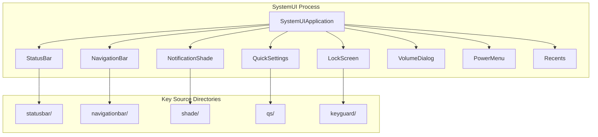
```mermaid
graph TD
    subgraph "SystemUI Process"
        A[SystemUIApplication] --> B[StatusBar]
        A --> C[NavigationBar]
        A --> D[NotificationShade]
        A --> E[QuickSettings]
        A --> F[LockScreen]
        A --> G[VolumeDialog]
        A --> H[PowerMenu]
        A --> I[Recents]
    end

    subgraph "Key Source Directories"
        B --> B1["statusbar/"]
        C --> C1["navigationbar/"]
        D --> D1["shade/"]
        E --> E1["qs/"]
        F --> F1["keyguard/"]
    end
```

### 63.7.2 Customizing via RRO (Non-Invasive)

The simplest way to customize SystemUI is through an RRO. SystemUI exposes
many configuration values in its own `config.xml`:

```
frameworks/base/packages/SystemUI/res/values/config.xml
```

Create a SystemUI overlay:

```
device/AospBook/bookphone/overlay/BookSystemUIOverlay/
    Android.bp
    AndroidManifest.xml
    res/
        values/
            config.xml
            dimens.xml
            colors.xml
```

**Android.bp**:

```json
// device/AospBook/bookphone/overlay/BookSystemUIOverlay/Android.bp

runtime_resource_overlay {
    name: "BookSystemUIOverlay",
    sdk_version: "current",
    product_specific: true,
}
```

**AndroidManifest.xml**:

```xml
<manifest xmlns:android="http://schemas.android.com/apk/res/android"
    package="com.aospbook.overlay.systemui">

    <application android:hasCode="false" />

    <overlay
        android:targetPackage="com.android.systemui"
        android:isStatic="true"
        android:priority="10"
        />
</manifest>
```

**res/values/config.xml** -- SystemUI configuration overrides:

```xml
<?xml version="1.0" encoding="utf-8"?>
<resources>
    <!-- Quick Settings: number of columns -->
    <integer name="quick_settings_num_columns">4</integer>

    <!-- Quick Settings: maximum number of rows -->
    <integer name="quick_settings_max_rows">3</integer>

    <!-- Quick QS Panel: max tiles shown when collapsed -->
    <integer name="quick_qs_panel_max_tiles">6</integer>

    <!-- Quick QS Panel: max rows when collapsed -->
    <integer name="quick_qs_panel_max_rows">2</integer>

    <!-- Navigation bar: enable dead zone -->
    <bool name="config_useDeadZone">false</bool>

    <!-- Navigation bar: auto-dim when wallpaper not visible -->
    <bool name="config_navigation_bar_enable_auto_dim_no_visible_wallpaper">false</bool>

    <!-- Lock screen display timeout (milliseconds) -->
    <integer name="config_lockScreenDisplayTimeout">15000</integer>

    <!-- Enable custom lockscreen shortcuts -->
    <bool name="custom_lockscreen_shortcuts_enabled">true</bool>

    <!-- Enable long-press to customize lock screen -->
    <bool name="long_press_keyguard_customize_lockscreen_enabled">true</bool>
</resources>
```

**res/values/dimens.xml** -- dimension overrides:

```xml
<?xml version="1.0" encoding="utf-8"?>
<resources>
    <!-- Status bar height (slightly taller for better touch targets) -->
    <dimen name="status_bar_height">28dp</dimen>

    <!-- Status bar padding -->
    <dimen name="status_bar_padding_start">8dp</dimen>
    <dimen name="status_bar_padding_end">8dp</dimen>
    <dimen name="status_bar_padding_top">0dp</dimen>

    <!-- Quick settings tile padding -->
    <dimen name="qs_tile_margin_horizontal">4dp</dimen>

    <!-- Rounded corner radius for QS tiles -->
    <dimen name="qs_corner_radius">16dp</dimen>
</resources>
```

**res/values/colors.xml** -- color overrides:

```xml
<?xml version="1.0" encoding="utf-8"?>
<resources>
    <!-- Status bar icon tint in light mode -->
    <color name="light_mode_icon_color_single_tone">#FF212121</color>

    <!-- Status bar icon tint in dark mode -->
    <color name="dark_mode_icon_color_single_tone">#FFFAFAFA</color>
</resources>
```

### 63.7.3 Customizing the Status Bar Layout

The status bar layout is defined in:

```
frameworks/base/packages/SystemUI/res/layout/status_bar.xml
```

The root view is `PhoneStatusBarView` which contains:

```xml
<!-- frameworks/base/packages/SystemUI/res/layout/status_bar.xml (structure) -->
<PhoneStatusBarView>
    <ImageView android:id="@+id/notification_lights_out" />
    <LinearLayout android:id="@+id/status_bar_contents">
        <FrameLayout android:id="@+id/status_bar_start_side_container">
            <!-- Notification icons, clock -->
        </FrameLayout>
        <android.widget.Space />
        <LinearLayout android:id="@+id/status_bar_end_side_content">
            <!-- System icons (wifi, battery, etc.) -->
        </LinearLayout>
    </LinearLayout>
</PhoneStatusBarView>
```

To customize the status bar layout without modifying source:

1. **Move the clock to the center or right** -- Override the layout via RRO
2. **Add custom status bar icons** -- Add drawable overlays
3. **Change the battery icon style** -- Override `battery_percentage_view.xml`

For deeper modifications (e.g., adding a new status bar indicator), you need
to modify the SystemUI source directly.

### 63.7.4 Modifying Quick Settings Tiles

Quick Settings tiles are registered in SystemUI's Dagger dependency injection
graph. To add a custom tile:

**Step 1: Create the tile class**

```java
// frameworks/base/packages/SystemUI/src/com/android/systemui/qs/tiles/BookModeTile.java
package com.android.systemui.qs.tiles;

import android.content.Intent;
import android.os.Handler;
import android.os.Looper;
import android.service.quicksettings.Tile;
import android.view.View;

import com.android.internal.logging.MetricsLogger;
import com.android.systemui.dagger.qualifiers.Background;
import com.android.systemui.dagger.qualifiers.Main;
import com.android.systemui.plugins.qs.QSTile;
import com.android.systemui.qs.QSHost;
import com.android.systemui.qs.tileimpl.QSTileImpl;
import com.android.systemui.res.R;

import javax.inject.Inject;

/**
 * Quick Settings tile for AospBook's custom "Book Mode" feature.
 * Toggles a hypothetical reading mode that adjusts display warmth
 * and reduces blue light.
 */
public class BookModeTile extends QSTileImpl<QSTile.BooleanState> {
    private boolean mEnabled = false;

    @Inject
    public BookModeTile(
            QSHost host,
            @Background Looper backgroundLooper,
            @Main Handler mainHandler) {
        super(host, backgroundLooper, mainHandler);
    }

    @Override
    public BooleanState newTileState() {
        return new BooleanState();
    }

    @Override
    protected void handleClick(View view) {
        mEnabled = !mEnabled;
        refreshState();
    }

    @Override
    protected void handleUpdateState(BooleanState state, Object arg) {
        state.value = mEnabled;
        state.label = "Book Mode";
        state.contentDescription = "Book Mode";
        state.state = mEnabled ? Tile.STATE_ACTIVE : Tile.STATE_INACTIVE;
        state.icon = ResourceIcon.get(mEnabled
            ? R.drawable.ic_book_mode_on
            : R.drawable.ic_book_mode_off);
    }

    @Override
    public int getMetricsCategory() {
        return MetricsLogger.QS_CUSTOM;
    }

    @Override
    public Intent getLongClickIntent() {
        return new Intent("com.aospbook.action.BOOK_MODE_SETTINGS");
    }

    @Override
    public CharSequence getTileLabel() {
        return "Book Mode";
    }
}
```

**Step 2: Register the tile in the tile factory**

The tile must be added to the `QSModule` or `QSTileHost` so that it can be
instantiated. The exact mechanism depends on the AOSP version -- current AOSP
uses Dagger `@IntoMap` annotations.

### 63.7.5 Theme Overlays for SystemUI

Material You (Android 12+) uses dynamic color extraction. To set a default
color scheme for your ROM, use a theme overlay:

```xml
<!-- device/AospBook/bookphone/overlay/BookSystemUIOverlay/res/values/styles.xml -->
<resources>
    <!-- Override the default accent color seed -->
    <!-- This affects Material You theming when no wallpaper-extracted color is available -->
    <color name="system_accent1_500">#1A73E8</color>  <!-- Google Blue -->
    <color name="system_accent2_500">#5F6368</color>  <!-- Gray -->
    <color name="system_accent3_500">#34A853</color>  <!-- Green -->
</resources>
```

### 63.7.6 Customizing the Navigation Bar

The navigation bar configuration is controlled by system properties and
framework configs:

```makefile
# In device.mk -- force gesture navigation as default
PRODUCT_PRODUCT_PROPERTIES += \
    ro.boot.vendor.overlay.theme=com.android.internal.systemui.navbar.gestural

# Or force 3-button navigation:
# ro.boot.vendor.overlay.theme=com.android.internal.systemui.navbar.threebutton
```

To customize navigation bar button icons, overlay the drawables in the
navigation bar overlay packages:

```
frameworks/base/packages/overlays/NavigationBarMode*/
```

### 63.7.7 SystemUI Build Integration

SystemUI is built as a system app via:

```
frameworks/base/packages/SystemUI/Android.bp
```

To include your modifications, ensure that any new source files are added to
the `srcs` list in the build file, or placed in a directory that is already
included via a glob pattern.

---

## 63.8 Building and Flashing

### 63.8.1 The Build Command

With our device configuration in place, build the ROM:

```bash
# Source the environment (if not already done)
source build/envsetup.sh

# Select our target
lunch bookphone-trunk_staging-userdebug

# Build everything
# 'm' is the AOSP build command (wrapper around Soong/Ninja)
m

# Or with explicit parallelism:
m -j$(nproc)
```

The `m` command:

1. Runs Soong to process all `Android.bp` files
2. Runs Kati to process all `Android.mk` files
3. Generates `build.ninja` in the output directory
4. Invokes Ninja to execute the build plan

### 63.8.2 Build Output Structure

After a successful build, the output lives in `out/target/product/bookdevice/`:

```
out/target/product/bookdevice/
    android-info.txt            # Build info for fastboot
    boot.img                    # Kernel + ramdisk
    vendor_boot.img             # Vendor ramdisk
    super.img                   # Dynamic partitions container
    system.img                  # System partition image
    system_ext.img              # System extension partition
    vendor.img                  # Vendor partition image
    product.img                 # Product partition image
    userdata.img                # Empty userdata partition
    cache.img                   # Cache partition
    ramdisk.img                 # Root ramdisk
    kernel-ranchu               # Kernel binary
    system/                     # Staging directory for system partition
    vendor/                     # Staging directory for vendor partition
    product/                    # Staging directory for product partition
    obj/                        # Intermediate build objects
    symbols/                    # Unstripped binaries (for debugging)
```

### 63.8.3 Understanding Partition Images

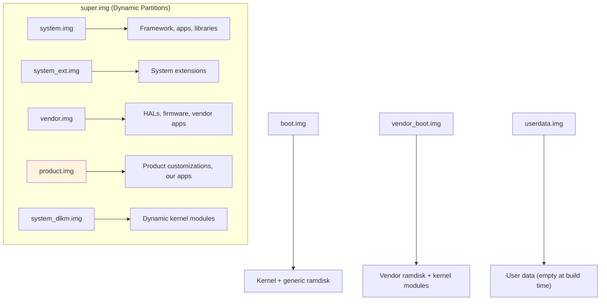
```mermaid
graph TD
    subgraph "super.img (Dynamic Partitions)"
        A["system.img"] --> A1["Framework, apps, libraries"]
        B["system_ext.img"] --> B1["System extensions"]
        C["vendor.img"] --> C1["HALs, firmware, vendor apps"]
        D["product.img"] --> D1["Product customizations, our apps"]
        E["system_dlkm.img"] --> E1["Dynamic kernel modules"]
    end

    F["boot.img"] --> F1["Kernel + generic ramdisk"]
    G["vendor_boot.img"] --> G1["Vendor ramdisk + kernel modules"]
    H["userdata.img"] --> H1["User data (empty at build time)"]

    style D fill:#fff3e0
```

### 63.8.4 Launching the Emulator

The AOSP build system includes an `emulator` command that launches the
Android Emulator with the just-built images:

```bash
# Launch the emulator with our custom ROM
emulator

# With additional options:
emulator \
    -gpu swiftshader_indirect \   # Software GPU (works in headless VMs)
    -memory 4096 \                # 4 GB RAM
    -cores 4 \                    # 4 CPU cores
    -no-snapshot \                # Start fresh
    -verbose                      # Debug output
```

The emulator automatically picks up the images from
`$ANDROID_PRODUCT_OUT` (which is `out/target/product/bookdevice/`).

Key emulator flags:

| Flag | Description |
|------|-------------|
| `-gpu host` | Use host GPU acceleration (fastest, requires GPU) |
| `-gpu swiftshader_indirect` | Software rendering (works everywhere) |
| `-memory <MB>` | Guest RAM in MB |
| `-cores <N>` | Guest CPU cores |
| `-no-snapshot` | Don't use quickboot snapshot |
| `-wipe-data` | Reset userdata partition |
| `-writable-system` | Allow writes to system partition |
| `-show-kernel` | Show kernel log in terminal |
| `-logcat '*:V'` | Show logcat in terminal |
| `-selinux permissive` | Set SELinux to permissive (debugging) |

### 63.8.5 Flashing to a Physical Device

For physical devices, use `fastboot`:

```bash
# Reboot device into bootloader
adb reboot bootloader

# Flash all images at once
fastboot flashall

# Or flash individual partitions:
fastboot flash boot boot.img
fastboot flash vendor_boot vendor_boot.img
fastboot flash super super.img
# fastboot flash userdata userdata.img  # Warning: this wipes user data!

# Reboot
fastboot reboot
```

For devices using dynamic partitions (Android 10+), you may need to use
`fastboot flash` with the `super` image or use `fastbootd` mode:

```bash
# Enter fastbootd (userspace fastboot)
fastboot reboot fastboot

# Flash dynamic partition images
fastboot flash system system.img
fastboot flash system_ext system_ext.img
fastboot flash vendor vendor.img
fastboot flash product product.img

# Reboot
fastboot reboot
```

### 63.8.6 Incremental Builds

After the initial full build, incremental builds only rebuild changed modules.
This is dramatically faster:

```bash
# Rebuild only changed modules
m

# Rebuild a specific module
m BookSampleApp

# Rebuild SystemUI only
m SystemUI

# Rebuild the system image (after rebuilding individual modules)
m systemimage

# Rebuild the product image
m productimage

# Rebuild a specific image
make vendorimage
```

Incremental build tips:

| Operation | Time | Command |
|-----------|------|---------|
| Full build (first time) | 2-4 hours | `m` |
| Full build (with ccache) | 30-60 min | `m` |
| Rebuild after Java change | 1-5 min | `m ModuleName` |
| Rebuild after C++ change | 2-10 min | `m ModuleName` |
| Rebuild system image | 5-15 min | `m systemimage` |
| Rebuild after resource change | 1-3 min | `m ModuleName` |
| Rebuild after makefile change | 10-30 min | `m` (Soong re-analysis) |

### 63.8.7 Build Variants and Their Impact

| Variant | `ro.debuggable` | `adb` Default | Optimizations | Use |
|---------|-----------------|---------------|---------------|-----|
| `user` | 0 | Off | Full (proguard, minification) | Release |
| `userdebug` | 1 | On | Partial (some kept for debugging) | Development |
| `eng` | 1 | On, rooted | Minimal (no proguard) | Deep debugging |

The build variant affects:

- Whether `adb root` works
- Whether the system partition is writable
- Proguard/R8 optimization levels
- Inclusion of debugging tools (strace, valgrind, etc.)
- SELinux mode (eng sometimes starts permissive)

```bash
# Build a release (user) image
lunch bookphone-trunk_staging-user
m

# Build a debug (eng) image
lunch bookphone-trunk_staging-eng
m
```

### 63.8.8 Build System Troubleshooting

Common build errors and solutions:

| Error | Cause | Solution |
|-------|-------|----------|
| `No rule to make target` | Module not found | Check `PRODUCT_PACKAGES` and `Android.bp` module name |
| `ninja: error: depends on nonexistent` | Missing dependency | Add the dependency to `static_libs` or `shared_libs` |
| `SELinux denials` | Missing SELinux policy | Add `allow` rules, run `audit2allow` |
| `FAILED: out/.../module.jar` | Java compilation error | Check source code syntax and imports |
| `Insufficient disk space` | Build output exceeds disk | Free space or move `out/` to larger disk |
| `Killed (out of memory)` | OOM during linking | Reduce `-j` parallelism or add swap |

---

## 63.9 Debugging Your ROM

### 63.9.1 logcat -- The Primary Debugging Tool

`logcat` is the universal debugging tool for Android. It reads the kernel
ring buffer and the Android logging daemon.

```bash
# Basic logcat (all messages)
adb logcat

# Filter by tag
adb logcat -s BookService:V

# Filter by priority (Verbose, Debug, Info, Warn, Error, Fatal)
adb logcat '*:W'    # Only warnings and above

# Filter by multiple tags
adb logcat BookService:V BookSampleApp:D '*:S'

# Format options
adb logcat -v threadtime    # Show thread ID and timestamp
adb logcat -v color         # Colorized output
adb logcat -v long          # Detailed format

# Save to file
adb logcat -d > logcat.txt  # Dump and exit
adb logcat -f /sdcard/logcat.txt  # Write to device

# Clear the log buffer
adb logcat -c

# Show kernel log (dmesg via logcat)
adb logcat -b kernel
```

### 63.9.2 dumpsys -- Querying System Services

`dumpsys` prints the internal state of system services. Essential for debugging
service issues:

```bash
# List all available services
adb shell dumpsys -l

# Query a specific service
adb shell dumpsys activity
adb shell dumpsys window
adb shell dumpsys package com.aospbook.sample
adb shell dumpsys overlay    # RRO overlay state

# Our custom service (if we implemented dump())
adb shell dumpsys aospbook

# Query with timeout (useful for stuck services)
adb shell dumpsys -t 10 activity

# Common dumpsys targets for ROM debugging:
adb shell dumpsys activity activities  # Activity stack
adb shell dumpsys window displays      # Display information
adb shell dumpsys package              # All package info
adb shell dumpsys meminfo              # Memory usage
adb shell dumpsys battery              # Battery state
adb shell dumpsys alarm                # Scheduled alarms
adb shell dumpsys jobscheduler         # Scheduled jobs
adb shell dumpsys notification         # Notification state
```

### 63.9.3 bugreport -- Comprehensive System Snapshot

A bugreport captures the entire system state at a point in time:

```bash
# Generate a bugreport (saves to device, then pulls)
adb bugreport bugreport.zip

# The ZIP contains:
#   bugreport-<device>-<date>.txt  # Main report (huge)
#   dumpstate_board.bin            # Board-specific dump
#   FS/                            # File system snapshots
#   proto/                         # Protobuf data
```

The bugreport includes logcat, dumpsys output for all services, kernel logs,
process lists, file system information, and more. It is the primary artifact
for bug investigation.

### 63.9.4 Perfetto -- Performance Tracing

Perfetto is AOSP's modern tracing system. It replaces the older `systrace`
tool.

```bash
# Record a 10-second trace with common categories
adb shell perfetto \
    --txt \
    --config - \
    --out /data/misc/perfetto-traces/trace.perfetto-trace \
    << 'EOF'
buffers: {
    size_kb: 63488
    fill_policy: RING_BUFFER
}
data_sources: {
    config {
        name: "linux.ftrace"
        ftrace_config {
            ftrace_events: "sched/sched_switch"
            ftrace_events: "power/suspend_resume"
            ftrace_events: "sched/sched_wakeup"
            ftrace_events: "sched/sched_wakeup_new"
            ftrace_events: "sched/sched_process_exit"
            ftrace_events: "sched/sched_process_free"
            ftrace_events: "task/task_newtask"
            ftrace_events: "task/task_rename"
            atrace_categories: "am"
            atrace_categories: "wm"
            atrace_categories: "view"
            atrace_categories: "gfx"
            atrace_categories: "input"
        }
    }
}
data_sources: {
    config {
        name: "linux.process_stats"
    }
}
duration_ms: 10000
EOF

# Pull the trace
adb pull /data/misc/perfetto-traces/trace.perfetto-trace .

# Open in the Perfetto UI
# https://ui.perfetto.dev/
```

### 63.9.5 Winscope -- Window and Layer Tracing

Winscope captures window manager and surface flinger state transitions,
essential for debugging UI layout issues:

```bash
# Start window trace
adb shell cmd window tracing start

# ... reproduce the issue ...

# Stop and collect trace
adb shell cmd window tracing stop
adb pull /data/misc/wmtrace/wm_trace.winscope .

# Start layer trace (SurfaceFlinger)
adb shell su -c 'service call SurfaceFlinger 1025 i32 1'

# Stop layer trace
adb shell su -c 'service call SurfaceFlinger 1025 i32 0'
adb pull /data/misc/wmtrace/layers_trace.winscope .

# Open traces in Winscope:
# https://winscope.googleplex.com/ (internal)
# Or use the local Winscope included in the AOSP tree:
# development/tools/winscope/
```

### 63.9.6 Debugging Boot Issues

When your custom ROM fails to boot:

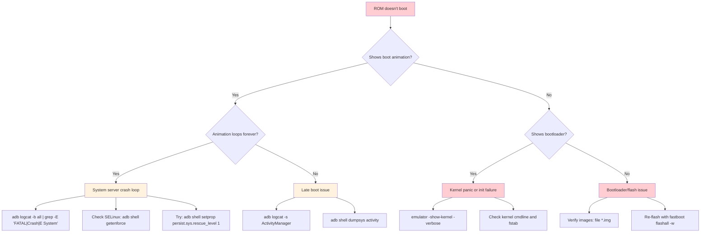
```mermaid
flowchart TD
    A["ROM doesn't boot"] --> B{Shows boot animation?}
    B -->|Yes| C{Animation loops forever?}
    B -->|No| D{Shows bootloader?}

    C -->|Yes| E["System server crash loop"]
    C -->|No| F["Late boot issue"]

    D -->|Yes| G["Kernel panic or init failure"]
    D -->|No| H["Bootloader/flash issue"]

    E --> E1["adb logcat -b all | grep -E 'FATAL|Crash|E System'"]
    E --> E2["Check SELinux: adb shell getenforce"]
    E --> E3["Try: adb shell setprop persist.sys.rescue_level 1"]

    F --> F1["adb logcat -s ActivityManager"]
    F --> F2["adb shell dumpsys activity"]

    G --> G1["emulator -show-kernel -verbose"]
    G --> G2["Check kernel cmdline and fstab"]

    H --> H1["Verify images: file *.img"]
    H --> H2["Re-flash with fastboot flashall -w"]

    style A fill:#ffcdd2
    style E fill:#fff3e0
    style F fill:#fff3e0
    style G fill:#ffcdd2
    style H fill:#ffcdd2
```

**Common boot issues and solutions:**

1. **Boot loop (animation never ends)**

```bash
# Check system_server logs:
adb logcat -b all | grep -E "FATAL|System.err|AndroidRuntime" | head -50

# Most common cause: missing SELinux policy
# Temporarily set permissive for debugging:
adb shell setenforce 0
# Then find the denials:
adb logcat | grep "avc: denied"
```

2. **Crash in custom service**

```bash
# Check if system_server is restarting:
adb logcat -s ActivityManager | grep "Start proc"

# Check for our service specifically:
adb logcat -s BookService

# Full exception traces:
adb logcat -s AndroidRuntime
```

3. **Missing module / library**

```bash
# Check if the module was installed:
adb shell ls /product/app/BookSampleApp/
adb shell ls /system/framework/BookService.jar

# Check the build output:
ls out/target/product/bookdevice/product/app/BookSampleApp/
```

### 63.9.7 SELinux Debugging

SELinux denials are the most common cause of issues in custom ROMs:

```bash
# Check SELinux mode
adb shell getenforce
# Expected: Enforcing

# View SELinux denials
adb logcat | grep "avc: denied"

# Example denial:
# avc: denied { add } for service=aospbook pid=1234
#   scontext=u:r:system_server:s0
#   tcontext=u:object_r:default_android_service:s0
#   tclass=service_manager

# Generate policy from denials using audit2allow:
adb logcat -d | grep "avc: denied" | audit2allow -p out/target/product/bookdevice/vendor/etc/selinux/

# This outputs allow rules you can add to your .te files
```

### 63.9.8 The Debug Toolchain

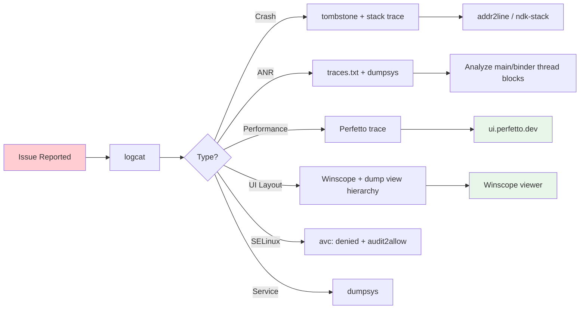
```mermaid
graph LR
    A["Issue Reported"] --> B["logcat"]
    B --> C{Type?}
    C -->|Crash| D["tombstone + stack trace"]
    C -->|ANR| E["traces.txt + dumpsys"]
    C -->|Performance| F["Perfetto trace"]
    C -->|UI Layout| G["Winscope + dump view hierarchy"]
    C -->|SELinux| H["avc: denied + audit2allow"]
    C -->|Service| I["dumpsys <service>"]

    D --> J["addr2line / ndk-stack"]
    E --> K["Analyze main/binder thread blocks"]
    F --> L["ui.perfetto.dev"]
    G --> M["Winscope viewer"]

    style A fill:#ffcdd2
    style L fill:#e8f5e9
    style M fill:#e8f5e9
```

### 63.9.9 Useful adb Commands for ROM Development

```bash
# ============================================================
# System Properties
# ============================================================
adb shell getprop ro.build.fingerprint
adb shell getprop ro.aospbook.version
adb shell getprop | grep aospbook

# ============================================================
# Package Management
# ============================================================
adb shell pm list packages | grep aospbook
adb shell pm path com.aospbook.sample
adb shell pm dump com.aospbook.sample | head -50

# ============================================================
# Service Management
# ============================================================
adb shell service list | grep aospbook
adb shell service check aospbook

# ============================================================
# Process Information
# ============================================================
adb shell ps -A | grep -E "system_server|aospbook"
adb shell dumpsys meminfo system_server

# ============================================================
# File System
# ============================================================
adb shell mount | grep -E "system|vendor|product"
adb shell df -h
adb shell ls -la /product/overlay/

# ============================================================
# RRO Overlay Status
# ============================================================
adb shell cmd overlay list
adb shell cmd overlay dump com.aospbook.overlay.framework
adb shell cmd overlay enable com.aospbook.overlay.framework
adb shell cmd overlay disable com.aospbook.overlay.framework

# ============================================================
# Boot Diagnostics
# ============================================================
adb shell dmesg | tail -100
adb shell cat /proc/bootconfig
adb shell cat /proc/cmdline
adb shell uptime
```

---

## 63.10 Distribution

### 63.10.1 Signing Overview

Android uses code signing to ensure the integrity and authenticity of every
APK and system image. There are four key types used in AOSP:

| Key | File Pair | Purpose |
|-----|-----------|---------|
| **testkey** | `testkey.pk8` / `testkey.x509.pem` | Default development signing |
| **platform** | `platform.pk8` / `platform.x509.pem` | System apps with `android.uid.system` |
| **shared** | `shared.pk8` / `shared.x509.pem` | Apps that share data (Contacts, Phone) |
| **media** | `media.pk8` / `media.x509.pem` | Media/download apps |

These default keys live at:

```
build/make/target/product/security/
```

**CRITICAL**: The keys in that directory are publicly known test keys. Any
ROM released with these keys is trivially vulnerable -- anyone can sign a
malicious APK with the same key and it will be accepted as a system update.

The `README` at `build/make/target/product/security/README` explicitly warns:

> "The test keys in this directory are used in development only and should
> NEVER be used to sign packages in publicly released images."

### 63.10.2 Generating Release Keys

Generate your own unique keys:

```bash
# Create a directory for your keys
mkdir -p device/AospBook/bookphone/keys
cd device/AospBook/bookphone/keys

# The make_key tool is provided by AOSP:
SUBJECT='/C=US/ST=California/L=Mountain View/O=AospBook/OU=ROM/CN=AospBook/emailAddress=rom@aospbook.example.com'

# Generate each key pair
# This will prompt for a password -- use a strong one for release keys
# For development, you can press Enter for no password
../../../../../../development/tools/make_key releasekey "$SUBJECT"
../../../../../../development/tools/make_key platform "$SUBJECT"
../../../../../../development/tools/make_key shared "$SUBJECT"
../../../../../../development/tools/make_key media "$SUBJECT"

# Verify the generated files
ls -la
# Expected:
#   releasekey.pk8
#   releasekey.x509.pem
#   platform.pk8
#   platform.x509.pem
#   shared.pk8
#   shared.x509.pem
#   media.pk8
#   media.x509.pem
```

Each `make_key` invocation creates two files:

- `*.pk8` -- The private key in PKCS#8 DER format
- `*.x509.pem` -- The public key certificate in X.509 PEM format

### 63.10.3 Configuring the Build to Use Release Keys

Tell the build system to use your keys instead of the test keys:

```makefile
# In device/AospBook/bookphone/bookphone.mk (or device.mk)

# Use our custom signing keys
PRODUCT_DEFAULT_DEV_CERTIFICATE := device/AospBook/bookphone/keys/releasekey

# Map APK signing to our keys
PRODUCT_CERTIFICATE_OVERRIDES := \
    testkey:device/AospBook/bookphone/keys/releasekey \
    platform:device/AospBook/bookphone/keys/platform \
    shared:device/AospBook/bookphone/keys/shared \
    media:device/AospBook/bookphone/keys/media
```

### 63.10.4 Signing the Build

There are two approaches to signing:

**Approach 1: Sign during build (development)**

With `PRODUCT_DEFAULT_DEV_CERTIFICATE` set, all APKs are automatically signed
during the build. This is the simplest approach.

**Approach 2: Sign after build (release)**

For production releases, build first, then sign separately:

```bash
# Step 1: Build target-files package
m dist

# The target-files ZIP is at:
# out/dist/bookphone-target_files-<build_id>.zip

# Step 2: Sign all APKs in the target-files
python3 build/make/tools/releasetools/sign_target_files_apks.py \
    -o \
    -d device/AospBook/bookphone/keys \
    --default_key_mappings device/AospBook/bookphone/keys \
    out/dist/bookphone-target_files-*.zip \
    out/dist/bookphone-target_files-signed.zip

# Step 3: Generate signed images from the signed target-files
python3 build/make/tools/releasetools/img_from_target_files.py \
    out/dist/bookphone-target_files-signed.zip \
    out/dist/bookphone-img-signed.zip
```

### 63.10.5 OTA Package Generation

OTA (Over The Air) packages allow you to distribute updates to existing users.

**Full OTA package** (contains the complete image):

```bash
# Generate from target-files
python3 build/make/tools/releasetools/ota_from_target_files.py \
    --package_key device/AospBook/bookphone/keys/releasekey \
    out/dist/bookphone-target_files-signed.zip \
    out/dist/bookphone-ota-full.zip
```

**Incremental OTA package** (contains only the diff from a previous build):

```bash
# Generate incremental OTA (from v1 to v2)
python3 build/make/tools/releasetools/ota_from_target_files.py \
    --package_key device/AospBook/bookphone/keys/releasekey \
    -i out/dist/bookphone-v1-target_files-signed.zip \
    out/dist/bookphone-v2-target_files-signed.zip \
    out/dist/bookphone-ota-v1-to-v2.zip
```

**OTA generation workflow:**

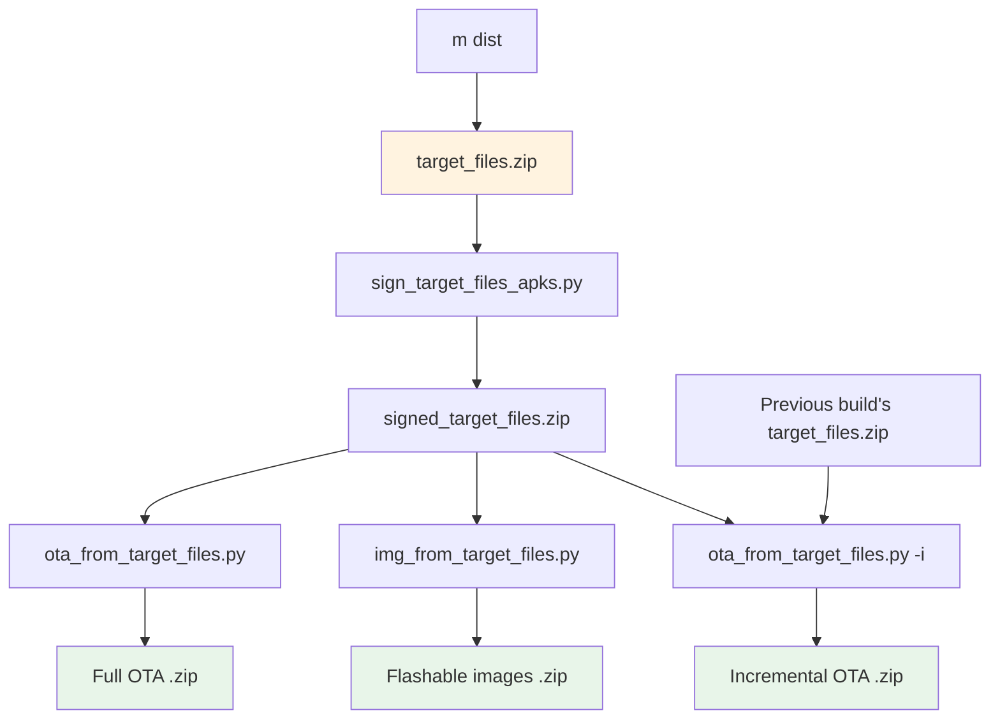
```mermaid
graph TD
    A["m dist"] --> B["target_files.zip"]
    B --> C["sign_target_files_apks.py"]
    C --> D["signed_target_files.zip"]
    D --> E["ota_from_target_files.py"]
    D --> F["img_from_target_files.py"]
    E --> G["Full OTA .zip"]
    F --> H["Flashable images .zip"]

    I["Previous build's target_files.zip"] --> J["ota_from_target_files.py -i"]
    D --> J
    J --> K["Incremental OTA .zip"]

    style B fill:#fff3e0
    style G fill:#e8f5e9
    style H fill:#e8f5e9
    style K fill:#e8f5e9
```

### 63.10.6 OTA Package Structure

An OTA package is a signed ZIP file containing:

```
ota_package.zip
    META-INF/
        com/
            android/
                metadata.pb        # OTA metadata (protobuf)
                metadata           # Legacy metadata
            google/
                android/
                    update-binary  # The OTA installer binary
                    updater-script # Installation script
    payload.bin                    # The actual update payload
    payload_properties.txt         # Payload metadata
    care_map.pb                    # Block mapping for dm-verity
```

### 63.10.7 Verified Boot and AVB

Android Verified Boot (AVB) ensures that boot images and partitions have not
been tampered with. For custom ROMs targeting real devices:

```bash
# Generate AVB signing key
openssl genrsa -out avb_custom_key.pem 4096

# Extract the public key for embedding in the bootloader
avbtool extract_public_key --key avb_custom_key.pem --output avb_custom_key.bin
```

Configure in `BoardConfig.mk`:

```makefile
# Use custom AVB key
BOARD_AVB_KEY_PATH := device/AospBook/bookphone/keys/avb_custom_key.pem
BOARD_AVB_ALGORITHM := SHA256_RSA4096
```

### 63.10.8 Build Fingerprint and Properties

The build fingerprint is the unique identifier for your ROM build. It follows
the format:

```
BRAND/PRODUCT/DEVICE:VERSION/BUILD_ID/BUILD_NUMBER:VARIANT/KEYS
```

Example:

```
AospBook/bookphone/bookdevice:16/AP3A.250318.001/eng.builder.20250318:userdebug/release-keys
```

Set it in your product makefile:

```makefile
# Custom build properties
PRODUCT_PROPERTY_OVERRIDES += \
    ro.build.display.id=AospBook-1.0-$(shell date +%Y%m%d) \
    ro.build.version.incremental=$(shell date +%Y%m%d%H%M%S) \
    ro.aospbook.version=1.0.0

# Build description (shown in Settings > About phone > Build number)
PRODUCT_BUILD_PROP_OVERRIDES += \
    BUILD_DISPLAY_ID=AospBook-1.0-$(shell date +%Y%m%d) \
    BUILD_VERSION_TAGS=release-keys
```

### 63.10.9 Distribution Checklist

Before releasing your custom ROM publicly:

```
[ ] Generate unique signing keys (NEVER use test keys)
[ ] Sign all APKs with release keys
[ ] Build with the "user" variant (not userdebug/eng)
[ ] Verify SELinux is enforcing: adb shell getenforce
[ ] Remove debugging tools and backdoors
[ ] Test OTA update path (both full and incremental)
[ ] Verify all apps launch and function correctly
[ ] Check that permissions work correctly
[ ] Test boot time and basic performance
[ ] Generate SHA256 checksums for all distributed files
[ ] Write release notes documenting changes
[ ] Set up a distribution server for OTA updates
```

### 63.10.10 Publishing Checksums

```bash
# Generate checksums for distribution files
sha256sum out/dist/bookphone-ota-full.zip > checksums.txt
sha256sum out/dist/bookphone-img-signed.zip >> checksums.txt

# Sign the checksums file with GPG for additional trust
gpg --sign --armor checksums.txt
```

---

## 63.11 Advanced: Kernel Customization

### 63.11.1 Kernel in AOSP

The AOSP emulator uses prebuilt Generic Kernel Image (GKI) kernels. The
kernel configuration for the x86_64 emulator is defined at:

```
device/generic/goldfish/board/kernel/x86_64.mk
```

This file shows:

```makefile
# device/generic/goldfish/board/kernel/x86_64.mk (key excerpts)
TARGET_KERNEL_USE ?= 6.12
KERNEL_ARTIFACTS_PATH := prebuilts/qemu-kernel/x86_64/$(TARGET_KERNEL_USE)
EMULATOR_KERNEL_FILE := $(KERNEL_ARTIFACTS_PATH)/kernel-$(TARGET_KERNEL_USE)
```

The prebuilt kernels live at:

```
prebuilts/qemu-kernel/x86_64/6.12/
    kernel-6.12              # The kernel binary
    gki_modules/             # GKI kernel modules
    goldfish_modules/        # Emulator-specific modules
```

### 63.11.2 GKI Architecture

Android's Generic Kernel Image (GKI) separates the kernel into:

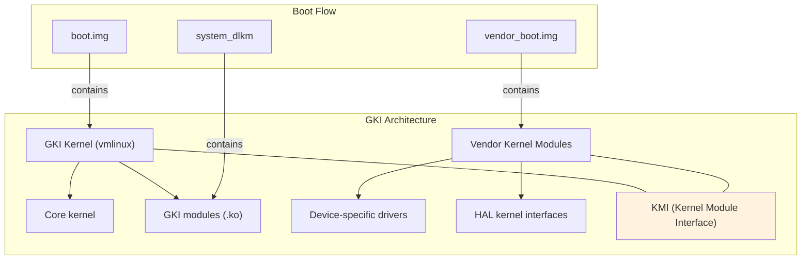
```mermaid
graph TD
    subgraph "GKI Architecture"
        A["GKI Kernel (vmlinux)"] --> B["Core kernel"]
        A --> C["GKI modules (.ko)"]

        D["Vendor Kernel Modules"] --> E["Device-specific drivers"]
        D --> F["HAL kernel interfaces"]

        A --- G["KMI (Kernel Module Interface)"]
        D --- G
    end

    subgraph "Boot Flow"
        H["boot.img"] -->|contains| A
        I["vendor_boot.img"] -->|contains| D
        J["system_dlkm"] -->|contains| C
    end

    style G fill:#fff3e0
```

The KMI (Kernel Module Interface) is a stable ABI between the GKI kernel and
vendor modules, allowing them to be updated independently.

### 63.11.3 Building a Custom Kernel

To build a custom kernel for the emulator:

```bash
# Clone the kernel source
mkdir -p ~/kernel && cd ~/kernel
repo init -u https://android.googlesource.com/kernel/manifest \
    -b common-android-mainline
repo sync -j$(nproc)

# Build the kernel
# For x86_64 emulator:
BUILD_CONFIG=common/build.config.gki.x86_64 build/build.sh

# Or using Bazel (newer approach):
tools/bazel run //common:kernel_x86_64_dist
```

The kernel build produces:

```
out/android-mainline/dist/
    bzImage                  # Kernel binary
    vmlinux                  # Uncompressed kernel (for debugging)
    System.map               # Symbol map
    *.ko                     # Kernel modules
```

### 63.11.4 Using a Custom Kernel with the Emulator

```bash
# Option 1: Copy to prebuilts
cp out/android-mainline/dist/bzImage \
    prebuilts/qemu-kernel/x86_64/6.12/kernel-6.12

# Option 2: Specify at emulator launch
emulator -kernel /path/to/custom/bzImage

# Option 3: Set in build config
# In x86_64.mk:
# EMULATOR_KERNEL_FILE := /path/to/custom/kernel
```

### 63.11.5 Adding Custom Kernel Modules

Kernel modules extend kernel functionality without rebuilding the entire
kernel. For the emulator, vendor-specific modules are loaded from the vendor
ramdisk.

**Creating a simple kernel module:**

```c
// device/AospBook/bookphone/kernel_modules/bookmodule/bookmodule.c
#include <linux/init.h>
#include <linux/module.h>
#include <linux/kernel.h>

MODULE_LICENSE("GPL");
MODULE_AUTHOR("AospBook");
MODULE_DESCRIPTION("AospBook sample kernel module");
MODULE_VERSION("1.0");

static int __init bookmodule_init(void)
{
    printk(KERN_INFO "BookModule: Loaded (AospBook ROM kernel module)\n");
    return 0;
}

static void __exit bookmodule_exit(void)
{
    printk(KERN_INFO "BookModule: Unloaded\n");
}

module_init(bookmodule_init);
module_exit(bookmodule_exit);
```

**Makefile for out-of-tree module:**

```makefile
# device/AospBook/bookphone/kernel_modules/bookmodule/Makefile
obj-m += bookmodule.o

KERNEL_SRC ?= /path/to/kernel/source

all:
	$(MAKE) -C $(KERNEL_SRC) M=$(PWD) modules

clean:
	$(MAKE) -C $(KERNEL_SRC) M=$(PWD) clean
```

**Build and install:**

```bash
# Build the module against the emulator kernel
cd device/AospBook/bookphone/kernel_modules/bookmodule
make KERNEL_SRC=~/kernel/common ARCH=x86_64 CROSS_COMPILE=x86_64-linux-gnu-

# The module is at:
ls bookmodule.ko

# Test on the emulator:
adb root
adb push bookmodule.ko /data/local/tmp/
adb shell insmod /data/local/tmp/bookmodule.ko
adb shell dmesg | grep BookModule
# Expected: BookModule: Loaded (AospBook ROM kernel module)

# Unload:
adb shell rmmod bookmodule
```

### 63.11.6 Including Kernel Modules in the Build

To include your module in the build automatically:

```makefile
# In device.mk
PRODUCT_COPY_FILES += \
    device/AospBook/bookphone/kernel_modules/bookmodule/bookmodule.ko:$(TARGET_COPY_OUT_VENDOR)/lib/modules/bookmodule.ko

# Or add to the vendor ramdisk modules (loaded at boot):
BOARD_VENDOR_RAMDISK_KERNEL_MODULES += \
    device/AospBook/bookphone/kernel_modules/bookmodule/bookmodule.ko
```

For automatic loading at boot, add to an init script:

```
# device/AospBook/bookphone/init/init.bookphone.rc
on boot
    insmod /vendor/lib/modules/bookmodule.ko
```

### 63.11.7 Kernel Configuration Tuning

The kernel configuration (`defconfig`) controls which features are compiled
into the kernel. For the emulator:

```bash
# View current kernel config on a running device
adb shell cat /proc/config.gz | gunzip > current_config.txt

# Or from the kernel build:
cat out/android-mainline/.config
```

Common kernel configuration tweaks for custom ROMs:

| Config Option | Default | Custom | Purpose |
|---------------|---------|--------|---------|
| `CONFIG_HZ` | 250 | 1000 | Higher tick rate for responsiveness |
| `CONFIG_SCHED_AUTOGROUP` | n | y | Auto-group scheduling |
| `CONFIG_TCP_CONG_BBR` | n | y | BBR congestion control |
| `CONFIG_ZRAM` | m | y | Compressed RAM swap |
| `CONFIG_KSM` | n | y | Kernel same-page merging |
| `CONFIG_TRANSPARENT_HUGEPAGE` | n | y | Transparent huge pages |

### 63.11.8 Kernel Module Lifecycle

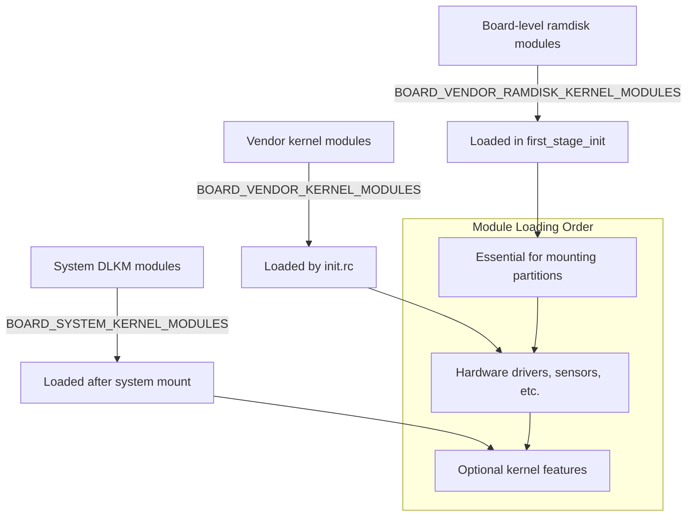
```mermaid
graph TD
    A["Board-level ramdisk modules"] -->|"BOARD_VENDOR_RAMDISK_KERNEL_MODULES"| B["Loaded in first_stage_init"]
    C["Vendor kernel modules"] -->|"BOARD_VENDOR_KERNEL_MODULES"| D["Loaded by init.rc"]
    E["System DLKM modules"] -->|"BOARD_SYSTEM_KERNEL_MODULES"| F["Loaded after system mount"]

    B --> G["Essential for mounting partitions"]
    D --> H["Hardware drivers, sensors, etc."]
    F --> I["Optional kernel features"]

    subgraph "Module Loading Order"
        G --> H
        H --> I
    end
```

The Goldfish emulator defines specific ramdisk modules that are essential for
early boot in `device/generic/goldfish/board/kernel/x86_64.mk`:

```makefile
RAMDISK_KERNEL_MODULES := \
    virtio_dma_buf.ko \
    virtio-rng.ko \

RAMDISK_SYSTEM_KERNEL_MODULES := \
    virtio_blk.ko \
    virtio_console.ko \
    virtio_pci.ko \
    virtio_pci_legacy_dev.ko \
    virtio_pci_modern_dev.ko \
    vmw_vsock_virtio_transport.ko \
```

These modules are loaded during first-stage init before the system partition
is even mounted, because they provide the virtual hardware drivers needed to
access the disk.

---

## 63.12 Advanced: HAL Customization

### 63.12.1 HAL Architecture in Android

The Hardware Abstraction Layer (HAL) sits between the Android framework and the
Linux kernel, providing a stable interface for hardware access:

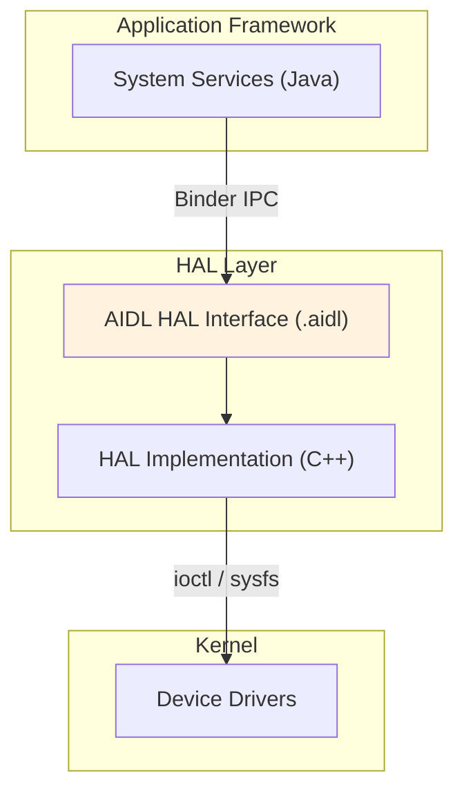
```mermaid
graph TD
    subgraph "Application Framework"
        A["System Services (Java)"]
    end

    subgraph "HAL Layer"
        B["AIDL HAL Interface (.aidl)"]
        C["HAL Implementation (C++)"]
    end

    subgraph "Kernel"
        D["Device Drivers"]
    end

    A -->|Binder IPC| B
    B --> C
    C -->|ioctl / sysfs| D

    style B fill:#fff3e0
```

Modern Android uses AIDL HALs (replacing the older HIDL HALs). The HAL
interfaces are defined at:

```
hardware/interfaces/
```

This directory contains AIDL definitions for audio, camera, sensors, health,
graphics, and dozens of other hardware subsystems.

The Goldfish emulator provides its own HAL implementations at:

```
device/generic/goldfish/hals/
    audio/        # Audio HAL
    camera/       # Camera HAL
    fingerprint/  # Fingerprint HAL
    gnss/         # GNSS (GPS) HAL
    gralloc/      # Graphics buffer allocation
    hwc3/         # Hardware Composer 3
    radio/        # Telephony radio HAL
    sensors/      # Sensors HAL
```

### 63.12.2 Creating a Custom AIDL HAL

Let us create a custom HAL for a hypothetical "book light" hardware feature.
This demonstrates the full HAL lifecycle: interface definition, default
implementation, init service, SELinux policy, and VINTF manifest entry.

**Directory structure:**

```
device/AospBook/bookphone/hal/booklight/
    Android.bp
    aidl/
        com/aospbook/hardware/light/
            IBookLight.aidl
            BookLightState.aidl
    default/
        Android.bp
        BookLight.cpp
        BookLight.h
        booklight-default.rc
        booklight-default.xml
```

### 63.12.3 Defining the AIDL Interface

**IBookLight.aidl**:

```java
// device/AospBook/bookphone/hal/booklight/aidl/com/aospbook/hardware/light/IBookLight.aidl
package com.aospbook.hardware.light;

import com.aospbook.hardware.light.BookLightState;

/**
 * HAL interface for the AospBook reading light.
 *
 * This is a custom AIDL HAL that demonstrates how to define
 * and implement a hardware abstraction layer.
 */
@VintfStability
interface IBookLight {
    /**
     * Get the current light state.
     */
    BookLightState getState();

    /**
     * Set the light brightness (0-255).
     */
    void setBrightness(int brightness);

    /**
     * Set the color temperature in Kelvin (2700-6500).
     */
    void setColorTemperature(int kelvin);

    /**
     * Enable or disable the reading light.
     */
    void setEnabled(boolean enabled);

    /**
     * Get the supported color temperature range.
     * Returns [min, max] in Kelvin.
     */
    int[] getSupportedTemperatureRange();
}
```

**BookLightState.aidl**:

```java
// device/AospBook/bookphone/hal/booklight/aidl/com/aospbook/hardware/light/BookLightState.aidl
package com.aospbook.hardware.light;

/**
 * Parcelable representing the current state of the book light.
 */
@VintfStability
parcelable BookLightState {
    boolean enabled;
    int brightness;           // 0-255
    int colorTemperature;     // Kelvin (2700-6500)
}
```

**Android.bp for the AIDL library:**

```json
// device/AospBook/bookphone/hal/booklight/Android.bp

aidl_interface {
    name: "com.aospbook.hardware.light",
    vendor_available: true,
    srcs: ["aidl/com/aospbook/hardware/light/*.aidl"],
    stability: "vintf",
    backend: {
        cpp: {
            enabled: true,
        },
        java: {
            enabled: true,
            sdk_version: "module_current",
        },
        ndk: {
            enabled: true,
        },
    },
    versions: ["1"],
}
```

### 63.12.4 Implementing the Default HAL

**BookLight.h**:

```cpp
// device/AospBook/bookphone/hal/booklight/default/BookLight.h
#pragma once

#include <aidl/com/aospbook/hardware/light/BnBookLight.h>
#include <aidl/com/aospbook/hardware/light/BookLightState.h>

namespace aidl::com::aospbook::hardware::light {

/**
 * Default implementation of the BookLight HAL.
 *
 * For the emulator, this is a software-only implementation that
 * stores state in memory. On a real device, this would interface
 * with kernel drivers via sysfs or ioctl.
 */
class BookLight : public BnBookLight {
public:
    BookLight();

    ndk::ScopedAStatus getState(BookLightState* _aidl_return) override;
    ndk::ScopedAStatus setBrightness(int32_t brightness) override;
    ndk::ScopedAStatus setColorTemperature(int32_t kelvin) override;
    ndk::ScopedAStatus setEnabled(bool enabled) override;
    ndk::ScopedAStatus getSupportedTemperatureRange(
        std::vector<int32_t>* _aidl_return) override;

private:
    std::mutex mLock;
    BookLightState mState;

    static constexpr int32_t kMinTemperature = 2700;
    static constexpr int32_t kMaxTemperature = 6500;
    static constexpr int32_t kDefaultTemperature = 4000;
    static constexpr int32_t kMaxBrightness = 255;
};

}  // namespace aidl::com::aospbook::hardware::light
```

**BookLight.cpp**:

```cpp
// device/AospBook/bookphone/hal/booklight/default/BookLight.cpp
#include "BookLight.h"

#include <android-base/logging.h>

namespace aidl::com::aospbook::hardware::light {

BookLight::BookLight() {
    mState.enabled = false;
    mState.brightness = 0;
    mState.colorTemperature = kDefaultTemperature;
    LOG(INFO) << "BookLight HAL initialized";
}

ndk::ScopedAStatus BookLight::getState(BookLightState* _aidl_return) {
    std::lock_guard<std::mutex> lock(mLock);
    *_aidl_return = mState;
    return ndk::ScopedAStatus::ok();
}

ndk::ScopedAStatus BookLight::setBrightness(int32_t brightness) {
    if (brightness < 0 || brightness > kMaxBrightness) {
        return ndk::ScopedAStatus::fromExceptionCode(
            EX_ILLEGAL_ARGUMENT);
    }

    std::lock_guard<std::mutex> lock(mLock);
    mState.brightness = brightness;
    LOG(DEBUG) << "BookLight brightness set to " << brightness;

    // On a real device, write to hardware:
    // write_to_sysfs("/sys/class/leds/booklight/brightness", brightness);

    return ndk::ScopedAStatus::ok();
}

ndk::ScopedAStatus BookLight::setColorTemperature(int32_t kelvin) {
    if (kelvin < kMinTemperature || kelvin > kMaxTemperature) {
        return ndk::ScopedAStatus::fromExceptionCode(
            EX_ILLEGAL_ARGUMENT);
    }

    std::lock_guard<std::mutex> lock(mLock);
    mState.colorTemperature = kelvin;
    LOG(DEBUG) << "BookLight color temperature set to " << kelvin << "K";

    // On a real device, write to hardware:
    // write_to_sysfs("/sys/class/leds/booklight/color_temp", kelvin);

    return ndk::ScopedAStatus::ok();
}

ndk::ScopedAStatus BookLight::setEnabled(bool enabled) {
    std::lock_guard<std::mutex> lock(mLock);
    mState.enabled = enabled;
    LOG(DEBUG) << "BookLight " << (enabled ? "enabled" : "disabled");

    // On a real device:
    // write_to_sysfs("/sys/class/leds/booklight/enable", enabled ? 1 : 0);

    return ndk::ScopedAStatus::ok();
}

ndk::ScopedAStatus BookLight::getSupportedTemperatureRange(
        std::vector<int32_t>* _aidl_return) {
    _aidl_return->clear();
    _aidl_return->push_back(kMinTemperature);
    _aidl_return->push_back(kMaxTemperature);
    return ndk::ScopedAStatus::ok();
}

}  // namespace aidl::com::aospbook::hardware::light
```

**Service main (entry point):**

```cpp
// device/AospBook/bookphone/hal/booklight/default/service.cpp
#include "BookLight.h"

#include <android-base/logging.h>
#include <android/binder_manager.h>
#include <android/binder_process.h>

using aidl::com::aospbook::hardware::light::BookLight;

int main() {
    // Configure logging
    android::base::SetDefaultTag("booklight-hal");
    android::base::SetMinimumLogSeverity(android::base::DEBUG);

    LOG(INFO) << "BookLight HAL service starting";

    // Start the binder thread pool
    ABinderProcess_setThreadPoolMaxThreadCount(0);

    // Create the HAL instance
    std::shared_ptr<BookLight> bookLight =
        ndk::SharedRefBase::make<BookLight>();

    // Register with the service manager
    const std::string instance =
        std::string() + BookLight::descriptor + "/default";
    binder_status_t status = AServiceManager_addService(
        bookLight->asBinder().get(), instance.c_str());

    CHECK_EQ(status, STATUS_OK)
        << "Failed to register BookLight HAL service";

    LOG(INFO) << "BookLight HAL service registered: " << instance;

    // Join the binder thread pool (blocks forever)
    ABinderProcess_joinThreadPool();

    // Should never reach here
    LOG(FATAL) << "BookLight HAL service died unexpectedly";
    return EXIT_FAILURE;
}
```

**Android.bp for the default implementation:**

```json
// device/AospBook/bookphone/hal/booklight/default/Android.bp

cc_binary {
    name: "com.aospbook.hardware.light-service",
    relative_install_path: "hw",
    vendor: true,

    srcs: [
        "BookLight.cpp",
        "service.cpp",
    ],

    shared_libs: [
        "libbase",
        "libbinder_ndk",
        "liblog",
        "com.aospbook.hardware.light-V1-ndk",
    ],

    init_rc: ["booklight-default.rc"],
    vintf_fragments: ["booklight-default.xml"],
}
```

### 63.12.5 Init Service Configuration

**booklight-default.rc**:

```
# device/AospBook/bookphone/hal/booklight/default/booklight-default.rc
service vendor.booklight-default /vendor/bin/hw/com.aospbook.hardware.light-service
    class hal
    user system
    group system
    capabilities SYS_NICE
```

### 63.12.6 VINTF Manifest Fragment

The VINTF (Vendor Interface) manifest declares which HAL interfaces are
provided by this device:

**booklight-default.xml**:

```xml
<!-- device/AospBook/bookphone/hal/booklight/default/booklight-default.xml -->
<manifest version="1.0" type="device">
    <hal format="aidl">
        <name>com.aospbook.hardware.light</name>
        <version>1</version>
        <interface>
            <name>IBookLight</name>
            <instance>default</instance>
        </interface>
    </hal>
</manifest>
```

### 63.12.7 SELinux Policy for the HAL

```
# device/AospBook/bookphone/sepolicy/vendor/booklight.te

# Define the HAL domain
type hal_booklight_default, domain;
type hal_booklight_default_exec, exec_type, vendor_file_type, file_type;

# Allow init to start the HAL service
init_daemon_domain(hal_booklight_default)

# Allow the HAL to register with hwservicemanager
hal_server_domain(hal_booklight_default, hal_booklight)

# Allow the HAL to use binder
binder_use(hal_booklight_default)

# Allow system_server to find and call the HAL
binder_call(system_server, hal_booklight_default)
allow system_server hal_booklight_service:service_manager find;

# HwBinder access
hwbinder_use(hal_booklight_default)
```

Add file contexts:

```
# device/AospBook/bookphone/sepolicy/vendor/file_contexts
/vendor/bin/hw/com\.aospbook\.hardware\.light-service    u:object_r:hal_booklight_default_exec:s0
```

### 63.12.8 Including the HAL in the Build

```makefile
# In device.mk
PRODUCT_PACKAGES += \
    com.aospbook.hardware.light-service
```

### 63.12.9 Testing the HAL

```bash
# After booting, verify the HAL service is running:
adb shell ps -A | grep booklight
# Expected: vendor.booklight-default

# Check the VINTF manifest:
adb shell cat /vendor/etc/vintf/manifest.xml | grep booklight

# Test the HAL service using the AIDL test client or via a framework service
# that calls the HAL.

# Check service registration:
adb shell service list | grep booklight
```

### 63.12.10 Modifying Existing HALs

Instead of creating a new HAL from scratch, you may want to modify an existing
one. For example, to customize the sensors HAL for the emulator:

The existing sensors HAL is at:

```
device/generic/goldfish/hals/sensors/
    Android.bp
    entry.cpp               # HAL entry point
    multihal_sensors.cpp    # Multi-HAL sensors implementation
    multihal_sensors_epoll.cpp
    multihal_sensors_qemu.cpp
    sensor_list.cpp         # List of available sensors
    sensor_list.h
```

To add a custom sensor (e.g., a "reading posture" sensor):

```cpp
// Add to device/generic/goldfish/hals/sensors/sensor_list.cpp
// (or create a new file for your custom sensor)

namespace {

constexpr SensorInfo kCustomSensors[] = {
    {
        .sensorHandle = 100,
        .name = "AospBook Reading Posture Sensor",
        .vendor = "AospBook",
        .version = 1,
        .type = SensorType::ADDITIONAL_INFO,
        .typeAsString = "com.aospbook.sensor.reading_posture",
        .maxRange = 1.0f,
        .resolution = 0.1f,
        .power = 0.001f,  // mA
        .minDelay = 100000,  // microseconds (10 Hz)
        .maxDelay = 1000000,
        .fifoReservedEventCount = 0,
        .fifoMaxEventCount = 0,
        .requiredPermission = "",
        .flags = SensorFlagBits::ON_CHANGE_MODE,
    },
};

}  // namespace
```

### 63.12.11 HAL Testing with VTS

The Vendor Test Suite (VTS) validates that HAL implementations conform to
their interface contracts:

```bash
# Build VTS tests
m VtsHalBookLightTargetTest

# Run on the device
adb push out/target/product/bookdevice/data/nativetest64/VtsHalBookLightTargetTest \
    /data/local/tmp/
adb shell /data/local/tmp/VtsHalBookLightTargetTest
```

### 63.12.12 Complete HAL Architecture

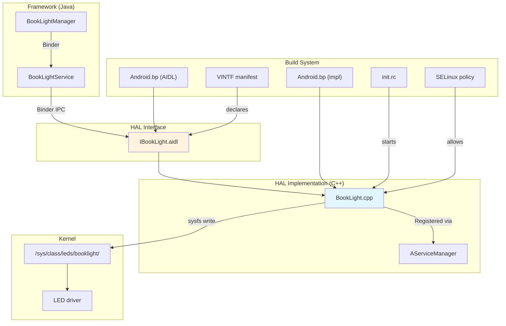
```mermaid
graph TD
    subgraph "Framework (Java)"
        A["BookLightManager"] -->|Binder| B["BookLightService"]
    end

    subgraph "HAL Interface"
        C["IBookLight.aidl"]
    end

    subgraph "HAL Implementation (C++)"
        D["BookLight.cpp"] -->|Registered via| E["AServiceManager"]
    end

    subgraph "Kernel"
        F["/sys/class/leds/booklight/"]
        G["LED driver"]
    end

    subgraph "Build System"
        H["Android.bp (AIDL)"]
        I["Android.bp (impl)"]
        J["init.rc"]
        K["VINTF manifest"]
        L["SELinux policy"]
    end

    B -->|Binder IPC| C
    C --> D
    D -->|sysfs write| F
    F --> G

    H --> C
    I --> D
    J -->|starts| D
    K -->|declares| C
    L -->|allows| D

    style C fill:#fff3e0
    style D fill:#e1f5fe
```

---

## 63.13 Putting It All Together

### 63.13.1 Complete Build Walkthrough

Here is the complete sequence to build, test, and package AospBook ROM:

```bash
#!/bin/bash
# build_aospbook.sh -- Complete build script for AospBook ROM

set -euo pipefail

AOSP_ROOT=~/aosp
PRODUCT=bookphone
VARIANT=userdebug
RELEASE=trunk_staging

echo "=== Building AospBook ROM ==="
echo "Product: $PRODUCT"
echo "Variant: $VARIANT"
echo "Date: $(date)"
echo ""

# Step 1: Initialize environment
cd "$AOSP_ROOT"
source build/envsetup.sh

# Step 2: Select target
lunch "${PRODUCT}-${RELEASE}-${VARIANT}"

# Step 3: Clean (optional, for release builds)
# make clean

# Step 4: Build
echo "[BUILD] Starting full build..."
time m -j$(nproc) 2>&1 | tee build.log

# Step 5: Verify output
echo ""
echo "[VERIFY] Checking build output..."
OUT_DIR="$ANDROID_PRODUCT_OUT"

for img in boot.img vendor_boot.img super.img system.img vendor.img product.img; do
    if [ -f "$OUT_DIR/$img" ]; then
        size=$(du -sh "$OUT_DIR/$img" | cut -f1)
        echo "  OK: $img ($size)"
    else
        echo "  MISSING: $img"
    fi
done

# Step 6: Check for our custom content
echo ""
echo "[VERIFY] Checking custom content..."

if [ -d "$OUT_DIR/product/app/BookSampleApp" ]; then
    echo "  OK: BookSampleApp installed"
fi

if [ -d "$OUT_DIR/product/app/BookReader" ]; then
    echo "  OK: BookReader prebuilt installed"
fi

if [ -f "$OUT_DIR/product/media/bootanimation.zip" ]; then
    echo "  OK: Custom boot animation installed"
fi

if [ -d "$OUT_DIR/product/overlay/BookFrameworkOverlay" ]; then
    echo "  OK: Framework overlay installed"
fi

if [ -d "$OUT_DIR/product/overlay/BookSystemUIOverlay" ]; then
    echo "  OK: SystemUI overlay installed"
fi

echo ""
echo "[BUILD] Complete!"
echo "Output directory: $OUT_DIR"
echo ""
echo "To launch the emulator:"
echo "  emulator"
echo ""
echo "To generate OTA package:"
echo "  m dist"
```

### 63.13.2 Testing Checklist

After building, systematically verify each customization:

```bash
#!/bin/bash
# test_aospbook.sh -- Verify AospBook ROM on running emulator

echo "=== AospBook ROM Verification ==="
echo ""

# 1. Check build identity
echo "--- Build Identity ---"
adb shell getprop ro.build.display.id
adb shell getprop ro.product.brand
adb shell getprop ro.product.model
adb shell getprop ro.product.device
adb shell getprop ro.aospbook.version

# 2. Check custom properties
echo ""
echo "--- Custom Properties ---"
adb shell getprop ro.aospbook.features.dark_mode_default
adb shell getprop ro.aospbook.features.custom_qs

# 3. Check installed apps
echo ""
echo "--- Custom Apps ---"
adb shell pm list packages | grep aospbook
adb shell pm path com.aospbook.sample 2>/dev/null && echo "  BookSampleApp: OK" || echo "  BookSampleApp: MISSING"

# 4. Check overlays
echo ""
echo "--- RRO Overlays ---"
adb shell cmd overlay list | grep -A1 aospbook

# 5. Check custom service
echo ""
echo "--- Custom Service ---"
adb shell service list | grep aospbook && echo "  BookService: OK" || echo "  BookService: NOT FOUND"

# 6. Check boot animation
echo ""
echo "--- Boot Animation ---"
adb shell ls -la /product/media/bootanimation.zip 2>/dev/null && echo "  Custom boot animation: OK" || echo "  Custom boot animation: MISSING"

# 7. Check SELinux
echo ""
echo "--- SELinux ---"
adb shell getenforce

# 8. Check for SELinux denials related to our code
echo ""
echo "--- SELinux Denials (our code) ---"
adb logcat -d | grep "avc: denied" | grep -i "aospbook\|book" | tail -5
if [ $? -ne 0 ]; then
    echo "  No denials found (good!)"
fi

# 9. Check HAL (if implemented)
echo ""
echo "--- Custom HAL ---"
adb shell ps -A | grep booklight && echo "  BookLight HAL: RUNNING" || echo "  BookLight HAL: NOT RUNNING"

echo ""
echo "=== Verification Complete ==="
```

### 63.13.3 Release Build Pipeline

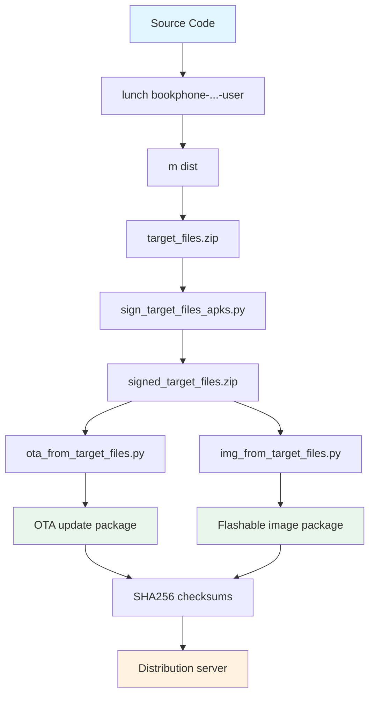
```mermaid
graph TD
    A["Source Code"] --> B["lunch bookphone-...-user"]
    B --> C["m dist"]
    C --> D["target_files.zip"]
    D --> E["sign_target_files_apks.py"]
    E --> F["signed_target_files.zip"]
    F --> G["ota_from_target_files.py"]
    F --> H["img_from_target_files.py"]
    G --> I["OTA update package"]
    H --> J["Flashable image package"]

    I --> K["SHA256 checksums"]
    J --> K
    K --> L["Distribution server"]

    style A fill:#e1f5fe
    style I fill:#e8f5e9
    style J fill:#e8f5e9
    style L fill:#fff3e0
```

### 63.13.4 Common Pitfalls and Solutions

| Pitfall | Symptom | Solution |
|---------|---------|----------|
| Forgot to add module to `PRODUCT_PACKAGES` | App/HAL not in image | Add to `device.mk` |
| Wrong signing key | App install fails | Match `certificate` to `sharedUserId` |
| Missing SELinux policy | Service crashes, `avc: denied` in logcat | Add `.te` rules, run `audit2allow` |
| Missing VINTF manifest | HAL not discovered by framework | Add `vintf_fragments` to `Android.bp` |
| Overlay targets wrong package | Resources not overridden | Check `android:targetPackage` in manifest |
| Overlay not static | User can disable overlay | Set `android:isStatic="true"` |
| Missing Soong namespace | Module not found during build | Add path to `PRODUCT_SOONG_NAMESPACES` |
| Circular dependency | Build error | Reorganize module dependencies |
| ccache miss after branch switch | Slow rebuild | Normal, ccache will repopulate |
| Test keys in release build | Security vulnerability | Generate and use release keys |

### 63.13.5 Maintaining Your ROM Across AOSP Updates

One of the biggest challenges of maintaining a custom ROM is keeping up with
upstream AOSP changes. Here are strategies:

1. **Minimize framework changes.** Use RROs and overlays wherever possible
   instead of modifying framework source. Overlays survive AOSP rebases
   cleanly.

2. **Keep device tree changes isolated.** All files under
   `device/AospBook/bookphone/` are yours and will never conflict with
   upstream.

3. **Use `repo` topic branches.** For framework changes, maintain a topic
   branch per feature:

```bash
# Create a topic branch for your framework change
cd frameworks/base
repo start aospbook-dark-mode .
# Make changes, commit
git add -A && git commit -m "AospBook: default dark mode"
```

4. **Rebase regularly.** Sync to the latest AOSP and rebase your topic
   branches:

```bash
repo sync -j$(nproc)
repo rebase
# Resolve any conflicts
```

5. **Document every framework change.** Keep a changelog that maps each
   framework modification to the business reason, so you know which changes
   to port when rebasing.

### 63.13.6 Final Directory Listing

Here is the complete directory tree for the AospBook ROM device configuration:

```
device/AospBook/bookphone/
|-- AndroidProducts.mk
|-- BoardConfig.mk
|-- bookphone.mk
|-- device.mk
|-- apps/
|   |-- BookSampleApp/
|   |   |-- Android.bp
|   |   |-- AndroidManifest.xml
|   |   |-- res/
|   |   |   |-- layout/activity_main.xml
|   |   |   |-- values/strings.xml
|   |   |   +-- mipmap-xxxhdpi/ic_launcher.png
|   |   +-- src/com/aospbook/sample/MainActivity.java
|   +-- prebuilt/BookReader/
|       |-- Android.bp
|       +-- BookReader.apk
|-- bootanimation/
|   |-- desc.txt
|   |-- bootanimation.zip
|   |-- part0/
|   |   |-- 00000.png ... 00029.png
|   +-- part1/
|       |-- 00000.png ... 00059.png
|-- hal/booklight/
|   |-- Android.bp
|   |-- aidl/com/aospbook/hardware/light/
|   |   |-- IBookLight.aidl
|   |   +-- BookLightState.aidl
|   +-- default/
|       |-- Android.bp
|       |-- BookLight.cpp
|       |-- BookLight.h
|       |-- service.cpp
|       |-- booklight-default.rc
|       +-- booklight-default.xml
|-- keys/
|   |-- releasekey.pk8
|   |-- releasekey.x509.pem
|   |-- platform.pk8
|   |-- platform.x509.pem
|   |-- shared.pk8
|   |-- shared.x509.pem
|   |-- media.pk8
|   +-- media.x509.pem
|-- overlay/
|   |-- BookFrameworkOverlay/
|   |   |-- Android.bp
|   |   |-- AndroidManifest.xml
|   |   +-- res/values/config.xml
|   +-- BookSystemUIOverlay/
|       |-- Android.bp
|       |-- AndroidManifest.xml
|       +-- res/values/
|           |-- config.xml
|           |-- dimens.xml
|           +-- colors.xml
|-- permissions/
|   +-- privapp-permissions-bookphone.xml
|-- sepolicy/vendor/
|   |-- booklight.te
|   |-- bookservice.te
|   |-- file_contexts
|   |-- service.te
|   +-- service_contexts
+-- services/BookService/
    |-- Android.bp
    |-- aidl/com/aospbook/service/IBookService.aidl
    +-- src/com/aospbook/service/
        |-- BookService.java
        |-- BookServiceManager.java
        +-- BookSystemService.java
```

---

## 63.14 Summary

This chapter walked through the entire process of building a custom Android
ROM from the ground up:

| Section | Topic | Key Outcome |
|---------|-------|-------------|
| 34.1 | Planning | Defined AospBook ROM scope and architecture |
| 34.2 | Environment Setup | Complete build host configuration |
| 34.3 | Device Configuration | `AndroidProducts.mk`, `device.mk`, `BoardConfig.mk` |
| 34.4 | Custom Apps | Prebuilt APKs and source-built apps in the image |
| 34.5 | Framework Behavior | RROs, source mods, custom system service |
| 34.6 | Boot Animation | `bootanimation.zip` creation and installation |
| 34.7 | SystemUI | Status bar, quick settings, theme overlays |
| 34.8 | Building & Flashing | `m`, emulator launch, `fastboot flash` |
| 34.9 | Debugging | logcat, dumpsys, Perfetto, Winscope, SELinux |
| 34.10 | Distribution | Key generation, signing, OTA packages |
| 34.11 | Kernel | Custom kernel builds, kernel modules |
| 34.12 | HAL | Custom AIDL HAL definition and implementation |

**Key takeaways:**

1. **Start with overlays before modifying source.** RROs and product
   configuration give you enormous customization power without touching
   framework code, making your ROM easier to maintain across AOSP updates.

2. **The device tree is your domain.** Everything under
   `device/AospBook/bookphone/` is isolated from AOSP and survives `repo
   sync` cleanly.

3. **SELinux is not optional.** Every custom service, HAL, and daemon needs
   SELinux policy. Use `audit2allow` to generate initial policies from
   denials, then refine them to be as restrictive as possible.

4. **Never ship with test keys.** Generate unique signing keys before
   distributing your ROM to anyone.

5. **The emulator is your best friend.** You can develop and test 95% of ROM
   customizations on the emulator before ever touching real hardware.

The techniques in this chapter form the foundation used by every major custom
ROM project. Whether you are building a privacy-focused ROM, an enterprise
management solution, or simply learning how Android works from the inside out,
the ability to build, customize, sign, and distribute a complete Android
system image is the ultimate expression of AOSP mastery.

---

## 63.15 Further Reading

| Topic | Source Location | Description |
|-------|----------------|-------------|
| Build system | `build/make/core/` | GNU Make build rules |
| Soong build | `build/soong/` | Blueprint/Soong build system |
| Product configuration | `build/make/target/product/` | Base product makefiles |
| Goldfish device | `device/generic/goldfish/` | Emulator device tree |
| Framework config | `frameworks/base/core/res/res/values/config.xml` | Overridable framework values |
| SystemUI | `frameworks/base/packages/SystemUI/` | System UI source |
| Boot animation | `frameworks/base/cmds/bootanimation/` | Boot animation player |
| HAL interfaces | `hardware/interfaces/` | AIDL HAL definitions |
| Release tools | `build/make/tools/releasetools/` | Signing and OTA tools |
| Security keys | `build/make/target/product/security/` | Default signing keys |
| SELinux policy | `system/sepolicy/` | Base SELinux policies |
| Init system | `system/core/init/` | Init process source |
| SystemServer | `frameworks/base/services/java/com/android/server/SystemServer.java` | Service startup |
