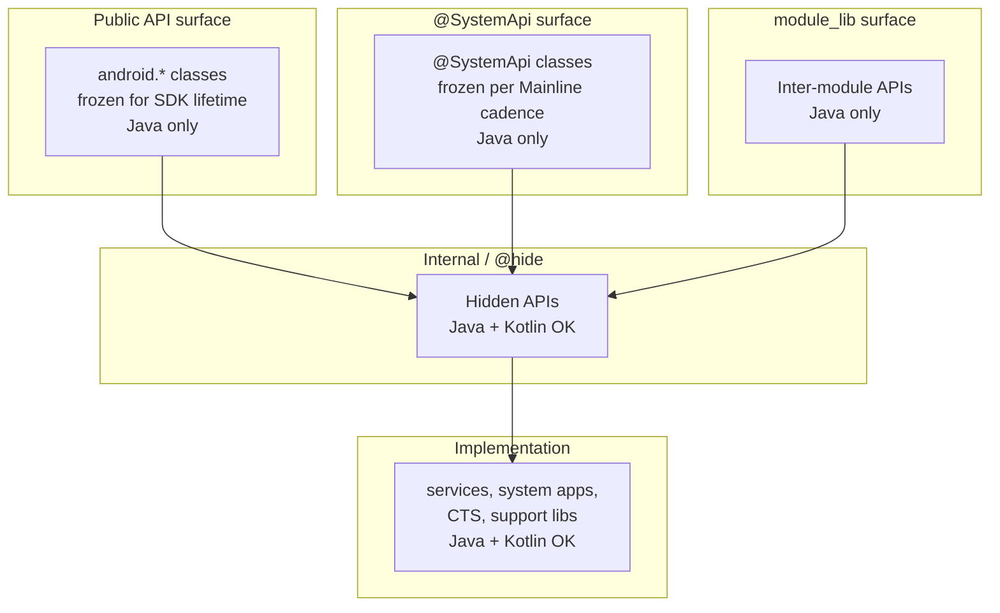
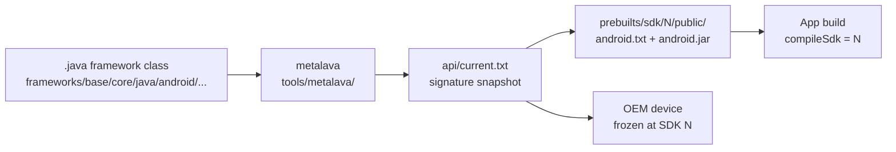
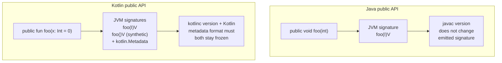

# Appendix C: Why AOSP Doesn't Adopt Kotlin for Public Framework APIs

A reader new to AOSP quickly notices an asymmetry. Kotlin is everywhere in the
upper layers of the tree — SystemUI, Settings, Launcher3, parts of CTS — yet the
public framework APIs that apps compile against are still defined in Java. This
appendix lays out the constraints that produce that asymmetry. It is not
advocacy and does not predict when, or whether, the situation will change. It
collects the engineering facts: where Kotlin is allowed, where it is not, the
binary contract that gates the difference, and the toolchain that enforces that
contract. After reading it you should be able to look at any class in
`frameworks/base/` and predict whether Kotlin source there is risk-free or
whether it would break something. The rule the appendix builds toward is
straightforward: trace the class outward to its nearest API boundary. If the
boundary is a `current.txt` member, an `@SystemApi`, a module-library export, or
anything else apps or vendor code links against, the freeze applies and Kotlin
source there imports kotlinc-emission risk. If the boundary is intra-process and
recompiles in lock-step with the framework — a `LocalServices` interface, a
binder server stub, a SystemUI internal — Kotlin is safe. The precise definition
of "public API" used throughout the appendix is in the section titled "The
Public API Contract".

The appendix is organized to be read top to bottom but the sections can be
consulted independently. The engineering core is "The Java/Kotlin ABI Gap" and
"Toolchain Lock-In"; the surrounding sections frame the freeze, expand it to
vendor and Mainline surfaces, and inventory where Kotlin already lives safely
inside the platform.

A note on sourcing. Every concrete file path, line count, and tool name comes
from inspecting the AOSP checkout directly. Where the appendix cites ~65k lines
or ~750k rows, the numbers were measured at one point in time and will drift as
the tree evolves; the orders of magnitude are what the argument depends on.

## The Asymmetry

The cleanest way to see the asymmetry is to count files. Kotlin and Java sources
coexist across the tree, but they cluster in very different places. Running
`find` over the AOSP checkout produces the inventory below.

| Path | Kotlin files | Notes |
|------|--------------|-------|
| `frameworks/base/packages/SystemUI/` | 7,846 | The heavy adopter; system UI shell and quick settings |
| `packages/apps/Settings/` | 1,576 | Settings app, app-layer code |
| `cts/` | 925 | Compatibility Test Suite |
| `packages/apps/Launcher3/` | 949 | Launcher app |
| `frameworks/base/services/` | 237 | All in the permission subsystem |
| `frameworks/base/core/` | 35 | The API-surface layer that apps call into |
| `frameworks/base/` (total) | 10,461 | Sum across all subdirectories |
| `frameworks/base/` Java total | 17,871 | Reference point for comparison |

Two numbers in that table do most of the work for this appendix.

The first is 35. `frameworks/base/core/` is where the `android.*` classes that
constitute the public Android SDK live. The fact that this directory contains
only 35 Kotlin files — against tens of thousands of Java files — is the most
direct statement of the policy. The public API surface is overwhelmingly defined
in Java.

The second is 237. `frameworks/base/services/` is the home of `system_server`
and the dozens of system services it hosts. 237 Kotlin files sounds like
meaningful adoption until you look at where they sit. Every production
(non-test) Kotlin file under `frameworks/base/services/` is inside the
permission access subtree at
`frameworks/base/services/permission/java/com/android/server/permission/access/`.
The major services — `ActivityManagerService`, `PackageManagerService`,
`WindowManagerService`, the input pipeline, the display pipeline — are still
Java.

The "public API" that this appendix worries about is defined in three signature
files that metalava produces and validates against:

- `frameworks/base/core/api/current.txt` — the canonical public Android SDK
  signature. The in-tree copy is ~65k lines, ~4 MB, in
  metalava's "Signature format: 2.0".
- `frameworks/base/services/api/current.txt` — the system-services API surface
  exposed to in-process callers.
- The corresponding `system-current.txt` and `module-lib-current.txt` siblings
  under `frameworks/base/*/api/` that define the `@SystemApi` surface (visible
  to platform components signed with the platform key) and the module-library
  surface (visible to Mainline modules at compile time).

These signature files are language-neutral text. Nothing in them depends on
whether the implementing source was written in Java or Kotlin — but, as the rest
of this appendix shows, the JVM signatures they describe are not equally stable
to produce from the two languages.

A second observation worth registering before the diagram: the inventory does
not say Kotlin is *unsafe* in `frameworks/base/`. It says Kotlin is *absent*
from the public API surface specifically. There are 35 Kotlin files in
`frameworks/base/core/` and 237 in `frameworks/base/services/` — those files
compile, ship, and run. The boundary between safe and unsafe runs through
individual classes, not through directories. A Kotlin class in
`frameworks/base/core/` that never appears in `current.txt` is just internal
code that happens to live in the API-bearing directory. The classification is by
whether metalava picks the class up, not by where it lives in the source tree.

A third observation: the directional asymmetry. SystemUI and the Settings app
live "below" the framework in the dependency graph — they consume the public API
surface but do not contribute to it. Their freedom to use Kotlin is
unconstrained because nothing depends on their internal class shapes. The
framework, in contrast, sits "above" them: its classes are what apps and vendor
code link against, and freedom there is bought at the cost of binary stability.
The same Kotlin source pattern that is risk-free in SystemUI is risk-bearing in
`frameworks/base/core/java/android/`.

Where Kotlin is allowed across the AOSP API surface layers.



The diagram is not a build-time dependency graph. It is a freedom-of-language
map. Each higher box constrains itself to Java so that the languages used below
it cannot leak through. A class in `android.*` may end up calling a Kotlin
implementation in a service, but the call goes through a binder interface or a
manager-class facade whose signature is Java-shaped. The point at which a method
is exposed to apps is the point at which Kotlin stops.

## The Public API Contract

The phrase "public API" inside AOSP has a precise definition: it is the set of
class members listed in `frameworks/base/core/api/current.txt` (and the adjacent
`system-current.txt`, `module-lib-current.txt`, `test-current.txt`). This file
is human-readable text. Its first lines look like:

```
// Signature format: 2.0
package android {

  public final class Manifest {
    ctor public Manifest();
```

Every entry is a fully resolved JVM signature: package, modifiers, return type,
parameter types, exceptions. There are no Kotlin keywords in the file because
the format predates Kotlin and was designed to describe what the runtime sees,
not what the source-level developer wrote.

The shape of an entry is worth dwelling on. A class declaration nests inside a
`package` block, with each member declared as a single line containing:

- The visibility (`public`, `protected`).
- Modifiers in a fixed order (`static`, `final`, `abstract`, `synchronized`,
  `native`, `default`).
- The return type, qualified by package.
- The member name.
- For methods, the parameter list with each parameter typed and named.
- For methods, an optional `throws` clause listing checked exceptions.

The format is whitespace-significant in places (each member starts with leading
spaces matching its nesting depth) but otherwise has the regularity of a
generated artifact. Diff tools have no trouble showing what changed between two
snapshots, which matters because almost every framework change runs through the
`m update-api` workflow and produces a textual delta that the API council
reviews member by member.

Several signature surfaces exist in parallel — public (`current.txt`),
`@SystemApi` (`system-current.txt`), the module-library surface used by Mainline
(`module-lib-current.txt`), and `@TestApi` (`test-current.txt`) — plus per-
subsystem files such as `frameworks/base/services/api/current.txt`. They all
share the same format. Each surface is produced by **metalava**, a Kotlin tool
at `tools/metalava/` that reads framework source through PSI (for Kotlin) and
Turbine (for Java) and emits the language-neutral signature text. The build
re-runs metalava, compares the generated snapshot against the checked-in
`current.txt`, and fails the build on any drift; intentional additions go
through `m update-api` plus API council review of the textual delta.

How a framework class becomes part of the public API contract.



Once an API ships in a numbered SDK release, its signature is frozen forever.
Each SDK release snapshots the surface into `prebuilts/sdk/<N>/public/api/
android.txt` and pins the stub jar that apps compile against at
`prebuilts/sdk/<N>/public/android.jar`. Removing an entry, changing a parameter
or return type, or changing the JVM signature behind an unchanged textual entry
all count as breaking changes.

Devices bake an SDK level in at manufacture, and that determines the "stable
forever" promise. A phone that launched with SDK 30 will still be running
SDK 30 four or five years later (longer for OEM long-life devices). Apps
targeting `compileSdk = 30` must continue to install and run on that device.
The OEM cannot fix a regression in the platform's binary contract by issuing a
kotlinc upgrade or a metadata format update, because the original device's
runtime classloader is what defines compatibility.

That window — roughly ten years from first ship to last realistic in-service
use — is the time horizon every member of `current.txt` must survive. The API
council applies that horizon every time it approves a new method, and once it
ships the signature cannot be retracted.

## The Java/Kotlin ABI Gap

The compatibility problem is not that Kotlin lacks features. It is that the
mapping from Kotlin source to JVM signatures has degrees of freedom that the
Java mapping does not. The kotlinc compiler, the Kotlin metadata format, and the
Kotlin standard library can all evolve. When they do, the JVM-visible signatures
of an unchanged source class can shift. For internal code that recompiles in
lock-step with kotlinc, this is invisible. For a frozen public surface, every
shift is a binary break.

This section walks through the specific feature surfaces where the mapping is
unstable.

### `@JvmOverloads` and default-arg overload freeze

Kotlin lets a function declare default values for parameters. From a single
source declaration:

```kotlin
fun openFile(path: String, mode: Int = 0, encoding: String = "UTF-8"): File
```

Without an annotation, kotlinc emits a single JVM method:

```
openFile(Ljava/lang/String;ILjava/lang/String;)Ljava/io/File;
```

Java callers must pass all three arguments. With `@JvmOverloads`, the compiler
synthesizes additional overloads — one for each truncation of trailing defaulted
parameters:

```
openFile(Ljava/lang/String;)Ljava/io/File;
openFile(Ljava/lang/String;I)Ljava/io/File;
openFile(Ljava/lang/String;ILjava/lang/String;)Ljava/io/File;
```

On a public surface this raises two distinct freezing problems. First, the set
of synthesized overloads is determined by the order of parameters: changing the
order in source changes the synthesized signatures. Second, default values are
encoded as `$default` synthetic helpers (e.g. `openFile$default`) that the
compiler inserts into the bytecode. The presence and shape of these helpers is
part of the binary surface a Java caller sees. Removing `@JvmOverloads` from a
public class would silently delete several JVM methods and break any compiled
caller. Adding a new parameter at the end (even with a default) appends new
entries to the overload set, but reordering existing parameters renames them.

The note compiled while writing this appendix confirms that the only AOSP usages
of `@JvmOverloads` are in `frameworks/base/services/tests/displayservicetests/`
— test utility files like `TestUtils.kt`, `PersistentDataStoreTestUtils.kt`,
`DisplayDeviceConfigTestUtils.kt`, and `ClamperTestUtils.kt`. No production
service uses it. The reason is straightforward: production Kotlin in AOSP only
calls into Java, never the reverse. There is no Java caller in the platform that
needs the synthesized overloads.

### `@JvmStatic` and the `Companion.foo()` vs `Foo.foo()` choice

A Kotlin `companion object` holds members that look like statics from inside
Kotlin (`MyClass.foo()`) but are emitted as instance methods on a synthetic
inner `Companion` class. Without `@JvmStatic`:

```kotlin
class Foo {
    companion object {
        fun bar() = 42
    }
}
```

The Java-visible signatures are:

```
public final class Foo
public static final class Foo$Companion
    public final int bar()
public static final Foo$Companion Foo.Companion
```

A Java caller writes `Foo.Companion.bar()`. Annotating with `@JvmStatic` adds a
second, static, copy of the method on the outer class:

```kotlin
class Foo {
    companion object {
        @JvmStatic fun bar() = 42
    }
}
```

```
public final class Foo
    public static final int bar()
public static final class Foo$Companion
    public final int bar()
```

Now `Foo.bar()` works from Java too. The decision is observable in `current.txt`
because both methods are part of the public surface. Once shipped, neither can
be removed.

The AOSP usage pattern of `@JvmStatic` confirms the asymmetry: every hit in
`frameworks/base/services/` is inside the `services/tests/` subtree, where the
JUnit runner (Java) needs to invoke `@BeforeClass`/`@AfterClass` methods
declared on Kotlin test companions. Concrete example from `ApexUpdateTest.kt`:

```kotlin
@JvmStatic
@BeforeClassWithInfo
fun initApexHelper(testInformation: TestInformation) {
    apexInstallHelper = ApexInstallHelper(testInformation)
}
```

Production Kotlin avoids `@JvmStatic` because nothing in the platform calls
those Kotlin methods from Java. Public API code, by definition, must be callable
from Java apps — so every static factory or constant in a public Kotlin class
would have to commit to one of these emission shapes and freeze it.

### `@JvmName` mangling

Kotlin allows the source-level function name to differ from the JVM-level method
name:

```kotlin
@JvmName("safeOpen")
fun open(path: String): File
```

The Kotlin caller writes `open(path)`. The Java caller writes `safeOpen(path)`.
On the JVM, only `safeOpen` exists. Removing the `@JvmName` annotation (or
changing its argument) renames the symbol that Java code is linked to. On a
public surface, this is a hard break for every app already compiled against the
previous name.

`@JvmName` is also implicitly applied in places the developer does not annotate.
Top-level Kotlin functions compile into a synthetic class named after the source
file (e.g. `Utils.kt` becomes `UtilsKt`). The class name can be customized with
`@file:JvmName("Utils")`. The framework's API surface contract has no way to
express "rename the synthesizing class" without breaking apps that resolved
against the old name.

### `suspend` functions and `Continuation` in JVM signatures

A `suspend` function in source:

```kotlin
suspend fun load(): Result
```

Becomes a JVM method whose signature appends a `kotlin.coroutines.Continuation`
parameter:

```
load(Lkotlin/coroutines/Continuation;)Ljava/lang/Object;
```

The return type is erased to `Object` because the coroutine machinery delivers
the result asynchronously. For an internal Kotlin caller, the source-level
signature is what matters; the compiler hides the transformation. For a Java
caller, the only thing visible is the JVM signature — including `Continuation`,
including the erased return type, including the way exceptions get wrapped into
`kotlin.Result` boxing.

Two stability problems flow from this. First, `kotlin.coroutines.Continuation`
is a Kotlin standard-library type. Its package, its method names, and the
runtime semantics it expects must remain frozen at the JVM level. Second, the
lowering of `suspend` to `Continuation` is a kotlinc implementation choice. Past
Kotlin releases have considered alternative lowerings (state machines vs.
CPS-style, different boxing strategies). A future kotlinc that adjusted the
lowering for any reason could change the JVM signature of an unchanged source
declaration.

No public Android API exposes `suspend` today. Coroutine-based APIs in AndroidX
live above the framework SDK and ship as separate artifacts, where the suspend
signatures can evolve with the AndroidX artifact's own version cadence.

### `inline` functions exposing source bytecode

An `inline` function in Kotlin is not just a hint to the optimizer; it is a
contract that the function's body will be inlined at every call site. Kotlin
uses this for `reified` type parameters (which require the type to be visible at
the call site, not erased) and for performance-sensitive lambda-taking APIs.

The implication for binary stability is that the compiled bytecode of an
`inline` function — every instruction in its body, including references to
private helpers — is copied into every caller's class file. If the framework
declares a public `inline fun` and the source body changes between SDK releases,
apps that compiled against the old version still contain the old body inline.
Conversely, if the framework needs to fix a bug in an `inline` function, only
newly recompiled callers see the fix.

For a platform that ships compiled apps to billions of devices, "the fix only
applies if every caller rebuilds" is not viable. Java has no equivalent: `static
final` methods can be redirected at the implementation, but the JVM resolves
them through the runtime classloader. A Kotlin `inline` function is closer to a
C++ header-defined template than to a Java method, and the freezing semantics
that work for Java methods do not work for inlined Kotlin bodies.

### Value classes / inline classes and parameter-signature mangling

A Kotlin value class (formerly inline class) wraps a single backing value at
compile time and unwraps it at the call boundary:

```kotlin
@JvmInline
value class UserId(val value: Long)

fun grantAccess(user: UserId)
```

The JVM emission for `grantAccess` is not `grantAccess(LUserId;)V`. It is
mangled: kotlinc inserts a hash of the parameter shape into the method name to
avoid clashing with overloads where `UserId` and `Long` would erase to the same
signature:

```
grantAccess-{hash}(J)V
```

The exact mangling scheme — what gets hashed, what character separates the
original name from the hash, how synthetic constructors interact — has been
refined across Kotlin releases. A frozen public API cannot tolerate the mangling
scheme changing, and it cannot tolerate the developer inadvertently adding an
overload that perturbs the hash of an existing method.

### `Result<T>` mangling on JVM

`kotlin.Result<T>` is a value class. Any function returning `Result<Foo>` is
subject to the same name-mangling that any other value-class-returning function
gets:

```kotlin
fun fetch(): Result<Data>
```

Becomes something like `fetch-{hash}()Ljava/lang/Object;` at the JVM level. The
Java type seen at the call boundary is `Object` because `Result` boxes through
erasure. Direct Java consumption of a `Result`-returning Kotlin API is awkward
at best.

The official Kotlin guidance is that `Result` should not appear in public
Java-visible APIs. For internal code that interoperates between Kotlin callers,
`Result` is convenient. For a public surface that must be Java-callable, it is
not viable.

### Companion-object `INSTANCE` static fields

A Kotlin `object` (declared at the top level, not as a companion) compiles to a
class with a single static `INSTANCE` field:

```kotlin
object UriRegistry {
    fun lookup(scheme: String): Class<*>? = ...
}
```

Becomes:

```
public final class UriRegistry
    public static final UriRegistry INSTANCE
    public final Class<?> lookup(String)
```

A Java caller writes `UriRegistry.INSTANCE.lookup("content")`. The `INSTANCE`
field is part of the binary surface. Renaming the `object` in Kotlin source
renames the class; restructuring the singleton (for instance, splitting it into
a per-user-id keyed map) deletes the `INSTANCE` field. Both are breaking changes
for any compiled Java caller, and they appear in `current.txt` as field entries
that must survive the SDK lifetime.

Companion object `INSTANCE` accessors (the `Foo.Companion` field generated for
any `class Foo { companion object { ... } }`) have the same property. They are
public fields the binary surface must preserve.

### `data class` synthesis and `componentN` accessors

A Kotlin `data class` triggers the compiler to synthesize a fixed set of members
alongside the declared fields:

```kotlin
data class Point(val x: Int, val y: Int)
```

becomes, at the JVM level, approximately:

```
public final class Point
    public Point(int x, int y)
    public final int getX()
    public final int getY()
    public final int component1()
    public final int component2()
    public final Point copy(int x, int y)
    public static Point copy$default(Point, int, int, int, Object)
    public boolean equals(Object)
    public int hashCode()
    public String toString()
```

Each synthesized member is part of the binary surface. The `componentN`
accessors enable Kotlin destructuring (`val (x, y) = point`); they are numbered
by parameter position. Reordering the fields in source renames the components:
what was `component1` becomes `component2`. The `copy` method takes the same
parameters as the constructor; adding a new field at the end appends a parameter
to `copy` and keeps the `copy$default` synthetic helper; reordering the fields
again breaks compiled callers that named-arg `copy`.

A public `data class` would have to commit to its field order, its `componentN`
numbering, the `copy` overload set, and the synthesized `equals`/`hashCode`
semantics for the SDK lifetime. This is more constraint than a Java `record`
(where only the canonical accessor names and the `equals`/`hashCode` contract
are guaranteed) and it is more constraint than a hand-rolled Java class (where
the developer chooses which of these members exist).

### Top-level functions and the `Kt` synthetic class

Kotlin allows functions and properties at file top level, outside any class:

```kotlin
// File: PathUtils.kt
package android.os

fun normalizePath(path: String): String = ...
const val PATH_SEPARATOR = "/"
```

kotlinc compiles this into a synthetic class whose name is the file name with
`Kt` appended:

```
public final class PathUtilsKt
    public static String normalizePath(String)
    public static final String PATH_SEPARATOR
```

The class name is part of the binary surface. Renaming the source file renames
the class; `@file:JvmName("PathUtils")` overrides the suffix. For Java callers,
the static methods are reachable as `PathUtilsKt.normalizePath(...)` (or
`PathUtils.normalizePath(...)` if the JvmName is set). For Kotlin callers, the
synthetic class is invisible — they import the function directly.

A public top-level function in the framework would commit to a class name that
did not exist in the source. Renaming the file would silently break compiled
Java callers. Splitting the file would split the synthetic class into two
synthetic classes, again breaking callers. Java has no equivalent: every static
method in Java sits on a developer-named class, so the class identity is part of
the source-level decision.

### Boot classpath sharing forces one stdlib version on every app

Everything above describes how a single Kotlin source declaration produces a
*set* of JVM artifacts — signatures, helpers, mangled names, metadata blobs —
that the framework would have to freeze. There is a second binary-stability
concern operating one layer beneath signature shape: the Android runtime model
loads the public framework API into a classloader that every app on the device
shares, and a public Kotlin API would force `kotlin-stdlib.jar` into that
shared classloader too.

The framework's public API ships as `framework.jar` (plus adjacent jars like
`services.jar`, `framework-graphics.jar`, `framework-location.jar`, `ext.jar`,
`telephony-common.jar`) on the device's **boot classpath**. The composition is
configured by Soong via `PRODUCT_BOOT_JARS`, with the default set defined at
`build/make/target/product/default_art_config.mk:38` — `framework-minus-apex`,
`ext`, `telephony-common`, `framework-graphics`, `framework-location`, and the
per-APEX jars (ART, conscrypt, i18n, and the rest). At device boot, ART
ahead-of-time compiles these jars into a boot image and the zygote process
loads it into its address space.

`com.android.internal.os.ZygoteInit.preloadClasses()` at
`frameworks/base/core/java/com/android/internal/os/ZygoteInit.java:284` reads
the `/system/etc/preloaded-classes` text file and eagerly initializes every
named class so that the boot image's class objects, static fields, and
JIT-compiled code are resident in the zygote's heap before any app forks.
Every app process started afterward is forked from that zygote and inherits
the resolved class objects directly — `android.app.Activity` is literally the
same class object in the zygote and in every app, with no per-app load step.

App-specific code sits one classloader below. An installed APK is loaded by
`dalvik.system.PathClassLoader`
(`libcore/dalvik/src/main/java/dalvik/system/PathClassLoader.java:44`) whose
parent is the boot classloader. `ClassLoader.loadClass()`
(`libcore/ojluni/src/main/java/java/lang/ClassLoader.java:622`) follows the
standard parent-first delegation: it calls `parent.loadClass(name)` at line
630 *before* it ever calls `findClass()` on its own dex at line 642. Any
class name that resolves in BOOTCLASSPATH wins over the same name in the
app's APK.

For Java this is unproblematic. The framework's transitive dependencies on
`java.*` and `javax.*` are themselves part of the JDK's strictly-versioned
core, evolving under OpenJDK with explicit JLS compatibility guarantees, and
apps cannot ship their own `java.util.HashMap` even if they wanted to — the
classloader delegation hands every resolution back up to the platform copy by
design. For Kotlin it is the central sticking point. A `suspend` function on
the public surface drags in `kotlin.coroutines.Continuation`. A
`Result<T>`-returning method drags in `kotlin.Result`. Even a plain class
written in Kotlin emits a `@kotlin.Metadata` annotation that the Kotlin
reflection layer reads when an app calls `Foo::class` on the class. All of
those types live in `kotlin-stdlib.jar`.

The verified state today: no boot classpath jar in AOSP links `kotlin-stdlib`.
`external/kotlinc/Android.bp:59` declares `kotlin-stdlib` as a `java_import`
of the prebuilt jar, but the modules that depend on it are non-boot — SystemUI's
plugin and shared subprojects explicitly set `static_kotlin_stdlib: false` to
keep their own stdlib internal to their APK rather than promoted to shared
state. The Kotlin code that does run inside boot-classpath jars (parts of
`system_server` and other framework services, see "Where Kotlin Already Lives
in AOSP" below) compiles to JVM signatures that hold no Kotlin type at the
public boundary, so no `kotlin-stdlib` reference reaches the shared
classloader.

Adding the first public Kotlin signature inverts that. The framework jar that
exposes a `Result<T>` return type, a `suspend` parameter, or even just a public
top-level function's synthetic `Kt` class with Kotlin metadata must link
against `kotlin-stdlib`, and that `kotlin-stdlib` would have to ship inside
the boot classpath. Every app process forked from the zygote would resolve
`kotlin.Result`, `kotlin.coroutines.Continuation`, and the metadata-format
types from the boot classpath — not from the version bundled in the app's own
APK.

This is more disruptive than the Java analogue because of where Kotlin sits on
the version-stability spectrum. Apps today commonly ship with different
`kotlin-stdlib` versions — a library compiled against Kotlin 1.6 in the same
APK as application code on Kotlin 2.0, with R8/D8 at `prebuilts/r8/r8.jar`
minifying the union into the APK's `classes.dex`. Parent-first delegation
means the on-device boot classpath's `kotlin-stdlib` wins regardless of which
version the app's Gradle build selected. If the device's `kotlin-stdlib` is
older than the app's, methods the app linked against may be absent and
`NoSuchMethodError` surfaces at runtime; if it is newer with a tightened
nullability or generic signature, the app's compiled call sites may fail
bytecode verification. The app developer has no recourse from inside the APK
because the resolution happens above their classloader.

The only existing AOSP precedent for working around this kind of conflict is
classloader namespace isolation. WebView runs in a separate zygote —
`WebViewZygote` at
`frameworks/base/core/java/android/webkit/WebViewZygote.java:32` — so the
WebView APK's transitive dependencies do not have to coexist with the main
zygote's preloaded class set. The cost is a second zygote process, a second
copy of every shared library both processes touch, and an explicit inter-
zygote contract for which classes are sharable. Replicating that pattern for
"Kotlin-using" apps would mean either a per-stdlib-version zygote (which the
system cannot predict at fork time) or a runtime classloader rewrite that
lets each app see its own `kotlin-stdlib` while still resolving `android.*`
from the boot — neither of which exists today.

Java method-signature stability vs. Kotlin metadata pinning.



The contrast in that diagram is the engineering crux. For Java, a single source
declaration maps to a single, well-defined JVM signature, and `javac` versions
do not change that mapping. For Kotlin, a single source declaration maps to a
*set* of JVM artifacts — signatures, synthetic helpers, mangled names,
`Continuation` parameters, value-class hashes, plus the `kotlin.Metadata`
annotation blob that the Kotlin reflection and tooling layers parse to
reconstruct source-level semantics. The shape of that set depends on the kotlinc
version, the metadata format version, and the interop annotations the source
uses. To freeze a Kotlin public API the way Java APIs are frozen, every piece of
that machinery would need to be declared a binary contract — kotlinc cannot
evolve any of them without breaking compiled callers. And, as the boot
classpath section above showed, that contract would extend past the
framework's own signatures into the `kotlin-stdlib` version that the device's
shared classloader would force on every Kotlin-using app.

## Toolchain Lock-In

The signature contract described in "The Public API Contract" is enforced by a
Java-shaped toolchain. Even where individual tools happen to be written in
Kotlin, their input and output formats are designed for the Java/JVM signature
model.

**Metalava** lives at `tools/metalava/`. It is itself a Kotlin tool — 657 `.kt`
files across its sub-modules. That metalava is written in Kotlin while operating
on a Java-shaped API is part of the constraint, not a contradiction: metalava
can consume Kotlin source to produce signatures, but the signature *format*
(defined in `tools/metalava/FORMAT.md`) has no syntax for Kotlin-specific
constructs. There is no way to write `suspend`, `inline`, `value class`, or
`data class` in `current.txt`. A Kotlin source file that uses those features is
either flattened to its JVM-visible projection (losing the source-level
semantics) or rejected by API lint.

The flattening is informative. Metalava has a unified `Item` model — a class is
an `Item`, a method is an `Item`, a field is an `Item` — and that model is
intentionally language-neutral. The PSI frontend (which reads Kotlin source) and
the Turbine frontend (which reads Java source) both produce Items in the same
shape. When metalava emits a signature, it walks the Items and writes them in
the format spec. A Kotlin `data class Foo(val x: Int)` is read by the PSI
frontend, then projected to the equivalent Java declarations: a class with a
final field-style accessor `getX`, a synthesized constructor, and the
`equals`/`hashCode`/`toString`/`copy`/`componentN` cluster. The signature file
shows the projection, not the source. The frozen-forever contract is the
projection; the source is implementation detail.

This also means that an internal Kotlin source change — refactoring a `data
class` to add a new field, splitting a sealed hierarchy, renaming a top-level
function — does not show up in `current.txt` as long as the Kotlin members are
not part of the public surface. Metalava only includes members it sees as
`public` or `protected` and that are not annotated `@hide`. The vast majority of
the 35 Kotlin files in `frameworks/base/core/` qualify as `@hide` or as
package-private, so they exist but are invisible to the API check.

The metalava module layout shows the separation of concerns:

- `tools/metalava/metalava/` — the main tool entry point.
- `tools/metalava/metalava-model/` — abstract API model independent of any
  language frontend.
- `tools/metalava/metalava-model-psi/` — Kotlin source frontend (using JetBrains
  PSI).
- `tools/metalava/metalava-model-source/` — generic source-based model.
- `tools/metalava/metalava-model-text/` — text (signature file) frontend, used
  for round-tripping `current.txt`.
- `tools/metalava/metalava-model-turbine/` — Turbine-based Java frontend.
- `tools/metalava/metalava-reporter/` — issue reporting subsystem.
- `tools/metalava/metalava-testing/` — test utilities.
- `tools/metalava/stub-annotations/` — annotation jar used in generated stubs.

The text model is the canonical one. PSI and Turbine exist to feed it. A future
Kotlin-aware public API would need a text model that can express, and
round-trip, every Kotlin construct it would admit on the public surface.

**Documentation generation**. The platform reference documentation pipeline runs
Doclava (the historical Javadoc-derived tool) and Dackka (the newer Kotlin-aware
doc tool). Dackka understands Kotlin source but produces documentation pages
that describe the Java-projection of Kotlin APIs — because that is what app
developers see in their IDE when they call into the platform. A Kotlin `data
class` shows up in the docs with its synthesized `equals`, `hashCode`,
`toString`, `copy`, and `componentN` methods listed individually, because that
is what Java callers see. The documentation can show source-level Kotlin shape
only when the reader is in Kotlin mode; the underlying contract is still the JVM
projection.

**Hidden API enforcement** is the second pillar of the Java-shaped toolchain.
The blocklist is maintained in plain-text files under
`frameworks/base/boot/hiddenapi/`:

- `hiddenapi-unsupported.txt` — fully blocked APIs.
- `hiddenapi-unsupported-packages.txt` — entire packages with the surface
  blocked.
- `hiddenapi-max-target-o.txt` — APIs targeted at SDK O or earlier (legacy
  block).
- `hiddenapi-max-target-p.txt` — APIs targeted at SDK P or earlier.
- `hiddenapi-max-target-q.txt` — APIs targeted at SDK Q or earlier.
- `hiddenapi-max-target-r-loprio.txt` — APIs targeted at R or earlier, low
  priority.

A blocked Kotlin extension function appears as
`Lcom/example/UtilsKt;->extensionMethod(Lcom/example/Receiver;)V`, not by its
Kotlin source signature. Each line in these files is a JVM descriptor in the
form `Lpackage/Class;->method(Lpackage/Type;)Lpackage/Return;`. The format is
the same form used by `dexdump`, by ART's runtime checks, and by every tool that
introspects compiled class files. Kotlin source compiles into JVM class files,
so Kotlin code is reachable via these descriptors — but the descriptor uses the
kotlinc-emitted shape, not the source-level Kotlin name.

The build system merges the source text files into a single generated CSV:

- `out/soong/hiddenapi/hiddenapi-flags.csv` — the build-time artifact, ~750k
  rows. Each row is a member descriptor plus a flag list (`public-api`, `sdk`,
  `system-api`, `test-api`, `blocked`, etc.).
- `prebuilts/runtime/appcompat/hiddenapi-flags.csv` — the prebuilt copy shipped
  for app-compat checks (~51 MB).

Sample rows from the generated file:

```
Landroid/Manifest$permission;-><init>()V,public-api,sdk,system-api,test-api
Landroid/Manifest$permission;->ACCEPT_HANDOVER:Ljava/lang/String;,public-api,sdk,system-api,test-api
Landroid/Manifest$permission;->ACCESSIBILITY_MOTION_EVENT_OBSERVING:Ljava/lang/String;,blocked,test-api
```

The CSV is loaded into ART at runtime. When an app calls
`Manifest.permission.ACCESSIBILITY_MOTION_EVENT_OBSERVING`, the runtime checks
the flags. `blocked` triggers a hard exception; the various `max-target-*` flags
trigger softer warnings or version-gated blocks. The granularity is
per-descriptor. A Kotlin API that emits multiple descriptors per source
declaration (overloads from `@JvmOverloads`, the `Companion` accessor plus the
`@JvmStatic` projection, the value-class-mangled name plus an unmangled erased
fallback) would multiply the entries needed to express the same source-level
intent in this CSV.

**jarjar rules**. Several framework modules rewrite their dependency class names
during build to avoid colliding with app-visible classes. The rules are declared
in `.jarjar` files processed by the jarjar tool. Kotlin metadata annotations
(`kotlin.Metadata`) embed string references to the original class names — a
jarjar rewrite that renames `kotlin.collections.MapsKt` to
`com.android.internal.kotlin.collections.MapsKt` would mismatch with the
metadata blob and break Kotlin reflection at runtime. Java has no equivalent
embedded metadata; jarjar over Java is a straightforward textual rewrite.

**`@SystemApi` and `@UnsupportedAppUsage`** are processed by metalava and by the
hidden API toolchain. `@SystemApi` widens the surface for platform-signed
callers; the corresponding `system-current.txt` is its frozen signature.
`@UnsupportedAppUsage` is the annotation framework code uses to mark members
that should land in the hidden API CSV with a specific max-target flag — a
Kotlin equivalent of these annotations would need both a Kotlin source-level
annotation type and a metalava rule to project that annotation into the
generated CSV correctly.

The annotations themselves come with subtle constraints. `@SystemApi` accepts
client-type arguments (`MODULE_LIBRARIES`, `PRIVILEGED_APPS`, `MODULE_APPS`)
that gate which downstream consumers see the member. Metalava reads those
arguments and routes the member into the appropriate signature surface; an
incorrectly routed annotation leaks into the wrong `current.txt`, and the
build's `m checkapi` step catches the leak. For Java source, the annotation
processing is unambiguous: the annotation sits on the declaration, metalava
reads the AST node, the routing happens. For Kotlin source, metalava has to
reach the same conclusion via a Kotlin source frontend — and any future Kotlin
annotation that has source-level shape (file-level annotations, target-class
extensions, repeating annotations with non-trivial retention semantics) needs
explicit support in the metalava annotation extraction logic in
`tools/metalava/.../ExtractAnnotations.kt`.

The `out/soong/hiddenapi/hiddenapi-flags.csv` artifact is the merge point of
every input mentioned above: source `.txt` blocklists, `@SystemApi` membership,
`@UnsupportedAppUsage` annotations, and public-API stub descriptors all flow
through Soong into a single descriptor-keyed table. The same machinery feeds
`prebuilts/runtime/appcompat/hiddenapi-flags.csv`, the prebuilt copy older
runtimes consult during app-compat fallbacks. Any change to the descriptor
shape, the flag vocabulary, or the way Kotlin members map to descriptors flows
through this pipeline.

## OEM, Vendor, and Mainline Constraints

The public API contract is not the only freeze in the system. Two adjacent
surfaces — the vendor partition and Mainline modules — extend the "stable
forever" property to additional layers.

**Vendor partition freeze**. When an OEM device launches with SDK level N, the
vendor partition is built against the system-API and module-library surfaces
frozen at that level. Subsequent OS upgrades on the same device (within Project
Treble's framework-vendor split) must preserve binary compatibility with the
existing vendor partition. The system-API surface acts as the binary contract
between the framework (Java + Kotlin allowed internally, Java-shaped externally)
and vendor code (typically C++, sometimes Java). A Kotlin emission shift on a
`@SystemApi` class would break vendor partitions on every device that compiled
against the previous shape.

**Mainline APEX modules** are the second freeze. A Mainline module is an APEX
package containing platform components that ship through Play Store updates
rather than full system OTAs. The architecture is documented in
`system/apex/docs/README.md` (with supporting docs in
`system/apex/tests/README.md` and `system/apex/shim/README.md`). Each Mainline
module declares a `min_sdk_version` and is compiled against the module-library
surface at that SDK level. The APEX-build rules live in
`build/soong/apex/apex.go` and `build/soong/android/apex.go`, which together
enforce that an APEX file does not depend on symbols outside its declared SDK
floor.

A Mainline module that ships in Play Store updates to a five-year-old device
must still resolve every symbol it references against that device's frozen
module-library surface. If the framework introduced a new Kotlin-shaped public
method between SDK N and SDK N+3, the device at SDK N would not have it. The
Mainline module either has to declare a higher `min_sdk_version` (losing reach)
or stay Java-shaped (losing nothing).

**kotlinc release cadence vs. AOSP cadence**. Soong's Kotlin integration
hard-pins a specific kotlinc version. The build's prebuilt kotlinc lives at
`external/kotlinc/`, with version stamped in `external/kotlinc/build.txt`:

```
2.2.0-release-294
```

The pinning is enforced in Soong's compiler-flag plumbing:

- `build/soong/java/kotlin.go` — defines the Ninja rules for `kotlinc`
  invocation, kotlin-jar snapshotting, and incremental compilation.
- `build/soong/java/kotlin_test.go` — unit tests for those rules.
- `build/soong/java/config/kotlin.go` — declares the variables Soong uses to
  find kotlinc components (`external/kotlinc/bin/kotlinc`,
  `external/kotlinc/lib/kotlin-stdlib.jar`,
  `external/kotlinc/lib/kotlin-compiler.jar`, the Compose plugin, kapt,
  jvm-abi-gen).

The same config file forbids callers from overriding `-no-jdk`, `-no-stdlib`, or
`-language-version`. The platform decides which Kotlin language version to
compile against; individual modules cannot opt into a newer or older version.
The kotlinc JVM is invoked with `-J-Xmx8192M` to handle the heap pressure of
compiling the platform's Kotlin modules in a single pass.

The pinned kotlinc version is the source of a coupling problem. AOSP picks a
version, validates it across the tree, ships it. Public APIs compiled with that
kotlinc emit the JVM signatures that version produces. Upgrading kotlinc to a
newer version (for a Compose update, for a Kotlin language feature the platform
wants internally, for a security fix) could change the emitted signatures of any
public Kotlin class. The current solution to that risk is to keep public classes
Java. The risk does not arise.

For internal Kotlin (services, SystemUI, Settings, apps), the kotlinc pin is
fine. Everything internal recompiles when kotlinc is upgraded. The frozen
artifacts are the public stubs and the hidden API CSV; both are regenerated as
part of the kotlinc bump and the changes are validated by the API and hidden API
checks before the bump lands.

A concrete way to see the cadence problem is to walk through what would happen
if the framework added a single Kotlin public method to `android.os.SomeClass`.
The method ships in SDK level N, compiled by kotlinc 2.2.0. The frozen artifact
at `prebuilts/sdk/N/public/api/android.txt` records the JVM signature kotlinc
2.2.0 produced. Devices launch with SDK N and bake that artifact into their stub
jar. A year later, AOSP picks up kotlinc 2.4.0 to enable a new Compose feature.
If kotlinc 2.4.0's emission of the same source class produces a different JVM
signature — even slightly, even for an opaque mangling reason — apps that
compiled against the SDK N stub will fail to resolve the method on devices
running the new framework. The framework either has to keep the old kotlinc
emission shape pinned (defeating the purpose of the upgrade) or to ship a
compatibility shim that forwards the new shape to the old shape (multiplying the
surface). Java has neither problem because `javac` does not have feature
versions that affect emitted signatures.

The vendor-side mirror of the kotlinc problem is that vendor partitions are
typically built once, at device launch, and not rebuilt for the life of the
device. A vendor service that links against a framework Kotlin API gets the
kotlinc-N emission baked in. When the framework is updated to kotlinc N+1 via an
OS upgrade, the vendor partition still expects kotlinc-N emission. The framework
cannot recompile the vendor partition. Java avoids this entirely;
Kotlin-on-the-public-surface would create a new freeze axis (kotlinc emission
shape) that has no counterpart in the vendor-partition contract today.

The Mainline picture sharpens the problem because Mainline modules ship more
frequently than the OS. A Mainline APEX built today targets a `min_sdk_version`
of (say) Android 11. It must run on every device at SDK 11 or higher. If the
framework introduced a Kotlin public API at SDK 12 and the Mainline module wants
to use it, the module either:

1. Raises its `min_sdk_version` to 12 (losing reach across older devices).
2. Uses runtime reflection to call the API conditionally (defeating compile-time
   type checking).
3. Stays on the equivalent Java API.

Option 3 is the path of least resistance, which is what the inventory above
shows: Mainline modules are Java-shaped on their entry points, even when their
internal implementations are Kotlin.

The historical context matters as well. Project Treble formalized the
framework-vendor split, and the system-API surface was retrofitted to be a
stable contract across that split. The Mainline initiative formalized the
framework-module split, and the module-library surface was added on top of
system-API to give modules a controlled inter-module contract. Each new freeze
axis was added with explicit signature management, explicit toolchain support,
and explicit test infrastructure. Adding "Kotlin emission shape" as a fourth
freeze axis would require equivalent work — which has not happened.

For deeper context on the APEX format and update flow, see [Chapter 52 —
Mainline Modules](52-mainline-modules.md) at the repo root.

## Where Kotlin Already Lives in AOSP

Kotlin's role in the platform is substantial but localized. The inventory
introduced in "The Asymmetry" can be expanded with the role each location plays:

| Path | Kotlin files | Role |
|------|--------------|------|
| `frameworks/base/packages/SystemUI/` | 7,846 | System UI shell: lock screen, notifications, quick settings, status bar, system bars, Compose for UI |
| `packages/apps/Settings/` | 1,576 | Settings app |
| `packages/apps/Launcher3/` | 949 | Launcher home and recents |
| `cts/` | 925 | Compatibility Test Suite (Kotlin used freely in tests) |
| `frameworks/base/services/` | 237 | All in `services/permission/`, plus tests; no other system service uses production Kotlin |
| `frameworks/base/core/` | 35 | Sparse use in framework internals; not exposed on the public API surface |
| `tools/metalava/` | 657 | The signature tool itself is Kotlin |

Within `frameworks/base/services/`, the production Kotlin is concentrated in the
permission access subsystem introduced in Android 13. Three representative files
illustrate the shape:

**`AccessCheckingService.kt`** —
`frameworks/base/services/permission/java/com/android/server/permission/access/AccessCheckingService.kt`,
323 lines. This is the entry-point class for the new permission stack. It
extends `SystemService`, registers manager interfaces with `LocalServices`, and
exposes its state via the `getState { ... }` scope helper. The relevant
fragment:

```kotlin
@Keep
class AccessCheckingService(context: Context) : SystemService(context) {
    @Volatile private lateinit var state: AccessState
    private val stateLock = Any()
    ...
    override fun onStart() {
        appOpService = AppOpService(this)
        permissionService = PermissionService(this)
        ...
        LocalServices.addService(AppOpsCheckingServiceInterface::class.java, appOpService)
        LocalServices.addService(PermissionManagerServiceInterface::class.java, permissionService)
```

It is safely Kotlin because every interface it presents to external callers —
`AppOpsCheckingServiceInterface`, `PermissionManagerServiceInterface`,
`AppFunctionAccessServiceInterface` — is a Java interface registered into a
Java-shaped service registry. Other system code calls into those Java interfaces
and never sees a Kotlin class. The service's binder surface (defined in
`IPermissionManager.aidl` and friends) is AIDL, which is Java-shaped by
construction.

The internal implementation is unapologetically Kotlin-idiomatic. Near the
bottom of the file:

```kotlin
@OptIn(ExperimentalContracts::class)
internal inline fun <T> getState(action: GetStateScope.() -> T): T {
    contract { callsInPlace(action, InvocationKind.EXACTLY_ONCE) }
    return GetStateScope(state).action()
}
```

This single declaration uses three Kotlin features that would each be
problematic on a public surface: a function type with receiver
(`GetStateScope.() -> T`) which has no Java equivalent; an `inline` function
with a `reified`-adjacent lambda parameter that gets inlined into every caller's
bytecode; and the experimental `contract` API from `kotlin.contracts`, which is
itself opt-in and source-level only. The function is `internal`, the package is
`com.android.server.permission.access` (server-only), and the only callers are
other Kotlin classes in the same package. Every one of the three problematic
features is fine here because the boundary is intra-Kotlin within a single
subsystem.

Compare with how the same pattern would have to be expressed if `getState` were
on a public Java surface. The `inline` function would have to become a regular
method (no inlining benefit). The function type with receiver would have to
become an explicit `GetStateScope` parameter. The `contract` would have no equivalent. The
result would be uglier and slower than either the Kotlin original or what an
equivalent Java design would produce — which is one of the reasons the team
chose to keep the implementation Kotlin and the boundary Java.

**`AccessPolicy.kt`** —
`frameworks/base/services/permission/java/com/android/server/permission/access/AccessPolicy.kt`,
527 lines. The `AccessPolicy` class indexes a map of `SchemePolicy`
implementations and delegates per-scheme work to subclasses. The relevant
declaration:

```kotlin
class AccessPolicy
private constructor(
    private val schemePolicies: IndexedMap<String, IndexedMap<String, SchemePolicy>>
)
```

with an abstract `SchemePolicy` base class declared later in the file. The
abstract-class-plus-subclasses pattern is purely internal:
`AppIdPermissionPolicy`, `DevicePermissionPolicy`, `AppIdAppOpPolicy`,
`PackageAppOpPolicy`, and `AppIdAppFunctionAccessPolicy` are all package-private
to the permission subsystem and do not appear in any signature file.

**`Permission.kt`** —
`frameworks/base/services/permission/java/com/android/server/permission/access/permission/Permission.kt`,
185 lines. A `data class` modeling a single permission entry with a `companion
object` of constants:

```kotlin
data class Permission(
    val permissionInfo: PermissionInfo,
    val isReconciled: Boolean,
    val type: Int,
    val appId: Int,
    @Suppress("ArrayInDataClass") val gids: IntArray = EmptyArray.INT,
    val areGidsPerUser: Boolean = false
) {
    ...
    companion object {
        const val TYPE_MANIFEST = 0
        const val TYPE_DYNAMIC = 2

        fun typeToString(type: Int): String = ...
    }
}
```

This file shows the features that would be a public-API liability — `data class`
synthesizing `equals`, `hashCode`, `toString`, `copy`, `componentN`; default
parameter values; companion-object constants — all present here without
consequence because nothing outside `services/permission/` references
`Permission` by type.

**Permission subsystem testing**. The `services/tests/` Kotlin files round out
the picture. JUnit's runner is Java; when a Kotlin test wants a `@BeforeClass`
setup, the Java runner needs a static method on the test class. Kotlin test code
therefore puts the setup inside a `companion object` and annotates it
`@JvmStatic`. The test utility files in `services/tests/displayservicetests/`
use `@JvmOverloads` to expose default-parameter helpers to Java test code that
has not been migrated to Kotlin. These usages do not appear in production
because production Kotlin in AOSP only calls into Java; only the Java test
runner actually needs to reach into Kotlin from outside.

A few additional notes on where Kotlin appears help round out the picture:

**The CTS Kotlin tests.** Roughly 925 Kotlin files live under `cts/`. CTS
validates that an OEM build conforms to the Android compatibility definition;
tests in CTS are necessarily Java-callable from the test runner, but the test
bodies themselves can be Kotlin. CTS uses Kotlin freely because the tests do not
ship in the OS — they run against the OS. The frozen-forever constraint does not
apply.

**Settings, Launcher3, and the app layer.** These apps ship with the system
image but are functionally apps. They compile against the public SDK and share
the same lifecycle constraints as third-party apps; their Kotlin use is governed
by the same rules as any well-managed Kotlin codebase. The ABI between Settings
and the framework is the public + system-API surface — Java-shaped — even though
Settings' internal classes are heavily Kotlin.

**SystemUI's role.** SystemUI is the system_server-adjacent process that hosts
the lock screen, notifications, quick settings, and system bars. It is the
largest Kotlin codebase in AOSP at 7,846 files. SystemUI's interface to the rest
of the platform is via well-defined boundaries: AIDL for binder calls, content
providers for shared state, intents for activity launches. None of those
boundaries surface Kotlin types as parameters. SystemUI can refactor freely; the
ABI it presents to the rest of the system is bounded by AIDL and the platform's
intent contracts.

**Tests across `frameworks/base/services/`.** The same Kotlin-test/Java-runner
interop pattern noted under `@JvmOverloads`, `@JvmStatic`, and "Permission
subsystem testing" appears throughout `services/tests/`; see those subsections.

**`frameworks/base/core/` Kotlin.** The 35 files here are an interesting
outlier. They include some support utilities, occasional helper classes, and a
small amount of newer code. None of them appears as a public-API entry in
`current.txt` because nothing in the Kotlin source declares a `public` type that
crosses into the `android.*` namespace and resolves through metalava as a public
member. Kotlin source can sit in `frameworks/base/core/` as long as it stays out
of the public API surface — and the API check is what enforces that boundary.

**The kotlin-stdlib boot inclusion.** When the boot classpath is computed by
Soong, the stdlib jars are added so that Kotlin classes in the boot image
resolve their stdlib dependencies at runtime. This means stdlib types like
`kotlin.collections.MapsKt`, `kotlin.coroutines.Continuation`, `kotlin.Result`,
and `kotlin.Metadata` are all reachable from any process in the system. They do
not appear in `current.txt` because metalava is told to exclude them, but they
are present at runtime. A future Kotlin-on-the-public-surface story would need
to decide whether stdlib types are part of the public API (they would be,
transitively, through any public method that returns a stdlib type) or whether
the public API can use only a vetted subset of stdlib.

## The Kotlin Features Hardest for a Public Surface

The ABI gap section walked through individual emission mechanics. This section
steps back and groups the same features by the kind of design pressure they put
on a frozen public surface.

**Companion objects.** As detailed in the `@JvmStatic` subsection of "The
Java/Kotlin ABI Gap", every companion object pins a choice of whether to expose
statics on the outer class. The choice is observable in `current.txt`; once made
it cannot be undone. For internal code the default — Java callers go through
`Foo.Companion` — is fine because there are no Java callers. For a public class,
the choice is permanent and influences the IDE experience of every app
developer. There is also a downstream subtlety: companion-object members marked
`@JvmStatic` are duplicated in the bytecode, once on the companion class and
once on the outer class. Any reflective lookup of the member sees both copies,
and tooling that walks the class hierarchy (Hilt-style dependency injection,
mock generators, runtime annotation scanners) has to reckon with the
duplication.

**Default arguments.** Detailed under the `@JvmOverloads` subsection. The
frozen-forever consequence is that reordering parameters in a public Kotlin
function would silently break previously synthesized overloads, and adding
`@JvmOverloads` later (or removing it) changes the size of the overload set.
There is a related concern around evolution: even within Kotlin, adding a new
defaulted parameter at the *end* of an existing function is source-compatible
but not always binary-compatible, because the synthetic `$default` helper takes
a bitmask whose width is parameter-count-dependent. A function that crosses an
internal kotlinc width threshold gets a different `$default` synthetic shape
and requires recompilation of all callers. Java has no equivalent; you either
add a new overload or you do not.

**Inline classes / value classes.** Detailed under the value-class subsection.
The mangling scheme depends on kotlinc; the inferred JVM signature of every
method that takes or returns a value class is a hash, not a stable string. For a
public API, the entire mangling discipline would need to be declared a binary
contract that kotlinc could not evolve. There is a second-order concern as well:
value classes "unbox" at certain call boundaries and "box" at others. The exact
unboxing rules — when a `UserId` is passed as a `long` versus when it is passed
as an object reference — is also a kotlinc emission decision that affects the
JVM signatures observable to Java callers.

**Typealiases.** Kotlin typealiases are source-level only. `typealias UserId =
Long` resolves to `Long` at the JVM level — no signature impact. They are
entirely safe in internal Kotlin and also safe at the public boundary,
*provided* metalava is taught to expand them before emitting `current.txt`.
Today metalava does this for the Kotlin source it consumes. The risk is purely
tooling. The flip side is that a typealias does not carry its own identity into
the API: two typealiases that resolve to the same underlying type are
indistinguishable at the JVM level, so `current.txt` can only ever show the
resolved type, not the alias the source author used. For a public API where
naming is part of the contract, this is a source-level pleasantry that must be
flattened away at the API boundary.

**`suspend` functions.** Detailed under the suspend subsection. The
`Continuation` parameter and the `Object` erased return type encode kotlinc's
choice of coroutine lowering. For a frozen public API the lowering would need to
be a contract. The lowering also entangles the public API with the coroutines
runtime: the `Continuation` interface lives in `kotlin.coroutines`, but the
actual coroutine machinery (dispatchers, contexts, cancellation, structured
concurrency) lives in `kotlinx.coroutines`, a separate library that has its own
version cadence and is not part of the boot classpath. A public `suspend` API
would have to declare which coroutine runtime is the implicit contract, or it
would have to ship its own runtime, or it would have to remain agnostic — all of
which are non-trivial decisions.

**Nullability annotations.** Kotlin's `T?` vs `T` is reflected in JVM method
signatures as `@Nullable`/`@NonNull` annotations (typically the JetBrains
annotations `org.jetbrains.annotations.Nullable` and `.NotNull`). For Java
callers, these annotations are advisory — the bytecode signature is the same
with or without them. For Kotlin callers consuming a Java API, the annotations
matter: they determine whether Kotlin infers `T` or `T?`. Public framework Java
uses `androidx.annotation.Nullable`/`androidx.annotation.NonNull` to express the
same intent. Migrating to Kotlin source would either preserve those annotations
explicitly or rely on kotlinc emitting JetBrains-flavor annotations — and the
framework's nullability story would have to declare which annotation namespace
is the contract. There is also a quieter concern around `platform types`: when
Kotlin code consumes a Java API without nullability annotations, the parameter
or return type becomes a "platform type" with no compile-time null check. The
reverse — a Kotlin public API consumed from Java — drops the nullability
information entirely unless metalava is taught to project it into Java-callable
annotations.

**Sealed classes and sealed interfaces.** A Kotlin `sealed` class restricts
subclassing to a known set of types declared in the same file or module. The
bytecode marks the class with a `kotlin.Metadata` flag, and Kotlin's exhaustive
`when` checking relies on it. From Java, the sealing is invisible at the
language level: a Java caller can extend the sealed class if the source-level
subclass restriction is not enforced by the JVM. kotlinc only emits the JVM
`PermittedSubclasses` attribute when targeting JVM 17+, so a public Kotlin
sealed class's enforcement floor depends on the kotlinc target version — itself
a freeze axis. A public Kotlin sealed class would have to commit to a specific
sealing semantics that survives both Kotlin and Java consumers across the SDK
lifetime.

**Extension functions.** A Kotlin extension function — `fun
String.lastSegment(): String` — compiles to a static method whose first
parameter is the receiver. The class containing the static method is named after
the source file (`UtilsKt`, by default). For Java callers, the extension
function is just a static method on a synthetic class; for Kotlin callers, it is
reachable via dot-notation on the receiver. Adding a public extension function
to the framework would put a new static method on a new (or existing) Kt class,
and removing it would delete the method. The choices about which file the
extension lives in and whether the receiver is the first or last parameter are
all observable in `current.txt`.

In every case, the feature is convenient internally and constrained externally.
The recurring theme is the same one the ABI section described: Kotlin's
source-level abstractions are richer than Java's, and the cost of that richness
is paid at compile time by mapping a single declaration into a *set* of JVM
artifacts whose exact composition depends on the compiler. A frozen-forever
surface needs each artifact to be individually nameable, individually citable,
and individually preserved across every future compiler upgrade.

## What Adoption Would Require

This is a snapshot of constraints, not a roadmap. If the AOSP project decided to
admit Kotlin on the public framework API surface, the following list captures
what would need to be in place. Items are listed in dependency order: each later
item presupposes the earlier ones.

1. **A stable Kotlin metadata format declared as a binary contract.** The
   `kotlin.Metadata` annotation embedded in every Kotlin class file encodes
   source-level shape (sealed hierarchies, nullability, default values, suspend
   lowering) that Kotlin reflection and tooling consume. Today the format is
   versioned and kotlinc-coupled. The Kotlin community has discussed binary
   stability through KEEP (Kotlin Evolution and Enhancement Process) proposals.
   For AOSP to consume Kotlin on the public surface, the metadata format would
   have to be a declared, externally-versioned binary contract, with explicit
   backward and forward compatibility guarantees and a deprecation policy that
   matches AOSP's ten-year horizon. The current per-`kotlin.Metadata`-version
   compatibility behaviour is "kotlinc N can read metadata from kotlinc N-K for
   some bounded K" — bounded enough for Gradle-driven Kotlin projects that
   recompile frequently, but not bounded for ten years.

2. **A Kotlin-aware metalava that emits `current.txt`-equivalent signatures.**
   The signature format defined in `tools/metalava/FORMAT.md` would need to grow
   syntax for Kotlin constructs: `suspend`, `inline`, `value class`, `data
   class`, `sealed class`/`interface`, default arguments, nullability,
   `companion object` shape. Each addition is an API design problem in itself —
   the new syntax must round-trip through the text model and survive future
   kotlinc evolution. The text model in `tools/metalava/metalava-model-text/`
   would need extensions to parse and emit the new constructs, and the
   comparison logic in
   `tools/metalava/metalava/src/main/.../ComparisonVisitor.kt` would need rules
   for which Kotlin-specific changes constitute breaking deltas. Today metalava
   can read Kotlin source via its PSI model
   (`tools/metalava/metalava-model-psi/`) but emits a Java-projection signature.

3. **Hidden API enforcement that tracks Kotlin descriptors.** The CSV at
   `out/soong/hiddenapi/hiddenapi-flags.csv` uses raw JVM descriptors. Kotlin
   classes already appear in it via their kotlinc-emitted shapes, but the
   per-source-feature multiplicity (one `@JvmOverloads` declaration producing N
   descriptor rows) makes per-source policy hard to express. A descriptor-level
   CSV would need a higher-level companion that maps "source declaration X is in
   the public API" to "JVM descriptors {d1, d2, ..., dN} must all be flagged
   consistently". Without that mapping, an author updating a Kotlin public API
   has no easy way to confirm that all the resulting descriptors landed in the
   right hidden API category.

4. **Updated documentation tooling.** Dackka understands Kotlin source today,
   but the reference docs would need a shared model where the Kotlin
   source-level view and the Java JVM-projection view are both first-class. App
   developers using Java tooling against a Kotlin platform API must see a
   coherent Javadoc; app developers using Kotlin tooling must see source-level
   Kotlin signatures. The current model assumes the underlying API is
   Java-shaped. A genuinely bilingual API surface implies bilingual
   documentation, with the toolchain understanding that, for instance, a Kotlin
   `data class` should be rendered with its source-level fields when viewed from
   Kotlin and with its synthesized `componentN` methods when viewed from Java.

5. **An API Council ruling on naming convention rules.** The lint rules in
   `tools/metalava/API-LINT.md` are calibrated to Java naming conventions
   (`is`/`get` accessor pairs, plural collection methods, `setOnXxxListener`
   callback registration patterns). Kotlin idioms — property syntax, operator
   overloads, infix functions, extension functions — would need explicit
   acceptance or rejection rules, ratified by the API Council as policy. The
   rules also have to compose with the Java-callable projection: a Kotlin `var`
   on a public class compiles to `getX`/`setX` Java accessors, but the rule body
   would need to specify whether the Kotlin source uses `var`, the Java accessor
   names, or both as the canonical contract.

6. **kotlinc release alignment with AOSP cadence.** A version of kotlinc that
   the framework can adopt without observable signature shifts on any public
   class. This is the strongest constraint because it ties two independent
   organizations' release cycles together. AOSP cuts a major SDK roughly
   annually; the kotlinc release train is faster and not aligned to SDK
   boundaries. The practical mitigation is to declare a "frozen kotlinc version
   per public API surface" — a Kotlin equivalent of `LOCAL_SDK_VERSION` — so
   that every shipped SDK is bound to the kotlinc that produced its signatures.
   Implementing that requires Soong machinery to track which kotlinc compiled
   which `current.txt` and to enforce the binding for downstream Mainline
   modules.

7. **Tooling for migration and audit.** Even if all of the above were in place,
   the AOSP project would face a one-time migration cost. Each existing Java
   public-API class proposed for Kotlinization would need a side-by-side audit:
   confirm that the source declarations, when run through the new Kotlin-aware
   metalava, produce the same `current.txt` entries as the Java source did.
   Anywhere the entries differ is a binary break. The audit tooling does not
   exist today.

8. **A coroutines-runtime decision for `suspend` APIs.** As discussed in "The
   Kotlin Features Hardest for a Public Surface", a public `suspend` API ties
   consumers to a coroutines runtime. AOSP would have to either (a) declare
   `kotlinx.coroutines` as a frozen platform library, with all the binary
   stability that entails, or (b) ship its own minimal coroutine runtime, or (c)
   avoid `suspend` entirely on the public surface. Each option is a multi-year
   commitment.

This list is a snapshot of the constraints visible from inside the AOSP tree
today. It is not a prediction of how (or whether) these constraints will be
addressed, and it is not advocacy for any of the items being undertaken.

## Try It

The five exercises below let you verify the appendix's claims against the actual
AOSP checkout. Each uses commands that work from the AOSP root.

### Exercise C-1: Inventory Kotlin in the platform tree

The asymmetry table at the top of the appendix is generated by counting `.kt`
files in selected paths. Run the same `find` commands to confirm the numbers in
your local tree, then compare against the inventory table in this appendix.

```bash
cd $AOSP

echo "frameworks/base/services Kotlin: $(find frameworks/base/services -name '*.kt' | wc -l)"
echo "frameworks/base/core Kotlin:     $(find frameworks/base/core -name '*.kt' | wc -l)"
echo "packages/SystemUI Kotlin:        $(find frameworks/base/packages/SystemUI -name '*.kt' | wc -l)"
echo "packages/apps/Settings Kotlin:   $(find packages/apps/Settings -name '*.kt' | wc -l)"
echo "packages/apps/Launcher3 Kotlin:  $(find packages/apps/Launcher3 -name '*.kt' | wc -l)"
echo "cts Kotlin:                      $(find cts -name '*.kt' | wc -l)"
echo "frameworks/base total Kotlin:    $(find frameworks/base -name '*.kt' | wc -l)"
echo "frameworks/base total Java:      $(find frameworks/base -name '*.java' | wc -l)"
```

**Expected output**: numbers in the same orders of magnitude as the table, with
`frameworks/base/core` and `frameworks/base/services` both small relative to the
Java total. The exact counts will drift as the tree evolves.

### Exercise C-2: Inspect a public API signature file

Open `frameworks/base/core/api/current.txt` and look at the structure. It is
large (~65k lines), so use a pager.

```bash
cd $AOSP

# Header
head -5 frameworks/base/core/api/current.txt

# Find a class entry
grep -n 'public final class Manifest ' frameworks/base/core/api/current.txt

# Locate the Java source for that class
find frameworks/base/core -name 'Manifest.java' -path '*/java/android/*'

# Confirm the file is Java
head -3 frameworks/base/core/java/android/Manifest.java
```

**What to look for**: the signature file opens with `// Signature format: 2.0`
followed by `package android {`. Every class is described in Java-flavor syntax.
The `Manifest.java` source file should exist at
`frameworks/base/core/java/android/Manifest.java` and be Java, not Kotlin.

### Exercise C-3: Trace a Kotlin-implementing service across binder

`AccessCheckingService` is one of the few production Kotlin services in the
platform. Confirm that despite its Kotlin source, the contract it presents to
other system code is Java-shaped.

```bash
cd $AOSP

# The Kotlin source
ls -l frameworks/base/services/permission/java/com/android/server/permission/access/AccessCheckingService.kt

# Confirm it extends SystemService
grep -n 'class AccessCheckingService' \
    frameworks/base/services/permission/java/com/android/server/permission/access/AccessCheckingService.kt

# The Java interfaces it registers with LocalServices
grep -rn 'PermissionManagerServiceInterface\|AppOpsCheckingServiceInterface' \
    frameworks/base/services/permission/java/com/android/server/permission/access/AccessCheckingService.kt

# Find the AIDL definition for the binder surface
find frameworks/base -name 'IPermissionManager.aidl'
```

**What to look for**: `AccessCheckingService` extends the Java `SystemService`
base class, registers Java interfaces, and the corresponding binder surface is
defined in an `.aidl` file that compiles to Java stubs. The Kotlin
implementation never crosses the process boundary as Kotlin.

### Exercise C-4: Find `@JvmStatic` / `@JvmOverloads` in AOSP

These two annotations exist to make Kotlin code callable from Java. Production
framework code rarely needs them, because production Kotlin calls into Java (not
the reverse). Verify the pattern by searching the tree.

```bash
cd $AOSP

# Where does @JvmStatic appear in services?
grep -rln '@JvmStatic' frameworks/base/services/ | head -10

# Where does @JvmOverloads appear in services?
grep -rln '@JvmOverloads' frameworks/base/services/ | head -10

# Same searches scoped to production (non-test) code only
grep -rln '@JvmStatic' frameworks/base/services/ | grep -v '/tests/' | head -10
grep -rln '@JvmOverloads' frameworks/base/services/ | grep -v '/tests/' | head -10
```

**What to look for**: every hit in the first two searches is inside a `tests/`
subdirectory. The third and fourth searches return no results. The takeaway:
AOSP service Kotlin is one-direction Kotlin-to-Java; it does not need to project
itself back into Java-callable shape, which is why `@JvmStatic` and
`@JvmOverloads` are absent from production. A public API would need these
annotations everywhere, and would have to commit to their emission shape
forever.

### Exercise C-5: Inspect metalava

Metalava is the tool that defines the public API contract. Read its top-level
layout, its format spec, and its compatibility doc.

```bash
cd $AOSP

# Top-level layout
ls tools/metalava/

# Main readme
head -40 tools/metalava/README.md

# Format spec for current.txt
wc -l tools/metalava/FORMAT.md
head -40 tools/metalava/FORMAT.md

# Compatibility policy
head -40 tools/metalava/COMPATIBILITY.md

# API lint rules
head -40 tools/metalava/API-LINT.md

# Module count
ls -d tools/metalava/metalava-* | wc -l

# Total Kotlin source size of the tool itself
find tools/metalava -name '*.kt' | wc -l
```

**What to look for**: the tool is itself Kotlin (the `.kt` count should be about
657), but the signature format it emits (`FORMAT.md`) has no Kotlin-specific
syntax. The compatibility policy is what gates whether a change to `current.txt`
is allowed; it does not have a separate Kotlin track. The module list
(`metalava-*` directories) shows the language frontends and the text model.
Running metalava as a tool requires a built binary and is not part of this
exercise.

## Summary

The asymmetry between Kotlin's role inside AOSP and its absence from the public
API surface is not a stylistic preference. It is a consequence of four
constraints that all bear on the same artifact, the per-SDK frozen signature
snapshot in `prebuilts/sdk/<N>/public/api/android.txt` and its live source
`frameworks/base/core/api/current.txt`.

The first constraint is the lifetime of the contract. Devices in service stay on
a fixed SDK level for the better part of a decade. Every signature in
`current.txt` must remain compatible across every kotlinc release, every Kotlin
metadata format revision, every standard-library change, for that lifetime. No
comparable lifetime constraint applies to internal Kotlin, where any change in
compiler-emitted signatures is absorbed by recompilation in the next build.

The second constraint is the binary mapping. Java source declarations map to JVM
signatures one-to-one. Kotlin source declarations map to a set of JVM artifacts
— overloads, mangled names, companion accessors, synthetic helpers,
`Continuation` parameters, metadata blobs — whose composition depends on the
compiler. Freezing the set requires freezing each piece independently. The
"Java/Kotlin ABI Gap" section walked through eight feature categories where this
multiplicity manifests; each category is independently a freezing problem.

The third constraint is the toolchain. Metalava, hidden API enforcement,
Doclava/Dackka, jarjar, and the `@SystemApi`/`@UnsupportedAppUsage` annotation
pipeline all operate on JVM descriptors. They consume Kotlin source (metalava
and Dackka can read it) but their output is the language-neutral, JVM-shaped
contract — `current.txt` text, descriptor CSVs, Javadoc HTML. A Kotlin-shape
public API would require parallel tooling that admits Kotlin constructs as
first-class. The toolchain itself is not in opposition to Kotlin; it simply does
not yet model the Kotlin source layer.

The fourth constraint is runtime sharing. Framework jars load into a single
boot classpath shared with every app process forked from the zygote, and
parent-first classloader delegation means any type in BOOTCLASSPATH wins over
the same name in the app's APK. Putting Kotlin signatures on the public API
forces `kotlin-stdlib` into the boot classpath, which then overrides whatever
`kotlin-stdlib` version each app's Gradle build bundled. The OEM cannot fix
this from inside the device's image and the app developer cannot fix it from
inside the APK; the only escape is WebView-style per-process zygote
isolation, which AOSP only pays the cost of in one well-justified case today.

The result is what the inventory shows. Kotlin lives in the app and UI layer,
in test code, in metalava itself, in the permission subsystem, and in a few
corners of `frameworks/base/core/`. It does not appear in `current.txt` because
the cost of putting it there has not yet been paid in full.

## Key Source Files Reference

| Path | Purpose |
|------|---------|
| `tools/metalava/` | The signature tool. Itself Kotlin (657 .kt files); emits language-neutral signature text. |
| `tools/metalava/FORMAT.md` | Specification of the `current.txt` text format. |
| `tools/metalava/COMPATIBILITY.md` | Compatibility policy enforced by metalava on signature drift. |
| `tools/metalava/API-LINT.md` | API lint rule documentation. |
| `frameworks/base/core/api/current.txt` | Public API signature snapshot (`android.*`); ~65k lines. |
| `frameworks/base/services/api/current.txt` | API surface for system services. |
| `frameworks/base/api/` | Build logic (`api.go`, `Android.bp`, `StubLibraries.bp`, `ApiDocs.bp`) that orchestrates signature generation. |
| `prebuilts/sdk/<N>/public/api/android.txt` | Frozen public API signature for SDK level N (e.g. `prebuilts/sdk/34/public/api/android.txt`). |
| `prebuilts/sdk/<N>/public/android.jar` | Frozen stub jar apps compile against at SDK level N. |
| `frameworks/base/boot/hiddenapi/hiddenapi-unsupported.txt` | Source blocklist: fully blocked APIs. |
| `frameworks/base/boot/hiddenapi/hiddenapi-unsupported-packages.txt` | Source blocklist: entirely-blocked packages. |
| `frameworks/base/boot/hiddenapi/hiddenapi-max-target-o.txt` | Source blocklist: legacy O-or-earlier APIs. |
| `frameworks/base/boot/hiddenapi/hiddenapi-max-target-p.txt` | Source blocklist: P-or-earlier APIs. |
| `frameworks/base/boot/hiddenapi/hiddenapi-max-target-q.txt` | Source blocklist: Q-or-earlier APIs. |
| `frameworks/base/boot/hiddenapi/hiddenapi-max-target-r-loprio.txt` | Source blocklist: R-or-earlier APIs (low priority). |
| `out/soong/hiddenapi/hiddenapi-flags.csv` | Generated descriptor enforcement table (~750k rows). |
| `prebuilts/runtime/appcompat/hiddenapi-flags.csv` | Prebuilt descriptor table shipped for app-compat checks (~51 MB). |
| `build/soong/java/kotlin.go` | Soong kotlinc Ninja rules (compile, snapshot, incremental). |
| `build/soong/java/kotlin_test.go` | Unit tests for the kotlinc rules. |
| `build/soong/java/config/kotlin.go` | Soong configuration: kotlinc binary paths, plugins, forbidden flags. |
| `external/kotlinc/` | Pinned prebuilt kotlinc. |
| `external/kotlinc/build.txt` | Pinned kotlinc version stamp (`2.2.0-release-294`). |
| `external/kotlinc/bin/kotlinc` | The kotlinc binary. |
| `external/kotlinc/lib/kotlin-stdlib.jar` | Kotlin standard library prebuilt; non-boot dependency today (no boot classpath jar links it). |
| `external/kotlinc/Android.bp` | `kotlin-stdlib` `java_import` declaration (line 59). |
| `build/make/target/product/default_art_config.mk` | `PRODUCT_BOOT_JARS` default composition (line 38). |
| `frameworks/base/core/java/com/android/internal/os/ZygoteInit.java` | `preloadClasses()` reads `/system/etc/preloaded-classes` (line 284). |
| `libcore/dalvik/src/main/java/dalvik/system/PathClassLoader.java` | App classloader; parent is the boot classloader (line 44). |
| `libcore/ojluni/src/main/java/java/lang/ClassLoader.java` | `loadClass()` parent-first delegation (line 622). |
| `frameworks/base/core/java/android/webkit/WebViewZygote.java` | Separate zygote that isolates WebView's classloader from the main one (line 32). |
| `external/kotlinc/lib/kotlin-compiler.jar` | Kotlin compiler jar. |
| `external/kotlinc/lib/compose-compiler-plugin.jar` | Compose compiler plugin. |
| `external/kotlinc/lib/kotlin-annotation-processing.jar` | kapt (Kotlin annotation processing). |
| `external/kotlinc/lib/jvm-abi-gen.jar` | JVM ABI generation plugin. |
| `frameworks/base/services/permission/java/com/android/server/permission/access/AccessCheckingService.kt` | Sample production Kotlin service (323 lines); extends `SystemService`. |
| `frameworks/base/services/permission/java/com/android/server/permission/access/AccessPolicy.kt` | Sample policy hierarchy (527 lines); abstract `SchemePolicy` plus concrete subclasses. |
| `frameworks/base/services/permission/java/com/android/server/permission/access/permission/Permission.kt` | Sample `data class` with companion object (185 lines). |
| `frameworks/base/services/permission/java/com/android/server/permission/access/AccessPersistence.kt` | Production `companion object` usage example. |
| `system/apex/docs/README.md` | APEX/Mainline binary stability docs. |
| `system/apex/tests/README.md` | APEX test infrastructure docs. |
| `system/apex/shim/README.md` | APEX shim module docs. |
| `build/soong/apex/apex.go` | Main Soong APEX module definition. |
| `build/soong/android/apex.go` | Cross-cutting APEX utilities. |
