<!-- chapter:07-bionic-and-linker -->
# Chapter 7: Bionic and the Dynamic Linker

Android does not use the GNU C Library (glibc). Instead, it relies on **Bionic**,
a custom C library designed from the ground up for mobile devices. This chapter
performs a deep, source-level walkthrough of Bionic's architecture, its system
call interface, the dynamic linker that loads every native binary on Android,
and the VNDK namespace isolation that enforces the Treble architecture boundary
at the library-loading level.

Every native process on Android -- from the init daemon that boots the system to
the app you launched a moment ago -- passes through the code examined here. The
source files live under `bionic/` in the AOSP tree, with supporting
infrastructure in `system/linkerconfig/` and `build/soong/cc/`.

---

## 7.1 Bionic: Android's C Library

### 7.1.1 Why Not glibc?

The choice to create a new C library rather than adopt glibc was one of the
earliest and most consequential decisions in Android's history. The reasons
are both legal and technical:

1. **Licensing.** glibc is licensed under the LGPL. While the LGPL permits
   dynamic linking without imposing copyleft obligations on the calling code,
   the Android team wanted to avoid any ambiguity for device manufacturers and
   app developers. Bionic is licensed under the three-clause BSD license, which
   imposes essentially no restrictions on downstream use.

2. **Size.** glibc is designed for general-purpose Linux systems. It supports
   dozens of locales, extensive internationalization machinery, NSS (Name
   Service Switch) modules, and a rich set of GNU extensions. On a mobile
   device with constrained flash storage and RAM, this overhead is unwelcome.
   Bionic strips away everything that Android does not need.

3. **Startup speed.** Every Android application starts as a fork of the Zygote
   process, and many native daemons launch during boot. The time to perform
   dynamic linking and C library initialization is multiplied by hundreds of
   processes. Bionic is designed for fast startup: its dynamic linker is lean,
   its initialization path is short, and its thread-local storage (TLS) layout
   is fixed at compile time rather than computed at runtime.

4. **Android-specific features.** Bionic integrates directly with Android's
   property system, its logging infrastructure (liblog), its security model
   (seccomp-BPF filters applied at Zygote fork), and its memory allocator
   (Scudo). These integrations would require extensive patching of glibc.

5. **Thread model.** Bionic's pthread implementation is tightly coupled to the
   Linux kernel's threading primitives (clone, futex, robust mutexes) and
   omits features like POSIX thread cancellation that Android does not use.

### 7.1.2 Source Tree Layout

The Bionic C library source lives at:

```
bionic/libc/
```

The directory contains 38 top-level entries. The most important are:

| Directory | Purpose |
|-----------|---------|
| `bionic/` | Core C library implementations (261 .cpp files) |
| `arch-arm/` | ARM 32-bit assembly and architecture-specific code |
| `arch-arm64/` | AArch64 assembly, IFUNC resolvers, Oryon optimizations |
| `arch-x86/` | x86 32-bit code |
| `arch-x86_64/` | x86-64 code |
| `arch-riscv64/` | RISC-V 64-bit code |
| `arch-common/` | Architecture-independent assembly helpers |
| `include/` | Public C library headers exposed to the NDK |
| `kernel/` | Sanitized Linux kernel headers |
| `private/` | Internal headers shared between libc and the linker |
| `seccomp/` | Seccomp-BPF policy generation and installation |
| `stdio/` | Standard I/O implementation |
| `dns/` | DNS resolver (a stripped-down NetBSD resolver) |
| `upstream-freebsd/` | Code imported from FreeBSD |
| `upstream-netbsd/` | Code imported from NetBSD |
| `upstream-openbsd/` | Code imported from OpenBSD |
| `async_safe/` | Async-signal-safe logging and formatting |
| `system_properties/` | Android property system client |
| `tools/` | Code generation scripts (gensyscalls.py, genseccomp.py) |
| `tzcode/` | Timezone handling (from IANA tz database) |
| `platform/` | Platform-specific headers |
| `memory/` | Memory tagging support (MTE) |

### 7.1.3 Core Library: bionic/libc/bionic/

The `bionic/libc/bionic/` directory is the heart of the C library. It contains
261 source files implementing everything from `malloc()` to `pthread_create()`.
Key files include:

**Process initialization:**

- `libc_init_common.cpp` -- Common initialization for static and dynamic executables
- `libc_init_dynamic.cpp` -- Initialization path for dynamically-linked executables
- `libc_init_static.cpp` -- Initialization path for statically-linked executables

**Threading:**

- `pthread_create.cpp` -- Thread creation
- `pthread_mutex.cpp` -- Mutex implementation (uses Linux futexes)
- `pthread_cond.cpp` -- Condition variables
- `pthread_rwlock.cpp` -- Reader-writer locks
- `pthread_internal.h` -- Internal thread state structures

**Memory allocation:**

- `malloc_common.cpp` -- Dispatch layer for the allocator

From `bionic/libc/bionic/malloc_common.cpp` (lines 67-77):

```cpp
extern "C" void* calloc(size_t n_elements, size_t elem_size) {
  auto dispatch_table = GetDispatchTable();
  if (__predict_false(dispatch_table != nullptr)) {
    return MaybeTagPointer(dispatch_table->calloc(n_elements, elem_size));
  }
  void* result = Malloc(calloc)(n_elements, elem_size);
  if (__predict_false(result == nullptr)) {
    warning_log("calloc(%zu, %zu) failed: returning null pointer", n_elements, elem_size);
  }
  return MaybeTagPointer(result);
}
```

This dispatch pattern is fundamental to Bionic's memory allocation architecture.
The `GetDispatchTable()` call checks whether a debug malloc or profiling malloc
has been installed. If so, the call is redirected. Otherwise, it falls through
to Scudo (the default allocator) via the `Malloc()` macro. The
`MaybeTagPointer()` call implements MTE (Memory Tagging Extension) pointer
tagging on hardware that supports it.

**System call wrappers:**

- `clone.cpp`, `exec.cpp`, `fork.cpp` -- Process management
- `socket.cpp`, `accept.cpp` -- Network I/O

**String and memory operations:**

- Architecture-optimized via IFUNC (Indirect Function) dispatch

**Dynamic library support:**

- `dl_iterate_phdr_static.cpp` -- `dl_iterate_phdr` for static executables
- `dlfcn.cpp` -- `dlopen`/`dlsym`/`dlclose` wrappers

### 7.1.4 Process Initialization

When a dynamically-linked executable starts, the kernel maps the executable and
the dynamic linker (see Section 7.3). The linker performs relocation, then
calls libc's `.preinit_array` entry `__libc_preinit`. This function, defined in
`bionic/libc/bionic/libc_init_dynamic.cpp`, runs before any other shared
library initializer:

From `bionic/libc/bionic/libc_init_dynamic.cpp` (lines 29-42):

```cpp
/*
 * This source files provides two important functions for dynamic
 * executables:
 *
 * - a C runtime initializer (__libc_preinit), which is called by
 *   the dynamic linker when libc.so is loaded. This happens before
 *   any other initializer (e.g. static C++ constructors in other
 *   shared libraries the program depends on).
 *
 * - a program launch function (__libc_init), which is called after
 *   all dynamic linking has been performed.
 */
```

The initialization sequence is:

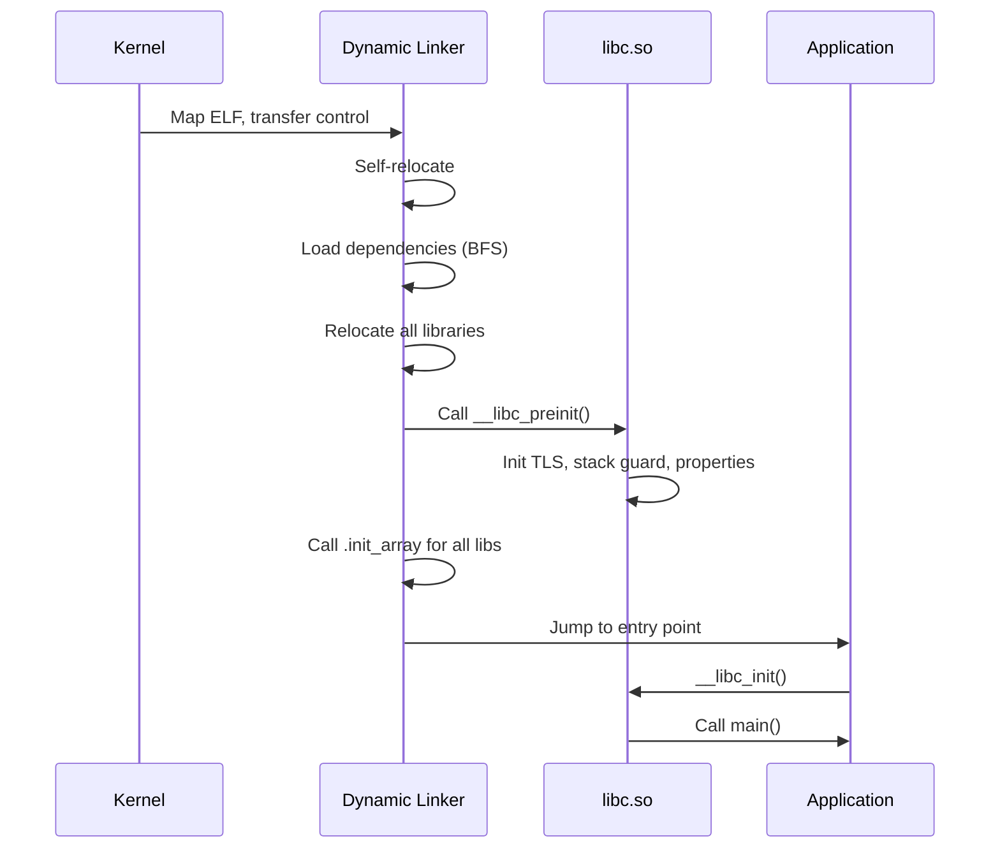

The `__libc_preinit_impl` function performs these critical steps:

1. **TLS generation synchronization** -- Registers libc's copy of the TLS
   generation counter with the linker so TLS modules stay in sync.
2. **Global variable initialization** -- Sets up `__libc_globals`, a
   write-protected structure containing the allocator dispatch table.
3. **Common initialization** -- Calls `__libc_init_common()` which initializes
   the system properties client, sets up the `environ` pointer, and configures
   the heap allocator.
4. **Netd client initialization** -- Registers DNS resolution hooks.
5. **Callback registration** -- Provides the linker with callbacks for HWASan
   library load/unload events and MTE stack remapping.

From `bionic/libc/bionic/libc_init_common.cpp` (lines 58-61):

```cpp
__LIBC_HIDDEN__ constinit WriteProtected<libc_globals> __libc_globals;
__LIBC_HIDDEN__ constinit _Atomic(bool) __libc_memtag_stack;
__LIBC_HIDDEN__ constinit bool __libc_memtag_stack_abi;
```

The `WriteProtected<>` template maps the globals structure into memory that is
normally read-only. Modifications require explicitly acquiring a
`ProtectedDataGuard`, which temporarily remaps the page as writable. This
defends against corruption of critical data like the allocator dispatch table.

### 7.1.5 Thread-Local Storage and the Bionic TCB

Bionic's TLS implementation is tightly integrated with the kernel. Each thread
has a **Thread Control Block (TCB)** accessible via a dedicated register
(TPIDR_EL0 on AArch64, GS segment on x86-64). The TCB layout is defined in
`bionic/libc/private/bionic_tls.h`.

From `bionic/libc/bionic/pthread_create.cpp` (lines 62-71):

```cpp
__attribute__((no_stack_protector))
void __init_tcb_stack_guard(bionic_tcb* tcb) {
  // GCC looks in the TLS for the stack guard on x86, so copy it there
  // from our global.
  tcb->tls_slot(TLS_SLOT_STACK_GUARD) = reinterpret_cast<void*>(__stack_chk_guard);
}

void __init_bionic_tls_ptrs(bionic_tcb* tcb, bionic_tls* tls) {
  tcb->thread()->bionic_tcb = tcb;
  tcb->thread()->bionic_tls = tls;
  tcb->tls_slot(TLS_SLOT_BIONIC_TLS) = tls;
}
```

Key TLS slots include:

| Slot | Purpose |
|------|---------|
| `TLS_SLOT_SELF` | Pointer to the TCB itself |
| `TLS_SLOT_THREAD_ID` | Thread ID for fast `gettid()` |
| `TLS_SLOT_STACK_GUARD` | Stack canary for `-fstack-protector` |
| `TLS_SLOT_BIONIC_TLS` | Pointer to the full `bionic_tls` structure |
| `TLS_SLOT_DTV` | Dynamic Thread Vector for ELF TLS |
| `TLS_SLOT_ART` | Reserved for the Android Runtime |

This fixed layout means that accessing thread-local state requires no function
calls or hash table lookups -- just a register read and a constant offset. The
stack guard canary, in particular, is accessed on every function entry and exit
in stack-protected code, so its placement in a fixed TLS slot is critical for
performance.

### 7.1.6 Architecture-Specific Optimizations

Bionic provides architecture-specific implementations for performance-critical
functions. The most notable are the string and memory operations.

**IFUNC (Indirect Function) Dispatch:**

On AArch64, functions like `memcpy`, `memset`, `strcmp`, and `strlen` are
dispatched at program startup via GNU IFUNC resolvers. The resolver examines
CPU capabilities and selects the optimal implementation.

From `bionic/libc/arch-arm64/ifuncs.cpp` (lines 36-49, 69-79):

```cpp
inline int implementer(uint64_t midr_el1) { return (midr_el1 >> 24) & 0xff; }
inline int variant(uint64_t midr_el1) { return (midr_el1 >> 20) & 0xf; }
inline int part(uint64_t midr_el1) { return (midr_el1 >> 4) & 0xfff; }
inline int revision(uint64_t midr_el1) { return (midr_el1 >> 0) & 0xf; }

static inline bool __bionic_is_oryon(unsigned long hwcap) {
  if (!(hwcap & HWCAP_CPUID)) return false;
  unsigned long midr;
  __asm__ __volatile__("mrs %0, MIDR_EL1" : "=r"(midr));
  return implementer(midr) == 'Q' && part(midr) <= 15;
}

// ...

DEFINE_IFUNC_FOR(memcpy) {
  if (arg->_hwcap2 & HWCAP2_MOPS) {
    RETURN_FUNC(memcpy_func_t, __memmove_aarch64_mops);
  } else if (__bionic_is_oryon(arg->_hwcap)) {
    RETURN_FUNC(memcpy_func_t, __memcpy_aarch64_nt);
  } else if (arg->_hwcap & HWCAP_ASIMD) {
    RETURN_FUNC(memcpy_func_t, __memcpy_aarch64_simd);
  } else {
    RETURN_FUNC(memcpy_func_t, __memcpy_aarch64);
  }
}
```

This code reveals four `memcpy` implementations for AArch64:

1. **MOPS (Memory Operations)** -- Uses the Armv8.8-A CPYFE instruction for
   hardware-accelerated memory copy. This is the fastest path on supported
   silicon.
2. **Oryon non-temporal** -- Qualcomm Oryon cores (implementer 'Q', parts 0-15)
   benefit from non-temporal stores that bypass the cache hierarchy for large
   copies. The implementation is in `bionic/libc/arch-arm64/oryon/memcpy-nt.S`.
3. **ASIMD (NEON)** -- Uses 128-bit SIMD load/store pairs. The standard fast
   path for most AArch64 devices.
4. **Generic** -- A scalar fallback for cores that lack ASIMD (theoretical on
   AArch64, but present for completeness).

Similarly, `memchr` has MTE-aware and standard variants:

```cpp
DEFINE_IFUNC_FOR(memchr) {
  if (arg->_hwcap2 & HWCAP2_MTE) {
    RETURN_FUNC(memchr_func_t, __memchr_aarch64_mte);
  } else {
    RETURN_FUNC(memchr_func_t, __memchr_aarch64);
  }
}
```

The MTE-aware variant must handle the possibility that pointer tags in the
search buffer do not match, requiring tag-stripped comparisons.

**Architecture-specific assembly files:**

Each architecture directory contains hand-written assembly for the most
critical paths:

| Architecture | Key Assembly Files |
|-------------|-------------------|
| `arch-arm64/bionic/` | `syscall.S`, `setjmp.S`, `vfork.S`, `__bionic_clone.S` |
| `arch-arm64/string/` | `__memcpy_chk.S`, `__memset_chk.S` |
| `arch-arm64/oryon/` | `memcpy-nt.S`, `memset-nt.S` |
| `arch-arm/bionic/` | Cortex-A53/A55/A7/A9/A15/Krait/Kryo-specific routines |
| `arch-x86_64/bionic/` | `syscall.S`, `setjmp.S` |
| `arch-x86_64/string/` | SSE/AVX-optimized string operations |
| `arch-riscv64/bionic/` | `syscall.S`, `setjmp.S` |
| `arch-riscv64/string/` | RISC-V string operations |

The ARM 32-bit tree is particularly rich, with CPU-specific subdirectories for
Cortex-A53, Cortex-A55, Cortex-A7, Cortex-A9, Cortex-A15, Krait (Qualcomm),
and Kryo (Qualcomm). The IFUNC resolver on ARM selects among these at runtime
based on `/proc/cpuinfo` or HWCAP values.

### 7.1.7 Upstream Code and the BSD Heritage

Bionic does not implement everything from scratch. It imports code from three
BSD operating systems:

- **OpenBSD**: Provides `strlcpy`, `strlcat`, `arc4random`, `reallocarray`,
  and much of the standard string library. OpenBSD's focus on security makes
  it a natural source for hardened implementations.

- **FreeBSD**: Contributes parts of the math library (`libm`), locale support,
  and some string functions.

- **NetBSD**: Provides the DNS resolver (`bionic/libc/dns/`) and some
  miscellaneous utility functions.

Imports are kept in separate directories (`upstream-openbsd/`, `upstream-freebsd/`,
`upstream-netbsd/`) and are periodically updated to incorporate upstream bug
fixes and security patches.

### 7.1.8 The Property System Client

Android's property system (`__system_property_get`, `__system_property_set`)
is implemented partly in Bionic. The client-side code in
`bionic/libc/system_properties/` provides lock-free reads from a shared memory
region mapped into every process. This is how every process on Android can read
system properties without IPC overhead.

The property area is initialized during `__libc_init_common()`:

From `bionic/libc/bionic/libc_init_common.cpp` (line 54):

```cpp
extern "C" int __system_properties_init(void);
```

This function maps the property area file (`/dev/__properties__/`) and sets up
the internal data structures for property reads.

### 7.1.9 Bionic vs. glibc: Feature Comparison

| Feature | Bionic | glibc |
|---------|--------|-------|
| License | BSD | LGPL |
| Size (stripped) | ~1 MB | ~8 MB |
| Locale support | Minimal (ASCII + UTF-8) | Full ICU-level |
| NSS modules | No | Yes |
| Thread cancellation | No | Yes |
| Stack protector | Fixed TLS slot | Variable offset |
| Default allocator | Scudo | ptmalloc2 |
| `dlopen` from APK | Yes (ZIP file support) | No |
| `android_dlopen_ext` | Yes | N/A |
| seccomp integration | Built-in | External |
| Property system | Built-in | N/A |
| FORTIFY_SOURCE | Enhanced | Standard |

### 7.1.10 Memory Safety Features

Bionic incorporates several memory safety features that have no glibc equivalent:

**MTE (Memory Tagging Extension):**
On Armv8.5-A and later hardware, Bionic supports MTE for both heap and stack
memory. The `note_memtag_heap_async.S` and `note_memtag_heap_sync.S` files in
`arch-arm64/bionic/` contain ELF notes that request MTE for heap allocations.

**Scudo hardened allocator:**
Bionic's default allocator is Scudo, a security-hardened allocator that provides
guard pages, quarantine zones, and integrity checks. The dispatch mechanism in
`malloc_common.cpp` allows Scudo to be transparently replaced with debug
allocators.

**GWP-ASan:**
A sampling allocator that catches use-after-free and buffer overflow bugs in
production, integrated via `gwp_asan_wrappers.h`.

**FORTIFY_SOURCE:**
Bionic's FORTIFY implementation is more aggressive than glibc's, with additional
compile-time and runtime checks for buffer overflows in string and memory
functions.

**Tagged pointers:**
Even without MTE hardware, Bionic can tag the top byte of heap pointers
(Top-Byte Ignore / TBI on ARM) to detect certain classes of memory corruption.

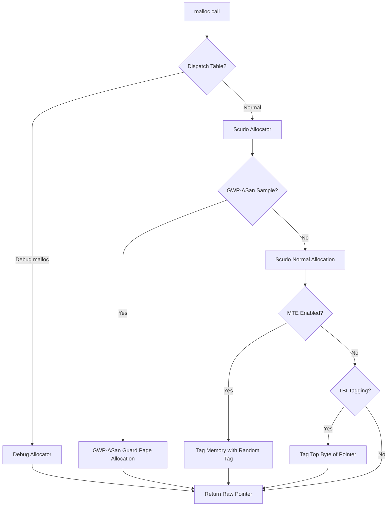

---

## 7.2 System Call Interface

### 7.2.1 How System Calls Work on Android

Every interaction between user-space code and the Linux kernel passes through a
system call. Bionic provides the user-space half of this interface: the thin
assembly stubs that transition from user mode to kernel mode, and the C wrapper
functions that provide the POSIX API.

The system call interface has three layers:

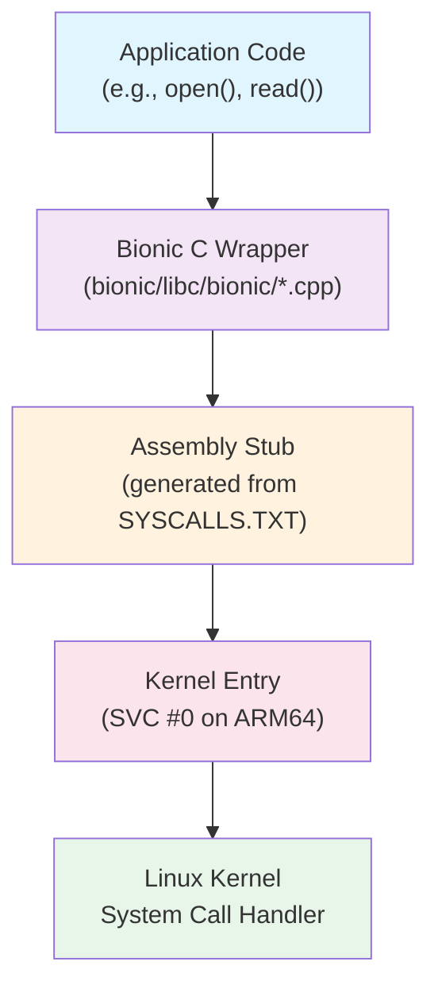

### 7.2.2 SYSCALLS.TXT: The System Call Definition File

All system call stubs in Bionic are auto-generated from a single definition
file:

**Source file:** `bionic/libc/SYSCALLS.TXT` (384 lines)

From `bionic/libc/SYSCALLS.TXT` (lines 1-14):

```
# This file is used to automatically generate bionic's system call stubs.
#
# It is processed by a python script named gensyscalls.py,
# normally run via the genrules in libc/Android.bp.
#
# Each non-blank, non-comment line has the following format:
#
#     func_name[|alias_list][:syscall_name[:socketcall_id]]([parameter_list]) arch_list
#
# where:
#     arch_list ::= "all" | arches
#     arches    ::= arch |  arch "," arches
#     arch      ::= "arm" | "arm64" | "riscv64" | "x86" | "x86_64" | "lp32" | "lp64"
```

Each line in SYSCALLS.TXT describes one system call with its function name,
optional aliases, parameter types, and the architectures on which it should
be generated. The format supports several important patterns:

**Direct system call mapping:**
```
read(int, void*, size_t)        all
write(int, const void*, size_t) all
```

**Renamed system calls (where the C name differs from the kernel name):**
```
__close:close(int)  all
__getpid:getpid()  all
__openat:openat(int, const char*, int, mode_t) all
```

The `__close:close` syntax means "generate a function named `__close` that
invokes the kernel's `close` system call." The actual `close()` function that
applications call is a C wrapper in `bionic/libc/bionic/` that performs
additional work (like FORTIFY checks or fdsan validation) before calling
`__close`.

**Architecture-conditional system calls:**
```
getuid:getuid32()   lp32
getuid()            lp64
```

On 32-bit platforms (`lp32`), the `getuid` function calls the kernel's
`getuid32` system call (because the original `getuid` uses 16-bit UIDs). On
64-bit platforms (`lp64`), it calls `getuid` directly.

**Aliased functions:**
```
lseek|lseek64(int, off_t, int) lp64
_exit|_Exit:exit_group(int)    all
```

The pipe symbol creates multiple symbol aliases that share the same
implementation. On 64-bit systems, `lseek` and `lseek64` are identical because
`off_t` is 64-bit.

**x86 socketcall multiplexing:**
```
__socket:socketcall:1(int, int, int) x86
__connect:socketcall:3(int, struct sockaddr*, socklen_t) x86
```

On 32-bit x86, socket operations are multiplexed through a single `socketcall`
system call, with a numeric sub-command. Bionic's generator handles this
automatically.

### 7.2.3 System Call Stub Generation

The `gensyscalls.py` script (`bionic/libc/tools/gensyscalls.py`) reads
SYSCALLS.TXT and generates architecture-specific assembly stubs. The supported
architectures are:

```python
SupportedArchitectures = [ "arm", "arm64", "riscv64", "x86", "x86_64" ]
```

**ARM 32-bit stub (4 or fewer register arguments):**

```asm
ENTRY(%(func)s)
    mov     ip, r7
    .cfi_register r7, ip
    ldr     r7, =%(NR_name)s
    swi     #0
    mov     r7, ip
    .cfi_restore r7
    cmn     r0, #(MAX_ERRNO + 1)
    bxls    lr
    neg     r0, r0
    b       __set_errno_internal
END(%(func)s)
```

On ARM, the system call number goes in register r7, and the SWI (Software
Interrupt) instruction traps into the kernel. The stub saves and restores r7
(which is the frame pointer in Thumb mode) to avoid corrupting the call stack.

**AArch64 syscall function:**

From `bionic/libc/arch-arm64/bionic/syscall.S` (lines 31-49):

```asm
ENTRY(syscall)
    /* Move syscall No. from x0 to x8 */
    mov     x8, x0
    /* Move syscall parameters from x1 thru x6 to x0 thru x5 */
    mov     x0, x1
    mov     x1, x2
    mov     x2, x3
    mov     x3, x4
    mov     x4, x5
    mov     x5, x6
    svc     #0

    /* check if syscall returned successfully */
    cmn     x0, #(MAX_ERRNO + 1)
    cneg    x0, x0, hi
    b.hi    __set_errno_internal

    ret
END(syscall)
```

This is the generic `syscall()` function for AArch64. The system call number
goes in x8, and up to six arguments go in x0-x5. The `SVC #0` instruction
enters the kernel. On return, if x0 contains a value in the range
[-MAX_ERRNO, -1], the error is negated and stored in `errno` via
`__set_errno_internal`.

### 7.2.4 The System Call Catalog

SYSCALLS.TXT defines system calls in several categories. Here is a breakdown
of the major groups:

**Process and identity management:**
```
getuid(), getgid(), geteuid(), getegid()
setuid(), setgid(), setresuid(), setresgid()
getpid(), getppid(), getpgid(), getsid()
kill(), tgkill()
execve(), clone(), _exit()
```

**File descriptors:**
```
read(), write(), pread64(), pwrite64()
__close:close(), __openat:openat()
__fcntl64:fcntl64() (lp32), __fcntl:fcntl() (lp64)
__dup:dup(), __dup3:dup3()
```

**Memory management:**
```
__mmap2:mmap2() (lp32), mmap|mmap64() (lp64)
munmap(), mprotect(), madvise(), mremap()
__brk:brk(), mseal() (lp64 only)
```

**File system:**
```
chdir(), mount(), umount2(), getcwd()
fstatat64(), statx()
setxattr(), getxattr(), listxattr()
```

**Networking (per-architecture):**
```
__socket:socket()              arm,lp64
__socket:socketcall:1()        x86
bind(), listen(), __accept4:accept4()
```

**Signals:**
```
__rt_sigaction:rt_sigaction()
__rt_sigprocmask:rt_sigprocmask()
__rt_sigsuspend:rt_sigsuspend()
__signalfd4:signalfd4()
```

**Architecture-specific:**
```
__set_tls:__ARM_NR_set_tls(void*)                    arm
cacheflush:__ARM_NR_cacheflush(long, long, long)     arm
__riscv_flush_icache:riscv_flush_icache(void*, void*, unsigned long) riscv64
__set_thread_area:set_thread_area(void*)              x86
arch_prctl(int, unsigned long)                        x86_64
```

**VDSO-accelerated calls:**
```
__clock_getres:clock_getres(clockid_t, struct timespec*) all
__clock_gettime:clock_gettime(clockid_t, struct timespec*) all
__gettimeofday:gettimeofday(struct timeval*, struct timezone*) all
```

These three system calls are typically handled by the VDSO (Virtual Dynamic
Shared Object), which the kernel maps into every process. The VDSO contains
user-space implementations of these calls that read from kernel-managed shared
memory pages, avoiding the overhead of a full kernel transition. Bionic's
dynamic linker explicitly loads the VDSO (see Section 7.3).

### 7.2.5 LP32 vs. LP64 Differences

The system call interface differs significantly between 32-bit and 64-bit
platforms:

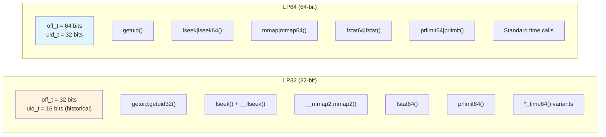

On 32-bit systems, many system calls have `64` suffixes or use register pairs
for 64-bit arguments. The SYSCALLS.TXT generator handles the ABI requirements
automatically, including ARM's constraint that 64-bit argument pairs must start
on an even-numbered register.

The time64 variants (lines 76-91 of `SECCOMP_ALLOWLIST_COMMON.TXT`) are
particularly notable:

```
clock_gettime64(clockid_t, timespec64*) lp32
clock_settime64(clockid_t, const timespec64*) lp32
futex_time64(int*, int, int, const timespec64*, int*, int) lp32
```

These were added for the Y2038 problem: 32-bit `time_t` overflows in January

> The `*_time64` system calls use 64-bit time structures even on 32-bit platforms.

### 7.2.6 Seccomp-BPF: System Call Filtering

Android restricts which system calls are available to application processes
using seccomp-BPF (Secure Computing with Berkeley Packet Filter). This is a
critical security boundary: even if an attacker achieves arbitrary code
execution within an app process, they cannot invoke dangerous system calls
that the seccomp filter blocks.

The seccomp policy is built from multiple text files:

| File | Purpose |
|------|---------|
| `SYSCALLS.TXT` | Base set of system calls bionic needs |
| `SECCOMP_ALLOWLIST_COMMON.TXT` | Additional allowed calls (all processes) |
| `SECCOMP_ALLOWLIST_APP.TXT` | Additional allowed calls (app processes only) |
| `SECCOMP_ALLOWLIST_SYSTEM.TXT` | Additional allowed calls (system server only) |
| `SECCOMP_BLOCKLIST_APP.TXT` | Calls removed from apps even if in SYSCALLS.TXT |
| `SECCOMP_BLOCKLIST_COMMON.TXT` | Calls removed from all Zygote children |
| `SECCOMP_PRIORITY.TXT` | Syscalls to check first (hot path optimization) |

**The formula for the final policy:**

```
Final Allowlist = SYSCALLS.TXT - BLOCKLIST + ALLOWLIST
```

From `bionic/libc/SECCOMP_BLOCKLIST_APP.TXT` (lines 1-7):

```
# The final seccomp allowlist is SYSCALLS.TXT - SECCOMP_BLOCKLIST.TXT
#   + SECCOMP_ALLOWLIST.TXT
# Any entry in the blocklist must be in the syscalls file and not be in
#   the allowlist file
```

**Blocked system calls for apps:**

The `SECCOMP_BLOCKLIST_APP.TXT` file (51 lines) removes dangerous system calls
from app processes:

```
# Syscalls to modify IDs.
setgid32(gid_t)     lp32
setgid(gid_t)       lp64
setuid32(uid_t)     lp32
setuid(uid_t)       lp64

# Syscalls to modify times.
adjtimex(struct timex*)   all
clock_adjtime(clockid_t, struct timex*)   all
clock_settime(clockid_t, const struct timespec*)  all
settimeofday(const struct timeval*, const struct timezone*)   all

# Dangerous operations
chroot(const char*)  all
init_module(void*, unsigned long, const char*)  all
delete_module(const char*, unsigned int)   all
mount(const char*, const char*, const char*, unsigned long, const void*)  all
reboot(int, int, int, void*)  all
```

These are system calls that exist in SYSCALLS.TXT (because system daemons need
them) but are too dangerous for unprivileged app processes.

**The common blocklist** (`SECCOMP_BLOCKLIST_COMMON.TXT`) adds:

```
swapon(const char*, int) all
swapoff(const char*) all
```

**The app allowlist** (`SECCOMP_ALLOWLIST_APP.TXT`, 62 lines) re-enables
specific calls that apps need but are not in the base SYSCALLS.TXT set, often
for backward compatibility:

```
# Needed for debugging 32-bit Chrome
pipe(int pipefd[2])  lp32

# b/34813887
open(const char *path, int oflag, ... ) lp32,x86_64

# Not used by bionic in U because riscv64 doesn't have it, but still
# used by legacy apps (http://b/254179267).
renameat(int, const char*, int, const char*)  arm,x86,arm64,x86_64
```

Each entry references an Android bug tracker ID, documenting why the exception
exists.

**Priority optimization:**

From `bionic/libc/SECCOMP_PRIORITY.TXT` (lines 9-10):

```
futex
ioctl
```

These two system calls are checked first in the BPF filter. Since `futex` and
`ioctl` are the most frequently invoked system calls in a typical Android
process (futex for mutex/condvar operations, ioctl for Binder IPC), checking
them first minimizes the average number of BPF instructions executed per system
call.

### 7.2.7 Seccomp Policy Installation

The seccomp filter is installed by the Zygote process before it forks
application processes. The implementation is in
`bionic/libc/seccomp/seccomp_policy.cpp`.

From `bionic/libc/seccomp/seccomp_policy.cpp` (lines 33-94):

```cpp
#if defined __arm__ || defined __aarch64__
#define PRIMARY_ARCH AUDIT_ARCH_AARCH64
static const struct sock_filter* primary_app_filter = arm64_app_filter;
// ...
#define SECONDARY_ARCH AUDIT_ARCH_ARM
static const struct sock_filter* secondary_app_filter = arm_app_filter;
// ...
#elif defined __i386__ || defined __x86_64__
#define PRIMARY_ARCH AUDIT_ARCH_X86_64
// ...
#define SECONDARY_ARCH AUDIT_ARCH_I386
// ...
#elif defined(__riscv)
#define PRIMARY_ARCH AUDIT_ARCH_RISCV64
// ...
#endif
```

The filter handles dual-architecture systems (e.g., a 64-bit kernel running
32-bit apps) by checking the architecture field in the seccomp data structure
and jumping to the appropriate filter:

From `bionic/libc/seccomp/seccomp_policy.cpp` (lines 128-141):

```cpp
static size_t ValidateArchitectureAndJumpIfNeeded(filter& f) {
    f.push_back(BPF_STMT(BPF_LD|BPF_W|BPF_ABS, arch_nr));
    f.push_back(BPF_JUMP(BPF_JMP|BPF_JEQ|BPF_K, PRIMARY_ARCH, 2, 0));
    f.push_back(BPF_JUMP(BPF_JMP|BPF_JEQ|BPF_K, SECONDARY_ARCH, 1, 0));
    Disallow(f);
    return f.size() - 2;
}
```

**The BPF program structure:**

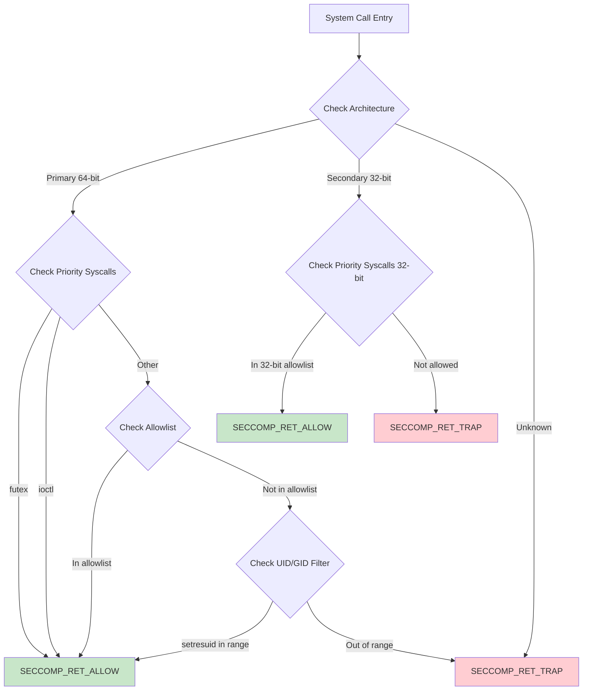

Three separate filter profiles are generated:

1. **App filter** -- For regular application processes
2. **App Zygote filter** -- For app zygote processes (used by isolated services)
3. **System filter** -- For system server and privileged daemons

The filters are compiled from C structures into BPF bytecode and installed
using `prctl(PR_SET_SECCOMP)`:

From `bionic/libc/seccomp/seccomp_policy.cpp` (lines 193-199):

```cpp
static bool install_filter(filter const& f) {
    struct sock_fprog prog = {
        static_cast<unsigned short>(f.size()),
        const_cast<struct sock_filter*>(&f[0]),
    };
    if (prctl(PR_SET_SECCOMP, SECCOMP_MODE_FILTER, &prog) < 0) {
```

The `SECCOMP_RET_TRAP` action sends a SIGSYS signal to the process, which
Android's debuggerd captures for crash reporting. This produces a clear
crash report that identifies the forbidden system call, aiding debugging.

### 7.2.8 VDSO: Avoiding System Call Overhead

For the most performance-sensitive system calls, the kernel provides a Virtual
Dynamic Shared Object (VDSO) -- a tiny shared library mapped by the kernel into
every process's address space. Bionic's dynamic linker explicitly locates and
links the VDSO.

From `bionic/linker/linker_main.cpp` (lines 184-205):

```cpp
static void add_vdso() {
  ElfW(Ehdr)* ehdr_vdso = reinterpret_cast<ElfW(Ehdr)*>(
      getauxval(AT_SYSINFO_EHDR));
  if (ehdr_vdso == nullptr) {
    return;
  }

  vdso = soinfo_alloc(&g_default_namespace, "[vdso]", nullptr, 0, 0);

  vdso->phdr = reinterpret_cast<ElfW(Phdr)*>(
      reinterpret_cast<char*>(ehdr_vdso) + ehdr_vdso->e_phoff);
  vdso->phnum = ehdr_vdso->e_phnum;
  vdso->base = reinterpret_cast<ElfW(Addr)>(ehdr_vdso);
  vdso->size = phdr_table_get_load_size(vdso->phdr, vdso->phnum);
  vdso->load_bias = get_elf_exec_load_bias(ehdr_vdso);

  if (!vdso->prelink_image() ||
      !vdso->link_image(SymbolLookupList(vdso), vdso, nullptr, nullptr)) {
    __linker_cannot_link(g_argv[0]);
  }

  // Prevent accidental unloads...
  vdso->set_dt_flags_1(vdso->get_dt_flags_1() | DF_1_NODELETE);
  vdso->set_linked();
}
```

The VDSO is located via the `AT_SYSINFO_EHDR` auxiliary vector entry, which
the kernel places on the process stack at exec time. The linker treats the
VDSO like any other shared library -- creating a `soinfo` structure, running
the prelink and link phases -- but the VDSO's code runs entirely in user space,
reading kernel-maintained data structures to answer queries like "what time is
it?" without a mode switch.

VDSO-accelerated calls in Bionic:

- `clock_gettime()` -- The single most frequently called time function
- `clock_getres()` -- Clock resolution query
- `gettimeofday()` -- Legacy time-of-day query

---

## 7.3 The Dynamic Linker

### 7.3.1 Overview

The dynamic linker (`/system/bin/linker64` on 64-bit devices, `/system/bin/linker`
on 32-bit) is responsible for loading every dynamically-linked executable and
shared library on Android. It is the first user-space code to execute after the
kernel maps a new process, and its correct operation is essential for every
native binary on the system.

The linker source lives in `bionic/linker/` and comprises approximately 50
source files totaling over 7,000 lines of C++. The key files are:

| File | Lines | Purpose |
|------|-------|---------|
| `linker.cpp` | 3,791 | Core linking logic: library search, loading, namespace management |
| `linker_phdr.cpp` | 1,737 | ELF parsing, segment loading, address space management |
| `linker_main.cpp` | 859 | Entry point, initialization, main linking sequence |
| `linker_relocate.cpp` | 686 | Relocation processing |
| `linker_namespaces.h` | 183 | Namespace data structures |
| `linker_soinfo.h` | ~400 | `soinfo` structure definition |
| `linker_config.cpp` | ~500 | Configuration file parser |
| `dlfcn.cpp` | ~100 | `dlopen`/`dlsym` API surface |

### 7.3.2 The Linker Entry Point

When the kernel executes a dynamically-linked ELF binary, it:

1. Maps the executable's PT_LOAD segments
2. Reads the PT_INTERP segment to find the linker path (e.g., `/system/bin/linker64`)
3. Maps the linker into the process
4. Sets up the auxiliary vector (AT_PHDR, AT_ENTRY, AT_BASE, etc.)
5. Transfers control to the linker's entry point

The linker's entry point is `_start` (in architecture-specific assembly), which
calls `__linker_init`. This function faces a bootstrapping problem: the linker
itself is a dynamically-linked binary that needs to be relocated before it can
relocate anything else.

The solution is a two-phase initialization:

1. **Self-relocation** -- Process the linker's own relocations using only
   position-independent code (no external symbol references)
2. **Main link** -- Load and link the executable and all its dependencies

### 7.3.3 The Main Linking Sequence

The `linker_main` function in `bionic/linker/linker_main.cpp` orchestrates the
entire linking process.

From `bionic/linker/linker_main.cpp` (lines 297-525):

```cpp
static ElfW(Addr) linker_main(KernelArgumentBlock& args,
                               const char* exe_to_load) {
  ProtectedDataGuard guard;

  // Sanitize the environment.
  __libc_init_AT_SECURE(args.envp);

  // Initialize system properties
  __system_properties_init();

  // Initialize platform properties.
  platform_properties_init();

  // Register the debuggerd signal handler.
  linker_debuggerd_init();
```

The function proceeds through these phases:

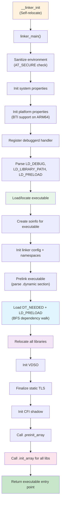

**Phase 1: Environment and Security**

```cpp
  // These should have been sanitized by __libc_init_AT_SECURE, but the
  // test doesn't cost us anything.
  const char* ldpath_env = nullptr;
  const char* ldpreload_env = nullptr;
  if (!getauxval(AT_SECURE)) {
    ldpath_env = getenv("LD_LIBRARY_PATH");
    ldpreload_env = getenv("LD_PRELOAD");
  }
```

When `AT_SECURE` is set (the executable is setuid/setgid), `LD_LIBRARY_PATH`
and `LD_PRELOAD` are ignored. This prevents privilege escalation attacks where a
user sets these variables to inject malicious libraries into a privileged
process.

**Phase 2: Executable Initialization**

From `bionic/linker/linker_main.cpp` (lines 340-358):

```cpp
  const ExecutableInfo exe_info = exe_to_load ?
      load_executable(exe_to_load) :
      get_executable_info(args.argv[0]);

  soinfo* si = soinfo_alloc(&g_default_namespace,
                            exe_info.path.c_str(), &exe_info.file_stat,
                            0, RTLD_GLOBAL);
  somain = si;
  si->phdr = exe_info.phdr;
  si->phnum = exe_info.phdr_count;
  si->set_should_pad_segments(exe_info.should_pad_segments);
  get_elf_base_from_phdr(si->phdr, si->phnum, &si->base, &si->load_bias);
  si->size = phdr_table_get_load_size(si->phdr, si->phnum);
  si->dynamic = nullptr;
  si->set_main_executable();
  init_link_map_head(*si);
  set_bss_vma_name(si);
```

The `get_executable_info` function reads the executable's program headers from
the auxiliary vector (`AT_PHDR`, `AT_PHNUM`, `AT_ENTRY`). The kernel has
already mapped the executable, so the linker just needs to find the headers.

The `soinfo` structure is the linker's per-library metadata. It is allocated
from a custom block allocator (`LinkerTypeAllocator<soinfo>`) that maps memory
in page-sized blocks, enabling write-protection via `ProtectedDataGuard`.

**Phase 3: Namespace Initialization and Dependency Loading**

```cpp
  std::vector<android_namespace_t*> namespaces =
      init_default_namespaces(exe_info.path.c_str());

  if (!si->prelink_image()) __linker_cannot_link(g_argv[0]);

  // Load ld_preloads and dependencies.
  for (const ElfW(Dyn)* d = si->dynamic; d->d_tag != DT_NULL; ++d) {
    if (d->d_tag == DT_NEEDED) {
      const char* name = fix_dt_needed(
          si->get_string(d->d_un.d_val), si->get_realpath());
      needed_library_name_list.push_back(name);
    }
  }

  if (!find_libraries(&g_default_namespace, si,
                      needed_library_names, needed_libraries_count,
                      nullptr, &g_ld_preloads, ld_preloads_count,
                      RTLD_GLOBAL, nullptr,
                      true /* add_as_children */, &namespaces)) {
    __linker_cannot_link(g_argv[0]);
  }
```

The `prelink_image` method parses the `.dynamic` section to extract symbol
tables, relocation tables, DT_NEEDED entries, and initialization/finalization
functions. The `find_libraries` function then performs a breadth-first
dependency walk, loading each library and adding it to the appropriate namespace.

**Phase 4: Constructor Invocation and Handoff**

```cpp
  si->call_pre_init_constructors();
  si->call_constructors();

  ElfW(Addr) entry = exe_info.entry_point;
  return entry;
```

After all libraries are loaded and relocated, the linker calls initialization
functions in dependency order (leaves first, roots last). It then returns the
executable's entry point address, and control transfers to the application.

### 7.3.4 The soinfo Structure

The `soinfo` structure is the linker's representation of a loaded shared
library. Every library -- including the executable itself, the linker, and the
VDSO -- has one.

From `bionic/linker/linker_soinfo.h` (lines 157-248):

```cpp
struct soinfo {
  const ElfW(Phdr)* phdr;
  size_t phnum;
  ElfW(Addr) base;
  size_t size;

  ElfW(Dyn)* dynamic;
  soinfo* next;

 private:
  uint32_t flags_;
  const char* strtab_;
  ElfW(Sym)* symtab_;

  size_t nbucket_;
  size_t nchain_;
  uint32_t* bucket_;
  uint32_t* chain_;

#if defined(USE_RELA)
  ElfW(Rela)* plt_rela_;
  size_t plt_rela_count_;
  ElfW(Rela)* rela_;
  size_t rela_count_;
#else
  ElfW(Rel)* plt_rel_;
  size_t plt_rel_count_;
  ElfW(Rel)* rel_;
  size_t rel_count_;
#endif

  linker_ctor_function_t* preinit_array_;
  size_t preinit_array_count_;
  linker_ctor_function_t* init_array_;
  size_t init_array_count_;
  linker_dtor_function_t* fini_array_;
  size_t fini_array_count_;

  linker_ctor_function_t init_func_;
  linker_dtor_function_t fini_func_;

#if defined(__arm__)
  uint32_t* ARM_exidx;
  size_t ARM_exidx_count;
#endif

  link_map link_map_head;
  bool constructors_called;
  ElfW(Addr) load_bias;
  bool has_DT_SYMBOLIC;
};
```

Key flags in the `flags_` field:

| Flag | Value | Meaning |
|------|-------|---------|
| `FLAG_LINKED` | 0x00000001 | Library is fully linked |
| `FLAG_EXE` | 0x00000004 | This is the main executable |
| `FLAG_LINKER` | 0x00000010 | This is the linker itself |
| `FLAG_GNU_HASH` | 0x00000040 | Uses GNU hash table |
| `FLAG_MAPPED_BY_CALLER` | 0x00000080 | Memory was provided externally |
| `FLAG_IMAGE_LINKED` | 0x00000100 | `link_image` has run |
| `FLAG_PRELINKED` | 0x00000400 | `prelink_image` has run |
| `FLAG_GLOBALS_TAGGED` | 0x00000800 | MTE globals tagged |

The `soinfo` structures form a singly-linked list via the `next` pointer,
maintained by `solist_add_soinfo` and `solist_remove_soinfo`. The list order
is:

1. The main executable (`somain`)
2. The linker itself (`solinker`)
3. The VDSO (if present)
4. All other libraries in load order

### 7.3.5 ELF Loading: The ElfReader Class

The `ElfReader` class in `bionic/linker/linker_phdr.cpp` handles the mechanics
of reading and mapping ELF files into memory.

**Reading an ELF file:**

From `bionic/linker/linker_phdr.cpp` (lines 171-208):

```cpp
bool ElfReader::Read(const char* name, int fd, off64_t file_offset,
                     off64_t file_size) {
  if (did_read_) {
    return true;
  }
  name_ = name;
  fd_ = fd;
  file_offset_ = file_offset;
  file_size_ = file_size;

  if (ReadElfHeader() &&
      VerifyElfHeader() &&
      ReadProgramHeaders() &&
      CheckProgramHeaderAlignment() &&
      ReadSectionHeaders() &&
      ReadDynamicSection() &&
      ReadPadSegmentNote()) {
    did_read_ = true;
  }
  // ...
  return did_read_;
}
```

The Read phase performs validation and reads metadata:

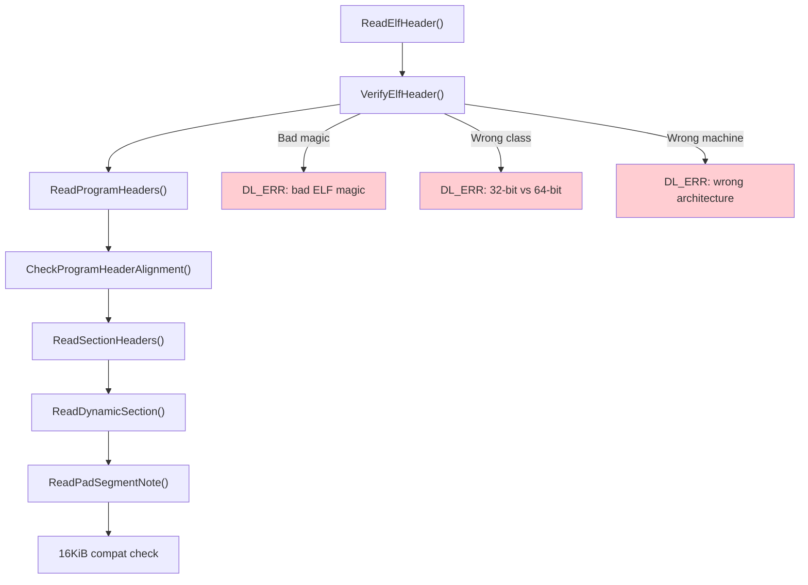

**ELF header verification:**

From `bionic/linker/linker_phdr.cpp` (lines 271-340):

```cpp
bool ElfReader::VerifyElfHeader() {
  if (memcmp(header_.e_ident, ELFMAG, SELFMAG) != 0) {
    DL_ERR("\"%s\" has bad ELF magic", name_.c_str());
    return false;
  }

  int elf_class = header_.e_ident[EI_CLASS];
#if defined(__LP64__)
  if (elf_class != ELFCLASS64) {
    if (elf_class == ELFCLASS32) {
      DL_ERR("\"%s\" is 32-bit instead of 64-bit", name_.c_str());
    }
    return false;
  }
#endif

  if (header_.e_type != ET_DYN) {
    DL_ERR("\"%s\" has unexpected e_type: %d", name_.c_str(), header_.e_type);
    return false;
  }

  if (header_.e_machine != GetTargetElfMachine()) {
    DL_ERR("\"%s\" is for %s instead of %s",
           name_.c_str(),
           EM_to_string(header_.e_machine),
           EM_to_string(GetTargetElfMachine()));
    return false;
  }
  return true;
}
```

The `GetTargetElfMachine()` function returns the expected ELF machine type
based on the compile-time architecture:

```cpp
static int GetTargetElfMachine() {
#if defined(__arm__)
  return EM_ARM;
#elif defined(__aarch64__)
  return EM_AARCH64;
#elif defined(__i386__)
  return EM_386;
#elif defined(__riscv)
  return EM_RISCV;
#elif defined(__x86_64__)
  return EM_X86_64;
#endif
}
```

Note that the linker requires `e_type == ET_DYN`. This means Android only loads
Position-Independent Executables (PIE). Non-PIE support was dropped in API level
21 for security (ASLR effectiveness):

```cpp
if (elf_hdr->e_type != ET_DYN) {
    __linker_error("error: Android only supports position-independent "
                   "executables (-fPIE)");
}
```

**Loading segments into memory:**

From `bionic/linker/linker_phdr.cpp` (lines 211-238):

```cpp
bool ElfReader::Load(address_space_params* address_space) {
  CHECK(did_read_);
  if (did_load_) {
    return true;
  }
  bool reserveSuccess = ReserveAddressSpace(address_space);
  if (reserveSuccess && LoadSegments() && FindPhdr() &&
      FindGnuPropertySection()) {
    did_load_ = true;
#if defined(__aarch64__)
    if (note_gnu_property_.IsBTICompatible()) {
      did_load_ =
          (phdr_table_protect_segments(phdr_table_, phdr_num_, load_bias_,
               should_pad_segments_, should_use_16kib_app_compat_,
               &note_gnu_property_) == 0);
    }
#endif
  }
  return did_load_;
}
```

The Load phase:

1. **ReserveAddressSpace** -- Allocates a contiguous virtual address range for
   all PT_LOAD segments via `mmap(PROT_NONE)`.
2. **LoadSegments** -- Maps each PT_LOAD segment from the file into the
   reserved range with appropriate permissions.
3. **FindPhdr** -- Locates the program header table within the mapped image.
4. **FindGnuPropertySection** -- Reads `.note.gnu.property` for BTI
   (Branch Target Identification) compatibility on AArch64.
5. **BTI protection** -- If the library is BTI-compatible, applies
   `PROT_BTI` to executable segments.

**Address space reservation with ASLR enhancement:**

From `bionic/linker/linker_phdr.cpp` (lines 589-662):

```cpp
// Reserve a virtual address range such that if its limits were extended
// to the next 2**align boundary, it would not overlap with any existing
// mappings.
static void* ReserveWithAlignmentPadding(size_t size, size_t mapping_align,
                                          size_t start_align,
                                          void** out_gap_start,
                                          size_t* out_gap_size) {
  // ...
#if defined(__LP64__)
  size_t first_byte = reinterpret_cast<size_t>(
      __builtin_align_up(mmap_ptr, mapping_align));
  size_t last_byte = reinterpret_cast<size_t>(
      __builtin_align_down(mmap_ptr + mmap_size, mapping_align) - 1);
  if (first_byte / kGapAlignment != last_byte / kGapAlignment) {
    // This library crosses a 2MB boundary and will fragment a new huge
    // page. Insert random inaccessible huge pages before to improve
    // ASLR.
    gap_size = kGapAlignment * (is_first_stage_init() ? 1 :
        arc4random_uniform(kMaxGapUnits - 1) + 1);
  }
#endif
```

This code implements an ASLR enhancement: when a library's mapping crosses a
2MB (PMD-sized) boundary, the linker inserts a random number of inaccessible
2MB pages before the library. This makes it harder for attackers to locate
library code by probing for readable memory mappings. The gap size is random
(1 to 32 units of 2MB = 2-64MB) and varies per library load.

### 7.3.6 The Load Bias and Virtual Address Calculation

A central concept in ELF loading is the **load bias**:

From the documentation comment in `bionic/linker/linker_phdr.cpp` (lines 74-149):

```
An ELF file's program header table contains one or more PT_LOAD
segments, which corresponds to portions of the file that need to
be mapped into the process' address space.

Each loadable segment has the following important properties:
    p_offset  -> segment file offset
    p_filesz  -> segment file size
    p_memsz   -> segment memory size (always >= p_filesz)
    p_vaddr   -> segment's virtual address
    p_flags   -> segment flags (e.g. readable, writable, executable)
    p_align   -> segment's alignment

The load_bias must be added to any p_vaddr value read from the ELF
file to determine the corresponding memory address.

    load_bias = phdr0_load_address - page_start(phdr0->p_vaddr)
```

The load bias is the difference between where the first segment was actually
mapped and where it "wanted" to be (its p_vaddr). Since all segments maintain
their relative positions, adding the load bias to any p_vaddr gives the actual
memory address:

```
actual_address = p_vaddr + load_bias
```

The calculation:

From `bionic/linker/linker_phdr.cpp` (lines 516-553):

```cpp
size_t phdr_table_get_load_size(const ElfW(Phdr)* phdr_table,
                                 size_t phdr_count,
                                 ElfW(Addr)* out_min_vaddr,
                                 ElfW(Addr)* out_max_vaddr) {
  ElfW(Addr) min_vaddr = UINTPTR_MAX;
  ElfW(Addr) max_vaddr = 0;

  for (size_t i = 0; i < phdr_count; ++i) {
    const ElfW(Phdr)* phdr = &phdr_table[i];
    if (phdr->p_type != PT_LOAD) {
      continue;
    }
    if (phdr->p_vaddr < min_vaddr) {
      min_vaddr = phdr->p_vaddr;
    }
    if (phdr->p_vaddr + phdr->p_memsz > max_vaddr) {
      max_vaddr = phdr->p_vaddr + phdr->p_memsz;
    }
  }

  min_vaddr = page_start(min_vaddr);
  max_vaddr = page_end(max_vaddr);

  return max_vaddr - min_vaddr;
}
```

### 7.3.7 16KiB Page Size Compatibility

Android is transitioning from 4KiB to 16KiB page sizes. The linker includes
compatibility logic for loading 4KiB-aligned libraries on 16KiB-page devices:

From `bionic/linker/linker_phdr.cpp` (lines 190-206):

```cpp
if (kPageSize == 16 * 1024 && min_align_ < kPageSize) {
    auto compat_prop_val =
        ::android::base::GetProperty(
            "bionic.linker.16kb.app_compat.enabled", "false");

    should_use_16kib_app_compat_ =
        ParseBool(compat_prop_val) == ParseBoolResult::kTrue ||
        get_16kb_appcompat_mode();
}
```

In compatibility mode, the linker reads ELF segments into a writable
reservation rather than using `mmap()` directly, because `mmap()` requires
mappings aligned to the system page size (16KiB), but the library's segments
may be aligned to only 4KiB.

This is controlled by the system property
`bionic.linker.16kb.app_compat.enabled` and an ELF note
(`NT_ANDROID_TYPE_PAD_SEGMENT`) that indicates the library supports
segment padding for page size migration.

### 7.3.8 Relocation Processing

After all segments are mapped, the linker must process **relocations** --
patches to code and data that encode references to symbols whose addresses are
not known until load time.

The relocation engine is in `bionic/linker/linker_relocate.cpp`.

From `bionic/linker/linker_relocate.cpp` (lines 63-95):

```cpp
class Relocator {
 public:
  Relocator(const VersionTracker& version_tracker,
            const SymbolLookupList& lookup_list)
      : version_tracker(version_tracker), lookup_list(lookup_list)
  {}

  soinfo* si = nullptr;
  const char* si_strtab = nullptr;
  size_t si_strtab_size = 0;
  ElfW(Sym)* si_symtab = nullptr;

  const VersionTracker& version_tracker;
  const SymbolLookupList& lookup_list;

  // Cache key/value for repeated symbol lookups
  ElfW(Word) cache_sym_val = 0;
  const ElfW(Sym)* cache_sym = nullptr;
  soinfo* cache_si = nullptr;
  // ...
};
```

The `Relocator` class maintains state for processing a library's relocations.
The symbol cache (lines 78-81) is a critical optimization: many relocations in
a library reference the same symbol, and the cache avoids repeated hash table
lookups.

**Relocation modes:**

From `bionic/linker/linker_relocate.cpp` (lines 132-139):

```cpp
enum class RelocMode {
  // Fast path for JUMP_SLOT relocations.
  JumpTable,
  // Fast path for typical relocations: ABSOLUTE, GLOB_DAT, or RELATIVE.
  Typical,
  // Handle all relocation types, including text sections and statistics.
  General,
};
```

The linker uses template specialization on `RelocMode` to generate three
versions of the relocation loop. The `JumpTable` and `Typical` modes are
optimized fast paths that handle the vast majority of relocations. The
`General` mode handles rare cases like TLS relocations, text relocations
(32-bit only), and IFUNCs.

**Processing a single relocation:**

From `bionic/linker/linker_relocate.cpp` (lines 163-176):

```cpp
template <RelocMode Mode>
static bool process_relocation_impl(Relocator& relocator,
                                     const rel_t& reloc) {
  void* const rel_target = reinterpret_cast<void*>(
      relocator.si->apply_memtag_if_mte_globals(
          reloc.r_offset + relocator.si->load_bias));
  const uint32_t r_type = ELFW(R_TYPE)(reloc.r_info);
  const uint32_t r_sym = ELFW(R_SYM)(reloc.r_info);

  soinfo* found_in = nullptr;
  const ElfW(Sym)* sym = nullptr;
  const char* sym_name = nullptr;
  ElfW(Addr) sym_addr = 0;

  if (r_sym != 0) {
    sym_name = relocator.get_string(
        relocator.si_symtab[r_sym].st_name);
  }
```

For each relocation entry, the linker:

1. Computes the target address (offset + load_bias)
2. Extracts the relocation type and symbol index
3. Looks up the symbol name in the string table
4. Resolves the symbol to an address
5. Applies the relocation (writes the resolved address to the target)

**Symbol lookup with caching:**

From `bionic/linker/linker_relocate.cpp` (lines 100-130):

```cpp
static inline bool lookup_symbol(Relocator& relocator, uint32_t r_sym,
                                  const char* sym_name,
                                  soinfo** found_in,
                                  const ElfW(Sym)** sym) {
  if (r_sym == relocator.cache_sym_val) {
    *found_in = relocator.cache_si;
    *sym = relocator.cache_sym;
    count_relocation_if<DoLogging>(kRelocSymbolCached);
  } else {
    const version_info* vi = nullptr;
    if (!relocator.si->lookup_version_info(
            relocator.version_tracker, r_sym, sym_name, &vi)) {
      return false;
    }

    soinfo* local_found_in = nullptr;
    const ElfW(Sym)* local_sym = soinfo_do_lookup(
        sym_name, vi, &local_found_in, relocator.lookup_list);

    relocator.cache_sym_val = r_sym;
    relocator.cache_si = local_found_in;
    relocator.cache_sym = local_sym;
    *found_in = local_found_in;
    *sym = local_sym;
  }

  if (*sym == nullptr) {
    if (ELF_ST_BIND(relocator.si_symtab[r_sym].st_info) != STB_WEAK) {
      DL_ERR("cannot locate symbol \"%s\" referenced by \"%s\"",
             sym_name, relocator.si->get_realpath());
      return false;
    }
  }
  return true;
}
```

The lookup uses version information (ELF symbol versioning) when available,
which allows libraries to export multiple versions of the same symbol. This is
how libc can evolve its API without breaking backward compatibility.

**Relocation statistics:**

```cpp
void print_linker_stats() {
  LD_DEBUG(statistics,
           "RELO STATS: %s: %d abs, %d rel, %d symbol (%d cached)",
           g_argv[0],
           linker_stats.count[kRelocAbsolute],
           linker_stats.count[kRelocRelative],
           linker_stats.count[kRelocSymbol],
           linker_stats.count[kRelocSymbolCached]);
}
```

These statistics, enabled via `LD_DEBUG=statistics`, reveal the relocation
workload. A typical Android app might process tens of thousands of relocations
during startup. The symbol cache typically achieves hit rates above 80%,
significantly reducing startup time.

### 7.3.9 Symbol Resolution

Symbol resolution is the process of finding the definition of a symbol given
its name. The linker supports two hash table formats:

1. **ELF hash** (classic `DT_HASH`) -- The original ELF hash table
2. **GNU hash** (`DT_GNU_HASH`) -- A more efficient format that uses a Bloom
   filter for fast rejection

From `bionic/linker/linker_soinfo.h` (lines 80-98):

```cpp
struct SymbolLookupLib {
  uint32_t gnu_maskwords_ = 0;
  uint32_t gnu_shift2_ = 0;
  ElfW(Addr)* gnu_bloom_filter_ = nullptr;

  const char* strtab_;
  size_t strtab_size_;
  const ElfW(Sym)* symtab_;
  const ElfW(Versym)* versym_;

  const uint32_t* gnu_chain_;
  size_t gnu_nbucket_;
  uint32_t* gnu_bucket_;

  soinfo* si_ = nullptr;

  bool needs_sysv_lookup() const {
    return si_ != nullptr && gnu_bloom_filter_ == nullptr;
  }
};
```

The `SymbolLookupLib` structure pre-extracts all the fields needed for symbol
lookup from a library, avoiding repeated pointer chasing during the relocation
loop. The `needs_sysv_lookup()` method returns true only for libraries that
lack a GNU hash table (increasingly rare).

**GNU hash Bloom filter:**

The GNU hash table includes a Bloom filter that allows the linker to quickly
reject lookups for symbols that definitely do not exist in a library. This is
particularly effective because most symbols are defined in only one or two
libraries, so the vast majority of lookups in other libraries will be rejected
by the Bloom filter without examining the hash chains.

**Symbol lookup order:**

The `SymbolLookupList` class defines the order in which libraries are searched:

```cpp
class SymbolLookupList {
  std::vector<SymbolLookupLib> libs_;
  SymbolLookupLib sole_lib_;
  const SymbolLookupLib* begin_;
  const SymbolLookupLib* end_;
  size_t slow_path_count_ = 0;
  // ...
};
```

For a library with `DT_SYMBOLIC`, its own symbol table is searched first.
Otherwise, the order follows the standard ELF rules: global scope first (all
libraries loaded with RTLD_GLOBAL), then the local scope (the library and its
dependencies).

### 7.3.10 Library Search and Loading

When the linker needs to load a library (either from DT_NEEDED or dlopen), it
searches multiple locations in a defined order.

From `bionic/linker/linker.cpp` (lines 1051-1082):

```cpp
static int open_library(android_namespace_t* ns,
                        ZipArchiveCache* zip_archive_cache,
                        const char* name, soinfo *needed_by,
                        off64_t* file_offset, std::string* realpath) {
  // If the name contains a slash, open directly
  if (strchr(name, '/') != nullptr) {
    return open_library_at_path(zip_archive_cache, name,
                                 file_offset, realpath);
  }

  // 1. LD_LIBRARY_PATH has the highest priority
  int fd = open_library_on_paths(zip_archive_cache, name, file_offset,
                                  ns->get_ld_library_paths(), realpath);

  // 2. Try the DT_RUNPATH, and verify accessibility
  if (fd == -1 && needed_by != nullptr) {
    fd = open_library_on_paths(zip_archive_cache, name, file_offset,
                                needed_by->get_dt_runpath(), realpath);
    if (fd != -1 && !ns->is_accessible(*realpath)) {
      close(fd);
      fd = -1;
    }
  }

  // 3. Search the namespace's default paths
  if (fd == -1) {
    fd = open_library_on_paths(zip_archive_cache, name, file_offset,
                                ns->get_default_library_paths(), realpath);
  }

  return fd;
}
```

The search order is:

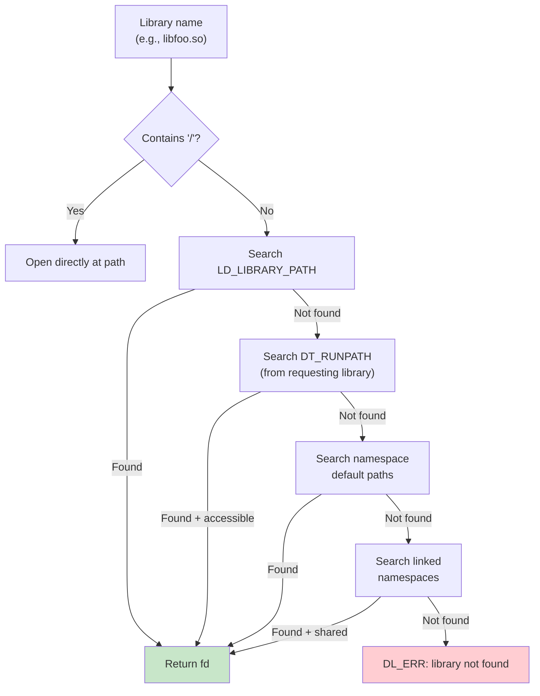

**Loading from APK files (ZIP):**

A unique feature of Android's linker is the ability to load shared libraries
directly from APK files (which are ZIP archives). From `bionic/linker/linker.cpp`
(lines 927-996):

```cpp
static int open_library_in_zipfile(ZipArchiveCache* zip_archive_cache,
                                    const char* const input_path,
                                    off64_t* file_offset,
                                    std::string* realpath) {
  // Treat an '!/' separator inside a path as the separator between
  // the zip file name and the subdirectory to search within it.
  const char* const separator = strstr(path, kZipFileSeparator);
  // ...
  ZipEntry entry;
  if (FindEntry(handle, file_path, &entry) != 0) {
    close(fd);
    return -1;
  }

  // Check if it is properly stored (not compressed, page-aligned)
  if (entry.method != kCompressStored ||
      (entry.offset % page_size()) != 0) {
    close(fd);
    return -1;
  }

  *file_offset = entry.offset;
  return fd;
}
```

The library must be stored uncompressed and page-aligned within the ZIP file.
The linker opens the APK, finds the entry, and returns a file descriptor with
the offset to the library data. The path syntax uses `!/` as a separator:
`/data/app/com.example/base.apk!/lib/arm64-v8a/libfoo.so`.

### 7.3.11 Dependency Walking and Load Order

The `find_libraries` function (in `linker.cpp`) performs a breadth-first walk
of the dependency tree. The BFS order ensures that dependencies are loaded
before the libraries that need them.

From `bionic/linker/linker.cpp` (lines 703-741):

```cpp
template<typename F>
static bool walk_dependencies_tree(soinfo* root_soinfo, F action) {
  SoinfoLinkedList visit_list;
  SoinfoLinkedList visited;

  visit_list.push_back(root_soinfo);

  soinfo* si;
  while ((si = visit_list.pop_front()) != nullptr) {
    if (visited.contains(si)) {
      continue;
    }

    walk_action_result_t result = action(si);

    if (result == kWalkStop) {
      return false;
    }

    visited.push_back(si);

    if (result != kWalkSkip) {
      si->get_children().for_each([&](soinfo* child) {
        visit_list.push_back(child);
      });
    }
  }

  return true;
}
```

This BFS walker is used for:

- Loading dependencies (`find_libraries`)
- `dlsym(RTLD_DEFAULT)` global symbol lookup
- `dlsym(handle)` handle-based symbol lookup
- Constructor invocation ordering

The three possible action results (`kWalkStop`, `kWalkContinue`, `kWalkSkip`)
allow the walker to be used for both search (stop when found) and traversal
(visit everything) operations.

### 7.3.12 The dlopen/dlsym/dlclose API

Applications interact with the linker at runtime through the `dl*` family of
functions. These are exposed through `dlfcn.cpp`:

From `bionic/linker/dlfcn.cpp` (lines 49-99):

```cpp
extern "C" {
android_namespace_t* __loader_android_create_namespace(
    const char* name,
    const char* ld_library_path,
    const char* default_library_path,
    uint64_t type,
    const char* permitted_when_isolated_path,
    android_namespace_t* parent_namespace,
    const void* caller_addr) __LINKER_PUBLIC__;

void* __loader_android_dlopen_ext(
    const char* filename,
    int flags,
    const android_dlextinfo* extinfo,
    const void* caller_addr) __LINKER_PUBLIC__;

void* __loader_dlopen(
    const char* filename,
    int flags,
    const void* caller_addr) __LINKER_PUBLIC__;

void* __loader_dlsym(
    void* handle,
    const char* symbol,
    const void* caller_addr) __LINKER_PUBLIC__;

int __loader_dlclose(void* handle) __LINKER_PUBLIC__;
```

All functions take a `caller_addr` parameter, which the linker uses to
determine the namespace context. By examining which `soinfo` contains the
caller's address, the linker determines which namespace the caller belongs to,
and searches that namespace for the requested library.

**Android-specific extensions:**

`android_dlopen_ext` provides capabilities beyond standard `dlopen`:

- `ANDROID_DLEXT_FORCE_LOAD` -- Load even if already loaded
- `ANDROID_DLEXT_USE_LIBRARY_FD` -- Load from an explicit file descriptor
- `ANDROID_DLEXT_RESERVED_ADDRESS` -- Load at a specific address
- `ANDROID_DLEXT_USE_NAMESPACE` -- Load into a specific namespace

### 7.3.13 Protected Data and Security

The linker protects its internal data structures against corruption:

From `bionic/linker/linker.cpp` (lines 468-491):

```cpp
ProtectedDataGuard::ProtectedDataGuard() {
  if (ref_count_++ == 0) {
    protect_data(PROT_READ | PROT_WRITE);
  }
  if (ref_count_ == 0) { // overflow
    async_safe_fatal("Too many nested calls to dlopen()");
  }
}

ProtectedDataGuard::~ProtectedDataGuard() {
  if (--ref_count_ == 0) {
    protect_data(PROT_READ);
  }
}

void ProtectedDataGuard::protect_data(int protection) {
  g_soinfo_allocator.protect_all(protection);
  g_soinfo_links_allocator.protect_all(protection);
  g_namespace_allocator.protect_all(protection);
  g_namespace_list_allocator.protect_all(protection);
}
```

All four allocators (soinfo, soinfo links, namespaces, namespace links) are
protected with read-only memory mappings. A `ProtectedDataGuard` must be
acquired (via RAII) before modifying any linker data. This is a defense-in-depth
measure: if an attacker corrupts linker data structures, the linker will crash
with a SIGSEGV (access violation) rather than executing attacker-controlled
code.

### 7.3.14 Linker Configuration

The linker reads its configuration from one of several locations:

From `bionic/linker/linker.cpp` (lines 98-103):

```cpp
static const char* const kLdConfigArchFilePath =
    "/system/etc/ld.config." ABI_STRING ".txt";
static const char* const kLdConfigFilePath =
    "/system/etc/ld.config.txt";
static const char* const kLdConfigVndkLiteFilePath =
    "/system/etc/ld.config.vndk_lite.txt";
static const char* const kLdGeneratedConfigFilePath =
    "/linkerconfig/ld.config.txt";
```

The preferred source is the generated configuration at `/linkerconfig/ld.config.txt`,
produced by the `linkerconfig` tool (see Section 7.4). This file defines
namespaces, their search paths, permitted paths, and inter-namespace links.

The configuration file format uses INI-style sections:

```ini
[default]
namespace.default.search.paths = /system/${LIB}
namespace.default.permitted.paths = /system/${LIB}/hw
namespace.default.isolated = true

namespace.default.links = vndk,system
namespace.default.link.vndk.shared_libs = libcutils.so:libbase.so
namespace.default.link.system.shared_libs = libc.so:libm.so:libdl.so
```

The `ConfigParser` class in `bionic/linker/linker_config.cpp` parses this
format, supporting assignment (`=`), append (`+=`), and section (`[name]`)
directives.

### 7.3.15 The Complete ELF Loading Pipeline

Here is the complete pipeline from `dlopen("libfoo.so")` to execution:

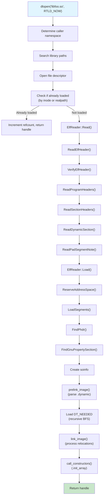

---

## 7.4 VNDK and Linker Namespaces

### 7.4.1 The Treble Namespace Problem

Android's Treble architecture (introduced in Android 8.0) separates the
**platform** (framework) from the **vendor** implementation. The goal is to
allow the platform to be updated independently of vendor code. But native
libraries pose a challenge: if a vendor library and a platform library both
link against `libutils.so`, they might need different versions of it.

The solution is **linker namespaces** -- the linker's mechanism for isolating
different sets of libraries so they cannot see each other's symbols.

### 7.4.2 The android_namespace_t Structure

From `bionic/linker/linker_namespaces.h` (lines 72-183):

```cpp
struct android_namespace_t {
  const char* get_name() const { return name_.c_str(); }
  bool is_isolated() const { return is_isolated_; }
  bool is_also_used_as_anonymous() const {
    return is_also_used_as_anonymous_;
  }

  const std::vector<std::string>& get_ld_library_paths() const;
  const std::vector<std::string>& get_default_library_paths() const;
  const std::vector<std::string>& get_permitted_paths() const;
  const std::vector<std::string>& get_allowed_libs() const;

  const std::vector<android_namespace_link_t>& linked_namespaces() const;
  void add_linked_namespace(android_namespace_t* linked_namespace,
                            std::unordered_set<std::string> shared_lib_sonames,
                            bool allow_all_shared_libs);

  void add_soinfo(soinfo* si);
  void remove_soinfo(soinfo* si);
  const soinfo_list_t& soinfo_list() const;

  bool is_accessible(const std::string& path);
  bool is_accessible(soinfo* si);

 private:
  std::string name_;
  bool is_isolated_;
  bool is_exempt_list_enabled_;
  bool is_also_used_as_anonymous_;
  std::vector<std::string> ld_library_paths_;
  std::vector<std::string> default_library_paths_;
  std::vector<std::string> permitted_paths_;
  std::vector<std::string> allowed_libs_;
  std::vector<android_namespace_link_t> linked_namespaces_;
  soinfo_list_t soinfo_list_;
};
```

Key concepts:

- **Isolated namespace**: When `is_isolated_` is true, the namespace can only
  load libraries from its `default_library_paths_` and `permitted_paths_`. This
  prevents vendor code from accidentally loading platform libraries.

- **Namespace links**: Libraries from one namespace can be made visible to
  another through links. Each link specifies which libraries are shared:

```cpp
struct android_namespace_link_t {
  android_namespace_t* linked_namespace_;
  std::unordered_set<std::string> shared_lib_sonames_;
  bool allow_all_shared_libs_;

  bool is_accessible(const char* soname) const {
    return allow_all_shared_libs_ ||
           shared_lib_sonames_.find(soname) != shared_lib_sonames_.end();
  }
};
```

- **Allowed libs**: An additional filter on which libraries can be loaded into
  the namespace, regardless of path.

### 7.4.3 Namespace Architecture

The standard Android namespace topology looks like this:

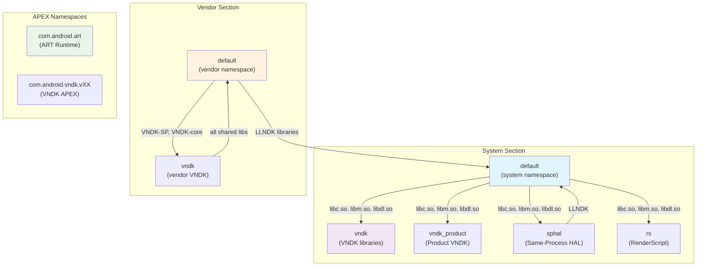

### 7.4.4 VNDK Library Categories

The VNDK (Vendor NDK) defines four categories of libraries:

From `build/soong/cc/vndk.go` (lines 23-29):

```go
const (
    llndkLibrariesTxt       = "llndk.libraries.txt"
    vndkCoreLibrariesTxt    = "vndkcore.libraries.txt"
    vndkSpLibrariesTxt      = "vndksp.libraries.txt"
    vndkPrivateLibrariesTxt = "vndkprivate.libraries.txt"
    vndkProductLibrariesTxt = "vndkproduct.libraries.txt"
)
```

| Category | Description | Example Libraries |
|----------|-------------|-------------------|
| **LL-NDK** | Low-Level NDK; always available to vendor | `libc.so`, `libm.so`, `libdl.so`, `liblog.so` |
| **VNDK-core** | Core VNDK; available to vendor but versioned | `libcutils.so`, `libbase.so`, `libutils.so` |
| **VNDK-SP** | Same-Process VNDK; loaded into the framework process | `libhardware.so`, `libhidlbase.so` |
| **VNDK-private** | Available only to other VNDK modules, not to vendor directly | Internal VNDK implementation libraries |

The `VndkProperties` structure in the build system defines how a library
declares its VNDK membership:

From `build/soong/cc/vndk.go` (lines 45-76):

```go
type VndkProperties struct {
    Vndk struct {
        // declared as a VNDK or VNDK-SP module
        Enabled *bool

        // declared as a VNDK-SP module, which is a subset of VNDK
        Support_system_process *bool

        // declared as a VNDK-private module
        Private *bool

        // Extending another module
        Extends *string
    }
}
```

### 7.4.5 The linkerconfig Tool

The `system/linkerconfig/` tool generates the linker configuration at boot
time. It is invoked by init during the early boot sequence and produces
`/linkerconfig/ld.config.txt`.

From `system/linkerconfig/main.cc` (lines 33-43):

```cpp
#include "linkerconfig/apex.h"
#include "linkerconfig/apexconfig.h"
#include "linkerconfig/baseconfig.h"
#include "linkerconfig/configparser.h"
#include "linkerconfig/context.h"
#include "linkerconfig/environment.h"
#include "linkerconfig/namespacebuilder.h"
#include "linkerconfig/recovery.h"
#include "linkerconfig/variableloader.h"
#include "linkerconfig/variables.h"
```

The tool uses a modular builder pattern. Each namespace has a dedicated builder
in `system/linkerconfig/contents/namespace/`:

| Builder File | Namespace | Purpose |
|-------------|-----------|---------|
| `systemdefault.cc` | `default` (system) | Framework code |
| `vendordefault.cc` | `default` (vendor) | Vendor binaries |
| `vndk.cc` | `vndk` / `vndk_product` | VNDK libraries |
| `sphal.cc` | `sphal` | Same-process HALs |
| `rs.cc` | `rs` | RenderScript |
| `apexdefault.cc` | APEX-specific | Per-APEX namespaces |
| `productdefault.cc` | `default` (product) | Product partition |
| `recoverydefault.cc` | `default` (recovery) | Recovery mode |
| `isolateddefault.cc` | `default` (isolated) | Isolated processes |

### 7.4.6 Bionic Library Links

Every namespace needs access to the core Bionic libraries. This is configured
by the `AddStandardSystemLinks` function:

From `system/linkerconfig/contents/common/system_links.cc` (lines 29-62):

```cpp
const std::vector<std::string> kBionicLibs = {
    "libc.so",
    "libdl.so",
    "libdl_android.so",
    "libm.so",
};

void AddStandardSystemLinks(const Context& ctx, Section* section) {
  const std::string system_ns_name = ctx.GetSystemNamespaceName();
  section->ForEachNamespaces([&](Namespace& ns) {
    if (ns.GetName() != system_ns_name) {
      ns.GetLink(system_ns_name).AddSharedLib(kBionicLibs);
    }
  });
}
```

This ensures that every namespace can resolve Bionic's core libraries through
a link to the system namespace. Without this, basic C library functions would
be unavailable.

### 7.4.7 System Namespace Configuration

The system (default) namespace for framework code is configured in
`system/linkerconfig/contents/namespace/systemdefault.cc`.

From `system/linkerconfig/contents/namespace/systemdefault.cc` (lines 31-78):

```cpp
void SetupSystemPermittedPaths(Namespace* ns) {
  const std::vector<std::string> permitted_paths = {
      "/system/${LIB}/drm",
      "/system/${LIB}/extractors",
      "/system/${LIB}/hw",
      system_ext + "/${LIB}",

      // Where odex files are located (libart needs to dlopen them)
      "/system/framework",
      "/system/app",
      "/system/priv-app",
      system_ext + "/framework",
      system_ext + "/app",
      system_ext + "/priv-app",
      "/vendor/framework",
      "/vendor/app",
      "/vendor/priv-app",
      "/odm/framework",
      "/odm/app",
      "/odm/priv-app",
      product + "/framework",
      product + "/app",
      product + "/priv-app",
      "/data",
      "/mnt/expand",
      "/apex/com.android.runtime/${LIB}/bionic",
      "/system/${LIB}/bootstrap",
  };
```

Note the explicit comment about VNDK isolation:

```cpp
  // We can't have entire /system/${LIB} as permitted paths because
  // doing so makes it possible to load libs in /system/${LIB}/vndk*
  // directories by their absolute paths. VNDK libs are built with
  // previous versions of Android and thus must not be loaded into
  // this namespace.
```

This is the security boundary in action: even though the system namespace has
broad permissions, it deliberately excludes VNDK directories to prevent version
mixing.

### 7.4.8 Vendor Namespace Configuration

Vendor processes run in their own namespace with strict isolation:

From `system/linkerconfig/contents/namespace/vendordefault.cc` (lines 35-68):

```cpp
Namespace BuildVendorNamespace(const Context& ctx,
                                const std::string& name) {
  Namespace ns(name, /*is_isolated=*/true, /*is_visible=*/true);

  ns.AddSearchPath("/odm/${LIB}");
  ns.AddSearchPath("/vendor/${LIB}");
  ns.AddSearchPath("/vendor/${LIB}/hw");
  ns.AddSearchPath("/vendor/${LIB}/egl");

  ns.AddPermittedPath("/odm");
  ns.AddPermittedPath("/vendor");
  ns.AddPermittedPath("/system/vendor");

  // Links to other namespaces
  ns.GetLink("rs").AddSharedLib("libRS_internal.so");
  ns.AddRequires(base::Split(
      Var("LLNDK_LIBRARIES_VENDOR", ""), ":"));

  if (IsVendorVndkVersionDefined()) {
    ns.GetLink(ctx.GetSystemNamespaceName())
        .AddSharedLib(Var("SANITIZER_DEFAULT_VENDOR"));
    ns.GetLink("vndk").AddSharedLib({
        Var("VNDK_SAMEPROCESS_LIBRARIES_VENDOR"),
        Var("VNDK_CORE_LIBRARIES_VENDOR")});
  }
  return ns;
}
```

The vendor namespace:

- Is **isolated** (`is_isolated=true`) -- can only load from listed paths
- Can search `/odm/${LIB}` and `/vendor/${LIB}` (plus hw/egl subdirectories)
- Has links to:
  - The **system** namespace for LL-NDK libraries (libc, libm, libdl, liblog)
  - The **VNDK** namespace for versioned VNDK libraries
  - The **RenderScript** namespace for `libRS_internal.so`

### 7.4.9 VNDK Namespace Configuration

The VNDK namespace is where versioned VNDK libraries live:

From `system/linkerconfig/contents/namespace/vndk.cc` (lines 30-123):

```cpp
Namespace BuildVndkNamespace(const Context& ctx,
                              VndkUserPartition vndk_user) {
  const char* name;
  if (is_system_or_unrestricted_section &&
      vndk_user == VndkUserPartition::Product) {
    name = "vndk_product";
  } else {
    name = "vndk";
  }

  Namespace ns(name, /*is_isolated=*/true,
               /*is_visible=*/is_system_or_unrestricted_section);

  // Search order:
  // 1. VNDK Extensions (vendor/lib/vndk-sp, vendor/lib/vndk)
  // 2. VNDK APEX (/apex/com.android.vndk.vXX/${LIB})
  // 3. vendor/lib or product/lib for extensions

  for (const auto& lib_path : lib_paths) {
    ns.AddSearchPath(lib_path + "/vndk-sp");
    if (!is_system_or_unrestricted_section) {
      ns.AddSearchPath(lib_path + "/vndk");
    }
  }
  ns.AddSearchPath("/apex/com.android.vndk.v" + vndk_version + "/${LIB}");
```

The VNDK namespace search order reveals the extension mechanism:

1. **VNDK Extensions** (`/vendor/${LIB}/vndk-sp`) -- Vendor-provided
   replacements or extensions of VNDK libraries
2. **VNDK APEX** (`/apex/com.android.vndk.vXX/${LIB}`) -- The canonical VNDK
   libraries, shipped as an APEX module
3. **Fallback** -- Vendor's own library directory for libraries that VNDK
   extensions depend on

The `vndk_product` variant is a parallel namespace for product-partition apps,
which may use a different VNDK version than vendor code.

### 7.4.10 The Exempt List: Backward Compatibility

The linker includes an exempt list for backward compatibility:

From `bionic/linker/linker.cpp` (lines 226-268):

```cpp
static bool is_exempt_lib(android_namespace_t* ns, const char* name,
                           const soinfo* needed_by) {
  static const char* const kLibraryExemptList[] = {
    "libandroid_runtime.so",
    "libbinder.so",
    "libcrypto.so",
    "libcutils.so",
    "libexpat.so",
    "libgui.so",
    "libmedia.so",
    "libnativehelper.so",
    "libssl.so",
    "libstagefright.so",
    "libsqlite.so",
    "libui.so",
    "libutils.so",
    nullptr
  };

  // If you're targeting N, you don't get the exempt-list.
  if (get_application_target_sdk_version() >= 24) {
    return false;
  }
  // ...
}
```

Apps targeting API level 23 (Marshmallow) or lower are allowed to access these
platform libraries directly, even though they are not part of the NDK. This was
necessary because many pre-Treble apps depended on these private libraries.
Apps targeting API level 24 (Nougat) or higher are subject to strict namespace
isolation.

### 7.4.11 How Namespaces Interact with dlopen

When an application calls `dlopen("libfoo.so", RTLD_NOW)`, the following
namespace-aware logic executes:

1. The linker determines the caller's namespace from the return address
2. It searches the caller's namespace paths
3. If not found, it checks linked namespaces, but only for libraries in the
   link's shared_lib_sonames set
4. If the library is in an isolated namespace, the linker verifies it is on
   an accessible path

The accessibility check:

From `bionic/linker/linker.cpp` (lines 1221-1249):

```cpp
  if ((fs_stat.f_type != TMPFS_MAGIC) && (!ns->is_accessible(realpath))) {
    const soinfo* needed_by = task->is_dt_needed() ?
        task->get_needed_by() : nullptr;
    if (is_exempt_lib(ns, name, needed_by)) {
      // Allow with warning for legacy apps
    } else {
      DL_OPEN_ERR("library \"%s\" needed or dlopened by \"%s\" is not "
                   "accessible for the namespace \"%s\"",
                   name, needed_or_dlopened_by, ns->get_name());
    }
  }
```

Note the `TMPFS_MAGIC` exception: libraries loaded from tmpfs (created via
`memfd_create()`) bypass the accessibility check. This enables apps to create
libraries at runtime (e.g., JIT compilation) without needing a writable
directory on the library search path.

### 7.4.12 Runtime Namespace Creation

Applications and the framework can create new namespaces at runtime through
the `android_create_namespace` API:

From `bionic/linker/dlfcn.cpp` (lines 51-57):

```cpp
android_namespace_t* __loader_android_create_namespace(
    const char* name,
    const char* ld_library_path,
    const char* default_library_path,
    uint64_t type,
    const char* permitted_when_isolated_path,
    android_namespace_t* parent_namespace,
    const void* caller_addr) __LINKER_PUBLIC__;
```

This is used by `libnativeloader`, which creates per-app namespaces with
appropriate isolation. Each app gets its own namespace that can see:

- The app's own native libraries (from the APK)
- LL-NDK libraries (via link to system namespace)
- VNDK libraries (if the app uses the NDK)
- Libraries listed in the app's `uses-native-library` manifest entries

### 7.4.13 Default Library Paths

The linker defines default library search paths based on the device's
configuration:

From `bionic/linker/linker.cpp` (lines 105-154):

```cpp
#if defined(__LP64__)
static const char* const kSystemLibDir     = "/system/lib64";
static const char* const kOdmLibDir        = "/odm/lib64";
static const char* const kVendorLibDir     = "/vendor/lib64";
static const char* const kAsanSystemLibDir = "/data/asan/system/lib64";
static const char* const kAsanOdmLibDir    = "/data/asan/odm/lib64";
static const char* const kAsanVendorLibDir = "/data/asan/vendor/lib64";
#else
static const char* const kSystemLibDir     = "/system/lib";
// ...
#endif

static const char* const kDefaultLdPaths[] = {
  kSystemLibDir,
  kOdmLibDir,
  kVendorLibDir,
  nullptr
};

static const char* const kAsanDefaultLdPaths[] = {
  kAsanSystemLibDir,
  kSystemLibDir,
  kAsanOdmLibDir,
  kOdmLibDir,
  kAsanVendorLibDir,
  kVendorLibDir,
  nullptr
};

#if defined(__aarch64__)
static const char* const kHwasanSystemLibDir = "/system/lib64/hwasan";
static const char* const kHwasanOdmLibDir    = "/odm/lib64/hwasan";
static const char* const kHwasanVendorLibDir = "/vendor/lib64/hwasan";
#endif
```

There are three sets of paths:

1. **Default** -- Normal operation: `/system/lib64`, `/odm/lib64`, `/vendor/lib64`
2. **ASan** -- AddressSanitizer mode: ASan-instrumented libraries in
   `/data/asan/` are searched first, falling back to the normal paths
3. **HWASan** -- Hardware AddressSanitizer mode (AArch64 only): HWASan-instrumented
   libraries in `hwasan/` subdirectories are searched first

This allows sanitized builds to coexist with production builds on the same
device, with the sanitized versions taking priority when the sanitizer is
enabled.

### 7.4.14 Namespace Isolation in Practice

Here is a concrete example of how namespace isolation works for a vendor
process on a Treble-compliant device:

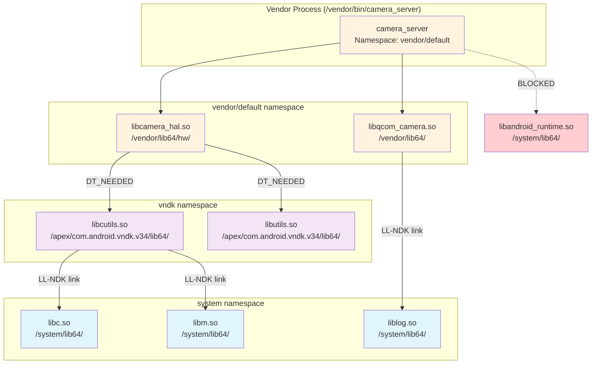

In this scenario:

- `camera_server` lives in the vendor/default namespace
- It can load its own vendor libraries (`libcamera_hal.so`, `libqcom_camera.so`)
- Those libraries can use VNDK libraries (`libcutils.so`, `libutils.so`)
  through the vndk namespace link
- Everyone can use LL-NDK libraries (`libc.so`, `libm.so`, `liblog.so`) through
  links to the system namespace
- Direct access to platform-private libraries (`libandroid_runtime.so`) is
  **blocked** by namespace isolation

### 7.4.15 VNDK Deprecation and Evolution

The VNDK system is evolving. Recent AOSP versions include a `--deprecate_vndk`
flag in linkerconfig:

From `system/linkerconfig/main.cc` (lines 62-63):

```cpp
    {"deprecate_vndk", no_argument, 0, 'd'},
```

The trend is toward using APEX modules for library versioning rather than the
VNDK mechanism. Each APEX can carry its own versions of libraries, isolated in
their own mount namespace and linker namespace. This provides stronger isolation
than VNDK (which shares a single process address space) and better supports
independent updates.

However, VNDK remains essential for backward compatibility with existing vendor
implementations and will likely coexist with APEX-based solutions for multiple
Android generations.

### 7.4.16 Putting It All Together: The Library Loading Decision Tree

When the linker encounters a `DT_NEEDED` entry or `dlopen` call, the complete
decision process is:

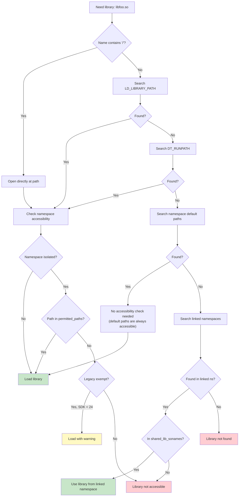

### 7.4.17 Segment Loading In Detail

The `LoadSegments()` method in the ElfReader class iterates over every PT_LOAD
program header and maps the corresponding file region into the reserved address
space.

From `bionic/linker/linker_phdr.cpp` (lines 987-1086):

```cpp
bool ElfReader::LoadSegments() {
  size_t seg_align = should_use_16kib_app_compat_ ?
      kCompatPageSize : kPageSize;

  if (kPageSize >= 16384 && min_align_ < kPageSize &&
      !should_use_16kib_app_compat_) {
    DL_ERR_AND_LOG(
        "\"%s\" program alignment (%zu) cannot be smaller than "
        "system page size (%zu)", name_.c_str(), min_align_, kPageSize);
    return false;
  }

  for (size_t i = 0; i < phdr_num_; ++i) {
    const ElfW(Phdr)* phdr = &phdr_table_[i];
    if (phdr->p_type != PT_LOAD) continue;

    ElfW(Addr) p_memsz = phdr->p_memsz;
    ElfW(Addr) p_filesz = phdr->p_filesz;
    _extend_load_segment_vma(phdr_table_, phdr_num_, i, &p_memsz,
                              &p_filesz, should_pad_segments_,
                              should_use_16kib_app_compat_);

    // Segment addresses in memory
    ElfW(Addr) seg_start = phdr->p_vaddr + load_bias_;
    ElfW(Addr) seg_end = seg_start + p_memsz;
    ElfW(Addr) seg_page_end = __builtin_align_up(seg_end, seg_align);
    ElfW(Addr) seg_file_end = seg_start + p_filesz;

    if (file_length != 0) {
      int prot = PFLAGS_TO_PROT(phdr->p_flags);
      if ((prot & (PROT_EXEC | PROT_WRITE)) == (PROT_EXEC | PROT_WRITE)) {
        if (DL_ERROR_AFTER(26, "\"%s\" has load segments that are both "
                           "writable and executable", name_.c_str())) {
          return false;
        }
      }

      if (should_use_16kib_app_compat_) {
        if (!CompatMapSegment(i, file_length)) return false;
      } else {
        if (!MapSegment(i, file_length)) return false;
      }
    }

    ZeroFillSegment(phdr);
    DropPaddingPages(phdr, seg_file_end);
    if (!MapBssSection(phdr, seg_page_end, seg_file_end)) return false;
  }
  return true;
}
```

Each PT_LOAD segment goes through four sub-operations:

1. **MapSegment / CompatMapSegment** -- Maps the file content into the address
   space using `mmap64()` with `MAP_FIXED`. For 16KiB compatibility mode, the
   compat path reads data into an existing anonymous mapping instead of using
   `mmap` directly.

2. **ZeroFillSegment** -- If the segment is writable and its file size is less
   than a page boundary, the remainder of the partial page must be zeroed. This
   is required by the ELF specification for BSS-like data.

3. **DropPaddingPages** -- When segment extension is active (for page size
   migration), padding pages between segments are released using
   `MADV_DONTNEED` to reduce memory pressure.

4. **MapBssSection** -- If `p_memsz > p_filesz`, the excess represents BSS
   data. The linker maps additional anonymous pages at the end of the segment
   and names them `.bss` using `prctl(PR_SET_VMA)`.

**MapSegment in detail:**

From `bionic/linker/linker_phdr.cpp` (lines 868-893):

```cpp
bool ElfReader::MapSegment(size_t seg_idx, size_t len) {
  const ElfW(Phdr)* phdr = &phdr_table_[seg_idx];
  void* start = reinterpret_cast<void*>(
      page_start(phdr->p_vaddr + load_bias_));
  const ElfW(Addr) offset = file_offset_ +
      page_start(phdr->p_offset);
  int prot = PFLAGS_TO_PROT(phdr->p_flags);

  void* seg_addr = mmap64(start, len, prot,
      MAP_FIXED | MAP_PRIVATE, fd_, offset);

  if (seg_addr == MAP_FAILED) {
    DL_ERR("couldn't map \"%s\" segment %zd: %m",
           name_.c_str(), seg_idx);
    return false;
  }

  // Mark segments as huge page eligible
  if ((phdr->p_flags & PF_X) && phdr->p_align == kPmdSize &&
      get_transparent_hugepages_supported()) {
    madvise(seg_addr, len, MADV_HUGEPAGE);
  }

  return true;
}
```

Note the transparent huge page support: executable segments aligned to PMD
size (2MB) receive `MADV_HUGEPAGE`, which tells the kernel to use huge pages
for these mappings. This reduces TLB misses for large code sections.

**W+E segment rejection:**

The linker rejects libraries with segments that are simultaneously writable and
executable (`W+E`), starting from API level 26. This is a security measure:
`W+E` segments would allow an attacker who can write to memory to also execute
that memory, defeating W^X protections.

**Segment extension for page size migration:**

The `_extend_load_segment_vma` function extends the file-backed portion of a
segment to fill the gap between adjacent PT_LOAD segments. This is necessary
because on a system with a larger page size than the ELF was built for, the
gap between segments would be mapped as separate VMAs (Virtual Memory Areas),
consuming kernel slab memory. By extending segments to be contiguous, the
kernel can merge them into a single VMA:

From `bionic/linker/linker_phdr.cpp` (lines 817-866):

```cpp
static inline void _extend_load_segment_vma(
    const ElfW(Phdr)* phdr_table, size_t phdr_count,
    size_t phdr_idx, ElfW(Addr)* p_memsz,
    ElfW(Addr)* p_filesz, bool should_pad_segments,
    bool should_use_16kib_app_compat) {
  if (should_use_16kib_app_compat) return;

  const ElfW(Phdr)* phdr = &phdr_table[phdr_idx];

  // Don't do extension for p_align > 64KiB
  if (phdr->p_align <= kPageSize || phdr->p_align > 64*1024 ||
      !should_pad_segments) {
    return;
  }

  // Find next PT_LOAD segment
  const ElfW(Phdr)* next = nullptr;
  if (phdr_idx + 1 < phdr_count &&
      phdr_table[phdr_idx + 1].p_type == PT_LOAD) {
    next = &phdr_table[phdr_idx + 1];
  }

  if (!next || *p_memsz != *p_filesz) return;

  ElfW(Addr) next_start = page_start(next->p_vaddr);
  ElfW(Addr) curr_end = page_end(phdr->p_vaddr + *p_memsz);

  if (curr_end >= next_start) return;

  // Extend to be contiguous
  ElfW(Addr) extend = next_start - curr_end;
  *p_memsz += extend;
  *p_filesz += extend;
}
```

### 7.4.18 The find_libraries Algorithm

The `find_libraries` function is the workhorse of dependency resolution. It
implements a multi-phase algorithm that handles circular dependencies,
cross-namespace loading, and load shuffling for ASLR.

From `bionic/linker/linker.cpp` (lines 1459-1528):

```cpp
static bool find_library_internal(android_namespace_t* ns,
                                   LoadTask* task,
                                   ZipArchiveCache* zip_archive_cache,
                                   LoadTaskList* load_tasks,
                                   int rtld_flags) {
  soinfo* candidate;

  // Phase 1: Check if already loaded (by soname)
  if (find_loaded_library_by_soname(ns, task->get_name(),
          true /* search_linked_namespaces */, &candidate)) {
    task->set_soinfo(candidate);
    return true;
  }

  // Phase 2: Try to load from this namespace
  if (load_library(ns, task, zip_archive_cache, load_tasks,
                   rtld_flags, true)) {
    return true;
  }

  // Phase 3: Exempt list fallback for legacy apps
  if (ns->is_exempt_list_enabled() &&
      is_exempt_lib(ns, task->get_name(), task->get_needed_by())) {
    ns = &g_default_namespace;
    if (load_library(ns, task, zip_archive_cache, load_tasks,
                     rtld_flags, true)) {
      return true;
    }
  }

  // Phase 4: Search linked namespaces
  for (auto& linked_namespace : ns->linked_namespaces()) {
    if (find_library_in_linked_namespace(linked_namespace, task)) {
      if (task->get_soinfo() != nullptr) {
        return true;  // Already loaded
      }
      // Ok to load in linked namespace
      if (load_library(linked_namespace.linked_namespace(), task,
                       zip_archive_cache, load_tasks, rtld_flags,
                       false)) {
        return true;
      }
    }
  }

  return false;
}
```

The four phases represent a carefully ordered fallback chain:

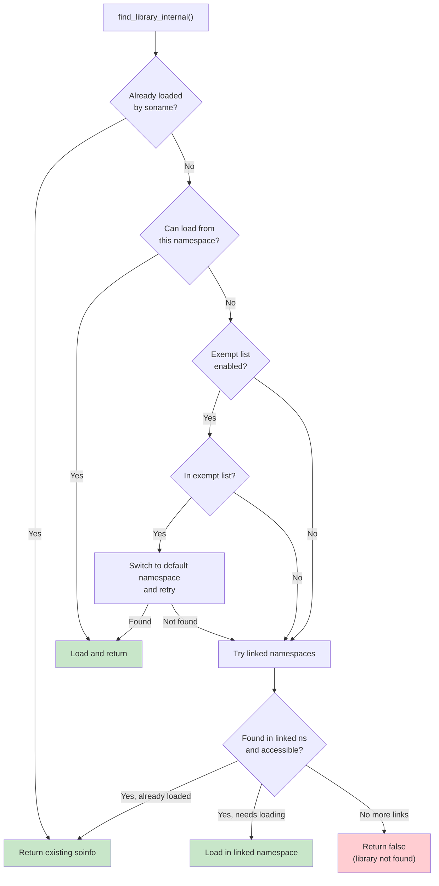

**Load shuffling for ASLR:**

After all LoadTasks have been created but before they are loaded, the linker
shuffles the load order:

From `bionic/linker/linker.cpp` (lines 1532-1543):

```cpp
static void shuffle(std::vector<LoadTask*>* v) {
  if (is_first_stage_init()) {
    // arc4random* is not available in first stage init
    return;
  }
  for (size_t i = 0, size = v->size(); i < size; ++i) {
    size_t n = size - i;
    size_t r = arc4random_uniform(n);
    std::swap((*v)[n-1], (*v)[r]);
  }
}
```

This randomizes the order in which libraries are mapped into memory,
complementing the per-library ASLR from `ReserveWithAlignmentPadding`. Even if
an attacker knows which libraries a process loads, the order is unpredictable.

### 7.4.19 Duplicate Detection and the Soname Contract

The linker uses two strategies to detect if a library is already loaded:

**By inode (strongest):**

From `bionic/linker/linker.cpp` (lines 1106-1137):

```cpp
static bool find_loaded_library_by_inode(android_namespace_t* ns,
                                          const struct stat& file_stat,
                                          off64_t file_offset,
                                          bool search_linked_namespaces,
                                          soinfo** candidate) {
  auto predicate = [&](soinfo* si) {
    return si->get_st_ino() == file_stat.st_ino &&
           si->get_st_dev() == file_stat.st_dev &&
           si->get_file_offset() == file_offset;
  };

  *candidate = ns->soinfo_list().find_if(predicate);

  if (*candidate == nullptr && search_linked_namespaces) {
    for (auto& link : ns->linked_namespaces()) {
      android_namespace_t* linked_ns = link.linked_namespace();
      soinfo* si = linked_ns->soinfo_list().find_if(predicate);
      if (si != nullptr && link.is_accessible(si->get_soname())) {
        *candidate = si;
        return true;
      }
    }
  }
  return *candidate != nullptr;
}
```

**By realpath (fallback):**

```cpp
static bool find_loaded_library_by_realpath(android_namespace_t* ns,
                                             const char* realpath,
                                             bool search_linked_namespaces,
                                             soinfo** candidate) {
  auto predicate = [&](soinfo* si) {
    return strcmp(realpath, si->get_realpath()) == 0;
  };
  // ...
}
```

The inode-based check handles symlinks and hard links correctly: if
`/system/lib64/libfoo.so` and `/system/lib64/libfoo_v2.so` are hard links
to the same file, inode detection ensures only one copy is loaded. The
realpath check handles the case where proc is not mounted (early boot).

### 7.4.20 DT_NEEDED Processing and DT_RUNPATH

When a library is first loaded, the linker scans its `.dynamic` section for
DT_NEEDED entries (libraries it depends on) and DT_RUNPATH (additional search
paths):

From `bionic/linker/linker.cpp` (lines 1276-1310):

```cpp
  const ElfReader& elf_reader = task->get_elf_reader();
  for (const ElfW(Dyn)* d = elf_reader.dynamic();
       d->d_tag != DT_NULL; ++d) {
    if (d->d_tag == DT_RUNPATH) {
      si->set_dt_runpath(elf_reader.get_string(d->d_un.d_val));
    }
    if (d->d_tag == DT_SONAME) {
      si->set_soname(elf_reader.get_string(d->d_un.d_val));
    }
    if (d->d_tag == DT_FLAGS_1) {
      si->set_dt_flags_1(d->d_un.d_val);
    }
  }

  for (const ElfW(Dyn)* d = elf_reader.dynamic();
       d->d_tag != DT_NULL; ++d) {
    if (d->d_tag == DT_NEEDED) {
      const char* name = fix_dt_needed(
          elf_reader.get_string(d->d_un.d_val), elf_reader.name());
      load_tasks->push_back(
          LoadTask::create(name, si, ns, task->get_readers_map()));
    }
  }
```

DT_FLAGS_1 is checked early because the `DF_1_GLOBAL` flag determines
whether the library should be visible in the global scope. This must be known
before the library's dependencies are loaded so that namespace linking is
correct.

The `fix_dt_needed` function handles a backward compatibility issue: some
older 32-bit libraries had DT_NEEDED entries with absolute paths instead of
bare sonames. For apps targeting API level 22 or lower, the function strips
the directory component.

### 7.4.21 GDB Integration

The linker maintains a debug data structure that GDB uses to discover loaded
libraries. This is the `link_map` structure, part of the standard ELF debugging
interface.

From `bionic/linker/linker_main.cpp` (lines 207-215):

```cpp
static void init_link_map_head(soinfo& info) {
  auto& map = info.link_map_head;
  map.l_addr = info.load_bias;
  map.l_name = const_cast<char*>(info.get_realpath());
  phdr_table_get_dynamic_section(info.phdr, info.phnum,
      info.load_bias, &map.l_ld, nullptr);
}
```

Every `soinfo` contains a `link_map_head` that forms part of a doubly-linked
list. GDB reads this list through the `r_debug` structure (exposed as
`_r_debug` in the linker's symbol table) to enumerate loaded libraries, set
breakpoints in newly-loaded code, and resolve symbol addresses.

When a library is loaded or unloaded, the linker calls `notify_gdb_of_load`
or `notify_gdb_of_unload`, which update the `r_debug` state and trigger a
breakpoint that GDB can catch:

From `bionic/linker/linker.cpp` (lines 274-295):

```cpp
static void notify_gdb_of_load(soinfo* info) {
  if (info->is_linker() || info->is_main_executable()) {
    return;
  }

  link_map* map = &(info->link_map_head);
  map->l_addr = info->load_bias;
  map->l_name = const_cast<char*>(info->get_realpath());
  map->l_ld = info->dynamic;

  CHECK(map->l_name != nullptr);
  CHECK(map->l_name[0] != '\0');

  notify_gdb_of_load(map);
}
```

### 7.4.22 CFI (Control Flow Integrity) Shadow

The linker maintains a CFI shadow -- a data structure that enables
LLVM's Control Flow Integrity checks at runtime:

From `bionic/linker/linker.cpp` (lines 173-177):

```cpp
static CFIShadowWriter g_cfi_shadow;

CFIShadowWriter* get_cfi_shadow() {
  return &g_cfi_shadow;
}
```

After all libraries are loaded and linked, the linker initializes the CFI
shadow:

From `bionic/linker/linker_main.cpp` (line 503):

```cpp
if (!get_cfi_shadow()->InitialLinkDone(solist_get_head()))
    __linker_cannot_link(g_argv[0]);
```

The CFI shadow maps each executable page to a shadow entry that records which
indirect call targets are valid. When a CFI-instrumented library makes an
indirect call, it checks the shadow to verify the target is a valid function
entry point. Invalid targets trigger a controlled crash via
`__loader_cfi_fail`.

### 7.4.23 TLS (Thread-Local Storage) in the Linker

The linker manages ELF TLS (Thread-Local Storage) for all loaded libraries.
TLS variables declared with `__thread` or `thread_local` in C/C++ require
per-thread copies, and the linker allocates and initializes these.

From `bionic/linker/linker_tls.h` (lines 36-65):

```cpp
void linker_setup_exe_static_tls(const char* progname);
void linker_finalize_static_tls();

void register_soinfo_tls(soinfo* si);
void unregister_soinfo_tls(soinfo* si);

const TlsModule& get_tls_module(size_t module_id);

struct TlsDescriptor {
#if defined(__arm__)
  size_t arg;
  TlsDescResolverFunc* func;
#else
  TlsDescResolverFunc* func;
  size_t arg;
#endif
};

struct TlsDynamicResolverArg {
  size_t generation;
  TlsIndex index;
};

extern "C" size_t tlsdesc_resolver_static(size_t);
extern "C" size_t tlsdesc_resolver_dynamic(size_t);
extern "C" size_t tlsdesc_resolver_unresolved_weak(size_t);
```

There are two TLS allocation strategies:

1. **Static TLS** -- For the executable and libraries loaded at startup. The
   total static TLS size is computed before any thread is created, and each
   thread's TLS block is pre-allocated as part of the thread stack.

2. **Dynamic TLS** -- For libraries loaded via `dlopen()` after threads exist.
   These use a Dynamic Thread Vector (DTV) that is lazily extended when a thread
   first accesses TLS from a dlopen'd library.

The three TLSDESC resolvers handle different cases:

- `tlsdesc_resolver_static` -- Fast path for static TLS (single offset add)
- `tlsdesc_resolver_dynamic` -- Slow path for dynamic TLS (may allocate)
- `tlsdesc_resolver_unresolved_weak` -- For weak TLS symbols that resolved to
  null (returns a dummy address)

### 7.4.24 MTE Globals Support

On AArch64 hardware with MTE (Memory Tagging Extension), the linker can tag
global variables in loaded libraries:

From `bionic/linker/linker_soinfo.h` (line 70):

```cpp
#define FLAG_GLOBALS_TAGGED   0x00000800 // globals have been tagged by MTE
```

The `apply_memtag_if_mte_globals` method (used during relocation) checks if a
relocation target address falls within a tagged global region and applies the
appropriate tag. This catches buffer overflows on global variables at runtime.

From `bionic/linker/linker_relocate.cpp` (line 169):

```cpp
void* const rel_target = reinterpret_cast<void*>(
    relocator.si->apply_memtag_if_mte_globals(
        reloc.r_offset + relocator.si->load_bias));
```

### 7.4.25 Debugging the Linker

The linker provides several debugging mechanisms:

**LD_DEBUG environment variable:**

Setting `LD_DEBUG` enables verbose logging. The value is a comma-separated
list of categories:

| Value | What it logs |
|-------|-------------|
| `any` | All debug output |
| `lookup` | Symbol lookup results |
| `reloc` | Relocation processing |
| `timing` | Total link time in microseconds |
| `statistics` | Relocation counts (absolute, relative, symbol, cached) |

**LD_SHOW_AUXV:**

Setting this environment variable dumps the auxiliary vector at startup,
showing AT_PHDR, AT_ENTRY, AT_BASE, AT_HWCAP, etc.

**linker logging:**

From `bionic/linker/linker_main.cpp` (lines 508-513):

```cpp
if (g_linker_debug_config.timing) {
    gettimeofday(&t1, nullptr);
    long long t0_us = (t0.tv_sec * 1000000LL) + t0.tv_usec;
    long long t1_us = (t1.tv_sec * 1000000LL) + t1.tv_usec;
    LD_DEBUG(timing, "LINKER TIME: %s: %lld microseconds",
             g_argv[0], t1_us - t0_us);
}
```

Note that `LD_DEBUG` and `LD_SHOW_AUXV` are only honored when `AT_SECURE` is
not set (i.e., for non-setuid/non-setgid processes). This prevents information
leakage from privileged processes.

### 7.4.26 The ldd Tool

Android's linker includes a built-in `ldd` equivalent. When invoked as
`linker64 --list /path/to/binary`, the linker sets the `g_is_ldd` flag:

From `bionic/linker/linker_main.cpp` (lines 489-492):

```cpp
  // Exit early for ldd. We don't want to run the code that was loaded,
  // so skip the constructor calls. Skip CFI setup because it would call
  // __cfi_init in libdl.so.
  if (g_is_ldd) _exit(EXIT_SUCCESS);
```

In ldd mode, the linker loads all dependencies (printing their paths as it
goes) but exits before calling constructors. This safely reveals the dependency
tree without executing any library code.

### 7.4.27 Linker Namespace Lifecycle

Namespaces have a defined lifecycle during process startup and at runtime:

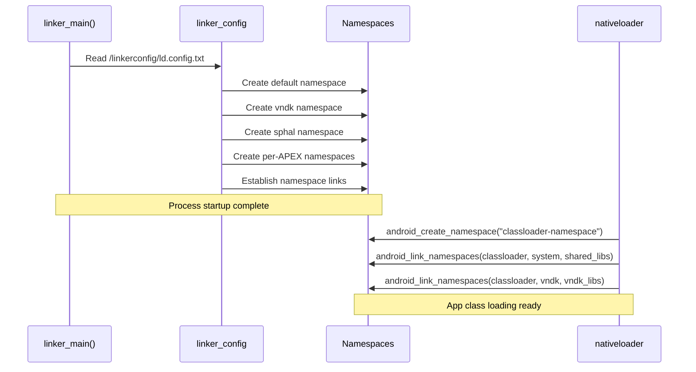

The initial namespaces are created from the linker configuration file during
`init_default_namespaces()`. Later, when the Java class loader loads native
libraries for an app, `libnativeloader` calls `android_create_namespace` to
create an app-specific namespace and links it to the system and VNDK namespaces
with appropriate library allowlists.

---

## 7.5 Musl: The Host-Side Alternative to Bionic

While Bionic is Android's C library for device targets, AOSP also integrates
**musl libc** as an alternative C library for **host tool compilation**. This
section explains why musl exists in AOSP, how it's integrated, and when it's
used instead of glibc.

### 7.5.1 Why Musl in AOSP?

Android's build system runs on Linux host machines. By default, host tools
(such as `aapt2`, `dex2oat`, or `zipalign`) are compiled against **glibc**,
the standard C library on most Linux distributions. However, glibc has
drawbacks for build tool distribution:

- **Dynamic linking dependencies** — glibc binaries depend on the host's exact
  glibc version, causing "GLIBC_2.XX not found" errors on older systems
- **Large shared library footprint** — glibc pulls in many shared objects
- **Complex static linking** — glibc discourages static linking and has known
  issues when linked statically (NSS, locale, dlopen)

Musl solves these problems:

- **Clean static linking** — musl is designed for static linking from the start
- **Minimal dependencies** — produces self-contained binaries
- **Portable output** — statically-linked musl binaries run on any Linux kernel
  version without glibc version concerns

### 7.5.2 Musl Source and Version

Musl lives at `external/musl/` in the AOSP tree:

```
external/musl/
├── Android.bp              # Build rules (622 lines)
├── sources.bp              # Generated source file lists
├── README                  # Upstream v1.2.5
├── METADATA                # Version and license info
├── android/                # Android-specific adaptations
│   ├── generate_bp.py      # Generates sources.bp from upstream
│   ├── relinterp.c         # Dynamic interpreter relocation
│   ├── ldso_trampoline.cpp # Loader trampoline
│   └── include/            # Android-specific header overrides
│       ├── features.h
│       ├── math.h
│       ├── resolv.h
│       └── string.h
├── include/                # musl public headers
├── src/                    # musl source (upstream)
│   ├── string/             # String operations
│   ├── malloc/             # Memory allocation
│   ├── thread/             # Threading primitives
│   ├── stdio/              # Standard I/O
│   └── ...
└── ldso/                   # Dynamic linker (musl's ld.so)
```

The `android/` directory contains Android-specific adaptations that bridge
differences between musl's upstream behavior and AOSP's requirements.

### 7.5.3 Enabling Musl for Host Builds

Musl is activated through the `USE_HOST_MUSL` environment variable:

```bash
# Enable musl for host tool compilation
export USE_HOST_MUSL=true
m aapt2   # Now compiled against musl instead of glibc
```

The build system plumbing flows through several layers:

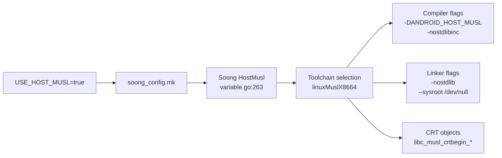

```go
// Source: build/soong/android/config.go:2402
func (c *config) UseHostMusl() bool {
    return Bool(c.productVariables.HostMusl)
}
```

### 7.5.4 Build System Integration

When musl is enabled, Soong selects dedicated toolchain factories that
override the default glibc-based host compilation:

```go
// Source: build/soong/cc/config/x86_linux_host.go:43
var linuxMuslCflags = []string{
    "-DANDROID_HOST_MUSL",
    "-nostdlibinc",
    "--sysroot /dev/null",
}
```

```go
// Source: build/soong/cc/config/x86_linux_host.go:66
var linuxMuslLdflags = []string{
    "-nostdlib",
    "--sysroot /dev/null",
}
```

The `--sysroot /dev/null` flag is critical: it prevents the compiler from
finding any system headers or libraries, ensuring complete isolation from the
host's glibc. All headers come from musl's own `include/` directory.

#### Architecture Support

Musl supports four host architectures, each with a dedicated LLVM triple:

| Architecture | LLVM Triple | Toolchain Factory |
|---|---|---|
| x86 | `i686-linux-musl` | `linuxMuslX86ToolchainFactory` |
| x86_64 | `x86_64-linux-musl` | `linuxMuslX8664ToolchainFactory` |
| ARM | `arm-linux-musleabihf` | `linuxMuslArmToolchainFactory` |
| ARM64 | `aarch64-linux-musl` | `linuxMuslArm64ToolchainFactory` |

#### CRT Objects

Musl provides its own C runtime startup objects, defined in `Android.bp`:

```
// Source: external/musl/Android.bp:460-505
libc_musl_crtbegin_dynamic  → Dynamic executable startup
libc_musl_crtbegin_static   → Static executable startup
libc_musl_crtbegin_so       → Shared library startup
libc_musl_crtend            → Executable cleanup
libc_musl_crtend_so         → Shared library cleanup
```

#### Default Shared Libraries

```go
// Source: build/soong/cc/config/x86_linux_host.go:115
var MuslDefaultSharedLibraries = []string{"libc_musl"}
```

When musl is active, `libc_musl` replaces glibc as the default system shared
library. All host tools link against it instead.

### 7.5.5 Prebuilt Musl Toolchain

The prebuilt Clang toolchain includes musl runtime libraries for all supported
architectures:

```
prebuilts/clang/host/linux-x86/clang-r563880c/musl/
├── lib/
│   ├── x86_64-unknown-linux-musl/     # x86_64 runtime
│   ├── aarch64-unknown-linux-musl/    # ARM64 runtime
│   ├── arm-unknown-linux-musleabihf/  # ARM runtime
│   ├── i686-unknown-linux-musl/       # x86 runtime
│   └── libc_musl.so                   # Dynamic musl library
```

### 7.5.6 Bionic-Musl Header Sharing

Interestingly, musl reuses some headers from Bionic's kernel UAPI layer. The
build system generates a musl sysroot that includes Bionic's kernel headers:

```java
// Source: bionic/libc/Android.bp:2703
cc_genrule {
    name: "libc_musl_sysroot_bionic_headers",
    // Copies bionic's kernel UAPI headers for musl's use
}
```

This ensures musl and bionic agree on kernel structure definitions (`ioctl`
numbers, socket options, etc.) since both ultimately target the same Linux
kernel.

### 7.5.7 Sanitizer Limitations with Musl

Not all sanitizers work with musl. The build system disables several:

```go
// Source: build/soong/cc/sanitize.go:677-686
// CFI is disabled for musl
if ctx.toolchain().Musl() {
    s.Cfi = nil
}
// ARM64 address and HW address sanitizers are also disabled
```

Sanitizer runtimes are statically linked with musl (unlike glibc where they
can be dynamically loaded), because musl's dynamic linker has different
semantics for `LD_PRELOAD` and `dlopen`.

### 7.5.8 Bionic vs. Musl vs. Glibc

#### Comparison of AOSP's Three C Libraries

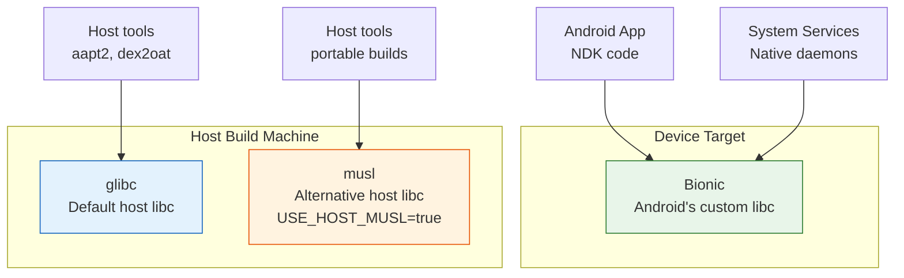

| Aspect | Bionic | glibc | musl |
|---|---|---|---|
| **Target** | Android device | Linux host (default) | Linux host (opt-in) |
| **Static linking** | Supported | Problematic (NSS/locale) | Clean, recommended |
| **Binary portability** | N/A (device only) | Tied to host glibc version | Runs on any Linux |
| **Size** | Minimal | Large | Minimal |
| **POSIX compliance** | Partial (intentional) | Full | Nearly full |
| **Thread model** | pthread (custom) | NPTL | Custom lightweight |
| **Activation** | Default for device | Default for host | `USE_HOST_MUSL=true` |

### 7.5.9 When to Use Musl

Musl is primarily useful for:

- **CI/CD environments** — build servers with varying glibc versions
- **Hermetic builds** — reproducible builds independent of host system libraries
- **Distribution** — shipping prebuilt host tools that work across Linux distros
- **Cross-compilation** — building host tools for ARM build servers (ARM64 musl
  toolchain)

The AOSP build infrastructure is progressively moving toward musl for host
tools to improve build hermeticity and reduce "works on my machine" issues.

---

## 7.6 Advanced Topics

### 7.6.1 The soinfo Method Interface

The `soinfo` structure provides a rich method interface for the linker to
operate on loaded libraries. The key methods reveal the lifecycle of a loaded
library:

From `bionic/linker/linker_soinfo.h` (lines 250-347):

```cpp
struct soinfo {
  // Lifecycle
  void call_constructors();
  void call_destructors();
  void call_pre_init_constructors();
  bool prelink_image(bool deterministic_memtag_globals = false);
  bool link_image(const SymbolLookupList& lookup_list,
                  soinfo* local_group_root,
                  const android_dlextinfo* extinfo,
                  size_t* relro_fd_offset);
  bool protect_relro();
  bool protect_16kib_app_compat_code();

  // MTE support
  void tag_globals(bool deterministic_memtag_globals);
  ElfW(Addr) apply_memtag_if_mte_globals(ElfW(Addr) sym_addr) const;

  // Symbol lookup
  const ElfW(Sym)* find_symbol_by_name(SymbolName& symbol_name,
                                        const version_info* vi) const;
  ElfW(Sym)* find_symbol_by_address(const void* addr);

  ElfW(Addr) resolve_symbol_address(const ElfW(Sym)* s) const {
    if (ELF_ST_TYPE(s->st_info) == STT_GNU_IFUNC) {
      return call_ifunc_resolver(s->st_value + load_bias);
    }
    return static_cast<ElfW(Addr)>(s->st_value + load_bias);
  }

  // Reference counting
  size_t increment_ref_count();
  size_t decrement_ref_count();
  size_t get_ref_count() const;

  // Navigation
  soinfo* get_local_group_root() const;
  soinfo_list_t& get_children();
  soinfo_list_t& get_parents();
  android_namespace_t* get_primary_namespace();
  android_namespace_list_t& get_secondary_namespaces();

  // Version support
  const ElfW(Versym)* get_versym(size_t n) const;
  ElfW(Addr) get_verneed_ptr() const;
  size_t get_verneed_cnt() const;
  ElfW(Addr) get_verdef_ptr() const;
  size_t get_verdef_cnt() const;
};
```

The `resolve_symbol_address` method is particularly noteworthy: for standard
symbols, it simply adds the load bias to the symbol value. But for GNU IFUNC
symbols (`STT_GNU_IFUNC`), it calls the IFUNC resolver function to determine
the actual implementation address at runtime. This is how architecture-specific
optimizations (like the memcpy variants in Section 7.1.6) are dispatched.

The lifecycle methods are called in a strict order:

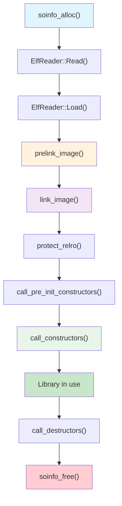

**prelink_image()** parses the `.dynamic` section to fill in the soinfo
fields: symbol table, string table, hash tables, relocation tables, and
init/fini arrays. It does not resolve any symbols.

**link_image()** processes all relocations, resolving symbol references and
patching code and data. After this step, all function pointers and global
variable references point to the correct addresses.

**protect_relro()** marks RELRO (Relocation Read-Only) pages as read-only.
RELRO is a security feature: after relocations are applied to the GOT (Global
Offset Table), those pages are remapped as read-only to prevent GOT overwrite
attacks.

### 7.6.2 GNU Hash: NEON-Accelerated Symbol Lookup

The linker includes a NEON-accelerated GNU hash implementation for ARM
architectures:

From `bionic/linker/linker_gnu_hash.h` (lines 35-54):

```cpp
#if defined(__arm__) || defined(__aarch64__)
#define USE_GNU_HASH_NEON 1
#else
#define USE_GNU_HASH_NEON 0
#endif

#if USE_GNU_HASH_NEON
#include "arch/arm_neon/linker_gnu_hash_neon.h"
#endif

static std::pair<uint32_t, uint32_t>
calculate_gnu_hash_simple(const char* name) {
  uint32_t h = 5381;
  const uint8_t* name_bytes =
      reinterpret_cast<const uint8_t*>(name);
  #pragma unroll 8
  while (*name_bytes != 0) {
    h += (h << 5) + *name_bytes++; // h*33 + c
  }
  return { h, reinterpret_cast<const char*>(name_bytes) - name };
}

static inline std::pair<uint32_t, uint32_t>
calculate_gnu_hash(const char* name) {
#if USE_GNU_HASH_NEON
  return calculate_gnu_hash_neon(name);
#else
  return calculate_gnu_hash_simple(name);
#endif
}
```

The GNU hash function (`h = h * 33 + c`, starting from 5381) is the well-known
DJB hash. The simple implementation uses `#pragma unroll 8` to hint the
compiler to unroll the loop. On ARM, the NEON implementation processes multiple
bytes in parallel using SIMD instructions, which is measurably faster for long
symbol names.

The function returns both the hash value and the symbol name length. The length
is a byproduct of the hash computation (we scan to the null terminator) and
avoids a redundant `strlen()` call later in the lookup.

### 7.6.3 CFI Shadow Architecture

The CFI (Control Flow Integrity) shadow is a critical security feature managed
by the linker. It provides a lookup table that maps code addresses to CFI
validation information.

From `bionic/linker/linker_cfi.h` (lines 38-49):

```cpp
// This class keeps the contents of CFI shadow up-to-date with the
// current set of loaded libraries.
// Shadow is mapped and initialized lazily as soon as the first
// CFI-enabled DSO is loaded. It is updated after any library is
// loaded (but before any constructors are ran), and before any
// library is unloaded.
class CFIShadowWriter : private CFIShadow {
  uint16_t* MemToShadow(uintptr_t x) {
    return reinterpret_cast<uint16_t*>(
        *shadow_start + MemToShadowOffset(x));
  }
```

The shadow has the following characteristics:

- **Lazy initialization** -- Not created until the first CFI-enabled library
  is loaded, avoiding overhead for processes that do not use CFI.
- **16-bit granularity** -- Each shadow entry is a 16-bit value that encodes
  the validation information for a range of code addresses.
- **Update timing** -- Updated after library load (before constructors) and
  before library unload. This ensures that CFI checks during constructors
  operate on a consistent shadow.
- **Integration** -- The `__loader_cfi_fail` function in `dlfcn.cpp` is
  called when a CFI check fails, providing a centralized crash handler with
  diagnostic information.

### 7.6.4 The Block Allocator

The linker uses a custom block allocator for soinfo and related structures
instead of malloc. This provides two benefits:

1. **Deterministic layout** -- All soinfo structures are in known pages,
   making write-protection possible via `ProtectedDataGuard`.
2. **No malloc dependency** -- The linker cannot use malloc (which lives in
   libc.so) during early initialization before libc is loaded.

From `bionic/linker/linker.cpp` (lines 89-91):

```cpp
static LinkerTypeAllocator<soinfo> g_soinfo_allocator;
static LinkerTypeAllocator<LinkedListEntry<soinfo>> g_soinfo_links_allocator;
static LinkerTypeAllocator<android_namespace_t> g_namespace_allocator;
static LinkerTypeAllocator<LinkedListEntry<android_namespace_t>>
    g_namespace_list_allocator;
```

The `LinkerTypeAllocator` allocates objects in page-sized blocks. When a new
object is needed and the current block is full, a new page is `mmap`'d. The
allocator tracks all pages, enabling `protect_all()` to iterate over them and
change their protection with `mprotect()`.

From `bionic/linker/linker.cpp` (lines 484-491):

```cpp
void ProtectedDataGuard::protect_data(int protection) {
  g_soinfo_allocator.protect_all(protection);
  g_soinfo_links_allocator.protect_all(protection);
  g_namespace_allocator.protect_all(protection);
  g_namespace_list_allocator.protect_all(protection);
}
```

This means that between `dlopen`/`dlclose` calls, all linker metadata is
read-only. An attacker who corrupts a soinfo structure (e.g., to redirect
function pointers) will trigger a page fault before the corruption can be
exploited.

### 7.6.5 Sanitizer Support in the Linker

The linker has deep integration with several sanitizers:

**ASan (AddressSanitizer):**

ASan-instrumented libraries are installed in `/data/asan/system/lib64/` (and
similar paths for vendor/odm). The linker prepends these paths when ASan mode
is detected, ensuring that instrumented versions of libraries take priority
over production versions.

**HWASan (Hardware AddressSanitizer):**

HWASan-instrumented libraries live in `hwasan/` subdirectories. The linker
notifies HWASan of library load/unload events via weak callbacks:

From `bionic/libc/bionic/libc_init_dynamic.cpp` (lines 75-80):

```cpp
extern "C" __attribute__((weak)) void __hwasan_library_loaded(
    ElfW(Addr) base,
    const ElfW(Phdr)* phdr,
    ElfW(Half) phnum);
extern "C" __attribute__((weak)) void __hwasan_library_unloaded(
    ElfW(Addr) base,
    const ElfW(Phdr)* phdr,
    ElfW(Half) phnum);
```

These weak symbols are resolved only when HWASan runtime is present, allowing
the same linker binary to work with or without HWASan.

**MTE (Memory Tagging Extension):**

MTE support is integrated at multiple levels:

- **Stack tagging** -- The linker calls `__libc_init_mte_stack()` after
  loading all libraries that request stack tagging via their `.dynamic` section.
- **Heap tagging** -- Enabled via ELF notes (`note_memtag_heap_async.S` /
  `note_memtag_heap_sync.S`).
- **Global tagging** -- The linker's `tag_globals()` method applies MTE tags
  to global variables in libraries that opt in.

### 7.6.6 The Complete Process Startup Sequence

Combining all the components from this chapter, here is the complete sequence
from `exec()` to `main()` for a dynamically-linked Android application:

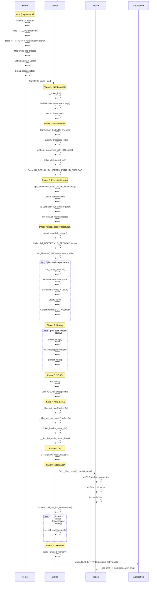

This sequence illustrates why the linker is one of the most
performance-sensitive components in Android. Every microsecond spent in the
linker is multiplied by every process start. The linker's careful optimization
-- symbol caching, template-specialized relocation loops, NEON-accelerated
hashing, protected-data guards -- all serve to minimize this startup overhead.

### 7.6.7 Error Messages and Diagnostics

The linker provides detailed error messages when linking fails. Understanding
these messages is essential for debugging native library issues:

| Error Message | Cause | Solution |
|--------------|-------|---------|
| `"libfoo.so" not found` | Library not on any search path | Check namespace paths, APK lib directory |
| `cannot locate symbol "bar" referenced by "libfoo.so"` | Unresolved strong symbol | Check library dependencies, symbol visibility |
| `"libfoo.so" is not accessible for the namespace "default"` | Namespace isolation | Check linkerconfig, uses-native-library manifest |
| `"libfoo.so" is 32-bit instead of 64-bit` | ABI mismatch | Build library for correct architecture |
| `"libfoo.so" has bad ELF magic` | Corrupted or non-ELF file | Verify file integrity |
| `Android only supports position-independent executables` | Non-PIE executable | Rebuild with -fPIE -pie |
| `has load segments that are both writable and executable` | W+E segment (API >= 26) | Fix linker script, use separate segments |
| `program alignment cannot be smaller than system page size` | 4KiB library on 16KiB system | Rebuild with 16KiB alignment or enable compat |

Each error message is carefully crafted to include the library name, the
namespace context, and (where applicable) a reference to the Android bug
tracker entry that motivated the error or exception.

### 7.6.8 Performance Considerations

The linker's performance directly affects app startup time and system boot
time. Key performance characteristics:

**Relocation processing:**

- The template-specialized `process_relocation_impl<Mode>` generates three
  separate code paths, eliminating branch overhead for the common cases.
- The symbol cache reduces redundant hash table lookups by 80%+ in typical
  workloads.
- The `__predict_false` and `__predict_true` hints guide the compiler's branch
  prediction optimizations.

**ELF loading:**

- The `ElfReader` uses `MappedFileFragment` for zero-copy reading of headers
  (mmap instead of read).
- Segment mapping uses `MAP_FIXED | MAP_PRIVATE`, which tells the kernel to
  replace the existing PROT_NONE mapping without creating a new VMA.
- Transparent huge pages (`MADV_HUGEPAGE`) reduce TLB pressure for large
  executable segments.

**Memory management:**

- The block allocator avoids the overhead of malloc/free for linker-internal
  structures.
- `purge_unused_memory()` is called before handing control to the application,
  returning any internal buffers that are no longer needed.
- RELRO protection prevents accidental writes to resolved GOT entries,
  improving cache behavior (read-only pages can be shared between processes).

**Startup timing:**

The linker records and reports its total execution time when `LD_DEBUG=timing`:

```
LINKER TIME: /system/bin/app_process64: 15234 microseconds
```

Typical values range from 5ms for simple executables to 50ms+ for applications
with many native dependencies. The Android team continuously optimizes this
path, as it directly affects the user-perceived app launch latency.

---

### Key Source Files Reference

| File | Path | Purpose |
|------|------|---------|
| SYSCALLS.TXT | `bionic/libc/SYSCALLS.TXT` | System call definitions |
| gensyscalls.py | `bionic/libc/tools/gensyscalls.py` | Stub generator |
| SECCOMP_BLOCKLIST_APP.TXT | `bionic/libc/SECCOMP_BLOCKLIST_APP.TXT` | Blocked syscalls for apps |
| SECCOMP_ALLOWLIST_APP.TXT | `bionic/libc/SECCOMP_ALLOWLIST_APP.TXT` | Extra allowed syscalls for apps |
| SECCOMP_ALLOWLIST_COMMON.TXT | `bionic/libc/SECCOMP_ALLOWLIST_COMMON.TXT` | Extra allowed syscalls for all |
| SECCOMP_BLOCKLIST_COMMON.TXT | `bionic/libc/SECCOMP_BLOCKLIST_COMMON.TXT` | Common blocked syscalls |
| SECCOMP_PRIORITY.TXT | `bionic/libc/SECCOMP_PRIORITY.TXT` | Hot-path syscalls |
| seccomp_policy.cpp | `bionic/libc/seccomp/seccomp_policy.cpp` | BPF filter generation |
| syscall.S (arm64) | `bionic/libc/arch-arm64/bionic/syscall.S` | AArch64 syscall entry |
| ifuncs.cpp (arm64) | `bionic/libc/arch-arm64/ifuncs.cpp` | IFUNC resolvers |
| libc_init_dynamic.cpp | `bionic/libc/bionic/libc_init_dynamic.cpp` | Dynamic init |
| libc_init_common.cpp | `bionic/libc/bionic/libc_init_common.cpp` | Common init |
| malloc_common.cpp | `bionic/libc/bionic/malloc_common.cpp` | Allocator dispatch |
| pthread_create.cpp | `bionic/libc/bionic/pthread_create.cpp` | Thread creation |
| linker.cpp | `bionic/linker/linker.cpp` | Core linker logic |
| linker_main.cpp | `bionic/linker/linker_main.cpp` | Linker entry and main sequence |
| linker_phdr.cpp | `bionic/linker/linker_phdr.cpp` | ELF loading |
| linker_relocate.cpp | `bionic/linker/linker_relocate.cpp` | Relocation processing |
| linker_namespaces.h | `bionic/linker/linker_namespaces.h` | Namespace structures |
| linker_soinfo.h | `bionic/linker/linker_soinfo.h` | soinfo definition |
| linker_config.cpp | `bionic/linker/linker_config.cpp` | Config file parser |
| dlfcn.cpp | `bionic/linker/dlfcn.cpp` | dlopen/dlsym API |
| vndk.go | `build/soong/cc/vndk.go` | VNDK build definitions |
| main.cc | `system/linkerconfig/main.cc` | Linkerconfig entry point |
| systemdefault.cc | `system/linkerconfig/contents/namespace/systemdefault.cc` | System namespace |
| vendordefault.cc | `system/linkerconfig/contents/namespace/vendordefault.cc` | Vendor namespace |
| vndk.cc | `system/linkerconfig/contents/namespace/vndk.cc` | VNDK namespace |
| system_links.cc | `system/linkerconfig/contents/common/system_links.cc` | Bionic lib links |

---

## Summary

This chapter has traced the path from the lowest levels of Android's native
execution environment -- the system call stubs generated from `SYSCALLS.TXT`,
the seccomp-BPF filters that constrain which calls are permitted -- through
the C library that provides the POSIX foundation, and up to the dynamic linker
that orchestrates library loading, symbol resolution, and namespace isolation.

The key takeaways:

1. **Bionic is purpose-built for Android.** Its BSD license, small size, fast
   startup, and deep Android integration make it fundamentally different from
   glibc. The architecture-specific IFUNC dispatch (with paths for MOPS, Oryon,
   NEON, MTE) demonstrates the performance engineering invested in core
   operations.

2. **The system call interface is generated, not hand-written.** The
   `SYSCALLS.TXT` + `gensyscalls.py` approach provides a single source of
   truth for all five architectures, with architecture-specific concerns
   (32-bit UID calls, socketcall multiplexing, time64 variants) handled
   declaratively.

3. **Seccomp-BPF creates a security boundary at the system call level.** The
   allowlist/blocklist composition (with priority optimization for `futex` and
   `ioctl`) restricts the kernel attack surface for app processes, while the
   architecture-aware BPF programs handle dual-ABI systems.

4. **The dynamic linker is the gatekeeper for all native code.** Its
   ElfReader validates and loads ELF files with ASLR enhancement, 16KiB page
   compatibility, and BTI support. The relocation engine uses template-based
   fast paths and symbol caching for performance.

5. **Linker namespaces enforce the Treble architecture boundary.** The
   `android_namespace_t` structure, configured by `linkerconfig`, creates
   isolated worlds for platform, vendor, and product code. LL-NDK and VNDK
   libraries provide controlled interfaces between these worlds, while the
   exempt list maintains backward compatibility for legacy apps.

Together, these components form the native runtime foundation upon which every
Android process executes. Understanding them is essential for anyone working on
system-level Android development, debugging library loading issues, or
implementing platform security features.

### Architecture-Specific System Call Conventions

To aid readers working on specific architectures, here is a reference table
of system call conventions across all five architectures supported by Bionic:

| Architecture | Syscall Number | Arg 1 | Arg 2 | Arg 3 | Arg 4 | Arg 5 | Arg 6 | Instruction | Return |
|-------------|---------------|-------|-------|-------|-------|-------|-------|-------------|--------|
| arm | r7 | r0 | r1 | r2 | r3 | r4 | r5 | `swi #0` | r0 |
| arm64 | x8 | x0 | x1 | x2 | x3 | x4 | x5 | `svc #0` | x0 |
| x86 | eax | ebx | ecx | edx | esi | edi | ebp | `int $0x80` | eax |
| x86_64 | rax | rdi | rsi | rdx | r10 | r8 | r9 | `syscall` | rax |
| riscv64 | a7 | a0 | a1 | a2 | a3 | a4 | a5 | `ecall` | a0 |

On error, the return value is in the range [-4095, -1] (or [-MAX_ERRNO, -1]
in Bionic terms). Bionic stubs negate this value and store it in `errno` via
`__set_errno_internal`.

Note the x86 peculiarity: 32-bit x86 has only six registers available for
system call arguments, and socket operations are multiplexed through the
`socketcall` system call with a sub-command number. This multiplexing is
absent on all other architectures.

### Linker Configuration File Format

For completeness, here is the grammar of the `ld.config.txt` file format
that the linker parses at startup:

```
config     := section*
section    := "[" name "]" newline property*
property   := name "=" value newline
            | name "+=" value newline

# Namespace properties
namespace.<ns>.search.paths = <colon-separated-paths>
namespace.<ns>.permitted.paths = <colon-separated-paths>
namespace.<ns>.asan.search.paths = <colon-separated-paths>
namespace.<ns>.asan.permitted.paths = <colon-separated-paths>
namespace.<ns>.hwasan.search.paths = <colon-separated-paths>
namespace.<ns>.hwasan.permitted.paths = <colon-separated-paths>
namespace.<ns>.isolated = true|false
namespace.<ns>.visible = true|false
namespace.<ns>.links = <comma-separated-ns-names>
namespace.<ns>.link.<target>.shared_libs = <colon-separated-libs>
namespace.<ns>.link.<target>.allow_all_shared_libs = true|false
namespace.<ns>.allowed_libs = <colon-separated-libs>

# Section selectors
dir.<section> = <path-prefix>
additional.namespaces = <comma-separated-ns-names>
```

The `${LIB}` placeholder in paths is expanded to `lib` on 32-bit systems and
`lib64` on 64-bit systems. The `$ORIGIN` placeholder is expanded to the
directory containing the requesting library.

### Glossary of Key Terms

| Term | Definition |
|------|-----------|
| **ASLR** | Address Space Layout Randomization; randomizes memory layout |
| **BTI** | Branch Target Identification; ARM security feature |
| **CFI** | Control Flow Integrity; prevents indirect call hijacking |
| **DT_NEEDED** | Dynamic table entry listing a required dependency |
| **DT_RUNPATH** | Dynamic table entry with additional library search paths |
| **ELF** | Executable and Linkable Format; binary format for executables |
| **GOT** | Global Offset Table; stores resolved symbol addresses |
| **IFUNC** | Indirect Function; runtime-resolved function selection |
| **LL-NDK** | Low-Level NDK; always-available libraries for vendor |
| **Load Bias** | Offset between ELF virtual address and actual memory address |
| **MTE** | Memory Tagging Extension; ARM memory safety feature |
| **PLT** | Procedure Linkage Table; enables lazy symbol resolution |
| **PMD** | Page Middle Directory; 2MB page table entry |
| **RELRO** | Relocation Read-Only; security hardening for GOT |
| **Seccomp-BPF** | Secure Computing with Berkeley Packet Filter |
| **soinfo** | Shared Object Info; linker metadata for loaded libraries |
| **soname** | Shared Object Name; canonical library identifier |
| **TLS** | Thread-Local Storage; per-thread variables |
| **VNDK** | Vendor NDK; versioned library interface for Treble |
| **VNDK-SP** | VNDK Same-Process; libraries loaded in framework processes |
| **VDSO** | Virtual Dynamic Shared Object; kernel-mapped user-space syscalls |
| **W^X** | Write XOR Execute; security policy preventing W+E pages |

### Further Reading and Cross-References

The topics covered in this chapter connect to several other chapters in
this book:

- **Chapter 4 (Boot and Init)**: The init process is the first user-space
  process and one of the first consumers of Bionic and the dynamic linker.
  Understanding the linker's first-stage init special cases (no arc4random,
  no /proc) requires understanding the boot sequence.

- **Chapter 5 (Kernel)**: The system call interface described in Section 7.2
  is the boundary between user space and kernel space. The seccomp-BPF
  filters are enforced by the kernel's seccomp infrastructure.

- **Chapter 9 (Binder IPC)**: Binder is the most frequent user of the
  `ioctl` system call, which is why `ioctl` is in the seccomp priority list.
  The Binder driver's file descriptor is one of the first things any Android
  process opens after the linker hands off control.

- **Chapter 18 (ART Runtime)**: The ART runtime uses `dlopen()` extensively
  to load JNI libraries, and `libnativeloader` creates per-app linker
  namespaces. ART's OAT files are loaded through the same ELF loading
  pipeline described in Section 7.3.

- **Chapter 10 (HAL and HIDL)**: The Same-Process HAL (SP-HAL) mechanism
  relies on the `sphal` linker namespace to load vendor HAL implementations
  directly into framework processes while maintaining namespace isolation.

- **Chapter 40 (Security)**: The memory safety features described in this
  chapter (MTE, CFI, FORTIFY_SOURCE, seccomp-BPF, W^X, RELRO) form the
  foundation of Android's native code security model. The linker's namespace
  isolation is also a key component of the Treble security boundary.

Understanding Bionic and the dynamic linker is foundational to understanding
Android at the system level. Every native component -- from the init daemon
to the most complex graphics pipeline -- passes through the code paths
documented here.

<!-- chapter:08-memory-management -->
# Chapter 8: Memory Management

Memory management is arguably the single most critical subsystem in a mobile operating system.
Android devices operate under severe physical constraints -- a flagship phone may have 8--16 GB of
RAM, yet users routinely have dozens of apps installed and expect instant switching between them.
This chapter dissects how AOSP orchestrates memory from the hardware page tables all the way up to
the Java `onTrimMemory()` callbacks that developers interact with. We trace the path through the
Linux kernel's virtual memory subsystem, the userspace Low Memory Killer Daemon (lmkd), cgroup
accounting, compressed swap (zRAM), graphics buffer allocation (ION/DMA-BUF), anonymous shared
memory (ashmem/memfd), profiling tools, and the security-oriented memory hardening features that
protect against exploitation.

Every section references real source files rooted at the AOSP tree. When a path such as
`system/memory/lmkd/lmkd.cpp` appears, it is relative to the AOSP checkout root.

---

## 8.1 Memory Architecture

### 8.1.1 Virtual Memory Fundamentals

Android runs on the Linux kernel, which provides each process with its own virtual address space.
On a 64-bit ARM device (AArch64), the kernel typically uses a 39-bit or 48-bit virtual address
space, giving each process up to 256 TB of addressable memory -- vastly more than any physical
device will ever contain. The Memory Management Unit (MMU) in the CPU translates virtual addresses
to physical frame numbers through multi-level page tables.

```
Virtual Address (48-bit example)
+--------+--------+--------+--------+-----------+
| L0 idx | L1 idx | L2 idx | L3 idx | Page Offs |
| (9 bit)| (9 bit)| (9 bit)| (9 bit)| (12 bit)  |
+--------+--------+--------+--------+-----------+
         |
         v
    Page Table Walk (4 levels on AArch64)
         |
         v
    Physical Frame Number + Offset = Physical Address
```

Key concepts for Android developers and platform engineers:

| Concept | Description |
|---|---|
| **Page** | The smallest unit of memory management, typically 4 KB on ARM64 (16 KB on some newer SoCs) |
| **Page Table** | Hierarchical structure mapping virtual to physical addresses |
| **TLB** | Translation Lookaside Buffer -- hardware cache of recent translations |
| **Page Fault** | CPU exception when a virtual address has no valid mapping |
| **Demand Paging** | Pages are not allocated until first access (minor fault) or loaded from backing store (major fault) |
| **Copy-on-Write (CoW)** | Shared pages are duplicated only when one process writes to them -- critical for `fork()` and Zygote |

### 8.1.2 Process Address Space Layout

Every Android process inherits its initial address space from Zygote via `fork()`. The general
layout on a 64-bit device follows this pattern:

```mermaid
graph TD
    subgraph "Process Virtual Address Space (64-bit)"
        A["0x0000000000000000<br/>NULL page (unmapped)"]
        B["Program text (.text)<br/>Executable code"]
        C["Read-only data (.rodata)"]
        D["Initialized data (.data, .bss)"]
        E["Heap (brk/sbrk)<br/>grows upward"]
        F["Memory-mapped regions (mmap)<br/>shared libraries, file mappings,<br/>anonymous mappings"]
        G["Thread stacks<br/>(each ~1 MB default)"]
        H["[stack] - main thread stack<br/>grows downward"]
        I["0x0000007fffffffff<br/>User space limit (39-bit VA)"]
        J["--- Kernel / User boundary ---"]
        K["0xffffff8000000000<br/>Kernel virtual address space"]
    end

    A --> B --> C --> D --> E --> F --> G --> H --> I --> J --> K

    style A fill:#ff6666,color:#000
    style J fill:#ffcc00,color:#000
    style K fill:#66aaff,color:#000
```

Within this layout, Android adds several specialized regions:

- **Dalvik/ART Heap**: The managed heap for Java/Kotlin objects, located within mmap regions. ART
  uses `mmap(MAP_ANONYMOUS)` to create the large object space, non-moving space, and other GC
  spaces.
- **JIT Code Cache**: ART's JIT compiler allocates executable memory via `mmap(PROT_READ |
  PROT_EXEC)` for compiled methods.
- **Ashmem / memfd Regions**: Shared memory segments used for Binder transactions, graphics
  buffers, and inter-process data sharing.
- **Stack Guard Pages**: Each thread's stack is bounded by unmapped guard pages to catch stack
  overflows.

### 8.1.3 Kernel vs. Userspace Memory

The kernel reserves the upper portion of the virtual address space for its own use. Userspace
processes cannot access kernel memory (enforced by the MMU). This separation is fundamental to
system stability -- a buggy app cannot corrupt kernel data structures.

The kernel's memory is divided into:

| Region | Purpose |
|---|---|
| **Linear mapping** | Direct mapping of all physical RAM (identity-mapped with offset) |
| **vmalloc area** | Virtually contiguous but physically scattered allocations |
| **Module space** | Loadable kernel modules |
| **fixmap** | Compile-time fixed virtual addresses for special hardware |
| **PCI I/O space** | Memory-mapped I/O for peripheral devices |

Android's kernel configuration adds several important memory-related features:

```
# Typical Android kernel config excerpts
CONFIG_ZRAM=y                    # Compressed swap in RAM
CONFIG_MEMCG=y                   # Memory cgroup support
CONFIG_PSI=y                     # Pressure Stall Information
CONFIG_TRANSPARENT_HUGEPAGE=y    # THP for reduced TLB misses
CONFIG_KSM=y                     # Kernel Same-page Merging (optional)
CONFIG_KASAN=y                   # Kernel Address Sanitizer (debug builds)
CONFIG_ARM64_MTE=y               # Memory Tagging Extension (ARMv8.5+)
```

### 8.1.4 Memory Zones and NUMA

The Linux kernel organizes physical memory into zones:

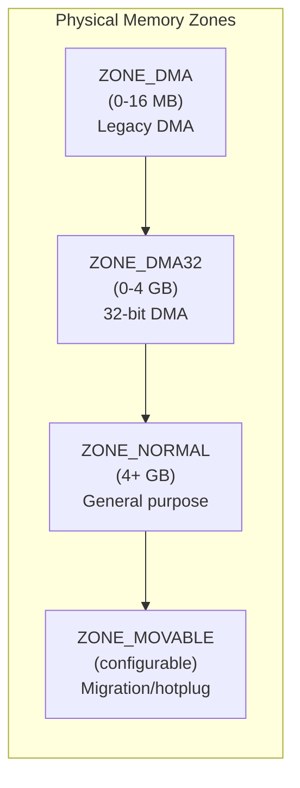

The lmkd daemon parses `/proc/zoneinfo` to understand memory pressure at the zone level. The
parsing code in `system/memory/lmkd/lmkd.cpp` defines these structures:

```c
// system/memory/lmkd/lmkd.cpp (lines 301-391)

/* Fields to parse in /proc/zoneinfo */
enum zoneinfo_zone_field {
    ZI_ZONE_NR_FREE_PAGES = 0,
    ZI_ZONE_MIN,
    ZI_ZONE_LOW,
    ZI_ZONE_HIGH,
    ZI_ZONE_PRESENT,
    ZI_ZONE_NR_FREE_CMA,
    ZI_ZONE_FIELD_COUNT
};

struct zoneinfo_zone {
    union zoneinfo_zone_fields fields;
    int64_t protection[MAX_NR_ZONES];
    int64_t max_protection;
};

struct zoneinfo {
    int node_count;
    struct zoneinfo_node nodes[MAX_NR_NODES];
    int64_t totalreserve_pages;
    int64_t total_inactive_file;
    int64_t total_active_file;
};
```

The `totalreserve_pages` field is the sum of each zone's `max_protection + high watermark`,
representing the minimum amount of memory the kernel reserves for its own operations. This is
critical for lmkd's calculation of available memory.

### 8.1.5 Zygote and Copy-on-Write

The Zygote process is central to Android's memory efficiency. Every app process is forked from
Zygote, which pre-loads the entire Android framework (approximately 100+ MB of class libraries,
resources, and native code). Thanks to copy-on-write (CoW), all these pages are physically shared
between Zygote and every forked app process until they are modified.

```mermaid
graph TD
    subgraph "Zygote Fork and CoW"
        Zygote["Zygote Process<br/>~150 MB loaded<br/>Framework classes<br/>Boot image<br/>Shared libraries"]

        App1["App Process 1<br/>Shares Zygote pages<br/>+ 30 MB private"]
        App2["App Process 2<br/>Shares Zygote pages<br/>+ 45 MB private"]
        App3["App Process 3<br/>Shares Zygote pages<br/>+ 20 MB private"]
    end

    subgraph "Physical Memory"
        Shared["Shared Pages (~100 MB)<br/>Framework classes<br/>Boot image<br/>(read-only, shared by all)"]
        CoW1["CoW Pages (App 1)<br/>Modified framework data<br/>~10 MB"]
        CoW2["CoW Pages (App 2)<br/>Modified framework data<br/>~15 MB"]
        CoW3["CoW Pages (App 3)<br/>Modified framework data<br/>~5 MB"]
        Private1["Private Pages (App 1)<br/>App-specific heap<br/>~20 MB"]
        Private2["Private Pages (App 2)<br/>App-specific heap<br/>~30 MB"]
        Private3["Private Pages (App 3)<br/>App-specific heap<br/>~15 MB"]
    end

    Zygote -->|"fork()"| App1
    Zygote -->|"fork()"| App2
    Zygote -->|"fork()"| App3

    App1 --> Shared
    App2 --> Shared
    App3 --> Shared

    App1 --> CoW1
    App1 --> Private1
    App2 --> CoW2
    App2 --> Private2
    App3 --> CoW3
    App3 --> Private3

    style Shared fill:#44cc44,color:#000
```

Without Zygote and CoW, each of those three apps would need its own copy of the framework,
tripling the memory consumption for shared code. With CoW, the physical cost is:

- **Without CoW**: 3 x 150 MB = 450 MB for framework + 95 MB private = 545 MB total
- **With CoW**: 100 MB shared + 30 MB CoW pages + 95 MB private = 225 MB total

This difference is multiplied across the 20-40 processes typically running on an Android device.

### 8.1.6 Memory Reclaim Mechanisms

The kernel employs several mechanisms to reclaim memory when pressure increases:

```mermaid
flowchart TD
    Pressure["Memory Pressure<br/>Detected"] --> Watermark{"Below which<br/>watermark?"}

    Watermark -->|"HIGH"| kswapd["kswapd (background)<br/>Scans inactive lists<br/>Evicts file pages<br/>Swaps anon pages"]

    Watermark -->|"LOW"| DirectRecl["Direct Reclaim<br/>(synchronous, blocking)<br/>Allocating process waits<br/>Scans all LRU lists"]

    Watermark -->|"MIN"| OOM["OOM Killer<br/>(last resort)<br/>Kernel selects victim<br/>Based on oom_score"]

    kswapd --> FileEvict["File page eviction<br/>(clean: discard<br/>dirty: writeback first)"]
    kswapd --> AnonSwap["Anonymous swap<br/>(compress to zRAM)"]
    kswapd --> SlabShrink["Slab shrinking<br/>(dentry/inode caches)"]

    DirectRecl --> FileEvict
    DirectRecl --> AnonSwap
    DirectRecl --> SlabShrink

    Note1["Android adds: lmkd kills<br/>processes before OOM killer<br/>is needed"]

    style OOM fill:#cc2222,color:#fff
    style Note1 fill:#ffcc00,color:#000
```

The page reclaim algorithm uses two key metrics:

- **Inactive ratio**: Pages are demoted from active to inactive lists based on access patterns.
  Pages that have not been accessed recently are more likely to be evicted.
- **Scan priority**: Higher priority means more pages are scanned per reclaim cycle. Direct
  reclaim uses higher priority than kswapd.

### 8.1.7 The Page Cache

The Linux page cache keeps recently read file data in memory. On Android, this is especially
important because:

1. **App launch speed** depends on having APK contents (DEX, resources, native libraries) in the
   page cache.
2. **The page cache is evictable** -- the kernel reclaims these pages under memory pressure, which
   is why the file cache size factors into lmkd's killing decisions.
3. **Active vs. Inactive lists** -- the kernel maintains LRU lists to decide which pages to evict
   first. lmkd reads these via `/proc/meminfo`:

```c
// system/memory/lmkd/lmkd.cpp (lines 394-441)
enum meminfo_field {
    MI_NR_FREE_PAGES = 0,
    MI_CACHED,
    MI_SWAP_CACHED,
    MI_BUFFERS,
    MI_SHMEM,
    MI_UNEVICTABLE,
    MI_TOTAL_SWAP,
    MI_FREE_SWAP,
    MI_ACTIVE_ANON,
    MI_INACTIVE_ANON,
    MI_ACTIVE_FILE,
    MI_INACTIVE_FILE,
    MI_SRECLAIMABLE,
    MI_SUNRECLAIM,
    MI_KERNEL_STACK,
    MI_PAGE_TABLES,
    // ...
    MI_FIELD_COUNT
};
```

---

## 8.2 Low Memory Killer Daemon (lmkd)

The Low Memory Killer Daemon is the central userspace component responsible for keeping the
Android system responsive under memory pressure. When physical memory runs low, lmkd selects and
kills processes to free memory before the system enters an unrecoverable out-of-memory (OOM)
state.

**Source directory**: `system/memory/lmkd/`

| File | Purpose |
|---|---|
| `lmkd.cpp` | Main daemon implementation (~3400 lines) |
| `lmkd.rc` | Init service definition |
| `lmkd.h` (in `include/`) | Command protocol definitions |
| `reaper.cpp` / `reaper.h` | Asynchronous process reaping with `process_mrelease()` |
| `watchdog.cpp` / `watchdog.h` | Watchdog timer to detect lmkd hangs |
| `statslog.cpp` / `statslog.h` | Statistics logging for kill events |
| `libpsi/psi.cpp` | PSI (Pressure Stall Information) monitor interface |

### 8.2.1 Historical Context: From Kernel Driver to Userspace Daemon

Android originally used an in-kernel Low Memory Killer (LMK) driver located at
`drivers/staging/android/lowmemorykiller.c`. This kernel driver operated by hooking into the
kernel's shrink callback mechanism. When memory fell below configured thresholds, the driver
would walk the process list and kill the process with the highest `oom_adj_score` exceeding the
threshold.

The migration to a userspace daemon (lmkd) happened for several reasons:

1. **Staging driver removal**: The kernel community rejected the LMK driver from the staging tree.
2. **Flexibility**: A userspace daemon can be updated independently of the kernel.
3. **PSI integration**: The Pressure Stall Information (PSI) framework in modern kernels provides a
   better signal for memory pressure than the old vmpressure events.
4. **Better kill strategies**: Userspace has access to more process metadata.

The code still checks for the legacy in-kernel interface:

```c
// system/memory/lmkd/lmkd.cpp (lines 86-87, 155)
#define INKERNEL_MINFREE_PATH "/sys/module/lowmemorykiller/parameters/minfree"
#define INKERNEL_ADJ_PATH "/sys/module/lowmemorykiller/parameters/adj"

/* default to old in-kernel interface if no memory pressure events */
static bool use_inkernel_interface = true;
static bool has_inkernel_module;
```

### 8.2.2 lmkd Service Configuration

The daemon is started by Android's init system via its `.rc` file:

```
# system/memory/lmkd/lmkd.rc (lines 1-8)
service lmkd /system/bin/lmkd
    class core
    user lmkd
    group lmkd system readproc
    capabilities DAC_OVERRIDE KILL IPC_LOCK SYS_NICE SYS_RESOURCE
    critical
    socket lmkd seqpacket+passcred 0660 system system
    task_profiles ServiceCapacityLow
```

Key aspects of this configuration:

- **`class core`**: lmkd starts in the core service class, meaning it launches early in boot.
- **`user lmkd`**: Runs as a dedicated user for security isolation.
- **`capabilities`**: Requires `CAP_KILL` to terminate processes, `CAP_DAC_OVERRIDE` to write to
  `/proc/[pid]/oom_score_adj`, and `CAP_SYS_RESOURCE` for resource adjustments.
- **`critical`**: If lmkd crashes, the system will reboot (it is that essential).
- **`socket lmkd`**: Creates a Unix domain socket for communication with ActivityManagerService.
- **Reinit triggers**: The `.rc` file includes property triggers (lines 10-72) that reinitialize
  lmkd when experiment flags change via `persist.device_config.lmkd_native.*` properties.

### 8.2.3 Communication Protocol

lmkd communicates with the framework (primarily `ProcessList.java` in ActivityManagerService) over
a Unix domain socket. The protocol is defined in `include/lmkd.h`:

```c
// system/memory/lmkd/include/lmkd.h (lines 29-42)
enum lmk_cmd {
    LMK_TARGET = 0,         /* Associate minfree with oom_adj_score */
    LMK_PROCPRIO,           /* Register a process and set its oom_adj_score */
    LMK_PROCREMOVE,         /* Unregister a process */
    LMK_PROCPURGE,          /* Purge all registered processes */
    LMK_GETKILLCNT,         /* Get number of kills */
    LMK_SUBSCRIBE,          /* Subscribe for asynchronous events */
    LMK_PROCKILL,           /* Unsolicited msg to subscribed clients on proc kills */
    LMK_UPDATE_PROPS,       /* Reinit properties */
    LMK_STAT_KILL_OCCURRED, /* Unsolicited msg for statsd logging */
    LMK_START_MONITORING,   /* Start psi monitoring if skipped earlier */
    LMK_BOOT_COMPLETED,     /* Notify LMKD boot is completed */
    LMK_PROCS_PRIO,         /* Register processes and set the same oom_adj_score */
};
```

The message flow during normal operation:

```mermaid
sequenceDiagram
    participant AMS as ActivityManagerService (ProcessList.java)
    participant LMKD as lmkd daemon
    participant Kernel as Linux Kernel

    AMS->>LMKD: LMK_TARGET (set minfree levels)
    AMS->>LMKD: LMK_PROCPRIO (register process, set oom_adj)
    AMS->>LMKD: LMK_SUBSCRIBE (subscribe to kill events)

    Note over Kernel: Memory pressure increases

    Kernel-->>LMKD: PSI event (epoll notification)
    LMKD->>LMKD: Parse /proc/meminfo, /proc/zoneinfo, /proc/vmstat
    LMKD->>LMKD: Calculate memory state, check thresholds
    LMKD->>Kernel: SIGKILL target process (via pidfd_send_signal)
    LMKD->>AMS: LMK_PROCKILL (notify of kill)
    LMKD->>AMS: LMK_STAT_KILL_OCCURRED (kill stats for statsd)

    AMS->>LMKD: LMK_PROCREMOVE (process died)
```

Each packet starts with an `int` command code in network byte order, followed by command-specific
fields. For example, the `LMK_PROCPRIO` packet carries:

```c
// system/memory/lmkd/include/lmkd.h (lines 106-113)
struct lmk_procprio {
    pid_t pid;
    uid_t uid;
    int oomadj;
    enum proc_type ptype;
};
```

The `LMK_PROCS_PRIO` command (line 41) is an optimization that allows batching multiple process
priority updates in a single packet, reducing socket round-trips when many process priorities
change simultaneously (e.g., during activity transitions).

### 8.2.4 OOM Adjustment Scores

Every process in Android has an OOM adjustment score (`oom_adj_score`) that indicates its
importance. Lower scores mean higher importance. lmkd writes this value to
`/proc/[pid]/oom_score_adj` and uses it to decide which processes to kill first.

The score ranges are defined in `frameworks/base/services/core/java/com/android/server/am/ProcessList.java`:

| Constant | Value | Process Type |
|---|---|---|
| `NATIVE_ADJ` | -1000 | Native system daemons |
| `SYSTEM_ADJ` | -900 | system_server |
| `PERSISTENT_PROC_ADJ` | -800 | Persistent system processes |
| `PERSISTENT_SERVICE_ADJ` | -700 | Persistent services |
| `FOREGROUND_APP_ADJ` | 0 | Currently visible foreground app |
| `VISIBLE_APP_ADJ` | 100 | Visible but not focused activity |
| `PERCEPTIBLE_APP_ADJ` | 200 | Perceptible to user (e.g., playing audio) |
| `PERCEPTIBLE_LOW_APP_ADJ` | 250 | Low-priority perceptible |
| `BACKUP_APP_ADJ` | 300 | Performing backup |
| `HEAVY_WEIGHT_APP_ADJ` | 400 | Heavy-weight background process |
| `SERVICE_ADJ` | 500 | Running a service |
| `HOME_APP_ADJ` | 600 | Launcher app |
| `PREVIOUS_APP_ADJ` | 700 | Previous foreground app |
| `SERVICE_B_ADJ` | 800 | B-list service |
| `CACHED_APP_MIN_ADJ` | 900 | Minimum cached (empty) process score |
| `CACHED_APP_LMK_FIRST_ADJ` | 950 | First cached process to kill |
| `CACHED_APP_MAX_ADJ` | 999 | Maximum cached process score |

```mermaid
graph LR
    subgraph "OOM Adjustment Score Spectrum"
        direction LR
        A["-1000<br/>NATIVE"] --> B["-900<br/>SYSTEM"] --> C["-800<br/>PERSISTENT"]
        C --> D["0<br/>FOREGROUND"] --> E["100<br/>VISIBLE"]
        E --> F["200<br/>PERCEPTIBLE"] --> G["500<br/>SERVICE"]
        G --> H["700<br/>PREVIOUS"] --> I["900-999<br/>CACHED"]
    end

    style A fill:#00aa00,color:#fff
    style D fill:#88cc00,color:#000
    style I fill:#ff4444,color:#fff
```

lmkd maintains a doubly-linked list sorted by OOM score to quickly find the highest-score
(least important) process:

```c
// system/memory/lmkd/lmkd.cpp (lines 520-534, 541-552)
struct proc {
    struct adjslot_list asl;
    int pid;
    int pidfd;
    uid_t uid;
    int oomadj;
    pid_t reg_pid;
    bool valid;
    struct proc *pidhash_next;
};

#define PIDHASH_SZ 1024
static struct proc *pidhash[PIDHASH_SZ];
#define pid_hashfn(x) ((((x) >> 8) ^ (x)) & (PIDHASH_SZ - 1))

#define ADJTOSLOT(adj) ((adj) + -OOM_SCORE_ADJ_MIN)
#define ADJTOSLOT_COUNT (ADJTOSLOT(OOM_SCORE_ADJ_MAX) + 1)
static struct adjslot_list procadjslot_list[ADJTOSLOT_COUNT];
```

The `procadjslot_list` is an array of 2001 slots (from -1000 to +1000), where each slot is a
linked list of processes with that OOM score. This allows O(1) lookup of the highest-score
process by scanning backwards from slot 2000.

### 8.2.5 PSI-Based Kill Triggers

Modern lmkd uses the kernel's Pressure Stall Information (PSI) framework as its primary trigger
for kill decisions. PSI measures the percentage of time that tasks are stalled waiting for memory
resources.

The PSI interface is accessed through `/proc/pressure/memory`, which reports:

```
some avg10=0.00 avg60=0.00 avg300=0.00 total=0
full avg10=0.00 avg60=0.00 avg300=0.00 total=0
```

- **`some`**: At least one task is stalled on memory.
- **`full`**: All non-idle tasks are stalled on memory simultaneously.

lmkd registers PSI monitors at three pressure levels:

```c
// system/memory/lmkd/lmkd.cpp (lines 158-170, 226-230)
enum vmpressure_level {
    VMPRESS_LEVEL_LOW = 0,
    VMPRESS_LEVEL_MEDIUM,
    VMPRESS_LEVEL_CRITICAL,
    VMPRESS_LEVEL_COUNT
};

static struct psi_threshold psi_thresholds[VMPRESS_LEVEL_COUNT] = {
    { PSI_SOME, 70 },    /* 70ms out of 1sec for partial stall */
    { PSI_SOME, 100 },   /* 100ms out of 1sec for partial stall */
    { PSI_FULL, 70 },    /* 70ms out of 1sec for complete stall */
};
```

The PSI monitor library (`system/memory/lmkd/libpsi/psi.cpp`) registers triggers with the kernel:

```c
// system/memory/lmkd/libpsi/psi.cpp (lines 36-83)
int init_psi_monitor(enum psi_stall_type stall_type, int threshold_us,
                     int window_us, enum psi_resource resource) {
    int fd;
    char buf[256];

    fd = TEMP_FAILURE_RETRY(open(psi_resource_file[resource],
                                 O_WRONLY | O_CLOEXEC));
    if (fd < 0) {
        ALOGE("No kernel psi monitor support (errno=%d)", errno);
        return -1;
    }

    // Write trigger: "some 70000 1000000" means
    // "notify when 'some' stall exceeds 70ms in a 1000ms window"
    snprintf(buf, sizeof(buf), "%s %d %d",
             stall_type_name[stall_type], threshold_us, window_us);

    write(fd, buf, strlen(buf) + 1);
    return fd;  // fd can be added to epoll
}
```

The returned file descriptor is added to lmkd's epoll set. When the kernel detects that memory
stall time exceeds the threshold within the window, it triggers an `EPOLLPRI` event on the fd.

### 8.2.6 Kill Decision Logic

When a PSI event fires, lmkd enters its kill decision loop. The logic considers multiple factors:

```mermaid
flowchart TD
    A[PSI Event Received] --> B["Parse /proc/meminfo<br/>/proc/zoneinfo<br/>/proc/vmstat"]
    B --> C{"Check kill<br/>timeout"}
    C -->|Still waiting| D["Skip - previous kill<br/>not yet effective"]
    C -->|Timeout expired| E{"Evaluate memory<br/>conditions"}

    E --> F{"Thrashing?<br/>workingset_refault<br/>change > threshold"}
    E --> G{"Low swap?<br/>free_swap < threshold"}
    E --> H{"Low memory?<br/>free < minfree level"}
    E --> I{"Direct reclaim<br/>stalled?"}

    F --> J["Determine min_score_adj<br/>based on pressure level"]
    G --> J
    H --> J
    I --> J

    J --> K[find_and_kill_process]
    K --> L{kill_heaviest_task?}
    L -->|Yes| M["Kill process with<br/>highest RSS at<br/>or above min_score_adj"]
    L -->|No| N["Kill process with<br/>highest oom_adj at<br/>or above min_score_adj"]

    M --> O["Send SIGKILL via<br/>pidfd_send_signal"]
    N --> O
    O --> P["Reaper thread calls<br/>process_mrelease"]
    P --> Q["Log kill stats,<br/>notify AMS"]
```

The kill reasons are enumerated in the code:

```c
// system/memory/lmkd/statslog.h (lines 69-85)
enum kill_reasons {
    NONE = -1,
    PRESSURE_AFTER_KILL = 0,
    NOT_RESPONDING,
    LOW_SWAP_AND_THRASHING,
    LOW_MEM_AND_SWAP,
    LOW_MEM_AND_THRASHING,
    DIRECT_RECL_AND_THRASHING,
    LOW_MEM_AND_SWAP_UTIL,
    LOW_FILECACHE_AFTER_THRASHING,
    LOW_MEM,
    DIRECT_RECL_STUCK,
    KILL_REASON_COUNT
};
```

The memory available calculation is nuanced. lmkd computes "easy available" memory that accounts
for file cache evictability and swap compression:

```c
// system/memory/lmkd/lmkd.cpp (lines 1969-1984)
mi->field.easy_available = mi->field.nr_free_pages;
if (relaxed_available_memory && swap_compression_ratio) {
    mi->field.easy_available += mi->field.active_file
                              + mi->field.inactive_file;
    mi->field.easy_available -= mi->field.dirty;

    int64_t anon_pages = mi->field.active_anon + mi->field.inactive_anon;
    mi->field.easy_available +=
        (swap_compression_ratio - swap_compression_ratio_div)
        * anon_pages / swap_compression_ratio;
} else {
    mi->field.easy_available += mi->field.inactive_file;
}
```

This calculation recognizes that:

- Free pages are immediately available.
- File-backed pages (active and inactive) can be evicted to reclaim memory.
- Dirty pages need to be written back first, so they are subtracted.
- Anonymous pages can be swapped, but zRAM compression means they only free
  `(1 - 1/compression_ratio)` of their original size.

### 8.2.7 The Full Kill Decision State Machine

The complete PSI event handler (`__mp_event_psi`) in `lmkd.cpp` implements a sophisticated
state machine that evaluates multiple memory conditions before deciding whether to kill:

```c
// system/memory/lmkd/lmkd.cpp (lines 2729-2999, abbreviated)
static void __mp_event_psi(enum event_source source,
                           union psi_event_data data,
                           uint32_t events,
                           struct polling_params *poll_params) {
    static int64_t init_ws_refault;
    static int64_t prev_workingset_refault;
    static int64_t base_file_lru;
    static bool killing;
    static int thrashing_limit = thrashing_limit_pct;
    static struct wakeup_info wi;
    static int max_thrashing = 0;

    union meminfo mi;
    union vmstat vs;
    struct psi_data psi_data;
    int64_t thrashing = 0;
    bool swap_is_low = false;
    enum kill_reasons kill_reason = NONE;
    // ...

    // Step 1: Rate-limit based on pending kills
    bool kill_pending = is_kill_pending();
    if (kill_pending && (kill_timeout_ms == 0 ||
        get_time_diff_ms(&last_kill_tm, &curr_tm)
            < static_cast<long>(kill_timeout_ms))) {
        wi.skipped_wakeups++;
        goto no_kill;
    }

    // Step 2: Parse all memory state
    vmstat_parse(&vs);
    meminfo_parse(&mi);

    // Step 3: Calculate thrashing percentage
    thrashing = (workingset_refault_file - init_ws_refault) * 100
                / (base_file_lru + 1);
    thrashing += prev_thrash_growth;

    // Step 4: Check swap levels
    swap_is_low = get_free_swap(&mi) < swap_low_threshold;

    // Step 5: Identify reclaim state
    in_direct_reclaim = vs.field.pgscan_direct != init_pgscan_direct;
    in_kswapd_reclaim = vs.field.pgscan_kswapd != init_pgscan_kswapd;

    // Step 6: Check watermarks
    wmark = get_lowest_watermark(&mi, &watermarks);

    // Step 7: Determine kill reason based on combined state
    if (cycle_after_kill && wmark < WMARK_LOW) {
        kill_reason = PRESSURE_AFTER_KILL;
    } else if (level == VMPRESS_LEVEL_CRITICAL) {
        kill_reason = NOT_RESPONDING;
    } else if (swap_is_low && thrashing > thrashing_limit_pct) {
        kill_reason = LOW_SWAP_AND_THRASHING;
    } else if (swap_is_low && wmark < WMARK_HIGH) {
        kill_reason = LOW_MEM_AND_SWAP;
    } else if (reclaim == DIRECT_RECLAIM && thrashing > thrashing_limit) {
        kill_reason = DIRECT_RECL_AND_THRASHING;
    } // ... more conditions
}
```

The kill decision tree in full:

```mermaid
flowchart TD
    Start[PSI Event] --> ParseState["Parse meminfo,<br/>vmstat, zoneinfo"]
    ParseState --> KillPending{"Previous kill<br/>still pending?"}
    KillPending -->|Yes, within timeout| Skip[Skip this event]
    KillPending -->|No / timeout expired| CalcState["Calculate:<br/>- thrashing %<br/>- swap utilization<br/>- watermark level<br/>- reclaim state"]

    CalcState --> Cond1{"Previous kill<br/>AND watermark<br/>below LOW?"}
    Cond1 -->|Yes| R1["PRESSURE_AFTER_KILL<br/>min_adj from config"]
    Cond1 -->|No| Cond2{"Critical PSI<br/>event?"}

    Cond2 -->|Yes| R2["NOT_RESPONDING<br/>min_adj = 0"]
    Cond2 -->|No| Cond3{"Low swap AND<br/>thrashing > limit?"}

    Cond3 -->|Yes| R3["LOW_SWAP_AND_THRASHING<br/>min_adj = 0"]
    Cond3 -->|No| Cond4{"Low swap AND<br/>low watermark?"}

    Cond4 -->|Yes| R4["LOW_MEM_AND_SWAP<br/>min_adj = 0"]
    Cond4 -->|No| Cond5{"Thrashing AND<br/>low watermark?"}

    Cond5 -->|Yes| R5["LOW_MEM_AND_THRASHING<br/>min_adj = 0"]
    Cond5 -->|No| Cond6{"Direct reclaim<br/>AND thrashing?"}

    Cond6 -->|Yes| R6["DIRECT_RECL_AND_THRASHING<br/>min_adj based on swap util"]
    Cond6 -->|No| Cond7{"High swap<br/>utilization?"}

    Cond7 -->|Yes| R7["LOW_MEM_AND_SWAP_UTIL<br/>min_adj = 0"]
    Cond7 -->|No| Cond8{"Direct reclaim<br/>stuck?"}

    Cond8 -->|Yes| R8["DIRECT_RECL_STUCK<br/>min_adj = 0"]
    Cond8 -->|No| NoKill[No kill needed]

    R1 --> Kill[find_and_kill_process]
    R2 --> Kill
    R3 --> Kill
    R4 --> Kill
    R5 --> Kill
    R6 --> Kill
    R7 --> Kill
    R8 --> Kill

    style R1 fill:#cc4444,color:#fff
    style R2 fill:#cc4444,color:#fff
    style R3 fill:#cc4444,color:#fff
    style R4 fill:#cc4444,color:#fff
    style R5 fill:#cc4444,color:#fff
    style R6 fill:#cc4444,color:#fff
    style R7 fill:#cc4444,color:#fff
    style R8 fill:#cc4444,color:#fff
    style NoKill fill:#44cc44,color:#000
    style Skip fill:#cccc44,color:#000
```

### 8.2.8 Watermark Calculation

lmkd calculates zone watermarks to understand how close the system is to OOM:

```c
// system/memory/lmkd/lmkd.cpp (lines 2649-2701)
enum zone_watermark {
    WMARK_MIN = 0,   // Below min: direct reclaim, risk of OOM
    WMARK_LOW,       // Below low: kswapd is active
    WMARK_HIGH,      // Below high: kswapd may start soon
    WMARK_NONE       // Above all watermarks: healthy
};

struct zone_watermarks {
    long high_wmark;
    long low_wmark;
    long min_wmark;
};

void calc_zone_watermarks(struct zoneinfo *zi,
                          struct zone_watermarks *watermarks) {
    memset(watermarks, 0, sizeof(struct zone_watermarks));

    for (int node_idx = 0; node_idx < zi->node_count; node_idx++) {
        struct zoneinfo_node *node = &zi->nodes[node_idx];
        for (int zone_idx = 0; zone_idx < node->zone_count; zone_idx++) {
            struct zoneinfo_zone *zone = &node->zones[zone_idx];
            if (!zone->fields.field.present) continue;

            watermarks->high_wmark += zone->max_protection
                                    + zone->fields.field.high;
            watermarks->low_wmark  += zone->max_protection
                                    + zone->fields.field.low;
            watermarks->min_wmark  += zone->max_protection
                                    + zone->fields.field.min;
        }
    }
}

static enum zone_watermark get_lowest_watermark(
        union meminfo *mi, struct zone_watermarks *watermarks) {
    int64_t nr_free_pages = mi->field.nr_free_pages
                          - mi->field.cma_free;

    if (nr_free_pages < watermarks->min_wmark) return WMARK_MIN;
    if (nr_free_pages < watermarks->low_wmark) return WMARK_LOW;
    if (nr_free_pages < watermarks->high_wmark) return WMARK_HIGH;
    return WMARK_NONE;
}
```

The watermark hierarchy visualized:

```mermaid
graph TD
    subgraph "Memory Watermark Levels"
        direction TB
        Full["Total Physical RAM"]
        HighW["HIGH Watermark<br/>kswapd might start"]
        LowW["LOW Watermark<br/>kswapd is active"]
        MinW["MIN Watermark<br/>Direct reclaim begins<br/>OOM risk HIGH"]
        Zero["0 free pages<br/>OOM Kill"]
    end

    Full -->|"Free memory decreasing"| HighW
    HighW -->|"Pressure increasing"| LowW
    LowW -->|"Severe pressure"| MinW
    MinW -->|"Critical"| Zero

    style Full fill:#44cc44,color:#000
    style HighW fill:#88cc44,color:#000
    style LowW fill:#cccc44,color:#000
    style MinW fill:#cc8844,color:#000
    style Zero fill:#cc2222,color:#fff
```

### 8.2.9 Victim Selection: find_and_kill_process

The victim selection algorithm iterates from the highest OOM score downward:

```c
// system/memory/lmkd/lmkd.cpp (lines 2555-2591)
static int find_and_kill_process(int min_score_adj,
                                 struct kill_info *ki,
                                 union meminfo *mi,
                                 struct wakeup_info *wi,
                                 struct timespec *tm,
                                 struct psi_data *pd) {
    int killed_size = 0;
    bool choose_heaviest_task = kill_heaviest_task;

    for (int i = OOM_SCORE_ADJ_MAX; i >= min_score_adj; i--) {
        struct proc *procp;

        if (!choose_heaviest_task && i <= PERCEPTIBLE_APP_ADJ) {
            // For perceptible processes, always kill heaviest
            // to minimize the number of victims
            choose_heaviest_task = true;
        }

        while (true) {
            procp = choose_heaviest_task ?
                proc_get_heaviest(i) : proc_adj_tail(i);

            if (!procp) break;

            killed_size = kill_one_process(procp, min_score_adj,
                                           ki, mi, wi, tm, pd);
            if (killed_size >= 0) break;
        }
        if (killed_size) break;
    }
    return killed_size;
}
```

The dual selection strategy is important:

1. **For cached/background processes** (`oom_adj > PERCEPTIBLE_APP_ADJ`): Kill the most recently
   added process at each score level (`proc_adj_tail`). This follows an LRU-like order.
2. **For perceptible processes** (`oom_adj <= 200`): Always kill the heaviest process
   (`proc_get_heaviest`), which reads `/proc/[pid]/statm` for each candidate. This minimizes the
   number of visible-to-user processes that must die.

The `proc_get_heaviest` function:

```c
// system/memory/lmkd/lmkd.cpp (lines 2253-2278)
static struct proc *proc_get_heaviest(int oomadj) {
    struct adjslot_list *head = &procadjslot_list[ADJTOSLOT(oomadj)];
    struct adjslot_list *curr = head->next;
    struct proc *maxprocp = NULL;
    int maxsize = 0;

    // Optimization: if only one process, skip size lookup
    if ((curr != head) && (curr->next == head)) {
        return (struct proc *)curr;
    }

    while (curr != head) {
        int pid = ((struct proc *)curr)->pid;
        int tasksize = proc_get_size(pid);
        if (tasksize < 0) {
            // Process died, clean up
            struct adjslot_list *next = curr->next;
            pid_remove(pid);
            curr = next;
        } else {
            if (tasksize > maxsize) {
                maxsize = tasksize;
                maxprocp = (struct proc *)curr;
            }
            curr = curr->next;
        }
    }
    return maxprocp;
}
```

### 8.2.10 The Kill Execution: kill_one_process

Once a victim is selected, the kill is performed with extensive safety checks:

```c
// system/memory/lmkd/lmkd.cpp (lines 2443-2549, abbreviated)
static int kill_one_process(struct proc* procp, int min_oom_score,
                            struct kill_info *ki, union meminfo *mi,
                            struct wakeup_info *wi, struct timespec *tm,
                            struct psi_data *pd) {
    int pid = procp->pid;
    int pidfd = procp->pidfd;
    uid_t uid = procp->uid;
    char buf[pagesize];

    // Safety check 1: verify process is still valid
    if (!procp->valid || !read_proc_status(pid, buf, sizeof(buf))) {
        goto out;
    }

    // Safety check 2: detect PID reuse
    int64_t tgid;
    if (!parse_status_tag(buf, PROC_STATUS_TGID_FIELD, &tgid)) {
        goto out;
    }
    if (tgid != pid) {
        ALOGE("Possible pid reuse detected (pid %d, tgid %" PRId64 ")!",
              pid, tgid);
        goto out;
    }

    // Read RSS and swap for logging
    parse_status_tag(buf, PROC_STATUS_RSS_FIELD, &rss_kb);
    parse_status_tag(buf, PROC_STATUS_SWAP_FIELD, &swap_kb);

    // Hook: allow vendor code to free memory without killing
    result = lmkd_free_memory_before_kill_hook(procp, rss_kb / page_k,
                                                procp->oomadj, /*...*/);
    if (result > 0) {
        ALOGI("Skipping kill; %ld kB freed elsewhere.", result * page_k);
        return result;
    }

    // Execute the kill via the reaper
    start_wait_for_proc_kill(pidfd < 0 ? pid : pidfd);
    kill_result = reaper.kill({ pidfd, pid, uid }, false);

    if (kill_result) {
        stop_wait_for_proc_kill(false);
        goto out;
    }

    // Log the kill
    ALOGI("Kill '%s' (%d), uid %d, oom_score_adj %d "
          "to free %" PRId64 "kB rss, %" PRId64 "kB swap; "
          "reason: %s",
          taskname, pid, uid, procp->oomadj, rss_kb, swap_kb,
          ki->kill_desc);
    killinfo_log(procp, min_oom_score, rss_kb, swap_kb,
                 ki, mi, wi, tm, pd);

    // Notify AMS and statsd
    ctrl_data_write_lmk_kill_occurred((pid_t)pid, uid, rss_kb);
    stats_write_lmk_kill_occurred(&kill_st, mem_st);

out:
    pid_remove(pid);
    return result;
}
```

The `lmkd_free_memory_before_kill_hook` is a vendor hook that allows OEM-specific code to free
memory (e.g., by compacting specific caches or dropping GPU resources) without actually killing
a process. If the hook frees enough memory, the kill is skipped entirely.

### 8.2.11 The Watchdog Kill Path

When lmkd's main event loop hangs (detected by the watchdog timer), the watchdog thread
performs its own emergency kill:

```c
// system/memory/lmkd/lmkd.cpp (lines 2305-2329)
static void watchdog_callback() {
    int prev_pid = 0;

    ALOGW("lmkd watchdog timed out!");
    for (int oom_score = OOM_SCORE_ADJ_MAX; oom_score >= 0;) {
        struct proc target;

        if (!find_victim(oom_score, prev_pid, target)) {
            oom_score--;
            prev_pid = 0;
            continue;
        }

        if (target.valid &&
            reaper.kill({ target.pidfd, target.pid, target.uid },
                        true /* synchronous */) == 0) {
            ALOGW("lmkd watchdog killed process %d, oom_score_adj %d",
                  target.pid, oom_score);
            pid_invalidate(target.pid);
            break;
        }
        prev_pid = target.pid;
    }
}
```

The watchdog kill is **synchronous** (note the `true` parameter to `reaper.kill()`), meaning it
blocks until `pidfd_send_signal(SIGKILL)` completes. This is because the watchdog thread cannot
use the asynchronous reaper queue (the main thread that processes queue completions is hung).
The watchdog also uses `pid_invalidate()` instead of `pid_remove()` because the latter can only
be called from the main thread safely.

### 8.2.12 Thrashing Detection

lmkd detects memory thrashing by monitoring `workingset_refault` counters from `/proc/vmstat`:

```c
// system/memory/lmkd/lmkd.cpp (lines 474-497)
enum vmstat_field {
    VS_FREE_PAGES,
    VS_INACTIVE_FILE,
    VS_ACTIVE_FILE,
    VS_WORKINGSET_REFAULT,
    VS_WORKINGSET_REFAULT_FILE,
    VS_PGSCAN_KSWAPD,
    VS_PGSCAN_DIRECT,
    VS_PGSCAN_DIRECT_THROTTLE,
    VS_PGREFILL,
    VS_FIELD_COUNT
};
```

A `workingset_refault` is a page that was recently evicted from the page cache and is now being
faulted back in -- a strong signal that the system is thrashing. The thrashing percentage is
calculated relative to page scans and compared against configurable thresholds:

| Property | Default | Low RAM Default |
|---|---|---|
| `ro.lmk.thrashing_limit` | 100 | 30 |
| `ro.lmk.thrashing_limit_decay` | 10 | 50 |
| `ro.lmk.thrashing_limit_critical` | (derived) | (derived) |

### 8.2.13 The Reaper: Asynchronous Process Killing

When lmkd decides to kill a process, the actual killing is performed by a pool of reaper threads.
This design decouples the kill decision from the potentially slow process of reclaiming memory
from the killed process.

The `Reaper` class (`system/memory/lmkd/reaper.h` and `reaper.cpp`) manages a thread pool:

```c
// system/memory/lmkd/reaper.h (lines 23-60)
class Reaper {
public:
    struct target_proc {
        int pidfd;
        int pid;
        uid_t uid;
    };
private:
    std::mutex mutex_;
    std::condition_variable cond_;
    std::vector<struct target_proc> queue_;
    int active_requests_;
    int comm_fd_;
    int thread_cnt_;
    pthread_t* thread_pool_;
    bool debug_enabled_;
    // ...
};
```

The reaper thread's main loop:

1. **Dequeue** a kill request.
2. **Send SIGKILL** via `pidfd_send_signal()` -- uses the pidfd to avoid PID recycling races.
3. **Adjust cgroups and priority** of the dying process to speed up memory reclamation.
4. **Call `process_mrelease()`** -- a Linux syscall (number 448) that triggers synchronous memory
   reclamation from the dying process.

```c
// system/memory/lmkd/reaper.cpp (lines 46-48, 91-137)
static int process_mrelease(int pidfd, unsigned int flags) {
    return syscall(__NR_process_mrelease, pidfd, flags);
}

static void* reaper_main(void* param) {
    Reaper *reaper = static_cast<Reaper*>(param);
    // ...
    for (;;) {
        target = reaper->dequeue_request();

        if (pidfd_send_signal(target.pidfd, SIGKILL, NULL, 0)) {
            reaper->notify_kill_failure(target.pid);
            goto done;
        }

        set_process_group_and_prio(target.uid, target.pid,
            {"CPUSET_SP_FOREGROUND", "SCHED_SP_FOREGROUND"},
            ANDROID_PRIORITY_NORMAL);

        if (process_mrelease(target.pidfd, 0)) {
            ALOGE("process_mrelease %d failed: %s",
                  target.pid, strerror(errno));
        }
done:
        close(target.pidfd);
        reaper->request_complete();
    }
}
```

The `process_mrelease()` syscall is significant because without it, memory from a killed process
is freed lazily by the kernel as part of `exit_mmap()`. With `process_mrelease()`, the calling
thread actively reclaims the dying process's memory, reducing the time between the kill decision
and actual memory availability.

### 8.2.14 The Watchdog

lmkd includes a watchdog timer (`system/memory/lmkd/watchdog.cpp`) to detect when the daemon
hangs -- which could be catastrophic since no processes would be killed during memory pressure:

```c
// system/memory/lmkd/watchdog.h (lines 23-39)
class Watchdog {
private:
    int timeout_;                  // 2 seconds (WATCHDOG_TIMEOUT_SEC)
    timer_t timer_;
    std::atomic<bool> timer_created_;
    void (*callback_)();
public:
    Watchdog(int timeout, void (*callback)())
        : timeout_(timeout), timer_created_(false), callback_(callback) {}
    bool init();
    bool start();
    bool stop();
    bool create_timer(sigset_t &sigset);
    void bite() const { if (callback_) callback_(); }
};
```

The watchdog uses a `CLOCK_MONOTONIC` timer with `SIGALRM` delivery. If lmkd's main event loop
does not disarm the watchdog within the 2-second timeout, the watchdog bites -- typically
triggering an abort or logging diagnostic information.

### 8.2.15 Configurable Properties

lmkd reads configuration from system properties, with experiment overrides available:

```c
// system/memory/lmkd/lmkd.cpp (lines 108-110)
#define GET_LMK_PROPERTY(type, name, def) \
    property_get_##type("persist.device_config.lmkd_native." name, \
        property_get_##type("ro.lmk." name, def))
```

Key properties:

| Property | Default | Description |
|---|---|---|
| `ro.lmk.debug` | false | Enable verbose kill logging |
| `ro.lmk.kill_heaviest_task` | false | Kill by RSS rather than oom_adj |
| `ro.lmk.kill_timeout_ms` | 0 | Minimum time between kills |
| `ro.lmk.use_minfree_levels` | false | Use traditional minfree thresholds |
| `ro.lmk.psi_partial_stall_ms` | 70 (200 on low-RAM) | PSI some-stall threshold |
| `ro.lmk.psi_complete_stall_ms` | 700 | PSI full-stall threshold |
| `ro.lmk.psi_window_size_ms` | 1000 | PSI monitoring window |
| `ro.lmk.swap_free_low_percentage` | 10 | Low swap threshold |
| `ro.lmk.thrashing_limit` | 100 (30 on low-RAM) | Thrashing percentage threshold |
| `ro.lmk.swap_compression_ratio` | 1 | Expected zRAM compression ratio |
| `ro.lmk.filecache_min_kb` | 0 | Minimum file cache to maintain |
| `ro.lmk.direct_reclaim_threshold_ms` | 0 | Direct reclaim stall threshold |

### 8.2.16 Event Loop Architecture

The lmkd main event loop uses `epoll` to multiplex between multiple event sources:

```c
// system/memory/lmkd/lmkd.cpp (lines 284-290)
/*
 * 1 ctrl listen socket, 3 ctrl data socket, 3 memory pressure levels,
 * 1 lmk events + 1 fd to wait for process death
 * + 1 fd to receive kill failure notifications
 * + 1 fd to receive memevent_listener notifications
 */
#define MAX_EPOLL_EVENTS (1 + MAX_DATA_CONN + VMPRESS_LEVEL_COUNT \
                          + 1 + 1 + 1 + 1)
```

```mermaid
graph TD
    subgraph "lmkd Event Loop (epoll)"
        EPoll["epoll_wait()"]

        subgraph "Event Sources"
            CtrlSock["Control socket<br/>(AMS connection)"]
            DataSock1["Data socket 1<br/>(AMS commands)"]
            DataSock2["Data socket 2<br/>(init)"]
            DataSock3["Data socket 3<br/>(tests)"]
            PSI_Low["PSI Low<br/>(some 70ms/1s)"]
            PSI_Med["PSI Medium<br/>(some 100ms/1s)"]
            PSI_Crit["PSI Critical<br/>(full 70ms/1s)"]
            KillDone["pidfd<br/>(kill complete)"]
            KillFail["Reaper pipe<br/>(kill failure)"]
            MemEvent["memevent_listener<br/>(BPF events)"]
        end
    end

    CtrlSock -->|EPOLLIN| EPoll
    DataSock1 -->|EPOLLIN| EPoll
    DataSock2 -->|EPOLLIN| EPoll
    DataSock3 -->|EPOLLIN| EPoll
    PSI_Low -->|EPOLLPRI| EPoll
    PSI_Med -->|EPOLLPRI| EPoll
    PSI_Crit -->|EPOLLPRI| EPoll
    KillDone -->|EPOLLIN| EPoll
    KillFail -->|EPOLLIN| EPoll
    MemEvent -->|EPOLLIN| EPoll

    EPoll --> Handler["Event handler<br/>dispatch"]
    Handler --> CmdH["ctrl_command_handler()"]
    Handler --> PsiH["__mp_event_psi()"]
    Handler --> KillH["kill_done_handler()"]
    Handler --> FailH["kill_fail_handler()"]
```

After receiving a PSI event, lmkd enters a polling mode where it periodically re-checks memory
conditions at short intervals:

| Constant | Value | Purpose |
|---|---|---|
| `PSI_POLL_PERIOD_SHORT_MS` | 10 ms | Polling interval during high pressure |
| `PSI_POLL_PERIOD_LONG_MS` | 100 ms | Polling interval during moderate pressure |
| `DEFAULT_PSI_WINDOW_SIZE_MS` | 1000 ms | PSI monitor window size |

This polling is necessary because PSI events are rate-limited (at most one per window), but
memory conditions can change rapidly within a window.

### 8.2.17 BPF Memory Event Integration

Modern lmkd integrates with the kernel's BPF (Berkeley Packet Filter) subsystem to receive
more granular memory events. The `memevent_listener` tracks direct reclaim and kswapd activity:

```c
// system/memory/lmkd/lmkd.cpp (line 183)
static std::unique_ptr<android::bpf::memevents::MemEventListener>
    memevent_listener(nullptr);
static struct timespec direct_reclaim_start_tm;
static struct timespec kswapd_start_tm;
```

The BPF programs are loaded after boot completion:

```c
// system/memory/lmkd/lmkd.cpp (LMK_BOOT_COMPLETED handler)
case LMK_BOOT_COMPLETED:
    // Initialize the memevent listener after boot is completed
    // to prevent waiting for BPF programs to be loaded
    init_memevent();
    boot_completed_handled = true;
    break;
```

This BPF integration provides more accurate reclaim detection than parsing `/proc/vmstat`
counters, which can miss short bursts of reclaim activity between polling intervals.

### 8.2.18 Swap Utilization Calculation

lmkd calculates swap utilization to detect when the swap subsystem is becoming saturated:

```c
// system/memory/lmkd/lmkd.cpp (lines 2712-2717)
static int calc_swap_utilization(union meminfo *mi) {
    int64_t swap_used = mi->field.total_swap - get_free_swap(mi);
    int64_t total_swappable = mi->field.active_anon
                            + mi->field.inactive_anon
                            + mi->field.shmem + swap_used;
    return total_swappable > 0 ? (swap_used * 100) / total_swappable : 0;
}
```

This calculation represents the percentage of swappable memory that has already been swapped.
A high utilization (configurable via `ro.lmk.swap_util_max`) indicates that the system has
limited remaining capacity to swap out pages, making kills more urgent.

---

## 8.3 Cgroups and Memory Accounting

Android uses Linux cgroups (control groups) to organize processes into hierarchical groups for
resource management and accounting. Memory cgroups (`memcg`) are particularly important for
tracking per-app memory usage and enforcing soft limits.

### 8.3.1 Cgroup Versions

Android supports both cgroup v1 and cgroup v2. The lmkd code detects which version is in use:

```c
// system/memory/lmkd/statslog.h (lines 33-37)
enum class MemcgVersion {
    kNotFound,
    kV1,
    kV2,
};

MemcgVersion memcg_version();
```

On modern Android (Android 12+), cgroup v2 is preferred. The cgroup hierarchy is configured
during boot by init:

```
/dev/memcg/                          # cgroup v1 memory controller mount
/dev/memcg/apps/                     # All app processes
/dev/memcg/apps/uid_<uid>/           # Per-UID groups
/dev/memcg/apps/uid_<uid>/pid_<pid>/ # Per-process groups
/dev/memcg/system/                   # System processes

# cgroup v2 (unified hierarchy)
/sys/fs/cgroup/                      # Unified cgroup v2 mount
```

### 8.3.2 Process Group Assignment

When ActivityManagerService registers a process with lmkd via `LMK_PROCPRIO`, lmkd assigns the
process to the appropriate cgroup and sets its memory soft limit:

```c
// system/memory/lmkd/lmkd.cpp (lines 1119-1172)
static void register_oom_adj_proc(const struct lmk_procprio& proc,
                                   struct ucred* cred) {
    char val[20];
    int soft_limit_mult;

    if (proc.ptype == PROC_TYPE_APP && per_app_memcg) {
        if (proc.oomadj >= 900) {
            soft_limit_mult = 0;
        } else if (proc.oomadj >= 800) {
            soft_limit_mult = 0;
        } else if (proc.oomadj >= 700) {
            soft_limit_mult = 0;
        } else if (proc.oomadj >= 600) {
            // Launcher should be perceptible
            soft_limit_mult = 1;
        } else if (proc.oomadj >= 300) {
            soft_limit_mult = 1;
        } else if (proc.oomadj >= 200) {
            soft_limit_mult = 8;      // 64 MB
        } else if (proc.oomadj >= 100) {
            soft_limit_mult = 10;     // 80 MB
        } else if (proc.oomadj >= 0) {
            soft_limit_mult = 20;     // 160 MB
        } else {
            // Persistent processes: 512 MB
            soft_limit_mult = 64;
        }

        snprintf(val, sizeof(val), "%d",
                 soft_limit_mult * EIGHT_MEGA);  // EIGHT_MEGA = 1 << 23
        // Write to cgroup memory.soft_limit_in_bytes
        std::string soft_limit_path;
        CgroupGetAttributePathForTask("MemSoftLimit",
                                       proc.pid, &soft_limit_path);
        writefilestring(soft_limit_path.c_str(), val, !is_system_server);
    }
}
```

The soft limit multiplier translates to actual memory limits:

| OOM Score Range | Soft Limit Multiplier | Effective Limit |
|---|---|---|
| >= 900 (cached) | 0 | No limit |
| >= 700 (previous) | 0 | No limit |
| >= 600 (home) | 1 | 8 MB |
| >= 300 (backup) | 1 | 8 MB |
| >= 200 (perceptible) | 8 | 64 MB |
| >= 100 (visible) | 10 | 80 MB |
| >= 0 (foreground) | 20 | 160 MB |
| < 0 (persistent) | 64 | 512 MB |

These are **soft limits** -- the kernel will attempt to reclaim memory from processes exceeding
their soft limit before reclaiming from processes within their limit, but a process can use more
memory if available.

### 8.3.3 Task Profiles

Android extends cgroup management with the task profiles framework, which provides a higher-level
API for assigning processes to cgroups:

```c
// Used in reaper.cpp (lines 56-65, 98-99)
set_process_group_and_prio(target.uid, target.pid,
    {"CPUSET_SP_FOREGROUND", "SCHED_SP_FOREGROUND"},
    ANDROID_PRIORITY_NORMAL);

// In reaper thread initialization
SetTaskProfiles(tid, {"CPUSET_SP_FOREGROUND"}, true);
```

Task profiles are defined in JSON configuration files:

```
/etc/task_profiles.json          # Profile definitions
/etc/cgroups.json                # Cgroup controller configuration
```

Common task profiles used by the memory subsystem:

| Profile | Purpose |
|---|---|
| `ServiceCapacityLow` | Low CPU capacity for background services |
| `CPUSET_SP_FOREGROUND` | Foreground CPU set (all cores) |
| `SCHED_SP_FOREGROUND` | Foreground scheduling group |
| `HighEnergySaving` | Power-efficient execution for background tasks |
| `MaxPerformance` | Full performance for foreground apps |

### 8.3.4 Memory Cgroup Accounting

Memory cgroups track several counters for each group:

```
# Per-cgroup memory accounting files (cgroup v1)
memory.usage_in_bytes         # Current memory usage
memory.max_usage_in_bytes     # Peak memory usage
memory.limit_in_bytes         # Hard limit (OOM kill trigger)
memory.soft_limit_in_bytes    # Soft limit (reclaim priority)
memory.stat                   # Detailed statistics
memory.oom_control            # OOM killer settings

# Per-cgroup memory accounting files (cgroup v2)
memory.current                # Current memory usage
memory.high                   # High pressure threshold
memory.max                    # Hard limit
memory.stat                   # Detailed statistics
memory.events                 # OOM and other events
```

The `memory.stat` file provides granular breakdowns:

```mermaid
graph TD
    subgraph "memory.stat Breakdown"
        Total["memory.current<br/>(total usage)"]
        Anon["anon<br/>Anonymous pages<br/>(heap, stack)"]
        File["file<br/>File-backed pages<br/>(page cache)"]
        Kernel["kernel<br/>Kernel memory<br/>(slabs, page tables)"]
        Shmem["shmem<br/>Shared memory<br/>(tmpfs, ashmem)"]
        Swap["swap<br/>Swapped out pages"]
    end

    Total --> Anon
    Total --> File
    Total --> Kernel
    Total --> Shmem
    Total --> Swap
```

### 8.3.5 App Categories and Freezer Cgroup

Android 11 introduced the app freezer, which uses the cgroup freezer controller to suspend
background apps instead of killing them. Frozen apps consume zero CPU but retain their memory:

```
/sys/fs/cgroup/freezer/                    # Freezer cgroup hierarchy
/sys/fs/cgroup/freezer/frozen/tasks        # Frozen process PIDs
/sys/fs/cgroup/freezer/frozen/freezer.state # "FROZEN" or "THAWED"
```

The interaction between the freezer and lmkd is important:

1. When an app goes to the background, ActivityManagerService may freeze it.
2. Frozen apps still consume memory -- their oom_adj is high, making them candidates for lmkd
   killing.
3. Before killing a frozen app, lmkd must first thaw it (a frozen process cannot handle signals).
4. If memory pressure is severe, lmkd may kill frozen apps before unfrozen cached apps because
   frozen apps are definitionally not performing useful work.

---

## 8.4 zRAM (Compressed Swap)

Android uses zRAM (compressed RAM disk) as its swap device instead of traditional disk-based
swap. zRAM compresses pages in memory before storing them, allowing the system to effectively
increase its usable memory capacity at the cost of CPU cycles for compression and decompression.

### 8.4.1 zRAM Architecture

```mermaid
graph TD
    subgraph "Physical RAM"
        subgraph "Normal Memory"
            Active["Active pages<br/>(in use)"]
            Inactive["Inactive pages<br/>(candidates for swap)"]
            Free["Free pages"]
        end

        subgraph "zRAM Device"
            Compressed["Compressed pages<br/>(avg ~2:1 ratio)"]
            Metadata["zRAM metadata<br/>(page tables, etc.)"]
        end
    end

    Inactive -->|"kswapd<br/>compresses"| Compressed
    Compressed -->|"page fault<br/>decompresses"| Active

    subgraph "Kernel Swap Subsystem"
        kswapd["kswapd<br/>(background reclaim)"]
        DirectReclaim["Direct reclaim<br/>(synchronous)"]
    end

    kswapd --> Inactive
    DirectReclaim --> Inactive
```

Key characteristics of zRAM on Android:

- **Compression algorithm**: LZ4 (default for speed) or ZSTD (better ratio, more CPU).
- **Typical compression ratio**: 2:1 to 3:1 for app data.
- **zRAM size**: Usually configured to 50-75% of physical RAM.
- **No disk swap**: Android deliberately avoids using flash storage for swap to preserve
  flash lifespan and avoid slow I/O stalls.

### 8.4.2 zRAM Configuration

zRAM is configured during boot through init scripts:

```shell
# Typical init.rc zram configuration
write /sys/block/zram0/comp_algorithm lz4
write /sys/block/zram0/disksize 2147483648   # 2 GB
exec_start swapon_all

# fstab entry
/dev/block/zram0  none  swap  defaults  zramsize=2147483648,zram_backingdev_size=512M
```

The kernel exposes zRAM statistics through `/sys/block/zram0/`:

| File | Content |
|---|---|
| `disksize` | Maximum uncompressed data size |
| `mem_used_total` | Actual memory consumed by compressed data |
| `orig_data_size` | Original (uncompressed) data size |
| `compr_data_size` | Compressed data size |
| `mem_limit` | Memory limit for zRAM |
| `comp_algorithm` | Compression algorithm in use |
| `num_reads` / `num_writes` | I/O statistics |

### 8.4.3 zsmalloc: The zRAM Memory Allocator

zRAM uses a specialized memory allocator called zsmalloc (from `mm/zsmalloc.c` in the kernel).
Traditional allocators like slab allocate in page-sized or larger chunks, which would waste
memory for the many small compressed objects that zRAM handles.

zsmalloc features:

- **Size classes**: Objects are grouped by size class (32 bytes to 4 KB).
- **Compaction**: Can compact partially-filled pages to reduce fragmentation.
- **No per-object metadata**: The allocator stores metadata separately from the data pages.
- **Page spanning**: A single zsmalloc object can span multiple physical pages.

```mermaid
graph TD
    subgraph "zsmalloc Internals"
        subgraph "Size Class 256 bytes"
            Page1["Physical Page 0<br/>16 objects"]
            Page2["Physical Page 1<br/>12 objects + 1 free"]
        end

        subgraph "Size Class 512 bytes"
            Page3["Physical Page 2<br/>8 objects"]
            Page4["Physical Page 3<br/>6 objects + 2 free"]
        end

        subgraph "Size Class 1024 bytes"
            Page5["Physical Page 4-5<br/>Spanning allocation<br/>4 objects"]
        end
    end
```

### 8.4.4 zRAM Tuning for Android

lmkd is acutely aware of zRAM's behavior. Several lmkd properties directly affect how swap
is considered in kill decisions:

```c
// system/memory/lmkd/lmkd.cpp (lines 1989-1999)
// In the case of ZRAM, mi->field.free_swap can't be used directly
// because swap space is taken from free memory or reclaimed.
// Use the lowest of free_swap and easily available memory to
// measure free swap because they represent how much swap space
// the system will consider to use and how much it can actually use.
static inline int64_t get_free_swap(union meminfo *mi) {
    if (swap_compression_ratio)
        return std::min(mi->field.free_swap,
                        mi->field.easy_available * swap_compression_ratio /
                        swap_compression_ratio_div);
    return mi->field.free_swap;
}
```

This is a critical insight: free swap reported by the kernel (`SwapFree` in `/proc/meminfo`)
can be misleading on zRAM because the swap space itself consumes physical RAM. If the system
has 100 MB of free swap but only 50 MB of free physical RAM, it can only actually swap 50 MB
(before compression). The `swap_compression_ratio` property (default: 1:1) adjusts this
calculation.

### 8.4.5 zRAM Writeback

Android 10+ supports zRAM writeback, where cold compressed pages are written to a backing
device (typically a dedicated partition on flash storage):

```
# Enable writeback backing device
write /sys/block/zram0/backing_dev /dev/block/by-name/swap

# Trigger writeback of idle pages
write /sys/block/zram0/idle all
write /sys/block/zram0/writeback idle
```

Writeback reduces zRAM's memory footprint by moving infrequently accessed pages to flash.
However, this is used cautiously due to flash wear concerns. The `zram_backingdev_size`
parameter in the fstab limits how much data can be written back.

### 8.4.6 Monitoring zRAM Performance

```shell
# Check zRAM status
adb shell cat /sys/block/zram0/mm_stat
# Output: orig_data_size compr_data_size mem_used_total mem_limit
#         max_used_total same_pages pages_compacted huge_pages

# Check swap usage
adb shell cat /proc/meminfo | grep -i swap
# SwapTotal:       2097148 kB
# SwapFree:        1234567 kB
# SwapCached:       123456 kB

# Check zRAM compression stats
adb shell cat /sys/block/zram0/stat
```

### 8.4.7 zRAM and lmkd Interaction Summary

The relationship between zRAM and lmkd's kill decisions is summarized in this diagram:

```mermaid
flowchart TD
    subgraph "Memory Pressure Response"
        Pressure["Memory pressure<br/>detected via PSI"]

        subgraph "Kernel Response"
            kswapd["kswapd daemon<br/>background reclaim"]
            DirectRecl["Direct reclaim<br/>synchronous, blocking"]
            FileEvict["Evict file pages<br/>from page cache"]
            AnonSwap["Swap anonymous pages<br/>to zRAM"]
        end

        subgraph "zRAM Processing"
            Compress["LZ4 compress page<br/>(4KB -> ~1.5KB typical)"]
            Store["Store in zsmalloc<br/>allocated memory"]
            Decompress["Decompress on fault<br/>(page needed again)"]
        end

        subgraph "lmkd Response"
            CheckSwap{"Free swap<br/>sufficient?"}
            CheckThrash{"Thrashing<br/>detected?"}
            Kill["Kill least important<br/>process"]
        end
    end

    Pressure --> kswapd
    kswapd --> FileEvict
    kswapd --> AnonSwap
    Pressure --> DirectRecl
    DirectRecl --> FileEvict
    DirectRecl --> AnonSwap

    AnonSwap --> Compress --> Store
    Store -->|Page fault| Decompress

    Pressure --> CheckSwap
    CheckSwap -->|Low| CheckThrash
    CheckThrash -->|Yes| Kill
    CheckSwap -->|OK| Monitor[Continue monitoring]
    CheckThrash -->|No| Monitor

    style Kill fill:#cc2222,color:#fff
    style Monitor fill:#44cc44,color:#000
```

### 8.4.8 Tuning zRAM for Different Device Classes

Different device classes require different zRAM configurations:

| Device Class | RAM | Recommended zRAM Size | Compression Algo | Notes |
|---|---|---|---|---|
| Low-RAM (Go) | 1-2 GB | 50% of RAM | LZ4 | Maximum swap, minimal CPU overhead |
| Mid-range | 4-6 GB | 50-75% of RAM | LZ4 | Balance between swap capacity and performance |
| Flagship | 8-12 GB | 50% of RAM | LZ4 or ZSTD | Can afford higher compression CPU cost |
| High-end | 16+ GB | 25-50% of RAM | ZSTD | Less swap needed, optimize compression ratio |

The `ro.lmk.swap_compression_ratio` property should be set to match the observed compression
ratio on each device:

```shell
# Measure actual compression ratio
adb shell "mm_stat=$(cat /sys/block/zram0/mm_stat); \
  orig=$(echo $mm_stat | awk '{print $1}'); \
  compr=$(echo $mm_stat | awk '{print $2}'); \
  ratio=$(echo \"scale=1; $orig / $compr\" | bc); \
  echo \"Actual compression ratio: ${ratio}:1\""

# Set the property accordingly
adb shell setprop persist.device_config.lmkd_native.swap_compression_ratio 3
adb shell setprop persist.device_config.lmkd_native.swap_compression_ratio_div 1
```

---

## 8.5 ION / DMA-BUF (Graphics Buffer Allocation)

Graphics buffers are among the largest memory consumers on an Android device. A single 1080p
RGBA buffer occupies approximately 8 MB. The graphics pipeline requires specialized allocation
mechanisms that can provide memory accessible by both the CPU and various hardware accelerators
(GPU, video encoder/decoder, display controller, camera ISP).

### 8.5.1 Evolution: ION to DMA-BUF Heaps

Android's graphics buffer allocation has evolved through several generations:

```mermaid
timeline
    title Graphics Buffer Allocation Evolution
    section Android 4.0-10
        ION allocator : "/dev/ion" device node
                      : Heap-based allocation (system, CMA, carveout)
                      : Custom IOCTL interface
    section Android 11+
        DMA-BUF Heaps : "/dev/dma_heap/" device directory
                      : Upstream Linux kernel support
                      : Per-heap device nodes
    section Transition
        BufferAllocator : Unified C++ wrapper
                        : Transparent fallback to ION
                        : Defined in libdmabufheap
```

**Source directories**:

- `system/memory/libion/` -- Legacy ION userspace library
- `system/memory/libdmabufheap/` -- DMA-BUF heap allocator (modern)
- `frameworks/native/libs/ui/` -- GraphicBuffer, Gralloc interface

### 8.5.2 The ION Allocator (Legacy)

ION provides heap-based memory allocation through the `/dev/ion` device:

```c
// system/memory/libion/ion.c (lines 58-63, 95-111)
int ion_open() {
    int fd = open("/dev/ion", O_RDONLY | O_CLOEXEC);
    if (fd < 0) ALOGE("open /dev/ion failed: %s", strerror(errno));
    return fd;
}

int ion_alloc(int fd, size_t len, size_t align,
              unsigned int heap_mask, unsigned int flags,
              ion_user_handle_t* handle) {
    struct ion_allocation_data data = {
        .len = len,
        .align = align,
        .heap_id_mask = heap_mask,
        .flags = flags,
    };
    return ion_ioctl(fd, ION_IOC_ALLOC, &data);
}
```

ION supports two ABI versions -- the library detects which is in use:

```c
// system/memory/libion/ion.c (lines 40-56)
enum ion_version { ION_VERSION_UNKNOWN, ION_VERSION_MODERN, ION_VERSION_LEGACY };

int ion_is_legacy(int fd) {
    int version = atomic_load_explicit(&g_ion_version, memory_order_acquire);
    if (version == ION_VERSION_UNKNOWN) {
        int err = ion_free(fd, (ion_user_handle_t)0);
        version = (err == -ENOTTY) ? ION_VERSION_MODERN : ION_VERSION_LEGACY;
        atomic_store_explicit(&g_ion_version, version, memory_order_release);
    }
    return version == ION_VERSION_LEGACY;
}
```

ION heap types:

| Heap Type | Description | Use Case |
|---|---|---|
| `ION_HEAP_SYSTEM` | Pages from the buddy allocator | General-purpose buffers |
| `ION_HEAP_SYSTEM_CONTIG` | Physically contiguous pages | Hardware requiring contiguous DMA |
| `ION_HEAP_CARVEOUT` | Reserved physical memory region | Secure video, trusted execution |
| `ION_HEAP_DMA` (CMA) | Contiguous Memory Allocator | Camera, display |

### 8.5.3 DMA-BUF Heaps (Modern)

DMA-BUF heaps are the upstream Linux replacement for ION. Each heap exposes its own device node
under `/dev/dma_heap/`:

```c
// system/memory/libdmabufheap/BufferAllocator.cpp (lines 39-41)
static constexpr char kDmaHeapRoot[] = "/dev/dma_heap/";
static constexpr char kIonDevice[] = "/dev/ion";
static constexpr char kIonSystemHeapName[] = "ion_system_heap";
```

The `BufferAllocator` class transparently handles the ION-to-DMA-BUF transition:

```c
// system/memory/libdmabufheap/BufferAllocator.cpp (lines 267-286)
int BufferAllocator::Alloc(const std::string& heap_name, size_t len,
                           unsigned int heap_flags, size_t legacy_align) {
    // Try DMA-BUF heap first
    int dma_buf_heap_fd = OpenDmabufHeap(heap_name);
    if (dma_buf_heap_fd >= 0)
        return DmabufAlloc(heap_name, len, dma_buf_heap_fd);

    // Fall back to ION if DMA-BUF heap doesn't exist
    if (ion_fd_ >= 0)
        return IonAlloc(heap_name, len, heap_flags, legacy_align);

    return -1;
}
```

The allocation through DMA-BUF heaps uses a simple ioctl:

```c
// system/memory/libdmabufheap/BufferAllocator.cpp (lines 216-236)
int BufferAllocator::DmabufAlloc(const std::string& heap_name,
                                  size_t len, int fd) {
    struct dma_heap_allocation_data heap_data{
        .len = len,
        .fd_flags = O_RDWR | O_CLOEXEC,
    };

    auto ret = TEMP_FAILURE_RETRY(
        ioctl(fd, DMA_HEAP_IOCTL_ALLOC, &heap_data));
    if (ret < 0) {
        PLOG(ERROR) << "Unable to allocate from DMA-BUF heap: "
                    << heap_name;
        return ret;
    }

    return heap_data.fd;  // Returns a DMA-BUF file descriptor
}
```

### 8.5.4 Gralloc: The Graphics Memory Allocator HAL

The Gralloc (Graphics Allocation) HAL sits above ION/DMA-BUF and provides the standardized
interface for allocating graphics buffers. It has evolved through multiple versions:

```c
// frameworks/native/libs/ui/GraphicBufferMapper.cpp (lines 60-83)
GraphicBufferMapper::GraphicBufferMapper() {
    mMapper = std::make_unique<const Gralloc5Mapper>();
    if (mMapper->isLoaded()) {
        mMapperVersion = Version::GRALLOC_5;
        return;
    }
    mMapper = std::make_unique<const Gralloc4Mapper>();
    if (mMapper->isLoaded()) {
        mMapperVersion = Version::GRALLOC_4;
        return;
    }
    mMapper = std::make_unique<const Gralloc3Mapper>();
    if (mMapper->isLoaded()) {
        mMapperVersion = Version::GRALLOC_3;
        return;
    }
    mMapper = std::make_unique<const Gralloc2Mapper>();
    if (mMapper->isLoaded()) {
        mMapperVersion = Version::GRALLOC_2;
        return;
    }
    LOG_ALWAYS_FATAL("gralloc-mapper is missing");
}
```

The `GraphicBufferAllocator` selects the matching allocator implementation:

```c
// frameworks/native/libs/ui/GraphicBufferAllocator.cpp (lines 54-76)
GraphicBufferAllocator::GraphicBufferAllocator()
    : mMapper(GraphicBufferMapper::getInstance()) {
    switch (mMapper.getMapperVersion()) {
        case GraphicBufferMapper::GRALLOC_5:
            mAllocator = std::make_unique<const Gralloc5Allocator>(
                reinterpret_cast<const Gralloc5Mapper&>(
                    mMapper.getGrallocMapper()));
            break;
        case GraphicBufferMapper::GRALLOC_4:
            mAllocator = std::make_unique<const Gralloc4Allocator>(/*...*/);
            break;
        case GraphicBufferMapper::GRALLOC_3:
            mAllocator = std::make_unique<const Gralloc3Allocator>(/*...*/);
            break;
        case GraphicBufferMapper::GRALLOC_2:
            mAllocator = std::make_unique<const Gralloc2Allocator>(/*...*/);
            break;
    }
}
```

### 8.5.5 GraphicBuffer Lifecycle

```mermaid
sequenceDiagram
    participant App as Application
    participant SF as SurfaceFlinger
    participant GBA as GraphicBuffer Allocator
    participant Gralloc as Gralloc HAL
    participant DMA as DMA-BUF Heap / ION

    App->>SF: dequeueBuffer()
    SF->>GBA: allocate(w, h, format, usage)
    GBA->>Gralloc: allocate()
    Gralloc->>DMA: ioctl(DMA_HEAP_IOCTL_ALLOC)
    DMA-->>Gralloc: DMA-BUF fd
    Gralloc-->>GBA: buffer_handle_t + stride
    GBA-->>SF: GraphicBuffer
    SF-->>App: buffer slot

    App->>App: lock() + render + unlock()
    App->>SF: queueBuffer()
    SF->>SF: Compose with GPU/HWC
    SF->>App: releaseBuffer()

    Note over GBA: Buffer tracked in sAllocList<br/>with alloc_rec_t metadata
```

The allocator maintains a global allocation list for debugging:

```c
// frameworks/native/libs/ui/GraphicBufferAllocator.cpp (lines 89-111)
void GraphicBufferAllocator::dump(std::string& result, bool less) const {
    Mutex::Autolock _l(sLock);
    KeyedVector<buffer_handle_t, alloc_rec_t>& list(sAllocList);
    uint64_t total = 0;
    result.append("GraphicBufferAllocator buffers:\n");
    StringAppendF(&result,
        "%18s | %12s | %18s | %s | %8s | %10s | %s\n",
        "Handle", "Size", "W (Stride) x H",
        "Layers", "Format", "Usage", "Requestor");
    for (size_t i = 0; i < count; i++) {
        const alloc_rec_t& rec(list.valueAt(i));
        // ... format and print each allocation
        total += rec.size;
    }
    StringAppendF(&result,
        "Total allocated by GraphicBufferAllocator (estimate): "
        "%.2f KB\n", static_cast<double>(total) / 1024.0);
}
```

This dump is accessible via `adb shell dumpsys SurfaceFlinger` and shows all outstanding
graphics buffer allocations.

### 8.5.6 HardwareBuffer: The NDK Interface

For NDK developers, `AHardwareBuffer` provides the public API for allocating graphics buffers:

```c
// frameworks/native/libs/ui/include/ui/GraphicBuffer.h
class GraphicBuffer {
    AHB_CONVERSION static GraphicBuffer* fromAHardwareBuffer(AHardwareBuffer*);
    AHB_CONVERSION AHardwareBuffer* toAHardwareBuffer();
};
```

Key usage flags that affect allocation:

| Flag | Value | Description |
|---|---|---|
| `AHARDWAREBUFFER_USAGE_CPU_READ` | Various | CPU needs read access |
| `AHARDWAREBUFFER_USAGE_CPU_WRITE` | Various | CPU needs write access |
| `AHARDWAREBUFFER_USAGE_GPU_SAMPLED_IMAGE` | | GPU texture sampling |
| `AHARDWAREBUFFER_USAGE_GPU_COLOR_OUTPUT` | | GPU render target |
| `AHARDWAREBUFFER_USAGE_COMPOSER_OVERLAY` | | Hardware composer overlay |
| `AHARDWAREBUFFER_USAGE_VIDEO_ENCODE` | | Video encoder input |
| `AHARDWAREBUFFER_USAGE_CAMERA_WRITE` | | Camera output buffer |
| `AHARDWAREBUFFER_USAGE_PROTECTED_CONTENT` | | DRM-protected content |

The DMA-BUF allocator can route allocations to different heaps based on these flags:

```c
// system/memory/libdmabufheap/BufferAllocator.cpp (lines 288-312)
int BufferAllocator::AllocSystem(bool cpu_access_needed, size_t len,
                                  unsigned int heap_flags) {
    if (!cpu_access_needed) {
        // Try uncached heap first for non-CPU buffers
        static bool uncached_support = [this]() -> bool {
            auto heaps = this->GetDmabufHeapList();
            return (heaps.find(kDmabufSystemUncachedHeapName)
                    != heaps.end());
        }();

        if (uncached_support) {
            int fd = OpenDmabufHeap(kDmabufSystemUncachedHeapName);
            return DmabufAlloc(kDmabufSystemUncachedHeapName, len, fd);
        }
    }
    // Fall back to cached system heap
    return Alloc(kDmabufSystemHeapName, len, heap_flags);
}
```

### 8.5.7 DMA-BUF Sync and Cache Coherency

When the CPU and hardware accelerators share memory, cache coherency must be managed explicitly:

```c
// system/memory/libdmabufheap/BufferAllocator.cpp (lines 369-382)
int BufferAllocator::DoSync(unsigned int dmabuf_fd, bool start,
                            SyncType sync_type, /*...*/) {
    if (uses_legacy_ion_iface_) {
        return LegacyIonCpuSync(dmabuf_fd, /*...*/);
    }

    struct dma_buf_sync sync = {
        .flags = (start ? DMA_BUF_SYNC_START : DMA_BUF_SYNC_END) |
                 static_cast<uint64_t>(sync_type),
    };
    return TEMP_FAILURE_RETRY(
        ioctl(dmabuf_fd, DMA_BUF_IOCTL_SYNC, &sync));
}
```

The sync protocol:

1. **Before CPU access**: `CpuSyncStart()` -- invalidates caches so CPU sees hardware's writes.
2. **After CPU access**: `CpuSyncEnd()` -- flushes caches so hardware sees CPU's writes.

```mermaid
sequenceDiagram
    participant CPU
    participant Cache as CPU Cache
    participant RAM as Physical Memory
    participant GPU

    Note over GPU,RAM: GPU renders to buffer
    GPU->>RAM: Write pixel data

    CPU->>Cache: CpuSyncStart(READ)
    Note over Cache: Invalidate cache lines<br/>for this buffer

    CPU->>RAM: Read pixel data (cache miss)
    RAM-->>Cache: Load fresh data
    Cache-->>CPU: Return pixels

    CPU->>CPU: Process pixels
    CPU->>Cache: Write modified pixels

    CPU->>Cache: CpuSyncEnd(WRITE)
    Note over Cache: Flush dirty cache lines
    Cache->>RAM: Write back modified data

    Note over GPU,RAM: GPU can now read<br/>CPU's modifications
```

### 8.5.8 GPU Memory Tracking

lmkd tracks GPU memory usage through a BPF map:

```c
// system/memory/lmkd/lmkd.cpp (lines 1928-1941)
static int64_t read_gpu_total_kb() {
    static android::base::unique_fd fd(
        android::bpf::mapRetrieveRO(
            "/sys/fs/bpf/map_gpuMem_gpu_mem_total_map"));
    static constexpr uint64_t kBpfKeyGpuTotalUsage = 0;
    uint64_t value;

    if (!fd.ok()) return 0;

    return android::bpf::findMapEntry(fd, &kBpfKeyGpuTotalUsage, &value)
        ? 0
        : (int32_t)(value / 1024);
}
```

This BPF map is maintained by a GPU memory tracking BPF program that hooks into the GPU driver's
allocation and deallocation paths, providing the total GPU memory usage without requiring
vendor-specific code in lmkd.

---

## 8.6 Ashmem and Memfd

Anonymous shared memory (ashmem) and memfd are mechanisms for creating shared memory regions
that can be passed between processes, typically via Binder.

### 8.6.1 Ashmem (Android Shared Memory)

Ashmem was Android's original shared memory mechanism, implemented as a kernel driver at
`drivers/staging/android/ashmem.c`. It provides:

- **Named regions**: Each region has a name visible in `/proc/[pid]/maps` for debugging.
- **Pinning/unpinning**: Regions can be unpinned to allow the kernel to reclaim their memory
  under pressure, and re-pinned when needed.
- **Size-based allocation**: Unlike POSIX shared memory, ashmem regions can be resized.

The typical usage pattern:

```c
// Traditional ashmem usage (deprecated in favor of memfd)
#include <linux/ashmem.h>

int fd = open("/dev/ashmem", O_RDWR);
ioctl(fd, ASHMEM_SET_NAME, "my-shared-region");
ioctl(fd, ASHMEM_SET_SIZE, 4096);
void* ptr = mmap(NULL, 4096, PROT_READ | PROT_WRITE, MAP_SHARED, fd, 0);

// Pin/unpin for memory pressure response
struct ashmem_pin pin = { .offset = 0, .len = 0 };  // entire region
ioctl(fd, ASHMEM_UNPIN, &pin);   // Allow kernel to reclaim
ioctl(fd, ASHMEM_PIN, &pin);     // Re-pin before access
// Returns ASHMEM_WAS_PURGED if data was reclaimed
```

### 8.6.2 Memfd: The Modern Replacement

Android has been transitioning from ashmem to `memfd_create()`, a standard Linux system call
that creates anonymous file descriptors backed by the tmpfs filesystem. Memfd offers several
advantages:

- **Upstream kernel support**: No need for Android-specific kernel patches.
- **Sealing**: `fcntl(fd, F_ADD_SEALS, ...)` can make regions read-only or prevent resizing.
- **Better security**: File descriptor-based sharing works naturally with seccomp and SELinux.

```c
// Modern shared memory creation
#include <sys/mman.h>

int fd = memfd_create("my-shared-region", MFD_CLOEXEC | MFD_ALLOW_SEALING);
ftruncate(fd, 4096);
void* ptr = mmap(NULL, 4096, PROT_READ | PROT_WRITE, MAP_SHARED, fd, 0);

// Seal to prevent modification after initialization
fcntl(fd, F_ADD_SEALS, F_SEAL_SHRINK | F_SEAL_GROW | F_SEAL_WRITE);
```

### 8.6.3 Shared Memory in Binder

Shared memory is critical for Binder IPC when transferring large data. The typical pattern:

```mermaid
sequenceDiagram
    participant A as Process A
    participant Binder as Binder Driver
    participant B as Process B

    A->>A: memfd_create("data")
    A->>A: mmap() + write data
    A->>Binder: Send fd via Binder transaction<br/>(BINDER_TYPE_FD)
    Binder->>B: Deliver fd (new fd number)
    B->>B: mmap(received_fd)
    B->>B: Read shared data

    Note over A,B: Both processes now have<br/>read access to same<br/>physical pages
```

### 8.6.4 SharedMemory Java API

The `android.os.SharedMemory` class wraps memfd for Java code:

```java
// Create shared memory
SharedMemory shm = SharedMemory.create("my-region", 4096);
ByteBuffer buffer = shm.mapReadWrite();
buffer.putInt(42);
shm.setProtect(OsConstants.PROT_READ); // Make read-only

// Pass to another process via Binder (implements Parcelable)
parcel.writeParcelable(shm, 0);
```

### 8.6.5 Purgeable Memory

One ashmem feature that memfd does not directly replace is purgeable memory -- the ability to
unpin memory regions so the kernel can reclaim them under pressure. This pattern is important
for caches:

```mermaid
graph TD
    subgraph "Ashmem Purgeable Memory"
        Pinned["PINNED state<br/>Memory in use<br/>Data guaranteed valid"]
        Unpinned["UNPINNED state<br/>Memory reclaimable<br/>Data may be purged"]
        Purged["PURGED state<br/>Memory reclaimed by kernel<br/>Data lost"]
    end

    Pinned -->|"ASHMEM_UNPIN"| Unpinned
    Unpinned -->|"ASHMEM_PIN<br/>(success)"| Pinned
    Unpinned -->|"Kernel reclaim<br/>(memory pressure)"| Purged
    Purged -->|"ASHMEM_PIN<br/>(returns WAS_PURGED)"| Pinned
```

For memfd-based replacements, Android provides `ASharedMemory_setProt()` through the NDK, and
the framework handles purgeability through explicit cache management rather than kernel-assisted
unpinning.

### 8.6.6 Memory Accounting for Shared Regions

Shared memory presents accounting challenges:

- **PSS (Proportional Set Size)**: Shared pages are divided equally among all processes mapping
  them. A 4 KB page mapped by 4 processes contributes 1 KB to each process's PSS.
- **RSS (Resident Set Size)**: Each process counts the full page in its RSS.
- **USS (Unique Set Size)**: Only pages exclusively mapped by one process.

The `dumpsys meminfo` output shows these distinctions for each process.

### 8.6.7 Comparing Ashmem and Memfd

| Feature | Ashmem | Memfd |
|---|---|---|
| **Kernel support** | Android-specific driver | Upstream Linux syscall |
| **Creation** | `open("/dev/ashmem")` + ioctl | `memfd_create()` |
| **Naming** | `ASHMEM_SET_NAME` ioctl | Name in `memfd_create()` arg |
| **Sizing** | `ASHMEM_SET_SIZE` ioctl | `ftruncate()` |
| **Sealing** | Not supported | `F_SEAL_*` via `fcntl()` |
| **Purgeable** | `ASHMEM_PIN`/`ASHMEM_UNPIN` | Not directly supported |
| **SELinux** | Custom policy rules | Standard file descriptor policy |
| **seccomp** | Requires ioctl allowlist | Standard syscall filtering |
| **Availability** | All Android versions | Android 10+ (API 29+) |
| **NDK API** | `ASharedMemory_create()` | `ASharedMemory_create()` (uses memfd internally) |
| **Binder transport** | Via `BINDER_TYPE_FD` | Via `BINDER_TYPE_FD` |

### 8.6.8 Memory Mapping Patterns

The choice of mmap flags significantly affects memory behavior:

```mermaid
graph TD
    subgraph "mmap Flag Combinations"
        subgraph "MAP_PRIVATE + MAP_ANONYMOUS"
            PA["Private anonymous<br/>- Heap memory (malloc)<br/>- Thread stacks<br/>- CoW on fork"]
        end

        subgraph "MAP_SHARED + MAP_ANONYMOUS"
            SA["Shared anonymous<br/>- ashmem/memfd regions<br/>- Binder shared memory<br/>- Visible in both processes"]
        end

        subgraph "MAP_PRIVATE + file-backed"
            PF["Private file mapping<br/>- .so text/data sections<br/>- DEX/OAT files<br/>- CoW: modifications are private"]
        end

        subgraph "MAP_SHARED + file-backed"
            SF["Shared file mapping<br/>- File I/O (mmap'd files)<br/>- Writes visible to all mappers<br/>- Changes persist to disk"]
        end
    end

    PA -->|"Swap to zRAM"| zRAM["zRAM<br/>(compressed swap)"]
    SA -->|"Swap to zRAM"| zRAM
    PF -->|"Evict (re-read from file)"| PageCache["Page cache"]
    SF -->|"Write back to file"| Disk["Disk/Flash"]
```

---

## 8.7 Memory Profiling

Android provides a comprehensive set of tools for analyzing memory usage at various levels of
detail, from high-level per-app summaries to individual allocation backtraces.

### 8.7.1 dumpsys meminfo

The primary tool for quick memory analysis:

```shell
# System-wide memory summary
adb shell dumpsys meminfo

# Per-process detailed breakdown
adb shell dumpsys meminfo <package-name-or-pid>
```

Sample output structure:

```
Applications Memory Usage (in Kilobytes):
Uptime: 12345678 Realtime: 12345678

** MEMINFO in pid 1234 [com.example.app] **
                   Pss  Private  Private  SwapPss   Rss
                 Total    Dirty    Clean    Dirty  Total
                ------   ------   ------   ------  ------
  Native Heap    12345    12300       45      234   15678
  Dalvik Heap     8765     8700       65      123   12345
  Dalvik Other    1234     1200       34        0    2345
        Stack      234      234        0        0     512
       Ashmem       56       56        0        0     100
    Other dev        8        0        8        0      16
     .so mmap     3456      100     2000        0    8000
    .jar mmap        0        0        0        0       0
    .apk mmap     1234        0     1234        0    5000
    .ttf mmap      234        0      234        0     500
    .dex mmap     2345       56     2289        0    3456
    .oat mmap      567        0      567        0    1234
    .art mmap     1234      800      434        0    3456
   Other mmap      456      100      356        0    1000
    GL mtrack    15000    15000        0        0   15000
      Unknown     2345     2300       45        0    4567
        TOTAL    50069    41046     7311      357   73189
```

Key columns:

- **Pss Total**: Proportional Set Size -- the most accurate measure of a process's memory impact.
- **Private Dirty**: Pages modified by this process that cannot be shared.
- **Private Clean**: Unmodified private pages (e.g., code loaded from APK).
- **SwapPss Dirty**: Proportional swap usage.
- **Rss Total**: Total pages mapped (includes shared pages at full count).

### 8.7.2 procstats

The `procstats` service tracks per-process memory usage over time, useful for identifying
long-term trends and background memory leaks:

```shell
# Current process stats
adb shell dumpsys procstats

# Last 3 hours
adb shell dumpsys procstats --hours 3

# CSV output for analysis
adb shell dumpsys procstats --csv
```

procstats categorizes processes into states (foreground, background, cached, etc.) and tracks
PSS in each state. The output includes min/average/max PSS for each process across its various
states, enabling identification of processes that gradually increase memory usage.

### 8.7.3 heapprofd (Perfetto Native Heap Profiling)

`heapprofd` is a daemon-less heap profiler that captures allocation backtraces with minimal
overhead. It integrates with Perfetto for trace collection:

```shell
# Profile a running process
adb shell perfetto \
  -c - --txt \
  -o /data/misc/perfetto-traces/heap.perfetto-trace <<EOF
buffers: {
    size_kb: 65536
    fill_policy: RING_BUFFER
}
data_sources: {
    config {
        name: "android.heapprofd"
        target_buffer: 0
        heapprofd_config {
            sampling_interval_bytes: 4096
            process_cmdline: "com.example.app"
            continuous_dump_config {
                dump_phase_ms: 0
                dump_interval_ms: 10000
            }
        }
    }
}
duration_ms: 30000
EOF
```

heapprofd works by:

1. **Intercepting malloc/free**: Uses a shared library preloaded into the target process.
2. **Sampling**: Not every allocation is recorded; only one in every N bytes (configurable).
3. **Stack unwinding**: Captures the full call stack at the allocation point.
4. **Streaming to Perfetto**: Results are written to the Perfetto tracing infrastructure.

The output can be visualized in [Perfetto UI](https://ui.perfetto.dev/) with flamegraphs showing
allocation hotspots.

### 8.7.4 showmap

`showmap` provides a detailed view of a process's memory mappings, built on top of
`/proc/[pid]/smaps`:

**Source**: `system/memory/libmeminfo/tools/showmap.cpp`

```shell
# Show all mappings
adb shell showmap <pid>

# Output format
#  virtual                          shared   shared  private  private
#     size      RSS      PSS    clean    dirty    clean    dirty  # object
# -------- -------- -------- -------- -------- -------- -------- ----
#    12288     4096     1024     2048     1024      512      512  [anon:libc_malloc]
```

The related tools in `system/memory/libmeminfo/tools/`:

| Tool | Purpose |
|---|---|
| `showmap.cpp` | Per-mapping memory breakdown |
| `procmem.cpp` | Process memory summary |
| `procrank.cpp` | Rank processes by memory usage |
| `librank.cpp` | Rank shared libraries by memory consumption |
| `wsstop.cpp` | Working set size tracking |

### 8.7.5 libmemunreachable: Native Leak Detection

`libmemunreachable` is a runtime leak detector for native (C/C++) code. It works by performing
a conservative garbage collection pass over a process's heap.

**Source**: `system/memory/libmemunreachable/`

The detection algorithm (`system/memory/libmemunreachable/MemUnreachable.cpp`):

```c++
// system/memory/libmemunreachable/MemUnreachable.cpp (lines 53-75)
class MemUnreachable {
public:
    MemUnreachable(pid_t pid, Allocator<void> allocator)
        : pid_(pid), allocator_(allocator), heap_walker_(allocator_) {}

    bool CollectAllocations(
        const allocator::vector<ThreadInfo>& threads,
        const allocator::vector<Mapping>& mappings,
        const allocator::vector<uintptr_t>& refs);

    bool GetUnreachableMemory(
        allocator::vector<Leak>& leaks, size_t limit,
        size_t* num_leaks, size_t* leak_bytes);
};
```

The detection process:

```mermaid
flowchart TD
    A[GetUnreachableMemory called] --> B[Create PtracerThread]
    B --> C["Ptrace all threads<br/>in target process"]
    C --> D["Capture thread registers<br/>and stack contents"]
    D --> E[Snapshot /proc/pid/maps]
    E --> F[Get Binder references]
    F --> G[Fork heap walker process]

    subgraph "Heap Walker (child process)"
        G --> H["Enumerate all heap allocations<br/>via malloc_iterate"]
        H --> I["Mark roots:<br/>- Global variables<br/>- Thread stacks<br/>- Thread registers<br/>- Binder references"]
        I --> J["Walk heap: for each root,<br/>scan for pointers to allocations"]
        J --> K["Unreachable = allocations<br/>not reachable from any root"]
        K --> L["Fold similar leaks<br/>by backtrace"]
        L --> M[Send results via pipe]
    end

    M --> N[Receive leak report]
```

The code recognizes different mapping types for accurate root identification:

```c++
// system/memory/libmemunreachable/MemUnreachable.cpp (lines 256-277)
// Heap mappings (potential leaks)
if (mapping_name == "[anon:libc_malloc]" ||
    StartsWith(mapping_name, "[anon:scudo:") ||
    StartsWith(mapping_name, "[anon:GWP-ASan")) {
    heap_mappings.emplace_back(*it);
}
// Dalvik heap (global roots)
else if (has_prefix(mapping_name, "[anon:dalvik-")) {
    globals_mappings.emplace_back(*it);
}
// Thread stacks
else if (has_prefix(mapping_name, "[stack")) {
    stack_mappings.emplace_back(*it);
}
```

Usage from the command line:

```shell
# Dump unreachable memory for a process
adb shell dumpsys -t 600 meminfo --unreachable <pid>

# Programmatic usage in native code
#include <memunreachable/memunreachable.h>
android::UnreachableMemoryInfo info;
android::GetUnreachableMemory(info, 100);
ALOGE("%s", info.ToString(true).c_str());
```

### 8.7.6 Memory Profiling Decision Tree

Choosing the right tool depends on what you are investigating:

```mermaid
flowchart TD
    Start["Memory Issue<br/>Detected"] --> Q1{"What kind<br/>of issue?"}

    Q1 -->|"High overall<br/>memory usage"| DumpSys["dumpsys meminfo<br/>(system-wide overview)"]
    Q1 -->|"Single app<br/>using too much"| AppDebug["dumpsys meminfo {pkg}<br/>(per-app breakdown)"]
    Q1 -->|"Gradual memory<br/>increase over time"| ProcStats["procstats<br/>(long-term trends)"]
    Q1 -->|"Native memory<br/>leak"| NativeLeak["heapprofd via Perfetto<br/>(allocation backtraces)"]
    Q1 -->|"Java/Kotlin<br/>memory leak"| JavaLeak["Android Studio Profiler<br/>or hprof dump"]
    Q1 -->|"Unreachable native<br/>allocations"| Unreachable["libmemunreachable<br/>(conservative GC scan)"]
    Q1 -->|"Graphics buffer<br/>leak"| GraphicsLeak["dumpsys SurfaceFlinger<br/>+ dumpsys gpu"]
    Q1 -->|"Per-mapping<br/>breakdown"| ShowMap["showmap {pid}<br/>(smaps analysis)"]
    Q1 -->|"Real-time system<br/>monitoring"| Perfetto["Perfetto trace<br/>(sys_stats + process_stats)"]
    Q1 -->|"Shared library<br/>memory impact"| LibRank["librank<br/>(library memory ranking)"]

    DumpSys --> Narrow["Identify problematic<br/>process"]
    Narrow --> AppDebug
    AppDebug --> Q2{"Native or<br/>managed heap?"}
    Q2 -->|Native| NativeLeak
    Q2 -->|Managed| JavaLeak

    style NativeLeak fill:#4488cc,color:#fff
    style JavaLeak fill:#4488cc,color:#fff
    style Unreachable fill:#4488cc,color:#fff
```

### 8.7.7 Understanding Memory Metrics

The various memory metrics can be confusing. Here is a precise definition of each:

```mermaid
graph TD
    subgraph "Memory Metric Relationships"
        VSS["VSS (Virtual Set Size)<br/>Total virtual address space<br/>= All mapped regions<br/>Includes unmapped reservations"]

        RSS["RSS (Resident Set Size)<br/>Pages physically in RAM<br/>Includes shared pages<br/>at full count"]

        PSS["PSS (Proportional Set Size)<br/>Private pages at full count<br/>+ Shared pages divided<br/>among mapping processes"]

        USS["USS (Unique Set Size)<br/>Only private pages<br/>= Private Clean + Private Dirty"]

        SwapPSS["SwapPSS<br/>Proportional swap usage<br/>Same as PSS but for<br/>swapped-out pages"]
    end

    VSS -->|"Minus unmapped<br/>+ demand-paged"| RSS
    RSS -->|"Shared pages<br/>proportionally counted"| PSS
    PSS -->|"Minus shared<br/>pages entirely"| USS

    style PSS fill:#44cc44,color:#000
```

**PSS is the recommended metric** for comparing memory usage between processes because it
properly accounts for shared memory without double-counting.

| Metric | Best For | Limitation |
|---|---|---|
| **VSS** | Detecting address space exhaustion | Hugely overestimates actual memory use |
| **RSS** | Instantaneous physical memory use | Double-counts shared pages |
| **PSS** | Fair comparison between processes | Slow to compute (requires smaps) |
| **USS** | Understanding private memory cost | Ignores shared memory entirely |
| **SwapPSS** | Understanding total memory impact | Only available on newer kernels |

### 8.7.8 Reading dumpsys meminfo Output

A detailed walkthrough of interpreting `dumpsys meminfo` output for a single process:

```
** MEMINFO in pid 1234 [com.example.app] **
                   Pss  Private  Private  SwapPss   Rss
                 Total    Dirty    Clean    Dirty  Total
                ------   ------   ------   ------  ------
  Native Heap    12345    12300       45      234   15678
```

- **Native Heap**: Memory allocated via `malloc()`, `new`, etc. in native code.
  - `Private Dirty`: Modified heap pages (the "real cost" of native allocations).
  - `Private Clean`: Rarely seen for heap; would indicate copy-on-write pages not yet modified.
  - `SwapPss Dirty`: Heap pages that have been swapped to zRAM.

```
  Dalvik Heap     8765     8700       65      123   12345
```

- **Dalvik Heap**: ART's managed heap for Java/Kotlin objects.
  - High `Private Dirty` indicates many live objects.
  - `SwapPss` shows objects that ART's GC did not collect but the kernel swapped out.

```
  .so mmap     3456      100     2000        0    8000
```

- **.so mmap**: Shared library mappings.
  - `Private Clean` (2000): Library code pages loaded into this process's private address space.
  - `Private Dirty` (100): Modified library data (globals, writable data sections).
  - High `Rss` but low `Pss` indicates good sharing with other processes.

```
  .dex mmap     2345       56     2289        0    3456
```

- **.dex mmap**: DEX file mappings (app code).
  - Mostly `Private Clean`: code pages loaded from the APK.
  - These pages are backed by the APK file and can be evicted without swapping.

```
        TOTAL    50069    41046     7311      357   73189
```

- **TOTAL**: Sum of all categories.
  - **Key insight**: `Private Dirty` (41046) is the process's irreducible memory footprint.
  - `Private Clean` (7311) can be reclaimed by evicting and re-reading from backing files.
  - `SwapPss` (357) represents additional memory consumed in zRAM.

### 8.7.9 Perfetto Memory Counters

Perfetto provides system-wide memory tracking through its `linux.process_stats` and
`linux.sys_stats` data sources:

```shell
# Collect memory counters with Perfetto
adb shell perfetto \
  -c - --txt \
  -o /data/misc/perfetto-traces/mem.perfetto-trace <<EOF
buffers: { size_kb: 32768 }
data_sources: {
    config {
        name: "linux.process_stats"
        target_buffer: 0
        process_stats_config {
            scan_all_processes_on_start: true
            proc_stats_poll_ms: 1000
        }
    }
}
data_sources: {
    config {
        name: "linux.sys_stats"
        target_buffer: 0
        sys_stats_config {
            meminfo_period_ms: 1000
            meminfo_counters: MEMINFO_MEM_FREE
            meminfo_counters: MEMINFO_CACHED
            meminfo_counters: MEMINFO_SWAP_FREE
            vmstat_period_ms: 1000
            vmstat_counters: VMSTAT_PGSCAN_KSWAPD
            vmstat_counters: VMSTAT_PGSCAN_DIRECT
        }
    }
}
duration_ms: 60000
EOF
```

### 8.7.10 /proc Filesystem Memory Files

The `/proc` filesystem exposes per-process and system-wide memory information:

| Path | Content |
|---|---|
| `/proc/meminfo` | System-wide memory statistics |
| `/proc/[pid]/status` | Process status including VmRSS, VmSwap |
| `/proc/[pid]/statm` | Process memory in pages (total, resident, shared, text, data) |
| `/proc/[pid]/maps` | Virtual memory mappings |
| `/proc/[pid]/smaps` | Detailed per-mapping statistics |
| `/proc/[pid]/smaps_rollup` | Aggregated smaps data (faster) |
| `/proc/[pid]/oom_score_adj` | OOM adjustment score |
| `/proc/[pid]/oom_score` | Kernel-computed OOM score |
| `/proc/vmstat` | Virtual memory statistics |
| `/proc/zoneinfo` | Per-zone memory information |
| `/proc/pressure/memory` | PSI memory pressure |
| `/proc/pressure/io` | PSI I/O pressure |
| `/proc/pressure/cpu` | PSI CPU pressure |

---

## 8.8 App Memory Management

### 8.8.1 ActivityManager Memory Trimming

The Android framework actively manages app memory through the `ActivityManagerService` (AMS).
When the system detects memory pressure, AMS sends `onTrimMemory()` callbacks to applications,
giving them the opportunity to release cached resources before the system resorts to killing
processes.

The trim levels are defined in `ComponentCallbacks2.java`:

```java
// frameworks/base/core/java/android/content/ComponentCallbacks2.java

// Running process levels (app is in foreground or near-foreground)
static final int TRIM_MEMORY_RUNNING_MODERATE = 5;   // Moderate pressure
static final int TRIM_MEMORY_RUNNING_LOW = 10;        // Low memory available
static final int TRIM_MEMORY_RUNNING_CRITICAL = 15;   // Critical, kills imminent

// Background process levels
static final int TRIM_MEMORY_UI_HIDDEN = 20;          // UI no longer visible
static final int TRIM_MEMORY_BACKGROUND = 40;          // In background LRU list
static final int TRIM_MEMORY_MODERATE = 60;            // Middle of LRU list
static final int TRIM_MEMORY_COMPLETE = 80;            // Bottom of LRU list
```

```mermaid
graph TD
    subgraph "Memory Trim Levels"
        direction TB
        A["TRIM_MEMORY_RUNNING_MODERATE (5)<br/>System is under moderate pressure"]
        B["TRIM_MEMORY_RUNNING_LOW (10)<br/>System is running low"]
        C["TRIM_MEMORY_RUNNING_CRITICAL (15)<br/>System about to kill processes"]
        D["TRIM_MEMORY_UI_HIDDEN (20)<br/>App UI no longer visible"]
        E["TRIM_MEMORY_BACKGROUND (40)<br/>App is in background list"]
        F["TRIM_MEMORY_MODERATE (60)<br/>App in middle of list"]
        G["TRIM_MEMORY_COMPLETE (80)<br/>App near end of list<br/>Kill imminent"]
    end

    A -->|"Increasing<br/>pressure"| B -->|"Increasing<br/>pressure"| C
    D -->|"App moves<br/>down LRU"| E -->|"App moves<br/>down LRU"| F -->|"App moves<br/>down LRU"| G

    style A fill:#88cc88
    style B fill:#cccc44
    style C fill:#cc8844
    style D fill:#cccccc
    style E fill:#cc8844
    style F fill:#cc4444
    style G fill:#aa2222,color:#fff
```

### 8.8.2 The AppProfiler

The `AppProfiler` class (`frameworks/base/services/core/java/com/android/server/am/AppProfiler.java`)
manages memory state tracking and trim callbacks:

```java
// frameworks/base/services/core/java/com/android/server/am/AppProfiler.java

public class AppProfiler {
    // Called periodically to update low memory state
    void updateLowMemStateLSP(int numCached, int numEmpty,
                               int numTrimming, long now) {
        // Determine current memory state
        // Send TRIM_MEMORY callbacks to appropriate processes
    }

    // Trim UI-hidden processes
    private void trimMemoryUiHiddenIfNecessaryLSP(ProcessRecord app) {
        // Send TRIM_MEMORY_UI_HIDDEN when app loses visibility
    }
}
```

### 8.8.3 ProcessList and OOM Adjustment

The `ProcessList` class manages the mapping between process importance and OOM scores:

```java
// frameworks/base/services/core/java/com/android/server/am/ProcessList.java

public final class ProcessList {
    // OOM adjustment levels (lines 213-284)
    public static final int CACHED_APP_MIN_ADJ = 900;
    public static final int PERCEPTIBLE_APP_ADJ = 200;
    public static final int VISIBLE_APP_ADJ = 100;
    public static final int FOREGROUND_APP_ADJ = 0;

    // Default minfree levels for lmkd
    private static final int[] mOomAdj = new int[] {
        FOREGROUND_APP_ADJ, VISIBLE_APP_ADJ, PERCEPTIBLE_APP_ADJ,
        PERCEPTIBLE_LOW_APP_ADJ, CACHED_APP_MIN_ADJ,
        CACHED_APP_LMK_FIRST_ADJ
    };

    // Set the oom_adj for a process
    public static void setOomAdj(int pid, int uid, int amt) {
        // Writes to /proc/[pid]/oom_score_adj via lmkd socket
    }
}
```

### 8.8.4 How AMS Communicates with lmkd

The communication flow when a process priority changes:

```mermaid
sequenceDiagram
    participant App as Activity Lifecycle
    participant AMS as Activity Manager
    participant OomAdj as OomAdjuster
    participant ProcList as ProcessList
    participant LMKD as lmkd

    App->>AMS: Activity paused/stopped
    AMS->>OomAdj: updateOomAdjLocked()
    OomAdj->>OomAdj: Compute new oom_adj<br/>based on activity state
    OomAdj->>ProcList: setOomAdj(pid, uid, newAdj)
    ProcList->>LMKD: LMK_PROCPRIO packet<br/>(via Unix socket)
    LMKD->>LMKD: Update proc in adjslot_list
    LMKD->>LMKD: Write to /proc/pid/oom_score_adj
    LMKD->>LMKD: Set cgroup soft limit

    Note over App,LMKD: Process priority now reflects<br/>its current importance
```

### 8.8.5 Memory Limits and Thresholds

Android imposes several memory limits on applications:

```mermaid
graph TD
    subgraph "Per-App Memory Limits"
        DalvikLimit["dalvik.vm.heapsize<br/>(max Dalvik heap, e.g., 512 MB)"]
        GrowthLimit["dalvik.vm.heapgrowthlimit<br/>(default heap limit, e.g., 256 MB)"]
        LargeHeap["android:largeHeap=true<br/>(allows up to heapsize)"]
        NativeLimit["No hard limit<br/>(bounded by system RAM<br/>and lmkd kills)"]
    end

    GrowthLimit -->|"App requests<br/>largeHeap"| LargeHeap
    LargeHeap --> DalvikLimit

    subgraph "System-wide Thresholds"
        CachedThresh["Cached app threshold<br/>(typically ~250 MB free)"]
        VisibleThresh["Visible app threshold<br/>(typically ~100 MB free)"]
        ForegroundThresh["Foreground app threshold<br/>(typically ~75 MB free)"]
    end
```

The ProcessList computes minfree levels based on device RAM:

```java
// frameworks/base/services/core/java/com/android/server/am/ProcessList.java
// (minfree level computation, abbreviated)
// Scale minfree levels based on device memory size
final long cachedAppMem = getMemLevel(CACHED_APP_MIN_ADJ);
// visibleAppThreshold, foregroundAppThreshold, etc. are derived
// from the device's total RAM and reported to the kernel/lmkd
```

### 8.8.6 The Process Lifecycle and Memory

Understanding how process lifecycle states map to memory management:

```mermaid
stateDiagram-v2
    [*] --> Created: Process fork'd from Zygote
    Created --> Foreground: Activity started/resumed
    Foreground --> Visible: Activity partially obscured
    Visible --> Perceptible: Service with notification
    Perceptible --> Background: Activity stopped
    Background --> Cached: No active components
    Cached --> Killed: lmkd kills

    Foreground --> Background: onStop
    Background --> Foreground: onRestart
    Cached --> Foreground: onRestart
    Background --> Cached: All components stopped

    state Foreground {
        [*] --> Active: oom_adj = 0
        Active --> [*]: Still using memory
        note right of Active: Full memory access<br/>No trim callbacks
    }

    state Cached {
        [*] --> LowPriority: oom_adj = 900-999
        LowPriority --> [*]: Candidate for killing
        note right of LowPriority: onTrimMemory COMPLETE<br/>should release everything
    }

    state Killed {
        [*] --> Destroyed: Memory reclaimed
        note right of Destroyed: Process gone<br/>Saved state in Bundle
    }
```

### 8.8.7 Best Practices for App Developers

App developers should implement `onTrimMemory()` to release resources proactively:

```java
public class MyApplication extends Application {
    @Override
    public void onTrimMemory(int level) {
        super.onTrimMemory(level);

        if (level >= TRIM_MEMORY_COMPLETE) {
            // Release ALL cached data
            clearImageCache();
            clearDatabaseCache();
            releasePooledConnections();
        } else if (level >= TRIM_MEMORY_MODERATE) {
            // Release most cached data
            trimImageCacheToHalf();
            clearDatabaseCache();
        } else if (level >= TRIM_MEMORY_BACKGROUND) {
            // Release non-essential cached data
            trimImageCacheToQuarter();
        } else if (level >= TRIM_MEMORY_UI_HIDDEN) {
            // UI is hidden; release UI-specific resources
            releaseLayoutInflaterCache();
            clearBitmapCacheForInvisibleViews();
        }
    }
}
```

Key guidelines:

1. **Always respond to `TRIM_MEMORY_UI_HIDDEN`** -- this is the first signal that your app is no
   longer visible.
2. **Release caches progressively** -- do not release everything at `TRIM_MEMORY_BACKGROUND`; the
   app may return to the foreground.
3. **Avoid holding large bitmaps** -- use `Bitmap.recycle()` or let the GC handle it.
4. **Use `onLowMemory()`** as a fallback for pre-API-14 compatibility.
5. **Profile regularly** -- use `adb shell dumpsys meminfo <package>` to verify that your trim
   callbacks are effective.

### 8.8.8 ART Garbage Collection and Memory

The Android Runtime (ART) manages Java/Kotlin object memory through garbage collection. Key
memory spaces:

```mermaid
graph TD
    subgraph "ART Heap Spaces"
        Main["Main Space<br/>(RegionSpace or BumpPointer)<br/>Most allocations"]
        LOS["Large Object Space<br/>Objects > 12 KB"]
        ImageSpace["Image Space<br/>Boot image classes<br/>(.art files)"]
        NonMoving["Non-Moving Space<br/>JNI globals, interned strings"]
        ZygoteSpace["Zygote Space<br/>Shared with all apps<br/>(CoW after fork)"]
    end

    subgraph "GC Algorithms"
        CC["Concurrent Copying (CC)<br/>Default collector<br/>Low pause, compacting"]
        CMS["Concurrent Mark-Sweep<br/>Legacy, non-compacting"]
    end

    Main --> CC
    LOS --> CC
    NonMoving --> CMS
```

ART triggers GC based on:

- **Heap growth**: When the heap exceeds its current target size.
- **Explicit request**: `System.gc()` or `Runtime.gc()`.
- **Native memory pressure**: Native allocations tracked via `mallinfo()`.
- **Background transition**: When the app goes to background, ART performs a compacting GC to
  reduce fragmentation and memory footprint.

---

## 8.9 Kernel Memory Features

### 8.9.1 KASAN (Kernel Address Sanitizer)

KASAN detects out-of-bounds accesses and use-after-free bugs in kernel code. It is enabled in
Android debug/development builds:

```
CONFIG_KASAN=y
CONFIG_KASAN_GENERIC=y   # Software-based, slower but comprehensive
# or
CONFIG_KASAN_SW_TAGS=y   # ARM64 tag-based, faster
# or
CONFIG_KASAN_HW_TAGS=y   # Hardware MTE-based, minimal overhead
```

KASAN works by maintaining a shadow memory region that tracks the validity of each memory
byte. For every 8 bytes of real memory, KASAN uses 1 byte of shadow memory to record which
bytes are accessible:

```mermaid
graph TD
    subgraph "KASAN Shadow Memory"
        Real["Real Memory<br/>8 bytes"]
        Shadow["Shadow Byte<br/>1 byte"]
    end

    Real --> Shadow

    subgraph "Shadow Values"
        V0["0x00: All 8 bytes valid"]
        V1["0x01-0x07: First N bytes valid"]
        VN["0xFC: Free'd by kfree"]
        VA["0xF1: Stack left redzone"]
        VB["0xF8: Stack use-after-scope"]
    end
```

### 8.9.2 MTE (Memory Tagging Extension)

ARM's Memory Tagging Extension (MTE), available from ARMv8.5, provides hardware-assisted
memory safety. Android was the first major platform to adopt MTE system-wide.

MTE assigns a 4-bit tag (0-15) to both pointers and memory allocations. The hardware
checks that the pointer tag matches the memory tag on every access:

```mermaid
graph LR
    subgraph "MTE-Tagged Pointer"
        Tag["Tag<br/>(4 bits)"]
        Addr["Virtual Address<br/>(60 bits)"]
    end

    subgraph "Physical Memory"
        MT1["Allocation 1<br/>Tag: 0x3"]
        MT2["Allocation 2<br/>Tag: 0x7"]
        MT3["Free memory<br/>Tag: 0xA"]
    end

    Tag -->|"Must match"| MT1

    style Tag fill:#ff9900,color:#000
    style MT1 fill:#ff9900,color:#000
```

Android's MTE configuration:

```
# Kernel config
CONFIG_ARM64_MTE=y
CONFIG_KASAN_HW_TAGS=y

# Per-process MTE mode (Android property)
arm64.memtag.process.<process_name>=sync   # Synchronous: crash on error
arm64.memtag.process.<process_name>=async  # Asynchronous: delayed reporting
arm64.memtag.process.<process_name>=off    # Disabled
```

MTE modes:

| Mode | Overhead | Detection | Use Case |
|---|---|---|---|
| Synchronous | ~3-5% | Immediate crash on violation | Testing, security-critical processes |
| Asymmetric | ~1-2% | Sync for reads, async for writes | Production on some devices |
| Asynchronous | <1% | Delayed reporting via SIGSEGV | Production monitoring |

### 8.9.3 GWP-ASan (Guarded With Probability - AddressSanitizer)

GWP-ASan is a probabilistic memory error detector that instruments a small fraction of
allocations. Unlike full ASan, it has negligible runtime overhead and is enabled by default
on production Android builds.

Key features:

- **Guard pages**: Selected allocations are placed in their own page with guard pages before and
  after, catching overflows immediately.
- **Delayed free**: Freed memory is quarantined and its pages are marked inaccessible, catching
  use-after-free.
- **Probabilistic**: Only 1 in ~1000 allocations is guarded, keeping overhead near zero.
- **Crash reports**: When a bug is detected, the crash report includes the allocation and
  deallocation backtraces.

The `libmemunreachable` code recognizes GWP-ASan mappings:

```c++
// system/memory/libmemunreachable/MemUnreachable.cpp (line 258)
} else if (mapping_name == "[anon:libc_malloc]" ||
           android::base::StartsWith(mapping_name, "[anon:scudo:") ||
           android::base::StartsWith(mapping_name, "[anon:GWP-ASan")) {
    heap_mappings.emplace_back(*it);
}
```

Configuration via Android manifest:

```xml
<application android:gwpAsanMode="always">
    <!-- Enable GWP-ASan for this app's native code -->
</application>
```

Or via system property for system processes:

```
# Enable for all system processes
persist.sys.gwp_asan.enable=true
```

### 8.9.4 Scudo: Android's Hardened Allocator

Scudo is Android's default memory allocator (replacing jemalloc since Android 11). It is
designed to be both fast and resistant to heap exploitation:

Security features:

- **Chunk header checksums**: Each allocation has a checksum that detects corruption.
- **Quarantine**: Recently freed chunks are quarantined to catch use-after-free.
- **Guard pages**: Randomly inserted guard pages between allocation regions.
- **Randomization**: Allocation addresses are randomized to defeat heap spraying.

Performance features:

- **Per-thread caches**: Thread-local storage for fast allocation without locking.
- **Size-class based**: Fixed-size allocations for common sizes reduce fragmentation.
- **Primary and secondary allocators**: Small allocations use the primary (fast); large
  allocations use mmap directly.

```mermaid
graph TD
    subgraph "Scudo Allocator Architecture"
        App["Application malloc/free"]
        TCache["Per-Thread Cache<br/>(lock-free)"]
        Primary["Primary Allocator<br/>(size classes: 16B-64KB)<br/>Region-based"]
        Secondary["Secondary Allocator<br/>(>64KB)<br/>mmap-based"]
        Quarantine["Quarantine<br/>(delayed free)"]
    end

    App --> TCache
    TCache --> Primary
    TCache --> Secondary
    Primary --> Quarantine
    Secondary --> Quarantine

    subgraph "Security Checks"
        HC["Header Checksum"]
        AB["Alignment Check"]
        DC["Double-Free Detection"]
    end

    Primary --> HC
    Primary --> AB
    Quarantine --> DC
```

### 8.9.5 MTE Integration with the Android Memory Stack


MTE's integration with Android's memory subsystem is comprehensive:

```mermaid
graph TD
    subgraph "MTE Integration Points"
        Scudo_MTE["Scudo Allocator<br/>- Tags each allocation<br/>- Re-tags on free<br/>- Checks on malloc/free"]
        Stack_MTE["Stack Protection<br/>- Compiler tags stack frames<br/>- Detects stack buffer overflow<br/>- Tags change per function call"]
        Heap_MTE["Heap Protection<br/>- Use-after-free detection<br/>- Buffer overflow detection<br/>- Double-free detection"]
        Kernel_MTE["Kernel MTE (KASAN_HW_TAGS)<br/>- Kernel heap tagging<br/>- Slab allocator integration<br/>- Near-zero overhead"]
    end

    subgraph "Configuration"
        Manifest["AndroidManifest.xml<br/>android:memtagMode"]
        SysProp["System property<br/>arm64.memtag.process.*"]
        BuildConfig["Build config<br/>SANITIZE_TARGET=memtag_heap"]
    end

    Manifest --> Scudo_MTE
    SysProp --> Scudo_MTE
    BuildConfig --> Kernel_MTE
```

Android's MTE deployment strategy:

1. **Phase 1** (Android 12): MTE available on supported hardware, opt-in per-app.
2. **Phase 2** (Android 13-14): System processes run with MTE by default on supported devices.
3. **Phase 3** (Android 15+): Expanding to more processes, async mode for production.

When MTE detects an error, the fault generates a `SIGSEGV` with `si_code = SEGV_MTEAERR`
(async) or `SEGV_MTESERR` (sync). The crash report includes:

- The faulting address with its tag.
- The expected tag (from the memory allocation).
- The allocation and (if available) deallocation backtraces.
- Whether this was a buffer overflow, use-after-free, or other violation.

### 8.9.6 Kernel Same-page Merging (KSM)


KSM scans memory for pages with identical content and merges them using copy-on-write. This is
particularly beneficial on Android where multiple instances of the same app or library may exist
in memory:

```
# Enable KSM (if compiled into kernel)
echo 1 > /sys/kernel/mm/ksm/run
echo 100 > /sys/kernel/mm/ksm/sleep_millisecs
echo 1000 > /sys/kernel/mm/ksm/pages_to_scan

# Monitor KSM effectiveness
cat /sys/kernel/mm/ksm/pages_sharing    # Pages being shared
cat /sys/kernel/mm/ksm/pages_shared     # Unique pages shared
cat /sys/kernel/mm/ksm/pages_unshared   # Pages scanned but unique
```

On Android, KSM is most effective for:

- Zygote-forked app processes that have not yet diverged.
- Multiple instances of the same WebView content.
- ART's compiled code cache when multiple apps use the same libraries.

### 8.9.7 Transparent Huge Pages (THP)

THP allows the kernel to use 2 MB pages (on ARM64) instead of 4 KB pages, reducing TLB misses
and improving performance for large contiguous allocations:

```
# Android kernel typically enables THP selectively
CONFIG_TRANSPARENT_HUGEPAGE=y
echo madvise > /sys/kernel/mm/transparent_hugepage/enabled
```

On Android, THP is usually set to `madvise` mode, meaning only memory regions explicitly marked
with `madvise(MADV_HUGEPAGE)` will use huge pages. This prevents unexpected memory bloat from
automatic huge page promotion.

---

## 8.10 Key Source Files Reference

| Component | Path |
|---|---|
| lmkd main implementation | `system/memory/lmkd/lmkd.cpp` |
| lmkd init service | `system/memory/lmkd/lmkd.rc` |
| lmkd protocol definitions | `system/memory/lmkd/include/lmkd.h` |
| Process reaper | `system/memory/lmkd/reaper.cpp` |
| Watchdog | `system/memory/lmkd/watchdog.cpp` |
| Kill statistics | `system/memory/lmkd/statslog.h` |
| PSI monitor library | `system/memory/lmkd/libpsi/psi.cpp` |
| PSI header | `system/memory/lmkd/libpsi/include/psi/psi.h` |
| ION allocator | `system/memory/libion/ion.c` |
| DMA-BUF heap allocator | `system/memory/libdmabufheap/BufferAllocator.cpp` |
| DMA-BUF heap include | `system/memory/libdmabufheap/include/BufferAllocator/BufferAllocator.h` |
| GraphicBufferAllocator | `frameworks/native/libs/ui/GraphicBufferAllocator.cpp` |
| GraphicBufferMapper | `frameworks/native/libs/ui/GraphicBufferMapper.cpp` |
| GraphicBuffer header | `frameworks/native/libs/ui/include/ui/GraphicBuffer.h` |
| libmemunreachable | `system/memory/libmemunreachable/MemUnreachable.cpp` |
| showmap tool | `system/memory/libmeminfo/tools/showmap.cpp` |
| procrank / librank | `system/memory/libmeminfo/tools/procrank.cpp` |
| smapinfo library | `system/memory/libmeminfo/libsmapinfo/smapinfo.cpp` |
| ProcessList (Java) | `frameworks/base/services/core/java/com/android/server/am/ProcessList.java` |
| AppProfiler (Java) | `frameworks/base/services/core/java/com/android/server/am/AppProfiler.java` |
| ComponentCallbacks2 | `frameworks/base/core/java/android/content/ComponentCallbacks2.java` |
| ActivityManagerService | `frameworks/base/services/core/java/com/android/server/am/ActivityManagerService.java` |
| libdmabufinfo | `system/memory/libmeminfo/libdmabufinfo/` |
| libmemevents | `system/memory/libmeminfo/libmemevents/` |
| procmem tool | `system/memory/libmeminfo/tools/procmem.cpp` |
| wsstop tool | `system/memory/libmeminfo/tools/wsstop.cpp` |

---

## 8.11 Further Reading

For deeper exploration of the topics covered in this chapter:

### Kernel Documentation
- `Documentation/admin-guide/mm/` in the Linux kernel source -- comprehensive documentation on
  the kernel's memory management subsystem including zRAM, KSM, THP, and hugetlbfs.
- `Documentation/admin-guide/cgroup-v2.txt` -- cgroup v2 memory controller documentation.
- `Documentation/vm/` -- design documents for the kernel VM subsystem.

### Android-Specific Resources
- Android source documentation in `system/memory/lmkd/README.md` -- overview of lmkd design.
- The Perfetto documentation at `https://perfetto.dev/docs/data-sources/memory-counters` for
  details on memory trace analysis.
- Android CDD (Compatibility Definition Document) memory requirements for different device
  categories.

### Academic and Industry References
- "Understanding the Linux Virtual Memory Manager" by Mel Gorman -- the definitive reference on
  Linux kernel memory management internals.
- ARM Architecture Reference Manual, sections on Memory Tagging Extension (MTE).
- "Scudo Hardened Allocator" design document in LLVM project documentation.
- Google's Project Zero blog posts on MTE deployment and effectiveness.

### Related AOSP Chapters
- Chapter 5 (Kernel) covers the kernel boot process and basic kernel subsystems.
- Chapter 7 (Bionic and Linker) covers the C library allocator (Scudo) in more detail.
- Chapter 13 (Graphics Render Pipeline) covers how GraphicBuffer flows through the display
  pipeline.
- Chapter 18 (ART Runtime) covers garbage collection algorithms and managed heap internals.
- Chapter 29 (Power Management) covers the interaction between memory management and power
  states (suspend, doze mode).
- Chapter 56 (Debugging Tools) covers additional debugging techniques including Perfetto and
  systrace integration.

---

## 8.12 Try It

This section provides hands-on exercises to explore Android's memory management in practice.

### Exercise 52.1: Observe lmkd in Action

Monitor lmkd's behavior on a running device:

```shell
# 1. Watch lmkd log output
adb logcat -s lowmemorykiller:* lmkd:*

# 2. Check current lmkd configuration
adb shell getprop | grep ro.lmk

# 3. View the minfree levels set by AMS
adb shell getprop sys.lmk.minfree_levels

# 4. Monitor PSI pressure in real-time
adb shell "while true; do cat /proc/pressure/memory; sleep 1; echo '---'; done"

# 5. See all processes sorted by oom_score_adj
adb shell "for p in /proc/[0-9]*/oom_score_adj; do \
  pid=\$(echo \$p | cut -d/ -f3); \
  score=\$(cat \$p 2>/dev/null); \
  name=\$(cat /proc/\$pid/cmdline 2>/dev/null | tr '\0' ' '); \
  echo \"\$score \$pid \$name\"; \
done" | sort -n
```

### Exercise 52.2: Analyze Memory with dumpsys

```shell
# 1. Get system-wide memory summary
adb shell dumpsys meminfo

# 2. Pick a specific app and analyze it
adb shell dumpsys meminfo com.android.systemui

# 3. Compare PSS vs RSS
adb shell dumpsys meminfo --oom

# 4. View procstats for background memory trends
adb shell dumpsys procstats --hours 3

# 5. Check Graphics buffer allocations
adb shell dumpsys SurfaceFlinger --dispsync | head -50
adb shell dumpsys meminfo --gpu
```

### Exercise 52.3: Profile Native Memory with heapprofd

```shell
# 1. Start heap profiling for a target app
adb shell perfetto \
  -c - --txt \
  -o /data/misc/perfetto-traces/heap_profile.perfetto-trace <<EOF
buffers: {
    size_kb: 65536
    fill_policy: RING_BUFFER
}
data_sources: {
    config {
        name: "android.heapprofd"
        target_buffer: 0
        heapprofd_config {
            sampling_interval_bytes: 4096
            process_cmdline: "com.android.systemui"
            shmem_size_bytes: 8388608
            block_client: true
        }
    }
}
duration_ms: 10000
EOF

# 2. Pull the trace
adb pull /data/misc/perfetto-traces/heap_profile.perfetto-trace .

# 3. Open in Perfetto UI: https://ui.perfetto.dev/
# Navigate to the "Heap Profile" track
# Use flamegraph view to identify allocation hotspots
```

### Exercise 52.4: Explore zRAM

```shell
# 1. Check zRAM configuration
adb shell cat /sys/block/zram0/comp_algorithm
adb shell cat /sys/block/zram0/disksize

# 2. Check zRAM usage statistics
adb shell cat /sys/block/zram0/mm_stat
# Fields: orig_data_size compr_data_size mem_used_total ...

# 3. Calculate compression ratio
adb shell "mm_stat=\$(cat /sys/block/zram0/mm_stat); \
  orig=\$(echo \$mm_stat | awk '{print \$1}'); \
  compr=\$(echo \$mm_stat | awk '{print \$2}'); \
  echo \"Original: \$orig bytes\"; \
  echo \"Compressed: \$compr bytes\"; \
  echo \"Ratio: \$(echo \"scale=2; \$orig / \$compr\" | bc):1\""

# 4. Monitor swap activity
adb shell vmstat 1 10
# Watch the si (swap in) and so (swap out) columns
```

### Exercise 52.5: Detect Unreachable Memory

```shell
# 1. Enable unreachable memory detection for a debug build
adb shell setprop libc.debug.malloc.options "backtrace"

# 2. Trigger a leak report for a process
adb shell dumpsys -t 600 meminfo --unreachable $(adb shell pidof com.android.systemui)

# 3. Interpret the output:
# - "X bytes in Y unreachable allocations" = potential leaks
# - Backtrace shows where the leaked memory was allocated
# - "referencing Z unreachable bytes" = transitive leak graph
```

### Exercise 52.6: Experiment with Memory Cgroups

```shell
# 1. Check cgroup version in use
adb shell mount | grep cgroup

# 2. List memory cgroup hierarchy
adb shell ls /dev/memcg/apps/

# 3. Check a specific app's memory usage in its cgroup
adb shell "uid=\$(dumpsys package com.android.settings | \
  grep userId= | head -1 | awk -F= '{print \$2}'); \
  echo \"UID: \$uid\"; \
  cat /dev/memcg/apps/uid_\$uid/memory.usage_in_bytes 2>/dev/null || \
  echo 'Cgroup not found (check if per-app memcg is enabled)'"

# 4. View cgroup memory statistics
adb shell cat /dev/memcg/apps/memory.stat
```

### Exercise 52.7: Monitor Graphics Memory

```shell
# 1. Check DMA-BUF allocation summary
adb shell cat /proc/dma_buf/bufinfo 2>/dev/null || \
  echo "DMA-BUF debug info not available"

# 2. View GraphicBuffer allocations
adb shell dumpsys SurfaceFlinger | grep -A 20 "GraphicBufferAllocator"

# 3. Check GPU memory usage
adb shell dumpsys gpu

# 4. List DMA-BUF heaps available on this device
adb shell ls /dev/dma_heap/
```

### Exercise 52.8: Trigger and Observe onTrimMemory

Create a test application with the following code:

```java
public class MemoryTestActivity extends Activity {
    private static final String TAG = "MemoryTest";
    private List<byte[]> memoryHog = new ArrayList<>();

    @Override
    public void onTrimMemory(int level) {
        super.onTrimMemory(level);
        String levelName;
        switch (level) {
            case TRIM_MEMORY_RUNNING_MODERATE: levelName = "RUNNING_MODERATE"; break;
            case TRIM_MEMORY_RUNNING_LOW: levelName = "RUNNING_LOW"; break;
            case TRIM_MEMORY_RUNNING_CRITICAL: levelName = "RUNNING_CRITICAL"; break;
            case TRIM_MEMORY_UI_HIDDEN: levelName = "UI_HIDDEN"; break;
            case TRIM_MEMORY_BACKGROUND: levelName = "BACKGROUND"; break;
            case TRIM_MEMORY_MODERATE: levelName = "MODERATE"; break;
            case TRIM_MEMORY_COMPLETE: levelName = "COMPLETE"; break;
            default: levelName = "UNKNOWN(" + level + ")"; break;
        }
        Log.w(TAG, "onTrimMemory: " + levelName);

        // Release memory based on level
        if (level >= TRIM_MEMORY_BACKGROUND) {
            memoryHog.clear();
            Log.w(TAG, "Released all cached memory");
        }
    }
}
```

Then observe:

```shell
# Monitor trim callbacks
adb logcat -s MemoryTest:* ActivityManager:* lowmemorykiller:*

# Force a trim callback
adb shell am send-trim-memory com.example.memorytest RUNNING_LOW

# Navigate away from the app and watch for UI_HIDDEN
# Open multiple other apps to increase pressure
```

### Exercise 52.9: Examine MTE on Supported Hardware

```shell
# 1. Check if MTE is available
adb shell cat /proc/cpuinfo | grep -i mte

# 2. Check MTE status for a process
adb shell cat /proc/$(adb shell pidof com.android.systemui)/status | grep Tagged

# 3. Check system-wide MTE configuration
adb shell getprop persist.arm64.memtag.default

# 4. Check per-process MTE overrides
adb shell getprop | grep memtag.process
```

### Exercise 52.10: Trace Memory with Perfetto

```shell
# 1. Create a Perfetto trace config for comprehensive memory analysis
cat > /tmp/mem_trace_config.txt << 'CONFIGEOF'
buffers: {
    size_kb: 65536
    fill_policy: RING_BUFFER
}

# System-wide memory counters
data_sources: {
    config {
        name: "linux.sys_stats"
        target_buffer: 0
        sys_stats_config {
            meminfo_period_ms: 500
            meminfo_counters: MEMINFO_MEM_TOTAL
            meminfo_counters: MEMINFO_MEM_FREE
            meminfo_counters: MEMINFO_MEM_AVAILABLE
            meminfo_counters: MEMINFO_CACHED
            meminfo_counters: MEMINFO_SWAP_CACHED
            meminfo_counters: MEMINFO_ACTIVE
            meminfo_counters: MEMINFO_INACTIVE
            meminfo_counters: MEMINFO_SWAP_TOTAL
            meminfo_counters: MEMINFO_SWAP_FREE
            meminfo_counters: MEMINFO_DIRTY
            vmstat_period_ms: 500
            vmstat_counters: VMSTAT_PGSCAN_KSWAPD
            vmstat_counters: VMSTAT_PGSCAN_DIRECT
            vmstat_counters: VMSTAT_PGFAULT
            vmstat_counters: VMSTAT_PGMAJFAULT
            vmstat_counters: VMSTAT_WORKINGSET_REFAULT
            stat_period_ms: 500
        }
    }
}

# Per-process memory stats
data_sources: {
    config {
        name: "linux.process_stats"
        target_buffer: 0
        process_stats_config {
            scan_all_processes_on_start: true
            proc_stats_poll_ms: 2000
        }
    }
}

# LMK events via atrace
data_sources: {
    config {
        name: "linux.ftrace"
        target_buffer: 0
        ftrace_config {
            atrace_categories: "am"
            atrace_categories: "dalvik"
            atrace_apps: "*"
        }
    }
}

duration_ms: 60000
CONFIGEOF

# 2. Push config and start trace
adb push /tmp/mem_trace_config.txt /data/local/tmp/
adb shell perfetto \
  -c /data/local/tmp/mem_trace_config.txt \
  -o /data/misc/perfetto-traces/memory_analysis.perfetto-trace

# 3. While tracing, launch several apps to create memory pressure
# (manually open apps on the device)

# 4. Pull and analyze
adb pull /data/misc/perfetto-traces/memory_analysis.perfetto-trace .
echo "Open the trace at https://ui.perfetto.dev/"
echo "Look for:"
echo "  - Memory counter tracks (MemFree, SwapFree, etc.)"
echo "  - Process memory RSS/PSS trends"
echo "  - LMK kill events in the timeline"
echo "  - Correlation between memory drops and process kills"
```

### Exercise 52.11: Analyze DMA-BUF Allocations

```shell
# 1. Check what DMA-BUF heaps are available
adb shell ls -la /dev/dma_heap/

# 2. View all DMA-BUF allocations system-wide
adb shell "cat /proc/dma_buf/bufinfo 2>/dev/null | head -50"

# 3. Check per-process DMA-BUF usage
adb shell "for pid in $(ls /proc/ | grep '^[0-9]'); do \
  dma_size=0; \
  if [ -d /proc/$pid/fdinfo ]; then \
    for fd in /proc/$pid/fdinfo/*; do \
      size=$(grep -s 'size:' $fd | awk '{print $2}'); \
      exp=$(grep -s 'exp_name:' $fd | awk '{print $2}'); \
      if [ -n '$exp' ] && [ -n '$size' ]; then \
        dma_size=$((dma_size + size)); \
      fi; \
    done; \
    if [ $dma_size -gt 0 ]; then \
      name=$(cat /proc/$pid/cmdline 2>/dev/null | tr '\0' ' '); \
      echo \"$pid ($name): $((dma_size / 1024)) KB DMA-BUF\"; \
    fi; \
  fi; \
done 2>/dev/null | sort -t: -k2 -n -r | head -20"

# 4. Monitor GraphicBufferAllocator state
adb shell dumpsys SurfaceFlinger | \
  sed -n '/GraphicBufferAllocator/,/^$/p'
```

### Exercise 52.12: Investigate Process OOM Scores in Real-Time

```shell
# 1. Create a monitoring script
cat > /tmp/oom_monitor.sh << 'SCRIPTEOF'
#!/system/bin/sh
echo "=== OOM Score Monitor ==="
echo "Press Ctrl+C to stop"
echo ""
while true; do
    echo "--- $(date) ---"
    printf "%-8s %-6s %-40s\n" "OOM_ADJ" "PID" "PROCESS"
    echo "-------- ------ ----------------------------------------"

    for p in /proc/[0-9]*/oom_score_adj; do
        pid=$(echo $p | cut -d/ -f3)
        score=$(cat $p 2>/dev/null)
        if [ -n "$score" ]; then
            name=$(cat /proc/$pid/cmdline 2>/dev/null | tr '\0' ' ' | cut -c1-40)
            if [ -n "$name" ]; then
                printf "%-8s %-6s %-40s\n" "$score" "$pid" "$name"
            fi
        fi
    done | sort -n | tail -30

    echo ""
    echo "Memory: $(grep MemFree /proc/meminfo) | $(grep SwapFree /proc/meminfo)"
    echo "PSI: $(cat /proc/pressure/memory | head -1)"
    echo ""
    sleep 5
done
SCRIPTEOF

adb push /tmp/oom_monitor.sh /data/local/tmp/
adb shell chmod 755 /data/local/tmp/oom_monitor.sh
adb shell /data/local/tmp/oom_monitor.sh
```

### Exercise 52.13: Compare Memory Metrics

```shell
# Compare PSS, RSS, USS, and VSS for a single process
adb shell "pid=\$(pidof com.android.systemui); \
  echo '=== Memory Metrics for SystemUI (PID: '\$pid') ==='; \
  echo ''; \
  echo '--- From /proc/'\$pid'/status ---'; \
  grep -E 'VmSize|VmRSS|VmSwap|VmPeak|VmHWM|RssAnon|RssFile|RssShmem' \
    /proc/\$pid/status; \
  echo ''; \
  echo '--- From /proc/'\$pid'/statm (in pages) ---'; \
  statm=\$(cat /proc/\$pid/statm); \
  echo 'Total: '\$(echo \$statm | awk '{print \$1}')'  '; \
  echo 'RSS:   '\$(echo \$statm | awk '{print \$2}')'  '; \
  echo 'Shared:'\$(echo \$statm | awk '{print \$3}')'  '; \
  echo ''; \
  echo '--- From smaps_rollup ---'; \
  cat /proc/\$pid/smaps_rollup 2>/dev/null; \
  echo ''; \
  echo '--- From dumpsys meminfo ---'; \
  dumpsys meminfo \$pid | head -30"
```

### Exercise 52.14: Build a Memory Pressure Experiment

Write a shell script that creates controlled memory pressure and observes the system's response:

```shell
#!/system/bin/sh
# memory_pressure_test.sh
# WARNING: This will kill background apps. Run on a test device only.

echo "=== Memory Pressure Experiment ==="
echo "Starting baseline measurement..."

# Record baseline
BASELINE_FREE=$(cat /proc/meminfo | grep MemFree | awk '{print $2}')
BASELINE_CACHED=$(cat /proc/meminfo | grep "^Cached:" | awk '{print $2}')
echo "Baseline - Free: ${BASELINE_FREE} kB, Cached: ${BASELINE_CACHED} kB"

# Monitor PSI and lmk events in background
cat /proc/pressure/memory &
PSI_PID=$!

# Record lmkd kills
logcat -b events -s lowmemorykiller:* &
LOG_PID=$!

echo "Creating memory pressure (allocating anonymous pages)..."
# Use dd to consume memory (each block is 1MB)
for i in $(seq 1 100); do
    dd if=/dev/zero bs=1M count=1 2>/dev/null | cat > /dev/null &
    sleep 0.1
    FREE=$(cat /proc/meminfo | grep MemFree | awk '{print $2}')
    CACHED=$(cat /proc/meminfo | grep "^Cached:" | awk '{print $2}')
    echo "[$i] Free: ${FREE} kB, Cached: ${CACHED} kB"

    if [ "$FREE" -lt 50000 ]; then
        echo "Stopping - free memory critically low"
        break
    fi
done

# Cleanup
kill $PSI_PID $LOG_PID 2>/dev/null
echo "=== Experiment Complete ==="
```

### Exercise 52.15: Investigate lmkd Kill History

```shell
# 1. Parse recent lmkd kills from the event log
adb shell logcat -b events -d | grep lowmemorykiller | tail -20

# 2. Get detailed kill statistics
adb shell "logcat -b main -d | grep -E 'Kill.*oom_score_adj|lowmemorykiller' | tail -20"

# 3. Query lmkd kill counts via its socket interface
# (This requires a custom tool or using ProcessList's getKillCount())
adb shell dumpsys activity processes | grep -A5 "Kill Counts"

# 4. Analyze the pattern: what oom_adj levels are being killed?
adb shell "logcat -b main -d | grep 'Kill.*oom_score_adj' | \
  sed 's/.*oom_score_adj \([0-9]*\).*/\1/' | sort | uniq -c | sort -rn"

# 5. Check how much memory was freed by each kill
adb shell "logcat -b main -d | grep 'Kill.*to free' | \
  sed 's/.*to free \([0-9]*\)kB.*/\1/' | \
  awk '{sum+=\$1; count++} END {print \"Total freed: \" sum \"kB in \" count \" kills\"}'"
```

### Exercise 52.16: Memory Stress Testing with memtest

```shell
# Build and push a simple memory stress tool
cat > /tmp/memstress.c << 'CEOF'
#include <stdio.h>
#include <stdlib.h>
#include <string.h>
#include <unistd.h>
#include <sys/mman.h>

int main(int argc, char *argv[]) {
    size_t chunk_mb = 10;
    size_t max_mb = 500;
    size_t total = 0;

    if (argc > 1) max_mb = atoi(argv[1]);
    if (argc > 2) chunk_mb = atoi(argv[2]);

    printf("Memory stress: allocating up to %zu MB in %zu MB chunks\n",
           max_mb, chunk_mb);

    while (total < max_mb) {
        size_t size = chunk_mb * 1024 * 1024;
        void *p = mmap(NULL, size, PROT_READ | PROT_WRITE,
                        MAP_PRIVATE | MAP_ANONYMOUS, -1, 0);
        if (p == MAP_FAILED) {
            printf("mmap failed at %zu MB\n", total);
            break;
        }
        // Touch every page to make it resident
        memset(p, 0xAA, size);
        total += chunk_mb;
        printf("Allocated %zu MB (total: %zu MB)\n", chunk_mb, total);

        // Read memory state
        FILE *f = fopen("/proc/meminfo", "r");
        if (f) {
            char line[256];
            while (fgets(line, sizeof(line), f)) {
                if (strncmp(line, "MemFree:", 8) == 0 ||
                    strncmp(line, "SwapFree:", 9) == 0) {
                    printf("  %s", line);
                }
            }
            fclose(f);
        }
        usleep(500000); // 500ms between allocations
    }

    printf("Holding %zu MB. Press Enter to release...\n", total);
    getchar();
    return 0;
}
CEOF

# Cross-compile for Android (requires NDK)
# $NDK/toolchains/llvm/prebuilt/linux-x86_64/bin/aarch64-linux-android30-clang \
#   -o /tmp/memstress /tmp/memstress.c -static

# Alternatively, use a pre-built test:
echo "Use 'adb shell am start-activity' to launch multiple heavy apps"
echo "Monitor with: adb logcat -s lowmemorykiller:* lmkd:*"
```

### Exercise 52.17: Audit Memory Security Features

```shell
# 1. Check which security features are active
echo "=== Memory Security Audit ==="

# MTE status
adb shell "cat /proc/cpuinfo | grep -c 'mte' && \
  echo 'MTE: Hardware available' || echo 'MTE: Not available'"

# GWP-ASan status
adb shell "getprop libc.debug.gwp_asan.max_allocs"
adb shell "getprop persist.sys.gwp_asan.enable"

# Scudo configuration
adb shell "cat /proc/\$(pidof com.android.systemui)/maps | \
  grep -c 'scudo' && echo 'Scudo: Active' || echo 'Scudo: Not detected'"

# ASLR status
adb shell "cat /proc/sys/kernel/randomize_va_space"
# 2 = Full randomization (expected)

# Stack canary (compile-time, verify with binary inspection)
adb shell "readelf -s /system/bin/surfaceflinger 2>/dev/null | \
  grep -c '__stack_chk_fail' && \
  echo 'Stack canaries: Present' || echo 'Stack canaries: Check manually'"

# SELinux status
adb shell getenforce

echo ""
echo "=== Per-Process MTE Status ==="
adb shell "for p in /proc/[0-9]*/status; do \
  pid=\$(echo \$p | cut -d/ -f3); \
  tagged=\$(grep 'Tagged_addr_ctrl' \$p 2>/dev/null); \
  if [ -n \"\$tagged\" ]; then \
    name=\$(cat /proc/\$pid/cmdline 2>/dev/null | tr '\0' ' ' | cut -c1-30); \
    echo \"PID \$pid (\$name): \$tagged\"; \
  fi; \
done 2>/dev/null | head -20"
```

---

## Summary

Android's memory management is a sophisticated multi-layered system that spans from hardware
page tables to Java application callbacks. The key components covered in this chapter:

```mermaid
graph TD
    subgraph "Hardware Layer"
        MMU["MMU / Page Tables"]
        MTE_HW["MTE (ARMv8.5+)"]
        TLB["TLB Cache"]
    end

    subgraph "Kernel Layer"
        VMM["Virtual Memory Manager"]
        PageCache["Page Cache"]
        Zones["Memory Zones"]
        zRAM["zRAM<br/>(compressed swap)"]
        DMABUF["DMA-BUF Heaps"]
        Memfd["memfd / ashmem"]
        PSI["PSI Framework"]
        Cgroups["Memory Cgroups"]
        KSM_K["KSM"]
    end

    subgraph "Native Layer"
        Scudo["Scudo Allocator"]
        GWPASan["GWP-ASan"]
        LMKD["lmkd"]
        Gralloc["Gralloc HAL"]
        LibMem["libmemunreachable"]
        Heapprofd["heapprofd"]
    end

    subgraph "Framework Layer"
        AMS["ActivityManagerService"]
        ProcList["ProcessList"]
        AppProfiler_f["AppProfiler"]
        Dumpsys["dumpsys meminfo"]
    end

    subgraph "App Layer"
        TrimMem["onTrimMemory()"]
        ART_GC["ART Garbage Collector"]
        HWBuffer["HardwareBuffer"]
    end

    MMU --> VMM
    MTE_HW --> Scudo
    VMM --> PageCache
    VMM --> Zones
    VMM --> zRAM
    VMM --> DMABUF
    PSI --> LMKD
    Cgroups --> LMKD
    LMKD --> AMS
    DMABUF --> Gralloc
    AMS --> ProcList
    AMS --> AppProfiler_f
    ProcList --> TrimMem
    Gralloc --> HWBuffer
```

The critical takeaways:

1. **lmkd is the guardian** -- it continuously monitors memory pressure via PSI and makes kill
   decisions to prevent system-wide OOM conditions.

2. **OOM scores create a kill hierarchy** -- from native daemons (never killed) through
   foreground apps (rarely killed) to cached processes (killed first).

3. **zRAM extends effective RAM** -- by compressing swap pages in memory, Android devices
   can hold more data than their physical RAM would otherwise allow.

4. **Graphics memory is special** -- the DMA-BUF/ION/Gralloc stack handles the complex
   requirements of sharing memory between CPU, GPU, and other hardware accelerators.

5. **Developers have agency** -- proper implementation of `onTrimMemory()` callbacks can
   significantly improve the user experience by reducing the need for process kills.

6. **Security is built in** -- MTE, GWP-ASan, KASAN, and Scudo provide multiple layers of
   defense against memory corruption vulnerabilities.

---

### Architectural Principles

The design of Android's memory management reflects several core principles:

**1. Proactive over reactive**: Rather than waiting for the kernel's OOM killer (which is a last
resort and can kill critical processes), lmkd proactively monitors pressure and kills processes
before the situation becomes critical.

**2. Importance-ordered killing**: The OOM score system ensures that the user's experience is
preserved -- foreground apps are protected while cached background processes are sacrificed first.

**3. Cooperative memory management**: The `onTrimMemory()` callback system gives apps the
opportunity to release memory voluntarily, which is more efficient than killing because the process
does not need to be restarted.

**4. Defense in depth for security**: MTE, GWP-ASan, KASAN, and Scudo provide overlapping layers
of protection. No single mechanism is relied upon exclusively.

**5. Hardware-software co-design**: Features like MTE require hardware support but are deeply
integrated into the software stack (Scudo, compiler, kernel). The DMA-BUF system similarly bridges
hardware capabilities with software allocation policies.

**6. Transparency and observability**: Extensive profiling tools (dumpsys, heapprofd, Perfetto,
showmap, libmemunreachable) ensure that memory behavior can be understood and debugged at every
level.

### Common Pitfalls

| Pitfall | Symptom | Solution |
|---|---|---|
| Not implementing `onTrimMemory()` | App killed frequently in background | Implement trim callbacks to release caches |
| Holding references to Activities | Dalvik heap grows unbounded | Use WeakReference, avoid static Activity refs |
| Native memory leak | Native Heap grows over time | Use heapprofd to find allocation site |
| Bitmap cache not bounded | Private Dirty very high | Use LruCache with size limit |
| Too many background services | App has high oom_adj yet consumes memory | Use WorkManager instead of persistent services |
| Large JNI global references | Non-moving space grows | Release global refs when no longer needed |
| DMA-BUF leak | Graphics memory grows | Ensure GraphicBuffer release on surface destruction |
| Thread stack accumulation | Stack memory grows with thread count | Use thread pools with bounded size |

<!-- chapter:09-binder-ipc -->
# Chapter 9: Binder IPC

Binder is the heart of Android's inter-process communication. Every activity
launch, every service call, every permission check, every surface composition
passes through Binder. It is not merely an IPC mechanism -- it is the
object-oriented middleware that makes Android's component architecture possible.
Understanding Binder is prerequisite to understanding everything else in AOSP.

This chapter dissects Binder from the kernel driver through the C++ and Rust
userspace libraries, into the AIDL code-generation toolchain, and up to the
`servicemanager` that acts as the system's name-service. By the end you will be
able to trace a complete transaction from a client process through the kernel
into a server process, and you will have built your own Binder service.

---

## 9.1 Why Binder?

### 9.1.1 The Problem: Secure, Fast IPC for a Mobile OS

Android runs dozens of system services (Activity Manager, Window Manager,
Package Manager, SurfaceFlinger, etc.) in separate processes. Applications in
their own sandboxed processes must communicate with these services hundreds of
times per second. The IPC mechanism must satisfy several hard requirements:

1. **Identity-based security.** The kernel must authoritatively identify the
   caller (UID, PID, SELinux context) so that the server can make access-control
   decisions. Traditional Unix IPC (pipes, Unix sockets) can pass credentials
   via `SO_PEERCRED`, but this is per-connection, not per-transaction.

2. **Object-reference semantics.** A client should be able to hold a reference
   to a specific object in a server process. When that object dies, the client
   should receive a death notification. When the last reference is released, the
   object should be cleaned up.

3. **One-copy data transfer.** For performance on mobile hardware, data should
   be copied at most once between address spaces. Traditional message passing
   (pipes, message queues) requires a copy from sender to kernel, then another
   from kernel to receiver -- two copies.

4. **Synchronous and asynchronous calls.** Both request-reply (synchronous) and
   fire-and-forget (oneway / asynchronous) patterns must be supported.

5. **Thread-pool management.** The kernel should be able to manage a pool of
   threads in the server process, spawning new threads as needed and retiring
   idle ones.

### 9.1.2 Historical Context

Binder's origins predate Android. It descends from OpenBinder, developed at
Be Inc. (creators of BeOS) in the early 2000s by Dianne Hackborn and others.
When Palm acquired Be's technology, OpenBinder continued development. When
Google built Android, the team (which included Hackborn) adapted OpenBinder into
what became the Android Binder.

The key insight of the original design was that mobile devices need a
*capability-based* IPC system where object references serve as capabilities.
Unix IPC mechanisms are channel-oriented (you connect to a named endpoint), not
object-oriented (you hold a reference to a specific object). Binder bridges this
gap by providing object-reference semantics through a kernel driver.

The kernel driver was initially out-of-tree (in the Android kernel `drivers/
staging/android/` directory). Over the years, it was cleaned up and merged into
the upstream Linux kernel under `drivers/android/`. Modern Linux kernels (5.0+)
include the binder driver without any Android-specific patches.

### 9.1.3 Comparison with Traditional Unix IPC

| Mechanism | Copies | Identity | Object Refs | Thread Mgmt |
|-----------|--------|----------|-------------|-------------|
| **Pipe** | 2 (write + read) | None per-message | No | No |
| **Unix Socket** | 2 (send + recv) | SO_PEERCRED (per-connection) | No | No |
| **Shared Memory** | 0 | None | No | No |
| **SysV Message Queue** | 2 | Limited (uid check) | No | No |
| **Binder** | **1** (driver copies into recipient's mmap'd buffer) | **Per-transaction** (UID, PID, SELinux SID) | **Yes** (ref-counted, death notifications) | **Yes** (kernel-managed thread pool) |

**Pipes and Unix sockets** require two copies: one from the sender's buffer
into the kernel, and a second from the kernel into the receiver's buffer. They
provide no per-message identity -- `SO_PEERCRED` only tells you who opened the
connection, not who sent a particular message on a multiplexed connection.

**Shared memory** (`ashmem` or `memfd`) achieves zero copies but provides no
synchronization, no message framing, and no identity. It is used *in
combination* with Binder (for example, SurfaceFlinger uses shared-memory
buffers but Binder for the control plane).

**Binder** achieves a single copy through memory mapping: the kernel maps a
region of the receiver's address space, then copies the sender's data directly
into that region. The receiver reads the data from its own mapped memory without
an additional copy.

### 9.1.4 The One-Copy Mechanism

When a process opens `/dev/binder`, it calls `mmap()` to map the binder
buffer. As defined in `ProcessState.cpp`:

```cpp
// frameworks/native/libs/binder/ProcessState.cpp
#define BINDER_VM_SIZE ((1 * 1024 * 1024) - sysconf(_SC_PAGE_SIZE) * 2)
```

This creates a ~1 MB buffer (minus two pages for guard pages). When a
transaction arrives, the binder driver allocates space within the receiver's
mapped region and copies the sender's data directly there. The receiver reads
from its own virtual address space -- a single copy.

```
Sender                    Kernel                    Receiver
┌─────────┐    copy_from_user     ┌──────────────┐
│  Parcel │ ─────────────────────>│  Receiver's  │
│  data   │                       │  mmap buffer │
└─────────┘                       └──────────────┘
                                        │
                                        │ (already in receiver's
                                        │  address space)
                                        v
                                  ┌──────────────┐
                                  │  Receiver    │
                                  │  reads data  │
                                  └──────────────┘
```

### 9.1.5 Identity-Based Security

Every Binder transaction carries the sender's UID and PID, injected by the
kernel driver (not by userspace). The sender cannot forge these values. The
receiving process reads them via:

```cpp
// frameworks/native/libs/binder/include/binder/IPCThreadState.h
[[nodiscard]] pid_t getCallingPid() const;
[[nodiscard]] uid_t getCallingUid() const;
[[nodiscard]] const char* getCallingSid() const;  // SELinux Security ID
```

This per-transaction identity is the foundation of Android's permission model.
When an app calls `ActivityManager.startActivity()`, the system_server receives
the Binder transaction, reads the caller's UID, and checks whether that UID
has the required permission.

### 9.1.6 Object References and Death Notifications

Binder provides a distributed object model. A server creates a `BBinder` object
(the "node"). When it sends that object across Binder to a client, the client
receives a `BpBinder` (the "proxy"). The kernel driver maintains reference
counts on the node -- when all proxies are released, the node can be
garbage-collected.

If the server process dies, the kernel driver sends a `BR_DEAD_BINDER`
notification to every client that registered a `DeathRecipient`:

```cpp
// frameworks/native/libs/binder/include/binder/IBinder.h
class DeathRecipient : public virtual RefBase {
public:
    virtual void binderDied(const wp<IBinder>& who) = 0;
};

virtual status_t linkToDeath(const sp<DeathRecipient>& recipient,
                             void* cookie = nullptr,
                             uint32_t flags = 0) = 0;
```

This is how Android detects when an app crashes and triggers cleanup in
`ActivityManagerService`, `WindowManagerService`, etc.

### 9.1.7 The Three Binder Domains

Modern Android has three separate binder device nodes, each with its own
context manager. Project Treble (Android 8.0) introduced this split to
enforce the framework/vendor boundary at the IPC layer:

```mermaid
graph TB
    subgraph "Framework Domain"
        A[Apps] <-->|"/dev/binder"| B[system_server]
        B <-->|"/dev/binder"| C[servicemanager]
    end

    subgraph "HAL Domain (deprecated)"
        D["Framework<br/>clients"] <-->|"/dev/hwbinder"| E[HAL services]
        E <-->|"/dev/hwbinder"| F[hwservicemanager]
    end

    subgraph "Vendor Domain"
        G["Vendor<br/>processes"] <-->|"/dev/vndbinder"| H[Vendor services]
        H <-->|"/dev/vndbinder"| I[vndservicemanager]
    end

    style A fill:#e1f5fe
    style B fill:#e1f5fe
    style C fill:#e1f5fe
    style D fill:#fff3e0
    style E fill:#fff3e0
    style F fill:#fff3e0
    style G fill:#e8f5e9
    style H fill:#e8f5e9
    style I fill:#e8f5e9
```

| Domain | Device | Context Manager | Interface Language | Status |
|--------|--------|----------------|-------------------|--------|
| Framework | `/dev/binder` | `servicemanager` | AIDL | Active |
| HAL | `/dev/hwbinder` | `hwservicemanager` | HIDL | **Deprecated** (Android 13+) |
| Vendor | `/dev/vndbinder` | `vndservicemanager` | AIDL | Active |

SELinux policy enforces the boundaries: a vendor process cannot open
`/dev/binder`, and a framework process should not open `/dev/vndbinder`. The
default device for a process depends on the build variant:

```cpp
// frameworks/native/libs/binder/ProcessState.cpp
#ifdef __ANDROID_VNDK__
const char* kDefaultDriver = "/dev/vndbinder";
#else
const char* kDefaultDriver = "/dev/binder";
#endif
```

§9.6 covers the HAL domain (`hwservicemanager` and the HIDL → AIDL migration)
in depth.

---

## 9.2 The Binder Driver

The binder driver is a Linux kernel module (now mainlined in the upstream kernel
under `drivers/android/`). It implements a character device (`/dev/binder`)
that userspace communicates with via `ioctl()` and `mmap()`.

### 9.2.1 Key ioctl Commands

The driver exposes several ioctl commands. The most important are:

| ioctl | Purpose |
|-------|---------|
| `BINDER_WRITE_READ` | Main workhorse: sends commands and receives responses in one call |
| `BINDER_SET_MAX_THREADS` | Configures the maximum number of kernel-managed threads |
| `BINDER_SET_CONTEXT_MGR` | Declares the calling process as the context manager (service manager) |
| `BINDER_SET_CONTEXT_MGR_EXT` | Same, but with security context flags |
| `BINDER_GET_NODE_DEBUG_INFO` | Retrieves debug info about binder nodes |
| `BINDER_GET_NODE_INFO_FOR_REF` | Gets reference count info for a handle |

The `binder_module.h` header bridges userspace to the kernel interface:

```cpp
// frameworks/native/libs/binder/binder_module.h
#include <linux/android/binder.h>
#include <sys/ioctl.h>
```

### 9.2.2 The BINDER_WRITE_READ Structure

All transaction data flows through the `binder_write_read` structure:

```c
struct binder_write_read {
    binder_size_t write_size;       /* bytes to write */
    binder_size_t write_consumed;   /* bytes consumed by driver */
    binder_uintptr_t write_buffer;  /* pointer to write commands */
    binder_size_t read_size;        /* bytes available to read */
    binder_size_t read_consumed;    /* bytes written by driver */
    binder_uintptr_t read_buffer;   /* pointer to read buffer */
};
```

A single `ioctl(fd, BINDER_WRITE_READ, &bwr)` can both send outgoing commands
and receive incoming responses. This is how `IPCThreadState::talkWithDriver()`
works:

```cpp
// frameworks/native/libs/binder/IPCThreadState.cpp (line ~1268)
status_t IPCThreadState::talkWithDriver(bool doReceive)
{
    if (mProcess->mDriverFD < 0) {
        return -EBADF;
    }

    binder_write_read bwr;

    // Is the read buffer empty?
    const bool needRead = mIn.dataPosition() >= mIn.dataSize();
    const size_t outAvail = (!doReceive || needRead) ? mOut.dataSize() : 0;

    bwr.write_size = outAvail;
    bwr.write_buffer = (uintptr_t)mOut.data();

    if (doReceive && needRead) {
        bwr.read_size = mIn.dataCapacity();
        bwr.read_buffer = (uintptr_t)mIn.data();
    } else {
        bwr.read_size = 0;
        bwr.read_buffer = 0;
    }

    // Return immediately if there is nothing to do.
    if ((bwr.write_size == 0) && (bwr.read_size == 0)) return NO_ERROR;

    bwr.write_consumed = 0;
    bwr.read_consumed = 0;
    status_t err;
    do {
#if defined(BINDER_WITH_KERNEL_IPC)
        if (ioctl(mProcess->mDriverFD, BINDER_WRITE_READ, &bwr) >= 0)
            err = NO_ERROR;
        else
            err = -errno;
#else
        err = INVALID_OPERATION;
#endif
    } while (err == -EINTR);
    // ...
}
```

### 9.2.3 Transaction Protocol: BC_ and BR_ Commands

The write buffer contains **BC_ (Binder Command)** codes. The read buffer
returns **BR_ (Binder Return)** codes. The complete set is defined in the
kernel header and echoed in `IPCThreadState.cpp`:

**BC_ (Commands -- userspace to driver):**

```cpp
// frameworks/native/libs/binder/IPCThreadState.cpp (line ~135)
static const char* kCommandStrings[] = {
    "BC_TRANSACTION",
    "BC_REPLY",
    "BC_ACQUIRE_RESULT",
    "BC_FREE_BUFFER",
    "BC_INCREFS",
    "BC_ACQUIRE",
    "BC_RELEASE",
    "BC_DECREFS",
    "BC_INCREFS_DONE",
    "BC_ACQUIRE_DONE",
    "BC_ATTEMPT_ACQUIRE",
    "BC_REGISTER_LOOPER",
    "BC_ENTER_LOOPER",
    "BC_EXIT_LOOPER",
    "BC_REQUEST_DEATH_NOTIFICATION",
    "BC_CLEAR_DEATH_NOTIFICATION",
    "BC_DEAD_BINDER_DONE",
    "BC_TRANSACTION_SG",
    "BC_REPLY_SG",
    "BC_REQUEST_FREEZE_NOTIFICATION",
    "BC_CLEAR_FREEZE_NOTIFICATION",
    "BC_FREEZE_NOTIFICATION_DONE",
};
```

**BR_ (Returns -- driver to userspace):**

```cpp
// frameworks/native/libs/binder/IPCThreadState.cpp (line ~109)
static const char* kReturnStrings[] = {
    "BR_ERROR",
    "BR_OK",
    "BR_TRANSACTION/BR_TRANSACTION_SEC_CTX",
    "BR_REPLY",
    "BR_ACQUIRE_RESULT",
    "BR_DEAD_REPLY",
    "BR_TRANSACTION_COMPLETE",
    "BR_INCREFS",
    "BR_ACQUIRE",
    "BR_RELEASE",
    "BR_DECREFS",
    "BR_ATTEMPT_ACQUIRE",
    "BR_NOOP",
    "BR_SPAWN_LOOPER",
    "BR_FINISHED",
    "BR_DEAD_BINDER",
    "BR_CLEAR_DEATH_NOTIFICATION_DONE",
    "BR_FAILED_REPLY",
    "BR_FROZEN_REPLY",
    "BR_ONEWAY_SPAM_SUSPECT",
    "BR_TRANSACTION_PENDING_FROZEN",
    "BR_FROZEN_BINDER",
    "BR_CLEAR_FREEZE_NOTIFICATION_DONE",
};
```

### 9.2.4 Transaction Data Structure

Each `BC_TRANSACTION` and `BR_TRANSACTION` carries a `binder_transaction_data`:

```c
struct binder_transaction_data {
    union {
        __u32 handle;     /* target: handle (proxy side) */
        binder_uintptr_t ptr; /* target: binder (local node) */
    } target;
    binder_uintptr_t cookie;  /* target object cookie */
    __u32 code;               /* transaction command (interface-specific) */
    __u32 flags;              /* TF_ONE_WAY, TF_ACCEPT_FDS, etc. */
    pid_t sender_pid;         /* filled in by driver */
    uid_t sender_euid;        /* filled in by driver */
    binder_size_t data_size;  /* number of bytes of data */
    binder_size_t offsets_size; /* number of bytes of offsets */
    union {
        struct {
            binder_uintptr_t buffer;  /* pointer to transaction data */
            binder_uintptr_t offsets; /* pointer to offsets array */
        } ptr;
        __u8 buf[8];
    } data;
};
```

The `sender_pid` and `sender_euid` fields are filled in by the kernel driver,
not by userspace. This is what makes Binder identity unforgeable.

### 9.2.5 Complete Transaction Flow

The following diagram shows the full lifecycle of a synchronous Binder
transaction:

```mermaid
sequenceDiagram
    participant Client as Client Process
    participant KD as Kernel Binder Driver
    participant Server as Server Process

    Note over Client: Prepare Parcel with data
    Client->>KD: ioctl(BINDER_WRITE_READ)<br/>BC_TRANSACTION {handle, code, data}
    Note over KD: Copy data into Server's mmap buffer<br/>Set sender_pid, sender_euid

    KD-->>Client: BR_TRANSACTION_COMPLETE
    Note over Client: Blocked in waitForResponse()

    KD->>Server: BR_TRANSACTION {ptr, code, data, sender_pid, sender_euid}
    Note over Server: Dispatch to BBinder::onTransact()

    Server->>KD: ioctl(BINDER_WRITE_READ)<br/>BC_REPLY {data}
    KD-->>Server: BR_TRANSACTION_COMPLETE

    KD->>Client: BR_REPLY {data}
    Note over Client: Unblocked, reads reply Parcel
```

For **oneway (asynchronous)** transactions, the flow is shorter:

```mermaid
sequenceDiagram
    participant Client as Client Process
    participant KD as Kernel Binder Driver
    participant Server as Server Process

    Client->>KD: ioctl(BINDER_WRITE_READ)<br/>BC_TRANSACTION {handle, code, data, TF_ONE_WAY}
    KD-->>Client: BR_TRANSACTION_COMPLETE
    Note over Client: Returns immediately<br/>(no BR_REPLY expected)

    Note over KD: Queues transaction<br/>in Server's async queue
    KD->>Server: BR_TRANSACTION {ptr, code, data}
    Note over Server: Processes asynchronously<br/>No reply sent
```

### 9.2.6 Memory Mapping and Buffer Management

When `ProcessState` opens the binder driver, it calls `mmap()`:

```cpp
// frameworks/native/libs/binder/ProcessState.cpp
#define BINDER_VM_SIZE ((1 * 1024 * 1024) - sysconf(_SC_PAGE_SIZE) * 2)
```

This 1 MB (minus guard pages) buffer is mapped read-only in userspace -- only
the kernel can write into it. The driver allocates sub-regions within this
buffer for incoming transactions. After the receiver processes a transaction,
it must issue `BC_FREE_BUFFER` to release the buffer back to the driver.

This buffer size is a hard limit on the total size of all concurrent incoming
transactions. If a process has too many pending transactions, the buffer fills
up and new transactions will fail with `FAILED_TRANSACTION`. This is why the
system logs a warning when binder buffer utilization is high.

### 9.2.7 Reference Counting

The driver maintains reference counts on binder nodes. Four commands manage
references:

| Command | Effect |
|---------|--------|
| `BC_INCREFS` | Increment weak reference count |
| `BC_ACQUIRE` | Increment strong reference count |
| `BC_RELEASE` | Decrement strong reference count |
| `BC_DECREFS` | Decrement weak reference count |

In `IPCThreadState.cpp`:

```cpp
// frameworks/native/libs/binder/IPCThreadState.cpp (line ~996)
void IPCThreadState::incStrongHandle(int32_t handle, BpBinder *proxy)
{
    LOG_REMOTEREFS("IPCThreadState::incStrongHandle(%d)\n", handle);
    mOut.writeInt32(BC_ACQUIRE);
    mOut.writeInt32(handle);
    // ...
}

void IPCThreadState::decStrongHandle(int32_t handle)
{
    LOG_REMOTEREFS("IPCThreadState::decStrongHandle(%d)\n", handle);
    mOut.writeInt32(BC_RELEASE);
    mOut.writeInt32(handle);
    flushIfNeeded();
}
```

When a strong reference count drops to zero and there are no weak references,
the kernel driver cleans up the node.

### 9.2.8 Death Notifications

When a process dies, the kernel driver iterates all references held to binder
nodes in that process and sends `BR_DEAD_BINDER` to each process that
registered a death notification:

```cpp
// frameworks/native/libs/binder/IPCThreadState.cpp (line ~1050)
status_t IPCThreadState::requestDeathNotification(int32_t handle, BpBinder* proxy)
{
    mOut.writeInt32(BC_REQUEST_DEATH_NOTIFICATION);
    mOut.writeInt32((int32_t)handle);
    mOut.writePointer((uintptr_t)proxy);
    return NO_ERROR;
}
```

### 9.2.9 Frozen Process Notifications

Android 14+ added process freezing support. When a process is frozen (e.g., a
cached app in the freezer cgroup), the driver can notify clients:

```cpp
// frameworks/native/libs/binder/IPCThreadState.cpp (line ~1066)
status_t IPCThreadState::addFrozenStateChangeCallback(int32_t handle, BpBinder* proxy) {
    static bool isSupported =
            ProcessState::isDriverFeatureEnabled(
                ProcessState::DriverFeature::FREEZE_NOTIFICATION);
    if (!isSupported) {
        return INVALID_OPERATION;
    }
    proxy->getWeakRefs()->incWeak(proxy);
    mOut.writeInt32(BC_REQUEST_FREEZE_NOTIFICATION);
    mOut.writeInt32((int32_t)handle);
    mOut.writePointer((uintptr_t)proxy);
    // ...
}
```

The `FrozenStateChangeCallback` interface lets clients react:

```cpp
// frameworks/native/libs/binder/include/binder/IBinder.h
class FrozenStateChangeCallback : public virtual RefBase {
public:
    enum class State {
        FROZEN,
        UNFROZEN,
    };
    virtual void onStateChanged(const wp<IBinder>& who, State state) = 0;
};
```

### 9.2.10 Thread Pool Management

The driver manages a pool of threads in each process. When all existing threads
are busy handling transactions and a new transaction arrives, the driver sends
`BR_SPAWN_LOOPER` to tell the process to create a new thread. The maximum is
configured by:

```cpp
// frameworks/native/libs/binder/ProcessState.cpp (line ~451)
status_t ProcessState::setThreadPoolMaxThreadCount(size_t maxThreads) {
    LOG_ALWAYS_FATAL_IF(mThreadPoolStarted && maxThreads < mMaxThreads,
           "Binder threadpool cannot be shrunk after starting");
    status_t result = NO_ERROR;
    if (ioctl(mDriverFD, BINDER_SET_MAX_THREADS, &maxThreads) != -1) {
        mMaxThreads = maxThreads;
    } else {
        result = -errno;
        ALOGE("Binder ioctl to set max threads failed: %s", strerror(-result));
    }
    return result;
}
```

The default maximum is 15 threads:

```cpp
#define DEFAULT_MAX_BINDER_THREADS 15
```

### 9.2.11 Becoming the Context Manager

Only one process per binder domain can become the "context manager" -- the
process that holds handle 0. This is how `servicemanager` registers itself:

```cpp
// frameworks/native/libs/binder/ProcessState.cpp (line ~234)
bool ProcessState::becomeContextManager()
{
    std::unique_lock<std::mutex> _l(mLock);

    flat_binder_object obj {
        .flags = FLAT_BINDER_FLAG_TXN_SECURITY_CTX,
    };

    int result = ioctl(mDriverFD, BINDER_SET_CONTEXT_MGR_EXT, &obj);

    // fallback to original method
    if (result != 0) {
        android_errorWriteLog(0x534e4554, "121035042");
        int unused = 0;
        result = ioctl(mDriverFD, BINDER_SET_CONTEXT_MGR, &unused);
    }
    // ...
    return result == 0;
}
```

The `FLAT_BINDER_FLAG_TXN_SECURITY_CTX` flag requests that the driver include
the SELinux security context in every transaction to the context manager.

---

## 9.3 libbinder (C++ and Rust)

Source directory: `frameworks/native/libs/binder/`

This directory contains approximately 80 source files implementing the userspace
Binder framework. The key classes form a clear hierarchy:

```mermaid
classDiagram
    class RefBase {
        <<abstract>>
    }
    class IBinder {
        <<abstract>>
        +transact(code, data, reply, flags)*
        +linkToDeath(recipient)*
        +queryLocalInterface(descriptor)*
        +localBinder()* BBinder*
        +remoteBinder()* BpBinder*
    }
    class BBinder {
        +transact(code, data, reply, flags)
        #onTransact(code, data, reply, flags)*
        +setRequestingSid(bool)
        +setExtension(IBinder)
    }
    class BpBinder {
        +transact(code, data, reply, flags)
        +sendObituary()
        -mHandle : Handle
        -mObituaries : Vector~Obituary~
    }
    class IInterface {
        <<abstract>>
        +asBinder()*
    }
    class BnInterface~T~ {
        +queryLocalInterface()
    }
    class BpInterface~T~ {
    }
    class BpRefBase {
        #remote() IBinder*
    }

    RefBase <|-- IBinder
    IBinder <|-- BBinder
    IBinder <|-- BpBinder
    RefBase <|-- IInterface
    IInterface <|-- BnInterface
    BBinder <|-- BnInterface
    IInterface <|-- BpInterface
    BpRefBase <|-- BpInterface
    RefBase <|-- BpRefBase
```

### 9.3.1 IBinder -- The Base Interface

`IBinder` is the abstract base class for all binder objects. Its most important
member is `transact()`:

```cpp
// frameworks/native/libs/binder/include/binder/IBinder.h (line ~186)
virtual status_t transact(uint32_t code,
                          const Parcel& data,
                          Parcel* reply,
                          uint32_t flags = 0) = 0;
```

It also defines the well-known transaction codes:

```cpp
// frameworks/native/libs/binder/include/binder/IBinder.h (line ~54)
enum {
    FIRST_CALL_TRANSACTION = 0x00000001,
    LAST_CALL_TRANSACTION = 0x00ffffff,

    PING_TRANSACTION        = B_PACK_CHARS('_', 'P', 'N', 'G'),
    DUMP_TRANSACTION        = B_PACK_CHARS('_', 'D', 'M', 'P'),
    SHELL_COMMAND_TRANSACTION = B_PACK_CHARS('_', 'C', 'M', 'D'),
    INTERFACE_TRANSACTION   = B_PACK_CHARS('_', 'N', 'T', 'F'),
    EXTENSION_TRANSACTION   = B_PACK_CHARS('_', 'E', 'X', 'T'),
    DEBUG_PID_TRANSACTION   = B_PACK_CHARS('_', 'P', 'I', 'D'),
    SET_RPC_CLIENT_TRANSACTION = B_PACK_CHARS('_', 'R', 'P', 'C'),

    FLAG_ONEWAY     = 0x00000001,
    FLAG_CLEAR_BUF  = 0x00000020,
    FLAG_PRIVATE_VENDOR = 0x10000000,
};
```

The `B_PACK_CHARS` macro encodes four ASCII characters into a 32-bit integer,
creating human-readable-in-hex transaction codes (`_PNG`, `_DMP`, etc.). These
are "meta-transactions" understood by all binder objects.

Interface-specific transactions use codes starting from
`FIRST_CALL_TRANSACTION` (1). AIDL numbers methods sequentially from this base.

### 9.3.2 BBinder -- The Server-Side Object

`BBinder` represents a local binder object -- one that lives in the current
process. It is the server side.

```cpp
// frameworks/native/libs/binder/include/binder/Binder.h (line ~31)
class BBinder : public IBinder {
public:
    BBinder();
    virtual const String16& getInterfaceDescriptor() const;
    virtual bool isBinderAlive() const;
    virtual status_t pingBinder();

    // transact() is final -- it calls onTransact()
    virtual status_t transact(uint32_t code, const Parcel& data,
                              Parcel* reply, uint32_t flags = 0) final;

protected:
    virtual ~BBinder();
    // Subclasses override this to handle transactions
    virtual status_t onTransact(uint32_t code, const Parcel& data,
                                Parcel* reply, uint32_t flags = 0);
};
```

The `transact()` method is marked `final` -- derived classes override
`onTransact()` instead. This is a Template Method pattern: `transact()` handles
meta-transactions (ping, dump, shell command, etc.) and delegates
interface-specific calls to `onTransact()`.

The size of these classes is carefully controlled and enforced with
`static_assert`:

```cpp
// frameworks/native/libs/binder/Binder.cpp (line ~54)
#ifdef __LP64__
static_assert(sizeof(IBinder) == 24);
static_assert(sizeof(BBinder) == 40);
#else
static_assert(sizeof(IBinder) == 12);
static_assert(sizeof(BBinder) == 20);
#endif
```

These are frozen because `BBinder` is part of the ABI used by prebuilt vendor
libraries.

### 9.3.3 BpBinder -- The Client-Side Proxy

`BpBinder` is a proxy to a binder object in another process. It holds a kernel
handle (an integer) or an RPC session reference:

```cpp
// frameworks/native/libs/binder/include/binder/BpBinder.h (line ~180)
struct BinderHandle {
    int32_t handle;
};
struct RpcHandle {
    sp<RpcSession> session;
    uint64_t address;
};
using Handle = std::variant<BinderHandle, RpcHandle>;
```

When you call `transact()` on a `BpBinder`, it delegates to
`IPCThreadState::transact()`, which packages the data and sends it to the
kernel:

```cpp
// frameworks/native/libs/binder/IPCThreadState.cpp (line ~919)
status_t IPCThreadState::transact(int32_t handle,
                                  uint32_t code, const Parcel& data,
                                  Parcel* reply, uint32_t flags)
{
    // ...
    flags |= TF_ACCEPT_FDS;
    err = writeTransactionData(BC_TRANSACTION, flags, handle, code, data, nullptr);

    if (err != NO_ERROR) {
        if (reply) reply->setError(err);
        return (mLastError = err);
    }

    if ((flags & TF_ONE_WAY) == 0) {
        // Synchronous: wait for reply
        if (reply) {
            err = waitForResponse(reply);
        } else {
            Parcel fakeReply;
            err = waitForResponse(&fakeReply);
        }
    } else {
        // Oneway: just wait for TRANSACTION_COMPLETE
        err = waitForResponse(nullptr, nullptr);
    }
    return err;
}
```

#### Binder Proxy Throttling

BpBinder includes sophisticated proxy count tracking to prevent binder proxy
leaks (a common cause of system instability):

```cpp
// frameworks/native/libs/binder/BpBinder.cpp (line ~71)
uint32_t BpBinder::sBinderProxyCountHighWatermark = 2500;
uint32_t BpBinder::sBinderProxyCountLowWatermark = 2000;
uint32_t BpBinder::sBinderProxyCountWarningWatermark = 2250;
```

When a process accumulates more than 2500 binder proxy references (typically
due to a leak), the system fires a callback that can kill the offending process.

### 9.3.4 ProcessState -- Per-Process Singleton

`ProcessState` is a singleton that manages the binder driver connection for
the entire process:

```cpp
// frameworks/native/libs/binder/ProcessState.cpp (line ~106)
sp<ProcessState> ProcessState::self()
{
    return init(kDefaultDriver, false /*requireDefault*/);
}
```

It opens the binder driver, mmaps the buffer, and manages the handle-to-object
mapping. Key responsibilities:

1. **Driver initialization:** Opens `/dev/binder` (or `/dev/vndbinder`),
   mmaps the transaction buffer.

2. **Handle table:** Maps kernel handles to `BpBinder` objects:
   ```cpp
   struct handle_entry {
       IBinder* binder;
       RefBase::weakref_type* refs;
   };
   Vector<handle_entry> mHandleToObject;
   ```

3. **Context object:** Handle 0 is the context manager (`servicemanager`):
   ```cpp
   sp<IBinder> ProcessState::getContextObject(const sp<IBinder>& /*caller*/)
   {
       sp<IBinder> context = getStrongProxyForHandle(0);
       // ...
       return context;
   }
   ```

4. **Thread pool:** Spawns and manages binder threads:
   ```cpp
   void ProcessState::startThreadPool()
   {
       std::unique_lock<std::mutex> _l(mLock);
       if (!mThreadPoolStarted) {
           mThreadPoolStarted = true;
           spawnPooledThread(true);
       }
   }
   ```

5. **Fork safety:** Binder cannot be used after `fork()` because the kernel
   driver state is per-process. `ProcessState` installs `pthread_atfork` handlers:
   ```cpp
   int ret = pthread_atfork(ProcessState::onFork,
                            ProcessState::parentPostFork,
                            ProcessState::childPostFork);
   ```

### 9.3.5 IPCThreadState -- Per-Thread State

`IPCThreadState` is a thread-local object that manages the actual
communication with the binder driver:

```cpp
// frameworks/native/libs/binder/IPCThreadState.cpp (line ~374)
IPCThreadState* IPCThreadState::self()
{
    if (gHaveTLS.load(std::memory_order_acquire)) {
restart:
        const pthread_key_t k = gTLS;
        IPCThreadState* st = (IPCThreadState*)pthread_getspecific(k);
        if (st) return st;
        return new IPCThreadState;
    }
    // ...first-time TLS setup...
}
```

Key members:

```cpp
// frameworks/native/libs/binder/include/binder/IPCThreadState.h (line ~240)
const sp<ProcessState>    mProcess;
Vector<BBinder*>          mPendingStrongDerefs;
Vector<RefBase::weakref_type*> mPendingWeakDerefs;
Parcel                    mIn;     // incoming data from driver
Parcel                    mOut;    // outgoing data to driver
pid_t                     mCallingPid;
const char*               mCallingSid;
uid_t                     mCallingUid;
int32_t                   mWorkSource;
```

The `mIn` and `mOut` `Parcel` objects act as write and read buffers for
`BINDER_WRITE_READ` ioctls. They are initialized with a 256-byte capacity:

```cpp
// frameworks/native/libs/binder/IPCThreadState.cpp (line ~1127)
IPCThreadState::IPCThreadState()
      : mProcess(ProcessState::self()),
        // ...
{
    pthread_setspecific(gTLS, this);
    clearCaller();
    mIn.setDataCapacity(256);
    mOut.setDataCapacity(256);
}
```

### 9.3.6 The Thread Pool Loop

When a thread joins the binder thread pool, it enters a loop that processes
transactions:

```cpp
// frameworks/native/libs/binder/IPCThreadState.cpp (line ~839)
void IPCThreadState::joinThreadPool(bool isMain)
{
    mProcess->mCurrentThreads++;
    mOut.writeInt32(isMain ? BC_ENTER_LOOPER : BC_REGISTER_LOOPER);

    mIsLooper = true;
    status_t result;
    do {
        processPendingDerefs();
        // now get the next command to be processed, waiting if necessary
        result = getAndExecuteCommand();

        // Let this thread exit the thread pool if it is no longer
        // needed and it is not the main process thread.
        if(result == TIMED_OUT && !isMain) {
            break;
        }
    } while (result != -ECONNREFUSED && result != -EBADF);

    mOut.writeInt32(BC_EXIT_LOOPER);
    mIsLooper = false;
    // ...
}
```

The difference between `BC_ENTER_LOOPER` (main thread) and
`BC_REGISTER_LOOPER` (spawned thread) tells the driver that the main thread
should never time out, while spawned threads can be retired.

### 9.3.7 Transaction Execution

When a transaction arrives, `getAndExecuteCommand()` reads it and dispatches:

```cpp
// frameworks/native/libs/binder/IPCThreadState.cpp (line ~730)
status_t IPCThreadState::getAndExecuteCommand()
{
    status_t result;
    int32_t cmd;

    result = talkWithDriver();
    if (result >= NO_ERROR) {
        size_t IN = mIn.dataAvail();
        if (IN < sizeof(int32_t)) return result;
        cmd = mIn.readInt32();

        size_t newThreadsCount =
            mProcess->mExecutingThreadsCount.fetch_add(1) + 1;
        // ...starvation detection...

        result = executeCommand(cmd);

        // ...thread count bookkeeping...
    }
    return result;
}
```

The starvation detection is notable: if all threads are busy for more than
100ms, the system logs an error:

```cpp
if (starvationTime > 100ms) {
    ALOGE("binder thread pool (%zu threads) starved for %" PRId64 " ms",
          maxThreads, to_ms(starvationTime));
}
```

### 9.3.8 Caller Identity Management

A critical feature of Binder is the ability to temporarily clear the caller
identity to perform privileged operations on behalf of a caller:

```cpp
// frameworks/native/libs/binder/IPCThreadState.cpp (line ~562)
int64_t IPCThreadState::clearCallingIdentity()
{
    int64_t token = packCallingIdentity(mHasExplicitIdentity,
                                        mCallingUid, mCallingPid);
    clearCaller();
    mHasExplicitIdentity = true;
    return token;
}
```

The identity is packed into a 64-bit token:

```
 32b          1b              1b                 30b
[ calling uid | calling pid(sign) | has explicit identity | calling pid(rest) ]
```

This is the `Binder.clearCallingIdentity()` / `Binder.restoreCallingIdentity()`
pattern used ubiquitously in system_server.

### 9.3.9 IInterface and the Template Pattern

`IInterface` is the base class for typed Binder interfaces. The template
classes `BnInterface<T>` and `BpInterface<T>` create the server and client
sides:

```cpp
// frameworks/native/libs/binder/include/binder/IInterface.h (line ~69)
template <typename INTERFACE>
class BnInterface : public INTERFACE, public BBinder {
public:
    virtual sp<IInterface> queryLocalInterface(const String16& _descriptor);
    virtual const String16& getInterfaceDescriptor() const;
    typedef INTERFACE BaseInterface;
protected:
    virtual IBinder* onAsBinder();
};

template <typename INTERFACE>
class BpInterface : public INTERFACE, public BpRefBase {
public:
    explicit BpInterface(const sp<IBinder>& remote);
    typedef INTERFACE BaseInterface;
protected:
    virtual IBinder* onAsBinder();
};
```

The `interface_cast<>` template converts an `IBinder` to a typed interface:

```cpp
template<typename INTERFACE>
inline sp<INTERFACE> interface_cast(const sp<IBinder>& obj)
{
    return INTERFACE::asInterface(obj);
}
```

### 9.3.10 The Parcel Class

`Parcel` is the serialization container for Binder transactions. It holds
typed data, binder object references, and file descriptors:

```cpp
// frameworks/native/libs/binder/include/binder/Parcel.h (line ~64)
class Parcel {
    friend class IPCThreadState;
    friend class RpcState;
public:
    Parcel();
    ~Parcel();

    const uint8_t* data() const;
    size_t dataSize() const;
    size_t dataAvail() const;
    size_t dataPosition() const;
    // ...
};
```

Parcels support writing primitives (`writeInt32`, `writeFloat`, `writeString16`),
binder references (`writeStrongBinder`), file descriptors
(`writeFileDescriptor`), and complex types (`writeParcelable`).

### 9.3.11 Rust Binder

Source directory: `frameworks/native/libs/binder/rust/`

Android supports writing Binder services in Rust through a safe wrapper around
the NDK binder library. The key types mirror the C++ hierarchy:

```rust
// frameworks/native/libs/binder/rust/src/proxy.rs
/// A strong reference to a Binder remote object.
/// This struct encapsulates the generic C++ `sp<IBinder>` class.
pub struct SpIBinder(ptr::NonNull<sys::AIBinder>);
```

```rust
// frameworks/native/libs/binder/rust/src/native.rs
/// Rust wrapper around Binder remotable objects.
/// Implements the C++ `BBinder` class.
#[repr(C)]
pub struct Binder<T: Remotable> {
    ibinder: *mut sys::AIBinder,
    rust_object: *mut T,
}
```

The `Interface` trait is the Rust equivalent of `IInterface`:

```rust
// frameworks/native/libs/binder/rust/src/binder.rs
/// Super-trait for Binder interfaces.
/// This is equivalent `IInterface` in C++.
pub trait Interface: Send + Sync + DowncastSync {
    fn as_binder(&self) -> SpIBinder {
        panic!("This object was not a Binder object and cannot be converted into an SpIBinder.")
    }

    fn dump(&self, _writer: &mut dyn Write, _args: &[&CStr]) -> Result<()> {
        Ok(())
    }
}
```

The AIDL compiler generates Rust code that uses the `declare_binder_interface!`
macro:

```rust
// frameworks/native/libs/binder/rust/src/lib.rs (example from docs)
declare_binder_interface! {
    ITest["android.os.ITest"] {
        native: BnTest(on_transact),
        proxy: BpTest,
    }
}
```

The Rust binder library is built on top of the NDK binder API
(`libbinder_ndk`), which makes it usable in APEX modules that cannot depend on
the platform's `libbinder.so`.

### 9.3.12 The Complete Class Hierarchy

```mermaid
graph TD
    subgraph "Server Side (BBinder)"
        A[IBinder] --> B[BBinder]
        B --> C["BnInterface&lt;IFoo&gt;"]
        C --> D["BnFoo (generated)"]
        D --> E["FooImpl (user code)"]
    end

    subgraph "Client Side (BpBinder)"
        A --> F[BpBinder]
        G[BpRefBase] --> H["BpInterface&lt;IFoo&gt;"]
        H --> I["BpFoo (generated)"]
    end

    subgraph "AIDL Interface"
        J[IInterface] --> K[IFoo]
        K --> C
        K --> H
    end

    subgraph "Process Infrastructure"
        L[ProcessState] --> M["Opens /dev/binder<br/>mmaps buffer<br/>handle table"]
        N[IPCThreadState] --> O["Thread-local<br/>mIn / mOut parcels<br/>talkWithDriver()"]
    end
```

---

## 9.4 AIDL Code Generation

Source directory: `system/tools/aidl/`

AIDL (Android Interface Definition Language) is the primary way to define Binder
interfaces. The AIDL compiler translates `.aidl` files into Java, C++, NDK
C++, and Rust stubs.

### 9.4.1 AIDL Compiler Architecture

The AIDL compiler is a single binary that handles all backend targets:

```
system/tools/aidl/
├── aidl.cpp                 # Main entry point
├── aidl_language.h          # AST definitions
├── aidl_language_l.ll       # Lexer (flex)
├── aidl_language_y.yy       # Parser (bison)
├── aidl_to_java.cpp         # Java backend
├── aidl_to_java.h
├── aidl_to_cpp.cpp          # C++ backend
├── aidl_to_cpp.h
├── aidl_to_ndk.cpp          # NDK C++ backend
├── aidl_to_ndk.h
├── aidl_to_rust.cpp         # Rust backend
├── aidl_to_rust.h
├── generate_java.cpp        # Java code generation
├── generate_cpp.cpp         # C++ code generation
├── generate_ndk.cpp         # NDK code generation
├── generate_rust.cpp        # Rust code generation
├── aidl_checkapi.cpp        # API compatibility checking
├── aidl_dumpapi.cpp         # API dumping
└── ...
```

```mermaid
flowchart LR
    A[".aidl file"] --> B["Lexer<br/>(flex)"]
    B --> C["Parser<br/>(bison)"]
    C --> D["AST<br/>(AidlDocument)"]
    D --> E{"Backend?"}
    E -->|Java| F["generate_java.cpp"]
    E -->|C++| G["generate_cpp.cpp"]
    E -->|NDK| H["generate_ndk.cpp"]
    E -->|Rust| I["generate_rust.cpp"]
    F --> J["IFoo.java<br/>IFoo.Stub<br/>IFoo.Stub.Proxy"]
    G --> K["IFoo.h<br/>BnFoo.h<br/>BpFoo.h<br/>IFoo.cpp"]
    H --> L["NDK headers<br/>+ sources"]
    I --> M["IFoo.rs"]
```

### 9.4.2 AIDL Syntax

A typical AIDL interface definition:

```aidl
// android/os/IServiceManager.aidl
package android.os;

import android.os.IServiceCallback;

interface IServiceManager {
    // Get a binder by name, blocking if not found
    IBinder getService(String name);

    // Check without blocking
    IBinder checkService(String name);

    // Register a service
    void addService(String name, IBinder service,
                    boolean allowIsolated, int dumpPriority);

    // List registered services
    String[] listServices(int dumpPriority);

    // Register for notifications when a service is added
    void registerForNotifications(String name,
                                  IServiceCallback callback);

    // Check if a service is declared in VINTF manifest
    boolean isDeclared(String name);
}
```

### 9.4.3 AIDL Type Mapping

AIDL types map to different target types per backend:

| AIDL Type | Java | C++ | Rust |
|-----------|------|-----|------|
| `boolean` | `boolean` | `bool` | `bool` |
| `byte` | `byte` | `int8_t` | `i8` |
| `char` | `char` | `char16_t` | `u16` |
| `int` | `int` | `int32_t` | `i32` |
| `long` | `long` | `int64_t` | `i64` |
| `float` | `float` | `float` | `f32` |
| `double` | `double` | `double` | `f64` |
| `String` | `String` | `String16` | `String` |
| `IBinder` | `IBinder` | `sp<IBinder>` | `SpIBinder` |
| `FileDescriptor` | `FileDescriptor` | `unique_fd` | `OwnedFd` |
| `ParcelFileDescriptor` | `ParcelFileDescriptor` | `ParcelFileDescriptor` | `ParcelFileDescriptor` |
| `T[]` | `T[]` | `vector<T>` | `Vec<T>` |
| `List<T>` | `List<T>` | `vector<T>` | `Vec<T>` |
| `Map` | `Map` | -- (not supported) | -- |

The C++ backend helpers are defined in:

```cpp
// system/tools/aidl/aidl_to_cpp.h
std::string CppNameOf(const AidlTypeSpecifier& type,
                      const AidlTypenames& typenames);
std::string ParcelReadMethodOf(const AidlTypeSpecifier& type,
                               const AidlTypenames& typenames);
std::string ParcelWriteMethodOf(const AidlTypeSpecifier& type,
                                const AidlTypenames& typenames);
```

### 9.4.4 Direction Specifiers: in, out, inout

AIDL method parameters can have direction specifiers that control marshalling:

```aidl
interface IFoo {
    void process(in ParcelFileDescriptor input,
                 out ParcelFileDescriptor output,
                 inout Bundle data);
}
```

| Direction | Meaning | Generated Code |
|-----------|---------|----------------|
| `in` (default) | Data flows from client to server | Client writes, server reads |
| `out` | Data flows from server to client | Server writes, client reads from reply |
| `inout` | Data flows both ways | Client writes, server reads + writes, client reads reply |

Primitive types are always `in`. The `out` and `inout` specifiers are only valid
for parcelable types, arrays, and other non-primitive types.

### 9.4.5 oneway Methods

Methods marked `oneway` are fire-and-forget -- the client does not wait for a
reply:

```aidl
oneway interface ICallback {
    void onResult(int status);
}
```

In an `oneway` interface, ALL methods must be `oneway`. Alternatively,
individual methods can be marked:

```aidl
interface IFoo {
    void syncMethod();              // synchronous
    oneway void asyncNotify(int x); // asynchronous
}
```

Oneway calls:

- Return immediately after the driver queues the transaction
- Cannot return values or throw exceptions to the caller
- Are executed serially per-binder-object (the driver queues them)
- Use `TF_ONE_WAY` flag in the kernel

### 9.4.6 Parcelable Types

AIDL supports structured parcelable types:

```aidl
// Structured parcelable (AIDL-defined)
parcelable ConnectionInfo {
    String ipAddress;
    int port;
}

// Unstructured parcelable (Java-only, defined elsewhere)
parcelable Bundle;
```

Structured parcelables are fully defined in AIDL and the compiler generates
complete serialization code for all backends. Unstructured parcelables are
opaque references to Java classes that implement `Parcelable`.

### 9.4.7 Generated Code: Java

For an interface `IFoo`, the Java backend generates:

```
IFoo.java
├── interface IFoo extends android.os.IInterface
├── static class Stub extends android.os.Binder implements IFoo
│   └── static class Proxy implements IFoo
└── static class Default implements IFoo
```

The `Stub` class is the server side. Its `onTransact()` unmarshalls the incoming
parcel and dispatches to the appropriate method:

```java
// Generated code (simplified)
@Override
public boolean onTransact(int code, Parcel data, Parcel reply, int flags) {
    switch (code) {
        case TRANSACTION_getService: {
            data.enforceInterface(DESCRIPTOR);
            String _arg0 = data.readString();
            IBinder _result = this.getService(_arg0);
            reply.writeNoException();
            reply.writeStrongBinder(_result);
            return true;
        }
        // ...
    }
    return super.onTransact(code, data, reply, flags);
}
```

The `Stub.Proxy` class is the client side. Each method marshalls arguments into
a Parcel and calls `transact()`:

```java
// Generated code (simplified)
@Override
public IBinder getService(String name) throws RemoteException {
    Parcel _data = Parcel.obtain();
    Parcel _reply = Parcel.obtain();
    try {
        _data.writeInterfaceToken(DESCRIPTOR);
        _data.writeString(name);
        mRemote.transact(TRANSACTION_getService, _data, _reply, 0);
        _reply.readException();
        return _reply.readStrongBinder();
    } finally {
        _reply.recycle();
        _data.recycle();
    }
}
```

### 9.4.8 Generated Code: C++

The C++ backend generates header and implementation files:

```
IFoo.h      - Pure virtual interface
BnFoo.h     - Server-side stub (extends BnInterface<IFoo>)
BpFoo.h     - Client-side proxy (extends BpInterface<IFoo>)
IFoo.cpp    - Implementation of BnFoo::onTransact() and BpFoo methods
```

The code generation context is defined in:

```cpp
// system/tools/aidl/aidl_to_cpp.h
struct CodeGeneratorContext {
  CodeWriter& writer;
  const AidlTypenames& types;
  const AidlTypeSpecifier& type;
  const string name;
  const bool isPointer;
};
```

The generated `BpFoo` methods call `remote()->transact()`:

```cpp
// Generated code (simplified)
::android::binder::Status BpFoo::getService(
        const ::std::string& name,
        ::android::sp<::android::IBinder>* _aidl_return) {
    ::android::Parcel _aidl_data;
    _aidl_data.markForBinder(remoteStrong());
    _aidl_data.writeInterfaceToken(getInterfaceDescriptor());
    _aidl_data.writeUtf8AsUtf16(name);

    ::android::Parcel _aidl_reply;
    ::android::status_t _aidl_ret_status = remote()->transact(
        BnFoo::TRANSACTION_getService, _aidl_data, &_aidl_reply, 0);
    // ...read reply...
}
```

### 9.4.9 Generated Code: Rust

The Rust backend generates implementations of the AIDL interface trait:

```rust
// Generated code (simplified)
impl IFoo for BpFoo {
    fn getService(&self, name: &str) -> binder::Result<Option<SpIBinder>> {
        let _aidl_data = self.build_parcel_getService(name)?;
        let _aidl_reply = self.binder.submit_transact(
            transactions::getService,
            _aidl_data,
            binder::binder_impl::FLAG_PRIVATE_LOCAL,
        );
        self.read_response_getService(name, _aidl_reply)
    }
}
```

### 9.4.10 NDK Backend vs CPP Backend

AIDL generates two different C++ backends:

**CPP Backend (libbinder):**

- Links against `libbinder.so` (platform library)
- Uses `sp<IBinder>`, `Parcel`, `BBinder`, `BpBinder`
- Can only be used in the platform (not in APEX modules)
- Has access to all libbinder features

**NDK Backend (libbinder_ndk):**

- Links against `libbinder_ndk.so` (NDK stable library)
- Uses `AIBinder`, `AParcel`, NDK types
- Can be used in APEX modules (stable ABI)
- Wraps libbinder_ndk C API in C++ wrappers
- This is what the Rust binder library uses underneath

The build system chooses the backend based on the `backend` configuration:

```
aidl_interface {
    name: "android.hardware.foo",
    backend: {
        cpp: {
            enabled: true,   // generates libbinder (platform) code
        },
        ndk: {
            enabled: true,   // generates libbinder_ndk (APEX-safe) code
        },
        java: {
            enabled: true,
        },
        rust: {
            enabled: true,
        },
    },
}
```

For HAL services (which may live in APEX modules), the NDK backend is required.
For system_server services, the CPP backend is typically used.

### 9.4.11 Enum and Constant Declarations

AIDL supports enums and constants:

```aidl
@Backing(type="int")
enum Status {
    OK = 0,
    ERROR = 1,
    UNAVAILABLE = 2,
}

interface IFoo {
    const int MAX_SIZE = 1024;
    const String DESCRIPTOR = "android.hardware.foo.IFoo";

    Status getStatus();
}
```

The `@Backing` annotation specifies the underlying integer type. Without it,
the default backing type is `byte` for AIDL enums.

### 9.4.12 Union Types

AIDL supports tagged unions:

```aidl
union MediaContent {
    String url;
    byte[] rawData;
    ParcelFileDescriptor fileHandle;
}
```

In C++, this generates a class with a tag enum and accessor methods. Only one
variant is active at a time.

### 9.4.13 Nullable Types

AIDL supports nullable reference types with the `@nullable` annotation:

```aidl
interface IFoo {
    @nullable IBinder getOptionalService();
    void process(@nullable String optionalName);
}
```

In C++, nullable types are represented as `std::optional<T>` or as nullable
pointers. In Java, they map to normal nullable references. In Rust, they map
to `Option<T>`.

### 9.4.14 Annotations

AIDL supports several annotations that affect code generation:

| Annotation | Applies To | Effect |
|-----------|-----------|--------|
| `@nullable` | Parameters, return values | Allows null values |
| `@utf8InCpp` | String types | Use `std::string` instead of `String16` |
| `@Backing(type=T)` | Enum | Specifies backing integer type |
| `@VintfStability` | Interface, parcelable | Marks as VINTF-stable |
| `@Hide` | Methods, fields | Hidden from SDK |
| `@JavaPassthrough` | Any | Pass annotation through to Java |
| `@Enforce("perm")` | Methods | Generate permission check |
| `@PropagateAllowBlocking` | Methods | Allow blocking from oneway callers |
| `@SuppressWarnings` | Any | Suppress AIDL warnings |
| `@JavaOnlyStableParcelable` | Parcelable | Java-only stable parcelable |
| `@JavaDefault` | Interface | Generate default implementation |
| `@Descriptor` | Interface | Override interface descriptor |

### 9.4.15 API Versioning and Stability

AIDL supports stable interfaces that maintain backward compatibility across
Android releases. The build system tracks API surfaces:

```
aidl_api/
└── android.os.IServiceManager/
    ├── 1/
    │   └── android/os/IServiceManager.aidl
    ├── 2/
    │   └── android/os/IServiceManager.aidl
    └── current/
        └── android/os/IServiceManager.aidl
```

The `aidl_checkapi.cpp` tool verifies that new versions are backward-compatible:

- Methods can only be added (never removed or reordered)
- Method signatures cannot change
- Parcelable fields can only be appended
- Enum values can only be added

### 9.4.16 Transaction ID Assignment

Each method in an AIDL interface gets a transaction code starting from
`FIRST_CALL_TRANSACTION`:

```cpp
// system/tools/aidl/aidl_to_cpp.h
std::string GetTransactionIdFor(const std::string& clazz,
                                const AidlMethod& method);
```

Methods are numbered sequentially in declaration order:

| Method | Transaction Code |
|--------|-----------------|
| First method | `FIRST_CALL_TRANSACTION + 0` = `1` |
| Second method | `FIRST_CALL_TRANSACTION + 1` = `2` |
| Third method | `FIRST_CALL_TRANSACTION + 2` = `3` |
| ... | ... |

This sequential numbering is why AIDL stable interfaces cannot reorder methods.

### 9.4.17 The AIDL Compilation Pipeline

```mermaid
flowchart TD
    A["IFoo.aidl"] --> B["AIDL Compiler"]
    B --> C{"Language"}
    C -->|Java| D["IFoo.java"]
    C -->|CPP| E["IFoo.h + BnFoo + BpFoo + IFoo.cpp"]
    C -->|NDK| F["aidl/IFoo.h + IFoo.cpp (NDK)"]
    C -->|Rust| G["IFoo.rs"]

    D --> H["javac"] --> I["IFoo.class"]
    E --> J["clang++"] --> K["libbinder service"]
    F --> L["clang++ (NDK)"] --> M["APEX module"]
    G --> N["rustc"] --> O["Rust binder service"]

    subgraph "Build System (Soong)"
        P["aidl_interface { }"] --> B
        P --> Q["API freeze / check"]
    end
```

---

## 9.5 servicemanager

Source directory: `frameworks/native/cmds/servicemanager/`

The `servicemanager` is the first service that starts in Android. It is the
name-server for all Binder services: processes register services by name, and
clients look them up by name.

### 9.5.1 Architecture Overview

```mermaid
graph TD
    subgraph "servicemanager process"
        SM["ServiceManager<br/>(BnServiceManager)"]
        AC["Access Control<br/>(SELinux)"]
        LO["Looper"]
        BC["BinderCallback"]
        CC["ClientCallbackCallback"]
    end

    subgraph "Kernel"
        BD["/dev/binder<br/>(context manager)"]
    end

    subgraph "Server Process"
        SRV["Service Implementation"]
    end

    subgraph "Client Process"
        CLI["Client App"]
    end

    SRV -->|"addService(name, binder)"| BD
    BD -->|"BR_TRANSACTION"| SM
    SM -->|"canAdd() check"| AC

    CLI -->|"getService(name)"| BD
    BD -->|"BR_TRANSACTION"| SM
    SM -->|"canFind() check"| AC
    SM -->|"return binder handle"| BD
    BD -->|"BR_REPLY"| CLI

    LO --> BC
    LO --> CC
```

### 9.5.2 Startup Sequence

The `servicemanager` is started by init very early in boot. Its init.rc:

```rc
# frameworks/native/cmds/servicemanager/servicemanager.rc
service servicemanager /system/bin/servicemanager
    class core animation
    user system
    group system readproc
    critical
    file /dev/kmsg w
    onrestart setprop servicemanager.ready false
    onrestart restart --only-if-running apexd
    onrestart restart audioserver
    onrestart restart gatekeeperd
    onrestart class_restart --only-enabled main
    onrestart class_restart --only-enabled hal
    onrestart class_restart --only-enabled early_hal
    task_profiles ProcessCapacityHigh
    shutdown critical
```

The `critical` flag means the system will reboot if `servicemanager` crashes
too many times. The `onrestart` triggers restart all dependent services.

The `main()` function in `main.cpp`:

```cpp
// frameworks/native/cmds/servicemanager/main.cpp (line ~146)
int main(int argc, char** argv) {
    android::base::InitLogging(argv, android::base::KernelLogger);

    const char* driver = argc == 2 ? argv[1] : "/dev/binder";

    sp<ProcessState> ps = ProcessState::initWithDriver(driver);
    ps->setThreadPoolMaxThreadCount(0);
    ps->setCallRestriction(ProcessState::CallRestriction::FATAL_IF_NOT_ONEWAY);

    IPCThreadState::self()->disableBackgroundScheduling(true);

    sp<ServiceManager> manager =
        sp<ServiceManager>::make(std::make_unique<Access>());
    manager->setRequestingSid(true);
    if (!manager->addService("manager", manager,
            false /*allowIsolated*/,
            IServiceManager::DUMP_FLAG_PRIORITY_DEFAULT).isOk()) {
        LOG(ERROR) << "Could not self register servicemanager";
    }

    IPCThreadState::self()->setTheContextObject(manager);
    if (!ps->becomeContextManager()) {
        LOG(FATAL) << "Could not become context manager";
    }

    sp<Looper> looper = Looper::prepare(false /*allowNonCallbacks*/);
    sp<BinderCallback> binderCallback = BinderCallback::setupTo(looper);
    ClientCallbackCallback::setupTo(looper, manager, binderCallback);

    if (!SetProperty("servicemanager.ready", "true")) {
        LOG(ERROR) << "Failed to set servicemanager ready property";
    }

    while(true) {
        looper->pollAll(-1);
    }
}
```

Key initialization steps:

1. **Open the driver** with `ProcessState::initWithDriver("/dev/binder")`
2. **Set max threads to 0** -- servicemanager uses a single-threaded event loop
3. **Set FATAL_IF_NOT_ONEWAY** -- servicemanager must never make blocking calls
4. **Create the ServiceManager** with an `Access` object for SELinux checks
5. **Enable SID requests** (`setRequestingSid(true)`) so every transaction
   includes the caller's SELinux context
6. **Become the context manager** via `becomeContextManager()`
7. **Enter the event loop** using `Looper::pollAll(-1)`

The `BinderCallback` uses `IPCThreadState::setupPolling()` to get a file
descriptor for the binder driver, then adds it to the `Looper`:

```cpp
// frameworks/native/cmds/servicemanager/main.cpp (line ~59)
class BinderCallback : public LooperCallback {
public:
    static sp<BinderCallback> setupTo(const sp<Looper>& looper) {
        sp<BinderCallback> cb = sp<BinderCallback>::make();
        cb->mLooper = looper;

        IPCThreadState::self()->setupPolling(&cb->mBinderFd);
        LOG_ALWAYS_FATAL_IF(cb->mBinderFd < 0,
            "Failed to setupPolling: %d", cb->mBinderFd);

        int ret = looper->addFd(cb->mBinderFd, Looper::POLL_CALLBACK,
                                Looper::EVENT_INPUT, cb, nullptr);
        LOG_ALWAYS_FATAL_IF(ret != 1,
            "Failed to add binder FD to Looper");
        return cb;
    }

    int handleEvent(int, int, void*) override {
        IPCThreadState::self()->handlePolledCommands();
        return 1;  // Continue receiving callbacks.
    }
};
```

### 9.5.3 The ServiceManager Class

The `ServiceManager` class extends `BnServiceManager` (generated from AIDL)
and implements the `DeathRecipient` interface:

```cpp
// frameworks/native/cmds/servicemanager/ServiceManager.h (line ~41)
class ServiceManager : public os::BnServiceManager,
                       public IBinder::DeathRecipient {
public:
    ServiceManager(std::unique_ptr<Access>&& access);
    ~ServiceManager();

    binder::Status getService(const std::string& name,
                              sp<IBinder>* outBinder) override;
    binder::Status checkService(const std::string& name,
                                sp<IBinder>* outBinder) override;
    binder::Status addService(const std::string& name,
                              const sp<IBinder>& binder,
                              bool allowIsolated,
                              int32_t dumpPriority) override;
    binder::Status listServices(int32_t dumpPriority,
                                std::vector<std::string>* outList) override;
    binder::Status registerForNotifications(
        const std::string& name,
        const sp<IServiceCallback>& callback) override;
    binder::Status isDeclared(const std::string& name,
                              bool* outReturn) override;
    // ...

    void binderDied(const wp<IBinder>& who) override;

private:
    struct Service {
        sp<IBinder> binder;         // not null
        bool allowIsolated;
        int32_t dumpPriority;
        bool hasClients = false;
        bool guaranteeClient = false;
        Access::CallingContext ctx;  // process that registered this
        ssize_t getNodeStrongRefCount();
        ~Service();
    };

    using ServiceMap = std::map<std::string, Service>;
    ServiceMap mNameToService;
    // ...
    std::unique_ptr<Access> mAccess;
};
```

### 9.5.4 Service Registration (addService)

When a server process calls `addService()`:

```cpp
// frameworks/native/cmds/servicemanager/ServiceManager.cpp (line ~512)
Status ServiceManager::addService(const std::string& name,
                                  const sp<IBinder>& binder,
                                  bool allowIsolated,
                                  int32_t dumpPriority) {
    auto ctx = mAccess->getCallingContext();

    // Security: Only system UIDs can register services
    if (multiuser_get_app_id(ctx.uid) >= AID_APP) {
        return Status::fromExceptionCode(Status::EX_SECURITY,
            "App UIDs cannot add services.");
    }

    // SELinux: Check if this caller can add this service name
    std::optional<std::string> accessorName;
    if (auto status = canAddService(ctx, name, &accessorName);
            !status.isOk()) {
        return status;
    }

    if (binder == nullptr) {
        return Status::fromExceptionCode(Status::EX_ILLEGAL_ARGUMENT,
            "Null binder.");
    }

    if (!isValidServiceName(name)) {
        return Status::fromExceptionCode(Status::EX_ILLEGAL_ARGUMENT,
            "Invalid service name.");
    }

    // VINTF: For HAL services, verify VINTF manifest declaration
    if (!meetsDeclarationRequirements(ctx, binder, name)) {
        return Status::fromExceptionCode(Status::EX_ILLEGAL_ARGUMENT,
            "VINTF declaration error.");
    }

    // Register for death notification to clean up when server dies
    if (binder->remoteBinder() != nullptr &&
        binder->linkToDeath(sp<ServiceManager>::fromExisting(this)) != OK) {
        return Status::fromExceptionCode(Status::EX_ILLEGAL_STATE,
            "Couldn't linkToDeath.");
    }

    // Store the service
    mNameToService[name] = Service{
        .binder = binder,
        .allowIsolated = allowIsolated,
        .dumpPriority = dumpPriority,
        .ctx = ctx,
    };

    // Notify any processes waiting for this service
    // (via registerForNotifications)
    // ...
    return Status::ok();
}
```

Service name validation is strict:

```cpp
// frameworks/native/cmds/servicemanager/ServiceManager.cpp (line ~494)
bool isValidServiceName(const std::string& name) {
    if (name.size() == 0) return false;
    if (name.size() > 127) return false;

    for (char c : name) {
        if (c == '_' || c == '-' || c == '.' || c == '/') continue;
        if (c >= 'a' && c <= 'z') continue;
        if (c >= 'A' && c <= 'Z') continue;
        if (c >= '0' && c <= '9') continue;
        return false;
    }
    return true;
}
```

### 9.5.5 Service Lookup (getService / checkService)

```cpp
// frameworks/native/cmds/servicemanager/ServiceManager.cpp (line ~395)
Status ServiceManager::getService(const std::string& name,
                                  sp<IBinder>* outBinder) {
    *outBinder = tryGetBinder(name, true).service;
    return Status::ok();
}

Status ServiceManager::checkService(const std::string& name,
                                    sp<IBinder>* outBinder) {
    *outBinder = tryGetBinder(name, false).service;
    return Status::ok();
}
```

The difference: `getService()` passes `startIfNotFound=true`, which tries to
start the service via init if it is not running. `checkService()` returns
immediately (null if not found).

### 9.5.6 SELinux Access Control

Every service manager operation is gated by SELinux:

```cpp
// frameworks/native/cmds/servicemanager/Access.cpp (line ~130)
bool Access::canFind(const CallingContext& ctx, const std::string& name) {
    return actionAllowedFromLookup(ctx, name, "find");
}

bool Access::canAdd(const CallingContext& ctx, const std::string& name) {
    return actionAllowedFromLookup(ctx, name, "add");
}

bool Access::canList(const CallingContext& ctx) {
    return actionAllowed(ctx, mThisProcessContext, "list", "service_manager");
}
```

The actual check uses `selinux_check_access()`:

```cpp
// frameworks/native/cmds/servicemanager/Access.cpp (line ~142)
bool Access::actionAllowed(const CallingContext& sctx, const char* tctx,
                           const char* perm, const std::string& tname) {
    const char* tclass = "service_manager";

    AuditCallbackData data = {
        .context = &sctx,
        .tname = &tname,
    };

    return 0 == selinux_check_access(sctx.sid.c_str(), tctx, tclass, perm,
        reinterpret_cast<void*>(&data));
}
```

The calling context is obtained from `IPCThreadState`:

```cpp
// frameworks/native/cmds/servicemanager/Access.cpp (line ~113)
Access::CallingContext Access::getCallingContext() {
    IPCThreadState* ipc = IPCThreadState::self();
    const char* callingSid = ipc->getCallingSid();
    pid_t callingPid = ipc->getCallingPid();

    return CallingContext {
        .debugPid = callingPid,
        .uid = ipc->getCallingUid(),
        .sid = callingSid ? std::string(callingSid)
                          : getPidcon(callingPid),
    };
}
```

### 9.5.7 VINTF Manifest Integration

For HAL services, `servicemanager` verifies that the service is declared in the
VINTF manifest:

```cpp
// frameworks/native/cmds/servicemanager/ServiceManager.cpp (line ~342)
static bool meetsDeclarationRequirements(const Access::CallingContext& ctx,
                                         const sp<IBinder>& binder,
                                         const std::string& name) {
    if (!Stability::requiresVintfDeclaration(binder)) {
        return true;
    }
    return isVintfDeclared(ctx, name);
}
```

This ensures that HAL services are properly declared in device manifest files,
preventing ad-hoc service registration.

### 9.5.8 Client Callback Support

Servicemanager includes a timer-based system to track whether services have
active clients (used for lazy services):

```cpp
// frameworks/native/cmds/servicemanager/main.cpp (line ~92)
class ClientCallbackCallback : public LooperCallback {
    // Fires every 5 seconds
    int handleEvent(int fd, int, void*) override {
        uint64_t expirations;
        int ret = read(fd, &expirations, sizeof(expirations));
        mManager->handleClientCallbacks();
        mBinderCallback->repoll();
        return 1;
    }
};
```

### 9.5.9 dumpsys Integration

The `dumpsys` command-line tool communicates with servicemanager to list
services and dump their state. When you run:

```bash
adb shell dumpsys activity
```

This:

1. Calls `servicemanager.getService("activity")` to get the ActivityManager binder
2. Calls `IBinder::DUMP_TRANSACTION` on that binder
3. The service writes its state to the provided file descriptor

The `listServices()` call in servicemanager returns services filtered by
dump priority:

```cpp
// From ServiceManager.h
binder::Status listServices(int32_t dumpPriority,
                            std::vector<std::string>* outList) override;
```

Dump priorities allow `dumpsys` to dump critical services first:

```cpp
static const int DUMP_FLAG_PRIORITY_CRITICAL = 1 << 0;
static const int DUMP_FLAG_PRIORITY_HIGH     = 1 << 1;
static const int DUMP_FLAG_PRIORITY_NORMAL   = 1 << 2;
static const int DUMP_FLAG_PRIORITY_DEFAULT  = 1 << 3;
```

### 9.5.10 Service Registration Flow (Complete)

```mermaid
sequenceDiagram
    participant SP as Server Process
    participant BD as /dev/binder
    participant SM as servicemanager
    participant SE as SELinux

    SP->>BD: ProcessState::initWithDriver("/dev/binder")
    Note over SP: Opens /dev/binder, mmaps buffer

    SP->>SP: Create MyService : BnMyService
    SP->>BD: transact(handle=0, addService)<br/>name="my.service", binder=MyService
    BD->>SM: BR_TRANSACTION (addService)

    SM->>SM: getCallingContext()<br/>Extract UID, PID, SID
    SM->>SE: selinux_check_access(sid, "add", "my.service")
    SE-->>SM: ALLOWED

    SM->>SM: isValidServiceName("my.service") = true
    SM->>SM: meetsDeclarationRequirements() = true
    SM->>SM: linkToDeath(MyService)
    SM->>SM: mNameToService["my.service"] = Service{binder}
    SM->>SM: Notify registered callbacks

    SM->>BD: BC_REPLY (Status::ok())
    BD->>SP: BR_REPLY (success)

    SP->>SP: ProcessState::startThreadPool()
    SP->>SP: IPCThreadState::joinThreadPool()
    Note over SP: Ready to receive transactions
```

### 9.5.11 Service Lookup Flow (Complete)

```mermaid
sequenceDiagram
    participant CP as Client Process
    participant BD as /dev/binder
    participant SM as servicemanager
    participant SE as SELinux
    participant SP as Server Process

    CP->>CP: defaultServiceManager()
    Note over CP: Gets BpServiceManager for handle 0

    CP->>BD: transact(handle=0, getService)<br/>name="my.service"
    BD->>SM: BR_TRANSACTION (getService)

    SM->>SM: getCallingContext()
    SM->>SE: selinux_check_access(sid, "find", "my.service")
    SE-->>SM: ALLOWED

    SM->>SM: lookup mNameToService["my.service"]
    SM->>SM: Found! Get binder handle

    SM->>BD: BC_REPLY (binder handle for my.service)
    BD->>CP: BR_REPLY (handle=N for my.service)

    Note over CP: ProcessState::getStrongProxyForHandle(N)
    Note over CP: Creates BpBinder(N)
    Note over CP: interface_cast<IMyService>(binder)<br/>Returns BpMyService

    CP->>BD: transact(handle=N, myMethod, data)
    BD->>SP: BR_TRANSACTION (myMethod, data)
    SP->>SP: BnMyService::onTransact() -> myMethod()
    SP->>BD: BC_REPLY (result)
    BD->>CP: BR_REPLY (result)
```

### 9.5.12 vndservicemanager

The vendor service manager is the same binary compiled with different flags:

```rc
# frameworks/native/cmds/servicemanager/vndservicemanager.rc
service vndservicemanager /vendor/bin/vndservicemanager /dev/vndbinder
    class core
    user system
    group system readproc
    file /dev/kmsg w
    task_profiles ServiceCapacityLow
    onrestart class_restart main
    onrestart class_restart hal
    onrestart class_restart early_hal
    shutdown critical
```

It uses `/dev/vndbinder` instead of `/dev/binder`, creating a completely
separate namespace for vendor services. The VNDK (Vendor NDK) build
configuration ensures vendor libraries use `/dev/vndbinder` by default —
see the `kDefaultDriver` selection in §9.1.7.

### 9.5.13 LazyServiceRegistrar

For services that should only run when they have clients, Android provides
`LazyServiceRegistrar`:

```cpp
// frameworks/native/libs/binder/include/binder/LazyServiceRegistrar.h
class LazyServiceRegistrar {
public:
    static LazyServiceRegistrar& getInstance();

    status_t registerService(
        const sp<IBinder>& service,
        const std::string& name = "default",
        bool allowIsolated = false,
        int dumpFlags = IServiceManager::DUMP_FLAG_PRIORITY_DEFAULT);

    void forcePersist(bool persist);

    void setActiveServicesCallback(
        const std::function<bool(bool)>& activeServicesCallback);

    bool tryUnregister();
    void reRegister();
};
```

When all clients disconnect, the lazy service shuts down. When a client requests
the service, init restarts it. This is used for HAL services that are expensive
to keep running when idle.

### 9.5.14 waitForService and Efficient Polling

The recommended way to obtain a service is `waitForService`, which uses
`registerForNotifications` to block efficiently rather than polling:

```cpp
// frameworks/native/libs/binder/include/binder/IServiceManager.h
template<typename INTERFACE>
sp<INTERFACE> waitForService(const String16& name) {
    const sp<IServiceManager> sm = defaultServiceManager();
    return interface_cast<INTERFACE>(sm->waitForService(name));
}
```

For VINTF-declared services:

```cpp
template<typename INTERFACE>
sp<INTERFACE> waitForVintfService(
        const String16& instance = String16("default")) {
    return waitForDeclaredService<INTERFACE>(
        INTERFACE::descriptor + String16("/") + instance);
}
```

---

## 9.6 hwservicemanager and HIDL Binder

Source directory: `system/hwservicemanager/`

The HAL domain (`/dev/hwbinder`) and its context manager `hwservicemanager`
are the second of the three binder domains introduced in §9.1.7. This section
covers the HIDL ABI, the migration to AIDL on `/dev/binder`, and the related
vendor-domain pieces (`vndservicemanager`, passthrough HALs).

### 9.6.1 hwservicemanager

The `hwservicemanager` manages HIDL services on `/dev/hwbinder`:

```rc
# system/hwservicemanager/hwservicemanager.rc
service hwservicemanager /system/system_ext/bin/hwservicemanager
    user system
    disabled
    group system readproc
    critical
    onrestart setprop hwservicemanager.ready false
    onrestart class_restart --only-enabled main
    onrestart class_restart --only-enabled hal
    onrestart class_restart --only-enabled early_hal
    task_profiles ServiceCapacityLow HighPerformance
    class animation
    shutdown critical
```

Note the `disabled` keyword -- on newer devices that have migrated all HALs to
AIDL, `hwservicemanager` is not started at all.

The `hwservicemanager` uses the HIDL `IServiceManager` interface:

```cpp
// system/hwservicemanager/ServiceManager.h
struct ServiceManager : public V1_2::IServiceManager,
                        hidl_death_recipient {
    Return<sp<IBase>> get(const hidl_string& fqName,
                          const hidl_string& name) override;
    Return<bool> add(const hidl_string& name,
                     const sp<IBase>& service) override;
    Return<Transport> getTransport(const hidl_string& fqName,
                                   const hidl_string& name);
    Return<void> list(list_cb _hidl_cb) override;
    Return<void> listByInterface(const hidl_string& fqInstanceName,
                                 listByInterface_cb _hidl_cb) override;
    Return<bool> registerForNotifications(
        const hidl_string& fqName,
        const hidl_string& name,
        const sp<IServiceNotification>& callback) override;
    // ...
};
```

### 9.6.2 HIDL vs AIDL

| Feature | HIDL | AIDL |
|---------|------|------|
| Transport | `/dev/hwbinder` | `/dev/binder` or `/dev/vndbinder` |
| Service naming | `package@version::IInterface/instance` | `package.IInterface/instance` |
| Versioning | Package-level (`@1.0`, `@1.1`) | Method-level (append only) |
| Language support | C++, Java | C++, Java, NDK C++, Rust |
| Status | **Deprecated** | Active, recommended |
| Passthrough mode | Supported | Not applicable |

HIDL used Fully Qualified Names (FQN) like:
```
android.hardware.camera.provider@2.4::ICameraProvider/internal/0
```

AIDL uses dot-separated names:
```
android.hardware.camera.provider.ICameraProvider/internal/0
```

### 9.6.3 The Migration from HIDL to AIDL

Starting with Android 13, all new HAL interfaces must use AIDL. Existing HIDL
interfaces are being migrated to AIDL over successive releases. The migration
path:

1. Define the new AIDL interface in `hardware/interfaces/`
2. Implement the service using AIDL
3. Register with `servicemanager` instead of `hwservicemanager`
4. Update VINTF manifest from `hidl` format to `aidl` format
5. Eventually remove the HIDL interface

Services that have migrated from HIDL to AIDL use `/dev/binder` and register
with the regular `servicemanager`, but their names are validated against the
VINTF manifest.

### 9.6.4 Passthrough HALs

HIDL supported a "passthrough" mode where the HAL was loaded directly into the
client process as a shared library (no IPC). This was used for performance-
critical HALs like the graphics HAL. AIDL does not support passthrough mode --
all communication is via Binder IPC. The passthrough functionality is replaced
by a direct dlopen mechanism:

```cpp
// frameworks/native/libs/binder/include/binder/IServiceManager.h
void* openDeclaredPassthroughHal(const String16& interface,
                                 const String16& instance, int flag);
```

---

## 9.7 Binder Internals: Deep Dive

This section provides a detailed walkthrough of the internal data flows and
state machines within `libbinder`, aimed at kernel and framework developers who
need to understand the exact code paths involved in a Binder transaction.

### 9.7.1 The writeTransactionData Function

This is where outgoing transaction data is formatted:

```cpp
// frameworks/native/libs/binder/IPCThreadState.cpp (line ~1387)
status_t IPCThreadState::writeTransactionData(int32_t cmd,
    uint32_t binderFlags, int32_t handle, uint32_t code,
    const Parcel& data, status_t* statusBuffer)
{
    binder_transaction_data tr;

    tr.target.ptr = 0;
    tr.target.handle = handle;
    tr.code = code;
    tr.flags = binderFlags;
    tr.cookie = 0;
    tr.sender_pid = 0;
    tr.sender_euid = 0;

    const status_t err = data.errorCheck();
    if (err == NO_ERROR) {
        tr.data_size = data.ipcDataSize();
        tr.data.ptr.buffer = data.ipcData();
        tr.offsets_size = data.ipcObjectsCount()*sizeof(binder_size_t);
        tr.data.ptr.offsets = data.ipcObjects();
    } else if (statusBuffer) {
        tr.flags |= TF_STATUS_CODE;
        *statusBuffer = err;
        tr.data_size = sizeof(status_t);
        tr.data.ptr.buffer = reinterpret_cast<uintptr_t>(statusBuffer);
        tr.offsets_size = 0;
        tr.data.ptr.offsets = 0;
    } else {
        return (mLastError = err);
    }

    mOut.writeInt32(cmd);
    mOut.write(&tr, sizeof(tr));

    return NO_ERROR;
}
```

Note that `sender_pid` and `sender_euid` are set to 0 -- the kernel driver
fills these in with the actual values.

### 9.7.2 The executeCommand Function (BR_TRANSACTION)

When a transaction arrives at the server, `executeCommand()` processes the
`BR_TRANSACTION` command. This is the most complex case:

```cpp
// frameworks/native/libs/binder/IPCThreadState.cpp (line ~1510)
case BR_TRANSACTION_SEC_CTX:
case BR_TRANSACTION:
    {
        binder_transaction_data_secctx tr_secctx;
        binder_transaction_data& tr = tr_secctx.transaction_data;

        if (cmd == (int) BR_TRANSACTION_SEC_CTX) {
            result = mIn.read(&tr_secctx, sizeof(tr_secctx));
        } else {
            result = mIn.read(&tr, sizeof(tr));
            tr_secctx.secctx = 0;
        }

        Parcel buffer;
        buffer.ipcSetDataReference(
            reinterpret_cast<const uint8_t*>(tr.data.ptr.buffer),
            tr.data_size,
            reinterpret_cast<const binder_size_t*>(tr.data.ptr.offsets),
            tr.offsets_size/sizeof(binder_size_t), freeBuffer);

        // Save and set the caller identity
        const pid_t origPid = mCallingPid;
        const char* origSid = mCallingSid;
        const uid_t origUid = mCallingUid;

        mCallingPid = tr.sender_pid;
        mCallingSid = reinterpret_cast<const char*>(tr_secctx.secctx);
        mCallingUid = tr.sender_euid;

        // Dispatch to the target binder object
        if (tr.target.ptr) {
            if (reinterpret_cast<RefBase::weakref_type*>(tr.target.ptr)
                        ->attemptIncStrong(this)) {
                BBinder* binder = reinterpret_cast<BBinder*>(tr.cookie);
                error = doTransactBinder(binder, tr.code, buffer, &reply, tr.flags);
                binder->decStrong(this);
            }
        } else {
            // target.ptr == 0 means this is for the context manager
            BBinder* binder = the_context_object.get();
            error = doTransactBinder(binder, tr.code, buffer, &reply, tr.flags);
        }

        // For synchronous calls, send the reply
        if ((tr.flags & TF_ONE_WAY) == 0) {
            buffer.setDataSize(0);  // Free buffer before reply
            sendReply(reply, (tr.flags & kForwardReplyFlags));
        }

        // Restore caller identity
        mCallingPid = origPid;
        mCallingSid = origSid;
        mCallingUid = origUid;
    }
```

Key observations:

1. **Identity setup:** The caller's PID, UID, and SELinux SID are extracted from
   the transaction data and stored in thread-local state. This is what
   `getCallingPid()`, `getCallingUid()`, and `getCallingSid()` return.

2. **Strong reference acquisition:** Before calling into the BBinder, the code
   attempts to promote a weak reference to a strong reference. This handles the
   race where the BBinder might be in the process of being destroyed.

3. **Buffer management:** The reply buffer is cleared (`buffer.setDataSize(0)`)
   before sending the reply to avoid a race condition where the client receives
   the reply and sends another transaction before the original buffer is freed.

4. **Context manager dispatch:** When `tr.target.ptr` is null, the transaction
   is directed to the context manager (`the_context_object`), which is the
   `servicemanager`.

The reference counting commands are also handled in `executeCommand()`:

```cpp
// frameworks/native/libs/binder/IPCThreadState.cpp (line ~1444)
case BR_ACQUIRE:
    refs = (RefBase::weakref_type*)mIn.readPointer();
    obj = (BBinder*)mIn.readPointer();
    obj->incStrong(mProcess.get());
    mOut.writeInt32(BC_ACQUIRE_DONE);
    mOut.writePointer((uintptr_t)refs);
    mOut.writePointer((uintptr_t)obj);
    break;

case BR_RELEASE:
    refs = (RefBase::weakref_type*)mIn.readPointer();
    obj = (BBinder*)mIn.readPointer();
    mPendingStrongDerefs.push(obj);
    break;

case BR_INCREFS:
    refs = (RefBase::weakref_type*)mIn.readPointer();
    obj = (BBinder*)mIn.readPointer();
    refs->incWeak(mProcess.get());
    mOut.writeInt32(BC_INCREFS_DONE);
    mOut.writePointer((uintptr_t)refs);
    mOut.writePointer((uintptr_t)obj);
    break;

case BR_DECREFS:
    refs = (RefBase::weakref_type*)mIn.readPointer();
    obj = (BBinder*)mIn.readPointer();
    mPendingWeakDerefs.push(refs);
    break;
```

Notice that `BR_RELEASE` and `BR_DECREFS` do not immediately decrement the
reference counts. Instead, they are queued in `mPendingStrongDerefs` and
`mPendingWeakDerefs` and processed later by `processPendingDerefs()`. This
avoids potential deadlocks and ensures that destructors do not run while
the thread is in the middle of processing driver commands.

### 9.7.3 BBinder::transact and the Template Method Pattern

When a transaction reaches a BBinder, the `transact()` method (which is `final`)
handles meta-transactions and delegates to `onTransact()`:

```cpp
// frameworks/native/libs/binder/Binder.cpp (simplified)
status_t BBinder::transact(uint32_t code, const Parcel& data,
                           Parcel* reply, uint32_t flags)
{
    data.setDataPosition(0);

    if (reply != nullptr && (flags & FLAG_CLEAR_BUF)) {
        reply->markSensitive();
    }

    switch (code) {
        case PING_TRANSACTION:
            err = pingBinder();
            break;
        case EXTENSION_TRANSACTION:
            CHECK(googReply != nullptr);
            err = reply->writeStrongBinder(getExtension());
            break;
        case DEBUG_PID_TRANSACTION:
            err = reply->writeInt32(getDebugPid());
            break;
        case INTERFACE_TRANSACTION:
            reply->writeString16(getInterfaceDescriptor());
            err = NO_ERROR;
            break;
        case DUMP_TRANSACTION: {
            int fd = data.readFileDescriptor();
            // ...read args...
            err = dump(fd, args);
            break;
        }
        case SHELL_COMMAND_TRANSACTION: {
            // ...handle shell command...
            break;
        }
        default:
            err = onTransact(code, data, reply, flags);
            break;
    }

    if (reply != nullptr) {
        reply->setDataPosition(0);
        if (reply->dataSize() > LOG_SIZE) {
            // ...log warning about large replies...
        }
    }
    return err;
}
```

The AIDL-generated `BnFoo::onTransact()` is what dispatches to your specific
interface methods.

### 9.7.4 BBinder::Extras and the Lazy Initialization Pattern

BBinder uses lazy initialization for its "extras" -- optional metadata that
most binder objects never need:

```cpp
// frameworks/native/libs/binder/Binder.cpp (line ~294)
class BBinder::Extras {
public:
    sp<IBinder> mExtension;
    int mPolicy = SCHED_NORMAL;
    int mPriority = 0;
    bool mRequestingSid = false;
    bool mInheritRt = false;
    bool mRecordingOn = false;

    RpcMutex mLock;
    std::set<sp<RpcServerLink>> mRpcServerLinks;
    BpBinder::ObjectManager mObjectMgr;
    uint16_t mMinThreads = kDefaultMinThreads;
    unique_fd mRecordingFd;
};
```

The `Extras` pointer is stored as an `std::atomic<Extras*>` and allocated on
first access via `getOrCreateExtras()`. This keeps the `BBinder` base class
small (40 bytes on LP64) since most binder objects never use extensions,
custom scheduling, or recording.

### 9.7.5 The waitForResponse Loop (Continued)

After sending a transaction, the thread enters a loop waiting for the reply:

```cpp
// frameworks/native/libs/binder/IPCThreadState.cpp (line ~1163)
status_t IPCThreadState::waitForResponse(Parcel *reply,
                                         status_t *acquireResult)
{
    uint32_t cmd;
    int32_t err;

    while (1) {
        if ((err=talkWithDriver()) < NO_ERROR) break;
        err = mIn.errorCheck();
        if (err < NO_ERROR) break;
        if (mIn.dataAvail() == 0) continue;

        cmd = (uint32_t)mIn.readInt32();

        switch (cmd) {
        case BR_TRANSACTION_COMPLETE:
            if (!reply && !acquireResult) goto finish;
            break;

        case BR_DEAD_REPLY:
            err = DEAD_OBJECT;
            goto finish;

        case BR_FAILED_REPLY:
            err = FAILED_TRANSACTION;
            goto finish;

        case BR_FROZEN_REPLY:
            err = FAILED_TRANSACTION;
            goto finish;

        case BR_REPLY: {
            binder_transaction_data tr;
            err = mIn.read(&tr, sizeof(tr));
            if (reply) {
                if ((tr.flags & TF_STATUS_CODE) == 0) {
                    reply->ipcSetDataReference(
                        reinterpret_cast<const uint8_t*>(tr.data.ptr.buffer),
                        tr.data_size,
                        reinterpret_cast<const binder_size_t*>(tr.data.ptr.offsets),
                        tr.offsets_size/sizeof(binder_size_t),
                        freeBuffer);
                } else {
                    err = *reinterpret_cast<const status_t*>(
                        tr.data.ptr.buffer);
                    freeBuffer(/*...*/);
                }
            }
            goto finish;
        }

        default:
            err = executeCommand(cmd);
            if (err != NO_ERROR) goto finish;
            break;
        }
    }
    // ...
}
```

The `default` case is important: while waiting for a reply, the thread may
receive other commands from the driver (like `BR_DEAD_BINDER` death
notifications or nested `BR_TRANSACTION` calls). These are handled by
`executeCommand()`.

### 9.7.6 Nested Transactions

Binder supports re-entrant calls. If process A calls process B, and B calls
back into A during the handling of A's request, the driver delivers the
callback to the same thread in A that is waiting for B's reply. This is
detected in `waitForResponse()` by the `default` case calling
`executeCommand()`.

```mermaid
sequenceDiagram
    participant A_T1 as Process A (Thread 1)
    participant KD as Kernel Driver
    participant B_T1 as Process B (Thread 1)

    A_T1->>KD: BC_TRANSACTION (call B.foo())
    KD->>B_T1: BR_TRANSACTION (foo)
    Note over B_T1: B.foo() calls A.bar()
    B_T1->>KD: BC_TRANSACTION (call A.bar())
    Note over KD: Detects A_T1 is waiting<br/>Delivers to same thread
    KD->>A_T1: BR_TRANSACTION (bar)
    Note over A_T1: Handles bar() in<br/>waitForResponse() loop
    A_T1->>KD: BC_REPLY (bar result)
    KD->>B_T1: BR_REPLY (bar result)
    Note over B_T1: foo() continues
    B_T1->>KD: BC_REPLY (foo result)
    KD->>A_T1: BR_REPLY (foo result)
    Note over A_T1: Original call returns
```

### 9.7.7 Binder Context Object (Handle 0)

Handle 0 is special -- it always refers to the context manager
(`servicemanager`). When a process first needs to talk to servicemanager, it
calls:

```cpp
// frameworks/native/libs/binder/ProcessState.cpp (line ~183)
sp<IBinder> ProcessState::getContextObject(const sp<IBinder>& /*caller*/)
{
    sp<IBinder> context = getStrongProxyForHandle(0);
    if (context) {
        internal::Stability::markCompilationUnit(context.get());
    }
    return context;
}
```

The `getStrongProxyForHandle(0)` path has special handling -- it sends a
`PING_TRANSACTION` to ensure the context manager is alive before creating the
proxy:

```cpp
// frameworks/native/libs/binder/ProcessState.cpp (line ~361)
if (handle == 0) {
    // Special case for context manager...
    IPCThreadState* ipc = IPCThreadState::self();
    Parcel data;
    status_t status = ipc->transact(
            0, IBinder::PING_TRANSACTION, data, nullptr, 0);
    if (status == DEAD_OBJECT)
       return nullptr;
}
```

### 9.7.8 Stability Enforcement

The `Stability` class ensures that binder objects are not used across
incompatible domains:

```cpp
// frameworks/native/libs/binder/include/binder/Stability.h
class Stability {
    enum Level : int32_t {
        UNDECLARED = 0,     // Within a compilation unit
        VENDOR = 0b000011,  // Vendor stability
        SYSTEM = 0b001100,  // System stability
        VINTF = 0b111111,   // VINTF-stable (cross-partition)
    };
};
```

A `VINTF`-stable binder can be used across the framework/vendor boundary. A
`SYSTEM`-stable binder can only be used within the system partition. This
prevents accidental use of unstable interfaces across partitions.

### 9.7.9 Parcel Internals

The `Parcel` class manages a flat byte buffer with an "objects" array that
tracks embedded binder references and file descriptors:

```
┌──────────────────────────────────────────┐
│                 Parcel                   │
│                                          │
│  data: [int32 | string | binder | int32] │
│         ↑                ↑               │
│  objects: [           offset=12        ] │
│                                          │
│  The objects array stores offsets into   │
│  the data buffer where flat_binder_obj   │
│  structs are embedded.                   │
└──────────────────────────────────────────┘
```

When the kernel driver copies a Parcel, it processes the objects array to:

- Translate binder node references to handles (and vice versa)
- Duplicate file descriptors into the target process
- Maintain reference counts on binder nodes

### 9.7.10 The ProcessState Constructor

The full initialization of `ProcessState` opens the driver and mmaps:

```cpp
// frameworks/native/libs/binder/ProcessState.cpp
ProcessState::ProcessState(const char* driver)
    : mDriverName(String8(driver))
    , mDriverFD(-1)
    , mVMStart(MAP_FAILED)
    , mExecutingThreadsCount(0)
    , mMaxThreads(DEFAULT_MAX_BINDER_THREADS)
    , mCurrentThreads(0)
    , mKernelStartedThreads(0)
    , mStarvationStartTime(never())
    , mForked(false)
    , mThreadPoolStarted(false)
    , mThreadPoolSeq(1)
    , mCallRestriction(CallRestriction::NONE)
{
    base_fd fd(open(driver, O_RDWR | O_CLOEXEC));
    if (fd.ok()) {
        // ...
        mVMStart = mmap(nullptr, BINDER_VM_SIZE,
                        PROT_READ,
                        MAP_PRIVATE | MAP_NORESERVE,
                        fd.get(), 0);
        // ...
        mDriverFD = fd.release();
    }
}
```

The buffer is mapped `PROT_READ` only -- only the kernel can write to it.

### 9.7.11 Binder Caching

Recent versions of AOSP include a `BinderCacheWithInvalidation` that caches
service lookups to avoid repeated roundtrips to servicemanager:

```cpp
// frameworks/native/libs/binder/BackendUnifiedServiceManager.h
class BinderCacheWithInvalidation
      : public std::enable_shared_from_this<BinderCacheWithInvalidation> {
    class BinderInvalidation : public IBinder::DeathRecipient {
    public:
        void binderDied(const wp<IBinder>& who) override {
            sp<IBinder> binder = who.promote();
            if (std::shared_ptr<BinderCacheWithInvalidation> cache =
                    mCache.lock()) {
                cache->removeItem(mKey, binder);
            }
        }
    };

    struct Entry {
        sp<IBinder> service;
        sp<BinderInvalidation> deathRecipient;
    };

public:
    sp<IBinder> getItem(const std::string& key) const {
        std::lock_guard<std::mutex> lock(mCacheMutex);
        if (auto it = mCache.find(key); it != mCache.end()) {
            return it->second.service;
        }
        return nullptr;
    }
    // ...
};
```

The cache automatically invalidates entries when the target service dies
(using `linkToDeath`). This is a significant performance optimization since
`getService()` calls are extremely frequent.

### 9.7.12 The defaultServiceManager() Singleton

The `defaultServiceManager()` function returns a cached reference to the
service manager:

```cpp
// From IServiceManager.cpp
sp<IServiceManager> defaultServiceManager()
{
    std::call_once(gSmOnce, []() {
        sp<AidlServiceManager> sm = nullptr;
        while (sm == nullptr) {
            sm = interface_cast<AidlServiceManager>(
                ProcessState::self()->getContextObject(nullptr));
            if (sm == nullptr) {
                ALOGE("Waiting 1s on context object on %s.",
                      ProcessState::self()->getDriverName().c_str());
                sleep(1);
            }
        }

        gDefaultServiceManager = sp<CppBackendShim>::make(
            sp<BackendUnifiedServiceManager>::make(sm));
    });

    return gDefaultServiceManager;
}
```

This blocks until the service manager is available, with a 1-second retry loop.
This is why it is safe to call `defaultServiceManager()` very early in boot --
it will wait for servicemanager to start.

### 9.7.13 Flat Binder Objects

When a binder reference is serialized into a Parcel, it is written as a
`flat_binder_object`:

```c
struct flat_binder_object {
    struct binder_object_header hdr;
    __u32 flags;
    union {
        binder_uintptr_t binder;  /* local object */
        __u32 handle;             /* remote handle */
    };
    binder_uintptr_t cookie;
};
```

The kernel driver translates between local objects and remote handles during
copy: when process A sends a `flat_binder_object` containing a local BBinder
pointer, the driver converts it to a handle in process B's handle table. When
process B sends that handle back, the driver converts it back to the original
BBinder pointer.

This translation is transparent to userspace -- Parcel's `writeStrongBinder()`
and `readStrongBinder()` methods handle the serialization, and the kernel
handles the handle-to-pointer translation.

### 9.7.14 The Parcel Objects Array

A Parcel's "objects array" tracks the byte offsets of all embedded
`flat_binder_object` structures within the data buffer. When the kernel driver
copies a Parcel from one process to another, it:

1. Copies the raw data buffer
2. Walks the objects array
3. For each offset, reads the `flat_binder_object` at that location
4. Translates binder references (local ptr <-> remote handle)
5. Duplicates file descriptors into the target process

This is why `Parcel::ipcObjectsCount()` and `Parcel::ipcObjects()` exist:
```cpp
// From writeTransactionData():
tr.offsets_size = data.ipcObjectsCount() * sizeof(binder_size_t);
tr.data.ptr.offsets = data.ipcObjects();
```

### 9.7.15 Transaction Flags

Several flags control transaction behavior:

| Flag | Value | Meaning |
|------|-------|---------|
| `TF_ONE_WAY` | 0x01 | Asynchronous (fire-and-forget) |
| `TF_ROOT_OBJECT` | 0x04 | Contents are the root object of a binder RPC |
| `TF_STATUS_CODE` | 0x08 | Data is a status code (error reply) |
| `TF_ACCEPT_FDS` | 0x10 | Allow file descriptors in the transaction |
| `TF_CLEAR_BUF` | 0x20 | Clear the transaction buffer after use (for sensitive data) |
| `TF_UPDATE_TXN` | 0x40 | Update an existing pending async transaction |

The `TF_ACCEPT_FDS` flag is always set by `IPCThreadState::transact()`:
```cpp
flags |= TF_ACCEPT_FDS;
```

The `TF_CLEAR_BUF` flag is used for transactions containing sensitive data
(like passwords or encryption keys) -- it tells the kernel to zero out the
buffer after the transaction completes.

---

## 9.8 Advanced Topics

### 9.8.1 Binder Observers

The `BinderObserver` infrastructure (enabled via `BINDER_WITH_OBSERVERS`)
provides telemetry for binder transactions:

```cpp
// frameworks/native/libs/binder/include/binder/ProcessState.h
#if defined(LIBBINDER_BINDER_OBSERVER) && defined(BINDER_WITH_KERNEL_IPC)
#define BINDER_WITH_OBSERVERS
#endif
```

When enabled, each `IPCThreadState` has a stats queue:

```cpp
// frameworks/native/libs/binder/include/binder/IPCThreadState.h
#ifdef BINDER_WITH_OBSERVERS
    std::shared_ptr<BinderStatsSpscQueue> mBinderStatsQueue;
#endif
```

### 9.8.2 Call Restrictions

`ProcessState` supports call restrictions to catch incorrect usage:

```cpp
// frameworks/native/libs/binder/include/binder/ProcessState.h
enum class CallRestriction {
    NONE,                   // all calls okay
    ERROR_IF_NOT_ONEWAY,    // log when calls are blocking
    FATAL_IF_NOT_ONEWAY,    // abort process on blocking calls
};
```

`servicemanager` uses `FATAL_IF_NOT_ONEWAY` because it must never make
blocking binder calls (to avoid deadlocks -- since all processes need
servicemanager, a blocking call from servicemanager could deadlock the system).

### 9.8.3 Background Scheduling

When a binder call arrives, the kernel may move the receiving thread to the
background scheduling group to prevent priority inversion. This can be disabled:

```cpp
// frameworks/native/libs/binder/IPCThreadState.cpp
void IPCThreadState::disableBackgroundScheduling(bool disable)
{
    gDisableBackgroundScheduling.store(disable, std::memory_order_relaxed);
}
```

`servicemanager` disables background scheduling because it should always run
at high priority.

### 9.8.4 Scheduler Policy Inheritance

BBinder supports inheriting the caller's scheduler policy:

```cpp
// frameworks/native/libs/binder/include/binder/Binder.h
void setMinSchedulerPolicy(int policy, int priority);
bool isInheritRt();
void setInheritRt(bool inheritRt);
```

When `inheritRt` is true and the caller is a real-time thread, the receiving
thread temporarily inherits the real-time scheduling policy for the duration
of the transaction. This is critical for audio and display pipelines.

### 9.8.5 Extensions

The extension mechanism allows attaching additional interfaces to a binder
object without modifying its original interface:

```cpp
// frameworks/native/libs/binder/include/binder/IBinder.h (line ~157)
status_t getExtension(sp<IBinder>* out);
```

Usage pattern (from the IBinder.h documentation):

```cpp
// Server side:
sp<MyFoo> foo = new MyFoo; // AOSP class
sp<MyBar> bar = new MyBar; // custom extension
foo->setExtension(bar);

// Client side:
sp<IBinder> barBinder;
binder->getExtension(&barBinder);
sp<IBar> bar = interface_cast<IBar>(barBinder);
// bar is null if no extension or wrong type
```

This is the recommended way for downstream vendors to extend AOSP interfaces
without modifying them.

### 9.8.6 Binder Recording

BBinder supports recording all transactions to a file descriptor for debugging
and replay:

```cpp
// frameworks/native/libs/binder/include/binder/BpBinder.h
status_t startRecordingBinder(const binder::unique_fd& fd);
status_t stopRecordingBinder();
```

This is gated to root-only access and must be explicitly enabled at build time
with `BINDER_ENABLE_RECORDING`. The recorded transactions can be replayed using
the `RecordedTransaction` class for testing and debugging.

### 9.8.7 Binder Interface Stability Levels

The stability system prevents accidental cross-boundary usage of unstable
interfaces:

```mermaid
graph TD
    V["VINTF Stability<br/>Cross-partition safe"] --> S["System Stability<br/>Within system partition"]
    S --> U["Undeclared Stability<br/>Within compilation unit"]

    style V fill:#e8f5e9
    style S fill:#fff3e0
    style U fill:#ffebee
```

When a binder object crosses a partition boundary (e.g., from system to vendor),
the stability level is checked. A VINTF-stable interface can cross any boundary.
A system-stable interface can only be used within the system partition. An
undeclared interface (the default) can only be used within its compilation unit.

This is enforced at runtime by the `Stability` class, which stamps each binder
object with its stability level when it is created.

### 9.8.8 Binder Thread Pool Configuration Patterns

Different services use different thread pool configurations:

| Service | Max Threads | Pattern |
|---------|------------|---------|
| servicemanager | 0 | Single-threaded event loop with Looper |
| system_server | 31 | Large pool for many concurrent clients |
| SurfaceFlinger | 4 | Moderate pool for display clients |
| Typical HAL | 0 | Single main thread + spawned as needed |
| Media services | Variable | Depends on concurrent stream count |

The thread count is the kernel-managed maximum. The total thread count is:
```
total = startThreadPool(1) + setThreadPoolMaxThreadCount(N) + joinThreadPool(M)
      = 1 + N + M
```

Where:

- `startThreadPool()` always spawns 1 thread
- The kernel can spawn up to N additional threads on demand
- M additional threads join via `joinThreadPool()` directly

---

## 9.9 RPC Binder

Traditional Binder relies on the `/dev/binder` kernel driver, which requires
both communicating processes to share the same Linux kernel. RPC Binder
(introduced in Android 12) replaces the kernel driver with **socket-based
transport**, enabling Binder communication across kernel boundaries — between
virtual machines, over network connections, or into trusted execution
environments.

### 9.9.1 Why RPC Binder?

The kernel binder driver has a fundamental constraint: both client and server
must run on the same kernel with access to the same `/dev/binder` device. This
breaks down in several scenarios:

| Scenario | Problem | RPC Binder Solution |
|---|---|---|
| Protected VMs (pKVM) | Guest VM has no access to host's `/dev/binder` | vsock transport |
| Microdroid | Lightweight VM running isolated workloads | Unix domain socket bootstrap |
| Trusty TEE | Secure world has separate kernel | TIPC transport |
| Remote debugging | Developer machine ≠ device kernel | TCP/inet transport |
| CompOS | Compilation in isolated VM | vsock to host services |

### 9.9.2 Architecture

RPC Binder mirrors the kernel binder's BBinder/BpBinder model but replaces the
driver with a userspace wire protocol over sockets:

```mermaid
graph TB
    subgraph Server["Server Process"]
        BB["BBinder<br/>Service implementation"] --> RS["RpcServer<br/>Accepts connections"]
        RS --> TF["TransportFactory<br/>Raw / TLS / TIPC"]
    end

    subgraph Transport["Socket Transport"]
        direction LR
        UDS["Unix Domain<br/>Socket"]
        VSOCK["vsock<br/>VM ↔ Host"]
        TCP["TCP/IP<br/>Network"]
        TIPC["Trusty IPC<br/>TEE"]
    end

    subgraph Client["Client Process"]
        SESS["RpcSession<br/>Manages connections"] --> BP["BpBinder<br/>Proxy object"]
        CTF["TransportFactory"] --> SESS
    end

    TF --> UDS
    TF --> VSOCK
    TF --> TCP
    TF --> TIPC
    UDS --> CTF
    VSOCK --> CTF
    TCP --> CTF
    TIPC --> CTF
```

The key insight is that **AIDL interfaces work unchanged** over RPC Binder.
A service implemented with `BnFoo` (extending `BBinder`) can be exposed via
`RpcServer` without any code changes to the service itself. Clients obtain a
`BpBinder` proxy through `RpcSession` and call it exactly as they would a
kernel binder proxy.

### 9.9.3 Core Classes

#### RpcServer

`RpcServer` listens for incoming connections and dispatches them to handler
threads. It supports multiple transport setup methods:

```cpp
// Source: frameworks/native/libs/binder/include/binder/RpcServer.h:57-104
sp<RpcServer> server = RpcServer::make();

// Choose ONE transport:
server->setupUnixDomainServer("/path/to/socket");
server->setupVsockServer(VMADDR_CID_ANY, port, &assignedPort);
server->setupInetServer("0.0.0.0", port, &assignedPort);
server->setupUnixDomainSocketBootstrapServer(bootstrapFd);

// Configure:
server->setRootObject(myService);         // Single root object
server->setPerSessionRootObject(factory);  // Per-session factory
server->setMaxThreads(4);                  // Thread pool size

// Start accepting connections:
server->join();  // Blocking
```

The `setPerSessionRootObject()` factory function creates a fresh root binder
object for each client session — useful when the server needs per-client state
or isolation.

#### RpcSession

`RpcSession` establishes outgoing connections to an `RpcServer` and provides
the client-side binder proxy:

```cpp
// Source: frameworks/native/libs/binder/include/binder/RpcSession.h:125-141
sp<RpcSession> session = RpcSession::make();
session->setupUnixDomainClient("/path/to/socket");
// or: session->setupVsockClient(cid, port);
// or: session->setupInetClient("10.0.0.1", port);

sp<IBinder> root = session->getRootObject();
sp<IMyService> service = IMyService::asInterface(root);
service->doSomething();  // RPC call over socket
```

#### RpcState

`RpcState` implements the wire protocol state machine — serializing
transactions into `RpcWireTransaction` structs, managing binder reference
counts across the socket, and handling async (oneway) transaction ordering.

### 9.9.4 Wire Protocol

The RPC wire protocol is defined in `RpcWireFormat.h` and consists of
length-prefixed messages:

#### Connection Handshake

```mermaid
sequenceDiagram
    participant C as Client
    participant S as Server

    C->>S: RpcConnectionHeader (16 bytes)<br/>version, options, sessionIdSize
    Note over S: New session if sessionIdSize == 0
    S->>C: RpcNewSessionResponse (8 bytes)<br/>negotiated version
    C->>S: RpcOutgoingConnectionInit (8 bytes)<br/>"cci" + reserved
    Note over C,S: Session established, ready for transactions
```

```cpp
// Source: frameworks/native/libs/binder/RpcWireFormat.h:47-56
struct RpcConnectionHeader {
    uint32_t version;              // max supported by caller
    uint8_t  options;              // RPC_CONNECTION_OPTION_INCOMING
    uint8_t  fileDescriptorTransportMode;
    uint8_t  reserved[8];
    uint16_t sessionIdSize;        // 0 = new session, 32 = existing
};
static_assert(sizeof(RpcConnectionHeader) == 16);
```

Session IDs are 32 bytes (`kSessionIdBytes`), generated randomly by the server
when a new session is created.

#### Transaction Format

Every message over the wire starts with an `RpcWireHeader`:

```cpp
// Source: frameworks/native/libs/binder/RpcWireFormat.h:123-129
struct RpcWireHeader {
    uint32_t command;     // RPC_COMMAND_TRANSACT / REPLY / DEC_STRONG
    uint32_t bodySize;
    uint32_t reserved[2];
};

struct RpcWireTransaction {
    RpcWireAddress address;   // 8 bytes: target binder address
    uint32_t code;            // Transaction code (AIDL method index)
    uint32_t flags;           // FLAG_ONEWAY, etc.
    uint64_t asyncNumber;     // Ordering for oneway calls
    uint32_t parcelDataSize;  // Parcel payload size
    uint32_t reserved[3];
    uint8_t  data[];          // Parcel data follows
};
```

The `asyncNumber` field ensures oneway transactions are delivered in order,
since socket transport doesn't guarantee in-order delivery across multiple
connections.

#### Protocol Versions

| Version | Feature |
|---|---|
| 0 | Initial protocol |
| 1 | Explicit parcel size in replies |
| 2 | Binder positions in transaction headers (current stable) |
| 3 | Next version (in development) |
| 0xF0000000 | Experimental (development only) |

Version negotiation happens during the connection handshake — client sends its
maximum supported version, server responds with the highest version it supports
that is ≤ the client's maximum.

### 9.9.5 Transport Layers

#### Unix Domain Sockets

The most common transport for on-device RPC Binder. Used for communication
between processes on the same machine when kernel binder is unavailable or
undesirable:

```cpp
// Server side
server->setupUnixDomainServer("/dev/socket/my_rpc_service");

// Client side
session->setupUnixDomainClient("/dev/socket/my_rpc_service");
```

The bootstrap variant passes an existing connected socket pair, useful for
parent-child process communication:

```cpp
// Source: frameworks/native/libs/binder/RpcServer.cpp:66
status_t RpcServer::setupUnixDomainSocketBootstrapServer(unique_fd bootstrapFd);
```

#### Vsock (Virtual Machine Sockets)

Vsock provides direct communication between a VM guest and its host without
network configuration. This is the primary transport for **pKVM protected VMs**
and **Microdroid**:

```cpp
// Source: frameworks/native/libs/binder/RpcServer.cpp:74
status_t RpcServer::setupVsockServer(unsigned bindCid, unsigned port,
                                      unsigned* assignedPort);
```

```rust
// Source: packages/modules/Virtualization/android/virtmgr/src/virtualmachine.rs:1503
let (vm_server, _) = RpcServer::new_vsock(service, cid, port)
    .context(format!("Could not start RpcServer on port {port}"))?;
```

#### TCP/IP (Inet)

For network-accessible RPC services, primarily used in testing and remote
debugging scenarios:

```cpp
// Source: frameworks/native/libs/binder/RpcServer.cpp
status_t RpcServer::setupInetServer(const char* address, unsigned int port,
                                     unsigned int* assignedPort);
```

#### Trusty TIPC

A specialized transport for communication with the Trusty TEE (Trusted
Execution Environment). Uses Trusty's IPC mechanism instead of sockets:

```cpp
// Source: frameworks/native/libs/binder/trusty/RpcServerTrusty.cpp
// Separate RpcServerTrusty class with TIPC-specific transport
// Source: frameworks/native/libs/binder/trusty/RpcTransportTipcTrusty.cpp
// TIPC transport implementation for the Trusty-side binder
```

The Trusty transport enables Android services to call into secure-world
services (like Keymaster or Gatekeeper) using the same AIDL interface
definitions they use for regular binder calls.

### 9.9.6 Security: TLS and Authentication

RPC Binder supports TLS encryption for transports that cross trust boundaries:

```cpp
// Create server with TLS
auto tlsFactory = RpcTransportCtxFactoryTls::make(authInfo);
sp<RpcServer> server = RpcServer::make(std::move(tlsFactory));
```

The TLS implementation uses OpenSSL and supports:

- **`RpcAuth`** — configures SSL context with certificates and private keys
- **`RpcCertificateVerifier`** — custom peer certificate verification callback
- **Certificate formats** — PEM and DER (`RpcCertificateFormat.h`)
- **Key formats** — PEM and DER (`RpcKeyFormat.h`)

For transports within a single device (Unix domain sockets), TLS is typically
unnecessary — the raw (unencrypted) transport is used instead:

```cpp
// Source: frameworks/native/libs/binder/RpcServer.cpp:57
sp<RpcServer> RpcServer::make(
        std::unique_ptr<RpcTransportCtxFactory> rpcTransportCtxFactory) {
    // Default is without TLS
    if (rpcTransportCtxFactory == nullptr)
        rpcTransportCtxFactory = binder::os::makeDefaultRpcTransportCtxFactory();
    // ...
}
```

### 9.9.7 File Descriptor Transport

RPC Binder can pass file descriptors across process boundaries using socket
ancillary data (SCM_RIGHTS), similar to kernel binder's flat_binder_object:

```cpp
// Source: frameworks/native/libs/binder/include/binder/RpcSession.h:107-113
enum class FileDescriptorTransportMode : uint8_t {
    NONE   = 0,   // No FD passing (default)
    UNIX   = 1,   // Unix domain socket ancillary data
    TRUSTY = 2,   // Trusty IPC handles
};
```

This is essential for sharing memory-mapped buffers, hardware device handles,
or other kernel resources across RPC boundaries.

### 9.9.8 Threading Model

RPC Binder manages two pools of connections per session:

```mermaid
graph TB
    subgraph Session["RpcSession"]
        direction TB
        OUT["Outgoing Pool<br/>Max: setMaxOutgoingConnections()"]
        IN["Incoming Pool<br/>Max: setMaxIncomingThreads()"]
    end

    OUT -->|"Client → Server calls"| SERVER["RpcServer"]
    SERVER -->|"Server → Client callbacks"| IN
```

- **Outgoing connections** carry client-to-server transactions. The pool is
  limited by `setMaxOutgoingConnections()` (default 10).
- **Incoming connections** handle server-to-client callbacks (reverse calls).
  Limited by `setMaxIncomingThreads()`.
- **Server threads** are managed via `RpcServer::setMaxThreads()`.

For embedded environments (Trusty), a **single-threaded mode** is available
via the `BINDER_RPC_SINGLE_THREADED` compile flag, which replaces mutexes
and threads with no-op implementations.

### 9.9.9 Rust and NDK Bindings

#### Rust API

The `rpcbinder` crate provides Rust bindings for RPC Binder:

```rust
// Source: packages/modules/Virtualization/android/virtmgr/src/main.rs:35
use rpcbinder::{FileDescriptorTransportMode, RpcServer};

// Source: packages/modules/Virtualization/android/virtmgr/src/virtualmachine.rs:1503
let (vm_server, _) = RpcServer::new_vsock(service, cid, port)?;
```

The Rust API supports:

- `RpcServer::new_vsock()` — vsock server
- `RpcServer::new_unix_domain_bootstrap()` — bootstrap server
- `RpcSession` — client connections
- `FileDescriptorTransportMode` — FD passing configuration

#### NDK API (Unstable)

The NDK provides a C API for RPC Binder, currently marked as unstable
(platform-only):

```cpp
// Source: frameworks/native/libs/binder/ndk/include_platform/android/binder_rpc.h
ARpcSession* ARpcSession_new();
void ARpcSession_free(ARpcSession* session);
AIBinder* ARpcSession_setupUnixDomainBootstrapClient(
        ARpcSession* session, int bootstrapFd);
void ARpcSession_setMaxIncomingThreads(ARpcSession* session, size_t threads);
void ARpcSession_setMaxOutgoingConnections(ARpcSession* session, size_t connections);
void ARpcSession_setFileDescriptorTransportMode(
        ARpcSession* session, ARpcSession_FileDescriptorTransportMode mode);
```

### 9.9.10 Use Cases in AOSP

#### Microdroid and Protected VMs

The primary production use case for RPC Binder is **Microdroid** — a
lightweight Android VM used for isolated computation. The Virtual Machine
Manager (`virtmgr`) uses RPC Binder over vsock to expose services to guest VMs:

```mermaid
graph LR
    subgraph Host["Android Host"]
        VM_MGR["virtmgr<br/>RpcServer (vsock)"]
        SVC["System Services<br/>via ServiceManager"]
    end

    subgraph Guest["Microdroid VM"]
        APP["Isolated App<br/>RpcSession (vsock)"]
    end

    APP <-->|"vsock"| VM_MGR
    VM_MGR --> SVC
```

The guest VM has no `/dev/binder` device. All binder communication with the
host goes through RPC Binder over vsock. The `virtmgr` daemon creates an
`RpcServer` that accepts vsock connections from the guest, providing access to
a curated set of host services.

```rust
// Source: packages/modules/Virtualization/android/virtmgr/src/virtualmachine.rs:1503
let (vm_server, _) = RpcServer::new_vsock(service, cid, port)
    .context(format!("Could not start RpcServer on port {port}"))?;
```

The NDK demo (`vm_demo_native`) shows the client side in the guest VM:

```cpp
// Source: packages/modules/Virtualization/android/vm_demo_native/main.cpp:126-132
std::unique_ptr<ARpcSession, decltype(&ARpcSession_free)>
    session(ARpcSession_new(), &ARpcSession_free);
ARpcSession_setFileDescriptorTransportMode(session.get(),
    ARpcSession_FileDescriptorTransportMode::Unix);
ARpcSession_setMaxIncomingThreads(session.get(), VIRTMGR_THREADS);
AIBinder* binder = ARpcSession_setupUnixDomainBootstrapClient(
    session.get(), fd);
```

#### CompOS (Compilation OS)

CompOS runs `dex2oat` (DEX-to-native compilation) inside an isolated VM for
verified boot integrity. It uses RPC Binder to receive compilation requests
from the host and return compiled artifacts.

#### Trusty TEE Communication

RPC Binder over TIPC provides a standard AIDL interface to Trusty secure-world
services. Instead of custom IPC protocols, services like Keymaster and
Gatekeeper can use the same AIDL definitions on both Android and Trusty sides:

```mermaid
graph LR
    subgraph Android["Android (Normal World)"]
        CLIENT["KeystoreService<br/>RpcSession (TIPC)"]
    end

    subgraph Trusty["Trusty (Secure World)"]
        KM["Keymaster TA<br/>RpcServerTrusty"]
    end

    CLIENT <-->|"TIPC Transport"| KM
```

#### Service Access in VMs via AccessorProvider

The NDK `ABinderRpc_AccessorProvider` API enables automatic service discovery
across VM boundaries. When a service is not available locally (because the
process is in a VM without kernel binder), the AccessorProvider callback
transparently sets up an RPC Binder connection to the host:

```cpp
// Source: frameworks/native/libs/binder/ndk/include_platform/android/binder_rpc.h:75
// AccessorProvider bridges service discovery in VMs
// When kernel binder is unavailable, the provider creates
// RPC connections to host services transparently
```

### 9.9.11 Kernel Binder vs. RPC Binder

| Aspect | Kernel Binder | RPC Binder |
|---|---|---|
| **Transport** | `/dev/binder` driver | Sockets (Unix/vsock/TCP/TIPC) |
| **Data copy** | One-copy via `mmap` | Standard socket send/recv |
| **Scope** | Same kernel only | Cross-kernel, cross-machine |
| **FD passing** | `flat_binder_object` | `SCM_RIGHTS` ancillary data |
| **Thread management** | Kernel-managed pool | Userspace thread pool |
| **Reference counting** | Kernel-tracked | Wire protocol (`DEC_STRONG`) |
| **Death notifications** | Kernel obituaries | Connection close detection |
| **Performance** | Lower latency (mmap) | Higher latency (socket copies) |
| **Security** | UID/PID from kernel | TLS certificates / socket perms |
| **AIDL compatibility** | Native | Fully compatible (same interfaces) |

---

## 9.10 Debugging and Diagnostics

### 9.10.1 debugfs Interface

The binder driver exposes debug information via debugfs:

```
/sys/kernel/debug/binder/
├── failed_transaction_log  # Log of failed transactions
├── state                   # Current driver state
├── stats                   # Global statistics
├── transaction_log         # Recent transaction log
└── proc/                   # Per-process information
    ├── <pid>/
    │   ├── state
    │   └── stats
    └── ...
```

**Example: view all binder processes:**
```bash
adb shell cat /sys/kernel/debug/binder/state
```

**Example: view transactions for a specific process:**
```bash
adb shell cat /sys/kernel/debug/binder/proc/<pid>/state
```

### 9.10.2 Perfetto Tracing

`servicemanager` integrates with Perfetto for tracing:

```cpp
// frameworks/native/cmds/servicemanager/ServiceManager.cpp
#define SM_PERFETTO_TRACE_FUNC(...) \
    PERFETTO_TE_SCOPED(servicemanager, \
        PERFETTO_TE_SLICE_BEGIN(__func__) __VA_OPT__(,) __VA_ARGS__)
```

Every `addService`, `getService`, and `checkService` call is traced.

### 9.10.3 service command

The `service` shell command directly interacts with services:

```bash
# List all services
adb shell service list

# Check if a service exists
adb shell service check SurfaceFlinger

# Call a service method (raw)
adb shell service call SurfaceFlinger 1
# 1 = FIRST_CALL_TRANSACTION (first method in ISurfaceComposer)
```

### 9.10.4 Common Error Codes

| Error | Meaning |
|-------|---------|
| `DEAD_OBJECT` | The server process died |
| `FAILED_TRANSACTION` | Transaction failed (buffer overflow, frozen process, etc.) |
| `PERMISSION_DENIED` | SELinux denied the access |
| `BAD_TYPE` | Interface descriptor mismatch |
| `UNKNOWN_TRANSACTION` | The server does not recognize the transaction code |
| `FDS_NOT_ALLOWED` | File descriptors not allowed in this transaction |

### 9.10.5 Diagnosing Binder Buffer Exhaustion

When a process's binder buffer fills up, you see errors like:

```
binder: 1234:5678 transaction failed 29201, size 100-0 line 3170
```

To diagnose:

```bash
# Check buffer allocation for a specific process
adb shell cat /sys/kernel/debug/binder/proc/<pid>/state

# Look for "allocated" and "free" buffer sizes
# A process with many pending incoming transactions will show high allocation
```

Common causes:

1. **Slow onTransact handler:** The server takes too long to process transactions,
   filling the buffer with queued requests
2. **Binder thread starvation:** All threads are busy, and new transactions queue
3. **Large transactions:** Sending bitmaps or large data through Binder instead
   of using shared memory

### 9.10.6 Tracing Binder Transactions with atrace

```bash
# Enable binder tracing
adb shell atrace --async_start -c binder_driver binder_lock

# Collect the trace
adb shell atrace --async_stop > trace.txt

# View in Perfetto UI
```

### 9.10.7 Monitoring Binder Proxy Counts

```bash
# Check per-UID proxy counts
adb shell dumpsys activity binder-proxies

# Check total proxy count for a process
adb shell cat /proc/<pid>/fd | wc -l  # rough approximation
```

The proxy throttle watermarks (2000 low / 2250 warning / 2500 high) are
configurable via system properties on debug builds.

### 9.10.8 Using binder_exception_to_string

When debugging AIDL binder exceptions, the status code can be decoded:

| Exception Code | Name | Meaning |
|----------------|------|---------|
| -1 | `EX_SECURITY` | Security violation |
| -2 | `EX_BAD_PARCELABLE` | Bad parcelable data |
| -3 | `EX_ILLEGAL_ARGUMENT` | Invalid argument |
| -4 | `EX_NULL_POINTER` | Null pointer |
| -5 | `EX_ILLEGAL_STATE` | Invalid state |
| -6 | `EX_NETWORK_MAIN_THREAD` | Network on main thread |
| -7 | `EX_UNSUPPORTED_OPERATION` | Unsupported operation |
| -8 | `EX_SERVICE_SPECIFIC` | Service-specific error (with detail code) |
| -9 | `EX_PARCELABLE` | Custom parcelable exception |
| -128 | `EX_TRANSACTION_FAILED` | Transaction failure |

These are the AIDL `binder::Status` exception codes, distinct from the kernel-
level `status_t` return codes.

---

## 9.11 Try It: Write a Binder Service

This section walks through creating a complete Binder service and client. We
will create a simple "echo" service that demonstrates the full lifecycle.

### 9.11.1 Step 1: Define the AIDL Interface

Create the AIDL file:

```aidl
// hardware/interfaces/example/echo/aidl/android/hardware/echo/IEchoService.aidl
package android.hardware.echo;

interface IEchoService {
    /** Echo back the input string */
    String echo(in String input);

    /** Return the number of echo calls made */
    int getCallCount();

    /** Fire-and-forget notification */
    oneway void ping();
}
```

### 9.11.2 Step 2: Build Configuration

Create the `Android.bp` for the AIDL interface:

```
// hardware/interfaces/example/echo/aidl/Android.bp
aidl_interface {
    name: "android.hardware.echo",
    vendor_available: true,
    srcs: ["android/hardware/echo/*.aidl"],
    stability: "vintf",
    backend: {
        cpp: {
            enabled: true,
        },
        java: {
            enabled: true,
        },
        rust: {
            enabled: true,
        },
    },
}
```

### 9.11.3 Step 3: Implement the Service (C++)

```cpp
// hardware/interfaces/example/echo/aidl/default/EchoService.h
#pragma once

#include <aidl/android/hardware/echo/BnEchoService.h>
#include <atomic>

namespace aidl::android::hardware::echo {

class EchoService : public BnEchoService {
public:
    // Synchronous: echo back the input
    ndk::ScopedAStatus echo(const std::string& input,
                            std::string* _aidl_return) override {
        mCallCount++;
        *_aidl_return = "Echo: " + input;
        return ndk::ScopedAStatus::ok();
    }

    // Synchronous: return call count
    ndk::ScopedAStatus getCallCount(int32_t* _aidl_return) override {
        *_aidl_return = mCallCount.load();
        return ndk::ScopedAStatus::ok();
    }

    // Oneway: no reply needed
    ndk::ScopedAStatus ping() override {
        ALOGI("Ping received! Call count: %d", mCallCount.load());
        return ndk::ScopedAStatus::ok();
    }

private:
    std::atomic<int32_t> mCallCount{0};
};

}  // namespace aidl::android::hardware::echo
```

### 9.11.4 Step 4: Service Main Entry Point

```cpp
// hardware/interfaces/example/echo/aidl/default/main.cpp
#include "EchoService.h"

#include <android-base/logging.h>
#include <android/binder_manager.h>
#include <android/binder_process.h>

using aidl::android::hardware::echo::EchoService;

int main() {
    // Initialize the binder thread pool
    ABinderProcess_setThreadPoolMaxThreadCount(0);

    // Create the service
    std::shared_ptr<EchoService> echo =
        ndk::SharedRefBase::make<EchoService>();

    // Register with servicemanager
    const std::string instance =
        std::string() + EchoService::descriptor + "/default";
    binder_status_t status = AServiceManager_addService(
        echo->asBinder().get(), instance.c_str());
    CHECK_EQ(status, STATUS_OK)
        << "Failed to register " << instance;

    LOG(INFO) << "EchoService registered as " << instance;

    // Join the thread pool (blocks forever)
    ABinderProcess_startThreadPool();
    ABinderProcess_joinThreadPool();

    // Should not reach here
    LOG(FATAL) << "EchoService exited unexpectedly";
    return EXIT_FAILURE;
}
```

### 9.11.5 Step 5: Build Configuration for the Service

```
// hardware/interfaces/example/echo/aidl/default/Android.bp
cc_binary {
    name: "android.hardware.echo-service",
    relative_install_path: "hw",
    vendor: true,
    srcs: ["main.cpp"],
    shared_libs: [
        "libbase",
        "libbinder_ndk",
        "android.hardware.echo-V1-ndk",
    ],
}
```

### 9.11.6 Step 6: Init Configuration

```rc
// hardware/interfaces/example/echo/aidl/default/echo-service.rc
service vendor.echo /vendor/bin/hw/android.hardware.echo-service
    class hal
    user system
    group system
```

### 9.11.7 Step 7: VINTF Manifest Entry

Add to the device manifest:

```xml
<hal format="aidl">
    <name>android.hardware.echo</name>
    <version>1</version>
    <fqname>IEchoService/default</fqname>
</hal>
```

### 9.11.8 Step 8: Write the Client

```cpp
// A simple client that calls the echo service
#include <aidl/android/hardware/echo/IEchoService.h>
#include <android/binder_manager.h>
#include <android-base/logging.h>

using aidl::android::hardware::echo::IEchoService;

int main() {
    // Get the service
    const std::string instance =
        std::string() + IEchoService::descriptor + "/default";
    std::shared_ptr<IEchoService> service =
        IEchoService::fromBinder(
            ndk::SpAIBinder(AServiceManager_waitForService(
                instance.c_str())));
    CHECK(service != nullptr) << "Failed to get " << instance;

    // Make an echo call
    std::string result;
    auto status = service->echo("Hello, Binder!", &result);
    CHECK(status.isOk()) << "echo failed: "
                         << status.getDescription();
    LOG(INFO) << "Echo result: " << result;

    // Get call count
    int32_t count;
    status = service->getCallCount(&count);
    CHECK(status.isOk());
    LOG(INFO) << "Call count: " << count;

    // Send a oneway ping (returns immediately)
    status = service->ping();
    CHECK(status.isOk());
    LOG(INFO) << "Ping sent (oneway)";

    return 0;
}
```

### 9.11.9 Step 9: Implement in Rust

The same service in Rust:

```rust
// Rust service implementation
use binder::BinderFeatures;
use android_hardware_echo::aidl::android::hardware::echo::IEchoService::{
    BnEchoService, IEchoService,
};
use std::sync::atomic::{AtomicI32, Ordering};

struct EchoService {
    call_count: AtomicI32,
}

impl binder::Interface for EchoService {}

impl IEchoService for EchoService {
    fn echo(&self, input: &str) -> binder::Result<String> {
        self.call_count.fetch_add(1, Ordering::Relaxed);
        Ok(format!("Echo: {}", input))
    }

    fn getCallCount(&self) -> binder::Result<i32> {
        Ok(self.call_count.load(Ordering::Relaxed))
    }

    fn ping(&self) -> binder::Result<()> {
        log::info!("Ping received! Count: {}",
                   self.call_count.load(Ordering::Relaxed));
        Ok(())
    }
}

fn main() {
    binder::ProcessState::start_thread_pool();

    let service = EchoService {
        call_count: AtomicI32::new(0),
    };
    let service_binder = BnEchoService::new_binder(
        service,
        BinderFeatures::default(),
    );

    binder::add_service(
        &format!("{}/default", <BnEchoService as IEchoService>::get_descriptor()),
        service_binder.as_binder(),
    ).expect("Failed to register service");

    binder::ProcessState::join_thread_pool();
}
```

### 9.11.10 Step 10: Implement the Client in Java

```java
// Java client for the echo service
import android.hardware.echo.IEchoService;
import android.os.IBinder;
import android.os.ServiceManager;
import android.util.Log;

public class EchoClient {
    private static final String TAG = "EchoClient";
    private static final String SERVICE_NAME =
        "android.hardware.echo.IEchoService/default";

    public static void main(String[] args) {
        // Get the service from service manager
        IBinder binder = ServiceManager.waitForService(SERVICE_NAME);
        if (binder == null) {
            Log.e(TAG, "Failed to get echo service");
            return;
        }

        // Convert to typed interface
        IEchoService service = IEchoService.Stub.asInterface(binder);
        if (service == null) {
            Log.e(TAG, "Failed to cast to IEchoService");
            return;
        }

        try {
            // Make a synchronous echo call
            String result = service.echo("Hello from Java!");
            Log.i(TAG, "Echo result: " + result);

            // Get the call count
            int count = service.getCallCount();
            Log.i(TAG, "Call count: " + count);

            // Send a oneway ping
            service.ping();
            Log.i(TAG, "Ping sent");

        } catch (android.os.RemoteException e) {
            Log.e(TAG, "Remote exception: " + e.getMessage());
        }
    }
}
```

Under the hood, `IEchoService.Stub.asInterface(binder)` checks if the binder
is a local object (same process) or a remote proxy:

- If local, it returns the actual `IEchoService` implementation directly
  (zero-copy, no IPC)
- If remote, it wraps it in `IEchoService.Stub.Proxy` that marshalls calls
  through binder

This is the `queryLocalInterface()` optimization that avoids unnecessary
serialization for in-process calls.

### 9.11.11 Step 11: Handle Death Notifications

```cpp
// C++ example: Register for death notifications
class MyDeathRecipient : public android::IBinder::DeathRecipient {
public:
    void binderDied(const android::wp<android::IBinder>& who) override {
        ALOGE("Echo service died! Attempting to reconnect...");
        // Reconnect logic here
    }
};

// In client code:
sp<MyDeathRecipient> deathRecipient = sp<MyDeathRecipient>::make();
status_t status = binder->linkToDeath(deathRecipient);
if (status != OK) {
    ALOGE("Failed to link to death: %d", status);
}
```

Death notifications are essential for robust client implementations. When the
server process crashes, the client receives the notification and can attempt to
reconnect or clean up resources.

### 9.11.12 Step 12: Debugging Your Service

**List all registered services:**

```bash
adb shell service list
# or
adb shell dumpsys -l
```

**Check if your service is registered:**

```bash
adb shell service check android.hardware.echo.IEchoService/default
```

**Call a service method from the command line:**

```bash
adb shell service call android.hardware.echo.IEchoService/default \
    1 s16 "Hello"
# 1 = FIRST_CALL_TRANSACTION (echo method)
# s16 = String16 argument
```

**Dump service state:**

```bash
adb shell dumpsys android.hardware.echo.IEchoService/default
```

**View binder debug info:**

```bash
adb shell cat /sys/kernel/debug/binder/stats
adb shell cat /sys/kernel/debug/binder/transactions
adb shell cat /sys/kernel/debug/binder/state
```

**View binder calls with systrace/perfetto:**

```bash
adb shell perfetto -o /data/misc/perfetto-traces/trace \
    -c - <<EOF
buffers: {
    size_kb: 63488
}
data_sources: {
    config {
        name: "linux.ftrace"
        ftrace_config {
            ftrace_events: "binder/*"
        }
    }
}
duration_ms: 5000
EOF
```

### 9.11.13 Common Pitfalls

1. **Binder thread pool not started.** If you forget
   `ABinderProcess_startThreadPool()`, your service will register but never
   respond to transactions.

2. **Blocking in oneway methods.** Oneway methods should return quickly.
   Long-running work should be posted to a separate worker thread.

3. **Binder buffer overflow.** The 1 MB mmap buffer is shared among all
   pending incoming transactions. Sending large data (e.g., big bitmaps)
   through Binder is an anti-pattern -- use `ashmem` or `ParcelFileDescriptor`
   instead.

4. **Binder proxy leak.** Accumulating too many `BpBinder` references without
   releasing them triggers the proxy throttle (watermark at 2500). This
   typically manifests as `JavaBinder: !!! FAILED BINDER TRANSACTION !!!`.

5. **Missing VINTF declaration.** HAL services that do not have a VINTF
   manifest entry will fail to register with an `EX_ILLEGAL_ARGUMENT`.

6. **Wrong binder domain.** Vendor processes default to `/dev/vndbinder`. If
   you accidentally register on the wrong domain, clients in other domains
   cannot find your service.

7. **Fork after binder use.** `ProcessState` installs fork handlers that
   invalidate the binder FD in the child. Using Binder after `fork()` will
   crash:
   ```cpp
   static void verifyNotForked(bool forked) {
       LOG_ALWAYS_FATAL_IF(forked,
           "libbinder ProcessState can not be used after fork");
   }
   ```

### 9.11.14 Architecture of a Complete Binder Service

```mermaid
graph TD
    subgraph "Service Process"
        direction TB
        M["main()"] --> PS["ProcessState::initWithDriver()"]
        PS --> TB["Open /dev/binder<br/>mmap 1MB buffer"]
        M --> SVC["Create EchoService<br/>(extends BnEchoService)"]
        SVC --> REG["addService('echo', binder)"]
        REG --> SM_CALL["Transact to handle 0<br/>(servicemanager)"]
        M --> TP["startThreadPool()"]
        TP --> JT["joinThreadPool()"]
        JT --> LOOP["Loop: getAndExecuteCommand()"]
        LOOP --> TW["talkWithDriver()<br/>ioctl(BINDER_WRITE_READ)"]
        TW --> EX["executeCommand(BR_TRANSACTION)"]
        EX --> OT["BnEchoService::onTransact()"]
        OT --> EC["EchoService::echo()"]
        EC --> REP["sendReply()"]
        REP --> LOOP
    end

    subgraph "Client Process"
        direction TB
        CM["main()"] --> DSM["defaultServiceManager()"]
        DSM --> WS["waitForService('echo')"]
        WS --> IC["interface_cast<IEchoService>()"]
        IC --> BP["BpEchoService::echo()"]
        BP --> TR["remote()->transact()"]
        TR --> IPT["IPCThreadState::transact()"]
        IPT --> WTD["writeTransactionData()<br/>BC_TRANSACTION"]
        WTD --> WFR["waitForResponse()"]
        WFR --> RES["Read BR_REPLY<br/>Return result"]
    end
```

---

## 9.12 Summary

### Key Source Files

| Component | Path |
|-----------|------|
| ProcessState | `frameworks/native/libs/binder/ProcessState.cpp` |
| IPCThreadState | `frameworks/native/libs/binder/IPCThreadState.cpp` |
| IBinder header | `frameworks/native/libs/binder/include/binder/IBinder.h` |
| BBinder | `frameworks/native/libs/binder/Binder.cpp` |
| BpBinder | `frameworks/native/libs/binder/BpBinder.cpp` |
| IInterface | `frameworks/native/libs/binder/include/binder/IInterface.h` |
| Parcel | `frameworks/native/libs/binder/include/binder/Parcel.h` |
| IServiceManager | `frameworks/native/libs/binder/include/binder/IServiceManager.h` |
| servicemanager main | `frameworks/native/cmds/servicemanager/main.cpp` |
| ServiceManager | `frameworks/native/cmds/servicemanager/ServiceManager.cpp` |
| Access control | `frameworks/native/cmds/servicemanager/Access.cpp` |
| servicemanager.rc | `frameworks/native/cmds/servicemanager/servicemanager.rc` |
| vndservicemanager.rc | `frameworks/native/cmds/servicemanager/vndservicemanager.rc` |
| AIDL compiler | `system/tools/aidl/aidl.cpp` |
| AIDL to C++ | `system/tools/aidl/aidl_to_cpp.cpp` |
| AIDL to Java | `system/tools/aidl/aidl_to_java.cpp` |
| AIDL to Rust | `system/tools/aidl/aidl_to_rust.cpp` |
| Rust binder | `frameworks/native/libs/binder/rust/src/lib.rs` |
| Rust binder traits | `frameworks/native/libs/binder/rust/src/binder.rs` |
| Rust proxy | `frameworks/native/libs/binder/rust/src/proxy.rs` |
| Rust native | `frameworks/native/libs/binder/rust/src/native.rs` |
| hwservicemanager | `system/hwservicemanager/ServiceManager.h` |
| hwservicemanager.rc | `system/hwservicemanager/hwservicemanager.rc` |
| LazyServiceRegistrar | `frameworks/native/libs/binder/include/binder/LazyServiceRegistrar.h` |
| Kernel header bridge | `frameworks/native/libs/binder/binder_module.h` |

### Architecture Summary

```mermaid
graph TB
    subgraph "Application Layer"
        APP["App (Java/Kotlin)"]
        SYS["system_server"]
    end

    subgraph "AIDL / HIDL Layer"
        AIDL["AIDL Compiler"]
        JAVA_STUB["Java Stubs"]
        CPP_STUB["C++ Stubs"]
        RUST_STUB["Rust Stubs"]
    end

    subgraph "libbinder Layer"
        BB["BBinder"]
        BP["BpBinder"]
        IPC["IPCThreadState"]
        PS["ProcessState"]
    end

    subgraph "Kernel Layer"
        BD["/dev/binder"]
        HBD["/dev/hwbinder"]
        VBD["/dev/vndbinder"]
    end

    subgraph "Service Managers"
        SM["servicemanager"]
        HSM["hwservicemanager"]
        VSM["vndservicemanager"]
    end

    APP --> JAVA_STUB
    SYS --> CPP_STUB
    AIDL --> JAVA_STUB
    AIDL --> CPP_STUB
    AIDL --> RUST_STUB

    JAVA_STUB --> BP
    CPP_STUB --> BB
    CPP_STUB --> BP
    RUST_STUB --> BP

    BB --> IPC
    BP --> IPC
    IPC --> PS
    PS --> BD
    PS --> HBD
    PS --> VBD

    BD --> SM
    HBD --> HSM
    VBD --> VSM
```

### Key Takeaways

1. **Binder is a one-copy IPC mechanism** that achieves high performance through
   memory mapping. The kernel copies data directly into the receiver's mapped
   buffer.

2. **Every transaction carries kernel-verified identity** (UID, PID, SELinux
   context), making it the foundation of Android's security model.

3. **Object reference semantics** with reference counting and death
   notifications enable robust distributed object lifecycle management.

4. **The architecture is layered:** kernel driver -> libbinder (C++/Rust) ->
   AIDL-generated stubs -> service implementations.

5. **servicemanager is the name server** for the entire system, protected by
   SELinux and VINTF manifest validation.

6. **Three binder domains** (binder, hwbinder, vndbinder) enforce the Treble
   architecture boundary between framework and vendor.

7. **AIDL is the standard interface definition language** for all new Binder
   interfaces, generating code for Java, C++, NDK C++, and Rust.

8. **HIDL and hwbinder are deprecated** in favor of AIDL for HAL interfaces
   starting with Android 13.

---

*Next chapter: Chapter 10 will explore the Hardware Abstraction Layer (HAL)
architecture, building on the AIDL and binder concepts covered here.*

<!-- chapter:10-hal -->
# Chapter 10: HAL -- Hardware Abstraction Layer

## 10.1 HAL Architecture Overview

### 10.1.1 Why HAL Exists: The License Divide

The Hardware Abstraction Layer exists because of a fundamental legal tension at
the heart of Android.  The Linux kernel is licensed under GPL v2, which requires
that any derivative work also be distributed under GPL.  Android's userspace
framework, however, is licensed under Apache 2.0, which permits proprietary
derivatives -- the very mechanism that allows device manufacturers to
differentiate their products without opening their source code.

Hardware vendors face a dilemma.  Their device drivers must run in kernel space,
making them subject to GPL (at least for the portions that link against kernel
headers).  But their proprietary algorithms -- camera ISP tuning, DSP firmware
interfaces, GPU shader compilers, modem protocols -- represent hundreds of
millions of dollars of R&D investment that they are unwilling to open-source.

The HAL is the legal and architectural solution.  It defines a stable interface
between the Apache-licensed Android framework and vendor-specific proprietary
code.  The vendor implements the HAL interface in a shared library (or a
separate process) that can be distributed as a closed-source binary.  The
framework talks to the HAL through a well-defined contract, never linking
directly against GPL kernel code.

This is not merely a policy choice -- it is enforced in the build system.  Since
Android 8.0 (Project Treble), the Vendor Native Development Kit (VNDK) and
linker namespace isolation ensure that framework code cannot load vendor
libraries and vice versa, except through approved HAL interfaces.

### 10.1.2 The Four-Layer Stack

The following diagram shows how a hardware request flows from an application
down through the Android stack to the hardware:

```mermaid
graph TD
    A["Application<br/>(Java/Kotlin)"] --> B["Android Framework<br/>(system_server, Java APIs)"]
    B --> C["HAL Interface<br/>(AIDL / HIDL / libhardware)"]
    C --> D["HAL Implementation<br/>(Vendor binary, Apache 2.0 compatible)"]
    D --> E["Kernel Driver<br/>(GPL v2)"]
    E --> F["Hardware<br/>(SoC, sensors, display, etc.)"]

    style A fill:#e1f5fe
    style B fill:#e8f5e9
    style C fill:#fff3e0
    style D fill:#fce4ec
    style E fill:#f3e5f5
    style F fill:#efebe9
```

Each layer has a distinct responsibility:

| Layer | License | Responsibility |
|-------|---------|----------------|
| Application | Varies | User-facing functionality |
| Framework | Apache 2.0 | System services, Java/Kotlin APIs |
| HAL Interface | Apache 2.0 | Stable contract between framework and vendor |
| HAL Implementation | Proprietary OK | Vendor-specific hardware interaction logic |
| Kernel Driver | GPL v2 | Direct hardware register access, interrupt handling |

The HAL interface layer is the critical seam.  Everything above it is updated by
Google through system partition OTA updates.  Everything below it is updated by
the device vendor through vendor partition updates.  The two sides can be
updated independently -- this is the core promise of Project Treble.

### 10.1.3 Three Generations of HAL

Android has had three distinct HAL architectures:

```mermaid
timeline
    title HAL Architecture Evolution
    2008 : Legacy HAL libhardware
         : dlopen-based shared libraries
         : In-process, same address space
    2017 : HIDL Android 8.0 Oreo
         : HwBinder IPC or passthrough
         : Versioned interfaces
         : hwservicemanager
    2020 : AIDL HAL Android 11+
         : Standard Binder IPC
         : Unified with framework AIDL
         : servicemanager
```

| Generation | Introduced | Transport | Versioning | Current Status |
|-----------|-----------|-----------|-----------|---------------|
| Legacy HAL | Android 1.0 (2008) | `dlopen()` in-process | Module API version field | Deprecated, still present |
| HIDL | Android 8.0 (2017) | HwBinder or passthrough | Package@major.minor | Deprecated since Android 13 |
| AIDL HAL | Android 11 (2020) | Binder | Package version int | **Current standard** |

Each generation addressed limitations of its predecessor.  Legacy HALs were
simple but had no IPC isolation and no versioning.  HIDL added both but
introduced a separate IDL language and toolchain.  AIDL HALs unified the HAL
interface language with the existing AIDL used throughout the Android framework,
eliminating duplication.

### 10.1.4 HAL Evolution Timeline

```mermaid
gantt
    title HAL Generation Lifetimes
    dateFormat  YYYY
    axisFormat  %Y

    section Legacy HAL
    Active development   :active, 2008, 2017
    Maintenance only     :done, 2017, 2025

    section HIDL
    Active development   :active, 2017, 2021
    Maintenance only     :done, 2021, 2025
    Deprecated           :crit, 2023, 2026

    section AIDL HAL
    Initial support      :active, 2020, 2022
    Preferred standard   :active, 2022, 2026
```

### 10.1.5 Design Principles

All three HAL generations share several design principles:

1. **Interface stability.**  Once published, a HAL interface must not change in
   backward-incompatible ways.  Old clients must continue to work with new
   implementations, and old implementations must continue to work with new
   clients.

2. **Vendor isolation.**  The framework must not depend on vendor implementation
   details.  The vendor must not depend on framework internals.  The HAL is the
   only communication channel.

3. **Discoverability.**  The system must be able to enumerate which HALs are
   available, what versions they implement, and where they are running.  This is
   critical for compatibility checking during OTA updates.

4. **Testability.**  HAL interfaces must be testable through VTS (Vendor Test
   Suite) without access to real hardware, using mock or default
   implementations.

### 10.1.5.1 Project Treble and the HAL

Project Treble, introduced in Android 8.0 (2017), formalized the HAL as the
boundary between independently updatable system and vendor partitions.  Before
Treble, updating Android required vendor cooperation at every step -- the system
and vendor code were interleaved, with no clean separation.

Treble's architecture enforces a strict layered model:

```mermaid
graph TD
    subgraph "System Partition (Google/OEM)"
        SYS["Android Framework"]
        VNDK["VNDK Libraries<br/>(Shared between system/vendor)"]
    end

    subgraph "HAL Boundary"
        HAL_IF["HAL Interface<br/>(AIDL/HIDL contract)"]
    end

    subgraph "Vendor Partition (SoC vendor)"
        VENDOR["Vendor HAL Implementations"]
        BSP["Board Support Package"]
    end

    subgraph "Kernel"
        KERN["Linux Kernel + Vendor Modules"]
    end

    SYS --> HAL_IF
    VNDK --> HAL_IF
    HAL_IF --> VENDOR
    VENDOR --> KERN
    BSP --> KERN

    style HAL_IF fill:#fff3e0,stroke:#e65100,stroke-width:3px
    style SYS fill:#e1f5fe
    style VENDOR fill:#fce4ec
```

The key enforcement mechanisms are:

1. **Linker namespace isolation.**  The dynamic linker enforces that system
   libraries cannot load vendor libraries and vice versa, except through
   explicitly allowed interfaces (VNDK libraries and HAL interfaces).

2. **VNDK (Vendor NDK).**  A curated set of system libraries that vendor code
   is permitted to link against.  These libraries have stable ABIs.

3. **VINTF.**  The formal declaration system (described in Section 10.5) that
   records which HALs each side provides and requires.

4. **SELinux.**  Mandatory access control that prevents unauthorized
   cross-partition communication.

Together, these mechanisms ensure that a system partition OTA update will not
break vendor HALs, and a vendor partition update will not break the framework --
as long as both sides honor the HAL contracts defined in VINTF.

### 10.1.5.2 The Partition Layout

On a Treble-compliant device, the storage is partitioned as follows:

| Partition | Contains | Updated By |
|-----------|----------|-----------|
| `/system` | Android framework, system apps, VNDK | Google (system OTA) |
| `/system_ext` | OEM framework extensions | OEM (OTA) |
| `/vendor` | Vendor HAL implementations, firmware | SoC vendor (vendor OTA) |
| `/odm` | ODM-specific customizations | Device manufacturer |
| `/product` | Product-specific apps and overlays | Product team |
| `/apex/*` | Independently updatable modules | Google Play / OTA |

The HAL interface sits at the boundary between `/system` (framework side) and
`/vendor` (vendor side).  When a framework OTA arrives:

1. The new `/system` image is verified against the existing `/vendor` manifest.
2. If VINTF compatibility passes, the update proceeds.
3. The new framework automatically works with the existing vendor HALs.

This is the fundamental reason the HAL exists: it is the contract that enables
independent partition updates.

### 10.1.6 Where HALs Live on Disk

On a running Android device, HAL-related files are spread across several
partitions:

```
/system/lib64/hw/           # Framework-side legacy HAL modules
/vendor/lib64/hw/           # Vendor legacy HAL modules
/odm/lib64/hw/              # ODM-specific legacy HAL modules

/vendor/bin/hw/              # Vendor HAL service binaries (HIDL/AIDL)
/vendor/etc/vintf/           # Vendor VINTF manifests
/system/etc/vintf/           # Framework VINTF manifests

/apex/com.android.hardware.*/ # HALs packaged in APEX modules
```

In the AOSP source tree, the key directories are:

```
hardware/libhardware/        # Legacy HAL framework and reference modules
hardware/interfaces/         # HIDL and AIDL HAL interface definitions
system/libhidl/             # HIDL runtime libraries and transport
system/libvintf/            # VINTF compatibility checking library
frameworks/native/cmds/servicemanager/  # AIDL service manager
system/hwservicemanager/    # HIDL service manager
```

---

## 10.2 Legacy HAL (libhardware)

The legacy HAL, implemented in `hardware/libhardware/`, was Android's original
mechanism for abstracting hardware.  It is a simple C-based `dlopen()` approach:
the framework loads a shared library at runtime, looks up a well-known symbol,
and casts it to a known struct type.  Despite its age, understanding the legacy
HAL is essential because its patterns influenced all subsequent HAL designs, and
some legacy modules still exist on shipping devices.

### 10.2.1 Core Data Structures: hw_module_t and hw_device_t

The entire legacy HAL architecture revolves around two C structures defined in
`hardware/libhardware/include/hardware/hardware.h`.

**hw_module_t** represents a loaded HAL module (a `.so` file):

```c
// hardware/libhardware/include/hardware/hardware.h, lines 86-154

typedef struct hw_module_t {
    /** tag must be initialized to HARDWARE_MODULE_TAG */
    uint32_t tag;

    /**
     * The API version of the implemented module. The module owner is
     * responsible for updating the version when a module interface has
     * changed.
     */
    uint16_t module_api_version;

    /**
     * The API version of the HAL module interface. This is meant to
     * version the hw_module_t, hw_module_methods_t, and hw_device_t
     * structures and definitions.
     */
    uint16_t hal_api_version;

    /** Identifier of module */
    const char *id;

    /** Name of this module */
    const char *name;

    /** Author/owner/implementor of the module */
    const char *author;

    /** Modules methods */
    struct hw_module_methods_t* methods;

    /** module's dso */
    void* dso;

#ifdef __LP64__
    uint64_t reserved[32-7];
#else
    /** padding to 128 bytes, reserved for future use */
    uint32_t reserved[32-7];
#endif

} hw_module_t;
```

The `tag` field must be set to the magic constant `HARDWARE_MODULE_TAG`, defined
as `MAKE_TAG_CONSTANT('H', 'W', 'M', 'T')`.  This is a four-byte tag encoding
`0x48574D54` -- a sanity check to verify that a `dlsym()`-resolved pointer
actually points to a valid HAL module structure.

The `module_api_version` uses a major.minor scheme packed into 16 bits:

```c
// hardware/libhardware/include/hardware/hardware.h, line 68
#define HARDWARE_MODULE_API_VERSION(maj,min) HARDWARE_MAKE_API_VERSION(maj,min)
```

where `HARDWARE_MAKE_API_VERSION` packs major into the high byte and minor into
the low byte.  Version 1.0 is `0x0100`, version 2.3 is `0x0203`.

The `methods` pointer leads to the module's "open" function:

```c
// hardware/libhardware/include/hardware/hardware.h, lines 156-161

typedef struct hw_module_methods_t {
    /** Open a specific device */
    int (*open)(const struct hw_module_t* module, const char* id,
            struct hw_device_t** device);

} hw_module_methods_t;
```

And **hw_device_t** represents an opened device instance:

```c
// hardware/libhardware/include/hardware/hardware.h, lines 167-202

typedef struct hw_device_t {
    /** tag must be initialized to HARDWARE_DEVICE_TAG */
    uint32_t tag;

    /**
     * Version of the module-specific device API. This value is used by
     * the derived-module user to manage different device implementations.
     */
    uint32_t version;

    /** reference to the module this device belongs to */
    struct hw_module_t* module;

    /** padding reserved for future use */
#ifdef __LP64__
    uint64_t reserved[12];
#else
    uint32_t reserved[12];
#endif

    /** Close this device */
    int (*close)(struct hw_device_t* device);

} hw_device_t;
```

The pattern is C-style polymorphism: each specific HAL (gralloc, camera, audio,
etc.) defines its own struct that begins with `hw_module_t` or `hw_device_t`
and adds domain-specific fields and function pointers after them.  The framework
casts the generic pointer to the specific type.

```mermaid
classDiagram
    class hw_module_t {
        +uint32_t tag
        +uint16_t module_api_version
        +uint16_t hal_api_version
        +const char* id
        +const char* name
        +const char* author
        +hw_module_methods_t* methods
        +void* dso
    }

    class hw_device_t {
        +uint32_t tag
        +uint32_t version
        +hw_module_t* module
        +int (*close)(hw_device_t*)
    }

    class gralloc_module_t {
        +hw_module_t common
        +int (*registerBuffer)(...)
        +int (*unregisterBuffer)(...)
        +int (*lock)(...)
        +int (*unlock)(...)
    }

    class alloc_device_t {
        +hw_device_t common
        +int (*alloc)(...)
        +int (*free)(...)
    }

    hw_module_t <|-- gralloc_module_t
    hw_device_t <|-- alloc_device_t
    hw_module_t --> hw_device_t : methods->open()
```

### 10.2.2 The Module Magic Symbol: HAL_MODULE_INFO_SYM

Every legacy HAL shared library must export a symbol named `HMI` (for "Hardware
Module Info"):

```c
// hardware/libhardware/include/hardware/hardware.h, lines 213-218

#define HAL_MODULE_INFO_SYM         HMI
#define HAL_MODULE_INFO_SYM_AS_STR  "HMI"
```

When the framework loads a HAL `.so`, it calls `dlsym(handle, "HMI")` to find
the module's `hw_module_t` structure.  The structure is a global variable in the
`.so`, initialized at compile time with all the module's metadata and function
pointers.

Here is a real example from the gralloc module:

```c
// hardware/libhardware/modules/gralloc/gralloc.cpp, lines 73-99

static struct hw_module_methods_t gralloc_module_methods = {
        .open = gralloc_device_open
};

struct private_module_t HAL_MODULE_INFO_SYM = {
    .base = {
        .common = {
            .tag = HARDWARE_MODULE_TAG,
            .version_major = 1,
            .version_minor = 0,
            .id = GRALLOC_HARDWARE_MODULE_ID,
            .name = "Graphics Memory Allocator Module",
            .author = "The Android Open Source Project",
            .methods = &gralloc_module_methods
        },
        .registerBuffer = gralloc_register_buffer,
        .unregisterBuffer = gralloc_unregister_buffer,
        .lock = gralloc_lock,
        .unlock = gralloc_unlock,
    },
    .framebuffer = 0,
    .flags = 0,
    .numBuffers = 0,
    .bufferMask = 0,
    .lock = PTHREAD_MUTEX_INITIALIZER,
    .currentBuffer = 0,
};
```

Notice the nested initialization: `private_module_t` contains a `gralloc_module_t`
(as `.base`), which contains an `hw_module_t` (as `.common`).  This is the
C-style inheritance chain.

### 10.2.3 Module Discovery: Variant Search Order

The framework does not hard-code the path to a HAL `.so`.  Instead, it searches
for a module whose filename encodes both the hardware type and the device
variant.  The search is implemented in `hw_module_exists()` and
`hw_get_module_by_class()`.

The filename format is:

```
<module_id>.<variant>.so
```

For example, for the `gralloc` module on a Pixel device with `ro.hardware=oriole`:

```
gralloc.oriole.so
```

The variant is determined by system properties, checked in this order:

```c
// hardware/libhardware/hardware.c, lines 63-69

static const char *variant_keys[] = {
    "ro.hardware",       /* This goes first so that it can pick up a different
                            file on the emulator. */
    "ro.product.board",
    "ro.board.platform",
    "ro.arch"
};
```

And the search paths are:

```c
// hardware/libhardware/hardware.c, lines 48-50

#define HAL_LIBRARY_PATH1 "/system/" HAL_LIBRARY_SUBDIR
#define HAL_LIBRARY_PATH2 "/vendor/" HAL_LIBRARY_SUBDIR
#define HAL_LIBRARY_PATH3 "/odm/" HAL_LIBRARY_SUBDIR
```

where `HAL_LIBRARY_SUBDIR` is `lib64/hw` on 64-bit devices.

The complete search algorithm, from `hw_get_module_by_class()`:

```mermaid
flowchart TD
    A["hw_get_module_by_class(class_id, inst)"] --> B{"ro.hardware.{name}<br/>property set?"}
    B -->|Yes| C["Check {name}.{prop}.so<br/>in /odm, /vendor, /system"]
    B -->|No| D["Try variant_keys in order"]
    C -->|Found| L["load() module"]
    C -->|Not Found| D
    D --> E["ro.hardware"]
    E --> F["ro.product.board"]
    F --> G["ro.board.platform"]
    G --> H["ro.arch"]
    H --> I{"Any variant<br/>found?"}
    E -->|Found| L
    F -->|Found| L
    G -->|Found| L
    H -->|Found| L
    I -->|No| J["Try {name}.default.so"]
    J -->|Found| L
    J -->|Not Found| K["Return -ENOENT"]
    L --> M{"load() success?"}
    M -->|Yes| N["Return module pointer"]
    M -->|No| K

    style L fill:#fff3e0
    style N fill:#e8f5e9
    style K fill:#fce4ec
```

The property-specific check (lines 245-250 of `hardware.c`) allows a device to
override the search entirely:

```c
// hardware/libhardware/hardware.c, lines 244-250

/* First try a property specific to the class and possibly instance */
snprintf(prop_name, sizeof(prop_name), "ro.hardware.%s", name);
if (property_get(prop_name, prop, NULL) > 0) {
    if (hw_module_exists(path, sizeof(path), name, prop) == 0) {
        goto found;
    }
}
```

For example, setting `ro.hardware.gralloc=myvendor` would make the system look
for `gralloc.myvendor.so` first, regardless of the device board name.

If no variant-specific module is found, the system falls back to the `default`
variant (line 263):

```c
// hardware/libhardware/hardware.c, lines 262-265

/* Nothing found, try the default */
if (hw_module_exists(path, sizeof(path), name, "default") == 0) {
    goto found;
}
```

### 10.2.4 Module Loading: dlopen and Symbol Resolution

The `load()` function in `hardware/libhardware/hardware.c` (lines 79-153)
handles the actual loading of a HAL shared library.  It is a careful sequence:

```c
// hardware/libhardware/hardware.c, lines 79-153 (simplified)

static int load(const char *id,
        const char *path,
        const struct hw_module_t **pHmi)
{
    int status = -EINVAL;
    void *handle = NULL;
    struct hw_module_t *hmi = NULL;

    // 1. Load the shared library
    if (try_system &&
        strncmp(path, HAL_LIBRARY_PATH1, strlen(HAL_LIBRARY_PATH1)) == 0) {
        handle = dlopen(path, RTLD_NOW);
    } else {
        handle = android_load_sphal_library(path, RTLD_NOW);
    }
    if (handle == NULL) {
        char const *err_str = dlerror();
        ALOGE("load: module=%s\n%s", path, err_str?err_str:"unknown");
        status = -EINVAL;
        goto done;
    }

    // 2. Find the HMI symbol
    const char *sym = HAL_MODULE_INFO_SYM_AS_STR;
    hmi = (struct hw_module_t *)dlsym(handle, sym);
    if (hmi == NULL) {
        ALOGE("load: couldn't find symbol %s", sym);
        status = -EINVAL;
        goto done;
    }

    // 3. Verify the module ID matches
    if (strcmp(id, hmi->id) != 0) {
        ALOGE("load: id=%s != hmi->id=%s", id, hmi->id);
        status = -EINVAL;
        goto done;
    }

    // 4. Store the DSO handle for later unloading
    hmi->dso = handle;
    status = 0;

done:
    if (status != 0) {
        hmi = NULL;
        if (handle != NULL) {
            dlclose(handle);
            handle = NULL;
        }
    }
    *pHmi = hmi;
    return status;
}
```

There are several important details:

**VNDK namespace isolation.**  On Android 8.0+, vendor libraries are loaded in
the SP-HAL (Same-Process HAL) linker namespace using
`android_load_sphal_library()` instead of plain `dlopen()`.  This is controlled
by the `__ANDROID_VNDK__` and `__ANDROID_APEX__` preprocessor macros (line 86).
The SP-HAL namespace restricts which system libraries the vendor `.so` can
link against, preventing silent ABI dependencies on unstable framework
internals.

**RTLD_NOW flag.**  The library is loaded with `RTLD_NOW` to resolve all symbols
immediately rather than lazily.  This ensures that any missing symbol dependency
is caught at load time rather than at an unpredictable point during execution.

**APEX awareness.**  When running inside a VAPEX (Vendor APEX), the search is
restricted to the APEX's own library directory (lines 181-193):

```c
// hardware/libhardware/hardware.c, lines 181-193

#ifdef __ANDROID_APEX__
    if (__builtin_available(android __ANDROID_API_V__, *)) {
        AApexInfo *apex_info;
        if (AApexInfo_create(&apex_info) == AAPEXINFO_OK) {
            snprintf(path, path_len, "/apex/%s/%s/%s.%s.so",
                    AApexInfo_getName(apex_info), HAL_LIBRARY_SUBDIR, name, subname);
            AApexInfo_destroy(apex_info);
            if (access(path, R_OK) == 0)
                return 0;
        }
    }
#endif
```

### 10.2.5 A Complete Legacy HAL: The Gralloc Module

To see all the pieces working together, let us trace the gralloc (graphics memory
allocator) module from definition to usage.

**1. The header defines the module ID and extended structures:**

The file `hardware/libhardware/include/hardware/gralloc.h` (not shown in full)
defines `GRALLOC_HARDWARE_MODULE_ID` as `"gralloc"` and extends `hw_module_t`
with graphics-specific functions like `registerBuffer`, `lock`, and `unlock`.

**2. The implementation exports the HMI symbol:**

As shown above, `hardware/libhardware/modules/gralloc/gralloc.cpp` defines a
global `HAL_MODULE_INFO_SYM` variable that includes all the module metadata
and function pointers.

**3. The framework loads the module:**

A framework component (like SurfaceFlinger's gralloc wrapper) calls:

```c
const hw_module_t *module;
int err = hw_get_module(GRALLOC_HARDWARE_MODULE_ID, &module);
if (err == 0) {
    gralloc_module_t *gralloc = (gralloc_module_t *)module;
    // Now use gralloc->registerBuffer, gralloc->lock, etc.
}
```

**4. The framework opens a device:**

```c
alloc_device_t *allocDev;
err = module->methods->open(module, GRALLOC_HARDWARE_GPU0,
                            (hw_device_t **)&allocDev);
if (err == 0) {
    // Use allocDev->alloc, allocDev->free
    // ...
    allocDev->common.close((hw_device_t *)allocDev);
}
```

The complete flow:

```mermaid
sequenceDiagram
    participant SF as SurfaceFlinger
    participant LH as libhardware
    participant DL as dlopen/dlsym
    participant SO as gralloc.default.so

    SF->>LH: hw_get_module("gralloc")
    LH->>LH: hw_get_module_by_class("gralloc", NULL)
    LH->>LH: Try ro.hardware.gralloc property
    LH->>LH: Try variant_keys[] loop
    LH->>LH: Try "default" variant
    LH->>DL: dlopen("/vendor/lib64/hw/gralloc.default.so")
    DL->>SO: Load shared library
    DL-->>LH: handle
    LH->>DL: dlsym(handle, "HMI")
    DL-->>LH: &HAL_MODULE_INFO_SYM
    LH->>LH: Verify id == "gralloc"
    LH-->>SF: hw_module_t* (success)
    SF->>SO: module->methods->open("gpu0")
    SO-->>SF: alloc_device_t*
    SF->>SO: allocDev->alloc(...)
```

### 10.2.6 All Legacy HAL Modules

The directory `hardware/libhardware/modules/` contains reference implementations
for 22 legacy HAL modules:

| Module | Directory | Purpose |
|--------|-----------|---------|
| audio | `modules/audio` | Primary audio HAL |
| audio_remote_submix | `modules/audio_remote_submix` | Remote submix audio |
| camera | `modules/camera` | Camera HAL |
| consumerir | `modules/consumerir` | Consumer infrared blaster |
| fingerprint | `modules/fingerprint` | Fingerprint sensor |
| gralloc | `modules/gralloc` | Graphics memory allocator |
| hwcomposer | `modules/hwcomposer` | Hardware composer (display) |
| input | `modules/input` | Input device configuration |
| local_time | `modules/local_time` | Local time HAL |
| nfc | `modules/nfc` | NFC controller |
| nfc-nci | `modules/nfc-nci` | NFC Controller Interface |
| power | `modules/power` | Power management |
| radio | `modules/radio` | FM radio |
| sensors | `modules/sensors` | Sensor HAL (accelerometer, gyro, etc.) |
| soundtrigger | `modules/soundtrigger` | Sound trigger (hotword detection) |
| thermal | `modules/thermal` | Thermal management |
| tv_input | `modules/tv_input` | TV input HAL |
| usbaudio | `modules/usbaudio` | USB audio |
| usbcamera | `modules/usbcamera` | USB camera |
| vibrator | `modules/vibrator` | Vibrator motor |
| vr | `modules/vr` | Virtual reality mode |

The header directory `hardware/libhardware/include/hardware/` contains the
interface definitions for all of these, plus additional ones like `camera2.h`,
`camera3.h`, `gralloc1.h`, `hwcomposer2.h`, and `keymaster2.h` that represent
evolved versions of the same interfaces.

### 10.2.6.1 Legacy HAL Header Contracts

Each legacy HAL module type has a header in
`hardware/libhardware/include/hardware/` that defines its specific struct
extension and module ID.  The full set of headers includes:

| Header | Module ID | Extended Structure |
|--------|-----------|-------------------|
| `audio.h` | `AUDIO_HARDWARE_MODULE_ID` | `audio_module`, `audio_stream_out`, `audio_stream_in` |
| `camera.h` | `CAMERA_HARDWARE_MODULE_ID` | `camera_module_t`, `camera_device_t` |
| `camera3.h` | (same) | `camera3_device_t` (Camera HAL v3) |
| `gralloc.h` | `GRALLOC_HARDWARE_MODULE_ID` | `gralloc_module_t`, `alloc_device_t` |
| `hwcomposer.h` | `HWC_HARDWARE_MODULE_ID` | `hwc_module_t`, `hwc_composer_device_1` |
| `sensors.h` | `SENSORS_HARDWARE_MODULE_ID` | `sensors_module_t`, `sensors_poll_device_1` |
| `power.h` | `POWER_HARDWARE_MODULE_ID` | `power_module_t` |
| `fingerprint.h` | `FINGERPRINT_HARDWARE_MODULE_ID` | `fingerprint_module_t`, `fingerprint_device_t` |
| `gps.h` | `GPS_HARDWARE_MODULE_ID` | `gps_device_t` |
| `bluetooth.h` | `BT_HARDWARE_MODULE_ID` | `bluetooth_module_t`, `bluetooth_device_t` |
| `vibrator.h` | `VIBRATOR_HARDWARE_MODULE_ID` | `vibrator_device_t` |
| `thermal.h` | `THERMAL_HARDWARE_MODULE_ID` | `thermal_module_t` |
| `memtrack.h` | `MEMTRACK_MODULE_API_VERSION_0_1` | `memtrack_module_t` |

Each header follows the same pattern:

1. Define a string constant for the module ID (e.g., `"gralloc"`).
2. Define an extended `hw_module_t` subtype with module-level function pointers.
3. Define an extended `hw_device_t` subtype with device-level function pointers.
4. Define any associated data types (e.g., `buffer_handle_t` for gralloc).

This pattern means that for each legacy HAL type, both the framework and the
vendor must agree on the same header version.  If Google adds a new function
pointer to `gralloc_module_t`, all vendors must rebuild their gralloc HALs --
there is no way to detect the mismatch at runtime because the struct layout is
fixed at compile time.

### 10.2.6.2 The Camera HAL: Multiple API Versions

The camera HAL illustrates how the legacy system handled API evolution.  Three
distinct header versions coexist:

- `camera.h` -- Camera HAL v1 (original, preview-focused)
- `camera2.h` -- Camera HAL v2 (transitional, never widely used)
- `camera3.h` -- Camera HAL v3 (current, request-based pipeline)

Each version defines a different `camera_device_t` variant with different
function pointer sets.  The Camera Service in the framework checks the
`module_api_version` field and dispatches to different code paths depending
on which version the vendor provides.  This approach works but is fragile
and requires the framework to carry backward-compatibility code indefinitely.

### 10.2.7 Limitations That Motivated HIDL

The legacy HAL has several fundamental limitations:

1. **No process isolation.**  The HAL `.so` runs in the same address space as
   the framework process (e.g., SurfaceFlinger).  A bug in a vendor HAL can
   crash the framework process.  A security vulnerability in the HAL exposes
   the framework process's permissions.

2. **No formal versioning.**  The `module_api_version` field is a hint, not an
   enforced contract.  There is no mechanism to verify at build time or boot
   time that a module implements the version the framework expects.

3. **No discoverability.**  There is no registry of available HALs.  The
   framework must try to `dlopen()` a library and hope it exists.

4. **No independent updates.**  Because the framework and HAL share an address
   space, they must be compiled against compatible headers.  Updating the
   framework or vendor partition independently risks ABI breaks.

5. **No IPC.**  Because HALs are loaded into the framework process, there is no
   way to run a HAL in a separate process with reduced privileges.

These limitations motivated the creation of HIDL and Project Treble.

---

## 10.3 HIDL (HAL Interface Definition Language)

HIDL was introduced in Android 8.0 (Oreo) as part of Project Treble.  It is a
dedicated interface definition language for hardware HALs, with its own compiler,
runtime, and service manager.  HIDL's goal was to make the vendor HAL a formal,
versioned, testable contract that could be implemented either in-process
(passthrough mode) or in a separate process (binderized mode).

The HIDL source lives in `system/libhidl/`.

### 10.3.1 Why HIDL Was Created

Project Treble aimed to decouple Android's framework from vendor-specific code
so that:

- Google could push framework updates without waiting for vendor HAL updates.
- Vendors could update their HALs without waiting for framework changes.
- Devices could receive security patches faster.

HIDL provided the engineering mechanism: a versioned IPC interface between
framework and vendor, mediated by a service manager that enforced interface
contracts.

### 10.3.2 HIDL Syntax and .hal Files

HIDL has its own syntax for defining interfaces.  Here is a representative
example from the IServiceManager interface used by HIDL's own service manager:

```
// system/libhidl/transport/manager/1.0/IServiceManager.hal (excerpt, lines 17-52)

package android.hidl.manager@1.0;

import IServiceNotification;
import android.hidl.base@1.0::DebugInfo.Architecture;

/**
 * Manages all the hidl hals on a device.
 */
interface IServiceManager {

    /**
     * Retrieve an existing service that supports the requested version.
     *
     * @param fqName   Fully-qualified interface name.
     * @param name     Instance name. Same as in IServiceManager::add.
     *
     * @return service Handle to requested service.
     */
    get(string fqName, string name) generates (interface service);

    /**
     * Register a service.
     *
     * @param name           Instance name.
     * @param service        Handle to registering service.
     * @return success       Whether or not the service was registered.
     */
    add(string name, interface service) generates (bool success);
```

Key syntax elements:

| Element | Example | Meaning |
|---------|---------|---------|
| Package | `android.hidl.manager@1.0` | Fully-qualified name with version |
| Interface | `interface IServiceManager` | RPC interface definition |
| Method | `get(string, string) generates (interface)` | RPC method with inputs and outputs |
| `generates` | `generates (bool success)` | Return values (HIDL methods can have multiple returns) |
| `oneway` | `oneway notifySyspropsChanged()` | Asynchronous (fire-and-forget) call |
| `vec<T>` | `vec<string> fqInstanceNames` | Dynamic array type |
| `enum` | `enum Transport : uint8_t { ... }` | Typed enumeration |
| `struct` | `struct InstanceDebugInfo { ... }` | Compound data type |
| `import` | `import IServiceNotification` | Import from same package |

The HIDL naming convention uses fully-qualified names of the form:

```
package@major.minor::InterfaceName/instance
```

For example:

```
android.hardware.camera.provider@2.4::ICameraProvider/internal/0
android.hardware.audio@7.0::IDevicesFactory/default
```

### 10.3.3 Passthrough vs Binderized Mode

HIDL supports two transport modes, enabling a gradual migration from legacy
HALs:

```mermaid
graph LR
    subgraph "Binderized Mode"
        C1["Framework<br/>Process"] -->|"HwBinder IPC"| S1["HAL Service<br/>Process"]
        S1 --> K1["Kernel<br/>Driver"]
    end

    subgraph "Passthrough Mode"
        C2["Framework<br/>Process"]
        subgraph "Same Process"
            PT["Passthrough<br/>Wrapper (Bs*)"] --> LIB["Legacy .so<br/>(HIDL_FETCH_I*)"]
        end
        C2 --> PT
        LIB --> K2["Kernel<br/>Driver"]
    end

    style C1 fill:#e1f5fe
    style S1 fill:#fce4ec
    style C2 fill:#e1f5fe
    style PT fill:#fff3e0
    style LIB fill:#fce4ec
```

**Binderized mode** is the standard mode.  The HAL runs in its own process and
communicates with the framework through HwBinder (a variant of Android's Binder
IPC optimized for HAL use).  This provides process isolation, SELinux-enforced
access control, and the ability to run HALs with minimal permissions.

**Passthrough mode** wraps a legacy in-process HAL implementation with HIDL
interfaces.  The framework calls HIDL methods, which are forwarded to the
legacy HAL running in the same process.  This mode exists solely for backward
compatibility -- it allows existing legacy HAL `.so` files to be used through
HIDL interfaces without rewriting them.

The transport mode for each HAL is declared in the device's VINTF manifest.
For binderized:

```xml
<hal format="hidl">
    <name>android.hardware.camera.provider</name>
    <transport>hwbinder</transport>
    <version>2.4</version>
    <interface>
        <name>ICameraProvider</name>
        <instance>internal/0</instance>
    </interface>
</hal>
```

For passthrough:

```xml
<hal format="hidl">
    <name>android.hardware.graphics.mapper</name>
    <transport>passthrough</transport>
    <version>4.0</version>
    <interface>
        <name>IMapper</name>
        <instance>default</instance>
    </interface>
</hal>
```

### 10.3.4 hwservicemanager

The HIDL service manager (`system/hwservicemanager/`) is a dedicated daemon that
manages registration and discovery of HIDL HAL services.  It is analogous to the
standard Android `servicemanager` but operates over HwBinder instead of regular
Binder.

From `system/hwservicemanager/ServiceManager.cpp` (lines 64-99), the service
manager maintains a map of registered services:

```c++
// system/hwservicemanager/ServiceManager.cpp, lines 64-71

size_t ServiceManager::countExistingService() const {
    size_t total = 0;
    forEachExistingService([&] (const HidlService *) {
        ++total;
        return true;  // continue
    });
    return total;
}
```

The hwservicemanager performs two critical functions:

1. **Registration.**  When a HAL service starts, it calls
   `IFoo::registerAsService("instance_name")`, which registers the service's
   HwBinder endpoint with hwservicemanager.

2. **Discovery.**  When a framework component needs a HAL, it calls
   `IFoo::getService("instance_name")`.  The HIDL runtime contacts
   hwservicemanager, which returns the HwBinder proxy.

The hwservicemanager also enforces VINTF manifest compliance -- it checks that
any HAL being registered is declared in the device's VINTF manifest (when
`ENFORCE_VINTF_MANIFEST` is defined):

```c++
// system/libhidl/transport/ServiceManagement.cpp, lines 148-151

#ifdef ENFORCE_VINTF_MANIFEST
static constexpr bool kEnforceVintfManifest = true;
#else
static constexpr bool kEnforceVintfManifest = false;
#endif
```

With HIDL now deprecated, newer devices may not ship hwservicemanager at all.
The `NoHwServiceManager` class in `ServiceManagement.cpp` (lines 213-348) acts
as a stub that returns empty results when hwservicemanager is absent:

```c++
// system/libhidl/transport/ServiceManagement.cpp, lines 204-221

/*
 * A replacement for hwservicemanager when it is not installed on a device.
 *
 * Clients in the framework need to continue supporting HIDL services through
 * hwservicemanager for upgrading devices. Being unable to get an instance of
 * hardware service manager is a hard error, so this implementation is returned
 * to be able service the requests and tell clients there are no services
 * registered.
 */
struct NoHwServiceManager : public IServiceManager1_2, hidl_death_recipient {
    Return<sp<IBase>> get(const hidl_string& fqName, const hidl_string&) override {
        sp<IBase> ret = nullptr;
        if (isServiceManager(fqName)) {
            ret = defaultServiceManager1_2();
        }
        return ret;
    }
    // ... all other methods return empty/false
};
```

### 10.3.5 The IBase Root Interface

Every HIDL interface implicitly extends `android.hidl.base@1.0::IBase`,
defined in `system/libhidl/transport/base/1.0/IBase.hal`.  This is analogous
to `java.lang.Object` in Java.

IBase provides several critical methods that all HAL services inherit:

```
// system/libhidl/transport/base/1.0/IBase.hal (lines 30-141, key methods)

interface IBase {
    // Liveness check
    ping();

    // Run-time type information (interface inheritance chain)
    interfaceChain() generates (vec<string> descriptors);

    // Single descriptor for this interface
    interfaceDescriptor() generates (string descriptor);

    // Death notification
    linkToDeath(death_recipient recipient, uint64_t cookie)
        generates (bool success);
    unlinkToDeath(death_recipient recipient) generates (bool success);

    // Diagnostic dump
    debug(handle fd, vec<string> options);

    // Source hash chain for version verification
    getHashChain() generates (vec<uint8_t[32]> hashchain);
};
```

The `interfaceChain()` method is particularly important.  It returns the full
inheritance chain, allowing the framework to verify exactly which interfaces a
service implements.  For example, calling `interfaceChain()` on a
`ICameraProvider@2.6` service returns:

```
["android.hardware.camera.provider@2.6::ICameraProvider",
 "android.hardware.camera.provider@2.4::ICameraProvider",
 "android.hidl.base@1.0::IBase"]
```

The `getHashChain()` method provides cryptographic verification that the
interface definitions match between client and server.

### 10.3.6 Code Generation and Build Integration

The HIDL compiler (`hidl-gen`) processes `.hal` files and generates:

1. **C++ stub headers and sources** for both client (proxy/Bp) and server
   (native/Bn) sides.
2. **Java interfaces** for framework-side use.
3. **VTS (Vendor Test Suite) templates** for automated testing.

For a HIDL interface like `android.hardware.foo@1.0::IFoo`, the generated code
includes:

| Generated File | Purpose |
|----------------|---------|
| `IFoo.h` | Interface definition |
| `BpHwFoo.h/cpp` | Binder proxy (client-side) |
| `BnHwFoo.h/cpp` | Binder native (server-side stub) |
| `BsFoo.h` | Passthrough wrapper |
| `IHwFoo.h` | HwBinder serialization helpers |
| `FooAll.cpp` | Combined compilation unit |

### 10.3.7 Passthrough Wrapping Internals

The passthrough mode wrapping logic is in
`system/libhidl/transport/HidlPassthroughSupport.cpp`.  When a passthrough HAL
is requested, the runtime loads the vendor `.so` and wraps it:

```c++
// system/libhidl/transport/HidlPassthroughSupport.cpp, lines 30-74

static sp<IBase> tryWrap(const std::string& descriptor, sp<IBase> iface) {
    auto func = getBsConstructorMap().get(descriptor, nullptr);
    if (func) {
        return func(static_cast<void*>(iface.get()));
    }
    return nullptr;
}

sp<IBase> wrapPassthroughInternal(sp<IBase> iface) {
    if (iface == nullptr || iface->isRemote()) {
        return iface;
    }

    // Walk the interface chain to find a wrapper
    sp<IBase> base;
    auto ret = iface->interfaceChain([&](const auto& types) {
        for (const std::string& descriptor : types) {
            base = tryWrap(descriptor, iface);
            if (base != nullptr) {
                break;
            }
        }
    });

    if (!ret.isOk()) {
        return nullptr;
    }
    return base;
}
```

The `BsConstructorMap` is populated by the generated `Bs*` (passthrough
shim) classes.  Each HIDL interface library registers its wrapper at
library-load time (via static constructors), so that when a passthrough HAL
is loaded, the runtime can find the right wrapper by walking the
`interfaceChain`.

### 10.3.8 HIDL Transport Layer

The HIDL transport support layer is implemented in
`system/libhidl/transport/HidlTransportSupport.cpp`.  It provides the thread
pool management for binderized HAL services:

```c++
// system/libhidl/transport/HidlTransportSupport.cpp, lines 31-38

void configureRpcThreadpool(size_t maxThreads, bool callerWillJoin) {
    configureBinderRpcThreadpool(maxThreads, callerWillJoin);
}

void joinRpcThreadpool() {
    joinBinderRpcThreadpool();
}
```

A typical binderized HIDL HAL service main() function looks like:

```c++
int main() {
    // Configure thread pool
    configureRpcThreadpool(4, true /* callerWillJoin */);

    // Create service implementation
    sp<IFoo> service = new Foo();

    // Register with hwservicemanager
    status_t status = service->registerAsService("default");
    CHECK_EQ(status, android::OK);

    // Join the thread pool (blocks forever)
    joinRpcThreadpool();
    return 0;  // should not reach
}
```

The `setMinSchedulerPolicy()` function (lines 62-96) allows HAL services to
request elevated scheduling priority, which is important for latency-sensitive
HALs like audio:

```c++
// system/libhidl/transport/HidlTransportSupport.cpp, lines 62-96

bool setMinSchedulerPolicy(const sp<IBase>& service, int policy, int priority) {
    if (service->isRemote()) {
        LOG(ERROR) << "Can't set scheduler policy on remote service.";
        return false;
    }

    switch (policy) {
        case SCHED_NORMAL: {
            if (priority < -20 || priority > 19) {
                LOG(ERROR) << "Invalid priority for SCHED_NORMAL: " << priority;
                return false;
            }
        } break;
        case SCHED_RR:
        case SCHED_FIFO: {
            if (priority < 1 || priority > 99) {
                LOG(ERROR) << "Invalid priority for " << policy << ": " << priority;
                return false;
            }
        } break;
        // ...
    }

    details::gServicePrioMap->setLocked(service, {policy, priority});
    return true;
}
```

### 10.3.8.1 HIDL Service Registration Flow (Detailed)

The complete HIDL service registration flow involves several components working
together.  Let us trace through the full sequence:

**1. Service starts and creates implementation:**

```c++
// In the HAL service's main()
sp<IFoo> service = new FooImpl();
```

**2. Service calls registerAsService():**

The generated `IFoo::registerAsService()` calls into
`system/libhidl/transport/ServiceManagement.cpp`:

```c++
// system/libhidl/transport/include/hidl/ServiceManagement.h (lines 69-70)

status_t registerAsServiceInternal(
    const sp<::android::hidl::base::V1_0::IBase>& service,
    const std::string& name);
```

**3. The runtime contacts hwservicemanager:**

The HIDL runtime gets the hwservicemanager singleton:

```c++
// system/libhidl/transport/ServiceManagement.cpp (lines 193-195)

sp<IServiceManager1_0> defaultServiceManager() {
    return defaultServiceManager1_2();
}
```

**4. hwservicemanager validates against VINTF:**

The service manager checks the device's VINTF manifest to verify the HAL is
declared.  The `Vintf.cpp` file in `system/hwservicemanager/` performs this
check.

**5. hwservicemanager stores the service:**

The service's HwBinder reference is stored in the `mServiceMap` indexed by
fully-qualified interface name and instance name.

**6. Client calls getService():**

```c++
sp<IFoo> service = IFoo::getService("default");
```

This triggers `getRawServiceInternal()` which contacts hwservicemanager to
get the HwBinder proxy:

```c++
// system/libhidl/transport/include/hidl/ServiceManagement.h (lines 65-67)

sp<::android::hidl::base::V1_0::IBase> getRawServiceInternal(
    const std::string& descriptor,
    const std::string& instance,
    bool retry, bool getStub);
```

The `retry` parameter controls whether the call blocks until the service
is available (true for `getService()`) or returns immediately (false for
`tryGetService()`).

**7. For passthrough, the runtime loads the vendor .so:**

If the VINTF manifest declares the HAL as `transport=passthrough`, instead
of contacting hwservicemanager, the runtime uses the passthrough service
manager to dlopen the vendor library and call `HIDL_FETCH_IFoo()`.

```mermaid
flowchart TD
    A["IFoo::getService('default')"] --> B["getRawServiceInternal()"]
    B --> C{"Check VINTF<br/>manifest transport"}
    C -->|hwbinder| D["Contact hwservicemanager"]
    C -->|passthrough| E["getPassthroughServiceManager()"]

    D --> F["Get HwBinder proxy (BpHwFoo)"]
    F --> G["Return to client"]

    E --> H["dlopen vendor library"]
    H --> I["Call HIDL_FETCH_IFoo()"]
    I --> J["wrapPassthroughInternal()"]
    J --> K["Return BsFoo wrapper"]
    K --> G

    style D fill:#e8f5e9
    style E fill:#fff3e0
    style G fill:#e1f5fe
```

### 10.3.8.2 HIDL Versioning Rules

HIDL uses a strict versioning scheme based on major.minor versions:

- **Minor version bump** (1.0 -> 1.1): New methods can be added, but existing
  methods must not change.  A 1.1 implementation must also implement all 1.0
  methods.

- **Major version bump** (1.x -> 2.0): Breaking changes allowed.  The new
  interface is independent of the old one.

Interface inheritance across minor versions is enforced:

```
// Example: ICameraProvider evolves through minor versions
package android.hardware.camera.provider@2.4;
interface ICameraProvider {
    getCameraIdList() generates (Status status, vec<string> cameraDeviceNames);
    // ... other methods
};

package android.hardware.camera.provider@2.5;
import @2.4::ICameraProvider;
interface ICameraProvider extends @2.4::ICameraProvider {
    // Adds new method while inheriting all 2.4 methods
    notifyDeviceStateChange(bitfield<DeviceState> newState);
};

package android.hardware.camera.provider@2.6;
import @2.5::ICameraProvider;
interface ICameraProvider extends @2.5::ICameraProvider {
    // Adds more methods while inheriting all 2.4 and 2.5 methods
    getConcurrentStreamingCameraIds()
        generates (Status status, vec<vec<string>> cameraIds);
};
```

When `getService()` is called for `@2.4::ICameraProvider`, the runtime will
accept any implementation that provides 2.4, 2.5, or 2.6 -- because all
later versions inherit from 2.4.

### 10.3.9 HIDL Deprecation Status

As of Android 13 (2022), HIDL is officially deprecated.  New HALs must use
AIDL.  Existing HIDL HALs are being migrated to AIDL on a per-interface basis.
The HIDL runtime and hwservicemanager remain available for backward
compatibility with older vendor partitions, but no new HIDL interfaces will be
accepted into AOSP.

Key files reflecting this deprecation:

- `system/libhidl/transport/ServiceManagement.cpp` contains `NoHwServiceManager`
  for devices that have fully migrated away from HIDL.
- The `isHidlSupported()` function (line 75) checks whether HwBinder is even
  available on the device.

---

## 10.4 AIDL HAL (Current Standard)

Starting with Android 11, Google began migrating HAL interfaces from HIDL to
AIDL (Android Interface Definition Language).  As of current AOSP, AIDL HALs
are the standard for all new hardware interfaces and most existing ones.

AIDL was already the lingua franca for inter-process communication within the
Android framework.  By extending AIDL to support HALs, Google eliminated the
need for a separate IDL language (HIDL), a separate IPC mechanism (HwBinder),
and a separate service manager (hwservicemanager).

### 10.4.1 Why AIDL Replaced HIDL

| Aspect | HIDL | AIDL HAL |
|--------|------|----------|
| IDL language | Custom `.hal` syntax | Standard `.aidl` syntax |
| IPC transport | HwBinder | Standard Binder |
| Service manager | hwservicemanager | servicemanager |
| Language support | C++, Java | C++, Java, Rust, NDK C++ |
| Toolchain | hidl-gen | aidl (existing) |
| Learning curve | New syntax to learn | Already known by Android developers |
| Test infrastructure | Separate VTS harness | Unified VTS/CTS infrastructure |

The key advantages of AIDL HALs:

1. **Single toolchain.**  The AIDL compiler already existed and was well-tested.
   No need to maintain `hidl-gen` separately.

2. **Rust support.**  AIDL generates Rust bindings, enabling HAL implementations
   in memory-safe Rust.  HIDL had no Rust support.

3. **NDK backend.**  AIDL HALs can use the NDK backend, allowing vendor code to
   use stable NDK APIs without linking against the platform's C++ library.

4. **Simpler versioning.**  AIDL uses integer versions instead of HIDL's
   major.minor scheme.  Each version is a complete snapshot of the interface.

5. **Unified ecosystem.**  Framework services and HAL services now use the
   same IPC mechanism, the same service manager, and the same debugging tools
   (like `dumpsys`).

### 10.4.2 AIDL HAL Interface Definition

An AIDL HAL interface looks almost identical to a regular framework AIDL
interface, with one critical addition: the `@VintfStability` annotation.

Here is the Lights HAL interface:

```java
// hardware/interfaces/light/aidl/android/hardware/light/ILights.aidl (lines 17-47)

package android.hardware.light;

import android.hardware.light.HwLightState;
import android.hardware.light.HwLight;

/**
 * Allows controlling logical lights/indicators, mapped to LEDs in a
 * hardware-specific manner by the HAL implementation.
 */
@VintfStability
interface ILights {
    /**
     * Set light identified by id to the provided state.
     *
     * If control over an invalid light is requested, this method exists with
     * EX_UNSUPPORTED_OPERATION.
     *
     * @param id ID of logical light to set as returned by getLights()
     * @param state describes what the light should look like.
     */
    void setLightState(in int id, in HwLightState state);

    /**
     * Discover what lights are supported by the HAL implementation.
     *
     * @return List of available lights
     */
    HwLight[] getLights();
}
```

This is straightforward AIDL.  The `@VintfStability` annotation is the only
indicator that this is a HAL interface rather than a regular framework service.

### 10.4.3 The @VintfStability Annotation

The `@VintfStability` annotation has two effects:

1. **Build-time**: The AIDL compiler enforces stricter rules.  All types
   referenced by the interface must also be `@VintfStability`.  The interface
   must be versioned and frozen before being shipped.

2. **Runtime**: The Binder framework checks that the service is declared in
   the device's VINTF manifest before allowing it to be registered with
   `servicemanager`.

This annotation bridges the AIDL world to the VINTF compatibility framework,
ensuring that HAL interfaces are subject to the same compatibility guarantees
as HIDL interfaces were.

### 10.4.4 Walkthrough: The Lights HAL

The Lights HAL is one of the simplest AIDL HALs, making it an excellent example
for understanding the full stack.  The reference implementation uses Rust.

**Interface definition** (`hardware/interfaces/light/aidl/`):

The `Android.bp` file defines the AIDL interface module:

```
// hardware/interfaces/light/aidl/Android.bp (lines 10-38)

aidl_interface {
    name: "android.hardware.light",
    vendor_available: true,
    srcs: [
        "android/hardware/light/*.aidl",
    ],
    stability: "vintf",
    frozen: true,
    backend: {
        java: {
            sdk_version: "module_current",
        },
        rust: {
            enabled: true,
        },
    },
    versions_with_info: [
        {
            version: "1",
            imports: [],
        },
        {
            version: "2",
            imports: [],
        },
    ],
}
```

Key fields:

- `stability: "vintf"` -- enables `@VintfStability` checking.
- `frozen: true` -- the latest version is frozen (no modifications allowed).
- `vendor_available: true` -- the generated libraries are available to vendor code.
- `backend.rust.enabled: true` -- generate Rust bindings.
- `versions_with_info` -- lists all frozen API versions (1 and 2).

**Reference implementation in Rust** (`hardware/interfaces/light/aidl/default/`):

The main entry point (`main.rs`, lines 28-46):

```rust
// hardware/interfaces/light/aidl/default/main.rs (lines 28-46)

fn main() {
    let logger_success = logger::init(
        logger::Config::default()
            .with_tag_on_device(LOG_TAG)
            .with_max_level(LevelFilter::Trace),
    );
    if !logger_success {
        panic!("{LOG_TAG}: Failed to start logger.");
    }

    binder::ProcessState::set_thread_pool_max_thread_count(0);

    let lights_service = LightsService::default();
    let lights_service_binder = BnLights::new_binder(
        lights_service, BinderFeatures::default());

    let service_name = format!("{}/default", LightsService::get_descriptor());
    binder::add_service(&service_name, lights_service_binder.as_binder())
        .expect("Failed to register service");

    binder::ProcessState::join_thread_pool()
}
```

The implementation (`lights.rs`, lines 37-80):

```rust
// hardware/interfaces/light/aidl/default/lights.rs (lines 37-80)

pub struct LightsService {
    lights: Mutex<HashMap<i32, Light>>,
}

impl Interface for LightsService {}

impl Default for LightsService {
    fn default() -> Self {
        let id_mapping_closure =
            |light_id| HwLight {
                id: light_id,
                ordinal: light_id,
                r#type: LightType::BACKLIGHT,
            };
        Self::new((1..=NUM_DEFAULT_LIGHTS).map(id_mapping_closure))
    }
}

impl ILights for LightsService {
    fn setLightState(&self, id: i32, state: &HwLightState) -> binder::Result<()> {
        info!("Lights setting state for id={} to color {:x}", id, state.color);

        if let Some(light) = self.lights.lock().unwrap().get_mut(&id) {
            light.state = *state;
            Ok(())
        } else {
            Err(Status::new_exception(
                ExceptionCode::UNSUPPORTED_OPERATION, None))
        }
    }

    fn getLights(&self) -> binder::Result<Vec<HwLight>> {
        info!("Lights reporting supported lights");
        Ok(self.lights.lock().unwrap().values()
            .map(|light| light.hw_light).collect())
    }
}
```

**VINTF manifest fragment** (`lights-default.xml`):

```xml
<!-- hardware/interfaces/light/aidl/default/lights-default.xml -->
<manifest version="1.0" type="device">
    <hal format="aidl">
        <name>android.hardware.light</name>
        <version>2</version>
        <fqname>ILights/default</fqname>
    </hal>
</manifest>
```

**init.rc service definition** (`lights-default.rc`):

```
# hardware/interfaces/light/aidl/default/lights-default.rc
service vendor.light-default /vendor/bin/hw/android.hardware.lights-service.example
    class hal
    user nobody
    group nobody
    shutdown critical
```

**Build definition** (`Android.bp`):

```
// hardware/interfaces/light/aidl/default/Android.bp (lines 10-23)

rust_binary {
    name: "android.hardware.lights-service.example",
    relative_install_path: "hw",
    init_rc: ["lights-default.rc"],
    vintf_fragments: ["lights-default.xml"],
    vendor: true,
    rustlibs: [
        "liblogger",
        "liblog_rust",
        "libbinder_rs",
        "android.hardware.light-V2-rust",
    ],
    srcs: [ "main.rs" ],
}
```

The complete flow from build to runtime:

```mermaid
flowchart TD
    subgraph "Build Time"
        A1["ILights.aidl"] -->|"aidl compiler"| A2["Generated Rust bindings<br/>(BnLights, ILights trait)"]
        A2 --> A3["Compiled into<br/>android.hardware.light-V2-rust"]
        A3 --> A4["lights.rs + main.rs"]
        A4 --> A5["Binary:<br/>android.hardware.lights-service.example"]
    end

    subgraph "Boot Time"
        B1["init parses<br/>lights-default.rc"] --> B2["Starts vendor.light-default<br/>service in class 'hal'"]
        B3["VINTF checks<br/>lights-default.xml"] --> B4["Validates HAL declaration<br/>against compatibility matrix"]
    end

    subgraph "Runtime"
        C1["LightsService::default()"] --> C2["BnLights::new_binder()"]
        C2 --> C3["binder::add_service()<br/>'android.hardware.light.ILights/default'"]
        C3 --> C4["servicemanager<br/>registers service"]
        C5["Framework client"] --> C6["servicemanager.getService()"]
        C6 --> C7["Binder proxy<br/>to HAL"]
        C7 --> C8["setLightState() / getLights()"]
    end

    A5 -.-> B2
    B2 --> C1

    style A1 fill:#e1f5fe
    style A5 fill:#e8f5e9
    style C4 fill:#fff3e0
    style C8 fill:#fce4ec
```

### 10.4.4.1 Understanding the Lights HAL Data Types

The Lights HAL uses two supporting AIDL types.  `HwLight` describes a physical
light, and `HwLightState` describes the desired state of that light.  These are
defined as parcelables in the same package:

```java
// android/hardware/light/HwLight.aidl (representative)

package android.hardware.light;

@VintfStability
parcelable HwLight {
    /** Unique ID for this light */
    int id;
    /** Ordinal for ordering within the same type */
    int ordinal;
    /** Type of light (BACKLIGHT, KEYBOARD, BUTTONS, etc.) */
    LightType type;
}
```

```java
// android/hardware/light/HwLightState.aidl (representative)

package android.hardware.light;

@VintfStability
parcelable HwLightState {
    /** Color in ARGB format */
    int color;
    /** Flash mode (NONE, TIMED, HARDWARE) */
    FlashMode flashMode;
    /** Flash on time in milliseconds */
    int flashOnMs;
    /** Flash off time in milliseconds */
    int flashOffMs;
    /** Brightness mode (USER, SENSOR, LOW_PERSISTENCE) */
    BrightnessMode brightnessMode;
}
```

The Rust implementation in `lights.rs` stores a mapping from light ID to state,
using `Mutex<HashMap<i32, Light>>` to handle concurrent access.  The
`NUM_DEFAULT_LIGHTS` constant (set to 3) creates three default backlight
instances.

The error handling pattern is notable: when `setLightState` receives an
unknown ID, it returns `ExceptionCode::UNSUPPORTED_OPERATION`, which maps to
`EX_UNSUPPORTED_OPERATION` in the Binder protocol.  This is a standard
AIDL HAL convention -- capability queries and unsupported operations use
this exception code, allowing clients to gracefully fall back.

### 10.4.5 Walkthrough: The Audio Core HAL

The Audio Core HAL is one of the most complex AIDL HALs in AOSP, demonstrating
the full power of the AIDL HAL framework.

The IModule interface
(`hardware/interfaces/audio/aidl/aidl_api/android.hardware.audio.core/current/android/hardware/audio/core/IModule.aidl`)
defines 35+ methods for audio device management:

```java
// IModule.aidl (excerpt, lines 36-77)

@VintfStability
interface IModule {
  void setModuleDebug(in ModuleDebug debug);
  @nullable ITelephony getTelephony();
  @nullable IBluetooth getBluetooth();
  @nullable IBluetoothA2dp getBluetoothA2dp();
  @nullable IBluetoothLe getBluetoothLe();
  AudioPort connectExternalDevice(in AudioPort templateIdAndAdditionalData);
  void disconnectExternalDevice(int portId);
  AudioPatch[] getAudioPatches();
  AudioPort getAudioPort(int portId);
  AudioPortConfig[] getAudioPortConfigs();
  AudioPort[] getAudioPorts();
  AudioRoute[] getAudioRoutes();
  OpenInputStreamReturn openInputStream(in OpenInputStreamArguments args);
  OpenOutputStreamReturn openOutputStream(in OpenOutputStreamArguments args);
  SupportedPlaybackRateFactors getSupportedPlaybackRateFactors();
  AudioPatch setAudioPatch(in AudioPatch requested);
  boolean setAudioPortConfig(in AudioPortConfig requested,
                             out AudioPortConfig suggested);
  void resetAudioPatch(int patchId);
  void resetAudioPortConfig(int portConfigId);
  boolean getMasterMute();
  void setMasterMute(boolean mute);
  float getMasterVolume();
  void setMasterVolume(float volume);
  boolean getMicMute();
  void setMicMute(boolean mute);
  MicrophoneInfo[] getMicrophones();
  void updateAudioMode(AudioMode mode);
  void updateScreenRotation(ScreenRotation rotation);
  void updateScreenState(boolean isTurnedOn);
  @nullable ISoundDose getSoundDose();
  // ...
}
```

The interface uses nested parcelable types for complex arguments:

```java
// IModule.aidl (lines 80-99)

  @VintfStability
  parcelable OpenInputStreamArguments {
    int portConfigId;
    SinkMetadata sinkMetadata;
    long bufferSizeFrames;
  }
  @VintfStability
  parcelable OpenInputStreamReturn {
    IStreamIn stream;
    StreamDescriptor desc;
  }
  @VintfStability
  parcelable OpenOutputStreamArguments {
    int portConfigId;
    SourceMetadata sourceMetadata;
    @nullable AudioOffloadInfo offloadInfo;
    long bufferSizeFrames;
    @nullable IStreamCallback callback;
    @nullable IStreamOutEventCallback eventCallback;
  }
```

The default implementation in `hardware/interfaces/audio/aidl/default/Module.cpp`
demonstrates the scale of a production HAL.  The file begins with 66 lines of
just `using` declarations:

```c++
// hardware/interfaces/audio/aidl/default/Module.cpp (lines 37-67, excerpt)

using aidl::android::hardware::audio::common::SinkMetadata;
using aidl::android::hardware::audio::common::SourceMetadata;
using aidl::android::hardware::audio::core::sounddose::ISoundDose;
using aidl::android::media::audio::common::AudioChannelLayout;
using aidl::android::media::audio::common::AudioDevice;
using aidl::android::media::audio::common::AudioDeviceType;
using aidl::android::media::audio::common::AudioFormatDescription;
using aidl::android::media::audio::common::AudioFormatType;
// ... (many more)
```

The Audio HAL VINTF manifest fragment from
`hardware/interfaces/audio/aidl/default/android.hardware.audio.service-aidl.xml`:

```xml
<!-- hardware/interfaces/audio/aidl/default/android.hardware.audio.service-aidl.xml -->
<manifest version="1.0" type="device">
  <hal format="aidl">
    <name>android.hardware.audio.core</name>
    <version>4</version>
    <fqname>IModule/default</fqname>
  </hal>
  <hal format="aidl">
    <name>android.hardware.audio.core</name>
    <version>4</version>
    <fqname>IModule/r_submix</fqname>
  </hal>
  <hal format="aidl">
    <name>android.hardware.audio.core</name>
    <version>4</version>
    <fqname>IModule/bluetooth</fqname>
  </hal>
  <hal format="aidl">
    <name>android.hardware.audio.core</name>
    <version>4</version>
    <fqname>IConfig/default</fqname>
  </hal>
  <hal format="aidl">
    <name>android.hardware.audio.effect</name>
    <version>3</version>
    <fqname>IFactory/default</fqname>
  </hal>
</manifest>
```

Note that a single HAL service process can host multiple IModule instances
(default, r_submix, bluetooth) -- each registered as a separate service name
with servicemanager.

The init.rc service definition
(`hardware/interfaces/audio/aidl/default/android.hardware.audio.service-aidl.example.rc`)
shows the security and performance configuration for a latency-critical HAL:

```
# android.hardware.audio.service-aidl.example.rc (lines 2-12)

service vendor.audio-hal-aidl /apex/com.android.hardware.audio/bin/hw/android.hardware.audio.service-aidl.example
    class hal
    user audioserver
    group audio camera drmrpc inet media mediadrm net_bt net_bt_admin net_bw_acct wakelock context_hub
    capabilities BLOCK_SUSPEND SYS_NICE
    # setting RLIMIT_RTPRIO allows binder RT priority inheritance
    rlimit rtprio 10 10
    ioprio rt 4
    task_profiles ProcessCapacityHigh HighPerformance
    onrestart restart audioserver
```

Key configuration details:

- **APEX packaging**: The binary lives in an APEX module (`com.android.hardware.audio`),
  allowing it to be updated independently.
- **Capabilities**: `BLOCK_SUSPEND` prevents the device from sleeping during
  audio playback; `SYS_NICE` allows setting real-time scheduling.
- **Real-time priority**: `rlimit rtprio 10 10` and `ioprio rt 4` ensure the
  audio HAL gets scheduling priority.
- **Restart cascade**: `onrestart restart audioserver` ensures that if the HAL
  crashes, the audio server also restarts to re-initialize.

### 10.4.6 The Power HAL: A Complex Modern Interface

The Power HAL (`hardware/interfaces/power/aidl/android/hardware/power/IPower.aidl`)
demonstrates how modern AIDL HALs handle advanced features like hint sessions
and FMQ (Fast Message Queue) channels:

```java
// hardware/interfaces/power/aidl/android/hardware/power/IPower.aidl (excerpt, lines 33-200)

@VintfStability
interface IPower {
    oneway void setMode(in Mode type, in boolean enabled);
    boolean isModeSupported(in Mode type);
    oneway void setBoost(in Boost type, in int durationMs);
    boolean isBoostSupported(in Boost type);

    IPowerHintSession createHintSession(
            in int tgid, in int uid, in int[] threadIds, in long durationNanos);

    long getHintSessionPreferredRate();

    IPowerHintSession createHintSessionWithConfig(in int tgid, in int uid,
            in int[] threadIds, in long durationNanos,
            in SessionTag tag, out SessionConfig config);

    ChannelConfig getSessionChannel(in int tgid, in int uid);
    oneway void closeSessionChannel(in int tgid, in int uid);
    SupportInfo getSupportInfo();

    CpuHeadroomResult getCpuHeadroom(in CpuHeadroomParams params);
    GpuHeadroomResult getGpuHeadroom(in GpuHeadroomParams params);

    oneway void sendCompositionData(in CompositionData[] data);
    oneway void sendCompositionUpdate(in CompositionUpdate update);
}
```

Notable features:

- **`oneway` methods**: `setMode`, `setBoost`, `sendCompositionData`, and
  `closeSessionChannel` are marked `oneway`, meaning they are asynchronous
  fire-and-forget calls.  This is critical for power hints that must not block
  the caller.

- **Session management**: `createHintSession` and `createHintSessionWithConfig`
  return `IPowerHintSession` sub-interfaces, demonstrating AIDL's ability to
  return interface references that create new per-session Binder connections.

- **FMQ channels**: `getSessionChannel` returns a `ChannelConfig` that includes
  FMQ (Fast Message Queue) descriptors for zero-copy, low-latency communication
  between the framework and the power HAL.

### 10.4.7 The Vibrator HAL: NDK Backend in C++

The Vibrator HAL reference implementation
(`hardware/interfaces/vibrator/aidl/default/main.cpp`) demonstrates the NDK
(Native Development Kit) C++ backend, which is the preferred backend for
vendor HAL implementations:

```c++
// hardware/interfaces/vibrator/aidl/default/main.cpp (lines 17-45)

#include "vibrator-impl/Vibrator.h"
#include "vibrator-impl/VibratorManager.h"

#include <android-base/logging.h>
#include <android/binder_manager.h>
#include <android/binder_process.h>

using aidl::android::hardware::vibrator::Vibrator;
using aidl::android::hardware::vibrator::VibratorManager;

int main() {
    ABinderProcess_setThreadPoolMaxThreadCount(0);

    // make a default vibrator service
    auto vib = ndk::SharedRefBase::make<Vibrator>();
    binder_status_t status = AServiceManager_addService(
            vib->asBinder().get(),
            Vibrator::makeServiceName("default").c_str());
    CHECK_EQ(status, STATUS_OK);

    // make the vibrator manager service with a different vibrator
    auto managedVib = ndk::SharedRefBase::make<Vibrator>();
    auto vibManager = ndk::SharedRefBase::make<VibratorManager>(
        std::move(managedVib));
    status = AServiceManager_addService(
        vibManager->asBinder().get(),
        VibratorManager::makeServiceName("default").c_str());
    CHECK_EQ(status, STATUS_OK);

    ABinderProcess_joinThreadPool();
    return EXIT_FAILURE;  // should not reach
}
```

The NDK backend uses `A*` prefixed C APIs (like `AServiceManager_addService`,
`ABinderProcess_setThreadPoolMaxThreadCount`) instead of the C++ `binder::`
namespace APIs.  This is important because:

1. The NDK APIs have stable ABI, so vendor code compiled against one version
   will work with future platform versions.
2. The NDK backend does not link against `libbinder.so` (the platform C++
   Binder library), which is not part of the VNDK.

### 10.4.7.1 The Sensors HAL: FMQ for High-Throughput Data

The Sensors HAL (`hardware/interfaces/sensors/aidl/android/hardware/sensors/ISensors.aidl`)
demonstrates an advanced AIDL HAL pattern: using Fast Message Queues (FMQ)
for bulk data transfer rather than individual Binder transactions.

Sensor events (accelerometer readings, gyroscope samples, etc.) can arrive at
rates of hundreds of Hz.  Individual Binder calls for each event would be
prohibitively expensive.  Instead, the Sensors HAL uses FMQ -- shared-memory
ring buffers with lock-free synchronization:

```java
// hardware/interfaces/sensors/aidl/android/hardware/sensors/ISensors.aidl (excerpt)

@VintfStability
interface ISensors {
    void activate(in int sensorHandle, in boolean enabled);

    void batch(in int sensorHandle, in long samplingPeriodNs,
               in long maxReportLatencyNs);

    void flush(in int sensorHandle);

    SensorInfo[] getSensorsList();

    /**
     * Initialize the Sensors HAL's Fast Message Queues (FMQ) and callback.
     *
     * The Event FMQ is used to transport sensor events from the HAL to the
     * framework.  The Wake Lock FMQ is used by the framework to notify the
     * HAL when it is safe to release its wake_lock.
     */
    void initialize(
        in MQDescriptor<Event, SynchronizedReadWrite> eventQueueDescriptor,
        in MQDescriptor<int, SynchronizedReadWrite> wakeLockDescriptor,
        in ISensorsCallback sensorsCallback);
}
```

The `MQDescriptor` type is a Binder-serializable description of a shared-memory
FMQ channel.  The framework creates the FMQ, passes its descriptor to the HAL
via `initialize()`, and then both sides can read/write events through shared
memory without any Binder overhead.

This pattern of "Binder for setup, FMQ for data" is common in
performance-critical HALs:

```mermaid
sequenceDiagram
    participant FW as SensorService (Framework)
    participant HAL as Sensors HAL
    participant FMQ as Shared Memory (Event FMQ)

    FW->>HAL: initialize(eventQueueDescriptor, ...)
    Note over FW,HAL: Binder IPC (once at setup)
    FW->>HAL: activate(accelerometer, true)
    Note over FW,HAL: Binder IPC (once per sensor)

    loop Every sensor sample
        HAL->>FMQ: Write Event to ring buffer
        FMQ->>FW: EventFlag::wake(READ_AND_PROCESS)
        FW->>FMQ: Read Event from ring buffer
    end

    Note over FMQ: Zero-copy, no Binder overhead<br/>for actual sensor data
```

### 10.4.7.2 The Health HAL: Callback Pattern

The Health HAL (`hardware/interfaces/health/aidl/android/hardware/health/IHealth.aidl`)
demonstrates the callback interface pattern, where the HAL pushes data to
the framework asynchronously:

```java
// hardware/interfaces/health/aidl/android/hardware/health/IHealth.aidl (lines 33-258, excerpt)

@VintfStability
interface IHealth {
    const int STATUS_UNKNOWN = 2;
    const int STATUS_CALLBACK_DIED = 4;

    void registerCallback(in IHealthInfoCallback callback);
    void unregisterCallback(in IHealthInfoCallback callback);
    void update();

    int getChargeCounterUah();
    int getCurrentNowMicroamps();
    int getCurrentAverageMicroamps();
    int getCapacity();
    long getEnergyCounterNwh();
    BatteryStatus getChargeStatus();
    StorageInfo[] getStorageInfo();
    DiskStats[] getDiskStats();
    HealthInfo getHealthInfo();

    void setChargingPolicy(BatteryChargingPolicy in_value);
    BatteryChargingPolicy getChargingPolicy();
    BatteryHealthData getBatteryHealthData();
    HingeInfo[] getHingeInfo();
}
```

The IHealth interface combines two access patterns:

1. **Pull model** -- methods like `getCapacity()`, `getChargeStatus()`,
   `getHealthInfo()` for on-demand queries.

2. **Push model** -- `registerCallback()` / `unregisterCallback()` for
   asynchronous notifications via the `IHealthInfoCallback` interface.

The `update()` method triggers the HAL to push the latest health info to all
registered callbacks.  This is called periodically by the framework and also
during significant power events (charger connected/disconnected, low battery).

The error handling demonstrates AIDL's exception codes:

- `EX_UNSUPPORTED_OPERATION` -- the hardware does not support this query
  (e.g., the sysfs file does not exist on this device).
- Service-specific error with `STATUS_UNKNOWN` -- an unexpected error occurred.
- Service-specific error with `STATUS_CALLBACK_DIED` -- a previously registered
  callback's hosting process has died.

This distinction allows the framework to handle each case appropriately:
unsupported features are not retried, while unknown errors may trigger a
retry or HAL restart.

### 10.4.8 Build System Integration: aidl_interface

The `aidl_interface` Soong module type is the build system entry point for
AIDL HALs.  Here is the complete definition from the Lights HAL:

```
// hardware/interfaces/light/aidl/Android.bp

aidl_interface {
    name: "android.hardware.light",
    vendor_available: true,
    srcs: [
        "android/hardware/light/*.aidl",
    ],
    stability: "vintf",
    frozen: true,
    backend: {
        java: {
            sdk_version: "module_current",
        },
        rust: {
            enabled: true,
        },
    },
    versions_with_info: [
        {
            version: "1",
            imports: [],
        },
        {
            version: "2",
            imports: [],
        },
    ],
}
```

This single module definition generates the following library variants:

| Generated Library | Language | Used By |
|-------------------|----------|---------|
| `android.hardware.light-V2-java` | Java | Framework services |
| `android.hardware.light-V2-ndk` | C++ (NDK) | Vendor HAL implementations (C++) |
| `android.hardware.light-V2-cpp` | C++ (platform) | Framework native code |
| `android.hardware.light-V2-rust` | Rust | Vendor HAL implementations (Rust) |

The naming convention is `<package>-V<version>-<backend>`.

### 10.4.9 API Versioning and Freezing

AIDL HALs use integer versioning.  Each version is a complete snapshot of the
interface, stored in the `aidl_api/` directory:

```
hardware/interfaces/light/aidl/
    android/hardware/light/ILights.aidl          # Current (development) version
    aidl_api/
        android.hardware.light/
            1/                                    # Frozen version 1
                android/hardware/light/ILights.aidl
                android/hardware/light/HwLight.aidl
                android/hardware/light/HwLightState.aidl
            2/                                    # Frozen version 2
                android/hardware/light/ILights.aidl
                android/hardware/light/HwLight.aidl
                android/hardware/light/HwLightState.aidl
            current/                              # Latest snapshot
                android/hardware/light/ILights.aidl
                android/hardware/light/HwLight.aidl
                android/hardware/light/HwLightState.aidl
```

The frozen version snapshots are immutable -- the files contain a header warning:

```java
// From any frozen AIDL snapshot (e.g., IModule.aidl, lines 17-18)

///////////////////////////////////////////////////////////////////////////////
// THIS FILE IS IMMUTABLE. DO NOT EDIT IN ANY CASE.                          //
///////////////////////////////////////////////////////////////////////////////
```

The build system enforces this:

1. During development, changes can be made to the `.aidl` files in the main
   source directory.
2. When a version is ready to ship, it is "frozen" by running
   `m <name>-update-api`, which copies the current files to a new numbered
   directory.
3. The `frozen: true` flag in `Android.bp` tells the build system to verify
   that the current sources match the latest frozen version.

Backward compatibility is enforced: version N+1 must be a superset of version N.
You can add new methods, types, and fields, but cannot remove or change
existing ones.

### 10.4.10 The hardware/interfaces/ Directory

The `hardware/interfaces/` directory contains all AOSP HAL interface
definitions.  As of current AOSP, it contains 55 top-level interface
directories:

| Category | HAL Interfaces |
|----------|---------------|
| **Media** | audio, camera, cas, drm, media, soundtrigger |
| **Connectivity** | bluetooth, nfc, radio, tetheroffload, wifi, uwb, threadnetwork |
| **Display** | graphics, light |
| **Sensors** | sensors, contexthub |
| **Biometrics** | biometrics (face, fingerprint) |
| **Security** | gatekeeper, keymaster, security, weaver, oemlock, authsecret, confirmationui, identity, secure_element |
| **Power** | power, thermal, health, memtrack |
| **Input** | input, vibrator, ir |
| **Storage** | boot, fastboot, dumpstate |
| **Automotive** | automotive (vehicle, audiocontrol, evs, can, etc.) |
| **TV** | tv |
| **Other** | broadcastradio, configstore, gnss, macsec, neuralnetworks, renderscript, usb, virtualization |
| **Infrastructure** | common, compatibility_matrices, scripts, staging, tests |

Each interface directory typically contains:

```
hardware/interfaces/<name>/
    aidl/                          # AIDL interface definition
        Android.bp                 # aidl_interface module
        android/hardware/<name>/   # .aidl files
        aidl_api/                  # Frozen version snapshots
        default/                   # Reference implementation
        vts/                       # VTS tests
```

### 10.4.11 AIDL HAL Registration Flow

The following diagram shows the complete lifecycle of an AIDL HAL service from
startup to client access:

```mermaid
sequenceDiagram
    participant Init as init
    participant HAL as HAL Service Process
    participant SM as servicemanager
    participant VINTF as libvintf
    participant Client as Framework Client

    Init->>HAL: Start service (init.rc)
    HAL->>HAL: Create implementation object
    HAL->>HAL: Create Binder stub (BnFoo)
    HAL->>SM: AServiceManager_addService("android.hardware.foo.IFoo/default")
    SM->>VINTF: Check VINTF manifest for declaration
    VINTF-->>SM: HAL is declared (OK)
    SM->>SM: Store service reference
    SM-->>HAL: STATUS_OK
    HAL->>HAL: ABinderProcess_joinThreadPool()

    Note over HAL: Service is now running and accepting calls

    Client->>SM: AServiceManager_getService("android.hardware.foo.IFoo/default")
    SM-->>Client: Binder proxy (BpFoo)
    Client->>HAL: method() via Binder IPC
    HAL-->>Client: result
```

If the HAL is not declared in the VINTF manifest, `servicemanager` rejects the
registration:

```mermaid
sequenceDiagram
    participant HAL as HAL Service Process
    participant SM as servicemanager
    participant VINTF as libvintf

    HAL->>SM: AServiceManager_addService("android.hardware.foo.IFoo/default")
    SM->>VINTF: Check VINTF manifest for declaration
    VINTF-->>SM: HAL NOT declared
    SM-->>HAL: Registration REJECTED
    Note over HAL: Service fails to start
```

### 10.4.12 Multi-Language Support: Rust, Java, C++, NDK

One of AIDL's major advantages is its multi-language support.  A single `.aidl`
file generates bindings for four language backends:

```mermaid
graph TD
    A["ILights.aidl<br/>(interface definition)"] --> B["AIDL Compiler"]
    B --> C["Java bindings<br/>(android.hardware.light-V2-java)"]
    B --> D["C++ bindings<br/>(android.hardware.light-V2-cpp)"]
    B --> E["NDK C++ bindings<br/>(android.hardware.light-V2-ndk)"]
    B --> F["Rust bindings<br/>(android.hardware.light-V2-rust)"]

    C --> G["Framework services<br/>(system partition)"]
    D --> H["Framework native code<br/>(system partition)"]
    E --> I["Vendor HAL impl<br/>(vendor partition, C++)"]
    F --> J["Vendor HAL impl<br/>(vendor partition, Rust)"]

    style A fill:#e1f5fe
    style B fill:#fff3e0
    style C fill:#e8f5e9
    style D fill:#e8f5e9
    style E fill:#fce4ec
    style F fill:#fce4ec
```

| Backend | Library Suffix | Link Against | Stability | Primary Use |
|---------|---------------|-------------|-----------|-------------|
| Java | `-java` | framework.jar | Platform | Framework Java services |
| C++ (platform) | `-cpp` | libbinder.so | Platform only | Framework native code |
| NDK C++ | `-ndk` | libbinder_ndk.so | **NDK stable** | **Vendor HAL implementations** |
| Rust | `-rust` | libbinder_rs | **NDK stable** | **Vendor HAL implementations** |

The NDK and Rust backends are the correct choices for vendor code because they
link against NDK-stable libraries that will not change across platform versions.

---

## 10.5 VINTF (Vendor Interface)

The Vendor Interface (VINTF) framework, implemented in `system/libvintf/`,
is the system that ensures compatibility between the framework and vendor
partitions.  It was introduced alongside HIDL in Android 8.0 and is now used
for both HIDL and AIDL HALs.

### 10.5.1 The Problem VINTF Solves

Before Project Treble, upgrading Android's framework (system partition) required
re-testing and potentially modifying all vendor HALs.  There was no formal way
to verify that a new framework version was compatible with the existing vendor
partition.

VINTF provides a formal compatibility checking mechanism:

1. The **vendor** declares what HALs it provides (device manifest).
2. The **framework** declares what HALs it requires (framework compatibility
   matrix).
3. The **framework** declares what HALs it provides (framework manifest).
4. The **vendor** declares what framework features it requires (device
   compatibility matrix).

Compatibility is verified at three points:

```mermaid
graph LR
    A["Build Time"] --> B["OTA Time"]
    B --> C["Boot Time"]

    A -.->|"assemble_vintf<br/>check_vintf"| D["Verify manifests<br/>match matrices"]
    B -.->|"OTA update<br/>package check"| E["Verify new partition<br/>compatible with existing"]
    C -.->|"VintfObject::<br/>checkCompatibility()"| F["Verify running<br/>system consistent"]

    style A fill:#e1f5fe
    style B fill:#fff3e0
    style C fill:#fce4ec
```

### 10.5.2 Manifest Files

A VINTF manifest declares what a partition provides.  There are two types:

**Device manifest** (what the vendor provides):

Located at `/vendor/etc/vintf/manifest.xml`, it lists all HAL services the
vendor partition implements.  Here is a representative fragment:

```xml
<manifest version="1.0" type="device">
    <!-- AIDL HAL -->
    <hal format="aidl">
        <name>android.hardware.light</name>
        <version>2</version>
        <fqname>ILights/default</fqname>
    </hal>

    <!-- AIDL HAL with multiple instances -->
    <hal format="aidl">
        <name>android.hardware.audio.core</name>
        <version>4</version>
        <fqname>IModule/default</fqname>
    </hal>
    <hal format="aidl">
        <name>android.hardware.audio.core</name>
        <version>4</version>
        <fqname>IModule/r_submix</fqname>
    </hal>
    <hal format="aidl">
        <name>android.hardware.audio.core</name>
        <version>4</version>
        <fqname>IModule/bluetooth</fqname>
    </hal>

    <!-- Legacy HIDL HAL (for older devices) -->
    <hal format="hidl">
        <name>android.hardware.graphics.mapper</name>
        <transport>passthrough</transport>
        <version>4.0</version>
        <interface>
            <name>IMapper</name>
            <instance>default</instance>
        </interface>
    </hal>
</manifest>
```

**Framework manifest** (what the framework provides):

Located at `/system/etc/vintf/manifest.xml`, it lists framework-side services
that vendor code may depend on.

### 10.5.3 Compatibility Matrices

A compatibility matrix declares what a partition requires from the other side.

The framework compatibility matrix
(`hardware/interfaces/compatibility_matrices/compatibility_matrix.202504.xml`)
is a 736-line XML file listing every HAL the framework may require.  Here is
an excerpt:

```xml
<!-- hardware/interfaces/compatibility_matrices/compatibility_matrix.202504.xml (lines 1-36) -->

<compatibility-matrix version="1.0" type="framework" level="202504">
    <hal format="aidl">
        <name>android.hardware.audio.core</name>
        <version>1-3</version>
        <interface>
            <name>IModule</name>
            <instance>default</instance>
            <instance>a2dp</instance>
            <instance>bluetooth</instance>
            <instance>hearing_aid</instance>
            <instance>msd</instance>
            <instance>r_submix</instance>
            <instance>stub</instance>
            <instance>usb</instance>
        </interface>
        <interface>
            <name>IConfig</name>
            <instance>default</instance>
        </interface>
    </hal>
    <hal format="aidl">
        <name>android.hardware.audio.effect</name>
        <version>1-3</version>
        <interface>
            <name>IFactory</name>
            <instance>default</instance>
        </interface>
    </hal>
    <hal format="aidl" updatable-via-apex="true">
         <name>android.hardware.authsecret</name>
         <version>1</version>
         <interface>
             <name>IAuthSecret</name>
             <instance>default</instance>
         </interface>
    </hal>
    <!-- ... 700+ more lines -->
</compatibility-matrix>
```

Key elements of the compatibility matrix:

| XML Element | Meaning |
|-------------|---------|
| `<hal format="aidl">` | This is an AIDL HAL requirement |
| `<name>` | Package name |
| `<version>1-3</version>` | Acceptable version range (1 through 3) |
| `<interface>` | Required interface |
| `<instance>` | Required instance names |
| `<regex-instance>` | Instance name pattern (e.g., `[a-z]+/[0-9]+`) |
| `updatable-via-apex="true"` | HAL can be updated through APEX |
| `level="202504"` | FCM (Framework Compatibility Matrix) level |

Note the version range `<version>1-3</version>` for audio.core.  This means the
framework can work with any vendor providing version 1, 2, or 3 of the audio
core HAL.  This range is critical for compatibility -- it allows older vendor
images to work with newer framework images.

HALs that are not listed in the compatibility matrix (or are listed without
a `<version>` range) are optional.  Only HALs with explicit version
requirements are mandatory for a device at that FCM level.

### 10.5.4 The Compatibility Check Algorithm

The compatibility check verifies that:

1. For every **required** HAL in the framework compatibility matrix, the device
   manifest provides an implementation at a compatible version.

2. For every HAL in the device manifest, the version is within the range
   accepted by the framework compatibility matrix.

3. Kernel requirements (config options, version) are satisfied.

4. SELinux policy version requirements are met.

```mermaid
flowchart TD
    A["VintfObject::checkCompatibility()"] --> B["Load device manifest"]
    A --> C["Load framework compatibility matrix"]
    B --> D["For each required HAL in matrix"]
    C --> D
    D --> E{"Device manifest<br/>provides HAL?"}
    E -->|No| F{"HAL is<br/>optional?"}
    F -->|Yes| D
    F -->|No| G["FAIL: Missing required HAL"]
    E -->|Yes| H{"Version in<br/>acceptable range?"}
    H -->|No| I["FAIL: Version mismatch"]
    H -->|Yes| J{"All instances<br/>declared?"}
    J -->|No| K["FAIL: Missing instance"]
    J -->|Yes| D
    D -->|"All HALs<br/>checked"| L["Check kernel requirements"]
    L --> M["Check SELinux requirements"]
    M --> N["PASS: Compatible"]

    style G fill:#fce4ec
    style I fill:#fce4ec
    style K fill:#fce4ec
    style N fill:#e8f5e9
```

### 10.5.4.1 Detailed Compatibility Matrix Analysis

To understand the scale of compatibility checking, let us examine the framework
compatibility matrix for FCM level 202504
(`hardware/interfaces/compatibility_matrices/compatibility_matrix.202504.xml`).
This 736-line file encodes the complete set of HAL requirements for devices
launching with Android 16.

The matrix includes entries for every hardware subsystem:

| HAL Package | Required Versions | Instance Pattern |
|-------------|------------------|------------------|
| `android.hardware.audio.core` | 1-3 | default, a2dp, bluetooth, hearing_aid, msd, r_submix, stub, usb |
| `android.hardware.audio.effect` | 1-3 | default |
| `android.hardware.biometrics.face` | 3-4 | default, virtual |
| `android.hardware.biometrics.fingerprint` | 3-5 | default, virtual |
| `android.hardware.bluetooth` | (latest) | default |
| `android.hardware.bluetooth.audio` | 3-5 | default |
| `android.hardware.camera.provider` | 1-3 | regex: `[^/]+/[0-9]+` |
| `android.hardware.gnss` | 2-6 | default |
| `android.hardware.graphics.allocator` | 1-2 | default |
| `android.hardware.graphics.composer3` | 4 | default |
| `android.hardware.health` | 3-4 | default |
| `android.hardware.identity` | 1-5 | default |
| `android.hardware.power` | (latest) | default |
| `android.hardware.sensors` | (latest) | default |
| `android.hardware.security.secretkeeper` | 1-2 | default, nonsecure |
| `android.hardware.thermal` | (latest) | default |
| `android.hardware.vibrator` | (latest) | default |

Some entries use `<regex-instance>` for dynamic naming:

```xml
<!-- Camera provider uses regex to allow provider/id naming -->
<hal format="aidl" updatable-via-apex="true">
    <name>android.hardware.camera.provider</name>
    <version>1-3</version>
    <interface>
        <name>ICameraProvider</name>
        <regex-instance>[^/]+/[0-9]+</regex-instance>
    </interface>
</hal>

<!-- Broadcast radio allows any instance name -->
<hal format="aidl">
    <name>android.hardware.broadcastradio</name>
    <version>1-3</version>
    <interface>
        <name>IBroadcastRadio</name>
        <regex-instance>.*</regex-instance>
    </interface>
</hal>
```

The `updatable-via-apex="true"` attribute on camera and biometric HALs indicates
that these HALs can be delivered through APEX modules, allowing them to be
updated through the Google Play system update mechanism without a full OTA.

### 10.5.4.2 Version Range Semantics

The version range syntax `<version>1-3</version>` means the framework can work
with any vendor that provides version 1, 2, or 3 of that HAL.  This range grows
over time:

- When a new HAL version is introduced, the upper bound increases.
- When an old version is deprecated (all devices using it are past end-of-life),
  the lower bound increases.

For example, the GNSS HAL version range `2-6` tells us:

- Version 1 has been deprecated (no supported devices still use it).
- Versions 2 through 6 are all supported by the current framework.
- The framework's GNSS code has backward-compatibility logic for each version.

This version range mechanism is the key to Treble's compatibility promise:
a vendor shipping version 2 of the GNSS HAL can receive framework updates
that add support for version 6 without needing to update their HAL.

### 10.5.5 FCM Levels and Timeline

The Framework Compatibility Matrix level identifies the Android version that a
device targets.  The `hardware/interfaces/compatibility_matrices/` directory
contains matrices for each level:

| File | FCM Level | Android Version |
|------|-----------|----------------|
| `compatibility_matrix.5.xml` | 5 | Android 11 |
| `compatibility_matrix.6.xml` | 6 | Android 12 |
| `compatibility_matrix.7.xml` | 7 | Android 13 |
| `compatibility_matrix.8.xml` | 8 | Android 14 |
| `compatibility_matrix.202404.xml` | 202404 | Android 15 |
| `compatibility_matrix.202504.xml` | 202504 | Android 16 |
| `compatibility_matrix.202604.xml` | 202604 | Android 17 (future) |

The level naming changed from simple integers (5, 6, 7, 8) to date-based
identifiers (202404, 202504, 202604) starting with Android 15.

A device declares its target FCM level in the device manifest.  The framework
selects the appropriate compatibility matrix based on that level.  This is how
older devices can continue to work with newer frameworks -- the framework knows
what HAL versions the device era supports and only requires those.

### 10.5.6 libvintf Internals

The VINTF checking logic is implemented in `system/libvintf/`.  The main entry
point is the `VintfObject` class defined in
`system/libvintf/include/vintf/VintfObject.h`:

```c++
// system/libvintf/include/vintf/VintfObject.h (lines 93-151, key methods)

class VintfObject {
   public:
    virtual ~VintfObject() = default;

    // Return the device-side HAL manifest
    virtual std::shared_ptr<const HalManifest> getDeviceHalManifest();

    // Return the framework-side HAL manifest
    virtual std::shared_ptr<const HalManifest> getFrameworkHalManifest();

    // Return the device-side compatibility matrix
    virtual std::shared_ptr<const CompatibilityMatrix>
        getDeviceCompatibilityMatrix();

    // Return the framework-side compatibility matrix
    // (automatically selects by target-level)
    virtual std::shared_ptr<const CompatibilityMatrix>
        getFrameworkCompatibilityMatrix();

    // Return device runtime info (kernel version, configs, etc.)
    std::shared_ptr<const RuntimeInfo> getRuntimeInfo(
        RuntimeInfo::FetchFlags flags = RuntimeInfo::FetchFlag::ALL);

    // Check compatibility between all manifests and matrices
    int32_t checkCompatibility(std::string* error = nullptr,
                               CheckFlags::Type flags = CheckFlags::DEFAULT);

    // Check for deprecated HALs
    int32_t checkDeprecation(
        const std::vector<HidlInterfaceMetadata>& hidlMetadata,
        std::string* error = nullptr);

    // Return kernel FCM version
    Level getKernelLevel(std::string* error = nullptr);
};
```

The `HalManifest` class (`system/libvintf/include/vintf/HalManifest.h`)
provides the manifest data model:

```c++
// system/libvintf/include/vintf/HalManifest.h (lines 64-91, key members)

struct HalManifest : public HalGroup<ManifestHal>,
                     public XmlFileGroup<ManifestXmlFile>,
                     public WithFileName {
   public:
    HalManifest() : mType(SchemaType::DEVICE) {}

    bool add(ManifestHal&& hal, std::string* error = nullptr);
    bool addAllHals(HalManifest* other, std::string* error = nullptr);

    // Get transport for a specific HIDL HAL
    Transport getHidlTransport(const std::string& name, const Version& v,
                               const std::string& interfaceName,
                               const std::string& instanceName) const;

    // Check compatibility against a compatibility matrix
    bool checkCompatibility(const CompatibilityMatrix& mat,
                            std::string* error = nullptr,
                            CheckFlags::Type flags = CheckFlags::DEFAULT) const;

    // Generate a matrix that this manifest is compatible with
    CompatibilityMatrix generateCompatibleMatrix() const;

    // Get all HAL names declared in the manifest
    std::set<std::string> getHalNames() const;
};
```

The `CompatibilityMatrix` class
(`system/libvintf/include/vintf/CompatibilityMatrix.h`) provides the matrix
data model:

```c++
// system/libvintf/include/vintf/CompatibilityMatrix.h (lines 49-80)

struct CompatibilityMatrix : public HalGroup<MatrixHal>,
                             public XmlFileGroup<MatrixXmlFile>,
                             public WithFileName {
    CompatibilityMatrix() : mType(SchemaType::FRAMEWORK) {}

    SchemaType type() const;
    Level level() const;

    std::string getXmlSchemaPath(const std::string& xmlFileName,
                                 const Version& version) const;

    std::string getVendorNdkVersion() const;
    std::vector<SepolicyVersionRange> getSepolicyVersions() const;

    bool add(MatrixHal&&, std::string* error = nullptr);
    bool addAllHals(CompatibilityMatrix* other, std::string* error = nullptr);
};
```

### 10.5.7 VINTF at Boot Time

During boot, `servicemanager` uses libvintf to validate HAL registrations.  From
`frameworks/native/cmds/servicemanager/ServiceManager.cpp` (lines 74-111):

```c++
// frameworks/native/cmds/servicemanager/ServiceManager.cpp (lines 76-97)

struct ManifestWithDescription {
    std::shared_ptr<const vintf::HalManifest> manifest;
    const char* description;
};

static std::vector<ManifestWithDescription> GetManifestsWithDescription() {
    auto vintfObject = vintf::VintfObject::GetInstance();
    if (vintfObject == nullptr) {
        ALOGE("NULL VintfObject!");
        return {};
    }
    return {
        ManifestWithDescription{
            vintfObject->getDeviceHalManifest(), "device"},
        ManifestWithDescription{
            vintfObject->getFrameworkHalManifest(), "framework"}
    };
}

static bool forEachManifest(
    const std::function<bool(const ManifestWithDescription&)>& func) {
    for (const ManifestWithDescription& mwd : GetManifestsWithDescription()) {
        if (mwd.manifest == nullptr) {
            ALOGE("NULL VINTF MANIFEST!: %s", mwd.description);
            continue;
        }
        if (func(mwd)) return true;
    }
    return false;
}
```

This code shows that `servicemanager` loads both the device manifest and
framework manifest at startup, and uses them to validate every HAL
registration request.  The `isAllowedToUseLibvintf()` function in
`VintfObject.cpp` (lines 82-100) restricts which processes can query VINTF
information to prevent unnecessary memory usage:

```c++
// system/libvintf/VintfObject.cpp (lines 82-100)

static bool isAllowedToUseLibvintf() {
    if constexpr (!kIsTarget) {
        return true;
    }
    auto execPath = android::base::GetExecutablePath();
    if (android::base::StartsWith(execPath, "/data/")) {
        return true;
    }
    std::vector<std::string> allowedBinaries{
        "/system/bin/servicemanager",
        "/system/bin/hwservicemanager",
        "/system_ext/bin/hwservicemanager",
        "/system/bin/app_process32",
        "/system/bin/app_process64",
        "/system/bin/lshal",
        // ...
    };
    // ...
}
```

### 10.5.7.1 Manifest Assembly

The device manifest is not a single file.  It is assembled from fragments
spread across multiple partitions and APEX modules.  The assembly process:

```mermaid
flowchart TD
    A["/vendor/etc/vintf/manifest.xml<br/>(main vendor manifest)"] --> M["Merged Device<br/>Manifest"]
    B["/vendor/etc/vintf/manifest/*.xml<br/>(vendor fragments)"] --> M
    C["/odm/etc/vintf/manifest.xml<br/>(ODM manifest)"] --> M
    D["/odm/etc/vintf/manifest/*.xml<br/>(ODM fragments)"] --> M
    E["APEX manifests<br/>(vintf_fragments in Android.bp)"] --> M

    F["/system/etc/vintf/manifest.xml<br/>(main framework manifest)"] --> N["Merged Framework<br/>Manifest"]
    G["/system/etc/vintf/manifest/*.xml<br/>(framework fragments)"] --> N
    H["/system_ext/etc/vintf/manifest/*.xml<br/>(system_ext fragments)"] --> N
    I["/product/etc/vintf/manifest/*.xml<br/>(product fragments)"] --> N

    M --> O["VintfObject::<br/>checkCompatibility()"]
    N --> O
    P["Framework Compatibility<br/>Matrix"] --> O
    Q["Device Compatibility<br/>Matrix"] --> O

    style M fill:#fce4ec
    style N fill:#e1f5fe
    style O fill:#e8f5e9
```

The `vintf_fragments` directive in `Android.bp` (as seen in the Lights and
Vibrator HALs) causes the build system to automatically install manifest
fragments into the correct location.  At boot time, `libvintf` scans these
directories and merges all fragments into a single logical manifest.

This fragment-based assembly has several benefits:

1. **Modularity**: Each HAL can ship its own manifest fragment without
   modifying a central file.
2. **APEX support**: APEX modules can declare HALs that are dynamically
   added to the manifest when the APEX is installed.
3. **Conflict detection**: `libvintf` detects and reports conflicts when
   two fragments declare the same HAL at incompatible versions.

### 10.5.7.2 Build-Time VINTF Checks

The build system runs VINTF compatibility checks during the build to catch
issues early.  Two tools are used:

**assemble_vintf** (`system/libvintf/assemble_vintf_main.cpp`):
Assembles manifest and matrix fragments into complete files, checking for
well-formedness and internal consistency.

**check_vintf** (`system/libvintf/check_vintf.cpp`):
Verifies that a device image's manifests and matrices are mutually compatible.
This tool is run as part of `make check-vintf` and during VTS testing.

```bash
# Build-time check (run automatically during make)
check_vintf \
    --check-compat \
    --device-manifest /vendor/etc/vintf/manifest.xml \
    --framework-matrix /system/etc/vintf/compatibility_matrix.xml
```

If the check fails, the build stops with a clear error message indicating
which HAL is missing or at an incompatible version.

### 10.5.8 VINTF and OTA Updates

VINTF plays a critical role in OTA (Over The Air) updates.  When a system
partition update is being applied, the update system checks the new framework's
compatibility matrix against the existing vendor's manifest.  If they are
incompatible, the OTA is rejected.

This is what makes Project Treble's independent update promise possible: the
framework can be updated without touching the vendor partition, as long as the
VINTF compatibility check passes.

```mermaid
sequenceDiagram
    participant OTA as OTA System
    participant New as New Framework Image
    participant Vendor as Existing Vendor Partition

    OTA->>New: Extract framework compatibility matrix
    OTA->>Vendor: Read vendor manifest
    OTA->>OTA: checkCompatibility(matrix, manifest)
    alt Compatible
        OTA->>OTA: Proceed with update
    else Incompatible
        OTA->>OTA: REJECT update
        Note over OTA: "New framework requires HAL X v3,<br/>vendor only provides v1"
    end
```

---

## 10.6 HAL Lifecycle

### 10.6.1 Registration and Discovery

HAL services go through a lifecycle of registration, discovery, use, and
potentially unregistration:

```mermaid
stateDiagram-v2
    [*] --> Starting : init starts service
    Starting --> Registering : Service creates Binder stub
    Registering --> Running : servicemanager accepts registration
    Running --> InUse : Client connects
    InUse --> Running : Client disconnects
    Running --> Dying : Process crashes or exits
    Dying --> Starting : init restarts service

    Registering --> Failed : VINTF check fails
    Failed --> [*] : Service cannot start
```

For AIDL HALs, the registration API differs by language:

**C++ (NDK backend):**

```c++
// Used by most vendor HAL implementations
AServiceManager_addService(binder.get(), "android.hardware.foo.IFoo/default");
```

**Rust:**

```rust
// Used by Rust HAL implementations
binder::add_service(&service_name, binder_object.as_binder())
    .expect("Failed to register service");
```

**C++ (platform backend):**

```c++
// Used by framework-side services (not typical for HALs)
defaultServiceManager()->addService(String16("android.hardware.foo.IFoo/default"),
                                    service);
```

For HIDL HALs, registration uses:

```c++
service->registerAsService("default");
```

Discovery follows a similar pattern.  For AIDL:

```c++
// C++ (NDK)
auto binder = AServiceManager_getService("android.hardware.foo.IFoo/default");
auto service = IFoo::fromBinder(ndk::SpAIBinder(binder));

// Rust
let service = binder::get_interface::<dyn IFoo>("android.hardware.foo.IFoo/default")?;

// Java
IFoo service = IFoo.Stub.asInterface(
    ServiceManager.getService("android.hardware.foo.IFoo/default"));
```

For HIDL:

```c++
sp<IFoo> service = IFoo::getService("default");
```

### 10.6.2 servicemanager vs hwservicemanager

Android has two service managers for two eras:

```mermaid
graph TD
    subgraph "Current Architecture (AIDL HALs)"
        SM["servicemanager<br/>(frameworks/native/cmds/servicemanager/)"]
        SM --> AIDL_HAL["AIDL HAL Services"]
        SM --> FW_SVC["Framework Services<br/>(activity, window, etc.)"]
    end

    subgraph "Legacy Architecture (HIDL HALs)"
        HWSM["hwservicemanager<br/>(system/hwservicemanager/)"]
        HWSM --> HIDL_HAL["HIDL HAL Services"]
    end

    style SM fill:#e8f5e9
    style HWSM fill:#fff3e0
```

| Aspect | servicemanager | hwservicemanager |
|--------|---------------|-----------------|
| Source | `frameworks/native/cmds/servicemanager/` | `system/hwservicemanager/` |
| IPC | Standard Binder | HwBinder |
| Used by | AIDL HALs + framework services | HIDL HALs only |
| VINTF | Checks both device and framework manifests | Checks device manifest |
| Status | **Active** | Deprecated (may be absent on new devices) |
| Naming | `<package>.<interface>/<instance>` | `<package>@<version>::<interface>/<instance>` |

The unification under a single `servicemanager` was a major simplification.
Previously, a framework service that needed to discover both AIDL services and
HIDL HALs had to talk to two different service managers.  Now, AIDL HALs are
registered alongside regular framework services, simplifying discovery.

The `servicemanager` performs VINTF manifest checks from
`frameworks/native/cmds/servicemanager/ServiceManager.cpp`.  When a service
tries to register, `servicemanager` calls `forEachManifest()` to verify the
HAL is declared:

```c++
// frameworks/native/cmds/servicemanager/ServiceManager.cpp (lines 113-115)

static std::string getNativeInstanceName(
    const vintf::ManifestInstance& instance) {
    return instance.package() + "/" + instance.instance();
}
```

The service name format for AIDL HALs in `servicemanager` is:

```
<package>/<instance>
```

For example:

```
android.hardware.light.ILights/default
android.hardware.audio.core.IModule/bluetooth
android.hardware.vibrator.IVibrator/default
```

### 10.6.3 Lazy HALs

Not all HAL services need to run all the time.  A device may have hardware
(like a fingerprint sensor or IR blaster) that is only used occasionally.
Running HAL services for such hardware continuously wastes memory.

**Lazy HALs** are services that start on demand when a client requests them,
and shut down when no clients are connected.  This is a significant memory
optimization -- each idle HAL process consumes several megabytes of RAM.

For HIDL HALs, lazy support is implemented in
`system/libhidl/transport/HidlLazyUtils.cpp`.  The `LazyServiceRegistrar`
class (lines 280-305) provides the registration mechanism:

```c++
// system/libhidl/transport/HidlLazyUtils.cpp (lines 280-305)

LazyServiceRegistrar::LazyServiceRegistrar() {
    mImpl = std::make_shared<details::LazyServiceRegistrarImpl>();
}

LazyServiceRegistrar& LazyServiceRegistrar::getInstance() {
    static auto registrarInstance = new LazyServiceRegistrar();
    return *registrarInstance;
}

status_t LazyServiceRegistrar::registerService(
    const sp<::android::hidl::base::V1_0::IBase>& service,
    const std::string& name) {
    return mImpl->registerService(service, name);
}

bool LazyServiceRegistrar::tryUnregister() {
    return mImpl->tryUnregister();
}

void LazyServiceRegistrar::reRegister() {
    mImpl->reRegister();
}
```

The core mechanism is a `ClientCounterCallback` (lines 35-95) that receives
notifications from hwservicemanager when clients connect or disconnect:

```c++
// system/libhidl/transport/HidlLazyUtils.cpp (lines 157-191)

Return<void> ClientCounterCallback::onClients(
    const sp<::android::hidl::base::V1_0::IBase>& service, bool clients) {
    std::lock_guard<std::mutex> lock(mMutex);
    Service& registered = assertRegisteredServiceLocked(service);
    // ...
    registered.clients = clients;

    size_t numWithClients = 0;
    for (const Service& registered : mRegisteredServices) {
        if (registered.clients) numWithClients++;
    }

    LOG(INFO) << "Process has " << numWithClients << " (of "
              << mRegisteredServices.size() << " available) client(s)";

    // If no clients for any service, try to shut down
    if (!handledInCallback && numWithClients == 0) {
        tryShutdownLocked();
    }
    return Status::ok();
}
```

When `tryShutdownLocked()` determines no clients remain, it unregisters all
services and exits:

```c++
// system/libhidl/transport/HidlLazyUtils.cpp (lines 231-243)

void ClientCounterCallback::tryShutdownLocked() {
    LOG(INFO) << "Trying to exit HAL. No clients in use for any service.";

    if (tryUnregisterLocked()) {
        LOG(INFO) << "Unregistered all clients and exiting";
        exit(EXIT_SUCCESS);
    }

    // If we failed to unregister some services, re-register them
    // to maintain consistency
    reRegisterLocked();
}
```

For AIDL HALs, the same pattern exists but uses the standard
`LazyServiceRegistrar` from `libbinder`.

The lazy HAL lifecycle:

```mermaid
sequenceDiagram
    participant Init as init
    participant SM as servicemanager
    participant HAL as HAL Process
    participant Client as Framework Client

    Note over Init: init knows HAL is "lazy"<br/>(interface_start in AIDL manifest)

    Client->>SM: getService("android.hardware.foo.IFoo/default")
    SM->>SM: Service not registered
    SM->>Init: Request start of HAL service
    Init->>HAL: Start process
    HAL->>SM: LazyServiceRegistrar::registerService()
    SM-->>Client: Binder proxy

    Client->>HAL: method calls

    Note over Client: Client disconnects

    SM->>HAL: onClients(false)
    HAL->>HAL: numWithClients == 0
    HAL->>SM: tryUnregister()
    HAL->>HAL: exit(EXIT_SUCCESS)

    Note over HAL: Process exits, memory freed

    Client->>SM: getService("android.hardware.foo.IFoo/default")
    SM->>Init: Request start again
    Init->>HAL: Start process again
```

### 10.6.3.1 Lazy HALs for AIDL

For AIDL HALs, the lazy registration pattern is simpler.  The framework's
`libbinder` provides `LazyServiceRegistrar`:

```c++
#include <binder/LazyServiceRegistrar.h>

int main() {
    ABinderProcess_setThreadPoolMaxThreadCount(0);

    auto greeting = ndk::SharedRefBase::make<Greeting>();

    auto lazyRegistrar = android::binder::LazyServiceRegistrar::getInstance();
    lazyRegistrar.registerService(
        greeting->asBinder().get(),
        "android.hardware.greeting.IGreeting/default");

    ABinderProcess_joinThreadPool();
    return EXIT_FAILURE;
}
```

The init.rc for a lazy HAL uses `interface` declarations to tell init which
service names to watch for:

```
service vendor.greeting-lazy /vendor/bin/hw/android.hardware.greeting-service.lazy
    interface aidl android.hardware.greeting.IGreeting/default
    class hal
    user nobody
    group nobody
    disabled  # Not started at boot!
    oneshot   # Don't auto-restart
```

The `disabled` keyword means init does not start this service at boot.
When a client calls `AServiceManager_waitForService()` or
`AServiceManager_getService()`, servicemanager asks init to start the
service.  The `interface aidl` declaration tells init which AIDL service
name maps to this init service.

The lifecycle for a lazy AIDL HAL:

1. Device boots -- lazy HAL service is NOT started.
2. Client requests the service from servicemanager.
3. servicemanager tells init to start the service.
4. init starts the HAL process.
5. HAL registers with LazyServiceRegistrar.
6. LazyServiceRegistrar registers with servicemanager and requests client
   count notifications.
7. Client gets the Binder proxy and uses the HAL.
8. Client disconnects (Binder reference count drops to zero).
9. servicemanager notifies LazyServiceRegistrar that client count is zero.
10. LazyServiceRegistrar unregisters the service and calls `exit()`.
11. The process is gone, memory is freed.

### 10.6.4 HAL Process Lifecycle in init.rc

HAL services are started by Android's init system.  The init.rc service
definition controls security, priority, and restart behavior.

A typical HAL service definition:

```
service vendor.light-default /vendor/bin/hw/android.hardware.lights-service.example
    class hal
    user nobody
    group nobody
    shutdown critical
```

Key directives:

| Directive | Meaning |
|-----------|---------|
| `class hal` | Groups this service with other HALs; all started together |
| `user nobody` | Run as unprivileged user (principle of least privilege) |
| `group nobody` | Minimal group membership |
| `shutdown critical` | Must be among the last services stopped during shutdown |
| `capabilities` | Linux capabilities granted to the process |
| `rlimit rtprio` | Maximum real-time scheduling priority |
| `ioprio` | I/O scheduling class and priority |
| `task_profiles` | CGroup configuration for CPU scheduling |
| `onrestart restart <service>` | Cascade restart if this HAL crashes |

For latency-critical HALs like audio, the init.rc includes elevated privileges:

```
# From audio HAL init.rc
service vendor.audio-hal-aidl ...
    class hal
    user audioserver
    group audio camera drmrpc inet media mediadrm net_bt net_bt_admin net_bw_acct wakelock context_hub
    capabilities BLOCK_SUSPEND SYS_NICE
    rlimit rtprio 10 10
    ioprio rt 4
    task_profiles ProcessCapacityHigh HighPerformance
    onrestart restart audioserver
```

### 10.6.5 Death Recipients and Recovery

When a HAL process crashes, clients need to know so they can recover gracefully.
Both HIDL and AIDL provide death notification mechanisms.

In HIDL, death recipients are built into IBase:

```
// From IBase.hal (lines 87-97)

linkToDeath(death_recipient recipient, uint64_t cookie)
    generates (bool success);

unlinkToDeath(death_recipient recipient) generates (bool success);
```

In AIDL, the Binder framework provides equivalent death notification:

```c++
// C++ (NDK)
AIBinder_DeathRecipient* deathRecipient =
    AIBinder_DeathRecipient_new(onServiceDied);
AIBinder_linkToDeath(binder, deathRecipient, cookie);

// Rust
binder.link_to_death(&mut death_recipient)?;

// Java
binder.linkToDeath(deathRecipient, 0);
```

When a HAL crashes, init (which started it) automatically restarts the service.
The `onrestart` directive in init.rc ensures that dependent services are also
restarted.  For example, if the audio HAL crashes, the audio server is
restarted to re-establish its HAL connections.

### 10.6.5.1 Death Notification in Practice

Here is a concrete example of how a framework service handles HAL death.
Consider the Light Service in system_server:

```java
// Simplified Java client with death handling
public class LightService {
    private ILights mLights;
    private final IBinder.DeathRecipient mDeathRecipient = () -> {
        Log.w(TAG, "Lights HAL died, reconnecting...");
        synchronized (this) {
            mLights = null;
        }
        connectToHal();  // Attempt to reconnect
    };

    private void connectToHal() {
        IBinder binder = ServiceManager.getService(
            "android.hardware.light.ILights/default");
        if (binder != null) {
            try {
                binder.linkToDeath(mDeathRecipient, 0);
                synchronized (this) {
                    mLights = ILights.Stub.asInterface(binder);
                }
            } catch (RemoteException e) {
                Log.e(TAG, "Failed to link to death", e);
            }
        }
    }
}
```

The death notification pattern ensures that:

1. The framework detects HAL crashes immediately (via Binder kernel driver
   death notification, not polling).
2. The framework nullifies its stale reference to prevent use-after-death.
3. The framework can attempt reconnection when init restarts the HAL.
4. In-flight Binder calls fail gracefully with `DeadObjectException`.

```mermaid
sequenceDiagram
    participant FW as Framework Client
    participant SM as servicemanager
    participant HAL as HAL Process
    participant Kernel as Binder Kernel Driver
    participant Init as init

    FW->>HAL: linkToDeath(deathRecipient)
    FW->>HAL: Normal method calls...

    Note over HAL: HAL process crashes!
    HAL->>Kernel: Process exits
    Kernel->>FW: Death notification
    FW->>FW: mDeathRecipient.binderDied()
    FW->>FW: Nullify reference, log warning

    Kernel->>Init: Process terminated
    Init->>HAL: Restart service (oneshot/restart)
    HAL->>SM: Re-register service

    FW->>SM: getService() (reconnect)
    SM-->>FW: New Binder proxy
    FW->>HAL: linkToDeath(deathRecipient)
    FW->>HAL: Resume normal operations
```

### 10.6.5.2 SELinux and HAL Services

SELinux plays a critical role in HAL service security.  Every HAL service runs
in a specific SELinux domain, and the policy controls:

1. **Service registration**: The `add` permission on `service_manager_type`
   controls which domains can register which service names.

2. **Service lookup**: The `find` permission controls which domains can
   discover which services.

3. **Binder communication**: The `call` permission controls which domains
   can send Binder transactions to which other domains.

4. **Hardware access**: File access rules control which domains can read/write
   device nodes (e.g., `/dev/lights`, `/sys/class/leds/`).

A typical SELinux policy for a HAL service includes:

```
# Type declarations
type hal_greeting_default, domain;
type hal_greeting_default_exec, exec_type, vendor_file_type, file_type;

# Service registration
allow hal_greeting_default greeting_service:service_manager add;

# Allow clients to find the service
allow system_server greeting_service:service_manager find;

# Allow Binder communication
binder_call(system_server, hal_greeting_default)
binder_call(hal_greeting_default, system_server)

# Hardware access (if needed)
allow hal_greeting_default sysfs_greeting:file { read write };
```

Without correct SELinux policy, the HAL service will:

- Fail silently during registration (AVC denial logged in `dmesg`)
- Be invisible to clients even though it is registered
- Crash when trying to access hardware device nodes

Debugging SELinux issues:

```bash
# Check for AVC denials
adb shell dmesg | grep "avc: denied"

# Generate policy from denials (development only!)
adb shell dmesg | audit2allow
```

### 10.6.6 HAL Client Access Patterns

There are three common patterns for accessing HAL services:

**Pattern 1: Get-and-hold (most common)**

The client obtains a reference to the HAL at startup and holds it for the
lifetime of the process.

```c++
// Obtained once during initialization
auto service = IFoo::fromBinder(
    ndk::SpAIBinder(AServiceManager_waitForService(
        "android.hardware.foo.IFoo/default")));
// Used throughout the process lifetime
service->doSomething();
```

`AServiceManager_waitForService` blocks until the service is available, which
is appropriate for system services that start during boot.

**Pattern 2: Get-on-demand**

The client obtains a reference to the HAL only when needed, and releases it
when done.  This pairs well with lazy HALs.

```c++
void doOperation() {
    auto service = IFoo::fromBinder(
        ndk::SpAIBinder(AServiceManager_checkService(
            "android.hardware.foo.IFoo/default")));
    if (service == nullptr) {
        // Service not available
        return;
    }
    service->doSomething();
    // service reference released when function returns
}
```

`AServiceManager_checkService` returns immediately, returning `nullptr` if the
service is not currently registered.

**Pattern 3: Notification-based**

The client registers for notifications when a service becomes available.

```c++
AServiceManager_registerForServiceNotifications(
    "android.hardware.foo.IFoo/default",
    [](const char* instance, AIBinder* binder) {
        auto service = IFoo::fromBinder(ndk::SpAIBinder(binder));
        // Service is now available, begin using it
    });
```

---

## 10.7 Try It: Write a Minimal AIDL HAL

In this section, we will write a complete AIDL HAL from scratch: interface
definition, implementation in both C++ and Rust, VINTF manifest, init.rc, build
rules, and a client.  We will create a simple "Greeting" HAL that demonstrates
all the concepts covered in this chapter.

### 10.7.1 Step 1: Define the AIDL Interface

Create the directory structure:

```
hardware/interfaces/greeting/aidl/
    Android.bp
    android/hardware/greeting/
        IGreeting.aidl
        GreetingResponse.aidl
    default/
        Android.bp
        main.cpp
        Greeting.cpp
        Greeting.h
        greeting-default.rc
        greeting-default.xml
```

First, define the interface types.  A response parcelable:

```java
// android/hardware/greeting/GreetingResponse.aidl

package android.hardware.greeting;

@VintfStability
parcelable GreetingResponse {
    /** The greeting message */
    String message;
    /** Timestamp of when the greeting was generated */
    long timestampMs;
    /** Name of the HAL implementation */
    String implementationName;
}
```

Then the main interface:

```java
// android/hardware/greeting/IGreeting.aidl

package android.hardware.greeting;

import android.hardware.greeting.GreetingResponse;

/**
 * A minimal example AIDL HAL for educational purposes.
 *
 * This HAL demonstrates the core concepts:
 * - @VintfStability annotation for HAL interfaces
 * - Parcelable types for structured data
 * - Multiple method signatures
 * - Error handling with service-specific exceptions
 */
@VintfStability
interface IGreeting {
    /**
     * Get a simple greeting.
     *
     * @return A greeting message including the HAL implementation name
     *         and current timestamp.
     */
    GreetingResponse greet();

    /**
     * Get a personalized greeting.
     *
     * @param name The name to include in the greeting.
     * @return A personalized greeting message.
     * @throws ServiceSpecificException with error code 1 if name is empty.
     */
    GreetingResponse greetByName(in String name);

    /**
     * Get the number of greetings served since the HAL started.
     *
     * @return The total greeting count.
     */
    int getGreetingCount();
}
```

Key observations:

- `@VintfStability` on both the interface and the parcelable marks them as HAL
  types that must be version-frozen before shipping.
- The `in` keyword on `String name` means the parameter is input-only (the
  caller provides it).  AIDL also supports `out` (server fills it in) and
  `inout` (both).
- Error reporting uses `ServiceSpecificException`, which maps to
  `EX_SERVICE_SPECIFIC` in the Binder protocol.

### 10.7.2 Step 2: Create the Build Definition

```
// hardware/interfaces/greeting/aidl/Android.bp

aidl_interface {
    name: "android.hardware.greeting",
    vendor_available: true,
    srcs: [
        "android/hardware/greeting/*.aidl",
    ],
    stability: "vintf",
    backend: {
        java: {
            sdk_version: "module_current",
        },
        rust: {
            enabled: true,
        },
        ndk: {
            enabled: true,
        },
        cpp: {
            enabled: true,
        },
    },
    versions_with_info: [
        // Initially empty; will contain frozen versions after
        // running `m android.hardware.greeting-update-api`
    ],
}
```

This generates libraries for all four backends:

- `android.hardware.greeting-V1-java`
- `android.hardware.greeting-V1-cpp`
- `android.hardware.greeting-V1-ndk`
- `android.hardware.greeting-V1-rust`

### 10.7.3 Step 3: Implement the HAL in C++ (NDK Backend)

The NDK backend is the recommended choice for C++ vendor HAL implementations.

**Greeting.h:**

```c++
// hardware/interfaces/greeting/aidl/default/Greeting.h

#pragma once

#include <aidl/android/hardware/greeting/BnGreeting.h>
#include <atomic>

namespace aidl::android::hardware::greeting {

class Greeting : public BnGreeting {
public:
    Greeting();

    ndk::ScopedAStatus greet(GreetingResponse* _aidl_return) override;
    ndk::ScopedAStatus greetByName(const std::string& name,
                                    GreetingResponse* _aidl_return) override;
    ndk::ScopedAStatus getGreetingCount(int32_t* _aidl_return) override;

private:
    GreetingResponse makeResponse(const std::string& message);
    std::atomic<int32_t> mGreetingCount{0};
};

}  // namespace aidl::android::hardware::greeting
```

**Greeting.cpp:**

```c++
// hardware/interfaces/greeting/aidl/default/Greeting.cpp

#define LOG_TAG "GreetingHAL"

#include "Greeting.h"

#include <android-base/logging.h>
#include <chrono>

namespace aidl::android::hardware::greeting {

Greeting::Greeting() {
    LOG(INFO) << "Greeting HAL initialized";
}

GreetingResponse Greeting::makeResponse(const std::string& message) {
    GreetingResponse response;
    response.message = message;
    response.timestampMs =
        std::chrono::duration_cast<std::chrono::milliseconds>(
            std::chrono::system_clock::now().time_since_epoch())
        .count();
    response.implementationName = "GreetingHAL-Default-CPP";
    mGreetingCount.fetch_add(1, std::memory_order_relaxed);
    return response;
}

ndk::ScopedAStatus Greeting::greet(GreetingResponse* _aidl_return) {
    LOG(INFO) << "greet() called";
    *_aidl_return = makeResponse("Hello from the Greeting HAL!");
    return ndk::ScopedAStatus::ok();
}

ndk::ScopedAStatus Greeting::greetByName(const std::string& name,
                                          GreetingResponse* _aidl_return) {
    LOG(INFO) << "greetByName() called with name: " << name;

    if (name.empty()) {
        return ndk::ScopedAStatus::fromServiceSpecificError(1);
    }

    *_aidl_return = makeResponse("Hello, " + name + "! Welcome to AOSP.");
    return ndk::ScopedAStatus::ok();
}

ndk::ScopedAStatus Greeting::getGreetingCount(int32_t* _aidl_return) {
    *_aidl_return = mGreetingCount.load(std::memory_order_relaxed);
    return ndk::ScopedAStatus::ok();
}

}  // namespace aidl::android::hardware::greeting
```

**main.cpp:**

```c++
// hardware/interfaces/greeting/aidl/default/main.cpp

#define LOG_TAG "android.hardware.greeting-service"

#include "Greeting.h"

#include <android-base/logging.h>
#include <android/binder_manager.h>
#include <android/binder_process.h>

using aidl::android::hardware::greeting::Greeting;

int main() {
    LOG(INFO) << "Greeting HAL service starting...";

    // Set thread pool size.  0 means use the calling thread only
    // (suitable for simple HALs that do not need concurrency).
    ABinderProcess_setThreadPoolMaxThreadCount(0);

    // Create the implementation
    auto greeting = ndk::SharedRefBase::make<Greeting>();

    // Build the service name: "android.hardware.greeting.IGreeting/default"
    const std::string instance = std::string() +
        Greeting::descriptor + "/default";

    // Register with servicemanager
    binder_status_t status = AServiceManager_addService(
        greeting->asBinder().get(), instance.c_str());
    CHECK_EQ(status, STATUS_OK)
        << "Failed to register " << instance;

    LOG(INFO) << "Greeting HAL service registered as: " << instance;

    // Block forever, processing Binder transactions
    ABinderProcess_joinThreadPool();
    return EXIT_FAILURE;  // Should not reach
}
```

**Android.bp for the implementation:**

```
// hardware/interfaces/greeting/aidl/default/Android.bp

cc_binary {
    name: "android.hardware.greeting-service.example",
    relative_install_path: "hw",
    init_rc: ["greeting-default.rc"],
    vintf_fragments: ["greeting-default.xml"],
    vendor: true,
    shared_libs: [
        "libbase",
        "libbinder_ndk",
    ],
    static_libs: [
        "android.hardware.greeting-V1-ndk",
    ],
    srcs: [
        "Greeting.cpp",
        "main.cpp",
    ],
}
```

Key build flags:

- `vendor: true` -- installs to `/vendor/bin/hw/`.
- `relative_install_path: "hw"` -- standard subdirectory for HAL binaries.
- `init_rc` -- automatically installs the init.rc file.
- `vintf_fragments` -- automatically installs the VINTF manifest fragment.
- `static_libs` includes the generated NDK interface library.

### 10.7.4 Step 4: Implement the HAL in Rust

An alternative implementation in Rust (as shown by the Lights HAL):

**main.rs:**

```rust
// hardware/interfaces/greeting/aidl/default-rust/main.rs

use android_hardware_greeting::aidl::android::hardware::greeting::{
    IGreeting::BnGreeting,
    IGreeting::IGreeting,
    GreetingResponse::GreetingResponse,
};
use binder::{BinderFeatures, Interface, Status, ExceptionCode};
use std::sync::atomic::{AtomicI32, Ordering};
use std::time::{SystemTime, UNIX_EPOCH};
use log::{info, LevelFilter};

const LOG_TAG: &str = "greeting_hal_rust";

struct GreetingService {
    count: AtomicI32,
}

impl Interface for GreetingService {}

impl Default for GreetingService {
    fn default() -> Self {
        Self { count: AtomicI32::new(0) }
    }
}

impl GreetingService {
    fn make_response(&self, message: String) -> GreetingResponse {
        self.count.fetch_add(1, Ordering::Relaxed);
        GreetingResponse {
            message,
            timestampMs: SystemTime::now()
                .duration_since(UNIX_EPOCH)
                .unwrap()
                .as_millis() as i64,
            implementationName: "GreetingHAL-Default-Rust".into(),
        }
    }
}

impl IGreeting for GreetingService {
    fn greet(&self) -> binder::Result<GreetingResponse> {
        info!("greet() called");
        Ok(self.make_response("Hello from the Greeting HAL (Rust)!".into()))
    }

    fn greetByName(&self, name: &str) -> binder::Result<GreetingResponse> {
        info!("greetByName() called with name: {}", name);
        if name.is_empty() {
            return Err(Status::new_service_specific_error(1, None));
        }
        Ok(self.make_response(
            format!("Hello, {}! Welcome to AOSP (from Rust).", name)))
    }

    fn getGreetingCount(&self) -> binder::Result<i32> {
        Ok(self.count.load(Ordering::Relaxed))
    }
}

fn main() {
    logger::init(
        logger::Config::default()
            .with_tag_on_device(LOG_TAG)
            .with_max_level(LevelFilter::Trace),
    );

    binder::ProcessState::set_thread_pool_max_thread_count(0);

    let service = GreetingService::default();
    let binder = BnGreeting::new_binder(service, BinderFeatures::default());

    let name = format!(
        "{}/default",
        <GreetingService as IGreeting>::get_descriptor()
    );

    binder::add_service(&name, binder.as_binder())
        .expect("Failed to register Greeting HAL");

    info!("Greeting HAL (Rust) registered as: {}", name);

    binder::ProcessState::join_thread_pool();
}
```

**Android.bp for the Rust implementation:**

```
// hardware/interfaces/greeting/aidl/default-rust/Android.bp

rust_binary {
    name: "android.hardware.greeting-service.rust-example",
    relative_install_path: "hw",
    init_rc: ["greeting-default.rc"],
    vintf_fragments: ["greeting-default.xml"],
    vendor: true,
    rustlibs: [
        "liblogger",
        "liblog_rust",
        "libbinder_rs",
        "android.hardware.greeting-V1-rust",
    ],
    srcs: ["main.rs"],
}
```

### 10.7.5 Step 5: Write the VINTF Manifest Fragment

```xml
<!-- hardware/interfaces/greeting/aidl/default/greeting-default.xml -->
<manifest version="1.0" type="device">
    <hal format="aidl">
        <name>android.hardware.greeting</name>
        <version>1</version>
        <fqname>IGreeting/default</fqname>
    </hal>
</manifest>
```

This fragment is automatically merged into the device's VINTF manifest at build
time (because of the `vintf_fragments` directive in `Android.bp`).

The fragment declares:

- **format**: "aidl" (not "hidl")
- **name**: The AIDL package name
- **version**: The frozen API version this implementation provides
- **fqname**: `InterfaceName/instance`

### 10.7.6 Step 6: Write the init.rc Service Definition

```
# hardware/interfaces/greeting/aidl/default/greeting-default.rc
service vendor.greeting-default /vendor/bin/hw/android.hardware.greeting-service.example
    class hal
    user nobody
    group nobody
    shutdown critical
```

For a simple HAL like this, the minimal configuration is sufficient:

- `class hal` ensures it starts with other HAL services.
- `user nobody` / `group nobody` follow the principle of least privilege.
- `shutdown critical` ensures orderly shutdown.

If the HAL needed additional permissions, we would add them:

```
# Example with additional permissions (not needed for greeting HAL)
service vendor.greeting-default /vendor/bin/hw/android.hardware.greeting-service.example
    class hal
    user system
    group system input
    capabilities SYS_NICE
    rlimit rtprio 10 10
```

### 10.7.7 Step 7: Write a Client

**C++ client (NDK):**

```c++
// greeting_client.cpp

#include <aidl/android/hardware/greeting/IGreeting.h>
#include <android/binder_manager.h>
#include <android-base/logging.h>

using aidl::android::hardware::greeting::IGreeting;
using aidl::android::hardware::greeting::GreetingResponse;

int main() {
    // Get the service (waits until available)
    const std::string instance = std::string() +
        IGreeting::descriptor + "/default";

    auto binder = ndk::SpAIBinder(
        AServiceManager_waitForService(instance.c_str()));
    if (binder == nullptr) {
        LOG(ERROR) << "Failed to get Greeting HAL";
        return 1;
    }

    auto greeting = IGreeting::fromBinder(binder);
    if (greeting == nullptr) {
        LOG(ERROR) << "Failed to cast Greeting HAL";
        return 1;
    }

    // Call greet()
    GreetingResponse response;
    auto status = greeting->greet(&response);
    if (status.isOk()) {
        LOG(INFO) << "Greeting: " << response.message;
        LOG(INFO) << "  Timestamp: " << response.timestampMs;
        LOG(INFO) << "  Implementation: " << response.implementationName;
    } else {
        LOG(ERROR) << "greet() failed: " << status.getDescription();
    }

    // Call greetByName()
    status = greeting->greetByName("Alice", &response);
    if (status.isOk()) {
        LOG(INFO) << "Personalized: " << response.message;
    }

    // Call greetByName() with empty string (expect error)
    status = greeting->greetByName("", &response);
    if (!status.isOk()) {
        LOG(INFO) << "Expected error for empty name: "
                  << status.getDescription();
    }

    // Get count
    int32_t count;
    status = greeting->getGreetingCount(&count);
    if (status.isOk()) {
        LOG(INFO) << "Total greetings served: " << count;
    }

    return 0;
}
```

**Rust client:**

```rust
// greeting_client.rs

use android_hardware_greeting::aidl::android::hardware::greeting::{
    IGreeting::IGreeting,
};
use log::{info, error, LevelFilter};

fn main() {
    logger::init(
        logger::Config::default()
            .with_tag_on_device("greeting_client")
            .with_max_level(LevelFilter::Trace),
    );

    let service_name = format!(
        "{}/default",
        <dyn IGreeting>::get_descriptor()
    );

    let greeting = binder::get_interface::<dyn IGreeting>(&service_name)
        .expect("Failed to get Greeting HAL");

    // Call greet()
    match greeting.greet() {
        Ok(response) => {
            info!("Greeting: {}", response.message);
            info!("  Timestamp: {}", response.timestampMs);
            info!("  Implementation: {}", response.implementationName);
        }
        Err(e) => error!("greet() failed: {:?}", e),
    }

    // Call greetByName()
    match greeting.greetByName("Alice") {
        Ok(response) => info!("Personalized: {}", response.message),
        Err(e) => error!("greetByName() failed: {:?}", e),
    }

    // Get count
    match greeting.getGreetingCount() {
        Ok(count) => info!("Total greetings served: {}", count),
        Err(e) => error!("getGreetingCount() failed: {:?}", e),
    }
}
```

### 10.7.8 Step 8: Build and Test

**Build the HAL:**

```bash
# Build the AIDL interface library
m android.hardware.greeting

# Build the HAL service
m android.hardware.greeting-service.example

# Build the client
m greeting_client
```

**Deploy and test on device:**

```bash
# Push the HAL service binary
adb push out/target/product/<device>/vendor/bin/hw/android.hardware.greeting-service.example \
    /vendor/bin/hw/

# Push the VINTF manifest fragment
adb push greeting-default.xml /vendor/etc/vintf/manifest/

# Push the init.rc (or manually start the service)
adb shell /vendor/bin/hw/android.hardware.greeting-service.example &

# Run the client
adb push out/target/product/<device>/system/bin/greeting_client /data/local/tmp/
adb shell /data/local/tmp/greeting_client
```

**Expected output:**

```
I greeting_client: Greeting: Hello from the Greeting HAL!
I greeting_client:   Timestamp: 1710763200000
I greeting_client:   Implementation: GreetingHAL-Default-CPP
I greeting_client: Personalized: Hello, Alice! Welcome to AOSP.
I greeting_client: Expected error for empty name: Status(-8, EX_SERVICE_SPECIFIC): '1'
I greeting_client: Total greetings served: 2
```

**Verify with dumpsys:**

```bash
# List all registered services
adb shell dumpsys -l | grep greeting
# Expected: android.hardware.greeting.IGreeting/default

# Check service details
adb shell service check android.hardware.greeting.IGreeting/default
# Expected: Service android.hardware.greeting.IGreeting/default: found
```

### 10.7.9 Step 9: Freeze the API

Before shipping the HAL, freeze the API to create an immutable version
snapshot:

```bash
# Generate the frozen version snapshot
m android.hardware.greeting-update-api
```

This copies the current `.aidl` files to
`aidl_api/android.hardware.greeting/1/` and adds version 1 to the
`versions_with_info` list in `Android.bp`:

```
versions_with_info: [
    {
        version: "1",
        imports: [],
    },
],
```

After freezing, set `frozen: true` in `Android.bp`.  The build system will
now verify that the current source files match the frozen snapshot.  Any
changes require a new version (2).

To add new methods in a future version:

1. Remove `frozen: true` temporarily.
2. Add new methods to the `.aidl` files (without removing or changing
   existing methods).
3. Test thoroughly.
4. Run `m android.hardware.greeting-update-api` to create version 2.
5. Re-add `frozen: true`.

### 10.7.9.1 Understanding API Evolution

API evolution is the most important aspect of long-term HAL maintenance.  Let
us walk through how you would add a new method to the Greeting HAL in version 2.

**Step 1: Modify the current .aidl file:**

Add a new method (never remove or change existing ones):

```java
// android/hardware/greeting/IGreeting.aidl (version 2)

@VintfStability
interface IGreeting {
    // All version 1 methods remain unchanged
    GreetingResponse greet();
    GreetingResponse greetByName(in String name);
    int getGreetingCount();

    // NEW in version 2:
    /**
     * Get a greeting in a specific language.
     *
     * @param name The name to greet.
     * @param languageTag BCP-47 language tag (e.g., "en-US", "ja-JP").
     * @return A localized greeting.
     * @throws ServiceSpecificException with code 1 if name is empty,
     *         code 2 if language is not supported.
     */
    GreetingResponse greetInLanguage(in String name, in String languageTag);
}
```

**Step 2: Update the parcelable if needed:**

```java
// android/hardware/greeting/GreetingResponse.aidl (version 2)

@VintfStability
parcelable GreetingResponse {
    String message;
    long timestampMs;
    String implementationName;
    // NEW in version 2:
    /** BCP-47 language tag of the response, or empty if not applicable */
    @nullable String languageTag;
}
```

Note the use of `@nullable` for the new field -- this ensures backward
compatibility, as old clients that do not know about this field will see it
as null/default.

**Step 3: Freeze version 2:**

```bash
m android.hardware.greeting-update-api
```

**Step 4: Update Android.bp:**

```
versions_with_info: [
    {
        version: "1",
        imports: [],
    },
    {
        version: "2",
        imports: [],
    },
],
```

**Step 5: Implement in the HAL service:**

The implementation adds the new method while maintaining all existing methods:

```c++
ndk::ScopedAStatus Greeting::greetInLanguage(
        const std::string& name,
        const std::string& languageTag,
        GreetingResponse* _aidl_return) {
    if (name.empty()) {
        return ndk::ScopedAStatus::fromServiceSpecificError(1);
    }

    std::string message;
    if (languageTag == "ja-JP") {
        message = "こんにちは、" + name + "さん！AOSPへようこそ。";
    } else if (languageTag == "es-ES") {
        message = "¡Hola, " + name + "! Bienvenido a AOSP.";
    } else if (languageTag == "en-US" || languageTag.empty()) {
        message = "Hello, " + name + "! Welcome to AOSP.";
    } else {
        return ndk::ScopedAStatus::fromServiceSpecificError(2);
    }

    *_aidl_return = makeResponse(message);
    _aidl_return->languageTag = languageTag;
    return ndk::ScopedAStatus::ok();
}
```

**Backward compatibility:**

- A version-1 client talking to a version-2 server: works fine.  The client
  simply never calls `greetInLanguage()`.  The extra `languageTag` field in
  `GreetingResponse` is ignored by the old client (it does not read it).

- A version-2 client talking to a version-1 server: the client can call
  `greetInLanguage()`, but the server will return `EX_UNSUPPORTED_OPERATION`
  or a transaction error.  The client must handle this gracefully, typically
  by falling back to `greetByName()`.

### 10.7.10 Debugging HAL Services

Several tools are available for debugging HAL services at runtime:

**dumpsys -- list all services:**

```bash
# List all services registered with servicemanager
adb shell dumpsys -l

# Check if a specific service is registered
adb shell service check android.hardware.greeting.IGreeting/default
```

**lshal -- list HAL services (HIDL and AIDL):**

```bash
# List all HAL services with their transport and status
adb shell lshal

# Show detailed info for a specific HAL
adb shell lshal debug android.hardware.greeting.IGreeting/default
```

**logcat -- HAL service logs:**

```bash
# Filter for HAL logs
adb logcat -s GreetingHAL:* HidlServiceManagement:*

# Filter for servicemanager logs
adb logcat -s servicemanager:*
```

**VINTF checks:**

```bash
# Dump the device's VINTF manifest
adb shell cat /vendor/etc/vintf/manifest.xml

# Dump the merged device manifest
adb shell dumpsys DumpVintf

# Check compatibility
adb shell /system/bin/vintf --check-compat
```

**Binder debugging:**

```bash
# Show binder transactions for a specific service
adb shell cat /sys/kernel/debug/binder/transactions

# Show binder process state
adb shell cat /sys/kernel/debug/binder/proc/<pid>
```

### 10.7.11 Common Pitfalls

When developing AIDL HALs, several common issues arise:

**1. Missing @VintfStability annotation.**  Forgetting this annotation on any
type referenced by the interface causes a build error.  Every parcelable, enum,
and union used by a VINTF-stable interface must also be `@VintfStability`.

**2. Incorrect service name.**  The service name must match exactly between
the VINTF manifest, the registration code, and the client lookup.  The
convention is `<package>.<InterfaceName>/<instance>`.

**3. Unfrozen interface in production.**  If `frozen: true` is not set in
`Android.bp`, the build system will not enforce API immutability.  This can
lead to accidental backward-incompatible changes.

**4. Wrong backend for vendor code.**  Using the `cpp` backend instead of
`ndk` for vendor code links against `libbinder.so`, which is not part of the
VNDK.  This causes linker errors on real devices where namespace isolation is
enforced.

**5. Not handling version differences.**  When a framework is newer than the
vendor HAL, the framework may call methods that do not exist in the HAL.  The
framework must check the HAL's interface version and handle
`EX_UNSUPPORTED_OPERATION` gracefully.

**6. SELinux policy.**  Every HAL service needs appropriate SELinux policy to:
   - Register with servicemanager
   - Be found by clients
   - Access the hardware devices it manages

Missing SELinux policy causes silent failures where `addService()` returns
success but clients get `nullptr` from `getService()`.

---

## 10.8 Summary

### 10.8.1 Architecture Comparison

The following diagram summarizes the three HAL generations and their
relationship to the system architecture:

```mermaid
graph TD
    subgraph "Generation 1: Legacy HAL (2008)"
        L_FW["Framework Process<br/>(e.g., SurfaceFlinger)"]
        L_HAL["Vendor .so<br/>(dlopen'd in-process)"]
        L_DRV["Kernel Driver"]
        L_FW --> L_HAL
        L_HAL --> L_DRV
        style L_HAL fill:#fce4ec
    end

    subgraph "Generation 2: HIDL (2017)"
        H_FW["Framework Process"]
        H_HWSM["hwservicemanager"]
        H_HAL["HAL Process<br/>(HwBinder IPC)"]
        H_DRV["Kernel Driver"]
        H_FW -->|"HwBinder"| H_HAL
        H_FW -.->|"discover"| H_HWSM
        H_HAL -.->|"register"| H_HWSM
        H_HAL --> H_DRV
        style H_HAL fill:#fff3e0
    end

    subgraph "Generation 3: AIDL HAL (2020+)"
        A_FW["Framework Process"]
        A_SM["servicemanager<br/>(unified)"]
        A_HAL["HAL Process<br/>(Standard Binder IPC)"]
        A_DRV["Kernel Driver"]
        A_FW -->|"Binder"| A_HAL
        A_FW -.->|"discover"| A_SM
        A_HAL -.->|"register"| A_SM
        A_HAL --> A_DRV
        style A_HAL fill:#e8f5e9
    end
```

### 10.8.2 Key Metrics

| Metric | Legacy HAL | HIDL | AIDL HAL |
|--------|-----------|------|----------|
| Source files (interface definitions) | ~30 headers | ~200 .hal files | ~400 .aidl files |
| Process isolation | No | Yes | Yes |
| IPC overhead per call | None (in-process) | ~2-5 us (HwBinder) | ~2-5 us (Binder) |
| Language support | C only | C++, Java | C++, Java, Rust, NDK |
| VINTF integration | No | Yes | Yes |
| Lazy HAL support | No | Yes | Yes |
| APEX updatability | No | Limited | Yes |
| Memory per HAL | Shared with host | 2-8 MB per process | 2-8 MB per process |

### 10.8.3 Decision Tree: Which HAL Technology to Use

```mermaid
flowchart TD
    A["Starting a new HAL?"] --> B{"New or existing<br/>interface?"}
    B -->|New| C["Use AIDL HAL<br/>(always)"]
    B -->|Existing| D{"Currently<br/>which type?"}
    D -->|Legacy| E{"Can migrate?"}
    D -->|HIDL| F{"Can migrate?"}
    D -->|Already AIDL| G["Continue with AIDL"]
    E -->|Yes| C
    E -->|No| H["Maintain legacy<br/>(but plan migration)"]
    F -->|Yes| C
    F -->|No| I["Maintain HIDL<br/>(but plan migration)"]

    style C fill:#e8f5e9
    style G fill:#e8f5e9
    style H fill:#fce4ec
    style I fill:#fff3e0
```

### 10.8.4 The Big Picture

The HAL is the critical boundary between Android's open-source framework and
vendor-proprietary hardware support.  Its design has evolved through three
generations:

**Legacy HAL (libhardware)** introduced the fundamental concepts: module
discovery via system properties, loading via `dlopen()`, and C-style
polymorphism through `hw_module_t` / `hw_device_t`.  The code at
`hardware/libhardware/hardware.c` (279 lines) remains one of the most
important files in AOSP for understanding how Android bridges to hardware.

**HIDL** added versioned IPC interfaces, separating HAL implementations into
their own processes.  The transport layer at `system/libhidl/transport/`
manages passthrough wrapping, binderized communication through HwBinder,
and the `hwservicemanager` at `system/hwservicemanager/`.  HIDL is now
deprecated but remains in the codebase for backward compatibility.

**AIDL HALs** are the current standard, unifying HAL interfaces with the
existing AIDL ecosystem.  The 55 interface directories under
`hardware/interfaces/` define every hardware interface in Android, from audio
to vibrators.  AIDL's multi-language support (C++, Java, Rust, NDK) and its
integration with the standard `servicemanager` at
`frameworks/native/cmds/servicemanager/` make it the most capable HAL
framework yet.

**VINTF** (`system/libvintf/`) ties everything together, providing the
compatibility checking that enables independent framework and vendor updates.
The compatibility matrices at
`hardware/interfaces/compatibility_matrices/` encode the contract between
framework and vendor for each Android release.

The key files for further exploration:

| File | Lines | Purpose |
|------|-------|---------|
| `hardware/libhardware/hardware.c` | 279 | Legacy HAL module loading |
| `hardware/libhardware/include/hardware/hardware.h` | 245 | Core HAL data structures |
| `system/libhidl/transport/ServiceManagement.cpp` | ~500 | HIDL service discovery |
| `system/libhidl/transport/HidlLazyUtils.cpp` | 309 | Lazy HAL support |
| `system/libhidl/transport/base/1.0/IBase.hal` | 141 | HIDL root interface |
| `system/libhidl/transport/manager/1.0/IServiceManager.hal` | 165 | HIDL service manager interface |
| `hardware/interfaces/light/aidl/android/hardware/light/ILights.aidl` | 47 | Simple AIDL HAL example |
| `hardware/interfaces/light/aidl/default/main.rs` | 46 | Rust HAL service example |
| `hardware/interfaces/light/aidl/default/lights.rs` | 80 | Rust HAL implementation |
| `hardware/interfaces/vibrator/aidl/default/main.cpp` | 45 | NDK C++ HAL service example |
| `hardware/interfaces/audio/aidl/default/Module.cpp` | ~2000 | Complex production HAL |
| `hardware/interfaces/power/aidl/android/hardware/power/IPower.aidl` | 200 | Advanced AIDL features |
| `system/libvintf/include/vintf/VintfObject.h` | ~200 | VINTF compatibility checking API |
| `system/libvintf/include/vintf/HalManifest.h` | ~100 | VINTF manifest data model |
| `frameworks/native/cmds/servicemanager/ServiceManager.cpp` | ~120 | Service manager VINTF integration |
| `hardware/interfaces/compatibility_matrices/compatibility_matrix.202504.xml` | 736 | Framework compatibility matrix |

### 10.8.5 What Happens When You Press the Power Button: A HAL Trace

To make the HAL architecture concrete, let us trace what happens when a user
presses the power button to wake the device.  This involves multiple HALs
working in concert:

```mermaid
sequenceDiagram
    participant HW as Hardware (Power Button)
    participant Kernel as Linux Kernel
    participant Input as InputManagerService
    participant Power as PowerManagerService
    participant PHAL as Power HAL (IPower)
    participant LHAL as Light HAL (ILights)
    participant Display as SurfaceFlinger
    participant GHAL as Graphics HAL (IComposer)

    HW->>Kernel: GPIO interrupt
    Kernel->>Input: Input event (KEY_POWER)
    Input->>Power: Power button press
    Power->>PHAL: setMode(INTERACTIVE, true)
    Note over PHAL: Boost CPU frequency,<br/>disable deep sleep
    Power->>LHAL: setLightState(BACKLIGHT, {color: 0xFFFFFFFF})
    Note over LHAL: Set LCD backlight brightness
    Power->>Display: Unblank display
    Display->>GHAL: setPowerMode(ON)
    Note over GHAL: Enable display controller,<br/>start VSYNC
```

In this sequence:

1. The **Power HAL** (`IPower`) adjusts CPU/GPU governors for interactive use.
2. The **Light HAL** (`ILights`) sets the display backlight brightness.
3. The **Graphics HAL** (`IComposer`) turns on the display hardware.

Each HAL is a separate process, running in its own SELinux domain, accessed
through Binder IPC.  The framework orchestrates them without knowing their
implementation details -- only their AIDL interfaces.

### 10.8.6 Future Directions

The HAL architecture continues to evolve:

1. **APEX HALs.**  More HALs are being packaged as APEX modules, allowing
   them to be updated through Google Play system updates without full OTA.
   The audio HAL already demonstrates this pattern.

2. **Rust HALs.**  Google is encouraging Rust for new HAL implementations.
   The Light HAL's reference implementation in Rust is the template for
   memory-safe HAL development.

3. **Virtual HALs.**  For automotive and embedded applications, virtual HALs
   that run in containers or VMs are becoming important.

4. **HAL reduction.**  Some functionality that was previously in vendor HALs
   is being moved to configurable framework code, reducing the number of
   HALs vendors need to implement.

5. **Stable AIDL for everything.**  The long-term goal is to have all
   cross-partition interfaces use stable AIDL, including interfaces that
   currently use other mechanisms.

The evolution from `dlopen()` to versioned Binder IPC reflects Android's
transformation from a phone OS to a platform that must support independent
updates across tens of thousands of device configurations.  Understanding the
HAL layer is essential for anyone working on device bring-up, system
architecture, or framework-vendor compatibility.

<!-- chapter:11-ndk -->
# Chapter 11: NDK -- Native Development Kit

The Android NDK (Native Development Kit) is the gateway through which
applications written in C and C++ access the Android platform. Unlike the
Java/Kotlin framework APIs that evolve freely across releases, NDK APIs carry a
strict stability guarantee: a symbol exported in API level 21 must remain
available and ABI-compatible on every subsequent release. This constraint
fundamentally shapes how the NDK is built, how its headers and stub libraries
are generated inside AOSP, and how three nested library categories -- NDK,
LL-NDK, and VNDK -- divide the native world into stable tiers.

This chapter follows the NDK from the perspective of the platform builder. We
start with the architecture that separates app-facing APIs from internal
framework code, then inspect the Soong module types (`ndk_library`,
`ndk_headers`, `llndk_libraries_txt`, `vndk_prebuilt_shared`) that generate the
sysroot shipped to app developers. We then trace how the LL-NDK and VNDK layers
extend the same stability principles to vendor code, examine the framework
bindings for Camera, Media, and Binder that expose native services through NDK
headers, explore the `ndk_translation_package` module type that packages
NativeBridge dependencies, and conclude with a hands-on exercise that ties it
all together.

Throughout this chapter, we reference real files in the AOSP source tree. Every
path, struct definition, and build rule cited here can be found in that tree.

---

## 11.1 NDK Architecture Overview

### 11.1.1 What the NDK Is -- and What It Is Not

The NDK is a set of **stable C/C++ APIs** that application developers can call
from native code loaded via `System.loadLibrary()` or from a purely native
`NativeActivity`. "Stable" means two things:

1. **ABI stability** -- the symbol name, calling convention, and data-structure
   layout of every function exported in a given API level never change.
2. **Header stability** -- every header installed into the NDK sysroot is
   verified to be self-contained and valid C at build time.

The NDK is explicitly _not_ the totality of native code in the platform. Most
of the C/C++ code under `frameworks/`, `system/`, and `hardware/` is
**framework-internal** and is never exposed to applications. The boundary
between "NDK" and "non-NDK" is enforced at two levels:

- **Build time**: the `ndk_library` and `ndk_headers` Soong module types control
  exactly which symbols and headers are placed into the sysroot.
- **Runtime**: the dynamic linker's namespace isolation prevents apps from
  `dlopen()`-ing libraries that are not on the NDK or LL-NDK lists.

### 11.1.2 The NDK Call Stack

The following diagram traces a typical call from Java application code through
JNI into NDK APIs and down to system libraries:

```mermaid
graph TD
    A["Java/Kotlin Application Code"] --> B["JNI Layer<br/>(System.loadLibrary)"]
    B --> C["Application Native Code<br/>(libmyapp.so)"]
    C --> D["NDK APIs<br/>(libc, liblog, libmediandk,<br/>libcamera2ndk, libaaudio, ...)"]
    D --> E["Platform System Libraries<br/>(libbinder, libgui, libcutils,<br/>libstagefright, ...)"]
    E --> F["Kernel Interfaces<br/>(ioctl, Binder driver,<br/>ashmem, ion)"]

    style A fill:#4a90d9,color:white
    style B fill:#7b68ee,color:white
    style C fill:#50c878,color:white
    style D fill:#ff8c00,color:white
    style E fill:#dc143c,color:white
    style F fill:#333,color:white
```

Each layer in the diagram represents a different stability domain:

| Layer | Stability guarantee | Who consumes it |
|-------|-------------------|----------------|
| NDK APIs | ABI-stable across releases | App developers |
| Platform system libs | No stability guarantee | Framework developers |
| Kernel interfaces | Stable via kernel ABI | All native code |

### 11.1.3 NDK vs Framework Native Code

It is essential to distinguish between "native code that uses the NDK" and
"native code that is part of the platform". Consider two concrete examples:

**App using the NDK** -- a game engine links against `libc.so`, `liblog.so`,
`libEGL.so`, `libGLESv3.so`, and `libaaudio.so`. These libraries are all on the
NDK list. The game ships an APK containing `lib/arm64-v8a/libgame.so`, and the
platform guarantees that the APIs it calls will work identically on any device
running the same or higher API level.

**Framework native code** -- the `SurfaceFlinger` compositor links against
`libgui.so`, `libui.so`, `libsync.so`, `libhwbinder.so`, and dozens of other
internal libraries. None of these carry an NDK stability guarantee. A device
manufacturer can (and must) rebuild `SurfaceFlinger` against the exact platform
tree.

The build system enforces this distinction. When a module sets
`sdk_version: "current"`, Soong resolves its shared library dependencies against
the NDK stub libraries rather than the real platform implementations. If the
module tries to use a non-NDK symbol, linking fails at build time.

### 11.1.4 Sysroot Generation Flow

The NDK sysroot is not a hand-curated directory of headers and libraries. It is
an output of the AOSP build. The build system assembles it from three components
registered as Soong module types in
`build/soong/cc/ndk_sysroot.go`:

```mermaid
graph LR
    subgraph "Soong Module Types"
        NH["ndk_headers<br/>(headers)"]
        NL["ndk_library<br/>(stub .so)"]
        BS["Bionic static libs<br/>(libc.a, libm.a)"]
    end

    subgraph "NDK Sysroot"
        INC["sysroot/usr/include/**"]
        LIB["sysroot/usr/lib/&lt;triple&gt;/&lt;api&gt;/"]
        STA["sysroot/usr/lib/&lt;triple&gt;/"]
    end

    NH --> INC
    NL --> LIB
    BS --> STA

    TS["ndk.timestamp"] --> INC
    TS --> LIB
    TS --> STA

    style NH fill:#4a90d9,color:white
    style NL fill:#ff8c00,color:white
    style BS fill:#50c878,color:white
```

The comment at the top of `build/soong/cc/ndk_sysroot.go` spells out these four
components explicitly:

```
// The platform needs to provide the following artifacts for the NDK:
// 1. Bionic headers.
// 2. Platform API headers.
// 3. NDK stub shared libraries.
// 4. Bionic static libraries.
```

The file `ndk_sysroot.go` registers three module types and a singleton:

```go
// build/soong/cc/ndk_sysroot.go (lines 80-85)
func RegisterNdkModuleTypes(ctx android.RegistrationContext) {
    ctx.RegisterModuleType("ndk_headers", NdkHeadersFactory)
    ctx.RegisterModuleType("ndk_library", NdkLibraryFactory)
    ctx.RegisterModuleType("preprocessed_ndk_headers", preprocessedNdkHeadersFactory)
    ctx.RegisterParallelSingletonType("ndk", NdkSingleton)
}
```

The `NdkSingleton` walks every module in the tree, collecting headers, stub
libraries, and static libraries. It writes three timestamp files that the
top-level Makefile depends on:

- `ndk_headers.timestamp` -- depends only on headers (used by `.tidy` checks)
- `ndk_base.timestamp` -- depends on headers + stub shared libraries
- `ndk.timestamp` -- depends on the base + static libraries

Building with `m ndk` triggers generation of all sysroot artifacts.

---

## 11.2 NDK API Surface

### 11.2.1 Overview of NDK Libraries

The NDK API surface is the union of every `ndk_library` module declared in AOSP.
These are the libraries that app developers can link against. Searching the tree
for `ndk_library {` reveals the complete list:

| Library | First API | Source location |
|---------|-----------|----------------|
| `libc` | 9 | `bionic/libc/Android.bp` |
| `libm` | 9 | `bionic/libm/Android.bp` |
| `libdl` | 9 | `bionic/libdl/Android.bp` |
| `liblog` | 9 | `system/logging/liblog/Android.bp` |
| `libz` | 9 | `external/zlib/Android.bp` |
| `libandroid` | 9 | `frameworks/base/native/android/Android.bp` |
| `libEGL` | 9 | `frameworks/native/opengl/libs/Android.bp` |
| `libGLESv1_CM` | 9 | `frameworks/native/opengl/libs/Android.bp` |
| `libGLESv2` | 9 | `frameworks/native/opengl/libs/Android.bp` |
| `libGLESv3` | 9 | `frameworks/native/opengl/libs/Android.bp` |
| `libmediandk` | 21 | `frameworks/av/media/ndk/Android.bp` |
| `libcamera2ndk` | 24 | `frameworks/av/camera/ndk/Android.bp` |
| `libnativewindow` | 26 | `frameworks/native/libs/nativewindow/Android.bp` |
| `libaaudio` | 26 | `frameworks/av/media/libaaudio/Android.bp` |
| `libvulkan` | 26 | `frameworks/native/vulkan/libvulkan/Android.bp` |
| `libbinder_ndk` | 29 | `frameworks/native/libs/binder/ndk/Android.bp` |
| `libsync` | 26 | `system/core/libsync/Android.bp` |
| `libneuralnetworks` | 27 | `packages/modules/NeuralNetworks/runtime/Android.bp` |
| `libicu` | 31 | `external/icu/libicu/Android.bp` |
| `libnativehelper` | 34 | `system/extras/module_ndk_libs/libnativehelper/Android.bp` |

Each entry in this table corresponds to a Soong `ndk_library` block such as:

```
// frameworks/av/camera/ndk/Android.bp (lines 51-56)
ndk_library {
    name: "libcamera2ndk",
    symbol_file: "libcamera2ndk.map.txt",
    first_version: "24",
    unversioned_until: "current",
}
```

### 11.2.2 API Categories

The NDK APIs span a wide range of functionality. Here is a conceptual grouping:

```mermaid
graph TD
    NDK["NDK API Surface"]

    NDK --> BIONIC["Bionic<br/>libc, libm, libdl"]
    NDK --> GRAPHICS["Graphics<br/>libEGL, libGLESv2,<br/>libGLESv3, libvulkan"]
    NDK --> MEDIA["Media<br/>libmediandk, libaaudio,<br/>libOpenSLES, libOpenMAXAL"]
    NDK --> CAMERA["Camera<br/>libcamera2ndk"]
    NDK --> WINDOW["Windowing<br/>libnativewindow,<br/>libandroid"]
    NDK --> IPC["IPC<br/>libbinder_ndk"]
    NDK --> UTIL["Utility<br/>liblog, libz,<br/>libsync, libicu"]
    NDK --> ML["Machine Learning<br/>libneuralnetworks"]

    style NDK fill:#333,color:white
    style BIONIC fill:#4a90d9,color:white
    style GRAPHICS fill:#7b68ee,color:white
    style MEDIA fill:#50c878,color:white
    style CAMERA fill:#ff8c00,color:white
    style WINDOW fill:#dc143c,color:white
    style IPC fill:#8b4513,color:white
    style UTIL fill:#666,color:white
    style ML fill:#9932cc,color:white
```

### 11.2.3 Key NDK APIs

This section examines the most important NDK APIs that applications use.

#### AHardwareBuffer

`AHardwareBuffer` provides a cross-process handle to GPU-allocated memory.
Introduced in API 26 as part of `libnativewindow`, it allows sharing graphical
buffers between the CPU, GPU, camera, and video decoder without copying.

Key functions (from `libnativewindow`):

- `AHardwareBuffer_allocate()` -- allocate a buffer with specified format and
  usage flags
- `AHardwareBuffer_lock()` -- map the buffer for CPU access
- `AHardwareBuffer_sendHandleToUnixSocket()` -- share across processes
- `AHardwareBuffer_recvHandleFromUnixSocket()` -- receive from another process

#### ANativeWindow

`ANativeWindow` is the native side of `android.view.Surface`. It is the primary
interface for applications that render frames directly (OpenGL ES, Vulkan, or
software rendering). Available since API 9 through `libandroid`:

- `ANativeWindow_fromSurface()` -- convert a Java Surface to a native handle
- `ANativeWindow_setBuffersGeometry()` -- configure buffer dimensions
- `ANativeWindow_lock()` / `ANativeWindow_unlockAndPost()` -- software rendering

#### AAudio

AAudio (Android Audio) replaced OpenSL ES as the recommended low-latency audio
API starting with API 26. Defined in `libaaudio`:

- `AAudioStreamBuilder_create()` -- create a stream builder
- `AAudioStreamBuilder_setPerformanceMode()` -- request low latency
- `AAudioStream_requestStart()` / `AAudioStream_requestStop()` -- control
  playback

The NDK headers for AAudio are declared in:
```
// frameworks/av/media/libaaudio/Android.bp (lines 24-31)
ndk_headers {
    name: "libAAudio_headers",
    from: "include",
    to: "",
    srcs: ["include/aaudio/AAudio.h"],
    license: "include/aaudio/NOTICE",
}
```

#### ACamera

The Camera NDK, introduced at API 24 in `libcamera2ndk`, exposes the Camera2
API to native code. We will examine its implementation in detail in Section 16.5.6.

#### ASensor

The sensor API is part of `libandroid` and provides access to accelerometer,
gyroscope, and other hardware sensors:

- `ASensorManager_getInstance()` -- get the sensor manager
- `ASensorManager_getDefaultSensor()` -- get a specific sensor
- `ASensorEventQueue_enableSensor()` -- start receiving events

### 11.2.4 Native App Glue

The NDK includes a helper library called "native app glue" that simplifies
writing purely native applications. It is shipped as source code at:

```
prebuilts/ndk/current/sources/android/native_app_glue/
    android_native_app_glue.c
    android_native_app_glue.h
```

The glue library provides a threading model where the application runs its main
loop in a separate thread from the Activity's UI thread. The core data structure
is `struct android_app`:

```c
// prebuilts/ndk/current/sources/android/native_app_glue/
//     android_native_app_glue.h (lines 109-183)
struct android_app {
    void* userData;
    void (*onAppCmd)(struct android_app* app, int32_t cmd);
    int32_t (*onInputEvent)(struct android_app* app, AInputEvent* event);
    ANativeActivity* activity;
    AConfiguration* config;
    void* savedState;
    size_t savedStateSize;
    ALooper* looper;
    AInputQueue* inputQueue;
    ANativeWindow* window;
    ARect contentRect;
    int activityState;
    int destroyRequested;
    // ... private implementation fields
};
```

The app receives lifecycle events through command codes:

| Command | Meaning |
|---------|---------|
| `APP_CMD_INIT_WINDOW` | A new `ANativeWindow` is ready |
| `APP_CMD_TERM_WINDOW` | The window is being destroyed |
| `APP_CMD_GAINED_FOCUS` | The activity has gained input focus |
| `APP_CMD_LOST_FOCUS` | The activity has lost input focus |
| `APP_CMD_RESUME` | The activity has been resumed |
| `APP_CMD_PAUSE` | The activity has been paused |
| `APP_CMD_SAVE_STATE` | The app should save state |
| `APP_CMD_DESTROY` | The activity is being destroyed |

The application entry point is `android_main()` rather than `main()`:

```c
// prebuilts/ndk/current/sources/android/native_app_glue/
//     android_native_app_glue.h (line 346)
extern void android_main(struct android_app* app);
```

### 11.2.5 Symbol Map Files

Every NDK library is controlled by a `.map.txt` symbol file. This file is the
definitive specification of the library's API surface. Here is an excerpt from
the Camera NDK symbol file:

```
// frameworks/av/camera/ndk/libcamera2ndk.map.txt (excerpt)
LIBCAMERA2NDK {
  global:
    ACameraCaptureSession_abortCaptures;
    ACameraCaptureSession_capture;
    ACameraCaptureSession_captureV2; # introduced=33
    ACameraCaptureSession_logicalCamera_capture; # introduced=29
    ACameraCaptureSession_close;
    ACameraCaptureSession_getDevice;
    ACameraCaptureSession_setRepeatingRequest;
    ACameraCaptureSession_stopRepeating;
    ACameraCaptureSession_updateSharedOutput; # introduced=28
    ACameraDevice_close;
    ACameraDevice_createCaptureRequest;
    ACameraDevice_createCaptureRequest_withPhysicalIds; # introduced=29
    ACameraDevice_createCaptureSession;
    ACameraDevice_getId;
    ACameraManager_create;
    ACameraManager_delete;
    ACameraManager_deleteCameraIdList;
    ACameraManager_getCameraCharacteristics;
    ACameraManager_getCameraIdList;
    ACameraManager_openCamera;
    ACameraManager_registerAvailabilityCallback;
    ACameraManager_unregisterAvailabilityCallback;
    ACameraMetadata_copy;
    ACameraMetadata_free;
    ACameraMetadata_getAllTags;
    ACameraMetadata_getConstEntry;
    ACameraMetadata_getTagFromName; # introduced=35
    ACameraMetadata_isLogicalMultiCamera; # introduced=29
    ACameraMetadata_fromCameraMetadata; # introduced=30
    ACameraOutputTarget_create;
    ACameraOutputTarget_free;
    ACaptureRequest_addTarget;
    ACaptureRequest_copy; # introduced=28
    ACaptureRequest_free;
    ACaptureRequest_getAllTags;
    ACaptureRequest_getConstEntry;
    ACaptureRequest_setEntry_double;
    ACaptureRequest_setEntry_float;
    ACaptureRequest_setEntry_i32;
    ACaptureRequest_setEntry_i64;
    ACaptureRequest_setEntry_rational;
    ACaptureRequest_setEntry_u8;
    ACaptureSessionOutputContainer_add;
    ACaptureSessionOutputContainer_create;
    ACaptureSessionOutputContainer_free;
    ACaptureSessionOutputContainer_remove;
    ACaptureSessionOutput_create;
    ACaptureSessionOutput_free;
  local:
    *;
};
```

Key aspects of the symbol map format:

- **`global:`** -- symbols listed here are exported from the stub library
- **`local: *;`** -- all other symbols are hidden (this is the default catch-all)
- **`# introduced=N`** -- the symbol was added at API level N; the `ndkstubgen`
  tool excludes it from stubs for earlier API levels
- **`# systemapi`** -- the symbol is only available to system apps, not regular
  third-party apps
- Symbols without an `# introduced=` annotation are available from the
  library's `first_version` (e.g., API 24 for `libcamera2ndk`)

This format allows precise per-symbol API level tracking within a single file.
When `ndkstubgen` generates stubs for API 28, it includes all symbols that
were introduced at or before API 28, but excludes symbols introduced at API 29
or later.

### 11.2.6 Bionic NDK Headers

The bionic C library contributes the largest collection of NDK headers. In
`bionic/libc/Android.bp`, there are multiple `ndk_headers` modules:

```
// bionic/libc/Android.bp (lines 2084-2089)
ndk_headers {
    name: "common_libc",
    from: "include",
    to: "",
    srcs: ["include/**/*.h"],
    license: "NOTICE",
}
```

Additional header modules cover kernel UAPI headers, architecture-specific
headers, and more:

```
// bionic/libc/Android.bp (lines 2097-2106)
ndk_headers {
    name: "libc_uapi",
    from: "kernel/uapi",
    to: "",
    srcs: [
        "kernel/uapi/asm-generic/**/*.h",
        // ...
    ],
    license: "NOTICE",
}
```

These bionic headers form the foundation of the NDK sysroot and include:

- Standard C library headers (`stdio.h`, `stdlib.h`, `string.h`, etc.)
- POSIX headers (`pthread.h`, `unistd.h`, `sys/mman.h`, etc.)
- Linux kernel UAPI headers (`linux/*.h`, `asm/*.h`)
- Android-specific extensions (`android/log.h`, `android/dlext.h`)

### 11.2.7 CPU Features

The `cpufeatures` library allows native code to query CPU capabilities at
runtime. Located at:

```
prebuilts/ndk/current/sources/android/cpufeatures/
    cpu-features.c
    cpu-features.h
```

The primary API consists of two functions:

```c
// prebuilts/ndk/current/sources/android/cpufeatures/cpu-features.h (line 58)
extern AndroidCpuFamily android_getCpuFamily(void);

// cpu-features.h (line 65)
extern uint64_t android_getCpuFeatures(void);
```

The `android_getCpuFamily()` function returns one of:

- `ANDROID_CPU_FAMILY_ARM`
- `ANDROID_CPU_FAMILY_ARM64`
- `ANDROID_CPU_FAMILY_X86`
- `ANDROID_CPU_FAMILY_X86_64`

The `android_getCpuFeatures()` function returns a bitmask of CPU capabilities.
For ARM64, the flags include:

```c
// cpu-features.h (lines 246-254)
enum {
    ANDROID_CPU_ARM64_FEATURE_FP      = (1 << 0),
    ANDROID_CPU_ARM64_FEATURE_ASIMD   = (1 << 1),
    ANDROID_CPU_ARM64_FEATURE_AES     = (1 << 2),
    ANDROID_CPU_ARM64_FEATURE_PMULL   = (1 << 3),
    ANDROID_CPU_ARM64_FEATURE_SHA1    = (1 << 4),
    ANDROID_CPU_ARM64_FEATURE_SHA2    = (1 << 5),
    ANDROID_CPU_ARM64_FEATURE_CRC32   = (1 << 6),
};
```

For x86/x86_64 architectures:

```c
// cpu-features.h (lines 260-271)
enum {
    ANDROID_CPU_X86_FEATURE_SSSE3  = (1 << 0),
    ANDROID_CPU_X86_FEATURE_POPCNT = (1 << 1),
    ANDROID_CPU_X86_FEATURE_MOVBE  = (1 << 2),
    ANDROID_CPU_X86_FEATURE_SSE4_1 = (1 << 3),
    ANDROID_CPU_X86_FEATURE_SSE4_2 = (1 << 4),
    ANDROID_CPU_X86_FEATURE_AES_NI = (1 << 5),
    ANDROID_CPU_X86_FEATURE_AVX    = (1 << 6),
    ANDROID_CPU_X86_FEATURE_RDRAND = (1 << 7),
    ANDROID_CPU_X86_FEATURE_AVX2   = (1 << 8),
    ANDROID_CPU_X86_FEATURE_SHA_NI = (1 << 9),
};
```

This is invaluable for libraries that provide hand-optimized SIMD paths --
applications can check feature flags at startup and branch to the most efficient
code path for the current CPU.

---

## 11.3 NDK Build Integration

The NDK build integration in AOSP is handled by four key Go source files in
`build/soong/cc/`:

| File | Lines | Purpose |
|------|-------|---------|
| `ndk_library.go` | 611 | Stub shared library generation |
| `ndk_headers.go` | 276 | Header installation into sysroot |
| `ndk_sysroot.go` | 320 | Sysroot assembly singleton |
| `ndk_abi.go` | 102 | ABI dump and diff monitoring |

### 11.3.1 The `ndk_library` Module Type

The `ndk_library` module type is the core build primitive for NDK stub
libraries. Each NDK library is declared as a pair: an `ndk_library` module that
generates stubs, and a `cc_library_shared` module that provides the real
implementation. The stub is what app developers link against; the real library
is what runs on the device.

The module type is implemented by `NdkLibraryFactory()` in
`build/soong/cc/ndk_library.go`:

```go
// build/soong/cc/ndk_library.go (lines 605-611)
func NdkLibraryFactory() android.Module {
    module := newStubLibrary()
    android.InitAndroidArchModule(module, android.DeviceSupported,
        android.MultilibBoth)
    return module
}
```

#### Properties

The `ndk_library` module type accepts these properties:

```go
// build/soong/cc/ndk_library.go (lines 91-117)
type libraryProperties struct {
    // Relative path to the symbol map.
    Symbol_file *string `android:"path"`

    // The first API level a library was available.
    First_version *string

    // The first API level that library should have the version script
    // applied.
    Unversioned_until *string

    // DO NOT USE THIS
    // NDK libraries should not export their headers.
    Export_header_libs []string
}
```

The `symbol_file` property points to a `.map.txt` file that lists every exported
symbol and the API level at which it was introduced. This is the source of truth
for the NDK API surface. For example, `libcamera2ndk.map.txt` lists every
function in the Camera NDK and the API level at which it became available.

The `first_version` property specifies the earliest API level for which stubs
should be generated. The build system generates a separate stub library for
every API level from `first_version` through the current level plus a "future"
level.

#### Stub Generation Process

```mermaid
sequenceDiagram
    participant BP as Android.bp
    participant SG as ndkstubgen tool
    participant CC as Clang compiler
    participant LD as Linker
    participant SR as NDK Sysroot

    BP->>SG: symbol_file (.map.txt) + API level
    SG->>SG: Parse symbol definitions
    SG-->>CC: Generated stub.c + stub.map
    CC->>LD: Compile stub.c to stub.o
    LD->>LD: Link with version script (stub.map)
    LD-->>SR: Install stub .so to sysroot/<triple>/<api>/
```

The stub generation begins in the `compile()` method of `stubDecorator`:

```go
// build/soong/cc/ndk_library.go (lines 474-507)
func (c *stubDecorator) compile(ctx ModuleContext, flags Flags,
        deps PathDeps) Objects {
    if !strings.HasSuffix(String(c.properties.Symbol_file), ".map.txt") {
        ctx.PropertyErrorf("symbol_file", "must end with .map.txt")
    }
    // ...
    symbolFile := String(c.properties.Symbol_file)
    nativeAbiResult := ParseNativeAbiDefinition(ctx, symbolFile,
        c.apiLevel, "")
    objs := CompileStubLibrary(ctx, flags, nativeAbiResult.StubSrc,
        ctx.getSharedFlags())
    c.versionScriptPath = nativeAbiResult.VersionScript
    // ...
}
```

The `ParseNativeAbiDefinition()` function invokes the `ndkstubgen` tool:

```go
// build/soong/cc/ndk_library.go (lines 258-286)
func ParseNativeAbiDefinition(ctx android.ModuleContext,
        symbolFile string, apiLevel android.ApiLevel,
        genstubFlags string) NdkApiOutputs {

    stubSrcPath := android.PathForModuleGen(ctx, "stub.c")
    versionScriptPath := android.PathForModuleGen(ctx, "stub.map")
    symbolFilePath := android.PathForModuleSrc(ctx, symbolFile)
    symbolListPath := android.PathForModuleGen(ctx,
        "abi_symbol_list.txt")
    apiLevelsJson := android.GetApiLevelsJson(ctx)
    ctx.Build(pctx, android.BuildParams{
        Rule:        genStubSrc,
        Description: "generate stubs " + symbolFilePath.Rel(),
        Outputs: []android.WritablePath{stubSrcPath,
            versionScriptPath, symbolListPath},
        Input:     symbolFilePath,
        Implicits: []android.Path{apiLevelsJson},
        Args: map[string]string{
            "arch":     ctx.Arch().ArchType.String(),
            "apiLevel": apiLevel.String(),
            "apiMap":   apiLevelsJson.String(),
            "flags":    genstubFlags,
        },
    })
    // ...
}
```

This invokes the `genStubSrc` rule:

```go
// build/soong/cc/ndk_library.go (lines 38-43)
genStubSrc = pctx.AndroidStaticRule("genStubSrc",
    blueprint.RuleParams{
        Command: "$ndkStubGenerator --arch $arch --api $apiLevel " +
            "--api-map $apiMap $flags $in $out",
        CommandDeps: []string{"$ndkStubGenerator"},
    }, "arch", "apiLevel", "apiMap", "flags")
```

The tool reads the `.map.txt` symbol file and produces:

1. A `stub.c` source file containing placeholder implementations of every
   exported function
2. A `stub.map` version script that controls which symbols are exported
3. An `abi_symbol_list.txt` enumerating all symbols for ABI monitoring

#### Stub Compilation Flags

Stub libraries are compiled with special flags that suppress warnings about
the placeholder implementations:

```go
// build/soong/cc/ndk_library.go (lines 220-232)
var stubLibraryCompilerFlags = []string{
    "-Wno-incompatible-library-redeclaration",
    "-Wno-incomplete-setjmp-declaration",
    "-Wno-builtin-requires-header",
    "-Wno-invalid-noreturn",
    "-Wall",
    "-Werror",
    "-fno-unwind-tables",
}
```

The `-fno-unwind-tables` flag is notable: since stubs are never actually
executed, there is no need for unwinding information. This reduces the size of
the generated stubs.

#### Version Management

Each `ndk_library` produces stubs for every API level from `first_version` to
the current release:

```go
// build/soong/cc/ndk_library.go (lines 145-155)
func ndkLibraryVersions(ctx android.BaseModuleContext,
        from android.ApiLevel) []string {
    versionStrs := []string{}
    for _, version := range ctx.Config().FinalApiLevels() {
        if version.GreaterThanOrEqualTo(from) {
            versionStrs = append(versionStrs, version.String())
        }
    }
    versionStrs = append(versionStrs,
        android.FutureApiLevel.String())
    return versionStrs
}
```

This means that `libcamera2ndk` with `first_version: "24"` generates stubs for
API 24, 25, 26, ..., current, and "future". Each versioned stub exports only
the symbols that were available at that API level.

#### Stub Installation

Stubs are installed into a versioned path within the sysroot:

```go
// build/soong/cc/ndk_library.go (lines 562-569)
func getVersionedLibraryInstallPath(ctx ModuleContext,
        apiLevel android.ApiLevel) android.OutputPath {
    return getUnversionedLibraryInstallPath(ctx).Join(ctx,
        apiLevel.String())
}
```

This produces paths like:
```
sysroot/usr/lib/aarch64-linux-android/24/libcamera2ndk.so
sysroot/usr/lib/aarch64-linux-android/26/libaaudio.so
sysroot/usr/lib/aarch64-linux-android/29/libbinder_ndk.so
```

### 11.3.2 The `ndk_headers` Module Type

The `ndk_headers` module type installs header files into the NDK sysroot. It is
implemented in `build/soong/cc/ndk_headers.go`.

#### Properties

```go
// build/soong/cc/ndk_headers.go (lines 39-71)
type headerProperties struct {
    // Base directory of the headers being installed.
    From *string

    // Install path within the sysroot relative to usr/include.
    To *string

    // List of headers to install. Glob compatible.
    Srcs []string `android:"path"`

    // Source paths that should be excluded.
    Exclude_srcs []string `android:"path"`

    // Path to the NOTICE file associated with the headers.
    License *string `android:"path"`

    // Set to true if the headers should skip verification.
    Skip_verification *bool
}
```

The `from` and `to` properties control how header paths are mapped from the
source tree into the sysroot. The comment in the source explains the mapping:

```
// ndk_headers {
//     name: "foo",
//     from: "include",
//     to: "",
//     srcs: ["include/foo/bar/baz.h"],
// }
//
// Will install $SYSROOT/usr/include/foo/bar/baz.h.
```

#### Header Verification

Every NDK header is verified to be self-contained and valid C. This happens in
the `NdkSingleton` in `ndk_sysroot.go`:

```go
// build/soong/cc/ndk_sysroot.go (lines 121-158)
func verifyNdkHeaderIsCCompatible(ctx android.SingletonContext,
        src android.Path, dest android.Path) android.Path {
    // ...
    ctx.Build(pctx, android.BuildParams{
        Rule:        verifyCCompat,
        Description: fmt.Sprintf("Verifying C compatibility of %s",
            src),
        Output:      output,
        Input:       dest,
        Implicits:   []android.Path{
            getNdkHeadersTimestampFile(ctx)},
        Args: map[string]string{
            "ccCmd": "${config.ClangBin}/clang",
            "flags": fmt.Sprintf(
                "-target aarch64-linux-android%d --sysroot %s",
                android.FutureApiLevel.FinalOrFutureInt(),
                getNdkSysrootBase(ctx).String(),
            ),
        },
    })
    return output
}
```

This compiles each header with `-fsyntax-only` to ensure it parses cleanly as
standalone C code. Headers that have been granted `skip_verification: true`
bypass this check -- but the comment in the property definition notes that this
should be extremely rare.

#### Preprocessed Headers

Some NDK headers require preprocessing before installation (e.g., architecture-
specific definitions). The `preprocessed_ndk_headers` module type handles this:

```go
// build/soong/cc/ndk_headers.go (lines 192-215)
type preprocessedHeadersProperties struct {
    // The preprocessor to run.
    Preprocessor *string

    // Source path to the files to be preprocessed.
    Srcs []string

    // Install path within the sysroot relative to usr/include.
    To *string

    // Path to the NOTICE file.
    License *string
}
```

### 11.3.3 ABI Monitoring

NDK ABI stability is not just a policy -- it is enforced by automated
monitoring in the build system. The implementation lives in
`build/soong/cc/ndk_abi.go`.

#### ABI Dump Generation

The system uses STG (Symbol/Type Graph), a tool that extracts ABI information
from ELF binaries using DWARF debug information:

```go
// build/soong/cc/ndk_library.go (lines 51-55)
stg = pctx.AndroidStaticRule("stg",
    blueprint.RuleParams{
        Command: "$stg -S :$symbolList --file-filter :$headersList " +
            "--elf $in -o $out",
        CommandDeps: []string{"$stg"},
    }, "symbolList", "headersList")
```

The `headersList` is critical: it tells STG to only monitor types that are
defined in NDK public headers. Types from internal headers are excluded from
monitoring. This prevents false positives from internal implementation details
leaking through DWARF.

The header filtering logic is in `ndk_sysroot.go`:

```go
// build/soong/cc/ndk_sysroot.go (lines 186-196)
func writeNdkAbiSrcFilter(ctx android.BuilderContext,
        headerSrcPaths android.Paths,
        outputFile android.WritablePath) {
    var filterBuilder strings.Builder
    filterBuilder.WriteString("[decl_file_allowlist]\n")
    for _, headerSrcPath := range headerSrcPaths {
        filterBuilder.WriteString(headerSrcPath.String())
        filterBuilder.WriteString("\n")
    }
    android.WriteFileRule(ctx, outputFile, filterBuilder.String())
}
```

#### ABI Diff Detection

When an ABI dump exists for a given API level, the build compares it against
the prebuilt reference dump stored in `prebuilts/abi-dumps/ndk/`:

```go
// build/soong/cc/ndk_library.go (lines 57-65)
stgdiff = pctx.AndroidStaticRule("stgdiff",
    blueprint.RuleParams{
        Command: "$stgdiff $args --stg $in -o $out || " +
            "(cat $out && echo 'Run " +
            "$$ANDROID_BUILD_TOP/development/tools/ndk/" +
            "update_ndk_abi.sh to update the ABI dumps.' " +
            "&& false)",
        CommandDeps: []string{"$stgdiff"},
    }, "args")
```

If `stgdiff` detects an ABI change, the build fails with an error message
telling the developer to run `update_ndk_abi.sh`. This is an intentional
friction point: breaking NDK ABI is a serious matter that requires explicit
acknowledgment.

The diff logic checks two things:

1. **Current API level**: the built ABI must match the prebuilt dump for this
   level exactly. Any change is an error.
2. **Next API level**: the ABI must be a superset of the current level. New
   additions are allowed, but removals or modifications are not.

```go
// build/soong/cc/ndk_library.go (lines 397-471)
func (this *stubDecorator) diffAbi(ctx ModuleContext) {
    // Catch any ABI changes compared to the checked-in definition
    // ...
    ctx.Build(pctx, android.BuildParams{
        Rule: stgdiff,
        // ...
        Args: map[string]string{
            "args": "--format=small",
        },
    })
    // Also ensure the next API level is compatible
    // ...
    ctx.Build(pctx, android.BuildParams{
        Rule: stgdiff,
        // ...
        Args: map[string]string{
            "args": "--format=small --ignore=interface_addition",
        },
    })
}
```

The `--ignore=interface_addition` flag is key: it allows new symbols to appear
in the next API level but flags any removal or signature change.

#### ABI Monitoring Flow

```mermaid
graph TD
    SRC["Implementation .so<br/>(from real cc_library_shared)"] --> STG["STG Tool<br/>Extract ABI from DWARF"]
    HDR["NDK Header List<br/>(ndk_abi_headers.txt)"] --> STG
    SYM["Symbol List<br/>(abi_symbol_list.txt)"] --> STG
    STG --> DUMP["ABI Dump<br/>(abi.stg)"]
    PREBUILT["Prebuilt ABI Dump<br/>(prebuilts/abi-dumps/ndk/)"] --> DIFF["stgdiff Tool"]
    DUMP --> DIFF
    DIFF -->|Match| PASS["Build passes"]
    DIFF -->|Mismatch| FAIL["Build FAILS<br/>Run update_ndk_abi.sh"]

    style FAIL fill:#dc143c,color:white
    style PASS fill:#50c878,color:white
```

#### Bionic Exception

Interestingly, bionic libraries are currently exempted from ABI monitoring:

```go
// build/soong/cc/ndk_library.go (lines 336-352)
func (this *stubDecorator) canDumpAbi(ctx ModuleContext) bool {
    if runtime.GOOS == "darwin" {
        return false
    }
    if strings.HasPrefix(ctx.ModuleDir(), "bionic/") {
        // Bionic has enough uncommon implementation details like
        // ifuncs and asm code that the ABI tracking here has a ton
        // of false positives. That's causing pretty extreme friction
        // for development there, so disabling it until the workflow
        // can be improved.
        //
        // http://b/358653811
        return false
    }
    return ctx.Config().ReleaseNdkAbiMonitored()
}
```

This is a pragmatic concession: bionic's use of ifuncs (indirect functions for
runtime dispatch) and hand-written assembly generates DWARF information that
confuses the STG tool. Bionic ABI stability is maintained through other means
(CTS tests, manual review).

### 11.3.4 The NDK Known Libraries Registry

Every `ndk_library` module registers itself in a global list of known NDK
libraries:

```go
// build/soong/cc/ndk_library.go (lines 195-218)
func getNDKKnownLibs(config android.Config) *[]string {
    return config.Once(ndkKnownLibsKey, func() interface{} {
        return &[]string{}
    }).(*[]string)
}

func (c *stubDecorator) compilerInit(ctx BaseModuleContext) {
    c.baseCompiler.compilerInit(ctx)

    name := ctx.baseModuleName()
    // ...
    ndkKnownLibsLock.Lock()
    defer ndkKnownLibsLock.Unlock()
    ndkKnownLibs := getNDKKnownLibs(ctx.Config())
    for _, lib := range *ndkKnownLibs {
        if lib == name {
            return
        }
    }
    *ndkKnownLibs = append(*ndkKnownLibs, name)
}
```

This list is used by the build system to validate that SDK-built modules only
link against approved NDK libraries. A mutex (`ndkKnownLibsLock`) protects the
list because `compilerInit()` runs during the parallel `BeginMutator` phase.

### 11.3.5 End-to-End: How an NDK Library Is Built

Let us trace the complete lifecycle of `libcamera2ndk` from declaration to
sysroot installation:

```mermaid
sequenceDiagram
    participant BP as frameworks/av/camera/ndk/Android.bp
    participant SOONG as Soong Build System
    participant STUBGEN as ndkstubgen
    participant CLANG as Clang
    participant SYSROOT as NDK Sysroot
    participant STG as STG Tool
    participant ABI as prebuilts/abi-dumps/

    BP->>SOONG: ndk_library "libcamera2ndk"<br/>first_version: "24"
    SOONG->>SOONG: Generate versions [24, 25, ..., current, future]
    loop For each API level
        SOONG->>STUBGEN: libcamera2ndk.map.txt + api level
        STUBGEN-->>SOONG: stub.c + stub.map + symbol_list.txt
        SOONG->>CLANG: Compile stub.c with stub flags
        CLANG-->>SOONG: stub.o
        SOONG->>CLANG: Link with version script
        CLANG-->>SYSROOT: sysroot/usr/lib/<triple>/<api>/libcamera2ndk.so
    end

    Note over BP: Also: ndk_headers "libcamera2ndk_headers"
    BP->>SYSROOT: Copy include/camera/*.h to<br/>sysroot/usr/include/camera/

    SOONG->>STG: Real libcamera2ndk.so + header list
    STG-->>ABI: Compare ABI dump
    ABI-->>SOONG: Pass / Fail
```

---

## 11.4 LL-NDK -- Low-Level NDK

### 11.4.1 What Is LL-NDK?

LL-NDK (Low-Level NDK) is a subset of system libraries that are available to
**both** NDK applications **and** vendor/product native code. While regular NDK
libraries are only accessible to apps running in the app linker namespace,
LL-NDK libraries are visible across namespace boundaries.

The canonical LL-NDK libraries are the fundamental system libraries that
everything depends on:

| Library | Purpose |
|---------|---------|
| `libc.so` | C standard library (bionic) |
| `libm.so` | Math library |
| `libdl.so` | Dynamic linker interface |
| `liblog.so` | Android logging |
| `libz.so` | zlib compression |
| `libnativewindow.so` | Window/buffer management |
| `libsync.so` | Fence synchronization |
| `libvulkan.so` | Vulkan graphics API |
| `libEGL.so` | EGL interface |
| `libGLESv1_CM.so` | OpenGL ES 1.x |
| `libGLESv2.so` | OpenGL ES 2.0+ |
| `libGLESv3.so` | OpenGL ES 3.x |
| `libmediandk.so` | Media framework |
| `libbinder_ndk.so` | Binder NDK interface |

### 11.4.2 LLNDK Declaration in Soong

A library declares itself as LL-NDK by including an `llndk` block within its
`cc_library` or `cc_library_shared` definition. For example, `libnativewindow`:

```
// frameworks/native/libs/nativewindow/Android.bp (lines 72-80)
cc_library {
    name: "libnativewindow",
    llndk: {
        symbol_file: "libnativewindow.map.txt",
        unversioned: true,
        override_export_include_dirs: [
            "include",
        ],
        export_llndk_headers: [
```

And `libbinder_ndk`:

```
// frameworks/native/libs/binder/ndk/Android.bp (lines 77-85)
cc_library {
    name: "libbinder_ndk",
    // ...
    llndk: {
        symbol_file: "libbinder_ndk.map.txt",
    },
```

Similarly, `libmediandk`:

```
// frameworks/av/media/ndk/Android.bp (lines 87-91)
cc_library_shared {
    name: "libmediandk",
    llndk: {
        symbol_file: "libmediandk.map.txt",
    },
```

### 11.4.3 LLNDK Properties

The LL-NDK property structure is defined in
`build/soong/cc/llndk_library.go`:

```go
// build/soong/cc/llndk_library.go (lines 30-63)
type llndkLibraryProperties struct {
    // Relative path to the symbol map.
    Symbol_file *string `android:"path,arch_variant"`

    // Whether to export headers as -isystem instead of -I.
    Export_headers_as_system *bool

    // Whether the system library uses symbol versions.
    Unversioned *bool

    // List of llndk headers to re-export.
    Export_llndk_headers []string

    // Override export include dirs for the LLNDK variant.
    Override_export_include_dirs []string

    // Whether this module can be directly depended upon by
    // vendor/product libraries.
    Private *bool

    // If true, provide headers to other LLNDK modules.
    Llndk_headers *bool

    // Marks this module as having been distributed through an apex.
    Moved_to_apex *bool
}
```

The `Private` property is noteworthy: when set to `true`, the library is
accessible to other VNDK libraries but not directly to vendor code. This allows
the platform to use a library as an internal implementation detail of the VNDK
without exposing it to all vendor modules.

### 11.4.4 LLNDK Mutator

The `llndkMutator` in `llndk_library.go` marks modules as LL-NDK during the
build:

```go
// build/soong/cc/llndk_library.go (lines 224-249)
func llndkMutator(mctx android.BottomUpMutatorContext) {
    m, ok := mctx.Module().(*Module)
    if !ok {
        return
    }
    if shouldSkipLlndkMutator(mctx, m) {
        return
    }

    lib, isLib := m.linker.(*libraryDecorator)
    prebuiltLib, isPrebuiltLib := m.linker.(*prebuiltLibraryLinker)

    if m.InVendorOrProduct() && isLib && lib.HasLLNDKStubs() {
        m.VendorProperties.IsLLNDK = true
    }
    if m.InVendorOrProduct() && isPrebuiltLib &&
            prebuiltLib.HasLLNDKStubs() {
        m.VendorProperties.IsLLNDK = true
    }
    // ...
}
```

The mutator skips modules that are disabled, not device targets, or NativeBridge
targets:

```go
// build/soong/cc/llndk_library.go (lines 252-263)
func shouldSkipLlndkMutator(mctx android.BottomUpMutatorContext,
        m *Module) bool {
    if !m.Enabled(mctx) {
        return true
    }
    if !m.Device() {
        return true
    }
    if m.Target().NativeBridge == android.NativeBridgeEnabled {
        return true
    }
    return false
}
```

### 11.4.5 LLNDK Libraries List Generation

The `llndk_libraries_txt` singleton module generates a text file listing all
LL-NDK libraries. This file is used by Make and by the linker configuration
generator:

```go
// build/soong/cc/llndk_library.go (lines 127-138)
// llndk_libraries_txt is a singleton module whose content is a list
// of LLNDK libraries generated by Soong but can be referenced by
// other modules.
func llndkLibrariesTxtFactory() android.SingletonModule {
    m := &llndkLibrariesTxtModule{}
    android.InitAndroidArchModule(m, android.DeviceSupported,
        android.MultilibCommon)
    return m
}
```

The Make variable `LLNDK_LIBRARIES` is set from this module:

```go
// build/soong/cc/llndk_library.go (lines 210-212)
func (txt *llndkLibrariesTxtModule) MakeVars(
        ctx android.MakeVarsContext) {
    ctx.Strict("LLNDK_LIBRARIES",
        strings.Join(txt.moduleNames, " "))
}
```

### 11.4.6 LL-NDK vs NDK: Architecture Comparison

```mermaid
graph TD
    subgraph "Application Process"
        APP["App .so"] --> NDKLIB["NDK Libraries<br/>(stub at build time,<br/>real at runtime)"]
        APP --> LLNDKLIB1["LL-NDK Libraries<br/>(libc, liblog, ...)"]
    end

    subgraph "Vendor Process"
        VEN["Vendor .so"] --> LLNDKLIB2["LL-NDK Libraries<br/>(same libc, liblog, ...)"]
        VEN --> VNDKLIB["VNDK Libraries"]
    end

    subgraph "System Partition"
        LLNDKLIB1 --> REAL["Real system .so files<br/>/system/lib64/"]
        LLNDKLIB2 --> REAL
    end

    style APP fill:#4a90d9,color:white
    style VEN fill:#ff8c00,color:white
    style LLNDKLIB1 fill:#50c878,color:white
    style LLNDKLIB2 fill:#50c878,color:white
    style VNDKLIB fill:#9932cc,color:white
```

The key difference: LL-NDK libraries live on the system partition but are
accessible to code on the vendor partition. Regular NDK libraries like
`libcamera2ndk` are only available in the app linker namespace. LL-NDK
libraries form the minimal shared ABI between system and vendor partitions.

### 11.4.7 Moved-to-Apex LLNDK Libraries

Some LL-NDK libraries have been moved into APEX modules. The
`movedToApexLlndkLibraries` singleton tracks these:

```go
// build/soong/cc/llndk_library.go (lines 74-103)
func (s *movedToApexLlndkLibraries) GenerateBuildActions(
        ctx android.SingletonContext) {
    movedToApexLlndkLibrariesMap := make(map[string]bool)
    ctx.VisitAllModuleProxies(func(module android.ModuleProxy) {
        if library, ok := android.OtherModuleProvider(ctx, module,
                LinkableInfoProvider); ok {
            if library.HasLLNDKStubs &&
                    library.IsLLNDKMovedToApex {
                movedToApexLlndkLibrariesMap[
                    library.ImplementationModuleName] = true
            }
        }
    })
    // ...
}
```

This generates the `LLNDK_MOVED_TO_APEX_LIBRARIES` Make variable, which the
linker configuration generator uses to set up namespace fallback paths to
APEX directories.

---

## 11.5 VNDK -- Vendor NDK

### 11.5.1 The Vendor Stability Problem

Before Android 8.0 (Oreo), vendors could link against any library on the system
partition. This created a fragile coupling: when Google updated system libraries
in a platform release, vendor code often broke because it depended on internal
symbols that changed. This forced a painful "big-bang" integration cycle for
every Android release.

The VNDK (Vendor Native Development Kit) was introduced in Android 8.0 to solve
this problem. It defines a set of system libraries that vendor code is
**permitted** to use, with the guarantee that these libraries maintain ABI
compatibility across platform updates.

### 11.5.2 VNDK Architecture

```mermaid
graph TD
    subgraph "System Partition (/system)"
        SYSLIBS["System-only Libraries<br/>(libgui, libui, libsurfaceflinger, ...)"]
        LLNDK["LL-NDK Libraries<br/>(libc, libm, libdl, liblog, ...)"]
        VNDK_CORE["VNDK-Core Libraries<br/>(libcutils, libutils, libbase, ...)"]
        VNDK_SP["VNDK-SP Libraries<br/>(Same-Process HALs:<br/>libhardware, libc++, ...)"]
    end

    subgraph "Vendor Partition (/vendor)"
        VENDOR["Vendor Libraries<br/>& HAL Implementations"]
    end

    VENDOR -->|Allowed| LLNDK
    VENDOR -->|Allowed| VNDK_CORE
    VENDOR -->|Allowed| VNDK_SP
    VENDOR -.->|BLOCKED| SYSLIBS

    style SYSLIBS fill:#dc143c,color:white
    style LLNDK fill:#50c878,color:white
    style VNDK_CORE fill:#4a90d9,color:white
    style VNDK_SP fill:#7b68ee,color:white
    style VENDOR fill:#ff8c00,color:white
```

The VNDK is divided into several categories:

| Category | Description | Example |
|----------|-------------|---------|
| VNDK-Core | Standard VNDK libraries | `libcutils`, `libutils`, `libbase` |
| VNDK-SP | Same-Process VNDK libraries (can be loaded into vendor processes alongside vendor libs) | `libhardware`, `libc++`, `libhidlbase` |
| VNDK-Private | VNDK libraries not directly usable by vendor code | Internal dependencies of VNDK |
| LL-NDK | Lowest-level NDK (cross-partition) | `libc`, `libm`, `liblog` |

### 11.5.3 VNDK Declaration in Soong

A library declares itself as VNDK by including a `vndk` block. The properties
are defined in `build/soong/cc/vndk.go`:

```go
// build/soong/cc/vndk.go (lines 45-76)
type VndkProperties struct {
    Vndk struct {
        // declared as a VNDK or VNDK-SP module.
        Enabled *bool

        // declared as a VNDK-SP module, which is a subset of VNDK.
        // All these modules are allowed to link to VNDK-SP or LL-NDK
        // modules only.
        Support_system_process *bool

        // declared as a VNDK-private module.
        // Only available to other VNDK modules, not to vendor code.
        Private *bool

        // Extending another module
        Extends *string
    }
}
```

A typical VNDK declaration looks like:

```
cc_library_shared {
    name: "libcutils",
    vendor_available: true,
    vndk: {
        enabled: true,
    },
    // ...
}
```

For VNDK-SP (Same-Process) libraries:

```
cc_library_shared {
    name: "libhardware",
    vendor_available: true,
    vndk: {
        enabled: true,
        support_system_process: true,
    },
    // ...
}
```

### 11.5.4 VNDK Link-Type Checking

The build system enforces VNDK dependency rules at build time. The linking
constraints are:

| Module type | Can link to |
|-------------|------------|
| **Vendor** | LL-NDK, VNDK-Core, VNDK-SP, other vendor libs |
| **VNDK-Core** | LL-NDK, VNDK-Core, VNDK-SP |
| **VNDK-SP** | LL-NDK, VNDK-SP only |
| **System** | Any system library |

These rules create a strict hierarchy:

```mermaid
graph BT
    LLNDK_LAYER["LL-NDK<br/>(libc, libm, liblog, ...)"]
    VNDKSP_LAYER["VNDK-SP<br/>(libc++, libhardware, ...)"]
    VNDKCORE_LAYER["VNDK-Core<br/>(libcutils, libutils, ...)"]
    VENDOR_LAYER["Vendor Libraries"]

    VENDOR_LAYER --> VNDKCORE_LAYER
    VENDOR_LAYER --> VNDKSP_LAYER
    VENDOR_LAYER --> LLNDK_LAYER
    VNDKCORE_LAYER --> VNDKSP_LAYER
    VNDKCORE_LAYER --> LLNDK_LAYER
    VNDKSP_LAYER --> LLNDK_LAYER

    style LLNDK_LAYER fill:#50c878,color:white
    style VNDKSP_LAYER fill:#7b68ee,color:white
    style VNDKCORE_LAYER fill:#4a90d9,color:white
    style VENDOR_LAYER fill:#ff8c00,color:white
```

If a VNDK-SP library attempts to link against a VNDK-Core library, the build
fails with a link-type error. This strict hierarchy prevents the circular
dependency problems that plagued pre-Oreo Android.

### 11.5.5 VNDK Library List Files

The build system generates several text files that enumerate the VNDK:

```go
// build/soong/cc/vndk.go (lines 23-29)
const (
    llndkLibrariesTxt       = "llndk.libraries.txt"
    vndkCoreLibrariesTxt    = "vndkcore.libraries.txt"
    vndkSpLibrariesTxt      = "vndksp.libraries.txt"
    vndkPrivateLibrariesTxt = "vndkprivate.libraries.txt"
    vndkProductLibrariesTxt = "vndkproduct.libraries.txt"
)
```

Each file is versioned:

```go
// build/soong/cc/vndk.go (lines 78-83)
func insertVndkVersion(filename string, vndkVersion string) string {
    if index := strings.LastIndex(filename, "."); index != -1 {
        return filename[:index] + "." + vndkVersion +
            filename[index:]
    }
    return filename
}
```

So for VNDK version 34, the file names become `vndkcore.libraries.34.txt`,
`vndksp.libraries.34.txt`, etc.

### 11.5.6 VNDK Prebuilt Snapshots

When Google releases a new platform version, it also ships a VNDK snapshot --
a set of prebuilt VNDK libraries for the previous version. This allows vendors
to use an older platform's VNDK without rebuilding. The `vndk_prebuilt_shared`
module type handles this:

```go
// build/soong/cc/vndk_prebuilt.go (lines 51-73)
type vndkPrebuiltProperties struct {
    VndkProperties

    // VNDK snapshot version.
    Version *string

    // Target arch name of the snapshot.
    Target_arch *string

    // If the prebuilt snapshot lib is built with 32-bit binder.
    Binder32bit *bool

    // Prebuilt files for each arch.
    Srcs []string `android:"arch_variant"`

    // Flags for linking.
    Export_flags []string `android:"arch_variant"`

    // Check the prebuilt ELF files.
    Check_elf_files *bool `android:"arch_variant"`
}
```

A VNDK prebuilt declaration:

```
// Example from build/soong/cc/vndk_prebuilt.go comments
vndk_prebuilt_shared {
    name: "libfoo",
    version: "27",
    target_arch: "arm64",
    vendor_available: true,
    product_available: true,
    vndk: {
        enabled: true,
    },
    export_include_dirs: [
        "include/external/libfoo/vndk_include"
    ],
    arch: {
        arm64: {
            srcs: ["arm/lib64/libfoo.so"],
        },
        arm: {
            srcs: ["arm/lib/libfoo.so"],
        },
    },
}
```

The prebuilt module matches against the device configuration:

```go
// build/soong/cc/vndk_prebuilt.go (lines 186-198)
func (p *vndkPrebuiltLibraryDecorator) MatchesWithDevice(
        config android.DeviceConfig) bool {
    arches := config.Arches()
    if len(arches) == 0 ||
            arches[0].ArchType.String() != p.arch() {
        return false
    }
    if config.BinderBitness() != p.binderBit() {
        return false
    }
    if len(p.properties.Srcs) == 0 {
        return false
    }
    return true
}
```

### 11.5.7 Linker Namespace Isolation

The VNDK's stability guarantee is enforced at runtime through the dynamic
linker's namespace isolation. The configuration is generated by the
`linkerconfig` tool located at `system/linkerconfig/`.

The static `ld.config.txt` at `system/core/rootdir/etc/ld.config.txt` now
contains only a redirect:

```
# This file is no longer in use.
# Please update linker configuration generator instead.
# You can find the code from /system/linkerconfig
```

The generated configuration (visible in test golden files at
`system/linkerconfig/testdata/golden_output/vendor_with_vndk/ld.config.txt`)
shows the namespace architecture:

For the **vendor** section:

```
[vendor]
additional.namespaces = ...,system,vndk
namespace.default.isolated = true
namespace.default.search.paths = /odm/${LIB}
namespace.default.search.paths += /vendor/${LIB}
namespace.default.search.paths += /vendor/${LIB}/hw
namespace.default.search.paths += /vendor/${LIB}/egl
```

Vendor code in the `default` namespace can only load libraries from
`/odm/${LIB}` and `/vendor/${LIB}`. To access system libraries, it must go
through explicit links to other namespaces:

```
namespace.default.links = rs,system,vndk,...
namespace.default.link.system.shared_libs = libc.so:libm.so:libdl.so:
    liblog.so:libbinder_ndk.so:libmediandk.so:libnativewindow.so:
    libvulkan.so:libEGL.so:libGLESv1_CM.so:libGLESv2.so:libGLESv3.so:
    libsync.so:libvndksupport.so:...
namespace.default.link.vndk.shared_libs = libcutils.so:libutils.so:
    libbase.so:libhidlbase.so:libc++.so:...
```

The `link.system.shared_libs` list corresponds to LL-NDK libraries.
The `link.vndk.shared_libs` list corresponds to VNDK libraries.

```mermaid
graph TD
    subgraph "Vendor Process Namespaces"
        DEF["default namespace<br/>/vendor/lib64/<br/>/odm/lib64/"]
        SYS["system namespace<br/>/system/lib64/"]
        VNDK_NS["vndk namespace<br/>/apex/com.android.vndk.v*/lib64/"]
    end

    DEF -->|"LL-NDK libs<br/>(libc, liblog, ...)"| SYS
    DEF -->|"VNDK libs<br/>(libcutils, ...)"| VNDK_NS

    DEF -.->|"BLOCKED:<br/>libgui, libui,<br/>other internal libs"| SYS

    style DEF fill:#ff8c00,color:white
    style SYS fill:#4a90d9,color:white
    style VNDK_NS fill:#9932cc,color:white
```

### 11.5.8 VNDK-SP: Same-Process Libraries

VNDK-SP (Same-Process) libraries are a special subset that can be loaded into
the same process as vendor code without going through an IPC boundary. This is
necessary for HALs that are loaded as shared libraries directly into system
processes (e.g., the graphics HAL loaded into SurfaceFlinger).

The key constraint on VNDK-SP is tighter than regular VNDK: VNDK-SP libraries
can only depend on other VNDK-SP libraries or LL-NDK libraries. This prevents
circular dependencies between system and vendor code loaded in the same process.

### 11.5.9 The VNDK Deprecation Trend

Starting with Android 14, Google has been gradually reducing the VNDK's scope.
The Vendor API Level concept (`RELEASE_BOARD_API_LEVEL`) replaces the VNDK
version, and the VNDK APEX (`com.android.vndk.v*`) provides a cleaner packaging
mechanism than the flat directory structure. For builds without VNDK, the linker
configuration simplifies significantly -- vendor code links directly against
system libraries, with namespace isolation relying on stub libraries and the
linker config generator rather than a separate VNDK directory.

---

## 11.6 NDK Framework Bindings

The NDK does not merely expose low-level system functions. It also provides C
bindings to major Android framework services: Camera, Media, and Binder. These
bindings follow a consistent architecture: a C API layer that wraps internal
C++ framework objects, with strict symbol visibility control.

### 11.6.1 Camera NDK (`libcamera2ndk`)

The Camera NDK is located at `frameworks/av/camera/ndk/`. It exposes the
Camera2 API -- the same camera pipeline used by the Java
`android.hardware.camera2` package -- through C functions.

#### Source Structure

```
frameworks/av/camera/ndk/
    Android.bp                      # Build rules
    NdkCameraCaptureSession.cpp     # Capture session API
    NdkCameraDevice.cpp             # Device open/close/create request
    NdkCameraManager.cpp            # Camera enumeration and callbacks
    NdkCameraMetadata.cpp           # Metadata (settings, results)
    NdkCaptureRequest.cpp           # Capture request construction
    impl/                           # Internal implementation
        ACameraCaptureSession.cpp
        ACameraDevice.cpp
        ACameraManager.cpp
        ACameraMetadata.cpp
    ndk_vendor/                     # Vendor variant (uses AIDL HAL)
        impl/
            ACameraDevice.cpp
            ACameraManager.cpp
            utils.cpp
    include/camera/                 # Public NDK headers
        NdkCameraCaptureSession.h
        NdkCameraDevice.h
        NdkCameraError.h
        NdkCameraManager.h
        NdkCameraMetadata.h
        NdkCameraMetadataTags.h
        NdkCameraWindowType.h
        NdkCaptureRequest.h
    libcamera2ndk.map.txt           # Symbol export map
```

#### NDK and Header Declarations

The Camera NDK declares both its stub library and its headers in the same
`Android.bp`:

```
// frameworks/av/camera/ndk/Android.bp (lines 51-64)
ndk_library {
    name: "libcamera2ndk",
    symbol_file: "libcamera2ndk.map.txt",
    first_version: "24",
    unversioned_until: "current",
}

ndk_headers {
    name: "libcamera2ndk_headers",
    from: "include/camera",
    to: "camera",
    srcs: ["include/camera/**/*.h"],
    license: "NOTICE",
}
```

#### Implementation Pattern

The Camera NDK functions follow a consistent pattern: a thin C wrapper that
delegates to an internal C++ implementation. Here is `ACameraManager_create()`:

```cpp
// frameworks/av/camera/ndk/NdkCameraManager.cpp (lines 38-41)
EXPORT
ACameraManager* ACameraManager_create() {
    ATRACE_CALL();
    return new ACameraManager();
}
```

And `ACameraDevice_close()`:

```cpp
// frameworks/av/camera/ndk/NdkCameraDevice.cpp (lines 31-39)
EXPORT
camera_status_t ACameraDevice_close(ACameraDevice* device) {
    ATRACE_CALL();
    if (device == nullptr) {
        ALOGE("%s: invalid argument! device is null",
              __FUNCTION__);
        return ACAMERA_ERROR_INVALID_PARAMETER;
    }
    delete device;
    return ACAMERA_OK;
}
```

The `EXPORT` macro is defined as `__attribute__((visibility("default")))`, and
the library is compiled with `-fvisibility=hidden`. This ensures that only
functions explicitly marked with `EXPORT` appear in the shared library's dynamic
symbol table:

```
// frameworks/av/camera/ndk/Android.bp (lines 102-108)
cflags: [
    "-DEXPORT=__attribute__((visibility(\"default\")))",
    "-Wall",
    "-Werror",
    "-Wextra",
    "-fvisibility=hidden",
],
```

#### Vendor vs Non-Vendor Variants

The Camera NDK has two variants. The standard library (`libcamera2ndk`) uses
the framework's internal `CameraService` binder interface:

```cpp
// frameworks/av/camera/ndk/NdkCameraManager.cpp (lines 27-32)
#ifdef __ANDROID_VNDK__
#include "ndk_vendor/impl/ACameraManager.h"
#else
#include "impl/ACameraManager.h"
#endif
```

The vendor variant (`libcamera2ndk_vendor`) uses the AIDL camera service HAL
interface instead, allowing vendor code to access the camera without going
through the system camera service.

#### Camera NDK Call Flow

```mermaid
sequenceDiagram
    participant App as Native App
    participant CNDK as libcamera2ndk.so
    participant Impl as ACameraManager (impl)
    participant CS as CameraService (Binder)
    participant HAL as Camera HAL

    App->>CNDK: ACameraManager_create()
    CNDK->>Impl: new ACameraManager()

    App->>CNDK: ACameraManager_getCameraIdList()
    CNDK->>Impl: getCameraIdList()
    Impl->>CS: getCameraIdList() [Binder IPC]
    CS->>HAL: Query available cameras
    HAL-->>CS: Camera ID list
    CS-->>Impl: Camera ID list
    Impl-->>CNDK: ACameraIdList*
    CNDK-->>App: camera_status_t

    App->>CNDK: ACameraManager_openCamera()
    CNDK->>Impl: openCamera()
    Impl->>CS: connectDevice() [Binder IPC]
    CS->>HAL: open()
    HAL-->>CS: Device handle
    CS-->>Impl: ICameraDeviceUser
    Impl-->>CNDK: ACameraDevice*
    CNDK-->>App: camera_status_t
```

### 11.6.2 Media NDK (`libmediandk`)

The Media NDK at `frameworks/av/media/ndk/` provides native access to media
codecs, extractors, DRM, and image readers.

#### Source Structure

```
frameworks/av/media/ndk/
    Android.bp                  # Build rules
    NdkMediaCodec.cpp          # MediaCodec wrapper
    NdkMediaCodecInfo.cpp      # Codec capability queries
    NdkMediaCodecStore.cpp     # Codec enumeration
    NdkMediaCrypto.cpp         # DRM/crypto support
    NdkMediaDataSource.cpp     # Data source abstraction
    NdkMediaDrm.cpp            # DRM session management
    NdkMediaExtractor.cpp      # Container format parsing
    NdkMediaFormat.cpp         # Key-value format metadata
    NdkMediaMuxer.cpp          # Container muxing
    NdkImage.cpp               # Image buffer access
    NdkImageReader.cpp         # Image reader (camera, video)
    libmediandk.map.txt        # Symbol export map
```

#### NDK Declarations

```
// frameworks/av/media/ndk/Android.bp (lines 50-63)
ndk_library {
    name: "libmediandk",
    symbol_file: "libmediandk.map.txt",
    first_version: "21",
    unversioned_until: "current",
}

ndk_headers {
    name: "libmediandk_headers",
    from: "include/media",
    to: "media",
    srcs: ["include/media/**/*.h"],
    license: "NOTICE",
}
```

The Media NDK is one of the most widely used NDK libraries. It was introduced
at API 21 and has been expanded significantly over the years. The library is
also marked as LL-NDK, making it accessible to vendor code:

```
// frameworks/av/media/ndk/Android.bp (lines 87-91)
cc_library_shared {
    name: "libmediandk",
    llndk: {
        symbol_file: "libmediandk.map.txt",
    },
```

#### Key APIs

The Media NDK exposes several major API families:

**MediaCodec** -- hardware-accelerated video/audio encoding and decoding:

- `AMediaCodec_createDecoderByType()` -- create a decoder for a MIME type
- `AMediaCodec_configure()` -- configure with format parameters
- `AMediaCodec_start()` / `AMediaCodec_stop()` -- lifecycle
- `AMediaCodec_dequeueInputBuffer()` / `AMediaCodec_queueInputBuffer()`
- `AMediaCodec_dequeueOutputBuffer()` / `AMediaCodec_releaseOutputBuffer()`

**MediaExtractor** -- container format demuxing:

- `AMediaExtractor_new()` -- create an extractor
- `AMediaExtractor_setDataSource()` -- set the input
- `AMediaExtractor_getTrackCount()` / `AMediaExtractor_getTrackFormat()`
- `AMediaExtractor_readSampleData()` -- read compressed samples

**ImageReader** -- acquiring image buffers from camera or video:

- `AImageReader_new()` -- create a reader with format/dimensions
- `AImageReader_acquireNextImage()` -- acquire the next available image
- `AImage_getPlaneData()` -- access pixel data

### 11.6.3 Binder NDK (`libbinder_ndk`)

The Binder NDK at `frameworks/native/libs/binder/ndk/` provides a C interface
to Android's Binder IPC mechanism. This is critical for AIDL services that
need to be accessed from native code.

#### Source Structure

```
frameworks/native/libs/binder/ndk/
    Android.bp                 # Build rules
    ibinder.cpp               # AIBinder implementation
    ibinder_jni.cpp           # JNI integration
    libbinder.cpp             # AServiceManager, etc.
    parcel.cpp                # AParcel data marshaling
    parcel_jni.cpp            # Parcel JNI bridge
    persistable_bundle.cpp    # PersistableBundle support
    process.cpp               # Process state management
    service_manager.cpp       # Service registration/lookup
    binder_rpc.cpp            # RPC Binder support
    stability.cpp             # Stability enforcement
    status.cpp                # AStatus wrapper
    include_ndk/android/      # NDK headers
        binder_ibinder.h
        binder_ibinder_jni.h
        binder_parcel.h
        binder_parcel_jni.h
        binder_status.h
        persistable_bundle.h
    include_cpp/              # C++ convenience wrappers
    include_platform/         # Platform-internal headers
```

#### NDK and LLNDK Declarations

The Binder NDK is both an NDK library (for apps) and an LL-NDK library (for
vendor code):

```
// frameworks/native/libs/binder/ndk/Android.bp (lines 77-85, 271-279)
cc_library {
    name: "libbinder_ndk",
    // ...
    llndk: {
        symbol_file: "libbinder_ndk.map.txt",
    },
    // ...
    stubs: {
        symbol_file: "libbinder_ndk.map.txt",
        versions: [
            "29",
            "30",
        ],
    },
}

ndk_library {
    name: "libbinder_ndk",
    symbol_file: "libbinder_ndk.map.txt",
    first_version: "29",
    // ...
}
```

#### Implementation Pattern

The Binder NDK wraps `libbinder`'s C++ classes in C-compatible types. The
implementation in `ibinder.cpp` shows the pattern:

```cpp
// frameworks/native/libs/binder/ndk/ibinder.cpp (lines 17-47)
#include <android/binder_ibinder.h>
#include <android/binder_ibinder_platform.h>
#include <android/binder_stability.h>
#include <android/binder_status.h>
#include <binder/Functional.h>
#include <binder/IPCThreadState.h>
// ...

using ::android::IBinder;
using ::android::Parcel;
using ::android::sp;
using ::android::status_t;
// ...

AIBinder::AIBinder(const AIBinder_Class* clazz) : mClazz(clazz) {}
AIBinder::~AIBinder() {}
```

#### Key APIs

The Binder NDK provides:

**Service Management:**

- `AServiceManager_addService()` -- register a service
- `AServiceManager_getService()` -- look up a service by name
- `AServiceManager_waitForService()` -- block until a service appears

**Binder Objects:**

- `AIBinder_Class_define()` -- define a binder interface class
- `AIBinder_new()` -- create a local binder object
- `AIBinder_prepareTransaction()` / `AIBinder_transact()` -- IPC calls
- `AIBinder_linkToDeath()` / `AIBinder_unlinkToDeath()` -- death notifications

**Parcels:**

- `AParcel_writeInt32()` / `AParcel_readInt32()` -- marshaling primitives
- `AParcel_writeString()` / `AParcel_readString()` -- string marshaling
- `AParcel_writeStrongBinder()` / `AParcel_readStrongBinder()` -- pass binders

**AIDL Integration:**
AIDL-generated code for NDK backends produces C++ wrappers that call through
the `libbinder_ndk` C API. This allows services defined in AIDL to be
implemented and consumed in pure native code without any Java dependency.

#### Binder NDK Call Flow

```mermaid
sequenceDiagram
    participant Client as Client Process
    participant BNDK as libbinder_ndk.so
    participant Binder as libbinder.so
    participant Driver as /dev/binder
    participant Server as Server Process

    Client->>BNDK: AServiceManager_getService("foo")
    BNDK->>Binder: ServiceManager::getService()
    Binder->>Driver: ioctl(BINDER_WRITE_READ)
    Driver->>Server: Deliver transaction
    Server-->>Driver: Reply
    Driver-->>Binder: Reply data
    Binder-->>BNDK: sp<IBinder>
    BNDK-->>Client: AIBinder*

    Client->>BNDK: AIBinder_prepareTransaction(binder, &parcel)
    Client->>BNDK: AParcel_writeInt32(parcel, 42)
    Client->>BNDK: AIBinder_transact(binder, code, &in, &out, 0)
    BNDK->>Binder: IBinder::transact()
    Binder->>Driver: ioctl(BINDER_WRITE_READ)
    Driver->>Server: Deliver transaction
    Server-->>Driver: Reply
    Driver-->>Binder: Reply parcel
    Binder-->>BNDK: Parcel
    BNDK-->>Client: AParcel* (output)
```

### 11.6.4 Framework Binding Architecture Summary

All three framework bindings share a common architecture:

```mermaid
graph TD
    subgraph "NDK Layer (C API)"
        CAMERA_C["Camera NDK<br/>ACameraManager_*<br/>ACameraDevice_*"]
        MEDIA_C["Media NDK<br/>AMediaCodec_*<br/>AMediaExtractor_*"]
        BINDER_C["Binder NDK<br/>AIBinder_*<br/>AParcel_*"]
    end

    subgraph "Implementation Layer (C++)"
        CAMERA_IMPL["ACameraManager<br/>ACameraDevice<br/>ACaptureRequest"]
        MEDIA_IMPL["libmedia<br/>libstagefright<br/>libmedia_codeclist"]
        BINDER_IMPL["libbinder<br/>IPCThreadState<br/>Parcel"]
    end

    subgraph "Service Layer (Binder IPC)"
        CAMERA_SVC["CameraService"]
        MEDIA_SVC["MediaCodecService<br/>MediaDrmService"]
        SM["ServiceManager"]
    end

    CAMERA_C --> CAMERA_IMPL
    MEDIA_C --> MEDIA_IMPL
    BINDER_C --> BINDER_IMPL

    CAMERA_IMPL --> CAMERA_SVC
    MEDIA_IMPL --> MEDIA_SVC
    BINDER_IMPL --> SM

    style CAMERA_C fill:#ff8c00,color:white
    style MEDIA_C fill:#ff8c00,color:white
    style BINDER_C fill:#ff8c00,color:white
    style CAMERA_IMPL fill:#4a90d9,color:white
    style MEDIA_IMPL fill:#4a90d9,color:white
    style BINDER_IMPL fill:#4a90d9,color:white
```

The pattern is always:

1. **C header** (`NdkFoo.h`) -- defines the public API with opaque pointer types
2. **C source** (`NdkFoo.cpp`) -- thin wrappers marked with `EXPORT`
3. **C++ implementation** (`impl/AFoo.cpp`) -- actual logic using framework APIs
4. **Symbol map** (`libfoo.map.txt`) -- controls which symbols are exported
5. **Visibility control** -- `-fvisibility=hidden` + `EXPORT` macro

---

## 11.7 NDK Translation Packages

### 11.7.1 What Are NDK Translation Packages?

NDK translation packages are a build-system mechanism for packaging libraries
and binaries required by **NativeBridge** -- the system that translates native
code from one architecture to another (e.g., running ARM code on an x86
device). The `ndk_translation_package` module type, introduced in 2025 at
`build/soong/cc/ndk_translation_package.go`, gathers translation-related
dependencies and produces a distributable zip archive.

### 11.7.2 The `ndk_translation_package` Module Type

The module type is registered as:

```go
// build/soong/cc/ndk_translation_package.go (lines 28-29)
func init() {
    android.RegisterModuleType("ndk_translation_package",
        NdkTranslationPackageFactory)
}
```

The factory creates a module that targets multiple architectures:

```go
// build/soong/cc/ndk_translation_package.go (lines 32-37)
func NdkTranslationPackageFactory() android.Module {
    module := &ndkTranslationPackage{}
    module.AddProperties(&module.properties)
    android.InitAndroidMultiTargetsArchModule(module,
        android.DeviceSupported, android.MultilibCommon)
    return module
}
```

### 11.7.3 Properties

The `ndk_translation_package` module type has a rich set of dependency
properties that reflect the multi-architecture nature of translation:

```go
// build/soong/cc/ndk_translation_package.go (lines 46-80)
type ndkTranslationPackageProperties struct {
    // Dependencies with native bridge variants that should be
    // packaged (e.g. arm and arm64 on an x86_64 device)
    Native_bridge_deps proptools.Configurable[[]string]

    // Non-native bridge variants that should be packaged
    // (e.g. x86 and x86_64 on an x86_64 device)
    Device_both_deps []string

    // Non-native bridge variants with lib64
    Device_64_deps []string

    // Non-native bridge variants with lib32
    Device_32_deps []string

    // Non-native bridge first variant
    Device_first_deps []string

    // First variant, always into lib/ directories
    Device_first_to_32_deps []string

    // Dependencies for build file generation only
    Device_both_extra_allowed_deps []string
    Device_32_extra_allowed_deps   []string

    // Version for sysprops
    Version *string

    // Path to Android.bp generator
    Android_bp_gen_path *string

    // Path to product.mk generator
    Product_mk_gen_path *string

    // Whether to generate build files (default true)
    Generate_build_files *bool
}
```

### 11.7.4 Dependency Resolution

The `DepsMutator` maps each dependency category to the appropriate architecture
variant:

```go
// build/soong/cc/ndk_translation_package.go (lines 108-127)
func (n *ndkTranslationPackage) DepsMutator(
        ctx android.BottomUpMutatorContext) {
    for index, t := range ctx.MultiTargets() {
        if t.NativeBridge == android.NativeBridgeEnabled {
            ctx.AddFarVariationDependencies(t.Variations(),
                ndkTranslationPackageTag,
                n.properties.Native_bridge_deps.GetOrDefault(
                    ctx, nil)...)
        } else if t.Arch.ArchType == android.X86_64 {
            ctx.AddFarVariationDependencies(t.Variations(),
                ndkTranslationPackageTag,
                n.properties.Device_64_deps...)
            ctx.AddFarVariationDependencies(t.Variations(),
                ndkTranslationPackageTag,
                n.properties.Device_both_deps...)
        } else if t.Arch.ArchType == android.X86 {
            ctx.AddFarVariationDependencies(t.Variations(),
                ndkTranslationPackageTag,
                n.properties.Device_32_deps...)
            // ...
        }
        if index == 0 { // Primary arch
            ctx.AddFarVariationDependencies(t.Variations(),
                ndkTranslationPackageTag,
                n.properties.Device_first_deps...)
        }
    }
}
```

This allows the package to collect:

- **NativeBridge variants** -- ARM/ARM64 libraries compiled for an x86 device
  that will be used by the translation layer
- **Device variants** -- x86/x86_64 libraries needed by the host side of the
  translation

### 11.7.5 RISC-V Consideration

The dependency tag includes a special allowance for disabled RISC-V modules:

```go
// build/soong/cc/ndk_translation_package.go (lines 90-93)
func (_ ndkTranslationPackageDepTag) AllowDisabledModuleDependency(
        target android.Module) bool {
    return target.Target().NativeBridge ==
            android.NativeBridgeEnabled &&
        target.Target().Arch.ArchType == android.Riscv64
}
```

This is forward-looking: RISC-V native bridge support is still emerging, and
some translation dependencies may not have RISC-V variants yet. Rather than
breaking the build, the module type gracefully handles missing RISC-V
dependencies.

### 11.7.6 Package Generation

The `GenerateAndroidBuildActions` method collects all dependency files and
packages them into a zip archive:

```go
// build/soong/cc/ndk_translation_package.go (lines 129-181)
func (n *ndkTranslationPackage) GenerateAndroidBuildActions(
        ctx android.ModuleContext) {
    var files []android.PackagingSpec
    var files64 []android.PackagingSpec

    ctx.VisitDirectDepsProxy(func(child android.ModuleProxy) {
        tag := ctx.OtherModuleDependencyTag(child)
        info := android.OtherModuleProviderOrDefault(ctx, child,
            android.InstallFilesProvider)
        // ... categorize files by architecture
        files = append(files, info.PackagingSpecs...)
    })

    outZip := android.PathForModuleOut(ctx,
        ctx.ModuleName()+".zip")
    builder := android.NewRuleBuilder(pctx, ctx)
    cmd := builder.Command().
        BuiltTool("soong_zip").
        FlagWithOutput("-o ", outZip)

    // Generate build files if enabled
    if proptools.BoolDefault(
            n.properties.Generate_build_files, true) {
        outBp := n.genAndroidBp(ctx, files)
        outArm64ArmMk, outArm64Mk := n.genProductMk(ctx,
            files, files64, extraFiles, extraFiles64)
        // ...
    }

    for _, file := range files {
        cmd.
            FlagWithArg("-e ", "system/"+
                file.RelPathInPackage()).
            FlagWithInput("-f ", file.SrcPath())
    }

    builder.Build("ndk_translation_package.zip", ...)
}
```

### 11.7.7 Build File Generation

The package generates two types of build files:

1. **Android.bp** -- for building the translation package as part of the
   platform build
2. **product.mk** -- for inclusion in device makefiles

The Android.bp generator:

```go
// build/soong/cc/ndk_translation_package.go (lines 184-199)
func (n *ndkTranslationPackage) genAndroidBp(
        ctx android.ModuleContext,
        files []android.PackagingSpec) android.Path {
    genDir := android.PathForModuleOut(ctx, "android_bp_dir")
    generator := android.PathForModuleSrc(ctx,
        proptools.String(n.properties.Android_bp_gen_path))
    builder := android.NewRuleBuilder(pctx, ctx).Sbox(
        genDir,
        android.PathForModuleOut(ctx,
            "Android.bp.sbox.textproto"),
    )
    outBp := genDir.Join(ctx, "Android.bp")
    builder.Command().
        Input(generator).
        Implicits(specsToSrcPaths(files)).
        Flag(strings.Join(
            filesRelativeToInstallDir(ctx, files), " ")).
        FlagWithOutput("> ", outBp)
    builder.Build("ndk_translation_package.Android.bp", ...)
    return outBp
}
```

The product.mk generator creates two variants -- one for ARM64+ARM and one
for ARM64-only:

```go
// build/soong/cc/ndk_translation_package.go (lines 203-239)
func (n *ndkTranslationPackage) genProductMk(
        ctx android.ModuleContext,
        files, files64, extraFiles, extraFiles64
        []android.PackagingSpec) (android.Path, android.Path) {
    // Both arches
    // ...
    builder.Command().
        Input(generator).
        FlagWithArg("--version=",
            proptools.String(n.properties.Version)).
        Flag("--arm64 --arm").
        // ...
    // ARM64 only
    // ...
    builder.Command().
        Input(generator).
        FlagWithArg("--version=",
            proptools.String(n.properties.Version)).
        Flag("--arm64").
        // ...
}
```

### 11.7.8 NDK Translation Package Architecture

```mermaid
graph TD
    subgraph "ndk_translation_package Module"
        PROPS["Properties<br/>native_bridge_deps<br/>device_64_deps<br/>device_32_deps"]
        DEPS["DepsMutator<br/>Resolve multi-arch<br/>dependencies"]
        GEN["GenerateAndroidBuildActions<br/>Package into .zip"]
    end

    subgraph "Inputs"
        NB_ARM["NativeBridge ARM libs<br/>(translated libraries)"]
        NB_ARM64["NativeBridge ARM64 libs<br/>(translated libraries)"]
        HOST_X86["Host x86 libs<br/>(translator runtime)"]
        HOST_X64["Host x86_64 libs<br/>(translator runtime)"]
    end

    subgraph "Outputs"
        ZIP["ndk_translation.zip<br/>system/lib/<br/>system/lib64/<br/>system/bin/"]
        BP["Android.bp<br/>(generated)"]
        MK["product_arm64_arm.mk<br/>product_arm64.mk<br/>(generated)"]
    end

    NB_ARM --> DEPS
    NB_ARM64 --> DEPS
    HOST_X86 --> DEPS
    HOST_X64 --> DEPS

    PROPS --> DEPS
    DEPS --> GEN
    GEN --> ZIP
    GEN --> BP
    GEN --> MK

    style PROPS fill:#4a90d9,color:white
    style ZIP fill:#50c878,color:white
    style BP fill:#ff8c00,color:white
    style MK fill:#ff8c00,color:white
```

### 11.7.9 Connection to NativeBridge

The NDK translation package is the packaging layer for NativeBridge
implementations. The NativeBridge interface itself is defined in
`frameworks/libs/binary_translation/native_bridge/` and provides the
`NativeBridgeCallbacks` structure that translation engines implement. The
translation package bundles all the shared libraries, configuration files, and
host-side tools that a NativeBridge implementation needs to run on the device.

On a device with NativeBridge enabled (e.g., an x86 device running ARM apps),
the translation package provides the libraries that the `libnativebridge.so`
runtime loads to perform instruction translation. The `Native_bridge_deps`
property specifically targets the translated (guest) architecture variants,
while the `Device_*_deps` properties target the host architecture variants.

---

## 11.8 Try It: Write a Native NDK App

This section walks through creating a minimal native Android application that
uses several NDK APIs. We will build a native activity that initializes a
window, logs messages, and queries sensor information.

### 11.8.1 Project Structure

```
native-demo/
    AndroidManifest.xml
    Android.bp
    src/
        main.cpp
```

### 11.8.2 The Manifest

A native activity requires a specific manifest configuration:

```xml
<?xml version="1.0" encoding="utf-8"?>
<manifest xmlns:android="http://schemas.android.com/apk/res/android"
    package="com.example.nativedemo">

    <application
        android:label="Native Demo"
        android:hasCode="false">

        <activity
            android:name="android.app.NativeActivity"
            android:exported="true"
            android:configChanges=
                "orientation|keyboardHidden|screenSize">

            <meta-data
                android:name="android.app.lib_name"
                android:value="native-demo" />

            <intent-filter>
                <action android:name=
                    "android.intent.action.MAIN" />
                <category android:name=
                    "android.intent.category.LAUNCHER" />
            </intent-filter>
        </activity>
    </application>
</manifest>
```

Key points:

- `android:hasCode="false"` -- no Java/Kotlin code
- `android:name="android.app.NativeActivity"` -- the platform's built-in native
  activity host
- `android.app.lib_name` -- the name of the shared library (without `lib`
  prefix and `.so` suffix)

### 11.8.3 The Build File

For an AOSP tree build using Soong:

```
cc_library_shared {
    name: "libnative-demo",
    srcs: ["src/main.cpp"],
    shared_libs: [
        "libandroid",
        "liblog",
        "libnativewindow",
    ],
    static_libs: [
        "libandroid_native_app_glue",
    ],
    sdk_version: "current",
    stl: "c++_shared",
    cflags: [
        "-Wall",
        "-Werror",
    ],
}
```

For an external NDK build using CMake:

```cmake
cmake_minimum_required(VERSION 3.18)
project(native-demo)

add_library(native-demo SHARED src/main.cpp)

# Find the native_app_glue
find_library(log-lib log)
find_library(android-lib android)

target_link_libraries(native-demo
    android
    log
    nativewindow
)

# Enable native app glue
set(APP_GLUE_DIR ${ANDROID_NDK}/sources/android/native_app_glue)
add_library(app-glue STATIC ${APP_GLUE_DIR}/android_native_app_glue.c)
target_include_directories(app-glue PUBLIC ${APP_GLUE_DIR})
target_link_libraries(native-demo app-glue)
```

### 11.8.4 The Application Code

```cpp
// src/main.cpp -- Minimal NDK native activity

#include <android/log.h>
#include <android/native_activity.h>
#include <android/sensor.h>
#include <android_native_app_glue.h>

#include <cassert>
#include <cstring>

#define LOG_TAG "NativeDemo"
#define LOGI(...) __android_log_print(ANDROID_LOG_INFO, LOG_TAG, __VA_ARGS__)
#define LOGW(...) __android_log_print(ANDROID_LOG_WARN, LOG_TAG, __VA_ARGS__)
#define LOGE(...) __android_log_print(ANDROID_LOG_ERROR, LOG_TAG, __VA_ARGS__)

// Application state
struct AppState {
    struct android_app* app;
    ASensorManager* sensorManager;
    const ASensor* accelerometer;
    ASensorEventQueue* sensorEventQueue;
    bool windowReady;
    bool running;
};

// Handle sensor events
static int handleSensorEvents(int /* fd */, int /* events */,
                              void* data) {
    auto* state = static_cast<AppState*>(data);
    ASensorEvent event;

    while (ASensorEventQueue_getEvents(
               state->sensorEventQueue, &event, 1) > 0) {
        if (event.type == ASENSOR_TYPE_ACCELEROMETER) {
            LOGI("Accelerometer: x=%.2f y=%.2f z=%.2f",
                 event.acceleration.x,
                 event.acceleration.y,
                 event.acceleration.z);
        }
    }
    return 1; // Continue receiving events
}

// Initialize sensors
static void initSensors(AppState* state) {
    state->sensorManager = ASensorManager_getInstance();
    if (state->sensorManager == nullptr) {
        LOGW("No sensor manager available");
        return;
    }

    state->accelerometer = ASensorManager_getDefaultSensor(
        state->sensorManager, ASENSOR_TYPE_ACCELEROMETER);
    if (state->accelerometer == nullptr) {
        LOGW("No accelerometer available");
        return;
    }

    state->sensorEventQueue =
        ASensorManager_createEventQueue(
            state->sensorManager, state->app->looper,
            LOOPER_ID_USER, handleSensorEvents, state);

    LOGI("Sensors initialized successfully");
}

// Enable accelerometer
static void enableSensors(AppState* state) {
    if (state->accelerometer != nullptr &&
        state->sensorEventQueue != nullptr) {
        ASensorEventQueue_enableSensor(
            state->sensorEventQueue, state->accelerometer);
        // Set event rate to 60 Hz
        ASensorEventQueue_setEventRate(
            state->sensorEventQueue, state->accelerometer,
            (1000L / 60) * 1000);
        LOGI("Accelerometer enabled");
    }
}

// Disable accelerometer
static void disableSensors(AppState* state) {
    if (state->accelerometer != nullptr &&
        state->sensorEventQueue != nullptr) {
        ASensorEventQueue_disableSensor(
            state->sensorEventQueue, state->accelerometer);
        LOGI("Accelerometer disabled");
    }
}

// Handle application commands
static void handleCmd(struct android_app* app, int32_t cmd) {
    auto* state = static_cast<AppState*>(app->userData);

    switch (cmd) {
        case APP_CMD_INIT_WINDOW:
            LOGI("Window initialized: %p", app->window);
            if (app->window != nullptr) {
                // Query window properties
                int32_t width = ANativeWindow_getWidth(app->window);
                int32_t height =
                    ANativeWindow_getHeight(app->window);
                int32_t format =
                    ANativeWindow_getFormat(app->window);
                LOGI("Window size: %dx%d, format: %d",
                     width, height, format);
                state->windowReady = true;
            }
            break;

        case APP_CMD_TERM_WINDOW:
            LOGI("Window terminated");
            state->windowReady = false;
            break;

        case APP_CMD_GAINED_FOCUS:
            LOGI("Gained focus -- enabling sensors");
            enableSensors(state);
            break;

        case APP_CMD_LOST_FOCUS:
            LOGI("Lost focus -- disabling sensors");
            disableSensors(state);
            break;

        case APP_CMD_RESUME:
            LOGI("Activity resumed");
            state->running = true;
            break;

        case APP_CMD_PAUSE:
            LOGI("Activity paused");
            state->running = false;
            break;

        case APP_CMD_DESTROY:
            LOGI("Activity destroyed");
            break;

        case APP_CMD_CONFIG_CHANGED:
            LOGI("Configuration changed");
            break;

        case APP_CMD_LOW_MEMORY:
            LOGW("Low memory warning");
            break;
    }
}

// Handle input events
static int32_t handleInput(struct android_app* /* app */,
                           AInputEvent* event) {
    int32_t type = AInputEvent_getType(event);

    if (type == AINPUT_EVENT_TYPE_MOTION) {
        float x = AMotionEvent_getX(event, 0);
        float y = AMotionEvent_getY(event, 0);
        int32_t action =
            AMotionEvent_getAction(event) &
            AMOTION_EVENT_ACTION_MASK;

        switch (action) {
            case AMOTION_EVENT_ACTION_DOWN:
                LOGI("Touch DOWN at (%.1f, %.1f)", x, y);
                return 1;
            case AMOTION_EVENT_ACTION_MOVE:
                // Suppress move logs to avoid spam
                return 1;
            case AMOTION_EVENT_ACTION_UP:
                LOGI("Touch UP at (%.1f, %.1f)", x, y);
                return 1;
        }
    }

    return 0; // Event not handled
}

// Main entry point -- called by native_app_glue
void android_main(struct android_app* app) {
    LOGI("=== Native Demo Starting ===");

    AppState state = {};
    state.app = app;
    state.running = true;

    app->userData = &state;
    app->onAppCmd = handleCmd;
    app->onInputEvent = handleInput;

    // Initialize sensors
    initSensors(&state);

    // Main event loop
    LOGI("Entering main loop");
    while (!app->destroyRequested) {
        int events;
        struct android_poll_source* source;

        // Block if not running (paused/stopped),
        // poll without blocking if running
        int timeout = state.running ? 0 : -1;

        while (ALooper_pollOnce(timeout, nullptr, &events,
                                reinterpret_cast<void**>(&source))
                   >= 0) {
            if (source != nullptr) {
                source->process(app, source);
            }

            if (app->destroyRequested) {
                break;
            }
        }

        // Application rendering/logic would go here
        if (state.running && state.windowReady) {
            // In a real app, you would:
            // 1. Lock the ANativeWindow buffer
            // 2. Draw to the buffer
            // 3. Unlock and post the buffer
            //
            // Or use EGL/Vulkan for GPU rendering
        }
    }

    // Cleanup
    if (state.sensorEventQueue != nullptr) {
        ASensorManager_destroyEventQueue(
            state.sensorManager, state.sensorEventQueue);
    }

    LOGI("=== Native Demo Exiting ===");
}
```

### 11.8.5 Code Walkthrough

#### Entry Point and Threading Model

The native app glue library spawns a new thread and calls `android_main()` on
it. The main UI thread is handled by the glue's internal `android_app_entry()`
function, which forwards lifecycle callbacks from the `NativeActivity` to the
application thread via a pipe.

The `ALooper_pollOnce()` call is the heart of the event loop. It waits for
events from three sources:

- `LOOPER_ID_MAIN` (command pipe) -- lifecycle events like `APP_CMD_INIT_WINDOW`
- `LOOPER_ID_INPUT` (input queue) -- touch, key, and motion events
- `LOOPER_ID_USER` and above -- custom sources like sensor events

#### NDK APIs Used

This example uses four NDK libraries:

1. **`liblog`** -- `__android_log_print()` for logging
2. **`libandroid`** -- `ANativeWindow_*` for window access, `ASensor*` for
   sensors, `AInputEvent_*` and `AMotionEvent_*` for input, `ALooper_*` for
   the event loop
3. **`libnativewindow`** -- `ANativeWindow` (shared with `libandroid`)
4. **Native app glue** (static library) -- `android_app`, event loop glue

#### Event Flow

```mermaid
sequenceDiagram
    participant UI as UI Thread (NativeActivity)
    participant Pipe as Command Pipe
    participant App as App Thread (android_main)
    participant Looper as ALooper

    UI->>Pipe: Write APP_CMD_INIT_WINDOW
    App->>Looper: ALooper_pollOnce()
    Looper->>App: LOOPER_ID_MAIN
    App->>App: source->process()
    App->>App: handleCmd(APP_CMD_INIT_WINDOW)

    Note over App: Window is ready,<br/>start rendering

    UI->>Pipe: Write APP_CMD_GAINED_FOCUS
    App->>Looper: ALooper_pollOnce()
    Looper->>App: LOOPER_ID_MAIN
    App->>App: handleCmd(APP_CMD_GAINED_FOCUS)
    App->>App: enableSensors()

    Note over App: Sensor events start<br/>arriving on LOOPER_ID_USER
```

### 11.8.6 Building and Running

#### Building within AOSP

If the module is placed in the AOSP tree (e.g., under
`packages/apps/NativeDemo/`), build it with:

```bash
source build/envsetup.sh
lunch <target>
m libnative-demo
```

The output `.so` will be at:
```
out/target/product/<device>/system/lib64/libnative-demo.so
```

Package it into an APK using `aapt2` or the Android Gradle plugin.

#### Building with the Standalone NDK

If building outside the AOSP tree using the NDK toolchain:

```bash
# Set NDK path
export ANDROID_NDK=/path/to/android-ndk-r27

# Create build directory
mkdir build && cd build

# Configure with CMake
cmake -DCMAKE_TOOLCHAIN_FILE=$ANDROID_NDK/build/cmake/android.toolchain.cmake \
      -DANDROID_ABI=arm64-v8a \
      -DANDROID_PLATFORM=android-26 \
      ..

# Build
cmake --build .
```

#### Running on Device

```bash
# Install the APK
adb install native-demo.apk

# Launch
adb shell am start -n com.example.nativedemo/.NativeActivity

# Watch logs
adb logcat -s NativeDemo:V
```

Expected output:

```
I NativeDemo: === Native Demo Starting ===
I NativeDemo: Sensors initialized successfully
I NativeDemo: Entering main loop
I NativeDemo: Window initialized: 0x7a3c4d1000
I NativeDemo: Window size: 1080x2340, format: 1
I NativeDemo: Gained focus -- enabling sensors
I NativeDemo: Accelerometer enabled
I NativeDemo: Accelerometer: x=0.18 y=0.24 z=9.77
I NativeDemo: Touch DOWN at (540.0, 1170.0)
I NativeDemo: Touch UP at (540.0, 1170.0)
```

### 11.8.7 Extension Points

From this minimal example, a real application would add:

1. **EGL/Vulkan rendering** -- replace the `ANativeWindow_lock()` path with
   `eglCreateWindowSurface()` or `vkCreateAndroidSurfaceKHR()` for GPU
   rendering.

2. **AAudio playback** -- add `libaaudio` to `shared_libs` and use
   `AAudioStreamBuilder` for low-latency audio output.

3. **Camera capture** -- add `libcamera2ndk` and use `ACameraManager` to open
   a camera and stream frames to the window.

4. **AIDL services** -- add `libbinder_ndk` and use AIDL-generated NDK stubs to
   communicate with system services.

5. **Neural Networks** -- add `libneuralnetworks` for on-device ML inference
   using the NNAPI.

### 11.8.8 Debugging NDK Applications

#### Logcat Filtering

Use tag-based filtering to focus on your application's output:

```bash
# Filter by tag
adb logcat -s NativeDemo:V

# Filter by PID
adb logcat --pid=$(adb shell pidof com.example.nativedemo)

# Show native crashes
adb logcat -s DEBUG:V
```

#### Address Sanitizer (ASan)

The NDK supports ASan for detecting memory errors. Add to your build:

```
cc_library_shared {
    name: "libnative-demo",
    // ...
    sanitize: {
        address: true,
    },
}
```

Or with CMake:

```cmake
target_compile_options(native-demo PRIVATE -fsanitize=address)
target_link_options(native-demo PRIVATE -fsanitize=address)
```

ASan detects:

- Heap buffer overflows
- Stack buffer overflows
- Use after free
- Double free
- Memory leaks (with LeakSanitizer)

#### GDB / LLDB Debugging

For debugging native crashes:

```bash
# Start the app in debug mode
adb shell am start -D -n com.example.nativedemo/.NativeActivity

# Attach lldb-server
adb forward tcp:1234 tcp:1234
lldb
(lldb) platform select remote-android
(lldb) platform connect connect://localhost:1234
(lldb) process attach --name native-demo
```

#### Simpleperf Profiling

For performance analysis of NDK code:

```bash
# Record CPU profile
adb shell simpleperf record -p $(adb shell pidof com.example.nativedemo) \
    --duration 5 -o /data/local/tmp/perf.data

# Pull and report
adb pull /data/local/tmp/perf.data
simpleperf report -i perf.data
```

### 11.8.9 Common Pitfalls

1. **Missing `sdk_version`** -- if you forget to set `sdk_version: "current"`,
   your module links against platform libraries instead of NDK stubs. This means
   it may use symbols that are not available on all devices.

2. **ABI differences across API levels** -- structures like `ANativeWindow` may
   have different sizes at different API levels. Always use accessor functions
   rather than accessing struct members directly.

3. **Thread safety** -- the native app glue uses a pipe to communicate between
   the UI thread and the app thread. Accessing `android_app` fields from both
   threads without proper synchronization causes races. Always use the mutex:
   ```c
   pthread_mutex_lock(&app->mutex);
   // access shared state
   pthread_mutex_unlock(&app->mutex);
   ```

4. **Forgetting to handle `APP_CMD_TERM_WINDOW`** -- if you hold a reference
   to `ANativeWindow` past this callback, subsequent operations on it will
   crash. Always null out your window pointer in the `TERM_WINDOW` handler.

5. **Linking non-NDK libraries** -- if your native code tries to
   `dlopen("libgui.so")` or link against a non-NDK library, the dynamic linker
   will reject it at runtime on devices running Android 7.0+. The linker
   namespace isolation prevents access to libraries not on the NDK list.

---

## Summary

This chapter has examined the Android NDK from the platform builder's
perspective -- not as a download from developer.android.com, but as a set of
build rules, header modules, stub generators, and ABI monitors embedded in the
AOSP source tree.

The key architectural layers we have covered are:

| Layer | Stability scope | Key Soong module types |
|-------|---------------|----------------------|
| **NDK** | App developers | `ndk_library`, `ndk_headers` |
| **LL-NDK** | Apps + vendor code | `llndk:` block in `cc_library` |
| **VNDK** | Vendor code | `vndk:` block in `cc_library`, `vndk_prebuilt_shared` |
| **NDK Translation** | NativeBridge | `ndk_translation_package` |

The build system enforces stability through:

1. **Symbol maps** (`.map.txt`) that precisely define the exported API surface
2. **Stub libraries** that apps link against at build time
3. **ABI monitoring** via STG dumps and `stgdiff` that catches incompatible
   changes
4. **Header verification** that ensures every NDK header is self-contained and
   valid C
5. **Linker namespace isolation** that prevents runtime access to non-NDK
   libraries

The framework bindings for Camera, Media, and Binder demonstrate the standard
pattern for exposing complex C++ services through stable C APIs: opaque pointer
types, `EXPORT`-marked wrapper functions, `fvisibility=hidden`, and version
scripts.

Key source files for further exploration:

| File | Purpose |
|------|---------|
| `build/soong/cc/ndk_library.go` | Stub library generation |
| `build/soong/cc/ndk_headers.go` | Header installation |
| `build/soong/cc/ndk_sysroot.go` | Sysroot assembly |
| `build/soong/cc/ndk_abi.go` | ABI monitoring |
| `build/soong/cc/llndk_library.go` | LL-NDK support |
| `build/soong/cc/vndk.go` | VNDK properties |
| `build/soong/cc/vndk_prebuilt.go` | VNDK snapshots |
| `build/soong/cc/ndk_translation_package.go` | Translation packaging |
| `frameworks/av/camera/ndk/` | Camera NDK implementation |
| `frameworks/av/media/ndk/` | Media NDK implementation |
| `frameworks/native/libs/binder/ndk/` | Binder NDK implementation |
| `system/linkerconfig/` | Linker namespace configuration |
| `prebuilts/ndk/current/sources/android/` | App glue and CPU features |

