<!-- chapter:26-package-manager -->
# Chapter 26: PackageManagerService

PackageManagerService (PMS) is the single most important system service for application
lifecycle management in Android. It is responsible for discovering, parsing, verifying,
installing, updating, and removing every APK on the device. It maintains the authoritative
database of installed packages, enforces permission policy, resolves intents to the
correct component, orchestrates the overlay system, and provides the backbone of the
entire app ecosystem. At over 6,000 source files in its module tree, PMS is arguably the
most complex subsystem in the entire Android framework.

This chapter dissects PMS from the ground up: starting with the structure of an APK
itself, then moving through the service architecture, boot-time scanning, the installation
pipeline, the permission model, intent resolution, split APKs, and the runtime resource
overlay system.

---

## 26.1 APK Structure

An Android Package (APK) is a ZIP archive with a well-defined internal layout. Every
application, system service, overlay, and shared library on the device is delivered as an
APK (or a collection of split APKs). Understanding the structure is the prerequisite for
understanding everything PMS does.

### 26.1.1 Anatomy of an APK

An APK file is fundamentally a ZIP file with the `.apk` extension. When you unzip a
typical APK, you find the following top-level entries:

```
my-app.apk
  +-- AndroidManifest.xml          (binary XML, required)
  +-- classes.dex                   (DEX bytecode, required)
  +-- classes2.dex                  (optional additional DEX files)
  +-- resources.arsc                (compiled resource table)
  +-- res/                          (compiled resources: layouts, drawables, etc.)
  +-- lib/                          (native shared libraries)
  |     +-- armeabi-v7a/
  |     +-- arm64-v8a/
  |     +-- x86/
  |     +-- x86_64/
  +-- assets/                       (raw asset files, accessed via AssetManager)
  +-- META-INF/                     (signing information for v1 scheme)
  |     +-- MANIFEST.MF
  |     +-- CERT.SF
  |     +-- CERT.RSA
  +-- kotlin/                       (Kotlin metadata, optional)
  +-- stamp-cert-sha256             (source stamp certificate, optional)
```

Each of these components plays a critical role.

### 26.1.2 AndroidManifest.xml

The manifest is the single most important file in the APK. It declares the application's
package name, version, components (activities, services, receivers, providers),
permissions, minimum/target SDK levels, hardware and software feature requirements,
and much more. During parsing, PMS reads this file to populate its internal data
structures.

The manifest is stored in **binary XML** format -- not the text XML that developers write.
The Android Asset Packaging Tool (aapt2) compiles the text XML into a compact binary
representation during the build process. The binary format uses integer pool indices for
string references and a flattened tree structure that can be parsed without building a
full DOM.

Key manifest attributes relevant to PMS:

| Attribute | Purpose |
|-----------|---------|
| `package` | Unique package identifier; primary key in PMS |
| `android:versionCode` | Integer version for update comparison |
| `android:versionName` | Human-readable version string |
| `android:minSdkVersion` | Minimum API level required to install |
| `android:targetSdkVersion` | API level the app was tested against |
| `android:sharedUserId` | (Deprecated) UID sharing between packages |
| `<uses-permission>` | Runtime or install-time permissions requested |
| `<permission>` | Custom permission definitions |
| `<application>` | Application-level metadata and component container |
| `<activity>`, `<service>`, `<receiver>`, `<provider>` | Component declarations |
| `<intent-filter>` | Intent matching rules for components |
| `<uses-library>` | Shared library dependencies |
| `<uses-split>` | Split APK dependency declarations |

The `MIN_INSTALLABLE_TARGET_SDK` constant in PMS controls the minimum target SDK
a package must declare to be installable. As defined in
`frameworks/base/services/core/java/com/android/server/pm/PackageManagerService.java`:

```java
public static final int MIN_INSTALLABLE_TARGET_SDK =
        Flags.minTargetSdk24() ? Build.VERSION_CODES.N : Build.VERSION_CODES.M;
```

This security measure blocks malware that targets old SDK versions to avoid modern
enforcement of privacy and security APIs.

### 26.1.3 classes.dex

The Dalvik Executable (DEX) files contain the compiled application bytecode. A single
APK can contain multiple DEX files (`classes.dex`, `classes2.dex`, ... `classesN.dex`)
when the app exceeds the 65,536-method limit of a single DEX file (multidex).

The DEX format is specified in the official Android documentation and consists of:

- **Header** -- magic number, checksum, SHA-1 signature, file size
- **String IDs** -- pool of all strings used in the file
- **Type IDs** -- references to all types (classes, primitives)
- **Proto IDs** -- method prototypes (return type + parameter types)
- **Field IDs** -- field references
- **Method IDs** -- method references
- **Class Defs** -- class definitions with access flags, superclass, interfaces
- **Data** -- the actual bytecode, debug info, annotations

During installation, PMS coordinates with the ART (Android Runtime) subsystem to
compile DEX files. This process, called **dexopt**, transforms DEX bytecode into
optimized native code. The `DexOptHelper` class in PMS manages this interaction.

From `frameworks/base/services/core/java/com/android/server/pm/DexOptHelper.java`:

```java
/** Helper class for dex optimization operations in PackageManagerService. */
public final class DexOptHelper {
    @NonNull
    private static final ThreadPoolExecutor sDexoptExecutor =
            new ThreadPoolExecutor(1 /* corePoolSize */, 1 /* maximumPoolSize */,
                    60 /* keepAliveTime */, TimeUnit.SECONDS,
                    new LinkedBlockingQueue<Runnable>());
```

### 26.1.4 resources.arsc

The compiled resource table maps resource IDs to their values. Every resource defined
in `res/` gets an integer ID (e.g., `R.layout.activity_main = 0x7f0b001a`). The
`resources.arsc` file contains the mapping from these IDs to actual values (strings,
dimensions, colors) or file paths within the APK (layouts, drawables).

The resource table is structured as:

1. **String Pool** -- all strings referenced by resources
2. **Package chunks** -- one per package (usually one)
3. **Type spec chunks** -- configuration-independent type info
4. **Type chunks** -- configuration-specific resource values

This file is central to the Runtime Resource Overlay (RRO) system discussed in
Section 26.8, which works by overlaying entries in this table.

### 26.1.5 lib/ Directory

The `lib/` directory contains native shared libraries (`.so` files) organized by ABI
(Application Binary Interface). PMS extracts native libraries during installation to
the app's native library directory.

Standard ABI subdirectories:

| Directory | Architecture | Notes |
|-----------|-------------|-------|
| `armeabi-v7a/` | 32-bit ARM | Most common 32-bit |
| `arm64-v8a/` | 64-bit ARM | Most common 64-bit |
| `x86/` | 32-bit x86 | Emulators, some tablets |
| `x86_64/` | 64-bit x86 | Emulators, some Chromebooks |
| `riscv64/` | 64-bit RISC-V | Emerging architecture |

PMS uses `NativeLibraryHelper` to copy native libraries from the APK to the
filesystem during installation. The ABI selection logic in `ScanPackageUtils`
determines which ABI directory to use based on the device's supported ABIs and
what the APK provides.

### 26.1.6 META-INF/ and APK Signing

The `META-INF/` directory contains JAR signing information (v1 signature scheme).
Modern Android uses multiple signature schemes that have evolved significantly.

#### APK Signature Scheme v1 (JAR Signing)

The original signing scheme, inherited from Java JAR signing. It works by:

1. Computing digests of every file in the ZIP
2. Recording these digests in `META-INF/MANIFEST.MF`
3. Signing `MANIFEST.MF` with the developer's key, producing `CERT.SF`
4. Embedding the certificate and signature in `CERT.RSA` (or `.DSA`/`.EC`)

**Weakness:** v1 signing does not protect the ZIP metadata (local file headers, central
directory). An attacker could modify the ZIP structure without invalidating the
signature, as demonstrated by the "Janus" vulnerability (CVE-2017-13156).

#### APK Signature Scheme v2 (Android 7.0+)

Introduced to address v1's weaknesses. v2 signs the **entire APK** as a binary blob:

1. The APK is treated as four sections:
   - Contents before the ZIP Central Directory
   - ZIP Central Directory
   - End of Central Directory
   - The signing block (inserted between sections 1 and 2)
2. A digest is computed over all sections except the signing block
3. The digest is signed and placed in the APK Signing Block

This makes it impossible to modify any part of the APK without invalidating the
signature.

#### APK Signature Scheme v3 (Android 9.0+)

Extends v2 with **key rotation** support. v3 introduces a "proof of rotation" structure
that chains old and new signing certificates together. This allows developers to
rotate their signing key without losing the ability to update existing installations.

The proof of rotation is a linked list of certificates where each certificate in the
chain signs the next one, establishing a trust chain from the original signing
certificate to the current one.

#### APK Signature Scheme v4 (Android 11+)

Designed for **incremental installation** (Incremental File System). v4 produces a
separate `.idsig` file that contains a Merkle tree hash over the APK's contents. This
allows the system to verify blocks of the APK as they are streamed to the device,
enabling installation before the entire APK has been downloaded.

From `VerifyingSession.java`:

```java
private static final boolean DEFAULT_VERIFY_ENABLE = true;
private static final long DEFAULT_INTEGRITY_VERIFICATION_TIMEOUT = 30 * 1000;
```

The following diagram shows the relationship between APK signing schemes:

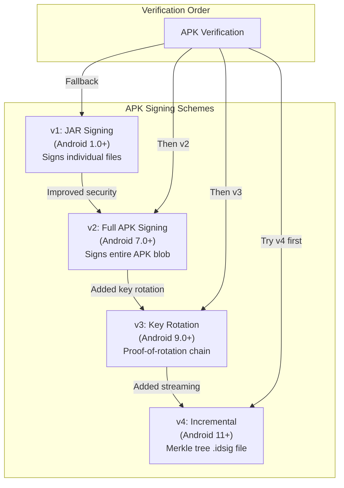
```mermaid
graph TD
    subgraph "APK Signing Schemes"
        V1["v1: JAR Signing<br/>(Android 1.0+)<br/>Signs individual files"]
        V2["v2: Full APK Signing<br/>(Android 7.0+)<br/>Signs entire APK blob"]
        V3["v3: Key Rotation<br/>(Android 9.0+)<br/>Proof-of-rotation chain"]
        V4["v4: Incremental<br/>(Android 11+)<br/>Merkle tree .idsig file"]
    end

    V1 -->|"Improved security"| V2
    V2 -->|"Added key rotation"| V3
    V3 -->|"Added streaming"| V4

    subgraph "Verification Order"
        Check["APK Verification"]
        Check -->|"Try v4 first"| V4
        Check -->|"Then v3"| V3
        Check -->|"Then v2"| V2
        Check -->|"Fallback"| V1
    end
```

PMS uses `ApkSignatureVerifier` to verify signatures during installation. The verifier
tries the newest scheme first and falls back to older schemes. All schemes present in
the APK must verify successfully -- you cannot strip a v2 signature and rely on v1 alone.

### 26.1.7 APK Alignment

APK files should be aligned to 4-byte boundaries for uncompressed entries. The
`zipalign` tool ensures this alignment, which allows the system to mmap resource files
directly from the APK without extracting them. Starting from Android 15, 16KB page
size alignment is enforced for native libraries:

From `ScanPackageUtils.java`:

```java
public static final int PAGE_SIZE_16KB = 16384;
```

The alignment requirement is enforced during both build time (by `zipalign`) and at
installation time by PMS. Misaligned APKs will either fail to install or suffer
performance degradation because the system must extract resources to a separate
file rather than mapping them directly from the APK.

### 26.1.8 The APK Build Pipeline

Understanding how APKs are built helps explain their structure:

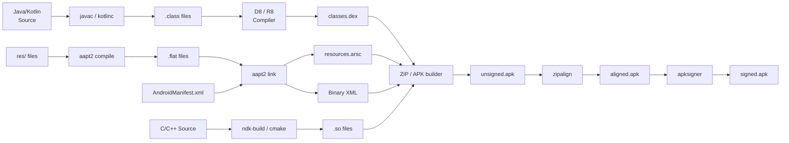
```mermaid
flowchart LR
    SRC["Java/Kotlin<br/>Source"] --> COMPILE["javac / kotlinc"]
    COMPILE --> CLASS[".class files"]
    CLASS --> D8["D8 / R8<br/>Compiler"]
    D8 --> DEX["classes.dex"]

    RES["res/ files"] --> AAPT2C["aapt2 compile"]
    AAPT2C --> FLAT[".flat files"]
    FLAT --> AAPT2L["aapt2 link"]
    AAPT2L --> ARSC["resources.arsc"]
    AAPT2L --> BXML["Binary XML"]

    MANIFEST["AndroidManifest.xml"] --> AAPT2L

    NDK["C/C++ Source"] --> NDK_BUILD["ndk-build / cmake"]
    NDK_BUILD --> SO[".so files"]

    DEX --> ZIP["ZIP / APK builder"]
    ARSC --> ZIP
    BXML --> ZIP
    SO --> ZIP
    ZIP --> UNSIGNED["unsigned.apk"]
    UNSIGNED --> ALIGN["zipalign"]
    ALIGN --> ALIGNED["aligned.apk"]
    ALIGNED --> SIGN["apksigner"]
    SIGN --> FINAL["signed.apk"]
```

Each tool contributes to specific parts of the APK:

| Tool | Input | Output | APK Component |
|------|-------|--------|---------------|
| javac / kotlinc | .java / .kt | .class | (intermediate) |
| D8 / R8 | .class | classes.dex | DEX bytecode |
| aapt2 compile | res/ | .flat | (intermediate) |
| aapt2 link | .flat + manifest | resources.arsc + binary XML | Resources |
| ndk-build / cmake | C/C++ source | .so | Native libraries |
| zipalign | unaligned APK | aligned APK | All (alignment fix) |
| apksigner | aligned APK | signed APK | META-INF / signing block |

### 26.1.9 APK Compression and Stub Packages

System partitions have limited space, so some system APKs are compressed. PMS
supports compressed packages with the `.gz` extension:

```java
public final static String COMPRESSED_EXTENSION = ".gz";
/** Suffix of stub packages on the system partition */
public final static String STUB_SUFFIX = "-Stub";
```

A stub package is a minimal APK that serves as a placeholder on the system partition.
When the device first boots (or after an OTA), PMS decompresses the full package
to `/data`. This allows the system partition to stay small while still providing full
apps.

The `InitAppsHelper` tracks stub packages:

```java
// Tracks of stub packages that must either be replaced with full
// versions in the /data partition or be disabled.
private final List<String> mStubSystemApps = new ArrayList<>();
```

And during system scanning:

```java
private void updateStubSystemAppsList(List<String> stubSystemApps) {
    final int numPackages = mPm.mPackages.size();
    for (int index = 0; index < numPackages; index++) {
        final AndroidPackage pkg = mPm.mPackages.valueAt(index);
        if (pkg.isStub()) {
            stubSystemApps.add(pkg.getPackageName());
        }
    }
}
```

### 26.1.10 APK Checksums

PMS supports computing and verifying checksums for APK files, which is used by
app stores and enterprise management systems:

```java
public void requestFileChecksums(@NonNull File file,
        @NonNull String installerPackageName,
        @Checksum.TypeMask int optional,
        @Checksum.TypeMask int required,
        @Nullable List trustedInstallers,
        @NonNull IOnChecksumsReadyListener onChecksumsReadyListener)
        throws FileNotFoundException {
```

Supported checksum types include MD5, SHA-1, SHA-256, SHA-512, and Merkle root
hashes. The `ApkChecksums` class handles the actual computation.

---

## 26.2 PackageManagerService Architecture

PMS is one of the largest and most architecturally complex system services in Android.
Over the years, it has been refactored from a monolithic class into a constellation
of helper classes with a snapshot-based concurrency model.

### 26.2.1 Service Registration and Entry Point

PMS is started during the boot sequence by `SystemServer`. It is registered as the
`"package"` service in `ServiceManager`, making it accessible to all processes
via `Context.getSystemService(Context.PACKAGE_SERVICE)` or
`PackageManager.getPackageManager()`.

The class hierarchy looks like this:

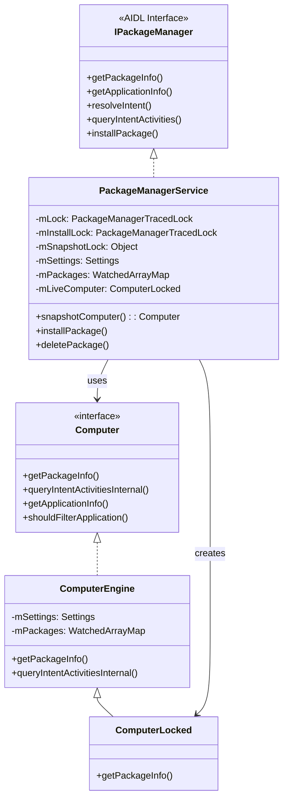
```mermaid
classDiagram
    class IPackageManager {
        <<AIDL Interface>>
        +getPackageInfo()
        +getApplicationInfo()
        +resolveIntent()
        +queryIntentActivities()
        +installPackage()
    }

    class PackageManagerService {
        -mLock: PackageManagerTracedLock
        -mInstallLock: PackageManagerTracedLock
        -mSnapshotLock: Object
        -mSettings: Settings
        -mPackages: WatchedArrayMap
        -mLiveComputer: ComputerLocked
        +snapshotComputer(): Computer
        +installPackage()
        +deletePackage()
    }

    class Computer {
        <<interface>>
        +getPackageInfo()
        +queryIntentActivitiesInternal()
        +getApplicationInfo()
        +shouldFilterApplication()
    }

    class ComputerEngine {
        -mSettings: Settings
        -mPackages: WatchedArrayMap
        +getPackageInfo()
        +queryIntentActivitiesInternal()
    }

    class ComputerLocked {
        +getPackageInfo()
    }

    IPackageManager <|.. PackageManagerService
    Computer <|.. ComputerEngine
    ComputerEngine <|-- ComputerLocked
    PackageManagerService --> Computer : uses
    PackageManagerService --> ComputerLocked : creates
```

### 26.2.2 The Lock Hierarchy

PMS uses three primary locks, and their ordering is critical to avoid deadlocks. The
class Javadoc in `PackageManagerService.java` documents this:

```java
/**
 * Internally there are three important locks:
 * <ul>
 * <li>{@link #mLock} is used to guard all in-memory parsed package details
 * and other related state. It is a fine-grained lock that should only be held
 * momentarily, as it's one of the most contended locks in the system.
 * <li>{@link #mInstallLock} is used to guard all {@code installd} access, whose
 * operations typically involve heavy lifting of application data on disk. Since
 * {@code installd} is single-threaded, and it's operations can often be slow,
 * this lock should never be acquired while already holding {@link #mLock}.
 * Conversely, it's safe to acquire {@link #mLock} momentarily while already
 * holding {@link #mInstallLock}.
 * <li>{@link #mSnapshotLock} is used to guard access to two snapshot fields:
 * the snapshot itself and the snapshot invalidation flag.
 * </ul>
 */
```

Method naming conventions enforce lock discipline:

| Suffix | Required Lock |
|--------|--------------|
| `LI` | Caller must hold `mInstallLock` |
| `LIF` | Caller must hold `mInstallLock` and package must be frozen |
| `LPr` | Caller must hold `mLock` for reading |
| `LPw` | Caller must hold `mLock` for writing |

### 26.2.3 The Computer Snapshot Pattern

The most significant architectural feature of modern PMS is the **Computer snapshot
pattern**. This was introduced to solve the severe lock contention problem: PMS's
`mLock` was one of the most contended locks in the system, causing jank and ANRs.

The key insight is that most PMS operations are **read-only** -- they query package
information but do not modify it. The snapshot pattern separates reads from writes:

1. **`Computer` interface** -- Defines all read-only query methods
   (`frameworks/base/services/core/java/com/android/server/pm/Computer.java`)

2. **`ComputerEngine`** -- Implements the `Computer` interface, operating on a
   snapshot of the PMS state

3. **`ComputerLocked`** -- Extends `ComputerEngine` to wrap calls in
   `synchronized(mLock)` blocks for live data access

4. **`Snapshot` inner class** -- A bundle of all PMS state fields, either live
   references or deep copies

The `Computer` interface is extensive, defining dozens of query methods:

```java
public interface Computer extends PackageDataSnapshot {
    int getVersion();
    Computer use();
    @NonNull List<ResolveInfo> queryIntentActivitiesInternal(
            Intent intent, String resolvedType, long flags,
            long privateResolveFlags, int filterCallingUid,
            int callingPid, int userId,
            boolean resolveForStart, boolean allowDynamicSplits);
    ActivityInfo getActivityInfo(ComponentName component, long flags, int userId);
    AndroidPackage getPackage(String packageName);
    ApplicationInfo getApplicationInfo(String packageName, long flags, int userId);
    PackageInfo getPackageInfo(String packageName, long flags, int userId);
    // ... dozens more query methods
}
```

The snapshot creation is managed by `snapshotComputer()`:

```java
public Computer snapshotComputer() {
    return snapshotComputer(true /*allowLiveComputer*/);
}

public Computer snapshotComputer(boolean allowLiveComputer) {
    var isHoldingPackageLock = Thread.holdsLock(mLock);
    if (allowLiveComputer) {
        if (isHoldingPackageLock) {
            // If the current thread holds mLock then it may have modified
            // state but not yet invalidated the snapshot.  Always give the
            // thread the live computer.
            return mLiveComputer;
        }
    }

    var oldSnapshot = sSnapshot.get();
    var pendingVersion = sSnapshotPendingVersion.get();

    if (oldSnapshot != null && oldSnapshot.getVersion() == pendingVersion) {
        return oldSnapshot.use();
    }
    // ... rebuild snapshot under mSnapshotLock
}
```

The `Snapshot` inner class captures all the mutable state:

```java
class Snapshot {
    public static final int LIVE = 1;
    public static final int SNAPPED = 2;

    public final Settings settings;
    public final WatchedSparseIntArray isolatedOwners;
    public final WatchedArrayMap<String, AndroidPackage> packages;
    public final WatchedArrayMap<ComponentName, ParsedInstrumentation> instrumentation;
    public final WatchedSparseBooleanArray webInstantAppsDisabled;
    public final ComponentName resolveComponentName;
    public final ActivityInfo resolveActivity;
    public final ActivityInfo instantAppInstallerActivity;
    public final ResolveInfo instantAppInstallerInfo;
    public final InstantAppRegistry instantAppRegistry;
    public final ApplicationInfo androidApplication;
    public final String appPredictionServicePackage;
    public final AppsFilterSnapshot appsFilter;
    public final ComponentResolverApi componentResolver;
    public final PackageManagerService service;
    public final WatchedArrayMap<String, Integer> frozenPackages;
    public final SharedLibrariesRead sharedLibraries;
    // ...
}
```

The versioning system uses two atomic variables: `sSnapshot` (the current snapshot)
and `sSnapshotPendingVersion` (bumped on every mutation). When a query arrives:

1. If the caller already holds `mLock`, return the live computer (it has direct access)
2. If the snapshot version matches the pending version, return the cached snapshot
3. Otherwise, take `mSnapshotLock`, rebuild the snapshot, and return it

This ensures lock-free reads for the vast majority of callers.

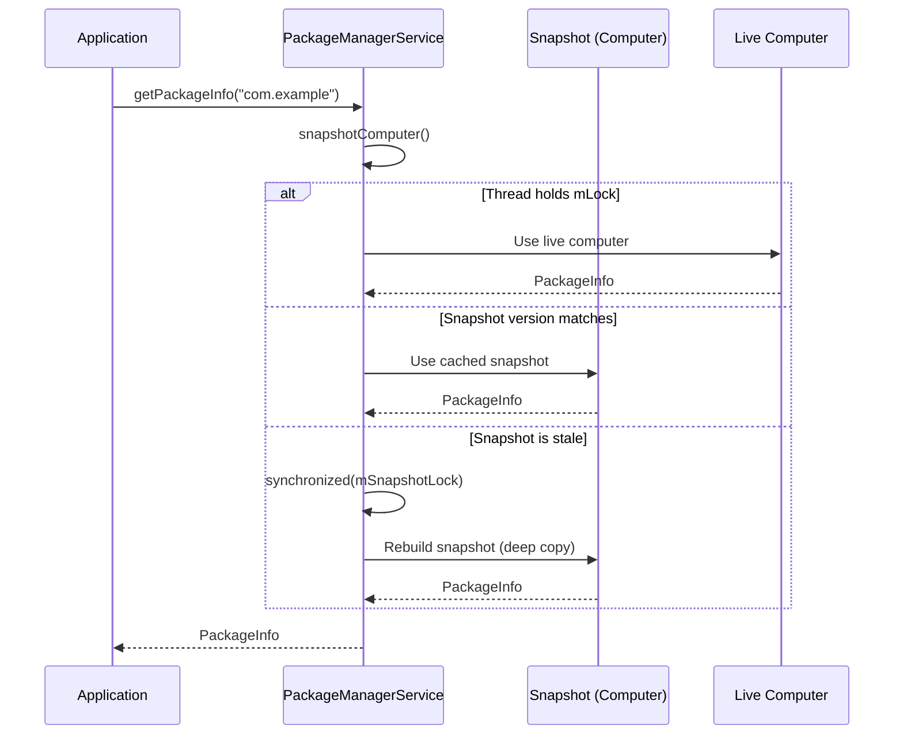
```mermaid
sequenceDiagram
    participant App as Application
    participant PMS as PackageManagerService
    participant Snap as Snapshot (Computer)
    participant Live as Live Computer

    App->>PMS: getPackageInfo("com.example")
    PMS->>PMS: snapshotComputer()

    alt Thread holds mLock
        PMS->>Live: Use live computer
        Live-->>PMS: PackageInfo
    else Snapshot version matches
        PMS->>Snap: Use cached snapshot
        Snap-->>PMS: PackageInfo
    else Snapshot is stale
        PMS->>PMS: synchronized(mSnapshotLock)
        PMS->>Snap: Rebuild snapshot (deep copy)
        Snap-->>PMS: PackageInfo
    end

    PMS-->>App: PackageInfo
```

### 26.2.4 Key Data Structures

PMS maintains several core data structures, all annotated with `@Watched` to trigger
snapshot invalidation on modification:

```java
// Keys are String (package name), values are Package.
@Watched
@GuardedBy("mLock")
final WatchedArrayMap<String, AndroidPackage> mPackages = new WatchedArrayMap<>();

// Package settings (persistent per-package state)
@Watched
@GuardedBy("mLock")
final Settings mSettings;

// Component resolver for intent matching
@Watched
final ComponentResolver mComponentResolver;

// App visibility filtering
@Watched
final AppsFilterImpl mAppsFilter;

// Shared libraries
@Watched
private final SharedLibrariesImpl mSharedLibraries;

// Frozen packages (undergoing surgery)
@GuardedBy("mLock")
final WatchedArrayMap<String, Integer> mFrozenPackages = new WatchedArrayMap<>();
```

The `@Watched` annotation, combined with the `Watchable`/`Watcher` pattern from
`com.android.server.utils`, means that any mutation to these structures automatically
increments `sSnapshotPendingVersion`, invalidating the cached snapshot.

### 26.2.5 PackageSetting

`PackageSetting` is the persistent per-package state record, implementing the
`PackageStateInternal` interface. It stores data that must survive reboots:

From `frameworks/base/services/core/java/com/android/server/pm/PackageSetting.java`:

```java
@DataClass(genGetters = true, genConstructor = false,
           genSetters = false, genBuilder = false)
public class PackageSetting extends SettingBase
        implements PackageStateInternal {
```

Key data stored in a `PackageSetting`:

- Package name, code path, resource path
- Version code and signing details
- Install time, update time, last modified time
- Installer package name and install source
- Primary and secondary CPU ABI
- Per-user state (enabled/disabled, stopped, hidden, suspended)
- Permission grant state (delegated to PermissionManagerService)
- Domain verification state
- First and last install times

The `Settings` class (`frameworks/base/services/core/java/com/android/server/pm/Settings.java`)
is the container for all `PackageSetting` instances. It handles serialization to and
deserialization from `/data/system/packages.xml`, which is the persistent store for all
package metadata.

### 26.2.6 Helper Class Decomposition

Modern PMS has been decomposed into many helper classes, each handling a distinct
responsibility. The main service creates and holds references to all of them:

```java
private final BroadcastHelper mBroadcastHelper;
private final RemovePackageHelper mRemovePackageHelper;
private final DeletePackageHelper mDeletePackageHelper;
private final InitAppsHelper mInitAppsHelper;
private final AppDataHelper mAppDataHelper;
@NonNull private final InstallPackageHelper mInstallPackageHelper;
private final PreferredActivityHelper mPreferredActivityHelper;
private final ResolveIntentHelper mResolveIntentHelper;
private final DexOptHelper mDexOptHelper;
private final SuspendPackageHelper mSuspendPackageHelper;
private final DistractingPackageHelper mDistractingPackageHelper;
private final StorageEventHelper mStorageEventHelper;
private final FreeStorageHelper mFreeStorageHelper;
```

This decomposition serves multiple purposes:

1. **Readability** -- Each helper file is 500-2000 lines instead of one 15,000-line monolith
2. **Testability** -- Helpers can be unit-tested in isolation
3. **Lock discipline** -- Each helper clearly documents which locks it requires
4. **Ownership** -- OWNERS files can assign different teams to different helpers

### 26.2.7 Handler Messages

PMS uses a `Handler` on a dedicated `ServiceThread` for asynchronous operations.
The message constants are defined in the main class:

```java
static final int SEND_PENDING_BROADCAST = 1;
static final int POST_INSTALL = 9;
static final int WRITE_SETTINGS = 13;
static final int WRITE_DIRTY_PACKAGE_RESTRICTIONS = 14;
static final int PACKAGE_VERIFIED = 15;
static final int CHECK_PENDING_VERIFICATION = 16;
static final int WRITE_PACKAGE_LIST = 19;
static final int INSTANT_APP_RESOLUTION_PHASE_TWO = 20;
static final int ENABLE_ROLLBACK_STATUS = 21;
static final int ENABLE_ROLLBACK_TIMEOUT = 22;
static final int DEFERRED_NO_KILL_POST_DELETE = 23;
static final int DEFERRED_NO_KILL_INSTALL_OBSERVER = 24;
static final int DOMAIN_VERIFICATION = 27;
static final int PRUNE_UNUSED_STATIC_SHARED_LIBRARIES = 28;
static final int DEFERRED_PENDING_KILL_INSTALL_OBSERVER = 29;
static final int WRITE_USER_PACKAGE_RESTRICTIONS = 30;
```

The watchdog timeout for the handler thread is set to 10 minutes, reflecting the
potentially long-running operations (like installing multi-gigabyte apps):

```java
static final long WATCHDOG_TIMEOUT = 1000*60*10;     // ten minutes
```

### 26.2.8 The Watcher / Watchable Pattern

The `@Watched` annotation is central to the snapshot invalidation mechanism. It is
part of a custom observer pattern defined in `com.android.server.utils`:

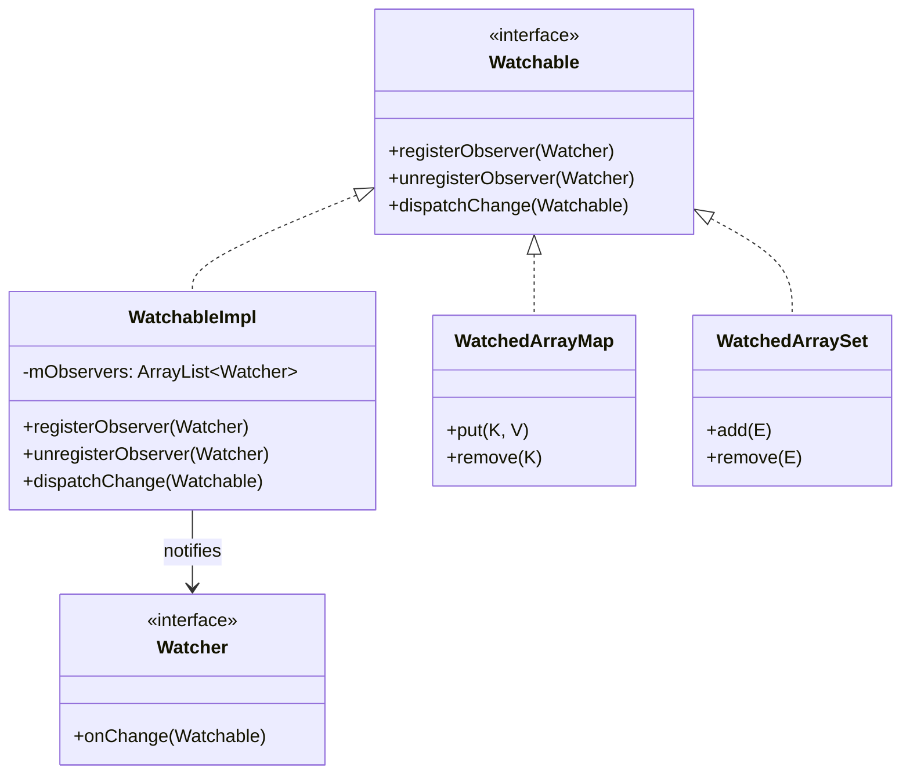
```mermaid
classDiagram
    class Watchable {
        <<interface>>
        +registerObserver(Watcher)
        +unregisterObserver(Watcher)
        +dispatchChange(Watchable)
    }

    class Watcher {
        <<interface>>
        +onChange(Watchable)
    }

    class WatchableImpl {
        -mObservers: ArrayList~Watcher~
        +registerObserver(Watcher)
        +unregisterObserver(Watcher)
        +dispatchChange(Watchable)
    }

    class WatchedArrayMap {
        +put(K, V)
        +remove(K)
    }

    class WatchedArraySet {
        +add(E)
        +remove(E)
    }

    Watchable <|.. WatchableImpl
    Watchable <|.. WatchedArrayMap
    Watchable <|.. WatchedArraySet
    WatchableImpl --> Watcher : notifies
```

When any `@Watched` field in PMS changes (e.g., a package is added to `mPackages`),
the Watchable pattern triggers:

1. The `WatchedArrayMap` detects the mutation
2. It calls `dispatchChange(this)` on its observer list
3. PMS's master `Watcher` receives the callback
4. It calls `PackageManagerService.onChange(what)`
5. Which increments `sSnapshotPendingVersion`
6. The next `snapshotComputer()` call detects the stale version and rebuilds

```java
private final Watcher mWatcher = new Watcher() {
        @Override
        public void onChange(@Nullable Watchable what) {
            PackageManagerService.onChange(what);
        }
    };
```

This pattern has several advantages:

- **Automatic invalidation** -- No manual bookkeeping; any data change auto-invalidates
- **Granular** -- Each field independently triggers invalidation
- **Debuggable** -- The `what` parameter identifies which field changed
- **Low overhead** -- Incrementing an AtomicInteger is essentially free

### 26.2.9 Snapshot Rebuild Performance

The snapshot rebuild process involves deep-copying all watched fields:

```java
@GuardedBy("mLock")
private Computer rebuildSnapshot(@Nullable Computer oldSnapshot,
        int newVersion) {
    var now = SystemClock.currentTimeMicro();
    var hits = oldSnapshot == null ? -1 : oldSnapshot.getUsed();
    var args = new Snapshot(Snapshot.SNAPPED);
    var newSnapshot = new ComputerEngine(args, newVersion);
    var done = SystemClock.currentTimeMicro();

    if (mSnapshotStatistics != null) {
        mSnapshotStatistics.rebuild(now, done, hits,
                newSnapshot.getPackageStates().size());
    }
    return newSnapshot;
}
```

The `SnapshotStatistics` class tracks rebuild frequency and latency, helping
identify performance regressions. On a typical device with 300+ packages, a
snapshot rebuild takes approximately 1-5 milliseconds.

The version check in `snapshotComputer()` uses a three-tier strategy:

```java
public Computer snapshotComputer(boolean allowLiveComputer) {
    var isHoldingPackageLock = Thread.holdsLock(mLock);

    // Tier 1: Caller already holds mLock, use live computer
    if (allowLiveComputer && isHoldingPackageLock) {
        return mLiveComputer;
    }

    // Tier 2: Cached snapshot is still valid
    var oldSnapshot = sSnapshot.get();
    var pendingVersion = sSnapshotPendingVersion.get();
    if (oldSnapshot != null
            && oldSnapshot.getVersion() == pendingVersion) {
        return oldSnapshot.use();
    }

    // Tier 3: Need to rebuild under mSnapshotLock
    synchronized (mSnapshotLock) {
        // Double-check: another thread may have rebuilt while we waited
        var rebuildSnapshot = sSnapshot.get();
        var rebuildVersion = sSnapshotPendingVersion.get();
        if (rebuildSnapshot != null
                && rebuildSnapshot.getVersion() == rebuildVersion) {
            return rebuildSnapshot.use();
        }
        // Rebuild under mLock
        synchronized (mLock) {
            var newSnapshot = rebuildSnapshot(rebuildSnapshot, rebuildVersion);
            sSnapshot.set(newSnapshot);
            return newSnapshot.use();
        }
    }
}
```

### 26.2.10 PackageManagerServiceInjector

PMS uses dependency injection via `PackageManagerServiceInjector` to support
testing and modular initialization. The injector provides all external dependencies:

- Context and system services
- ABI helpers
- Incremental manager
- APEX manager
- Background executors
- Component resolver factory
- Shared library implementation

This pattern allows test code to substitute mock implementations for any
dependency, enabling unit testing of PMS components in isolation.

### 26.2.11 System Partitions

PMS maintains an ordered list of system partitions where packages can reside:

```java
public static final List<ScanPartition> SYSTEM_PARTITIONS =
        Collections.unmodifiableList(
                PackagePartitions.getOrderedPartitions(ScanPartition::new));
```

The partitions are ordered by specificity:

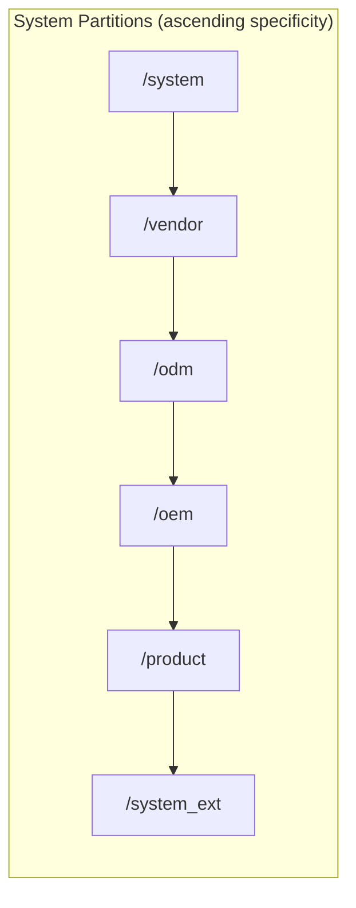
```mermaid
graph LR
    subgraph "System Partitions (ascending specificity)"
        SYSTEM["/system"]
        VENDOR["/vendor"]
        ODM["/odm"]
        OEM["/oem"]
        PRODUCT["/product"]
        SYSTEM_EXT["/system_ext"]
    end

    SYSTEM --> VENDOR
    VENDOR --> ODM
    ODM --> OEM
    OEM --> PRODUCT
    PRODUCT --> SYSTEM_EXT
```

Each partition has associated scan flags that determine how packages within it are
treated:

| Partition | Scan Flag | Privilege Level |
|-----------|-----------|----------------|
| `/system/app` | `SCAN_AS_SYSTEM` | System |
| `/system/priv-app` | `SCAN_AS_SYSTEM | SCAN_AS_PRIVILEGED` | Privileged |
| `/vendor/app` | `SCAN_AS_SYSTEM | SCAN_AS_VENDOR` | Vendor |
| `/product/app` | `SCAN_AS_SYSTEM | SCAN_AS_PRODUCT` | Product |
| `/system_ext/app` | `SCAN_AS_SYSTEM | SCAN_AS_SYSTEM_EXT` | System Ext |
| `/odm/app` | `SCAN_AS_SYSTEM | SCAN_AS_ODM` | ODM |

---

## 26.3 Package Scanning

At boot time, PMS must discover and parse every APK on the device. This is one of
the most time-critical parts of the boot process -- scanning thousands of packages
can take tens of seconds and directly impacts the time from power-on to usable device.

### 26.3.1 Boot-Time Scanning Overview

The scanning process is orchestrated by `InitAppsHelper`
(`frameworks/base/services/core/java/com/android/server/pm/InitAppsHelper.java`):

```java
final class InitAppsHelper {
    private final PackageManagerService mPm;
    private final List<ScanPartition> mDirsToScanAsSystem;
    private final int mScanFlags;
    private final int mSystemParseFlags;
    private final int mSystemScanFlags;
    private final InstallPackageHelper mInstallPackageHelper;
    private final ApexManager mApexManager;
    private final ExecutorService mExecutorService;
    private long mSystemScanTime;
    private int mCachedSystemApps;
    private int mSystemPackagesCount;
    private final boolean mIsDeviceUpgrading;
    private final List<ScanPartition> mSystemPartitions;
```

The scanning proceeds in a specific order:

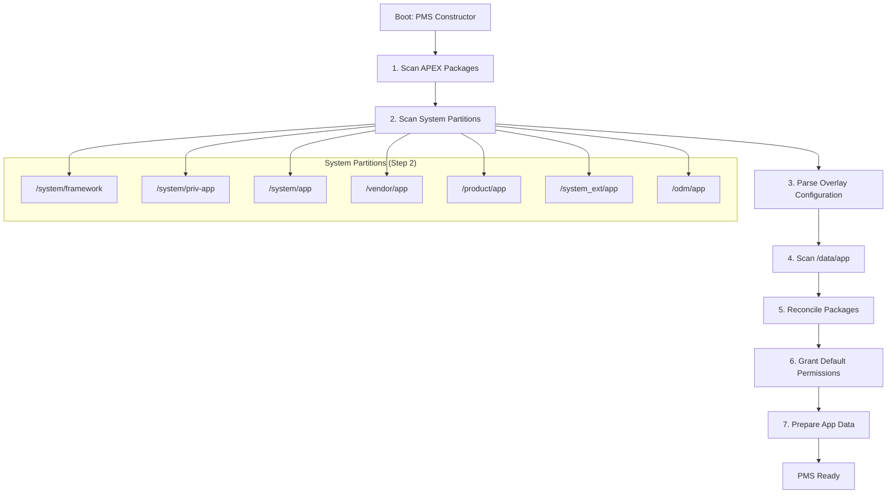
```mermaid
flowchart TD
    Start["Boot: PMS Constructor"] --> ScanAPEX["1. Scan APEX Packages"]
    ScanAPEX --> ScanSystem["2. Scan System Partitions"]
    ScanSystem --> OverlayConfig["3. Parse Overlay Configuration"]
    OverlayConfig --> ScanData["4. Scan /data/app"]
    ScanData --> Reconcile["5. Reconcile Packages"]
    Reconcile --> GrantPerms["6. Grant Default Permissions"]
    GrantPerms --> PrepareData["7. Prepare App Data"]
    PrepareData --> Ready["PMS Ready"]

    subgraph "System Partitions (Step 2)"
        S1["/system/framework"]
        S2["/system/priv-app"]
        S3["/system/app"]
        S4["/vendor/app"]
        S5["/product/app"]
        S6["/system_ext/app"]
        S7["/odm/app"]
    end

    ScanSystem --> S1
    ScanSystem --> S2
    ScanSystem --> S3
    ScanSystem --> S4
    ScanSystem --> S5
    ScanSystem --> S6
    ScanSystem --> S7
```

### 26.3.2 Scan Flags

PMS defines a comprehensive set of scan flags that control scanning behavior. These
are bit flags defined as constants in `PackageManagerService.java`:

```java
static final int SCAN_NO_DEX = 1 << 0;
static final int SCAN_UPDATE_SIGNATURE = 1 << 1;
static final int SCAN_NEW_INSTALL = 1 << 2;
static final int SCAN_UPDATE_TIME = 1 << 3;
static final int SCAN_BOOTING = 1 << 4;
static final int SCAN_REQUIRE_KNOWN = 1 << 7;
static final int SCAN_MOVE = 1 << 8;
static final int SCAN_INITIAL = 1 << 9;
static final int SCAN_DONT_KILL_APP = 1 << 10;
static final int SCAN_IGNORE_FROZEN = 1 << 11;
static final int SCAN_FIRST_BOOT_OR_UPGRADE = 1 << 12;
static final int SCAN_AS_INSTANT_APP = 1 << 13;
static final int SCAN_AS_FULL_APP = 1 << 14;
static final int SCAN_AS_VIRTUAL_PRELOAD = 1 << 15;
static final int SCAN_AS_SYSTEM = 1 << 16;
static final int SCAN_AS_PRIVILEGED = 1 << 17;
static final int SCAN_AS_OEM = 1 << 18;
static final int SCAN_AS_VENDOR = 1 << 19;
static final int SCAN_AS_PRODUCT = 1 << 20;
static final int SCAN_AS_SYSTEM_EXT = 1 << 21;
static final int SCAN_AS_ODM = 1 << 22;
static final int SCAN_AS_APK_IN_APEX = 1 << 23;
static final int SCAN_DROP_CACHE = 1 << 24;
static final int SCAN_AS_FACTORY = 1 << 25;
static final int SCAN_AS_APEX = 1 << 26;
static final int SCAN_AS_STOPPED_SYSTEM_APP = 1 << 27;
```

During boot, the initial flags are computed by `InitAppsHelper`:

```java
int scanFlags = SCAN_BOOTING | SCAN_INITIAL;
if (mIsDeviceUpgrading || mPm.isFirstBoot()) {
    mScanFlags = scanFlags | SCAN_FIRST_BOOT_OR_UPGRADE;
} else {
    mScanFlags = scanFlags;
}
mSystemParseFlags = mPm.getDefParseFlags() | ParsingPackageUtils.PARSE_IS_SYSTEM_DIR;
mSystemScanFlags = mScanFlags | SCAN_AS_SYSTEM;
```

### 26.3.3 APEX Package Scanning

Modern Android uses APEX (Android Pony EXpress) for updatable system components.
APEXes can contain APK packages, and PMS must scan these. The scanning order is:
APEX packages first, then system partitions, then data:

```java
public OverlayConfig initSystemApps(PackageParser2 packageParser,
        WatchedArrayMap<String, PackageSetting> packageSettings,
        int[] userIds, long startTime) {
    // Prepare apex package info before scanning APKs
    final List<ApexManager.ScanResult> apexScanResults =
            scanApexPackagesTraced(packageParser);
    mApexManager.notifyScanResult(apexScanResults);
    scanSystemDirs(packageParser, mExecutorService);
    // ...
}
```

APEX scan partitions are derived from active APEX modules:

```java
private List<ScanPartition> getApexScanPartitions() {
    final List<ScanPartition> scanPartitions = new ArrayList<>();
    final List<ApexManager.ActiveApexInfo> activeApexInfos =
            mApexManager.getActiveApexInfos();
    for (int i = 0; i < activeApexInfos.size(); i++) {
        final ScanPartition scanPartition =
                resolveApexToScanPartition(activeApexInfos.get(i));
        if (scanPartition != null) {
            scanPartitions.add(scanPartition);
        }
    }
    return scanPartitions;
}
```

### 26.3.4 PackageParser2

The actual parsing of APK files is done by `PackageParser2`
(`frameworks/base/core/java/com/android/internal/pm/parsing/PackageParser2.java`).
It reads the binary `AndroidManifest.xml`, extracting:

- Package name and version information
- All component declarations (activities, services, receivers, providers)
- Permission declarations and usage
- Library dependencies
- Feature requirements
- Split information

Parsing is parallelized using `ParallelPackageParser`, which distributes parsing
work across a thread pool:

```java
mExecutorService = ParallelPackageParser.makeExecutorService();
```

### 26.3.5 ScanPackageUtils

The `ScanPackageUtils` class
(`frameworks/base/services/core/java/com/android/server/pm/ScanPackageUtils.java`)
performs the actual scanning logic without side effects:

```java
/**
 * Just scans the package without any side effects.
 *
 * @param injector injector for acquiring dependencies
 * @param request Information about the package to be scanned
 * @param isUnderFactoryTest Whether or not the device is under factory test
 * @param currentTime The current time, in millis
 * @return The results of the scan
 */
@VisibleForTesting
@NonNull
public static ScanResult scanPackageOnly(@NonNull ScanRequest request,
        PackageManagerServiceInjector injector,
        boolean isUnderFactoryTest, long currentTime)
        throws PackageManagerException {
```

The `ScanRequest` contains all input parameters:

- `mParsedPackage` -- The parsed package data
- `mPkgSetting` -- Existing package setting (if updating)
- `mDisabledPkgSetting` -- Disabled system package (if any)
- `mOriginalPkgSetting` -- Original package setting (for renamed packages)
- `mParseFlags` -- Parse flags
- `mScanFlags` -- Scan flags
- `mRealPkgName` -- Real package name (for renamed packages)
- `mSharedUserSetting` -- Shared user setting (if applicable)
- `mUser` -- User handle
- `mIsPlatformPackage` -- Whether this is the platform ("android") package

The `ScanResult` contains all output data:

- Package settings to create/update
- Changed packages list
- Library information
- Dynamic code logging settings

### 26.3.6 The /data/app Directory

After system partitions are scanned, PMS scans `/data/app` for user-installed
applications. These are stored in randomized directories:

```
/data/app/
  +-- ~~random1/
  |     +-- com.example.app1-random2/
  |           +-- base.apk
  |           +-- split_config.arm64_v8a.apk
  |           +-- split_config.en.apk
  |           +-- lib/
  |           +-- oat/
  +-- ~~random3/
        +-- com.example.app2-random4/
              +-- base.apk
```

The double-tilde prefix (`~~`) and random suffixes prevent path prediction attacks:

```java
static final String RANDOM_DIR_PREFIX = "~~";
static final char RANDOM_CODEPATH_PREFIX = '-';
```

### 26.3.7 Package Caching

To speed up subsequent boots, PMS uses `PackageCacher` to cache parsed package
data. On first boot or after an OTA, the entire cache is invalidated and rebuilt.
The cache is stored in `/data/system/package_cache/`.

The caching statistics are tracked:

```java
/* Track of the number of cached system apps */
private int mCachedSystemApps;
/* Track of the number of system apps */
private int mSystemPackagesCount;
```

### 26.3.8 System Directory Scanning in Detail

The `scanSystemDirs()` method in `InitAppsHelper` reveals the precise scanning order:

```java
private void scanSystemDirs(PackageParser2 packageParser,
        ExecutorService executorService) {
    File frameworkDir = new File(Environment.getRootDirectory(), "framework");
    List<ScanParams> scanParamsList = new ArrayList<>();

    // Step 1: Collect overlay directories (reverse order for priority)
    for (int i = mDirsToScanAsSystem.size() - 1; i >= 0; i--) {
        final ScanPartition partition = mDirsToScanAsSystem.get(i);
        if (partition.getOverlayFolder() == null) continue;
        collectScanParams(scanParamsList, partition.getOverlayFolder(),
                mSystemParseFlags,
                mSystemScanFlags | partition.scanFlag,
                packageParser, executorService, partition.apexInfo);
    }

    // Step 2: Scan /system/framework (no dex, privileged)
    collectScanParams(scanParamsList, frameworkDir, mSystemParseFlags,
            mSystemScanFlags | SCAN_NO_DEX | SCAN_AS_PRIVILEGED,
            packageParser, executorService, null);

    // Step 3: Scan priv-app and app for each partition
    for (int i = 0, size = mDirsToScanAsSystem.size(); i < size; i++) {
        final ScanPartition partition = mDirsToScanAsSystem.get(i);
        if (partition.getPrivAppFolder() != null) {
            collectScanParams(scanParamsList, partition.getPrivAppFolder(),
                    mSystemParseFlags,
                    mSystemScanFlags | SCAN_AS_PRIVILEGED | partition.scanFlag,
                    packageParser, executorService, partition.apexInfo);
        }
        collectScanParams(scanParamsList, partition.getAppFolder(),
                mSystemParseFlags,
                mSystemScanFlags | partition.scanFlag,
                packageParser, executorService, partition.apexInfo);
    }

    // Step 4: Execute all scans in parallel
    parallelScanDirTracedLI(scanParamsList, packageParser, executorService);

    // Step 5: Verify the platform package exists
    if (!mPm.mPackages.containsKey("android")) {
        throw new IllegalStateException(
                "Failed to load frameworks package; check log for warnings");
    }
}
```

The scanning order is critical:

1. **Overlays first** -- So overlay configuration is available for subsequent packages
2. **Framework** -- The `android` platform package must be present
3. **Privileged apps** -- Higher privilege level, scanned before regular apps
4. **Regular apps** -- System apps without special privileges
5. **Parallel execution** -- All collected scan parameters run on the thread pool

### 26.3.9 Non-System App Scanning

After system apps are scanned, `initNonSystemApps()` handles user-installed apps:

```java
public void initNonSystemApps(PackageParser2 packageParser,
        @NonNull int[] userIds, long startTime) {
    EventLog.writeEvent(EventLogTags.BOOT_PROGRESS_PMS_DATA_SCAN_START,
            SystemClock.uptimeMillis());

    if ((mScanFlags & SCAN_FIRST_BOOT_OR_UPGRADE)
            == SCAN_FIRST_BOOT_OR_UPGRADE) {
        fixInstalledAppDirMode();
    }

    scanDirTracedLI(mPm.getAppInstallDir(), 0,
            mScanFlags | SCAN_REQUIRE_KNOWN,
            packageParser, mExecutorService, null);

    List<Runnable> unfinishedTasks = mExecutorService.shutdownNow();
    if (!unfinishedTasks.isEmpty()) {
        throw new IllegalStateException(
                "Not all tasks finished before calling close: "
                + unfinishedTasks);
    }
    fixSystemPackages(userIds);
    logNonSystemAppScanningTime(startTime);
    mExpectingBetter.clear();
    mPm.mSettings.pruneRenamedPackagesLPw();
}
```

The `SCAN_REQUIRE_KNOWN` flag means only packages already registered in
`packages.xml` will be accepted. Unknown packages in `/data/app` are treated
as suspicious and may be removed.

### 26.3.10 Boot Performance Metrics

PMS logs detailed scanning metrics to identify performance bottlenecks:

```java
Slog.i(TAG, "Finished scanning system apps. Time: " + mSystemScanTime
        + " ms, packageCount: " + mSystemPackagesCount
        + " , timePerPackage: "
        + (mSystemPackagesCount == 0 ? 0
                : mSystemScanTime / mSystemPackagesCount)
        + " , cached: " + mCachedSystemApps);
```

And for data apps:

```java
Slog.i(TAG, "Finished scanning non-system apps. Time: " + dataScanTime
        + " ms, packageCount: " + dataPackagesCount
        + " , timePerPackage: "
        + (dataPackagesCount == 0 ? 0
                : dataScanTime / dataPackagesCount)
        + " , cached: " + cachedNonSystemApps);
```

These metrics are also reported via `FrameworkStatsLog` for OTA analysis:

```java
FrameworkStatsLog.write(
    FrameworkStatsLog.BOOT_TIME_EVENT_DURATION_REPORTED,
    BOOT_TIME_EVENT_DURATION__EVENT__OTA_PACKAGE_MANAGER_SYSTEM_APP_AVG_SCAN_TIME,
    mSystemScanTime / mSystemPackagesCount);
```

### 26.3.11 The "Expecting Better" Mechanism

When a system app has been updated by the user (e.g., via Play Store), both the
system version and the updated version exist on disk. PMS must reconcile this:

```java
private final ArrayMap<String, File> mExpectingBetter = new ArrayMap<>();
private final List<String> mPossiblyDeletedUpdatedSystemApps
        = new ArrayList<>();
```

The logic works as follows:

1. During system scan, PMS detects that a system package has a newer version in
   `/data/app`
2. The system version is recorded in `mExpectingBetter`
3. The system version is disabled and the data version is used
4. If the data version is missing (e.g., user uninstalled the update), PMS re-enables
   the system version

This is handled by `fixSystemPackages()`:

```java
private void fixSystemPackages(@NonNull int[] userIds) {
    mInstallPackageHelper.cleanupDisabledPackageSettings(
            mPossiblyDeletedUpdatedSystemApps, userIds, mScanFlags);
    mInstallPackageHelper.checkExistingBetterPackages(
            mExpectingBetter, mStubSystemApps,
            mSystemScanFlags, mSystemParseFlags);
    mInstallPackageHelper.installSystemStubPackages(
            mStubSystemApps, mScanFlags);
}
```

### 26.3.12 Directory Mode Security Fix

On first boot or upgrade, PMS fixes the mode of installed app directories to prevent
package name enumeration:

```java
void fixInstalledAppDirMode() {
    try (var files = Files.newDirectoryStream(
            mPm.getAppInstallDir().toPath())) {
        files.forEach(dir -> {
            try {
                Os.chmod(dir.toString(), 0771);
            } catch (ErrnoException e) {
                Slog.w(TAG, "Failed to fix an installed app dir mode", e);
            }
        });
    } catch (Exception e) {
        Slog.w(TAG, "Failed to walk the app install directory", e);
    }
}
```

The `0771` mode ensures that non-system users cannot list the directory contents,
preventing them from discovering installed package names by directory enumeration.

### 26.3.13 Scan Flow Diagram

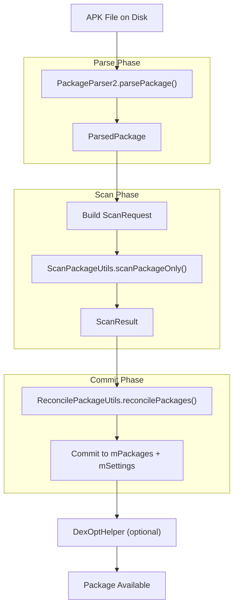
```mermaid
flowchart TD
    APK["APK File on Disk"] --> Parse["PackageParser2.parsePackage()"]
    Parse --> ParseResult["ParsedPackage"]
    ParseResult --> ScanReq["Build ScanRequest"]
    ScanReq --> ScanOnly["ScanPackageUtils.scanPackageOnly()"]
    ScanOnly --> ScanResult["ScanResult"]
    ScanResult --> Reconcile["ReconcilePackageUtils.reconcilePackages()"]
    Reconcile --> Commit["Commit to mPackages + mSettings"]
    Commit --> DexOpt["DexOptHelper (optional)"]
    DexOpt --> Done["Package Available"]

    subgraph "Parse Phase"
        Parse
        ParseResult
    end

    subgraph "Scan Phase"
        ScanReq
        ScanOnly
        ScanResult
    end

    subgraph "Commit Phase"
        Reconcile
        Commit
    end
```

---

## 26.4 Installation Pipeline

The installation of an APK is a multi-stage pipeline involving security verification,
disk operations, dex optimization, and state commitment. This section traces the
complete flow from when a user taps "Install" to when the app appears in the launcher.

### 26.4.1 Installation Entry Points

There are several entry points for package installation:

1. **`adb install`** -- Shell command that creates a session via `PackageInstallerService`
2. **Play Store / App stores** -- Use `PackageInstaller` API
3. **System OTA** -- Packages included in system images are scanned at boot
4. **APEX** -- Module updates that may contain APKs
5. **Intent-based** -- `ACTION_INSTALL_PACKAGE` intent (deprecated)

All modern installation flows go through `PackageInstallerService`:

```java
public class PackageInstallerService implements PackageSender,
        TestUtilityService {
```

### 26.4.2 PackageInstallerSession

The `PackageInstallerSession` is the central object for an active installation.
Sessions go through a well-defined lifecycle:

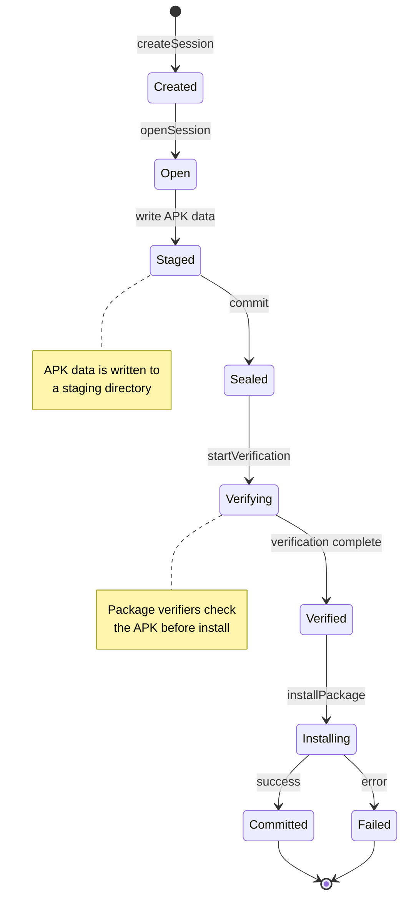
```mermaid
stateDiagram-v2
    [*] --> Created: createSession
    Created --> Open: openSession
    Open --> Staged: write APK data
    Staged --> Sealed: commit
    Sealed --> Verifying: startVerification
    Verifying --> Verified: verification complete
    Verified --> Installing: installPackage
    Installing --> Committed: success
    Installing --> Failed: error
    Committed --> [*]
    Failed --> [*]

    note right of Staged
        APK data is written to
        a staging directory
    end note

    note right of Verifying
        Package verifiers check
        the APK before install
    end note
```

Key session parameters (from `PackageInstaller.SessionParams`):

- `MODE_FULL_INSTALL` -- Complete replacement of the package
- `MODE_INHERIT_EXISTING` -- Update keeping existing splits
- `installLocation` -- Internal or external storage
- `abiOverride` -- Override ABI selection
- `installFlags` -- Various installation control flags

### 26.4.3 The Complete Installation Pipeline

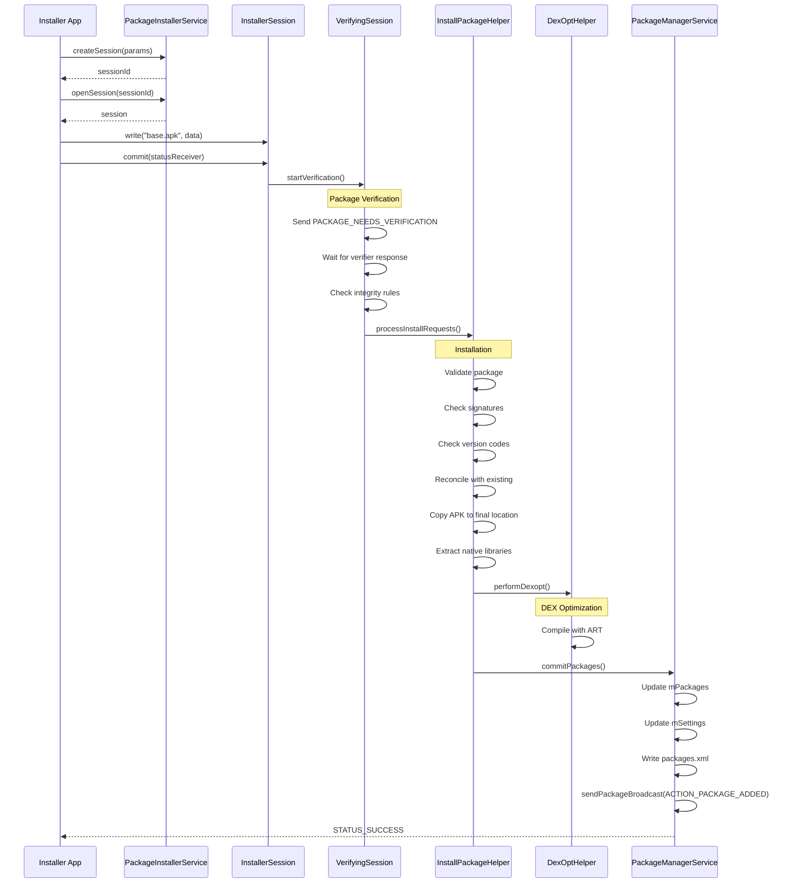
```mermaid
sequenceDiagram
    participant App as Installer App
    participant PIS as PackageInstallerService
    participant Session as InstallerSession
    participant Verify as VerifyingSession
    participant IPH as InstallPackageHelper
    participant Dex as DexOptHelper
    participant PMS as PackageManagerService

    App->>PIS: createSession(params)
    PIS-->>App: sessionId

    App->>PIS: openSession(sessionId)
    PIS-->>App: session

    App->>Session: write("base.apk", data)
    App->>Session: commit(statusReceiver)

    Session->>Verify: startVerification()

    Note over Verify: Package Verification
    Verify->>Verify: Send PACKAGE_NEEDS_VERIFICATION
    Verify->>Verify: Wait for verifier response
    Verify->>Verify: Check integrity rules

    Verify->>IPH: processInstallRequests()

    Note over IPH: Installation
    IPH->>IPH: Validate package
    IPH->>IPH: Check signatures
    IPH->>IPH: Check version codes
    IPH->>IPH: Reconcile with existing
    IPH->>IPH: Copy APK to final location
    IPH->>IPH: Extract native libraries

    IPH->>Dex: performDexopt()

    Note over Dex: DEX Optimization
    Dex->>Dex: Compile with ART

    IPH->>PMS: commitPackages()
    PMS->>PMS: Update mPackages
    PMS->>PMS: Update mSettings
    PMS->>PMS: Write packages.xml

    PMS->>PMS: sendPackageBroadcast(ACTION_PACKAGE_ADDED)
    PMS-->>App: STATUS_SUCCESS
```

### 26.4.4 Stage 1: Staging

When an installer creates a session and writes APK data, the data is staged to a
temporary directory under `/data/app/`:

```
/data/app/vmdl<sessionId>.tmp/
  +-- base.apk
  +-- split_config.arm64_v8a.apk
  +-- split_config.en.apk
```

The staging directory is managed by `StagingManager` for staged installs (those
requiring a reboot):

```java
public class StagingManager {
    private static final String TAG = "StagingManager";
    private final ApexManager mApexManager;
    private final PowerManager mPowerManager;
    private final Context mContext;
    private final File mFailureReasonFile =
            new File("/metadata/staged-install/failure_reason.txt");
```

### 26.4.5 Stage 2: Verification

Before installation proceeds, the package goes through verification. This is handled
by `VerifyingSession`
(`frameworks/base/services/core/java/com/android/server/pm/VerifyingSession.java`):

```java
final class VerifyingSession {
    private static final boolean DEFAULT_VERIFY_ENABLE = true;
    private static final long DEFAULT_INTEGRITY_VERIFICATION_TIMEOUT = 30 * 1000;
    private static final String PROPERTY_ENABLE_ROLLBACK_TIMEOUT_MILLIS =
            "enable_rollback_timeout";
```

The verification process involves:

1. **Required Verifier** -- Google Play Protect (or equivalent) checks the APK for
   malware. The system can have up to `REQUIRED_VERIFIERS_MAX_COUNT = 2` required
   verifiers.

2. **Sufficient Verifiers** -- Optional verifiers that can approve independently.

3. **Integrity Verification** -- Checks against integrity rules (blocklists, allowlists).

4. **Rollback Enablement** -- If rollback is configured, prepares rollback data.

The default response when verification times out is configurable:

```java
static final int DEFAULT_VERIFICATION_RESPONSE = PackageManager.VERIFICATION_ALLOW;
```

### 26.4.6 Stage 3: Installation

The `InstallPackageHelper`
(`frameworks/base/services/core/java/com/android/server/pm/InstallPackageHelper.java`)
performs the actual installation work:

1. **Validation** -- Check the APK is valid, version code is compatible, signatures match
2. **Signature Verification** -- Verify APK signatures using `ApkSignatureVerifier`
3. **Reconciliation** -- Compare with existing package state
4. **File Operations** -- Copy APK to final location, extract native libraries
5. **Permission Processing** -- Process permission declarations and grants
6. **ABI Selection** -- Determine the correct native ABI

Key error codes from `InstallPackageHelper`:

```java
INSTALL_FAILED_ALREADY_EXISTS
INSTALL_FAILED_INVALID_APK
INSTALL_FAILED_DUPLICATE_PACKAGE
INSTALL_FAILED_UPDATE_INCOMPATIBLE
INSTALL_FAILED_UID_CHANGED
INSTALL_FAILED_DEPRECATED_SDK_VERSION
INSTALL_FAILED_TEST_ONLY
INSTALL_FAILED_BAD_PERMISSION_GROUP
INSTALL_FAILED_DUPLICATE_PERMISSION
```

### 26.4.7 Stage 4: DEX Optimization

After the APK is in its final location, PMS triggers dex optimization:

```java
public final class DexOptHelper {
    @NonNull
    private static final ThreadPoolExecutor sDexoptExecutor =
            new ThreadPoolExecutor(1, 1,
                    60, TimeUnit.SECONDS,
                    new LinkedBlockingQueue<Runnable>());
```

The `DexOptHelper` delegates to `ArtManagerLocal` (the ART service) which performs
the actual compilation. Compilation strategies include:

- **verify** -- Only verify the DEX file
- **quicken** -- Quick optimizations
- **speed-profile** -- Compile hot methods based on profile data
- **speed** -- Compile everything (used for system apps at boot)

### 26.4.8 Stage 5: Commit

The final stage commits the installation to PMS's data structures:

1. **Update `mPackages`** -- Add the `AndroidPackage` to the main map
2. **Update `mSettings`** -- Create or update the `PackageSetting`
3. **Write `packages.xml`** -- Persist the settings to disk
4. **Send broadcasts** -- Notify the system of the new package:
   - `ACTION_PACKAGE_ADDED` (new install)
   - `ACTION_PACKAGE_REPLACED` (update)
   - `ACTION_MY_PACKAGE_REPLACED` (sent to the updated package itself)

### 26.4.9 Package Freezing

During installation, PMS "freezes" the package to prevent it from being launched:

```java
@GuardedBy("mLock")
final WatchedArrayMap<String, Integer> mFrozenPackages = new WatchedArrayMap<>();
```

The `PackageFreezer` class manages the freeze/thaw lifecycle. A frozen package
cannot be started by the Activity Manager, preventing race conditions during
code/data surgery:

```java
public static final int PACKAGE_STARTABILITY_FROZEN = 3;
```

### 26.4.10 The InstallPackageHelper Commit Process

The commit step in `InstallPackageHelper` is where the package becomes part of the
system state. The `commitReconciledScanResultLocked()` method performs this:

```java
@GuardedBy("mPm.mLock")
private AndroidPackage commitReconciledScanResultLocked(
        @NonNull ReconciledPackage reconciledPkg, int[] allUsers) {
    final InstallRequest request = reconciledPkg.mInstallRequest;
    ParsedPackage parsedPackage = request.getParsedPackage();

    // Special handling for the platform package
    if (parsedPackage != null
            && "android".equals(parsedPackage.getPackageName())) {
        parsedPackage.setVersionCode(mPm.getSdkVersion())
                .setVersionCodeMajor(0);
    }

    // Handle shared user setting changes
    final PackageSetting pkgSetting;
    // ... complex shared user reconciliation ...

    // Set the install source
    InstallSource installSource = request.getInstallSource();
    if (installSource != null) {
        pkgSetting.setInstallSource(installSource);
    }

    // Set the UID from the package setting
    parsedPackage.setUid(pkgSetting.getAppId());
    final AndroidPackage pkg = parsedPackage.hideAsFinal();

    // Reconcile shared libraries
    if (reconciledPkg.mCollectedSharedLibraryInfos != null) {
        mSharedLibraries.executeSharedLibrariesUpdate(
                pkg, pkgSetting, null, null,
                reconciledPkg.mCollectedSharedLibraryInfos, allUsers);
    }

    // Update KeySet data
    final KeySetManagerService ksms =
            mPm.mSettings.getKeySetManagerService();
    if (reconciledPkg.mRemoveAppKeySetData) {
        ksms.removeAppKeySetDataLPw(pkg.getPackageName());
    }

    // Update signing details
    pkgSetting.setSigningDetails(reconciledPkg.mSigningDetails);

    // Final commit
    commitPackageSettings(pkg, pkgSetting, oldPkgSetting, reconciledPkg);
    return pkg;
}
```

This method modifies multiple data structures atomically while holding `mLock`:

1. Updates or creates the `PackageSetting`
2. Updates shared user settings
3. Reconciles shared libraries
4. Updates KeySet data
5. Commits signing details
6. Calls `commitPackageSettings()` for the final state update

### 26.4.11 Update Ownership

Android 14+ introduced **update ownership**, which allows an app store to claim
exclusive update rights for a package. The `UpdateOwnershipHelper` manages this:

```java
private final UpdateOwnershipHelper mUpdateOwnershipHelper;
```

Rules for update ownership:

1. Ownership is set on initial installation if the installer requests it
2. Once set, only the update owner can update the package
3. If the user agrees to switch installers, the ownership is cleared
4. Ownership is also controlled via system configuration (sysconfig)
5. A deny list allows preventing ownership claims for certain packages

```java
final boolean isRequestUpdateOwnership = (request.getInstallFlags()
        & PackageManager.INSTALL_REQUEST_UPDATE_OWNERSHIP) != 0;
final boolean isSameUpdateOwner =
        TextUtils.equals(oldUpdateOwner,
                installSource.mInstallerPackageName);
```

### 26.4.12 Broadcast After Installation

After a successful installation, PMS sends system-wide broadcasts to notify
interested parties. The `BroadcastHelper` class manages this:

```java
private final BroadcastHelper mBroadcastHelper;
```

The broadcast sequence depends on the installation type:

**New installation:**
```
ACTION_PACKAGE_ADDED
  extras: EXTRA_UID (int), EXTRA_REPLACING (false)
```

**Update:**
```
ACTION_PACKAGE_REMOVED (with EXTRA_REPLACING = true)
ACTION_PACKAGE_ADDED (with EXTRA_REPLACING = true)
ACTION_PACKAGE_REPLACED
ACTION_MY_PACKAGE_REPLACED (sent to the updated app itself)
```

Broadcasts are delayed during startup to avoid overwhelming the system:

```java
private static final long BROADCAST_DELAY_DURING_STARTUP =
        10 * 1000L; // 10 seconds (in millis)
private static final long BROADCAST_DELAY =
        1 * 1000L;  // 1 second (in millis)
```

### 26.4.13 Install Observer Notification

The installer receives completion notification via `IPackageInstallObserver2`:

```java
void notifyInstallObserver(InstallRequest request) {
    if (request.getObserver() != null) {
        try {
            Bundle extras = extrasForInstallResult(request);
            request.getObserver().onPackageInstalled(
                    request.getName(),
                    request.getReturnCode(),
                    request.getReturnMsg(),
                    extras);
        } catch (RemoteException e) {
            Slog.i(TAG, "Observer no longer exists.");
        }
    }
}
```

For no-kill installs (updates that don't require process restart), the observer
notification is deferred:

```java
void scheduleDeferredNoKillInstallObserver(InstallRequest request) {
    String packageName = request.getPkg().getPackageName();
    mNoKillInstallObservers.put(packageName, request);
    Message message = mHandler.obtainMessage(
            DEFERRED_NO_KILL_INSTALL_OBSERVER, packageName);
    mHandler.sendMessageDelayed(message,
            DEFERRED_NO_KILL_INSTALL_OBSERVER_DELAY_MS);
}
```

### 26.4.14 Package Archival

Android 14+ introduces package archival, which allows uninstalling the APK while
preserving the user's data and a minimal launcher entry:

```java
ArchivedPackageParcel getArchivedPackageInternal(
        @NonNull String packageName, int userId) {
    // ... builds an ArchivedPackageParcel with:
    //   - packageName
    //   - signingDetails
    //   - versionCode
    //   - targetSdkVersion
    //   - archivedActivities (for launcher display)
}
```

Archived packages show a cloud icon in the launcher and can be reinstalled
on demand, downloading the APK again from the original installer.

### 26.4.15 Deferred Deletion

When a package is updated, the old APK files are not deleted immediately. Instead,
they are scheduled for deferred deletion:

```java
void scheduleDeferredNoKillPostDelete(CleanUpArgs args) {
    Message message = mHandler.obtainMessage(
            DEFERRED_NO_KILL_POST_DELETE, args);
    long deleteDelayMillis = DeviceConfig.getLong(
            NAMESPACE_PACKAGE_MANAGER_SERVICE,
            PROPERTY_DEFERRED_NO_KILL_POST_DELETE_DELAY_MS_EXTENDED,
            DEFERRED_NO_KILL_POST_DELETE_DELAY_MS_EXTENDED);
    Slog.w(TAG, "Delaying the deletion of <" + args.getCodePath()
            + "> by " + deleteDelayMillis + "ms or till the next reboot");
    mHandler.sendMessageDelayed(message, deleteDelayMillis);
}
```

The extended delay (up to 1 day) allows rollback if the new version causes issues.

### 26.4.16 Incremental Installation

Android 12+ supports incremental installation via the Incremental File System (IncFS).
This allows streaming installation where the APK becomes available before it is fully
downloaded:

```java
private static final String PROPERTY_INCFS_DEFAULT_TIMEOUTS =
        "incfs_default_timeouts";
```

The v4 signature scheme enables block-by-block verification of streamed content.

---

## 26.5 Permission Model

Android's permission model is one of its most important security features. PMS and
`PermissionManagerService` work together to define, grant, revoke, and enforce
permissions.

### 26.5.1 PermissionManagerService

The `PermissionManagerService`
(`frameworks/base/services/core/java/com/android/server/pm/permission/PermissionManagerService.java`)
is the central authority for permission management:

```java
/**
 * Manages all permissions and handles permissions related tasks.
 */
public class PermissionManagerService extends IPermissionManager.Stub {
    private static final String LOG_TAG =
            PermissionManagerService.class.getSimpleName();

    private final Object mLock = new Object();
    private final PackageManagerInternal mPackageManagerInt;
    private final AppOpsManager mAppOpsManager;
    private final Context mContext;
    private final PermissionManagerServiceInterface mPermissionManagerServiceImpl;
    private final AttributionSourceRegistry mAttributionSourceRegistry;
```

It is created as a separate service:

```java
public static PermissionManagerServiceInternal create(@NonNull Context context,
        ArrayMap<String, FeatureInfo> availableFeatures) {
    // ...
    permissionService = new PermissionManagerService(context, availableFeatures);
    ServiceManager.addService("permissionmgr", permissionService);
    ServiceManager.addService("permission_checker",
            new PermissionCheckerService(context));
    // ...
}
```

### 26.5.2 Permission Types

The `Permission` class
(`frameworks/base/services/core/java/com/android/server/pm/permission/Permission.java`)
defines the internal representation of a permission:

```java
public final class Permission {
    public static final int TYPE_MANIFEST = LegacyPermission.TYPE_MANIFEST;
    public static final int TYPE_CONFIG = LegacyPermission.TYPE_CONFIG;
    public static final int TYPE_DYNAMIC = LegacyPermission.TYPE_DYNAMIC;
```

Permissions are categorized by **protection level**:

```java
@IntDef({
        PermissionInfo.PROTECTION_DANGEROUS,
        PermissionInfo.PROTECTION_NORMAL,
        PermissionInfo.PROTECTION_SIGNATURE,
        PermissionInfo.PROTECTION_SIGNATURE_OR_SYSTEM,
        PermissionInfo.PROTECTION_INTERNAL,
})
public @interface ProtectionLevel {}
```

Each protection level has distinct grant semantics:

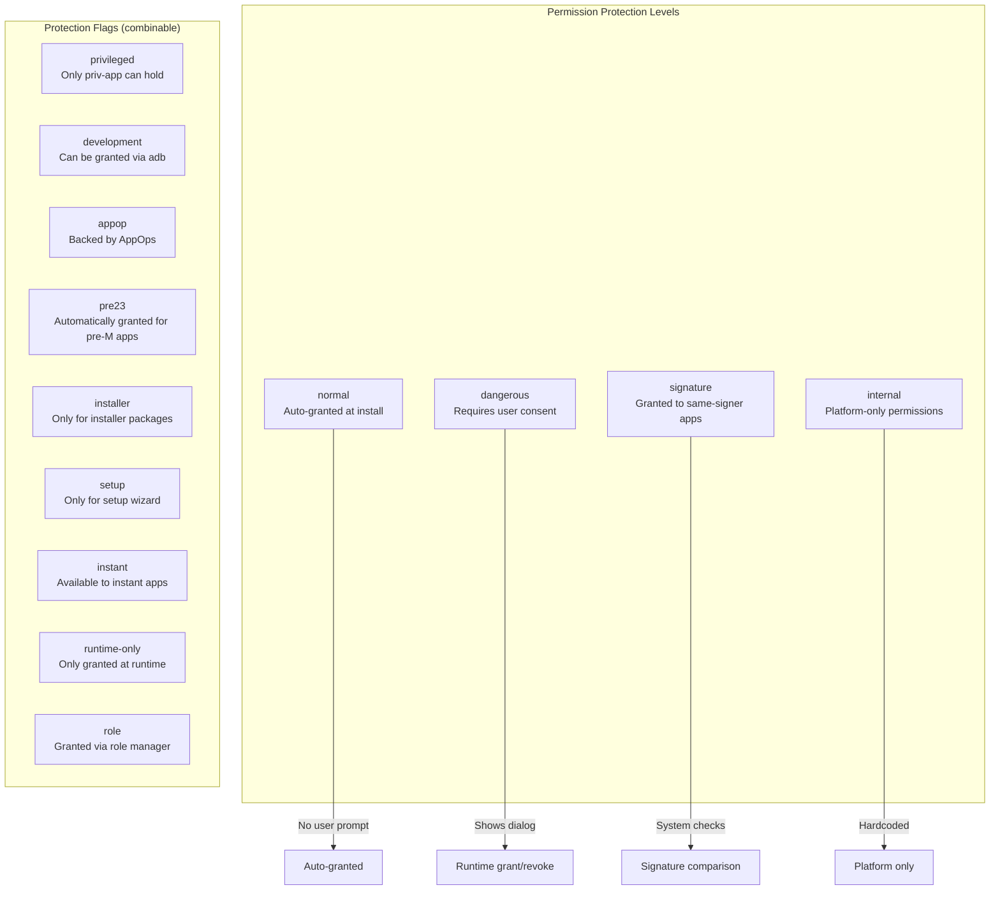
```mermaid
graph TD
    subgraph "Permission Protection Levels"
        NORMAL["normal<br/>Auto-granted at install"]
        DANGEROUS["dangerous<br/>Requires user consent"]
        SIGNATURE["signature<br/>Granted to same-signer apps"]
        INTERNAL["internal<br/>Platform-only permissions"]
    end

    subgraph "Protection Flags (combinable)"
        PRIV["privileged<br/>Only priv-app can hold"]
        DEV["development<br/>Can be granted via adb"]
        APPOP["appop<br/>Backed by AppOps"]
        PRE23["pre23<br/>Automatically granted for pre-M apps"]
        INSTALLER["installer<br/>Only for installer packages"]
        SETUP["setup<br/>Only for setup wizard"]
        INSTANT["instant<br/>Available to instant apps"]
        RUNTIME["runtime-only<br/>Only granted at runtime"]
        ROLE["role<br/>Granted via role manager"]
    end

    NORMAL --> |"No user prompt"| AUTO["Auto-granted"]
    DANGEROUS --> |"Shows dialog"| RUNTIME_GRANT["Runtime grant/revoke"]
    SIGNATURE --> |"System checks"| SIG_CHECK["Signature comparison"]
    INTERNAL --> |"Hardcoded"| PLATFORM["Platform only"]
```

### 26.5.3 Install-Time Permissions (normal)

Normal permissions are automatically granted at installation without user interaction.
They protect access to data or resources that pose minimal risk to the user's privacy
or device operation.

Examples: `INTERNET`, `VIBRATE`, `SET_WALLPAPER`, `ACCESS_NETWORK_STATE`

When PMS scans or installs a package, normal permissions declared in `<uses-permission>`
are automatically granted during the permission reconciliation phase.

### 26.5.4 Runtime Permissions (dangerous)

Dangerous permissions require explicit user consent via a runtime dialog. These
protect sensitive user data such as contacts, location, camera, and microphone.

Runtime permissions are organized into **permission groups**:

| Group | Permissions |
|-------|------------|
| `LOCATION` | `ACCESS_FINE_LOCATION`, `ACCESS_COARSE_LOCATION`, `ACCESS_BACKGROUND_LOCATION` |
| `CAMERA` | `CAMERA` |
| `MICROPHONE` | `RECORD_AUDIO` |
| `STORAGE` | `READ_EXTERNAL_STORAGE`, `WRITE_EXTERNAL_STORAGE`, `READ_MEDIA_IMAGES`, `READ_MEDIA_VIDEO`, `READ_MEDIA_AUDIO` |
| `CONTACTS` | `READ_CONTACTS`, `WRITE_CONTACTS`, `GET_ACCOUNTS` |
| `PHONE` | `READ_PHONE_STATE`, `CALL_PHONE`, `READ_CALL_LOG`, `WRITE_CALL_LOG` |
| `SMS` | `SEND_SMS`, `RECEIVE_SMS`, `READ_SMS`, `RECEIVE_MMS` |
| `CALENDAR` | `READ_CALENDAR`, `WRITE_CALENDAR` |
| `SENSORS` | `BODY_SENSORS`, `BODY_SENSORS_BACKGROUND` |
| `NEARBY_DEVICES` | `BLUETOOTH_CONNECT`, `BLUETOOTH_SCAN`, `BLUETOOTH_ADVERTISE`, `NEARBY_WIFI_DEVICES` |

The permission check flow:

```java
@Override
public int checkPermission(String packageName, String permissionName,
        String persistentDeviceId, @UserIdInt int userId) {
    if (packageName == null || permissionName == null) {
        return PackageManager.PERMISSION_DENIED;
    }
    final CheckPermissionDelegate checkPermissionDelegate;
    synchronized (mLock) {
        checkPermissionDelegate = mCheckPermissionDelegate;
    }
    if (checkPermissionDelegate == null) {
        return mPermissionManagerServiceImpl.checkPermission(
                packageName, permissionName, persistentDeviceId, userId);
    }
    return checkPermissionDelegate.checkPermission(packageName,
            permissionName, persistentDeviceId, userId,
            mPermissionManagerServiceImpl::checkPermission);
}
```

### 26.5.5 Signature Permissions

Signature permissions are granted only to apps signed with the same certificate as
the app that defined the permission. This is the primary mechanism for inter-app
communication between apps from the same developer.

The system platform package (`android`) defines many signature permissions. Any
app signed with the platform certificate automatically receives these.

The signature check uses `compareSignatures()`:

```java
import static com.android.server.pm.PackageManagerServiceUtils.compareSignatures;
```

### 26.5.6 Privileged Permissions

Privileged permissions (`protectionLevel="signature|privileged"`) can be granted to
apps in `/system/priv-app` even if they are not signed with the platform certificate.
This mechanism allows OEMs to grant elevated permissions to pre-installed apps.

The allowlist is maintained in XML files:

```
/system/etc/permissions/privapp-permissions-*.xml
/vendor/etc/permissions/privapp-permissions-*.xml
/product/etc/permissions/privapp-permissions-*.xml
```

The `PermissionAllowlist` class manages these files.

### 26.5.7 AppOp Permissions

Some permissions are backed by the AppOps system. The `appop` protection flag
indicates that even after a permission is granted, the AppOps framework can further
restrict access. This enables per-use permission dialogs and background access controls.

```java
private final AppOpsManager mAppOpsManager;
```

### 26.5.8 One-Time Permissions

Introduced in Android 11, one-time permissions allow granting access only for the
current session. They are managed by `OneTimePermissionUserManager`:

```java
@GuardedBy("mLock")
@NonNull
private final SparseArray<OneTimePermissionUserManager>
        mOneTimePermissionUserManagers = new SparseArray<>();
```

When the app goes to the background, the permission is automatically revoked after
a timeout.

### 26.5.9 Auto-Revoke (Permission Auto-Reset)

Permissions for apps that haven't been used for an extended period are automatically
revoked. The `setAutoRevokeExempted()` method allows apps to opt out:

```java
public boolean setAutoRevokeExempted(
        @NonNull String packageName, boolean exempted, int userId) {
    Objects.requireNonNull(packageName);
    final AndroidPackage pkg = mPackageManagerInt.getPackage(packageName);
    final int callingUid = Binder.getCallingUid();
    if (!checkAutoRevokeAccess(pkg, callingUid)) {
        return false;
    }
    return setAutoRevokeExemptedInternal(pkg, exempted, userId);
}
```

### 26.5.10 Permission Grant Flow

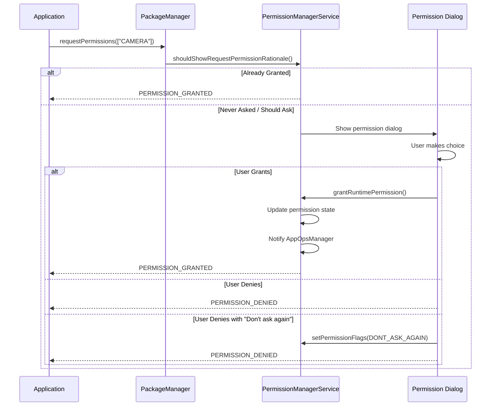
```mermaid
sequenceDiagram
    participant App as Application
    participant PM as PackageManager
    participant PMS as PermissionManagerService
    participant UI as Permission Dialog

    App->>PM: requestPermissions(["CAMERA"])
    PM->>PMS: shouldShowRequestPermissionRationale()

    alt Already Granted
        PMS-->>App: PERMISSION_GRANTED
    else Never Asked / Should Ask
        PMS->>UI: Show permission dialog
        UI->>UI: User makes choice

        alt User Grants
            UI->>PMS: grantRuntimePermission()
            PMS->>PMS: Update permission state
            PMS->>PMS: Notify AppOpsManager
            PMS-->>App: PERMISSION_GRANTED
        else User Denies
            UI-->>App: PERMISSION_DENIED
        else User Denies with "Don't ask again"
            UI->>PMS: setPermissionFlags(DONT_ASK_AGAIN)
            UI-->>App: PERMISSION_DENIED
        end
    end
```

### 26.5.11 Split Permissions

As Android evolves, some permissions are split into more granular ones. For example,
`READ_EXTERNAL_STORAGE` was split into `READ_MEDIA_IMAGES`, `READ_MEDIA_VIDEO`,
and `READ_MEDIA_AUDIO` in Android 13. The `SplitPermissionInfoParcelable` class
tracks these splits:

```java
import android.content.pm.permission.SplitPermissionInfoParcelable;
```

When an older app (targeting a pre-split SDK version) requests the original permission,
the system automatically considers the split permissions as well. This ensures
backward compatibility while allowing newer apps to request only the specific
access they need.

### 26.5.12 Permission Groups and UI

Permissions are organized into groups for the user-facing permission dialog. The
`PermissionGroupInfo` class describes a group, and the Permission Controller app
(com.android.permissioncontroller) handles the UI.

The permission dialog flow:

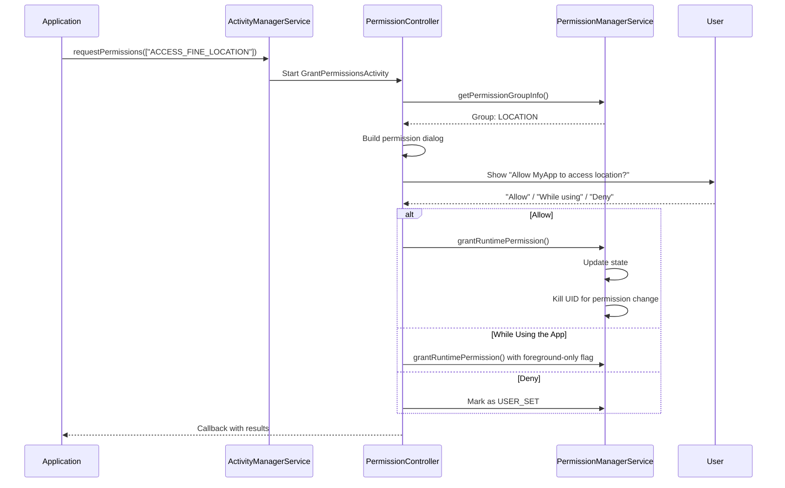
```mermaid
sequenceDiagram
    participant App as Application
    participant AMS as ActivityManagerService
    participant PC as PermissionController
    participant PMS2 as PermissionManagerService
    participant User as User

    App->>AMS: requestPermissions(["ACCESS_FINE_LOCATION"])
    AMS->>PC: Start GrantPermissionsActivity
    PC->>PMS2: getPermissionGroupInfo()
    PMS2-->>PC: Group: LOCATION
    PC->>PC: Build permission dialog

    PC->>User: Show "Allow MyApp to access location?"
    User-->>PC: "Allow" / "While using" / "Deny"

    alt Allow
        PC->>PMS2: grantRuntimePermission()
        PMS2->>PMS2: Update state
        PMS2->>PMS2: Kill UID for permission change
    else While Using the App
        PC->>PMS2: grantRuntimePermission() with foreground-only flag
    else Deny
        PC->>PMS2: Mark as USER_SET
    end

    PC-->>App: Callback with results
```

### 26.5.13 Background Location Access

Starting from Android 10, background location access requires separate approval.
The permission `ACCESS_BACKGROUND_LOCATION` is requested separately from
`ACCESS_FINE_LOCATION` / `ACCESS_COARSE_LOCATION`, and the user sees a
dedicated dialog.

### 26.5.14 Permission Delegation

The `CheckPermissionDelegate` interface allows components to intercept permission
checks:

```java
@GuardedBy("mLock")
private CheckPermissionDelegate mCheckPermissionDelegate;
```

This is used by the Companion Device Manager and Virtual Device Manager to modify
permission behavior for companion devices and virtual displays. The delegate can
override the standard permission check result.

### 26.5.15 Virtual Device Permissions

Android 14+ supports per-device permission state, where permissions can have
different grant states on the default device vs. virtual devices:

```java
@Override
public int checkPermission(String packageName, String permissionName,
        String persistentDeviceId, @UserIdInt int userId) {
```

The `persistentDeviceId` parameter identifies which device the permission check
is for:

```java
private String getPersistentDeviceId(int deviceId) {
    if (deviceId == Context.DEVICE_ID_DEFAULT) {
        return VirtualDeviceManager.PERSISTENT_DEVICE_ID_DEFAULT;
    }
    if (mVirtualDeviceManagerInternal == null) {
        mVirtualDeviceManagerInternal =
                LocalServices.getService(VirtualDeviceManagerInternal.class);
    }
    return mVirtualDeviceManagerInternal == null
            ? VirtualDeviceManager.PERSISTENT_DEVICE_ID_DEFAULT
            : mVirtualDeviceManagerInternal.getPersistentIdForDevice(deviceId);
}
```

### 26.5.16 Attribution Sources

Android 12+ introduced the `AttributionSource` system for tracking the chain of
apps that contributed to an API call. This enables more precise permission enforcement
for proxy APIs where app A calls app B which calls a system API on A's behalf:

```java
@NonNull
private final AttributionSourceRegistry mAttributionSourceRegistry;
```

The `AttributionSource` chain ensures that every app in the call chain has the
required permission, preventing privilege escalation through intermediary apps.

### 26.5.17 Permission Persistence

Permission state is persisted in two places:

1. **Install-time permissions** -- Stored in `/data/system/packages.xml`
2. **Runtime permissions** -- Stored per-user in
   `/data/misc_de/<userId>/apexdata/com.android.permission/runtime-permissions.xml`

The `RuntimePermissionsPersistence` class handles serialization:

```java
import com.android.permission.persistence.RuntimePermissionsPersistence;
import com.android.permission.persistence.RuntimePermissionsState;
```

---

## 26.6 Intent Resolution

Intent resolution is the mechanism by which Android matches an implicit intent to the
correct component. PMS maintains the database of all registered intent filters and
performs the matching algorithm.

### 26.6.1 Intent Filter Registration

Every component declared in an APK's manifest with `<intent-filter>` elements is
registered in PMS's `ComponentResolver`
(`frameworks/base/services/core/java/com/android/server/pm/resolution/ComponentResolver.java`):

```java
/** Resolves all Android component types
    [activities, services, providers and receivers]. */
public class ComponentResolver extends ComponentResolverLocked
        implements Snappable<ComponentResolverApi> {
    private static final boolean DEBUG = false;
    private static final String TAG = "PackageManager";
```

The `ComponentResolver` maintains four `IntentResolver` instances, one for each
component type:

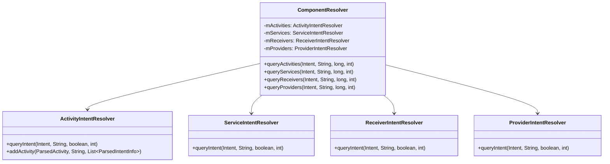
```mermaid
classDiagram
    class ComponentResolver {
        -mActivities: ActivityIntentResolver
        -mServices: ServiceIntentResolver
        -mReceivers: ReceiverIntentResolver
        -mProviders: ProviderIntentResolver
        +queryActivities(Intent, String, long, int)
        +queryServices(Intent, String, long, int)
        +queryReceivers(Intent, String, long, int)
        +queryProviders(Intent, String, long, int)
    }

    class ActivityIntentResolver {
        +queryIntent(Intent, String, boolean, int)
        +addActivity(ParsedActivity, String, List~ParsedIntentInfo~)
    }

    class ServiceIntentResolver {
        +queryIntent(Intent, String, boolean, int)
    }

    class ReceiverIntentResolver {
        +queryIntent(Intent, String, boolean, int)
    }

    class ProviderIntentResolver {
        +queryIntent(Intent, String, boolean, int)
    }

    ComponentResolver --> ActivityIntentResolver
    ComponentResolver --> ServiceIntentResolver
    ComponentResolver --> ReceiverIntentResolver
    ComponentResolver --> ProviderIntentResolver
```

The `IntentResolver` base class (`frameworks/base/services/core/java/com/android/server/IntentResolver.java`)
implements the core matching algorithm.

### 26.6.2 Intent Matching Algorithm

The Android intent matching algorithm considers these attributes in order:

1. **Action** -- The string action (e.g., `android.intent.action.VIEW`). If the intent
   specifies an action, the filter must include that action.

2. **Data** -- URI scheme, host, port, path, and MIME type. The matching rules are:
   - If the filter specifies a scheme, the intent's URI scheme must match
   - If the filter specifies a host, the intent's URI host must match
   - Path matching supports literal, prefix, and pattern matching

3. **Category** -- Categories the intent belongs to. The filter must include ALL
   categories specified in the intent. (The `DEFAULT` category is implicitly added
   for activities started with `startActivity()`.)

4. **Package** -- If the intent specifies a package, only components from that
   package are considered (explicit intent behavior).

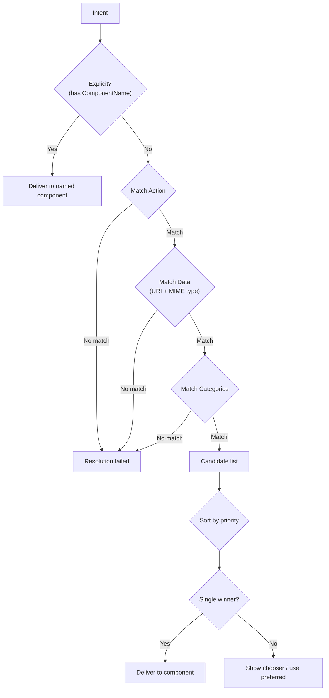
```mermaid
flowchart TD
    Intent["Intent"] --> CheckExplicit{"Explicit?<br/>(has ComponentName)"}
    CheckExplicit -->|"Yes"| Direct["Deliver to named component"]
    CheckExplicit -->|"No"| MatchAction{"Match Action"}
    MatchAction -->|"No match"| Fail["Resolution failed"]
    MatchAction -->|"Match"| MatchData{"Match Data<br/>(URI + MIME type)"}
    MatchData -->|"No match"| Fail
    MatchData -->|"Match"| MatchCategory{"Match Categories"}
    MatchCategory -->|"No match"| Fail
    MatchCategory -->|"Match"| Candidates["Candidate list"]
    Candidates --> Priority{"Sort by priority"}
    Priority --> SingleResult{"Single winner?"}
    SingleResult -->|"Yes"| Deliver["Deliver to component"]
    SingleResult -->|"No"| Chooser["Show chooser / use preferred"]
```

### 26.6.3 ResolveIntentHelper

The `ResolveIntentHelper` class
(`frameworks/base/services/core/java/com/android/server/pm/ResolveIntentHelper.java`)
orchestrates the intent resolution process:

```java
final class ResolveIntentHelper {
    @NonNull private final Context mContext;
    @NonNull private final PlatformCompat mPlatformCompat;
    @NonNull private final UserManagerService mUserManager;
    @NonNull private final PreferredActivityHelper mPreferredActivityHelper;
    @NonNull private final DomainVerificationManagerInternal mDomainVerificationManager;
    @NonNull private final UserNeedsBadgingCache mUserNeedsBadging;
    @NonNull private final Supplier<ResolveInfo> mResolveInfoSupplier;
    @NonNull private final Supplier<ActivityInfo> mInstantAppInstallerActivitySupplier;
```

The main resolution method:

```java
public ResolveInfo resolveIntentInternal(Computer computer, Intent intent,
        String resolvedType, long flags, long privateResolveFlags,
        int userId, boolean resolveForStart,
        int filterCallingUid, int callingPid) {
    try {
        Trace.traceBegin(TRACE_TAG_PACKAGE_MANAGER, "resolveIntent");

        if (!mUserManager.exists(userId)) return null;
        final int callingUid = Binder.getCallingUid();
        flags = computer.updateFlagsForResolve(flags, userId,
                filterCallingUid, resolveForStart,
                computer.isImplicitImageCaptureIntentAndNotSetByDpc(
                        intent, userId, resolvedType, flags));
        computer.enforceCrossUserPermission(callingUid, userId,
                false, false, "resolve intent");

        final List<ResolveInfo> query =
                computer.queryIntentActivitiesInternal(intent,
                        resolvedType, flags, privateResolveFlags,
                        filterCallingUid, callingPid, userId,
                        resolveForStart, true);
        // ...
        final ResolveInfo bestChoice = chooseBestActivity(computer,
                intent, resolvedType, flags, privateResolveFlags,
                query, userId, queryMayBeFiltered);
        return bestChoice;
    } finally {
        Trace.traceEnd(TRACE_TAG_PACKAGE_MANAGER);
    }
}
```

### 26.6.4 chooseBestActivity

When multiple activities match an intent, `chooseBestActivity()` determines which
one to use:

```java
private ResolveInfo chooseBestActivity(Computer computer, Intent intent,
        String resolvedType, long flags, long privateResolveFlags,
        List<ResolveInfo> query, int userId, boolean queryMayBeFiltered) {
    if (query != null) {
        final int n = query.size();
        if (n == 1) {
            return query.get(0);
        } else if (n > 1) {
            ResolveInfo r0 = query.get(0);
            ResolveInfo r1 = query.get(1);
            // If the first activity has a higher priority, or a different
            // default, then it is always desirable to pick it.
            if (r0.priority != r1.priority
                    || r0.preferredOrder != r1.preferredOrder
                    || r0.isDefault != r1.isDefault) {
                return query.get(0);
            }
            // If we have saved a preference for a preferred activity
            // for this Intent, use that.
            ResolveInfo ri = mPreferredActivityHelper
                    .findPreferredActivityNotLocked(computer, intent,
                            resolvedType, flags, query, true, false,
                            debug, userId, queryMayBeFiltered);
            if (ri != null) {
                return ri;
            }
            // ...check for instant apps, browser intents
```

The priority ordering is:

1. **Priority** -- Numeric priority from the intent filter (system apps can have
   higher priority)
2. **Preferred Order** -- User-set default via "Always use this app"
3. **Is Default** -- Whether the filter includes `CATEGORY_DEFAULT`
4. **Preferred Activity** -- Saved user preference
5. **Domain Verification** -- App Links verification state
6. **Chooser Dialog** -- When no clear winner, show the user a choice

### 26.6.5 Preferred Activities

When a user selects "Always" in the chooser dialog, PMS saves a `PreferredActivity`
record. The `PreferredActivityHelper` manages these records:

```java
private final PreferredActivityHelper mPreferredActivityHelper;
```

Preferred activities are stored per-user in `preferred-activities.xml`.

### 26.6.6 App Links and Domain Verification

For web intents (HTTP/HTTPS), Android uses **App Links** -- verified associations
between apps and web domains. The `DomainVerificationManagerInternal` handles:

1. **Digital Asset Links** -- Apps declare domain ownership via
   `/.well-known/assetlinks.json` on their website
2. **Automatic Verification** -- The system verifies these claims at install time
3. **Verified Status** -- Verified apps are automatically chosen for matching web URLs

```java
@NonNull
final DomainVerificationManagerInternal mDomainVerificationManager;
```

### 26.6.7 Cross-Profile Intent Resolution

PMS supports cross-profile intent resolution for managed profiles (work profiles).
The `CrossProfileIntentFilter` and `CrossProfileResolver` classes handle forwarding
intents between the personal and work profiles:

```java
List<CrossProfileIntentFilter> getMatchingCrossProfileIntentFilters(
        Intent intent, String resolvedType, int userId);
```

### 26.6.8 Protected Actions

Certain intent actions are "protected" -- only system apps can register high-priority
intent filters for them. This prevents third-party apps from intercepting critical
system intents:

From `ComponentResolver.java`:

```java
/**
 * The set of all protected actions [i.e. those actions for which a high
 * priority intent filter is disallowed].
 */
private static final Set<String> PROTECTED_ACTIONS = new ArraySet<>();
static {
    PROTECTED_ACTIONS.add(Intent.ACTION_SEND);
    PROTECTED_ACTIONS.add(Intent.ACTION_SENDTO);
    PROTECTED_ACTIONS.add(Intent.ACTION_SEND_MULTIPLE);
    PROTECTED_ACTIONS.add(Intent.ACTION_VIEW);
}
```

When a non-system app declares an intent filter with a priority higher than 0 for
a protected action, the priority is silently capped to 0. This ensures system apps
always win priority ties for these critical actions.

### 26.6.9 Instant App Resolution

Instant apps (apps that run without full installation) have special resolution rules.
They are only visible to the caller in specific circumstances:

```java
/**
 * Normally instant apps can only be resolved when they're visible to
 * the caller. However, if resolveForStart is true, all instant apps
 * are visible since we need to allow the system to start any installed
 * application.
 */
```

The two-phase instant app resolution works as:

1. **Phase 1** -- Check locally installed instant apps
2. **Phase 2** -- Query the instant app resolver (cloud-based) for matching apps

```java
static final int INSTANT_APP_RESOLUTION_PHASE_TWO = 20;
```

### 26.6.10 Safer Intent Utilities

Android 14+ introduced `SaferIntentUtils` to prevent non-exported components from
being resolved through implicit intents:

```java
if (resolveForStart) {
    var args = new SaferIntentUtils.IntentArgs(intent, resolvedType,
            false /* isReceiver */, true, filterCallingUid, callingPid);
    args.platformCompat = mPlatformCompat;
    SaferIntentUtils.filterNonExportedComponents(args, query);
}
```

This filters out any component that is not exported when the resolution is for
starting an activity, preventing unintended exposure of internal components.

### 26.6.11 Camera Intent Protection

Starting from Android 11, camera intents must match system apps unless a Device
Policy Controller (DPC) has explicitly set a different default:

```java
boolean isImplicitImageCaptureIntentAndNotSetByDpc(
        Intent intent, int userId, String resolvedType, long flags);
```

This prevents malware from intercepting camera intents.

### 26.6.12 Query Intent Activities Internal

The core query method `queryIntentActivitiesInternal` on the `Computer` interface
supports multiple overloads with different levels of control:

```java
// Full control version
@NonNull List<ResolveInfo> queryIntentActivitiesInternal(
        Intent intent, String resolvedType,
        @PackageManager.ResolveInfoFlagsBits long flags,
        @PackageManagerInternal.PrivateResolveFlags long privateResolveFlags,
        int filterCallingUid, int callingPid, int userId,
        boolean resolveForStart, boolean allowDynamicSplits);

// Simplified version with filtering UID
@NonNull List<ResolveInfo> queryIntentActivitiesInternal(
        Intent intent, String resolvedType,
        long flags, int filterCallingUid, int userId);

// Minimal version
@NonNull List<ResolveInfo> queryIntentActivitiesInternal(
        Intent intent, String resolvedType, long flags, int userId);
```

The `filterCallingUid` parameter is crucial -- it determines which packages are
visible to the caller. The `allowDynamicSplits` flag controls whether uninstalled
dynamic feature modules should be considered.

### 26.6.13 Post-Resolution Filtering

After initial matching, results go through post-resolution filtering:

```java
List<ResolveInfo> applyPostResolutionFilter(
        @NonNull List<ResolveInfo> resolveInfos,
        String ephemeralPkgName,
        boolean allowDynamicSplits,
        int filterCallingUid,
        boolean resolveForStart,
        int userId,
        Intent intent);
```

This filter:

1. Removes ephemeral (instant) apps that should not be visible
2. Applies package visibility rules
3. Handles dynamic split resolution
4. Enforces user-specific restrictions

### 26.6.14 Package Visibility Filtering

Starting from Android 11, apps cannot see other installed packages by default.
The `AppsFilter` mechanism implements this:

```java
@Watched
final AppsFilterImpl mAppsFilter;
```

Apps must declare `<queries>` elements in their manifest or hold
`QUERY_ALL_PACKAGES` permission to see other packages. The `Computer` interface
exposes this filtering:

```java
boolean shouldFilterApplication(@Nullable PackageStateInternal ps,
        int callingUid, @Nullable ComponentName component,
        @PackageManager.ComponentType int componentType, int userId);
```

---

## 26.7 Split APKs and App Bundles

Split APKs allow an application to be delivered as multiple APK files rather than
a single monolithic APK. This is a core feature enabling Google Play's App Bundle
format, which dramatically reduces download sizes.

### 26.7.1 Split APK Architecture

A split APK installation consists of:

1. **Base APK** (`base.apk`) -- Contains the manifest, core code, and base resources
2. **Configuration Splits** -- Device-specific resources:
   - `split_config.arm64_v8a.apk` -- Native libraries for arm64
   - `split_config.en.apk` -- English string resources
   - `split_config.xxhdpi.apk` -- XXHDPI density resources
3. **Feature Splits** -- Optional feature modules:
   - `split_feature1.apk` -- Dynamic feature module
   - `split_feature2.apk` -- Another feature module

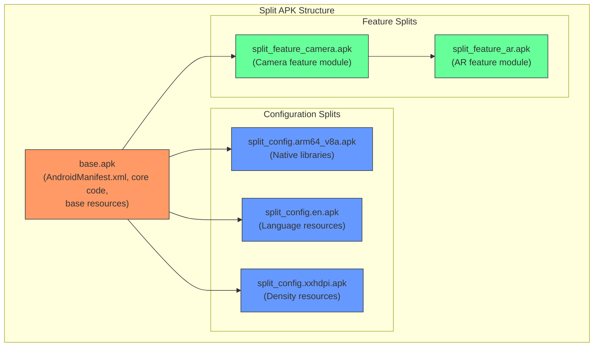
```mermaid
graph TD
    subgraph "Split APK Structure"
        BASE["base.apk<br/>(AndroidManifest.xml, core code,<br/>base resources)"]

        subgraph "Configuration Splits"
            ABI["split_config.arm64_v8a.apk<br/>(Native libraries)"]
            LANG["split_config.en.apk<br/>(Language resources)"]
            DPI["split_config.xxhdpi.apk<br/>(Density resources)"]
        end

        subgraph "Feature Splits"
            F1["split_feature_camera.apk<br/>(Camera feature module)"]
            F2["split_feature_ar.apk<br/>(AR feature module)"]
        end
    end

    BASE --> ABI
    BASE --> LANG
    BASE --> DPI
    BASE --> F1
    F1 --> F2

    style BASE fill:#f96,stroke:#333
    style ABI fill:#69f,stroke:#333
    style LANG fill:#69f,stroke:#333
    style DPI fill:#69f,stroke:#333
    style F1 fill:#6f9,stroke:#333
    style F2 fill:#6f9,stroke:#333
```

### 26.7.2 Split Dependencies

Feature splits can declare dependencies on other splits using the `<uses-split>`
manifest element. The `SplitDependencyLoader`
(`frameworks/base/core/java/android/content/pm/split/SplitDependencyLoader.java`)
manages the dependency tree:

```java
/**
 * A helper class that implements the dependency tree traversal for splits.
 * Callbacks are implemented by subclasses to notify whether a split has already
 * been constructed and is cached, and to actually create the split requested.
 *
 * All inputs and outputs are assumed to be indices into an array of splits.
 */
public abstract class SplitDependencyLoader<E extends Exception> {
    private final @NonNull SparseArray<int[]> mDependencies;

    protected SplitDependencyLoader(
            @NonNull SparseArray<int[]> dependencies) {
        mDependencies = dependencies;
    }
```

The dependency traversal algorithm is a bottom-up walk:

```java
protected void loadDependenciesForSplit(int splitIdx) throws E {
    if (isSplitCached(splitIdx)) {
        return;
    }

    // Special case the base, since it has no dependencies.
    if (splitIdx == 0) {
        final int[] configSplitIndices = collectConfigSplitIndices(0);
        constructSplit(0, configSplitIndices, -1);
        return;
    }

    // Build up the dependency hierarchy.
    final IntArray linearDependencies = new IntArray();
    linearDependencies.add(splitIdx);

    // Collect all the dependencies that need to be constructed.
    // They will be listed from leaf to root.
    while (true) {
        final int[] deps = mDependencies.get(splitIdx);
        if (deps != null && deps.length > 0) {
            splitIdx = deps[0];
        } else {
            splitIdx = -1;
        }
        if (splitIdx < 0 || isSplitCached(splitIdx)) {
            break;
        }
        linearDependencies.add(splitIdx);
    }

    // Visit each index, from right to left (root to leaf).
    int parentIdx = splitIdx;
    for (int i = linearDependencies.size() - 1; i >= 0; i--) {
        final int idx = linearDependencies.get(i);
        final int[] configSplitIndices = collectConfigSplitIndices(idx);
        constructSplit(idx, configSplitIndices, parentIdx);
        parentIdx = idx;
    }
}
```

### 26.7.3 Runtime Split Loading

At runtime, splits are loaded by `LoadedApk` which extends `SplitDependencyLoader`:

From `frameworks/base/core/java/android/app/LoadedApk.java`:

```java
private class SplitDependencyLoaderImpl
        extends SplitDependencyLoader<NameNotFoundException> {
```

This implementation:

1. Checks if a split's ClassLoader and Resources are already cached
2. Walks the dependency tree from the requested split to the base
3. Constructs ClassLoaders and Resources objects in root-to-leaf order
4. Caches the results for subsequent loads

### 26.7.4 Split Installation

Split APKs are installed using `MODE_INHERIT_EXISTING` sessions:

```java
static final int MODE_INHERIT_EXISTING = PackageInstaller.SessionParams.MODE_INHERIT_EXISTING;
```

When inheriting, the new session:

1. Starts with all existing splits
2. Can add new splits
3. Can remove existing splits
4. Must always include the base APK

### 26.7.5 On-Disk Layout

Installed split APKs are stored alongside the base APK:

```
/data/app/~~random/com.example.app-random/
  +-- base.apk
  +-- split_config.arm64_v8a.apk
  +-- split_config.en.apk
  +-- split_config.xxhdpi.apk
  +-- split_feature_camera.apk
  +-- lib/
  |     +-- arm64/
  |           +-- libnative.so
  +-- oat/
        +-- arm64/
              +-- base.odex
              +-- base.vdex
```

### 26.7.6 Split APK Manifest Declarations

Each split APK has its own `AndroidManifest.xml` that declares its role:

**Base APK manifest:**
```xml
<manifest xmlns:android="http://schemas.android.com/apk/res/android"
    package="com.example.app"
    android:versionCode="100"
    android:isFeatureSplit="false"
    split="">
    <application android:label="My App">
        <activity android:name=".MainActivity">
            <intent-filter>
                <action android:name="android.intent.action.MAIN" />
                <category android:name="android.intent.category.LAUNCHER" />
            </intent-filter>
        </activity>
    </application>
</manifest>
```

**Feature split manifest:**
```xml
<manifest xmlns:android="http://schemas.android.com/apk/res/android"
    package="com.example.app"
    split="feature_camera"
    android:isFeatureSplit="true">
    <uses-split android:name="feature_base" />
    <application>
        <activity android:name=".camera.CameraActivity"
            android:splitName="feature_camera" />
    </application>
</manifest>
```

**Configuration split manifest:**
```xml
<manifest xmlns:android="http://schemas.android.com/apk/res/android"
    package="com.example.app"
    split="config.arm64_v8a"
    android:isFeatureSplit="false"
    configForSplit="">
</manifest>
```

Key manifest attributes for splits:

| Attribute | Purpose |
|-----------|---------|
| `split` | Name of this split (empty for base) |
| `android:isFeatureSplit` | Whether this is a feature or config split |
| `configForSplit` | Which split this config applies to |
| `<uses-split>` | Dependency on another split |
| `android:splitName` | Links a component to its split |

### 26.7.7 Split ClassLoader Architecture

Each split gets its own ClassLoader entry, but they share a parent chain:

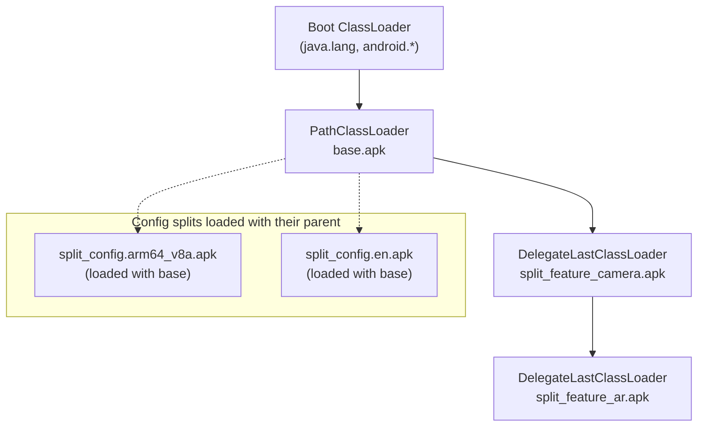
```mermaid
graph TD
    Boot["Boot ClassLoader<br/>(java.lang, android.*)"]
    Base["PathClassLoader<br/>base.apk"]
    F1["DelegateLastClassLoader<br/>split_feature_camera.apk"]
    F2["DelegateLastClassLoader<br/>split_feature_ar.apk"]

    Boot --> Base
    Base --> F1
    F1 --> F2

    subgraph "Config splits loaded with their parent"
        C1["split_config.arm64_v8a.apk<br/>(loaded with base)"]
        C2["split_config.en.apk<br/>(loaded with base)"]
    end

    Base -.-> C1
    Base -.-> C2
```

Feature splits use `DelegateLastClassLoader` to allow the feature's classes to
override the base's classes, enabling true modularity.

### 26.7.8 Resource Merging for Splits

When splits are loaded, their resources are merged into a single `Resources` object.
The merge order follows the split dependency tree, with later splits overriding
earlier ones for conflicting resources.

The `collectConfigSplitIndices()` method identifies which config splits belong to
a given feature split:

```java
private @NonNull int[] collectConfigSplitIndices(int splitIdx) {
    // The config splits appear after the first element.
    final int[] deps = mDependencies.get(splitIdx);
    if (deps == null || deps.length <= 1) {
        return EmptyArray.INT;
    }
    return Arrays.copyOfRange(deps, 1, deps.length);
}
```

### 26.7.9 Dynamic Delivery

The dynamic delivery system allows features to be delivered on-demand after initial
installation. When a feature module is requested:

1. The app requests the module via the Play Core library
2. Play Store downloads the split APK
3. PMS installs it as an additional split
4. The app is notified and can load the new code

PMS supports this through the `allowDynamicSplits` parameter in intent resolution:

```java
@NonNull List<ResolveInfo> queryIntentActivitiesInternal(
        Intent intent, String resolvedType, long flags,
        long privateResolveFlags, int filterCallingUid,
        int callingPid, int userId,
        boolean resolveForStart, boolean allowDynamicSplits);
```

---

## 26.8 Overlay System

The Runtime Resource Overlay (RRO) system allows modifying an application's
resources at runtime without changing the application itself. This is the foundation
for theming, carrier customization, and OEM branding.

### 26.8.1 OverlayManagerService Architecture

The overlay system is managed by `OverlayManagerService` (OMS)
(`frameworks/base/services/core/java/com/android/server/om/OverlayManagerService.java`):

```java
/**
 * Service to manage asset overlays.
 *
 * <p>Asset overlays are additional resources that come from apks loaded
 * alongside the system and app apks. This service, the OverlayManagerService
 * (OMS), tracks which installed overlays to use and provides methods to change
 * this. Changes propagate to running applications as part of the Activity
 * lifecycle. This allows Activities to reread their resources at a well
 * defined point.</p>
 */
```

The OMS architecture follows a layered design:

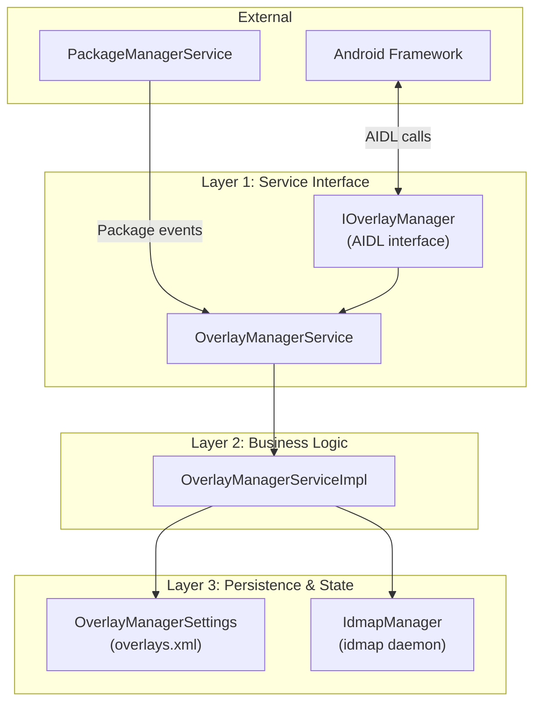
```mermaid
graph TB
    subgraph "Layer 1: Service Interface"
        OMS["OverlayManagerService"]
        AIDL["IOverlayManager<br/>(AIDL interface)"]
    end

    subgraph "Layer 2: Business Logic"
        IMPL["OverlayManagerServiceImpl"]
    end

    subgraph "Layer 3: Persistence & State"
        SETTINGS["OverlayManagerSettings<br/>(overlays.xml)"]
        IDMAP["IdmapManager<br/>(idmap daemon)"]
    end

    subgraph "External"
        FRAMEWORK["Android Framework"]
        PMS2["PackageManagerService"]
    end

    FRAMEWORK <-->|"AIDL calls"| AIDL
    PMS2 -->|"Package events"| OMS
    AIDL --> OMS
    OMS --> IMPL
    IMPL --> SETTINGS
    IMPL --> IDMAP
```

The Javadoc describes OMS's three input sources:

1. **SystemService callbacks** -- Boot and user switching events
2. **PMS intents** -- Package install/remove/update broadcasts
3. **AIDL interface** -- External requests to enable/disable overlays

### 26.8.2 How RRO Works

An overlay APK declares a target package and provides alternative resources:

```xml
<!-- Overlay AndroidManifest.xml -->
<manifest xmlns:android="http://schemas.android.com/apk/res/android"
    package="com.example.overlay"
    android:targetPackage="com.example.target"
    android:isResourceOverlay="true">
    <overlay
        android:category="theme"
        android:isStatic="false"
        android:priority="1" />
</manifest>
```

When an overlay is enabled, the resource lookup chain is modified:

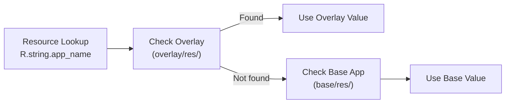
```mermaid
flowchart LR
    Lookup["Resource Lookup<br/>R.string.app_name"] --> Overlay["Check Overlay<br/>(overlay/res/)"]
    Overlay -->|"Found"| UseOverlay["Use Overlay Value"]
    Overlay -->|"Not found"| Base["Check Base App<br/>(base/res/)"]
    Base --> UseBase["Use Base Value"]
```

### 26.8.3 Idmap Files

The `IdmapManager` creates **idmap** files that map resource IDs from the target
package to the overlay package. Idmap files allow the resource system to quickly
look up overlay resources without scanning the overlay APK at runtime.

From `frameworks/base/services/core/java/com/android/server/om/IdmapManager.java`:

The idmap daemon (`idmap2d`) runs as a native service and handles:

1. Creating idmap files for overlay/target pairs
2. Verifying existing idmap files are still valid
3. Removing stale idmap files

Idmap states:

```java
static final int IDMAP_NOT_EXIST = 0;
static final int IDMAP_IS_VERIFIED = 1;
static final int IDMAP_IS_MODIFIED = 2;
```

### 26.8.4 Overlay States

Each overlay transitions through well-defined states:

```java
static final int STATE_DISABLED = OverlayInfo.STATE_DISABLED;
static final int STATE_ENABLED = OverlayInfo.STATE_ENABLED;
static final int STATE_MISSING_TARGET = OverlayInfo.STATE_MISSING_TARGET;
static final int STATE_NO_IDMAP = OverlayInfo.STATE_NO_IDMAP;
static final int STATE_OVERLAY_IS_BEING_REPLACED =
        OverlayInfo.STATE_OVERLAY_IS_BEING_REPLACED;
static final int STATE_SYSTEM_UPDATE_UNINSTALL =
        OverlayInfo.STATE_SYSTEM_UPDATE_UNINSTALL;
static final int STATE_TARGET_IS_BEING_REPLACED =
        OverlayInfo.STATE_TARGET_IS_BEING_REPLACED;
```

State transition diagram:

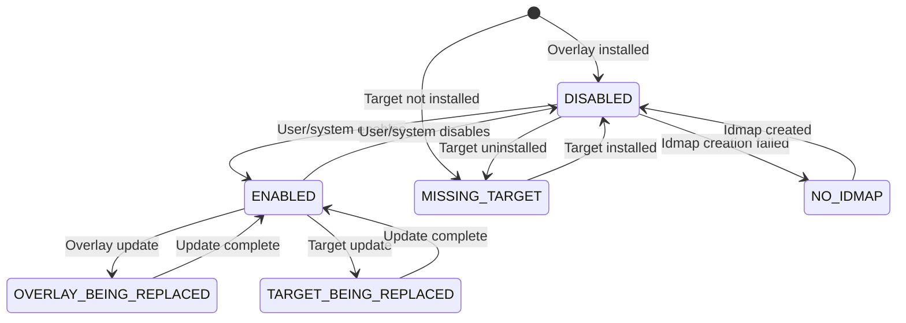
```mermaid
stateDiagram-v2
    [*] --> DISABLED: Overlay installed
    DISABLED --> ENABLED: User/system enables
    ENABLED --> DISABLED: User/system disables

    [*] --> MISSING_TARGET: Target not installed
    MISSING_TARGET --> DISABLED: Target installed
    DISABLED --> MISSING_TARGET: Target uninstalled

    DISABLED --> NO_IDMAP: Idmap creation failed
    NO_IDMAP --> DISABLED: Idmap created

    ENABLED --> OVERLAY_BEING_REPLACED: Overlay update
    OVERLAY_BEING_REPLACED --> ENABLED: Update complete

    ENABLED --> TARGET_BEING_REPLACED: Target update
    TARGET_BEING_REPLACED --> ENABLED: Update complete
```

### 26.8.5 OverlayManagerServiceImpl

The `OverlayManagerServiceImpl`
(`frameworks/base/services/core/java/com/android/server/om/OverlayManagerServiceImpl.java`)
implements the core business logic:

```java
/**
 * Internal implementation of OverlayManagerService.
 *
 * Methods in this class should only be called by the OverlayManagerService.
 * This class is not thread-safe; the caller is expected to ensure the
 * necessary thread synchronization.
 */
final class OverlayManagerServiceImpl {
    private final PackageManagerHelper mPackageManager;
    private final IdmapManager mIdmapManager;
    private final OverlayManagerSettings mSettings;
    private final OverlayConfig mOverlayConfig;
    private final String[] mDefaultOverlays;
```

It reconciles the overlay manager's state (from `overlays.xml`) with the package
manager's state (from AndroidManifest.xml parsing):

```java
/**
 * Helper method to merge the overlay manager's (as read from overlays.xml)
 * and package manager's (as parsed from AndroidManifest.xml files) views
 * on overlays.
 *
 * Both managers are usually in agreement, but especially after an OTA
 * things may differ. The package manager is always providing the truth;
 * the overlay manager has to adapt.
 */
```

### 26.8.6 Overlay Persistence

Overlay state is persisted in `/data/system/overlays.xml`. The
`OverlayManagerSettings` class handles reading and writing this file.

### 26.8.7 Overlay Configuration

System overlays are configured via `OverlayConfig`, which reads configuration from:

```
/product/overlay/config/config.xml
/vendor/overlay/config/config.xml
/system/overlay/config/config.xml
```

Configuration parameters include:

- **Default enabled state** -- Whether the overlay is on or off by default
- **Mutability** -- Whether the overlay can be enabled/disabled at runtime
- **Priority** -- Ordering when multiple overlays target the same resource

The overlay config is initialized during system scan:

```java
final OverlayConfig overlayConfig = OverlayConfig.initializeSystemInstance(
        consumer -> mPm.forEachPackageState(mPm.snapshotComputer(),
                packageState -> {
                    var pkg = packageState.getPkg();
                    if (pkg != null) {
                        consumer.accept(pkg, packageState.isSystem(),
                                apkInApexPreInstalledPaths.get(
                                        pkg.getPackageName()));
                    }
                }));
```

### 26.8.8 Fabricated Overlays

Android 12+ supports **fabricated overlays** -- overlays created at runtime without
a physical APK. These are used for dynamic theming (Material You):

```java
TYPE_REGISTER_FABRICATED
TYPE_UNREGISTER_FABRICATED
```

Fabricated overlays are created programmatically with `FabricatedOverlayInternal`
and registered through the OMS AIDL interface.

### 26.8.9 Overlay Categories and Policies

Overlays are organized by categories that define their purpose:

| Category | Purpose |
|----------|---------|
| `android.theme.customization.accent_color` | Material You accent color |
| `android.theme.customization.system_palette` | System color palette |
| `android.theme.customization.theme_style` | Overall theme style |
| `android.theme.customization.font` | System font |
| `android.theme.customization.icon_shape` | App icon mask shape |
| `android.theme.customization.signal_icon` | Signal strength icon |
| `android.theme.customization.wifi_icon` | WiFi icon |
| `android.theme.customization.navbar` | Navigation bar style |

Categories help the system organize overlays and prevent conflicts. Within a
category, overlays are ordered by priority, and only one overlay can be active
per category per target package.

### 26.8.10 Overlay Security Model

Overlay security is enforced at multiple levels:

1. **Signature check** -- Mutable overlays targeting system packages may require
   signature matching with the target or a privileged signature.

2. **Overlayable declarations** -- Target packages can declare which of their
   resources are overlayable using `<overlayable>` tags:

```xml
<!-- In the target package's res/values/overlayable.xml -->
<resources>
    <overlayable name="ThemeColors" actor="overlay://theme">
        <policy type="public">
            <item type="color" name="accent_device_default_light" />
            <item type="color" name="accent_device_default_dark" />
        </policy>
    </overlayable>
</resources>
```

3. **Policy types** -- Control who can overlay what:
   - `public` -- Any overlay can modify
   - `system` -- Only system overlays
   - `vendor` -- Only vendor overlays
   - `product` -- Only product overlays
   - `signature` -- Only overlays signed with the same key
   - `actor` -- Only the designated actor overlay

4. **The OverlayActorEnforcer** validates that the caller has the authority to modify
   overlays for a given overlayable.

### 26.8.11 Overlay and PMS Interaction

OMS relies heavily on PMS for package information. When PMS broadcasts package
events, OMS updates its state:

```mermaid
sequenceDiagram
    participant PMS as PackageManagerService
    participant OMS as OverlayManagerService
    participant IMPL as OverlayManagerServiceImpl
    participant IDMAP as IdmapManager
    participant APP as Running Application

    PMS->>OMS: ACTION_PACKAGE_ADDED (overlay)
    OMS->>IMPL: onPackageAdded()
    IMPL->>IMPL: updateState()
    IMPL->>IDMAP: createIdmap(overlay, target)
    IDMAP->>IDMAP: idmap2d: create idmap file
    IMPL->>IMPL: State = DISABLED (default)

    Note over OMS: User or system enables overlay

    OMS->>IMPL: setEnabled(overlay, true)
    IMPL->>IMPL: State = ENABLED
    IMPL->>IMPL: updateOverlayPaths()
    IMPL->>PMS: setOverlayPaths(target, paths)
    PMS->>APP: Configuration change
    APP->>APP: Reload resources with overlay
```

### 26.8.12 Overlay Paths

When overlays are enabled, PMS updates the package's overlay paths, which the
resource system uses during resource lookup:

```java
// Recorded overlay paths configuration for the Android app info.
private String[] mPlatformPackageOverlayPaths = null;
private String[] mPlatformPackageOverlayResourceDirs = null;
```

The `OverlayPaths` class encapsulates the path information:

```java
import android.content.pm.overlay.OverlayPaths;
```

### 26.8.13 Idmap Internals: idmap2d Daemon

The actual idmap file creation is delegated to `idmap2d`, a native daemon
managed by the `IdmapDaemon` class. The daemon uses a lazy lifecycle -- it
starts on demand and shuts down after 10 seconds of inactivity:

```java
// frameworks/base/services/core/java/com/android/server/om/IdmapDaemon.java
/**
 * To prevent idmap2d from continuously running, the idmap daemon will
 * terminate after 10 seconds without a transaction.
 **/
class IdmapDaemon {
    private static final int SERVICE_TIMEOUT_MS = 10000;
    private static final String IDMAP_DAEMON = "idmap2d";
```

The daemon communicates via the `IIdmap2` AIDL interface. Each connection is
tracked with reference counting -- the daemon only shuts down when all
connections are closed:

```mermaid
sequenceDiagram
    participant IM as IdmapManager
    participant ID as IdmapDaemon
    participant D as idmap2d (native)

    IM->>ID: createIdmap(target, overlay)
    ID->>ID: getIdmapService() [starts daemon if needed]
    ID->>D: IIdmap2.verifyIdmap()

    alt Already verified
        D-->>ID: true (verified)
        ID-->>IM: IDMAP_IS_VERIFIED
    else Needs creation
        D-->>ID: false
        ID->>D: IIdmap2.createIdmap()
        D-->>ID: idmap path
        ID-->>IM: IDMAP_IS_MODIFIED | IDMAP_IS_VERIFIED
    end

    Note over ID: Timer starts (10s)
    Note over ID: No more requests
    ID->>D: SystemService.stop("idmap2d")
```

For batch operations during boot (when many overlays need idmap creation
simultaneously), `IdmapManager` batches the requests through `createIdmaps()`,
splitting them by IPC size limits to avoid exceeding the Binder transaction
buffer:

```java
// frameworks/base/services/core/java/com/android/server/om/IdmapManager.java
private static final int MAX_IPC_SIZE = IBinder.getSuggestedMaxIpcSizeBytes();

// Split the input list of IdmapParams so we don't exceed the max IPC size.
private static List<List<IdmapParams>> splitIdmapParams(
        final List<IdmapParams> idmapParams) {
```

During batch idmap creation, the Watchdog is paused for the current thread
because the operation may be slow:

```java
Watchdog.getInstance().pauseWatchingCurrentThread("idmap creation may be slow");
```

### 26.8.14 Overlay Policy Enforcement

The `IdmapManager.calculateFulfilledPolicies()` method computes a bitmask
representing which overlay policies are satisfied by a given overlay package.
These policies correspond directly to the `<policy>` elements in
`overlayable.xml`:

```java
// frameworks/base/services/core/java/com/android/server/om/IdmapManager.java
int calculateFulfilledPolicies(@NonNull final AndroidPackage targetPackage,
        @NonNull PackageState overlayPackageState,
        @NonNull final AndroidPackage overlayPackage,
        @UserIdInt int userId) {
    int fulfilledPolicies = OverlayablePolicy.PUBLIC;

    // Overlay matches target signature
    if (mPackageManager.signaturesMatching(targetPackage.getPackageName(),
            overlayPackage.getPackageName(), userId)) {
        fulfilledPolicies |= OverlayablePolicy.SIGNATURE;
    }

    // Overlay matches actor signature
    if (matchesActorSignature(targetPackage, overlayPackage, userId)) {
        fulfilledPolicies |= OverlayablePolicy.ACTOR_SIGNATURE;
    }
```

The full policy bitmask includes partition-based policies:

| Policy | Condition |
|--------|-----------|
| `PUBLIC` | Always granted |
| `SIGNATURE` | Overlay signed with same key as target |
| `ACTOR_SIGNATURE` | Overlay signed with same key as the designated actor |
| `CONFIG_SIGNATURE` | Overlay matches the `overlay-config-signature` package |
| `SYSTEM_PARTITION` | Overlay is on `/system` or `/system_ext` |
| `VENDOR_PARTITION` | Overlay is on `/vendor` |
| `PRODUCT_PARTITION` | Overlay is on `/product` |
| `ODM_PARTITION` | Overlay is on `/odm` |
| `OEM_PARTITION` | Overlay is on `/oem` |

Pre-Android Q overlays receive special backward-compatibility treatment:

```java
// frameworks/base/services/core/java/com/android/server/om/IdmapManager.java
boolean enforceOverlayable(@NonNull PackageState overlayPackageState,
        @NonNull final AndroidPackage overlayPackage) {
    if (overlayPackage.getTargetSdkVersion() >= VERSION_CODES.Q) {
        return true; // Always enforce for Q+
    }
    // Pre-Q vendor overlays: enforce only if vendor partition is Q+
    if (overlayPackageState.isVendor()) {
        return VENDOR_IS_Q_OR_LATER;
    }
    // Pre-Q system/platform-signed overlays: don't enforce
    return !(overlayPackageState.isSystem()
            || overlayPackage.isSignedWithPlatformKey());
}
```

### 26.8.15 The OverlayActorEnforcer

The `OverlayActorEnforcer` validates that a calling UID has authority to
modify overlays for a given overlayable. Actors are identified by URIs
in the format `overlay://<namespace>/<name>`:

```java
// frameworks/base/services/core/java/com/android/server/om/OverlayActorEnforcer.java
/**
 * Performs verification that a calling UID can act on a target package's
 * overlayable.
 */
public class OverlayActorEnforcer {
    static Pair<String, ActorState> getPackageNameForActor(
            @NonNull String actorUriString,
            @NonNull Map<String, Map<String, String>> namedActors) {
        Uri actorUri = Uri.parse(actorUriString);
        String actorScheme = actorUri.getScheme();
        // Must be "overlay" scheme with exactly one path segment
        if (!"overlay".equals(actorScheme)
                || CollectionUtils.size(actorPathSegments) != 1) {
            return Pair.create(null, ActorState.INVALID_OVERLAYABLE_ACTOR_NAME);
        }
```

Named actors are defined in `SystemConfig` and map actor URIs to package names.
The enforcer checks if the calling UID matches the package that is the
designated actor for the target overlayable.

### 26.8.16 Fabricated Overlay Internals

Fabricated overlays -- created at runtime without physical APK files -- are
the mechanism behind Material You dynamic theming. The registration flow:

```mermaid
sequenceDiagram
    participant Client as SystemUI / ThemeManager
    participant OMS as OverlayManagerService
    participant IMPL as OverlayManagerServiceImpl
    participant IM as IdmapManager
    participant D as idmap2d

    Client->>OMS: commit(OverlayManagerTransaction)
    Note over OMS: Transaction contains<br/>TYPE_REGISTER_FABRICATED

    OMS->>IMPL: registerFabricatedOverlay(internal)
    IMPL->>IMPL: Validate overlay name<br/>(alphanumeric, _, .)
    IMPL->>IM: createFabricatedOverlay(internal)
    IM->>D: IIdmap2.createFabricatedOverlay()
    D-->>IM: FabricatedOverlayInfo
    IM-->>IMPL: info (path, target, etc.)

    IMPL->>IMPL: Init overlay in settings<br/>(isFabricated=true)
    IMPL->>IMPL: updateState()
    IMPL-->>OMS: updated targets
    OMS->>OMS: updateTargetPackagesLocked()
    OMS->>OMS: Broadcast ACTION_OVERLAY_CHANGED
```

`FabricatedOverlayInternal` contains the overlay definition -- resource type,
name, and value entries -- which idmap2d serializes to disk. Fabricated
overlays created by the shell package are wiped on every boot as a safety
measure:

```java
// frameworks/base/services/core/java/com/android/server/om/OverlayManagerService.java
// Wipe all shell overlays on boot, to recover from a potentially broken device
String shellPkgName = TextUtils.emptyIfNull(
        getContext().getString(android.R.string.config_systemShell));
mSettings.removeIf(overlayInfo -> overlayInfo.isFabricated
        && shellPkgName.equals(overlayInfo.packageName));
```

### 26.8.17 RRO Constraints

Android introduces RRO constraints (gated by the `Flags.rroConstraints()`
feature flag) that allow conditionally enabling overlays based on runtime
conditions. Constraints are passed through the `OverlayConstraint` class
and are evaluated by idmap2d during idmap creation:

```java
// frameworks/base/services/core/java/com/android/server/om/OverlayManagerServiceImpl.java
if (!Flags.rroConstraints() && hasConstraints) {
    throw new OperationFailedException("RRO constraints are not supported");
}
if (!enable && hasConstraints) {
    throw new OperationFailedException(
            "Constraints can only be set when enabling an overlay");
}
```

Constraints are only valid when enabling an overlay -- disabling always
removes all constraints.

### 26.8.18 Overlay Settings Persistence

`OverlayManagerSettings` stores overlay state as an ordered list of
`SettingsItem` objects. The order is significant -- items with a lower
index have lower priority:

```java
// frameworks/base/services/core/java/com/android/server/om/OverlayManagerSettings.java
/**
 * All overlay data for all users and target packages is stored in this list.
 * This keeps memory down, while increasing the cost of running queries or
 * mutating the data. This is ok, since changing of overlays is very rare
 * and has larger costs associated with it.
 *
 * The order of the items in the list is important, those with a lower
 * index having a lower priority.
 */
private final ArrayList<SettingsItem> mItems = new ArrayList<>();
```

The settings are serialized to `/data/system/overlays.xml` using Android's
`TypedXmlSerializer`. The `AtomicFile` wrapper ensures crash-safe writes.

### 26.8.19 Batched Idmap Transactions

When the `Flags.mergeIdmapBinderTransactions()` flag is enabled,
`OverlayManagerServiceImpl` collects all packages that need idmap operations
and processes them in a single batched call rather than individual IPC
transactions:

```java
// frameworks/base/services/core/java/com/android/server/om/OverlayManagerServiceImpl.java
if (Flags.mergeIdmapBinderTransactions()) {
    pkgs.add(pkg); // Collect packages
} else {
    // Individual processing (legacy path)
    updatePackageOverlays(pkg, newUserId, 0);
}

// After collection, batch process
if (Flags.mergeIdmapBinderTransactions()) {
    updateAllPackageOverlays(pkgs, newUserId, 0);
}
```

This optimization significantly reduces boot time on devices with many
overlays by minimizing the number of Binder transactions to idmap2d.

### 26.8.20 OMS Shell Commands

The `OverlayManagerShellCommand` class provides `cmd overlay` commands for
debugging and testing overlays from the command line:

```bash
# List all overlays
$ adb shell cmd overlay list

# Enable an overlay
$ adb shell cmd overlay enable --user current com.example.overlay

# Disable an overlay
$ adb shell cmd overlay disable --user current com.example.overlay

# Set an overlay as the exclusive enabled overlay in its category
$ adb shell cmd overlay enable-exclusive --category com.example.overlay

# Dump overlay state
$ adb shell dumpsys overlay
```

---

## 26.9 App Hibernation

App hibernation is Android's mechanism for handling unused applications.
When users install apps and then stop using them, those apps continue
consuming storage (cached data, OAT/dex artifacts) and may retain runtime
permissions that pose privacy risks. The `AppHibernationService` coordinates
with `PermissionController`, `PackageManagerService`, and
`ActivityManagerService` to put idle apps into a low-resource state and
reclaim the resources they hold.

> **Source root:**
> `frameworks/base/services/core/java/com/android/server/apphibernation/`

### 26.9.1 Architecture Overview

```mermaid
graph TD
    PC["PermissionController<br/>(policy engine)"] -->|"setHibernatingForUser()"| AHS["AppHibernationService"]
    AHS -->|"forceStopPackage()"| AMS["ActivityManagerService"]
    AHS -->|"deleteApplicationCacheFiles()"| PMS["PackageManagerService"]
    AHS -->|"StorageStats queries"| SSM["StorageStatsManager"]
    AHS -->|"persist state"| Disk["HibernationStateDiskStore"]
    AHS -->|"StatsLog"| Stats["FrameworkStatsLog"]
    AHS -->|"internal API"| AHMI["AppHibernationManagerInternal"]
    AHMI --> PMS

    style AHS fill:#f9f,stroke:#333
    style PC fill:#bbf,stroke:#333
```

The key architectural decision is that `AppHibernationService` manages the
*state* of hibernation, but the *policy* (which apps should hibernate) lives
in `PermissionController`, which runs in a separate process. This separation
allows Google to update hibernation policy through Play Services without
modifying the framework.

### 26.9.2 Two-Level Hibernation State

Hibernation operates at two levels, tracked by separate data classes:

| Level | Class | Scope | Optimizations |
|-------|-------|-------|---------------|
| **User-level** | `UserLevelState` | Per (package, user) | Force-stop, cache deletion |
| **Global-level** | `GlobalLevelState` | Per package (all users) | OAT artifact deletion, APK-level optimization |

```java
// AppHibernationService.java, line 119-125
@GuardedBy("mLock")
private final SparseArray<Map<String, UserLevelState>> mUserStates = new SparseArray<>();
@GuardedBy("mLock")
private final Map<String, GlobalLevelState> mGlobalHibernationStates = new ArrayMap<>();
```

A package is globally hibernated only when it is hibernated for *all* users.
Global hibernation enables more aggressive optimizations like deleting
ahead-of-time compilation artifacts.

Each state object tracks:

```java
// UserLevelState.java / GlobalLevelState.java
public String packageName;
public boolean hibernated;
public long savedByte;         // bytes reclaimed
public long lastUnhibernatedMs; // timestamp of last wake-up
```

### 26.9.3 Hibernation Process

When `PermissionController` determines an app should hibernate, it calls
`setHibernatingForUser()`. The service then:

1. **Force-stops the package** via `ActivityManagerService.forceStopPackage()`,
   killing all processes and canceling alarms/jobs
2. **Deletes cached files** via `PackageManagerService.deleteApplicationCacheFilesAsUser()`
3. **Records bytes saved** from `StorageStatsManager.queryStatsForPackage()`
4. **Persists state** to disk via `HibernationStateDiskStore`
5. **Logs metrics** via `FrameworkStatsLog.USER_LEVEL_HIBERNATION_STATE_CHANGED`

```java
// AppHibernationService.java, line 455-484
private void hibernatePackageForUser(String packageName, int userId, UserLevelState state) {
    Trace.traceBegin(Trace.TRACE_TAG_SYSTEM_SERVER, "hibernatePackage");
    try {
        ApplicationInfo info = mIPackageManager.getApplicationInfo(
                packageName, PACKAGE_MATCH_FLAGS, userId);
        StorageStats stats = mStorageStatsManager.queryStatsForPackage(
                info.storageUuid, packageName, new UserHandle(userId));
        mIActivityManager.forceStopPackage(packageName, userId);
        mIPackageManager.deleteApplicationCacheFilesAsUser(packageName, userId,
                null /* observer */);
        synchronized (mLock) {
            state.savedByte = stats.getCacheBytes();
        }
    } catch (RemoteException e) { /* ... */ }
}
```

### 26.9.4 Unhibernation and Wake-Up

When a hibernated app is used again (detected via `UsageEventsListener`),
the service restores it:

```java
// AppHibernationService.java, line 490-546
private void unhibernatePackageForUser(String packageName, int userId) {
    // Deliver LOCKED_BOOT_COMPLETED and BOOT_COMPLETE broadcasts
    // so the app can re-register alarms, jobs, etc.
    Intent lockedBcIntent = new Intent(Intent.ACTION_LOCKED_BOOT_COMPLETED)
            .setPackage(packageName);
    mIActivityManager.broadcastIntentWithFeature(/* ... */);

    Intent bcIntent = new Intent(Intent.ACTION_BOOT_COMPLETED)
            .setPackage(packageName);
    mIActivityManager.broadcastIntentWithFeature(/* ... */);
}
```

The boot-completed broadcasts are critical: they allow the app to re-register
its `AlarmManager` alarms, `JobScheduler` jobs, `WorkManager` tasks, and
Firebase Cloud Messaging tokens that were lost when the app was force-stopped.

```mermaid
sequenceDiagram
    participant User
    participant USS as UsageStatsService
    participant AHS as AppHibernationService
    participant AMS as ActivityManagerService
    participant PMS as PackageManagerService

    Note over User: User opens hibernated app
    USS->>AHS: UsageEventListener.onUsageEvent()
    AHS->>AHS: setHibernatingForUser(pkg, false)
    AHS->>AMS: broadcastIntent(LOCKED_BOOT_COMPLETED)
    AHS->>AMS: broadcastIntent(BOOT_COMPLETED)
    Note over AHS: App re-registers alarms/jobs
    AHS->>AHS: Persist updated state to disk
```

### 26.9.5 Integration with Permission Auto-Revoke

The connection between hibernation and permission revocation is subtle but
important. `PermissionController` handles both:

1. **Permission auto-revoke**: Revokes runtime permissions for unused apps
   (introduced Android 11)
2. **App hibernation**: Puts unused apps in hibernation state, reclaiming
   storage (introduced Android 12)

These are separate features that share the same policy signal: "this app
has not been used recently." The `PermissionController` uses
`UsageStatsManager` to determine app usage and then invokes both permission
revocation and hibernation APIs.

### 26.9.6 Device Config and Feature Gating

The service is gated by a `DeviceConfig` flag:

```java
// AppHibernationConstants.java
static final String KEY_APP_HIBERNATION_ENABLED = "app_hibernation_enabled";

// AppHibernationService.java, line 188
sIsServiceEnabled = isDeviceConfigAppHibernationEnabled();
```

Every public API method checks `sIsServiceEnabled` before proceeding,
returning empty or false values when disabled. This allows the feature to be
remotely toggled without a system update.

### 26.9.7 Persistence and Boot Sequence

Hibernation state is persisted to disk via `HibernationStateDiskStore`,
which uses protocol buffer serialization (`GlobalLevelHibernationProto`,
`UserLevelHibernationProto`). State is loaded during
`PHASE_BOOT_COMPLETED` on a background executor:

```java
// AppHibernationService.java, line 177-186
@Override
public void onBootPhase(int phase) {
    if (phase == PHASE_BOOT_COMPLETED) {
        mBackgroundExecutor.execute(() -> {
            List<GlobalLevelState> states =
                    mGlobalLevelHibernationDiskStore.readHibernationStates();
            synchronized (mLock) {
                initializeGlobalHibernationStates(states);
            }
        });
    }
}
```

User-level states are loaded lazily when a user is unlocked, using
per-user `HibernationStateDiskStore` instances stored in the `mUserDiskStores`
`SparseArray`.

### 26.9.8 Package Lifecycle Events

The service registers a broadcast receiver for `ACTION_PACKAGE_ADDED` and
`ACTION_PACKAGE_REMOVED` to keep its state maps in sync:

- **Package added**: Creates a new `UserLevelState` and `GlobalLevelState`
  entry with `hibernated = false`
- **Package removed**: Cleans up state from both user and global maps
- **Package replaced**: The `EXTRA_REPLACING` flag distinguishes updates
  from fresh installs; updates preserve the existing hibernation state

### 26.9.9 Debugging App Hibernation

```bash
# Check if a package is hibernated
adb shell cmd app_hibernation is-hibernating <package> --user 0

# Manually hibernate a package
adb shell cmd app_hibernation set-hibernating <package> --user 0 true

# Get hibernation stats (saved bytes)
adb shell cmd app_hibernation get-hibernation-stats --user 0

# Check DeviceConfig flag
adb shell device_config get app_hibernation app_hibernation_enabled
```

---

## 26.10 Try It -- Practical Exercises

This section provides hands-on exercises to explore PMS functionality using
common Android development tools.

### 26.10.1 Inspecting an APK

**Exercise 1: Examine APK structure**

Use `aapt2` to dump information from an installed system APK:

```bash
# List files in an APK
$ unzip -l /system/app/Calculator/Calculator.apk

# Dump the AndroidManifest.xml
$ aapt2 dump xmltree /system/app/Calculator/Calculator.apk --file AndroidManifest.xml

# Dump all badging information (package name, version, permissions)
$ aapt2 dump badging /system/app/Calculator/Calculator.apk

# Dump the resource table
$ aapt2 dump resources /system/app/Calculator/Calculator.apk | head -50
```

**Exercise 2: Inspect APK signatures**

```bash
# Check which signature schemes are present
$ apksigner verify --verbose --print-certs /data/app/~~*/com.example.app*/base.apk

# Check v1 (JAR) signature
$ apksigner verify -v1-scheme-only /path/to/app.apk

# Check v2 signature
$ apksigner verify -v2-scheme-only /path/to/app.apk

# Check v3 signature
$ apksigner verify -v3-scheme-only /path/to/app.apk
```

### 26.10.2 Querying Package Information

**Exercise 3: Use pm shell commands**

```bash
# List all installed packages
$ adb shell pm list packages

# List only system packages
$ adb shell pm list packages -s

# List third-party packages
$ adb shell pm list packages -3

# Get detailed package info
$ adb shell pm dump com.android.settings | head -100

# Get the path of an installed APK
$ adb shell pm path com.android.settings

# List all permissions
$ adb shell pm list permissions -g -d
```

**Exercise 4: Inspect package settings**

```bash
# View the packages.xml database (requires root)
$ adb shell cat /data/system/packages.xml | head -200

# View per-user package restrictions
$ adb shell cat /data/system/users/0/package-restrictions.xml

# View runtime permissions (requires root)
$ adb shell cat /data/misc_de/0/apexdata/com.android.permission/runtime-permissions.xml
```

### 26.10.3 Installing and Managing Packages

**Exercise 5: Install workflows**

```bash
# Standard install
$ adb install app.apk

# Install with replacement (update)
$ adb install -r app.apk

# Install as test-only
$ adb install -t test-app.apk

# Install on specific user
$ adb install --user 0 app.apk

# Install a split APK
$ adb install-multiple base.apk split_config.arm64_v8a.apk split_config.en.apk

# Install using streaming (incremental)
$ adb install --streaming app.apk

# Stage a session manually
$ adb shell pm install-create
# Returns: Success: created install session [1234]
$ adb shell pm install-write 1234 base.apk /path/to/base.apk
$ adb shell pm install-commit 1234
```

**Exercise 6: Uninstall workflows**

```bash
# Uninstall for current user (keeps data for other users)
$ adb shell pm uninstall com.example.app

# Uninstall keeping data
$ adb shell pm uninstall -k com.example.app

# Uninstall for all users
$ adb shell pm uninstall --user all com.example.app

# Clear app data without uninstalling
$ adb shell pm clear com.example.app
```

### 26.10.4 Working with Permissions

**Exercise 7: Permission operations**

```bash
# List permissions requested by an app
$ adb shell pm dump com.example.app | grep "permission"

# Grant a runtime permission
$ adb shell pm grant com.example.app android.permission.CAMERA

# Revoke a runtime permission
$ adb shell pm revoke com.example.app android.permission.CAMERA

# Check if a permission is granted
$ adb shell dumpsys package com.example.app | grep "CAMERA"

# List all dangerous permissions
$ adb shell pm list permissions -d -g

# Reset all runtime permissions for an app
$ adb shell pm reset-permissions com.example.app
```

### 26.10.5 Intent Resolution Inspection

**Exercise 8: Query intent resolution**

```bash
# Resolve an implicit intent
$ adb shell pm resolve-activity --brief "android.intent.action.VIEW" \
    -d "https://www.example.com"

# Query all activities matching an intent
$ adb shell pm query-activities --brief "android.intent.action.SEND" \
    -t "text/plain"

# List preferred activities (defaults)
$ adb shell dumpsys package preferred-activities

# Set a default app for a MIME type
$ adb shell pm set-home-activity com.example.launcher/.LauncherActivity

# Clear defaults for a package
$ adb shell pm clear-default-browser-status
```

### 26.10.6 Working with Overlays

**Exercise 9: Overlay management**

```bash
# List all registered overlays
$ adb shell cmd overlay list

# Enable an overlay
$ adb shell cmd overlay enable com.example.overlay

# Disable an overlay
$ adb shell cmd overlay disable com.example.overlay

# Set overlay priority
$ adb shell cmd overlay set-priority com.example.overlay \
    --highest com.android.systemui

# Show overlay info
$ adb shell cmd overlay dump
```

**Exercise 10: Create a simple overlay**

Create a minimal overlay APK that changes the system UI accent color:

```xml
<!-- AndroidManifest.xml -->
<manifest xmlns:android="http://schemas.android.com/apk/res/android"
    package="com.example.theme.overlay">
    <overlay
        android:targetPackage="android"
        android:category="android.theme.customization.accent_color"
        android:isStatic="false" />
</manifest>
```

```xml
<!-- res/values/colors.xml -->
<resources>
    <color name="accent_device_default_light">#FF6200EE</color>
    <color name="accent_device_default_dark">#FFBB86FC</color>
</resources>
```

Build and install:

```bash
# Build the overlay APK
$ aapt2 compile -o compiled/ res/values/colors.xml
$ aapt2 link -o overlay.apk --manifest AndroidManifest.xml \
    -I /path/to/android.jar compiled/values_colors.arsc.flat

# Sign the APK
$ apksigner sign --ks debug.keystore overlay.apk

# Install and enable
$ adb install overlay.apk
$ adb shell cmd overlay enable com.example.theme.overlay
```

### 26.10.7 Dumpsys Exploration

**Exercise 11: Comprehensive PMS dump**

```bash
# Full PMS dump (very large)
$ adb shell dumpsys package > pms-dump.txt

# Dump a specific package
$ adb shell dumpsys package com.android.settings

# Dump only features
$ adb shell dumpsys package features

# Dump shared libraries
$ adb shell dumpsys package libraries

# Dump package verifiers
$ adb shell dumpsys package verifiers

# Dump preferred activities
$ adb shell dumpsys package preferred

# Dump overlay information
$ adb shell dumpsys overlay
```

### 26.10.8 Split APK Exercises

**Exercise 13: Create and install split APKs**

```bash
# Step 1: Create a base APK and a feature split using bundletool
$ bundletool build-apks --bundle=my-app.aab --output=my-app.apks \
    --connected-device

# Step 2: Install all splits
$ bundletool install-apks --apks=my-app.apks

# Step 3: Or install manually with adb
$ adb install-multiple base.apk \
    split_config.arm64_v8a.apk \
    split_config.en.apk \
    split_config.xxhdpi.apk

# Step 4: Inspect the installed splits
$ adb shell pm path com.example.app
# Output shows all installed split paths:
#   package:/data/app/~~.../com.example.app-.../base.apk
#   package:/data/app/~~.../com.example.app-.../split_config.arm64_v8a.apk
#   package:/data/app/~~.../com.example.app-.../split_config.en.apk

# Step 5: List split names
$ adb shell dumpsys package com.example.app | grep -A 20 "splits="
```

**Exercise 14: Install a feature split dynamically**

```bash
# Create a session in inherit mode
$ adb shell pm install-create --inherit -p com.example.app
# Returns: Success: created install session [1234]

# Write the new feature split
$ adb push split_feature_camera.apk /data/local/tmp/
$ adb shell pm install-write 1234 split_feature_camera \
    /data/local/tmp/split_feature_camera.apk

# Commit the session
$ adb shell pm install-commit 1234

# Verify the new split is installed
$ adb shell pm path com.example.app
```

### 26.10.9 Package Database Exploration

**Exercise 15: Deep dive into packages.xml**

```bash
# Pull the packages database (requires root)
$ adb root
$ adb pull /data/system/packages.xml

# Examine a specific package entry
# The XML structure looks like:
# <package name="com.example.app"
#          codePath="/data/app/~~.../com.example.app-.../"
#          nativeLibraryPath="/data/app/.../lib/arm64"
#          publicFlags="805306372"
#          privateFlags="0"
#          ft="..."  (first install time)
#          it="..."  (install time)
#          ut="..."  (update time)
#          version="100"
#          userId="10123">
#     <sigs count="1" schemeVersion="3">
#         <cert index="0" key="..." />
#     </sigs>
#     <perms>
#         <item name="android.permission.INTERNET" granted="true" flags="0" />
#     </perms>
# </package>
```

**Exercise 16: Monitor package operations in real time**

```bash
# Watch for package events using logcat
$ adb logcat -s PackageManager:I PackageInstaller:I

# In another terminal, install an app and watch the log output:
# You'll see messages like:
#   PackageManager: Scanning package com.example.app
#   PackageManager: Package com.example.app codePath changed
#   PackageInstaller: Session 1234 sealed

# Watch for permission changes
$ adb logcat -s PermissionManagerService:D

# Watch for intent resolution
$ adb logcat -s PackageManager:V -e "resolve|intent"
```

### 26.10.10 Performance Analysis

**Exercise 17: Measure boot scanning time**

```bash
# After a reboot, check the boot log for scanning times
$ adb logcat -d | grep -E "Finished scanning|BOOT_PROGRESS"

# Look for entries like:
#   Finished scanning system apps. Time: 3456 ms, packageCount: 247
#   Finished scanning non-system apps. Time: 1234 ms, packageCount: 87

# Use dumpsys to get snapshot statistics
$ adb shell dumpsys package snapshot

# Check how long specific operations take
$ adb shell dumpsys package checkin
```

**Exercise 18: Profile intent resolution**

```bash
# Enable verbose intent matching logging
$ adb shell setprop log.tag.PackageManager VERBOSE

# Now resolve an intent and watch the detailed matching log
$ adb shell am start -a android.intent.action.VIEW \
    -d "https://www.example.com"

# Check logcat for resolution details
$ adb logcat -s PackageManager:V | grep -i "intent\|resolve\|match"

# Reset logging
$ adb shell setprop log.tag.PackageManager INFO
```

### 26.10.11 Advanced: Tracing PMS Behavior

**Exercise 12: System trace analysis**

```bash
# Capture a system trace during installation
$ adb shell atrace --async_start -c -b 16384 pm
$ adb install large-app.apk
$ adb shell atrace --async_stop -z -c -b 16384 pm > trace.ctrace

# View the trace in Perfetto UI
# Upload trace.ctrace to https://ui.perfetto.dev/
```

PMS traces use the `TRACE_TAG_PACKAGE_MANAGER` tag:

```java
import static android.os.Trace.TRACE_TAG_PACKAGE_MANAGER;
```

Key trace sections to look for:

- `scanApexPackages` -- APEX package scanning time
- `scanSystemDirs` -- System partition scanning time
- `resolveIntent` -- Intent resolution time
- `queryIntentActivities` -- Activity query time
- `installPackage` -- Full installation time

### 26.10.12 Advanced: Building and Testing PMS Changes

**Exercise 19: Build the PMS module**

```bash
# Navigate to the AOSP source tree
$ cd $AOSP_ROOT

# Build only the services.core module (contains PMS)
$ m services.core

# Or build the specific PMS-related test targets
$ m FrameworksServicesTests

# Run the PMS unit tests
$ atest FrameworksServicesTests:com.android.server.pm

# Run a specific test class
$ atest FrameworksServicesTests:com.android.server.pm.PackageManagerServiceTest

# Run CTS package manager tests
$ atest CtsPackageInstallTestCases
$ atest CtsAppSecurityHostTestCases
```

**Exercise 20: Debug PMS with breakpoints**

```bash
# Attach a debugger to system_server
$ adb forward tcp:8700 jdwp:$(adb shell pidof system_server)

# In Android Studio, create a "Remote JVM Debug" configuration
# pointing to localhost:8700

# Set breakpoints in:
# - PackageManagerService.snapshotComputer()
# - InstallPackageHelper.processInstallRequests()
# - ResolveIntentHelper.resolveIntentInternal()
# - PermissionManagerService.checkPermission()

# Trigger the breakpoint by installing an app or launching an activity
```

### 26.10.13 Advanced: Overlay Development Workflow

**Exercise 21: Full overlay development cycle**

```bash
# Step 1: Identify target resources
$ adb shell cmd overlay dump com.android.systemui
# Lists all overlayable resources in SystemUI

# Step 2: Create overlay project structure
$ mkdir -p my-overlay/res/values
$ mkdir -p my-overlay/res/drawable

# Step 3: Create the overlay manifest
# (See Exercise 10 for manifest content)

# Step 4: Override specific resources
# In my-overlay/res/values/strings.xml:
# <resources>
#     <string name="quick_settings_wifi_label">WiFi Override</string>
# </resources>

# Step 5: Build with aapt2
$ aapt2 compile -o compiled/ my-overlay/res/values/strings.xml
$ aapt2 link -o my-overlay.apk \
    --manifest my-overlay/AndroidManifest.xml \
    -I $ANDROID_HOME/platforms/android-34/android.jar \
    compiled/*.flat

# Step 6: Sign and install
$ apksigner sign --ks debug.keystore my-overlay.apk
$ adb install my-overlay.apk

# Step 7: Enable and verify
$ adb shell cmd overlay enable --user current com.example.my.overlay
$ adb shell cmd overlay list | grep com.example.my.overlay
# Should show [x] com.example.my.overlay (enabled)

# Step 8: Disable and remove
$ adb shell cmd overlay disable --user current com.example.my.overlay
$ adb uninstall com.example.my.overlay
```

### 26.10.14 Troubleshooting Common PMS Issues

**Exercise 22: Diagnose installation failures**

```bash
# Get detailed error information
$ adb install -r problematic.apk 2>&1
# Common errors and their meanings:

# INSTALL_FAILED_ALREADY_EXISTS
#   Another package with the same name exists
#   Fix: Use -r flag or uninstall first

# INSTALL_FAILED_UPDATE_INCOMPATIBLE
#   Signatures don't match the existing install
#   Fix: Uninstall existing, then install new

# INSTALL_FAILED_DEPRECATED_SDK_VERSION
#   targetSdkVersion is too low
#   Fix: Update targetSdkVersion to >= MIN_INSTALLABLE_TARGET_SDK

# INSTALL_FAILED_DUPLICATE_PERMISSION
#   A permission is already defined by another package
#   Fix: Use unique permission names

# INSTALL_PARSE_FAILED_NO_CERTIFICATES
#   APK is not signed
#   Fix: Sign with apksigner

# Check the system log for detailed failure reason
$ adb logcat -s PackageManager:E InstallPackageHelper:E
```

**Exercise 23: Debug permission issues**

```bash
# Check why a permission is denied
$ adb shell dumpsys package com.example.app | grep -A 5 "requested permissions"
$ adb shell dumpsys package com.example.app | grep -A 5 "install permissions"
$ adb shell dumpsys package com.example.app | grep -A 5 "runtime permissions"

# Check if the permission is a runtime permission that needs granting
$ adb shell pm list permissions -g | grep PERMISSION_NAME

# Check AppOps override state
$ adb shell appops get com.example.app

# Reset all permissions for debugging
$ adb shell pm reset-permissions -p com.example.app

# Check the permission controller UI
$ adb shell am start -a android.intent.action.MANAGE_APP_PERMISSIONS \
    -d "package:com.example.app"
```

---

## Summary

PackageManagerService is the backbone of Android's application ecosystem. The
following master architecture diagram shows how all the subsystems relate to each
other:

```mermaid
graph TB
    subgraph "External Clients"
        APPS["Applications<br/>(PackageManager API)"]
        ADB["adb / Shell"]
        STORE["App Stores<br/>(PackageInstaller API)"]
    end

    subgraph "PackageManagerService Core"
        PMS["PackageManagerService"]
        COMPUTER["Computer<br/>(Snapshot)"]
        SETTINGS["Settings<br/>(packages.xml)"]
    end

    subgraph "Helper Classes"
        INSTALL["InstallPackageHelper"]
        INIT["InitAppsHelper"]
        RESOLVE["ResolveIntentHelper"]
        DELETE["DeletePackageHelper"]
        DEX["DexOptHelper"]
        BROADCAST["BroadcastHelper"]
        SCAN["ScanPackageUtils"]
    end

    subgraph "Related Services"
        PERM["PermissionManagerService"]
        OMS["OverlayManagerService"]
        INSTALLER["PackageInstallerService"]
        ART["ART Service"]
        STAGING["StagingManager"]
    end

    subgraph "Storage"
        SYSTEM_PART["/system/app<br/>/system/priv-app"]
        DATA_PART["/data/app"]
        PKG_XML["/data/system/<br/>packages.xml"]
        PERM_XML["runtime-<br/>permissions.xml"]
        OVERLAY_XML["/data/system/<br/>overlays.xml"]
    end

    APPS --> PMS
    ADB --> PMS
    STORE --> INSTALLER

    PMS --> COMPUTER
    PMS --> SETTINGS
    PMS --> INSTALL
    PMS --> INIT
    PMS --> RESOLVE
    PMS --> DELETE
    PMS --> DEX
    PMS --> BROADCAST

    INSTALL --> SCAN
    INSTALLER --> PMS
    PMS --> PERM
    PMS --> OMS
    DEX --> ART
    INSTALLER --> STAGING

    SETTINGS --> PKG_XML
    PERM --> PERM_XML
    OMS --> OVERLAY_XML
    INIT --> SYSTEM_PART
    INSTALL --> DATA_PART
```

This chapter covered its critical subsystems:

- **APK Structure** (Section 26.1): The internal layout of Android packages, including
  the manifest, DEX files, resources, native libraries, and the evolution of APK
  signing from v1 JAR signing to v4 incremental signatures.

- **PMS Architecture** (Section 26.2): The Computer snapshot pattern that enables
  lock-free reads, the three-lock hierarchy, the helper class decomposition, and the
  core data structures including `PackageSetting` and `Settings`.

- **Package Scanning** (Section 26.3): The boot-time scanning process that discovers
  packages across system partitions, APEX modules, and user-installed apps, using
  parallel parsing and caching for performance.

- **Installation Pipeline** (Section 26.4): The five-stage installation process from
  staging through verification, installation, dex optimization, and final commit,
  including incremental installation support.

- **Permission Model** (Section 26.5): The layered permission system encompassing
  normal, dangerous, signature, privileged, and appop permissions, with runtime
  grant/revoke, one-time permissions, and auto-revoke.

- **Intent Resolution** (Section 26.6): The algorithm for matching implicit intents
  to components, including the role of priority, preferred activities, App Links,
  cross-profile resolution, and package visibility filtering.

- **Split APKs** (Section 26.7): The split APK architecture with base, configuration,
  and feature splits, including the `SplitDependencyLoader` tree traversal algorithm
  and dynamic delivery.

- **Overlay System** (Section 26.8): The Runtime Resource Overlay system managed by
  `OverlayManagerService`, including idmap files, overlay states, fabricated overlays,
  and overlay configuration.

### Design Philosophy and Evolution

PMS has evolved significantly across Android versions. Understanding this evolution
helps explain why the codebase looks the way it does:

**Android 1.0-4.x (Pre-Lollipop):** PMS was a single monolithic Java file, over
10,000 lines long. All scanning, installation, permission, and resolution logic
was in one class.

**Android 5.0 (Lollipop):** Introduction of ART replaced Dalvik, changing the
dexopt pipeline. PMS began the long process of decomposition.

**Android 6.0 (Marshmallow):** Runtime permissions fundamentally changed the
permission model. `PermissionManagerService` was extracted.

**Android 8.0 (Oreo):** Package parser was rewritten. Instant apps added new
resolution paths.

**Android 10 (Q):** Package visibility (scoped storage companion) began restricting
what apps could see.

**Android 11 (R):** Package visibility enforcement (`<queries>` element). Incremental
installation support.

**Android 12 (S):** The Computer/Snapshot pattern was introduced, eliminating most
lock contention. Fabricated overlays enabled Material You theming.

**Android 13 (T):** Further helper class decomposition. Permission model refinements.

**Android 14 (U):** Update ownership, package archival, safer intent utilities.

**Android 15 (V):** 16KB page size alignment. Continued decomposition and cleanup.

This evolution explains several aspects of the current codebase:

- The `@Watched` annotation and Snapshot pattern are relatively recent, so some
  older code paths may not fully use them
- Helper classes like `InstallPackageHelper` still have TODO comments about further
  decomposition
- The `Computer` interface is large because it encompasses all read-only operations
  that were once scattered across PMS

### Relationship to Other System Services

PMS interacts with nearly every major system service:

| Service | Interaction |
|---------|------------|
| ActivityManagerService | Process management for packages, kill on update |
| WindowManagerService | Display configuration for resource selection |
| UserManagerService | Multi-user package state management |
| StorageManagerService | Volume mounting, app data directories |
| RoleManager | Default app role management |
| DevicePolicyManager | Enterprise app restrictions |
| AppOpsManager | Fine-grained permission enforcement |
| BackupManagerService | App data backup/restore |
| RollbackManager | Update rollback support |
| ArtManagerLocal | DEX optimization (dexopt) |
| Installd | Native daemon for file operations |

### Common Debugging Techniques

When investigating PMS issues, these techniques are most useful:

1. **`dumpsys package <package-name>`** -- Complete state dump for a package
2. **`dumpsys package snapshot`** -- Snapshot rebuild statistics
3. **`logcat -s PackageManager:V`** -- Verbose PMS logging
4. **`atrace -c pm`** -- System trace for PMS operations
5. **`packages.xml`** -- Direct inspection of persisted state
6. **`pm dump <package>`** -- Shell-level package inspection

### Key Source Files Reference

| File | Path | Purpose |
|------|------|---------|
| `PackageManagerService.java` | `frameworks/base/services/core/java/com/android/server/pm/` | Main PMS class with locks, state, handler |
| `Computer.java` | Same directory | Read-only query interface |
| `ComputerEngine.java` | Same directory | Snapshot-based implementation |
| `ComputerLocked.java` | Same directory | Lock-wrapped live implementation |
| `Settings.java` | Same directory | Package settings persistence |
| `PackageSetting.java` | Same directory | Per-package state record |
| `InstallPackageHelper.java` | Same directory | Installation logic |
| `InitAppsHelper.java` | Same directory | Boot-time scanning |
| `ScanPackageUtils.java` | Same directory | Package scan logic |
| `ResolveIntentHelper.java` | Same directory | Intent resolution |
| `DexOptHelper.java` | Same directory | DEX optimization |
| `VerifyingSession.java` | Same directory | Package verification |
| `PackageInstallerService.java` | Same directory | Installation session management |
| `StagingManager.java` | Same directory | Staged installs |
| `PermissionManagerService.java` | `frameworks/base/services/core/java/com/android/server/pm/permission/` | Permission management |
| `Permission.java` | Same directory | Permission definition |
| `ComponentResolver.java` | `frameworks/base/services/core/java/com/android/server/pm/resolution/` | Intent filter matching |
| `OverlayManagerService.java` | `frameworks/base/services/core/java/com/android/server/om/` | Overlay management |
| `OverlayManagerServiceImpl.java` | Same directory | Overlay business logic |
| `IdmapManager.java` | Same directory | Idmap file management |
| `SplitDependencyLoader.java` | `frameworks/base/core/java/android/content/pm/split/` | Split dependency tree |
| `AppsFilterImpl.java` | `frameworks/base/services/core/java/com/android/server/pm/` | Package visibility filtering |
| `PackageInstallerSession.java` | Same directory | Individual install session |
| `BroadcastHelper.java` | Same directory | Package broadcast management |
| `DeletePackageHelper.java` | Same directory | Package uninstall logic |
| `ReconcilePackageUtils.java` | Same directory | Package reconciliation |
| `SELinuxMMAC.java` | Same directory | SELinux MAC policy for packages |
| `PackageAbiHelper.java` | Same directory | ABI selection logic |
| `OverlayManagerSettings.java` | `frameworks/base/services/core/java/com/android/server/om/` | Overlay state persistence |
| `OverlayConfig.java` | `frameworks/base/core/java/com/android/internal/content/om/` | System overlay configuration |
| `LoadedApk.java` | `frameworks/base/core/java/android/app/` | Runtime split loading |
| `ParallelPackageParser.java` | `frameworks/base/services/core/java/com/android/server/pm/` | Parallel APK parsing |
| `PackageCacher.java` | `frameworks/base/services/core/java/com/android/server/pm/parsing/` | Parse result caching |
| `ApkSignatureVerifier.java` | `frameworks/base/core/java/android/util/apk/` | Signature verification |

### Further Reading

For deeper exploration of PMS internals, the following areas deserve additional study:

1. **Domain Verification** -- The `DomainVerificationService` at
   `frameworks/base/services/core/java/com/android/server/pm/verify/domain/`
   implements the App Links verification protocol.

2. **Shared Libraries** -- `SharedLibrariesImpl` manages the complex dependency
   graph of shared Java libraries that apps can declare as dependencies.

3. **KeySet Management** -- `KeySetManagerService` tracks which signing keys are
   associated with which packages, supporting key rotation and upgrade policies.

4. **App Hibernation** -- `AppHibernationManagerInternal` interacts with PMS to
   manage apps that have been idle for extended periods.

5. **SDK Sandbox** -- `SdkSandboxManagerLocal` manages the isolated sandbox
   environment for advertising SDKs.

6. **APEX Management** -- `ApexManager` handles the lifecycle of updatable
   platform modules delivered as APEX packages.

---


<!-- chapter:27-content-providers -->
# Chapter 27: Content Providers

Content providers are one of Android's four foundational application components,
yet unlike activities, services, and broadcast receivers, they exist purely to
broker structured data across process boundaries.  Every time a dialer app looks
up a phone number, a gallery app enumerates photos, or the system reads a
brightness setting, a content provider mediates the transaction.  This chapter
walks through the framework machinery that makes content providers work --
from the Binder transport layer and URI routing to the concrete implementations
that ship with every Android device -- referencing the actual AOSP source at
every step.

---

## 27.1 ContentProvider Architecture

### 27.1.1 The Big Picture

A content provider is an in-process object that exposes a relational (or
relational-like) data interface to other processes.  Callers never instantiate a
provider directly; instead, they go through `ContentResolver`, which resolves
an authority string, acquires a Binder handle to the remote provider, and
marshals arguments over IPC.

```
frameworks/base/core/java/android/content/ContentProvider.java
frameworks/base/core/java/android/content/ContentResolver.java
frameworks/base/core/java/android/content/ContentProviderNative.java
frameworks/base/core/java/android/content/IContentProvider.java
```

```mermaid
graph LR
    subgraph "Client Process"
        A["Application Code"] --> B["ContentResolver"]
        B --> C["ContentProviderProxy<br/>(Binder proxy)"]
    end

    subgraph "Binder Driver"
        C -- "IPC" --> D["ContentProviderNative<br/>(Binder stub)"]
    end

    subgraph "Provider Process"
        D --> E["Transport<br/>(inner class)"]
        E --> F["ContentProvider<br/>(your subclass)"]
        F --> G["SQLiteDatabase /<br/>File / Network"]
    end

    style B fill:#4da6e8,stroke:#333,color:#000
    style F fill:#4de84d,stroke:#333,color:#000
```

The critical classes in this path are:

| Class | Role | Source |
|-------|------|--------|
| `ContentResolver` | Client-side facade; resolves authorities, acquires providers | `frameworks/base/core/java/android/content/ContentResolver.java` |
| `ContentProviderProxy` | Auto-generated Binder proxy inside `ContentProviderNative` | `frameworks/base/core/java/android/content/ContentProviderNative.java` |
| `ContentProviderNative` | Binder stub that dispatches incoming Parcel transactions | Same file |
| `ContentProvider.Transport` | Inner class extending `ContentProviderNative`; enforces permissions before delegating | `frameworks/base/core/java/android/content/ContentProvider.java` |
| `ContentProvider` | The abstract base class that provider authors subclass | Same file |
| `IContentProvider` | The IPC interface definition (hand-written, not AIDL) | `frameworks/base/core/java/android/content/IContentProvider.java` |

### 27.1.2 The IContentProvider Interface

Unlike most Android IPC interfaces, `IContentProvider` is not generated from
an `.aidl` file.  It is a hand-written Java interface extending `IInterface`:

```java
// frameworks/base/core/java/android/content/IContentProvider.java
public interface IContentProvider extends IInterface {
    Cursor query(@NonNull AttributionSource attributionSource, Uri url,
            @Nullable String[] projection,
            @Nullable Bundle queryArgs,
            @Nullable ICancellationSignal cancellationSignal)
            throws RemoteException;

    Uri insert(@NonNull AttributionSource attributionSource,
            Uri url, ContentValues initialValues, Bundle extras)
            throws RemoteException;

    int delete(@NonNull AttributionSource attributionSource,
            Uri url, Bundle extras)
            throws RemoteException;

    int update(@NonNull AttributionSource attributionSource,
            Uri url, ContentValues values, Bundle extras)
            throws RemoteException;

    // ... plus getType, openFile, openAssetFile, call, etc.
}
```

Each method carries an `AttributionSource` that chains the calling UID,
package name, and any downstream attribution.  This replaced the older
`callingPkg` string parameter to support attribution chains across multiple
hops.

### 27.1.3 The URI Scheme

Every content provider is addressed through a `content://` URI:

```
content://authority/path/to/resource
  ^         ^          ^
  |         |          +-- Provider-interpreted path segments
  |         +------------- Registered authority (unique per provider)
  +----------------------- Scheme (always "content")
```

For example:

```
content://media/external/images/media/42
content://com.android.contacts/contacts/lookup/0n3A.../5
content://settings/system/screen_brightness
content://com.android.externalstorage.documents/document/primary%3ADownload%2Ffile.pdf
```

`ContentResolver` declares the scheme constant:

```java
// frameworks/base/core/java/android/content/ContentResolver.java (line 262)
public static final String SCHEME_CONTENT = "content";
```

### 27.1.4 The UriMatcher

Providers use `android.content.UriMatcher` to map incoming URI patterns to
integer codes.  This is particularly visible in the `LocalUriMatcher` inside
MediaProvider:

```java
// packages/providers/MediaProvider/src/com/android/providers/media/LocalUriMatcher.java
static final int IMAGES_MEDIA        = 1;
static final int IMAGES_MEDIA_ID     = 2;
static final int AUDIO_MEDIA         = 100;
static final int AUDIO_MEDIA_ID      = 101;
static final int VIDEO_MEDIA         = 200;
static final int VIDEO_MEDIA_ID      = 201;
static final int FILES               = 700;
static final int FILES_ID            = 701;
static final int DOWNLOADS           = 800;
static final int DOWNLOADS_ID        = 801;
static final int PICKER_ID           = 901;
```

The matcher is populated with URI patterns containing wildcards (`*` for a
single segment, `#` for a numeric segment):

```java
mPublic.addURI(authority, "*/images/media",   IMAGES_MEDIA);
mPublic.addURI(authority, "*/images/media/#",  IMAGES_MEDIA_ID);
mPublic.addURI(authority, "*/audio/media",     AUDIO_MEDIA);
```

At query time, `matchUri()` returns the appropriate integer constant, and a
large `switch` statement in `MediaProvider.query()` dispatches to the correct
query logic.

### 27.1.5 CRUD Operations

The four primary operations map directly to SQL semantics:

```mermaid
graph TD
    A["ContentResolver.query()"] --> B["Provider.query()"]
    C["ContentResolver.insert()"] --> D["Provider.insert()"]
    E["ContentResolver.update()"] --> F["Provider.update()"]
    G["ContentResolver.delete()"] --> H["Provider.delete()"]

    B --> I["SELECT ... FROM ..."]
    D --> J["INSERT INTO ..."]
    F --> K["UPDATE ... SET ..."]
    H --> L["DELETE FROM ..."]

    style A fill:#4da6e8,stroke:#333,color:#000
    style C fill:#4de84d,stroke:#333,color:#000
    style E fill:#e8d44d,stroke:#333,color:#000
    style G fill:#e87d4d,stroke:#333,color:#000
```

Starting with Android O, the framework encourages structured query arguments
(key-value Bundles) over raw SQL strings.  The relevant constants in
`ContentResolver`:

```java
// frameworks/base/core/java/android/content/ContentResolver.java
public static final String QUERY_ARG_SQL_SELECTION = "android:query-arg-sql-selection";
public static final String QUERY_ARG_SQL_SELECTION_ARGS = "android:query-arg-sql-selection-args";
public static final String QUERY_ARG_SQL_SORT_ORDER = "android:query-arg-sql-sort-order";
public static final String QUERY_ARG_SQL_GROUP_BY = "android:query-arg-sql-group-by";
public static final String QUERY_ARG_SQL_LIMIT = "android:query-arg-sql-limit";
public static final String QUERY_ARG_SORT_COLUMNS = "android:query-arg-sort-columns";
public static final String QUERY_ARG_SORT_DIRECTION = "android:query-arg-sort-direction";
```

### 27.1.6 The call() Method

Beyond CRUD, `ContentProvider.call()` provides an escape hatch for arbitrary
RPC-style interactions.  The provider interprets the method name and returns a
`Bundle`:

```java
// frameworks/base/core/java/android/content/ContentProvider.java (line 2744)
public @Nullable Bundle call(@NonNull String authority, @NonNull String method,
        @Nullable String arg, @Nullable Bundle extras) {
    return call(method, arg, extras);
}
```

This pattern is used heavily by `SettingsProvider` (see Section 49.4), which
routes nearly all reads and writes through `call()` instead of the standard
CRUD methods, for performance reasons.

### 27.1.7 Binder Transport Details

The `ContentProvider.Transport` inner class extends `ContentProviderNative`
(the Binder stub) and wraps every incoming call with permission enforcement:

```java
// frameworks/base/core/java/android/content/ContentProvider.java (line 236)
class Transport extends ContentProviderNative {
    @Override
    public Cursor query(@NonNull AttributionSource attributionSource, Uri uri,
            @Nullable String[] projection, @Nullable Bundle queryArgs,
            @Nullable ICancellationSignal cancellationSignal) {
        uri = validateIncomingUri(uri);
        uri = maybeGetUriWithoutUserId(uri);
        if (enforceReadPermission(attributionSource, uri)
                != PermissionChecker.PERMISSION_GRANTED) {
            // Return empty cursor with correct columns
            if (projection != null) {
                return new MatrixCursor(projection, 0);
            }
            // ...
        }
        // ... delegate to mInterface.query()
    }
}
```

Key points about the transport:

1. **URI validation** -- `validateIncomingUri()` strips user IDs from cross-user
   URIs unless the caller has `INTERACT_ACROSS_USERS`.
2. **Permission enforcement** -- `enforceReadPermission()` and
   `enforceWritePermission()` check the provider's declared read/write
   permissions, path-level permissions, and AppOps.
3. **Cursor adaptation** -- For cross-process queries, the resulting `Cursor` is
   wrapped in a `CursorToBulkCursorAdaptor` that shares a `CursorWindow`
   (backed by shared memory) with the client.  The client receives a
   `BulkCursorDescriptor` containing the window's file descriptor.

```mermaid
sequenceDiagram
    participant App as Client App
    participant CR as ContentResolver
    participant BP as Binder Proxy
    participant BS as Binder Stub (Transport)
    participant CP as ContentProvider

    App->>CR: query(uri, projection, ...)
    CR->>CR: acquireUnstableProvider(uri)
    CR->>BP: query(attributionSource, uri, ...)
    BP->>BS: onTransact(QUERY_TRANSACTION, Parcel)
    BS->>BS: validateIncomingUri(uri)
    BS->>BS: enforceReadPermission(...)
    BS->>CP: query(uri, projection, queryArgs, ...)
    CP-->>BS: Cursor
    BS->>BS: CursorToBulkCursorAdaptor(cursor)
    BS-->>BP: BulkCursorDescriptor (via Parcel)
    BP-->>CR: BulkCursorToCursorAdaptor
    CR-->>App: Cursor (backed by shared memory)
```

### 27.1.8 Stable vs. Unstable Provider References

`ContentResolver` distinguishes between two kinds of provider references:

- **Unstable** (`acquireUnstableProvider`) -- If the provider crashes, the
  reference becomes invalid, but the client process is not killed.
- **Stable** (`acquireProvider`) -- A stronger binding; historically, a
  provider crash would also kill the client.

The resolver first tries an unstable reference.  If the provider dies
(`DeadObjectException`), it calls `unstableProviderDied()`, then retries with a
stable reference:

```java
// frameworks/base/core/java/android/content/ContentResolver.java (around line 2050)
try {
    fd = unstableProvider.openTypedAssetFile(...);
} catch (DeadObjectException e) {
    unstableProviderDied(unstableProvider);
    stableProvider = acquireProvider(uri);
    fd = stableProvider.openTypedAssetFile(...);
}
```

### 27.1.9 ContentProviderClient

For repeated calls to the same authority, `ContentProviderClient` avoids
repeated provider lookups:

```java
ContentProviderClient client = resolver.acquireContentProviderClient("media");
try {
    Cursor c = client.query(uri, null, null, null);
    // ... use cursor
} finally {
    client.close();
}
```

The client holds either a stable or unstable reference and implements the same
`ContentInterface` as `ContentResolver`, but shortcuts the authority resolution
step.

### 27.1.10 Batch Operations

`ContentProviderOperation` allows multiple CRUD operations to be sent as a
single IPC call, which the provider can execute inside a transaction:

```java
// frameworks/base/core/java/android/content/ContentProvider.java (line 2708)
public @NonNull ContentProviderResult[] applyBatch(@NonNull String authority,
        @NonNull ArrayList<ContentProviderOperation> operations)
        throws OperationApplicationException {
    final int numOperations = operations.size();
    final ContentProviderResult[] results = new ContentProviderResult[numOperations];
    for (int i = 0; i < numOperations; i++) {
        results[i] = operations.get(i).apply(this, results, i);
    }
    return results;
}
```

Providers like `ContactsProvider2` override `applyBatch()` to wrap the entire
set in a SQLite transaction, dramatically improving performance for bulk
contact syncs.

### 27.1.11 File Descriptor Passing

Content providers can pass raw file descriptors across process boundaries using
`openFile()` and `openAssetFile()`.  This is how MediaProvider delivers actual
media data without copying bytes through Binder:

```java
// ContentResolver.java (line 1511)
public final @Nullable InputStream openInputStream(@NonNull Uri uri)
        throws FileNotFoundException {
    String scheme = uri.getScheme();
    if (SCHEME_ANDROID_RESOURCE.equals(scheme)) {
        OpenResourceIdResult r = getResourceId(uri);
        return r.r.openRawResource(r.id);
    } else if (SCHEME_FILE.equals(scheme)) {
        return new FileInputStream(uri.getPath());
    } else {
        AssetFileDescriptor fd = openAssetFileDescriptor(uri, "r", null);
        return fd != null ? fd.createInputStream() : null;
    }
}
```

The `openInputStream()` / `openOutputStream()` convenience methods handle three
URI schemes:

| Scheme | Resolution |
|--------|-----------|
| `content://` | Opens via `ContentProvider.openAssetFile()` over Binder |
| `android.resource://` | Opens a raw resource from the named package |
| `file://` | Opens the local filesystem path directly |

For `content://` URIs, the provider returns a `ParcelFileDescriptor` (which
wraps a Linux file descriptor that can cross process boundaries via Binder).
The file descriptor modes supported are:

| Mode | Meaning |
|------|---------|
| `"r"` | Read-only |
| `"w"` | Write-only (truncation behavior is provider-specific) |
| `"wt"` | Write-only with truncation |
| `"wa"` | Write-only append |
| `"rw"` | Read-write |
| `"rwt"` | Read-write with truncation |

### 27.1.12 The CursorWindow and Shared Memory

When a `Cursor` travels across process boundaries, the actual data is not
serialized into a Parcel.  Instead, the framework uses a `CursorWindow` --
a chunk of shared memory (via `ashmem` / `memfd`) -- that both processes can
read:

```mermaid
graph LR
    subgraph "Provider Process"
        A["SQLiteCursor"] --> B["CursorWindow<br/>(shared memory)"]
    end

    subgraph "Client Process"
        C["BulkCursorToCursorAdaptor"] --> B
    end

    D["CursorToBulkCursorAdaptor"] --> B

    style B fill:#e8d44d,stroke:#333,color:#000
```

The `CursorToBulkCursorAdaptor` (provider side) wraps the cursor and exposes
it through the `IBulkCursor` Binder interface.  The `BulkCursorToCursorAdaptor`
(client side) provides a standard `Cursor` interface backed by the shared
memory window.

The default `CursorWindow` size is 2 MB.  If a query result exceeds this,
the cursor automatically paginates by filling the window on demand as the
client iterates.

### 27.1.13 ContentValues

`ContentValues` is the standard container for column-value pairs passed to
`insert()` and `update()`.  It is essentially a `HashMap<String, Object>`
that implements `Parcelable`:

```java
ContentValues values = new ContentValues();
values.put(MediaStore.MediaColumns.DISPLAY_NAME, "photo.jpg");
values.put(MediaStore.MediaColumns.MIME_TYPE, "image/jpeg");
values.put(MediaStore.MediaColumns.RELATIVE_PATH, "DCIM/Camera");
Uri uri = resolver.insert(MediaStore.Images.Media.EXTERNAL_CONTENT_URI, values);
```

Values are type-safe: the `put()` method is overloaded for `String`, `Byte`,
`Short`, `Integer`, `Long`, `Float`, `Double`, `Boolean`, and `byte[]`.

### 27.1.14 ContentUris Utility

The `ContentUris` utility class provides helper methods for working with
content URIs that end in a numeric ID:

```java
// Append an ID to a base URI
Uri itemUri = ContentUris.withAppendedId(
    MediaStore.Images.Media.EXTERNAL_CONTENT_URI, 42);
// Result: content://media/external/images/media/42

// Parse the ID from a URI
long id = ContentUris.parseId(itemUri);
// Result: 42
```

### 27.1.15 Thread Safety

Content provider methods (`query`, `insert`, `update`, `delete`) can be called
from multiple Binder threads concurrently.  The Javadoc in `ContentProvider`
explicitly states this:

```
Data access methods (such as insert and update) may be called from many
threads at once, and must be thread-safe.  Other methods (such as onCreate)
are only called from the application main thread.
```

Providers backed by SQLite benefit from SQLite's built-in locking.  Providers
with in-memory data structures must use their own synchronization.

---

## 27.2 ContentProvider Lifecycle

### 27.2.1 Provider Declaration

Every content provider must be declared in `AndroidManifest.xml`:

```xml
<provider
    android:name=".MyContentProvider"
    android:authorities="com.example.myprovider"
    android:exported="true"
    android:readPermission="com.example.READ_DATA"
    android:writePermission="com.example.WRITE_DATA"
    android:multiprocess="false" />
```

Key attributes:

| Attribute | Purpose |
|-----------|---------|
| `authorities` | Semicolon-separated list of authority strings |
| `exported` | Whether other apps can access this provider |
| `readPermission` | Permission required for read operations |
| `writePermission` | Permission required for write operations |
| `grantUriPermissions` | Whether temporary URI permission grants are allowed |
| `multiprocess` | If true, instantiated in each client process (rare) |
| `initOrder` | Relative ordering among providers in the same process |

### 27.2.2 Authority Registration

At install time, `PackageManagerService` parses the manifest and records the
authority-to-provider mapping.  When `ContentResolver` receives a URI, it asks
`ActivityManagerService` to resolve the authority:

```mermaid
sequenceDiagram
    participant CR as ContentResolver
    participant AMS as ActivityManagerService
    participant PMS as PackageManagerService
    participant Proc as Provider Process

    CR->>AMS: getContentProvider(authority)
    AMS->>PMS: resolveContentProvider(authority)
    PMS-->>AMS: ProviderInfo
    AMS->>AMS: Is provider process running?
    alt Process not running
        AMS->>Proc: Start process
        Proc->>Proc: Create Application
        Proc->>Proc: installProvider()
        Proc->>Proc: provider.onCreate()
        Proc-->>AMS: publishContentProviders(providers)
    end
    AMS-->>CR: IContentProvider (Binder handle)
```

### 27.2.3 Process Start and Provider Initialization

When `ActivityThread` creates an application, it installs all providers declared
for that process *before* calling `Application.onCreate()`:

```
ActivityThread.handleBindApplication()
  -> installContentProviders(app, providers)
       -> for each ProviderInfo:
            installProvider(context, holder, info, ...)
              -> provider = instantiate via reflection
              -> provider.attachInfo(context, info)
                   -> set authority, permissions, flags
                   -> provider.onCreate()
  -> mInstrumentation.callApplicationOnCreate(app)
```

This ordering is critical: providers are available before the app's `onCreate()`
runs, which means any initialization in `Application.onCreate()` can already
use content providers.

### 27.2.4 The attachInfo() Method

`ContentProvider.attachInfo()` is the framework's initialization hook:

```java
// frameworks/base/core/java/android/content/ContentProvider.java (line 2658)
private void attachInfo(Context context, ProviderInfo info, boolean testing) {
    mNoPerms = testing;
    mCallingAttributionSource = new ThreadLocal<>();

    if (mContext == null) {
        mContext = context;
        if (context != null && mTransport != null) {
            mTransport.mAppOpsManager = (AppOpsManager) context.getSystemService(
                    Context.APP_OPS_SERVICE);
        }
        mMyUid = Process.myUid();
        if (info != null) {
            setReadPermission(info.readPermission);
            setWritePermission(info.writePermission);
            setPathPermissions(info.pathPermissions);
            mExported = info.exported;
            mSingleUser = (info.flags & ProviderInfo.FLAG_SINGLE_USER) != 0;
            mSystemUserOnly = (info.flags & ProviderInfo.FLAG_SYSTEM_USER_ONLY) != 0;
            setAuthorities(info.authority);
        }
        ContentProvider.this.onCreate();
    }
}
```

Key observations:

1. `attachInfo()` can only be called once (guarded by `mContext == null`).
2. Permission strings, path permissions, and export status come from the
   `ProviderInfo` parsed from the manifest.
3. `onCreate()` is called at the end -- this is where subclasses perform
   database initialization.

### 27.2.5 Provider Lifecycle States

Unlike activities, content providers have a simple lifecycle:

```mermaid
stateDiagram-v2
    [*] --> Created: instantiated via reflection
    Created --> Attached: attachInfo
    Attached --> Active: onCreate returns true
    Active --> Active: query / insert / update / delete / call
    Active --> Shutdown: shutdown - test only
    Active --> Dead: process killed
    Shutdown --> [*]
    Dead --> [*]
```

Providers do not have pause/resume/stop states.  Once created, they remain
active for the entire lifetime of their hosting process.  The system may kill
the process at any time (based on OOM-adj scores), which implicitly destroys
all providers within it.

### 27.2.6 Multi-Authority Providers

A single `ContentProvider` subclass can declare multiple authorities separated
by semicolons.  Internally, `setAuthorities()` splits the string:

```java
// frameworks/base/core/java/android/content/ContentProvider.java
private String mAuthority;
private String[] mAuthorities;
```

Since most providers have only one authority, both a `String` and a `String[]`
field are maintained for performance.

### 27.2.7 Single-User and System-User-Only Providers

Two special flags in `ProviderInfo` control multi-user behavior:

- `FLAG_SINGLE_USER` -- The provider runs in user 0's process and serves all
  users.  MediaProvider uses this pattern: there is one process, but it
  handles URIs that embed a user ID.
- `FLAG_SYSTEM_USER_ONLY` -- The provider is only available to the system user
  (user 0).

### 27.2.8 initOrder and Provider Ordering

When multiple providers share the same process, `android:initOrder` controls
their initialization sequence.  Higher values are initialized first.  This is
important when one provider depends on another being available during its
`onCreate()`.

### 27.2.9 Provider Death and Restart

When a provider's process dies (OOM kill, crash, etc.), the system handles
recovery automatically:

1. Clients holding unstable references get `DeadObjectException` on the next
   call.  `ContentResolver` catches this and transparently re-acquires the
   provider (which may trigger a new process start).

2. Clients holding stable references historically were killed along with the
   provider.  Modern Android is more lenient, but the framework still
   distinguishes between the two reference types.

3. `ContentObserver` registrations are maintained by `ContentService` in
   `system_server`, so they survive provider restarts.  However, any pending
   cursor data in shared memory is lost.

```mermaid
sequenceDiagram
    participant App as Client App
    participant CR as ContentResolver
    participant AMS as ActivityManagerService
    participant Provider as Provider Process

    Provider->>Provider: Process crashes
    App->>CR: query(uri)
    CR->>Provider: IPC call
    Note over CR,Provider: DeadObjectException!
    CR->>CR: unstableProviderDied()
    CR->>AMS: getContentProvider(authority)
    AMS->>Provider: Restart process
    Provider->>Provider: onCreate()
    Provider-->>AMS: publishContentProviders()
    AMS-->>CR: New IContentProvider handle
    CR->>Provider: Retry query
    Provider-->>CR: Cursor
    CR-->>App: Cursor
```

### 27.2.10 Multi-Process Providers

Setting `android:multiprocess="true"` causes the provider to be instantiated
in each client process instead of the provider's own process.  This eliminates
IPC overhead but means:

- Each instance operates on its own copy of data structures.
- File-based databases may cause locking contention.
- The provider must be safe for use across multiple independent instances.

In practice, `multiprocess` providers are rare.  They are mainly useful for
read-only providers or those backed by in-memory data.

---

## 27.3 MediaStore and MediaProvider

### 27.3.1 Overview

MediaProvider is the most complex content provider in AOSP.  It manages every
image, video, audio file, and download on the device.  The provider is
delivered as a Mainline module (`com.google.android.providers.media.module`),
meaning it can be updated independently of the base system.

```
packages/providers/MediaProvider/src/com/android/providers/media/MediaProvider.java
```

At 13,000+ lines, `MediaProvider.java` is one of the largest single source
files in AOSP.  It extends `ContentProvider` directly:

```java
// packages/providers/MediaProvider/.../MediaProvider.java (line 401)
public class MediaProvider extends ContentProvider {
```

### 27.3.2 Authority and Content URIs

MediaProvider registers the authority `media`.  Its URIs follow a structured
pattern:

```
content://media/<volume>/<media-type>/<table>[/<id>]
```

| URI Pattern | Match Code | Description |
|-------------|-----------|-------------|
| `content://media/*/images/media` | `IMAGES_MEDIA` (1) | All images on a volume |
| `content://media/*/images/media/#` | `IMAGES_MEDIA_ID` (2) | Single image by ID |
| `content://media/*/audio/media` | `AUDIO_MEDIA` (100) | All audio files |
| `content://media/*/audio/media/#` | `AUDIO_MEDIA_ID` (101) | Single audio by ID |
| `content://media/*/video/media` | `VIDEO_MEDIA` (200) | All video files |
| `content://media/*/video/media/#` | `VIDEO_MEDIA_ID` (201) | Single video by ID |
| `content://media/*/file` | `FILES` (700) | All files (any type) |
| `content://media/*/file/#` | `FILES_ID` (701) | Single file by ID |
| `content://media/*/downloads` | `DOWNLOADS` (800) | Downloaded files |
| `content://media/*/downloads/#` | `DOWNLOADS_ID` (801) | Single download by ID |

The `*` volume segment is typically `internal` or `external_primary`, but can
also be a UUID for removable storage.

### 27.3.3 The Volume System

`MediaVolume` represents a storage volume within MediaProvider:

```java
// packages/providers/MediaProvider/.../MediaVolume.java (line 45)
public final class MediaVolume implements Parcelable {
    private final @NonNull String mName;      // e.g., "external_primary"
    private final @Nullable UserHandle mUser; // null for public volumes
    private final @Nullable File mPath;       // mount point
    private final @Nullable String mId;       // e.g., "external;0"
    private final boolean mExternallyManaged; // managed outside Android
    private final boolean mPublicVolume;      // accessible to all users
}
```

MediaProvider maintains separate SQLite databases per volume:

```mermaid
graph TD
    subgraph "MediaProvider Databases"
        A["internal.db<br/>(system media)"]
        B["external.db<br/>(primary external storage)"]
        C["{volume_uuid}.db<br/>(removable volume)"]
    end

    subgraph "Storage Volumes"
        D["/system/media"] --> A
        E["/storage/emulated/0"] --> B
        F["/storage/1234-ABCD"] --> C
    end

    style A fill:#4da6e8,stroke:#333,color:#000
    style B fill:#4de84d,stroke:#333,color:#000
    style C fill:#e8d44d,stroke:#333,color:#000
```

The `VolumeCache` class tracks mounted volumes and maps volume names to
their paths and databases.

### 27.3.4 Database Schema

The `DatabaseHelper` class manages the SQLite schema.  The primary table is
`files`, which stores metadata for all media:

| Column | Type | Description |
|--------|------|-------------|
| `_id` | INTEGER | Primary key |
| `_data` | TEXT | Absolute file path |
| `_display_name` | TEXT | User-visible filename |
| `_size` | INTEGER | File size in bytes |
| `mime_type` | TEXT | MIME type |
| `media_type` | INTEGER | 0=None, 1=Image, 2=Audio, 3=Video |
| `title` | TEXT | Media title |
| `artist` | TEXT | Artist name |
| `album` | TEXT | Album name |
| `duration` | INTEGER | Duration in ms (audio/video) |
| `width` | INTEGER | Image/video width |
| `height` | INTEGER | Image/video height |
| `date_added` | INTEGER | Insertion timestamp |
| `date_modified` | INTEGER | Modification timestamp |
| `date_taken` | INTEGER | Capture timestamp (EXIF) |
| `owner_package_name` | TEXT | Package that created the file |
| `volume_name` | TEXT | Volume name |
| `relative_path` | TEXT | Path relative to volume root |
| `is_pending` | INTEGER | 1 if file is still being written |
| `is_trashed` | INTEGER | 1 if file is in trash |
| `is_favorite` | INTEGER | 1 if user-marked favorite |

### 27.3.5 Media Scanning

The media scanner discovers files on storage, extracts metadata, and inserts
or updates rows in the `files` table.

```
packages/providers/MediaProvider/src/com/android/providers/media/scan/ModernMediaScanner.java
```

```java
// ModernMediaScanner.java (line 183)
public class ModernMediaScanner implements MediaScanner {
```

`ModernMediaScanner` replaced the legacy native scanner with a pure-Java
implementation.  The scanner operates in stages:

```mermaid
graph TD
    A["Scan Triggered"] --> B["Walk Directory Tree"]
    B --> C["For Each File:<br/>Check modification time"]
    C --> D{File changed?}
    D -- Yes --> E["Extract File Attributes<br/>(size, path, name)"]
    D -- No --> K["Skip"]
    E --> F["MediaMetadataRetriever<br/>(audio/video metadata)"]
    F --> G["ExifInterface<br/>(image metadata, GPS)"]
    G --> H["XmpInterface<br/>(XMP sidecar data)"]
    H --> I["Batch Insert/Update<br/>via ContentProviderOperation"]
    I --> J["Notify ContentObservers"]

    style A fill:#4da6e8,stroke:#333,color:#000
    style I fill:#4de84d,stroke:#333,color:#000
```

Scan reasons are encoded as integer constants:

```java
// MediaScanner.java
public static final int REASON_UNKNOWN = 0;
public static final int REASON_MOUNTED = 1;
public static final int REASON_DEMAND  = 2;   // explicit scan request
public static final int REASON_IDLE    = 3;   // idle maintenance
```

The batch size for operations is 32 items:

```java
// ModernMediaScanner.java (line 207)
private static final int BATCH_SIZE = 32;
```

Metadata extraction follows a trust hierarchy: file attributes have the lowest
trust, then `MediaMetadataRetriever`, then `ExifInterface`, and finally
`XmpInterface` has the highest trust level.  Each layer can overwrite values
from the previous layer.

### 27.3.6 FUSE Integration

Since Android 11, MediaProvider integrates with a FUSE filesystem layer.
When apps access files through the filesystem (instead of content URIs),
the FUSE daemon intercepts the access and routes it through MediaProvider for
permission checking:

```
packages/providers/MediaProvider/src/com/android/providers/media/fuse/FuseDaemon.java
packages/providers/MediaProvider/src/com/android/providers/media/fuse/ExternalStorageServiceImpl.java
```

```mermaid
graph LR
    A["App opens<br/>/storage/emulated/0/DCIM/photo.jpg"] --> B["FUSE Daemon"]
    B --> C["MediaProvider<br/>permission check"]
    C --> D{Allowed?}
    D -- Yes --> E["Return file descriptor"]
    D -- No --> F["Return EACCES"]

    style B fill:#e8d44d,stroke:#333,color:#000
    style C fill:#4de84d,stroke:#333,color:#000
```

### 27.3.7 Scoped Storage and Access Patterns

MediaProvider enforces different access patterns depending on the calling app's
target SDK and permissions:

| Access Level | How Obtained | Scope |
|-------------|-------------|-------|
| Own files | No permission needed | Files where `owner_package_name` matches caller |
| `READ_MEDIA_IMAGES` | Runtime permission | All images |
| `READ_MEDIA_VIDEO` | Runtime permission | All video |
| `READ_MEDIA_AUDIO` | Runtime permission | All audio |
| `ACCESS_MEDIA_LOCATION` | Runtime permission | GPS data in EXIF |
| `MANAGE_EXTERNAL_STORAGE` | Special permission | All files (broad) |
| Photo Picker | User selection | Selected items only |

The `AccessChecker` class and `LocalCallingIdentity` encode these permission
states as bit flags:

```java
// packages/providers/MediaProvider/.../LocalCallingIdentity.java
public static final int PERMISSION_IS_SELF          = 1 << 0;
public static final int PERMISSION_IS_SHELL         = 1 << 1;
public static final int PERMISSION_IS_MANAGER       = 1 << 2;
public static final int PERMISSION_IS_SYSTEM_GALLERY = 1 << 3;
public static final int PERMISSION_READ_IMAGES      = 1 << 8;
public static final int PERMISSION_READ_VIDEO       = 1 << 9;
public static final int PERMISSION_IS_REDACTION_NEEDED = 1 << 10;
```

### 27.3.8 Photo Picker

Starting with Android 13, MediaProvider includes a Photo Picker that allows
users to grant access to specific photos/videos without giving the app broad
media permissions:

```
packages/providers/MediaProvider/src/com/android/providers/media/photopicker/
```

Picker URIs use a different path segment:

```java
// LocalUriMatcher.java
static final int PICKER_ID = 901;
static final int PICKER_GET_CONTENT_ID = 906;
static final int PICKER_TRANSCODED_ID = 907;
static final int PICKER_INTERNAL_V2 = 908;
```

The picker can also surface items from cloud media providers (Google Photos,
etc.) through the `CloudMediaProviderContract`.

### 27.3.9 Transcoding

MediaProvider includes video transcoding support.  When an app that targets an
older SDK opens a HEVC video file, the provider can transparently transcode it
to AVC (H.264) for compatibility:

```
packages/providers/MediaProvider/src/com/android/providers/media/TranscodeHelper.java
packages/providers/MediaProvider/src/com/android/providers/media/TranscodeHelperImpl.java
```

Transcoding is handled transparently at the file descriptor level.  The
`FLAG_TRANSFORM_TRANSCODING` bit flag indicates that a file access requires
transcoding:

```java
// MediaProvider.java (line 410)
private static final int FLAG_TRANSFORM_TRANSCODING = 1 << 0;
```

### 27.3.10 Redacted URIs

For privacy, MediaProvider can issue redacted URIs that strip location metadata
(GPS coordinates) from images.  When an app without `ACCESS_MEDIA_LOCATION`
opens a photo, it receives a redacted file descriptor with EXIF location data
removed:

```java
// MediaProvider.java (line 413)
private static final int FLAG_TRANSFORM_REDACTION = 1 << 1;
```

Redacted URIs use a special synthetic path prefix and a unique hash-based
identifier:

```java
// SyntheticPathUtils.java
public static final String REDACTED_URI_ID_PREFIX = "REDACTED_URI_";
public static final int REDACTED_URI_ID_SIZE = 36;
```

### 27.3.11 Idle Maintenance

MediaProvider performs background maintenance during device idle periods.  The
`IdleService` handles tasks like:

- Re-scanning files whose metadata may be stale
- Cleaning up orphaned database rows (files that no longer exist on disk)
- Updating special format detection results
- Processing trash expiration (trashed files are auto-deleted after 30 days)

```java
// MediaProvider.java (line 466)
private static final int IDLE_MAINTENANCE_ROWS_LIMIT = 1000;
```

Maintenance operates in batches of 1,000 rows to avoid long-running operations
that could be interrupted.

### 27.3.12 The DatabaseHelper

`DatabaseHelper` extends `SQLiteOpenHelper` and manages schema creation,
upgrades, and per-volume database instances:

```java
// packages/providers/MediaProvider/.../DatabaseHelper.java (line 107)
public class DatabaseHelper extends SQLiteOpenHelper implements AutoCloseable {
```

Key constants:

```java
static final String INTERNAL_DATABASE_NAME = "internal.db";
static final String EXTERNAL_DATABASE_NAME = "external.db";
```

The helper implements `OnFilesChangeListener` and `OnLegacyMigrationListener`
interfaces to coordinate with the provider during schema changes and data
migrations from older Android versions.

### 27.3.13 Backup and Recovery

MediaProvider includes a database backup and recovery mechanism that uses
extended attributes (xattrs) on the filesystem to store row ID mappings.  This
ensures that stable URIs survive database recreation after a factory reset or
device migration:

```
packages/providers/MediaProvider/src/com/android/providers/media/DatabaseBackupAndRecovery.java
packages/providers/MediaProvider/src/com/android/providers/media/stableuris/dao/BackupIdRow.java
```

### 27.3.14 The `_data` Column Deprecation

Historically, apps could read the `_data` column to get the absolute filesystem
path of a media file.  Starting with Android 11 (API 30), this column returns
a fake path that the system intercepts via FUSE:

```java
// ContentResolver.java (line 114)
public static final boolean DEPRECATE_DATA_COLUMNS = true;
public static final String DEPRECATE_DATA_PREFIX = "/mnt/content/";
```

Apps should use `ContentResolver.openFileDescriptor()` or
`ContentResolver.openInputStream()` instead of reading the `_data` column.

---

## 27.4 ContactsProvider

### 27.4.1 Overview

The Contacts content provider manages all contact data on the device.  It is
one of the most complex providers, implementing a three-tier data model
(contacts, raw contacts, and data rows), automatic aggregation, sync adapter
integration, and enterprise contact access.

```
packages/providers/ContactsProvider/src/com/android/providers/contacts/ContactsProvider2.java
```

```java
// ContactsProvider2.java (line 244)
public class ContactsProvider2 extends AbstractContactsProvider
        implements OnAccountsUpdateListener {
```

### 27.4.2 The Three-Tier Data Model

```mermaid
graph TD
    subgraph "Aggregated Contacts"
        C1["Contact #1<br/>display_name='John Doe'"]
        C2["Contact #2<br/>display_name='Jane Smith'"]
    end

    subgraph "Raw Contacts (per-account)"
        R1["RawContact #1<br/>account=Google<br/>john@gmail.com"]
        R2["RawContact #2<br/>account=Exchange<br/>john@work.com"]
        R3["RawContact #3<br/>account=Google<br/>jane@gmail.com"]
    end

    subgraph "Data Rows (per-raw-contact)"
        D1["StructuredName<br/>John Doe"]
        D2["Phone<br/>555-1234"]
        D3["Email<br/>john@gmail.com"]
        D4["StructuredName<br/>John Doe"]
        D5["Phone<br/>555-5678"]
        D6["Email<br/>john@work.com"]
        D7["StructuredName<br/>Jane Smith"]
        D8["Email<br/>jane@gmail.com"]
    end

    C1 --> R1
    C1 --> R2
    C2 --> R3
    R1 --> D1
    R1 --> D2
    R1 --> D3
    R2 --> D4
    R2 --> D5
    R2 --> D6
    R3 --> D7
    R3 --> D8

    style C1 fill:#4da6e8,stroke:#333,color:#000
    style C2 fill:#4da6e8,stroke:#333,color:#000
    style R1 fill:#4de84d,stroke:#333,color:#000
    style R2 fill:#4de84d,stroke:#333,color:#000
    style R3 fill:#4de84d,stroke:#333,color:#000
```

The contract is defined in `android.provider.ContactsContract`:

| Table | URI | Description |
|-------|-----|-------------|
| `Contacts` | `content://com.android.contacts/contacts` | Aggregated contacts |
| `RawContacts` | `content://com.android.contacts/raw_contacts` | Per-account raw contacts |
| `Data` | `content://com.android.contacts/data` | Individual data items |

### 27.4.3 Data Row Types

Each data row has a `mimetype` column that determines its kind.  The
`DataRowHandler` hierarchy dispatches CRUD operations based on MIME type:

```
packages/providers/ContactsProvider/src/com/android/providers/contacts/
  DataRowHandlerForStructuredName.java
  DataRowHandlerForPhoneNumber.java
  DataRowHandlerForEmail.java
  DataRowHandlerForPhoto.java
  DataRowHandlerForOrganization.java
  DataRowHandlerForNickname.java
  DataRowHandlerForNote.java
  DataRowHandlerForStructuredPostal.java
  DataRowHandlerForGroupMembership.java
  DataRowHandlerForIdentity.java
  DataRowHandlerForIm.java
  DataRowHandlerForCustomMimetype.java
```

Each handler knows how to validate, normalize, and index its specific data
type.  For example, `DataRowHandlerForPhoneNumber` normalizes phone numbers
for consistent lookup.

### 27.4.4 Contact Aggregation

Aggregation is the process of merging raw contacts from different accounts
into unified contacts.  Two aggregator implementations exist:

```
packages/providers/ContactsProvider/src/com/android/providers/contacts/aggregation/
  AbstractContactAggregator.java     -- Base class
  ContactAggregator.java              -- Original algorithm (v4)
  ContactAggregator2.java             -- Newer algorithm (v5)
```

The aggregation algorithm:

```mermaid
flowchart TD
    A["New/Updated RawContact"] --> B["Compute Name Lookup Keys"]
    B --> C["Search for Matching Candidates"]
    C --> D["Score Each Candidate"]
    D --> E{Score > Threshold?}
    E -- Yes --> F["Merge into Existing Contact"]
    E -- No --> G["Create New Contact"]

    subgraph "Scoring Factors"
        H["Name Match"]
        I["Phone Number Match"]
        J["Email Match"]
        K["Identity Match"]
        L["Nickname Match"]
    end

    D --> H
    D --> I
    D --> J
    D --> K
    D --> L

    style A fill:#4da6e8,stroke:#333,color:#000
    style F fill:#4de84d,stroke:#333,color:#000
    style G fill:#e8d44d,stroke:#333,color:#000
```

The `ContactMatcher` utility class computes match scores between raw contacts.
Users can also manually control aggregation through
`AggregationExceptions` (keep-together / keep-apart).

### 27.4.5 URI Matching

ContactsProvider2 defines an extensive set of URI codes:

```java
// ContactsProvider2.java (line 344)
public static final int CONTACTS                    = 1000;
public static final int CONTACTS_ID                 = 1001;
public static final int CONTACTS_LOOKUP             = 1002;
public static final int CONTACTS_LOOKUP_ID          = 1003;
public static final int CONTACTS_ID_DATA            = 1004;
public static final int CONTACTS_FILTER             = 1005;

public static final int RAW_CONTACTS                = 2002;
public static final int RAW_CONTACTS_ID             = 2003;
public static final int RAW_CONTACTS_ID_DATA        = 2004;

public static final int DATA                        = 3000;
public static final int DATA_ID                     = 3001;
public static final int PHONES                      = 3002;
public static final int EMAILS                      = 3005;
public static final int POSTALS                     = 3009;
```

### 27.4.6 Contact Lookup Keys

Contacts are uniquely identified by lookup keys rather than row IDs, because
IDs can change during aggregation.  The lookup key encodes the constituent
raw contacts:

```
content://com.android.contacts/contacts/lookup/0n3A412B507430/5
                                                ^^^^^^^^^^^^^  ^
                                                lookup_key     contact_id (hint)
```

The `ContactLookupKey` class parses this key to locate the contact even after
re-aggregation.

### 27.4.7 Enterprise Contacts

`ContactsProvider2` supports cross-profile (work profile) contact lookup
through the `EnterpriseContactsCursorWrapper` and `EnterprisePolicyGuard`.
When querying `Contacts.ENTERPRISE_CONTENT_URI`, the provider transparently
queries the work profile's contacts provider and merges results.

### 27.4.8 Permissions

```java
// ContactsProvider2.java (line 247-248)
private static final String READ_PERMISSION = "android.permission.READ_CONTACTS";
private static final String WRITE_PERMISSION = "android.permission.WRITE_CONTACTS";
```

Additionally, `MANAGE_SIM_ACCOUNTS` and `SET_DEFAULT_ACCOUNT` permissions
control SIM contact management and default account configuration.

### 27.4.9 The ContactsDatabaseHelper

The contacts database schema is one of the most complex in AOSP:

```
packages/providers/ContactsProvider/src/com/android/providers/contacts/ContactsDatabaseHelper.java
```

Key tables defined in `ContactsDatabaseHelper.Tables`:

| Table | Purpose |
|-------|---------|
| `contacts` | Aggregated contacts |
| `raw_contacts` | Per-account raw contacts |
| `data` | Data items (phone, email, etc.) |
| `mimetypes` | MIME type registry |
| `accounts` | Account name/type pairs |
| `name_lookup` | Normalized name indexes for aggregation |
| `phone_lookup` | Normalized phone number indexes |
| `groups` | Contact groups |
| `agg_exceptions` | Manual aggregation overrides |
| `settings` | Per-account settings |
| `directories` | Contact directories (GAL, etc.) |
| `search_index` | Full-text search index |
| `deleted_contacts` | Tombstones for sync |
| `presence` | IM presence status |
| `photo_files` | Photo file metadata |

Views defined in `ContactsDatabaseHelper.Views`:

| View | Purpose |
|------|---------|
| `view_contacts` | Denormalized contact view |
| `view_data` | Data joined with raw contacts and contacts |
| `view_raw_contacts` | Raw contacts with account info |
| `view_entities` | Entity view for sync |
| `view_stream_items` | Social stream data |

### 27.4.10 Search Index

`ContactsProvider2` maintains a full-text search index for fast contact lookup.
The `SearchIndexManager` populates the `search_index` table with tokenized
versions of all searchable contact data:

```
packages/providers/ContactsProvider/src/com/android/providers/contacts/SearchIndexManager.java
```

The search index supports both prefix matching (for real-time search-as-you-type)
and token matching.  The `FtsQueryBuilder` constructs SQLite FTS queries from
user input.

### 27.4.11 Directory Support

Contacts directories represent remote contact sources, such as a corporate
Global Address List (GAL).  When an app queries `Contacts.CONTENT_FILTER_URI`,
the provider can fan out the query to all registered directories and merge
results:

```java
// ContactsProvider2.java
private ContactDirectoryManager mContactDirectoryManager;
```

The `ContactDirectoryManager` discovers directory providers by querying all
installed packages for providers that advertise directory support.

### 27.4.12 Sync Adapter Integration

Contacts supports the Android sync framework.  Sync adapters (e.g., Google
Contacts sync, Exchange ActiveSync) write to `RawContacts` and `Data` tables
with special permissions.  The `CALLER_IS_SYNCADAPTER` query parameter
modifies behavior:

- When set, the provider skips aggregation (the sync adapter manages it)
- When set, deletes are hard deletes instead of soft deletes
- The `dirty` flag is not automatically set on mutations

This is indicated in URIs:

```
content://com.android.contacts/raw_contacts?caller_is_syncadapter=true
    &account_name=user@gmail.com&account_type=com.google
```

### 27.4.13 Profile Contact

A special "profile" contact represents the device owner.  It is stored
separately and has its own `ProfileProvider` (internally part of
`ContactsProvider2`).  Profile URIs use a different path:

```
content://com.android.contacts/profile
content://com.android.contacts/profile/raw_contacts
content://com.android.contacts/profile/data
```

The `ProfileAggregator` handles aggregation for profile contacts separately
from regular contacts.

### 27.4.14 VCard Export

`ContactsProvider2` supports exporting contacts as vCards through the
`openAssetFile()` method.  When an app opens a contact URI with the
`text/x-vcard` MIME type, the provider serializes the contact using the
`VCardComposer`:

```java
// ContactsProvider2.java imports
import com.android.vcard.VCardComposer;
import com.android.vcard.VCardConfig;
```

---

## 27.5 CalendarProvider

### 27.5.1 Overview

`CalendarProvider2` manages calendar events, attendees, reminders, and
recurring event instances.

```
packages/providers/CalendarProvider/src/com/android/providers/calendar/CalendarProvider2.java
```

```java
// CalendarProvider2.java (line 103)
public class CalendarProvider2 extends SQLiteContentProvider
        implements OnAccountsUpdateListener {
```

Note that `CalendarProvider2` extends `SQLiteContentProvider`, a convenience
base class that wraps operations in SQLite transactions automatically.

### 27.5.2 Calendar Data Model

```mermaid
erDiagram
    Calendars ||--o{ Events : "has"
    Events ||--o{ Attendees : "has"
    Events ||--o{ Reminders : "has"
    Events ||--o{ Instances : "expanded to"
    Calendars ||--o{ Colors : "uses"
    Events ||--o{ CalendarAlerts : "triggers"

    Calendars {
        int _id PK
        string account_name
        string account_type
        string name
        int color
        int visible
    }

    Events {
        int _id PK
        int calendar_id FK
        string title
        long dtstart
        long dtend
        string rrule
        string rdate
        string duration
        int allDay
    }

    Instances {
        int event_id FK
        long begin
        long end
        int startDay
        int endDay
    }

    Attendees {
        int event_id FK
        string attendeeName
        string attendeeEmail
        int attendeeStatus
    }

    Reminders {
        int event_id FK
        int minutes
        int method
    }
```

### 27.5.3 Content URIs

The contract is defined in `android.provider.CalendarContract`:

| URI | Description |
|-----|-------------|
| `content://com.android.calendar/calendars` | Calendar accounts |
| `content://com.android.calendar/events` | Calendar events |
| `content://com.android.calendar/instances/when/<start>/<end>` | Expanded instances in range |
| `content://com.android.calendar/attendees` | Event attendees |
| `content://com.android.calendar/reminders` | Event reminders |
| `content://com.android.calendar/calendar_alerts` | Triggered alerts |
| `content://com.android.calendar/colors` | Calendar/event colors |
| `content://com.android.calendar/syncstate` | Sync adapter state |

### 27.5.4 Recurrence Expansion

One of CalendarProvider's most complex responsibilities is expanding recurring
events (iCalendar RRULE/RDATE) into concrete instances.  The
`CalendarInstancesHelper` class computes the expansion window and generates
rows in the `Instances` table:

```java
// CalendarProvider2.java
private CalendarInstancesHelper mInstancesHelper;
```

The expansion relies on the `calendarcommon2` library:

```java
// Imports in CalendarProvider2.java
import com.android.calendarcommon2.EventRecurrence;
import com.android.calendarcommon2.RecurrenceProcessor;
import com.android.calendarcommon2.RecurrenceSet;
```

When a query hits the `Instances` URI, CalendarProvider checks whether the
expansion window covers the requested time range, expanding further if needed.

### 27.5.5 Alarm Management

`CalendarAlarmManager` schedules Android alarms for event reminders.  When an
event's reminder time arrives, the alarm fires, and `CalendarProvider` writes
an entry to the `CalendarAlerts` table, which in turn triggers a notification.

### 27.5.6 Cross-Profile Calendar

The `CrossProfileCalendarHelper` enables managed profiles (work profiles) to
share calendar data with the personal profile, subject to enterprise policy:

```java
// CalendarProvider2.java (line 199)
protected CrossProfileCalendarHelper mCrossProfileCalendarHelper;
```

### 27.5.7 Permissions

Calendar data is protected by:

```
android.permission.READ_CALENDAR
android.permission.WRITE_CALENDAR
```

### 27.5.8 CalendarDatabaseHelper

The calendar database schema includes the following tables:

```
packages/providers/CalendarProvider/src/com/android/providers/calendar/CalendarDatabaseHelper.java
```

| Table (from CalendarDatabaseHelper.Tables) | Purpose |
|--------------------------------------------|---------|
| `Calendars` | Calendar accounts |
| `Events` | Event definitions |
| `Instances` | Expanded event instances |
| `Attendees` | Event attendees |
| `Reminders` | Event reminders |
| `CalendarAlerts` | Triggered calendar alerts |
| `Colors` | Calendar and event colors |
| `ExtendedProperties` | Sync adapter extensions |
| `EventsRawTimes` | Raw time values for events |
| `CalendarCache` | Cached timezone data |
| `SyncState` | Sync adapter state |

Views provide pre-joined data:

| View (from CalendarDatabaseHelper.Views) | Contents |
|------------------------------------------|----------|
| `view_events` | Events joined with Calendars |

### 27.5.9 Instance Expansion Details

The instance expansion algorithm is critical for recurring events.  Consider
a weekly meeting that repeats every Monday from January to December.  Rather
than storing 52 separate events, the calendar stores one event with an RRULE:

```
RRULE:FREQ=WEEKLY;BYDAY=MO;UNTIL=20261231T235959Z
```

When a client queries the `Instances` table for a time range (say, March 2026),
the `CalendarInstancesHelper` computes which occurrences of the recurring event
fall within that range using the `RecurrenceProcessor`:

```mermaid
sequenceDiagram
    participant App as Calendar App
    participant CP2 as CalendarProvider2
    participant CIH as CalendarInstancesHelper
    participant RP as RecurrenceProcessor

    App->>CP2: query(instances/when/<start>/<end>)
    CP2->>CIH: Is expansion range sufficient?
    alt Range needs expansion
        CIH->>CIH: Query all recurring events
        loop For each recurring event
            CIH->>RP: expand(rrule, dtstart, range)
            RP-->>CIH: List of instance times
            CIH->>CIH: Insert into Instances table
        end
    end
    CP2->>CP2: Query Instances table with JOIN to Events
    CP2-->>App: Cursor with expanded instances
```

The expansion maintains a cached window.  If a query falls within the already-
expanded window, no new expansion is needed.  The minimum expansion span is
two months:

```java
// CalendarProvider2.java (line 274)
private static final long MINIMUM_EXPANSION_SPAN =
        2L * 31 * 24 * 60 * 60 * 1000;
```

### 27.5.10 CalendarContract URI Matching

`CalendarProvider2` uses an extensive `UriMatcher`.  Selected URI patterns and
their match codes:

```java
private static final int CALENDARS                    = 1;
private static final int CALENDARS_ID                 = 2;
private static final int INSTANCES                    = 3;
private static final int INSTANCES_BY_DAY             = 4;
private static final int EVENTS                       = 7;
private static final int EVENTS_ID                    = 8;
private static final int ATTENDEES                    = 9;
private static final int ATTENDEES_ID                 = 10;
private static final int REMINDERS                    = 15;
private static final int REMINDERS_ID                 = 16;
private static final int CALENDAR_ALERTS              = 17;
private static final int CALENDAR_ALERTS_ID           = 18;
private static final int CALENDARS_ID_EVENTS          = 21;
private static final int EVENTS_ID_EXCEPTIONS         = 23;
private static final int COLORS                       = 25;
private static final int SYNCSTATE                    = 28;
```

### 27.5.11 Event Mutation Tracking

CalendarProvider tracks mutations for sync purposes.  When an event is modified,
the provider marks it as dirty and records which sync adapter last mutated it:

```java
// CalendarProvider2.java (line 212)
private static final String SQL_UPDATE_EVENT_SET_DIRTY_AND_MUTATORS = "UPDATE " +
        Tables.EVENTS + " SET " +
        Events.DIRTY + "=1," +
        Events.MUTATORS + "=? " +
        " WHERE " + Events._ID + "=?";
```

The `MUTATORS` column allows sync adapters to filter out changes they
themselves made, preventing infinite sync loops.

### 27.5.12 Search

CalendarProvider supports full-text search across event titles, descriptions,
locations, and attendee names/emails.  The search query is tokenized and
each token is matched against these fields:

```java
// CalendarProvider2.java (line 365)
private static final String[] SEARCH_COLUMNS = new String[] {
    CalendarContract.Events.TITLE,
    CalendarContract.Events.DESCRIPTION,
    CalendarContract.Events.EVENT_LOCATION,
    ATTENDEES_EMAIL_CONCAT,
    ATTENDEES_NAME_CONCAT
};
```

The search uses SQL `LIKE` with a custom escape character (`#`) to handle
special characters in queries:

```java
// CalendarProvider2.java (line 341)
private static final String SEARCH_ESCAPE_CHAR = "#";
private static final Pattern SEARCH_ESCAPE_PATTERN =
    Pattern.compile("([%_" + SEARCH_ESCAPE_CHAR + "])");
```

---

## 27.6 SettingsProvider

### 27.6.1 Overview

`SettingsProvider` is unlike other content providers.  It does not use SQLite
for its primary data path (though a legacy migration path exists).  Instead,
it stores settings as XML files in the device's system directory, managed by
the `SettingsState` class.

```
frameworks/base/packages/SettingsProvider/src/com/android/providers/settings/SettingsProvider.java
```

```java
// SettingsProvider.java (line 197)
public class SettingsProvider extends ContentProvider {
```

### 27.6.2 The Three Settings Namespaces

Settings are divided into three namespaces with different security levels:

```mermaid
graph TD
    subgraph "Settings Namespaces"
        A["Settings.System<br/>(dangerous permission)<br/>Per-user, per-device"]
        B["Settings.Secure<br/>(signature permission)<br/>Per-user, per-device"]
        C["Settings.Global<br/>(signature permission)<br/>Shared across users"]
    end

    subgraph "Storage"
        D["settings_system.xml<br/>/data/system/users/{user_id}/"]
        E["settings_secure.xml<br/>/data/system/users/{user_id}/"]
        F["settings_global.xml<br/>/data/system/users/0/"]
    end

    A --> D
    B --> E
    C --> F

    style A fill:#4de84d,stroke:#333,color:#000
    style B fill:#4da6e8,stroke:#333,color:#000
    style C fill:#e87d4d,stroke:#333,color:#000
```

| Namespace | Permission Level | Per-User? | Typical Settings |
|-----------|-----------------|-----------|-----------------|
| `System` | Dangerous (`WRITE_SETTINGS`) | Yes | Screen brightness, font size, ringtone |
| `Secure` | Signature | Yes | Default input method, accessibility settings |
| `Global` | Signature | No (shared) | ADB enabled, device provisioned, airplane mode |

Additionally, two internal namespaces exist:

```java
// SettingsProvider.java (line 204-208)
public static final String TABLE_SYSTEM = "system";
public static final String TABLE_SECURE = "secure";
public static final String TABLE_GLOBAL = "global";
public static final String TABLE_SSAID  = "ssaid";   // Android ID per app
public static final String TABLE_CONFIG = "config";   // DeviceConfig flags
```

### 27.6.3 The call() Method Optimization

`SettingsProvider` routes all reads and writes through the `call()` method
rather than through `query()`/`insert()`/`update()`.  This is a significant
performance optimization because `call()` avoids the overhead of cursor
creation and Binder marshaling of result sets:

```java
// SettingsProvider.java (line 446)
@Override
public Bundle call(String method, String name, Bundle args) {
    final int requestingUserId = getRequestingUserId(args);
    final int callingDeviceId = getDeviceId();
    switch (method) {
        case Settings.CALL_METHOD_GET_CONFIG -> {
            Setting setting = getConfigSetting(name);
            return packageValueForCallResult(...);
        }
        case Settings.CALL_METHOD_GET_GLOBAL -> {
            Setting setting = getGlobalSetting(name);
            return packageValueForCallResult(...);
        }
        case Settings.CALL_METHOD_GET_SECURE -> {
            Setting setting = getSecureSetting(name, requestingUserId, callingDeviceId);
            // ...
        }
        case Settings.CALL_METHOD_GET_SYSTEM -> {
            Setting setting = getSystemSetting(name, requestingUserId, callingDeviceId);
            // ...
        }
        case Settings.CALL_METHOD_PUT_GLOBAL -> { /* ... */ }
        case Settings.CALL_METHOD_PUT_SECURE -> { /* ... */ }
        case Settings.CALL_METHOD_PUT_SYSTEM -> { /* ... */ }
        // ... RESET, SET_ALL, etc.
    }
}
```

On the client side, `Settings.System.getString()`, `Settings.Secure.getInt()`,
etc., all call through `ContentResolver.call()` with the appropriate method
name, completely bypassing the query/cursor path.

### 27.6.4 Generation Tracking

SettingsProvider implements a generation-based caching protocol.  Each setting
namespace has a generation counter that increments on every mutation.  Clients
(via the `Settings` class) cache values locally and only re-fetch when the
generation changes:

```
frameworks/base/packages/SettingsProvider/src/com/android/providers/settings/GenerationRegistry.java
```

This means that reading a setting that has not changed since the last read
requires zero IPC calls.

### 27.6.5 Settings Moved Between Namespaces

Over Android's history, settings have been moved between namespaces.  The
provider maintains migration tables:

```java
// SettingsProvider.java (line 300-327)
static final Set<String> sSecureMovedToGlobalSettings = new ArraySet<>();
static final Set<String> sSystemMovedToGlobalSettings = new ArraySet<>();
static final Set<String> sSystemMovedToSecureSettings = new ArraySet<>();
static final Set<String> sGlobalMovedToSecureSettings = new ArraySet<>();
static final Set<String> sGlobalMovedToSystemSettings = new ArraySet<>();
```

When a client queries a setting in the wrong namespace, the provider
transparently redirects to the correct one.

### 27.6.6 Validation

Apps targeting API 22 and above cannot add arbitrary keys to the System
namespace.  The provider validates values against a set of registered
validators:

```
frameworks/base/packages/SettingsProvider/src/android/provider/settings/validators/
  SystemSettingsValidators.java
  SecureSettingsValidators.java
  GlobalSettingsValidators.java
  Validator.java
  InclusiveIntegerRangeValidator.java
  InclusiveFloatRangeValidator.java
  DiscreteValueValidator.java
  ComponentNameListValidator.java
```

### 27.6.7 System Services

SettingsProvider also registers two system services:

```java
// SettingsProvider.java (line 440-441)
ServiceManager.addService("settings", new SettingsService(this));
ServiceManager.addService("device_config", new DeviceConfigService(this));
```

The `device_config` service exposes the `TABLE_CONFIG` namespace, used by
feature flags and server-pushed configuration.

### 27.6.8 Virtual Device Support

SettingsProvider supports per-virtual-device settings overrides.  When the
calling context is associated with a virtual device (e.g., a companion display),
the provider first checks for a device-specific setting, then falls back to the
default device's setting:

```java
// SettingsProvider.java (line 468-471)
if (callingDeviceId != Context.DEVICE_ID_DEFAULT
        && (setting == null || setting.isNull())) {
    setting = getSecureSetting(name, requestingUserId, Context.DEVICE_ID_DEFAULT);
}
```

### 27.6.9 The SettingsState Class

Each settings namespace is backed by a `SettingsState` instance that handles
in-memory storage and XML persistence:

```
frameworks/base/packages/SettingsProvider/src/com/android/providers/settings/SettingsState.java
```

```java
// SettingsState.java (line 97)
public class SettingsState {
```

`SettingsState` stores settings as a `HashMap<String, Setting>` in memory.
Each `Setting` encapsulates the name, value, default value, package name, tag,
and whether it is preserved during restore.

The persistence model is write-behind: mutations are recorded in memory
immediately and asynchronously flushed to XML.  However, for critical settings
(like `DEVICE_PROVISIONED`), writes are synchronous:

```java
// SettingsProvider.java (line 289)
private static final Set<String> CRITICAL_GLOBAL_SETTINGS = new ArraySet<>();
static {
    CRITICAL_GLOBAL_SETTINGS.add(Settings.Global.DEVICE_PROVISIONED);
}

private static final Set<String> CRITICAL_SECURE_SETTINGS = new ArraySet<>();
static {
    CRITICAL_SECURE_SETTINGS.add(Settings.Secure.USER_SETUP_COMPLETE);
}
```

### 27.6.10 Settings Key Derivation

Settings are identified by a composite key that includes the settings type,
user ID, and device ID:

```java
// SettingsState.java
public static int makeKey(int type, int userId, int deviceId) { ... }
public static boolean isGlobalSettingsKey(int key) { ... }
public static boolean isSecureSettingsKey(int key) { ... }
public static boolean isSystemSettingsKey(int key) { ... }
public static boolean isConfigSettingsKey(int key) { ... }
```

This allows the same `SettingsRegistry` to manage settings for all users and
virtual devices through a unified key space.

### 27.6.11 The SettingsRegistry

The `SettingsRegistry` (an inner class of `SettingsProvider`) manages all
`SettingsState` instances.  It handles:

- Creating settings states for new users and devices
- Migration of legacy (SQLite-based) settings to the XML format
- Ensuring settings directories exist
- Managing backup and restore of settings

```java
// SettingsProvider.java
@GuardedBy("mLock")
private SettingsRegistry mSettingsRegistry;
```

### 27.6.12 DeviceConfig (Config Namespace)

The `TABLE_CONFIG` namespace powers `android.provider.DeviceConfig`, which
provides server-pushed feature flags and experiment configuration.  This
namespace is not directly accessible to apps; only system components and
the server push mechanism can read/write it.

Sync modes for DeviceConfig:

```java
// SettingsProvider.java (line 520)
case Settings.CALL_METHOD_SET_SYNC_DISABLED_MODE_CONFIG -> {
    final int mode = getSyncDisabledMode(args);
    setSyncDisabledModeConfig(mode);
}
```

The three sync modes are:

- `SYNC_DISABLED_MODE_NONE` -- Normal operation
- `SYNC_DISABLED_MODE_UNTIL_REBOOT` -- Disabled until next reboot
- `SYNC_DISABLED_MODE_PERSISTENT` -- Disabled persistently

### 27.6.13 Settings Fallback Files

SettingsProvider creates fallback copies of settings files for crash recovery:

```java
// SettingsProvider.java (line 264)
public static final int WRITE_FALLBACK_SETTINGS_FILES_JOB_ID = 1;
public static final long ONE_DAY_INTERVAL_MILLIS = 24 * 60 * 60 * 1000L;
```

The `WriteFallbackSettingsFilesJobService` runs daily and copies the current
settings files to fallback locations.  If a settings file becomes corrupted,
the system can recover from the fallback.

### 27.6.14 Instant App Settings

Instant Apps (apps that run without installation) have restricted access to
settings.  Only an allowlisted subset of settings is readable:

```java
// SettingsProvider.java (line 268-284)
private static final Set<String> OVERLAY_ALLOWED_GLOBAL_INSTANT_APP_SETTINGS = new ArraySet<>();
private static final Set<String> OVERLAY_ALLOWED_SYSTEM_INSTANT_APP_SETTINGS = new ArraySet<>();
private static final Set<String> OVERLAY_ALLOWED_SECURE_INSTANT_APP_SETTINGS = new ArraySet<>();
```

These allowlists are populated from overlay-configurable resource arrays.

---

## 27.7 DocumentsProvider and the Storage Access Framework

### 27.7.1 Overview

The Storage Access Framework (SAF), introduced in Android 4.4, provides a
unified API for accessing documents from any source -- local storage, cloud
drives, USB devices, or network shares.  At its center is
`DocumentsProvider`, an abstract subclass of `ContentProvider`:

```
frameworks/base/core/java/android/provider/DocumentsProvider.java
frameworks/base/core/java/android/provider/DocumentsContract.java
```

```java
// DocumentsProvider.java (line 149)
public abstract class DocumentsProvider extends ContentProvider {
```

### 27.7.2 URI Structure

DocumentsProvider uses a hierarchical URI scheme:

```
content://<authority>/root                          -- All roots
content://<authority>/root/<rootId>                  -- Single root
content://<authority>/root/<rootId>/recent           -- Recent documents
content://<authority>/root/<rootId>/search           -- Search results
content://<authority>/document/<documentId>          -- Single document
content://<authority>/document/<documentId>/children -- Children of a directory
content://<authority>/tree/<treeId>/document/<docId> -- Document within a tree
```

These patterns are registered in `registerAuthority()`:

```java
// DocumentsProvider.java (line 196)
private void registerAuthority(String authority) {
    mAuthority = authority;
    mMatcher = new UriMatcher(UriMatcher.NO_MATCH);
    mMatcher.addURI(mAuthority, "root",                    MATCH_ROOTS);
    mMatcher.addURI(mAuthority, "root/*",                  MATCH_ROOT);
    mMatcher.addURI(mAuthority, "root/*/recent",           MATCH_RECENT);
    mMatcher.addURI(mAuthority, "root/*/search",           MATCH_SEARCH);
    mMatcher.addURI(mAuthority, "document/*",              MATCH_DOCUMENT);
    mMatcher.addURI(mAuthority, "document/*/children",     MATCH_CHILDREN);
    mMatcher.addURI(mAuthority, "tree/*/document/*",       MATCH_DOCUMENT_TREE);
    mMatcher.addURI(mAuthority, "tree/*/document/*/children", MATCH_CHILDREN_TREE);
    mMatcher.addURI(mAuthority, "trash",                   MATCH_TRASH);
}
```

### 27.7.3 Roots and Documents

The SAF model has two main concepts:

**Roots** represent top-level entry points (an SD card, a Google Drive account,
a Downloads folder):

```java
// DocumentsContract.Root columns
Root.COLUMN_ROOT_ID       // Unique ID for this root
Root.COLUMN_FLAGS         // Capabilities (create, search, etc.)
Root.COLUMN_ICON          // Root icon resource
Root.COLUMN_TITLE         // Display title
Root.COLUMN_SUMMARY       // One-line summary
Root.COLUMN_DOCUMENT_ID   // ID of the root directory document
Root.COLUMN_AVAILABLE_BYTES // Free space
```

**Documents** are either files (with a specific MIME type) or directories
(with MIME type `Document.MIME_TYPE_DIR`):

```java
// DocumentsContract.Document columns
Document.COLUMN_DOCUMENT_ID  // Stable unique ID
Document.COLUMN_MIME_TYPE    // MIME type or vnd.android.document/directory
Document.COLUMN_DISPLAY_NAME // User-visible name
Document.COLUMN_FLAGS        // Capabilities per-document
Document.COLUMN_SIZE         // File size
Document.COLUMN_LAST_MODIFIED // Modification timestamp
```

### 27.7.4 Security Model

DocumentsProvider enforces a strict security model:

1. The provider must require `android.permission.MANAGE_DOCUMENTS`:

```java
// DocumentsProvider.java (line 170)
@Override
public void attachInfo(Context context, ProviderInfo info) {
    // ...
    if (!android.Manifest.permission.MANAGE_DOCUMENTS.equals(info.readPermission)
            || !android.Manifest.permission.MANAGE_DOCUMENTS.equals(info.writePermission)) {
        throw new SecurityException("Provider must be protected by MANAGE_DOCUMENTS");
    }
    // ...
}
```

2. Apps cannot query the provider directly.  They must use intents:
   - `Intent.ACTION_OPEN_DOCUMENT` -- Pick an existing document
   - `Intent.ACTION_CREATE_DOCUMENT` -- Create a new document
   - `Intent.ACTION_OPEN_DOCUMENT_TREE` -- Pick a directory

3. The system's document picker UI (DocumentsUI) holds `MANAGE_DOCUMENTS`
   and mediates all access.  It grants narrow URI permissions to the
   requesting app.

### 27.7.5 Tree URIs

`ACTION_OPEN_DOCUMENT_TREE` grants access to an entire directory subtree.  The
resulting tree URI allows the app to enumerate, read, write, and create
documents within the tree:

```java
// DocumentsProvider.java (line 222)
public boolean isChildDocument(String parentDocumentId, String documentId) {
    return false;  // Subclasses must implement for tree access
}
```

The `enforceTree()` method validates that document URIs accessed through a
tree grant are actually descendants of the granted tree root.

### 27.7.6 Abstract Methods

Subclasses of `DocumentsProvider` must implement:

| Method | Purpose |
|--------|---------|
| `queryRoots()` | Return all available roots |
| `queryDocument()` | Return metadata for a single document |
| `queryChildDocuments()` | List children of a directory |
| `openDocument()` | Return a `ParcelFileDescriptor` for reading/writing |
| `createDocument()` | Create a new document in a directory |
| `deleteDocument()` | Remove a document |
| `renameDocument()` | Rename a document |

Newer optional methods include `trashDocument()`, `restoreDocumentFromTrash()`,
and `findDocumentPath()`.

### 27.7.7 Built-in DocumentsProviders

AOSP ships with several DocumentsProvider implementations:

- **ExternalStorageProvider** -- Exposes `/storage/*` volumes
- **MediaDocumentsProvider** -- Exposes media files categorized by type
  (images, videos, audio)
- **DownloadStorageProvider** -- Exposes downloaded files

```
packages/providers/MediaProvider/src/com/android/providers/media/MediaDocumentsProvider.java
```

```mermaid
graph TD
    subgraph "Storage Access Framework"
        A["DocumentsUI<br/>(system picker)"]
    end

    subgraph "Document Providers"
        B["ExternalStorageProvider<br/>Local files"]
        C["MediaDocumentsProvider<br/>Media collections"]
        D["DownloadStorageProvider<br/>Downloads"]
        E["Cloud Provider<br/>(3rd party)"]
    end

    A --> B
    A --> C
    A --> D
    A --> E

    style A fill:#4da6e8,stroke:#333,color:#000
    style B fill:#4de84d,stroke:#333,color:#000
    style C fill:#4de84d,stroke:#333,color:#000
    style D fill:#4de84d,stroke:#333,color:#000
    style E fill:#e8d44d,stroke:#333,color:#000
```

### 27.7.8 Document Capabilities (Flags)

Each document advertises its capabilities through flags:

```java
// DocumentsContract.Document
public static final int FLAG_SUPPORTS_THUMBNAIL    = 1;
public static final int FLAG_SUPPORTS_WRITE        = 1 << 1;
public static final int FLAG_SUPPORTS_DELETE        = 1 << 2;
public static final int FLAG_DIR_SUPPORTS_CREATE    = 1 << 3;
public static final int FLAG_DIR_PREFERS_GRID       = 1 << 4;
public static final int FLAG_DIR_PREFERS_LAST_MODIFIED = 1 << 5;
public static final int FLAG_VIRTUAL_DOCUMENT       = 1 << 9;
public static final int FLAG_SUPPORTS_COPY          = 1 << 10;
public static final int FLAG_SUPPORTS_MOVE          = 1 << 11;
public static final int FLAG_SUPPORTS_REMOVE        = 1 << 12;
public static final int FLAG_SUPPORTS_RENAME        = 1 << 13;
public static final int FLAG_SUPPORTS_SETTINGS      = 1 << 17;
```

Root capabilities use their own set of flags:

```java
// DocumentsContract.Root
public static final int FLAG_LOCAL_ONLY     = 1 << 1;
public static final int FLAG_SUPPORTS_CREATE = 1 << 2;
public static final int FLAG_SUPPORTS_RECENTS = 1 << 3;
public static final int FLAG_SUPPORTS_SEARCH  = 1 << 4;
public static final int FLAG_SUPPORTS_IS_CHILD = 1 << 5;
public static final int FLAG_SUPPORTS_EJECT   = 1 << 6;
```

### 27.7.9 Virtual Documents

A "virtual document" (flagged with `FLAG_VIRTUAL_DOCUMENT`) is one that does
not have a native file representation but can be converted on demand.  For
example, a Google Docs document stored in the cloud might be virtual -- it
can be opened as a PDF or DOCX through `openTypedDocument()`, but there is no
raw file to download.

### 27.7.10 The DocumentsContract Helper

`DocumentsContract` provides static helper methods for working with documents
URIs.  These are the primary API that apps and the system picker use:

```java
// Key methods in DocumentsContract
public static Uri buildDocumentUri(String authority, String documentId) { ... }
public static Uri buildTreeDocumentUri(String authority, String treeDocumentId) { ... }
public static Uri buildChildDocumentsUri(String authority, String parentDocumentId) { ... }
public static String getDocumentId(Uri documentUri) { ... }
public static String getTreeDocumentId(Uri treeUri) { ... }
public static boolean isTreeUri(Uri uri) { ... }
```

### 27.7.11 Recent Documents

Providers that support `Root.FLAG_SUPPORTS_RECENTS` must implement
`queryRecentDocuments()`, which returns recently modified or accessed
documents.  The system's "Recents" view in DocumentsUI aggregates recent
documents from all providers.

### 27.7.12 The DocumentsUI System App

The `DocumentsUI` system app (in `packages/apps/DocumentsUI`) is the standard
file picker that users interact with.  It:

1. Queries all registered `DocumentsProvider` implementations for their roots
2. Presents a unified navigation UI across all roots
3. Handles search delegation to providers
4. Grants URI permissions to the requesting app

```mermaid
graph TD
    subgraph "App starts ACTION_OPEN_DOCUMENT"
        A["App calls<br/>startActivityForResult()"]
    end

    subgraph "DocumentsUI"
        B["Shows all Provider roots"]
        C["User navigates & selects"]
        D["Grants URI permission"]
    end

    subgraph "App receives result"
        E["onActivityResult()<br/>receives content:// URI"]
        F["App calls openInputStream(uri)"]
    end

    A --> B
    B --> C
    C --> D
    D --> E
    E --> F

    style B fill:#4da6e8,stroke:#333,color:#000
    style D fill:#4de84d,stroke:#333,color:#000
```

---

## 27.8 ContentObserver and Change Notifications

### 27.8.1 The Observer Pattern

Android's content provider framework includes a built-in observer pattern that
allows components to receive notifications when data changes.  This is
implemented through three cooperating classes:

```
frameworks/base/core/java/android/database/ContentObserver.java
frameworks/base/core/java/android/content/ContentResolver.java  (registerContentObserver / notifyChange)
```

### 27.8.2 ContentObserver

`ContentObserver` is an abstract class that receives change callbacks:

```java
// frameworks/base/core/java/android/database/ContentObserver.java (line 41)
public abstract class ContentObserver {
    public ContentObserver(Handler handler) {
        mHandler = handler;
        mExecutor = null;
    }

    // Override progression (oldest to newest):
    public void onChange(boolean selfChange) { }

    public void onChange(boolean selfChange, @Nullable Uri uri) {
        onChange(selfChange);
    }

    public void onChange(boolean selfChange, @Nullable Uri uri, @NotifyFlags int flags) {
        onChange(selfChange, uri);
    }

    public void onChange(boolean selfChange, @NonNull Collection<Uri> uris,
            @NotifyFlags int flags) {
        for (Uri uri : uris) {
            onChange(selfChange, uri, flags);
        }
    }
}
```

The multiple `onChange()` overloads form a delegation chain.  Newer overloads
provide more information (URIs, flags, user handle) and delegate to older ones
for backward compatibility.

### 27.8.3 Registration

Observers register through `ContentResolver`:

```java
// ContentResolver.java (line 2674)
public final void registerContentObserver(@NonNull Uri uri,
        boolean notifyForDescendants, @NonNull ContentObserver observer) {
    // ...
}
```

The `notifyForDescendants` parameter controls whether the observer is notified
for changes to URIs that are descendants of the registered URI.  For example,
registering for `content://media/external` with `notifyForDescendants=true`
will fire when `content://media/external/images/media/42` changes.

### 27.8.4 Notification

Providers (or any code with access to `ContentResolver`) fire notifications:

```java
// ContentResolver.java (line 2774)
public void notifyChange(@NonNull Uri uri, @Nullable ContentObserver observer) {
    notifyChange(uri, observer, true /* sync to network */);
}

public void notifyChange(@NonNull Uri uri, @Nullable ContentObserver observer,
        @NotifyFlags int flags) {
    // ...
}

public void notifyChange(@NonNull Collection<Uri> uris,
        @Nullable ContentObserver observer, @NotifyFlags int flags) {
    // ...
}
```

Notification flags:

```java
// ContentResolver.java
public static final int NOTIFY_SYNC_TO_NETWORK = 1 << 0;  // Trigger sync
public static final int NOTIFY_SKIP_NOTIFY_FOR_DESCENDANTS = 1 << 1;
public static final int NOTIFY_INSERT = 1 << 2;
public static final int NOTIFY_UPDATE = 1 << 3;
public static final int NOTIFY_DELETE = 1 << 4;
public static final int NOTIFY_NO_DELAY = 1 << 5;
```

### 27.8.5 The Notification Flow

```mermaid
sequenceDiagram
    participant CP as ContentProvider
    participant CR as ContentResolver
    participant CS as ContentService (system_server)
    participant CO as ContentObserver

    CP->>CR: notifyChange(uri, null, flags)
    CR->>CS: notifyChange(uri, observer, flags, userId)
    CS->>CS: Find registered observers<br/>matching this URI
    CS->>CO: onChange(selfChange, uri, flags)

    Note over CS: Delivery happens via<br/>the observer's Handler/Executor
```

The `ContentService` (running in `system_server`) maintains a tree structure
of registered observers per URI.  When `notifyChange()` is called, it walks
the tree to find all matching observers, accounting for the
`notifyForDescendants` flag.

### 27.8.6 Batch Notifications

Since Android 11, providers can batch multiple URI changes into a single
notification:

```java
getContext().getContentResolver().notifyChange(
    List.of(uri1, uri2, uri3),
    null,  // observer
    ContentResolver.NOTIFY_INSERT
);
```

This reduces the overhead of observers being called multiple times during
a batch operation.

### 27.8.7 The Transport Layer

`ContentObserver` has an inner `Transport` class that implements
`IContentObserver` -- the Binder interface used by `ContentService` to deliver
notifications across process boundaries:

```java
// ContentObserver.java
public IContentObserver getContentObserver() {
    synchronized (mLock) {
        if (mTransport == null) {
            mTransport = new Transport(this);
        }
        return mTransport;
    }
}
```

The transport ensures that `onChange()` is dispatched on the correct thread
(the `Handler` or `Executor` specified at construction time).

### 27.8.8 Common Usage Patterns

**Pattern 1: Observing Contacts Changes**

```java
ContentObserver observer = new ContentObserver(new Handler(Looper.getMainLooper())) {
    @Override
    public void onChange(boolean selfChange, @Nullable Uri uri) {
        // Refresh contacts list
    }
};
getContentResolver().registerContentObserver(
    ContactsContract.Contacts.CONTENT_URI,
    true,  // notify for descendants
    observer
);
```

**Pattern 2: CursorLoader Auto-Refresh**

`CursorLoader` automatically registers a `ContentObserver` on the URI it
queries.  When the provider calls `notifyChange()`, the loader re-queries and
delivers a fresh cursor to `onLoadFinished()`.  This is why providers must
call `notifyChange()` after mutations -- it drives the UI refresh cycle.

**Pattern 3: Provider-Side Notification**

```java
// Inside a ContentProvider subclass:
@Override
public Uri insert(Uri uri, ContentValues values) {
    long id = db.insert(TABLE, null, values);
    Uri insertedUri = ContentUris.withAppendedId(uri, id);
    getContext().getContentResolver().notifyChange(insertedUri, null);
    return insertedUri;
}
```

### 27.8.9 Sync-to-Network Flag

The `NOTIFY_SYNC_TO_NETWORK` flag tells the sync framework that the change
should be propagated to the network (i.e., trigger an upload sync):

```java
// ContentResolver.java
public static final int NOTIFY_SYNC_TO_NETWORK = 1 << 0;
```

When a sync adapter makes local changes, it typically omits this flag to
avoid triggering another sync cycle.  When a user makes a local change, the
flag is set to ensure the change reaches the server.

### 27.8.10 ContentService Architecture

`ContentService` runs in `system_server` and manages the global registry of
content observers:

```
frameworks/base/services/core/java/com/android/server/content/ContentService.java
```

Its responsibilities include:

1. **Observer registration** -- Maintaining the URI-to-observer mapping tree
2. **Change notification dispatch** -- Walking the observer tree on
   `notifyChange()` and calling `onChange()` on each matching observer
3. **Sync scheduling** -- Triggering sync adapter runs when
   `NOTIFY_SYNC_TO_NETWORK` is set
4. **Cross-user notification** -- Ensuring that observers registered for
   specific users only receive notifications for that user

The observer tree is organized hierarchically by URI segments, allowing
efficient prefix matching for the `notifyForDescendants` feature.

### 27.8.11 Notification Coalescing

Providers often perform multiple mutations in a single batch (e.g., inserting
100 contacts during sync).  Without coalescing, this would fire 100 separate
observer notifications, causing the UI to refresh 100 times.

Two strategies address this:

1. **Batch notification** -- The provider delays calling `notifyChange()` until
   the batch is complete, then fires a single notification on the parent URI.

2. **Collection-based notification** -- Using the `notifyChange(Collection<Uri>,
   ...)` overload to deliver all changed URIs in a single callback.

CalendarProvider uses a debounce strategy with a broadcast timeout:

```java
// CalendarProvider2.java (line 384)
private static final long UPDATE_BROADCAST_TIMEOUT_MILLIS =
    DateUtils.SECOND_IN_MILLIS;
```

Any change notifications within a 1-second window are collapsed into a single
broadcast.

### 27.8.12 Cursor Auto-Refresh via setNotificationUri

When a provider returns a `Cursor` from `query()`, it should call
`setNotificationUri()` on the cursor:

```java
Cursor c = db.query(...);
c.setNotificationUri(getContext().getContentResolver(), uri);
return c;
```

This causes the cursor to register a `ContentObserver` on the specified URI.
When `notifyChange()` is called for that URI, the cursor's `onChange()` fires,
which in turn signals any `CursorLoader` watching it to re-query.

This mechanism is what makes the "load data, observe changes, auto-refresh"
pattern work without any explicit polling:

```mermaid
graph TD
    A["CursorLoader.loadInBackground()"] --> B["ContentResolver.query()"]
    B --> C["Cursor with<br/>notification URI"]
    C --> D["ContentObserver<br/>registered on URI"]

    E["Some mutation happens"] --> F["provider.notifyChange(uri)"]
    F --> G["ContentService dispatches<br/>to Cursor's observer"]
    G --> H["Cursor.onChange()"]
    H --> I["CursorLoader detects change"]
    I --> J["CursorLoader.forceLoad()"]
    J --> A

    style C fill:#4da6e8,stroke:#333,color:#000
    style F fill:#4de84d,stroke:#333,color:#000
```

---

## 27.9 Cross-Process Data Sharing

### 27.9.1 Permission Model

Content providers use a layered permission model:

```mermaid
graph TD
    A["Incoming Request"] --> B{Provider exported?}
    B -- No --> C["Deny (unless same UID)"]
    B -- Yes --> D{"Check read/write<br/>permission"}
    D -- Denied --> E{"Check path<br/>permissions"}
    E -- Denied --> F{"Check URI<br/>permissions"}
    F -- Denied --> G["Return empty cursor<br/>or throw SecurityException"]
    D -- Granted --> H["Allow"]
    E -- Granted --> H
    F -- Granted --> H

    style A fill:#4da6e8,stroke:#333,color:#000
    style H fill:#4de84d,stroke:#333,color:#000
    style G fill:#e87d4d,stroke:#333,color:#000
```

### 27.9.2 Provider-Level Permissions

The simplest permission model uses the provider's declared read and write
permissions:

```xml
<provider
    android:readPermission="com.example.READ"
    android:writePermission="com.example.WRITE"
    ... />
```

Any caller with the appropriate permission gets full access to the provider.

### 27.9.3 Path Permissions

`PathPermission` allows finer-grained control over specific URI paths:

```xml
<provider ...>
    <path-permission
        android:pathPrefix="/private/"
        android:readPermission="com.example.READ_PRIVATE"
        android:writePermission="com.example.WRITE_PRIVATE" />
</provider>
```

Path permissions are checked in `ContentProvider.Transport` after the
provider-level check fails:

```java
// ContentProvider.java -- inside Transport
private int enforceReadPermission(...) {
    // 1. Check provider-level readPermission
    // 2. Check each PathPermission that matches the URI
    // 3. Check URI permission grants
}
```

### 27.9.4 URI Permission Grants

URI grants are the most flexible permission mechanism.  They allow temporary
access to specific URIs without requiring the caller to hold any permanent
permission.

**Granting via Intent:**

```java
Intent intent = new Intent(Intent.ACTION_VIEW);
intent.setData(contentUri);
intent.addFlags(Intent.FLAG_GRANT_READ_URI_PERMISSION);
startActivity(intent);
```

**Granting programmatically:**

```java
grantUriPermission("com.example.other",
    contentUri,
    Intent.FLAG_GRANT_READ_URI_PERMISSION);
```

**Provider must declare support:**

```xml
<provider
    android:grantUriPermissions="true"
    ... />
```

Or for specific paths:

```xml
<provider ...>
    <grant-uri-permission android:pathPrefix="/shared/" />
</provider>
```

### 27.9.5 URI Grant Management

The `UriGrantsManager` system service tracks active URI permission grants:

```java
// frameworks/base/core/java/android/app/UriGrantsManager.java
```

Grants are stored persistently by the `UriGrantsManagerService` and can survive
across reboots (for grants with `FLAG_GRANT_PERSISTABLE_URI_PERMISSION`).

```mermaid
sequenceDiagram
    participant App1 as App A (sender)
    participant AMS as ActivityManagerService
    participant UGM as UriGrantsManager
    participant App2 as App B (receiver)
    participant CP as ContentProvider

    App1->>AMS: startActivity(intent + FLAG_GRANT_READ_URI_PERMISSION)
    AMS->>UGM: grantUriPermission(appB, uri, READ)
    UGM->>UGM: Record grant: {uid, uri, mode, time}
    AMS->>App2: Launch activity with data=uri

    App2->>CP: query(uri)
    CP->>CP: Transport.enforceReadPermission()
    CP->>UGM: checkUriPermission(uri, callingUid, READ)
    UGM-->>CP: GRANTED
    CP-->>App2: Cursor
```

### 27.9.6 Persistable URI Permissions

For long-lived access (e.g., a user picks a file via SAF), apps can take
persistable permissions:

```java
getContentResolver().takePersistableUriPermission(uri,
    Intent.FLAG_GRANT_READ_URI_PERMISSION);
```

These survive reboots and are tracked by the system.  The app can query its
persisted permissions:

```java
List<UriPermission> perms = getContentResolver().getPersistedUriPermissions();
```

### 27.9.7 Cross-User Access

Content providers support cross-user URI access for system components.
A URI can embed a user ID:

```
content://10@com.android.contacts/contacts
```

The `ContentProvider.Transport` strips this user ID prefix and validates that
the caller has `INTERACT_ACROSS_USERS` or `INTERACT_ACROSS_USERS_FULL`
permission.

For clone profiles, certain authorities are redirected.  MediaProvider is
explicitly handled:

```java
// ContentProvider.java (line 159)
public static boolean isAuthorityRedirectedForCloneProfile(String authority) {
    return MediaStore.AUTHORITY.equals(authority);
}
```

### 27.9.8 The AttributionSource Chain

Modern content provider IPC carries an `AttributionSource` that describes
not just the immediate caller, but the entire chain of callers:

```java
// IContentProvider interface
Cursor query(@NonNull AttributionSource attributionSource, Uri url, ...)
```

This is critical for scenarios where App A delegates access to App B, which
then calls the provider.  The provider can see both apps in the attribution
chain and verify that the original caller is authorized.

### 27.9.9 AppOps Integration

Beyond static permissions, content providers integrate with `AppOpsManager`
for runtime permission enforcement.  The `Transport` class checks AppOps
before delegating to the provider:

```java
// ContentProvider.java (Transport inner class)
volatile AppOpsManager mAppOpsManager = null;
volatile int mReadOp = AppOpsManager.OP_NONE;
volatile int mWriteOp = AppOpsManager.OP_NONE;
```

This allows the system to revoke access at runtime (e.g., when a user
disables a permission via Settings) without requiring a process restart.

### 27.9.10 Permission Enforcement Flow in Detail

The complete permission enforcement flow within `ContentProvider.Transport`
follows this decision tree:

```mermaid
flowchart TD
    A["Incoming Request"] --> B{Is testing mode?}
    B -- Yes --> Z["Allow (no checks)"]
    B -- No --> C{"Same UID<br/>as provider?"}
    C -- Yes --> Z
    C -- No --> D{Provider exported?}
    D -- No --> E["SecurityException"]
    D -- Yes --> F{"Check provider-level<br/>permission"}
    F -- Granted --> Z
    F -- Not Granted --> G{"Check path-level<br/>permissions"}
    G -- Granted --> Z
    G -- Not Granted --> H{"Check URI<br/>permission grants"}
    H -- Granted --> Z
    H -- Not Granted --> I{Check AppOps}
    I -- Allowed --> Z
    I -- Denied --> J["For query: return empty cursor<br/>For others: SecurityException"]

    style Z fill:#4de84d,stroke:#333,color:#000
    style E fill:#e87d4d,stroke:#333,color:#000
    style J fill:#e87d4d,stroke:#333,color:#000
```

For `query()` operations, permission denial does not throw an exception.
Instead, an empty cursor is returned with the correct column names.  This
preserves API compatibility and prevents apps from crashing when permissions
are revoked at runtime.

For `insert()`, `update()`, and `delete()`, permission denial throws a
`SecurityException`.

### 27.9.11 URI Grant Persistence

URI permission grants can be either temporary or persistent:

**Temporary grants** last until the receiving component (Activity) is finished,
or until the system revokes them due to memory pressure.  They are created by:

```java
intent.addFlags(Intent.FLAG_GRANT_READ_URI_PERMISSION
              | Intent.FLAG_GRANT_WRITE_URI_PERMISSION);
```

**Persistent grants** survive reboots and must be explicitly taken by the
receiver:

```java
intent.addFlags(Intent.FLAG_GRANT_READ_URI_PERMISSION
              | Intent.FLAG_GRANT_PERSISTABLE_URI_PERMISSION);
// ...
// In the receiving Activity:
getContentResolver().takePersistableUriPermission(uri,
    Intent.FLAG_GRANT_READ_URI_PERMISSION);
```

The system limits the number of persisted URI permissions per app (typically
512) to prevent unbounded growth.

### 27.9.12 The grantUriPermission Stack

When `grantUriPermission()` is called, the following validation occurs:

1. The calling UID must own the URI or have `GRANT_URI_PERMISSION` permission
2. The provider must have `grantUriPermissions="true"` or a matching
   `<grant-uri-permission>` element
3. The target package must exist
4. The grant is recorded in `UriGrantsManagerService`

```mermaid
sequenceDiagram
    participant App as Source App
    participant AMS as ActivityManagerService
    participant UGM as UriGrantsManagerService
    participant CP as ContentProvider

    App->>AMS: grantUriPermission(targetPkg, uri, flags)
    AMS->>CP: checkGrantUriPermission()
    CP->>CP: Does provider allow URI grants?
    CP->>CP: Does URI match grant patterns?
    CP-->>AMS: Permission check result
    AMS->>UGM: grantUriPermissionUnchecked()
    UGM->>UGM: Record: {sourceUid, targetUid, uri, flags}
    UGM->>UGM: If persistent: write to XML
```

### 27.9.13 ContentProviderOperation Security

Batch operations via `applyBatch()` inherit the same permission model as
individual calls.  Each operation in the batch is checked independently.
However, since the entire batch goes through a single IPC call, the permission
check happens once for the outer `applyBatch()` call, and individual operations
within the batch are trusted.

This means that if an app has permission to write to the provider, it can
perform any mix of inserts, updates, and deletes in a single batch.

### 27.9.14 The DEPRECATE_DATA_COLUMNS Mechanism

The `DEPRECATE_DATA_COLUMNS` mechanism in `ContentResolver` transforms file
paths into content URIs transparently:

```java
// ContentResolver.java (line 114)
public static final boolean DEPRECATE_DATA_COLUMNS = true;
public static final String DEPRECATE_DATA_PREFIX = "/mnt/content/";
```

When an app reads the `_data` column from MediaStore and gets a path like
`/mnt/content/0@media/external/images/media/42`, the FUSE layer intercepts
any attempt to open this path and redirects it to
`ContentResolver.openFileDescriptor()`, which performs proper permission
checking.

This migration path allows legacy apps that relied on file paths to continue
working while still enforcing scoped storage permissions.

---

## 27.10 Try It Yourself

This section provides hands-on exercises for exploring content providers
on an AOSP build or emulator.

### 27.10.1 Querying MediaStore from the Shell

Use `content` shell command to query MediaProvider:

```bash
# List all images on external storage
adb shell content query --uri content://media/external/images/media \
    --projection _id:_display_name:mime_type:_size

# Query a specific image by ID
adb shell content query --uri content://media/external/images/media/42

# List all audio files
adb shell content query --uri content://media/external/audio/media \
    --projection _id:title:artist:album:duration

# List mounted volumes
adb shell content query --uri content://media/external/fs_id
```

### 27.10.2 Reading and Writing Settings

```bash
# Read a system setting
adb shell settings get system screen_brightness

# Write a system setting
adb shell settings put system screen_brightness 128

# Read a secure setting
adb shell settings get secure default_input_method

# Read a global setting
adb shell settings get global airplane_mode_on

# List all settings in a namespace
adb shell settings list system
adb shell settings list secure
adb shell settings list global
```

### 27.10.3 Querying Contacts

```bash
# List all contacts
adb shell content query --uri content://com.android.contacts/contacts \
    --projection display_name

# List raw contacts
adb shell content query --uri content://com.android.contacts/raw_contacts \
    --projection _id:display_name_primary:account_name:account_type

# List all phone numbers
adb shell content query --uri content://com.android.contacts/data \
    --where "mimetype='vnd.android.cursor.item/phone_v2'"
```

### 27.10.4 Querying Calendar Events

```bash
# List all calendars
adb shell content query --uri content://com.android.calendar/calendars \
    --projection _id:name:account_name:account_type

# List events
adb shell content query --uri content://com.android.calendar/events \
    --projection _id:title:dtstart:dtend:calendar_id
```

### 27.10.5 Inserting and Deleting Content

```bash
# Insert a new contact (raw contact + data)
adb shell content insert --uri content://com.android.contacts/raw_contacts \
    --bind account_type:s: --bind account_name:s:

# The above returns a URI like content://com.android.contacts/raw_contacts/1
# Then insert a name data row:
adb shell content insert --uri content://com.android.contacts/data \
    --bind raw_contact_id:i:1 \
    --bind mimetype:s:vnd.android.cursor.item/name \
    --bind data1:s:"Test User"

# Delete a contact
adb shell content delete --uri content://com.android.contacts/raw_contacts/1
```

### 27.10.6 Observing Content Changes

```bash
# Watch for changes to the media database
# (This starts a persistent process that logs changes)
adb shell content observe --uri content://media/external

# In another terminal, take a screenshot to trigger a media scan:
adb shell screencap /sdcard/Pictures/test_observe.png
adb shell am broadcast -a android.intent.action.MEDIA_SCANNER_SCAN_FILE \
    -d file:///sdcard/Pictures/test_observe.png

# The first terminal should show a notification
```

### 27.10.7 Dumping Provider State

```bash
# Dump MediaProvider state
adb shell dumpsys activity provider com.android.providers.media.MediaProvider

# Dump SettingsProvider state
adb shell dumpsys activity provider com.android.providers.settings/.SettingsProvider

# Dump ContactsProvider state
adb shell dumpsys activity provider com.android.providers.contacts/.ContactsProvider2
```

### 27.10.8 Examining the SAF

```bash
# List DocumentsProvider roots
adb shell content query \
    --uri content://com.android.externalstorage.documents/root

# List children of a root
adb shell content query \
    --uri content://com.android.externalstorage.documents/document/primary%3A/children
```

### 27.10.9 Writing a Minimal ContentProvider

Create a simple provider to understand the lifecycle:

```java
public class NoteProvider extends ContentProvider {
    private static final String AUTHORITY = "com.example.notes";
    private static final Uri CONTENT_URI = Uri.parse("content://" + AUTHORITY + "/notes");
    private static final int NOTES = 1;
    private static final int NOTES_ID = 2;

    private static final UriMatcher sMatcher = new UriMatcher(UriMatcher.NO_MATCH);
    static {
        sMatcher.addURI(AUTHORITY, "notes", NOTES);
        sMatcher.addURI(AUTHORITY, "notes/#", NOTES_ID);
    }

    private SQLiteDatabase mDb;

    @Override
    public boolean onCreate() {
        SQLiteOpenHelper helper = new SQLiteOpenHelper(getContext(), "notes.db", null, 1) {
            @Override
            public void onCreate(SQLiteDatabase db) {
                db.execSQL("CREATE TABLE notes (_id INTEGER PRIMARY KEY, title TEXT, body TEXT)");
            }
            @Override
            public void onUpgrade(SQLiteDatabase db, int old, int neo) { }
        };
        mDb = helper.getWritableDatabase();
        return mDb != null;
    }

    @Override
    public Cursor query(Uri uri, String[] proj, String sel, String[] args, String order) {
        SQLiteQueryBuilder qb = new SQLiteQueryBuilder();
        qb.setTables("notes");
        switch (sMatcher.match(uri)) {
            case NOTES_ID:
                qb.appendWhere("_id=" + uri.getLastPathSegment());
                break;
        }
        Cursor c = qb.query(mDb, proj, sel, args, null, null, order);
        c.setNotificationUri(getContext().getContentResolver(), uri);
        return c;
    }

    @Override
    public Uri insert(Uri uri, ContentValues values) {
        long id = mDb.insert("notes", null, values);
        Uri result = ContentUris.withAppendedId(CONTENT_URI, id);
        getContext().getContentResolver().notifyChange(result, null);
        return result;
    }

    @Override
    public int update(Uri uri, ContentValues values, String sel, String[] args) {
        int count;
        switch (sMatcher.match(uri)) {
            case NOTES_ID:
                count = mDb.update("notes", values,
                    "_id=" + uri.getLastPathSegment(), null);
                break;
            default:
                count = mDb.update("notes", values, sel, args);
        }
        getContext().getContentResolver().notifyChange(uri, null);
        return count;
    }

    @Override
    public int delete(Uri uri, String sel, String[] args) {
        int count;
        switch (sMatcher.match(uri)) {
            case NOTES_ID:
                count = mDb.delete("notes",
                    "_id=" + uri.getLastPathSegment(), null);
                break;
            default:
                count = mDb.delete("notes", sel, args);
        }
        getContext().getContentResolver().notifyChange(uri, null);
        return count;
    }

    @Override
    public String getType(Uri uri) {
        switch (sMatcher.match(uri)) {
            case NOTES:    return "vnd.android.cursor.dir/vnd.example.note";
            case NOTES_ID: return "vnd.android.cursor.item/vnd.example.note";
            default:       return null;
        }
    }
}
```

Register in AndroidManifest.xml:

```xml
<provider
    android:name=".NoteProvider"
    android:authorities="com.example.notes"
    android:exported="true"
    android:readPermission="com.example.READ_NOTES"
    android:writePermission="com.example.WRITE_NOTES"
    android:grantUriPermissions="true" />
```

### 27.10.10 Tracing Provider IPC

Use system tracing to observe content provider Binder calls:

```bash
# Start a trace capturing activity manager and binder tags
adb shell atrace -t 10 -b 4096 am binder_driver -o /data/local/tmp/cp_trace.ctrace

# While tracing, perform some queries:
adb shell content query --uri content://settings/system/screen_brightness

# Pull and open the trace
adb pull /data/local/tmp/cp_trace.ctrace
# Open in https://ui.perfetto.dev/
```

In the trace, you will see:

1. The `query` transaction on the caller's thread
2. The corresponding `onTransact(QUERY_TRANSACTION)` on the provider's Binder
   thread
3. The actual SQLite query (if the provider uses SQLite)
4. The cursor serialization back across Binder

### 27.10.11 Inspecting Provider Databases

On a userdebug/eng build, you can directly examine provider databases:

```bash
# MediaProvider database
adb shell sqlite3 /data/data/com.android.providers.media.module/databases/external.db \
    ".schema files"

# ContactsProvider database
adb shell sqlite3 /data/data/com.android.providers.contacts/databases/contacts2.db \
    ".tables"

# CalendarProvider database
adb shell sqlite3 /data/data/com.android.providers.calendar/databases/calendar.db \
    "SELECT name FROM sqlite_master WHERE type='table'"
```

### 27.10.12 Performance Testing

Measure content provider query latency:

```bash
# Time a MediaStore query
adb shell "time content query --uri content://media/external/images/media \
    --projection _id --sort '_id ASC LIMIT 100'"

# Benchmark SettingsProvider (call-based fast path)
adb shell "time settings get system screen_brightness"

# Compare with a direct ContentResolver query (much slower for Settings)
adb shell "time content query --uri content://settings/system \
    --where 'name=\"screen_brightness\"'"
```

You will observe that `settings get` (which uses the `call()` path) is
significantly faster than the query path, validating SettingsProvider's
architectural choice.

---

## Summary

This chapter traced the content provider mechanism from its architectural
foundations to its concrete implementations.  The key takeaways:

1. **ContentProvider is a Binder service** -- The `Transport` inner class
   extends `ContentProviderNative`, making every provider a Binder stub that
   handles IPC transparently.

2. **ContentResolver is the single entry point** -- All data access goes
   through `ContentResolver`, which resolves authorities, manages provider
   lifecycles, and handles stable/unstable references.

3. **The URI scheme is the addressing model** -- The `content://` URI scheme
   with authorities and path segments provides a uniform way to address any
   data source, from SQLite databases to cloud storage.

4. **Change notifications are built in** -- The `ContentObserver` mechanism
   provides efficient, URI-scoped change notifications that drive reactive
   UI patterns through `CursorLoader` and similar constructs.

5. **System providers are highly specialized** -- MediaProvider (13,000+ lines),
   ContactsProvider (three-tier aggregation model), CalendarProvider (recurrence
   expansion), and SettingsProvider (call-based fast path with generation
   tracking) each solve distinct domain problems while sharing the common
   ContentProvider framework.

6. **The permission model is layered** -- Provider-level permissions, path
   permissions, URI grants, AppOps, and attribution sources work together to
   provide both broad and fine-grained access control.

### Key Source Files Referenced

| File | Description |
|------|-------------|
| `frameworks/base/core/java/android/content/ContentProvider.java` | Abstract base class (3,006 lines) |
| `frameworks/base/core/java/android/content/ContentResolver.java` | Client-side facade (4,268 lines) |
| `frameworks/base/core/java/android/content/ContentProviderNative.java` | Binder stub (974 lines) |
| `frameworks/base/core/java/android/content/IContentProvider.java` | IPC interface |
| `frameworks/base/core/java/android/database/ContentObserver.java` | Change observer |
| `frameworks/base/core/java/android/provider/DocumentsProvider.java` | SAF base class |
| `frameworks/base/core/java/android/provider/DocumentsContract.java` | SAF contract constants |
| `packages/providers/MediaProvider/src/.../MediaProvider.java` | MediaStore implementation (13,027 lines) |
| `packages/providers/MediaProvider/src/.../LocalUriMatcher.java` | Media URI routing |
| `packages/providers/MediaProvider/src/.../MediaVolume.java` | Volume representation |
| `packages/providers/MediaProvider/src/.../scan/ModernMediaScanner.java` | Media file scanner |
| `packages/providers/ContactsProvider/src/.../ContactsProvider2.java` | Contacts implementation |
| `packages/providers/ContactsProvider/src/.../aggregation/AbstractContactAggregator.java` | Contact aggregation base |
| `packages/providers/ContactsProvider/src/.../aggregation/ContactAggregator2.java` | Modern aggregation algorithm |
| `packages/providers/CalendarProvider/src/.../CalendarProvider2.java` | Calendar implementation |
| `frameworks/base/packages/SettingsProvider/src/.../SettingsProvider.java` | Settings implementation |
| `frameworks/base/packages/SettingsProvider/src/.../SettingsState.java` | Settings persistence |
| `frameworks/base/packages/SettingsProvider/src/.../GenerationRegistry.java` | Cache invalidation |

<!-- chapter:28-notifications -->
# Chapter 28: Notification System

The Android notification system is one of the platform's most complex subsystems.
A single `notify()` call from an application triggers a cascade of permission checks,
channel lookups, signal extraction, ranking, Do Not Disturb filtering, listener
dispatch, and finally UI rendering inside SystemUI. At the time of writing, the core
service `NotificationManagerService.java` alone exceeds 15,500 lines of code and
coordinates with over 70 helper classes. This chapter traces the full lifecycle of a
notification from the public API down through the server-side pipeline, ranking
engine, attention effects, and into the SystemUI shade.

---

## 28.1 Notification Architecture

### 28.1.1 High-Level Overview

Android's notification subsystem spans four distinct layers:

```
Applications
    |
    v
NotificationManager (android.app.NotificationManager)      <-- public SDK API
    |  (Binder IPC)
    v
NotificationManagerService (system_server)                  <-- policy engine
    |
    +---> RankingHelper           (signal extraction & sort)
    +---> PreferencesHelper       (channels, groups, per-app prefs)
    +---> ZenModeHelper           (Do Not Disturb)
    +---> NotificationAttentionHelper  (sound, vibration, LED)
    +---> GroupHelper             (auto-grouping)
    +---> SnoozeHelper            (timed snooze)
    +---> ShortcutHelper          (conversation shortcuts)
    +---> NotificationListeners   (listener dispatch)
    +---> NotificationAssistants  (NAS adjustments)
    |
    v
SystemUI (notification shade, heads-up, bubbles, status bar icons)
```

The Binder interface that connects apps to the service is defined as
`INotificationManager.aidl`. Every `notify()` and `cancel()` call from
`NotificationManager` crosses the Binder into `system_server` where
`NotificationManagerService` runs.

Source files:

| Component | Path |
|-----------|------|
| `NotificationManager` | `frameworks/base/core/java/android/app/NotificationManager.java` |
| `INotificationManager` | `frameworks/base/core/java/android/app/INotificationManager.aidl` |
| `NotificationManagerService` | `frameworks/base/services/core/java/com/android/server/notification/NotificationManagerService.java` |
| `Notification` | `frameworks/base/core/java/android/app/Notification.java` |
| `NotificationChannel` | `frameworks/base/core/java/android/app/NotificationChannel.java` |
| `StatusBarNotification` | `frameworks/base/core/java/android/service/notification/StatusBarNotification.java` |

### 28.1.2 The Notification Object

A `Notification` object is the core data structure. It carries:

- **Small icon** (mandatory) -- displayed in the status bar and the shade header.
- **Content title and text** -- the primary textual content.
- **Channel ID** (mandatory since API 26) -- the channel that governs behavior.
- **PendingIntent** -- the tap action (`contentIntent`) and optionally a `deleteIntent`.
- **Actions** -- up to three buttons (including inline reply).
- **Style** -- one of `BigTextStyle`, `BigPictureStyle`, `InboxStyle`, `MessagingStyle`,
  `MediaStyle`, `CallStyle`, `DecoratedCustomViewStyle`, or `DecoratedMediaCustomViewStyle`.
- **Extras** -- a `Bundle` for arbitrary key-value pairs.
- **BubbleMetadata** -- optional metadata for bubble presentation.
- **Flags** -- bit flags like `FLAG_FOREGROUND_SERVICE`, `FLAG_AUTO_CANCEL`,
  `FLAG_GROUP_SUMMARY`, `FLAG_BUBBLE`, `FLAG_ONGOING_EVENT`, `FLAG_NO_CLEAR`.

### 28.1.3 Key Constants and Limits

From `NotificationManagerService`:

```java
// frameworks/base/services/core/java/com/android/server/notification/
//   NotificationManagerService.java (lines 473-474)
static final int MAX_PACKAGE_NOTIFICATIONS = 50;
static final float DEFAULT_MAX_NOTIFICATION_ENQUEUE_RATE = 5f;
```

A single package may have at most 50 active notifications. The enqueue rate is
limited to 5 notifications per second to prevent flooding.

Additional limits enforced by `PreferencesHelper`:

```java
// frameworks/base/services/core/java/com/android/server/notification/
//   PreferencesHelper.java (lines 141-142)
static final int NOTIFICATION_CHANNEL_COUNT_LIMIT = 5000;
static final int NOTIFICATION_CHANNEL_GROUP_COUNT_LIMIT = 6000;
```

### 28.1.4 Architecture Diagram

```mermaid
graph TB
    subgraph "Application Process"
        APP[App Code]
        NM[NotificationManager]
    end

    subgraph "system_server"
        NMS[NotificationManagerService]
        RH[RankingHelper]
        PH[PreferencesHelper]
        ZMH[ZenModeHelper]
        NAH[NotificationAttentionHelper]
        GH[GroupHelper]
        SH[SnoozeHelper]
        NL[NotificationListeners]
        NA[NotificationAssistants]
    end

    subgraph "SystemUI Process"
        SHADE[Notification Shade]
        HU[Heads-Up Display]
        BUBBLES[Bubble Controller]
        SBI[Status Bar Icons]
    end

    APP -->|"notify()"| NM
    NM -->|"Binder IPC"| NMS
    NMS --> RH
    NMS --> PH
    NMS --> ZMH
    NMS --> NAH
    NMS --> GH
    NMS --> SH
    NMS --> NL
    NMS --> NA
    NL -->|"onNotificationPosted()"| SHADE
    NL -->|"onNotificationPosted()"| HU
    NL -->|"onNotificationPosted()"| BUBBLES
    NL -->|"onNotificationPosted()"| SBI
```

### 28.1.5 Threading Model

`NotificationManagerService` uses a dedicated worker thread for most operations.
The Binder calls from apps arrive on the Binder thread pool, but the actual
processing is posted to a handler thread:

```java
// NotificationManagerService.java (lines 480-486)
// message codes
static final int MESSAGE_DURATION_REACHED = 2;
static final int MESSAGE_SEND_RANKING_UPDATE = 4;
static final int MESSAGE_LISTENER_HINTS_CHANGED = 5;
static final int MESSAGE_LISTENER_NOTIFICATION_FILTER_CHANGED = 6;
static final int MESSAGE_FINISH_TOKEN_TIMEOUT = 7;
static final int MESSAGE_ON_PACKAGE_CHANGED = 8;
```

There is also a separate ranking thread:

```java
// NotificationManagerService.java (lines 491-492)
// ranking thread messages
private static final int MESSAGE_RECONSIDER_RANKING = 1000;
private static final int MESSAGE_RANKING_SORT = 1001;
```

The critical synchronization primitive is `mNotificationLock`:

```java
// All reads/writes to mNotificationList, mNotificationsByKey, mSummaryByGroupKey,
// and mEnqueuedNotifications must hold mNotificationLock.
```

### 28.1.6 Signal Extractor Pipeline

The ranking pipeline is driven by a chain of `NotificationSignalExtractor`
implementations, configured in XML and loaded reflectively:

```xml
<!-- frameworks/base/core/res/res/values/config.xml (line 3740) -->
<string-array name="config_notificationSignalExtractors">
    <item>com.android.server.notification.NotificationChannelExtractor</item>
    <item>com.android.server.notification.NotificationAdjustmentExtractor</item>
    <item>com.android.server.notification.BubbleExtractor</item>
    <item>com.android.server.notification.ValidateNotificationPeople</item>
    <item>com.android.server.notification.PriorityExtractor</item>
    <item>com.android.server.notification.ZenModeExtractor</item>
    <item>com.android.server.notification.ImportanceExtractor</item>
    <item>com.android.server.notification.VisibilityExtractor</item>
    <item>com.android.server.notification.BadgeExtractor</item>
    <item>com.android.server.notification.CriticalNotificationExtractor</item>
</string-array>
```

The interface is minimal:

```java
// frameworks/base/services/core/java/com/android/server/notification/
//   NotificationSignalExtractor.java
public interface NotificationSignalExtractor {
    public void initialize(Context context, NotificationUsageStats usageStats);
    public RankingReconsideration process(NotificationRecord notification);
    void setConfig(RankingConfig config);
    void setZenHelper(ZenModeHelper helper);
}
```

Each extractor runs in sequence on every notification. If an extractor returns a
non-null `RankingReconsideration`, it is posted to the ranking thread for deferred
re-evaluation (used by `ValidateNotificationPeople` for asynchronous contact lookup).

```mermaid
graph LR
    NR[NotificationRecord] --> E1[ChannelExtractor]
    E1 --> E2[AdjustmentExtractor]
    E2 --> E3[BubbleExtractor]
    E3 --> E4[ValidateNotificationPeople]
    E4 --> E5[PriorityExtractor]
    E5 --> E6[ZenModeExtractor]
    E6 --> E7[ImportanceExtractor]
    E7 --> E8[VisibilityExtractor]
    E8 --> E9[BadgeExtractor]
    E9 --> E10[CriticalNotificationExtractor]
    E10 --> SORTED[Sorted NotificationList]
```

### 28.1.7 The NotificationRecord

`NotificationRecord` is the server-side wrapper around `StatusBarNotification`.
It holds all the intermediate state produced by the signal extractors:

```java
// frameworks/base/services/core/java/com/android/server/notification/
//   NotificationRecord.java (lines 108-248, summarized)
public final class NotificationRecord {
    private final StatusBarNotification sbn;
    private float mContactAffinity;
    private boolean mIntercept;          // suppressed by DND
    private long mRankingTimeMs;
    private int mImportance;
    private int mSystemImportance;
    private int mAssistantImportance;
    private float mRankingScore;
    private int mCriticality;
    private NotificationChannel mChannel;
    private ShortcutInfo mShortcutInfo;
    private boolean mAllowBubble;
    private boolean mShowBadge;
    private int mSuppressedVisualEffects;
    private ArrayList<Notification.Action> mSystemGeneratedSmartActions;
    private ArrayList<CharSequence> mSmartReplies;
    private int mUserSentiment;
    private boolean mIsInterruptive;
    // ... many more fields
}
```

The Javadoc on the class states the critical threading rule:

> These objects should not be mutated unless the code is synchronized on
> `NotificationManagerService.mNotificationLock`, and any modification should
> be followed by a sorting of that list.

---

## 28.2 NotificationManagerService: Enqueue, Post, Cancel

### 28.2.1 Overview of the Notification Lifecycle

A notification goes through three distinct phases in the server:

1. **Enqueue** -- validation, channel lookup, rate limiting, `NotificationRecord` creation.
2. **Post** -- signal extraction, ranking sort, attention effects, listener dispatch.
3. **Cancel** -- removal from the list, listener notification, history archival.

```mermaid
sequenceDiagram
    participant App
    participant NM as NotificationManager
    participant NMS as NotificationManagerService
    participant ENQ as EnqueueNotificationRunnable
    participant POST as PostNotificationRunnable
    participant Listeners as NotificationListeners
    participant SysUI as SystemUI

    App->>NM: notify(id, notification)
    NM->>NMS: enqueueNotificationWithTag() [Binder]
    NMS->>NMS: enqueueNotificationInternal()
    Note over NMS: Permission check, channel lookup,<br/>rate limit, fix notification
    NMS->>NMS: Create NotificationRecord
    NMS->>ENQ: post to handler thread
    ENQ->>ENQ: Check snooze state
    ENQ->>ENQ: Handle grouped notifications
    ENQ->>ENQ: Add to mEnqueuedNotifications
    ENQ->>POST: post to handler (or delay 200ms for NAS)
    POST->>POST: Check if app banned or blocked
    POST->>POST: Add to mNotificationList
    POST->>POST: extractSignals() + sort()
    POST->>POST: buzzBeepBlink() for attention
    POST->>Listeners: notifyListenersPostedAndLogLocked()
    Listeners->>SysUI: onNotificationPosted()
```

### 28.2.2 Phase 1: Enqueue

The entry point for the Binder call is the inner `INotificationManager.Stub`:

```java
// NotificationManagerService.java (line 4405)
public void enqueueNotificationWithTag(String pkg, String opPkg, String tag,
        int id, Notification notification, int userId) throws RemoteException {
    enqueueNotificationInternal(pkg, opPkg, Binder.getCallingUid(),
            Binder.getCallingPid(), tag, id, notification, userId,
            /* byForegroundService= */ false, /* isAppProvided= */ true);
}
```

The private `enqueueNotificationInternal()` method (starting at line 8747) performs
the following steps:

**Step 1 -- Validation:**
```java
if (pkg == null || notification == null) {
    throw new IllegalArgumentException("null not allowed: pkg=" + pkg
            + " id=" + id + " notification=" + notification);
}
```

**Step 2 -- User resolution:**
```java
final int userId = ActivityManager.handleIncomingUser(callingPid,
        callingUid, incomingUserId, true, false, "enqueueNotification", pkg);
```

**Step 3 -- UID resolution and security check:**
```java
notificationUid = resolveNotificationUid(opPkg, pkg, callingUid, userId);
if (notificationUid == INVALID_UID) {
    throw new SecurityException("Caller " + opPkg + ":" + callingUid
            + " trying to post for invalid pkg " + pkg);
}
```

**Step 4 -- Foreground service policy check:**
```java
final ServiceNotificationPolicy policy = mAmi.applyForegroundServiceNotification(
        notification, tag, id, pkg, userId);
```

**Step 5 -- Fix the notification:**
The `fixNotification()` method sanitizes the notification by:

- Stripping invalid actions.
- Enforcing maximum text lengths.
- Setting the `FLAG_NO_CLEAR` flag for foreground service notifications.
- Ensuring the notification has a valid channel ID.

**Step 6 -- Channel lookup:**
```java
final NotificationChannel channel = getNotificationChannelRestoreDeleted(
        pkg, callingUid, notificationUid, channelId, shortcutId);
if (channel == null) {
    // ... toast warning, return false
}
```

**Step 7 -- Create NotificationRecord:**
```java
final NotificationRecord r = new NotificationRecord(getContext(), n, channel);
r.setIsAppImportanceLocked(mPermissionHelper.isPermissionUserSet(pkg, userId));
r.setPostSilently(postSilently);
r.setFlagBubbleRemoved(false);
r.setPkgAllowedAsConvo(mMsgPkgsAllowedAsConvos.contains(pkg));
```

**Step 8 -- FGS importance floor:**
If the notification belongs to a foreground service or user-initiated job and
the channel importance is MIN or NONE, it is elevated to LOW:

```java
if (notification.isFgsOrUij()) {
    if (r.getImportance() == IMPORTANCE_MIN || r.getImportance() == IMPORTANCE_NONE) {
        channel.setImportance(IMPORTANCE_LOW);
        r.setSystemImportance(IMPORTANCE_LOW);
    }
}
```

**Step 9 -- Acquire wake lock and schedule EnqueueNotificationRunnable:**
```java
PostNotificationTracker tracker = acquireWakeLockForPost(pkg, callingUid);
```

The wake lock timeout is 30 seconds (`POST_WAKE_LOCK_TIMEOUT`), ensuring the
device stays awake long enough to complete posting.

### 28.2.3 The EnqueueNotificationRunnable

Source: `NotificationManagerService.java`, line 10054.

This runnable executes on the handler thread, under `mNotificationLock`:

```java
protected class EnqueueNotificationRunnable implements Runnable {
    private final NotificationRecord r;
    private final int userId;
    // ...
```

Key operations:

1. **Snooze check** -- If the notification key was previously snoozed and the
   snooze timer has not elapsed, re-snooze it immediately:
   ```java
   final long snoozeAt = mSnoozeHelper.getSnoozeTimeForUnpostedNotification(
           r.getUser().getIdentifier(), r.getSbn().getPackageName(), r.getSbn().getKey());
   if (snoozeAt > currentTime) {
       (new SnoozeNotificationRunnable(r.getSbn().getKey(),
               snoozeAt - currentTime, null)).snoozeLocked(r);
       return false;
   }
   ```

2. **Copy ranking from existing record** -- If this is an update to an existing
   notification, ranking information is preserved:
   ```java
   NotificationRecord old = mNotificationsByKey.get(n.getKey());
   if (old != null) {
       r.copyRankingInformation(old);
   }
   ```

3. **Add to enqueue list:**
   ```java
   mEnqueuedNotifications.add(r);
   mTtlHelper.scheduleTimeoutLocked(r, SystemClock.elapsedRealtime());
   ```

4. **Bubble flags update:**
   ```java
   updateNotificationBubbleFlags(r, isAppForeground);
   ```

5. **Group handling:**
   ```java
   handleGroupedNotificationLocked(r, old, callingUid, callingPid);
   ```

6. **Dispatch to PostNotificationRunnable**, either immediately or with a
   200 ms delay if the Notification Assistant Service (NAS) is enabled:
   ```java
   if (mAssistants.isEnabled()) {
       mAssistants.onNotificationEnqueuedLocked(r);
       mHandler.postDelayed(
               new PostNotificationRunnable(r.getKey(), ...),
               DELAY_FOR_ASSISTANT_TIME);   // 200ms
   } else {
       mHandler.post(new PostNotificationRunnable(r.getKey(), ...));
   }
   ```

### 28.2.4 The PostNotificationRunnable

Source: `NotificationManagerService.java`, line 10209.

This is where the notification becomes visible. Under `mNotificationLock`:

**Step 1 -- Find the enqueued record:**
```java
NotificationRecord r = findNotificationByListLocked(mEnqueuedNotifications, key);
if (r == null) {
    Slog.i(TAG, "Cannot find enqueued record for key: " + key);
    return false;
}
```

**Step 2 -- Block check:**
```java
if (!(notification.isMediaNotification() || isCallNotificationAndCorrectStyle)
        && (appBanned || isRecordBlockedLocked(r))) {
    mUsageStats.registerBlocked(r);
    return false;
}
```
Media and call-style notifications bypass the block check. All others are
suppressed if the app's notifications are disabled or the channel is blocked.

**Step 3 -- Add to the main notification list:**
```java
int index = indexOfNotificationLocked(n.getKey());
if (index < 0) {
    mNotificationList.add(r);           // new notification
    mUsageStats.registerPostedByApp(r);
} else {
    old = mNotificationList.get(index);  // update existing
    mNotificationList.set(index, r);
    mUsageStats.registerUpdatedByApp(r, old);
}
mNotificationsByKey.put(n.getKey(), r);
```

**Step 4 -- Auto-grouping:**
The `GroupHelper.onNotificationPosted()` method decides whether to auto-group:
```java
boolean willBeAutogrouped = mGroupHelper.onNotificationPosted(
        r, hasAutoGroupSummaryLocked(r));
if (willBeAutogrouped) {
    addAutogroupKeyLocked(key, autogroupName, /*requestSort=*/false);
}
```

**Step 5 -- Signal extraction and sort:**
```java
mRankingHelper.extractSignals(r);
mRankingHelper.sort(mNotificationList);
```

**Step 6 -- Attention effects (buzz-beep-blink):**
```java
buzzBeepBlinkLoggingCode = mAttentionHelper.buzzBeepBlinkLocked(r,
        new NotificationAttentionHelper.Signals(
                mUserProfiles.isCurrentProfile(r.getUserId()),
                mListenerHints));
```

**Step 7 -- Listener dispatch:**
```java
if (notification.getSmallIcon() != null) {
    notifyListenersPostedAndLogLocked(r, old, mTracker, maybeReport);
    posted = true;
} else {
    Slog.e(TAG, "Not posting notification without small icon: " + notification);
}
```

A notification *must* have a small icon to be posted. Without one, it is rejected
at this stage.

**Step 8 -- Clean up enqueue list:**
```java
for (int i = 0; i < N; i++) {
    final NotificationRecord enqueued = mEnqueuedNotifications.get(i);
    if (Objects.equals(key, enqueued.getKey())) {
        mEnqueuedNotifications.remove(i);
        break;
    }
}
```

### 28.2.5 Phase 3: Cancel

Cancellation can originate from many sources:

| Cancel Reason | Constant | Trigger |
|---------------|----------|---------|
| `REASON_CLICK` | 1 | User taps the notification |
| `REASON_CANCEL` | 2 | User swipes to dismiss |
| `REASON_CANCEL_ALL` | 3 | User taps "Clear all" |
| `REASON_APP_CANCEL` | 8 | App calls `cancel()` |
| `REASON_APP_CANCEL_ALL` | 9 | App calls `cancelAll()` |
| `REASON_LISTENER_CANCEL` | 10 | `NotificationListenerService.cancelNotification()` |
| `REASON_PACKAGE_BANNED` | 7 | Notifications disabled for package |
| `REASON_CHANNEL_BANNED` | 17 | Channel importance set to NONE |
| `REASON_SNOOZED` | 18 | User snoozes the notification |
| `REASON_TIMEOUT` | 19 | TTL expired (3-day default) |
| `REASON_GROUP_OPTIMIZATION` | 22 | Notification re-grouped |

The main cancel entry point:

```java
// NotificationManagerService.java (line 11608)
void cancelNotification(final int callingUid, final int callingPid,
        final String pkg, final String tag, final int id,
        final int mustHaveFlags, final int mustNotHaveFlags,
        final boolean sendDelete, final int userId, final int reason,
        int rank, int count, final ManagedServiceInfo listener) {
    mHandler.scheduleCancelNotification(new CancelNotificationRunnable(...));
}
```

The private `cancelNotificationLocked()` method (line 11300) performs:

1. **Send delete intent** if the notification has a `deleteIntent`:
   ```java
   if (sendDelete) {
       sendDeleteIntent(r.getNotification().deleteIntent, r.getSbn().getPackageName());
   }
   ```

2. **Notify listeners** of the removal:
   ```java
   mListeners.notifyRemovedLocked(r, reason, r.getStats());
   ```

3. **Notify GroupHelper** for potential un-grouping:
   ```java
   mGroupHelper.onNotificationRemoved(r, mNotificationList, sendDelete);
   ```

4. **Clear attention effects:**
   ```java
   mAttentionHelper.clearEffectsLocked(canceledKey);
   ```

5. **Update group summary tracking:**
   ```java
   if (groupSummary != null && groupSummary.getKey().equals(canceledKey)) {
       mSummaryByGroupKey.remove(groupKey);
   }
   ```

6. **Archive for history:**
   ```java
   if (reason != REASON_CHANNEL_REMOVED) {
       mArchive.record(getSbnForArchive(r, reason), reason);
   }
   ```

### 28.2.6 TTL and Notification Timeout

Notifications have a 3-day time-to-live by default:

```java
// NotificationManagerService.java (line 666)
static final long NOTIFICATION_TTL = Duration.ofDays(3).toMillis();
```

Notifications older than 14 days at the time of posting are rejected:

```java
// NotificationManagerService.java (line 668)
static final long NOTIFICATION_MAX_AGE_AT_POST = Duration.ofDays(14).toMillis();
```

The `TimeToLiveHelper` class schedules an alarm to cancel each notification after
its TTL expires. This prevents zombie notifications from lingering indefinitely.

### 28.2.7 Rate Limiting

The service enforces per-package rate limiting to prevent notification storms:

```java
static final float DEFAULT_MAX_NOTIFICATION_ENQUEUE_RATE = 5f;
```

Toast posting has even stricter rate limits:

```java
// NotificationManagerService.java (lines 543-547)
private static final MultiRateLimiter.RateLimit[] TOAST_RATE_LIMITS = {
    MultiRateLimiter.RateLimit.create(3, Duration.ofSeconds(20)),
    MultiRateLimiter.RateLimit.create(5, Duration.ofSeconds(42)),
    MultiRateLimiter.RateLimit.create(6, Duration.ofSeconds(68)),
};
```

### 28.2.8 The Full Post Flow Diagram

```mermaid
flowchart TD
    A[App calls notify] --> B[enqueueNotificationInternal]
    B --> C{pkg == null?}
    C -->|Yes| D[throw IllegalArgumentException]
    C -->|No| E[Resolve userId and UID]
    E --> F[Apply FGS notification policy]
    F --> G[fixNotification]
    G --> H[Look up NotificationChannel]
    H --> I{Channel found?}
    I -->|No| J[Show developer warning toast, return]
    I -->|Yes| K[Create NotificationRecord]
    K --> L[Acquire wake lock]
    L --> M[Post EnqueueNotificationRunnable]
    M --> N{Snoozed?}
    N -->|Yes| O[Re-snooze, return]
    N -->|No| P[Copy ranking from old record]
    P --> Q[Add to mEnqueuedNotifications]
    Q --> R[Handle grouped notifications]
    R --> S{NAS enabled?}
    S -->|Yes| T[Notify NAS, delay 200ms]
    S -->|No| U[Post immediately]
    T --> V[PostNotificationRunnable]
    U --> V
    V --> W{App banned or channel blocked?}
    W -->|Yes| X[Register blocked, return]
    W -->|No| Y[Add/update in mNotificationList]
    Y --> Z[extractSignals + sort]
    Z --> AA[buzzBeepBlink attention effects]
    AA --> AB{Has small icon?}
    AB -->|No| AC[Log error, return]
    AB -->|Yes| AD[notifyListenersPosted]
    AD --> AE[Remove from mEnqueuedNotifications]
    AE --> AF[Release wake lock]
```

---

## 28.3 Notification Channels and Groups

### 28.3.1 Introduction to Channels

Since Android 8.0 (API 26), every notification must be assigned to a
`NotificationChannel`. Channels give users fine-grained control over notification
behavior -- importance, sound, vibration, lights, and badge visibility can all
be configured per-channel. Once created, the channel's behavioral settings
become user-owned: the app cannot programmatically change them.

Source:
`frameworks/base/core/java/android/app/NotificationChannel.java`

### 28.3.2 Channel Properties

A `NotificationChannel` has these key properties:

| Property | Method | Description |
|----------|--------|-------------|
| ID | `getId()` | Immutable string identifier |
| Name | `getName()` | User-visible name |
| Description | `getDescription()` | User-visible description |
| Importance | `getImportance()` | Controls interruption level |
| Sound | `getSound()` | Custom notification sound URI |
| Vibration pattern | `getVibrationPattern()` | Custom vibration |
| Light color | `getLightColor()` | LED color |
| Show badge | `canShowBadge()` | App icon badge |
| Bypass DND | `canBypassDnd()` | Override Do Not Disturb |
| Lockscreen visibility | `getLockscreenVisibility()` | PUBLIC / PRIVATE / SECRET |
| Conversation ID | `getConversationId()` | Links to a parent channel for conversations |
| Bubble preference | `getAllowBubbles()` | Whether bubbles are allowed |

### 28.3.3 Importance Levels

Importance is the single most consequential property:

| Level | Constant | Value | Behavior |
|-------|----------|-------|----------|
| None | `IMPORTANCE_NONE` | 0 | Blocked -- not shown anywhere |
| Min | `IMPORTANCE_MIN` | 1 | Silent, no status bar icon |
| Low | `IMPORTANCE_LOW` | 2 | Silent, shown in shade |
| Default | `IMPORTANCE_DEFAULT` | 3 | Makes sound |
| High | `IMPORTANCE_HIGH` | 4 | Makes sound, heads-up display |
| Max | `IMPORTANCE_MAX` | 5 | Urgent, full-screen intent allowed |

### 28.3.4 Channel Groups

`NotificationChannelGroup` lets apps organize related channels. Each group can
be independently blocked by the user, which blocks all channels within it.

```java
// App code
NotificationChannelGroup group = new NotificationChannelGroup(
        "social", "Social Notifications");
notificationManager.createNotificationChannelGroup(group);

NotificationChannel channel = new NotificationChannel(
        "chat", "Chat Messages", NotificationManager.IMPORTANCE_HIGH);
channel.setGroup("social");
notificationManager.createNotificationChannel(channel);
```

### 28.3.5 System Reserved Channels

The `NotificationChannel.SYSTEM_RESERVED_IDS` set prevents apps from creating
channels with IDs that the system itself uses. Attempting to create a channel
with a reserved ID is silently ignored.

### 28.3.6 Channel Storage: PreferencesHelper

Server-side channel management lives in `PreferencesHelper`:

```java
// frameworks/base/services/core/java/com/android/server/notification/
//   PreferencesHelper.java (line 128)
public class PreferencesHelper implements RankingConfig {
    private static final String TAG = "NotificationPrefHelper";
    private final int XML_VERSION;
    static final int NOTIFICATION_CHANNEL_COUNT_LIMIT = 5000;
    static final int NOTIFICATION_CHANNEL_GROUP_COUNT_LIMIT = 6000;
    private static final int NOTIFICATION_CHANNEL_DELETION_RETENTION_DAYS = 30;
    // ...
}
```

Channel preferences are serialized to XML and stored per-user. When a channel
is deleted, it is retained (soft-deleted) for 30 days to preserve user settings
in case the app re-creates it.

### 28.3.7 The NotificationChannelExtractor

The first extractor in the pipeline is `NotificationChannelExtractor`. It looks
up the channel from `PreferencesHelper` and attaches it to the `NotificationRecord`:

```java
// frameworks/base/services/core/java/com/android/server/notification/
//   NotificationChannelExtractor.java
public class NotificationChannelExtractor implements NotificationSignalExtractor {
    // Sets r.mChannel from PreferencesHelper lookup
}
```

This must run first because all subsequent extractors depend on channel properties
(importance, DND bypass, visibility, etc.).

### 28.3.8 Classification Channels

Recent AOSP versions introduce automatic classification channels for bundling
notifications by type:

```java
// NotificationChannel.java
public static final String NEWS_ID = "news";
public static final String PROMOTIONS_ID = "promotions";
public static final String RECS_ID = "recommendations";
public static final String SOCIAL_MEDIA_ID = "social_media";
```

When the Notification Assistant Service classifies a notification (e.g., as
news or promotions), the system may reassign it to one of these channels for
more consistent user control.

### 28.3.9 Channel Lifecycle Diagram

```mermaid
stateDiagram-v2
    [*] --> Created: App calls createNotificationChannel
    Created --> Active: Notification posted on this channel
    Active --> UserModified: User changes settings in System Settings
    UserModified --> Active: New notification uses modified settings
    Active --> Deleted: App calls deleteNotificationChannel
    Deleted --> SoftDeleted: Retained for 30 days
    SoftDeleted --> Restored: App recreates with same ID
    SoftDeleted --> Purged: 30 days elapsed
    Restored --> Active
    Active --> Blocked: User sets importance to NONE
    Blocked --> Active: User re-enables
    UserModified --> Blocked: User sets importance to NONE
```

---

## 28.4 Notification Ranking

### 28.4.1 Overview

Notification ranking determines the order in which notifications appear in the
shade and which ones get to interrupt the user. The ranking pipeline has two
stages:

1. **Signal extraction** -- Each `NotificationSignalExtractor` writes signals
   onto the `NotificationRecord`.
2. **Sorting** -- The comparator uses these signals to produce a final ordering.

Source: `frameworks/base/services/core/java/com/android/server/notification/RankingHelper.java`

### 28.4.2 RankingHelper: The Orchestrator

```java
// RankingHelper.java (line 37)
public class RankingHelper {
    private final NotificationSignalExtractor[] mSignalExtractors;
    private final Comparator mPreliminaryComparator;
    private final GlobalSortKeyComparator mFinalComparator = new GlobalSortKeyComparator();
```

The `extractSignals()` method runs every extractor in order:

```java
// RankingHelper.java (line 98)
public void extractSignals(NotificationRecord r) {
    final int N = mSignalExtractors.length;
    for (int i = 0; i < N; i++) {
        NotificationSignalExtractor extractor = mSignalExtractors[i];
        try {
            RankingReconsideration recon = extractor.process(r);
            if (recon != null) {
                mRankingHandler.requestReconsideration(recon);
            }
        } catch (Throwable t) {
            Slog.w(TAG, "NotificationSignalExtractor failed.", t);
        }
    }
}
```

The `sort()` method performs a two-pass sort:

```java
// RankingHelper.java (line 113)
public void sort(ArrayList<NotificationRecord> notificationList) {
    // Pass 1: Preliminary sort by ranking time
    notificationList.sort(mPreliminaryComparator);

    // Pass 2: Assign global sort keys with group awareness
    for (int i = 0; i < N; i++) {
        record.setAuthoritativeRank(i);
        // Nominate group proxies (prefer children over summaries)
    }

    // Global sort key format:
    //   is_recently_intrusive:group_rank:is_group_summary:group_sort_key:rank
}
```

### 28.4.3 NotificationTimeComparator

The preliminary comparator sorts by ranking time (most recent first):

```java
// frameworks/base/services/core/java/com/android/server/notification/
//   NotificationTimeComparator.java
public class NotificationTimeComparator implements Comparator<NotificationRecord> {
    @Override
    public int compare(NotificationRecord left, NotificationRecord right) {
        return -1 * Long.compare(left.getRankingTimeMs(), right.getRankingTimeMs());
    }
}
```

### 28.4.4 Global Sort Key

After preliminary sorting, `RankingHelper.sort()` assigns a global sort key to
each notification. The key encodes multiple dimensions:

```
is_recently_intrusive : group_rank : is_group_summary : group_sort_key : rank
```

This multi-level key ensures:

- Recently-interrupted notifications appear at the top.
- Grouped notifications stay together.
- Within a group, the summary appears before children.
- Within children, the developer-provided sort key is honored.

### 28.4.5 The Extractors in Detail

#### NotificationChannelExtractor
Resolves the `NotificationChannel` from `PreferencesHelper` and sets it on the
record. All downstream extractors depend on this.

#### NotificationAdjustmentExtractor
Applies adjustments from the Notification Assistant Service (NAS). Adjustments
can modify importance, people references, smart actions, smart replies, and
classification type.

```java
// Adjustment keys supported (NotificationManagerService.java, line 510)
static final String[] DEFAULT_ALLOWED_ADJUSTMENTS = new String[] {
    Adjustment.KEY_PEOPLE,
    Adjustment.KEY_SNOOZE_CRITERIA,
    Adjustment.KEY_USER_SENTIMENT,
    Adjustment.KEY_CONTEXTUAL_ACTIONS,
    Adjustment.KEY_TEXT_REPLIES,
    Adjustment.KEY_IMPORTANCE,
    Adjustment.KEY_IMPORTANCE_PROPOSAL,
    Adjustment.KEY_SENSITIVE_CONTENT,
    Adjustment.KEY_RANKING_SCORE,
    Adjustment.KEY_NOT_CONVERSATION,
    Adjustment.KEY_TYPE,
    Adjustment.KEY_SUMMARIZATION
};
```

#### BubbleExtractor
Determines whether a notification can be presented as a bubble. Requirements:

- Device supports bubbles (`config_supportsBubble`).
- Not a low-RAM device.
- The notification is a conversation.
- It has a valid `ShortcutInfo`.
- It is not a foreground service or user-initiated job notification.
- User has enabled bubbles globally and per-app.

```java
// BubbleExtractor.java (line 86)
boolean notifCanPresentAsBubble = canPresentAsBubble(record)
        && !mActivityManager.isLowRamDevice()
        && record.isConversation()
        && record.getShortcutInfo() != null
        && !record.getNotification().isFgsOrUij();
```

#### ValidateNotificationPeople
Resolves people references (URIs, phone numbers, email addresses) against the
Contacts database. Sets the `contactAffinity` on the record:

```java
// ValidateNotificationPeople.java (lines 83-95)
static final float NONE = 0f;
static final float VALID_CONTACT = 0.5f;
static final float STARRED_CONTACT = 1f;
```

This extractor can return a `RankingReconsideration` for asynchronous contact
resolution, which re-sorts notifications once the lookup completes.

#### PriorityExtractor
Sets the package priority based on channel configuration.

#### ZenModeExtractor
Consults `ZenModeHelper.shouldIntercept()` to determine if the notification
should be suppressed by DND. Sets `mIntercept` and `mSuppressedVisualEffects`
on the record.

#### ImportanceExtractor
Calls `record.calculateImportance()`, which resolves the final importance from
the channel importance, system importance override, and assistant importance:

```java
// ImportanceExtractor.java (line 44)
record.calculateImportance();
```

#### VisibilityExtractor
Sets the lockscreen visibility based on channel settings and system-wide
sensitive content policies.

#### BadgeExtractor
Determines whether the notification should produce an app icon badge, consulting
the channel's `canShowBadge()` setting and DND suppression.

#### CriticalNotificationExtractor
Marks automotive and critical system notifications for priority placement above
all other notifications.

### 28.4.6 Ranking Reconsideration

Some extractors cannot complete synchronously. The `RankingReconsideration`
mechanism allows deferred re-evaluation:

```java
// RankingHelper.java (line 104)
if (recon != null) {
    mRankingHandler.requestReconsideration(recon);
}
```

The reconsideration runs on the ranking thread (`MESSAGE_RECONSIDER_RANKING = 1000`).
After it completes, a sort update (`MESSAGE_RANKING_SORT = 1001`) is triggered
and listeners are notified of the ranking change.

### 28.4.7 Ranking Pipeline Diagram

```mermaid
flowchart LR
    subgraph Extractors
        CE[ChannelExtractor] --> AE[AdjustmentExtractor]
        AE --> BE[BubbleExtractor]
        BE --> VNP[ValidateNotificationPeople]
        VNP --> PE[PriorityExtractor]
        PE --> ZME[ZenModeExtractor]
        ZME --> IE[ImportanceExtractor]
        IE --> VE[VisibilityExtractor]
        VE --> BADGE[BadgeExtractor]
        BADGE --> CRIT[CriticalNotificationExtractor]
    end

    subgraph Sorting
        CRIT --> PRELIM["Preliminary Sort<br/>by RankingTime"]
        PRELIM --> GSK["Assign Global Sort Keys<br/>with group proxy"]
        GSK --> FINAL["Final Sort<br/>by GlobalSortKey"]
    end

    subgraph Output
        FINAL --> RANKING["Ranking Update<br/>sent to Listeners"]
    end

    VNP -.->|async| RECON["RankingReconsideration<br/>on ranking thread"]
    RECON -.->|re-sort| GSK
```

### 28.4.8 Interruptiveness

A notification is considered "visually interruptive" if it is new or if its
content has changed meaningfully. The `isVisuallyInterruptive()` method
(line 10480) compares old and new extras for changes in title, text, progress,
and large icon. Interruptive notifications get their ranking time reset, pushing
them to the top of the shade.

---

## 28.5 Do Not Disturb (ZenModeHelper and ZenPolicy)

### 28.5.1 Overview

Do Not Disturb (DND) in Android is managed by `ZenModeHelper`, which maintains
the DND state machine, evaluates rules, and tells the notification pipeline which
notifications to intercept. DND is not a simple on/off switch -- it supports
multiple simultaneous rules, each with its own policy.

Source files:

| File | Role |
|------|------|
| `ZenModeHelper.java` | Central DND state management |
| `ZenModeFiltering.java` | Notification intercept logic |
| `ZenModeConditions.java` | Rule condition evaluation |
| `ZenModeExtractor.java` | Signal extractor integration |
| `ZenModeConfig.java` | Configuration data model |
| `ZenPolicy.java` | Per-rule policy specification |
| `ConditionProviders.java` | Manages condition provider services |

### 28.5.2 Zen Modes

```java
// Settings.Global
ZEN_MODE_OFF = 0;                    // DND off
ZEN_MODE_IMPORTANT_INTERRUPTIONS = 1; // Priority only
ZEN_MODE_NO_INTERRUPTIONS = 2;       // Total silence
ZEN_MODE_ALARMS = 3;                 // Alarms only
```

### 28.5.3 ZenModeHelper Architecture

```java
// ZenModeHelper.java (lines 175-211, summarized)
public class ZenModeHelper {
    private final ZenModeFiltering mFiltering;
    private final ZenModeConditions mConditions;
    private final SparseArray<ZenModeConfig> mConfigs;  // per-user
    protected int mZenMode;
    protected NotificationManager.Policy mConsolidatedPolicy;
    private ZenDeviceEffects mConsolidatedDeviceEffects;
    private DeviceEffectsApplier mDeviceEffectsApplier;
}
```

The `mConsolidatedPolicy` merges all active rules into a single effective policy.
This consolidated policy is what `ZenModeFiltering` uses to make intercept
decisions.

### 28.5.4 ZenModeConfig and Rules

The `ZenModeConfig` holds:

- The manual rule (user-activated DND).
- A map of `AutomaticZenRule` objects keyed by rule ID.
- Per-rule conditions (time-based, event-based, driving, etc.).

Each `AutomaticZenRule` has:

- An owner package.
- A `ConditionProvider` component.
- A `ZenPolicy` that describes what the rule allows.
- A trigger description.

Rule limit per package:
```java
// ZenModeHelper.java (line 154)
static final int RULE_LIMIT_PER_PACKAGE = 100;
```

### 28.5.5 Automatic Zen Rules and Conditions

Automatic rules are activated by `ConditionProvider` services. Built-in providers:

| Provider | Class | Trigger |
|----------|-------|---------|
| Schedule | `ScheduleConditionProvider` | Time-of-day schedules |
| Event | `EventConditionProvider` | Calendar events |
| Countdown | `CountdownConditionProvider` | Timed DND (e.g., "1 hour") |

Apps can register their own `ConditionProviderService` to create custom rules
(e.g., "DND when driving").

### 28.5.6 ZenPolicy

`ZenPolicy` (API 29+) gives fine-grained control per rule:

```java
// android.service.notification.ZenPolicy
public final class ZenPolicy {
    // People categories
    int mPriorityCategories;     // calls, messages, conversations, etc.
    int mPriorityCallSenders;    // anyone, contacts, starred, none
    int mPriorityMessageSenders;
    int mConversationSenders;

    // Visual effects
    int mVisualEffects;          // full-screen intents, lights, peek,
                                 // status bar, badge, ambient, notification list
}
```

### 28.5.7 The Filtering Decision

`ZenModeFiltering.shouldIntercept()` is the core decision function. It is called
from `ZenModeExtractor.process()` during signal extraction:

```mermaid
flowchart TD
    A[ZenModeExtractor.process] --> B{DND active?}
    B -->|No| C[mIntercept = false]
    B -->|Yes| D[ZenModeFiltering.shouldIntercept]
    D --> E{Total silence?}
    E -->|Yes| F[Intercept everything]
    D --> G{Alarms only?}
    G -->|Yes| H{Is alarm/media?}
    H -->|Yes| I[Allow]
    H -->|No| J[Intercept]
    D --> K{Priority only?}
    K -->|Yes| L{Is call?}
    L -->|Yes| M[Check call policy]
    K -->|Yes| N{Is message?}
    N -->|Yes| O[Check message policy]
    K -->|Yes| P{Is conversation?}
    P -->|Yes| Q[Check conversation policy]
    K -->|Yes| R{Can bypass DND?}
    R -->|Yes| S[Allow]
    R -->|No| T[Intercept]
    M --> U{Repeat caller?}
    U -->|Yes| V[Allow]
    M --> W{Matches sender filter?}
    W -->|Yes| X[Allow]
    W -->|No| Y[Intercept]
```

### 28.5.8 Repeat Caller Detection

When DND allows repeat callers, the system tracks recent calls:

```java
// ZenModeFiltering.java (line 48)
static final RepeatCallers REPEAT_CALLERS = new RepeatCallers();
```

If the same caller calls twice within a threshold period (default 15 minutes),
the second call is allowed through even if the caller does not match the
priority filter.

### 28.5.9 Device Effects

Since Android 15, DND rules can specify `ZenDeviceEffects`:

```java
// ZenModeHelper.java (line 196)
private ZenDeviceEffects mConsolidatedDeviceEffects;
```

Device effects include:

- Grayscale display.
- Suppress ambient display.
- Dim wallpaper.
- Night mode override.

These are applied through a `DeviceEffectsApplier`, which is set by SystemUI:

```java
// ZenModeHelper.java (line 329)
void setDeviceEffectsApplier(@NonNull DeviceEffectsApplier deviceEffectsApplier) {
    mDeviceEffectsApplier = deviceEffectsApplier;
    applyConsolidatedDeviceEffects(ORIGIN_INIT);
}
```

### 28.5.10 Implicit Rules (Android 15+)

Starting with Android V (API 35), app calls to `setInterruptionFilter()` and
`setNotificationPolicy()` create implicit `AutomaticZenRule` objects instead of
directly modifying the global DND state:

```java
// NotificationManagerService.java (line 660)
@ChangeId
@EnabledSince(targetSdkVersion = Build.VERSION_CODES.VANILLA_ICE_CREAM)
static final long MANAGE_GLOBAL_ZEN_VIA_IMPLICIT_RULES = 308670109L;
```

This change allows the system to properly track which app activated DND and
prevents apps from accidentally overriding each other's DND settings.

### 28.5.11 Suppressed Visual Effects

DND can suppress specific visual effects while still allowing the notification
to exist. The suppressed effects bitmap:

| Effect | Constant | Description |
|--------|----------|-------------|
| Screen off effects | `SUPPRESSED_EFFECT_SCREEN_OFF` | Suppress when screen off |
| Screen on effects | `SUPPRESSED_EFFECT_SCREEN_ON` | Suppress when screen on |
| Full-screen intent | `SUPPRESSED_EFFECT_FULL_SCREEN_INTENT` | Block FSI |
| Peek (heads-up) | `SUPPRESSED_EFFECT_PEEK` | No heads-up |
| Status bar | `SUPPRESSED_EFFECT_STATUS_BAR` | No status bar icon |
| Badge | `SUPPRESSED_EFFECT_BADGE` | No app badge |
| Ambient | `SUPPRESSED_EFFECT_AMBIENT` | No ambient display |
| Notification list | `SUPPRESSED_EFFECT_NOTIFICATION_LIST` | Hide from shade |
| Lights | `SUPPRESSED_EFFECT_LIGHTS` | No LED |

---

## 28.6 Notification Listeners (NotificationListenerService)

### 28.6.1 Overview

`NotificationListenerService` is the mechanism by which apps (including SystemUI)
receive notification events. It is a bound service managed by the
`ManagedServices` framework. When a listener is enabled, NMS binds to it and
dispatches notification posted, removed, and ranking update events.

Source files:

| File | Role |
|------|------|
| `NotificationListenerService.java` | SDK API (app-side) |
| `ManagedServices.java` | Service lifecycle management |
| `NotificationListeners` (inner class in NMS) | Server-side dispatch |

### 28.6.2 The ManagedServices Framework

`NotificationListeners` extends `ManagedServices`, which handles:

- Service discovery via `PackageManager` queries.
- Binding and unbinding.
- User profile awareness (which users the listener serves).
- Persistent configuration in Secure settings.

```java
// NotificationManagerService.java (line 13756)
public class NotificationListeners extends ManagedServices {
    static final String TAG_ENABLED_NOTIFICATION_LISTENERS = "enabled_listeners";
    // ...
}
```

The config for listeners:

```java
// NotificationListeners (line 13886)
protected Config getConfig() {
    Config c = new Config();
    c.caption = "notification listener";
    c.serviceInterface = NotificationListenerService.SERVICE_INTERFACE;
    c.secureSettingName = Secure.ENABLED_NOTIFICATION_LISTENERS;
    c.bindPermission =
            android.Manifest.permission.BIND_NOTIFICATION_LISTENER_SERVICE;
    c.settingsAction = Settings.ACTION_NOTIFICATION_LISTENER_SETTINGS;
    return c;
}
```

### 28.6.3 Binding Flags

Notification listeners use specific binding flags to manage memory pressure:

```java
// NotificationListeners (line 13881)
protected long getBindFlags() {
    return BIND_AUTO_CREATE
         | BIND_FOREGROUND_SERVICE
         | BIND_NOT_PERCEPTIBLE       // reduce memory pressure
         | BIND_ALLOW_WHITELIST_MANAGEMENT
         | freezeFlags;               // BIND_ALLOW_FREEZE for idle NLS
}
```

The `BIND_NOT_PERCEPTIBLE` flag is notable: it tells the system that too many
third-party listeners could cause memory pressure, so they should be treated
as lower priority for OOM adjustment purposes.

### 28.6.4 Listener Callbacks

The listener receives these key callbacks:

```java
// NotificationListenerService.java (SDK API)
public void onNotificationPosted(StatusBarNotification sbn, RankingMap rankingMap);
public void onNotificationRemoved(StatusBarNotification sbn, RankingMap rankingMap,
        int reason);
public void onNotificationRankingUpdate(RankingMap rankingMap);
public void onListenerConnected();
public void onListenerDisconnected();
public void onNotificationChannelModified(String pkg, UserHandle user,
        NotificationChannel channel, int modificationType);
```

### 28.6.5 Filter Types

Listeners can request to receive only specific categories of notifications:

```java
// NotificationListenerService.java
static final int FLAG_FILTER_TYPE_CONVERSATIONS = 1;
static final int FLAG_FILTER_TYPE_ALERTING = 2;
static final int FLAG_FILTER_TYPE_SILENT = 4;
static final int FLAG_FILTER_TYPE_ONGOING = 8;
```

### 28.6.6 Trim Levels

To reduce IPC overhead, listeners can request trimmed notification data:

```java
static final int TRIM_FULL = 0;   // all data
static final int TRIM_LIGHT = 1;  // no extras, no large icon
```

SystemUI uses `TRIM_FULL` because it needs all notification content for rendering.
Third-party listeners typically use `TRIM_LIGHT`.

### 28.6.7 Trusted vs. Untrusted Listeners

Recent AOSP versions introduce the concept of "trusted" listeners for sensitive
content redaction:

```java
// NotificationListeners (line 13788)
@GuardedBy("mTrustedListenerUids")
private final ArraySet<Integer> mTrustedListenerUids = new ArraySet<>();
```

When the `redactSensitiveNotificationsFromUntrustedListeners` flag is enabled,
listeners not in the trusted set receive redacted notification content. SystemUI
is always trusted due to its `STATUS_BAR_SERVICE` permission.

### 28.6.8 The Notification Assistant Service (NAS)

`NotificationAssistantService` is a special type of listener that can modify
notifications before they are posted. Only one NAS can be active at a time
(typically the system-provided intelligence service).

The NAS flow:

```mermaid
sequenceDiagram
    participant NMS
    participant NAS as NotificationAssistantService
    participant Listeners

    NMS->>NAS: onNotificationEnqueued(sbn)
    NAS->>NMS: adjustNotification(adjustment)
    Note over NMS: Apply adjustment to NotificationRecord<br/>(importance, smart replies, classification)
    NMS->>NMS: PostNotificationRunnable (after 200ms delay)
    NMS->>Listeners: onNotificationPosted(sbn, ranking)
```

Supported adjustment keys:

| Key | Effect |
|-----|--------|
| `KEY_IMPORTANCE` | Override importance |
| `KEY_IMPORTANCE_PROPOSAL` | Suggest importance (user can override) |
| `KEY_PEOPLE` | Attach people references |
| `KEY_SNOOZE_CRITERIA` | Suggest snooze options |
| `KEY_USER_SENTIMENT` | Set user sentiment (positive/neutral/negative) |
| `KEY_CONTEXTUAL_ACTIONS` | Add smart actions |
| `KEY_TEXT_REPLIES` | Add smart replies |
| `KEY_RANKING_SCORE` | Set ranking score |
| `KEY_SENSITIVE_CONTENT` | Mark as sensitive |
| `KEY_NOT_CONVERSATION` | Override conversation detection |
| `KEY_TYPE` | Classify (news, promotions, recommendations) |
| `KEY_SUMMARIZATION` | AI-generated summary |

### 28.6.9 Listener Lifecycle Diagram

```mermaid
stateDiagram-v2
    [*] --> Discovered: PackageManager scan
    Discovered --> Enabled: User grants permission
    Enabled --> Binding: ManagedServices.bindService
    Binding --> Connected: onServiceConnected
    Connected --> Active: onListenerConnected + ranking update
    Active --> Active: onNotificationPosted/Removed/RankingUpdate
    Active --> Rebinding: Process died
    Rebinding --> Connected: Auto-reconnect
    Active --> Disabled: User revokes permission
    Disabled --> [*]
```

---

## 28.7 Conversation Notifications

### 28.7.1 Overview

Conversation notifications represent messages from real people. They receive
special treatment in the notification shade: a dedicated section, the ability
to become bubbles, and richer presentation including the sender's avatar.

A notification qualifies as a conversation if:

1. It uses `MessagingStyle`.
2. It references a valid sharing shortcut via `setShortcutId()`.
3. The shortcut has `Person` data attached.

### 28.7.2 ShortcutInfo Integration

The `ShortcutHelper` class manages the lifecycle of shortcuts referenced by
notifications:

```java
// frameworks/base/services/core/java/com/android/server/notification/
//   ShortcutHelper.java (line 48)
public class ShortcutHelper {
    private final HashMap<String, HashMap<String, String>> mActiveShortcutBubbles;
    private final LauncherApps.ShortcutChangeCallback mShortcutChangeCallback;
}
```

When a notification is posted, `ShortcutHelper` queries the shortcut service:

```java
// ShortcutHelper uses these query flags:
FLAG_GET_PERSONS_DATA     // include Person objects
FLAG_MATCH_CACHED         // match cached shortcuts
FLAG_MATCH_DYNAMIC        // match dynamic shortcuts
FLAG_MATCH_PINNED_BY_ANY_LAUNCHER  // match pinned shortcuts
```

The helper also listens for shortcut removal events to clean up associated
bubbles.

### 28.7.3 ValidateNotificationPeople

The `ValidateNotificationPeople` extractor resolves people references against
the contacts database. It uses an LRU cache for performance:

```java
// ValidateNotificationPeople.java (lines 73-74)
private static final int MAX_PEOPLE = 10;
private static final int PEOPLE_CACHE_SIZE = 200;
```

Contact affinity levels:

- `NONE (0f)` -- no valid contact reference.
- `VALID_CONTACT (0.5f)` -- references a real contact.
- `STARRED_CONTACT (1f)` -- references a starred/favorite contact.

These affinity values feed into DND filtering decisions (starred contacts
can bypass DND) and ranking.

### 28.7.4 Conversation Detection in NotificationRecord

```java
// NotificationRecord.java (relevant fields)
private ShortcutInfo mShortcutInfo;
private boolean mIsNotConversationOverride;
private boolean mPkgAllowedAsConvo;
private boolean mHasSentValidMsg;
private boolean mAppDemotedFromConvo;
```

A notification is considered a conversation when:

- It has `MessagingStyle`.
- It has a valid shortcut.
- The NAS has not overridden it with `KEY_NOT_CONVERSATION`.
- The app has not been demoted from conversation status.

### 28.7.5 Conversation Channels

Each conversation can have its own derived channel. When a user customizes a
conversation's notification settings, the system creates a child channel
linked to the parent via `conversationId`:

```java
// NotificationChannel.java
public NotificationChannel getConversationId();
public NotificationChannel getParentChannelId();
```

This allows per-conversation customization (different sound for different
contacts) without affecting the parent channel.

### 28.7.6 MessagingStyle Requirements

For optimal conversation display, `MessagingStyle` should include:

```java
Notification.MessagingStyle style = new Notification.MessagingStyle(sender)
    .setConversationTitle("Group Chat Name")
    .addMessage("Hello!", timestamp, sender)
    .setGroupConversation(true);  // for group chats
```

The `Person` objects must have:

- A name.
- Optionally an icon (avatar).
- Optionally a URI pointing to a contact.
- A unique key for identity tracking.

### 28.7.7 Conversation Priority Sections

In SystemUI, the notification shade divides notifications into sections:

```mermaid
graph TD
    A[Notification Shade] --> B[Incoming / Heads-Up]
    A --> C[Priority Conversations]
    A --> D[Alerting Notifications]
    A --> E[Silent Notifications]
    A --> F[Minimized / Ambient]
```

Priority conversations (those the user has marked as "priority" in settings)
appear above all other notifications. This is controlled by the
`NotificationSectionsManager` in SystemUI.

---

## 28.8 Bubble Notifications

### 28.8.1 Overview

Bubble notifications allow conversation notifications to float as circular
icons on the screen, expanding into a mini-window when tapped. The bubble
system spans three layers:

1. **NMS** -- `BubbleExtractor` determines eligibility.
2. **SystemUI** -- Bridges notification events to the shell bubble controller.
3. **WM Shell** -- `BubbleController` manages the bubble UI and task lifecycle.

### 28.8.2 Bubble Eligibility (BubbleExtractor)

The `BubbleExtractor` (a `NotificationSignalExtractor`) evaluates:

```java
// BubbleExtractor.java (line 86)
boolean notifCanPresentAsBubble = canPresentAsBubble(record)
        && !mActivityManager.isLowRamDevice()
        && record.isConversation()
        && record.getShortcutInfo() != null
        && !record.getNotification().isFgsOrUij();
```

Additional checks:

- `userEnabledBubbles` -- global setting.
- `appPreference` -- per-app bubble preference (NONE, SELECTED, ALL).
- Channel-level `getAllowBubbles()` setting.

The decision matrix:

| App Pref | Channel Pref | Result |
|----------|-------------|--------|
| ALL | ON or default | Allowed |
| ALL | OFF | Denied |
| SELECTED | ON | Allowed |
| SELECTED | OFF or default | Denied |
| NONE | any | Denied |

### 28.8.3 BubbleMetadata

Apps specify bubble behavior through `Notification.BubbleMetadata`:

```java
Notification.BubbleMetadata metadata = new Notification.BubbleMetadata.Builder(
        pendingIntent, icon)
    .setDesiredHeight(600)
    .setAutoExpandBubble(true)
    .setSuppressNotification(true)
    .build();
```

Key properties:

- `PendingIntent` -- the activity to launch inside the bubble.
- `Icon` -- the bubble icon.
- `desiredHeight` -- preferred expanded height.
- `autoExpandBubble` -- expand immediately on creation.
- `suppressNotification` -- hide from the shade (show only as bubble).

### 28.8.4 WM Shell BubbleController

The actual bubble UI lives in the WindowManager Shell module:

```
frameworks/base/libs/WindowManager/Shell/src/com/android/wm/shell/bubbles/
```

Key classes:

| Class | Role |
|-------|------|
| `BubbleController.java` | Main coordinator |
| `BubbleData.java` | Data model for active bubbles |
| `Bubble.java` | Single bubble state |
| `BubbleExpandedView.java` | Expanded view with embedded task |
| `BubbleTaskView.kt` | Task view for the embedded activity |
| `BubblePositioner.java` | Position calculations |
| `BubbleDataRepository.kt` | Persistence |
| `BubbleStackViewManager.kt` | Stack UI management |
| `BubbleBarLayerView.java` | Bubble bar for launcher integration |

### 28.8.5 Bubble Lifecycle

```mermaid
stateDiagram-v2
    [*] --> NotificationPosted: NMS posts<br/>with BubbleMetadata
    NotificationPosted --> BubbleCreated: BubbleExtractor allows
    BubbleCreated --> Collapsed: addBubble
    Collapsed --> Expanded: tap bubble
    Expanded --> Collapsed: tap outside
    Collapsed --> Dismissed: drag to dismiss
    Expanded --> Dismissed: drag to dismiss
    Collapsed --> Overflow: max reached
    Overflow --> Collapsed: select from overflow
    Dismissed --> [*]
    NotificationPosted --> Denied: BubbleExtractor denies
    Denied --> ShadeOnly: shade only
```

### 28.8.6 Bubble-to-Task Mapping

Each expanded bubble hosts an embedded `Activity` in a task. The `BubbleTaskView`
creates a virtual display or uses task embedding to render the activity within
the bubble's expanded view:

```java
// BubbleExpandedView.java
// Creates a TaskView that hosts the bubble's activity
// The activity is launched with ActivityOptions specifying the
// bubble display.
```

The bubble activity must:

- Be declared `resizeableActivity="true"`.
- Allow embedding.
- Have a valid `PendingIntent` that resolves to an activity.

### 28.8.7 Bubble Persistence

The `BubbleDataRepository` persists bubble state across reboots for ongoing
conversations. This allows bubbles to reappear after a device restart without
the app needing to re-post the notification.

### 28.8.8 Bubble Integration Flow

```mermaid
sequenceDiagram
    participant App
    participant NMS
    participant BubbleExtractor
    participant SystemUI
    participant BubbleController as WM Shell BubbleController

    App->>NMS: notify() with BubbleMetadata
    NMS->>BubbleExtractor: process(record)
    BubbleExtractor->>BubbleExtractor: Check eligibility
    BubbleExtractor->>NMS: setAllowBubble(true/false)
    NMS->>SystemUI: onNotificationPosted()
    SystemUI->>BubbleController: onEntryAdded(entry)
    BubbleController->>BubbleController: Create Bubble object
    BubbleController->>BubbleController: Add to BubbleData
    BubbleController->>BubbleController: Update stack UI

    Note over BubbleController: User taps bubble
    BubbleController->>BubbleController: Expand bubble
    BubbleController->>BubbleController: Launch activity in TaskView
```

---

## 28.9 Notification UI in SystemUI

### 28.9.1 Overview

SystemUI is the primary consumer of notification events. It implements a
`NotificationListenerService` that receives all notification posted, removed,
and ranking update callbacks. The notification shade, heads-up display, status
bar icons, and lock screen notifications are all rendered by SystemUI.

Key directories:

```
frameworks/base/packages/SystemUI/src/com/android/systemui/statusbar/notification/
frameworks/base/packages/SystemUI/src/com/android/systemui/statusbar/notification/stack/
frameworks/base/packages/SystemUI/src/com/android/systemui/statusbar/notification/row/
frameworks/base/packages/SystemUI/src/com/android/systemui/statusbar/notification/collection/
```

### 28.9.2 The Notification Pipeline in SystemUI

SystemUI uses a modern notification pipeline (sometimes called "new pipeline"
or "notif pipeline") for processing notifications. The pipeline stages are:

```mermaid
graph TD
    A[NotificationListener] -->|StatusBarNotification| B[Collection]
    B --> C[Coordinators & Promoters]
    C --> D[GroupManager]
    D --> E[SectionsManager]
    E --> F[Filtering]
    F --> G[Sorting]
    G --> H[ShadeListBuilder]
    H --> I[NotificationStackScrollLayout]
```

### 28.9.3 NotificationStackScrollLayout

The `NotificationStackScrollLayout` is the main scrollable container for
notifications in the shade:

```java
// frameworks/base/packages/SystemUI/src/com/android/systemui/statusbar/
//   notification/stack/NotificationStackScrollLayout.java
public class NotificationStackScrollLayout extends ViewGroup {
    // Custom scrollable ViewGroup that handles:
    // - Notification expansion/collapse animation
    // - Swipe-to-dismiss gestures
    // - Overscroll effects
    // - Shade expansion tracking
    // - Section headers
    // - Grouped notification rendering
}
```

Its controller:

```java
// NotificationStackScrollLayoutController.java
// Bridges the view with the notification pipeline data
```

### 28.9.4 StackScrollAlgorithm

The `StackScrollAlgorithm` computes the position, scale, and alpha of each
notification row based on the current scroll position and shade expansion:

```java
// frameworks/base/packages/SystemUI/src/com/android/systemui/statusbar/
//   notification/stack/StackScrollAlgorithm.java
```

This algorithm handles:

- Stacking effect where partially-hidden notifications peek from behind.
- Smooth transitions during shade expansion.
- Gap calculations between sections.
- Rounded corner management for top and bottom items.

### 28.9.5 Notification Sections

Notifications are divided into sections (priority buckets):

```kotlin
// frameworks/base/packages/SystemUI/src/com/android/systemui/statusbar/
//   notification/stack/NotificationPriorityBucket.kt
```

The sections in order from top to bottom:

1. **Heads-Up / Incoming** -- currently alerting notifications.
2. **People (Priority Conversations)** -- conversations marked as priority.
3. **Alerting** -- importance HIGH and DEFAULT.
4. **Silent** -- importance LOW and MIN.
5. **Minimized** -- rarely shown.

### 28.9.6 Notification Row Views

Each notification is rendered as an `ExpandableNotificationRow`:

```
ExpandableNotificationRow
    |
    +-- NotificationContentView (collapsed)
    |       +-- RemoteViews rendered content
    |
    +-- NotificationContentView (expanded)
    |       +-- RemoteViews rendered content
    |
    +-- NotificationContentView (heads-up)
    |       +-- RemoteViews rendered content
    |
    +-- NotificationGuts (settings panel)
    |
    +-- NotificationChildrenContainer (for grouped notifications)
            +-- child ExpandableNotificationRows
```

### 28.9.7 Notification Styles and Templates

The `Notification.Style` subclasses produce different `RemoteViews` layouts:

| Style | Collapsed | Expanded | Heads-Up |
|-------|-----------|----------|----------|
| Default | Title + text | Same | Title + text |
| BigTextStyle | Title + text | Full text | Title + text |
| BigPictureStyle | Title + text | Large image | Title + text |
| InboxStyle | Title + text | Multi-line list | Title + text |
| MessagingStyle | Last message | Conversation history | Last message |
| MediaStyle | Title + text | Up to 5 actions | Title + text |
| CallStyle | Caller info | Call controls | Caller info |
| DecoratedCustomViewStyle | Custom view | Custom view | Custom view |

### 28.9.8 Heads-Up Notifications

Notifications with importance HIGH or above trigger heads-up display. The
heads-up manager handles:

- Display duration (typically 5 seconds).
- Multiple heads-up queueing.
- Touch interaction (expand, dismiss).
- Auto-dismiss on user interaction with the device.

Heads-up display is suppressed when:

- The notification shade is already expanded.
- DND suppresses the `SUPPRESSED_EFFECT_PEEK` effect.
- The app is in the foreground (configurable).
- The device is in "do not disturb" mode.

### 28.9.9 Lock Screen Notifications

On the lock screen, notification visibility is controlled by:

1. **Global setting**: Show all, hide sensitive, or show none.
2. **Per-channel visibility**: PUBLIC, PRIVATE, or SECRET.
3. **Work profile policy**: Admin can force-hide work notifications.

When content is hidden, the notification shows a generic "Contents hidden"
message. `DynamicPrivacyController` in SystemUI manages the transition
between public and private content as the user unlocks.

### 28.9.10 Notification Inflation

Notification `RemoteViews` are inflated asynchronously to avoid janking the
UI thread. The inflation process:

1. `RemoteViews` are extracted from the notification.
2. An async task inflates the views off the main thread.
3. The inflated views are applied to the `NotificationContentView`.
4. If inflation fails (e.g., custom view too large), a fallback minimal
   layout is shown.

Memory limits for custom views are enforced to prevent malicious apps from
causing OOM in SystemUI:

```kotlin
// CustomViewMemorySizeExceededException.kt
// Thrown when a custom RemoteViews exceeds the memory limit
```

### 28.9.11 Swipe to Dismiss

The `NotificationSwipeHelper` handles swipe gestures:

- Horizontal swipe dismisses the notification.
- The dismiss sends a `REASON_CANCEL` back to NMS.
- Grouped notifications can be dismissed individually or as a group.
- Ongoing and foreground service notifications resist dismissal.

### 28.9.12 Notification Shade Architecture Diagram

```mermaid
graph TB
    subgraph "SystemUI Process"
        NLS["NotificationListenerService<br/>Implementation"]
        PIPELINE[Notification Pipeline]
        SLB[ShadeListBuilder]
        NSSL[NotificationStackScrollLayout]
        SSA[StackScrollAlgorithm]
        SM[SectionsManager]
        ENR[ExpandableNotificationRow]
        NCV[NotificationContentView]
        HU[HeadsUpManager]
        BM[BubbleManager]
    end

    subgraph "system_server"
        NMS[NotificationManagerService]
    end

    NMS -->|Binder: onNotificationPosted| NLS
    NLS --> PIPELINE
    PIPELINE --> SLB
    SLB --> SM
    SM --> NSSL
    NSSL --> SSA
    NSSL --> ENR
    ENR --> NCV
    NSSL --> HU
    NLS --> BM
```

---

## 28.10 Notification Attention Effects

### 28.10.1 Overview

When a notification is posted, the system decides whether to play a sound,
vibrate the device, or flash the LED. This logic lives in
`NotificationAttentionHelper`:

Source: `frameworks/base/services/core/java/com/android/server/notification/NotificationAttentionHelper.java`

### 28.10.2 The buzzBeepBlink Decision

The `buzzBeepBlinkLocked()` method is the central decision point. It evaluates
many conditions:

1. **Is the notification intercepted by DND?** If intercepted, most effects
   are suppressed.
2. **Has the notification already alerted?** The `FLAG_ONLY_ALERT_ONCE` flag
   prevents re-alerting on updates.
3. **Is the notification in a group?** Group alert behavior can delegate
   alerting to the summary or children.
4. **What are the listener hints?** SystemUI can disable effects via
   `HINT_HOST_DISABLE_EFFECTS`.
5. **Is the phone in a call?** Call notifications may suppress other alerts.
6. **What is the importance?** Only HIGH and above trigger heads-up; only
   DEFAULT and above trigger sound.

### 28.10.3 Sound

Sound playback uses the `IRingtonePlayer` service:

```java
// NotificationAttentionHelper uses:
// - Channel's sound URI
// - Channel's audio attributes
// - System default notification sound as fallback
```

Sound is suppressed when:

- Importance is below DEFAULT.
- The notification has `FLAG_ONLY_ALERT_ONCE` and has already alerted.
- DND suppresses the notification.
- The screen is off and `SUPPRESSED_EFFECT_SCREEN_OFF` is active.
- A phone call is active and listener hints disable notification effects.

### 28.10.4 Vibration

Vibration follows a similar decision tree. The vibration pattern comes from
the `NotificationRecord`, which resolves it from the channel:

```java
// NotificationRecord.java (line 338)
private VibrationEffect getVibrationForChannel(
        NotificationChannel channel, VibratorHelper helper, boolean insistent) {
    if (!channel.shouldVibrate()) return null;

    // Priority: channel vibration effect > channel pattern > sound URI vibration > default
    final VibrationEffect vibration = channel.getVibrationEffect();
    if (vibration != null) return vibration;

    final long[] vibrationPattern = channel.getVibrationPattern();
    if (vibrationPattern != null)
        return helper.createWaveformVibration(vibrationPattern, insistent);

    return helper.createDefaultVibration(insistent);
}
```

The `FLAG_INSISTENT` flag causes the vibration to repeat indefinitely until the
user acknowledges it.

### 28.10.5 LED

LED notification lights are controlled through the `LightsManager` service:

```java
// NotificationRecord.java (line 308)
private Light calculateLights() {
    int channelLightColor = getChannel().getLightColor() != 0
            ? getChannel().getLightColor() : defaultLightColor;
    Light light = getChannel().shouldShowLights()
            ? new Light(channelLightColor, defaultLightOn, defaultLightOff) : null;
    // ... pre-channel legacy handling
}
```

Many modern devices no longer have LED indicators, but the API persists for
devices that do support them (and for custom ROM developers).

### 28.10.6 Full-Screen Intent

Notifications with importance HIGH or MAX can include a full-screen intent:

```java
notification.setFullScreenIntent(pendingIntent, true /* highPriority */);
```

Full-screen intents launch an activity over the lock screen (e.g., for incoming
calls or alarms). The system may suppress the full-screen intent and show a
heads-up notification instead if the user is actively using the device.

Starting from Android 14, the `USE_FULL_SCREEN_INTENT` permission is required
and can be revoked by the user.

### 28.10.7 Attention Effects Flow

```mermaid
flowchart TD
    A[NotificationRecord posted] --> B{Intercepted by DND?}
    B -->|Yes| C[Check suppressed visual effects]
    B -->|No| D{Importance >= DEFAULT?}
    C --> E{SUPPRESSED_EFFECT_PEEK?}
    E -->|Yes| F[No heads-up]
    E -->|No| G[Allow heads-up]
    D -->|No| H[No sound/vibration]
    D -->|Yes| I{"FLAG_ONLY_ALERT_ONCE<br/>and already alerted?"}
    I -->|Yes| J[Skip sound/vibration]
    I -->|No| K{"Listener hints<br/>disable effects?"}
    K -->|Yes| L[Skip effects]
    K -->|No| M{Importance >= HIGH?}
    M -->|Yes| N[Heads-up + Sound + Vibrate]
    M -->|No| O[Sound + Vibrate only]
    N --> P{Channel has sound?}
    O --> P
    P -->|Yes| Q[Play sound via IRingtonePlayer]
    P -->|No| R[Skip sound]
    N --> S{Channel has vibration?}
    O --> S
    S -->|Yes| T[Vibrate via VibratorHelper]
    S -->|No| U[Skip vibration]
    A --> V{Channel has lights?}
    V -->|Yes| W[Flash LED via LightsManager]
    V -->|No| X[Skip LED]
```

---

## 28.11 Notification History and Persistence

### 28.11.1 Notification History

Android maintains a history of dismissed and cancelled notifications:

```java
// NotificationManagerService.java (line 762)
private Archive mArchive;
```

The `Archive` class maintains a bounded ring buffer:

```java
// NotificationManagerService.java (line 840)
static class Archive {
    final SparseArray<Boolean> mEnabled;
    final int mBufferSize;
    final LinkedList<Pair<StatusBarNotification, Integer>> mBuffer;
}
```

When a notification is cancelled, it is recorded in the archive:

```java
// cancelNotificationLocked (line 11408)
if (reason != REASON_CHANNEL_REMOVED) {
    mArchive.record(getSbnForArchive(r, reason), reason);
}
```

### 28.11.2 NotificationHistoryManager

Beyond the in-memory archive, `NotificationHistoryManager` provides persistent
history using a SQLite database:

```java
// frameworks/base/services/core/java/com/android/server/notification/
//   NotificationHistoryManager.java
//   NotificationHistoryDatabase.java
```

The history database stores:

- Package name
- Channel ID
- Notification title and text
- Icons (as bitmaps, with a cleanup job)
- Post time
- Conversation shortcut ID

The `NotificationHistoryJobService` runs periodic cleanup to remove old entries
and reclaim storage.

### 28.11.3 Policy File Persistence

NMS persists its configuration to an XML policy file:

```java
// NotificationManagerService.java (line 765)
private AtomicFile mPolicyFile;
```

The policy file contains:

- Zen mode configuration (DND rules, policies).
- Channel and group preferences (via `PreferencesHelper`).
- Enabled notification listeners.
- Enabled notification assistant.
- Enabled condition providers.
- Snoozed notification state.
- Lockscreen secure notification preference.

The file is loaded during boot:

```java
// NotificationManagerService.java (line 1278)
protected void loadPolicyFile() {
    synchronized (mPolicyFile) {
        InputStream infile = mPolicyFile.openRead();
        readPolicyXml(infile, false /*forRestore*/, USER_ALL, null);
    }
}
```

### 28.11.4 Backup and Restore

Notification settings participate in Android's backup/restore framework. When
a user sets up a new device from backup:

1. The policy XML is restored.
2. Channel preferences are restored per-app.
3. DND rules are restored.
4. Listener and assistant permissions are restored.
5. Managed services are re-enabled.

The `NotificationBackupHelper` coordinates this process, and
`BackupRestoreEventLogger` tracks success/failure metrics.

---

## 28.12 Notification Snooze

### 28.12.1 Overview

Snoozing temporarily removes a notification and re-posts it after a delay.
The `SnoozeHelper` manages this:

```java
// frameworks/base/services/core/java/com/android/server/notification/
//   SnoozeHelper.java (line 57)
public final class SnoozeHelper {
    static final int CONCURRENT_SNOOZE_LIMIT = 500;
    static final int MAX_STRING_LENGTH = 1000;
}
```

### 28.12.2 Snooze Mechanisms

There are two types of snooze:

1. **Duration-based**: The notification re-appears after a specified time.
2. **Criterion-based**: The notification re-appears when a condition is met
   (e.g., arriving at a location).

```java
// SnoozeHelper manages:
// - AlarmManager alarms for timed snooze
// - SnoozeContext for criterion-based snooze
// - Persistence across reboots via XML
```

### 28.12.3 Snooze during Enqueue

When a notification is enqueued, the system checks if it was previously snoozed:

```java
// EnqueueNotificationRunnable (line 10093)
final long snoozeAt = mSnoozeHelper.getSnoozeTimeForUnpostedNotification(
        r.getUser().getIdentifier(),
        r.getSbn().getPackageName(), r.getSbn().getKey());
if (snoozeAt > currentTime) {
    (new SnoozeNotificationRunnable(r.getSbn().getKey(),
            snoozeAt - currentTime, null)).snoozeLocked(r);
    return false;
}
```

This prevents a notification from appearing briefly before being re-snoozed.

### 28.12.4 Snooze Persistence

Snoozed notifications survive reboots. The `SnoozeHelper` persists state to XML:

```java
protected static final String XML_TAG_NAME = "snoozed-notifications";
```

On boot, the snoozed notification data is read from the policy file, and alarms
are re-scheduled for any still-pending snoozes.

---

## 28.13 Auto-Grouping and Force Grouping

### 28.13.1 Traditional Auto-Grouping

When an app posts multiple notifications without explicitly grouping them,
NMS auto-groups them under a synthetic group summary. The `GroupHelper` decides:

```java
// GroupHelper.java (line 75)
protected static final String AUTOGROUP_KEY = "ranker_group";
```

Auto-grouping triggers when a package has more than `AUTOGROUP_AT_COUNT_DEFAULT`
(2) ungrouped notifications.

### 28.13.2 Force Grouping (Android 16+)

Force grouping is a newer mechanism (behind the `notificationForceGrouping` flag)
that aggressively bundles notifications:

```java
// GroupHelper.java (line 87)
protected static final String AGGREGATE_GROUP_KEY = "Aggregate_";
```

Force grouping:

- Groups sparse groups (packages with many small groups) into aggregate groups.
- Triggers when a package has more than
  `AUTOGROUP_SPARSE_GROUPS_AT_COUNT` (6) sparse groups.
- Uses a 3-second delay after posting/removing to let apps complete their
  group structure before regrouping.

```java
// NotificationManagerService.java (line 571)
private static final long DELAY_FORCE_REGROUP_TIME = 3000;
```

### 28.13.3 Auto-Group Summary Properties

The auto-group summary inherits properties from its children:

```java
// GroupHelper.java (lines 79-85)
// Flags that all autogroup summaries have
protected static final int BASE_FLAGS =
        FLAG_AUTOGROUP_SUMMARY | FLAG_GROUP_SUMMARY | FLAG_LOCAL_ONLY;
// Flag that autogroup summaries inherits if all children have the flag
private static final int ALL_CHILDREN_FLAG = FLAG_AUTO_CANCEL;
// Flags that autogroup summaries inherits if any child has them
private static final int ANY_CHILDREN_FLAGS = FLAG_ONGOING_EVENT | FLAG_NO_CLEAR;
```

### 28.13.4 Classification-Based Regrouping

When the NAS classifies notifications (as news, promotions, etc.), the system
may regroup them into classification-specific bundles. This is controlled by
the `notificationRegroupOnClassification` flag.

### 28.13.5 Grouping Decision Diagram

```mermaid
flowchart TD
    A[Notification posted] --> B{Has explicit group?}
    B -->|Yes| C[Use app's group]
    B -->|No| D{Force grouping enabled?}
    D -->|Yes| E{Package has >= 6 sparse groups?}
    E -->|Yes| F[Aggregate into force group]
    E -->|No| G{Package has >= 2 ungrouped notifs?}
    D -->|No| G
    G -->|Yes| H[Auto-group with ranker_group]
    G -->|No| I[Leave ungrouped]
    C --> J{App provides group summary?}
    J -->|Yes| K[Use app's summary]
    J -->|No| L{Auto-generate summary?}
    L -->|Yes| M[Create synthetic summary]
    L -->|No| N[Use first child as proxy]
```

---

## 28.14 Key Data Structures

### 28.14.1 Core Collections in NMS

```java
// NotificationManagerService.java (lines 731-746)

// The definitive list of all active notifications, sorted by rank
final ArrayList<NotificationRecord> mNotificationList;

// Fast lookup by key (pkg|uid|id|tag)
final ArrayMap<String, NotificationRecord> mNotificationsByKey;

// Notifications in the enqueue phase (not yet posted)
final ArrayList<NotificationRecord> mEnqueuedNotifications;

// Auto-bundled summary keys per userId per package/groupKey
final ArrayMap<Integer, ArrayMap<String, String>> mAutobundledSummaries;

// Group summary records by groupKey
final ArrayMap<String, NotificationRecord> mSummaryByGroupKey;
```

### 28.14.2 Notification Key Format

The notification key uniquely identifies a notification:

```
<userId>|<packageName>|<id>|<tag>|<uid>
```

For example: `0|com.example.app|1|null|10088`

### 28.14.3 Group Key Format

The group key uniquely identifies a notification group:

```
<userId>|<packageName>|<groupId>
```

If the notification has an explicit group set via `setGroup()`, `groupId` is that
string. Otherwise, it is the notification key itself (each notification is its
own group of one).

### 28.14.4 The NotificationRecord Field Map

| Field | Source | Extractor | Used By |
|-------|--------|-----------|---------|
| `mChannel` | `PreferencesHelper` | `NotificationChannelExtractor` | Importance, sound, vibration |
| `mContactAffinity` | Contacts DB | `ValidateNotificationPeople` | DND filtering, ranking |
| `mIntercept` | DND policy | `ZenModeExtractor` | Listener dispatch |
| `mImportance` | Channel + system + assistant | `ImportanceExtractor` | Ranking, attention |
| `mPackagePriority` | Channel | `PriorityExtractor` | DND bypass |
| `mAllowBubble` | User + app + channel prefs | `BubbleExtractor` | Bubble presentation |
| `mShowBadge` | Channel | `BadgeExtractor` | App icon badge |
| `mPackageVisibility` | Channel | `VisibilityExtractor` | Lockscreen |
| `mCriticality` | System policy | `CriticalNotificationExtractor` | Top-of-shade placement |
| `mRankingScore` | NAS | `NotificationAdjustmentExtractor` | Ranking |
| `mUserSentiment` | NAS | `NotificationAdjustmentExtractor` | Smart actions |
| `mShortcutInfo` | `ShortcutHelper` | Post processing | Conversations, bubbles |
| `mSuppressedVisualEffects` | DND policy | `ZenModeExtractor` | Attention effects |

---

## 28.15 Complete Extractor Pipeline Reference

The following table documents every signal extractor, its dependencies, and
the fields it modifies on `NotificationRecord`:

| # | Extractor | Depends On | Modifies | May Defer |
|---|-----------|------------|----------|-----------|
| 1 | `NotificationChannelExtractor` | None | `mChannel` | No |
| 2 | `NotificationAdjustmentExtractor` | Channel | `mImportance`, `mRankingScore`, `mUserSentiment`, smart actions/replies, classification | No |
| 3 | `BubbleExtractor` | Channel, Adjustment | `mAllowBubble` | No |
| 4 | `ValidateNotificationPeople` | Adjustment (for people overrides) | `mContactAffinity`, `mPeopleOverride`, phone numbers | Yes (async contact lookup) |
| 5 | `PriorityExtractor` | Channel | `mPackagePriority` | No |
| 6 | `ZenModeExtractor` | Priority | `mIntercept`, `mSuppressedVisualEffects` | No |
| 7 | `ImportanceExtractor` | Channel, System, Assistant | `mImportance` (final) | No |
| 8 | `VisibilityExtractor` | Importance | `mPackageVisibility` | No |
| 9 | `BadgeExtractor` | ZenMode | `mShowBadge` | No |
| 10 | `CriticalNotificationExtractor` | None | `mCriticality` | No |

---

## 28.16 Notification Flags Reference

| Flag | Value | Description |
|------|-------|-------------|
| `FLAG_SHOW_LIGHTS` | 0x00000001 | Legacy: request LED |
| `FLAG_ONGOING_EVENT` | 0x00000002 | Cannot be cleared by user |
| `FLAG_INSISTENT` | 0x00000004 | Repeat sound/vibration until acknowledged |
| `FLAG_ONLY_ALERT_ONCE` | 0x00000008 | Alert only on first post, not updates |
| `FLAG_AUTO_CANCEL` | 0x00000010 | Cancel on tap |
| `FLAG_NO_CLEAR` | 0x00000020 | Cannot be cleared by "Clear all" |
| `FLAG_FOREGROUND_SERVICE` | 0x00000040 | Associated with a foreground service |
| `FLAG_HIGH_PRIORITY` | 0x00000080 | Legacy: high priority (use importance instead) |
| `FLAG_LOCAL_ONLY` | 0x00000100 | Do not bridge to remote devices |
| `FLAG_GROUP_SUMMARY` | 0x00000200 | This is a group summary |
| `FLAG_AUTOGROUP_SUMMARY` | 0x00000400 | System-generated group summary |
| `FLAG_BUBBLE` | 0x00001000 | Eligible for bubble presentation |
| `FLAG_NO_DISMISS` | 0x00002000 | Cannot be dismissed at all |
| `FLAG_FSI_REQUESTED_BUT_DENIED` | 0x00004000 | Full-screen intent was requested but denied |
| `FLAG_USER_INITIATED_JOB` | 0x00008000 | Associated with a user-initiated job |
| `FLAG_PROMOTED_ONGOING` | 0x00010000 | Promoted to ongoing status |
| `FLAG_LIFETIME_EXTENDED_BY_DIRECT_REPLY` | 0x00020000 | Kept alive after user reply |
| `FLAG_SILENT` | 0x00040000 | Forced silent (no sound/vibration) |

---

## 28.17 Cancel Reason Constants

| Constant | Value | Description |
|----------|-------|-------------|
| `REASON_CLICK` | 1 | User tapped the notification |
| `REASON_CANCEL` | 2 | User swiped to dismiss |
| `REASON_CANCEL_ALL` | 3 | User tapped "Clear all" |
| `REASON_ERROR` | 4 | Notification was invalid |
| `REASON_PACKAGE_CHANGED` | 5 | Package was updated |
| `REASON_USER_STOPPED` | 6 | User was stopped |
| `REASON_PACKAGE_BANNED` | 7 | Package notifications disabled |
| `REASON_APP_CANCEL` | 8 | App called `cancel()` |
| `REASON_APP_CANCEL_ALL` | 9 | App called `cancelAll()` |
| `REASON_LISTENER_CANCEL` | 10 | Listener cancelled the notification |
| `REASON_LISTENER_CANCEL_ALL` | 11 | Listener cancelled all |
| `REASON_GROUP_SUMMARY_CANCELED` | 12 | Group summary removed |
| `REASON_GROUP_OPTIMIZATION` | 13 | Regrouping optimization |
| `REASON_PACKAGE_SUSPENDED` | 14 | Package was suspended |
| `REASON_PROFILE_TURNED_OFF` | 15 | User profile turned off |
| `REASON_UNAUTOBUNDLED` | 16 | Removed from auto-bundle |
| `REASON_CHANNEL_BANNED` | 17 | Channel importance set to NONE |
| `REASON_SNOOZED` | 18 | User snoozed the notification |
| `REASON_TIMEOUT` | 19 | TTL expired |
| `REASON_CHANNEL_REMOVED` | 20 | Channel was deleted |
| `REASON_CLEAR_DATA` | 21 | App data was cleared |
| `REASON_ASSISTANT_CANCEL` | 22 | NAS cancelled the notification |
| `REASON_LOCKDOWN` | 23 | Device entered lockdown mode |
| `REASON_BUNDLE_DISMISSED` | 24 | Bundle was dismissed |

---

## 28.18 Importance Level Behavioral Matrix

| Importance | Sound | Vibration | Heads-Up | Status Bar Icon | Shade | Badge | Full-Screen Intent |
|-----------|-------|-----------|----------|----------------|-------|-------|-------------------|
| NONE (0) | No | No | No | No | No | No | No |
| MIN (1) | No | No | No | No | Yes (collapsed) | No | No |
| LOW (2) | No | No | No | Yes | Yes | Yes | No |
| DEFAULT (3) | Yes | Yes | No | Yes | Yes | Yes | No |
| HIGH (4) | Yes | Yes | Yes | Yes | Yes | Yes | If granted |
| MAX (5) | Yes | Yes | Yes | Yes | Yes | Yes | Yes |

Notes:

- Vibration follows the system vibration setting and channel configuration.
- Heads-up may be suppressed by DND, listener hints, or active shade expansion.
- Full-screen intent requires the `USE_FULL_SCREEN_INTENT` permission on
  Android 14+.
- Badge visibility also depends on the launcher implementation.

---

## 28.19 Evolution of the Notification System

| Android Version | Key Changes |
|----------------|-------------|
| 1.0 (API 1) | Basic notifications with icon, title, text |
| 3.0 (API 11) | `Notification.Builder` introduced |
| 4.1 (API 16) | Expandable notifications, `BigTextStyle`, `InboxStyle` |
| 4.3 (API 18) | `NotificationListenerService` API |
| 5.0 (API 21) | Heads-up notifications, lockscreen notifications, `CATEGORY_*`, visibility |
| 7.0 (API 24) | Inline reply, bundled notifications, `MessagingStyle` |
| 8.0 (API 26) | **Notification Channels** (mandatory), notification dots, snooze |
| 9.0 (API 28) | `MessagingStyle` improvements, `Person` class |
| 10 (API 29) | Bubble notifications, `ZenPolicy`, conversation shortcuts |
| 11 (API 30) | Conversation section in shade, conversation channels, notification history |
| 12 (API 31) | Custom notification styles restricted, notification trampoline blocked |
| 13 (API 33) | `POST_NOTIFICATIONS` runtime permission |
| 14 (API 34) | `USE_FULL_SCREEN_INTENT` permission, FGS type requirements |
| 15 (API 35) | Implicit zen rules, `ZenDeviceEffects`, sensitive content redaction |
| 16 (API 36) | Force grouping, notification classification, AI summarization |

---

## 28.20 Try It

### 28.20.1 Inspecting Active Notifications via ADB

Dump the current notification state:

```bash
adb shell dumpsys notification
```

This produces extensive output including:

- All active notifications with their keys, channels, and importance.
- Ranking information.
- Listener state.
- DND configuration.
- Snooze state.

To see just the notification list:

```bash
adb shell dumpsys notification --noredact | grep -A 5 "NotificationRecord"
```

### 28.20.2 Dumping Notification Channels

```bash
adb shell dumpsys notification channels
```

Or for a specific package:

```bash
adb shell dumpsys notification channels com.example.myapp
```

### 28.20.3 Inspecting Do Not Disturb State

```bash
adb shell dumpsys notification zen
```

Or through the settings command:

```bash
adb shell settings get global zen_mode
# 0 = off, 1 = priority, 2 = total silence, 3 = alarms
```

### 28.20.4 Using the Notification Shell Command

NMS includes a shell command interface:

```bash
# List all notification channels for a package
adb shell cmd notification list_channels com.example.myapp 0

# Post a test notification
adb shell cmd notification post -t "Test" "tag" "Hello from shell"

# Snooze a notification
adb shell cmd notification snooze --for 60000 <key>

# Unsnooze a notification
adb shell cmd notification unsnooze <key>
```

Source: `frameworks/base/services/core/java/com/android/server/notification/NotificationShellCmd.java`

### 28.20.5 Posting a Notification from Code

```java
// Minimal notification with a channel
NotificationChannel channel = new NotificationChannel(
        "demo_channel",
        "Demo Channel",
        NotificationManager.IMPORTANCE_DEFAULT);
NotificationManager nm = getSystemService(NotificationManager.class);
nm.createNotificationChannel(channel);

Notification notification = new Notification.Builder(this, "demo_channel")
        .setSmallIcon(R.drawable.ic_notification)
        .setContentTitle("Hello")
        .setContentText("This is a test notification")
        .setAutoCancel(true)
        .build();
nm.notify(1, notification);
```

### 28.20.6 Posting a Conversation Notification

```java
// 1. Create a sharing shortcut
ShortcutInfo shortcut = new ShortcutInfo.Builder(context, "contact_jane")
        .setLongLived(true)
        .setShortLabel("Jane")
        .setPerson(new Person.Builder()
                .setName("Jane")
                .setKey("jane_key")
                .build())
        .setIntent(new Intent(Intent.ACTION_DEFAULT))
        .build();
ShortcutManager sm = getSystemService(ShortcutManager.class);
sm.addDynamicShortcuts(List.of(shortcut));

// 2. Create channel
NotificationChannel channel = new NotificationChannel(
        "messages", "Messages", NotificationManager.IMPORTANCE_HIGH);
nm.createNotificationChannel(channel);

// 3. Build conversation notification
Person sender = new Person.Builder()
        .setName("Jane")
        .setKey("jane_key")
        .setIcon(Icon.createWithResource(context, R.drawable.avatar_jane))
        .build();

Notification.MessagingStyle style = new Notification.MessagingStyle(me)
        .addMessage("Hey, are you free tonight?", System.currentTimeMillis(), sender);

Notification notification = new Notification.Builder(this, "messages")
        .setSmallIcon(R.drawable.ic_message)
        .setShortcutId("contact_jane")
        .setStyle(style)
        .setCategory(Notification.CATEGORY_MESSAGE)
        .build();
nm.notify(100, notification);
```

### 28.20.7 Creating a Bubble Notification

```java
// Build upon the conversation notification above
Intent bubbleIntent = new Intent(context, ChatActivity.class)
        .putExtra("contact", "jane");
PendingIntent bubblePendingIntent = PendingIntent.getActivity(
        context, 0, bubbleIntent,
        PendingIntent.FLAG_MUTABLE | PendingIntent.FLAG_UPDATE_CURRENT);

Notification.BubbleMetadata bubble = new Notification.BubbleMetadata.Builder(
        bubblePendingIntent,
        Icon.createWithResource(context, R.drawable.avatar_jane))
    .setDesiredHeight(600)
    .setAutoExpandBubble(false)
    .setSuppressNotification(false)
    .build();

Notification notification = new Notification.Builder(this, "messages")
        .setSmallIcon(R.drawable.ic_message)
        .setShortcutId("contact_jane")
        .setStyle(style)
        .setBubbleMetadata(bubble)
        .build();
nm.notify(100, notification);
```

### 28.20.8 Implementing a NotificationListenerService

```java
public class MyNotificationListener extends NotificationListenerService {

    @Override
    public void onNotificationPosted(StatusBarNotification sbn) {
        Log.d("NLS", "Posted: " + sbn.getKey()
                + " pkg=" + sbn.getPackageName()
                + " title=" + sbn.getNotification().extras
                        .getString(Notification.EXTRA_TITLE));
    }

    @Override
    public void onNotificationRemoved(StatusBarNotification sbn,
            RankingMap rankingMap, int reason) {
        Log.d("NLS", "Removed: " + sbn.getKey() + " reason=" + reason);
    }

    @Override
    public void onNotificationRankingUpdate(RankingMap rankingMap) {
        Log.d("NLS", "Ranking update received");
    }
}
```

AndroidManifest.xml:
```xml
<service
    android:name=".MyNotificationListener"
    android:permission="android.permission.BIND_NOTIFICATION_LISTENER_SERVICE"
    android:exported="true">
    <intent-filter>
        <action android:name=
            "android.service.notification.NotificationListenerService" />
    </intent-filter>
</service>
```

The user must manually enable the listener in **Settings > Notifications >
Notification access**.

### 28.20.9 Programmatically Managing DND

```java
NotificationManager nm = getSystemService(NotificationManager.class);

// Check if the app has DND access
if (nm.isNotificationPolicyAccessGranted()) {
    // Set DND to priority-only
    nm.setInterruptionFilter(
            NotificationManager.INTERRUPTION_FILTER_PRIORITY);

    // Configure DND policy
    NotificationManager.Policy policy = new NotificationManager.Policy(
            NotificationManager.Policy.PRIORITY_CATEGORY_CALLS
                | NotificationManager.Policy.PRIORITY_CATEGORY_MESSAGES,
            NotificationManager.Policy.PRIORITY_SENDERS_CONTACTS,
            NotificationManager.Policy.PRIORITY_SENDERS_CONTACTS);
    nm.setNotificationPolicy(policy);
}
```

### 28.20.10 Tracing the Notification Pipeline

Enable verbose logging for the notification service:

```bash
adb shell setprop log.tag.NotificationService VERBOSE
adb shell setprop log.tag.NotificationRecord DEBUG
adb shell setprop log.tag.ZenModeHelper DEBUG
adb shell setprop log.tag.NotifAttentionHelper DEBUG
adb shell setprop log.tag.RankingHelper DEBUG
```

Then monitor with:

```bash
adb logcat -s NotificationService NotificationRecord ZenModeHelper \
    NotifAttentionHelper RankingHelper
```

### 28.20.11 Inspecting Notification History

Android 11+ stores notification history:

```bash
adb shell dumpsys notification history
```

Or via the Settings UI: **Settings > Notifications > Notification history**.

### 28.20.12 Testing Snooze Behavior

```bash
# Snooze a notification for 60 seconds
adb shell cmd notification snooze --for 60000 "0|com.example.app|1|null|10088"

# List snoozed notifications
adb shell dumpsys notification snoozed
```

### 28.20.13 Debugging Bubble Issues

```bash
# Check if bubbles are enabled globally
adb shell settings get global notification_bubbles

# Check per-app bubble preference
adb shell dumpsys notification | grep -A 3 "bubble"

# Enable bubble logging
adb shell setprop log.tag.BubbleExtractor DEBUG
adb shell setprop log.tag.Bubbles DEBUG
```

### 28.20.14 Observing Attention Effects

To debug why a notification does or does not make sound/vibrate:

```bash
adb shell setprop log.tag.NotifAttentionHelper VERBOSE
adb logcat -s NotifAttentionHelper
```

The attention helper logs detailed reasons for its buzz-beep-blink decisions,
including DND suppression, listener hints, and "alert once" flags.

### 28.20.15 Notification Architecture Exploration Script

```bash
#!/bin/bash
# Explore the notification subsystem source structure
NOTIF_DIR="frameworks/base/services/core/java/com/android/server/notification"

echo "=== Core Service Files ==="
wc -l $NOTIF_DIR/NotificationManagerService.java
wc -l $NOTIF_DIR/NotificationRecord.java
wc -l $NOTIF_DIR/PreferencesHelper.java
wc -l $NOTIF_DIR/ZenModeHelper.java
wc -l $NOTIF_DIR/RankingHelper.java

echo ""
echo "=== Signal Extractors ==="
grep -l "implements NotificationSignalExtractor" $NOTIF_DIR/*.java

echo ""
echo "=== All Files ==="
ls $NOTIF_DIR/*.java | wc -l
echo "files in the notification server package"
```

### 28.20.16 Summary of Key Source Files

| File | Lines | Role |
|------|-------|------|
| `NotificationManagerService.java` | ~15,500 | Central service |
| `NotificationRecord.java` | ~1,200 | Server-side notification wrapper |
| `PreferencesHelper.java` | ~2,800 | Channel and group storage |
| `ZenModeHelper.java` | ~2,500 | DND state machine |
| `ZenModeFiltering.java` | ~600 | DND intercept decisions |
| `RankingHelper.java` | ~250 | Signal extraction orchestrator |
| `NotificationAttentionHelper.java` | ~1,500 | Sound, vibration, LED |
| `GroupHelper.java` | ~1,400 | Auto-grouping logic |
| `SnoozeHelper.java` | ~600 | Snooze state management |
| `ShortcutHelper.java` | ~350 | Conversation shortcut queries |
| `ManagedServices.java` | ~2,200 | Listener/assistant lifecycle |
| `ValidateNotificationPeople.java` | ~700 | Contact resolution |
| `BubbleExtractor.java` | ~250 | Bubble eligibility |
| `ImportanceExtractor.java` | ~58 | Importance calculation |
| `ZenModeExtractor.java` | ~50 | DND intercept signal |
| `NotificationShellCmd.java` | ~400 | ADB shell interface |
| `NotificationStackScrollLayout.java` | ~5,000+ | SystemUI shade container |
| `BubbleController.java` | ~2,000+ | WM Shell bubble management |

---

### 28.20.17 Monitoring Auto-Grouping

Auto-grouping bundles notifications from the same package when there are too
many individual groups. To observe this:

```bash
adb shell setprop log.tag.GroupHelper DEBUG
adb logcat -s GroupHelper
```

Auto-grouping triggers when a package has more than
`AUTOGROUP_SPARSE_GROUPS_AT_COUNT` (6) sparse groups each with fewer than 3
children. The auto-group summary uses the key `"ranker_group"` (or an
aggregate group key with the prefix `"Aggregate_"` when force grouping is
active).

### 28.20.18 Verifying Channel Configuration

To verify that your app's notification channels are correctly configured, use
the Settings shell command:

```bash
# List all channels for a package and user
adb shell cmd notification list_channels <package_name> <user_id>

# Example
adb shell cmd notification list_channels com.google.android.gm 0
```

You can also check channel importance directly:

```bash
adb shell dumpsys notification | grep -A 10 "com.your.package"
```

### 28.20.19 Testing the Full Pipeline with a Custom Extractor

While the signal extractor pipeline is not extensible by third-party apps, you
can modify the configuration for testing purposes on an eng build:

```xml
<!-- Modify frameworks/base/core/res/res/values/config.xml -->
<string-array name="config_notificationSignalExtractors">
    <!-- Add your custom extractor here -->
    <item>com.android.server.notification.NotificationChannelExtractor</item>
    <!-- ... existing extractors ... -->
    <item>com.example.MyCustomExtractor</item>
</string-array>
```

Your custom extractor must implement `NotificationSignalExtractor` and live in
the `system_server` classpath.

### 28.20.20 Foreground Service Notification Constraints

Foreground service (FGS) notifications have special constraints:

```bash
# Check FGS notification flags
adb shell dumpsys notification | grep "FLAG_FOREGROUND_SERVICE"
```

Key behaviors:

- FGS notifications cannot be dismissed by the user (they get `FLAG_NO_CLEAR`).
- If the channel importance is MIN or NONE, it is elevated to LOW.
- FGS notifications cannot be cancelled by the app while the service runs.
- Starting from Android 14, the system enforces that FGS notifications must
  be visible (importance > NONE) or the FGS start is rejected.

### 28.20.21 Notification Permission (Android 13+)

Since Android 13 (API 33), posting notifications requires the
`POST_NOTIFICATIONS` runtime permission. The `PermissionHelper` tracks this:

```bash
# Check if a package has notification permission
adb shell dumpsys notification permissions | grep "com.your.package"
```

Apps targeting API 33+ must request this permission at runtime. Pre-existing
apps (upgraded from older API levels) get the permission granted automatically
if they had existing notification channels.

---

## Summary

The Android notification system is a deeply layered pipeline that transforms a
simple `notify()` call into a carefully ranked, policy-filtered, attention-managed
user experience. The key architectural insights from this chapter:

1. **NotificationManagerService** is the central hub. At over 15,500 lines, it
   coordinates permission checks, channel lookups, signal extraction, ranking,
   DND filtering, attention effects, and listener dispatch.

2. **The signal extractor pipeline** provides a modular, extensible architecture.
   Each extractor writes a specific signal onto the `NotificationRecord`, and the
   system can be extended by adding new extractors to the XML configuration.

3. **Notification channels** shift control to users. Once created, channel settings
   are user-owned, and apps cannot programmatically override them.

4. **Do Not Disturb** is not a single switch but a rule engine. Multiple
   `AutomaticZenRule` objects can be active simultaneously, each with its own
   `ZenPolicy`. The `ZenModeHelper` consolidates them into a single effective policy.

5. **Conversation notifications** receive first-class treatment through
   `MessagingStyle` + sharing shortcuts + `Person` data, enabling features like
   priority sections and bubbles.

6. **Bubbles** bridge the notification system and the window manager. Eligibility
   is determined in NMS, but the UI lifecycle is managed by WM Shell's
   `BubbleController`.

7. **SystemUI's notification pipeline** transforms raw `StatusBarNotification`
   objects into a rendered shade through a series of coordinators, filters,
   sorters, and the `NotificationStackScrollLayout`.

8. **The threading model** is carefully designed: Binder calls arrive on the
   Binder pool, processing happens on the handler thread under `mNotificationLock`,
   and ranking reconsideration runs on a separate thread. This prevents the
   notification system from blocking the main thread or causing deadlocks.

9. **Auto-grouping** and **force grouping** ensure a clean notification shade
   even when apps do not properly group their notifications. The `GroupHelper`
   handles both traditional auto-grouping (2+ ungrouped notifications) and
   aggressive force-grouping (6+ sparse groups).

10. **Attention effects** (sound, vibration, LED, heads-up) are determined by
    a complex decision tree in `NotificationAttentionHelper` that considers
    importance, DND state, listener hints, group alert behavior, and the
    `FLAG_ONLY_ALERT_ONCE` flag.

11. **Notification history** is maintained at two levels: an in-memory ring
    buffer archive for `getHistoricalNotifications()` and a persistent SQLite
    database for the Settings notification history UI.

## Source File Index

For quick reference, the complete set of source files discussed in this chapter:

**Server-side (system_server):**
```
frameworks/base/services/core/java/com/android/server/notification/
    NotificationManagerService.java        -- Central service (15,500+ lines)
    NotificationRecord.java               -- Server-side notification wrapper
    PreferencesHelper.java                -- Channel and group storage
    RankingHelper.java                    -- Signal extraction orchestrator
    RankingConfig.java                    -- Ranking configuration interface
    RankingHandler.java                   -- Ranking thread handler
    ZenModeHelper.java                    -- DND state machine
    ZenModeFiltering.java                 -- DND intercept logic
    ZenModeConditions.java                -- DND rule conditions
    ZenModeExtractor.java                 -- DND signal extractor
    ZenModeEventLogger.java               -- DND metrics
    NotificationAttentionHelper.java      -- Sound, vibration, LED
    GroupHelper.java                       -- Auto-grouping
    SnoozeHelper.java                     -- Snooze management
    ShortcutHelper.java                   -- Conversation shortcuts
    ManagedServices.java                  -- Listener/assistant lifecycle
    ConditionProviders.java               -- DND condition providers
    ValidateNotificationPeople.java       -- Contact resolution
    NotificationSignalExtractor.java      -- Extractor interface
    NotificationChannelExtractor.java     -- Channel resolution
    NotificationAdjustmentExtractor.java  -- NAS adjustments
    BubbleExtractor.java                  -- Bubble eligibility
    ImportanceExtractor.java              -- Importance calculation
    PriorityExtractor.java               -- Priority extraction
    VisibilityExtractor.java              -- Lockscreen visibility
    BadgeExtractor.java                   -- App badge control
    CriticalNotificationExtractor.java    -- Critical notification detection
    NotificationTimeComparator.java       -- Time-based sorting
    GlobalSortKeyComparator.java          -- Final sort by global key
    NotificationShellCmd.java             -- ADB shell interface
    NotificationHistoryManager.java       -- Persistent history
    NotificationHistoryDatabase.java      -- SQLite history storage
    NotificationUsageStats.java           -- Usage statistics
    NotificationBackupHelper.java         -- Backup/restore
    PermissionHelper.java                 -- POST_NOTIFICATIONS permission
    AlertRateLimiter.java                 -- Rate limiting
    TimeToLiveHelper.java                 -- TTL management
    VibratorHelper.java                   -- Vibration effect creation
```

**SDK API (app-side):**
```
frameworks/base/core/java/android/app/
    Notification.java                     -- Notification data model
    NotificationManager.java              -- Public API
    NotificationChannel.java              -- Channel configuration
    NotificationChannelGroup.java         -- Channel grouping
    INotificationManager.aidl             -- Binder interface

frameworks/base/core/java/android/service/notification/
    NotificationListenerService.java      -- Listener API
    NotificationAssistantService.java     -- Assistant API
    ConditionProviderService.java         -- DND condition API
    StatusBarNotification.java            -- Parcelable wrapper
    ZenPolicy.java                        -- Per-rule DND policy
    ZenModeConfig.java                    -- DND configuration
    Adjustment.java                       -- NAS adjustment data
```

**SystemUI:**
```
frameworks/base/packages/SystemUI/src/com/android/systemui/statusbar/notification/
    stack/NotificationStackScrollLayout.java   -- Main shade container
    stack/StackScrollAlgorithm.java            -- Position calculation
    stack/NotificationSectionsManager.kt       -- Section management
    stack/NotificationPriorityBucket.kt        -- Priority buckets
    stack/NotificationSwipeHelper.java         -- Swipe-to-dismiss
    ConversationNotifications.kt               -- Conversation handling
    DynamicPrivacyController.java              -- Lockscreen privacy
```

**WM Shell Bubbles:**
```
frameworks/base/libs/WindowManager/Shell/src/com/android/wm/shell/bubbles/
    BubbleController.java                      -- Main bubble coordinator
    BubbleData.java                            -- Bubble data model
    Bubble.java                                -- Single bubble state
    BubbleExpandedView.java                    -- Expanded bubble view
    BubbleTaskView.kt                          -- Embedded activity
    BubblePositioner.java                      -- Position calculations
    BubbleDataRepository.kt                    -- Persistence
```

**Configuration:**
```
frameworks/base/core/res/res/values/config.xml
    config_notificationSignalExtractors     -- Extractor pipeline order
```

<!-- chapter:29-power-management -->
# Chapter 29: Power Management

Power management is one of the most critical subsystems in Android. Every milliampere
matters when a phone must survive a full day of use. Android achieves its battery life
through a deeply layered architecture that spans from Linux kernel suspend mechanisms,
through hardware abstraction layers for power and thermal control, up into framework
services that track wake locks, enforce Doze and App Standby policies, and attribute
energy consumption to individual UIDs. This chapter dissects each of those layers using
the actual AOSP source code as the primary reference.

---

## 29.1 Power Management Architecture

### 29.1.1 High-Level Overview

Android's power management is a collaboration between the Linux kernel, vendor-specific
HALs, and the Android framework. At the highest level, the architecture looks like this:

```
Applications
    |
    v
PowerManager (android.os.PowerManager)     <-- public API
    |
    v
PowerManagerService  (system_server)       <-- policy engine
    |
    +---> Notifier  (broadcasts, battery stats)
    +---> PowerGroup (per-display-group state)
    +---> SuspendBlocker (prevent kernel suspend)
    |
    v
Power HAL (IPower)                         <-- vendor plugin
    |
    v
Linux kernel (cpufreq, suspend, wakeup_sources)
```

The framework service, `PowerManagerService`, sits at the center. It receives requests
from applications (wake locks, user activity events), consults with policy modules (Doze,
battery saver, display controller), and drives the hardware through the Power HAL and
native JNI calls into the kernel.

Source file:
`frameworks/base/services/core/java/com/android/server/power/PowerManagerService.java`

### 29.1.2 Key Components

| Component | Location | Role |
|-----------|----------|------|
| `PowerManagerService` | `frameworks/base/services/core/java/com/android/server/power/PowerManagerService.java` | Central policy engine |
| `PowerGroup` | `frameworks/base/services/core/java/com/android/server/power/PowerGroup.java` | Per-display-group wakefulness |
| `Notifier` | `frameworks/base/services/core/java/com/android/server/power/Notifier.java` | Broadcast sender for power events |
| `SuspendBlocker` | `frameworks/base/services/core/java/com/android/server/power/SuspendBlocker.java` | Low-level CPU keep-alive |
| `WakeLockLog` | `frameworks/base/services/core/java/com/android/server/power/WakeLockLog.java` | Compressed ring-buffer log |
| `DeviceIdleController` | `frameworks/base/apex/jobscheduler/service/java/com/android/server/DeviceIdleController.java` | Doze (light + deep) state machine |
| `AppStandbyController` | `frameworks/base/apex/jobscheduler/service/java/com/android/server/usage/AppStandbyController.java` | App Standby Buckets |
| `ThermalManagerService` | `frameworks/base/services/core/java/com/android/server/power/thermal/ThermalManagerService.java` | Thermal event dispatch |
| `BatteryStatsImpl` | `frameworks/base/services/core/java/com/android/server/power/stats/BatteryStatsImpl.java` | Energy accounting |
| `IPower` HAL | `hardware/interfaces/power/aidl/android/hardware/power/IPower.aidl` | Vendor power hints |
| `IThermal` HAL | `hardware/interfaces/thermal/aidl/android/hardware/thermal/IThermal.aidl` | Temperature monitoring |

### 29.1.3 Wakefulness States

Android tracks device wakefulness as a four-state machine. The constants are defined
in `PowerManagerInternal`:

```java
// frameworks/base/services/core/java/com/android/server/power/PowerManagerService.java
import static android.os.PowerManagerInternal.WAKEFULNESS_ASLEEP;
import static android.os.PowerManagerInternal.WAKEFULNESS_AWAKE;
import static android.os.PowerManagerInternal.WAKEFULNESS_DOZING;
import static android.os.PowerManagerInternal.WAKEFULNESS_DREAMING;
```

The four states are:

| State | Value | Description |
|-------|-------|-------------|
| `WAKEFULNESS_AWAKE` | 1 | Display on, user interacting |
| `WAKEFULNESS_DREAMING` | 2 | Screen saver (Dream) active |
| `WAKEFULNESS_DOZING` | 3 | Low-power ambient display (AOD) |
| `WAKEFULNESS_ASLEEP` | 0 | Display off, CPU may suspend |

The state diagram:

```mermaid
stateDiagram-v2
    [*] --> AWAKE : Boot /<br/>Power button
    AWAKE --> DREAMING : inactivity,<br/>dreams on
    AWAKE --> DOZING : sleep,<br/>doze on
    AWAKE --> ASLEEP : sleep,<br/>no dream/doze
    DREAMING --> DOZING : dream ends,<br/>doze starts
    DREAMING --> AWAKE : touch /<br/>power button
    DOZING --> ASLEEP : doze ends
    DOZING --> AWAKE : power /<br/>wake event
    ASLEEP --> AWAKE : power / alarm /<br/>wake lock
    ASLEEP --> DOZING : alarm / notif,<br/>ambient display
```

### 29.1.4 The Dirty Bits Mechanism

`PowerManagerService` uses a bitfield called `mDirty` to track which aspects of the
power state have changed and require recalculation. This is a core optimization: rather
than re-evaluating every aspect of power policy on every tiny event, only the dirty
portions are recalculated.

```java
// PowerManagerService.java, lines 201-232
// Dirty bit: mWakeLocks changed
private static final int DIRTY_WAKE_LOCKS = 1 << 0;
// Dirty bit: mWakefulness changed
private static final int DIRTY_WAKEFULNESS = 1 << 1;
// Dirty bit: user activity was poked or may have timed out
private static final int DIRTY_USER_ACTIVITY = 1 << 2;
// Dirty bit: actual display power state was updated asynchronously
private static final int DIRTY_ACTUAL_DISPLAY_POWER_STATE_UPDATED = 1 << 3;
// Dirty bit: mBootCompleted changed
private static final int DIRTY_BOOT_COMPLETED = 1 << 4;
// Dirty bit: settings changed
private static final int DIRTY_SETTINGS = 1 << 5;
// Dirty bit: mIsPowered changed
private static final int DIRTY_IS_POWERED = 1 << 6;
// Dirty bit: mStayOn changed
private static final int DIRTY_STAY_ON = 1 << 7;
// Dirty bit: battery state changed
private static final int DIRTY_BATTERY_STATE = 1 << 8;
// Dirty bit: proximity state changed
private static final int DIRTY_PROXIMITY_POSITIVE = 1 << 9;
// Dirty bit: dock state changed
private static final int DIRTY_DOCK_STATE = 1 << 10;
// Dirty bit: brightness boost changed
private static final int DIRTY_SCREEN_BRIGHTNESS_BOOST = 1 << 11;
// Dirty bit: sQuiescent changed
private static final int DIRTY_QUIESCENT = 1 << 12;
// Dirty bit: attentive timer may have timed out
private static final int DIRTY_ATTENTIVE = 1 << 14;
// Dirty bit: display group wakefulness has changed
private static final int DIRTY_DISPLAY_GROUP_WAKEFULNESS = 1 << 16;
// Dirty bit: device postured state has changed
private static final int DIRTY_POSTURED_STATE = 1 << 17;
```

When any property changes, the corresponding dirty bit is set with an OR operation,
and `updatePowerStateLocked()` is called to re-evaluate all dirty portions.

### 29.1.5 The Power State Update Loop

The core of `PowerManagerService` is the `updatePowerStateLocked()` method. It runs
in a multi-phase loop each time any power-related state changes:

```java
// PowerManagerService.java, line 2689
private void updatePowerStateLocked() {
    if (!mSystemReady || mDirty == 0 || mUpdatePowerStateInProgress) {
        return;
    }

    Trace.traceBegin(Trace.TRACE_TAG_POWER, "updatePowerState");
    mUpdatePowerStateInProgress = true;
    try {
        // Phase 0: Basic state updates.
        updateIsPoweredLocked(mDirty);
        updateStayOnLocked(mDirty);
        updateScreenBrightnessBoostLocked(mDirty);

        // Phase 1: Update wakefulness.
        // Loop because the wake lock and user activity computations are
        // influenced by changes in wakefulness.
        final long now = mClock.uptimeMillis();
        int dirtyPhase2 = 0;
        for (;;) {
            int dirtyPhase1 = mDirty;
            dirtyPhase2 |= dirtyPhase1;
            mDirty = 0;

            updateWakeLockSummaryLocked(dirtyPhase1);
            updateUserActivitySummaryLocked(now, dirtyPhase1);
            updateAttentiveStateLocked(now, dirtyPhase1);
            if (!updateWakefulnessLocked(dirtyPhase1)) {
                break;
            }
        }

        // Phase 2: Lock profiles that became inactive/not kept awake.
        updateProfilesLocked(now);

        // Phase 3: Update power state of all PowerGroups.
        final boolean powerGroupsBecameReady = updatePowerGroupsLocked(dirtyPhase2);

        // Phase 4: Update dream state (depends on power group ready signal).
        updateDreamLocked(dirtyPhase2, powerGroupsBecameReady);

        // Phase 5: Send notifications, if needed.
        finishWakefulnessChangeIfNeededLocked();

        // Phase 6: Notify screen timeout policy changes if needed.
        notifyScreenTimeoutPolicyChangesLocked();

        // Phase 7: Update suspend blocker.
        // Because we might release the last suspend blocker here, we need
        // to make sure we finished everything else first!
        updateSuspendBlockerLocked();
    } finally {
        Trace.traceEnd(Trace.TRACE_TAG_POWER);
        mUpdatePowerStateInProgress = false;
    }
}
```

The seven phases form the heartbeat of Android's power management. Phase 1 loops
internally because a wakefulness change may invalidate wake lock or user activity
summaries, requiring another iteration.

```mermaid
flowchart TD
    A["Phase 0: Basic state\n(power, stay-on, brightness boost)"] --> B["Phase 1: Wakefulness loop"]
    B --> B1["updateWakeLockSummaryLocked()"]
    B1 --> B2["updateUserActivitySummaryLocked()"]
    B2 --> B3["updateAttentiveStateLocked()"]
    B3 --> B4{"updateWakefulnessLocked()\nchanged?"}
    B4 -- Yes --> B1
    B4 -- No --> C["Phase 2: Profile timeouts"]
    C --> D["Phase 3: PowerGroup states"]
    D --> E["Phase 4: Dream state"]
    E --> F["Phase 5: Notifications"]
    F --> F2["Phase 6: Screen timeout policy"]
    F2 --> G["Phase 7: Suspend blockers"]
```

### 29.1.6 The Complete Update Flow in Detail

To see how the phases work together, let us trace a concrete scenario: the user
presses the power button to turn off the screen.

```mermaid
sequenceDiagram
    participant HW as Power Button
    participant WMP as WindowManagerPolicy
    participant PMS as PowerManagerService
    participant PG as PowerGroup
    participant DM as DisplayManagerInternal
    participant HAL as Power HAL
    participant N as Notifier
    participant K as Kernel

    HW->>WMP: KEY_POWER (intercepted)
    WMP->>PMS: goToSleep(GO_TO_SLEEP_REASON_POWER_BUTTON)
    PMS->>PMS: goToSleepInternal()
    PMS->>PG: dozePowerGroupLocked()
    PG->>PG: setWakefulnessLocked(DOZING)
    PG->>N: onGroupWakefulnessChangeStarted()
    Note over PMS: mDirty |= DIRTY_WAKEFULNESS

    PMS->>PMS: updatePowerStateLocked()
    Note over PMS: Phase 0: updateIsPoweredLocked
    Note over PMS: Phase 1: loop
    PMS->>PMS: updateWakeLockSummaryLocked()
    PMS->>PMS: updateUserActivitySummaryLocked()
    PMS->>PMS: updateWakefulnessLocked()
    Note over PMS: Phase 3: updatePowerGroupsLocked
    PMS->>DM: requestPowerState(OFF)
    Note over PMS: Phase 4: updateDreamLocked
    Note over PMS: Phase 7: updateSuspendBlockerLocked
    PMS->>HAL: setMode(INTERACTIVE, false)
    PMS->>K: nativeReleaseSuspendBlocker("Display")
    Note over K: System may now suspend
```

The `goToSleepInternal()` method iterates through power groups in reverse order
so that non-default groups transition before the default group:

```java
// PowerManagerService.java, line 7561
private void goToSleepInternal(IntArray groupIds, long eventTime,
        int reason, int flags) {
    // ...
    synchronized (mLock) {
        // Iterate from the end so that the wakefulness of all non-default
        // power groups is updated before default group.
        for (int i = groupIds.size() - 1; i >= 0; i--) {
            int groupId = groupIds.get(i);
            PowerGroup powerGroup = mPowerGroups.get(groupId);
            if ((flags & PowerManager.GO_TO_SLEEP_FLAG_SOFT_SLEEP) != 0) {
                if (!powerGroup.hasWakeLockKeepingScreenOnLocked()) {
                    mNotifier.showDismissibleKeyguard();
                }
                continue;
            }
            if (isNoDoze) {
                sleepPowerGroupLocked(powerGroup, eventTime, reason, uid);
            } else {
                dozePowerGroupLocked(powerGroup, eventTime, reason, uid,
                        false);
            }
        }
    }
}
```

Note the `GO_TO_SLEEP_FLAG_SOFT_SLEEP` path -- this shows a dismissible keyguard
instead of actually turning off the screen, used by certain accessibility flows.

### 29.1.7 PowerGroup Wakefulness Transitions

Each `PowerGroup` implements the actual wakefulness state transitions. The
`wakePowerGroupLocked()` method handles waking:

```java
// PowerManagerService.java, line 2315
private void wakePowerGroupLocked(final PowerGroup powerGroup, long eventTime,
        @WakeReason int reason, String details, int uid,
        String opPackageName, int opUid) {
    if (mForceSuspendActive || !mSystemReady || (powerGroup == null)
            || hasWakeLockKeepingGroupAsleep(
                    powerGroup.getWakeLockSummaryLocked())) {
        return;
    }
    powerGroup.wakeUpLocked(eventTime, reason, details, uid,
            opPackageName, opUid, LatencyTracker.getInstance(mContext));
}
```

The doze transition includes special logic for multi-display scenarios. If
the default group has adjacent display groups that are still interactive,
the default group sleeps instead of dozing:

```java
// PowerManagerService.java, line 2363
private boolean dozePowerGroupLocked(final PowerGroup powerGroup,
        long eventTime, @GoToSleepReason int reason, int uid,
        boolean allowSleepToDozeTransition) {
    if (powerGroup.getGroupId() != Display.DEFAULT_DISPLAY_GROUP) {
        return sleepPowerGroupLocked(powerGroup, eventTime, reason, uid);
    }
    // For foldable/multi-display: if adjacent groups still interactive,
    // the default group sleeps instead of dozing
    if (com.android.server.display.feature.flags.Flags.separateTimeouts()) {
        boolean shouldSleep =
            (isDefaultAdjacentGroupInteractiveLocked())
            || (powerGroup.getWakefulnessLocked() == WAKEFULNESS_ASLEEP
                && !doAnyAdjacentGroupsExistLocked());
        if (shouldSleep && powerGroup.isDefaultOrAdjacentGroup()) {
            return sleepPowerGroupLocked(powerGroup, eventTime, reason, uid);
        }
    }
    return powerGroup.dozeLocked(eventTime, uid, reason,
            allowSleepToDozeTransition);
}
```

### 29.1.8 PowerManagerService Initialization

`PowerManagerService` is constructed and registered during system server boot.
Its constructor creates the handler thread, suspend blockers, and the native
wrapper:

```java
// PowerManagerService.java, line 1216
public PowerManagerService(Context context) {
    this(context, new Injector());
}
```

The `Injector` pattern enables testing by allowing substitution of real
implementations with mocks. Key initialization steps:

1. **Handler thread** created at `THREAD_PRIORITY_DISPLAY` priority
2. Three **suspend blockers** created: Booting, WakeLocks, and Display
3. **Native init** called via JNI (`nativeInit()`), which connects to the Power HAL
4. Auto-suspend disabled and interactive mode enabled as the boot default
5. `sQuiescent` flag read from `ro.boot.quiescent` system property

```java
// PowerManagerService.java, line 1304
synchronized (mLock) {
    mBootingSuspendBlocker =
            mInjector.createSuspendBlocker(this, "PowerManagerService.Booting");
    mWakeLockSuspendBlocker =
            mInjector.createSuspendBlocker(this, "PowerManagerService.WakeLocks");
    mDisplaySuspendBlocker =
            mInjector.createSuspendBlocker(this, "PowerManagerService.Display");
    // ...
    mNativeWrapper.nativeInit(this);
    mNativeWrapper.nativeSetAutoSuspend(false);
    mNativeWrapper.nativeSetPowerMode(Mode.INTERACTIVE, true);
    mNativeWrapper.nativeSetPowerMode(Mode.DOUBLE_TAP_TO_WAKE, false);
}
```

During `systemReady()`, the service connects to `DisplayManagerInternal`,
`DreamManagerInternal`, `WindowManagerPolicy`, and `BatteryManagerInternal`.
It also creates the default `PowerGroup` for the default display group and
registers a `DisplayGroupListener` to track dynamic display additions.

---

## 29.2 PowerManagerService

### 29.2.1 Service Architecture

`PowerManagerService` extends `SystemService` and implements `Watchdog.Monitor`.
It publishes two service interfaces:

1. **Binder service** (`Context.POWER_SERVICE`) -- the `IPowerManager` AIDL interface
   accessible to applications
2. **Local service** (`PowerManagerInternal`) -- in-process API for other system services

```java
// PowerManagerService.java, line 1361
@Override
public void onStart() {
    publishBinderService(Context.POWER_SERVICE, mBinderService,
            /* allowIsolated= */ false, DUMP_FLAG_PRIORITY_CRITICAL);
    publishLocalService(PowerManagerInternal.class, mLocalService);
    Watchdog.getInstance().addMonitor(this);
    Watchdog.getInstance().addThread(mHandler);
}
```

The Watchdog registration is critical: if `PowerManagerService` deadlocks, the
Watchdog will kill and restart `system_server`.

### 29.2.2 Wake Lock Summary Bits

Internally, `PowerManagerService` maintains a summary of all active wake locks as
a bitfield. This avoids iterating the full wake lock list for each decision:

```java
// PowerManagerService.java, lines 234-244
// Summarizes the state of all active wakelocks.
static final int WAKE_LOCK_CPU = 1 << 0;
static final int WAKE_LOCK_SCREEN_BRIGHT = 1 << 1;
static final int WAKE_LOCK_SCREEN_DIM = 1 << 2;
static final int WAKE_LOCK_BUTTON_BRIGHT = 1 << 3;
static final int WAKE_LOCK_PROXIMITY_SCREEN_OFF = 1 << 4;
static final int WAKE_LOCK_STAY_AWAKE = 1 << 5;
static final int WAKE_LOCK_DOZE = 1 << 6;
static final int WAKE_LOCK_DRAW = 1 << 7;
static final int WAKE_LOCK_SCREEN_TIMEOUT_OVERRIDE = 1 << 8;
static final int WAKE_LOCK_PARTIAL_SLEEP = 1 << 9;
```

Similarly, user activity is summarized:

```java
// Summarizes the user activity state.
static final int USER_ACTIVITY_SCREEN_BRIGHT = 1 << 0;
static final int USER_ACTIVITY_SCREEN_DIM = 1 << 1;
static final int USER_ACTIVITY_SCREEN_DREAM = 1 << 2;
```

### 29.2.3 User Activity and Timeout

User activity is the mechanism that keeps the screen on. Touch events, key presses,
and other interactions call `userActivity()`, which resets the inactivity timer.
The screen timeout is determined by the `Settings.System.SCREEN_OFF_TIMEOUT` setting.

The user activity flow:

```mermaid
sequenceDiagram
    participant App as Application
    participant PM as PowerManager
    participant PMS as PowerManagerService
    participant PG as PowerGroup

    App->>PM: userActivity(eventTime, event)
    PM->>PMS: userActivityInternal()
    PMS->>PMS: userActivityNoUpdateLocked()
    Note over PMS: Record lastUserActivityTime
    PMS->>PMS: mDirty |= DIRTY_USER_ACTIVITY
    PMS->>PMS: updatePowerStateLocked()
    PMS->>PMS: updateUserActivitySummaryLocked()
    Note over PMS: Calculate timeout based on<br/>screen_off_timeout setting
    PMS->>PG: Update display power request
```

### 29.2.4 Go-to-Sleep and Wake-Up

The `goToSleep()` and `wakeUp()` methods drive the device between wakefulness states.
These can be triggered by the power button, a timeout, or programmatically.

**Go-to-Sleep reasons** (from `PowerManager`):

- `GO_TO_SLEEP_REASON_APPLICATION` -- App requested sleep
- `GO_TO_SLEEP_REASON_DEVICE_ADMIN` -- Device admin forced sleep
- `GO_TO_SLEEP_REASON_TIMEOUT` -- User inactivity timeout
- `GO_TO_SLEEP_REASON_LID_SWITCH` -- Laptop lid closed
- `GO_TO_SLEEP_REASON_POWER_BUTTON` -- User pressed power button
- `GO_TO_SLEEP_REASON_HDMI` -- HDMI removed
- `GO_TO_SLEEP_REASON_SLEEP_BUTTON` -- Dedicated sleep button
- `GO_TO_SLEEP_REASON_ACCESSIBILITY` -- Accessibility action
- `GO_TO_SLEEP_REASON_FORCE_SUSPEND` -- Forced suspend
- `GO_TO_SLEEP_REASON_DISPLAY_GROUPS_TURNED_OFF` -- All display groups off
- `GO_TO_SLEEP_REASON_DISPLAY_GROUP_REMOVED` -- Display group removed
- `GO_TO_SLEEP_REASON_QUIESCENT` -- Quiescent boot mode

**Wake-up reasons** (from `PowerManager`):

- `WAKE_REASON_POWER_BUTTON` -- Power button press
- `WAKE_REASON_APPLICATION` -- App request
- `WAKE_REASON_PLUGGED_IN` -- Charger connected
- `WAKE_REASON_GESTURE` -- Gesture detected
- `WAKE_REASON_WAKE_KEY` -- Wake key pressed
- `WAKE_REASON_WAKE_MOTION` -- Motion detected
- `WAKE_REASON_DREAM_FINISHED` -- Dream completed
- `WAKE_REASON_DISPLAY_GROUP_ADDED` -- New display connected
- `WAKE_REASON_DISPLAY_GROUP_TURNED_ON` -- Display turned on

### 29.2.5 Power Groups

Starting in Android 12, `PowerManagerService` manages power state per-display-group
through `PowerGroup` objects. Each `DisplayGroup` (a set of displays that share power
state) has a corresponding `PowerGroup`.

```java
// PowerGroup.java, line 61
public class PowerGroup {
    private final int mGroupId;
    private int mWakefulness;
    private int mWakeLockSummary;
    private int mUserActivitySummary;
    private long mLastWakeTime;
    private long mLastSleepTime;
    final DisplayPowerRequest mDisplayPowerRequest = new DisplayPowerRequest();
    // ...
}
```

The default display group always exists. Additional groups are created dynamically
when external or virtual displays are connected. Non-default groups can be flagged
as "default-group-adjacent," meaning they share power-button and lock behavior
with the default group:

```java
// PowerManagerService.java, line 872
private boolean isDefaultGroupAdjacent(int groupId) {
    long flags = mDisplayManagerInternal.getDisplayGroupFlags(groupId);
    return (flags & DisplayGroup.FLAG_DEFAULT_GROUP_ADJACENT) != 0;
}
```

The `PowerGroupWakefulnessChangeListener` handles wakefulness transitions:

```java
// PowerManagerService.java, line 729
private final class PowerGroupWakefulnessChangeListener implements
        PowerGroup.PowerGroupListener {
    @Override
    public void onWakefulnessChangedLocked(int groupId, int wakefulness,
            long eventTime, int reason, int uid, int opUid,
            String opPackageName, String details) {
        mWakefulnessChanging = true;
        mDirty |= DIRTY_WAKEFULNESS;
        // ...
        mDirty |= DIRTY_DISPLAY_GROUP_WAKEFULNESS;
        mNotifier.onGroupWakefulnessChangeStarted(groupId, wakefulness,
                reason, eventTime);
        updateGlobalWakefulnessLocked(eventTime, reason, uid, opUid,
                opPackageName, details);
        updatePowerStateLocked();
    }
}
```

### 29.2.6 Display Power Integration

`PowerManagerService` drives the display power state through
`DisplayManagerInternal`. Each `PowerGroup` maintains a `DisplayPowerRequest` that
specifies the desired display state (ON, OFF, DOZE, etc.) and brightness level.

The display power request is computed during `updatePowerGroupsLocked()` (Phase 3
of the power state update) and applied via:

```
mDisplayManagerInternal.requestPowerState(groupId, mDisplayPowerRequest)
```

The display power controller asynchronously applies the state and notifies back
via `mDisplayPowerCallbacks`, which sets `DIRTY_ACTUAL_DISPLAY_POWER_STATE_UPDATED`
to trigger another round of power state evaluation.

### 29.2.7 The Notifier

The `Notifier` class handles broadcasting power state changes to the rest of the
system. It sends broadcasts like:

- `ACTION_SCREEN_ON` / `ACTION_SCREEN_OFF`
- `ACTION_DREAMING_STARTED` / `ACTION_DREAMING_STOPPED`
- `ACTION_DEVICE_IDLE_MODE_CHANGED`

The Notifier runs on the main looper (not the power manager handler thread) to
avoid interference with critical power management timing:

```java
// PowerManagerService.java, line 1420
mNotifier = mInjector.createNotifier(Looper.getMainLooper(), mContext,
        mBatteryStats,
        mInjector.createSuspendBlocker(this,
                "PowerManagerService.Broadcasts"),
        mPolicy, mFaceDownDetector, mScreenUndimDetector,
        BackgroundThread.getExecutor(), mFeatureFlags);
```

### 29.2.8 Message Handling

`PowerManagerService` uses message-based processing for deferred operations:

```java
// PowerManagerService.java, lines 182-199
private static final int MSG_USER_ACTIVITY_TIMEOUT = 1;
private static final int MSG_SANDMAN = 2;
private static final int MSG_SCREEN_BRIGHTNESS_BOOST_TIMEOUT = 3;
private static final int MSG_CHECK_FOR_LONG_WAKELOCKS = 4;
private static final int MSG_ATTENTIVE_TIMEOUT = 5;
private static final int MSG_RELEASE_ALL_OVERRIDE_WAKE_LOCKS = 6;
private static final int MSG_PROCESS_FROZEN_STATE_CHANGED = 7;
private static final int MSG_FORCE_DISABLE_WAKELOCKS = 8;
```

The `MSG_SANDMAN` message is particularly interesting -- it is the mechanism that
triggers dream and doze transitions. When the user activity timer expires, the
system schedules `MSG_SANDMAN`, which eventually calls into `DreamManagerService`
to start or stop the screen saver / ambient display.

### 29.2.9 Settings Observers

`PowerManagerService` registers content observers for many system settings that
affect power behavior:

- `SCREENSAVER_ENABLED` -- Whether dreams are enabled
- `SCREENSAVER_ACTIVATE_ON_SLEEP` -- Start dream when going to sleep
- `SCREENSAVER_ACTIVATE_ON_DOCK` -- Start dream when docked
- `SCREEN_OFF_TIMEOUT` -- Screen timeout duration
- `SLEEP_TIMEOUT` -- Additional sleep timeout
- `ATTENTIVE_TIMEOUT` -- Attentive (inattentive sleep warning) timeout
- `STAY_ON_WHILE_PLUGGED_IN` -- Keep screen on while charging
- `DOZE_ALWAYS_ON` -- Always-on display
- `DOUBLE_TAP_TO_WAKE` -- Double-tap gesture
- `THEATER_MODE_ON` -- Theater mode

### 29.2.10 Battery Saver Integration

Battery Saver mode is tightly integrated with `PowerManagerService` through the
battery saver subsystem:

```
frameworks/base/services/core/java/com/android/server/power/batterysaver/
    BatterySaverController.java
    BatterySaverPolicy.java
    BatterySaverStateMachine.java
    BatterySavingStats.java
```

The `BatterySaverStateMachine` is conditionally created based on device support:

```java
// PowerManagerService.java, line 1247
mBatterySaverSupported = mContext.getResources().getBoolean(
        com.android.internal.R.bool.config_batterySaverSupported);
mBatterySaverStateMachine =
        mBatterySaverSupported
            ? mInjector.createBatterySaverStateMachine(mLock, mContext)
            : null;
```

`BatterySaverPolicy` defines which restrictions are applied when battery saver
is active:

```java
// BatterySaverPolicy.java
static final String KEY_LOCATION_MODE = "location_mode";
static final String KEY_DISABLE_VIBRATION = "disable_vibration";
static final String KEY_DISABLE_ANIMATION = "disable_animation";
static final String KEY_SOUNDTRIGGER_MODE = "soundtrigger_mode";
static final String KEY_ENABLE_FIREWALL = "enable_firewall";
static final String KEY_ENABLE_BRIGHTNESS_ADJUSTMENT =
        "enable_brightness_adjustment";
static final String KEY_ENABLE_DATASAVER = "enable_datasaver";
```

When battery saver activates, `PowerManagerService` notifies the Power HAL:

```java
nativeSetPowerMode(Mode.LOW_POWER, true);
```

This allows the vendor HAL to reduce CPU frequencies, disable big cores, lower
GPU clocks, and take other power-saving actions.

```mermaid
flowchart TD
    A["Battery drops below threshold"] --> B["BatterySaverStateMachine\nactivates saver"]
    B --> C["BatterySaverController\napplies restrictions"]
    C --> D["Location: GPS disabled"]
    C --> E["Vibration: disabled"]
    C --> F["Animation: disabled"]
    C --> G["Network firewall: enabled"]
    C --> H["Screen brightness: reduced"]
    C --> I["Data Saver: enabled"]
    B --> J["PowerManagerService\nnativeSetPowerMode(LOW_POWER, true)"]
    J --> K["Power HAL reduces\nCPU/GPU frequencies"]
```

### 29.2.11 Quiescent Mode

Quiescent mode is a special boot mode where the screen stays off after boot.
This is used for headless devices or during factory testing:

```java
// PowerManagerService.java, line 263
private static final String SYSTEM_PROPERTY_QUIESCENT = "ro.boot.quiescent";

// Constructor:
sQuiescent = mSystemProperties.get(SYSTEM_PROPERTY_QUIESCENT, "0").equals("1");

// After boot completes:
if (sQuiescent) {
    sleepPowerGroupLocked(
            mPowerGroups.get(Display.DEFAULT_DISPLAY_GROUP),
            mClock.uptimeMillis(),
            PowerManager.GO_TO_SLEEP_REASON_QUIESCENT,
            Process.SYSTEM_UID);
}
```

### 29.2.12 Face-Down Detection

`PowerManagerService` includes a `FaceDownDetector` that uses the accelerometer
to detect when the device is placed face-down. When detected, the screen
timeout is shortened:

```java
// PowerManagerService.java, line 1333
private void onFlip(boolean isFaceDown) {
    synchronized (mLock) {
        mIsFaceDown = isFaceDown;
        if (isFaceDown) {
            final long currentTime = mClock.uptimeMillis();
            mLastFlipTime = currentTime;
            // Trigger user activity to start the shorter timeout
            userActivityInternal(Display.DEFAULT_DISPLAY, currentTime,
                    PowerManager.USER_ACTIVITY_EVENT_FACE_DOWN,
                    PowerManager.USER_ACTIVITY_FLAG_NO_CHANGE_LIGHTS,
                    Process.SYSTEM_UID);
        }
    }
    if (isFaceDown) {
        mFaceDownDetector.setMillisSaved(millisUntilNormalTimeout);
    }
}
```

### 29.2.13 Attention Detection

The `AttentionDetector` uses the device's attention detection service (often
camera-based) to determine if the user is looking at the screen. If the user
is attentive, the screen timeout is extended:

```java
// PowerManagerService.java, line 1243
mAttentionDetector = new AttentionDetector(this::onUserAttention, mLock);
```

This prevents the annoying case where the screen turns off while the user is
reading without touching the screen.

### 29.2.14 Screen Undim Detection

`ScreenUndimDetector` tracks when the screen undims due to user interaction during
the dim period before screen off. If the user frequently undims, the system can
learn and extend the timeout.

### 29.2.15 Wireless Charger Detection

The `WirelessChargerDetector` uses sensors to confirm wireless charging dock
placement. This prevents false wake-ups when the device is removed from the
charger, and enables proper wake behavior when docked:

```java
// PowerManagerService.java, line 1439
mWirelessChargerDetector = mInjector.createWirelessChargerDetector(
        sensorManager,
        mInjector.createSuspendBlocker(this,
                "PowerManagerService.WirelessChargerDetector"),
        mHandler);
```

---

## 29.3 WakeLocks

### 29.3.1 Wake Lock Levels

Wake locks are the fundamental mechanism applications use to keep the device
(or parts of it) from sleeping. Each wake lock has a level and optional flags.

The wake lock levels are defined in `android.os.PowerManager`:

```java
// frameworks/base/core/java/android/os/PowerManager.java
public static final int PARTIAL_WAKE_LOCK = 0x00000001;
public static final int SCREEN_DIM_WAKE_LOCK = 0x00000006;      // @Deprecated
public static final int SCREEN_BRIGHT_WAKE_LOCK = 0x0000000a;   // @Deprecated
public static final int FULL_WAKE_LOCK = 0x0000001a;            // @Deprecated
public static final int PROXIMITY_SCREEN_OFF_WAKE_LOCK = 0x00000020;
public static final int DOZE_WAKE_LOCK = 0x00000040;            // @SystemApi
public static final int DRAW_WAKE_LOCK = 0x00000080;            // @SystemApi
```

| Level | CPU | Screen | Keyboard | Notes |
|-------|-----|--------|----------|-------|
| `PARTIAL_WAKE_LOCK` | On | -- | -- | Most common. CPU stays on, screen may turn off. |
| `SCREEN_DIM_WAKE_LOCK` | On | Dim | -- | Deprecated. Use `FLAG_KEEP_SCREEN_ON`. |
| `SCREEN_BRIGHT_WAKE_LOCK` | On | Bright | -- | Deprecated. |
| `FULL_WAKE_LOCK` | On | Bright | Bright | Deprecated. |
| `PROXIMITY_SCREEN_OFF_WAKE_LOCK` | On | Off/On | -- | Screen off when face is near sensor. |
| `DOZE_WAKE_LOCK` | On | -- | -- | System-only. Keeps doze alive. |
| `DRAW_WAKE_LOCK` | On | -- | -- | System-only. Allows drawing during doze. |

### 29.3.2 Wake Lock Flags

Optional flags modify wake lock behavior:

```java
// PowerManager.java
public static final int ACQUIRE_CAUSES_WAKEUP = 0x10000000;
public static final int ON_AFTER_RELEASE = 0x20000000;
```

- **`ACQUIRE_CAUSES_WAKEUP`** -- Acquiring the wake lock also turns on the screen.
  Apps targeting Android V+ must hold the `TURN_SCREEN_ON` permission.
- **`ON_AFTER_RELEASE`** -- When the wake lock is released, poke user activity to
  keep the screen on a bit longer.

### 29.3.3 The WakeLock Inner Class

Inside `PowerManagerService`, each acquired wake lock is tracked by a `WakeLock`
object:

```java
// PowerManagerService.java, line 5704
/* package */ final class WakeLock implements IBinder.DeathRecipient,
        IBinder.FrozenStateChangeCallback {
    public final IBinder mLock;
    public final int mDisplayId;
    public int mFlags;
    public String mTag;
    public final String mPackageName;
    public WorkSource mWorkSource;
    public String mHistoryTag;
    public final int mOwnerUid;
    public final int mOwnerPid;
    public final UidState mUidState;
    public long mAcquireTime;
    public boolean mNotifiedAcquired;
    public boolean mNotifiedLong;
    public boolean mDisabled;
    private boolean mIsFrozen;
    public IWakeLockCallback mCallback;
    // ...
}
```

The `WakeLock` implements `IBinder.DeathRecipient` -- if the owning process dies,
the wake lock is automatically released via `binderDied()`:

```java
@Override
public void binderDied() {
    unlinkToDeath();
    PowerManagerService.this.handleWakeLockDeath(this);
}
```

It also implements `IBinder.FrozenStateChangeCallback`. When a process is frozen
by the system (cached), its wake locks can be automatically disabled:

```java
@Override
public void onFrozenStateChanged(IBinder who, int state) {
    if (mFeatureFlags.isDisableFrozenProcessWakelocksEnabled()) {
        Message msg = mHandler.obtainMessage(MSG_PROCESS_FROZEN_STATE_CHANGED,
                state, /* arg2= */ 0, mLock);
        mHandler.sendMessageAtTime(msg, mClock.uptimeMillis());
    }
}
```

### 29.3.4 Acquiring Wake Locks

The acquisition flow:

```mermaid
sequenceDiagram
    participant App as Application
    participant PM as PowerManager.WakeLock
    participant BS as BinderService
    participant PMS as PowerManagerService
    participant BStats as BatteryStats

    App->>PM: acquire()
    PM->>BS: acquireWakeLock(lock, flags, tag, ...)
    BS->>PMS: acquireWakeLockInternal()
    Note over PMS: Find or create WakeLock object
    PMS->>PMS: applyWakeLockFlagsOnAcquireLocked()
    Note over PMS: Handle ACQUIRE_CAUSES_WAKEUP
    PMS->>PMS: mDirty |= DIRTY_WAKE_LOCKS
    PMS->>PMS: updatePowerStateLocked()
    PMS->>BStats: notifyWakeLockAcquiredLocked()
    Note over BStats: Track per-UID energy cost
```

The internal acquisition in `PowerManagerService`:

```java
// PowerManagerService.java, line 1676
private void acquireWakeLockInternal(IBinder lock, int displayId, int flags,
        String tag, String packageName, WorkSource ws, String historyTag,
        int uid, int pid, @Nullable IWakeLockCallback callback) {
    synchronized (mLock) {
        // ...
        WakeLock wakeLock;
        int index = findWakeLockIndexLocked(lock);
        boolean notifyAcquire;
        if (index >= 0) {
            wakeLock = mWakeLocks.get(index);
            if (!wakeLock.hasSameProperties(flags, tag, ws, uid, pid, callback)) {
                notifyWakeLockChangingLocked(wakeLock, flags, tag, packageName,
                        uid, pid, ws, historyTag, callback);
                wakeLock.updateProperties(flags, tag, packageName, ws,
                        historyTag, uid, pid, callback);
            }
            notifyAcquire = false;
        } else {
            UidState state = mUidState.get(uid);
            if (state == null) {
                state = new UidState(uid);
                state.mProcState = ActivityManager.PROCESS_STATE_NONEXISTENT;
                mUidState.put(uid, state);
            }
            state.mNumWakeLocks++;
            wakeLock = new WakeLock(lock, displayId, flags, tag, packageName,
                    ws, historyTag, uid, pid, state, callback);
            mWakeLocks.add(wakeLock);
            setWakeLockDisabledStateLocked(wakeLock);
            notifyAcquire = true;
        }

        applyWakeLockFlagsOnAcquireLocked(wakeLock);
        addFrozenStateChangeCallbacksLocked(wakeLock);
        mDirty |= DIRTY_WAKE_LOCKS;
        updatePowerStateLocked();
        if (notifyAcquire) {
            notifyWakeLockAcquiredLocked(wakeLock);
        }
    }
}
```

Key points:

- Wake locks are identified by their `IBinder` token, not by tag
- If a wake lock with the same token already exists, its properties are updated
- `UidState` tracks per-UID wake lock counts
- `setWakeLockDisabledStateLocked()` may disable the lock if the UID is in
  device idle whitelist, low power standby, or the process is cached

### 29.3.5 Wake Lock Disabling

`PowerManagerService` can disable wake locks in several situations:

1. **Device Idle Mode**: When the device is in deep or light doze, only wake locks
   from whitelisted apps are honored:
   ```java
   int[] mDeviceIdleWhitelist = new int[0];
   int[] mDeviceIdleTempWhitelist = new int[0];
   ```

2. **Low Power Standby**: A separate allowlist controls which UIDs can hold wake
   locks during low power standby:
   ```java
   int[] mLowPowerStandbyAllowlist = new int[0];
   ```

3. **Cached Processes**: When `NO_CACHED_WAKE_LOCKS` is true (the default), wake
   locks from processes in cached state are disabled.

4. **Frozen Processes**: Starting with the `isDisableFrozenProcessWakelocksEnabled`
   feature flag, wake locks from frozen (cgroup-frozen) processes are disabled.

### 29.3.6 Long Wake Lock Detection

`PowerManagerService` periodically checks for wake locks held longer than expected:

```java
// PowerManagerService.java, line 257
static final long MIN_LONG_WAKE_CHECK_INTERVAL = 60*1000;
```

A `MSG_CHECK_FOR_LONG_WAKELOCKS` message is scheduled, and when it fires, any
wake lock held for more than the threshold is flagged via `mNotifiedLong = true`
and reported to battery stats.

### 29.3.7 Wake Lock Log

The `WakeLockLog` provides a compressed, in-memory ring buffer for wake lock
events. It uses several optimizations to minimize memory:

```java
// WakeLockLog.java, line 40
// The main log is basically just a sequence of the two wake lock events
// (ACQUIRE and RELEASE). Each entry in the log stores:
//   event type (RELEASE | ACQUIRE),
//   time (64-bit from System.currentTimeMillis()),
//   wake-lock ID {ownerUID (int) + tag (String)},
//   wake-lock flags
```

Optimizations include:

- **Relative time**: 8-bit deltas instead of 64-bit timestamps
- **Tag database**: 7-bit indexes into a tag table instead of full strings
- **TIME_RESET events**: When the delta is too large for 8 bits

### 29.3.8 Screen Lock Classification

`PowerManagerService` classifies wake locks as "screen locks" if they affect
the display:

```java
// PowerManagerService.java, line 1748
public static boolean isScreenLock(int flags) {
    switch (flags & PowerManager.WAKE_LOCK_LEVEL_MASK) {
        case PowerManager.FULL_WAKE_LOCK:
        case PowerManager.SCREEN_BRIGHT_WAKE_LOCK:
        case PowerManager.SCREEN_DIM_WAKE_LOCK:
            return true;
    }
    return false;
}
```

Screen locks prevent the display from turning off, while `PARTIAL_WAKE_LOCK`
only prevents the CPU from sleeping.

### 29.3.9 Battery Impact Tracking

Every wake lock acquire and release is reported to `BatteryStatsService`, which
attributes the energy cost of keeping the CPU alive to the holding UID. This
data is visible in the battery usage UI and through `dumpsys batterystats`.

```mermaid
flowchart LR
    A[App acquires\nPARTIAL_WAKE_LOCK] --> B[PowerManagerService\nrecords acquire]
    B --> C[BatteryStatsService\nnoteAcquireWakeLock]
    C --> D[BatteryStatsImpl\ntrack per-UID time]
    D --> E[Battery Usage UI\nshows app's drain]
```

### 29.3.10 WorkSource Attribution

Wake locks support `WorkSource` attribution, which allows a system service
to attribute a wake lock to a different UID than the one actually holding it.
This is critical for accurate battery attribution:

```java
// WakeLock inner class fields
public WorkSource mWorkSource;
```

For example, when `SyncManager` executes a sync adapter on behalf of an app,
it acquires a wake lock with the app's UID as the `WorkSource`. This ensures
the battery cost is charged to the app, not to the system.

`WorkSource` also supports `WorkChain`, which models chains of work attribution:

```java
// PowerManagerService.java
private static WorkChain getFirstNonEmptyWorkChain(WorkSource workSource) {
    if (workSource.getWorkChains() == null) {
        return null;
    }
    for (WorkChain workChain : workSource.getWorkChains()) {
        if (workChain.getSize() > 0) {
            return workChain;
        }
    }
    return null;
}
```

### 29.3.11 Wake Lock Best Practices

From the framework implementation, several best practices emerge:

1. **Always use PARTIAL_WAKE_LOCK**: The screen-level wake locks are deprecated.
   Use `FLAG_KEEP_SCREEN_ON` on your window instead.

2. **Always release in a finally block**: Since wake locks track the owning
   binder, a leaked wake lock will be released on process death, but the battery
   drain until then can be significant.

3. **Use timeouts**: `WakeLock.acquire(timeout)` automatically releases after
   the specified duration, providing a safety net.

4. **Use WorkSource for attribution**: If your system service does work on behalf
   of an app, set the WorkSource to the app's UID.

5. **Minimize hold time**: Acquire late, release early. The longer a wake lock
   is held, the more battery it consumes.

### 29.3.12 Debugging Wake Locks

The `dumpsys power` command provides comprehensive wake lock information:

```
Wake Locks: size=3
  PARTIAL_WAKE_LOCK    'AlarmManager' pkg=android  uid=1000  pid=1234
    flags=0x0  acq=2024-01-15 10:30:00.000 (age=5s)
  PARTIAL_WAKE_LOCK    '*sync*/com.google...' pkg=com.google...  uid=10045
    flags=0x0  acq=2024-01-15 10:30:02.000 (age=3s)  ws=WorkSource{10045}
  PROXIMITY_SCREEN_OFF 'ProximityLock'  pkg=com.android.phone  uid=1001
    flags=0x0  acq=2024-01-15 10:29:55.000 (age=10s)
```

The wake lock summary shows the current combined state:

```
mWakeLockSummary=0x1  (WAKE_LOCK_CPU)
```

And the suspend blocker state:

```
Suspend Blockers: size=3
  PowerManagerService.Booting: ref count=0
  PowerManagerService.WakeLocks: ref count=1
  PowerManagerService.Display: ref count=0
```

### 29.3.13 UidState Tracking

`PowerManagerService` maintains per-UID state for efficient wake lock management:

```java
// PowerManagerService.java
private final SparseArray<UidState> mUidState = new SparseArray<>();
```

Each `UidState` tracks:

- Number of wake locks held by the UID
- Process state (foreground, background, cached)
- Whether the UID is active or idle

When a UID transitions to cached state and `NO_CACHED_WAKE_LOCKS` is enabled
(the default), all its wake locks are disabled. This prevents cached apps from
draining battery through orphaned wake locks.

### 29.3.14 The Constants Class

`PowerManagerService` contains a `Constants` inner class that reads configuration
from `Settings.Global.POWER_MANAGER_CONSTANTS`:

```java
// PowerManagerService.java, line 928
private final class Constants extends ContentObserver {
    private static final String KEY_NO_CACHED_WAKE_LOCKS = "no_cached_wake_locks";
    private static final boolean DEFAULT_NO_CACHED_WAKE_LOCKS = true;
    public boolean NO_CACHED_WAKE_LOCKS = DEFAULT_NO_CACHED_WAKE_LOCKS;
    // ...
}
```

This allows runtime tuning of power management behavior without code changes.

---

## 29.4 Doze Mode

### 29.4.1 Overview

Doze mode (known internally as "Device Idle") is Android's most aggressive
battery-saving mechanism for idle devices. It restricts network access, defers
jobs, alarms, and sync operations, and disables most wake locks.

The `DeviceIdleController` manages two independent state machines:

- **Light Doze** -- Entered relatively quickly, with lighter restrictions
- **Deep Doze** -- Entered after prolonged inactivity with motion detection

Source file:
`frameworks/base/apex/jobscheduler/service/java/com/android/server/DeviceIdleController.java`

### 29.4.2 Deep Doze State Machine

The deep doze state machine has the following states:

```java
// DeviceIdleController.java, lines 412-438
static final int STATE_ACTIVE = 0;
static final int STATE_INACTIVE = 1;
static final int STATE_IDLE_PENDING = 2;
static final int STATE_SENSING = 3;
static final int STATE_LOCATING = 4;
static final int STATE_IDLE = 5;
static final int STATE_IDLE_MAINTENANCE = 6;
static final int STATE_QUICK_DOZE_DELAY = 7;
```

```mermaid
stateDiagram-v2
    [*] --> STATE_ACTIVE
    STATE_ACTIVE --> STATE_INACTIVE : Screen off, not charging
    STATE_ACTIVE --> STATE_QUICK_DOZE_DELAY : Quick Doze enabled

    STATE_INACTIVE --> STATE_IDLE_PENDING : Timer expires
    STATE_INACTIVE --> STATE_ACTIVE : Screen on / charging
    STATE_INACTIVE --> STATE_QUICK_DOZE_DELAY : Quick Doze enabled

    STATE_IDLE_PENDING --> STATE_SENSING : Timer expires
    STATE_IDLE_PENDING --> STATE_ACTIVE : Motion detected

    STATE_SENSING --> STATE_LOCATING : No motion detected
    STATE_SENSING --> STATE_ACTIVE : Motion detected
    STATE_SENSING --> STATE_IDLE : No location providers

    STATE_LOCATING --> STATE_IDLE : Location obtained or timeout
    STATE_LOCATING --> STATE_ACTIVE : Motion detected

    STATE_QUICK_DOZE_DELAY --> STATE_IDLE : Timer expires
    STATE_QUICK_DOZE_DELAY --> STATE_ACTIVE : Motion detected

    STATE_IDLE --> STATE_IDLE_MAINTENANCE : Maintenance window
    STATE_IDLE --> STATE_ACTIVE : Motion detected

    STATE_IDLE_MAINTENANCE --> STATE_IDLE : Maintenance complete
    STATE_IDLE_MAINTENANCE --> STATE_ACTIVE : Motion detected
```

The progression is:

1. **ACTIVE**: Device is being used (screen on, charging, or motion)
2. **INACTIVE**: Screen turned off and not charging. Timer starts.
3. **IDLE_PENDING**: Initial waiting period expires. Significant motion sensor enabled.
4. **SENSING**: Actively monitoring for any motion.
5. **LOCATING**: Getting a location fix while continuing motion monitoring.
6. **IDLE**: Deep doze engaged. Restrictions applied. Maintenance windows periodic.
7. **IDLE_MAINTENANCE**: Brief maintenance window for deferred work.

Each time the device enters `STATE_IDLE`, the duration before the next
maintenance window doubles (exponential backoff), up to a configured maximum.

### 29.4.3 Light Doze State Machine

Light doze is simpler and faster to enter:

```java
// DeviceIdleController.java, lines 468-485
static final int LIGHT_STATE_ACTIVE = 0;
static final int LIGHT_STATE_INACTIVE = 1;
static final int LIGHT_STATE_IDLE = 4;
static final int LIGHT_STATE_WAITING_FOR_NETWORK = 5;
static final int LIGHT_STATE_IDLE_MAINTENANCE = 6;
static final int LIGHT_STATE_OVERRIDE = 7;
```

```mermaid
stateDiagram-v2
    [*] --> LIGHT_ACTIVE
    LIGHT_ACTIVE --> LIGHT_INACTIVE : Screen off, not charging
    LIGHT_ACTIVE --> LIGHT_OVERRIDE : Deep doze enters IDLE

    LIGHT_INACTIVE --> LIGHT_IDLE : Timer expires
    LIGHT_INACTIVE --> LIGHT_ACTIVE : Screen on / charging
    LIGHT_INACTIVE --> LIGHT_OVERRIDE : Deep doze enters IDLE

    LIGHT_IDLE --> LIGHT_WAITING_FOR_NETWORK : No network
    LIGHT_IDLE --> LIGHT_IDLE_MAINTENANCE : Timer expires
    LIGHT_IDLE --> LIGHT_ACTIVE : Screen on / charging
    LIGHT_IDLE --> LIGHT_OVERRIDE : Deep doze enters IDLE

    LIGHT_WAITING_FOR_NETWORK --> LIGHT_IDLE_MAINTENANCE : Timer or network
    LIGHT_WAITING_FOR_NETWORK --> LIGHT_ACTIVE : Screen on
    LIGHT_WAITING_FOR_NETWORK --> LIGHT_OVERRIDE : Deep doze enters IDLE

    LIGHT_IDLE_MAINTENANCE --> LIGHT_IDLE : Maintenance complete
    LIGHT_IDLE_MAINTENANCE --> LIGHT_ACTIVE : Screen on
    LIGHT_IDLE_MAINTENANCE --> LIGHT_OVERRIDE : Deep doze enters IDLE

    LIGHT_OVERRIDE --> LIGHT_ACTIVE : Motion / screen on
```

When deep doze enters `STATE_IDLE`, light doze transitions to `LIGHT_STATE_OVERRIDE`
and stops managing its own state -- deep doze takes full control.

### 29.4.4 Maintenance Windows

During `STATE_IDLE`, the device periodically enters maintenance windows
(`STATE_IDLE_MAINTENANCE` or `LIGHT_STATE_IDLE_MAINTENANCE`) where deferred work
can execute:

- Pending alarms fire
- Deferred sync adapters run
- Deferred JobScheduler jobs execute
- Network access is briefly restored

The maintenance window budget is tracked:

```java
// DeviceIdleController.java
@GuardedBy("this")
private long mCurLightIdleBudget;

@GuardedBy("this")
private long mMaintenanceStartTime;
```

The duration between maintenance windows increases with each cycle, up to
a configured maximum. This prevents the device from spending too much time
in maintenance as it sits idle longer.

### 29.4.5 Deep Doze Step Implementation

The `stepIdleStateLocked()` method is the core of the deep doze state machine.
It advances the state one step at a time:

```java
// DeviceIdleController.java, line 3894
void stepIdleStateLocked(String reason) {
    // Safety: abort if in emergency call
    if (mEmergencyCallListener.isEmergencyCallActive()) {
        becomeActiveLocked("emergency", Process.myUid());
        return;
    }

    // Don't go idle if an alarm is about to fire
    if (isUpcomingAlarmClock()) {
        mActiveReason = ACTIVE_REASON_ALARM;
        becomeActiveLocked("alarm", Process.myUid());
        becomeInactiveIfAppropriateLocked();
        return;
    }

    // Check for blocking constraints
    if (mNumBlockingConstraints != 0 && !mForceIdle) {
        return;
    }

    switch (mState) {
        case STATE_INACTIVE:
            startMonitoringMotionLocked();
            scheduleAlarmLocked(mConstants.IDLE_AFTER_INACTIVE_TIMEOUT);
            moveToStateLocked(STATE_IDLE_PENDING, reason);
            break;

        case STATE_IDLE_PENDING:
            cancelLocatingLocked();
            mLocated = false;
            moveToStateLocked(STATE_SENSING, reason);
            if (mUseMotionSensor && mAnyMotionDetector.hasSensor()) {
                scheduleSensingTimeoutAlarmLocked(mConstants.SENSING_TIMEOUT);
                mNotMoving = false;
                mAnyMotionDetector.checkForAnyMotion();
                break;
            }
            // Fall through if no motion sensor

        case STATE_SENSING:
            cancelSensingTimeoutAlarmLocked();
            moveToStateLocked(STATE_LOCATING, reason);
            if (mIsLocationPrefetchEnabled) {
                scheduleAlarmLocked(mConstants.LOCATING_TIMEOUT);
                // Request location from fused and GPS providers
                // ...
                if (mLocating) break;
            }
            // Fall through if no location providers

        case STATE_LOCATING:
            cancelAlarmLocked();
            cancelLocatingLocked();
            mAnyMotionDetector.stop();
            // Fall through

        case STATE_QUICK_DOZE_DELAY:
            mNextIdlePendingDelay = mConstants.IDLE_PENDING_TIMEOUT;
            mNextIdleDelay = mConstants.IDLE_TIMEOUT;
            // Fall through

        case STATE_IDLE_MAINTENANCE:
            moveToStateLocked(STATE_IDLE, reason);
            scheduleAlarmLocked(mNextIdleDelay);
            // Exponential backoff for next idle period
            mNextIdleDelay = (long)(mNextIdleDelay * mConstants.IDLE_FACTOR);
            mNextIdleDelay = Math.min(mNextIdleDelay,
                    mConstants.MAX_IDLE_TIMEOUT);
            // Override light doze
            if (mLightState != LIGHT_STATE_OVERRIDE) {
                moveToLightStateLocked(LIGHT_STATE_OVERRIDE, "deep");
                cancelLightAlarmLocked();
            }
            mGoingIdleWakeLock.acquire();
            mHandler.sendEmptyMessage(MSG_REPORT_IDLE_ON);
            break;

        case STATE_IDLE:
            // Maintenance window: allow deferred work
            mActiveIdleOpCount = 1;
            mActiveIdleWakeLock.acquire();
            moveToStateLocked(STATE_IDLE_MAINTENANCE, reason);
            scheduleAlarmLocked(mNextIdlePendingDelay);
            // ...
            break;
    }
}
```

The exponential backoff is a key design choice. After entering `STATE_IDLE`,
the delay before the next maintenance window increases by `IDLE_FACTOR` (default
2.0), up to `MAX_IDLE_TIMEOUT`. This means the first idle period might be 60
minutes, the next 120, then 240, up to the configured maximum.

### 29.4.5.1 Doze Timing Constants

The `DeviceIdleController.Constants` class defines the timing parameters. These
can be overridden via `DeviceConfig` or `Settings.Global`:

| Constant | Default | Description |
|----------|---------|-------------|
| `INACTIVE_TIMEOUT` | 30 min | Time from ACTIVE to INACTIVE |
| `SENSING_TIMEOUT` | 4 min | Max time in SENSING state |
| `LOCATING_TIMEOUT` | 30 sec | Max time getting a location fix |
| `IDLE_AFTER_INACTIVE_TIMEOUT` | 30 min | Time in IDLE_PENDING |
| `IDLE_PENDING_TIMEOUT` | 5 min | Maintenance window duration |
| `IDLE_TIMEOUT` | 60 min | First idle period duration |
| `MAX_IDLE_TIMEOUT` | 6 hours | Maximum idle period duration |
| `IDLE_FACTOR` | 2.0 | Exponential backoff multiplier |
| `LIGHT_IDLE_TIMEOUT` | 5 min | First light idle period |
| `LIGHT_MAX_IDLE_TIMEOUT` | 15 min | Maximum light idle period |
| `LIGHT_IDLE_MAINTENANCE_MIN_BUDGET` | 1 min | Min light maintenance window |
| `LIGHT_IDLE_MAINTENANCE_MAX_BUDGET` | 5 min | Max light maintenance window |

### 29.4.6 Active Reasons

The device transitions back to `STATE_ACTIVE` for specific reasons:

```java
// DeviceIdleController.java, lines 440-450
private static final int ACTIVE_REASON_UNKNOWN = 0;
private static final int ACTIVE_REASON_MOTION = 1;
private static final int ACTIVE_REASON_SCREEN = 2;
private static final int ACTIVE_REASON_CHARGING = 3;
private static final int ACTIVE_REASON_UNLOCKED = 4;
private static final int ACTIVE_REASON_FROM_BINDER_CALL = 5;
private static final int ACTIVE_REASON_FORCED = 6;
private static final int ACTIVE_REASON_ALARM = 7;
private static final int ACTIVE_REASON_EMERGENCY_CALL = 8;
private static final int ACTIVE_REASON_MODE_MANAGER = 9;
private static final int ACTIVE_REASON_ONBODY = 10;
```

### 29.4.7 Power Save Whitelist / Allowlist

`DeviceIdleController` maintains multiple allowlist tiers:

```java
// System allowlist: apps exempt from power save (except idle modes)
private final ArrayMap<String, Integer> mPowerSaveWhitelistAppsExceptIdle;

// System allowlist: apps exempt from ALL power save restrictions
private final ArrayMap<String, Integer> mPowerSaveWhitelistApps;

// User-configured allowlist
private final ArrayMap<String, Integer> mPowerSaveWhitelistUserApps;

// Temporary allowlist (e.g., high-priority FCM messages)
final SparseArray<Pair<MutableLong, String>> mTempWhitelistAppIdEndTimes;
```

The allowlists are resolved to app ID arrays that are shared with
`PowerManagerService`, `NetworkPolicyManager`, `AlarmManager`, and
`JobSchedulerService`:

```java
int[] mPowerSaveWhitelistAllAppIdArray = new int[0];
int[] mPowerSaveWhitelistExceptIdleAppIdArray = new int[0];
int[] mTempWhitelistAppIdArray = new int[0];
```

### 29.4.8 Restrictions Applied During Doze

When deep doze is active (`STATE_IDLE`):

| Restriction | Effect |
|-------------|--------|
| Network | Blocked for non-whitelisted apps |
| Wake locks | Disabled for non-whitelisted apps |
| Alarms | Deferred until maintenance window (except exact alarms from whitelisted apps) |
| Jobs | Deferred until maintenance window |
| Sync adapters | Deferred until maintenance window |
| GPS | Blocked |
| Wi-Fi scans | Blocked |

Light doze applies a subset of these restrictions, primarily affecting network
and sync.

### 29.4.9 Doze Integration with PowerManagerService

`DeviceIdleController` communicates doze state to `PowerManagerService` via the
internal `PowerManagerInternal` interface. `PowerManagerService` tracks both
deep and light idle modes:

```java
// PowerManagerService.java, lines 662-667
// True if we are currently in device idle mode.
@GuardedBy("mLock")
private boolean mDeviceIdleMode;

// True if we are currently in light device idle mode.
@GuardedBy("mLock")
private boolean mLightDeviceIdleMode;
```

When doze activates, `PowerManagerService` calls
`nativeSetPowerMode(Mode.DEVICE_IDLE, true)` to inform the Power HAL, which can
reduce clock frequencies and take other power-saving actions.

### 29.4.10 Constraint System

`DeviceIdleController` supports a constraint system that allows other parts of
the system to prevent doze state transitions. This is used by the TV implementation
and other form factors:

```java
// DeviceIdleController.java
private final ArrayMap<IDeviceIdleConstraint, DeviceIdleConstraintTracker>
        mConstraints = new ArrayMap<>();
private ConstraintController mConstraintController;
private int mNumBlockingConstraints = 0;
```

When a constraint is active (`mNumBlockingConstraints > 0`) and `mForceIdle` is
false, `stepIdleStateLocked()` returns without advancing the state machine.

The TV constraint controller (`TvConstraintController`) keeps the device awake
during TV input sessions:

```
frameworks/base/apex/jobscheduler/service/java/com/android/server/deviceidle/
    TvConstraintController.java
    ConstraintController.java
    DeviceIdleConstraintTracker.java
    IDeviceIdleConstraint.java
```

### 29.4.11 Quick Doze

Quick Doze is a fast path to deep doze that skips the motion detection and
location phases. It is used when battery saver is active:

```java
// DeviceIdleController.java
@GuardedBy("this")
private boolean mQuickDozeActivated;
```

When Quick Doze is activated:

1. Device goes from ACTIVE directly to `STATE_QUICK_DOZE_DELAY`
2. After a short delay, transitions directly to `STATE_IDLE`
3. Motion and location monitoring are skipped

This provides immediate doze benefits when the user explicitly enables
battery saver mode.

### 29.4.12 Interaction with Network Policy

When doze activates, `DeviceIdleController` notifies `NetworkPolicyManager`
to apply network restrictions:

```java
// DeviceIdleController: MSG_REPORT_IDLE_ON handler
mNetworkPolicyManager.setDeviceIdleMode(true);
```

This triggers the network firewall to block background network access for
non-whitelisted apps. During maintenance windows, the firewall is temporarily
relaxed.

### 29.4.13 Interaction with AlarmManager and JobScheduler

Both `AlarmManager` and `JobScheduler` listen for doze state changes:

```mermaid
flowchart TD
    DIC["DeviceIdleController\nenterStateIdleLocked()"] --> AM["AlarmManagerInternal\nsetDeviceIdleMode(true)"]
    DIC --> JS["JobSchedulerService\nDeviceIdleJobsController"]
    DIC --> NP["NetworkPolicyManager\nblock background network"]

    AM --> AQ["Pending alarms deferred\n(except whitelisted)"]
    JS --> JQ["Pending jobs deferred\n(except expedited for whitelisted)"]
    NP --> NQ["Background network blocked\n(except whitelisted)"]

    DIC --> MW["Maintenance window opens"]
    MW --> AM2["Deferred alarms fire"]
    MW --> JS2["Deferred jobs execute"]
    MW --> NP2["Network briefly unblocked"]
```

### 29.4.14 Motion Detection

Deep doze uses motion sensors to decide whether the device is stationary:

```java
// DeviceIdleController.java
private SensorManager mSensorManager;
private final boolean mUseMotionSensor;
private Sensor mMotionSensor;
private AnyMotionDetector mAnyMotionDetector;
```

The `AnyMotionDetector` uses the accelerometer to detect any movement. If motion
is detected, the device returns to `STATE_ACTIVE`. The significant motion sensor
is used during `STATE_IDLE_PENDING` for a lower-power detection mode.

---

## 29.5 App Standby Buckets

### 29.5.1 Overview

App Standby Buckets (introduced in Android 9) assign each app to one of several
priority buckets based on usage patterns. The bucket determines how aggressively
the system restricts the app's background work.

Source file:
`frameworks/base/apex/jobscheduler/service/java/com/android/server/usage/AppStandbyController.java`

### 29.5.2 Bucket Levels

```java
// UsageStatsManager.java (imported by AppStandbyController.java)
STANDBY_BUCKET_EXEMPTED   // System apps, carrier apps
STANDBY_BUCKET_ACTIVE     // Currently or very recently used
STANDBY_BUCKET_WORKING_SET // Used regularly but not currently active
STANDBY_BUCKET_FREQUENT   // Used often but not daily
STANDBY_BUCKET_RARE       // Rarely used
STANDBY_BUCKET_RESTRICTED // Very rarely used, manually restricted
STANDBY_BUCKET_NEVER      // Never used
```

```mermaid
flowchart TD
    E["EXEMPTED\n(System apps)"] --- A
    A["ACTIVE\n(Currently used)"] --> WS["WORKING_SET\n(Regular use)"]
    WS --> F["FREQUENT\n(Periodic use)"]
    F --> R["RARE\n(Infrequent use)"]
    R --> RES["RESTRICTED\n(Very rare / manual)"]

    style E fill:#4CAF50,color:#fff
    style A fill:#8BC34A,color:#000
    style WS fill:#CDDC39,color:#000
    style F fill:#FFC107,color:#000
    style R fill:#FF9800,color:#000
    style RES fill:#F44336,color:#fff
```

### 29.5.3 Impact on System Resources

| Bucket | Jobs | Alarms | Network | FCM high-priority |
|--------|------|--------|---------|-------------------|
| ACTIVE | No restrictions | No restrictions | No restrictions | Yes |
| WORKING_SET | Deferred up to 2h | Deferred up to 6m | No restrictions | Yes |
| FREQUENT | Deferred up to 8h | Deferred up to 30m | No restrictions | Yes |
| RARE | Deferred up to 24h | Deferred up to 2h | No restrictions | Yes |
| RESTRICTED | Max 1/day | Max 1/day | Restricted | Yes |

### 29.5.4 Bucket Assignment Reasons

`AppStandbyController` uses multiple signals to determine bucket placement:

```java
// AppStandbyController.java imports
REASON_MAIN_DEFAULT        // Initial bucket
REASON_MAIN_TIMEOUT        // Timeout-based demotion
REASON_MAIN_USAGE          // Usage-based promotion
REASON_MAIN_PREDICTED      // ML-based prediction
REASON_MAIN_FORCED_BY_USER // User forced restriction
REASON_MAIN_FORCED_BY_SYSTEM // System forced restriction
```

Sub-reasons provide more granularity:

```java
REASON_SUB_USAGE_MOVE_TO_FOREGROUND    // App moved to foreground
REASON_SUB_USAGE_MOVE_TO_BACKGROUND    // App moved to background
REASON_SUB_USAGE_SYSTEM_INTERACTION    // System used the app
REASON_SUB_USAGE_USER_INTERACTION      // User interacted with app
REASON_SUB_USAGE_NOTIFICATION_SEEN     // User saw notification
REASON_SUB_USAGE_SLICE_PINNED          // Slice pinned
REASON_SUB_USAGE_SYNC_ADAPTER          // Sync adapter ran
REASON_SUB_USAGE_FOREGROUND_SERVICE_START // FGS started
REASON_SUB_USAGE_ACTIVE_TIMEOUT        // Active timeout reached
REASON_SUB_DEFAULT_APP_UPDATE          // App updated
REASON_SUB_DEFAULT_APP_RESTORED        // App restored
REASON_SUB_PREDICTED_RESTORED          // Prediction restored
REASON_SUB_FORCED_SYSTEM_FLAG_BUGGY    // System flagged as buggy
REASON_SUB_FORCED_USER_FLAG_INTERACTION // User flag interaction
```

### 29.5.5 Bucket Promotion and Demotion

Apps are **promoted** (moved to a higher-priority bucket) when:

- The user opens the app (-> ACTIVE)
- The user sees a notification from the app (-> WORKING_SET)
- The app has a foreground service (-> ACTIVE)
- A sync adapter runs (-> WORKING_SET)
- The ML predictor suggests a higher bucket

Apps are **demoted** (moved to a lower-priority bucket) when:

- Usage timers expire without interaction
- The ML predictor suggests a lower bucket
- The system detects abusive behavior (-> RESTRICTED)

### 29.5.6 Exempted Apps

Certain apps are exempt from standby bucket restrictions:

- Active device admin apps
- Carrier-privileged apps
- The default dialer, SMS handler, and launcher
- Apps currently playing audio or in a foreground service
- Apps on the device idle allowlist
- Persistent system apps

### 29.5.7 Integration with UsageStatsService

`AppStandbyController` leverages `UsageStatsService` to track app usage events:

```mermaid
sequenceDiagram
    participant UE as UsageEvents
    participant USS as UsageStatsService
    participant ASC as AppStandbyController
    participant JS as JobScheduler
    participant AM as AlarmManager

    UE->>USS: reportEvent(MOVE_TO_FOREGROUND)
    USS->>ASC: reportEvent()
    ASC->>ASC: Evaluate bucket change
    ASC->>ASC: Move to ACTIVE bucket
    ASC->>JS: Notify bucket change
    ASC->>AM: Notify bucket change
    Note over JS,AM: Adjust scheduling<br/>based on new bucket
```

### 29.5.8 AppIdleHistory

`AppStandbyController` uses `AppIdleHistory` to persist bucket assignments and
usage history to disk. The history survives reboots and is stored per-user in:

```
/data/system/users/<userId>/app_idle_stats.xml
```

### 29.5.9 Restricted Bucket

The RESTRICTED bucket (introduced in Android 12) is the most aggressive standby
level. Apps in this bucket are limited to:

- At most 1 job per day
- At most 1 alarm per day
- No expedited jobs
- No foreground service starts from the background

Apps can enter RESTRICTED state through:

- System detection of excessive resource usage
- User manually restricting the app in Settings
- Long period without any user interaction

### 29.5.10 ML-Based Prediction

On devices with a prediction service (typically from the app intelligence module),
bucket assignments can be made based on machine learning predictions of future
app usage:

```java
// AppStandbyController.java imports
REASON_MAIN_PREDICTED  // ML-based prediction
REASON_SUB_PREDICTED_RESTORED  // Prediction restored after reboot
```

The prediction service provides a bucket suggestion, and `AppStandbyController`
applies it if the predicted bucket is different from the current one. Predictions
cannot promote an app above ACTIVE or demote below the timeout-based bucket.

### 29.5.11 Bucket Change Notifications

When an app's bucket changes, `AppStandbyController` notifies all registered
listeners. The key consumers are:

1. **JobScheduler**: Adjusts job scheduling delays based on new bucket
2. **AlarmManager**: Adjusts alarm delivery windows
3. **NetworkPolicyManager**: May restrict network access for restricted apps
4. **SyncManager**: Adjusts sync adapter scheduling

```mermaid
sequenceDiagram
    participant ASC as AppStandbyController
    participant L as StandbyBucketListeners
    participant JS as JobScheduler
    participant AM as AlarmManager
    participant SM as SyncManager

    ASC->>ASC: setAppStandbyBucket()
    ASC->>L: onAppIdleStateChanged(pkg, bucket)
    L->>JS: onAppIdleStateChanged()
    L->>AM: onAppIdleStateChanged()
    L->>SM: onAppIdleStateChanged()
    Note over JS: Recalculate job delays
    Note over AM: Recalculate alarm windows
    Note over SM: Recalculate sync schedule
```

### 29.5.12 Timeout-Based Demotion

When an app has not been used for a configurable duration, it is demoted to the
next lower bucket. The typical timeout schedule:

| From Bucket | Timeout to Next | Demoted To |
|-------------|----------------|------------|
| ACTIVE | 12 hours | WORKING_SET |
| WORKING_SET | 2 days | FREQUENT |
| FREQUENT | 8 days | RARE |
| RARE | 30 days | RESTRICTED |

These timeouts are configurable via `DeviceConfig` and may vary by device.

### 29.5.13 Cross-Profile Support

`AppStandbyController` handles cross-profile scenarios. Apps that are shared
between work and personal profiles maintain separate bucket states for each
profile:

```java
// AppStandbyController.java
CrossProfileAppsInternal crossProfileAppsInternal = ...;
```

### 29.5.14 Low Power Standby

In addition to App Standby Buckets, Android has a `LowPowerStandbyController`
that provides an additional layer of standby restrictions:

```java
// PowerManagerService.java, line 1253
mLowPowerStandbyController = mInjector.createLowPowerStandbyController(
        mContext, Looper.getMainLooper());
```

Low Power Standby is managed through:
```
frameworks/base/services/core/java/com/android/server/power/
    LowPowerStandbyController.java
    LowPowerStandbyControllerInternal.java
```

This controller maintains its own allowlist of UIDs that may hold wake locks
during standby:

```java
// PowerManagerService.java
int[] mLowPowerStandbyAllowlist = new int[0];
private boolean mLowPowerStandbyActive;
```

---

## 29.6 Battery Stats

### 29.6.1 Overview

`BatteryStatsService` and `BatteryStatsImpl` form Android's comprehensive
power accounting system. They track every power-consuming activity and attribute
it to the responsible UID (application).

Source files:

- `frameworks/base/services/core/java/com/android/server/power/stats/BatteryStatsImpl.java`
- `frameworks/base/services/core/java/com/android/server/am/BatteryStatsService.java`

### 29.6.2 What Gets Tracked

`BatteryStatsImpl` tracks hundreds of metrics, grouped by category:

| Category | Metrics |
|----------|---------|
| **CPU** | Per-UID CPU time (user + system), per-frequency cluster time |
| **Wake locks** | Per-UID wake lock hold time, count |
| **Network** | Per-UID bytes sent/received (Wi-Fi, mobile), packet counts |
| **Screen** | Screen-on time, brightness levels |
| **Radio** | Signal strength, active radio time |
| **Sensors** | Per-sensor usage time per UID |
| **GPS** | Per-UID GPS usage time |
| **Audio/Video** | Per-UID audio/video playback time |
| **Camera** | Per-UID camera usage time |
| **Bluetooth** | Per-UID BT scan/connect time |
| **Foreground** | Per-UID foreground activity time |
| **Jobs** | Per-UID job execution time |

### 29.6.3 Power Model

Android uses a power profile (`power_profile.xml`) that defines the milliamp
draw of each hardware component at each operating level. The battery stats
system multiplies usage time by the power draw to estimate energy consumption.

Example entries from a typical power profile:

```xml
<!-- power_profile.xml (device-specific) -->
<item name="screen.on">100</item>         <!-- mA when screen on at min brightness -->
<item name="screen.full">250</item>       <!-- mA at max brightness -->
<item name="wifi.on">2</item>             <!-- mA when Wi-Fi is on -->
<item name="wifi.active">120</item>       <!-- mA during Wi-Fi transfer -->
<item name="gps.on">50</item>             <!-- mA when GPS active -->
<item name="bluetooth.active">10</item>   <!-- mA during BT transfer -->
<item name="cpu.active">100</item>        <!-- mA when CPU active (base) -->
<array name="cpu.clusters.cores">
    <value>4</value>                      <!-- Little cores -->
    <value>4</value>                      <!-- Big cores -->
</array>
<array name="cpu.core_speeds.cluster0">
    <value>300000</value>
    <value>576000</value>
    <value>1017600</value>
</array>
<array name="cpu.core_power.cluster0">
    <value>10</value>
    <value>20</value>
    <value>50</value>
</array>
```

### 29.6.4 Power Stats Collectors

The `stats` subdirectory contains specialized collectors:

```
frameworks/base/services/core/java/com/android/server/power/stats/
    BatteryStatsImpl.java
    BatteryExternalStatsWorker.java
    CpuPowerStatsCollector.java
    ScreenPowerStatsCollector.java
    WifiPowerStatsCollector.java
    BluetoothPowerStatsCollector.java
    MobileRadioPowerStatsCollector.java
    CameraPowerStatsCollector.java
    GnssPowerStatsCollector.java
    WakelockPowerStatsCollector.java
    EnergyConsumerPowerStatsCollector.java
    CustomEnergyConsumerPowerStatsCollector.java
    PowerStatsCollector.java
    PowerStatsStore.java
    PowerStatsScheduler.java
    PowerStatsSpan.java
    PowerStatsUidResolver.java
    PowerAttributor.java
    UsageBasedPowerEstimator.java
    KernelWakelockReader.java
```

Each collector is responsible for gathering data from a specific subsystem
and presenting it in a format that can be attributed to UIDs.

### 29.6.5 Battery Stats Data Flow

```mermaid
flowchart TD
    subgraph "Data Sources"
        K[Kernel: /proc/uid_cputime]
        W[Kernel: wakelock stats]
        N[NetworkStats]
        S[SensorManager]
        BLE[BluetoothAdapter]
        GPS[LocationManager]
        HAL[EnergyConsumer HAL]
    end

    subgraph "Collectors"
        CC[CpuPowerStatsCollector]
        WC[WakelockPowerStatsCollector]
        NC[WifiPowerStatsCollector]
        MC[MobileRadioPowerStatsCollector]
        BC[BluetoothPowerStatsCollector]
        GC[GnssPowerStatsCollector]
        EC[EnergyConsumerPowerStatsCollector]
    end

    subgraph "Core"
        BSI[BatteryStatsImpl]
        PA[PowerAttributor]
        BSS[BatteryStatsService]
    end

    subgraph "Output"
        DUMP[dumpsys batterystats]
        HIST[Battery Historian]
        UI[Settings Battery UI]
        STATS[statsd / FrameworkStatsLog]
    end

    K --> CC --> BSI
    W --> WC --> BSI
    N --> NC --> BSI
    N --> MC --> BSI
    BLE --> BC --> BSI
    GPS --> GC --> BSI
    HAL --> EC --> BSI

    BSI --> PA
    BSI --> BSS
    BSS --> DUMP
    BSS --> HIST
    PA --> UI
    BSI --> STATS
```

### 29.6.6 Energy Consumers

Modern devices provide hardware-level energy consumption data through the
`IEnergyConsumer` HAL interface. This provides ground-truth millijoule
measurements from fuel gauge hardware, rather than estimates based on
the power profile.

The `EnergyConsumerPowerStatsCollector` reads these measurements and
attributes them to UIDs using activity data (CPU time, sensor usage, etc.)
as a distribution key.

### 29.6.7 Battery Historian

`BatteryStatsService` generates a "checkin" format output that the open-source
Battery Historian tool can parse and visualize. The command:

```bash
adb shell dumpsys batterystats --checkin > batterystats.txt
```

This produces a detailed timeline of every power event: wake lock acquires,
screen state changes, network transfers, sensor activations, and more.

### 29.6.8 Kernel Wakelock Reading

`KernelWakelockReader` reads kernel-level wakelock statistics from:

- `/proc/wakelocks` (older kernels)
- `/d/wakeup_sources` (modern kernels)

These kernel wakelocks are separate from Android framework wakelocks and
represent the lowest level of suspend-prevention tracking.

### 29.6.9 Persisting Stats

Battery stats are persisted periodically and across reboots. The data is stored
in `/data/system/batterystats.bin` (binary) and managed by `BatteryStatsImpl`.

The `BatteryHistoryDirectory` class manages the on-disk storage format, which
includes both summary data and per-step history entries.

### 29.6.10 Battery Usage Stats Provider

The `BatteryUsageStatsProvider` computes per-app battery consumption estimates
that power the Settings battery usage UI:

```
frameworks/base/services/core/java/com/android/server/power/stats/
    BatteryUsageStatsProvider.java
    BatteryUsageStatsSection.java
    AccumulatedBatteryUsageStatsSection.java
```

The provider uses both the power profile model and hardware energy consumer
data (when available) to compute usage statistics.

### 29.6.11 Power Attributor

The `PowerAttributor` is a newer component that attributes power consumption
to UIDs using a combination of activity data and energy measurements:

```
frameworks/base/services/core/java/com/android/server/power/stats/
    PowerAttributor.java
```

It distributes the measured energy among UIDs proportionally to their activity
(e.g., CPU time, screen time, network bytes).

### 29.6.12 Wakeup Stats

The `wakeups` subdirectory tracks what wakes the device from suspend:

```
frameworks/base/services/core/java/com/android/server/power/stats/wakeups/
```

This helps identify which subsystems and UIDs are most responsible for
preventing deep sleep.

### 29.6.13 Battery Stats Dump Format

The `dumpsys batterystats` output is organized into several sections:

```
  Estimated power use (mAh):
    Capacity: 4000, Computed drain: 450, actual drain: 480
    Screen: 120
    Uid 10045: 85.2 (cpu=45.0 wifi=20.0 wake=10.0 sensor=10.2)
    Uid 10089: 42.1 (cpu=30.0 mobile-radio=12.1)
    ...

  Per-app mobile data:
    Uid 10045: 15.2 MB sent, 142.5 MB received
    ...

  Wake lock stats:
    Uid 10045:
      Wake lock *job*/com.example.MyJobService: 15m 30s
      Wake lock *alarm*: 2m 15s
    ...
```

### 29.6.14 Statsd Integration

Battery stats data is also reported to `statsd` via `FrameworkStatsLog` for
server-side analysis. This enables Google to track aggregate power consumption
patterns across the device fleet.

Key atoms include:

- `BatteryUsageStatsPerApp` -- Per-app energy consumption
- `WakelockStateChanged` -- Wake lock acquire/release events
- `ScreenStateChanged` -- Screen on/off transitions
- `DeviceIdleModeStateChanged` -- Doze state transitions
- `BatterySaverModeStateChanged` -- Battery saver on/off

---

## 29.7 Thermal Management

### 29.7.1 Overview

Android's thermal management system monitors device temperatures through the
Thermal HAL, triggers throttling actions when temperatures rise, and notifies
applications so they can reduce their workload.

The framework service `ThermalManagerService` sits between the HAL and
applications:

```mermaid
flowchart TD
    subgraph "Hardware"
        SENS[Temperature Sensors\nCPU, GPU, Battery, Skin]
        COOL[Cooling Devices\nFan, CPU throttle, GPU throttle]
    end

    subgraph "HAL Layer"
        THAL["IThermal HAL\nhardware/interfaces/thermal/aidl/"]
    end

    subgraph "Framework"
        TMS["ThermalManagerService\nframeworks/base/.../thermal/"]
        APP[Applications]
        PM[PowerManager]
    end

    SENS --> THAL
    COOL --> THAL
    THAL --> TMS
    TMS --> APP
    TMS --> PM
```

### 29.7.2 Thermal HAL Interface

The Thermal HAL (`IThermal.aidl`) provides a comprehensive interface for
temperature monitoring:

```
hardware/interfaces/thermal/aidl/android/hardware/thermal/IThermal.aidl
```

Key methods:

```java
// IThermal.aidl
interface IThermal {
    // Query current temperatures
    Temperature[] getTemperatures();
    Temperature[] getTemperaturesWithType(in TemperatureType type);

    // Query static thresholds
    TemperatureThreshold[] getTemperatureThresholds();
    TemperatureThreshold[] getTemperatureThresholdsWithType(
            in TemperatureType type);

    // Query cooling devices
    CoolingDevice[] getCoolingDevices();
    CoolingDevice[] getCoolingDevicesWithType(in CoolingType type);

    // Register for thermal change callbacks
    void registerThermalChangedCallback(in IThermalChangedCallback callback);
    void unregisterThermalChangedCallback(in IThermalChangedCallback callback);

    // Register for cooling device change callbacks
    void registerCoolingDeviceChangedCallbackWithType(
            in ICoolingDeviceChangedCallback callback, in CoolingType type);

    // Forecast skin temperature
    float forecastSkinTemperature(in int forecastSeconds);
}
```

### 29.7.3 Temperature Types

The HAL reports temperatures for many component types:

```java
// TemperatureType.aidl
enum TemperatureType {
    UNKNOWN = -1,
    CPU = 0,
    GPU = 1,
    BATTERY = 2,
    SKIN = 3,          // Most important for user-facing throttling
    USB_PORT = 4,
    POWER_AMPLIFIER = 5,
    BCL_VOLTAGE = 6,   // Battery Current Limit
    BCL_CURRENT = 7,
    BCL_PERCENTAGE = 8,
    NPU = 9,           // Neural Processing Unit
    TPU = 10,
    DISPLAY = 11,
    MODEM = 12,
    SOC = 13,
    WIFI = 14,
    CAMERA = 15,
    FLASHLIGHT = 16,
    SPEAKER = 17,
    AMBIENT = 18,
    POGO = 19,
}
```

The `SKIN` temperature is the most critical for user experience. It represents
the external surface temperature that the user can feel. The thermal framework
primarily keys its throttling decisions on skin temperature.

### 29.7.4 Throttling Severity Levels

```java
// ThrottlingSeverity.aidl
enum ThrottlingSeverity {
    NONE = 0,       // Not under throttling
    LIGHT,          // Light throttling, UX not impacted
    MODERATE,       // Moderate throttling, UX not largely impacted
    SEVERE,         // Severe throttling, UX largely impacted
    CRITICAL,       // Platform has done everything to reduce power
    EMERGENCY,      // Key components shutting down
    SHUTDOWN,       // Need shutdown immediately
}
```

```mermaid
flowchart LR
    NONE["NONE\n(Normal)"] --> LIGHT["LIGHT\n(No UX impact)"]
    LIGHT --> MODERATE["MODERATE\n(Minor UX impact)"]
    MODERATE --> SEVERE["SEVERE\n(Major UX impact)"]
    SEVERE --> CRITICAL["CRITICAL\n(Max power reduction)"]
    CRITICAL --> EMERGENCY["EMERGENCY\n(Components shutting down)"]
    EMERGENCY --> SHUTDOWN["SHUTDOWN\n(Immediate shutdown)"]

    style NONE fill:#4CAF50,color:#fff
    style LIGHT fill:#8BC34A,color:#000
    style MODERATE fill:#FFC107,color:#000
    style SEVERE fill:#FF9800,color:#000
    style CRITICAL fill:#F44336,color:#fff
    style EMERGENCY fill:#B71C1C,color:#fff
    style SHUTDOWN fill:#000,color:#fff
```

### 29.7.5 Temperature Data Structure

Each temperature reading contains:

```java
// Temperature.aidl
parcelable Temperature {
    TemperatureType type;          // Component type (CPU, GPU, SKIN, etc.)
    String name;                   // Unique name (e.g., "cpu0", "battery")
    float value;                   // Temperature in Celsius (or mV/mA/% for BCL)
    ThrottlingSeverity throttlingStatus;  // Current throttling level
}
```

### 29.7.6 Cooling Devices

The HAL also reports cooling device states:

```java
// CoolingDevice.aidl
parcelable CoolingDevice {
    CoolingType type;      // CPU, GPU, BATTERY, FAN, etc.
    String name;           // Unique name
    long value;            // Current throttle state (0 = no throttling)
    long powerLimitMw;     // Power budget in milliwatts
    long powerMw;          // Actual average power
    long timeWindowMs;     // Averaging window for power measurement
}
```

Cooling device types:

```java
// CoolingType.aidl
enum CoolingType {
    FAN, BATTERY, CPU, GPU, MODEM, NPU, COMPONENT,
    TPU, POWER_AMPLIFIER, DISPLAY, SPEAKER, WIFI,
    CAMERA, FLASHLIGHT, USB_PORT,
}
```

### 29.7.7 ThermalManagerService

The framework service dispatches thermal events to registered listeners:

```java
// ThermalManagerService.java, line 103
public class ThermalManagerService extends SystemService {
    // Registered observers of thermal events
    private final RemoteCallbackList<IThermalEventListener> mThermalEventListeners;

    // Registered observers of thermal status
    private final RemoteCallbackList<IThermalStatusListener> mThermalStatusListeners;

    // Registered observers of thermal headroom
    private final RemoteCallbackList<IThermalHeadroomListener> mThermalHeadroomListeners;
    // ...
}
```

Applications can monitor thermal status through:

- `PowerManager.getThermalHeadroom(forecastSeconds)` -- Estimate of thermal margin
- `PowerManager.addThermalStatusListener()` -- Callbacks on throttling changes
- `PowerManager.getCurrentThermalStatus()` -- Current throttling severity

### 29.7.8 Thermal Headroom API

The `getThermalHeadroom(forecastSeconds)` API allows apps to proactively reduce
workload before throttling occurs. The returned value represents the available
thermal margin:

- **< 1.0**: Headroom available (no throttling expected)
- **>= 1.0**: Device is at or beyond throttling threshold

The HAL supports forecasting through `forecastSkinTemperature()`:

```java
// IThermal.aidl
float forecastSkinTemperature(in int forecastSeconds);
```

The forecast range must support at least 0 to 60 seconds, with a default of
10 seconds.

### 29.7.9 Thermal Headroom Listener

For more efficient monitoring, apps can register a thermal headroom listener
instead of polling:

```java
// ThermalManagerService.java
public static final int HEADROOM_CALLBACK_MIN_INTERVAL_MILLIS = 5000;
public static final float HEADROOM_CALLBACK_MIN_DIFFERENCE = 0.03f;
```

The callback fires at most every 5 seconds and only when the headroom changes
by at least 0.03 (equivalent to about 0.9 degrees Celsius difference).

### 29.7.10 Thermal Shutdown

At the `SHUTDOWN` severity level, `PowerManagerService` initiates an orderly
device shutdown. The shutdown reason is recorded:

```java
// PowerManagerService.java, line 276
private static final String REASON_THERMAL_SHUTDOWN = "shutdown,thermal";
private static final String REASON_BATTERY_THERMAL_STATE = "shutdown,thermal,battery";
```

### 29.7.11 Framework Thermal Actions

When thermal throttling reaches certain severity levels, the framework takes
automatic actions:

| Severity | Framework Action |
|----------|-----------------|
| LIGHT | Log event, notify listeners |
| MODERATE | Reduce background work, log warning |
| SEVERE | Reduce screen brightness, limit CPU-intensive operations |
| CRITICAL | Aggressive throttling, kill background processes |
| EMERGENCY | Force-stop non-essential services |
| SHUTDOWN | Initiate device shutdown |

These actions are coordinated between `ThermalManagerService`,
`PowerManagerService`, and `ActivityManagerService`.

### 29.7.12 Thermal HAL Versions

The Thermal HAL has evolved through multiple versions:

| Version | Interface | Key Features |
|---------|-----------|-------------|
| 1.0 (HIDL) | `IThermal` | Basic temperature query |
| 1.1 (HIDL) | `IThermalCallback` | Asynchronous callbacks |
| 2.0 (HIDL) | `IThermal` | Throttling severity, cooling devices |
| AIDL | `IThermal` | Skin temperature forecasting, cooling device callbacks |

The current AIDL version adds critical features like `forecastSkinTemperature()`
for proactive thermal management and `registerCoolingDeviceChangedCallbackWithType()`
for monitoring cooling device state changes.

### 29.7.13 Temperature Threshold Structure

The HAL provides static temperature thresholds for each severity level:

```java
// TemperatureThreshold.aidl
parcelable TemperatureThreshold {
    TemperatureType type;
    String name;
    float[] hotThrottlingThresholds;  // One per ThrottlingSeverity level
    float[] coldThrottlingThresholds; // One per ThrottlingSeverity level
}
```

These thresholds are reported to apps through
`PowerManager.getThermalHeadroomThresholds()`, enabling apps to make
proactive decisions about workload reduction.

### 29.7.14 Thermal Service Shell Commands

`ThermalManagerService` supports shell commands for testing:

```bash
# Override thermal status for testing
adb shell cmd thermalservice override-status <level>

# Where <level> is: 0=NONE, 1=LIGHT, 2=MODERATE, 3=SEVERE,
#                    4=CRITICAL, 5=EMERGENCY, 6=SHUTDOWN

# Reset to real thermal status
adb shell cmd thermalservice reset
```

### 29.7.15 Thermal Mitigation Policy

The actual thermal mitigation policy (deciding which components to throttle
and by how much at each severity level) is implemented in the vendor's
Thermal HAL, not in the framework. The framework provides the monitoring
and notification infrastructure, while the vendor controls the hardware-level
response.

A typical vendor thermal mitigation policy might include:

- **LIGHT**: Reduce background CPU frequency by 20%
- **MODERATE**: Cap GPU frequency to 70%, reduce big core max frequency
- **SEVERE**: Disable big cores entirely, reduce GPU to 50%
- **CRITICAL**: All cores at minimum frequency, GPU at minimum
- **EMERGENCY**: Shut down modem, camera, reduce display brightness
- **SHUTDOWN**: Orderly device shutdown

---

## 29.8 Power HAL

### 29.8.1 Overview

The Power HAL (`IPower`) is the primary interface between the Android framework
and vendor-specific power management hardware. It allows the framework to
communicate power hints, modes, and performance requirements to the underlying
hardware.

Source file:
`hardware/interfaces/power/aidl/android/hardware/power/IPower.aidl`

### 29.8.2 HAL Interface

```java
// IPower.aidl
@VintfStability
interface IPower {
    // Mode control
    oneway void setMode(in Mode type, in boolean enabled);
    boolean isModeSupported(in Mode type);

    // Boost control
    oneway void setBoost(in Boost type, in int durationMs);
    boolean isBoostSupported(in Boost type);

    // Hint sessions (ADPF)
    IPowerHintSession createHintSession(
            in int tgid, in int uid, in int[] threadIds,
            in long durationNanos);
    long getHintSessionPreferredRate();
    IPowerHintSession createHintSessionWithConfig(in int tgid, in int uid,
            in int[] threadIds, in long durationNanos,
            in SessionTag tag, out SessionConfig config);

    // FMQ channel for efficient updates
    ChannelConfig getSessionChannel(in int tgid, in int uid);
    oneway void closeSessionChannel(in int tgid, in int uid);

    // Support information
    SupportInfo getSupportInfo();

    // Headroom APIs
    CpuHeadroomResult getCpuHeadroom(in CpuHeadroomParams params);
    GpuHeadroomResult getGpuHeadroom(in GpuHeadroomParams params);

    // Composition data for surface-attached sessions
    oneway void sendCompositionData(in CompositionData[] data);
    oneway void sendCompositionUpdate(in CompositionUpdate update);
}
```

### 29.8.3 Power Modes

Power modes communicate long-duration state changes to the HAL:

```java
// Mode.aidl
enum Mode {
    DOUBLE_TAP_TO_WAKE,      // Enable double-tap gesture
    LOW_POWER,               // Battery saver active
    SUSTAINED_PERFORMANCE,   // Consistent perf for extended period
    FIXED_PERFORMANCE,       // Fixed clocks for benchmarking
    VR,                      // Virtual Reality mode
    LAUNCH,                  // App being launched
    EXPENSIVE_RENDERING,     // Heavy rendering upcoming
    INTERACTIVE,             // Screen on/off state
    DEVICE_IDLE,             // Doze mode active
    DISPLAY_INACTIVE,        // Display off or low-power
    AUDIO_STREAMING_LOW_LATENCY,  // Low-latency audio active
    CAMERA_STREAMING_SECURE, // Secure camera stream
    CAMERA_STREAMING_LOW,    // Low-res camera stream
    CAMERA_STREAMING_MID,    // Mid-res camera stream
    CAMERA_STREAMING_HIGH,   // High-res camera stream
    GAME,                    // User playing a game
    GAME_LOADING,            // Game loading screen
    DISPLAY_CHANGE,          // Rotation or fold/unfold
    AUTOMOTIVE_PROJECTION,   // Android Auto projection
}
```

Key mode behaviors:

| Mode | Typical HAL Response |
|------|---------------------|
| `INTERACTIVE` | Enable/disable interactive governor, adjust wake latency |
| `LOW_POWER` | Reduce max CPU freq, disable big cores, reduce GPU freq |
| `SUSTAINED_PERFORMANCE` | Cap frequencies to thermally sustainable level |
| `LAUNCH` | Boost CPU/GPU for fast app launch |
| `DEVICE_IDLE` | Minimize power, reduce polling rates |
| `GAME` | Optimize for gaming (higher GPU priority) |

### 29.8.4 Power Boosts

Boosts communicate short-duration performance needs:

```java
// Boost.aidl
enum Boost {
    INTERACTION,             // Touch event -- brief CPU boost
    DISPLAY_UPDATE_IMMINENT, // New frame coming -- wake display path
    ML_ACC,                  // ML accelerator needed
    AUDIO_LAUNCH,            // Audio stream starting
    CAMERA_LAUNCH,           // Camera app launching
    CAMERA_SHOT,             // Photo capture in progress
}
```

The `INTERACTION` boost is the most frequently sent. Every touch event
triggers it, giving the vendor HAL an opportunity to briefly raise CPU
frequencies for responsive touch handling.

### 29.8.5 Framework to HAL Flow

```mermaid
sequenceDiagram
    participant App as Application
    participant PM as PowerManager
    participant PMS as PowerManagerService
    participant JNI as JNI Layer
    participant HAL as IPower HAL
    participant HW as Hardware

    Note over App,HW: Mode change example: interactive -> non-interactive
    PMS->>PMS: updatePowerStateLocked()
    PMS->>JNI: nativeSetPowerMode(INTERACTIVE, false)
    JNI->>HAL: setMode(INTERACTIVE, false)
    HAL->>HW: Configure governors for sleep

    Note over App,HW: Boost example: touch event
    App->>PM: userActivity()
    PM->>PMS: userActivityInternal()
    PMS->>JNI: nativeSetPowerBoost(INTERACTION, 0)
    JNI->>HAL: setBoost(INTERACTION, 0)
    HAL->>HW: Temporarily raise CPU frequency
```

### 29.8.6 ADPF (Android Dynamic Performance Framework)

ADPF, introduced in Android 12 and significantly expanded since, provides
a performance hint session mechanism that allows apps (especially games and
media applications) to communicate their performance requirements directly
to the Power HAL.

#### Hint Session Model

```java
// IPowerHintSession.aidl
interface IPowerHintSession {
    oneway void updateTargetWorkDuration(long targetDurationNanos);
    oneway void reportActualWorkDuration(in WorkDuration[] durations);
    oneway void pause();
    oneway void resume();
    oneway void close();
    oneway void sendHint(SessionHint hint);
    void setThreads(in int[] threadIds);
    oneway void setMode(SessionMode type, boolean enabled);
    SessionConfig getSessionConfig();
}
```

The session lifecycle:

```mermaid
sequenceDiagram
    participant App as Game/Media App
    participant PM as PerformanceHintManager
    participant PMS as PowerManagerService
    participant HAL as IPower HAL
    participant SCHED as CPU Scheduler

    App->>PM: createHintSession(threadIds, targetDuration)
    PM->>PMS: Forward to HAL
    PMS->>HAL: createHintSession(tgid, uid, threadIds, duration)
    HAL-->>App: IPowerHintSession

    loop Every frame
        App->>App: Do work
        App->>PM: reportActualWorkDuration(duration)
        PM->>HAL: reportActualWorkDuration(durations[])
        HAL->>SCHED: Adjust frequency/placement
        Note over HAL,SCHED: If actual > target: boost<br/>If actual < target: reduce
    end

    App->>PM: close()
    PM->>HAL: close()
```

#### Session Hints

`SessionHint` values provide additional context beyond work duration:

```java
// SessionHint.aidl
enum SessionHint {
    CPU_LOAD_UP = 0,        // Workload increasing
    CPU_LOAD_DOWN = 1,      // Workload decreasing
    CPU_LOAD_RESET = 2,     // Unknown new workload
    CPU_LOAD_RESUME = 3,    // Resuming after idle
    POWER_EFFICIENCY = 4,   // Prefer efficiency over perf
    GPU_LOAD_UP = 5,        // GPU workload increasing
    GPU_LOAD_DOWN = 6,      // GPU workload decreasing
    GPU_LOAD_RESET = 7,     // Unknown new GPU workload
    CPU_LOAD_SPIKE = 8,     // Abnormal CPU spike (ignore)
    GPU_LOAD_SPIKE = 9,     // Abnormal GPU spike (ignore)
}
```

#### FMQ Channel

For high-frequency updates, ADPF supports Fast Message Queue (FMQ) channels
to avoid the overhead of Binder calls:

```java
// IPower.aidl
ChannelConfig getSessionChannel(in int tgid, in int uid);
```

The channel is per-process and reused across hint sessions.

### 29.8.7 CPU and GPU Headroom

The Power HAL can report available CPU and GPU headroom, allowing apps to
adaptively adjust their workload:

```java
// IPower.aidl
CpuHeadroomResult getCpuHeadroom(in CpuHeadroomParams params);
GpuHeadroomResult getGpuHeadroom(in GpuHeadroomParams params);
```

These APIs complement the thermal headroom API by providing performance-domain
(rather than thermal-domain) headroom estimates.

### 29.8.8 Composition Data

The latest Power HAL versions support composition data reporting, where
SurfaceFlinger sends frame timing information to the HAL:

```java
// IPower.aidl
oneway void sendCompositionData(in CompositionData[] data);
oneway void sendCompositionUpdate(in CompositionUpdate update);
```

This allows the HAL to correlate power/performance decisions with actual
display output, enabling more precise power management.

### 29.8.9 Session Tags and Modes

ADPF hint sessions can be tagged to indicate their purpose:

```java
// SessionTag.aidl
enum SessionTag {
    OTHER,
    SURFACEFLINGER,
    HWUI,
    GAME,
    APP,
}
```

Sessions can also have modes set that modify their behavior:

```java
// SessionMode.aidl
enum SessionMode {
    POWER_EFFICIENCY,  // Prefer efficiency over performance
}
```

The `POWER_EFFICIENCY` mode tells the HAL to prefer energy-efficient scheduling
for the session's threads. This is used by background tasks that need to complete
but are not latency-sensitive.

### 29.8.10 WorkDuration Reporting

The `WorkDuration` structure provides detailed timing information to the HAL:

```java
// WorkDuration.aidl
parcelable WorkDuration {
    long timeStampNanos;       // When the work completed
    long durationNanos;        // Total work duration
    long workPeriodStartTimestampNanos;  // When the work period started
    long cpuDurationNanos;     // CPU time consumed
    long gpuDurationNanos;     // GPU time consumed
}
```

The separate CPU and GPU duration fields allow the HAL to independently adjust
CPU and GPU frequencies for optimal power/performance balance.

### 29.8.11 SupportInfo

The `getSupportInfo()` method provides detailed information about what the HAL
supports:

```java
// IPower.aidl
SupportInfo getSupportInfo();
```

This allows the framework to adapt its behavior based on HAL capabilities,
avoiding calls that would just be no-ops on simpler implementations.

### 29.8.12 Composition Data Integration

The latest Power HAL versions integrate with SurfaceFlinger to receive
per-frame composition timing data:

```mermaid
sequenceDiagram
    participant SF as SurfaceFlinger
    participant HAL as Power HAL

    SF->>HAL: sendCompositionData(frameData[])
    Note over HAL: Correlate with<br/>hint session data
    HAL->>HAL: Adjust frequencies<br/>for next frame

    SF->>HAL: sendCompositionUpdate(lifecycleEvent)
    Note over HAL: Track display/producer<br/>lifecycle changes
```

This enables the HAL to see the complete picture of display workload,
not just individual session work durations.

### 29.8.13 CPU and GPU Headroom APIs

The headroom APIs allow the framework and applications to query available
performance capacity:

```java
// IPower.aidl
CpuHeadroomResult getCpuHeadroom(in CpuHeadroomParams params);
GpuHeadroomResult getGpuHeadroom(in GpuHeadroomParams params);
```

Headroom is expressed as a value where:

- **1.0** means the hardware is at full capacity (no headroom)
- **< 1.0** means there is room for more work
- **> 1.0** means the hardware is overloaded

Apps can use these values to dynamically adjust their quality settings:

- Rendering resolution
- Effect complexity
- Frame rate target

### 29.8.14 HAL Evolution

The Power HAL has evolved significantly:

| Version | Key Features |
|---------|-------------|
| `1.0` (HIDL) | Basic `setInteractive()` and `powerHint()` |
| `1.1` (HIDL) | Added `getSubsystemLowPowerStats()` |
| `1.2` (HIDL) | Added `powerHintAsync_1_2()` |
| `1.3` (HIDL) | Added `setMode()` and `setBoost()` |
| AIDL v1 | Migrated to AIDL, added `createHintSession()` |
| AIDL v2 | Added `SessionHint`, `SessionMode` |
| AIDL v3 | Added FMQ channels, `createHintSessionWithConfig()` |
| AIDL v4 | Added headroom APIs, composition data |

```
hardware/interfaces/power/
    1.0/     (HIDL)
    1.1/     (HIDL)
    1.2/     (HIDL)
    1.3/     (HIDL)
    aidl/    (Current)
```

---

## 29.9 CPU Frequency and Scheduling

### 29.9.1 Energy-Aware Scheduling (EAS)

Modern Android devices use Energy-Aware Scheduling (EAS), which is part of
the mainline Linux kernel. EAS extends the Completely Fair Scheduler (CFS)
to consider energy costs when making task placement decisions.

EAS requires an energy model that describes the relationship between
CPU frequency, performance, and power consumption for each CPU cluster.
This model is typically provided through Device Tree:

```
// Example Device Tree energy model
cpu0 {
    capacity-dmips-mhz = <1024>;
    dynamic-power-coefficient = <100>;
};
```

### 29.9.2 The schedutil Governor

The `schedutil` CPU frequency governor is tightly integrated with the
scheduler and is the default on Android devices. Unlike traditional
governors (like `ondemand`) that sample utilization periodically,
`schedutil` uses the scheduler's own utilization tracking (PELT --
Per-Entity Load Tracking) to make frequency decisions.

```mermaid
flowchart TD
    subgraph "Scheduler"
        CFS["CFS (Completely Fair Scheduler)"]
        PELT["PELT\n(Per-Entity Load Tracking)"]
    end

    subgraph "cpufreq"
        SU["schedutil governor"]
        DRV["CPU freq driver\n(vendor-specific)"]
    end

    subgraph "Energy Model"
        EM["Per-cluster energy data\n(freq, power, capacity)"]
    end

    CFS --> PELT
    PELT --> SU
    EM --> SU
    SU --> DRV
    DRV --> |"Set frequency"| CPU[CPU Hardware]
```

The flow:

1. **PELT** continuously tracks per-task and per-CPU utilization
2. **schedutil** reads PELT data at scheduling events (task wake, migration)
3. The governor selects the lowest frequency that satisfies the utilization
   requirement, considering the energy model
4. The cpufreq driver applies the new frequency

### 29.9.3 Capacity-Aware Scheduling

On heterogeneous (big.LITTLE / big.mid.LITTLE) processors, the scheduler
must consider CPU capacity when placing tasks:

- **Little cores**: Low power, low performance. Good for background tasks.
- **Mid cores**: Medium power and performance. For typical workloads.
- **Big cores**: High power, high performance. For latency-sensitive work.

The scheduler uses the `capacity` metric (0-1024, where 1024 = most capable
core at max frequency) to match tasks to appropriate cores.

Task placement heuristics:

1. If a task's utilization fits on a little core, place it there (energy savings)
2. If the task needs more capacity, migrate to a bigger core
3. Consider thermal pressure: reduce effective capacity under thermal throttling
4. Consider ADPF hints: if the Power HAL requests specific thread placement,
   respect those preferences

### 29.9.4 Uclamp (Utilization Clamping)

Uclamp allows the system to set minimum and maximum utilization values for
tasks, overriding PELT tracking:

- `uclamp_min`: Minimum utilization floor. Forces the scheduler to place the
  task on a core with sufficient capacity and use a sufficiently high frequency.
- `uclamp_max`: Maximum utilization ceiling. Caps the performance allocated to
  the task.

Android uses uclamp extensively:

- The Power HAL uses it to implement boost and power-efficiency modes
- `PerformanceHintSession` sets uclamp values based on target vs actual duration
- Battery saver can set `uclamp_max` on background tasks to limit CPU usage

```mermaid
flowchart LR
    A["ADPF Session:\nactual > target"] --> B["Increase uclamp_min\nfor session threads"]
    B --> C["schedutil selects\nhigher frequency"]
    C --> D["Task meets\ntarget duration"]

    E["Battery Saver:\nLOW_POWER mode"] --> F["Set uclamp_max\non background tasks"]
    F --> G["schedutil caps\nfrequency"]
    G --> H["Reduced power\nconsumption"]
```

### 29.9.5 CPU Idle States

The Linux kernel uses `cpuidle` to manage CPU power-down states when cores
are unused:

| State | Latency | Power | Description |
|-------|---------|-------|-------------|
| WFI (C0) | ~1 us | Lowest savings | Wait for interrupt |
| Clock gating (C1) | ~10 us | Low savings | Core clock stopped |
| Power collapse (C2) | ~100 us | Medium savings | Core powered down |
| Cluster off (C3) | ~1 ms | High savings | Cluster powered down |
| SoC deep sleep | ~10 ms | Maximum savings | Most subsystems off |

The trade-off is always between power savings and wakeup latency. The kernel's
`cpuidle` governor (typically `menu` or `teo`) predicts the idle duration and
selects the deepest state the system can afford.

### 29.9.6 SchedTune / CGroup Integration

Android configures task groups via cgroups to set scheduling priorities:

```
/dev/cpuctl/
    foreground/       -- Interactive apps
    background/       -- Background apps
    top-app/          -- Currently visible app
    rt/               -- Real-time tasks
    system-background/ -- System background tasks
```

Each group can have different uclamp settings, CPU affinity preferences,
and scheduling priorities. The `ActivityManagerService` moves processes
between groups based on their lifecycle state.

### 29.9.7 Process Priority Groups

Android maintains several cgroup hierarchies for process power management.
The mapping between process lifecycle state and cgroup:

```mermaid
flowchart LR
    subgraph "Process States"
        TA["Top App\n(visible)"]
        FG["Foreground\n(services)"]
        BG["Background\n(cached)"]
        SBG["System Background"]
        RT["Real-Time\n(audio)"]
    end

    subgraph "CGroup Settings"
        TA --> TA_CG["cpuctl/top-app\nuclamp_min=varies\nuclamp_max=1024"]
        FG --> FG_CG["cpuctl/foreground\nuclamp_min=0\nuclamp_max=1024"]
        BG --> BG_CG["cpuctl/background\nuclamp_min=0\nuclamp_max=varies"]
        SBG --> SBG_CG["cpuctl/system-background\nuclamp_min=0\nuclamp_max=512"]
        RT --> RT_CG["cpuctl/rt\nSCHED_FIFO"]
    end
```

When battery saver is active, the `uclamp_max` for background groups is reduced,
capping the CPU frequency available to background tasks.

### 29.9.8 PELT (Per-Entity Load Tracking)

PELT is the scheduler's mechanism for tracking task utilization. It maintains
exponentially weighted moving averages of task running time:

```
utilization(t) = utilization(t-1) * decay + running(t) * scale
```

The decay factor is tuned so that ~50% of the signal comes from the last 32ms
of history. This provides a balance between responsiveness (reacting to load
changes) and stability (not oscillating on bursty workloads).

Key PELT metrics visible in `/proc/<pid>/sched`:

```
se.avg.util_avg       -- Task utilization (0-1024)
se.avg.runnable_avg   -- Runnable but not running time
se.avg.load_avg       -- Load contribution
```

These metrics directly feed into schedutil's frequency selection and EAS's
task placement decisions.

### 29.9.9 Power Management QoS

The Linux kernel's PM QoS (Quality of Service) framework allows components to
specify latency and throughput constraints that must be met even during power
management transitions:

```
/dev/cpu_dma_latency    -- Maximum acceptable DMA latency
/sys/devices/system/cpu/cpu*/power/pm_qos_resume_latency_us
```

Android's audio system, for example, uses PM QoS to ensure that audio playback
can meet its real-time deadlines even when other parts of the system are in
power-saving modes.

### 29.9.10 GPU Power Management

The GPU has its own power management, typically controlled through the GPU
driver's internal frequency governor (similar to cpufreq for CPUs). The Power HAL
can influence GPU frequency through:

- `setMode(GAME, true)` -- Optimize GPU for gaming
- `setMode(EXPENSIVE_RENDERING, true)` -- High GPU load expected
- ADPF hint sessions with GPU-related hints (`GPU_LOAD_UP`, `GPU_LOAD_DOWN`)

### 29.9.11 Memory Subsystem Power

The memory subsystem (DRAM) consumes significant power. Modern SoCs support
multiple memory frequency levels:

| State | Frequency | Bandwidth | Power |
|-------|-----------|-----------|-------|
| Active high | 3200 MHz | Full | High |
| Active low | 1600 MHz | Half | Medium |
| Self-refresh | N/A | None | Low |
| Deep self-refresh | N/A | None | Minimal |

The memory frequency is typically managed by the SoC's power controller in
coordination with CPU and GPU load.

### 29.9.12 Thermal Pressure and CPU Capacity

When a CPU cluster is thermally throttled, the kernel reduces its effective
capacity. The scheduler sees this reduced capacity and avoids placing heavy
workloads on throttled cores:

```
Effective capacity = base capacity * (1 - thermal_pressure)
```

This feedback loop prevents the scheduler from continuously overloading
already-hot cores, which would cause further throttling and worse performance.

### 29.9.13 CGroup v2 and Freezer

Android uses cgroup v2 for process management, including the freezer controller
that can freeze entire process groups:

```
/sys/fs/cgroup/uid_<uid>/cgroup.freeze
```

When a process is frozen:

1. All threads are stopped at the kernel level
2. Wake locks from the frozen process can be automatically disabled
3. The process consumes zero CPU time
4. Memory pages remain resident but are eligible for reclaim

This is more efficient than the old "cached process" approach because frozen
processes cannot run at all, even if they have pending timers or wake locks.

`PowerManagerService` integrates with this through the frozen state callback:

```java
// PowerManagerService.java
private static final int MSG_PROCESS_FROZEN_STATE_CHANGED = 7;
```

---

## 29.10 Suspend and Resume

### 29.10.1 Linux Suspend Mechanism

Android's suspend mechanism builds on the Linux kernel's suspend framework.
When no suspend blockers are held, Android enters the system suspend path.

The kernel supports two suspend states relevant to Android:

| State | sysfs value | Description |
|-------|------------|-------------|
| Freeze | `freeze` | All user processes frozen, CPUs remain on |
| Memory (S2RAM) | `mem` | CPU state saved to RAM, most power rails off |

Modern SoCs typically use suspend-to-idle (s2idle), which is similar to
freeze but also engages platform-specific low-power states.

### 29.10.2 Suspend Blockers

Suspend blockers are the lowest-level mechanism that prevents the system
from entering suspend. They map directly to kernel wakelock files.

```java
// SuspendBlocker.java
interface SuspendBlocker {
    void acquire();
    void acquire(String id);
    void release();
    void release(String id);
}
```

`PowerManagerService` uses three suspend blockers:

```java
// PowerManagerService.java, lines 1305-1310
mBootingSuspendBlocker =
        mInjector.createSuspendBlocker(this, "PowerManagerService.Booting");
mWakeLockSuspendBlocker =
        mInjector.createSuspendBlocker(this, "PowerManagerService.WakeLocks");
mDisplaySuspendBlocker =
        mInjector.createSuspendBlocker(this, "PowerManagerService.Display");
```

| Blocker | Held When |
|---------|-----------|
| `Booting` | From boot until `PHASE_BOOT_COMPLETED` |
| `WakeLocks` | Any CPU-level wake lock is active |
| `Display` | Display is on, transitioning, or user activity is recent |

### 29.10.3 Native Suspend Blocker Implementation

The `SuspendBlockerImpl` inner class translates Java suspend blocker operations
to native calls:

```java
// PowerManagerService.NativeWrapper
public void nativeAcquireSuspendBlocker(String name) {
    PowerManagerService.nativeAcquireSuspendBlocker(name);
}

public void nativeReleaseSuspendBlocker(String name) {
    PowerManagerService.nativeReleaseSuspendBlocker(name);
}
```

These JNI methods write to `/sys/power/wake_lock` and `/sys/power/wake_unlock`
in the kernel, or use the `wakeup_count` mechanism on modern kernels.

### 29.10.4 The Suspend Decision

The suspend decision is made in `updateSuspendBlockerLocked()` (Phase 7 of the
power state update). The logic is:

```
Need WakeLock suspend blocker if:
    - Any PARTIAL_WAKE_LOCK is active AND not disabled
    - OR mForceDisableWakelocks is false and any CPU wake lock is held

Need Display suspend blocker if:
    - Any display group is powered on
    - OR display state is transitioning
    - OR there are pending brightness changes
```

If neither suspend blocker is needed, both are released, and the kernel is
free to enter suspend.

### 29.10.5 Auto-Suspend

When `config_useAutoSuspend` is true (default on most devices), the system
uses Linux's auto-suspend mechanism. In this mode:

1. Framework releases all suspend blockers
2. Kernel auto-suspend writes to `/sys/power/state`
3. Device enters deepest available sleep state
4. Wakeup source (alarm, modem, etc.) triggers wakeup
5. Kernel resumes
6. Framework re-acquires needed suspend blockers

```java
// PowerManagerService.java, line 1264
mUseAutoSuspend = mContext.getResources().getBoolean(
        com.android.internal.R.bool.config_useAutoSuspend);
```

### 29.10.6 Force Suspend

`PowerManagerService` supports a force-suspend mechanism that bypasses normal
wake lock checks:

```java
// PowerManagerService.NativeWrapper
public boolean nativeForceSuspend() {
    return PowerManagerService.nativeForceSuspend();
}
```

This is used in rare cases such as forced sleep from device admin policies or
specific hardware requirements.

### 29.10.7 Wakeup Sources

Linux kernel wakeup sources are registered by drivers that can wake the device
from suspend. Common wakeup sources in Android:

| Source | Description |
|--------|-------------|
| `alarm` | RTC alarm timer |
| `modem` | Incoming phone call or SMS |
| `wifi` | Wi-Fi wake-on-WLAN |
| `power_key` | Power button press |
| `usb` | USB cable plugged in |
| `sensor` | Significant motion or tilt sensor |
| `bt_host_wake` | Bluetooth wake event |
| `proximity` | Proximity sensor event |

Each wakeup source maintains statistics that are visible in:
```bash
adb shell cat /d/wakeup_sources
```

### 29.10.8 Suspend and Resume Timeline

```mermaid
sequenceDiagram
    participant APP as Applications
    participant PMS as PowerManagerService
    participant KER as Kernel

    Note over APP,KER: Going to sleep
    APP->>PMS: All wake locks released
    PMS->>PMS: updateSuspendBlockerLocked()
    PMS->>KER: nativeReleaseSuspendBlocker("WakeLocks")
    PMS->>KER: nativeReleaseSuspendBlocker("Display")
    PMS->>KER: nativeSetAutoSuspend(true)
    Note over KER: Freeze userspace processes
    Note over KER: Suspend devices (late_suspend)
    Note over KER: Enter low-power state

    Note over APP,KER: Wakeup event (e.g., alarm)
    KER->>KER: Wakeup source triggers IRQ
    Note over KER: Resume devices (early_resume)
    Note over KER: Thaw userspace processes
    KER->>PMS: Wakeup complete
    PMS->>PMS: nativeAcquireSuspendBlocker()
    PMS->>PMS: updatePowerStateLocked()
    PMS->>APP: Screen on / alarm delivery
```

### 29.10.9 Early Suspend (Legacy)

Early suspend was a pre-Android Marshmallow mechanism where display and
other user-facing subsystems would power down before full system suspend.
It has been replaced by the standard Linux runtime PM framework and
the display power controller in `DisplayManagerService`.

The modern equivalent is the display power state machine, which can turn
off the display while the CPU remains active (for background work) or
simultaneously with system suspend.

### 29.10.10 Wakeup Count Mechanism

Modern kernels use the wakeup_count mechanism to avoid the race condition
between checking for pending wakeups and entering suspend:

1. Read `/sys/power/wakeup_count` -- get current count
2. Write the same count back -- kernel verifies no new wakeups arrived
3. Write `mem` to `/sys/power/state` -- enter suspend

If a wakeup arrived between step 1 and 2, the write in step 2 fails,
preventing the system from sleeping through a pending wakeup event.

### 29.10.11 Suspend Statistics

The kernel maintains suspend statistics that are useful for debugging power
issues:

```bash
# View suspend statistics
adb shell cat /sys/kernel/debug/suspend_stats

# Key fields:
# success: number of successful suspends
# fail: number of failed suspend attempts
# failed_freeze: failures during process freezing
# failed_prepare: failures during device prepare
# failed_suspend: failures during device suspend
# failed_suspend_late: failures during late suspend
# last_failed_dev: name of last device that failed suspend
# last_failed_errno: error code of last failure
# last_failed_step: step at which last failure occurred
```

### 29.10.12 Display State vs System Suspend

An important distinction in Android power management is between display state
and system suspend state. They are independent:

| Display | CPU | Scenario |
|---------|-----|----------|
| On | Active | Normal usage |
| Off | Active | Music playback, downloads |
| Off | Suspended | True idle (deepest power saving) |
| Doze | Active | AOD with notifications |
| Doze | Suspended | AOD idle (doze-suspend) |

The display state is controlled by `DisplayManagerInternal`, while system
suspend is controlled by suspend blockers. A device can have its display off
but CPU active (e.g., during a background download), or display in doze mode
with the CPU suspended (AOD in doze-suspend state).

### 29.10.13 Runtime PM

In addition to system-wide suspend, individual devices (peripherals) can
enter low-power states independently through Linux runtime PM:

```
/sys/devices/.../power/
    runtime_status      -- active, suspended, suspending, error
    runtime_enabled     -- enabled, disabled, forbidden
    autosuspend_delay_ms -- delay before auto-suspend
```

Runtime PM allows unused peripherals (camera, NFC, BT) to power down while
the CPU remains active.

### 29.10.14 Platform-Specific Suspend

Different SoC vendors implement suspend differently:

**Qualcomm (RPM/AOSS)**:

- Uses a co-processor (RPM or AOSS) for power rail management
- Supports multiple low-power modes (XO shutdown, VDDMIN, VDDCX)
- Resource Power Manager arbitrates between processor power states

**Samsung (Exynos)**:

- Uses ACPM (Active Clock Power Management) firmware
- Supports cluster power down, L2 retention, full SOC power down

**MediaTek**:

- Uses SPM (System Power Manager) for suspend management
- Supports multiple suspend levels with different latency/power trade-offs

**Google Tensor**:

- Uses Mali GPU power management
- Integrates with Pixel-specific thermal management
- Custom power profiles for Pixel devices

### 29.10.15 Debugging Suspend Issues

Common suspend debugging techniques:

```bash
# Check why suspend failed
adb shell dmesg | grep -i "suspend\|wakeup\|PM:"

# See which wakeup sources are active
adb shell cat /sys/kernel/debug/wakeup_sources | sort -k7 -n -r | head -20

# Check for active wake locks preventing suspend
adb shell dumpsys power | grep "mHoldingWakeLockSuspendBlocker"
adb shell dumpsys power | grep "mHoldingDisplaySuspendBlocker"

# Monitor suspend/resume events
adb shell dmesg -w | grep "PM: suspend\|PM: resume"
```

---

## 29.11 UsageStats and Screen Time

The `UsageStatsService` is Android's comprehensive app usage tracking system.
It records every foreground transition, configuration change, notification
interaction, standby bucket change, and user interaction event. This data
powers the App Standby Buckets system (covered in section 29.5), the
Digital Wellbeing app time limits, and the system's ability to predict which
app the user will launch next.

> **Source root:**
> `frameworks/base/services/usage/java/com/android/server/usage/`

### 29.11.1 Architecture Overview

```mermaid
graph TD
    AMS["ActivityManagerService"] -->|"reportUsageEvent()"| USS["UsageStatsService"]
    NMS["NotificationManagerService"] -->|"NOTIFICATION_INTERRUPTION"| USS
    WMS["WindowManagerService"] -->|"CONFIGURATION_CHANGE"| USS

    USS --> UUSS["UserUsageStatsService<br/>(per-user)"]
    USS --> ASI["AppStandbyInternal<br/>(standby buckets)"]
    USS --> ATLC["AppTimeLimitController<br/>(screen time limits)"]
    USS --> BRST["BroadcastResponseStatsTracker"]

    UUSS --> USDB["UsageStatsDatabase<br/>(protobuf persistence)"]
    USDB --> Disk["usagestats/<br/>daily/ weekly/ monthly/ yearly/"]

    Apps["Digital Wellbeing /<br/>Settings App"] -->|"IUsageStatsManager"| USS

    style USS fill:#f9f,stroke:#333
    style ATLC fill:#bbf,stroke:#333
```

### 29.11.2 Service Initialization

`UsageStatsService` extends `SystemService` and initializes a rich set of
subcomponents on start:

```java
// UsageStatsService.java, line 357-423
@Override
public void onStart() {
    mAppOps = getContext().getSystemService(Context.APP_OPS_SERVICE);
    mUserManager = getContext().getSystemService(Context.USER_SERVICE);
    mHandler = getUsageEventProcessingHandler();
    mIoHandler = new Handler(IoThread.get().getLooper(), mIoHandlerCallback);

    mAppStandby = mInjector.getAppStandbyController(getContext());
    mResponseStatsTracker = new BroadcastResponseStatsTracker(mAppStandby, getContext());

    mAppTimeLimit = new AppTimeLimitController(getContext(),
            new AppTimeLimitController.TimeLimitCallbackListener() {
                @Override
                public void onLimitReached(int observerId, int userId,
                        long timeLimit, long timeElapsed, PendingIntent callbackIntent) {
                    // Deliver callback to Digital Wellbeing app
                    Intent intent = new Intent();
                    intent.putExtra(UsageStatsManager.EXTRA_OBSERVER_ID, observerId);
                    intent.putExtra(UsageStatsManager.EXTRA_TIME_LIMIT, timeLimit);
                    intent.putExtra(UsageStatsManager.EXTRA_TIME_USED, timeElapsed);
                    callbackIntent.send(getContext(), 0, intent);
                }
                // ...
            }, mHandler.getLooper());

    mAppStandby.addListener(mStandbyChangeListener);
    publishLocalService(UsageStatsManagerInternal.class, new LocalService());
    publishLocalService(AppStandbyInternal.class, mAppStandby);
    publishBinderService(Context.USAGE_STATS_SERVICE, new BinderService());
}
```

The service publishes three interfaces:

- `IUsageStatsManager` (Binder) -- for external apps to query usage data
- `UsageStatsManagerInternal` (local) -- for system services to report events
- `AppStandbyInternal` (local) -- for App Standby Bucket management

### 29.11.3 Usage Event Types

Every interaction with the system generates a `UsageEvents.Event` with a
specific event type:

| Event Type | Constant | Trigger |
|-----------|----------|---------|
| Activity moved to foreground | `ACTIVITY_RESUMED` | AMS reports activity lifecycle |
| Activity moved to background | `ACTIVITY_PAUSED` | AMS reports activity lifecycle |
| Activity stopped | `ACTIVITY_STOPPED` | AMS reports activity lifecycle |
| Configuration change | `CONFIGURATION_CHANGE` | Screen rotation, locale change |
| User interaction | `USER_INTERACTION` | Direct user interaction with app |
| Standby bucket changed | `STANDBY_BUCKET_CHANGED` | App moved between standby buckets |
| Notification interruption | `NOTIFICATION_INTERRUPTION` | Notification posted |
| Shortcut invocation | `SHORTCUT_INVOCATION` | Launcher shortcut used |
| Chooser action | `CHOOSER_ACTION` | Share/intent chooser selection |
| Locus ID set | `LOCUS_ID_SET` | Deep link / content ID association |
| Device shutdown | `DEVICE_SHUTDOWN` | Clean shutdown |
| Flush to disk | `FLUSH_TO_DISK` | Periodic persistence |

Events are processed on a dedicated handler thread:

```java
// Handler message types
static final int MSG_REPORT_EVENT = 0;
static final int MSG_FLUSH_TO_DISK = 1;
static final int MSG_REMOVE_USER = 2;
static final int MSG_UID_STATE_CHANGED = 3;
static final int MSG_REPORT_EVENT_TO_ALL_USERID = 4;
static final int MSG_UNLOCKED_USER = 5;
static final int MSG_PACKAGE_REMOVED = 6;
```

### 29.11.4 Usage Source Configuration

The service supports two strategies for attributing foreground usage:

```java
// UsageStatsService.java, line 30-31
import static android.app.usage.UsageStatsManager.USAGE_SOURCE_CURRENT_ACTIVITY;
import static android.app.usage.UsageStatsManager.USAGE_SOURCE_TASK_ROOT_ACTIVITY;
```

- `USAGE_SOURCE_CURRENT_ACTIVITY`: Usage is attributed to the currently
  visible activity's package. If app A launches an activity in app B, usage
  is attributed to B while B's activity is in the foreground.

- `USAGE_SOURCE_TASK_ROOT_ACTIVITY`: Usage is attributed to the package
  that started the task. If app A launches app B's activity, usage is still
  attributed to A because A is the task root.

The default is `USAGE_SOURCE_CURRENT_ACTIVITY`. The choice affects which
apps accumulate screen time in Digital Wellbeing.

### 29.11.5 Per-User Usage Data Storage

Each user gets a `UserUsageStatsService` that manages the actual stats:

```java
// UsageStatsService.java, line 232-233
private final SparseArray<UserUsageStatsService> mUserState = new SparseArray<>();
private final CopyOnWriteArraySet<Integer> mUserUnlockedStates = new CopyOnWriteArraySet<>();
```

Data is stored in protobuf format under
`/data/system_ce/<userId>/usagestats/` in four interval buckets:

| Interval | Directory | Max Files | Retention |
|----------|-----------|-----------|-----------|
| Daily | `daily/` | 100 | ~100 days |
| Weekly | `weekly/` | 50 | ~350 days |
| Monthly | `monthly/` | 12 | ~12 months |
| Yearly | `yearly/` | 10 | ~10 years |

The `UsageStatsDatabase` manages persistence with a protobuf format
(version 5, upgraded from XML in version 4):

```java
// UsageStatsDatabase.java, line 92-102
public class UsageStatsDatabase {
    private static final int DEFAULT_CURRENT_VERSION = 5;
    public static final int BACKUP_VERSION = 4;

    static final int[] MAX_FILES_PER_INTERVAL_TYPE = new int[]{100, 50, 12, 10};
}
```

Data is flushed to disk every 20 minutes:

```java
// UsageStatsService.java, line 164
private static final long FLUSH_INTERVAL = COMPRESS_TIME ? TEN_SECONDS : TWENTY_MINUTES;
```

### 29.11.6 AppTimeLimitController

The `AppTimeLimitController` is the core component that powers Digital
Wellbeing's "app timer" feature. It monitors foreground app usage and
fires callbacks when configured time limits are exceeded.

```java
// AppTimeLimitController.java, line 49-85
public class AppTimeLimitController {
    private static final long MAX_OBSERVER_PER_UID = 1000;
    private static final long ONE_MINUTE = 60_000L;

    @GuardedBy("mLock")
    private final SparseArray<UserData> mUsers = new SparseArray<>();
    @GuardedBy("mLock")
    private final SparseArray<ObserverAppData> mObserverApps = new SparseArray<>();
}
```

The controller manages two types of data structures:

- **`UserData`** -- Per-user tracking of currently active entities (apps in
  the foreground) and their associated observer groups
- **`ObserverAppData`** -- Per-observing-app data (the Digital Wellbeing app
  registers as an observer)

The flow when a time limit is reached:

```mermaid
sequenceDiagram
    participant DW as Digital Wellbeing
    participant USS as UsageStatsService
    participant ATLC as AppTimeLimitController
    participant AM as AlarmManager

    DW->>USS: registerAppUsageObserver(observerId, packages, timeLimit, callback)
    USS->>ATLC: addAppUsageObserver(uid, observerId, packages, timeLimit, callback)
    ATLC->>AM: setExact(triggerTime = now + remainingTime)

    Note over ATLC: User opens observed app
    USS->>ATLC: noteUsageStart(packageName)
    ATLC->>ATLC: Track elapsed time

    AM-->>ATLC: Alarm fires (time limit reached)
    ATLC->>USS: onLimitReached(observerId, timeLimit, timeElapsed)
    USS->>DW: PendingIntent callback
    DW->>DW: Show "Time's up" dialog
```

The controller uses `AlarmManager` for precise timing. When an observed app
enters the foreground, the controller calculates the remaining time budget
and sets an alarm. When the app goes to the background, the elapsed time is
accumulated and the alarm is canceled.

### 29.11.7 Kernel Integration

For process state tracking, the service updates a kernel counter file:

```java
// UsageStatsService.java, line 173-174
private static final boolean ENABLE_KERNEL_UPDATES = true;
private static final File KERNEL_COUNTER_FILE = new File("/proc/uid_procstat/set");
```

When a UID's process state changes, the I/O handler writes to this file:

```java
// UsageStatsService.java, line 300-316
case MSG_UID_STATE_CHANGED: {
    final int uid = msg.arg1;
    final int procState = msg.arg2;
    final int newCounter = (procState <= ActivityManager.PROCESS_STATE_TOP) ? 0 : 1;
    synchronized (mUidToKernelCounter) {
        final int oldCounter = mUidToKernelCounter.get(uid, 0);
        if (newCounter != oldCounter) {
            mUidToKernelCounter.put(uid, newCounter);
            FileUtils.stringToFile(KERNEL_COUNTER_FILE, uid + " " + newCounter);
        }
    }
}
```

This enables the kernel to account for CPU time differently based on whether
a process is in the foreground (counter 0) or background (counter 1),
feeding into the battery stats attribution system covered in section 29.6.

### 29.11.8 Standby Bucket Change Listener

The service listens for standby bucket changes and records them as usage
events:

```java
// UsageStatsService.java, line 279-290
private AppIdleStateChangeListener mStandbyChangeListener =
        new AppIdleStateChangeListener() {
            @Override
            public void onAppIdleStateChanged(String packageName, int userId,
                    boolean idle, int bucket, int reason) {
                Event event = new Event(Event.STANDBY_BUCKET_CHANGED,
                        SystemClock.elapsedRealtime());
                event.mBucketAndReason = (bucket << 16) | (reason & 0xFFFF);
                event.mPackage = packageName;
                reportEventOrAddToQueue(userId, event);
            }
        };
```

The bucket and reason are packed into a single 32-bit integer: the upper 16
bits hold the bucket (ACTIVE, WORKING_SET, FREQUENT, RARE, RESTRICTED) and
the lower 16 bits hold the reason code.

### 29.11.9 App Launch Prediction

`UsageStatsService` maintains a component usage map for predicting when apps
will be launched next:

```java
// UsageStatsService.java, line 240
private final Map<String, Long> mLastTimeComponentUsedGlobal = new ArrayMap<>();
```

The `LaunchTimeAlarmQueue` schedules alarms based on predicted launch times.
When a user unlocks, the service calculates estimated launch times for all
recently used packages and notifies interested listeners
(`EstimatedLaunchTimeChangedListener`). Apps that have not been used
recently get a default prediction of 365 days in the future:

```java
// UsageStatsService.java, line 170
private static final long UNKNOWN_LAUNCH_TIME_DELAY_MS = 365 * ONE_DAY;
```

This prediction data is used by the `AppStandbyController` to optimize
standby bucket assignments and by the system to pre-warm likely-to-be-used
apps.

### 29.11.10 Querying Usage Data

The `BinderService` exposes the `IUsageStatsManager` AIDL interface.
Callers need one of:

- `android.permission.PACKAGE_USAGE_STATS` (signature-level, granted via
  AppOps in Settings)
- The app must be a device or profile owner (DevicePolicyManager)
- The calling UID must match the queried user's UID

Available query methods:

| Method | Returns | Use case |
|--------|---------|----------|
| `queryUsageStats()` | `List<UsageStats>` | Per-app usage summaries over a time range |
| `queryEvents()` | `UsageEvents` | Raw event stream within a time range |
| `queryEventsForSelf()` | `UsageEvents` | Events for the calling package only (no permission) |
| `queryConfigurationStats()` | `List<ConfigurationStats>` | Configuration change history |
| `queryEventStats()` | `List<EventStats>` | Event type aggregations |
| `getAppStandbyBucket()` | `int` | Current standby bucket for calling app |
| `getAppStandbyBuckets()` | `List<AppStandbyInfo>` | Buckets for all apps |
| `isAppStandbyEnabled()` | `boolean` | Whether App Standby is active |

### 29.11.11 Digital Wellbeing Integration

Google's Digital Wellbeing app (package `com.google.android.apps.wellbeing`)
is the primary consumer of the UsageStats APIs. It:

1. **Registers usage observers** via `registerAppUsageObserver()` for app
   timers set by the user
2. **Queries daily stats** via `queryUsageStats()` to display the dashboard
   with per-app screen time
3. **Tracks notification counts** using notification usage events
4. **Displays unlock counts** by tracking `USER_INTERACTION` events

The separation between the framework service (UsageStatsService) and the
app (Digital Wellbeing) means that the framework provides data collection
and enforcement, while the app provides the user-facing UI and policy
configuration.

```mermaid
graph LR
    USS["UsageStatsService<br/>(data collection)"] -->|"queryUsageStats()"| DW["Digital Wellbeing<br/>(UI + policy)"]
    DW -->|"registerAppUsageObserver()"| USS
    USS -->|"onLimitReached()"| DW
    DW -->|"shows"| UI["Screen time dashboard<br/>App timers<br/>Focus mode"]
```

### 29.11.12 Time Change Correction

The service handles system time changes that could corrupt usage data:

```java
// UsageStatsService.java, line 153-154
public static final boolean ENABLE_TIME_CHANGE_CORRECTION
        = SystemProperties.getBoolean("persist.debug.time_correction", true);

static final long TIME_CHANGE_THRESHOLD_MILLIS = 2 * 1000; // Two seconds
```

When the system clock changes by more than 2 seconds, the service records
the delta between `SystemClock.elapsedRealtime()` (which is monotonic and
not affected by time changes) and `System.currentTimeMillis()`. Usage event
timestamps are adjusted to maintain consistency across the time change
boundary.

---

## 29.12 Try It

### Experiment 1: Observe Wake Locks

List all currently held wake locks:

```bash
# On device (via adb shell)
dumpsys power | grep -A 100 "Wake Locks:"
```

This shows each wake lock's level, tag, owning package, and duration.

To see the wake lock log (recent acquire/release events):

```bash
dumpsys power | grep -A 200 "Wake Lock Log"
```

### Experiment 2: Monitor Power State Transitions

Watch power state changes in real-time:

```bash
# In one terminal
adb logcat -s PowerManagerService

# In another terminal, press the power button to see transitions
```

Look for log entries like:

- `Going to sleep` (with reason)
- `Waking up` (with reason)
- `Sandman` (dream/doze transitions)

### Experiment 3: Force Device Idle (Doze)

Manually trigger Doze mode without waiting for natural idle detection:

```bash
# Ensure screen is off and device is not charging
adb shell dumpsys deviceidle enable

# Step through doze states
adb shell dumpsys deviceidle step

# Check current state
adb shell dumpsys deviceidle get deep
adb shell dumpsys deviceidle get light

# Return to normal
adb shell dumpsys deviceidle disable
```

Each `step` command advances the state machine one step:
ACTIVE -> INACTIVE -> IDLE_PENDING -> SENSING -> LOCATING -> IDLE

### Experiment 4: Check App Standby Buckets

View the standby bucket for each app:

```bash
# List all apps and their buckets
adb shell am get-standby-bucket

# Check a specific package
adb shell am get-standby-bucket com.example.myapp

# Force an app to a specific bucket
adb shell am set-standby-bucket com.example.myapp rare
```

### Experiment 5: Examine Battery Stats

Generate a battery stats report:

```bash
# Reset stats
adb shell dumpsys batterystats --reset

# Use the device normally for a while, then dump
adb shell dumpsys batterystats > batterystats.txt

# Generate checkin format for Battery Historian
adb shell dumpsys batterystats --checkin > checkin.txt
```

Key sections to look for in the dump:

- **Per-UID wake lock time**: Shows which apps hold wake locks longest
- **Per-UID CPU time**: Shows CPU usage per app
- **Screen on time**: Total screen-on duration
- **Signal strength**: Time at each signal level

### Experiment 6: Monitor Thermal Status

Check current thermal status:

```bash
# Dump thermal service state
adb shell dumpsys thermalservice

# Check current temperatures
adb shell dumpsys thermalservice | grep -A 5 "Temperature"

# Monitor thermal status changes
adb logcat -s ThermalManagerService
```

In an app, you can register for thermal callbacks:

```java
PowerManager pm = getSystemService(PowerManager.class);

// Get current status
int status = pm.getCurrentThermalStatus();

// Get headroom (0.0 = max throttling, 1.0 = no margin)
float headroom = pm.getThermalHeadroom(10); // 10-second forecast

// Register listener
pm.addThermalStatusListener(executor, status -> {
    Log.d(TAG, "Thermal status changed to: " + status);
    if (status >= PowerManager.THERMAL_STATUS_SEVERE) {
        reduceWorkload();
    }
});
```

### Experiment 7: Power HAL Interaction

Check what power modes and boosts the HAL supports:

```bash
# Dump the power HAL service
adb shell dumpsys android.hardware.power.IPower/default
```

Force specific modes via the shell:

```bash
# Check current interactive state
adb shell dumpsys power | grep "mHalInteractiveModeEnabled"

# The power button toggles INTERACTIVE mode in the HAL
```

### Experiment 8: Examine Suspend Blockers

See which suspend blockers are currently held:

```bash
adb shell dumpsys power | grep -A 20 "Suspend Blockers"
```

Check kernel wakeup sources:

```bash
adb shell cat /sys/kernel/debug/wakeup_sources
```

Or on newer kernels:

```bash
adb shell cat /sys/power/wakeup_count
```

### Experiment 9: ADPF Hint Session

Create a performance hint session in your app:

```java
PerformanceHintManager hintManager =
        getSystemService(PerformanceHintManager.class);

int[] threadIds = { android.os.Process.myTid() };
long targetDurationNs = 16_666_666; // 16.6ms for 60fps

PerformanceHintManager.Session session =
        hintManager.createHintSession(threadIds, targetDurationNs);

// In your render loop:
long startTime = System.nanoTime();
doRenderWork();
long actualDuration = System.nanoTime() - startTime;

session.reportActualWorkDuration(actualDuration);

// If workload is about to increase:
session.sendHint(PerformanceHintManager.Session.CPU_LOAD_UP);

// When done:
session.close();
```

### Experiment 10: CPU Frequency Observation

Monitor CPU frequency in real-time:

```bash
# Show current frequency for all CPUs
for cpu in /sys/devices/system/cpu/cpu*/cpufreq/scaling_cur_freq; do
    echo "$cpu: $(cat $cpu)";
done

# Watch frequency changes
watch -n 0.5 "cat /sys/devices/system/cpu/cpu*/cpufreq/scaling_cur_freq"

# Check available governors
cat /sys/devices/system/cpu/cpu0/cpufreq/scaling_available_governors

# Check current governor
cat /sys/devices/system/cpu/cpu0/cpufreq/scaling_governor
```

### Experiment 11: Trace Power Events

Use `atrace` to capture power management traces:

```bash
# Capture power traces
adb shell atrace --async_start -c -b 65536 power

# Wait for events, then stop
adb shell atrace --async_stop -c -b 65536 power > power_trace.txt
```

Or use Perfetto for more comprehensive tracing:

```bash
# Create trace config
cat > /tmp/power_trace.cfg << 'EOF'
buffers: {
    size_kb: 65536
    fill_policy: RING_BUFFER
}
data_sources: {
    config {
        name: "linux.ftrace"
        ftrace_config {
            ftrace_events: "power/cpu_frequency"
            ftrace_events: "power/cpu_idle"
            ftrace_events: "power/suspend_resume"
            ftrace_events: "power/wakeup_source_activate"
            ftrace_events: "power/wakeup_source_deactivate"
        }
    }
}
duration_ms: 10000
EOF

adb push /tmp/power_trace.cfg /data/local/tmp/
adb shell perfetto -c /data/local/tmp/power_trace.cfg -o /data/local/tmp/power.pb
adb pull /data/local/tmp/power.pb
```

Open the resulting trace in [Perfetto UI](https://ui.perfetto.dev/) to visualize
CPU frequency transitions, idle states, and suspend/resume events.

### Experiment 12: Simulate Battery Conditions

Test your app's behavior under different battery conditions:

```bash
# Unplug (simulate battery)
adb shell dumpsys battery unplug

# Set battery level
adb shell dumpsys battery set level 15

# Set charging state
adb shell dumpsys battery set status 2  # BATTERY_STATUS_CHARGING

# Reset to real values
adb shell dumpsys battery reset
```

This triggers all the power management responses as if the battery were
actually at the specified level, including battery saver activation and
low battery warnings.

### Experiment 13: Battery Saver Testing

Control battery saver mode programmatically:

```bash
# Enable battery saver
adb shell settings put global low_power 1

# Disable battery saver
adb shell settings put global low_power 0

# Set battery saver trigger level (percentage)
adb shell settings put global low_power_trigger_level 20

# Check battery saver state
adb shell dumpsys power | grep -i "battery saver"
```

Observe the effects:

```bash
# Before enabling: note CPU frequencies
adb shell cat /sys/devices/system/cpu/cpu7/cpufreq/scaling_cur_freq

# Enable battery saver
adb shell settings put global low_power 1

# After enabling: CPU frequencies should drop
adb shell cat /sys/devices/system/cpu/cpu7/cpufreq/scaling_cur_freq
```

### Experiment 14: Kernel Wakelock Analysis

Compare framework and kernel wakelocks:

```bash
# Framework wake locks
adb shell dumpsys power | grep "Wake Locks:" -A 50

# Kernel wake locks (two possible paths)
adb shell cat /sys/kernel/debug/wakeup_sources 2>/dev/null || \
adb shell cat /proc/wakelocks

# The kernel output shows:
# name, active_count, event_count, wakeup_count, expire_count,
# active_since, total_time, max_time, last_change, prevent_suspend_time
```

### Experiment 15: Display Power State

Inspect display power state transitions:

```bash
# Show display power state
adb shell dumpsys display | grep -A 5 "mDisplayPowerRequest"

# Watch display state changes
adb logcat -s DisplayPowerController

# Force display brightness
adb shell settings put system screen_brightness 128

# Check display timeout
adb shell settings get system screen_off_timeout
```

### Experiment 16: Power Groups (Multi-Display)

On devices with multiple displays or virtual displays:

```bash
# List all power groups
adb shell dumpsys power | grep "Power Group" -A 10

# Each group shows:
# - Group ID
# - Wakefulness state
# - Last wake/sleep time
# - Wake lock summary
# - User activity summary
```

### Experiment 17: Explore DeviceIdleController Internals

Deep-dive into doze state:

```bash
# Full DeviceIdleController dump
adb shell dumpsys deviceidle

# Key sections:
# mState -- current deep doze state
# mLightState -- current light doze state
# mNextAlarmTime -- when next maintenance window opens
# mNextIdleDelay -- duration of next idle period
# mPowerSaveWhitelistApps -- system allowlist
# mPowerSaveWhitelistUserApps -- user allowlist
# mTempWhitelistAppIdEndTimes -- temporary allowlist

# Force a specific deep state
adb shell dumpsys deviceidle force-idle

# Exit forced idle
adb shell dumpsys deviceidle unforce

# Add/remove app from allowlist
adb shell dumpsys deviceidle whitelist +com.example.myapp
adb shell dumpsys deviceidle whitelist -com.example.myapp

# Show allowlist
adb shell dumpsys deviceidle whitelist
```

### Experiment 18: Monitor Power HAL Interactions

Trace Power HAL calls:

```bash
# Enable power HAL tracing (if supported)
adb shell atrace --async_start power hal

# Perform actions (touch screen, launch app, etc.)

# Stop and read trace
adb shell atrace --async_stop power hal

# Alternative: check Power HAL service dump
adb shell dumpsys android.hardware.power.IPower/default 2>/dev/null
```

### Experiment 19: ADPF Session Monitoring

Monitor active hint sessions:

```bash
# Check for active ADPF sessions (if exposed in dump)
adb shell dumpsys power | grep -i "hint"

# Monitor session-related logs
adb logcat -s PowerHAL PerformanceHintManager

# Check preferred update rate
adb shell dumpsys power | grep "preferred rate"
```

### Experiment 20: Comprehensive Power Audit

Perform a complete power audit of a running device:

```bash
#!/bin/bash
# power_audit.sh -- Run via: bash power_audit.sh

echo "=== Power State ==="
adb shell dumpsys power | head -50

echo -e "\n=== Wake Locks ==="
adb shell dumpsys power | sed -n '/Wake Locks:/,/^$/p'

echo -e "\n=== Suspend Blockers ==="
adb shell dumpsys power | sed -n '/Suspend Blockers:/,/^$/p'

echo -e "\n=== Doze State ==="
adb shell dumpsys deviceidle get deep
adb shell dumpsys deviceidle get light

echo -e "\n=== Thermal Status ==="
adb shell dumpsys thermalservice | head -30

echo -e "\n=== Battery Stats Summary ==="
adb shell dumpsys batterystats | head -30

echo -e "\n=== CPU Frequencies ==="
for cpu in /sys/devices/system/cpu/cpu*/cpufreq/scaling_cur_freq; do
    echo "$cpu: $(adb shell cat $cpu 2>/dev/null)"
done

echo -e "\n=== Battery Level ==="
adb shell dumpsys battery | grep level

echo -e "\n=== Top Wake Lock Holders ==="
adb shell dumpsys batterystats | grep "Wake lock" | head -20
```

This audit script provides a snapshot of the entire power management state
of the device.

---

## Summary

Android's power management is a multi-layered system that balances user
experience against battery life:

| Layer | Key Components | Responsibility |
|-------|---------------|----------------|
| **Application** | `PowerManager`, `PerformanceHintManager` | Wake locks, ADPF sessions |
| **Framework** | `PowerManagerService`, `DeviceIdleController`, `AppStandbyController` | Policy enforcement |
| **System Services** | `ThermalManagerService`, `BatteryStatsService` | Monitoring and accounting |
| **HAL** | `IPower`, `IThermal` | Vendor hardware abstraction |
| **Kernel** | suspend, cpufreq, cpuidle, EAS | Hardware control |

The key architectural decisions that make this work:

1. **Dirty-bit update loop**: Only recalculate what changed
2. **Multi-level suspend prevention**: Suspend blockers -> wake locks -> user activity
3. **Aggressive idle policies**: Doze and App Standby restrict background work
4. **Per-UID attribution**: Every milliamp is charged to the responsible app
5. **Cooperative hint system**: ADPF lets apps and HAL collaborate on performance
6. **Thermal feedback loop**: Proactive throttling before the user feels the heat

Understanding these mechanisms is essential for building power-efficient
applications and for anyone modifying the Android platform.

### Key Source Files Reference

For quick reference, here are the most important source files covered in this
chapter:

**Framework Services:**

- `frameworks/base/services/core/java/com/android/server/power/PowerManagerService.java`
  -- Central power management policy engine
- `frameworks/base/services/core/java/com/android/server/power/PowerGroup.java`
  -- Per-display-group wakefulness management
- `frameworks/base/services/core/java/com/android/server/power/Notifier.java`
  -- Power state broadcast dispatcher
- `frameworks/base/services/core/java/com/android/server/power/SuspendBlocker.java`
  -- Low-level suspend prevention interface
- `frameworks/base/services/core/java/com/android/server/power/WakeLockLog.java`
  -- Compressed wake lock event log
- `frameworks/base/services/core/java/com/android/server/power/ShutdownThread.java`
  -- Device shutdown/reboot implementation

**Doze and Standby:**

- `frameworks/base/apex/jobscheduler/service/java/com/android/server/DeviceIdleController.java`
  -- Doze mode state machine (light + deep)
- `frameworks/base/apex/jobscheduler/service/java/com/android/server/usage/AppStandbyController.java`
  -- App Standby Bucket management

**Battery Saver:**

- `frameworks/base/services/core/java/com/android/server/power/batterysaver/BatterySaverController.java`
  -- Battery saver restriction enforcement
- `frameworks/base/services/core/java/com/android/server/power/batterysaver/BatterySaverPolicy.java`
  -- Battery saver policy configuration
- `frameworks/base/services/core/java/com/android/server/power/batterysaver/BatterySaverStateMachine.java`
  -- Battery saver activation state machine

**Battery Stats:**

- `frameworks/base/services/core/java/com/android/server/power/stats/BatteryStatsImpl.java`
  -- Comprehensive power accounting
- `frameworks/base/services/core/java/com/android/server/power/stats/CpuPowerStatsCollector.java`
  -- Per-UID CPU power consumption tracking
- `frameworks/base/services/core/java/com/android/server/power/stats/PowerAttributor.java`
  -- Energy attribution to UIDs

**Thermal:**

- `frameworks/base/services/core/java/com/android/server/power/thermal/ThermalManagerService.java`
  -- Framework thermal event dispatcher

**Power HAL:**

- `hardware/interfaces/power/aidl/android/hardware/power/IPower.aidl`
  -- Power HAL AIDL interface
- `hardware/interfaces/power/aidl/android/hardware/power/Mode.aidl`
  -- Power mode enumeration
- `hardware/interfaces/power/aidl/android/hardware/power/Boost.aidl`
  -- Power boost enumeration
- `hardware/interfaces/power/aidl/android/hardware/power/IPowerHintSession.aidl`
  -- ADPF hint session interface
- `hardware/interfaces/power/aidl/android/hardware/power/SessionHint.aidl`
  -- Hint session hint types

**Thermal HAL:**

- `hardware/interfaces/thermal/aidl/android/hardware/thermal/IThermal.aidl`
  -- Thermal HAL AIDL interface
- `hardware/interfaces/thermal/aidl/android/hardware/thermal/ThrottlingSeverity.aidl`
  -- Throttling severity levels
- `hardware/interfaces/thermal/aidl/android/hardware/thermal/TemperatureType.aidl`
  -- Temperature sensor types
- `hardware/interfaces/thermal/aidl/android/hardware/thermal/Temperature.aidl`
  -- Temperature data structure
- `hardware/interfaces/thermal/aidl/android/hardware/thermal/CoolingDevice.aidl`
  -- Cooling device data structure
- `hardware/interfaces/thermal/aidl/android/hardware/thermal/CoolingType.aidl`
  -- Cooling device types

**Public API:**

- `frameworks/base/core/java/android/os/PowerManager.java`
  -- Application-facing power management API

### Architecture Decision Records

Several architectural decisions in Android's power management are worth noting:

**ADR-1: Why dirty bits instead of event-driven updates?**
The dirty-bit mechanism avoids redundant work when multiple properties change
simultaneously. For example, when the charger is plugged in, `DIRTY_IS_POWERED`,
`DIRTY_BATTERY_STATE`, and potentially `DIRTY_STAY_ON` all change. Rather than
running three separate update cycles, the dirty bits coalesce them into a single
`updatePowerStateLocked()` call.

**ADR-2: Why separate Display and WakeLock suspend blockers?**
Display and wake lock suspend blockers serve different purposes. The display
blocker prevents suspend while the screen is transitioning or while user activity
is ongoing, even if no application wake lock is held. The wake lock blocker
prevents suspend only when applications explicitly request it. Keeping them
separate allows fine-grained control and debugging.

**ADR-3: Why per-display-group power state?**
With foldable devices and external displays, different displays may need
different power states. The inner display of a foldable might be off while
the outer display is active. Per-group power state enables this without
complex special-casing.

**ADR-4: Why does Doze have two state machines?**
Light Doze provides quick battery savings without motion detection, making it
suitable for brief idle periods (e.g., pocket time). Deep Doze requires
extended stationary idle and provides more aggressive savings. Having two
independent machines allows the system to save power gradually: light doze
activates first, and deep doze kicks in only after the device has been truly
idle.

**ADR-5: Why ADPF instead of simple power hints?**
Simple power hints (boost/mode) are coarse-grained. ADPF's hint sessions
provide fine-grained, per-thread, per-frame performance management. By
reporting target and actual work durations, the HAL can make precise frequency
adjustments rather than blanket boosts, resulting in better power efficiency
for the same performance level.

---


<!-- chapter:30-background-tasks -->
# Chapter 30: Background Task Scheduling

Background work is the eternal tension in mobile operating systems. Users want
their email synced, their photos backed up, their news feeds refreshed, and
their notifications delivered promptly. But every background operation drains
battery, consumes network bandwidth, and competes for CPU and memory with the
foreground application. Multiply this by the hundreds of apps installed on a
typical device, and you have a tragedy of the commons: each app's background
work is individually reasonable but collectively devastating to battery life.

Android's answer has evolved over a decade of increasingly aggressive
restrictions. This chapter traces the entire background execution infrastructure:
the execution limits introduced in Android 8.0, the JobScheduler that replaced
ad hoc background work with a constraint-aware scheduler, the AlarmManager that
handles time-based wakeups, the WorkManager abstraction layer, foreground
services and their evolving requirements, and broadcast restrictions that limit
implicit wakeups.

---

## 30.1 Background Execution Limits

Android 8.0 (Oreo, API 26) introduced the most significant restrictions on
background execution in the platform's history. Prior to Oreo, any application
could start services, register broadcast receivers, and perform work in the
background with minimal restrictions. The result was poor battery life and
degraded system performance.

### 30.1.1 The Pre-Oreo Problem

Before Android 8.0, background abuse was rampant:

- Apps started long-running services that persisted indefinitely
- Dozens of apps registered for the same implicit broadcasts (e.g.,
  `CONNECTIVITY_CHANGED`), causing broadcast storms that woke every registered
  app
- Background services consumed CPU, memory, and network with no coordination
- Users had no visibility into which apps were consuming resources in the
  background

### 30.1.2 Background Service Limitations

Starting with Android 8.0, apps targeting API 26+ are subject to:

1. **Background service restrictions**: An app in the background cannot freely
   call `startService()`. If the app is not in the foreground (no visible
   activities, no foreground service running), calling `startService()` throws
   an `IllegalStateException`.

2. **Allowed alternatives**:
   - `startForegroundService()` -- starts a service that must post a
     notification within 5 seconds
   - `JobScheduler.schedule()` -- schedules constraint-aware work
   - `WorkManager.enqueue()` -- schedules deferrable work (AndroidX)

```mermaid
flowchart TD
    A["App wants to do<br/>background work"] --> B{"Is app in<br/>foreground?"}
    B -->|Yes| C["startService() OK"]
    B -->|No| D{"What kind<br/>of work?"}
    D -->|"Time-sensitive,<br/>user-visible"| E["startForegroundService()<br/>+ notification within 5s"]
    D -->|"Deferrable,<br/>constraint-dependent"| F["JobScheduler.schedule()"]
    D -->|"Deferrable,<br/>needs guarantees"| G["WorkManager.enqueue()"]
    D -->|"Exact time<br/>needed"| H["AlarmManager<br/>(with restrictions)"]
    D -->|"Event-driven"| I["BroadcastReceiver<br/>(limited implicit)"]

    style B fill:#fff3e0
    style E fill:#e8f5e9
    style F fill:#e8f5e9
    style G fill:#e8f5e9
```

### 30.1.3 Foreground State Definition

The system defines an app as "in the foreground" if any of the following are
true:

| Condition | Example |
|-----------|---------|
| Has a visible Activity | App is open and on screen |
| Has a foreground Service | Music player, navigation, file upload |
| Connected via a foreground app | ContentProvider being used by a foreground app |
| Is in a temporary allowlist | Just received a high-priority FCM message |

The precise foreground/background state is tracked by `ActivityManagerService`
and its `UidRecord` for each application UID.

### 30.1.4 App Standby Buckets

Android 9.0 (Pie, API 28) introduced **App Standby Buckets**, which further
tiered background restrictions based on how recently and frequently the user
interacted with each app:

| Bucket | Criteria | Job Frequency | Alarm Frequency |
|--------|----------|--------------|-----------------|
| **Active** | Currently in use or very recently used | No restrictions | No restrictions |
| **Working Set** | Used regularly, not currently active | Up to 2 hours deferred | Up to 6 minutes deferred |
| **Frequent** | Used often but not daily | Up to 8 hours deferred | Up to 30 minutes deferred |
| **Rare** | Rarely used | Up to 24 hours deferred | Up to 2 hours deferred |
| **Restricted** | Minimal user interaction, high battery use | Up to 24 hours, 1 job/day | Up to 24 hours deferred |

The bucket assignments are managed by `UsageStatsManagerInternal` and
`AppStandbyInternal`:

```java
// Bucket indices defined in JobSchedulerService
// frameworks/base/apex/jobscheduler/service/java/com/android/server/job/
//     JobSchedulerService.java
public static final int ACTIVE_INDEX = 0;
public static final int WORKING_INDEX = 1;
public static final int FREQUENT_INDEX = 2;
public static final int RARE_INDEX = 3;
public static final int NEVER_INDEX = 4;
public static final int RESTRICTED_INDEX = 5;
public static final int EXEMPTED_INDEX = 6;
```

### 30.1.5 Doze Mode and App Standby

Android 6.0 introduced **Doze mode**, which restricts background activity when
the device is stationary, unplugged, and the screen is off for an extended
period. Android 7.0 added a lighter "Doze on the go" that activates when the
screen is off (even if the device is moving).

```mermaid
stateDiagram-v2
    [*] --> Active: Screen on
    Active --> Idle: Screen off +<br/>stationary +<br/>unplugged
    Idle --> IdleMaintenance: Maintenance window
    IdleMaintenance --> Idle: Window ends
    Idle --> Active: Screen on /<br/>motion / charging

    state Idle {
        [*] --> LightDoze: Screen off
        LightDoze --> DeepDoze: Extended idle
    }

    note right of Idle
        In Doze:
        - No network access
        - No JobScheduler
        - No syncs
        - Alarms deferred
        - No wakelocks
    end note
```

During Doze, the system:

- Defers all alarms (except `setAlarmClock()` and allowlisted exact alarms)
- Blocks network access
- Suspends jobs and syncs
- Ignores wakelocks
- Periodically opens **maintenance windows** where deferred work can execute

### 30.1.6 Battery Saver

Battery Saver mode (user-activated or auto-triggered at low battery) adds
further restrictions:

- Reduces background network access
- Defers jobs and alarms
- Reduces location accuracy
- Limits background CPU usage
- Restricts visual effects (animations, live wallpapers)

### 30.1.7 Historical Evolution of Background Restrictions

| Android Version | API | Key Restriction |
|----------------|-----|-----------------|
| 6.0 (Marshmallow) | 23 | Doze mode, App Standby |
| 7.0 (Nougat) | 24 | Doze on the go, limited implicit broadcasts |
| 8.0 (Oreo) | 26 | Background service limits, broadcast limits |
| 9.0 (Pie) | 28 | App Standby Buckets |
| 10 (Q) | 29 | Background activity launch restrictions |
| 11 (R) | 30 | Foreground service type requirements |
| 12 (S) | 31 | Exact alarm restrictions, foreground service launch from background |
| 12L | 32 | Further foreground service restrictions |
| 13 (T) | 33 | Per-app language, refined runtime permissions |
| 14 (U) | 34 | Foreground service types enforced, SCHEDULE_EXACT_ALARM restricted |
| 15 (V) | 35 | Further tightening of background task policies |

---

## 30.2 JobScheduler

JobScheduler is Android's primary mechanism for scheduling deferrable
background work. Introduced in Android 5.0 (API 21), it allows apps to declare
*what* work needs to be done and *under what conditions*, and the system decides
*when* to run it. This enables the system to batch work, defer it to optimal
times (e.g., when charging and on Wi-Fi), and enforce standby bucket quotas.

### 30.2.1 Architecture Overview

```mermaid
graph TD
    subgraph "Application Process"
        APP["App Code"] --> JS_CLIENT["JobScheduler<br/>(client proxy)"]
        JOB_SERVICE["JobService<br/>(app-defined)"]
    end

    subgraph "System Server (JobScheduler APEX)"
        JS_CLIENT -->|"Binder IPC<br/>schedule(JobInfo)"| JSS["JobSchedulerService"]
        JSS --> JOB_STORE["JobStore<br/>(persistence)"]
        JSS --> CONTROLLERS["StateControllers"]
        JSS --> CONCURRENCY["JobConcurrencyManager"]
        JSS --> PENDING["PendingJobQueue"]

        CONTROLLERS --> CONN["ConnectivityController"]
        CONTROLLERS --> TIME["TimeController"]
        CONTROLLERS --> IDLE["IdleController"]
        CONTROLLERS --> BATT["BatteryController"]
        CONTROLLERS --> STORAGE["StorageController"]
        CONTROLLERS --> QUOTA["QuotaController"]
        CONTROLLERS --> FLEX["FlexibilityController"]
        CONTROLLERS --> BG["BackgroundJobsController"]
        CONTROLLERS --> DI["DeviceIdleJobsController"]
        CONTROLLERS --> CONTENT["ContentObserverController"]
        CONTROLLERS --> COMPONENT["ComponentController"]
        CONTROLLERS --> PREFETCH["PrefetchController"]

        CONCURRENCY -->|"Bind to service"| JOB_SERVICE
    end

    style JSS fill:#e1f5fe
    style CONTROLLERS fill:#fff3e0
```

The key components all live in the JobScheduler APEX module:

**Source path**: `frameworks/base/apex/jobscheduler/service/java/com/android/server/job/`

### 30.2.2 JobSchedulerService

`JobSchedulerService` is the central coordinator. It extends `SystemService`
and implements two listener interfaces:

```java
// frameworks/base/apex/jobscheduler/service/java/com/android/server/job/
//     JobSchedulerService.java
public class JobSchedulerService extends com.android.server.SystemService
        implements StateChangedListener, JobCompletedListener {

    public static final String TAG = "JobScheduler";

    /** The maximum number of jobs that we allow an app to schedule */
    private static final int MAX_JOBS_PER_APP = 150;

    /** Master list of jobs. */
    final JobStore mJobs;

    /** List of controllers that will notify this service of updates to jobs. */
    final List<StateController> mControllers;

    /** Queue of pending jobs ready to execute. */
    private final PendingJobQueue mPendingJobQueue = new PendingJobQueue();

    /** Manages concurrent job execution slots. */
    final JobConcurrencyManager mConcurrencyManager;

    // ...
}
```

Key constants and limits:

- **MAX_JOBS_PER_APP = 150**: Each app can have at most 150 scheduled jobs
- **NUM_COMPLETED_JOB_HISTORY = 20**: The system keeps track of the 20 most
  recently completed jobs for debugging

### 30.2.3 JobInfo: Declaring Work and Constraints

Applications describe their jobs using `JobInfo.Builder`:

```java
JobInfo jobInfo = new JobInfo.Builder(JOB_ID,
        new ComponentName(context, MyJobService.class))
    // Constraints
    .setRequiredNetworkType(JobInfo.NETWORK_TYPE_UNMETERED)
    .setRequiresCharging(true)
    .setRequiresDeviceIdle(true)
    .setRequiresBatteryNotLow(true)
    .setRequiresStorageNotLow(true)

    // Timing
    .setMinimumLatency(15 * 60 * 1000)     // Don't run for at least 15 min
    .setOverrideDeadline(60 * 60 * 1000)    // Must run within 1 hour
    .setPeriodic(24 * 60 * 60 * 1000)       // Repeat every 24 hours

    // Persistence
    .setPersisted(true)  // Survive reboots

    // Content triggers
    .addTriggerContentUri(
        new JobInfo.TriggerContentUri(
            MediaStore.Images.Media.EXTERNAL_CONTENT_URI,
            JobInfo.TriggerContentUri.FLAG_NOTIFY_FOR_DESCENDANTS))

    // Backoff policy
    .setBackoffCriteria(30_000, JobInfo.BACKOFF_POLICY_EXPONENTIAL)

    // Expedited job (API 31+)
    .setExpedited(true)

    // Estimated network usage
    .setEstimatedNetworkBytes(
        5 * 1024 * 1024,   // 5 MB download
        1024 * 1024)        // 1 MB upload

    .build();

// Schedule the job
JobScheduler scheduler = context.getSystemService(JobScheduler.class);
int result = scheduler.schedule(jobInfo);
// result == JobScheduler.RESULT_SUCCESS or RESULT_FAILURE
```

### 30.2.4 Constraint Types

The constraint system is the core of JobScheduler's value. Each constraint is
managed by a dedicated `StateController`:

| Constraint | Controller | Source File |
|-----------|-----------|------------|
| Network type/connectivity | `ConnectivityController` | `controllers/ConnectivityController.java` |
| Timing (delay, deadline, periodic) | `TimeController` | `controllers/TimeController.java` |
| Device idle | `IdleController` | `controllers/IdleController.java` |
| Charging / battery not low | `BatteryController` | `controllers/BatteryController.java` |
| Storage not low | `StorageController` | `controllers/StorageController.java` |
| Content URI changes | `ContentObserverController` | `controllers/ContentObserverController.java` |
| Quota enforcement | `QuotaController` | `controllers/QuotaController.java` |
| Flexibility | `FlexibilityController` | `controllers/FlexibilityController.java` |
| Background restrictions | `BackgroundJobsController` | `controllers/BackgroundJobsController.java` |
| Doze mode | `DeviceIdleJobsController` | `controllers/DeviceIdleJobsController.java` |
| App component enabled | `ComponentController` | `controllers/ComponentController.java` |
| Prefetch timing | `PrefetchController` | `controllers/PrefetchController.java` |

All controller source files are at:

**Source path**: `frameworks/base/apex/jobscheduler/service/java/com/android/server/job/controllers/`

### 30.2.5 StateController Architecture

All controllers extend the abstract `StateController` base class:

```java
// frameworks/base/apex/jobscheduler/service/java/com/android/server/job/
//     controllers/StateController.java
public abstract class StateController {
    protected final JobSchedulerService mService;
    protected final StateChangedListener mStateChangedListener;
    protected final Context mContext;
    protected final Object mLock;

    /**
     * Implement the logic here to decide whether a job should be
     * tracked by this controller.
     */
    public abstract void maybeStartTrackingJobLocked(
            JobStatus jobStatus, JobStatus lastJob);

    /**
     * Remove job from this controller's tracking.
     */
    public abstract void maybeStopTrackingJobLocked(
            JobStatus jobStatus, JobStatus lastJob);

    /**
     * Called when a controller's state changes to evaluate
     * which jobs are now ready.
     */
    public void evaluateStateLocked(JobStatus jobStatus) {}
}
```

Each controller tracks a set of jobs and maintains satisfaction bits on the
`JobStatus` object. When a controller's state changes (e.g., the device
connects to Wi-Fi), it notifies `JobSchedulerService` through the
`StateChangedListener` interface, which triggers a re-evaluation of pending
jobs.

### 30.2.6 JobStatus: Internal Job Representation

`JobStatus` is the internal representation of a scheduled job. It aggregates
the original `JobInfo` with runtime state tracked by the controllers:

```java
// frameworks/base/apex/jobscheduler/service/java/com/android/server/job/
//     controllers/JobStatus.java

/**
 * Uniquely identifies a job internally.
 * Created from the public JobInfo object when it lands on the scheduler.
 * Contains current state of the requirements of the job, as well as a
 * function to evaluate whether it's ready to run.
 */
public final class JobStatus {
    // Constraint satisfaction bits
    static final int CONSTRAINT_CHARGING = 1 << 0;
    static final int CONSTRAINT_BATTERY_NOT_LOW = 1 << 1;
    static final int CONSTRAINT_STORAGE_NOT_LOW = 1 << 2;
    static final int CONSTRAINT_TIMING_DELAY = 1 << 3;
    static final int CONSTRAINT_DEADLINE = 1 << 4;
    static final int CONSTRAINT_IDLE = 1 << 5;
    static final int CONSTRAINT_CONNECTIVITY = 1 << 6;
    static final int CONSTRAINT_CONTENT_TRIGGER = 1 << 7;
    // ... more constraints

    // The job is ready when all required constraints are satisfied
    public boolean isReady() {
        return isConstraintsSatisfied() && !isPending() && !isActive();
    }
}
```

### 30.2.7 Job Scheduling Flow

```mermaid
sequenceDiagram
    participant App as Application
    participant JS as JobScheduler (client proxy)
    participant JSS as JobSchedulerService
    participant Store as JobStore
    participant Controllers as StateControllers
    participant Queue as PendingJobQueue
    participant CM as ConcurrencyManager
    participant Service as JobService (app process)

    App->>JS: schedule(JobInfo)
    JS->>JSS: schedule(JobInfo) [Binder IPC]
    JSS->>JSS: Validate JobInfo<br/>(permissions, limits)
    JSS->>Store: Add JobStatus
    Store->>Store: Persist to XML<br/>(/data/system/job/jobs.xml)

    JSS->>Controllers: maybeStartTrackingJobLocked()

    Note over Controllers: Time passes...<br/>Constraints become satisfied

    Controllers->>JSS: onControllerStateChanged()
    JSS->>JSS: Evaluate ready jobs
    JSS->>Queue: Add ready jobs
    Queue->>CM: assignJobsToContexts()
    CM->>Service: bindService() + onStartJob()

    Service-->>CM: jobFinished(needsReschedule)
    CM->>JSS: onJobCompleted()
    JSS->>Store: Remove or reschedule
```

### 30.2.8 JobStore: Persistence

`JobStore` persists scheduled jobs to XML so they survive reboots:

**Source path**: `frameworks/base/apex/jobscheduler/service/java/com/android/server/job/JobStore.java`

```java
// frameworks/base/apex/jobscheduler/service/java/com/android/server/job/
//     JobStore.java
package com.android.server.job;

// Jobs are stored at /data/system/job/jobs.xml
// The format is XML with each job's constraints, timing, and metadata
```

The file is written atomically using `AtomicFile` to prevent corruption during
unexpected shutdowns. At boot, `JobStore` reads this file to restore all
persisted jobs (those created with `setPersisted(true)`).

### 30.2.9 ConnectivityController: Network Constraints

The `ConnectivityController` tracks network state and evaluates whether each
job's network constraint is satisfied:

**Source path**: `frameworks/base/apex/jobscheduler/service/java/com/android/server/job/controllers/ConnectivityController.java`

```java
// frameworks/base/apex/jobscheduler/service/java/com/android/server/job/
//     controllers/ConnectivityController.java
package com.android.server.job.controllers;

// Tracks network types: NONE, ANY, UNMETERED, NOT_ROAMING, CELLULAR
// Uses ConnectivityManager.NetworkCallback to monitor changes
// Evaluates NetworkCapabilities for each job's requirements
```

The controller registers a `NetworkCallback` with `ConnectivityManager` and
re-evaluates all tracked jobs whenever the network state changes. It also
considers the app's data saver status and metered network policy.

### 30.2.10 QuotaController: Execution Quotas

The `QuotaController` enforces per-app execution time quotas based on standby
bucket assignments:

```java
// frameworks/base/apex/jobscheduler/service/java/com/android/server/job/
//     controllers/QuotaController.java

// Quota windows and limits per standby bucket:
// Active:     10 min / 10 min window  (effectively unlimited)
// Working:    10 min / 2 hour window
// Frequent:   10 min / 8 hour window
// Rare:       10 min / 24 hour window
// Restricted: 10 min / 24 hour window, max 1 job
```

The quota system tracks cumulative job execution time within rolling windows.
When an app exceeds its quota, its jobs are deferred until the window rolls
forward enough to make quota available again.

```mermaid
graph TD
    subgraph "Quota Enforcement"
        A["Job requests execution"] --> B{"Check standby<br/>bucket"}
        B --> C["Active: 10min/10min"]
        B --> D["Working: 10min/2h"]
        B --> E["Frequent: 10min/8h"]
        B --> F["Rare: 10min/24h"]

        C --> G{Within quota?}
        D --> G
        E --> G
        F --> G

        G -->|Yes| H["Allow execution"]
        G -->|No| I["Defer until quota<br/>replenishes"]
    end
```

### 30.2.11 FlexibilityController

The `FlexibilityController` is a newer addition that manages the trade-off
between job freshness and system efficiency. It tracks which "flexible"
constraints (like connectivity type, charging state, idle state) a job could
optionally satisfy and adjusts satisfaction requirements based on how close the
job is to its deadline.

### 30.2.12 JobConcurrencyManager

The `JobConcurrencyManager` controls how many jobs can run simultaneously:

**Source path**: `frameworks/base/apex/jobscheduler/service/java/com/android/server/job/JobConcurrencyManager.java`

```java
// frameworks/base/apex/jobscheduler/service/java/com/android/server/job/
//     JobConcurrencyManager.java
package com.android.server.job;

// Manages a pool of JobServiceContext objects (execution slots)
// Balances between:
// - User-initiated jobs (highest priority)
// - Expedited jobs
// - Regular foreground jobs
// - Regular background jobs
// Total concurrent slots depend on device memory and CPU
```

The manager categorizes running jobs into work types:

| Work Type | Description | Priority |
|-----------|-------------|----------|
| User-Initiated (UIJ) | Jobs triggered by direct user action | Highest |
| Expedited (EJ) | Time-sensitive jobs with quota limits | High |
| Foreground (FG) | Jobs from foreground apps | Medium |
| Background (BG) | Jobs from background apps | Lower |
| Background Restricted | Jobs from restricted-bucket apps | Lowest |

### 30.2.13 JobService: Application-Side Implementation

Applications implement `JobService` to receive and execute scheduled jobs:

```java
public class MyJobService extends JobService {

    @Override
    public boolean onStartJob(JobParameters params) {
        // Called on the main thread when the job should start
        // Return true if work is ongoing (async)
        // Return false if work is already complete

        new Thread(() -> {
            try {
                doWork(params);
            } finally {
                // MUST call jobFinished when async work completes
                jobFinished(params, false /* needsReschedule */);
            }
        }).start();

        return true; // Work is asynchronous
    }

    @Override
    public boolean onStopJob(JobParameters params) {
        // Called when the system wants to stop the job
        // (constraint no longer satisfied, or preempted)
        // Return true to reschedule, false to drop

        cancelOngoingWork();
        return true; // Reschedule this job
    }
}
```

The service must be declared in the manifest with the `BIND_JOB_SERVICE`
permission:

```xml
<service
    android:name=".MyJobService"
    android:permission="android.permission.BIND_JOB_SERVICE"
    android:exported="false" />
```

### 30.2.14 Restrictions and Thermal Throttling

The `JobRestriction` class allows the system to block job execution based on
device conditions beyond normal constraints. The current restriction is thermal
status:

```java
// frameworks/base/apex/jobscheduler/service/java/com/android/server/job/
//     restrictions/ThermalStatusRestriction.java
// Blocks jobs when device is in thermal throttling state
```

**Source path**: `frameworks/base/apex/jobscheduler/service/java/com/android/server/job/restrictions/`

### 30.2.15 Debugging JobScheduler

```bash
# Dump all scheduled jobs
adb shell dumpsys jobscheduler

# Dump jobs for a specific package
adb shell dumpsys jobscheduler | grep -A 20 "com.example.myapp"

# Force-run a specific job
adb shell cmd jobscheduler run -f com.example.myapp 42

# View job execution history
adb shell dumpsys jobscheduler | grep "completed"

# Check standby bucket for an app
adb shell am get-standby-bucket com.example.myapp

# Set standby bucket for testing
adb shell am set-standby-bucket com.example.myapp rare
```

---

## 30.3 AlarmManager

`AlarmManager` is the oldest background scheduling mechanism in Android,
predating `JobScheduler` by several years. It delivers time-based callbacks to
applications, either at a specific time or after a delay. Unlike `JobScheduler`,
`AlarmManager` is optimized for *time accuracy* rather than *constraint
satisfaction*.

### 30.3.1 Architecture

```mermaid
graph TD
    subgraph "Application Process"
        APP["App Code"] --> AM_CLIENT["AlarmManager<br/>(client proxy)"]
        RECEIVER["BroadcastReceiver<br/>or AlarmListener"]
    end

    subgraph "System Server"
        AM_CLIENT -->|"Binder IPC<br/>set(type, time, PI)"| AMS["AlarmManagerService"]
        AMS --> ALARM_STORE["Alarm Store<br/>(in-memory)"]
        AMS --> BATCHING["Alarm Batching<br/>Engine"]
        AMS --> KERNEL["Kernel Timer<br/>(timerfd / RTC)"]

        BATCHING --> POLICIES["Delivery Policies"]
        POLICIES --> APP_STANDBY["App Standby Policy"]
        POLICIES --> BATT_SAVER["Battery Saver Policy"]
        POLICIES --> DOZE["Device Idle Policy"]
    end

    KERNEL -->|"Timer fires"| AMS
    AMS -->|"Deliver alarm"| RECEIVER

    style AMS fill:#e1f5fe
    style BATCHING fill:#fff3e0
```

**Source path**: `frameworks/base/apex/jobscheduler/service/java/com/android/server/alarm/AlarmManagerService.java`

The `AlarmManagerService` is a large, complex service (5600+ lines) that has
evolved significantly over Android's history. Key imports reveal its
responsibilities:

```java
// frameworks/base/apex/jobscheduler/service/java/com/android/server/alarm/
//     AlarmManagerService.java
package com.android.server.alarm;

// Key constants from the imports:
import static android.app.AlarmManager.ELAPSED_REALTIME;
import static android.app.AlarmManager.ELAPSED_REALTIME_WAKEUP;
import static android.app.AlarmManager.RTC;
import static android.app.AlarmManager.RTC_WAKEUP;
import static android.app.AlarmManager.FLAG_ALLOW_WHILE_IDLE;
import static android.app.AlarmManager.FLAG_IDLE_UNTIL;
import static android.app.AlarmManager.FLAG_WAKE_FROM_IDLE;
import static android.app.AlarmManager.FLAG_PRIORITIZE;
```

### 30.3.2 Alarm Types

Android supports four alarm types based on two dimensions: time base and wake
behavior:

| Type | Time Base | Wakes Device | Use Case |
|------|-----------|-------------|----------|
| `RTC_WAKEUP` | Wall clock (UTC) | Yes | Calendar events, scheduled notifications |
| `RTC` | Wall clock (UTC) | No | Non-urgent time-based updates |
| `ELAPSED_REALTIME_WAKEUP` | Time since boot | Yes | Periodic checks, heartbeats |
| `ELAPSED_REALTIME` | Time since boot | No | UI timers, non-critical periodic work |

The `_WAKEUP` variants will wake the device from sleep (Doze) to deliver the
alarm. Non-wakeup alarms are deferred until the device is already awake.

### 30.3.3 Exact vs. Inexact Alarms

This is one of the most important distinctions in alarm scheduling:

**Exact alarms** fire at precisely the requested time. They are intended for
user-facing commitments like calendar event notifications and medication
reminders.

```java
AlarmManager am = context.getSystemService(AlarmManager.class);

// Exact alarm -- fires at the precise time
am.setExact(AlarmManager.RTC_WAKEUP,
    triggerTimeMillis,
    pendingIntent);

// Exact alarm that can fire during Doze
am.setExactAndAllowWhileIdle(AlarmManager.RTC_WAKEUP,
    triggerTimeMillis,
    pendingIntent);

// Alarm clock (shown to user, always fires on time)
am.setAlarmClock(
    new AlarmManager.AlarmClockInfo(triggerTimeMillis, showIntent),
    pendingIntent);
```

**Inexact alarms** allow the system to batch the alarm with nearby alarms,
reducing the number of device wake-ups:

```java
// Inexact alarm -- system may batch with nearby alarms
am.set(AlarmManager.ELAPSED_REALTIME_WAKEUP,
    SystemClock.elapsedRealtime() + 30 * 60 * 1000,
    pendingIntent);

// Inexact repeating alarm
am.setInexactRepeating(AlarmManager.ELAPSED_REALTIME_WAKEUP,
    SystemClock.elapsedRealtime() + 60 * 1000,
    AlarmManager.INTERVAL_HALF_HOUR,
    pendingIntent);

// Window alarm -- fires within a time window
am.setWindow(AlarmManager.ELAPSED_REALTIME_WAKEUP,
    triggerTime,
    windowLength,
    pendingIntent);
```

### 30.3.4 Exact Alarm Restrictions (API 31+)

Starting with Android 12 (API 31), exact alarms require the
`SCHEDULE_EXACT_ALARM` permission, which is a special permission the user can
revoke:

```xml
<uses-permission android:name="android.permission.SCHEDULE_EXACT_ALARM" />
```

Starting with Android 14 (API 34), the permission is **not granted by default**
for new installs. Apps must direct users to the special app access screen:

```java
// Check if exact alarms are allowed
if (!alarmManager.canScheduleExactAlarms()) {
    // Direct user to settings
    Intent intent = new Intent(Settings.ACTION_REQUEST_SCHEDULE_EXACT_ALARM);
    startActivity(intent);
}
```

Exempt from the permission:

- Alarm clock apps (hold `SET_ALARM` permission + alarm clock role)
- System apps
- Apps using `setAlarmClock()` (always exempt, as they are user-visible)

The AlarmManagerService tracks exact alarm permission status:

```java
// From AlarmManagerService.java imports
import static com.android.server.alarm.Alarm.EXACT_ALLOW_REASON_ALLOW_LIST;
import static com.android.server.alarm.Alarm.EXACT_ALLOW_REASON_COMPAT;
import static com.android.server.alarm.Alarm.EXACT_ALLOW_REASON_LISTENER;
import static com.android.server.alarm.Alarm.EXACT_ALLOW_REASON_NOT_APPLICABLE;
import static com.android.server.alarm.Alarm.EXACT_ALLOW_REASON_PERMISSION;
import static com.android.server.alarm.Alarm.EXACT_ALLOW_REASON_POLICY_PERMISSION;
import static com.android.server.alarm.Alarm.EXACT_ALLOW_REASON_PRIORITIZED;
```

### 30.3.5 Alarm Batching

For inexact alarms, the system batches nearby alarms together to minimize
wake-ups:

```mermaid
gantt
    title Alarm Batching
    dateFormat HH:mm
    axisFormat %H:%M

    section Without Batching
    App A alarm    :a1, 09:00, 1m
    App B alarm    :a2, 09:05, 1m
    App C alarm    :a3, 09:12, 1m
    App D alarm    :a4, 09:18, 1m
    App E alarm    :a5, 09:22, 1m

    section With Batching
    Batch 1 (A+B+C)  :b1, 09:12, 3m
    Batch 2 (D+E)    :b2, 09:22, 2m
```

Instead of waking the device 5 times, batching reduces it to 2 wake-ups.
The system creates time windows and aligns inexact alarms to the same window
boundary. `setWindow()` gives the developer some control over the acceptable
window size.

### 30.3.6 Idle Dispatch

The `AlarmManagerService` supports idle dispatch alarms that only fire during
Doze maintenance windows:

```java
// Flags from AlarmManagerService.java
FLAG_ALLOW_WHILE_IDLE          // Can fire during Doze (with quotas)
FLAG_ALLOW_WHILE_IDLE_COMPAT   // Compat mode for older targeting
FLAG_IDLE_UNTIL                // Schedules the next Doze state transition
FLAG_WAKE_FROM_IDLE            // Can wake device from Doze
FLAG_PRIORITIZE                // Gets priority delivery
```

Apps that need to fire alarms during Doze can use `setAndAllowWhileIdle()` or
`setExactAndAllowWhileIdle()`, but these are rate-limited. The system limits
while-idle alarms to approximately once per 9 minutes per app to prevent abuse.

### 30.3.7 Alarm Delivery Policies

Multiple policy layers can defer alarm delivery:

```mermaid
flowchart TD
    A["Alarm fires at<br/>requested time"] --> B{"Device Idle<br/>(Doze) Policy"}
    B -->|In Doze, not exempt| C["Defer to next<br/>maintenance window"]
    B -->|Not in Doze, or exempt| D{"Battery Saver<br/>Policy"}
    D -->|"Battery Saver on,<br/>not exempt"| E["Defer alarm"]
    D -->|OK| F{"App Standby<br/>Policy"}
    F -->|Bucket limit exceeded| G["Defer alarm"]
    F -->|Within quota| H{"Requester<br/>Policy"}
    H -->|App-specific block| I["Defer alarm"]
    H -->|OK| J["Deliver alarm<br/>to app"]
```

### 30.3.8 Listener-Based Alarms

Android 7.0 introduced `AlarmManager.OnAlarmListener` as an alternative to
`PendingIntent` for alarm delivery within the same process:

```java
AlarmManager am = getSystemService(AlarmManager.class);

// Listener-based alarm (no PendingIntent needed)
am.set(AlarmManager.ELAPSED_REALTIME,
    SystemClock.elapsedRealtime() + 5000,
    "my-alarm-tag",
    () -> {
        // This runs on the specified handler's thread
        Log.d("Alarm", "Alarm fired!");
    },
    handler);
```

Listener alarms are more efficient than `PendingIntent` alarms because they
avoid the IPC overhead of constructing and delivering a `PendingIntent`. However,
they only work while the app's process is alive.

### 30.3.9 AlarmManager vs. JobScheduler

| Feature | AlarmManager | JobScheduler |
|---------|-------------|-------------|
| Time precision | High (exact/window) | Low (deferred to optimal time) |
| Constraint support | None (time only) | Rich (network, charging, idle, ...) |
| Batching | System-managed for inexact | System-managed always |
| Persistence | Not across reboots (except `setAlarmClock`) | `setPersisted(true)` |
| Power efficiency | Lower (wake-ups) | Higher (batched, deferred) |
| Use case | Calendar events, alarms | Sync, upload, maintenance |
| API level | 1+ | 21+ |

**Rule of thumb**: Use `AlarmManager` only when you need to fire at a specific
time. For all other background work, use `JobScheduler` or `WorkManager`.

### 30.3.10 Debugging AlarmManager

```bash
# Dump all pending alarms
adb shell dumpsys alarm

# Dump alarms for a specific package
adb shell dumpsys alarm | grep -A 5 "com.example.myapp"

# Check exact alarm permission
adb shell appops get com.example.myapp SCHEDULE_EXACT_ALARM

# View alarm statistics
adb shell dumpsys alarm | grep -A 20 "Alarm Stats"

# Force all pending alarms to fire (testing only)
adb shell cmd alarm set-time <epoch_millis>
```

---

## 30.4 WorkManager

WorkManager is an AndroidX library (not part of AOSP proper) that provides a
high-level API for deferrable, guaranteed background work. It is the
**recommended API** for most background work in modern Android applications. It
abstracts over `JobScheduler`, `AlarmManager`, and other mechanisms to provide
a unified, backward-compatible solution.

### 30.4.1 Why WorkManager Exists

The fragmentation of background execution APIs creates a problem for app
developers:

| API Level | Available Mechanism | Limitation |
|-----------|-------------------|------------|
| 1-13 | `AlarmManager` only | No constraints, no batching |
| 14-20 | `AlarmManager` + custom services | No constraint API |
| 21-22 | `JobScheduler` introduced | Limited constraints |
| 23+ | `JobScheduler` + Doze | Complex interaction |
| 26+ | Background service limits | Legacy code breaks |

WorkManager abstracts all of this:

```mermaid
flowchart TD
    A["App: WorkManager.enqueue(WorkRequest)"] --> B{API Level?}
    B -->|"API 23+"| C["Use JobScheduler"]
    B -->|"API 14-22"| D["Use AlarmManager +<br/>BroadcastReceiver"]

    C --> E["Work executes when<br/>constraints are met"]
    D --> E

    E --> F{Work succeeded?}
    F -->|Yes| G["Mark complete"]
    F -->|No, retryable| H["Reschedule with<br/>backoff policy"]
    F -->|No, failed| I["Mark failed,<br/>notify observers"]
```

### 30.4.2 Core Concepts

WorkManager introduces several key abstractions:

**WorkRequest**: Defines a unit of work with optional constraints and scheduling:

```java
// One-time work
OneTimeWorkRequest uploadWork = new OneTimeWorkRequest.Builder(UploadWorker.class)
    .setConstraints(new Constraints.Builder()
        .setRequiredNetworkType(NetworkType.UNMETERED)
        .setRequiresCharging(true)
        .build())
    .setBackoffCriteria(BackoffPolicy.EXPONENTIAL, 30, TimeUnit.SECONDS)
    .addTag("upload")
    .setInputData(new Data.Builder()
        .putString("file_path", "/sdcard/photo.jpg")
        .build())
    .build();

// Periodic work
PeriodicWorkRequest syncWork = new PeriodicWorkRequest.Builder(
        SyncWorker.class, 1, TimeUnit.HOURS)
    .setConstraints(new Constraints.Builder()
        .setRequiredNetworkType(NetworkType.CONNECTED)
        .build())
    .build();
```

**Worker**: The actual work implementation:

```java
public class UploadWorker extends Worker {
    public UploadWorker(Context context, WorkerParameters params) {
        super(context, params);
    }

    @Override
    public Result doWork() {
        String filePath = getInputData().getString("file_path");
        try {
            uploadFile(filePath);
            return Result.success();
        } catch (IOException e) {
            return Result.retry(); // Will be retried with backoff
        }
    }
}
```

**Work chaining**: Composing complex work graphs:

```java
WorkManager.getInstance(context)
    // First: download data (can run in parallel)
    .beginWith(Arrays.asList(downloadWork1, downloadWork2))
    // Then: process the downloaded data
    .then(processWork)
    // Finally: upload the result
    .then(uploadWork)
    .enqueue();
```

### 30.4.3 Architecture

```mermaid
graph TD
    subgraph "Application Code"
        APP["App"] --> WM["WorkManager.getInstance()"]
    end

    subgraph "WorkManager Library"
        WM --> IMPL["WorkManagerImpl"]
        IMPL --> PROCESSOR["Processor<br/>(runs Workers)"]
        IMPL --> SCHEDULER["Schedulers"]
        IMPL --> DB["WorkDatabase<br/>(Room / SQLite)"]

        SCHEDULER --> GREEDY["GreedyScheduler<br/>(immediate work)"]
        SCHEDULER --> SYSTEM["SystemJobScheduler<br/>(deferred work)"]
        SCHEDULER --> ALARM["SystemAlarmScheduler<br/>(legacy fallback)"]

        SYSTEM --> JS["JobScheduler<br/>(system service)"]
        ALARM --> AM["AlarmManager<br/>(system service)"]
    end

    subgraph "System Services"
        JS --> JSS["JobSchedulerService"]
        AM --> AMS["AlarmManagerService"]
    end

    style IMPL fill:#e8f5e9
    style DB fill:#fff3e0
```

Key architectural decisions:

1. **Room database for persistence**: WorkManager stores all work requests in a
   Room (SQLite) database. This ensures work survives process death and device
   reboots.

2. **Scheduler delegation**: On API 23+, WorkManager creates a `JobInfo` for
   each deferred `WorkRequest` and delegates scheduling to `JobScheduler`. On
   older APIs, it uses `AlarmManager` with `BroadcastReceiver`.

3. **Greedy scheduler**: For work with no constraints, WorkManager's
   `GreedyScheduler` runs the work immediately without involving
   `JobScheduler`.

4. **Observable work**: WorkManager returns `LiveData<WorkInfo>` or `Flow<WorkInfo>`
   that applications can observe to track work progress and completion.

### 30.4.4 WorkManager + JobScheduler Integration

When WorkManager delegates to JobScheduler, it creates a JobInfo that maps
the WorkRequest's constraints:

| WorkManager Constraint | JobInfo Equivalent |
|----------------------|-------------------|
| `NetworkType.CONNECTED` | `setRequiredNetworkType(NETWORK_TYPE_ANY)` |
| `NetworkType.UNMETERED` | `setRequiredNetworkType(NETWORK_TYPE_UNMETERED)` |
| `requiresCharging()` | `setRequiresCharging(true)` |
| `requiresDeviceIdle()` | `setRequiresDeviceIdle(true)` |
| `requiresBatteryNotLow()` | `setRequiresBatteryNotLow(true)` |
| `requiresStorageNotLow()` | `setRequiresStorageNotLow(true)` |

WorkManager's `SystemJobService` (which extends `JobService`) receives the
callback from `JobSchedulerService` and dispatches it to the appropriate
`Worker`.

### 30.4.5 Work States

```mermaid
stateDiagram-v2
    [*] --> ENQUEUED: enqueue
    ENQUEUED --> RUNNING: Constraints met
    RUNNING --> SUCCEEDED: Result.success
    RUNNING --> FAILED: Result.failure
    RUNNING --> ENQUEUED: Result.retry
    ENQUEUED --> BLOCKED: depends on<br/>unfinished work
    BLOCKED --> ENQUEUED: dependencies<br/>complete
    ENQUEUED --> CANCELLED: cancel
    RUNNING --> CANCELLED: cancel
    BLOCKED --> CANCELLED: cancel
    SUCCEEDED --> [*]
    FAILED --> [*]
    CANCELLED --> [*]
```

### 30.4.6 Unique Work

WorkManager supports unique work to prevent duplicate scheduling:

```java
// Unique one-time work
WorkManager.getInstance(context).enqueueUniqueWork(
    "sync-data",                              // Unique name
    ExistingWorkPolicy.REPLACE,               // KEEP, REPLACE, or APPEND
    oneTimeWorkRequest);

// Unique periodic work
WorkManager.getInstance(context).enqueueUniquePeriodicWork(
    "periodic-sync",
    ExistingPeriodicWorkPolicy.KEEP,          // KEEP or UPDATE
    periodicWorkRequest);
```

This prevents the common bug of scheduling duplicate periodic work every time
the app launches.

### 30.4.7 Expedited Work

For time-sensitive work on API 31+, WorkManager supports expedited work that
maps to JobScheduler's expedited jobs:

```java
OneTimeWorkRequest urgentWork = new OneTimeWorkRequest.Builder(UrgentWorker.class)
    .setExpedited(OutOfQuotaPolicy.RUN_AS_NON_EXPEDITED_WORK_REQUEST)
    .build();

WorkManager.getInstance(context).enqueue(urgentWork);
```

On API 31+, this uses `JobInfo.Builder.setExpedited(true)`. On older APIs,
WorkManager falls back to a foreground service.

### 30.4.8 Long-Running Work

For work that may exceed the standard 10-minute execution limit:

```java
public class LongUploadWorker extends CoroutineWorker {
    @Override
    public ForegroundInfo getForegroundInfo() {
        return new ForegroundInfo(
            NOTIFICATION_ID,
            createNotification("Uploading..."),
            ServiceInfo.FOREGROUND_SERVICE_TYPE_DATA_SYNC);
    }

    @Override
    public Result doWork() {
        setForeground(getForegroundInfo());
        // This work can now run for an extended time
        performLongUpload();
        return Result.success();
    }
}
```

By calling `setForeground()`, the worker gets promoted to a foreground service,
which is exempt from the standard execution time limit.

---

## 30.5 Foreground Services

Foreground services are services that perform work the user is actively aware
of, indicated by a persistent notification in the notification shade. They are
exempt from background execution limits and can run indefinitely, but they come
with increasing restrictions in modern Android versions.

### 30.5.1 Creating a Foreground Service

```java
public class MusicService extends Service {
    private static final int NOTIFICATION_ID = 1;
    private static final String CHANNEL_ID = "music_playback";

    @Override
    public int onStartCommand(Intent intent, int flags, int startId) {
        Notification notification = new NotificationCompat.Builder(this, CHANNEL_ID)
            .setContentTitle("Playing Music")
            .setContentText("Artist - Song Title")
            .setSmallIcon(R.drawable.ic_music_note)
            .setPriority(NotificationCompat.PRIORITY_LOW)
            .build();

        // Must call within 5 seconds of startForegroundService()
        startForeground(NOTIFICATION_ID, notification,
            ServiceInfo.FOREGROUND_SERVICE_TYPE_MEDIA_PLAYBACK);

        return START_STICKY;
    }
}
```

Starting a foreground service:

```java
// From Android 8.0+, use startForegroundService()
Intent serviceIntent = new Intent(context, MusicService.class);

if (Build.VERSION.SDK_INT >= Build.VERSION_CODES.O) {
    context.startForegroundService(serviceIntent);
} else {
    context.startService(serviceIntent);
}
```

### 30.5.2 Foreground Service Types (API 29+)

Android 10 introduced mandatory foreground service types. Android 14 (API 34)
made the `foregroundServiceType` attribute required in the manifest.

| Type | Constant | Use Case | Required Permission |
|------|----------|----------|-------------------|
| Camera | `camera` | Camera preview, video recording | `FOREGROUND_SERVICE_CAMERA` |
| Connected Device | `connectedDevice` | Bluetooth, USB, companion device | `FOREGROUND_SERVICE_CONNECTED_DEVICE` |
| Data Sync | `dataSync` | Cloud sync, backup | `FOREGROUND_SERVICE_DATA_SYNC` |
| Health | `health` | Fitness tracking, heart rate | `FOREGROUND_SERVICE_HEALTH` |
| Location | `location` | Navigation, location tracking | `FOREGROUND_SERVICE_LOCATION` + `ACCESS_*_LOCATION` |
| Media Playback | `mediaPlayback` | Music, podcast, audio book | `FOREGROUND_SERVICE_MEDIA_PLAYBACK` |
| Media Projection | `mediaProjection` | Screen capture, casting | `FOREGROUND_SERVICE_MEDIA_PROJECTION` |
| Microphone | `microphone` | Voice recording, VoIP | `FOREGROUND_SERVICE_MICROPHONE` |
| Phone Call | `phoneCall` | VoIP, calling apps | `FOREGROUND_SERVICE_PHONE_CALL` |
| Remote Messaging | `remoteMessaging` | Messaging on companion device | `FOREGROUND_SERVICE_REMOTE_MESSAGING` |
| Short Service | `shortService` | Brief user-initiated work (< 3 min) | None |
| Special Use | `specialUse` | Cases not covered above | `FOREGROUND_SERVICE_SPECIAL_USE` |
| System Exempted | `systemExempted` | System apps only | (System only) |

```xml
<!-- In AndroidManifest.xml -->
<service
    android:name=".MusicService"
    android:foregroundServiceType="mediaPlayback"
    android:exported="false">
</service>

<!-- Required permission -->
<uses-permission android:name="android.permission.FOREGROUND_SERVICE" />
<uses-permission android:name="android.permission.FOREGROUND_SERVICE_MEDIA_PLAYBACK" />
```

### 30.5.3 Foreground Service Lifecycle

```mermaid
sequenceDiagram
    participant App as Application
    participant AMS as ActivityManagerService
    participant NMS as NotificationManagerService
    participant FGS as Foreground Service

    App->>AMS: startForegroundService(intent)
    AMS->>AMS: Create/start service
    AMS->>AMS: Start 5-second timeout
    AMS->>FGS: onStartCommand()

    FGS->>AMS: startForeground(id, notification, type)
    AMS->>AMS: Cancel 5-second timeout
    AMS->>NMS: Post foreground notification
    NMS->>NMS: Show persistent notification

    Note over FGS: Service runs indefinitely<br/>with notification visible

    FGS->>AMS: stopForeground(STOP_FOREGROUND_REMOVE)
    AMS->>NMS: Remove notification
    FGS->>AMS: stopSelf()
    AMS->>FGS: onDestroy()
```

### 30.5.4 Background Start Restrictions (API 31+)

Android 12 introduced restrictions on starting foreground services from the
background. Apps cannot call `startForegroundService()` when they are in the
background unless they have a valid exemption:

| Exemption | Description |
|-----------|-------------|
| High-priority FCM | App received a high-priority push message |
| Alarm/AlarmClock | App's alarm just fired |
| Geofence/Activity transition | Location-related trigger |
| System broadcast | Certain system broadcasts (boot, locale change) |
| `SYSTEM_ALERT_WINDOW` | App has overlay permission |
| Companion device | App manages a companion device |
| `START_ACTIVITIES_FROM_BACKGROUND` | Privileged permission |

Apps without an exemption should use `WorkManager` with `setExpedited()` or
`setForeground()` instead.

### 30.5.5 Short Service (API 34+)

Android 14 introduced the `shortService` foreground service type for brief
user-initiated operations that need to run in the foreground but only for a
short time (under 3 minutes):

```java
// Start a short foreground service
startForeground(NOTIFICATION_ID, notification,
    ServiceInfo.FOREGROUND_SERVICE_TYPE_SHORT_SERVICE);

// System will call onTimeout() after approximately 3 minutes
@Override
public void onTimeout(int startId, int fgsType) {
    // Must stop the service or upgrade to a longer type
    stopSelf();
}
```

Short services have fewer permission requirements than other types, making them
suitable for one-off operations like sending a message or processing a payment.

### 30.5.6 Data Sync Foreground Service Timeout (API 35+)

Starting with Android 15, `dataSync` foreground services have a timeout of
approximately 6 hours. After the timeout, the system calls `onTimeout()` and
the service must stop or convert to a different type. This prevents indefinite
data sync services that may have been abandoned by buggy code.

### 30.5.7 Foreground Service ANR

If a foreground service does not call `startForeground()` within 5 seconds of
`startForegroundService()`, the system generates a
`ForegroundServiceDidNotStartInTimeException` crash. On API 31+, this is a
`ForegroundServiceStartNotAllowedException` if the app attempts to start from
the background without an exemption.

```mermaid
flowchart TD
    A["startForegroundService()"] --> B["5-second timer starts"]
    B --> C{"startForeground()<br/>called in time?"}
    C -->|Yes| D["Service runs normally"]
    C -->|No| E["ANR / crash:<br/>ForegroundServiceDidNotStartInTimeException"]
```

### 30.5.8 Notification Requirements

Every foreground service must have a visible notification:

```java
// Create notification channel (required API 26+)
NotificationChannel channel = new NotificationChannel(
    CHANNEL_ID,
    "Background Service",
    NotificationManager.IMPORTANCE_LOW);  // LOW = no sound
channel.setDescription("Shows when the service is active");
notificationManager.createNotificationChannel(channel);

// Build the notification
Notification notification = new NotificationCompat.Builder(this, CHANNEL_ID)
    .setContentTitle("Syncing Data")
    .setContentText("Uploading 42 files...")
    .setSmallIcon(R.drawable.ic_sync)
    .setOngoing(true)                    // Cannot be swiped away
    .setProgress(100, 42, false)         // Show progress bar
    .addAction(R.drawable.ic_cancel, "Cancel",
        cancelPendingIntent)             // User can cancel
    .build();
```

The notification serves a dual purpose: informing the user about ongoing work,
and providing accountability -- if a user sees an unexpected notification, they
know which app is consuming resources and can stop it.

### 30.5.9 User-Visible Foreground Service Notifications

Starting with Android 13 (API 33), users can long-press the foreground service
notification to stop the service directly. This gives users control over
misbehaving apps without needing to navigate to Settings.

---

## 30.6 Broadcast Restrictions

Broadcasts are the event system of Android: they notify apps about system
events (network changes, battery state, screen on/off) and enable inter-app
communication. However, implicit broadcasts -- those sent to any registered
receiver rather than a specific component -- are a major source of background
wake-ups.

### 30.6.1 The Implicit Broadcast Problem

Consider `ACTION_CONNECTIVITY_CHANGE`. Before Android 7.0, every app that
registered a manifest receiver for this broadcast was woken up every time the
network changed. With hundreds of apps installed, a single Wi-Fi toggle could
launch 50+ application processes simultaneously.

```mermaid
graph TD
    EVENT["Wi-Fi Connected"] --> SYSTEM["System sends<br/>ACTION_CONNECTIVITY_CHANGE"]
    SYSTEM --> APP1["App 1 wakes up"]
    SYSTEM --> APP2["App 2 wakes up"]
    SYSTEM --> APP3["App 3 wakes up"]
    SYSTEM --> APP4["App 4 wakes up"]
    SYSTEM --> DOTS["... 46 more apps ..."]
    SYSTEM --> APP50["App 50 wakes up"]

    style EVENT fill:#ffcdd2
    style SYSTEM fill:#ffcdd2
```

### 30.6.2 Broadcast Restrictions Timeline

| Version | API | Restriction |
|---------|-----|------------|
| 7.0 | 24 | `CONNECTIVITY_ACTION` no longer delivered to manifest receivers |
| 7.0 | 24 | `ACTION_NEW_PICTURE`, `ACTION_NEW_VIDEO` restricted |
| 8.0 | 26 | Most implicit broadcasts blocked for manifest receivers |
| 8.0 | 26 | Explicit exceptions list for essential broadcasts |

### 30.6.3 Explicit vs. Implicit Broadcasts

**Implicit broadcasts** target any receiver that matches the intent filter:

```xml
<!-- This manifest receiver NO LONGER WORKS for most broadcasts (API 26+) -->
<receiver android:name=".NetworkChangeReceiver">
    <intent-filter>
        <action android:name="android.net.conn.CONNECTIVITY_CHANGE" />
    </intent-filter>
</receiver>
```

**Explicit broadcasts** target a specific component:

```java
// This still works -- explicit broadcast to a specific receiver
Intent intent = new Intent(context, MyReceiver.class);
intent.setAction("com.example.MY_ACTION");
context.sendBroadcast(intent);
```

### 30.6.4 Exempt Broadcasts

Certain system broadcasts are exempt from the implicit broadcast restriction
because they are essential for correct app behavior. The exempt list includes:

| Broadcast | Reason for Exemption |
|-----------|---------------------|
| `ACTION_BOOT_COMPLETED` | Apps need to restore alarms/state after boot |
| `ACTION_LOCALE_CHANGED` | Apps need to refresh locale-dependent caches |
| `ACTION_MY_PACKAGE_REPLACED` | App needs to know when it was updated |
| `ACTION_PACKAGE_ADDED/REMOVED` | Package management |
| `ACTION_TIMEZONE_CHANGED` | Time-sensitive apps need immediate notification |
| `ACTION_TIME_SET` | Similar to timezone changes |
| `USB_DEVICE_ATTACHED` | USB accessory apps |
| `ACTION_HEADSET_PLUG` | Audio apps need to know about audio routing |
| `ACTION_CONNECTION_STATE_CHANGED` (Bluetooth) | Companion device apps |

### 30.6.5 Alternatives to Implicit Broadcasts

For each restricted implicit broadcast, Android provides a recommended
alternative:

| Restricted Broadcast | Alternative |
|---------------------|-------------|
| `CONNECTIVITY_CHANGE` | `JobScheduler` with `setRequiredNetworkType()` or `ConnectivityManager.registerNetworkCallback()` |
| `ACTION_POWER_CONNECTED/DISCONNECTED` | `JobScheduler` with `setRequiresCharging()` |
| `ACTION_NEW_PICTURE/VIDEO` | `JobScheduler` with `addTriggerContentUri()` for `MediaStore` |
| Custom periodic wake-ups | `WorkManager` with `PeriodicWorkRequest` |

### 30.6.6 Context-Registered Receivers

While manifest-registered receivers are restricted for implicit broadcasts,
**context-registered receivers** (registered with `registerReceiver()`) are not:

```java
// Context-registered receivers still work for all broadcasts
// But only while the app process is alive
BroadcastReceiver receiver = new BroadcastReceiver() {
    @Override
    public void onReceive(Context context, Intent intent) {
        // Handle connectivity change
    }
};

IntentFilter filter = new IntentFilter(ConnectivityManager.CONNECTIVITY_ACTION);
registerReceiver(receiver, filter);

// Must unregister to avoid leaks
unregisterReceiver(receiver);
```

The key difference: context-registered receivers only work while the app is
already running. They do not cause the app to be launched from a stopped state.
This is the core of the restriction's effectiveness -- it prevents broadcast
storms from launching dozens of dormant apps.

### 30.6.7 Ordered and Sticky Broadcasts

Android also supports ordered broadcasts (where receivers process the broadcast
in priority order and can abort it) and sticky broadcasts (deprecated). The
restriction rules apply equally to all broadcast types -- the restriction is
about the *receiver registration mechanism* (manifest vs. context), not the
broadcast type.

### 30.6.8 Protected Broadcasts

System services can declare broadcasts as "protected", meaning only the system
can send them:

```xml
<!-- In the framework's AndroidManifest.xml -->
<protected-broadcast android:name="android.intent.action.BOOT_COMPLETED" />
<protected-broadcast android:name="android.intent.action.LOCALE_CHANGED" />
```

If a non-system app tries to send a protected broadcast, the system logs a
warning and may reject it.

---

## 30.7 Try It

This section provides hands-on exercises to explore Android's background task
scheduling infrastructure.

### 30.7.1 Exercise: Inspect JobScheduler State

```bash
# Dump all scheduled jobs
adb shell dumpsys jobscheduler

# The output includes:
# - Registered jobs (per-app, with constraints)
# - Currently running jobs
# - Pending job queue
# - Controller states
# - Quota usage per standby bucket
# - Recent execution history

# Look at registered jobs for a specific package
adb shell dumpsys jobscheduler | grep -B 2 -A 20 "com.google.android.gms"

# Check standby buckets for all apps
adb shell dumpsys usagestats | grep -A 2 "bucket"

# View job execution timeline
adb shell dumpsys jobscheduler | grep "Job history"
```

### 30.7.2 Exercise: Schedule and Monitor a Job

Create a simple job:

```java
public class DemoJobService extends JobService {
    private static final String TAG = "DemoJob";

    @Override
    public boolean onStartJob(JobParameters params) {
        Log.d(TAG, "Job started: id=" + params.getJobId()
            + " network=" + params.getNetwork());

        // Simulate async work
        new Thread(() -> {
            try {
                Thread.sleep(5000); // 5 seconds of work
            } catch (InterruptedException e) {
                Thread.currentThread().interrupt();
            }
            Log.d(TAG, "Job completed: id=" + params.getJobId());
            jobFinished(params, false);
        }).start();

        return true;
    }

    @Override
    public boolean onStopJob(JobParameters params) {
        Log.d(TAG, "Job stopped: id=" + params.getJobId()
            + " reason=" + params.getStopReason());
        return true; // Reschedule
    }
}
```

Schedule it:

```java
ComponentName service = new ComponentName(this, DemoJobService.class);

JobInfo.Builder builder = new JobInfo.Builder(1001, service)
    .setRequiredNetworkType(JobInfo.NETWORK_TYPE_ANY)
    .setRequiresCharging(false)
    .setMinimumLatency(5000)      // 5 seconds minimum delay
    .setOverrideDeadline(30000);  // 30 seconds maximum delay

JobScheduler scheduler = getSystemService(JobScheduler.class);
int result = scheduler.schedule(builder.build());
Log.d("Schedule", "Result: " + (result == JobScheduler.RESULT_SUCCESS
    ? "SUCCESS" : "FAILURE"));
```

Force-run it from adb:

```bash
# Force run the job immediately (bypass constraints)
adb shell cmd jobscheduler run -f com.example.myapp 1001

# Watch logcat for the job output
adb logcat -s DemoJob:D

# Check the job's current state
adb shell dumpsys jobscheduler | grep -A 15 "com.example.myapp"
```

### 30.7.3 Exercise: Test Alarm Scheduling

```java
public class AlarmDemoActivity extends Activity {

    @Override
    protected void onCreate(Bundle savedInstanceState) {
        super.onCreate(savedInstanceState);

        AlarmManager am = getSystemService(AlarmManager.class);

        // 1. Inexact alarm (batched by system)
        PendingIntent inexactPi = PendingIntent.getBroadcast(this, 0,
            new Intent(this, AlarmReceiver.class).setAction("INEXACT"),
            PendingIntent.FLAG_IMMUTABLE);
        am.set(AlarmManager.ELAPSED_REALTIME_WAKEUP,
            SystemClock.elapsedRealtime() + 60_000, inexactPi);

        // 2. Exact alarm (requires SCHEDULE_EXACT_ALARM on API 31+)
        if (am.canScheduleExactAlarms()) {
            PendingIntent exactPi = PendingIntent.getBroadcast(this, 1,
                new Intent(this, AlarmReceiver.class).setAction("EXACT"),
                PendingIntent.FLAG_IMMUTABLE);
            am.setExact(AlarmManager.RTC_WAKEUP,
                System.currentTimeMillis() + 30_000, exactPi);
        }

        // 3. Alarm clock (always fires on time, shows in status bar)
        PendingIntent clockPi = PendingIntent.getActivity(this, 2,
            new Intent(this, AlarmDemoActivity.class),
            PendingIntent.FLAG_IMMUTABLE);
        PendingIntent alarmPi = PendingIntent.getBroadcast(this, 3,
            new Intent(this, AlarmReceiver.class).setAction("ALARM_CLOCK"),
            PendingIntent.FLAG_IMMUTABLE);
        am.setAlarmClock(
            new AlarmManager.AlarmClockInfo(
                System.currentTimeMillis() + 120_000, clockPi),
            alarmPi);

        Log.d("AlarmDemo", "Alarms scheduled");
    }
}
```

Monitor from adb:

```bash
# View all pending alarms
adb shell dumpsys alarm | head -100

# View alarms for your package
adb shell dumpsys alarm | grep -A 5 "com.example.myapp"

# View alarm statistics
adb shell dumpsys alarm | grep -A 30 "Alarm Stats"

# View alarm clock (shown to user)
adb shell dumpsys alarm | grep "AlarmClock"
```

### 30.7.4 Exercise: WorkManager Chain

```java
// Step 1: Create workers
public class DownloadWorker extends Worker {
    @Override public Result doWork() {
        String url = getInputData().getString("url");
        Log.d("WM", "Downloading: " + url);
        // Simulate download
        try { Thread.sleep(2000); } catch (Exception e) {}
        return Result.success(new Data.Builder()
            .putString("local_path", "/data/downloaded_file")
            .build());
    }
}

public class ProcessWorker extends Worker {
    @Override public Result doWork() {
        String path = getInputData().getString("local_path");
        Log.d("WM", "Processing: " + path);
        try { Thread.sleep(3000); } catch (Exception e) {}
        return Result.success(new Data.Builder()
            .putString("processed_path", "/data/processed_file")
            .build());
    }
}

public class UploadWorker extends Worker {
    @Override public Result doWork() {
        String path = getInputData().getString("processed_path");
        Log.d("WM", "Uploading: " + path);
        try { Thread.sleep(2000); } catch (Exception e) {}
        return Result.success();
    }
}

// Step 2: Build and enqueue the chain
OneTimeWorkRequest download = new OneTimeWorkRequest.Builder(DownloadWorker.class)
    .setInputData(new Data.Builder().putString("url", "https://example.com/data").build())
    .addTag("pipeline")
    .build();

OneTimeWorkRequest process = new OneTimeWorkRequest.Builder(ProcessWorker.class)
    .addTag("pipeline")
    .build();

OneTimeWorkRequest upload = new OneTimeWorkRequest.Builder(UploadWorker.class)
    .setConstraints(new Constraints.Builder()
        .setRequiredNetworkType(NetworkType.CONNECTED)
        .build())
    .addTag("pipeline")
    .build();

WorkManager.getInstance(context)
    .beginWith(download)
    .then(process)
    .then(upload)
    .enqueue();

// Step 3: Observe the chain
WorkManager.getInstance(context)
    .getWorkInfosByTagLiveData("pipeline")
    .observe(this, workInfos -> {
        for (WorkInfo info : workInfos) {
            Log.d("WM", "Work " + info.getId()
                + " state=" + info.getState()
                + " progress=" + info.getProgress());
        }
    });
```

### 30.7.5 Exercise: Test Doze Mode

```bash
# Put device into Doze mode (screen must be off)
adb shell dumpsys deviceidle enable

# Force device into light Doze
adb shell dumpsys deviceidle force-idle light

# Force device into deep Doze
adb shell dumpsys deviceidle force-idle deep

# Check Doze state
adb shell dumpsys deviceidle get deep
adb shell dumpsys deviceidle get light

# Step through Doze states
adb shell dumpsys deviceidle step light
adb shell dumpsys deviceidle step deep

# Observe: your scheduled jobs and alarms will be deferred

# Exit Doze
adb shell dumpsys deviceidle unforce
adb shell dumpsys deviceidle disable

# Check which apps are whitelisted from Doze
adb shell dumpsys deviceidle whitelist
```

### 30.7.6 Exercise: Test App Standby Buckets

```bash
# Check current bucket for an app
adb shell am get-standby-bucket com.example.myapp

# Set bucket for testing
adb shell am set-standby-bucket com.example.myapp active
adb shell am set-standby-bucket com.example.myapp working_set
adb shell am set-standby-bucket com.example.myapp frequent
adb shell am set-standby-bucket com.example.myapp rare
adb shell am set-standby-bucket com.example.myapp restricted

# Observe the effect on your scheduled jobs
adb shell dumpsys jobscheduler | grep -A 10 "com.example.myapp"

# Reset to automatic bucket assignment
adb shell am reset-standby-bucket com.example.myapp
```

### 30.7.7 Exercise: Test Background Restrictions

```bash
# Restrict background for an app (simulates Battery Saver per-app restriction)
adb shell cmd appops set com.example.myapp RUN_IN_BACKGROUND deny
adb shell cmd appops set com.example.myapp RUN_ANY_IN_BACKGROUND deny

# Observe: background services will be stopped, jobs deferred

# Reset
adb shell cmd appops set com.example.myapp RUN_IN_BACKGROUND allow
adb shell cmd appops set com.example.myapp RUN_ANY_IN_BACKGROUND allow

# Simulate Battery Saver mode
adb shell settings put global low_power 1

# Observe the effect on pending jobs
adb shell dumpsys jobscheduler | grep "Ready"

# Disable Battery Saver
adb shell settings put global low_power 0
```

### 30.7.8 Exercise: Foreground Service with Type

```java
public class LocationTrackingService extends Service {
    private static final int NOTIFICATION_ID = 100;
    private LocationManager locationManager;
    private LocationListener locationListener;

    @Override
    public void onCreate() {
        super.onCreate();
        locationManager = getSystemService(LocationManager.class);
        locationListener = location -> {
            Log.d("LocationFGS", "Location: " + location.getLatitude()
                + ", " + location.getLongitude());
        };
    }

    @Override
    public int onStartCommand(Intent intent, int flags, int startId) {
        Notification notification = new NotificationCompat.Builder(
                this, "location_channel")
            .setContentTitle("Tracking Location")
            .setContentText("Your location is being tracked")
            .setSmallIcon(R.drawable.ic_location)
            .setOngoing(true)
            .build();

        // Specify the foreground service type
        startForeground(NOTIFICATION_ID, notification,
            ServiceInfo.FOREGROUND_SERVICE_TYPE_LOCATION);

        // Now we can request location updates in the background
        locationManager.requestLocationUpdates(
            LocationManager.GPS_PROVIDER, 5000, 10, locationListener);

        return START_STICKY;
    }

    @Override
    public void onDestroy() {
        locationManager.removeUpdates(locationListener);
        super.onDestroy();
    }

    @Override
    public IBinder onBind(Intent intent) {
        return null;
    }
}
```

Required manifest entries:

```xml
<uses-permission android:name="android.permission.FOREGROUND_SERVICE" />
<uses-permission android:name="android.permission.FOREGROUND_SERVICE_LOCATION" />
<uses-permission android:name="android.permission.ACCESS_FINE_LOCATION" />

<service
    android:name=".LocationTrackingService"
    android:foregroundServiceType="location"
    android:exported="false" />
```

Monitor foreground services:

```bash
# List running foreground services
adb shell dumpsys activity services | grep "isForeground=true"

# Detailed service info
adb shell dumpsys activity services com.example.myapp

# Check foreground service types in use
adb shell dumpsys activity services | grep "foregroundServiceType"
```

### 30.7.9 Exercise: Observe Broadcast Restrictions

```java
// This manifest receiver will NOT work on API 26+ for most implicit broadcasts
// <receiver android:name=".ConnectivityReceiver">
//     <intent-filter>
//         <action android:name="android.net.conn.CONNECTIVITY_CHANGE" />
//     </intent-filter>
// </receiver>

// Instead, register at runtime:
public class MainActivity extends Activity {
    private BroadcastReceiver connectivityReceiver;

    @Override
    protected void onResume() {
        super.onResume();
        connectivityReceiver = new BroadcastReceiver() {
            @Override
            public void onReceive(Context context, Intent intent) {
                Log.d("Broadcast", "Network changed: " + intent.getAction());
            }
        };
        registerReceiver(connectivityReceiver,
            new IntentFilter(ConnectivityManager.CONNECTIVITY_ACTION));
    }

    @Override
    protected void onPause() {
        super.onPause();
        if (connectivityReceiver != null) {
            unregisterReceiver(connectivityReceiver);
            connectivityReceiver = null;
        }
    }
}

// Or better yet, use the modern approach:
ConnectivityManager cm = getSystemService(ConnectivityManager.class);
cm.registerDefaultNetworkCallback(new ConnectivityManager.NetworkCallback() {
    @Override
    public void onAvailable(Network network) {
        Log.d("Network", "Connected: " + network);
    }

    @Override
    public void onLost(Network network) {
        Log.d("Network", "Disconnected: " + network);
    }
});
```

### 30.7.10 Exercise: Build a Complete Background Task Solution

Combine all the concepts into a robust background sync solution:

```java
// 1. Define the worker
public class DataSyncWorker extends CoroutineWorker {

    @Override
    public ForegroundInfo getForegroundInfo() {
        return createForegroundInfo("Syncing data...");
    }

    @Override
    public Result doWork() {
        // Report progress
        setProgress(new Data.Builder()
            .putInt("progress", 0)
            .build());

        try {
            // Step 1: Download updates
            List<Update> updates = downloadUpdates();
            setProgress(new Data.Builder().putInt("progress", 33).build());

            // Step 2: Apply updates locally
            applyUpdates(updates);
            setProgress(new Data.Builder().putInt("progress", 66).build());

            // Step 3: Upload local changes
            uploadChanges();
            setProgress(new Data.Builder().putInt("progress", 100).build());

            return Result.success();
        } catch (IOException e) {
            Log.e("Sync", "Sync failed", e);
            if (getRunAttemptCount() < 3) {
                return Result.retry();
            } else {
                return Result.failure(new Data.Builder()
                    .putString("error", e.getMessage())
                    .build());
            }
        }
    }
}

// 2. Schedule periodic sync
public class SyncScheduler {
    public static void schedulePeriodicSync(Context context) {
        Constraints constraints = new Constraints.Builder()
            .setRequiredNetworkType(NetworkType.CONNECTED)
            .setRequiresBatteryNotLow(true)
            .build();

        PeriodicWorkRequest syncRequest =
            new PeriodicWorkRequest.Builder(
                DataSyncWorker.class,
                1, TimeUnit.HOURS,          // Repeat every hour
                15, TimeUnit.MINUTES)       // Flex window: 15 min
            .setConstraints(constraints)
            .setBackoffCriteria(
                BackoffPolicy.EXPONENTIAL,
                WorkRequest.MIN_BACKOFF_MILLIS,
                TimeUnit.MILLISECONDS)
            .addTag("periodic-sync")
            .build();

        WorkManager.getInstance(context).enqueueUniquePeriodicWork(
            "data-sync",
            ExistingPeriodicWorkPolicy.KEEP,
            syncRequest);
    }

    // One-time immediate sync (user-initiated)
    public static void syncNow(Context context) {
        OneTimeWorkRequest syncRequest =
            new OneTimeWorkRequest.Builder(DataSyncWorker.class)
            .setExpedited(OutOfQuotaPolicy.RUN_AS_NON_EXPEDITED_WORK_REQUEST)
            .setConstraints(new Constraints.Builder()
                .setRequiredNetworkType(NetworkType.CONNECTED)
                .build())
            .addTag("immediate-sync")
            .build();

        WorkManager.getInstance(context).enqueueUniqueWork(
            "immediate-sync",
            ExistingWorkPolicy.REPLACE,
            syncRequest);
    }
}

// 3. Observe sync status in UI
public class SyncStatusFragment extends Fragment {
    @Override
    public void onViewCreated(View view, Bundle savedInstanceState) {
        WorkManager.getInstance(requireContext())
            .getWorkInfosForUniqueWorkLiveData("data-sync")
            .observe(getViewLifecycleOwner(), workInfos -> {
                if (workInfos == null || workInfos.isEmpty()) return;
                WorkInfo info = workInfos.get(0);

                switch (info.getState()) {
                    case RUNNING:
                        int progress = info.getProgress().getInt("progress", 0);
                        showProgress(progress);
                        break;
                    case SUCCEEDED:
                        showSuccess();
                        break;
                    case FAILED:
                        String error = info.getOutputData().getString("error");
                        showError(error);
                        break;
                    case ENQUEUED:
                        showWaiting();
                        break;
                }
            });
    }
}
```

### 30.7.11 Summary: Choosing the Right API

```mermaid
flowchart TD
    A["I need to do<br/>background work"] --> B{"Is it time-critical<br/>and user-facing?"}
    B -->|"Yes (alarm clock,<br/>calendar reminder)"| C["AlarmManager<br/>setAlarmClock()"]

    B -->|No| D{"Must it run at<br/>a specific time?"}
    D -->|Yes| E["AlarmManager<br/>setExact()"]

    D -->|No| F{"Is it deferrable<br/>and constraint-dependent?"}
    F -->|Yes| G{Using AndroidX?}
    G -->|Yes| H["WorkManager<br/>(recommended)"]
    G -->|No| I["JobScheduler<br/>(direct)"]

    F -->|No| J{"Is the user<br/>actively aware?"}
    J -->|"Yes (music, nav,<br/>call, upload)"| K["Foreground Service<br/>with notification"]

    J -->|No| L{"Is it brief<br/>(< 10 min)?"}
    L -->|Yes| H
    L -->|No| M["Foreground Service<br/>or split into<br/>shorter work units"]

    style H fill:#c8e6c9
    style C fill:#fff9c4
    style K fill:#bbdefb
```

### 30.7.12 Summary of Key Source Paths

| Component | Source Path |
|-----------|------------|
| JobSchedulerService | `frameworks/base/apex/jobscheduler/service/java/com/android/server/job/JobSchedulerService.java` |
| JobStore | `frameworks/base/apex/jobscheduler/service/java/com/android/server/job/JobStore.java` |
| JobConcurrencyManager | `frameworks/base/apex/jobscheduler/service/java/com/android/server/job/JobConcurrencyManager.java` |
| JobServiceContext | `frameworks/base/apex/jobscheduler/service/java/com/android/server/job/JobServiceContext.java` |
| StateController (base) | `frameworks/base/apex/jobscheduler/service/java/com/android/server/job/controllers/StateController.java` |
| JobStatus | `frameworks/base/apex/jobscheduler/service/java/com/android/server/job/controllers/JobStatus.java` |
| ConnectivityController | `frameworks/base/apex/jobscheduler/service/java/com/android/server/job/controllers/ConnectivityController.java` |
| TimeController | `frameworks/base/apex/jobscheduler/service/java/com/android/server/job/controllers/TimeController.java` |
| QuotaController | `frameworks/base/apex/jobscheduler/service/java/com/android/server/job/controllers/QuotaController.java` |
| FlexibilityController | `frameworks/base/apex/jobscheduler/service/java/com/android/server/job/controllers/FlexibilityController.java` |
| BatteryController | `frameworks/base/apex/jobscheduler/service/java/com/android/server/job/controllers/BatteryController.java` |
| IdleController | `frameworks/base/apex/jobscheduler/service/java/com/android/server/job/controllers/IdleController.java` |
| BackgroundJobsController | `frameworks/base/apex/jobscheduler/service/java/com/android/server/job/controllers/BackgroundJobsController.java` |
| DeviceIdleJobsController | `frameworks/base/apex/jobscheduler/service/java/com/android/server/job/controllers/DeviceIdleJobsController.java` |
| ContentObserverController | `frameworks/base/apex/jobscheduler/service/java/com/android/server/job/controllers/ContentObserverController.java` |
| ThermalStatusRestriction | `frameworks/base/apex/jobscheduler/service/java/com/android/server/job/restrictions/ThermalStatusRestriction.java` |
| AlarmManagerService | `frameworks/base/apex/jobscheduler/service/java/com/android/server/alarm/AlarmManagerService.java` |
| JobSchedulerInternal | `frameworks/base/apex/jobscheduler/framework/java/com/android/server/job/JobSchedulerInternal.java` |

---

**Key takeaways from this chapter:**

1. **Background limits are pervasive**: Starting with Android 8.0, apps cannot
   freely run background services. Every version since has added further
   restrictions. Apps must design around these limits from the start.

2. **JobScheduler is the platform primitive**: All constraint-based background
   work should go through JobScheduler (directly or via WorkManager). The
   controller architecture with its 12+ StateControllers provides a flexible,
   extensible constraint evaluation system.

3. **AlarmManager is for time-specific work only**: Use it for alarm clocks,
   calendar reminders, and other user-facing timed events. Exact alarm
   permissions restrict access to prevent abuse.

4. **WorkManager is the recommended abstraction**: For AndroidX apps,
   WorkManager provides persistence, chaining, observability, and backward
   compatibility on top of JobScheduler and AlarmManager.

5. **Foreground services require types and notifications**: Modern Android
   enforces typed foreground services with corresponding permissions. The
   notification serves as both user information and accountability.

6. **Broadcast restrictions prevent wake-up storms**: Manifest-registered
   receivers for implicit broadcasts are mostly blocked. Apps must use
   context-registered receivers, JobScheduler content triggers, or
   ConnectivityManager callbacks instead.

7. **Standby buckets tier everything**: An app's background execution budget
   depends on its standby bucket, which reflects user engagement. Active apps
   get more budget; rarely-used apps are heavily restricted.

<!-- chapter:31-multi-user -->
# Chapter 31: Multi-User and Profiles

Android is a multi-user operating system. From the moment the device boots, a user
identity (user 0, the system user) is active, and the entire framework is built to
isolate data, processes, and permissions along user boundaries. This multi-user
capability powers not only the "Users" screen in Settings but also work profiles,
private spaces, guest accounts, restricted profiles, and clone profiles.

This chapter traces the multi-user architecture through the real AOSP source, from
`UserManagerService` in `system_server` through user type definitions, lifecycle
management, storage layout, profile isolation, and the user switching mechanism.

---

## 31.1 Multi-User Architecture

### 31.1.1 Design Foundations

Android's multi-user model is built on Linux's UID-based process isolation:

| Concept | Linux Foundation | Android Extension |
|---|---|---|
| User isolation | UID ranges | Each Android user gets a UID range of 100,000 |
| Process separation | Process namespaces | Each app runs as `uid = userId * 100000 + appId` |
| File isolation | File ownership | Per-user data directories under `/data/user/<userId>/` |
| Storage encryption | dm-crypt | Per-user CE/DE (Credential/Device Encrypted) storage |

For a device with user IDs 0 and 10, an app with appId 10045 runs as:

- User 0: UID 10045
- User 10: UID 1010045

This arithmetic is encoded in `UserHandle`:
```java
public static final int PER_USER_RANGE = 100000;

public static int getUid(int userId, int appId) {
    return userId * PER_USER_RANGE + (appId % PER_USER_RANGE);
}
```

### 31.1.2 Core Classes

```mermaid
classDiagram
    class UserManagerService {
        -mUsers : SparseArray~UserData~
        -mUserTypes : ArrayMap~String, UserTypeDetails~
        -mUsersLock : Object
        -mPackagesLock : Object
        -mUserDataPreparer : UserDataPreparer
        -mSystemPackageInstaller : UserSystemPackageInstaller
        -mUserVisibilityMediator : UserVisibilityMediator
        +createUserInternalUnchecked()
        +removeUser()
        +getUserInfo()
        +getUsers()
        +isUserRunning()
        +isUserVisible()
    }
    class UserData {
        +info : UserInfo
        +account : String
        +userProperties : UserProperties
        +startRealtime : long
        +unlockRealtime : long
    }
    class UserInfo {
        +id : int
        +name : String
        +userType : String
        +flags : int
        +serialNumber : int
        +profileGroupId : int
        +creationTime : long
    }
    class UserTypeDetails {
        -mName : String
        -mBaseType : int
        -mMaxAllowed : int
        -mMaxAllowedPerParent : int
        -mDefaultRestrictions : Bundle
        -mDefaultUserProperties : UserProperties
    }
    class UserTypeFactory {
        +getUserTypes()$ ArrayMap
    }
    class UserDataPreparer {
        +prepareUserData()
        +destroyUserData()
    }
    class UserVisibilityMediator {
        +isUserVisible()
        +getVisibleUsers()
    }

    UserManagerService --> "*" UserData
    UserManagerService --> UserTypeFactory
    UserManagerService --> UserDataPreparer
    UserManagerService --> UserVisibilityMediator
    UserData --> UserInfo
    UserData --> UserProperties
    UserTypeFactory --> "*" UserTypeDetails
```

**Source locations:**

| Class | Path |
|---|---|
| `UserManagerService` | `frameworks/base/services/core/java/com/android/server/pm/UserManagerService.java` |
| `UserTypeFactory` | `frameworks/base/services/core/java/com/android/server/pm/UserTypeFactory.java` |
| `UserTypeDetails` | `frameworks/base/services/core/java/com/android/server/pm/UserTypeDetails.java` |
| `UserDataPreparer` | `frameworks/base/services/core/java/com/android/server/pm/UserDataPreparer.java` |
| `UserVisibilityMediator` | `frameworks/base/services/core/java/com/android/server/pm/UserVisibilityMediator.java` |
| `UserSystemPackageInstaller` | `frameworks/base/services/core/java/com/android/server/pm/UserSystemPackageInstaller.java` |

### 31.1.3 UserManagerService Initialization

`UserManagerService` is the central authority for all user operations. It implements
`IUserManager.Stub` and maintains critical state under multiple locks:

```java
// From UserManagerService.java
public class UserManagerService extends IUserManager.Stub {

    // Lock ordering: mPackagesLock first, then mUsersLock
    private final Object mPackagesLock;
    private final Object mUsersLock = LockGuard.installNewLock(LockGuard.INDEX_USER);
    private final Object mRestrictionsLock = NamedLock.create("mRestrictionsLock");
    private final Object mAppRestrictionsLock = NamedLock.create("mAppRestrictionsLock");

    @GuardedBy("mUsersLock")
    private final SparseArray<UserData> mUsers;

    private final ArrayMap<String, UserTypeDetails> mUserTypes;
}
```

The lock ordering convention is documented in the class:

```
Method naming convention:
- Methods suffixed with "LAr" should be called within the `mAppRestrictionsLock` lock.
- Methods suffixed with "LP" should be called within the `mPackagesLock` lock.
- Methods suffixed with "LR" should be called within the `mRestrictionsLock` lock.
- Methods suffixed with "LU" should be called within the `mUsersLock` lock.
```

### 31.1.4 Persistent Storage

User metadata is stored on disk in `/data/system/users/`:

```
/data/system/users/
    userlist.xml          # List of all users and next serial number
    user.list             # Performance-optimized user list
    0/                    # System user (user 0)
        0.xml             # UserInfo for user 0
        photo.png         # User avatar
        res_*.xml         # User restrictions
    10/                   # Secondary user (user 10)
        10.xml
    11/                   # Work profile (user 11)
        11.xml
```

The `userlist.xml` format:

```xml
<users nextSerialNumber="15" version="11">
    <user id="0" />
    <user id="10" />
    <user id="11" />
</users>
```

Each user's XML file (`<id>.xml`) contains:

```xml
<user
    id="10"
    serialNumber="12"
    flags="0x00000810"
    type="android.os.usertype.full.SECONDARY"
    created="1700000000000"
    lastLoggedIn="1700100000000"
    lastEnteredForeground="1700100000000"
    lastLoggedInFingerprint="google/pixel/..." >
    <name>John</name>
    <restrictions />
    <userProperties />
</user>
```

The file attributes directly correspond to `UserManagerService` constants:

```java
// From UserManagerService.java
private static final String ATTR_FLAGS = "flags";
private static final String ATTR_TYPE = "type";
private static final String ATTR_ID = "id";
private static final String ATTR_CREATION_TIME = "created";
private static final String ATTR_LAST_LOGGED_IN_TIME = "lastLoggedIn";
private static final String ATTR_LAST_ENTERED_FOREGROUND_TIME = "lastEnteredForeground";
private static final String ATTR_SERIAL_NO = "serialNumber";
private static final String ATTR_NEXT_SERIAL_NO = "nextSerialNumber";
private static final String ATTR_PROFILE_GROUP_ID = "profileGroupId";
private static final String ATTR_RESTRICTED_PROFILE_PARENT_ID = "restrictedProfileParentId";
```

### 31.1.5 User ID Allocation

User IDs are allocated sequentially starting from `MIN_USER_ID` (10):

```java
// From UserManagerService.java
@VisibleForTesting
static final int MIN_USER_ID = UserHandle.MIN_SECONDARY_USER_ID;  // 10

@VisibleForTesting
static final int MAX_USER_ID = UserHandle.MAX_SECONDARY_USER_ID;  // Integer.MAX_VALUE / 100000
```

User 0 is always the system user. IDs 1-9 are reserved. Newly created users
get the next available ID. Serial numbers are monotonically increasing and never
reused, even after user deletion, to maintain data provenance:

```java
// Serial numbers are separate from user IDs:
// UserID = 10 might have serialNumber = 12
// If user 10 is deleted, a new user might get ID 10 but serial 15
```

Recently removed user IDs are tracked to prevent premature reuse:

```java
@VisibleForTesting
static final int MAX_RECENTLY_REMOVED_IDS_SIZE = 100;
```

### 31.1.6 User Restrictions

User restrictions are layered from multiple sources:

```mermaid
graph TB
    subgraph "Restriction Sources"
        BASE["Base User Restrictions<br/>UserManager.setUserRestriction"]
        DPL["Device Policy Local<br/>per-user DPM restrictions"]
        DPG["Device Policy Global<br/>device-wide DPM restrictions"]
    end

    BASE --> MERGE["Merge Logic<br/>in updateUserRestrictionsInternalLR"]
    DPL --> MERGE
    DPG --> MERGE
    MERGE --> EFF["Effective User Restrictions<br/>mCachedEffectiveUserRestrictions"]

    EFF --> ENFORCE[Enforced by system services]
```

The service caches effective restrictions separately from base restrictions:

```java
// From UserManagerService.java
@GuardedBy("mRestrictionsLock")
private final RestrictionsSet mBaseUserRestrictions = new RestrictionsSet();

@GuardedBy("mRestrictionsLock")
private final RestrictionsSet mCachedEffectiveUserRestrictions = new RestrictionsSet();
```

Important: when changing a restriction, a new `Bundle` is always created rather than
mutating the existing one, because bundles may be shared between the base and cached
sets.

---

## 31.2 User Types

### 31.2.1 The UserTypeDetails System

Android uses a type-based system for defining user categories. Each type is defined
by `UserTypeDetails` and registered through `UserTypeFactory`.

**Source:** `frameworks/base/services/core/java/com/android/server/pm/UserTypeFactory.java`

```java
// From UserTypeFactory.java
public static ArrayMap<String, UserTypeDetails> getUserTypes() {
    final ArrayMap<String, UserTypeDetails.Builder> builders = getDefaultBuilders();
    // Allow OEM customization via config_user_types XML
    try (XmlResourceParser parser =
             Resources.getSystem().getXml(R.xml.config_user_types)) {
        customizeBuilders(builders, parser);
    }
    // Build all types
    final ArrayMap<String, UserTypeDetails> types = new ArrayMap<>(builders.size());
    for (int i = 0; i < builders.size(); i++) {
        types.put(builders.keyAt(i), builders.valueAt(i).createUserTypeDetails());
    }
    return types;
}
```

OEMs can customize user types by providing `res/xml/config_user_types.xml` to
override default values (max allowed count, restrictions, properties, etc.).

### 31.2.2 AOSP User Type Catalog

The factory registers the following default types:

```mermaid
graph TB
    subgraph "Full Users (Switchable)"
        SYS["USER_TYPE_FULL_SYSTEM<br/>Flags: SYSTEM, FULL, PRIMARY, ADMIN, MAIN<br/>Max: 1"]
        SEC["USER_TYPE_FULL_SECONDARY<br/>Flags: FULL<br/>Max: config-dependent"]
        GUEST["USER_TYPE_FULL_GUEST<br/>Flags: FULL, GUEST, maybe EPHEMERAL<br/>Max: 1"]
        DEMO["USER_TYPE_FULL_DEMO<br/>Flags: FULL, DEMO"]
        REST["USER_TYPE_FULL_RESTRICTED<br/>Flags: FULL, RESTRICTED"]
    end

    subgraph "Profiles (Run within parent)"
        MANAGED["USER_TYPE_PROFILE_MANAGED<br/>Work Profile<br/>Flags: PROFILE, MANAGED_PROFILE"]
        CLONE["USER_TYPE_PROFILE_CLONE<br/>App Cloning<br/>Flags: PROFILE"]
        PRIVATE["USER_TYPE_PROFILE_PRIVATE<br/>Private Space<br/>Flags: PROFILE"]
        COMMUNAL["USER_TYPE_PROFILE_COMMUNAL<br/>Communal Profile<br/>Flags: PROFILE"]
        SUPERV["USER_TYPE_PROFILE_SUPERVISING<br/>Supervised<br/>Flags: PROFILE"]
    end

    subgraph "System Types"
        HEADLESS["USER_TYPE_SYSTEM_HEADLESS<br/>Headless System User<br/>Flags: SYSTEM"]
    end

    style SYS fill:#e3f2fd
    style MANAGED fill:#e8f5e9
    style PRIVATE fill:#fce4ec
    style GUEST fill:#fff3e0
```

**Detailed type specifications from source:**

| Type Constant | Base Type | Max | Parent Required | Key Properties |
|---|---|---|---|---|
| `USER_TYPE_FULL_SYSTEM` | `FLAG_SYSTEM | FLAG_FULL` | 1 | No | Primary, Admin, Main user |
| `USER_TYPE_FULL_SECONDARY` | `FLAG_FULL` | Config | No | Standard secondary user |
| `USER_TYPE_FULL_GUEST` | `FLAG_FULL` | 1 | No | May be ephemeral |
| `USER_TYPE_FULL_DEMO` | `FLAG_FULL` | 3 | No | Demo/kiosk mode |
| `USER_TYPE_FULL_RESTRICTED` | `FLAG_FULL` | Config | No | Restricted profile |
| `USER_TYPE_PROFILE_MANAGED` | `FLAG_PROFILE` | Config | Yes | Work profile |
| `USER_TYPE_PROFILE_CLONE` | `FLAG_PROFILE` | 1/parent | Yes | App cloning |
| `USER_TYPE_PROFILE_PRIVATE` | `FLAG_PROFILE` | 1 | Yes | Private Space |
| `USER_TYPE_PROFILE_COMMUNAL` | `FLAG_PROFILE` | 1 | No | Shared communal |
| `USER_TYPE_PROFILE_SUPERVISING` | `FLAG_PROFILE` | 1 | No | Supervised user |
| `USER_TYPE_SYSTEM_HEADLESS` | `FLAG_SYSTEM` | 1 | No | Headless system user mode |

### 31.2.3 Full System User

The system user (user 0) is special. In traditional (non-headless) mode:

```java
// From UserTypeFactory.java
private static UserTypeDetails.Builder getDefaultTypeFullSystem() {
    return new UserTypeDetails.Builder()
            .setName(USER_TYPE_FULL_SYSTEM)
            .setBaseType(FLAG_SYSTEM | FLAG_FULL)
            .setDefaultUserInfoPropertyFlags(FLAG_PRIMARY | FLAG_ADMIN | FLAG_MAIN)
            .setMaxAllowed(1)
            .setDefaultRestrictions(getDefaultSystemUserRestrictions());
}
```

It is always user ID 0, always exists, cannot be removed, and is the first user to
start during boot. In headless system user mode (HSUM, used on automotive), user 0
runs but is not visible to the human operator; an actual human user is started on top.

### 31.2.4 Secondary Users

Standard secondary users are full users that can be switched to:

```java
private static UserTypeDetails.Builder getDefaultTypeFullSecondary() {
    return new UserTypeDetails.Builder()
            .setName(USER_TYPE_FULL_SECONDARY)
            .setBaseType(FLAG_FULL)
            .setMaxAllowed(getDefaultMaxAllowedSwitchableUsers())
            .setDefaultRestrictions(getDefaultSecondaryUserRestrictions());
}
```

Default restrictions for secondary users:

- `DISALLOW_OUTGOING_CALLS` = true
- `DISALLOW_SMS` = true

These can be lifted by the admin user.

### 31.2.5 Guest User

The guest user is designed for temporary device sharing:

```java
private static UserTypeDetails.Builder getDefaultTypeFullGuest() {
    final boolean ephemeralGuests = Resources.getSystem()
            .getBoolean(com.android.internal.R.bool.config_guestUserEphemeral);
    final int flags = FLAG_GUEST | (ephemeralGuests ? FLAG_EPHEMERAL : 0);

    return new UserTypeDetails.Builder()
            .setName(USER_TYPE_FULL_GUEST)
            .setBaseType(FLAG_FULL)
            .setDefaultUserInfoPropertyFlags(flags)
            .setEnabled(getMaxSwitchableUsers() > 1 ? 1 : 0)
            .setMaxAllowed(1)
            .setDefaultRestrictions(getDefaultGuestUserRestrictions());
}
```

Key guest properties:

- Only one guest allowed at a time
- Can be ephemeral (data wiped on exit, controlled by `config_guestUserEphemeral`)
- Inherits secondary user restrictions plus additional ones (e.g., `DISALLOW_CONFIG_WIFI`)
- Disabled on single-user devices

### 31.2.6 Managed Profile (Work Profile)

Work profiles are the most widely used profile type, managed by a device policy
controller (DPC):

```java
private static UserTypeDetails.Builder getDefaultTypeProfileManaged() {
    return new UserTypeDetails.Builder()
            .setName(USER_TYPE_PROFILE_MANAGED)
            .setBaseType(FLAG_PROFILE)
            .setDefaultUserInfoPropertyFlags(FLAG_MANAGED_PROFILE)
            .setMaxAllowed(getMaxManagedProfiles())
            .setMaxAllowedPerParent(getMaxManagedProfiles())
            .setProfileParentRequired(true)
            // ... badges, labels, colors
            .setDefaultUserProperties(new UserProperties.Builder()
                    .setStartWithParent(true)
                    .setShowInLauncher(UserProperties.SHOW_IN_LAUNCHER_SEPARATE)
                    .setShowInSettings(UserProperties.SHOW_IN_SETTINGS_SEPARATE)
                    .setShowInQuietMode(UserProperties.SHOW_IN_QUIET_MODE_PAUSED)
                    .setShowInSharingSurfaces(
                            UserProperties.SHOW_IN_SHARING_SURFACES_SEPARATE)
                    .setCredentialShareableWithParent(true));
}
```

Properties explained:

- `startWithParent=true`: Profile starts automatically when parent user starts
- `SHOW_IN_LAUNCHER_SEPARATE`: Work apps appear with a badge in the launcher
- `SHOW_IN_QUIET_MODE_PAUSED`: When quiet mode is on, apps show as paused
- `credentialShareableWithParent=true`: Screen lock can be shared with parent

### 31.2.7 Clone Profile

Clone profiles allow running a second instance of an app (typically messaging apps):

```java
private static UserTypeDetails.Builder getDefaultTypeProfileClone() {
    return new UserTypeDetails.Builder()
            .setName(USER_TYPE_PROFILE_CLONE)
            .setBaseType(FLAG_PROFILE)
            .setMaxAllowedPerParent(1)
            .setProfileParentRequired(true)
            .setDefaultUserProperties(new UserProperties.Builder()
                    .setStartWithParent(true)
                    .setShowInLauncher(UserProperties.SHOW_IN_LAUNCHER_WITH_PARENT)
                    .setShowInSettings(UserProperties.SHOW_IN_SETTINGS_WITH_PARENT)
                    .setInheritDevicePolicy(
                            UserProperties.INHERIT_DEVICE_POLICY_FROM_PARENT)
                    .setUseParentsContacts(true)
                    .setMediaSharedWithParent(true)
                    .setCredentialShareableWithParent(true)
                    .setDeleteAppWithParent(true));
}
```

Notable clone-specific properties:

- `SHOW_IN_LAUNCHER_WITH_PARENT`: Appears alongside parent apps (not in separate tab)
- `useParentsContacts=true`: Uses parent's contacts database
- `mediaSharedWithParent=true`: Shares media storage with parent
- `deleteAppWithParent=true`: Cloned apps are removed when parent removes them

### 31.2.8 Restricted Profiles

Restricted profiles (mostly used on tablets) run on a shared data set with the
parent but with restricted access:

```java
private static UserTypeDetails.Builder getDefaultTypeFullRestricted() {
    return new UserTypeDetails.Builder()
            .setName(USER_TYPE_FULL_RESTRICTED)
            .setBaseType(FLAG_FULL)
            .setDefaultUserInfoPropertyFlags(FLAG_RESTRICTED)
            .setMaxAllowed(getDefaultMaxAllowedSwitchableUsers())
            .setProfileParentRequired(false);
}
```

Unlike profiles, restricted users are full users (separately switchable) but they
have a "restricted profile parent" that controls which apps and content they can
access.

### 31.2.9 User Type Properties (UserProperties)

`UserProperties` encapsulates display and behavior properties for each user type:

| Property | Values | Purpose |
|---|---|---|
| `startWithParent` | boolean | Auto-start when parent starts |
| `showInLauncher` | `NO`, `WITH_PARENT`, `SEPARATE` | How apps appear in launcher |
| `showInSettings` | `NO`, `WITH_PARENT`, `SEPARATE` | How the profile appears in Settings |
| `showInQuietMode` | `DEFAULT`, `PAUSED`, `HIDDEN` | App appearance when profile is quiet |
| `showInSharingSurfaces` | `NO`, `WITH_PARENT`, `SEPARATE` | Visibility in share sheet |
| `credentialShareableWithParent` | boolean | Can share screen lock with parent |
| `mediaSharedWithParent` | boolean | Shares media storage |
| `inheritDevicePolicy` | `NO`, `FROM_PARENT` | Whether DPM policies inherit |
| `crossProfileIntentFilterAccessControl` | levels | Who can modify cross-profile intents |
| `crossProfileContentSharingStrategy` | strategies | Content sharing rules |
| `profileApiVisibility` | `VISIBLE`, `HIDDEN` | Whether visible to profile query APIs |
| `authAlwaysRequiredToDisableQuietMode` | boolean | Require auth to unlock profile |
| `deleteAppWithParent` | boolean | Remove apps when parent removes them |
| `itemsRestrictedOnHomeScreen` | boolean | Restrict home screen items |

---

## 31.3 User Lifecycle

### 31.3.1 User Creation

User creation flows through `createUserInternalUnchecked()`, a central method
handling all user types:

```mermaid
sequenceDiagram
    participant Caller as Caller (Settings, DPM, shell)
    participant UMS as UserManagerService
    participant UDP as UserDataPreparer
    participant PM as PackageManagerService
    participant SM as StorageManager
    participant LL as Lifecycle Listeners

    Caller->>UMS: createUser(name, userType, flags)
    UMS->>UMS: Validate type, check limits
    UMS->>UMS: Allocate user ID, serial number
    UMS->>UMS: Create UserInfo, write to disk
    UMS->>UDP: prepareUserData(userInfo, flags)
    UDP->>SM: Create CE/DE directories
    UMS->>PM: installPackagesForNewUser(userId)
    UMS->>LL: onUserCreated(userInfo)
    UMS-->>Caller: UserInfo
```

The creation method performs extensive validation:

```java
// From UserManagerService.java (simplified)
@NonNull UserInfo createUserInternalUnchecked(
        @Nullable String name, @NonNull String userType,
        @UserInfoFlag int flags, @UserIdInt int parentId,
        boolean preCreate, @Nullable String[] disallowedPackages,
        @Nullable Object token) throws UserManager.CheckedUserOperationException {

    // 1. Validate user type exists and is enabled
    final UserTypeDetails userTypeDetails = mUserTypes.get(userType);

    // 2. Check max users limit
    // 3. Check max profiles per parent limit
    // 4. Check device storage capacity

    // 5. Allocate new user ID
    userId = getNextAvailableId();

    // 6. Create UserInfo
    UserInfo userInfo = new UserInfo(userId, name, null, flags, userType);
    userInfo.serialNumber = mNextSerialNumber++;
    userInfo.creationTime = getCreationTime();
    userInfo.profileGroupId = parentId;

    // 7. Create UserData wrapper
    final UserData userData = new UserData();
    userData.info = userInfo;
    userData.userProperties = new UserProperties(
            userTypeDetails.getDefaultUserProperties());

    // 8. Store in memory and write to disk
    synchronized (mUsersLock) {
        mUsers.put(userId, userData);
    }
    writeUserLP(userData);
    writeUserListLP();

    // 9. Prepare storage
    mUserDataPreparer.prepareUserData(userInfo, storageFlags);

    // 10. Install system packages
    mPm.installPackagesFromSystemImageForUser(userId, ...);

    // 11. Notify listeners
    for (UserLifecycleListener listener : mUserLifecycleListeners) {
        listener.onUserCreated(userInfo, token);
    }

    return userInfo;
}
```

### 31.3.2 User ID Allocation

New user IDs are assigned by finding the next unused ID:

```java
private int getNextAvailableId() {
    synchronized (mUsersLock) {
        // Find the smallest ID >= MIN_USER_ID that is not currently in use
        // and not in the recently-removed list
        int nextId = MIN_USER_ID;  // 10
        while (mUsers.get(nextId) != null
                || mRecentlyRemovedIds.contains(nextId)) {
            nextId++;
            if (nextId > MAX_USER_ID) {
                throw new IllegalStateException("Cannot add user. Maximum reached.");
            }
        }
        return nextId;
    }
}
```

### 31.3.3 Pre-Created Users

For faster user creation (e.g., quick guest setup), Android supports pre-creating
users in advance:

```java
// From UserInfo
private static final String ATTR_PRE_CREATED = "preCreated";
private static final String ATTR_CONVERTED_FROM_PRE_CREATED = "convertedFromPreCreated";
```

Pre-created users have storage prepared but are not yet associated with a real person.
When a new user is needed, the system converts a pre-created user instead of creating
one from scratch. This avoids the latency of storage preparation and package
installation.

### 31.3.4 User Starting and Running States

A user goes through several states after creation:

```mermaid
stateDiagram-v2
    [*] --> CREATED : createUser
    CREATED --> BOOTING : startUser
    BOOTING --> RUNNING_LOCKED : User process started<br/>DE storage unlocked
    RUNNING_LOCKED --> RUNNING_UNLOCKED : Credential entered<br/>CE storage unlocked

    RUNNING_UNLOCKED --> STOPPING : stopUser
    STOPPING --> SHUTDOWN : All activities stopped
    SHUTDOWN --> [*]

    RUNNING_UNLOCKED --> RUNNING_UNLOCKED : Switch away, stays running

    note right of RUNNING_LOCKED
        Apps can access DE storage only.
        CE-encrypted data is inaccessible.
    end note

    note right of RUNNING_UNLOCKED
        Full access to CE and DE storage.
        All apps functional.
    end note
```

The states are tracked through `UserState`:

```java
// From UserState.java (frameworks/base/services/core/java/com/android/server/am/)
public class UserState {
    public final static int STATE_BOOTING = 0;
    public final static int STATE_RUNNING_LOCKED = 1;
    public final static int STATE_RUNNING_UNLOCKING = 2;
    public final static int STATE_RUNNING_UNLOCKED = 3;
    public final static int STATE_STOPPING = 4;
    public final static int STATE_SHUTDOWN = 5;
}
```

### 31.3.5 User Removal

User removal is a multi-step process:

```mermaid
sequenceDiagram
    participant Admin as Admin / Settings
    participant UMS as UserManagerService
    participant AM as ActivityManager
    participant PM as PackageManager
    participant SM as StorageManager
    participant LL as Lifecycle Listeners

    Admin->>UMS: removeUser(userId)
    UMS->>UMS: Verify not system user, not current user

    Note over UMS: Mark user as partial (being removed)
    UMS->>UMS: Set FLAG_DISABLED, mark partial

    UMS->>AM: stopUser(userId)
    Note over AM: Stop all processes for user

    UMS->>PM: cleanUpUser(userId)
    Note over PM: Remove per-user package data

    UMS->>SM: destroyUserStorage(userId)
    Note over SM: Delete /data/user/userId, /data/user_de/userId

    UMS->>UMS: removeUserInfo(userId)
    Note over UMS: Remove from mUsers, delete XML

    UMS->>LL: Broadcast ACTION_USER_REMOVED
```

Key safety checks:

- Cannot remove user 0 (system user)
- Cannot remove the currently foreground user (must switch first)
- Profiles are removed when their parent is removed
- The `partial` flag prevents partially-removed users from being used

```java
// From UserManagerService.java
public boolean removeUser(@UserIdInt int userId) {
    Slog.i(LOG_TAG, "removeUser u" + userId);
    // ... permission checks
    return removeUserWithProfilesUnchecked(userId);
}

private boolean removeUserWithProfilesUnchecked(@UserIdInt int userId) {
    // Remove all profiles of this user first
    synchronized (mUsersLock) {
        for (int i = mUsers.size() - 1; i >= 0; i--) {
            UserInfo profile = mUsers.valueAt(i).info;
            if (profile.profileGroupId == userId && profile.id != userId) {
                removeUserUnchecked(profile.id);
            }
        }
    }
    return removeUserUnchecked(userId);
}
```

### 31.3.6 Lifecycle Listeners

System services register as user lifecycle listeners to react to user events:

```java
// From UserManagerInternal.java
public interface UserLifecycleListener {
    default void onUserCreated(UserInfo user, Object token) {}
    default void onUserRemoved(UserInfo user) {}
}
```

The listeners are notified synchronously during user creation:

```java
// From UserManagerService.java
synchronized (mUserLifecycleListeners) {
    for (int i = 0; i < mUserLifecycleListeners.size(); i++) {
        mUserLifecycleListeners.get(i).onUserCreated(userInfo, token);
    }
}
```

---

## 31.4 Work Profiles

### 31.4.1 Work Profile Architecture

Work profiles are the cornerstone of Android enterprise. They create an isolated
environment within a personal user for corporate apps and data:

```mermaid
graph TB
    subgraph "User 0 (Personal)"
        PA[Personal Apps]
        PD["Personal Data<br/>/data/user/0/"]
    end

    subgraph "User 11 (Work Profile, parent=0)"
        WA["Work Apps<br/>with badge icon"]
        WD["Work Data<br/>/data/user/11/"]
        DPC[Device Policy Controller]
    end

    PA -.->|"Cross-profile intents<br/>filtered"| WA
    WA -.->|"Cross-profile intents<br/>filtered"| PA

    style PA fill:#e3f2fd
    style WA fill:#e8f5e9
    style DPC fill:#fff9c4
```

### 31.4.2 Profile Group

Users in the same profile group share a profile group ID equal to the parent user's
ID. This is stored in `UserInfo.profileGroupId`:

```java
// User 0: profileGroupId = 0 (or NO_PROFILE_GROUP_ID)
// Work profile (user 11): profileGroupId = 0
// Private profile (user 12): profileGroupId = 0
```

`UserManagerService.isSameProfileGroup()` checks this relationship:

```java
public boolean isSameProfileGroup(int userId, int otherUserId) {
    synchronized (mUsersLock) {
        UserInfo user = getUserInfoLU(userId);
        UserInfo other = getUserInfoLU(otherUserId);
        return user != null && other != null
                && user.profileGroupId != UserInfo.NO_PROFILE_GROUP_ID
                && user.profileGroupId == other.profileGroupId;
    }
}
```

### 31.4.3 Cross-Profile Intent Filters

Communication between personal and work profiles is controlled through cross-profile
intent filters. These are pre-configured per user type:

```java
// From UserTypeFactory.java
.setDefaultCrossProfileIntentFilters(getDefaultManagedCrossProfileIntentFilter())
```

Default managed profile cross-profile intent filters allow:

- Opening web URLs from work in personal browser
- Sharing content between profiles (when policy allows)
- Opening system settings
- Handling phone calls and contacts

The access control level determines who can modify these filters:

```java
.setCrossProfileIntentFilterAccessControl(
        UserProperties.CROSS_PROFILE_INTENT_FILTER_ACCESS_LEVEL_SYSTEM)
```

Levels include:

- `SYSTEM`: Only the system can modify cross-profile filters
- `SYSTEM_ADD_ONLY`: System can add, no one can remove
- Standard: Apps with appropriate permissions can modify

### 31.4.4 Cross-Profile Data Sharing

Data sharing between personal and work profiles is controlled by multiple mechanisms:

```mermaid
graph LR
    subgraph "Sharing Controls"
        INTENTS["Intent Filters<br/>DefaultCrossProfileIntentFilter"]
        CONTACTS["Contact Sharing<br/>CrossProfileCallerIdProvider"]
        CLIPBOARD["Clipboard<br/>crossProfileContentSharingStrategy"]
        CALENDAR["Calendar Sharing<br/>CrossProfileCalendarProvider"]
    end

    DPM[DevicePolicyManager] -->|Sets policies| INTENTS
    DPM -->|Controls| CONTACTS
    DPM -->|Controls| CLIPBOARD
    DPM -->|Controls| CALENDAR
```

### 31.4.5 Quiet Mode

Work profiles support "quiet mode" -- a paused state where work apps are suspended:

```java
// From UserManagerService.java
public boolean requestQuietModeEnabled(
        @NonNull String callingPackage,
        boolean enableQuietMode,
        @UserIdInt int userId,
        @Nullable IntentSender target,
        @QuietModeFlag int flags) {
    // ...
    if (enableQuietMode) {
        // Set profile as disabled, stop running apps
        setUserInfoFlags(userInfo, UserInfo.FLAG_DISABLED);
        // Apps will show as "paused" in launcher
    } else {
        // May require authentication to re-enable
        if (profile.isManagedProfile()) {
            // Check if work challenge is needed
        }
        removeUserInfoFlags(info, UserInfo.FLAG_DISABLED);
    }
}
```

The `showInQuietMode` property controls visual behavior:

- `SHOW_IN_QUIET_MODE_PAUSED`: Apps visible but greyed out (work profile)
- `SHOW_IN_QUIET_MODE_HIDDEN`: Apps completely hidden (private space)
- `SHOW_IN_QUIET_MODE_DEFAULT`: System default behavior

### 31.4.6 Work Profile Badges

Work apps are visually distinguished through badges. The badge configuration comes
from `UserTypeDetails`:

```java
// Managed profile badge configuration (from UserTypeFactory.java)
.setIconBadge(R.drawable.ic_corp_icon_badge_case)          // Briefcase overlay
.setBadgePlain(R.drawable.ic_corp_badge_case)               // Simple badge
.setBadgeNoBackground(R.drawable.ic_corp_badge_no_background)
.setStatusBarIcon(R.drawable.stat_sys_managed_profile_status)
.setBadgeLabels(
        R.string.managed_profile_label_badge,     // "Work"
        R.string.managed_profile_label_badge_2,   // "Work 2"
        R.string.managed_profile_label_badge_3)   // "Work 3"
.setBadgeColors(
        R.color.profile_badge_1,
        R.color.profile_badge_2,
        R.color.profile_badge_3)
```

The badge index is stored in `UserInfo.profileBadge` and supports up to 3 managed
profiles on debug builds.

### 31.4.7 Work Profile Creation via DevicePolicyManager

While `UserManagerService.createProfileForUser()` is the low-level mechanism,
work profiles are typically created through the **Device Policy Manager**
provisioning flow. This is what enterprise MDM solutions and the Setup Wizard
invoke:

#### Provisioning Flow

```mermaid
sequenceDiagram
    participant MDM as MDM / Setup Wizard
    participant DPM as DevicePolicyManagerService
    participant UMS as UserManagerService
    participant PM as PackageManagerService
    participant AM as ActivityManagerService

    MDM->>DPM: createManagedProfile(admin, name)
    DPM->>DPM: Log ACTION_PROVISION_MANAGED_PROFILE
    DPM->>UMS: createProfileForUserWithThrow(name, type, parentId)
    UMS->>UMS: Allocate user ID via getNextAvailableId()
    UMS->>UMS: Create UserInfo with profileGroupId = parentId
    UMS->>UMS: Write /data/system/users/N.xml
    UMS->>PM: installPackagesFromSystemImageForUser(userId)
    PM-->>UMS: Packages installed
    UMS-->>DPM: Return UserHandle
    DPM->>DPM: Set admin DPC as profile owner
    DPM->>AM: startUserInBackground(userId)
    AM-->>MDM: Profile ready
```

```java
// Source: frameworks/base/services/devicepolicy/java/com/android/server/devicepolicy/DevicePolicyManagerService.java:22093
public UserHandle createManagedProfile(
        ComponentName admin, String name, boolean useManagedProfilePlaceholder) {
    // Delegates to createManagedProfileInternal()
}

// Line 22107
private UserHandle createManagedProfileInternal(
        ProvisioningParams provisioningParams, Caller caller) {
    // 1. Log provisioning action
    // 2. Call UserManager.createProfileForUserWithThrow()
    // 3. Set up admin DPC as profile owner
    // 4. Store seed account if provided
}
```

The `createAndManageUser()` method (line 12984) provides a combined operation
that creates the profile and installs the Device Policy Controller (DPC) app
in a single call, used by programmatic enterprise enrollment.

### 31.4.8 Work Profile Lifecycle Management

#### Profile States

A work profile cycles through several states during its lifetime:

```mermaid
stateDiagram-v2
    [*] --> Creating: createManagedProfile
    Creating --> Running: startUserInBackground
    Running --> Paused: requestQuietMode<br/>Enabled(true)
    Paused --> Running: requestQuietMode<br/>Enabled(false)
    Running --> Removing: removeUser
    Paused --> Removing: removeUser
    Removing --> [*]: cleanup complete
```

#### Quiet Mode (Pause/Resume)

The Quiet Mode API lets users pause their work profile without removing it.
This is surfaced as "Pause work apps" in Settings and the work tab toggle in
the launcher:

```java
// Source: frameworks/base/core/java/android/os/UserManager.java:5929
public boolean requestQuietModeEnabled(
        boolean enableQuietMode,
        @NonNull UserHandle userHandle,
        IntentSender target,
        int flags)
```

When quiet mode is **enabled**:

1. `UserManagerService.setQuietModeEnabled()` sets `FLAG_QUIET_MODE` on the
   `UserInfo`
2. `stopUserForQuietMode()` stops all processes in the profile
3. `killForegroundAppsForUser()` terminates visible apps
4. `broadcastProfileAvailabilityChanges()` notifies the system
5. Launcher grays out work apps and shows a "Work apps paused" banner

When quiet mode is **disabled**:

1. If the profile has a separate lock, a credential dialog may appear
2. `startProfileWithListener()` starts the profile user
3. All work apps become available again
4. Notifications resume delivery

```java
// Source: frameworks/base/services/core/java/com/android/server/pm/UserManagerService.java:2253
private void setQuietModeEnabled(int userId, boolean enableQuietMode,
        IntentSender target, String callingPackage) {
    // Toggle FLAG_QUIET_MODE
    // Stop or start the profile
    // Broadcast availability changes
}
```

#### Quiet Mode Flags

Two flags control special quiet mode behavior:

| Flag | Value | Purpose |
|---|---|---|
| `QUIET_MODE_DISABLE_ONLY_IF_CREDENTIAL_NOT_REQUIRED` | 0x1 | Only resume if no lock screen challenge |
| `QUIET_MODE_DISABLE_WITHOUT_HIDING_PROFILE` | 0x2 | Resume without hiding the private space entry |

#### Profile Removal Cascade

When a parent user is removed, all associated profiles are removed first:

```java
// Source: frameworks/base/services/core/java/com/android/server/pm/UserManagerService.java:7082
private boolean removeUserWithProfilesUnchecked(int userId) {
    // 1. Find all profiles where profileGroupId == userId
    // 2. removeUserUnchecked() for each profile
    // 3. removeUserUnchecked() for the user itself
}
```

Each profile removal triggers:

- `FLAG_DISABLED` set on UserInfo, marked as partial
- `ActivityManager.stopUser()` stops all processes
- `PackageManager.cleanUpUser()` removes per-user package data
- `StorageManager.destroyUserStorage()` wipes CE and DE directories
- `removeUserInfo()` deletes the user metadata
- `ACTION_USER_REMOVED` broadcast

### 31.4.9 Cross-Profile Apps API

Android provides a public API for apps that need to communicate across
profile boundaries. The `CrossProfileApps` system service manages this:

```java
// Source: frameworks/base/core/java/android/content/pm/CrossProfileApps.java
public class CrossProfileApps {
    // Get profiles this app can interact with
    List<UserHandle> getTargetUserProfiles();

    // Check if cross-profile interaction is permitted
    boolean canInteractAcrossProfiles();

    // Launch an activity in the target profile
    void startActivity(Intent intent, UserHandle targetUser);

    // Launch the main activity in the target profile
    void startMainActivity(ComponentName component, UserHandle targetUser);
}
```

#### Cross-Profile Intent Filter Mechanics

The `CrossProfileIntentFilter` class controls which intents can cross profile
boundaries:

```java
// Source: frameworks/base/services/core/java/com/android/server/pm/CrossProfileIntentFilter.java:42
public class CrossProfileIntentFilter extends WatchedIntentFilter {
    int mTargetUserId;          // Which user can receive
    int mFlags;                 // Behavior flags
    AccessControlLevel mAccessControlLevel;  // Who can modify
}
```

Access control levels restrict who can add or modify filters:

| Level | Value | Description |
|---|---|---|
| `ACCESS_LEVEL_ALL` | 0 | Any caller can modify |
| `ACCESS_LEVEL_SYSTEM` | 10 | Only system can modify |
| `ACCESS_LEVEL_SYSTEM_ADD_ONLY` | 20 | System can add but not remove |

The `FLAG_ALLOW_CHAINED_RESOLUTION` flag (value `0x00000010`) enables intent
resolution across three or more linked profiles — for example, personal →
work → clone profile chains.

#### Default Cross-Profile Intents

The system pre-configures several cross-profile intent filters during profile
creation. These allow essential functionality to work across profiles:

- **Web browsing** — `ACTION_VIEW` with `http/https` schemes
- **Phone calls** — `ACTION_DIAL`, `ACTION_CALL`
- **Settings** — `ACTION_SETTINGS`
- **Camera capture** — `ACTION_IMAGE_CAPTURE`, `ACTION_VIDEO_CAPTURE`
- **File picking** — `ACTION_GET_CONTENT`, `ACTION_OPEN_DOCUMENT`

Apps in the work profile can open web links in the personal browser, and
personal apps can initiate phone calls that route through the work dialer,
all governed by these cross-profile intent filters.

### 31.4.10 Enterprise Policy Integration

The Device Policy Controller (DPC) installed as profile owner can enforce
restrictions that apply only within the work profile:

#### Profile-Scoped Restrictions

```java
// Source: frameworks/base/services/core/java/com/android/server/pm/UserManagerService.java:2251
// Restrictions are merged from three sources:
// BASE    → mBaseUserRestrictions (per-user defaults)
// DPL     → Device Policy Local (profile-owner restrictions)
// DPG     → Device Policy Global (device-wide restrictions)
// Merged  → mCachedEffectiveUserRestrictions
```

Common profile-owner restrictions include:

| Restriction | Effect |
|---|---|
| `DISALLOW_CAMERA` | Disables camera in work apps |
| `DISALLOW_SHARE_INTO_MANAGED_PROFILE` | Blocks sharing from personal to work |
| `DISALLOW_UNIFIED_PASSWORD` | Requires separate work lock screen |
| `DISALLOW_INSTALL_APPS` | Prevents installing apps in work profile |
| `DISALLOW_BLUETOOTH_SHARING` | Prevents work Bluetooth connections |

#### Credential Sharing

Work profiles support credential sharing with the parent user, controlled by
the `credentialShareableWithParent` property in `UserProperties`:

```java
// Source: frameworks/base/services/core/java/com/android/server/pm/UserTypeFactory.java
.setDefaultUserProperties(new UserProperties.Builder()
        .setCredentialShareableWithParent(true))  // Unified lock screen
```

When credential sharing is enabled, unlocking the device also unlocks the work
profile. When disabled (via `DISALLOW_UNIFIED_PASSWORD`), the work profile
requires its own PIN/password/biometric.

### 31.4.11 Work Profile UI Integration

#### Launcher Work Tab

Work profiles appear in a dedicated **Work** tab in supported launchers. This
is controlled by the `UserProperties.showInLauncher` setting:

```java
// Source: frameworks/base/services/core/java/com/android/server/pm/UserTypeFactory.java
.setShowInLauncher(SHOW_IN_LAUNCHER_SEPARATE)  // Separate "Work" tab
```

The `LauncherApps` system service provides the API for launchers to query and
display work profile apps:

- `getActivityList(packageName, userHandle)` — list launchable activities
- `isPackageEnabled(packageName, userHandle)` — check if a work app is enabled
- `startMainActivity(componentName, userHandle)` — launch a work app

#### SystemUI Integration

SystemUI displays work profile status through several components:

- **Status bar icon** — briefcase icon (`stat_sys_managed_profile_status`)
  when the work profile is active
- **Quick Settings tile** — "Work mode" toggle that controls quiet mode
- **Notification shade** — work notifications grouped with a briefcase badge

```kotlin
// Source: frameworks/base/packages/SystemUI/src/com/android/systemui/statusbar/policy/profile/data/repository/impl/ManagedProfileRepositoryImpl.kt
// Monitors managed profile availability and quiet mode state
// Feeds data to the Quick Settings work mode tile
```

#### Contacts Integration

Cross-profile contact lookup is governed by:

```
Settings.Secure.MANAGED_PROFILE_CONTACT_REMOTE_SEARCH
```

When enabled, the personal Contacts app can search work contacts (for caller
ID, for example), but the actual contact data remains in the work profile's
ContactsProvider storage.

---

## 31.5 Private Space

### 31.5.1 Overview

Private Space (introduced in Android 15) provides a hidden, authenticated area for
sensitive apps. Unlike work profiles (which are managed by an enterprise DPC),
Private Space is managed by the user themselves.

```java
// From UserTypeFactory.java
private static UserTypeDetails.Builder getDefaultTypeProfilePrivate() {
    return new UserTypeDetails.Builder()
            .setName(USER_TYPE_PROFILE_PRIVATE)
            .setBaseType(FLAG_PROFILE)
            .setProfileParentRequired(true)
            .setMaxAllowed(1)
            .setMaxAllowedPerParent(1)
            .setEnabled(UserManager.isPrivateProfileEnabled() ? 1 : 0)
            // ...
            .setDefaultUserProperties(new UserProperties.Builder()
                    .setStartWithParent(true)
                    .setCredentialShareableWithParent(true)
                    .setAuthAlwaysRequiredToDisableQuietMode(true)
                    .setAllowStoppingUserWithDelayedLocking(true)
                    .setMediaSharedWithParent(false)
                    .setShowInLauncher(UserProperties.SHOW_IN_LAUNCHER_SEPARATE)
                    .setShowInQuietMode(
                            UserProperties.SHOW_IN_QUIET_MODE_HIDDEN)
                    .setShowInSharingSurfaces(
                            UserProperties.SHOW_IN_SHARING_SURFACES_SEPARATE)
                    .setCrossProfileIntentFilterAccessControl(
                            UserProperties.CROSS_PROFILE_INTENT_FILTER_ACCESS_LEVEL_SYSTEM)
                    .setProfileApiVisibility(
                            UserProperties.PROFILE_API_VISIBILITY_HIDDEN)
                    .setItemsRestrictedOnHomeScreen(true));
}
```

### 31.5.2 Key Differences from Work Profiles

| Feature | Work Profile | Private Space |
|---|---|---|
| Management | Enterprise DPC | User themselves |
| Visibility in quiet mode | Paused (greyed out) | Completely hidden |
| Media sharing | Configurable | Not shared (`mediaSharedWithParent=false`) |
| Profile API visibility | Visible | Hidden (`PROFILE_API_VISIBILITY_HIDDEN`) |
| Authentication to unlock | Optional | Always required (`authAlwaysRequiredToDisableQuietMode=true`) |
| Home screen items | Normal | Restricted (`itemsRestrictedOnHomeScreen=true`) |
| Cross-profile filters | DPC-controlled | System-only |
| Sharing surfaces | Separate | Separate |

### 31.5.3 Auto-Lock Mechanism

Private Space implements auto-locking after device inactivity:

```java
// From UserManagerService.java
private static final long PRIVATE_SPACE_AUTO_LOCK_INACTIVITY_TIMEOUT_MS =
        5 * 60 * 1000;  // 5 minutes

private static final long PRIVATE_SPACE_AUTO_LOCK_INACTIVITY_ALARM_WINDOW_MS =
        TimeUnit.SECONDS.toMillis(55);
```

The auto-lock system works through screen off/on broadcasts:

```mermaid
sequenceDiagram
    participant Screen as Screen Events
    participant UMS as UserManagerService
    participant AM as AlarmManager
    participant PS as Private Space Profile

    Screen->>UMS: ACTION_SCREEN_OFF
    UMS->>AM: Set alarm for 5 minutes
    Note over AM: Timer running...

    alt Screen turns on before timeout
        Screen->>UMS: ACTION_SCREEN_ON
        UMS->>AM: Cancel alarm
    else Timeout expires
        AM->>UMS: Alarm fires
        UMS->>PS: Enable quiet mode (lock)
        Note over PS: All private apps suspended<br/>Private space hidden
    end
```

The preference for auto-lock behavior is stored in Settings:

```java
// From UserManagerService.java
int privateProfileUserId = getPrivateProfileUserId();
// Auto-lock on screen off, after timeout, or never
```

### 31.5.4 Entry Point Hiding

Private Space can hide its entry point from the launcher:

```java
// From UserManagerService.java imports
import static android.content.pm.LauncherUserInfo.PRIVATE_SPACE_ENTRYPOINT_HIDDEN;
import static android.provider.Settings.Secure.HIDE_PRIVATESPACE_ENTRY_POINT;
```

When hidden, the Private Space is not visible in the launcher at all -- the user
must use a specific gesture or navigate through Settings to access it.

### 31.5.5 Private Space Biometric Integration

Authentication for Private Space leverages the biometric prompt with custom branding:

```java
// From UserManagerService.java
if (getUserInfo(userId).isPrivateProfile()) {
    // Custom biometric prompt with Private Space branding
    mContext.getString(R.string.private_space_biometric_prompt_title);
}
```

---

## 31.6 Per-User Storage

### 31.6.1 Storage Layout

Android maintains separate storage areas for each user:

```
/data/
    system/users/          # System-level user metadata
        userlist.xml
        0/                 # User 0 metadata
        10/                # User 10 metadata

    user/                  # Symlink to user/0 for user 0
    user/0/                # CE storage for user 0
        com.example.app/   # App data
    user/10/               # CE storage for user 10
        com.example.app/   # Separate app data instance

    user_de/               # Device-encrypted storage
    user_de/0/             # DE storage for user 0
        com.example.app/
    user_de/10/            # DE storage for user 10
        com.example.app/

    misc/                  # Shared misc data
    misc_de/               # Device-encrypted misc
    misc_ce/               # Credential-encrypted misc
```

### 31.6.2 CE vs. DE Storage

Android implements File-Based Encryption (FBE) with two encryption classes:

```mermaid
graph TB
    subgraph "Device Encrypted (DE)"
        DE_DESC["Available immediately after boot<br/>Before user unlocks device"]
        DE_DATA[/data/user_de/userId/]
        DE_USE["Used for: alarm data, phone app,<br/>direct boot aware apps"]
    end

    subgraph "Credential Encrypted (CE)"
        CE_DESC["Available only after user<br/>enters credential/biometric"]
        CE_DATA[/data/user/userId/]
        CE_USE["Used for: all regular app data,<br/>photos, messages, etc."]
    end

    BOOT[Device Boot] --> DE_DESC
    UNLOCK[User Unlock] --> CE_DESC

    style DE_DESC fill:#fff3e0
    style CE_DESC fill:#e3f2fd
```

| Property | CE (Credential Encrypted) | DE (Device Encrypted) |
|---|---|---|
| Path | `/data/user/<userId>/` | `/data/user_de/<userId>/` |
| Available after | User credential entry | Device boot |
| Encryption key | Derived from user credential | Derived from device key |
| Typical data | App data, photos, messages | Alarms, call logs, direct boot data |
| Access API | `Context.getDataDir()` | `Context.createDeviceProtectedStorageContext()` |

### 31.6.3 Storage Preparation

`UserDataPreparer` handles creating storage directories for new users:

```java
// From UserDataPreparer.java
void prepareUserData(UserInfo userInfo, int flags) {
    try (PackageManagerTracedLock installLock = mInstallLock.acquireLock()) {
        final StorageManager storage = mContext.getSystemService(StorageManager.class);
        /*
         * Internal storage must be prepared before adoptable storage,
         * since the user's volume keys are stored in their internal storage.
         */
        prepareUserDataLI(null /* internal storage */, userInfo, flags, true);
        for (VolumeInfo vol : storage.getWritablePrivateVolumes()) {
            final String volumeUuid = vol.getFsUuid();
            if (volumeUuid != null) {
                prepareUserDataLI(volumeUuid, userInfo, flags, true);
            }
        }
    }
}
```

Internal storage is always prepared first because adoptable storage volume keys are
stored in the user's internal storage.

### 31.6.4 Per-User Package Installation

Not all system packages are installed for every user. `UserSystemPackageInstaller`
controls which packages are available per user type:

```java
// From UserSystemPackageInstaller.java
// Packages can be configured via:
// 1. config_systemUserAllowlistedPackages (for system user)
// 2. config_userTypePackageWhitelist (per user type)
// 3. Package manifest install-in/exclude-from declarations
```

The installer reads allowlists and blocklists from device overlay configurations,
ensuring (for example) that enterprise management apps are only installed in work
profiles and consumer apps are not installed in restricted profiles.

### 31.6.5 External Storage per User

Each user gets their own isolated external storage:

```
/storage/emulated/0/    # User 0's external storage
/storage/emulated/10/   # User 10's external storage
```

The FUSE daemon mediates access, ensuring each user can only see their own files.
The `sdcardfs` or FUSE-based filesystem applies UID-based access controls matching
the user's UID range.

---

## 31.7 User Switching

### 31.7.1 User Switch Overview

User switching transitions the foreground from one full user to another. This is a
complex operation involving `ActivityManagerService`, `WindowManagerService`,
`UserManagerService`, and all system services.

```mermaid
sequenceDiagram
    participant UI as Settings / SystemUI
    participant AM as ActivityManagerService
    participant UMS as UserManagerService
    participant WM as WindowManagerService
    participant PKG as PackageManagerService
    participant APPS as User Apps

    UI->>AM: switchUser(targetUserId)
    AM->>UMS: Check switchability
    UMS-->>AM: SWITCHABILITY_STATUS_OK

    AM->>WM: freezeDisplay()
    Note over WM: Show transition animation

    AM->>AM: Stop foreground user's activities
    AM->>APPS: Send USER_BACKGROUND broadcast

    AM->>AM: Start target user
    AM->>UMS: onUserStarting(targetUser)

    Note over AM: Wait for target user to be unlocked

    AM->>APPS: Send USER_FOREGROUND broadcast
    AM->>APPS: Send USER_SWITCHED broadcast
    AM->>WM: unfreezeDisplay()
    Note over WM: Show new user's desktop
```

### 31.7.2 Switchability Checks

Before switching, the system verifies the switch is allowed:

```java
// From UserManagerService.java
public @UserManager.UserSwitchabilityResult int getUserSwitchability(
        @UserIdInt int userId) {
    int flags = UserManager.SWITCHABILITY_STATUS_OK;

    // Check 1: User in phone call?
    if (telecomManager != null && telecomManager.isInCall()) {
        flags |= UserManager.SWITCHABILITY_STATUS_USER_IN_CALL;
    }

    // Check 2: User switch disallowed by policy?
    if (mLocalService.hasUserRestriction(DISALLOW_USER_SWITCH, userId)) {
        flags |= UserManager.SWITCHABILITY_STATUS_USER_SWITCH_DISALLOWED;
    }

    // Check 3: System user locked? (non-HSUM only)
    if (!isHeadlessSystemUserMode()) {
        if (!allowUserSwitchingWhenSystemUserLocked && !systemUserUnlocked) {
            flags |= UserManager.SWITCHABILITY_STATUS_SYSTEM_USER_LOCKED;
        }
    }

    return flags;
}
```

Switchability result flags:

| Flag | Meaning |
|---|---|
| `SWITCHABILITY_STATUS_OK` | Switching allowed |
| `SWITCHABILITY_STATUS_USER_IN_CALL` | Active phone call |
| `SWITCHABILITY_STATUS_USER_SWITCH_DISALLOWED` | DPM restriction active |
| `SWITCHABILITY_STATUS_SYSTEM_USER_LOCKED` | System user not yet unlocked |

### 31.7.3 User Visibility Mediator

`UserVisibilityMediator` determines which users are "visible" -- meaning they
should have their apps running and accessible:

```java
// From UserVisibilityMediator.java (class doc)
// Three modes:
// 1. SUSD (Single User Single Display) - phones, tablets
//    Only current foreground user + profiles are visible
// 2. MUMD (Multiple Users Multiple Displays) - automotive
//    Background users can be visible on secondary displays
// 3. MUPAND (Multiple Passengers, No Driver) - automotive
//    All human users in background, system user in foreground
```

For the standard phone mode (SUSD):

- The foreground user is visible
- All profiles of the foreground user are visible
- All other users are invisible

For automotive (MUMD):

- The foreground user is visible on the main display
- Additional users can be visible on passenger displays
- Each user-display mapping is tracked

```mermaid
graph TB
    subgraph "SUSD Mode (Phones)"
        FG[Foreground User 0] --> V1[Visible]
        WP["Work Profile 11<br/>parent=0"] --> V2[Visible]
        BG[Background User 10] --> INV1[Invisible]
    end

    subgraph "MUMD Mode (Automotive)"
        DRIVER["Driver User 0<br/>Main Display"] --> VD[Visible]
        PASS1["Passenger User 10<br/>Rear Display 1"] --> VP1[Visible]
        PASS2["Passenger User 12<br/>Rear Display 2"] --> VP2[Visible]
    end
```

### 31.7.4 Process Management During Switch

When switching users, the system manages processes carefully:

1. **Freeze:** The display is frozen to show a transition animation
2. **Background current user:** The current user's activities are paused/stopped
3. **Start target user:** The target user's system services and critical apps start
4. **Unlock if needed:** If the user has a lock screen, wait for unlock
5. **Foreground target user:** Start the user's launcher and restore activities
6. **Unfreeze:** The display unfreezes, showing the new user's UI

Profiles of the previous user are stopped (unless they have
`allowStoppingUserWithDelayedLocking`). Profiles of the new user are started
(if `startWithParent=true`).

### 31.7.5 Boot User Selection

In Headless System User Mode (HSUM), the system must decide which human user to
foreground after boot:

```java
// From UserManagerService.java
@VisibleForTesting
static final int BOOT_STRATEGY_TO_PREVIOUS_OR_FIRST_SWITCHABLE_USER = 0;
@VisibleForTesting
static final int BOOT_STRATEGY_TO_HSU_FOR_PROVISIONED_DEVICE = 1;

private static final String BOOT_STRATEGY_PROPERTY = "persist.user.hsum_boot_strategy";
```

| Strategy | Behavior |
|---|---|
| `TO_PREVIOUS_OR_FIRST_SWITCHABLE_USER` | Boot to the last active user, or the first switchable user |
| `TO_HSU_FOR_PROVISIONED_DEVICE` | Boot to headless system user for provisioned devices |

A `CountDownLatch` waits for the boot user to be determined:

```java
private final CountDownLatch mBootUserLatch = new CountDownLatch(1);
private static final long BOOT_USER_SET_TIMEOUT_MS = 300_000;  // 5 minutes
```

### 31.7.6 User Switcher UI

The user switcher appears in multiple places:

1. **Quick Settings** -- Drop-down user avatar in the notification shade
2. **Lock Screen** -- User selection before unlock
3. **Settings > Users** -- Full user management interface

`SystemUI` reads the user list from `UserManagerService` and presents switching
controls. The `UserSwitcherController` in SystemUI subscribes to user change
broadcasts to keep the UI synchronized.

### 31.7.7 Broadcasts During User Lifecycle

```mermaid
graph LR
    subgraph "User Start"
        A1["ACTION_USER_STARTING<br/>System only"]
        A2["ACTION_LOCKED_BOOT_COMPLETED<br/>Direct boot apps"]
        A3["ACTION_USER_UNLOCKED<br/>System only"]
        A4["ACTION_BOOT_COMPLETED<br/>All apps"]
    end

    subgraph "User Switch"
        B1["ACTION_USER_BACKGROUND<br/>Old user going background"]
        B2["ACTION_USER_FOREGROUND<br/>New user coming foreground"]
        B3["ACTION_USER_SWITCHED<br/>System only"]
    end

    subgraph "User Stop"
        C1["ACTION_USER_STOPPING<br/>System only"]
        C2["ACTION_USER_STOPPED<br/>System only"]
    end

    subgraph "User Removal"
        D1["ACTION_USER_REMOVED<br/>All users"]
    end

    A1 --> A2 --> A3 --> A4
    B1 --> B2 --> B3
    C1 --> C2
```

| Broadcast | Receiver | Timing |
|---|---|---|
| `ACTION_USER_STARTING` | System services | User process beginning to start |
| `ACTION_LOCKED_BOOT_COMPLETED` | Direct-boot aware apps | DE storage available |
| `ACTION_USER_UNLOCKED` | System services | CE storage available |
| `ACTION_BOOT_COMPLETED` | All apps in user | Full storage available |
| `ACTION_USER_BACKGROUND` | System services | User moving to background |
| `ACTION_USER_FOREGROUND` | System services | User moving to foreground |
| `ACTION_USER_SWITCHED` | System services | User switch complete |
| `ACTION_USER_STOPPING` | System services | User being stopped |
| `ACTION_USER_STOPPED` | System services | User fully stopped |
| `ACTION_USER_REMOVED` | All users | User deleted from device |

---

## 31.8 Deep Dive into Internal Mechanisms

### 31.8.1 UserInfo Flags

The `UserInfo.flags` field is a bitmask encoding the user's properties. These flags
are defined in `UserInfo.java`:

```java
// Base type flags (mutually exclusive categories)
public static final int FLAG_PRIMARY   = 0x00000001;
public static final int FLAG_ADMIN     = 0x00000002;
public static final int FLAG_GUEST     = 0x00000004;
public static final int FLAG_RESTRICTED = 0x00000008;

// State flags
public static final int FLAG_INITIALIZED = 0x00000010;
public static final int FLAG_MANAGED_PROFILE = 0x00000020;
public static final int FLAG_DISABLED   = 0x00000040;
public static final int FLAG_QUIET_MODE = 0x00000080;

// Type flags
public static final int FLAG_EPHEMERAL = 0x00000100;
public static final int FLAG_DEMO      = 0x00000200;
public static final int FLAG_FULL      = 0x00000400;
public static final int FLAG_SYSTEM    = 0x00000800;
public static final int FLAG_PROFILE   = 0x00001000;
public static final int FLAG_FOR_TESTING = 0x00002000;
public static final int FLAG_MAIN      = 0x00004000;

// Convenience checks
public boolean isGuest()   { return (flags & FLAG_GUEST) != 0; }
public boolean isAdmin()   { return (flags & FLAG_ADMIN) != 0; }
public boolean isProfile() { return (flags & FLAG_PROFILE) != 0; }
public boolean isFull()    { return (flags & FLAG_FULL) != 0; }
public boolean isManagedProfile() { return (flags & FLAG_MANAGED_PROFILE) != 0; }
public boolean isPrivateProfile() { ... }
```

Common flag combinations:

| User Type | Flags | Hex |
|---|---|---|
| System user (non-HSUM) | SYSTEM, FULL, PRIMARY, ADMIN, MAIN | `0x00004C13` |
| Secondary user | FULL | `0x00000400` |
| Guest (ephemeral) | FULL, GUEST, EPHEMERAL | `0x00000504` |
| Work profile | PROFILE, MANAGED_PROFILE | `0x00001020` |
| Private profile | PROFILE | `0x00001000` |

### 31.8.2 User Restrictions Deep Dive

User restrictions are string-keyed booleans stored in `Bundle` objects. The complete
set of restrictions is defined in `UserManager`:

**Communication Restrictions:**

| Restriction | Effect |
|---|---|
| `DISALLOW_OUTGOING_CALLS` | Block outgoing phone calls |
| `DISALLOW_SMS` | Block sending SMS messages |
| `DISALLOW_OUTGOING_BEAM` | Block NFC beam sharing |

**App Management Restrictions:**

| Restriction | Effect |
|---|---|
| `DISALLOW_INSTALL_APPS` | Cannot install any apps |
| `DISALLOW_INSTALL_UNKNOWN_SOURCES` | Cannot sideload apps |
| `DISALLOW_UNINSTALL_APPS` | Cannot uninstall apps |

**Configuration Restrictions:**

| Restriction | Effect |
|---|---|
| `DISALLOW_CONFIG_WIFI` | Cannot configure WiFi |
| `DISALLOW_CONFIG_WIFI_SHARED` | Cannot configure shared WiFi |
| `DISALLOW_CONFIG_BLUETOOTH` | Cannot configure Bluetooth |
| `DISALLOW_CONFIG_LOCATION` | Cannot change location settings |
| `DISALLOW_CONFIG_TETHERING` | Cannot configure tethering |
| `DISALLOW_CONFIG_VPN` | Cannot configure VPN |

**Security Restrictions:**

| Restriction | Effect |
|---|---|
| `DISALLOW_DEBUGGING_FEATURES` | No USB debugging |
| `DISALLOW_FACTORY_RESET` | Cannot factory reset |
| `DISALLOW_ADD_USER` | Cannot add users |
| `DISALLOW_REMOVE_USER` | Cannot remove users |
| `DISALLOW_USER_SWITCH` | Cannot switch users |

The restriction enforcement is distributed -- each system service checks relevant
restrictions for the calling user. For example, `TelephonyManager` checks
`DISALLOW_OUTGOING_CALLS` before allowing a call.

### 31.8.3 UserSystemPackageInstaller Details

The system package installer determines which pre-installed packages are available
for each user type. It uses allowlists and blocklists from device overlays:

```mermaid
graph TB
    subgraph "Package Installation Decision"
        PKG[System Package]
        TYPE[User Type]

        PKG --> CHECK{"In allowlist<br/>for this type?"}
        TYPE --> CHECK

        CHECK -->|Yes| INSTALL[Install for user]
        CHECK -->|No| SKIP[Skip installation]

        CHECK -->|In blocklist| SKIP
        CHECK -->|No list entry| DEFAULT{"Default behavior<br/>install or skip"}
    end
```

OEMs configure per-type allowlists in:

- `config_userTypePackageWhitelist` (XML overlay)
- Package manifest `install-in` and `exclude-from` directives

This ensures that:

- Enterprise management apps are available in work profiles
- Consumer entertainment apps skip restricted profiles
- System utilities are available everywhere
- Carrier-specific apps match device configuration

### 31.8.4 The UserFilter System

`UserManagerService` uses `UserFilter` for efficiently querying subsets of users:

```java
// From UserFilter.java (conceptual)
// Filters can include:
// - excludePartial: Skip users being created/removed
// - excludeDying: Skip users being removed
// - excludePreCreated: Skip pre-created users
// - matchType: Only specific user types
// - matchParent: Only profiles of a specific parent
```

The filter system avoids creating intermediate lists by applying predicates directly
during iteration over the `mUsers` SparseArray.

### 31.8.5 Cross-Profile Intent Filter Mechanics

Cross-profile intent filters are implemented using `DefaultCrossProfileIntentFilter`:

```mermaid
sequenceDiagram
    participant PA as Personal App
    participant AM as ActivityManager
    participant PM as PackageManager
    participant CPIF as CrossProfileIntentFilter
    participant WA as Work App

    PA->>AM: startActivity(intent)
    AM->>PM: resolveActivity(intent, userId=0)
    PM->>CPIF: Check cross-profile filters
    CPIF-->>PM: Filter matches:<br/>Forward to profile 11
    PM-->>AM: Target in profile 11
    AM->>WA: Start activity in profile 11
```

Each `DefaultCrossProfileIntentFilter` specifies:

- An `IntentFilter` pattern to match
- Source user type (which profile the intent originates from)
- Target user type (which profile to forward to)
- Whether to skip the current profile's resolution

The resolution strategy is controlled by `crossProfileIntentResolutionStrategy`:

- `NO_FILTERING`: All matching intents can cross profiles
- Standard: Only explicitly filtered intents cross

### 31.8.6 User Lifecycle Broadcasts in Detail

When a user starts for the first time after boot (or after being created):

```mermaid
graph TD
    START[User Start Requested] --> B1["ACTION_USER_STARTING<br/>Ordered broadcast<br/>System only"]
    B1 --> DE[DE Storage Unlocked]
    DE --> B2["ACTION_LOCKED_BOOT_COMPLETED<br/>Direct boot apps start"]
    B2 --> CRED[User Enters Credential]
    CRED --> CE[CE Storage Unlocked]
    CE --> B3["ACTION_USER_UNLOCKING<br/>System only"]
    B3 --> B4["ACTION_USER_UNLOCKED<br/>System only"]
    B4 --> B5["ACTION_BOOT_COMPLETED<br/>All apps in user"]
```

For user switching:

```mermaid
graph TD
    SWITCH[Switch Requested] --> B1["ACTION_USER_BACKGROUND<br/>Old user: extras.EXTRA_USER_HANDLE"]
    B1 --> STOP[Old user's activities stopped]
    STOP --> B2["ACTION_USER_FOREGROUND<br/>New user: extras.EXTRA_USER_HANDLE"]
    B2 --> B3["ACTION_USER_SWITCHED<br/>System only<br/>extras.EXTRA_USER_HANDLE"]
```

The `EXTRA_USER_HANDLE` in these broadcasts contains the user ID that the event
pertains to. System services register receivers for these broadcasts to
initialize/deinitialize per-user state.

### 31.8.7 Headless System User Mode (HSUM)

In HSUM, user 0 exists but is not a "human" user. It runs system services and
background tasks, while actual human users start as secondary full users:

```mermaid
graph TB
    subgraph "Traditional Mode"
        U0T["User 0<br/>System + Human User<br/>Visible, Interactive"]
        U10T["User 10<br/>Secondary Human"]
    end

    subgraph "Headless System User Mode"
        U0H["User 0<br/>System Only<br/>Background, Not Interactive"]
        U10H["User 10<br/>Main Human User<br/>FLAG_MAIN"]
        U11H["User 11<br/>Secondary Human"]
    end
```

HSUM configuration:

```java
// From UserTypeFactory.java
private static UserTypeDetails.Builder getDefaultTypeSystemHeadless() {
    return new UserTypeDetails.Builder()
            .setName(USER_TYPE_SYSTEM_HEADLESS)
            .setBaseType(FLAG_SYSTEM)
            .setDefaultUserInfoPropertyFlags(FLAG_PRIMARY
                    | (android.multiuser.Flags.hsuNotAdmin() ? 0 : FLAG_ADMIN))
            .setMaxAllowed(1)
            .setDefaultRestrictions(getDefaultHeadlessSystemUserRestrictions());
}
```

In HSUM:

- The system user does not have `FLAG_FULL`, so it cannot run user-facing activities
- A "main user" with `FLAG_MAIN` serves as the device owner's human identity
- The first switchable user is foregrounded after boot
- The system user stays running but invisible

This mode is primarily used on automotive platforms where the "device" is the car's
infotainment system, and the system user manages vehicle-level services while
individual human users (driver, passengers) have their own profiles.

### 31.8.8 Multi-User on Multiple Displays (MUMD)

On automotive devices with multiple screens, different users can be visible
simultaneously on different displays:

```mermaid
graph TB
    subgraph "Car with Multiple Displays"
        MAIN["Main Display<br/>Driver: User 10"]
        REAR1["Rear Display 1<br/>Passenger: User 12"]
        REAR2["Rear Display 2<br/>Passenger: User 13"]
        CLUSTER["Cluster Display<br/>System Info"]
    end

    UVM[UserVisibilityMediator] --> MAIN
    UVM --> REAR1
    UVM --> REAR2

    style MAIN fill:#e3f2fd
    style REAR1 fill:#e8f5e9
    style REAR2 fill:#fff3e0
```

The `UserVisibilityMediator` tracks user-to-display assignments:

```java
// From UserVisibilityMediator.java
// MUMD mode maintains:
// - mUsersAssignedToDisplays: SparseIntArray (userId -> displayId)
// - mExtraDisplaysAssignedToUsers: reverse mapping
// - Visibility queries check both foreground user and display assignments
```

MUMD mode extends the visibility concept:

- `isUserVisible(userId)`: True if user is foreground OR assigned to any display
- `isUserVisible(userId, displayId)`: True if user is assigned to that specific display
- `getVisibleUsers()`: Returns all users that are currently visible on any display

### 31.8.9 UserData Persistence Format

The per-user XML file contains the full user state:

```xml
<?xml version="1.0" encoding="utf-8"?>
<user
    id="11"
    serialNumber="14"
    flags="0x00001020"
    type="android.os.usertype.profile.MANAGED"
    created="1700000000000"
    lastLoggedIn="1700100000000"
    lastLoggedInFingerprint="google/pixel8/pixel8:14/..."
    lastEnteredForeground="0"
    profileGroupId="0"
    profileBadge="0">
    <name>Work</name>
    <restrictions>
        <entry key="no_wallpaper" type="b">true</entry>
        <entry key="no_bluetooth_sharing" type="b">true</entry>
    </restrictions>
    <device_policy_local_restrictions />
    <device_policy_global_restrictions />
    <userProperties>
        <!-- Properties serialized from UserProperties -->
    </userProperties>
    <ignorePrepareStorageErrors>false</ignorePrepareStorageErrors>
</user>
```

Restriction value types:

- `"b"` = boolean
- `"s"` = string
- `"i"` = integer
- `"sa"` = string array
- `"B"` = bundle
- `"BA"` = bundle array

### 31.8.10 User Version Migration

The user data format has evolved over Android releases. The current version is 11:

```java
// From UserManagerService.java
private static final int USER_VERSION = 11;
```

When the device updates, `UserManagerService` runs migration logic for each
version step (e.g., adding new fields, converting user types from the old
`FLAG`-based system to the modern `userType` string system).

### 31.8.11 Profile Association and Resolution

When system services need to resolve a user to its "effective" user (e.g., for
content access), they use profile group resolution:

```java
// getProfileParentId resolves a profile to its parent
// For user 0 (not a profile): returns 0
// For work profile 11 (parent=0): returns 0
// For private profile 12 (parent=0): returns 0
```

This is critical for services like `ContentProvider` where a profile might need
to access the parent user's content (or vice versa) through cross-profile
content URIs.

### 31.8.12 Guest User Reset

Guest users have special reset behavior. When the guest user exits (switches away):

1. If the guest is ephemeral (`FLAG_EPHEMERAL`), it is marked for removal
2. A new guest is pre-created to replace it
3. When the old guest's processes stop, its data is wiped
4. The next time someone selects "Guest", they get the fresh pre-created guest

```java
// From UserManagerService.java
private static final String ATTR_GUEST_TO_REMOVE = "guestToRemove";
```

The `guestToRemove` attribute marks a guest that should be destroyed after it
stops running. This ensures a clean slate for each guest session while avoiding
the delay of creating a new user during the switch.

### 31.8.13 User Journey Logging

`UserJourneyLogger` tracks the outcome of user management operations for telemetry:

```java
// From UserJourneyLogger.java
static final int USER_JOURNEY_USER_CREATE = 1;
static final int USER_JOURNEY_USER_REMOVE = 2;
static final int USER_JOURNEY_USER_LIFECYCLE = 3;
static final int USER_JOURNEY_GRANT_ADMIN = 4;
static final int USER_JOURNEY_REVOKE_ADMIN = 5;
static final int USER_JOURNEY_PROMOTE_MAIN_USER = 6;
static final int USER_JOURNEY_DEMOTE_MAIN_USER = 7;

// Error codes
static final int ERROR_CODE_UNSPECIFIED = 0;
static final int ERROR_CODE_ABORTED = 1;
static final int ERROR_CODE_INVALID_USER_TYPE = 2;
static final int ERROR_CODE_USER_ALREADY_AN_ADMIN = 3;
static final int ERROR_CODE_USER_IS_NOT_AN_ADMIN = 4;
static final int ERROR_CODE_USER_IS_LAST_ADMIN = 5;
```

These journeys are logged to `FrameworkStatsLog` for device health monitoring and
aggregate analytics.

### 31.8.14 Communal Profile

The communal profile is a relatively new concept designed for shared-device scenarios
where multiple human users need access to common apps and data:

```java
// From UserTypeFactory.java
private static UserTypeDetails.Builder getDefaultTypeProfileCommunal() {
    return new UserTypeDetails.Builder()
            .setName(USER_TYPE_PROFILE_COMMUNAL)
            .setBaseType(FLAG_PROFILE)
            .setMaxAllowed(1)
            .setProfileParentRequired(false)  // Does NOT require a parent
            .setEnabled(UserManager.isCommunalProfileEnabled() ? 1 : 0)
            .setDefaultUserProperties(new UserProperties.Builder()
                    .setStartWithParent(false)
                    .setShowInLauncher(UserProperties.SHOW_IN_LAUNCHER_SEPARATE)
                    .setCredentialShareableWithParent(false)
                    .setAlwaysVisible(true));  // Visible to all users
}
```

Key communal profile characteristics:

- No parent required (unlike work/private profiles)
- `alwaysVisible=true`: Visible regardless of which user is in the foreground
- `credentialShareableWithParent=false`: Has its own independent credentials
- `startWithParent=false`: Lifecycle managed independently
- Maximum one per device

### 31.8.15 Supervising Profile

The supervising profile supports parental supervision scenarios:

```java
// From UserTypeFactory.java
private static UserTypeDetails.Builder getDefaultTypeProfileSupervising() {
    return new UserTypeDetails.Builder()
            .setName(USER_TYPE_PROFILE_SUPERVISING)
            .setBaseType(FLAG_PROFILE)
            .setMaxAllowed(1)
            .setProfileParentRequired(false)
            .setEnabled(android.multiuser.Flags.allowSupervisingProfile() ? 1 : 0)
            .setDefaultUserProperties(new UserProperties.Builder()
                    .setStartWithParent(false)
                    .setShowInLauncher(UserProperties.SHOW_IN_LAUNCHER_NO)
                    .setShowInSettings(UserProperties.SHOW_IN_SETTINGS_NO)
                    .setShowInQuietMode(UserProperties.SHOW_IN_QUIET_MODE_HIDDEN)
                    .setCredentialShareableWithParent(false)
                    .setAlwaysVisible(true));
}
```

Notable properties:

- Not shown in launcher or Settings (invisible to the supervised user)
- Always visible to the system (for supervision enforcement)
- Feature-flagged behind `allowSupervisingProfile()`

### 31.8.16 Multi-User Impact on System Services

Every system service must be user-aware. The common patterns are:

**Per-User State:**
Most services maintain a `SparseArray<ServiceState>` keyed by user ID.

**User Lifecycle Callbacks:**
Services extend `SystemService` and override:
```java
@Override
public void onUserStarting(@NonNull TargetUser user) { ... }

@Override
public void onUserStopping(@NonNull TargetUser user) { ... }

@Override
public void onUserStopped(@NonNull TargetUser user) { ... }

@Override
public void onUserSwitching(@Nullable TargetUser from, @NonNull TargetUser to) { ... }
```

**Binder Identity:**
Services frequently check the calling user:
```java
int callingUserId = UserHandle.getCallingUserId();
```

And may need to run as a specific user:
```java
Context userContext = context.createContextAsUser(UserHandle.of(userId), 0);
```

**Cross-User Permissions:**
System-level code checks `INTERACT_ACROSS_USERS` or `INTERACT_ACROSS_USERS_FULL`
before accessing another user's data.

### 31.8.17 Maximum User Limits

Maximum user counts are device-configurable:

```java
// Maximum switchable users (full users)
// Default from config_multiuserMaximumUsers resource overlay
private static int getDefaultMaxAllowedSwitchableUsers() {
    return SystemProperties.getInt(
            "fw.max_users", Resources.getSystem().getInteger(
                    R.integer.config_multiuserMaximumUsers));
}
```

OEMs set this via:

- `config_multiuserMaximumUsers` resource overlay (typical: 4-8)
- `fw.max_users` system property (for testing)

Per-type limits are also enforced -- for example, only 1 guest, only 1 private
profile per parent, only 1 work profile per parent (production builds).

### 31.8.18 User Switcher Controller in SystemUI

SystemUI implements the user switcher through `UserSwitcherController`:

```mermaid
graph TB
    subgraph "SystemUI User Switcher"
        USC[UserSwitcherController]
        USC --> USERS["User Records<br/>from UserManager"]
        USC --> QS[Quick Settings Tile]
        USC --> LS[Lock Screen Selector]
        USC --> DIALOG[Full-Screen Dialog]
    end

    UMS[UserManagerService] -->|"getUsers()"| USC
    AM[ActivityManager] -->|"switchUser()"| SWITCH[User Switch]
    USC --> AM
```

The controller listens for:

- `ACTION_USER_ADDED` / `ACTION_USER_REMOVED`: Update user list
- `ACTION_USER_SWITCHED`: Update current user indicator
- `ACTION_USER_INFO_CHANGED`: Update user names/avatars

### 31.8.19 Security Model Summary

```mermaid
graph TB
    subgraph "User A (UID range 0-99999)"
        APP_A1[App1: UID 10045]
        APP_A2[App2: UID 10128]
        DATA_A[/data/user/0/]
    end

    subgraph "User B (UID range 1000000-1099999)"
        APP_B1[App1: UID 1010045]
        APP_B2[App2: UID 1010128]
        DATA_B[/data/user/10/]
    end

    APP_A1 -.->|"Cannot access"| DATA_B
    APP_B1 -.->|"Cannot access"| DATA_A

    KERNEL["Linux Kernel<br/>UID-based access control"] --> APP_A1
    KERNEL --> APP_A2
    KERNEL --> APP_B1
    KERNEL --> APP_B2

    style KERNEL fill:#fff3e0
```

Isolation guarantees:

1. **Process isolation:** Each user's apps run with different UIDs
2. **File isolation:** Each user has separate `/data/user/<id>/` directories
3. **Encryption isolation:** Each user has separate CE/DE encryption keys
4. **Network isolation:** Network policies can be applied per-user
5. **Keystore isolation:** Each user has an independent keystore
6. **Account isolation:** AccountManager maintains per-user account lists
7. **Settings isolation:** Most Settings.Secure values are per-user
8. **Notification isolation:** Notifications are per-user
9. **Clipboard isolation:** Clipboard contents are per-user (with cross-profile exceptions)

### 31.8.20 Multi-User Impact on Content Providers

Content providers must handle multi-user access carefully:

```mermaid
graph TB
    subgraph "User 0 Process"
        APP0[App in User 0]
        CP0["ContentProvider<br/>authority: contacts<br/>User 0 instance"]
    end

    subgraph "User 10 Process"
        APP10[App in User 10]
        CP10["ContentProvider<br/>authority: contacts<br/>User 10 instance"]
    end

    APP0 --> CP0
    APP10 --> CP10
    APP0 -.->|"Cannot directly access"| CP10

    subgraph "Cross-Profile Access"
        CPCP["CrossProfileContentProvider<br/>Requires INTERACT_ACROSS_USERS"]
    end

    APP0 -->|"Special URI scheme"| CPCP --> CP10
```

Each content provider runs as a separate instance per user. The `content://` URI
scheme does not inherently carry user identity -- the system resolves the provider
instance based on the calling process's user ID.

For cross-profile access (e.g., work contacts appearing in personal dialer):

- The provider must be configured for cross-profile access
- The calling app needs `INTERACT_ACROSS_USERS` or similar permission
- Special URI schemes (e.g., `content://com.android.contacts/enterprise/...`)
  are used for cross-profile contact resolution

### 31.8.21 Per-User Settings

`Settings.Secure` values are stored per-user, while `Settings.Global` values are
device-wide:

```
/data/system/users/0/settings_secure.xml    # User 0 secure settings
/data/system/users/10/settings_secure.xml   # User 10 secure settings
/data/system/users/0/settings_system.xml    # User 0 system settings
/data/system/settings_global.xml            # Global settings (all users)
```

When code calls `Settings.Secure.getString()`, the system automatically resolves
to the calling user's settings database. To access another user's settings:

```java
Settings.Secure.getStringForUser(contentResolver, key, userId);
```

### 31.8.22 Multi-User Notification Handling

Notifications are user-scoped. `NotificationManagerService` maintains separate
notification lists per user:

- Each user's apps can only see/dismiss their own notifications
- When switching users, the notification shade refreshes to show the new user's
  notifications
- Profile notifications (work profile) appear in the parent user's shade with a
  badge indicator
- Private Space notifications are hidden when the space is locked

### 31.8.23 Multi-User and Device Administration

Device Policy Controller (DPC) interaction with multi-user:

```mermaid
graph TB
    subgraph "Device Owner"
        DO["Device Owner DPC<br/>Controls entire device<br/>Runs in user 0 or main user"]
    end

    subgraph "Profile Owner"
        PO["Profile Owner DPC<br/>Controls work profile only<br/>Runs in profile user 11"]
    end

    DO --> DEVICE_POLICY["Device-wide policies<br/>WiFi config, VPN, etc."]
    PO --> PROFILE_POLICY["Profile-specific policies<br/>App restrictions, password, etc."]

    DO -->|Can create| WP[Work Profile]
    PO -->|Manages| WP
```

Device policies can be:

- **Device-wide:** Applied by device owner, affects all users
- **Profile-specific:** Applied by profile owner, affects only that profile
- **Inherited:** Some profiles inherit policies from parent (controlled by
  `inheritDevicePolicy` property)

### 31.8.24 Multi-User and App Permissions

Each user has an independent set of runtime permissions:

```
User 0: Camera permission granted to com.example.app
User 10: Camera permission NOT granted to com.example.app
```

Permission grants are stored per-user by `PackageManagerService`. When an app
requests a permission at runtime, the dialog and grant/deny state are specific
to the current user.

The `FLAG_PERMISSION_GRANTED_BY_DEFAULT` and `FLAG_PERMISSION_GRANTED_BY_ROLE`
flags also operate per-user, ensuring that role-based permissions reflect each
user's configuration.

### 31.8.25 Multi-User and the Installer

When a user creates a new user (or profile), `PackageManagerService` must decide
which packages to install. The process is:

1. **Enumerate system packages:** All packages in `/system/app/` and
   `/system/priv-app/` are candidates
2. **Apply user type allowlist:** Check `UserSystemPackageInstaller` for type-specific
   inclusions/exclusions
3. **Install selected packages:** Create per-user package data directories
4. **Skip user-installed packages:** Only system packages are auto-installed; user-
   installed apps from other users are not copied

For profiles, additional filtering occurs:

- Work profiles get enterprise-related system apps
- Clone profiles inherit a subset of the parent's installed apps
- Private profiles get the full system package set

### 31.8.26 Multi-User and Process Management

`ActivityManagerService` manages process lifecycle with user awareness:

```mermaid
graph TB
    subgraph "Foreground User (Priority: High)"
        FG_PROC[Foreground app processes]
        FG_SVC[Visible services]
        FG_BG[Background processes]
    end

    subgraph "Background User (Priority: Lower)"
        BG_PROC[Cached processes]
        BG_SVC[Background services]
    end

    subgraph "Profile (Same priority as parent)"
        PROF_PROC[Profile app processes]
        PROF_SVC[Profile services]
    end

    LMKD[Low Memory Killer] -->|"Kill background user first"| BG_PROC
    LMKD -->|"Then foreground user's cached"| FG_BG
```

Process priority considerations:

- Foreground user's processes get highest OOM adjustment priority
- Background user's processes are deprioritized (higher OOM score)
- Profile processes share priority with their parent user
- When memory is low, background user processes are killed first
- On user switch, the previous user's processes may be force-stopped
  (configurable via `config_freeformWindowStopsProcessOnSwitch` or
  similar settings)

### 31.8.27 Multi-User Boot Sequence

```mermaid
sequenceDiagram
    participant INIT as init / zygote
    participant SS as SystemServer
    participant UMS as UserManagerService
    participant AM as ActivityManagerService
    participant APPS as User 0 Apps

    INIT->>SS: Start system_server
    SS->>UMS: Initialize (read userlist.xml)
    SS->>AM: systemReady()

    Note over AM: Start user 0 (system user)
    AM->>UMS: User 0 starting

    Note over AM: Unlock DE storage
    AM->>APPS: ACTION_LOCKED_BOOT_COMPLETED (user 0)

    Note over AM: User enters credential
    Note over AM: Unlock CE storage
    AM->>APPS: ACTION_BOOT_COMPLETED (user 0)

    Note over AM: Start profiles of user 0
    loop For each profile with startWithParent=true
        AM->>UMS: Start profile
        AM->>APPS: Lifecycle broadcasts for profile
    end

    alt Headless System User Mode
        Note over AM: Start main human user (user 10)
        AM->>AM: switchUser(10)
    end
```

### 31.8.28 Multi-User and Keystore

Android Keystore maintains separate key namespaces per user:

- Each user has an independent keystore daemon namespace
- Keys generated by User 0's apps are inaccessible to User 10's apps
- CE-bound keys are only available when the user's CE storage is unlocked
- Work profile keys are separate from personal keys even though they
  share the same device

This isolation is critical for:

- Separate biometric enrollment per user
- Independent credential storage (passwords, certificates)
- Work profile certificate management by the DPC
- Private Space key isolation

### 31.8.29 Multi-User Testing Strategies

Testing multi-user scenarios requires specific approaches:

**Instrumented Tests:**
```java
@Test
public void testCrossProfileAccess() {
    // Create a managed profile
    UserInfo profile = userManager.createProfileForUser(
            "Test Work", USER_TYPE_PROFILE_MANAGED, 0, 0);

    // Install test app in profile
    // Verify data isolation
    // Verify cross-profile intent filters

    // Clean up
    userManager.removeUser(profile.id);
}
```

**CTS Tests:**
The `android.multiuser.cts` package contains comprehensive tests:

- `UserVisibilityTest` -- Tests for all visibility modes
- `UserManagerTest` -- Core user management operations
- `CrossProfileTest` -- Cross-profile communication

**Manual Testing:**
```bash
# Create test users and profiles quickly
adb shell pm create-user "Test1" && \
adb shell pm create-user --profileOf 0 --managed "Work"

# Run a test scenario
adb shell am instrument -w -e class \
    com.android.cts.multiuser.UserManagerTest \
    com.android.cts.multiuser/androidx.test.runner.AndroidJUnitRunner

# Clean up
adb shell pm list users | grep -o "UserInfo{[0-9]*" | \
    grep -v "UserInfo{0" | grep -o "[0-9]*" | \
    xargs -I {} adb shell pm remove-user {}
```

### 31.8.30 Known Limitations and Edge Cases

1. **Maximum user count:** Limited by `PER_USER_RANGE` (100,000) and
   `MAX_USER_ID`. In practice, limited by storage and memory.

2. **User switch latency:** Switching users takes 2-10 seconds depending
   on device performance, number of apps, and whether the target user
   needs to be started.

3. **Profile count per parent:** Most profile types limit to 1 per parent.
   Work profiles allow 1 in production, more on debug builds.

4. **Cross-profile data leakage:** Despite isolation, some system data
   (e.g., WiFi networks, Bluetooth pairings) is shared across users.
   This is by design for usability but can be a concern in enterprise
   deployments.

5. **Background user resource consumption:** Running multiple users
   simultaneously (e.g., MUMD mode) consumes significant RAM and CPU.
   Background users may be throttled or stopped to preserve resources.

6. **Encryption key management:** Each user's CE key must be escrowed
   securely. If a user forgets their credential, CE data is permanently
   inaccessible (by design for security).

7. **App compatibility:** Not all apps handle multi-user correctly.
   Singleton content providers, global shared preferences, and native
   code with hardcoded paths can cause issues in multi-user environments.

---

## 31.9 Try It

### 31.9.1 Listing Users

```bash
# List all users with their details
adb shell pm list users

# More detailed output from UserManagerService
adb shell dumpsys user

# Just the user summary
adb shell cmd user list -v
```

Example output:
```
Users:
  UserInfo{0:Owner:4c13} running
    Type: android.os.usertype.full.SYSTEM
    Flags: 0x00004c13 (ADMIN|PRIMARY|FULL|SYSTEM|MAIN)
    State: RUNNING_UNLOCKED
  UserInfo{10:Guest:4804} running
    Type: android.os.usertype.full.GUEST
    Flags: 0x00004804 (GUEST|FULL|EPHEMERAL)
    State: -
  UserInfo{11:Work profile:4030} running
    Type: android.os.usertype.profile.MANAGED
    Flags: 0x00004030 (MANAGED_PROFILE|PROFILE)
    profileGroupId: 0
    State: RUNNING_UNLOCKED
```

### 31.9.2 Creating Users

```bash
# Create a secondary user
adb shell pm create-user "Test User"

# Create a guest
adb shell pm create-user --guest "Guest"

# Create a managed profile (work profile) for user 0
adb shell pm create-user --profileOf 0 --managed "Work"

# Create a private profile
adb shell cmd user create-profile-for --user-type android.os.usertype.profile.PRIVATE 0

# List available user types
adb shell cmd user list-user-types
```

### 31.9.3 Switching Users

```bash
# Switch to user 10
adb shell am switch-user 10

# Check current foreground user
adb shell am get-current-user

# Check user switchability
adb shell cmd user report-user-switchability
```

### 31.9.4 Managing Profiles

```bash
# Enable quiet mode for a managed profile (user 11)
adb shell cmd user set-quiet-mode --enable 11

# Disable quiet mode (unlock)
adb shell cmd user set-quiet-mode --disable 11

# Check if a user is a profile
adb shell cmd user is-profile 11

# Get profile parent
adb shell cmd user get-profile-parent 11
```

### 31.9.5 User Restrictions

```bash
# Set a restriction on user 10
adb shell pm set-user-restriction --user 10 no_install_apps 1

# Clear a restriction
adb shell pm set-user-restriction --user 10 no_install_apps 0

# List restrictions for a user
adb shell dumpsys user | grep -A 20 "UserInfo{10"
```

Common restrictions:

| Restriction | Effect |
|---|---|
| `no_install_apps` | Cannot install apps |
| `no_uninstall_apps` | Cannot uninstall apps |
| `no_share_location` | Cannot share location |
| `no_outgoing_calls` | Cannot make outgoing calls |
| `no_sms` | Cannot send SMS |
| `no_config_wifi` | Cannot configure WiFi |
| `no_remove_user` | Cannot remove this user |
| `no_user_switch` | Cannot switch away from this user |

### 31.9.6 Inspecting Storage Layout

```bash
# List per-user data directories
adb shell ls -la /data/user/

# CE storage for user 10
adb shell ls /data/user/10/

# DE storage for user 10
adb shell ls /data/user_de/10/

# User metadata files
adb shell ls /data/system/users/

# Read a user's XML metadata (requires root)
adb shell cat /data/system/users/10.xml
```

### 31.9.7 Removing Users

```bash
# Remove user 10 (and all its profiles)
adb shell pm remove-user 10

# Force remove (even if currently running)
adb shell pm remove-user --set-ephemeral-if-in-use 10
```

### 31.9.8 Monitoring User Events

```bash
# Watch for user-related broadcasts
adb logcat -s ActivityManager | grep -i "user"

# Monitor UserManagerService logs
adb logcat -s UserManagerService

# Watch user state changes
adb logcat | grep -E "onUserStart|onUserStop|switchUser|UserState"
```

### 31.9.9 Checking User Visibility

```bash
# List visible users
adb shell cmd user get-visible-users

# Check if a specific user is visible
adb shell cmd user is-visible 10

# Check what display a user is assigned to
adb shell cmd user get-main-display-for-user 10
```

### 31.9.10 Private Space Operations

```bash
# Create Private Space profile
adb shell cmd user create-profile-for \
    --user-type android.os.usertype.profile.PRIVATE 0

# Lock private space (enable quiet mode)
adb shell cmd user set-quiet-mode --enable <private_user_id>

# Unlock private space
adb shell cmd user set-quiet-mode --disable <private_user_id>

# Check if Private Space is enabled on this device
adb shell getprop persist.sys.user.private_profile
```

### 31.9.11 Headless System User Mode Testing

```bash
# Check if device is in headless system user mode
adb shell getprop ro.fw.mu.headless_system_user

# Emulate headless system user mode (requires reboot)
adb shell setprop persist.debug.fw.headless_system_user 1
adb reboot

# Check boot strategy
adb shell getprop persist.user.hsum_boot_strategy
```

### 31.9.12 User Type Inspection

```bash
# List all registered user types
adb shell cmd user list-user-types

# Check a user's type
adb shell cmd user get-user-type 11

# Inspect user properties
adb shell dumpsys user | grep -A 30 "User properties"
```

### 31.9.13 Performance Monitoring

```bash
# Time user creation
adb shell cmd user create-user --timed "Performance Test"

# Monitor user start time
adb logcat -s SystemServerTiming | grep -i user

# Check user start/unlock timing
adb shell dumpsys user | grep -E "startRealtime|unlockRealtime"
```

### 31.9.14 Multi-User Debugging Checklist

When investigating multi-user issues, check these in order:

1. **User exists and is correct type:**
   ```bash
   adb shell pm list users
   adb shell cmd user get-user-type <userId>
   ```

2. **User is running and unlocked:**
   ```bash
   adb shell am get-started-user-state <userId>
   ```

3. **Profile group is correct:**
   ```bash
   adb shell dumpsys user | grep profileGroupId
   ```

4. **Storage is prepared:**
   ```bash
   adb shell ls /data/user/<userId>/
   adb shell ls /data/user_de/<userId>/
   ```

5. **User restrictions are as expected:**
   ```bash
   adb shell dumpsys user | grep -A 5 "Restrictions:"
   ```

6. **Packages are installed:**
   ```bash
   adb shell pm list packages --user <userId>
   ```

7. **Cross-profile intent filters are configured:**
   ```bash
   adb shell dumpsys package intent-filter-verifiers
   ```

---

## Summary

Android's multi-user system is a deeply integrated framework spanning from Linux kernel
UID isolation through system services to user-facing UI:

- **`UserManagerService`** is the central authority, managing user metadata in
  `/data/system/users/`, enforcing limits, and coordinating user lifecycle events

- **User types** defined in `UserTypeFactory` create a type-safe, extensible system
  where each category (full user, profile, system) carries its own properties,
  restrictions, badges, and cross-profile rules

- **Profiles** (work, private, clone) run within a parent user's context, sharing
  the same foreground session but with isolated storage and process identity

- **Private Space** adds a hidden, self-managed profile with auto-locking, entry
  point hiding, and mandatory authentication -- filling the gap between work
  profiles and full user separation

- **Per-user CE/DE storage** with file-based encryption ensures data isolation both
  at rest and before unlock, with `UserDataPreparer` handling the creation and
  destruction of these storage areas

- **User switching** involves coordinated action across `ActivityManagerService`,
  `WindowManagerService`, and every user-aware system service, managed through the
  `UserVisibilityMediator` which supports multiple display modes (SUSD, MUMD, MUPAND)

- **Lifecycle management** follows strict ordering: creation with storage
  preparation, starting through locked/unlocked states, stopping with process
  cleanup, and removal with storage destruction -- all tracked through broadcasts
  and lifecycle listeners

The multi-user architecture is one of Android's most pervasive features, touching
virtually every system service and defining the security boundaries for all user data.

---


<!-- chapter:32-account-sync -->
# Chapter 32: Account and Sync Framework

Android's Account and Sync framework provides two tightly coupled
subsystems: **AccountManager** for credential storage and authentication
token management, and **SyncManager** for scheduling and executing
background data synchronization.  Together they form the backbone of every
application that synchronizes data with a remote server -- from email and
contacts to enterprise MDM and third-party cloud services.

This chapter traces the entire architecture from the application-facing
`AccountManager` and `ContentResolver.requestSync()` APIs, through the
system server implementations (`AccountManagerService` and `SyncManager`),
down to the underlying database storage and JobScheduler integration.

---

## 32.1 AccountManager Architecture

### 32.1.1 The Three-Layer Design

The account subsystem follows AOSP's standard layered architecture:

1. **Framework API (Java)** -- `android.accounts.AccountManager` is the
   application-facing class that provides account discovery, credential
   management, and auth token retrieval.

2. **System Service** -- `AccountManagerService` runs inside `system_server`
   and implements the `IAccountManager` AIDL interface.  It manages the
   account database, authenticator bindings, and token cache.

3. **Authenticator Plugins** -- Third-party or OEM-supplied
   `AbstractAccountAuthenticator` implementations that handle the actual
   credential validation and token generation for each account type.

```
Source paths (key files):
  AccountManager ................. frameworks/base/core/java/android/accounts/AccountManager.java
  Account ........................ frameworks/base/core/java/android/accounts/Account.java
  AbstractAccountAuthenticator ... frameworks/base/core/java/android/accounts/AbstractAccountAuthenticator.java
  IAccountManager.aidl ........... frameworks/base/core/java/android/accounts/IAccountManager.aidl
  IAccountAuthenticator.aidl ..... frameworks/base/core/java/android/accounts/IAccountAuthenticator.aidl
  AccountManagerService .......... frameworks/base/services/core/java/com/android/server/accounts/AccountManagerService.java
  AccountsDb ..................... frameworks/base/services/core/java/com/android/server/accounts/AccountsDb.java
  TokenCache ..................... frameworks/base/services/core/java/com/android/server/accounts/TokenCache.java
  AccountAuthenticatorCache ...... frameworks/base/services/core/java/com/android/server/accounts/AccountAuthenticatorCache.java
```

### 32.1.2 Architecture Diagram

```mermaid
graph TD
    subgraph "Application Process"
        APP[Application Code]
        AM[AccountManager]
    end

    subgraph "system_server Process"
        AMS["AccountManagerService<br/>IAccountManager.Stub"]
        ADB["AccountsDb<br/>accounts.db"]
        TC["TokenCache<br/>LRU in-memory"]
        AAC["AccountAuthenticatorCache<br/>RegisteredServicesCache"]
    end

    subgraph "Authenticator Process"
        AAB["AbstractAccountAuthenticator<br/>e.g., Google, Exchange"]
        AUTH_SVC[AuthenticatorService]
    end

    APP -->|getAuthToken / addAccount| AM
    AM -->|Binder IPC| AMS
    AMS -->|query / insert| ADB
    AMS -->|get / put| TC
    AMS -->|discover authenticators| AAC
    AMS -->|bind + IPC| AUTH_SVC
    AUTH_SVC --> AAB
    AAB -->|token / credentials| AMS
    AMS -->|AccountManagerFuture| AM
    AM -->|callback / result| APP
```

### 32.1.3 AccountManager -- The Application Entry Point

`AccountManager` is obtained via `Context.getSystemService(Context.ACCOUNT_SERVICE)`.
It is annotated with `@SystemService(Context.ACCOUNT_SERVICE)`:

```
Source: frameworks/base/core/java/android/accounts/AccountManager.java
```

The class provides both synchronous and asynchronous operations.  Most
methods return an `AccountManagerFuture<Bundle>` that can be used with
callbacks or blocking `getResult()`:

| Method | Purpose | Returns |
|--------|---------|---------|
| `getAccounts()` | Get all accounts on device | `Account[]` |
| `getAccountsByType(type)` | Get accounts of a specific type | `Account[]` |
| `getAccountsByTypeAndFeatures(...)` | Filter by type and features | Future |
| `addAccount(type, ...)` | Launch UI to add a new account | Future (Bundle with KEY_INTENT) |
| `removeAccount(account, ...)` | Remove an account | Future |
| `getAuthToken(account, type, ...)` | Get an authentication token | Future (Bundle with KEY_AUTHTOKEN) |
| `invalidateAuthToken(type, token)` | Invalidate a cached token | void |
| `setAuthToken(account, type, token)` | Manually set a token | void |
| `getPassword(account)` | Get account password (callers only) | String |
| `setPassword(account, password)` | Set account password | void |
| `addAccountExplicitly(account, password, extras)` | Add account without UI | boolean |
| `setUserData(account, key, value)` | Store per-account key-value data | void |
| `getUserData(account, key)` | Retrieve per-account data | String |
| `addOnAccountsUpdatedListener(...)` | Listen for account changes | void |

### 32.1.4 Account Data Model

The `Account` class is a simple value type with two fields:

```java
// From frameworks/base/core/java/android/accounts/Account.java
public class Account implements Parcelable {
    public final String name;  // e.g., "user@gmail.com"
    public final String type;  // e.g., "com.google"
}
```

The `type` field is the key identifier that connects an account to its
authenticator.  It must match the `android:accountType` attribute declared
in the authenticator's XML metadata.

Related types:

| Class | Purpose |
|-------|---------|
| `Account` | Account name + type pair |
| `AccountAndUser` | Account + userId (internal) |
| `AuthenticatorDescription` | Metadata about a registered authenticator |
| `AccountAuthenticatorResponse` | Callback channel to return results to service |

### 32.1.5 Account Visibility

Android 8.0+ introduced account visibility, which controls which
applications can see which accounts.  This replaced the blanket
`GET_ACCOUNTS` permission model:

| Visibility Level | Constant | Meaning |
|------------------|----------|---------|
| Not visible | `VISIBILITY_NOT_VISIBLE` | App cannot see this account |
| User-managed | `VISIBILITY_USER_MANAGED_VISIBLE` | Visible if user grants access |
| Visible | `VISIBILITY_VISIBLE` | Always visible to this app |
| Undefined | `VISIBILITY_UNDEFINED` | Falls back to authenticator default |

```java
// Set visibility for a specific account + package
accountManager.setAccountVisibility(
    account,
    "com.example.app",
    AccountManager.VISIBILITY_VISIBLE
);

// Check visibility
int visibility = accountManager.getAccountVisibility(
    account,
    "com.example.app"
);
```

### 32.1.6 AccountManagerFuture -- Asynchronous Result Pattern

Most `AccountManager` methods return an `AccountManagerFuture<Bundle>`,
which encapsulates an asynchronous operation:

```
Source: frameworks/base/core/java/android/accounts/AccountManagerFuture.java
        frameworks/base/core/java/android/accounts/AccountManagerCallback.java
```

```java
// Callback-based usage
accountManager.getAuthToken(
    account, "oauth2:email", null, activity,
    new AccountManagerCallback<Bundle>() {
        @Override
        public void run(AccountManagerFuture<Bundle> future) {
            try {
                Bundle result = future.getResult();
                String token = result.getString(AccountManager.KEY_AUTHTOKEN);
                // Use the token
            } catch (AuthenticatorException | OperationCanceledException |
                     IOException e) {
                // Handle error
            }
        }
    },
    handler
);

// Blocking usage (must NOT be called on UI thread)
Bundle result = accountManager.getAuthToken(
    account, "oauth2:email", null, activity,
    null,  // no callback
    null   // no handler
).getResult();  // Blocks until complete
String token = result.getString(AccountManager.KEY_AUTHTOKEN);
```

The result `Bundle` uses standard key constants:

| Key Constant | Type | Description |
|-------------|------|-------------|
| `KEY_ACCOUNT_NAME` | String | Account name |
| `KEY_ACCOUNT_TYPE` | String | Account type |
| `KEY_AUTHTOKEN` | String | Authentication token |
| `KEY_INTENT` | Intent | UI to launch for user interaction |
| `KEY_BOOLEAN_RESULT` | boolean | Boolean result (hasFeatures, etc.) |
| `KEY_ERROR_CODE` | int | Error code from authenticator |
| `KEY_ERROR_MESSAGE` | String | Error message from authenticator |
| `KEY_USERDATA` | Bundle | Per-account user data |

### 32.1.7 Account Change Listeners

Applications can register to receive notifications when accounts change:

```java
// Register for account changes
accountManager.addOnAccountsUpdatedListener(
    new OnAccountsUpdateListener() {
        @Override
        public void onAccountsUpdated(Account[] accounts) {
            // Called when accounts are added, removed, or renamed
            for (Account account : accounts) {
                Log.i(TAG, "Account: " + account.name +
                    " (" + account.type + ")");
            }
        }
    },
    handler,            // Handler for callback delivery
    true                // updateImmediately -- fire callback now with current accounts
);

// Type-filtered listener (API 26+)
accountManager.addOnAccountsUpdatedListener(
    listener,
    handler,
    true,
    new String[]{"com.google"}  // Only notify for Google accounts
);
```

Internally, `AccountManagerService` maintains a
`RemoteCallbackList<IAccountManagerResponse>` for each user and delivers
updates when accounts change.

### 32.1.8 Account Intent Broadcast

When accounts are added, removed, or modified, `AccountManagerService`
sends broadcasts:

| Broadcast | Trigger |
|-----------|---------|
| `AccountManager.LOGIN_ACCOUNTS_CHANGED_ACTION` | Account added/removed |
| `AccountManager.ACTION_ACCOUNT_REMOVED` | Specific account removed (targeted) |
| `AccountManager.ACTION_VISIBLE_ACCOUNTS_CHANGED` | Visibility changed |

These broadcasts allow applications (especially sync adapters) to react to
account changes without polling.

---

## 32.2 AccountManagerService

### 32.2.1 Service Registration

`AccountManagerService` is a system service that starts during
`system_server` boot.  It implements the `IAccountManager` AIDL
interface:

```
Source: frameworks/base/services/core/java/com/android/server/accounts/AccountManagerService.java
```

The service is registered as a `SystemService` lifecycle participant:

```java
// Simplified registration flow in SystemServer
public final class AccountManagerService extends IAccountManager.Stub
        implements RegisteredServicesCacheListener<AuthenticatorDescription> {

    public static class Lifecycle extends SystemService {
        private AccountManagerService mService;

        @Override
        public void onStart() {
            mService = new AccountManagerService(getContext());
            publishBinderService(Context.ACCOUNT_SERVICE, mService);
        }

        @Override
        public void onUserUnlocking(TargetUser user) {
            mService.onUserUnlocked(user);
        }
    }
}
```

### 32.2.2 Per-User Account Storage

`AccountManagerService` maintains separate account data for each Android
user.  The data is stored in two databases per user:

```mermaid
graph TD
    subgraph "User 0 (Owner)"
        DE0["DE Database<br/>/data/system_de/0/accounts_de.db<br/>Accounts, grants, visibility"]
        CE0["CE Database<br/>/data/system_ce/0/accounts_ce.db<br/>Passwords, auth tokens, extras"]
    end

    subgraph "User 10 (Work Profile)"
        DE10["DE Database<br/>/data/system_de/10/accounts_de.db"]
        CE10["CE Database<br/>/data/system_ce/10/accounts_ce.db"]
    end

    AMS[AccountManagerService] --> DE0
    AMS --> CE0
    AMS --> DE10
    AMS --> CE10
```

The split between Device-Encrypted (DE) and Credential-Encrypted (CE)
storage follows Android's Direct Boot model:

| Storage | Available | Contents |
|---------|-----------|----------|
| **DE** (`accounts_de.db`) | After device boot | Account names, types, grants, visibility |
| **CE** (`accounts_ce.db`) | After user unlock | Passwords, auth tokens, user data |

```
Source: frameworks/base/services/core/java/com/android/server/accounts/AccountsDb.java
```

### 32.2.3 AccountsDb Schema

The `AccountsDb` class manages the SQLite databases.  Key tables:

```
Source: frameworks/base/services/core/java/com/android/server/accounts/AccountsDb.java
```

**CE Database tables:**

| Table | Columns | Purpose |
|-------|---------|---------|
| `accounts` | `_id`, `name`, `type`, `password`, `previous_name`, `last_password_entry_time_millis_epoch` | Core account storage |
| `authtokens` | `_id`, `accounts_id`, `type`, `authtoken` | Cached authentication tokens |
| `extras` | `_id`, `accounts_id`, `key`, `value` | Per-account key-value user data |

**DE Database tables:**

| Table | Columns | Purpose |
|-------|---------|---------|
| `accounts` | `_id`, `name`, `type` | Account listing (no credentials) |
| `grants` | `accounts_id`, `auth_token_type`, `uid` | Token access grants per UID |
| `visibility` | `accounts_id`, `_package`, `value` | Per-package account visibility |
| `shared_accounts` | `_id`, `name`, `type` | Accounts shared across profiles |
| `meta` | `key`, `value` | Service metadata |
| `debug_table` | Various | Debugging/audit information |

### 32.2.4 UserAccounts -- Per-User State

Internally, `AccountManagerService` maintains a `UserAccounts` object for
each user.  This object holds:

```java
// Simplified from AccountManagerService.java
static class UserAccounts {
    final int userId;
    final AccountsDb accountsDb;       // Database access
    final HashMap<Pair<Pair<Account, String>, Integer>, /* ... */>
        credentialsPermissionNotificationIds;  // Pending permission notifications
    final HashMap<Account, HashMap<String, String>> userDataCache;  // In-memory cache
    final HashMap<Account, HashMap<String, String>> authTokenCache; // In-memory cache
    final TokenCache tokenCache;       // LRU token cache
    final Object cacheLock;            // Synchronization
    final Object dbLock;               // Database lock
}
```

### 32.2.5 Token Cache

The `TokenCache` provides an in-memory LRU cache for authentication tokens
to avoid repeated calls to authenticators:

```
Source: frameworks/base/services/core/java/com/android/server/accounts/TokenCache.java
```

```java
// From TokenCache.java
class TokenCache {
    private static final int MAX_CACHE_CHARS = 64000;

    static class Value {
        public final String token;
        public final long expiryEpochMillis;
    }

    private static class Key {
        public final Account account;
        public final String packageName;
        public final String tokenType;
        public final byte[] sigDigest;  // Package signing certificate digest
    }

    // LRU cache evicts when total token chars exceed MAX_CACHE_CHARS
}
```

The cache key includes the package signing certificate digest, ensuring that
a token granted to one app cannot be retrieved by a different app even if
it has the same package name (protecting against signature spoofing).

### 32.2.6 Authenticator Discovery and Binding

`AccountManagerService` discovers authenticators through
`AccountAuthenticatorCache`, which extends `RegisteredServicesCache`:

```
Source: frameworks/base/services/core/java/com/android/server/accounts/AccountAuthenticatorCache.java
        frameworks/base/services/core/java/com/android/server/accounts/IAccountAuthenticatorCache.java
```

The discovery process scans for services that declare:

```xml
<service android:name=".auth.AuthService"
         android:exported="true">
    <intent-filter>
        <action android:name="android.accounts.AccountAuthenticator" />
    </intent-filter>
    <meta-data
        android:name="android.accounts.AccountAuthenticator"
        android:resource="@xml/authenticator" />
</service>
```

When `AccountManagerService` needs to interact with an authenticator
(e.g., to get a token or add an account), it binds to the authenticator
service and communicates via the `IAccountAuthenticator` AIDL interface:

```mermaid
sequenceDiagram
    participant AMS as AccountManagerService
    participant AAC as AccountAuthenticatorCache
    participant SM as ServiceManager
    participant AUTH as Authenticator Service
    participant AAB as AbstractAccountAuthenticator

    AMS->>AAC: getServiceInfo(accountType)
    AAC-->>AMS: ComponentName of authenticator
    AMS->>SM: bindService(componentName, BIND_AUTO_CREATE)
    SM-->>AUTH: Start service
    AUTH->>AAB: onBind() returns getIBinder()
    AUTH-->>AMS: IAccountAuthenticator binder
    AMS->>AAB: getAuthToken(response, account, tokenType, options)
    AAB->>AAB: Validate credentials, contact server
    AAB-->>AMS: Bundle with KEY_AUTHTOKEN
    AMS->>AMS: Cache token in TokenCache + AccountsDb
```

### 32.2.7 CryptoHelper -- Secure Session Storage

`CryptoHelper` is used by `AccountManagerService` to encrypt and decrypt
session bundles for the session-based account addition flow:

```
Source: frameworks/base/services/core/java/com/android/server/accounts/CryptoHelper.java
```

It uses a per-device key stored in the Android Keystore to protect
session data that may be transferred between devices during account
migration.

### 32.2.8 AccountManagerService Shell Command

`AccountManagerService` supports shell commands for debugging:

```
Source: frameworks/base/services/core/java/com/android/server/accounts/AccountManagerServiceShellCommand.java
```

```bash
# List accounts (requires root or shell)
adb shell cmd account list-accounts

# Dump account service state
adb shell dumpsys account
```

### 32.2.9 Session-Based Account Addition

Android 7.0 introduced session-based account addition for improved security.
Instead of directly creating accounts, authenticators can use a two-phase
flow:

```mermaid
sequenceDiagram
    participant App as Application
    participant AMS as AccountManagerService
    participant AUTH as Authenticator

    App->>AMS: startAddAccountSession(type, ...)
    AMS->>AUTH: startAddAccountSession(response, type, features, options)
    AUTH-->>AMS: Bundle with encrypted session data
    AMS-->>App: Session Bundle

    Note over App: App can transfer session to another device/context

    App->>AMS: finishSession(sessionBundle, ...)
    AMS->>AUTH: finishSession(response, sessionBundle)
    AUTH->>AUTH: Decrypt session, create account
    AUTH-->>AMS: Bundle with account name + type
    AMS->>AMS: addAccountExplicitly()
    AMS-->>App: Account created
```

### 32.2.10 Permission Model

AccountManagerService enforces a layered permission model:

| Operation | Required Permission / Condition |
|-----------|-------------------------------|
| `getAccounts()` | Caller visible to account (visibility check) |
| `getAccountsByType(type)` | Caller visible to accounts of that type |
| `addAccountExplicitly()` | Same signature as authenticator OR `ACCOUNT_MANAGER` permission |
| `removeAccount()` | `ACCOUNT_MANAGER` permission OR account owner |
| `getAuthToken()` | User consent grant OR same authenticator |
| `getPassword()` | Same UID as authenticator |
| `setPassword()` | Same UID as authenticator |
| Cross-user operations | `INTERACT_ACROSS_USERS_FULL` |

The `ACCOUNT_MANAGER` permission (`android.permission.ACCOUNT_MANAGER`) is
a signature-level permission held only by the system.

---

## 32.3 Account Authentication

### 32.3.1 AbstractAccountAuthenticator

`AbstractAccountAuthenticator` is the base class that third-party
authenticators must extend.  It defines the contract between the system and
the authentication logic:

```
Source: frameworks/base/core/java/android/accounts/AbstractAccountAuthenticator.java
```

The class uses the **Transport** pattern -- it contains an inner class
`Transport` that extends `IAccountAuthenticator.Stub` and delegates to the
abstract methods, adding error handling and logging:

```java
// Simplified from AbstractAccountAuthenticator.java
public abstract class AbstractAccountAuthenticator {

    private class Transport extends IAccountAuthenticator.Stub {
        @Override
        public void getAuthToken(IAccountAuthenticatorResponse response,
                Account account, String authTokenType, Bundle options) {
            // Delegates to the abstract method, catches exceptions,
            // and sends results back through the response
            Bundle result = AbstractAccountAuthenticator.this
                .getAuthToken(new AccountAuthenticatorResponse(response),
                    account, authTokenType, options);
            if (result != null) {
                response.onResult(result);
            }
        }
    }

    // Abstract methods that authenticators must implement:
    public abstract Bundle addAccount(...);
    public abstract Bundle getAuthToken(...);
    public abstract String getAuthTokenLabel(String authTokenType);
    public abstract Bundle confirmCredentials(...);
    public abstract Bundle updateCredentials(...);
    public abstract Bundle hasFeatures(...);
    public abstract Bundle editProperties(...);
}
```

### 32.3.2 The Auth Token Flow

The auth token retrieval flow is the most common authenticator interaction:

```mermaid
sequenceDiagram
    participant App as Application
    participant AM as AccountManager
    participant AMS as AccountManagerService
    participant TC as TokenCache
    participant DB as AccountsDb
    participant AUTH as Authenticator

    App->>AM: getAuthToken(account, tokenType, options, activity, callback)

    AM->>AMS: getAuthToken(response, account, tokenType, ...)
    AMS->>TC: get(account, tokenType, callerPkg, sigDigest)

    alt Token in cache and not expired
        TC-->>AMS: cached token
        AMS-->>AM: Bundle(KEY_AUTHTOKEN = token)
        AM-->>App: callback.run(future)
    else Token not cached
        AMS->>DB: findAuthTokenByAccount(account, tokenType)
        alt Token in database
            DB-->>AMS: stored token
            AMS->>TC: put(key, token, expiry)
            AMS-->>AM: Bundle(KEY_AUTHTOKEN = token)
        else No stored token
            AMS->>AUTH: getAuthToken(response, account, tokenType, options)
            alt Authenticator returns token directly
                AUTH-->>AMS: Bundle(KEY_AUTHTOKEN = newToken)
                AMS->>DB: insertAuthToken(account, tokenType, newToken)
                AMS->>TC: put(key, newToken, expiry)
                AMS-->>AM: Bundle(KEY_AUTHTOKEN = newToken)
            else Authenticator requires user interaction
                AUTH-->>AMS: Bundle(KEY_INTENT = loginIntent)
                AMS-->>AM: Bundle(KEY_INTENT = loginIntent)
                AM->>AM: Launch loginIntent via Activity
                Note over AM: User enters credentials
                AM-->>App: callback.run(future) with token
            end
        end
    end
```

### 32.3.3 Token Invalidation

When a server rejects a cached token, the application must invalidate it:

```java
// Application discovers token is invalid
accountManager.invalidateAuthToken(accountType, staleToken);

// Then request a new one
AccountManagerFuture<Bundle> future = accountManager.getAuthToken(
    account, tokenType, options, activity, callback, handler);
```

Internally, `invalidateAuthToken` removes the token from:

1. The in-memory `TokenCache`
2. The `authtokens` table in `AccountsDb`

This forces the next `getAuthToken` call to contact the authenticator for
a fresh token.

### 32.3.4 Token Expiry

Authenticators can set token expiry using the
`AbstractAccountAuthenticator.KEY_CUSTOM_TOKEN_EXPIRY` bundle key:

```java
// In your authenticator's getAuthToken():
Bundle result = new Bundle();
result.putString(AccountManager.KEY_AUTHTOKEN, token);
result.putString(AccountManager.KEY_ACCOUNT_NAME, account.name);
result.putString(AccountManager.KEY_ACCOUNT_TYPE, account.type);
// Token expires in 1 hour
result.putLong(AbstractAccountAuthenticator.KEY_CUSTOM_TOKEN_EXPIRY,
    System.currentTimeMillis() + 3600_000L);
return result;
```

The `TokenCache` checks expiry before returning cached tokens:

```java
// Simplified from TokenCache logic in AccountManagerService
TokenCache.Value tokenValue = accounts.tokenCache.get(cacheKey);
if (tokenValue != null) {
    if (tokenValue.expiryEpochMillis > System.currentTimeMillis()) {
        return tokenValue.token;  // Valid cached token
    } else {
        accounts.tokenCache.remove(cacheKey);  // Expired
    }
}
```

### 32.3.5 Implementing an Authenticator

A complete authenticator requires three components:

**1. The Authenticator class:**

```java
public class MyAuthenticator extends AbstractAccountAuthenticator {

    public MyAuthenticator(Context context) {
        super(context);
    }

    @Override
    public Bundle addAccount(AccountAuthenticatorResponse response,
            String accountType, String authTokenType,
            String[] requiredFeatures, Bundle options) {
        // Return an Intent to launch the login UI
        Intent intent = new Intent(context, LoginActivity.class);
        intent.putExtra(AccountManager.KEY_ACCOUNT_AUTHENTICATOR_RESPONSE,
            response);
        Bundle bundle = new Bundle();
        bundle.putParcelable(AccountManager.KEY_INTENT, intent);
        return bundle;
    }

    @Override
    public Bundle getAuthToken(AccountAuthenticatorResponse response,
            Account account, String authTokenType, Bundle options) {
        // Try to get cached password
        AccountManager am = AccountManager.get(context);
        String password = am.getPassword(account);

        if (password != null) {
            // Exchange credentials for token with server
            String token = myServerApi.authenticate(account.name, password);
            if (token != null) {
                Bundle result = new Bundle();
                result.putString(AccountManager.KEY_ACCOUNT_NAME, account.name);
                result.putString(AccountManager.KEY_ACCOUNT_TYPE, account.type);
                result.putString(AccountManager.KEY_AUTHTOKEN, token);
                return result;
            }
        }

        // Credentials invalid -- prompt user
        Intent intent = new Intent(context, LoginActivity.class);
        intent.putExtra(AccountManager.KEY_ACCOUNT_AUTHENTICATOR_RESPONSE,
            response);
        Bundle bundle = new Bundle();
        bundle.putParcelable(AccountManager.KEY_INTENT, intent);
        return bundle;
    }

    @Override
    public Bundle hasFeatures(AccountAuthenticatorResponse response,
            Account account, String[] features) {
        Bundle result = new Bundle();
        result.putBoolean(AccountManager.KEY_BOOLEAN_RESULT, true);
        return result;
    }

    // ... other abstract methods ...
}
```

**2. The Service:**

```java
public class AuthenticatorService extends Service {
    private MyAuthenticator authenticator;

    @Override
    public void onCreate() {
        authenticator = new MyAuthenticator(this);
    }

    @Override
    public IBinder onBind(Intent intent) {
        return authenticator.getIBinder();
    }
}
```

**3. The XML metadata** (`res/xml/authenticator.xml`):

```xml
<account-authenticator
    xmlns:android="http://schemas.android.com/apk/res/android"
    android:accountType="com.example.myapp"
    android:icon="@drawable/ic_account"
    android:smallIcon="@drawable/ic_account_small"
    android:label="@string/account_label"
    android:accountPreferences="@xml/account_preferences" />
```

### 32.3.6 AccountAuthenticatorActivity

`AccountAuthenticatorActivity` is a base class for activities that handle
authenticator UI flows (login screens, credential entry):

```
Source: frameworks/base/core/java/android/accounts/AccountAuthenticatorActivity.java
```

```java
public class LoginActivity extends AccountAuthenticatorActivity {

    @Override
    protected void onCreate(Bundle savedInstanceState) {
        super.onCreate(savedInstanceState);
        setContentView(R.layout.activity_login);

        // The response is passed via the intent
        AccountAuthenticatorResponse response = getIntent()
            .getParcelableExtra(AccountManager.KEY_ACCOUNT_AUTHENTICATOR_RESPONSE);
    }

    private void onLoginSuccess(String accountName, String token) {
        AccountManager am = AccountManager.get(this);

        // Create the account
        Account account = new Account(accountName, "com.example.myapp");
        am.addAccountExplicitly(account, null, null);
        am.setAuthToken(account, "full_access", token);

        // Return result to AccountManagerService
        Bundle result = new Bundle();
        result.putString(AccountManager.KEY_ACCOUNT_NAME, accountName);
        result.putString(AccountManager.KEY_ACCOUNT_TYPE, "com.example.myapp");
        setAccountAuthenticatorResult(result);
        finish();
    }
}
```

The critical call is `setAccountAuthenticatorResult()` -- this sends the
result back to `AccountManagerService` through the
`AccountAuthenticatorResponse` that was passed to the activity.  Without
this call, the `AccountManagerFuture` in the calling application will never
complete.

### 32.3.7 Cross-Profile Account Sharing

In managed profile (work profile) scenarios, accounts can be shared between
the personal and work profiles:

```mermaid
graph TD
    subgraph "Personal Profile (User 0)"
        PA["Personal Account<br/>user@company.com"]
    end

    subgraph "Work Profile (User 10)"
        WA["Shared Account<br/>user@company.com (copy)"]
    end

    subgraph AccountManagerService
        AMS[accountCloneToProfile / accountMovedToProfile]
    end

    PA -->|DPC copies account| AMS
    AMS -->|Creates shadow account| WA
```

The Device Policy Controller (DPC) can trigger account migration through
`AccountManager.copyAccountToUser()` (hidden API used by the system).
`AccountManagerService` handles the cross-profile account copy using the
`shared_accounts` table in the DE database.

### 32.3.8 Authentication Flow Diagram

```mermaid
graph TD
    A[App calls addAccount] --> B{"Authenticator<br/>has credentials?"}
    B -->|Yes| C["Create Account directly<br/>Return Bundle with<br/>KEY_ACCOUNT_NAME"]
    B -->|No| D["Return Bundle with<br/>KEY_INTENT → LoginActivity"]
    D --> E[User enters credentials]
    E --> F{Credentials valid?}
    F -->|Yes| G["LoginActivity calls<br/>addAccountExplicitly"]
    G --> H["Set auth token<br/>response.onResult"]
    F -->|No| I["Show error,<br/>retry"]
    I --> E
    C --> J["AccountManagerService<br/>stores account in DB"]
    H --> J
    J --> K["Broadcast<br/>LOGIN_ACCOUNTS_CHANGED"]
```

---

## 32.4 SyncManager

### 32.4.1 SyncManager Architecture

`SyncManager` is responsible for scheduling and executing background data
synchronization.  It does not perform sync operations itself -- it
orchestrates **sync adapters** that do the actual work.

```
Source: frameworks/base/services/core/java/com/android/server/content/SyncManager.java
```

Key design principles from the source comments:

> All scheduled syncs will be passed on to JobScheduler as jobs.
> Each periodic sync is scheduled as a periodic job.  If a periodic sync
> fails, we create a new one-off SyncOperation and set its sourcePeriodicId
> field to the jobId of the periodic sync.

```mermaid
graph TD
    subgraph "Application Layer"
        CR[ContentResolver]
        APP[Application Code]
    end

    subgraph "system_server"
        CS["ContentService<br/>IContentService.Stub"]
        SM[SyncManager]
        SSE["SyncStorageEngine<br/>Sync state persistence"]
        SMC["SyncManagerConstants<br/>Retry/backoff config"]
    end

    subgraph "JobScheduler"
        JS[JobScheduler]
        SJS["SyncJobService<br/>JobService"]
    end

    subgraph "Sync Adapter Process"
        SA["AbstractThreadedSyncAdapter<br/>ISyncAdapter.Stub"]
    end

    APP --> CR
    CR -->|requestSync| CS
    CS --> SM
    SM --> SSE
    SM -->|schedule| JS
    JS -->|onStartJob| SJS
    SJS --> SM
    SM -->|bind + startSync| SA
    SA -->|ContentProvider operations| CR
    SA -->|SyncResult| SM
    SM -->|update state| SSE
```

### 32.4.2 SyncManager Initialization

SyncManager initializes during system server boot and sets up several
subsystems:

```mermaid
sequenceDiagram
    participant SS as SystemServer
    participant CS as ContentService
    participant SM as SyncManager
    participant SSE as SyncStorageEngine
    participant JS as JobScheduler
    participant SAC as SyncAdaptersCache

    SS->>CS: Start ContentService
    CS->>SM: new SyncManager(context)
    SM->>SSE: SyncStorageEngine.init(context)
    SSE->>SSE: Read sync state from disk
    SM->>SAC: new SyncAdaptersCache(context)
    SAC->>SAC: Scan for registered sync adapters
    SM->>SM: Register BroadcastReceiver for:
    Note over SM: BOOT_COMPLETED, connectivity,<br/>account changes, package changes
    SM->>JS: Connect to JobScheduler
    SM->>SM: Schedule initial sync check
```

### 32.4.3 SyncOperation -- The Sync Unit

Every sync request is represented by a `SyncOperation`:

```
Source: frameworks/base/services/core/java/com/android/server/content/SyncOperation.java
```

```java
// Key fields from SyncOperation.java
public class SyncOperation {
    public final SyncStorageEngine.EndPoint target;  // account + authority + userId
    public final int owningUid;
    public final String owningPackage;
    public final int reason;          // Why this sync was triggered
    public final int syncSource;      // Where initiated (user, periodic, etc.)
    public final boolean allowParallelSyncs;
    public final boolean isPeriodic;
    public final int sourcePeriodicId;  // Parent periodic job ID
    public final String key;          // Deduplication key
    public final long periodMillis;   // Periodic interval
    public final long flexMillis;     // Periodic flex window
    private volatile Bundle mImmutableExtras;  // Sync extras
}
```

Sync reasons are defined as constants:

| Reason Constant | Value | Description |
|-----------------|-------|-------------|
| `REASON_BACKGROUND_DATA_SETTINGS_CHANGED` | -1 | Data settings changed |
| `REASON_ACCOUNTS_UPDATED` | -2 | Account added/removed |
| `REASON_SERVICE_CHANGED` | -3 | Sync adapter registered/unregistered |
| `REASON_PERIODIC` | -4 | Periodic sync timer fired |
| `REASON_IS_SYNCABLE` | -5 | Authority became syncable |
| `REASON_SYNC_AUTO` | -6 | Auto-sync enabled |
| `REASON_MASTER_SYNC_AUTO` | -7 | Global auto-sync enabled |
| `REASON_USER_START` | -8 | User manually triggered sync |

### 32.4.4 Sync Scheduling via JobScheduler

SyncManager delegates all scheduling to `JobScheduler`.  Each
`SyncOperation` is converted to a `JobInfo`:

```mermaid
sequenceDiagram
    participant SM as SyncManager
    participant SO as SyncOperation
    participant JS as JobScheduler

    SM->>SO: Create SyncOperation
    SM->>SM: scheduleSyncOperationH(op, delay)
    SM->>SM: Convert to JobInfo:
    Note over SM: jobId = unique per operation<br/>setExtras(op.toJobExtras())<br/>setRequiredNetworkType(CONNECTED)<br/>setBackoffCriteria(initialBackoff, LINEAR)<br/>setPeriodic(periodMs, flexMs) [if periodic]<br/>setDeadline(deadline) [if expedited]
    SM->>JS: schedule(jobInfo)
    JS-->>SM: JobScheduler.RESULT_SUCCESS

    Note over JS: When constraints met...
    JS->>SJS: onStartJob(params)
    SJS->>SM: Dispatch sync execution
```

The `SyncJobService` is the bridge between JobScheduler and SyncManager:

```
Source: frameworks/base/services/core/java/com/android/server/content/SyncJobService.java
```

```java
// From SyncJobService.java
public class SyncJobService extends JobService {
    @Override
    public boolean onStartJob(JobParameters params) {
        SyncOperation op = SyncOperation.maybeCreateFromJobExtras(params.getExtras());
        // ... dispatch to SyncManager for execution
        return true;  // Work is ongoing
    }

    @Override
    public boolean onStopJob(JobParameters params) {
        // Cancel the running sync
        return false;  // Don't reschedule
    }
}
```

### 32.4.5 Sync Execution

When a sync job fires, SyncManager binds to the appropriate sync adapter
service and executes the sync:

```mermaid
sequenceDiagram
    participant SM as SyncManager
    participant CONN as ServiceConnection
    participant SA as SyncAdapter Service
    participant ATSA as AbstractThreadedSyncAdapter
    participant CP as ContentProvider

    SM->>CONN: bindService(syncAdapterIntent, BIND_AUTO_CREATE)
    CONN-->>SM: onServiceConnected(ISyncAdapter binder)
    SM->>SA: startSync(syncContext, authority, account, extras)
    SA->>ATSA: onPerformSync(account, extras, authority, provider, syncResult)
    ATSA->>CP: ContentProvider.query/insert/update/delete
    CP-->>ATSA: Data
    ATSA->>ATSA: Process data, update local storage
    ATSA-->>SM: SyncResult (stats, errors)

    alt Sync succeeded
        SM->>SM: clearBackoff(authority)
        SM->>SM: rescheduleAllSyncs()
    else Sync failed (soft error)
        SM->>SM: increaseBackoff(authority)
        SM->>SM: scheduleRetry(op, backoffDelay)
    else Sync failed (hard error)
        SM->>SM: Log error, notify user
    end

    SM->>CONN: unbindService()
```

### 32.4.6 Sync Adapter Discovery

SyncManager discovers registered sync adapters through `SyncAdaptersCache`,
which extends `RegisteredServicesCache`:

```
Source: frameworks/base/core/java/android/content/SyncAdaptersCache.java
```

Sync adapters are discovered by scanning for services that declare:

```xml
<intent-filter>
    <action android:name="android.content.SyncAdapter" />
</intent-filter>
<meta-data
    android:name="android.content.SyncAdapter"
    android:resource="@xml/syncadapter" />
```

The sync adapter XML resource declares:

| Attribute | Purpose |
|-----------|---------|
| `contentAuthority` | The ContentProvider authority to sync |
| `accountType` | The account type (must match authenticator) |
| `userVisible` | Whether this adapter appears in Settings |
| `supportsUploading` | Whether it handles upload-only syncs |
| `allowParallelSyncs` | Whether multiple instances can run simultaneously |
| `isAlwaysSyncable` | Whether sync is enabled by default |
| `settingsActivity` | Activity for sync adapter settings |

```mermaid
graph TD
    subgraph PM_GROUP["Package Manager"]
        PM["PackageManager<br/>Intent scan"]
    end

    subgraph SyncAdaptersCache
        SAC[RegisteredServicesCache]
        SA1["SyncAdapterType<br/>com.google / contacts"]
        SA2["SyncAdapterType<br/>com.google / calendar"]
        SA3["SyncAdapterType<br/>com.example / provider"]
    end

    subgraph SyncManager
        SM["SyncManager<br/>Uses cache for scheduling"]
    end

    PM -->|scan for android.content.SyncAdapter| SAC
    SAC --> SA1
    SAC --> SA2
    SAC --> SA3
    SAC --> SM
```

### 32.4.7 Sync Conflict Resolution

When multiple sync operations target the same authority and account,
SyncManager applies deduplication logic:

```java
// From SyncManager.java -- simplified scheduling logic
void scheduleSyncOperationH(SyncOperation op, long delay) {
    // Check for existing identical operation
    SyncOperation existingOp = findExistingOp(op.key);
    if (existingOp != null) {
        // Keep the one with earlier expected run time
        if (existingOp.expectedRuntime <= op.expectedRuntime) {
            return;  // Existing op wins
        }
        // Cancel existing, schedule new
        cancelJob(existingOp);
    }
    // Assign job ID and schedule with JobScheduler
    op.jobId = nextJobId();
    scheduleJob(op, delay);
}
```

The deduplication key is constructed from:

- Account name and type
- Content authority
- Sync extras (the Bundle contents)
- Whether it's periodic or one-time

### 32.4.8 App Standby and Sync Throttling

Starting with Android 6.0, App Standby affects sync scheduling.  Apps in
standby buckets receive reduced sync frequency:

```
Source: frameworks/base/services/core/java/com/android/server/content/SyncManager.java
```

| Standby Bucket | Sync Behavior |
|----------------|---------------|
| Active | Normal sync frequency |
| Working Set | Normal sync frequency |
| Frequent | Reduced frequency |
| Rare | Heavily throttled, may be deferred for hours |
| Restricted | Syncs may be blocked entirely |
| Exempted | Not affected by standby (system apps) |

SyncManager checks the app's standby bucket before scheduling:

```java
// From SyncManager constants
private static final int DEF_MAX_RETRIES_WITH_APP_STANDBY_EXEMPTION = 5;
```

After 5 failed retries, the sync adapter loses its App Standby exemption
and is subject to normal standby throttling.

### 32.4.9 Backoff and Retry

SyncManager implements exponential backoff for failed syncs:

```
Source: frameworks/base/services/core/java/com/android/server/content/SyncManagerConstants.java
```

| Parameter | Default | Description |
|-----------|---------|-------------|
| `initial_sync_retry_time_in_seconds` | 30 | First retry delay |
| `retry_time_increase_factor` | 2.0 | Exponential factor |
| `max_sync_retry_time_in_seconds` | 3600 (1 hour) | Maximum backoff |
| `max_retries_with_app_standby_exemption` | 5 | Retries before standby throttling |

The backoff sequence for a failing sync: 30s, 60s, 120s, 240s, 480s, ...,
up to 3600s.

### 32.4.10 Sync Monitoring

SyncManager monitors running syncs for progress.  If a sync adapter appears
hung (no network traffic), it may be cancelled:

```java
// From SyncManager.java
private static final long SYNC_MONITOR_WINDOW_LENGTH_MILLIS = 60 * 1000; // 60 seconds
private static final int SYNC_MONITOR_PROGRESS_THRESHOLD_BYTES = 10;    // 10 bytes
```

Every 60 seconds, SyncManager checks whether the sync adapter has
transferred at least 10 bytes (Tx + Rx).  If not, it considers the sync
stalled.

### 32.4.11 Sync Wake Locks

SyncManager acquires wake locks during sync execution to prevent the device
from sleeping mid-sync:

```java
// From SyncManager.java
private static final String SYNC_WAKE_LOCK_PREFIX = "*sync*/";
private static final String HANDLE_SYNC_ALARM_WAKE_LOCK = "SyncManagerHandleSyncAlarm";
private static final String SYNC_LOOP_WAKE_LOCK = "SyncLoopWakeLock";
```

Each running sync gets its own named wake lock (`*sync*/authority`), which
appears in `dumpsys power` output and battery stats.  This allows battery
analysis to attribute power consumption to specific sync adapters.

### 32.4.12 Sync Logging

`SyncLogger` provides detailed operational logging that can be retrieved
via `dumpsys content`:

```
Source: frameworks/base/services/core/java/com/android/server/content/SyncLogger.java
```

The logger records:

- Sync schedule decisions (why a sync was scheduled or skipped)
- Sync execution start/stop times
- Sync results and statistics
- Backoff changes
- Account and adapter state changes

### 32.4.13 SyncStorageEngine -- Persistent State

`SyncStorageEngine` persists sync configuration and history to disk:

```
Source: frameworks/base/services/core/java/com/android/server/content/SyncStorageEngine.java
```

It stores:

| Data | Persistence | Description |
|------|-------------|-------------|
| Authority info | XML file | Per-authority sync settings (syncable, backoff, delay) |
| Sync status | Proto file | Sync history (last success, last failure, stats) |
| Pending operations | Proto file | Operations awaiting execution |
| Master sync auto | XML attr | Global auto-sync toggle |
| Per-authority auto-sync | XML attr | Per-account/authority auto-sync toggle |

The `EndPoint` class identifies a sync target:

```java
// From SyncStorageEngine.java
public static class EndPoint {
    public final Account account;
    public final String provider;   // Content authority
    public final int userId;
}

public static class AuthorityInfo {
    public final EndPoint target;
    public final int ident;         // Unique authority ID
    public boolean enabled;         // Auto-sync enabled
    public int syncable;            // -1 unknown, 0 not syncable, 1 syncable
    public long backoffTime;
    public long backoffDelay;
    public long delayUntil;
}
```

---

## 32.5 ContentResolver Sync

### 32.5.1 ContentResolver Sync API

Applications typically interact with the sync framework through
`ContentResolver` static methods rather than `SyncManager` directly:

```java
// Request an immediate sync
Bundle extras = new Bundle();
extras.putBoolean(ContentResolver.SYNC_EXTRAS_MANUAL, true);
extras.putBoolean(ContentResolver.SYNC_EXTRAS_EXPEDITED, true);
ContentResolver.requestSync(account, authority, extras);

// Using SyncRequest.Builder (modern API)
SyncRequest request = new SyncRequest.Builder()
    .setSyncAdapter(account, authority)
    .setManual(true)
    .setExpedited(true)
    .build();
ContentResolver.requestSync(request);
```

### 32.5.2 Sync Extras

Sync extras are Bundle keys that control sync behavior:

| Extra Key | Type | Description |
|-----------|------|-------------|
| `SYNC_EXTRAS_MANUAL` | boolean | User-initiated sync (bypasses backoff) |
| `SYNC_EXTRAS_EXPEDITED` | boolean | Request immediate execution |
| `SYNC_EXTRAS_UPLOAD` | boolean | Only upload local changes |
| `SYNC_EXTRAS_FORCE` | boolean | Deprecated; use MANUAL |
| `SYNC_EXTRAS_IGNORE_SETTINGS` | boolean | Ignore auto-sync settings |
| `SYNC_EXTRAS_IGNORE_BACKOFF` | boolean | Ignore backoff delay |
| `SYNC_EXTRAS_DO_NOT_RETRY` | boolean | Don't retry on failure |
| `SYNC_EXTRAS_INITIALIZE` | boolean | First-time initialization sync |
| `SYNC_EXTRAS_REQUIRE_CHARGING` | boolean | Only sync while charging |
| `SYNC_EXTRAS_SCHEDULE_AS_EXPEDITED_JOB` | boolean | Schedule via expedited job |

### 32.5.3 Periodic Sync

Applications can schedule periodic background syncs:

```java
// Add a periodic sync every 60 minutes with 10 minute flex
ContentResolver.addPeriodicSync(
    account,
    "com.example.provider",     // authority
    Bundle.EMPTY,               // extras
    60 * 60                     // poll frequency in seconds
);

// Using SyncRequest.Builder with flex time
SyncRequest request = new SyncRequest.Builder()
    .syncPeriodic(60 * 60, 10 * 60)  // period, flex (seconds)
    .setSyncAdapter(account, authority)
    .build();
ContentResolver.requestSync(request);

// Remove a periodic sync
ContentResolver.removePeriodicSync(account, authority, Bundle.EMPTY);
```

The flex time allows the system to batch periodic syncs from different
apps, reducing battery impact.  The sync will execute within the window
`[scheduledTime - flexTime, scheduledTime]`.

### 32.5.4 Auto-Sync Control

Auto-sync has two levels of control:

```java
// Global auto-sync master toggle
ContentResolver.setMasterSyncAutomatically(true);
boolean masterEnabled = ContentResolver.getMasterSyncAutomatically();

// Per-account/authority auto-sync
ContentResolver.setSyncAutomatically(account, authority, true);
boolean autoSync = ContentResolver.getSyncAutomatically(account, authority);
```

The sync framework will not execute periodic or change-triggered syncs
unless both the master toggle AND the per-authority toggle are enabled.

### 32.5.5 Sync Status Observation

Applications can observe sync state:

```java
// Check if any sync is currently active
boolean syncing = ContentResolver.isSyncActive(account, authority);

// Check if a sync is pending
boolean pending = ContentResolver.isSyncPending(account, authority);

// Get sync status
SyncStatusInfo status = ContentResolver.getSyncStatus(account, authority);
if (status != null) {
    long lastSuccess = status.lastSuccessTime;
    long lastFailure = status.lastFailureTime;
    int numSyncs = status.numSyncs;
    String lastFailureMesg = status.lastFailureMesg;
}

// Register for sync status changes
Object handle = ContentResolver.addStatusChangeListener(
    ContentResolver.SYNC_OBSERVER_TYPE_ACTIVE
        | ContentResolver.SYNC_OBSERVER_TYPE_PENDING
        | ContentResolver.SYNC_OBSERVER_TYPE_SETTINGS,
    new SyncStatusObserver() {
        @Override
        public void onStatusChanged(int which) {
            // Sync state changed, update UI
        }
    }
);

// Don't forget to unregister
ContentResolver.removeStatusChangeListener(handle);
```

### 32.5.6 Change-Triggered Sync

ContentResolver supports triggering a sync when data changes through
`ContentObserver` integration:

```java
// When local data changes, notify the sync framework
ContentResolver resolver = context.getContentResolver();
resolver.notifyChange(MyContract.CONTENT_URI, null, true);
// The third parameter (syncToNetwork) = true triggers a sync

// Alternatively, register a ContentObserver in SyncManager
// SyncManager automatically observes authorities for registered adapters
```

When `notifyChange()` is called with `syncToNetwork = true`, the
`ContentService` forwards the notification to `SyncManager`, which
schedules a sync for all adapters registered for that authority.  The
sync is delayed by `LOCAL_SYNC_DELAY` (default 30 seconds) to batch
rapid consecutive changes.

```mermaid
sequenceDiagram
    participant App as Application
    participant CR as ContentResolver
    participant CS as ContentService
    participant SM as SyncManager

    App->>CR: insert(uri, values)
    App->>CR: notifyChange(uri, null, syncToNetwork=true)
    CR->>CS: notifyChange(uri, observer, syncToNetwork=true)
    CS->>SM: scheduleLocalSync(authority)
    SM->>SM: Delay by LOCAL_SYNC_DELAY (30s)
    SM->>SM: scheduleSyncOperationH(op, 30000)
    Note over SM: After delay, JobScheduler fires the sync
```

### 32.5.7 Sync Exemption Levels

The sync framework uses exemption levels to determine priority:

| Exemption Level | Description | Effect |
|----------------|-------------|--------|
| `SYNC_EXEMPTION_NONE` | Normal sync | Subject to all restrictions |
| `SYNC_EXEMPTION_PROMOTE_BUCKET` | Temporary bucket promotion | Moves app to higher standby bucket |
| `SYNC_EXEMPTION_PROMOTE_BUCKET_WITH_TEMP_ALLOWLIST` | Promotion + allowlist | Also grants temporary FGS start |

Exemptions are applied internally by `SyncManager` when processing
system-initiated syncs (e.g., account changes) that should not be
throttled by App Standby.

### 32.5.8 ContentResolver to SyncManager Flow

```mermaid
sequenceDiagram
    participant App as Application
    participant CR as ContentResolver
    participant CS as ContentService (Binder)
    participant SM as SyncManager
    participant SSE as SyncStorageEngine
    participant JS as JobScheduler

    App->>CR: requestSync(account, authority, extras)
    CR->>CS: requestSync(request)
    CS->>SM: scheduleSync(account, userId, reason, authority, extras, ...)
    SM->>SM: verifyJobScheduler() — ensure connection
    SM->>SM: computeSyncable(account, authority)

    alt Account is syncable
        SM->>SSE: getOrCreateAuthority(account, authority)
        SM->>SM: postScheduleSyncMessage()
        SM->>SM: scheduleSyncOperationH(new SyncOperation(...))
        SM->>JS: schedule(jobInfo)
        JS-->>SM: RESULT_SUCCESS
    else Account not syncable or sync disabled
        SM->>SM: Log and skip
    end
```

### 32.5.9 ContentService -- The Binder Entry Point

`ContentService` is the Binder service that receives sync requests from
applications.  It implements `IContentService` and delegates to `SyncManager`:

```
Source: frameworks/base/services/core/java/com/android/server/content/ContentService.java
```

```mermaid
graph TD
    subgraph APP_PROC["Application Process"]
        CR["ContentResolver<br/>Static methods"]
    end

    subgraph system_server
        CS["ContentService<br/>IContentService.Stub"]
        SM[SyncManager]
        SSE[SyncStorageEngine]
    end

    CR -->|requestSync| CS
    CR -->|addPeriodicSync| CS
    CR -->|setSyncAutomatically| CS
    CR -->|setMasterSyncAutomatically| CS
    CR -->|getSyncStatus| CS
    CR -->|isSyncActive| CS

    CS -->|sync operations| SM
    CS -->|settings operations| SSE
```

ContentService also manages `ContentObserver` registrations, but those
are separate from the sync framework (they are used for UI updates,
while sync is used for network synchronization).

### 32.5.10 Sync Configuration Matrix

The decision to execute a sync depends on multiple configuration factors:

```mermaid
graph TD
    START[Sync Requested] --> CHECK_MASTER{"Master Sync<br/>Enabled?"}
    CHECK_MASTER -->|No| SKIP[Skip Sync]
    CHECK_MASTER -->|Yes| CHECK_AUTO{"Auto-Sync<br/>Enabled for<br/>this authority?"}
    CHECK_AUTO -->|No and not manual| SKIP
    CHECK_AUTO -->|Yes or manual| CHECK_SYNCABLE{"Authority<br/>syncable?"}
    CHECK_SYNCABLE -->|No| SKIP
    CHECK_SYNCABLE -->|Yes| CHECK_ACCOUNT{"Account<br/>still exists?"}
    CHECK_ACCOUNT -->|No| SKIP
    CHECK_ACCOUNT -->|Yes| CHECK_NETWORK{"Network<br/>available?"}
    CHECK_NETWORK -->|No| DEFER["Defer until<br/>network available"]
    CHECK_NETWORK -->|Yes| CHECK_BACKOFF{"In backoff<br/>period?"}
    CHECK_BACKOFF -->|Yes and not manual| DEFER2["Defer until<br/>backoff expires"]
    CHECK_BACKOFF -->|No or manual| EXECUTE[Execute Sync]
```

### 32.5.11 Implementing a Sync Adapter

A sync adapter requires three components:

**1. The Sync Adapter class:**

```java
public class MySyncAdapter extends AbstractThreadedSyncAdapter {

    public MySyncAdapter(Context context, boolean autoInitialize) {
        super(context, autoInitialize);
    }

    @Override
    public void onPerformSync(Account account, Bundle extras,
            String authority, ContentProviderClient provider,
            SyncResult syncResult) {

        try {
            // 1. Get auth token
            AccountManager am = AccountManager.get(getContext());
            String token = am.blockingGetAuthToken(account,
                "com.example.sync", true);

            // 2. Fetch remote changes
            List<Item> remoteItems = myApi.fetchChanges(token);

            // 3. Apply to local ContentProvider
            ContentResolver resolver = getContext().getContentResolver();
            for (Item item : remoteItems) {
                ContentValues values = item.toContentValues();
                resolver.insert(MyContract.CONTENT_URI, values);
            }

            // 4. Push local changes
            Cursor localChanges = provider.query(
                MyContract.DIRTY_CONTENT_URI, null, null, null, null);
            if (localChanges != null) {
                while (localChanges.moveToNext()) {
                    myApi.pushChange(token, cursorToItem(localChanges));
                }
                localChanges.close();
            }

        } catch (AuthenticatorException | OperationCanceledException e) {
            syncResult.stats.numAuthExceptions++;
        } catch (IOException e) {
            syncResult.stats.numIoExceptions++;
        }
    }
}
```

**2. The Service:**

```java
public class SyncService extends Service {
    private static MySyncAdapter syncAdapter;
    private static final Object lock = new Object();

    @Override
    public void onCreate() {
        synchronized (lock) {
            if (syncAdapter == null) {
                syncAdapter = new MySyncAdapter(this, true);
            }
        }
    }

    @Override
    public IBinder onBind(Intent intent) {
        return syncAdapter.getSyncAdapterBinder();
    }
}
```

**3. The XML metadata** (`res/xml/syncadapter.xml`):

```xml
<sync-adapter
    xmlns:android="http://schemas.android.com/apk/res/android"
    android:contentAuthority="com.example.provider"
    android:accountType="com.example.myapp"
    android:userVisible="true"
    android:supportsUploading="true"
    android:allowParallelSyncs="false"
    android:isAlwaysSyncable="true" />
```

**4. AndroidManifest.xml declarations:**

```xml
<service
    android:name=".sync.SyncService"
    android:exported="true">
    <intent-filter>
        <action android:name="android.content.SyncAdapter" />
    </intent-filter>
    <meta-data
        android:name="android.content.SyncAdapter"
        android:resource="@xml/syncadapter" />
</service>
```

### 32.5.12 SyncResult -- Communicating Outcome

The `SyncResult` object is the return channel from the sync adapter to
SyncManager:

```java
public final class SyncResult implements Parcelable {
    // Set true to trigger soft error retry with backoff
    public boolean tooManyRetries;
    public boolean tooManyDeletions;
    public boolean databaseError;
    public boolean fullSyncRequested;
    public boolean partialSyncUnavailable;
    public boolean moreRecordsToGet;

    // Delay before retry (seconds)
    public long delayUntil;

    // Statistics
    public final SyncStats stats;
}

public class SyncStats implements Parcelable {
    public long numAuthExceptions;    // Auth failures
    public long numIoExceptions;      // Network failures
    public long numParseExceptions;   // Data format errors
    public long numConflictDetectedExceptions;
    public long numInserts;
    public long numUpdates;
    public long numDeletes;
    public long numEntries;
    public long numSkippedEntries;
}
```

SyncManager interprets the result:

| Condition | Action |
|-----------|--------|
| `numAuthExceptions > 0` | Soft error -- retry with backoff |
| `numIoExceptions > 0` | Soft error -- retry with backoff |
| `tooManyDeletions` | Show notification to user, pause sync |
| `fullSyncRequested` | Schedule a full sync (not incremental) |
| `delayUntil > 0` | Delay next sync by specified amount |
| No errors | Clear backoff, update last success time |

---

## 32.6 Try It

### Exercise 63.1: List All Accounts

Enumerate all accounts on the device:

```java
import android.accounts.Account;
import android.accounts.AccountManager;

public class AccountLister {

    public void listAccounts(Context context) {
        AccountManager am = AccountManager.get(context);

        // List all visible accounts
        Account[] accounts = am.getAccounts();
        System.out.println("Found " + accounts.length + " accounts:");
        for (Account account : accounts) {
            System.out.println("  " + account.name + " (" + account.type + ")");
        }

        // List accounts by type
        Account[] googleAccounts = am.getAccountsByType("com.google");
        System.out.println("Google accounts: " + googleAccounts.length);

        // List all authenticator types
        AuthenticatorDescription[] authenticators =
            am.getAuthenticatorTypes();
        System.out.println("Registered authenticators:");
        for (AuthenticatorDescription auth : authenticators) {
            System.out.println("  Type: " + auth.type);
            System.out.println("  Package: " + auth.packageName);
        }
    }
}
```

**What to observe:**

- Account visibility restricts which accounts your app can see
- Each account type corresponds to a registered authenticator
- Multiple accounts of the same type can exist (e.g., multiple Google accounts)

---

### Exercise 63.2: Custom Authenticator

Build a minimal account authenticator:

```java
// 1. Authenticator
public class DemoAuthenticator extends AbstractAccountAuthenticator {
    private final Context context;

    public DemoAuthenticator(Context context) {
        super(context);
        this.context = context;
    }

    @Override
    public Bundle addAccount(AccountAuthenticatorResponse response,
            String accountType, String authTokenType,
            String[] requiredFeatures, Bundle options) {
        // For demo: add account directly without UI
        Account account = new Account("demo@example.com", accountType);
        AccountManager am = AccountManager.get(context);
        am.addAccountExplicitly(account, "password123", null);
        am.setAuthToken(account, "full_access", "demo-token-12345");

        Bundle result = new Bundle();
        result.putString(AccountManager.KEY_ACCOUNT_NAME, account.name);
        result.putString(AccountManager.KEY_ACCOUNT_TYPE, account.type);
        return result;
    }

    @Override
    public Bundle getAuthToken(AccountAuthenticatorResponse response,
            Account account, String authTokenType, Bundle options) {
        AccountManager am = AccountManager.get(context);
        String token = am.peekAuthToken(account, authTokenType);

        if (token != null && !token.isEmpty()) {
            Bundle result = new Bundle();
            result.putString(AccountManager.KEY_ACCOUNT_NAME, account.name);
            result.putString(AccountManager.KEY_ACCOUNT_TYPE, account.type);
            result.putString(AccountManager.KEY_AUTHTOKEN, token);
            return result;
        }

        // No token available -- would normally prompt for credentials
        Bundle result = new Bundle();
        result.putInt(AccountManager.KEY_ERROR_CODE, 1);
        result.putString(AccountManager.KEY_ERROR_MESSAGE, "No token");
        return result;
    }

    @Override
    public String getAuthTokenLabel(String authTokenType) {
        return "Full Access";
    }

    @Override
    public Bundle hasFeatures(AccountAuthenticatorResponse response,
            Account account, String[] features) {
        Bundle result = new Bundle();
        result.putBoolean(AccountManager.KEY_BOOLEAN_RESULT, false);
        return result;
    }

    @Override
    public Bundle confirmCredentials(AccountAuthenticatorResponse response,
            Account account, Bundle options) { return null; }

    @Override
    public Bundle updateCredentials(AccountAuthenticatorResponse response,
            Account account, String authTokenType, Bundle options) {
        return null;
    }

    @Override
    public Bundle editProperties(AccountAuthenticatorResponse response,
            String accountType) { return null; }
}

// 2. Service
public class AuthService extends Service {
    private DemoAuthenticator authenticator;

    @Override
    public void onCreate() {
        authenticator = new DemoAuthenticator(this);
    }

    @Override
    public IBinder onBind(Intent intent) {
        return authenticator.getIBinder();
    }
}
```

```xml
<!-- AndroidManifest.xml -->
<service android:name=".AuthService" android:exported="true">
    <intent-filter>
        <action android:name="android.accounts.AccountAuthenticator" />
    </intent-filter>
    <meta-data
        android:name="android.accounts.AccountAuthenticator"
        android:resource="@xml/authenticator" />
</service>

<!-- res/xml/authenticator.xml -->
<account-authenticator
    xmlns:android="http://schemas.android.com/apk/res/android"
    android:accountType="com.example.demo"
    android:label="@string/app_name"
    android:icon="@mipmap/ic_launcher"
    android:smallIcon="@mipmap/ic_launcher" />
```

**What to observe:**

- The authenticator appears in Settings > Accounts
- `getIBinder()` returns the Transport stub that `AccountManagerService` binds to
- `addAccountExplicitly()` directly writes to the accounts database
- Auth tokens are cached and can be retrieved with `peekAuthToken()`

---

### Exercise 63.3: Custom Sync Adapter

Build a sync adapter that pairs with the authenticator above:

```java
// 1. Sync Adapter
public class DemoSyncAdapter extends AbstractThreadedSyncAdapter {
    private static final String TAG = "DemoSync";

    public DemoSyncAdapter(Context context, boolean autoInitialize) {
        super(context, autoInitialize);
    }

    @Override
    public void onPerformSync(Account account, Bundle extras,
            String authority, ContentProviderClient provider,
            SyncResult syncResult) {
        Log.i(TAG, "Starting sync for " + account.name);
        Log.i(TAG, "Authority: " + authority);
        Log.i(TAG, "Extras: " + extras);

        try {
            // Simulate network fetch
            Thread.sleep(2000);

            // Report success
            syncResult.stats.numInserts = 5;
            syncResult.stats.numUpdates = 3;
            Log.i(TAG, "Sync complete: 5 inserts, 3 updates");

        } catch (InterruptedException e) {
            Log.e(TAG, "Sync interrupted", e);
            syncResult.stats.numIoExceptions++;
        }
    }
}

// 2. Service
public class SyncService extends Service {
    private static DemoSyncAdapter syncAdapter;
    private static final Object LOCK = new Object();

    @Override
    public void onCreate() {
        synchronized (LOCK) {
            if (syncAdapter == null) {
                syncAdapter = new DemoSyncAdapter(this, true);
            }
        }
    }

    @Override
    public IBinder onBind(Intent intent) {
        return syncAdapter.getSyncAdapterBinder();
    }
}
```

```xml
<!-- AndroidManifest.xml -->
<service android:name=".SyncService" android:exported="true">
    <intent-filter>
        <action android:name="android.content.SyncAdapter" />
    </intent-filter>
    <meta-data
        android:name="android.content.SyncAdapter"
        android:resource="@xml/syncadapter" />
</service>

<!-- You also need a stub ContentProvider -->
<provider
    android:name=".StubProvider"
    android:authorities="com.example.demo.provider"
    android:exported="false"
    android:syncable="true" />

<!-- res/xml/syncadapter.xml -->
<sync-adapter
    xmlns:android="http://schemas.android.com/apk/res/android"
    android:contentAuthority="com.example.demo.provider"
    android:accountType="com.example.demo"
    android:userVisible="true"
    android:supportsUploading="true"
    android:allowParallelSyncs="false"
    android:isAlwaysSyncable="true" />
```

Trigger a sync manually:

```java
Account account = new Account("demo@example.com", "com.example.demo");
Bundle extras = new Bundle();
extras.putBoolean(ContentResolver.SYNC_EXTRAS_MANUAL, true);
extras.putBoolean(ContentResolver.SYNC_EXTRAS_EXPEDITED, true);
ContentResolver.requestSync(account, "com.example.demo.provider", extras);
```

**What to observe:**

- The sync adapter runs in a background thread automatically
- `onPerformSync` is called by `SyncManager` when the job fires
- The stub ContentProvider is required even if you don't use it
- `isAlwaysSyncable="true"` means sync is enabled by default

---

### Exercise 63.4: Periodic Sync Configuration

Set up and monitor periodic sync:

```java
// Schedule periodic sync every 15 minutes with 5 minute flex
Account account = new Account("demo@example.com", "com.example.demo");
String authority = "com.example.demo.provider";

// Enable auto-sync
ContentResolver.setSyncAutomatically(account, authority, true);

// Add periodic sync
ContentResolver.addPeriodicSync(
    account, authority, Bundle.EMPTY, 15 * 60  // 15 minutes
);

// Monitor sync status
new Handler(Looper.getMainLooper()).postDelayed(() -> {
    boolean active = ContentResolver.isSyncActive(account, authority);
    boolean pending = ContentResolver.isSyncPending(account, authority);
    boolean autoSync = ContentResolver.getSyncAutomatically(account, authority);
    boolean masterSync = ContentResolver.getMasterSyncAutomatically();

    Log.i("SyncStatus", "Active: " + active);
    Log.i("SyncStatus", "Pending: " + pending);
    Log.i("SyncStatus", "Auto-sync: " + autoSync);
    Log.i("SyncStatus", "Master sync: " + masterSync);

    // Get list of active syncs
    List<SyncInfo> activeSyncs = ContentResolver.getCurrentSyncs();
    for (SyncInfo info : activeSyncs) {
        Log.i("SyncStatus", "Active sync: " + info.account.name +
            " / " + info.authority);
    }
}, 5000);
```

**What to observe:**

- Periodic syncs are scheduled through JobScheduler internally
- The flex window allows battery-efficient batching
- Master sync toggle overrides per-authority settings
- `getCurrentSyncs()` shows all currently executing syncs

---

### Exercise 63.5: Debugging with dumpsys

Use `dumpsys` to inspect the account and sync state:

```bash
# Dump account information
adb shell dumpsys account

# Key sections:
# - User accounts and their types
# - Registered authenticators
# - Token cache state
# - Visibility settings

# Dump sync state
adb shell dumpsys content

# Key sections:
# - Sync adapters registered
# - Sync status per authority
# - Pending syncs
# - Active syncs
# - Sync history (recent successes/failures)
# - Backoff state
# - Periodic sync schedule

# Force a sync via adb
adb shell content sync --account demo@example.com \
    --authority com.example.demo.provider

# List sync adapters
adb shell dumpsys content | grep -A2 "Sync Adapters"

# Check JobScheduler for pending sync jobs
adb shell dumpsys jobscheduler | grep -i sync

# Monitor sync in real-time
adb logcat -s SyncManager:V SyncJobService:V
```

**What to observe:**

- `dumpsys account` shows all accounts per user with their authenticators
- `dumpsys content` shows the complete sync state machine
- Backoff delays accumulate for failing adapters
- Periodic syncs are visible as JobScheduler jobs

---

### Exercise 63.6: Source Code Exploration

Explore the account and sync source code:

```bash
# Count AccountManagerService lines
wc -l frameworks/base/services/core/java/com/android/server/accounts/AccountManagerService.java
# Typically 6000+ lines

# Count SyncManager lines
wc -l frameworks/base/services/core/java/com/android/server/content/SyncManager.java
# Typically 3000+ lines

# Find all AIDL interfaces for accounts
find frameworks/base/core/java/android/accounts/ -name "*.aidl"
# IAccountManager.aidl
# IAccountAuthenticator.aidl
# IAccountAuthenticatorResponse.aidl
# IAccountManagerResponse.aidl
# Account.aidl
# AuthenticatorDescription.aidl

# See the account database schema
grep "CREATE TABLE" \
    frameworks/base/services/core/java/com/android/server/accounts/AccountsDb.java

# Find sync-related broadcast actions
grep "ACTION_" \
    frameworks/base/core/java/android/accounts/AccountManager.java \
    | head -10

# Check sync operation reasons
grep "REASON_" \
    frameworks/base/services/core/java/com/android/server/content/SyncOperation.java

# See SyncManagerConstants defaults
grep "DEF_" \
    frameworks/base/services/core/java/com/android/server/content/SyncManagerConstants.java
```

**What to observe:**

- The complexity of `AccountManagerService` (6000+ lines managing multi-user
  accounts, authenticator bindings, and token caching)
- The tight coupling between `SyncManager` and `JobScheduler`
- The XML/Proto-based persistence in `SyncStorageEngine`
- The breadth of sync configuration options (backoff, retry, periodic, flex)

---

## Summary

The Account and Sync framework is one of AOSP's oldest and most stable
subsystems, having been part of Android since API level 5.  The key
architectural insights from this chapter:

1. **Pluggable authenticators** -- The account system is fully extensible
   through `AbstractAccountAuthenticator`.  Each account type brings its own
   credential management and token generation logic.

2. **Two-database per-user storage** -- Account data is split between
   Device-Encrypted and Credential-Encrypted databases to support Direct
   Boot while protecting sensitive credentials.

3. **Token caching with LRU eviction** -- `TokenCache` provides an in-memory
   LRU cache keyed by (account, tokenType, package, sigDigest) to minimize
   authenticator round-trips.

4. **JobScheduler integration** -- `SyncManager` delegates all scheduling to
   `JobScheduler`, converting each `SyncOperation` into a `JobInfo` with
   appropriate constraints, backoff, and periodicity.

5. **Exponential backoff** -- Failed syncs are retried with configurable
   exponential backoff (default 30s initial, 2x factor, 1 hour max).

6. **Sync monitoring** -- Running syncs are monitored for network progress;
   stalled syncs can be detected and cancelled.

7. **Two-level auto-sync** -- Both a global master toggle and per-authority
   toggles must be enabled for automatic syncs to fire.

The Account and Sync framework demonstrates a mature Android subsystem
pattern: a clean application API backed by a system service that delegates
heavy lifting to pluggable components (authenticators and sync adapters),
with persistent state management and integration with platform scheduling
infrastructure.

<!-- chapter:33-location -->
# Chapter 33: Location Services

Location services form one of the most privacy-sensitive yet indispensable
subsystems in Android.  They unite satellite receivers, cell-tower databases,
Wi-Fi fingerprinting engines, and sensor fusion algorithms behind a single
framework API -- `LocationManager` -- while enforcing a multi-tier permission
model that distinguishes fine, coarse, foreground, and background access.  This
chapter traces every layer of that stack, from the public SDK surface through
`LocationManagerService`, the GNSS HAL AIDL contract, the fused and network
location providers, geofencing, geocoding, and the GeoTZ module that converts
a position into a time-zone identifier.

All source paths are relative to the AOSP root unless stated otherwise.

---

## 33.1  Location Architecture

### 33.1.1  The Three Pillars

Android's location subsystem is built on three conceptual pillars:

| Pillar | Purpose | Key Artifact |
|--------|---------|--------------|
| **Provider abstraction** | Hides the diversity of positioning engines behind a common interface | `AbstractLocationProvider` |
| **Request multiplexing** | Collapses hundreds of app requests into one optimal request per provider | `LocationProviderManager` |
| **Permission enforcement** | Gates every data flow with fine/coarse/background checks | `LocationPermissions` |

### 33.1.2  Layer Diagram

```mermaid
graph TB
    subgraph "Application Process"
        A[LocationManager SDK API]
    end

    subgraph "system_server"
        B[ILocationManager.Stub]
        C[LocationManagerService]
        D["LocationProviderManager<br>per provider"]
        E[GeofenceManager]
        F[GnssManagerService]
    end

    subgraph "Providers bind/in-proc"
        G["GnssLocationProvider<br>in-process"]
        H["FusedLocationProvider<br>GMS / bound service"]
        I["NetworkLocationProvider<br>GMS / bound service"]
        J[PassiveLocationProvider]
    end

    subgraph "HAL / Hardware"
        K[GnssNative JNI]
        L[IGnss AIDL HAL]
        M[GNSS Chipset]
    end

    A -- "Binder IPC" --> B
    B --> C
    C --> D
    C --> E
    C --> F
    D --> G
    D --> H
    D --> I
    D --> J
    G --> K
    K --> L
    L --> M
```

**Source:** `frameworks/base/location/java/android/location/LocationManager.java` --
the public SDK class annotated `@SystemService(Context.LOCATION_SERVICE)`.

### 33.1.3  Provider Names

`LocationManagerService` defines well-known string constants that label each
provider.  They match the constants in `LocationManager`:

| Constant | Value | Description |
|----------|-------|-------------|
| `GPS_PROVIDER` | `"gps"` | Satellite-based (GNSS) |
| `NETWORK_PROVIDER` | `"network"` | Cell/Wi-Fi based |
| `FUSED_PROVIDER` | `"fused"` | Sensor-fused best estimate |
| `PASSIVE_PROVIDER` | `"passive"` | Listens to all updates, no active fix |
| `GPS_HARDWARE_PROVIDER` | `"gps_hardware"` | Raw GNSS HAL, requires `LOCATION_HARDWARE` |

### 33.1.4  Startup Sequence

`LocationManagerService.Lifecycle` extends `SystemService`.  Its boot-phase
callbacks reveal the precise order:

```
onStart()
    publishBinderService(Context.LOCATION_SERVICE, mService)

onBootPhase(PHASE_SYSTEM_SERVICES_READY)
    SystemInjector.onSystemReady()
    LocationManagerService.onSystemReady()

onBootPhase(PHASE_THIRD_PARTY_APPS_CAN_START)
    LocationManagerService.onSystemThirdPartyAppsCanStart()
        1. create NetworkProvider   (ProxyLocationProvider)
        2. create FusedProvider     (ProxyLocationProvider, direct-boot aware)
        3. create GnssNative + GnssManagerService
        4. create GnssLocationProvider (or proxy override)
        5. bind GeocodeProvider     (ProxyGeocodeProvider)
        6. bind PopulationDensityProvider (if flag enabled)
        7. bind HardwareActivityRecognitionProxy
        8. bind GeofenceProxy -> GeofenceHardwareService
```

**Source:** `LocationManagerService.java`, lines 175-595.

The network provider is created *before* the GNSS provider because, as the
comment in the source states:

> "network provider should always be initialized before the gps provider since
> the gps provider has unfortunate hard dependencies on the network provider"

### 33.1.5  Source File Map

The location subsystem spans several directories.  Here is a complete
source-tree map:

```
frameworks/base/
    location/java/android/location/
        LocationManager.java          -- Public SDK API
        Geocoder.java                 -- Forward/reverse geocoding API
        Geofence.java                 -- Geofence definition
        Location.java                 -- Position data object
        LocationRequest.java          -- Request parameters
        GnssStatus.java              -- Satellite status
        GnssMeasurement.java          -- Raw measurement (framework side)
        GnssClock.java               -- GNSS clock state
        GnssCapabilities.java        -- HAL capability wrapper
        GnssAntennaInfo.java         -- Antenna phase center data
        Criteria.java                -- Legacy provider selection criteria
        Address.java                 -- Geocoded address

    services/core/java/com/android/server/location/
        LocationManagerService.java   -- Core system service
        LocationPermissions.java      -- Permission enforcement
        LocationShellCommand.java     -- adb shell cmd location
        geofence/
            GeofenceManager.java      -- Software geofence engine
            GeofenceProxy.java        -- Hardware geofence bridge
        gnss/
            GnssManagerService.java   -- GNSS subsystem manager
            GnssLocationProvider.java -- GNSS positioning provider
            GnssConfiguration.java    -- GNSS config management
            GnssMetrics.java          -- Performance metrics
            GnssMeasurementsProvider.java
            GnssNavigationMessageProvider.java
            GnssStatusProvider.java
            GnssNmeaProvider.java
            GnssAntennaInfoProvider.java
            GnssGeofenceProxy.java
            GnssPsdsDownloader.java
            GnssSatelliteBlocklistHelper.java
            GnssVisibilityControl.java
            GnssNetworkConnectivityHandler.java
            NetworkTimeHelper.java
            hal/
                GnssNative.java       -- JNI bridge to HAL
        provider/
            AbstractLocationProvider.java
            LocationProviderManager.java
            PassiveLocationProvider.java
            MockLocationProvider.java
            MockableLocationProvider.java
            StationaryThrottlingLocationProvider.java
            DelegateLocationProvider.java
            proxy/
                ProxyLocationProvider.java
                ProxyGeocodeProvider.java
                ProxyPopulationDensityProvider.java
                ProxyGnssAssistanceProvider.java
        injector/
            Injector.java             -- DI interface
            (20+ System* implementations)
        settings/
            LocationSettings.java
            LocationUserSettings.java
        fudger/
            LocationFudger.java
            LocationFudgerCache.java
        altitude/
            AltitudeService.java
        eventlog/
            LocationEventLog.java

hardware/interfaces/gnss/
    aidl/android/hardware/gnss/
        IGnss.aidl                   -- Root GNSS HAL interface
        IGnssCallback.aidl           -- Framework callbacks
        GnssConstellationType.aidl   -- Constellation enum
        GnssMeasurement.aidl         -- Raw measurement
        GnssSignalType.aidl          -- Signal type descriptor
        IGnssGeofence.aidl           -- Hardware geofence
        IGnssMeasurementInterface.aidl
        IGnssBatching.aidl
        IGnssPsds.aidl
        IGnssConfiguration.aidl
        IGnssPowerIndication.aidl
        IGnssDebug.aidl
        IGnssAntennaInfo.aidl
        IAGnss.aidl
        IAGnssRil.aidl
        (+ measurement_corrections/, visibility_control/,
           gnss_assistance/)

packages/modules/GeoTZ/
    locationtzprovider/              -- TimeZoneProviderService
    geotz_lookup/                    -- S2-based TZ lookup
    s2storage/                       -- S2 geometry storage
    output_data/                     -- tzs2.dat binary
```

### 33.1.6  Class Hierarchy

```mermaid
classDiagram
    class AbstractLocationProvider {
        +State getState()
        +onStart()
        +onStop()
        +onSetRequest(ProviderRequest)
        +onFlush(Runnable)
        +reportLocation(LocationResult)
        #setAllowed(boolean)
        #setProperties(ProviderProperties)
    }

    class GnssLocationProvider {
        -GnssNative mGnssNative
        -GnssMetrics mGnssMetrics
        +onSetRequest(ProviderRequest)
        +onReportLocation(boolean, Location)
    }

    class PassiveLocationProvider {
        +reportLocationToPassive(LocationResult)
    }

    class StationaryThrottlingLocationProvider {
        -AbstractLocationProvider mDelegate
    }

    class MockLocationProvider {
        +setLocation(Location)
    }

    class DelegateLocationProvider {
        #AbstractLocationProvider mDelegate
    }

    AbstractLocationProvider <|-- GnssLocationProvider
    AbstractLocationProvider <|-- PassiveLocationProvider
    AbstractLocationProvider <|-- MockLocationProvider
    AbstractLocationProvider <|-- StationaryThrottlingLocationProvider
    AbstractLocationProvider <|-- DelegateLocationProvider
```

**Source:** `frameworks/base/services/core/java/com/android/server/location/provider/`

---

## 33.2  LocationManagerService

`LocationManagerService` (LMS) is the single system service behind every
`LocationManager` call.  It implements `ILocationManager.Stub` -- the Binder
interface that apps invoke via `Context.getSystemService(Context.LOCATION_SERVICE)`.

**Source:** `frameworks/base/services/core/java/com/android/server/location/LocationManagerService.java`
(approx. 2035 lines).

### 33.2.1  Fields and Data Structures

```java
public class LocationManagerService extends ILocationManager.Stub
        implements LocationProviderManager.StateChangedListener {

    final Object mLock = new Object();
    private final Context mContext;
    private final Injector mInjector;
    private final GeofenceManager mGeofenceManager;
    private volatile @Nullable GnssManagerService mGnssManagerService;
    private ProxyGeocodeProvider mGeocodeProvider;

    private final PassiveLocationProviderManager mPassiveManager;

    // CopyOnWriteArrayList: hold lock for writes, no lock for reads
    final CopyOnWriteArrayList<LocationProviderManager> mProviderManagers;
}
```

The `mProviderManagers` list contains one `LocationProviderManager` per
registered provider.  The `CopyOnWriteArrayList` pattern allows lock-free
reads during the frequent `getLocationProviderManager(name)` lookups.

### 33.2.2  The Injector Pattern

LMS uses an `Injector` interface to decouple itself from Android system
services.  This makes it testable without a full system-server environment.

```mermaid
graph LR
    subgraph Injector
        A[UserInfoHelper]
        B[SettingsHelper]
        C[AlarmHelper]
        D[AppForegroundHelper]
        E[LocationPermissionsHelper]
        F[DeviceIdleHelper]
        G[DeviceStationaryHelper]
        H[ScreenInteractiveHelper]
        I[EmergencyHelper]
        J[LocationUsageLogger]
        K[AppOpsHelper]
        L[PackageResetHelper]
        M[LocationPowerSaveModeHelper]
    end

    LMS[LocationManagerService] --> Injector
```

Each helper has a `System*` concrete implementation (e.g.,
`SystemSettingsHelper`, `SystemEmergencyHelper`) that wraps actual system
APIs.

**Source:** `frameworks/base/services/core/java/com/android/server/location/injector/`
(20+ files).

### 33.2.3  Provider Management

#### Adding a provider

```java
void addLocationProviderManager(
        LocationProviderManager manager,
        @Nullable AbstractLocationProvider realProvider) {
    synchronized (mProviderManagers) {
        manager.startManager(this);

        if (realProvider != null && manager != mPassiveManager) {
            // Optionally wrap in StationaryThrottlingLocationProvider
            if (enableStationaryThrottling) {
                realProvider = new StationaryThrottlingLocationProvider(
                    manager.getName(), mInjector, realProvider);
            }
        }
        manager.setRealProvider(realProvider);
        mProviderManagers.add(manager);
    }
}
```

The `StationaryThrottlingLocationProvider` decorator reduces fix frequency
when the device's accelerometer indicates it is stationary.  This is
controlled by `Settings.Global.LOCATION_ENABLE_STATIONARY_THROTTLE` and is
disabled on Wear OS devices (`FEATURE_WATCH`).  A feature flag
(`Flags.disableStationaryThrottling()`) can disable it entirely, except
optionally keeping it for the GPS provider.

#### Removing a provider

```java
private void removeLocationProviderManager(LocationProviderManager manager) {
    synchronized (mProviderManagers) {
        mProviderManagers.remove(manager);
        manager.setMockProvider(null);
        manager.setRealProvider(null);
        manager.stopManager();
    }
}
```

### 33.2.4  Request Handling

When an application calls `LocationManager.requestLocationUpdates()`, the
Binder call arrives at `registerLocationListener()`:

```mermaid
sequenceDiagram
    participant App
    participant LM as LocationManager
    participant LMS as LocationManagerService
    participant LPM as LocationProviderManager
    participant Provider as AbstractLocationProvider

    App->>LM: requestLocationUpdates(provider, request, listener)
    LM->>LMS: registerLocationListener(provider, request, listener, pkg, ...)
    LMS->>LMS: CallerIdentity.fromBinder(...)
    LMS->>LMS: getPermissionLevel() -- FINE or COARSE
    LMS->>LMS: validateLocationRequest(provider, request, identity)
    LMS->>LPM: registerLocationRequest(request, identity, permLevel, listener)
    LPM->>LPM: merge all active registrations
    LPM->>Provider: onSetRequest(mergedProviderRequest)
    Provider-->>LPM: reportLocation(LocationResult)
    LPM-->>LMS: onStateChanged / deliver to registrations
    LMS-->>App: ILocationListener.onLocationChanged(Location)
```

The `validateLocationRequest()` method sanitizes and checks every field:

1. **WorkSource** -- requires `UPDATE_DEVICE_STATS` permission.
2. **Low-power mode** -- requires `LOCATION_HARDWARE` permission.
3. **Hidden from AppOps** -- requires `UPDATE_APP_OPS_STATS`.
4. **ADAS GNSS bypass** -- automotive only, GPS provider only.
5. **Ignore location settings** -- requires bypass permission.

### 33.2.5  Current Location Requests

The `getCurrentLocation()` method is a one-shot variant.  LMS delegates to
`LocationProviderManager.getCurrentLocation()` which returns an
`ICancellationSignal` that the app can use to cancel the pending request.

### 33.2.6  Last Known Location

`getLastLocation()` returns the most recent cached `Location` for the
specified provider.  It goes through `LocationProviderManager.getLastLocation()`
which applies the same permission checks and coarse-location fudging.

### 33.2.7  Location Settings

The enabled/disabled state of location per user is managed through
`Settings.Secure.LOCATION_MODE`.  LMS listens for changes:

```java
mInjector.getSettingsHelper().addOnLocationEnabledChangedListener(
    this::onLocationModeChanged);
```

When the mode changes, LMS:

1. Invalidates the `LocationManager` local caches.
2. Logs the event.
3. Broadcasts `LocationManager.MODE_CHANGED_ACTION`.
4. Refreshes AppOps restrictions for the affected user.

### 33.2.8  The LocationProviderManager

`LocationProviderManager` (LPM) is the heart of the request-multiplexing
logic.  At 3117 lines, it is the largest single class in the location package.
Each instance manages a single named provider.

Key responsibilities:

| Responsibility | Mechanism |
|----------------|-----------|
| Merge N app requests into 1 provider request | `mergeRegistrations()` |
| Track per-registration state (active, permission) | `Registration` inner class |
| Deliver locations to matching registrations | `deliverToListeners()` |
| Apply coarse-location fudging for COARSE clients | `LocationFudger` |
| Handle mock providers for testing | `setMockProvider()` |
| Support provider-request listeners for diagnostics | `addProviderRequestListener()` |

**Source:** `frameworks/base/services/core/java/com/android/server/location/provider/LocationProviderManager.java`

### 33.2.9  LocationProviderManager Constants and Thresholds

LPM defines several constants that control its behavior.  Understanding
them is essential for diagnosing location-delivery issues:

```java
// Fastest interval for coarse-location clients (10 minutes)
private static final long MIN_COARSE_INTERVAL_MS = 10 * 60 * 1000;

// Max interval to be considered "high power" (5 minutes)
private static final long MAX_HIGH_POWER_INTERVAL_MS = 5 * 60 * 1000;

// Max age of a location before it is no longer "current" (30 seconds)
private static final long MAX_CURRENT_LOCATION_AGE_MS = 30 * 1000;

// Max timeout for getCurrentLocation (30 seconds)
private static final long MAX_GET_CURRENT_LOCATION_TIMEOUT_MS = 30 * 1000;

// Jitter tolerance for min update interval (10%)
private static final float FASTEST_INTERVAL_JITTER_PERCENTAGE = .10f;

// Max absolute jitter for min update interval (30 seconds)
private static final int MAX_FASTEST_INTERVAL_JITTER_MS = 30 * 1000;

// Minimum delay before honoring a delayed request (30 seconds)
private static final long MIN_REQUEST_DELAY_MS = 30 * 1000;

// Wakelock timeout for location delivery (30 seconds)
private static final long WAKELOCK_TIMEOUT_MS = 30 * 1000;

// Duration PendingIntent clients are allowlisted for FGS start (10 seconds)
private static final long TEMPORARY_APP_ALLOWLIST_DURATION_MS = 10 * 1000;
```

The `MIN_COARSE_INTERVAL_MS` of 10 minutes is a hard floor for coarse
clients.  Even if an app requests 1-second updates with only
`ACCESS_COARSE_LOCATION`, LPM will clamp the effective interval to
10 minutes.  This is a privacy measure to prevent coarse-location apps
from inferring fine location through rapid position deltas.

### 33.2.10  LPM Power Save Modes

`LocationProviderManager` integrates with Android's battery-saver through
the `LocationPowerSaveModeHelper`.  Four modes are defined:

| Mode | Constant | Behavior |
|------|----------|----------|
| No change | `LOCATION_MODE_NO_CHANGE` | Normal operation |
| GPS disabled screen-off | `LOCATION_MODE_GPS_DISABLED_WHEN_SCREEN_OFF` | GPS stops when screen is off |
| All disabled screen-off | `LOCATION_MODE_ALL_DISABLED_WHEN_SCREEN_OFF` | All providers stop when screen off |
| Foreground only | `LOCATION_MODE_FOREGROUND_ONLY` | Only foreground apps get updates |
| Throttle screen-off | `LOCATION_MODE_THROTTLE_REQUESTS_WHEN_SCREEN_OFF` | Reduce frequency when screen off |

LPM listens for screen-interactive changes:

```java
mScreenInteractiveHelper.addListener(mScreenInteractiveChangedListener);
```

When the screen turns off in `LOCATION_MODE_GPS_DISABLED_WHEN_SCREEN_OFF`
mode and this is the GPS provider, the merged request is suppressed.

### 33.2.11  LPM Registration Types

LPM supports three kinds of registrations:

1. **Listener registrations**: `ILocationListener` Binder callbacks for
   continuous updates.
2. **PendingIntent registrations**: Fires a `PendingIntent` with extras
   containing the `Location`.
3. **Current-location requests**: One-shot requests with an
   `ICancellationSignal`, serviced by `getCurrentLocation()`.

Each registration tracks:

- The `LocationRequest` (interval, quality, duration, etc.)
- The `CallerIdentity` (uid, pid, package, attribution tag)
- The `@PermissionLevel` (FINE, COARSE, or NONE)
- Whether the calling process is in the foreground
- Whether the registration is active (all preconditions met)

### 33.2.12  LPM Location Delivery Pipeline

When a provider reports a new `LocationResult`, LPM processes it through
a multi-stage pipeline:

```mermaid
graph TB
    subgraph "Provider"
        A[AbstractLocationProvider.reportLocation]
    end

    subgraph "LocationProviderManager"
        B[onReportLocation callback]
        C{"Altitude conversion<br>AltitudeConverter"}
        D[Store as last location]
        E[Iterate over registrations]
        F{Registration active?}
        G{Permission level?}
        H["Apply LocationFudger<br>for COARSE"]
        I{"Min interval<br>elapsed?"}
        J{"Max updates<br>exceeded?"}
        K[Deliver via LocationTransport]
    end

    A --> B --> C --> D --> E --> F
    F -->|No| Skip[Skip]
    F -->|Yes| G
    G -->|FINE| I
    G -->|COARSE| H --> I
    I -->|No| Skip
    I -->|Yes| J
    J -->|Yes| Remove[Remove registration]
    J -->|No| K
```

The `AltitudeConverter` (when available) converts WGS84 ellipsoidal height
to mean-sea-level altitude, improving the user experience for apps that
display elevation.

**Source:** `frameworks/base/services/core/java/com/android/server/location/altitude/AltitudeService.java`

### 33.2.13  Location Fudging Detail

When delivering to coarse-permission clients, `LocationFudger` obfuscates
the true position.  The algorithm:

1. Divides the world into a grid of cells (approximately 1.6 km on a side).
2. Each cell has a deterministic random offset derived from the cell
   coordinates and a per-boot random seed.
3. The reported location is the true location plus the cell's offset.
4. The offset remains constant within a cell, so small movements within
   one cell produce the same fudged location.

Since Android 14, the `LocationFudgerCache` can incorporate population
density data from `ProxyPopulationDensityProvider`.  In dense urban areas,
cells are smaller (higher fudging precision); in rural areas, cells are
larger (stronger privacy protection).

### 33.2.14  Event Logging

LPM logs significant events to `LocationEventLog`:

```java
EVENT_LOG.logLocationEnabled(userId, enabled);
EVENT_LOG.logAdasLocationEnabled(userId, enabled);
```

These logs are visible through:

```bash
adb shell dumpsys location
```

The dump output includes:

- Per-provider state (allowed, properties, identity)
- All active registrations with their parameters
- Recent location deliveries
- Request merge results

### 33.2.15  Passive Provider

The `PassiveLocationProvider` receives a copy of every location that any
other provider produces.  It never actively requests fixes.  Apps use
`LocationManager.PASSIVE_PROVIDER` when they want opportunistic updates
(e.g., a weather app that benefits from any movement detection without
paying the battery cost of GPS).

`PassiveLocationProviderManager` overrides the base `LocationProviderManager`
to propagate locations from all other managers.

**Source:** `frameworks/base/services/core/java/com/android/server/location/provider/PassiveLocationProvider.java`

### 33.2.16  Mock Location Providers

`LocationManagerService` exposes `addTestProvider()` and
`setTestProviderLocation()` for instrumentation and development.  Under the
hood these install a `MockLocationProvider` that replaces the real provider
until `removeTestProvider()` is called.  Mock providers require the
`android.permission.ACCESS_MOCK_LOCATION` permission, which is only
grantable on debug builds or to the selected mock-location app in Developer
Settings.

---

## 33.3  GNSS HAL

The Global Navigation Satellite System (GNSS) HAL is the primary hardware
abstraction for satellite-based positioning.  Since Android 12 it uses the
AIDL HAL interface; the legacy HIDL interfaces in `hardware/interfaces/gnss/1.0`
through `2.1` are deprecated.

**Source directory:** `hardware/interfaces/gnss/aidl/android/hardware/gnss/`

### 33.3.1  The IGnss Root Interface

`IGnss.aidl` is the VINTF-stable root interface that every GNSS HAL
implementation must expose.

```mermaid
graph TB
    IGnss --> IGnssCallback
    IGnss --> IGnssPsds
    IGnss --> IGnssConfiguration
    IGnss --> IGnssMeasurementInterface
    IGnss --> IGnssPowerIndication
    IGnss --> IGnssBatching
    IGnss --> IGnssGeofence
    IGnss --> IGnssNavigationMessageInterface
    IGnss --> IAGnss
    IGnss --> IAGnssRil
    IGnss --> IGnssDebug
    IGnss --> IGnssVisibilityControl
    IGnss --> IGnssAntennaInfo
    IGnss --> IMeasurementCorrectionsInterface
    IGnss --> IGnssAssistanceInterface
```

**Source:** `hardware/interfaces/gnss/aidl/android/hardware/gnss/IGnss.aidl`

The key methods on `IGnss`:

| Method | Purpose |
|--------|---------|
| `setCallback(IGnssCallback)` | Register the framework callback |
| `close()` | Tear down the session |
| `start()` | Begin emitting locations |
| `stop()` | Stop location output |
| `setPositionMode(PositionModeOptions)` | Configure fix interval and mode |
| `injectTime(long, long, int)` | Inject NTP time |
| `injectLocation(GnssLocation)` | Inject network location |
| `injectBestLocation(GnssLocation)` | Inject best available location |
| `deleteAidingData(GnssAidingData)` | Clear ephemeris/almanac for cold start |

### 33.3.2  Position Modes

```java
enum GnssPositionMode {
    STANDALONE = 0,   // No assistance
    MS_BASED   = 1,   // Mobile-Station-Based AGNSS
    MS_ASSISTED = 2,  // Deprecated; fall back to MS_BASED
}
```

In MS_BASED mode, the GNSS chipset downloads satellite orbit data (ephemeris,
almanac) from assistance servers to accelerate time-to-first-fix (TTFF).

### 33.3.3  Satellite Constellations

Android supports all major GNSS constellations through the
`GnssConstellationType` enum:

```java
enum GnssConstellationType {
    UNKNOWN  = 0,
    GPS      = 1,  // US Global Positioning System
    SBAS     = 2,  // Satellite-Based Augmentation System
    GLONASS  = 3,  // Russian GLONASS
    QZSS     = 4,  // Japanese Quasi-Zenith
    BEIDOU   = 5,  // Chinese BeiDou
    GALILEO  = 6,  // European Galileo
    IRNSS    = 7,  // Indian NavIC
}
```

**Source:** `hardware/interfaces/gnss/aidl/android/hardware/gnss/GnssConstellationType.aidl`

Each satellite fix reports per-SV information through `GnssSvInfo`:

| Field | Type | Description |
|-------|------|-------------|
| `svid` | `int` | Satellite vehicle ID (1-63 depending on constellation) |
| `constellation` | `GnssConstellationType` | Which GNSS system |
| `cN0Dbhz` | `float` | Carrier-to-noise at antenna port (0-63 dB-Hz) |
| `basebandCN0DbHz` | `float` | C/N0 at baseband |
| `elevationDegrees` | `float` | Elevation above horizon |
| `azimuthDegrees` | `float` | Azimuth from north |
| `carrierFrequencyHz` | `long` | Carrier frequency (e.g., L1=1575.45 MHz) |
| `svFlag` | `int` | Bitmask: has ephemeris, almanac, used in fix, has carrier freq |

### 33.3.4  GNSS Measurements

The `GnssMeasurement` parcelable provides raw GNSS observables for
applications performing their own position computation (e.g., PPP or RTK
solutions).

```mermaid
graph LR
    subgraph GnssData
        GnssClock
        GnssMeasurement1[GnssMeasurement SV1]
        GnssMeasurement2[GnssMeasurement SV2]
        GnssMeasurementN[GnssMeasurement SVn]
    end

    GnssMeasurement1 --> Fields1["svid<br>signalType<br>receivedSvTimeInNs<br>pseudorangeRateMps<br>accumulatedDeltaRangeM<br>antennaCN0DbHz<br>state"]
```

**Source:** `hardware/interfaces/gnss/aidl/android/hardware/gnss/GnssMeasurement.aidl`

Key measurement fields:

| Field | Description |
|-------|-------------|
| `svid` | Satellite vehicle ID |
| `signalType` | `GnssSignalType` (constellation + frequency + code type) |
| `receivedSvTimeInNs` | Received satellite TOW in nanoseconds |
| `pseudorangeRateMps` | Pseudorange rate (Doppler) in m/s |
| `accumulatedDeltaRangeM` | Carrier phase accumulation in meters |
| `antennaCN0DbHz` | C/N0 at antenna port |
| `state` | Bit field indicating sync state (CODE_LOCK, BIT_SYNC, etc.) |

The measurement state is a progressive bit field.  As the receiver acquires
the signal, more bits become set:

```
STATE_UNKNOWN         -> 0
STATE_CODE_LOCK       -> 1 ms ambiguity
STATE_BIT_SYNC        -> 20 ms ambiguity
STATE_SUBFRAME_SYNC   -> 6 s ambiguity
STATE_TOW_DECODED     -> full time-of-week
STATE_TOW_KNOWN       -> TOW from any source
```

### 33.3.5  Assisted GNSS (A-GNSS)

A-GNSS reduces TTFF by providing the receiver with orbit predictions,
reference time, and approximate position.  Without assistance, a cold
start can take 30-60 seconds; with A-GNSS, TTFF can be reduced to
under 5 seconds.

The AIDL interface defines several assistance mechanisms:

#### PSDS (Predicted Satellite Data Service)

Formerly called XTRA (Qualcomm proprietary name), PSDS provides
multi-day orbit prediction files that allow the receiver to predict
satellite positions without decoding the broadcast ephemeris.

The `IGnssPsds` interface:

```java
interface IGnssPsds {
    void setCallback(IGnssPsdsCallback callback);
    void injectPsdsData(in byte[] psdsData, in PsdsType psdsType);
}
```

PSDS types include:

| Type | Description | Validity |
|------|-------------|----------|
| `PSDS_TYPE_LONG_TERM` | Extended orbit predictions | 1-14 days |
| `PSDS_TYPE_NORMAL` | Standard orbit predictions | 1-3 days |
| `PSDS_TYPE_REALTIME` | Real-time corrections | Minutes |

The framework downloads PSDS data from servers configured in
`gps_debug.conf` and injects it through `GnssNative.injectPsdsData()`.

#### AGNSS via RIL

The `IAGnss` and `IAGnssRil` interfaces provide data-plane and
control-plane A-GNSS using the cellular radio.  This is used for:

1. **SUPL (Secure User Plane Location)**: Location assistance data
   delivered over the data plane (TCP/IP).
2. **Control plane**: Assistance data delivered through cellular
   signaling channels (for E911).

The `IAGnssRil` interface provides the HAL with cellular identity
information (cell ID, LAC/TAC, MCC/MNC) that it uses to obtain
assistance data from the network.

#### Time and Location Injection

Two simpler forms of assistance:

1. **Time injection**: `injectTime(timeMs, timeReferenceMs, uncertaintyMs)`
   provides NTP-synchronized time to reduce the search space.

2. **Location injection**: `injectLocation(GnssLocation)` or
   `injectBestLocation(GnssLocation)` provides an approximate
   position from cell/Wi-Fi positioning.

```mermaid
graph TB
    subgraph "Assistance Sources"
        NTP[NTP Server]
        PSDS[PSDS Server]
        SUPL[SUPL Server]
        NLP[Network Location Provider]
    end

    subgraph "Framework"
        NTH[NetworkTimeHelper]
        PSD[GnssPsdsDownloader]
        ARIL[AGnss/AGnssRil handlers]
        GLP[GnssLocationProvider]
    end

    subgraph "GNSS HAL"
        HAL[IGnss]
    end

    NTP --> NTH --> GLP
    PSDS --> PSD --> GLP
    SUPL --> ARIL --> GLP
    NLP --> GLP
    GLP -->|injectTime| HAL
    GLP -->|injectPsdsData| HAL
    GLP -->|injectLocation| HAL
    GLP -->|injectBestLocation| HAL
```

### 33.3.6  The GnssNative JNI Bridge

The framework-side entry point for GNSS HAL interaction is `GnssNative`,
a Java class with native method bindings via JNI.

```mermaid
graph LR
    GnssLocationProvider -->|calls| GnssNative
    GnssManagerService -->|calls| GnssNative
    GnssNative -->|JNI| libgnss_jni.so
    libgnss_jni.so -->|Binder| IGnss_HAL[IGnss HAL Process]
```

**Source:** `frameworks/base/services/core/java/com/android/server/location/gnss/hal/GnssNative.java`
(1766 lines).

`GnssNative` defines callback interfaces that components register to
receive HAL events:

| Callback Interface | Events |
|-------------------|--------|
| `BaseCallbacks` | `onHalStarted`, `onHalRestarted`, `onCapabilitiesChanged` |
| `StatusCallbacks` | `onReportStatus`, `onReportFirstFix` |
| `SvStatusCallbacks` | `onReportSvStatus(GnssStatus)` |
| `LocationCallbacks` | `onReportLocation`, `onReportLocations` |
| `NmeaCallbacks` | `onReportNmea(timestamp)` |
| `MeasurementCallbacks` | `onReportMeasurements(GnssMeasurementsEvent)` |
| `NavigationMessageCallbacks` | `onReportNavigationMessage(GnssNavigationMessage)` |
| `GeofenceCallbacks` | transition, status, add/remove/pause/resume |
| `AGpsCallbacks` | data-connection requests |
| `PsdsCallbacks` | PSDS download requests |
| `TimeCallbacks` | NTP time injection requests |
| `LocationRequestCallbacks` | Location injection requests from HAL |

Position-mode constants defined in `GnssNative`:

```java
public static final int GNSS_POSITION_MODE_STANDALONE  = 0;
public static final int GNSS_POSITION_MODE_MS_BASED    = 1;
public static final int GNSS_POSITION_MODE_MS_ASSISTED = 2;
```

Aiding-data flags for `deleteAidingData()`:

```java
public static final int GNSS_AIDING_TYPE_EPHEMERIS    = 0x0001;
public static final int GNSS_AIDING_TYPE_ALMANAC      = 0x0002;
public static final int GNSS_AIDING_TYPE_POSITION     = 0x0004;
public static final int GNSS_AIDING_TYPE_TIME         = 0x0008;
public static final int GNSS_AIDING_TYPE_ALL          = 0xFFFF;
```

### 33.3.7  GnssLocationProvider

`GnssLocationProvider` extends `AbstractLocationProvider` and implements
a dozen callback interfaces from `GnssNative`.  It is the concrete provider
that LMS registers under `GPS_PROVIDER`.

**Source:** `frameworks/base/services/core/java/com/android/server/location/gnss/GnssLocationProvider.java`
(1870 lines).

#### Provider Properties

The GNSS provider declares itself as follows:

```java
private static final ProviderProperties PROPERTIES = new ProviderProperties.Builder()
    .setHasSatelliteRequirement(true)
    .setHasAltitudeSupport(true)
    .setHasSpeedSupport(true)
    .setHasBearingSupport(true)
    .setPowerUsage(POWER_USAGE_HIGH)
    .setAccuracy(ACCURACY_FINE)
    .build();
```

This tells the framework that this provider requires satellite visibility
(outdoor use), provides altitude/speed/bearing, consumes high power, and
offers fine accuracy.

#### Key Timing Constants

```java
// Location update minimum interval
private static final long LOCATION_UPDATE_MIN_TIME_INTERVAL_MILLIS = 1000;  // 1 Hz

// Default location request duration for injected location assistance
private static final long LOCATION_UPDATE_DURATION_MILLIS = 10 * 1000;     // 10 seconds

// Emergency mode extends this by 3x
private static final int EMERGENCY_LOCATION_UPDATE_DURATION_MULTIPLIER = 3;

// No-fix timeout: stop trying after 60 seconds without a fix
private static final int NO_FIX_TIMEOUT = 60 * 1000;

// GPS polling threshold: below this interval, leave GPS on continuously;
// above it, duty-cycle the hardware.  10s is typical for hot TTFF (~5s).
private static final int GPS_POLLING_THRESHOLD_INTERVAL = 10 * 1000;

// PSDS retry with exponential backoff: 5 min initial, 4 hours maximum
private static final long RETRY_INTERVAL = 5 * 60 * 1000;
private static final long MAX_RETRY_INTERVAL = 4 * 60 * 60 * 1000;

// Maximum batching length: 1 day
private static final long MAX_BATCH_LENGTH_MS = DateUtils.DAY_IN_MILLIS;
```

#### GPS Duty Cycling

When the requested fix interval exceeds `GPS_POLLING_THRESHOLD_INTERVAL`
(10 seconds), `GnssLocationProvider` enters a duty-cycling mode:

1. **Navigating phase**: GPS hardware is powered on, acquiring a fix.
2. **Hibernation phase**: GPS hardware is powered off (or in low-power mode).
3. **Wake-up alarm**: An `AlarmManager` alarm fires to start the next
   navigating phase.

```mermaid
stateDiagram-v2
    [*] --> Idle
    Idle --> Navigating : setRequest active
    Navigating --> FixObtained : onReportLocation
    FixObtained --> Hibernate : fixInterval > POLLING_THRESHOLD
    FixObtained --> Navigating : fixInterval <= POLLING_THRESHOLD
    Hibernate --> Navigating : AlarmManager wakeup
    Navigating --> Idle : setRequest inactive
    Navigating --> TimedOut : NO_FIX_TIMEOUT 60s
    TimedOut --> Hibernate : retry
```

The wakelock management uses `mWakeLock` (a `PARTIAL_WAKE_LOCK` tagged
`*location*:GnssLocationProvider`) to prevent the device from suspending
during active navigation and fix delivery.

#### Location Extras

Every GNSS fix includes extras in the `Bundle`:

```java
class LocationExtras {
    private int mSvCount;    // Number of satellites used
    private int mMeanCn0;    // Mean C/N0 of used satellites
    private int mMaxCn0;     // Max C/N0 across all satellites
}
```

These are accessible via `location.getExtras().getInt("satellites")` etc.

Key behaviors:

1. **Position-mode selection**: Prefers `MS_BASED` for faster TTFF;
   falls back to `STANDALONE` if the HAL does not support it.
2. **PSDS download**: When the HAL requests assistance data via
   `GnssNative.PsdsCallbacks`, the provider downloads the file over
   HTTP using `GnssPsdsDownloader` and injects it.
3. **NTP time injection**: `NetworkTimeHelper` obtains NTP time and
   injects it through `GnssNative.injectTime()`.
4. **Satellite blocklist**: `GnssSatelliteBlocklistHelper` lets operators
   block specific SVIDs by constellation.
5. **Automotive suspend**: `setAutomotiveGnssSuspended()` halts GNSS
   entirely for power savings on parked vehicles.
6. **Batching**: If the HAL supports it, locations are batched on-chip
   and flushed periodically, avoiding frequent application-processor
   wakes.

#### PSDS Download Flow

```mermaid
sequenceDiagram
    participant HAL as GNSS HAL
    participant GNat as GnssNative
    participant GLP as GnssLocationProvider
    participant DL as GnssPsdsDownloader
    participant Server as PSDS Server

    HAL->>GNat: onRequestPsdsDownload(type)
    GNat->>GLP: PsdsCallbacks.onRequestPsdsDownload(type)
    GLP->>GLP: Acquire mDownloadPsdsWakeLock
    GLP->>DL: downloadPsdsData(type)
    DL->>Server: HTTP GET psds_server_url
    Server-->>DL: PSDS binary data
    DL-->>GLP: byte[] psdsData
    GLP->>GNat: injectPsdsData(psdsData, type)
    GNat->>HAL: inject PSDS
    GLP->>GLP: Release mDownloadPsdsWakeLock
```

PSDS server URLs are configured in `gps_debug.conf`:

```
LONGTERM_PSDS_SERVER_1=https://...
LONGTERM_PSDS_SERVER_2=https://...
NORMAL_PSDS_SERVER=https://...
REALTIME_PSDS_SERVER=https://...
```

**Source:** `frameworks/base/services/core/java/com/android/server/location/gnss/gps_debug.conf`

#### Carrier Configuration Integration

`GnssConfiguration` loads properties from multiple sources in priority order:

1. `/vendor/etc/gps_debug.conf` -- vendor-specific GNSS configuration.
2. `/etc/gps_debug.conf` -- system default.
3. Carrier configuration via `CarrierConfigManager`.

Key configuration properties:

| Property | Description |
|----------|-------------|
| `SUPL_HOST` | SUPL (Secure User Plane Location) server hostname |
| `SUPL_PORT` | SUPL server port |
| `SUPL_MODE` | SUPL mode (MSA=0x02, MSB=0x01) |
| `SUPL_VER` | SUPL protocol version |
| `LPP_PROFILE` | LTE Positioning Protocol profile |
| `GPS_LOCK` | GPS lock bitmask |
| `ES_EXTENSION_SEC` | Emergency session extension (max 300s) |
| `NFW_PROXY_APPS` | Non-framework proxy apps for visibility control |
| `ENABLE_PSDS_PERIODIC_DOWNLOAD` | Periodic PSDS refresh |

**Source:** `frameworks/base/services/core/java/com/android/server/location/gnss/GnssConfiguration.java`

When the SIM card changes (subscription or carrier config changed),
`GnssLocationProvider` reloads the configuration to apply carrier-specific
SUPL and LPP settings:

```java
private void subscriptionOrCarrierConfigChanged() {
    TelephonyManager phone = mContext.getSystemService(TelephonyManager.class);
    String mccMnc = phone.getSimOperator();
    // ... reload properties for the carrier
    mGnssConfiguration.reloadGpsProperties();
    setSuplHostPort();
    mC2KServerHost = mGnssConfiguration.getC2KHost();
    mC2KServerPort = mGnssConfiguration.getC2KPort(TCP_MIN_PORT);
}
```

#### Network-Initiated Location

The `GpsNetInitiatedHandler` handles Network-Initiated (NI) location
requests from the cellular network (e.g., for E911 positioning).  NI
sessions can override user location settings during emergency calls.

### 33.3.8  GnssManagerService

`GnssManagerService` sits between `LocationManagerService` and
`GnssNative`.  It manages all GNSS-specific listener APIs:

```java
public class GnssManagerService implements GnssNative.GnssAssistanceCallbacks {
    private final GnssLocationProvider mGnssLocationProvider;
    private final GnssStatusProvider mGnssStatusProvider;
    private final GnssNmeaProvider mGnssNmeaProvider;
    private final GnssMeasurementsProvider mGnssMeasurementsProvider;
    private final GnssNavigationMessageProvider mGnssNavigationMessageProvider;
    private final GnssAntennaInfoProvider mGnssAntennaInfoProvider;
    private final IGpsGeofenceHardware mGnssGeofenceProxy;
    private final GnssMetrics mGnssMetrics;
}
```

**Source:** `frameworks/base/services/core/java/com/android/server/location/gnss/GnssManagerService.java`

The GNSS-specific APIs that pass through `GnssManagerService`:

| API | Permission Required |
|-----|-------------------|
| `registerGnssStatusCallback` | `ACCESS_FINE_LOCATION` |
| `registerGnssNmeaCallback` | `ACCESS_FINE_LOCATION` |
| `addGnssMeasurementsListener` | `ACCESS_FINE_LOCATION` (+ `LOCATION_HARDWARE` for correlation vectors) |
| `addGnssNavigationMessageListener` | `ACCESS_FINE_LOCATION` |
| `addGnssAntennaInfoListener` | none (antenna info is not PII) |
| `injectGnssMeasurementCorrections` | `LOCATION_HARDWARE` + `ACCESS_FINE_LOCATION` |

### 33.3.9  GNSS Capabilities

The HAL reports its capabilities through a bitmask.  The framework wraps
this in `GnssCapabilities`:

| Capability Bit | Value | Meaning |
|---------------|-------|---------|
| `CAPABILITY_SCHEDULING` | 1 << 0 | HAL can schedule periodic fixes |
| `CAPABILITY_MSB` | 1 << 1 | MS-Based AGNSS supported |
| `CAPABILITY_MSA` | 1 << 2 | MS-Assisted AGNSS supported |
| `CAPABILITY_SINGLE_SHOT` | 1 << 3 | Single-shot fixes supported |
| `CAPABILITY_ON_DEMAND_TIME` | 1 << 4 | Periodic time injection requested |
| `CAPABILITY_GEOFENCING` | 1 << 5 | Hardware geofencing |
| `CAPABILITY_MEASUREMENTS` | 1 << 6 | Raw measurements |
| `CAPABILITY_NAV_MESSAGES` | 1 << 7 | Navigation messages |
| `CAPABILITY_LOW_POWER_MODE` | 1 << 8 | Low power mode |
| `CAPABILITY_SATELLITE_BLOCKLIST` | 1 << 9 | Satellite blocklisting |
| `CAPABILITY_MEASUREMENT_CORRECTIONS` | 1 << 10 | Measurement corrections |
| `CAPABILITY_ANTENNA_INFO` | 1 << 11 | Antenna information |
| `CAPABILITY_CORRELATION_VECTOR` | 1 << 12 | Correlation vectors |
| `CAPABILITY_SATELLITE_PVT` | 1 << 13 | Satellite PVT data |
| `CAPABILITY_MEASUREMENT_CORRECTIONS_FOR_DRIVING` | 1 << 14 | Driving corrections |
| `CAPABILITY_ACCUMULATED_DELTA_RANGE` | 1 << 15 | ADR (carrier phase) |

**Source:** `hardware/interfaces/gnss/aidl/android/hardware/gnss/IGnssCallback.aidl`

When capabilities change, `GnssManagerService` broadcasts
`ACTION_GNSS_CAPABILITIES_CHANGED` to all registered receivers.

### 33.3.10  GNSS Signal Types

The `GnssSignalType` parcelable combines constellation, carrier frequency,
and code type into a single structure.  The HAL reports its supported signal
types at initialization through `gnssSetSignalTypeCapabilitiesCb()`, enabling
the framework to understand the receiver's multi-frequency capabilities
(e.g., L1 + L5 dual-frequency GPS).

Common signal types:

| Constellation | Signal | Frequency | Code | Use |
|--------------|--------|-----------|------|-----|
| GPS | L1 C/A | 1575.42 MHz | C | Legacy civil |
| GPS | L1C | 1575.42 MHz | L1C | Modernized civil |
| GPS | L5 | 1176.45 MHz | L5Q | High accuracy |
| Galileo | E1 | 1575.42 MHz | E1B/E1C | Primary civil |
| Galileo | E5a | 1176.45 MHz | E5aQ | High accuracy |
| GLONASS | L1 OF | ~1602 MHz | L1OF | Legacy civil |
| BeiDou | B1I | 1561.098 MHz | B1I | Civil |
| BeiDou | B1C | 1575.42 MHz | B1C | Modernized |
| QZSS | L1 C/A | 1575.42 MHz | C | Japan regional |
| IRNSS | L5 | 1176.45 MHz | L5C | India regional |

Multi-frequency receivers (L1 + L5 or similar) provide significant
accuracy improvements through ionospheric-delay correction, as the
ionosphere affects different frequencies differently.  The dual-frequency
combination can eliminate the ionospheric error term entirely.

### 33.3.11  GNSS Power Statistics

The `IGnssPowerIndication` interface reports power consumption metrics:

```java
interface IGnssPowerIndication {
    void setCallback(IGnssPowerIndicationCallback callback);
    void requestGnssPowerStats();
}
```

The `GnssPowerStats` include:

| Metric | Description |
|--------|-------------|
| `elapsedRealtime` | Timestamp of the report |
| `totalEnergyMilliJoule` | Total energy consumed since boot |
| `singlebandTrackingModeEnergyMilliJoule` | Energy in single-band tracking |
| `multibandTrackingModeEnergyMilliJoule` | Energy in multi-band tracking |
| `singlebandAcquisitionModeEnergyMilliJoule` | Energy in single-band acquisition |
| `multibandAcquisitionModeEnergyMilliJoule` | Energy in multi-band acquisition |
| `otherModesEnergyMilliJoule` | Energy in other modes per signal type |

These statistics are used by `GnssMetrics` for system health monitoring
and are accessible through:

```bash
adb shell dumpsys location
```

### 33.3.12  GNSS Debug Interface

The `IGnssDebug` interface provides debugging information about the
GNSS engine's internal state.  This includes:

- Current satellite ephemeris data
- Time model information
- Position estimates
- Satellite health information

This interface is primarily used for GNSS HAL conformance testing
through VTS (Vendor Test Suite) tests.

---

## 33.4  Fused Location Provider

### 33.4.1  Overview

The Fused Location Provider (FLP) combines signals from GNSS, Wi-Fi, cell
towers, barometric pressure sensors, and inertial measurement units into a
single, optimized position estimate.  On Google-certified devices, this is
implemented by Google Play Services (GMS); on AOSP it is a pluggable bound
service.

### 33.4.2  How LMS Binds the FLP

```java
ProxyLocationProvider fusedProvider = ProxyLocationProvider.create(
        mContext,
        FUSED_PROVIDER,
        ACTION_FUSED_PROVIDER,
        com.android.internal.R.bool.config_enableFusedLocationOverlay,
        com.android.internal.R.string.config_fusedLocationProviderPackageName,
        com.android.internal.R.bool.config_fusedLocationOverlayUnstableFallback);
```

The `ProxyLocationProvider` discovers the service by intent action
`com.android.location.service.FusedProvider`.  The framework requires a
direct-boot-aware fused provider to be present:

```java
Preconditions.checkState(!mContext.getPackageManager()
    .queryIntentServicesAsUser(
        new Intent(ACTION_FUSED_PROVIDER),
        MATCH_DIRECT_BOOT_AWARE | MATCH_SYSTEM_ONLY,
        UserHandle.USER_SYSTEM).isEmpty(),
    "Unable to find a direct boot aware fused location provider");
```

### 33.4.3  ProxyLocationProvider Binding

The `ProxyLocationProvider` class handles the complexities of binding to
an external location provider service.  It uses `ServiceWatcher` to:

1. Discover the best matching service (system-only, highest version).
2. Bind to it with appropriate flags.
3. Automatically rebind if the service crashes or is updated.
4. Marshal `ProviderRequest` objects across the Binder interface.

The binding sequence:

```mermaid
sequenceDiagram
    participant LMS as LocationManagerService
    participant PLP as ProxyLocationProvider
    participant SW as ServiceWatcher
    participant FLP_Svc as FLP Service

    LMS->>PLP: create(context, FUSED_PROVIDER, ACTION_FUSED_PROVIDER, ...)
    PLP->>SW: ServiceWatcher.create(...)
    SW->>SW: queryIntentServices(ACTION_FUSED_PROVIDER)
    SW->>FLP_Svc: bindService()
    FLP_Svc-->>SW: onServiceConnected(binder)
    SW-->>PLP: onBind(binder)
    PLP->>PLP: setAllowed(true)
    Note over PLP: Provider is now operational
    LMS->>PLP: onSetRequest(ProviderRequest)
    PLP->>FLP_Svc: IPC setRequest(...)
    FLP_Svc-->>PLP: reportLocation(LocationResult)
```

When the service disconnects unexpectedly, `ServiceWatcher` automatically
attempts to rebind.  During the disconnected period, the provider reports
itself as not-allowed, and `LocationProviderManager` stops delivering
updates to registered clients.

### 33.4.4  FLP Architecture

```mermaid
graph TB
    subgraph "FLP Service Process"
        FLP[FusedLocationProvider]
        SF[Sensor Fusion Engine]
        WF[Wi-Fi Scanner]
        CL[Cell-ID Locator]
        BA[Barometer/Altimeter]
        IMU[IMU Dead Reckoning]
    end

    subgraph "system_server"
        LPM_F[LocationProviderManager fused]
    end

    subgraph "HAL"
        GNSS[GNSS Provider]
        WIFI[Wi-Fi HAL]
        CELL[Telephony]
        SENSORS[Sensor HAL]
    end

    LPM_F -->|ProviderRequest| FLP
    FLP --> SF
    SF --> WF --> WIFI
    SF --> CL --> CELL
    SF --> BA --> SENSORS
    SF --> IMU --> SENSORS
    GNSS -.->|passive| SF

    FLP -->|LocationResult| LPM_F
```

### 33.4.5  Power Efficiency

The FLP dynamically selects the cheapest positioning source that satisfies
the merged request.  For a low-accuracy, long-interval request (e.g., a
weather app requesting updates every 30 minutes), the FLP may rely entirely
on cell-tower positioning without activating GNSS or Wi-Fi scanning.  For
a navigation app requesting 1-second updates, it engages the full sensor
suite including GNSS.

### 33.4.6  FLP Request Priorities

The `LocationRequest` API exposes a `quality` parameter that the FLP uses:

| Quality | Constant | Behavior |
|---------|----------|----------|
| High accuracy | `QUALITY_HIGH_ACCURACY` | GNSS + Wi-Fi + cell |
| Balanced | `QUALITY_BALANCED_POWER_ACCURACY` | Wi-Fi + cell |
| Low power | `QUALITY_LOW_POWER` | Cell only |
| Passive | `QUALITY_LOW_POWER` + passive | No active scanning |

### 33.4.7  Stationary Throttling

When the device is stationary (detected via accelerometer), the
`StationaryThrottlingLocationProvider` wrapper reduces the effective fix
rate.  This is a power optimization that the FLP cooperates with.

**Source:** `frameworks/base/services/core/java/com/android/server/location/provider/StationaryThrottlingLocationProvider.java`

The stationary detection uses `DeviceStationaryHelper`, which monitors
the accelerometer for sustained stillness.  When stationary:

1. The merged request interval is increased.
2. Fewer fixes are requested from the underlying provider.
3. Battery consumption drops significantly.

The feature is controlled by:

```java
Settings.Global.LOCATION_ENABLE_STATIONARY_THROTTLE
```

It defaults to enabled (1) on phones but disabled (0) on Wear OS devices
where the small form factor makes stationary detection less reliable.

A feature flag `Flags.disableStationaryThrottling()` can disable it
entirely.  Another flag `Flags.keepGnssStationaryThrottling()` can
selectively keep it enabled for only the GPS provider.

### 33.4.8  Altitude Conversion

Android provides an `AltitudeConverter` that converts GPS ellipsoidal
height (WGS84) to mean-sea-level (MSL) altitude using a geoid model.
This is integrated into the location delivery pipeline in
`LocationProviderManager` via `AltitudeService`.

The conversion matters because GPS receivers natively report height above
the WGS84 ellipsoid, which can differ from actual elevation above sea level
by up to 100 meters in some locations.  Apps displaying elevation to users
need MSL altitude for meaningful results.

**Source:** `frameworks/base/services/core/java/com/android/server/location/altitude/AltitudeService.java`

---

## 33.5  Network Location Provider

### 33.5.1  Overview

The Network Location Provider (NLP) determines position using cell-tower
and Wi-Fi access-point databases.  Like the FLP, it is a bound service
discovered by intent action:

```java
ProxyLocationProvider networkProvider = ProxyLocationProvider.create(
    mContext,
    NETWORK_PROVIDER,
    ACTION_NETWORK_PROVIDER,
    com.android.internal.R.bool.config_enableNetworkLocationOverlay,
    com.android.internal.R.string.config_networkLocationProviderPackageName);
```

**Source:** `LocationManagerService.java`, lines 453-465.

### 33.5.2  NLP vs. FLP

| Aspect | Network Provider | Fused Provider |
|--------|-----------------|----------------|
| Intent action | `ACTION_NETWORK_PROVIDER` | `ACTION_FUSED_PROVIDER` |
| Uses GNSS | No | Yes |
| Typical accuracy | 20-200 m | 3-50 m |
| Power cost | Low | Variable |
| Primary use case | Coarse location for COARSE-permission apps | Best available location |

### 33.5.3  Cell-Tower Positioning

The NLP uses `TelephonyManager` to obtain the current `CellInfo` list, which
contains cell identities (MCC, MNC, LAC/TAC, CID).  These are looked up
against a database (either local or server-side) to obtain an approximate
position.

### 33.5.4  Wi-Fi Positioning

The NLP triggers Wi-Fi scans and collects BSSID/RSSI pairs.  These are
matched against a Wi-Fi fingerprint database to triangulate position.  This
typically achieves 10-50 meter accuracy in urban environments.

### 33.5.5  ProxyLocationProvider

`ProxyLocationProvider` extends `AbstractLocationProvider` and uses
`ServiceWatcher` to bind to the external service.  It marshals
`ProviderRequest` objects to the bound service and receives
`LocationResult` callbacks.

**Source:** `frameworks/base/services/core/java/com/android/server/location/provider/proxy/ProxyLocationProvider.java`

### 33.5.6  ServiceWatcher Architecture

Both the NLP and FLP use the same `ServiceWatcher` infrastructure for
service discovery and binding.  `ServiceWatcher` provides:

1. **Intent-based discovery**: Finds services matching a specific action.
2. **Overlay support**: The config resources
   `config_enableNetworkLocationOverlay` and
   `config_networkLocationProviderPackageName` allow OEMs to overlay
   the default provider package.
3. **Version selection**: When multiple services match, the highest
   version is chosen.
4. **Current-user binding**: Services are bound in the context of the
   current user.
5. **Auto-reconnection**: If the service dies, `ServiceWatcher`
   automatically rebinds.

### 33.5.7  MockableLocationProvider

Each real provider is wrapped in a `MockableLocationProvider` that
allows seamless injection of mock locations for testing.  When
`setMockProvider()` is called, the `MockableLocationProvider` redirects
all requests to the `MockLocationProvider` instead of the real provider.

```mermaid
graph LR
    LPM[LocationProviderManager] --> MLP[MockableLocationProvider]
    MLP -->|normal| RP["RealProvider<br>ProxyLocationProvider"]
    MLP -->|mock mode| MP[MockLocationProvider]
```

This architecture means mock locations pass through the exact same
delivery pipeline as real locations -- same permission checks, same
fudging, same interval enforcement.

### 33.5.8  Population Density Provider

Android 14 introduced the `ProxyPopulationDensityProvider`, bound via:

```java
ProxyPopulationDensityProvider.createAndRegister(mContext)
```

This provider supplies population density data used by the
`LocationFudgerCache` to implement density-based coarse-location fudging.
In areas with high population density (cities), the fudging grid cells
are smaller, maintaining reasonable utility for coarse-location apps.
In rural areas, cells are larger for stronger privacy guarantees.

**Source:** `frameworks/base/services/core/java/com/android/server/location/provider/proxy/ProxyPopulationDensityProvider.java`

---

## 33.6  Geofencing

Geofencing allows applications to define geographical regions and receive
notifications when the device enters or exits them.  Android supports two
geofencing layers: software-based (in `GeofenceManager`) and hardware-
accelerated (through the GNSS HAL).

### 33.6.1  Software Geofencing -- GeofenceManager

**Source:** `frameworks/base/services/core/java/com/android/server/location/geofence/GeofenceManager.java`

`GeofenceManager` extends `ListenerMultiplexer` and implements
`LocationListener`.  It monitors geofences using the fused provider:

```java
@Override
protected boolean registerWithService(LocationRequest locationRequest,
        Collection<GeofenceRegistration> registrations) {
    getLocationManager().requestLocationUpdates(
        FUSED_PROVIDER, locationRequest, FgThread.getExecutor(), this);
    return true;
}
```

#### Key constants

```java
private static final int MAX_SPEED_M_S = 100;          // 360 km/hr
private static final long MAX_LOCATION_AGE_MS = 5 * 60 * 1000L;  // 5 minutes
private static final long MAX_LOCATION_INTERVAL_MS = 2 * 60 * 60 * 1000;  // 2 hours
```

#### Adaptive polling interval

The polling interval is dynamically computed based on the device's distance
to the nearest geofence boundary:

```java
intervalMs = Math.min(MAX_LOCATION_INTERVAL_MS,
    Math.max(
        settingsHelper.getBackgroundThrottleProximityAlertIntervalMs(),
        minFenceDistanceM * 1000 / MAX_SPEED_M_S));
```

When the device is far from any geofence, the interval is long (up to 2
hours).  As it approaches a boundary, the interval decreases for timely
detection.

#### Geofence state machine

```mermaid
stateDiagram-v2
    [*] --> UNKNOWN : registered
    UNKNOWN --> INSIDE : distance <= radius
    UNKNOWN --> OUTSIDE : distance > radius
    INSIDE --> OUTSIDE : distance > radius
    OUTSIDE --> INSIDE : distance <= radius
    INSIDE --> [*] : expired/removed
    OUTSIDE --> [*] : expired/removed
```

When transitioning from UNKNOWN/OUTSIDE to INSIDE, a `PendingIntent` is
fired with `KEY_PROXIMITY_ENTERING = true`.  When transitioning from INSIDE
to OUTSIDE, the intent fires with `KEY_PROXIMITY_ENTERING = false`.

### 33.6.2  GeofenceRegistration

Each geofence registration tracks:

```java
class GeofenceRegistration extends PendingIntentListenerRegistration {
    private final Geofence mGeofence;
    private final CallerIdentity mIdentity;
    private final Location mCenter;
    private final PowerManager.WakeLock mWakeLock;
    private int mGeofenceState;  // UNKNOWN, INSIDE, OUTSIDE
    private boolean mPermitted;
}
```

The `mWakeLock` ensures the device stays awake long enough to deliver the
transition notification.  It auto-releases after `WAKELOCK_TIMEOUT_MS`
(30 seconds).

### 33.6.3  Hardware Geofencing -- GeofenceProxy

**Source:** `frameworks/base/services/core/java/com/android/server/location/geofence/GeofenceProxy.java`

`GeofenceProxy` bridges between the framework and the hardware-geofence
service.  It binds to:

1. A `GeofenceProvider` service (action `com.android.location.service.GeofenceProvider`).
2. The `GeofenceHardwareService` system service.

```mermaid
graph TB
    LMS[LocationManagerService] --> GP[GeofenceProxy]
    GP --> GFP[GeofenceProvider Service]
    GP --> GHS[GeofenceHardwareService]
    GHS --> GHI[GeofenceHardwareImpl]
    GHI --> GGP["GnssGeofenceProxy<br>IGpsGeofenceHardware"]
    GGP --> GnssNative
    GnssNative --> IGnssGeofence[IGnssGeofence HAL]
```

### 33.6.4  IGnssGeofence HAL Interface

**Source:** `hardware/interfaces/gnss/aidl/android/hardware/gnss/IGnssGeofence.aidl`

The hardware geofence HAL supports circular geofences directly on the
GNSS chipset:

```java
interface IGnssGeofence {
    void setCallback(in IGnssGeofenceCallback callback);
    void addGeofence(int geofenceId, double lat, double lng,
                     double radiusM, int lastTransition,
                     int monitorTransitions,
                     int notificationResponsivenessMs,
                     int unknownTimerMs);
    void pauseGeofence(int geofenceId);
    void resumeGeofence(int geofenceId, int monitorTransitions);
    void removeGeofence(int geofenceId);
}
```

Hardware geofences are significantly more power-efficient than software
geofences because the application processor can remain in deep sleep while
the GNSS chipset monitors boundaries autonomously.

### 33.6.5  GnssGeofenceHalModule

The `GnssGeofenceHalModule` inner class in `GnssManagerService` receives
HAL geofence callbacks and translates them to `GeofenceHardwareImpl` calls:

```java
@Override
public void onReportGeofenceTransition(int geofenceId, Location location,
        @GeofenceTransition int transition, long timestamp) {
    FgThread.getHandler().post(() ->
        getGeofenceHardware().reportGeofenceTransition(
            geofenceId, location, transition, timestamp,
            GeofenceHardware.MONITORING_TYPE_GPS_HARDWARE,
            FusedBatchOptions.SourceTechnologies.GNSS));
}
```

Geofence status translations:

| HAL Status | Framework Status |
|-----------|-----------------|
| `GEOFENCE_STATUS_OPERATION_SUCCESS` | `GEOFENCE_SUCCESS` |
| `GEOFENCE_STATUS_ERROR_GENERIC` | `GEOFENCE_FAILURE` |
| `GEOFENCE_STATUS_ERROR_ID_EXISTS` | `GEOFENCE_ERROR_ID_EXISTS` |
| `GEOFENCE_STATUS_ERROR_TOO_MANY_GEOFENCES` | `GEOFENCE_ERROR_TOO_MANY_GEOFENCES` |
| `GEOFENCE_STATUS_ERROR_ID_UNKNOWN` | `GEOFENCE_ERROR_ID_UNKNOWN` |

---

## 33.7  Geocoding

Geocoding converts between human-readable addresses and geographic
coordinates.  Android provides both forward geocoding (address to lat/lng)
and reverse geocoding (lat/lng to address) through the `Geocoder` class.

### 33.7.1  Client API

```java
Geocoder geocoder = new Geocoder(context, Locale.getDefault());

// Reverse geocode
List<Address> addresses = geocoder.getFromLocation(lat, lng, maxResults);

// Forward geocode
List<Address> results = geocoder.getFromLocationName("1600 Amphitheatre Pkwy", 1);
```

### 33.7.2  Server-Side Implementation

The `Geocoder` class delegates to `ILocationManager.reverseGeocode()` and
`ILocationManager.forwardGeocode()`, which pass through to a
`ProxyGeocodeProvider`:

```mermaid
sequenceDiagram
    participant App
    participant Geocoder
    participant LMS as LocationManagerService
    participant PGP as ProxyGeocodeProvider
    participant GMS as Geocode Service

    App->>Geocoder: getFromLocation(lat, lng, max)
    Geocoder->>LMS: reverseGeocode(ReverseGeocodeRequest, IGeocodeCallback)
    LMS->>PGP: reverseGeocode(request, callback)
    PGP->>GMS: IPC to bound service
    GMS-->>PGP: List<Address>
    PGP-->>LMS: IGeocodeCallback.onResult()
    LMS-->>Geocoder: results
    Geocoder-->>App: List<Address>
```

**Source:** `frameworks/base/services/core/java/com/android/server/location/provider/proxy/ProxyGeocodeProvider.java`

### 33.7.3  Availability

`Geocoder.isPresent()` returns `true` only if a geocode provider service
is bound.  On AOSP without GMS, this may return `false`, in which case
geocoding calls fail gracefully.

LMS checks availability:

```java
@Override
public boolean isGeocodeAvailable() {
    return mGeocodeProvider != null;
}
```

### 33.7.4  Forward Geocode Flow

Forward geocoding (address-to-coordinates) follows a similar path:

```java
@Override
public void forwardGeocode(ForwardGeocodeRequest request, IGeocodeCallback callback) {
    CallerIdentity identity = CallerIdentity.fromBinder(
        mContext, request.getCallingPackage(), request.getCallingAttributionTag());
    Preconditions.checkArgument(identity.getUid() == request.getCallingUid());

    if (mGeocodeProvider != null) {
        mGeocodeProvider.forwardGeocode(request, callback);
    } else {
        try {
            callback.onError(null);
        } catch (RemoteException e) {
            // ignore
        }
    }
}
```

The `ForwardGeocodeRequest` contains:

| Field | Description |
|-------|-------------|
| `locationName` | The address string to geocode |
| `maxResults` | Maximum number of results to return |
| `lowerLeftLatitude/Longitude` | Optional bounding box lower-left |
| `upperRightLatitude/Longitude` | Optional bounding box upper-right |
| `locale` | Locale for the response |
| `callingPackage` | Package requesting the geocode |
| `callingUid` | UID of the requester |

The bounding box allows apps to bias results toward a geographic region,
improving relevance for ambiguous address queries.

### 33.7.5  Geocode Error Handling

The `IGeocodeCallback` interface reports results or errors:

```java
interface IGeocodeCallback {
    void onResults(String errorMessage, in List<Address> addresses);
    void onError(String errorMessage);
}
```

When the geocode provider is unavailable (`mGeocodeProvider == null`),
`onError(null)` is called.  The `Geocoder` client-side class translates
this into an `IOException` for the app.

Common failure scenarios:

- No geocode provider bound (AOSP without GMS)
- Network unavailable (server-side geocoding)
- Invalid address query
- Provider service crashed

### 33.7.6  The Address Object

The `Address` class contains:

| Field | Description |
|-------|-------------|
| `latitude`, `longitude` | Geographic coordinates |
| `featureName` | Name of the place |
| `thoroughfare` | Street name |
| `subThoroughfare` | Street number |
| `locality` | City name |
| `adminArea` | State/province |
| `postalCode` | ZIP/postal code |
| `countryCode` | ISO country code |
| `countryName` | Full country name |
| `locale` | Locale used for the response |

---

## 33.8  Location Permissions

Android's location permission model is one of the most granular in the
platform.  It distinguishes four axes: precision (fine vs. coarse),
temporality (foreground vs. background), urgency (normal vs. emergency),
and bypass (system components that override settings).

### 33.8.1  Permission Hierarchy

```mermaid
graph TB
    NONE[No Permission]
    COARSE[ACCESS_COARSE_LOCATION]
    FINE[ACCESS_FINE_LOCATION]
    BG[ACCESS_BACKGROUND_LOCATION]
    HW[LOCATION_HARDWARE]
    BYPASS[LOCATION_BYPASS]

    NONE -->|grants| COARSE
    COARSE -->|grants| FINE
    FINE -->|adds| BG
    FINE -->|adds| HW
    HW -->|adds| BYPASS
```

### 33.8.2  The LocationPermissions Utility

**Source:** `frameworks/base/services/core/java/com/android/server/location/LocationPermissions.java`

The `LocationPermissions` class defines three permission levels:

```java
public static final int PERMISSION_NONE   = 0;
public static final int PERMISSION_COARSE = 1;
public static final int PERMISSION_FINE   = 2;
```

The `getPermissionLevel()` method checks permissions in decreasing order:

```java
public static int getPermissionLevel(Context context, int uid, int pid) {
    if (context.checkPermission(ACCESS_FINE_LOCATION, pid, uid) == GRANTED) {
        return PERMISSION_FINE;
    }
    if (context.checkPermission(ACCESS_COARSE_LOCATION, pid, uid) == GRANTED) {
        return PERMISSION_COARSE;
    }
    return PERMISSION_NONE;
}
```

### 33.8.3  Fine vs. Coarse Location

| Aspect | Fine | Coarse |
|--------|------|--------|
| Permission | `ACCESS_FINE_LOCATION` | `ACCESS_COARSE_LOCATION` |
| Accuracy | Exact GPS coordinates | Fudged to ~1.6 km grid |
| Provider access | All providers | All providers (results fudged) |
| GNSS raw data | Yes | No |

When an app holds only `ACCESS_COARSE_LOCATION`, `LocationProviderManager`
applies `LocationFudger` to obfuscate the exact position.  The fudging
snaps coordinates to a grid of approximately 1.6 km cells and adds random
noise within that cell, ensuring the fudged location remains stable for
small movements.

Since Android 14, a population-density-based fudging mode is available (gated
by `Flags.densityBasedCoarseLocations()`).  A `ProxyPopulationDensityProvider`
supplies density data, and the `LocationFudgerCache` adjusts the grid size
based on population density -- larger cells in rural areas and smaller cells
in dense urban areas.

### 33.8.4  Background Location

Starting with Android 10 (API 29), `ACCESS_BACKGROUND_LOCATION` is a
separate permission.  Apps must hold it to receive location updates when
not in the foreground.  This permission is granted as a separate step in
the runtime permission dialog.

The background throttling mechanism is implemented via `SettingsHelper`:

```java
mInjector.getSettingsHelper().getBackgroundThrottlePackageWhitelist()
```

System-exempt packages (whitelisted) are not subject to background
throttling.

### 33.8.5  Location Bypass

System components (e.g., emergency dialer, automotive location services)
may need location even when the user has disabled location settings.  The
`LOCATION_BYPASS` permission grants this capability:

```java
public static void enforceBypassPermission(Context context, int uid, int pid) {
    if (context.checkPermission(LOCATION_BYPASS, pid, uid) == GRANTED) {
        return;
    }
    throw new SecurityException(...);
}
```

The bypass also extends to ADAS (Advanced Driver-Assistance Systems) on
automotive devices, which can access GPS even with location disabled:

```java
if (request.isAdasGnssBypass()) {
    if (!mContext.getPackageManager().hasSystemFeature(FEATURE_AUTOMOTIVE)) {
        throw new IllegalArgumentException(
            "adas gnss bypass requests are only allowed on automotive devices");
    }
}
```

### 33.8.6  AppOps Integration

Beyond runtime permissions, location access is further gated by AppOps.
The `AppOpsHelper` tracks `OP_FINE_LOCATION` and `OP_COARSE_LOCATION`
operations, allowing the user to revoke location access for specific apps
through Settings without removing the permission entirely.

### 33.8.7  Emergency Location

During emergency calls (e.g., E911), Android relaxes location restrictions.
The `EmergencyHelper` tracks emergency state, and LMS checks it through:

```java
mInjector.getEmergencyHelper().isInEmergency(Long.MIN_VALUE)
```

The GNSS HAL callback `gnssRequestLocationCb(independentFromGnss, isUserEmergency)`
propagates emergency state to the hardware layer.

### 33.8.8  Permission Enforcement Flow

```mermaid
graph TB
    App[App calls requestLocationUpdates]
    PI[CallerIdentity.fromBinder]
    PL[getPermissionLevel uid pid]
    CHECK{permLevel >= COARSE?}
    DENY[SecurityException]
    VALIDATE[validateLocationRequest]
    LPM[LocationProviderManager]
    FUDGE{permLevel == COARSE?}
    EXACT[Deliver exact location]
    COARSE_LOC[Apply LocationFudger]

    App --> PI --> PL --> CHECK
    CHECK -->|No| DENY
    CHECK -->|Yes| VALIDATE --> LPM
    LPM --> FUDGE
    FUDGE -->|No| EXACT
    FUDGE -->|Yes| COARSE_LOC
```

### 33.8.9  Foreground Service Requirement

Starting with Android 12, apps that need continuous background location
must use a foreground service of type `location`.  LMS tracks foreground
service API usage:

```java
ActivityManagerInternal managerInternal =
    LocalServices.getService(ActivityManagerInternal.class);
if (managerInternal != null) {
    managerInternal.logFgsApiBegin(
        ActivityManager.FOREGROUND_SERVICE_API_TYPE_LOCATION,
        Binder.getCallingUid(), Binder.getCallingPid());
}
```

When the listener is unregistered, the corresponding `logFgsApiEnd()` is
called.  This tracking enables the system to show users which apps are
actively using location in the background.

### 33.8.10  PendingIntent Security

PendingIntent-based location requests are subject to additional restrictions.
Since apps cannot be tracked for permission changes after a PendingIntent is
registered (the process may be dead), system APIs are blocked:

```java
if (isChangeEnabled(BLOCK_PENDING_INTENT_SYSTEM_API_USAGE, identity.getUid())) {
    boolean usesSystemApi = request.isLowPower()
            || request.isHiddenFromAppOps()
            || request.isLocationSettingsIgnored()
            || !request.getWorkSource().isEmpty();
    if (usesSystemApi) {
        throw new SecurityException(
            "PendingIntent location requests may not use system APIs: " + request);
    }
}
```

### 33.8.11  Location Indicators

Android 12 introduced persistent indicators showing when apps access
location.  The `AppOpsManager` tracks location operations and the
SystemUI displays a green dot or status-bar icon when any app holds an
active location note.

The `AppOpsHelper` in the location service coordinates with `AppOpsManager`:

```java
// Track OP_FINE_LOCATION and OP_COARSE_LOCATION
appOps.startWatchingNoted(
    new int[]{AppOpsManager.OP_FINE_LOCATION, AppOpsManager.OP_COARSE_LOCATION},
    (code, uid, packageName, attributionTag, flags, result) -> {
        if (!isLocationEnabledForUser(UserHandle.getUserId(uid))) {
            Log.w(TAG, "location noteOp with location off - " + identity);
        }
    });
```

This watchdog is only installed on debug builds to detect potential
framework bugs where location operations occur while location is
disabled.

### 33.8.12  Attribution Tags

Android 11 introduced attribution tags for granular tracking of
location usage within a single package.  The `CallerIdentity` used
throughout the location service includes the attribution tag:

```java
CallerIdentity identity = CallerIdentity.fromBinder(
    mContext, packageName, attributionTag, listenerId);
```

Attribution tags appear in the permission dashboard, helping users
understand which component of a multi-module app is accessing location.

### 33.8.13  Location Setting Per User

Location can be enabled/disabled per user:

```java
@Override
public void setLocationEnabledForUser(boolean enabled, int userId) {
    mContext.enforceCallingOrSelfPermission(WRITE_SECURE_SETTINGS, null);
    LocationManager.invalidateLocalLocationEnabledCaches();
    mInjector.getSettingsHelper().setLocationEnabled(enabled, userId);
}
```

The `LocationSettings` class in `frameworks/base/services/core/java/com/android/server/location/settings/`
persists per-user settings including the ADAS GNSS location enabled state
for automotive devices.

---

## 33.9  GeoTZ -- Timezone from Location

The GeoTZ module is Android's reference implementation for location-based
time-zone detection.  It maps geographic coordinates to time-zone identifiers
using an offline boundary database, eliminating the need for network queries.

### 33.9.1  Module Structure

**Source:** `packages/modules/GeoTZ/`

```
packages/modules/GeoTZ/
    apex/              - Mainline module APEX configuration
    common/            - Shared utility code
    data_pipeline/     - Host-side data generation tools
    geotz_lookup/      - Time-zone lookup API using tzs2.dat
    locationtzprovider/ - The actual TimeZoneProviderService
    output_data/       - Generated tzs2.dat file
    s2storage/         - S2 geometry storage library
    tzs2storage/       - TZ-specific S2 storage
    tzbb_data/         - Source data from timezone-boundary-builder
    validation/        - Validation tooling
```

### 33.9.2  Data Pipeline

```mermaid
graph LR
    TZBB["timezone-boundary-builder<br>GeoJSON boundaries"] --> DP["data_pipeline<br>run-data-pipeline.sh"]
    DP --> S2[S2 Cell Indexing]
    S2 --> TZS2["tzs2.dat<br>Binary lookup file"]
    TZS2 --> DEV["Packaged on device<br>in APEX"]
```

The data pipeline:

1. Downloads boundary data from the
   [timezone-boundary-builder](https://github.com/evansiroky/timezone-boundary-builder)
   project (stored in `tzbb_data/`).
2. Processes the GeoJSON polygons using Google's S2 Geometry library.
3. Produces `tzs2.dat`, a compact binary file that maps S2 cells to
   time-zone IDs.

### 33.9.3  GeoTimeZonesFinder

The `geotz_lookup` library provides the high-level API:

```java
try (GeoTimeZonesFinder finder = GeoTimeZonesFinder.create(...)) {
    LocationToken token = finder.createLocationTokenForLatLng(lat, lng);
    List<String> tzIds = finder.findTimeZonesForLocationToken(token);
    // tzIds might be ["America/Los_Angeles"] or ["Europe/Berlin"]
}
```

The `LocationToken` is a lightweight handle that enables efficient caching --
if the device has not moved far enough to cross an S2 cell boundary, the
previous lookup result can be reused.

### 33.9.4  OfflineLocationTimeZoneDelegate

**Source:** `packages/modules/GeoTZ/locationtzprovider/src/main/java/com/android/timezone/location/provider/core/OfflineLocationTimeZoneDelegate.java`

This is the core logic of the GeoTZ provider.  It manages a state machine
with two listening modes:

```mermaid
stateDiagram-v2
    [*] --> STOPPED
    STOPPED --> STARTED_ACTIVE : onStartUpdates
    STARTED_ACTIVE --> STARTED_PASSIVE : active timeout / location received
    STARTED_PASSIVE --> STARTED_ACTIVE : passive timeout, no location
    STARTED_PASSIVE --> STARTED_PASSIVE : location received, stay passive
    STARTED_ACTIVE --> STOPPED : onStopUpdates
    STARTED_PASSIVE --> STOPPED : onStopUpdates
    STOPPED --> DESTROYED : onDestroy
    STARTED_ACTIVE --> FAILED : IOException
    STARTED_PASSIVE --> FAILED : IOException
```

**ACTIVE mode** (`LOCATION_LISTEN_MODE_ACTIVE`):

- Short-duration, high-power listening.
- May activate GNSS.
- Returns exactly one location or a "location unknown" result.

**PASSIVE mode** (`LOCATION_LISTEN_MODE_PASSIVE`):

- Long-duration, low-power listening.
- Only receives opportunistic location updates.
- No guarantee of receiving a location.

The `LocationListeningAccountant` manages a budget system:

1. Passive listening accrues active-listening budget.
2. Active listening consumes budget.
3. This ensures the provider does not abuse GNSS power by spending most
   of its time in passive mode.

### 33.9.5  OfflineLocationTimeZoneProviderService

**Source:** `packages/modules/GeoTZ/locationtzprovider/src/main/java/com/android/timezone/location/provider/OfflineLocationTimeZoneProviderService.java`

This is the `TimeZoneProviderService` entry point:

```java
public final class OfflineLocationTimeZoneProviderService
        extends TimeZoneProviderService {

    @Override
    public void onCreate() {
        Environment environment = new EnvironmentImpl(
            attributionContext, this::reportTimeZoneProviderEvent);
        mDelegate = OfflineLocationTimeZoneDelegate.create(environment);
    }

    @Override
    public void onStartUpdates(long initializationTimeoutMillis) {
        mDelegate.onStartUpdates(Duration.ofMillis(initializationTimeoutMillis));
    }

    @Override
    public void onStopUpdates() {
        mDelegate.onStopUpdates();
    }
}
```

The service reports three types of results:

| Result Type | Meaning |
|-------------|---------|
| `RESULT_TYPE_SUGGESTION` | Time zone IDs determined from location |
| `RESULT_TYPE_UNCERTAIN` | Unable to determine time zone |
| `RESULT_TYPE_PERMANENT_FAILURE` | Unrecoverable error (e.g., corrupt data file) |

### 33.9.6  Location-to-Timezone Flow

```mermaid
sequenceDiagram
    participant LTZP as OfflineLocationTimeZoneDelegate
    participant ENV as Environment
    participant LOC as LocationManager
    participant GTZF as GeoTimeZonesFinder
    participant Platform as time_zone_detector

    Note over LTZP: onStartUpdates() called
    LTZP->>ENV: startActiveGetCurrentLocation()
    ENV->>LOC: getCurrentLocation(fused)
    LOC-->>ENV: Location(lat, lng)
    ENV-->>LTZP: onActiveListeningResult(location)
    LTZP->>GTZF: createLocationTokenForLatLng(lat, lng)
    GTZF-->>LTZP: LocationToken
    LTZP->>GTZF: findTimeZonesForLocationToken(token)
    GTZF-->>LTZP: ["America/New_York"]
    LTZP->>Platform: reportSuggestion(tzIds, elapsedRealtime)
```

### 33.9.7  S2 Geometry Storage

The `s2storage` and `tzs2storage` libraries implement efficient spatial
indexing based on Google's S2 Geometry library.  S2 cells divide the Earth's
surface into a hierarchical grid.  Each cell at a given level covers a
fixed area, and the binary file maps cell IDs to time-zone identifier sets.

This approach has several advantages:

- **Compact**: The `tzs2.dat` file is only a few megabytes.
- **Fast lookups**: O(log n) binary search on cell IDs.
- **Offline**: No network access required.
- **Updateable**: The file can be updated through the APEX module update
  mechanism.

### 33.9.8  GeoDataFileManager

The `GeoDataFileManager` handles loading and caching the `tzs2.dat` file
on the device.  The file is packaged inside the GeoTZ APEX module:

```
/apex/com.android.geotz/etc/tzs2.dat
```

When the APEX is updated through Mainline, the data file is automatically
refreshed without a full OTA update.  This is critical because time-zone
boundaries change periodically (countries occasionally reorganize their
time zones or shift daylight saving rules).

### 33.9.9  Error Handling and Resilience

The delegate handles several failure scenarios:

1. **Initialization timeout**: If no location is available within the
   initialization period, an uncertain result is reported.  The
   `time_zone_detector` falls back to other sources.

2. **IOException during lookup**: If the `tzs2.dat` file is corrupt or
   missing, the delegate enters `MODE_FAILED` and reports a permanent
   failure.

3. **Location unavailable in passive mode**: When passive listening
   times out without receiving a location, the delegate may switch to
   active listening (consuming budget) to obtain a fix.

4. **User change**: When the current user changes, `onStopUpdates()` is
   called.  The delegate clears all location state to prevent
   cross-user location leakage.

### 33.9.10  Power Budget Management

The `LocationListeningAccountant` enforces a strict power budget:

```mermaid
graph LR
    subgraph "Budget System"
        PL["Passive Listening<br>Accrues Budget"]
        AL["Active Listening<br>Consumes Budget"]
    end

    PL -->|time-based accrual| Budget[Active Budget Pool]
    Budget -->|withdrawal| AL
    AL -->|unused time returned| Budget
```

For every hour of passive listening, a small amount of active listening
budget is accrued.  This ensures that active (high-power) listening is
limited to a small fraction of the total runtime.

The accountant also considers:

- The age of the last known location.
- Whether an initialization timeout is pending.
- The configured minimum and maximum listening durations.

### 33.9.11  Integration with Time Zone Detection

The GeoTZ provider is one of several signals consumed by Android's
`time_zone_detector` service.  The detector weighs suggestions from:

1. Telephony (MCC-based).
2. Location (GeoTZ).
3. Manual user selection.

The location-based provider has higher priority than telephony in regions
where cell towers serve multiple time zones (e.g., near borders).

The detection priority chain:

```mermaid
graph TB
    subgraph "Time Zone Detection Sources"
        Manual["Manual User Selection<br>Highest Priority"]
        Location["Location-based<br>GeoTZ Provider"]
        Telephony["Telephony-based<br>MCC/NITZ"]
    end

    Manual --> TZD[time_zone_detector]
    Location --> TZD
    Telephony --> TZD
    TZD --> SystemClock[System Time Zone Setting]
```

The `time_zone_detector` service manages the priority between these sources.
When location detection is enabled in Settings, the GeoTZ provider's
suggestions take precedence over telephony-based detection.  This is
important near international borders where a single cell tower's MCC
may not reflect the user's actual time zone.

GeoTZ is especially valuable in regions like:

- **India/Nepal border**: India has a single time zone (IST, UTC+5:30)
  while Nepal uses UTC+5:45.
- **China/Central Asia border**: China uses a single time zone while
  neighboring countries have different offsets.
- **US state borders**: Arizona does not observe daylight saving time
  while neighboring states do.

### 33.9.12  APEX Module Update

The GeoTZ module is distributed as a Mainline APEX (`com.android.geotz`),
enabling updates through Google Play system updates independently of
full OS OTA updates.

The APEX contains:

| Component | Path | Purpose |
|-----------|------|---------|
| `tzs2.dat` | `etc/tzs2.dat` | Time-zone boundary data |
| Provider APK | `app/` | The `OfflineLocationTimeZoneProviderService` |
| Libraries | `lib/` | `geotz_lookup` and `s2storage` shared libraries |
| License files | `etc/` | Attribution for timezone-boundary-builder data |

When a time-zone boundary change occurs (e.g., a country changes its
time zone), Google can push an updated APEX containing a new `tzs2.dat`
file.  The provider automatically picks up the new data on the next
lookup without requiring any service restart.

---

## 33.10  Advanced Topics

### 33.10.1  GNSS Measurement Corrections

For automotive and high-precision applications, Android supports GNSS
measurement corrections through `GnssMeasurementCorrections`.  This allows
a 3D mapping correction service to inject building reflection information
that helps the GNSS chipset compensate for multipath in urban canyons.

The flow:

```mermaid
sequenceDiagram
    participant Map as 3D Mapping Service
    participant App as Correction App
    participant LMS as LocationManagerService
    participant GMS as GnssManagerService
    participant GNat as GnssNative
    participant HAL as GNSS HAL

    Map->>App: 3D building model + satellite positions
    App->>App: Compute per-satellite corrections
    App->>LMS: injectGnssMeasurementCorrections(corrections)
    LMS->>GMS: injectGnssMeasurementCorrections(corrections)
    GMS->>GNat: injectMeasurementCorrections(corrections)
    GNat->>HAL: IMeasurementCorrectionsInterface.setCorrections()
    HAL->>HAL: Apply corrections to position solution
```

This requires `LOCATION_HARDWARE` + `ACCESS_FINE_LOCATION` permissions.

The HAL capability `CAPABILITY_MEASUREMENT_CORRECTIONS` indicates support,
and `CAPABILITY_MEASUREMENT_CORRECTIONS_FOR_DRIVING` indicates the
automotive variant.

### 33.10.2  GNSS Visibility Control

The `IGnssVisibilityControl` HAL interface manages which apps are
authorized to receive non-framework-initiated (NFW) location data.
NFW location refers to location data generated by the GNSS chipset
in response to network-initiated requests (e.g., from cellular
carriers for E911).

The `GnssVisibilityControl` class manages a list of proxy apps
(configured via `NFW_PROXY_APPS` in `gps_debug.conf`) that are
authorized to receive NFW location data.

### 33.10.3  GNSS Navigation Messages

The `IGnssNavigationMessageInterface` provides access to raw navigation
messages (ephemeris data) broadcast by satellites.  This is used by
research and specialized positioning applications that need to decode
the full satellite navigation message.

Navigation message types include:

| Type | Description |
|------|-------------|
| GPS L1 C/A | Standard GPS civil navigation message |
| GPS L2 CNAV | GPS modernized civil navigation |
| GPS L5 CNAV | GPS L5 signal navigation |
| GLONASS | GLONASS navigation frames |
| BeiDou D1/D2 | BeiDou navigation data |
| Galileo I/NAV/F/NAV | Galileo navigation messages |

### 33.10.4  GNSS Antenna Information

The `IGnssAntennaInfo` interface provides information about the GNSS
antenna's phase center offset and variation.  This data is essential for
millimeter-level precision applications (e.g., surveying).

The framework exposes this through `GnssAntennaInfo`:

| Field | Description |
|-------|-------------|
| `carrierFrequencyMHz` | Carrier frequency for this antenna data |
| `phaseCenterOffset` | 3D offset of phase center from antenna reference |
| `phaseCenterVariationCorrections` | Corrections for phase center variation |
| `signalGainCorrections` | Antenna gain pattern |

### 33.10.5  GNSS Assistance (New API)

A newer assistance mechanism is available through
`IGnssAssistanceInterface` (gated by `Flags.gnssAssistanceInterfaceJni()`).
This replaces the legacy PSDS approach with a more structured assistance
data model:

```java
if (Flags.gnssAssistanceInterfaceJni()) {
    mProxyGnssAssistanceProvider =
        ProxyGnssAssistanceProvider.createAndRegister(mContext);
    if (mProxyGnssAssistanceProvider != null) {
        mGnssNative.setGnssAssistanceCallbacks(this);
    }
}
```

When the HAL requests assistance, `GnssManagerService` queries the
proxy provider for a `GnssAssistance` object, which may contain
per-constellation ephemeris, almanac, and ionospheric model data.
The structured format allows more fine-grained and efficient assistance
delivery compared to opaque PSDS binary blobs.

### 33.10.6  GNSS Batching

For applications that need continuous location tracking without keeping
the application processor awake (e.g., fitness tracking), the GNSS HAL
supports on-chip batching through `IGnssBatching`.

Batching works as follows:

1. The framework requests a batch size from the HAL.
2. Locations accumulate in the GNSS chipset's memory.
3. When the batch is full (or a flush is requested), all locations
   are delivered at once.
4. The application processor can remain in deep sleep between batches.

LMS exposes deprecated batch APIs (`startGnssBatch`, `flushGnssBatch`,
`stopGnssBatch`) that are internally mapped to regular
`registerLocationListener` calls with `setMaxUpdateDelayMillis()`:

```java
registerLocationListener(
    GPS_PROVIDER,
    new LocationRequest.Builder(intervalMs)
        .setMaxUpdateDelayMillis(
            intervalMs * mGnssManagerService.getGnssBatchSize())
        .setHiddenFromAppOps(true)
        .build(),
    listener, packageName, attributionTag, listenerId);
```

### 33.10.7  Country Detection

Android includes a `CountryDetector` service that determines the current
country using location and other signals.  While not strictly part of the
location service, it consumes location data:

```
frameworks/base/services/core/java/com/android/server/location/countrydetector/
```

The detector uses multiple strategies:

1. Location-based: Use the current GPS/network location to look up the
   country.
2. SIM-based: Use the SIM card's MCC (Mobile Country Code).
3. Locale-based: Fall back to the device's locale setting.

### 33.10.8  Location Event Log

The `LocationEventLog` class maintains a circular buffer of significant
location events for debugging:

```
frameworks/base/services/core/java/com/android/server/location/eventlog/LocationEventLog.java
```

Events logged include:

- Location enabled/disabled per user
- Provider state changes
- Location deliveries
- Permission changes
- Emergency state transitions
- ADAS GNSS enabled/disabled

The log is accessible through `adb shell dumpsys location` and is
invaluable for post-hoc debugging of location-related issues.

### 33.10.9  Context Hub Integration

The `HardwareActivityRecognitionProxy` (conditionally started during
`onSystemThirdPartyAppsCanStart`) bridges between the location service
and the Context Hub for hardware-accelerated activity recognition.

Activity recognition (walking, running, driving, etc.) uses the same
sensor data that location services consume, and the results can influence
location provider behavior (e.g., the FLP may weight different sources
differently based on detected activity).

---

## 33.11  Try It -- Practical Exercises

### 33.11.1  Exercise 1: Query All Location Providers

Write a simple app that lists all available providers and their properties:

```java
LocationManager lm = (LocationManager) getSystemService(LOCATION_SERVICE);
for (String provider : lm.getAllProviders()) {
    ProviderProperties props = lm.getProviderProperties(provider);
    boolean enabled = lm.isProviderEnabled(provider);
    Log.i("LocTest", "Provider: " + provider
        + " enabled=" + enabled
        + " accuracy=" + (props != null ? props.getAccuracy() : "N/A")
        + " power=" + (props != null ? props.getPowerUsage() : "N/A"));
}
```

Use `adb shell dumpsys location` to compare your results with the system's
internal state.

### 33.11.2  Exercise 2: Observe GNSS Satellite Status

Register a `GnssStatus.Callback` and display satellite information:

```java
LocationManager lm = (LocationManager) getSystemService(LOCATION_SERVICE);
lm.registerGnssStatusCallback(getMainExecutor(), new GnssStatus.Callback() {
    @Override
    public void onSatelliteStatusChanged(GnssStatus status) {
        for (int i = 0; i < status.getSatelliteCount(); i++) {
            Log.i("GNSS", String.format(
                "SV%d constellation=%d cn0=%.1f used=%b",
                status.getSvid(i),
                status.getConstellationType(i),
                status.getCn0DbHz(i),
                status.usedInFix(i)));
        }
    }
});
```

Run this outdoors and observe the diversity of constellations (GPS, GLONASS,
Galileo, BeiDou) reported by a modern multi-constellation receiver.

### 33.11.3  Exercise 3: Dump GNSS Metrics

Use the shell command to examine GNSS performance:

```bash
# Dump full location service state
adb shell dumpsys location

# Dump GNSS-specific metrics as proto
adb shell dumpsys location --gnssmetrics
```

The output includes:

- Capabilities bitmap
- Hardware model name
- Status/measurement/navigation-message provider states
- Power statistics

### 33.11.4  Exercise 4: Software Geofence

Create a geofence around your current location and observe transitions:

```java
LocationManager lm = (LocationManager) getSystemService(LOCATION_SERVICE);

Geofence fence = Geofence.createCircle(lat, lng, 100f); // 100m radius

Intent intent = new Intent("com.example.GEOFENCE_TRANSITION");
PendingIntent pi = PendingIntent.getBroadcast(
    this, 0, intent, PendingIntent.FLAG_MUTABLE);

lm.addGeofence(fence, pi);
```

Register a `BroadcastReceiver` that checks `KEY_PROXIMITY_ENTERING`:

```java
boolean entering = intent.getBooleanExtra(
    LocationManager.KEY_PROXIMITY_ENTERING, false);
```

### 33.11.5  Exercise 5: Examine GeoTZ Data

On a device with the GeoTZ module installed:

```bash
# Dump the GeoTZ provider state
adb shell dumpsys time_zone_detector

# Check the installed tzs2.dat file
adb shell ls -la /apex/com.android.geotz/etc/
```

### 33.11.6  Exercise 6: Mock Location Provider

Use the shell to inject mock locations:

```bash
# Enable mock location in developer settings first

# Use adb to set mock location via the LocationManagerService shell command
adb shell cmd location providers
adb shell cmd location set-location-enabled true

# Alternatively, use the setTestProviderLocation API from a test app
```

Write a test app that:

1. Calls `LocationManager.addTestProvider("test", ...)`.
2. Enables it with `setTestProviderEnabled("test", true)`.
3. Injects locations with `setTestProviderLocation("test", location)`.
4. Verifies that another component receives the injected location.

### 33.11.7  Exercise 7: Explore GNSS Raw Measurements

Register a `GnssMeasurementsEvent.Callback` and log pseudorange data:

```java
GnssMeasurementRequest request = new GnssMeasurementRequest.Builder()
    .setFullTracking(true)
    .build();

lm.registerGnssMeasurementsCallback(request, getMainExecutor(),
    new GnssMeasurementsEvent.Callback() {
        @Override
        public void onGnssMeasurementsReceived(GnssMeasurementsEvent event) {
            GnssClock clock = event.getClock();
            for (GnssMeasurement m : event.getMeasurements()) {
                Log.i("GNSS", String.format(
                    "SV%d state=0x%04x prRate=%.3f m/s cn0=%.1f",
                    m.getSvid(),
                    m.getState(),
                    m.getPseudorangeRateMetersPerSecond(),
                    m.getCn0DbHz()));
            }
        }
    });
```

This data can be used with open-source GNSS processing software to compute
a position fix independently of the HAL's built-in positioning engine.

### 33.11.8  Exercise 8: Permission Behavior Comparison

Build two variants of a location app:

1. **Variant A**: Requests only `ACCESS_COARSE_LOCATION`.
2. **Variant B**: Requests `ACCESS_FINE_LOCATION`.

Compare the locations received by each.  Variant A should receive locations
fudged to a grid of approximately 1.6 km.  Verify by logging the raw
coordinates and computing the distance between the two variants' reported
positions.

### 33.11.9  Exercise 9: Trace the Provider Initialization

Enable verbose logging and trace the full startup sequence:

```bash
adb shell setprop log.tag.LocationManagerService VERBOSE
adb shell setprop log.tag.GnssManager VERBOSE
adb shell setprop log.tag.GnssLocationProvider VERBOSE

# Reboot and capture logs
adb logcat -b all | grep -E "(LocationManagerService|GnssManager|GnssLocationProvider)"
```

Identify the exact timestamps for:

- Passive provider registration
- Network provider binding
- Fused provider binding
- GNSS HAL initialization
- GeofenceProxy binding

### 33.11.10  Exercise 10: Monitor Geofence Polling

Observe how `GeofenceManager` adapts its polling interval:

```bash
# Add a geofence via your app, then monitor the location requests
adb shell dumpsys location

# Look for the "GeofencingService" attribution tag
# The interval should decrease as you approach the geofence boundary
```

Study the output to identify:

- The current polling interval.
- The distance to the nearest geofence boundary.
- The `WorkSource` showing which apps' geofences are being serviced.

### 33.11.11  Exercise 11: Compare GNSS Constellations

Write an app that categorizes satellites by constellation:

```java
lm.registerGnssStatusCallback(getMainExecutor(), new GnssStatus.Callback() {
    @Override
    public void onSatelliteStatusChanged(GnssStatus status) {
        Map<Integer, Integer> counts = new HashMap<>();
        Map<Integer, Integer> usedCounts = new HashMap<>();

        for (int i = 0; i < status.getSatelliteCount(); i++) {
            int type = status.getConstellationType(i);
            counts.merge(type, 1, Integer::sum);
            if (status.usedInFix(i)) {
                usedCounts.merge(type, 1, Integer::sum);
            }
        }

        for (var entry : counts.entrySet()) {
            String name = constellationName(entry.getKey());
            int total = entry.getValue();
            int used = usedCounts.getOrDefault(entry.getKey(), 0);
            Log.i("GNSS", name + ": " + used + "/" + total + " used in fix");
        }
    }

    String constellationName(int type) {
        switch (type) {
            case GnssStatus.CONSTELLATION_GPS: return "GPS";
            case GnssStatus.CONSTELLATION_GLONASS: return "GLONASS";
            case GnssStatus.CONSTELLATION_BEIDOU: return "BeiDou";
            case GnssStatus.CONSTELLATION_GALILEO: return "Galileo";
            case GnssStatus.CONSTELLATION_QZSS: return "QZSS";
            case GnssStatus.CONSTELLATION_IRNSS: return "IRNSS";
            case GnssStatus.CONSTELLATION_SBAS: return "SBAS";
            default: return "Unknown(" + type + ")";
        }
    }
});
```

### 33.11.12  Exercise 12: Analyze Location Power Usage

Use Battery Historian to analyze location power impact:

```bash
# Reset battery stats
adb shell dumpsys batterystats --reset

# Use location-intensive app for 10 minutes

# Collect bug report
adb bugreport bugreport.zip
```

Open the bug report in Battery Historian and look for:

- GPS on/off periods.
- Wakelock durations tagged with `*location*`.
- App-attributed location usage.

Compare the power profiles of different location request configurations:

| Configuration | Expected Impact |
|---------------|----------------|
| GPS 1-second interval | Highest: continuous GNSS |
| Fused balanced 30-second | Medium: duty-cycled GNSS + Wi-Fi |
| Network only 5-minute | Low: cell-tower only |
| Passive only | Minimal: no active requests |

### 33.11.13  Exercise 13: Inspect the GNSS Configuration

Examine the GNSS configuration on a device:

```bash
# View the GNSS configuration file
adb shell cat /vendor/etc/gps_debug.conf

# Check system properties
adb shell getprop | grep -i gnss
adb shell getprop | grep -i gps
adb shell getprop persist.sys.gps.lpp
```

Identify:

- SUPL server configuration.
- PSDS server URLs.
- LPP profile settings.
- Emergency extension duration.

### 33.11.14  Exercise 14: Location Shell Commands

The `LocationManagerService` registers a shell command handler that
provides useful debugging tools:

```bash
# List all providers and their states
adb shell cmd location providers

# Check if location is enabled
adb shell cmd location is-location-enabled

# Enable/disable location (requires root or special permissions)
adb shell cmd location set-location-enabled true
adb shell cmd location set-location-enabled false

# Send an extra command to a provider
adb shell cmd location send-extra-command gps delete_aiding_data
```

The `delete_aiding_data` extra command triggers a cold start on the GNSS
receiver, useful for TTFF benchmarking.

### 33.11.15  Exercise 15: Build a Custom Location Provider

Create a minimal `LocationProviderBase` implementation:

```java
public class MyProvider extends LocationProviderBase {
    public MyProvider(Context context, String tag, ProviderProperties props) {
        super(context, tag, props);
    }

    @Override
    public void onSetRequest(ProviderRequest request) {
        if (request.isActive()) {
            // Start generating locations
            Location loc = new Location("my_provider");
            loc.setLatitude(37.4220);
            loc.setLongitude(-122.0841);
            loc.setAccuracy(10.0f);
            loc.setTime(System.currentTimeMillis());
            loc.setElapsedRealtimeNanos(SystemClock.elapsedRealtimeNanos());
            reportLocation(loc);
        }
    }
}
```

Declare it in the manifest with the appropriate intent filter and install
it as a system app.  Use `adb shell dumpsys location` to verify it appears
in the provider list.

### 33.11.16  Exercise 16: Geocoding Availability

Test geocoding on a device with and without GMS:

```java
Geocoder geocoder = new Geocoder(context, Locale.getDefault());
Log.i("Geocode", "Geocoder available: " + Geocoder.isPresent());

if (Geocoder.isPresent()) {
    try {
        List<Address> results = geocoder.getFromLocation(37.4220, -122.0841, 1);
        for (Address addr : results) {
            Log.i("Geocode", "Address: " + addr.getAddressLine(0));
        }
    } catch (IOException e) {
        Log.e("Geocode", "Geocoding failed", e);
    }
}
```

On AOSP without GMS, `Geocoder.isPresent()` returns `false`.  This
exercise demonstrates the provider-based architecture: geocoding is
a pluggable service, not built into the framework.

### 33.11.17  Exercise 17: Location Event Log Analysis

Capture and analyze the location event log:

```bash
# Full dump includes event log
adb shell dumpsys location

# Look for sections:
# - "Event Log:" showing recent events
# - Provider registration/unregistration events
# - Location delivery events
# - Permission changes
```

Write a script to parse the dump output and extract:

- Average time between location deliveries per provider.
- Number of active registrations per provider.
- Permission-level distribution of registered clients.

---

## Summary

This chapter explored Android's location services from the public
`LocationManager` API down through the system-server implementation in
`LocationManagerService`, the GNSS HAL AIDL contract, and the
auxiliary subsystems for geofencing, geocoding, and time-zone detection.

The key architectural insights are:

1. **Request multiplexing** in `LocationProviderManager` collapses
   hundreds of app requests into a single optimal hardware request,
   directly trading battery life for accuracy.

2. **The provider abstraction** (`AbstractLocationProvider`) cleanly
   separates the framework from diverse positioning technologies --
   satellite receivers, Wi-Fi scanners, cell databases, and sensor
   fusion engines are all interchangeable behind the same interface.

3. **The GNSS HAL** (`IGnss` AIDL) provides a rich, capability-driven
   interface that supports everything from basic position fixes to raw
   carrier-phase measurements suitable for centimeter-level positioning.

4. **The permission model** implements defense-in-depth: runtime
   permissions, AppOps, foreground/background separation, per-user
   settings, emergency overrides, and ADAS bypass form multiple
   independent gates on location data flow.

5. **GeoTZ** demonstrates Android's modular architecture -- a APEX-
   delivered module that converts location into time-zone identifiers
   using an offline database, with no dependency on network services.

6. **Geofencing** operates at two layers: a software `GeofenceManager`
   that dynamically adjusts its polling interval based on proximity to
   fence boundaries, and a hardware `IGnssGeofence` HAL that offloads
   boundary monitoring to the GNSS chipset for minimal power consumption.

7. **GeoTZ** demonstrates Android's modular architecture -- an APEX-
   delivered module that converts location into time-zone identifiers
   using an offline S2-geometry database.  Its dual-mode listening
   strategy (active/passive with power budgeting) exemplifies the
   power-efficiency patterns that pervade the location subsystem.

8. **Geocoding** is entirely provider-based -- the framework defines the
   API contract but delegates all actual address resolution to a bound
   service, making it replaceable and optional.

9. **The carrier integration** in `GnssConfiguration` shows how GNSS
   behavior adapts to the cellular environment -- SUPL server addresses,
   LPP profiles, and emergency PDN settings are all carrier-configurable.

The source files explored in this chapter are:

| Path | Description |
|------|-------------|
| `frameworks/base/location/java/android/location/LocationManager.java` | Public SDK API |
| `frameworks/base/services/core/java/com/android/server/location/LocationManagerService.java` | Core system service |
| `frameworks/base/services/core/java/com/android/server/location/provider/LocationProviderManager.java` | Request multiplexer |
| `frameworks/base/services/core/java/com/android/server/location/provider/AbstractLocationProvider.java` | Provider base class |
| `frameworks/base/services/core/java/com/android/server/location/gnss/GnssManagerService.java` | GNSS management |
| `frameworks/base/services/core/java/com/android/server/location/gnss/GnssLocationProvider.java` | GNSS provider |
| `frameworks/base/services/core/java/com/android/server/location/gnss/hal/GnssNative.java` | JNI bridge to GNSS HAL |
| `frameworks/base/services/core/java/com/android/server/location/geofence/GeofenceManager.java` | Software geofencing |
| `frameworks/base/services/core/java/com/android/server/location/geofence/GeofenceProxy.java` | Hardware geofence bridge |
| `frameworks/base/services/core/java/com/android/server/location/LocationPermissions.java` | Permission utilities |
| `hardware/interfaces/gnss/aidl/android/hardware/gnss/IGnss.aidl` | GNSS HAL root interface |
| `hardware/interfaces/gnss/aidl/android/hardware/gnss/IGnssCallback.aidl` | GNSS HAL callbacks |
| `hardware/interfaces/gnss/aidl/android/hardware/gnss/GnssConstellationType.aidl` | Constellation definitions |
| `hardware/interfaces/gnss/aidl/android/hardware/gnss/GnssMeasurement.aidl` | Raw measurement structure |
| `hardware/interfaces/gnss/aidl/android/hardware/gnss/IGnssGeofence.aidl` | Hardware geofence HAL |
| `packages/modules/GeoTZ/locationtzprovider/` | GeoTZ provider service |
| `packages/modules/GeoTZ/geotz_lookup/` | Time-zone lookup library |

<!-- chapter:34-storage -->
# Chapter 34: Storage and Filesystem

Android's storage subsystem has evolved dramatically from a simple FAT32 SD card
mount into a multi-layered architecture that manages partitions, enforces
per-file encryption, provides scoped access control through FUSE, and abstracts
physical media through a document-oriented framework. This chapter examines every
layer -- from the raw partition layout to the Java-level Storage Access
Framework -- by walking through the actual AOSP source code.

---

## 34.1 Storage Architecture

### 34.1.1 The Physical Partition Layout

An Android device's persistent storage is divided into a set of well-known
partitions.  On modern devices that ship with dynamic partitions, the raw eMMC
or UFS storage is divided into a small number of physical partitions, with one
large "super" partition that is subdivided using device-mapper into logical
partitions.

The key partitions are:

| Partition  | Filesystem | Purpose |
|-----------|-----------|---------|
| `boot`    | (raw image) | Kernel + ramdisk |
| `vendor_boot` | (raw image) | Vendor ramdisk |
| `init_boot` | (raw image) | Generic ramdisk (GKI) |
| `super`   | (device-mapper) | Container for logical partitions |
| `system`  | ext4/erofs | Android framework, apps, libraries |
| `vendor`  | ext4/erofs | Vendor HALs and firmware |
| `product` | ext4/erofs | OEM customization |
| `system_ext` | ext4/erofs | System extension |
| `odm`     | ext4/erofs | ODM-specific overlay |
| `userdata`| f2fs/ext4  | User data, app data, media |
| `metadata`| ext4       | Encryption metadata, OTA checkpoint |
| `cache`   | ext4       | OTA cache (largely deprecated) |
| `misc`    | (raw)      | Bootloader communication |
| `vbmeta`  | (raw)      | AVB verification metadata |

### 34.1.2 Dynamic Partitions (super)

Starting with Android 10, the monolithic partition table gave way to dynamic
partitions.  A single physical `super` partition is formatted with an Android-
specific metadata format (`liblp`) that describes logical partitions backed by
device-mapper `linear` targets.

```mermaid
graph TD
    subgraph "Physical Storage (eMMC / UFS)"
        A["boot"] --- B["vendor_boot"]
        B --- C["super (physical)"]
        C --- D["userdata"]
        D --- E["metadata"]
        E --- F["misc / vbmeta"]
    end

    subgraph "super (Logical Partitions via device-mapper)"
        C --> G["system_a"]
        C --> H["system_b"]
        C --> I["vendor_a"]
        C --> J["vendor_b"]
        C --> K["product_a"]
        C --> L["system_ext_a"]
        C --> M["odm_a"]
    end

    style C fill:#e8d44d,stroke:#333
    style D fill:#4da6e8,stroke:#333
    style E fill:#e87d4d,stroke:#333
```

Dynamic partitions provide several advantages:

1. **Flexible sizing** -- Logical partitions can be resized at OTA time without
   repartitioning the device.
2. **A/B support** -- The `super` partition contains both A and B slots for
   seamless updates.
3. **Space sharing** -- Unused space in one logical partition can be reclaimed
   by another during an update.
4. **Virtual A/B** -- The system uses copy-on-write (COW) snapshots to avoid
   needing twice the physical space for two complete slot copies.

The `super` partition metadata is managed by `liblp` in
`system/core/fs_mgr/liblp/`.  The partition layout is described in the `fstab`
file, which vold reads at startup:

```cpp
// system/vold/main.cpp (lines 235-294)
static int process_config(VolumeManager* vm, VoldConfigs* configs) {
    ATRACE_NAME("process_config");

    if (!ReadDefaultFstab(&fstab_default)) {
        PLOG(ERROR) << "Failed to open default fstab";
        return -1;
    }

    /* Loop through entries looking for ones that vold manages */
    configs->has_adoptable = false;
    configs->has_quota = false;
    configs->has_reserved = false;
    configs->has_compress = false;
    for (auto& entry : fstab_default) {
        if (entry.fs_mgr_flags.quota) {
            configs->has_quota = true;
        }
        if (entry.reserved_size > 0) {
            configs->has_reserved = true;
        }
        // ...
        if (entry.mount_point == "/data" && !entry.metadata_key_dir.empty()) {
            // Pre-populate userdata dm-devices
            android::vold::defaultkey_precreate_dm_device();
        }
        if (entry.fs_mgr_flags.vold_managed) {
            // ... create DiskSource for removable storage
            vm->addDiskSource(std::shared_ptr<VolumeManager::DiskSource>(
                new VolumeManager::DiskSource(sysPattern, nickname, flags)));
        }
    }
    return 0;
}
```

### 34.1.3 The userdata Partition

The `userdata` partition (mounted at `/data`) is where all user-generated
content, app private data, and media files reside.  It is typically formatted
with f2fs (Flash-Friendly File System) on flash-based devices, or ext4 on
devices without f2fs support.

The `/data` directory structure follows a well-defined layout:

```
/data/
  data/              -> App private data (symlink to user/0)
  user/0/            -> CE (Credential Encrypted) storage for user 0
  user_de/0/         -> DE (Device Encrypted) storage for user 0
  media/             -> Shared media (backing for /storage/emulated)
  media/0/           -> User 0's emulated external storage
  misc/              -> System misc data
  misc/vold/         -> Vold key material
  misc/vold/user_keys/  -> Per-user encryption keys
  system/            -> System databases
  system_ce/0/       -> System CE data per user
  system_de/0/       -> System DE data per user
  app/               -> Installed APKs
  local/tmp/         -> Temporary files
```

### 34.1.4 The metadata Partition

The `metadata` partition stores encryption keys for metadata encryption of
`userdata`, OTA checkpoint state, and GSI (Generic System Image) metadata.  It
is mounted early in boot at `/metadata` before the main filesystem is
available.

### 34.1.5 Storage Path Mapping

Applications see storage through several well-known paths:

```mermaid
graph LR
    subgraph "Application View"
        A["/storage/emulated/0/"]
        B["/storage/XXXX-XXXX/"]
        C["/data/data/com.example/"]
    end

    subgraph "Internal Paths"
        D["/data/media/0/"]
        E["/mnt/media_rw/XXXX-XXXX/"]
        F["/data/user/0/com.example/"]
    end

    subgraph "FUSE Layer"
        G["MediaProvider FUSE Daemon"]
    end

    A -->|FUSE| G
    G -->|passthrough| D
    B -->|FUSE| G
    G -->|passthrough| E
    C -->|direct| F

    style G fill:#f9a825,stroke:#333
```

The `/storage/emulated/0/` path that apps see is a FUSE mount backed by
`/data/media/0/`.  The FUSE daemon, running inside the MediaProvider process,
intercepts every file operation and applies permission checks, redaction, and
transcoding before delegating to the actual filesystem.

---

## 34.2 vold (Volume Daemon)

### 34.2.1 Overview

`vold` (Volume Daemon) is Android's native-level storage manager.  It runs as a
privileged daemon started by init, responsible for:

- Detecting and managing physical disks (SD cards, USB drives)
- Creating, mounting, formatting, and encrypting volumes
- Managing per-user encryption keys (FBE)
- Setting up FUSE mounts for application-visible storage
- Handling adoptable storage (external media as internal)
- Providing a Binder interface (`IVold`) to the framework

The entry point is in `system/vold/main.cpp`:

```cpp
// system/vold/main.cpp (lines 66-165)
int main(int argc, char** argv) {
    // ...
    LOG(INFO) << "Vold 3.0 (the awakening) firing up";

    LOG(DEBUG) << "Detected support for:"
               << (android::vold::IsFilesystemSupported("ext4") ? " ext4" : "")
               << (android::vold::IsFilesystemSupported("f2fs") ? " f2fs" : "")
               << (android::vold::IsFilesystemSupported("vfat") ? " vfat" : "");

    VolumeManager* vm;
    NetlinkManager* nm;

    // ... SELinux, singletons ...

    if (!(vm = VolumeManager::Instance())) {
        LOG(ERROR) << "Unable to create VolumeManager";
        exit(1);
    }

    if (!(nm = NetlinkManager::Instance())) {
        LOG(ERROR) << "Unable to create NetlinkManager";
        exit(1);
    }

    if (vm->start()) {
        PLOG(ERROR) << "Unable to start VolumeManager";
        exit(1);
    }

    VoldConfigs configs = {};
    if (process_config(vm, &configs)) {
        PLOG(ERROR) << "Error reading configuration...";
    }

    // Start Binder services
    if (android::vold::VoldNativeService::start() != android::OK) {
        LOG(ERROR) << "Unable to start VoldNativeService";
        exit(1);
    }

    // Start Netlink listener for block device events
    if (nm->start()) {
        PLOG(ERROR) << "Unable to start NetlinkManager";
        exit(1);
    }

    // Coldboot: replay uevent for already-present devices
    coldboot("/sys/block");

    android::IPCThreadState::self()->joinThreadPool();
}
```

### 34.2.2 Startup Sequence

```mermaid
sequenceDiagram
    participant init
    participant vold
    participant Kernel
    participant Framework as StorageManagerService

    init->>vold: Start vold process
    vold->>vold: VolumeManager::Instance()
    vold->>vold: NetlinkManager::Instance()
    vold->>vold: VolumeManager::start()
    Note over vold: Create EmulatedVolume for /data/media
    vold->>vold: process_config() reads fstab
    Note over vold: Pre-create dm device for metadata encryption
    vold->>vold: VoldNativeService::start()
    Note over vold: Register "vold" Binder service
    vold->>Kernel: NetlinkManager::start()
    Note over vold: Listen for uevent on NETLINK_KOBJECT_UEVENT
    vold->>Kernel: coldboot("/sys/block")
    Note over vold: Write "add" to uevent files to replay
    Kernel-->>vold: Block device events (add/change/remove)
    vold->>vold: handleBlockEvent()
    Framework->>vold: setListener(IVoldListener)
    Note over Framework: StorageManagerService connects to vold
```

### 34.2.3 VolumeManager

`VolumeManager` is the central singleton that tracks all disks, volumes, and
users.  It is defined in `system/vold/VolumeManager.h`:

```cpp
// system/vold/VolumeManager.h (lines 42-250)
class VolumeManager {
  private:
    static VolumeManager* sInstance;
    bool mDebug;

  public:
    void setListener(android::sp<android::os::IVoldListener> listener) {
        mListener = listener;
    }

    int start();
    void handleBlockEvent(NetlinkEvent* evt);

    class DiskSource {
      public:
        DiskSource(const std::string& sysPattern,
                   const std::string& nickname, int flags)
            : mSysPattern(sysPattern), mNickname(nickname), mFlags(flags) {}

        bool matches(const std::string& sysPath) {
            return !fnmatch(mSysPattern.c_str(), sysPath.c_str(), 0);
        }
        // ...
    };

    void addDiskSource(const std::shared_ptr<DiskSource>& diskSource);
    std::shared_ptr<android::vold::Disk> findDisk(const std::string& id);
    std::shared_ptr<android::vold::VolumeBase> findVolume(const std::string& id);

    int onUserAdded(userid_t userId, int userSerialNumber,
                    userid_t cloneParentUserId);
    int onUserRemoved(userid_t userId);
    int onUserStarted(userid_t userId);
    int onUserStopped(userid_t userId);

    int abortFuse();
    int reset();
    int shutdown();
    int unmountAll();

    int setupAppDir(const std::string& path, int32_t appUid,
                    bool fixupExistingOnly = false,
                    bool skipIfDirExists = false);

    int createObb(const std::string& path, int32_t ownerGid,
                  std::string* outVolId);
    int destroyObb(const std::string& volId);

  private:
    std::mutex mLock;
    std::mutex mCryptLock;

    android::sp<android::os::IVoldListener> mListener;

    std::list<std::shared_ptr<DiskSource>> mDiskSources;
    std::list<std::shared_ptr<android::vold::Disk>> mDisks;
    std::list<std::shared_ptr<android::vold::Disk>> mPendingDisks;
    std::list<std::shared_ptr<android::vold::VolumeBase>> mObbVolumes;
    std::list<std::shared_ptr<android::vold::VolumeBase>>
        mInternalEmulatedVolumes;

    std::unordered_map<userid_t, int> mAddedUsers;
    std::unordered_map<userid_t, userid_t> mSharedStorageUser;
    std::set<userid_t> mStartedUsers;
};
```

When `VolumeManager::start()` is called, it creates the internal emulated
volume that backs `/storage/emulated`:

```cpp
// system/vold/VolumeManager.cpp (lines 175-198)
int VolumeManager::start() {
    ATRACE_NAME("VolumeManager::start");

    // Always start from a clean slate
    unmountAll();
    Loop::destroyAll();

    // Assume that we always have an emulated volume on internal
    // storage; the framework will decide if it should be mounted.
    CHECK(mInternalEmulatedVolumes.empty());

    auto vol = std::shared_ptr<android::vold::VolumeBase>(
            new android::vold::EmulatedVolume("/data/media", 0));
    vol->setMountUserId(0);
    vol->create();
    mInternalEmulatedVolumes.push_back(vol);

    // Consider creating a virtual disk
    updateVirtualDisk();

    return 0;
}
```

### 34.2.4 Disk Detection and Partition Reading

When the kernel reports a new block device through a netlink uevent, the
`NetlinkHandler` forwards it to `VolumeManager::handleBlockEvent()`:

```cpp
// system/vold/NetlinkHandler.cpp (lines 36-48)
void NetlinkHandler::onEvent(NetlinkEvent* evt) {
    VolumeManager* vm = VolumeManager::Instance();
    const char* subsys = evt->getSubsystem();

    if (!subsys) {
        LOG(WARNING) << "No subsystem found in netlink event";
        return;
    }

    if (std::string(subsys) == "block") {
        vm->handleBlockEvent(evt);
    }
}
```

The `handleBlockEvent` method matches the device against registered
`DiskSource` patterns from the fstab, then creates a `Disk` object:

```cpp
// system/vold/VolumeManager.cpp (lines 200-254)
void VolumeManager::handleBlockEvent(NetlinkEvent* evt) {
    std::lock_guard<std::mutex> lock(mLock);

    std::string eventPath(evt->findParam("DEVPATH") ? ... : "");
    std::string devType(evt->findParam("DEVTYPE") ? ... : "");

    if (devType != "disk") return;

    int major = std::stoi(evt->findParam("MAJOR"));
    int minor = std::stoi(evt->findParam("MINOR"));
    dev_t device = makedev(major, minor);

    switch (evt->getAction()) {
        case NetlinkEvent::Action::kAdd: {
            for (const auto& source : mDiskSources) {
                if (source->matches(eventPath)) {
                    int flags = source->getFlags();
                    if (major == kMajorBlockMmc || IsVirtioBlkDevice(major)) {
                        flags |= android::vold::Disk::Flags::kSd;
                    } else {
                        flags |= android::vold::Disk::Flags::kUsb;
                    }
                    auto disk = new android::vold::Disk(
                        eventPath, device, source->getNickname(), flags);
                    handleDiskAdded(
                        std::shared_ptr<android::vold::Disk>(disk));
                    break;
                }
            }
            break;
        }
        case NetlinkEvent::Action::kChange: {
            handleDiskChanged(device);
            break;
        }
        case NetlinkEvent::Action::kRemove: {
            handleDiskRemoved(device);
            break;
        }
    }
}
```

### 34.2.5 The Disk Class

`Disk` (defined in `system/vold/model/Disk.h` and `Disk.cpp`) represents a
physical storage device.  It understands partition tables and creates
appropriate volume objects:

```cpp
// system/vold/model/Disk.h (lines 39-134)
class Disk {
  public:
    Disk(const std::string& eventPath, dev_t device,
         const std::string& nickname, int flags);

    enum Flags {
        kAdoptable     = 1 << 0,
        kDefaultPrimary = 1 << 1,
        kSd            = 1 << 2,
        kUsb           = 1 << 3,
        kEmmc          = 1 << 4,
        kStubInvisible = 1 << 5,
        kStubVisible   = 1 << 6,
    };

    status_t create();
    status_t destroy();
    status_t readMetadata();
    status_t readPartitions();

    status_t partitionPublic();
    status_t partitionPrivate();
    status_t partitionMixed(int8_t ratio);

  private:
    std::string mId;       // e.g., "disk:179,0"
    std::string mSysPath;  // e.g., "/sys/block/mmcblk1"
    std::string mDevPath;  // e.g., "/dev/block/vold/disk:179,0"
    dev_t mDevice;
    uint64_t mSize;
    std::string mLabel;    // Manufacturer label
    std::vector<std::shared_ptr<VolumeBase>> mVolumes;
    int mFlags;

    void createPublicVolume(dev_t device);
    void createPrivateVolume(dev_t device, const std::string& partGuid);
};
```

The `readPartitions()` method uses `sgdisk` to parse GPT/MBR tables:

```cpp
// system/vold/model/Disk.cpp (lines 323-430)
status_t Disk::readPartitions() {
    int maxMinors = getMaxMinors();
    destroyAllVolumes();

    std::vector<std::string> cmd;
    cmd.push_back(kSgdiskPath);
    cmd.push_back("--android-dump");
    cmd.push_back(mDevPath);

    std::vector<std::string> output;
    status_t res = ForkExecvp(cmd, &output);
    // ...

    Table table = Table::kUnknown;
    bool foundParts = false;
    for (const auto& line : output) {
        // Parse DISK/PART lines from sgdisk output
        if (*it == "PART") {
            // ...
            if (table == Table::kMbr) {
                switch (type) {
                    case 0x06:  // FAT16
                    case 0x0b:  // W95 FAT32
                    case 0x0c:  // W95 FAT32 (LBA)
                        createPublicVolume(partDevice);
                        break;
                }
            } else if (table == Table::kGpt) {
                if (EqualsIgnoreCase(typeGuid, kGptBasicData)) {
                    createPublicVolume(partDevice);
                } else if (EqualsIgnoreCase(typeGuid, kGptAndroidExpand)) {
                    createPrivateVolume(partDevice, partGuid);
                }
            }
        }
    }
}
```

The GPT type GUIDs are significant:

| GUID | Constant | Purpose |
|------|----------|---------|
| `EBD0A0A2-B9E5-4433-87C0-68B6B72699C7` | `kGptBasicData` | Public (FAT/exFAT) volume |
| `19A710A2-B3CA-11E4-B026-10604B889DCF` | `kGptAndroidMeta` | Android metadata partition |
| `193D1EA4-B3CA-11E4-B075-10604B889DCF` | `kGptAndroidExpand` | Adoptable storage (private) |

### 34.2.6 The Volume Hierarchy

All volumes derive from `VolumeBase` (defined in
`system/vold/model/VolumeBase.h`):

```cpp
// system/vold/model/VolumeBase.h (lines 50-179)
class VolumeBase {
  public:
    enum class Type {
        kPublic = 0,
        kPrivate,
        kEmulated,
        kAsec,
        kObb,
        kStub,
    };

    enum MountFlags {
        kPrimary        = 1 << 0,
        kVisibleForRead = 1 << 1,
        kVisibleForWrite = 1 << 2,
    };

    enum class State {
        kUnmounted = 0,
        kChecking,
        kMounted,
        kMountedReadOnly,
        kFormatting,
        kEjecting,
        kUnmountable,
        kRemoved,
        kBadRemoval,
    };

    status_t create();
    status_t destroy();
    status_t mount();
    status_t unmount();
    status_t format(const std::string& fsType);

  protected:
    explicit VolumeBase(Type type);

    virtual status_t doMount() = 0;
    virtual status_t doUnmount() = 0;
};
```

```mermaid
classDiagram
    class VolumeBase {
        +Type type
        +State state
        +String id
        +String path
        +create()
        +destroy()
        +mount()
        +unmount()
        +format()
        #doMount()*
        #doUnmount()*
    }

    class PublicVolume {
        -dev_t mDevice
        -String mFsType
        -String mFsUuid
        +doMount()
        +doUnmount()
        +doFormat()
    }

    class PrivateVolume {
        -dev_t mRawDevice
        -KeyBuffer mKeyRaw
        -String mDmDevPath
        +doMount()
        +doUnmount()
        +doFormat()
    }

    class EmulatedVolume {
        -String mRawPath
        -String mLabel
        -bool mFuseMounted
        +doMount()
        +doUnmount()
    }

    class ObbVolume {
        +doMount()
        +doUnmount()
    }

    class StubVolume {
        +doMount()
        +doUnmount()
    }

    VolumeBase <|-- PublicVolume
    VolumeBase <|-- PrivateVolume
    VolumeBase <|-- EmulatedVolume
    VolumeBase <|-- ObbVolume
    VolumeBase <|-- StubVolume
    PrivateVolume *-- EmulatedVolume : stacks
```

### 34.2.7 PublicVolume: Removable Media

`PublicVolume` handles USB drives and SD cards with FAT/exFAT filesystems.
Its mount process involves checking the filesystem, mounting to a raw path,
and then setting up FUSE:

```cpp
// system/vold/model/PublicVolume.cpp (lines 110-292)
status_t PublicVolume::doMount() {
    bool isVisible = isVisibleForWrite();
    readMetadata();

    if (mFsType == "vfat" && vfat::IsSupported()) {
        if (vfat::Check(mDevPath)) {
            LOG(ERROR) << getId() << " failed filesystem check";
            return -EIO;
        }
    } else if (mFsType == "exfat" && exfat::IsSupported()) {
        if (exfat::Check(mDevPath)) {
            return -EIO;
        }
    }

    std::string stableName = getStableName();
    mRawPath = StringPrintf("/mnt/media_rw/%s", stableName.c_str());

    setInternalPath(mRawPath);
    if (isVisible) {
        setPath(StringPrintf("/storage/%s", stableName.c_str()));
    }

    // Mount the raw filesystem
    if (mFsType == "vfat") {
        vfat::Mount(mDevPath, mRawPath, false, false, false,
                    AID_ROOT, AID_MEDIA_RW, 0007, true);
    } else if (mFsType == "exfat") {
        exfat::Mount(mDevPath, mRawPath, AID_ROOT, AID_MEDIA_RW, 0007);
    }

    if (!isVisible) {
        return OK;  // No FUSE needed for invisible volumes
    }

    // Mount FUSE on top
    LOG(INFO) << "Mounting public fuse volume";
    android::base::unique_fd fd;
    int result = MountUserFuse(user_id, getInternalPath(),
                               stableName, &fd);
    mFuseMounted = true;

    auto callback = getMountCallback();
    if (callback) {
        bool is_ready = false;
        callback->onVolumeChecking(std::move(fd), getPath(),
                                   getInternalPath(), &is_ready);
    }

    ConfigureReadAheadForFuse(
        GetFuseMountPathForUser(user_id, stableName), 256u);
    ConfigureMaxDirtyRatioForFuse(
        GetFuseMountPathForUser(user_id, stableName), 40u);

    return OK;
}
```

The format operation chooses between vfat and exfat based on device size:

```cpp
// system/vold/model/PublicVolume.cpp (lines 400-455)
status_t PublicVolume::doFormat(const std::string& fsType) {
    // ...
    // If both vfat & exfat are supported, use exfat for SDXC (>32GB)
    if (size > 32896LL * 1024 * 1024) {
        fsPick = EXFAT;
    } else {
        fsPick = VFAT;
    }

    if (WipeBlockDevice(mDevPath) != OK) {
        LOG(WARNING) << getId() << " failed to wipe";
    }

    if (fsPick == VFAT) {
        res = vfat::Format(mDevPath, 0);
    } else if (fsPick == EXFAT) {
        res = exfat::Format(mDevPath);
    }
    return res;
}
```

### 34.2.8 PrivateVolume: Adopted Storage

`PrivateVolume` represents a storage device that has been "adopted" as internal
storage.  It is encrypted with a per-volume key and formatted with ext4 or
f2fs:

```cpp
// system/vold/model/PrivateVolume.cpp (lines 51-97)
PrivateVolume::PrivateVolume(dev_t device, const KeyBuffer& keyRaw)
    : VolumeBase(Type::kPrivate), mRawDevice(device), mKeyRaw(keyRaw) {
    setId(StringPrintf("private:%u,%u", major(device), minor(device)));
    mRawDevPath = StringPrintf("/dev/block/vold/%s", getId().c_str());
}

status_t PrivateVolume::doCreate() {
    if (CreateDeviceNode(mRawDevPath, mRawDevice)) {
        return -EIO;
    }

    // Recover from stale dm mappings
    auto& dm = dm::DeviceMapper::Instance();
    dm.DeleteDeviceIfExists(getId());

    // Set up metadata encryption for the volume
    if (!setup_ext_volume(getId(), mRawDevPath, mKeyRaw, &mDmDevPath)) {
        LOG(ERROR) << getId() << " failed to setup metadata encryption";
        return -EIO;
    }

    return OK;
}
```

When mounted, a `PrivateVolume` creates standard Android directory structure
and stacks an `EmulatedVolume` on top:

```cpp
// system/vold/model/PrivateVolume.cpp (lines 121-203)
status_t PrivateVolume::doMount() {
    readMetadata();
    mPath = StringPrintf("/mnt/expand/%s", mFsUuid.c_str());
    setPath(mPath);

    // Mount the encrypted filesystem
    if (mFsType == "ext4") {
        ext4::Check(mDmDevPath, mPath);
        ext4::Mount(mDmDevPath, mPath, false, false, true);
    } else if (mFsType == "f2fs") {
        f2fs::Check(mDmDevPath);
        f2fs::Mount(mDmDevPath, mPath);
    }

    // Create standard Android directories
    PrepareDir(mPath + "/app", 0771, AID_SYSTEM, AID_SYSTEM);
    PrepareDir(mPath + "/user", 0511, AID_SYSTEM, AID_SYSTEM);
    PrepareDir(mPath + "/user_de", 0511, AID_SYSTEM, AID_SYSTEM);
    PrepareDir(mPath + "/media", 0550, AID_MEDIA_RW, AID_MEDIA_RW);
    PrepareDir(mPath + "/media/0", 0770, AID_MEDIA_RW, AID_MEDIA_RW);
    // ...
    return OK;
}

void PrivateVolume::doPostMount() {
    auto vol_manager = VolumeManager::Instance();
    std::string mediaPath(mPath + "/media");

    // Create emulated volumes for all started users
    for (userid_t user : vol_manager->getStartedUsers()) {
        auto vol = std::shared_ptr<VolumeBase>(
            new EmulatedVolume(mediaPath, mRawDevice, mFsUuid, user));
        vol->setMountUserId(user);
        addVolume(vol);
        vol->create();
    }
}
```

### 34.2.9 EmulatedVolume: FUSE-Backed Shared Storage

`EmulatedVolume` (in `system/vold/model/EmulatedVolume.cpp`) provides the
per-user view of shared storage through FUSE:

```cpp
// system/vold/model/EmulatedVolume.cpp (lines 50-58)
EmulatedVolume::EmulatedVolume(const std::string& rawPath, int userId)
    : VolumeBase(Type::kEmulated) {
    setId(StringPrintf("emulated;%u", userId));
    mRawPath = rawPath;
    mLabel = "emulated";
    mFuseMounted = false;
    mUseSdcardFs = IsSdcardfsUsed();
}
```

The mount process for an emulated volume is complex, involving optional
sdcardfs, FUSE mounting, and bind mounts for shared storage:

```cpp
// system/vold/model/EmulatedVolume.cpp (lines 356-516)
status_t EmulatedVolume::doMount() {
    std::string label = getLabel();
    bool isVisible = isVisibleForWrite();

    setInternalPath(mRawPath);
    setPath(StringPrintf("/storage/%s", label.c_str()));

    // Mount sdcardfs if still in use (legacy path)
    if (mUseSdcardFs && getMountUserId() == 0) {
        // Fork sdcardfs process...
    }

    if (isVisible) {
        // Prepare Android/ directories for bind mounting
        PrepareAndroidDirs(volumeRoot);

        // Mount FUSE filesystem
        res = MountUserFuse(user_id, getInternalPath(), label, &fd);
        mFuseMounted = true;

        // Notify MediaProvider via callback
        auto callback = getMountCallback();
        if (callback) {
            bool is_ready = false;
            callback->onVolumeChecking(std::move(fd), getPath(),
                                       getInternalPath(), &is_ready);
        }

        // Set up bind mounts for Android/data and Android/obb
        if (!IsFuseBpfEnabled()) {
            mountFuseBindMounts();
        }

        // Configure FUSE performance parameters
        ConfigureReadAheadForFuse(
            GetFuseMountPathForUser(user_id, label), 256u);

        // Give FUSE 40% max_ratio (instead of default 1%)
        // because we trust this FUSE filesystem
        ConfigureMaxDirtyRatioForFuse(
            GetFuseMountPathForUser(user_id, label), 40u);
    }

    return OK;
}
```

### 34.2.10 VoldNativeService: The Binder API

`vold` exposes its functionality through the `IVold` AIDL interface,
implemented in `system/vold/VoldNativeService.h`:

```cpp
// system/vold/VoldNativeService.h (key methods)
class VoldNativeService : public BinderService<VoldNativeService>,
                          public os::BnVold {
  public:
    static char const* getServiceName() { return "vold"; }

    // Volume operations
    binder::Status mount(const std::string& volId, int32_t mountFlags,
                         int32_t mountUserId,
                         const sp<IVoldMountCallback>& callback);
    binder::Status unmount(const std::string& volId);
    binder::Status format(const std::string& volId,
                          const std::string& fsType);
    binder::Status partition(const std::string& diskId,
                             int32_t partitionType, int32_t ratio);

    // User lifecycle
    binder::Status onUserAdded(int32_t userId, int32_t userSerial,
                               int32_t sharesStorageWithUserId);
    binder::Status onUserStarted(int32_t userId);
    binder::Status onUserStopped(int32_t userId);

    // Encryption
    binder::Status fbeEnable();
    binder::Status initUser0();
    binder::Status mountFstab(const std::string& blkDevice,
                              const std::string& mountPoint, ...);
    binder::Status createUserStorageKeys(int32_t userId, bool ephemeral);
    binder::Status destroyUserStorageKeys(int32_t userId);
    binder::Status unlockCeStorage(int32_t userId,
                                   const std::vector<uint8_t>& secret);
    binder::Status lockCeStorage(int32_t userId);

    // Storage management
    binder::Status moveStorage(const std::string& fromVolId,
                               const std::string& toVolId, ...);
    binder::Status fstrim(int32_t fstrimFlags, ...);
    binder::Status runIdleMaint(bool needGC, ...);
};
```

### 34.2.11 Filesystem Support

vold supports multiple filesystems through modules in `system/vold/fs/`:

| Module | File | Supported Formats |
|--------|------|-------------------|
| `Vfat` | `fs/Vfat.cpp` | FAT16, FAT32 |
| `Exfat` | `fs/Exfat.cpp` | exFAT |
| `Ext4` | `fs/Ext4.cpp` | ext4 |
| `F2fs` | `fs/F2fs.cpp` | f2fs |

Each module provides `Check()`, `Mount()`, and `Format()` functions.  The
choice of filesystem for internal storage formatting follows a heuristic:

```cpp
// system/vold/model/PrivateVolume.cpp (lines 215-249)
status_t PrivateVolume::doFormat(const std::string& fsType) {
    std::string resolvedFsType = fsType;
    if (fsType == "auto") {
        // Prefer f2fs for flash-based (MMC, loop, virtio) devices
        if ((major(mRawDevice) == kMajorBlockMmc ||
             major(mRawDevice) == kMajorBlockHdd ||
             major(mRawDevice) == kMajorBlockLoop ||
             IsVirtioBlkDevice(major(mRawDevice))) &&
             f2fs::IsSupported()) {
            resolvedFsType = "f2fs";
        } else {
            resolvedFsType = "ext4";
        }
    }
    // ...
}
```

---

## 34.3 StorageManagerService

### 34.3.1 Overview

`StorageManagerService` (in `frameworks/base/services/core/java/com/android/server/StorageManagerService.java`)
is the Java system service that acts as the intermediary between the Android
framework and `vold`.  It:

- Maintains an in-memory model of all disks and volumes
- Broadcasts storage events to registered listeners
- Manages OBB (Opaque Binary Blob) mounts
- Handles storage migration between volumes
- Enforces storage permissions and manages user CE/DE key unlocking
- Controls the FUSE session lifecycle through `ExternalStorageService`

### 34.3.2 Service Registration

`StorageManagerService` is published as the `"mount"` Binder service (legacy
name) during system server boot:

```java
// frameworks/base/services/core/java/com/android/server/
//     StorageManagerService.java (lines 244-304)
public static class Lifecycle extends SystemService {
    private StorageManagerService mStorageManagerService;

    @Override
    public void onStart() {
        mStorageManagerService = new StorageManagerService(getContext());
        publishBinderService("mount", mStorageManagerService);
        mStorageManagerService.start();
    }

    @Override
    public void onBootPhase(int phase) {
        if (phase == PHASE_SYSTEM_SERVICES_READY) {
            mStorageManagerService.servicesReady();
        } else if (phase == PHASE_ACTIVITY_MANAGER_READY) {
            mStorageManagerService.systemReady();
        } else if (phase == PHASE_BOOT_COMPLETED) {
            mStorageManagerService.bootCompleted();
        }
    }

    @Override
    public void onUserUnlocking(@NonNull TargetUser user) {
        mStorageManagerService.onUserUnlocking(user.getUserIdentifier());
    }

    @Override
    public void onUserStopped(@NonNull TargetUser user) {
        mStorageManagerService.onUserStopped(user.getUserIdentifier());
    }
}
```

### 34.3.3 Data Structures

The service maintains several key data structures for tracking storage state:

```java
// StorageManagerService.java (lines 459-474)

/** Map from disk ID to disk */
@GuardedBy("mLock")
private ArrayMap<String, DiskInfo> mDisks = new ArrayMap<>();

/** Map from volume ID to disk */
@GuardedBy("mLock")
private final WatchedArrayMap<String, WatchedVolumeInfo> mVolumes =
    new WatchedArrayMap<>();

/** Map from UUID to record */
@GuardedBy("mLock")
private ArrayMap<String, VolumeRecord> mRecords = new ArrayMap<>();

@GuardedBy("mLock")
private String mPrimaryStorageUuid;
```

### 34.3.4 The IVoldListener Callback

When `StorageManagerService` starts, it connects to vold and registers itself
as a listener.  The `IVoldListener` callback interface receives notifications
about disk and volume state changes:

```mermaid
sequenceDiagram
    participant vold
    participant SMS as StorageManagerService
    participant App
    participant ESS as ExternalStorageService

    vold->>SMS: onDiskCreated(diskId, flags)
    SMS->>SMS: Update mDisks map
    vold->>SMS: onDiskMetadataChanged(diskId, size, label, sysPath)
    vold->>SMS: onDiskScanned(diskId)

    vold->>SMS: onVolumeCreated(volId, type, diskId, partGuid)
    SMS->>SMS: Create VolumeInfo, add to mVolumes

    vold->>SMS: onVolumeStateChanged(volId, state)
    SMS->>SMS: Update volume state
    SMS->>App: Broadcast ACTION_MEDIA_MOUNTED
    SMS->>ESS: onVolumeStateChanged(storageVolume)

    vold->>SMS: onVolumeMetadataChanged(volId, fsType, fsUuid, fsLabel)
    SMS->>SMS: Update volume metadata
```

### 34.3.5 OBB Management

The `StorageManagerService` manages OBB (Opaque Binary Blob) files, which are
expansion files used by games and large applications.  OBB files are mounted
as loopback devices:

```java
// StorageManagerService.java (OBB handling)
private static final Pattern OBB_FILE_PATH = Pattern.compile(
    "(?i)(^/storage/[^/]+/(?:([0-9]+)/)?Android/obb/)"
    + "([^/]+)/([^/]+\\.obb)");
```

OBB management works through the `IObbActionListener` callback and involves
creating loop devices via vold:

```java
// Simplified OBB mount flow:
// 1. App calls StorageManager.mountObb(obbPath, key, listener)
// 2. StorageManagerService validates path and permissions
// 3. Calls vold.createObb(sourcePath, ownerGid)
// 4. vold creates loop device and mounts it
// 5. Listener receives MOUNTED callback
```

### 34.3.6 Volume Settings Persistence

Volume records are persisted to XML so that volumes can be remembered across
reboots:

```java
// StorageManagerService.java (lines 324-340)
private static final String TAG_VOLUMES = "volumes";
private static final String ATTR_VERSION = "version";
private static final String ATTR_PRIMARY_STORAGE_UUID = "primaryStorageUuid";
private static final String TAG_VOLUME = "volume";
private static final String ATTR_TYPE = "type";
private static final String ATTR_FS_UUID = "fsUuid";
private static final String ATTR_PART_GUID = "partGuid";
private static final String ATTR_NICKNAME = "nickname";
private static final String ATTR_USER_FLAGS = "userFlags";
private static final String ATTR_CREATED_MILLIS = "createdMillis";
private static final String ATTR_LAST_SEEN_MILLIS = "lastSeenMillis";
private static final String ATTR_LAST_TRIM_MILLIS = "lastTrimMillis";
private static final String ATTR_LAST_BENCH_MILLIS = "lastBenchMillis";
```

### 34.3.7 CE/DE Key Unlocking Coordination

`StorageManagerService` coordinates with `vold` for encryption key management.
It tracks which users have their CE (Credential Encrypted) storage unlocked:

```java
// StorageManagerService.java (lines 411-450)
private static class WatchedUnlockedUsers {
    private int[] users = EmptyArray.INT;

    public void append(int userId) {
        users = ArrayUtils.appendInt(users, userId);
        invalidateIsUserUnlockedCache();
        StorageManager.invalidateVolumeListCache();
    }

    public void remove(int userId) {
        users = ArrayUtils.removeInt(users, userId);
        invalidateIsUserUnlockedCache();
        StorageManager.invalidateVolumeListCache();
    }
}

/** Set of users whose CE storage is unlocked. */
@GuardedBy("mLock")
private WatchedUnlockedUsers mCeUnlockedUsers = new WatchedUnlockedUsers();
```

### 34.3.8 Smart Idle Maintenance

The service manages storage health through periodic maintenance operations:

```java
// StorageManagerService.java (lines 354-389)
// Smart idle maintenance defaults
private static final boolean DEFAULT_SMART_IDLE_MAINT_ENABLED = false;
private static final int DEFAULT_SMART_IDLE_MAINT_PERIOD = 60;  // minutes
private static final int DEFAULT_LIFETIME_PERCENT_THRESHOLD = 70;
private static final int DEFAULT_MIN_SEGMENTS_THRESHOLD = 512;
private static final float DEFAULT_DIRTY_RECLAIM_RATE = 0.5F;
private static final float DEFAULT_SEGMENT_RECLAIM_WEIGHT = 1.0F;
private static final float DEFAULT_LOW_BATTERY_LEVEL = 20F;
private static final boolean DEFAULT_CHARGING_REQUIRED = true;
```

This triggers vold's `runIdleMaint()` and `fstrim()` operations during
device idle periods to maintain filesystem health on flash storage.

---

## 34.4 Scoped Storage

### 34.4.1 The Scoped Storage Model

Introduced in Android 10 and fully enforced from Android 11, Scoped Storage
fundamentally changed how apps access shared storage.  Under the old model,
any app with `READ_EXTERNAL_STORAGE` had unrestricted access to all files on
external storage.  The new model provides:

1. **Sandboxed app directories** -- Apps can freely read/write files in their
   own directories (`Android/data/<package>/` and `Android/media/<package>/`)
   without any permissions.
2. **MediaStore-based access** -- Apps access shared media files (images, video,
   audio) through the `MediaStore` content provider, which enforces per-type
   permissions.
3. **Storage Access Framework** -- For non-media files (documents, downloads),
   apps must use the Storage Access Framework with explicit user consent.
4. **MANAGE_EXTERNAL_STORAGE** -- A privileged permission for file managers and
   similar apps that need broad access (subject to Play Store review).

### 34.4.2 Permission Model

```mermaid
graph TD
    subgraph "Scoped Storage Permission Model"
        A["App Request"] --> B{Which data?}
        B -->|Own app directory| C["No permission needed"]
        B -->|Photos/Videos| D["READ_MEDIA_IMAGES<br/>READ_MEDIA_VIDEO"]
        B -->|Audio| E["READ_MEDIA_AUDIO"]
        B -->|All media| F["READ_MEDIA_VISUAL_USER_SELECTED<br/>(Android 14+)"]
        B -->|Non-media files| G["Storage Access Framework<br/>ACTION_OPEN_DOCUMENT"]
        B -->|All files| H["MANAGE_EXTERNAL_STORAGE"]
    end

    C --> I["Direct filesystem access<br/>/storage/emulated/0/Android/data/pkg/"]
    D --> J["MediaStore query<br/>content://media/external/images/media"]
    E --> K["MediaStore query<br/>content://media/external/audio/media"]
    F --> L["Photo Picker<br/>User-selected access"]
    G --> M["DocumentsUI picker<br/>Persistent URI grants"]
    H --> N["Broad access<br/>(Play Store review required)"]

    style C fill:#4caf50,stroke:#333
    style H fill:#f44336,stroke:#333
```

### 34.4.3 FUSE-Based Enforcement

The scoped storage model is enforced through the FUSE daemon running in the
MediaProvider process.  When an app opens a file on external storage, the
request goes through FUSE, which calls back into MediaProvider to check
permissions:

```java
// packages/providers/MediaProvider/src/com/android/providers/media/
//     fuse/FuseDaemon.java (lines 40-97)
public final class FuseDaemon extends Thread {
    public static final String TAG = "FuseDaemonThread";
    private static final int POLL_INTERVAL_MS = 100;
    private static final int POLL_COUNT = 50;

    private final MediaProvider mMediaProvider;
    private final int mFuseDeviceFd;
    private final String mPath;

    /** Starts a FUSE session. Does not return until unmounted. */
    @Override
    public void run() {
        final long ptr;
        synchronized (mLock) {
            mPtr = native_new(mMediaProvider);
            ptr = mPtr;
        }

        Log.i(TAG, "Starting thread for " + getName() + " ...");
        native_start(ptr, mFuseDeviceFd, mPath, mUncachedMode,
                enableParallelFuseDirOps(),
                mSupportedTranscodingRelativePaths,
                mSupportedUncachedRelativePaths);  // Blocks
        Log.i(TAG, "Exiting thread for " + getName() + " ...");
        // ...
    }
}
```

### 34.4.4 Permission Checking in MediaProvider

The `MediaProvider` has an extensive permission checking system, using
`LocalCallingIdentity` to track what each calling package can access:

```java
// packages/providers/MediaProvider/src/com/android/providers/media/
//     LocalCallingIdentity.java (permission constants)
static final int PERMISSION_IS_SELF = 1 << 0;
static final int PERMISSION_IS_SHELL = 1 << 1;
static final int PERMISSION_IS_MANAGER = 1 << 2;
static final int PERMISSION_IS_DELEGATOR = 1 << 3;
static final int PERMISSION_IS_REDACTION_NEEDED = 1 << 4;
static final int PERMISSION_IS_LEGACY_GRANTED = 1 << 5;
static final int PERMISSION_IS_LEGACY_READ = 1 << 6;
static final int PERMISSION_IS_LEGACY_WRITE = 1 << 7;
static final int PERMISSION_READ_IMAGES = 1 << 8;
static final int PERMISSION_READ_VIDEO = 1 << 9;
static final int PERMISSION_WRITE_EXTERNAL_STORAGE = 1 << 10;
static final int PERMISSION_IS_SYSTEM_GALLERY = 1 << 11;
static final int PERMISSION_INSTALL_PACKAGES = 1 << 12;
static final int PERMISSION_ACCESS_MTP = 1 << 13;
```

### 34.4.5 Legacy Mode

Apps targeting SDK versions below 30 (Android 11) can opt into legacy storage
behavior through the `requestLegacyExternalStorage` manifest flag.  This is
tracked through the `OP_LEGACY_STORAGE` app op:

```java
// StorageManagerService.java
import static android.app.AppOpsManager.OP_LEGACY_STORAGE;
import static android.app.AppOpsManager.OP_MANAGE_EXTERNAL_STORAGE;
```

When legacy mode is active, the FUSE daemon relaxes its permission checks to
allow the broader pre-scoped-storage access pattern.

### 34.4.6 MANAGE_EXTERNAL_STORAGE

The `MANAGE_EXTERNAL_STORAGE` permission grants an app broad read/write access
to all shared storage, similar to the old `WRITE_EXTERNAL_STORAGE` behavior.
However, it is a special permission that:

1. Requires explicit user consent in Settings
2. Is subject to Google Play review policies
3. Is tracked through the `OP_MANAGE_EXTERNAL_STORAGE` app op
4. Still does not grant access to `Android/data/` directories of other apps

```java
// StorageManagerService.java imports
import static android.Manifest.permission.MANAGE_EXTERNAL_STORAGE;
import static android.app.AppOpsManager.OP_MANAGE_EXTERNAL_STORAGE;
```

---

## 34.5 FUSE and sdcardfs

### 34.5.1 Historical Context: sdcardfs

Before Android 11, external storage permission enforcement was done through
`sdcardfs`, a stackable filesystem implemented in the kernel.  sdcardfs sat
between the VFS layer and the underlying ext4/f2fs filesystem, translating
ownership and permissions on-the-fly based on the calling app's GID.

sdcardfs worked well for performance but had significant limitations:

- Could not perform per-file permission checks
- Could not implement content redaction (e.g., stripping EXIF location data)
- Could not support transparent transcoding
- Required kernel modifications that complicated GKI (Generic Kernel Image)

Some legacy code paths still reference sdcardfs:

```cpp
// system/vold/model/EmulatedVolume.cpp (line 48)
static const char* kSdcardFsPath = "/system/bin/sdcard";

// system/vold/model/PublicVolume.cpp (lines 56-57)
mUseSdcardFs = IsSdcardfsUsed();
```

### 34.5.2 The MediaProvider FUSE Daemon

Starting with Android 11, sdcardfs is replaced by a FUSE daemon running
inside the MediaProvider process.  This approach moves permission enforcement
from the kernel to userspace, enabling:

- **Per-file permission checks** based on MediaStore metadata
- **Content redaction** (stripping EXIF GPS data for privacy)
- **Transparent transcoding** (e.g., HEVC to AVC for compatibility)
- **GKI compatibility** (no custom kernel changes needed)

```mermaid
graph TB
    subgraph "Application Process"
        A["App: open('/storage/emulated/0/DCIM/photo.jpg')"]
    end

    subgraph "Kernel"
        B["VFS Layer"]
        C["FUSE Kernel Module"]
        D["ext4 / f2fs on /data"]
    end

    subgraph "MediaProvider Process"
        E["FuseDaemon (native)"]
        F["MediaProviderWrapper"]
        G["MediaProvider ContentProvider"]
        H["Permission Check"]
        I["Redaction Logic"]
    end

    A --> B
    B --> C
    C -->|FUSE request| E
    E --> F
    F --> G
    G --> H
    H -->|allowed| I
    I -->|passthrough or redacted| C
    C --> D

    style E fill:#ff9800,stroke:#333
    style H fill:#4caf50,stroke:#333
```

### 34.5.3 The Native FUSE Daemon Implementation

The native FUSE daemon lives in `packages/providers/MediaProvider/jni/` and
is a crucial performance-sensitive component:

```cpp
// packages/providers/MediaProvider/jni/FuseDaemon.h (lines 34-153)
class FuseDaemon final {
  public:
    FuseDaemon(JNIEnv* env, jobject mediaProvider);

    void Start(android::base::unique_fd fd, const std::string& path,
               const bool uncached_mode,
               const bool enable_parallel_fuse_dir_ops,
               const std::vector<std::string>&
                   supported_transcoding_relative_paths,
               const std::vector<std::string>&
                   supported_uncached_relative_paths);

    bool IsStarted() const;
    bool ShouldOpenWithFuse(int fd, bool for_read,
                            const std::string& path);
    bool UsesFusePassthrough() const;
    void InvalidateFuseDentryCache(const std::string& path);
    std::unique_ptr<FdAccessResult> CheckFdAccess(int fd, uid_t uid) const;
    void InitializeDeviceId(const std::string& path);

  private:
    MediaProviderWrapper mp;
    std::atomic_bool active;
    struct ::fuse* fuse;
};
```

The JNI bridge is in
`packages/providers/MediaProvider/jni/com_android_providers_media_FuseDaemon.cpp`,
with the native FUSE implementation in
`packages/providers/MediaProvider/jni/FuseDaemon.cpp`.

### 34.5.4 FUSE Passthrough

A critical optimization for the FUSE-based approach is FUSE passthrough.
For files that do not require redaction or transcoding, the FUSE daemon can
set up a passthrough path that allows the kernel to bypass the FUSE daemon
entirely for subsequent I/O operations.  This recovers most of the performance
lost by moving from sdcardfs to FUSE:

```java
// packages/providers/MediaProvider/src/com/android/providers/media/
//     fuse/FuseDaemon.java (lines 180-188)
/**
 * Checks if the FuseDaemon uses the FUSE passthrough feature.
 */
public boolean usesFusePassthrough() {
    synchronized (mLock) {
        if (mPtr == 0) {
            Log.i(TAG, "usesFusePassthrough failed, FUSE daemon unavailable");
            return false;
        }
        return native_uses_fuse_passthrough(mPtr);
    }
}
```

### 34.5.5 ExternalStorageService Integration

The `ExternalStorageServiceImpl` class bridges vold's mount callbacks with
the FUSE daemon and MediaProvider:

```java
// packages/providers/MediaProvider/src/com/android/providers/media/
//     fuse/ExternalStorageServiceImpl.java (lines 51-189)
public final class ExternalStorageServiceImpl
        extends ExternalStorageService {

    @Override
    public void onStartSession(@NonNull String sessionId, int flag,
            @NonNull ParcelFileDescriptor deviceFd,
            @NonNull File upperFileSystemPath,
            @NonNull File lowerFileSystemPath) {

        MediaProvider mediaProvider = getMediaProvider();

        // Check for externally managed volumes
        boolean uncachedMode = false;
        if (SdkLevel.isAtLeastT()) {
            StorageVolume vol = getSystemService(StorageManager.class)
                    .getStorageVolume(upperFileSystemPath);
            if (vol != null && vol.isExternallyManaged()) {
                uncachedMode = true;
            }
        }

        FuseDaemon daemon = new FuseDaemon(mediaProvider, this, deviceFd,
                sessionId, upperFileSystemPath.getPath(), uncachedMode,
                supportedTranscodingRelativePaths,
                supportedUncachedRelativePaths);
        daemon.start();
        sFuseDaemons.put(sessionId, daemon);
    }

    @Override
    public void onVolumeStateChanged(@NonNull StorageVolume vol)
            throws IOException {
        MediaProvider mediaProvider = getMediaProvider();

        switch(vol.getState()) {
            case Environment.MEDIA_MOUNTED:
                MediaVolume volume = MediaVolume.fromStorageVolume(vol);
                mediaProvider.attachVolume(volume, false,
                    Environment.MEDIA_MOUNTED);
                MediaService.queueVolumeScan(
                    mediaProvider.getContext(), volume, REASON_MOUNTED);
                break;
            case Environment.MEDIA_UNMOUNTED:
            case Environment.MEDIA_EJECTING:
                mediaProvider.detachVolume(
                    MediaVolume.fromStorageVolume(vol));
                break;
        }
        mediaProvider.updateVolumes();
    }

    @Override
    public void onEndSession(@NonNull String sessionId) {
        FuseDaemon daemon = onExitSession(sessionId);
        if (daemon != null) {
            daemon.waitForExit();
        }
    }
}
```

### 34.5.6 FUSE Bind Mounts

The emulated volume creates bind mounts for `Android/data` and `Android/obb`
directories to ensure proper access through the lower filesystem (bypassing
FUSE for performance-sensitive app data access):

```cpp
// system/vold/model/EmulatedVolume.cpp (lines 145-241)
status_t EmulatedVolume::mountFuseBindMounts() {
    std::string label = getLabel();
    int userId = getMountUserId();

    // Bind mount Android/data from lower fs to FUSE mount
    std::string androidDataSource =
        StringPrintf("%s/data", androidSource.c_str());
    std::string androidDataTarget(
        StringPrintf("/mnt/user/%d/%s/%d/Android/data",
            userId, label.c_str(), userId));
    doFuseBindMount(androidDataSource, androidDataTarget, pathsToUnmount);

    // Bind mount Android/obb from lower fs to FUSE mount
    std::string androidObbSource =
        StringPrintf("%s/obb", androidSource.c_str());
    std::string androidObbTarget(
        StringPrintf("/mnt/user/%d/%s/%d/Android/obb",
            userId, label.c_str(), userId));
    doFuseBindMount(androidObbSource, androidObbTarget, pathsToUnmount);

    // Handle shared storage between clone profiles
    // to prevent page cache inconsistency
    auto vol = getSharedStorageVolume(userId);
    if (vol != nullptr) {
        auto sharedVol = static_cast<EmulatedVolume*>(vol.get());
        sharedVol->bindMountVolume(*this, pathsToUnmount);
        bindMountVolume(*sharedVol, pathsToUnmount);
    }

    return OK;
}
```

### 34.5.7 FUSE BPF Optimization

Modern Android versions introduce FUSE BPF, which attaches BPF programs to
FUSE operations to short-circuit permission checks in the kernel, avoiding
the round-trip to the userspace daemon for common operations:

```cpp
// system/vold/model/EmulatedVolume.cpp (line 479)
if (!IsFuseBpfEnabled()) {
    // Only do bind-mounts when FUSE BPF is not available
    res = mountFuseBindMounts();
}
```

When FUSE BPF is enabled, the kernel BPF programs handle the bind mount
semantics directly, eliminating the need for explicit bind mounts.

---

## 34.6 MediaProvider

### 34.6.1 Overview

`MediaProvider` (in `packages/providers/MediaProvider/`) is the content
provider that manages all media files on the device.  It serves as:

1. The backing store for the `content://media/` URI namespace
2. The permission enforcement layer for scoped storage
3. The FUSE daemon host process
4. The media scanner that indexes new content
5. The document provider for the Storage Access Framework

### 34.6.2 Content URI Structure

MediaProvider exposes media through a hierarchical URI structure:

```
content://media/
    internal/           -> Internal storage
        audio/
            media/      -> All audio files
            albums/     -> Album aggregation
            artists/    -> Artist aggregation
            genres/     -> Genre aggregation
            playlists/  -> Playlists
        images/
            media/      -> All images
            thumbnails/ -> Image thumbnails
        video/
            media/      -> All videos
            thumbnails/ -> Video thumbnails
    external/           -> Primary external storage
        (same structure as internal)
    external_primary/   -> Explicitly primary volume
    <volume_name>/      -> Named volume (e.g., USB drive UUID)
```

### 34.6.3 Database Schema

MediaProvider uses SQLite databases to index all media files.  The
`DatabaseHelper` class (in
`packages/providers/MediaProvider/src/com/android/providers/media/DatabaseHelper.java`)
manages the schema:

```java
// packages/providers/MediaProvider/src/com/android/providers/media/
//     DatabaseHelper.java
public class DatabaseHelper extends SQLiteOpenHelper {
    static final String INTERNAL_DATABASE_NAME = "internal.db";
    static final String EXTERNAL_DATABASE_NAME = "external.db";
    // ...
}
```

The primary table is `files`, which stores metadata for all indexed files:

| Column | Type | Description |
|--------|------|-------------|
| `_id` | INTEGER | Primary key |
| `_data` | TEXT | Absolute file path |
| `_display_name` | TEXT | File name |
| `_size` | INTEGER | File size in bytes |
| `mime_type` | TEXT | MIME type |
| `media_type` | INTEGER | 0=file, 1=image, 2=audio, 3=video |
| `title` | TEXT | Title (from metadata) |
| `date_added` | INTEGER | When file was added (epoch seconds) |
| `date_modified` | INTEGER | Last modification time |
| `date_taken` | INTEGER | When photo/video was taken |
| `duration` | INTEGER | Duration in ms (audio/video) |
| `width` | INTEGER | Image/video width |
| `height` | INTEGER | Image/video height |
| `orientation` | INTEGER | EXIF orientation |
| `bucket_id` | INTEGER | Hash of parent directory |
| `bucket_display_name` | TEXT | Parent directory name |
| `volume_name` | TEXT | Storage volume name |
| `owner_package_name` | TEXT | Package that created the file |
| `is_pending` | INTEGER | Whether file is being written |
| `is_trashed` | INTEGER | Whether file is in trash |
| `is_favorite` | INTEGER | Whether file is favorited |

### 34.6.4 Media Scanning

The `MediaScanner` interface (in
`packages/providers/MediaProvider/src/com/android/providers/media/scan/MediaScanner.java`)
defines the scanning contract:

```java
// packages/providers/MediaProvider/src/com/android/providers/media/
//     scan/MediaScanner.java
public interface MediaScanner {
    int REASON_UNKNOWN = ...;
    int REASON_MOUNTED = ...;
    int REASON_DEMAND = ...;
    int REASON_IDLE = ...;

    void scanDirectory(@NonNull File dir, @ScanReason int reason);
    @Nullable Uri scanFile(@NonNull File file, @ScanReason int reason);
    void onDetachVolume(@NonNull MediaVolume volume);
    void onDirectoryDirty(@NonNull File file);
}
```

The `ModernMediaScanner` implementation walks the filesystem, extracts metadata
from media files using `ExifInterface` and `MediaMetadataRetriever`, and
inserts/updates rows in the `files` table.

Scanning is triggered in several scenarios:

| Trigger | Reason Code | When |
|---------|------------|------|
| Volume mount | `REASON_MOUNTED` | When a volume is first mounted |
| Explicit request | `REASON_DEMAND` | When an app calls `MediaScannerConnection.scanFile()` |
| Idle maintenance | `REASON_IDLE` | During device idle |
| File change | (FUSE notification) | When FUSE detects a write to a media file |

### 34.6.5 Volume Management in MediaProvider

MediaProvider tracks storage volumes through the `MediaVolume` class and
attaches/detaches them in response to volume state changes:

```java
// ExternalStorageServiceImpl.java (lines 101-130)
@Override
public void onVolumeStateChanged(@NonNull StorageVolume vol)
        throws IOException {
    MediaProvider mediaProvider = getMediaProvider();

    switch(vol.getState()) {
        case Environment.MEDIA_MOUNTED:
            MediaVolume volume = MediaVolume.fromStorageVolume(vol);
            mediaProvider.attachVolume(volume, false,
                Environment.MEDIA_MOUNTED);
            // Queue a scan for the newly mounted volume
            MediaService.queueVolumeScan(
                mediaProvider.getContext(), volume, REASON_MOUNTED);
            break;
        case Environment.MEDIA_UNMOUNTED:
        case Environment.MEDIA_EJECTING:
        case Environment.MEDIA_REMOVED:
        case Environment.MEDIA_BAD_REMOVAL:
            mediaProvider.detachVolume(
                MediaVolume.fromStorageVolume(vol));
            break;
    }
    mediaProvider.updateVolumes();
}
```

### 34.6.6 Access Control in MediaProvider

The `AccessChecker` class implements the core access control logic for scoped
storage.  Key permission constants used throughout MediaProvider:

```java
// packages/providers/MediaProvider/src/com/android/providers/media/
//     LocalCallingIdentity.java
static final int PERMISSION_IS_SELF = 1 << 0;
static final int PERMISSION_IS_SHELL = 1 << 1;
static final int PERMISSION_IS_MANAGER = 1 << 2;
static final int PERMISSION_IS_REDACTION_NEEDED = 1 << 4;
static final int PERMISSION_IS_LEGACY_GRANTED = 1 << 5;
static final int PERMISSION_IS_LEGACY_READ = 1 << 6;
static final int PERMISSION_IS_LEGACY_WRITE = 1 << 7;
static final int PERMISSION_READ_IMAGES = 1 << 8;
static final int PERMISSION_READ_VIDEO = 1 << 9;
static final int PERMISSION_WRITE_EXTERNAL_STORAGE = 1 << 10;
static final int PERMISSION_IS_SYSTEM_GALLERY = 1 << 11;
static final int PERMISSION_INSTALL_PACKAGES = 1 << 12;
static final int PERMISSION_ACCESS_MTP = 1 << 13;
```

### 34.6.7 Database Backup and Recovery

MediaProvider uses a LevelDB-based backup system for resilience against
database corruption, managed through the FUSE daemon:

```java
// packages/providers/MediaProvider/src/com/android/providers/media/
//     fuse/FuseDaemon.java (lines 216-270)
public void setupVolumeDbBackup() throws IOException { ... }
public void setupPublicVolumeDbBackup(String volumeName) throws IOException { ... }
public void backupVolumeDbData(String volumeName, String key,
    String value) throws IOException { ... }
public String[] readBackedUpFilePaths(String volumeName,
    String lastReadValue, int limit) throws IOException { ... }
```

---

## 34.7 Storage Access Framework (SAF)

### 34.7.1 Overview

The Storage Access Framework (SAF), introduced in Android 4.4 (API 19),
provides a unified API for apps to browse and access documents from any
document provider.  It became increasingly important with scoped storage,
as it is now the primary way for apps to access non-media files.

### 34.7.2 Architecture

```mermaid
graph TB
    subgraph "Client Application"
        A["App calls startActivityForResult()"]
        B["ACTION_OPEN_DOCUMENT"]
        C["ACTION_CREATE_DOCUMENT"]
        D["ACTION_OPEN_DOCUMENT_TREE"]
    end

    subgraph "System UI"
        E["DocumentsUI"]
        F["Document Picker"]
    end

    subgraph "Document Providers"
        G["MediaDocumentsProvider"]
        H["ExternalStorageProvider"]
        I["DownloadStorageProvider"]
        J["Third-party providers<br/>(Google Drive, Dropbox, etc.)"]
    end

    subgraph "Framework"
        K["DocumentsContract"]
        L["ContentResolver"]
    end

    A --> B & C & D
    B & C & D --> E
    E --> F
    F -->|query| G & H & I & J
    F -->|user picks| K
    K -->|grant URI| L
    L -->|return result| A

    style E fill:#2196f3,stroke:#333
    style G fill:#ff9800,stroke:#333
    style H fill:#ff9800,stroke:#333
```

### 34.7.3 Key Intents

| Intent | Purpose |
|--------|---------|
| `ACTION_OPEN_DOCUMENT` | User picks an existing file to read/write |
| `ACTION_CREATE_DOCUMENT` | User creates a new file |
| `ACTION_OPEN_DOCUMENT_TREE` | User picks an entire directory subtree |

### 34.7.4 DocumentsProvider

Document providers extend `android.provider.DocumentsProvider` and implement
a set of standard methods:

```java
// Key methods a DocumentsProvider must implement:
public abstract class DocumentsProvider extends ContentProvider {
    // Return metadata about available roots
    public abstract Cursor queryRoots(String[] projection);

    // Return metadata about a specific document
    public abstract Cursor queryDocument(String documentId,
                                         String[] projection);

    // Return children of a document (directory)
    public abstract Cursor queryChildDocuments(String parentDocumentId,
                                               String[] projection,
                                               String sortOrder);

    // Open a document for reading/writing
    public abstract ParcelFileDescriptor openDocument(
        String documentId, String mode, CancellationSignal signal);
}
```

### 34.7.5 MediaDocumentsProvider

`MediaDocumentsProvider` (in
`packages/providers/MediaProvider/src/com/android/providers/media/MediaDocumentsProvider.java`)
exposes MediaStore content through the SAF interface:

```java
// packages/providers/MediaProvider/src/com/android/providers/media/
//     MediaDocumentsProvider.java
public class MediaDocumentsProvider extends DocumentsProvider {
    // Imports referencing SAF contracts
    // ...

    // Provides root entries for:
    // - Images root
    // - Videos root
    // - Audio root
    // - Documents root

    // Maps between document IDs and MediaStore URIs
}
```

### 34.7.6 Tree URIs and Persistent Grants

When an app uses `ACTION_OPEN_DOCUMENT_TREE`, it receives a tree URI that
represents access to an entire directory subtree.  This grant can be persisted
across reboots:

```java
// Client app code example:
Intent intent = new Intent(Intent.ACTION_OPEN_DOCUMENT_TREE);
startActivityForResult(intent, REQUEST_CODE);

// In onActivityResult:
Uri treeUri = resultData.getData();
// Persist the permission
getContentResolver().takePersistableUriPermission(
    treeUri,
    Intent.FLAG_GRANT_READ_URI_PERMISSION |
    Intent.FLAG_GRANT_WRITE_URI_PERMISSION);

// Use DocumentsContract to work with children
Uri childrenUri = DocumentsContract.buildChildDocumentsUriUsingTree(
    treeUri, DocumentsContract.getTreeDocumentId(treeUri));
```

### 34.7.7 Virtual Files

SAF supports virtual files -- documents that do not have a direct byte-stream
representation but can be opened as alternative MIME types.  For example, a
Google Sheets document does not have a native file representation but can be
opened as a CSV or PDF:

```java
// Document flags indicating virtual file support
Document.FLAG_VIRTUAL_DOCUMENT  // Document has no direct byte representation
Document.FLAG_SUPPORTS_TYPED_DOCUMENT  // Can convert to other MIME types

// Client code for opening a virtual document
String[] mimeTypes = getContentResolver().getStreamTypes(uri, "*/*");
AssetFileDescriptor afd = getContentResolver().openTypedAssetFileDescriptor(
    uri, mimeTypes[0], null);
```

---

## 34.8 File-Based Encryption (FBE)

### 34.8.1 Overview

File-Based Encryption (FBE) encrypts different files with different keys,
allowing each file to be decrypted independently.  This is in contrast to
the deprecated Full-Disk Encryption (FDE), which encrypted the entire
partition with a single key.

FBE enables two critical storage classes:

- **Device Encrypted (DE)** storage: Available as soon as the device boots,
  even before the user enters their credentials.  Used for alarm clocks,
  accessibility services, and other Direct Boot-aware components.
- **Credential Encrypted (CE)** storage: Only available after the user has
  authenticated (PIN, password, pattern, or biometric).  Used for most app
  data and user content.

### 34.8.2 Key Architecture

```mermaid
graph TD
    subgraph "Key Hierarchy"
        A["Hardware Key<br/>(Keymaster/KeyMint)"]
        B["Storage Binding Seed"]
        C["System DE Key"]
        D["User 0 CE Key"]
        E["User 0 DE Key"]
        F["User 10 CE Key"]
        G["User 10 DE Key"]
        H["Volume Keys<br/>(per adopted volume)"]
    end

    A --> C
    A --> D
    A --> E
    A --> F
    A --> G
    B --> D
    B --> F
    D -.->|"Protected by<br/>user credential"| D
    F -.->|"Protected by<br/>user credential"| F

    subgraph "Encrypted Directories"
        I["/data/system_de/0/"]
        J["/data/system_ce/0/"]
        K["/data/user_de/0/"]
        L["/data/user/0/"]
        M["/data/media/0/"]
    end

    E --> I
    E --> K
    D --> J
    D --> L
    D --> M

    style A fill:#c62828,stroke:#333,color:#fff
    style D fill:#1565c0,stroke:#333,color:#fff
    style E fill:#2e7d32,stroke:#333,color:#fff
```

### 34.8.3 Key Storage on Disk

Encryption keys are stored in `/data/misc/vold/user_keys/` with the following
structure:

```cpp
// system/vold/FsCrypt.cpp (lines 80-96)
const std::string device_key_dir =
    std::string() + DATA_MNT_POINT + fscrypt_unencrypted_folder;
const std::string device_key_path = device_key_dir + "/key";

const std::string user_key_dir =
    std::string() + DATA_MNT_POINT + "/misc/vold/user_keys";

const std::string systemwide_volume_key_dir =
    std::string() + DATA_MNT_POINT + "/misc/vold/volume_keys";
```

The on-disk layout:

```
/data/misc/vold/user_keys/
    ce/                     -> Credential Encrypted keys
        0/                  -> User 0
            current/        -> Current key directory
                keymaster_key_blob  -> Keystore-wrapped key
                encrypted_key       -> Encrypted key material
                secdiscardable      -> Key stretching material
        10/                 -> User 10
    de/                     -> Device Encrypted keys
        0/
        10/
```

### 34.8.4 FsCrypt Interface

The FBE system is exposed through the `FsCrypt.h` API:

```cpp
// system/vold/FsCrypt.h (lines 22-38)
bool fscrypt_initialize_systemwide_keys();

bool fscrypt_init_user0();
extern bool fscrypt_init_user0_done;
bool fscrypt_create_user_keys(userid_t user_id, bool ephemeral);
bool fscrypt_destroy_user_keys(userid_t user_id);
bool fscrypt_set_ce_key_protection(userid_t user_id,
    const std::vector<uint8_t>& secret);
void fscrypt_deferred_fixate_ce_keys();

std::vector<int> fscrypt_get_unlocked_users();
bool fscrypt_unlock_ce_storage(userid_t user_id,
    const std::vector<uint8_t>& secret);
bool fscrypt_lock_ce_storage(userid_t user_id);

bool fscrypt_prepare_user_storage(const std::string& volume_uuid,
    userid_t user_id, int flags);
bool fscrypt_destroy_user_storage(const std::string& volume_uuid,
    userid_t user_id, int flags);

bool fscrypt_destroy_volume_keys(const std::string& volume_uuid);
```

### 34.8.5 Key Creation

When a new user is created, `fscrypt_create_user_keys()` generates both CE
and DE keys:

```cpp
// system/vold/FsCrypt.cpp (simplified key creation)
static bool create_de_key(userid_t user_id, bool ephemeral) {
    KeyBuffer de_key;
    if (!generateStorageKey(makeGen(s_data_options), &de_key))
        return false;
    if (!ephemeral &&
        !android::vold::storeKeyAtomically(
            get_de_key_path(user_id), user_key_temp,
            kEmptyAuthentication, de_key))
        return false;
    EncryptionPolicy de_policy;
    if (!install_storage_key(
            DATA_MNT_POINT, s_data_options, de_key, &de_policy))
        return false;
    // ... store policy in s_de_policies ...
    return true;
}
```

The `KeyGeneration` structure controls key generation:

```cpp
// system/vold/FsCrypt.cpp (lines 129-135)
static KeyGeneration makeGen(const EncryptionOptions& options) {
    if (options.version == 0) {
        LOG(ERROR) << "EncryptionOptions not initialized";
        return android::vold::neverGen();
    }
    return KeyGeneration{FSCRYPT_MAX_KEY_SIZE, true,
                         options.use_hw_wrapped_key};
}
```

### 34.8.6 CE Key Unlock Flow

When a user enters their credentials, the framework calls through
`StorageManagerService` to `vold` to unlock CE storage:

```mermaid
sequenceDiagram
    participant User
    participant LockScreen
    participant SMS as StorageManagerService
    participant vold
    participant Keystore

    User->>LockScreen: Enter PIN/password
    LockScreen->>SMS: unlockCeStorage(userId, secret)
    SMS->>vold: unlockCeStorage(userId, secret)
    vold->>vold: read_and_fixate_user_ce_key()
    vold->>Keystore: Decrypt CE key using secret
    Keystore-->>vold: Decrypted CE key
    vold->>vold: install_storage_key(DATA_MNT_POINT, ...)
    Note over vold: Kernel installs fscrypt key
    vold-->>SMS: Success
    SMS->>SMS: mCeUnlockedUsers.append(userId)
    Note over SMS: CE directories now accessible
```

The key reading process tries multiple key paths to recover from crashes
during key rotation:

```cpp
// system/vold/FsCrypt.cpp (lines 219-235)
static bool read_and_fixate_user_ce_key(
        userid_t user_id,
        const android::vold::KeyAuthentication& auth,
        KeyBuffer* ce_key) {
    auto const directory_path = get_ce_key_directory_path(user_id);
    auto const paths = get_ce_key_paths(directory_path);
    for (auto const& ce_key_path : paths) {
        LOG(DEBUG) << "Trying user CE key " << ce_key_path;
        if (retrieveKey(ce_key_path, auth, ce_key)) {
            LOG(DEBUG) << "Successfully retrieved key";
            s_deferred_fixations.erase(directory_path);
            fixate_user_ce_key(directory_path, ce_key_path, paths);
            return true;
        }
    }
    LOG(ERROR) << "Failed to find working ce key for user " << user_id;
    return false;
}
```

### 34.8.7 Encryption Options

FBE supports multiple encryption algorithms configured via fstab:

```cpp
// system/vold/FsCrypt.cpp (lines 315-335)
static bool init_data_file_encryption_options() {
    auto entry = GetEntryForMountPoint(&fstab_default, DATA_MNT_POINT);
    if (!ParseOptions(entry->encryption_options, &s_data_options)) {
        LOG(ERROR) << "Unable to parse encryption options for "
                   << DATA_MNT_POINT;
        return false;
    }
    if ((s_data_options.flags & FSCRYPT_POLICY_FLAG_IV_INO_LBLK_32) &&
        !DoesHardwareSupportOnly32DunBits(entry->blk_device)) {
        LOG(ERROR) << "emmc_optimized flag only allowed on hardware "
                      "limited to 32-bit DUNs";
        return false;
    }
    return true;
}
```

The encryption options for adoptable storage volumes:

```cpp
// system/vold/FsCrypt.cpp (lines 355-376)
static bool get_volume_file_encryption_options(EncryptionOptions* options) {
    auto contents_mode = android::base::GetProperty(
        "ro.crypto.volume.contents_mode", "");
    auto first_api_level = GetFirstApiLevel();
    auto filenames_mode = android::base::GetProperty(
        "ro.crypto.volume.filenames_mode",
        first_api_level > __ANDROID_API_Q__ ? "" : "aes-256-heh");
    auto options_string = android::base::GetProperty(
        "ro.crypto.volume.options",
        contents_mode + ":" + filenames_mode);
    if (!ParseOptionsForApiLevel(first_api_level, options_string, options)) {
        LOG(ERROR) << "Unable to parse volume encryption options";
        return false;
    }
    return true;
}
```

### 34.8.8 Directory Preparation

When CE storage is unlocked, vold prepares the directory structure with
proper encryption policies:

```cpp
// system/vold/FsCrypt.cpp (lines 390-425)
static bool prepare_dir_with_policy(const std::string& dir, mode_t mode,
        uid_t uid, gid_t gid, const EncryptionPolicy& policy) {
    if (android::vold::pathExists(dir)) {
        if (!prepare_dir(dir, mode, uid, gid)) return false;
        if (IsFbeEnabled() && !EnsurePolicy(policy, dir)) return false;
    } else {
        // Create under temporary name, apply encryption policy,
        // then atomically rename to final name.
        const std::string tmp_dir = dir + ".new";
        if (android::vold::pathExists(tmp_dir)) {
            android::vold::DeleteDirContentsAndDir(tmp_dir);
        }
        if (!prepare_dir(tmp_dir, mode, uid, gid)) return false;
        if (IsFbeEnabled() && !EnsurePolicy(policy, tmp_dir)) return false;

        // Workaround for kernel bug with encrypted+casefolded rename
        android::vold::pathExists(tmp_dir + "/subdir");

        if (rename(tmp_dir.c_str(), dir.c_str()) != 0) {
            PLOG(ERROR) << "Failed to rename " << tmp_dir;
            return false;
        }
    }
    return true;
}
```

### 34.8.9 Metadata Encryption

In addition to per-file encryption, Android also supports metadata encryption
for the entire `userdata` partition.  This encrypts the filesystem metadata
(directory structure, file names, sizes, permissions) using `dm-default-key`:

```cpp
// system/vold/MetadataCrypt.cpp (lines 59-70)
struct CryptoOptions {
    struct CryptoType cipher = invalid_crypto_type;
    bool use_legacy_options_format = false;
    bool set_dun = true;
    bool use_hw_wrapped_key = false;
};

static const std::string kDmNameUserdata = "userdata";

// Default encryption: AES-256-XTS; fallback: Adiantum
constexpr CryptoType supported_crypto_types[] = {
    aes_256_xts, adiantum
};
```

The metadata encryption setup creates a `dm-default-key` device:

```cpp
// system/vold/MetadataCrypt.cpp (lines 155-212)
static bool create_crypto_blk_dev(
        const std::string& dm_name,
        const std::string& blk_device,
        const KeyBuffer& key,
        const CryptoOptions& options,
        std::string* crypto_blkdev,
        uint64_t* nr_sec,
        bool is_userdata) {

    if (!get_number_of_sectors(blk_device, nr_sec)) return false;
    *nr_sec &= ~7;  // Align to 4096-byte sectors

    auto target = std::make_unique<DmTargetDefaultKey>(
        0, *nr_sec,
        options.cipher.get_kernel_name(),
        hex_key, blk_device, 0);

    if (options.use_legacy_options_format)
        target->SetUseLegacyOptionsFormat();
    if (options.set_dun) target->SetSetDun();
    if (options.use_hw_wrapped_key) target->SetWrappedKeyV0();

    DmTable table;
    table.AddTarget(std::move(target));

    auto& dm = DeviceMapper::Instance();
    if (dm_name == kDmNameUserdata &&
        dm.GetState(dm_name) == DmDeviceState::SUSPENDED) {
        dm.LoadTableAndActivate(dm_name, table);
        dm.WaitForDevice(dm_name, 20s, crypto_blkdev);
    } else {
        dm.CreateDevice(dm_name, table, crypto_blkdev, 5s);
    }

    if (is_userdata) {
        *crypto_blkdev = "/dev/block/mapper/" + dm_name;
    }
    return true;
}
```

```mermaid
graph LR
    subgraph "Metadata Encryption Stack"
        A["Application I/O"]
        B["Filesystem (f2fs/ext4)"]
        C["dm-default-key<br/>(metadata encryption)"]
        D["Physical Block Device<br/>(eMMC/UFS)"]
    end

    subgraph "File-Based Encryption"
        E["fscrypt<br/>(per-file keys)"]
    end

    A --> E
    E --> B
    B --> C
    C --> D

    style C fill:#c62828,stroke:#333,color:#fff
    style E fill:#1565c0,stroke:#333,color:#fff
```

### 34.8.10 Hardware-Wrapped Keys

On devices with Inline Encryption Engine (ICE) support, vold can use
hardware-wrapped keys.  These keys never leave the hardware encryption engine
in plaintext:

```cpp
// system/vold/MetadataCrypt.cpp (lines 163-171)
KeyBuffer module_key;
if (options.use_hw_wrapped_key) {
    if (!exportWrappedStorageKey(key, &module_key)) {
        LOG(ERROR) << "Failed to get ephemeral wrapped key";
        return false;
    }
} else {
    module_key = key;
}
```

The `KeyStorage` module handles key wrapping with the Keystore HAL:

```cpp
// system/vold/KeyStorage.h (lines 67-69)
bool generateWrappedStorageKey(KeyBuffer* key);
bool exportWrappedStorageKey(const KeyBuffer& ksKey, KeyBuffer* key);
bool setKeyStorageBindingSeed(const std::vector<uint8_t>& seed);
```

---

## 34.9 Adoptable Storage

### 34.9.1 Overview

Adoptable storage allows an external storage device (SD card, USB drive) to
be "adopted" as internal storage.  When adopted, the device is:

1. Repartitioned with a GPT table
2. Encrypted with a randomly generated key
3. Formatted with ext4 or f2fs
4. Used to store apps, app data, and media just like internal storage

### 34.9.2 Adoption Flow

```mermaid
sequenceDiagram
    participant User
    participant Settings
    participant SMS as StorageManagerService
    participant vold
    participant Disk

    User->>Settings: Choose "Use as internal storage"
    Settings->>SMS: partitionPrivate(diskId)
    SMS->>vold: partition(diskId, PRIVATE, 0)
    vold->>Disk: partitionMixed(0)
    Note over Disk: Zap existing partitions
    Disk->>Disk: Generate partition GUID
    Disk->>Disk: Generate encryption key
    Disk->>Disk: Persist key to /data/misc/vold/expand_<guid>
    Note over Disk: Create GPT with android_meta + android_expand
    Disk->>Disk: readPartitions()
    Disk->>Disk: createPrivateVolume(device, partGuid)
    vold-->>SMS: Volume created
    SMS->>vold: mount(volId, ...)
    vold->>Disk: PrivateVolume::doCreate()
    Note over Disk: Set up dm-default-key encryption
    vold->>Disk: PrivateVolume::doMount()
    Note over Disk: Format with f2fs/ext4, create directories
    vold->>Disk: PrivateVolume::doPostMount()
    Note over Disk: Create EmulatedVolume on top
```

### 34.9.3 Disk Repartitioning

The `Disk::partitionMixed()` method handles the actual repartitioning:

```cpp
// system/vold/model/Disk.cpp (lines 484-567)
status_t Disk::partitionMixed(int8_t ratio) {
    destroyAllVolumes();
    mJustPartitioned = true;

    // Nuke existing partition table
    std::vector<std::string> cmd;
    cmd.push_back(kSgdiskPath);
    cmd.push_back("--zap-all");
    cmd.push_back(mDevPath);
    ForkExecvp(cmd);

    // Generate partition GUID and encryption key
    std::string partGuidRaw;
    GenerateRandomUuid(partGuidRaw);

    KeyBuffer key;
    generate_volume_key(&key);

    std::string partGuid;
    StrToHex(partGuidRaw, partGuid);
    WriteStringToFile(keyRaw, BuildKeyPath(partGuid));

    // Build GPT table
    cmd.clear();
    cmd.push_back(kSgdiskPath);

    if (ratio > 0) {
        // Optional public partition (mixed mode)
        uint64_t splitMb = ((mSize / 100) * ratio) / 1024 / 1024;
        cmd.push_back(StringPrintf("--new=0:0:+%" PRId64 "M", splitMb));
        cmd.push_back(StringPrintf("--typecode=0:%s", kGptBasicData));
        cmd.push_back("--change-name=0:shared");
    }

    // Metadata partition (16MB)
    cmd.push_back("--new=0:0:+16M");
    cmd.push_back(StringPrintf("--typecode=0:%s", kGptAndroidMeta));
    cmd.push_back("--change-name=0:android_meta");

    // Private partition (rest of disk)
    cmd.push_back("--new=0:0:-0");
    cmd.push_back(StringPrintf("--typecode=0:%s", kGptAndroidExpand));
    cmd.push_back(StringPrintf("--partition-guid=0:%s", partGuid.c_str()));
    cmd.push_back("--change-name=0:android_expand");

    cmd.push_back(mDevPath);
    return ForkExecvp(cmd);
}
```

### 34.9.4 Volume Encryption

When a private volume is created, it is encrypted using either `dm-default-key`
(modern) or `dm-crypt` (legacy), as determined by the device's API level:

```cpp
// system/vold/model/VolumeEncryption.cpp (lines 32-91)
enum class VolumeMethod { kFailed, kCrypt, kDefaultKey };

static VolumeMethod lookup_volume_method() {
    auto first_api_level = android::base::GetUintProperty<uint64_t>(
        "ro.product.first_api_level", 0);
    auto method = android::base::GetProperty(
        "ro.crypto.volume.metadata.method", "default");
    if (method == "default") {
        return first_api_level > __ANDROID_API_Q__
            ? VolumeMethod::kDefaultKey
            : VolumeMethod::kCrypt;
    } else if (method == "dm-default-key") {
        return VolumeMethod::kDefaultKey;
    } else if (method == "dm-crypt") {
        if (first_api_level > __ANDROID_API_Q__) {
            LOG(ERROR) << "dm-crypt cannot be used, "
                       << "first_api_level = " << first_api_level;
            return VolumeMethod::kFailed;
        }
        return VolumeMethod::kCrypt;
    }
    return VolumeMethod::kFailed;
}

bool generate_volume_key(android::vold::KeyBuffer* key) {
    KeyGeneration gen;
    switch (volume_method()) {
        case VolumeMethod::kCrypt:
            gen = cryptfs_get_keygen();
            break;
        case VolumeMethod::kDefaultKey:
            if (!defaultkey_volume_keygen(&gen)) return false;
            break;
    }
    return generateStorageKey(gen, key);
}

bool setup_ext_volume(const std::string& label,
        const std::string& blk_device,
        const android::vold::KeyBuffer& key,
        std::string* out_crypto_blkdev) {
    switch (volume_method()) {
        case VolumeMethod::kCrypt:
            return cryptfs_setup_ext_volume(
                label.c_str(), blk_device.c_str(),
                key, out_crypto_blkdev) == 0;
        case VolumeMethod::kDefaultKey:
            return defaultkey_setup_ext_volume(
                label, blk_device, key, out_crypto_blkdev);
    }
}
```

### 34.9.5 Data Migration

When a user adopts a storage device or moves data between volumes, vold
performs data migration using `cp` and `rm`:

```cpp
// system/vold/MoveStorage.cpp (lines 192-255)
static status_t moveStorageInternal(
        const std::shared_ptr<VolumeBase>& from,
        const std::shared_ptr<VolumeBase>& to,
        const android::sp<android::os::IVoldTaskListener>& listener) {

    // Step 1: tear down volumes, mount silently
    {
        std::lock_guard<std::mutex> lock(
            VolumeManager::Instance()->getLock());
        bringOffline(from);
        bringOffline(to);
    }

    fromPath = from->getInternalPath();
    toPath = to->getInternalPath();

    // Step 2: clean up stale data
    if (execRm(toPath, 10, 10, listener) != OK) goto fail;

    // Step 3: perform actual copy
    if (execCp(fromPath, toPath, 20, 60, listener) != OK) goto copy_fail;

    // Magic value 82 = copy finished
    notifyProgress(82, listener);
    {
        std::lock_guard<std::mutex> lock(
            VolumeManager::Instance()->getLock());
        bringOnline(from);
        bringOnline(to);
    }

    // Step 4: clean up old data
    if (execRm(fromPath, 85, 15, listener) != OK) goto fail;

    notifyProgress(kMoveSucceeded, listener);
    return OK;
}

void MoveStorage(const std::shared_ptr<VolumeBase>& from,
        const std::shared_ptr<VolumeBase>& to,
        const android::sp<android::os::IVoldTaskListener>& listener) {
    auto wl = android::wakelock::WakeLock::tryGet(kWakeLock);
    status_t res = moveStorageInternal(from, to, listener);
    if (listener) {
        listener->onFinished(res, extras);
    }
}
```

The copy uses the system `cp` command with preservation of timestamps,
ownership, and permissions:

```cpp
// system/vold/MoveStorage.cpp (lines 124-148)
static status_t execCp(const std::string& fromPath,
        const std::string& toPath, ...) {
    std::vector<std::string> cmd;
    cmd.push_back(kCpPath);
    cmd.push_back("-p");  // preserve timestamps, ownership, permissions
    cmd.push_back("-R");  // recurse into subdirectories
    cmd.push_back("-P");  // do not follow symlinks
    cmd.push_back("-d");  // don't dereference symlinks
    pushBackContents(fromPath, cmd, 1);
    cmd.push_back(toPath.c_str());

    pid_t pid = ForkExecvpAsync(cmd);
    // Monitor progress by tracking free space changes...
}
```

### 34.9.6 Ejecting Adopted Storage

When adopted storage is ejected, all apps that were installed on it become
unavailable.  The framework tracks which apps reside on which volume through
the `PackageManager`.  If the device is re-inserted, the encryption key
(stored in `/data/misc/vold/expand_<guid>`) is used to decrypt and remount
the volume.

### 34.9.7 Forgetting Adopted Storage

When a user chooses to forget adopted storage, the encryption key is securely
deleted:

```cpp
// system/vold/VolumeManager.h (line 109)
bool forgetPartition(const std::string& partGuid, const std::string& fsUuid);
```

This makes the data on the physical device permanently inaccessible.

---

## 34.10 SQLite in AOSP

SQLite is the embedded relational database engine at the heart of Android's
data storage. Every Android device runs hundreds of SQLite databases -- from
system services (contacts, telephony, settings, downloads, media) to
application-created databases. The framework provides a layered Java API
around the native SQLite C library, adding connection pooling, WAL mode
management, prepared statement caching, and automatic corruption recovery.

> **Source root:**
> `frameworks/base/core/java/android/database/sqlite/`

### 34.10.1 Architecture

```mermaid
graph TD
    App["Application Code"] --> SDB["SQLiteDatabase"]
    SDB --> SS["SQLiteSession<br/>(thread-local)"]
    SS --> SCP["SQLiteConnectionPool"]
    SCP --> SC1["SQLiteConnection #0<br/>(primary, read/write)"]
    SCP --> SC2["SQLiteConnection #1<br/>(read-only)"]
    SCP --> SC3["SQLiteConnection #N<br/>(read-only)"]
    SC1 --> JNI["JNI: android_database_SQLiteConnection.cpp"]
    SC2 --> JNI
    SC3 --> JNI
    JNI --> Native["libsqlite (native sqlite3)"]
    SDB --> SOH["SQLiteOpenHelper<br/>(version management)"]
    SOH --> SDB
```

The layers serve distinct purposes:

| Layer | Class | Responsibility |
|-------|-------|----------------|
| User-facing API | `SQLiteDatabase` | Public methods: `query()`, `insert()`, `execSQL()` |
| Session management | `SQLiteSession` | Thread-local; acquires/returns connections |
| Connection pool | `SQLiteConnectionPool` | Manages pool of native connections |
| Connection | `SQLiteConnection` | Wraps a single native `sqlite3*` handle |
| Version helper | `SQLiteOpenHelper` | Database creation, upgrade, downgrade |
| Statement | `SQLiteStatement` / `SQLiteQuery` | Prepared statement wrappers |

### 34.10.2 SQLiteDatabase Internals

`SQLiteDatabase` is the primary entry point. Its most important state is
protected by a single `mLock` object:

```java
// SQLiteDatabase.java, line 137
private final Object mLock = new Object();

// Thread-local sessions
private final ThreadLocal<SQLiteSession> mThreadSession = ThreadLocal
        .withInitial(this::createSession);

// Connection pool (null when closed)
private SQLiteConnectionPool mConnectionPoolLocked;
```

The thread-local `SQLiteSession` ensures that each thread gets its own
database session without explicit synchronization at the caller level.

**Open flags** control the behavior of the database:

| Flag | Value | Effect |
|------|-------|--------|
| `OPEN_READWRITE` | `0x00000000` | Read-write access (default) |
| `OPEN_READONLY` | `0x00000001` | Read-only access |
| `CREATE_IF_NECESSARY` | `0x10000000` | Create DB file if missing |
| `ENABLE_WRITE_AHEAD_LOGGING` | `0x20000000` | Enable WAL at open time |
| `NO_LOCALIZED_COLLATORS` | `0x00000010` | Skip LOCALIZED collator |
| `ENABLE_LEGACY_COMPATIBILITY_WAL` | `0x80000000` | Legacy compat WAL mode |

**Conflict resolution** is specified per-operation:

| Constant | Value | Behavior on constraint violation |
|----------|-------|----------------------------------|
| `CONFLICT_ROLLBACK` | 1 | Rollback entire transaction |
| `CONFLICT_ABORT` | 2 | Abort command, preserve prior changes (default) |
| `CONFLICT_FAIL` | 3 | Fail command, preserve all changes so far |
| `CONFLICT_IGNORE` | 4 | Skip violating row, continue |
| `CONFLICT_REPLACE` | 5 | Delete conflicting rows, then insert/update |

### 34.10.3 Write-Ahead Logging (WAL)

WAL is the most important performance feature of SQLite on Android. Without
WAL, readers and writers are mutually exclusive -- a read blocks writes and
vice versa. With WAL enabled, multiple readers can execute concurrently
with a single writer.

```java
// SQLiteDatabase.java, line 337-353
/**
 * The WAL journaling mode uses a write-ahead log instead of a rollback
 * journal to implement transactions. The WAL journaling mode is persistent;
 * after being set it stays in effect across multiple database connections
 * and after closing and reopening the database.
 */
public static final String JOURNAL_MODE_WAL = "WAL";
```

Android supports six journal modes:

| Mode | Description | Use case |
|------|-------------|----------|
| `WAL` | Write-ahead log | Default for most apps (best concurrency) |
| `PERSIST` | Overwrite journal header | Low-level storage optimization |
| `TRUNCATE` | Truncate journal to zero | Faster than DELETE on some filesystems |
| `MEMORY` | In-RAM journal | Maximum speed, risk of corruption |
| `DELETE` | Delete journal after commit | Traditional mode |
| `OFF` | No journal | Maximum risk, maximum speed |

**Compatibility WAL** is a special Android mode that enables WAL with a
restricted configuration: maximum WAL file size of 512KB and auto-
checkpoint after each transaction. This provides WAL's concurrency benefits
while limiting the disk space overhead, making it safe as a default.

```mermaid
graph LR
    subgraph "Without WAL"
        W1["Writer"] -->|"blocks"| R1["Reader"]
        R1 -->|"blocks"| W1
    end

    subgraph "With WAL"
        W2["Writer writes to WAL"] -.->|"no blocking"| R2["Reader reads from DB + WAL snapshot"]
        W2 -.->|"no blocking"| R3["Reader 2"]
    end
```

### 34.10.4 Connection Pooling

`SQLiteConnectionPool` manages a pool of native connections. The pool has
one primary (read-write) connection and multiple secondary (read-only)
connections:

```java
// SQLiteConnectionPool.java, line 84-110
public final class SQLiteConnectionPool implements Closeable {
    private static final long CONNECTION_POOL_BUSY_MILLIS = 30 * 1000; // 30 seconds

    private int mMaxConnectionPoolSize;
    private SQLiteConnection mAvailablePrimaryConnection;
    private final ArrayList<SQLiteConnection> mAvailableNonPrimaryConnections;
    private final WeakHashMap<SQLiteConnection, AcquiredConnectionStatus> mAcquiredConnections;
}
```

Connection lifecycle:

```mermaid
sequenceDiagram
    participant T as Thread
    participant S as SQLiteSession
    participant P as SQLiteConnectionPool
    participant C as SQLiteConnection

    T->>S: query(sql)
    S->>P: acquireConnection(READ)
    alt Primary available & no WAL
        P->>S: return primary connection
    else WAL enabled
        P->>S: return non-primary (read-only) connection
    end
    S->>C: execute(sql)
    C-->>S: result
    S->>P: releaseConnection(connection)
```

The pool tracks acquired connections via `WeakReference`s. If a connection
is leaked (the `SQLiteSession` that acquired it is garbage collected), the
pool detects this through the weak reference and reclaims the connection
with a warning log.

Idle connections are managed by an `IdleConnectionHandler` that can close
connections after a configurable timeout, reducing memory pressure on
resource-constrained devices.

### 34.10.5 SQLiteOpenHelper

`SQLiteOpenHelper` provides the standard pattern for database version
management. It defers database creation/opening until first use:

```java
// SQLiteOpenHelper.java, line 55-60
public abstract class SQLiteOpenHelper implements AutoCloseable {
    private static final ConcurrentHashMap<String, Object> sDbLock =
            new ConcurrentHashMap<>();

    // Database is NOT opened in constructor -- only on first
    // getWritableDatabase() or getReadableDatabase()
}
```

**Lock per database file.** The `sDbLock` `ConcurrentHashMap` ensures that
only one thread can open/create/upgrade a given database file at a time.
All `SQLiteOpenHelper` instances for the same database file share the same
lock object:

```java
// SQLiteOpenHelper.java, line 180-186
if (mName == null) {
    lock = new Object();          // In-memory DB gets unique lock
} else {
    lock = sDbLock.computeIfAbsent(mName, (String k) -> new Object());
}
mLock = lock;
```

The upgrade lifecycle:

```mermaid
flowchart TD
    GD["getWritableDatabase()"] --> LOCK["Acquire per-file lock"]
    LOCK --> CHECK{"Database exists?"}
    CHECK -->|"No"| CREATE["onCreate(db)"]
    CHECK -->|"Yes"| VER{"version matches?"}
    VER -->|"Same"| OPEN["onOpen(db)"]
    VER -->|"Old < New"| UP["onUpgrade(db, old, new)"]
    VER -->|"Old > New"| DOWN["onDowngrade(db, old, new)"]
    VER -->|"Old < minimum"| DEL["Delete DB<br/>onBeforeDelete(db)<br/>onCreate(db)"]
    CREATE --> OPEN
    UP --> OPEN
    DOWN --> OPEN
    DEL --> OPEN
    OPEN --> UNLOCK["Release lock"]
```

### 34.10.6 Prepared Statement Cache

Each `SQLiteConnection` maintains an LRU cache of prepared statements. The
default cache size is 25 statements, configurable up to `MAX_SQL_CACHE_SIZE`
(100):

```java
// SQLiteDatabase.java, line 319
public static final int MAX_SQL_CACHE_SIZE = 100;
```

Each prepared statement consumes 1KB-6KB depending on SQL complexity. The
cache avoids the overhead of re-parsing and re-compiling frequently-used
SQL. When the schema changes (detected via a sequence number), cached
statements are invalidated.

### 34.10.7 Error Handling and Corruption Recovery

`SQLiteDatabase` provides a `DatabaseErrorHandler` callback for corruption
events. The default handler (`DefaultDatabaseErrorHandler`) deletes the
database file and all associated files (journal, WAL, shared-memory):

```
my-database.db       <-- main database file
my-database.db-wal   <-- WAL file
my-database.db-shm   <-- shared memory for WAL
my-database.db-journal  <-- rollback journal
```

The corruption event is also logged to `EventLog` with tag `EVENT_DB_CORRUPT`
(75004) for debugging.

---

## 34.11 SharedPreferences

`SharedPreferences` is Android's simplest persistence mechanism: a key-value
store backed by an XML file on disk. Despite its apparent simplicity, the
AOSP implementation (`SharedPreferencesImpl`) involves careful concurrency
control, atomic file writes, memory-generation tracking, and the
historically controversial `apply()` vs `commit()` semantics.

> **Source:**
> `frameworks/base/core/java/android/app/SharedPreferencesImpl.java`

### 34.11.1 Architecture

```mermaid
graph TD
    App["Application"] -->|"getSharedPreferences()"| CTX["ContextImpl"]
    CTX -->|"creates/caches"| SPI["SharedPreferencesImpl"]
    SPI -->|"reads XML on init"| XML["shared_prefs/name.xml"]
    SPI -->|"writes via EditorImpl"| XML
    SPI -->|"apply() queue"| QW["QueuedWork<br/>(background disk writes)"]
    SPI -->|"commit() sync"| Disk["Direct file I/O"]
```

### 34.11.2 In-Memory State

All preference data is loaded into an in-memory `HashMap` on first access:

```java
// SharedPreferencesImpl.java, line 64-125
final class SharedPreferencesImpl implements SharedPreferences {
    private final File mFile;
    private final File mBackupFile;
    private final Object mLock = new Object();
    private final Object mWritingToDiskLock = new Object();

    @GuardedBy("mLock")
    private Map<String, Object> mMap;

    @GuardedBy("mLock")
    private int mDiskWritesInFlight = 0;

    @GuardedBy("mLock")
    private boolean mLoaded = false;
}
```

Loading from disk happens asynchronously on a dedicated `ThreadPoolExecutor`:

```java
// SharedPreferencesImpl.java, line 127-129
private static final ThreadPoolExecutor sLoadExecutor = new ThreadPoolExecutor(
        0, 1, 10L, TimeUnit.SECONDS, new LinkedBlockingQueue<Runnable>(),
        new SharedPreferencesThreadFactory());
```

All `get*()` methods call `awaitLoadedLocked()` which blocks the calling
thread until loading completes:

```java
// SharedPreferencesImpl.java, line 278-294
private void awaitLoadedLocked() {
    while (!mLoaded) {
        try {
            mLock.wait();    // blocks until loadFromDisk() calls notifyAll()
        } catch (InterruptedException unused) { }
    }
    if (mThrowable != null) {
        throw new IllegalStateException(mThrowable);
    }
}
```

### 34.11.3 The EditorImpl: commit() vs apply()

The `EditorImpl` accumulates changes in a separate `mModified` HashMap:

```java
// SharedPreferencesImpl.java, line 413-420
public final class EditorImpl implements Editor {
    private final Object mEditorLock = new Object();
    @GuardedBy("mEditorLock")
    private final Map<String, Object> mModified = new HashMap<>();
    @GuardedBy("mEditorLock")
    private boolean mClear = false;
}
```

**Lock ordering** is critical and documented in the source:

> Acquire `SharedPreferencesImpl.mLock` before `EditorImpl.mEditorLock`.
> Acquire `mWritingToDiskLock` before `EditorImpl.mEditorLock`.

Both `commit()` and `apply()` call `commitToMemory()` first, which merges
the editor's changes into the in-memory `mMap` while holding both locks:

```mermaid
sequenceDiagram
    participant App as Application
    participant Ed as EditorImpl
    participant SP as SharedPreferencesImpl
    participant QW as QueuedWork
    participant Disk as File System

    App->>Ed: putString("key", "val")
    App->>Ed: apply()
    Ed->>SP: commitToMemory()
    Note over SP: Merge mModified into mMap<br/>Increment mCurrentMemoryStateGeneration
    Ed->>SP: enqueueDiskWrite(mcr, postRunnable)
    SP->>QW: queue(writeToDiskRunnable)
    Note over App: apply() returns immediately
    QW->>Disk: writeToFile(mcr)
    Disk-->>QW: complete
```

**`commit()`** writes synchronously on the calling thread (blocking):

```java
// SharedPreferencesImpl.java, line 602-627
public boolean commit() {
    MemoryCommitResult mcr = commitToMemory();
    SharedPreferencesImpl.this.enqueueDiskWrite(
        mcr, null /* sync write on this thread okay */);
    mcr.writtenToDiskLatch.await();  // blocks until disk write completes
    return mcr.writeToDiskResult;
}
```

**`apply()`** writes asynchronously via `QueuedWork`:

```java
// SharedPreferencesImpl.java, line 483-519
public void apply() {
    final MemoryCommitResult mcr = commitToMemory();
    QueuedWork.addFinisher(awaitCommit);    // register for Activity lifecycle
    SharedPreferencesImpl.this.enqueueDiskWrite(mcr, postWriteRunnable);
    notifyListeners(mcr);  // notify before disk write!
}
```

The crucial difference: `apply()` notifies listeners immediately (since
in-memory state is already updated) and queues the disk write. However,
`QueuedWork` finishers are drained during `Activity.onStop()` and
`Service.onStartCommand()`, which means pending `apply()` writes can
**block the main thread during lifecycle transitions** -- a notorious
source of ANRs.

### 34.11.4 Atomic File Write Protocol

The write-to-disk process implements an atomic rename protocol:

```mermaid
flowchart TD
    A["Start writeToFile()"] --> B{"Backup file exists?"}
    B -->|"No"| C["Rename prefs.xml -> prefs.xml.bak"]
    B -->|"Yes"| D["Delete prefs.xml (backup already safe)"]
    C --> E["Write new content to prefs.xml"]
    D --> E
    E --> F["fsync(fd)"]
    F --> G["Delete prefs.xml.bak"]
    G --> H["Record new mStatTimestamp, mStatSize"]

    style F fill:#ff9,stroke:#333
```

If the process crashes between steps C/D and G, recovery is simple:
on the next `loadFromDisk()` call, if `mBackupFile.exists()`, the backup
is renamed back to the original:

```java
// SharedPreferencesImpl.java, line 153-161
private void loadFromDisk() {
    synchronized (mLock) {
        if (mBackupFile.exists()) {
            mFile.delete();
            mBackupFile.renameTo(mFile);
        }
    }
    // ... proceed to read mFile
}
```

### 34.11.5 Generation-Based Write Coalescing

The implementation uses a generation counter to avoid unnecessary disk
writes:

```java
// SharedPreferencesImpl.java, line 114-120
@GuardedBy("this")
private long mCurrentMemoryStateGeneration;

@GuardedBy("mWritingToDiskLock")
private long mDiskStateGeneration;
```

When `apply()` is called multiple times rapidly, each call increments
`mCurrentMemoryStateGeneration`. In `writeToFile()`, if the memory
generation being written is not the latest, the write is skipped:

```java
// SharedPreferencesImpl.java, line 760-771
if (mDiskStateGeneration < mcr.memoryStateGeneration) {
    if (isFromSyncCommit) {
        needsWrite = true;
    } else {
        synchronized (mLock) {
            if (mCurrentMemoryStateGeneration == mcr.memoryStateGeneration) {
                needsWrite = true; // Only write the latest state
            }
        }
    }
}
```

This means three rapid `apply()` calls result in at most one disk write
containing all three changes -- a significant I/O optimization.

### 34.11.6 Cross-Process Limitations

SharedPreferences was never designed for cross-process access.
`MODE_MULTI_PROCESS` (deprecated in API 23) attempted to support it by
checking file timestamps before reads:

```java
// SharedPreferencesImpl.java, line 237-261
private boolean hasFileChangedUnexpectedly() {
    synchronized (mLock) {
        if (mDiskWritesInFlight > 0) {
            return false; // We caused it
        }
    }
    final StructStat stat = Os.stat(mFile.getPath());
    synchronized (mLock) {
        return !stat.st_mtim.equals(mStatTimestamp) || mStatSize != stat.st_size;
    }
}
```

This approach is inherently racy -- two processes can write simultaneously,
and only one write survives. For cross-process key-value storage, Android
recommends `ContentProvider`-backed solutions or Jetpack `DataStore`.

### 34.11.7 Migration to DataStore

Jetpack DataStore is the recommended successor to SharedPreferences. The
key improvements are:

| Feature | SharedPreferences | DataStore (Preferences) |
|---------|-------------------|------------------------|
| Thread safety | Partially safe (reads block on load) | Fully async with coroutines |
| `apply()` ANR risk | Yes (QueuedWork drain in onStop) | No (fully non-blocking) |
| Cross-process | Broken (`MODE_MULTI_PROCESS`) | Not supported (use Proto DataStore) |
| Type safety | Runtime casts | Compile-time (Proto DataStore) |
| Error handling | Silent corruption | Flow-based error propagation |
| Migration | N/A | `SharedPreferencesMigration` helper |

Despite DataStore being the recommended path, SharedPreferences remains
heavily used in AOSP itself -- `Settings.Secure`, `Settings.Global`, and
hundreds of system services store configuration in SharedPreferences files
under `/data/data/<package>/shared_prefs/`.

---

## 34.12 vold Utility Functions

The `system/vold/Utils.h` header provides a rich set of utility functions
used throughout the vold codebase.  Understanding these functions is essential
for navigating the storage code:

```cpp
// system/vold/Utils.h (key declarations)

// App data isolation property
static const char* kVoldAppDataIsolationEnabled =
    "persist.sys.vold_app_data_isolation_enabled";

// Legacy sdcardfs property
static const char* kExternalStorageSdcardfs =
    "external_storage.sdcardfs.enabled";

// Timeouts for untrusted filesystem operations
static constexpr std::chrono::seconds kUntrustedFsckSleepTime(45);
static constexpr std::chrono::seconds kUntrustedMountSleepTime(20);

// SELinux contexts for different operations
extern char* sBlkidContext;           // For blkid on trusted devices
extern char* sBlkidUntrustedContext;  // For blkid on untrusted devices
extern char* sFsckContext;            // For fsck on trusted devices
extern char* sFsckUntrustedContext;   // For fsck on untrusted devices

// Get FUSE mount path for a specific user
std::string GetFuseMountPathForUser(userid_t user_id,
    const std::string& relative_upper_path);

// Device node management
status_t CreateDeviceNode(const std::string& path, dev_t dev);
status_t DestroyDeviceNode(const std::string& path);

// ACL and quota management for app directories
status_t SetDefaultAcl(const std::string& path, mode_t mode,
    uid_t uid, gid_t gid, std::vector<gid_t> additionalGids);
int SetQuotaInherit(const std::string& path);
int SetQuotaProjectId(const std::string& path, long projectId);
int PrepareAppDirFromRoot(const std::string& path,
    const std::string& root, int appUid, bool fixupExisting);

// Mount operations
status_t PrepareDir(const std::string& path, mode_t mode,
    uid_t uid, gid_t gid, unsigned int attrs = 0);
status_t ForceUnmount(const std::string& path);
status_t KillProcessesUsingPath(const std::string& path);
status_t BindMount(const std::string& source,
    const std::string& target);
status_t Symlink(const std::string& target,
    const std::string& linkpath);
status_t Unlink(const std::string& linkpath);
status_t CreateDir(const std::string& dir, mode_t mode);
```

These utility functions encapsulate the low-level POSIX operations with
proper error handling, SELinux context management, and logging.

---

## 34.13 Checkpoint Support

Android's storage subsystem supports filesystem checkpoints for safe OTA
updates.  The checkpoint system, defined in `system/vold/Checkpoint.h`,
ensures that the filesystem can be rolled back if an OTA update fails:

```cpp
// system/vold/Checkpoint.h
namespace android {
namespace vold {

android::binder::Status cp_supportsCheckpoint(bool& result);
android::binder::Status cp_supportsBlockCheckpoint(bool& result);
android::binder::Status cp_supportsFileCheckpoint(bool& result);

android::binder::Status cp_startCheckpoint(int retry);
android::binder::Status cp_commitChanges();
void cp_abortChanges(const std::string& message, bool retry);

bool cp_needsRollback();
bool cp_needsCheckpoint();
bool cp_isCheckpointing();

android::binder::Status cp_prepareCheckpoint();
android::binder::Status cp_restoreCheckpoint(
    const std::string& mountPoint, int count = 0);
android::binder::Status cp_markBootAttempt();

void cp_resetCheckpoint();
}  // namespace vold
}  // namespace android
```

Two checkpoint mechanisms are supported:

1. **Block-level checkpoints** -- Using device-mapper snapshots to track
   block-level changes.  If a rollback is needed, the snapshot is discarded.

2. **File-level checkpoints** -- Using f2fs native checkpoint support.  The
   f2fs filesystem has built-in support for atomic operations that can be
   committed or rolled back.

The checkpoint flow during an OTA update:

```mermaid
sequenceDiagram
    participant OTA as OTA Updater
    participant SMS as StorageManagerService
    participant vold
    participant FS as Filesystem

    OTA->>SMS: Start update
    SMS->>vold: startCheckpoint(retryCount)
    vold->>FS: Create checkpoint/snapshot
    Note over FS: All writes are tracked

    OTA->>OTA: Apply update
    OTA->>SMS: Update applied

    alt Update succeeds
        SMS->>vold: commitChanges()
        vold->>FS: Commit checkpoint
        Note over FS: Changes are permanent
    else Update fails
        SMS->>vold: abortChanges()
        vold->>FS: Restore checkpoint
        Note over FS: Rolled back to pre-update state
    end
```

---

## 34.14 Key Generation and Storage

### 34.14.1 KeyGeneration Structure

The `KeyGeneration` structure in `system/vold/KeyUtil.h` controls how
encryption keys are generated:

```cpp
// system/vold/KeyUtil.h (lines 32-37)
struct KeyGeneration {
    size_t keysize;           // Key size in bytes
    bool allow_gen;           // Whether key generation is permitted
    bool use_hw_wrapped_key;  // Use hardware-wrapped keys
};

// Generate a storage key per the spec
bool generateStorageKey(const KeyGeneration& gen, KeyBuffer* key);

// Sentinel: returns a KeyGeneration that disallows generation
const KeyGeneration neverGen();

// Install a key to the kernel for fscrypt use
bool installKey(const std::string& mountpoint,
    const android::fscrypt::EncryptionOptions& options,
    const KeyBuffer& key,
    android::fscrypt::EncryptionPolicy* policy);

// Evict a key from the kernel
bool evictKey(const std::string& mountpoint,
    const android::fscrypt::EncryptionPolicy& policy);

// Retrieve an existing key or generate a new one
bool retrieveOrGenerateKey(const std::string& key_path,
    const std::string& tmp_path,
    const KeyAuthentication& key_authentication,
    const KeyGeneration& gen,
    KeyBuffer* key);
```

### 34.14.2 Key Authentication

The `KeyAuthentication` class determines whether a key requires Keystore
interaction for decryption:

```cpp
// system/vold/KeyStorage.h (lines 30-37)
class KeyAuthentication {
  public:
    KeyAuthentication(const std::string& s) : secret{s} {};

    // If secret is empty, uses Keystore for key protection
    bool usesKeystore() const { return secret.empty(); };

    const std::string secret;
};

extern const KeyAuthentication kEmptyAuthentication;
```

The `kEmptyAuthentication` constant is used for keys that are protected by
the Android Keystore (hardware-backed key storage) rather than by a user
secret.  This is the typical case for DE keys and system-wide keys.

CE keys use the user's credential (derived through a KDF) as their
authentication secret, ensuring they can only be decrypted after the user
enters their PIN, password, or pattern.

### 34.14.3 Key Lifecycle

The complete lifecycle of an encryption key follows this pattern:

```mermaid
stateDiagram-v2
    [*] --> Generated: generateStorageKey
    Generated --> StoredOnDisk: storeKeyAtomically
    StoredOnDisk --> RetrievedFromDisk: retrieveKey
    RetrievedFromDisk --> InstalledInKernel: installKey
    InstalledInKernel --> Active: Files can be accessed
    Active --> Evicted: evictKey
    Evicted --> RetrievedFromDisk: User unlocks again
    Active --> Destroyed: destroyKey
    Destroyed --> [*]
```

For CE keys specifically:

1. **Generation**: When a user is created, a random CE key is generated
2. **Storage**: The key is encrypted using the user's credential and stored
   in `/data/misc/vold/user_keys/ce/<user_id>/current/`
3. **Unlock**: When the user authenticates, the framework provides the
   credential-derived secret to vold, which decrypts the CE key
4. **Installation**: The decrypted key is installed into the kernel's
   fscrypt keyring for the `/data` mountpoint
5. **Active Use**: All files in CE-encrypted directories can be read/written
6. **Lock**: When the user locks the device (if lockscreen-triggered locking
   is enabled), the key is evicted from the kernel
7. **Destruction**: When a user is removed, the key is securely destroyed

### 34.14.4 Secdiscardable Files

To protect against offline attacks, each key directory contains a
"secdiscardable" file -- a large file filled with random data that is
included in the key derivation process.  If this file is securely deleted
(e.g., using `fstrim` or `BLKDISCARD`), the key becomes permanently
unrecoverable even if the encrypted key material is obtained:

```cpp
// system/vold/KeyStorage.h (lines 41-42)
bool createSecdiscardable(const std::string& path, std::string* hash);
bool readSecdiscardable(const std::string& path, std::string* hash);
```

---

## 34.15 The Complete Storage Boot Sequence

This section traces the complete storage initialization during device boot,
showing how all the components described in this chapter work together.

### 34.15.1 Early Boot (init first stage)

```
1. Kernel starts, mounts initramfs
2. init first stage runs
3. init reads fstab from device tree or ramdisk
4. init mounts /metadata partition (needed for encryption keys)
5. init starts vold daemon
```

### 34.15.2 vold Initialization

```
6. vold::main() begins
7. VolumeManager::Instance() created (singleton)
8. NetlinkManager::Instance() created (singleton)
9. VolumeManager::start() called:
   a. unmountAll() -- clean slate
   b. Create EmulatedVolume for /data/media with user 0
   c. updateVirtualDisk() -- optional virtual disk
10. process_config() reads fstab:
    a. Check for quota, reserved, compress features
    b. Pre-create dm device for metadata encryption
    c. Register DiskSources for vold-managed entries
11. VoldNativeService::start() -- register Binder service
12. VendorVoldNativeService::try_start() -- vendor extension
13. NetlinkManager::start() -- listen for uevents
14. coldboot("/sys/block") -- replay uevent for existing devices
```

### 34.15.3 Metadata Encryption and /data Mount

```
15. init calls vold.mountFstab() for /data
16. vold reads metadata encryption options from fstab
17. vold reads (or generates) metadata encryption key from /metadata
18. vold creates dm-default-key device for /data
19. vold mounts the encrypted /data partition
20. Property ro.crypto.metadata.enabled set to "true"
```

### 34.15.4 FBE Initialization (User 0)

```
21. init calls vold.initUser0()
22. fscrypt_initialize_systemwide_keys():
    a. Read file encryption options from fstab
    b. Read (or generate) system-wide DE key
    c. Install DE key to kernel
23. fscrypt_init_user0():
    a. Create or read User 0 DE key
    b. Install User 0 DE key
    c. Prepare DE storage directories
    d. If device is LSKF-free, also unlock CE storage
```

### 34.15.5 Framework Boot

```
24. System server starts
25. StorageManagerService.Lifecycle.onStart():
    a. Create StorageManagerService
    b. Register as "mount" Binder service
    c. Connect to vold via IVold
    d. Set IVoldListener callback
26. StorageManagerService.servicesReady()
27. StorageManagerService.systemReady()
```

### 34.15.6 User Unlock

```
28. User enters PIN/password/pattern
29. LockSettingsService derives credential
30. StorageManagerService.unlockCeStorage(userId, secret)
31. vold.unlockCeStorage(userId, secret):
    a. Read CE key from disk
    b. Decrypt using provided secret
    c. Install CE key to kernel
32. mCeUnlockedUsers.append(userId)
33. CE directories become accessible
```

### 34.15.7 FUSE Session Startup

```
34. StorageManagerService detects CE unlock
35. Framework calls vold.mount() for emulated volume
36. EmulatedVolume::doMount():
    a. MountUserFuse() creates /dev/fuse and mounts at /mnt/user/<uid>
    b. IVoldMountCallback.onVolumeChecking() called
37. StorageSessionController starts ExternalStorageService session
38. ExternalStorageServiceImpl.onStartSession():
    a. Get MediaProvider instance
    b. Create FuseDaemon with FUSE device fd
    c. FuseDaemon.start() -- begins native FUSE loop
39. ExternalStorageServiceImpl.onVolumeStateChanged(MEDIA_MOUNTED):
    a. MediaProvider.attachVolume()
    b. MediaService.queueVolumeScan()
40. MediaScanner scans the newly mounted volume
41. Storage is fully operational for applications
```

```mermaid
graph TD
    subgraph "Boot Phase 1: Early Boot"
        A["init first stage"] --> B["Mount /metadata"]
        B --> C["Start vold"]
    end

    subgraph "Boot Phase 2: vold Init"
        C --> D["VolumeManager::start()"]
        D --> E["process_config()"]
        E --> F["VoldNativeService::start()"]
        F --> G["NetlinkManager::start()"]
        G --> H["coldboot()"]
    end

    subgraph "Boot Phase 3: /data Mount"
        H --> I["mountFstab(/data)"]
        I --> J["Metadata encryption setup"]
        J --> K["/data mounted"]
    end

    subgraph "Boot Phase 4: FBE"
        K --> L["fscrypt_init_user0()"]
        L --> M["DE keys installed"]
    end

    subgraph "Boot Phase 5: Framework"
        M --> N["StorageManagerService starts"]
        N --> O["Connect to vold"]
    end

    subgraph "Boot Phase 6: User Unlock"
        O --> P["User enters credential"]
        P --> Q["CE key unlocked"]
        Q --> R["FUSE session started"]
        R --> S["Media scan triggered"]
        S --> T["Storage fully operational"]
    end

    style J fill:#c62828,stroke:#333,color:#fff
    style Q fill:#1565c0,stroke:#333,color:#fff
    style R fill:#ff9800,stroke:#333
    style T fill:#4caf50,stroke:#333
```

---

## 34.16 Storage-Related System Properties

The following system properties control storage behavior on Android devices:

| Property | Description | Typical Value |
|----------|-------------|---------------|
| `ro.crypto.state` | Current encryption state | `encrypted` |
| `ro.crypto.type` | Encryption type | `file` (FBE) |
| `ro.crypto.metadata.enabled` | Metadata encryption active | `true` |
| `ro.crypto.volume.metadata.method` | Volume encryption method | `default` |
| `ro.crypto.volume.contents_mode` | Volume contents encryption mode | (empty = default XTS) |
| `ro.crypto.volume.filenames_mode` | Volume filenames encryption mode | (empty = default CTS) |
| `ro.crypto.volume.options` | Combined volume encryption options | |
| `ro.crypto.dm_default_key.options_format.version` | dm-default-key format version | `2` |
| `vold.has_adoptable` | Device supports adoptable storage | `0` or `1` |
| `vold.has_quota` | Filesystem quotas enabled | `0` or `1` |
| `vold.has_reserved` | Reserved space configured | `0` or `1` |
| `vold.has_compress` | Filesystem compression enabled | `0` or `1` |
| `persist.sys.virtual_disk` | Enable virtual disk (testing) | `false` |
| `persist.sys.vold_app_data_isolation_enabled` | App data isolation | `false` |
| `external_storage.sdcardfs.enabled` | Legacy sdcardfs | `false` |
| `ro.fuse.bpf.enabled` | FUSE BPF optimization | `true` |
| `ro.product.first_api_level` | Device first API level | (e.g., `34`) |
| `persist.sys.zram_enabled` | ZRAM enabled | `1` |

---

## 34.17 Android ID Constants for Storage

Storage operations use numerous Android UID/GID constants for permission
management:

| Constant | Value | Purpose |
|----------|-------|---------|
| `AID_ROOT` | 0 | Root user |
| `AID_SYSTEM` | 1000 | System server |
| `AID_MEDIA_RW` | 1023 | Media read/write group |
| `AID_SDCARD_R` | 1028 | External storage read |
| `AID_SDCARD_RW` | 1015 | External storage read/write |
| `AID_EXTERNAL_STORAGE` | 1077 | External storage daemon |
| `AID_EVERYBODY` | 9997 | Shared by all apps |
| `AID_MEDIA_OBB` | 1059 | OBB file access |
| `AID_MEDIA_IMAGE` | 1057 | Image file access |
| `AID_MEDIA_VIDEO` | 1058 | Video file access |
| `AID_MEDIA_AUDIO` | 1055 | Audio file access |

These GIDs are used by the permission enforcement system.  When an app has
a specific media permission, it is placed in the corresponding supplementary
group.  The FUSE daemon and (legacy) sdcardfs use these GIDs to control
file access.

---

## 34.18 Storage Debugging Techniques

### 34.18.1 Tracing FUSE Operations

Enable FUSE tracing to see every filesystem operation:

```bash
# Enable verbose FUSE logging
adb shell setprop log.tag.FuseDaemonThread VERBOSE

# Watch FUSE operations
adb logcat -s FuseDaemonThread:V

# For native-level FUSE tracing (requires debug build)
adb shell setprop persist.sys.fuse.log 1
```

### 34.18.2 Debugging vold

vold provides rich debugging through system properties and logcat:

```bash
# Enable vold debug mode
adb shell setprop vold.debug true

# Watch vold logs
adb logcat -s vold:* VolumeManager:* Disk:*

# Dump full vold state
adb shell dumpsys mount

# Check for encryption issues
adb logcat -s FsCrypt:* MetadataCrypt:* KeyStorage:*
```

### 34.18.3 Analyzing Storage Performance

```bash
# Run vold's built-in benchmark
adb shell sm benchmark private

# Monitor I/O patterns
adb shell cat /proc/diskstats

# Check f2fs GC status
adb shell cat /sys/fs/f2fs/*/gc_urgent

# Monitor write amplification
adb shell cat /sys/fs/f2fs/*/stat/written_kbytes

# Check fstrim status
adb logcat -s fstrim:*
```

### 34.18.4 Inspecting Mount Namespaces

Android uses mount namespaces to provide per-app views of storage:

```bash
# View mount namespaces for a process
adb shell ls -la /proc/<pid>/ns/mnt

# View mounts visible to a process
adb shell cat /proc/<pid>/mountinfo

# Compare mounts between processes
adb shell cat /proc/1/mountinfo > /tmp/init_mounts.txt
adb shell cat /proc/<app_pid>/mountinfo > /tmp/app_mounts.txt
diff /tmp/init_mounts.txt /tmp/app_mounts.txt
```

### 34.18.5 Recovering from Storage Issues

```bash
# Force unmount all volumes (emergency)
adb shell sm unmount all

# Reset vold state
adb shell sm reset

# Force filesystem check on next boot
adb shell setprop persist.sys.dalvik.vm.lib.2 ""
adb reboot

# Clear media store cache (requires root)
adb root
adb shell rm /data/data/com.android.providers.media.module/databases/external.db
adb reboot
```

---

## 34.19 The Interplay Between Storage Components

Understanding how the storage components interact during common operations
helps developers and system engineers debug issues and optimize performance.

### 34.19.1 File Write Flow (App Writes a Photo)

```mermaid
sequenceDiagram
    participant App
    participant FUSE as FUSE Daemon
    participant MP as MediaProvider
    participant FS as Lower Filesystem
    participant FBE as fscrypt

    App->>FUSE: write("/storage/emulated/0/DCIM/photo.jpg", data)
    FUSE->>MP: Check write permission
    MP->>MP: Verify app owns file or has permission
    MP-->>FUSE: Permission granted

    alt FUSE Passthrough Available
        FUSE->>FS: Direct passthrough write
        FS->>FBE: Encrypt file data
        FBE->>FS: Write encrypted blocks
    else No Passthrough
        FUSE->>FS: Write through FUSE handler
        FS->>FBE: Encrypt file data
        FBE->>FS: Write encrypted blocks
    end

    FUSE-->>App: Write complete

    Note over MP: Async: Trigger media scan
    MP->>MP: Extract EXIF metadata
    MP->>MP: Insert/update files table
    MP->>MP: Generate thumbnail
```

### 34.19.2 SD Card Insert Flow

```mermaid
sequenceDiagram
    participant HW as Hardware
    participant Kernel
    participant NL as NetlinkHandler
    participant VM as VolumeManager
    participant Disk
    participant PV as PublicVolume
    participant SMS as StorageManagerService
    participant ESS as ExternalStorageService
    participant FD as FuseDaemon
    participant MP as MediaProvider

    HW->>Kernel: SD card inserted
    Kernel->>NL: uevent (block/add)
    NL->>VM: handleBlockEvent(add)
    VM->>VM: Match DiskSource pattern
    VM->>Disk: new Disk(eventPath, device)
    Disk->>Disk: create()
    Disk->>Disk: readMetadata()
    Note over Disk: Read vendor/manufacturer
    Disk->>Disk: readPartitions()
    Note over Disk: Run sgdisk --android-dump
    Disk->>PV: createPublicVolume(partDevice)
    PV->>PV: create()

    VM->>SMS: onVolumeCreated()
    SMS->>SMS: Add to mVolumes map

    SMS->>VM: mount(volId, flags, userId)
    PV->>PV: doMount()
    Note over PV: Check filesystem, mount raw, setup FUSE
    PV-->>SMS: Mount complete

    SMS->>ESS: onStartSession(sessionId, fd, paths)
    ESS->>FD: new FuseDaemon(...).start()
    Note over FD: Native FUSE loop begins

    ESS->>MP: onVolumeStateChanged(MOUNTED)
    MP->>MP: attachVolume()
    MP->>MP: queueVolumeScan()
    Note over MP: Media scanner indexes SD card content
```

### 34.19.3 User Profile Creation

When a new user (e.g., work profile) is created, the storage system must
create encryption keys and prepare storage directories:

```
1. UserManagerService creates user
2. StorageManagerService.onUserAdded(userId, userSerial, cloneParentId)
3. vold.onUserAdded(userId, userSerial, sharesStorageWithUserId)
4. fscrypt_create_user_keys(userId, ephemeral):
   a. Generate DE key, store on disk, install to kernel
   b. Generate CE key, store on disk (encrypted with default secret)
5. VolumeManager creates EmulatedVolume for new user
6. fscrypt_prepare_user_storage(uuid, userId, flags):
   a. Create /data/system_ce/<userId>/
   b. Create /data/system_de/<userId>/
   c. Create /data/misc_ce/<userId>/
   d. Create /data/misc_de/<userId>/
   e. Create /data/user/<userId>/
   f. Create /data/user_de/<userId>/
   g. Create /data/media/<userId>/
   h. Apply encryption policies to each directory
7. When user first unlocks:
   a. CE key decrypted and installed
   b. FUSE session started for the user
   c. Media scan triggered for user's storage
```

This lifecycle ensures that each user's data is cryptographically isolated
from every other user's data on the device, even if they share the same
physical storage medium.

---

## 34.20 Storage Evolution Timeline

| Android Version | Key Storage Change |
|----------------|-------------------|
| 1.0-2.3 | FAT32 SD card, no encryption |
| 3.0 | Full-Disk Encryption (FDE) introduced (optional) |
| 4.4 | Storage Access Framework introduced |
| 5.0 | FDE enabled by default on new devices |
| 6.0 | Adoptable storage, mandatory encryption |
| 7.0 | File-Based Encryption (FBE) introduced, Direct Boot |
| 8.0 | OBB in FUSE, Treble storage separation |
| 9.0 | FBE mandatory for new devices launching with Android 9+ |
| 10 | Scoped Storage introduced (opt-in), metadata encryption |
| 11 | Scoped Storage enforced, FUSE replaces sdcardfs |
| 12 | FUSE passthrough, improved performance |
| 13 | Per-app media permissions (READ_MEDIA_IMAGES, etc.) |
| 14 | Photo Picker, READ_MEDIA_VISUAL_USER_SELECTED |
| 15+ | FUSE BPF, further performance improvements |

This timeline shows the steady progression from unrestricted filesystem
access toward a fully mediated, encrypted, and privacy-preserving storage
architecture.  Each major change addressed a real-world security or privacy
concern while attempting to maintain backward compatibility for existing
applications.

---

## 34.21 Deep Dive -- VolumeManager Block Event Processing

The `VolumeManager::handleBlockEvent()` method is the heart of hot-plug
device detection.  Let us trace through exactly what happens when a USB
drive is plugged in.

### 34.21.1 Netlink Event Reception

The kernel sends a uevent through the netlink socket.  The event contains
key-value pairs including:

```
ACTION=add
DEVPATH=/devices/platform/soc/xhci-hcd/usb1/1-1/1-1:1.0/host0/target0:0:0/0:0:0:0/block/sda
SUBSYSTEM=block
DEVTYPE=disk
MAJOR=8
MINOR=0
DEVNAME=sda
```

The `NetlinkHandler` receives this event and checks the subsystem:

```cpp
// system/vold/NetlinkHandler.cpp
void NetlinkHandler::onEvent(NetlinkEvent* evt) {
    VolumeManager* vm = VolumeManager::Instance();
    const char* subsys = evt->getSubsystem();
    if (std::string(subsys) == "block") {
        vm->handleBlockEvent(evt);
    }
}
```

### 34.21.2 Device Matching

`handleBlockEvent()` first filters out partition events (only interested
in whole disks with `DEVTYPE=disk`), then matches the device path against
registered `DiskSource` patterns:

```cpp
// system/vold/VolumeManager.cpp
if (devType != "disk") return;

for (const auto& source : mDiskSources) {
    if (source->matches(eventPath)) {
        // Determine if SD or USB based on major number
        int flags = source->getFlags();
        if (major == kMajorBlockMmc || IsVirtioBlkDevice(major)) {
            flags |= android::vold::Disk::Flags::kSd;
        } else {
            flags |= android::vold::Disk::Flags::kUsb;
        }
        auto disk = new android::vold::Disk(
            eventPath, device, source->getNickname(), flags);
        handleDiskAdded(std::shared_ptr<android::vold::Disk>(disk));
        break;
    }
}
```

The `DiskSource` patterns come from the fstab entries marked with
`voldmanaged`.  The pattern uses `fnmatch()` for glob-style matching,
so a pattern like `/devices/platform/*/usb*` would match any USB device.

### 34.21.3 Security Gate

Before a newly detected disk can be scanned, VolumeManager checks two
security conditions:

```cpp
// system/vold/VolumeManager.cpp
void VolumeManager::handleDiskAdded(
        const std::shared_ptr<android::vold::Disk>& disk) {
    bool userZeroStarted =
        mStartedUsers.find(0) != mStartedUsers.end();

    if (mSecureKeyguardShowing) {
        LOG(INFO) << "Found disk at " << disk->getEventPath()
                  << " but delaying scan due to secure keyguard";
        mPendingDisks.push_back(disk);
    } else if (!userZeroStarted) {
        LOG(INFO) << "Found disk at " << disk->getEventPath()
                  << " but delaying scan due to user zero "
                  << "not having started";
        mPendingDisks.push_back(disk);
    } else {
        // Safe to scan now
        disk->create();
        mDisks.push_back(disk);
    }
}
```

This prevents malicious USB devices from being processed while the device
is locked.  Once the user unlocks the device, `createPendingDisksIfNeeded()`
processes any queued disks.

### 34.21.4 Disk Metadata Reading

The `Disk::readMetadata()` method reads device information from sysfs to
determine the manufacturer and label:

```cpp
// system/vold/model/Disk.cpp
status_t Disk::readMetadata() {
    unsigned int majorId = major(mDevice);
    switch (majorId) {
        case kMajorBlockLoop:
            mLabel = "Virtual";
            break;
        case kMajorBlockScsiA: ... case kMajorBlockScsiP: {
            // Read vendor from sysfs
            std::string path(mSysPath + "/device/vendor");
            ReadFileToString(path, &tmp);
            mLabel = android::base::Trim(tmp);
            break;
        }
        case kMajorBlockMmc: {
            // Read manufacturer ID for SD cards
            std::string path(mSysPath + "/device/manfid");
            // Map to known manufacturer names
            switch (manfid) {
                case 0x000003: mLabel = "SanDisk"; break;
                case 0x00001b: mLabel = "Samsung"; break;
                case 0x000028: mLabel = "Lexar"; break;
                case 0x000074: mLabel = "Transcend"; break;
            }
            break;
        }
    }
    // Notify the framework
    auto listener = VolumeManager::Instance()->getListener();
    if (listener)
        listener->onDiskMetadataChanged(getId(), mSize, mLabel, mSysPath);
}
```

This manufacturer detection provides a user-friendly label in the Settings
UI, helping users identify which physical card they are managing.

### 34.21.5 Partition Table Parsing

After metadata is read, `readPartitions()` uses `sgdisk` with the
`--android-dump` flag, which produces a machine-readable format:

```
DISK mbr
PART 1 0c
```

or for GPT:

```
DISK gpt
PART 1 EBD0A0A2-B9E5-4433-87C0-68B6B72699C7 A1B2C3D4-E5F6-...
```

The Android-specific GUID types `kGptAndroidMeta` and `kGptAndroidExpand`
are used to identify partitions created by the adoptable storage feature.

### 34.21.6 Volume Creation

Based on the partition type, either `createPublicVolume()` or
`createPrivateVolume()` is called:

- **Public volume**: Accessible to all apps (with permissions), formatted
  with FAT/exFAT, UUID used as stable name for mount path.

- **Private volume**: Encrypted, formatted with ext4/f2fs, only accessible
  as internal storage.  Requires the encryption key stored on the device
  to be present.

---

## 34.22 Deep Dive -- MediaProvider Permission Resolution

### 34.22.1 The FUSE Request Path

When an application performs a filesystem operation on `/storage/emulated/0/`,
the request follows this detailed path:

1. **App Process**: The app calls `open()`, `read()`, `write()`, `stat()`,
   `readdir()`, etc. through libc.

2. **Kernel VFS**: The VFS layer sees that `/storage/emulated/0/` is a FUSE
   mount and routes the request to the FUSE kernel module.

3. **FUSE Kernel Module**: The kernel packages the request into a FUSE
   protocol message and writes it to the `/dev/fuse` device.

4. **FuseDaemon (Native)**: The `FuseDaemon.cpp` code in the MediaProvider
   JNI layer reads the FUSE request from `/dev/fuse` and processes it.

5. **MediaProviderWrapper (JNI)**: For operations that require permission
   checking, the native code calls up through JNI into the
   `MediaProviderWrapper` to query the Java `MediaProvider`.

6. **MediaProvider (Java)**: The provider checks the calling app's permissions
   through `LocalCallingIdentity` and decides whether to allow the operation.

7. **Response**: The result flows back down through the same path:
   Java -> JNI -> native FUSE handler -> `/dev/fuse` -> kernel -> app.

### 34.22.2 Permission Categories

The `AccessChecker` class in MediaProvider categorizes callers into several
tiers of access:

```
Tier 1 - SELF: The MediaProvider process itself (uid matches)
   -> Full access to all files

Tier 2 - SHELL: ADB shell (uid == 2000)
   -> Full access (for debugging)

Tier 3 - MANAGER: Apps with MANAGE_EXTERNAL_STORAGE
   -> Access to all shared storage (except other apps' Android/data)

Tier 4 - SYSTEM_GALLERY: System gallery apps
   -> Read/write images and videos

Tier 5 - LEGACY: Apps with legacy storage granted
   -> Pre-scoped-storage behavior (broad access)

Tier 6 - MEDIA PERMISSIONS: Apps with specific media permissions
   -> READ_MEDIA_IMAGES: Can read images
   -> READ_MEDIA_VIDEO: Can read videos
   -> READ_MEDIA_AUDIO: Can read audio

Tier 7 - NO PERMISSIONS: Apps with no storage permissions
   -> Can only access their own app-specific directories
   -> Can access files they created via MediaStore
```

### 34.22.3 Redaction

When an app reads an image file but lacks `ACCESS_MEDIA_LOCATION` permission,
the FUSE daemon performs on-the-fly redaction of EXIF GPS data.  The native
`RedactionInfo` class (in `packages/providers/MediaProvider/jni/RedactionInfo.cpp`)
maintains byte ranges that should be zeroed out:

```cpp
// packages/providers/MediaProvider/jni/RedactionInfo.cpp
// Redaction ranges are [offset, length] pairs that describe
// which portions of the file should be replaced with zeros
// during read operations.
```

This is transparent to the application -- it reads the file normally, but
the location data has been stripped from the EXIF headers in transit.

### 34.22.4 Transcoding

For video files, the FUSE daemon can perform transparent transcoding from
HEVC (H.265) to AVC (H.264) for applications that do not support HEVC.
The transcoding decision is based on:

1. The app's declared media capabilities in its manifest
2. Whether the specific file is in HEVC format
3. Whether the file path matches transcoding-eligible directories

The `supportedTranscodingRelativePaths` parameter in the `FuseDaemon`
constructor controls which directories are eligible for transcoding.

---

## 34.23 Mount Namespace Architecture

Android uses Linux mount namespaces to provide different views of the
filesystem to different processes.  This is critical for storage isolation
between apps.

### 34.23.1 Namespace Types

```mermaid
graph TD
    subgraph "init namespace"
        A["/storage (empty)"]
        B["/mnt/user/0/emulated (FUSE)"]
        C["/data/media/0 (actual files)"]
    end

    subgraph "Zygote namespace"
        D["/storage/emulated/0 -> /mnt/user/0/emulated/0"]
    end

    subgraph "App A namespace (has READ_MEDIA_IMAGES)"
        E["/storage/emulated/0 (FUSE - filtered view)"]
        F["/storage/emulated/0/Android/data/com.app.a (direct)"]
    end

    subgraph "App B namespace (no permissions)"
        G["/storage/emulated/0 (FUSE - restricted view)"]
        H["/storage/emulated/0/Android/data/com.app.b (direct)"]
    end

    A --> D
    D --> E
    D --> G
    B --> E
    B --> G

    style E fill:#4caf50,stroke:#333
    style G fill:#f44336,stroke:#333
```

### 34.23.2 Zygote Fork and Namespace Setup

When Zygote forks a new app process, the following mount namespace
operations occur:

1. **Clone namespace**: The child gets a copy of Zygote's mount namespace
2. **Bind mount storage**: `/mnt/user/<userId>/emulated/` is bind-mounted
   to `/storage/emulated/`
3. **App-specific dirs**: The app's `Android/data/<package>/` directory
   gets a direct (non-FUSE) bind mount for performance
4. **Restriction**: Other apps' `Android/data/` directories are made
   inaccessible through tmpfs mounts or other isolation mechanisms

This ensures that:

- All FUSE-mediated access goes through MediaProvider's permission checks
- App-specific directories bypass FUSE for performance
- Cross-app directory access is blocked at the mount namespace level

### 34.23.3 The REMOUNT_MODE System

`StorageManagerService` controls how each app sees storage through remount
modes:

| Mode | Description |
|------|-------------|
| `REMOUNT_MODE_NONE` | No external storage access |
| `REMOUNT_MODE_DEFAULT` | Standard scoped storage access |
| `REMOUNT_MODE_INSTALLER` | Additional OBB write access |
| `REMOUNT_MODE_PASS_THROUGH` | Direct lower-fs access (MediaProvider only) |
| `REMOUNT_MODE_LEGACY` | Pre-scoped-storage full access |

The MediaProvider process itself runs with `REMOUNT_MODE_PASS_THROUGH`,
meaning it can access the underlying filesystem directly without going
through its own FUSE daemon.  This is essential because the FUSE daemon
runs inside MediaProvider -- it would create a deadlock if MediaProvider's
own filesystem access had to go through its own FUSE daemon.

---

## 34.24 Error Handling and Recovery

### 34.24.1 Filesystem Check Failures

When a filesystem check fails during volume mount, vold reports the volume
as `kUnmountable`:

```cpp
// PublicVolume::doMount()
if (mFsType == "vfat" && vfat::IsSupported()) {
    if (vfat::Check(mDevPath)) {
        LOG(ERROR) << getId() << " failed filesystem check";
        return -EIO;
    }
}
```

The framework then presents the user with options to format or eject the
volume.

### 34.24.2 FUSE Daemon Crashes

If the FUSE daemon crashes, all pending filesystem operations return
`ENOTCONN` to applications.  The recovery flow:

1. `vold` detects the FUSE session has ended
2. `ExternalStorageServiceImpl.onEndSession()` is called
3. The volume is unmounted and remounted
4. A new FUSE session is started
5. MediaProvider rescans the volume

### 34.24.3 Encryption Key Loss

If a CE encryption key cannot be decrypted (e.g., after too many failed
password attempts on devices with hardware-enforced limits), the user's
CE storage becomes permanently inaccessible.  The system handles this by:

1. Offering to factory reset the device
2. DE storage remains accessible (Direct Boot apps continue to work)
3. A new CE key can be generated, but all existing CE data is lost

### 34.24.4 Adopted Storage Removal

When adopted storage is unexpectedly removed:

1. All apps installed on the volume are immediately killed
2. The apps appear as "disabled" in the launcher
3. If the device is re-inserted, vold looks up the encryption key
   by partition GUID and remounts the volume
4. If the device is permanently lost, the user can "forget" it,
   which deletes the encryption key

### 34.24.5 OTA Checkpoint Failure

If an OTA update fails and the checkpoint system detects corruption:

```cpp
// system/vold/Checkpoint.h
bool cp_needsRollback();
```

The system calls `cp_restoreCheckpoint()` to restore the filesystem to
its pre-update state, and the device reboots into the previous slot.

---

## 34.25 Performance Considerations

### 34.25.1 FUSE Overhead

The FUSE architecture adds latency to every filesystem operation because
each operation requires:

1. A context switch from the app to the kernel
2. The kernel packaging the request as a FUSE message
3. A context switch to the FUSE daemon process
4. Processing (permission check, possible redaction)
5. A context switch back to the kernel
6. The kernel completing the operation

This overhead is mitigated through several optimizations:

- **FUSE passthrough**: For non-redacted files, the kernel bypasses the
  daemon for subsequent I/O after the initial open
- **FUSE BPF**: BPF programs attached to FUSE handle common permission
  checks directly in the kernel
- **Bind mounts**: App-specific directories (`Android/data/`, `Android/obb/`)
  bypass FUSE entirely through bind mounts to the lower filesystem
- **Read-ahead tuning**: `ConfigureReadAheadForFuse()` sets the read-ahead
  to 256KB for FUSE mounts
- **Dirty ratio tuning**: `ConfigureMaxDirtyRatioForFuse()` sets the
  max_ratio to 40% (vs. the default 1% for untrusted FUSE filesystems)

### 34.25.2 Encryption Overhead

Modern devices with Inline Encryption Engines (ICE) built into the storage
controller can perform AES-256-XTS encryption at line speed with zero CPU
overhead.  For devices without ICE support, the Adiantum cipher provides
a fast software alternative:

```cpp
// system/vold/MetadataCrypt.cpp
constexpr CryptoType supported_crypto_types[] = {
    aes_256_xts, adiantum
};
```

AES-256-XTS with hardware acceleration is the preferred option.  Adiantum
is designed for devices with ARM processors that lack AES instructions,
providing comparable security with better software performance.

### 34.25.3 Media Scanning Performance

The `ModernMediaScanner` implementation is designed for performance:

- Incremental scanning: Only processes files that have changed since
  the last scan
- Background thread: Scanning runs on a background thread to avoid
  blocking the UI
- Batch operations: Database insertions are batched for efficiency
- Dirty directory tracking: The FUSE daemon notifies MediaProvider
  when directories are modified, enabling targeted rescans

### 34.25.4 f2fs Optimizations

For devices using f2fs on the userdata partition, vold manages several
f2fs-specific optimizations:

- **Garbage collection**: `runIdleMaint()` triggers f2fs GC during idle
- **fstrim**: Periodic TRIM operations free unused blocks
- **Compression**: f2fs transparent compression (LZO/LZ4) reduces storage
  consumption
- **Checkpoint**: f2fs native checkpoint support enables efficient OTA
  rollback

---

## 34.26 Try It

This section provides practical exercises for exploring the Android storage
subsystem hands-on.

### Exercise 38.1: Examining Partition Layout

Connect a device via ADB and examine its partition structure:

```bash
# List all block devices
adb shell ls -la /dev/block/by-name/

# Show the super partition layout
adb shell ls -la /dev/block/mapper/

# Examine the fstab
adb shell cat /vendor/etc/fstab.*

# Show mounted filesystems
adb shell mount | grep -E "^/dev"

# Check for dynamic partitions
adb shell getprop ro.boot.dynamic_partitions
```

### Exercise 38.2: Exploring vold State

Examine the running vold daemon and its state:

```bash
# Check vold properties
adb shell getprop | grep vold

# Dump vold state
adb shell dumpsys mount

# List all volumes
adb shell sm list-volumes all

# List all disks
adb shell sm list-disks all

# Check FBE status
adb shell getprop ro.crypto.state
adb shell getprop ro.crypto.type

# Check metadata encryption
adb shell getprop ro.crypto.metadata.enabled
```

### Exercise 38.3: Storage Permissions Under Scoped Storage

Create a test to observe scoped storage behavior:

```bash
# Check what an app sees in /storage/emulated/0/
adb shell run-as com.example.app ls /storage/emulated/0/

# Check the app-specific directory (always accessible)
adb shell run-as com.example.app ls /storage/emulated/0/Android/data/com.example.app/

# Check that other apps' data directories are not accessible
adb shell run-as com.example.app ls /storage/emulated/0/Android/data/com.other.app/
# Expected: Permission denied

# Query MediaStore from the command line
adb shell content query --uri content://media/external/images/media/ \
    --projection _id:_display_name:_size --sort "_id DESC" --limit 5
```

### Exercise 38.4: Observing FUSE in Action

Monitor FUSE operations:

```bash
# Check FUSE mounts
adb shell mount | grep fuse

# Check the FUSE daemon process
adb shell ps -A | grep -i media | grep fuse

# Watch FUSE mount/unmount events
adb logcat -s FuseDaemonThread:* ExternalStorageServiceImpl:*

# Check if FUSE passthrough is in use
adb logcat | grep -i "passthrough"

# Check FUSE BPF status
adb shell getprop ro.fuse.bpf.enabled
```

### Exercise 38.5: Understanding FBE Key Lifecycle

Observe the FBE key management process:

```bash
# Check CE/DE directory structure
adb shell ls -la /data/misc/vold/user_keys/

# Watch key operations during user unlock
adb logcat -s vold:* FsCrypt:*

# Check which users have CE storage unlocked
adb shell dumpsys mount | grep -A5 "CE unlocked"

# Observe directory encryption policies (requires root)
adb root
adb shell fscrypt-policy-get /data/user/0/
adb shell fscrypt-policy-get /data/user_de/0/
```

### Exercise 38.6: Simulating Adoptable Storage

Use the virtual disk feature in the emulator:

```bash
# Enable virtual disk (emulator only)
adb shell setprop persist.sys.virtual_disk true

# Wait for the virtual disk to appear
adb shell sm list-disks all

# Partition as private (adoptable)
adb shell sm partition <disk_id> private

# Check the new volume
adb shell sm list-volumes all

# Migrate data to the adopted volume
adb shell sm move-primary-storage <volume_uuid>

# Monitor the migration progress
adb logcat -s MoveStorage:*

# Forget the partition
adb shell sm forget <volume_uuid>
```

### Exercise 38.7: Examining MediaProvider Database

Explore the MediaStore database:

```bash
# Connect to the external database
adb shell sqlite3 /data/data/com.android.providers.media.module/databases/external.db

# Inside sqlite3:
.tables
.schema files
SELECT _id, _data, _display_name, mime_type, media_type, owner_package_name
    FROM files ORDER BY _id DESC LIMIT 10;
SELECT volume_name, COUNT(*) FROM files GROUP BY volume_name;
.quit
```

### Exercise 38.8: Working with the Storage Access Framework

Test SAF from the command line:

```bash
# List document roots
adb shell content query --uri content://com.android.externalstorage.documents/root/

# Query a specific root's documents
adb shell content query \
    --uri content://com.android.providers.media.documents/root/images_root/ \
    --projection root_id:title:available_bytes

# Use am to trigger the document picker
adb shell am start -a android.intent.action.OPEN_DOCUMENT \
    -t "*/*" -c android.intent.category.OPENABLE
```

### Exercise 38.9: Monitoring Storage Health

Check storage health metrics:

```bash
# Get storage lifetime estimate
adb shell sm get-storage-lifetime

# Run a storage benchmark
adb shell sm benchmark <volume_id>

# Trigger fstrim manually
adb shell sm fstrim

# Check idle maintenance logs
adb logcat -s IdleMaint:*

# Check write amplification (f2fs)
adb shell cat /sys/fs/f2fs/*/stat/written_kbytes
adb shell cat /sys/fs/f2fs/*/segment_info
```

### Exercise 38.10: Building and Modifying vold

Build vold from source and examine the build configuration:

```bash
# Navigate to the vold source
cd $AOSP_ROOT/system/vold

# Examine the build file
cat Android.bp | head -50

# Build vold
cd $AOSP_ROOT
source build/envsetup.sh
lunch <target>
m vold

# Push the modified vold (requires root, for testing only)
adb root
adb remount
adb push $OUT/system/bin/vold /system/bin/vold
adb reboot
```

---

## Summary

Android's storage subsystem is a deeply layered architecture that has evolved
over more than a decade to balance performance, security, and privacy:

1. **Partition management** through dynamic partitions and the `super`
   partition provides flexible, updateable storage layout.

2. **vold** serves as the low-level native daemon that manages the full
   lifecycle of storage devices -- from hotplug detection through netlink
   events, to disk partitioning, filesystem formatting, FUSE mounting, and
   encryption key management.

3. **StorageManagerService** bridges the native vold daemon with the Java
   framework, maintaining the in-memory volume model, coordinating
   CE/DE key unlocking, and managing OBB mounts.

4. **Scoped Storage** fundamentally restructured app access to shared
   storage, replacing broad filesystem permissions with MediaStore-mediated
   access enforced through a FUSE daemon.

5. **FUSE** replaced the kernel-level sdcardfs to enable per-file permission
   checks, content redaction, and transcoding -- with FUSE passthrough and
   FUSE BPF recovering the performance overhead.

6. **MediaProvider** serves as both the content provider for media metadata
   and the host process for the FUSE daemon, tightly integrating media
   scanning, access control, and filesystem presentation.

7. **The Storage Access Framework** provides a document-oriented abstraction
   that allows apps to access files from any provider with explicit user
   consent.

8. **File-Based Encryption** secures user data with per-file keys, enabling
   the Direct Boot experience where critical services function before user
   authentication while keeping sensitive data encrypted at rest.

9. **Adoptable Storage** extends internal storage onto external devices
   through transparent encryption and the same volume management infrastructure.

The key source files for this chapter are:

| Component | Path |
|-----------|------|
| vold entry point | `system/vold/main.cpp` |
| VolumeManager | `system/vold/VolumeManager.cpp` |
| Disk detection | `system/vold/model/Disk.cpp` |
| Volume base class | `system/vold/model/VolumeBase.h` |
| Public volumes | `system/vold/model/PublicVolume.cpp` |
| Private volumes | `system/vold/model/PrivateVolume.cpp` |
| Emulated volumes | `system/vold/model/EmulatedVolume.cpp` |
| Volume encryption | `system/vold/model/VolumeEncryption.cpp` |
| FBE implementation | `system/vold/FsCrypt.cpp` |
| Metadata encryption | `system/vold/MetadataCrypt.cpp` |
| Key storage | `system/vold/KeyStorage.cpp` |
| Data migration | `system/vold/MoveStorage.cpp` |
| Binder API | `system/vold/VoldNativeService.h` |
| Netlink handler | `system/vold/NetlinkHandler.cpp` |
| StorageManagerService | `frameworks/base/services/core/java/com/android/server/StorageManagerService.java` |
| FuseDaemon (Java) | `packages/providers/MediaProvider/src/com/android/providers/media/fuse/FuseDaemon.java` |
| FuseDaemon (Native) | `packages/providers/MediaProvider/jni/FuseDaemon.h` |
| ExternalStorageService | `packages/providers/MediaProvider/src/com/android/providers/media/fuse/ExternalStorageServiceImpl.java` |
| MediaProvider | `packages/providers/MediaProvider/src/com/android/providers/media/MediaProvider.java` |
| MediaDocumentsProvider | `packages/providers/MediaProvider/src/com/android/providers/media/MediaDocumentsProvider.java` |
| MediaScanner interface | `packages/providers/MediaProvider/src/com/android/providers/media/scan/MediaScanner.java` |
| DatabaseHelper | `packages/providers/MediaProvider/src/com/android/providers/media/DatabaseHelper.java` |

