<!-- chapter:50-ai-appfunctions -->
# Chapter 50: AI, AppFunctions, and Computer Control

Android has evolved from a platform that merely _runs_ apps into one that
_understands_ them. A constellation of on-device intelligence services now
connects user intent to app behavior: the **AppFunctions** framework lets
assistants invoke arbitrary app functionality through a typed RPC contract;
**Computer Control** gives AI agents a virtual display they can tap, swipe,
and screenshot; **OnDeviceIntelligence** runs large ML models -- LLMs and other
generative or large inference workloads -- in an isolated sandbox; and
**NNAPI** exposes hardware accelerators to any native workload. Together with AppSearch, Content Capture, AdServices, and Federated
Learning, these subsystems form Android's AI nervous system.

This chapter traces every layer -- from the public SDK class down through AIDL
interfaces, into the system\_server service implementation, and out to the
sandboxed or HAL process on the far side. Every code path is backed by real
source files in the current AOSP tree.

---

## 50.1 AOSP AI Landscape

Before examining any single framework in detail, it helps to see the entire
AI / ML surface of AOSP at a glance. The following diagram maps the major
subsystems, the process boundaries they cross, and the data flows that connect
them.

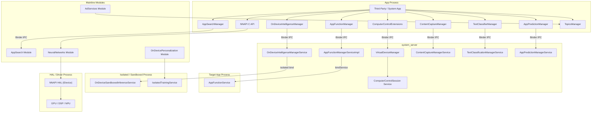
```mermaid
graph TB
    subgraph "App Process"
        APP[Third-Party / System App]
        AFM[AppFunctionManager]
        ODIM[OnDeviceIntelligenceManager]
        NNAPI_C["NNAPI C API"]
        CCExt[ComputerControlExtensions]
        ASM[AppSearchManager]
        TCM[TextClassifierManager]
        CCM[ContentCaptureManager]
        APM[AppPredictionManager]
        TM[TopicsManager]
    end

    subgraph "system_server"
        AFMS[AppFunctionManagerServiceImpl]
        ODIMS[OnDeviceIntelligenceManagerService]
        VDM[VirtualDeviceManager]
        CCS_SVC[ComputerControlSession Service]
        CCAS[ContentCaptureManagerService]
        TCMS[TextClassificationManagerService]
        APMS[AppPredictionManagerService]
    end

    subgraph "Target App Process"
        AFS[AppFunctionService]
    end

    subgraph "Isolated / Sandboxed Process"
        ODSIS[OnDeviceSandboxedInferenceService]
        ITS[IsolatedTrainingService]
    end

    subgraph "HAL / Driver Process"
        NNHAL["NNAPI HAL (IDevice)"]
        ACCEL["GPU / DSP / NPU"]
    end

    subgraph "Mainline Modules"
        APS["AppSearch Module"]
        NNM["NeuralNetworks Module"]
        ODP["OnDevicePersonalization Module"]
        ADS["AdServices Module"]
    end

    APP --> AFM
    APP --> ODIM
    APP --> NNAPI_C
    APP --> CCExt
    APP --> ASM
    APP --> TCM
    APP --> CCM
    APP --> APM
    APP --> TM

    AFM -- "Binder IPC" --> AFMS
    AFMS -- "bindService" --> AFS
    ODIM -- "Binder IPC" --> ODIMS
    ODIMS -- "isolated bind" --> ODSIS
    CCExt -- "Binder IPC" --> VDM
    VDM --> CCS_SVC
    CCM -- "Binder IPC" --> CCAS
    TCM -- "Binder IPC" --> TCMS
    APM -- "Binder IPC" --> APMS
    ASM -- "Binder IPC" --> APS

    NNAPI_C --> NNM
    NNM --> NNHAL
    NNHAL --> ACCEL

    ODP --> ITS
    ADS --> TM
```

### 50.1.1 Taxonomy of AOSP Intelligence Subsystems

| Subsystem | API Level | Module? | Purpose |
|-----------|-----------|---------|---------|
| **AppFunctions** | 16 (Android 16) | No (framework) | Typed cross-app function invocation |
| **Computer Control** | 16 (Android 16) | No (framework + extensions lib) | AI-driven UI automation via virtual display |
| **OnDeviceIntelligence** | 15+ | NeuralNetworks module | Sandboxed LLM / ML inference |
| **NNAPI** | 8.1+ | NeuralNetworks module | Hardware-accelerated neural network inference |
| **AppSearch** | 12+ | AppSearch module | On-device full-text search and indexing |
| **Content Capture** | 10+ | No (framework) | Real-time UI structure capture for intelligence |
| **TextClassifier** | 8.0+ | No (framework) | Entity recognition, language detection |
| **AppPrediction** | 10+ | No (framework) | Usage-based app ranking |
| **OnDevicePersonalization** | 14+ | ODP module | Federated compute, isolated training |
| **AdServices** | 13+ | AdServices module | Privacy-preserving ad targeting (Topics, FLEDGE) |

### 50.1.2 Cross-Cutting Design Themes

Several architectural themes recur across every AI subsystem:

1. **Process isolation.** Intelligence services run in isolated or sandboxed
   processes. `OnDeviceSandboxedInferenceService` declares
   `android:isolatedProcess="true"`. `IsolatedTrainingService` loads TFLite in
   a separate process. Even `ComputerControlSession` operates through a virtual
   display that is separated from the default display.

2. **Typed contracts over open-ended Bundles.** AppFunctions uses
   `GenericDocument` (from AppSearch) as its parameter wire format. ODI uses
   `PersistableBundle` for feature/request metadata. Both encourage
   SDK-level typed wrappers.

3. **AppSearch as the universal metadata store.** App function metadata, app
   prediction data, and content capture intelligence all converge on AppSearch
   for indexing and discovery.

4. **Permission-gated access with allowlisting.** AppFunctions gates execution
   behind `EXECUTE_APP_FUNCTIONS` plus a device-config agent allowlist.
   Computer Control requires `ACCESS_COMPUTER_CONTROL`. ODI requires
   `USE_ON_DEVICE_INTELLIGENCE`. AdServices requires
   `ACCESS_ADSERVICES_TOPICS`.

5. **Cancellation propagation.** Nearly every asynchronous API passes an
   `ICancellationSignal` transport across the Binder boundary, allowing the
   caller to abort long-running inference or function execution.

---

## 50.2 AppFunctions Framework

The AppFunctions framework, introduced as a beta feature in Android 16 (2024),
provides a standardized mechanism for AI assistants (agents) to discover and
invoke functionality exposed by arbitrary apps (targets). An assistant can
say "save XYZ into my notes" and the framework routes the request to the
appropriate `AppFunctionService` implementation without the assistant needing
any compile-time dependency on the note-taking app.

**Source tree overview:**

```
frameworks/base/core/java/android/app/appfunctions/
    AppFunctionManager.java              (973 lines)  -- Client-side system service
    AppFunctionService.java              (224 lines)  -- Abstract base for target apps
    ExecuteAppFunctionRequest.java       (270 lines)  -- Request parcelable
    ExecuteAppFunctionResponse.java      (206 lines)  -- Response parcelable
    AppFunctionException.java            (280 lines)  -- Typed error hierarchy
    AppFunctionAttribution.java          (292 lines)  -- Interaction provenance
    IAppFunctionManager.aidl             (97 lines)   -- System server AIDL
    IAppFunctionService.aidl             (50 lines)   -- Target app AIDL (oneway)
    IExecuteAppFunctionCallback.aidl                  -- Async result callback
    ICancellationCallback.aidl                        -- Cancellation transport
    ...
frameworks/base/services/appfunctions/
    java/com/android/server/appfunctions/
        AppFunctionManagerServiceImpl.java            -- IAppFunctionManager.Stub
        RemoteServiceCallerImpl.java                  -- Service binding logic
        CallerValidatorImpl.java                      -- Permission enforcement
        MetadataSyncAdapter.java                      -- AppSearch metadata sync
        AppFunctionAccessHistory.java                 -- Access audit trail
        AppFunctionAgentAllowlistStorage.java         -- Agent allowlist
        ...
```

### 50.2.1 Architecture Overview

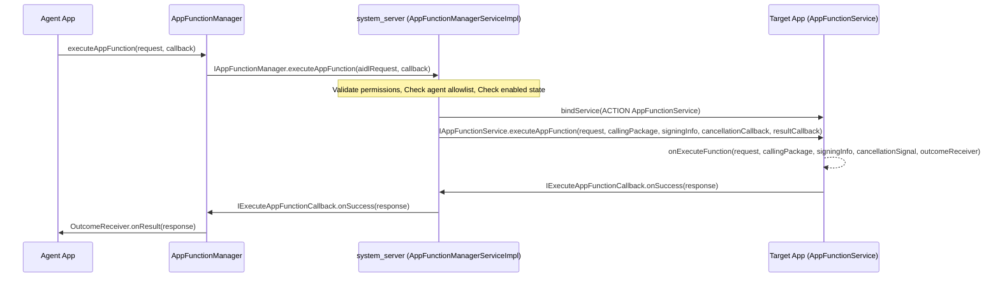
```mermaid
sequenceDiagram
    participant Agent as Agent App
    participant AFM as AppFunctionManager
    participant SS as system_server (AppFunctionManagerServiceImpl)
    participant AFS as Target App (AppFunctionService)

    Agent->>AFM: executeAppFunction(request, callback)
    AFM->>SS: IAppFunctionManager.executeAppFunction(aidlRequest, callback)
    Note over SS: Validate permissions, Check agent allowlist, Check enabled state
    SS->>AFS: bindService(ACTION AppFunctionService)
    SS->>AFS: IAppFunctionService.executeAppFunction(request, callingPackage, signingInfo, cancellationCallback, resultCallback)
    AFS-->>AFS: onExecuteFunction(request, callingPackage, signingInfo, cancellationSignal, outcomeReceiver)
    AFS->>SS: IExecuteAppFunctionCallback.onSuccess(response)
    SS->>AFM: IExecuteAppFunctionCallback.onSuccess(response)
    AFM->>Agent: OutcomeReceiver.onResult(response)
```

### 50.2.2 The Client: AppFunctionManager

`AppFunctionManager` is registered as a system service under
`Context.APP_FUNCTION_SERVICE`:

```
// frameworks/base/core/java/android/app/appfunctions/AppFunctionManager.java

@FlaggedApi(FLAG_ENABLE_APP_FUNCTION_MANAGER)
@SystemService(Context.APP_FUNCTION_SERVICE)
public final class AppFunctionManager {
```

The primary API is `executeAppFunction()`, which takes four parameters:

```java
// frameworks/base/core/java/android/app/appfunctions/AppFunctionManager.java

@RequiresPermission(value = Manifest.permission.EXECUTE_APP_FUNCTIONS, conditional = true)
@UserHandleAware
public void executeAppFunction(
        @NonNull ExecuteAppFunctionRequest request,
        @NonNull @CallbackExecutor Executor executor,
        @NonNull CancellationSignal cancellationSignal,
        @NonNull OutcomeReceiver<ExecuteAppFunctionResponse, AppFunctionException> callback) {
```

Internally, the manager wraps the public request into an
`ExecuteAppFunctionAidlRequest` that adds caller identity and timing:

```java
ExecuteAppFunctionAidlRequest aidlRequest =
        new ExecuteAppFunctionAidlRequest(
                request,
                mContext.getUser(),
                mContext.getPackageName(),
                /* requestTime= */ SystemClock.elapsedRealtime(),
                /* requestWallTime= */ System.currentTimeMillis());
```

The Binder call returns an `ICancellationSignal` transport that is
wired back to the caller's `CancellationSignal`:

```java
ICancellationSignal cancellationTransport =
        mService.executeAppFunction(
                aidlRequest,
                new IExecuteAppFunctionCallback.Stub() {
                    @Override
                    public void onSuccess(ExecuteAppFunctionResponse result) {
                        executor.execute(() -> callback.onResult(result));
                    }
                    @Override
                    public void onError(AppFunctionException exception) {
                        executor.execute(() -> callback.onError(exception));
                    }
                });
if (cancellationTransport != null) {
    cancellationSignal.setRemote(cancellationTransport);
}
```

### 50.2.3 Enabled State Management

Each app function has a tri-state lifecycle:

| Constant | Value | Meaning |
|----------|-------|---------|
| `APP_FUNCTION_STATE_DEFAULT` | 0 | Reset to the default (typically enabled) |
| `APP_FUNCTION_STATE_ENABLED` | 1 | Explicitly enabled |
| `APP_FUNCTION_STATE_DISABLED` | 2 | Explicitly disabled |

Apps control their own functions via `setAppFunctionEnabled()`:

```java
// frameworks/base/core/java/android/app/appfunctions/AppFunctionManager.java

@UserHandleAware
public void setAppFunctionEnabled(
        @NonNull String functionIdentifier,
        @EnabledState int newEnabledState,
        @NonNull Executor executor,
        @NonNull OutcomeReceiver<Void, Exception> callback) {
```

The enabled state is persisted in AppSearch as an
`AppFunctionRuntimeMetadata` document, which is separate from the
`AppFunctionStaticMetadata` that describes the function's schema.

### 50.2.4 Access Control Model

The AppFunctions access model operates on three levels:

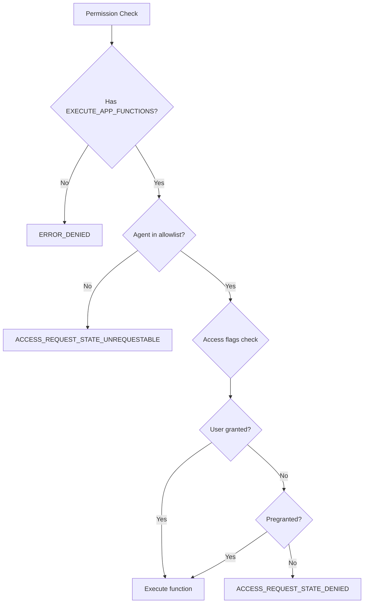
```mermaid
graph TD
    A[Permission Check] --> B{Has EXECUTE_APP_FUNCTIONS?}
    B -->|No| C[ERROR_DENIED]
    B -->|Yes| D{Agent in allowlist?}
    D -->|No| E[ACCESS_REQUEST_STATE_UNREQUESTABLE]
    D -->|Yes| F{Access flags check}
    F --> G{User granted?}
    G -->|Yes| H[Execute function]
    G -->|No| I{Pregranted?}
    I -->|Yes| H
    I -->|No| J[ACCESS_REQUEST_STATE_DENIED]
```

Access flags are a bitmask stored per (agent, target) pair:

| Flag | Value | Meaning |
|------|-------|---------|
| `ACCESS_FLAG_PREGRANTED` | 0x01 | System pre-granted the access |
| `ACCESS_FLAG_OTHER_GRANTED` | 0x02 | Granted via ADB or other mechanism |
| `ACCESS_FLAG_OTHER_DENIED` | 0x04 | Denied via ADB or self-revoke |
| `ACCESS_FLAG_USER_GRANTED` | 0x08 | User explicitly granted via UI |
| `ACCESS_FLAG_USER_DENIED` | 0x10 | User explicitly denied via UI |

The agent allowlist is maintained via DeviceConfig under the
`machine_learning` namespace with key `allowlisted_app_functions_agents`,
plus an additional per-device override in
`Settings.Secure.APP_FUNCTION_ADDITIONAL_AGENT_ALLOWLIST`.

```java
// frameworks/base/services/appfunctions/.../AppFunctionManagerServiceImpl.java

private static final String ALLOWLISTED_APP_FUNCTIONS_AGENTS =
        "allowlisted_app_functions_agents";
private static final String NAMESPACE_MACHINE_LEARNING = "machine_learning";
```

The `CallerValidatorImpl` class checks both the runtime permission and the
allowlist before any execution proceeds.

### 50.2.5 The AIDL Interfaces

The framework defines two AIDL interfaces -- one facing the client, one facing
the target app.

**IAppFunctionManager** (client-to-system\_server):

```
// frameworks/base/core/java/android/app/appfunctions/IAppFunctionManager.aidl

interface IAppFunctionManager {
    ICancellationSignal executeAppFunction(
        in ExecuteAppFunctionAidlRequest request,
        in IExecuteAppFunctionCallback callback);

    void setAppFunctionEnabled(
        in String callingPackage,
        in String functionIdentifier,
        in UserHandle userHandle,
        int enabledState,
        in IAppFunctionEnabledCallback callback);

    int getAccessRequestState(
        in String agentPackageName, int agentUserId,
        in String targetPackageName, int targetUserId);

    int getAccessFlags(...);
    boolean updateAccessFlags(...);
    void revokeSelfAccess(in String targetPackageName);
    List<String> getValidAgents(int userId);
    List<String> getValidTargets(int targetUserId);
    List<SignedPackageParcel> getAgentAllowlist();
    void clearAccessHistory(int userId);
    Intent createRequestAccessIntent(in String targetPackageName);
}
```

**IAppFunctionService** (system\_server-to-target app, `oneway`):

```
// frameworks/base/core/java/android/app/appfunctions/IAppFunctionService.aidl

oneway interface IAppFunctionService {
    void executeAppFunction(
        in ExecuteAppFunctionRequest request,
        in String callingPackage,
        in android.content.pm.SigningInfo callingPackageSigningInfo,
        in ICancellationCallback cancellationCallback,
        in IExecuteAppFunctionCallback callback);
}
```

The `oneway` modifier is critical: the system\_server does not block waiting
for the target app to finish. Results flow back through the
`IExecuteAppFunctionCallback`.

### 50.2.6 The Target: AppFunctionService

Target apps extend `AppFunctionService` and implement a single abstract method:

```java
// frameworks/base/core/java/android/app/appfunctions/AppFunctionService.java

@MainThread
public abstract void onExecuteFunction(
        @NonNull ExecuteAppFunctionRequest request,
        @NonNull String callingPackage,
        @NonNull SigningInfo callingPackageSigningInfo,
        @NonNull CancellationSignal cancellationSignal,
        @NonNull OutcomeReceiver<ExecuteAppFunctionResponse, AppFunctionException> callback);
```

The service enforces that only system\_server (which holds
`BIND_APP_FUNCTION_SERVICE`) can call it:

```java
// frameworks/base/core/java/android/app/appfunctions/AppFunctionService.java

if (context.checkCallingPermission(BIND_APP_FUNCTION_SERVICE)
        == PERMISSION_DENIED) {
    throw new SecurityException("Can only be called by the system server.");
}
```

The manifest declaration requires the binding permission:

```xml
<service android:name=".YourService"
       android:permission="android.permission.BIND_APP_FUNCTION_SERVICE">
    <intent-filter>
      <action android:name="android.app.appfunctions.AppFunctionService" />
    </intent-filter>
</service>
```

### 50.2.7 Request and Response Wire Format

Both `ExecuteAppFunctionRequest` and `ExecuteAppFunctionResponse` use
AppSearch's `GenericDocument` as their parameter wire format. This is not
arbitrary -- it ensures that function parameters can be described by a schema
that AppSearch already knows how to index and query.

**Request:**

```java
// frameworks/base/core/java/android/app/appfunctions/ExecuteAppFunctionRequest.java

public final class ExecuteAppFunctionRequest implements Parcelable {
    @NonNull private final String mTargetPackageName;
    @NonNull private final String mFunctionIdentifier;
    @NonNull private final Bundle mExtras;
    @NonNull private final GenericDocumentWrapper mParameters;
    @Nullable private final AppFunctionAttribution mAttribution;
```

**Response:**

```java
// frameworks/base/core/java/android/app/appfunctions/ExecuteAppFunctionResponse.java

public final class ExecuteAppFunctionResponse implements Parcelable {
    public static final String PROPERTY_RETURN_VALUE = "androidAppfunctionsReturnValue";
    @NonNull private final GenericDocumentWrapper mResultDocumentWrapper;
    @NonNull private final Bundle mExtras;
    @NonNull private final List<AppFunctionUriGrant> mUriGrants;
```

The return value lives at the key `PROPERTY_RETURN_VALUE` inside the result
`GenericDocument`. The `AppFunction SDK` (a separate Jetpack library) provides
typed wrappers that pack/unpack these documents.

### 50.2.8 Attribution and Audit Trail

Every execution can carry an `AppFunctionAttribution` describing the
interaction that triggered it:

```java
// frameworks/base/core/java/android/app/appfunctions/AppFunctionAttribution.java

public static final int INTERACTION_TYPE_OTHER = 0;
public static final int INTERACTION_TYPE_USER_QUERY = 1;
public static final int INTERACTION_TYPE_USER_SCHEDULED = 2;
```

The system records these attributions in an access history database
(`AppFunctionSQLiteAccessHistory` / `MultiUserAppFunctionAccessHistory`)
exposed through a content provider at:

```
content://com.android.appfunction.accesshistory/user/{userId}
```

The access history schema includes:

| Column | Type | Description |
|--------|------|-------------|
| `agent_package_name` | TEXT | The AI agent that made the call |
| `target_package_name` | TEXT | The app that was invoked |
| `interaction_type` | INT | Interaction type constant |
| `interaction_uri` | TEXT | Link back to interaction context |
| `thread_id` | TEXT | Groups related function calls |
| `access_time` | LONG | Timestamp in milliseconds |
| `access_duration` | LONG | Execution duration in milliseconds |

### 50.2.9 Error Handling

`AppFunctionException` defines a categorized error code scheme:

```java
// frameworks/base/core/java/android/app/appfunctions/AppFunctionException.java

// Request errors (1000-1999)
public static final int ERROR_DENIED = 1000;
public static final int ERROR_INVALID_ARGUMENT = 1001;
public static final int ERROR_DISABLED = 1002;
public static final int ERROR_FUNCTION_NOT_FOUND = 1003;

// System errors (2000-2999)
public static final int ERROR_SYSTEM_ERROR = 2000;
public static final int ERROR_CANCELLED = 2001;
public static final int ERROR_ENTERPRISE_POLICY_DISALLOWED = 2002;

// App errors (3000-3999)
public static final int ERROR_APP_UNKNOWN_ERROR = 3000;
```

The `getErrorCategory()` method maps ranges to categories:

```java
public int getErrorCategory() {
    if (mErrorCode >= 1000 && mErrorCode < 2000) return ERROR_CATEGORY_REQUEST_ERROR;
    if (mErrorCode >= 2000 && mErrorCode < 3000) return ERROR_CATEGORY_SYSTEM;
    if (mErrorCode >= 3000 && mErrorCode < 4000) return ERROR_CATEGORY_APP;
    return ERROR_CATEGORY_UNKNOWN;
}
```

### 50.2.10 System Server Implementation

The service implementation in
`frameworks/base/services/appfunctions/java/com/android/server/appfunctions/AppFunctionManagerServiceImpl.java`
extends `IAppFunctionManager.Stub` and coordinates:

```java
// frameworks/base/services/appfunctions/.../AppFunctionManagerServiceImpl.java

public class AppFunctionManagerServiceImpl extends IAppFunctionManager.Stub {
    private final RemoteServiceCaller<IAppFunctionService> mRemoteServiceCaller;
    private final CallerValidator mCallerValidator;
    private final AppFunctionAccessServiceInterface mAppFunctionAccessService;
    private final IUriGrantsManager mUriGrantsManager;
    private final MultiUserAppFunctionAccessHistory mMultiUserAppFunctionAccessHistory;
    ...
```

Key supporting classes:

| Class | Responsibility |
|-------|---------------|
| `RemoteServiceCallerImpl` | Binds to target `AppFunctionService`, manages connection lifecycle |
| `CallerValidatorImpl` | Enforces `EXECUTE_APP_FUNCTIONS`, checks allowlist |
| `MetadataSyncAdapter` | Syncs function metadata to AppSearch on package changes |
| `AppFunctionPackageMonitor` | Watches for package install/update/remove |
| `FutureAppSearchSessionImpl` | Async wrapper around AppSearch sessions |
| `AppFunctionAgentAllowlistStorage` | Persists agent allowlist from DeviceConfig + Settings |
| `AppFunctionSQLiteAccessHistory` | SQLite backend for the access audit trail |

### 50.2.11 Function Discovery via AppSearch

When a package is installed, updated, or the device boots, the
`MetadataSyncAdapter` extracts app function metadata from the target app's
`AppFunctionService` and indexes it as `AppFunctionStaticMetadata` documents
in AppSearch. Agents discover functions by querying AppSearch:

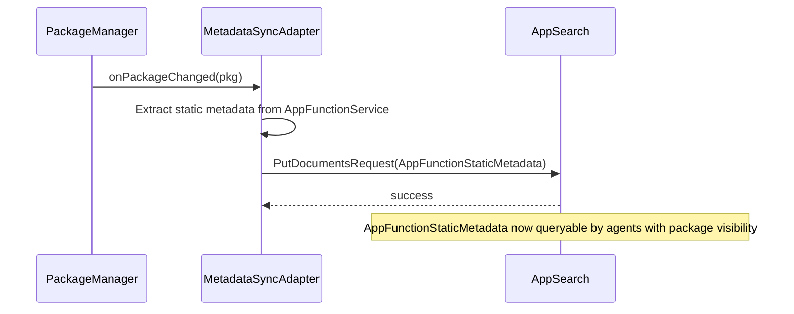
```mermaid
sequenceDiagram
    participant PM as PackageManager
    participant MSync as MetadataSyncAdapter
    participant AS as AppSearch

    PM->>MSync: onPackageChanged(pkg)
    MSync->>MSync: Extract static metadata from AppFunctionService
    MSync->>AS: PutDocumentsRequest(AppFunctionStaticMetadata)
    AS-->>MSync: success

    Note over AS: AppFunctionStaticMetadata now queryable by agents with package visibility
```

### 50.2.12 SafeOneTimeExecuteAppFunctionCallback

A critical defensive wrapper ensures exactly-once delivery:

```java
// frameworks/base/core/java/android/app/appfunctions/SafeOneTimeExecuteAppFunctionCallback.java

public class SafeOneTimeExecuteAppFunctionCallback {
    private final AtomicBoolean mOnResultCalled = new AtomicBoolean(false);
    @NonNull private final IExecuteAppFunctionCallback mCallback;
    @Nullable private final CompletionCallback mCompletionCallback;
    @Nullable private final BeforeCompletionCallback mBeforeCompletionCallback;
    private final AtomicLong mExecutionStartTimeAfterBindMillis = new AtomicLong();

    public void onResult(@NonNull ExecuteAppFunctionResponse result) {
        if (!mOnResultCalled.compareAndSet(false, true)) {
            Log.w(TAG, "Ignore subsequent calls to onResult/onError()");
            return;
        }
        try {
            if (mBeforeCompletionCallback != null) {
                mBeforeCompletionCallback.beforeOnSuccess(result);
            }
            mCallback.onSuccess(result);
            if (mCompletionCallback != null) {
                mCompletionCallback.finalizeOnSuccess(
                        result, mExecutionStartTimeAfterBindMillis.get());
            }
        } catch (RemoteException ex) {
            Log.w(TAG, "Failed to invoke the callback", ex);
        }
    }

    public void onError(@NonNull AppFunctionException error) {
        if (!mOnResultCalled.compareAndSet(false, true)) {
            Log.w(TAG, "Ignore subsequent calls to onResult/onError()");
            return;
        }
        try {
            mCallback.onError(error);
            if (mCompletionCallback != null) {
                mCompletionCallback.finalizeOnError(
                        error, mExecutionStartTimeAfterBindMillis.get());
            }
        } catch (RemoteException ex) {
            Log.w(TAG, "Failed to invoke the callback", ex);
        }
    }
```

This design pattern is essential because:

1. **Target apps might call back multiple times** -- The `AppFunctionService`
   is third-party code that might erroneously invoke the callback twice.
   The `AtomicBoolean.compareAndSet()` ensures only the first call succeeds.

2. **RemoteException swallowing** -- If the calling process has died by the
   time the result arrives, the `RemoteException` is logged and swallowed
   rather than crashing the system server.

3. **Completion hooks** -- The `BeforeCompletionCallback` and
   `CompletionCallback` allow the system server to perform actions (like
   logging, URI grants, and access history recording) around the callback
   delivery:

```java
    public interface CompletionCallback {
        void finalizeOnSuccess(
                ExecuteAppFunctionResponse result, long executionStartTimeMillis);
        void finalizeOnError(
                AppFunctionException error, long executionStartTimeMillis);
    }

    public interface BeforeCompletionCallback {
        void beforeOnSuccess(ExecuteAppFunctionResponse result);
    }
```

4. **Latency tracking** -- The `mExecutionStartTimeAfterBindMillis` field
   records when execution began after service binding completed, allowing
   the system to distinguish binding overhead from execution time.

5. **Disable mechanism** -- The `disable()` method can prevent any further
   callback delivery, used when the request is cancelled or timed out.

### 50.2.13 The executeAppFunction Implementation Deep Dive

The system server's `executeAppFunction` method is the most critical path in
the entire framework. Let us trace it line by line from the AIDL entry point
through to the target service binding.

**Step 1: Entry and initial validation.**

```java
// frameworks/base/services/appfunctions/.../AppFunctionManagerServiceImpl.java

@Override
public ICancellationSignal executeAppFunction(
        @NonNull ExecuteAppFunctionAidlRequest requestInternal,
        @NonNull IExecuteAppFunctionCallback executeAppFunctionCallback) {

    int callingUid = Binder.getCallingUid();
    int callingPid = Binder.getCallingPid();

    final SafeOneTimeExecuteAppFunctionCallback safeExecuteAppFunctionCallback =
            initializeSafeExecuteAppFunctionCallback(
                    requestInternal, executeAppFunctionCallback, callingUid);

    String validatedCallingPackage;
    try {
        validatedCallingPackage =
                mCallerValidator.validateCallingPackage(requestInternal.getCallingPackage());
        mCallerValidator.verifyTargetUserHandle(
                requestInternal.getUserHandle(), validatedCallingPackage);
    } catch (SecurityException exception) {
        safeExecuteAppFunctionCallback.onError(
                new AppFunctionException(
                        AppFunctionException.ERROR_DENIED, exception.getMessage()));
        return null;
    }
```

The `SafeOneTimeExecuteAppFunctionCallback` wrapper ensures that exactly one
response (success or error) is delivered, even if the target app sends multiple
replies or crashes before responding.

**Step 2: Asynchronous execution on the thread pool.**

```java
    ICancellationSignal localCancelTransport = CancellationSignal.createTransport();

    THREAD_POOL_EXECUTOR.execute(
            () -> {
                try {
                    executeAppFunctionInternal(
                            requestInternal,
                            callingUid, callingPid,
                            localCancelTransport,
                            safeExecuteAppFunctionCallback,
                            executeAppFunctionCallback.asBinder());
                } catch (Exception e) {
                    safeExecuteAppFunctionCallback.onError(
                            mapExceptionToExecuteAppFunctionResponse(e));
                }
            });
    return localCancelTransport;
}
```

The work is dispatched to `THREAD_POOL_EXECUTOR` (defined in
`AppFunctionExecutors`) to avoid blocking the Binder thread pool.

**Step 3: Permission and state validation.**

```java
@WorkerThread
private void executeAppFunctionInternal(...) {
    // Enterprise policy check
    if (!mCallerValidator.verifyEnterprisePolicyIsAllowed(callingUser, targetUser)) {
        safeExecuteAppFunctionCallback.onError(
                new AppFunctionException(
                        AppFunctionException.ERROR_ENTERPRISE_POLICY_DISALLOWED, ...));
        return;
    }

    // Empty target package check
    if (TextUtils.isEmpty(targetPackageName)) {
        safeExecuteAppFunctionCallback.onError(
                new AppFunctionException(
                        AppFunctionException.ERROR_INVALID_ARGUMENT, ...));
        return;
    }
```

**Step 4: Future-chained permission and enabled-state checks.**

The implementation uses `AndroidFuture.thenCompose()` for non-blocking
permission verification followed by AppSearch-backed enabled-state lookup:

```java
    mCallerValidator
            .verifyCallerCanExecuteAppFunction(
                    callingUid, callingPid, targetUser,
                    requestInternal.getCallingPackage(),
                    targetPackageName,
                    requestInternal.getClientRequest().getFunctionIdentifier())
            .thenCompose(canExecuteResult -> {
                if (canExecuteResult == CAN_EXECUTE_APP_FUNCTIONS_DENIED) {
                    return AndroidFuture.failedFuture(
                            new SecurityException("Caller does not have permission"));
                }
                return isAppFunctionEnabled(
                        functionIdentifier, targetPackageName,
                        getAppSearchManagerAsUser(userHandle), THREAD_POOL_EXECUTOR)
                    .thenApply(isEnabled -> {
                        if (!isEnabled) {
                            throw new DisabledAppFunctionException("Disabled");
                        }
                        return canExecuteResult;
                    });
            })
```

**Step 5: Service resolution and binding.**

```java
            .thenAccept(canExecuteResult -> {
                int bindFlags = Context.BIND_AUTO_CREATE;
                if (canExecuteResult
                        == CAN_EXECUTE_APP_FUNCTIONS_ALLOWED_HAS_PERMISSION) {
                    bindFlags |= Context.BIND_FOREGROUND_SERVICE;
                }
                Intent serviceIntent =
                        mInternalServiceHelper.resolveAppFunctionService(
                                targetPackageName, targetUser);
                // Grant implicit visibility to allow target to see caller
                mPackageManagerInternal.grantImplicitAccess(
                        grantRecipientUserId, serviceIntent,
                        grantRecipientAppId, callingUid, /* direct= */ true);
                bindAppFunctionServiceUnchecked(
                        requestInternal, serviceIntent, targetUser,
                        localCancelTransport, safeExecuteAppFunctionCallback,
                        bindFlags, callerBinder, callingUid);
            })
```

This reveals an important detail: when the caller has
`EXECUTE_APP_FUNCTIONS`, the system uses `BIND_FOREGROUND_SERVICE` to elevate
the target service's process priority. Self-calls (same package) do not get
this elevation.

### 50.2.14 The RemoteServiceCaller Pattern

`RemoteServiceCallerImpl` implements the one-shot service binding pattern:

```java
// frameworks/base/services/appfunctions/.../RemoteServiceCallerImpl.java

public class RemoteServiceCallerImpl<T> implements RemoteServiceCaller<T> {
    public boolean runServiceCall(
            Intent intent, int bindFlags, UserHandle userHandle,
            long cancellationTimeoutMillis, CancellationSignal cancellationSignal,
            RunServiceCallCallback<T> callback, IBinder callerBinder) {

        OneOffServiceConnection serviceConnection =
                new OneOffServiceConnection(intent, bindFlags, userHandle,
                        cancellationTimeoutMillis, cancellationSignal,
                        callback, callerBinder);
        return serviceConnection.bindAndRun();
    }
```

The `OneOffServiceConnection` is a `ServiceConnection` that:

1. Calls `Context.bindServiceAsUser()` to connect to the target
2. Sets a cancellation listener that triggers unbinding after a timeout
3. Links to the caller's binder death to cancel if the caller dies
4. Unbinds automatically after the callback completes

```java
private class OneOffServiceConnection
        implements ServiceConnection, ServiceUsageCompleteListener {

    public boolean bindAndRun() {
        boolean bindServiceResult =
                mContext.bindServiceAsUser(mIntent, this, mFlags, mUserHandle);

        if (bindServiceResult) {
            mCancellationSignal.setOnCancelListener(() -> {
                mCallback.onCancelled();
                mHandler.postDelayed(mCancellationTimeoutRunnable,
                        mCancellationTimeoutMillis);
            });
            mDirectServiceVulture = () -> {
                Slog.w(TAG, "Caller process onDeath signal received");
                mCancellationSignal.cancel();
            };
            mCallerBinder.linkToDeath(mDirectServiceVulture, 0);
        }
        return bindServiceResult;
    }
```

This pattern ensures that the service connection is always cleaned up,
even if the caller crashes, the target crashes, or the user cancels.

### 50.2.15 Multi-User Support

The service implementation is multi-user aware. Each user has:

- Their own AppSearch database for function metadata
- Their own `PackageMonitor` for tracking package changes
- Their own access history database
- Separate access flags per (agent, target) pair

```java
// AppFunctionManagerServiceImpl.java

public void onUserUnlocked(TargetUser user) {
    registerAppSearchObserver(user);
    trySyncRuntimeMetadata(user);
    PackageMonitor pkgMonitorForUser =
            AppFunctionPackageMonitor.registerPackageMonitorForUser(mContext, user);
    mPackageMonitors.append(user.getUserIdentifier(), pkgMonitorForUser);
    if (accessCheckFlagsEnabled()) {
        mMultiUserAppFunctionAccessHistory.onUserUnlocked(user);
    }
}

public void onUserStopping(@NonNull TargetUser user) {
    MetadataSyncPerUser.removeUserSyncAdapter(user.getUserHandle());
    mPackageMonitors.get(userIdentifier).unregister();
    mPackageMonitors.delete(userIdentifier);
    mMultiUserAppFunctionAccessHistory.onUserStopping(user);
}
```

### 50.2.16 Agent Allowlist Architecture

The agent allowlist has three tiers, merged at boot and on configuration
changes:

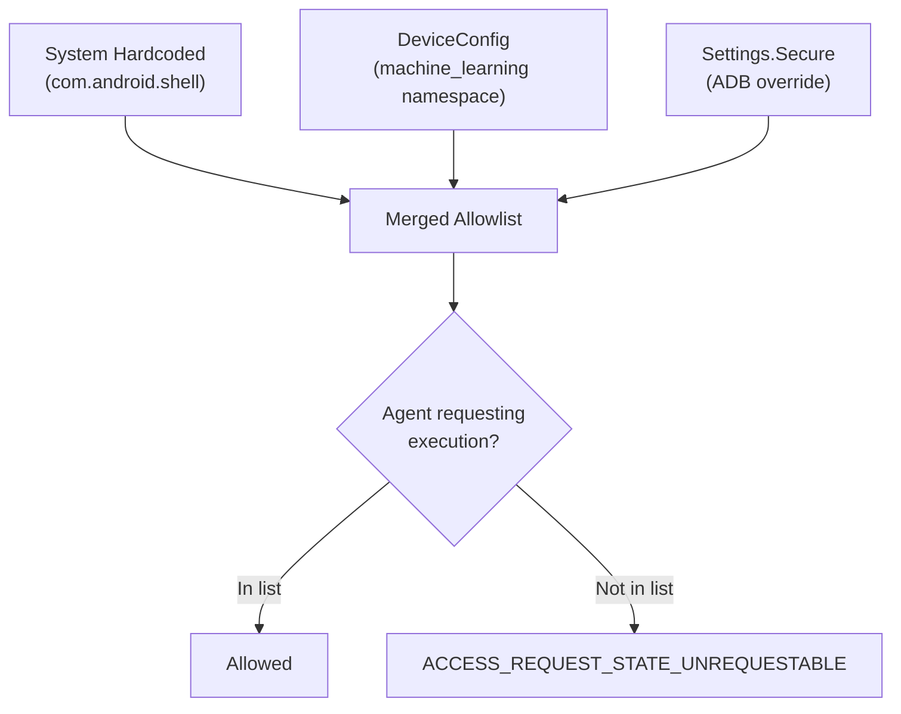
```mermaid
graph TD
    A["System Hardcoded<br/>(com.android.shell)"] --> D[Merged Allowlist]
    B["DeviceConfig<br/>(machine_learning namespace)"] --> D
    C["Settings.Secure<br/>(ADB override)"] --> D

    D --> E{"Agent requesting<br/>execution?"}
    E -->|In list| F[Allowed]
    E -->|Not in list| G[ACCESS_REQUEST_STATE_UNREQUESTABLE]
```

```java
// AppFunctionManagerServiceImpl.java

private static final List<SignedPackage> sSystemAllowlist =
        List.of(new SignedPackage(SHELL_PKG, null));

@GuardedBy("mAgentAllowlistLock")
private List<SignedPackage> mUpdatableAgentAllowlist = Collections.emptyList();

@GuardedBy("mAgentAllowlistLock")
private List<SignedPackage> mSecureSettingAgentAllowlist = Collections.emptyList();

@GuardedBy("mAgentAllowlistLock")
private ArraySet<SignedPackage> mAgentAllowlist = new ArraySet<>(sSystemAllowlist);
```

The `DeviceConfig.OnPropertiesChangedListener` reloads the allowlist when
the server-side configuration changes:

```java
private final DeviceConfig.OnPropertiesChangedListener mDeviceConfigListener =
        properties -> {
            if (properties.getKeyset().contains(ALLOWLISTED_APP_FUNCTIONS_AGENTS)) {
                updateAgentAllowlist(true, false);
            }
        };
```

A `ContentObserver` watches for the ADB override:

```java
private final ContentObserver mAdbAgentObserver =
        new ContentObserver(FgThread.getHandler()) {
            @Override
            public void onChange(boolean selfChange, Uri uri) {
                if (!ADDITIONAL_AGENTS_URI.equals(uri)) return;
                updateAgentAllowlist(false, true);
            }
        };
```

### 50.2.17 URI Grants for AppFunction Responses

When a target app returns content URIs in its response, the framework can
grant temporary URI permissions to the calling agent:

```java
// AppFunctionManagerServiceImpl.java

private final IUriGrantsManager mUriGrantsManager;
private final UriGrantsManagerInternal mUriGrantsManagerInternal;
private final IBinder mPermissionOwner;

// In constructor:
mPermissionOwner = mUriGrantsManagerInternal.newUriPermissionOwner("appfunctions");
```

The `AppFunctionUriGrant` objects in the response specify which URIs should be
granted. These grants typically persist until device reboot.

### 50.2.18 Shell Command Support

The service implements `onShellCommand()` for developer debugging:

```java
// AppFunctionManagerServiceImpl.java

@Override
public void onShellCommand(
        FileDescriptor in, FileDescriptor out, FileDescriptor err,
        @NonNull String[] args, ShellCallback callback,
        @NonNull ResultReceiver resultReceiver) {
    new AppFunctionManagerServiceShellCommand(mContext, this)
            .exec(this, in, out, err, args, callback, resultReceiver);
}
```

Available via `adb shell cmd app_function`.

### 50.2.19 Boot Phase Handling

The service initializes its configuration during the
`PHASE_SYSTEM_SERVICES_READY` boot phase:

```java
public void onBootPhase(int phase) {
    if (phase == SystemService.PHASE_SYSTEM_SERVICES_READY) {
        mBackgroundExecutor.execute(() ->
                updateAgentAllowlist(true, true));
        DeviceConfig.addOnPropertiesChangedListener(
                NAMESPACE_MACHINE_LEARNING, mBackgroundExecutor, mDeviceConfigListener);
        mContext.getContentResolver()
                .registerContentObserver(ADDITIONAL_AGENTS_URI, false, mAdbAgentObserver);
    }
}
```

---

## 50.3 Computer Control

Computer Control is Android 16's framework for allowing AI agents to
programmatically interact with applications through a virtual display. Instead
of requiring apps to implement specific APIs, an agent can launch any app on a
headless virtual display, observe the screen via screenshots, inject tap/swipe
events, and read accessibility trees -- the same paradigm used by "computer
use" AI agents.

**Source tree:**

```
frameworks/base/core/java/android/companion/virtual/computercontrol/
    ComputerControlSession.java          (490 lines) -- Core session API
    ComputerControlSessionParams.java    (280 lines) -- Session configuration
    InteractiveMirrorDisplay.java         (72 lines) -- Mirror display for user view
    AutomatedPackageListener.java                    -- Package change notifications
    IComputerControlSession.aidl                     -- Session Binder interface
    IComputerControlSessionCallback.aidl             -- Creation lifecycle callback
    IComputerControlStabilityListener.aidl           -- UI stability signal
    IInteractiveMirrorDisplay.aidl                   -- Mirror display interface

frameworks/base/libs/computercontrol/              -- Extension library
    src/com/android/extensions/computercontrol/
        ComputerControlExtensions.java   (206 lines) -- Entry point
        ComputerControlSession.java      (684 lines) -- Extension session wrapper
        InteractiveMirror.java                       -- Mirror abstraction
        EventIdleTracker.java                        -- UI idle detection
        StabilityHintCallbackTracker.java            -- Stability signals
        AutomatedPackageListener.java                -- Extension listener
        input/KeyEvent.java                          -- Input event wrapper
        input/TouchEvent.java                        -- Touch event wrapper
        view/MirrorView.java                         -- Mirror display view
```

### 50.3.1 Architecture

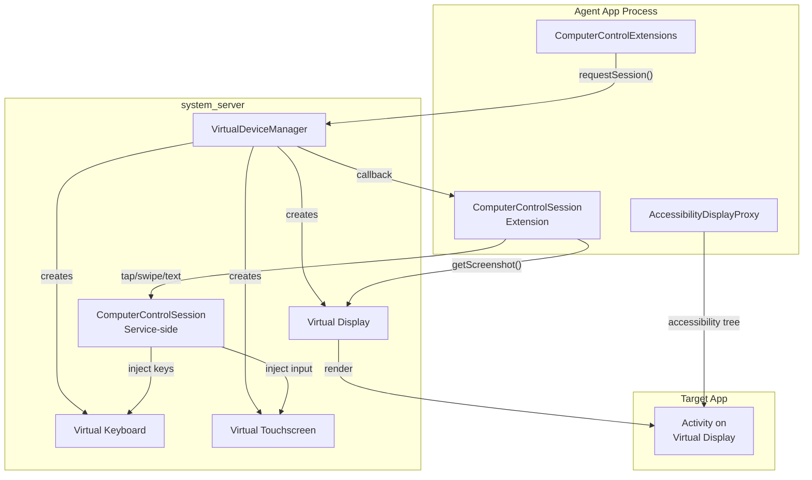
```mermaid
graph TB
    subgraph "Agent App Process"
        CCE[ComputerControlExtensions]
        CCS_EXT["ComputerControlSession<br/>Extension"]
        AP[AccessibilityDisplayProxy]
    end

    subgraph "system_server"
        VDM[VirtualDeviceManager]
        CCS_SVC["ComputerControlSession<br/>Service-side"]
        VD[Virtual Display]
        VKB[Virtual Keyboard]
        VTS[Virtual Touchscreen]
    end

    subgraph "Target App"
        ACTIVITY["Activity on<br/>Virtual Display"]
    end

    CCE -- "requestSession()" --> VDM
    VDM -- "creates" --> VD
    VDM -- "creates" --> VKB
    VDM -- "creates" --> VTS
    VDM -- "callback" --> CCS_EXT
    CCS_EXT -- "tap/swipe/text" --> CCS_SVC
    CCS_SVC -- "inject input" --> VTS
    CCS_SVC -- "inject keys" --> VKB
    VD -- "render" --> ACTIVITY
    CCS_EXT -- "getScreenshot()" --> VD
    AP -- "accessibility tree" --> ACTIVITY
```

### 50.3.2 Session Lifecycle

The entry point is `ComputerControlExtensions.getInstance()`, which checks for
`FEATURE_ACTIVITIES_ON_SECONDARY_DISPLAYS` and `VirtualDeviceManager`
availability:

```java
// frameworks/base/libs/computercontrol/.../ComputerControlExtensions.java

private static boolean isAvailable(Context context) {
    if (!context.getPackageManager().hasSystemFeature(
                PackageManager.FEATURE_ACTIVITIES_ON_SECONDARY_DISPLAYS)) {
        return false;
    }
    return context.getSystemService(VirtualDeviceManager.class) != null;
}
```

Session creation flows through `requestSession()` which requires
`ACCESS_COMPUTER_CONTROL`:

```java
// frameworks/base/libs/computercontrol/.../ComputerControlExtensions.java

@RequiresPermission(Manifest.permission.ACCESS_COMPUTER_CONTROL)
public void requestSession(@NonNull ComputerControlSession.Params params,
        @NonNull Executor executor, @NonNull ComputerControlSession.Callback callback) {
    // Build platform params
    ComputerControlSessionParams sessionParams =
            new ComputerControlSessionParams.Builder()
                    .setName(params.getName())
                    .setTargetPackageNames(params.getTargetPackageNames())
                    .setDisplayWidthPx(params.getDisplayWidthPx())
                    .setDisplayHeightPx(params.getDisplayHeightPx())
                    .setDisplayDpi(params.getDisplayDpi())
                    .setDisplaySurface(params.getDisplaySurface())
                    .setDisplayAlwaysUnlocked(params.isDisplayAlwaysUnlocked())
                    .build();

    VirtualDeviceManager vdm = params.getContext().getSystemService(VirtualDeviceManager.class);
    vdm.requestComputerControlSession(sessionParams, executor, sessionCallback);
}
```

The callback lifecycle mirrors VirtualDeviceManager session creation:

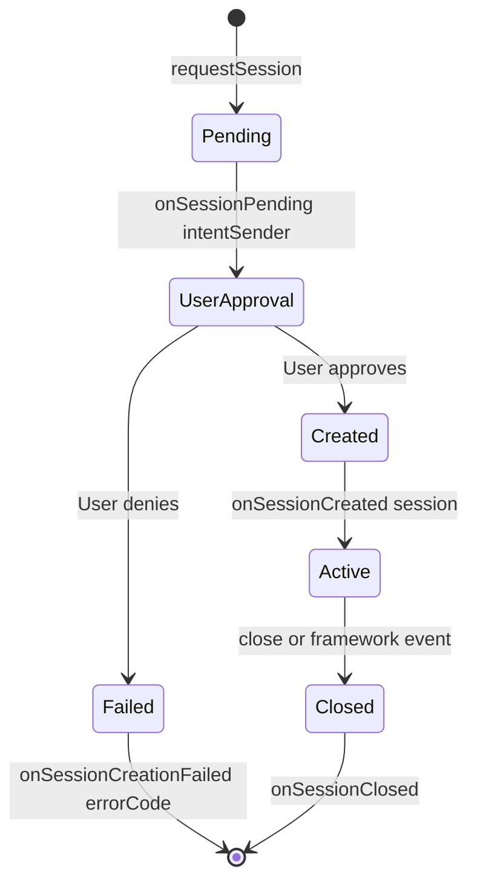
```mermaid
stateDiagram-v2
    [*] --> Pending: requestSession
    Pending --> UserApproval: onSessionPending intentSender
    UserApproval --> Created: User approves
    UserApproval --> Failed: User denies
    Created --> Active: onSessionCreated session
    Active --> Closed: close or framework event
    Failed --> [*]: onSessionCreationFailed errorCode
    Closed --> [*]: onSessionClosed
```

Error codes for session creation:

```java
// frameworks/base/core/java/android/companion/virtual/computercontrol/ComputerControlSession.java

public static final int ERROR_SESSION_LIMIT_REACHED = 1;
public static final int ERROR_DEVICE_LOCKED = 2;
public static final int ERROR_PERMISSION_DENIED = 3;
```

### 50.3.3 The Core Session API

Once created, `ComputerControlSession` exposes a high-level input API:

```java
// frameworks/base/core/java/android/companion/virtual/computercontrol/ComputerControlSession.java

// Launch an app
public void launchApplication(@NonNull String packageName);

// Hand over to user
public void handOverApplications();

// Screenshot
@Nullable public Image getScreenshot();

// Input injection
public void tap(int x, int y);
public void swipe(int fromX, int fromY, int toX, int toY);
public void longPress(int x, int y);
public void insertText(@NonNull String text, boolean replaceExisting, boolean commit);
public void performAction(@Action int actionCode);

// Low-level input
public void sendKeyEvent(@NonNull VirtualKeyEvent event);
public void sendTouchEvent(@NonNull VirtualTouchEvent event);

// Mirror display
@Nullable public InteractiveMirrorDisplay createInteractiveMirrorDisplay(
        int width, int height, @NonNull Surface surface);

// UI stability
public void setStabilityListener(Executor executor, StabilityListener listener);
```

Screenshots are captured through an `ImageReader` that is attached to the
virtual display surface:

```java
// frameworks/base/core/java/android/companion/virtual/computercontrol/ComputerControlSession.java

mImageReader = ImageReader.newInstance(displayInfo.logicalWidth,
        displayInfo.logicalHeight, PixelFormat.RGBA_8888, /* maxImages= */ 2);
displayManagerGlobal.setVirtualDisplaySurface(displayToken, mImageReader.getSurface());

public Image getScreenshot() {
    synchronized (mLock) {
        return mImageReader == null ? null : mImageReader.acquireLatestImage();
    }
}
```

### 50.3.4 Session Parameters

`ComputerControlSessionParams` configures the virtual display:

```java
// frameworks/base/core/java/android/companion/virtual/computercontrol/ComputerControlSessionParams.java

public final class ComputerControlSessionParams implements Parcelable {
    private final String mName;
    private final List<String> mTargetPackageNames;
    private final int mDisplayWidthPx;
    private final int mDisplayHeightPx;
    private final int mDisplayDpi;
    private final Surface mDisplaySurface;
    private final boolean mIsDisplayAlwaysUnlocked;
```

The `targetPackageNames` field restricts which apps can be launched in the
session. Each package must have a valid launcher intent and cannot be the
device permission controller.

### 50.3.5 Interactive Mirror Display

The `InteractiveMirrorDisplay` mirrors the session's virtual display and
allows a human user to observe and interact simultaneously:

```java
// frameworks/base/core/java/android/companion/virtual/computercontrol/InteractiveMirrorDisplay.java

public final class InteractiveMirrorDisplay implements AutoCloseable {
    public void resize(int width, int height);
    public void sendTouchEvent(@NonNull VirtualTouchEvent event);
    public void close();
}
```

This enables a "co-pilot" pattern where an AI agent drives the automation
while a human watches and can intervene.

### 50.3.6 UI Stability Detection

Knowing when an app's UI has "settled" is critical for AI agents that need
to screenshot and analyze before acting. The `StabilityListener` interface
provides this signal:

```java
// frameworks/base/core/java/android/companion/virtual/computercontrol/ComputerControlSession.java

public interface StabilityListener {
    void onSessionStable();
}
```

The extension library's `ComputerControlAccessibilityProxy` and
`EventIdleTracker` monitor accessibility events and animation completion
to determine when the display content is stable.

### 50.3.7 Accessibility Integration

The extension-layer `ComputerControlSession` registers an
`AccessibilityDisplayProxy` for the virtual display, enabling the agent to
query the accessibility tree:

```java
// frameworks/base/libs/computercontrol/.../ComputerControlSession.java

mAccessibilityProxy = new ComputerControlAccessibilityProxy(mVirtualDisplayId);
mAccessibilityManager.registerDisplayProxy(mAccessibilityProxy);
```

This gives the agent structured information about the UI (view hierarchy,
content descriptions, bounding boxes) without relying solely on pixel-level
screenshot analysis.

### 50.3.8 Automated Package Listener

Launcher apps can register to be notified when apps are being automated:

```java
// frameworks/base/libs/computercontrol/.../ComputerControlExtensions.java

public void registerAutomatedPackageListener(
        @NonNull Context context,
        @NonNull @CallbackExecutor Executor executor,
        @NonNull AutomatedPackageListener listener) {
    VirtualDeviceManager vdm = context.getSystemService(VirtualDeviceManager.class);
    vdm.registerAutomatedPackageListener(executor, platformListener);
}
```

This allows the launcher to display an indicator that an app is currently
under AI control.

### 50.3.9 Integration with VirtualDeviceManager

Computer Control builds on top of the VirtualDeviceManager framework
(Chapter 51). The relationship is:

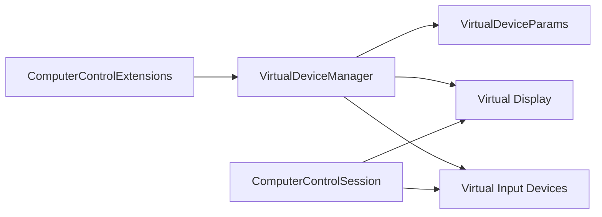
```mermaid
graph LR
    CCE[ComputerControlExtensions] --> VDM[VirtualDeviceManager]
    VDM --> VDD[VirtualDeviceParams]
    VDM --> VDisplay[Virtual Display]
    VDM --> VInput[Virtual Input Devices]
    CCS[ComputerControlSession] --> VDisplay
    CCS --> VInput
```

The key difference from general VirtualDevice usage is that Computer Control
sessions create a **trusted** virtual display with input injection
capabilities. The system server enforces that only the session owner can
inject input events.

### 50.3.10 Extension-Layer Input Conversion

The extension library wraps platform input types with its own wrapper classes
for API stability:

```java
// frameworks/base/libs/computercontrol/.../ComputerControlSession.java

public void sendTouchEvent(TouchEvent touchEvent) {
    VirtualTouchEvent virtualTouchEvent =
            new VirtualTouchEvent.Builder()
                    .setX(touchEvent.getX())
                    .setY(touchEvent.getY())
                    .setPressure(touchEvent.getPressure())
                    .setToolType(touchEvent.getToolType())
                    .setAction(touchEvent.getAction())
                    .setPointerId(touchEvent.getPointerId())
                    .setEventTimeNanos(touchEvent.getEventTimeNanos())
                    .setMajorAxisSize(touchEvent.getMajorAxisSize())
                    .build();
    mSession.sendTouchEvent(virtualTouchEvent);
    mAccessibilityProxy.resetStabilityState();

    if (mTouchListener != null) {
        mTouchListener.onTouchEvent(touchEvent);
    }
}
```

After every input injection, `resetStabilityState()` is called on the
accessibility proxy. This resets the stability timer, since the UI is now
expected to change.

### 50.3.11 Text Insertion API

For text fields, Computer Control provides a high-level `insertText()` method
that avoids the complexity of individual key events:

```java
// frameworks/base/libs/computercontrol/.../ComputerControlSession.java

public void insertText(@NonNull String text, boolean replaceExisting, boolean commit) {
    mSession.insertText(text, replaceExisting, commit);
    mAccessibilityProxy.resetStabilityState();
}
```

This method uses `InputConnection` on the server side to directly manipulate
the text field's content, bypassing the virtual keyboard. The `commit`
parameter triggers an IME action (like pressing "Done" or "Send").

### 50.3.12 Touch Listener for Debugging

The extension session supports a `TouchListener` for observing all injected
touch events:

```java
// frameworks/base/libs/computercontrol/.../ComputerControlSession.java

public interface TouchListener {
    void onTouchEvent(@NonNull TouchEvent event);
}

public void setTouchListener(@Nullable TouchListener listener) {
    mTouchListener = listener;
}
```

This is useful for logging, visualization, or coordinating multiple
automation agents.

### 50.3.13 Interactive Mirror and Co-Pilot Pattern

The `InteractiveMirror` class in the extension layer wraps the platform's
`InteractiveMirrorDisplay`:

```java
// frameworks/base/libs/computercontrol/.../ComputerControlSession.java

public InteractiveMirror createInteractiveMirror(
        int width, int height, @NonNull Surface surface) {
    InteractiveMirrorDisplay interactiveMirrorDisplay =
            mSession.createInteractiveMirrorDisplay(width, height, surface);
    if (interactiveMirrorDisplay == null) {
        return null;
    }
    return new InteractiveMirror(interactiveMirrorDisplay);
}
```

This enables several important use cases:

1. **Debugging**: Developers can watch AI automation in real-time
2. **Human-in-the-loop**: A user can observe the AI's actions and intervene
3. **Streaming**: The mirror can be used to broadcast automation sessions
4. **Multi-agent**: One agent controls, another observes via the mirror

### 50.3.14 Session Close and Resource Cleanup

```java
// frameworks/base/libs/computercontrol/.../ComputerControlSession.java

@Override
public void close() {
    synchronized (mIsValid) {
        if (!mIsValid.get()) {
            return;
        }
        mAccessibilityManager.unregisterDisplayProxy(mAccessibilityProxy);
        mSession.close();
        mIsValid.set(false);
    }
}
```

Close is idempotent (protected by `AtomicBoolean mIsValid`) and properly
unregisters the accessibility proxy before closing the platform session.

### 50.3.15 Stability Detection Architecture

The extension layer's stability detection combines multiple signals:

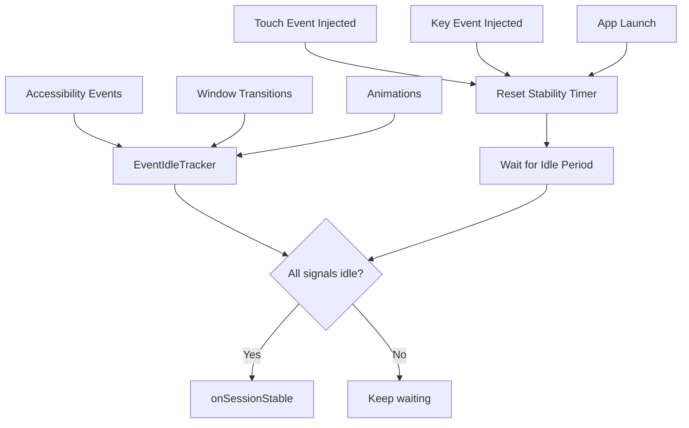
```mermaid
graph TB
    A[Touch Event Injected] --> B[Reset Stability Timer]
    C[Key Event Injected] --> B
    D[App Launch] --> B
    B --> E[Wait for Idle Period]

    F[Accessibility Events] --> G[EventIdleTracker]
    H[Window Transitions] --> G
    I[Animations] --> G

    G --> J{All signals idle?}
    E --> J
    J -->|Yes| K[onSessionStable]
    J -->|No| L[Keep waiting]
```

The `StabilityHintCallbackTracker` in the extension layer handles the legacy
callback-based API, while the newer `StabilityListener` interface routes
through the platform-level `IComputerControlStabilityListener` AIDL interface.

### 50.3.16 Complete Extension Library File Inventory

| File | Lines | Purpose |
|------|-------|---------|
| `ComputerControlExtensions.java` | 206 | Entry point, session factory |
| `ComputerControlSession.java` | 684 | Extension session wrapper with accessibility |
| `InteractiveMirror.java` | 86 | Mirror display wrapper |
| `EventIdleTracker.java` | 92 | Accessibility event idle detection |
| `StabilityHintCallbackTracker.java` | 55 | Legacy stability callback |
| `AutomatedPackageListener.java` | 43 | Package automation notifications |
| `input/KeyEvent.java` | 134 | Extension key event type |
| `input/TouchEvent.java` | 296 | Extension touch event type |
| `view/MirrorView.java` | 406 | Mirror display view widget |

### 50.3.17 Permission Model

Computer Control uses a layered permission model:

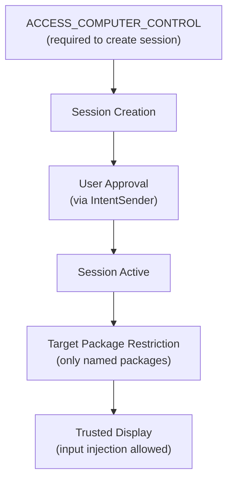
```mermaid
graph TD
    A["ACCESS_COMPUTER_CONTROL<br/>(required to create session)"] --> B[Session Creation]
    B --> C["User Approval<br/>(via IntentSender)"]
    C --> D["Session Active"]
    D --> E["Target Package Restriction<br/>(only named packages)"]
    E --> F["Trusted Display<br/>(input injection allowed)"]
```

1. The app must hold `ACCESS_COMPUTER_CONTROL`
2. The system presents a user approval dialog via `IntentSender`
3. Only packages listed in `targetPackageNames` can be launched
4. The virtual display is trusted, enabling input injection
5. The permission controller package is always excluded from automation

### 50.3.18 System-Server Implementation Overview

The extension library described in subsections 50.3.1–50.3.16 is the
**agent-side** API: the client an agent app links and calls. The
**system-server side** of Computer Control lives in a sibling package inside
the VirtualDeviceManager (VDM) service tree and contains the actual session
state, the policy gates, the binder objects the extension stubs talk to, and
the integration with the input, display, and accessibility stacks.

**Source tree:**

```
frameworks/base/services/companion/java/com/android/server/companion/virtual/computercontrol/
    ComputerControlSessionProcessor.java          -- Session creation and policy gate
    ComputerControlSessionImpl.java   (776 lines) -- Core session binder
    StabilityCalculator.java                      -- Server-side stability detector
    InteractiveMirrorDisplayImpl.java             -- Mirror display + virtual touchscreen
    AutomatedPackagesRepository.java              -- Tracks automated packages for launchers
```

How extension-side classes relate to their system-server counterparts.

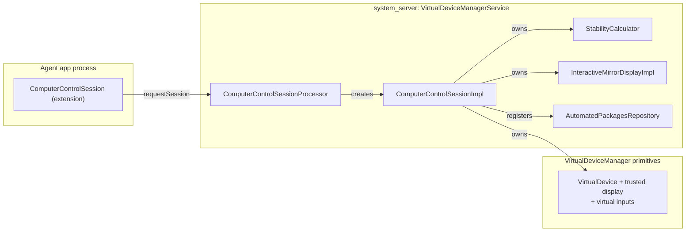
```mermaid
graph LR
    subgraph Agent["Agent app process"]
        EXT["ComputerControlSession (extension)"]
    end
    subgraph SS["system_server: VirtualDeviceManagerService"]
        SP["ComputerControlSessionProcessor"]
        IMPL["ComputerControlSessionImpl"]
        SC["StabilityCalculator"]
        MIRROR["InteractiveMirrorDisplayImpl"]
        APR["AutomatedPackagesRepository"]
    end
    subgraph VDM["VirtualDeviceManager primitives"]
        VD["VirtualDevice + trusted display<br/>+ virtual inputs"]
    end
    EXT -- "requestSession" --> SP
    SP -- "creates" --> IMPL
    IMPL -- "owns" --> VD
    IMPL -- "owns" --> SC
    IMPL -- "owns" --> MIRROR
    IMPL -- "registers" --> APR
```

The package sits inside `services/companion/`, not inside `services/core/`,
because Computer Control is part of the VDM subsystem. Chapter 51 walks the
general VDM machinery — VirtualDevice creation, virtual display surfaces,
virtual input dispatch — that Computer Control composes on top of.

### 50.3.19 ComputerControlSessionProcessor: Session Creation and Limits

`ComputerControlSessionProcessor` owns the entry-point logic for creating
sessions. The policy flow runs in this order — note that AppOps short-
circuits the rest when it returns `MODE_ALLOWED`:

1. **AppOps consent check.** The processor calls
   `noteOpNoThrow(OP_COMPUTER_CONTROL, attributionSource, "create session")`
   (`frameworks/base/services/companion/java/com/android/server/companion/virtual/computercontrol/ComputerControlSessionProcessor.java:121–122`).
   If the result is `MODE_ALLOWED` — meaning the user previously chose
   "Always Allow" for this agent package — the processor proceeds directly
   to session creation, bypassing the precondition checks and the consent
   dialog. Any other mode means consent is required, and the flow
   continues.
2. **Device-locked gate.** Inside
   `checkSessionCreationPreconditionsLocked` (`ComputerControlSessionProcessor.java:276`),
   the keyguard is checked first. If the device is locked, the processor
   rejects with `ERROR_DEVICE_LOCKED` and the flow ends.
3. **Concurrent-session cap.** Next in the same precondition method, the
   constant `MAXIMUM_CONCURRENT_SESSIONS = 5`
   (`ComputerControlSessionProcessor.java:71, checked at 284`) bounds how
   many Computer Control sessions can be live system-wide at once.
   Exceeding it returns `ERROR_SESSION_LIMIT_REACHED`.
4. **Consent dialog.** If preconditions pass and consent is required, the
   processor launches `RequestComputerControlAccessActivity` via an
   `IntentSender` returned to the agent.

The class header documents the role explicitly: *"This class enforces session
creation policies, such as limiting the number of concurrent..."*
(`ComputerControlSessionProcessor.java:62`).

Once the policy flow completes successfully, the processor allocates the
underlying `VirtualDevice`,
the trusted `VirtualDisplay`, and the three virtual input devices, then
constructs a `ComputerControlSessionImpl` and hands its binder back to the
caller through the original `ComputerControlSession.Callback`.

The session limit is global, not per-agent: five competing agents could
exhaust the pool. The limit is a defensive bound, not a tuning knob — hitting
it indicates either an agent-side leak (failure to close sessions) or a
multi-agent attack surface that the system declines to expand without a
deliberate policy change.

### 50.3.20 ComputerControlSessionImpl: The Session Binder

`ComputerControlSessionImpl` is the actual binder object that backs
`IComputerControlSession.aidl`. At 776 lines
(`frameworks/base/services/companion/java/com/android/server/companion/virtual/computercontrol/ComputerControlSessionImpl.java`)
it is the largest single file in the Computer Control system-server package,
but its size is dominated by input routing, parameter validation, and
lifecycle teardown — not by business logic.

Its responsibilities, ordered by lifecycle:

- **Construction.** Receives the trusted `VirtualDevice`, the `VirtualDisplay`,
  the three virtual input devices, the calling agent's `AttributionSource`,
  and the requested `targetPackageNames` allowlist from the processor.
- **Input dispatch.** Implements `tap`, `swipe`, `longPress`, `insertText`, and
  `performAction` by routing to the appropriate virtual input device or to
  the IME-integration path (50.3.29).
- **Screenshot.** Implements `getScreenshot()` via the trusted display's
  surface-capture path; the trusted flag is what makes capture permissible
  without holding `READ_FRAME_BUFFER`.
- **Application launch.** Implements `launchApplication(packageName)` after
  checking the package against the session's allowlist; rejected launches
  surface as `NotifyComputerControlBlockedActivity` (50.3.24).
- **Stability.** Owns a `StabilityCalculator` (50.3.27) and forwards relevant
  lifecycle events — every input dispatch, every app launch — to it.
- **Mirror display.** Optionally owns an `InteractiveMirrorDisplayImpl` when
  the session requested a live view (50.3.5).
- **Lifecycle teardown.** Calls `Binder.linkToDeath()` on the agent's callback
  so an agent process crash auto-closes the session, releases the
  VirtualDevice, and clears the session's row in the
  `AutomatedPackagesRepository`.

The binder-on-binder structure — agent holds an `IComputerControlSession`
stub, system server holds an `IComputerControlSessionCallback` stub — is the
standard AOSP pattern; the death-link runs both ways so neither side can
hold the other's resources after a process exit.

### 50.3.21 Virtual Input Devices: Product IDs and Trusted Display

A Computer Control session owns three virtual input devices, each
constructed with a fixed product ID in a Computer-Control-reserved
product-ID range so the input system can distinguish them from physical
inputs and from other virtual-display sessions:

| Device | Product ID | Constant | Purpose |
|--------|-----------|----------|---------|
| Virtual D-pad | `0xCC01` | `PRODUCT_ID_DPAD` | Directional navigation keys |
| Virtual keyboard | `0xCC02` | `PRODUCT_ID_KEYBOARD` | Character key input |
| Virtual touchscreen | `0xCC03` | `PRODUCT_ID_TOUCHSCREEN` | Touch gestures |

The constants are declared at `ComputerControlSessionImpl.java:127–131`. The
`0xCC` prefix carves out a Computer-Control-reserved block inside the
broader VDM virtual-input product-ID space; see chapter 51 for the generic
`VirtualInputDevice` scheme that hosts Computer Control's three.

The session's display is a **trusted** `VirtualDisplay`. The trust flag has
three observable consequences that distinguish it from a stock virtual
display:

1. **Animations disabled.** System and app animations are suppressed on this
   display so the agent's per-action stability detection does not have to wait
   for animation completion before reading the next state.
2. **IME hidden.** Soft keyboards do not auto-show on the display; text input
   either uses `VirtualKeyboard` key events or routes through the IME
   integration path in 50.3.29.
3. **Focus-stealing disabled.** Child windows on the display cannot steal
   focus from the agent's target activity, so a pop-up cannot redirect the
   agent's subsequent inputs to an unrelated surface.

Together these turn the display into a deterministic surface the agent can
drive without the user's UX-pleasantness layer adding noise.

### 50.3.22 Session Creation Flow End-to-End

This is what happens from the agent's `requestSession()` call to a
ready-to-drive session.

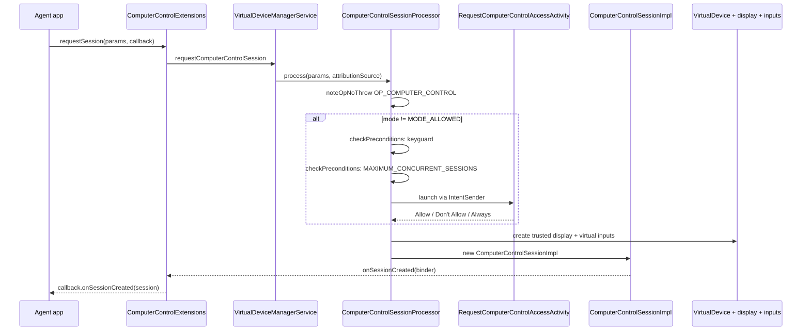
```mermaid
sequenceDiagram
    participant Agent as Agent app
    participant Ext as ComputerControlExtensions
    participant VDMS as VirtualDeviceManagerService
    participant SP as ComputerControlSessionProcessor
    participant Consent as RequestComputerControlAccessActivity
    participant Impl as ComputerControlSessionImpl
    participant VD as VirtualDevice + display + inputs

    Agent->>Ext: requestSession(params, callback)
    Ext->>VDMS: requestComputerControlSession
    VDMS->>SP: process(params, attributionSource)
    SP->>SP: noteOpNoThrow OP_COMPUTER_CONTROL
    alt mode != MODE_ALLOWED
        SP->>SP: checkPreconditions: keyguard
        SP->>SP: checkPreconditions: MAXIMUM_CONCURRENT_SESSIONS
        SP->>Consent: launch via IntentSender
        Consent-->>SP: Allow / Don't Allow / Always
    end
    SP->>VD: create trusted display + virtual inputs
    SP->>Impl: new ComputerControlSessionImpl
    Impl-->>Ext: onSessionCreated(binder)
    Ext-->>Agent: callback.onSessionCreated(session)
```

The consent step is conditional: an agent that has been granted **Always
Allow** in a prior session skips the dialog because the AppOps record carries
that decision forward. The AppOps record is per-package and per-user, so
revoking via Settings sends the next request back through the dialog path
without the agent noticing on the request itself — the agent simply observes
the dialog appear or not.

Once `onSessionCreated` fires, the agent owns a binder it can call repeatedly
without round-tripping through the processor. Each input call goes
agent → `ComputerControlSessionImpl` directly; the processor is only
consulted at session creation.

### 50.3.23 Error Codes and Session Constraints

Session creation returns one of three error codes when it fails. The
constants live in the public extension API at
`frameworks/base/core/java/android/companion/virtual/computercontrol/ComputerControlSession.java`:

| Code | Value | Condition | Source line |
|------|-------|-----------|-------------|
| `ERROR_SESSION_LIMIT_REACHED` | 1 | More than 5 active Computer Control sessions system-wide | `ComputerControlSession.java:77` |
| `ERROR_DEVICE_LOCKED` | 2 | Keyguard is up at session-creation time | `ComputerControlSession.java:87` |
| `ERROR_PERMISSION_DENIED` | 3 | Per-session consent denied by the user | `ComputerControlSession.java:92` |

The three errors map cleanly to the three policy checks in
`ComputerControlSessionProcessor` (50.3.19): one error per policy. An agent
implementing robust retry logic distinguishes them by behavior:

- `ERROR_SESSION_LIMIT_REACHED` is transient — wait and retry.
- `ERROR_DEVICE_LOCKED` is user-blocked — prompt the user to unlock; retry
  on screen-on.
- `ERROR_PERMISSION_DENIED` is durable for the request — escalate to the user
  through the agent's own UX before requesting again, and consider that
  re-requesting too aggressively will surface to the user as harassment.

The device-locked gate is checked at creation, not maintained for the session
lifetime. An agent with a session open before the screen locks keeps the
session; the agent simply cannot perform actions on the locked screen until
unlock. Tearing the session down on lock would race with foreground-app
behavior and break agents that legitimately span a brief screen-off.

### 50.3.24 The Consent Activity Flow

The per-session consent dialog is `RequestComputerControlAccessActivity`
(`frameworks/base/packages/VirtualDeviceManager/src/com/android/virtualdevicemanager/RequestComputerControlAccessActivity.java`).
It is a platform-signed activity inside the VDM platform package that the
agent cannot launch directly; it is launched only via the `IntentSender`
returned by the processor when consent is missing.

The dialog presents three choices:

- **Allow** — grant consent for the duration of this session only. AppOps
  records the grant scoped to the session.
- **Don't Allow** — deny. Processor returns `ERROR_PERMISSION_DENIED` to the
  caller.
- **Always Allow** — record a persistent AppOps grant for the agent package.
  Future `requestSession()` calls from the same package skip the dialog
  entirely.

The activity carries `android:filterTouchesWhenObscured="true"` — the same
anti-tapjacking flag used by `RequestPermissionActivity` — so that an overlay
window cannot pass touches through to the consent buttons. This matters
because a Computer Control consent grant is particularly attractive to a
tapjacking adversary: a successful grant gives the adversary's agent the
ability to drive the user's other apps from inside a sanctioned session.

When Computer Control blocks an action mid-session — for example, a `launchApplication()`
call for a package not in the session's `targetPackageNames` — the system
surfaces `NotifyComputerControlBlockedActivity`
(`frameworks/base/packages/VirtualDeviceManager/src/com/android/virtualdevicemanager/NotifyComputerControlBlockedActivity.java`)
to make the block visible to the user rather than silently dropping the
action. Silent drops would leave the user wondering why the agent stopped
responding; the visible block tells both user and agent which boundary was
hit.

### 50.3.25 AppOps and Per-Session Tracking

Computer Control uses the AppOps system to track per-package consent state.
The relevant op is `OP_COMPUTER_CONTROL` at
`frameworks/base/core/java/android/app/AppOpsManager.java:1741`:

```java
public static final int OP_COMPUTER_CONTROL = AppOpEnums.APP_OP_COMPUTER_CONTROL;
```

AppOps records grants with a mode (`MODE_ALLOWED`, `MODE_IGNORED`,
`MODE_ERRORED`, `MODE_DEFAULT`) scoped by package + attribution. Each
session creation calls
`noteOpNoThrow(OP_COMPUTER_CONTROL, attributionSource, "create session")`
(`ComputerControlSessionProcessor.java:121–122`). The result determines the
next step: `MODE_ALLOWED` short-circuits straight to session creation
(skipping both preconditions and the consent dialog); any other mode means
the processor advances to the keyguard and concurrent-cap precondition
checks, and on success launches the consent activity. The no-throw variant
returns the mode as an int instead of throwing `SecurityException`, which
is the right shape for a router that branches on the result rather than
bailing out.

This is the same machinery used for sensitive ops like `OP_CAMERA`,
`OP_RECORD_AUDIO`, and `OP_FINE_LOCATION`. Treating Computer Control as an
AppOp rather than a one-shot permission has two implications worth pulling
out:

- **Revocability.** A user can revoke Computer Control for a specific agent
  in Settings without uninstalling the agent. Subsequent `requestSession()`
  calls from that agent route back through the dialog.
- **Auditability.** AppOps records every `noteOp` invocation, so a privacy
  dashboard can show which agents have requested Computer Control and when,
  even after the sessions have ended.

The matching permission `android.permission.ACCESS_COMPUTER_CONTROL`
(`frameworks/base/core/res/AndroidManifest.xml:8792`) has protection level
`internal|knownSigner`, meaning only agents in the system's knownSigner
allowlist can *request* a Computer Control session in the first place. The
AppOps layer
adds the per-grant user-facing control on top of that platform-level gate;
the two together implement defense in depth: an unsigned third-party app
cannot even ask, and a signed agent cannot grant itself.

### 50.3.26 Anti-Tampering Mechanisms

The threat model around Computer Control assumes a malicious app could
attempt to (a) trick a user into granting Computer Control consent, (b)
hijack an already-granted session, or (c) ride a granted session into apps
the user did not intend to expose. The framework defends each with a
distinct mechanism:

1. **FilterTouches on consent activities.** Both
   `RequestComputerControlAccessActivity` and
   `NotifyComputerControlBlockedActivity` apply
   `android:filterTouchesWhenObscured="true"` so an overlay window cannot
   pass touches through to the consent buttons. This blocks the classic
   tapjacking attack against permission dialogs — the same pattern that
   surfaced through `SYSTEM_ALERT_WINDOW` abuse in earlier Android releases.
2. **Activity allowlist in strict mode.** When the
   `computer_control_activity_policy_strict` flag (50.3.30) is on, an agent's
   `launchApplication(packageName)` is rejected unless `packageName` was
   declared in `targetPackageNames` at session creation. A Computer Control
   session that opened a messaging app cannot subsequently launch a banking
   app inside the same session.
3. **Launch interception warnings.** The `automated_app_launch_interception`
   flag gates a warning UI surfaced when a Computer Control session launches
   an app the user did not explicitly initiate. The warning makes the
   agent's intent visible at the moment it would otherwise be invisible to
   the user.
4. **Binder death monitoring.** `ComputerControlSessionImpl` calls
   `Binder.linkToDeath()` on the agent's callback binder. If the agent
   process is killed — by oom-killer, by the user swiping it from Recents,
   by a crash — the system auto-closes the session and releases the
   `VirtualDevice`. This prevents a long-lived orphan session from
   continuing to drive the device after its operator has gone away.

The mechanisms compose. An attacker who somehow bypassed tapjacking
protection on the consent activity (mechanism 1) and obtained a session
would still be blocked by the activity allowlist (mechanism 2) from
expanding the session's reach; an attacker who got past both (mechanism 3)
would still surface a launch warning to the user; an attacker whose
implant process died would release the session immediately (mechanism 4).

### 50.3.27 Server-Side StabilityCalculator

The extension layer's `StabilityHintCallbackTracker` (50.3.15) is a legacy
client-side mechanism. The current path is server-side: `StabilityCalculator`
(`frameworks/base/services/companion/java/com/android/server/companion/virtual/computercontrol/StabilityCalculator.java`)
decides when the UI has *settled* after an injected event and notifies the
agent via `IComputerControlStabilityListener`.

The decision is timeout-based, not event-based. After each input the
calculator starts a timer; if no further events arrive before the timer
fires, the session is reported stable. Timeouts vary by event class
(`StabilityCalculator.java:35–37`):

| Event class | Timeout | Constant |
|-------------|---------|----------|
| Tap, text insert | 2000 ms | `NON_CONTINUOUS_INPUT_EVENT_STABILITY_TIMEOUT_MS` |
| Swipe, long-press | 2500 ms | `CONTINUOUS_INPUT_EVENT_STABILITY_TIMEOUT_MS` |
| App launch | 3000 ms | `APPLICATION_LAUNCH_STABILITY_TIMEOUT_MS` |

The differential is empirical. A swipe expands at the extension layer into
11 sine-eased MOVE events spanning ~550 ms (see 50.3.10), so the calculator
gives it 500 ms more headroom than a tap. An app launch involves cold-start
work — activity creation, layout pass, first-frame render — and gets the
longest budget.

Timeout-based stability is intentionally pessimistic. An agent that needs
lower latency on simple actions can ignore the stability signal and proceed
immediately; an agent that needs reliable post-action state (for example,
to capture a screenshot of the result after a tap navigates to a new screen)
waits for the signal before reading. The server side does not enforce
either choice; it merely emits the signal so the agent can choose.

The server-side timer trumps the deprecated client-side accessibility-event
idle tracker (50.3.15) because the server knows about state the client
cannot directly observe — for example, system-server-internal display
transactions and input dispatcher acknowledgments. As `EventIdleTracker`
ages out of agent code, the timeout constants in `StabilityCalculator` are
the single source of truth for "the UI is now settled."

### 50.3.28 AutomatedPackagesRepository and Launcher Indicators

`AutomatedPackagesRepository`
(`frameworks/base/services/companion/java/com/android/server/companion/virtual/computercontrol/AutomatedPackagesRepository.java`)
maintains the system-wide set of packages currently being driven by a
Computer Control session. It serves two consumers:

1. **Launchers** register an `IAutomatedPackageListener` to learn which
   app icons should display an "agent is driving this app" indicator.
   The indicator is a UI affordance, not a security boundary; it tells the
   user *which* app the agent is currently controlling at a glance.
2. **System UI** uses the same data to render the global "agent active"
   status icon and to route notifications about automated activity.

The repository fires `onAutomatedPackagesChanged(Set<String>)` whenever the
set transitions. Each `ComputerControlSessionImpl` registers its
allowlisted packages on session start and unregisters them on session close.
If two sessions independently automate the same package (rare but
permitted under the concurrent-session cap), the repository reference-counts
the package; it only exits the "automated" state when the last referring
session closes.

This is the user-transparency contract the framework commits to. An
automated app is always visually distinguishable from a user-driven one,
even when the agent and user are interleaving control through the
interactive mirror (50.3.13). The user is never left guessing whether
something happening on screen was their tap or the agent's.

### 50.3.29 IME Integration: IRemoteComputerControlInputConnection

When the typing path is enabled, `insertText()` must route text into the
focused input field through the standard IME pipeline so that input
validation, autocorrect, password masking, and accessibility events all
fire the same way they would for a soft-keyboard tap. The mechanism is
`IRemoteComputerControlInputConnection.aidl`
(`frameworks/base/core/java/com/android/internal/inputmethod/IRemoteComputerControlInputConnection.aidl`).

The flow:

- The agent calls `ComputerControlSession.insertText(text, replaceExisting, commit)`.
- The call arrives at `ComputerControlSessionImpl` on the system-server side.
- The impl looks up the `IRemoteComputerControlInputConnection` for the
  session's display in
  `InputMethodManagerService.UserData.mComputerControlInputConnectionMap`
  (`frameworks/base/services/core/java/com/android/server/inputmethod/InputMethodManagerService.java:1758, 3575, 3578, 5857`).
- The remote connection wraps the focused window's `InputConnection` and
  forwards the text through `commitText()`, `setComposingText()`, and
  `deleteSurroundingText()` — the same methods a soft keyboard would use.
- The target app sees text arrive through its normal `InputConnection`
  callback, indistinguishable in shape from a soft-keyboard caller.

Keying the map by display ID matters because each Computer Control session
owns its own trusted display, and multiple sessions can be live
simultaneously (up to `MAXIMUM_CONCURRENT_SESSIONS = 5`). The display ID is
what disambiguates which session's text routes where.

This path is gated by the `computer_control_typing` flag (50.3.30); when
off, `insertText()` falls back to injecting key events via the
`VirtualKeyboard` device. The fallback is functional but loses the IME's
text-shaping behavior — autocorrect does not run, password fields are not
masked at input time, and a target app that filters input in
`onTextChanged` sees character-at-a-time events rather than a batched
commit.

### 50.3.30 Feature Flag Set

Computer Control ships gated behind five aconfig flags
(`frameworks/base/core/java/android/companion/virtual/flags/flags.aconfig`).
They cleanly separate the rollout of independent features:

| Flag | Line | Gates |
|------|------|-------|
| `computer_control_access` | 181 | Core feature: the `ACCESS_COMPUTER_CONTROL` permission and the session API |
| `computer_control_consent` | 251 | The per-session consent dialog flow (50.3.24) |
| `computer_control_typing` | 281 | The `InputConnection`-based `insertText()` path (50.3.29) |
| `computer_control_activity_policy_strict` | 271 | Strict `targetPackageNames` allowlist enforcement (50.3.26) |
| `automated_app_launch_interception` | 261 | The launch-warning dialog when a Computer Control session launches a non-target app (50.3.26) |

A device can ship Computer Control's core surface
(`computer_control_access` on) without committing to every policy layer —
useful for staged rollout, where consent and typing land first and stricter
policy follows. Conversely, a device can ship with all flags on for a full
security posture from day one.

The flag set is also useful as a roadmap reading: a chapter reader who
finds Computer Control at an unfamiliar stage of evolution can look at
which flags are on (`adb shell device_config get virtualdevicemanager <flag_name>`)
to determine which features the running device actually supports,
independent of what the API surface advertises.

### 50.3.31 Companion-Device-Subsystem Anchoring

Computer Control is implemented as a subsystem **of** VirtualDeviceManager,
not alongside it. Three architectural consequences follow:

1. **Code location.** The server-side classes live under
   `frameworks/base/services/companion/` (the VDM service tree), not under
   `frameworks/base/services/core/`. The package path embeds
   `virtual/computercontrol/` to make the subordination explicit at the
   filesystem level.
2. **Lifecycle owner.** `VirtualDeviceManagerService` owns the
   `ComputerControlSessionProcessor` instance and the
   `AutomatedPackagesRepository`. When VDM tears down — for example, when
   the last virtual device is released and VDM enters its idle path —
   Computer Control state tears down with it. Computer Control cannot
   outlive its parent.
3. **Reuse of VDM primitives.** Computer Control does not invent its own
   display, input, or surface-capture stack. It composes the existing VDM
   primitives (`VirtualDevice`, `VirtualDisplay`, `VirtualDpad`,
   `VirtualKeyboard`, `VirtualTouchscreen`) under a Computer-Control-
   specific session policy. The Computer Control additions are narrow:
   the trust-flag combination on the display, the fixed product IDs on the
   inputs (50.3.21), the session-scoped consent and AppOps tracking
   (50.3.24–50.3.25), and the timeout-based stability detector (50.3.27).

Chapter 51 walks the general VDM machinery: how a `VirtualDevice` is
constructed and registered, how virtual displays surface into
WindowManager, how virtual input events dispatch through `InputDispatcher`,
and how the broader companion-device ecosystem (BLE associations, remote
device authentication) sits alongside VDM. A reader interested in *how*
the trusted `VirtualDisplay` is wired into WindowManager and *what*
WindowManager does differently on it should follow that cross-reference.
A reader interested in *why* Computer Control composes those primitives the
way it does, and what user-transparency contracts the composition enforces,
stays in this chapter.

### 50.3.32 Known Consumers

The first widely-shipped consumer of Computer Control is the **Gemini in
Android** assistant. The internal codename for the agent loop is **Bonobo**
(the log prefix `#bnb#` appears in app traces); the agent runs in the AGSA
process (`com.google.android.googlequicksearchbox`) and consumes the
AOSP-public Computer Control API documented in this chapter. AOSP itself
does not ship a Computer Control agent —
`frameworks/base/libs/computercontrol/` and the system-server package
described above are framework code, not application code. The agent is
GMS-side and is not part of this checkout, but its existence as the first
production Computer Control consumer is what shaped the API's current
surface.

Two patterns observable in the Gemini consumer are worth surfacing for any
new Computer Control agent:

- **Dual-path fallback with AppFunctions.** The agent declares two
  `<uses-library>` entries in its manifest:
  `com.android.extensions.appfunctions` and
  `com.android.extensions.computercontrol`. It prefers AppFunctions
  (the structured-API path of section 50.2) for apps that publish
  `AppFunctionService`-backed functions, and falls back to Computer Control
  for apps that don't. The same agent can drive both because the two
  frameworks compose at the SDK extension level: an agent links both,
  queries `AppFunctionManager` first, and uses Computer Control for the
  apps where the function discovery returns empty.
- **Live mirror as the user-trust surface.** The agent renders the
  `InteractiveMirrorDisplay` (50.3.5) inside its chat UI so the user
  watches the actions in real time and can hand control back at any
  moment via the touch-forwarding path. This matches the framework's
  intent: Computer Control does not make the live view *optional*, it
  makes the absence of one the unusual case. An agent that runs Computer
  Control without a visible mirror is one the user is right to be
  suspicious of.

How the Bonobo agent loop composes with the Computer Control API
documented in this chapter. The agent itself is GMS-side; the framework
on the right is AOSP.

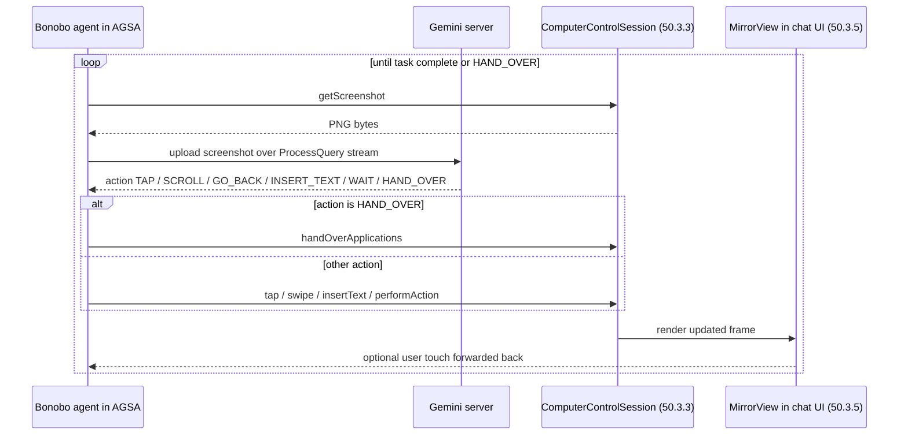
```mermaid
sequenceDiagram
    participant Bonobo as Bonobo agent in AGSA
    participant Server as Gemini server
    participant Session as ComputerControlSession (50.3.3)
    participant Mirror as MirrorView in chat UI (50.3.5)

    loop until task complete or HAND_OVER
        Bonobo->>Session: getScreenshot
        Session-->>Bonobo: PNG bytes
        Bonobo->>Server: upload screenshot over ProcessQuery stream
        Server-->>Bonobo: action TAP / SCROLL / GO_BACK / INSERT_TEXT / WAIT / HAND_OVER
        alt action is HAND_OVER
            Bonobo->>Session: handOverApplications
        else other action
            Bonobo->>Session: tap / swipe / insertText / performAction
        end
        Session->>Mirror: render updated frame
        Mirror-->>Bonobo: optional user touch forwarded back
    end
```

The loop terminates when the server responds with `HAND_OVER` or when the
user takes manual control via the mirror. The action vocabulary
(`TAP`, `SCROLL`, `GO_BACK`, `INSERT_TEXT`, `WAIT`, `HAND_OVER`) maps
one-to-one onto the `ComputerControlSession` methods documented in 50.3.3
and the navigation `performAction` codes — the agent does not synthesize
inputs the framework does not expose, and every action the framework
accepts can be issued by the agent. The bidirectional `ProcessQuery`
stream is the gRPC channel the agent uses to upload screenshots and
receive actions; that stream is GMS-side and not part of this checkout,
but its shape matters because it explains the **server-driven** nature of
the loop: the agent is a thin executor that asks the server what to do
next after every observation.

Beyond Gemini, Computer Control is shipping first on the highest-end Pixel
and Galaxy devices and broadening as the feature flags above ramp. New
consumers adopting Computer Control should expect the API surface to
remain stable along the lines described in this chapter while the policy
layer (which flags are on by default) continues to tighten.

---

## 50.4 OnDeviceIntelligence

The OnDeviceIntelligence (ODI) framework provides a system-level API for
running large ML models (including LLMs) in a sandboxed process. It is
designed around the principle that model weights and inference logic should
never be directly accessible to the calling app.

**Source tree:**

```
frameworks/base/packages/NeuralNetworks/
    framework/platform/java/android/app/ondeviceintelligence/
        OnDeviceIntelligenceManager.java        -- Client API
        Feature.java                            -- Model feature descriptor
        FeatureDetails.java                     -- Feature metadata
        InferenceInfo.java                      -- Inference statistics
        ProcessingCallback.java                 -- Non-streaming result callback
        StreamingProcessingCallback.java        -- Streaming result callback
        OnDeviceIntelligenceException.java      -- Typed errors
        TokenInfo.java                          -- Token-level information
        ...
    framework/platform/java/android/service/ondeviceintelligence/
        OnDeviceSandboxedInferenceService.java  -- Isolated inference service
        OnDeviceIntelligenceService.java        -- Non-isolated counterpart
        ...
    service/platform/java/com/android/server/ondeviceintelligence/
        OnDeviceIntelligenceManagerService.java -- SystemService
        RemoteOnDeviceSandboxedInferenceService.java
        RemoteOnDeviceIntelligenceService.java
        ServiceConnector.java
        InferenceInfoStore.java
        ...
```

### 50.4.1 Architecture

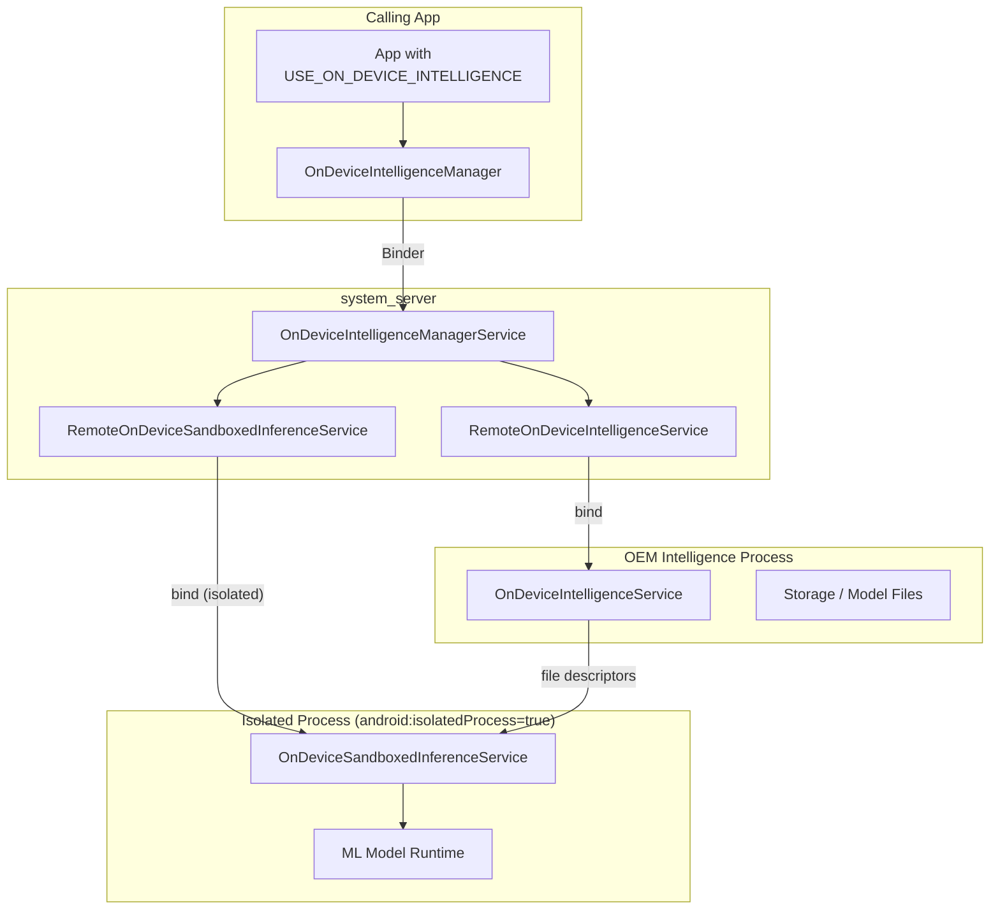
```mermaid
graph TB
    subgraph "Calling App"
        APP["App with<br/>USE_ON_DEVICE_INTELLIGENCE"]
        ODIM[OnDeviceIntelligenceManager]
    end

    subgraph "system_server"
        ODIMS[OnDeviceIntelligenceManagerService]
        RODI[RemoteOnDeviceIntelligenceService]
        RODSI[RemoteOnDeviceSandboxedInferenceService]
    end

    subgraph "OEM Intelligence Process"
        ODIS[OnDeviceIntelligenceService]
        STORAGE[Storage / Model Files]
    end

    subgraph "Isolated Process (android:isolatedProcess=true)"
        ODSIS[OnDeviceSandboxedInferenceService]
        MODEL[ML Model Runtime]
    end

    APP --> ODIM
    ODIM -- "Binder" --> ODIMS
    ODIMS --> RODI
    ODIMS --> RODSI
    RODI -- "bind" --> ODIS
    RODSI -- "bind (isolated)" --> ODSIS
    ODIS -- "file descriptors" --> ODSIS
    ODSIS --> MODEL
```

### 50.4.2 The Client: OnDeviceIntelligenceManager

The manager is a `@SystemApi` service requiring `USE_ON_DEVICE_INTELLIGENCE`:

```java
// frameworks/base/packages/NeuralNetworks/framework/platform/java/
//   android/app/ondeviceintelligence/OnDeviceIntelligenceManager.java

@SystemApi
@SystemService(Context.ON_DEVICE_INTELLIGENCE_SERVICE)
public final class OnDeviceIntelligenceManager {
```

Key operations:

| Method | Purpose |
|--------|---------|
| `getVersion()` | Query remote implementation version |
| `getRemoteServicePackageName()` | Get the OEM package providing inference |
| `listFeatures()` | List available ML features/models |
| `getFeature()` | Get details of a specific feature |
| `requestFeatureDownload()` | Trigger model download |
| `processRequest()` | Non-streaming inference request |
| `processRequestStreaming()` | Streaming (token-by-token) inference |
| `getTokenInfo()` | Token counting/analysis |
| `registerLifecycleListener()` | Model load/unload notifications |

### 50.4.3 The Sandboxed Inference Service

The actual inference runs in an isolated process:

```java
// frameworks/base/packages/NeuralNetworks/framework/platform/java/
//   android/service/ondeviceintelligence/OnDeviceSandboxedInferenceService.java

@SystemApi
public abstract class OnDeviceSandboxedInferenceService extends Service {
    public static final String SERVICE_INTERFACE =
            "android.service.ondeviceintelligence.OnDeviceSandboxedInferenceService";
```

The manifest declares:
```xml
<service android:name=".SampleSandboxedInferenceService"
         android:permission="android.permission.BIND_ONDEVICE_SANDBOXED_INFERENCE_SERVICE"
         android:isolatedProcess="true">
</service>
```

The `isolatedProcess="true"` flag means the service:

- Has no network access
- Has no access to the app's data directory
- Cannot access content providers
- Can only receive file descriptors passed explicitly by the system

Model weights reach the isolated process through `ParcelFileDescriptor`
objects passed by the `OnDeviceIntelligenceService` (the non-isolated
companion).

### 50.4.4 Dual-Service Architecture

ODI employs a two-service architecture:

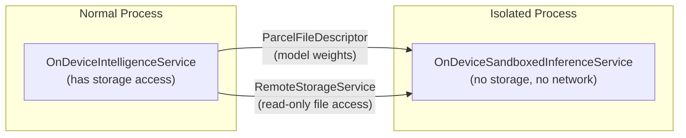
```mermaid
graph LR
    subgraph "Normal Process"
        ODIS["OnDeviceIntelligenceService<br/>(has storage access)"]
    end
    subgraph "Isolated Process"
        ODSIS["OnDeviceSandboxedInferenceService<br/>(no storage, no network)"]
    end
    ODIS -- "ParcelFileDescriptor<br/>(model weights)" --> ODSIS
    ODIS -- "RemoteStorageService<br/>(read-only file access)" --> ODSIS
```

1. **OnDeviceIntelligenceService** -- runs in the OEM's normal process with
   full storage access. Handles model management, downloads, and serves model
   files to the isolated process.

2. **OnDeviceSandboxedInferenceService** -- runs in an isolated process.
   Performs actual inference. Receives model weights only through file
   descriptors. This design ensures that even a compromised inference engine
   cannot exfiltrate model weights or user data.

### 50.4.5 Model Lifecycle Events

The framework supports model load/unload broadcast notifications:

```java
// OnDeviceSandboxedInferenceService.java

public static final String MODEL_LOADED_BROADCAST_INTENT =
    "android.service.ondeviceintelligence.MODEL_LOADED";
public static final String MODEL_UNLOADED_BROADCAST_INTENT =
    "android.service.ondeviceintelligence.MODEL_UNLOADED";
```

### 50.4.6 The System Service

`OnDeviceIntelligenceManagerService` extends `SystemService` and runs under
the SYSTEM user (not per-user), since ML models may have high memory
footprint:

```java
// frameworks/base/packages/NeuralNetworks/service/platform/java/
//   com/android/server/ondeviceintelligence/OnDeviceIntelligenceManagerService.java

public class OnDeviceIntelligenceManagerService extends SystemService {
    private static final String NAMESPACE_ON_DEVICE_INTELLIGENCE = "ondeviceintelligence";
    private static final long MAX_AGE_MS = TimeUnit.HOURS.toMillis(3);
    ...
```

The service maintains connection state to both remote services and handles:

- Permission enforcement (only apps with `USE_ON_DEVICE_INTELLIGENCE`)
- Configuration via `DeviceConfig` namespace `ondeviceintelligence`
- `InferenceInfoStore` for tracking inference statistics
- Temporary service overrides for testing

### 50.4.7 InferenceInfo

The framework introduces `InferenceInfo` for providing performance metadata:

```java
// OnDeviceIntelligenceManager.java

public static final String KEY_REQUEST_INFERENCE_INFO = "request_inference_info";
```

When requested, the callback receives `InferenceInfo` containing timing and
throughput metrics from the inference run.

### 50.4.8 Feature Discovery and Download

The feature lifecycle follows a discover-download-use pattern:

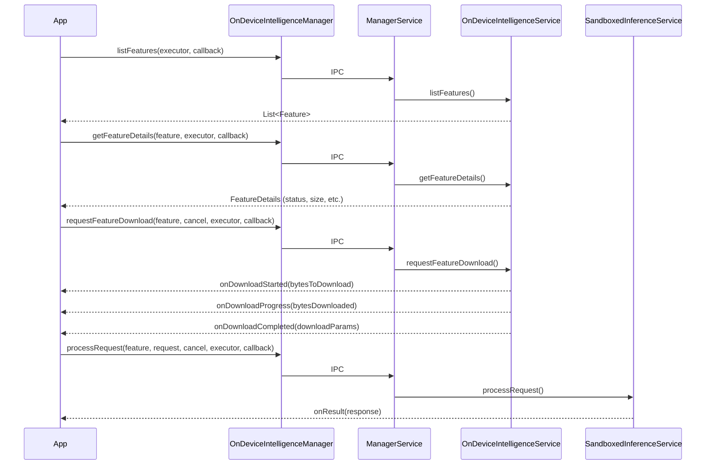
```mermaid
sequenceDiagram
    participant App
    participant Manager as OnDeviceIntelligenceManager
    participant Service as ManagerService
    participant OEM as OnDeviceIntelligenceService
    participant Sandbox as SandboxedInferenceService

    App->>Manager: listFeatures(executor, callback)
    Manager->>Service: IPC
    Service->>OEM: listFeatures()
    OEM-->>App: List<Feature>

    App->>Manager: getFeatureDetails(feature, executor, callback)
    Manager->>Service: IPC
    Service->>OEM: getFeatureDetails()
    OEM-->>App: FeatureDetails (status, size, etc.)

    App->>Manager: requestFeatureDownload(feature, cancel, executor, callback)
    Manager->>Service: IPC
    Service->>OEM: requestFeatureDownload()
    OEM-->>App: onDownloadStarted(bytesToDownload)
    OEM-->>App: onDownloadProgress(bytesDownloaded)
    OEM-->>App: onDownloadCompleted(downloadParams)

    App->>Manager: processRequest(feature, request, cancel, executor, callback)
    Manager->>Service: IPC
    Service->>Sandbox: processRequest()
    Sandbox-->>App: onResult(response)
```

The `DownloadCallback` interface provides fine-grained progress:

```java
// OnDeviceIntelligenceManager.java

public void requestFeatureDownload(@NonNull Feature feature,
        @Nullable CancellationSignal cancellationSignal,
        @NonNull @CallbackExecutor Executor callbackExecutor,
        @NonNull DownloadCallback callback) {
```

Download failure reasons include:

- `DOWNLOAD_FAILURE_STATUS_DOWNLOADING` -- Already downloading
- `DOWNLOAD_FAILURE_STATUS_NOT_ENOUGH_DISK_SPACE`
- `DOWNLOAD_FAILURE_STATUS_NETWORK_FAILURE`

### 50.4.9 Processing Modes

ODI supports two processing modes:

**Non-streaming (request/response):**

```java
@RequiresPermission(Manifest.permission.USE_ON_DEVICE_INTELLIGENCE)
public void processRequest(@NonNull Feature feature,
        @NonNull @InferenceParams Bundle request,
        @Nullable CancellationSignal cancellationSignal,
        @NonNull @CallbackExecutor Executor callbackExecutor,
        @NonNull ProcessingCallback callback);
```

**Streaming (token-by-token):**

```java
@RequiresPermission(Manifest.permission.USE_ON_DEVICE_INTELLIGENCE)
public void processRequestStreaming(@NonNull Feature feature,
        @NonNull @InferenceParams Bundle request,
        @Nullable CancellationSignal cancellationSignal,
        @NonNull @CallbackExecutor Executor callbackExecutor,
        @NonNull StreamingProcessingCallback callback);
```

The streaming mode is essential for LLM inference, where generating a full
response may take seconds but individual tokens arrive much faster.

### 50.4.10 Token Information

The `requestTokenInfo()` API computes token-level metadata without performing
full inference:

```java
@RequiresPermission(Manifest.permission.USE_ON_DEVICE_INTELLIGENCE)
public void requestTokenInfo(@NonNull Feature feature,
        @NonNull @InferenceParams Bundle request,
        @Nullable CancellationSignal cancellationSignal,
        @NonNull @CallbackExecutor Executor callbackExecutor,
        @NonNull OutcomeReceiver<TokenInfo, OnDeviceIntelligenceException> outcomeReceiver);
```

This is useful for:

- Counting tokens before inference (to check context limits)
- Estimating inference cost/time
- Token-level analysis without full generation

### 50.4.11 Lifecycle Listeners

Apps can register to be notified when models are loaded or unloaded:

```java
// OnDeviceIntelligenceManager.java

private final Map<OnDeviceSandboxedInferenceService.LifecycleListener,
        ILifecycleListener.Stub> mLifecycleListeners = new ConcurrentHashMap<>();
```

This allows apps to:

- Show loading indicators when a model is being loaded
- Adapt UI based on model availability
- Pre-warm by triggering model loading before the user needs it

### 50.4.12 Processing State Updates

The sandboxed service can update its processing state:

```java
// OnDeviceSandboxedInferenceService.java

public static final String PROCESSING_STATE_BUNDLE_KEY = "processing_state";
```

State updates allow the system to track:

- Whether the service is actively processing
- How much memory the model is using
- Whether the service is in a degraded state

### 50.4.13 Configuration and DeviceConfig

The system service is controlled through the `ondeviceintelligence`
DeviceConfig namespace:

```java
// OnDeviceIntelligenceManagerService.java

private static final String NAMESPACE_ON_DEVICE_INTELLIGENCE = "ondeviceintelligence";
private static final String KEY_SERVICE_ENABLED = "service_enabled";
private static final boolean DEFAULT_SERVICE_ENABLED = true;
```

OEMs configure the implementation package through system resources. The
service can be temporarily overridden for testing via shell commands.

### 50.4.14 Streaming Inference Protocol Detail

The streaming API delivers partial inference results incrementally, which suits LLM token-by-token output well but is not LLM-specific:

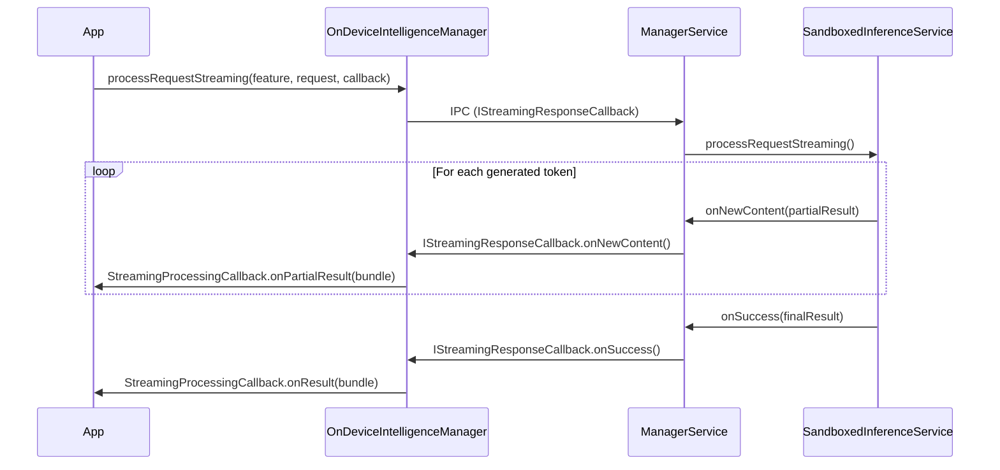
```mermaid
sequenceDiagram
    participant App
    participant Manager as OnDeviceIntelligenceManager
    participant Service as ManagerService
    participant Sandbox as SandboxedInferenceService

    App->>Manager: processRequestStreaming(feature, request, callback)
    Manager->>Service: IPC (IStreamingResponseCallback)
    Service->>Sandbox: processRequestStreaming()

    loop For each generated token
        Sandbox->>Service: onNewContent(partialResult)
        Service->>Manager: IStreamingResponseCallback.onNewContent()
        Manager->>App: StreamingProcessingCallback.onPartialResult(bundle)
    end

    Sandbox->>Service: onSuccess(finalResult)
    Service->>Manager: IStreamingResponseCallback.onSuccess()
    Manager->>App: StreamingProcessingCallback.onResult(bundle)
```

The `IStreamingResponseCallback` defines the wire protocol:

```java
// OnDeviceIntelligenceManager.java (processRequestStreaming)

IStreamingResponseCallback callback = new IStreamingResponseCallback.Stub() {
    @Override
    public void onNewContent(@InferenceParams Bundle result) {
        Binder.withCleanCallingIdentity(() -> {
            callbackExecutor.execute(
                    () -> streamingProcessingCallback.onPartialResult(result));
        });
    }

    @Override
    public void onSuccess(@InferenceParams Bundle result) {
        Binder.withCleanCallingIdentity(() -> {
            callbackExecutor.execute(
                    () -> streamingProcessingCallback.onResult(result));
        });
    }

    @Override
    public void onFailure(int errorCode, String errorMessage,
            PersistableBundle errorParams) {
        Binder.withCleanCallingIdentity(() -> {
            callbackExecutor.execute(
                    () -> streamingProcessingCallback.onError(
                            new OnDeviceIntelligenceException(
                                    errorCode, errorMessage, errorParams)));
        });
    }
```

### 50.4.15 Data Augmentation Protocol

A unique feature of ODI is the data augmentation callback, which allows the
sandboxed inference service to request additional data from the calling app
mid-inference:

```java
// OnDeviceIntelligenceManager.java

@Override
public void onDataAugmentRequest(@NonNull @InferenceParams Bundle request,
        @NonNull RemoteCallback contentCallback) {
    Binder.withCleanCallingIdentity(() -> callbackExecutor.execute(
            () -> processingCallback.onDataAugmentRequest(request, result -> {
                Bundle bundle = new Bundle();
                bundle.putParcelable(AUGMENT_REQUEST_CONTENT_BUNDLE_KEY, result);
                callbackExecutor.execute(() -> contentCallback.sendResult(bundle));
            })));
}
```

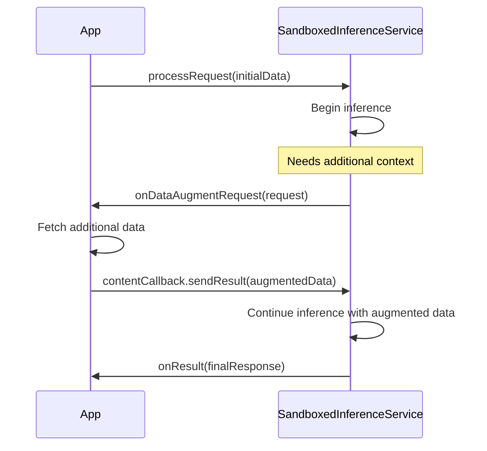
```mermaid
sequenceDiagram
    participant App
    participant Sandbox as SandboxedInferenceService

    App->>Sandbox: processRequest(initialData)
    Sandbox->>Sandbox: Begin inference
    Note over Sandbox: Needs additional context
    Sandbox->>App: onDataAugmentRequest(request)
    App->>App: Fetch additional data
    App->>Sandbox: contentCallback.sendResult(augmentedData)
    Sandbox->>Sandbox: Continue inference with augmented data
    Sandbox->>App: onResult(finalResponse)
```

This pattern enables retrieval-augmented generation (RAG) where the model
can request relevant documents mid-generation.

### 50.4.16 ProcessingSignal

Beyond `CancellationSignal`, ODI provides a `ProcessingSignal` for
sending custom control signals to the inference service during processing:

```java
// OnDeviceIntelligenceManager.java

public void processRequest(@NonNull Feature feature,
        @NonNull @InferenceParams Bundle request,
        @RequestType int requestType,
        @Nullable CancellationSignal cancellationSignal,
        @Nullable ProcessingSignal processingSignal,
        @NonNull @CallbackExecutor Executor callbackExecutor,
        @NonNull ProcessingCallback processingCallback) {
```

This allows apps to:

- Adjust generation parameters mid-stream (e.g., change temperature)
- Signal context updates
- Provide real-time feedback to the model

### 50.4.17 Power Attribution

ODI tracks inference power usage for attribution:

```java
// OnDeviceIntelligenceManager.java

@RequiresPermission(Manifest.permission.DUMP)
@FlaggedApi(FLAG_ON_DEVICE_INTELLIGENCE_25Q4)
public @NonNull List<InferenceInfo> getLatestInferenceInfo(
        @CurrentTimeMillisLong long startTimeEpochMillis) {
    return mService.getLatestInferenceInfo(startTimeEpochMillis);
}
```

This allows the system to correctly attribute battery usage to the app that
triggered the inference rather than blaming the inference service itself.

### 50.4.18 Security Boundaries

The ODI framework enforces several security boundaries:

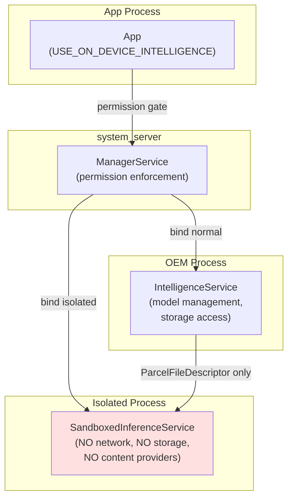
```mermaid
graph TB
    subgraph "App Process"
        A["App<br/>(USE_ON_DEVICE_INTELLIGENCE)"]
    end

    subgraph "system_server"
        B["ManagerService<br/>(permission enforcement)"]
    end

    subgraph "OEM Process"
        C["IntelligenceService<br/>(model management,<br/>storage access)"]
    end

    subgraph "Isolated Process"
        D["SandboxedInferenceService<br/>(NO network, NO storage,<br/>NO content providers)"]
    end

    A -->|"permission gate"| B
    B -->|"bind normal"| C
    B -->|"bind isolated"| D
    C -->|"ParcelFileDescriptor only"| D

    style D fill:#ffe0e0
```

**Key restrictions on the isolated process:**

- No network access (android:isolatedProcess=true)
- No access to app data directory
- No access to content providers
- Can only receive explicitly passed file descriptors
- Memory limits enforced by the system
- Process can be killed by the system at any time

This design means that even if an attacker compromises the inference engine
(e.g., through a model weight poisoning attack), they cannot exfiltrate
data from the device.

---

## 50.5 NeuralNetworks (NNAPI)

The Neural Networks API (NNAPI) is AOSP's hardware abstraction for
accelerated ML inference. It has been part of AOSP since Android 8.1 and is
now delivered as a Mainline module.

**Source tree:**

```
packages/modules/NeuralNetworks/          (104 MB)
    runtime/                              -- C++ runtime library
        NeuralNetworks.cpp                -- C API entry points
        Manager.cpp                       (1376 lines) -- Device management
        CompilationBuilder.cpp            -- Model compilation
        ExecutionBuilder.cpp              -- Inference execution
        ExecutionPlan.cpp                 -- Multi-device partitioning
        ...
    common/types/include/nnapi/
        IDevice.h                         -- HAL device interface
        Types.h                           -- Shared type definitions
    driver/                               -- Reference CPU driver
    framework/                            -- Java/AIDL framework
    service/                              -- NNAPI service
    extensions/                           -- Vendor extensions
    shim_and_sl/                          -- Support library / shim
```

### 50.5.1 Architecture

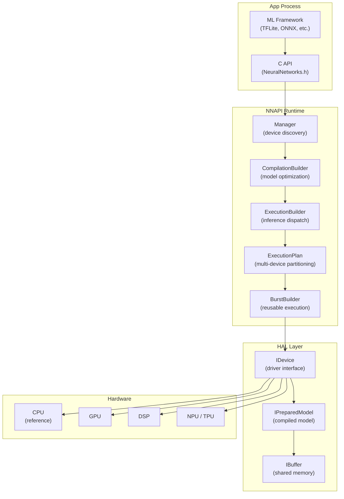
```mermaid
graph TB
    subgraph "App Process"
        APP["ML Framework<br/>(TFLite, ONNX, etc.)"]
        CAPI["C API<br/>(NeuralNetworks.h)"]
    end

    subgraph "NNAPI Runtime"
        MGR["Manager<br/>(device discovery)"]
        COMP["CompilationBuilder<br/>(model optimization)"]
        EXEC["ExecutionBuilder<br/>(inference dispatch)"]
        PLAN["ExecutionPlan<br/>(multi-device partitioning)"]
        BURST["BurstBuilder<br/>(reusable execution)"]
    end

    subgraph "HAL Layer"
        IDEV["IDevice<br/>(driver interface)"]
        IPM["IPreparedModel<br/>(compiled model)"]
        IBUF["IBuffer<br/>(shared memory)"]
    end

    subgraph "Hardware"
        CPU["CPU<br/>(reference)"]
        GPU["GPU"]
        DSP["DSP"]
        NPU["NPU / TPU"]
    end

    APP --> CAPI
    CAPI --> MGR
    MGR --> COMP
    COMP --> EXEC
    EXEC --> PLAN
    PLAN --> BURST
    BURST --> IDEV
    IDEV --> IPM
    IPM --> IBUF
    IDEV --> CPU
    IDEV --> GPU
    IDEV --> DSP
    IDEV --> NPU
```

### 50.5.2 The C API

The public API is a C interface defined in `NeuralNetworks.h`. The
implementation in `NeuralNetworks.cpp` validates parameters and delegates to
C++ builder classes:

```cpp
// packages/modules/NeuralNetworks/runtime/NeuralNetworks.cpp

// Contains all the entry points to the C Neural Networks API.
// We do basic validation of the operands and then call the class
// that implements the functionality.
```

Key data types verified at compile time:

```cpp
static_assert(ANEURALNETWORKS_FLOAT32 == 0, "...");
static_assert(ANEURALNETWORKS_INT32 == 1, "...");
static_assert(ANEURALNETWORKS_UINT32 == 2, "...");
static_assert(ANEURALNETWORKS_TENSOR_FLOAT32 == 3, "...");
static_assert(ANEURALNETWORKS_TENSOR_INT32 == 4, "...");
static_assert(ANEURALNETWORKS_TENSOR_QUANT8_ASYMM == 5, "...");
```

### 50.5.3 The Runtime Pipeline

The NNAPI execution pipeline has four stages:

```mermaid
graph LR
    A["1. Model<br/>Definition"] --> B["2. Compilation"]
    B --> C["3. Execution"]
    C --> D["4. Result<br/>Retrieval"]

    A2["ANeuralNetworksModel_create()"] --> A
    B2["ANeuralNetworksCompilation_create()"] --> B
    C2["ANeuralNetworksExecution_create()"] --> C
    D2["ANeuralNetworksExecution_getOutput*()"] --> D
```

1. **Model Definition** -- Build a computation graph with operands and
   operations. Each operation maps to a standardized neural network operator
   (convolution, pooling, activation, etc.).

2. **Compilation** -- The `CompilationBuilder` selects devices, partitions the
   model across multiple accelerators if beneficial, and generates
   device-specific code.

3. **Execution** -- The `ExecutionBuilder` dispatches work to devices. Can be
   synchronous, asynchronous, or fenced.

4. **Result Retrieval** -- Output tensors are read from shared memory buffers.

### 50.5.4 The HAL: IDevice

The `IDevice` interface represents a hardware accelerator driver:

```cpp
// packages/modules/NeuralNetworks/common/types/include/nnapi/IDevice.h

class IDevice {
   public:
    virtual const std::string& getName() const = 0;
    virtual const std::string& getVersionString() const = 0;
    virtual Version getFeatureLevel() const = 0;
    virtual DeviceType getType() const = 0;
    // Model compilation
    virtual GeneralResult<SharedPreparedModel> prepareModel(...) const = 0;
    // Memory allocation
    virtual GeneralResult<SharedBuffer> allocate(...) const = 0;
    ...
```

Device types include:

| Type | Description |
|------|-------------|
| `DeviceType::CPU` | Reference CPU implementation |
| `DeviceType::GPU` | Graphics processing unit |
| `DeviceType::ACCELERATOR` | Dedicated ML accelerator (NPU/TPU) |
| `DeviceType::OTHER` | Other hardware |

### 50.5.5 Multi-Device Partitioning

The `ExecutionPlan` handles model partitioning across multiple devices.
If a model contains operations that different accelerators handle best,
NNAPI can split the model:

```mermaid
graph TB
    subgraph "Model Graph"
        OP1[Conv2D] --> OP2[ReLU]
        OP2 --> OP3[MaxPool]
        OP3 --> OP4[FullyConnected]
        OP4 --> OP5[Softmax]
    end

    subgraph "Partitioned"
        P1["Partition 1: GPU<br/>Conv2D + ReLU + MaxPool"]
        P2["Partition 2: NPU<br/>FullyConnected + Softmax"]
    end

    OP3 --> P1
    OP5 --> P2
    P1 -- "shared memory" --> P2
```

### 50.5.6 Burst Execution

The `BurstBuilder` creates a reusable execution context for repeated
inferences with different input data but the same model. This amortizes
compilation and setup costs:

```cpp
// packages/modules/NeuralNetworks/runtime/Manager.h

class RuntimeExecution {
   public:
    virtual std::tuple<int, std::vector<OutputShape>, Timing> compute(
            const SharedBurst& burstController,
            const OptionalTimePoint& deadline) const = 0;

    virtual std::tuple<int, int, ExecuteFencedInfoCallback, Timing> computeFenced(
            const std::vector<int>& waitFor,
            const OptionalTimePoint& deadline,
            const OptionalDuration& timeoutDurationAfterFence) const = 0;
};
```

### 50.5.7 Vendor Extensions

The `extensions/` directory allows vendors to define custom operations and
data types beyond the standard NNAPI specification. Extensions use a
namespaced identifier to avoid conflicts:

```
vendor.google.custom_op = 0x0001
```

### 50.5.8 Support Library and Shim

The `shim_and_sl/` directory provides:

- **Support Library (SL):** A standalone library that apps can bundle for
  consistent NNAPI behavior across Android versions.

- **Shim:** Bridges between AIDL and HIDL HAL versions for backward
  compatibility.

### 50.5.9 The RuntimePreparedModel Abstraction

The `RuntimePreparedModel` provides a unified interface for both hardware
accelerated and CPU-based execution:

```cpp
// packages/modules/NeuralNetworks/runtime/Manager.h

class RuntimePreparedModel {
   public:
    virtual const Device* getDevice() const = 0;
    virtual SharedPreparedModel getInterface() const = 0;

    virtual std::tuple<int, std::vector<OutputShape>, Timing> execute(
            const std::vector<ModelArgumentInfo>& inputs,
            const std::vector<ModelArgumentInfo>& outputs,
            const std::vector<const RuntimeMemory*>& memories,
            const SharedBurst& burstController,
            MeasureTiming measure,
            const OptionalTimePoint& deadline,
            const OptionalDuration& loopTimeoutDuration,
            const std::vector<TokenValuePair>& metaData) const = 0;

    virtual std::tuple<int, int, ExecuteFencedInfoCallback, Timing> executeFenced(
            const std::vector<ModelArgumentInfo>& inputs,
            const std::vector<ModelArgumentInfo>& outputs,
            const std::vector<const RuntimeMemory*>& memories,
            const std::vector<int>& waitFor,
            MeasureTiming measure,
            const OptionalTimePoint& deadline,
            const OptionalDuration& loopTimeoutDuration,
            const OptionalDuration& timeoutDurationAfterFence,
            const std::vector<TokenValuePair>& metaData) const = 0;
```

The `executeFenced` variant supports:

- **Wait-for fences**: Synchronize with other GPU/DSP work
- **Timeout after fence**: Set a deadline relative to fence signaling
- **Timing measurement**: Optionally collect execution timing

### 50.5.10 NNAPI Data Types

The C API defines a rich set of tensor and scalar types:

```cpp
// packages/modules/NeuralNetworks/runtime/NeuralNetworks.cpp

static_assert(ANEURALNETWORKS_FLOAT32 == 0);
static_assert(ANEURALNETWORKS_INT32 == 1);
static_assert(ANEURALNETWORKS_UINT32 == 2);
static_assert(ANEURALNETWORKS_TENSOR_FLOAT32 == 3);
static_assert(ANEURALNETWORKS_TENSOR_INT32 == 4);
static_assert(ANEURALNETWORKS_TENSOR_QUANT8_ASYMM == 5);
static_assert(ANEURALNETWORKS_BOOL == 6);
static_assert(ANEURALNETWORKS_TENSOR_QUANT16_SYMM == 7);
static_assert(ANEURALNETWORKS_TENSOR_FLOAT16 == 8);
static_assert(ANEURALNETWORKS_TENSOR_BOOL8 == 9);
static_assert(ANEURALNETWORKS_FLOAT16 == 10);
static_assert(ANEURALNETWORKS_TENSOR_QUANT8_SYMM_PER_CHANNEL == 11);
static_assert(ANEURALNETWORKS_TENSOR_QUANT16_ASYMM == 12);
static_assert(ANEURALNETWORKS_TENSOR_QUANT8_SYMM == 13);
```

The `static_assert` checks guarantee ABI stability -- if any constant changes,
compilation fails.

### 50.5.11 Device Discovery

The `Manager` class discovers available accelerators at runtime:

```mermaid
graph TB
    MGR["Manager::getDevices()"]
    MGR --> REG["Device Registry"]
    REG --> HAL_DEV1["HAL Device 1<br/>(GPU via AIDL)"]
    REG --> HAL_DEV2["HAL Device 2<br/>(NPU via AIDL)"]
    REG --> HAL_DEV3["HAL Device 3<br/>(DSP via HIDL shim)"]
    REG --> CPU_DEV["CPU Reference<br/>(built-in)"]
```

The Manager:

1. Queries the `IDevice` service manager for registered accelerators
2. Reads their capabilities (supported operations, performance info)
3. Maintains a device list for model compilation and execution
4. Falls back to the CPU reference implementation if no accelerators match

### 50.5.12 Memory Management

NNAPI uses shared memory for zero-copy data transfer between the app and
accelerators:

```mermaid
graph LR
    APP["App Memory<br/>(AHardwareBuffer)"] --> SHARED["Shared Memory<br/>(ashmem / ion)"]
    SHARED --> ACCEL["Accelerator<br/>DMA"]
```

The `RuntimeMemory` class manages memory pools:

- **AHardwareBuffer**: For GPU-accessible memory
- **Ashmem**: For CPU-to-accelerator sharing
- **Ion/DMA-buf**: For direct hardware DMA access

### 50.5.13 NNAPI Feature Levels

NNAPI has evolved through several feature levels, each adding new operations
and capabilities:

| Feature Level | Android Version | Key Additions |
|---------------|-----------------|---------------|
| 1 | 8.1 (API 27) | Basic ops: Conv2D, MaxPool, ReLU |
| 2 | 9 (API 28) | BatchNorm, LSTM, more quantized ops |
| 3 | 10 (API 29) | Control flow (IF, WHILE), fenced execution |
| 4 | 11 (API 30) | Quality of service, model priority |
| 5 | 12 (API 31) | Signed 8-bit quantization |
| 6 | 13 (API 33) | AIDL HAL interface |
| 7 | 14 (API 34) | Vendor extensions |
| 8 | 15 (API 35) | Flatbuffer model format |

### 50.5.14 Telemetry

The runtime includes a `Telemetry` module that collects anonymized performance
metrics:

```cpp
// packages/modules/NeuralNetworks/runtime/NeuralNetworks.cpp

#include "Telemetry.h"
```

Metrics include:

- Compilation time per device
- Execution latency
- Error rates
- Device selection outcomes
- Memory allocation patterns

### 50.5.15 The NNAPI C API Lifecycle

A complete NNAPI workflow involves these API calls in order:

```mermaid
graph TD
    A["ANeuralNetworksModel_create()"] --> B["ANeuralNetworksModel_addOperand()<br/>(repeat for each tensor)"]
    B --> C["ANeuralNetworksModel_setOperandValue()<br/>(for constants)"]
    C --> D["ANeuralNetworksModel_addOperation()<br/>(repeat for each op)"]
    D --> E["ANeuralNetworksModel_identifyInputsAndOutputs()"]
    E --> F["ANeuralNetworksModel_finish()"]
    F --> G["ANeuralNetworksCompilation_create()"]
    G --> H["ANeuralNetworksCompilation_setPreference()"]
    H --> I["ANeuralNetworksCompilation_finish()"]
    I --> J["ANeuralNetworksExecution_create()"]
    J --> K["ANeuralNetworksExecution_setInput()<br/>(bind input buffers)"]
    K --> L["ANeuralNetworksExecution_setOutput()<br/>(bind output buffers)"]
    L --> M["ANeuralNetworksExecution_compute()<br/>or startCompute()"]
    M --> N["Read output buffers"]
    N --> O["ANeuralNetworksExecution_free()"]
    O --> P["ANeuralNetworksCompilation_free()"]
    P --> Q["ANeuralNetworksModel_free()"]
```

### 50.5.16 Compilation Preferences

```c
// ANeuralNetworksCompilation_setPreference() options:
ANEURALNETWORKS_PREFER_LOW_POWER       // Battery efficient
ANEURALNETWORKS_PREFER_FAST_SINGLE_ANSWER  // Minimum latency
ANEURALNETWORKS_PREFER_SUSTAINED_SPEED    // Sustained throughput
```

These preferences guide device selection:

- `LOW_POWER` may prefer a DSP over a GPU
- `FAST_SINGLE_ANSWER` may prefer GPU with highest peak performance
- `SUSTAINED_SPEED` may prefer a device with thermal headroom

### 50.5.17 Error Handling

NNAPI uses integer error codes for all operations:

| Code | Name | Meaning |
|------|------|---------|
| 0 | `ANEURALNETWORKS_NO_ERROR` | Success |
| 1 | `ANEURALNETWORKS_OUT_OF_MEMORY` | Memory allocation failed |
| 2 | `ANEURALNETWORKS_INCOMPLETE` | Operation not yet completed |
| 3 | `ANEURALNETWORKS_UNEXPECTED_NULL` | Null pointer where non-null expected |
| 4 | `ANEURALNETWORKS_BAD_DATA` | Invalid model or data |
| 5 | `ANEURALNETWORKS_OP_FAILED` | Hardware execution failure |
| 6 | `ANEURALNETWORKS_BAD_STATE` | Invalid state for this operation |
| 7 | `ANEURALNETWORKS_UNMAPPABLE` | Cannot map to this device |
| 8 | `ANEURALNETWORKS_OUTPUT_INSUFFICIENT_SIZE` | Output buffer too small |
| 9 | `ANEURALNETWORKS_UNAVAILABLE_DEVICE` | Device unavailable |
| 10 | `ANEURALNETWORKS_MISSED_DEADLINE_TRANSIENT` | Temporary deadline miss |
| 11 | `ANEURALNETWORKS_MISSED_DEADLINE_PERSISTENT` | Persistent deadline miss |
| 12 | `ANEURALNETWORKS_RESOURCE_EXHAUSTED_TRANSIENT` | Temporary resource exhaustion |
| 13 | `ANEURALNETWORKS_RESOURCE_EXHAUSTED_PERSISTENT` | Persistent resource exhaustion |
| 14 | `ANEURALNETWORKS_DEAD_OBJECT` | Driver process died |

### 50.5.18 Supported Operations

NNAPI supports over 100 neural network operations including:

**Activation functions:**

- RELU, RELU1, RELU6
- LOGISTIC (sigmoid)
- TANH
- ELU, HARD_SWISH

**Convolution:**

- CONV_2D, DEPTHWISE_CONV_2D
- TRANSPOSE_CONV_2D
- GROUPED_CONV_2D

**Pooling:**

- AVERAGE_POOL_2D, MAX_POOL_2D
- L2_POOL_2D

**Normalization:**

- BATCH_NORMALIZATION
- L2_NORMALIZATION
- LOCAL_RESPONSE_NORMALIZATION
- INSTANCE_NORMALIZATION

**Recurrent:**

- LSTM, UNIDIRECTIONAL_SEQUENCE_LSTM
- BIDIRECTIONAL_SEQUENCE_LSTM
- UNIDIRECTIONAL_SEQUENCE_RNN
- BIDIRECTIONAL_SEQUENCE_RNN

**Element-wise:**

- ADD, SUB, MUL, DIV
- FLOOR, CEIL, ABS, NEG
- POW, SQRT, RSQRT, EXP, LOG
- SIN, MINIMUM, MAXIMUM
- LESS, LESS_EQUAL, EQUAL, NOT_EQUAL

**Shape manipulation:**

- RESHAPE, SQUEEZE, EXPAND_DIMS
- CONCATENATION, SPLIT
- TRANSPOSE, GATHER, SELECT
- SLICE, STRIDED_SLICE, PAD
- TILE, REVERSE, BATCH_TO_SPACE_ND

**Control flow:**

- IF, WHILE (added in Feature Level 3)

### 50.5.19 Module Delivery and Updates

NNAPI is delivered as part of the NeuralNetworks Mainline module
(`com.android.neuralnetworks`), which allows:

- Security patches without full OS update
- New operation support for existing devices
- Bug fixes independent of OEM update cycles
- Consistent behavior across devices

The module is built from:
```
packages/modules/NeuralNetworks/apex/
```

---

## 50.6 OnDevicePersonalization and Federated Learning

The OnDevicePersonalization (ODP) Mainline module provides infrastructure for
privacy-preserving machine learning that keeps raw data on-device while
producing useful aggregate models.

**Source tree:**

```
packages/modules/OnDevicePersonalization/     (642 files)
    framework/                                -- Public API
    federatedcompute/                         -- Federated learning engine
        src/com/android/federatedcompute/services/
            training/
                IsolatedTrainingService.java  -- Isolated TFLite runtime
                IsolatedTrainingServiceImpl.java
            examplestore/                     -- Training data management
            scheduling/                       -- Job scheduling
            common/                           -- Shared utilities
    systemservice/                            -- System service
    pluginlib/                                -- Plugin interface for OEMs
    samples/                                  -- Sample implementations
```

### 50.6.1 Architecture

```mermaid
graph TB
    subgraph "App Process"
        APP_DATA[App Data]
        ODP_CLIENT[ODP Client API]
    end

    subgraph "ODP Module Process"
        ODP_SVC["OnDevicePersonalization<br/>Service"]
        FC_SCHED["Federated Compute<br/>Scheduler"]
        EXAMPLE_STORE[Example Store]
    end

    subgraph "Isolated Process"
        ITS[IsolatedTrainingService]
        TFLITE[TFLite Runtime]
    end

    subgraph "Remote Server"
        FC_SERVER["Federated Compute<br/>Server"]
    end

    APP_DATA --> ODP_CLIENT
    ODP_CLIENT --> ODP_SVC
    ODP_SVC --> FC_SCHED
    FC_SCHED --> EXAMPLE_STORE
    EXAMPLE_STORE --> ITS
    ITS --> TFLITE
    FC_SCHED -- "aggregated updates<br/>(differential privacy)" --> FC_SERVER
    FC_SERVER -- "global model<br/>updates" --> FC_SCHED
```

### 50.6.2 Federated Learning Concepts

Federated learning trains a shared model across many devices without
centralizing the training data:

```mermaid
sequenceDiagram
    participant Server as Federated Compute Server
    participant Device1 as Device A
    participant Device2 as Device B
    participant Device3 as Device C

    Server->>Device1: Send global model v1
    Server->>Device2: Send global model v1
    Server->>Device3: Send global model v1

    Device1->>Device1: Train on local data
    Device2->>Device2: Train on local data
    Device3->>Device3: Train on local data

    Device1->>Server: Send gradient update (+ noise)
    Device2->>Server: Send gradient update (+ noise)
    Device3->>Server: Send gradient update (+ noise)

    Server->>Server: Aggregate updates, Apply differential privacy
    Server->>Device1: Send global model v2
```

### 50.6.3 IsolatedTrainingService

The actual TFLite training runs in an isolated process:

```java
// packages/modules/OnDevicePersonalization/federatedcompute/
//   src/.../training/IsolatedTrainingService.java

public class IsolatedTrainingService extends Service {
    private IIsolatedTrainingService.Stub mBinder;

    @Override
    public void onCreate() {
        mBinder = new IsolatedTrainingServiceImpl(this);
    }

    @Override
    public IBinder onBind(Intent intent) {
        return mBinder;
    }
}
```

The `IsolatedTrainingServiceImpl` loads the TFLite runtime and executes
training rounds. Training data is provided through an `ExampleStore`
abstraction that iterates over the device's local examples without exposing
raw data to the network-connected scheduling process.

### 50.6.4 Example Store

The example store provides training data to the isolated process:

```
federatedcompute/src/.../examplestore/
    ExampleIterator.java              -- Iterator interface
    FederatedExampleIterator.java     -- Federated compute iterator
    ExampleConsumptionRecorder.java   -- Tracks data usage
    ExampleStoreServiceProvider.java  -- Service binding
```

### 50.6.5 Scheduling and Conditions

Federated compute jobs are scheduled through Android's `JobScheduler`
with conditions that protect user experience:

```
federatedcompute/src/.../scheduling/
    FederatedComputeJobManager.java
```

Training runs only when the device is:

- Charging (or above a battery threshold)
- Connected to unmetered network (Wi-Fi)
- Idle

These conditions are tracked by `BatteryInfo` and `NetworkStats` in the
`common/` package.

### 50.6.6 Privacy Protections

The federated compute protocol applies multiple privacy layers:

1. **Isolated process**: Training data never leaves the isolated process
2. **Secure aggregation**: Individual updates are encrypted before sending
3. **Differential privacy**: Noise is added to gradient updates
4. **Minimum cohort size**: Updates are only accepted from groups above
   a threshold, preventing single-device fingerprinting

### 50.6.7 Federated Compute Module Structure

```
packages/modules/OnDevicePersonalization/federatedcompute/
    src/com/android/federatedcompute/services/
        training/
            IsolatedTrainingService.java          -- Isolated service entry
            IsolatedTrainingServiceImpl.java      -- Training logic
        examplestore/
            ExampleIterator.java                  -- Training data iterator
            FederatedExampleIterator.java         -- Federated-specific iterator
            ExampleConsumptionRecorder.java       -- Usage tracking
            ExampleStoreServiceProvider.java      -- Service binding
        scheduling/
            FederatedComputeJobManager.java       -- Job scheduling
        common/
            Flags.java                            -- Feature flags
            PhFlags.java                          -- Phone-home flags
            Constants.java                        -- Shared constants
            FederatedComputeExecutors.java        -- Thread pools
            BatteryInfo.java                      -- Battery state
            NetworkStats.java                     -- Network conditions
            TrainingEventLogger.java              -- Metrics
            TrainingResult.java                   -- Training outcome
```

### 50.6.8 Training Protocol

The federated training protocol follows these steps on each device:

```mermaid
graph TB
    A["Scheduler triggers<br/>training job"] --> B{Check conditions}
    B -->|Charging + WiFi + Idle| C["Download global model<br/>from server"]
    B -->|Conditions not met| Z[Skip this round]
    C --> D["Load model in<br/>IsolatedTrainingService"]
    D --> E["Iterate over<br/>local examples"]
    E --> F["Compute local<br/>gradient update"]
    F --> G["Clip gradient<br/>to bounded norm"]
    G --> H["Add calibrated<br/>noise"]
    H --> I["Encrypt with<br/>secure aggregation key"]
    I --> J["Upload encrypted<br/>update to server"]
    J --> K["Server aggregates<br/>once cohort is complete"]
    K --> L["New global model<br/>available"]
```

### 50.6.9 Example Store Architecture

The example store provides a clean abstraction for training data:

```mermaid
graph TB
    subgraph "App Process"
        APP_DATA[App-Specific Data]
    end

    subgraph "ODP Module"
        ESP[ExampleStoreServiceProvider]
        EI[ExampleIterator]
    end

    subgraph "Isolated Training Process"
        FEI[FederatedExampleIterator]
        TF[TFLite Training]
    end

    APP_DATA --> ESP
    ESP --> EI
    EI --> FEI
    FEI --> TF
```

The `ExampleConsumptionRecorder` tracks which training examples have been
used, preventing over-representation of frequently available data.

### 50.6.10 Plugin Architecture

OEMs can extend ODP through the plugin library:

```
packages/modules/OnDevicePersonalization/pluginlib/
```

Plugins allow OEMs to:

- Provide custom example stores
- Implement device-specific training optimizations
- Add custom metrics collection
- Define custom scheduling policies

---

## 50.7 Content Capture and Intelligence

Three framework services work together to capture UI state, classify text
entities, and predict app usage. These services form the "passive
intelligence" layer that powers features like Smart Linkify, Smart Copy,
and app usage predictions.

### 50.7.1 ContentCaptureManager

The Content Capture subsystem silently captures the structure and content of
activities as the user interacts with them:

```java
// frameworks/base/core/java/android/view/contentcapture/ContentCaptureManager.java

@SystemService(Context.CONTENT_CAPTURE_MANAGER_SERVICE)
public final class ContentCaptureManager {
```

**Source:**
`frameworks/base/core/java/android/view/contentcapture/ContentCaptureManager.java`
(1221 lines)

From the Javadoc:

> Content capture provides real-time, continuous capture of application
> activity, display and events to an intelligence service that is provided by
> the Android system. The intelligence service then uses that info to mediate
> and speed user journey through different apps.

**Design principles:**

| Concern | Mechanism |
|---------|-----------|
| **Privacy** | Intelligence service is a trusted system component; cannot be changed by user; data used only for on-device ML; enforced by process isolation and CDD |
| **Performance** | Only enabled for allowlisted apps/activities; events are buffered and sent in batches |

### 50.7.2 ContentCaptureService

The service side receives captured content:

```
frameworks/base/core/java/android/service/contentcapture/
    ContentCaptureService.java           -- Abstract service base
    ContentCaptureServiceInfo.java       -- Service metadata
    IContentCaptureService.aidl          -- Binder interface
    ActivityEvent.java                   -- Activity lifecycle events
    FlushMetrics.java                    -- Batching metrics
    DataShareCallback.java               -- Data export
```

```mermaid
sequenceDiagram
    participant Activity
    participant CCSession as ContentCaptureSession
    participant CCM as ContentCaptureManager
    participant CCMS as ContentCaptureManagerService
    participant CCS as ContentCaptureService (OEM implementation)

    Activity->>CCSession: onStart/onResume
    CCSession->>CCSession: Capture view structure
    CCSession->>CCM: Buffer events
    CCM->>CCMS: Flush batch
    CCMS->>CCS: onContentCaptureEvents(sessionId, events)
    CCS->>CCS: ML analysis (entity detection, context building)
```

### 50.7.3 TextClassifierService

The `TextClassifierService` provides entity classification for text:

```
frameworks/base/core/java/android/service/textclassifier/
    TextClassifierService.java          (513 lines)
```

Capabilities:

| API | Function |
|-----|----------|
| `onSuggestSelection()` | Expand a text selection to cover a complete entity |
| `onClassifyText()` | Classify selected text (phone, email, address, etc.) |
| `onGenerateLinks()` | Generate clickable links for entities in text |
| `onDetectLanguage()` | Detect the language of a text span |
| `onSuggestConversationActions()` | Suggest actions for conversation messages |

```mermaid
graph LR
    A[User selects text] --> B[TextClassifierManager]
    B --> C[TextClassifierService]
    C --> D{Entity Type}
    D -->|Phone| E[Dial action]
    D -->|Address| F[Map action]
    D -->|Email| G[Compose action]
    D -->|URL| H[Browse action]
    D -->|DateTime| I[Calendar action]
```

### 50.7.4 AppPredictionManager

The App Prediction service predicts which apps the user will use next:

```java
// frameworks/base/core/java/android/app/prediction/AppPredictionManager.java

@SystemApi
public final class AppPredictionManager {
    public AppPredictor createAppPredictionSession(
            @NonNull AppPredictionContext predictionContext) {
        return new AppPredictor(mContext, predictionContext);
    }
}
```

The `AppPredictor` provides ranked lists of apps based on context (time of
day, location, recent usage patterns). Launchers use this to order the app
drawer and populate suggestions.

### 50.7.5 TextClassifierService Manifest and Interface

```java
// frameworks/base/core/java/android/service/textclassifier/TextClassifierService.java

@SystemApi
public abstract class TextClassifierService extends Service {
    public static final String SERVICE_INTERFACE =
            "android.service.textclassifier.TextClassifierService";
```

Manifest registration:

```xml
<service android:name=".YourTextClassifierService"
         android:permission="android.permission.BIND_TEXTCLASSIFIER_SERVICE">
    <intent-filter>
        <action android:name="android.service.textclassifier.TextClassifierService" />
    </intent-filter>
</service>
```

The system's default implementation is configured via
`config_defaultTextClassifierPackage`. If unset, a local
`TextClassifierImpl` runs in the calling app's process.

### 50.7.6 Text Classification Flow

```mermaid
sequenceDiagram
    participant App
    participant TCManager as TextClassificationManager
    participant TCMS as TextClassificationManagerService
    participant TCSvc as TextClassifierService

    App->>TCManager: classifyText(text, options)
    TCManager->>TCMS: Binder IPC
    TCMS->>TCSvc: onClassifyText(sessionId, request, callback)
    TCSvc->>TCSvc: Run ML model (entity recognition)
    TCSvc-->>TCMS: TextClassification result
    TCMS-->>TCManager: TextClassification result
    TCManager-->>App: TextClassification (entities, actions, confidence)
```

The `TextClassification` result includes:

- Entity type (phone, email, address, URL, datetime, flight number)
- Confidence score
- Suggested `RemoteAction` objects for each entity
- Language detection results

### 50.7.7 Content Capture Event Batching

The Content Capture system optimizes for performance through event batching:

```mermaid
graph LR
    A["View Change<br/>Event"] --> B["Buffer<br/>(per session)"]
    C["View Change<br/>Event"] --> B
    D["View Change<br/>Event"] --> B
    B -->|"Buffer full<br/>or timeout"| E["Flush"]
    E --> F["ContentCaptureManagerService"]
    F --> G["ContentCaptureService"]
```

Events are buffered per `ContentCaptureSession` and flushed:

- When the buffer reaches capacity
- When a timeout expires
- When the session ends
- When the activity pauses or stops

`FlushMetrics` provides statistics about the batching:

```
frameworks/base/core/java/android/service/contentcapture/FlushMetrics.java
```

### 50.7.8 Content Capture and Data Sharing

The `DataShareCallback` and `DataShareReadAdapter` support sharing captured
content with external analytics while preserving privacy:

```
frameworks/base/core/java/android/service/contentcapture/
    DataShareCallback.java
    DataShareReadAdapter.java
    IDataShareCallback.aidl
    IDataShareReadAdapter.aidl
```

Data sharing uses file descriptors and pipe-based transfer to avoid copying
sensitive content through shared memory.

### 50.7.9 Content Protection

A separate `IContentProtectionService` interface supports content protection
use cases (detecting and redacting sensitive content):

```
frameworks/base/core/java/android/service/contentcapture/
    IContentProtectionService.aidl
    IContentProtectionAllowlistCallback.aidl
```

### 50.7.10 The Intelligence Pipeline

These three services form a coherent pipeline:

```mermaid
graph TB
    subgraph "Capture Layer"
        CC[ContentCaptureService]
    end

    subgraph "Understanding Layer"
        TC[TextClassifierService]
        NER[Named Entity Recognition]
    end

    subgraph "Prediction Layer"
        AP[AppPredictionService]
        RANKING[Usage Ranking Model]
    end

    subgraph "Consumer Layer"
        LAUNCHER[Launcher]
        AUTOFILL[Autofill]
        SHARE[Share Sheet]
        SMARTLINK[Smart Linkify]
    end

    CC --> TC
    CC --> AP
    TC --> NER
    AP --> RANKING
    NER --> SMARTLINK
    NER --> AUTOFILL
    RANKING --> LAUNCHER
    RANKING --> SHARE
```

### 50.7.11 AppPrediction Context

The `AppPredictionContext` configures what kind of predictions are requested:

```java
// frameworks/base/core/java/android/app/prediction/AppPredictionManager.java

@SystemApi
public final class AppPredictionManager {
    @NonNull
    public AppPredictor createAppPredictionSession(
            @NonNull AppPredictionContext predictionContext) {
        return new AppPredictor(mContext, predictionContext);
    }
}
```

The prediction context specifies:

- **UI surface**: Where predictions will be displayed (launcher, share sheet)
- **Prediction count**: How many predictions to return
- **Package name**: The app requesting predictions
- **Extras**: Additional context-specific parameters

### 50.7.12 Privacy Architecture for Intelligence Services

All three services share a common privacy model:

```mermaid
graph TB
    subgraph "Privacy Guarantees"
        A["Trusted System Component<br/>(cannot be changed by user)"]
        B["Process Isolation<br/>(separate process)"]
        C["CDD Requirements<br/>(OEM attestation)"]
        D["On-Device Only<br/>(no cloud upload)"]
        E["User Control<br/>(global disable via Settings)"]
    end

    A --> F["Intelligence Service"]
    B --> F
    C --> F
    D --> F
    E --> F
```

The CDD (Compatibility Definition Document) requires that:

- The intelligence service cannot transmit captured data off-device
- The service must respect user's privacy settings
- The service must be declared by the device manufacturer
- Third-party apps cannot replace the intelligence service

---

## 50.8 AppSearch

AppSearch is AOSP's on-device full-text search engine, delivered as a Mainline
module. It underpins the AppFunctions discovery mechanism and provides
structured data indexing for any app.

**Source tree:**

```
packages/modules/AppSearch/
    framework/java/android/app/appsearch/
        AppSearchManager.java                -- System service entry point
        AppSearchSession.java                -- Per-database session
        GenericDocument.java                 -- Base document type
        SearchSpec.java                      -- Query specification
        SetSchemaRequest.java                -- Schema definition
        ...
    service/java/com/android/server/appsearch/
        AppSearchManagerService.java         -- System server
        external/localstorage/
            AppSearchImpl.java               -- Local storage engine
```

### 50.8.1 Architecture

```mermaid
graph TB
    subgraph "App Process"
        APP[Application]
        ASM[AppSearchManager]
        SESS[AppSearchSession]
    end

    subgraph "AppSearch Module"
        ASMS[AppSearchManagerService]
        IMPL["AppSearchImpl<br/>IcingSearchEngine"]
        INDEX[Full-Text Index]
        SCHEMA[Schema Store]
    end

    APP --> ASM
    ASM -- "Binder IPC" --> ASMS
    ASM --> SESS
    SESS -- "CRUD operations" --> ASMS
    ASMS --> IMPL
    IMPL --> INDEX
    IMPL --> SCHEMA
```

### 50.8.2 Core Concepts

From the `AppSearchManager` Javadoc:

```java
// packages/modules/AppSearch/framework/java/android/app/appsearch/AppSearchManager.java

// AppSearch is an offline, on-device search library for managing structured
// data featuring:
// - APIs to index and retrieve data via full-text search
// - An API for applications to explicitly grant read-access permission of
//   their data to other applications
// - An API for applications to opt into or out of having their data displayed
//   on System UI surfaces
```

**Key abstractions:**

| Concept | Description |
|---------|-------------|
| **Database** | Isolated per-app search namespace, created via `SearchContext` |
| **Schema** | Defines document types and their properties (like SQL DDL) |
| **GenericDocument** | A document instance with namespace, ID, properties, and score |
| **SearchSpec** | Query parameters: text query, filters, ranking strategy |
| **Visibility** | Per-schema access control for cross-app search |

### 50.8.3 Schema Definition

```java
AppSearchSchema emailSchemaType = new AppSearchSchema.Builder("Email")
    .addProperty(new StringPropertyConfig.Builder("subject")
       .setCardinality(PropertyConfig.CARDINALITY_OPTIONAL)
       .setIndexingType(PropertyConfig.INDEXING_TYPE_PREFIXES)
       .setTokenizerType(PropertyConfig.TOKENIZER_TYPE_PLAIN)
   .build()
).build();
```

### 50.8.4 Document Indexing

```java
GenericDocument email = new GenericDocument.Builder<>(NAMESPACE, ID, "Email")
    .setPropertyString("subject", EMAIL_SUBJECT)
    .setScore(EMAIL_SCORE)
    .build();

PutDocumentsRequest request = new PutDocumentsRequest.Builder()
    .addGenericDocuments(email)
    .build();
session.put(request, executor, callback);
```

### 50.8.5 Search

```java
SearchSpec spec = new SearchSpec.Builder()
    .addFilterSchemas("Email")
    .setRankingStrategy(SearchSpec.RANKING_STRATEGY_RELEVANCE_SCORE)
    .build();

SearchResults results = session.search("important meeting", spec);
```

### 50.8.6 The IcingSearchEngine

Under the hood, AppSearch is backed by the IcingSearchEngine, a C++ library
that provides:

- Full-text indexing with BM25F scoring
- Prefix matching
- Namespace-based isolation
- Integer and document-level indexing
- Query syntax with boolean operators

### 50.8.7 Visibility and Access Control

AppSearch enforces visibility at the schema level:

```java
SetSchemaRequest.Builder builder = new SetSchemaRequest.Builder();
builder.addSchemas(emailSchemaType);
builder.setSchemaTypeVisibilityForPackage(
        "Email",
        /* visible= */ true,
        new PackageIdentifier("com.example.reader", sigDigest));
builder.setSchemaTypeDisplayedBySystem("Email", /* displayed= */ true);
```

Three visibility levels:

- **Package visibility**: Specific packages can read documents of a type
- **System visibility**: System-designated querier can access for system UI
- **Self-only**: Default, only the indexing app can query

### 50.8.8 Global Search

Apps with the `READ_GLOBAL_APP_SEARCH_DATA` permission (typically system apps)
can search across all packages' visible data:

```mermaid
graph TB
    subgraph "App A Database"
        A_EMAILS[Email documents]
        A_CONTACTS[Contact documents]
    end

    subgraph "App B Database"
        B_NOTES[Note documents]
        B_TASKS[Task documents]
    end

    subgraph "AppSearch Service"
        INDEX["Unified Index<br/>(IcingSearchEngine)"]
        VIS[Visibility Filter]
    end

    subgraph "System App"
        QUERIER["Global Search<br/>Querier"]
    end

    A_EMAILS --> INDEX
    A_CONTACTS --> INDEX
    B_NOTES --> INDEX
    B_TASKS --> INDEX
    QUERIER --> VIS
    VIS --> INDEX
```

### 50.8.9 AppSearch and AppFunctions Integration

When AppFunctions indexes function metadata, it creates documents of type
`AppFunctionStaticMetadata` in AppSearch. Agents discover functions by:

1. Opening a global search session
2. Querying for `AppFunctionStaticMetadata` documents
3. Extracting `functionIdentifier` and schema information
4. Using these to construct `ExecuteAppFunctionRequest`

```mermaid
sequenceDiagram
    participant Agent as AI Agent
    participant AS as AppSearch
    participant AFM as AppFunctionManager

    Agent->>AS: search("CreateNote", AppFunctionStaticMetadata)
    AS-->>Agent: doc with functionId and schema
    Agent->>AFM: executeAppFunction(targetPkg, functionId)
    AFM-->>Agent: ExecuteAppFunctionResponse
```

### 50.8.10 AppSearch Query Syntax

AppSearch supports a rich query language:

| Feature | Example | Description |
|---------|---------|-------------|
| Full-text | `"important meeting"` | Match documents containing these terms |
| Boolean AND | `term1 AND term2` | Both terms must match |
| Boolean OR | `term1 OR term2` | Either term matches |
| Negation | `NOT term` | Exclude documents with term |
| Prefix | `meet*` | Prefix matching |
| Property restrict | `subject:meeting` | Match in specific property |
| Semantic search | `semanticSearch(...)` | Vector similarity search |

The AST (Abstract Syntax Tree) for queries is represented by node classes:

```
packages/modules/AppSearch/framework/java/external/android/app/appsearch/ast/
    FunctionNode.java
    NegationNode.java
    query/SearchNode.java
    query/SemanticSearchNode.java
    query/HasPropertyNode.java
    operators/ComparatorNode.java
    operators/PropertyRestrictNode.java
```

### 50.8.11 GenericDocument Deep Dive

The `GenericDocument` is the foundational data type shared between AppSearch
and AppFunctions:

```java
// packages/modules/AppSearch/framework/java/external/android/app/appsearch/GenericDocument.java

GenericDocument doc = new GenericDocument.Builder<>(namespace, id, schemaType)
    .setPropertyString("name", "John")
    .setPropertyLong("age", 30)
    .setPropertyDouble("score", 0.95)
    .setPropertyBoolean("active", true)
    .setPropertyBytes("avatar", imageBytes)
    .setPropertyDocument("address", addressDoc)
    .setScore(100)
    .setTtlMillis(TimeUnit.DAYS.toMillis(30))
    .setCreationTimestampMillis(System.currentTimeMillis())
    .build();
```

Properties support multiple cardinalities:

- `CARDINALITY_REQUIRED` -- Exactly one value
- `CARDINALITY_OPTIONAL` -- Zero or one value
- `CARDINALITY_REPEATED` -- Zero or more values

### 50.8.12 AppSearchImpl and IcingSearchEngine

The `AppSearchImpl` class wraps the native IcingSearchEngine:

```
packages/modules/AppSearch/service/java/com/android/server/appsearch/
    external/localstorage/AppSearchImpl.java
```

IcingSearchEngine provides:

- BM25F scoring for relevance ranking
- Inverted index for fast full-text search
- Forward index for property retrieval
- Namespace-based isolation
- TTL-based automatic document expiry
- Schema migration support

### 50.8.13 Observer API

Apps can register observers to be notified of changes:

```java
// AppSearchManager observer
appSearchManager.registerObserverCallback(
        "com.example.app",
        new ObserverSpec.Builder().addFilterSchemas("Email").build(),
        executor,
        new ObserverCallback() {
            @Override
            public void onSchemaChanged(SchemaChangeInfo info) { ... }
            @Override
            public void onDocumentChanged(DocumentChangeInfo info) { ... }
        });
```

This is how the AppFunctions system monitors for metadata changes -- the
service registers an observer in AppSearch and reacts to
`AppFunctionStaticMetadata` document changes.

### 50.8.14 IcingSearchEngine Internals

`AppSearchImpl` wraps the native IcingSearchEngine through a JNI boundary.
The engine provides a complete search stack implemented in C++:

```java
// packages/modules/AppSearch/service/java/com/android/server/appsearch/
//   external/localstorage/AppSearchImpl.java
@WorkerThread
public final class AppSearchImpl implements Closeable {
    @GuardedBy("mReadWriteLock")
    IcingSearchEngineInterface mIcingSearchEngineLocked;

    // Thread safety: ReadWriteLock separating query (READ) from mutation (WRITE)
    private final ReadWriteLock mReadWriteLock = new ReentrantReadWriteLock();

    // Caches for performance
    private final SchemaCache mSchemaCacheLocked = new SchemaCache();
    private final NamespaceCache mNamespaceCacheLocked = new NamespaceCache();
    private volatile DocumentLimiter mDocumentLimiterLocked;
}
```

**Prefix-Based Isolation:**

`AppSearchImpl` achieves per-package, per-database isolation within a single
IcingSearchEngine instance by prefixing all schema types, namespaces, and
document IDs:

```mermaid
graph TB
    subgraph "App A, Database 'mail'"
        A_TYPE["Schema: Email"]
        A_NS["Namespace: inbox"]
        A_DOC["Doc ID: msg123"]
    end

    subgraph "IcingSearchEngine (physical storage)"
        I_TYPE["Schema: com.app.a$mail/Email"]
        I_NS["Namespace: com.app.a$mail/inbox"]
        I_DOC["Doc ID: com.app.a$mail/inbox#msg123"]
    end

    subgraph "App B, Database 'notes'"
        B_TYPE["Schema: Note"]
        B_NS["Namespace: personal"]
        B_DOC["Doc ID: note456"]
    end

    subgraph "IcingSearchEngine (same instance)"
        J_TYPE["Schema: com.app.b$notes/Note"]
        J_NS["Namespace: com.app.b$notes/personal"]
        J_DOC["Doc ID: com.app.b$notes/personal#note456"]
    end

    A_TYPE -->|"addPrefix()"| I_TYPE
    A_NS -->|"addPrefix()"| I_NS
    A_DOC -->|"addPrefix()"| I_DOC
    B_TYPE -->|"addPrefix()"| J_TYPE
    B_NS -->|"addPrefix()"| J_NS
    B_DOC -->|"addPrefix()"| J_DOC
```

When retrieving results, `removePrefix()` and `removePrefixesFromDocument()`
strip the prefix so callers never see the internal naming.

**Converter Layer:**

A set of converter classes translate between the Java AppSearch API types and
Icing protobuf types:

| Converter | Direction |
|---|---|
| `GenericDocumentToProtoConverter` | `GenericDocument` <-> `DocumentProto` |
| `SchemaToProtoConverter` | `AppSearchSchema` <-> `SchemaTypeConfigProto` |
| `SearchSpecToProtoConverter` | `SearchSpec` <-> `SearchSpecProto` + `ScoringSpecProto` + `ResultSpecProto` |
| `SearchResultToProtoConverter` | `SearchResultProto` -> `SearchResult` |
| `SetSchemaResponseToProtoConverter` | `SetSchemaResultProto` -> `SetSchemaResponse` |
| `BlobHandleToProtoConverter` | `AppSearchBlobHandle` <-> `BlobProto` |

**Scoring and Ranking:**

IcingSearchEngine supports multiple ranking strategies:

| Strategy | Description |
|---|---|
| `RANKING_STRATEGY_RELEVANCE_SCORE` | BM25F text relevance |
| `RANKING_STRATEGY_CREATION_TIMESTAMP` | Newest first |
| `RANKING_STRATEGY_DOCUMENT_SCORE` | App-provided score |
| `RANKING_STRATEGY_USAGE_COUNT` | Number of usage reports |
| `RANKING_STRATEGY_USAGE_LAST_USED_TIMESTAMP` | Most recently used |
| `RANKING_STRATEGY_JOIN_AGGREGATE_SCORE` | Score from joined docs |

BM25F (Best Matching 25 with Field weighting) is the default relevance
algorithm.  It considers term frequency, inverse document frequency, and
document length normalisation across indexed properties with configurable
field weights.

**Optimization:**

`AppSearchImpl` periodically optimises the Icing index:

```java
@VisibleForTesting static final int CHECK_OPTIMIZE_INTERVAL = 100;
// After every 100 mutations, check GetOptimizeInfoResult
// If significant space can be reclaimed, run optimize()
```

Optimisation compacts the index, removing tombstoned documents and
rebuilding internal data structures.

### 50.8.15 Schema Management Deep Dive

Schema management is a critical concern because schema changes can break
existing documents.  `AppSearchImpl.setSchema()` handles migrations:

```mermaid
sequenceDiagram
    participant App
    participant ASMS as AppSearchManagerService
    participant Impl as AppSearchImpl
    participant Icing as IcingSearchEngine

    App->>ASMS: setSchema(SetSchemaRequest)
    ASMS->>Impl: setSchema(prefix, schemas, visibilityConfigs)
    Impl->>Impl: Add prefix to all schema types
    Impl->>Icing: setSchema(SchemaProto, forceOverride?)

    alt Compatible change (add optional property)
        Icing-->>Impl: SUCCESS
        Impl->>Impl: Update SchemaCache
    else Incompatible change (remove required property)
        Icing-->>Impl: SetSchemaResult with incompatibleTypes
        Impl-->>App: SetSchemaResponse with migrationTypes
        Note over App: App provides Migrator to transform docs
    end
```

Incompatible schema changes include:

- Removing a property
- Changing cardinality from OPTIONAL to REQUIRED
- Changing property data type
- Changing indexing type on an existing property

For each incompatible type, the app can provide a `Migrator` that transforms
documents from the old schema to the new one.

### 50.8.16 Visibility Store Architecture

The `VisibilityStore` manages per-schema access control within
`AppSearchImpl`:

```
packages/modules/AppSearch/service/java/com/android/server/appsearch/
  external/localstorage/visibilitystore/
    VisibilityStore.java                  -- Stores visibility configs
    VisibilityChecker.java                -- Interface for permission checks
    VisibilityUtil.java                   -- Resolution logic
    CallerAccess.java                     -- Encapsulates caller identity
    VisibilityToDocumentConverter.java    -- Persists configs as documents
    VisibilityStoreMigrationHelperFromV0.java  -- V0 -> V1 migration
    VisibilityStoreMigrationHelperFromV1.java  -- V1 -> V2 migration
```

Visibility is stored as AppSearch documents themselves, using a special
internal database.  When a global search query is executed, `VisibilityUtil`
filters results by checking:

1. **Package visibility** -- Is the querying package in the schema's allowed
   package list, verified by signature digest?

2. **System visibility** -- Does the querier hold the role/permission
   designated for system UI access?

3. **Self-access** -- Is the querier the same package that indexed the
   schema?

```mermaid
graph TB
    Q["Global Search Query"]
    Q --> VU["VisibilityUtil.isSchemaSearchableByCaller()"]

    VU --> C1{"Same package?"}
    C1 -->|"Yes"| ALLOW["Allow"]
    C1 -->|"No"| C2{"Package in<br/>visibility list?"}
    C2 -->|"Yes, signature matches"| ALLOW
    C2 -->|"No"| C3{"System querier<br/>with permission?"}
    C3 -->|"Yes"| C4{"Schema displayed<br/>by system?"}
    C4 -->|"Yes"| ALLOW
    C4 -->|"No"| DENY["Deny"]
    C3 -->|"No"| DENY
```

### 50.8.17 Blob Storage

AppSearch supports storing binary large objects (BLOBs) alongside documents
through `AppSearchBlobHandle`:

```java
// AppSearchImpl wraps IcingSearchEngine's blob support:
// - BlobProto for storage
// - BlobHandleToProtoConverter for conversion
// - NamespaceBlobStorageInfoProto for storage statistics
```

BLOBs are stored in a dedicated directory (`mBlobFilesDir`) separate from
the index, with `ParcelFileDescriptor` used for efficient transfer across
process boundaries.

### 50.8.18 Thread Safety and Locking Model

`AppSearchImpl` uses a `ReentrantReadWriteLock` to achieve high query
throughput while maintaining data consistency:

```mermaid
graph TB
    subgraph "READ Lock (concurrent)"
        Q1["search()"]
        Q2["getDocument()"]
        Q3["getSchema()"]
        Q4["getStorageInfo()"]
        Q5["getNamespaces()"]
    end

    subgraph "WRITE Lock (exclusive)"
        W1["setSchema()"]
        W2["putDocument()"]
        W3["remove()"]
        W4["removeByQuery()"]
        W5["optimize()"]
        W6["reset()"]
        W7["close()"]
    end

    RWL["ReentrantReadWriteLock"]
    Q1 --> RWL
    Q2 --> RWL
    Q3 --> RWL
    W1 --> RWL
    W2 --> RWL
    W5 --> RWL
```

All read operations (queries, document retrieval, schema inspection) run
concurrently under the READ lock.  All mutating operations (schema changes,
document puts/deletes, optimisation) require the exclusive WRITE lock.  The
`@WorkerThread` annotation enforces that no AppSearch operations run on the
main thread.

### 50.8.19 Document Lifecycle and TTL

Documents in AppSearch have a configurable time-to-live:

```java
GenericDocument doc = new GenericDocument.Builder<>(namespace, id, schemaType)
    .setTtlMillis(TimeUnit.DAYS.toMillis(30))  // Expire after 30 days
    .setCreationTimestampMillis(System.currentTimeMillis())
    .build();
```

IcingSearchEngine enforces TTL by:

1. Recording `creationTimestampMillis` + `ttlMillis` as the expiry time
2. During `optimize()`, deleting documents past their expiry
3. Excluding expired documents from search results even before optimisation

A TTL of 0 means the document never expires (default).

### 50.8.20 Join Queries

AppSearch supports join queries that combine results from two schema types:

```java
JoinSpec joinSpec = new JoinSpec.Builder("referencedPropertyName")
    .setNestedSearch("childQuery", new SearchSpec.Builder().build())
    .setAggregationScoringStrategy(
        JoinSpec.AGGREGATION_SCORING_RESULT_COUNT)
    .build();

SearchSpec spec = new SearchSpec.Builder()
    .setJoinSpec(joinSpec)
    .build();
```

Join queries enable patterns like "find emails with the most attachments"
or "find contacts with recent messages":

```mermaid
graph LR
    subgraph "Parent Documents"
        P1["Email {id: e1}"]
        P2["Email {id: e2}"]
    end

    subgraph "Child Documents"
        C1["Attachment {emailRef: e1}"]
        C2["Attachment {emailRef: e1}"]
        C3["Attachment {emailRef: e2}"]
    end

    C1 -->|"referencedPropertyName"| P1
    C2 -->|"referencedPropertyName"| P1
    C3 -->|"referencedPropertyName"| P2

    subgraph "Join Result"
        R1["Email e1 (score: 2 attachments)"]
        R2["Email e2 (score: 1 attachment)"]
    end
```

### 50.8.21 AppSearchManagerService -- The System Server Layer

`AppSearchManagerService` is the system\_server component that mediates all
AppSearch access:

```java
// packages/modules/AppSearch/service/java/com/android/server/appsearch/
//   AppSearchManagerService.java
```

It handles:

- **Per-user instances**: Maintains separate `AppSearchImpl` instances per
  user profile

- **Permission enforcement**: Validates caller identity and permissions
  before delegating to `AppSearchImpl`

- **Rate limiting**: Enforces API call quotas per-package
- **Statistics collection**: Gathers `InitializeStats`, `PutDocumentStats`,
  `QueryStats`, `SetSchemaStats`, `RemoveStats`, `OptimizeStats` for
  performance monitoring

The statistics pipeline tracks:

| Stat Class | Measures |
|---|---|
| `InitializeStats` | Engine initialisation time, document count |
| `PutDocumentStats` | Indexing latency, document size |
| `QueryStats` | Query latency, result count, ranking time |
| `SetSchemaStats` | Schema migration time, incompatible changes |
| `RemoveStats` | Deletion latency |
| `OptimizeStats` | Optimisation duration, space reclaimed |
| `PersistToDiskStats` | Flush latency |

---

## 50.9 AdServices

The AdServices Mainline module provides privacy-preserving advertising APIs
as part of the Privacy Sandbox initiative. While primarily advertising-focused,
the underlying technology demonstrates key on-device ML patterns.

**Source tree:**

```
packages/modules/AdServices/
    adservices/
        framework/java/android/adservices/
            topics/TopicsManager.java           -- Topics API
            customaudience/CustomAudienceManager.java -- FLEDGE/Protected Audiences
        service-core/java/com/android/adservices/service/
            topics/TopicsWorker.java            -- On-device topic classification
        service/                                -- Main service
    sdksandbox/                                 -- SDK Runtime sandbox
```

### 50.9.1 Architecture

```mermaid
graph TB
    subgraph "App / SDK"
        APP[App or Ad SDK]
        TM[TopicsManager]
        CAM[CustomAudienceManager]
    end

    subgraph "AdServices Module"
        TS[Topics Service]
        TW[TopicsWorker]
        CLASSIFIER[On-Device Classifier]
        PA["Protected Audiences<br/>FLEDGE"]
        MODEL["ML Model<br/>App-to-Topic mapping"]
    end

    subgraph "SDK Sandbox"
        SDK[Sandboxed SDK Runtime]
    end

    APP --> TM
    APP --> CAM
    TM -- "Binder" --> TS
    CAM -- "Binder" --> PA
    TS --> TW
    TW --> CLASSIFIER
    CLASSIFIER --> MODEL
    APP --> SDK
```

### 50.9.2 Topics API

The Topics API classifies apps into interest categories using an on-device
ML classifier:

```java
// packages/modules/AdServices/adservices/framework/java/
//   android/adservices/topics/TopicsManager.java

@RequiresApi(Build.VERSION_CODES.S)
public final class TopicsManager {
    @RequiresPermission(ACCESS_ADSERVICES_TOPICS)
    public void getTopics(
            @NonNull GetTopicsRequest getTopicsRequest,
            @NonNull @CallbackExecutor Executor executor,
            @NonNull OutcomeReceiver<GetTopicsResponse, Exception> callback) {
```

The classifier runs entirely on-device:

1. The system downloads a taxonomy of ~470 topics
2. An ML model maps app package names to topic categories
3. Each epoch (~1 week), the system records which topics the user's apps map to
4. When an SDK calls `getTopics()`, it receives a privacy-safe selection of
   topics with noise added

### 50.9.3 Protected Audiences (FLEDGE)

Protected Audiences runs ad auctions on-device:

```mermaid
sequenceDiagram
    participant Buyer as Ad Buyer SDK
    participant CAM as CustomAudienceManager
    participant Service as AdServices
    participant Seller as Ad Seller

    Buyer->>CAM: joinCustomAudience(audience)
    Note over Service: Audience stored on-device

    Seller->>Service: selectAds(adSelectionConfig)
    Service->>Service: Run bidding logic (JavaScript in sandbox)
    Service->>Service: Run scoring logic
    Service-->>Seller: AdSelectionOutcome
```

### 50.9.4 SDK Sandbox

AdServices introduced the SDK Runtime sandbox:

```
packages/modules/AdServices/sdksandbox/
    framework/    -- SDK sandbox framework
    SdkSandbox/   -- Sandbox process
    service/      -- Sandbox service
```

Third-party SDKs run in a separate process with restricted permissions,
preventing unauthorized data collection.

### 50.9.5 Topics Classification Pipeline

The on-device topics classifier follows this pipeline:

```mermaid
graph TB
    A[App Usage Data] --> B["Epoch Computation<br/>Weekly"]
    B --> C{"For each app used<br/>this epoch"}
    C --> D["ML Classifier<br/>App -> Topics mapping"]
    D --> E["User Interest Topics<br/>for this epoch"]
    E --> F["Store Top Topics<br/>Last 3 epochs"]

    G["getTopics() API call"] --> H{Random selection}
    H --> I["Return 1 topic<br/>from past epoch"]
    H --> J["Return random topic<br/>(5% noise)"]
```

The classifier uses a pre-trained ML model that maps app package names to
a fixed taxonomy of approximately 470 topics. The model is downloaded and
updated through the AdServices module.

Privacy mechanisms:

- **Epoch-based**: Topics are computed weekly, not per-access
- **Top-K selection**: Only the top topics per epoch are stored
- **Random noise**: 5% of returned topics are random
- **Per-caller isolation**: Different SDKs see different topic selections
- **User controls**: Users can view and remove topics in Settings

### 50.9.6 Protected Audiences (FLEDGE) Deep Dive

The Protected Audiences API runs a full ad auction on-device:

```mermaid
graph TB
    subgraph "Buyer Phase"
        B1["Custom Audience 1<br/>from Buyer A"]
        B2["Custom Audience 2<br/>from Buyer B"]
        BID1["generateBid.js<br/>Buyer A"]
        BID2["generateBid.js<br/>Buyer B"]
    end

    subgraph "Seller Phase"
        SCORE["scoreAd.js<br/>Seller"]
        REPORT["reportResult.js<br/>Reporting"]
    end

    subgraph "On-Device Auction"
        AUCTION[Ad Selection Engine]
    end

    B1 --> BID1
    B2 --> BID2
    BID1 --> AUCTION
    BID2 --> AUCTION
    AUCTION --> SCORE
    SCORE --> REPORT
    REPORT --> WINNER[Winning Ad]
```

Key components:

- **Custom Audience**: User interest group, stored on-device
- **Bidding Logic**: JavaScript functions that run in a sandboxed environment
- **Scoring Logic**: Seller-provided JavaScript that ranks bids
- **Reporting**: Privacy-preserving impression reporting

All JavaScript execution happens in a sandboxed environment with no network
access during the auction. This prevents information leakage between the
bidding and scoring phases.

### 50.9.7 Attribution Reporting

AdServices includes attribution reporting that links ad impressions to
conversions while preserving privacy:

```mermaid
sequenceDiagram
    participant Publisher as Publisher App
    participant AdServices as AdServices Module
    participant Advertiser as Advertiser App

    Publisher->>AdServices: registerSource(impression)
    Note over AdServices: Store impression locally

    Advertiser->>AdServices: registerTrigger(conversion)
    Note over AdServices: Match with stored impression

    AdServices->>AdServices: Apply privacy noise
    AdServices->>AdServices: Schedule delayed report
    AdServices-->>Publisher: Aggregated report (after delay)
```

### 50.9.8 AdServices Module Structure

```
packages/modules/AdServices/
    adservices/
        framework/         -- Public APIs (Topics, FLEDGE, Attribution)
        service-core/      -- Core service logic
        service/           -- System service
        libraries/         -- Shared libraries
        clients/           -- Client libraries for callers
        flags/             -- Feature flags
    sdksandbox/
        framework/         -- SDK Runtime APIs
        SdkSandbox/        -- Sandbox implementation
        service/           -- Sandbox system service
    apex/                  -- APEX module packaging
```

---

### 50.9.9 Comparison of AI Privacy Mechanisms

A comparison of privacy approaches across AOSP AI subsystems:

```mermaid
graph TB
    subgraph "Process Isolation"
        ODI["OnDeviceIntelligence<br/>isolatedProcess=true"]
        FC["Federated Compute<br/>IsolatedTrainingService"]
        SDK["SDK Sandbox<br/>SdkSandbox"]
    end

    subgraph "Data Minimization"
        TOPICS["Topics API<br/>K-anonymity + noise"]
        FLEDGE["FLEDGE<br/>On-device auction"]
        ATTR["Attribution<br/>Aggregation + delay"]
    end

    subgraph "Access Control"
        AF["AppFunctions<br/>Allowlist + permissions"]
        CC["Computer Control<br/>User approval + target restriction"]
        CAP["Content Capture<br/>System-only + allowlist"]
    end
```

| Subsystem | Isolation | Encryption | Noise | User Consent |
|-----------|-----------|------------|-------|-------------|
| OnDeviceIntelligence | Process | N/A | N/A | Permission |
| Federated Compute | Process | Secure aggregation | Differential privacy | N/A |
| Topics API | N/A | N/A | 5% random | Settings |
| FLEDGE | JavaScript sandbox | N/A | N/A | Opt-out |
| AppFunctions | N/A | N/A | N/A | Permission + allowlist |
| Computer Control | Virtual display | N/A | N/A | Per-session user approval |
| Content Capture | Process | N/A | N/A | Global toggle |

### 50.9.10 Topics API Classification Pipeline Deep Dive

The Topics classification pipeline is orchestrated by `EpochManager`, which
runs epoch computation as a scheduled job.  The complete data flow from app
usage to topic delivery involves several key classes:

```
packages/modules/AdServices/adservices/service-core/java/com/android/adservices/service/topics/
  TopicsWorker.java          -- API implementation, thread-safe singleton
  EpochManager.java          -- Epoch computation orchestrator
  CacheManager.java          -- In-memory topic cache
  BlockedTopicsManager.java  -- User-blocked topics
  AppUpdateManager.java      -- App install/uninstall handling
  EncryptionManager.java     -- Topic encryption for transport
  classifier/
    Classifier.java          -- Classification interface
    ClassifierManager.java   -- Classifier selection
    OnDeviceClassifier.java  -- TFLite BERT-based classifier
    PrecomputedClassifier.java -- Lookup-table classifier
    ModelManager.java        -- ML model lifecycle
    ClassifierInputManager.java -- Input preprocessing
    Preprocessor.java        -- Text preprocessing
```

**EpochManager -- The Computation Engine:**

`EpochManager` maintains a database of per-epoch computations:

```java
// packages/modules/AdServices/adservices/service-core/java/com/android/adservices/service/topics/
//   EpochManager.java
public class EpochManager {
    // Tables tracked for garbage collection:
    // - AppClassificationTopicsContract  -- app -> topics mapping per epoch
    // - TopTopicsContract                -- top topics per epoch
    // - ReturnedTopicContract            -- topics returned to callers
    // - UsageHistoryContract             -- SDK usage per epoch
    // - AppUsageHistoryContract          -- app usage per epoch
    // - TopicContributorsContract        -- which apps contributed to each topic
}
```

**Epoch Computation Flow:**

```mermaid
sequenceDiagram
    participant JM as EpochJobService
    participant EM as EpochManager
    participant CM as ClassifierManager
    participant OD as OnDeviceClassifier
    participant DB as TopicsDao

    JM->>EM: processEpoch()
    EM->>DB: getAppsUsedInEpoch(currentEpoch)
    DB-->>EM: Set<AppInfo>

    EM->>CM: classify(appPackageNames)
    CM->>OD: classify(apps)
    Note over OD: BertNLClassifier.classify()<br/>Maps package name -> topic IDs
    OD-->>CM: Map<App, List<Topic>>
    CM-->>EM: appClassificationTopics

    EM->>EM: computeTopTopics(appTopics, numTopTopics=5, numRandom=1)
    Note over EM: Count topic frequency across apps<br/>Select top-5 by frequency<br/>Add 1 random topic as noise

    EM->>DB: persistTopTopics(epoch, topTopics)
    EM->>DB: persistAppClassificationTopics(epoch, appTopics)
    EM->>DB: persistTopicContributors(epoch, contributorMap)

    EM->>EM: garbageCollectOldEpochs()
    Note over EM: Remove data older than<br/>lookBackEpochs (default: 3)
```

**Dual Classifier Strategy:**

The `ClassifierManager` supports two classifiers and selects based on
configuration:

```mermaid
graph TB
    CM["ClassifierManager"]

    CM -->|"Flag: ON_DEVICE"| OD["OnDeviceClassifier<br/>TFLite BERT model"]
    CM -->|"Flag: PRECOMPUTED"| PC["PrecomputedClassifier<br/>Server-side lookup table"]
    CM -->|"Flag: BOTH"| BOTH["Run both,<br/>merge results"]

    OD --> BERT["BertNLClassifier<br/>(TFLite Task Library)"]
    BERT --> MODEL["Downloaded TFLite Model"]

    PC --> TABLE["Precomputed<br/>App -> Topic Map"]
    TABLE --> ASSET["Downloaded from server"]
```

The on-device classifier uses TensorFlow Lite's `BertNLClassifier`:

```java
// packages/modules/AdServices/adservices/service-core/java/com/android/adservices/service/topics/
//   classifier/OnDeviceClassifier.java
public class OnDeviceClassifier implements Classifier {
    private BertNLClassifier mBertNLClassifier;  // TFLite BERT model
    private ImmutableList<Integer> mLabels;       // Topic ID label set

    // classify() preprocesses app info, runs inference,
    // maps output categories to Topic IDs
}
```

The model and labels are managed by `ModelManager`, which downloads assets
from the server and tracks version information.  The `ClassifierInputManager`
and `Preprocessor` prepare app metadata (package name, app title,
description) as input text for the BERT model.

**Topic Delivery with Privacy:**

When `TopicsManager.getTopics()` is called:

```mermaid
sequenceDiagram
    participant SDK as Ad SDK
    participant TW as TopicsWorker
    participant CM as CacheManager
    participant BM as BlockedTopicsManager
    participant EM as EncryptionManager

    SDK->>TW: getTopics(request)
    TW->>TW: Acquire READ lock
    TW->>CM: getTopicsForCaller(sdkName, epoch-1..epoch-3)

    CM->>CM: For each past epoch:<br/>1. Get top topics<br/>2. Select topic assigned to this SDK<br/>3. Apply 5% random substitution

    CM-->>TW: List<CombinedTopic>

    TW->>BM: filterBlockedTopics(topics)
    BM-->>TW: filteredTopics

    TW->>EM: encryptTopics(filteredTopics)
    Note over EM: HpkeEncrypter encrypts<br/>each topic for transport
    EM-->>TW: List<EncryptedTopic>

    TW-->>SDK: GetTopicsResult(topics, encryptedTopics)
```

**TopicsWorker Thread Safety:**

`TopicsWorker` uses a `ReentrantReadWriteLock` to allow concurrent reads
while serialising writes:

| Operation | Lock |
|---|---|
| `getTopics()` | READ |
| `processEpoch()` | WRITE |
| `handleAppUninstallation()` | WRITE |
| `loadCache()` | WRITE |

### 50.9.11 Protected Audiences Auction Architecture

The Protected Audiences (FLEDGE) auction is implemented through a multi-phase
pipeline that executes JavaScript in a sandboxed environment:

```mermaid
graph TB
    subgraph "Phase 1: Custom Audience Management"
        JOIN["joinCustomAudience()"]
        STORE["On-Device Storage"]
        FETCH["BackgroundFetchRunner<br/>Daily update"]
    end

    subgraph "Phase 2: Auction Preparation"
        SEL["selectAds(AdSelectionConfig)"]
        BUYERS["Fetch buyer bidding signals"]
        SELLER_S["Fetch seller scoring signals"]
    end

    subgraph "Phase 3: Bidding (per buyer)"
        GEN_BID["generateBid.js<br/>JavaScript in sandbox"]
        CA_DATA["Custom Audience data"]
        BID_SIG["Buyer signals"]
    end

    subgraph "Phase 4: Scoring"
        SCORE_AD["scoreAd.js<br/>JavaScript in sandbox"]
        SELLER_SIG["Seller signals"]
    end

    subgraph "Phase 5: Reporting"
        REPORT_WIN["reportWin.js<br/>Winner notification"]
        REPORT_RES["reportResult.js<br/>Seller notification"]
    end

    JOIN --> STORE
    STORE --> FETCH
    FETCH -->|"Update bidding logic,<br/>ads, signals"| STORE

    SEL --> BUYERS
    SEL --> SELLER_S
    BUYERS --> GEN_BID
    STORE --> CA_DATA
    CA_DATA --> GEN_BID
    BID_SIG --> GEN_BID
    GEN_BID -->|"Bid + ad"| SCORE_AD
    SELLER_S --> SELLER_SIG
    SELLER_SIG --> SCORE_AD
    SCORE_AD -->|"Winning ad"| REPORT_WIN
    SCORE_AD --> REPORT_RES
```

Key service classes:

```
packages/modules/AdServices/adservices/service-core/java/com/android/adservices/service/
  customaudience/
    CustomAudienceServiceImpl.java       -- joinCustomAudience / leaveCustomAudience
    CustomAudienceImpl.java              -- Core logic
    BackgroundFetchRunner.java           -- Daily update fetch
    BackgroundFetchWorker.java           -- Work scheduling
    CustomAudienceValidator.java         -- Input validation
    CustomAudienceQuantityChecker.java   -- Per-app audience limits
    FetchCustomAudienceImpl.java         -- Server-initiated audiences
```

**Custom Audience Validation:**

Before a custom audience is stored, it passes through a chain of validators:

| Validator | Check |
|---|---|
| `CustomAudienceNameValidator` | Name length and format |
| `CustomAudienceActivationTimeValidator` | Activation not in far future |
| `CustomAudienceExpirationTimeValidator` | Expiration within allowed range |
| `CustomAudienceBiddingLogicUriValidator` | HTTPS URI, correct authority |
| `CustomAudienceDailyUpdateUriValidator` | HTTPS URI for daily refresh |
| `CustomAudienceAdsValidator` | Ad render URIs and metadata |
| `CustomAudienceFieldSizeValidator` | Total size within limits |
| `CustomAudienceUserBiddingSignalsValidator` | Signal data format |
| `CustomAudienceQuantityChecker` | Per-app audience count limit |

**Background Fetch Pipeline:**

`BackgroundFetchRunner` periodically updates custom audience data:

```mermaid
sequenceDiagram
    participant BFS as BackgroundFetchJobService
    participant BFW as BackgroundFetchWorker
    participant BFR as BackgroundFetchRunner
    participant NET as Network

    BFS->>BFW: Schedule daily job
    BFW->>BFR: runBackgroundFetch()

    loop For each Custom Audience
        BFR->>NET: GET dailyUpdateUri
        NET-->>BFR: Updated bidding logic, ads, signals
        BFR->>BFR: Validate updated data
        BFR->>BFR: Store updated Custom Audience
    end

    Note over BFR: Remove expired audiences
```

### 50.9.12 SDK Sandbox Architecture

The SDK Runtime sandbox isolates third-party advertising SDKs in a separate
process:

```
packages/modules/AdServices/sdksandbox/
  framework/java/android/app/sdksandbox/
    SdkSandboxManager.java              -- Public API for loading SDKs
    SandboxedSdkProvider.java           -- Base class for sandboxed SDKs
    SandboxedSdkContext.java            -- Restricted Context for SDK process
    SandboxedSdk.java                   -- Handle to loaded SDK
    LoadSdkException.java               -- Error reporting
    SharedPreferencesSyncManager.java   -- App->SDK shared prefs sync
  SdkSandbox/                           -- Sandbox process implementation
  service/                              -- System service
```

**SDK Loading Flow:**

```mermaid
sequenceDiagram
    participant App
    participant SSM as SdkSandboxManager
    participant SSS as SdkSandboxService
    participant SBP as SandboxProcess

    App->>SSM: loadSdk(sdkName, params)
    SSM->>SSS: loadSdk(callingPackage, sdkName, params)
    SSS->>SSS: Verify SDK is declared<br/>in app manifest
    SSS->>SBP: Start/bind sandbox process
    SBP->>SBP: Load SDK in isolated ClassLoader
    SBP->>SBP: Create SandboxedSdkContext<br/>(restricted permissions)
    SBP->>SBP: Call SandboxedSdkProvider.onLoadSdk()
    SBP-->>SSS: SandboxedSdk handle
    SSS-->>App: SandboxedSdk (via callback)

    App->>SSM: requestSurfacePackage(sdk)
    SSM->>SBP: Render UI in sandbox
    SBP-->>App: SurfacePackage for embedding
```

**SDK Sandbox Restrictions:**

The `SandboxedSdkContext` imposes strict limits:

| Capability | Allowed |
|---|---|
| Network access | Limited (through AdServices APIs only) |
| Storage access | Isolated per-SDK directory |
| Content providers | Blocked |
| Broadcast receivers | Blocked |
| StartActivity | Blocked (no direct UI) |
| Shared preferences | Read-only sync from host app |
| UI rendering | Via SurfacePackage only |

This ensures that advertising SDKs cannot:

- Exfiltrate user data through side channels
- Access the host app's storage or databases
- Launch activities or services independently
- Fingerprint users through system APIs

### 50.9.13 AdServices Module Structure Deep Dive

```mermaid
graph TB
    subgraph "APEX Module (com.android.adservices)"
        subgraph "Framework Layer"
            TM_F["TopicsManager"]
            CAM_F["CustomAudienceManager"]
            ATR_F["MeasurementManager<br/>(Attribution)"]
            SSM_F["SdkSandboxManager"]
        end

        subgraph "Service Layer"
            TS_S["TopicsServiceImpl"]
            CAS_S["CustomAudienceServiceImpl"]
            ADS_S["AdSelectionServiceImpl"]
            MS_S["MeasurementServiceImpl"]
        end

        subgraph "Data Layer"
            TD["TopicsDao<br/>(SQLite)"]
            CAD["CustomAudienceDao"]
            ASD["AdSelectionDatabase"]
            MD["MeasurementDatabase"]
        end

        subgraph "ML / Classification"
            CM_C["ClassifierManager"]
            OD_C["OnDeviceClassifier<br/>(TFLite BERT)"]
            PC_C["PrecomputedClassifier"]
            MM_C["ModelManager"]
        end

        subgraph "SDK Sandbox"
            SSS["SdkSandboxServiceImpl"]
            SBP_S["SandboxProcess"]
            SSP["SandboxedSdkProvider"]
        end
    end

    TM_F --> TS_S
    CAM_F --> CAS_S
    ATR_F --> MS_S
    SSM_F --> SSS
    TS_S --> CM_C
    CM_C --> OD_C
    CM_C --> PC_C
    OD_C --> MM_C
    TS_S --> TD
    CAS_S --> CAD
    ADS_S --> ASD
    MS_S --> MD
    SSS --> SBP_S
    SBP_S --> SSP
```

**Feature Flags:**

AdServices uses extensive feature flagging to control rollout:

```
packages/modules/AdServices/adservices/flags/  -- Feature flag definitions
```

Key flags control:

- Classifier type (on-device vs precomputed vs both)
- Encryption mode for topic transport
- Background fetch intervals for custom audiences
- SDK sandbox enforcement mode
- Attribution reporting windowing parameters

---

## 50.10 Cross-Subsystem Architecture Patterns

### 50.10.1 The Manager-AIDL-Service Pattern

Every AI subsystem in AOSP follows the same three-layer pattern:

```mermaid
graph LR
    subgraph "App Process"
        MGR["*Manager<br/>(@SystemService)"]
    end
    subgraph "system_server"
        STUB["I*Manager.Stub<br/>(AIDL impl)"]
    end
    subgraph "Remote Process"
        SVC["*Service<br/>(abstract base)"]
    end

    MGR -- "Binder IPC" --> STUB
    STUB -- "bindService" --> SVC
```

| Component | AppFunctions | Computer Control | ODI | NNAPI | Content Capture |
|-----------|-------------|-----------------|-----|-------|-----------------|
| Manager | `AppFunctionManager` | `ComputerControlExtensions` | `OnDeviceIntelligenceManager` | C API (no Java manager) | `ContentCaptureManager` |
| AIDL | `IAppFunctionManager` | `IComputerControlSession` | `IOnDeviceIntelligenceManager` | N/A (native) | `IContentCaptureManager` |
| system_server | `AppFunctionManagerServiceImpl` | In VDM service | `OnDeviceIntelligenceManagerService` | `NeuralNetworksService` | `ContentCaptureManagerService` |
| Remote Service | `AppFunctionService` | Activity on VDisplay | `OnDeviceSandboxedInferenceService` | `IDevice` (HAL) | `ContentCaptureService` |

### 50.10.2 Permission Model Comparison

```mermaid
graph TB
    subgraph "Runtime Permissions"
        P1["EXECUTE_APP_FUNCTIONS<br/>(AppFunctions)"]
        P2["ACCESS_COMPUTER_CONTROL<br/>(Computer Control)"]
        P3["USE_ON_DEVICE_INTELLIGENCE<br/>(ODI)"]
        P4["ACCESS_ADSERVICES_TOPICS<br/>(Topics)"]
    end

    subgraph "Binding Permissions"
        B1["BIND_APP_FUNCTION_SERVICE"]
        B2["BIND_TEXTCLASSIFIER_SERVICE"]
        B3["BIND_ONDEVICE_SANDBOXED_INFERENCE_SERVICE"]
        B4["BIND_CONTENT_CAPTURE_SERVICE"]
    end

    subgraph "Management Permissions"
        M1["MANAGE_APP_FUNCTION_ACCESS"]
    end
```

### 50.10.3 Data Wire Formats

| Subsystem | Wire Format | Serialization |
|-----------|------------|---------------|
| AppFunctions | `GenericDocument` (AppSearch) | Parcelable |
| Computer Control | `Image` / `VirtualTouchEvent` | Raw pixels / Parcelable |
| ODI | `Bundle` / `PersistableBundle` | Parcelable |
| NNAPI | Shared memory buffers | Native (ashmem/ion) |
| Content Capture | `ContentCaptureEvent` | Parcelable (batched) |
| AppSearch | `GenericDocument` | Parcelable / Icing protobuf |
| Topics | `Topic` | Parcelable |

### 50.10.4 Thread and Executor Patterns

Most AI subsystems dispatch work off the Binder thread pool:

```mermaid
graph TD
    A[Binder Thread Pool] --> B{Dispatch}
    B --> C["THREAD_POOL_EXECUTOR<br/>AppFunctions"]
    B --> D["Executors.newCachedThreadPool<br/>ODI"]
    B --> E["Background Thread<br/>Content Capture"]
    B --> F["Main Executor<br/>AppFunctionService callback"]
```

AppFunctions uses its own `THREAD_POOL_EXECUTOR`:
```java
// frameworks/base/services/appfunctions/.../AppFunctionExecutors.java
static final Executor THREAD_POOL_EXECUTOR = ...;
```

ODI uses multiple cached thread pools for different purposes:
```java
// OnDeviceIntelligenceManagerService.java
private final Executor resourceClosingExecutor = Executors.newCachedThreadPool();
private final Executor callbackExecutor = Executors.newCachedThreadPool();
private final Executor broadcastExecutor = Executors.newCachedThreadPool();
private final Executor mLifecycleExecutor = Executors.newSingleThreadExecutor(
        r -> new Thread(r, "odi-lifecycle-broadcast"));
```

### 50.10.5 Cancellation Pattern

All asynchronous AI APIs support cancellation through the same mechanism:

```mermaid
sequenceDiagram
    participant App
    participant SystemServer
    participant RemoteService

    App->>SystemServer: request(... cancelSignal)
    SystemServer->>RemoteService: execute(... cancelTransport)
    Note over SystemServer: cancelSignal.setRemote(cancelTransport)

    App->>App: cancellationSignal.cancel()
    App->>SystemServer: ICancellationSignal.cancel()
    SystemServer->>RemoteService: CancellationSignal fires
    RemoteService->>RemoteService: Stop processing
```

The `ICancellationSignal` transport crosses the Binder boundary so that
cancellation in the app process propagates to the remote service.

---

## 50.11 Evolution and Future Direction

### 50.11.1 Historical Timeline

```mermaid
gantt
    title AOSP AI Feature Timeline
    dateFormat  YYYY
    section Core ML
    NNAPI (8.1)                    :2017, 2025
    section Intelligence
    TextClassifier (8.0)           :2017, 2025
    Content Capture (10)           :2019, 2025
    AppPrediction (10)             :2019, 2025
    section Privacy
    AdServices (13)                :2022, 2025
    OnDevicePersonalization (14)   :2023, 2025
    section Agents
    OnDeviceIntelligence (15)      :2024, 2025
    AppFunctions (16)              :2024, 2025
    Computer Control (16)          :2025, 2025
```

The trend is clear: Android is evolving from passive intelligence (capturing
and classifying) toward active agent capabilities (executing functions,
controlling apps).

### 50.11.2 The Agent Architecture Stack

Looking at all the pieces together, a modern AI agent on Android uses
multiple layers:

```mermaid
graph TB
    subgraph "Agent Intelligence"
        LLM["LLM / Generative Model<br/>(running on OnDeviceIntelligence)"]
    end

    subgraph "Agent Actions"
        AF["Structured Actions<br/>(AppFunctions)"]
        CC["UI Actions<br/>(Computer Control)"]
    end

    subgraph "Agent Perception"
        AS["Function Discovery<br/>(AppSearch)"]
        CCap["Context Understanding<br/>(Content Capture)"]
        TC["Text Understanding<br/>(TextClassifier)"]
        Screenshot["Visual Understanding<br/>(Computer Control screenshots)"]
    end

    subgraph "Agent Memory"
        AH["Action History<br/>(Access History)"]
        AP["Usage Patterns<br/>(AppPrediction)"]
    end

    LLM --> AF
    LLM --> CC
    AS --> LLM
    CCap --> LLM
    TC --> LLM
    Screenshot --> LLM
    AH --> LLM
    AP --> LLM
```

**AppFunctions** is the "clean path" -- when apps expose structured functions,
the agent can invoke them directly with typed parameters and receive typed
responses.

**Computer Control** is the "universal fallback" -- when an app does not
expose AppFunctions, the agent can fall back to UI automation, launching the
app on a virtual display and controlling it through tap, swipe, and text
injection guided by screenshot analysis.

### 50.11.3 AppFunctions vs Computer Control: When to Use Each

| Criterion | AppFunctions | Computer Control |
|-----------|-------------|-----------------|
| **App cooperation required** | Yes (must implement service) | No |
| **Reliability** | High (typed contract) | Medium (UI can change) |
| **Speed** | Fast (direct RPC) | Slow (screenshot + analysis loop) |
| **Coverage** | Only participating apps | Any app with launcher activity |
| **Privacy** | Parameters visible to target app | Screenshots visible to agent |
| **User visibility** | Invisible to user | Can show mirror display |
| **Complexity** | Low (implement one method) | High (vision model needed) |
| **Error handling** | Typed error codes | Heuristic (check if UI changed) |

---

## 50.12 Try It

### Exercise 50-1: Inspect AppFunction Metadata in AppSearch

Use the AppSearch shell command to dump indexed app function metadata:

```bash
# List all AppSearch databases for a package
adb shell cmd appsearch list-databases --package com.example.app

# Search for AppFunctionStaticMetadata documents
adb shell cmd appsearch query \
    --database "appfunctions-static-metadata" \
    --query "" \
    --schema "AppFunctionStaticMetadata"
```

### Exercise 50-2: AppFunctionManagerService Shell Commands

The `AppFunctionManagerServiceImpl` supports shell commands for testing:

```bash
# Check AppFunctions service status
adb shell dumpsys app_function

# List valid agents
adb shell cmd app_function list-agents

# List valid targets for a user
adb shell cmd app_function list-targets --user 0

# Check access state
adb shell cmd app_function get-access-state \
    --agent com.example.agent \
    --target com.example.target
```

### Exercise 50-3: Implement a Minimal AppFunctionService

Create a service that exposes a "createNote" function:

```java
public class NoteAppFunctionService extends AppFunctionService {

    @Override
    public void onExecuteFunction(
            ExecuteAppFunctionRequest request,
            String callingPackage,
            SigningInfo callingPackageSigningInfo,
            CancellationSignal cancellationSignal,
            OutcomeReceiver<ExecuteAppFunctionResponse, AppFunctionException> callback) {

        String functionId = request.getFunctionIdentifier();

        if ("createNote".equals(functionId)) {
            GenericDocument params = request.getParameters();
            String title = params.getPropertyString("title");
            String body = params.getPropertyString("body");

            // Create the note in your app's database
            long noteId = createNoteInDb(title, body);

            // Build response
            GenericDocument result = new GenericDocument.Builder<>("", "", "NoteResult")
                    .setPropertyLong(
                            ExecuteAppFunctionResponse.PROPERTY_RETURN_VALUE, noteId)
                    .build();

            callback.onResult(new ExecuteAppFunctionResponse(result));
        } else {
            callback.onError(new AppFunctionException(
                    AppFunctionException.ERROR_FUNCTION_NOT_FOUND,
                    "Unknown function: " + functionId));
        }
    }
}
```

Register in `AndroidManifest.xml`:

```xml
<service android:name=".NoteAppFunctionService"
         android:permission="android.permission.BIND_APP_FUNCTION_SERVICE"
         android:exported="true">
    <intent-filter>
        <action android:name="android.app.appfunctions.AppFunctionService" />
    </intent-filter>
</service>
```

### Exercise 50-4: Call an AppFunction

```java
AppFunctionManager afm = context.getSystemService(AppFunctionManager.class);

GenericDocument params = new GenericDocument.Builder<>("", "", "CreateNoteParams")
        .setPropertyString("title", "Meeting Notes")
        .setPropertyString("body", "Discuss Q3 roadmap")
        .build();

ExecuteAppFunctionRequest request = new ExecuteAppFunctionRequest.Builder(
        "com.example.noteapp", "createNote")
        .setParameters(params)
        .build();

CancellationSignal cancellation = new CancellationSignal();

afm.executeAppFunction(request, executor, cancellation,
        new OutcomeReceiver<>() {
            @Override
            public void onResult(ExecuteAppFunctionResponse response) {
                GenericDocument result = response.getResultDocument();
                long noteId = result.getPropertyLong(
                        ExecuteAppFunctionResponse.PROPERTY_RETURN_VALUE);
                Log.d(TAG, "Created note with ID: " + noteId);
            }

            @Override
            public void onError(AppFunctionException error) {
                Log.e(TAG, "Error: " + error.getErrorCode()
                        + " (" + error.getErrorCategory() + ")");
            }
        });
```

### Exercise 50-5: Computer Control Session

Request a computer control session and take a screenshot:

```java
ComputerControlExtensions extensions =
        ComputerControlExtensions.getInstance(context);
if (extensions == null) {
    Log.w(TAG, "Computer Control not available on this device");
    return;
}

ComputerControlSession.Params params = new ComputerControlSession.Params.Builder()
        .setName("my-automation-session")
        .setTargetPackageNames(List.of("com.example.target"))
        .setDisplayWidthPx(1080)
        .setDisplayHeightPx(2400)
        .setDisplayDpi(420)
        .setDisplaySurface(mySurface)
        .build();

extensions.requestSession(params, executor,
        new ComputerControlSession.Callback() {
            @Override
            public void onSessionPending(IntentSender intentSender) {
                // Show user approval UI
                startIntentSenderForResult(intentSender, REQUEST_CODE, ...);
            }

            @Override
            public void onSessionCreated(ComputerControlSession session) {
                // Launch an app
                session.launchApplication("com.example.target");

                // Set up stability listener
                session.setStabilityListener(executor, () -> {
                    // UI is stable, take a screenshot
                    Image screenshot = session.getScreenshot();
                    if (screenshot != null) {
                        // Process the screenshot with your AI model
                        processScreenshot(screenshot);
                        screenshot.close();
                    }
                });
            }

            @Override
            public void onSessionCreationFailed(int errorCode) {
                Log.e(TAG, "Session creation failed: " + errorCode);
            }

            @Override
            public void onSessionClosed() {
                Log.d(TAG, "Session closed");
            }
        });
```

### Exercise 50-6: Inspect NNAPI Devices

```bash
# List available NNAPI accelerators
adb shell dumpsys neuralnetworks

# Run the NNAPI sample test
adb shell /data/local/tmp/NeuralNetworksTest_static \
    --gtest_filter=*TrivialModel*
```

### Exercise 50-7: OnDeviceIntelligence Shell Commands

```bash
# Check OnDeviceIntelligence service status
adb shell dumpsys on_device_intelligence

# Query the configured remote service package
adb shell cmd on_device_intelligence get-service-package

# Override the service temporarily (for testing)
adb shell cmd on_device_intelligence set-temporary-service \
    --component com.example.test/.TestInferenceService \
    --duration 60000
```

### Exercise 50-8: Explore Content Capture

```bash
# Check Content Capture status
adb shell dumpsys content_capture

# Enable content capture debugging
adb shell settings put secure content_capture_enabled 1

# View captured content for a specific package
adb shell dumpsys content_capture --verbose --package com.example.app
```

### Exercise 50-9: Topics API Debugging

```bash
# Check AdServices status
adb shell dumpsys adservices

# Force epoch computation (normally weekly)
adb shell device_config put adservices topics_epoch_job_period_ms 60000

# View classified topics
adb shell cmd adservices topics list
```

### Exercise 50-10: Build and Test AppFunctions

```bash
# Build the AppFunctions framework module
cd $AOSP_ROOT
m AppFunctionManagerService

# Run unit tests
atest AppFunctionManagerServiceImplTest

# Run CTS tests for AppFunctions
atest CtsAppFunctionTestCases
```

### Exercise 50-11: Implement a ComputerControlSession Callback

```java
public class AutomationCallback implements ComputerControlSession.Callback {

    private ComputerControlSession mSession;

    @Override
    public void onSessionPending(IntentSender intentSender) {
        // In a real app, present this to the user for approval
        Log.d(TAG, "Session pending user approval");
        try {
            startIntentSenderForResult(intentSender, REQUEST_CODE,
                    null, 0, 0, 0);
        } catch (IntentSender.SendIntentException e) {
            Log.e(TAG, "Failed to start approval UI", e);
        }
    }

    @Override
    public void onSessionCreated(ComputerControlSession session) {
        mSession = session;
        Log.d(TAG, "Session created with display ID: "
                + session.getParams().getDisplayWidthPx() + "x"
                + session.getParams().getDisplayHeightPx());

        // Launch the target app
        session.launchApplication("com.example.target");

        // Wait for stability before taking action
        session.setStabilityListener(Runnable::run, () -> {
            Image screenshot = session.getScreenshot();
            if (screenshot != null) {
                // Analyze with AI model
                analyzeAndAct(session, screenshot);
                screenshot.close();
            }
        });
    }

    private void analyzeAndAct(ComputerControlSession session, Image image) {
        // Example: tap the center of the screen
        int centerX = image.getWidth() / 2;
        int centerY = image.getHeight() / 2;
        session.tap(centerX, centerY);

        // Example: type text into a field
        session.insertText("Hello from AI", /* replaceExisting= */ true,
                /* commit= */ false);

        // Example: swipe down
        session.swipe(centerX, 200, centerX, 800);
    }

    @Override
    public void onSessionCreationFailed(int errorCode) {
        switch (errorCode) {
            case ComputerControlSession.ERROR_SESSION_LIMIT_REACHED:
                Log.w(TAG, "Too many sessions");
                break;
            case ComputerControlSession.ERROR_DEVICE_LOCKED:
                Log.w(TAG, "Device is locked");
                break;
            case ComputerControlSession.ERROR_PERMISSION_DENIED:
                Log.w(TAG, "User denied permission");
                break;
        }
    }

    @Override
    public void onSessionClosed() {
        Log.d(TAG, "Session closed");
        mSession = null;
    }
}
```

### Exercise 50-12: Query OnDeviceIntelligence Features

```java
OnDeviceIntelligenceManager odim =
        context.getSystemService(OnDeviceIntelligenceManager.class);
if (odim == null) {
    Log.w(TAG, "OnDeviceIntelligence not available");
    return;
}

// Check implementation version
odim.getVersion(executor, version -> {
    Log.d(TAG, "ODI version: " + version);
});

// List available features
odim.listFeatures(executor, new OutcomeReceiver<>() {
    @Override
    public void onResult(List<Feature> features) {
        for (Feature feature : features) {
            Log.d(TAG, "Feature: " + feature.getId()
                    + " params: " + feature.getFeatureParams());

            // Get feature details
            odim.getFeatureDetails(feature, executor, new OutcomeReceiver<>() {
                @Override
                public void onResult(FeatureDetails details) {
                    Log.d(TAG, "Feature details: " + details);
                }
                @Override
                public void onError(OnDeviceIntelligenceException e) {
                    Log.e(TAG, "Failed: " + e.getErrorCode());
                }
            });
        }
    }

    @Override
    public void onError(OnDeviceIntelligenceException e) {
        Log.e(TAG, "Failed to list features: " + e.getErrorCode());
    }
});
```

### Exercise 50-13: Use AppSearch for Function Discovery

```java
AppSearchManager appSearchManager =
        context.getSystemService(AppSearchManager.class);

// Create a global search session to find app functions
AppSearchManager.SearchContext searchContext =
        new AppSearchManager.SearchContext.Builder()
                .setDatabaseName("appfunctions-static-metadata")
                .build();

appSearchManager.createSearchSession(searchContext, executor, result -> {
    AppSearchSession session = result.getResultValue();

    // Search for functions that handle "CreateNote"
    SearchSpec searchSpec = new SearchSpec.Builder()
            .addFilterSchemas("AppFunctionStaticMetadata")
            .setRankingStrategy(SearchSpec.RANKING_STRATEGY_RELEVANCE_SCORE)
            .build();

    SearchResults results = session.search("CreateNote", searchSpec);
    results.getNextPage(executor, page -> {
        for (SearchResult searchResult : page.getResultValue()) {
            GenericDocument doc = searchResult.getGenericDocument();
            String functionId = doc.getPropertyString("functionIdentifier");
            String packageName = doc.getNamespace();
            Log.d(TAG, "Found function: " + functionId
                    + " in package: " + packageName);
        }
    });
});
```

### Exercise 50-14: AppFunction Access Management

```java
AppFunctionManager afm = context.getSystemService(AppFunctionManager.class);

// Check access state before execution
String targetPackage = "com.example.noteapp";
int accessState = afm.getAccessRequestState(targetPackage);

switch (accessState) {
    case AppFunctionManager.ACCESS_REQUEST_STATE_GRANTED:
        Log.d(TAG, "Access granted, can execute functions");
        break;
    case AppFunctionManager.ACCESS_REQUEST_STATE_DENIED:
        Log.d(TAG, "Access denied, request via UI");
        // Create and launch access request intent
        Intent requestIntent = afm.createRequestAccessIntent(targetPackage);
        startActivityForResult(requestIntent, ACCESS_REQUEST_CODE);
        break;
    case AppFunctionManager.ACCESS_REQUEST_STATE_UNREQUESTABLE:
        Log.w(TAG, "Cannot request access (not in allowlist, "
                + "or target has no AppFunctionService)");
        break;
}

// Check function enabled state
afm.isAppFunctionEnabled("createNote", targetPackage, executor,
        new OutcomeReceiver<>() {
            @Override
            public void onResult(Boolean isEnabled) {
                Log.d(TAG, "Function enabled: " + isEnabled);
            }
            @Override
            public void onError(Exception e) {
                Log.e(TAG, "Function not found", e);
            }
        });
```

### Exercise 50-15: NNAPI Model Building (C API)

```c
#include <NeuralNetworks.h>

// Create a model
ANeuralNetworksModel* model;
ANeuralNetworksModel_create(&model);

// Add input operand (1x3x3x1 float tensor)
uint32_t inputDims[] = {1, 3, 3, 1};
ANeuralNetworksOperandType inputType = {
    .type = ANEURALNETWORKS_TENSOR_FLOAT32,
    .dimensionCount = 4,
    .dimensions = inputDims,
    .scale = 0.0f,
    .zeroPoint = 0
};
ANeuralNetworksModel_addOperand(model, &inputType);

// Add filter operand (1x2x2x1 float tensor)
uint32_t filterDims[] = {1, 2, 2, 1};
ANeuralNetworksOperandType filterType = {
    .type = ANEURALNETWORKS_TENSOR_FLOAT32,
    .dimensionCount = 4,
    .dimensions = filterDims
};
ANeuralNetworksModel_addOperand(model, &filterType);

// Add bias operand
uint32_t biasDims[] = {1};
ANeuralNetworksOperandType biasType = {
    .type = ANEURALNETWORKS_TENSOR_FLOAT32,
    .dimensionCount = 1,
    .dimensions = biasDims
};
ANeuralNetworksModel_addOperand(model, &biasType);

// Add scalar operands for padding, stride, activation
ANeuralNetworksOperandType scalarType = {
    .type = ANEURALNETWORKS_INT32
};
for (int i = 0; i < 4; i++) {
    ANeuralNetworksModel_addOperand(model, &scalarType);
}

// Add output operand (1x2x2x1 float tensor)
uint32_t outputDims[] = {1, 2, 2, 1};
ANeuralNetworksOperandType outputType = {
    .type = ANEURALNETWORKS_TENSOR_FLOAT32,
    .dimensionCount = 4,
    .dimensions = outputDims
};
ANeuralNetworksModel_addOperand(model, &outputType);

// Add CONV_2D operation
uint32_t inputIndexes[] = {0, 1, 2, 3, 4, 5, 6};
uint32_t outputIndexes[] = {7};
ANeuralNetworksModel_addOperation(model,
    ANEURALNETWORKS_CONV_2D,
    7, inputIndexes,
    1, outputIndexes);

// Mark inputs/outputs and finish
uint32_t modelInputs[] = {0};
uint32_t modelOutputs[] = {7};
ANeuralNetworksModel_identifyInputsAndOutputs(model,
    1, modelInputs, 1, modelOutputs);
ANeuralNetworksModel_finish(model);

// Compile
ANeuralNetworksCompilation* compilation;
ANeuralNetworksCompilation_create(model, &compilation);
ANeuralNetworksCompilation_setPreference(compilation,
    ANEURALNETWORKS_PREFER_FAST_SINGLE_ANSWER);
ANeuralNetworksCompilation_finish(compilation);

// Execute
ANeuralNetworksExecution* execution;
ANeuralNetworksExecution_create(compilation, &execution);
// ... set inputs, run, get outputs

// Cleanup
ANeuralNetworksExecution_free(execution);
ANeuralNetworksCompilation_free(compilation);
ANeuralNetworksModel_free(model);
```

### Exercise 50-16: AppFunction Access Flag Management via ADB

```bash
# Add an agent to the secure setting allowlist
adb shell settings put secure app_function_additional_agent_allowlist \
    "com.example.agent"

# Verify the agent is in the allowlist
adb shell cmd app_function list-agents

# Grant access from an agent to a target
adb shell cmd app_function update-access-flags \
    --agent com.example.agent \
    --target com.example.noteapp \
    --set OTHER_GRANTED \
    --clear OTHER_DENIED

# Check the current access flags
adb shell cmd app_function get-access-flags \
    --agent com.example.agent \
    --target com.example.noteapp

# Revoke access
adb shell cmd app_function update-access-flags \
    --agent com.example.agent \
    --target com.example.noteapp \
    --set OTHER_DENIED \
    --clear OTHER_GRANTED

# Clear the additional agents setting
adb shell settings delete secure app_function_additional_agent_allowlist

# View access history
adb shell content query \
    --uri content://com.android.appfunction.accesshistory/user/0
```

### Exercise 50-17: Implement AppFunction with Attribution

```java
// Caller side: include attribution in request
AppFunctionAttribution attribution = new AppFunctionAttribution.Builder()
        .setInteractionType(AppFunctionAttribution.INTERACTION_TYPE_USER_QUERY)
        .setThreadId("conversation-123")
        .setInteractionUri(Uri.parse("myapp://conversation/123"))
        .build();

ExecuteAppFunctionRequest request = new ExecuteAppFunctionRequest.Builder(
        "com.example.noteapp", "createNote")
        .setParameters(params)
        .setAttribution(attribution)
        .build();
```

```java
// Target side: read attribution
@Override
public void onExecuteFunction(
        ExecuteAppFunctionRequest request,
        String callingPackage,
        SigningInfo callingPackageSigningInfo,
        CancellationSignal cancellationSignal,
        OutcomeReceiver<ExecuteAppFunctionResponse, AppFunctionException> callback) {

    // Check who is calling
    Log.d(TAG, "Called by: " + callingPackage);

    // Read attribution if present
    AppFunctionAttribution attribution = request.getAttribution();
    if (attribution != null) {
        Log.d(TAG, "Interaction type: " + attribution.getInteractionType());
        Log.d(TAG, "Thread ID: " + attribution.getThreadId());
        Log.d(TAG, "Interaction URI: " + attribution.getInteractionUri());
    }

    // Handle cancellation
    cancellationSignal.setOnCancelListener(() -> {
        Log.d(TAG, "Request cancelled");
        callback.onError(new AppFunctionException(
                AppFunctionException.ERROR_CANCELLED,
                "User cancelled the request"));
    });

    // Execute function on background thread
    executor.execute(() -> {
        try {
            GenericDocument result = executeFunction(request);
            callback.onResult(new ExecuteAppFunctionResponse(result));
        } catch (Exception e) {
            callback.onError(new AppFunctionException(
                    AppFunctionException.ERROR_APP_UNKNOWN_ERROR,
                    e.getMessage()));
        }
    });
}
```

### Exercise 50-18: AppFunction with URI Grants

```java
// Target side: return a URI grant in the response
@Override
public void onExecuteFunction(
        ExecuteAppFunctionRequest request,
        String callingPackage,
        SigningInfo callingPackageSigningInfo,
        CancellationSignal cancellationSignal,
        OutcomeReceiver<ExecuteAppFunctionResponse, AppFunctionException> callback) {

    // Create the document
    Uri documentUri = createDocument(request.getParameters());

    // Build response with URI grant
    GenericDocument result = new GenericDocument.Builder<>("", "", "DocumentResult")
            .setPropertyString(
                    ExecuteAppFunctionResponse.PROPERTY_RETURN_VALUE,
                    documentUri.toString())
            .build();

    // Create URI grant for the caller
    AppFunctionUriGrant uriGrant = new AppFunctionUriGrant.Builder(documentUri)
            .setModeFlags(Intent.FLAG_GRANT_READ_URI_PERMISSION)
            .build();

    callback.onResult(new ExecuteAppFunctionResponse(
            result, Bundle.EMPTY, List.of(uriGrant)));
}
```

### Exercise 50-19: Computer Control with Mirror Display

```java
// Create a session with a mirror for human observation
ComputerControlSession session = ...; // from callback

// Create a mirror display for observation
SurfaceView mirrorView = new SurfaceView(context);
Surface mirrorSurface = mirrorView.getHolder().getSurface();

InteractiveMirror mirror = session.createInteractiveMirror(
        720, 1280, mirrorSurface);

// The mirror shows the same content as the automation display
// Human can also inject touch events through the mirror
mirror.sendTouchEvent(new TouchEvent.Builder()
        .setX(360)
        .setY(640)
        .setAction(TouchEvent.ACTION_DOWN)
        .build());

// When done, clean up
mirror.close();
session.close();
```

### Exercise 50-20: Debugging Common AppFunction Issues

**Problem: Function not found**
```bash
# Check if the target has an AppFunctionService
adb shell dumpsys package com.example.noteapp | grep -A5 "AppFunctionService"

# Check if metadata is indexed
adb shell cmd appsearch query \
    --database "appfunctions-static-metadata" \
    --query "" \
    --namespace "com.example.noteapp"
```

**Problem: Permission denied**
```bash
# Check if agent has EXECUTE_APP_FUNCTIONS
adb shell dumpsys package com.example.agent | grep EXECUTE_APP_FUNCTIONS

# Check if agent is in allowlist
adb shell cmd app_function list-agents

# Check access state
adb shell cmd app_function get-access-state \
    --agent com.example.agent \
    --target com.example.noteapp
```

**Problem: Function is disabled**
```bash
# Check function enabled state in AppSearch
adb shell cmd appsearch query \
    --database "appfunctions-runtime-metadata" \
    --query "" \
    --schema "AppFunctionRuntimeMetadata"

# Re-enable a function
adb shell cmd app_function set-enabled \
    --package com.example.noteapp \
    --function "createNote" \
    --state enabled
```

**Problem: Service binding timeout**
```bash
# Check if the service is running
adb shell dumpsys activity services | grep AppFunctionService

# Check for ANR issues
adb shell dumpsys activity anr | grep appfunction

# Enable verbose logging
adb shell setprop log.tag.AppFunctionsServiceCall VERBOSE
adb logcat -s AppFunctionsServiceCall
```

### Exercise 50-21: Trace an AppFunction Execution End-to-End

Use systrace/perfetto to observe the complete flow:

```bash
# Start a perfetto trace capturing binder transactions
adb shell perfetto \
    -c - --txt \
    -o /data/misc/perfetto-traces/appfunctions.perfetto-trace \
    <<EOF
buffers: {
    size_kb: 63488
    fill_policy: RING_BUFFER
}
data_sources: {
    config {
        name: "linux.ftrace"
        ftrace_config {
            ftrace_events: "binder/binder_transaction"
            ftrace_events: "binder/binder_transaction_received"
            atrace_categories: "am"
            atrace_categories: "wm"
        }
    }
}
duration_ms: 10000
EOF

# Trigger an app function execution during the trace
# Then pull and analyze the trace
adb pull /data/misc/perfetto-traces/appfunctions.perfetto-trace .
```

---

## Summary

This chapter traced Android's AI infrastructure from high-level SDK APIs
through system services to hardware accelerators and isolated processes.

**AppFunctions** introduced a standardized mechanism for AI agents to invoke
app functionality. The framework uses `GenericDocument` (from AppSearch) as
its wire format, enforces access through a layered permission/allowlist model,
and maintains a full audit trail of agent-to-app interactions. The architecture
follows the classic Android pattern: client manager, AIDL interface,
system\_server implementation, and remote service binding.

**Computer Control** enables AI agents to interact with arbitrary apps through
a virtual display -- launching activities, injecting touch/key events, capturing
screenshots, and reading accessibility trees. It builds on VirtualDeviceManager
infrastructure and adds stability detection so agents know when to act.

**OnDeviceIntelligence** provides a dual-service architecture where an OEM
intelligence service manages model weights while a sandboxed isolated process
performs actual inference. The isolation guarantees that even compromised
inference code cannot access the network or filesystem.

**NNAPI** remains the foundation for hardware-accelerated inference, providing
a C API that partitions models across GPU, DSP, and NPU accelerators through
the `IDevice` HAL interface.

**OnDevicePersonalization** implements federated learning with TFLite in an
isolated process, keeping training data on-device while producing
privacy-preserving aggregate models through differential privacy and secure
aggregation.

**Content Capture, TextClassifier, and AppPrediction** form the passive
intelligence layer -- capturing UI state, classifying text entities, and
predicting app usage to power smart features across the system.

**AppSearch** provides the on-device indexing engine that underpins function
discovery, content search, and metadata management.

**AdServices** demonstrates the Privacy Sandbox pattern: on-device ML
classifiers, sandboxed SDK runtimes, and auction logic that keeps user data
local while still enabling advertising functionality.

The common thread across all these subsystems is Android's commitment to
**on-device intelligence with process isolation**. Every subsystem that touches
user data does so within carefully bounded processes, with explicit permission
gates, and with the system server mediating all cross-boundary communication.

### Key Source Files

| File | Path |
|------|------|
| AppFunctionManager | `frameworks/base/core/java/android/app/appfunctions/AppFunctionManager.java` |
| AppFunctionService | `frameworks/base/core/java/android/app/appfunctions/AppFunctionService.java` |
| AppFunctionManagerServiceImpl | `frameworks/base/services/appfunctions/java/com/android/server/appfunctions/AppFunctionManagerServiceImpl.java` |
| IAppFunctionManager.aidl | `frameworks/base/core/java/android/app/appfunctions/IAppFunctionManager.aidl` |
| IAppFunctionService.aidl | `frameworks/base/core/java/android/app/appfunctions/IAppFunctionService.aidl` |
| ComputerControlSession | `frameworks/base/core/java/android/companion/virtual/computercontrol/ComputerControlSession.java` |
| ComputerControlExtensions | `frameworks/base/libs/computercontrol/src/com/android/extensions/computercontrol/ComputerControlExtensions.java` |
| OnDeviceIntelligenceManager | `frameworks/base/packages/NeuralNetworks/framework/platform/java/android/app/ondeviceintelligence/OnDeviceIntelligenceManager.java` |
| OnDeviceSandboxedInferenceService | `frameworks/base/packages/NeuralNetworks/framework/platform/java/android/service/ondeviceintelligence/OnDeviceSandboxedInferenceService.java` |
| OnDeviceIntelligenceManagerService | `frameworks/base/packages/NeuralNetworks/service/platform/java/com/android/server/ondeviceintelligence/OnDeviceIntelligenceManagerService.java` |
| NNAPI IDevice | `packages/modules/NeuralNetworks/common/types/include/nnapi/IDevice.h` |
| NeuralNetworks.cpp | `packages/modules/NeuralNetworks/runtime/NeuralNetworks.cpp` |
| Manager.cpp (NNAPI) | `packages/modules/NeuralNetworks/runtime/Manager.cpp` |
| IsolatedTrainingService | `packages/modules/OnDevicePersonalization/federatedcompute/src/com/android/federatedcompute/services/training/IsolatedTrainingService.java` |
| ContentCaptureManager | `frameworks/base/core/java/android/view/contentcapture/ContentCaptureManager.java` |
| TextClassifierService | `frameworks/base/core/java/android/service/textclassifier/TextClassifierService.java` |
| AppPredictionManager | `frameworks/base/core/java/android/app/prediction/AppPredictionManager.java` |
| AppSearchManager | `packages/modules/AppSearch/framework/java/android/app/appsearch/AppSearchManager.java` |
| TopicsManager | `packages/modules/AdServices/adservices/framework/java/android/adservices/topics/TopicsManager.java` |
| ComputerControlSessionParams | `frameworks/base/core/java/android/companion/virtual/computercontrol/ComputerControlSessionParams.java` |
| InteractiveMirrorDisplay | `frameworks/base/core/java/android/companion/virtual/computercontrol/InteractiveMirrorDisplay.java` |
| AppFunctionException | `frameworks/base/core/java/android/app/appfunctions/AppFunctionException.java` |
| AppFunctionAttribution | `frameworks/base/core/java/android/app/appfunctions/AppFunctionAttribution.java` |
| ExecuteAppFunctionRequest | `frameworks/base/core/java/android/app/appfunctions/ExecuteAppFunctionRequest.java` |
| ExecuteAppFunctionResponse | `frameworks/base/core/java/android/app/appfunctions/ExecuteAppFunctionResponse.java` |
| SafeOneTimeCallback | `frameworks/base/core/java/android/app/appfunctions/SafeOneTimeExecuteAppFunctionCallback.java` |
| RemoteServiceCallerImpl | `frameworks/base/services/appfunctions/java/com/android/server/appfunctions/RemoteServiceCallerImpl.java` |
| CallerValidatorImpl | `frameworks/base/services/appfunctions/java/com/android/server/appfunctions/CallerValidatorImpl.java` |
| MetadataSyncAdapter | `frameworks/base/services/appfunctions/java/com/android/server/appfunctions/MetadataSyncAdapter.java` |
| Extension ComputerControlSession | `frameworks/base/libs/computercontrol/src/com/android/extensions/computercontrol/ComputerControlSession.java` |
| Extension AutomatedPackageListener | `frameworks/base/libs/computercontrol/src/com/android/extensions/computercontrol/AutomatedPackageListener.java` |
| GenericDocument | `packages/modules/AppSearch/framework/java/external/android/app/appsearch/GenericDocument.java` |
| AppSearchImpl | `packages/modules/AppSearch/service/java/com/android/server/appsearch/external/localstorage/AppSearchImpl.java` |
| ContentCaptureService | `frameworks/base/core/java/android/service/contentcapture/ContentCaptureService.java` |
| CustomAudienceManager | `packages/modules/AdServices/adservices/framework/java/android/adservices/customaudience/CustomAudienceManager.java` |
| TopicsWorker | `packages/modules/AdServices/adservices/service-core/java/com/android/adservices/service/topics/TopicsWorker.java` |
| Manager.h (NNAPI) | `packages/modules/NeuralNetworks/runtime/Manager.h` |
| IDevice.h (NNAPI HAL) | `packages/modules/NeuralNetworks/common/types/include/nnapi/IDevice.h` |
| FederatedComputeJobManager | `packages/modules/OnDevicePersonalization/federatedcompute/src/com/android/federatedcompute/services/scheduling/` |

### Glossary of Key Terms

| Term | Definition |
|------|-----------|
| **Agent** | An AI-powered app that orchestrates other apps (e.g., an assistant) |
| **Target** | An app that exposes functionality via AppFunctionService |
| **Function Identifier** | A unique string identifying an app function within a package |
| **GenericDocument** | AppSearch's universal document type, used as wire format for AppFunctions |
| **Feature** | An ML model capability in OnDeviceIntelligence (e.g., text generation) |
| **Epoch** | A time period in the Topics API (~1 week) during which topic data is collected |
| **Custom Audience** | A user interest group in FLEDGE/Protected Audiences |
| **Trusted Display** | A virtual display that allows input injection (Computer Control) |
| **Isolated Process** | An Android process with no network, storage, or content provider access |
| **Feature Level** | NNAPI version identifier indicating supported operations |
| **Burst Execution** | NNAPI mechanism for repeated inference with the same compiled model |
| **Stability Signal** | Computer Control notification that the UI has settled |
| **Access Flags** | Bitmask tracking how AppFunction access was granted/denied |
| **Allowlist** | Device-config list of packages permitted to be AppFunction agents |
| **Secure Aggregation** | Cryptographic protocol that aggregates updates without revealing individuals |
| **Differential Privacy** | Mathematical guarantee that individual contributions are obscured by noise |

<!-- chapter:51-companion-virtual-device -->
# Chapter 51: CompanionDeviceManager and Virtual Devices

Android's CompanionDeviceManager (CDM) and VirtualDeviceManager (VDM) form a
layered infrastructure that enables phones to pair with external hardware --
smartwatches, tablets, automotive head-units, PCs, even AR glasses -- and present
them as first-class computing surfaces. CDM manages the lifecycle of device
associations, presence detection, secure transport channels, and cross-device
data synchronization. VDM, built on top of CDM associations, lets a remote
companion device host virtual displays, virtual input devices, virtual sensors,
virtual cameras, and virtual audio pipelines -- effectively projecting an entire
Android experience onto external hardware.

This chapter walks through the full server-side implementation of both systems,
from the initial BLE/Bluetooth discovery handshake through to a running
virtual display with injected touch events and re-routed audio streams.

All source paths are relative to the AOSP source tree root.

---

## 51.1 CompanionDeviceManager Architecture

### 51.1.1 Service Overview

The server-side entry point is `CompanionDeviceManagerService`, located at:

```
frameworks/base/services/companion/java/com/android/server/companion/
    CompanionDeviceManagerService.java
```

This single file (~999 lines) serves as the orchestrator. It does not implement
all functionality itself; instead it delegates to a set of specialized
processors and managers, each living in its own sub-package:

| Sub-package        | Key Class                          | Responsibility                                |
|--------------------|------------------------------------|-----------------------------------------------|
| `association/`     | `AssociationRequestsProcessor`     | Handle incoming association requests          |
| `association/`     | `AssociationStore`                 | CRUD for association records                  |
| `association/`     | `DisassociationProcessor`          | Disassociation and role cleanup               |
| `devicepresence/`  | `DevicePresenceProcessor`          | BLE/BT presence monitoring                    |
| `transport/`       | `CompanionTransportManager`        | Attach/detach data transports                 |
| `securechannel/`   | `SecureChannel`                    | UKEY2-based encrypted channel                 |
| `datatransfer/`    | `SystemDataTransferProcessor`      | Permission sync across devices                |
| `datatransfer/contextsync/` | `CrossDeviceSyncController` | Call metadata sync                       |
| `datatransfer/continuity/`  | `TaskContinuityManagerService` | Task handoff between devices            |
| `datasync/`        | `DataSyncProcessor`                | Generic data synchronization                  |
| `virtual/`         | `VirtualDeviceManagerService`      | Virtual device creation & management          |

The class diagram below shows how `CompanionDeviceManagerService` coordinates
its delegates:

```mermaid
classDiagram
    class CompanionDeviceManagerService {
        -AssociationStore mAssociationStore
        -AssociationRequestsProcessor mAssociationRequestsProcessor
        -DisassociationProcessor mDisassociationProcessor
        -DevicePresenceProcessor mDevicePresenceProcessor
        -CompanionTransportManager mTransportManager
        -SystemDataTransferProcessor mSystemDataTransferProcessor
        -CrossDeviceSyncController mCrossDeviceSyncController
        -DataSyncProcessor mDataSyncProcessor
        +associate()
        +disassociate()
        +attachSystemDataTransport()
        +detachSystemDataTransport()
        +sendMessage()
        +enableSystemDataSync()
    }

    class AssociationStore {
        -Map~Integer,AssociationInfo~ mIdToAssociationMap
        -AssociationDiskStore mDiskStore
        +addAssociation()
        +updateAssociation()
        +removeAssociation()
        +getAssociations()
    }

    class CompanionTransportManager {
        -SparseArray~Transport~ mTransports
        +attachSystemDataTransport()
        +detachSystemDataTransport()
        +sendMessage()
    }

    class DevicePresenceProcessor {
        +onBleCompanionDeviceFound()
        +onBtCompanionDeviceConnected()
        +onSelfManagedDeviceConnected()
    }

    CompanionDeviceManagerService --> AssociationStore
    CompanionDeviceManagerService --> CompanionTransportManager
    CompanionDeviceManagerService --> DevicePresenceProcessor
    CompanionDeviceManagerService --> AssociationRequestsProcessor
    CompanionDeviceManagerService --> DisassociationProcessor
    AssociationRequestsProcessor --> AssociationStore
    DisassociationProcessor --> AssociationStore
    DisassociationProcessor --> CompanionTransportManager
```

### 51.1.2 Permission Model

CDM enforces a strict permission model. The key permissions are declared as
static imports at the top of `CompanionDeviceManagerService.java`:

```java
import static android.Manifest.permission.ACCESS_COMPANION_INFO;
import static android.Manifest.permission.ASSOCIATE_COMPANION_DEVICES;
import static android.Manifest.permission.BLUETOOTH_CONNECT;
import static android.Manifest.permission.DELIVER_COMPANION_MESSAGES;
import static android.Manifest.permission.MANAGE_COMPANION_DEVICES;
import static android.Manifest.permission.REQUEST_COMPANION_SELF_MANAGED;
import static android.Manifest.permission.REQUEST_OBSERVE_COMPANION_DEVICE_PRESENCE;
import static android.Manifest.permission.USE_COMPANION_TRANSPORTS;
```

These map to distinct capabilities:

- **ASSOCIATE_COMPANION_DEVICES** -- required to create any new association.
- **REQUEST_COMPANION_SELF_MANAGED** -- required for self-managed associations
  (where the app manages transport rather than relying on MAC-address-based
  presence).

- **REQUEST_OBSERVE_COMPANION_DEVICE_PRESENCE** -- required to register for
  presence callbacks (BLE/BT notifications when the companion device appears
  or disappears).

- **USE_COMPANION_TRANSPORTS** -- required to attach a system data transport
  (file descriptor) for cross-device messaging.

- **DELIVER_COMPANION_MESSAGES** -- required to send messages through CDM
  transports.

- **MANAGE_COMPANION_DEVICES** -- system-level permission for shell commands
  and administrative operations.

- **ACCESS_COMPANION_INFO** -- required to query companion information for
  other users.

### 51.1.3 Boot Sequence

`CompanionDeviceManagerService` is a `SystemService` that participates in the
standard server boot lifecycle. During `onBootPhase()`, the service:

1. Reads persisted association data from disk via `AssociationStore.refreshCache()`.
2. Initializes the `DevicePresenceProcessor` to start monitoring BLE/BT
   connections.

3. Registers with `CompanionTransportManager` for transport lifecycle events.
4. Sets up the `CrossDeviceSyncController` for call metadata sync.
5. Initializes the `SystemDataTransferProcessor` for permission sync.

The association data is stored in Device Encrypted (DE) storage, so it is
available before the user unlocks the device. This is explicit in the
`AssociationStore.refreshCache()` implementation:

```java
// The data is stored in DE directories, so we can read the data for all users now
// (which would not be possible if the data was stored to CE directories).
Map<Integer, Associations> userToAssociationsMap =
        mDiskStore.readAssociationsByUsers(userIds);
```

Source:
`frameworks/base/services/companion/java/com/android/server/companion/association/AssociationStore.java`, line 169.

### 51.1.4 The Inner Binder Stub

The actual IPC endpoint is an inner class `CompanionDeviceManagerImpl` inside
`CompanionDeviceManagerService`. This class extends `ICompanionDeviceManager.Stub`
and routes each Binder call to the appropriate processor. For example, the
`associate()` call:

1. Validates the caller's identity and permissions.
2. Delegates to `AssociationRequestsProcessor.processNewAssociationRequest()`.

Similarly, `disassociate()` routes to `DisassociationProcessor.disassociate()`.

The service also publishes internal APIs via
`CompanionDeviceManagerServiceInternal`, which other system services can access
via `LocalServices`:

```
frameworks/base/services/companion/java/com/android/server/companion/
    CompanionDeviceManagerServiceInternal.java
```

### 51.1.5 Shell Command Interface

For debugging and testing, CDM exposes shell commands via:

```
frameworks/base/services/companion/java/com/android/server/companion/
    CompanionDeviceShellCommand.java
```

This enables operations like:

```bash
adb shell cmd companiondevice list 0
adb shell cmd companiondevice associate --userId 0 --package com.example.app \
    --mac AA:BB:CC:DD:EE:FF
adb shell cmd companiondevice disassociate 0 com.example.app AA:BB:CC:DD:EE:FF
```

---

## 51.2 Device Association and Discovery

### 51.2.1 Association Data Model

Every companion device relationship is represented by an `AssociationInfo` object.
The `AssociationInfo.Builder` reveals its fields (from
`AssociationRequestsProcessor.createAssociation()`):

```java
final AssociationInfo association =
        new AssociationInfo.Builder(id, userId, packageName)
                .setDeviceMacAddress(macAddress)
                .setDisplayName(displayName)
                .setDeviceProfile(deviceProfile)
                .setAssociatedDevice(associatedDevice)
                .setSelfManaged(selfManaged)
                .setNotifyOnDeviceNearby(false)
                .setRevoked(false)
                .setPending(false)
                .setTimeApproved(timestamp)
                .setLastTimeConnected(Long.MAX_VALUE)
                .setSystemDataSyncFlags(0)
                .setTransportFlags(transportFlags)
                .setDeviceIcon(deviceIcon)
                .setDeviceId(null)
                .setPackagesToNotify(null)
                .setMetadata(new PersistableBundle())
                .build();
```

Source:
`frameworks/base/services/companion/java/com/android/server/companion/association/AssociationRequestsProcessor.java`, lines 326-344.

Key fields:

| Field                  | Purpose                                                       |
|------------------------|---------------------------------------------------------------|
| `id`                   | Unique integer identifier, monotonically increasing           |
| `userId`               | The Android user who owns this association                    |
| `packageName`          | The companion app's package name                              |
| `deviceMacAddress`     | MAC address for hardware-based presence detection             |
| `displayName`          | Human-readable name for the companion device                  |
| `deviceProfile`        | Role-based profile (watch, glasses, app streaming, etc.)      |
| `selfManaged`          | If true, the app manages transport; no MAC-based monitoring   |
| `revoked`              | If true, the association is pending final cleanup              |
| `systemDataSyncFlags`  | Bitmask controlling what system data is synced                |
| `transportFlags`       | Flags controlling transport behavior                          |
| `deviceId`             | Optional `DeviceId` with custom ID and MAC                    |

### 51.2.2 Device Profiles

Device profiles determine what permissions and roles are granted to the
companion app. The profiles with required user confirmation are defined in
`AssociationRequestsProcessor`:

```java
private static final Set<String> DEVICE_PROFILES_WITH_REQUIRED_CONFIRMATION = new ArraySet<>(
        Arrays.asList(
                AssociationRequest.DEVICE_PROFILE_APP_STREAMING,
                AssociationRequest.DEVICE_PROFILE_NEARBY_DEVICE_STREAMING));
```

Source:
`frameworks/base/services/companion/java/com/android/server/companion/association/AssociationRequestsProcessor.java`, lines 142-145.

The full set of device profiles includes:

- **DEVICE_PROFILE_WATCH** -- smartwatch companion
- **DEVICE_PROFILE_GLASSES** -- AR/VR glasses
- **DEVICE_PROFILE_APP_STREAMING** -- remote display/app streaming
- **DEVICE_PROFILE_NEARBY_DEVICE_STREAMING** -- nearby device projection
- **DEVICE_PROFILE_AUTOMOTIVE_PROJECTION** -- car head-unit projection
- **DEVICE_PROFILE_COMPUTER** -- desktop/laptop companion
- **DEVICE_PROFILE_WEARABLE_SENSING** -- wearable health/sensor devices

Each profile maps to an Android Role. When an association is created, the
companion app is automatically granted the corresponding role (if it does not
already hold it):

```java
addRoleHolderForAssociation(mContext, association, success -> {
    if (success) {
        Slog.i(TAG, "Added " + deviceProfile + " role to userId="
                + association.getUserId() + ", packageName="
                + association.getPackageName());
        mAssociationStore.addAssociation(association);
        sendCallbackAndFinish(association, callback, resultReceiver);
    } else {
        Slog.e(TAG, "Failed to add u" + association.getUserId()
                + "\\" + association.getPackageName()
                + " to the list of " + deviceProfile + " holders.");
        sendCallbackAndFinish(null, callback, resultReceiver);
    }
});
```

Source:
`AssociationRequestsProcessor.java`, lines 375-388.

### 51.2.3 The Association Flow

The association process has two variants: the **full flow** (with UI) and
the **No-UI flow** (for self-managed associations). The `AssociationRequestsProcessor`
Javadoc explains both:

```mermaid
sequenceDiagram
    participant App as Companion App
    participant CDM as CompanionDeviceManagerService
    participant ARP as AssociationRequestsProcessor
    participant UI as CompanionAssociationActivity
    participant Store as AssociationStore

    App->>CDM: associate(AssociationRequest, callback)
    CDM->>ARP: processNewAssociationRequest()
    ARP->>ARP: enforcePermissions()

    alt Self-managed, no confirmation needed
        ARP->>Store: addAssociation()
        ARP->>App: callback.onAssociationCreated()
    else Requires user confirmation
        ARP->>App: callback.onAssociationPending(PendingIntent)
        App->>UI: Launch PendingIntent
        UI->>UI: BLE/WiFi/BT Discovery
        UI->>UI: User selects device
        UI->>ARP: ResultReceiver(APPROVED, macAddress)
        ARP->>ARP: enforcePermissions() again
        ARP->>Store: addAssociation()
        ARP->>App: callback.onAssociationCreated()
    end
```

The full flow implementation in `processNewAssociationRequest()`:

```java
public void processNewAssociationRequest(@NonNull AssociationRequest request,
        @NonNull String packageName, @UserIdInt int userId,
        @NonNull IAssociationRequestCallback callback) {
    // 1. Enforce permissions and other requirements.
    enforcePermissionForCreatingAssociation(mContext, request, packageUid);
    enforceUsesCompanionDeviceFeature(mContext, userId, packageName);

    // 2a. Check if association can be created without launching UI
    if (request.isSelfManaged() && !request.isForceConfirmation()
            && !DEVICE_PROFILES_WITH_REQUIRED_CONFIRMATION.contains(request.getDeviceProfile())
            && !willAddRoleHolder(request, packageName, userId)) {
        createAssociationAndNotifyApplication(request, packageName, userId,
                /* macAddress */ null, callback, /* resultReceiver */ null);
        return;
    }
    // ...
    // 2b. Build a PendingIntent for launching the confirmation UI
    request.setSkipPrompt(mayAssociateWithoutPrompt(packageName, userId));
    // ...
}
```

Source:
`AssociationRequestsProcessor.java`, lines 169-242.

### 51.2.4 Rate Limiting

The No-UI association path has built-in rate limiting to prevent abuse:

```java
private static final int ASSOCIATE_WITHOUT_PROMPT_MAX_PER_TIME_WINDOW = 5;
private static final long ASSOCIATE_WITHOUT_PROMPT_WINDOW_MS = 60 * 60 * 1000; // 60 min
```

The `mayAssociateWithoutPrompt()` method checks how many associations the
package has created within the last 60 minutes. If the count exceeds 5,
the prompt is enforced:

```java
if (++recent >= ASSOCIATE_WITHOUT_PROMPT_MAX_PER_TIME_WINDOW) {
    Slog.w(TAG, "Too many associations: " + packageName + " already "
            + "associated " + recent + " devices within the last "
            + ASSOCIATE_WITHOUT_PROMPT_WINDOW_MS + "ms");
    return false;
}
```

Source:
`AssociationRequestsProcessor.java`, lines 536-557.

### 51.2.5 AssociationStore -- Persistence and Change Notification

The `AssociationStore` is the central CRUD interface for association records.
It maintains an in-memory cache (`mIdToAssociationMap`) backed by disk storage
via `AssociationDiskStore`.

```
frameworks/base/services/companion/java/com/android/server/companion/association/
    AssociationStore.java
    AssociationDiskStore.java
    Associations.java
```

The store supports two types of change listeners:

1. **Local listeners** (`OnChangeListener`) -- used by other server-side
   components (DevicePresenceProcessor, TransportManager, etc.).

2. **Remote listeners** (`IOnAssociationsChangedListener`) -- used by apps
   via Binder.

Change types are enumerated:

```java
public static final int CHANGE_TYPE_ADDED = 0;
public static final int CHANGE_TYPE_REMOVED = 1;
public static final int CHANGE_TYPE_UPDATED_ADDRESS_CHANGED = 2;
public static final int CHANGE_TYPE_UPDATED_ADDRESS_UNCHANGED = 3;
```

Source:
`AssociationStore.java`, lines 73-76.

The notification logic distinguishes between address-changing and non-changing
updates. Remote listeners are only notified for significant changes (add,
remove, address change) -- not for minor config tweaks:

```java
// Do NOT notify when UPDATED_ADDRESS_UNCHANGED, which means a minor tweak in
// association's configs, which "listeners" won't (and shouldn't) be able to see.
if (changeType != CHANGE_TYPE_UPDATED_ADDRESS_UNCHANGED) {
    mRemoteListeners.broadcast((listener, callbackUserId) -> { ... });
}
```

Source:
`AssociationStore.java`, lines 570-582.

Write operations are dispatched to a single-threaded executor to avoid blocking
the caller:

```java
private void writeCacheToDisk(@UserIdInt int userId) {
    mExecutor.execute(() -> {
        Associations associations = new Associations();
        synchronized (mLock) {
            associations.setMaxId(mMaxId);
            associations.setAssociations(
                    CollectionUtils.filter(mIdToAssociationMap.values().stream().toList(),
                            a -> a.getUserId() == userId));
        }
        mDiskStore.writeAssociationsForUser(userId, associations);
    });
}
```

Source:
`AssociationStore.java`, lines 307-318.

### 51.2.6 Disassociation

The `DisassociationProcessor` handles both user-initiated disassociation (via
the API) and automatic cleanup of idle self-managed associations.

```
frameworks/base/services/companion/java/com/android/server/companion/association/
    DisassociationProcessor.java
```

Disassociation reasons are tracked for debugging:

```java
public static final String REASON_REVOKED = "revoked";
public static final String REASON_SELF_IDLE = "self-idle";
public static final String REASON_SHELL = "shell";
public static final String REASON_LEGACY = "legacy";
public static final String REASON_API = "api";
public static final String REASON_PKG_DATA_CLEARED = "pkg-data-cleared";
```

Source:
`DisassociationProcessor.java`, lines 61-66.

A critical design aspect: if the companion app process is in the foreground
when disassociation is triggered, the actual removal is deferred. The
association is marked as "revoked" and an `OnUidImportanceListener` is
registered. When the process moves to the background, the cleanup completes:

```java
if (packageProcessImportance <= IMPORTANCE_FOREGROUND && deviceProfile != null
        && !isRoleInUseByOtherAssociations) {
    AssociationInfo revokedAssociation = (new AssociationInfo.Builder(
            association)).setRevoked(true).build();
    mAssociationStore.updateAssociation(revokedAssociation);
    startListening();
    return;
}
```

Source:
`DisassociationProcessor.java`, lines 146-156.

Self-managed associations are automatically removed after 90 days of inactivity:

```java
private static final long ASSOCIATION_REMOVAL_TIME_WINDOW_DEFAULT = DAYS.toMillis(90);
```

Source:
`DisassociationProcessor.java`, line 72.

The `InactiveAssociationsRemovalService` (a `JobService`) periodically invokes
`removeIdleSelfManagedAssociations()` to clean up stale entries.

### 51.2.7 Device Presence Monitoring

The `DevicePresenceProcessor` tracks whether companion devices are nearby or
connected:

```
frameworks/base/services/companion/java/com/android/server/companion/devicepresence/
    DevicePresenceProcessor.java
    BleDeviceProcessor.java
    BluetoothDeviceProcessor.java
    CompanionAppBinder.java
    CompanionServiceConnector.java
    ObservableUuid.java
    ObservableUuidStore.java
```

The processor handles multiple presence event types:

```java
EVENT_BLE_APPEARED
EVENT_BLE_DISAPPEARED
EVENT_BT_CONNECTED
EVENT_BT_DISCONNECTED
EVENT_SELF_MANAGED_APPEARED
EVENT_SELF_MANAGED_DISAPPEARED
EVENT_SELF_MANAGED_NEARBY
EVENT_SELF_MANAGED_NOT_NEARBY
EVENT_ASSOCIATION_REMOVED
```

When a companion device appears (via BLE scan or BT connection),
`DevicePresenceProcessor` can bind to the companion app's
`CompanionDeviceService`. This binding is managed by `CompanionAppBinder`
and `CompanionServiceConnector`, which handle the lifecycle of the
service connection across device presence changes.

```mermaid
stateDiagram-v2
    [*] --> Disconnected
    Disconnected --> BLE_Appeared : BLE scan match
    Disconnected --> BT_Connected : Bluetooth connected
    BLE_Appeared --> Present : onDevicePresent
    BT_Connected --> Present : onDevicePresent
    Present --> AppBound : bindCompanionApp
    AppBound --> Present : App process dies
    Present --> Disconnected : BLE/BT disappeared
    AppBound --> Disconnected : BLE/BT disappeared
    Disconnected --> SelfManaged_Appeared : reportSelfManagedAppeared
    SelfManaged_Appeared --> Present : onDevicePresent
```

---

## 51.3 Data Transfer and Context Sync

### 51.3.1 Transport Architecture

The transport subsystem provides a bidirectional message channel between a local
Android device and its companion. The architecture is layered:

```
frameworks/base/services/companion/java/com/android/server/companion/transport/
    Transport.java              -- abstract base class
    RawTransport.java           -- unencrypted transport
    SecureTransport.java        -- UKEY2-encrypted transport
    CompanionTransportManager.java  -- lifecycle manager
    CryptoManager.java          -- cryptographic utilities
```

```mermaid
classDiagram
    class Transport {
        <<abstract>>
        #int mAssociationId
        #ParcelFileDescriptor mFd
        #InputStream mRemoteIn
        #OutputStream mRemoteOut
        +start()*
        +stop()*
        +sendMessage(int, byte[]) Future
        #handleMessage(int, int, byte[])
    }

    class RawTransport {
        +start()
        +stop()
        #sendMessage(int, int, byte[])
    }

    class SecureTransport {
        -SecureChannel mSecureChannel
        +start()
        +stop()
        #sendMessage(int, int, byte[])
    }

    class CompanionTransportManager {
        -SparseArray~Transport~ mTransports
        +attachSystemDataTransport()
        +detachSystemDataTransport()
        +sendMessage()
    }

    Transport <|-- RawTransport
    Transport <|-- SecureTransport
    CompanionTransportManager o-- Transport
```

### 51.3.2 Transport Protocol

The `Transport` base class defines a message protocol with a 12-byte header:

```java
protected static final int HEADER_LENGTH = 12;
```

Messages are classified by their top byte:

```java
private static boolean isRequest(int message) {
    return (message & 0xFF000000) == 0x63000000;
}

private static boolean isResponse(int message) {
    return (message & 0xFF000000) == 0x33000000;
}

private static boolean isOneway(int message) {
    return (message & 0xFF000000) == 0x43000000;
}
```

Source:
`Transport.java`, lines 119-129.

This classification determines message handling:

- **Request messages** (`0x63xxxxxx`) -- wait for a response from the remote.
  The sender gets a `CompletableFuture<byte[]>` that resolves when the response
  arrives.

- **Oneway messages** (`0x43xxxxxx`) -- fire-and-forget; the future resolves
  immediately upon sending.

- **Response messages** (`0x33xxxxxx`) -- complete a pending request's future.

The standard message types include:

```java
static final int MESSAGE_RESPONSE_SUCCESS = 0x33838567; // !SUC
static final int MESSAGE_RESPONSE_FAILURE = 0x33706573; // !FAI
```

And from `CompanionDeviceManager`:

| Constant                               | Type    | Purpose                            |
|----------------------------------------|---------|------------------------------------|
| `MESSAGE_REQUEST_PING`                 | Request | Connectivity check                 |
| `MESSAGE_REQUEST_PERMISSION_RESTORE`   | Request | Permission sync payload            |
| `MESSAGE_REQUEST_CONTEXT_SYNC`         | Request | Call metadata sync                 |
| `MESSAGE_REQUEST_REMOTE_AUTHENTICATION`| Request | Remote authentication exchange     |
| `MESSAGE_REQUEST_METADATA_UPDATE`      | Request | Metadata update                    |
| `MESSAGE_ONEWAY_PING`                 | Oneway  | Lightweight ping                   |
| `MESSAGE_ONEWAY_FROM_WEARABLE`        | Oneway  | Wearable-originated data           |
| `MESSAGE_ONEWAY_TO_WEARABLE`          | Oneway  | Data destined for wearable         |
| `MESSAGE_ONEWAY_TASK_CONTINUITY`      | Oneway  | Task handoff data                  |

The message handling pipeline in `Transport.handleMessage()`:

```java
protected final void handleMessage(int message, int sequence, @NonNull byte[] data)
        throws IOException {
    if (isOneway(message)) {
        processOneway(message, data);
    } else if (isRequest(message)) {
        try {
            processRequest(message, sequence, data);
        } catch (IOException e) {
            Slog.w(TAG, "Failed to respond to 0x" + Integer.toHexString(message), e);
        }
    } else if (isResponse(message)) {
        processResponse(message, sequence, data);
    } else {
        Slog.w(TAG, "Unknown message 0x" + Integer.toHexString(message));
    }
}
```

Source:
`Transport.java`, lines 278-299.

### 51.3.3 Transport Lifecycle

The `CompanionTransportManager` manages the lifecycle of transports per
association:

```java
/** Association id -> Transport */
@GuardedBy("mTransports")
private final SparseArray<Transport> mTransports = new SparseArray<>();
```

When a companion app calls `attachSystemDataTransport()`, the manager creates
the appropriate transport type based on build type and configuration:

```java
private Transport createTransport(AssociationInfo association,
        ParcelFileDescriptor fd, byte[] preSharedKey, int flags) {
    // If device is debug build, use hardcoded test key for authentication
    if (Build.isDebuggable()) {
        final byte[] testKey = "CDM".getBytes(StandardCharsets.UTF_8);
        return new SecureTransport(associationId, fd, mContext, testKey, null, 0);
    }

    // If either device is not Android, then use app-specific pre-shared key
    if (preSharedKey != null) {
        return new SecureTransport(associationId, fd, mContext, preSharedKey, null, 0);
    }

    // If none of the above applies, then use secure channel with attestation verification
    return new SecureTransport(associationId, fd, mContext, flags);
}
```

Source:
`CompanionTransportManager.java`, lines 299-333.

The transport type selection follows a priority:

```mermaid
flowchart TD
    A[attachSystemDataTransport] --> B{Override set?}
    B -->|type=2| C[SecureTransport forced]
    B -->|type=1| D[RawTransport forced]
    B -->|No| E{Debug build?}
    E -->|Yes| F[SecureTransport with test key 'CDM']
    E -->|No| G{PSK provided?}
    G -->|Yes| H[SecureTransport with PSK]
    G -->|No| I[SecureTransport with attestation]
```

The manager also supports three categories of listeners:

1. **Message listeners** (`IOnMessageReceivedListener`) -- per message type.
2. **Event listeners** (`IOnTransportEventListener`) -- per association.
3. **Transports-changed listeners** (`IOnTransportsChangedListener`) -- for
   any transport attach/detach.

### 51.3.4 Secure Channel (UKEY2)

The `SecureChannel` class implements the encrypted communication layer using
Google's UKEY2 protocol:

```
frameworks/base/services/companion/java/com/android/server/companion/securechannel/
    SecureChannel.java
    AttestationVerifier.java
    AttestationVerificationException.java
    KeyStoreUtils.java
    SecureChannelException.java
```

The channel establishes security in three phases:

```mermaid
sequenceDiagram
    participant I as Initiator
    participant R as Responder

    Note over I,R: Phase 1: UKEY2 Handshake
    I->>R: HANDSHAKE_INIT (Client Init)
    R->>I: HANDSHAKE_INIT (Server Init)
    I->>R: HANDSHAKE_FINISH (Client Finish)
    Note over I,R: D2DConnectionContextV1 established

    Note over I,R: Phase 2: Authentication
    alt Pre-Shared Key
        I->>R: PRE_SHARED_KEY (hashed token)
        R->>I: PRE_SHARED_KEY (hashed token)
        Note over I,R: Verify hashes match
    else Attestation
        I->>R: ATTESTATION (certificate chain)
        R->>I: ATTESTATION (certificate chain)
        I->>R: AVF_RESULT (verification result)
        R->>I: AVF_RESULT (verification result)
    end

    Note over I,R: Phase 3: Secure Messaging
    I->>R: SECURE_MESSAGE (encrypted)
    R->>I: SECURE_MESSAGE (encrypted)
```

The message types are encoded as 2-byte values:

```java
private enum MessageType {
    HANDSHAKE_INIT(0x4849),   // HI
    HANDSHAKE_FINISH(0x4846), // HF
    PRE_SHARED_KEY(0x504b),   // PK
    ATTESTATION(0x4154),      // AT
    AVF_RESULT(0x5652),       // VR
    SECURE_MESSAGE(0x534d),   // SM
    UNKNOWN(0);               // X
}
```

Source:
`SecureChannel.java`, lines 622-629.

The channel handles a potential collision where both sides try to initiate
simultaneously. The resolution uses byte-level comparison of the Client Init
messages:

```java
// if received message is "larger" than the sent message, then reset the handshake context.
if (compareByteArray(mClientInit, handshakeMessage) < 0) {
    Slog.d(TAG, "Assigned: Responder");
    mHandshakeContext = null;
    return handshakeMessage;
} else {
    Slog.d(TAG, "Assigned: Initiator; Discarding received Client Init");
    // ...
}
```

Source:
`SecureChannel.java`, lines 387-406.

Pre-shared key authentication constructs a role-specific token by hashing the
role name concatenated with the key:

```java
private byte[] constructToken(D2DHandshakeContext.Role role, byte[] authValue)
        throws GeneralSecurityException {
    MessageDigest hash = MessageDigest.getInstance("SHA-256");
    String roleName = role == Role.INITIATOR ? "Initiator" : "Responder";
    byte[] roleUtf8 = roleName.getBytes(StandardCharsets.UTF_8);
    int tokenLength = roleUtf8.length + authValue.length;
    return hash.digest(ByteBuffer.allocate(tokenLength)
            .put(roleUtf8)
            .put(authValue)
            .array());
}
```

Source:
`SecureChannel.java`, lines 586-596.

### 51.3.5 Permission Sync

The `SystemDataTransferProcessor` manages the synchronization of runtime
permissions between paired devices:

```
frameworks/base/services/companion/java/com/android/server/companion/datatransfer/
    SystemDataTransferProcessor.java
    SystemDataTransferRequestStore.java
```

The permission sync flow:

```mermaid
sequenceDiagram
    participant App as Companion App
    participant CDM as CDM Service
    participant SDTP as SystemDataTransferProcessor
    participant PC as PermissionControllerManager
    participant Transport as CompanionTransportManager
    participant Remote as Remote Device

    App->>CDM: buildPermissionTransferUserConsentIntent()
    CDM->>SDTP: buildPermissionTransferUserConsentIntent()
    SDTP-->>App: PendingIntent for consent UI

    App->>App: Launch consent UI
    App->>CDM: User consents
    CDM->>SDTP: startSystemDataTransfer()

    SDTP->>SDTP: Verify user consent
    SDTP->>PC: getRuntimePermissionBackup()
    PC-->>SDTP: backup bytes
    SDTP->>Transport: requestPermissionRestore(associationId, backup)
    Transport->>Remote: MESSAGE_REQUEST_PERMISSION_RESTORE
    Remote-->>Transport: MESSAGE_RESPONSE_SUCCESS
    Transport-->>SDTP: Future completes
```

The processor registers a message listener for incoming permission restore
requests:

```java
mTransportManager.addListener(MESSAGE_REQUEST_PERMISSION_RESTORE, messageListener);
```

When a permission restore message arrives on the receiving device, it applies
the permissions:

```java
private void onReceivePermissionRestore(byte[] message) {
    if (!Build.isDebuggable() && !mContext.getPackageManager().hasSystemFeature(
            FEATURE_WATCH)) {
        Slog.e(LOG_TAG, "Permissions restore is only available on watch.");
        return;
    }
    mPermissionControllerManager.stageAndApplyRuntimePermissionsBackup(
            message, user);
}
```

Source:
`SystemDataTransferProcessor.java`, lines 273-290.

Note the current restriction: permission restore is only available on watch
devices in production builds. This is a security measure to prevent unauthorized
permission escalation.

### 51.3.6 Metadata Synchronization (DataSync)

The `DataSyncProcessor` (copyright 2025) enables device metadata synchronization
between paired devices. Unlike permission sync (which transfers runtime
permissions), metadata sync exchanges arbitrary feature-keyed `PersistableBundle`
data:

```
frameworks/base/services/companion/java/com/android/server/companion/datasync/
    DataSyncProcessor.java
    LocalMetadataStore.java
```

The processor registers two listeners at construction time:

```java
public DataSyncProcessor(
        AssociationStore associationStore,
        LocalMetadataStore localMetadataStore,
        CompanionTransportManager transportManager) {
    // ...
    mTransportManager.addListener(MESSAGE_REQUEST_METADATA_UPDATE,
            new IOnMessageReceivedListener.Stub() {
                @Override
                public void onMessageReceived(int associationId, byte[] data) {
                    onReceiveMetadataUpdate(associationId, data);
                }
            });
    mTransportManager.addListener(
            new IOnTransportsChangedListener.Stub() {
                @Override
                public void onTransportsChanged(List<AssociationInfo> associations) {
                    broadcastMetadata(associations);
                }
            });
}
```

Source:
`DataSyncProcessor.java`, lines 58-81.

When a transport connects, the processor automatically broadcasts the local
device's metadata to all newly connected associations. The metadata is grouped
by user ID to ensure privacy:

```java
private void broadcastMetadata(List<AssociationInfo> associations) {
    synchronized (mAssociationsWithTransport) {
        // Isolate newly attached associations and group by user.
        associations.stream()
                .filter(association ->
                        !mAssociationsWithTransport.contains(association.getId()))
                .collect(Collectors.groupingBy(AssociationInfo::getUserId))
                .forEach(this::sendMetadataUpdate);
        // Update the set of associations with transport.
        mAssociationsWithTransport.clear();
        mAssociationsWithTransport.addAll(associations.stream()
                .map(AssociationInfo::getId)
                .collect(Collectors.toSet()));
    }
}
```

Source:
`DataSyncProcessor.java`, lines 116-131.

When metadata is received from a remote device, a timestamp is automatically
added and the association record is updated:

```java
private void onReceiveMetadataUpdate(int associationId, byte[] data) {
    PersistableBundle metadata;
    metadata = PersistableBundle.readFromStream(new ByteArrayInputStream(data));
    metadata.putLong(AssociationInfo.METADATA_TIMESTAMP, System.currentTimeMillis());

    AssociationInfo association =
            mAssociationStore.getAssociationWithCallerChecks(associationId);
    AssociationInfo updated = (new AssociationInfo.Builder(association))
            .setMetadata(metadata)
            .build();
    mAssociationStore.updateAssociation(updated);
}
```

Source:
`DataSyncProcessor.java`, lines 133-150.

The `LocalMetadataStore` manages per-user metadata persistence using XML:

```java
public class LocalMetadataStore {
    private static final String FILE_NAME = "cdm_local_metadata.xml";
    private static final String ROOT_TAG = "bundle";
    private static final int READ_FROM_DISK_TIMEOUT = 5; // in seconds
```

Source:
`LocalMetadataStore.java`, lines 56-61.

It uses a cache-first strategy: reads go to the in-memory `SparseArray` first,
falling back to disk reads with a 5-second timeout:

```java
@GuardedBy("mLock")
@NonNull
private PersistableBundle readMetadataFromCache(@UserIdInt int userId) {
    PersistableBundle cachedMetadata = mCachedPerUser.get(userId);
    if (cachedMetadata == null) {
        Future<PersistableBundle> future =
                mExecutor.submit(() -> readMetadataFromStore(userId));
        try {
            cachedMetadata = future.get(READ_FROM_DISK_TIMEOUT, TimeUnit.SECONDS);
        } catch (TimeoutException e) {
            Slog.e(TAG, "Reading metadata from disk timed out.", e);
        }
        // ...
    }
    return cachedMetadata;
}
```

Source:
`LocalMetadataStore.java`, lines 99-121.

The metadata sync architecture:

```mermaid
sequenceDiagram
    participant App as Local App
    participant DSP as DataSyncProcessor
    participant LMS as LocalMetadataStore
    participant TM as TransportManager
    participant Remote as Remote Device

    Note over App,Remote: Setting local metadata
    App->>DSP: setLocalMetadata(userId, feature, bundle)
    DSP->>LMS: Update cache and write to disk
    DSP->>TM: sendMessage(METADATA_UPDATE, data, associationIds)
    TM->>Remote: MESSAGE_REQUEST_METADATA_UPDATE

    Note over App,Remote: Receiving remote metadata
    Remote->>TM: MESSAGE_REQUEST_METADATA_UPDATE
    TM->>DSP: onReceiveMetadataUpdate(associationId, data)
    DSP->>DSP: Add timestamp to metadata
    DSP->>DSP: Update AssociationInfo.metadata
```

### 51.3.7 Cross-Device Call Sync

The `CrossDeviceSyncController` enables call metadata to be synchronized
between paired devices. This allows a smartwatch to show incoming calls from the
phone, or a phone to display calls from a wearable:

```
frameworks/base/services/companion/java/com/android/server/companion/datatransfer/contextsync/
    CrossDeviceSyncController.java
    CallMetadataSyncData.java
    CallMetadataSyncConnectionService.java
    CallMetadataSyncInCallService.java
    CrossDeviceCall.java
    CrossDeviceSyncControllerCallback.java
```

The controller manages:

- **Phone account registration** -- creating virtual phone accounts for
  remote devices.

- **Call metadata exchange** -- syncing call state, caller info, and
  facilitator data via `MESSAGE_REQUEST_CONTEXT_SYNC`.

- **Bidirectional call control** -- allowing either device to answer, reject,
  or end calls.

### 51.3.8 Task Continuity

The `TaskContinuityManagerService` (copyright 2025) is a newer feature that
enables seamless task handoff between paired devices:

```
frameworks/base/services/companion/java/com/android/server/companion/datatransfer/continuity/
    TaskContinuityManagerService.java
    TaskBroadcaster.java
    UniversalClipboardService.java
    connectivity/
    handoff/
    messages/
    tasks/
```

The service components:

```java
public final class TaskContinuityManagerService
    extends SystemService implements TaskContinuityMessenger.Listener {

    private InboundHandoffRequestController mInboundHandoffRequestController;
    private OutboundHandoffRequestController mOutboundHandoffRequestController;
    private TaskContinuityManagerServiceImpl mTaskContinuityManagerService;
    private TaskBroadcaster mTaskBroadcaster;
    private TaskContinuityMessenger mTaskContinuityMessenger;
    private RemoteTaskStore mRemoteTaskStore;
}
```

Source:
`TaskContinuityManagerService.java`, lines 56-66.

The service publishes a binder service under `Context.TASK_CONTINUITY_SERVICE`
and provides APIs for:

- **Registering remote task listeners** (requires `READ_REMOTE_TASKS` permission)
- **Requesting task handoff** (requires `REQUEST_TASK_HANDOFF` permission)

Task continuity messages flow through the CDM transport using
`MESSAGE_ONEWAY_TASK_CONTINUITY`. The message types include:

- `ContinuityDeviceConnected` -- notifies that a continuity-capable device
  has connected.

- `HandoffRequestMessage` / `HandoffRequestResultMessage` -- request/response
  for task transfer.

- `RemoteTaskAddedMessage` / `RemoteTaskUpdatedMessage` / `RemoteTaskRemovedMessage`
  -- remote task list synchronization.

---

## 51.4 VirtualDeviceManager

### 51.4.1 Service Architecture

The `VirtualDeviceManagerService` is the system service that manages virtual
devices. It lives alongside CDM but serves a different purpose: while CDM
manages the _association_ with companion hardware, VDM manages the _virtual
representation_ of that hardware within the Android framework.

```
frameworks/base/services/companion/java/com/android/server/companion/virtual/
    VirtualDeviceManagerService.java   (~1070 lines)
    VirtualDeviceImpl.java             (~1872 lines)
    GenericWindowPolicyController.java (~482 lines)
    InputController.java               (~226 lines)
    SensorController.java              (~391 lines)
    CameraAccessController.java        (~335 lines)
    VirtualDeviceLog.java
    PermissionUtils.java
    ViewConfigurationController.java
    audio/
    camera/
    computercontrol/
```

The service architecture:

```mermaid
classDiagram
    class VirtualDeviceManagerService {
        -SparseArray~VirtualDeviceImpl~ mVirtualDevices
        -CameraAccessController mCameraAccessController
        -VirtualDeviceLog mVirtualDeviceLog
        +createVirtualDevice()
        +getVirtualDeviceIds()
        +isValidVirtualDeviceId()
        +getDevicePolicy()
    }

    class VirtualDeviceImpl {
        -InputController mInputController
        -SensorController mSensorController
        -CameraAccessController mCameraAccessController
        -VirtualAudioController mVirtualAudioController
        -VirtualCameraController mVirtualCameraController
        -SparseArray~VirtualDisplayWrapper~ mVirtualDisplays
        -VirtualDeviceParams mParams
        +createVirtualDisplay()
        +createVirtualKeyboard()
        +createVirtualTouchscreen()
        +createVirtualMouse()
        +sendSensorEvent()
    }

    class GenericWindowPolicyController {
        -ArraySet~ComponentName~ mActivityPolicyExemptions
        -boolean mActivityLaunchAllowedByDefault
        +canActivityBeLaunched()
        +canContainActivity()
        +onTopActivityChanged()
        +onRunningAppsChanged()
    }

    VirtualDeviceManagerService "1" *-- "*" VirtualDeviceImpl
    VirtualDeviceImpl *-- InputController
    VirtualDeviceImpl *-- SensorController
    VirtualDeviceImpl *-- CameraAccessController
    VirtualDeviceImpl *-- VirtualAudioController
    VirtualDeviceImpl *-- GenericWindowPolicyController
```

### 51.4.2 Virtual Device Creation

Creating a virtual device requires an existing CDM association. The
`VirtualDeviceManagerService` validates this relationship during creation.

The service exposes its Binder interface via an inner `LocalService` class and
a public Binder stub. The creation flow:

```mermaid
sequenceDiagram
    participant App as Streaming App
    participant VDM as VirtualDeviceManagerService
    participant CDM as CompanionDeviceManager
    participant Store as AssociationStore
    participant Impl as VirtualDeviceImpl

    App->>VDM: createVirtualDevice(associationId, params)
    VDM->>CDM: Validate association
    CDM->>Store: getAssociationById(associationId)
    Store-->>CDM: AssociationInfo
    CDM-->>VDM: Association valid

    VDM->>VDM: Allocate deviceId
    VDM->>Impl: new VirtualDeviceImpl(...)
    Impl->>Impl: Initialize InputController
    Impl->>Impl: Initialize SensorController
    Impl->>Impl: Initialize CameraAccessController
    Impl->>Impl: linkToDeath(appToken)

    VDM->>VDM: mVirtualDevices.put(deviceId, impl)
    VDM-->>App: IVirtualDevice binder
```

### 51.4.3 VirtualDeviceImpl -- The Device Instance

`VirtualDeviceImpl` (1872 lines) is the concrete implementation of a single
virtual device. It extends `IVirtualDevice.Stub` and implements
`IBinder.DeathRecipient` to auto-cleanup when the owning app dies.

The constructor initializes all subsystem controllers:

```java
VirtualDeviceImpl(
        Context context,
        AssociationInfo associationInfo,
        VirtualDeviceManagerService service,
        VirtualDeviceLog virtualDeviceLog,
        IBinder token,
        AttributionSource attributionSource,
        int deviceId,
        CameraAccessController cameraAccessController,
        PendingTrampolineCallback pendingTrampolineCallback,
        IVirtualDeviceActivityListener activityListener,
        IVirtualDeviceSoundEffectListener soundEffectListener,
        VirtualDeviceParams params) {
```

Source:
`VirtualDeviceImpl.java`, lines 426-438.

Key initialization details:

1. **Default display flags** for all virtual displays on this device:

    ```java
    private static final int DEFAULT_VIRTUAL_DISPLAY_FLAGS =
            DisplayManager.VIRTUAL_DISPLAY_FLAG_TOUCH_FEEDBACK_DISABLED
                    | DisplayManager.VIRTUAL_DISPLAY_FLAG_DESTROY_CONTENT_ON_REMOVAL
                    | DisplayManager.VIRTUAL_DISPLAY_FLAG_SUPPORTS_TOUCH
                    | DisplayManager.VIRTUAL_DISPLAY_FLAG_OWN_FOCUS;
    ```

    Source:
    `VirtualDeviceImpl.java`, lines 155-159.

2. **Persistent device ID** is derived from the CDM association:

    ```java
    static String createPersistentDeviceId(int associationId) {
        return PERSISTENT_ID_PREFIX_CDM_ASSOCIATION + associationId;
    }
    ```

    Source:
    `VirtualDeviceImpl.java`, lines 588-590.

3. **Device policies** are copied from `VirtualDeviceParams`:

    ```java
    mDevicePolicies = params.getDevicePolicies();
    ```

    These policies control behavior across multiple dimensions:

    - `POLICY_TYPE_ACTIVITY` -- which activities can launch
    - `POLICY_TYPE_AUDIO` -- audio routing behavior
    - `POLICY_TYPE_CAMERA` -- camera access policy
    - `POLICY_TYPE_CLIPBOARD` -- clipboard isolation
    - `POLICY_TYPE_RECENTS` -- whether tasks appear in recents
    - `POLICY_TYPE_BLOCKED_ACTIVITY` -- explicitly blocked activities

### 51.4.4 Device Policy Engine

The `VirtualDeviceParams` defines two policy modes:

- `DEVICE_POLICY_DEFAULT` -- framework default behavior applies.
- `DEVICE_POLICY_CUSTOM` -- the app specifies an allowlist or blocklist.

For activity launching, the policy is enforced by the
`GenericWindowPolicyController`. The VDM owner can dynamically update policies:

```java
void setActivityLaunchDefaultAllowed(boolean activityLaunchDefaultAllowed) {
    synchronized (mGenericWindowPolicyControllerLock) {
        if (mActivityLaunchAllowedByDefault != activityLaunchDefaultAllowed) {
            mActivityPolicyExemptions.clear();
            mActivityPolicyPackageExemptions.clear();
        }
        mActivityLaunchAllowedByDefault = activityLaunchDefaultAllowed;
    }
}
```

### 51.4.5 Activity Listening and Intent Interception

The `VirtualDeviceImpl` sets up a `GwpcActivityListener` that bridges
between the `GenericWindowPolicyController`'s callbacks and the client app:

```java
private class GwpcActivityListener implements GenericWindowPolicyController.ActivityListener {

    @Override
    public void onTopActivityChanged(int displayId, @NonNull ComponentName topActivity,
            @UserIdInt int userId) {
        try {
            mActivityListener.onTopActivityChanged(displayId, topActivity, userId);
        } catch (RemoteException e) {
            Slog.w(TAG, "Unable to call mActivityListener for display: " + displayId, e);
        }
    }

    @Override
    public void onDisplayEmpty(int displayId) {
        try {
            mActivityListener.onDisplayEmpty(displayId);
        } catch (RemoteException e) {
            Slog.w(TAG, "Unable to call mActivityListener for display: " + displayId, e);
        }
    }
    // ...
}
```

Source:
`VirtualDeviceImpl.java`, lines 251-270.

The intent interception mechanism allows the VDM owner to intercept specific
intents launched on virtual displays:

```java
@GuardedBy("mIntentInterceptors")
private final Map<IBinder, IntentFilter> mIntentInterceptors = new ArrayMap<>();
```

When an activity launch matches a registered filter, the launch is aborted
and the `IVirtualDeviceIntentInterceptor` callback fires with a sanitized
intent (containing only action and data, for privacy):

```java
IVirtualDeviceIntentInterceptor.Stub.asInterface(interceptor.getKey())
        .onIntentIntercepted(
                new Intent(intent.getAction(), intent.getData()));
```

Source:
`VirtualDeviceImpl.java`, lines 369-374.

### 51.4.6 Running Apps Tracking

The `GwpcActivityListener.onRunningAppsChanged()` callback maintains a
per-display and aggregate set of running UID/package pairs:

```java
@GuardedBy("mVirtualDeviceLock")
private final SparseArray<ArraySet<Pair<Integer, String>>> mRunningUidPackagePairsPerDisplay =
        new SparseArray<>();
@GuardedBy("mVirtualDeviceLock")
private ArraySet<Pair<Integer, String>> mAllRunningUidPackagePairs = new ArraySet<>();
```

Source:
`VirtualDeviceImpl.java`, lines 220-225.

When the set changes, it notifies multiple subsystems:

```java
mService.onRunningAppsChanged(
        mDeviceId, mOwnerPackageName, runningUids, newAllRunningUidPackagePairs);
if (mVirtualAudioController != null) {
    mVirtualAudioController.onRunningAppsChanged(runningUids);
}
if (mCameraAccessController != null) {
    mCameraAccessController.blockCameraAccessIfNeeded(runningUids);
}
```

Source:
`VirtualDeviceImpl.java`, lines 415-422.

### 51.4.7 Power Management

Virtual devices have their own power state, independent of the physical device.
The implementation handles lockdown (when the physical device is locked) and
explicit wake/sleep requests:

```java
void onLockdownChanged(boolean lockdownActive) {
    synchronized (mPowerLock) {
        if (lockdownActive != mLockdownActive) {
            mLockdownActive = lockdownActive;
            if (mLockdownActive) {
                goToSleepInternal(PowerManager.GO_TO_SLEEP_REASON_DISPLAY_GROUPS_TURNED_OFF);
            } else if (mRequestedToBeAwake) {
                wakeUpInternal(PowerManager.WAKE_REASON_DISPLAY_GROUP_TURNED_ON,
                        "android.server.companion.virtual:LOCKDOWN_ENDED");
            }
        }
    }
}
```

Source:
`VirtualDeviceImpl.java`, lines 562-574.

The `LOCK_STATE_ALWAYS_UNLOCKED` option requires the
`ADD_ALWAYS_UNLOCKED_DISPLAY` permission and sets the
`VIRTUAL_DISPLAY_FLAG_ALWAYS_UNLOCKED` flag on all displays.

### 51.4.8 Mirror Displays

VDM supports mirror displays for screen sharing use cases. Creating mirror
displays requires specific device profiles and permissions:

```java
private static final List<String> DEVICE_PROFILES_ALLOWING_MIRROR_DISPLAYS = List.of(
        AssociationRequest.DEVICE_PROFILE_APP_STREAMING);
```

Source:
`VirtualDeviceImpl.java`, lines 163-164.

After Android Baklava, the `ADD_MIRROR_DISPLAY` permission is required instead
of relying on the app streaming role:

```java
@ChangeId
@EnabledAfter(targetSdkVersion = Build.VERSION_CODES.BAKLAVA)
public static final long CHECK_ADD_MIRROR_DISPLAY_PERMISSION = 378605160L;
```

Source:
`VirtualDeviceImpl.java`, lines 151-153.

### 51.4.9 Death Handling and Cleanup

Since `VirtualDeviceImpl` implements `IBinder.DeathRecipient`, it is notified
when the owning app process dies:

```java
try {
    token.linkToDeath(this, 0);
} catch (RemoteException e) {
    throw e.rethrowFromSystemServer();
}
```

Source:
`VirtualDeviceImpl.java`, lines 537-540.

When the death callback fires, the device performs a comprehensive cleanup:
closing all virtual displays, releasing all input devices, stopping the audio
controller, removing sensors, closing camera injection sessions, and
unregistering from the service's device map.

---

## 51.5 Virtual Device Subsystems

### 51.5.1 InputController

The `InputController` manages the lifecycle of virtual input devices on a
virtual device:

```
frameworks/base/services/companion/java/com/android/server/companion/virtual/
    InputController.java
```

It creates and tracks virtual input devices via `InputManagerInternal`:

```java
class InputController {
    @GuardedBy("mLock")
    private final ArrayMap<IBinder, IVirtualInputDevice> mInputDevices = new ArrayMap<>();

    private final InputManagerInternal mInputManagerInternal;
    private final InputManager mInputManager;
    private final WindowManager mWindowManager;
```

Source:
`InputController.java`, lines 47-57.

The controller supports seven types of virtual input devices:

| Method                      | Device Type              | Metrics Counter Key                                      |
|-----------------------------|--------------------------|----------------------------------------------------------|
| `createDpad()`              | Virtual D-pad            | `virtual_devices.value_virtual_dpad_created_count`       |
| `createKeyboard()`          | Virtual Keyboard         | `virtual_devices.value_virtual_keyboard_created_count`   |
| `createMouse()`             | Virtual Mouse            | `virtual_devices.value_virtual_mouse_created_count`      |
| `createTouchscreen()`       | Virtual Touchscreen      | `virtual_devices.value_virtual_touchscreen_created_count`|
| `createNavigationTouchpad()`| Navigation Touchpad      | `virtual_devices.value_virtual_navigationtouchpad_created_count` |
| `createStylus()`            | Virtual Stylus           | `virtual_devices.value_virtual_stylus_created_count`     |
| `createRotaryEncoder()`     | Rotary Encoder           | `virtual_devices.value_virtual_rotary_created_count`     |

Each creation follows the same pattern:

```java
IVirtualInputDevice createKeyboard(@NonNull IBinder token,
        @NonNull VirtualKeyboardConfig config) {
    IVirtualInputDevice device = mInputManagerInternal.createVirtualKeyboard(token, config);
    Counter.logIncrementWithUid("virtual_devices.value_virtual_keyboard_created_count",
            mAttributionSource.getUid());
    addDevice(token, device);
    return device;
}
```

Source:
`InputController.java`, lines 93-100.

The `close()` method iterates over all tracked devices and closes them via
`InputManagerInternal`:

```java
void close() {
    mInputManager.unregisterInputDeviceListener(mInputDeviceListener);
    synchronized (mLock) {
        final Iterator<Map.Entry<IBinder, IVirtualInputDevice>> iterator =
                mInputDevices.entrySet().iterator();
        while (iterator.hasNext()) {
            final Map.Entry<IBinder, IVirtualInputDevice> entry = iterator.next();
            final IBinder token = entry.getKey();
            iterator.remove();
            mInputManagerInternal.closeVirtualInputDevice(token);
        }
    }
}
```

Source:
`InputController.java`, lines 71-83.

Additional display-level settings are managed through the controller:

```java
void setShowPointerIcon(boolean visible, int displayId);
void setMouseScalingEnabled(boolean enabled, int displayId);
void setDisplayEligibilityForPointerCapture(boolean isEligible, int displayId);
void setDisplayImePolicy(int displayId, @WindowManager.DisplayImePolicy int policy);
```

### 51.5.2 SensorController

The `SensorController` manages virtual sensors that can feed sensor data from
a companion device into the Android sensor framework:

```
frameworks/base/services/companion/java/com/android/server/companion/virtual/
    SensorController.java
```

The controller creates "runtime sensors" via `SensorManagerInternal`:

```java
final int handle = mSensorManagerInternal.createRuntimeSensor(mVirtualDeviceId,
        config.getType(), config.getName(),
        config.getVendor() == null ? "" : config.getVendor(), config.getMaximumRange(),
        config.getResolution(), config.getPower(), config.getMinDelay(),
        config.getMaxDelay(), config.getFlags(), mRuntimeSensorCallback);
```

Source:
`SensorController.java`, lines 131-135.

Each sensor is tracked by two data structures:

```java
@GuardedBy("mLock")
private final ArrayMap<IBinder, SensorDescriptor> mSensorDescriptors = new ArrayMap<>();

@GuardedBy("mLock")
private SparseArray<VirtualSensor> mVirtualSensors = new SparseArray<>();
```

The `SensorDescriptor` is a simple value class:

```java
static final class SensorDescriptor {
    private final int mHandle;
    private final int mType;
    private final String mName;
}
```

Source:
`SensorController.java`, lines 355-365.

Sending sensor events goes through the native sensor infrastructure:

```java
boolean sendSensorEvent(@NonNull IBinder token, @NonNull VirtualSensorEvent event) {
    synchronized (mLock) {
        final SensorDescriptor sensorDescriptor = mSensorDescriptors.get(token);
        return mSensorManagerInternal.sendSensorEvent(
                sensorDescriptor.getHandle(), sensorDescriptor.getType(),
                event.getTimestampNanos(), event.getValues());
    }
}
```

Source:
`SensorController.java`, lines 156-168.

The controller also supports sensor additional info (e.g., calibration data):

```java
boolean sendSensorAdditionalInfo(@NonNull IBinder token,
        @NonNull VirtualSensorAdditionalInfo info) {
    // Wraps additional info in FRAME_BEGIN / data / FRAME_END
    mSensorManagerInternal.sendSensorAdditionalInfo(
            sensorDescriptor.getHandle(), SensorAdditionalInfo.TYPE_FRAME_BEGIN, ...);
    for (int i = 0; i < info.getValues().size(); ++i) {
        mSensorManagerInternal.sendSensorAdditionalInfo(
                sensorDescriptor.getHandle(), info.getType(), /* serial= */ i, ...);
    }
    mSensorManagerInternal.sendSensorAdditionalInfo(
            sensorDescriptor.getHandle(), SensorAdditionalInfo.TYPE_FRAME_END, ...);
}
```

Source:
`SensorController.java`, lines 170-199.

The `RuntimeSensorCallbackWrapper` bridges framework sensor configuration
requests back to the VDM client:

```java
private final class RuntimeSensorCallbackWrapper
        implements SensorManagerInternal.RuntimeSensorCallback {

    @Override
    public int onConfigurationChanged(int handle, boolean enabled,
            int samplingPeriodMicros, int batchReportLatencyMicros) {
        VirtualSensor sensor = mVdmInternal.getVirtualSensor(mVirtualDeviceId, handle);
        mCallback.onConfigurationChanged(sensor, enabled, samplingPeriodMicros,
                batchReportLatencyMicros);
        return OK;
    }
}
```

Source:
`SensorController.java`, lines 246-280.

Direct sensor channels are also supported, allowing high-rate sensor data to
be shared via shared memory:

```java
@Override
public int onDirectChannelCreated(ParcelFileDescriptor fd) {
    SharedMemory sharedMemory = SharedMemory.fromFileDescriptor(fd);
    final int channelHandle = sNextDirectChannelHandle.getAndIncrement();
    mCallback.onDirectChannelCreated(channelHandle, sharedMemory);
    return channelHandle;
}
```

Source:
`SensorController.java`, lines 283-307.

```mermaid
flowchart LR
    subgraph "Companion Device"
        HW[Physical Sensor]
        App[Companion App]
    end

    subgraph "Android Framework"
        VDM[VirtualDeviceImpl]
        SC[SensorController]
        SMI[SensorManagerInternal]
        SF[SensorFramework Native]
        ClientApp[Client App on Virtual Display]
    end

    HW --> App
    App -->|sendSensorEvent| VDM
    VDM --> SC
    SC -->|createRuntimeSensor| SMI
    SC -->|sendSensorEvent| SMI
    SMI --> SF
    SF --> ClientApp
```

### 51.5.3 CameraAccessController

The `CameraAccessController` enforces camera access policies for apps running
on virtual displays. It blocks camera access using the camera injection
framework:

```
frameworks/base/services/companion/java/com/android/server/companion/virtual/
    CameraAccessController.java
```

The controller extends `CameraManager.AvailabilityCallback`:

```java
class CameraAccessController extends CameraManager.AvailabilityCallback
        implements AutoCloseable {
```

Source:
`CameraAccessController.java`, line 45.

It uses a reference-counting mechanism for observers:

```java
public void startObservingIfNeeded() {
    synchronized (mObserverLock) {
        if (mObserverCount == 0) {
            mCameraManager.registerAvailabilityCallback(mContext.getMainExecutor(), this);
        }
        mObserverCount++;
    }
}
```

Source:
`CameraAccessController.java`, lines 121-128.

When a camera is opened (`onCameraOpened`), the controller checks if the
opening app is running on any virtual device:

```java
@Override
public void onCameraOpened(@NonNull String cameraId, @NonNull String packageName) {
    synchronized (mLock) {
        // ...
        if (mVirtualDeviceManagerInternal != null
                && mVirtualDeviceManagerInternal.isAppRunningOnAnyVirtualDevice(appUid)) {
            startBlocking(packageName, cameraId);
            return;
        }
        // Track for future blocking if app moves to virtual display
        OpenCameraInfo openCameraInfo = new OpenCameraInfo();
        openCameraInfo.packageName = packageName;
        openCameraInfo.packageUids = packageUids;
        mAppsToBlockOnVirtualDevice.put(cameraId, openCameraInfo);
    }
}
```

Source:
`CameraAccessController.java`, lines 196-236.

Blocking is implemented through camera injection -- injecting a non-existent
external camera ID, which effectively disconnects the app from the real camera:

```java
private void startBlocking(String packageName, String cameraId) {
    mCameraManager.injectCamera(packageName, cameraId, /* externalCamId */ "",
            mContext.getMainExecutor(),
            new CameraInjectionSession.InjectionStatusCallback() {
                @Override
                public void onInjectionSucceeded(@NonNull CameraInjectionSession session) {
                    CameraAccessController.this.onInjectionSucceeded(cameraId, packageName,
                            session);
                }
                @Override
                public void onInjectionError(@NonNull int errorCode) {
                    CameraAccessController.this.onInjectionError(cameraId, packageName,
                            errorCode);
                }
            });
}
```

Source:
`CameraAccessController.java`, lines 260-286.

The `ERROR_INJECTION_UNSUPPORTED` error is expected and means the camera was
successfully blocked (no external camera to map to). A callback notifies the
VDM owner:

```java
if (errorCode != ERROR_INJECTION_UNSUPPORTED) {
    Slog.e(TAG, "Unexpected injection error code:" + errorCode);
    return;
}
synchronized (mLock) {
    InjectionSessionData data = mPackageToSessionData.get(packageName);
    if (data != null) {
        mBlockedCallback.onCameraAccessBlocked(data.appUid);
    }
}
```

Source:
`CameraAccessController.java`, lines 307-320.

```mermaid
flowchart TD
    A[App opens camera] --> B{"Running on<br/>virtual device?"}
    B -->|Yes| C[injectCamera with empty externalCamId]
    B -->|No| D[Track in mAppsToBlockOnVirtualDevice]
    D --> E{"App moves to<br/>virtual display?"}
    E -->|Yes| C
    E -->|No| F[Normal camera access]
    C --> G[ERROR_INJECTION_UNSUPPORTED]
    G --> H[onCameraAccessBlocked callback]
    C --> I[onInjectionSucceeded]
    I --> J[Store CameraInjectionSession]
```

### 51.5.4 VirtualAudioController

The `VirtualAudioController` manages audio routing for apps running on virtual
displays:

```
frameworks/base/services/companion/java/com/android/server/companion/virtual/audio/
    VirtualAudioController.java
    AudioPlaybackDetector.java
    AudioRecordingDetector.java
```

The controller implements both audio playback and recording callbacks:

```java
public final class VirtualAudioController
        implements AudioPlaybackCallback, AudioRecordingCallback {
```

Source:
`VirtualAudioController.java`, line 52.

The key challenge is avoiding audio leaks during transitions. When an app moves
to or from a virtual display, its audio must be re-routed without any sound
leaking through the physical speaker. The controller uses a delay mechanism:

```java
private static final int UPDATE_REROUTING_APPS_DELAY_MS = 2000;

public void onRunningAppsChanged(@NonNull ArraySet<Integer> runningUids) {
    synchronized (mLock) {
        // ...
        // Do not change rerouted applications while any application is playing
        if (!mPlayingAppUids.isEmpty()) {
            Slog.i(TAG, "Audio is playing, do not change rerouted apps");
            return;
        }

        // An application previously playing audio was removed from the display.
        if (!oldPlayingAppUids.isEmpty()) {
            Slog.i(TAG, "The last playing app removed, delay change rerouted apps");
            mHandler.postDelayed(mUpdateAudioRoutingRunnable, UPDATE_REROUTING_APPS_DELAY_MS);
            return;
        }
    }

    notifyAppsNeedingAudioRoutingChanged();
}
```

Source:
`VirtualAudioController.java`, lines 129-175.

The routing notification sends the list of UIDs that need audio re-routing
to the client via `IAudioRoutingCallback`:

```java
private void notifyAppsNeedingAudioRoutingChanged() {
    int[] runningUids;
    synchronized (mLock) {
        runningUids = new int[mRunningAppUids.size()];
        for (int i = 0; i < mRunningAppUids.size(); i++) {
            runningUids[i] = mRunningAppUids.valueAt(i);
        }
    }
    synchronized (mCallbackLock) {
        if (mRoutingCallback != null) {
            mRoutingCallback.onAppsNeedingAudioRoutingChanged(runningUids);
        }
    }
}
```

Source:
`VirtualAudioController.java`, lines 231-253.

The controller also forwards playback and recording configuration changes
to the client via `IAudioConfigChangedCallback`:

```java
@Override
public void onPlaybackConfigChanged(List<AudioPlaybackConfiguration> configs) {
    updatePlayingApplications(configs);
    List<AudioPlaybackConfiguration> audioPlaybackConfigurations;
    synchronized (mLock) {
        audioPlaybackConfigurations = findPlaybackConfigurations(configs, mRunningAppUids);
    }
    synchronized (mCallbackLock) {
        if (mConfigChangedCallback != null) {
            mConfigChangedCallback.onPlaybackConfigChanged(audioPlaybackConfigurations);
        }
    }
}
```

Source:
`VirtualAudioController.java`, lines 177-195.

```mermaid
sequenceDiagram
    participant FW as Audio Framework
    participant VAC as VirtualAudioController
    participant App as VDM Owner App
    participant Remote as Companion Device

    FW->>VAC: onRunningAppsChanged(uids)
    VAC->>VAC: Update mRunningAppUids
    alt Audio playing
        VAC->>VAC: Delay rerouting by 2s
    else No audio playing
        VAC->>App: onAppsNeedingAudioRoutingChanged(uids)
        App->>App: Configure AudioMix
        App->>Remote: Stream audio data
    end

    FW->>VAC: onPlaybackConfigChanged(configs)
    VAC->>VAC: Filter by mRunningAppUids
    VAC->>App: onPlaybackConfigChanged(filtered)

    FW->>VAC: onRecordingConfigChanged(configs)
    VAC->>VAC: Filter by mRunningAppUids
    VAC->>App: onRecordingConfigChanged(filtered)
```

---

## 51.6 Virtual Device and Display Integration

### 51.6.1 Virtual Display Creation

Virtual displays are created through `VirtualDeviceImpl` and wrapped in a
`VirtualDisplayWrapper` that tracks the associated
`GenericWindowPolicyController`:

```java
@GuardedBy("mVirtualDeviceLock")
private final SparseArray<VirtualDisplayWrapper> mVirtualDisplays = new SparseArray<>();
```

The display creation process:

1. The VDM owner calls `createVirtualDisplay()` on their `IVirtualDevice`.
2. `VirtualDeviceImpl` constructs a `VirtualDisplayConfig` with the base flags
   plus any additional flags from the request.

3. A new `GenericWindowPolicyController` is created for this display.
4. The display is created via `DisplayManagerGlobal`.
5. The policy controller is registered with the display via
   `setDisplayId()`.

The default flags ensure the virtual display:

- Does **not** provide touch feedback (haptics).
- Destroys content when the display is removed.
- Supports touch input.
- Has its own focus (independent of the default display).

### 51.6.2 GenericWindowPolicyController -- Activity Policy Enforcement

The `GenericWindowPolicyController` is the gatekeeper that decides which
activities can launch on a virtual display. It extends
`DisplayWindowPolicyController` and is consulted by WindowManager for every
activity launch:

```
frameworks/base/services/companion/java/com/android/server/companion/virtual/
    GenericWindowPolicyController.java
```

The policy enforcement chain for `canContainActivity()`:

```mermaid
flowchart TD
    A[canContainActivity called] --> B{Is mirror display?}
    B -->|Yes| BLOCK1[Block: Mirror displays cannot contain activities]
    B -->|No| C{Is secure display?}
    C -->|No| D{Has FLAG_CAN_DISPLAY_ON_REMOTE_DEVICES?}
    D -->|No| BLOCK2[Block: Requires canDisplayOnRemoteDevices=true]
    D -->|Yes| E{User allowed?}
    C -->|Yes| E
    E -->|No| BLOCK3[Block: User not allowed]
    E -->|Yes| F{Is BlockedAppStreamingActivity?}
    F -->|Yes| ALLOW1[Allow: Error dialog always allowed]
    F -->|No| G{Matches display category?}
    G -->|No| BLOCK4[Block: Category mismatch]
    G -->|Yes| H{Allowed by activity policy?}
    H -->|No| BLOCK5[Block: Activity policy violation]
    H -->|Yes| I{Is cross-task navigation?}
    I -->|No| ALLOW2[Allow]
    I -->|Yes| J{Cross-task nav allowed?}
    J -->|No| BLOCK6[Block: Cross-task navigation blocked]
    J -->|Yes| ALLOW2
```

Implementation:

```java
@Override
public boolean canContainActivity(@NonNull ActivityInfo activityInfo,
        @WindowConfiguration.WindowingMode int windowingMode, int launchingFromDisplayId,
        boolean isNewTask) {
    // Mirror displays cannot contain activities.
    if (waitAndGetIsMirrorDisplay()) {
        return false;
    }
    if (!mIsSecureDisplay && (activityInfo.flags & FLAG_CAN_DISPLAY_ON_REMOTE_DEVICES) == 0) {
        return false;
    }
    final UserHandle activityUser =
            UserHandle.getUserHandleForUid(activityInfo.applicationInfo.uid);
    if (!activityUser.isSystem() && !mAllowedUsers.contains(activityUser)) {
        return false;
    }
    // ...
    if (!isAllowedByPolicy(activityComponent)) {
        return false;
    }
    if (isNewTask && launchingFromDisplayId != DEFAULT_DISPLAY
            && !isAllowedByPolicy(mCrossTaskNavigationAllowedByDefault,
                    mCrossTaskNavigationExemptions, activityComponent)) {
        return false;
    }
    return true;
}
```

Source:
`GenericWindowPolicyController.java`, lines 299-348.

The policy logic is an XOR pattern:

```java
private boolean isAllowedByPolicy(ComponentName component) {
    synchronized (mGenericWindowPolicyControllerLock) {
        if (mActivityPolicyExemptions.contains(component)
                || mActivityPolicyPackageExemptions.contains(component.getPackageName())) {
            return !mActivityLaunchAllowedByDefault;
        }
        return mActivityLaunchAllowedByDefault;
    }
}
```

Source:
`GenericWindowPolicyController.java`, lines 466-474.

When `mActivityLaunchAllowedByDefault` is `true`, the exemptions list acts as
a **blocklist**. When `false`, the exemptions act as an **allowlist**.

### 51.6.3 Secure Window Handling

When a window with `FLAG_SECURE` appears on a virtual display, the policy
controller notifies the VDM owner and optionally blocks the window:

```java
@Override
public boolean keepActivityOnWindowFlagsChanged(ActivityInfo activityInfo, int windowFlags,
        int systemWindowFlags) {
    if ((windowFlags & FLAG_SECURE) != 0 && (mCurrentWindowFlags & FLAG_SECURE) == 0) {
        mHandler.post(
                () -> mActivityListener.onSecureWindowShown(displayId, activityInfo));
    }
    if ((windowFlags & FLAG_SECURE) == 0 && (mCurrentWindowFlags & FLAG_SECURE) != 0) {
        mHandler.post(() -> mActivityListener.onSecureWindowHidden(displayId));
    }
    mCurrentWindowFlags = windowFlags;

    if (!CompatChanges.isChangeEnabled(ALLOW_SECURE_ACTIVITY_DISPLAY_ON_REMOTE_DEVICE, ...)) {
        if ((windowFlags & FLAG_SECURE) != 0
                || (systemWindowFlags & SYSTEM_FLAG_HIDE_NON_SYSTEM_OVERLAY_WINDOWS) != 0) {
            notifyActivityBlocked(activityInfo, null);
            return false;
        }
    }
    return true;
}
```

Source:
`GenericWindowPolicyController.java`, lines 355-386.

For apps targeting Tiramisu or later, the `FLAG_SECURE` check can be opted
into via the `ALLOW_SECURE_ACTIVITY_DISPLAY_ON_REMOTE_DEVICE` compatibility
change (ID `201712607`).

### 51.6.4 Display Categories

Virtual displays can be tagged with categories, and activities can declare
required display categories. The matching logic:

```java
private boolean activityMatchesDisplayCategory(ActivityInfo activityInfo) {
    if (mDisplayCategories.isEmpty()) {
        return activityInfo.requiredDisplayCategory == null;
    }
    return activityInfo.requiredDisplayCategory != null
                && mDisplayCategories.contains(activityInfo.requiredDisplayCategory);
}
```

Source:
`GenericWindowPolicyController.java`, lines 444-450.

This enables specialized displays (e.g., a "AUTOMOTIVE" category display
that only shows automotive-flagged activities).

### 51.6.5 Recents Integration

The `showTasksInHostDeviceRecents` parameter controls whether activities
running on virtual displays appear in the host device's recent apps:

```java
@Override
public boolean canShowTasksInHostDeviceRecents() {
    synchronized (mGenericWindowPolicyControllerLock) {
        return mShowTasksInHostDeviceRecents;
    }
}
```

Source:
`GenericWindowPolicyController.java`, lines 419-423.

This can be dynamically updated:

```java
public void setShowInHostDeviceRecents(boolean showInHostDeviceRecents) {
    synchronized (mGenericWindowPolicyControllerLock) {
        mShowTasksInHostDeviceRecents = showInHostDeviceRecents;
    }
}
```

### 51.6.6 Custom Home Activity

Virtual displays can specify a custom home activity component:

```java
@Override
public @Nullable ComponentName getCustomHomeComponent() {
    return mCustomHomeComponent;
}
```

Source:
`GenericWindowPolicyController.java`, lines 425-427.

This is applicable only to displays that support home activities (created with
the relevant virtual display flags). If null, the system-default secondary
home activity is used.

### 51.6.7 App Streaming Architecture

Putting it all together, app streaming from a phone to a companion device
follows this architecture:

```mermaid
flowchart TB
    subgraph Phone[Phone - Source Device]
        CDM_S[CompanionDeviceManagerService]
        VDM_S[VirtualDeviceManagerService]
        VDI[VirtualDeviceImpl]
        GWPC[GenericWindowPolicyController]
        IC[InputController]
        AC[VirtualAudioController]
        CAC[CameraAccessController]
        SC[SensorController]
        DM[DisplayManager]
        WM[WindowManager]
        SF[SurfaceFlinger]

        CDM_S -->|Association| VDM_S
        VDM_S -->|Creates| VDI
        VDI -->|Creates| IC
        VDI -->|Creates| AC
        VDI -->|Creates| CAC
        VDI -->|Creates| SC
        VDI -->|Creates Display| DM
        DM -->|Policy| GWPC
        WM -->|Checks| GWPC
        DM --> SF
    end

    subgraph Companion[Companion Device]
        StreamApp[Streaming App Client]
        Input[Input Events]
        Audio[Audio Output]
        Display[Display Surface]
        Sensors[Physical Sensors]
    end

    StreamApp -->|attachTransport| CDM_S
    SF -->|Frame buffer| StreamApp
    StreamApp -->|Encoded frames| Display
    Input -->|Touch/Key events| StreamApp
    StreamApp -->|injectInputEvent| IC
    AC -->|Audio data| StreamApp
    StreamApp -->|Audio| Audio
    Sensors -->|Sensor data| StreamApp
    StreamApp -->|sendSensorEvent| SC
```

### 51.6.8 The Complete Lifecycle

The complete lifecycle of a virtual device session:

```mermaid
sequenceDiagram
    participant App as Streaming App
    participant CDM as CompanionDeviceManager
    participant VDM as VirtualDeviceManager
    participant VDI as VirtualDeviceImpl
    participant DM as DisplayManager
    participant WM as WindowManager

    Note over App,WM: Phase 1: Association
    App->>CDM: associate(APP_STREAMING profile)
    CDM-->>App: AssociationInfo

    Note over App,WM: Phase 2: Transport
    App->>CDM: attachSystemDataTransport(fd)
    CDM->>CDM: Create SecureTransport

    Note over App,WM: Phase 3: Virtual Device
    App->>VDM: createVirtualDevice(associationId, params)
    VDM->>VDI: new VirtualDeviceImpl(...)
    VDI->>VDI: Init InputController, SensorController, etc.
    VDM-->>App: IVirtualDevice

    Note over App,WM: Phase 4: Virtual Display
    App->>VDI: createVirtualDisplay(config)
    VDI->>VDI: Create GenericWindowPolicyController
    VDI->>DM: createVirtualDisplay()
    DM->>WM: Register display with policy controller
    DM-->>App: VirtualDisplay

    Note over App,WM: Phase 5: Input Devices
    App->>VDI: createVirtualTouchscreen(config)
    VDI->>VDI: InputController.createTouchscreen()

    Note over App,WM: Phase 6: Audio
    App->>VDI: createVirtualAudioDevice(routingCallback)
    VDI->>VDI: VirtualAudioController.startListening()

    Note over App,WM: Phase 7: Runtime
    App->>VDI: Inject touch events, sensor events
    WM->>VDI: Activity lifecycle callbacks
    VDI->>App: onTopActivityChanged, onRunningAppsChanged

    Note over App,WM: Phase 8: Cleanup
    App->>VDI: close()
    VDI->>VDI: Release all resources
    VDI->>DM: Remove virtual displays
    VDI->>VDM: Unregister device
```

---

## 51.7 Try It

### 51.7.1 Inspect Companion Device Associations

List all associations for user 0:

```bash
adb shell cmd companiondevice list 0
```

Sample output:

```
Association{id=1,
  userId=0,
  packageName=com.google.android.gms,
  deviceMacAddress=AA:BB:CC:DD:EE:FF,
  displayName=Pixel Watch,
  deviceProfile=android.app.role.COMPANION_DEVICE_WATCH,
  selfManaged=false,
  notifyOnDeviceNearby=true,
  revoked=false,
  pending=false,
  timeApproved=1710000000000,
  lastTimeConnected=1710100000000}
```

### 51.7.2 Create a Test Association via Shell

Create a self-managed association for testing:

```bash
adb shell cmd companiondevice associate \
    --userId 0 \
    --package com.example.myapp \
    --self-managed \
    --display-name "Test Device"
```

### 51.7.3 Inspect Virtual Devices

Dump the state of all virtual devices:

```bash
adb shell dumpsys companion_device_manager
```

This outputs the full state including:

- Active associations
- Active transports
- Virtual devices and their displays
- Input devices per virtual device
- Sensor controllers

For virtual device-specific information:

```bash
adb shell dumpsys companion_device_manager virtual_devices
```

### 51.7.4 Using the VirtualDeviceManager API

To create a virtual device programmatically, an app needs:

1. A CDM association with an appropriate device profile.
2. The `CREATE_VIRTUAL_DEVICE` permission (normal permission).
3. For certain features, additional permissions:
   - `ADD_TRUSTED_DISPLAY` for clipboard policy customization.
   - `ADD_ALWAYS_UNLOCKED_DISPLAY` for always-unlocked displays.
   - `ADD_MIRROR_DISPLAY` for mirror displays.
   - `ACCESS_COMPUTER_CONTROL` for computer control features.

Example code flow:

```java
// Step 1: Create a CompanionDeviceManager association
CompanionDeviceManager cdm = getSystemService(CompanionDeviceManager.class);
AssociationRequest request = new AssociationRequest.Builder()
        .setDeviceProfile(AssociationRequest.DEVICE_PROFILE_APP_STREAMING)
        .setDisplayName("My Companion")
        .setSelfManaged(true)
        .build();
cdm.associate(request, callback, handler);

// Step 2: In the callback, create a virtual device
VirtualDeviceManager vdm = getSystemService(VirtualDeviceManager.class);
VirtualDeviceParams params = new VirtualDeviceParams.Builder()
        .setDevicePolicy(VirtualDeviceParams.POLICY_TYPE_AUDIO,
                VirtualDeviceParams.DEVICE_POLICY_CUSTOM)
        .setName("Streaming Device")
        .build();
VirtualDevice device = vdm.createVirtualDevice(associationInfo.getId(), params);

// Step 3: Create a virtual display
VirtualDisplay display = device.createVirtualDisplay(
        new VirtualDisplayConfig.Builder("MyDisplay", 1920, 1080, 240)
                .build(),
        callback, handler);

// Step 4: Create input devices
VirtualTouchscreenConfig touchConfig = new VirtualTouchscreenConfig.Builder(1920, 1080)
        .setAssociatedDisplayId(display.getDisplay().getDisplayId())
        .build();
device.createVirtualTouchscreen(touchConfig);
```

### 51.7.5 Debugging Transport Issues

To inspect active transports:

```bash
adb shell dumpsys companion_device_manager transports
```

To override the transport type for testing:

```bash
# Force raw (unencrypted) transport
adb shell cmd companiondevice override-transport-type 1

# Force secure transport
adb shell cmd companiondevice override-transport-type 2

# Reset to default
adb shell cmd companiondevice override-transport-type 0
```

### 51.7.6 Inspecting Window Policy

To see which activities are blocked on virtual displays:

```bash
adb logcat -s GenericWindowPolicyController
```

Look for log messages like:

```
D GenericWindowPolicyController: Virtual device activity launch disallowed
    on display 2, reason: Activity launch disallowed by policy: com.example/.SecretActivity
```

### 51.7.7 Testing Sensor Injection

Virtual sensors appear in the standard sensor list. To verify:

```bash
adb shell dumpsys sensorservice
```

Virtual sensors created through VDM will show up with the device ID and
name specified in the `VirtualSensorConfig`.

### 51.7.8 Monitoring Audio Routing

To monitor audio routing changes for virtual devices:

```bash
adb logcat -s VirtualAudioController
```

Key messages to watch for:

```
I VirtualAudioController: Audio is playing, do not change rerouted apps
I VirtualAudioController: The last playing app removed, delay change rerouted apps
```

### 51.7.9 Camera Access Blocking

To monitor camera blocking on virtual devices:

```bash
adb logcat -s CameraAccessController
```

Look for:

```
D CameraAccessController: startBlocking() cameraId: 0 packageName: com.example.camera
```

### 51.7.10 Key Source Files Reference

For quick reference, here are all the key source files discussed in this
chapter, organized by subsystem:

**CompanionDeviceManager Core:**

| File | Path |
|------|------|
| Service entry point | `frameworks/base/services/companion/java/com/android/server/companion/CompanionDeviceManagerService.java` |
| Internal API | `frameworks/base/services/companion/java/com/android/server/companion/CompanionDeviceManagerServiceInternal.java` |
| Shell commands | `frameworks/base/services/companion/java/com/android/server/companion/CompanionDeviceShellCommand.java` |
| Configuration | `frameworks/base/services/companion/java/com/android/server/companion/CompanionDeviceConfig.java` |

**Association:**

| File | Path |
|------|------|
| Request processing | `frameworks/base/services/companion/java/com/android/server/companion/association/AssociationRequestsProcessor.java` |
| CRUD store | `frameworks/base/services/companion/java/com/android/server/companion/association/AssociationStore.java` |
| Disk persistence | `frameworks/base/services/companion/java/com/android/server/companion/association/AssociationDiskStore.java` |
| Disassociation | `frameworks/base/services/companion/java/com/android/server/companion/association/DisassociationProcessor.java` |
| Idle cleanup | `frameworks/base/services/companion/java/com/android/server/companion/association/InactiveAssociationsRemovalService.java` |

**Transport and Security:**

| File | Path |
|------|------|
| Transport base | `frameworks/base/services/companion/java/com/android/server/companion/transport/Transport.java` |
| Raw transport | `frameworks/base/services/companion/java/com/android/server/companion/transport/RawTransport.java` |
| Secure transport | `frameworks/base/services/companion/java/com/android/server/companion/transport/SecureTransport.java` |
| Transport manager | `frameworks/base/services/companion/java/com/android/server/companion/transport/CompanionTransportManager.java` |
| Secure channel | `frameworks/base/services/companion/java/com/android/server/companion/securechannel/SecureChannel.java` |
| Attestation verifier | `frameworks/base/services/companion/java/com/android/server/companion/securechannel/AttestationVerifier.java` |

**Device Presence:**

| File | Path |
|------|------|
| Presence processor | `frameworks/base/services/companion/java/com/android/server/companion/devicepresence/DevicePresenceProcessor.java` |
| BLE processor | `frameworks/base/services/companion/java/com/android/server/companion/devicepresence/BleDeviceProcessor.java` |
| Bluetooth processor | `frameworks/base/services/companion/java/com/android/server/companion/devicepresence/BluetoothDeviceProcessor.java` |
| App binder | `frameworks/base/services/companion/java/com/android/server/companion/devicepresence/CompanionAppBinder.java` |

**Data Transfer:**

| File | Path |
|------|------|
| Permission sync | `frameworks/base/services/companion/java/com/android/server/companion/datatransfer/SystemDataTransferProcessor.java` |
| Context sync | `frameworks/base/services/companion/java/com/android/server/companion/datatransfer/contextsync/CrossDeviceSyncController.java` |
| Task continuity | `frameworks/base/services/companion/java/com/android/server/companion/datatransfer/continuity/TaskContinuityManagerService.java` |

**VirtualDeviceManager:**

| File | Path |
|------|------|
| VDM service | `frameworks/base/services/companion/java/com/android/server/companion/virtual/VirtualDeviceManagerService.java` |
| Device impl | `frameworks/base/services/companion/java/com/android/server/companion/virtual/VirtualDeviceImpl.java` |
| Window policy | `frameworks/base/services/companion/java/com/android/server/companion/virtual/GenericWindowPolicyController.java` |
| Input controller | `frameworks/base/services/companion/java/com/android/server/companion/virtual/InputController.java` |
| Sensor controller | `frameworks/base/services/companion/java/com/android/server/companion/virtual/SensorController.java` |
| Camera controller | `frameworks/base/services/companion/java/com/android/server/companion/virtual/CameraAccessController.java` |
| Audio controller | `frameworks/base/services/companion/java/com/android/server/companion/virtual/audio/VirtualAudioController.java` |

---

## Summary

The CompanionDeviceManager and VirtualDeviceManager together form a
comprehensive framework for multi-device Android experiences:

- **CDM** handles the trust relationship: discovery, user consent, association
  persistence, presence detection, secure transport, and data synchronization.
  Its modular processor architecture keeps each concern isolated while the
  `AssociationStore` provides a unified data layer with change notification.

- **VDM** handles the virtual representation: creating virtual displays with
  fine-grained activity policies, injecting input from remote hardware, routing
  audio to/from companion devices, providing virtual sensors, and controlling
  camera access. The `GenericWindowPolicyController` enforces security at the
  WindowManager level, ensuring that only authorized activities can appear on
  virtual surfaces.

- The **transport layer** ties them together: UKEY2-encrypted channels with
  attestation verification carry permission sync data, call metadata, task
  handoff messages, and custom application data between paired devices.

- The **security model** is layered: CDM permissions gate association creation,
  device profiles control role grants, transport encryption protects data
  in transit, camera injection blocks unauthorized hardware access, and window
  policies prevent sensitive activities from leaking to remote displays.

This architecture enables use cases ranging from smartwatch pairing to full
desktop-class app streaming, all built on the same foundational infrastructure.

