<!-- chapter:52-mainline-modules -->
# Chapter 52: Mainline Modules

Android has historically shipped operating-system updates as monolithic OTA
images.  Every security patch, every bug fix, every API improvement had to flow
through the device manufacturer, wait for carrier certification, and finally
reach the user -- a pipeline that often took months.  Project Mainline
fundamentally changes this model by carving the platform into *independently
updatable modules* that Google can push directly to devices through the Google
Play infrastructure.  This chapter dissects the architecture that makes that
possible: the **APEX** container format, the **apexd** daemon that activates
modules at boot, the catalog of 40+ Mainline modules shipped in AOSP, and the
SDK Extensions mechanism that lets apps discover which module versions are
present at runtime.

---

## 52.1  Project Mainline

### 52.1.1  The Problem: Fragmentation and Stale Security Fixes

Before Android 10 (Q), the update lifecycle for every platform component looked
roughly the same:

1. Google engineers commit a fix to AOSP.
2. Each OEM cherry-picks the fix into their own BSP branch.
3. The OEM builds a full system image.
4. Carriers certify the image.
5. The OTA reaches end-user devices.

For a critical CVE in, say, the DNS resolver or the media codec stack, this
pipeline could take anywhere from three months to *never*, depending on the
OEM's commitment and the device's age.  The result was a fragmented ecosystem
where billions of devices ran dangerously outdated platform code.

### 52.1.2  The Solution: Modular, Updatable Components

Project Mainline, introduced in Android 10 and expanded in every subsequent
release, slices the platform into **modules** that can be updated independently
of the base system image.  Each module is packaged as either:

- An **APEX** (Android Pony EXpress) -- a new container format for native
  code, Java libraries, and configuration files.

- A standard **APK** -- for modules that are pure Java / Kotlin.

Google pushes module updates through the **Google Play system update**
mechanism (branded "Google Play system updates" on devices), allowing
security-critical fixes to reach *all* supported devices within days rather
than months.

### 52.1.3  Design Goals

| Goal | Mechanism |
|------|-----------|
| Update native code without a full OTA | APEX file format with dm-verity payload |
| Maintain ABI stability across releases | `@SystemApi`, hidden-API enforcement, stable AIDL |
| Ensure rollback safety | Staged sessions, checkpoint/restore in apexd |
| Minimize OEM disruption | Modules ship pre-installed; updates are incremental |
| Support old and new devices alike | `min_sdk_version` per module, SDK Extensions for runtime checks |

### 52.1.4  Historical Timeline

| Release | Codename | Mainline Milestone |
|---------|----------|-------------------|
| Android 10 | Q (2019) | Initial launch with ~12 APEX modules |
| Android 11 | R (2020) | Added `min_sdk_version` enforcement; compressed APEX (CAPEX) |
| Android 12 | S (2021) | SDK Extensions; ART module becomes updatable |
| Android 13 | T (2022) | AdServices, AppSearch, OnDevicePersonalization modules |
| Android 14 | U (2023) | ConfigInfrastructure, HealthFitness modules |
| Android 15 | V (2024) | NeuralNetworks, ThreadNetwork, Profiling modules |
| Android 16 | B / Baklava (2025) | UprobeStats; brand-new APEX support in apexd |

### 52.1.5  The Update Flow (High Level)

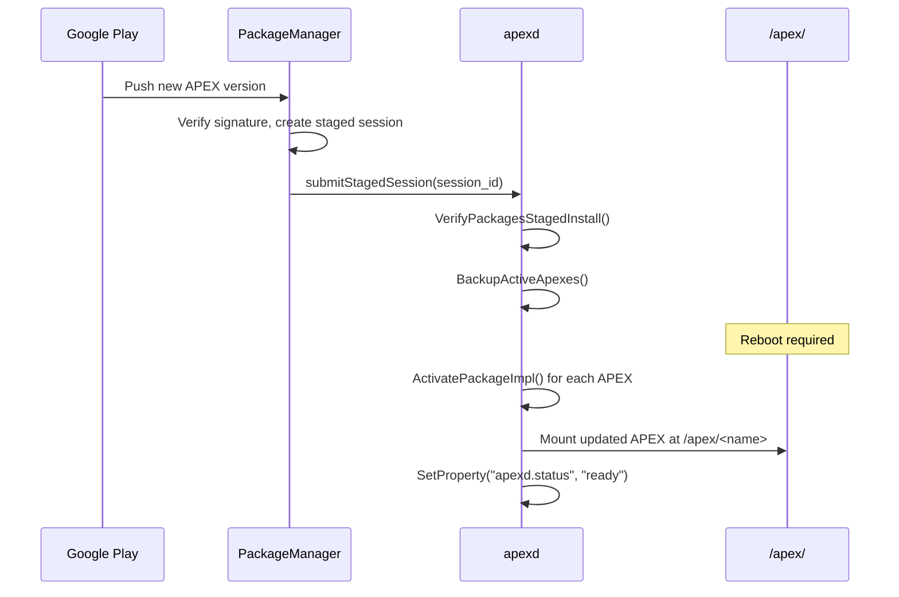

The key insight is that APEX updates are *staged* -- they are downloaded and
verified before a reboot, then atomically activated during the next boot.  If
activation fails, apexd rolls back to the pre-installed version.

---

## 52.2  APEX Format

The APEX file format is the cornerstone of Project Mainline.  It solves a
problem that APKs cannot: packaging and updating **native shared libraries**,
**executables**, **configuration files**, and **Java bootclasspath fragments**
as a single, signed, integrity-verified unit.

### 52.2.1  Why Not Just APK?

APKs are ZIP archives designed for Dalvik/ART applications.  They carry DEX
bytecode, resources, and native libraries (`lib/<abi>/`).  But they lack:

- **dm-verity protection** for the payload image.
- **Loop-device mounting** that allows the kernel to treat the payload as a
  real filesystem.

- **Boot-time activation** before zygote starts.
- The ability to replace platform-level native libraries like `libc++` or
  `libcrypto`.

APEX addresses all of these.

### 52.2.2  File Structure

An APEX file (`.apex`) is a ZIP archive containing:

```
my_module.apex (ZIP)
+-- AndroidManifest.xml        # Standard APK manifest (for Play Store)
+-- apex_manifest.pb           # Protobuf: name, version, provideNativeLibs, ...
+-- apex_payload.img           # ext4/f2fs/erofs filesystem image
+-- apex_pubkey                # AVB public key (embedded for verification)
+-- META-INF/                  # JAR signing (v2/v3 APK signature)
```

The critical component is `apex_payload.img`.  This is a real filesystem image
-- ext4, f2fs, or erofs -- containing the module's files laid out exactly as
they will appear when mounted at `/apex/<module_name>/`.

The `apex_file.cpp` implementation in `system/apex/apexd/` recognizes all three
filesystem types by their magic bytes:

```cpp
// Source: system/apex/apexd/apex_file.cpp

constexpr const char* kImageFilename = "apex_payload.img";
constexpr const char* kCompressedApexFilename = "original_apex";
constexpr const char* kBundledPublicKeyFilename = "apex_pubkey";

struct FsMagic {
  const char* type;
  int32_t offset;
  int16_t len;
  const char* magic;
};
constexpr const FsMagic kFsType[] = {
    {"f2fs", 1024, 4, "\x10\x20\xf5\xf2"},
    {"ext4", 1024 + 0x38, 2, "\123\357"},
    {"erofs", 1024, 4, "\xe2\xe1\xf5\xe0"}
};
```

### 52.2.3  APEX Manifest (Protobuf)

Every APEX carries a protobuf manifest defined in
`system/apex/proto/apex_manifest.proto`:

```protobuf
// Source: system/apex/proto/apex_manifest.proto

message ApexManifest {
  // Name used to mount under /apex/<name>
  string name = 1;

  // Version Number
  int64 version = 2;

  // Pre Install Hook
  string preInstallHook = 3;

  // Version Name
  string versionName = 5;

  // If true, apexd mounts with MS_NOEXEC
  bool noCode = 6;

  // Native libs provided to other APEXes or the platform
  repeated string provideNativeLibs = 7;

  // Native libs required from other APEXes or the platform
  repeated string requireNativeLibs = 8;

  // JNI libraries (used by linkerconfig/libnativeloader)
  repeated string jniLibs = 9;

  // Compressed APEX metadata
  CompressedApexMetadata capexMetadata = 12;

  // Can be updated without reboot
  bool supportsRebootlessUpdate = 13;

  // Whether activated in bootstrap phase
  bool bootstrap = 16;
}
```

The `provideNativeLibs` and `requireNativeLibs` fields are particularly
important: they allow apexd and the linker configuration system to construct
correct shared-library namespaces at boot time.

### 52.2.4  Compressed APEX (CAPEX)

Starting in Android 11, APEXes can be **compressed** on the system partition to
save space.  A compressed APEX has the suffix `.capex` and contains the original
APEX inside, compressed.  At boot, apexd decompresses it to
`/data/apex/decompressed/`:

```
// Source: system/apex/apexd/apex_constants.h

static constexpr const char* kApexDecompressedDir = "/data/apex/decompressed";
static constexpr const char* kCompressedApexPackageSuffix = ".capex";
static constexpr const char* kDecompressedApexPackageSuffix =
    ".decompressed.apex";
```

The `ApexFile::IsCompressed()` method detects whether an APEX is compressed,
and `ApexFile::Decompress()` handles the decompression.

### 52.2.5  The ApexFile Class

The C++ `ApexFile` class (`system/apex/apexd/apex_file.h`) is the primary
abstraction for working with APEX packages at runtime:

```cpp
// Source: system/apex/apexd/apex_file.h

class ApexFile {
 public:
  static android::base::Result<ApexFile> Open(const std::string& path);

  const std::string& GetPath() const { return apex_path_; }
  const std::optional<uint32_t>& GetImageOffset() const {
    return image_offset_;
  }
  const std::optional<size_t>& GetImageSize() const { return image_size_; }
  const ::apex::proto::ApexManifest& GetManifest() const {
    return manifest_;
  }
  const std::string& GetBundledPublicKey() const { return apex_pubkey_; }
  const std::optional<std::string>& GetFsType() const { return fs_type_; }

  android::base::Result<ApexVerityData> VerifyApexVerity(
      const std::string& public_key) const;
  bool IsCompressed() const { return is_compressed_; }
  android::base::Result<void> Decompress(
      const std::string& output_path) const;

 private:
  std::string apex_path_;
  std::optional<uint32_t> image_offset_;
  std::optional<size_t> image_size_;
  ::apex::proto::ApexManifest manifest_;
  std::string apex_pubkey_;
  std::optional<std::string> fs_type_;
  bool is_compressed_;
};
```

The `ApexVerityData` struct carries the information needed to set up dm-verity:

```cpp
// Source: system/apex/apexd/apex_file.h

struct ApexVerityData {
  std::unique_ptr<AvbHashtreeDescriptor> desc;
  std::string hash_algorithm;
  std::string salt;
  std::string root_digest;
};
```

The `Open()` factory method performs the following steps:

1. Opens the file as a ZIP archive using `libziparchive`.
2. Reads the `apex_manifest.pb` entry and parses the protobuf.
3. Reads the `apex_pubkey` entry (the AVB public key).
4. Locates the `apex_payload.img` entry and records its offset and size within
   the ZIP.

5. Detects the filesystem type by reading magic bytes from the payload image.
6. Checks whether this is a compressed APEX (contains `original_apex` instead
   of `apex_payload.img`).

```cpp
// Source: system/apex/apexd/apex_file.cpp (Open method, simplified)

Result<ApexFile> ApexFile::Open(const std::string& path) {
  // Open as ZIP archive
  ZipArchiveHandle handle;
  int ret = OpenArchiveFd(fd.get(), path.c_str(), &handle, false);

  // Try to find apex_payload.img
  ZipEntry entry;
  ret = FindEntry(handle, kImageFilename, &entry);
  if (ret == 0) {
    image_offset = entry.offset;
    image_size = entry.uncompressed_length;
    // Detect filesystem type (ext4, f2fs, erofs)
    fs_type = RetrieveFsType(fd, entry.offset);
  }

  // Read manifest
  FindEntry(handle, kManifestFilenamePb, &entry);
  // ... parse protobuf ...

  // Read public key
  FindEntry(handle, kBundledPublicKeyFilename, &entry);
  // ... read key ...

  return ApexFile(path, image_offset, image_size,
                  manifest, pubkey, fs_type, is_compressed);
}
```

### 52.2.6  Signing

APEX uses two layers of signing:

1. **Payload signing (AVB)**: The `apex_payload.img` is signed with
   [Android Verified Boot](https://source.android.com/security/verifiedboot)
   using `avbtool`.  The public key is bundled as `apex_pubkey` inside the ZIP.

2. **Container signing (APK Signature Scheme v2/v3)**: The outer ZIP is signed
   like a regular APK, so the Google Play infrastructure can verify it.

The build system defines keys using the `apex_key` module type:

```
// Source: packages/modules/SdkExtensions/Android.bp

apex_key {
    name: "com.android.sdkext.key",
    public_key: "com.android.sdkext.avbpubkey",
    private_key: "com.android.sdkext.pem",
}

android_app_certificate {
    name: "com.android.sdkext.certificate",
    certificate: "com.android.sdkext",
}
```

The Soong implementation in `build/soong/apex/key.go` resolves these keys:

```go
// Source: build/soong/apex/key.go

type apexKeyProperties struct {
    // Path or module to the public key file in avbpubkey format.
    Public_key *string `android:"path"`
    // Path or module to the private key file in pem format.
    Private_key *string `android:"path"`
}
```

Key resolution follows a fallback chain: first the global apex key directory
(configurable), then the local module directory.

### 52.2.7  Build-Time Construction: The `apexer` Tool

The `apexer` tool (`system/apex/apexer/apexer.py`) is the command-line utility
that assembles an APEX file from a directory of contents:

```python
# Source: system/apex/apexer/apexer.py (line 16-20)

"""apexer is a command line tool for creating an APEX file, a package
format for system components.

Typical usage: apexer input_dir output.apex
"""
```

The Soong build rule that invokes `apexer` is defined in
`build/soong/apex/builder.go`:

```go
// Source: build/soong/apex/builder.go

apexRule = pctx.StaticRule("apexRule", blueprint.RuleParams{
    Command: `rm -rf ${image_dir} && mkdir -p ${image_dir} && ` +
        `(. ${out}.copy_commands) && ` +
        `APEXER_TOOL_PATH=${tool_path} ` +
        `${apexer} --force --manifest ${manifest} ` +
        `--file_contexts ${file_contexts} ` +
        `--canned_fs_config ${canned_fs_config} ` +
        `--include_build_info ` +
        `--payload_type image ` +
        `--key ${key} ${opt_flags} ${image_dir} ${out} `,
    ...
})
```

The process:

1. Collect all native libraries, binaries, Java libraries, and config files.
2. Copy them into a staging directory (`${image_dir}`).
3. Create a filesystem image (ext4/f2fs/erofs) using `mke2fs`, `make_f2fs`, or
   `mkfs.erofs`.

4. Sign the image with `avbtool`.
5. Package everything into a ZIP with `soong_zip`.
6. Sign the ZIP with APK Signature Scheme.


### 52.2.8  APEX Module Definition in Soong

The `apex` module type is registered in `build/soong/apex/apex.go`:

```go
// Source: build/soong/apex/apex.go

func registerApexBuildComponents(ctx android.RegistrationContext) {
    ctx.RegisterModuleType("apex", BundleFactory)
    ctx.RegisterModuleType("apex_test", TestApexBundleFactory)
    ctx.RegisterModuleType("apex_vndk", vndkApexBundleFactory)
    ctx.RegisterModuleType("apex_defaults", DefaultsFactory)
    ctx.RegisterModuleType("prebuilt_apex", PrebuiltFactory)
    ctx.RegisterModuleType("override_apex", OverrideApexFactory)
    ctx.RegisterModuleType("apex_set", apexSetFactory)
}
```

A typical APEX definition in an `Android.bp` file looks like:

```
// Source: packages/modules/SdkExtensions/Android.bp

apex {
    name: "com.android.sdkext",
    defaults: ["com.android.sdkext-defaults"],
    bootclasspath_fragments: ["com.android.sdkext-bootclasspath-fragment"],
    binaries: [
        "derive_classpath",
        "derive_sdk",
    ],
    prebuilts: [
        "current_sdkinfo",
        "extensions_db",
    ],
    manifest: "manifest.json",
}
```

The `apexBundleProperties` struct in `apex.go` exposes the full set of
configurable properties:

```go
// Source: build/soong/apex/apex.go (selected properties)

type apexBundleProperties struct {
    Manifest *string `android:"path"`
    AndroidManifest proptools.Configurable[string] `android:"path,..."`
    File_contexts *string `android:"path"`

    // Whether this APEX is updatable (default: true)
    Updatable *bool

    // Filesystem type: 'ext4', 'f2fs', or 'erofs' (default: 'ext4')
    Payload_fs_type *string

    // Marks future updatability without enabling it yet
    Future_updatable *bool

    // Whether this APEX can use platform APIs (only when updatable: false)
    Platform_apis *bool

    // Variant version of the mainline module (0-9)
    Variant_version *string
}
```

The dependency properties allow an APEX to include different types of content:

```go
// Source: build/soong/apex/apex.go

type ApexNativeDependencies struct {
    Native_shared_libs proptools.Configurable[[]string]
    Jni_libs proptools.Configurable[[]string]
    Rust_dyn_libs []string
    Binaries proptools.Configurable[[]string]
    Tests []string
    Filesystems []string
    Prebuilts proptools.Configurable[[]string]
}
```

### 52.2.9  Activation at Boot: The apexd Daemon

The `apexd` daemon (`system/apex/apexd/`) is the system service responsible
for activating APEX modules at boot time.  It runs as three distinct service
configurations defined in `apexd.rc`:

```
# Source: system/apex/apexd/apexd.rc

service apexd /system/bin/apexd
    interface aidl apexservice
    class core
    user root
    group system
    oneshot
    disabled
    reboot_on_failure reboot,apexd-failed
    capabilities CHOWN DAC_OVERRIDE DAC_READ_SEARCH FOWNER SYS_ADMIN

service apexd-bootstrap /system/bin/apexd --bootstrap
    user root
    group system
    oneshot
    disabled
    reboot_on_failure reboot,bootloader,bootstrap-apexd-failed
    capabilities SYS_ADMIN

service apexd-snapshotde /system/bin/apexd --snapshotde
    user root
    group system
    oneshot
    disabled
    capabilities CHOWN DAC_OVERRIDE DAC_READ_SEARCH FOWNER
```

Three service configurations serve distinct phases:

| Service | Phase | Purpose |
|---------|-------|---------|
| `apexd-bootstrap` | Early boot | Mount critical APEXes (runtime, tzdata, i18n) before `/data` |
| `apexd` | After `/data` mount | Mount all remaining APEXes, process staged sessions |
| `apexd-snapshotde` | After activation | Snapshot/restore DE data for rollback safety |

#### Boot-Time Activation Flow

The `MountPackageImpl` function in `apexd.cpp` implements the five-step
mounting process:

```cpp
// Source: system/apex/apexd/apexd.cpp (MountPackageImpl)

// Steps to mount an APEX file:
//
// 1. create a mount point (directory)
// 2. create a block device for the payload part of the APEX
// 3. wrap it with a dm-verity device if the APEX is not on top of verity
//    device
// 4. mount the payload filesystem
// 5. verify the mount
```

Step 2 creates a loop device from the `apex_payload.img` entry within the ZIP:

```cpp
// Source: system/apex/apexd/apexd.cpp

if (IsMountBeforeDataEnabled() && GetImageManager()->IsPinnedApex(apex)) {
    linear_dev = OR_RETURN(CreateDmLinearForPayload(apex));
    block_device = linear_dev.GetDevPath();
} else {
    loop = OR_RETURN(CreateLoopForApex(apex, loop_id));
    block_device = loop.name;
}
```

Step 3 wraps the block device with dm-verity for integrity verification.  Pre-
installed APEXes on dm-verity-protected partitions (like `/system`) can skip
this additional layer:

```cpp
// Source: system/apex/apexd/apexd.cpp

const bool mount_on_verity = !instance.IsPreInstalledApex(apex) ||
                             instance.IsDecompressedApex(apex) ||
                             instance.IsBlockApex(apex);
```

#### dm-verity Table Construction

The `CreateVerityTable` function constructs the device-mapper verity table
from the AVB hashtree descriptor embedded in the APEX:

```cpp
// Source: system/apex/apexd/apexd.cpp

std::unique_ptr<DmTable> CreateVerityTable(
    const ApexVerityData& verity_data,
    const std::string& block_device,
    bool restart_on_corruption) {
  AvbHashtreeDescriptor* desc = verity_data.desc.get();
  auto table = std::make_unique<DmTable>();

  const uint64_t start = 0;
  const uint64_t length = desc->image_size / 512;  // in sectors

  const std::string& hash_device = block_device;
  const uint32_t num_data_blocks =
      desc->image_size / desc->data_block_size;
  const uint32_t hash_start_block =
      desc->tree_offset / desc->hash_block_size;

  auto target = std::make_unique<DmTargetVerity>(
      start, length, desc->dm_verity_version,
      block_device, hash_device,
      desc->data_block_size, desc->hash_block_size,
      num_data_blocks, hash_start_block,
      verity_data.hash_algorithm,
      verity_data.root_digest,
      verity_data.salt);

  target->IgnoreZeroBlocks();
  if (restart_on_corruption) {
    target->SetVerityMode(kDmVerityRestartOnCorruption);
  }
  table->AddTarget(std::move(target));
  table->set_readonly(true);

  return table;
}
```

Key dm-verity parameters:

- **Data block size** and **hash block size** -- Typically 4096 bytes each.
- **Hash algorithm** -- Usually SHA-256.
- **Root digest** -- The top-level hash that chains to all data blocks.
- **Salt** -- Random data mixed into the hash computation.
- **restart_on_corruption** -- If set, the kernel reboots if a verity
  corruption is detected (as opposed to returning I/O errors).

For pre-installed APEXes on `/system` (which is already dm-verity protected),
the additional dm-verity layer is skipped to avoid double-verification
overhead.  Updated APEXes on `/data` always get their own dm-verity device.

#### Filesystem Mounting

After the dm-verity device is created, the payload is mounted as a read-only
filesystem:

```cpp
// Source: system/apex/apexd/apexd.cpp

// Step 4. Mount the payload filesystem at the mount point
uint32_t mount_flags = MS_NOATIME | MS_NODEV | MS_DIRSYNC | MS_RDONLY;
if (apex.GetManifest().nocode()) {
    mount_flags |= MS_NOEXEC;
}

mount(block_device.c_str(), mount_point.c_str(),
      apex.GetFsType().value().c_str(), mount_flags, nullptr);
```

The mount flags enforce:

- `MS_RDONLY` -- Read-only (APEXes are immutable once activated).
- `MS_NOATIME` -- Don't update access times (performance).
- `MS_NODEV` -- Don't allow device nodes.
- `MS_DIRSYNC` -- Synchronous directory updates.
- `MS_NOEXEC` -- Disallow execution (for `noCode` APEXes like tzdata).

After mounting, Step 5 verifies the mounted image matches the manifest:

```cpp
// Source: system/apex/apexd/apexd.cpp

// Step 5. After mounting, verify the mounted image
auto status = VerifyMountedImage(apex, mount_point);
if (!status.ok()) {
    umount2(mount_point.c_str(), UMOUNT_NOFOLLOW);
    return Error() << "Failed to verify " << full_path;
}
```

The `ActivatePackageImpl` function then bind-mounts the latest version to
`/apex/<package_name>`:

```cpp
// Source: system/apex/apexd/apexd.cpp

Result<void> ActivatePackageImpl(const ApexFile& apex_file, ...) {
    // ...
    // Bind mount the latest version to /apex/<package_name>.
    auto st = gMountedApexes.DoIfLatest(
        manifest.name(), apex_file.GetPath(), [&]() -> Result<void> {
            return apexd_private::BindMount(
                apexd_private::GetActiveMountPoint(manifest), mount_point);
        });
    // ...
}
```

After all packages are activated, apexd sets system properties to signal
readiness:

```cpp
// Source: system/apex/apexd/apexd.cpp

void OnAllPackagesActivated() {
    LOG(INFO) << "Marking APEXd as activated";
    SetProperty(gConfig->apex_status_sysprop, kApexStatusActivated);
}

void OnAllPackagesReady() {
    LOG(INFO) << "Marking APEXd as ready";
    SetProperty(gConfig->apex_status_sysprop, kApexStatusReady);
    SetProperty(kApexAllReadyProp, "true");
}
```

Other services can wait on these properties:

```
// In an init .rc file:
on property:apexd.status=ready
    start my_service_that_needs_apex
```

The following diagram shows the complete boot-time activation flow:

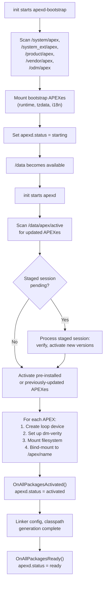

### 52.2.10  The OnBootstrap and OnStart Lifecycle

The `apexd` daemon has two primary entry points corresponding to two boot
phases.  Understanding this split is critical for diagnosing boot failures.

**Phase 1: OnBootstrap (before /data)**

```cpp
// Source: system/apex/apexd/apexd.cpp

int OnBootstrap() {
  ATRACE_NAME("OnBootstrap");
  auto time_started = boot_clock::now();

  ApexFileRepository& instance = ApexFileRepository::GetInstance();
  // Scan /system/apex, /system_ext/apex, /product/apex, /vendor/apex, /odm/apex
  if (auto st = AddPreinstalledData(instance); !st.ok()) {
    LOG(ERROR) << st.error();
    return 1;
  }

  ActivationContext ctx;
  std::vector<ApexFileRef> activation_list;

  if (IsMountBeforeDataEnabled()) {
    // New flow: wait for coldboot, process sessions, scan data
    base::WaitForProperty("ro.cold_boot_done", "true",
                          std::chrono::seconds(10));
    ProcessSessions(ctx);
    auto data_apexes = ScanDataApexFiles(GetImageManager());
    instance.AddDataApexFiles(std::move(data_apexes));
    activation_list = instance.SelectApexForActivation();
  } else {
    // Legacy flow: only activate bootstrap APEXes
    const auto& pre_installed_apexes = instance.GetPreInstalledApexFiles();
    for (const auto& apex : pre_installed_apexes) {
      if (IsBootstrapApex(apex.get())) {
        LOG(INFO) << "Found bootstrap APEX " << apex.get().GetPath();
        activation_list.push_back(apex);
      }
    }
  }

  auto result = ActivateApexPackages(ctx, activation_list,
      ActivationMode::kBootstrapMode, ...);
  EmitApexInfoList(result.activated, /*is_bootstrap=*/true);
  LOG(INFO) << "OnBootstrap done, duration=" << time_elapsed;
  return 0;
}
```

Bootstrap APEXes (those with `bootstrap: true` in their manifest) must be
available before `/data` is mounted because other early services depend on
them.  Examples include:

- `com.android.art` -- The runtime itself must be active for zygote.
- `com.android.i18n` -- ICU data is needed for text processing.
- `com.android.tzdata` -- Time zone data is needed for clock display.

**Phase 2: OnStart (after /data)**

```cpp
// Source: system/apex/apexd/apexd.cpp

void OnStart() {
  ATRACE_NAME("OnStart");
  LOG(INFO) << "Marking APEXd as starting";
  SetProperty(gConfig->apex_status_sysprop, kApexStatusStarting);

  // Check if filesystem checkpointing needs a rollback
  if (gSupportsFsCheckpoints) {
    Result<bool> needs_revert = gVoldService->NeedsRollback();
    if (needs_revert.ok() && *needs_revert) {
      LOG(INFO) << "Exceeded number of session retries. "
                << "Starting a revert";
      RevertActiveSessions("", "");
    }
  }

  // Activate remaining APEXes (the ones not in bootstrap)
  if (!IsMountBeforeDataEnabled()) {
    ActivateApexesOnStart();
  }

  // Snapshot or restore DE_sys data for rollback support
  SnapshotOrRestoreDeSysData();
  LOG(INFO) << "OnStart done, duration=" << time_elapsed;
}
```

The `ActivateApexesOnStart()` function first processes any pending staged
sessions, then scans `/data/apex/active/` for updated APEXes, and activates
the best version of each module:

```cpp
// Source: system/apex/apexd/apexd.cpp

void ActivateApexesOnStart() {
  ActivationContext ctx;
  // Process staged sessions first: revert or activate
  ProcessSessions(ctx);

  auto& instance = ApexFileRepository::GetInstance();
  // Scan /data/apex/active/ for updated APEXes
  instance.AddDataApex(gConfig->active_apex_data_dir);

  auto activate_status = ActivateApexPackages(
      ctx, instance.SelectApexForActivation(),
      ActivationMode::kBootMode,
      /*revert_on_error=*/true, /*fallback_on_error=*/true);
  EmitApexInfoList(activate_status.activated, /*is_bootstrap=*/false);
}
```

The `SelectApexForActivation()` method compares pre-installed and data APEXes
and picks the highest version for each module name.

**Session Processing**

The `ProcessSessions()` function handles pending staged sessions:

```cpp
// Source: system/apex/apexd/apexd.cpp

void ProcessSessions(ActivationContext& ctx) {
  auto sessions = gSessionManager->GetSessions();

  if (sessions.empty()) {
    LOG(INFO) << "No sessions to revert/activate.";
    return;
  }

  // If there's any pending revert, revert active sessions.
  if (std::ranges::any_of(sessions, [](const auto& session) {
        return session.GetState() == SessionState::REVERT_IN_PROGRESS;
      })) {
    RevertActiveSessions("", "");
  } else {
    // Otherwise, activate STAGED sessions.
    ActivateStagedSessions(ctx, std::move(sessions));
  }
}
```

This is the core logic that makes Mainline updates work across reboots: a
session is "staged" before reboot, and then on the next boot, `ProcessSessions`
activates it.

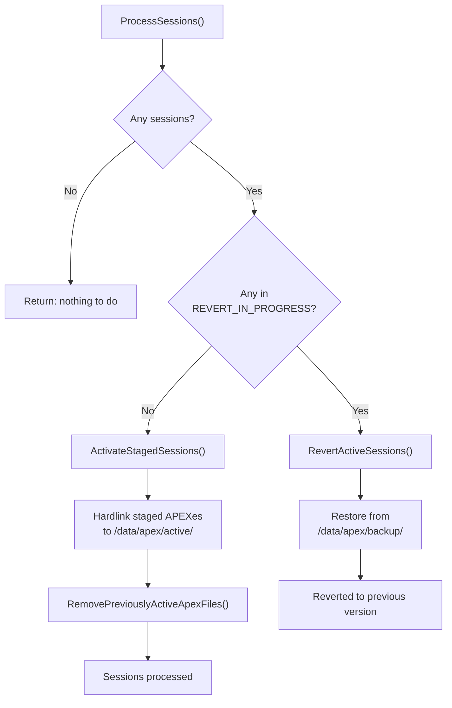

### 52.2.11  The Rebootless Update Path

Starting in Android 13, APEXes that declare `supportsRebootlessUpdate: true`
in their manifest can be updated without a device reboot.  The
`installAndActivatePackage()` AIDL method implements this:

1. Verify the new APEX package.
2. Unload the current APEX from init (stop services, unload init scripts).
3. Unmount the currently active APEX.
4. Hard-link the new APEX to `/data/apex/active/`.
5. Activate (mount) the new APEX.
6. Reload the APEX into init (restart services, re-read init scripts).

```cpp
// Source: system/apex/apexd/apexd.cpp (rebootless update, simplified)

// 1. Unload from init
OR_RETURN(UnloadApexFromInit(module_name));

// Scope guard: reload from init whether we succeed or fail
auto reload_apex = android::base::make_scope_guard([&]() {
    LoadApexFromInit(module_name);
});

// 2. Unmount currently active APEX
OR_RETURN(UnmountPackage(*cur_apex, /*deferred=*/true, ...));

// 3. Hard-link new APEX to /data/apex/active/
link(package_path.c_str(), target_file.c_str());

// 4. Activate new APEX
ActivatePackageImpl(*new_apex, loop::kFreeLoopId, new_id, false);
```

This is particularly useful for modules that contain only configuration data
or that can gracefully restart their services.

### 52.2.12  Brand-New APEX Support

Android 16 (Baklava) introduces the concept of **brand-new APEXes** -- APEXes
that can be installed on a device even if they were not pre-installed.  This
allows Google to add entirely new modules to existing devices through Play
updates.

The key infrastructure files:

```cpp
// Source: system/apex/apexd/apex_constants.h

static constexpr const char* kBrandNewApexPublicKeySuffix = ".avbpubkey";
static constexpr const char* kBrandNewApexBlocklistFileName = "blocklist.json";
static constexpr const char* kBrandNewApexConfigSystemDir =
    "/system/etc/brand_new_apex";
```

Each partition can provide a configuration directory containing:

- **Public keys** (`.avbpubkey` files) -- Trusted keys for verifying new APEXes.
- **Blocklists** (`blocklist.json`) -- APEXes that should not be installed.

The `ApexFileRepository` handles brand-new APEX verification:

```cpp
// Source: system/apex/apexd/apexd.cpp (AddPreinstalledData)

if (ApexFileRepository::IsBrandNewApexEnabled()) {
    instance.AddBrandNewApexCredentialAndBlocklist(
        gConfig->brand_new_apex_config_dirs);
}
```

### 52.2.13  Prebuilt APEX and the Deapexer

In addition to building APEXes from source, the build system supports
**prebuilt APEXes**.  This is common when a module is built in a separate
build pipeline and the result is checked into the tree as a binary:

```go
// Source: build/soong/apex/prebuilt.go

var (
    extractMatchingApex = pctx.StaticRule(
        "extractMatchingApex",
        blueprint.RuleParams{
            Command: `${extract_apks} -o "${out}" ` +
                `-allow-prereleased=${allow-prereleased} ` +
                `-sdk-version=${sdk-version} ` +
                `-skip-sdk-check=${skip-sdk-check} ` +
                `-abis=${abis} ` +
                `-screen-densities=all -extract-single ` +
                `${in}`,
        },
        "abis", "allow-prereleased", "sdk-version", "skip-sdk-check")
    decompressApex = pctx.StaticRule("decompressApex",
        blueprint.RuleParams{
            Command: `${deapexer} decompress ` +
                `--copy-if-uncompressed ` +
                `--input ${in} --output ${out}`,
        })
)
```

A prebuilt APEX is declared as:

```
prebuilt_apex {
    name: "com.android.art",
    src: "com.android.art-arm64.apex",
    prefer: true,
}
```

When the build system needs to access the contents of a prebuilt APEX (e.g., to
compile against a bootclasspath fragment's JAR files), it uses the `deapexer`
tool to extract the contents:

```bash
# Extract all contents
$ deapexer extract com.android.art.apex output_dir/

# List contents
$ deapexer list com.android.art.apex

# Get APEX info (name, version)
$ deapexer info com.android.art.apex
```

The `deapexer` tool understands the APEX format at a low level: it opens the
ZIP, finds the payload image, mounts or reads it (using `debugfs` for ext4 or
`fsck.erofs` for erofs), and extracts the files.

This two-way flow -- building APEXes with `apexer` and decomposing them with
`deapexer` -- enables the modular development workflow where different teams
can work on different modules and integrate through prebuilt artifacts.

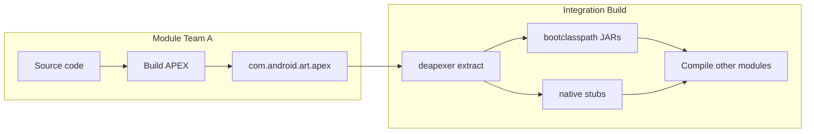

### 52.2.14  APEX Mutation and Variants

The Soong build system creates APEX-specific variants of all modules that are
included in an APEX.  This is handled by the `apexTransitionMutator`:

```go
// Source: build/soong/apex/apex.go

func RegisterPostDepsMutators(ctx android.RegisterMutatorsContext) {
    ctx.BottomUp("apex_unique", apexUniqueVariationsMutator)
    ctx.BottomUp("mark_platform_availability",
        markPlatformAvailability)
    ctx.InfoBasedTransition("apex",
        android.NewGenericTransitionMutatorAdapter(
            &apexTransitionMutator{}))
}
```

This mutator creates separate build variants for each library: one for the
platform and one for each APEX that includes it.  The APEX variant may have
different compilation flags, particularly:

- Different `min_sdk_version` restrictions.
- Different symbol visibility (for NDK compliance in updatable modules).
- Different linking behavior (static vs. dynamic for DCLA).

For example, `libc++` might have:

- A **platform variant** linking against system `libc`.
- A **com.android.tethering variant** compiled for `min_sdk_version: 30`.
- A **com.android.art variant** compiled for `min_sdk_version: 31`.

### 52.2.15  APEX Directory Layout on Device

When an APEX is activated, its contents become visible under `/apex/`:

```
/apex/
+-- apex-info-list.xml           # Metadata about all activated APEXes
+-- com.android.sdkext/          # Active (latest) version
|   +-- bin/
|   |   +-- derive_classpath
|   |   +-- derive_sdk
|   +-- etc/
|   |   +-- sdkinfo.pb
|   |   +-- extensions_db
|   +-- javalib/
|       +-- framework-sdkextensions.jar
+-- com.android.sdkext@340090000/ # Versioned mount point
+-- com.android.tethering/
+-- com.android.permission/
+-- ...
```

The versioned mount point (`@<version>`) preserves the actual mounted
filesystem.  The unversioned path (`/apex/com.android.sdkext/`) is a bind
mount pointing to the highest-version mount point.

### 52.2.16  APEX Partition Locations

APEX files can be pre-installed on multiple partitions:

```cpp
// Source: system/apex/apexd/apex_constants.h

static constexpr const char* kApexPackageSystemDir = "/system/apex";
static constexpr const char* kApexPackageSystemExtDir = "/system_ext/apex";
static constexpr const char* kApexPackageProductDir = "/product/apex";
static constexpr const char* kApexPackageVendorDir = "/vendor/apex";
static constexpr const char* kApexPackageOdmDir = "/odm/apex";
```

Updated APEXes (from Google Play or `adb install`) are stored in:

```cpp
// Source: system/apex/apexd/apex_constants.h

static constexpr const char* kActiveApexPackagesDataDir = "/data/apex/active";
static constexpr const char* kApexBackupDir = "/data/apex/backup";
```

The `ApexFileRepository` class (`system/apex/apexd/apex_file_repository.h`)
manages the mapping between pre-installed and updated APEXes:

```cpp
// Source: system/apex/apexd/apex_file_repository.h

class ApexFileRepository final {
 public:
    static ApexFileRepository& GetInstance();

    // Populate from pre-installed directories
    android::base::Result<void> AddPreInstalledApex(
        const std::unordered_map<ApexPartition, std::string>&
            partition_to_prebuilt_dirs);

    // Query methods
    bool IsPreInstalledApex(const ApexFile& apex) const;
    bool IsDecompressedApex(const ApexFile& apex) const;
    bool IsBlockApex(const ApexFile& apex) const;
};
```

### 52.2.17  Rollback and Safety

If an updated APEX fails to activate, apexd supports rollback:

1. **Backup**: Before staging, `BackupActiveApexes()` copies current active
   APEXes to `/data/apex/backup/`.

2. **Verification**: `VerifyPackagesStagedInstall()` validates signatures and
   compatibility before any activation.

3. **Checkpoint**: On devices with filesystem checkpoint support (via vold),
   the entire `/data` state can be rolled back.

4. **Revert-on-failure**: If `reboot_on_failure` triggers, the next boot
   skips the failed update and uses the pre-installed version.

```cpp
// Source: system/apex/apexd/apexd.cpp (SubmitStagedSession)

OR_RETURN(BackupActiveApexes());
auto ret = OR_RETURN(
    OpenApexFilesInSessionDirs(session_id, child_session_ids));
auto result = OR_RETURN(VerifyPackagesStagedInstall(ret));
```

---

## 52.3  Module Catalog

The `packages/modules/` directory in AOSP contains the source code for all
Mainline modules.  Each module typically produces one or more APEX packages.

### 52.3.1  Complete Module Inventory

The following table lists every module directory in `packages/modules/`, its
APEX package name(s), the Android release in which it became updatable, and a
summary of what it provides.

| # | Module Directory | APEX Name | Launch | Description |
|---|-----------------|-----------|--------|-------------|
| 1 | `AdServices` | `com.android.adservices` | T (13) | Privacy Sandbox: Topics, Attribution, FLEDGE |
| 2 | `AppSearch` | `com.android.appsearch` | T (13) | On-device structured search indexing engine |
| 3 | `ArtPrebuilt` | `com.android.art` | S (12) | Android Runtime (ART), DEX compiler, core libraries |
| 4 | `Bluetooth` | `com.android.bt` | B (16) | Bluetooth stack (Gabeldorsche / Fluoride) |
| 5 | `CaptivePortalLogin` | *(APK in Connectivity)* | R (11) | Captive portal detection & sign-in UI |
| 6 | `CellBroadcastService` | `com.android.cellbroadcast` | R (11) | Emergency alert message handling (CMAS/ETWS) |
| 7 | `ConfigInfrastructure` | `com.android.configinfrastructure` | U (14) | Device configuration framework (`DeviceConfig`) |
| 8 | `Connectivity` | `com.android.tethering` | R (11) | Tethering, Connectivity, Cronet HTTP stack |
| 9 | `CrashRecovery` | `com.android.crashrecovery` | V (15) | System crash detection and recovery |
| 10 | `DeviceLock` | `com.android.devicelock` | U (14) | Device financing/locking framework |
| 11 | `DnsResolver` | `com.android.resolv` | Q (10) | DNS resolution (DNS-over-TLS, private DNS) |
| 12 | `ExtServices` | `com.android.extservices` | R (11) | Extension services (notification ranking, autofill) |
| 13 | `GeoTZ` | `com.android.geotz` | S (12) | Geolocation-based time zone detection |
| 14 | `Gki` | `com.android.gki.*` | S (12) | Generic Kernel Image support modules |
| 15 | `HealthFitness` | `com.android.healthfitness` | U (14) | Health Connect: health/fitness data platform |
| 16 | `IPsec` | `com.android.ipsec` | R (11) | IKEv2/IPsec VPN framework |
| 17 | `ImsMedia` | *(in Telephony)* | T (13) | IMS media handling for VoLTE/VoNR |
| 18 | `IntentResolver` | *(APK)* | T (13) | Chooser/intent resolution UI |
| 19 | `Media` | `com.android.media` / `com.android.media.swcodec` | Q (10) | Media framework, software codecs |
| 20 | `ModuleMetadata` | *(APK)* | Q (10) | Module metadata provider |
| 21 | `NetworkStack` | `com.android.networkstack` | Q (10) | Network connectivity evaluation, DHCP client |
| 22 | `NeuralNetworks` | `com.android.neuralnetworks` | R (11) | NNAPI runtime and HAL |
| 23 | `Nfc` | `com.android.nfcservices` | B (16) | NFC stack and services |
| 24 | `OnDevicePersonalization` | `com.android.ondevicepersonalization` | T (13) | On-device ML personalization framework |
| 25 | `Permission` | `com.android.permission` | R (11) | Permission controller, role manager, SafetyCenter |
| 26 | `Profiling` | `com.android.profiling` | V (15) | System profiling infrastructure |
| 27 | `RemoteKeyProvisioning` | `com.android.rkpd` | U (14) | Remote key provisioning for KeyStore |
| 28 | `RuntimeI18n` | `com.android.i18n` | Q (10) | ICU internationalization library |
| 29 | `Scheduling` | `com.android.scheduling` | S (12) | Job scheduling infrastructure |
| 30 | `SdkExtensions` | `com.android.sdkext` | R (11) | SDK extension version management |
| 31 | `StatsD` | `com.android.os.statsd` | R (11) | Metrics collection daemon |
| 32 | `Telecom` | `com.android.telecom` | V (15) | Telecom call management framework |
| 33 | `Telephony` | `com.android.telephonycore` / `com.android.telephonymodules` | U (14) | Telephony core and modules |
| 34 | `ThreadNetwork` | `com.android.threadnetwork` | V (15) | Thread / Matter smart home networking |
| 35 | `UprobeStats` | `com.android.uprobestats` | B (16) | eBPF-based uprobe statistics collection |
| 36 | `Uwb` | `com.android.uwb` | T (13) | Ultra-Wideband ranging framework |
| 37 | `Virtualization` | `com.android.virt` | T (13) | Android Virtualization Framework (pKVM, Microdroid) |
| 38 | `Wifi` | `com.android.wifi` | R (11) | Wi-Fi framework and services |
| 39 | `adb` | `com.android.adbd` | R (11) | Android Debug Bridge daemon |
| 40 | `desktop` | *(multiple)* | V (15) | Desktop windowing support |

In addition to `packages/modules/`, several APEX modules are defined elsewhere
in the tree:

| APEX Name | Source Location | Description |
|-----------|----------------|-------------|
| `com.android.media` | `frameworks/av/apex/` | Media framework (extractors, codecs) |
| `com.android.media.swcodec` | `frameworks/av/apex/` | Software codec process |
| `com.android.conscrypt` | `external/conscrypt/` | TLS/SSL provider (BoringSSL wrapper) |
| `com.android.mediaprovider` | `packages/providers/MediaProvider/` | MediaStore content provider |
| `com.android.tzdata` | `system/timezone/` | Time zone data |

### 52.3.2  Module Classification by Content Type

Mainline modules can be classified by what they primarily contain:

**Native-heavy modules** (primarily C/C++ shared libraries and binaries):

| Module | APEX Name | Key Native Components |
|--------|-----------|----------------------|
| DnsResolver | `com.android.resolv` | `libnetd_resolv.so` |
| NeuralNetworks | `com.android.neuralnetworks` | NNAPI runtime, HAL client |
| adb | `com.android.adbd` | `adbd` binary |
| RuntimeI18n | `com.android.i18n` | ICU libraries |

**Java-heavy modules** (primarily JAR files with bootclasspath/systemserver
contributions):

| Module | APEX Name | Key Java Components |
|--------|-----------|-------------------|
| Permission | `com.android.permission` | `framework-permission.jar`, PermissionController app |
| AppSearch | `com.android.appsearch` | `framework-appsearch.jar`, `service-appsearch.jar` |
| SdkExtensions | `com.android.sdkext` | `framework-sdkextensions.jar` |
| AdServices | `com.android.adservices` | Privacy Sandbox Java framework |
| ConfigInfrastructure | `com.android.configinfrastructure` | `framework-configinfrastructure.jar` |

**Mixed modules** (both native and Java components):

| Module | APEX Name | Key Mixed Components |
|--------|-----------|---------------------|
| Connectivity | `com.android.tethering` | `framework-connectivity.jar` + `libnetd_updatable.so` |
| Media | `com.android.media` | `framework-media.jar` + media extractors (native) |
| Wifi | `com.android.wifi` | `framework-wifi.jar` + native HAL bridge |
| Bluetooth | `com.android.bt` | `framework-bluetooth.jar` + native stack |
| Telephony | `com.android.telephonycore` | `framework-telephony.jar` + RIL components |
| Virtualization | `com.android.virt` | VirtualizationService + native hypervisor support |

**Data-only modules** (configuration/data with `noCode: true`):

| Module | APEX Name | Content |
|--------|-----------|---------|
| GeoTZ | `com.android.geotz` | Geolocation time zone database |
| tzdata | `com.android.tzdata` | IANA time zone data |

### 52.3.3  Module Architecture Diagram

```mermaid
graph TB
    subgraph "Google Play System Updates"
        GP[Google Play Infrastructure]
    end

    subgraph "Mainline Modules (APEX)"
        direction LR
        subgraph "Networking"
            CONN["com.android.tethering<br/>Connectivity"]
            DNS["com.android.resolv<br/>DNS Resolver"]
            NET[NetworkStack]
            WIFI["com.android.wifi<br/>Wi-Fi"]
            NFC["com.android.nfcservices<br/>NFC"]
            UWB["com.android.uwb<br/>UWB"]
            THR["com.android.threadnetwork<br/>Thread"]
        end
        subgraph "Security & Privacy"
            PERM["com.android.permission<br/>Permission"]
            CONSCRYPT["com.android.conscrypt<br/>TLS/SSL"]
            IPSEC["com.android.ipsec<br/>IPsec"]
            ADS["com.android.adservices<br/>Ad Services"]
            RKP["com.android.rkpd<br/>Remote Key"]
        end
        subgraph "Runtime & Core"
            ART["com.android.art<br/>ART Runtime"]
            I18N["com.android.i18n<br/>ICU"]
            SDKEXT["com.android.sdkext<br/>SDK Extensions"]
            STATSD["com.android.os.statsd<br/>StatsD"]
        end
        subgraph "Media & ML"
            MEDIA["com.android.media<br/>Media"]
            SWCODEC["com.android.media.swcodec<br/>SW Codecs"]
            NNAPI["com.android.neuralnetworks<br/>Neural Networks"]
        end
        subgraph "Telephony"
            TCORE["com.android.telephonycore<br/>Telephony"]
            TELECOM["com.android.telecom<br/>Telecom"]
        end
    end

    GP --> CONN
    GP --> ART
    GP --> PERM
    GP --> MEDIA
    GP --> TCORE

    subgraph "apexd"
        APEXD[APEX Daemon]
    end

    APEXD --> |"mount /apex/..."| CONN
    APEXD --> |"mount /apex/..."| ART
    APEXD --> |"mount /apex/..."| PERM
```

### 52.3.4  Deep Dive: Connectivity Module

The Connectivity module (`com.android.tethering`) is one of the most complex
Mainline modules.  Despite its APEX name referencing "tethering," it actually
encompasses the entire connectivity stack:

```
// Source: packages/modules/Connectivity/Tethering/apex/Android.bp

apex {
    name: "com.android.tethering",
    defaults: [
        "ConnectivityApexDefaults",
        "CronetInTetheringApexDefaults",
        "r-launched-apex-module",
    ],
    compile_multilib: "both",
    bootclasspath_fragments: [
        "com.android.tethering-bootclasspath-fragment",
    ],
    systemserverclasspath_fragments: [
        "com.android.tethering-systemserverclasspath-fragment",
    ],
    multilib: {
        first: {
            jni_libs: [
                "libservice-connectivity",
                "libservice-thread-jni",
                ...
            ],
            native_shared_libs: [
                "libcom.android.tethering.dns_helper",
                "libcom.android.tethering.connectivity_native",
                "libnetd_updatable",
            ],
        },
    },
}
```

Key components within this module:

- **Tethering service**: USB, Wi-Fi, Bluetooth, and Ethernet tethering
- **Connectivity service fragments**: `framework-connectivity` and
  `service-connectivity`

- **Cronet**: Google's HTTP stack (optionally bundled)
- **clatd**: CLAT NAT64 translator (native binary)
- **Thread Network**: IEEE 802.15.4 Thread support (JNI library)

### 52.3.5  Deep Dive: Permission Module

The Permission module manages the runtime permission subsystem:

```
// Source: packages/modules/Permission/Android.bp

apex {
    name: "com.android.permission",
    defaults: ["com.android.permission-defaults"],
    manifest: "apex_manifest.json",
}

apex_defaults {
    name: "com.android.permission-defaults",
    defaults: ["r-launched-apex-module"],
    // Indicates that pre-installed version can be compressed.
    // Actual compression is per-device.
    ...
}
```

This module contains:

- **PermissionController**: The system app that manages permission grants
- **Role Manager**: The system for declaring and assigning default apps
- **Safety Center**: The unified security & privacy dashboard (Android 13+)

### 52.3.6  Deep Dive: Virtualization Module

The Virtualization module (`com.android.virt`) is notable for its conditional
build configuration:

```
// Source: packages/modules/Virtualization/apex/Android.bp

virt_apex {
    name: "com.android.virt",
    soong_config_variables: {
        avf_enabled: {
            defaults: ["com.android.virt_avf_enabled"],
            conditions_default: {
                defaults: ["com.android.virt_avf_disabled"],
            },
        },
    },
}

apex_defaults {
    name: "com.android.virt_common",
    updatable: false,
    future_updatable: false,
    platform_apis: true,  // Can use non-public APIs
    ...
}
```

Unlike most Mainline modules, the Virtualization APEX is explicitly **not
updatable** today (`updatable: false`), and it uses `platform_apis: true` to
access internal platform APIs.  It contains the pKVM (protected KVM)
hypervisor support, Microdroid filesystem images, and the
VirtualizationService.

### 52.3.7  Deep Dive: StatsD Module

The StatsD module (`com.android.os.statsd`) is the metrics collection daemon:

```
// Source: packages/modules/StatsD/apex/Android.bp

apex {
    name: "com.android.os.statsd",
    defaults: ["com.android.os.statsd-defaults"],
    manifest: "apex_manifest.json",
}

apex_defaults {
    name: "com.android.os.statsd-defaults",
    defaults: ["r-launched-apex-module"],
    ...
}
```

StatsD is responsible for:

- Collecting system metrics (CPU, memory, battery, network statistics).
- Processing metric subscriptions from apps and system services.
- Providing the `android.app.StatsManager` API.
- Forwarding metrics to the server-side analytics pipeline.

Its launch in R (Android 11) was significant because it moved a core platform
service into a Mainline module, allowing Google to fix metrics collection bugs
and add new atom definitions without a full platform OTA.

### 52.3.8  Deep Dive: DnsResolver Module

The DNS resolver was one of the original Mainline modules in Android 10:

```
// Source: packages/modules/DnsResolver/apex/Android.bp

apex {
    name: "com.android.resolv",
    manifest: "manifest.json",
    multilib: { ... },
}
```

This module contains `libnetd_resolv.so`, the native library that handles all
DNS resolution on the device.  Key features updatable through Mainline:

- DNS-over-TLS (DoT) support.
- DNS-over-HTTPS (DoH) support.
- Private DNS configuration.
- Bug fixes for DNS cache poisoning vulnerabilities.

Being a pure native module (no Java code), `com.android.resolv` is one of the
simpler APEX structures -- it contains only shared libraries and no
bootclasspath fragments.

### 52.3.9  Deep Dive: Profiling Module

The Profiling module, launched in Baklava, demonstrates a modern module
definition with conditional enablement:

```
// Source: packages/modules/Profiling/apex/Android.bp

apex {
    enabled: select(
        release_flag("RELEASE_PACKAGE_PROFILING_MODULE"), {
            true: true,
            false: false,
        }),

    name: "com.android.profiling",
    manifest: "manifest.json",
    key: "com.android.profiling.key",
    certificate: ":com.android.profiling.certificate",
    defaults: ["b-launched-apex-module"],

    binaries: ["trace_redactor"],

    bootclasspath_fragments: [
        "com.android.profiling-bootclasspath-fragment"
    ],
    systemserverclasspath_fragments: [
        "com.android.profiling-systemserverclasspath-fragment"
    ],
}
```

Notable aspects:

- **Conditional build**: Uses `select(release_flag(...))` to enable/disable
  based on a release flag, allowing the module to be excluded from certain
  build configurations.

- **Native binary**: Includes `trace_redactor`, a tool for redacting PII from
  system traces.

- **Both classpath fragments**: Contributes to both the boot classpath and the
  system server classpath.

- **B-launched**: Uses the `b-launched-apex-module` defaults, meaning
  `min_sdk_version: "36"`.

### 52.3.10  Deep Dive: adb Module

The ADB daemon module is notable for using DCLA (Dynamic Common Lib APEX):

```
// Source: packages/modules/adb/apex/Android.bp

apex {
    name: "com.android.adbd",
    defaults: [
        "com.android.adbd-defaults",
        "r-launched-dcla-enabled-apex-module",
    ],
    ...
}
```

By using DCLA, the adb APEX can share common libraries (like `libc++`) with
other APEXes instead of bundling its own copy, reducing the total on-device
storage footprint.

### 52.3.11  Module Lifecycle Across Releases

The following diagram shows how the number of Mainline modules has grown
across Android releases:

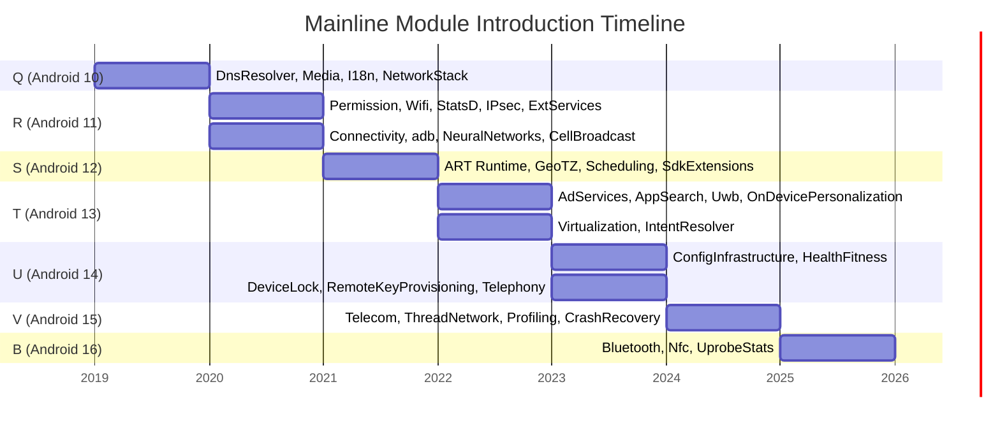

### 52.3.12  Deep Dive: Media Module

The Media module is split across two APEXes defined in `frameworks/av/apex/`:

```
// Source: frameworks/av/apex/Android.bp

apex {
    name: "com.android.media",
    manifest: "manifest.json",
    defaults: ["com.android.media-defaults"],
    ...
}

apex {
    name: "com.android.media.swcodec",
    manifest: "manifest_codec.json",
    defaults: ["com.android.media.swcodec-defaults"],
    ...
}
```

- `com.android.media` -- The main media APEX containing extractors, the media
  framework service, and `framework-media.jar`.

- `com.android.media.swcodec` -- A separate process for software codecs
  (isolated for security via `mediaswcodec` service).

This separation is a security measure: software codec bugs (often triggered by
untrusted media files) are contained in a separate, sandboxed process.

---

## 52.4  SDK Extensions

### 52.4.1  The Problem: API Availability at Runtime

Mainline modules are updated independently of the platform.  This means a
device running Android 12 (S) might have an R-era module or a much newer one.
How can an app know which APIs are actually available?

Traditional `Build.VERSION.SDK_INT` checks tell you the *platform* version but
say nothing about the *module* version.  The **SDK Extensions** mechanism fills
this gap.

### 52.4.2  How It Works

Each Android release defines an **extension version** -- an integer that
advances as modules in that "train" are updated together.  The version is
derived at boot time by the `derive_sdk` binary, which inspects the actual
versions of installed modules.

The `derive_sdk` process:

1. Reads `sdkinfo.pb` from each mounted APEX (at `/apex/<name>/etc/sdkinfo.pb`).
2. Reads the `extensions_db` (a protobuf database of version requirements).
3. For each extension (R, S, T, U, V, B, ad_services), calculates the highest
   version where all module requirements are met.

4. Sets system properties: `build.version.extensions.r`, `.s`, `.t`, etc.

```cpp
// Source: packages/modules/SdkExtensions/derive_sdk/derive_sdk.cpp

static const std::unordered_map<std::string, SdkModule> kApexNameToModule = {
    {"com.android.adservices", SdkModule::AD_SERVICES},
    {"com.android.appsearch", SdkModule::APPSEARCH},
    {"com.android.art", SdkModule::ART},
    {"com.android.configinfrastructure", SdkModule::CONFIG_INFRASTRUCTURE},
    {"com.android.conscrypt", SdkModule::CONSCRYPT},
    {"com.android.extservices", SdkModule::EXT_SERVICES},
    {"com.android.healthfitness", SdkModule::HEALTH_FITNESS},
    {"com.android.ipsec", SdkModule::IPSEC},
    {"com.android.media", SdkModule::MEDIA},
    {"com.android.mediaprovider", SdkModule::MEDIA_PROVIDER},
    {"com.android.neuralnetworks", SdkModule::NEURAL_NETWORKS},
    {"com.android.ondevicepersonalization", SdkModule::ON_DEVICE_PERSONALIZATION},
    {"com.android.permission", SdkModule::PERMISSIONS},
    {"com.android.scheduling", SdkModule::SCHEDULING},
    {"com.android.sdkext", SdkModule::SDK_EXTENSIONS},
    {"com.android.os.statsd", SdkModule::STATSD},
    {"com.android.tethering", SdkModule::TETHERING},
};
```

Each extension train is associated with a set of modules:

```cpp
// Source: packages/modules/SdkExtensions/derive_sdk/derive_sdk.cpp

static const std::unordered_set<SdkModule> kRModules = {
    SdkModule::CONSCRYPT,      SdkModule::EXT_SERVICES,
    SdkModule::IPSEC,          SdkModule::MEDIA,
    SdkModule::MEDIA_PROVIDER, SdkModule::PERMISSIONS,
    SdkModule::SDK_EXTENSIONS, SdkModule::STATSD,
    SdkModule::TETHERING,
};

static const std::unordered_set<SdkModule> kSModules = {
    SdkModule::ART, SdkModule::SCHEDULING
};

static const std::unordered_set<SdkModule> kTModules = {
    SdkModule::AD_SERVICES, SdkModule::APPSEARCH,
    SdkModule::ON_DEVICE_PERSONALIZATION
};

static const std::unordered_set<SdkModule> kUModules = {
    SdkModule::CONFIG_INFRASTRUCTURE, SdkModule::HEALTH_FITNESS
};

static const std::unordered_set<SdkModule> kVModules = {};

static const std::unordered_set<SdkModule> kBModules = {
    SdkModule::NEURAL_NETWORKS
};
```

### 52.4.3  Version Derivation Algorithm

The `GetSdkLevel` function determines the highest extension version whose
requirements are all met:

```cpp
// Source: packages/modules/SdkExtensions/derive_sdk/derive_sdk.cpp

int GetSdkLevel(const ExtensionDatabase& db,
                const std::unordered_set<SdkModule>& relevant_modules,
                const std::unordered_map<SdkModule, int>& module_versions) {
  int max = 0;
  for (const auto& ext_version : db.versions()) {
    if (ext_version.version() > max &&
        VersionRequirementsMet(ext_version, relevant_modules,
                               module_versions)) {
      max = ext_version.version();
    }
  }
  return max;
}
```

And `VersionRequirementsMet` checks each module individually:

```cpp
// Source: packages/modules/SdkExtensions/derive_sdk/derive_sdk.cpp

bool VersionRequirementsMet(
    const ExtensionVersion& ext_version,
    const std::unordered_set<SdkModule>& relevant_modules,
    const std::unordered_map<SdkModule, int>& module_versions) {
  for (const auto& requirement : ext_version.requirements()) {
    if (relevant_modules.find(requirement.module()) ==
        relevant_modules.end())
      continue;

    auto version = module_versions.find(requirement.module());
    if (version == module_versions.end()) return false;
    if (version->second < requirement.version().version())
      return false;
  }
  return true;
}
```

The algorithm: for each extension level (R, S, T, ...), iterate over all
defined versions in the database.  For each version number, check if every
required module meets the minimum version threshold.  The highest passing
version number becomes the extension level.

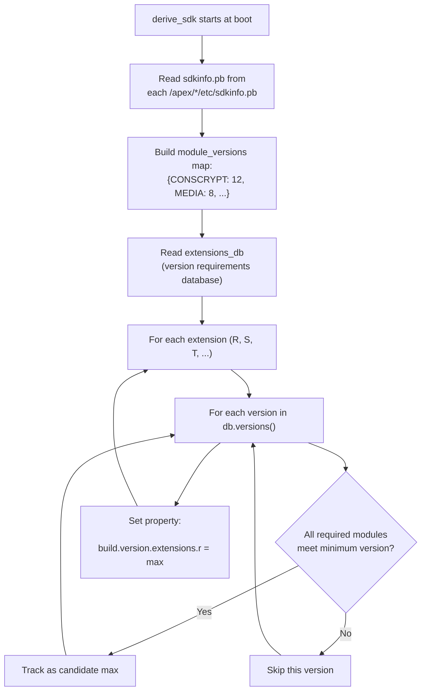

### 52.4.4  The Java API: SdkExtensions Class

Apps query extension versions through `android.os.ext.SdkExtensions`:

```java
// Source: packages/modules/SdkExtensions/java/android/os/ext/SdkExtensions.java

public class SdkExtensions {
    public static final int AD_SERVICES = 1_000_000;

    private static final int R_EXTENSION_INT;
    private static final int S_EXTENSION_INT;
    private static final int T_EXTENSION_INT;
    private static final int U_EXTENSION_INT;
    private static final int V_EXTENSION_INT;
    private static final int B_EXTENSION_INT;
    private static final int AD_SERVICES_EXTENSION_INT;

    static {
        R_EXTENSION_INT = SystemProperties.getInt(
            "build.version.extensions.r", 0);
        S_EXTENSION_INT = SystemProperties.getInt(
            "build.version.extensions.s", 0);
        T_EXTENSION_INT = SystemProperties.getInt(
            "build.version.extensions.t", 0);
        U_EXTENSION_INT = SystemProperties.getInt(
            "build.version.extensions.u", 0);
        V_EXTENSION_INT = SystemProperties.getInt(
            "build.version.extensions.v", 0);
        B_EXTENSION_INT = SystemProperties.getInt(
            "build.version.extensions.b", 0);
        AD_SERVICES_EXTENSION_INT = SystemProperties.getInt(
            "build.version.extensions.ad_services", 0);
    }

    /**
     * Return the version of the specified extensions.
     *
     * Example:
     *   if (getExtensionVersion(VERSION_CODES.R) >= 3) {
     *       // Safely use API available since R extensions version 3
     *   }
     */
    public static int getExtensionVersion(@Extension int extension) {
        if (extension < VERSION_CODES.R) {
            throw new IllegalArgumentException(
                "not a valid extension: " + extension);
        }
        if (extension == VERSION_CODES.R) return R_EXTENSION_INT;
        if (extension == VERSION_CODES.S) return S_EXTENSION_INT;
        if (extension == VERSION_CODES.TIRAMISU) return T_EXTENSION_INT;
        if (extension == VERSION_CODES.UPSIDE_DOWN_CAKE) return U_EXTENSION_INT;
        if (extension == VERSION_CODES.VANILLA_ICE_CREAM) return V_EXTENSION_INT;
        if (extension == VERSION_CODES.BAKLAVA) return B_EXTENSION_INT;
        if (extension == AD_SERVICES) return AD_SERVICES_EXTENSION_INT;
        return 0;
    }

    public static Map<Integer, Integer> getAllExtensionVersions() {
        return ALL_EXTENSION_INTS;
    }
}
```

### 52.4.5  Using Extension Versions in App Code

The typical pattern for an app developer:

```java
import android.os.Build;
import android.os.ext.SdkExtensions;

// Check if a T-extensions API (added in extension version 5) is available
if (Build.VERSION.SDK_INT >= Build.VERSION_CODES.TIRAMISU &&
    SdkExtensions.getExtensionVersion(Build.VERSION_CODES.TIRAMISU) >= 5) {
    // Safe to use the API
    useNewTiramisuApi();
}
```

The `@RequiresExtension` annotation (from AndroidX) makes this more ergonomic:

```java
@RequiresExtension(extension = Build.VERSION_CODES.TIRAMISU, version = 5)
public void useNewTiramisuApi() {
    // ...
}
```

### 52.4.6  Worked Example: How Extension Version is Computed

Let us walk through a concrete example of how `derive_sdk` computes the R
extension version.

**Input**: The `extensions_db` contains the following (simplified) entries:

```
version: 5
requirements:
  - module: CONSCRYPT,       min_version: 10
  - module: MEDIA,           min_version: 8
  - module: PERMISSIONS,     min_version: 12
  - module: TETHERING,       min_version: 6

version: 6
requirements:
  - module: CONSCRYPT,       min_version: 11
  - module: MEDIA,           min_version: 9
  - module: PERMISSIONS,     min_version: 14
  - module: TETHERING,       min_version: 7
```

**Installed module versions** (from `sdkinfo.pb` in each APEX):

```
CONSCRYPT: 12
MEDIA: 9
PERMISSIONS: 14
TETHERING: 6
```

**Evaluation**:

For version 5:

- CONSCRYPT 12 >= 10 -- pass
- MEDIA 9 >= 8 -- pass
- PERMISSIONS 14 >= 12 -- pass
- TETHERING 6 >= 6 -- pass
- **All met: version 5 is a candidate.**

For version 6:

- CONSCRYPT 12 >= 11 -- pass
- MEDIA 9 >= 9 -- pass
- PERMISSIONS 14 >= 14 -- pass
- TETHERING 6 >= 7 -- **FAIL** (6 < 7)
- **Not all met: version 6 is rejected.**

**Result**: R extension version = 5.

The TETHERING module at version 6 does not meet the minimum requirement of 7
for extension version 6.  If Google pushes a Connectivity module update that
brings TETHERING to version 7 or higher, the R extension version would
automatically advance to 6 on the next reboot.

This mechanism ensures that apps can trust extension version checks: if
`SdkExtensions.getExtensionVersion(R) >= 6`, then *all* modules in the R
train are at or above the required versions, and all APIs introduced in R
extension 6 are available.

### 52.4.7  Ad Services Extension

The Ad Services extension is a special case: it has its own independent
extension track (`AD_SERVICES = 1_000_000`) because the Privacy Sandbox
APIs evolve on a different cadence from the platform extensions:

```java
// Source: packages/modules/SdkExtensions/java/android/os/ext/SdkExtensions.java

public static final int AD_SERVICES = 1_000_000;

// In the static initializer:
AD_SERVICES_EXTENSION_INT = SystemProperties.getInt(
    "build.version.extensions.ad_services", 0);

if (SdkLevel.isAtLeastT()) {
    extensions.put(AD_SERVICES, AD_SERVICES_EXTENSION_INT);
}
```

Apps that use Privacy Sandbox APIs check:

```java
if (SdkExtensions.getExtensionVersion(SdkExtensions.AD_SERVICES) >= 4) {
    // Safe to use Ad Services API from extension version 4
}
```

### 52.4.8  The SdkExtensions APEX

The SdkExtensions module itself is packaged as an APEX:

```
// Source: packages/modules/SdkExtensions/Android.bp

apex {
    name: "com.android.sdkext",
    defaults: ["com.android.sdkext-defaults"],
    bootclasspath_fragments: [
        "com.android.sdkext-bootclasspath-fragment"
    ],
    binaries: [
        "derive_classpath",
        "derive_sdk",
    ],
    prebuilts: [
        "current_sdkinfo",
        "extensions_db",
    ],
    manifest: "manifest.json",
}
```

It bundles:

- `derive_sdk` -- The binary that computes extension versions at boot.
- `derive_classpath` -- A binary that generates the DEX2OAT boot classpath
  configuration based on installed modules.

- `extensions_db` -- The protobuf database of version requirements.
- `framework-sdkextensions.jar` -- The Java API (`SdkExtensions` class).

### 52.4.9  Extension Version Lifecycle

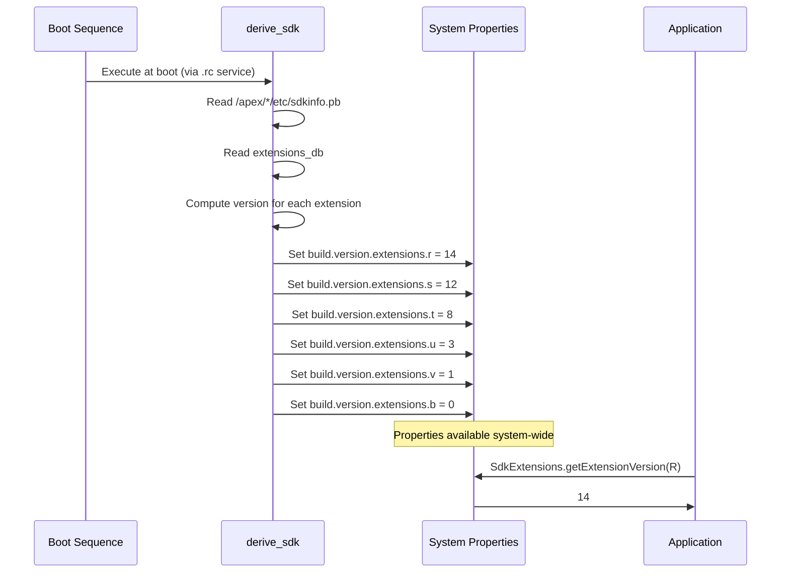

---

## 52.5  Module Boundaries

Mainline modules must coexist with both the platform and other modules while
maintaining strict interface boundaries.  This section explains the rules that
govern what can and cannot be inside a module.

### 52.5.1  The `apex_available` Property

Every library, binary, or app that wants to be included in an APEX must declare
which APEXes it is available for:

```go
// Source: build/soong/android/apex.go

type ApexProperties struct {
    // Availability of this module in APEXes. Only the listed APEXes
    // can contain this module.
    //
    // "//apex_available:anyapex" matches any APEX.
    // "//apex_available:platform" refers to non-APEX partitions.
    // Prefix pattern (com.foo.*) can match any APEX with that prefix.
    // Default is ["//apex_available:platform"].
    Apex_available []string
}
```

For example, a library that should be available to both the platform and the
Connectivity APEX would declare:

```
cc_library {
    name: "libnetutils",
    apex_available: [
        "//apex_available:platform",
        "com.android.tethering",
    ],
}
```

The build system enforces that a module cannot be included in an APEX unless
its `apex_available` list permits it.  This prevents accidental dependency
bloat and ensures clear ownership.

### 52.5.2  API Surface Levels

Mainline modules interact with the platform and with each other through
carefully defined API surfaces.  The `java_sdk_library` module type in Soong
generates multiple API scopes:

```go
// Source: build/soong/java/sdk_library.go

apiScopePublic = initApiScope(&apiScope{
    name: "public",
    sdkVersion: "current",
    kind: android.SdkPublic,
})

apiScopeSystem = initApiScope(&apiScope{
    name: "system",
    annotation: "android.annotation.SystemApi(
        client=android.annotation.SystemApi.Client.PRIVILEGED_APPS)",
    kind: android.SdkSystem,
})

apiScopeModuleLib = initApiScope(&apiScope{
    name: "module-lib",
    annotation: "android.annotation.SystemApi(
        client=android.annotation.SystemApi.Client.MODULE_LIBRARIES)",
    kind: android.SdkModule,
})

apiScopeSystemServer = initApiScope(&apiScope{
    name: "system-server",
    annotation: "android.annotation.SystemApi(
        client=android.annotation.SystemApi.Client.SYSTEM_SERVER)",
    kind: android.SdkSystemServer,
})
```

These map to five distinct API surfaces:

| Surface | Annotation | Who Can Use It |
|---------|-----------|---------------|
| **Public** | (none) | Any app (stable, CTS-tested) |
| **System** | `@SystemApi(PRIVILEGED_APPS)` | Privileged apps and system services |
| **Module-lib** | `@SystemApi(MODULE_LIBRARIES)` | Other Mainline modules only |
| **System-server** | `@SystemApi(SYSTEM_SERVER)` | System server process only |
| **Test** | `@TestApi` | CTS and other test suites |

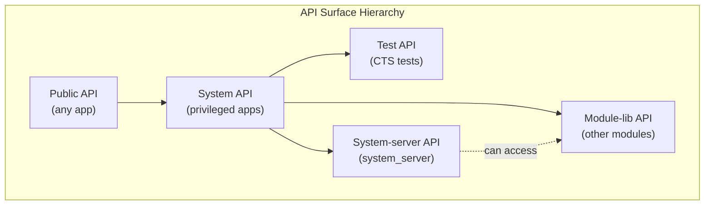

### 52.5.3  Hidden API Enforcement

APIs not annotated with any of the above markers are considered **hidden APIs**.
Mainline modules are subject to hidden-API enforcement just like regular apps:

- The build system tracks hidden APIs through `hidden_api` stanza in
  bootclasspath fragment definitions.

- At runtime, the `libnativeloader` and ART enforce access restrictions based
  on the calling module's API level.

A bootclasspath fragment declares which packages it owns and their hidden API
flags:

```
bootclasspath_fragment {
    name: "com.android.permission-bootclasspath-fragment",
    contents: ["framework-permission"],
    apex_available: ["com.android.permission"],
    hidden_api: {
        split_packages: ["*"],
        // annotation flags, metadata, index files
    },
}
```

### 52.5.4  What Can Be in a Module

A Mainline module (APEX) can contain:

| Content Type | Build Module Type | Property |
|-------------|------------------|----------|
| Native shared libraries | `cc_library` | `native_shared_libs` |
| Native executables | `cc_binary` | `binaries` |
| JNI libraries | `cc_library` (with `is_jni: true`) | `jni_libs` |
| Java libraries | `java_library` | `java_libs` |
| Bootclasspath fragments | `bootclasspath_fragment` | `bootclasspath_fragments` |
| System server fragments | `systemserverclasspath_fragment` | `systemserverclasspath_fragments` |
| Android apps (APKs) | `android_app` | `apps` |
| Shell scripts | `sh_binary` | `sh_binaries` |
| Configuration files | `prebuilt_etc` | `prebuilts` |
| Rust dynamic libraries | `rust_library` | `rust_dyn_libs` |
| Filesystem images | `android_filesystem` | `filesystems` |
| Runtime resource overlays | `runtime_resource_overlay` | `rros` |
| Compat config files | `platform_compat_config` | `compat_configs` |

### 52.5.5  What Cannot Be in a Module

Not everything can be modularized.  The following constraints apply:

1. **Kernel modules** -- Kernel code is updated through GKI, not APEX.
2. **HAL implementations** -- HALs are vendor-specific; they use VINTF
   manifests and are not part of Mainline (though vendor APEXes exist).

3. **Boot-critical init scripts** -- The very earliest init stages must work
   without any APEX mounted.

4. **SELinux policy** -- Base policy ships with the platform; modules only
   contribute `file_contexts` for their own mount points.

5. **Resources from framework-res** -- Core framework resources are not in an
   APEX (though overlays are possible).

### 52.5.6  Module Dependencies and `min_sdk_version`

Each APEX declares a `min_sdk_version` that determines:

- The minimum platform version on which the APEX can be installed.
- Which NDK/SDK APIs the module's native code can use.

The `packages/modules/common/sdk/Android.bp` file defines standard defaults
for each launch window:

```
// Source: packages/modules/common/sdk/Android.bp

apex_defaults {
    name: "r-launched-apex-module",
    defaults: ["any-launched-apex-modules"],
    min_sdk_version: "30",  // APEX_LOWEST_MIN_SDK_VERSION
}

apex_defaults {
    name: "s-launched-apex-module",
    defaults: ["any-launched-apex-modules"],
    min_sdk_version: "31",
    compressible: true,
}

apex_defaults {
    name: "t-launched-apex-module",
    defaults: ["any-launched-apex-modules"],
    min_sdk_version: "Tiramisu",
    compressible: true,
}

apex_defaults {
    name: "u-launched-apex-module",
    defaults: ["any-launched-apex-modules"],
    min_sdk_version: "UpsideDownCake",
    compressible: true,
}

apex_defaults {
    name: "v-launched-apex-module",
    defaults: ["any-launched-apex-modules"],
    min_sdk_version: "VanillaIceCream",
    compressible: true,
}

apex_defaults {
    name: "b-launched-apex-module",
    defaults: ["any-launched-apex-modules"],
    min_sdk_version: "36",
    compressible: true,
}
```

All updatable APEXes inherit from `any-launched-apex-modules`:

```
// Source: packages/modules/common/sdk/Android.bp

apex_defaults {
    name: "any-launched-apex-modules",
    updatable: true,
}
```

This sets `updatable: true`, which triggers additional build-time checks:

- All native dependencies must use stable NDK APIs.
- All Java dependencies must use `sdk_version: "module_current"` or lower.
- Symbol versioning is enforced for shared libraries.

### 52.5.7  Dynamic Common Lib APEXes (DCLA)

Some modules use the **DCLA** (Dynamic Common Lib APEX) strategy to share
native libraries across multiple APEXes without duplicating them:

```
// Source: packages/modules/common/sdk/Android.bp

DCLA_MIN_SDK_VERSION = "31"

library_linking_strategy_apex_defaults {
    name: "r-launched-dcla-enabled-apex-module",
    defaults: ["r-launched-apex-module"],
    soong_config_variables: {
        library_linking_strategy: {
            prefer_static: {},
            conditions_default: {
                min_sdk_version: DCLA_MIN_SDK_VERSION,
            },
        },
    },
}
```

When DCLA is enabled, shared libraries like `libc++` and `libcrypto` are
loaded from a shared location rather than being duplicated in each APEX.
This reduces on-device storage but requires API level 31+ for the shared
library loading infrastructure.

### 52.5.8  Cross-Module Dependencies

Modules can depend on each other through:

1. **provideNativeLibs / requireNativeLibs** -- Declared in the APEX manifest,
   these let one APEX export a native library that another APEX imports.

2. **java_sdk_library** -- Provides stable Java API stubs that other modules
   compile against.

3. **Stable AIDL** -- For IPC between services in different modules.

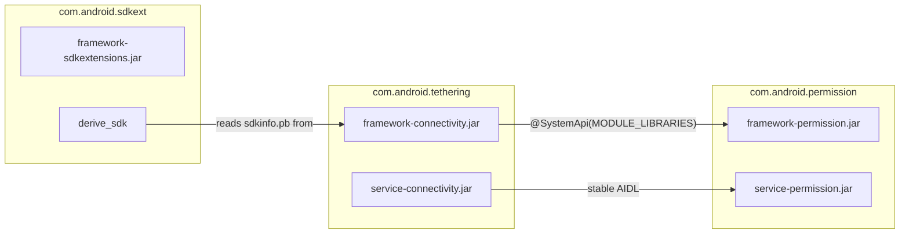

### 52.5.9  The `apex_available` Enforcement Mechanism

The build system enforces `apex_available` at the Soong module-graph level.
The `ApexModule` interface in `build/soong/android/apex.go` defines the
contract:

```go
// Source: build/soong/android/apex.go

type ApexModule interface {
    // Returns true if this module is available in any APEX
    InAnyApex() bool

    // Returns true if the module is NOT available to the platform
    NotInPlatform() bool

    // Tests if this module can have APEX variants
    CanHaveApexVariants() bool

    // Tests if installable as a file in an APEX
    IsInstallableToApex() bool

    // Tests availability for a specific APEX or ":platform"
    AvailableFor(what string) bool

    // Returns the list of APEXes this module is available for
    ApexAvailableFor() []string

    // Returns the min SDK version the module supports
    MinSdkVersionSupported(ctx BaseModuleContext) ApiLevel
}
```

When an APEX definition references a library (e.g., `native_shared_libs:
["libfoo"]`), the build system:

1. Creates an APEX variant of `libfoo` through the `apexTransitionMutator`.
2. Checks that `libfoo`'s `apex_available` list includes the APEX name.
3. Validates that `libfoo`'s `min_sdk_version` is compatible with the APEX.
4. Transitively checks all dependencies of `libfoo`.

If any check fails, the build aborts with a clear error message indicating
which module violates the boundary.

### 52.5.10  Linker Namespace Configuration

When an APEX is activated, its native libraries need their own linker
namespace to avoid conflicts with platform libraries and other APEXes.  The
`linkerconfig` tool generates namespace configuration dynamically based on the
activated APEXes.

Each APEX's `apex_manifest.pb` declares:

- `provideNativeLibs` -- Libraries this APEX exports to others.
- `requireNativeLibs` -- Libraries this APEX needs from others.

The linker configuration ensures:

- Libraries inside an APEX can see each other.
- Libraries from the platform are accessible only through the platform
  namespace.

- Cross-APEX library sharing follows explicit `provideNativeLibs` /
  `requireNativeLibs` declarations.

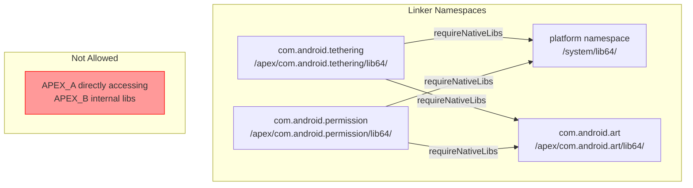

### 52.5.11  Bootclasspath and System Server Classpath

Java-containing Mainline modules participate in the boot classpath through
**bootclasspath fragments** and **systemserverclasspath fragments**.  These
fragments define which JAR files from the module should be added to the
classpath.

A bootclasspath fragment declaration:

```
bootclasspath_fragment {
    name: "com.android.tethering-bootclasspath-fragment",
    contents: [
        "framework-connectivity",
        "framework-connectivity-t",
    ],
    apex_available: ["com.android.tethering"],
    hidden_api: {
        split_packages: ["*"],
        // ...
    },
}
```

At boot time, the `derive_classpath` binary (from the SdkExtensions module)
reads the active APEXes and generates:

- `BOOTCLASSPATH` -- The list of JARs for the boot class loader.
- `DEX2OATBOOTCLASSPATH` -- The subset compiled ahead-of-time by dex2oat.
- `SYSTEMSERVERCLASSPATH` -- JARs loaded into the system server process.

This dynamic generation is essential because the set of active modules can
change with updates, and the classpath must always reflect what is actually
installed.

---

## 52.6  Module Development

### 52.6.1  Building a Mainline Module

Building a specific module:

```bash
# Build a single APEX
$ m com.android.tethering

# Build all Mainline modules
$ m mainline_modules

# Build a module and install it on a connected device
$ m com.android.sdkext && adb install out/target/product/generic_arm64/system/apex/com.android.sdkext.apex
```

### 52.6.2  Anatomy of a Module Build

A complete module definition typically involves:

1. **APEX definition** (`Android.bp` in module's `apex/` directory)
2. **APEX key** (`apex_key` module)
3. **Certificate** (`android_app_certificate` module)
4. **Bootclasspath fragment** (for Java-containing modules)
5. **System server classpath fragment** (for modules with system server code)
6. **Framework library** (usually `java_sdk_library`)
7. **Service implementation** (usually `java_library`)

Here is the minimal structure, using the SdkExtensions module as an example:

```
packages/modules/SdkExtensions/
+-- Android.bp                    # APEX definition + key + certificate
+-- manifest.json                 # APEX manifest (JSON, converted to protobuf)
+-- com.android.sdkext.avbpubkey  # AVB public key
+-- com.android.sdkext.pem        # AVB private key
+-- com.android.sdkext.pk8        # Container signing private key
+-- com.android.sdkext.x509.pem   # Container signing certificate
+-- derive_sdk/
|   +-- derive_sdk.cpp            # Boot-time binary
|   +-- derive_sdk.rc             # init service definition
+-- java/
|   +-- android/os/ext/
|       +-- SdkExtensions.java    # Public API
+-- gen_sdk/                      # SDK version database generation
+-- javatests/                    # Tests
```

### 52.6.3  Creating a New Module from Scratch

If you were to create a new Mainline module, the steps would be:

**Step 1: Generate signing keys.**

```bash
# Generate AVB key pair
$ openssl genrsa -out com.android.mymodule.pem 4096
$ avbtool extract_public_key --key com.android.mymodule.pem \
    --output com.android.mymodule.avbpubkey

# Generate container signing key
$ development/tools/make_key com.android.mymodule \
    '/CN=com.android.mymodule'
```

**Step 2: Write the Android.bp.**

```
apex {
    name: "com.android.mymodule",
    defaults: ["v-launched-apex-module"],  // launched in V
    manifest: "apex_manifest.json",
    key: "com.android.mymodule.key",
    certificate: ":com.android.mymodule.certificate",
    bootclasspath_fragments: [
        "com.android.mymodule-bootclasspath-fragment",
    ],
    native_shared_libs: ["libmymodule"],
    java_libs: ["mymodule-java-lib"],
}

apex_key {
    name: "com.android.mymodule.key",
    public_key: "com.android.mymodule.avbpubkey",
    private_key: "com.android.mymodule.pem",
}

android_app_certificate {
    name: "com.android.mymodule.certificate",
    certificate: "com.android.mymodule",
}
```

**Step 3: Write the APEX manifest.**

```json
{
    "name": "com.android.mymodule",
    "version": 1
}
```

**Step 4: Create SELinux file contexts.**

```
# system/sepolicy/apex/com.android.mymodule-file_contexts
(/.*)?       u:object_r:system_file:s0
/bin(/.*)?   u:object_r:mymodule_exec:s0
/lib(64)?(/.*)?  u:object_r:system_lib_file:s0
```

**Step 5: Declare apex_available in all dependencies.**

```
cc_library {
    name: "libmymodule",
    srcs: ["mymodule.cpp"],
    apex_available: [
        "com.android.mymodule",
    ],
    min_sdk_version: "VanillaIceCream",
}
```

### 52.6.4  Testing Mainline Modules

#### CTS (Compatibility Test Suite)

CTS tests verify that the device behaves correctly with the installed module
versions.  Many module-specific CTS tests live alongside the module source:

```
packages/modules/SdkExtensions/javatests/
+-- com/android/os/ext/SdkExtensionsTest.java
+-- com/android/sdkext/extensions/SdkExtensionsHostTest.java
```

#### MTS (Mainline Test Suite)

MTS is a subset of CTS designed specifically for testing Mainline module
updates.  It can be run independently:

```bash
# Run MTS for a specific module
$ atest --mts com.android.sdkext.tests

# Or use the MTS test plan
$ cts-tradefed run mts --module SdkExtensionsTests
```

#### Unit Tests

Individual module components have their own unit tests:

```bash
# Run apexd unit tests
$ atest apex_file_test
$ atest apex_manifest_test
$ atest apex_database_test
$ atest apex_file_repository_test

# Run derive_sdk tests
$ atest derive_sdk_test
```

#### TEST_MAPPING

Modules use `TEST_MAPPING` files to declare which tests should run during
pre-submit and post-submit:

```json
{
    "presubmit": [
        {"name": "SdkExtensionsTests"},
        {"name": "derive_sdk_test"}
    ],
    "postsubmit": [
        {"name": "SdkExtensionsHostTest"}
    ]
}
```

### 52.6.5  Installing and Updating on Device

**Install a locally-built APEX:**

```bash
$ adb install --staged out/target/product/generic_arm64/system/apex/com.android.sdkext.apex
$ adb reboot
```

The `--staged` flag is required for APEXes because they need a reboot to
activate (unless the APEX supports rebootless update via
`supportsRebootlessUpdate` in the manifest).

**Revert to the pre-installed version:**

```bash
$ adb shell cmd -w apexservice revertActiveSession
$ adb reboot
```

**Check installed APEX versions:**

```bash
$ adb shell pm list packages --apex-only --show-versioncode
package:com.android.adbd versionCode:340090000
package:com.android.art versionCode:340090000
package:com.android.conscrypt versionCode:340090000
package:com.android.i18n versionCode:340090000
package:com.android.media versionCode:340090000
package:com.android.media.swcodec versionCode:340090000
package:com.android.os.statsd versionCode:340090000
package:com.android.permission versionCode:340090000
package:com.android.resolv versionCode:340090000
package:com.android.sdkext versionCode:340090000
package:com.android.tethering versionCode:340090000
package:com.android.wifi versionCode:340090000
...
```

**Inspect a mounted APEX:**

```bash
$ adb shell ls /apex/com.android.sdkext/
bin/
etc/
javalib/

$ adb shell cat /apex/apex-info-list.xml
```

**Query extension versions:**

```bash
$ adb shell getprop build.version.extensions.r
14
$ adb shell getprop build.version.extensions.s
12
$ adb shell getprop build.version.extensions.t
8
```

### 52.6.6  Debugging APEX Issues

**Check apexd logs:**

```bash
$ adb logcat -s apexd
$ adb logcat -s apexd-bootstrap
```

**Examine the APEX database:**

```bash
# List all activated APEXes
$ adb shell cmd -w apexservice getActivePackages

# Get info about a specific APEX
$ adb shell cmd -w apexservice getApexInfo com.android.sdkext
```

**Inspect APEX file contents from host:**

```bash
$ deapexer list com.android.sdkext.apex
$ deapexer extract com.android.sdkext.apex output_dir/
```

**Check SELinux contexts:**

```bash
$ adb shell ls -Z /apex/com.android.sdkext/
$ adb shell ls -Z /apex/com.android.sdkext/bin/
```

### 52.6.7  Staged Sessions and Update Workflow

The complete lifecycle of a Mainline module update:

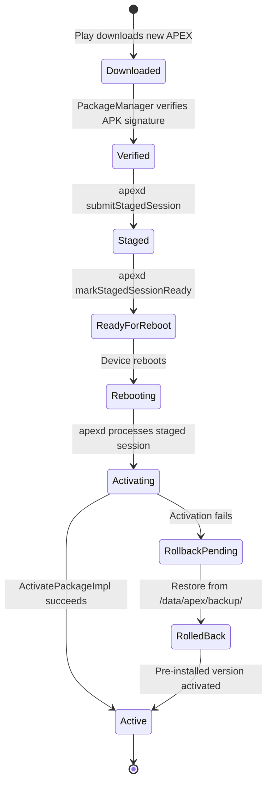

### 52.6.8  The APEX Build Pipeline (Full)

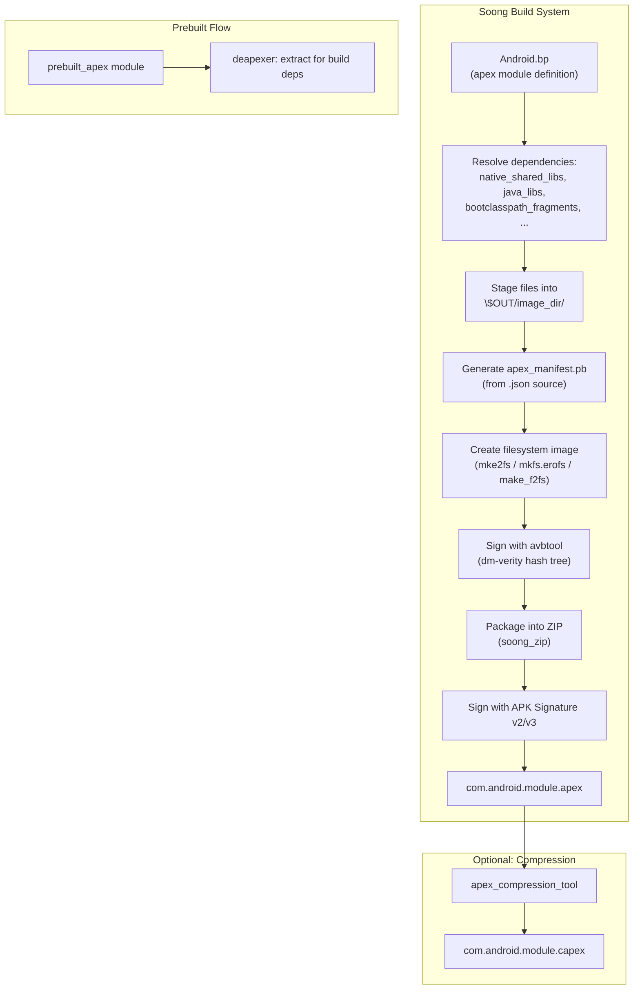

### 52.6.9  The APEX Service Interface (AIDL)

The `apexd` daemon exposes an AIDL service interface that `PackageManager` and
other system components use to manage APEX packages.  Key methods include:

```
// Source: system/apex/apexd/aidl (simplified interface)

interface IApexService {
    ApexSessionInfo[] getStagedSessionInfo();
    void submitStagedSession(in ApexSessionParams params,
                             out ApexInfoList packages);
    void markStagedSessionReady(int session_id);
    void markStagedSessionSuccessful();
    void markBootCompleted();
    ApexInfo[] getActivePackages();
    ApexInfo[] getAllPackages();
    void installAndActivatePackage(String packagePath,
                                   out ApexInfo info);
    void revertActiveSession();
}
```

The `installAndActivatePackage` method is the entry point for rebootless
updates.  It validates the caller (must be system or root), verifies the
package, and performs the activation steps described in Section 52.2.11.

### 52.6.10  Continuous Integration and Module Testing

Mainline modules follow a rigorous testing pipeline:

**Pre-submit (before code lands):**

1. Unit tests (specified in `TEST_MAPPING`).
2. Build verification (module must build cleanly).
3. API compatibility checks (no breaking changes to stable APIs).

**Post-submit (after code lands):**

1. MTS (Mainline Test Suite) runs on multiple device types.
2. CTS (Compatibility Test Suite) for behavior verification.
3. Performance benchmarks to catch regressions.

**Before module release:**

1. Full MTS pass on target devices.
2. Dogfood deployment to internal devices.
3. Staged rollout (1%, 5%, 25%, 50%, 100%).
4. Monitoring for crash rates, ANR rates, and metric anomalies.

### 52.6.11  Handling API Evolution in Modules

When a Mainline module adds a new API, the process is:

1. Add the API with appropriate annotations (`@SystemApi`, `@TestApi`, etc.).
2. Update the API surface files (`current.txt` / `system-current.txt`).
3. Run `m update-api` to regenerate API tracking files.
4. Add CTS tests for the new API.
5. If the API should be gated on extension version, add the module to the
   appropriate extension train in `derive_sdk.cpp`.

For example, if a new API was added to the Permission module for the T
extension train at version 5, the `extensions_db` would be updated to require
a minimum Permission module version that includes the new API.

### 52.6.12  Debugging Build Failures

Common build issues with Mainline modules:

**`apex_available` violations:**

```
error: "libfoo" is not available for "com.android.mymodule"
    Add "com.android.mymodule" to apex_available of "libfoo"
```

Fix: Add the APEX name to the library's `apex_available` property.

**`min_sdk_version` violations:**

```
error: "libfoo" with min_sdk_version "current" cannot be used
    in "com.android.mymodule" with min_sdk_version "30"
```

Fix: Set a concrete `min_sdk_version` on the dependency library.

**Updatable module restrictions:**

```
error: "com.android.mymodule" is updatable but references "libbar"
    which uses unstable platform APIs
```

Fix: Ensure all dependencies use stable API levels (NDK, SDK stubs).

### 52.6.13  Module Versioning Strategy

APEX version codes follow a specific format: `XYYZZZ000` where:

- `X` -- Reserved (usually 3 for trunk).
- `YY` -- Platform SDK version (e.g., 40 for B/Baklava SDK 36 encoded).
- `ZZZ` -- Build number within the release.
- `000` -- Variant (000 for release, 090 for development).

For example, `340090000` means:

- `3` -- Trunk
- `40` -- SDK version encoding
- `090` -- Development build
- `000` -- Default variant

This scheme ensures that newer module versions always have higher version codes,
which is critical for the Play Store update mechanism.

---

## 52.7  Deep Dive: HealthFitness (Health Connect)

The HealthFitness module (`com.android.healthfitness`) provides the **Health
Connect** platform -- a centralized, on-device repository for health and
fitness data.  It allows apps from different publishers (fitness trackers,
sleep monitors, medical apps) to share health records through a unified API
with fine-grained, per-data-type permissions.

### 52.7.1  Module Structure

```
packages/modules/HealthFitness/
    apex/               APEX packaging & bootclasspath fragment
    apk/                HealthConnectController (Settings UI)
    backuprestore/      HealthConnectBackupRestore (cloud B&R agent)
    framework/          Public API (android.health.connect.*)
    service/            System server implementation
    flags/              Feature flags (aconfig)
    lint/               Custom lint checks
    testapps/           Development toolbox app
    tests/              CTS, unit, and integration tests
```

The APEX bundles two APKs plus the framework and system server JARs:

```
// Source: packages/modules/HealthFitness/apex/Android.bp

apex {
    name: "com.android.healthfitness",
    apps: [
        "HealthConnectBackupRestore",
        "HealthConnectController",
    ],
    bootclasspath_fragments: [
        "com.android.healthfitness-bootclasspath-fragment"
    ],
    systemserverclasspath_fragments: [
        "com.android.healthfitness-systemserverclasspath-fragment"
    ],
    min_sdk_version: "34",
    updatable: true,
}
```

### 52.7.2  Architecture Overview

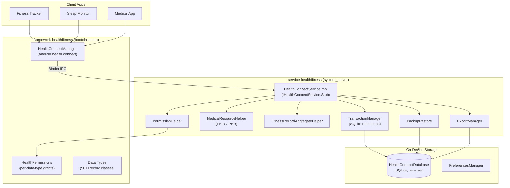

### 52.7.3  Data Types

Health Connect defines **50+ record types** in the
`android.health.connect.datatypes` package.  Every record class extends one of
two base classes:

| Base Class | Semantics | Examples |
|------------|-----------|---------|
| `InstantRecord` | Single point-in-time measurement | `HeartRateRecord`, `BloodPressureRecord`, `BloodGlucoseRecord`, `OxygenSaturationRecord`, `BodyTemperatureRecord` |
| `IntervalRecord` | Measurement over a time range | `StepsRecord`, `ExerciseSessionRecord`, `SleepSessionRecord`, `NutritionRecord`, `HydrationRecord`, `DistanceRecord` |

Data types span six categories defined by `HealthDataCategory`:

1. **Activity** -- Steps, distance, calories, exercise sessions, cycling
   cadence, floors climbed, elevation gained, exercise routes.

2. **Body measurements** -- Weight, height, body fat, bone mass, lean body
   mass, basal metabolic rate, body water mass.

3. **Cycle tracking** -- Menstruation flow, cervical mucus, ovulation test,
   intermenstrual bleeding, sexual activity.

4. **Nutrition** -- Nutrition records (per-nutrient detail), hydration, meal
   type.

5. **Sleep** -- Sleep sessions with per-stage breakdown (awake, light, deep,
   REM).

6. **Vitals** -- Heart rate, heart rate variability (RMSSD), blood pressure,
   blood glucose, oxygen saturation, respiratory rate, body temperature.

Each record carries `Metadata` (data origin, device info, client record ID,
last-modified time) enabling deduplication and priority ordering.

### 52.7.4  Personal Health Record (FHIR) Support

A major expansion in recent versions is the **Personal Health Record** (PHR)
API, enabling storage of clinical medical data using the **FHIR R4** standard:

```java
// Source: framework/java/android/health/connect/datatypes/MedicalResource.java
// Source: framework/java/android/health/connect/datatypes/MedicalDataSource.java
// Source: framework/java/android/health/connect/datatypes/FhirResource.java

// Apps create a MedicalDataSource, then upsert FHIR resources:
CreateMedicalDataSourceRequest request =
    new CreateMedicalDataSourceRequest.Builder(
        "Hospital Portal", Uri.parse("https://fhir.hospital.example"))
        .build();

UpsertMedicalResourceRequest upsert =
    new UpsertMedicalResourceRequest.Builder(
        dataSourceId,
        FhirVersion.parseFhirVersion("4.0.1"),
        fhirJsonString)
        .build();
```

PHR data requires the `WRITE_MEDICAL_DATA` permission and is structurally
validated against FHIR R4 specifications using a binary protobuf spec bundled
in the service JAR.

### 52.7.5  Permission Model

Health Connect uses a two-level permission system:

**Per-data-type permissions** -- Each record type has a read and write
permission defined in `HealthPermissions`:

```
android.permission.health.READ_HEART_RATE
android.permission.health.WRITE_HEART_RATE
android.permission.health.READ_STEPS
android.permission.health.WRITE_STEPS
android.permission.health.READ_SLEEP
...
```

**System-level permissions** (signature/privileged):

| Permission | Level | Purpose |
|-----------|-------|---------|
| `MANAGE_HEALTH_PERMISSIONS` | signature | Grant/revoke health permissions |
| `MANAGE_HEALTH_DATA` | privileged | Delete records, manage priorities |
| `START_ONBOARDING` | signature | Launch client onboarding flows |
| `READ_HEALTH_DATA_IN_BACKGROUND` | privileged | Background reads |
| `READ_HEALTH_DATA_HISTORY` | privileged | Access historical records |
| `WRITE_MEDICAL_DATA` | dangerous | Write FHIR medical resources |

Apps must also declare an activity handling
`ACTION_VIEW_PERMISSION_USAGE` with the `CATEGORY_HEALTH_PERMISSIONS`
category to be eligible for health permission grants.

### 52.7.6  On-Device Storage

All health data is stored in a per-user SQLite database managed by
`HealthConnectDatabase` (extends `SQLiteOpenHelper`).  The database lives in
credential-encrypted storage, ensuring it is inaccessible when the device is
locked.

Key storage components:

| Class | Responsibility |
|-------|---------------|
| `TransactionManager` | Executes all SQLite read/write operations within transactions |
| `DatabaseHelper` | Schema creation and upgrades |
| `DatabaseUpgradeHelper` | Version migration logic |
| `FitnessRecordUpsertHelper` | Insert or update fitness records with deduplication |
| `FitnessRecordReadHelper` | Query records with time filters, pagination, data-origin filters |
| `FitnessRecordAggregateHelper` | Compute aggregations (sum, avg, min, max) over time windows |
| `FitnessRecordDeleteHelper` | Delete by ID, time range, or data origin |

The service enforces per-app **rate limiting** via `RateLimiter` -- each UID
has a sliding-window quota for read, write, and aggregate operations.

### 52.7.7  Data Priority and Aggregation

When multiple apps write the same data type (e.g., both a watch and a phone
record steps), Health Connect uses a **data origin priority order** to resolve
conflicts during aggregation.  Users can reorder the priority in Settings.

```java
// Source: framework/java/android/health/connect/HealthConnectManager.java

void updateDataOriginPriorityOrder(
    UpdateDataOriginPriorityOrderRequest request,
    Executor executor,
    OutcomeReceiver<Void, HealthConnectException> callback);

void fetchDataOriginsPriorityOrder(
    int dataCategory,
    Executor executor,
    OutcomeReceiver<FetchDataOriginsPriorityOrderResponse,
                    HealthConnectException> callback);
```

### 52.7.8  Backup, Restore, and Export

Health Connect supports three data-portability mechanisms:

1. **Cloud backup/restore** -- The `HealthConnectBackupRestore` APK integrates
   with Android's backup infrastructure.  Changes are tracked via
   `BackupChangeTokenHelper` and serialized using Protocol Buffers.

2. **Device-to-device restore** -- Migration from an older device uses
   `MigrationEntity` records staged in a separate process.

3. **Export/import** -- Users can export their data to external storage via
   `ExportManager`, which compresses the database into a ZIP archive.  The
   `ImportManager` and `DatabaseMerger` handle re-importing and deduplication.

### 52.7.9  Key Source Paths

| Component | Path |
|-----------|------|
| Public API | `packages/modules/HealthFitness/framework/java/android/health/connect/` |
| Data types | `packages/modules/HealthFitness/framework/java/android/health/connect/datatypes/` |
| AIDL interfaces | `packages/modules/HealthFitness/framework/java/android/health/connect/aidl/` |
| System service | `packages/modules/HealthFitness/service/java/com/android/server/healthconnect/` |
| Storage layer | `packages/modules/HealthFitness/service/java/com/android/server/healthconnect/storage/` |
| Backup/restore | `packages/modules/HealthFitness/service/java/com/android/server/healthconnect/backuprestore/` |
| Export/import | `packages/modules/HealthFitness/service/java/com/android/server/healthconnect/exportimport/` |
| Settings UI (APK) | `packages/modules/HealthFitness/apk/` |
| APEX config | `packages/modules/HealthFitness/apex/Android.bp` |

---

## 52.8  Deep Dive: Profiling Module

The Profiling module (`com.android.profiling`) is a Mainline module that
provides **app-accessible system profiling** through the `ProfilingManager`
API.  It wraps Perfetto, heapprofd, and simpleperf behind a safe,
rate-limited, privacy-preserving interface that any app can call without root
access or special permissions.

### 52.8.1  Module Structure

```
packages/modules/Profiling/
    aidl/               IProfilingService.aidl
    apex/               APEX packaging (includes trace_redactor binary)
    framework/          Public API (android.os.ProfilingManager)
    service/            ProfilingService (system_server)
    anomaly-detector/   AnomalyDetectorService (optional, flag-gated)
    flags/              Feature flags (aconfig)
    tests/              CTS tests
```

The APEX is feature-flag gated:

```
// Source: packages/modules/Profiling/apex/Android.bp

apex {
    name: "com.android.profiling",
    enabled: select(
        release_flag("RELEASE_PACKAGE_PROFILING_MODULE"),
        { true: true, false: false }),
    binaries: ["trace_redactor"],
    bootclasspath_fragments: [
        "com.android.profiling-bootclasspath-fragment"
    ],
    systemserverclasspath_fragments: [
        "com.android.profiling-systemserverclasspath-fragment"
    ],
}
```

### 52.8.2  Architecture

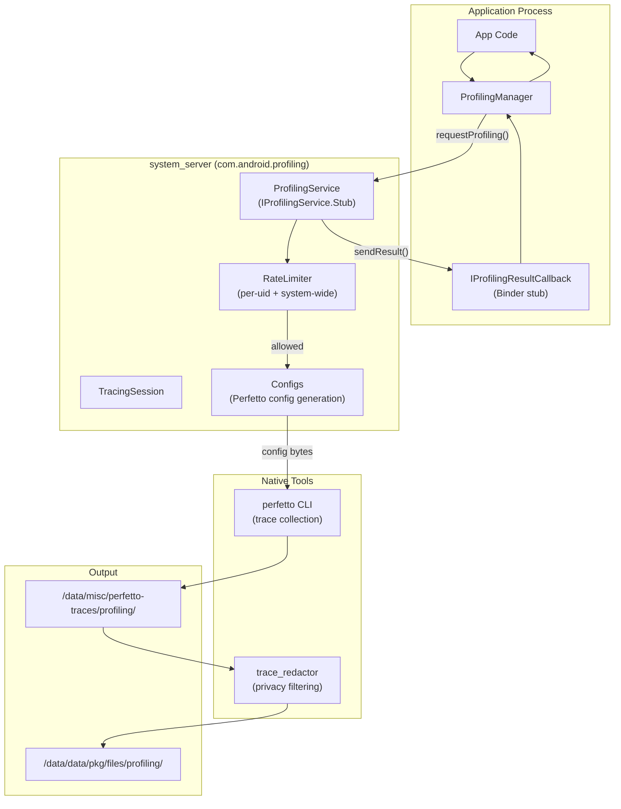

### 52.8.3  Profiling Types

`ProfilingManager` supports four profiling types, each backed by a different
Perfetto data source:

| Type | Constant | Backend | Output suffix |
|------|----------|---------|---------------|
| Java Heap Dump | `PROFILING_TYPE_JAVA_HEAP_DUMP` | `JavaHprofConfig` | `.perfetto-java-heap-dump` |
| Heap Profile | `PROFILING_TYPE_HEAP_PROFILE` | `HeapprofdConfig` | `.perfetto-heap-profile` |
| Stack Sampling | `PROFILING_TYPE_STACK_SAMPLING` | `PerfEventConfig` | `.perfetto-stack-sample` |
| System Trace | `PROFILING_TYPE_SYSTEM_TRACE` | `FtraceConfig` + `ProcessStatsConfig` | `.perfetto-trace` |

The `Configs` class (`service/java/.../Configs.java`) translates the
`ProfilingManager` request parameters into Perfetto `TraceConfig` protobufs.
Each profiling type has DeviceConfig-controlled bounds for duration, buffer
size, and sampling rate:

```java
// Source: packages/modules/Profiling/service/java/.../Configs.java
// Example: heap profile defaults

sHeapProfileDurationMsDefault  // e.g. 60 seconds
sHeapProfileDurationMsMin      // minimum allowed
sHeapProfileDurationMsMax      // maximum allowed
sHeapProfileSizeKbDefault      // buffer size
sHeapProfileSamplingIntervalBytesDefault  // Poisson interval
```

### 52.8.4  Rate Limiting

The `RateLimiter` uses a **cost-based sliding-window** model to prevent
abuse:

| Window | System-wide default | Per-process default |
|--------|-------------------|-------------------|
| 1 hour | 20 cost units | 10 cost units |
| 1 day | 50 cost units | 20 cost units |
| 1 week | 150 cost units | 30 cost units |

Each profiling session costs 10 units (app-initiated) or 5 units
(system-triggered).  Rate limiting can be disabled for local testing:

```bash
adb shell device_config put profiling_testing rate_limiter.disabled true
```

### 52.8.5  System-Triggered Profiling

Beyond on-demand requests, apps can register **triggers** -- system events
that automatically produce profiling data:

| Trigger | Constant | When it fires |
|---------|----------|--------------|
| App fully drawn | `TRIGGER_TYPE_APP_FULLY_DRAWN` | After `Activity.reportFullyDrawn()` on cold start |
| ANR | `TRIGGER_TYPE_ANR` | When an ANR is detected for the app |
| App requests running trace | `TRIGGER_TYPE_APP_REQUEST_RUNNING_TRACE` | On-demand snapshot of background trace |
| Force stop kill | `TRIGGER_TYPE_KILL_FORCE_STOP` | User force-stops via Settings |
| Recents kill | `TRIGGER_TYPE_KILL_RECENTS` | User swipes away in Recents |

The system maintains a background trace (configurable via DeviceConfig) and
clones a snapshot when a trigger fires.  Results are delivered through
`registerForAllProfilingResults()` callbacks.

### 52.8.6  Trace Redaction and Privacy

All profiling output is **redacted** by the `trace_redactor` binary before
delivery to the app.  Redaction strips data belonging to other processes,
leaving only information about the requesting app's own UID.  This enables
unprivileged apps to safely receive system traces.

The redaction pipeline:

1. Perfetto writes the raw trace to `/data/misc/perfetto-traces/profiling/`.
2. `ProfilingService` invokes `trace_redactor` to filter the trace.
3. The redacted output is written to the app's files directory via a
   `ParcelFileDescriptor` sent over Binder.

4. The temporary unredacted trace is deleted.

### 52.8.7  Anomaly Detector

The Profiling APEX optionally includes the **AnomalyDetectorService**, gated
behind the `RELEASE_ANOMALY_DETECTOR` flag.  It provides a framework for
system-level anomaly detection through pluggable `SignalCollector` components:

```java
// Source: packages/modules/Profiling/anomaly-detector/service/java/.../
//         AnomalyDetectorService.java

public final class AnomalyDetectorService extends SystemService {
    final Map<Class<? extends SignalCollectorConfig>,
              CollectorEntry> mRegisteredCollectors;
}
```

Signal collectors (e.g., `BinderSpamConfig` / `BinderSpamData`) detect
anomalous patterns and can trigger profiling automatically.

### 52.8.8  Key Source Paths

| Component | Path |
|-----------|------|
| AIDL interface | `packages/modules/Profiling/aidl/android/os/IProfilingService.aidl` |
| Public API | `packages/modules/Profiling/framework/java/android/os/ProfilingManager.java` |
| Result class | `packages/modules/Profiling/framework/java/android/os/ProfilingResult.java` |
| Trigger class | `packages/modules/Profiling/framework/java/android/os/ProfilingTrigger.java` |
| Service impl | `packages/modules/Profiling/service/java/com/android/os/profiling/ProfilingService.java` |
| Config gen | `packages/modules/Profiling/service/java/com/android/os/profiling/Configs.java` |
| Rate limiter | `packages/modules/Profiling/service/java/com/android/os/profiling/RateLimiter.java` |
| Session state | `packages/modules/Profiling/service/java/com/android/os/profiling/TracingSession.java` |
| Anomaly detector | `packages/modules/Profiling/anomaly-detector/service/java/.../AnomalyDetectorService.java` |
| APEX config | `packages/modules/Profiling/apex/Android.bp` |

---

## 52.9  Deep Dive: UWB (Ultra-Wideband)

The UWB module (`com.android.uwb`) provides Android's Ultra-Wideband radio
stack -- a short-range, high-bandwidth wireless technology used for precise
ranging (distance measurement), angle-of-arrival positioning, and secure
device-to-device communication.

### 52.9.1  Module Structure

```
packages/modules/Uwb/
    apex/               APEX packaging
    framework/          Public API (android.uwb.*)
    service/            UwbServiceCore, UwbSessionManager
      fusion_lib/       Sensor fusion for positioning
      multichip-parser/ Multi-chip UWB configuration
      proto/            UWB stats logging protos
      support_lib/      FiRA, CCC, ALIRO param builders
      uci/              UCI command layer
    libuwb-uci/         Rust UCI HAL implementation
      src/rust/
        uci_hal_android/  Android HAL binding
        uwb_core/         Core UWB state machine
    ranging/            Generic Ranging API (multi-technology)
      framework/        android.ranging.*
      uwb_backend/      UWB backend for generic ranging
      rtt_backend/      Wi-Fi RTT backend for generic ranging
    androidx_backend/   AndroidX UWB library backend
    indev_uwb_adaptation/  In-development UWB adaptation
    flags/              Feature flags
```

### 52.9.2  Protocol Stack Architecture

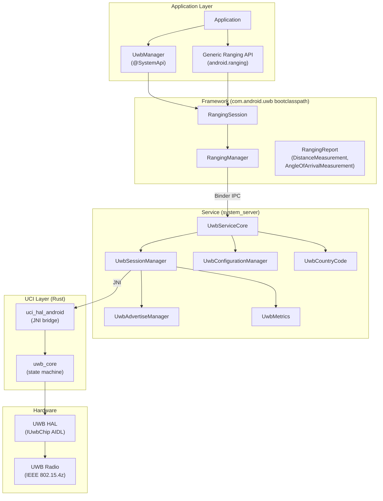

### 52.9.3  UWB Protocols

The module supports three protocol families, each with its own parameter
builder in the support library:

| Protocol | Class | Use Case |
|----------|-------|----------|
| **FiRA** | `FiraOpenSessionParams`, `FiraParams` | Standardized IEEE 802.15.4z ranging (phones, tags, IoT) |
| **CCC** (Car Connectivity Consortium) | `CccOpenRangingParams`, `CccParams` | Digital car keys |
| **ALIRO** | `AliroOpenRangingParams`, `AliroParams` | Access control (door locks, gates) |

Additionally, `RadarParams` and `RfTestParams` support UWB radar sensing
and RF testing modes.

### 52.9.4  UCI (UWB Command Interface)

The UCI layer is implemented in **Rust** (`libuwb-uci/src/rust/`) and
provides the low-level command interface to UWB hardware:

```
libuwb-uci/src/rust/
    uwb_core/src/
        lib.rs          Core library entry
        service.rs      UWB service state machine
        params.rs       Parameter definitions
        params/
            fira_app_config_params.rs
            ccc_app_config_params.rs
            aliro_app_config_params.rs
            uci_packets.rs     UCI packet parsing
    uci_hal_android/
        uci_hal_android.rs     JNI bridge to Java service
```

UCI session states follow the standard state machine:

| State | Value | Description |
|-------|-------|-------------|
| `INIT` | 0x00 | Session initialized |
| `DEINIT` | 0x01 | Session deinitialized |
| `ACTIVE` | 0x02 | Actively ranging |
| `IDLE` | 0x03 | Configured but not ranging |

### 52.9.5  Ranging Measurements

A `RangingReport` contains one or more `RangingMeasurement` objects, each
providing:

| Measurement | Class | Data |
|-------------|-------|------|
| **Distance** | `DistanceMeasurement` | Distance in meters with confidence |
| **Angle of Arrival** | `AngleOfArrivalMeasurement` | Azimuth and altitude angles |
| **Two-Way Measurement** | `UwbTwoWayMeasurement` | Raw ToF data |
| **OWR AoA** | `UwbOwrAoaMeasurement` | One-way ranging angle |
| **DL TDoA** | `UwbDlTDoAMeasurement` | Downlink time-difference-of-arrival |

### 52.9.6  Generic Ranging API

The `ranging/` subdirectory introduces a **technology-agnostic Ranging API**
(`android.ranging.*`) that abstracts over multiple ranging technologies:

```
ranging/
    framework/      android.ranging.* API surface
    uwb_backend/    UWB implementation of generic ranging
    rtt_backend/    Wi-Fi RTT implementation of generic ranging
    service/        RangingService
```

This allows apps to request ranging without binding to a specific technology.
The bootclasspath fragment conditionally includes `framework-ranging`:

```
// Source: packages/modules/Uwb/apex/Android.bp

soong_config_variables: {
    release_ranging_stack: {
        contents: [
            "framework-uwb",
            "framework-ranging",
        ],
    },
},
```

### 52.9.7  Session Management

`UwbSessionManager` is the central class for UWB session lifecycle:

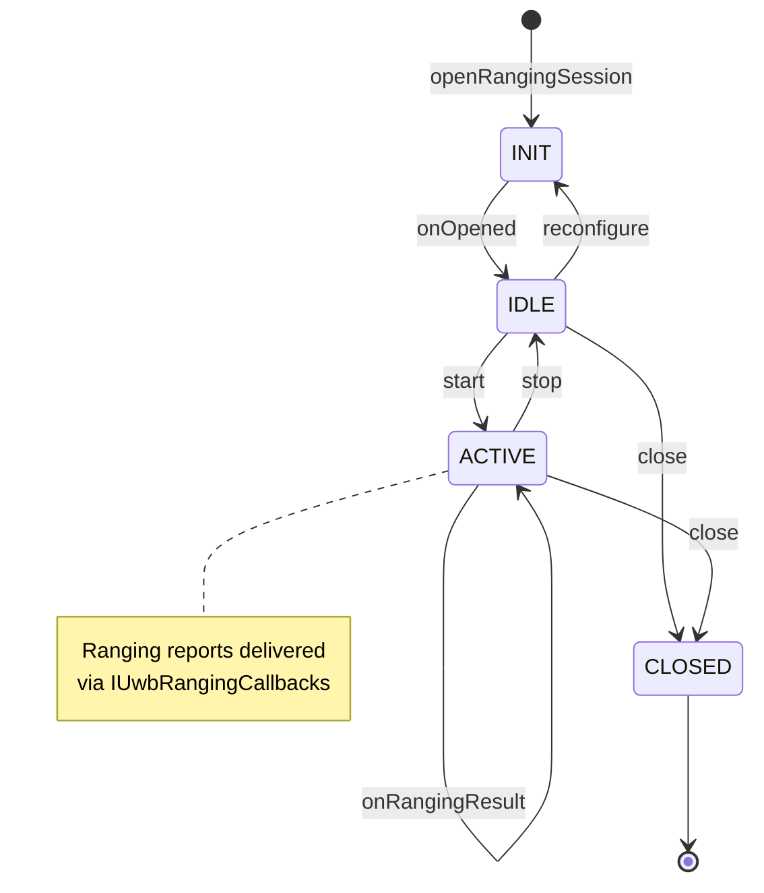

The session manager tracks per-session state, handles multicast list updates
(adding/removing controlees), manages suspend/resume, and routes ranging
notifications to the correct callback.

### 52.9.8  Country Code and Regulatory

`UwbCountryCode` determines the device's operating country and configures
channel restrictions accordingly.  It listens for telephony and Wi-Fi country
code changes, defaulting to the SIM-based country.  Regulatory compliance is
enforced through channel usage restrictions (`ChannelUsage`).

### 52.9.9  Key Source Paths

| Component | Path |
|-----------|------|
| Public API | `packages/modules/Uwb/framework/java/android/uwb/` |
| UwbManager | `packages/modules/Uwb/framework/java/android/uwb/UwbManager.java` |
| RangingSession | `packages/modules/Uwb/framework/java/android/uwb/RangingSession.java` |
| Service core | `packages/modules/Uwb/service/java/com/android/server/uwb/UwbServiceCore.java` |
| Session manager | `packages/modules/Uwb/service/java/com/android/server/uwb/UwbSessionManager.java` |
| UCI constants | `packages/modules/Uwb/service/java/com/android/server/uwb/data/UwbUciConstants.java` |
| Rust UCI core | `packages/modules/Uwb/libuwb-uci/src/rust/uwb_core/src/` |
| JNI bridge | `packages/modules/Uwb/libuwb-uci/src/rust/uci_hal_android/` |
| Support library | `packages/modules/Uwb/service/support_lib/` |
| Generic Ranging API | `packages/modules/Uwb/ranging/framework/` |
| APEX config | `packages/modules/Uwb/apex/Android.bp` |

---

## 52.10  Try It

The following exercises walk through inspecting Mainline modules on a running
device and understanding their structure from source.

### Exercise 52.1: Inspect Activated APEXes

List all activated APEXes on a device or emulator:

```bash
$ adb shell ls /apex/ | grep -v '@'
```

For each APEX, inspect its contents:

```bash
$ adb shell ls -la /apex/com.android.sdkext/
$ adb shell ls -la /apex/com.android.tethering/
$ adb shell ls -la /apex/com.android.permission/
```

**Question**: Which modules contain native binaries (`bin/` directory)? Which
contain only Java libraries (`javalib/`)?

### Exercise 52.2: Read the APEX Info List

The file `/apex/apex-info-list.xml` contains metadata about every activated
APEX:

```bash
$ adb shell cat /apex/apex-info-list.xml
```

Parse the XML to answer:

- Which APEXes are on the `/system` partition vs. `/system_ext`?
- Which APEXes have been updated from their pre-installed version?
- What is the version code of each APEX?

### Exercise 52.3: Query Extension Versions

Check all SDK extension versions:

```bash
$ adb shell getprop | grep build.version.extensions
```

Compare the R, S, T, U, V, and B extension versions.  Using the
`kRModules`, `kSModules`, `kTModules` sets from `derive_sdk.cpp`, identify
which modules contribute to each extension level.

### Exercise 52.4: Examine APEX Build Rules

Read the APEX module definition for the Permission module:

```bash
$ cat packages/modules/Permission/Android.bp
```

Trace the dependency chain:

1. What defaults does it inherit?
2. What is its `min_sdk_version`?
3. What bootclasspath fragments does it include?
4. What key and certificate does it use?

### Exercise 52.5: Build and Install an APEX

Build the SdkExtensions module and install it:

```bash
$ source build/envsetup.sh
$ lunch aosp_cf_x86_64_phone-trunk_staging-userdebug
$ m com.android.sdkext

# Install on a running emulator
$ adb install --staged out/target/product/vsoc_x86_64/system/apex/com.android.sdkext.apex
$ adb reboot
```

After reboot, verify the version changed:

```bash
$ adb shell pm list packages --apex-only --show-versioncode | grep sdkext
```

### Exercise 52.6: Trace the APEX Activation in Logcat

Capture boot logs to see apexd in action:

```bash
# Reboot and capture logs
$ adb reboot
$ adb wait-for-device
$ adb logcat -d -s apexd | head -100
```

Look for:

- `"Scanning <path>"` messages showing where APEXes are found.
- `"Successfully activated"` messages for each APEX.
- The `"Marking APEXd as activated"` and `"Marking APEXd as ready"` milestones.
- Timing information (`"OnStart done, duration=..."`) for boot performance.

### Exercise 52.7: Examine the dm-verity Setup

For an updated APEX (one in `/data/apex/active/`), the dm-verity layer adds
integrity protection.  Use `dmsetup` to inspect:

```bash
$ adb root
$ adb shell dmsetup table | grep apex
```

This shows the dm-verity parameters: hash algorithm, data block size, hash
block size, number of blocks, and root hash.

### Exercise 52.8: Compare Pre-installed vs. Updated APEX

Find a module that has both a pre-installed version and an updated version:

```bash
# Pre-installed (factory) version
$ adb shell ls /system/apex/ | grep sdkext

# Updated (if any) version
$ adb shell ls /data/apex/active/ | grep sdkext
```

Pull both and compare their manifests:

```bash
# On host (requires deapexer)
$ deapexer info /path/to/system_version.apex
$ deapexer info /path/to/data_version.apex
```

### Exercise 52.9: Examine Module Boundaries

Pick two modules that have a dependency relationship (e.g., `com.android.tethering`
depends on APIs from `com.android.permission`).

In the source:

1. Find the `java_sdk_library` definitions in both modules.
2. Identify which API scope (`public`, `system`, `module-lib`) is used for
   the cross-module dependency.

3. Check the `apex_available` declarations on shared dependencies.

### Exercise 52.10: Write an Extension Version Check

Write a small Android app (or use `adb shell am` with a test APK) that:

1. Calls `SdkExtensions.getExtensionVersion(Build.VERSION_CODES.R)`.
2. Calls `SdkExtensions.getAllExtensionVersions()`.
3. Prints all extension versions to logcat.
4. Conditionally uses an API based on the extension version.

This demonstrates the runtime API-availability checking pattern that all apps
should use when targeting APIs introduced through Mainline modules.

### Exercise 52.11: Explore the APEX Build System

Examine the Soong build rules for APEX construction:

```bash
# Look at the APEX module type registration
$ cat build/soong/apex/apex.go | grep -A5 "RegisterModuleType"

# Look at the builder rules
$ cat build/soong/apex/builder.go | grep -A10 "apexRule ="

# Examine the key management
$ cat build/soong/apex/key.go | grep -A10 "apexKeyProperties"
```

**Question**: What host tools does the APEX builder depend on? List at least
ten tools that participate in building an APEX file.

### Exercise 52.12: Map Module Dependencies

For the Connectivity module (`com.android.tethering`), trace the dependency
chain:

```bash
# Find all libraries declared in the APEX
$ grep -A30 "multilib" \
    packages/modules/Connectivity/Tethering/apex/Android.bp

# For each JNI library, find its apex_available declaration
$ grep -r "apex_available" \
    packages/modules/Connectivity/service/ \
    --include="*.bp" | grep tethering
```

Draw a dependency graph showing:

1. The APEX package.
2. Its bootclasspath fragments.
3. Its system server classpath fragments.
4. The native shared libraries.
5. The JNI libraries.
6. The apps (APKs) inside the APEX.

### Exercise 52.13: Simulate an APEX Update Rollback

On a userdebug device:

```bash
# 1. Check current APEX versions
$ adb shell pm list packages --apex-only --show-versioncode | grep sdkext

# 2. Build a modified APEX with a higher version
# (edit the manifest.json to bump version)

# 3. Install it as a staged session
$ adb install --staged com.android.sdkext.apex

# 4. Reboot
$ adb reboot
$ adb wait-for-device

# 5. Verify the new version is active
$ adb shell pm list packages --apex-only --show-versioncode | grep sdkext

# 6. Trigger a rollback
$ adb shell cmd -w apexservice revertActiveSession
$ adb reboot
$ adb wait-for-device

# 7. Verify we're back to the original version
$ adb shell pm list packages --apex-only --show-versioncode | grep sdkext
```

### Exercise 52.14: Analyze dm-verity Protection

The dm-verity layer is what makes APEX tamper-proof.  Examine how it works:

```bash
# 1. List all device-mapper devices
$ adb root
$ adb shell dmsetup ls

# 2. Show the dm-verity table for an APEX
$ adb shell dmsetup table | grep com.android

# 3. The table format is:
# <start_sector> <num_sectors> verity <version> <data_dev> <hash_dev>
# <data_block_size> <hash_block_size> <num_data_blocks> <hash_start_block>
# <algorithm> <digest> <salt> [optional_params]
```

**Question**: What hash algorithm is used? What happens if a block is
corrupted (look for `restart_on_corruption` in the table)?

### Exercise 52.15: Build the Full Module Test Suite

Run the test suite for a specific Mainline module:

```bash
# Run SdkExtensions tests
$ atest SdkExtensionsTests

# Run apexd unit tests
$ atest apex_file_test apex_manifest_test apex_database_test

# Run derive_sdk tests
$ atest derive_sdk_test

# Run CTS tests for a module
$ atest CtsApexTestCases
```

### Exercise 52.16: Examine the apex-info-list.xml Schema

The `apex-info-list.xml` file is the authoritative record of all APEXes on the
device.  Examine its schema:

```bash
$ adb shell cat /apex/apex-info-list.xml
```

The XML contains entries like:

```xml
<apex-info
    moduleName="com.android.sdkext"
    modulePath="/system/apex/com.android.sdkext.apex"
    preinstalledModulePath="/system/apex/com.android.sdkext.apex"
    versionCode="340090000"
    versionName=""
    isFactory="true"
    isActive="true"
    lastUpdateMillis="0" />
```

For each entry, identify:

- `isFactory` -- Was this the pre-installed version?
- `isActive` -- Is this the currently active version?
- `modulePath` vs. `preinstalledModulePath` -- Has it been updated?

### Exercise 52.17: Create a Minimal Test APEX

Create a minimal APEX that contains a single shell script:

1. Create a directory `packages/modules/MyTest/`:

```
MyTest/
+-- Android.bp
+-- apex_manifest.json
+-- my_script.sh
```

2. Write the `Android.bp`:

```
apex {
    name: "com.android.mytest",
    updatable: false,
    platform_apis: true,
    manifest: "apex_manifest.json",
    sh_binaries: ["my_test_script"],
    key: "com.android.mytest.key",
    certificate: ":com.android.mytest.certificate",
    file_contexts: ":apex.test-file_contexts",
}

sh_binary {
    name: "my_test_script",
    src: "my_script.sh",
    apex_available: ["com.android.mytest"],
}
```

3. Build and inspect:

```bash
$ m com.android.mytest
$ deapexer list out/.../com.android.mytest.apex
```

**Question**: What files are inside the APEX besides your script? What
generates them?

### Exercise 52.18: Trace derive_sdk Boot Behavior

Monitor what `derive_sdk` does at boot time:

```bash
# Enable verbose logging
$ adb shell setprop log.tag.derive_sdk VERBOSE
$ adb reboot
$ adb wait-for-device
$ adb logcat -d -s derive_sdk | head -50
```

Match the log output against the code in
`packages/modules/SdkExtensions/derive_sdk/derive_sdk.cpp`:

- Which APEXes were found?
- What `sdkinfo.pb` versions were read?
- What extension version was computed for each train (R, S, T, U, V, B)?

---

## Summary

### Architecture Recap

The following diagram captures the complete Mainline architecture from build
time to runtime:

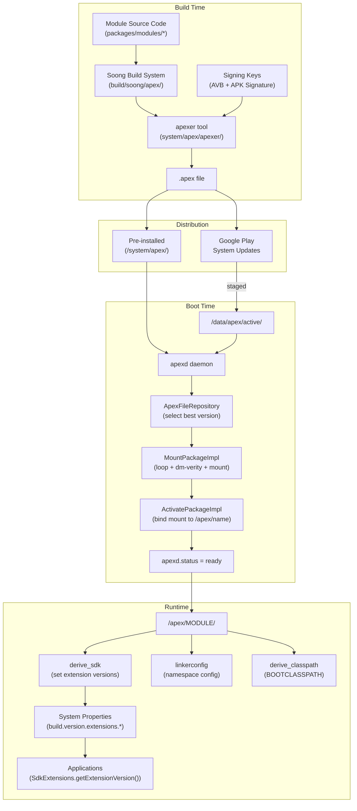

### Key Data Paths

| Path | Purpose |
|------|---------|
| `/system/apex/` | Pre-installed APEXes (factory image) |
| `/system_ext/apex/` | System-ext partition APEXes |
| `/product/apex/` | Product partition APEXes |
| `/vendor/apex/` | Vendor partition APEXes |
| `/odm/apex/` | ODM partition APEXes |
| `/data/apex/active/` | Updated APEXes (from Play or adb) |
| `/data/apex/backup/` | Backup for rollback |
| `/data/apex/decompressed/` | Decompressed CAPEXes |
| `/data/app-staging/` | Staged sessions (pending reboot) |
| `/apex/<name>/` | Active mount point (bind mount to latest) |
| `/apex/<name>@<version>/` | Versioned mount point |
| `/apex/apex-info-list.xml` | Metadata about all activated APEXes |

### Key Source Files

Project Mainline represents one of the most significant architectural changes
in Android's history.  By packaging platform components into independently
updatable APEX modules, Google can deliver security fixes and feature
improvements to billions of devices without waiting for the traditional OEM
update pipeline.

Key takeaways from this chapter:

- **APEX** is a ZIP containing a dm-verity-signed filesystem image, enabling
  native code, Java libraries, and configuration to be updated as a single
  atomic unit.

- **apexd** manages the full lifecycle: scanning partitions at boot, creating
  loop devices and dm-verity tables, bind-mounting active versions, processing
  staged updates, and supporting rollback.

- **40+ modules** in `packages/modules/` cover networking, security, media,
  telephony, ML, and more -- each with its own APEX name, signing key, and
  version lifecycle.

- **SDK Extensions** solve the runtime API-availability problem by deriving
  extension version numbers from actual installed module versions at boot time.

- **Module boundaries** are enforced through `apex_available`, API surface
  annotations (`@SystemApi`), `min_sdk_version`, and hidden-API policies.

The source files central to understanding this system:

| Component | Path |
|-----------|------|
| APEX build rules | `build/soong/apex/apex.go`, `builder.go`, `key.go` |
| APEX tool | `system/apex/apexer/apexer.py` |
| APEX manifest proto | `system/apex/proto/apex_manifest.proto` |
| apexd daemon | `system/apex/apexd/apexd.cpp`, `apex_file.cpp`, `apex_constants.h` |
| apexd init config | `system/apex/apexd/apexd.rc` |
| Module defaults | `packages/modules/common/sdk/Android.bp` |
| SDK Extensions API | `packages/modules/SdkExtensions/java/android/os/ext/SdkExtensions.java` |
| derive_sdk | `packages/modules/SdkExtensions/derive_sdk/derive_sdk.cpp` |
| APEX file repository | `system/apex/apexd/apex_file_repository.h` |

---

<!-- chapter:53-ota-updates -->
# Chapter 53: OTA Updates

Over-the-Air (OTA) updates are the mechanism by which Android devices receive
new system images, security patches, and feature updates without requiring
physical access or manual flashing. What began as a simple "download a zip, boot
into recovery, apply it" model has evolved into one of AOSP's most sophisticated
subsystems -- spanning a dedicated native daemon (`update_engine`), kernel-level
copy-on-write snapshots, bootloader integration protocols, and a streaming
pipeline that can apply gigabyte-scale payloads without ever writing the full
image to userdata.

This chapter traces an OTA update from the moment a server announces its
availability to the moment the device has rebooted into the new software and
marked the slot as successful. We examine every layer: the payload binary
format, the action pipeline inside `update_engine`, the A/B and Virtual A/B
slot-switching mechanisms, the `snapuserd` daemon that makes compressed
copy-on-write possible in userspace, the Python tooling that generates payloads,
recovery mode as the legacy fallback, and the framework APIs that tie everything
together.

---

## 53.1 OTA Architecture Overview

### 53.1.1 The Three Update Schemes

Android has used three distinct OTA schemes across its history. Understanding all
three is essential because production devices span the full range.

```
Source path: system/update_engine/        -- A/B and Virtual A/B engine
             bootable/recovery/           -- Non-A/B recovery updater
             system/core/fs_mgr/libsnapshot/ -- Virtual A/B snapshots
```

**Non-A/B (Legacy)**. The original scheme, used from Android 1.0 through
approximately Android 9 (though it remains supported). The device has a single
set of partitions (system, boot, vendor, etc.) plus a dedicated `recovery`
partition. To update, the device reboots into recovery, which mounts the OTA
package (a signed zip file containing an updater binary and image data), and
applies block-level patches in-place. If the update fails partway through, the
device may be left in an unbootable state -- the dreaded "brick."

**A/B (Seamless)**. Introduced in Android 7.0. The device carries two copies of
every updatable partition: slot A and slot B. While the user runs from one slot,
`update_engine` writes the new image to the other slot in the background. When
complete, the bootloader is instructed to switch active slots. If the new slot
fails to boot, the bootloader rolls back. The device never enters recovery for
OTA purposes, and the user experiences zero downtime during the write phase.
The cost is roughly doubled partition storage.

**Virtual A/B**. Introduced in Android 11 and mandatory since Android 13.
Virtual A/B retains the seamless-update user experience of A/B but eliminates
the need to physically duplicate every partition. Instead, it uses device-mapper
snapshots (and, since Android 12, compressed copy-on-write via `snapuserd`) to
store only the *changed blocks* during the update. After reboot and successful
verification, the snapshot is *merged* into the base partition, reclaiming the
temporary storage. This gives A/B reliability with near-non-A/B storage
efficiency.

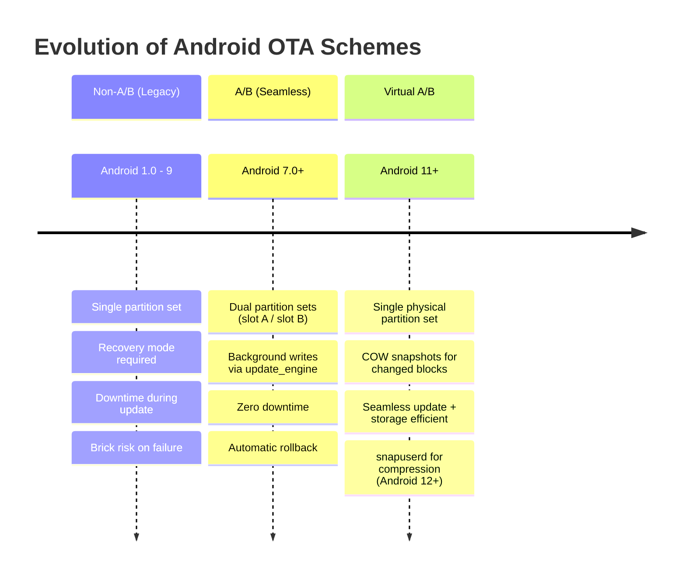

### 53.1.2 High-Level Data Flow

Regardless of the scheme, every OTA update follows a common lifecycle:

```mermaid
flowchart TD
    A[OTA Server announces update] --> B[Client downloads payload / metadata]
    B --> C{Which scheme?}
    C -->|Non-A/B| D[Reboot to recovery]
    D --> E[Recovery applies OTA zip in-place]
    E --> F[Reboot to updated system]
    C -->|A/B| G[update_engine writes to inactive slot]
    G --> H[Mark inactive slot as active]
    H --> I[Reboot]
    I --> J[update_verifier confirms integrity]
    J --> K[Mark slot successful]
    C -->|Virtual A/B| L[update_engine writes COW snapshots]
    L --> M[Mark inactive slot active]
    M --> N[Reboot with snapuserd serving merged view]
    N --> O[update_verifier confirms integrity]
    O --> P[Merge snapshots into base partition]
    P --> Q[Mark slot successful]
```

### 53.1.3 Partition Layout Comparison

The following table summarizes how partitions are organized under each scheme.

| Aspect | Non-A/B | A/B | Virtual A/B |
|--------|---------|-----|-------------|
| Physical partitions | system, boot, vendor, recovery | system_a/b, boot_a/b, vendor_a/b | system_a/b (logical), boot_a/b (physical) |
| Recovery partition | Dedicated | None (recovery in boot) | None (recovery in boot or init_boot) |
| Storage overhead | ~0% | ~100% (full duplication) | ~5-15% (COW of changed blocks) |
| Update target | In-place on running partitions | Inactive slot | COW device mapped over inactive slot |
| Rollback | Not guaranteed | Automatic via bootloader | Automatic via bootloader |
| Downtime | Full reboot + apply time | Reboot only (~30s) | Reboot only (~30s) |
| Post-update merge | None | None | Background merge of COW |
| Minimum Android version | 1.0 | 7.0 | 11 |

### 53.1.4 Key System Properties

The update scheme is determined by system properties and fstab configuration:

```
# A/B device detection
ro.boot.slot_suffix=_a          # Present on A/B and Virtual A/B
ro.build.ab_update=true         # A/B capable

# Virtual A/B detection
ro.virtual_ab.enabled=true      # Virtual A/B enabled
ro.virtual_ab.retrofit=true     # Retrofitted (vs. launch)

# Virtual A/B Compression
ro.virtual_ab.compression.enabled=true
ro.virtual_ab.userspace.snapshots.enabled=true
ro.virtual_ab.compression.xor.enabled=true
```

The relevant feature flag detection code lives in:

```
Source: system/update_engine/aosp/dynamic_partition_control_android.h
```

```cpp
// DynamicPartitionControlAndroid exposes:
FeatureFlag GetDynamicPartitionsFeatureFlag() override;
FeatureFlag GetVirtualAbFeatureFlag() override;
FeatureFlag GetVirtualAbCompressionFeatureFlag() override;
FeatureFlag GetVirtualAbCompressionXorFeatureFlag() override;
FeatureFlag GetVirtualAbUserspaceSnapshotsFeatureFlag() override;
```

Each `FeatureFlag` can be `NONE`, `RETROFIT`, or `LAUNCH`, distinguishing
devices that were upgraded to a feature from those that shipped with it.

### 53.1.5 Source Tree Map

```
system/update_engine/
    main.cc                          -- Daemon entry point
    aosp/
        daemon_android.cc            -- Android-specific daemon setup
        update_attempter_android.cc  -- Orchestrates the update attempt
        boot_control_android.cc      -- A/B slot control via HAL
        binder_service_android.cc    -- Binder interface for framework
        dynamic_partition_control_android.cc -- Dynamic partition + VAB control
        cleanup_previous_update_action.cc   -- Post-reboot merge trigger
    payload_consumer/
        delta_performer.cc           -- Applies payload operations
        payload_metadata.cc          -- Parses payload header
        payload_constants.cc         -- Magic bytes, version constants
        vabc_partition_writer.cc     -- Virtual A/B Compression writer
        partition_writer.cc          -- Standard partition writer
        install_plan.h               -- Update plan data structure
    payload_generator/
        delta_diff_generator.cc      -- Generates delta payloads
        full_update_generator.cc     -- Generates full payloads
    common/
        boot_control_interface.h     -- Abstract slot management
        action_processor.cc          -- Action pipeline scheduler
    scripts/
        brillo_update_payload        -- Shell tool for payload operations

build/make/tools/releasetools/
    ota_from_target_files.py         -- Primary OTA package generator
    non_ab_ota.py                    -- Legacy non-A/B generator

bootable/recovery/
    recovery_main.cpp                -- Recovery entry point
    recovery.cpp                     -- Main recovery logic
    install/install.cpp              -- Package installation
    update_verifier/                 -- Post-boot verification

system/core/fs_mgr/libsnapshot/
    snapshot.cpp                     -- Snapshot manager
    snapuserd/                       -- Userspace snapshot daemon
        user-space-merge/
            snapuserd_core.cpp       -- Core merge logic

frameworks/base/core/java/android/os/
    UpdateEngine.java                -- Framework API wrapper
```

---

## 53.2 update_engine

`update_engine` is the native daemon that drives A/B and Virtual A/B updates.
Originally developed as part of Chrome OS, it was adapted for Android starting
with the A/B scheme in Android 7.0. On Android, it runs as a persistent
system service, listening for update commands over Binder.

### 53.2.1 Daemon Lifecycle

The daemon starts from `main.cc`:

```
Source: system/update_engine/main.cc
```

```cpp
int main(int argc, char** argv) {
  chromeos_update_engine::Terminator::Init();
  gflags::SetUsageMessage("A/B Update Engine");
  gflags::ParseCommandLineFlags(&argc, &argv, true);
  // ... logging setup ...
  xz_crc32_init();
  umask(S_IRWXG | S_IRWXO);  // Restrictive permissions

  auto daemon = chromeos_update_engine::DaemonBase::CreateInstance();
  int exit_code = daemon->Run();
  // ...
}
```

On Android, `DaemonBase::CreateInstance()` returns a `DaemonAndroid`:

```
Source: system/update_engine/aosp/daemon_android.cc
```

```cpp
int DaemonAndroid::OnInit() {
  subprocess_.Init(this);
  int exit_code = brillo::Daemon::OnInit();

  android::BinderWrapper::Create();
  binder_watcher_.Init();

  DaemonStateAndroid* daemon_state_android = new DaemonStateAndroid();
  daemon_state_.reset(daemon_state_android);
  daemon_state_android->Initialize();

  // Register Binder services
  binder_service_ = new BinderUpdateEngineAndroidService{
      daemon_state_android->service_delegate()};
  binder_wrapper->RegisterService(
      binder_service_->ServiceName(), binder_service_);

  // Also register the "stable" AIDL service
  stable_binder_service_ = new BinderUpdateEngineAndroidStableService{
      daemon_state_android->service_delegate()};
  binder_wrapper->RegisterService(
      stable_binder_service_->ServiceName(), stable_binder_service_);

  daemon_state_->StartUpdater();
  return EX_OK;
}
```

The daemon registers two Binder services:

1. `android.os.UpdateEngineService` -- the primary interface
2. A "stable" AIDL variant for cross-version compatibility

### 53.2.2 The Action Pipeline

`update_engine` uses an *action pipeline* pattern. Each step of the update is an
`Action` subclass, and they are chained together by an `ActionProcessor`. Data
flows between actions through type-safe `ActionPipe` connections.

```mermaid
flowchart LR
    A[InstallPlanAction] --> B[DownloadAction]
    B --> C[FilesystemVerifierAction]
    C --> D[PostinstallRunnerAction]

    style A fill:#e1f5fe
    style B fill:#fff3e0
    style C fill:#e8f5e9
    style D fill:#fce4ec
```

```
Source: system/update_engine/common/action.h
        system/update_engine/common/action_processor.h
```

The `ActionProcessor` runs one action at a time. When an action completes
(success or failure), the processor advances to the next or terminates:

```cpp
// action_processor.cc
void ActionProcessor::ActionComplete(AbstractAction* actionptr,
                                     ErrorCode code) {
  // ... notify delegate ...
  if (code != ErrorCode::kSuccess) {
    // Pipeline failed
    actions_.clear();
    // ... error handling ...
  } else {
    // Advance to next action
    actions_.erase(actions_.begin());
    if (!actions_.empty()) {
      actions_.front()->PerformAction();
    }
  }
}
```

### 53.2.3 UpdateAttempterAndroid

The `UpdateAttempterAndroid` class is the top-level orchestrator for Android
updates. It implements `ServiceDelegateAndroidInterface` (called by the Binder
service) and `ActionProcessorDelegate` (receiving callbacks from the pipeline).

```
Source: system/update_engine/aosp/update_attempter_android.h
```

Key responsibilities:

- **ApplyPayload**: Entry point for an update. Parses the URL/fd, headers,
  constructs the `InstallPlan`, builds the action pipeline, and starts it.

- **SuspendUpdate / ResumeUpdate**: Pauses and resumes an in-progress download.
- **CancelUpdate**: Aborts a running update and cleans up.
- **ResetStatus**: Clears persistent state from a completed or failed update.
- **CleanupSuccessfulUpdate**: Triggers snapshot merge on Virtual A/B.

```cpp
// The update status state machine
enum class UpdateStatus {
  IDLE,
  CHECKING_FOR_UPDATE,
  UPDATE_AVAILABLE,
  DOWNLOADING,
  VERIFYING,
  FINALIZING,
  UPDATED_NEED_REBOOT,
  REPORTING_ERROR_EVENT,
  ATTEMPTING_ROLLBACK,
  DISABLED,
  CLEANUP_PREVIOUS_UPDATE,
};
```

```mermaid
stateDiagram-v2
    [*] --> IDLE
    IDLE --> DOWNLOADING : ApplyPayload
    DOWNLOADING --> VERIFYING : Download complete
    VERIFYING --> FINALIZING : Verification passed
    FINALIZING --> UPDATED_NEED_REBOOT : Slot marked active
    UPDATED_NEED_REBOOT --> IDLE : Reboot + merge
    DOWNLOADING --> IDLE : Cancel / Error
    VERIFYING --> IDLE : Verification failed
    FINALIZING --> IDLE : Finalization failed
    IDLE --> CLEANUP_PREVIOUS_UPDATE : Post-reboot merge
    CLEANUP_PREVIOUS_UPDATE --> IDLE : Merge complete
```

### 53.2.4 The OTA Result Tracking

After a reboot, `update_engine` determines the outcome of the previous update
attempt:

```cpp
// update_attempter_android.h
enum class OTAResult {
  NOT_ATTEMPTED,
  ROLLED_BACK,
  UPDATED_NEED_REBOOT,
  OTA_SUCCESSFUL,
};
```

The `GetOTAUpdateResult()` method checks persistent preferences and boot slot
state to determine if the update succeeded, was rolled back, or was never
attempted. This drives metrics reporting and merge scheduling.

### 53.2.5 Building the Update Actions

When `ApplyPayload` is called, `BuildUpdateActions` constructs the pipeline:

```mermaid
flowchart TD
    subgraph "Action Pipeline Construction"
        A["Create InstallPlanAction<br/>with payload metadata"] --> B["Create DownloadAction<br/>with HttpFetcher"]
        B --> C["Create FilesystemVerifierAction<br/>hash verification"]
        C --> D["Create PostinstallRunnerAction<br/>runs postinstall scripts"]
    end

    subgraph "During Execution"
        E["DownloadAction streams data<br/>to DeltaPerformer"] --> F["DeltaPerformer applies<br/>operations to target partitions"]
        F --> G["FilesystemVerifier reads back<br/>and verifies hashes"]
        G --> H["PostinstallRunner mounts target<br/>and runs scripts"]
        H --> I[SetActiveBootSlot on success]
    end
```

### 53.2.6 Binder Service Interface

The Binder interface exposes these primary methods:

```
Source: system/update_engine/aosp/binder_service_android.h
```

| Method | Description |
|--------|-------------|
| `applyPayload(url, offset, size, headers)` | Start update from URL |
| `applyPayloadFd(fd, offset, size, headers)` | Start update from file descriptor |
| `bind(callback)` | Register for status callbacks |
| `suspend()` | Pause download |
| `resume()` | Resume download |
| `cancel()` | Cancel update |
| `resetStatus()` | Clear completed/failed state |
| `verifyPayloadApplicable(metadata_file)` | Check if a payload can be applied |
| `allocateSpaceForPayload(metadata, headers)` | Pre-allocate space for VAB |
| `cleanupSuccessfulUpdate(callback)` | Trigger snapshot merge |
| `setShouldSwitchSlotOnReboot(metadata)` | Set slot switch flag |
| `resetShouldSwitchSlotOnReboot()` | Clear slot switch flag |
| `triggerPostinstall(partition)` | Run postinstall for a partition |

The `applyPayload` headers are key-value pairs that control behavior:

```
METADATA_HASH=<base64>     -- Expected hash of payload metadata
METADATA_SIZE=<bytes>      -- Size of payload metadata
PAYLOAD_HASH=<base64>      -- Expected hash of entire payload
PAYLOAD_SIZE=<bytes>       -- Size of entire payload
SWITCH_SLOT_ON_REBOOT=1    -- Whether to switch slots (default: 1)
RUN_POST_INSTALL=1         -- Whether to run postinstall (default: 1)
NETWORK_ID=<id>            -- Network to use for download
```

---

## 53.3 Payload Format

The OTA payload is a binary file that encodes all the information needed to
transform a source partition layout into a target layout. The same format is
used for both full and delta (incremental) updates.

### 53.3.1 Payload Binary Structure

```
Source: system/update_engine/payload_consumer/payload_constants.cc
        system/update_engine/payload_consumer/payload_metadata.cc
```

The payload begins with a fixed 24-byte header, followed by a serialized
protobuf manifest, an optional metadata signature, the binary data blobs, and
finally a payload signature.

```mermaid
block-beta
    columns 1
    hdr_label["Payload Header (24 bytes)"]
    block:cells
        columns 4
        magic["Magic: 'CrAU'<br/>(4 bytes)"]
        version["Major Version<br/>(8 bytes, uint64)"]
        manifest_size["Manifest Size<br/>(8 bytes, uint64)"]
        sig_size["Metadata Sig Size<br/>(4 bytes, uint32)"]
    end
    manifest["DeltaArchiveManifest (protobuf)<br/>Partition list, operations, block size, timestamps"]
    metadata_sig["Metadata Signature<br/>(variable, size from header)"]
    blobs["Binary Data Blobs<br/>Compressed/raw data for operations"]
    payload_sig["Payload Signature<br/>(appended at end)"]
    classDef titleOnly fill:transparent,stroke:transparent
    class hdr_label titleOnly
```

The header fields are parsed in `PayloadMetadata::ParsePayloadHeader`:

```cpp
// payload_metadata.cc
const uint64_t PayloadMetadata::kDeltaVersionOffset = sizeof(kDeltaMagic); // 4
const uint64_t PayloadMetadata::kDeltaVersionSize = 8;
const uint64_t PayloadMetadata::kDeltaManifestSizeOffset =
    kDeltaVersionOffset + kDeltaVersionSize;                               // 12
const uint64_t PayloadMetadata::kDeltaManifestSizeSize = 8;
const uint64_t PayloadMetadata::kDeltaMetadataSignatureSizeSize = 4;
// Total header: 4 + 8 + 8 + 4 = 24 bytes
```

The magic bytes `CrAU` are a legacy from Chrome OS Update format:

```cpp
// payload_constants.cc
const char kDeltaMagic[4] = {'C', 'r', 'A', 'U'};
```

### 53.3.2 Major and Minor Versions

The payload format has two version numbers:

**Major version** identifies the overall format. Currently only version 2
(Brillo) is supported:

```cpp
const uint64_t kBrilloMajorPayloadVersion = 2;
const uint64_t kMinSupportedMajorPayloadVersion = kBrilloMajorPayloadVersion;
const uint64_t kMaxSupportedMajorPayloadVersion = kBrilloMajorPayloadVersion;
```

**Minor version** identifies the set of supported operations and features:

| Minor Version | Constant | Feature |
|--------------|----------|---------|
| 0 | `kFullPayloadMinorVersion` | Full payload (no source needed) |
| 2 | `kSourceMinorPayloadVersion` | Source-based delta (A-to-B) |
| 3 | `kOpSrcHashMinorPayloadVersion` | Per-operation source hash |
| 4 | `kBrotliBsdiffMinorPayloadVersion` | BROTLI_BSDIFF, ZERO, DISCARD |
| 5 | `kPuffdiffMinorPayloadVersion` | PUFFDIFF operation |
| 6 | `kVerityMinorPayloadVersion` | Verity hash tree + FEC generation |
| 7 | `kPartialUpdateMinorPayloadVersion` | Partial updates (e.g., kernel only) |
| 8 | `kZucchiniMinorPayloadVersion` | ZUCCHINI binary diffing |
| 9 | `kLZ4DIFFMinorPayloadVersion` | LZ4DIFF for EROFS |

### 53.3.3 The DeltaArchiveManifest

The manifest is a protobuf message that describes every partition and every
operation needed to produce the target image. Key fields include:

```protobuf
message DeltaArchiveManifest {
  repeated PartitionUpdate partitions = 13;
  uint32 block_size = 3;           // Typically 4096
  uint32 minor_version = 12;
  uint64 max_timestamp = 14;       // Anti-rollback timestamp
  DynamicPartitionMetadata dynamic_partition_metadata = 15;
}

message PartitionUpdate {
  string partition_name = 1;
  repeated InstallOperation operations = 7;
  PartitionInfo old_partition_info = 10;
  PartitionInfo new_partition_info = 11;
  // Verity/FEC fields ...
  repeated CowMergeOperation merge_operations = 18;
}

message InstallOperation {
  enum Type {
    REPLACE = 0;
    REPLACE_BZ = 1;
    SOURCE_COPY = 4;
    SOURCE_BSDIFF = 5;
    ZERO = 6;
    DISCARD = 7;
    REPLACE_XZ = 8;
    PUFFDIFF = 9;
    BROTLI_BSDIFF = 10;
    ZUCCHINI = 11;
    LZ4DIFF_BSDIFF = 12;
    LZ4DIFF_PUFFDIFF = 13;
  }
  Type type = 1;
  repeated Extent src_extents = 6;
  repeated Extent dst_extents = 8;
  uint64 data_offset = 4;
  uint64 data_length = 5;
  bytes src_sha256_hash = 9;
  bytes data_sha256_hash = 10;
}
```

### 53.3.4 Install Operation Types

Each operation transforms source blocks into target blocks:

```mermaid
flowchart LR
    subgraph "Full Operations (no source needed)"
        REPLACE["REPLACE<br/>Write raw data"]
        REPLACE_BZ["REPLACE_BZ<br/>Decompress bzip2, write"]
        REPLACE_XZ["REPLACE_XZ<br/>Decompress XZ, write"]
        ZERO["ZERO<br/>Write zeros"]
        DISCARD["DISCARD<br/>Issue TRIM/discard"]
    end

    subgraph "Delta Operations (require source)"
        SOURCE_COPY["SOURCE_COPY<br/>Copy blocks from source"]
        SOURCE_BSDIFF["SOURCE_BSDIFF<br/>Apply bsdiff patch"]
        BROTLI_BSDIFF["BROTLI_BSDIFF<br/>Brotli-compressed bsdiff"]
        PUFFDIFF["PUFFDIFF<br/>Deflate-aware diff"]
        ZUCCHINI["ZUCCHINI<br/>Binary executable diff"]
        LZ4DIFF["LZ4DIFF_*<br/>LZ4-aware diff for EROFS"]
    end
```

| Operation | Source Required | Description |
|-----------|---------------|-------------|
| `REPLACE` | No | Write raw uncompressed data to target extents |
| `REPLACE_BZ` | No | Decompress bzip2 blob, write to target |
| `REPLACE_XZ` | No | Decompress XZ blob, write to target |
| `ZERO` | No | Fill target extents with zeros |
| `DISCARD` | No | Issue discard/trim to target extents |
| `SOURCE_COPY` | Yes | Copy extents from source to target |
| `SOURCE_BSDIFF` | Yes | Read source, apply bsdiff patch, write target |
| `BROTLI_BSDIFF` | Yes | Like SOURCE_BSDIFF but blob is Brotli-compressed |
| `PUFFDIFF` | Yes | Deflate-aware diff -- handles gzip/zlib streams |
| `ZUCCHINI` | Yes | Executable-aware binary diff |
| `LZ4DIFF_BSDIFF` | Yes | LZ4-compressed block diff (EROFS optimization) |
| `LZ4DIFF_PUFFDIFF` | Yes | LZ4 + puffdiff combination |

### 53.3.5 Full vs. Delta Payloads

**Full payloads** contain the complete target image. Every operation is one of
the `REPLACE` variants, `ZERO`, or `DISCARD`. No source partition is needed.
The minor version is 0 (`kFullPayloadMinorVersion`). Full payloads are larger
but can update any device regardless of its current state.

**Delta (incremental) payloads** encode only the differences between a known
source image and the target. They use `SOURCE_COPY`, `SOURCE_BSDIFF`,
`PUFFDIFF`, `ZUCCHINI`, and similar operations that reference source blocks.
Delta payloads are dramatically smaller (often 50-200 MB vs. 2-4 GB for a full
payload) but require the device to be running the exact source build.

```mermaid
flowchart TD
    subgraph "Full Payload"
        direction LR
        FP[Payload blob] --> FT[Target partition]
    end

    subgraph "Delta Payload"
        direction LR
        SP[Source partition] --> DIFF[Diff engine]
        DP["Payload blob<br/>patches + copies"] --> DIFF
        DIFF --> DT[Target partition]
    end
```

### 53.3.6 Payload Signing and Verification

Payloads are cryptographically signed to prevent tampering:

1. **Metadata signature**: Signs the header + manifest, verified before parsing
   the manifest to prevent exploitation of protobuf parsing bugs.

2. **Payload signature**: Signs the entire payload (excluding the signature
   itself), verified after all operations are applied.

```
Source: system/update_engine/payload_consumer/payload_verifier.h
```

The device carries trusted certificates in `/system/etc/security/otacerts.zip`
(or the path specified by `kUpdateCertificatesPath`). During verification,
`PayloadVerifier` extracts the public keys from these certificates and validates
the RSA/EC signatures.

```mermaid
sequenceDiagram
    participant S as OTA Server
    participant UE as update_engine
    participant V as PayloadVerifier

    S->>UE: Payload (header + manifest + data + signatures)
    UE->>V: Validate metadata signature
    V->>V: Load certificates from otacerts.zip
    V->>V: Verify RSA/EC signature over header+manifest
    V-->>UE: Metadata OK

    Note over UE: Apply operations...

    UE->>V: Verify payload signature
    V->>V: Hash entire payload (minus signature)
    V->>V: Verify hash against signed hash
    V-->>UE: Payload OK
```

---

## 53.4 The DeltaPerformer

The `DeltaPerformer` is the workhorse class that actually applies payload
operations to target partitions. It implements the `FileWriter` interface,
receiving payload bytes incrementally as they are downloaded.

### 53.4.1 Streaming Application

```
Source: system/update_engine/payload_consumer/delta_performer.h
        system/update_engine/payload_consumer/delta_performer.cc
```

`DeltaPerformer::Write()` is called repeatedly with chunks of the payload as
they arrive from the network. The performer maintains internal state to track
where it is in the parsing/application process:

```mermaid
flowchart TD
    A[Receive bytes via Write] --> B{Header parsed?}
    B -->|No| C[Accumulate bytes in buffer]
    C --> D{Enough for header?}
    D -->|No| E[Return, wait for more]
    D -->|Yes| F["Parse header: magic, version,<br/>manifest size, sig size"]
    F --> G{Manifest complete?}
    G -->|No| E
    G -->|Yes| H[Parse protobuf manifest]
    H --> I[Validate manifest]
    I --> J[PreparePartitionsForUpdate]
    B -->|Yes| K{All operations done?}
    K -->|No| L{"Enough data for<br/>current operation?"}
    L -->|No| E
    L -->|Yes| M[Execute operation]
    M --> N[Advance to next operation]
    N --> K
    K -->|Yes| O[Extract and verify signature]
```

Key state variables in the performer:

```cpp
class DeltaPerformer : public FileWriter {
  DeltaArchiveManifest manifest_;
  bool manifest_parsed_{false};
  bool manifest_valid_{false};

  std::vector<PartitionUpdate> partitions_;
  size_t current_partition_{0};
  size_t next_operation_num_{0};
  size_t num_total_operations_{0};

  brillo::Blob buffer_;             // Accumulates incoming data
  uint64_t buffer_offset_{0};       // Offset in blob section
  uint32_t block_size_{0};          // From manifest (usually 4096)

  HashCalculator payload_hash_calculator_;
  HashCalculator signed_hash_calculator_;
};
```

### 53.4.2 Operation Dispatch

Once the manifest is parsed and partitions are prepared, each operation is
dispatched based on its type:

```cpp
bool DeltaPerformer::PerformInstallOperation(
    const InstallOperation& operation) {
  switch (operation.type()) {
    case InstallOperation::REPLACE:
    case InstallOperation::REPLACE_BZ:
    case InstallOperation::REPLACE_XZ:
      return PerformReplaceOperation(operation);
    case InstallOperation::ZERO:
    case InstallOperation::DISCARD:
      return PerformZeroOrDiscardOperation(operation);
    case InstallOperation::SOURCE_COPY:
      return PerformSourceCopyOperation(operation, &error);
    case InstallOperation::SOURCE_BSDIFF:
    case InstallOperation::BROTLI_BSDIFF:
    case InstallOperation::PUFFDIFF:
    case InstallOperation::ZUCCHINI:
    case InstallOperation::LZ4DIFF_BSDIFF:
    case InstallOperation::LZ4DIFF_PUFFDIFF:
      return PerformDiffOperation(operation, &error);
  }
}
```

### 53.4.3 Partition Writers

The actual I/O is delegated to `PartitionWriterInterface` implementations. For
standard A/B updates, a `PartitionWriter` writes directly to the block device.
For Virtual A/B with compression, a `VABCPartitionWriter` writes through a COW
writer.

```
Source: system/update_engine/payload_consumer/vabc_partition_writer.h
```

```mermaid
classDiagram
    class PartitionWriterInterface {
        <<interface>>
        +Init()
        +PerformZeroOrDiscardOperation()
        +PerformSourceCopyOperation()
        +PerformReplaceOperation()
        +PerformDiffOperation()
        +CheckpointUpdateProgress()
        +FinishedInstallOps()
        +Close()
    }

    class PartitionWriter {
        -FileDescriptorPtr target_fd_
        +writes directly to block device
    }

    class VABCPartitionWriter {
        -ICowWriter cow_writer_
        -ExtentMap xor_map_
        +writes through COW layer
    }

    PartitionWriterInterface <|-- PartitionWriter
    PartitionWriterInterface <|-- VABCPartitionWriter
```

The VABC partition writer translates OTA operations into COW operations:

| OTA Operation | COW Operation |
|--------------|---------------|
| `ZERO` | `COW_ZERO` |
| `SOURCE_COPY` | `COW_COPY` |
| `REPLACE` / `*_BSDIFF` / etc. | `COW_REPLACE` |

### 53.4.4 Checkpointing and Resume

`DeltaPerformer` supports resuming interrupted updates. Periodically (every
`kCheckpointFrequencySeconds`), it saves progress to persistent preferences:

```cpp
bool DeltaPerformer::CheckpointUpdateProgress(bool force) {
  // Save: current operation number, manifest metadata hash,
  // partition states, etc.
  Checkpoint();
  // On resume, CanResumeUpdate() checks the stored hash against
  // the new payload's hash to determine if resume is possible.
}
```

When the device reboots mid-update (power loss, crash), the next `ApplyPayload`
call detects the stored checkpoint and resumes from where it left off, skipping
already-applied operations.

---

## 53.5 A/B Updates: Slot Switching and Rollback

### 53.5.1 Boot Control HAL

The slot management layer is abstracted behind `BootControlInterface`:

```
Source: system/update_engine/common/boot_control_interface.h
```

```cpp
class BootControlInterface {
 public:
  using Slot = unsigned int;
  static const Slot kInvalidSlot = UINT_MAX;

  virtual unsigned int GetNumSlots() const = 0;
  virtual Slot GetCurrentSlot() const = 0;
  virtual bool GetPartitionDevice(const std::string& partition_name,
                                  Slot slot, std::string* device) const = 0;
  virtual bool IsSlotBootable(Slot slot) const = 0;
  virtual bool MarkSlotUnbootable(Slot slot) = 0;
  virtual bool SetActiveBootSlot(Slot slot) = 0;
  virtual Slot GetActiveBootSlot() = 0;
  virtual bool MarkBootSuccessfulAsync(
      base::Callback<void(bool)> callback) = 0;
  virtual bool IsSlotMarkedSuccessful(Slot slot) const = 0;
};
```

On Android, `BootControlAndroid` implements this via the Boot Control HAL
(`IBootControl`):

```
Source: system/update_engine/aosp/boot_control_android.h
```

```cpp
class BootControlAndroid final : public BootControlInterface {
  std::unique_ptr<android::hal::BootControlClient> module_;
  std::unique_ptr<DynamicPartitionControlAndroid> dynamic_control_;
};
```

### 53.5.2 Slot Naming Convention

AOSP supports up to 26 slots (A through Z), though in practice only 2 are used:

```cpp
static std::string SlotName(Slot slot) {
  if (slot == kInvalidSlot) return "INVALID";
  if (slot < 26) return std::string(1, 'A' + slot);
  return "TOO_BIG";
}
```

Partition names are suffixed: `system_a`, `system_b`, `boot_a`, `boot_b`, etc.

### 53.5.3 The A/B Update Lifecycle

```mermaid
sequenceDiagram
    participant App as OTA Client App
    participant UE as update_engine
    participant BC as BootControl HAL
    participant BL as Bootloader
    participant UV as update_verifier

    App->>UE: applyPayload(url, headers)
    UE->>BC: GetCurrentSlot() -> A
    Note over UE: Target slot = B

    UE->>UE: Download + apply payload to slot B
    UE->>BC: SetActiveBootSlot(B)
    UE->>App: Status: UPDATED_NEED_REBOOT

    App->>App: Schedule reboot

    Note over BL: Device reboots
    BL->>BL: Boot from slot B (newly active)
    BL->>BL: Increment retry counter

    Note over UV: First boot into new slot
    UV->>UV: Read care_map, verify dm-verity blocks
    UV->>BC: MarkBootSuccessful()

    Note over UE: On next update_engine start
    UE->>UE: GetOTAUpdateResult() -> OTA_SUCCESSFUL
    UE->>UE: CleanupPreviousUpdate (VAB merge)
```

### 53.5.4 Bootloader Integration

The bootloader maintains per-slot metadata:

| Field | Description |
|-------|-------------|
| `bootable` | Whether the slot can be booted |
| `successful` | Whether the slot has been verified |
| `active` | Which slot to boot next |
| `retry_count` | Remaining boot attempts before marking unbootable |

The boot flow:

```mermaid
flowchart TD
    A[Bootloader starts] --> B{Active slot bootable?}
    B -->|Yes| C[Boot active slot]
    C --> D{retry_count > 0?}
    D -->|Yes| E[Decrement retry_count]
    E --> F[Continue boot]
    D -->|No| G{Slot marked successful?}
    G -->|Yes| F
    G -->|No| H[Mark slot unbootable]
    H --> I[Switch to other slot]
    I --> B

    B -->|No| I

    F --> J[Android boots]
    J --> K[update_verifier runs]
    K --> L{Verification OK?}
    L -->|Yes| M[MarkBootSuccessful]
    L -->|No| N[Reboot - retry_count decremented]
    N --> A
```

### 53.5.5 Rollback Mechanism

Rollback is automatic and requires no user intervention:

1. **Boot failure**: If the device cannot boot the new slot at all, the
   bootloader's retry counter reaches zero, and it switches back.

2. **Verification failure**: `update_verifier` reads all blocks listed in the
   `care_map` and relies on dm-verity to detect corruption. If any read fails,
   the device reboots. After enough failures, the bootloader marks the slot
   unbootable.

3. **Explicit rollback**: `update_engine` can be asked to rollback by marking
   the previous slot active again, but this is not commonly exposed to users.

```
Source: bootable/recovery/update_verifier/update_verifier.cpp
```

```cpp
// update_verifier relies on device-mapper-verity (dm-verity) to capture
// any corruption on the partitions being verified. The verification will
// be skipped if dm-verity is not enabled on the device.
//
// Upon detecting verification failures, the device will be rebooted.
```

### 53.5.6 The care_map

The `care_map` is a protobuf file that lists which blocks on each partition
contain meaningful data (as opposed to free/unused space). `update_verifier`
reads only these "cared" blocks to trigger dm-verity verification without
reading the entire partition:

```protobuf
// bootable/recovery/update_verifier/care_map.proto
message CareMap {
  repeated CareMapEntry partitions = 1;
}

message CareMapEntry {
  string name = 1;
  string ranges = 2;      // Block ranges, e.g., "0-1000,2000-3000"
  string id = 3;           // Fingerprint/hash
}
```

---

## 53.6 Virtual A/B Updates

Virtual A/B is the most complex update scheme. It provides the seamless update
experience of A/B while using roughly the same storage as non-A/B by employing
copy-on-write (COW) snapshots.

### 53.6.1 Architecture Overview

```
Source: system/core/fs_mgr/libsnapshot/
        system/update_engine/aosp/dynamic_partition_control_android.h
```

The key insight: rather than maintaining a full copy of each partition, Virtual
A/B stores only the *differences* between the running (source) and updated
(target) versions. These differences are stored in COW format, and a daemon
(`snapuserd`) presents a merged view of the base partition + COW data to the
rest of the system.

```mermaid
flowchart TD
    subgraph "Before Update"
        SA["system_a<br/>Running"] --> |dm-verity| USER[Userspace]
        SB["system_b<br/>Base image<br/>(may be old)"]
    end

    subgraph "During Update"
        SA2["system_a<br/>Running"] --> |dm-verity| USER2[Userspace]
        UE[update_engine] --> |Write changed blocks| COW["COW device<br/>on /data or super"]
    end

    subgraph "After Reboot (pre-merge)"
        SB3["system_b<br/>Base"] --> |input| SU[snapuserd]
        COW3[COW data] --> |input| SU
        SU --> |merged view| DM[dm-user device]
        DM --> |dm-verity| USER3[Userspace]
    end

    subgraph "After Merge"
        SB4["system_b<br/>Fully updated"] --> |dm-verity| USER4[Userspace]
        Note4[COW data deleted]
    end
```

### 53.6.2 Dynamic Partitions and Super

Virtual A/B builds on the *dynamic partitions* feature (introduced in Android
10), which uses a "super" partition containing logical volume metadata. The
super partition is a physical partition that contains a GPT-like metadata table
(LpMetadata) describing logical partitions (system, vendor, product, etc.)
within it.

For Virtual A/B, the logical partitions have A and B entries in the metadata,
but the actual data can overlap because the inactive slot may not physically
exist until a COW is created.

### 53.6.3 Snapshot Manager

The `ISnapshotManager` interface (implemented by `SnapshotManager`) coordinates
snapshot creation, merge, and cleanup:

```
Source: system/core/fs_mgr/libsnapshot/include/libsnapshot/snapshot.h
```

```cpp
class ISnapshotManager {
 public:
  virtual bool BeginUpdate() = 0;
  virtual bool CancelUpdate() = 0;
  virtual bool FinishedSnapshotWrites(bool wipe) = 0;
  // Map a snapshotted partition for the first stage of init.
  virtual bool MapAllSnapshots(const std::chrono::milliseconds& timeout) = 0;
  virtual bool UnmapAllSnapshots() = 0;
  // Initiate merge of all snapshots.
  virtual bool InitiateMerge() = 0;
  // Process the merge (called repeatedly until complete).
  virtual UpdateState ProcessUpdateState(
      const std::function<bool()>& callback,
      const std::function<bool()>& before_cancel) = 0;
  // Get overall update state.
  virtual UpdateState GetUpdateState(double* progress = nullptr) = 0;
};
```

### 53.6.4 The COW Format

The Copy-On-Write format stores the modified blocks efficiently. AOSP has
iterated on this format, currently supporting v2 and v3:

```
Source: system/core/fs_mgr/libsnapshot/libsnapshot_cow/
```

COW operations:

| Operation | Description |
|-----------|-------------|
| `COW_COPY` | Block unchanged; read from source |
| `COW_REPLACE` | Block replaced; full new data in COW |
| `COW_ZERO` | Block is all zeros |
| `COW_XOR` | Block changed slightly; store XOR delta |
| `COW_LABEL` | Checkpoint marker for crash recovery |

```mermaid
flowchart LR
    subgraph "COW File Structure"
        H["Header<br/>version, block size,<br/>op count"] --> OPS["Operation Table<br/>sequence of<br/>CowOperation entries"]
        OPS --> DATA["Data Section<br/>compressed blocks<br/>for REPLACE ops"]
    end

    subgraph "CowOperation"
        direction TB
        T[type: COPY/REPLACE/ZERO/XOR]
        S[source_block: source offset]
        N[new_block: target block]
        D[data_offset: offset in data section]
        CMP[compression: lz4/zstd/none]
    end
```

### 53.6.5 snapuserd

`snapuserd` is the userspace daemon that serves snapshot block devices. It runs
very early in the boot process (first-stage init) and presents merged views of
base-partition + COW data through `dm-user` kernel devices.

```
Source: system/core/fs_mgr/libsnapshot/snapuserd/
        system/core/fs_mgr/libsnapshot/snapuserd/user-space-merge/
```

```mermaid
flowchart TD
    subgraph "Kernel Space"
        DM_USER["dm-user device<br/>/dev/dm-N"]
        DM_VERITY[dm-verity]
    end

    subgraph "User Space"
        SNAPUSERD[snapuserd daemon]
        subgraph "Workers"
            RW1[ReadWorker 1]
            RW2[ReadWorker 2]
            MW[MergeWorker]
            RA[ReadAhead Thread]
        end
    end

    subgraph "Storage"
        BASE["Base partition<br/>system_b on super"]
        COW_DEV["COW device<br/>on /data"]
    end

    DM_USER <--> SNAPUSERD
    SNAPUSERD --> RW1
    SNAPUSERD --> RW2
    SNAPUSERD --> MW
    SNAPUSERD --> RA
    RW1 --> BASE
    RW1 --> COW_DEV
    MW --> BASE
    RA --> COW_DEV
    DM_USER --> DM_VERITY
    DM_VERITY --> MOUNT[Mounted filesystem]
```

The `SnapshotHandler` class manages a single partition snapshot:

```cpp
// snapuserd_core.h
class SnapshotHandler : public std::enable_shared_from_this<SnapshotHandler> {
 public:
  SnapshotHandler(std::string misc_name,
                  std::string cow_device,
                  std::string backing_device,
                  std::string base_path_merge,
                  std::shared_ptr<IBlockServerOpener> opener,
                  HandlerOptions options);

  bool InitCowDevice();
  bool Start();
  bool InitializeWorkers();
  // ...
};
```

### 53.6.6 The Merge Process

After the device boots into the new slot and `update_verifier` confirms
integrity, the COW data must be *merged* into the base partition. This
permanently applies the update and frees the COW storage.

```mermaid
sequenceDiagram
    participant UE as update_engine
    participant CPA as CleanupPreviousUpdateAction
    participant SM as SnapshotManager
    participant SU as snapuserd

    UE->>CPA: PerformAction()
    CPA->>CPA: WaitBootCompleted
    CPA->>CPA: CheckSlotMarkedSuccessful
    CPA->>SM: InitiateMerge()
    SM->>SU: Start merge workers

    loop For each snapshot partition
        SU->>SU: ReadAhead reads COW blocks
        SU->>SU: MergeWorker writes to base partition
        SU->>SU: Update merge state
        SU->>SM: CommitMerge(num_ops)
    end

    SM->>CPA: Merge complete
    CPA->>SM: Cleanup snapshots
    CPA->>UE: ActionComplete(kSuccess)
```

The merge happens in the background, orchestrated by `CleanupPreviousUpdateAction`:

```
Source: system/update_engine/aosp/cleanup_previous_update_action.h
```

```cpp
class CleanupPreviousUpdateAction : public Action<...> {
  void PerformAction() override;
  // Internal flow:
  // 1. ScheduleWaitBootCompleted
  // 2. CheckSlotMarkedSuccessfulOrSchedule
  // 3. StartMerge -> InitiateMergeAndWait
  // 4. WaitForMergeOrSchedule (polls merge progress)
  // 5. ReportMergeStats
};
```

### 53.6.7 Merge State Machine

```mermaid
stateDiagram-v2
    [*] --> MERGE_READY : COW created, rebooted
    MERGE_READY --> MERGE_BEGIN : InitiateMerge
    MERGE_BEGIN --> MERGE_IN_PROGRESS : Workers started
    MERGE_IN_PROGRESS --> MERGE_IN_PROGRESS : Processing blocks
    MERGE_IN_PROGRESS --> MERGE_COMPLETE : All blocks merged
    MERGE_IN_PROGRESS --> MERGE_FAILED : I/O error
    MERGE_FAILED --> MERGE_BEGIN : Retry
    MERGE_COMPLETE --> [*] : Cleanup
```

Inside `snapuserd`, per-block-group merge states track fine-grained progress:

```cpp
enum class MERGE_GROUP_STATE {
    GROUP_MERGE_PENDING,
    GROUP_MERGE_RA_READY,
    GROUP_MERGE_IN_PROGRESS,
    GROUP_MERGE_COMPLETED,
    GROUP_MERGE_FAILED,
    GROUP_INVALID,
};
```

### 53.6.8 Compression and XOR

Virtual A/B Compression (VABC) compresses the COW data to reduce space usage.
Supported compression algorithms:

| Algorithm | Property Value | Characteristics |
|-----------|---------------|-----------------|
| LZ4 | `lz4` | Fast decompression, moderate ratio |
| Zstandard | `zstd` | Better ratio, good speed |
| None | `none` | No compression |

XOR compression (`ro.virtual_ab.compression.xor.enabled=true`) further reduces
COW size by storing XOR deltas instead of full replacement blocks. When a block
changes only slightly (e.g., a timestamp in a header), the XOR of old and new
blocks compresses much better than the full new block.

```mermaid
flowchart LR
    subgraph "Without XOR"
        OLD1["Old block<br/>4096 bytes"] --> STORE1["Store full new block<br/>4096 bytes raw"]
    end

    subgraph "With XOR"
        OLD2[Old block] --> XOR[XOR]
        NEW2[New block] --> XOR
        XOR --> DELTA["XOR delta<br/>mostly zeros"]
        DELTA --> COMPRESS["Compress<br/>lz4/zstd"]
        COMPRESS --> STORED[Stored: ~100 bytes]
    end
```

### 53.6.9 Space Allocation

Before an update begins, `update_engine` must ensure enough space exists for the
COW data. This is handled by `AllocateSpaceForPayload`:

```cpp
// update_attempter_android.h
uint64_t AllocateSpaceForPayload(
    const std::string& metadata_filename,
    const std::vector<std::string>& key_value_pair_headers,
    Error* error) override;
```

The COW data can be stored in:

- **Super partition free space**: If the super partition has unused capacity.
- **Userdata partition**: The `/data` partition provides overflow storage.

The system checks `ro.virtual_ab.compression.enabled` and estimates COW size
based on the payload manifest. If insufficient space is available, the API
returns the required size, and the framework can prompt the user to free space.

---

## 53.7 Payload Generation

OTA payloads are generated on the build server using Python scripts and native
tools.

### 53.7.1 ota_from_target_files

The primary entry point for OTA generation:

```
Source: build/make/tools/releasetools/ota_from_target_files.py
```

Usage:
```bash
# Full OTA
ota_from_target_files target-files.zip ota_package.zip

# Incremental OTA
ota_from_target_files -i source-target-files.zip \
    target-target-files.zip ota_package.zip
```

The script supports numerous options:

```python
# Key options (from source)
OPTIONS.wipe_user_data = False
OPTIONS.worker_threads = multiprocessing.cpu_count() // 2
OPTIONS.two_step = False
OPTIONS.include_secondary = False
OPTIONS.block_based = True
OPTIONS.disable_vabc = False
OPTIONS.enable_vabc_xor = True
OPTIONS.enable_zucchini = False
OPTIONS.enable_puffdiff = None
OPTIONS.enable_lz4diff = False
OPTIONS.vabc_compression_param = None    # lz4, zstd, none
OPTIONS.max_threads = None
OPTIONS.vabc_cow_version = None
OPTIONS.compression_factor = None        # 4k-256k
```

Key constants referenced during generation:

```python
POSTINSTALL_CONFIG = 'META/postinstall_config.txt'
DYNAMIC_PARTITION_INFO = 'META/dynamic_partitions_info.txt'
MISC_INFO = 'META/misc_info.txt'
AB_PARTITIONS = 'META/ab_partitions.txt'
```

### 53.7.2 Generation Flow

```mermaid
flowchart TD
    subgraph "Input"
        TF["target-files.zip<br/>Contains all images,<br/>metadata, keys"]
        SF["source-files.zip<br/>Only for incremental"]
    end

    subgraph "ota_from_target_files.py"
        A[Parse META/misc_info.txt] --> B{A/B device?}
        B -->|Yes| C[Generate A/B payload]
        B -->|No| D[Generate non-A/B package]

        C --> E[Extract images from target-files]
        E --> F["Call PayloadGenerator<br/>which invokes delta_generator"]
        F --> G[Generate payload.bin]
        G --> H[Sign payload]
        H --> I[Generate properties file]
        I --> J[Package into OTA zip]
        J --> K[Sign OTA zip]
    end

    subgraph "Output"
        OTA["ota_package.zip<br/>Contains payload.bin,<br/>properties, metadata"]
    end

    TF --> A
    SF --> A
    K --> OTA
```

### 53.7.3 brillo_update_payload

The lower-level shell script for direct payload manipulation:

```
Source: system/update_engine/scripts/brillo_update_payload
```

Commands:
```bash
# Generate unsigned payload
brillo_update_payload generate \
    --payload output.bin \
    --target_image target.img \
    [--source_image source.img]   # Omit for full payload

# Generate hash for signing
brillo_update_payload hash \
    --unsigned_payload payload.bin \
    --signature_size 256 \
    --payload_hash_file payload_hash \
    --metadata_hash_file metadata_hash

# Insert signatures
brillo_update_payload sign \
    --unsigned_payload unsigned.bin \
    --payload signed.bin \
    --signature_size 256 \
    --payload_signature_file payload.sig \
    --metadata_signature_file metadata.sig

# Extract properties
brillo_update_payload properties \
    --payload signed.bin \
    --properties_file props.txt

# Verify payload
brillo_update_payload verify \
    --payload signed.bin \
    --target_image target.img \
    [--source_image source.img]
```

### 53.7.4 delta_generator

The native binary that does the actual diff computation:

```
Source: system/update_engine/payload_generator/generate_delta_main.cc
        system/update_engine/payload_generator/delta_diff_generator.h
```

```cpp
// delta_diff_generator.h
bool GenerateUpdatePayloadFile(const PayloadGenerationConfig& config,
                               const std::string& output_path,
                               const std::string& private_key_path,
                               uint64_t* metadata_size);
```

For each partition, `delta_generator`:

1. Reads the source and target images.
2. Identifies the filesystem type (ext4, EROFS, etc.).
3. Groups blocks by file for better diffing.
4. Selects the best diff algorithm per block range:
   - `SOURCE_COPY` for identical blocks.
   - `ZERO` for zero-filled blocks.
   - `BSDIFF`, `PUFFDIFF`, `ZUCCHINI`, or `LZ4DIFF` based on content type
     and enabled features.
   - `REPLACE` (with compression) as fallback.
5. Serializes operations and data blobs into the payload format.

### 53.7.5 Diff Algorithm Selection

```mermaid
flowchart TD
    A[Block range to encode] --> B{Identical to source?}
    B -->|Yes| C[SOURCE_COPY]
    B -->|No| D{All zeros?}
    D -->|Yes| E[ZERO]
    D -->|No| F{"LZ4-compressed<br/>EROFS block?"}
    F -->|Yes| G{LZ4DIFF enabled?}
    G -->|Yes| H["LZ4DIFF_BSDIFF or<br/>LZ4DIFF_PUFFDIFF"]
    G -->|No| I[Fall through]
    F -->|No| I
    I --> J{Deflate stream?}
    J -->|Yes| K{PUFFDIFF enabled?}
    K -->|Yes| L[PUFFDIFF]
    K -->|No| M[Fall through]
    J -->|No| M
    M --> N{Executable code?}
    N -->|Yes| O{ZUCCHINI enabled?}
    O -->|Yes| P[ZUCCHINI]
    O -->|No| Q[BROTLI_BSDIFF]
    N -->|No| Q
    Q --> R{"Diff smaller than<br/>REPLACE?"}
    R -->|Yes| S[Use diff]
    R -->|No| T[REPLACE with compression]
```

### 53.7.6 OTA Package Structure

For A/B devices, the output OTA zip contains:

```
ota_package.zip
    payload.bin                    -- The binary payload
    payload_properties.txt         -- Key-value metadata
    META-INF/
        com/android/metadata       -- Package metadata
        com/android/metadata.pb    -- Protobuf metadata
    care_map.pb                    -- Block care map for verification
```

The `payload_properties.txt` contains values needed by the client:

```
FILE_HASH=<sha256>
FILE_SIZE=<bytes>
METADATA_HASH=<sha256>
METADATA_SIZE=<bytes>
```

For non-A/B devices, the zip contains the traditional updater-script and
update-binary instead of a payload.bin.

---

## 53.8 Streaming Updates

One of A/B's key advantages is support for *streaming* updates -- the payload
can be applied as it downloads, without first saving the entire file.

### 53.8.1 Download Architecture

```mermaid
flowchart LR
    subgraph "Network"
        SERVER["OTA Server<br/>HTTPS"]
    end

    subgraph "update_engine"
        FETCHER["HttpFetcher<br/>libcurl-based"]
        DA[DownloadAction]
        DP[DeltaPerformer]
    end

    subgraph "Storage"
        TARGET["Target partition<br/>or COW device"]
    end

    SERVER -->|HTTP GET with Range| FETCHER
    FETCHER -->|byte chunks| DA
    DA -->|"Write()"| DP
    DP -->|block writes| TARGET
```

The `LibcurlHttpFetcher` handles:

- HTTP/HTTPS downloads with TLS.
- Range requests for resuming interrupted downloads.
- Network selection (cellular vs. Wi-Fi) via `NetworkSelectorInterface`.

### 53.8.2 Streaming Flow

Because `DeltaPerformer` processes the payload incrementally:

1. It parses the header (24 bytes) from the first chunk.
2. It accumulates bytes until the full manifest is available.
3. It parses the manifest and prepares partitions.
4. For each subsequent operation, it waits until enough data blob bytes have
   arrived, then applies the operation immediately.

5. The write is pipelined: while one operation's data is being written to the
   target, the next operation's data is being downloaded.

This means the device never needs free space equal to the full payload size. The
buffer `DeltaPerformer::buffer_` holds only the data for the current operation.

### 53.8.3 File Descriptor-Based Updates

In addition to URL-based streaming, updates can be applied from a local file
descriptor:

```java
// UpdateEngine.java
updateEngine.applyPayloadFd(fd, offset, size, headerKeyValuePairs);
```

This is used for:

- ADB sideload: `adb sideload ota_package.zip`
- SD card installation
- Updates downloaded by the OTA client app to local storage

### 53.8.4 Network Considerations

The update engine supports:

- **Suspend/Resume**: If the device loses connectivity, the download pauses.
  When resumed, it uses HTTP Range headers to continue from where it left off.

- **Multi-network**: The `NETWORK_ID` header allows specifying which network
  interface to use.

- **Metered network awareness**: The OTA client (not update_engine itself)
  typically decides whether to download over metered connections.

---

## 53.9 Recovery Mode

While A/B and Virtual A/B updates avoid recovery mode, it remains the mechanism
for non-A/B updates and provides important fallback functionality.

### 53.9.1 Recovery Architecture

```
Source: bootable/recovery/recovery_main.cpp
        bootable/recovery/recovery.cpp
```

Recovery is a minimal Linux environment with its own init, UI, and a stripped-
down set of utilities. On non-A/B devices, it lives in a dedicated `recovery`
partition. On A/B devices, it is embedded in the `boot` or `init_boot`
partition and extracted at boot time.

```mermaid
flowchart TD
    subgraph "Bootloader"
        BL[Bootloader checks BCB]
    end

    subgraph "Recovery Environment"
        INIT[Recovery init]
        MAIN["recovery_main.cpp<br/>main()"]
        REC["recovery.cpp<br/>start_recovery()"]
        UI["RecoveryUI<br/>screen/text UI"]
        INSTALL["install.cpp<br/>InstallPackage()"]
        FASTBOOT["fastboot.cpp<br/>StartFastboot()"]
    end

    BL -->|boot-recovery| INIT
    INIT --> MAIN
    MAIN --> |--fastboot| FASTBOOT
    MAIN --> |default| REC
    REC --> UI
    REC --> INSTALL
```

### 53.9.2 Bootloader Control Block (BCB)

Recovery communicates with the main system through the Bootloader Control Block,
a well-known structure in the `misc` partition:

```
Source: bootable/recovery/bootloader_message/
```

```cpp
struct bootloader_message {
    char command[32];     // "boot-recovery", "boot-fastboot", etc.
    char status[32];      // Status string (deprecated)
    char recovery[768];   // Recovery command args, newline-separated
    char stage[32];       // Multi-stage update progress
    char reserved[1184];  // Reserved for future use
};
```

The BCB protocol:

1. The main system writes `boot-recovery` to `command` and the recovery
   arguments to `recovery`.

2. The bootloader reads `command` and boots into recovery.
3. Recovery reads its arguments from the BCB.
4. On completion, recovery clears the BCB so the device boots normally.

### 53.9.3 Recovery Commands

```
Source: bootable/recovery/recovery.cpp (start_recovery function)
```

Recovery accepts these commands via the BCB or `/cache/recovery/command`:

| Command | Description |
|---------|-------------|
| `--update_package=<path>` | Install an OTA package |
| `--install_with_fuse` | Use FUSE for large packages |
| `--wipe_data` | Factory reset |
| `--wipe_cache` | Wipe cache partition |
| `--prompt_and_wipe_data` | Show corruption prompt, offer reset |
| `--sideload` | Enter ADB sideload mode |
| `--sideload_auto_reboot` | Sideload then auto-reboot |
| `--rescue` | Enter rescue mode |
| `--just_exit` | Do nothing, reboot |
| `--shutdown_after` | Shut down instead of reboot |
| `--show_text` | Show text mode UI |

### 53.9.4 OTA Package Installation in Recovery

For non-A/B devices, recovery installs OTA packages:

```mermaid
sequenceDiagram
    participant REC as recovery
    participant PKG as OTA Package
    participant UPD as update-binary/script

    REC->>PKG: Verify ZIP signature
    REC->>PKG: Extract update-binary
    REC->>UPD: Fork and exec update-binary
    UPD->>UPD: Parse updater-script (edify)
    UPD->>UPD: Apply block-level patches
    UPD->>REC: Report progress via pipe
    UPD->>REC: Exit with status
    REC->>REC: Clear BCB
    REC->>REC: Reboot
```

The `InstallPackage` function in `install.cpp` handles:

1. Signature verification using `/system/etc/security/otacerts.zip`.
2. Extracting and executing the `META-INF/com/google/android/update-binary`.
3. Monitoring progress through a pipe (command protocol: `progress`, `set_progress`, `ui_print`).
4. Retry logic (up to 4 retries for I/O errors).

```cpp
// install.cpp
static constexpr int kRecoveryApiVersion = 3;
static constexpr int VERIFICATION_PROGRESS_TIME = 60;
static constexpr float VERIFICATION_PROGRESS_FRACTION = 0.25;
// RETRY_LIMIT for automatic retry on transient errors
static constexpr int RETRY_LIMIT = 4;
```

### 53.9.5 ADB Sideload

Recovery supports receiving OTA packages over ADB:

```bash
# On host
adb sideload ota_package.zip
```

When in sideload mode, recovery starts a mini ADB daemon (`minadbd`) that
accepts the package over USB and feeds it to the installer.

### 53.9.6 Recovery UI

Recovery provides a text/graphical UI for user interaction:

```
Source: bootable/recovery/recovery_ui/
```

The UI supports:

- Menu navigation via volume keys and power button.
- Progress bars for installation and verification.
- Multiple resolution resources (`res-hdpi`, `res-xhdpi`, etc.).
- Locale-specific text overlays.

Menu items (from `Device::GetMenuItems()`):

| Item | Action |
|------|--------|
| Reboot system now | `REBOOT` |
| Reboot to bootloader | `REBOOT_BOOTLOADER` |
| Enter fastboot | `ENTER_FASTBOOT` |
| Apply update from ADB | `APPLY_ADB_SIDELOAD` |
| Apply update from SD card | `APPLY_SDCARD` |
| Wipe data/factory reset | `WIPE_DATA` |
| Wipe cache partition | `WIPE_CACHE` |
| Mount /system | `MOUNT_SYSTEM` |
| View recovery logs | `VIEW_RECOVERY_LOGS` |
| Run graphics test | `RUN_GRAPHICS_TEST` |
| Power off | `SHUTDOWN` |

### 53.9.7 Virtual A/B Awareness in Recovery

Recovery is aware of Virtual A/B snapshots. When mounting the system partition,
it first sets up snapshot devices:

```cpp
// recovery.cpp
case Device::MOUNT_SYSTEM:
  // For Virtual A/B, set up the snapshot devices (if exist).
  if (!CreateSnapshotPartitions()) {
    ui->Print("Virtual A/B: snapshot partitions creation failed.\n");
    break;
  }
  if (ensure_path_mounted_at(
      android::fs_mgr::GetSystemRoot(), "/mnt/system") != -1) {
    ui->Print("Mounted /system.\n");
  }
  break;
```

Recovery can also cancel an in-progress Virtual A/B update (e.g., when the user
wants to sideload a different OTA):

```cpp
// In ask_to_cancel_ota()
std::vector<std::string> headers{
  "Overwrite in-progress update?",
  "An update may already be in progress. If you proceed, "
  "the existing OS may not longer boot, and completing "
  "an update via ADB will be required."
};
```

---

## 53.10 Framework Integration: UpdateEngine API

### 53.10.1 The UpdateEngine Java API

```
Source: frameworks/base/core/java/android/os/UpdateEngine.java
```

`UpdateEngine` is a `@SystemApi` class that wraps the Binder interface to
`update_engine`. On Google devices, GmsCore (Google Play Services) is the
primary client.

```java
@SystemApi
public class UpdateEngine {
    private static final String UPDATE_ENGINE_SERVICE =
        "android.os.UpdateEngineService";

    // Usage flow:
    // 1. Create instance
    UpdateEngine engine = new UpdateEngine();

    // 2. Bind with callbacks
    engine.bind(new UpdateEngineCallback() {
        @Override
        public void onStatusUpdate(int status, float percent) {
            // Update UI
        }
        @Override
        public void onPayloadApplicationComplete(int errorCode) {
            // Handle completion
        }
    });

    // 3. Apply payload
    engine.applyPayload(url, offset, size, headerKeyValuePairs);
}
```

### 53.10.2 Error Codes

```
Source: frameworks/base/core/java/android/os/UpdateEngine.java
```

The `ErrorCodeConstants` class exposes error codes from `update_engine`:

| Constant | Value | Meaning |
|----------|-------|---------|
| `SUCCESS` | 0 | Update applied successfully |
| `ERROR` | 1 | Generic error |
| `FILESYSTEM_COPIER_ERROR` | 4 | Filesystem copy failed |
| `POST_INSTALL_RUNNER_ERROR` | 5 | Postinstall script failed |
| `PAYLOAD_MISMATCHED_TYPE_ERROR` | 6 | Payload incompatible |
| `INSTALL_DEVICE_OPEN_ERROR` | 7 | Cannot open target device |
| `KERNEL_DEVICE_OPEN_ERROR` | 8 | Cannot open kernel device |
| `DOWNLOAD_TRANSFER_ERROR` | 9 | Network download failed |
| `PAYLOAD_HASH_MISMATCH_ERROR` | 10 | Payload hash mismatch |
| `PAYLOAD_SIZE_MISMATCH_ERROR` | 11 | Payload size mismatch |
| `DOWNLOAD_PAYLOAD_VERIFICATION_ERROR` | 12 | Signature verification failed |
| `PAYLOAD_TIMESTAMP_ERROR` | 51 | Anti-rollback timestamp violation |
| `UPDATED_BUT_NOT_ACTIVE` | 52 | Applied but slot not switched |

### 53.10.3 Update Status Codes

```java
public static final class UpdateStatusConstants {
    public static final int IDLE = 0;
    public static final int CHECKING_FOR_UPDATE = 1;
    public static final int UPDATE_AVAILABLE = 2;
    public static final int DOWNLOADING = 3;
    public static final int VERIFYING = 4;
    public static final int FINALIZING = 5;
    public static final int UPDATED_NEED_REBOOT = 6;
    public static final int REPORTING_ERROR_EVENT = 7;
    public static final int ATTEMPTING_ROLLBACK = 8;
    public static final int DISABLED = 9;
    public static final int CLEANUP_PREVIOUS_UPDATE = 10;
}
```

### 53.10.4 UpdateEngineStable

For OEM updaters that need to work across Android versions, AOSP provides
`UpdateEngineStable`:

```
Source: frameworks/base/core/java/android/os/UpdateEngineStable.java
```

This binds to a "stable" AIDL interface rather than the versioned one, providing
forward/backward compatibility for the core `applyPayload` / `bind` / `cancel`
operations.

### 53.10.5 The Updater Sample App

AOSP includes a sample OTA client application:

```
Source: bootable/recovery/updater_sample/
```

This demonstrates the complete flow of using the `UpdateEngine` API:

- Parsing an OTA server response.
- Calling `applyPayload` with proper headers.
- Displaying download and verification progress.
- Handling completion and requesting reboot.

### 53.10.6 End-to-End Update Flow

```mermaid
sequenceDiagram
    participant Server as OTA Server
    participant App as OTA Client App (GmsCore)
    participant FW as UpdateEngine (Java API)
    participant UE as update_engine (Native daemon)
    participant BC as Boot Control HAL
    participant SM as SnapshotManager
    participant BL as Bootloader
    participant UV as update_verifier
    participant SU as snapuserd

    Note over Server,App: Phase 1: Check for update
    App->>Server: Check for available OTA
    Server-->>App: OTA metadata (URL, size, hash, etc.)

    Note over App,UE: Phase 2: Apply update
    App->>FW: new UpdateEngine().bind(callback)
    App->>FW: applyPayload(url, offset, size, headers)
    FW->>UE: Binder: applyPayload()

    UE->>BC: GetCurrentSlot() -> slot A
    UE->>SM: BeginUpdate() [Virtual A/B]
    UE->>SM: CreateUpdateSnapshots() [Virtual A/B]

    UE->>UE: Build action pipeline
    UE->>UE: DownloadAction: stream payload
    UE->>UE: DeltaPerformer: apply operations

    UE-->>FW: onStatusUpdate(DOWNLOADING, 0.5)
    FW-->>App: callback.onStatusUpdate()

    UE->>UE: FilesystemVerifierAction: verify hashes
    UE->>UE: PostinstallRunnerAction: run scripts

    UE->>BC: SetActiveBootSlot(B)
    UE->>SM: FinishedSnapshotWrites() [Virtual A/B]

    UE-->>FW: onPayloadApplicationComplete(SUCCESS)
    FW-->>App: callback.onPayloadApplicationComplete(0)
    App->>App: Notify user, schedule reboot

    Note over BL,UV: Phase 3: Reboot and verify
    BL->>BL: Boot slot B
    SU->>SU: Map snapshots [Virtual A/B]
    UV->>UV: Verify care_map blocks
    UV->>BC: MarkBootSuccessful()

    Note over UE,SU: Phase 4: Post-update merge
    UE->>UE: CleanupPreviousUpdateAction
    UE->>SM: InitiateMerge() [Virtual A/B]
    SU->>SU: Merge COW into base [Virtual A/B]
    SM-->>UE: Merge complete
```

---

## 53.11 Postinstall

### 53.11.1 What Is Postinstall?

After all partition data is written and verified, `update_engine` can run
*postinstall* scripts from the newly-written target partitions. This is
primarily used for:

- DEX optimization (dex2oat) of system apps for the new build.
- Filesystem relabeling.
- Custom OEM setup steps.

### 53.11.2 Postinstall Configuration

The postinstall configuration is embedded in the OTA package manifest:

```protobuf
message PartitionUpdate {
  bool run_postinstall = 13;
  string postinstall_path = 14;      // e.g., "bin/postinstall"
  string filesystem_type = 15;       // e.g., "ext4"
  bool postinstall_optional = 16;    // OK to skip if it fails
}
```

### 53.11.3 PostinstallRunnerAction

```mermaid
flowchart TD
    A[PostinstallRunnerAction starts] --> B[For each partition with run_postinstall]
    B --> C[Mount target partition read-only]
    C --> D[Fork and exec postinstall_path]
    D --> E{Exit code 0?}
    E -->|Yes| F[Unmount, next partition]
    E -->|No| G{postinstall_optional?}
    G -->|Yes| H[Log warning, continue]
    G -->|No| I[Fail the update]
    F --> B
    B --> J[All done]
```

The postinstall script runs in a restricted environment:

- The target partition is mounted at a temporary path.
- The script inherits `update_engine`'s UID/GID.
- SELinux context is `update_engine`.
- Progress is communicated back through a progress pipe.

### 53.11.4 Triggering Postinstall Separately

The Binder interface allows triggering postinstall for a specific partition
without a full OTA:

```cpp
// binder_service_android.h
android::binder::Status triggerPostinstall(
    const android::String16& partition) override;
```

This is useful for scenarios like updating a single APEX that requires
postinstall processing.

---

## 53.12 Anti-Rollback Protection

### 53.12.1 Timestamp-Based Protection

The OTA payload manifest includes a `max_timestamp` field. `DeltaPerformer`
checks this against the device's current build timestamp:

```cpp
ErrorCode DeltaPerformer::CheckTimestampError() const {
  // If the new build's timestamp is older than current,
  // return kPayloadTimestampError unless explicitly allowed.
}
```

This prevents downgrading to older, potentially vulnerable builds.

### 53.12.2 Security Patch Level (SPL) Checking

The SPL is verified during OTA installation:

```
Source: bootable/recovery/install/spl_check.h
```

If the target build has an older SPL than the source, the OTA is rejected unless
the `--spl_downgrade` flag was used during generation.

### 53.12.3 Verified Boot Integration

On A/B and Virtual A/B devices:

- Each slot has its own `vbmeta` partition containing Android Verified Boot
  metadata.

- The bootloader verifies the chain of trust before booting a slot.
- `dm-verity` protects partition integrity at runtime.
- `update_verifier` triggers a full dm-verity scan of cared blocks on first
  boot.

```mermaid
flowchart TD
    A[Bootloader] --> B[Verify vbmeta_b signature]
    B --> C[Verify boot_b hash in vbmeta]
    C --> D[Boot kernel from boot_b]
    D --> E["init sets up dm-verity<br/>for system_b, vendor_b, etc."]
    E --> F["update_verifier reads<br/>care_map blocks"]
    F --> G{"All reads succeed<br/>via dm-verity?"}
    G -->|Yes| H[MarkBootSuccessful]
    G -->|No| I[Reboot, eventually rollback]
```

---

## 53.13 Metrics and Logging

### 53.13.1 Update Metrics

`update_engine` collects detailed metrics about each update attempt:

```
Source: system/update_engine/aosp/update_attempter_android.h
```

Tracked metrics include:

- `kPrefsPayloadAttemptNumber` -- Number of attempts for current payload.
- `kPrefsNumReboots` -- Number of reboots during update.
- `kPrefsCurrentBytesDownloaded` -- Download progress.
- `kPrefsTotalBytesDownloaded` -- Total download across all attempts.
- `kPrefsUpdateTimestampStart` -- When the update started.
- `kPrefsUpdateBootTimestampStart` -- Boot-time version of above.

These are reported via `MetricsReporterInterface` after successful completion or
failure.

### 53.13.2 Merge Statistics

For Virtual A/B, merge performance is tracked by `ISnapshotMergeStats`:

```
Source: system/update_engine/aosp/cleanup_previous_update_action.h
        system/core/fs_mgr/libsnapshot/include/libsnapshot/snapshot_stats.h
```

Merge stats include:

- Total merge duration.
- Number of COW operations processed.
- I/O statistics (bytes read/written).
- Whether the merge was interrupted and resumed.

### 53.13.3 Log Locations

| Log | Location | When |
|-----|----------|------|
| update_engine daemon | `logcat -b all | grep update_engine` | During update |
| update_engine log file | `/data/misc/update_engine_log/` | Persisted |
| Recovery log | `/cache/recovery/last_log` | After recovery mode |
| Kernel messages in recovery | `/cache/recovery/last_kmsg` | After recovery mode |
| Update verifier | `logcat -b all | grep update_verifier` | First boot after OTA |
| snapuserd | `logcat -b all | grep snapuserd` | During merge |

---

## 53.14 Troubleshooting OTA Failures

### 53.14.1 Common Failure Modes

| Symptom | Likely Cause | Diagnostic |
|---------|-------------|------------|
| `DOWNLOAD_TRANSFER_ERROR` | Network issue | Check connectivity, retry |
| `PAYLOAD_HASH_MISMATCH_ERROR` | Corrupt download | Re-download payload |
| `PAYLOAD_TIMESTAMP_ERROR` | Anti-rollback violation | Target build is older than source |
| `FILESYSTEM_COPIER_ERROR` | I/O error on target | Check storage health |
| `POST_INSTALL_RUNNER_ERROR` | Postinstall script failed | Check postinstall logs |
| Merge stalls | I/O contention | Check `snapuserd` logs, storage load |
| Boot loop after OTA | New build has fatal bug | Bootloader will rollback after retry exhaustion |
| Insufficient space (VABC) | Not enough room for COW | Free space on /data, check super free space |

### 53.14.2 Debugging update_engine

```bash
# Enable verbose logging
adb shell setprop persist.update_engine.log_level DEBUG

# Force a log dump
adb shell kill -SIGUSR1 $(adb shell pidof update_engine)

# Examine persistent preferences
adb shell ls /data/misc/update_engine/prefs/
```

### 53.14.3 Debugging snapuserd

```bash
# Check if snapuserd is running
adb shell ps -A | grep snapuserd

# Check dm-user devices
adb shell ls -la /dev/dm-*
adb shell cat /sys/block/dm-*/dm/name

# Check snapshot status in metadata
adb shell snapshotctl dump
```

### 53.14.4 Recovering from a Failed Virtual A/B Update

If an update fails before reboot:
```bash
# Cancel the update
adb shell update_engine_client --cancel

# Or reset state
adb shell update_engine_client --reset_status
```

If the device is in a boot loop after an update:

1. The bootloader will automatically rollback after exhausting retry attempts.
2. If stuck, boot into recovery and use "Wipe data" or sideload a known-good OTA.

---

## 53.15 Internals Deep Dive: The Complete Data Path

To solidify understanding, let us trace a single REPLACE operation through the
entire stack, from network byte to disk block.

### 53.15.1 A Single REPLACE Operation

Consider a delta OTA where one 4 KB block of the `system` partition is
completely replaced with new content.

```mermaid
flowchart TD
    subgraph "1. Generation - build server"
        GEN["delta_generator compares<br/>source and target images"]
        GEN --> OP["Creates InstallOperation:<br/>type=REPLACE<br/>dst_extents=block 42<br/>data_offset=X, data_length=4096"]
        OP --> BLOB["Writes 4096 bytes to<br/>payload data blob section"]
    end

    subgraph "2. Download - device"
        HTTP[HTTP response bytes] --> FETCH[LibcurlHttpFetcher]
        FETCH --> DA["DownloadAction::ReceivedBytes"]
        DA --> WRITE["DeltaPerformer::Write"]
    end

    subgraph "3. Parse - device"
        WRITE --> BUF["Accumulate in buffer_"]
        BUF --> CHECK{"Enough data for<br/>current operation?"}
        CHECK -->|Yes| EXEC[PerformReplaceOperation]
    end

    subgraph "4. Execute - device"
        EXEC --> PW{"Virtual A/B?"}
        PW -->|No| DIRECT["PartitionWriter:<br/>pwrite to /dev/block/...system_b"]
        PW -->|Yes| VABC["VABCPartitionWriter:<br/>COW_REPLACE via ICowWriter"]
        VABC --> COW_FILE["COW operation written to<br/>COW device on /data"]
    end

    subgraph "5. After Reboot - Virtual A/B"
        COW_FILE --> SNAPUSERD2[snapuserd ReadWorker]
        SNAPUSERD2 --> DM_USER2["dm-user presents<br/>merged block 42"]
        DM_USER2 --> VERITY["dm-verity verifies"]
        VERITY --> FS["Filesystem reads<br/>updated block"]
    end

    subgraph "6. After Merge - Virtual A/B"
        MERGE["MergeWorker reads COW<br/>writes to base system_b"] --> DONE["Block 42 permanently<br/>in system_b"]
    end
```

### 53.15.2 Data Flow for a SOURCE_COPY Operation

A `SOURCE_COPY` is even simpler -- no data blob is needed:

```mermaid
flowchart LR
    subgraph "A/B"
        SRC[Read blocks from source slot] --> DST[Write to target slot]
    end

    subgraph "Virtual A/B"
        OP[SOURCE_COPY operation] --> COW_COPY["Write COW_COPY operation<br/>referencing source blocks"]
        COW_COPY --> SNAP["snapuserd serves reads<br/>from source partition directly"]
    end
```

For Virtual A/B, `SOURCE_COPY` becomes `COW_COPY` -- the most efficient
operation, as it stores no data at all. During reads, `snapuserd` fetches the
block from the source partition.

### 53.15.3 Data Flow for XOR Operations

When XOR is enabled, small changes generate even smaller COW entries:

```mermaid
flowchart LR
    OLD["Old block<br/>from source"] --> XOR_OP[XOR with new block]
    NEW["New block<br/>from payload diff"] --> XOR_OP
    XOR_OP --> DELTA["XOR delta<br/>mostly zeros"]
    DELTA --> COMPRESS["Compress with<br/>lz4/zstd"]
    COMPRESS --> STORE["Store as COW_XOR<br/>in COW device"]
    STORE --> READ["On read: decompress XOR delta,<br/>read source block,<br/>XOR to produce result"]
```

---

## 53.16 Advanced Topics

### 53.16.1 Partial Updates

Since minor version 7, the payload format supports partial updates -- updating
only a subset of partitions. This is controlled by the `--partial` flag:

```bash
ota_from_target_files.py --partial "boot vendor" \
    -i source.zip target.zip partial_ota.zip
```

Partial updates are useful for:

- Security-critical kernel updates that don't touch system.
- Vendor partition updates independent of system.
- Faster OTA cycles for specific components.

The `untouched_dynamic_partitions` field in `InstallPlan` tracks which
partitions are left unchanged.

### 53.16.2 Multi-Payload Updates

`update_engine` supports applying multiple payloads in sequence via the
`payloads` vector in `InstallPlan`:

```cpp
struct InstallPlan {
  std::vector<Payload> payloads;
  // First payload might update system/vendor
  // Second payload might update a secondary slot image
};
```

This is used with `--include_secondary` for updating both primary and secondary
slot images in a staged process.

### 53.16.3 APEX Updates via OTA

Modern Android distributes some system components as APEX packages. The OTA
system integrates with APEX handling:

```
Source: system/update_engine/aosp/apex_handler_android.h
```

During postinstall, APEX packages in the new build may need to be activated or
decompressed. The `ApexHandlerInterface` manages this integration.

### 53.16.4 Dynamic Partition Resizing

Virtual A/B supports resizing dynamic partitions during an update. If the target
build has a larger `system` partition, the OTA process:

1. Reads the target partition layout from the manifest's
   `dynamic_partition_metadata`.

2. Updates the logical partition metadata in the super partition.
3. Creates COW snapshots sized for the new partition layout.

```cpp
// dynamic_partition_control_android.h
bool PreparePartitionsForUpdate(uint32_t source_slot,
                                uint32_t target_slot,
                                const DeltaArchiveManifest& manifest,
                                bool update,
                                uint64_t* required_size,
                                ErrorCode* error);
```

### 53.16.5 Non-A/B OTA Internals

For completeness, the non-A/B path uses an entirely different code path:

```
Source: build/make/tools/releasetools/non_ab_ota.py
```

Non-A/B OTAs use the `edify` scripting language in `updater-script`:

```edify
# Example updater-script fragment
assert(getprop("ro.product.device") == "walleye");
show_progress(0.750000, 0);
block_image_update("/dev/block/.../system",
    package_extract_file("system.transfer.list"),
    "system.new.dat.br",
    "system.patch.dat");
```

The `update-binary` (typically `update_engine_sideload` on newer builds)
interprets these scripts to apply block-level patches.

### 53.16.6 Two-Step Updates

The `--two_step` flag generates OTAs that update recovery first, then use the
new recovery to update the rest of the system. This ensures that any new
features needed in the updater script are available:

```mermaid
flowchart TD
    A[Phase 1: Update recovery partition] --> B[Reboot into new recovery]
    B --> C[Phase 2: Update system, vendor, etc.]
    C --> D[Reboot into updated system]
```

### 53.16.7 Brick OTAs

A specialized OTA type for deliberately making a device unbootable (e.g., for
carrier returns or fleet management):

```
Source: build/make/tools/releasetools/create_brick_ota.py
```

These are tightly controlled and require specific signing keys.

---

## 53.17 Security Considerations

### 53.17.1 Payload Signing

All production OTA payloads must be signed with the device's OTA key. The
signing chain:

1. Build system signs the payload with the release key.
2. Device carries matching certificates in `otacerts.zip`.
3. `update_engine` (or recovery) verifies the signature before applying.

For development, test keys in `build/make/target/product/security/` are used.

### 53.17.2 Metadata Signature

The metadata (header + manifest) is signed separately from the full payload.
This allows `update_engine` to verify the manifest before processing any
operations, preventing attacks that exploit parsing vulnerabilities in the
manifest handler.

### 53.17.3 Transport Security

`update_engine` uses HTTPS (via libcurl) for downloading payloads, providing
transport-layer encryption and server authentication. The payload signature
provides end-to-end integrity independent of transport security.

### 53.17.4 SELinux Context

`update_engine` runs with the `update_engine` SELinux domain, which has:

- Read access to source partitions.
- Write access to target partitions (inactive slot).
- Access to the Boot Control HAL.
- Access to its persistent data in `/data/misc/update_engine/`.
- No access to user data, app data, or most system services.

### 53.17.5 Verity and COW Interaction

For Virtual A/B, dm-verity must work with the snapshot layer:

```
dm-user (snapuserd) --> dm-verity --> mounted filesystem
```

The verity hash tree and FEC (Forward Error Correction) data are part of the
target partition image and are included in the COW. `snapuserd` serves these
metadata blocks alongside content blocks, allowing dm-verity to verify the
merged view transparently.

---

## 53.18 update_engine Service Configuration

### 53.18.1 Init Service Definition

On Android, `update_engine` is started by init as a persistent service. The
Chrome OS heritage is visible in the Upstart-style configuration file:

```
Source: system/update_engine/init/update-engine.conf
```

```conf
description     "System software update service"
start on starting system-services
stop on stopping system-services
respawn
respawn limit 10 20  # Max 10 restarts in 20 seconds

# Runs at low/idle IO priority to avoid impacting system responsiveness
exec ionice -c3 update_engine
```

On Android, this is translated to an init `.rc` service definition:

```
service update_engine /system/bin/update_engine --logtostderr --foreground
    class late_start
    user root
    group root system wakelock inet cache
    writepid /dev/cpuset/system-background/tasks
```

Key service characteristics:

- Runs as **root** (needs direct block device access).
- Member of `system`, `wakelock`, `inet`, `cache` groups.
- Placed in the **system-background** CPU set to minimize UI impact.
- Uses **idle I/O priority** (`ionice -c3`) so updates don't cause jank.

### 53.18.2 Persistent Preferences

`update_engine` stores its state in a persistent preferences directory:

```
/data/misc/update_engine/prefs/
```

Key preference files:

| Preference | Purpose |
|-----------|---------|
| `update-state-initialized` | Whether state was initialized |
| `update-state-next-operation` | Resume point (operation index) |
| `update-state-next-data-offset` | Resume point (data offset) |
| `update-state-next-data-length` | Expected data length |
| `update-state-payload-index` | Current payload in multi-payload |
| `update-state-manifest-metadata-size` | Cached manifest size |
| `update-state-manifest-signature-size` | Cached signature size |
| `update-completed-on-boot-id` | Boot ID when update completed |
| `previous-version` | Pre-update build fingerprint |
| `boot-id` | Current boot ID for tracking reboots |
| `payload-attempt-number` | Number of attempts for current payload |
| `total-bytes-downloaded` | Cumulative download progress |
| `dynamic-partition-metadata-updated` | Whether metadata was updated |

### 53.18.3 CPU Throttling

To prevent the update from heating up the device or draining the battery too
quickly, `update_engine` employs CPU throttling:

```
Source: system/update_engine/common/cpu_limiter.h
        system/update_engine/common/cpu_limiter.cc
```

The `CpuLimiter` class monitors system load and throttles the update process
when the CPU is under heavy use. This is especially important during the
compute-intensive phases of applying diff operations (bsdiff, puffdiff,
zucchini).

---

## 53.19 Error Code Reference

### 53.19.1 Complete Native Error Codes

The full error code enumeration lives in:

```
Source: system/update_engine/common/error_code.h
```

```cpp
enum class ErrorCode : int {
  kSuccess = 0,
  kError = 1,
  kOmahaRequestError = 2,
  kOmahaResponseHandlerError = 3,
  kFilesystemCopierError = 4,
  kPostinstallRunnerError = 5,
  kPayloadMismatchedType = 6,
  kInstallDeviceOpenError = 7,
  kKernelDeviceOpenError = 8,
  kDownloadTransferError = 9,
  kPayloadHashMismatchError = 10,
  kPayloadSizeMismatchError = 11,
  kDownloadPayloadVerificationError = 12,
  kDownloadNewPartitionInfoError = 13,
  kDownloadWriteError = 14,
  kNewRootfsVerificationError = 15,
  kNewKernelVerificationError = 16,
  kSignedDeltaPayloadExpectedError = 17,
  kDownloadPayloadPubKeyVerificationError = 18,
  kDownloadStateInitializationError = 20,
  kDownloadInvalidMetadataMagicString = 21,
  kDownloadSignatureMissingInManifest = 22,
  kDownloadManifestParseError = 23,
  kDownloadMetadataSignatureError = 24,
  kDownloadMetadataSignatureVerificationError = 25,
  kDownloadMetadataSignatureMismatch = 26,
  kDownloadOperationHashVerificationError = 27,
  kDownloadOperationExecutionError = 28,
  kDownloadOperationHashMismatch = 29,
  kDownloadInvalidMetadataSize = 32,
  kDownloadInvalidMetadataSignature = 33,
  kUnsupportedMajorPayloadVersion = 44,
  kUnsupportedMinorPayloadVersion = 45,
  kFilesystemVerifierError = 47,
  kUserCanceled = 48,
  kPayloadTimestampError = 51,
  kUpdatedButNotActive = 52,
  kNoUpdate = 53,
  kRollbackNotPossible = 54,
  kVerityCalculationError = 56,
  kNotEnoughSpace = 60,
  kDeviceCorrupted = 61,
  kPostInstallMountError = 63,
  kUpdateProcessing = 65,
  kUpdateAlreadyInstalled = 66,
};
```

### 53.19.2 Error Code Categories

These error codes can be grouped by failure phase:

| Phase | Error Codes | Description |
|-------|------------|-------------|
| Download | 9, 14, 57, 58 | Network, write, curl errors |
| Metadata | 21-26, 32-33, 44-45 | Header/manifest validation |
| Operations | 27-29 | Per-operation hash mismatch |
| Verification | 10-12, 15-16, 47 | Payload/partition hash failures |
| Device | 7, 8, 60, 61 | Storage/device access errors |
| Policy | 48, 51, 52, 65, 66 | User canceled, timestamp, state |
| Postinstall | 5, 63 | Script failure, mount error |

---

## 53.20 The DownloadAction in Detail

### 53.20.1 DownloadAction Initialization

The `DownloadAction` is the most complex action in the pipeline. It coordinates
the `HttpFetcher`, `DeltaPerformer`, and resume logic.

```
Source: system/update_engine/download_action.cc
```

```cpp
void DownloadAction::PerformAction() {
  http_fetcher_->set_delegate(this);

  install_plan_ = GetInputObject();  // From InstallPlanAction
  install_plan_.Dump();              // Log the plan

  // Calculate total bytes across all payloads
  bytes_total_ = 0;
  for (const auto& payload : install_plan_.payloads)
    bytes_total_ += payload.size;

  // Handle resume: skip already-applied payloads
  if (install_plan_.is_resume) {
    int64_t payload_index = 0;
    if (prefs_->GetInt64(kPrefsUpdateStatePayloadIndex, &payload_index)) {
      resume_payload_index_ = payload_index;
      for (int i = 0; i < payload_index; i++)
        install_plan_.payloads[i].already_applied = true;
    }
  }

  // Mark target slot as unbootable during write
  LOG(INFO) << "Marking new slot as unbootable";
  boot_control_->MarkSlotUnbootable(install_plan_.target_slot);

  StartDownloading();
}
```

Key design decisions:

- The target slot is marked **unbootable** before any writes begin, ensuring
  the bootloader will not attempt to boot a partially-written image.

- The `MultiRangeHttpFetcher` wraps the raw `HttpFetcher` to support Range
  requests for resuming.

### 53.20.2 Progress Reporting

Progress updates are throttled to avoid flooding the Binder callbacks:

```cpp
// update_attempter_android.cc
const double kBroadcastThresholdProgress = 0.01;  // 1%
const int kBroadcastThresholdSeconds = 10;
```

The `UpdateAttempterAndroid::BytesReceived` callback computes overall progress
as a weighted combination of download progress and operation progress:

```cpp
// DeltaPerformer weights (from delta_performer.h)
static const unsigned kProgressDownloadWeight;     // Download contribution
static const unsigned kProgressOperationsWeight;   // Apply contribution
// These add up to 100
```

### 53.20.3 The MultiRangeHttpFetcher

For multi-payload updates, the `MultiRangeHttpFetcher` handles:

- Sequential downloading of multiple payloads.
- Byte range requests for each payload (allowing resume at payload boundaries).
- Delegation of received bytes to the appropriate `DeltaPerformer`.

---

## 53.21 Filesystem Verification

### 53.21.1 FilesystemVerifierAction

After all operations are applied, the `FilesystemVerifierAction` reads back the
target partitions and computes their hashes:

```mermaid
flowchart TD
    A[FilesystemVerifierAction starts] --> B[For each partition in InstallPlan]
    B --> C[Open target partition device]
    C --> D[Read all blocks sequentially]
    D --> E[Compute SHA-256 hash]
    E --> F{Hash matches InstallPlan?}
    F -->|Yes| G[Next partition]
    F -->|No| H[Fail with kFilesystemVerifierError]
    G --> B
    B --> I[All partitions verified]
```

This step is critical because it catches:

- Bit-rot on the storage medium.
- Bugs in the DeltaPerformer.
- Incomplete writes due to power loss (before checkpoint).

### 53.21.2 Verity Hash Tree Generation

For partitions with dm-verity, the performer also generates the verity hash
tree and FEC (Forward Error Correction) data as part of the update:

```protobuf
message PartitionUpdate {
  uint64 hash_tree_data_offset = 19;
  uint64 hash_tree_data_size = 20;
  uint64 hash_tree_offset = 21;
  uint64 hash_tree_size = 22;
  string hash_tree_algorithm = 23;   // "sha256"
  bytes hash_tree_salt = 24;

  uint64 fec_data_offset = 25;
  uint64 fec_data_size = 26;
  uint64 fec_offset = 27;
  uint64 fec_size = 28;
  uint32 fec_roots = 29;             // Typically 2
}
```

When `write_verity` is true in the `InstallPlan`, the performer computes
hash trees and FEC codes on-device after writing partition data, rather than
including them in the payload. This saves payload size significantly.

---

## 53.22 The Install Plan Data Structure

The `InstallPlan` is the central data structure that flows through the action
pipeline, carrying all information needed to apply an update.

```
Source: system/update_engine/payload_consumer/install_plan.h
```

### 53.22.1 Top-Level Fields

```cpp
struct InstallPlan {
  bool is_resume{false};              // Resuming a previous attempt
  bool vabc_none{false};              // Disable VABC
  bool disable_vabc{false};           // Another VABC disable path
  std::string download_url;           // URL for download

  std::vector<Payload> payloads;      // One or more payloads
  Slot source_slot{kInvalidSlot};     // Running slot
  Slot target_slot{kInvalidSlot};     // Destination slot
  std::vector<Partition> partitions;  // Per-partition info

  bool hash_checks_mandatory{false};  // Require hash verification
  bool powerwash_required{false};     // Wipe data after reboot
  bool spl_downgrade{false};          // SPL downgrade OTA
  bool switch_slot_on_reboot{true};   // Switch active slot
  bool run_post_install{true};        // Run postinstall scripts
  bool write_verity{true};            // Generate verity data

  std::vector<std::string> untouched_dynamic_partitions;
  bool batched_writes = false;        // Batch COW writes
  std::optional<bool> enable_threading; // Multi-threaded compression
};
```

### 53.22.2 Per-Partition Information

Each partition entry contains source and target metadata:

```cpp
struct Partition {
  std::string name;              // e.g., "system"

  std::string source_path;       // e.g., "/dev/block/by-name/system_a"
  uint64_t source_size{0};
  brillo::Blob source_hash;      // SHA-256 of source

  std::string target_path;       // e.g., "/dev/block/by-name/system_b"
  std::string readonly_target_path; // For mounting post-install
  uint64_t target_size{0};
  brillo::Blob target_hash;      // Expected SHA-256 of target

  uint32_t block_size{0};        // Usually 4096

  bool run_postinstall{false};
  std::string postinstall_path;  // Script path within partition
  std::string filesystem_type;   // "ext4", "erofs"
  bool postinstall_optional{false};

  // Verity configuration
  uint64_t hash_tree_data_offset{0};
  uint64_t hash_tree_data_size{0};
  uint64_t hash_tree_offset{0};
  uint64_t hash_tree_size{0};
  std::string hash_tree_algorithm;
  brillo::Blob hash_tree_salt;

  uint64_t fec_data_offset{0};
  uint64_t fec_data_size{0};
  uint64_t fec_offset{0};
  uint64_t fec_size{0};
  uint32_t fec_roots{0};
};
```

### 53.22.3 Payload Metadata

Each payload in the plan carries URL, size, and hash information:

```cpp
struct Payload {
  std::vector<std::string> payload_urls;
  uint64_t size = 0;
  uint64_t metadata_size = 0;
  std::string metadata_signature;  // Base64
  brillo::Blob hash;               // SHA-256
  InstallPayloadType type{kUnknown}; // kFull or kDelta
  std::string fp;                  // Fingerprint
  std::string app_id;              // Application ID
  bool already_applied = false;    // For resume
};
```

---

## 53.23 Partition Writer Factory

The factory function selects the appropriate writer implementation based on
device capabilities:

```
Source: system/update_engine/payload_consumer/partition_writer.h
```

```cpp
namespace partition_writer {
std::unique_ptr<PartitionWriterInterface> CreatePartitionWriter(
    const PartitionUpdate& partition_update,
    const InstallPlan::Partition& install_part,
    DynamicPartitionControlInterface* dynamic_control,
    size_t block_size,
    bool is_interactive,
    bool is_dynamic_partition);
}
```

The selection logic:

```mermaid
flowchart TD
    A[CreatePartitionWriter] --> B{"Virtual A/B<br/>Compression enabled?"}
    B -->|Yes| C{Is dynamic partition?}
    C -->|Yes| D["VABCPartitionWriter<br/>Writes through COW"]
    C -->|No| E["PartitionWriter<br/>Direct block writes"]
    B -->|No| E
```

The `VABCPartitionWriter` uses `ICowWriter` (from libsnapshot) to write COW
operations. The regular `PartitionWriter` opens the target block device directly
with `pwrite()`.

### 53.23.1 PartitionWriter I/O Path

For standard A/B (non-VABC):

```
DeltaPerformer -> PartitionWriter -> ExtentWriter -> FileDescriptor -> pwrite()
                                                                    -> /dev/block/by-name/system_b
```

### 53.23.2 VABCPartitionWriter I/O Path

For Virtual A/B with Compression:

```
DeltaPerformer -> VABCPartitionWriter -> ICowWriter -> CowWriterV3
                                                    -> COW file on /data
```

The `ICowWriter` serializes operations into the COW binary format. The COW file
is later read by `snapuserd` during boot.

### 53.23.3 XOR Map Handling

When XOR compression is enabled, the `VABCPartitionWriter` maintains an
`ExtentMap` that tracks which target blocks have XOR merge operations:

```cpp
ExtentMap<const CowMergeOperation*, ExtentLess> xor_map_;
```

For blocks in the XOR map, source copy operations produce `COW_XOR` entries
instead of `COW_COPY`, storing the XOR delta between old and new data for
better compression.

---

## 53.24 The Update Verifier

### 53.24.1 Purpose and Timing

The `update_verifier` runs as a one-shot service during the first boot after an
OTA update. It is triggered by init before the system is fully operational:

```
Source: bootable/recovery/update_verifier/update_verifier.cpp
```

```cpp
// update_verifier verifies the integrity of the partitions after an
// A/B OTA update. It gets invoked by init, and will only perform the
// verification if it's the first boot post an A/B OTA update.
```

### 53.24.2 Verification Process

```mermaid
flowchart TD
    A[update_verifier starts] --> B["Read care_map.pb from<br/>/data/ota_package/"]
    B --> C["Find dm-verity mapped<br/>block devices in /sys/block/dm-*"]
    C --> D["Match partition names<br/>to dm devices"]
    D --> E[For each partition in care_map]
    E --> F[Parse block ranges]
    F --> G["Read each block range<br/>through dm-verity device"]
    G --> H{All reads succeed?}
    H -->|Yes| I["Call MarkBootSuccessful<br/>via Boot Control HAL"]
    H -->|No| J["Reboot device<br/>bootloader decrements retry count"]
```

The care_map contains only the blocks that have actual filesystem data (not
free space), so verification is faster than reading the entire partition.

### 53.24.3 dm-verity Integration

`update_verifier` does not compute hashes itself. Instead, it relies on
dm-verity in the kernel to verify each block as it is read:

- **Enforcing mode**: dm-verity reboots the device on corruption.
- **EIO mode**: dm-verity returns I/O errors, and `update_verifier` reboots.
- **Other modes**: Not supported; `update_verifier` reboots.

This design means the verification is as strong as the device's verified boot
chain, requiring no additional trust in the verifier binary itself.

---

## 53.25 Sideload Mode: update_engine_sideload

### 53.25.1 Recovery-Based OTA Application

For recovery-mode OTA application (ADB sideload on A/B devices), a special
build of `update_engine` called `update_engine_sideload` is used:

```
Source: system/update_engine/aosp/sideload_main.cc
```

This stripped-down version:

- Does not require a running Android system.
- Does not use Binder (no framework services available).
- Reads the payload directly from an ADB connection or file.
- Applies operations directly, without network fetching.

### 53.25.2 Sideload Flow

```mermaid
sequenceDiagram
    participant User as User (host)
    participant ADB as adb (host)
    participant MINI as minadbd (recovery)
    participant REC as recovery
    participant UES as update_engine_sideload

    User->>ADB: adb sideload ota.zip
    ADB->>MINI: Send OTA package over USB
    MINI->>REC: Provide file to installer
    REC->>UES: Extract and apply payload.bin
    UES->>UES: Apply operations to target slot
    UES->>REC: Report success/failure
    REC->>User: Display result
```

---

## 53.26 Try It: Hands-On OTA Experiments

### 53.26.1 Inspecting a Payload

```bash
# Build the OTA tools
source build/envsetup.sh
lunch aosp_cf_x86_64_phone-userdebug
m otatools

# Inspect a payload
python3 system/update_engine/scripts/payload_info.py payload.bin

# Output shows:
#   Payload version: 2
#   Manifest length: ...
#   Number of partitions: N
#   For each partition:
#     - Name, old/new size
#     - Number of operations by type
#     - Data blob size
```

### 53.26.2 Generating a Full OTA

```bash
# After building an image
m dist

# Generate full OTA from target-files
python3 build/make/tools/releasetools/ota_from_target_files.py \
    out/dist/aosp_cf_x86_64_phone-target_files-*.zip \
    full_ota.zip

# Examine the output
unzip -l full_ota.zip
# payload.bin
# payload_properties.txt
# META-INF/com/android/metadata
# META-INF/com/android/metadata.pb
# care_map.pb
```

### 53.26.3 Generating an Incremental OTA

```bash
# Build source version
m dist
cp out/dist/aosp_cf_x86_64_phone-target_files-*.zip source_tf.zip

# Make changes, rebuild
m dist

# Generate incremental OTA
python3 build/make/tools/releasetools/ota_from_target_files.py \
    -i source_tf.zip \
    out/dist/aosp_cf_x86_64_phone-target_files-*.zip \
    incremental_ota.zip
```

### 53.26.4 Applying an OTA via ADB

```bash
# On the host, push the OTA package
adb push full_ota.zip /data/ota_package/

# Using update_engine_client (on device)
adb shell update_engine_client \
    --payload=file:///data/ota_package/payload.bin \
    --offset=<offset_from_properties> \
    --size=<size_from_properties> \
    --headers="<key=value pairs from properties file>"

# Or via ADB sideload (requires recovery mode for non-A/B)
adb reboot sideload
adb sideload full_ota.zip
```

### 53.26.5 Monitoring Update Progress

```bash
# Watch update_engine logs
adb logcat -s update_engine

# Check update status
adb shell update_engine_client --follow

# Check boot slots
adb shell bootctl get-current-slot
adb shell bootctl get-suffix 0  # _a
adb shell bootctl get-suffix 1  # _b
adb shell bootctl is-slot-bootable 0
adb shell bootctl is-slot-bootable 1
adb shell bootctl is-slot-marked-successful 0
adb shell bootctl is-slot-marked-successful 1
```

### 53.26.6 Observing Virtual A/B Merge

```bash
# After rebooting into new slot, watch the merge
adb logcat -s snapuserd

# Check snapshot status
adb shell snapshotctl dump

# Monitor merge progress
adb shell snapshotctl map-snapshots
```

### 53.26.7 Simulating an Update on Cuttlefish

```bash
# Launch Cuttlefish
launch_cvd

# Generate two builds (source and target)
# Apply incremental OTA via the updater sample app
# or use update_engine_client

# Cuttlefish fully supports A/B and Virtual A/B,
# making it ideal for OTA testing.
```

### 53.26.8 Examining Recovery Mode

```bash
# Boot into recovery
adb reboot recovery

# In recovery, navigate with volume keys:
# - View recovery logs
# - Apply update from ADB
# - Wipe data/factory reset

# Read recovery logs after returning to Android
adb pull /cache/recovery/last_log
adb pull /cache/recovery/last_kmsg
```

### 53.26.9 Building a Custom OTA with VABC Options

```bash
# Generate OTA with specific VABC options
python3 build/make/tools/releasetools/ota_from_target_files.py \
    --vabc_compression_param=zstd,9 \
    --enable_vabc_xor \
    --enable_zucchini \
    --enable_lz4diff \
    --compression_factor=64k \
    --max_threads=8 \
    -i source_tf.zip \
    target_tf.zip \
    optimized_ota.zip
```

### 53.26.10 Payload Verification

```bash
# Verify a payload's integrity
brillo_update_payload check \
    --payload payload.bin \
    --target_image target.img \
    --source_image source.img

# Extract payload properties
brillo_update_payload properties \
    --payload payload.bin \
    --properties_file -
```

---

## 53.27 Summary

```mermaid
mindmap
  root((OTA Updates))
    Schemes
      Non-A/B Legacy
        Recovery mode
        In-place patching
        Brick risk
      A/B Seamless
        Dual physical slots
        Background writes
        Automatic rollback
      Virtual A/B
        COW snapshots
        snapuserd
        Post-reboot merge
        Compression XOR
    update_engine
      Action Pipeline
        DownloadAction
        DeltaPerformer
        FilesystemVerifier
        PostinstallRunner
      Binder Service
        applyPayload
        suspend/resume/cancel
      Boot Control
        Slot management
        HAL integration
    Payload Format
      CrAU header
      Protobuf manifest
      Operations
        REPLACE variants
        SOURCE_COPY
        Diff algorithms
      Signing
    Generation
      ota_from_target_files
      brillo_update_payload
      delta_generator
    Recovery
      BCB protocol
      ADB sideload
      Non-A/B installer
    Framework
      UpdateEngine API
      Error codes
      Status callbacks
```

The OTA subsystem is one of Android's most critical yet least visible pieces of
infrastructure. A well-functioning OTA pipeline means devices stay secure and
up-to-date without user intervention. The evolution from non-A/B through A/B to
Virtual A/B reflects a persistent engineering drive toward reliability (no
bricks), user experience (no downtime), and storage efficiency (no wasted
space).

The key source paths for further exploration:

| Component | Path |
|-----------|------|
| update_engine daemon | `system/update_engine/` |
| Android-specific integration | `system/update_engine/aosp/` |
| Payload consumer (application) | `system/update_engine/payload_consumer/` |
| Payload generator (creation) | `system/update_engine/payload_generator/` |
| OTA generation scripts | `build/make/tools/releasetools/` |
| Recovery mode | `bootable/recovery/` |
| Update verifier | `bootable/recovery/update_verifier/` |
| Snapshot manager | `system/core/fs_mgr/libsnapshot/` |
| snapuserd daemon | `system/core/fs_mgr/libsnapshot/snapuserd/` |
| COW format implementation | `system/core/fs_mgr/libsnapshot/libsnapshot_cow/` |
| Framework API | `frameworks/base/core/java/android/os/UpdateEngine.java` |

<!-- chapter:54-virtualization -->
# Chapter 54: Virtualization Framework

Android Virtualization Framework (AVF) brings hardware-backed virtual machines to Android
devices, enabling confidential computing workloads that are isolated even from the host
operating system. Built on pKVM (protected KVM), crosvm, and Microdroid, AVF creates a
complete ecosystem for running trusted code within protected virtual machines (pVMs).
This chapter examines every layer of the stack -- from the EL2 hypervisor through the
VM firmware, the Rust-based virtual machine monitor, the lightweight guest OS, and the
userspace service architecture that ties it all together.

---

## 54.1 Android Virtualization Framework (AVF)

### 54.1.1 Overview and Motivation

The Android Virtualization Framework provides secure and private execution environments
that go beyond the traditional Android app sandbox. While the app sandbox provides
process-level isolation enforced by the Linux kernel, AVF provides hardware-enforced
isolation through CPU virtualization extensions. A protected VM's memory is inaccessible
even to a compromised Android host kernel.

The framework's README at `packages/modules/Virtualization/README.md` states the core
value proposition:

> Android Virtualization Framework (AVF) provides secure and private execution
> environments for executing code. AVF is ideal for security-oriented use cases that
> require stronger isolation assurances over those offered by Android's app sandbox.

AVF targets several critical use cases:

1. **Confidential computation** -- Running machine learning models or sensitive algorithms
   where the code and data must not be observable by the host.

2. **Trusted compilation** -- The `composd` service uses AVF to compile ART artifacts
   inside a VM, ensuring the compiler itself has not been tampered with.

3. **Remote Key Provisioning** -- The RKP VM handles cryptographic key operations in an
   isolated environment attested by a remote server.

4. **Isolated services** -- Third-party workloads that require strong guarantees about
   their execution environment.

### 54.1.2 High-Level Architecture

AVF is structured as a layered system with clear boundaries between components:

```mermaid
graph TB
    subgraph "Host Android"
        APP["Android App"]
        VS["VirtualizationService"]
        VM_CLI["vm CLI Tool"]
        COMPOSD["composd"]
        VIRTMGR["virtmgr"]
    end

    subgraph "Virtual Machine Monitor"
        CROSVM["crosvm (Rust VMM)"]
    end

    subgraph "Hypervisor (EL2)"
        PKVM["pKVM Hypervisor"]
    end

    subgraph "Protected VM"
        PVMFW["pVM Firmware (pvmfw)"]
        MICRODROID["Microdroid Guest OS"]
        PAYLOAD["VM Payload"]
    end

    APP -->|"Java/AIDL API"| VS
    VM_CLI -->|"Binder"| VS
    COMPOSD -->|"Binder"| VS
    VS --> VIRTMGR
    VIRTMGR --> CROSVM
    CROSVM -->|"KVM ioctls"| PKVM
    PKVM -->|"loads"| PVMFW
    PVMFW -->|"verifies & boots"| MICRODROID
    MICRODROID -->|"runs"| PAYLOAD
```

### 54.1.3 The com.android.virt APEX

AVF is delivered as the `com.android.virt` APEX module, making it updatable
independently of the main Android platform. The APEX contains:

- The `vm` command-line tool
- The `VirtualizationService` and `virtmgr` daemons
- The Microdroid kernel and system images
- The `pvmfw.bin` firmware binary
- The `crosvm` binary
- Java and native client libraries
- The `composd` compilation orchestration daemon

To install the APEX from source:

```sh
banchan com.android.virt aosp_arm64
UNBUNDLED_BUILD_SDKS_FROM_SOURCE=true m apps_only dist
adb install out/dist/com.android.virt.apex
adb reboot
```

### 54.1.4 Protected vs Non-Protected VMs

AVF supports two VM modes:

| Property | Non-Protected VM | Protected VM (pVM) |
|---|---|---|
| Memory isolation | Standard KVM isolation | pKVM-enforced: host cannot access guest memory |
| Firmware | No pvmfw | pvmfw validates guest before boot |
| DICE chain | Not available | Full DICE chain from ROM to payload |
| Remote attestation | Not supported | Supported via RKP VM |
| Cuttlefish support | Yes | No (requires hardware pKVM) |
| Debug support | Full | Limited (controlled by debug policy) |

The `vm info` command reports which modes a device supports:

```
Both protected and non-protected VMs are supported.
Hypervisor version: 1.0
/dev/kvm exists.
```

From `packages/modules/Virtualization/android/vm/src/main.rs`, the info command
implementation queries device capabilities:

```rust
fn command_info(service: &dyn IVirtualizationService) -> Result<(), Error> {
    let non_protected_vm_supported = hypervisor_props::is_vm_supported()?;
    let protected_vm_supported = hypervisor_props::is_protected_vm_supported()?;
    match (non_protected_vm_supported, protected_vm_supported) {
        (false, false) => println!("VMs are not supported."),
        (false, true) => println!("Only protected VMs are supported."),
        (true, false) => println!("Only non-protected VMs are supported."),
        (true, true) => println!("Both protected and non-protected VMs are supported."),
    }
    // ...
}
```

### 54.1.5 Supported Devices

As documented in `packages/modules/Virtualization/docs/getting_started.md`, AVF
supports:

- **Pixel 7 / 7 Pro** (`aosp_panther`, `aosp_cheetah`) -- pKVM enabled by default
- **Pixel 6 / 6 Pro** (`aosp_oriole`, `aosp_raven`) -- pKVM requires explicit enable
- **Pixel Fold** (`aosp_felix`)
- **Pixel Tablet** (`aosp_tangorpro`)
- **Cuttlefish** (`aosp_cf_x86_64_phone`) -- Non-protected VMs only

For Pixel 6 devices, pKVM must be explicitly enabled:

```shell
adb reboot bootloader
fastboot flashing unlock
fastboot oem pkvm enable
fastboot reboot
```

### 54.1.6 DICE Attestation Chain

The Device Identifier Composition Engine (DICE) provides a cryptographic chain of trust
from device ROM through each boot stage to the running VM payload. Each stage measures
the next, creating a certificate chain that can prove the VM's identity.

```mermaid
graph LR
    ROM["ROM (UDS)"] --> ABL["Android Bootloader"]
    ABL --> PVMFW["pvmfw"]
    PVMFW --> KERNEL["Microdroid Kernel"]
    KERNEL --> OS["Microdroid OS"]
    OS --> PAYLOAD["VM Payload"]

    style ROM fill:#f96,stroke:#333
    style ABL fill:#fc6,stroke:#333
    style PVMFW fill:#ff6,stroke:#333
    style KERNEL fill:#6f6,stroke:#333
    style OS fill:#6cf,stroke:#333
    style PAYLOAD fill:#96f,stroke:#333
```

As described in `packages/modules/Virtualization/docs/pvm_dice_chain.md`:

> A VM DICE chain is a cryptographically linked certificates chain that captures
> measurements of the VM's entire execution environment.
>
> This chain should be rooted in the device's ROM and encompass all components
> involved in the VM's loading and boot process.

Vendors construct the chain from ROM to ABL, then hand it off to pvmfw. The
handover format is CBOR-encoded:

```
PvmfwDiceHandover = {
  1 : bstr .size 32,     ; CDI_Attest
  2 : bstr .size 32,     ; CDI_Seal
  3 : DiceCertChain,     ; Android DICE chain
}
```

The CDI (Compound Device Identifier) values serve two purposes:

- **CDI_Attest** -- Used to derive the attestation key pair for identity proofs
- **CDI_Seal** -- Used to derive sealing keys for encrypting persistent data

### 54.1.7 Remote Attestation

VM remote attestation allows a pVM to prove its trustworthiness to a third party. The
mechanism involves two stages as described in
`packages/modules/Virtualization/docs/vm_remote_attestation.md`:

1. **RKP VM attestation** -- The lightweight RKP VM is attested against the remote
   RKP server, which validates the DICE chain is rooted in a genuine device.

2. **pVM attestation** -- The now-trusted RKP VM validates the DICE chain of client
   pVMs, confirming they are running expected code in a genuine VM environment.

```mermaid
sequenceDiagram
    participant pVM as Protected VM
    participant RKP_VM as RKP VM
    participant RKP_Server as RKP Server

    Note over RKP_VM,RKP_Server: Phase 1: RKP VM Attestation
    RKP_VM->>RKP_Server: Submit DICE chain
    RKP_Server->>RKP_Server: Verify root public key in RKP DB
    RKP_Server->>RKP_Server: Verify RKP VM markers in chain
    RKP_Server-->>RKP_VM: Attestation certificate

    Note over pVM,RKP_VM: Phase 2: pVM Attestation
    pVM->>RKP_VM: Submit pVM DICE chain + challenge
    RKP_VM->>RKP_VM: Validate pVM chain against own chain
    RKP_VM-->>pVM: Signed attestation certificate + private key
```

The output of successful attestation includes a leaf certificate with a custom OID
extension (`1.3.6.1.4.1.11129.2.1.29.1`) that describes the VM payload:

```
AttestationExtension ::= SEQUENCE {
    attestationChallenge       OCTET_STRING,
    isVmSecure                 BOOLEAN,
    vmComponents               SEQUENCE OF VmComponent,
}
```

### 54.1.8 Source Repository Structure

The AVF repository at `packages/modules/Virtualization/` is organized as:

```
packages/modules/Virtualization/
    android/
        composd/                 # Compilation orchestration service
        virtualizationservice/   # Core VirtualizationService daemon
        virtmgr/                 # VM manager (per-VM process)
        vm/                      # vm CLI tool
        MicrodroidDemoApp/       # Demo application
        VmAttestationDemoApp/    # Attestation demo
        fd_server/               # File descriptor server
    build/
        microdroid/              # Microdroid OS build files
    guest/
        pvmfw/                   # pVM Firmware
        service_vm/              # Service VM (RKP)
        kernel/                  # Microdroid kernel config
        encryptedstore/          # Encrypted storage support
    libs/
        framework-virtualization/ # Java API
        libvm_payload/            # VM Payload native API
        libvmbase/                # Common VM base library
        libvmclient/              # VM client library
        libhypervisor_backends/   # Hypervisor abstraction
    docs/                        # Documentation
    tests/                       # Test suites
```

---

## 54.2 pKVM Hypervisor

### 54.2.1 Architecture Overview

pKVM (protected KVM) is a lightweight hypervisor that runs at ARM Exception Level 2
(EL2). It extends the standard Linux KVM to provide memory isolation guarantees that
hold even if the host kernel is compromised. Unlike traditional hypervisors, pKVM is
designed to have a minimal trusted computing base (TCB) -- it does not manage devices
or schedule VMs; instead, it focuses exclusively on memory access control.

```mermaid
graph TB
    subgraph "EL3 (Secure Monitor)"
        TF_A["ARM Trusted Firmware"]
    end

    subgraph "EL2 (Hypervisor)"
        PKVM_CORE["pKVM Core"]
        S2PT["Stage-2 Page Tables"]
    end

    subgraph "EL1 (Host Kernel)"
        HOST_KVM["KVM Host Driver"]
        HOST_KERNEL["Linux Kernel"]
    end

    subgraph "EL1 (Guest)"
        GUEST_OS["Guest Kernel"]
    end

    subgraph "EL0 (Host User)"
        CROSVM_PROC["crosvm Process"]
    end

    subgraph "EL0 (Guest User)"
        PAYLOAD_PROC["Payload Process"]
    end

    TF_A --> PKVM_CORE
    PKVM_CORE --> S2PT
    HOST_KVM -->|"HVC calls"| PKVM_CORE
    S2PT -->|"controls"| HOST_KERNEL
    S2PT -->|"controls"| GUEST_OS
    HOST_KERNEL --> CROSVM_PROC
    GUEST_OS --> PAYLOAD_PROC
```

### 54.2.2 Memory Isolation Model

The fundamental security property of pKVM is that a protected VM's memory is
inaccessible to the host. This is enforced through ARM Stage-2 page tables controlled
exclusively by the EL2 hypervisor:

1. **Host memory** -- Mapped in the host's Stage-2 tables, unmapped from all guest
   Stage-2 tables.

2. **Guest memory** -- Mapped in the guest's Stage-2 tables, unmapped from the host's
   Stage-2 tables. The host cannot read, write, or execute guest memory.

3. **Shared memory** -- Explicitly shared regions mapped in both host and guest Stage-2
   tables. Used for virtio communication.

This design means that even a kernel-level exploit on the host cannot read a pVM's
private memory. The hypervisor intercepts and validates all memory mapping operations.

### 54.2.3 pKVM Hypervisor Interface

The pvmfw documentation at `packages/modules/Virtualization/guest/pvmfw/README.md`
specifies the hypervisor calls available to guests:

**Memory management:**

- `MEMINFO` (function ID `0xc6000002`) -- Query memory granule information
- `MEM_SHARE` (function ID `0xc6000003`) -- Share a memory region with the host
- `MEM_UNSHARE` (function ID `0xc6000004`) -- Revoke host access to a shared region

**MMIO guard:**

- `MMIO_GUARD_INFO` (function ID `0xc6000005`) -- Query MMIO guard information
- `MMIO_GUARD_ENROLL` (function ID `0xc6000006`) -- Enable MMIO guarding
- `MMIO_GUARD_MAP` (function ID `0xc6000007`) -- Map an MMIO region
- `MMIO_GUARD_UNMAP` (function ID `0xc6000008`) -- Unmap an MMIO region

**Standard ARM interfaces:**

- ARM SMCCC v1.1 -- Calling convention
- PSCI v1.0 -- Power state coordination (reset, shutdown)
- TRNG v1.0 -- True random number generation

### 54.2.4 Stage-2 Page Table Management

When pKVM starts a protected VM, it creates a dedicated set of Stage-2 page tables.
The key operations are:

```mermaid
sequenceDiagram
    participant Host as Host Kernel
    participant pKVM as pKVM (EL2)
    participant S2 as Stage-2 Tables

    Host->>pKVM: Create VM (KVM_CREATE_VM)
    pKVM->>S2: Allocate guest Stage-2 tables
    pKVM->>S2: Remove guest pages from host Stage-2

    Note over pKVM,S2: Guest memory now invisible to host

    Host->>pKVM: Map shared memory region
    pKVM->>S2: Map region in both host and guest Stage-2

    Note over pKVM,S2: Shared region for virtio transport
```

### 54.2.5 pvmfw Loading by pKVM

When the VMM requests a protected VM, pKVM loads pvmfw from a protected memory region
into the guest's address space. This region was prepared by the Android Bootloader (ABL)
and is described via a device tree reserved memory node:

```
reserved-memory {
    pkvm_guest_firmware {
        compatible = "linux,pkvm-guest-firmware-memory";
        reg = <0x0 0x80000000 0x40000>;
        no-map;
    }
}
```

Key points about pvmfw loading:

1. The hypervisor does not interpret pvmfw -- it only protects and loads the pre-prepared
   binary.

2. The pvmfw binary must be 4KiB-aligned in guest address space.
3. Configuration data is appended to pvmfw and included in the same protected region.
4. Once loaded, pvmfw becomes the entry point of the VM, executing before any guest code.

### 54.2.6 Memory Sharing Protocol

For virtio communication, guest memory must be explicitly shared with the host. The
sharing protocol uses hypercalls:

```mermaid
sequenceDiagram
    participant Guest as Guest (pvmfw/kernel)
    participant pKVM as pKVM Hypervisor
    participant Host as Host (crosvm)

    Guest->>pKVM: MEM_SHARE(page_addr)
    pKVM->>pKVM: Map page in host Stage-2
    pKVM-->>Guest: Success

    Note over Guest,Host: Host can now access the shared page

    Guest->>pKVM: MEM_UNSHARE(page_addr)
    pKVM->>pKVM: Unmap page from host Stage-2
    pKVM-->>Guest: Success

    Note over Guest,Host: Host can no longer access the page
```

The guest is responsible for ensuring that sensitive data is never placed in shared
memory regions. The pvmfw firmware handles initial memory sharing for the virtio
transport before handing off to the guest kernel.

### 54.2.7 MMIO Guard

The MMIO Guard mechanism prevents the guest from accessing arbitrary MMIO regions.
This is important because in a virtual machine, MMIO access is typically trapped by
the hypervisor and forwarded to the VMM. A malicious VMM could present fake device
responses. With MMIO Guard:

1. The guest must explicitly enroll in MMIO guarding (`MMIO_GUARD_ENROLL`).
2. Only mapped MMIO regions (`MMIO_GUARD_MAP`) generate traps to the VMM.
3. Access to unmapped MMIO regions triggers an abort rather than a trap.

This limits the attack surface from a potentially compromised VMM.

---

## 54.3 crosvm: The Virtual Machine Monitor

### 54.3.1 Overview

crosvm is a Rust-based Virtual Machine Monitor (VMM) that originated in ChromiumOS
and was adopted by Android for AVF. It manages the lifecycle of virtual machines,
providing virtual hardware devices and acting as the interface between the host kernel
and the guest.

The `external/crosvm/ARCHITECTURE.md` document describes the core design principles:

> The principle characteristics of crosvm are:
>
> - A process per virtual device, made using fork on Linux
> - Each process is sandboxed using minijail
> - Support for several CPU architectures, operating systems, and hypervisors
> - Written in Rust for security and safety

### 54.3.2 Startup Sequence

A crosvm VM session follows a well-defined startup sequence, as documented in
`external/crosvm/ARCHITECTURE.md`:

```mermaid
graph TB
    A["main.rs: Parse CLI args into Config"] --> B["run_config: Setup VM"]
    B --> C["Load Linux kernel (ELF/bzImage)"]
    C --> D["Create control sockets"]
    D --> E["Arch::build_vm\n(aarch64/x86_64/riscv64)"]
    E --> F["create_devices\n(PCI + virtio devices)"]
    F --> G["Arch::assign_pci_addresses"]
    G --> H["Arch::generate_pci_root\n(jail devices with minijail)"]
    H --> I["RunnableLinuxVm\n(VCPUs + control loop)"]
    I --> J["Run until shutdown"]
```

From `external/crosvm/src/main.rs`, the top-level `run_vm` function:

```rust
fn run_vm(cmd: RunCommand, log_config: LogConfig) -> Result<CommandStatus> {
    let cfg = match TryInto::<Config>::try_into(cmd) {
        Ok(cfg) => cfg,
        Err(e) => {
            eprintln!("{}", e);
            return Err(anyhow!("{}", e));
        }
    };
    // ...
    let exit_state = crate::sys::run_config(cfg)?;
    Ok(CommandStatus::from(exit_state))
}
```

### 54.3.3 Exit States

crosvm defines specific exit codes that distinguish between different VM termination
conditions, as defined in `external/crosvm/src/main.rs`:

```rust
#[repr(i32)]
enum CommandStatus {
    /// Exit with success. Also used to mean VM stopped successfully.
    SuccessOrVmStop = 0,
    /// VM requested reset.
    VmReset = 32,
    /// VM crashed.
    VmCrash = 33,
    /// VM exit due to kernel panic in guest.
    GuestPanic = 34,
    /// Invalid argument was given to crosvm.
    InvalidArgs = 35,
    /// VM exit due to vcpu stall detection.
    WatchdogReset = 36,
}
```

These exit codes allow `virtmgr` to determine why a VM terminated and report the
appropriate death reason to the VM owner.

### 54.3.4 Architecture Support

crosvm supports three CPU architectures, each with dedicated modules:

| Architecture | Source Directory | Key Components |
|---|---|---|
| AArch64 | `external/crosvm/aarch64/src/` | FDT generation, GIC setup, PSCI |
| x86_64 | `external/crosvm/x86_64/src/` | ACPI tables, CPUID, GDT, boot params |
| RISC-V 64 | `external/crosvm/riscv64/src/` | FDT generation, SBI interface |

Each architecture implements the `Arch` trait with these key methods:

- `build_vm()` -- Create architecture-specific VM configuration
- `assign_pci_addresses()` -- Assign PCI bus addresses
- `generate_pci_root()` -- Build the PCI device tree

The x86_64 module contains additional components not needed on ARM:

```
external/crosvm/x86_64/src/
    acpi.rs        # ACPI table generation
    bootparam.rs   # Linux boot parameter structure
    bzimage.rs     # bzImage kernel loading
    cpuid.rs       # CPUID emulation
    fdt.rs         # Flattened Device Tree
    gdb.rs         # GDB stub for debugging
    gdt.rs         # Global Descriptor Table
    interrupts.rs  # Interrupt handling
    mpspec.rs      # Multiprocessor specification
```

### 54.3.5 Process-Per-Device Sandboxing

The most distinctive architectural feature of crosvm is its process-per-device model.
Each virtual device runs in a separate forked process, sandboxed using minijail:

```mermaid
graph TB
    subgraph "crosvm main process"
        MAIN["Main Control Loop"]
        VCPU1["VCPU 0 Thread"]
        VCPU2["VCPU 1 Thread"]
    end

    subgraph "Device Processes (forked + sandboxed)"
        BLK["Block Device\n(minijail)"]
        NET["Net Device\n(minijail)"]
        RNG["RNG Device\n(minijail)"]
        CONSOLE["Console Device\n(minijail)"]
        VSOCK["Vsock Device\n(minijail)"]
    end

    MAIN -->|"ProxyDevice"| BLK
    MAIN -->|"ProxyDevice"| NET
    MAIN -->|"ProxyDevice"| RNG
    MAIN -->|"ProxyDevice"| CONSOLE
    MAIN -->|"ProxyDevice"| VSOCK

    VCPU1 -->|"Bus lookup"| MAIN
    VCPU2 -->|"Bus lookup"| MAIN
```

As described in the architecture documentation:

> During the device creation routine, each device will be created and then wrapped in
> a `ProxyDevice` which will internally `fork` (but not `exec`) and minijail the
> device, while dropping it for the main process. The only interaction that the device
> is capable of having with the main process is via the proxied trait methods of
> `BusDevice`, shared memory mappings such as the guest memory, and file descriptors
> that were specifically allowed by that device's security policy.

### 54.3.6 Minijail Sandboxing

Each device process is sandboxed using minijail with Linux namespaces and seccomp
filters. Seccomp policies are architecture-specific:

```
external/crosvm/jail/seccomp/
    aarch64/           # ARM64 seccomp policies
    arm/               # ARM32 seccomp policies
    x86_64/            # x86_64 seccomp policies
    riscv64/           # RISC-V seccomp policies
```

Each device has its own seccomp policy file that whitelists only the syscalls it
needs. The policy files include a common base (`common_device.policy`) and add
device-specific syscalls.

The sandboxing provides defense in depth: even if a malicious guest compromises a
virtual device process, the attacker is confined to a minimal syscall set within
an isolated namespace.

### 54.3.7 Hypervisor Abstraction Layer

crosvm supports multiple hypervisor backends through an abstraction layer:

```
external/crosvm/hypervisor/src/
    lib.rs          # Trait definitions
    kvm/            # Linux KVM backend
    geniezone/      # MediaTek GenieZone
    gunyah/         # Qualcomm Gunyah
    halla/          # (development backend)
    haxm/           # Intel HAXM (for Windows)
    whpx/           # Windows Hypervisor Platform
```

On Android, the primary backend is KVM (including pKVM for protected VMs). The
hypervisor module in `external/crosvm/hypervisor/src/` provides:

```
hypervisor/src/
    aarch64.rs      # ARM64-specific hypervisor traits
    x86_64.rs       # x86_64-specific hypervisor traits
    riscv64.rs      # RISC-V specific hypervisor traits
    caps.rs         # Capability detection
```

### 54.3.8 Device Model

The crosvm device model is built on a hierarchy of traits:

```mermaid
classDiagram
    class BusDevice {
        <<trait>>
        +read(offset, data)
        +write(offset, data)
    }

    class PciDevice {
        <<trait>>
        +config_space_read()
        +config_space_write()
        +preferred_address()
    }

    class VirtioDevice {
        <<trait>>
        +device_type()
        +queue_max_sizes()
        +features()
        +activate(memory, interrupt, queues)
    }

    class VirtioPciDevice {
        -virtio_device: VirtioDevice
    }

    class ProxyDevice {
        -child_pid: pid_t
    }

    BusDevice <|-- PciDevice : "blanket impl"
    PciDevice <|.. VirtioPciDevice
    VirtioDevice <|.. VirtioPciDevice : "wraps"
    BusDevice <|.. ProxyDevice : "proxies via fork"
```

As the ARCHITECTURE.md explains:

> The root of the crosvm device model is the `Bus` structure and its friend the
> `BusDevice` trait. The `Bus` structure is a virtual computer bus used to emulate
> the memory-mapped I/O bus and also I/O ports for x86 VMs.

The virtio device implementations include:

| Device | Source File | Purpose |
|---|---|---|
| Block | `devices/src/virtio/block/` | Disk I/O |
| Net | `devices/src/virtio/net.rs` | Network I/O |
| Console | `devices/src/virtio/console/` | Serial console |
| RNG | `devices/src/virtio/rng.rs` | Random number generation |
| Vsock | `devices/src/virtio/vsock/` | Host-guest socket communication |
| Balloon | `devices/src/virtio/balloon.rs` | Memory ballooning |
| SCSI | `devices/src/virtio/scsi/` | SCSI device emulation |
| Sound | `devices/src/virtio/snd/` | Audio device |
| GPU | `devices/src/virtio/gpu/` | Graphics rendering |
| IOMMU | `devices/src/virtio/iommu.rs` | I/O memory management |
| Pmem | `devices/src/virtio/pmem.rs` | Persistent memory |
| Filesystem | `devices/src/virtio/fs/` | Shared filesystem (virtio-fs) |
| TPM | `devices/src/virtio/tpm.rs` | Trusted Platform Module |

### 54.3.9 GuestMemory Architecture

Guest memory management is a critical subsystem. The ARCHITECTURE.md describes
five related types:

- **`GuestMemory`** -- Reference to all guest memory. Can be cloned, but the
  underlying memory is always the same. Implemented using `MemoryMapping` and
  `SharedMemory`. For non-protected VMs, it is mapped into host address space
  but is non-contiguous.

- **`SharedMemory`** -- Wraps a `memfd`. Can be mapped using `MemoryMapping`.
  Cannot be cloned.

- **`VolatileMemory`** -- Trait for generic access to non-contiguous memory.
  `GuestMemory` implements this trait.

- **`VolatileSlice`** -- Analogous to a Rust slice but with asynchronously
  changing data. Useful for scatter-gather table entries.

- **`MemoryMapping`** -- Safe wrapper around `mmap`/`munmap`. Provides RAII
  semantics. Access via Rust references is forbidden; use `VolatileSlice`.

For protected VMs, guest memory is NOT mapped into host address space -- the
pKVM hypervisor prevents this. Shared memory regions for virtio transport are
the exception.

### 54.3.10 VM Control Sockets

crosvm uses Unix domain sockets for inter-process communication between the
main process and device processes. From the architecture doc:

> For the operations that devices need to perform on the global VM state, such
> as mapping into guest memory address space, there are the VM control sockets.
> There are a few kinds, split by the type of request and response that the
> socket will process. This also provides basic security privilege separation
> in case a device becomes compromised by a malicious guest.

The control socket types handle:

- Memory mapping requests
- MSI route allocation
- Guest memory registration/deregistration
- VM state changes (pause, resume, reset)

External control is available via the `--socket` argument, accessed through
the `crosvm_control` library or CLI subcommands like `crosvm stop`.

### 54.3.11 WaitContext Event Loop

Most crosvm threads use a `WaitContext` for their event loop. This is a
cross-platform abstraction over `epoll` (Linux) and `WaitForMultipleObjects`
(Windows):

```rust
// Conceptual event loop (simplified)
#[derive(EventToken)]
enum Token {
    VirtioQueue,
    InterruptResample,
    Kill,
}

let wait_ctx = WaitContext::new()?;
wait_ctx.add(&queue_evt, Token::VirtioQueue)?;
wait_ctx.add(&interrupt_resample, Token::InterruptResample)?;
wait_ctx.add(&kill_evt, Token::Kill)?;

loop {
    let events = wait_ctx.wait()?;
    for event in events {
        match event.token {
            Token::VirtioQueue => { /* process queue */ },
            Token::InterruptResample => { /* resample interrupt */ },
            Token::Kill => return Ok(()),
        }
    }
}
```

### 54.3.12 Code Organization

The crosvm codebase is organized into Rust crates, as documented in
`external/crosvm/ARCHITECTURE.md`:

```
external/crosvm/
    src/                  # Top-level binary frontend
    aarch64/              # ARM64 architecture support
    x86_64/               # x86_64 architecture support
    riscv64/              # RISC-V 64 architecture support
    base/                 # Cross-platform safe wrappers
    cros_async/           # Async runtime (io_uring + epoll)
    devices/              # Virtual device implementations
    disk/                 # Disk image manipulation (raw, qcow)
    hypervisor/           # Hypervisor abstraction layer
    jail/                 # Minijail sandboxing helpers
    jail/seccomp/         # Per-architecture seccomp policies
    kernel_loader/        # Kernel image loading
    kvm_sys/              # KVM ioctl structures
    kvm/                  # KVM wrapper
    net_util/             # TUN/TAP device creation
    sync/                 # Custom Mutex/Condvar
    vfio_sys/             # VFIO structures for device passthrough
    vhost/                # Vhost device wrappers
    virtio_sys/           # Virtio kernel interface
    vm_control/           # VM IPC definitions
    vm_memory/            # VM memory objects
```

---

## 54.4 Microdroid

### 54.4.1 Overview

Microdroid is a minimal Android distribution designed specifically for running inside
AVF virtual machines. As described in `packages/modules/Virtualization/build/microdroid/README.md`:

> Microdroid is a (very) lightweight version of Android that is intended to run on
> on-device virtual machines. It is built from the same source code as the regular
> Android, but it is much smaller; no system server, no HALs, no GUI, etc. It is
> intended to host headless & native workloads only.

### 54.4.2 What Microdroid Removes

Compared to full Android, Microdroid strips away nearly everything:

| Component | Full Android | Microdroid |
|---|---|---|
| System Server | Yes | No |
| Hardware Abstraction Layers | Full suite | None |
| GUI/SurfaceFlinger | Yes | No |
| Package Manager | Yes | No |
| Telephony | Yes | No |
| Bluetooth | Yes | No |
| WiFi stack | Yes | No |
| Camera | Yes | No |
| Audio service | Yes | No |
| SELinux policy | Full | Minimal |
| Init scripts | Hundreds | One (init.rc) |

What Microdroid retains:

- Linux kernel
- Bionic libc
- Init process (minimal configuration)
- APEX daemon (in VM mode)
- `microdroid_manager` (payload orchestration)
- Tombstoned (crash reporting)
- Basic filesystem support

### 54.4.3 VM Configuration

Microdroid VMs are configured through JSON files. The base configuration from
`packages/modules/Virtualization/build/microdroid/microdroid.json`:

```json
{
  "kernel": "/apex/com.android.virt/etc/fs/microdroid_kernel",
  "disks": [
    {
      "partitions": [
        {
          "label": "vbmeta_a",
          "path": "/apex/com.android.virt/etc/fs/microdroid_vbmeta.img"
        },
        {
          "label": "super",
          "path": "/apex/com.android.virt/etc/fs/microdroid_super.img"
        }
      ],
      "writable": false
    }
  ],
  "memory_mib": 256,
  "console_input_device": "hvc0",
  "platform_version": "~1.0"
}
```

The configuration specifies:

- **Kernel** -- Path to the Microdroid kernel binary
- **Disks** -- Disk images including vbmeta (for verified boot) and super (the system
  partition in Android's dynamic partitions format)

- **Memory** -- 256 MiB default allocation
- **Console** -- `hvc0` for virtio console I/O

### 54.4.4 Boot Process

The Microdroid boot process is tightly controlled:

```mermaid
sequenceDiagram
    participant PVMFW as pvmfw
    participant KERNEL as Microdroid Kernel
    participant INIT as init
    participant APEXD as apexd-vm
    participant MM as microdroid_manager
    participant PAYLOAD as VM Payload

    PVMFW->>KERNEL: Verify and boot kernel
    KERNEL->>INIT: Start init process

    INIT->>INIT: Mount cgroups
    INIT->>INIT: Start ueventd
    INIT->>INIT: Apply debug policy

    INIT->>MM: Start microdroid_manager
    MM->>MM: Setup APK verification
    MM->>APEXD: Start apexd in VM mode
    APEXD-->>INIT: apexd.status = ready

    INIT->>INIT: perform_apex_config
    INIT->>INIT: Set apex_config.done = true

    MM->>MM: Setup payload config
    MM->>INIT: Set microdroid_manager.config_done = 1

    INIT->>INIT: Mount /data (tmpfs, 128MB)
    INIT->>INIT: Set dev.bootcomplete = 1

    MM->>PAYLOAD: Launch payload (.so)
    PAYLOAD->>PAYLOAD: AVmPayload_main()
```

The init.rc from `packages/modules/Virtualization/build/microdroid/init.rc` reveals
the boot orchestration:

```
on init
    mkdir /mnt/apk 0755 root root
    mkdir /mnt/extra-apk 0755 root root
    mkdir /mnt/tenant-apk 0755 root root

    # Microdroid_manager starts apkdmverity/zipfuse/apexd
    start microdroid_manager

    # Wait for apexd to finish activating APEXes
    wait_for_prop apexd.status ready
    perform_apex_config

    # Notify microdroid_manager that APEX config is done
    setprop apex_config.done true
```

### 54.4.5 Filesystem Layout

Microdroid uses a minimal filesystem layout from
`packages/modules/Virtualization/build/microdroid/fstab.microdroid`:

```
system /system ext4 noatime,ro,errors=panic wait,slotselect,avb=vbmeta,first_stage_mount,logical
/dev/block/by-name/microdroid-vendor /vendor ext4 noatime,ro,errors=panic wait,first_stage_mount,avb_hashtree_digest=/proc/device-tree/avf/vendor_hashtree_descriptor_root_digest
```

Key filesystem characteristics:

- **Root** -- Read-only, remounted after post-fs
- **/system** -- Read-only, verified boot via AVB
- **/vendor** -- Optional, verified via hashtree digest
- **/data** -- tmpfs (128 MiB), ephemeral
- **/mnt/apk** -- Mount point for payload APK
- **/mnt/encryptedstore** -- Encrypted persistent storage

### 54.4.6 Vendor Image Support

Microdroid supports optional vendor partitions for device-specific modules. The vendor
image verification process differs between protected and non-protected VMs:

**Non-protected VM:**
The `virtualizationmanager` creates a DTBO containing the vendor hashtree digest
and passes it to the VM via crosvm. The digest is obtained from the host Android
device tree under `/avf/reference/`.

**Protected VM:**
The VM reference DT included in the pvmfw configuration data is used for additional
validation. The bootloader appends the vendor hashtree digest into the VM reference
DT. pvmfw validates that if a matching property is present in the VM's device tree,
its value exactly matches the reference.

From the Microdroid README:

> For pVM, VM reference DT included in pvmfw config data is additionally used
> for validating vendor hashtree digest. Bootloader should append vendor hashtree
> digest into VM reference DT based on fstab.microdroid.

### 54.4.7 VM Payload API

The VM Payload API provides the interface for code running inside a Microdroid VM.
It is a C API defined in `packages/modules/Virtualization/libs/libvm_payload/`:

```c
// Entry point for VM payload code
extern "C" int AVmPayload_main() {
    printf("Hello Microdroid!\n");
    // Use VM Payload APIs here
}
```

Available APIs include:

- `AVmPayload_requestAttestation()` -- Request remote attestation
- `AVmPayload_runVsockRpcServer()` -- Host a binder server over vsock
- Secret derivation and sealing functions
- NDK subset: libc, logging, NdkBinder

Building a VM payload requires two build modules:

```blueprint
// The payload shared library
cc_library_shared {
    name: "MyMicrodroidPayload",
    srcs: ["**/*.cpp"],
    sdk_version: "current",
}

// The host app that contains the payload
android_app {
    name: "MyApp",
    srcs: ["**/*.java"],
    jni_libs: ["MyMicrodroidPayload"],
    use_embedded_native_libs: true,
    sdk_version: "current",
}
```

### 54.4.8 Platform Prerequisites

Microdroid requires:

1. **64-bit target** -- Either x86_64 or arm64. 32-bit is not supported.
2. **com.android.virt APEX** -- Must be pre-installed on the device.
3. **KVM support** -- `/dev/kvm` must exist.
4. **For protected VMs** -- pKVM hypervisor must be active.

The APEX can be added to a product by including in the product makefile:

```makefile
$(call inherit-product, packages/modules/Virtualization/build/apex/product_packages.mk)
```

### 54.4.9 Encrypted Storage

Microdroid supports encrypted persistent storage for VMs that need to preserve
data across reboots. The encrypted store is backed by a file on the host and
mounted at `/mnt/encryptedstore` inside the VM.

From the init.rc:

```
on property:microdroid_manager.encrypted_store.status=mounted
    restorecon /mnt/encryptedstore
    # Performance tuning for storage
    write /proc/sys/vm/compaction_proactiveness 0
    write /sys/module/dm_verity/parameters/prefetch_cluster 0
    write /proc/sys/vm/swappiness 100
    setprop microdroid_manager.encrypted_store.status ready
```

The encryption keys are derived from the VM's DICE chain, ensuring that only the
same VM instance (with the same code and configuration) can decrypt the data.

---

## 54.5 pVM Firmware

### 54.5.1 Purpose and Threat Model

The pVM firmware (pvmfw) is the first code that executes inside a protected VM.
It serves as the root of trust for the VM, validating the guest environment before
allowing any guest code to run.

From `packages/modules/Virtualization/guest/pvmfw/README.md`:

> As pVMs are managed by a VMM running on the untrusted host, the virtual machine
> it configures can't be trusted either. Furthermore, even though the isolation
> mentioned above allows pVMs to protect their secrets from the host, it does not
> help with provisioning them during boot. In particular, the threat model would
> prohibit the host from ever having access to those secrets, preventing the VMM
> from passing them to the pVM.

The threat model assumes:

- The host OS may be fully compromised
- The VMM (crosvm) may be malicious
- The hypervisor (pKVM) and pvmfw itself are trusted
- Device hardware (including firmware up to pvmfw loading) is trusted

### 54.5.2 Source Architecture

The pvmfw source code is at `packages/modules/Virtualization/guest/pvmfw/src/` and
is a `no_std` Rust binary:

```rust
// packages/modules/Virtualization/guest/pvmfw/src/main.rs
#![no_main]
#![no_std]

extern crate alloc;

mod arch;
mod bootargs;
mod config;
mod device_assignment;
mod dice;
mod entry;
mod fdt;
mod gpt;
mod instance;
mod memory;
mod rollback;
```

The `no_std` constraint means pvmfw operates without a standard library -- it has
no heap allocator by default (it uses a configured one), no filesystem, and no
operating system services. This minimizes the trusted computing base.

### 54.5.3 Entry Point and Boot Flow

The entry point in `packages/modules/Virtualization/guest/pvmfw/src/entry.rs` defines
the boot arguments and initialization sequence:

```rust
pub struct BootArgs {
    /// Address of FDT
    pub fdt: Option<usize>,
    /// Address of first byte in payload image
    pub payload_start: Option<usize>,
    /// Size of payload in bytes
    pub payload_size: Option<usize>,
    /// Address of Linux x86 boot params structure
    pub boot_params: Option<usize>,
}
```

Platform-specific argument parsing handles the differences between AArch64 and x86_64:

```rust
pub fn from_vmbase_args(argv: &[usize]) -> Self {
    cfg_if::cfg_if! {
        if #[cfg(target_arch = "aarch64")] {
            Self {
                fdt: argv.first().copied(),
                payload_start: argv.get(1).copied(),
                payload_size: argv.get(2).copied(),
                boot_params: None,
            }
        } else if #[cfg(target_arch = "x86_64")] {
            Self {
                fdt: None,
                payload_start: None,
                payload_size: None,
                boot_params: argv.get(1).copied(),
            }
        }
    }
}
```

### 54.5.4 Main Verification Flow

The main function in `packages/modules/Virtualization/guest/pvmfw/src/main.rs`
orchestrates the complete verification process:

```mermaid
graph TB
    START["pvmfw entry"] --> PARSE_DICE["Parse DICE handover"]
    PARSE_DICE --> CHECK_DEBUG["Check debug policy consistency"]
    CHECK_DEBUG --> VERIFY_BOOT["Verify guest kernel (AVB)"]
    VERIFY_BOOT --> SANITIZE_DT["Sanitize device tree"]
    SANITIZE_DT --> PARSE_RESMEM["Parse reserved memory"]
    PARSE_RESMEM --> ROLLBACK["Perform rollback protection"]
    ROLLBACK --> DICE_DERIVE["Derive next-stage DICE secrets"]
    DICE_DERIVE --> KASLR["Generate KASLR seed"]
    KASLR --> MODIFY_FDT["Modify FDT for next stage"]
    MODIFY_FDT --> UNSHARE["Unshare memory from host"]
    UNSHARE --> JUMP["Jump to guest kernel"]
```

The core `main` function signature from the source:

```rust
fn main<'a>(
    untrusted_fdt: &mut Fdt,
    signed_kernel: &[u8],
    ramdisk: Option<&[u8]>,
    current_dice_handover: Option<&[u8]>,
    mut debug_policy: Option<&[u8]>,
    vm_dtbo: Option<&mut [u8]>,
    vm_ref_dt: Option<&[u8]>,
    reserved_mem: Option<&[u8]>,
) -> Result<(&'a [u8], bool), RebootReason> {
    info!("pVM firmware");
    // ...
}
```

### 54.5.5 Verified Boot

pvmfw uses Android Verified Boot (AVB) to verify the guest kernel and optional
ramdisk. The verification uses an embedded public key:

```rust
/// Trusted public key, used during verification of the signed kernel & ramdisk.
const PUBLIC_KEY: &[u8] = include_bytes!(
    concat!(env!("OUT_DIR"), "/pvmfw_embedded_key_pub.bin")
);
```

The verified boot process:

```rust
fn perform_verified_boot<'a>(
    signed_kernel: &[u8],
    ramdisk: Option<&[u8]>,
) -> Result<(VerifiedBootData<'a>, bool, usize), RebootReason> {
    let verified_boot_data = verify_payload(signed_kernel, ramdisk, PUBLIC_KEY)
        .map_err(|e| {
            error!("Failed to verify the payload: {e}");
            RebootReason::PayloadVerificationError
        })?;
    let debuggable = verified_boot_data.debug_level != DebugLevel::None;
    let guest_page_size = verified_boot_data.page_size.unwrap_or(SIZE_4KB);
    Ok((verified_boot_data, debuggable, guest_page_size))
}
```

### 54.5.6 DICE Derivation

After verification, pvmfw derives the next-stage DICE secrets. The DICE module at
`packages/modules/Virtualization/guest/pvmfw/src/dice/mod.rs` handles this:

```rust
// DICE Configuration Descriptor keys
const COMPONENT_NAME_KEY: i64 = -70002;
const SECURITY_VERSION_KEY: i64 = -70005;
const RKP_VM_MARKER_KEY: i64 = -70006;
const INSTANCE_HASH_KEY: i64 = -71003;
```

The derivation process:

1. Parse the incoming DICE handover (CDIs + certificate chain)
2. Compute partial DICE inputs from verified boot data
3. Incorporate the instance hash (for per-VM differentiation)
4. Perform rollback protection
5. Derive the next-stage CDIs and certificate

```rust
fn perform_dice_derivation(
    dice_handover_bytes: &[u8],
    dice_context: DiceContext,
    dice_inputs: PartialInputs,
    salt: &[u8; HIDDEN_SIZE],
    defer_rollback_protection: bool,
    next_dice_handover: &mut [u8],
) -> Result<(), RebootReason> {
    dice_inputs
        .write_next_handover(
            dice_handover_bytes.as_ref(),
            salt,
            defer_rollback_protection,
            next_dice_handover,
            dice_context,
        )
        .map_err(|e| {
            error!("Failed to derive next-stage DICE secrets: {e:?}");
            RebootReason::SecretDerivationError
        })?;
    Ok(())
}
```

The instance-specific salt ensures that different VM instances with identical payloads
receive different secrets:

```rust
fn salt_from_instance_id(fdt: &Fdt) -> Result<Option<Hidden>, RebootReason> {
    let Some(id) = read_instance_id(fdt).map_err(|e| {
        error!("Failed to get instance-id in DT: {e}");
        RebootReason::InvalidFdt
    })?
    else {
        return Ok(None);
    };
    let salt = Digester::sha512()
        .digest(&[&b"InstanceId:"[..], id].concat())
        // ...
    Ok(Some(salt))
}
```

### 54.5.7 Reboot Reasons

pvmfw defines specific reboot reasons that help diagnose boot failures. From
`packages/modules/Virtualization/guest/pvmfw/src/entry.rs`:

```rust
pub enum RebootReason {
    InvalidDiceHandover,       // "PVM_FIRMWARE_INVALID_DICE_HANDOVER"
    InvalidConfig,             // "PVM_FIRMWARE_INVALID_CONFIG_DATA"
    InternalError,             // "PVM_FIRMWARE_INTERNAL_ERROR"
    InvalidFdt,                // "PVM_FIRMWARE_INVALID_FDT"
    InvalidPayload,            // "PVM_FIRMWARE_INVALID_PAYLOAD"
    InvalidRamdisk,            // "PVM_FIRMWARE_INVALID_RAMDISK"
    PayloadVerificationError,  // "PVM_FIRMWARE_PAYLOAD_VERIFICATION_FAILED"
    SecretDerivationError,     // "PVM_FIRMWARE_SECRET_DERIVATION_FAILED"
}
```

Each reason is written to a dedicated console before reboot:

```rust
const REBOOT_REASON_CONSOLE: usize = 1;
console_writeln!(REBOOT_REASON_CONSOLE, "{}", reboot_reason.as_avf_reboot_string())
    .unwrap();
reboot()
```

### 54.5.8 Configuration Data Format

pvmfw receives configuration data appended to its binary by the bootloader.
The configuration uses a versioned header format from
`packages/modules/Virtualization/guest/pvmfw/src/config/mod.rs`:

```rust
#[repr(C, packed)]
#[derive(Clone, Copy, Debug, FromBytes, Immutable, KnownLayout)]
struct Header {
    /// Magic number; must be `Header::MAGIC`.
    magic: u32,
    /// Version of the header format.
    version: Version,
    /// Total size of the configuration data.
    total_size: u32,
    /// Feature flags; currently reserved and must be zero.
    flags: u32,
}
```

The configuration data memory layout:

```
+===============================+
|          pvmfw.bin            |
+~~~~~~~~~~~~~~~~~~~~~~~~~~~~~~~+
|  (Padding to 4KiB alignment)  |
+===============================+ <-- HEAD
|      Magic (= 0x666d7670)     |
+-------------------------------+
|           Version             |
+-------------------------------+
|   Total Size = (TAIL - HEAD)  |
+-------------------------------+
|            Flags              |
+-------------------------------+
|     Entry 0: DICE chain       |
|     Entry 1: Debug Policy     |
|     Entry 2: VM DTBO (v1.1)   |
|     Entry 3: VM ref DT (v1.2) |
|     Entry 4: Reserved Mem (v1.3)|
+-------------------------------+
|      Blob data follows...     |
+===============================+ <-- TAIL
```

### 54.5.9 Configuration Versions

The configuration format has evolved across four versions:

**Version 1.0:**

- Entry 0: DICE chain handover (mandatory)
- Entry 1: Debug policy DTBO (optional)

**Version 1.1:**

- Entry 2: VM Device Assignment DTBO (optional, for device passthrough)

**Version 1.2:**

- Entry 3: VM reference DT (optional, for secure property passing)

**Version 1.3:**

- Entry 4: Reserved memory (optional, for confidential data to specific guests)

Each blob is referred to by offset and size in the entry array. Missing optional
entries are denoted by zero size.

### 54.5.10 VBMeta Properties

AVF defines special AVB VBMeta descriptor properties that pvmfw recognizes:

- **`com.android.virt.cap`** -- Capabilities list (pipe-separated):
  - `remote_attest` -- Hard-coded rollback protection index
  - `secretkeeper_protection` -- Defers rollback protection to guest
  - `supports_uefi_boot` -- Boots VM as EFI payload (experimental)
  - `trusty_security_vm` -- Skips rollback protection
- **`com.android.virt.page_size`** -- Guest page size in KiB (default: 4)
- **`com.android.virt.name`** -- VM name, used in DICE certificate:
  - `"rkp_vm"` -- Reserved for Remote Key Provisioning VM
  - `"desktop-trusty"` -- Reserved for Trusty desktop TEE VM

### 54.5.11 Handover to Guest Kernel

After all verification and derivation is complete, pvmfw prepares the guest
environment and jumps to the kernel:

1. Unshare all non-essential memory from the host
2. Unshare all MMIO regions except UART (if debuggable)
3. Flush preserved memory (DICE handover, reserved memory)
4. Compute the kernel entry point
5. Jump to the payload

The DICE chain is passed to the guest via a device tree reserved-memory node:

```
/ {
    reserved-memory {
        dice {
            compatible = "google,open-dice";
            no-map;
            reg = <0x0 0x7fe0000>, <0x0 0x1000>;
        };
    };
};
```

### 54.5.12 Memory Layout

pvmfw operates within a fixed memory layout defined by the crosvm protected VM
configuration:

| Address | Size | Purpose |
|---|---|---|
| `0x7fc0_0000` | Variable | pvmfw binary + config data |
| `0x7fe0_0000` | 2 MiB | Scratch memory |
| `0x3f8` | MMIO | 16550 UART for logging |
| PCI bus | MMIO | virtio devices |

### 54.5.13 Development Workflow

For rapid iteration, pvmfw can be built and pushed without reflashing the
device partition:

```shell
m pvmfw-tool pvmfw_bin
PVMFW_BIN=${ANDROID_PRODUCT_OUT}/system/etc/pvmfw.bin
DICE=${ANDROID_BUILD_TOP}/packages/modules/Virtualization/tests/pvmfw/assets/dice.dat

# Create pvmfw with test DICE chain
pvmfw-tool custom_pvmfw ${PVMFW_BIN} ${DICE}

# Push to device and set system property
adb push custom_pvmfw /data/local/tmp/pvmfw
adb root
adb shell setprop hypervisor.pvmfw.path /data/local/tmp/pvmfw

# Run a protected VM with the custom pvmfw
adb shell /apex/com.android.virt/bin/vm run-microdroid --protected
```

To run without pvmfw entirely (for debugging early boot issues):

```shell
adb shell 'setprop hypervisor.pvmfw.path "none"'
```

---

## 54.6 VM Service Architecture

### 54.6.1 Service Overview

The AVF userspace service architecture consists of several cooperating components
that manage VM lifecycle, security, and communication:

```mermaid
graph TB
    subgraph "System Services"
        VS["VirtualizationService\n(android.system.virtualizationservice)"]
        MAINT["VirtualizationMaintenance"]
        RPC["RemotelyProvisionedComponent\n(avf)"]
    end

    subgraph "Per-VM Processes"
        VIRTMGR["virtmgr\n(VirtualizationService per-VM)"]
        CROSVM["crosvm\n(VM process)"]
        FD_SERVER["fd_server"]
    end

    subgraph "Client Tools"
        VM_CLI["vm CLI"]
        COMPOSD["composd"]
        APP["Android App"]
    end

    subgraph "HAL Services"
        CAPS["IVmCapabilitiesService"]
    end

    APP -->|"Java API"| VS
    VM_CLI -->|"Binder"| VS
    COMPOSD -->|"Binder"| VS
    VS -->|"spawn"| VIRTMGR
    VIRTMGR -->|"fork+exec"| CROSVM
    VIRTMGR -->|"spawn"| FD_SERVER
    VS -->|"Binder"| CAPS
    VS --> MAINT
    VS --> RPC
```

### 54.6.2 VirtualizationService

The `VirtualizationService` is the central daemon that manages global VM resources.
From `packages/modules/Virtualization/android/virtualizationservice/src/main.rs`:

```rust
fn try_main() -> Result<()> {
    // ...
    ProcessState::start_thread_pool();

    let service = VirtualizationServiceInternal::init();
    let internal_service =
        BnVirtualizationServiceInternal::new_binder(
            service.clone(), BinderFeatures::default()
        );
    register(INTERNAL_SERVICE_NAME, internal_service)?;

    if is_remote_provisioning_hal_declared().unwrap_or(false) {
        let remote_provisioning_service = remote_provisioning::new_binder();
        register(REMOTELY_PROVISIONED_COMPONENT_SERVICE_NAME,
                 remote_provisioning_service)?;
    }

    if cfg!(llpvm_changes) {
        let maintenance_service =
            BnVirtualizationMaintenance::new_binder(
                service.clone(), BinderFeatures::default()
            );
        register(MAINTENANCE_SERVICE_NAME, maintenance_service)?;
    }

    ProcessState::join_thread_pool();
    // ...
}
```

The service registers up to three Binder interfaces:

1. **`android.system.virtualizationservice`** -- The internal API for VM management
2. **`android.hardware.security.keymint.IRemotelyProvisionedComponent/avf`** --
   Remote key provisioning (if declared)

3. **`android.system.virtualizationmaintenance`** -- VM maintenance operations

### 54.6.3 Global State Management

The `VirtualizationServiceInternal` singleton manages globally-unique resources:

```rust
pub struct VirtualizationServiceInternal {
    state: Arc<Mutex<GlobalState>>,
    display_service_set: Arc<Condvar>,
    shutdown_monitor: Arc<Mutex<ShutdownMonitor>>,
}
```

Key managed resources include:

- **CID allocation** -- Each VM receives a unique vsock CID in the range 2048-65535:

```rust
const GUEST_CID_MIN: Cid = 2048;
const GUEST_CID_MAX: Cid = 65535;
```

- **Temporary directories** -- Per-VM working directories under
  `/data/misc/virtualizationservice/`

- **Tombstone receiver** -- Collects crash dumps from VMs
- **Display service** -- Optional display forwarding

### 54.6.4 AIDL Interface

The VirtualizationService exposes a rich AIDL interface. The key types from
`packages/modules/Virtualization/android/virtmgr/src/aidl.rs`:

```rust
// VM configuration types
pub use VirtualMachineConfig::VirtualMachineConfig;
pub use VirtualMachineAppConfig::VirtualMachineAppConfig;
pub use VirtualMachineRawConfig::VirtualMachineRawConfig;
pub use VirtualMachineState::VirtualMachineState;

// VM lifecycle
pub use IVirtualMachine::IVirtualMachine;
pub use IVirtualMachineCallback::IVirtualMachineCallback;
pub use IVirtualizationService::IVirtualizationService;

// Security
pub use ISecretkeeper::ISecretkeeper;
pub use IAuthGraphKeyExchange::IAuthGraphKeyExchange;
pub use Certificate::Certificate;
```

### 54.6.5 VM Lifecycle

A VM goes through a well-defined lifecycle managed by the service:

```mermaid
stateDiagram-v2
    [*] --> NOT_STARTED: createVm
    NOT_STARTED --> STARTING: start
    STARTING --> STARTED: crosvm running
    STARTED --> READY: payload ready callback
    READY --> FINISHED: payload exits normally
    READY --> DEAD: crash / kill
    STARTED --> DEAD: crash / kill
    STARTING --> DEAD: boot failure
    FINISHED --> [*]
    DEAD --> [*]
```

VM states from the AIDL definition:

```rust
fn state_to_str(vm_state: VirtualMachineState) -> &'static str {
    match vm_state {
        VirtualMachineState::NOT_STARTED => "NOT_STARTED",
        VirtualMachineState::STARTING => "STARTING",
        VirtualMachineState::STARTED => "STARTED",
        VirtualMachineState::READY => "READY",
        VirtualMachineState::FINISHED => "FINISHED",
        VirtualMachineState::DEAD => "DEAD",
        _ => "(invalid state)",
    }
}
```

### 54.6.6 VM Creation Flow

The complete flow of creating and starting a VM:

```mermaid
sequenceDiagram
    participant App as Android App
    participant VS as VirtualizationService
    participant VM as virtmgr
    participant CV as crosvm
    participant pKVM as pKVM
    participant Guest as Microdroid

    App->>VS: createVm(VirtualMachineConfig)
    VS->>VS: Allocate CID, create temp directory
    VS->>VM: Spawn virtmgr process

    App->>VM: start()
    VM->>VM: Prepare disk images
    VM->>VM: Create instance partition
    VM->>CV: Fork + exec crosvm
    CV->>pKVM: KVM_CREATE_VM (protected mode)
    pKVM->>pKVM: Load pvmfw into guest
    CV->>pKVM: KVM_RUN (start VCPUs)

    Note over pKVM,Guest: pvmfw verifies kernel, derives DICE

    Guest->>Guest: Boot Microdroid
    Guest->>Guest: Start microdroid_manager
    Guest->>Guest: Launch payload

    Guest-->>VM: Payload ready callback (vsock)
    VM-->>App: onPayloadReady()

    Note over App,Guest: VM is now READY

    App->>VM: stop()
    VM->>Guest: shutdown() via guest agent
    Guest->>Guest: sys.powerctl = shutdown
    Guest->>Guest: SIGTERM to services
    Guest-->>CV: VM exits
    CV-->>VM: Process exit
    VM-->>App: onDied()
```

### 54.6.7 The vm CLI Tool

The `vm` command-line tool at `packages/modules/Virtualization/android/vm/src/main.rs`
provides shell access to VM operations:

```rust
#[derive(Parser)]
enum Opt {
    /// Check if the feature is enabled on device.
    CheckFeatureEnabled { feature: String },
    /// Run a virtual machine with a config in APK
    RunApp { config: RunAppConfig },
    /// Run a virtual machine with Microdroid inside
    RunMicrodroid { config: RunMicrodroidConfig },
    /// Run a virtual machine
    Run { config: RunCustomVmConfig },
    /// List running virtual machines
    List,
    /// Print information about virtual machine support
    Info,
    /// Create a new empty partition
    CreatePartition { path, size, partition_type },
    /// Creates or update the idsig file
    CreateIdsig { apk, path },
    /// Connect to the serial console of a VM
    Console { cid: Option<i32> },
}
```

Common operations:

```shell
# Run Microdroid with default configuration
adb shell /apex/com.android.virt/bin/vm run-microdroid

# Run a protected Microdroid VM
adb shell /apex/com.android.virt/bin/vm run-microdroid --protected

# Run with custom memory and CPU topology
adb shell /apex/com.android.virt/bin/vm run-microdroid \
    --mem 512 --cpu-topology match_host

# List running VMs
adb shell /apex/com.android.virt/bin/vm list

# Get VM support information
adb shell /apex/com.android.virt/bin/vm info
```

### 54.6.8 VM Configuration Types

Two configuration types are supported:

**AppConfig** -- For running payloads from an APK:

```rust
VirtualMachineConfig::AppConfig(VirtualMachineAppConfig {
    name: "VmRunApp".to_string(),
    apk: apk_fd.into(),
    idsig: idsig_fd.into(),
    instanceImage: open_parcel_file(&instance, true)?.into(),
    instanceId: instance_id,
    payload: Payload::PayloadConfig(VirtualMachinePayloadConfig {
        payloadBinaryName: "MyPayload.so".to_string(),
        extraApks: vec![],
    }),
    debugLevel: DebugLevel::FULL,
    protectedVm: true,
    memoryMib: 256,
    cpuOptions: CpuOptions { cpuTopology: CpuTopology::MatchHost(true) },
    osName: "microdroid".to_string(),
    hugePages: false,
    // ...
})
```

**RawConfig** -- For running custom VM configurations from a JSON file:

```rust
let config_file = File::open(&config_path)?;
let vm_config = VmConfig::load(&config_file)?.to_parcelable()?;
VirtualMachineConfig::RawConfig(vm_config)
```

### 54.6.9 composd: Trusted Compilation Service

The `composd` service orchestrates trusted compilation of ART artifacts inside
a VM. From `packages/modules/Virtualization/android/composd/src/composd_main.rs`:

```rust
fn try_main() -> Result<()> {
    // ...
    let virtmgr = vmclient::VirtualizationService::new()
        .context("Failed to spawn VirtualizationService")?;
    let virtualization_service = virtmgr.connect()
        .context("Failed to connect to VirtualizationService")?;

    let instance_manager = Arc::new(InstanceManager::new(virtualization_service));
    let composd_service = service::new_binder(instance_manager);
    register_lazy_service("android.system.composd", composd_service.as_binder())
        .context("Registering composd service")?;
    // ...
}
```

The composd architecture:

```mermaid
graph LR
    subgraph "Host Android"
        COMPOSD["composd"]
        IM["InstanceManager"]
        IS["InstanceStarter"]
    end

    subgraph "CompOS VM"
        COMPOS["CompOS Service"]
        ODREFRESH["odrefresh"]
        DEX2OAT["dex2oat"]
    end

    COMPOSD --> IM
    IM --> IS
    IS -->|"create VM"| COMPOS
    COMPOS --> ODREFRESH
    COMPOS --> DEX2OAT
```

composd uses the VM to run dex2oat compilation in a trusted environment, ensuring
that the compiled artifacts have not been tampered with. The output is signed with
a key derived from the VM's DICE chain.

### 54.6.10 Shutdown Protocol

VM shutdown follows a graceful protocol as defined in
`packages/modules/Virtualization/docs/shutdown.md`:

```mermaid
sequenceDiagram
    participant Host as VM Owner
    participant VS as VirtualizationService
    participant Agent as Guest Agent
    participant Init as init
    participant MM as microdroid_manager
    participant Payload as Payload

    Host->>VS: VirtualMachine.stop()
    VS->>Agent: IGuestAgent.shutdown()
    Agent->>Init: Set sys.powerctl = "shutdown"

    Init->>Init: Start reboot sequence (2s timeout)
    Init->>MM: SIGTERM
    Init->>Payload: SIGTERM (via process group)

    alt Payload handles SIGTERM
        Payload->>Payload: Clean up
        Payload-->>MM: Exit
    else Timeout (2 seconds)
        Init->>MM: SIGKILL
    end

    Init->>Init: All processes done
    Init->>Init: Power down

    Note over Host,VS: If no guest agent or 5s timeout
    VS->>VS: SIGKILL to crosvm process
```

The graceful shutdown timeout hierarchy:

1. **Payload** receives SIGTERM and should clean up promptly
2. **init** waits 2 seconds (`ro.build.shutdown_timeout`) before SIGKILL
3. **VirtualizationService** waits 5 seconds after calling the guest agent,
   then kills the crosvm process directly

### 54.6.11 Service VM

The Service VM is a special-purpose VM used for Remote Key Provisioning. From
`packages/modules/Virtualization/guest/service_vm/README.md`:

> The Service VM is a lightweight, bare-metal virtual machine specifically designed
> to run various services for other virtual machines.

Key characteristics:

- Only one instance runs at a time
- Instance ID remains constant across updates
- Shares common code with pvmfw via `libvmbase`
- Processes CBOR-encoded requests over virtio-vsock

```mermaid
graph TB
    subgraph "Service VM"
        SVM["Service VM (bare-metal)"]
        RKP_SVC["RKP Service"]
    end

    subgraph "Host"
        VS["VirtualizationService"]
        SVM_MGR["ServiceVmManager"]
    end

    subgraph "Client pVM"
        CLIENT["pVM Payload"]
    end

    CLIENT -->|"attestation request"| VS
    VS --> SVM_MGR
    SVM_MGR -->|"manage lifecycle"| SVM
    VS -->|"CBOR request via vsock"| RKP_SVC
    RKP_SVC -->|"CBOR response"| VS
    VS -->|"certificate"| CLIENT
```

### 54.6.12 Instance ID and CID Management

Each VM receives two identifiers:

- **Instance ID** -- A 64-byte random identifier that persists across VM reboots.
  It is stored in a file and incorporated into DICE derivation for consistent secrets.

- **CID** -- A 32-bit vsock Context ID allocated from the range 2048-65535.
  Used for host-guest communication.

Instance ID allocation from `packages/modules/Virtualization/android/vm/src/run.rs`:

```rust
let instance_id = {
    let id_file = config.instance_id;
    if id_file.exists() {
        let mut id = [0u8; 64];
        let mut instance_id_file = File::open(id_file)?;
        instance_id_file.read_exact(&mut id)?;
        id
    } else {
        let id = service.allocateInstanceId()
            .context("Failed to allocate instance_id")?;
        let mut instance_id_file = File::create(id_file)?;
        instance_id_file.write_all(&id)?;
        id
    }
};
```

### 54.6.13 Tombstone Collection

VirtualizationService runs a tombstone receiver that listens for crash dumps
from VMs over vsock. The receiver port is defined by the AIDL interface:

```rust
use virtualmachineservice::IVirtualMachineService::VM_TOMBSTONES_SERVICE_PORT;
```

When a VM crashes, the tombstoned client in the guest sends the crash dump to
the host, where it is stored using the standard Android tombstone infrastructure.

---

## 54.7 Hardware Capabilities

### 54.7.1 IVmCapabilitiesService HAL

The `IVmCapabilitiesService` HAL enables vendor-specific capabilities to be
granted to VMs. It is defined at
`hardware/interfaces/virtualization/capabilities_service/aidl/android/hardware/virtualization/capabilities/IVmCapabilitiesService.aidl`:

```java
@VintfStability
interface IVmCapabilitiesService {
    /**
     * Grant access for the VM represented by the given vm_fd to the given
     * vendor-owned tee services. The names in |vendorTeeServices| must match
     * the ones defined in the tee_service_contexts files.
     */
    void grantAccessToVendorTeeServices(
            in ParcelFileDescriptor vmFd, in String[] vendorTeeServices);
}
```

As described in `hardware/interfaces/virtualization/capabilities_service/README.md`:

> The IVmCapabilitiesService HAL is used in a flow to grant a pVM a capability to
> issue vendor-specific SMCs.

### 54.7.2 Implementation Structure

The HAL has three implementations:

```
hardware/interfaces/virtualization/capabilities_service/
    aidl/        # Interface definition
    default/     # Reference implementation for partners
    noop/        # No-op implementation for Cuttlefish/testing
    vts/         # VTS (Vendor Test Suite) tests
```

**Default implementation** at
`hardware/interfaces/virtualization/capabilities_service/default/src/aidl.rs`:

```rust
pub struct VmCapabilitiesService {}

impl IVmCapabilitiesService for VmCapabilitiesService {
    fn grantAccessToVendorTeeServices(
        &self,
        vm_fd: &ParcelFileDescriptor,
        tee_services: &[String]
    ) -> binder::Result<()> {
        info!("received {vm_fd:?} {tee_services:?}");
        // TODO(b/360102915): implement
        Ok(())
    }
}
```

**No-op implementation** at
`hardware/interfaces/virtualization/capabilities_service/noop/src/aidl.rs`:

```rust
pub struct NoOpVmCapabilitiesService {}

impl IVmCapabilitiesService for NoOpVmCapabilitiesService {
    fn grantAccessToVendorTeeServices(
        &self,
        vm_fd: &ParcelFileDescriptor,
        tee_services: &[String]
    ) -> binder::Result<()> {
        info!("received {vm_fd:?} {tee_services:?}");
        Ok(())
    }
}
```

### 54.7.3 Service Registration

The default service registers as a lazy Binder service from
`hardware/interfaces/virtualization/capabilities_service/default/src/main.rs`:

```rust
const SERVICE_NAME: &str =
    "android.hardware.virtualization.capabilities.IVmCapabilitiesService/default";

fn try_main() -> Result<()> {
    android_logger::init_once(
        android_logger::Config::default()
            .with_tag("IVmCapabilitiesService")
            .with_max_level(LevelFilter::Info)
            .with_log_buffer(android_logger::LogId::System),
    );

    ProcessState::start_thread_pool();
    let service_impl = VmCapabilitiesService::init();
    let service = BnVmCapabilitiesService::new_binder(
        service_impl, BinderFeatures::default()
    );
    register_lazy_service(SERVICE_NAME, service.as_binder())
        .with_context(|| format!("failed to register {SERVICE_NAME}"))?;
    ProcessState::join_thread_pool();
    bail!("thread pool unexpectedly ended");
}
```

### 54.7.4 TEE Service Access Flow

The capability grant flow allows VMs to issue vendor-specific SMC (Secure
Monitor Call) instructions to communicate with trusted execution environments:

```mermaid
sequenceDiagram
    participant App as Android App
    participant VS as VirtualizationService
    participant CAPS as IVmCapabilitiesService
    participant pKVM as pKVM
    participant TEE as Vendor TEE

    App->>VS: createVm(config with tee_services)
    VS->>VS: Create VM, get vm_fd

    VS->>CAPS: grantAccessToVendorTeeServices(vm_fd, services)
    CAPS->>pKVM: Configure SMC filtering for VM

    Note over App,TEE: VM is now running

    App->>VS: (VM makes SMC call)
    pKVM->>pKVM: Check SMC filter
    alt Allowed
        pKVM->>TEE: Forward SMC
        TEE-->>pKVM: SMC response
    else Denied
        pKVM-->>App: Inject fault
    end
```

### 54.7.5 Device Assignment

AVF supports hardware device assignment using VFIO-platform. This allows a VM
to have direct access to physical hardware devices without host intervention.

From `packages/modules/Virtualization/docs/device_assignment.md`:

> Device assignment allows a VM to have direct access to HW without host/hyp
> intervention. AVF uses `vfio-platform` for device assignment, and host kernel
> support is required.

The device assignment flow requires:

1. A VM DTBO describing assignable devices
2. Physical device nodes with IOMMU references
3. VFIO-platform kernel driver support

The `vm` CLI supports device assignment through the `--devices` flag:

```shell
adb shell /apex/com.android.virt/bin/vm run-microdroid \
    --devices /sys/bus/platform/devices/example-device
```

Device presence is checked by the `vm info` command:

```rust
if Path::new("/dev/vfio/vfio").exists() {
    println!("/dev/vfio/vfio exists.");
}
if Path::new("/sys/bus/platform/drivers/vfio-platform").exists() {
    println!("VFIO-platform is supported.");
}
```

### 54.7.6 Hypervisor Properties

AVF queries hypervisor capabilities through system properties, managed by the
`hypervisor_props` library:

```rust
let non_protected_vm_supported = hypervisor_props::is_vm_supported()?;
let protected_vm_supported = hypervisor_props::is_protected_vm_supported()?;
if let Some(version) = hypervisor_props::version()? {
    println!("Hypervisor version: {version}");
}
```

Key system properties:

- `ro.boot.hypervisor.vm.supported` -- Whether non-protected VMs are supported
- `ro.boot.hypervisor.protected_vm.supported` -- Whether pVMs are supported
- `ro.boot.hypervisor.version` -- Hypervisor version string
- `hypervisor.pvmfw.path` -- Override path for pvmfw binary

---

## 54.8 Rollback Protection

### 54.8.1 Overview

Rollback protection prevents an attacker from running an older, vulnerable version
of a VM payload and accessing secrets that were provisioned to a newer version.
pvmfw implements multiple rollback protection strategies, selected based on the
VM type and platform capabilities.

From `packages/modules/Virtualization/guest/pvmfw/src/rollback.rs`:

```rust
pub fn perform_rollback_protection(
    fdt: &Fdt,
    verified_boot_data: &VerifiedBootData,
    dice_inputs: &PartialInputs,
    cdi_seal: &[u8],
) -> Result<(bool, Hidden, bool), RebootReason> {
    let instance_hash = dice_inputs.instance_hash;
    if let Some(fixed) = get_fixed_rollback_protection(verified_boot_data) {
        perform_fixed_rollback_protection(verified_boot_data, fixed)?;
        Ok((false, instance_hash.unwrap(), false))
    } else if (should_defer_rollback_protection(fdt)?
        && verified_boot_data.has_capability(Capability::SecretkeeperProtection))
        || verified_boot_data.has_capability(Capability::TrustySecurityVm)
    {
        perform_deferred_rollback_protection(verified_boot_data)?;
        Ok((false, instance_hash.unwrap(), true))
    } else if cfg!(feature = "instance-img") {
        perform_legacy_rollback_protection(fdt, dice_inputs, cdi_seal, instance_hash)
    } else {
        force_new_instance()
    }
}
```

### 54.8.2 Rollback Protection Strategies

```mermaid
graph TB
    START["perform_rollback_protection()"] --> CHECK_FIXED{"Is well-known VM?\n(RKP VM, Trusty)"}
    CHECK_FIXED -->|Yes| FIXED["Fixed RBP:\nMatch exact rollback index\nor kernel hash"]
    CHECK_FIXED -->|No| CHECK_DEFER{"Can defer RBP?\n(Secretkeeper capable)"}
    CHECK_DEFER -->|Yes| DEFER["Deferred RBP:\nGuest handles own protection\nvia Secretkeeper"]
    CHECK_DEFER -->|No| CHECK_INSTANCE{"instance-img\nfeature enabled?"}
    CHECK_INSTANCE -->|Yes| LEGACY["Legacy RBP:\nUse instance.img\nblock device"]
    CHECK_INSTANCE -->|No| NEW["Force new instance:\nRandom salt each boot"]

    FIXED --> DONE["Return salt + status"]
    DEFER --> DONE
    LEGACY --> DONE
    NEW --> DONE
```

**Fixed Rollback Protection** -- For well-known system VMs with specific identity:

```rust
enum FixedRollbackCriterion {
    /// Image must match the exact kernel hash.
    KernelHash { digest: Digest },
    /// Image must match the exact rollback index and public key.
    RollbackIndexPublicKey { index: u64, public_key: &'static [u8] },
    /// Reserved name not supported on this platform.
    Reserved { name: &'static str },
}
```

The RKP VM uses rollback index + public key verification:

```rust
match verified_boot_data.name.as_deref()? {
    VerifiedBootData::RKP_VM_NAME =>
        Some(FixedRollbackCriterion::RollbackIndexPublicKey {
            index: service_vm_version::VERSION,
            public_key: PUBLIC_KEY,
        }),
    VerifiedBootData::DESKTOP_TRUSTY_VM_NAME => {
        // Platform-specific: kernel hash verification
    }
    _ => None,
}
```

**Deferred Rollback Protection** -- The guest handles its own rollback protection
through Secretkeeper. pvmfw only validates that the rollback index is positive:

```rust
fn perform_deferred_rollback_protection(
    verified_boot_data: &VerifiedBootData,
) -> Result<(), RebootReason> {
    info!("Deferring rollback protection");
    if verified_boot_data.rollback_index == 0 {
        error!("Expected positive rollback_index, found 0");
        Err(RebootReason::InvalidPayload)
    } else {
        Ok(())
    }
}
```

**Legacy Rollback Protection** -- Uses the instance.img block device to store
recorded DICE measurements. On subsequent boots, pvmfw compares current
measurements against the recorded entry:

```rust
fn ensure_dice_measurements_match_entry(
    dice_inputs: &PartialInputs,
    entry: &EntryBody,
) -> Result<(), InstanceError> {
    if entry.code_hash != dice_inputs.code_hash {
        Err(InstanceError::RecordedCodeHashMismatch)
    } else if entry.auth_hash != dice_inputs.auth_hash {
        Err(InstanceError::RecordedAuthHashMismatch)
    } else if entry.mode() != dice_inputs.mode {
        Err(InstanceError::RecordedDiceModeMismatch)
    } else {
        Ok(())
    }
}
```

---

## 54.9 Configuration Data Deep Dive

### 54.9.1 Config Parser Implementation

The pvmfw configuration parser at
`packages/modules/Virtualization/guest/pvmfw/src/config/mod.rs` implements rigorous
validation of the configuration data appended by the bootloader:

```rust
impl Header {
    const MAGIC: u32 = u32::from_ne_bytes(*b"pvmf");
    const VERSION_1_0: Version = Version { major: 1, minor: 0 };
    const VERSION_1_1: Version = Version { major: 1, minor: 1 };
    const VERSION_1_2: Version = Version { major: 1, minor: 2 };
    const VERSION_1_3: Version = Version { major: 1, minor: 3 };
}
```

The parser validates:

1. Magic number (`0x666d7670` = "pvmf" in little-endian)
2. Version compatibility
3. Total size fits within the reserved region
4. All entry offsets and sizes are within bounds
5. Entries are in order (no overlapping)

### 54.9.2 Entry Types

The configuration entries are defined as an enum with a count sentinel:

```rust
#[derive(Clone, Copy, Debug)]
pub enum Entry {
    DiceHandover,    // Entry 0: DICE chain (mandatory)
    DebugPolicy,     // Entry 1: Debug policy DTBO (optional)
    VmDtbo,          // Entry 2: Device assignment DTBO (v1.1)
    VmBaseDtbo,      // Entry 3: VM reference DT (v1.2)
    ReservedMem,     // Entry 4: Reserved memory (v1.3)
    _VARIANT_COUNT,  // Sentinel for counting
}
```

The entries structure that main receives:

```rust
#[derive(Default)]
pub struct Entries<'a> {
    pub dice_handover: Option<&'a mut [u8]>,  // Mutable: will be zeroized
    pub debug_policy: Option<&'a [u8]>,        // Read-only
    pub vm_dtbo: Option<&'a mut [u8]>,         // Mutable: DTBO processing
    pub vm_ref_dt: Option<&'a [u8]>,           // Read-only
    pub reserved_mem: Option<&'a mut [u8]>,    // Mutable: will be zeroized
}
```

Note the careful ownership: mutable references are used for entries that contain
secrets (DICE handover, reserved memory) so they can be zeroized after use.
Read-only references are used for entries that only need inspection.

### 54.9.3 Version Negotiation

The parser handles forward compatibility by treating unknown minor versions
as the latest known version:

```rust
pub fn entry_count(&self) -> Result<usize> {
    let last_entry = match self.version {
        Self::VERSION_1_0 => Entry::DebugPolicy,
        Self::VERSION_1_1 => Entry::VmDtbo,
        Self::VERSION_1_2 => Entry::VmBaseDtbo,
        Self::VERSION_1_3 => Entry::ReservedMem,
        v @ Version { major: 1, .. } => {
            const LATEST: Version = Header::VERSION_1_3;
            warn!("Parsing unknown config data version {v} as version {LATEST}");
            return Ok(Entry::COUNT);
        }
        v => return Err(Error::UnsupportedVersion(v)),
    };
    Ok(last_entry as usize + 1)
}
```

This means a v1.4 config will be parsed as v1.3, with any new entries beyond
the known set silently ignored. Major version changes (2.x) would be rejected.

### 54.9.4 Error Handling

The config module defines precise error variants for each failure mode:

```rust
pub enum Error {
    BufferTooSmall,
    HeaderMisaligned,
    InvalidMagic,
    UnsupportedVersion(Version),
    InvalidSize(usize),
    MissingEntry(Entry),
    EntryOutOfBounds(Entry, Range<usize>, Range<usize>),
    EntryOutOfOrder,
}
```

Each error produces a clear diagnostic message. The `InvalidMagic` error has
special handling -- it triggers the legacy DICE handover path for backward
compatibility with Android T:

```rust
match config::Config::new(data) {
    Ok(valid) => Some(Self::Config(valid)),
    Err(config::Error::InvalidMagic) if cfg!(feature = "compat-raw-dice-handover") => {
        warn!("Assuming the appended data to be a raw DICE handover");
        Some(Self::LegacyDiceHandover(&mut data[..DICE_CHAIN_SIZE]))
    }
    Err(e) => {
        error!("Invalid configuration data at {data_ptr:?}: {e}");
        None
    }
}
```

---

## 54.10 Device Tree Handling in pvmfw

### 54.10.1 FDT Sanitization

The device tree provided by the VMM is untrusted and must be sanitized before use.
pvmfw uses a template-based approach, starting from a known-good FDT template and
selectively copying validated properties from the untrusted FDT.

From `packages/modules/Virtualization/guest/pvmfw/src/fdt.rs`:

```rust
// Architecture-specific FDT templates
#[cfg(target_arch = "aarch64")]
const FDT_TEMPLATE: &Fdt = unsafe {
    Fdt::unchecked_from_slice(pvmfw_fdt_template::RAW)
};

#[cfg(target_arch = "x86_64")]
const FDT_TEMPLATE: &Fdt = unsafe {
    Fdt::unchecked_from_slice(pvmfw_fdt_template::RAW_X86_64)
};
```

The FDT validation catches several error conditions:

```rust
pub enum FdtValidationError {
    /// Invalid CPU count.
    InvalidCpuCount(usize),
    /// Invalid VCpufreq Range.
    InvalidVcpufreq(u64, u64),
    /// Forbidden /avf/untrusted property.
    ForbiddenUntrustedProp(&'static CStr),
}
```

### 54.10.2 Device Tree Modification for Next Stage

After sanitization, pvmfw modifies the FDT to pass information to the guest kernel:

1. **DICE chain** -- Added as a `/reserved-memory/dice` node with
   `compatible = "google,open-dice"`

2. **KASLR seed** -- Random seed for kernel address space layout randomization
3. **Boot parameters** -- Debug level, instance status
4. **Reserved memory** -- Confidential data regions
5. **Device assignment info** -- If device passthrough is configured

The reserved-memory DICE node format:

```
/ {
    reserved-memory {
        #address-cells = <0x02>;
        #size-cells = <0x02>;
        ranges;
        dice {
            compatible = "google,open-dice";
            no-map;
            reg = <0x0 0x7fe0000>, <0x0 0x1000>;
        };
    };
};
```

### 54.10.3 Security Boundary at the FDT

The FDT represents a critical security boundary. The VMM constructs the FDT to
describe the virtual platform, but in the protected VM threat model, the VMM is
untrusted. pvmfw must therefore:

- **Never trust** device addresses or sizes from the untrusted FDT without validation
- **Never trust** the number of CPUs or memory layout without bounds checking
- **Validate** that properties critical to security (like the DICE chain location)
  are correctly formed

- **Replace** the untrusted FDT with a sanitized version before handing off to the
  guest kernel

This is why pvmfw starts from a template FDT rather than modifying the VMM-provided
one in place -- it ensures the guest receives a device tree that only contains
known-safe contents.

---

## 54.11 vmbase: Common VM Base Library

### 54.11.1 Purpose

The `vmbase` library at `packages/modules/Virtualization/libs/libvmbase/` provides
shared low-level infrastructure for bare-metal Rust binaries running in crosvm VMs.
Both pvmfw and the Service VM build upon vmbase.

From the vmbase README:

> This directory contains a Rust crate and static library which can be used to write
> `no_std` Rust binaries to run in an aarch64 VM under crosvm (via the
> VirtualizationService), such as for pVM firmware, a VM bootloader or kernel.

### 54.11.2 Provided Infrastructure

vmbase provides:

- **Entry point** -- Initializes the MMU with identity mapping, enables cache,
  prepares the image, and allocates a stack

- **Exception vector** -- Calls user-defined exception handlers
- **UART driver** -- Console logging via `println!` at MMIO address `0x3f8`
- **Power management** -- `shutdown()` and `reboot()` via PSCI calls
- **Heap allocation** -- Configurable heap for `no_std` binaries
- **Page table manipulation** -- Memory management unit setup
- **PSCI calls** -- Power State Coordination Interface wrappers

### 54.11.3 Source Organization

```
packages/modules/Virtualization/libs/libvmbase/
    arch/              # Architecture-specific code
    arch.rs            # Architecture abstraction
    bionic.rs          # Bionic compatibility shims
    bzimage.rs         # bzImage (Linux) boot support
    console.rs         # Console output
    entry.rs           # Entry point macros
    fdt/               # Flattened Device Tree support
    fdt.rs             # FDT utilities
    heap.rs            # Heap allocator
    layout.rs          # Memory layout definitions
    lib.rs             # Crate root
    linker.rs          # Linker support
    logger.rs          # Logging infrastructure
    memory/            # Memory management
    memory.rs          # Memory tracking
    mmu.rs             # Memory Management Unit
    power.rs           # PSCI power management
    rand.rs            # Random number generation
    uart.rs            # UART driver
    util.rs            # Utilities
    virtio/            # VirtIO device support
    virtio.rs          # VirtIO abstractions
```

### 54.11.4 Using vmbase for Custom Binaries

A minimal vmbase binary requires:

```rust
#![no_main]
#![no_std]

use vmbase::{logger, main};
use log::{info, LevelFilter};

main!(main);

pub fn main(arg0: u64, arg1: u64, arg2: u64, arg3: u64) {
    logger::init(LevelFilter::Info).unwrap();
    info!("Hello world");
}
```

The build system uses a combination of `rust_ffi_static` and `cc_binary` rules
with custom linker scripts:

```soong
rust_ffi_static {
    name: "libvmbase_example",
    defaults: ["vmbase_ffi_defaults"],
    crate_name: "vmbase_example",
    srcs: ["src/main.rs"],
    rustlibs: ["libvmbase"],
}
```

The entry point macro wraps the user function with:

1. Console driver initialization (UART at `0x3f8`)
2. Stack setup
3. PSCI `SYSTEM_OFF` call on return

### 54.11.5 Memory Management in vmbase

The `memory.rs` module in pvmfw uses vmbase's memory tracking:

```rust
pub(crate) struct MemorySlices<'a> {
    pub fdt: &'a mut libfdt::Fdt,
    pub kernel: &'a [u8],
    pub ramdisk: Option<&'a [u8]>,
    pub preserved_memory: Option<&'a [u8]>,
    pub boot_params: Option<&'a mut bzimage::boot_params>,
}
```

Memory regions are mapped with explicit read-only or read-write permissions:

```rust
fn map_data_slice_mut<'a>(addr: usize, size: usize)
    -> Result<&'a mut [u8], MemoryTrackerError>
{
    let nonzero_size = size.try_into().map_err(|_| {
        error!("Invalid size specified for the range: {size:#x}");
        MemoryTrackerError::SizeTooSmall
    })?;
    map_data(addr, nonzero_size)?;
    let mut_slice = unsafe {
        slice::from_raw_parts_mut(addr as *mut u8, size)
    };
    Ok(mut_slice)
}

fn map_data_slice<'a>(addr: usize, size: usize)
    -> Result<&'a [u8], MemoryTrackerError>
{
    let nonzero_size = size.try_into().map_err(|e| {
        error!("Invalid size specified for the range: {e}");
        MemoryTrackerError::SizeTooSmall
    })?;
    map_rodata(addr, nonzero_size)?;
    let slice = unsafe {
        slice::from_raw_parts(addr as *const u8, size)
    };
    Ok(slice)
}
```

This separation ensures that code regions (kernel image) are mapped read-only
while data regions (FDT, ramdisk) are mapped read-write as needed.

---

## 54.12 Device Assignment in Detail

### 54.12.1 Architecture

Device assignment (also called device passthrough) allows a VM to directly access
physical hardware devices without host/hypervisor intervention on the data path.
AVF uses VFIO-platform for this purpose.

From `packages/modules/Virtualization/docs/device_assignment.md`:

> Device assignment allows a VM to have direct access to HW without host/hyp
> intervention. AVF uses `vfio-platform` for device assignment, and host kernel
> support is required.

```mermaid
graph TB
    subgraph "Host"
        VFIO["VFIO-platform Driver"]
        IOMMU["Physical IOMMU"]
    end

    subgraph "pKVM"
        S2["Stage-2 Tables"]
        DA["Device Assignment\nValidation"]
    end

    subgraph "VM"
        GUEST_DRV["Guest Device Driver"]
    end

    subgraph "Hardware"
        DEV["Physical Device"]
    end

    GUEST_DRV -->|"MMIO access"| S2
    S2 -->|"direct"| DEV
    DEV -->|"DMA"| IOMMU
    IOMMU -->|"translated"| S2
    VFIO -->|"unbind from host"| DEV
    DA -->|"validate DTBO"| S2
```

### 54.12.2 VM DTBO Structure

The VM Device Tree Blob Overlay (DTBO) describes assignable devices. It has two
sections:

**Overlayable devices** (applied to VM DT):
```dts
// Devices visible to the VM
&{/} {
    my_device@12340000 {
        compatible = "vendor,my-device";
        reg = <0x0 0x12340000 0x0 0x1000>;
        interrupts = <0 42 4>;
    };
};
```

**Physical device descriptions** (not applied, used for verification):
```dts
/host {
    // Physical IOMMU
    iommu@0 {
        #iommu-cells = <1>;
        android,pvmfw,token = <0x0 0x12345678>;
    };

    // Physical device
    phys_device@abcd0000 {
        reg = <0x0 0xabcd0000 0x0 0x1000>;
        iommus = <&iommu 0x1>;
        android,pvmfw,target = <&my_device>;
    };
};
```

### 54.12.3 pvmfw Device Assignment Validation

The pvmfw device assignment module at
`packages/modules/Virtualization/guest/pvmfw/src/device_assignment.rs` validates
the DTBO against the physical platform:

```rust
pub enum DeviceAssignmentError {
    InvalidDtbo,
    InvalidSymbols,
    MalformedReg,
    MissingReg(u64, u64),
    ExtraReg(u64, u64),
    InvalidReg(u64),
    InvalidRegToken(u64, u64),
    InvalidRegSize(u64, u64),
    InvalidInterrupts,
    MalformedIommus,
    InvalidIommus,
    InvalidPhysIommu,
    InvalidPvIommu,
    TooManyPvIommu,
    DuplicatedIommuIds,
    DuplicatedPvIommuIds,
    UnsupportedPathFormat,
    // ... additional error variants
}
```

The validation ensures:

1. Physical register addresses match what the hypervisor reports
2. IOMMU tokens are valid and consistent
3. Device nodes reference valid overlayable targets
4. No duplicate IOMMU or device entries exist

### 54.12.4 IOMMU Token Verification

Each IOMMU in the VM DTBO carries a token -- a hypervisor-specific 64-bit value
that uniquely identifies a physical IOMMU. pvmfw validates these tokens against
what the hypervisor reports:

```mermaid
sequenceDiagram
    participant ABL as Bootloader
    participant pKVM as pKVM
    participant PVMFW as pvmfw

    ABL->>pKVM: Provide VM DTBO with IOMMU tokens
    Note over ABL,pKVM: Tokens must be constant across boots

    pKVM->>PVMFW: Load pvmfw + config (includes VM DTBO)
    PVMFW->>pKVM: Query device IOMMU bindings
    pKVM-->>PVMFW: Physical IOMMU tokens

    PVMFW->>PVMFW: Validate DTBO tokens match pKVM tokens
    alt Tokens match
        PVMFW->>PVMFW: Apply DTBO to VM device tree
    else Tokens mismatch
        PVMFW->>PVMFW: Reject device assignment
    end
```

---

## 54.13 Async I/O in crosvm

### 54.13.1 cros_async Runtime

crosvm includes its own async runtime (`cros_async`) that provides two executor
backends:

- **io_uring** -- Uses Linux io_uring for high-performance asynchronous I/O
- **epoll** -- Falls back to epoll-based polling

From the code organization in `external/crosvm/ARCHITECTURE.md`:

> `cros_async` - Runtime for async/await programming. This crate provides a
> `Future` executor based on `io_uring` and one based on `epoll`.

The executor type can be configured at VM startup:

```rust
if let Some(async_executor) = cfg.async_executor {
    cros_async::Executor::set_default_executor_kind(async_executor)
        .context("Failed to set the default async executor")?;
}
```

### 54.13.2 Virtio Queue Processing

Each virtio device's worker thread uses the async runtime for queue processing.
The general pattern (simplified from the architecture doc):

```rust
// Worker thread for a virtio device (conceptual)
async fn process_queue(
    queue: Queue,
    mem: GuestMemory,
    interrupt: Interrupt,
) -> Result<()> {
    loop {
        // Wait for the guest to submit descriptors
        let desc_chain = queue.next_async(&mem).await?;

        // Process the request
        let response = handle_request(&desc_chain, &mem)?;

        // Write response and signal completion
        queue.add_used(&mem, desc_chain.index, response.len());
        interrupt.signal_used_queue(queue.vector());
    }
}
```

### 54.13.3 VirtIO Transport

For protected VMs, the virtio transport operates over shared memory regions.
The guest must explicitly share the memory used for virtio rings with the host
using pKVM hypercalls:

```mermaid
graph LR
    subgraph "Guest Memory (Protected)"
        PRIV["Private Data"]
    end

    subgraph "Shared Memory"
        VRING["Virtio Rings\n(descriptor table,\navailable ring,\nused ring)"]
        BUFFERS["Data Buffers\n(for I/O)"]
    end

    subgraph "Host/crosvm"
        DEV["Device Backend"]
    end

    PRIV -.->|"Copy to shared"| BUFFERS
    VRING <-->|"MMIO trap"| DEV
    BUFFERS <-->|"DMA"| DEV
```

---

## 54.14 Network and Display Support

### 54.14.1 Network Support

AVF provides optional network support for VMs through the `vmnic` and
`vmtethering` services. Network capability is gated behind a feature flag:

```rust
// From vm CLI configuration
#[cfg(network)]
#[arg(short, long)]
network_supported: bool,
```

When enabled, the VM configuration includes:

```rust
custom_config.networkSupported = config.common.network_supported();
```

The network stack uses virtio-net for guest-host communication, with the
`VmTethering` service handling NAT/tethering on the host side.

### 54.14.2 Display Support

The `TerminalApp` at `packages/modules/Virtualization/android/TerminalApp/`
provides a terminal interface for VM interaction. Display forwarding uses
the `display_service` registered with VirtualizationService:

```rust
pub struct VirtualizationServiceInternal {
    state: Arc<Mutex<GlobalState>>,
    display_service_set: Arc<Condvar>,
    // ...
}
```

---

## 54.15 Running Linux with Graphics Acceleration

Android's Virtualization Framework (AVF) supports running full Linux
distributions (Debian) inside VMs with hardware-accelerated graphics. This
enables a desktop Linux experience — including GUI applications, browsers,
and development tools — running alongside Android apps on the same device.

### 54.15.1 Architecture Overview

The Linux VM stack combines several components:

```mermaid
graph TB
    subgraph Android["Android Host"]
        TA["TerminalApp<br/>DisplayActivity"]
        SV["SurfaceView<br/>Display output"]
        IF["InputForwarder<br/>Touch/keyboard/mouse"]
        VMS["VmLauncherService<br/>VM lifecycle"]
        ADS["Android Display<br/>Backend (C++)"]

        TA --> SV
        TA --> IF
        TA --> VMS
        VMS --> ADS
    end

    subgraph VM["Linux Guest VM (Debian)"]
        KERN["Linux Kernel<br/>virtio drivers"]
        DESK["Desktop Environment<br/>GUI applications"]
        KERN --> DESK
    end

    subgraph crosvm["crosvm VMM"]
        VGPU["virtio-gpu<br/>gfxstream / 2D"]
        VINP["virtio-input<br/>evdev forwarding"]
        VNET["virtio-net<br/>Network"]
        VBLK["virtio-blk<br/>Root filesystem"]
    end

    SV <-->|"ANativeWindow<br/>surface buffer"| ADS
    ADS <-->|"ICrosvmAndroid<br/>DisplayService"| VGPU
    IF -->|"VirtualMachine<br/>sendKeyEvent()"| VINP
    KERN <--> VGPU
    KERN <--> VINP
    KERN <--> VNET
    KERN <--> VBLK
```

### 54.15.2 TerminalApp: The Linux VM Frontend

The TerminalApp at `packages/modules/Virtualization/android/TerminalApp/`
is the Android-side UI for Linux VMs. It manages the full lifecycle:

#### VM Launch Flow

```mermaid
sequenceDiagram
    participant User
    participant TA as TerminalApp
    participant VMS as VmLauncherService
    participant VMM as VirtualMachineManager
    participant CV as crosvm

    User->>TA: Open Terminal App
    TA->>VMS: startService(displayInfo)
    VMS->>VMS: Parse vm_config.json
    VMS->>VMS: Configure GPU (gfxstream or 2D)
    VMS->>VMM: create("debian", config)
    VMM->>CV: Launch crosvm with virtio devices
    CV-->>VMS: VM running
    VMS->>TA: VM_LAUNCHER_SERVICE_READY
    TA->>TA: Start DisplayActivity
    TA->>VMS: Connect display surface
    Note over TA,CV: Display output flows<br/>Guest → virtio-gpu → crosvm → Android Surface
```

```kotlin
// Source: packages/modules/Virtualization/android/TerminalApp/java/.../VmLauncherService.kt:67
// VmLauncherService manages VM lifecycle, GPU config, disk management
// Launches Debian VM with display, audio, input, and network
```

#### Display Configuration

The VM display adapts to the Android device's screen:

```kotlin
// Source: packages/modules/Virtualization/android/TerminalApp/java/.../VmLauncherService.kt:622
data class DisplayInfo(
    val width: Int,      // Device display width
    val height: Int,     // Device display height
    val dpi: Int,        // Pixel density
    val refreshRate: Int // Display refresh rate
) : Parcelable
```

### 54.15.3 Graphics Acceleration Modes

The Linux VM supports two GPU rendering modes:

| Mode | Backend | Rendering | Performance | Use Case |
|---|---|---|---|---|
| **Gfxstream** | `gfxstream` | Host GPU via Vulkan | Near-native | Devices with GPU support |
| **Lavapipe** | `2d` | Software (CPU-based) | Slow but universal | Fallback / testing |

#### Gfxstream Configuration

When hardware GPU acceleration is available, the VM uses gfxstream to forward
Vulkan commands from the guest to the host GPU:

```kotlin
// Source: packages/modules/Virtualization/android/TerminalApp/java/.../VmLauncherService.kt:355
if (isGfxstreamEnabled()) {
    builder.setGpuConfig(
        GpuConfig.Builder()
            .setBackend("gfxstream")
            .setRendererUseSurfaceless(true)
            .setRendererUseVulkan(true)
            .setContextTypes(arrayOf("gfxstream-vulkan", "gfxstream-composer"))
            .setRendererFeatures("VulkanDisableCoherentMemoryAndEmulate:enabled")
            .build()
    )
}
```

The GPU configuration supports these parameters:

```java
// Source: packages/modules/Virtualization/.../VirtualMachineCustomImageConfig.java:911
class GpuConfig {
    String backend;           // "gfxstream" or "2d"
    String[] contextTypes;    // ["gfxstream-vulkan", "gfxstream-composer"]
    boolean rendererUseEgl;
    boolean rendererUseGles;
    boolean rendererUseSurfaceless;
    boolean rendererUseVulkan;
    String rendererFeatures;  // Feature flags
    String pciAddress;        // GPU PCI address
}
```

#### Graphics Acceleration Selection

The `GraphicsManager` lets users choose between hardware and software
rendering:

```kotlin
// Source: packages/modules/Virtualization/android/TerminalApp/java/.../GraphicsManager.kt
// Checks R.bool.gfxstream_supported (default: false, overridable per device)
// Persists selection in SharedPreferences
```

Device manufacturers enable gfxstream by overriding the resource:

```xml
<!-- Source: packages/modules/Virtualization/android/TerminalApp/res/values/config.xml:20 -->
<bool name="gfxstream_supported">false</bool>
<!-- Device overlay sets to true when host GPU supports gfxstream -->
```

### 54.15.4 Display Forwarding Pipeline

The display pipeline bridges the Linux guest's framebuffer to an Android
`SurfaceView`:

```mermaid
graph LR
    subgraph Guest["Linux Guest"]
        MESA["Mesa / virtio-gpu<br/>DRM driver"]
    end

    subgraph crosvm["crosvm"]
        VGPU["virtio-gpu device"]
        ADB["Android Display<br/>Backend"]
    end

    subgraph Android["Android"]
        ANW["ANativeWindow"]
        SC["SurfaceControl"]
        SF["SurfaceFlinger"]
        SCREEN["Screen"]
    end

    MESA -->|"virtio-gpu<br/>commands"| VGPU
    VGPU -->|"Render to<br/>surface"| ADB
    ADB -->|"Lock buffer<br/>draw pixels<br/>post buffer"| ANW
    ANW --> SC
    SC --> SF
    SF --> SCREEN
```

#### ICrosvmAndroidDisplayService AIDL

The crosvm GPU backend communicates with Android through a Binder interface:

```java
// Source: packages/modules/Virtualization/libs/android_display_backend/aidl/
//         android/crosvm/ICrosvmAndroidDisplayService.aidl
interface ICrosvmAndroidDisplayService {
    void setSurface(in Surface surface, boolean forCursor);
    void removeSurface(boolean forCursor);
    void setCursorStream(in ParcelFileDescriptor stream);
    void saveFrameForSurface(boolean forCursor);
    void drawSavedFrameForSurface(boolean forCursor);
}
```

The display backend manages two surfaces — **MAIN** for the desktop and
**CURSOR** for the mouse pointer:

```kotlin
// Source: packages/modules/Virtualization/android/TerminalApp/java/.../DisplayProvider.kt
// Manages Surface lifecycle for MAIN and CURSOR
// Cursor position streamed via socket (8-byte x,y coordinates per update)
```

#### Android Display Backend (C++)

The native backend interfaces with Android's graphics stack:

```cpp
// Source: packages/modules/Virtualization/libs/android_display_backend/
//         crosvm_android_display_client.cpp:81
class AndroidDisplaySurface {
    // Lock ANativeWindow buffer for GPU rendering
    // Post rendered frame via SurfaceControl
    // Direct AHardwareBuffer sharing for zero-copy display
    // Pixel format: HAL_PIXEL_FORMAT_BGRA_8888
};
```

### 54.15.5 Input Forwarding

Android input events (touch, keyboard, mouse, trackpad) are forwarded to the
Linux guest as evdev events:

#### Key Code Translation

```kotlin
// Source: packages/modules/Virtualization/android/TerminalApp/java/
//         .../DisplaySurfaceView.kt:37-110
// 60+ Android key codes mapped to Linux evdev scan codes:
//   KEYCODE_A     → 0x1E (KEY_A)
//   KEYCODE_ENTER → 0x1C (KEY_ENTER)
//   KEYCODE_ESC   → 0x01 (KEY_ESC)
//   KEYCODE_TAB   → 0x0F (KEY_TAB)
// Special handling for SHIFT+key combinations
```

#### Input Mode Detection

The `InputForwarder` automatically adapts to the input device:

```kotlin
// Source: packages/modules/Virtualization/android/TerminalApp/java/
//         .../InputForwarder.kt:111-137
// Detects physical keyboard → enables mouse pointer capture
// Touch-only → touch events scaled to VM display dimensions
// Trackpad → separate mouse input path
```

Touch coordinates are scaled from the Android SurfaceView dimensions to the
VM's configured display resolution.

### 54.15.6 Debian VM Configuration

Linux VMs are configured via a JSON file that maps to
`VirtualMachineCustomImageConfig`:

```json
// Source: packages/modules/Virtualization/build/debian/vm_config.json
{
    "name": "debian",
    "kernel": "$PAYLOAD_DIR/vmlinuz",
    "initrd": "$PAYLOAD_DIR/initrd.img",
    "disks": [
        { "image": "$PAYLOAD_DIR/root_part", "writable": true, "partitions": [...] }
    ],
    "cpu_topology": "match_host",
    "memory_mib": 4096,
    "network": true,
    "auto_memory_balloon": true,
    "gpu": { "backend": "2d" },
    "protected": false,
    "debuggable": true,
    "input": {
        "keyboard": true,
        "mouse": true,
        "multi_touch": true,
        "trackpad": true,
        "switches": true
    }
}
```

#### Debian Image Building

The build system creates Debian VM images from scratch:

```
packages/modules/Virtualization/build/debian/
├── build.sh                 # Main build script
├── build_custom_kernel.sh   # Custom kernel build
├── fai/                     # FAI (Fully Automatic Installation) configs
│   └── config/              # Debian Bookworm/Trixie profiles
├── localdebs/               # Custom .deb packages
├── ttyd/                    # Terminal-over-web support
└── vm_config.json           # VM configuration template
```

Supported architectures: **amd64**, **arm64**, **ppc64el**, **riscv64**

The resulting image includes a Linux kernel, initrd, and a writable root
partition with Debian userspace. The VM uses `cpu_topology: "match_host"`
to expose the device's actual CPU topology to the guest.

### 54.15.7 Feature Flags

Linux VM GUI support is gated behind aconfig feature flags:

```
// Source: packages/modules/Virtualization/build/avf_flags.aconfig:14-18
flag {
    name: "terminal_gui_support"
    namespace: "virtualization"
    description: "Enable GUI display feature in terminal app"
}
```

```
// Source: packages/modules/Virtualization/build/avf_flags.aconfig:22-27
flag {
    name: "terminal_storage_balloon"
    namespace: "virtualization"
    description: "Enable storage ballooning for sparse disk support"
}
```

When `terminal_gui_support` is disabled, the TerminalApp falls back to a
text-only terminal (ttyd over WebView) instead of the full graphical display.

### 54.15.8 Virtio GPU Capabilities

The crosvm virtio-gpu implementation supports multiple capability sets that
determine how the guest GPU driver communicates:

```rust
// Source: external/crosvm/devices/src/virtio/gpu/protocol.rs:423
VIRTIO_GPU_CAPSET_CROSS_DOMAIN = 0x5  // Cross-domain buffer sharing
```

| Capability | Purpose |
|---|---|
| VIRGL | Virgl3D — OpenGL command forwarding |
| GFXSTREAM | Gfxstream — Vulkan/GLES command forwarding |
| CROSS_DOMAIN | Cross-domain buffer sharing (host ↔ guest) |

Feature flags on the virtio-gpu device:

| Feature | Description |
|---|---|
| `RESOURCE_BLOB` | Blob memory resources (zero-copy buffers) |
| `FENCE_PASSING` | Synchronization fence forwarding |
| `CONTEXT_INIT` | Context initialization with capability selection |
| `RESOURCE_UUID` | UUID-based buffer identification |

The cross-domain capability enables direct sharing of AHardwareBuffers between
the Android host and the Linux guest, allowing the guest's display output to
appear in Android's SurfaceFlinger composition without extra copies.

### 54.15.9 Use Cases

#### Desktop Linux on Android Devices

The primary use case is running a full Linux desktop environment on Android
tablets and foldables. Developers can use familiar Linux tools (VS Code,
terminal, compilers) alongside Android apps:

```mermaid
graph LR
    subgraph Device["Android Device"]
        ANDROID["Android Apps<br/>(Play Store, Settings)"]
        LINUX["Linux VM<br/>(Debian Desktop, VS Code,<br/>Terminal, Browser)"]
        ANDROID -.->|"Shared network"| LINUX
    end
```

#### Development Environment

Running native Linux development tools on Android hardware without dual-boot
or external machines — compilers, IDEs, container runtimes, and databases run
in the isolated VM with near-native performance via gfxstream GPU acceleration.

#### Secure Isolation

The Linux VM runs under pKVM's Stage-2 page table protection (see section
54.4), ensuring that a compromised guest cannot access Android's memory or
vice versa. This provides stronger isolation than containers.

---

## 54.16 Security Analysis

### 54.16.1 Trust Boundaries

AVF defines clear trust boundaries between components:

```mermaid
graph TB
    subgraph "Fully Trusted"
        HW["Device Hardware"]
        ROM["ROM / UDS"]
        PKVM["pKVM Hypervisor"]
        PVMFW["pvmfw"]
    end

    subgraph "Partially Trusted (after attestation)"
        GUEST_KERNEL["Microdroid Kernel"]
        GUEST_OS["Microdroid OS"]
        PAYLOAD["VM Payload"]
    end

    subgraph "Untrusted"
        HOST_KERNEL["Host Linux Kernel"]
        CROSVM_HOST["crosvm"]
        HOST_APPS["Host Applications"]
    end

    ROM -->|"DICE chain"| PKVM
    PKVM -->|"loads & protects"| PVMFW
    PVMFW -->|"verifies"| GUEST_KERNEL
    GUEST_KERNEL --> GUEST_OS
    GUEST_OS --> PAYLOAD

    HOST_KERNEL -.->|"cannot access\nguest memory"| GUEST_KERNEL
    CROSVM_HOST -.->|"cannot access\nguest secrets"| PVMFW
```

### 54.16.2 Attack Surface Analysis

**Host-to-guest attacks (mitigated by pKVM):**

- Direct memory access: Blocked by Stage-2 page tables
- DMA attacks: Blocked by IOMMU and MMIO guard
- Side channels: Partially mitigated by cache/TLB isolation

**VMM-to-guest attacks (mitigated by pvmfw):**

- Malicious device tree: Sanitized by pvmfw using template FDT
- Fake devices: MMIO guard limits accessible devices
- Rollback attacks: Multiple RBP strategies prevent secret reuse

**Guest-to-host attacks (mitigated by crosvm sandboxing):**

- Device escape: Process-per-device with seccomp + namespaces
- Virtio attacks: Each device has minimal syscall allowlist
- Resource exhaustion: Memory limits, CPU quotas

### 54.16.3 Rust Safety Guarantees

Both pvmfw and crosvm are written in Rust, providing:

- **Memory safety** -- No buffer overflows, use-after-free, or double-free
- **Thread safety** -- Data races prevented at compile time
- **No undefined behavior** -- Except in explicitly marked `unsafe` blocks
- **Zero-cost abstractions** -- Safety without runtime overhead

The pvmfw codebase uses `#![no_std]` to minimize the trusted computing base,
and `unsafe` blocks are limited to:

- Hardware register access
- Assembly instructions (HVC calls, memory barriers)
- Raw pointer manipulation for FDT parsing
- Inter-stage memory handoff

### 54.16.4 DICE Chain Integrity

The DICE chain provides cryptographic binding between boot stages. Key
derivation follows the Open DICE specification:

```
CDI_Attest_pub, CDI_Attest_priv = KDF_ASYM(KDF(CDI_Attest))
```

Requirements from `packages/modules/Virtualization/docs/pvm_dice_chain.md`:

> - KDF: You must use HKDF-SHA-512, as specified in RFC 5869.
> - KDF_ASYM: You must use one of the following supported algorithms:
>   * Ed25519
>   * ECDSA with NIST P-256 (RFC 6979)
>   * ECDSA with NIST P-384 (RFC 6979)

Any mismatch in key derivation between the vendor's bootloader and pvmfw
breaks the certificate chain, causing remote attestation, Secretkeeper, and
Trusted HAL authentication to fail.

---

## 54.17 Performance Considerations

### 54.17.1 Memory Overhead

Each VM requires:

- **Microdroid base** -- ~256 MiB minimum (configurable)
- **pvmfw** -- ~256 KiB heap + 48 KiB stack
- **crosvm overhead** -- Per-device process memory
- **Page tables** -- Stage-2 tables for the guest

### 54.17.2 Huge Pages

AVF supports transparent huge pages (THP) for improved memory performance:

```rust
/// Ask the kernel for transparent huge-pages (THP). This is only a hint
/// and the kernel will allocate THP-backed memory only if globally enabled
/// by the system and if any can be found.
#[arg(short, long)]
hugepages: bool,
```

### 54.17.3 CPU Topology

The `--cpu-topology` option controls vCPU allocation:

```rust
fn parse_cpu_topology(s: &str) -> Result<CpuTopology, String> {
    match s {
        "one_cpu" => Ok(CpuTopology::CpuCount(1)),
        "match_host" => Ok(CpuTopology::MatchHost(true)),
        _ if s.starts_with("cpu_count=") => {
            let val = s.strip_prefix("cpu_count=").unwrap();
            Ok(CpuTopology::CpuCount(val.parse().map_err(|e|
                format!("Invalid CPU Count: {e}"))?))
        }
        _ => Err(format!("Invalid cpu topology {s}")),
    }
}
```

`match_host` mirrors the host's CPU topology in the guest, which is essential
for performance-sensitive workloads and correct NUMA behavior.

### 54.17.4 I/O Performance Tuning

Microdroid applies several I/O optimizations in init.rc:

```
# Disable proactive compaction
write /proc/sys/vm/compaction_proactiveness 0
# Disable dm-verity prefetch (reduces I/O)
write /sys/module/dm_verity/parameters/prefetch_cluster 0
# Maximize swappiness
write /proc/sys/vm/swappiness 100
# Increase watermark scale factor for memory reclaim
write /proc/sys/vm/watermark_scale_factor 600
```

---

## 54.18 Vsock Communication

### 54.18.1 Overview

AVF uses vsock (Virtual Machine Sockets) for communication between the host and
guest VMs. Vsock provides a socket interface similar to TCP/UDP but operates
over a virtual transport that does not require network configuration.

### 54.18.2 CID Assignment

Each VM receives a unique CID (Context ID) for vsock addressing. The
VirtualizationService manages CID allocation:

```rust
const GUEST_CID_MIN: Cid = 2048;
const GUEST_CID_MAX: Cid = 65535;
const SYSPROP_LAST_CID: &str = "virtualizationservice.state.last_cid";
```

Special CID values:

- `VMADDR_CID_HYPERVISOR` (0) -- The hypervisor
- `VMADDR_CID_LOCAL` (1) -- Local loopback
- `VMADDR_CID_HOST` (2) -- The host
- 2048-65535 -- Guest VMs managed by VirtualizationService

### 54.18.3 Communication Channels

AVF uses vsock for several internal communication channels:

```mermaid
graph LR
    subgraph "Guest VM"
        MM["microdroid_manager"]
        PAYLOAD["VM Payload"]
        ADBD["adbd"]
    end

    subgraph "Host"
        VS["VirtualizationService"]
        VIRTMGR["virtmgr"]
        ADB["adb"]
    end

    MM <-->|"vsock: lifecycle\ncallbacks"| VIRTMGR
    PAYLOAD <-->|"vsock: Binder RPC"| VS
    ADBD <-->|"vsock: 5555"| ADB
    MM <-->|"vsock: tombstones"| VS
```

### 54.18.4 Binder Over Vsock

The VM Payload API allows hosting Binder RPC servers over vsock:

```c
// Host a Binder server in the VM, accessible from the host
void AVmPayload_runVsockRpcServer(
    AIBinder* service,
    unsigned int port,
    AVmPayload_VsockRpcServerCallback onReady,
    void* param);
```

This enables structured RPC communication between the host app and VM payload
without requiring a network stack.

---

## 54.19 Encrypted Storage

### 54.19.1 Architecture

Microdroid provides encrypted persistent storage for VMs that need to retain
data across reboots. The storage is backed by a host-side file but encrypted
with keys derived from the VM's DICE chain.

```mermaid
graph TB
    subgraph "Host"
        FILE["Encrypted store file\n(/data/...)"]
    end

    subgraph "crosvm"
        VIRTIO_BLK["virtio-blk\n(encrypted store disk)"]
    end

    subgraph "Microdroid"
        DM_CRYPT["dm-crypt"]
        MOUNT["/mnt/encryptedstore"]
        MM["microdroid_manager"]
    end

    FILE --> VIRTIO_BLK
    VIRTIO_BLK --> DM_CRYPT
    DM_CRYPT --> MOUNT
    MM -->|"derive key\nfrom DICE CDI_Seal"| DM_CRYPT
```

### 54.19.2 Key Derivation

The encryption key is derived from the VM's `CDI_Seal` value, which is part of
the DICE chain. This ensures that:

1. Only the same VM (same code, same configuration) can decrypt the data
2. A different VM instance cannot access another instance's data
3. A rolled-back VM version cannot access data from a newer version
4. The host cannot decrypt the data (it never sees the key)

### 54.19.3 Storage Lifecycle

```mermaid
sequenceDiagram
    participant App as Host App
    participant VS as VirtualizationService
    participant CV as crosvm
    participant MM as microdroid_manager
    participant FS as Encrypted Store

    App->>VS: Create VM with encryptedStorageImage
    VS->>CV: Pass storage file as virtio-blk disk
    CV->>MM: VM boots, disk available

    MM->>MM: Derive encryption key from CDI_Seal
    MM->>FS: Setup dm-crypt on virtio-blk device
    MM->>FS: Mount at /mnt/encryptedstore

    MM->>MM: Set microdroid_manager.encrypted_store.status=mounted
    Note over MM,FS: init.rc restorecon and tuning

    MM->>MM: Set microdroid_manager.encrypted_store.status=ready
    Note over MM,FS: Payload can now use /mnt/encryptedstore
```

### 54.19.4 Storage Size Management

Storage can be pre-allocated or resized:

```rust
let storage = if let Some(ref path) = config.storage {
    if !path.exists() {
        command_create_partition(
            service,
            path,
            config.microdroid.storage_size.unwrap_or(10 * 1024 * 1024),
            PartitionType::ENCRYPTEDSTORE,
        )?;
    } else if let Some(storage_size) = config.microdroid.storage_size {
        set_encrypted_storage(service, path, storage_size)?;
    }
    Some(open_parcel_file(path, true)?)
} else {
    None
};
```

Default size is 10 MiB, configurable via `--storage-size`.

---

## 54.20 Updatable VMs and Secretkeeper

### 54.20.1 The Update Problem

When a VM's code is updated, the DICE chain changes because the code measurements
are different. This means the CDI values change, and any data encrypted with the
old CDI cannot be decrypted by the new version.

### 54.20.2 Secretkeeper Protocol

Secretkeeper solves this by providing a secure key-value store that persists
across VM updates. The VM stores its secrets in Secretkeeper rather than
encrypting them directly with DICE-derived keys.

```mermaid
sequenceDiagram
    participant VM_v1 as VM (version 1)
    participant SK as Secretkeeper HAL
    participant VM_v2 as VM (version 2)

    Note over VM_v1,SK: Initial provisioning
    VM_v1->>SK: Store secret (key=vm_id, value=data_key)
    SK->>SK: Verify VM identity via DICE chain
    SK->>SK: Store encrypted with platform key

    Note over VM_v2,SK: After update
    VM_v2->>SK: Retrieve secret (key=vm_id)
    SK->>SK: Verify VM identity (new DICE chain)
    SK->>SK: Check rollback protection
    SK-->>VM_v2: Return data_key
    VM_v2->>VM_v2: Decrypt persistent data with data_key
```

The pvmfw integration handles Secretkeeper-capable VMs:

```rust
if verified_boot_data.has_capability(Capability::SecretkeeperProtection) {
    perform_deferred_rollback_protection(verified_boot_data)?;
    Ok((false, instance_hash.unwrap(), true))
}
```

### 54.20.3 VM Reference DT for Secretkeeper

The VM reference DT (pvmfw config version 1.2) provides a mechanism to securely
pass the Secretkeeper public key to VMs:

> Use-cases of VM reference DT include:
>
> - Passing the public key of the Secretkeeper HAL implementation to each VM.
> - Passing the vendor hashtree digest to run Microdroid with verified vendor image.

The bootloader adds the Secretkeeper public key to the host device tree under
`/avf/reference/`, and pvmfw validates that if the same property appears in the
VM's device tree, its value matches the reference.

---

## 54.21 Early VM (Boot-Time VMs)

### 54.21.1 Concept

AVF supports early VMs that start during device boot, before the full Android
userspace is available. These are documented in
`packages/modules/Virtualization/docs/early_vm.md`.

Early VMs are used for:

- Security-critical services that must be available from first boot
- TEE services that need to start before Android init completes
- Hardware initialization that requires a trusted execution environment

### 54.21.2 Boot Sequence Integration

```mermaid
graph TB
    ABL["Android Bootloader"] --> KERNEL["Linux Kernel Boot"]
    KERNEL --> PKVM["pKVM Initialization"]
    PKVM --> EARLY_VM["Early VM Start"]
    EARLY_VM --> INIT["Android init"]
    INIT --> VS["VirtualizationService"]
    VS --> REGULAR_VM["Regular VM Start"]
```

---

## 54.22 Debugging Deep Dive

### 54.22.1 Debug Policy

The debug policy controls what debugging features are available for protected VMs.
It is passed as a DTBO in the pvmfw configuration data (entry 1).

The debug policy is only applied when the DICE chain indicates debug mode:

```rust
// The bootloader should never pass us a debug policy when the boot is secure
if debug_policy.is_some() && !dice_debug_mode {
    warn!("Ignoring debug policy, DICE handover does not indicate Debug mode");
    debug_policy = None;
}
```

### 54.22.2 Debug Levels

The `vm` CLI supports two debug levels:

```rust
fn parse_debug_level(s: &str) -> Result<DebugLevel, String> {
    match s {
        "none" => Ok(DebugLevel::NONE),
        "full" => Ok(DebugLevel::FULL),
        _ => Err(format!("Invalid debug level {s}")),
    }
}
```

- **`none`** -- Production mode. No console output, no logging, no ADB.
- **`full`** -- Debug mode. Console output, logging, ADB access in Microdroid.

### 54.22.3 Early Console (earlycon)

For debugging early boot issues, earlycon can be enabled to get kernel output
before the normal console driver initializes:

```rust
if config.debug.enable_earlycon() {
    if cfg!(target_arch = "aarch64") {
        custom_config.extraKernelCmdlineParams
            .push(String::from("earlycon=uart8250,mmio,0x3f8"));
    } else if cfg!(target_arch = "x86_64") {
        custom_config.extraKernelCmdlineParams
            .push(String::from("earlycon=uart8250,io,0x3f8"));
    }
    custom_config.extraKernelCmdlineParams
        .push(String::from("keep_bootcon"));
}
```

For protected VMs, pvmfw controls UART access. Debuggable payloads keep UART
mapped after pvmfw hands off:

```rust
// Keep UART MMIO_GUARD-ed for debuggable payloads, to enable earlycon.
let keep_uart = cfg!(debuggable_vms_improvements) && debuggable_payload;
```

### 54.22.4 GDB Debugging

crosvm supports GDB remote debugging of the guest kernel:

```rust
/// Port at which crosvm will start a gdb server to debug guest kernel.
/// Note: this is only supported on Android kernels android14-5.15 and higher.
#[arg(long)]
gdb: Option<NonZeroU16>,
```

Usage:

```shell
# Start VM with GDB server
adb shell /apex/com.android.virt/bin/vm run-microdroid \
    --debug full --gdb 1234

# Forward the port
adb forward tcp:1234 tcp:1234

# Connect with GDB
gdb-multiarch vmlinux -ex "target remote :1234"
```

### 54.22.5 Device Tree Dump

The `--dump-device-tree` option captures the VM's device tree for inspection:

```rust
#[arg(long)]
dump_device_tree: Option<PathBuf>,
```

This is useful for debugging device assignment issues or verifying the
sanitized FDT that pvmfw produces.

### 54.22.6 VM Callback Debugging

The `vm` CLI implements callbacks that print VM lifecycle events:

```rust
struct Callback {}

impl vmclient::VmCallback for Callback {
    fn on_payload_started(&self, _cid: i32) {
        eprintln!("payload started");
    }

    fn on_payload_ready(&self, _cid: i32) {
        eprintln!("payload is ready");
    }

    fn on_payload_finished(&self, _cid: i32, exit_code: i32) {
        eprintln!("payload finished with exit code {exit_code}");
    }

    fn on_error(&self, _cid: i32, error_code: ErrorCode, message: &str) {
        eprintln!("VM encountered an error: code={error_code:?}, message={message}");
    }
}
```

---

## 54.23 Testing Infrastructure

### 54.23.1 Test Suites

AVF includes several test suites:

| Test Suite | Purpose |
|---|---|
| `MicrodroidHostTestCases` | Host-side integration tests |
| `MicrodroidTestApp` | In-VM test application |
| `MicrodroidTests` | DICE chain validation, boot verification |
| pvmfw unit tests | Firmware-level unit tests |
| crosvm e2e tests | End-to-end VM tests |
| VTS tests | Vendor test suite for HAL compliance |

### 54.23.2 DICE Chain Validation Test

The `protectedVmHasValidDiceChain` test verifies:

1. All DICE chain fields conform to the Android Profile for DICE
2. The chain is a valid certificate chain where each certificate's subject
   public key verifies the next certificate's signature

From `packages/modules/Virtualization/docs/pvm_dice_chain.md`:

> The test retrieves the DICE chain from within a Microdroid VM in protected mode
> and checks the following properties using the hwtrust library.

### 54.23.3 Running Specific Tests

```shell
# Run all Microdroid host tests
atest MicrodroidHostTestCases

# Run specific DICE chain test
atest MicrodroidTests#protectedVmHasValidDiceChain

# Run with verbose output
atest MicrodroidHostTestCases -v

# Run VTS tests for capabilities HAL
atest VtsHalVirtualizationCapabilitiesTargetTest
```

### 54.23.4 Test VM Configuration

Tests use the `EmptyPayloadApp` as a baseline VM payload:

```rust
fn find_empty_payload_apk_path() -> Result<PathBuf, Error> {
    const GLOB_PATTERN: &str =
        "/apex/com.android.virt/app/**/EmptyPayloadApp*.apk";
    let mut entries: Vec<PathBuf> = glob(GLOB_PATTERN)
        .context("failed to glob")?
        .filter_map(|e| e.ok())
        .collect();
    match entries.pop() {
        Some(path) => Ok(path),
        None => Err(anyhow!("No apks match {}", GLOB_PATTERN)),
    }
}
```

---

## 54.24 Build System Integration

### 54.24.1 APEX Build

The `com.android.virt` APEX is built using the `banchan` build target:

```shell
banchan com.android.virt aosp_arm64
UNBUNDLED_BUILD_SDKS_FROM_SOURCE=true m apps_only dist
```

### 54.24.2 Microdroid Image Build

The Microdroid system image is built as part of the APEX. The build configuration
files are at `packages/modules/Virtualization/build/microdroid/`:

- `microdroid.json` -- VM configuration template
- `init.rc` -- Init process configuration
- `fstab.microdroid` -- Filesystem mount table
- `build.prop` -- System properties
- `cgroups.json` -- Cgroup configuration
- `bootconfig.*` -- Architecture-specific boot configs
- `microdroid_manifest.xml` -- Android manifest
- `microdroid_group` / `microdroid_passwd` -- User/group definitions

### 54.24.3 pvmfw Build

pvmfw is built as a bare-metal binary using the vmbase infrastructure:

```
packages/modules/Virtualization/guest/pvmfw/
    Android.bp       # Build rules
    src/             # Rust source code
    platform_arm64.dts   # ARM64 device tree source
    platform_x86_64.dts  # x86_64 device tree source
    avb/             # AVB verification keys
    testdata/        # Test data
```

The build produces `pvmfw.bin`, which is included in the APEX and optionally
written to a dedicated `pvmfw` partition on the device.

### 54.24.4 Product Configuration

To enable AVF in a product, add to the product makefile:

```makefile
$(call inherit-product, packages/modules/Virtualization/build/apex/product_packages.mk)
```

For devices with protected VM support, additional configuration may be needed:

```makefile
PRODUCT_BUILD_PVMFW_IMAGE := true
PRODUCT_AVF_REMOTE_ATTESTATION_DISABLED := false
```

---

## 54.25 Feature Flags and Conditional Compilation

### 54.25.1 Cargo Feature Flags in pvmfw

pvmfw uses Rust `cfg` attributes to conditionally compile features based on the
target platform:

```rust
// instance.img-based rollback protection
} else if cfg!(feature = "instance-img") {
    perform_legacy_rollback_protection(fdt, dice_inputs, cdi_seal, instance_hash)
}

// Legacy raw DICE handover compatibility (Android T)
Err(config::Error::InvalidMagic) if cfg!(feature = "compat-raw-dice-handover") => {
    warn!("Assuming the appended data to be a raw DICE handover");
    Some(Self::LegacyDiceHandover(&mut data[..DICE_CHAIN_SIZE]))
}

// Debuggable VM improvements
let keep_uart = cfg!(debuggable_vms_improvements) && debuggable_payload;

// DICE chain changes
let bytes_for_next = if cfg!(dice_changes) {
    Cow::Borrowed(bytes)
} else {
    Cow::Owned(truncated_bytes)
};
```

### 54.25.2 Build-Time Feature Flags in the vm CLI

The `vm` CLI uses `cfg` blocks to gate features that may not be available on
all platforms:

```rust
// Network support
#[cfg(network)]
#[arg(short, long)]
network_supported: bool,

// Vendor modules
#[cfg(vendor_modules)]
#[arg(long)]
vendor: Option<PathBuf>,

// Device assignment
#[cfg(device_assignment)]
#[arg(long)]
devices: Vec<PathBuf>,

// TEE services allowlist
#[cfg(tee_services_allowlist)]
#[arg(long)]
tee_services: Vec<String>,

// Debuggable VM improvements
#[cfg(debuggable_vms_improvements)]
#[arg(long)]
enable_earlycon: bool,

// VM-to-host services
#[cfg(vm_to_host_services)]
#[arg(long)]
host_services: Vec<String>,
```

Each feature flag is accompanied by a runtime accessor that returns a default
value when the feature is not compiled in:

```rust
impl CommonConfig {
    fn network_supported(&self) -> bool {
        cfg_if::cfg_if! {
            if #[cfg(network)] {
                self.network_supported
            } else {
                false
            }
        }
    }
}
```

### 54.25.3 VirtualizationService Feature Flags

The VirtualizationService uses `cfg` for the LLPVM (Long-Lived Protected VM)
maintenance service:

```rust
if cfg!(llpvm_changes) {
    let maintenance_service =
        BnVirtualizationMaintenance::new_binder(
            service.clone(), BinderFeatures::default()
        );
    register(MAINTENANCE_SERVICE_NAME, maintenance_service)?;
}
```

### 54.25.4 crosvm Feature Flags

crosvm uses Cargo features extensively to control optional components:

```rust
#[cfg(feature = "composite-disk")]
use disk::create_composite_disk;

#[cfg(feature = "qcow")]
use disk::QcowFile;

#[cfg(feature = "gpu")]
use devices::virtio::vhost::user::device::run_gpu_device;

#[cfg(feature = "net")]
use devices::virtio::vhost::user::device::run_net_device;

#[cfg(feature = "audio")]
use devices::virtio::vhost::user::device::run_snd_device;

#[cfg(feature = "balloon")]
use vm_control::BalloonControlCommand;

#[cfg(feature = "pci-hotplug")]
use vm_control::client::do_net_add;

#[cfg(feature = "scudo")]
#[global_allocator]
static ALLOCATOR: scudo::GlobalScudoAllocator = scudo::GlobalScudoAllocator;
```

For Android builds, the `scudo` allocator is enabled for hardened memory
allocation, and GPU/audio features are typically disabled since Microdroid
VMs are headless.

---

## 54.26 Comparison with Other Virtualization Solutions

### 54.26.1 AVF vs Traditional Hypervisors

| Aspect | AVF/pKVM | Type-1 Hypervisor (e.g., Xen) | Type-2 (e.g., QEMU/KVM) |
|---|---|---|---|
| TCB size | Minimal (pKVM at EL2) | Large (full hypervisor) | Very large (host OS + QEMU) |
| Host trust | Untrusted (for pVMs) | Partially trusted | Fully trusted |
| Memory isolation | Stage-2 enforced | Stage-2 enforced | Stage-2 enforced |
| DICE attestation | Built-in | Not standard | Not standard |
| Device model | crosvm (Rust, sandboxed) | Various | QEMU (C, monolithic) |
| Guest OS | Microdroid (minimal Android) | Any | Any |
| Primary use case | Confidential mobile compute | Server virtualization | Desktop/server VMs |

### 54.26.2 AVF vs ARM CCA

ARM Confidential Compute Architecture (CCA) introduces Realms as a hardware
feature for confidential computing. pKVM is designed to be compatible with
CCA where available:

```mermaid
graph TB
    subgraph "Current (pKVM)"
        EL2_PKVM["EL2: pKVM Hypervisor"]
        NS_HOST["Non-Secure: Host"]
        NS_GUEST["Non-Secure: Protected VM"]
    end

    subgraph "Future (ARM CCA)"
        EL2_RMM["EL2: Realm Management Monitor"]
        NS_HOST2["Non-Secure: Host"]
        REALM["Realm: Protected VM"]
    end
```

The pvmfw README acknowledges this forward compatibility:

> The pVM concept is not Google-exclusive. Partner-defined VMs (SoC/OEM) meeting
> isolation/memory access restrictions are also pVMs.

---

## 54.27 Try It

### 54.27.1 Checking Device Support

First, verify that your device supports virtualization:

```shell
# Check for KVM support
adb shell ls -la /dev/kvm

# Check VM support via the vm tool
adb shell /apex/com.android.virt/bin/vm info
```

Expected output on a supported device:

```
Both protected and non-protected VMs are supported.
Hypervisor version: 1.0
/dev/kvm exists.
/dev/vfio/vfio does not exist.
VFIO-platform is not supported.
Assignable devices: []
Available OS list: ["microdroid"]
Debug policy: none
```

### 54.27.2 Running a Microdroid VM

The simplest way to run a VM is using the shell helper script:

```shell
# Run a non-protected Microdroid VM
packages/modules/Virtualization/android/vm/vm_shell.sh start-microdroid

# Run a protected Microdroid VM with auto-connect
packages/modules/Virtualization/android/vm/vm_shell.sh \
    start-microdroid --auto-connect -- --protected
```

Or directly with the `vm` tool:

```shell
# Run Microdroid directly
adb shell /apex/com.android.virt/bin/vm run-microdroid

# Run protected with debug output
adb shell /apex/com.android.virt/bin/vm run-microdroid \
    --protected \
    --debug full \
    --console /data/local/tmp/virt/console.txt \
    --log /data/local/tmp/virt/log.txt
```

### 54.27.3 Building a Payload App

Create a minimal VM payload:

**Native payload (C++):**

```cpp
// my_payload.cpp
#include <stdio.h>

extern "C" int AVmPayload_main() {
    printf("Hello from Microdroid VM!\n");
    // Payload code runs here
    return 0;
}
```

**Build rules (Android.bp):**

```blueprint
cc_library_shared {
    name: "MyMicrodroidPayload",
    srcs: ["my_payload.cpp"],
    shared_libs: ["libvm_payload#current"],
    sdk_version: "current",
}

android_app {
    name: "MyPayloadApp",
    srcs: ["**/*.java"],
    jni_libs: ["MyMicrodroidPayload"],
    use_embedded_native_libs: true,
    sdk_version: "current",
}
```

**Run the payload:**

```shell
# Build and install
TARGET_BUILD_APPS=MyPayloadApp m apps_only dist
adb install out/dist/MyPayloadApp.apk

# Get the installed APK path
APK_PATH=$(adb shell pm path com.example.mypayloadapp | cut -d: -f2)

# Run the VM
TEST_ROOT=/data/local/tmp/virt
adb shell /apex/com.android.virt/bin/vm run-app \
    --log $TEST_ROOT/log.txt \
    --console $TEST_ROOT/console.txt \
    $APK_PATH \
    $TEST_ROOT/MyPayloadApp.apk.idsig \
    $TEST_ROOT/instance.img \
    --instance-id-file $TEST_ROOT/instance_id \
    --payload-binary-name MyMicrodroidPayload.so
```

### 54.27.4 Java API Usage

For programmatic VM management from an Android app:

```java
// Create VM configuration
VirtualMachineConfig config = new VirtualMachineConfig.Builder(context)
    .setPayloadBinaryName("MyMicrodroidPayload.so")
    .setDebugLevel(VirtualMachineConfig.DEBUG_LEVEL_FULL)
    .setProtectedVm(true)
    .setMemoryBytes(256 * 1024 * 1024)  // 256 MiB
    .build();

// Create and start the VM
VirtualMachineManager vmm = context.getSystemService(VirtualMachineManager.class);
VirtualMachine vm = vmm.getOrCreate("my-vm", config);
vm.setCallback(executor, new VirtualMachineCallback() {
    @Override
    public void onPayloadStarted(VirtualMachine vm) {
        Log.i(TAG, "Payload started");
    }

    @Override
    public void onPayloadReady(VirtualMachine vm) {
        Log.i(TAG, "Payload ready");
    }

    @Override
    public void onPayloadFinished(VirtualMachine vm, int exitCode) {
        Log.i(TAG, "Payload finished: " + exitCode);
    }

    @Override
    public void onError(VirtualMachine vm, int errorCode, String message) {
        Log.e(TAG, "VM error: " + message);
    }
});
vm.run();
```

### 54.27.5 Running Tests

AVF includes comprehensive test suites:

```shell
# Run the main Microdroid host tests
atest MicrodroidHostTestCases

# Run the Microdroid app tests
atest MicrodroidTestApp

# Verify DICE chain validity (pVM required)
atest MicrodroidTests#protectedVmHasValidDiceChain
```

### 54.27.6 Debugging VMs

**Console output:**

```shell
# Direct console to a file
adb shell /apex/com.android.virt/bin/vm run-microdroid \
    --console /data/local/tmp/console.txt

# Read console output
adb shell cat /data/local/tmp/console.txt
```

**GDB debugging:**

```shell
# Start VM with GDB server
adb shell /apex/com.android.virt/bin/vm run-microdroid \
    --debug full --gdb 1234

# Connect GDB (from host)
adb forward tcp:1234 tcp:1234
gdb-multiarch -ex "target remote :1234"
```

**Early console (earlycon):**

```shell
# Enable earlycon for early boot debugging
adb shell /apex/com.android.virt/bin/vm run-microdroid \
    --debug full --enable-earlycon
```

**Listing running VMs:**

```shell
adb shell /apex/com.android.virt/bin/vm list
```

**Device tree dump:**

```shell
# Dump the VM's device tree for inspection
adb shell /apex/com.android.virt/bin/vm run-microdroid \
    --dump-device-tree /data/local/tmp/vm_dt.dtb
```

### 54.27.7 Custom VM Configuration

For advanced use cases, you can create a custom VM configuration:

```json
{
    "name": "my-custom-vm",
    "kernel": "/data/local/tmp/Image",
    "initrd": "/data/local/tmp/initramfs.img",
    "params": "console=hvc0 earlycon=uart8250,mmio,0x3f8",
    "disks": [
        {
            "partitions": [
                {
                    "label": "rootfs",
                    "path": "/data/local/tmp/rootfs.img"
                }
            ],
            "writable": false
        }
    ],
    "protected": false,
    "memory_mib": 512,
    "platform_version": "~1.0"
}
```

Run with:

```shell
adb push my_vm_config.json /data/local/tmp/
adb shell /apex/com.android.virt/bin/vm run /data/local/tmp/my_vm_config.json
```

### 54.27.8 Inspecting AVF Components

**APEX contents:**

```shell
# List what's inside the AVF APEX
adb shell ls -la /apex/com.android.virt/

# Check the pvmfw binary
adb shell ls -la /apex/com.android.virt/etc/pvmfw.bin

# Check the Microdroid images
adb shell ls -la /apex/com.android.virt/etc/fs/
```

**System properties:**

```shell
# Check hypervisor status
adb shell getprop ro.boot.hypervisor.vm.supported
adb shell getprop ro.boot.hypervisor.protected_vm.supported
adb shell getprop ro.boot.hypervisor.version

# Check AVF features
adb shell /apex/com.android.virt/bin/vm check-feature-enabled remote_attestation
adb shell /apex/com.android.virt/bin/vm check-feature-enabled vendor_modules
adb shell /apex/com.android.virt/bin/vm check-feature-enabled device_assignment
```

### 54.27.9 Building AVF from Source

To build the complete AVF stack from AOSP source:

```shell
# Set up build environment
source build/envsetup.sh
lunch aosp_cf_x86_64_phone-userdebug  # or aosp_panther-userdebug for Pixel 7

# Build the entire system (including AVF)
m

# Or build just the AVF APEX for faster iteration
banchan com.android.virt aosp_arm64  # or aosp_x86_64
UNBUNDLED_BUILD_SDKS_FROM_SOURCE=true m apps_only dist

# Install the APEX
adb install out/dist/com.android.virt.apex
adb reboot
```

### 54.27.10 Troubleshooting

**VM fails to start:**

- Check `/dev/kvm` exists: `adb shell ls -la /dev/kvm`
- Verify APEX is installed: `adb shell pm list packages | grep virt`
- Check logcat: `adb logcat -s VirtualizationService:* virtmgr:* crosvm:*`

**Protected VM fails:**

- Verify pKVM is enabled: `adb shell getprop ro.boot.hypervisor.protected_vm.supported`
- Check pvmfw path: `adb shell getprop hypervisor.pvmfw.path`
- Check pvmfw reboot reasons in console output

**Performance issues:**

- Use `--hugepages` for transparent huge pages support
- Use `--cpu-topology match_host` to match host CPU topology
- Use `--boost-uclamp` for benchmarking stability

### 54.27.11 Remote Attestation Demo

The `VmAttestationDemoApp` at `packages/modules/Virtualization/android/VmAttestationDemoApp/`
demonstrates how a pVM payload can request remote attestation:

```cpp
// Inside VM payload
extern "C" int AVmPayload_main() {
    // Generate a challenge (typically from a remote server)
    uint8_t challenge[32];
    // ... fill challenge from server ...

    // Request attestation
    AVmAttestationResult* result = nullptr;
    int status = AVmPayload_requestAttestation(challenge, sizeof(challenge), &result);
    if (status != 0) {
        // Attestation failed
        return status;
    }

    // Use the attestation result
    // - Get the certificate chain
    // - Get the attested private key
    // - Send certificate to remote server for verification

    AVmPayload_freeAttestationResult(result);
    return 0;
}
```

The attestation flow within the device:

```mermaid
sequenceDiagram
    participant Payload as pVM Payload
    participant MM as microdroid_manager
    participant VS as VirtualizationService
    participant SVM as Service VM (RKP)
    participant RKP as RKP Server

    Payload->>MM: AVmPayload_requestAttestation(challenge)
    MM->>VS: Forward attestation request
    VS->>SVM: Start Service VM (if not running)
    VS->>SVM: Send CSR + pVM DICE chain
    SVM->>SVM: Validate pVM DICE chain
    SVM->>RKP: Submit RKP VM DICE chain + CSR
    RKP->>RKP: Verify RKP VM identity
    RKP-->>SVM: Signed certificate chain
    SVM-->>VS: Attestation result
    VS-->>MM: Certificate chain + key
    MM-->>Payload: AVmAttestationResult
```

---

## Summary

The Android Virtualization Framework represents a fundamental shift in Android's
security architecture, bringing hardware-backed confidential computing to mobile
devices. The key components work together to create a complete virtualization
ecosystem:

- **pKVM** at EL2 provides the foundational memory isolation guarantee
- **pvmfw** establishes the root of trust within each protected VM
- **crosvm** manages the virtual machine with per-device sandboxing
- **Microdroid** provides a minimal Android runtime for VM payloads
- **VirtualizationService** orchestrates the entire lifecycle from userspace
- **DICE attestation** provides a cryptographic chain of trust from ROM to payload

The framework is designed with defense in depth: even if the host kernel is
compromised, a protected VM's secrets remain safe. The Rust implementation of
both crosvm and pvmfw provides memory safety guarantees in the most
security-critical components.

### Key Source Paths

| Component | Path |
|---|---|
| AVF Module | `packages/modules/Virtualization/` |
| VirtualizationService | `packages/modules/Virtualization/android/virtualizationservice/` |
| virtmgr | `packages/modules/Virtualization/android/virtmgr/` |
| vm CLI | `packages/modules/Virtualization/android/vm/` |
| composd | `packages/modules/Virtualization/android/composd/` |
| pvmfw | `packages/modules/Virtualization/guest/pvmfw/` |
| Service VM | `packages/modules/Virtualization/guest/service_vm/` |
| Microdroid build | `packages/modules/Virtualization/build/microdroid/` |
| VM Payload API | `packages/modules/Virtualization/libs/libvm_payload/` |
| Java API | `packages/modules/Virtualization/libs/framework-virtualization/` |
| crosvm | `external/crosvm/` |
| VM Capabilities HAL | `hardware/interfaces/virtualization/capabilities_service/` |
| DICE chain docs | `packages/modules/Virtualization/docs/pvm_dice_chain.md` |
| Remote attestation docs | `packages/modules/Virtualization/docs/vm_remote_attestation.md` |
| Shutdown docs | `packages/modules/Virtualization/docs/shutdown.md` |
| Device assignment docs | `packages/modules/Virtualization/docs/device_assignment.md` |


<!-- chapter:55-testing -->
# Chapter 55: Testing Frameworks and Infrastructure

Testing in the Android Open Source Project is not an afterthought bolted onto the
platform; it is a first-class citizen woven into every layer of the build system,
the continuous integration pipeline, and the compliance certification process.
Android ships on billions of devices made by hundreds of OEMs, which makes
correctness verification at scale a survival requirement rather than a luxury.

This chapter provides a comprehensive tour of every major testing subsystem in
AOSP: from the philosophy that guides where tests live and how they run, through
the build system module types that compile them, to the harness that executes
them on hosts and devices.  Every section references real source files in the
tree so you can follow along in your own checkout.

---

## 55.1  Testing Philosophy

### 55.1.1  The Android Test Pyramid

Android's testing strategy borrows the classic test pyramid concept and extends
it to account for the unique challenge of a platform that spans kernel, native
libraries, a managed-runtime framework, and user-space applications.

```
                           /\
                          /  \
                         / E2E\         Fewest, slowest, most realistic
                        /------\
                       / Integr.\       Medium count, device or emulator
                      /----------\
                     /   Unit     \     Most numerous, fastest, host-preferred
                    /--------------\
```

The pyramid's width at each level represents test volume, and its height
represents execution cost.  Android tooling actively pushes tests downward:

| Level | Typical runner | Target | Speed | Example |
|-------|---------------|--------|-------|---------|
| Unit (host) | JUnit / GoogleTest on host JVM/binary | No device | Milliseconds | Ravenwood, Robolectric, cc_test_host |
| Unit (device) | AndroidJUnitRunner | Device/emulator | Seconds | android_test with small scope |
| Integration | TradeFederation suites | Device/emulator | Minutes | CTS module, VTS HAL test |
| End-to-end | UIAutomator / TAPL / Flicker | Device/emulator | Minutes | Launcher transition test |

### 55.1.2  The Major Test Suites

Android defines several compliance and validation suites.  Each suite is a
TradeFederation *plan* that selects a set of test modules, and each module
declares its suite membership via the `test_suites` property in its build rule.

| Suite | Full Name | Purpose | Runner |
|-------|-----------|---------|--------|
| **CTS** | Compatibility Test Suite | Verify API contracts for app compatibility | `cts-tradefed` |
| **VTS** | Vendor Test Suite | Verify HAL/kernel contracts across Treble boundary | `vts-tradefed` |
| **GTS** | Google Test Suite | Verify Google Mobile Services requirements | `gts-tradefed` |
| **STS** | Security Test Suite | Verify patches for monthly security bulletins | `sts-tradefed` |
| **MTS** | Mainline Test Suite | Verify updatable Mainline modules | `mts-tradefed` |
| **CTS-root** | CTS with root | CTS modules requiring root privileges | `cts-root-tradefed` |
| **Catbox** | Automotive compliance | CTS subset for automotive builds | `catbox-tradefed` |

### 55.1.3  Host Tests vs Device Tests

A fundamental axis in Android testing is *where* the test executes:

- **Host tests** run on the build machine's JVM or as native binaries.  They
  never touch a device.  Examples: `java_test_host`, `cc_test_host`,
  `android_robolectric_test`, `android_ravenwood_test`.

- **Device tests** run on a physical device or emulator.  They are pushed via
  `adb`, and TradeFederation manages their lifecycle.  Examples: `android_test`,
  `cc_test` targeting device.

- **Host-driven device tests** run control logic on the host but exercise code
  on the device.  CTS host-side tests (`cts/hostsidetests/`) are the canonical
  example.

The build system encodes this distinction in module types and in the
`test_suites` property.  The `atest` tool uses it to decide whether to require a
connected device.

```mermaid
flowchart LR
    subgraph Host["Host Machine"]
        JVM["JVM / Native Binary"]
        TF["TradeFederation"]
    end
    subgraph Device["Device / Emulator"]
        ART["ART / Dalvik"]
        Native["Native Binary"]
    end
    TF -- "adb push + am instrument" --> ART
    TF -- "adb push + shell" --> Native
    JVM -- "direct execution" --> JVM
    TF -- "host test runner" --> JVM
```

### 55.1.4  The Role of Presubmit and Postsubmit

Android's CI pipeline distinguishes two phases:

- **Presubmit**: Tests run *before* a change merges.  These must be fast and
  reliable.  `TEST_MAPPING` files declare which tests run in presubmit.

- **Postsubmit**: Tests run *after* a change merges, typically on the full build.
  Slower, flakier, or more resource-intensive tests live here.

The `TEST_MAPPING` system (Section 55.4) is the primary mechanism for declaring
presubmit and postsubmit coverage for a given directory.

### 55.1.5  Test Execution Environments

Understanding where tests *can* execute is crucial for choosing the right
module type.

```mermaid
flowchart TB
    subgraph Environments["Test Execution Environments"]
        subgraph HostOnly["Host-Only (no device)"]
            direction TB
            H1["JUnit on host JVM"]
            H2["GoogleTest host binary"]
            H3["Python host test"]
            H4["Rust host test"]
        end
        subgraph DeviceRequired["Device Required"]
            direction TB
            D1["Instrumentation test (APK)"]
            D2["Native test on device"]
            D3["Shell command test"]
        end
        subgraph HostDriven["Host-Driven + Device"]
            direction TB
            HD1["Host-side CTS"]
            HD2["Host-side VTS"]
            HD3["Mobly multi-device"]
        end
    end
    style HostOnly fill:#c8e6c9
    style DeviceRequired fill:#fff9c4
    style HostDriven fill:#bbdefb
```

**Host-only** tests are the fastest and most reliable.  They have no external
dependencies beyond the build machine and can run in CI without device
allocation.  Ravenwood and Robolectric enable Java/Kotlin framework tests to
run host-only.

**Device-required** tests exercise real system behavior on actual hardware or
an emulator.  They are essential for hardware-specific features (camera,
sensors, telephony) and for verifying system integration.

**Host-driven** tests combine host-side logic with device interaction.  A Java
test running on the host uses `adb` commands or TradeFed device APIs to
manipulate the device and verify behavior.  This pattern is common in CTS
host-side tests where the test needs to install/uninstall apps, change device
state, or verify cross-process behavior.

### 55.1.6  Test Size Annotations

Android uses size annotations to categorize test execution time:

```java
import androidx.test.filters.SmallTest;
import androidx.test.filters.MediumTest;
import androidx.test.filters.LargeTest;

@SmallTest     // < 200ms, no I/O or network
@MediumTest    // < 1000ms, may use filesystem
@LargeTest     // No time limit, may use network/database
```

These annotations serve multiple purposes:

1. TradeFed can filter by test size for fast presubmit runs
2. CI pipelines can allocate appropriate timeouts
3. Developers can quickly identify test expectations

Additional annotations used in AOSP:

| Annotation | Purpose |
|-----------|---------|
| `@Presubmit` | Must pass in presubmit |
| `@FlakyTest` | Known flaky, excluded from presubmit |
| `@RequiresDevice` | Needs physical device (not emulator) |
| `@SecurityTest` | Security-related test |
| `@AppModeFull` | Run in full (non-instant) app mode |
| `@AppModeInstant` | Run in instant app mode |
| `@CddTest` | Maps to a CDD requirement |

### 55.1.7  Test Isolation Principles

Android tests strive for isolation to prevent interference:

1. **Process isolation**: Each instrumentation test runs in its own process
2. **User isolation**: Tests can create and destroy test users
3. **State cleanup**: Target preparers restore device state after tests
4. **Classloader isolation**: Ravenwood uses `IsolatedHostTest` with separate
   classloaders per module

5. **Shard isolation**: Each TradeFed shard gets cloned configuration objects

---

## 55.2  Trade Federation (TradeFed)

### 55.2.1  Overview

Trade Federation -- universally called TradeFed or just TF -- is Android's
primary test execution harness.  It manages the entire lifecycle: device
allocation, build artifact preparation, test execution, result collection, and
retry logic.

Source location:
```
tools/tradefederation/
  core/         -- Main harness
  contrib/      -- Community-contributed modules
  prebuilts/    -- Pre-built JARs for bootstrapping
```

The core Java source tree lives under:
```
tools/tradefederation/core/src/com/android/tradefed/
  command/        -- CommandScheduler, CommandRunner
  config/         -- XML configuration parsing
  invoker/        -- TestInvocation, InvocationExecution
  invoker/shard/  -- ShardHelper, StrictShardHelper, DynamicShardHelper
  testtype/       -- Test runners (IRemoteTest implementations)
  targetprep/     -- Device preparers (flash, install APK, root, etc.)
  result/         -- Result reporters and listeners
  retry/          -- BaseRetryDecision, RetryStatistics
  device/         -- Device abstraction (ITestDevice)
  build/          -- Build info providers
  suite/          -- Suite-level execution
```

### 55.2.2  Architecture

TradeFed's architecture is built around a pipeline of well-defined phases,
each represented by pluggable Java objects configured in XML.

```mermaid
flowchart TB
    subgraph TF["TradeFederation Process"]
        CS["CommandScheduler"]
        CS --> |"schedule"| TI["TestInvocation"]
        TI --> IE["InvocationExecution"]
        IE --> BP["Build Provider"]
        IE --> TP["Target Preparers"]
        IE --> TR["Test Runners"]
        IE --> RR["Result Reporters"]
    end
    subgraph Device
        D1["Device 1"]
        D2["Device 2"]
    end
    TP --> |"prepare"| D1
    TR --> |"execute"| D1
    RR --> |"report"| Results["Results / Logs"]
```

The key classes and interfaces:

**CommandScheduler** (`tools/tradefederation/core/src/com/android/tradefed/command/CommandScheduler.java`):
The central scheduler that accepts command-line invocations, matches them to
available devices, and dispatches `TestInvocation` instances.  It handles device
allocation from the `DeviceManager` and supports both interactive console mode
and headless batch mode.

**TestInvocation** (`tools/tradefederation/core/src/com/android/tradefed/invoker/TestInvocation.java`):
Represents a single test run.  It orchestrates the full pipeline:

1. Fetch build artifacts (`IBuildProvider`)
2. Prepare target devices (`ITargetPreparer`)
3. Run tests (`IRemoteTest`)
4. Collect results (`ITestInvocationListener`)
5. Clean up (`ITargetCleaner`)

**InvocationExecution** (`tools/tradefederation/core/src/com/android/tradefed/invoker/InvocationExecution.java`):
The concrete execution logic that drives the phases above.  For sandboxed
invocations, `SandboxedInvocationExecution` and `ParentSandboxInvocationExecution`
provide isolation.

### 55.2.3  Configuration System

TradeFed uses XML configuration files to describe test plans.  A configuration
specifies:

```xml
<configuration description="Example test config">
    <build_provider class="com.android.tradefed.build.DeviceBuildProvider" />

    <target_preparer class="com.android.tradefed.targetprep.DeviceSetup" />
    <target_preparer class="com.android.tradefed.targetprep.TestAppInstallSetup">
        <option name="test-file-name" value="MyTest.apk" />
    </target_preparer>

    <test class="com.android.tradefed.testtype.AndroidJUnitTest">
        <option name="package" value="com.example.mytest" />
        <option name="runner" value="androidx.test.runner.AndroidJUnitRunner" />
    </test>

    <result_reporter class="com.android.tradefed.result.ConsoleResultReporter" />
</configuration>
```

The configuration is parsed by `ConfigurationFactory`
(`tools/tradefederation/core/src/com/android/tradefed/config/ConfigurationFactory.java`)
and `ConfigurationXmlParser`.  Each `<option>` tag is injected into the target
object via `OptionSetter`, which uses Java reflection and the `@Option`
annotation:

```java
public class AndroidJUnitTest implements IRemoteTest, IDeviceTest {
    @Option(name = "package", description = "The test package to run.")
    private String mPackageName = null;

    @Option(name = "runner", description = "The instrumentation runner.")
    private String mRunnerName = "androidx.test.runner.AndroidJUnitRunner";
    // ...
}
```

### 55.2.4  Sharding

Sharding splits a test suite across multiple devices or invocations for parallel
execution.  TradeFed provides several sharding strategies:

**ShardHelper** (`tools/tradefederation/core/src/com/android/tradefed/invoker/shard/ShardHelper.java`):
The primary helper that creates shard invocations.  It clones configuration
objects to each shard to avoid shared state.  From the source:

```java
/** Helper class that handles creating the shards and scheduling them
 *  for an invocation. */
public class ShardHelper implements IShardHelper {
    public static final String LAST_SHARD_DETECTOR = "last_shard_detector";
    public static final String SHARED_TEST_INFORMATION = "shared_test_information";
    // ...
}
```

**StrictShardHelper**: Ensures each shard gets a deterministic, non-overlapping
partition of test cases.

**DynamicShardHelper**: Uses a gRPC-based dynamic sharding service
(`ConfigurableGrpcDynamicShardingClient`) that distributes tests to workers on
demand, improving load balancing when test durations vary widely.

```mermaid
sequenceDiagram
    participant CS as CommandScheduler
    participant SH as ShardHelper
    participant S1 as Shard 1
    participant S2 as Shard 2
    participant Pool as TestsPool

    CS->>SH: shardConfig(tests, numShards=2)
    SH->>Pool: create pool of test modules
    SH->>S1: schedule(shard config clone)
    SH->>S2: schedule(shard config clone)
    S1->>Pool: poll next test
    S2->>Pool: poll next test
    Pool-->>S1: TestModule A
    Pool-->>S2: TestModule B
    S1->>S1: execute A
    S2->>S2: execute B
```

Key sharding-related classes:

- `TestsPoolPoller`: Polls from a shared `ITestsPool`
- `LocalPool`: In-process pool implementation
- `RemoteDynamicPool`: gRPC-backed distributed pool
- `ParentShardReplicate`: Replicates the parent invocation to each shard

### 55.2.5  Retry Logic

TradeFed has built-in retry support for handling flaky tests and transient
failures.  The retry subsystem is in:

```
tools/tradefederation/core/src/com/android/tradefed/retry/
  BaseRetryDecision.java    -- Core retry logic
  IRetryDecision.java       -- Interface
  ResultAggregator.java     -- Aggregates results across retries
  RetryStatistics.java      -- Tracks retry counts and outcomes
```

`BaseRetryDecision` implements the retry strategy:

- **Retry on failure**: Re-run only failed test cases
- **Retry count**: Configurable maximum number of retries
- **Result aggregation**: `ResultAggregator` merges results from multiple
  attempts, using the best outcome for each test case

The retry decision is wired into `TestInvocation` via `IRetryDecision`, which
examines the outcome of each test run module and decides whether to retry.

### 55.2.6  Test Types (Runners)

TradeFed provides a rich set of test runner implementations under
`tools/tradefederation/core/src/com/android/tradefed/testtype/`:

| Runner Class | Purpose |
|-------------|---------|
| `AndroidJUnitTest` | Instrumentation tests (JUnit4/5 on device) |
| `GTest` | Native GoogleTest binaries on device |
| `HostTest` | JUnit tests on host JVM |
| `IsolatedHostTest` | Host tests in isolated classloader (Ravenwood) |
| `PythonBinaryHostTest` | Python tests on host |
| `RustBinaryHostTest` | Rust test binaries on host |
| `FakeTest` | Generates fake results for testing TF itself |
| `TfTestLauncher` | Launches another TF process |

The `IRemoteTest` interface is the contract all runners implement:

```java
public interface IRemoteTest {
    void run(TestInformation testInfo, ITestInvocationListener listener)
        throws DeviceNotAvailableException;
}
```

### 55.2.7  Target Preparers

Target preparers set up the device before tests run.  Key preparers in
`tools/tradefederation/core/src/com/android/tradefed/targetprep/`:

| Preparer | Purpose |
|----------|---------|
| `DeviceSetup` | Configure device settings (screen, locale, etc.) |
| `DeviceFlashPreparer` | Flash device with a build image |
| `RootTargetPreparer` | Ensure device has root access |
| `TestAppInstallSetup` | Install test APKs |
| `StopServicesSetup` | Stop framework services during test |
| `PushFilePreparer` | Push files to device |

The `ITargetPreparer` interface and its counterpart `ITargetCleaner` provide
setup/teardown semantics:

```java
public interface ITargetPreparer {
    void setUp(TestInformation testInfo) throws TargetSetupError,
        BuildError, DeviceNotAvailableException;
}
public interface ITargetCleaner extends ITargetPreparer {
    void tearDown(TestInformation testInfo, Throwable e)
        throws DeviceNotAvailableException;
}
```

### 55.2.8  Suite Mode

TradeFed's suite mode (`ITestSuite`, `BaseTestSuite`) is the foundation for
CTS, VTS, MTS, and other compliance suites.  Key classes:

```
tools/tradefederation/core/src/com/android/tradefed/testtype/suite/
  ITestSuite.java                -- Base suite runner
  BaseTestSuite.java             -- Configurable suite loading
  ModuleDefinition.java          -- Represents a single test module
  ModuleListener.java            -- Per-module result listener
  ModuleSplitter.java            -- Splits modules for sharding
  SuiteModuleLoader.java         -- Loads module configs from disk
  TestMappingSuiteRunner.java    -- Runs tests from TEST_MAPPING
  GranularRetriableTestWrapper.java -- Per-test-case retry
```

`ModuleDefinition` encapsulates everything needed to run a single module:
preparers, tests, and cleanup.  `SuiteModuleLoader` discovers `*.config` files
in the test case directories and instantiates `ModuleDefinition` objects.

### 55.2.9  Invocation Lifecycle in Detail

A complete TradeFed invocation follows this detailed lifecycle:

```mermaid
sequenceDiagram
    participant User
    participant CS as CommandScheduler
    participant TI as TestInvocation
    participant IE as InvocationExecution
    participant BP as BuildProvider
    participant TP as TargetPreparer[]
    participant TR as IRemoteTest[]
    participant RR as ResultReporter[]
    participant Dev as Device

    User->>CS: addCommand("test-config.xml")
    CS->>CS: allocateDevice()
    CS->>TI: invoke(context, config, rescheduler)
    TI->>IE: doSetup()
    IE->>BP: getBuild(buildInfo)
    BP-->>IE: IBuildInfo
    IE->>TP: setUp(testInfo)
    TP->>Dev: adb push, install, configure
    TI->>IE: runTests()
    loop For each IRemoteTest
        IE->>TR: run(testInfo, listener)
        TR->>Dev: execute test
        Dev-->>TR: results
        TR->>RR: testRunStarted/testStarted/testEnded
    end
    TI->>IE: doTeardown()
    IE->>TP: tearDown(testInfo)
    TP->>Dev: cleanup
    TI->>RR: invocationEnded()
    TI->>CS: releaseDevice()
```

Key details of each phase:

**Build Provision** (`IBuildProvider`):

- `DeviceBuildProvider`: Fetches build artifacts from a build server
- `LocalDeviceBuildProvider`: Uses locally built artifacts
- `CommandLineBuildInfoBuilder`: Constructs build info from command-line args

**Target Preparation** (`ITargetPreparer`):
Preparers execute in order, and their teardowns execute in reverse order
(stack discipline).  Common preparation sequences:

1. Flash the device (`DeviceFlashPreparer`)
2. Wait for boot completion
3. Configure device settings (`DeviceSetup`)
4. Install test APKs (`TestAppInstallSetup`)
5. Push data files (`PushFilePreparer`)
6. Root the device if needed (`RootTargetPreparer`)

**Test Execution** (`IRemoteTest`):
Multiple tests can be configured in a single invocation.  Each test
reports results via the `ITestInvocationListener` callback interface:

```java
public interface ITestInvocationListener {
    void invocationStarted(IInvocationContext context);
    void testRunStarted(String runName, int testCount);
    void testStarted(TestDescription test);
    void testEnded(TestDescription test, HashMap<String, Metric> metrics);
    void testFailed(TestDescription test, FailureDescription failure);
    void testRunEnded(long elapsedTime, HashMap<String, Metric> metrics);
    void invocationEnded(long elapsedTime);
}
```

### 55.2.10  Multi-Device Testing

TradeFed supports multi-device test configurations where a single test
module requires multiple devices.  The configuration uses `<device>` tags:

```xml
<configuration description="Multi-device test">
    <device name="device1">
        <target_preparer class="...TestAppInstallSetup">
            <option name="test-file-name" value="App1.apk" />
        </target_preparer>
    </device>
    <device name="device2">
        <target_preparer class="...TestAppInstallSetup">
            <option name="test-file-name" value="App2.apk" />
        </target_preparer>
    </device>
    <test class="com.example.MultiDeviceTest" />
</configuration>
```

The test accesses devices via `TestInformation`:

```java
ITestDevice device1 = testInfo.getContext().getDevice("device1");
ITestDevice device2 = testInfo.getContext().getDevice("device2");
```

### 55.2.11  Sandbox Mode

TradeFed can run invocations in a sandbox for isolation.  The sandbox uses
a separate classloader or process to prevent test code from affecting the
harness.  This is critical for running untrusted test code in CI:

- `SandboxedInvocationExecution`: Runs inside the sandbox
- `ParentSandboxInvocationExecution`: Coordinates from outside

### 55.2.12  Result Reporting

TradeFed supports multiple result reporters simultaneously:

| Reporter | Output |
|----------|--------|
| `ConsoleResultReporter` | Terminal output |
| `TextResultReporter` | Plain text file |
| `XmlResultReporter` | JUnit XML format |
| `InvocationProtoResultReporter` | Protocol buffer format |
| `FileInputStreamSource` | Log file attachments |
| `LogSaverResultForwarder` | Saves logs to storage |

Results include:

- Pass/fail status for each test case
- Stack traces for failures
- Test metrics (timing, custom metrics)
- Device logs (logcat, bugreport)
- Screenshots on failure

---

## 55.3  atest

### 55.3.1  Overview

`atest` is the developer-facing CLI tool that automates the build-install-test
cycle.  It translates human-friendly test references into TradeFederation
invocations.

Source: `tools/asuite/atest/atest_main.py` (1683 lines)

From the module docstring:

```python
"""Command line utility for running Android tests through TradeFederation.

atest helps automate the flow of building test modules across the Android
code base and executing the tests via the TradeFederation test harness.

atest is designed to support any test types that can be ran by TradeFederation.
"""
```

### 55.3.2  Architecture

atest's execution flow follows three steps, controlled by the `Steps` dataclass:

```python
@dataclasses.dataclass
class Steps:
  """A dataclass that stores enabled steps."""
  build: bool
  install: bool
  test: bool
```

The main entry point creates an `AtestMain` object and calls `_run_all_steps()`,
which orchestrates:

1. **Test discovery** -- Find test modules matching the user's references
2. **Build** -- Invoke the build system to compile the test and its dependencies
3. **Test** -- Execute via TradeFederation

```mermaid
flowchart TB
    User["atest FrameworksCoreTests"] --> Parse["Parse Arguments"]
    Parse --> Discover["Test Discovery<br>(cli_translator, module_finder)"]
    Discover --> Build["Build Step<br>(make/soong)"]
    Build --> Install["Install Step<br>(adb install)"]
    Install --> Execute["Test Execution<br>(TradeFederation)"]
    Execute --> Report["Result Reporter"]
```

### 55.3.3  Test Discovery

atest supports multiple test reference formats:

```bash
# By module name
atest FrameworksCoreTests

# By module:class
atest FrameworksCoreTests:android.os.BundleTest

# By file path
atest frameworks/base/core/tests/coretests/src/android/os/BundleTest.java

# By package
atest com.android.server.pm

# By TEST_MAPPING (current directory)
atest --test-mapping

# By class name
atest android.os.BundleTest
```

Test discovery is handled by finders in `tools/asuite/atest/test_finders/`:

- `module_finder.py` -- Searches the module-info.json database
- `cache_finder.py` -- Uses cached results from previous runs
- `tf_integration_finder.py` -- Finds TradeFed integration configs
- `suite_plan_finder.py` -- Finds suite plans (CTS, VTS, etc.)
- `smart_test_finder/` -- AI/ML-based smart test selection

The `cli_translator.py` module coordinates the finders and translates user
input into `TestInfo` objects that the runner can execute.

### 55.3.4  Test Execution and Filtering

atest passes many options through to TradeFederation via extra args:

```python
arg_maps = {
    'all_abi': constants.ALL_ABI,
    'annotation_filter': constants.ANNOTATION_FILTER,
    'collect_tests_only': constants.COLLECT_TESTS_ONLY,
    'custom_args': constants.CUSTOM_ARGS,
    'device_only': constants.DEVICE_ONLY,
    'disable_teardown': constants.DISABLE_TEARDOWN,
    'dry_run': constants.DRY_RUN,
    'host': constants.HOST,
    'instant': constants.INSTANT,
    'iterations': constants.ITERATIONS,
    'serial': constants.SERIAL,
    'sharding': constants.SHARDING,
    'test_filter': constants.TEST_FILTER,
    'test_timeout': constants.TEST_TIMEOUT,
    # ...
}
```

Key filtering options:

- `--test-filter` / `-tf`: Filter by class or method name
- `--annotation-filter`: Include/exclude by Java annotation
- `--include-filter` / `--exclude-filter`: TradeFed-level module filtering
- `--host`: Force host-side execution
- `--device-only`: Force device-side execution

### 55.3.5  Execution Mode Validation

atest validates that host-only and device-only tests are not mixed in
conflicting ways.  From `_validate_exec_mode()`:

```python
def _validate_exec_mode(args, test_infos: list[TestInfo], host_tests=None):
  all_device_modes = {x.get_supported_exec_mode() for x in test_infos}
  # In the case of '$atest <device-only> --host', exit.
  if (host_tests or args.host) and device_only_test_detected:
    # ... error and exit
  # In the case of '$atest <host-only>', we add --host to run on host-side.
  if not args.host and host_tests is None and not device_only_test_detected:
    args.host = host_only_test_detected
```

### 55.3.6  Common atest Commands

```bash
# Run a single module
atest CtsNetTestCases

# Run a specific test class
atest CtsNetTestCases:android.net.cts.ConnectivityManagerTest

# Run a specific method
atest CtsNetTestCases:android.net.cts.ConnectivityManagerTest#testGetActiveNetwork

# Run tests from TEST_MAPPING in current directory
atest

# Run only host tests
atest --host FrameworksMockingServicesTests

# Run with sharding across 4 devices
atest LargeTestSuite --sharding 4

# Dry run (show TF command without executing)
atest --dry-run CtsNetTestCases

# Run with iterations for flakiness detection
atest --iterations 10 MyFlakyTest

# Run with coverage
atest --experimental-coverage MyTest
```

### 55.3.7  Test Runner Registry

atest maintains a registry of test runners in `test_runner_handler.py`.  Each
runner handles a different test execution backend:

```python
_TEST_RUNNERS = {
    atest_tf_test_runner.AtestTradefedTestRunner.NAME: (
        atest_tf_test_runner.AtestTradefedTestRunner
    ),
    mobly_test_runner.MoblyTestRunner.NAME: (
        mobly_test_runner.MoblyTestRunner
    ),
    robolectric_test_runner.RobolectricTestRunner.NAME: (
        robolectric_test_runner.RobolectricTestRunner
    ),
    suite_plan_test_runner.SuitePlanTestRunner.NAME: (
        suite_plan_test_runner.SuitePlanTestRunner
    ),
    vts_tf_test_runner.VtsTradefedTestRunner.NAME: (
        vts_tf_test_runner.VtsTradefedTestRunner
    ),
}
```

The runners:

- **AtestTradefedTestRunner**: Default runner, invokes TradeFed for most tests
- **MoblyTestRunner**: For Python-based multi-device tests using the Mobly
  framework

- **RobolectricTestRunner**: Specialized runner for Robolectric tests
- **SuitePlanTestRunner**: Runs full suite plans (cts, vts, etc.)
- **VtsTradefedTestRunner**: VTS-specific TradeFed runner

### 55.3.8  CLITranslator

The `CLITranslator` class (`tools/asuite/atest/cli_translator.py`) is the
brain of atest's test discovery.  From the source:

```python
class CLITranslator:
  """CLITranslator class contains public method translate() and some
  private helper methods. The atest tool can call the translate() method
  with a list of strings, each string referencing a test to run.
  Translate() will "translate" this list of test strings into a list of
  build targets and a list of TradeFederation run commands.

  Translation steps for a test string reference:
      1. Narrow down the type of reference the test string could be,
         i.e. whether it could be referencing a Module, Class,
         Package, etc.
      2. Try to find the test files assuming the test string is one
         of these types of reference.
      3. If test files found, generate Build Targets and the
         Run Command.
  """
```

The translation uses `module-info.json` -- a database of all modules in the
build, generated by Soong.  This database maps module names to their build
paths, installed paths, and test configuration files.

### 55.3.9  The _AtestMain Class

The main entry point is the `_AtestMain` class in `atest_main.py`:

```python
class _AtestMain:
  """Entry point of atest script."""

  def __init__(self, argv: list[str]):
    self._argv: list[str] = argv
    self._banner_printer: banner.BannerPrinter = None
    self._steps: Steps = None
    self._results_dir: str = None
    self._mod_info: module_info.ModuleInfo = None
    self._test_infos: list[test_info.TestInfo] = None
    self._test_execution_plan: _TestExecutionPlan = None
    self._acloud_proc: subprocess.Popen = None
    self._acloud_report_file: str = None
    self._test_info_loading_duration: float = 0
    self._build_duration: float = 0
```

The `run()` method orchestrates the complete flow:

1. Parse arguments (supports config file overrides)
2. Validate environment (ANDROID_BUILD_TOP, etc.)
3. Start acloud/AVD if requested
4. Discover test modules (CLITranslator)
5. Validate execution mode (host vs device)
6. Build required modules
7. Execute tests via TradeFed
8. Report results

### 55.3.10  TEST_MAPPING Integration in atest

When invoked without arguments in a directory containing TEST_MAPPING, atest
automatically discovers and runs the presubmit tests:

```python
def is_from_test_mapping(test_infos):
  """Check that the test_infos came from TEST_MAPPING files."""
  return list(test_infos)[0].from_test_mapping
```

TEST_MAPPING tests are split into device and host groups:

```python
def _split_test_mapping_tests(test_infos):
  """Split Test Mapping tests into 2 groups: device and host tests."""
  assert is_from_test_mapping(test_infos)
  host_test_infos = {info for info in test_infos if info.host}
  device_test_infos = {info for info in test_infos if not info.host}
  return device_test_infos, host_test_infos
```

### 55.3.11  Smart Test Selection

atest supports smart test selection (`--sts` flag), which uses ML/heuristics
to determine which tests are most relevant for a given code change:

```python
_SMART_TEST_SELECTION_FLAG = '--sts'
```

Smart test selection:

1. Analyzes the `git diff` of the current change
2. Maps changed files to historically relevant test modules
3. Runs only the most impactful tests
4. Reduces presubmit test time significantly

### 55.3.12  Device Availability Checking

atest validates device availability before running device tests:

```python
def _validate_adb_devices(args, test_infos):
  """Validate the availability of connected devices via adb command."""
  if not parse_steps(args).test:
    return
  if args.no_checking_device:
    return
  all_device_modes = {x.get_supported_exec_mode() for x in test_infos}
  if constants.DEVICE_TEST in all_device_modes:
    if (not any((args.host, args.start_avd, args.acloud_create))
        and not atest_utils.get_adb_devices()):
      err_msg = (
          f'Stop running test(s): {", ".join(device_tests)} '
          f'require a device.')
      # ... exit with DEVICE_NOT_FOUND
```

### 55.3.13  Multi-Device Support

atest can detect when a test requires multiple devices:

```python
def get_device_count_config(test_infos, mod_info):
  """Get the amount of desired devices from the test config."""
  max_count = 0
  for tinfo in test_infos:
    test_config, _ = test_finder_utils.get_test_config_and_srcs(
        tinfo, mod_info)
    if test_config:
      devices = atest_utils.get_config_device(test_config)
      if devices:
        max_count = max(len(devices), max_count)
  return max_count
```

```mermaid
flowchart TB
    subgraph atest["atest Architecture"]
        CLI["Command Line Interface<br>arg_parser.py"]
        Config["Config File<br>atest_configs.py"]
        Translator["CLITranslator<br>cli_translator.py"]

        subgraph Finders["Test Finders"]
            MF["ModuleFinder"]
            CF["CacheFinder"]
            TFF["TFIntegrationFinder"]
            SPF["SuitePlanFinder"]
            STF["SmartTestFinder"]
        end

        subgraph Runners["Test Runners"]
            ATF["AtestTradefedTestRunner"]
            Mobly["MoblyTestRunner"]
            Robo_R["RobolectricTestRunner"]
            Suite_R["SuitePlanTestRunner"]
            VTS_R["VtsTradefedTestRunner"]
        end

        Results["ResultReporter<br>result_reporter.py"]
    end

    CLI --> Config
    Config --> Translator
    Translator --> Finders
    Finders --> |"TestInfo"| Runners
    Runners --> Results
```

---

## 55.4  TEST_MAPPING

### 55.4.1  Purpose and Format

`TEST_MAPPING` files are JSON files placed alongside source code that declare
which tests should run when files in that directory (or its children) change.
They are the glue between code changes and presubmit/postsubmit test selection.

### 55.4.2  JSON Structure

A `TEST_MAPPING` file contains a JSON object whose keys are *test groups*
(typically `presubmit`, `postsubmit`, or custom names) and whose values are
arrays of test objects.

**Simple example** from `system/libbase/TEST_MAPPING`:

```json
{
  "presubmit": [
    {
      "name": "libbase_test"
    }
  ],
  "hwasan-presubmit": [
    {
      "name": "libbase_test"
    }
  ]
}
```

**Complex example** from `frameworks/base/TEST_MAPPING`:

```json
{
  "presubmit": [
    {
      "name": "ManagedProvisioningTests"
    },
    {
      "file_patterns": [
        "ApexManager\\.java",
        "SystemServer\\.java",
        "services/tests/apexsystemservices/.*"
      ],
      "name": "ApexSystemServicesTestCases"
    },
    {
      "name": "FrameworksUiServicesTests"
    },
    {
      "name": "FrameworksCoreTests_Presubmit"
    }
  ],
  "ravenwood-presubmit": [
    {
      "name": "CtsUtilTestCasesRavenwood",
      "host": true,
      "file_patterns": ["[Rr]avenwood"]
    }
  ],
  "postsubmit-managedprofile-stress": [
    {
      "name": "ManagedProfileLifecycleStressTest"
    }
  ],
  "auto-postsubmit": [
    {
      "name": "FrameworksUiServicesTests"
    },
    {
      "name": "TestablesTests"
    }
  ],
  "wear-cts-presubmit": [
    {
      "name": "CtsWidgetTestCases",
      "options": [
        {"include-filter": "android.widget.cts.RemoteViewsTest"},
        {"include-filter": "android.widget.cts.TextViewTest"}
      ]
    }
  ]
}
```

### 55.4.3  Test Object Fields

| Field | Type | Description |
|-------|------|-------------|
| `name` | string | Module name (must match a test module in the build) |
| `host` | boolean | If true, run as host test |
| `file_patterns` | string[] | Regex patterns; test only runs when matching files change |
| `options` | object[] | TradeFed options (include-filter, exclude-filter, etc.) |

### 55.4.4  Test Groups

| Group | When it runs | Typical content |
|-------|-------------|----------------|
| `presubmit` | Before merge, on every CL | Fast, reliable tests |
| `presubmit-large` | Before merge, more resources | Larger integration tests |
| `postsubmit` | After merge | Slower tests, stress tests |
| `ravenwood-presubmit` | Before merge, host-only | Ravenwood framework tests |
| `hwasan-presubmit` | Before merge, HWASAN builds | Memory-safety tests |
| `auto-postsubmit` | After merge, automotive targets | Automotive-specific |
| `wear-cts-presubmit` | Before merge, Wear targets | Wear-specific CTS subset |
| Custom groups | CI-defined | Any custom grouping |

### 55.4.5  Inheritance and Directory Walk

The TEST_MAPPING system walks *up* the directory tree from the changed file.
A test declared in `frameworks/base/TEST_MAPPING` applies to changes anywhere
under `frameworks/base/`.  This allows broad test coverage with a single file,
while subdirectories can add their own more specific tests.

```mermaid
flowchart BT
    File["frameworks/base/core/java/android/os/Bundle.java<br><i>(changed file)</i>"]
    TM1["frameworks/base/core/java/android/os/TEST_MAPPING"]
    TM2["frameworks/base/core/TEST_MAPPING"]
    TM3["frameworks/base/TEST_MAPPING"]
    File --> TM1
    TM1 --> TM2
    TM2 --> TM3
    style TM3 fill:#e8f5e9
    style TM1 fill:#e8f5e9
```

### 55.4.6  TestMappingSuiteRunner

TradeFed's `TestMappingSuiteRunner`
(`tools/tradefederation/core/src/com/android/tradefed/testtype/suite/TestMappingSuiteRunner.java`)
loads and executes tests from TEST_MAPPING files.  It:

1. Collects all TEST_MAPPING files for the changed paths
2. Filters by the requested test group (presubmit, postsubmit, etc.)
3. Applies file_patterns filtering
4. Resolves module names to test configurations
5. Executes via the standard suite pipeline

### 55.4.7  TEST_MAPPING Best Practices

1. **Keep presubmit fast**: Only include tests that complete in under 5 minutes
2. **Use file_patterns**: For large directories, scope tests to relevant changes
3. **Avoid duplication**: If a parent directory already tests a module, do not
   re-declare it in child directories

4. **Group tests logically**: Use custom groups for specialized targets
   (automotive, wear, etc.)

5. **Specify host where possible**: Add `"host": true` for host-only tests
   to avoid unnecessary device allocation

6. **Use options for filtering**: Apply `include-filter` to run only relevant
   test classes from large modules

### 55.4.8  Finding TEST_MAPPING Files

The CI system and atest both walk the directory tree to find TEST_MAPPING files.
The search starts from the changed file's directory and walks upward to the
repository root.

```python
# From cli_translator.py
# Pattern used to identify comments in TEST_MAPPING.
_COMMENTS_RE = re.compile(r'(?m)[\s\t]*(#|//).*|(\".*?\")')
_COMMENTS = frozenset(['//', '#'])
```

TEST_MAPPING supports comments (lines starting with `//` or `#`), which is
non-standard JSON.  The parser strips these before JSON parsing.

### 55.4.9  Validation

TEST_MAPPING files are validated at presubmit time.  The validation checks:

- Valid JSON (after comment stripping)
- All referenced test modules exist in the build
- Test group names match known groups
- Options are valid TradeFed options
- No circular references

---

## 55.5  Build System Test Modules

### 55.5.1  Overview

The Soong build system provides dedicated module types for every supported test
language and framework.  Each module type encapsulates:

- Compilation rules
- Auto-generation of TradeFed XML configuration
- Test suite membership
- Installation to the correct directory

### 55.5.2  android_test (Java/Kotlin Instrumentation Test)

The most common Java test module type.  It builds an APK containing test code
and installs it on a device via `am instrument`.

```blueprint
android_test {
    name: "FrameworksCoreTests",
    srcs: ["src/**/*.java"],
    static_libs: [
        "androidx.test.runner",
        "androidx.test.rules",
        "mockito-target-minus-junit4",
        "truth",
    ],
    test_suites: ["device-tests"],
    platform_apis: true,
    certificate: "platform",
    instrumentation_for: "framework",
}
```

The build system auto-generates `AndroidTest.xml` (the TradeFed config) using
`AutoGenInstrumentationTestConfig()` from
`build/soong/tradefed/autogen.go`.

### 55.5.3  cc_test (Native GoogleTest)

Defined in `build/soong/cc/test.go`.  Registered via:

```go
func init() {
    android.RegisterModuleType("cc_test", TestFactory)
    android.RegisterModuleType("cc_test_library", TestLibraryFactory)
    android.RegisterModuleType("cc_benchmark", BenchmarkFactory)
    android.RegisterModuleType("cc_test_host", TestHostFactory)
    android.RegisterModuleType("cc_benchmark_host", BenchmarkHostFactory)
}
```

Key properties from the source:

```go
type TestLinkerProperties struct {
    // if set, build against the gtest library. Defaults to true.
    Gtest *bool

    // if set, use the isolated gtest runner. Defaults to false.
    Isolated *bool
}

type TestBinaryProperties struct {
    // list of files or filegroup modules that provide data
    Data []string `android:"path,arch_variant"`

    // the name of the test configuration
    Test_config *string `android:"path,arch_variant"`

    // Add RootTargetPreparer to auto generated test config
    Require_root *bool

    // Add RunCommandTargetPreparer to stop framework
    Disable_framework *bool

    // Flag to indicate whether to create test config automatically
    Auto_gen_config *bool

    // Add parameterized mainline modules
    Test_mainline_modules []string

    // Install the test into a folder named for the module
    Per_testcase_directory *bool
}
```

When `gtest` is true (the default), the build system automatically links
`libgtest_main` and `libgtest`:

```go
func (test *testDecorator) linkerDeps(ctx BaseModuleContext, deps Deps) Deps {
    if test.gtest() {
        if ctx.useSdk() && ctx.Device() {
            deps.StaticLibs = append(deps.StaticLibs,
                "libgtest_main_ndk_c++", "libgtest_ndk_c++")
        } else if test.isolated(ctx) {
            deps.StaticLibs = append(deps.StaticLibs, "libgtest_isolated_main")
            deps.SharedLibs = append(deps.SharedLibs, "liblog")
        } else {
            deps.StaticLibs = append(deps.StaticLibs, "libgtest_main", "libgtest")
        }
    }
    return deps
}
```

The GTest flags are set based on the target platform:

```go
func (test *testDecorator) linkerFlags(ctx ModuleContext, flags Flags) Flags {
    if !test.gtest() {
        return flags
    }
    flags.Local.CFlags = append(flags.Local.CFlags, "-DGTEST_HAS_STD_STRING")
    if ctx.Host() {
        switch ctx.Os() {
        case android.Windows:
            flags.Local.CFlags = append(flags.Local.CFlags, "-DGTEST_OS_WINDOWS")
        case android.Linux:
            flags.Local.CFlags = append(flags.Local.CFlags, "-DGTEST_OS_LINUX")
        case android.Darwin:
            flags.Local.CFlags = append(flags.Local.CFlags, "-DGTEST_OS_MAC")
        }
    } else {
        flags.Local.CFlags = append(flags.Local.CFlags, "-DGTEST_OS_LINUX_ANDROID")
    }
    return flags
}
```

Example `cc_test`:

```blueprint
cc_test {
    name: "libbase_test",
    defaults: ["libbase_test_defaults"],
    srcs: [
        "chrono_utils_test.cpp",
        "endian_test.cpp",
        "errors_test.cpp",
        "expected_test.cpp",
        "file_test.cpp",
        "logging_test.cpp",
        "mapped_file_test.cpp",
        "parsebool_test.cpp",
        "parsedouble_test.cpp",
        "parseint_test.cpp",
        "result_test.cpp",
        "scopeguard_test.cpp",
        "stringprintf_test.cpp",
        "strings_test.cpp",
    ],
    test_suites: ["device-tests"],
}
```

### 55.5.4  cc_test_host

A convenience variant of `cc_test` that targets only the host:

```go
func TestHostFactory() android.Module {
    module := NewTest(android.HostSupported)
    return module.Init()
}
```

### 55.5.5  rust_test

Defined in `build/soong/rust/test.go`.  Properties mirror `cc_test`:

```go
type TestProperties struct {
    No_named_install_directory *bool
    Test_config *string `android:"path,arch_variant"`
    Test_config_template *string `android:"path,arch_variant"`
    Test_suites []string `android:"arch_variant"`
    Data []string `android:"path,arch_variant"`
    Data_libs []string `android:"arch_variant"`
    Data_bins []string `android:"arch_variant"`
    Auto_gen_config *bool
    // if set, build with the standard Rust test harness. Defaults to true.
    Test_harness *bool
    Test_options android.CommonTestOptions
    Require_root *bool
}
```

When `test_harness` is true (default), the Rust compiler is invoked with
`--test`, which enables the built-in test framework that discovers functions
annotated with `#[test]`.

Example:

```blueprint
rust_test {
    name: "libkeystore2_test",
    crate_name: "keystore2_test",
    srcs: ["tests/*.rs"],
    test_suites: ["general-tests"],
    static_libs: ["libkeystore2"],
}
```

### 55.5.6  python_test_host

Defined in `build/soong/python/test.go`:

```go
func init() {
    registerPythonTestComponents(android.InitRegistrationContext)
}

func registerPythonTestComponents(ctx android.RegistrationContext) {
    ctx.RegisterModuleType("python_test_host", PythonTestHostFactory)
    ctx.RegisterModuleType("python_test", PythonTestFactory)
}
```

Python test options include runner selection:

```go
type TestOptions struct {
    android.CommonTestOptions
    // Runner for the test. Supports "tradefed" and "mobly"
    // (for multi-device tests). Default is "tradefed".
    Runner *string
    // Metadata to describe the test configuration.
    Metadata []Metadata
}
```

### 55.5.7  java_test_host

A Java test that runs on the host JVM.  Commonly used for host-side CTS tests
that use `adb` to interact with the device programmatically.

```blueprint
java_test_host {
    name: "CtsAppSecurityHostTestCases",
    srcs: ["src/**/*.java"],
    libs: [
        "cts-tradefed",
        "tradefed",
        "compatibility-host-util",
    ],
    test_suites: ["cts", "general-tests"],
}
```

### 55.5.8  Auto-Generated Test Configuration

The build system's `tradefed` package (`build/soong/tradefed/autogen.go`)
auto-generates TradeFed XML configs for test modules.  The key function is
`AutoGenTestConfig()`:

```go
type AutoGenTestConfigOptions struct {
    Name                    string
    OutputFileName          string
    TestConfigProp          *string
    TestConfigTemplateProp  *string
    TestSuites              []string
    Config                  []Config
    OptionsForAutogenerated []Option
    TestRunnerOptions       []Option
    AutoGenConfig           *bool
    UnitTest                *bool
    TestInstallBase         string
    DeviceTemplate          string
    HostTemplate            string
    HostUnitTestTemplate    string
    StandaloneTest          *bool
}

func AutoGenTestConfig(ctx android.ModuleContext,
    options AutoGenTestConfigOptions) android.Path {
    // ...
    if ctx.Device() {
        autogenTemplate(ctx, name, autogenPath,
            options.DeviceTemplate, configs, ...)
    } else {
        if Bool(options.UnitTest) {
            autogenTemplate(ctx, name, autogenPath,
                options.HostUnitTestTemplate, configs, ...)
        } else {
            autogenTemplate(ctx, name, autogenPath,
                options.HostTemplate, configs, ...)
        }
    }
    // ...
}
```

The auto-generation uses `sed` to substitute placeholders in template XML
files:

```go
var autogenTestConfig = pctx.StaticRule("autogenTestConfig", blueprint.RuleParams{
    Command: "sed 's&{MODULE}&${name}&g;" +
        "s&{EXTRA_CONFIGS}&'${extraConfigs}'&g;" +
        "s&{EXTRA_TEST_RUNNER_CONFIGS}&'${extraTestRunnerConfigs}'&g;" +
        "s&{OUTPUT_FILENAME}&'${outputFileName}'&g;" +
        "s&{TEST_INSTALL_BASE}&'${testInstallBase}'&g' $template > $out",
    // ...
})
```

### 55.5.9  Module Type Summary

```mermaid
graph TB
    subgraph Java["Java / Kotlin"]
        AT["android_test"]
        JTH["java_test_host"]
        ART["android_ravenwood_test"]
        ROBO["android_robolectric_test"]
    end
    subgraph Native["C / C++"]
        CT["cc_test"]
        CTH["cc_test_host"]
        CB["cc_benchmark"]
        CF["cc_fuzz"]
    end
    subgraph Rust
        RT["rust_test"]
        RF["rust_fuzz"]
    end
    subgraph Python
        PTH["python_test_host"]
        PT["python_test"]
    end

    AT --> TF["TradeFederation"]
    JTH --> TF
    ART --> TF
    ROBO --> TF
    CT --> TF
    CTH --> TF
    CB --> TF
    CF --> Fuzzer["Fuzz Engine"]
    RT --> TF
    RF --> Fuzzer
    PTH --> TF
    PT --> TF
```

### 55.5.10  Standalone Tests

The `standalone_test` property for `cc_test` enables self-contained test
packages that bundle their shared library dependencies:

```go
// Install the test's dependencies into a folder named standalone-libs
// relative to the test's installation path.
Standalone_test *bool
```

When enabled, the build system:

1. Collects all transitive shared library dependencies
2. Installs them alongside the test binary
3. Sets `ld-library-path` in the auto-generated config
4. Creates packaging specs for the standalone directory

From `build/soong/cc/test.go`:

```go
if Bool(test.Properties.Standalone_test) {
    packagingSpecsBuilder := depset.NewBuilder[android.PackagingSpec](
        depset.TOPOLOGICAL)
    ctx.VisitDirectDepsProxy(func(dep android.ModuleProxy) {
        deps := android.OtherModuleProviderOrDefault(ctx, dep,
            android.InstallFilesProvider)
        packagingSpecsBuilder.Transitive(deps.TransitivePackagingSpecs)
    })
    for _, standaloneTestDep := range packagingSpecsBuilder.Build().ToList() {
        if standaloneTestDep.SrcPath() == nil { continue }
        if standaloneTestDep.SkipInstall() { continue }
        if standaloneTestDep.Partition() == "data" { continue }
        test.binaryDecorator.baseInstaller.installStandaloneTestDep(
            ctx, standaloneTestDep)
    }
}
```

And the TradeFed config gets the library path:

```go
if Bool(options.StandaloneTest) {
    options.TestRunnerOptions = append(options.TestRunnerOptions, Option{
        Name:  "ld-library-path",
        Value: "{TEST_INSTALL_BASE}/" + name + "/" +
            ctx.Arch().ArchType.String() + "/standalone-libs",
    })
}
```

### 55.5.11  Benchmark Modules

The `cc_benchmark` module type builds performance benchmark binaries using
Google Benchmark:

```go
func BenchmarkFactory() android.Module {
    module := NewBenchmark(android.HostAndDeviceSupported)
    module.testModule = true
    return module.Init()
}
```

Benchmarks automatically link against `libgoogle-benchmark`:

```go
func (benchmark *benchmarkDecorator) linkerDeps(ctx DepsContext, deps Deps) Deps {
    deps = benchmark.binaryDecorator.linkerDeps(ctx, deps)
    deps.StaticLibs = append(deps.StaticLibs, "libgoogle-benchmark")
    return deps
}
```

Benchmarks are installed to a separate directory:

```go
benchmark.binaryDecorator.baseInstaller.dir = filepath.Join(
    "benchmarktest", ctx.ModuleName())
benchmark.binaryDecorator.baseInstaller.dir64 = filepath.Join(
    "benchmarktest64", ctx.ModuleName())
```

Example benchmark:

```blueprint
cc_benchmark {
    name: "libutils_benchmark",
    srcs: ["Looper_bench.cpp", "String8_bench.cpp"],
    shared_libs: ["libutils"],
    test_suites: ["device-tests"],
}
```

### 55.5.12  Test Config Templates

The build system uses template XML files for auto-generating TradeFed configs.
Key templates referenced in the code:

| Template Variable | Usage |
|------------------|-------|
| `${NativeTestConfigTemplate}` | Device cc_test |
| `${NativeHostTestConfigTemplate}` | Host cc_test |
| `${NativeBenchmarkTestConfigTemplate}` | cc_benchmark |
| `${InstrumentationTestConfigTemplate}` | android_test |
| `${RobolectricTestConfigTemplate}` | android_robolectric_test |
| `${RavenwoodTestConfigTemplate}` | android_ravenwood_test |

Templates contain placeholders that get substituted:

- `{MODULE}` -- Module name
- `{EXTRA_CONFIGS}` -- Additional XML config elements
- `{EXTRA_TEST_RUNNER_CONFIGS}` -- Runner-specific options
- `{OUTPUT_FILENAME}` -- Output file name
- `{TEST_INSTALL_BASE}` -- Installation base directory

### 55.5.13  TestSuiteInfo Provider

All test modules set the `TestSuiteInfoProvider` so that the build system and
CI can discover test attributes:

```go
ctx.SetTestSuiteInfo(android.TestSuiteInfo{
    NameSuffix:           c.SubName(),
    TestSuites:           test.InstallerProperties.Test_suites,
    MainFile:             file,
    MainFileStem:         file.Base(),
    ConfigFile:           test.testConfig,
    ExtraConfigs:         test.extraTestConfigs,
    Data:                 test.data,
    NeedsArchFolder:      true,
    PerTestcaseDirectory: Bool(test.Properties.Per_testcase_directory),
    IsUnitTest:           Bool(test.Properties.Test_options.Unit_test),
})
```

The `IsUnitTest` flag marks host tests as unit tests, which:

- Adds them to the `host-unit-tests` suite
- Enables faster execution paths in CI
- Allows filtering in atest with `--host`

---

## 55.6  CTS -- Compatibility Test Suite

### 55.6.1  Overview

The Compatibility Test Suite (CTS) is the cornerstone of Android's ecosystem
compatibility guarantees.  Every device that ships with Google Play must pass CTS.
CTS verifies that the public SDK APIs behave according to their documented
contracts.

Source location: `cts/`

```
cts/
  tests/          -- Device-side test modules (87 directories)
  hostsidetests/  -- Host-side test modules (95 directories)
  apps/           -- Test helper apps (CtsVerifier, etc.)
  common/         -- Shared utilities
  libs/           -- Shared libraries
  tools/          -- CTS-specific tooling
  suite/          -- Suite configuration
  build/          -- Build configuration
```

### 55.6.2  Test Organization

CTS organizes tests by Android API area.  Most CTS device-side test packages
live under `cts/tests/tests/`, and each directory there typically maps to a
framework package or subsystem:

| Directory | API Area |
|-----------|----------|
| `cts/tests/tests/app/` | Activity, Service, ContentProvider |
| `cts/tests/tests/net/` | Networking APIs |
| `cts/tests/tests/media/` | Media codecs, player, recorder |
| `cts/tests/tests/security/` | Security/crypto APIs |
| `cts/tests/netlegacy22.permission/` | Legacy permission model |
| `cts/tests/tests/widget/` | UI widgets |
| `cts/tests/tests/graphics/` | Graphics, Canvas, OpenGL |
| `cts/tests/camera/` | Camera2 API |
| `cts/tests/tests/telecom/` | Telephony/telecom |
| `cts/tests/accessibility/` | Accessibility services |

Host-side tests under `cts/hostsidetests/` test behaviors that require
host-level orchestration, such as:

| Directory | Purpose |
|-----------|---------|
| `cts/hostsidetests/appsecurity/` | App signing, permissions, isolation |
| `cts/hostsidetests/devicepolicy/` | Device admin, managed profiles |
| `cts/hostsidetests/apex/` | APEX module testing |
| `cts/hostsidetests/backup/` | Backup and restore |
| `cts/hostsidetests/car/` | Automotive features |
| `cts/hostsidetests/blobstore/` | Blob store API |

### 55.6.3  CTS Module Structure

A typical CTS device test module:

```
cts/tests/net/
  Android.bp             -- Build rule (android_test)
  AndroidManifest.xml    -- Test APK manifest
  AndroidTest.xml        -- TradeFed configuration
  src/                   -- Test source code
  res/                   -- Test resources (if needed)
```

The build rule declares CTS suite membership:

```blueprint
android_test {
    name: "CtsNetTestCases",
    defaults: ["cts_defaults"],
    srcs: ["src/**/*.java"],
    test_suites: [
        "cts",
        "general-tests",
    ],
    static_libs: [
        "ctstestrunner-axt",
        "compatibility-device-util-axt",
    ],
}
```

### 55.6.4  CtsVerifier

CtsVerifier (`cts/apps/CtsVerifier/`) is a special interactive test app that
verifies hardware-dependent behaviors that cannot be automated:

```
cts/apps/CtsVerifier/
  AndroidManifest.xml
  src/               -- Test activities
  res/               -- UI resources
  jni/               -- Native test helpers
  assets/            -- Test data
```

CtsVerifier covers:

- Sensor accuracy (accelerometer, gyroscope)
- Audio routing and latency
- Camera image quality
- Bluetooth, NFC, Wi-Fi behavior
- USB connectivity
- Biometric enrollment

Operators manually perform each test using the CtsVerifier app and confirm
pass/fail results.

### 55.6.5  Running CTS

```bash
# Full CTS run
cts-tradefed run cts

# Single module
cts-tradefed run cts --module CtsNetTestCases

# Single test
cts-tradefed run cts --module CtsNetTestCases \
    --test android.net.cts.ConnectivityManagerTest

# With retry
cts-tradefed run retry --retry <session_id>

# Using atest
atest CtsNetTestCases
```

### 55.6.6  CTS Architecture

```mermaid
flowchart TB
    subgraph Host["Host: cts-tradefed"]
        Suite["CompatibilityTestSuite"]
        Loader["SuiteModuleLoader"]
        Sched["CommandScheduler"]
    end
    subgraph Device["Target Device"]
        Runner["AndroidJUnitRunner"]
        TestAPK["CTS Test APK"]
        Framework["Android Framework"]
    end

    Sched --> Suite
    Suite --> Loader
    Loader --> |"load .config files"| Modules["Module Definitions"]
    Modules --> |"for each module"| Prep["Target Preparers<br>(install APK)"]
    Prep --> Runner
    Runner --> TestAPK
    TestAPK --> |"test API"| Framework
    Runner --> |"results"| Results["Result XML"]
```

### 55.6.7  CTS Defaults

CTS tests use a shared `cts_defaults` to ensure consistent configuration:

```blueprint
java_defaults {
    name: "cts_defaults",
    platform_apis: true,
    optimize: {
        enabled: false,
    },
    static_libs: [
        "ctstestrunner-axt",
        "compatibility-device-util-axt",
        "junit",
        "truth",
    ],
    test_suites: [
        "cts",
        "general-tests",
    ],
}
```

### 55.6.8  CTS Sharding Across Devices

For large CTS runs (10,000+ test cases), sharding is essential.  CTS supports:

- **Static sharding**: Split modules into N equal shards
- **Dynamic sharding**: Use a pool-based approach for load balancing
- **Module-level sharding**: Each module runs on one device
- **Test-level sharding**: Individual test cases within a module split

```bash
# Shard across 4 devices
cts-tradefed run cts --shard-count 4

# Dynamic sharding with pool
cts-tradefed run cts --enable-token-sharding
```

### 55.6.9  CTS Result Structure

CTS produces structured results:

```
android-cts/results/
  YYYY.MM.DD_HH.MM.SS/
    test_result.xml           -- JUnit XML results
    test_result_failures.html -- Human-readable failures
    compatibility_result.xsl  -- XSL stylesheet
    result.pb                 -- Protocol buffer results
    invocation_summary.txt    -- Summary
    device_logcat*.txt        -- Device logs
    host_log*.txt             -- Host logs
```

The `test_result.xml` is the canonical result file used for compliance
certification submission.

### 55.6.10  CTS Module Development Workflow

```mermaid
flowchart TB
    Write["Write test code"] --> Build["Build: make CtsMyApiTestCases"]
    Build --> Run["Run: atest CtsMyApiTestCases"]
    Run --> Debug["Debug failures"]
    Debug --> |"fix"| Write
    Run --> |"pass"| Verify["Verify with cts-tradefed"]
    Verify --> Submit["Submit to AOSP"]
    Submit --> CI["CI runs full CTS"]
```

---

## 55.7  VTS -- Vendor Test Suite

### 55.7.1  Overview

The Vendor Test Suite (VTS) verifies the contract between the Android framework
and vendor implementations across the Treble architecture boundary.  While CTS
tests the public SDK, VTS tests HAL implementations, the VNDK, and kernel
interfaces.

Source locations:
```
test/vts/          -- VTS infrastructure and tools
test/vts-testcase/ -- VTS test cases
```

### 55.7.2  Test Categories

VTS test cases are organized under `test/vts-testcase/`:

**HAL Tests** (`test/vts-testcase/hal/`):

- `automotive/` -- Automotive HAL tests
- `neuralnetworks/` -- NNAPI HAL tests
- `thermal/` -- Thermal HAL tests
- `treble/` -- Treble compliance tests
- `usb/` -- USB HAL tests

**Kernel Tests** (`test/vts-testcase/kernel/`):

- `abi/` -- Kernel ABI stability
- `api/` -- Kernel API compliance
- `bow/` -- Block on write testing
- `checkpoint/` -- Checkpoint support
- `encryption/` -- Disk encryption
- `f2fs/` -- F2FS filesystem tests
- `fuse_bpf/` -- FUSE BPF tests
- `gki/` -- Generic Kernel Image tests
- `ltp/` -- Linux Test Project integration
- `virtual_ab/` -- Virtual A/B testing
- `zram/` -- ZRAM compression tests

**VNDK Tests** (`test/vts-testcase/vndk/`):

- `abi/` -- VNDK ABI stability
- `dependency/` -- VNDK dependency verification
- `files/` -- VNDK file list validation
- `golden/` -- Golden image comparison

### 55.7.3  HAL Testing Methodology

VTS HAL tests verify that vendor HAL implementations conform to their HIDL/AIDL
interface definitions.  The test framework:

1. Discovers HAL instances on the device via `hwservicemanager` or
   `servicemanager`

2. Opens a client connection to each HAL
3. Exercises the interface methods with known inputs
4. Validates outputs against the interface specification

```mermaid
sequenceDiagram
    participant VTS as VTS Test
    participant SM as ServiceManager
    participant HAL as Vendor HAL

    VTS->>SM: getService("android.hardware.thermal@2.0::IThermal")
    SM-->>VTS: IThermal binder proxy
    VTS->>HAL: getTemperatures(TemperatureType.SKIN)
    HAL-->>VTS: Temperature[]
    VTS->>VTS: assert temperatures within valid range
```

### 55.7.4  Treble Compliance

The Treble tests under `test/vts-testcase/hal/treble/` verify the architectural
separation:

- **VINTF manifest validation**: Verifies that the vendor manifest correctly
  declares all HALs

- **Framework-vendor separation**: Ensures no unauthorized cross-boundary
  dependencies

- **VNDK usage**: Validates that vendor code only uses VNDK libraries

### 55.7.5  Kernel Tests

VTS kernel tests (`test/vts-testcase/kernel/`) verify kernel behavior:

- **GKI tests**: Validate Generic Kernel Image compliance
- **ABI tests**: Ensure kernel ABI stability for module loading
- **LTP integration**: Runs Linux Test Project tests on Android
- **Syscall tests**: Verify syscall behavior matches requirements

### 55.7.6  Running VTS

```bash
# Full VTS run
vts-tradefed run vts

# Single module
vts-tradefed run vts --module VtsHalThermalV2_0TargetTest

# Using atest
atest VtsHalThermalV2_0TargetTest

# Kernel test
atest vts_kernel_gki_test
```

### 55.7.7  VTS vs CTS: The Treble Boundary

```mermaid
flowchart TB
    subgraph Framework["Framework (CTS Domain)"]
        SDK["Public SDK APIs"]
        SystemAPI["System APIs"]
        HiddenAPI["Hidden APIs"]
    end
    subgraph Boundary["Treble Boundary"]
        AIDL["AIDL HAL Interfaces"]
        HIDL["HIDL HAL Interfaces"]
        VNDK["VNDK Libraries"]
    end
    subgraph Vendor["Vendor (VTS Domain)"]
        HALImpl["HAL Implementations"]
        Kernel["Kernel Modules"]
        Firmware["Firmware"]
    end

    CTS_Label["CTS Tests"]:::suite --> SDK
    CTS_Label --> SystemAPI
    VTS_Label["VTS Tests"]:::suite --> AIDL
    VTS_Label --> HIDL
    VTS_Label --> VNDK
    VTS_Label --> HALImpl
    VTS_Label --> Kernel

    classDef suite fill:#e3f2fd,stroke:#1565c0
```

CTS tests the *framework* side of the boundary -- APIs that apps use.
VTS tests the *vendor* side -- HAL implementations, VNDK compliance, and
kernel behavior.  Together they enforce the Treble contract that allows
framework and vendor components to be updated independently.

### 55.7.8  Running VTS HAL Tests

A typical VTS HAL test invocation:

```bash
# Discover available HAL tests
vts-tradefed list modules | grep -i thermal

# Run a specific HAL test
vts-tradefed run vts --module VtsHalThermalTargetTest

# Run all HAL tests for a specific HAL
vts-tradefed run vts --include-filter 'VtsHal*Thermal*'
```

VTS HAL tests use the `GTest` runner for C++ tests and `HostTest` for
Python-based tests.  The test binaries are compiled against the HAL interface
headers and linked against the HAL client libraries.

### 55.7.9  VINTF Manifest Testing

A critical VTS test verifies the VINTF (Vendor Interface) manifest.  This
manifest declares which HALs a device provides:

```xml
<manifest version="2.0" type="device">
    <hal format="aidl">
        <name>android.hardware.thermal</name>
        <version>1</version>
        <fqname>IThermal/default</fqname>
    </hal>
</manifest>
```

VTS tests verify:

- Every declared HAL is actually available at runtime
- No undeclared HALs are present (no hidden implementations)
- Version numbers match the interface definitions
- Framework compatibility matrix is satisfied

---

## 55.8  Ravenwood -- Host-Side Framework Testing

### 55.8.1  Overview

Ravenwood is Android's solution for running framework tests on the host JVM
without requiring a device or emulator.  It provides a lightweight environment
where Android framework classes execute directly on a JDK 21+ host JVM,
dramatically reducing test execution time from minutes to seconds.

Source: `build/soong/java/ravenwood.go` (539 lines)

### 55.8.2  Module Type: android_ravenwood_test

The `android_ravenwood_test` module type is registered in `ravenwood.go`:

```go
func RegisterRavenwoodBuildComponents(ctx android.RegistrationContext) {
    ctx.RegisterModuleType("android_ravenwood_test", ravenwoodTestFactory)
    ctx.RegisterModuleType("android_ravenwood_libgroup", ravenwoodLibgroupFactory)
}
```

The factory function sets up default suite membership:

```go
func ravenwoodTestFactory() android.Module {
    module := &ravenwoodTest{}
    module.addHostAndDeviceProperties()
    module.AddProperties(&module.aaptProperties,
        &module.testProperties, &module.ravenwoodTestProperties)
    module.Module.dexpreopter.isTest = true
    module.Module.linter.properties.Lint.Test_module_type = proptools.BoolPtr(true)

    module.testProperties.Test_suites = []string{
        "general-tests",
        "ravenwood-tests",
    }
    // ...
    InitJavaModule(module, android.DeviceSupported)
    return module
}
```

### 55.8.3  Architecture

Ravenwood tests declare `android.DeviceSupported` but are *forced* to the host
OS at generation time:

```go
func (r *ravenwoodTest) GenerateAndroidBuildActions(ctx android.ModuleContext) {
    r.forceOSType = ctx.Config().BuildOS
    r.forceArchType = ctx.Config().BuildArch
    // ...
}
```

This means the test is compiled as a device JAR (using Android SDK classes) but
executed on the host JVM.  The Ravenwood runtime provides stub/shadow
implementations of Android framework classes that are not available on the host.

```mermaid
flowchart LR
    subgraph Build["Build Time"]
        Source["Test Source<br>(uses android.* APIs)"]
        Source --> Compile["Compile as device JAR"]
    end
    subgraph Runtime["Host JVM Runtime"]
        JAR["Test JAR"]
        RW["ravenwood-runtime<br>(framework stubs)"]
        Utils["ravenwood-utils"]
        JNI["JNI libs<br>(host-built)"]
        JAR --> Runner["IsolatedHostTest"]
        RW --> Runner
        Utils --> Runner
        JNI --> Runner
    end
    Compile --> JAR
```

### 55.8.4  Ravenwood Properties

```go
type ravenwoodTestProperties struct {
    // Specify the name of the Instrumentation subclass to use.
    Instrumentation_class *string

    // Specify the package name of the test target apk.
    Target_package_name *string

    // Specify another android_app module here to copy it to the
    // test directory, so that the ravenwood test can access it.
    Target_resource_apk *string

    // Specify whether to build resources.
    Build_resources *bool
}
```

### 55.8.5  Runtime Components

Ravenwood depends on two library groups:

- **ravenwood-utils**: Utility libraries needed at compile time
- **ravenwood-runtime**: Runtime environment providing framework class
  implementations

Both are `android_ravenwood_libgroup` modules that install JARs and JNI
libraries alongside the test:

```go
func (r *ravenwoodLibgroup) GenerateAndroidBuildActions(ctx android.ModuleContext) {
    r.forceOSType = ctx.Config().BuildOS
    r.forceArchType = ctx.Config().BuildArch

    // Install JAR libraries
    for _, lib := range r.ravenwoodLibgroupProperties.Libs {
        libJar := android.OutputFileForModule(ctx, libModule, "")
        ctx.InstallFile(installPath, libJar.Base(), libJar)
    }

    // Install JNI libraries
    for _, jniLib := range jniLibs {
        install(soInstallPath, jniLib.path)
    }

    // Install data files (e.g., framework-res.apk)
    // Install font files
    // Install aconfig flag storage files
    // ...
}
```

The runtime also installs aconfig flag storage files for feature flag testing:

```go
if r.Name() == ravenwoodRuntimeName {
    // Binary proto file and the text proto.
    install(installPath.Join(ctx, "aconfig/metadata/aconfig/etc"),
        aadi.ParsedFlagsFile, aadi.TextProtoFlagsFile)
    // The "new" storage files.
    install(installPath.Join(ctx, "aconfig/metadata/aconfig/maps"),
        aadi.StoragePackageMap, aadi.StorageFlagMap)
    install(installPath.Join(ctx, "aconfig/metadata/aconfig/boot"),
        aadi.StorageFlagVal, aadi.StorageFlagInfo)
}
```

### 55.8.6  Ravenizer

Ravenwood tests go through a "Ravenizer" bytecode transformation step:

```go
// Always enable Ravenizer for ravenwood tests.
r.Library.ravenizer.enabled = true
```

The Ravenizer rewrites bytecode to redirect framework calls to Ravenwood's
host-compatible implementations, similar to how Robolectric's shadow system
works but integrated more tightly with the platform build.

### 55.8.7  Manifest Properties

Ravenwood generates a properties file for each test module:

```go
ctx.Build(pctx, android.BuildParams{
    Rule:        genManifestProperties,
    Description: "genManifestProperties",
    Output:      propertiesOutputPath,
    Args: map[string]string{
        "targetSdkVersionInt":  strconv.Itoa(targetSdkVersionInt),
        "targetSdkVersionRaw":  targetSdkVersion,
        "packageName":          packageName,
        "targetPackageName":    targetPackageName,
        "instrumentationClass": instClassName,
        "moduleName":           ctx.ModuleName(),
        "resourceApk":          resApkName,
        "targetResourceApk":    targetResApkName,
    },
})
```

### 55.8.8  Example Ravenwood Test

```blueprint
android_ravenwood_test {
    name: "CtsUtilTestCasesRavenwood",
    srcs: ["src/**/*.java"],
    static_libs: [
        "androidx.test.rules",
        "ravenwood-junit",
    ],
    sdk_version: "test_current",
    target_sdk_version: "35",
    build_resources: true,
    package_name: "android.util.cts.ravenwood",
}
```

### 55.8.9  Ravenwood in TEST_MAPPING

Ravenwood tests appear in the `ravenwood-presubmit` group:

```json
{
  "ravenwood-presubmit": [
    {
      "name": "CtsUtilTestCasesRavenwood",
      "host": true,
      "file_patterns": ["[Rr]avenwood"]
    }
  ]
}
```

### 55.8.10  Ravenwood Test Lifecycle

The Ravenwood test lifecycle through TradeFed:

```mermaid
sequenceDiagram
    participant TF as TradeFederation
    participant IHT as IsolatedHostTest
    participant CL as Isolated ClassLoader
    participant Test as Test Class
    participant RW as Ravenwood Runtime

    TF->>IHT: run(testInfo, listener)
    IHT->>CL: create isolated classloader
    CL->>RW: load ravenwood-runtime JARs
    CL->>RW: load ravenwood-utils JARs
    CL->>RW: load JNI libraries
    CL->>Test: load test JAR
    IHT->>RW: initialize (load ravenwood.properties)
    RW->>RW: setup Android framework stubs
    RW->>RW: load aconfig flags
    loop For each test method
        IHT->>Test: invoke @Test method
        Test->>RW: Android API calls
        RW-->>Test: results (from host impl)
        Test-->>IHT: pass/fail
    end
    IHT->>RW: teardown
    IHT-->>TF: results
```

### 55.8.11  Resource Support

Ravenwood supports Android resources via the `build_resources` property:

```go
if proptools.Bool(r.ravenwoodTestProperties.Build_resources) {
    r.aaptBuildActions(ctx)
    resourceApk = r.aapt.exportPackage
}
```

The `aaptBuildActions` method adapts the standard Android app resource
processing pipeline for Ravenwood:

```go
func (r *ravenwoodTest) aaptBuildActions(ctx android.ModuleContext) {
    usePlatformAPI := proptools.Bool(r.Module.deviceProperties.Platform_apis)
    r.aapt.usesNonSdkApis = usePlatformAPI

    aconfigTextFilePaths := getAconfigFilePaths(ctx)
    r.aapt.buildActions(ctx, aaptBuildActionOptions{
        sdkContext:                     android.SdkContext(r),
        enforceDefaultTargetSdkVersion: true,
        forceNonFinalResourceIDs:       true,
        aconfigTextFiles:               aconfigTextFilePaths,
        usesLibrary:                    &r.usesLibrary,
    })
}
```

Resource APKs are installed alongside the test:

```go
if resourceApk != nil {
    installResApk := ctx.InstallFile(resApkInstallPath,
        "ravenwood-res.apk", resourceApk)
    installDeps = append(installDeps, installResApk)
    resApkName = "ravenwood-res.apk"
}
```

### 55.8.12  When to Use Ravenwood

Ravenwood is ideal for:

- Testing `android.os.*` utilities (Bundle, Parcel, Handler, etc.)
- Testing `android.util.*` data structures (SparseArray, LruCache, etc.)
- Testing `android.content.*` basic classes
- Testing framework services that can run without hardware
- Testing code that uses Android feature flags (aconfig)

Ravenwood is NOT suitable for:

- Tests requiring real UI rendering
- Tests needing real hardware (camera, sensors)
- Tests involving Binder IPC to system services
- Tests that need a full Activity lifecycle

---

## 55.9  Robolectric

### 55.9.1  Overview

Robolectric is the established open-source framework for running Android unit
tests on a host JVM without an emulator.  It provides "shadow" implementations
of Android framework classes, intercepting calls at the bytecode level.

Source locations:
```
external/robolectric/           -- Upstream Robolectric source
build/soong/java/robolectric.go -- Build system integration (444 lines)
```

### 55.9.2  Module Type: android_robolectric_test

Registered in `build/soong/java/robolectric.go`:

```go
func RegisterRobolectricBuildComponents(ctx android.RegistrationContext) {
    ctx.RegisterModuleType("android_robolectric_test", RobolectricTestFactory)
    ctx.RegisterModuleType("android_robolectric_runtimes", robolectricRuntimesFactory)
}
```

The factory function:

```go
func RobolectricTestFactory() android.Module {
    module := &robolectricTest{}
    module.addHostProperties()
    module.AddProperties(
        &module.Module.deviceProperties,
        &module.robolectricProperties,
        &module.testProperties)
    module.Module.dexpreopter.isTest = true
    module.Module.linter.properties.Lint.Test_module_type = proptools.BoolPtr(true)
    module.Module.sourceProperties.Test_only = proptools.BoolPtr(true)
    module.Module.sourceProperties.Top_level_test_target = true
    module.testProperties.Test_suites = []string{"robolectric-tests"}
    InitJavaModule(module, android.DeviceSupported)
    return module
}
```

### 55.9.3  Properties

```go
type robolectricProperties struct {
    // The name of the android_app module that the tests will run against.
    Instrumentation_for *string

    // Additional libraries for which coverage data should be generated
    Coverage_libs []string

    Test_options struct {
        // Timeout in seconds when running the tests.
        Timeout *int64
        // Number of shards to use when running the tests.
        Shards *int64
    }

    // Use /external/robolectric rather than /external/robolectric-shadows
    Upstream *bool

    // Use strict mode to limit access of Robolectric API directly.
    Strict_mode *bool

    Jni_libs proptools.Configurable[[]string]
}
```

### 55.9.4  Default Dependencies

Robolectric tests automatically get these libraries:

```go
var robolectricDefaultLibs = []string{
    "mockito-robolectric-prebuilt",
    "truth",
    "junitxml",
}

const robolectricCurrentLib = "Robolectric_all-target"
const clearcutJunitLib = "ClearcutJunitListenerAar"
```

### 55.9.5  Strict Mode

Robolectric strict mode (`strict_mode: true`, the default) limits direct access
to Robolectric APIs, encouraging tests to use standard Android APIs:

```go
func (r *robolectricTest) DepsMutator(ctx android.BottomUpMutatorContext) {
    // ...
    if proptools.BoolDefault(r.robolectricProperties.Strict_mode, true) {
        ctx.AddVariationDependencies(nil, roboRuntimeOnlyDepTag, robolectricCurrentLib)
    } else {
        ctx.AddVariationDependencies(nil, staticLibTag, robolectricCurrentLib)
    }
    // ...
}
```

In strict mode, the Robolectric library is added as a runtime-only dependency
(not compile-time), preventing test code from directly calling Robolectric
shadow APIs.

### 55.9.6  Test Config Generation

Robolectric tests get a special config template:

```go
r.testConfig = tradefed.AutoGenTestConfig(ctx, tradefed.AutoGenTestConfigOptions{
    // ...
    DeviceTemplate: "${RobolectricTestConfigTemplate}",
    HostTemplate:   "${RobolectricTestConfigTemplate}",
})
```

Additional JVM flags are injected:

```go
var extraTestRunnerOptions []tradefed.Option
extraTestRunnerOptions = append(extraTestRunnerOptions,
    tradefed.Option{Name: "java-flags", Value: "-Drobolectric=true"})
if proptools.BoolDefault(r.robolectricProperties.Strict_mode, true) {
    extraTestRunnerOptions = append(extraTestRunnerOptions,
        tradefed.Option{Name: "java-flags", Value: "-Drobolectric.strict.mode=true"})
}
```

### 55.9.7  Runtimes

The `android_robolectric_runtimes` module provides pre-built Android framework
JARs for each SDK level that Robolectric uses to simulate different API
versions:

```go
func (r *robolectricRuntimes) GenerateAndroidBuildActions(ctx android.ModuleContext) {
    files := android.PathsForModuleSrc(ctx, r.props.Jars)
    androidAllDir := android.PathForModuleInstall(ctx, "android-all")
    for _, from := range files {
        installedRuntime := ctx.InstallFile(androidAllDir, from.Base(), from)
        r.runtimes = append(r.runtimes, installedRuntime)
    }
    // Build from source for the "TREE" (current) version
    if !ctx.Config().AlwaysUsePrebuiltSdks() && r.props.Lib != nil {
        runtimeName := "android-all-current-robolectric-r0.jar"
        installedRuntime := ctx.InstallFile(androidAllDir, runtimeName,
            runtimeFromSourceJar)
        r.runtimes = append(r.runtimes, installedRuntime)
    }
}
```

### 55.9.8  Shadow System

Robolectric's shadows live under `external/robolectric/shadows/`:

```
external/robolectric/shadows/
  framework/      -- Shadows for android.* framework classes
  httpclient/     -- Apache HttpClient shadows
  multidex/       -- Multidex shadows
  playservices/   -- Google Play Services shadows
  versioning/     -- SDK version handling
```

Shadows intercept method calls using bytecode instrumentation.  For example,
a shadow of `android.content.Context` provides host-compatible implementations
of `getSharedPreferences()`, `getContentResolver()`, etc.

### 55.9.9  Example Robolectric Test

```blueprint
android_robolectric_test {
    name: "SettingsRoboTests",
    srcs: ["tests/robotests/src/**/*.java"],
    instrumentation_for: "Settings",
    static_libs: [
        "Settings-testutils",
        "testng",
    ],
    java_resource_dirs: ["tests/robotests/config"],
}
```

```java
@RunWith(RobolectricTestRunner.class)
@Config(shadows = {ShadowUserManager.class})
public class SettingsActivityTest {
    @Test
    public void onCreate_shouldNotCrash() {
        ActivityController<SettingsActivity> controller =
            Robolectric.buildActivity(SettingsActivity.class);
        controller.create();
        assertThat(controller.get().isFinishing()).isFalse();
    }
}
```

### 55.9.10  Robolectric vs Ravenwood

| Aspect | Robolectric | Ravenwood |
|--------|-------------|-----------|
| Origin | Open source (GitHub) | Google internal, AOSP |
| Mechanism | Shadow classes (bytecode rewriting) | Actual framework code + Ravenizer |
| Fidelity | Approximate (shadows may drift) | Higher (real framework classes) |
| Framework coverage | Broad but shallow | Narrower but deeper |
| Build module | `android_robolectric_test` | `android_ravenwood_test` |
| Suite | `robolectric-tests` | `ravenwood-tests` |
| JDK requirement | JDK 11+ | JDK 21+ |

### 55.9.11  Robolectric Test Config Properties

The `generateSameDirRoboTestConfigJar` function creates a configuration JAR
that tells Robolectric where to find the app's manifest and resources:

```go
func generateSameDirRoboTestConfigJar(ctx android.ModuleContext,
    outputFile android.ModuleOutPath) {

    rule := android.NewRuleBuilder(pctx, ctx)
    outputDir := outputFile.InSameDir(ctx)
    configFile := outputDir.Join(ctx,
        "com/android/tools/test_config.properties")

    rule.Command().Text("(").
        Textf(`echo "android_merged_manifest=%s-AndroidManifest.xml" &&`,
            ctx.ModuleName()).
        Textf(`echo "android_resource_apk=%s.apk"`, ctx.ModuleName()).
        Text(") >>").Output(configFile)
    rule.Command().
        BuiltTool("soong_zip").
        FlagWithArg("-C ", outputDir.String()).
        FlagWithInput("-f ", configFile).
        FlagWithOutput("-o ", outputFile)

    rule.Build("generate_test_config_samedir",
        "generate test_config.properties")
}
```

This config JAR is merged with the test JAR and instrumented app JAR so that
Robolectric can find resources at runtime.

### 55.9.12  Coverage Integration

Robolectric tests can collect JaCoCo coverage for additional libraries:

```go
type robolectricProperties struct {
    // Additional libraries for which coverage data should be generated
    Coverage_libs []string
    // ...
}
```

The coverage libraries are added as dependencies:

```go
ctx.AddVariationDependencies(nil, roboCoverageLibsTag,
    r.robolectricProperties.Coverage_libs...)
```

### 55.9.13  Robolectric Architecture Diagram

```mermaid
flowchart TB
    subgraph HostJVM["Host JVM"]
        TestCode["Test Code<br>(@RunWith RobolectricTestRunner)"]
        Shadows["Shadow Classes<br>(intercept Android calls)"]
        AppCode["App Code Under Test"]
        AndroidAll["android-all-XX.jar<br>(SDK stubs)"]
        Manifest["AndroidManifest.xml"]
        Resources["Resources APK"]
    end

    TestCode --> |"calls"| AppCode
    AppCode --> |"calls android.*"| Shadows
    Shadows --> |"simulates"| AndroidAll
    TestCode --> |"reads"| Manifest
    TestCode --> |"loads"| Resources

    subgraph Output["Output"]
        JUnit["JUnit XML Results"]
        Coverage["JaCoCo Coverage"]
    end

    TestCode --> JUnit
    TestCode --> Coverage
```

---

## 55.10  Native Testing (GoogleTest)

### 55.10.1  GoogleTest in AOSP

AOSP includes Google Test (gtest) and Google Mock (gmock) as the standard
native C/C++ testing framework.

Source: `external/googletest/`

```
external/googletest/
  googletest/       -- Google Test framework
    include/        -- Public headers (gtest/gtest.h)
    src/            -- Implementation
  googlemock/       -- Google Mock framework
    include/        -- Public headers (gmock/gmock.h)
    src/            -- Implementation
  Android.bp        -- Build rules
```

### 55.10.2  How cc_test Uses GoogleTest

When a `cc_test` module has `gtest: true` (the default), the build system
automatically:

1. Links `libgtest_main` and `libgtest` as static libraries
2. Adds compiler flags: `-DGTEST_HAS_STD_STRING`, platform-specific OS define
3. Uses a TradeFed `GTest` runner in the auto-generated XML config

From `build/soong/cc/test.go`:

```go
func (test *testDecorator) gtest() bool {
    return BoolDefault(test.LinkerProperties.Gtest, true)
}
```

### 55.10.3  Writing a GoogleTest

```cpp
// my_module_test.cpp
#include <gtest/gtest.h>
#include "my_module.h"

class MyModuleTest : public ::testing::Test {
protected:
    void SetUp() override {
        module_ = CreateModule();
    }
    void TearDown() override {
        DestroyModule(module_);
    }
    Module* module_;
};

TEST_F(MyModuleTest, InitializeSucceeds) {
    EXPECT_EQ(module_->Initialize(), 0);
}

TEST_F(MyModuleTest, ProcessValidInput) {
    int result = module_->Process("valid_input");
    ASSERT_GE(result, 0);
    EXPECT_EQ(result, 42);
}

TEST(MyModuleStandaloneTest, NullInput) {
    EXPECT_DEATH(Process(nullptr), "");
}
```

### 55.10.4  Build Rule

```blueprint
cc_test {
    name: "my_module_test",
    srcs: ["my_module_test.cpp"],
    shared_libs: ["libmy_module"],
    test_suites: ["device-tests"],
    // gtest: true,  // implicit default
}
```

### 55.10.5  GoogleMock

Google Mock (gmock) is included alongside gtest for creating mock objects:

```cpp
#include <gmock/gmock.h>
#include <gtest/gtest.h>

class MockDatabase : public IDatabase {
public:
    MOCK_METHOD(bool, Connect, (const std::string& host), (override));
    MOCK_METHOD(Result, Query, (const std::string& sql), (override));
};

TEST(ServiceTest, HandlesConnectionFailure) {
    MockDatabase db;
    EXPECT_CALL(db, Connect(testing::_))
        .WillOnce(testing::Return(false));

    Service service(&db);
    EXPECT_EQ(service.Start(), Status::CONNECTION_FAILED);
}
```

### 55.10.6  Test Installation and Execution

Native tests are installed to `/data/local/tmp/nativetest/` (32-bit) or
`/data/local/tmp/nativetest64/` (64-bit) on the device:

```go
func NewTestInstaller() *baseInstaller {
    return NewBaseInstaller("nativetest", "nativetest64", InstallInData)
}
```

For vendor tests:

```go
func getTestInstallBase(useVendor bool) string {
    testInstallBase := "/data/local/tmp"
    if useVendor {
        testInstallBase = "/data/local/tests/vendor"
    }
    return testInstallBase
}
```

### 55.10.7  GTest Properties in cc_test

The `TestOptions` struct provides TradeFed-level configuration:

```go
type TestOptions struct {
    android.CommonTestOptions
    Run_test_as *string
    Test_suite_tag []string
    Extra_test_configs []string `android:"path,arch_variant"`
    Min_shipping_api_level *int64
    Vsr_min_shipping_api_level *int64
    Min_vndk_version *int64
    Test_runner_options []tradefed.Option
}
```

These translate to TradeFed module controllers for API-level gating:

```go
if properties.Test_options.Min_shipping_api_level != nil {
    var options []tradefed.Option
    options = append(options, tradefed.Option{
        Name: "min-api-level",
        Value: strconv.FormatInt(
            int64(*properties.Test_options.Min_shipping_api_level), 10)})
    configs = append(configs, tradefed.Object{
        "module_controller",
        "com.android.tradefed.testtype.suite.module.ShippingApiLevelModuleController",
        options})
}
```

### 55.10.8  Isolated GTest Runner

The isolated gtest runner runs each test in a separate process for better
isolation:

```go
func (test *testDecorator) isolated(ctx android.BaseModuleContext) bool {
    return BoolDefault(test.LinkerProperties.Isolated, false) && !ctx.Windows()
}
```

When isolated:
```go
if test.isolated(ctx) {
    deps.StaticLibs = append(deps.StaticLibs, "libgtest_isolated_main")
    deps.SharedLibs = append(deps.SharedLibs, "liblog")
}
```

And the TradeFed config marks it as non-shardable:

```go
if isolated {
    configs = append(configs,
        tradefed.Option{Name: "not-shardable", Value: "true"})
}
```

### 55.10.9  GoogleTest Parameterized Tests

GoogleTest supports parameterized tests, commonly used for testing
multiple input combinations:

```cpp
class ParseIntTest : public ::testing::TestWithParam<
    std::pair<std::string, int>> {};

TEST_P(ParseIntTest, ParsesCorrectly) {
    auto [input, expected] = GetParam();
    EXPECT_EQ(ParseInt(input), expected);
}

INSTANTIATE_TEST_SUITE_P(
    IntegerParsing, ParseIntTest,
    ::testing::Values(
        std::make_pair("0", 0),
        std::make_pair("42", 42),
        std::make_pair("-1", -1),
        std::make_pair("2147483647", INT_MAX)
    ));
```

### 55.10.10  Death Tests

GoogleTest's death test macros verify that code correctly terminates on
invalid input:

```cpp
TEST(SecurityTest, NullPointerCausesAbort) {
    ASSERT_DEATH(ProcessUntrustedInput(nullptr, 0),
                 ".*CHECK.*input != nullptr.*");
}

TEST(SecurityTest, BufferOverflowDetected) {
    char buf[10];
    EXPECT_DEATH(memcpy(buf, large_input, 1000), "");
}
```

These are particularly important for Android's security-critical native code.

### 55.10.11  Test Data and Fixtures

The `data` property in `cc_test` installs additional files alongside the test:

```blueprint
cc_test {
    name: "media_codec_test",
    srcs: ["media_codec_test.cpp"],
    data: [
        "testdata/video.mp4",
        "testdata/audio.aac",
    ],
    test_suites: ["device-tests"],
}
```

Data files are installed to the same directory as the test binary and can be
accessed via relative paths:

```cpp
TEST_F(MediaCodecTest, DecodeVideo) {
    std::string path = GetTestDataPath() + "/video.mp4";
    auto codec = CreateCodec(path);
    ASSERT_NE(codec, nullptr);
    EXPECT_EQ(codec->Decode(), OK);
}
```

### 55.10.12  Native Test Execution on Device

When TradeFed runs a native test on device, the flow is:

```mermaid
sequenceDiagram
    participant TF as TradeFederation
    participant ADB as adb
    participant Device
    participant GTest as GTest Binary

    TF->>ADB: push test binary to /data/local/tmp/nativetest64/
    TF->>ADB: push data files
    TF->>ADB: chmod +x test binary
    TF->>ADB: shell /data/local/tmp/nativetest64/test_name/test_name
    Device->>GTest: execute
    GTest->>GTest: discover test cases
    loop For each test
        GTest->>GTest: SetUp()
        GTest->>GTest: TEST_F body
        GTest->>GTest: TearDown()
    end
    GTest-->>TF: XML output
    TF->>TF: parse results
    TF->>ADB: cleanup
```

---

## 55.11  UI Testing

### 55.11.1  Overview

Android provides several frameworks for testing user interfaces, each targeting
a different abstraction level and use case.

### 55.11.2  Espresso

Espresso is Google's recommended framework for *within-app* UI testing.  It
provides a fluent API for finding views, performing actions, and asserting
states.

```java
import static androidx.test.espresso.Espresso.onView;
import static androidx.test.espresso.action.ViewActions.click;
import static androidx.test.espresso.action.ViewActions.typeText;
import static androidx.test.espresso.assertion.ViewAssertions.matches;
import static androidx.test.espresso.matcher.ViewMatchers.withId;
import static androidx.test.espresso.matcher.ViewMatchers.withText;

@RunWith(AndroidJUnit4.class)
public class LoginActivityTest {

    @Rule
    public ActivityScenarioRule<LoginActivity> activityRule =
        new ActivityScenarioRule<>(LoginActivity.class);

    @Test
    public void loginWithValidCredentials() {
        onView(withId(R.id.username))
            .perform(typeText("user@example.com"));
        onView(withId(R.id.password))
            .perform(typeText("password123"));
        onView(withId(R.id.login_button))
            .perform(click());
        onView(withId(R.id.welcome_text))
            .check(matches(withText("Welcome!")));
    }
}
```

Key characteristics:

- Synchronizes with the UI thread automatically
- Waits for idle before performing actions
- Runs in the same process as the app under test
- Part of AndroidX Test libraries

### 55.11.3  UIAutomator

UIAutomator enables *cross-app* UI testing.  Unlike Espresso, it can interact
with any visible UI element, including system UI, notifications, and other apps.

```java
import androidx.test.uiautomator.UiDevice;
import androidx.test.uiautomator.UiObject2;
import androidx.test.uiautomator.By;
import androidx.test.uiautomator.Until;

@RunWith(AndroidJUnit4.class)
public class SystemUITest {
    private UiDevice device;

    @Before
    public void setUp() {
        device = UiDevice.getInstance(
            InstrumentationRegistry.getInstrumentation());
    }

    @Test
    public void openNotificationShade() {
        device.openNotification();
        device.wait(Until.hasObject(By.pkg("com.android.systemui")), 5000);
        UiObject2 clearAll = device.findObject(
            By.text("Clear all"));
        assertThat(clearAll).isNotNull();
    }
}
```

AOSP provides UIAutomator helpers in:
```
platform_testing/libraries/uiautomator-helpers/
```

### 55.11.4  TAPL (Test Automation Platform Library)

TAPL provides high-level abstractions for testing system UI components like
the Launcher, SystemUI, and Settings.  It lives in:

```
platform_testing/libraries/systemui-tapl/  -- SystemUI TAPL
platform_testing/libraries/tapl-common/    -- Common TAPL utilities
```

TAPL creates page objects for system components:

```java
// Using Launcher TAPL
LauncherInstrumentation launcher = new LauncherInstrumentation();
Workspace workspace = launcher.getWorkspace();
AllApps allApps = workspace.switchToAllApps();
AppIcon calculator = allApps.getAppIcon("Calculator");
calculator.launch();
```

The advantage of TAPL over raw UIAutomator is that it encapsulates the UI
structure of system components, making tests more maintainable when the UI
changes.

### 55.11.5  Flicker Testing

The Flicker framework detects visual regressions in window transitions.  It
captures window manager and surface flinger traces during transitions and
validates invariants.

Source: `platform_testing/libraries/flicker/`

```
platform_testing/libraries/flicker/
  Android.bp
  src/              -- Flicker framework source
  test/             -- Framework self-tests
  utils/            -- Trace processing utilities
  appHelpers/       -- App helper classes
  collector/        -- Data collection
```

Flicker tests verify properties like:

- No flickering (rapid visibility changes) during transitions
- Correct layer ordering
- No unexpected blank frames
- Proper window animations

```java
@RunWith(FlickerTestRunner.class)
public class OpenAppFromLauncherTest {
    @FlickerBuilderProvider
    public static FlickerBuilder buildFlicker(
            FlickerTestParameter testSpec) {
        return new FlickerBuilder(testSpec)
            .withTransition(() -> {
                testSpec.getDevice().launchApp("com.example.app");
            })
            .withAssertion(new WindowManagerTrace.Assertion(
                "appWindowIsVisible") {
                @Override
                public void invoke(WindowManagerTrace trace) {
                    trace.visibleWindowsShownMoreThanOneConsecutiveEntry(
                        "com.example.app");
                }
            });
    }
}
```

### 55.11.6  Screenshot Testing

Screenshot testing captures rendered UI and compares it against golden images
to detect visual regressions.

Source: `platform_testing/libraries/screenshot/`

```
platform_testing/libraries/screenshot/
  Android.bp
  src/                  -- Screenshot capture and comparison
  deviceless/           -- Host-side screenshot tests
  proto/                -- Protobuf definitions
  scripts/              -- Helper scripts
  update_goldens.py     -- Golden image update tool
  utils/                -- Utility functions
```

The workflow:

1. Test renders a UI component
2. Screenshot framework captures the rendered bitmap
3. Bitmap is compared against a golden image
4. Pixel-level differences are reported

```java
@Test
public void testButtonAppearance() {
    View button = createTestButton();
    ScreenshotTestRule.assertScreenshot(
        "button_default_state",
        button,
        /* maxPixelDifference= */ 0.01f
    );
}
```

Golden images are updated with `update_goldens.py` when intentional visual
changes occur.

### 55.11.7  UI Testing Framework Comparison

```mermaid
graph LR
    subgraph Scope["Test Scope"]
        InApp["Within App<br>Same process"]
        CrossApp["Cross App<br>System-level"]
        Transition["Transitions<br>Window changes"]
        Visual["Visual<br>Pixel comparison"]
    end

    subgraph Framework["Frameworks"]
        Espresso["Espresso"]
        UIA["UIAutomator"]
        TAPL_F["TAPL"]
        Flicker_F["Flicker"]
        SS["Screenshot Testing"]
    end

    InApp --- Espresso
    CrossApp --- UIA
    CrossApp --- TAPL_F
    Transition --- Flicker_F
    Visual --- SS
```

| Framework | Scope | Speed | Reliability | Use Case |
|-----------|-------|-------|-------------|----------|
| Espresso | In-app | Fast | High | Unit-level UI tests |
| UIAutomator | Cross-app | Medium | Medium | System integration |
| TAPL | System UI | Medium | High | Launcher, SystemUI |
| Flicker | Transitions | Slow | Medium | Animation quality |
| Screenshot | Visual | Medium | High | Design regression |

### 55.11.8  Espresso Idling Resources

Espresso's key advantage is synchronization with the UI thread.  For
asynchronous operations, Espresso uses idling resources:

```java
public class NetworkIdlingResource implements IdlingResource {
    private ResourceCallback callback;
    private boolean isIdle = true;

    @Override
    public String getName() { return "NetworkIdling"; }

    @Override
    public boolean isIdleNow() { return isIdle; }

    @Override
    public void registerIdleTransitionCallback(ResourceCallback callback) {
        this.callback = callback;
    }

    public void setIdle(boolean idle) {
        isIdle = idle;
        if (idle && callback != null) {
            callback.onTransitionToIdle();
        }
    }
}

// In test:
@Before
public void setUp() {
    IdlingRegistry.getInstance().register(networkIdlingResource);
}

@After
public void tearDown() {
    IdlingRegistry.getInstance().unregister(networkIdlingResource);
}
```

### 55.11.9  Flicker Test Assertions

Flicker tests define assertions on WindowManager and SurfaceFlinger traces:

```java
// Common Flicker assertions:
// 1. No flickering (visibility does not change rapidly)
flicker.assertWm { wmTrace ->
    wmTrace.visibleWindowsShownMoreThanOneConsecutiveEntry(componentName)
}

// 2. App window becomes visible
flicker.assertWmEnd { wmState ->
    wmState.containsAppWindow(componentName)
}

// 3. No blank layers
flicker.assertLayers { layerTrace ->
    layerTrace.visibleLayersShownMoreThanOneConsecutiveEntry()
}

// 4. Correct layer ordering
flicker.assertLayersEnd { layerState ->
    layerState.isAbove(appLayer, wallpaperLayer)
}
```

---

## 55.12  Mocking Frameworks

### 55.12.1  Mockito

Mockito is the primary mocking framework used throughout AOSP for Java tests.

Source: `external/mockito/`

```
external/mockito/
  Android.bp
  src/                -- Mockito source
  subprojects/        -- Sub-modules
```

Mockito provides the familiar `mock()`, `when()`, `verify()` API:

```java
import static org.mockito.Mockito.*;

@RunWith(MockitoJUnitRunner.class)
public class PackageManagerTest {
    @Mock
    private PackageManager mockPm;

    @Test
    public void getInstalledPackages_returnsExpected() {
        List<PackageInfo> packages = List.of(new PackageInfo());
        when(mockPm.getInstalledPackages(anyInt())).thenReturn(packages);

        assertEquals(1, mockPm.getInstalledPackages(0).size());
        verify(mockPm).getInstalledPackages(0);
    }
}
```

Common Mockito dependencies in Android builds:

- `mockito-target-minus-junit4` -- For device tests
- `mockito-robolectric-prebuilt` -- For Robolectric tests
- `mockito-target-extended-minus-junit4` -- Extended mocking with inline support

### 55.12.2  Mockito-Kotlin

For Kotlin test code, Mockito-Kotlin provides idiomatic extensions:

```kotlin
import org.mockito.kotlin.*

@Test
fun `test service binding`() {
    val mockContext: Context = mock()
    val mockConnection: ServiceConnection = mock()

    whenever(mockContext.bindService(any(), any(), anyInt()))
        .thenReturn(true)

    val result = ServiceBinder(mockContext).bind(mockConnection)
    assertTrue(result)
    verify(mockContext).bindService(any(), eq(mockConnection), eq(BIND_AUTO_CREATE))
}
```

### 55.12.3  Dexmaker

Dexmaker enables runtime mock generation on Android's ART runtime, where
standard Java byte-code manipulation libraries do not work.

Source: `external/dexmaker/`

```
external/dexmaker/
  dexmaker/                              -- Core DEX generation
  dexmaker-mockito/                      -- Mockito adapter
  dexmaker-mockito-inline/               -- Inline mocking (final classes)
  dexmaker-mockito-inline-extended/      -- Extended inline mocking
  dexmaker-mockito-inline-tests/         -- Tests
  dexmaker-mockito-inline-extended-tests/ -- Extended tests
  dexmaker-mockito-inline-dispatcher/    -- Dispatch mechanism
```

Dexmaker solves a fundamental Android challenge: the Dalvik/ART runtime cannot
use cglib or ByteBuddy (the standard JVM mock generation libraries) because
they generate JVM bytecode, not DEX bytecode.  Dexmaker generates DEX files
at runtime for mock classes.

The inline variant (`dexmaker-mockito-inline`) enables mocking of final classes
and methods, which is essential for Android framework classes that are
frequently declared final.

### 55.12.4  JUnit Integration

AOSP includes both JUnit 4 and JUnit 5 (jupiter).  Most platform tests use
JUnit 4 with the AndroidJUnit4 runner:

```java
@RunWith(AndroidJUnit4.class)
@SmallTest
public class BundleTest {
    @Rule
    public final ExpectedException thrown = ExpectedException.none();

    @Before
    public void setUp() {
        // ...
    }

    @Test
    public void testBasicTypes() {
        Bundle bundle = new Bundle();
        bundle.putInt("key", 42);
        assertEquals(42, bundle.getInt("key"));
    }

    @After
    public void tearDown() {
        // ...
    }
}
```

Test annotations used in AOSP:

- `@SmallTest` -- Unit tests (< 200ms)
- `@MediumTest` -- Integration tests (< 1000ms)
- `@LargeTest` -- End-to-end tests (no limit)
- `@FlakyTest` -- Known flaky tests
- `@Presubmit` -- Required for presubmit
- `@RequiresDevice` -- Needs a physical device

### 55.12.5  Mocking Android System Services

A common pattern in Android testing is mocking system services:

```java
@RunWith(AndroidJUnit4.class)
public class ConnectivityTest {
    @Mock private ConnectivityManager mockCm;
    @Mock private Context mockContext;

    @Before
    public void setUp() {
        MockitoAnnotations.initMocks(this);
        when(mockContext.getSystemService(ConnectivityManager.class))
            .thenReturn(mockCm);
    }

    @Test
    public void testNetworkAvailable() {
        NetworkInfo networkInfo = mock(NetworkInfo.class);
        when(networkInfo.isConnected()).thenReturn(true);
        when(mockCm.getActiveNetworkInfo()).thenReturn(networkInfo);

        NetworkChecker checker = new NetworkChecker(mockContext);
        assertTrue(checker.isNetworkAvailable());
    }

    @Test
    public void testNoNetwork() {
        when(mockCm.getActiveNetworkInfo()).thenReturn(null);

        NetworkChecker checker = new NetworkChecker(mockContext);
        assertFalse(checker.isNetworkAvailable());
    }
}
```

### 55.12.6  Extended Mockito for Final Classes

Android framework classes are often `final`, which standard Mockito cannot
mock.  The extended variant uses Dexmaker inline mocking:

```java
// Use extended mockito for final class mocking
import static com.android.dx.mockito.inline.extended.ExtendedMockito.*;

@RunWith(AndroidJUnit4.class)
public class SettingsProviderTest {
    @Test
    public void testReadSetting() {
        // Settings.Secure is a final class
        mockitoSession()
            .mockStatic(Settings.Secure.class)
            .startMocking();

        when(Settings.Secure.getString(any(), eq("my_setting")))
            .thenReturn("mock_value");

        assertEquals("mock_value",
            Settings.Secure.getString(resolver, "my_setting"));

        finishMocking();
    }
}
```

### 55.12.7  Test Rules in AOSP

AOSP provides many custom JUnit rules:

```java
// DeviceState rule for managing device configuration
@Rule
public final DeviceState deviceState = new DeviceState();

// Screen recording rule
@Rule
public final ScreenRecordRule screenRecord = new ScreenRecordRule();

// Activity scenario rule
@Rule
public ActivityScenarioRule<MyActivity> activityRule =
    new ActivityScenarioRule<>(MyActivity.class);

// Feature flag rule
@Rule
public final SetFlagsRule flagRule = new SetFlagsRule();
```

### 55.12.8  Mocking Architecture

```mermaid
flowchart TB
    subgraph Host["Host JVM"]
        Mockito_H["Mockito<br>(ByteBuddy backend)"]
        Mockito_H --> |"generates"| Proxy_H["Dynamic Proxy Classes"]
    end
    subgraph Device["ART Runtime"]
        Mockito_D["Mockito<br>(Dexmaker backend)"]
        Mockito_D --> |"generates"| DEX["DEX Bytecode"]
        DEX --> |"loads"| ART["ART Runtime"]
        DexInline["Dexmaker-Inline"]
        DexInline --> |"instruments"| Final["Final Class Mocking"]
    end

    style Mockito_H fill:#c8e6c9
    style Mockito_D fill:#fff9c4
```

---

## 55.13  Fuzzing

### 55.13.1  Overview

Fuzzing (fuzz testing) automatically generates random or semi-random inputs to
discover crashes, memory corruption, and undefined behavior.  Android's fuzzing
infrastructure covers C/C++, Rust, and Java.

### 55.13.2  cc_fuzz

Defined in `build/soong/cc/fuzz.go`:

```go
func init() {
    android.RegisterModuleType("cc_fuzz", LibFuzzFactory)
    android.RegisterParallelSingletonType("cc_fuzz_packaging", fuzzPackagingFactory)
    android.RegisterParallelSingletonType("cc_fuzz_presubmit_packaging",
        fuzzPackagingFactoryPresubmit)
}
```

The factory automatically enables sanitizers:

```go
func NewFuzzer(hod android.HostOrDeviceSupported) *Module {
    // ...
    module.fuzzer.Properties.FuzzFramework = fuzz.LibFuzzer

    android.AddLoadHook(module, func(ctx android.LoadHookContext) {
        extraProps := struct {
            Sanitize struct {
                Fuzzer *bool
            }
            // ...
        }{}
        extraProps.Sanitize.Fuzzer = BoolPtr(true)
        // Disable on Darwin and Linux Bionic
        extraProps.Target.Darwin.Enabled = BoolPtr(false)
        extraProps.Target.Linux_bionic.Enabled = BoolPtr(false)
        ctx.AppendProperties(&extraProps)
        // ...
    })
    return module
}
```

### 55.13.3  Fuzz Frameworks

From `build/soong/fuzz/fuzz_common.go`:

```go
type Framework string

const (
    AFL              Framework = "afl"
    LibFuzzer        Framework = "libfuzzer"
    Jazzer           Framework = "jazzer"
    UnknownFramework Framework = "unknownframework"
)
```

**LibFuzzer** (default): LLVM's coverage-guided fuzzer.  Links
`libFuzzerRuntimeLibrary`.

**AFL** (American Fuzzy Lop): Alternative fuzzer using compile-time
instrumentation:

```go
func (fuzzer *fuzzer) flags(ctx ModuleContext, flags Flags) Flags {
    if fuzzer.Properties.FuzzFramework == fuzz.AFL {
        flags.Local.CFlags = append(flags.Local.CFlags, []string{
            "-fsanitize-coverage=trace-pc-guard",
            "-Wno-unused-result",
            "-Wno-unused-parameter",
            "-Wno-unused-function",
        }...)
    }
    return flags
}
```

**Jazzer**: Java fuzzer (for `java_fuzz` modules).

### 55.13.4  Fuzz Config

Each fuzzer can include a configuration specifying its risk profile:

```go
type Vector string

const (
    unknown_access_vector            Vector = "unknown_access_vector"
    remote                           = "remote"
    local_no_privileges_required     = "local_no_privileges_required"
    // ...
)
```

The `fuzz_config` block in Android.bp:

```blueprint
cc_fuzz {
    name: "media_codec_fuzzer",
    srcs: ["media_codec_fuzzer.cpp"],
    shared_libs: ["libmedia", "libstagefright"],
    corpus: ["corpus/*"],
    dictionary: "media.dict",
    fuzz_config: {
        cc: ["security-team@google.com"],
        componentid: 155276,
        hotlists: ["4593311"],
        description: "Fuzzer for media codec parsing",
        vector: "remote",
        service_privilege: "constrained",
        users: "multi_user",
        fuzzed_code_usage: "shipped",
        use_for_presubmit: true,
    },
}
```

### 55.13.5  Fuzz Packaging

The `ccRustFuzzPackager` singleton collects all fuzz targets and creates
distributable ZIP archives:

```go
func (s *ccRustFuzzPackager) GenerateBuildActions(ctx android.SingletonContext) {
    archDirs := make(map[fuzz.ArchOs][]fuzz.FileToZip)
    s.FuzzTargets = make(map[string]bool)

    ctx.VisitAllModuleProxies(func(module android.ModuleProxy) {
        // Collect fuzz modules, their shared libraries, corpus, config
        // ...
        files = s.PackageArtifacts(ctx, module, &fuzzInfo, archDir, builder)
        files = append(files,
            GetSharedLibsToZip(ccModule.FuzzSharedLibraries, ...))
        files = append(files,
            fuzz.FileToZip{SourceFilePath: android.OutputFileForModule(
                ctx, module, "unstripped")})
        // ...
    })
    s.CreateFuzzPackage(ctx, archDirs, fuzz.Cc, pctx)
    ctx.Phony(s.phonyName, s.Packages...)
}
```

The `make haiku` target builds and packages all fuzzers.

### 55.13.6  rust_fuzz

Rust fuzz targets use `libfuzzer-sys` or LLVM's libFuzzer backend:

```blueprint
rust_fuzz {
    name: "binder_parcel_fuzzer",
    srcs: ["fuzz/parcel_fuzzer.rs"],
    rustlibs: ["libbinder_rs"],
    fuzz_config: {
        vector: "local_no_privileges_required",
    },
}
```

### 55.13.7  java_fuzz

Java fuzzing uses the Jazzer framework:

```blueprint
java_fuzz {
    name: "xml_parser_fuzzer",
    srcs: ["XmlParserFuzzer.java"],
    libs: ["framework"],
    fuzz_config: {
        description: "Fuzzer for XML parsing",
    },
}
```

### 55.13.8  Sanitizers

Fuzzers work best with sanitizers enabled.  The build system supports:

| Sanitizer | Flag | Detects |
|-----------|------|---------|
| ASan | `-fsanitize=address` | Buffer overflows, use-after-free |
| HWASan | `-fsanitize=hwaddress` | Same as ASan, lower overhead (ARM64) |
| UBSan | `-fsanitize=undefined` | Undefined behavior |
| MSan | `-fsanitize=memory` | Uninitialized memory reads |
| TSan | `-fsanitize=thread` | Data races |
| CFI | `-fsanitize=cfi` | Control-flow integrity violations |

When `Fuzzer` sanitizer is enabled, the build adds appropriate coverage
instrumentation:

```go
func (fuzzBin *fuzzBinary) linkerDeps(ctx DepsContext, deps Deps) Deps {
    if ctx.Config().Getenv("FUZZ_FRAMEWORK") == "AFL" {
        deps.HeaderLibs = append(deps.HeaderLibs, "libafl_headers")
    } else {
        deps.StaticLibs = append(deps.StaticLibs,
            config.LibFuzzerRuntimeLibrary())
        if module, ok := ctx.Module().(*Module); ok {
            if module.IsSanitizerEnabled(Hwasan) {
                deps.StaticLibs = append(deps.StaticLibs,
                    config.LibFuzzerRuntimeInterceptors())
            }
        }
    }
    // ...
}
```

### 55.13.9  Fuzz Target Architecture

```mermaid
flowchart TB
    subgraph Build["Build Phase"]
        FuzzSrc["Fuzz Target Source"]
        Corpus["Corpus Files"]
        Dict["Dictionary"]
        Config["Fuzz Config"]
    end
    subgraph Engine["Fuzz Engine"]
        LibFuzzer["libFuzzer / AFL"]
        Sanitizer["ASan / HWASan / UBSan"]
        Coverage["Coverage Feedback"]
    end
    subgraph Execution["Execution"]
        Mutator["Input Mutator"]
        Target["Fuzz Target Function"]
        Crash["Crash Reporter"]
    end

    FuzzSrc --> |"compile"| Target
    Corpus --> Mutator
    Dict --> Mutator
    LibFuzzer --> Mutator
    Mutator --> |"mutated input"| Target
    Target --> |"coverage info"| Coverage
    Coverage --> |"feedback"| Mutator
    Target --> |"crash"| Crash
    Sanitizer --> |"detect"| Crash
```

### 55.13.10  Fuzz Corpus Management

A corpus is a collection of seed inputs that the fuzzer uses as starting
points for mutation.  Good corpus management is critical for fuzzer
effectiveness.

```blueprint
cc_fuzz {
    name: "xml_parser_fuzzer",
    srcs: ["xml_parser_fuzzer.cpp"],
    corpus: ["corpus/*"],     // Initial seed corpus
    dictionary: "xml.dict",    // Token dictionary
}
```

The dictionary file contains tokens the fuzzer should try:

```
# xml.dict
"<xml"
"</xml>"
"encoding="
"UTF-8"
"version="
"<![CDATA["
"]]>"
"&amp;"
"&lt;"
```

### 55.13.11  Fuzz Config Details

The fuzz config specifies metadata for the fuzzing infrastructure:

```go
type FuzzConfig struct {
    // Contacts
    Cc []string
    // Component ID in bug tracker
    Componentid int64
    // Hotlist IDs
    Hotlists []string
    // Human-readable description
    Description string
    // Attack vector
    Vector Vector
    // Service privilege level
    ServicePrivilege string
    // User modes affected
    Users string
    // Usage: shipped, internal, experimental
    FuzzedCodeUsage string
    // Include in presubmit fuzzing
    UseForPresubmit bool
}
```

The `Vector` field categorizes the attack surface:

| Vector | Meaning |
|--------|---------|
| `remote` | Reachable from network (e.g., media codecs) |
| `local_no_privileges_required` | Reachable by any app |
| `local_privileged` | Requires special permissions |
| `physical` | Requires physical access |

### 55.13.12  Continuous Fuzzing Infrastructure

Android runs fuzzers continuously in the background.  The CI infrastructure:

1. Builds all `cc_fuzz` and `rust_fuzz` targets with sanitizers
2. Distributes fuzzers across a fuzzing cluster
3. Runs each fuzzer for extended periods (hours to weeks)
4. Reports new crashes to the security team
5. Minimizes crashing inputs
6. Checks for regressions when code changes

The `make haiku` target packages all fuzzers for the cluster:

```go
func (s *ccRustFuzzPackager) GenerateBuildActions(
    ctx android.SingletonContext) {
    // ...
    s.CreateFuzzPackage(ctx, archDirs, fuzz.Cc, pctx)
    ctx.Phony(s.phonyName, s.Packages...)
    ctx.DistForGoals([]string{s.phonyName}, s.Packages...)
}
```

The `haiku-presubmit` variant packages only fuzzers marked with
`use_for_presubmit: true` for faster presubmit runs:

```go
func fuzzPackagingFactoryPresubmit() android.Singleton {
    fuzzPackager := &ccRustFuzzPackager{
        onlyIncludePresubmits: true,
        phonyName:             "haiku-presubmit",
    }
    return fuzzPackager
}
```

### 55.13.13  Writing Effective Fuzz Targets

Guidelines for writing effective fuzz targets:

```cpp
// GOOD: Focused on a single parser
extern "C" int LLVMFuzzerTestOneInput(const uint8_t* data, size_t size) {
    // Create a FuzzedDataProvider for structured fuzzing
    FuzzedDataProvider fdp(data, size);

    // Consume structured data from fuzz input
    std::string format = fdp.ConsumeRandomLengthString(256);
    int width = fdp.ConsumeIntegralInRange<int>(1, 8192);
    int height = fdp.ConsumeIntegralInRange<int>(1, 8192);
    std::vector<uint8_t> image_data =
        fdp.ConsumeRemainingBytes<uint8_t>();

    // Exercise the code under test
    ImageDecoder decoder;
    decoder.SetFormat(format);
    decoder.Decode(image_data.data(), image_data.size(), width, height);

    return 0;
}
```

Key principles:

1. **Single entry point**: One `LLVMFuzzerTestOneInput` per fuzzer
2. **Structured fuzzing**: Use `FuzzedDataProvider` for complex inputs
3. **No global state**: Each invocation should be independent
4. **Fast execution**: Keep each iteration under 1ms
5. **Cover all error paths**: Do not validate input before passing to SUT
6. **No memory leaks**: The fuzzer runs millions of iterations

---

## 55.14  Code Coverage (JaCoCo)

### 55.14.1  Overview

JaCoCo (Java Code Coverage) measures which Java/Kotlin code paths are exercised
during test execution.  AOSP integrates JaCoCo at the build system level via
`build/soong/java/jacoco.go`.

The external JaCoCo library lives at `external/jacoco/`.

### 55.14.2  Build System Integration

The JaCoCo build rule is defined in `build/soong/java/jacoco.go`:

```go
var (
    jacoco = pctx.AndroidStaticRule("jacoco", blueprint.RuleParams{
        Command: `rm -rf $tmpDir && mkdir -p $tmpDir && ` +
            `${config.Zip2ZipCmd} -i $in -o $strippedJar $stripSpec && ` +
            `${config.JavaCmd} ${config.JavaVmFlags} ` +
            `  -jar ${config.JacocoCLIJar} ` +
            `  instrument --quiet --dest $tmpDir $strippedJar && ` +
            `${config.MergeZipsCmd} --ignore-duplicates -j $out $tmpJar $in`,
        CommandDeps: []string{
            "${config.Zip2ZipCmd}",
            "${config.JavaCmd}",
            "${config.JacocoCLIJar}",
            "${config.MergeZipsCmd}",
        },
    }, "strippedJar", "stripSpec", "tmpDir", "tmpJar")
)
```

### 55.14.3  Instrumentation Pipeline

The JaCoCo instrumentation pipeline works in three steps:

1. **Strip**: Extract relevant classes from the input JAR using `zip2zip`
   with include/exclude filters

2. **Instrument**: Run `jacoco instrument` on the stripped JAR to insert
   coverage probes

3. **Merge**: Combine the instrumented classes back with the original JAR,
   preferring instrumented versions

```go
func jacocoInstrumentJar(ctx android.ModuleContext,
    instrumentedJar, strippedJar android.WritablePath,
    inputJar android.Path, stripSpec string) {

    tmpJar := android.PathForModuleOut(ctx, "jacoco", "tmp", strippedJar.Base())
    ctx.Build(pctx, android.BuildParams{
        Rule:           jacoco,
        Description:    "jacoco",
        Output:         instrumentedJar,
        ImplicitOutput: strippedJar,
        Input:          inputJar,
        Args: map[string]string{
            "strippedJar": strippedJar.String(),
            "stripSpec":   stripSpec,
            "tmpDir":      filepath.Dir(tmpJar.String()),
            "tmpJar":      tmpJar.String(),
        },
    })
}
```

### 55.14.4  Filter Specifications

JaCoCo filters control which classes get instrumented.  The filter syntax uses
Java package notation with wildcards:

```go
func jacocoFilterToSpec(filter string) (string, error) {
    recursiveWildcard := strings.HasSuffix(filter, "**")
    nonRecursiveWildcard := false
    if !recursiveWildcard {
        nonRecursiveWildcard = strings.HasSuffix(filter, "*")
        filter = strings.TrimSuffix(filter, "*")
    } else {
        filter = strings.TrimSuffix(filter, "**")
    }
    spec := strings.Replace(filter, ".", "/", -1)
    if recursiveWildcard {
        spec += "**/*.class"
    } else if nonRecursiveWildcard {
        spec += "*.class"
    } else {
        spec += ".class"
    }
    return spec, nil
}
```

In `Android.bp`, modules specify coverage filters:

```blueprint
java_library {
    name: "my_library",
    srcs: ["src/**/*.java"],
    jacoco: {
        include_filter: ["com.android.mypackage.**"],
        exclude_filter: ["com.android.mypackage.test.**"],
    },
}
```

### 55.14.5  Dependencies Mutator

The `jacocoDepsMutator` automatically adds the `jacocoagent` dependency to
instrumentable modules:

```go
func jacocoDepsMutator(ctx android.BottomUpMutatorContext) {
    type instrumentable interface {
        shouldInstrument(ctx android.BaseModuleContext) bool
        shouldInstrumentInApex(ctx android.BaseModuleContext) bool
        setInstrument(value bool)
    }
    j, ok := ctx.Module().(instrumentable)
    if !ctx.Module().Enabled(ctx) || !ok {
        return
    }
    if j.shouldInstrument(ctx) && ctx.ModuleName() != "jacocoagent" {
        ctx.AddFarVariationDependencies(
            ctx.Module().Target().Variations(), libTag, "jacocoagent")
    }
}
```

### 55.14.6  Report ZIP Generation

The `BuildJacocoZip()` function collects instrumented classes from all modules
into a single ZIP for report generation:

```go
func BuildJacocoZip(ctx BuildJacocoZipContext,
    modules []android.ModuleProxy,
    outputFile android.WritablePath) {

    jacocoZipBuilder := android.NewRuleBuilder(pctx, ctx)
    jacocoZipCmd := jacocoZipBuilder.Command().
        BuiltTool("soong_zip").
        FlagWithOutput("-o ", outputFile).
        Flag("-L 0")

    for _, m := range modules {
        if javaInfo, ok := android.OtherModuleProvider(ctx, m,
            JavaInfoProvider); ok && javaInfo.JacocoInfo.ReportClassesFile != nil {
            jacoco := javaInfo.JacocoInfo
            jacocoZipCmd.FlagWithArg("-e ",
                fmt.Sprintf("out/target/common/obj/%s/%s_intermediates/"+
                    "jacoco-report-classes.jar",
                    jacoco.Class, jacoco.ModuleName)).
                FlagWithInput("-f ", jacoco.ReportClassesFile)
        }
    }
    // ...
}
```

### 55.14.7  Device Test Coverage

Device test coverage can be included via an environment variable:

```go
func BuildJacocoZipWithPotentialDeviceTests(ctx android.ModuleContext,
    modules []android.ModuleProxy,
    outputFile android.WritablePath) {

    if !ctx.Config().IsEnvTrue("JACOCO_PACKAGING_INCLUDE_DEVICE_TESTS") {
        BuildJacocoZip(ctx, modules, outputFile)
        return
    }
    // Merge device test coverage with regular coverage
    // ...
}
```

The `device_tests_jacoco_zip` singleton collects JaCoCo data from all modules
in the `device-tests` suite:

```go
func (d *deviceTestsJacocoZipSingleton) GenerateBuildActions(
    ctx android.SingletonContext) {

    var deviceTestModules []android.ModuleProxy
    ctx.VisitAllModuleProxies(func(m android.ModuleProxy) {
        if tsm, ok := android.OtherModuleProvider(ctx, m,
            android.TestSuiteInfoProvider); ok {
            if slices.Contains(tsm.TestSuites, "device-tests") {
                deviceTestModules = append(deviceTestModules, m)
            }
        }
    })
    jacocoZip := DeviceTestsJacocoReportZip(ctx)
    BuildJacocoZip(ctx, deviceTestModules, jacocoZip)
}
```

### 55.14.8  Running with Coverage

```bash
# Build with coverage enabled
EMMA_INSTRUMENT=true make MyModule

# Run tests with atest coverage flag
atest --experimental-coverage MyTestModule

# Generate coverage report
java -jar jacoco-cli.jar report \
    coverage.exec \
    --classfiles out/target/common/obj/ \
    --html coverage-report/
```

### 55.14.9  Coverage Architecture

```mermaid
flowchart LR
    subgraph Build["Build Phase"]
        Source["Java Source"]
        Compile["javac"]
        Instrument["JaCoCo Instrument"]
    end
    subgraph Test["Test Phase"]
        InstrJAR["Instrumented JAR"]
        Runtime["JaCoCo Agent"]
        ExecFile["coverage.exec"]
    end
    subgraph Report["Report Phase"]
        CLI["JaCoCo CLI"]
        HTML["HTML Report"]
        XML["XML Report"]
    end

    Source --> Compile --> Instrument
    Instrument --> InstrJAR
    InstrJAR --> Runtime
    Runtime --> |"probe data"| ExecFile
    ExecFile --> CLI
    CLI --> HTML
    CLI --> XML
```

### 55.14.10  Native Code Coverage

For C/C++ code, AOSP supports native coverage using LLVM's source-based
coverage (`-fprofile-instr-generate -fcoverage-mapping`) and GCC-compatible
gcov format.

Native coverage is enabled via build flags:

```bash
# Enable native coverage
NATIVE_COVERAGE=true make my_module
```

The coverage data can be collected using:

```bash
# Pull coverage data from device
adb pull /data/misc/trace/ coverage_data/

# Generate report
llvm-cov show binary -instr-profile=coverage.profdata
```

### 55.14.11  Coverage in CI

The CI pipeline integrates coverage collection:

1. **Build phase**: Instrument modules with JaCoCo / LLVM coverage
2. **Test phase**: Run tests, collect `.exec` files (Java) or `.profdata` (native)
3. **Report phase**: Generate HTML/XML reports
4. **Gate phase**: Block merge if coverage drops below threshold

```mermaid
flowchart LR
    Build["Instrumented Build"] --> Test["Test Execution"]
    Test --> Collect["Collect Coverage Data"]
    Collect --> Report["Generate Report"]
    Report --> Gate["Coverage Gate"]
    Gate --> |"pass"| Merge["Allow Merge"]
    Gate --> |"fail"| Block["Block Merge"]
```

---

## 55.15  Platform Testing Libraries

### 55.15.1  Overview

AOSP provides a rich collection of shared testing libraries under
`platform_testing/libraries/` (35 subdirectories).  These libraries encapsulate
common patterns, reduce boilerplate, and provide device interaction helpers.

### 55.15.2  Directory Listing

```
platform_testing/libraries/
  annotations/                 -- Custom test annotations
  app-helpers/                 -- App interaction helpers
  audio-test-harness/          -- Audio testing framework
  aupt-lib/                    -- Automated User Performance Testing
  automotive/                  -- Automotive test utilities
  automotive-helpers/          -- Automotive helper functions
  car-helpers/                 -- Car-specific test helpers
  collectors-helper/           -- Metric collector helpers
  compatibility-common-util/   -- CTS/VTS shared utilities
  desktop-test-lib/            -- Desktop mode testing
  device-collectors/           -- Device-side metric collectors
  flag-helpers/                -- Feature flag test helpers
  flicker/                     -- Window transition testing (31.11.5)
  health/                      -- Device health checks
  junit-rules/                 -- Custom JUnit rules
  junitxml/                    -- JUnit XML result format
  launcher-helper/             -- Launcher interaction helpers
  media-helper/                -- Media test utilities
  metrics-helper/              -- Metrics collection and reporting
  motion/                      -- Motion/gesture testing
  notes-role-test-helper/      -- Notes role testing
  power-helper/                -- Power measurement helpers
  rdroidtest/                  -- R Droid test utilities
  runner/                      -- Custom test runners
  screenshot/                  -- Screenshot testing (31.11.6)
  sts-common-util/             -- STS shared utilities
  system-helpers/              -- System interaction helpers
  systemui-helper/             -- SystemUI test helpers
  systemui-tapl/               -- SystemUI TAPL (31.11.4)
  tapl-common/                 -- Common TAPL utilities
  timeresult-helper/           -- Time-based result helpers
  tradefed-error-prone/        -- Error-prone rules for TF
  uiautomator-helpers/         -- UIAutomator extensions
  uinput-device-test-helper/   -- Synthetic input device helpers
```

### 55.15.3  Key Libraries

**device-collectors/**: Provides metric collectors that run alongside tests to
gather performance data:

- CPU usage
- Memory allocation
- Battery drain
- JankStats (frame timing)
- Method tracing

**collectors-helper/**: Helpers for device collectors that simplify the
setup and teardown of metric collection.

**junit-rules/**: Custom JUnit rules for common Android test patterns:

- `DeviceStateRule` -- Manage device state across tests
- `RavenRule` -- Ravenwood-specific test rules
- `ScreenRecordRule` -- Record screen during test

**flag-helpers/**: Utilities for testing with Android feature flags:
```java
@EnableFlags(Flags.FLAG_NEW_FEATURE)
@Test
public void testNewFeature_enabled() {
    // Test code that exercises the new feature
}

@DisableFlags(Flags.FLAG_NEW_FEATURE)
@Test
public void testNewFeature_disabled() {
    // Test code that exercises the old behavior
}
```

**health/**: Device health check utilities that verify device state before
and after tests (battery level, disk space, network connectivity).

**runner/**: Custom test runner implementations that extend AndroidJUnitRunner
with additional capabilities like test orchestration and result formatting.

**sts-common-util/**: Shared utilities for Security Test Suite tests, including
exploit helpers and vulnerability verification tools.

### 55.15.4  Using Platform Testing Libraries

These libraries are available as build dependencies:

```blueprint
android_test {
    name: "MyIntegrationTest",
    srcs: ["src/**/*.java"],
    static_libs: [
        "platform-test-annotations",
        "platform-test-rules",
        "collector-device-lib",
        "launcher-helper-lib",
        "uiautomator-helpers",
    ],
    test_suites: ["device-tests"],
}
```

### 55.15.5  Device Collectors

Device collectors (`platform_testing/libraries/device-collectors/`) gather
metrics during test execution.  They implement the `IMetricCollector` interface
and are configured in TradeFed XML:

```xml
<metrics_collector
    class="com.android.helpers.CpuUsageHelper" />
<metrics_collector
    class="com.android.helpers.MemoryUsageHelper" />
<metrics_collector
    class="com.android.helpers.PerfettoHelper">
    <option name="pull-pattern-metric-key" value="perfetto_trace" />
</metrics_collector>
```

Common collectors:

- **CpuUsageHelper**: Measures CPU utilization during tests
- **MemoryUsageHelper**: Tracks memory allocation patterns
- **BatteryStatsHelper**: Records battery consumption
- **JankHelper**: Measures frame timing and jank
- **PerfettoHelper**: Captures system-wide Perfetto traces
- **AppStartupHelper**: Measures app cold/warm/hot start times

### 55.15.6  AUPT (Automated User Performance Testing)

AUPT (`platform_testing/libraries/aupt-lib/`) provides a framework for
long-running user-journey performance tests:

```java
public class SettingsJourney extends AbstractAuptTestCase {
    @Override
    protected void setUp() throws Exception {
        super.setUp();
        mDevice = UiDevice.getInstance(getInstrumentation());
    }

    public void testBrowseSettings() throws Exception {
        // Simulate user navigating through Settings
        mDevice.pressHome();
        openSettings();
        navigateToDisplay();
        navigateToSound();
        navigateToSecurity();
        // Metrics collected automatically throughout
    }
}
```

AUPT automatically collects memory, CPU, and battery metrics throughout the
user journey.

### 55.15.7  Annotations Library

The `platform_testing/libraries/annotations/` library provides custom
annotations for Android tests:

```java
@Retention(RetentionPolicy.RUNTIME)
@Target({ElementType.METHOD, ElementType.TYPE})
public @interface PlatformScenario {
    String value() default "";
}

@Retention(RetentionPolicy.RUNTIME)
@Target({ElementType.METHOD, ElementType.TYPE})
public @interface HermeticTest {
    // Test does not require network or external services
}

@Retention(RetentionPolicy.RUNTIME)
@Target({ElementType.METHOD, ElementType.TYPE})
public @interface NonHermeticTest {
    String reason() default "";
}
```

### 55.15.8  Compatibility Common Util

The `compatibility-common-util` library provides shared utilities for CTS/VTS:

```java
// Device info collection
DeviceInfo deviceInfo = DeviceInfo.getInstance(device);
String buildId = deviceInfo.getBuildId();
String model = deviceInfo.getModel();
int sdkVersion = deviceInfo.getSdkVersion();

// Test filtering
ModuleFilterHelper filter = new ModuleFilterHelper(
    includeFilters, excludeFilters);
boolean shouldRun = filter.shouldRunModule(moduleName);

// Result aggregation
ResultAggregator aggregator = new ResultAggregator();
aggregator.addResult(moduleResult);
TestResultSummary summary = aggregator.getSummary();
```

### 55.15.9  Library Dependency Graph

```mermaid
graph TB
    Test["Your Test Module"]
    Test --> |"static_libs"| Runner["platform-test-runner"]
    Test --> |"static_libs"| Annotations["platform-test-annotations"]
    Test --> |"static_libs"| Rules["platform-test-rules"]
    Test --> |"static_libs"| Collectors["collector-device-lib"]
    Test --> |"static_libs"| UIA["uiautomator-helpers"]
    Test --> |"static_libs"| SysUI["systemui-helper-lib"]
    Test --> |"static_libs"| Flags["flag-junit-helper"]
    Collectors --> |"depends"| Metrics["metrics-helper"]
    UIA --> |"depends"| TaplCommon["tapl-common"]
    SysUI --> |"depends"| TaplCommon
```

---

## 55.16  Other Test Suites

### 55.16.1  MTS (Mainline Test Suite)

MTS validates updatable Mainline modules.  Each Mainline module (networking,
media, permissions, etc.) can be updated independently via Google Play, and MTS
ensures updates do not break compatibility.

MTS test modules declare their suite membership with `mts` prefix variants:

```blueprint
android_test {
    name: "CtsNetTestCases",
    test_suites: [
        "cts",
        "mts-networking",
        "general-tests",
    ],
}
```

The build system automatically adds `mts` as a compatibility suite when any
`mts-*` prefix is present:

```go
func (test *testDecorator) moduleInfoJSON(ctx android.ModuleContext,
    moduleInfoJSON *android.ModuleInfoJSON) {
    if android.PrefixInList(moduleInfoJSON.CompatibilitySuites, "mts-") &&
        !android.InList("mts", moduleInfoJSON.CompatibilitySuites) {
        moduleInfoJSON.CompatibilitySuites = append(
            moduleInfoJSON.CompatibilitySuites, "mts")
    }
}
```

MTS tests are parameterized with `Test_mainline_modules` to test specific module
combinations:

```blueprint
cc_test {
    name: "resolv_integration_test",
    test_mainline_modules: [
        "CaptivePortalLoginGoogle.apk+NetworkStackGoogle.apk+" +
        "com.google.android.resolv.apex",
    ],
}
```

### 55.16.2  CTS-root

CTS-root contains CTS test modules that require root access on the device.
These tests verify behaviors that are only accessible with elevated privileges
but are still part of the compatibility contract.

```bash
cts-root-tradefed run cts-root
```

### 55.16.3  Catbox

Catbox is the automotive compliance test suite.  It runs a subset of CTS tests
relevant to Android Automotive OS along with automotive-specific tests:

```bash
catbox-tradefed run catbox
```

Catbox validates automotive-specific APIs including:

- Car service APIs
- Vehicle HAL interactions
- Automotive UI requirements
- Multi-display support

### 55.16.4  DittoSuite

DittoSuite is a benchmark and stress-testing framework for storage I/O
performance.  It generates configurable workloads to measure:

- Sequential and random read/write throughput
- IOPS (Input/Output Operations Per Second)
- Latency distribution
- Storage behavior under pressure

### 55.16.5  Suite Hierarchy

```mermaid
graph TB
    subgraph Compliance["Compliance Suites"]
        CTS["CTS<br>(App compatibility)"]
        VTS["VTS<br>(Vendor/HAL)"]
        GTS["GTS<br>(Google services)"]
    end
    subgraph Security["Security Suites"]
        STS["STS<br>(Security patches)"]
    end
    subgraph Mainline["Mainline Suites"]
        MTS["MTS<br>(Module updates)"]
    end
    subgraph Specialized["Specialized Suites"]
        CTS_ROOT["CTS-root<br>(Root-required)"]
        CATBOX["Catbox<br>(Automotive)"]
        DITTO["DittoSuite<br>(Storage perf)"]
    end
    subgraph Development["Development Suites"]
        GENERAL["general-tests<br>(Presubmit)"]
        DEVICE["device-tests<br>(Device-side)"]
        ROBO["robolectric-tests<br>(Host Robolectric)"]
        RAVEN["ravenwood-tests<br>(Host Ravenwood)"]
    end

    CTS --> CTS_ROOT
    CTS --> CATBOX
```

---

## 55.17  Try It: Write Tests at Every Level

This hands-on section walks through writing tests at each level of the Android
test pyramid, using a hypothetical `StringUtils` module as the system under test.

### 55.17.1  Exercise 1: Host-Side Unit Test (cc_test_host)

Create a native host-side unit test for a C++ utility library.

**Step 1: Create the test source**

```cpp
// frameworks/libs/stringutils/tests/string_utils_test.cpp
#include <gtest/gtest.h>
#include "string_utils.h"

TEST(StringUtilsTest, TrimRemovesLeadingSpaces) {
    EXPECT_EQ(trim("  hello"), "hello");
}

TEST(StringUtilsTest, TrimRemovesTrailingSpaces) {
    EXPECT_EQ(trim("hello  "), "hello");
}

TEST(StringUtilsTest, TrimPreservesMiddleSpaces) {
    EXPECT_EQ(trim("  hello world  "), "hello world");
}

TEST(StringUtilsTest, TrimHandlesEmptyString) {
    EXPECT_EQ(trim(""), "");
}

TEST(StringUtilsTest, TrimHandlesAllSpaces) {
    EXPECT_EQ(trim("   "), "");
}
```

**Step 2: Create the build rule**

```blueprint
// frameworks/libs/stringutils/tests/Android.bp
cc_test_host {
    name: "string_utils_test",
    srcs: ["string_utils_test.cpp"],
    static_libs: ["libstringutils"],
    test_suites: ["general-tests"],
    test_options: {
        unit_test: true,
    },
}
```

**Step 3: Run it**

```bash
atest string_utils_test
```

### 55.17.2  Exercise 2: Ravenwood Framework Test

Test an Android framework utility class on the host JVM.

**Step 1: Create the test source**

```java
// frameworks/base/core/tests/ravenwood/src/android/util/SparseArrayRavenwoodTest.java
package android.util;

import static org.junit.Assert.*;

import android.util.SparseArray;
import org.junit.Test;
import org.junit.runner.RunWith;
import org.junit.runners.JUnit4;

@RunWith(JUnit4.class)
public class SparseArrayRavenwoodTest {

    @Test
    public void testPutAndGet() {
        SparseArray<String> array = new SparseArray<>();
        array.put(1, "one");
        array.put(2, "two");
        assertEquals("one", array.get(1));
        assertEquals("two", array.get(2));
    }

    @Test
    public void testSize() {
        SparseArray<String> array = new SparseArray<>();
        assertEquals(0, array.size());
        array.put(1, "one");
        assertEquals(1, array.size());
    }

    @Test
    public void testRemove() {
        SparseArray<String> array = new SparseArray<>();
        array.put(1, "one");
        array.remove(1);
        assertNull(array.get(1));
    }
}
```

**Step 2: Create the build rule**

```blueprint
android_ravenwood_test {
    name: "SparseArrayRavenwoodTest",
    srcs: ["src/**/*.java"],
    static_libs: [
        "ravenwood-junit",
    ],
    sdk_version: "test_current",
    auto_gen_config: true,
}
```

**Step 3: Run it**

```bash
atest --host SparseArrayRavenwoodTest
```

### 55.17.3  Exercise 3: Device Instrumentation Test

Write a test that exercises real device behavior.

**Step 1: Create the test source**

```java
// packages/apps/MyApp/tests/src/com/example/myapp/MainActivityTest.java
package com.example.myapp;

import static org.junit.Assert.*;
import android.content.Intent;
import androidx.test.core.app.ActivityScenario;
import androidx.test.ext.junit.runners.AndroidJUnit4;
import androidx.test.filters.SmallTest;
import org.junit.Test;
import org.junit.runner.RunWith;

@RunWith(AndroidJUnit4.class)
@SmallTest
public class MainActivityTest {

    @Test
    public void testActivityLaunches() {
        try (ActivityScenario<MainActivity> scenario =
                ActivityScenario.launch(MainActivity.class)) {
            scenario.onActivity(activity -> {
                assertNotNull(activity);
                assertFalse(activity.isFinishing());
            });
        }
    }
}
```

**Step 2: Create the build rule**

```blueprint
android_test {
    name: "MyAppTests",
    srcs: ["tests/src/**/*.java"],
    instrumentation_for: "MyApp",
    static_libs: [
        "androidx.test.runner",
        "androidx.test.rules",
        "androidx.test.ext.junit",
        "truth",
    ],
    test_suites: ["device-tests", "general-tests"],
}
```

**Step 3: Create TEST_MAPPING**

```json
{
  "presubmit": [
    {
      "name": "MyAppTests"
    }
  ]
}
```

**Step 4: Run it**

```bash
atest MyAppTests
```

### 55.17.4  Exercise 4: CTS-Style Compliance Test

Write a test that verifies API behavior as a CTS module.

**Step 1: Create the test source**

```java
// cts/tests/myapi/src/android/myapi/cts/MyApiTest.java
package android.myapi.cts;

import static org.junit.Assert.*;
import android.myapi.MyApiManager;
import android.content.Context;
import androidx.test.InstrumentationRegistry;
import androidx.test.ext.junit.runners.AndroidJUnit4;
import org.junit.Before;
import org.junit.Test;
import org.junit.runner.RunWith;

@RunWith(AndroidJUnit4.class)
public class MyApiTest {
    private MyApiManager mManager;

    @Before
    public void setUp() {
        Context context = InstrumentationRegistry.getTargetContext();
        mManager = context.getSystemService(MyApiManager.class);
        assertNotNull("MyApiManager must be available", mManager);
    }

    @Test
    public void testGetVersion_returnsNonNegative() {
        int version = mManager.getVersion();
        assertTrue("Version must be non-negative, got: " + version,
            version >= 0);
    }
}
```

**Step 2: Create the build rule with CTS suite**

```blueprint
android_test {
    name: "CtsMyApiTestCases",
    defaults: ["cts_defaults"],
    srcs: ["src/**/*.java"],
    test_suites: [
        "cts",
        "general-tests",
    ],
    static_libs: [
        "ctstestrunner-axt",
        "compatibility-device-util-axt",
    ],
    sdk_version: "test_current",
}
```

### 55.17.5  Exercise 5: Native Fuzz Target

Write a fuzzer for a parsing function.

**Step 1: Create the fuzz target**

```cpp
// frameworks/libs/stringutils/fuzz/string_parser_fuzzer.cpp
#include <stdint.h>
#include <stddef.h>
#include "string_parser.h"

extern "C" int LLVMFuzzerTestOneInput(const uint8_t* data, size_t size) {
    // Create a null-terminated string from the fuzz input
    std::string input(reinterpret_cast<const char*>(data), size);

    // Exercise the parser with fuzz input
    ParseResult result;
    parse_string(input.c_str(), &result);

    return 0;
}
```

**Step 2: Create the build rule**

```blueprint
cc_fuzz {
    name: "string_parser_fuzzer",
    srcs: ["string_parser_fuzzer.cpp"],
    static_libs: ["libstringutils"],
    corpus: ["corpus/*"],
    fuzz_config: {
        description: "Fuzzer for string parser",
        vector: "local_no_privileges_required",
        service_privilege: "constrained",
    },
}
```

**Step 3: Run it**

```bash
# Build all fuzzers
make haiku

# Run the specific fuzzer
$ANDROID_HOST_OUT/fuzz/x86_64/string_parser_fuzzer/string_parser_fuzzer \
    corpus/
```

### 55.17.6  Exercise 6: Robolectric Test

Test an Activity's behavior without a device.

**Step 1: Create the test source**

```java
// packages/apps/Settings/tests/robotests/src/com/android/settings/
// SettingsActivityRoboTest.java
package com.android.settings;

import static org.junit.Assert.*;
import android.content.Intent;
import org.junit.Test;
import org.junit.runner.RunWith;
import org.robolectric.Robolectric;
import org.robolectric.RobolectricTestRunner;
import org.robolectric.android.controller.ActivityController;

@RunWith(RobolectricTestRunner.class)
public class SettingsActivityRoboTest {

    @Test
    public void testOnCreate_doesNotCrash() {
        ActivityController<SettingsActivity> controller =
            Robolectric.buildActivity(SettingsActivity.class);
        controller.create();
        assertFalse(controller.get().isFinishing());
    }

    @Test
    public void testStartedWithIntent_handlesNull() {
        ActivityController<SettingsActivity> controller =
            Robolectric.buildActivity(SettingsActivity.class, null);
        controller.create().start().resume();
        assertNotNull(controller.get());
    }
}
```

**Step 2: Build rule**

```blueprint
android_robolectric_test {
    name: "SettingsRoboTests",
    srcs: ["tests/robotests/src/**/*.java"],
    instrumentation_for: "Settings",
    java_resource_dirs: ["tests/robotests/config"],
}
```

**Step 3: Run it**

```bash
atest SettingsRoboTests
```

### 55.17.7  Exercise 7: Screenshot Test

Write a screenshot test to catch visual regressions.

**Step 1: Create the test source**

```java
// packages/apps/MyApp/tests/screenshot/src/com/example/myapp/
// ButtonScreenshotTest.java
package com.example.myapp;

import android.view.View;
import android.widget.Button;
import androidx.test.ext.junit.runners.AndroidJUnit4;
import platform.test.screenshot.DeviceEmulationSpec;
import platform.test.screenshot.ScreenshotTestRule;
import org.junit.Rule;
import org.junit.Test;
import org.junit.runner.RunWith;

@RunWith(AndroidJUnit4.class)
public class ButtonScreenshotTest {

    @Rule
    public final ScreenshotTestRule screenshotRule =
        new ScreenshotTestRule(DeviceEmulationSpec.PHONE);

    @Test
    public void testPrimaryButton_defaultState() {
        Button button = new Button(screenshotRule.getContext());
        button.setText("Save");
        button.setEnabled(true);

        screenshotRule.assertBitmapAgainstGolden(
            screenshotRule.render(button),
            "primary_button_default"
        );
    }

    @Test
    public void testPrimaryButton_disabledState() {
        Button button = new Button(screenshotRule.getContext());
        button.setText("Save");
        button.setEnabled(false);

        screenshotRule.assertBitmapAgainstGolden(
            screenshotRule.render(button),
            "primary_button_disabled"
        );
    }
}
```

**Step 2: Build rule**

```blueprint
android_test {
    name: "MyAppScreenshotTests",
    srcs: ["tests/screenshot/src/**/*.java"],
    static_libs: [
        "platform-screenshot-diff-core",
        "androidx.test.runner",
    ],
    asset_dirs: ["tests/screenshot/goldens"],
    test_suites: ["device-tests"],
}
```

**Step 3: Update golden images when designs change**

```bash
# Run tests to generate new golden images
atest MyAppScreenshotTests -- \
    --update-goldens

# Or use the update script
python3 platform_testing/libraries/screenshot/update_goldens.py \
    --module MyAppScreenshotTests
```

### 55.17.8  Exercise 8: Robolectric with Mockito

Combine Robolectric's environment with Mockito for isolated testing.

**Step 1: Create the test**

```java
package com.android.settings.wifi;

import static org.junit.Assert.*;
import static org.mockito.Mockito.*;

import android.content.Context;
import android.net.wifi.WifiManager;
import org.junit.Before;
import org.junit.Test;
import org.junit.runner.RunWith;
import org.mockito.Mock;
import org.mockito.MockitoAnnotations;
import org.robolectric.RobolectricTestRunner;
import org.robolectric.RuntimeEnvironment;

@RunWith(RobolectricTestRunner.class)
public class WifiControllerRoboTest {
    @Mock private WifiManager mockWifiManager;
    private Context context;
    private WifiController controller;

    @Before
    public void setUp() {
        MockitoAnnotations.initMocks(this);
        context = RuntimeEnvironment.getApplication();
        controller = new WifiController(context, mockWifiManager);
    }

    @Test
    public void testToggleWifi_enablesWhenDisabled() {
        when(mockWifiManager.isWifiEnabled()).thenReturn(false);
        controller.toggleWifi();
        verify(mockWifiManager).setWifiEnabled(true);
    }

    @Test
    public void testToggleWifi_disablesWhenEnabled() {
        when(mockWifiManager.isWifiEnabled()).thenReturn(true);
        controller.toggleWifi();
        verify(mockWifiManager).setWifiEnabled(false);
    }

    @Test
    public void testGetWifiState_returnsCorrectString() {
        when(mockWifiManager.getWifiState())
            .thenReturn(WifiManager.WIFI_STATE_ENABLED);
        assertEquals("Enabled", controller.getWifiStateString());
    }
}
```

### 55.17.9  Exercise 9: Multi-Level Test Strategy

For a new system service, create tests at every level.

**Level 1: Ravenwood unit tests (host, no device)**
```blueprint
android_ravenwood_test {
    name: "MyServiceUnitTestsRavenwood",
    srcs: ["tests/ravenwood/src/**/*.java"],
    // Tests pure logic, data structures, state machines
}
```

**Level 2: Robolectric tests (host, with shadows)**
```blueprint
android_robolectric_test {
    name: "MyServiceRoboTests",
    srcs: ["tests/robo/src/**/*.java"],
    instrumentation_for: "MyServiceApp",
    // Tests service behavior with simulated framework
}
```

**Level 3: Device integration tests**
```blueprint
android_test {
    name: "MyServiceIntegrationTests",
    srcs: ["tests/integration/src/**/*.java"],
    test_suites: ["device-tests", "general-tests"],
    // Tests real Binder calls, permissions, multi-process
}
```

**Level 4: CTS compliance tests**
```blueprint
android_test {
    name: "CtsMyServiceTestCases",
    defaults: ["cts_defaults"],
    srcs: ["tests/cts/src/**/*.java"],
    test_suites: ["cts", "general-tests"],
    // Tests public API contract
}
```

**Level 5: Fuzz targets**
```blueprint
cc_fuzz {
    name: "my_service_input_fuzzer",
    srcs: ["fuzz/input_fuzzer.cpp"],
    // Fuzzes native code in the service
}
```

```mermaid
flowchart TB
    subgraph Pyramid["Multi-Level Test Strategy"]
        L5["Level 5: Fuzz Targets<br>cc_fuzz, rust_fuzz<br><i>Find crashes</i>"]
        L4["Level 4: CTS Compliance<br>android_test (cts suite)<br><i>API contracts</i>"]
        L3["Level 3: Device Integration<br>android_test<br><i>Real system behavior</i>"]
        L2["Level 2: Robolectric<br>android_robolectric_test<br><i>Shadow-based testing</i>"]
        L1["Level 1: Ravenwood / Host Unit<br>android_ravenwood_test / cc_test_host<br><i>Pure logic, fastest</i>"]
    end
    L5 --- L4
    L4 --- L3
    L3 --- L2
    L2 --- L1
    style L1 fill:#c8e6c9
    style L2 fill:#dcedc8
    style L3 fill:#fff9c4
    style L4 fill:#ffe0b2
    style L5 fill:#ffccbc
```

### 55.17.10  Testing Checklist

Use this checklist when adding tests to your AOSP module:

- [ ] **Unit tests exist** for all public functions/methods
- [ ] **Host-preferred**: Can the test run without a device? Use
      `cc_test_host`, `android_ravenwood_test`, or `android_robolectric_test`

- [ ] **TEST_MAPPING updated**: Added test to `presubmit` group
- [ ] **test_suites declared**: Module specifies `general-tests` at minimum
- [ ] **auto_gen_config**: Let the build system generate TradeFed XML
- [ ] **Security-critical code fuzzed**: Created `cc_fuzz` or `rust_fuzz` target
- [ ] **Coverage measured**: JaCoCo filters set for coverage reporting
- [ ] **No flakiness**: Test passes reliably in 100+ consecutive runs
- [ ] **Fast execution**: Unit tests complete in < 1 second
- [ ] **Minimal device dependency**: Only use device when truly necessary

### 55.17.11  Common Pitfalls and Solutions

| Pitfall | Symptom | Solution |
|---------|---------|----------|
| Missing test_suites | Test not picked up by CI | Add `"general-tests"` to test_suites |
| No TEST_MAPPING | No presubmit coverage | Create TEST_MAPPING in your directory |
| Device-only when host possible | Slow presubmit | Convert to Ravenwood or Robolectric |
| Flaky timing assertions | Intermittent failures | Use polling/waiting instead of sleep |
| Hardcoded device paths | Fails on different devices | Use context/environment APIs |
| Missing auto_gen_config | Test not runnable by TF | Either provide AndroidTest.xml or set auto_gen_config: true |
| Wrong runner | Test executes but fails | Verify runner matches test framework |
| No data property | Test cannot find test files | Add data files to the data property |
| Shared mutable state | Tests interfere with each other | Use fresh state in @Before, clean in @After |
| Missing permissions | SecurityException | Use require_root or proper test manifest |

### 55.17.12  Test Decision Flowchart

```mermaid
flowchart TB
    Start["Need to test code"] --> Q1{"Does it need<br>a real device?"}
    Q1 --> |"No"| Q2{"Java/Kotlin or<br>C/C++?"}
    Q1 --> |"Yes"| Q3{"UI testing<br>needed?"}

    Q2 --> |"Java"| Q4{"Framework APIs<br>needed?"}
    Q2 --> |"C/C++"| CCHost["cc_test_host"]

    Q4 --> |"Yes, high fidelity"| Raven["android_ravenwood_test"]
    Q4 --> |"Yes, broad coverage"| Robo["android_robolectric_test"]
    Q4 --> |"No"| JTH["java_test_host"]

    Q3 --> |"Within app"| Espresso["Espresso<br>(android_test)"]
    Q3 --> |"Cross app"| UIAuto["UIAutomator<br>(android_test)"]
    Q3 --> |"Transitions"| Flicker["Flicker<br>(platform_testing)"]
    Q3 --> |"No"| Q5{"Compliance<br>test?"}

    Q5 --> |"API contract"| CTS_T["CTS module<br>(android_test)"]
    Q5 --> |"HAL/vendor"| VTS_T["VTS module<br>(cc_test)"]
    Q5 --> |"No"| DeviceTest["android_test /<br>cc_test"]

    style Raven fill:#c8e6c9
    style Robo fill:#c8e6c9
    style CCHost fill:#c8e6c9
    style JTH fill:#c8e6c9
```

### 55.17.13  End-to-End Workflow: From Code Change to Test Execution

This section traces the complete path from a developer making a code change
to the tests being executed in CI.

```mermaid
sequenceDiagram
    participant Dev as Developer
    participant Repo as Code Repository
    participant CI as CI System
    participant TM as TEST_MAPPING Parser
    participant Soong as Soong Build System
    participant TF as TradeFederation
    participant Device as Test Device

    Dev->>Repo: Upload CL (code change)
    CI->>Repo: Detect changed files
    CI->>TM: Walk directory tree for TEST_MAPPING
    TM-->>CI: List of presubmit tests
    CI->>Soong: Build test modules + dependencies
    Soong->>Soong: Compile, link, generate TF configs
    Soong-->>CI: Test APKs, binaries, configs
    CI->>TF: Create invocation with test plan
    TF->>TF: CommandScheduler.addCommand()
    TF->>TF: Allocate device(s)
    TF->>Device: Prepare (flash, install, configure)
    loop For each test module
        TF->>Device: Execute tests
        Device-->>TF: Results
    end
    TF->>TF: Aggregate results, apply retry
    TF-->>CI: Pass/Fail report
    CI-->>Dev: Presubmit result
    alt All tests pass
        CI->>Repo: Allow merge
    else Tests fail
        CI->>Dev: Block merge, show failures
    end
```

**Step 1: Change Detection**
The CI system identifies which files changed in the CL and maps them to
TEST_MAPPING files using directory walk-up.

**Step 2: Test Selection**
TEST_MAPPING files are parsed, and the `presubmit` group tests are collected.
`file_patterns` are matched against the changed files to scope tests.

**Step 3: Build**
Soong compiles the required test modules and all their dependencies.  It
auto-generates TradeFed XML configs for each test module.

**Step 4: Execution**
TradeFederation receives the test plan and:

- Allocates devices from the device pool
- Runs target preparers (install APKs, push files, etc.)
- Executes each test module
- Collects results via ITestInvocationListener
- Applies retry logic for failures

**Step 5: Reporting**
Results are aggregated and reported back to the CI system, which
updates the CL status.

### 55.17.14  Performance Optimization Tips

1. **Minimize build targets**: Use `--build-output brief` with atest to reduce
   build noise

2. **Use --host**: Always add `--host` for host-only tests to skip device setup
3. **Leverage caching**: atest caches test discovery results; avoid `--clear-cache`
   unless necessary

4. **Parallel sharding**: Use `--sharding N` for large test suites across
   multiple devices

5. **Incremental testing**: Use `atest --test-mapping` to run only tests
   relevant to your change

6. **Skip install**: Use `--steps test` to skip build+install when iterating on
   test code changes (after initial build)

---

## Summary

Android's testing infrastructure is a comprehensive ecosystem that spans the
entire stack from kernel to UI, supporting billions of devices across hundreds
of manufacturers.  The key takeaways from this chapter:

1. **TradeFederation** is the central test harness that unifies all test
   execution.  Its pluggable architecture of preparers, runners, and reporters
   supports every test type in the platform.

2. **The build system** provides dedicated module types (`cc_test`, `android_test`,
   `rust_test`, etc.) that auto-generate TradeFed configurations, manage
   dependencies, and install tests correctly.

3. **TEST_MAPPING** connects code changes to test execution, enabling targeted
   presubmit testing without manual configuration.

4. **Host-side testing** (Ravenwood, Robolectric, host GTest) provides fast
   feedback loops by eliminating device dependencies.  New code should prefer
   host-side tests wherever possible.

5. **Compliance suites** (CTS, VTS, MTS) enforce the contracts that enable
   Android's ecosystem to function across diverse hardware.

6. **Fuzzing** is first-class, with build system support for `cc_fuzz`,
   `rust_fuzz`, and `java_fuzz` targets that integrate with LLVM sanitizers
   for comprehensive vulnerability discovery.

7. **atest** bridges the gap between developers and the test infrastructure,
   providing a simple CLI that handles building, installing, and running any
   test in the tree.

The best testing strategy for any AOSP module follows the pyramid: maximize
fast host-side unit tests, add focused device integration tests for behavior
that requires real hardware, and ensure compliance with the relevant test
suites for your component.

### Test Infrastructure Component Map

```mermaid
graph TB
    subgraph BuildSystem["Build System (Soong)"]
        CCTest["cc_test / cc_test_host"]
        AndroidTest["android_test"]
        RustTest["rust_test"]
        PythonTest["python_test_host"]
        RavenTest["android_ravenwood_test"]
        RoboTest["android_robolectric_test"]
        CCFuzz["cc_fuzz"]
        Autogen["tradefed/autogen.go<br>Auto-gen XML config"]
    end

    subgraph Harness["Test Harness (TradeFed)"]
        Scheduler["CommandScheduler"]
        Invocation["TestInvocation"]
        Sharding["ShardHelper"]
        Retry["BaseRetryDecision"]
        Runners["Test Runners<br>(GTest, JUnit, Python, ...)"]
        Preparers["Target Preparers"]
        Reporters["Result Reporters"]
    end

    subgraph Discovery["Test Discovery"]
        TestMapping["TEST_MAPPING"]
        Atest["atest"]
        Finders["Test Finders<br>(Module, Cache, TF, Suite)"]
    end

    subgraph Suites["Compliance Suites"]
        CTS_S["CTS"]
        VTS_S["VTS"]
        MTS_S["MTS"]
        STS_S["STS"]
    end

    subgraph Frameworks["Test Frameworks"]
        GTest_F["GoogleTest (C++)"]
        JUnit_F["JUnit 4/5 (Java)"]
        Mockito_F["Mockito + Dexmaker"]
        Espresso_F["Espresso (UI)"]
        UIA_F["UIAutomator"]
        Flicker_F["Flicker"]
        Screenshot_F["Screenshot Testing"]
        Robolectric_F["Robolectric (Shadows)"]
        Ravenwood_F["Ravenwood (Host JVM)"]
        Fuzzing_F["libFuzzer / AFL / Jazzer"]
    end

    subgraph Coverage["Coverage"]
        JaCoCo_C["JaCoCo (Java)"]
        LLVM_C["LLVM Coverage (C++)"]
    end

    BuildSystem --> Autogen
    Autogen --> Harness
    Discovery --> Harness
    Harness --> Frameworks
    Harness --> Suites
    Frameworks --> Coverage
```

### Quick Reference: Module Type Selection

| I want to test... | Language | Module type | Needs device? |
|-------------------|----------|-------------|---------------|
| Pure logic / data structures | Java/Kotlin | `android_ravenwood_test` | No |
| Activity/Fragment behavior | Java/Kotlin | `android_robolectric_test` | No |
| Public SDK API contracts | Java/Kotlin | `android_test` (CTS) | Yes |
| App UI behavior | Java/Kotlin | `android_test` + Espresso | Yes |
| Cross-app / system UI | Java/Kotlin | `android_test` + UIAutomator | Yes |
| Native library logic | C/C++ | `cc_test_host` | No |
| Native system behavior | C/C++ | `cc_test` | Yes |
| HAL implementation | C/C++ | `cc_test` (VTS) | Yes |
| Rust library | Rust | `rust_test` | Depends |
| Python automation | Python | `python_test_host` | No |
| Security fuzzing | C/C++ | `cc_fuzz` | No (host) |
| Security fuzzing | Rust | `rust_fuzz` | No (host) |
| Security fuzzing | Java | `java_fuzz` | No (host) |
| Host-driven device test | Java | `java_test_host` | Yes (remote) |
| Performance benchmark | C/C++ | `cc_benchmark` | Yes |
| Window transitions | Java | Flicker library | Yes |
| Visual regression | Java | Screenshot library | Yes |

---

### Key Source Files Referenced

| File | Section |
|------|---------|
| `tools/tradefederation/core/src/com/android/tradefed/` | 31.2 |
| `tools/tradefederation/core/src/com/android/tradefed/invoker/TestInvocation.java` | 31.2.2 |
| `tools/tradefederation/core/src/com/android/tradefed/invoker/shard/ShardHelper.java` | 31.2.4 |
| `tools/tradefederation/core/src/com/android/tradefed/command/CommandScheduler.java` | 31.2.2 |
| `tools/tradefederation/core/src/com/android/tradefed/retry/BaseRetryDecision.java` | 31.2.5 |
| `tools/asuite/atest/atest_main.py` | 31.3 |
| `tools/asuite/atest/test_finders/` | 31.3.3 |
| `system/libbase/TEST_MAPPING` | 31.4.2 |
| `frameworks/base/TEST_MAPPING` | 31.4.2 |
| `build/soong/cc/test.go` | 31.5.3, 31.10 |
| `build/soong/rust/test.go` | 31.5.5 |
| `build/soong/python/test.go` | 31.5.6 |
| `build/soong/tradefed/autogen.go` | 31.5.8 |
| `cts/` | 31.6 |
| `cts/apps/CtsVerifier/` | 31.6.4 |
| `test/vts/` | 31.7 |
| `test/vts-testcase/` | 31.7.2 |
| `build/soong/java/ravenwood.go` | 31.8 |
| `build/soong/java/robolectric.go` | 31.9 |
| `external/robolectric/` | 31.9 |
| `external/googletest/` | 31.10 |
| `build/soong/cc/fuzz.go` | 31.13.2 |
| `build/soong/fuzz/fuzz_common.go` | 31.13.3 |
| `build/soong/java/jacoco.go` | 31.14 |
| `external/jacoco/` | 31.14 |
| `external/mockito/` | 31.12.1 |
| `external/dexmaker/` | 31.12.3 |
| `platform_testing/libraries/` | 31.15 |
| `platform_testing/libraries/flicker/` | 31.11.5 |
| `platform_testing/libraries/screenshot/` | 31.11.6 |
| `platform_testing/libraries/systemui-tapl/` | 31.11.4 |

<!-- chapter:56-debugging-tools -->
# Chapter 56: Debugging and Profiling Tools

Android ships a rich arsenal of debugging and profiling tools, most of them
built directly into AOSP.  Unlike aftermarket solutions that attach from
outside, these tools are woven into the platform: logd is an init service,
debuggerd is a signal handler compiled into every native process, Perfetto
data-sources live inside SurfaceFlinger, ART, and the kernel, and dumpsys
talks to every registered Binder service.  This chapter walks through each
tool layer by layer -- from the source code that implements them in the tree
to the command-line invocations and analysis workflows that platform engineers
use every day.

---

## 56.1 Debugging Architecture Overview

### 56.1.1 The Full Debugging Stack

Android's debugging infrastructure spans every layer of the system -- from
kernel tracepoints at the bottom to Android Studio's GUI at the top.  The
following diagram provides the 30,000-foot view.

```mermaid
graph TB
    subgraph "Developer Workstation"
        AS["Android Studio Profiler"]
        CLI["adb + CLI tools"]
        PerfUI["Perfetto UI (ui.perfetto.dev)"]
        WS["Winscope"]
    end

    subgraph "Host Tools"
        ADB["adb server"]
        SP_HOST["simpleperf report / FlameGraph"]
        TP["trace_processor_shell"]
    end

    subgraph "On-Device User Space"
        LOGD["logd"]
        TRACED["traced / traced_probes"]
        SIMPRF["simpleperf record"]
        HEAPPROFD["heapprofd"]
        DEBUGGERD["debuggerd / crash_dump"]
        TOMBSTONED["tombstoned"]
        DUMPSYS["dumpsys"]
        DUMPSTATE["dumpstate"]
        BUGREPORT["bugreport / bugreportz"]
    end

    subgraph "Framework Services"
        AMS["ActivityManagerService"]
        WMS["WindowManagerService"]
        SF["SurfaceFlinger"]
        SS["System Services (via Binder)"]
    end

    subgraph "Kernel"
        PERF_EVENTS["perf_events subsystem"]
        FTRACE["ftrace / tracefs"]
        KLOG["printk / kmsg"]
        PTRACE["ptrace"]
    end

    AS --> ADB
    CLI --> ADB
    PerfUI --> TP

    ADB --> LOGD
    ADB --> TRACED
    ADB --> SIMPRF
    ADB --> DUMPSYS
    ADB --> BUGREPORT
    ADB --> DEBUGGERD

    LOGD --> KLOG
    TRACED --> FTRACE
    SIMPRF --> PERF_EVENTS
    HEAPPROFD --> TRACED
    DEBUGGERD --> PTRACE
    DEBUGGERD --> TOMBSTONED
    DUMPSYS --> SS
    DUMPSTATE --> DUMPSYS
    DUMPSTATE --> LOGD

    WS --> SF
    WS --> WMS

    SP_HOST --> SIMPRF
    TP --> TRACED
```

### 56.1.2 Design Principles

Several recurring themes run through AOSP's debugging tools:

1. **Always-on low-overhead instrumentation.** logd runs on every device;
   atrace markers are compiled into framework code; debuggerd signal handlers
   are registered in every native process.  The overhead is zero or near-zero
   until someone starts listening.

2. **Separation of collection and analysis.** Perfetto separates `traced`
   (collection) from `trace_processor` (analysis).  simpleperf separates
   `record` from `report`.  This allows collection on resource-constrained
   devices and analysis on powerful workstations.

3. **Protobuf-first wire formats.** Tombstones, Perfetto traces, and
   bugreports all use protobuf for structured data, with text rendering as a
   presentation layer.

4. **Privilege minimization.** crash_dump drops capabilities after reading
   registers; logd checks credentials before serving log data; heapprofd uses
   SELinux to constrain which processes it can profile.

5. **Service-manager integration.** dumpsys enumerates services through
   `IServiceManager`, and each service implements its own `dump()` method --
   providing a uniform diagnostic interface across hundreds of subsystems.

### 56.1.3 Tool Selection Guide

```mermaid
flowchart TD
    START["What are you debugging?"]
    START --> Q1{"App crash?"}
    Q1 -- "Native crash" --> TOMB["Read tombstone"]
    Q1 -- "Java crash" --> LOGCAT1["logcat: search for FATAL EXCEPTION"]
    Q1 -- "ANR" --> ANR["Read /data/anr/traces.txt"]

    START --> Q2{"Performance issue?"}
    Q2 -- "CPU bound" --> SIMPLEPERF["simpleperf record + report"]
    Q2 -- "GPU bound" --> GPU["RenderDoc / GAPID"]
    Q2 -- "Jank / frame drops" --> PERFETTO["Perfetto system trace"]
    Q2 -- "Memory leak" --> HEAP["heapprofd / Android Studio Memory Profiler"]

    START --> Q3{"System behavior?"}
    Q3 -- "Service state" --> DUMPSYS["dumpsys {service}"]
    Q3 -- "Window layout" --> WINSCOPE["Winscope"]
    Q3 -- "Full system snapshot" --> BUG["bugreportz"]
    Q3 -- "Log messages" --> LOGCAT2["logcat"]

    START --> Q4{"Kernel issue?"}
    Q4 -- "Scheduler" --> PERFETTO2["Perfetto + ftrace sched events"]
    Q4 -- "I/O" --> PERFETTO3["Perfetto + block I/O events"]
    Q4 -- "Driver" --> FTRACE["ftrace directly"]
```

### 56.1.4 Common Transport Mechanisms

All debugging data must get off the device.  The primary transports are:

| Transport | Used by | Mechanism |
|-----------|---------|-----------|
| `adb logcat` | logd | Socket `/dev/socket/logdr` |
| `adb shell perfetto` | Perfetto | Writes to `/data/misc/perfetto-traces/` |
| `adb pull` | Tombstones | Files in `/data/tombstones/` |
| `adb bugreport` | dumpstate | Zip streamed over adb |
| `adb jdwp` | Java debugger | JDWP protocol over adb |
| `adb forward` | Various profilers | TCP port forwarding |

---

## 56.2 Logcat and the Logging Subsystem

### 56.2.1 Architecture Overview

Android's logging system is one of the oldest and most heavily used
debugging facilities in the platform.  Every `Log.d()` call from Java, every
`ALOGD()` macro from C++, and every `printk()` from the kernel ultimately
flows through the `logd` daemon.

```mermaid
graph LR
    subgraph "Log Producers"
        APP["App (android.util.Log)"]
        FW["Framework (Slog)"]
        NATIVE["Native (ALOG*)"]
        KERNEL["Kernel (printk)"]
    end

    subgraph "Transport"
        LOGDW["/dev/socket/logdw<br/>(write socket)"]
        KMSG["/dev/kmsg"]
    end

    subgraph "logd Daemon"
        LL["LogListener"]
        LK["LogKlog"]
        LB["LogBuffer"]
        LS["LogStatistics"]
        COMP["CompressionEngine<br/>(Zstd/Zlib)"]
        PL["PruneList"]
        LR["LogReader"]
        CL["CommandListener"]
    end

    subgraph "Log Consumers"
        LOGCAT["logcat"]
        DUMPST["dumpstate"]
        APP2["App (logcat -f)"]
    end

    APP --> LOGDW
    FW --> LOGDW
    NATIVE --> LOGDW
    KERNEL --> KMSG

    LOGDW --> LL
    KMSG --> LK

    LL --> LB
    LK --> LB
    LB --> LS
    LB --> COMP
    LB --> PL
    LB --> LR

    CL --> LB

    LR --> LOGCAT
    LR --> DUMPST
    LR --> APP2
```

### 56.2.2 Log Buffers and Log IDs

logd maintains several independent ring buffers, each identified by a
`log_id_t` enumeration value:

| Buffer | log_id_t | Default size | Purpose |
|--------|----------|-------------|---------|
| **main** | `LOG_ID_MAIN` | 256 KB | General application logging |
| **system** | `LOG_ID_SYSTEM` | 256 KB | Framework/system logging |
| **radio** | `LOG_ID_RADIO` | 256 KB | Telephony stack |
| **events** | `LOG_ID_EVENTS` | 256 KB | Binary event logging |
| **crash** | `LOG_ID_CRASH` | 256 KB | Crash/ANR traces |
| **kernel** | `LOG_ID_KERNEL` | 256 KB | Kernel messages (via kmsg) |
| **security** | `LOG_ID_SECURITY` | 256 KB | Security audit events |

The size constants are defined in `system/logging/logd/LogSize.h`:

```cpp
// system/logging/logd/LogSize.h
static constexpr size_t kDefaultLogBufferSize = 256 * 1024;
static constexpr size_t kLogBufferMinSize = 64 * 1024;
static constexpr size_t kLogBufferMaxSize = 256 * 1024 * 1024;
```

Buffer sizes can be adjusted at runtime with `logcat -G <size>` or by
setting system properties like `persist.logd.size.main`.  The function
`GetBufferSizeFromProperties()` reads these properties during `LogBuffer::Init()`.

### 56.2.3 The LogBuffer Interface

The `LogBuffer` class in `system/logging/logd/LogBuffer.h` defines the
abstract interface that all buffer implementations must satisfy:

```cpp
// system/logging/logd/LogBuffer.h
class LogBuffer {
  public:
    virtual ~LogBuffer() {}
    virtual void Init() = 0;

    virtual int Log(log_id_t log_id, log_time realtime, uid_t uid, pid_t pid,
                    pid_t tid, const char* msg, uint16_t len) = 0;

    virtual std::unique_ptr<FlushToState> CreateFlushToState(
        uint64_t start, LogMask log_mask) = 0;
    virtual bool FlushTo(
        LogWriter* writer, FlushToState& state,
        const std::function<FilterResult(log_id_t, pid_t, uint64_t,
                                         log_time)>& filter) = 0;

    virtual bool Clear(log_id_t id, uid_t uid) = 0;
    virtual size_t GetSize(log_id_t id) = 0;
    virtual bool SetSize(log_id_t id, size_t size) = 0;
    virtual uint64_t sequence() const = 0;
};
```

Key design points:

- **`Log()`** is the write path.  It receives a pre-validated message with
  identity information (uid, pid, tid) from the kernel socket credentials.

- **`FlushTo()`** is the read path.  It iterates the buffer using
  `FlushToState` to maintain position across calls, and applies a filter
  callback that returns `FilterResult::kSkip`, `kStop`, or `kWrite`.

- **`LogMask`** is a bitmask (`uint32_t`) selecting which buffers a reader
  wants.  The constant `kLogMaskAll = 0xFFFFFFFF` selects everything.

### 56.2.4 LogBufferElement: The Unit of Storage

Each log message is stored as a `LogBufferElement`, defined in
`system/logging/logd/LogBufferElement.h`:

```cpp
// system/logging/logd/LogBufferElement.h
class __attribute__((packed)) LogBufferElement {
  public:
    LogBufferElement(log_id_t log_id, log_time realtime, uid_t uid,
                     pid_t pid, pid_t tid, uint64_t sequence,
                     const char* msg, uint16_t len);

    uint32_t GetTag() const;
    bool FlushTo(LogWriter* writer);
    LogStatisticsElement ToLogStatisticsElement() const;

    log_id_t log_id() const;
    uid_t uid() const;
    pid_t pid() const;
    pid_t tid() const;
    uint16_t msg_len() const;
    const char* msg() const;
    uint64_t sequence() const;
    log_time realtime() const;

  private:
    const uint32_t uid_;
    const uint32_t pid_;
    const uint32_t tid_;
    uint64_t sequence_;
    log_time realtime_;
    char* msg_;
    const uint16_t msg_len_;
    const uint8_t log_id_;
};
```

The `__attribute__((packed))` ensures minimal memory overhead -- every byte
counts when you are storing hundreds of thousands of messages.  The element
is designed to match the incoming packet layout on the socket.

When flushing to a reader, `FlushTo()` constructs a `logger_entry` header:

```cpp
// system/logging/logd/LogBufferElement.cpp
bool LogBufferElement::FlushTo(LogWriter* writer) {
    struct logger_entry entry = {};
    entry.hdr_size = sizeof(struct logger_entry);
    entry.lid = log_id_;
    entry.pid = pid_;
    entry.tid = tid_;
    entry.uid = uid_;
    entry.sec = realtime_.tv_sec;
    entry.nsec = realtime_.tv_nsec;
    entry.len = msg_len_;
    return writer->Write(entry, msg_);
}
```

### 56.2.5 Log Ingestion: LogListener and LogKlog

Two distinct pathways bring log messages into logd:

**LogListener** (`system/logging/logd/LogListener.h`) receives messages from
user-space processes via the Unix domain socket `/dev/socket/logdw`.  It
supports both synchronous reads and io_uring for higher throughput:

```cpp
// system/logging/logd/LogListener.h
class LogListener {
  public:
    explicit LogListener(LogBuffer* buf);
    bool StartListener();
  private:
    void HandleDataUring();
    void HandleDataSync();
    void ProcessBuffer(struct ucred* cred, void* buffer, ssize_t n);
    bool InitializeUring();
    std::unique_ptr<IOUringSocketHandler> uring_listener_;
    int socket_;
    LogBuffer* logbuf_;
};
```

The `ProcessBuffer()` method extracts the sender's credentials (`uid`, `gid`,
`pid`) from the socket ancillary data (`SCM_CREDENTIALS`), ensuring that
log messages cannot be spoofed.

**LogKlog** (`system/logging/logd/LogKlog.h`) reads kernel messages from
`/dev/kmsg` and injects them into the `LOG_ID_KERNEL` buffer.  It also
handles monotonic-to-realtime clock conversion:

```cpp
// system/logging/logd/LogKlog.h
class LogKlog : public SocketListener {
    static log_time correction;
  public:
    static void convertMonotonicToReal(log_time& real) {
        real += correction;
    }
  protected:
    log_time sniffTime(const char*& buf, ssize_t len, bool reverse);
    pid_t sniffPid(const char*& buf, ssize_t len);
};
```

### 56.2.6 Log Reading: LogReader and LogReaderThread

The read side of logd serves clients that connect to `/dev/socket/logdr`.
`LogReader` (`system/logging/logd/LogReader.h`) extends `SocketListener`
and creates a `LogReaderThread` for each connected client:

```cpp
// system/logging/logd/LogReader.h
class LogReader : public SocketListener {
  public:
    explicit LogReader(LogBuffer* logbuf, LogReaderList* reader_list);
  protected:
    virtual bool onDataAvailable(SocketClient* cli);
  private:
    LogBuffer* log_buffer_;
    LogReaderList* reader_list_;
};
```

Each `LogReaderThread` maintains its own read position and filter criteria:

```mermaid
sequenceDiagram
    participant Client as logcat
    participant LR as LogReader
    participant LRT as LogReaderThread
    participant LB as LogBuffer

    Client->>LR: connect to /dev/socket/logdr
    LR->>LRT: create(log_mask, pid, start_time, tail)
    loop Continuous reading
        LRT->>LB: FlushTo(writer, state, filter)
        LB-->>LRT: FilterResult per entry
        LRT-->>Client: logger_entry + message
    end
    Note over LRT: Blocks on condition variable until new log arrives
    LB->>LRT: TriggerReader() via NotifyNewLog()
```

Key fields in `LogReaderThread` (from `system/logging/logd/LogReaderThread.h`):

- **`tail_`**: For `-t N` / `-T N` mode, the number of recent lines to show.
- **`pid_`**: Optional PID filter (for `logcat --pid=<pid>`).
- **`non_block_`**: When true, disconnect after dumping (for `logcat -d`).
- **`skip_ahead_[]`**: Per-buffer skip counts used when the buffer overflows
  and old entries are pruned while a reader is still referencing them.

- **`deadline_`**: CLOCK_MONOTONIC deadline for log wrapping operations.

### 56.2.7 The CommandListener: Control Interface

The `CommandListener` (`system/logging/logd/CommandListener.h`) provides a
control socket at `/dev/socket/logd` for administrative commands.  It uses a
macro-based pattern to register command handlers:

```cpp
// system/logging/logd/CommandListener.h
#define LogCmd(name, command_string)                                \
    class name##Cmd : public FrameworkCommand {                     \
      public:                                                       \
        explicit name##Cmd(CommandListener* parent)                 \
            : FrameworkCommand(#command_string), parent_(parent) {} \
        int runCommand(SocketClient* c, int argc, char** argv);    \
      private:                                                      \
        CommandListener* parent_;                                   \
    }

    LogCmd(Clear, clear);
    LogCmd(GetBufSize, getLogSize);
    LogCmd(SetBufSize, setLogSize);
    LogCmd(GetStatistics, getStatistics);
    LogCmd(GetPruneList, getPruneList);
    LogCmd(SetPruneList, setPruneList);
    LogCmd(GetEventTag, getEventTag);
    LogCmd(Reinit, reinit);
```

These commands back the `logcat` administrative operations:

| Command | logcat equivalent | Purpose |
|---------|------------------|---------|
| `clear` | `logcat -c` | Clear a buffer |
| `getLogSize` | `logcat -g` | Query buffer size |
| `setLogSize` | `logcat -G <size>` | Resize a buffer |
| `getStatistics` | `logcat -S` | Per-UID/PID statistics |
| `getPruneList` | `logcat -p` | List prune rules |
| `setPruneList` | `logcat -P '<rules>'` | Set prune rules |

### 56.2.8 Log Statistics and Pruning

When a buffer fills up, logd must decide what to drop.  The `LogStatistics`
class (`system/logging/logd/LogStatistics.h`) maintains per-UID, per-PID,
per-TID, and per-tag counters:

```cpp
// system/logging/logd/LogStatistics.h  (simplified)
class LogStatistics {
    size_t mSizes[LOG_ID_MAX];
    size_t mElements[LOG_ID_MAX];

    // Per-buffer, per-UID size tracking
    typedef LogHashtable<uid_t, UidEntry> uidTable_t;
    uidTable_t uidTable[LOG_ID_MAX];

    // Per-buffer, per-PID tracking for system processes
    typedef LogHashtable<pid_t, PidEntry> pidSystemTable_t;
    pidSystemTable_t pidSystemTable[LOG_ID_MAX];

    // Global pid-to-uid and tid-to-uid maps
    typedef LogHashtable<pid_t, PidEntry> pidTable_t;
    pidTable_t pidTable;
    typedef LogHashtable<pid_t, TidEntry> tidTable_t;
    tidTable_t tidTable;

    // Tag tracking
    typedef LogHashtable<uint32_t, TagEntry> tagTable_t;
    tagTable_t tagTable;
    tagTable_t securityTagTable;
};
```

The `PruneList` class works alongside statistics to implement smart pruning:

```mermaid
flowchart TD
    A["Buffer full"] --> B{"High-priority prune rules?"}
    B -- Yes --> C["Remove entries matching high-priority rules first"]
    B -- No --> D{"worst_uid_enabled?"}
    D -- Yes --> E["Find UID consuming most space"]
    E --> F["Remove oldest entries from that UID"]
    D -- No --> G["Remove oldest entries globally"]
    C --> H{"Buffer still full?"}
    F --> H
    G --> H
    H -- Yes --> B
    H -- No --> I["Done"]
```

### 56.2.9 Buffer Size Configuration in Detail

The buffer size initialization logic in `system/logging/logd/LogSize.cpp`
reveals important platform-specific behavior:

```cpp
// system/logging/logd/LogSize.cpp
size_t GetBufferSizeFromProperties(log_id_t log_id) {
    static const bool isDebuggable =
        android::base::GetBoolProperty("ro.debuggable", false);
    if (isDebuggable) {
        static const bool mayOverride = isAllowedToOverrideBufferSize();
        if (mayOverride) {
            if (auto size = GetBufferSizePropertyOverride(log_id)) {
                return *size;
            }
        }
    } else {
        static const bool isLowRam =
            android::base::GetBoolProperty("ro.config.low_ram", false);
        if (isLowRam) {
            return kLogBufferMinSize;  // 64 KB for low-RAM devices
        }
    }
    return kDefaultLogBufferSize;  // 256 KB
}
```

The property lookup follows a priority chain:

```mermaid
flowchart TD
    A["GetBufferSizeFromProperties(log_id)"]
    A --> B{"ro.debuggable == true?"}
    B -- Yes --> C{"Automotive or Desktop?"}
    C -- Yes --> D["Check persist.logd.size.{buffer}"]
    D -- Found --> E["Use custom size"]
    D -- Not found --> F["Check ro.logd.size.{buffer}"]
    F -- Found --> E
    F -- Not found --> G["Check persist.logd.size"]
    G -- Found --> E
    G -- Not found --> H["Check ro.logd.size"]
    H -- Found --> E
    H -- Not found --> I["Use default: 256 KB"]

    C -- No --> I
    B -- No --> J{"ro.config.low_ram == true?"}
    J -- Yes --> K["Use minimum: 64 KB"]
    J -- No --> I
```

This design addresses a real problem documented in the source: overly large
custom log sizes combined with compressed logging can cause logcat to time
out during bugreport collection (see comment referencing b/196856709).

### 56.2.10 Compression

logd supports compressed storage via the `CompressionEngine` hierarchy
(`system/logging/logd/CompressionEngine.h`):

```cpp
// system/logging/logd/CompressionEngine.h
class CompressionEngine {
  public:
    static CompressionEngine& GetInstance();
    virtual bool Compress(SerializedData& in, size_t data_length,
                          SerializedData& out) = 0;
    virtual bool Decompress(SerializedData& in, SerializedData& out) = 0;
};

class ZstdCompressionEngine : public CompressionEngine { ... };
class ZlibCompressionEngine : public CompressionEngine { ... };
```

Zstd compression is the default on modern devices, providing roughly 3-5x
compression ratios on typical log streams while adding minimal CPU overhead.

The `LogStatistics` class tracks both compressed and uncompressed sizes
independently.  The `Sizes()` method returns the compressed size (actual
memory consumed), while `SizeReadable()` returns the uncompressed size (what
users expect):

```cpp
// system/logging/logd/LogStatistics.h
size_t Sizes(log_id_t id) const {
    auto lock = std::lock_guard{lock_};
    if (overhead_[id]) {
        return *overhead_[id];  // compressed size
    }
    return mSizes[id];
}

size_t SizeReadable(log_id_t id) const {
    auto lock = std::lock_guard{lock_};
    return mSizes[id];  // uncompressed size
}
```

### 56.2.11 Audit Logging: LogAudit

The `LogAudit` class (`system/logging/logd/LogAudit.h`) handles SELinux
audit messages from the kernel's audit subsystem:

```cpp
// system/logging/logd/LogAudit.h
class LogAudit : public SocketListener {
    LogBuffer* logbuf;
    int fdDmesg;
    bool main;     // log to main buffer
    bool events;   // log to events buffer
  public:
    LogAudit(LogBuffer* buf, int fdDmesg);
    int log(char* buf, size_t len);
  private:
    std::string denialParse(const std::string& denial,
                            char terminator,
                            const std::string& search_term);
    std::string auditParse(const std::string& string, uid_t uid);
};
```

LogAudit parses kernel audit messages (SELinux denials, capability checks)
and routes them into the appropriate log buffers.  The `denialParse()` method
extracts structured fields from raw denial strings, making them searchable
through logcat.

### 56.2.12 Event Log Tags: LogTags

The `LogTags` class (`system/logging/logd/LogTags.h`) manages the mapping
between numeric event tag IDs and their human-readable names/formats:

```cpp
// system/logging/logd/LogTags.h
class LogTags {
    android::RWLock rwlock;

    // key is Name + "+" + Format
    std::unordered_map<std::string, uint32_t> key2tag;

    // UID-based access control for tags
    typedef std::unordered_set<uid_t> uid_list;
    std::unordered_map<uint32_t, uid_list> tag2uid;

    std::unordered_map<uint32_t, std::string> tag2name;
    std::unordered_map<uint32_t, std::string> tag2format;

    static const size_t max_per_uid = 256;  // Cap on tags per uid
    std::unordered_map<uid_t, size_t> uid2count;

  public:
    static const char system_event_log_tags[];
    static const char dynamic_event_log_tags[];
    static const char debug_event_log_tags[];

    const char* tagToName(uint32_t tag) const;
    const char* tagToFormat(uint32_t tag) const;
    uint32_t nameToTag(const char* name) const;
};
```

Tag sources include:

- **System tags**: `/system/etc/event-log-tags` (built from source)
- **Dynamic tags**: `/data/misc/logd/event-log-tags` (runtime-registered)
- **Debug tags**: `/data/misc/logd/debug-event-log-tags` (userdebug/eng only)

The per-UID cap of 256 tags prevents any single application from exhausting
the tag namespace.

### 56.2.13 Log Levels and Filtering

Android defines the following log levels, in order of increasing severity:

| Level | Integer | Macro | Java constant |
|-------|---------|-------|--------------|
| Verbose | 2 | `ALOGV` | `Log.VERBOSE` |
| Debug | 3 | `ALOGD` | `Log.DEBUG` |
| Info | 4 | `ALOGI` | `Log.INFO` |
| Warn | 5 | `ALOGW` | `Log.WARN` |
| Error | 6 | `ALOGE` | `Log.ERROR` |
| Fatal | 7 | `ALOGF` (assert) | `Log.ASSERT` |

In production builds, `ALOGV` calls are compiled out entirely (they expand
to `if (false)` blocks), so there is zero cost for verbose logging in release
builds.

**Filtering with logcat:**

```bash
# Show only error and above from tag "MyApp"
adb logcat MyApp:E *:S

# Show with threadtime format (default)
adb logcat -v threadtime

# Show with color
adb logcat -v color

# Filter by PID
adb logcat --pid=1234

# Filter by UID
adb logcat --uid=10042

# Regular expression filter
adb logcat -e "Exception|Error"

# Show recent N lines then exit
adb logcat -t 100

# Print and exit (don't block)
adb logcat -d
```

### 56.2.14 Structured Logging with EventLog

For machine-parseable logging, Android provides the EventLog system.
Events are defined in `system/logging/logd/event.logtags` and logged
as binary data rather than text strings:

```
# Tag number, tag name, format
# Format: (name|type), where type:
#   1: int
#   2: long
#   3: string
#   4: list
42    answer     (to_life|1)
2718  e          (euler|1|5)
2747  contacts   (contact_count|1|1),(lookup_count|1|1)
```

Advantages of structured logging:

- Smaller on-wire size (no string formatting overhead)
- Machine-parseable without regex
- Tag-based aggregation in logcat statistics
- Integration with metrics collection

### 56.2.15 Permissions and Security

Log access is controlled at multiple layers:

1. **Write-side**: Any process can write to the main and system buffers.
   Writing to the security buffer requires `LOG_ID_SECURITY` permission,
   checked in `clientCanWriteSecurityLog()`.

2. **Read-side**: The function `clientHasLogCredentials()` in
   `system/logging/logd/LogPermissions.h` checks whether a connecting
   client is authorized:

```cpp
// system/logging/logd/LogPermissions.h
bool clientHasLogCredentials(uid_t uid, gid_t gid, pid_t pid);
bool clientHasLogCredentials(SocketClient* cli);
bool clientCanWriteSecurityLog(uid_t uid, gid_t gid, pid_t pid);
bool clientIsExemptedFromUserConsent(SocketClient* cli);
```

3. **Binder approval**: The `LogdNativeService` provides a Binder interface
   for `approve`/`decline` decisions on pending reader threads, allowing the
   system to gate log access through AppOps:

```cpp
// system/logging/logd/LogdNativeService.cpp
android::binder::Status LogdNativeService::approve(
    int32_t uid, int32_t gid, int32_t pid, int32_t fd) {
    reader_list_->HandlePendingThread(uid, gid, pid, fd, true);
    return android::binder::Status::ok();
}
```

### 56.2.16 Logcat Command Reference

| Command | Description |
|---------|-------------|
| `logcat` | Stream all log buffers |
| `logcat -b <buffer>` | Select buffer (main, system, radio, events, crash) |
| `logcat -c` | Clear selected buffers |
| `logcat -g` | Display buffer sizes |
| `logcat -G <size>` | Set buffer size (e.g., `16M`) |
| `logcat -S` | Show per-UID/PID statistics |
| `logcat -p` | Show prune rules |
| `logcat -P '<rules>'` | Set prune rules |
| `logcat -v <format>` | Set output format (brief, process, tag, thread, threadtime, time, color, epoch, monotonic, uid, long, raw) |
| `logcat -d` | Dump and exit (non-blocking) |
| `logcat -t <count>` | Show last N lines and exit |
| `logcat -T '<time>'` | Show lines since timestamp |
| `logcat --pid=<pid>` | Filter by process ID |
| `logcat --uid=<uid>` | Filter by user ID |
| `logcat -e '<regex>'` | Filter by regular expression |
| `logcat -f <file>` | Log to file |
| `logcat -r <kbytes>` | Rotate log every N KB |
| `logcat -n <count>` | Number of rotated logs to keep |
| `logcat --wrap` | Sleep and print when wrapping |

---

## 56.3 Perfetto: System-Wide Tracing

### 56.3.1 Architecture

Perfetto is Android's system-wide tracing framework, replacing the legacy
`systrace` tool.  Its architecture follows a producer-consumer model where
multiple data sources write trace packets to a centralized tracing service.

```mermaid
graph TB
    subgraph "Trace Consumers"
        CMDLINE["perfetto CLI"]
        SDK["Tracing SDK<br/>(in-process)"]
        UI["Perfetto UI"]
    end

    subgraph "Tracing Service (traced)"
        SVC["TracingServiceImpl"]
        SMB["Shared Memory Buffers"]
        CFG["TraceConfig"]
    end

    subgraph "Data Sources / Producers"
        subgraph "traced_probes"
            FT["FtraceDataSource"]
            PS["ProcessStatsDataSource"]
            SYS["SysStatsDataSource"]
            PKG["PackagesListDataSource"]
        end
        subgraph "Framework Producers"
            SF_P["SurfaceFlinger"]
            ART_P["ART Runtime"]
            HWUI_P["HWUI (RenderThread)"]
        end
        subgraph "Kernel"
            FTRACE_K["ftrace ring buffer"]
            PERF_K["perf_event_open"]
        end
    end

    CMDLINE --> SVC
    SDK --> SVC
    UI --> SVC

    SVC <--> SMB

    FT --> SMB
    PS --> SMB
    SYS --> SMB
    PKG --> SMB
    SF_P --> SMB
    ART_P --> SMB
    HWUI_P --> SMB

    FT --> FTRACE_K
```

The source code lives in `external/perfetto/` with the following structure:

| Directory | Contents |
|-----------|----------|
| `src/traced/` | The tracing daemon (`traced`) |
| `src/traced/service/` | Core service implementation |
| `src/traced/probes/` | Built-in data source producers |
| `src/tracing/` | Tracing SDK and client library |
| `src/trace_processor/` | SQL-based trace analysis engine |
| `src/perfetto_cmd/` | The `perfetto` command-line tool |
| `src/profiling/` | heapprofd and perf profiling |
| `protos/perfetto/trace/` | Protobuf definitions for trace packets |
| `include/perfetto/tracing/` | Public C++ tracing API |

### 56.3.2 The Tracing Service: traced

The tracing service (`traced`) is the central coordinator.  It:

1. Accepts connections from producers (data sources) and consumers (trace
   sessions).

2. Manages shared-memory buffers between producers and the service.
3. Applies the `TraceConfig` to select which data sources to enable.
4. Handles trace output (file, streaming, or in-memory).

The service runs as a persistent daemon, started by init:

```
# external/perfetto/perfetto.rc (simplified)
service traced /system/bin/traced
    class late_start
    disabled
    user nobody
    group nobody
    writepid /dev/cpuset/system-background/tasks
```

### 56.3.3 Data Sources

Perfetto's power comes from its extensible data source model.  Each data
source is a plugin that produces trace packets in protobuf format.

**Built-in data sources** (from `traced_probes`):

| Data Source | Category | What it captures |
|-------------|----------|-----------------|
| `linux.ftrace` | Kernel | Scheduling, I/O, memory, custom tracepoints |
| `linux.process_stats` | Process | /proc-based process/thread stats |
| `linux.sys_stats` | System | /proc/stat, /proc/meminfo, /proc/vmstat |
| `linux.system_info` | System | CPU info, kernel version |
| `android.packages_list` | Android | Installed packages mapping |
| `android.log` | Android | Logcat integration |
| `android.gpu.memory` | GPU | GPU memory tracking |

**Framework data sources** (atrace-integrated):

| Category tag | Framework component |
|-------------|-------------------|
| `gfx` | SurfaceFlinger, HWUI |
| `view` | View system |
| `wm` | WindowManager |
| `am` | ActivityManager |
| `audio` | AudioFlinger |
| `video` | MediaCodec |
| `camera` | CameraService |
| `input` | InputDispatcher |
| `res` | Resource loading |
| `dalvik` | ART VM |
| `binder_driver` | Binder kernel driver |
| `sched` | CPU scheduler |
| `freq` | CPU frequency |
| `idle` | CPU idle states |
| `disk` | Disk I/O |

### 56.3.4 Trace Configuration

A Perfetto trace session is configured with a `TraceConfig` protobuf.
Here is a representative configuration for debugging frame drops:

```protobuf
# jank_trace.pbtxt
buffers {
    size_kb: 131072
    fill_policy: RING_BUFFER
}
data_sources {
    config {
        name: "linux.ftrace"
        ftrace_config {
            ftrace_events: "sched/sched_switch"
            ftrace_events: "sched/sched_waking"
            ftrace_events: "power/cpu_frequency"
            ftrace_events: "power/cpu_idle"
            ftrace_events: "power/suspend_resume"
            atrace_categories: "gfx"
            atrace_categories: "view"
            atrace_categories: "wm"
            atrace_categories: "am"
            atrace_categories: "input"
            atrace_apps: "*"
        }
    }
}
data_sources {
    config {
        name: "linux.process_stats"
        process_stats_config {
            scan_all_processes_on_start: true
            proc_stats_poll_ms: 1000
        }
    }
}
duration_ms: 10000
```

Running the trace:

```bash
# Record a 10-second trace
adb shell perfetto -c /data/local/tmp/jank_trace.pbtxt \
    -o /data/misc/perfetto-traces/trace.perfetto-trace

# Pull the trace
adb pull /data/misc/perfetto-traces/trace.perfetto-trace .
```

### 56.3.5 atrace Integration

Perfetto integrates with the legacy `atrace` system through the ftrace
data source.  When `atrace_categories` are specified in the config,
`traced_probes` enables the corresponding atrace categories, which in turn
enable `ATRACE_BEGIN()`/`ATRACE_END()` markers in framework code.

The flow is:

```mermaid
sequenceDiagram
    participant Perfetto as perfetto CLI
    participant Traced as traced
    participant Probes as traced_probes
    participant Atrace as atrace
    participant Ftrace as /sys/kernel/tracing

    Perfetto->>Traced: StartTracing(config)
    Traced->>Probes: SetupDataSource("linux.ftrace")
    Probes->>Atrace: Enable categories (gfx, view, ...)
    Atrace->>Ftrace: Set trace_marker enable
    Atrace-->>Probes: Categories enabled

    Note over Ftrace: Framework code writes ATRACE_BEGIN/END markers

    Probes->>Ftrace: Read ftrace ring buffer
    Probes->>Traced: Write trace packets to SMB

    Perfetto->>Traced: StopTracing
    Traced->>Probes: TeardownDataSource
    Probes->>Atrace: Disable categories
```

### 56.3.6 The Trace Processor and SQL Queries

Perfetto's `trace_processor` is a powerful analysis engine that imports trace
files and exposes them as a SQL database.  It lives in
`external/perfetto/src/trace_processor/`.

Key tables and views:

| Table/View | Contents |
|------------|----------|
| `slice` | All trace events (begin/end pairs) |
| `thread_slice` | Slices associated with threads |
| `process` | Process metadata (pid, name, uid) |
| `thread` | Thread metadata (tid, name, process) |
| `sched_slice` | CPU scheduler events |
| `counter` | Counter values (CPU freq, memory, etc.) |
| `android_logs` | Logcat entries |
| `ftrace_event` | Raw ftrace events |
| `args` | Key-value arguments on slices |
| `metadata` | Trace-level metadata |

**Example SQL queries:**

```sql
-- Find the longest main-thread slices (potential jank sources)
SELECT
    ts,
    dur / 1e6 as dur_ms,
    name
FROM slice
WHERE track_id IN (
    SELECT id FROM thread_track
    WHERE utid IN (
        SELECT utid FROM thread
        WHERE is_main_thread = 1
    )
)
ORDER BY dur DESC
LIMIT 20;

-- CPU frequency distribution during the trace
SELECT
    cpu,
    CAST(value AS INT) as freq_khz,
    COUNT(*) as sample_count,
    SUM(dur) / 1e9 as total_seconds
FROM counter
JOIN counter_track ON counter.track_id = counter_track.id
WHERE counter_track.name = 'cpufreq'
GROUP BY cpu, freq_khz
ORDER BY cpu, freq_khz;

-- Scheduling latency for a specific process
SELECT
    thread.name,
    AVG(sched_slice.dur) / 1e6 as avg_runtime_ms,
    MAX(sched_slice.dur) / 1e6 as max_runtime_ms,
    COUNT(*) as schedule_count
FROM sched_slice
JOIN thread USING (utid)
JOIN process USING (upid)
WHERE process.name LIKE '%myapp%'
GROUP BY thread.name
ORDER BY avg_runtime_ms DESC;

-- Binder transaction latency
SELECT
    client_ts,
    client_dur / 1e6 as dur_ms,
    client_process,
    server_process
FROM android_binder_txns
WHERE client_dur > 16e6  -- longer than one frame
ORDER BY client_dur DESC
LIMIT 20;
```

Using `trace_processor_shell` interactively:

```bash
# Launch interactive SQL shell
trace_processor_shell trace.perfetto-trace

# Run a query file
trace_processor_shell --query-file=analysis.sql trace.perfetto-trace
```

### 56.3.7 Perfetto UI

The Perfetto UI (at `ui.perfetto.dev`) provides a web-based visualization:

```mermaid
graph LR
    subgraph "Browser"
        UI["Perfetto UI"]
        WASM["TraceProcessor<br/>(WASM)"]
        VIZ["Timeline Visualization"]
        SQL["SQL Console"]
    end

    subgraph "Input"
        FILE["Trace file"]
        ADB["adb WebUSB"]
        URL["URL"]
    end

    FILE --> UI
    ADB --> UI
    URL --> UI

    UI --> WASM
    WASM --> VIZ
    WASM --> SQL
```

Key UI features:

- **Timeline view**: Scroll/zoom through trace events organized by process
  and thread.

- **SQL console**: Run ad-hoc queries against the trace.
- **Metrics**: Pre-built metric queries for common analyses (startup time,
  jank, memory, etc.).

- **Flamegraph**: For CPU profiling and heap profiling data.
- **Flow events**: Visualize causal relationships (e.g., binder
  request->response).

### 56.3.8 Perfetto Trace Format

Perfetto traces use a protobuf-based format defined in
`external/perfetto/protos/perfetto/trace/trace.proto`.  The trace is a
sequence of `TracePacket` messages:

```mermaid
graph TD
    subgraph "Trace File Structure"
        TRACE["Trace (repeated TracePacket)"]
        TP1["TracePacket #1<br/>(clock snapshot)"]
        TP2["TracePacket #2<br/>(process_tree)"]
        TP3["TracePacket #3<br/>(ftrace_events)"]
        TP4["TracePacket #4<br/>(track_event)"]
        TPN["TracePacket #N<br/>(...)"]
    end

    TRACE --> TP1
    TRACE --> TP2
    TRACE --> TP3
    TRACE --> TP4
    TRACE --> TPN
```

Key protobuf types in the trace format:

| Proto file | Contents |
|------------|----------|
| `trace.proto` | Top-level Trace message |
| `trace_packet.proto` | TracePacket with all possible data source payloads |
| `ftrace/ftrace_event_bundle.proto` | Ftrace event data |
| `track_event/track_event.proto` | User-space trace events |
| `ps/process_tree.proto` | Process/thread metadata |
| `clock_snapshot.proto` | Clock synchronization data |
| `profiling/profile_packet.proto` | CPU/heap profile data |
| `android/packages_list.proto` | Android package metadata |
| `power/battery_counters.proto` | Battery counter data |

The trace processor imports all these packet types and builds a relational
database from them, which is then queryable via SQL.

### 56.3.9 Perfetto Metrics

Perfetto ships with pre-built metrics that can be computed on a trace
without writing SQL:

```bash
# List available metrics
trace_processor_shell --list-metrics trace.perfetto-trace

# Compute a specific metric
trace_processor_shell --run-metrics android_startup \
    trace.perfetto-trace

# Compute all Android metrics
trace_processor_shell --run-metrics android_mem,android_startup,\
android_binder,android_blocking_calls trace.perfetto-trace
```

Available Android-specific metrics:

| Metric | Description |
|--------|-------------|
| `android_startup` | App cold/warm/hot startup time breakdown |
| `android_binder` | Binder transaction latency statistics |
| `android_mem` | Memory usage over time |
| `android_blocking_calls` | Calls that block the main thread |
| `android_camera` | Camera pipeline latency |
| `android_cpu` | CPU usage and scheduling metrics |
| `android_gpu` | GPU utilization metrics |
| `android_jank` | Frame jank detection and classification |
| `android_lmk` | Low memory killer events |
| `android_ion` | ION/DMA-BUF memory allocation |

### 56.3.10 Common Perfetto Recipes

**Record a system trace from the command line:**

```bash
# Quick 10-second trace with common categories
adb shell perfetto -o /data/misc/perfetto-traces/trace \
    -t 10s \
    sched freq idle am wm gfx view input

# Record with custom config file
adb shell perfetto -c - --txt < config.pbtxt \
    -o /data/misc/perfetto-traces/trace
```

**Record a long trace to file with circular buffer:**

```bash
adb shell perfetto \
    --txt \
    -c - \
    -o /data/misc/perfetto-traces/trace <<EOF
buffers { size_kb: 262144  fill_policy: RING_BUFFER }
data_sources {
    config {
        name: "linux.ftrace"
        ftrace_config {
            ftrace_events: "sched/sched_switch"
            atrace_categories: "gfx"
            atrace_categories: "view"
        }
    }
}
duration_ms: 60000
EOF
```

**Record app startup:**

```bash
# Start trace, launch app, stop trace
adb shell perfetto --background \
    -o /data/misc/perfetto-traces/startup_trace \
    -t 15s sched freq am wm gfx view dalvik

adb shell am start -W com.example.myapp/.MainActivity
sleep 15
adb pull /data/misc/perfetto-traces/startup_trace .
```

---

## 56.4 simpleperf: CPU Profiling

### 56.4.1 Architecture

simpleperf is Android's native CPU profiler, built on top of the Linux
`perf_events` subsystem.  Its source lives in `system/extras/simpleperf/`.

```mermaid
graph TB
    subgraph "simpleperf Architecture"
        subgraph "Record Phase (on device)"
            CMD_RECORD["cmd_record.cpp"]
            EVT_SEL["EventSelectionSet"]
            EVT_FD["EventFd<br/>(perf_event_open)"]
            MMAP["mmap'd ring buffer"]
            UNWINDER["OfflineUnwinder"]
            REC_FILE["perf.data file"]
        end

        subgraph "Report Phase (host or device)"
            CMD_REPORT["cmd_report.cpp"]
            CMD_STAT["cmd_stat.cpp"]
            DSO["DSO symbol resolution"]
            CALLCHAIN["CallChainJoiner"]
            FLAME["FlameGraph generation"]
        end

        subgraph "Kernel"
            PE["perf_event subsystem"]
            PMU["PMU counters"]
            SW_EVT["Software events"]
            TP_EVT["Tracepoint events"]
        end
    end

    CMD_RECORD --> EVT_SEL
    EVT_SEL --> EVT_FD
    EVT_FD --> PE
    PE --> PMU
    PE --> SW_EVT
    PE --> TP_EVT
    EVT_FD --> MMAP
    MMAP --> UNWINDER
    UNWINDER --> REC_FILE

    REC_FILE --> CMD_REPORT
    REC_FILE --> CMD_STAT
    CMD_REPORT --> DSO
    CMD_REPORT --> CALLCHAIN
    CALLCHAIN --> FLAME
```

### 56.4.2 The Command Framework

simpleperf uses a modular command framework defined in
`system/extras/simpleperf/command.h`:

```cpp
// system/extras/simpleperf/command.h
class Command {
 public:
  Command(const std::string& name, const std::string& short_help_string,
          const std::string& long_help_string);
  virtual bool Run(const std::vector<std::string>&) { return false; }
  // ...
};

// Registered commands:
void RegisterRecordCommand();
void RegisterReportCommand();
void RegisterStatCommand();
void RegisterListCommand();
void RegisterKmemCommand();
void RegisterTraceSchedCommand();
void RegisterMonitorCommand();
// ... and more
```

The main commands:

| Command | Source | Purpose |
|---------|--------|---------|
| `record` | `cmd_record.cpp` | Collect profiling samples |
| `report` | `cmd_report.cpp` | Analyze recorded data |
| `stat` | `cmd_stat.cpp` | Count hardware events |
| `list` | `cmd_list.cpp` | List available events |
| `dumprecord` | `cmd_dumprecord.cpp` | Dump raw record content |
| `inject` | `cmd_inject.cpp` | Process ETM data |
| `kmem` | `cmd_kmem.cpp` | Kernel memory profiling |
| `trace-sched` | `cmd_trace_sched.cpp` | Scheduling trace analysis |
| `monitor` | `cmd_monitor.cpp` | Real-time event monitoring |

### 56.4.3 EventFd: The perf_event Interface

The `EventFd` class (`system/extras/simpleperf/event_fd.h`) wraps the
kernel's `perf_event_open()` system call:

```cpp
// system/extras/simpleperf/event_fd.h
class EventFd {
 public:
  static std::unique_ptr<EventFd> OpenEventFile(
      const perf_event_attr& attr, pid_t tid, int cpu,
      EventFd* group_event_fd, const std::string& event_name,
      bool report_error = true);

  bool SetEnableEvent(bool enable);
  bool ReadCounter(PerfCounter* counter);
  bool CreateMappedBuffer(size_t mmap_pages, bool report_error);
  std::vector<char> GetAvailableMmapData();
  bool CreateAuxBuffer(size_t aux_buffer_size, bool report_error);
  bool StartPolling(IOEventLoop& loop,
                    const std::function<bool()>& callback);

 protected:
  const perf_event_attr attr_;
  int perf_event_fd_;
  volatile perf_event_mmap_page* mmap_metadata_page_;
  char* mmap_data_buffer_;
  size_t mmap_data_buffer_size_;
};
```

The `PerfCounter` structure captures counter values with time-enabled and
time-running fields for multiplexing:

```cpp
struct PerfCounter {
  uint64_t value;         // The event count
  uint64_t time_enabled;  // Time the counter was enabled
  uint64_t time_running;  // Time the counter was actually running
  uint64_t id;            // Counter ID for group identification
};
```

### 56.4.4 Recording CPU Profiles

**Basic CPU profiling:**

```bash
# Profile a running process
adb shell simpleperf record -p <pid> --duration 10 -o /data/local/tmp/perf.data

# Profile a command
adb shell simpleperf record -o /data/local/tmp/perf.data -- ls /

# Profile with dwarf-based call graphs
adb shell simpleperf record -p <pid> --call-graph dwarf \
    --duration 10 -o /data/local/tmp/perf.data

# Profile with frame-pointer call graphs (faster, less accurate)
adb shell simpleperf record -p <pid> --call-graph fp \
    --duration 10 -o /data/local/tmp/perf.data

# Profile system-wide (requires root)
adb shell simpleperf record -a --duration 10 -o /data/local/tmp/perf.data
```

**Profiling a specific app:**

```bash
# Profile a debuggable/profileable app
adb shell simpleperf record --app com.example.myapp \
    --call-graph dwarf --duration 10 \
    -o /data/local/tmp/perf.data
```

### 56.4.5 Analyzing Results

**Text-based report:**

```bash
# Pull the data
adb pull /data/local/tmp/perf.data .

# Basic report
simpleperf report -i perf.data

# Sort by different criteria
simpleperf report -i perf.data --sort comm,pid,tid,dso,symbol

# Show call graph
simpleperf report -i perf.data -g

# Filter by DSO
simpleperf report -i perf.data --dsos /system/lib64/libc.so
```

**Sample report output:**

```
Overhead  Shared Object            Symbol
60.23%    libmyapp.so              MyApp::processFrame()
 15.42%   libc.so                  memcpy
  8.17%   libart.so                art::gc::Heap::ConcurrentCopying
  5.33%   libhwui.so               android::uirenderer::RenderNode::pr...
  3.89%   [kernel.kallsyms]        copy_page
  2.11%   libutils.so              android::RefBase::incStrong
  ...
```

### 56.4.6 Flame Graphs

simpleperf includes scripts to generate flame graphs:

```bash
# Generate flame graph HTML
python simpleperf/scripts/report_html.py -i perf.data -o report.html

# Generate Brendan Gregg-style flame graph
python simpleperf/scripts/inferno.py -i perf.data -o flame.html

# Generate FlameGraph-compatible folded stacks
simpleperf report -i perf.data -g --print-callgraph > stacks.txt
```

```mermaid
graph TB
    subgraph "Flame Graph Reading Guide"
        direction TB
        A["Width = % of total samples"]
        B["Vertical = call depth (caller below, callee above)"]
        C["Color = arbitrary (no special meaning)"]
        D["Horizontal order = alphabetical (not temporal)"]
    end

    subgraph "Example Stack"
        MAIN["main() ---- 100%"]
        PROC["processFrame() ---- 60%"]
        RENDER["renderScene() ---- 35%"]
        MEMCPY["memcpy() ---- 15%"]
        GC["GC::collect() ---- 8%"]
    end

    MAIN --> PROC
    MAIN --> GC
    PROC --> RENDER
    PROC --> MEMCPY
```

### 56.4.7 Hardware Performance Counters

simpleperf can count specific hardware events:

```bash
# Count cache misses
adb shell simpleperf stat -e cache-misses,cache-references \
    -p <pid> --duration 5

# Count branch mispredictions
adb shell simpleperf stat \
    -e branch-misses,branch-instructions \
    -p <pid> --duration 5

# Count instructions per cycle (IPC)
adb shell simpleperf stat \
    -e instructions,cpu-cycles \
    -p <pid> --duration 5

# List all available events
adb shell simpleperf list
```

**Sample stat output:**

```
Performance counter statistics:

    523,847,293  cpu-cycles          # 1.523 GHz
    312,567,891  instructions        # 0.60 insn per cycle
     12,345,678  cache-references
      1,234,567  cache-misses        # 10.00% of all cache refs
         56,789  branch-misses       # 0.18% of all branches

       0.344123  seconds time elapsed
```

### 56.4.8 ETM (Embedded Trace Macrocell) Support

simpleperf supports ARM's ETM for instruction-level tracing, exposed through
files like `ETMDecoder.h`, `ETMRecorder.h`, and `ETMConstants.h`:

```bash
# Record ETM trace
adb shell simpleperf record -e cs-etm --duration 1 \
    -p <pid> -o /data/local/tmp/etm.data

# Inject and process ETM data
simpleperf inject -i etm.data -o etm_processed.data

# Analyze branch coverage
simpleperf inject -i etm.data --output branch-list \
    -o branch_list.txt
```

### 56.4.9 simpleperf Scripts

simpleperf includes a rich set of Python scripts in
`system/extras/simpleperf/scripts/` for common workflows:

| Script | Purpose |
|--------|---------|
| `app_profiler.py` | Automated app profiling with symbol resolution |
| `report_html.py` | Generate interactive HTML report with flame chart |
| `inferno.py` | Generate standalone flame graph HTML |
| `report_sample.py` | Convert perf.data to protocol buffer format |
| `annotate.py` | Source-level annotation of hot functions |
| `pprof_proto_generator.py` | Generate pprof format for Go ecosystem |
| `simpleperf_report_lib.py` | Python library for custom analysis scripts |
| `binary_cache_builder.py` | Build a cache of binaries for symbolization |
| `debug_unwind_reporter.py` | Debug unwinding issues |

Example workflow using `app_profiler.py`:

```bash
# This script handles the entire record-pull-symbolize workflow
python3 app_profiler.py \
    -p com.example.myapp \
    -r "-g --duration 10" \
    -lib path/to/app/native/libs/

# Then generate an HTML report
python3 report_html.py -i perf.data -o report.html
```

### 56.4.10 Call Graph Methods Comparison

simpleperf supports multiple methods for capturing call stacks:

```mermaid
graph TD
    subgraph "DWARF-based (--call-graph dwarf)"
        D1["Most accurate"]
        D2["Works with all compilers"]
        D3["Higher overhead (stack copy)"]
        D4["Larger perf.data files"]
    end

    subgraph "Frame Pointer (--call-graph fp)"
        F1["Lower overhead"]
        F2["Requires -fno-omit-frame-pointer"]
        F3["Not always available in release builds"]
        F4["Smaller perf.data files"]
    end

    subgraph "LBR (Last Branch Record)"
        L1["Hardware-based"]
        L2["Very low overhead"]
        L3["Limited depth (~8-32 entries)"]
        L4["Not available on all CPUs"]
    end
```

| Method | Flag | Accuracy | Overhead | Stack Depth |
|--------|------|----------|----------|-------------|
| DWARF | `--call-graph dwarf` | Excellent | Medium-High | Unlimited |
| Frame Pointer | `--call-graph fp` | Good | Low | Unlimited (if FP set) |
| LBR | (automatic on supported HW) | Good | Very Low | 8-32 entries |
| None | (default) | Flat only | Minimal | 0 |

### 56.4.11 JIT Debug Support

simpleperf handles JIT-compiled code (from ART) through the
`JITDebugReader` class (`system/extras/simpleperf/JITDebugReader.h`), which
reads the JIT debug descriptor from the ART runtime to resolve symbols in
JIT-compiled methods.

```mermaid
sequenceDiagram
    participant SP as simpleperf
    participant ART as ART Runtime
    participant Kernel as Kernel

    SP->>Kernel: perf_event_open()
    Kernel-->>SP: fd

    Note over ART: JIT compiles method M

    ART->>ART: Update jit_debug_descriptor
    SP->>ART: Read /proc/<pid>/mem<br/>(JIT debug descriptor)
    SP->>SP: Map JIT code range to<br/>method name + offset

    Kernel->>SP: Sample event (IP in JIT region)
    SP->>SP: Resolve to "com.example.App.method()"
```

---

## 56.5 heapprofd: Heap Profiling via Perfetto

### 56.5.1 Architecture

heapprofd is a native heap profiler that integrates with Perfetto for
collection and visualization.  Its source is in
`external/perfetto/src/profiling/memory/`.

```mermaid
graph TB
    subgraph "Target Process"
        MALLOC["malloc() / free()"]
        INTERCEPT["heapprofd client<br/>(LD_PRELOAD or signal)"]
        SHM["Shared memory<br/>ring buffer"]
    end

    subgraph "heapprofd Daemon"
        PRODUCER["HeapprofdProducer"]
        BOOKKEEP["Bookkeeping<br/>(call stacks, sizes)"]
        UNWINDER_H["Stack unwinding"]
    end

    subgraph "Perfetto"
        TRACED_H["traced"]
        OUTPUT["Trace file (.perfetto-trace)"]
    end

    subgraph "Analysis"
        TP_H["trace_processor"]
        FLAMEGRAPH["Heap flamegraph"]
    end

    MALLOC --> INTERCEPT
    INTERCEPT --> SHM
    SHM --> PRODUCER
    PRODUCER --> BOOKKEEP
    PRODUCER --> UNWINDER_H
    PRODUCER --> TRACED_H
    TRACED_H --> OUTPUT
    OUTPUT --> TP_H
    TP_H --> FLAMEGRAPH
```

### 56.5.2 Key Source Files

| File | Purpose |
|------|---------|
| `heapprofd.cc` | Daemon entry point |
| `heapprofd_producer.cc` | Perfetto producer integration |
| `client.cc` | In-process client library |
| `client_api.cc` | Public API for custom allocators |
| `bookkeeping.cc` | Call-stack deduplication and size tracking |
| `bookkeeping_dump.cc` | Serialization of profile data |

### 56.5.3 How It Works

1. **Interception**: heapprofd intercepts `malloc`/`free` calls either via
   `LD_PRELOAD` (for debuggable apps) or via a signal-based mechanism that
   patches the malloc dispatch table at runtime.

2. **Sampling**: Not every allocation is recorded.  heapprofd uses Poisson
   sampling: each allocation has a probability proportional to its size of
   being sampled.  The sampling interval is configurable (default: 4096
   bytes).

3. **Stack unwinding**: When an allocation is sampled, the client captures
   the stack (using frame pointers or DWARF) and sends it to the daemon
   via shared memory.

4. **Bookkeeping**: The daemon deduplicates call stacks and tracks cumulative
   allocation sizes, producing a compact representation.

5. **Output**: Profile data flows into Perfetto's trace format, viewable in
   the Perfetto UI as a flamegraph.

### 56.5.4 Using heapprofd

**Via Perfetto config:**

```protobuf
# heap_profile.pbtxt
buffers { size_kb: 131072 }
data_sources {
    config {
        name: "android.heapprofd"
        heapprofd_config {
            sampling_interval_bytes: 4096
            process_cmdline: "com.example.myapp"
            continuous_dump_config {
                dump_phase_ms: 0
                dump_interval_ms: 5000
            }
            shmem_size_bytes: 8388608
            block_client: true
        }
    }
}
duration_ms: 30000
```

```bash
# Record heap profile
adb shell perfetto -c /data/local/tmp/heap_profile.pbtxt \
    -o /data/misc/perfetto-traces/heap.perfetto-trace

# Or use the convenience script
python3 external/perfetto/tools/heap_profile \
    -n com.example.myapp \
    -d 30 \
    --sampling-interval 4096
```

**Via Android Studio**: The Memory Profiler in Android Studio can trigger
native heap dumps that use heapprofd under the hood.

### 56.5.5 Analysis with trace_processor

```sql
-- Find the largest allocation call stacks
SELECT
    SUM(size) as total_bytes,
    COUNT(*) as alloc_count,
    GROUP_CONCAT(frame_name, ' <- ') as callstack
FROM heap_profile_allocation
JOIN stack_profile_frame ON frame_id = stack_profile_frame.id
GROUP BY callstack_id
ORDER BY total_bytes DESC
LIMIT 20;

-- Track allocations over time
SELECT
    ts / 1e9 as time_s,
    SUM(size) as cumulative_bytes
FROM heap_profile_allocation
WHERE size > 0
GROUP BY CAST(ts / 1e9 AS INT)
ORDER BY time_s;
```

### 56.5.6 Java Heap Profiling

For Java heap analysis, use `am dumpheap`:

```bash
# Dump Java heap for analysis
adb shell am dumpheap <pid> /data/local/tmp/heap.hprof

# Pull and analyze with Android Studio or MAT
adb pull /data/local/tmp/heap.hprof .
```

Java heap dumps capture:

- All live objects with their fields
- GC roots and reference chains
- Class metadata and instance counts
- Retained size calculations

---

## 56.6 dumpsys: Service Inspection

### 56.6.1 Architecture

`dumpsys` is Android's universal service diagnostic tool.  It connects to
every registered Binder service and invokes their `dump()` method.

The implementation is in `frameworks/native/cmds/dumpsys/`:

```mermaid
graph TB
    subgraph "dumpsys (frameworks/native/cmds/dumpsys/)"
        MAIN_DS["main.cpp"]
        DUMPSYS_CLASS["Dumpsys class<br/>(dumpsys.h / dumpsys.cpp)"]
    end

    subgraph "Binder Infrastructure"
        SM["ServiceManager"]
        BINDER["Binder IPC"]
        PRIO["PriorityDumper"]
    end

    subgraph "System Services"
        AMS_D["ActivityManagerService"]
        WMS_D["WindowManagerService"]
        PM_D["PackageManagerService"]
        SF_D["SurfaceFlinger"]
        BT_D["BluetoothService"]
        NET_D["ConnectivityService"]
        BAT_D["BatteryStatsService"]
        OTHER["... 100+ more services"]
    end

    MAIN_DS --> DUMPSYS_CLASS
    DUMPSYS_CLASS --> SM
    SM --> BINDER
    BINDER --> AMS_D
    BINDER --> WMS_D
    BINDER --> PM_D
    BINDER --> SF_D
    BINDER --> BT_D
    BINDER --> NET_D
    BINDER --> BAT_D
    BINDER --> OTHER
```

### 56.6.2 The Dumpsys Class

The `Dumpsys` class (`frameworks/native/cmds/dumpsys/dumpsys.h`) orchestrates
service enumeration and dump collection:

```cpp
// frameworks/native/cmds/dumpsys/dumpsys.h
class Dumpsys {
  public:
    explicit Dumpsys(android::IServiceManager* sm) : sm_(sm) {}

    int main(int argc, char* const argv[]);

    Vector<String16> listServices(int priorityFlags,
                                   bool supportsProto) const;

    static void setServiceArgs(Vector<String16>& args, bool asProto,
                               int priorityFlags);

    enum Type {
        TYPE_DUMP = 0x1,
        TYPE_PID = 0x2,
        TYPE_STABILITY = 0x4,
        TYPE_THREAD = 0x8,
        TYPE_CLIENTS = 0x10,
    };

    status_t startDumpThread(int dumpTypeFlags,
                              const String16& serviceName,
                              const Vector<String16>& args);
    status_t writeDump(int fd, const String16& serviceName,
                       std::chrono::milliseconds timeout,
                       bool asProto, ...);
    void stopDumpThread(bool dumpComplete);
};
```

### 56.6.3 Dump Execution Flow

When you run `dumpsys <service>`, the following sequence occurs:

```mermaid
sequenceDiagram
    participant User as adb shell
    participant DS as dumpsys
    participant SM as ServiceManager
    participant SVC as Target Service

    User->>DS: dumpsys activity
    DS->>SM: checkService("activity")
    SM-->>DS: IBinder reference

    DS->>DS: pipe() for output redirect
    DS->>DS: Start dump thread

    Note over DS: Dump thread runs in parallel with timeout monitoring

    DS->>SVC: service->dump(fd, args)

    alt Dump completes
        SVC-->>DS: dump output via fd
        DS->>DS: poll() reads data
        DS-->>User: Output to stdout
    else Timeout (default 10s)
        DS-->>User: "DUMP TIMEOUT EXPIRED"
        DS->>DS: Detach thread
    end
```

The thread-based execution with timeout protection is critical -- a hung
service cannot block the entire dumpsys process.  The default timeout is
10 seconds, configurable with `-t`:

```cpp
// frameworks/native/cmds/dumpsys/dumpsys.cpp
int timeoutArgMs = 10000;  // default 10 seconds
```

### 56.6.4 Priority-Based Dumping

Services register with dump priority levels, and dumpsys can filter by
priority:

```cpp
// From dumpsys.cpp
static bool ConvertPriorityTypeToBitmask(const String16& type,
                                          int& bitmask) {
    if (type == PriorityDumper::PRIORITY_ARG_CRITICAL) {
        bitmask = IServiceManager::DUMP_FLAG_PRIORITY_CRITICAL;
        return true;
    }
    if (type == PriorityDumper::PRIORITY_ARG_HIGH) {
        bitmask = IServiceManager::DUMP_FLAG_PRIORITY_HIGH;
        return true;
    }
    if (type == PriorityDumper::PRIORITY_ARG_NORMAL) {
        bitmask = IServiceManager::DUMP_FLAG_PRIORITY_NORMAL;
        return true;
    }
    return false;
}
```

Usage:

```bash
# Dump only critical-priority services
adb shell dumpsys --priority CRITICAL

# Dump only high-priority services
adb shell dumpsys --priority HIGH

# Dump only normal-priority services
adb shell dumpsys --priority NORMAL
```

### 56.6.5 Additional Dump Types

Beyond the standard `dump()` call, dumpsys supports several alternative
information queries:

```bash
# Show PID of the service host process
adb shell dumpsys --pid activity

# Show Binder stability information
adb shell dumpsys --stability activity

# Show thread usage
adb shell dumpsys --thread activity

# Show client PIDs
adb shell dumpsys --clients activity
```

These are implemented as separate dump type flags:

```cpp
// From dumpsys.cpp - startDumpThread()
if (dumpTypeFlags & TYPE_PID) {
    status_t err = dumpPidToFd(service, remote_end, ...);
}
if (dumpTypeFlags & TYPE_STABILITY) {
    status_t err = dumpStabilityToFd(service, remote_end);
}
if (dumpTypeFlags & TYPE_THREAD) {
    status_t err = dumpThreadsToFd(service, remote_end);
}
if (dumpTypeFlags & TYPE_CLIENTS) {
    status_t err = dumpClientsToFd(service, remote_end);
}
if (dumpTypeFlags & TYPE_DUMP) {
    status_t err = service->dump(remote_end.get(), args);
}
```

### 56.6.6 Essential dumpsys Commands Reference

This is a comprehensive reference of the most useful dumpsys commands for
each major subsystem:

**Activity Manager:**

```bash
# Full activity manager state
adb shell dumpsys activity

# Currently running activities
adb shell dumpsys activity activities

# Running services
adb shell dumpsys activity services

# Broadcast receivers
adb shell dumpsys activity broadcasts

# Content providers
adb shell dumpsys activity providers

# Recent tasks
adb shell dumpsys activity recents

# Process states
adb shell dumpsys activity processes

# Intent resolution
adb shell dumpsys activity intents

# OOM adjustment levels
adb shell dumpsys activity oom

# Specific package info
adb shell dumpsys activity package com.example.myapp

# Memory info for a process
adb shell dumpsys meminfo <pid_or_package>
```

**Window Manager:**

```bash
# Full window manager state
adb shell dumpsys window

# Window hierarchy
adb shell dumpsys window windows

# Display information
adb shell dumpsys window displays

# Input method state
adb shell dumpsys window input

# Policy state
adb shell dumpsys window policy

# Animator state
adb shell dumpsys window animator

# Tokens
adb shell dumpsys window tokens

# Visible apps
adb shell dumpsys window visible-apps
```

**Package Manager:**

```bash
# Full package manager dump
adb shell dumpsys package

# List all packages
adb shell dumpsys package packages

# Specific package
adb shell dumpsys package com.example.myapp

# Permission state
adb shell dumpsys package permissions

# Preferred activities
adb shell dumpsys package preferred-xml

# Shared users
adb shell dumpsys package shared-users

# Features
adb shell dumpsys package features
```

**SurfaceFlinger (Graphics):**

```bash
# Full SurfaceFlinger state
adb shell dumpsys SurfaceFlinger

# Layer hierarchy
adb shell dumpsys SurfaceFlinger --list

# Display state
adb shell dumpsys SurfaceFlinger --display-id

# Frame statistics
adb shell dumpsys SurfaceFlinger --latency <window_name>

# GPU composition statistics
adb shell dumpsys SurfaceFlinger --timestats
```

**Battery and Power:**

```bash
# Battery statistics
adb shell dumpsys batterystats

# Battery stats for a package
adb shell dumpsys batterystats <package>

# Reset battery stats
adb shell dumpsys batterystats --reset

# Power manager state
adb shell dumpsys power

# Device idle (Doze) state
adb shell dumpsys deviceidle

# CPU info
adb shell dumpsys cpuinfo
```

**Networking:**

```bash
# Network stats
adb shell dumpsys netstats

# Connectivity state
adb shell dumpsys connectivity

# Wi-Fi state
adb shell dumpsys wifi

# Telephony state
adb shell dumpsys telephony.registry
```

**Media:**

```bash
# Audio state
adb shell dumpsys audio

# Media session state
adb shell dumpsys media_session

# Camera state
adb shell dumpsys media.camera
```

**Miscellaneous:**

```bash
# Input system state
adb shell dumpsys input

# Notification state
adb shell dumpsys notification

# Alarm manager
adb shell dumpsys alarm

# Job scheduler
adb shell dumpsys jobscheduler

# Sensor service
adb shell dumpsys sensorservice

# USB state
adb shell dumpsys usb

# Account information
adb shell dumpsys account

# List all services
adb shell dumpsys -l

# Proto format output (for machine parsing)
adb shell dumpsys --proto <service>
```

### 56.6.7 dumpsys Command-Line Reference

```
Usage: dumpsys
         To dump all services.
or:
       dumpsys [-t TIMEOUT] [--priority LEVEL] [--clients] [--dump]
               [--pid] [--thread]
               [--help | -l | --skip SERVICES | SERVICE [ARGS]]

Options:
  --help           Show help
  -l               Only list services, do not dump them
  -t TIMEOUT_SEC   Timeout in seconds (default 10)
  -T TIMEOUT_MS    Timeout in milliseconds (default 10000)
  --clients        Dump client PIDs instead of usual dump
  --dump           Ask the service to dump itself (default)
  --pid            Dump PID instead of usual dump
  --proto          Filter services that support proto dumps
  --priority LEVEL Filter by priority (CRITICAL|HIGH|NORMAL)
  --skip SERVICES  Dump all except listed services (comma-separated)
  --stability      Dump binder stability information
  --thread         Dump thread usage
```

---

## 56.7 Winscope: Window and Surface Tracing

### 56.7.1 Overview

Winscope is a web-based tool for inspecting window and surface state.  It
captures snapshots from WindowManagerService and SurfaceFlinger to visualize
the entire window hierarchy at any point in time.

The source lives in `development/tools/winscope/`.

```mermaid
graph TB
    subgraph "On Device"
        WMS_W["WindowManagerService"]
        SF_W["SurfaceFlinger"]
        TRANS["Transactions trace"]
        LAYERS["Layers trace"]
        WM_TRACE["WM trace"]
        INPUT_W["InputManager trace"]
    end

    subgraph "Collection"
        ADB_W["adb shell"]
        PROXY["winscope_proxy.py"]
    end

    subgraph "Winscope Web App"
        UPLOAD["Trace upload"]
        TIMELINE["Timeline view"]
        HIERARCHY["Window hierarchy"]
        SURFACE["Surface visualization"]
        PROPERTIES["Property inspector"]
    end

    WMS_W --> WM_TRACE
    SF_W --> LAYERS
    SF_W --> TRANS

    ADB_W --> WM_TRACE
    ADB_W --> LAYERS
    ADB_W --> TRANS

    PROXY --> WM_TRACE
    PROXY --> LAYERS

    WM_TRACE --> UPLOAD
    LAYERS --> UPLOAD
    TRANS --> UPLOAD
    INPUT_W --> UPLOAD

    UPLOAD --> TIMELINE
    UPLOAD --> HIERARCHY
    UPLOAD --> SURFACE
    UPLOAD --> PROPERTIES
```

### 56.7.2 Capturing Traces

**SurfaceFlinger traces:**

```bash
# Start SurfaceFlinger layer trace
adb shell su root service call SurfaceFlinger 1025 i32 1

# Stop SurfaceFlinger layer trace
adb shell su root service call SurfaceFlinger 1025 i32 0

# Pull the trace
adb pull /data/misc/wmtrace/layers_trace.winscope .

# Start transaction trace
adb shell su root service call SurfaceFlinger 1041 i32 1

# Stop transaction trace
adb shell su root service call SurfaceFlinger 1041 i32 0
adb pull /data/misc/wmtrace/transactions_trace.winscope .
```

**WindowManager traces:**

```bash
# Start WM trace
adb shell wm tracing start

# Stop WM trace
adb shell wm tracing stop

# Pull the trace
adb pull /data/misc/wmtrace/wm_trace.winscope .
```

**Using the Winscope proxy (recommended):**

```bash
# Start the proxy
python3 development/tools/winscope/src/trace_collection/winscope_proxy/winscope_proxy.py

# Open Winscope in browser
# Navigate to winscope.googleplex.com or a local build
# Connect to the proxy for direct device interaction
```

### 56.7.3 Winscope Features

Winscope provides several analysis views:

| View | Purpose |
|------|---------|
| **Timeline** | Scrub through time, see state changes |
| **Window hierarchy** | Tree view of all windows, tasks, activities |
| **Layer hierarchy** | SurfaceFlinger layer tree with properties |
| **Surface visualization** | 2D/3D rendering of visible surfaces |
| **Transitions** | Shell transition animations |
| **Properties** | Detailed properties for selected item |
| **Input** | Input event dispatch visualization |

### 56.7.4 Common Winscope Use Cases

1. **Window overlap debugging**: Identify unexpected windows in the Z-order
   that may be obscuring content.

2. **Transition animation issues**: Step through shell transitions
   frame-by-frame to find animation glitches.

3. **Surface leak detection**: Look for surfaces that remain allocated after
   their owning activity is destroyed.

4. **IME (keyboard) layout issues**: Inspect the window stack when the soft
   keyboard is visible to debug resize/pan behavior.

5. **Multi-display debugging**: Examine window placement across multiple
   logical displays.

### 56.7.5 Interpreting Winscope Data

When analyzing Winscope traces, focus on these key properties:

**Window properties to inspect:**

| Property | What to check |
|----------|--------------|
| `mIsVisible` | Is the window actually visible? |
| `mSurfaceControl` | Does it have a valid surface? |
| `mFrame` | Position and size on screen |
| `mFlags` | Window flags (FLAG_NOT_TOUCHABLE, FLAG_SECURE, etc.) |
| `mInputChannel` | Is input dispatched to this window? |
| `mAnimating` | Is the window mid-animation? |
| `mTaskId` | Which task owns this window? |

**SurfaceFlinger layer properties to inspect:**

| Property | What to check |
|----------|--------------|
| `z` | Z-order in the layer tree |
| `bounds` | Visible bounds |
| `color.alpha` | Transparency |
| `bufferTransform` | Rotation/flip applied |
| `compositionType` | Client vs. device composition |
| `isOpaque` | Can layers behind be skipped? |
| `damage` | Dirty region for this frame |

### 56.7.6 Debugging Window Focus Issues

A common Winscope use case is debugging focus-related problems:

```mermaid
flowchart TD
    A["User reports input goes to wrong window"]
    A --> B["Capture WM trace during reproduce"]
    B --> C["Open in Winscope"]
    C --> D["Find the timestamp of the misbehavior"]
    D --> E["Check which window has input focus"]
    E --> F{"Expected window has focus?"}
    F -- No --> G["Check window visibility and z-order"]
    G --> H["Check FLAG_NOT_FOCUSABLE<br/>and FLAG_NOT_TOUCHABLE"]
    F -- Yes --> I["Check InputDispatcher state<br/>via dumpsys input"]
```

---

## 56.8 bugreport and bugreportz

### 56.8.1 Architecture

A bugreport is a comprehensive snapshot of device state, implemented by the
`dumpstate` service (`frameworks/native/cmds/dumpstate/`).  It aggregates
logs, system properties, service dumps, and diagnostic commands into a single
ZIP file.

```mermaid
graph TB
    subgraph "Trigger"
        ADB_BR["adb bugreport"]
        UI["Settings > Bug report"]
        API["BugreportManager API"]
    end

    subgraph "dumpstate (frameworks/native/cmds/dumpstate/)"
        DS_MAIN["dumpstate.cpp"]
        DS_UTIL["DumpstateUtil"]
        POOL["DumpPool (parallel)"]
        TASK["TaskQueue"]
        PROGRESS["Progress tracking"]
    end

    subgraph "Data Sources"
        LOGCAT_BR["logcat (all buffers)"]
        DUMPSYS_BR["dumpsys (all services)"]
        PROCS["Process state (/proc)"]
        PROPS["System properties"]
        TOMBSTONES_BR["Recent tombstones"]
        KERNEL_BR["Kernel logs (dmesg)"]
        ANR["ANR traces"]
        NETWORK["Network diagnostics"]
        STORAGE["Storage statistics"]
        HAL["HAL dumps (IDumpstateDevice)"]
    end

    subgraph "Output"
        ZIP["bugreport-{device}-{date}.zip"]
        TEXT["main text dump"]
        PROTO_BR["Protobuf sections"]
        SCREENSHOTS["Screenshot(s)"]
    end

    ADB_BR --> DS_MAIN
    UI --> DS_MAIN
    API --> DS_MAIN

    DS_MAIN --> POOL
    POOL --> LOGCAT_BR
    POOL --> DUMPSYS_BR
    POOL --> PROCS
    POOL --> PROPS
    POOL --> TOMBSTONES_BR
    POOL --> KERNEL_BR
    POOL --> ANR
    POOL --> NETWORK
    POOL --> STORAGE
    POOL --> HAL

    DS_MAIN --> TASK
    TASK --> ZIP
    ZIP --> TEXT
    ZIP --> PROTO_BR
    ZIP --> SCREENSHOTS
```

### 56.8.2 bugreport vs bugreportz

| Tool | Source | Output | Use case |
|------|--------|--------|----------|
| `bugreport` | `frameworks/native/cmds/bugreport/bugreport.cpp` | Text to stdout | Legacy, simple |
| `bugreportz` | `frameworks/native/cmds/bugreportz/bugreportz.cpp` | Zip file path | Modern, comprehensive |
| `adb bugreport` | adb client | Downloads zip | Recommended method |

The modern workflow:

```bash
# Recommended: adb bugreport automatically uses bugreportz
adb bugreport ./bugreport.zip

# Generates: bugreport-<device>-<date>.zip
```

### 56.8.3 Bugreport Contents

A typical bugreport ZIP contains:

```
bugreport-device-2024-01-15-14-30-00.zip
  |-- bugreport-device-2024-01-15-14-30-00.txt   (main dump)
  |-- version.txt                                 (format version)
  |-- dumpstate_board.bin                         (HAL binary data)
  |-- proto/
  |     |-- battery_stats.proto
  |     |-- window_manager.proto
  |     |-- ...
  |-- lshal-debug/
  |     |-- android.hardware.graphics.composer@2.4
  |     |-- ...
  |-- screenshot.png
```

The main text dump includes (in order):

1. System build information
2. Uptime and date
3. System properties
4. Process and thread listings
5. **logcat** output (main, system, crash, events, radio buffers)
6. **dumpsys** output for every service
7. Kernel log (dmesg)
8. Recent tombstones
9. ANR traces
10. File system state
11. Network diagnostics
12. Battery statistics
13. Memory information
14. Disk usage

### 56.8.4 Progress Tracking

The `Progress` class in `dumpstate.h` provides real-time progress reporting
to the UI or adb:

```cpp
// frameworks/native/cmds/dumpstate/dumpstate.h
class Progress {
  public:
    static const int kDefaultMax;  // empirical estimate
    explicit Progress(const std::string& path = "");
    // ...
};

class DurationReporter {
  public:
    explicit DurationReporter(const std::string& title,
                              bool logcat_only = false,
                              bool verbose = false,
                              int duration_fd = STDOUT_FILENO);
    ~DurationReporter();
  private:
    std::string title_;
    uint64_t started_;
};
```

### 56.8.5 dumpstate Internals

The `Dumpstate` class in `frameworks/native/cmds/dumpstate/dumpstate.h`
orchestrates the entire bugreport collection.  Key architectural features:

**Parallel collection with DumpPool**: Modern dumpstate uses a thread pool
(`DumpPool`) to collect independent sections in parallel, significantly
reducing total bugreport generation time:

```mermaid
graph TB
    subgraph "DumpPool (parallel execution)"
        T1["Thread 1:<br/>logcat main"]
        T2["Thread 2:<br/>logcat system"]
        T3["Thread 3:<br/>dumpsys activity"]
        T4["Thread 4:<br/>dmesg"]
        T5["Thread 5:<br/>procfs reads"]
    end

    subgraph "TaskQueue (ordered assembly)"
        Q1["Section: Build info"]
        Q2["Section: System props"]
        Q3["Section: Logcat (main)"]
        Q4["Section: Logcat (system)"]
        Q5["Section: Dumpsys"]
        QN["Section: Kernel log"]
    end

    subgraph "Output"
        ZIP_O["bugreport.zip"]
    end

    T1 --> Q3
    T2 --> Q4
    T3 --> Q5
    T4 --> QN
    T5 --> Q2

    Q1 --> ZIP_O
    Q2 --> ZIP_O
    Q3 --> ZIP_O
    Q4 --> ZIP_O
    Q5 --> ZIP_O
    QN --> ZIP_O
```

**HAL integration**: dumpstate calls into the vendor HAL
(`IDumpstateDevice`) to include hardware-specific diagnostic data:

```cpp
// Simplified from dumpstate.cpp
void Dumpstate::DumpstateBoard() {
    auto dumpstate_device = IDumpstateDevice::getService();
    if (dumpstate_device != nullptr) {
        dumpstate_device->dumpstateBoard(handle, mode, deadline);
    }
}
```

**Duration tracking**: Every section is timed with `DurationReporter`,
providing insight into which sections are slow and may need optimization:

```cpp
class DurationReporter {
  public:
    explicit DurationReporter(const std::string& title, ...);
    ~DurationReporter();  // Logs elapsed time on destruction
  private:
    std::string title_;
    uint64_t started_;
};
```

### 56.8.6 Analyzing Bugreports

**Manual analysis:**

```bash
# Unzip
unzip bugreport-*.zip

# Search for crashes
grep -n "FATAL EXCEPTION" bugreport-*.txt

# Search for ANRs
grep -n "ANR in" bugreport-*.txt

# Find tombstones
grep -n "Tombstone" bugreport-*.txt

# Check battery drain
grep -n "Battery Stats" bugreport-*.txt
```

**Using Battery Historian:**

```bash
# Upload bugreport to Battery Historian web interface
# https://bathist.ef.lc/ (or self-hosted)

# Or run locally:
docker run -p 9999:9999 gcr.io/battery-historian/stable
# Upload zip to http://localhost:9999
```

---

## 56.9 Tombstones and debuggerd

### 56.9.1 Architecture Overview

When a native process crashes, Android's `debuggerd` infrastructure captures
a tombstone -- a detailed crash dump including registers, backtrace, memory
maps, and open files.  This is implemented in `system/core/debuggerd/`.

```mermaid
graph TB
    subgraph "Crash Flow"
        direction TB
        CRASH["Process receives fatal signal<br/>(SIGSEGV, SIGABRT, etc.)"]
        HANDLER["debuggerd_handler.cpp<br/>(signal handler)"]
        PSEUDO["Pseudothread<br/>(clone'd thread)"]
        CRASH_DUMP["crash_dump<br/>(crash_dump.cpp)"]
        TOMBSTONED_D["tombstoned<br/>(tombstoned.cpp)"]
        TOMBSTONE_FILE["Tombstone file<br/>(/data/tombstones/)"]
        AM_NOTIFY["ActivityManager<br/>notification"]
    end

    CRASH --> HANDLER
    HANDLER --> PSEUDO
    PSEUDO --> CRASH_DUMP
    CRASH_DUMP --> TOMBSTONED_D
    TOMBSTONED_D --> TOMBSTONE_FILE
    CRASH_DUMP --> AM_NOTIFY
```

### 56.9.2 The Signal Handler: debuggerd_handler

Every native process has a signal handler registered by
`system/core/debuggerd/handler/debuggerd_handler.cpp`.  This handler
catches fatal signals and spawns the `crash_dump` process:

```cpp
// system/core/debuggerd/handler/debuggerd_handler.cpp
#define CRASH_DUMP_NAME "crash_dump64"  // or crash_dump32
#define CRASH_DUMP_PATH "/apex/com.android.runtime/bin/" CRASH_DUMP_NAME
```

The handler follows strict safety rules:

- It runs in signal context, so it cannot use malloc, locks, or most libc
  functions.

- It uses `clone()` to create a "pseudothread" that can safely call
  `execle()` to spawn `crash_dump`.

- It communicates crash info (registers, siginfo, ucontext) via a pipe.

### 56.9.3 The CrashInfo Protocol

The handler sends crash information to `crash_dump` through a pipe, using
the `CrashInfo` structure from `system/core/debuggerd/protocol.h`:

```cpp
// system/core/debuggerd/protocol.h
struct CrashInfoDataCommon {
  uint32_t version;
  siginfo_t siginfo;
  ucontext_t ucontext;
  uintptr_t abort_msg_address;
};

struct CrashInfoDataDynamic {
  uintptr_t fdsan_table_address;
  uintptr_t gwp_asan_state;
  uintptr_t gwp_asan_metadata;
  uintptr_t scudo_stack_depot;
  uintptr_t scudo_region_info;
  uintptr_t scudo_ring_buffer;
  size_t scudo_ring_buffer_size;
  size_t scudo_stack_depot_size;
  bool recoverable_crash;
  uintptr_t crash_detail_page;
};

struct CrashInfo {
  CrashInfoDataCommon c;
  CrashInfoDataDynamic d;
};
```

The dynamic section includes addresses for:

- **fdsan table**: File descriptor sanitizer state
- **GWP-ASan**: Sampling-based memory error detection state
- **Scudo**: Heap allocator metadata for detecting use-after-free and buffer
  overflows

### 56.9.4 crash_dump: The Data Collector

`crash_dump` (`system/core/debuggerd/crash_dump.cpp`) is the main workhorse.
Its operation follows this sequence:

```mermaid
sequenceDiagram
    participant Handler as Signal Handler
    participant PT as Pseudothread
    participant CD as crash_dump
    participant Kernel as Kernel
    participant TS as tombstoned
    participant AM as ActivityManager

    Handler->>PT: clone()
    PT->>CD: execle("crash_dump64")

    Note over CD: ParseArgs(target_tid, pseudothread_tid, dump_type)

    CD->>CD: alarm(30s) -- timeout safety

    loop For each thread
        CD->>Kernel: PTRACE_SEIZE(tid)
        CD->>Kernel: PTRACE_INTERRUPT(tid)
        CD->>Kernel: Read registers
        CD->>CD: Read thread name, SELinux label
    end

    CD->>PT: Signal to fork VM process
    PT->>Kernel: clone() -> vm_pid
    CD->>Kernel: PTRACE_DETACH(all threads)

    Note over CD: drop_capabilities()

    CD->>TS: connect_tombstone_server()
    TS-->>CD: output_fd, proto_fd

    alt Backtrace mode
        CD->>CD: dump_backtrace()
    else Tombstone mode
        CD->>CD: engrave_tombstone()
    end

    CD->>AM: activity_manager_notify()
    CD->>TS: notify_completion()
```

Key code points from `crash_dump.cpp`:

1. **Thread enumeration**: Uses `GetProcessTids()` from procinfo to find all
   threads.

2. **Register reading**: Uses `ptrace(PTRACE_SEIZE)` and
   `PTRACE_INTERRUPT` to stop threads and read registers without disturbing
   the process more than necessary.

3. **VM process snapshot**: Forks a copy of the target process's address
   space, allowing crash_dump to read memory even after threads resume.

4. **Guest architecture support**: For processes running under NativeBridge
   (e.g., ARM on x86), `ReadGuestRegisters()` extracts the translated
   architecture's register state from TLS.

5. **Stack unwinding**: Uses `unwindstack::AndroidRemoteUnwinder` to produce
   backtraces from the VM process snapshot.

### 56.9.5 tombstoned: The Storage Manager

`tombstoned` (`system/core/debuggerd/tombstoned/tombstoned.cpp`) manages
tombstone file storage and intercept registration:

```cpp
// tombstoned.cpp (simplified)
class CrashQueue {
 public:
  CrashQueue(const std::string& dir_path,
             const std::string& file_name_prefix,
             size_t max_artifacts,
             size_t max_concurrent_dumps,
             bool supports_proto,
             bool world_readable);
  // ...
};
```

tombstoned maintains separate queues for:

- **Native crashes**: Stored as `tombstone_XX` in `/data/tombstones/`
- **Java traces**: Stored for ANR analysis
- **Intercepts**: Registered by debuggers that want to receive crash data
  instead of writing to disk

The communication uses three named sockets:

```cpp
// system/core/debuggerd/protocol.h
constexpr char kTombstonedCrashSocketName[] = "tombstoned_crash";
constexpr char kTombstonedJavaTraceSocketName[] = "tombstoned_java_trace";
constexpr char kTombstonedInterceptSocketName[] = "tombstoned_intercept";
```

### 56.9.6 Tombstone Format

A tombstone file contains multiple sections:

```
*** *** *** *** *** *** *** *** *** *** *** *** *** *** *** ***
Build fingerprint: 'google/crosshatch/crosshatch:14/AP1A.12345/...'
Revision: 'MP1.0'
ABI: 'arm64'
Timestamp: 2024-01-15 14:30:00.123456789+0000
Process uptime: 523s
Cmdline: /system/bin/myservice
pid: 12345, tid: 12345, name: myservice  >>> /system/bin/myservice <<<
uid: 1000
tagged_addr_ctrl: 0x0000000000000001 (PR_TAGGED_ADDR_ENABLE)
signal 11 (SIGSEGV), code 1 (SEGV_MAPERR), fault addr 0x0000000000000000
    x0  0x0000007b4c123450  x1  0x0000000000000000  x2  0x0000000000000010
    x3  0x0000007b4c123460  x4  0x0000000000000001  x5  0x0000000000000000
    ...
    sp  0x0000007fc8765400  lr  0x0000007b4c001234  pc  0x0000007b4c005678

backtrace:
      #00 pc 0000000000005678  /system/lib64/libmyservice.so (MyFunc+24)
      #01 pc 0000000000001234  /system/lib64/libmyservice.so (main+56)
      #02 pc 00000000000abcde  /apex/com.android.runtime/lib64/bionic/libc.so
                               (__libc_init+100)

stack:
         0000007fc8765380  0000000000000000
         0000007fc8765388  0000007b4c123450  /system/lib64/libmyservice.so
         ...

memory near x0 ([anon:scudo:primary]):
    0000007b4c123440 6f6c6c6548 726f5720 0021646c 00000000  HelloWorld!.....
    ...

open files:
    fd 0: /dev/null (unowned)
    fd 1: /dev/null (unowned)
    fd 2: /dev/null (unowned)
    fd 3: socket:[12345] (unowned)
    fd 4: /data/myservice/cache.db (owned by FILE* 0x7b4c200100)
    ...

memory map (165 entries):
    ...
    0000007b4c000000-0000007b4c010000 r-xp  /system/lib64/libmyservice.so
    0000007b4c010000-0000007b4c011000 r--p  /system/lib64/libmyservice.so
    0000007b4c011000-0000007b4c012000 rw-p  /system/lib64/libmyservice.so
    ...
```

### 56.9.7 Protobuf Tombstones

Modern tombstones are also written in protobuf format, defined in
`system/core/debuggerd/proto/tombstone.proto`.  The protobuf format is
machine-parseable and can be converted to text:

```bash
# View proto tombstone as text
adb shell tombstone_symbolize /data/tombstones/tombstone_00.pb

# Or pull and process locally
adb pull /data/tombstones/tombstone_00.pb
```

### 56.9.8 Reading and Analyzing Tombstones

**Finding tombstones:**

```bash
# List recent tombstones
adb shell ls -la /data/tombstones/

# Read a tombstone
adb shell cat /data/tombstones/tombstone_00

# Pull all tombstones
adb pull /data/tombstones/ ./tombstones/
```

**Analysis workflow:**

```mermaid
flowchart TD
    A["Read tombstone"] --> B["Identify signal and fault address"]
    B --> C{"Signal type?"}

    C -- "SIGSEGV (11)" --> D["NULL deref? Check fault addr"]
    D -- "addr == 0x0" --> D1["Null pointer dereference"]
    D -- "addr in code range" --> D2["Code corruption / bad jump"]
    D -- "addr near stack" --> D3["Stack overflow"]
    D -- "other" --> D4["Use-after-free / wild pointer"]

    C -- "SIGABRT (6)" --> E["Check abort message"]
    E --> E1["Look for FORTIFY, fdsan,<br/>assertion failure messages"]

    C -- "SIGBUS (7)" --> F["Alignment / mapping error"]

    B --> G["Read backtrace"]
    G --> H["Identify crashing function"]
    H --> I["Cross-reference with source code"]

    B --> J["Check memory map"]
    J --> K["Verify fault address is<br/>mapped/unmapped"]

    B --> L["Check GWP-ASan / Scudo info"]
    L --> M["Memory error details<br/>(use-after-free, overflow)"]
```

**Symbolizing tombstones:**

```bash
# Use ndk-stack for symbolization
adb logcat | ndk-stack -sym path/to/symbols/

# Or use addr2line directly
aarch64-linux-android-addr2line -f -e libmyservice.so 0x5678
```

### 56.9.9 Using debuggerd Manually

The `debuggerd` command can be used to trigger dumps of running processes:

```bash
# Generate a tombstone for a running process
adb shell debuggerd <pid>

# Generate just a backtrace
adb shell debuggerd -b <pid>

# Generate Java traces
adb shell debuggerd -j <pid>
```

### 56.9.10 ActivityManager Notification

When a fatal crash occurs, `crash_dump` notifies ActivityManager through a
local socket:

```cpp
// crash_dump.cpp
static bool activity_manager_notify(pid_t pid, int signal,
    const std::string& amfd_data, bool recoverable_crash) {
    unique_fd amfd(socket_local_client(
        "/data/system/ndebugsocket",
        ANDROID_SOCKET_NAMESPACE_FILESYSTEM, SOCK_STREAM));

    // Protocol: pid (32-bit), signal (32-bit), recoverable (byte), dump text
    uint32_t datum = htonl(pid);
    WriteFully(amfd, &datum, sizeof(datum));
    datum = htonl(signal);
    WriteFully(amfd, &datum, sizeof(datum));
    uint8_t recoverable_byte = recoverable_crash ? 1 : 0;
    WriteFully(amfd, &recoverable_byte, sizeof(recoverable_byte));
    WriteFully(amfd, amfd_data.c_str(), amfd_data.size() + 1);
    // ...
}
```

This notification triggers the familiar "app has stopped" dialog and allows
ActivityManager to decide whether to restart the process.

### 56.9.11 libdebuggerd: Tombstone Generation

The actual tombstone content is generated by `libdebuggerd`
(`system/core/debuggerd/libdebuggerd/`), which contains the logic for
formatting crash dumps:

| File | Purpose |
|------|---------|
| `tombstone.cpp` | Text-format tombstone generation |
| `tombstone_proto.cpp` | Protobuf-format tombstone generation |
| `tombstone_proto_to_text.cpp` | Proto-to-text conversion |
| `backtrace.cpp` | Backtrace-only dumps (for `debuggerd -b`) |
| `utility.cpp` | Shared utilities (memory dumps, register formatting) |
| `gwp_asan.cpp` | GWP-ASan crash analysis |
| `scudo.cpp` | Scudo allocator crash analysis |
| `open_files_list.cpp` | Open file descriptor enumeration |

The tombstone generation flow:

```mermaid
flowchart TD
    A["engrave_tombstone()"] --> B["Write header<br/>(build, ABI, timestamp)"]
    B --> C["Write signal info<br/>(signal number, fault address)"]
    C --> D["Write registers"]
    D --> E["Write backtrace<br/>(using AndroidRemoteUnwinder)"]
    E --> F["Write stack memory dump"]
    F --> G["Write memory near registers"]
    G --> H{"GWP-ASan state available?"}
    H -- Yes --> I["Write GWP-ASan report<br/>(allocation/deallocation stacks)"]
    H -- No --> J{"Scudo metadata available?"}
    J -- Yes --> K["Write Scudo report<br/>(heap corruption details)"]
    J -- No --> L["Write open files list"]
    I --> L
    K --> L
    L --> M["Write memory map"]
    M --> N["Write other thread backtraces"]
    N --> O["Write log tail"]
```

### 56.9.12 GWP-ASan Integration

GWP-ASan (a sampling-based memory error detector) integrates with debuggerd
to provide detailed crash information for memory errors.  When GWP-ASan
detects an error, the tombstone includes:

- The allocation backtrace (where the memory was allocated)
- The deallocation backtrace (where it was freed, for use-after-free)
- The error type (use-after-free, buffer-overflow, buffer-underflow,
  double-free)

- The exact offset of the access relative to the allocation

```
Cause: [GWP-ASan]: Use After Free, 0 bytes into a 64-byte
    allocation at 0x7b4c123450

Allocated by thread 12345:
      #00 pc 0x1234  /system/lib64/libc.so (malloc+16)
      #01 pc 0x5678  /system/lib64/libmyservice.so (create_buffer+24)
      #02 pc 0x9abc  /system/lib64/libmyservice.so (init+80)

Deallocated by thread 12345:
      #00 pc 0x1240  /system/lib64/libc.so (free+16)
      #01 pc 0x5700  /system/lib64/libmyservice.so (destroy_buffer+24)
      #02 pc 0x9b00  /system/lib64/libmyservice.so (cleanup+64)
```

### 56.9.13 Scudo Allocator Integration

Scudo (Android's hardened memory allocator) also reports detailed information
in tombstones when it detects heap corruption:

- Chunk header corruption
- Invalid free (freeing non-allocated memory)
- Double free
- Buffer overflow detected via quarantine

### 56.9.14 Crash Detail Pages

The `crash_detail_page` field in `CrashInfoDataDynamic` allows processes to
register custom crash detail strings that will be included in the tombstone.
This is useful for applications to provide context about what they were doing
when the crash occurred.

### 56.9.15 wait_for_debugger

For interactive debugging of native crashes, set the system property
`debug.debuggerd.wait_for_debugger` to `true`.  When a crash occurs,
crash_dump will send SIGSTOP to the crashing process and print a message:

```
***********************************************************

* Process 12345 has been suspended while crashing.
* To attach the debugger, run this on the host:
*

*     lldbclient.py -p 12345
*
***********************************************************
```

---

## 56.10 Android Studio Profiler Integration

### 56.10.1 Architecture

Android Studio's Profiler provides a GUI for the same underlying tools
discussed above.  It communicates with on-device agents through `adb forward`.

```mermaid
graph TB
    subgraph "Android Studio"
        CPU_PROF["CPU Profiler"]
        MEM_PROF["Memory Profiler"]
        NET_PROF["Network Profiler"]
        ENERGY["Energy Profiler"]
        LAYOUT["Layout Inspector"]
        DB_INSP["Database Inspector"]
    end

    subgraph "Transport Layer"
        ADB_PROF["adb forward"]
        JDWP["JDWP Agent"]
        PERFD["perfd (legacy)"]
        PERF_AGENT["profiler agent"]
    end

    subgraph "On-Device Tools"
        SIMPRF_AS["simpleperf"]
        HEAPPROFD_AS["heapprofd"]
        PERFETTO_AS["Perfetto"]
        ART_PROF["ART profiling"]
        NETWORK_AGENT["Network agent"]
    end

    CPU_PROF --> ADB_PROF
    MEM_PROF --> ADB_PROF
    NET_PROF --> ADB_PROF
    ENERGY --> ADB_PROF

    ADB_PROF --> JDWP
    ADB_PROF --> PERF_AGENT

    PERF_AGENT --> SIMPRF_AS
    PERF_AGENT --> HEAPPROFD_AS
    PERF_AGENT --> PERFETTO_AS
    JDWP --> ART_PROF
    PERF_AGENT --> NETWORK_AGENT

    LAYOUT --> ADB_PROF
    DB_INSP --> ADB_PROF
```

### 56.10.2 CPU Profiler Modes

| Mode | Implementation | Output |
|------|---------------|--------|
| **Sample Java Methods** | ART sampling profiler | Method trace |
| **Trace Java Methods** | ART method tracing (full instrumentation) | Method trace |
| **Sample C/C++ Functions** | simpleperf | Flame chart |
| **Trace System Calls** | Perfetto (atrace) | System trace |

### 56.10.3 How CPU Profiling Works

**Java method sampling** uses the ART runtime's built-in sampling profiler,
which periodically records the Java call stack without instrumenting every
method entry/exit.

**Native sampling** uses simpleperf under the hood:

1. Android Studio configures simpleperf with the appropriate PID and
   sampling rate.

2. simpleperf collects samples using `perf_event_open()`.
3. Samples are streamed back to the host via the transport agent.
4. Android Studio renders the flame chart in the UI.

**System trace** uses Perfetto:

1. A `TraceConfig` is generated based on the user's selections.
2. `perfetto` records system-wide events.
3. The trace file is pulled and loaded into Android Studio's trace viewer,
   which shares code with the Perfetto UI.

### 56.10.4 Memory Profiler Modes

| Mode | Implementation | What it shows |
|------|---------------|--------------|
| **Java heap dump** | `Debug.dumpHprofData()` | All live Java objects |
| **Native heap dump** | heapprofd | Native allocations with stacks |
| **Allocation tracking** | ART allocation callbacks | Per-object allocation site |
| **Leak detection** | hprof + leak canary logic | Likely leaked activities/fragments |

### 56.10.5 Profileable vs Debuggable

For profiling release builds:

```xml
<!-- AndroidManifest.xml -->
<application
    android:profileableByShell="true"
    ...>
```

This allows simpleperf and heapprofd to attach without requiring
`debuggable=true`, which would disable compiler optimizations and give
misleading performance data.

| Attribute | CPU Profile | Heap Profile | Java Debug | Perf Impact |
|-----------|-------------|-------------|------------|-------------|
| `debuggable=true` | Yes | Yes | Yes | Significant |
| `profileable=true` | Yes | Yes | No | Minimal |
| Neither | No | No | No | None |

---

## 56.11 GPU Debugging

### 56.11.1 Overview

GPU debugging on Android requires specialized tools because GPU operations
are asynchronous and occur on separate hardware.

```mermaid
graph TB
    subgraph "Application"
        GL["OpenGL ES / Vulkan"]
    end

    subgraph "GPU Debugging Tools"
        RENDERDOC["RenderDoc"]
        GAPID["GAPID (AGI)"]
        LAYERS["Vulkan Validation Layers"]
        GPU_INSP["Android GPU Inspector"]
        SYSTRACE["Perfetto GPU counters"]
    end

    subgraph "Driver Layer"
        HAL_G["Graphics HAL"]
        DRIVER["GPU Driver"]
        VALIDATION["VK_LAYER_KHRONOS_validation"]
    end

    subgraph "GPU Hardware"
        GPU["GPU"]
    end

    GL --> RENDERDOC
    GL --> GAPID
    GL --> LAYERS
    GL --> GPU_INSP

    RENDERDOC --> HAL_G
    GAPID --> HAL_G
    LAYERS --> VALIDATION
    GPU_INSP --> HAL_G
    SYSTRACE --> HAL_G

    HAL_G --> DRIVER
    VALIDATION --> DRIVER
    DRIVER --> GPU
```

### 56.11.2 Vulkan Validation Layers

Vulkan validation layers catch API misuse at runtime.  They can be enabled
on Android without recompiling:

```bash
# Push validation layers to device
adb push libVkLayer_khronos_validation.so /data/local/tmp/

# Enable layers for a specific app
adb shell settings put global enable_gpu_debug_layers 1
adb shell settings put global gpu_debug_app com.example.myapp
adb shell settings put global gpu_debug_layers VK_LAYER_KHRONOS_validation
adb shell settings put global gpu_debug_layer_app com.example.myapp

# View validation messages in logcat
adb logcat -s vulkan
```

Common validation errors:

- **Missing synchronization**: Reading a resource before a write is complete.
- **Invalid usage flags**: Using a buffer without the appropriate usage bit.
- **Descriptor set errors**: Binding incompatible or expired descriptors.
- **Render pass errors**: Incorrect attachment usage or subpass dependencies.

### 56.11.3 Android GPU Inspector (AGI)

AGI (formerly GAPID) provides frame-level GPU debugging:

1. **Frame capture**: Intercept a single frame of Vulkan/GLES commands.
2. **State inspection**: Examine the full GPU state at any draw call.
3. **Texture/buffer viewing**: Inspect resource contents.
4. **Shader debugging**: Step through shader execution.
5. **Performance counters**: Read GPU hardware counters.

```bash
# AGI uses a layered approach - push the AGI layer
adb push libgapii.so /data/local/tmp/

# Configure for an app
adb shell am start -n com.example.myapp/.MainActivity \
    --es gapii_interceptor /data/local/tmp/libgapii.so
```

### 56.11.4 RenderDoc

RenderDoc is an open-source frame debugger that supports Android Vulkan:

```bash
# Push RenderDoc layer
adb push libVkLayer_RENDERDOC_Capture.so /data/local/tmp/

# Configure Vulkan layers
adb shell settings put global gpu_debug_layers \
    VK_LAYER_RENDERDOC_Capture
adb shell settings put global gpu_debug_app com.example.myapp
```

### 56.11.5 GPU Profiling with Perfetto

Perfetto integrates with GPU counters on supported hardware:

```protobuf
# gpu_trace.pbtxt
data_sources {
    config {
        name: "gpu.counters"
        gpu_counter_config {
            counter_period_ns: 1000000  # 1ms
            counter_ids: 1              # GPU busy
            counter_ids: 2              # Fragment active
            counter_ids: 3              # Vertex active
        }
    }
}
data_sources {
    config {
        name: "gpu.renderstages"
    }
}
```

Key GPU metrics available through Perfetto:

| Metric | Description |
|--------|-------------|
| GPU Busy | Percentage of time GPU is actively processing |
| Fragment Active | Fragment shader activity |
| Vertex Active | Vertex shader activity |
| GPU Frequency | Current GPU clock speed |
| GPU Memory | VRAM usage |
| Render stages | Per-render-pass timing |

### 56.11.6 overdraw Visualization

Android provides built-in overdraw visualization:

```bash
# Enable GPU overdraw debugging
adb shell setprop debug.hwui.overdraw show

# Disable
adb shell setprop debug.hwui.overdraw false

# Profile GPU rendering (shows colored bars)
adb shell setprop debug.hwui.profile true

# Show GPU rendering as bars on screen
adb shell setprop debug.hwui.profile visual_bars
```

Overdraw color coding:

- **No color**: Drawn once (ideal)
- **Blue**: Overdrawn 1x
- **Green**: Overdrawn 2x
- **Pink**: Overdrawn 3x
- **Red**: Overdrawn 4x+ (problem area)

---

## 56.12 Memory Debugging Tools

### 56.12.1 Memory Analysis Overview

Android provides several layers of memory debugging tools, each targeting
different types of memory issues:

```mermaid
graph TB
    subgraph "Java Memory"
        HPROF["Java heap dump (hprof)"]
        ALLOC["Allocation tracking"]
        GC_LOG["GC logging"]
        LEAK["LeakCanary / AS Leak Detection"]
    end

    subgraph "Native Memory"
        HEAPPROFD_M["heapprofd"]
        MALLOC_DEBUG["malloc debug (libc_debug_malloc)"]
        ASAN["AddressSanitizer (ASan)"]
        HWASAN["HWAddressSanitizer (HWASan)"]
        GWP_ASAN["GWP-ASan (sampling)"]
        MEMTAG["Memory Tagging (MTE)"]
    end

    subgraph "Kernel Memory"
        MEMINFO["/proc/meminfo"]
        PROCMEM["/proc/{pid}/smaps"]
        ION["ION/DMA-BUF tracking"]
        LMK["LMK statistics"]
    end

    subgraph "Analysis Tools"
        DUMPSYS_MEM["dumpsys meminfo"]
        SHOWMAP["showmap"]
        PROCRANK["procrank"]
        LIBMEMUNREACHABLE["libmemunreachable"]
    end
```

### 56.12.2 malloc debug

Android's bionic libc includes a debug malloc implementation that can be
enabled at runtime:

```bash
# Enable malloc debug for a specific app
adb shell setprop libc.debug.malloc.options "backtrace guard"
adb shell am restart com.example.myapp

# Available options:
# backtrace        - Record allocation backtraces
# backtrace_size=N - Maximum frames to record (default: 16)
# guard            - Add guard pages around allocations
# fill_on_alloc    - Fill allocated memory with 0xEB
# fill_on_free     - Fill freed memory with 0xEF
# leak_track       - Track all allocations for leak detection
# record_allocs    - Record all allocations to a file

# Dump current allocations
adb shell am dumpheap -n <pid> /data/local/tmp/native_heap.txt
```

### 56.12.3 AddressSanitizer (ASan) and HWASan

ASan and HWASan detect memory errors at runtime with different trade-offs:

| Feature | ASan | HWASan | MTE |
|---------|------|--------|-----|
| Overhead (CPU) | 2x | 1.5-2x | ~3-5% |
| Overhead (Memory) | 2-3x | ~15% | ~3% |
| Detects use-after-free | Yes | Yes | Yes |
| Detects buffer overflow | Yes | Yes | Yes |
| Detects stack corruption | Yes | Yes | No |
| Available builds | Eng only | Eng/userdebug | Arm v8.5+ |
| Sampling | No | No | Can be per-allocation |

### 56.12.4 showmap and procrank

```bash
# Show detailed memory map for a process
adb shell showmap <pid>

# Example output:
#   virtual                     shared   shared  private  private
#      size      RSS      PSS    clean    dirty    clean    dirty  object
#      ----     ----     ----    -----    -----    -----    -----  ------
#     12288     8192     4096        0     4096     4096        0  /system/lib64/libc.so
#      4096     4096     2048     2048        0        0     2048  [anon:stack]
#      ...

# Show memory usage for all processes (sorted by PSS)
adb shell dumpsys meminfo --package <package>

# Detailed per-process memory breakdown
adb shell dumpsys meminfo <pid>
```

### 56.12.5 libmemunreachable

Android includes a built-in leak detector that can scan the heap for
unreachable allocations:

```bash
# Trigger leak detection for a process
adb shell kill -47 <pid>  # SIGRTMIN+13

# Results appear in logcat
adb logcat -s memunreachable
```

---

## 56.13 ANR Analysis

### 56.13.1 What Causes ANRs

An Application Not Responding (ANR) event occurs when the main thread of an
application does not respond to an input event within 5 seconds or a
BroadcastReceiver does not complete within the timeout period (10 seconds
for foreground, 60 seconds for background).

```mermaid
flowchart TD
    A["User touches screen"] --> B["InputDispatcher sends event"]
    B --> C{"Main thread responds<br/>within 5 seconds?"}
    C -- Yes --> D["Normal operation"]
    C -- No --> E["InputDispatcher triggers ANR"]
    E --> F["ActivityManager notifies"]
    F --> G["Dump thread stacks"]
    G --> H["Write to /data/anr/traces.txt"]
    F --> I["Show 'App not responding' dialog"]
```

### 56.13.2 Finding ANR Information

ANR traces are stored in multiple locations:

```bash
# Current ANR traces
adb pull /data/anr/traces.txt

# In a bugreport, search for:
# 1. The ANR section
grep -n "ANR in" bugreport-*.txt

# 2. The thread dump at the time of ANR
grep -n "Cmd line:" bugreport-*.txt

# 3. CPU usage at ANR time
grep -A 20 "CPU usage from" bugreport-*.txt
```

### 56.13.3 Reading ANR Traces

A typical ANR trace dump includes:

```
----- pid 12345 at 2024-01-15 14:30:00.123 -----
Cmd line: com.example.myapp
Build fingerprint: 'google/crosshatch/crosshatch:14/...'

"main" prio=5 tid=1 Blocked
  | group="main" sCount=1 ucsCount=0 flags=1 obj=0x72345678
  | sysTid=12345 nice=-10 cgrp=top-app sched=0/0 handle=0x7654321
  | state=S schedstat=( 1234567890 234567890 12345 )
  | stack=0x7ff0000000-0x7ff0002000 stackSize=8192KB
  at com.example.myapp.MyDatabase.query(MyDatabase.java:123)
  - waiting to lock <0xabcdef01> (a java.lang.Object)
    held by thread 15
  at com.example.myapp.MainActivity.onResume(MainActivity.java:45)
  at android.app.Activity.performResume(Activity.java:8321)
  ...

"DatabaseThread" prio=5 tid=15 Runnable
  | group="main" sCount=0 ucsCount=0 flags=0 obj=0x72345679
  at com.example.myapp.MyDatabase.bulkInsert(MyDatabase.java:456)
  ...
```

**Analysis steps:**

1. **Identify the blocked thread**: The main thread shows state "Blocked"
   and is waiting to lock an object held by another thread.

2. **Find the holder**: Thread 15 ("DatabaseThread") holds the lock and is
   performing a bulk insert operation.

3. **Root cause**: A long-running database operation on a background thread
   holds a lock that the main thread needs during `onResume()`.

### 56.13.4 Common ANR Patterns

| Pattern | Main Thread State | Root Cause |
|---------|-------------------|------------|
| Lock contention | Blocked (waiting to lock) | Background thread holds lock |
| I/O on main thread | Native (in read/write) | Disk/network access on main |
| Binder stall | Native (in binder transaction) | Remote service is slow |
| Deadlock | Blocked (circular wait) | Two threads waiting on each other |
| GC pause | WaitingForGcToComplete | Heavy allocation pressure |
| CPU starvation | Runnable (but not running) | Other processes consuming CPU |

### 56.13.5 Preventing ANRs

```bash
# Enable strict mode to catch I/O on main thread during development
adb shell settings put global strict_mode_visual_indicator true

# Monitor ANR frequency with dumpsys
adb shell dumpsys activity processes | grep -A 5 "ANR"

# Get detailed ANR history
adb shell dumpsys activity anr-history
```

---

## 56.14 Cross-Tool Integration

### 56.14.1 How the Tools Complement Each Other

No single tool tells the complete story.  The following table shows which
tool to reach for based on the layer you need to investigate:

```mermaid
graph LR
    subgraph "Problem Identification"
        LOGCAT_ID["logcat<br/>(errors, warnings)"]
        DUMPSYS_ID["dumpsys gfxinfo<br/>(frame stats)"]
        BUGREPORT_ID["bugreport<br/>(full snapshot)"]
    end

    subgraph "Temporal Analysis"
        PERFETTO_TA["Perfetto<br/>(timeline of events)"]
        WINSCOPE_TA["Winscope<br/>(window state over time)"]
    end

    subgraph "Statistical Profiling"
        SIMPLEPERF_SP["simpleperf<br/>(CPU hotspots)"]
        HEAPPROFD_SP["heapprofd<br/>(allocation hotspots)"]
    end

    subgraph "Crash Analysis"
        TOMB_CA["Tombstones<br/>(native crashes)"]
        LOGCAT_CA["logcat<br/>(Java crashes + ANR)"]
    end

    subgraph "State Inspection"
        DUMPSYS_SI["dumpsys<br/>(service state)"]
        PROCFS["/proc filesystem<br/>(kernel state)"]
    end

    LOGCAT_ID --> PERFETTO_TA
    DUMPSYS_ID --> PERFETTO_TA
    PERFETTO_TA --> SIMPLEPERF_SP
    PERFETTO_TA --> HEAPPROFD_SP
    BUGREPORT_ID --> TOMB_CA
    BUGREPORT_ID --> DUMPSYS_SI
```

### 56.14.2 Combining Perfetto with simpleperf

A common workflow is to use Perfetto to identify _when_ performance issues
occur, then use simpleperf to identify _why_ at the CPU level:

1. **Perfetto trace**: Reveals that the main thread's `doFrame` takes 35ms
   during a scroll, and most of the time is in `draw()`.

2. **simpleperf record**: Targeted at the time window and thread identified
   by Perfetto, reveals that `SkImage::makeTextureImage()` is the CPU
   bottleneck.

3. **heapprofd**: Confirms that each frame allocates new bitmaps rather than
   reusing cached ones.

### 56.14.3 bugreport as a Starting Point

For issues reported by users (where you cannot interactively collect traces),
the bugreport serves as the entry point:

```mermaid
flowchart TD
    BUG["Receive bugreport.zip"]
    BUG --> UNZIP["Unzip and read main text"]

    UNZIP --> CRASH{"Contains crashes?"}
    CRASH -- Yes --> TOMB_ANAL["Analyze tombstone sections"]
    CRASH -- No --> ANR_CHECK{"Contains ANR?"}

    ANR_CHECK -- Yes --> ANR_ANAL["Read ANR trace files"]
    ANR_CHECK -- No --> PERF_CHECK{"Performance complaint?"}

    PERF_CHECK -- Yes --> GFXINFO["Read dumpsys gfxinfo section"]
    PERF_CHECK -- No --> STATE["Read relevant dumpsys sections"]

    TOMB_ANAL --> REPRODUCE["Reproduce on local device"]
    ANR_ANAL --> REPRODUCE
    GFXINFO --> REPRODUCE

    REPRODUCE --> LIVE_DEBUG["Use Perfetto + simpleperf<br/>for detailed analysis"]
```

---

## 56.15 Advanced Topics

### 56.15.1 Custom Perfetto Data Sources

You can create custom Perfetto data sources in framework or app code:

```cpp
#include <perfetto/tracing.h>

// Define a custom data source
class MyDataSource : public perfetto::DataSource<MyDataSource> {
 public:
  void OnSetup(const SetupArgs&) override {}
  void OnStart(const StartArgs&) override {}
  void OnStop(const StopArgs&) override {}
};

PERFETTO_DECLARE_DATA_SOURCE_STATIC_MEMBERS(MyDataSource);
PERFETTO_DEFINE_DATA_SOURCE_STATIC_MEMBERS(MyDataSource);

// Register
perfetto::DataSourceDescriptor dsd;
dsd.set_name("com.example.my_data_source");
MyDataSource::Register(dsd);

// Write trace events
MyDataSource::Trace([](MyDataSource::TraceContext ctx) {
    auto packet = ctx.NewTracePacket();
    packet->set_timestamp(perfetto::TrackEvent::GetTraceTimeNs());
    // ... fill packet fields
});
```

### 56.15.2 Custom atrace Categories

Framework services can register custom atrace categories:

```cpp
#define ATRACE_TAG ATRACE_TAG_APP

void MyService::processRequest() {
    ATRACE_CALL();  // Traces the full function

    {
        ATRACE_NAME("decode_phase");
        // ... decoding work
    }

    {
        ATRACE_NAME("render_phase");
        // ... rendering work
    }

    ATRACE_INT("queue_depth", queue_.size());  // Counter
}
```

### 56.15.3 Kernel ftrace Direct Access

For kernel-level debugging beyond what Perfetto exposes, you can access
ftrace directly:

```bash
# Mount tracefs if needed
adb shell mount -t tracefs tracefs /sys/kernel/tracing

# List available events
adb shell cat /sys/kernel/tracing/available_events | head -20

# Enable specific events
adb shell "echo 1 > /sys/kernel/tracing/events/sched/sched_switch/enable"
adb shell "echo 1 > /sys/kernel/tracing/events/sched/sched_wakeup/enable"

# Set buffer size
adb shell "echo 4096 > /sys/kernel/tracing/buffer_size_kb"

# Start tracing
adb shell "echo 1 > /sys/kernel/tracing/tracing_on"

# ... reproduce issue ...

# Stop and read
adb shell "echo 0 > /sys/kernel/tracing/tracing_on"
adb shell cat /sys/kernel/tracing/trace > ftrace_output.txt
```

### 56.15.4 Remote Debugging with lldb

For interactive native debugging:

```bash
# Start lldb-server on device
adb push lldb-server /data/local/tmp/
adb shell /data/local/tmp/lldb-server platform \
    --listen "*:5039" --server

# On host
lldb
(lldb) platform select remote-android
(lldb) platform connect connect://localhost:5039
(lldb) process attach --pid <pid>

# Or use the convenience script
python3 development/scripts/lldbclient.py -p <pid>
```

### 56.15.5 strace and seccomp Considerations

`strace` can be useful for system call tracing, but note that Android's
seccomp filters may interfere:

```bash
# Trace system calls for a process
adb shell strace -f -p <pid> -o /data/local/tmp/strace.txt

# Trace a specific command
adb shell strace -f -e trace=open,read,write ls /data/

# Note: strace adds significant overhead and should not be used
# for performance-sensitive measurements
```

### 56.15.6 GDB vs LLDB

Android has migrated from GDB to LLDB for native debugging:

| Feature | GDB (legacy) | LLDB (current) |
|---------|-------------|----------------|
| Primary tool | `gdbclient.py` | `lldbclient.py` |
| Server | `gdbserver` | `lldb-server` |
| Script language | Python (GDB API) | Python (LLDB API) |
| Integration | NDK r24 and earlier | NDK r25+ |
| Platform support | Deprecated | Active development |

### 56.15.7 Debugging SELinux Denials

SELinux audit messages appear in logcat and can block debugging tools:

```bash
# Find SELinux denials
adb logcat -d | grep "avc:  denied"

# Check current SELinux mode
adb shell getenforce

# Temporarily set permissive (userdebug builds only)
adb shell setenforce 0

# Generate a policy fix from denials
adb logcat -d | grep "avc:" | audit2allow -p policy
```

---

## 56.16 Performance Debugging Properties Reference

Android provides numerous system properties that control debugging behavior:

| Property | Values | Effect |
|----------|--------|--------|
| `debug.debuggerd.wait_for_debugger` | `true`/`false` | Pause on crash for debugger attachment |
| `debug.hwui.overdraw` | `show`/`false` | GPU overdraw visualization |
| `debug.hwui.profile` | `true`/`visual_bars` | GPU rendering profiling |
| `debug.hwui.show_dirty_regions` | `true`/`false` | Highlight invalidated regions |
| `debug.layout` | `true`/`false` | Show layout bounds |
| `persist.logd.size` | Size (e.g., `16M`) | Default log buffer size |
| `persist.logd.size.<buffer>` | Size | Per-buffer log size |
| `debug.atrace.tags.enableflags` | Bitmask | Force-enable atrace categories |
| `persist.traced.enable` | `1`/`0` | Enable/disable Perfetto daemon |
| `dalvik.vm.dex2oat-threads` | Integer | DEX compilation thread count |
| `debug.stagefright.omx_default_rank` | Integer | Media codec selection |

---

## 56.17 Quick Reference Card

### Starting Data Collection

```bash
# Logcat (continuous)
adb logcat -v threadtime

# Perfetto (10-second system trace)
adb shell perfetto -o /data/misc/perfetto-traces/trace \
    -t 10s sched freq idle am wm gfx view

# simpleperf (CPU profile)
adb shell simpleperf record --app <pkg> --call-graph dwarf \
    --duration 10 -o /data/local/tmp/perf.data

# heapprofd (memory profile)
adb shell perfetto -c /data/local/tmp/heap.pbtxt \
    -o /data/misc/perfetto-traces/heap.perfetto-trace

# bugreport (full snapshot)
adb bugreport ./bugreport.zip

# dumpsys (service state)
adb shell dumpsys <service>

# Tombstone (after crash)
adb shell ls /data/tombstones/
```

### Analyzing Results

```bash
# Perfetto trace -> Perfetto UI
# Open ui.perfetto.dev, load trace file

# simpleperf -> report
simpleperf report -i perf.data -g

# simpleperf -> flame graph HTML
python simpleperf/scripts/report_html.py -i perf.data

# Tombstone -> symbolize
ndk-stack -sym path/to/symbols/ < tombstone_00

# bugreport -> Battery Historian
# Upload to bathist.ef.lc

# trace_processor -> SQL analysis
trace_processor_shell trace.perfetto-trace
```

### Emergency Commands

```bash
# Process is hung - get Java traces
adb shell kill -3 <pid>
adb pull /data/anr/traces.txt

# Process is hung - get native backtrace
adb shell debuggerd -b <pid>

# System is slow - quick CPU check
adb shell top -n 1

# System is slow - quick memory check
adb shell cat /proc/meminfo

# System is slow - quick I/O check
adb shell cat /proc/diskstats

# App crashed - get tombstone
adb shell cat /data/tombstones/tombstone_00

# ANR occurred - get traces
adb pull /data/anr/ .
```

---

## 56.18  Profiling Module: Mainline-Delivered Profiling for Apps

Android 15 introduced the **Profiling Mainline Module**
(`com.android.profiling`), which wraps Perfetto, heapprofd, and simpleperf
behind a safe, rate-limited API that any app can call without root access
or special permissions.  This section examines how the module integrates with
the debugging tools covered earlier in this chapter.

### 56.18.1  Motivation

Before the Profiling module, collecting system traces or heap profiles from
production devices required either:

1. **Root access** (to run `perfetto` or `heapprofd` directly), or
2. **Developer options** enabled on-device, or
3. **Android Studio** attached via USB.

None of these work for production crash investigation.  The Profiling module
solves this by allowing apps to request profiling programmatically, with
results redacted to contain only the requesting app's own data.

### 56.18.2  Integration Architecture

```mermaid
graph TB
    subgraph "App Process"
        APP["Application"]
        PM["ProfilingManager<br/>(android.os)"]
        RESULT["ProfilingResult<br/>(file path + status)"]
    end

    subgraph "Profiling Module (system_server)"
        PS["ProfilingService"]
        RL["RateLimiter"]
        CFG["Configs"]
        SESSION["TracingSession"]
    end

    subgraph "Perfetto Infrastructure"
        PERFETTO["perfetto CLI"]
        TRACED["traced<br/>(Perfetto daemon)"]
        PRODUCERS["Data Sources<br/>(ftrace, heapprofd,<br/>perf_events, java_hprof)"]
    end

    subgraph "Privacy Layer"
        REDACTOR["trace_redactor<br/>(APEX binary)"]
    end

    subgraph "Storage"
        TEMP["/data/misc/perfetto-traces/profiling/"]
        APPFILES["app/files/profiling/*.perfetto-trace"]
    end

    APP -->|"requestProfiling(TYPE, params)"| PM
    PM -->|Binder| PS
    PS --> RL
    RL -->|cost check| SESSION
    SESSION --> CFG
    CFG -->|"TraceConfig proto"| PERFETTO
    PERFETTO --> TRACED
    TRACED --> PRODUCERS
    PERFETTO -->|raw trace| TEMP
    TEMP --> REDACTOR
    REDACTOR -->|redacted trace| APPFILES
    PS -->|"sendResult(path)"| PM
    PM --> RESULT
    RESULT --> APP
```

### 56.18.3  How ProfilingService Drives Perfetto

When `ProfilingService` receives a `requestProfiling()` call, the flow is:

1. **Rate limit check** -- The `RateLimiter` uses a cost-based sliding window
   (per-hour, per-day, per-week) at both system and per-process levels.  If
   the request exceeds the budget, the callback receives
   `ERROR_FAILED_RATE_LIMIT_SYSTEM` or `ERROR_FAILED_RATE_LIMIT_PROCESS`.

2. **Config generation** -- The `Configs` class builds a Perfetto
   `TraceConfig` protobuf tailored to the request type.  The mapping from
   `ProfilingManager` types to Perfetto data sources:

   | ProfilingManager Type | Perfetto DataSourceConfig | Underlying tool |
   |-----------------------|--------------------------|-----------------|
   | `PROFILING_TYPE_SYSTEM_TRACE` | `FtraceConfig` + `ProcessStatsConfig` | `traced_probes` (ftrace) |
   | `PROFILING_TYPE_HEAP_PROFILE` | `HeapprofdConfig` | `heapprofd` |
   | `PROFILING_TYPE_STACK_SAMPLING` | `PerfEventConfig` | `traced_perf` (simpleperf backend) |
   | `PROFILING_TYPE_JAVA_HEAP_DUMP` | `JavaHprofConfig` | ART hprof producer |

3. **Perfetto invocation** -- `ProfilingService` launches the `perfetto` CLI
   as a child process with the generated config.  The output goes to
   `/data/misc/perfetto-traces/profiling/`.

4. **Session monitoring** -- A `TracingSession` object tracks the state
   machine:

   ```
   REQUESTED -> PROFILING_STARTED -> PROFILING_FINISHED ->
   REDACTING -> REDACTION_FINISHED -> FILE_TRANSFER ->
   NOTIFIED_REQUESTER -> CLEANUP_COMPLETE
   ```

   The service periodically checks if the Perfetto process has finished
   (every `PROFILING_DEFAULT_RECHECK_DELAY_MS` = 5 seconds).

5. **Trace redaction** -- For system traces, the `trace_redactor` binary
   (bundled in the APEX) filters the raw trace to include only data from the
   requesting UID.  This strips scheduling events, memory maps, and other
   data belonging to other processes.

6. **File transfer** -- The redacted file is transferred to the app's private
   storage (`/data/data/<pkg>/files/profiling/`) via a `ParcelFileDescriptor`
   passed over Binder.  The app receives a `ProfilingResult` with the file
   path.

### 56.18.4  Perfetto Config Construction

The `Configs` class translates high-level parameters to Perfetto protobufs.
Each profiling type has DeviceConfig-controlled bounds:

**System Trace** (wraps ftrace + process stats):

```java
// Source: packages/modules/Profiling/service/java/.../Configs.java
// Generated TraceConfig includes:

TraceConfig.Builder config = TraceConfig.newBuilder();
config.setDurationMs(durationMs);         // clamped to [min, max]

// Buffer 1: ftrace data (ring buffer)
config.addBuffers(bufferConfig);

// Data source 1: ftrace
DataSourceConfig.Builder ftraceDs = DataSourceConfig.newBuilder();
ftraceDs.setName("linux.ftrace");
FtraceConfig.Builder ftrace = FtraceConfig.newBuilder();
ftrace.addFtraceEvents("sched/sched_switch");
ftrace.addFtraceEvents("power/suspend_resume");
// ... more events

// Data source 2: process stats
DataSourceConfig.Builder procDs = DataSourceConfig.newBuilder();
procDs.setName("linux.process_stats");
```

**Heap Profile** (wraps heapprofd):

```java
DataSourceConfig.Builder heapDs = DataSourceConfig.newBuilder();
heapDs.setName("android.heapprofd");
HeapprofdConfig.Builder heapprofd = HeapprofdConfig.newBuilder();
heapprofd.addProcessCmdline(packageName);
heapprofd.setSamplingIntervalBytes(samplingInterval);  // Poisson sampling
heapprofd.setBlockClient(false);
```

**Stack Sampling** (wraps perf_events / simpleperf backend):

```java
DataSourceConfig.Builder perfDs = DataSourceConfig.newBuilder();
perfDs.setName("linux.perf");
PerfEventConfig.Builder perf = PerfEventConfig.newBuilder();
perf.setFrequency(frequencyHz);           // e.g. 100 Hz
perf.addTargetCmdline(packageName);
perf.setCallstackTimed(
    PerfEvents.Timebase.newBuilder()
        .setFrequency(frequencyHz)
        .build());
```

**Java Heap Dump** (wraps ART hprof):

```java
DataSourceConfig.Builder hprofDs = DataSourceConfig.newBuilder();
hprofDs.setName("android.java_hprof");
JavaHprofConfig.Builder hprof = JavaHprofConfig.newBuilder();
hprof.addProcessCmdline(packageName);
```

### 56.18.5  System-Triggered Profiling

Beyond on-demand requests, the Profiling module supports **triggers** --
system events that automatically produce profiling data without any app
action at the time of the event.

```mermaid
sequenceDiagram
    participant App as Application
    participant PM as ProfilingManager
    participant PS as ProfilingService
    participant BG as Background Trace (perfetto)

    Note over PS,BG: System maintains periodic background traces

    App->>PM: addProfilingTriggers([ANR, FULLY_DRAWN])
    PM->>PS: Store triggers for UID

    Note over App: ANR occurs

    PS->>PS: processTrigger(uid, ANR)
    PS->>BG: Clone trace snapshot
    BG-->>PS: Raw trace file
    PS->>PS: Redact trace
    PS->>PM: sendResult(redacted file)
    PM->>App: Consumer<ProfilingResult> callback
```

The background trace runs periodically (default ~24 hours, jittered between
18--30 hours).  When a trigger fires, `ProfilingService` calls
`processTrigger()` which snapshots the ring buffer.

Available trigger types:

| Trigger | When it fires | Data captured |
|---------|--------------|---------------|
| `TRIGGER_TYPE_APP_FULLY_DRAWN` | After `reportFullyDrawn()` on cold start | System trace snapshot (cold start performance) |
| `TRIGGER_TYPE_ANR` | ANR detected for the app | System trace snapshot (thread contention, I/O) |
| `TRIGGER_TYPE_APP_REQUEST_RUNNING_TRACE` | App calls `requestRunningSystemTrace()` | On-demand background trace snapshot |
| `TRIGGER_TYPE_KILL_FORCE_STOP` | User force-stops the app | System trace snapshot |
| `TRIGGER_TYPE_KILL_RECENTS` | User swipes app from Recents | System trace snapshot |

### 56.18.6  Rate Limiting Details

The `RateLimiter` prevents abuse through a multi-tier cost model:

```
// Source: packages/modules/Profiling/service/java/.../RateLimiter.java

// Default cost budgets:
System-wide:  20/hour,  50/day,  150/week
Per-process:  10/hour,  20/day,   30/week

// Cost per session:
App-initiated:       10 units
System-triggered:     5 units
```

Rate limiter state is persisted to disk (every 30 minutes) and survives
reboots.  For local testing, disable with:

```bash
# Disable rate limiting
adb shell device_config put profiling_testing rate_limiter.disabled true

# Set testing package for triggers (bypasses system rate limit)
adb shell device_config put profiling_testing \
    system_triggered_profiling.testing_package_name com.example.myapp

# Enable debug mode (retains temporary files for inspection)
adb shell device_config put profiling_testing \
    delete_temporary_results.disabled true
```

### 56.18.7  Result Delivery and Queued Results

Results are delivered through Binder callbacks.  If the app is not running
when a result is ready (common for system-triggered profiling), the service
**queues** the result and retries delivery:

- Maximum retry count: 3 (configurable via `DEFAULT_MAX_RESULT_REDELIVERY_COUNT`)
- Maximum retention: 7 days (`QUEUED_RESULT_MAX_RETAINED_DURATION_MS`)
- Queued results are persisted to disk as protobuf

When the app next registers a global listener via
`registerForAllProfilingResults()`, queued callbacks are delivered.

### 56.18.8  Practical Usage Patterns

**Pattern 1: One-shot system trace**

```java
ProfilingManager pm = context.getSystemService(ProfilingManager.class);

// Use AndroidX wrappers for parameter construction (recommended)
Bundle params = new Bundle();  // or use androidx.core.os.Profiling helpers

pm.requestProfiling(
    ProfilingManager.PROFILING_TYPE_SYSTEM_TRACE,
    params,
    "my-startup-trace",           // tag for filename
    cancellationSignal,
    executor,
    result -> {
        if (result.getErrorCode() == ProfilingResult.ERROR_NONE) {
            File trace = new File(result.getResultFilePath());
            // Upload trace to your analytics backend
        }
    });
```

**Pattern 2: Register for ANR and cold-start triggers**

```java
ProfilingManager pm = context.getSystemService(ProfilingManager.class);

// Register a global listener (survives individual requests)
pm.registerForAllProfilingResults(executor, result -> {
    Log.d(TAG, "Profiling result: " + result.getResultFilePath()
        + " trigger: " + result.getTriggerType());
    uploadTrace(result);
});

// Register triggers for automatic collection
List<ProfilingTrigger> triggers = List.of(
    new ProfilingTrigger.Builder(ProfilingTrigger.TRIGGER_TYPE_ANR).build(),
    new ProfilingTrigger.Builder(
        ProfilingTrigger.TRIGGER_TYPE_APP_FULLY_DRAWN).build()
);
pm.addProfilingTriggers(triggers);
```

**Pattern 3: Quick heap profile for memory investigation**

```java
pm.requestProfiling(
    ProfilingManager.PROFILING_TYPE_HEAP_PROFILE,
    params,
    "memory-leak-investigation",
    null,  // no cancellation
    executor,
    result -> {
        // Open in Perfetto UI: ui.perfetto.dev
        // or analyze with trace_processor
    });
```

### 56.18.9  Integration with Other Debugging Tools

The Profiling module complements the tools covered earlier in this chapter:

| Scenario | Tool(s) | Profiling Module role |
|----------|---------|---------------------|
| Production ANR investigation | Perfetto + trace_processor | Auto-captures system trace at ANR via trigger |
| Startup performance regression | Perfetto | Auto-captures trace at `reportFullyDrawn()` |
| Memory leak triage | heapprofd | Provides safe, rate-limited heap profiling API |
| CPU hotspot identification | simpleperf | Exposes stack sampling via `PROFILING_TYPE_STACK_SAMPLING` |
| Java memory analysis | ART hprof | Exposes heap dumps via `PROFILING_TYPE_JAVA_HEAP_DUMP` |

The key advantage over using the underlying tools directly is that the
Profiling module handles:

- **Privacy**: Trace redaction ensures apps see only their own data.
- **Rate limiting**: Prevents runaway profiling from impacting device
  performance.

- **Delivery**: Results are placed in the app's private storage with Binder
  callbacks.

- **Persistence**: System-triggered results are queued and delivered later.

### 56.18.10  Key Source Paths

| Component | Path |
|-----------|------|
| ProfilingManager | `packages/modules/Profiling/framework/java/android/os/ProfilingManager.java` |
| ProfilingResult | `packages/modules/Profiling/framework/java/android/os/ProfilingResult.java` |
| ProfilingTrigger | `packages/modules/Profiling/framework/java/android/os/ProfilingTrigger.java` |
| ProfilingService | `packages/modules/Profiling/service/java/com/android/os/profiling/ProfilingService.java` |
| Configs (Perfetto config gen) | `packages/modules/Profiling/service/java/com/android/os/profiling/Configs.java` |
| RateLimiter | `packages/modules/Profiling/service/java/com/android/os/profiling/RateLimiter.java` |
| TracingSession | `packages/modules/Profiling/service/java/com/android/os/profiling/TracingSession.java` |
| IProfilingService.aidl | `packages/modules/Profiling/aidl/android/os/IProfilingService.aidl` |
| APEX config | `packages/modules/Profiling/apex/Android.bp` |
| AnomalyDetectorService | `packages/modules/Profiling/anomaly-detector/service/java/.../AnomalyDetectorService.java` |

---

## 56.19 Try It: Debug a Real Performance Issue

This section walks through a complete debugging workflow for a realistic
performance problem: an application that exhibits jank (dropped frames)
during list scrolling.

### 56.19.1 Problem Statement

A user reports that a RecyclerView-based application stutters when scrolling
quickly.  The app displays a list of items with images and text.  The
stutter is reproducible on a Pixel device.

### 56.19.2 Step 1: Confirm the Problem with gfxinfo

```bash
# Reset frame stats
adb shell dumpsys gfxinfo com.example.myapp reset

# Reproduce the scroll gesture

# Collect frame timing data
adb shell dumpsys gfxinfo com.example.myapp
```

**Expected output (excerpt):**

```
Total frames rendered: 523
Janky frames: 87 (16.63%)
50th percentile: 8ms
90th percentile: 22ms
95th percentile: 35ms
99th percentile: 52ms

HISTOGRAM:
  5ms=234  6ms=89  7ms=45  8ms=32  ...  32ms=15  64ms=5
```

The 16.63% jank rate confirms the problem.  For smooth 60fps scrolling,
frame rendering must complete within 16.67ms.

### 56.19.3 Step 2: Capture a Perfetto System Trace

```bash
# Create trace config
cat > /tmp/scroll_trace.pbtxt << 'EOF'
buffers {
    size_kb: 131072
    fill_policy: RING_BUFFER
}
data_sources {
    config {
        name: "linux.ftrace"
        ftrace_config {
            ftrace_events: "sched/sched_switch"
            ftrace_events: "sched/sched_waking"
            ftrace_events: "sched/sched_blocked_reason"
            ftrace_events: "power/cpu_frequency"
            ftrace_events: "power/cpu_idle"
            atrace_categories: "gfx"
            atrace_categories: "view"
            atrace_categories: "wm"
            atrace_categories: "am"
            atrace_categories: "input"
            atrace_categories: "res"
            atrace_categories: "dalvik"
            atrace_apps: "com.example.myapp"
        }
    }
}
data_sources {
    config {
        name: "linux.process_stats"
        process_stats_config {
            scan_all_processes_on_start: true
            proc_stats_poll_ms: 100
        }
    }
}
duration_ms: 15000
EOF

# Push config and start trace
adb push /tmp/scroll_trace.pbtxt /data/local/tmp/
adb shell perfetto -c /data/local/tmp/scroll_trace.pbtxt \
    -o /data/misc/perfetto-traces/scroll_trace.perfetto-trace &

# Reproduce the scroll gesture during the 15-second window
# ...

# Pull the trace
adb pull /data/misc/perfetto-traces/scroll_trace.perfetto-trace .
```

### 56.19.4 Step 3: Analyze in Perfetto UI

Open the trace in `ui.perfetto.dev` or Perfetto embedded in Android Studio.

**What to look for:**

```mermaid
flowchart TD
    A["Open trace in Perfetto UI"] --> B["Find the app's main thread"]
    B --> C["Locate long frames (>16ms)"]
    C --> D{"What's the main thread doing?"}

    D -- "Long slice in Choreographer#doFrame" --> E["Check sub-slices"]
    E --> F{"Which phase is slow?"}
    F -- "input" --> G["Input handling is slow"]
    F -- "animation" --> H["Animation callback is slow"]
    F -- "traversal (measure/layout/draw)" --> I["View hierarchy work"]
    F -- "RenderThread > draw" --> J["GPU-bound rendering"]

    D -- "Blocked on binder" --> K["Check which service<br/>is blocking"]
    D -- "Blocked on lock" --> L["Contention with<br/>background thread"]
    D -- "GC pause" --> M["Memory pressure"]

    I --> N["Check onBindViewHolder duration"]
    N --> O{"Why is bind slow?"}
    O -- "Image loading" --> P["Load images asynchronously"]
    O -- "Layout inflation" --> Q["Use ViewHolder pattern correctly"]
    O -- "Complex layout" --> R["Simplify layout hierarchy"]
```

### 56.19.5 Step 4: CPU Profile the Hot Path

The Perfetto trace shows that `onBindViewHolder` is taking 25ms on some
frames.  Let us use simpleperf to understand why:

```bash
# Record with call graph while scrolling
adb shell simpleperf record \
    --app com.example.myapp \
    --call-graph dwarf \
    --duration 10 \
    -o /data/local/tmp/perf.data

# Pull and report
adb pull /data/local/tmp/perf.data .
simpleperf report -i perf.data -g --sort comm,dso,symbol
```

**Sample output:**

```
Overhead  Command     Shared Object       Symbol
35.2%     RenderThread libhwui.so         SkImage::makeTextureImage()
22.1%     main        libjpeg-turbo.so   jpeg_decompress()
18.3%     main        libmyapp.so        ImageLoader::decode()
 8.7%     main        libart.so          art::gc::Heap::ConcurrentCopying
 5.2%     main        libc.so            memcpy
```

The CPU profile reveals that JPEG decompression (`jpeg_decompress()`) is
happening synchronously on the main thread during view binding.

### 56.19.6 Step 5: Check for Memory Issues

The GC activity in the trace suggests memory pressure.  Let us profile
allocations:

```bash
# Use heapprofd to track allocations during scrolling
cat > /tmp/heap_config.pbtxt << 'EOF'
buffers { size_kb: 65536 }
data_sources {
    config {
        name: "android.heapprofd"
        heapprofd_config {
            sampling_interval_bytes: 4096
            process_cmdline: "com.example.myapp"
            shmem_size_bytes: 8388608
        }
    }
}
duration_ms: 10000
EOF

adb push /tmp/heap_config.pbtxt /data/local/tmp/
adb shell perfetto -c /data/local/tmp/heap_config.pbtxt \
    -o /data/misc/perfetto-traces/heap.perfetto-trace

# Reproduce scrolling

adb pull /data/misc/perfetto-traces/heap.perfetto-trace .
```

Analyze with trace_processor:

```sql
SELECT
    SUM(size) as total_bytes,
    COUNT(*) as alloc_count,
    frame_name
FROM heap_profile_allocation
JOIN stack_profile_frame ON frame_id = stack_profile_frame.id
WHERE size > 0
GROUP BY frame_name
ORDER BY total_bytes DESC
LIMIT 10;
```

**Expected finding**: Large allocations from bitmap decoding during each
scroll event.

### 56.19.7 Step 6: Verify with dumpsys meminfo

```bash
# Before scrolling
adb shell dumpsys meminfo com.example.myapp > meminfo_before.txt

# Scroll vigorously for 30 seconds

# After scrolling
adb shell dumpsys meminfo com.example.myapp > meminfo_after.txt

# Compare
diff meminfo_before.txt meminfo_after.txt
```

**Key metrics to compare:**

```
                   Before    After     Delta
Java Heap:          12,345    18,567    +6,222 KB
Native Heap:        8,901     15,432    +6,531 KB
Graphics:           4,567     4,567         0 KB
Total PSS:         35,678    48,321   +12,643 KB
```

The significant growth in both Java and Native heap during scrolling
confirms that images are being decoded and not properly cached.

### 56.19.8 Step 7: Root Cause and Fix

The debugging workflow reveals:

1. **Root cause**: Images are being decoded from JPEG on the main thread
   during `onBindViewHolder`, and no image cache is being used.

2. **Contributing factors**:
   - Each scroll event triggers new decode operations.
   - Decoded bitmaps are not cached, causing repeated allocation/GC cycles.
   - The GC pauses compound the rendering latency.

**Fix strategy:**

```mermaid
flowchart LR
    A["Current: Sync decode on main thread"]
    B["Fix 1: Async decode on background thread"]
    C["Fix 2: Add LRU image cache"]
    D["Fix 3: Use thumbnail for scroll, full res on stop"]
    E["Result: <2ms bind time, 0% jank"]

    A --> B
    B --> C
    C --> D
    D --> E
```

### 56.19.9 Step 8: Verify the Fix

After implementing the fix, re-run the same measurements:

```bash
# Re-collect gfxinfo
adb shell dumpsys gfxinfo com.example.myapp reset
# Scroll...
adb shell dumpsys gfxinfo com.example.myapp

# Expected:
# Total frames rendered: 510
# Janky frames: 3 (0.59%)
# 90th percentile: 10ms
```

```bash
# Re-run Perfetto trace to confirm
adb shell perfetto -c /data/local/tmp/scroll_trace.pbtxt \
    -o /data/misc/perfetto-traces/scroll_fixed.perfetto-trace
```

The Perfetto trace should show:

- `onBindViewHolder` completing in < 2ms
- No GC pauses during scroll
- Smooth Choreographer frame cadence

### 56.19.10 Debugging Checklist

Use this checklist when debugging performance issues:

```
[ ] Identify symptom (jank, ANR, slow startup, memory growth)
[ ] Quantify with dumpsys gfxinfo / Perfetto metrics
[ ] Capture system trace (Perfetto) to identify which thread/phase is slow
[ ] CPU profile (simpleperf) the hot functions
[ ] Memory profile (heapprofd) if GC or allocation-related
[ ] Check service state (dumpsys) for relevant subsystems
[ ] Identify root cause
[ ] Implement fix
[ ] Re-measure to verify improvement
[ ] Document findings
```

---

## Summary

Android's debugging and profiling toolkit is comprehensive and deeply
integrated with the platform.  The key takeaways from this chapter:

1. **logd** (`system/logging/logd/`) provides the foundational logging
   infrastructure.  Its `LogBuffer` abstraction, per-UID statistics, and
   pruning algorithms ensure that log data is both available and bounded.
   The `LogListener` class uses io_uring for high-throughput ingestion, while
   `LogReaderThread` provides per-client filtering and tail support.

2. **Perfetto** (`external/perfetto/`) is the system-wide tracing platform.
   Its producer-consumer architecture with shared memory buffers enables
   low-overhead collection from dozens of data sources.  The SQL-based
   `trace_processor` provides powerful analysis capabilities, and the web UI
   makes traces visually accessible.

3. **simpleperf** (`system/extras/simpleperf/`) leverages the kernel's
   `perf_events` subsystem for CPU profiling with hardware counter support,
   call graphs via DWARF unwinding, and JIT-aware symbol resolution.

4. **heapprofd** (`external/perfetto/src/profiling/memory/`) uses Poisson
   sampling of malloc/free calls with shared-memory transport to Perfetto for
   low-overhead native heap profiling.

5. **dumpsys** (`frameworks/native/cmds/dumpsys/`) provides uniform access
   to every registered Binder service's diagnostic state, with priority
   filtering, timeout protection, and proto output support.

6. **Winscope** (`development/tools/winscope/`) captures time-series
   snapshots of WindowManager and SurfaceFlinger state for debugging
   window hierarchy and transition issues.

7. **bugreport/dumpstate** (`frameworks/native/cmds/dumpstate/`) aggregates
   all the above into a single ZIP file for offline analysis, using parallel
   dump collection and progress tracking.

8. **debuggerd/tombstoned** (`system/core/debuggerd/`) provides automatic
   crash dump generation with register capture via ptrace, stack unwinding,
   memory snapshots via VM process forking, and integration with GWP-ASan
   and Scudo for memory error diagnosis.

The tools are designed to work together: use logcat and bugreport for triage,
Perfetto for temporal analysis, simpleperf for CPU profiling, heapprofd for
memory profiling, dumpsys for service state inspection, and tombstones for
crash investigation.  Mastering this toolkit is essential for any Android
platform engineer.


