# Part I: Getting Started

AOSP Part I — Getting Started. Use when reasoning about the AOSP source
tree at a high level, the repo/manifest workflow, the Soong (Android.bp)
and Bazel/Kleaf build systems, lunch targets, the m build entry point, or
aconfig feature flags (build-time vs. runtime, release configs, ramp/cleanup
workflows). Chapters 0–3 (Frontmatter, Introduction, Source Code & Build
System, Feature Flags).

## Chapter content

<!-- chapter:00-frontmatter -->
# AOSP Internals

## A Developer's Guide to the Android Open Source Project

---

**First Edition**

---

*A source-code-referenced exploration of the Android Open Source Project,
from kernel boot to application framework.*

---

## Copyright

Copyright 2026. All rights reserved.

Self-published.

No part of this book may be reproduced, stored in a retrieval system, or
transmitted in any form or by any means -- electronic, mechanical, photocopying,
recording, or otherwise -- without the prior written permission of the author,
except for brief quotations embedded in critical reviews and certain other
noncommercial uses permitted by copyright law.

This book is based on analysis of the Android Open Source Project (AOSP) source
code, which is licensed under the Apache License, Version 2.0. All AOSP source
code excerpts and file path references are used for educational and commentary
purposes. The Android robot is reproduced or modified from work created and
shared by Google and used according to terms described in the Creative Commons
3.0 Attribution License.

Android is a trademark of Google LLC. This book is not affiliated with,
endorsed by, or sponsored by Google LLC or the Android Open Source Project.

All source code references in this book correspond to the AOSP main branch
as of early 2026. File paths, line numbers, and code excerpts may differ in
past or future revisions of the source tree. The reader is encouraged to verify
references against their own checked-out source.

**Disclaimer**: The information in this book is provided on an "as is" basis,
without warranty. While every effort has been made to ensure accuracy through
direct source code verification, neither the author nor the publisher shall have
any liability to any person or entity with respect to any loss or damage caused
or alleged to be caused directly or indirectly by the information contained in
this book.

**Source tree baseline**: `aosp/main` branch, synced February 2026.

**Build identifiers referenced**: AOSP builds targeting `aosp_cf_x86_64_phone`,
`aosp_cf_arm64_phone`, and `aosp_riscv64` lunch targets.

---

## Preface

### The Problem This Book Solves

Android powers over three billion active devices worldwide. Its source code --
the Android Open Source Project -- is one of the largest and most consequential
open-source codebases ever assembled, spanning millions of lines across
hundreds of Git repositories. It touches every layer of a modern computing
stack: a Linux kernel fork, a custom C library, a just-in-time compiling
virtual machine, a hardware abstraction layer, an inter-process communication
framework, graphics and media pipelines, a window management system, and a
full application framework.

And yet, there is no comprehensive, source-code-referenced guide to how it
all works.

The official Android documentation is excellent for application developers. It
tells you how to use the APIs. But if you need to understand *how those APIs
are implemented* -- how a `startActivity()` call traverses from Java through
Binder into `system_server` and back, how a frame makes its way from a Canvas
draw call through the render pipeline to SurfaceFlinger and onto a display, how
the boot sequence hands off from the kernel to init to Zygote to
`SystemServer` -- you are largely on your own. You must read the code.

Reading the AOSP source is not for the faint of heart. The codebase is
enormous, sprawling across dozens of programming languages and build systems.
Architectural decisions are rarely documented. Subsystems that appear simple
from the API surface reveal staggering complexity underneath. Critical behavior
hides in places you would not think to look. A developer trying to understand
the window management system, for example, must trace code across
`WindowManagerService`, `ActivityTaskManagerService`, `SurfaceFlinger`,
`InputDispatcher`, the `View` hierarchy, and the Linux kernel's DRM subsystem
-- all communicating through Binder, shared memory, and synchronization fences.

This book exists to be the guide I wished I had.

### What Makes This Book Different

Three principles distinguish this work from other Android references:

**Every claim references actual source code.** This is not a book of
hand-waving architectural diagrams. When I say that `Zygote` forks a new
process in response to an application launch request, I cite the exact file
and function where that fork happens. When I describe how `SurfaceFlinger`
composits layers, I point to the specific composition strategy implementations.
File paths are absolute, referencing a standard AOSP checkout. Line numbers
are included where precision matters.

**It covers the full stack.** Most Android resources focus on either the
application framework (for app developers) or the kernel and HAL (for
platform developers). This book spans the complete vertical: from how the
kernel boots and mounts filesystems, through how Bionic implements POSIX
syscall wrappers, through how Binder serializes transactions, through how
the Activity Manager schedules application lifecycles, through how the
graphics pipeline renders and composits frames. Understanding the full stack
is essential for anyone doing serious platform work, because every layer
depends on the ones below it.

**It is structured for working engineers.** Each chapter is designed to be
useful both as a learning resource and as a reference. Chapters open with
an architectural overview, proceed through detailed source-level analysis,
and close with hands-on exercises using real AOSP tools. Cross-references
connect related concepts across chapters. Mermaid diagrams provide visual
maps of complex subsystems.

### Who This Book Is For

This book is written for software engineers who need to understand Android
at the platform level:

- **Platform engineers** working on Android system services, the framework,
  or hardware enablement. This book provides the architectural context that
  makes code review and debugging faster.

- **ROM developers** building custom Android distributions. The chapters on
  build systems, boot sequences, and system configuration provide the
  foundation for effective customization.

- **System-on-chip (SoC) engineers** porting Android to new hardware. The
  chapters on kernel integration, HAL architecture, and hardware abstraction
  explain the interfaces your code must implement.

- **Security researchers** analyzing the Android platform. The chapters on
  the security model, TEE integration, virtualization, and the permission
  framework map the attack surface with source-level precision.

- **Application developers** who want to understand what happens beneath the
  APIs they call. When your app hits a performance cliff or a mysterious
  framework behavior, understanding the platform internals is often the
  fastest path to a solution.

- **Students and researchers** studying operating systems, mobile computing,
  or large-scale software engineering. AOSP is a uniquely rich case study
  in all of these areas.

You should be comfortable reading Java, Kotlin, C, and C++ code. Familiarity
with Linux fundamentals (processes, file descriptors, system calls, shared
memory) is assumed. Prior experience with Android application development is
helpful but not strictly required.

### A Note on Scope

Android is vast. Even at over thirty-five chapters, this book cannot cover
every subsystem exhaustively. I have focused on the areas that matter most
to platform-level work, and within each area, I have prioritized the
architectural patterns and critical code paths over encyclopedic API
coverage. Where a subsystem is too large to cover completely -- the window
management system's one hundred sections being a notable example -- I have
focused on the foundational mechanisms and the most important code paths,
providing enough context for the reader to explore further independently.

The AOSP source changes constantly. I have worked from the `main` branch
as of early 2026, and I have noted version-specific behaviors where they
matter. The architectural patterns described in this book, however, tend to
be far more stable than individual implementation details. A reader working
with a slightly different version of the source should find the conceptual
framework fully applicable, even where specific line numbers have shifted.

### Acknowledgments

This book would not exist without the extraordinary work of the thousands of
engineers who have contributed to the Android Open Source Project. The
codebase they have built is a remarkable achievement, and the decision to
make it open source has enabled an entire ecosystem of learning, innovation,
and customization.

Thanks are also due to the Android community -- the ROM developers, the
XDA contributors, the Stack Overflow answerers, the bloggers who have
pieced together fragments of platform knowledge over the years. This book
stands on the foundation they built.

---

## About This Book

### Structure

This book is organized into thirty-five chapters spanning the complete AOSP
stack, from the build system to specialized device form factors. The chapters
are grouped into thematic parts, though each chapter is designed to be
readable on its own.

**Part I: Foundations**

| Chapter | Title | Focus |
|---------|-------|-------|
| 1 | Build System | Soong, Blueprint, Kati, Ninja, Make -- how AOSP transforms source into images |
| 2 | Boot | From power-on through bootloader, kernel, init, Zygote, to SystemServer |
| 3 | Kernel | Android's Linux kernel fork: binder driver, ashmem, ION/DMA-BUF, GKI |
| 4 | HAL | Hardware Abstraction Layer: HIDL, AIDL HALs, passthrough vs. binderized |
| 5 | Bionic | Android's C library: syscall wrappers, dynamic linker, malloc, pthreads |
| 6 | Binder | IPC framework: driver, libbinder, AIDL code generation, transactions |

**Part II: Native Layer**

| Chapter | Title | Focus |
|---------|-------|-------|
| 7 | NDK | Native Development Kit: stable APIs, the CDD contract, JNI bridge |
| 8 | Graphics and Render Pipeline | From Canvas/RenderNode through HWUI to GPU |
| 9 | Animation | Property animation, RenderThread animation, transition framework |
| 10 | Audio | AudioFlinger, AudioPolicyService, AAudio, effects pipeline |
| 11 | Media | MediaCodec, MediaExtractor, codec2, DRM framework |
| 12 | Native Services | SurfaceFlinger, InputDispatcher, SensorService, and beyond |

**Part III: System Services**

| Chapter | Title | Focus |
|---------|-------|-------|
| 13 | system_server | Process architecture, service lifecycle, Watchdog, SystemServiceManager |
| 14 | Activity and Window Management | AMS, ATMS, task management, lifecycle state machines |
| 15 | Window System | WindowManagerService: 100 sections covering layout, focus, transitions, input |
| 16 | Display System | DisplayManagerService, logical displays, refresh rate management |
| 17 | Package Manager | APK parsing, installation flows, permissions, split APKs, package verification |
| 18 | ART Runtime | Dex compilation, JIT, AOT, garbage collection, class loading, profiling |

**Part IV: Specialized Subsystems**

| Chapter | Title | Focus |
|---------|-------|-------|
| 19 | Native Bridge and Berberis | NativeBridge interface, instruction translation, guest ABI, trampolines |
| 20 | CompanionDevice and VirtualDevice | VDM architecture, virtual displays, virtual input, CDM policies |
| 21 | SystemUI | Status bar, notification shade, quick settings, keyguard, plugin system |
| 22 | Launcher3 | Home screen architecture, workspace, all-apps, drag-and-drop, widgets |
| 23 | Widgets, RemoteViews, and RemoteCompose | Cross-process UI: RemoteViews, AppWidgetService, RemoteCompose renderer |
| 24 | AI, AppFunctions, and ComputerControl | On-device AI integration, AppFunctions framework, accessibility automation |
| 25 | Settings | Settings app architecture, preference framework, search indexing |

**Part V: Infrastructure**

| Chapter | Title | Focus |
|---------|-------|-------|
| 26 | Emulator | Cuttlefish, Goldfish, QEMU integration, virtio devices, snapshots |
| 27 | Architecture Support | ARM64, x86_64, RISC-V: build targets, kernel configs, ABI specifics |
| 28 | Security and TEE | SELinux policies, Keymaster/Keymint, Gatekeeper, verified boot, TEE |
| 29 | Virtualization | pKVM, crosvm, protected VMs, Microdroid, virtualization HAL |
| 30 | Testing | CTS, VTS, Ravenwood, Atest, TradeFed, host-side vs. device-side |
| 31 | Mainline Modules | APEX packaging, module boundaries, train updates, module policy |

**Part VI: Device Types and Practice**

| Chapter | Title | Focus |
|---------|-------|-------|
| 32 | Automotive | Car service, vehicle HAL, cluster, EVS, multi-display, driver distraction |
| 33 | TV and Wear | Leanback, TIF, Wear Ongoing Activities, watch face framework |
| 34 | Custom ROM Guide | Practical guide: forking, device trees, vendor blobs, OTA, signing |

**Appendices**

| Appendix | Title | Focus |
|----------|-------|-------|
| A | Setting Up an AOSP Development Environment | Repo, sync, lunch, build, flash |
| B | Navigating the Source Tree | Repository map, key directories, search strategies |
| C | Debugging Tools Reference | gdb, lldb, systrace, perfetto, logcat, bugreport |
| D | AIDL and HIDL Quick Reference | Interface definition syntax, code generation, versioning |
| E | Glossary | Key terms and acronyms used throughout the book |

### Chapter Anatomy

Every chapter in this book follows a consistent structure:

1. **Overview**: A concise summary of the subsystem's purpose, its place in
   the Android architecture, and the key source directories involved.

2. **Architecture**: A Mermaid diagram showing the major components and their
   relationships, followed by a narrative description of the design.

3. **Source Analysis**: The core of each chapter. Detailed walk-throughs of
   critical code paths, with file paths and line references. This section
   answers the question: "How does this actually work in the code?"

4. **Key Data Structures and Interfaces**: The central types, classes,
   interfaces, and protocols that define the subsystem's contracts.

5. **Runtime Behavior**: How the subsystem behaves during normal operation,
   startup, error conditions, and edge cases. Sequence diagrams illustrate
   important flows.

6. **Configuration and Tuning**: System properties, build flags, and
   configuration files that control behavior.

7. **Cross-References**: Links to related chapters using `§N.M` notation.

8. **Try It**: Hands-on exercises that the reader can perform on a running
   AOSP build or within the source tree.

9. **Summary**: Key takeaways in bullet-point form.

---

## How to Read This Book

### Bottom-Up Architecture

This book is organized bottom-up: lower layers of the Android stack appear
in earlier chapters. This reflects a deliberate pedagogical choice. To
understand how `startActivity()` works, you need to understand Binder. To
understand Binder, you need to understand the kernel driver and shared memory.
To understand the kernel driver, you need to understand how Android's Linux
fork differs from upstream.

The dependency chain looks like this:

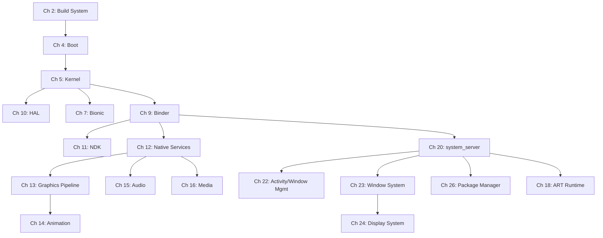

That said, **each chapter is designed to be self-contained**. If you already
understand Binder and need to learn about the window system, you can go
directly to Chapter 23. Cross-references (using `§N.M` notation) point you
to prerequisite material when it is needed.

### Suggested Reading Paths

Different readers will benefit from different paths through the material:

**For the platform engineer new to AOSP:**
Start with Chapters 1-9 in order. These build the foundational understanding
of how Android is built, booted, and structured. Then proceed to Chapter 20
(system_server) and Chapter 22 (Activity/Window Management) for the framework
layer. From there, follow your interests.

**For the graphics/display specialist:**
Read Chapter 9 (Binder) for IPC context, then Chapters 13 (Graphics Pipeline),
14 (Animation), 12 (Native Services, focusing on SurfaceFlinger), 23 (Window
System), and 24 (Display System).

**For the security researcher:**
Read Chapter 5 (Kernel) for the kernel attack surface, Chapter 7 (Bionic) for
the libc implementation, Chapter 9 (Binder) for the IPC attack surface,
Chapter 40 (Security/TEE) for the security model, and Chapter 54
(Virtualization) for the isolation architecture.

**For the ROM developer:**
Start with Chapter 2 (Build System), Chapter 4 (Boot), and Chapter 10 (HAL),
then skip to Chapter 63 (Custom ROM Guide) for the practical walk-through.
Return to earlier chapters as needed for deeper understanding.

**For the curious application developer:**
Read Chapter 9 (Binder) to understand what happens when you make a system
call, Chapter 22 (Activity/Window Management) to understand lifecycle
management, Chapter 13 (Graphics Pipeline) to understand rendering performance,
and Chapter 18 (ART Runtime) to understand how your code executes.

### Working with the Source Tree

This book assumes you have an AOSP source tree checked out and built. All
file paths in the book are given relative to the root of the AOSP source tree.

For example, when the book references:

```
frameworks/base/services/core/java/com/android/server/wm/WindowManagerService.java
```

This refers to that file under whichever directory you ran `repo init` and
`repo sync` in (often called `<AOSP_ROOT>`).

To get the most out of this book, you should have the source tree available
for browsing. Many sections will make more sense if you can read the
surrounding code, not just the excerpts shown in the book. Appendix A
provides instructions for setting up an AOSP development environment, and
Appendix B offers strategies for navigating the source tree efficiently.

### Cross-References

Chapters and sections are numbered hierarchically. When you see a reference
like `§9.3`, it means Chapter 9, Section 3. References like `§22.42` point
to Chapter 22, Section 42. These cross-references are used extensively to
connect related concepts across the book without duplicating material.

When a concept is first introduced, it is explained in full. Subsequent
references to the same concept use cross-reference notation to point back
to the original explanation.

### "Try It" Exercises

Most chapters end with a "Try It" section containing hands-on exercises. These
are designed to reinforce the material through direct interaction with the
source code and running system. They fall into several categories:

- **Source exploration**: Using `grep`, `cs` (codesearch), or an IDE to find
  specific patterns in the codebase.
- **Build exercises**: Modifying build files, adding log statements, and
  rebuilding specific components.
- **Runtime observation**: Using `adb shell`, `dumpsys`, `logcat`, and
  tracing tools to observe system behavior on a running device or emulator.
- **Debugging exercises**: Attaching debuggers, setting breakpoints, and
  stepping through critical code paths.
- **Modification challenges**: Making specific changes to AOSP subsystems
  and observing the results.

The exercises assume access to either a physical device running an AOSP build
or a Cuttlefish virtual device. Cuttlefish is recommended for most exercises,
as it provides full AOSP functionality without requiring physical hardware.
See Appendix A for setup instructions.

---

## Conventions Used in This Book

### Code and File Paths

**Inline code** is used for class names (`WindowManagerService`), method names
(`startActivity()`), variable names (`mGlobalLock`), file names
(`AndroidManifest.xml`), shell commands (`adb shell dumpsys window`), and
system properties (`ro.build.type`).

**Code blocks** are used for source code excerpts, shell sessions, and
configuration files. Every code block extracted from AOSP includes a header
comment indicating the source file:

```java
// frameworks/base/services/core/java/com/android/server/wm/ActivityTaskManagerService.java

@Override
public final int startActivity(IApplicationThread caller, String callingPackage,
        String callingFeatureId, Intent intent, String resolvedType,
        IBinder resultTo, String resultWho, int requestCode,
        int startFlags, ProfilerInfo profilerInfo, Bundle bOptions) {
    return startActivityAsUser(caller, callingPackage, callingFeatureId,
            intent, resolvedType, resultTo, resultWho, requestCode,
            startFlags, profilerInfo, bOptions,
            UserHandle.getCallingUserId());
}
```

When a code excerpt has been simplified for clarity -- for example, by
removing error checking or logging statements -- the header includes the
notation `(simplified)`:

```java
// frameworks/base/core/java/android/app/ActivityThread.java (simplified)

private void handleBindApplication(AppBindData data) {
    Application app = data.info.makeApplicationInner(data.restrictedBackupMode, null);
    mInitialApplication = app;
    app.onCreate();
}
```

**File paths** always use the full path relative to the source tree root.
They are formatted as inline code when referenced in running text:

> The window layout logic is implemented in
> `frameworks/base/services/core/java/com/android/server/wm/DisplayPolicy.java`.

When a specific line number is relevant, it is appended after a colon:

> See `frameworks/base/services/core/java/com/android/server/wm/WindowState.java:1247`
> for the frame computation logic.

Line numbers correspond to the source tree baseline stated in the copyright
section. They are included only when the specific line is important for
understanding; most references omit line numbers because they shift with
every commit.

### Diagrams

This book uses Mermaid diagrams extensively to visualize architecture,
data flow, and runtime behavior. Three diagram types are used:

**Block diagrams** (`graph TD` or `graph LR`) for architectural overviews
showing component relationships:

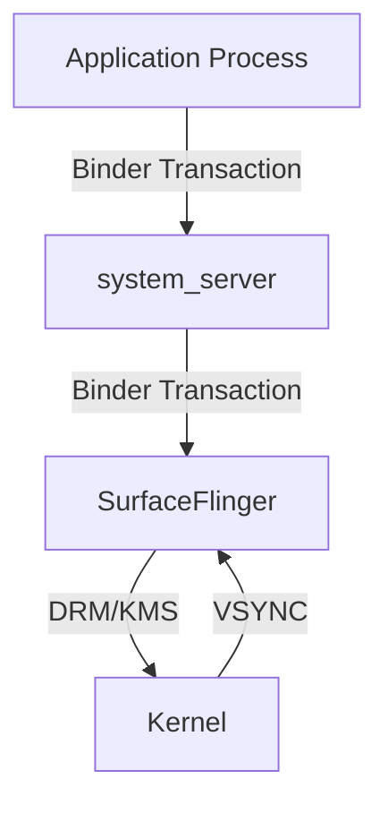

**Sequence diagrams** (`sequenceDiagram`) for runtime interactions showing
the order of operations across components:

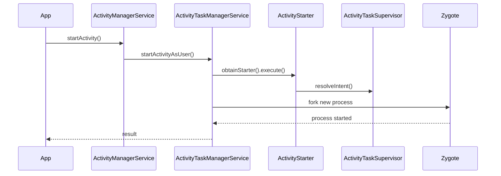

**State diagrams** (`stateDiagram-v2`) for lifecycle and state machine
descriptions:

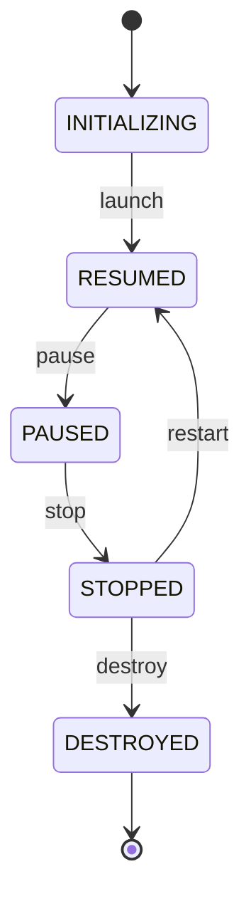

Diagrams are meant to provide a visual overview. They are always accompanied
by narrative text that explains the details. You do not need a Mermaid
renderer to understand the book, but the diagrams are more useful if you
can render them -- most modern Markdown viewers and documentation tools
support Mermaid natively.

### Cross-Reference Notation

Cross-references use the `§` symbol followed by chapter and section numbers:

| Notation | Meaning |
|----------|---------|
| `§9` | Chapter 9 (Binder) |
| `§9.3` | Chapter 9, Section 3 |
| `§22.42` | Chapter 22, Section 42 |
| `§A` | Appendix A |

Cross-references appear in parentheses when used as supplementary pointers:

> The transaction is serialized into a `Parcel` (§9.3) and dispatched
> through the kernel driver (§9.5).

Or as direct references when the cross-referenced material is essential:

> Before proceeding, ensure you understand the Binder transaction model
> described in §9.3.

### Terminology

Certain terms are used with specific meanings throughout this book:

| Term | Meaning |
|------|---------|
| **AOSP** | Android Open Source Project -- the open-source codebase |
| **Framework** | The Java/Kotlin layer in `frameworks/base/` |
| **System services** | Java services running in the `system_server` process |
| **Native services** | C++ services running in their own processes (e.g., SurfaceFlinger) |
| **HAL** | Hardware Abstraction Layer -- the interface between framework and hardware |
| **Binder** | Android's IPC mechanism, including driver, userspace library, and AIDL tooling |
| **ART** | Android Runtime -- the virtual machine that executes application code |
| **AIDL** | Android Interface Definition Language -- used for Binder interface definitions |
| **HIDL** | HAL Interface Definition Language -- legacy HAL interface definitions |
| **SoC** | System on Chip -- the processor and integrated components |
| **CDD** | Compatibility Definition Document -- requirements for Android compatibility |
| **CTS** | Compatibility Test Suite -- tests verifying CDD compliance |
| **VTS** | Vendor Test Suite -- tests verifying HAL compliance |
| **GKI** | Generic Kernel Image -- Google's effort to unify Android kernels |
| **Mainline** | Project Mainline -- updatable system components via APEX/APK modules |
| **pKVM** | Protected Kernel-based Virtual Machine -- Android's hypervisor |
| **TEE** | Trusted Execution Environment -- isolated secure processing |
| **DRM/KMS** | Direct Rendering Manager / Kernel Mode Setting -- Linux display subsystem |

### Abbreviations in Code Discussion

When discussing code, the following abbreviations are used for frequently
referenced components:

| Abbreviation | Full Name |
|--------------|-----------|
| **AMS** | `ActivityManagerService` |
| **ATMS** | `ActivityTaskManagerService` |
| **WMS** | `WindowManagerService` |
| **PMS** | `PackageManagerService` |
| **SF** | `SurfaceFlinger` |
| **HWUI** | Hardware UI rendering library |
| **BQ** | `BufferQueue` |
| **DMS** | `DisplayManagerService` |
| **IMS** | `InputManagerService` |
| **NBS** | `NativeBridgeService` |

### Admonitions

Throughout the text, certain passages are highlighted for special attention:

> **Note**: Supplementary information that adds context or clarifies a
> subtle point. Not essential for understanding the main text, but useful
> for deeper comprehension.

> **Important**: Information that is critical for correct understanding.
> Misunderstanding this point may lead to confusion in later sections.

> **Warning**: Pitfalls, common mistakes, or behaviors that are
> counterintuitive. Pay special attention to these.

> **Historical Note**: Context about why something is designed the way it is,
> often involving legacy decisions or backward-compatibility constraints.
> Understanding history helps explain designs that might otherwise seem
> arbitrary.

> **Performance**: Information relevant to system performance, including
> critical paths, latency-sensitive code, and optimization strategies.

### Shell Sessions

Shell commands are shown with a `$` prompt for user commands and `#` for
root commands. Output is shown without a prompt:

```bash
$ adb shell dumpsys window displays
Display: mDisplayId=0
  init=1080x2400 base=1080x2400 cur=1080x2400 app=1080x2244 rng=1080x1017-2400x2337
```

Multi-line commands use backslash continuation:

```bash
$ source build/envsetup.sh && \
    lunch aosp_cf_x86_64_phone-trunk_staging-userdebug && \
    m -j$(nproc)
```

### Build and Runtime Targets

Unless otherwise noted, build examples target the Cuttlefish x86_64
virtual device:

```bash
$ lunch aosp_cf_x86_64_phone-trunk_staging-userdebug
```

When architecture-specific behavior is discussed (particularly in Chapters
19, 27, and 29), the relevant target is stated explicitly. The three primary
architecture targets referenced are:

- `aosp_cf_x86_64_phone-trunk_staging-userdebug` -- x86_64, primary development target
- `aosp_cf_arm64_phone-trunk_staging-userdebug` -- ARM64, primary production architecture
- `aosp_riscv64-trunk_staging-userdebug` -- RISC-V 64-bit, emerging architecture

### Source Navigation Tips

The AOSP source tree is enormous, but a few strategies make navigation
manageable:

**Know the major directories.** The most important top-level directories are:

| Directory | Contents |
|-----------|----------|
| `frameworks/base/` | Core framework: services, core libraries, UI toolkit |
| `frameworks/native/` | Native framework: Binder, SurfaceFlinger, sensor service |
| `frameworks/libs/` | Framework libraries: binary translation, native bridge support |
| `system/core/` | Core system: init, adb, logd, libcutils |
| `art/` | Android Runtime: compiler, garbage collector, interpreter |
| `bionic/` | C library, dynamic linker, math library |
| `packages/` | System applications: Settings, SystemUI, Launcher3 |
| `hardware/interfaces/` | AIDL/HIDL HAL interface definitions |
| `build/` | Build system: Soong, Make, Kati integration |
| `kernel/` | Kernel sources and prebuilts |
| `external/` | Third-party libraries and tools |

**Use Android Code Search.** The online tool at `cs.android.com` provides
full-text search, cross-references, and call hierarchy analysis across the
AOSP source. It is often faster than local `grep` for initial exploration.

**Follow the Binder interfaces.** When tracing a feature across process
boundaries, find the AIDL interface definition first. It shows you the exact
contract between client and server, making it straightforward to find both
sides of the implementation.

**Read the service registration.** Most system services register themselves
in `SystemServer.java`. The registration order reveals dependencies and
can help you find services you did not know existed.

---

## A Note Before We Begin

The Android Open Source Project is a living codebase. By the time you read
this sentence, the source has changed. Methods have been refactored. Classes
have moved. New subsystems have been added and old ones deprecated.

This is the nature of the endeavor. A book about a living codebase is, in
some sense, a snapshot -- a detailed photograph of a moving target. But the
value of this book is not in the specific line numbers or the exact method
signatures. It is in the *architectural understanding*: the patterns, the
design decisions, the structural relationships that remain stable even as
the implementation details evolve.

Learn the architecture, and you will be able to navigate any version of the
source. Understand why the system is designed the way it is, and you will be
able to predict where to look even in code you have never seen before.

Let us begin.

<!-- chapter:01-introduction -->
# Chapter 1: Introduction

## 1.1 Why This Book Exists

The Android Open Source Project is one of the largest, most complex, and most
consequential open-source projects in human history. It powers over three billion
active devices, from phones and tablets to televisions, cars, wearables, and
embedded systems. Its codebase spans hundreds of millions of lines of code across
thousands of Git repositories. Its architecture bridges a Linux kernel written in
C with a Java/Kotlin application framework, connected by native C++ services, a
custom IPC mechanism (Binder), and a purpose-built runtime (ART).

And yet, for all its ubiquity, AOSP remains poorly understood -- even among
experienced Android application developers. The typical Android developer
interacts with AOSP through a narrow window: the SDK APIs documented on
developer.android.com. What lies beneath those APIs -- the services, the native
daemons, the hardware abstraction layers, the kernel drivers, the build system
that stitches it all together -- is a world that few developers explore and fewer
still can navigate with confidence.

This book exists to change that.

Whether you are a system engineer at an OEM, a silicon vendor integrating a new
SoC, a ROM developer building a custom distribution, a security researcher
analyzing the platform, or simply a curious application developer who wants to
understand what happens when you call `startActivity()`, this book will give you
the knowledge you need to read, understand, modify, build, and debug AOSP.

This first chapter sets the stage. We will define precisely what AOSP is (and
what it is not), survey the architecture from kernel to application, walk through
the source tree directory by directory, establish who maintains what, review the
platform's version history, and lay out the roadmap for the rest of the book.

---

## 1.2 What is AOSP vs. Android

The terms "AOSP" and "Android" are often used interchangeably, but they refer to
different things. Understanding the distinction is fundamental to working with
the platform at the source level.

### 1.2.1 AOSP: The Open-Source Foundation

AOSP -- the **Android Open Source Project** -- is the complete, buildable,
open-source operating system that Google releases under the Apache 2.0 license
(with some components under GPL, LGPL, and BSD licenses). It includes:

- A **Linux kernel** (with Android-specific patches)
- A **C library** (Bionic, Android's custom libc)
- A **native runtime** and native services (SurfaceFlinger, AudioFlinger,
  InputFlinger, and dozens more)
- The **Android Runtime** (ART), which executes application bytecode
- The **Java/Kotlin framework** (the `android.*` APIs that application developers
  use)
- A **build system** (Soong/Blueprint with legacy Make support)
- **System applications** (Settings, Launcher3, SystemUI, Contacts, Dialer,
  Camera, Calendar, and more)
- A **Compatibility Test Suite** (CTS) that defines what it means to be
  "Android-compatible"
- **Hardware Abstraction Layers** (HALs) with reference implementations
- **Developer tools** (adb, fastboot, emulator configurations)

You can download AOSP, build it, and flash it onto supported hardware (primarily
Google's reference devices and the Android Emulator) without any involvement from
Google beyond accessing the source repositories. The result is a fully functional
operating system -- but it is not the "Android" that consumers know.

### 1.2.2 Google Mobile Services: The Proprietary Layer

The Android that ships on most consumer devices includes a substantial proprietary
layer from Google called **Google Mobile Services (GMS)**. This layer includes:

| Component | Description |
|---|---|
| **Google Play Store** | The primary application marketplace |
| **Google Play Services** | Background service providing APIs for location, auth, push notifications (FCM), SafetyNet/Play Integrity, and hundreds more |
| **Google Search / Assistant** | Voice assistant and search integration |
| **Chrome** | The default browser (replaces AOSP Browser2) |
| **Gmail** | Email client (replaces AOSP Email) |
| **Google Maps** | Mapping and navigation |
| **YouTube** | Video streaming |
| **Google Photos** | Photo management (replaces AOSP Gallery) |
| **Google Play Protect** | Security scanning |
| **Google Dialer / Contacts** | Enhanced versions of AOSP apps |
| **SetupWizard** | The first-boot experience |

GMS is not open source. It is licensed to OEMs through a legal agreement called
the **Mobile Application Distribution Agreement (MADA)**, which historically
requires OEMs to bundle a minimum set of Google applications and place them in
specific locations (e.g., Google Search on the home screen). The **Android
Compatibility Definition Document (CDD)** and **CTS** set the technical
requirements; MADA sets the business requirements.

This distinction has significant implications:

1. **AOSP alone is "degoogled."** If you build AOSP from source without adding
   GMS, you get a functional OS with no Google account integration, no Play Store,
   no push notifications via FCM, and no Google-dependent APIs. Many apps from
   the Play Store will not function correctly because they depend on Google Play
   Services.

2. **Custom ROMs operate in this gap.** Projects like LineageOS, GrapheneOS,
   CalyxOS, and /e/OS build from AOSP and either exclude GMS entirely, include
   it optionally (via packages like Open GApps or MindTheGapps), or replace its
   functionality with open-source alternatives (microG).

3. **Huawei/Honor is the most prominent example of AOSP-without-GMS at scale.**
   After US trade restrictions prevented Google from licensing GMS to Huawei, the
   company shipped devices running AOSP with its own Huawei Mobile Services (HMS)
   and AppGallery store.

### 1.2.3 The OEM Layer: Vendor Customizations

Between AOSP and the consumer device lies another layer: the **OEM
customization**. Major OEMs apply extensive modifications:

| OEM | Customization Brand | Key Modifications |
|---|---|---|
| **Samsung** | One UI | Custom SystemUI, multi-window enhancements, DeX desktop mode, Knox security, S Pen integration, custom camera stack |
| **Xiaomi** | MIUI / HyperOS | Heavily customized UI, custom launcher, control center, security app, dual-app support |
| **OPPO/OnePlus** | ColorOS / OxygenOS | Custom AOD, shelf, Zen Mode, custom gallery and camera |
| **Google** | Pixel Experience | Material You theming, Pixel Launcher, Pixel-exclusive features, Tensor-specific optimizations |
| **Huawei** | EMUI / HarmonyOS | Custom everything -- Huawei progressively replaced AOSP with their own stack |
| **Sony** | Stock-like | Relatively close to AOSP with camera, audio, and display enhancements |
| **Motorola** | My UX | Near-stock with gesture additions (chop for flashlight, twist for camera) |

These customizations touch every layer of the stack: kernel (custom drivers,
scheduler tweaks), HAL (proprietary camera, audio, and display implementations),
framework (custom system services), SystemUI (custom status bar, quick settings,
lock screen), and applications (custom launcher, gallery, camera, settings).

### 1.2.4 The Complete Picture

The full Android stack on a consumer device can be understood as three concentric
layers:

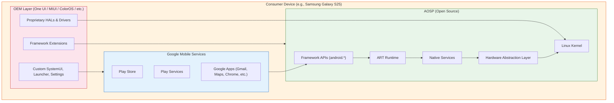

**Key insight for this book:** We focus almost exclusively on the green layer --
AOSP itself. This is where the operating system lives. GMS and OEM modifications
are built on top of it, and understanding AOSP is prerequisite to understanding
either of them.

### 1.2.5 AOSP Licensing

AOSP is not under a single license. Different components use different licenses,
reflecting their origins:

| Component | License | Rationale |
|---|---|---|
| Linux Kernel | GPLv2 | Inherited from upstream Linux |
| Bionic (libc) | BSD | Avoids GPL contamination of userspace; allows proprietary apps |
| Framework (Java) | Apache 2.0 | Permissive; allows OEM modification without source disclosure |
| ART | Apache 2.0 | Same as framework |
| Toolchain (LLVM/Clang) | Apache 2.0 with LLVM exception | Upstream LLVM license |
| External libraries | Various | Each library retains its original license (MIT, BSD, LGPL, etc.) |
| CTS | Apache 2.0 | Allows OEMs to run tests without license concerns |
| SELinux policies | Public Domain | Derived from upstream SELinux |

The deliberate choice of BSD for Bionic (instead of glibc's LGPL) was a
foundational decision that made it legally safe for proprietary applications and
proprietary HAL implementations to link against Android's C library without
triggering copyleft obligations. This decision is one of the reasons the mobile
ecosystem could adopt Android while maintaining proprietary drivers and
applications.

---

## 1.3 The AOSP Layer Cake: System Architecture

Android's architecture is a layered stack, where each layer provides services to
the layer above it and consumes services from the layer below. Understanding this
stack -- what lives where, what communicates with what, and through which
mechanisms -- is the single most important conceptual foundation for working with
AOSP.

### 1.3.1 The Complete Architecture

```mermaid
graph TB
    subgraph Applications["Layer 7: Applications"]
        SystemApps["System Apps<br/>(SystemUI, Launcher3, Settings,<br/>Contacts, Dialer, Camera2)"]
        UserApps["User Apps<br/>(Third-party APKs)"]
    end

    subgraph FrameworkAPI["Layer 6: Framework APIs"]
        AndroidAPI["android.* packages<br/>(app, content, view, widget,<br/>media, location, telephony,<br/>net, os, graphics, ...)"]
    end

    subgraph FrameworkServices["Layer 5: Framework Services (system_server)"]
        AMS["ActivityManager<br/>Service"]
        WMS["WindowManager<br/>Service"]
        PMS["PackageManager<br/>Service"]
        PKMS["PowerManager<br/>Service"]
        IMS_FW["InputMethod<br/>ManagerService"]
        NMS["Notification<br/>ManagerService"]
        CMS["ConnectivityService"]
        TMS["TelephonyService"]
        Others["60+ more<br/>services"]
    end

    subgraph ART_Layer["Layer 4: Android Runtime"]
        ART["ART<br/>(AOT + JIT + Interpreter)"]
        CoreLibs["Core Libraries<br/>(libcore: java.*, javax.*,<br/>org.apache.*, android.icu.*)"]
        Zygote["Zygote Process<br/>(App process factory)"]
    end

    subgraph NativeLayer["Layer 3: Native Services & Libraries"]
        SF["SurfaceFlinger"]
        AF["AudioFlinger"]
        IF["InputFlinger"]
        MC["MediaCodec /<br/>MediaPlayerService"]
        CamSvc["CameraService"]
        SenSvc["SensorService"]
        NativeBinder["libbinder /<br/>libbinder_ndk"]
        Bionic_Lib["Bionic<br/>(libc, libm, libdl)"]
    end

    subgraph HAL_Layer["Layer 2: Hardware Abstraction Layer"]
        HIDL_HALs["HIDL HALs<br/>(Legacy: camera, audio,<br/>sensors, graphics)"]
        AIDL_HALs["AIDL HALs<br/>(Modern: power, vibrator,<br/>health, light)"]
        HWBinder["hwbinder /<br/>vndbinder"]
    end

    subgraph Kernel_Layer["Layer 1: Linux Kernel"]
        Drivers["Device Drivers<br/>(GPU, Camera, Touch,<br/>Modem, Sensors)"]
        Binder_Driver["Binder Driver<br/>(/dev/binder,<br/>/dev/hwbinder,<br/>/dev/vndbinder)"]
        Subsystems["Kernel Subsystems<br/>(Memory, Scheduler, Filesystems,<br/>Networking, Power)"]
        AndroidKernel["Android-specific<br/>(Binder, ashmem/memfd,<br/>ION/DMA-BUF, fuse)"]
    end

    Applications --> FrameworkAPI
    FrameworkAPI --> FrameworkServices
    FrameworkServices --> ART_Layer
    FrameworkServices --> NativeLayer
    ART_Layer --> NativeLayer
    NativeLayer --> HAL_Layer
    HAL_Layer --> Kernel_Layer

    style Applications fill:#fff9c4,stroke:#f9a825
    style FrameworkAPI fill:#e8f5e9,stroke:#2e7d32
    style FrameworkServices fill:#c8e6c9,stroke:#2e7d32
    style ART_Layer fill:#e3f2fd,stroke:#1565c0
    style NativeLayer fill:#e1f5fe,stroke:#0277bd
    style HAL_Layer fill:#f3e5f5,stroke:#7b1fa2
    style Kernel_Layer fill:#fce4ec,stroke:#c62828
```

Let us examine each layer in detail, from the bottom up.

### 1.3.2 Layer 1: The Linux Kernel

Android runs on the Linux kernel. As of Android 16, the kernel is based on the
**Linux 6.x Long-Term Support (LTS)** branch (6.12 for the Android 16 GKI) with
Android-specific patches
managed through the **Android Common Kernel (ACK)** and the **Generic Kernel
Image (GKI)** initiative.

#### Android-Specific Kernel Features

The Android kernel is not vanilla Linux. It includes several Android-specific
subsystems and drivers:

| Feature | Purpose | Source Location |
|---|---|---|
| **Binder** | Android's primary IPC mechanism. A kernel driver that provides transaction-based communication between processes. Three devices: `/dev/binder` (framework), `/dev/hwbinder` (HAL), `/dev/vndbinder` (vendor). | `drivers/android/binder.c` in kernel |
| **Ashmem / memfd** | Anonymous shared memory. Originally `ashmem`, now transitioning to standard Linux `memfd_create`. Used for sharing large data between processes (e.g., GraphicBuffer). | `drivers/staging/android/` (legacy) |
| **ION / DMA-BUF Heaps** | Memory allocator for hardware buffers (GPU, camera, display). ION was Android-specific; DMA-BUF heaps is the upstream-friendly replacement. | `drivers/dma-buf/` |
| **Low Memory Killer** | Kills background processes under memory pressure. Originally Android-specific (`lowmemorykiller`), now uses userspace `lmkd` with kernel's PSI (Pressure Stall Information). | Userspace: `system/memory/lmkd/` |
| **fuse (for storage)** | FUSE filesystem provides the scoped storage layer. Performance-critical path for app file access. | Standard kernel fuse |
| **dm-verity** | Verified boot. Ensures system partitions haven't been tampered with. | `drivers/md/dm-verity*` |
| **SELinux** | Mandatory access control. Android uses a strict SELinux policy that confines every process. | Policy: `system/sepolicy/` |

#### Generic Kernel Image (GKI)

Starting with Android 12, Google introduced the **GKI** architecture to solve
kernel fragmentation. The idea:

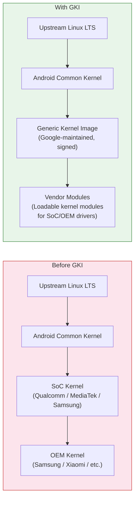

Before GKI, each device had a unique kernel: upstream Linux LTS was forked by
Google (ACK), then forked again by the SoC vendor (e.g., Qualcomm's `msm-kernel`),
then forked again by the OEM. This created massive fragmentation -- devices
shipped with kernels that were years behind upstream, and security patches took
months to propagate.

GKI provides a single, Google-built kernel binary that is common across all
devices using the same Android version and kernel version. Vendor-specific
functionality is delivered as **loadable kernel modules (LKMs)** and
**vendor_dlkm** (vendor dynamically loaded kernel modules) on a separate
partition. This means Google can update the kernel independently of vendors.

In the AOSP source tree, kernel-related content lives in:

- `kernel/configs/` -- GKI kernel configuration fragments
- `kernel/prebuilts/` -- Prebuilt kernel images for development
- `kernel/tests/` -- Kernel test suites

The actual kernel source is typically obtained separately via a kernel manifest
(`repo init -u https://android.googlesource.com/kernel/manifest`) because it is
extremely large and most platform developers do not need to modify it.

### 1.3.3 Layer 2: Hardware Abstraction Layer (HAL)

The HAL is the interface between Android's userspace and hardware-specific
drivers. It allows Android to run on diverse hardware without modifying the
framework.

#### HAL Architecture Evolution

Android's HAL architecture has evolved significantly:

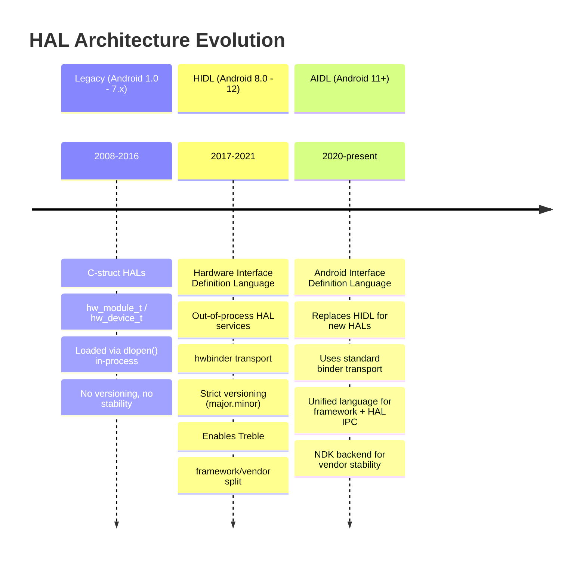

**Legacy HALs** (pre-Treble) were shared libraries loaded directly into the
calling process. The camera HAL, for example, was a `.so` file loaded into
`cameraserver` via `dlopen()`. This worked, but meant the HAL and the framework
were tightly coupled -- updating one required updating the other.

**Project Treble** (Android 8.0) introduced **HIDL (Hardware Interface
Definition Language)**, which moved HALs into separate processes communicating
over `hwbinder`. This created a stable, versioned interface between the framework
and vendor implementations, enabling:

- **Faster OS updates**: OEMs could update the Android framework without
  modifying vendor HALs
- **Generic System Images (GSI)**: A single system image that works across
  multiple devices
- **Vendor Test Suite (VTS)**: Automated testing of HAL implementations

**Stable AIDL** (Android 11+) is now the preferred HAL interface language. It
uses the same AIDL that has been used for years in application-to-framework IPC,
but with a stable **NDK backend** that vendors can implement against. New HALs
must be written in AIDL; HIDL is frozen and will not accept new interfaces.

#### HAL Interface Directory

The canonical HAL interface definitions live in `hardware/interfaces/`:

```
hardware/interfaces/
    audio/              -- Audio HAL (capture, playback, effects)
    automotive/         -- Automotive-specific HALs (vehicle, EVS)
    biometrics/         -- Fingerprint, face authentication
    bluetooth/          -- Bluetooth HAL
    boot/               -- Boot control HAL (A/B updates)
    broadcastradio/     -- FM/AM radio
    camera/             -- Camera HAL (camera2 API backend)
    cas/                -- Conditional Access System (DRM for broadcast)
    confirmationui/     -- Trusted UI confirmation
    contexthub/         -- Context Hub (always-on sensor processor)
    drm/                -- DRM plugin HAL (Widevine, etc.)
    dumpstate/          -- Bug report generation
    fastboot/           -- Fastboot HAL
    gatekeeper/         -- Password/PIN verification
    gnss/               -- GPS/GNSS location
    graphics/           -- Graphics HALs:
        allocator/      --   Gralloc (buffer allocation)
        composer/       --   HWC (hardware composer for display)
        mapper/         --   Buffer mapping
    health/             -- Battery/charging health
    identity/           -- Identity credential
    input/              -- Input classifier
    ir/                 -- Infrared (IR blaster)
    keymaster/          -- Cryptographic key management
    light/              -- LED/backlight control
    media/              -- Media codec (OMX/Codec2)
    memtrack/           -- Memory tracking
    neuralnetworks/     -- NNAPI (ML acceleration)
    nfc/                -- NFC
    power/              -- Power management, power hints
    radio/              -- Telephony radio (RIL replacement)
    secure_element/     -- Secure element access
    sensors/            -- Sensor HAL (accelerometer, gyro, etc.)
    soundtrigger/       -- Hotword detection
    thermal/            -- Thermal management
    tv/                 -- TV input framework
    usb/                -- USB HAL
    vibrator/           -- Haptic feedback
    wifi/               -- Wi-Fi HAL
    ... and more (60+ HAL interfaces total)
```

Each HAL interface directory contains `.aidl` or `.hal` files that define the
interface, along with default implementations and VTS (Vendor Test Suite) tests.

#### The Treble Boundary: VNDK and Vendor Partition

Project Treble established a hard boundary between the **system partition**
(framework, updated by Google/OEM) and the **vendor partition** (HALs/drivers,
updated by SoC vendor):

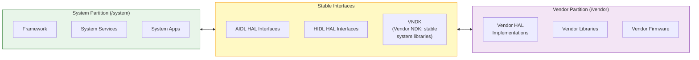

The **VNDK (Vendor NDK)** is the set of system libraries that vendor code is
allowed to link against. Vendor code cannot link against arbitrary system
libraries -- only those in the VNDK. This is enforced at build time and at
runtime through **linker namespaces** (configured in `system/linkerconfig/`).

### 1.3.4 Layer 3: Native Services and Libraries

Above the kernel and HALs sits a rich layer of native (C/C++) services and
libraries. These are the workhorses of the system -- they handle display
composition, audio mixing, input dispatch, media playback, and more.

#### Core Native Services

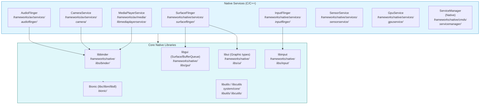

Let us examine the most important native services:

**SurfaceFlinger** (`frameworks/native/services/surfaceflinger/`) is the display
compositor. Every frame you see on an Android device is composed by
SurfaceFlinger. It receives buffers from application windows (via the
`BufferQueue` mechanism), composites them together using either the GPU
(client composition) or the display hardware (hardware composition via HWC HAL),
and sends the final frame to the display. SurfaceFlinger manages multiple
displays, handles VSYNC timing, and coordinates with the WindowManagerService in
system_server for window layout and visibility.

**AudioFlinger** (`frameworks/av/services/audioflinger/`) is the audio mixer and
router. It receives audio data from applications and system services, mixes
multiple audio streams according to their types (music, notification, alarm,
voice call), applies effects, and routes the mixed audio to the appropriate
output device via the Audio HAL. It handles sample rate conversion, channel
mapping, and latency management.

**InputFlinger** (`frameworks/native/services/inputflinger/`) reads raw input
events from the kernel's `/dev/input/` devices (touch, keyboard, mouse, gamepad),
classifies them, and dispatches them to the correct window. The **InputDispatcher**
component maintains a mapping of windows to input channels and ensures that touch
events reach the window under the touch point, keyboard events reach the focused
window, and system gestures (back, home, recent apps) are intercepted before
reaching applications.

**CameraService** (`frameworks/av/services/camera/`) mediates between the Camera2
API (used by applications) and the Camera HAL (implemented by vendors). It
manages camera device lifecycle, request processing, and stream management.

**MediaPlayerService / MediaCodecService** (`frameworks/av/`) provides media
playback and encoding. The Codec2 framework (successor to the original OMX/Stagefright
architecture) manages hardware and software codecs for video and audio.

**ServiceManager** (`frameworks/native/cmds/servicemanager/`) is the native Binder
service registry. Every system service that wants to be accessible over Binder
registers itself with ServiceManager. Clients look up services by name. There are
actually three ServiceManagers: one for framework binder (`/dev/binder`), one for
HW binder (`/dev/hwbinder`, managed by `hwservicemanager`), and one for vendor
binder (`/dev/vndbinder`, managed by `vndservicemanager`).

#### Bionic: Android's C Library

Bionic (`bionic/`) is Android's custom C library. It is *not* glibc. Bionic was
written from scratch (incorporating code from BSD) with specific goals:

1. **Small size**: Mobile devices have limited memory. Bionic is significantly
   smaller than glibc.
2. **Fast startup**: `dlopen()`, `pthread_create()`, and other common operations
   are optimized for mobile workloads.
3. **BSD license**: Avoids LGPL, which would require OEMs to provide a way for
   users to replace the C library.
4. **Android-specific features**: Properties system (`__system_property_get`),
   Android logging (`__android_log_print`), Binder support.

Bionic includes:

- `bionic/libc/` -- The C library itself
- `bionic/libm/` -- Math library
- `bionic/libdl/` -- Dynamic linker library
- `bionic/linker/` -- The dynamic linker (`/system/bin/linker64`), responsible
  for loading shared libraries and resolving symbols at runtime

The dynamic linker in `bionic/linker/` is particularly important because it
implements the **linker namespace** isolation that enforces the Treble boundary.
Different namespaces (default, sphal, vndk, rs) control which libraries are
visible to which processes, preventing vendor code from accessing unstable
system libraries.

### 1.3.5 Layer 4: Android Runtime (ART)

The Android Runtime (`art/`) executes application bytecode. ART replaced Dalvik
as the default runtime in Android 5.0 (Lollipop).

#### ART Compilation Pipeline

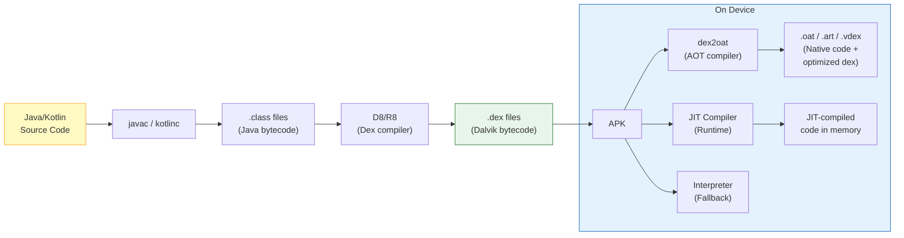

ART uses a **multi-tier compilation strategy**:

1. **Interpreter**: Executes bytecode instruction-by-instruction. Slowest but
   always available. Used for debugging and for code executed rarely.

2. **JIT (Just-In-Time) Compiler**: Compiles hot methods to native code at
   runtime. The JIT profiles code execution and saves profile data to disk.

3. **AOT (Ahead-Of-Time) Compiler** (`dex2oat`): Uses JIT profiles to
   pre-compile frequently-used methods to native code during idle time or at
   install time. This is the **Profile-Guided Optimization (PGO)** approach
   introduced in Android 7.0.

4. **Cloud Profiles** (Android 9+): Google Play distributes aggregated
   profiles collected from other users. When you install an app, `dex2oat` can
   use the cloud profile to compile the most commonly used methods before you
   even run the app.

The ART source tree in `art/` contains:

- `art/runtime/` -- The runtime itself (GC, class loading, JNI, threading)
- `art/compiler/` -- The JIT and AOT compilers
- `art/dex2oat/` -- The AOT compilation tool
- `art/libartbase/` -- Base utilities
- `art/libdexfile/` -- DEX file parsing
- `art/libnativebridge/` -- Native bridge for running ARM apps on x86 (used by
  Berberis/Houdini translation)
- `art/libnativeloader/` -- Library loading with namespace isolation
- `art/odrefresh/` -- On-device refresh of ART module artifacts
- `art/openjdkjvm/` -- JVM interface implementation
- `art/openjdkjvmti/` -- JVMTI (debug/profiling) interface
- `art/profman/` -- Profile manager for PGO
- `art/imgdiag/` -- Diagnostics for boot image

#### Zygote: The Process Factory

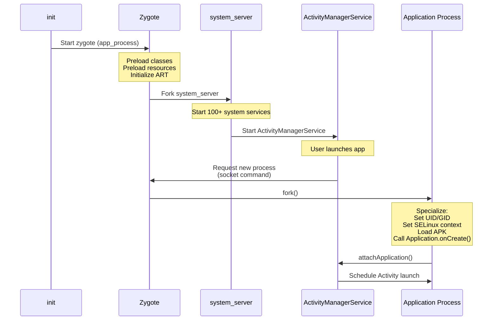

**Zygote** (`frameworks/base/cmds/app_process/` and `system/zygote/`) is one of
Android's most important architectural innovations. It is the parent process of
every application process and `system_server`.

When Android boots:

1. The `init` process starts `zygote` (technically, the `app_process64` binary)
2. Zygote initializes the ART runtime
3. Zygote **preloads** thousands of Java classes and resources that all
   applications will need
4. Zygote enters a loop, listening on a Unix domain socket for commands

When a new application process is needed:

1. `ActivityManagerService` sends a command to Zygote's socket
2. Zygote calls `fork()`, creating a child process
3. The child process inherits all preloaded classes and resources via
   **copy-on-write** memory sharing
4. The child specializes: sets its UID, GID, SELinux context, loads the
   application's APK, and begins execution

This fork-based architecture is what makes Android app startup fast. Without
Zygote, each app would need to start a new ART instance from scratch, load and
verify thousands of classes, and parse framework resources -- a process that
would take several seconds. With Zygote, `fork()` takes milliseconds, and the
shared pages mean less physical memory is consumed.

### 1.3.6 Layer 5: Framework Services (system_server)

The `system_server` process is the heart of the Android framework. It is the
first process Zygote forks, and it hosts **over 100 system services** that
collectively manage every aspect of the user experience.

#### system_server Service Catalog

The services in `system_server` are organized in the source tree under
`frameworks/base/services/core/java/com/android/server/`. This directory
contains over 100 subdirectories:

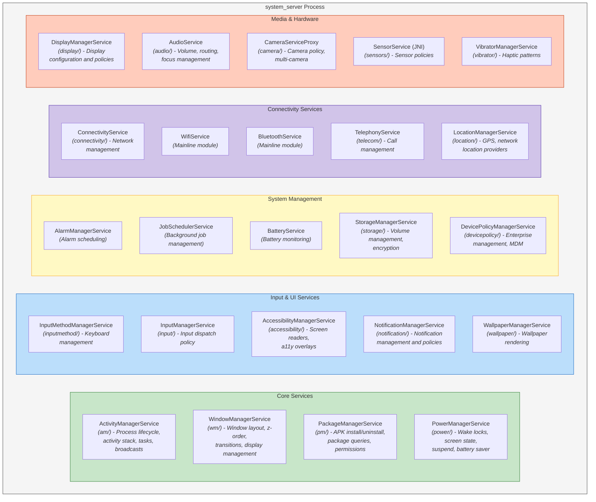

Here is a more complete listing of the service subdirectories found in
`frameworks/base/services/core/java/com/android/server/`:

| Directory | Service | Responsibility |
|---|---|---|
| `am/` | ActivityManagerService | Process lifecycle, activity stacks, tasks, recent apps, broadcasts, content providers, OOM adjustment |
| `wm/` | WindowManagerService | Window hierarchy, z-ordering, input focus, display layout, transitions, rotations |
| `pm/` | PackageManagerService | APK installation, uninstallation, package resolution, permission management, intent resolution |
| `power/` | PowerManagerService | Wake locks, screen on/off, doze/idle mode, battery saver, suspend |
| `display/` | DisplayManagerService | Display lifecycle, brightness, color mode, display policies |
| `input/` | InputManagerService | Input device management, key mapping, input dispatch policy |
| `inputmethod/` | InputMethodManagerService | Soft keyboard management, IME switching |
| `notification/` | NotificationManagerService | Notification posting, ranking, policies, DND |
| `audio/` | AudioService | Volume control, audio routing, audio focus, sound effects |
| `connectivity/` | ConnectivityService | Network management, default network selection, VPN |
| `location/` | LocationManagerService | Location providers, geofencing, GNSS management |
| `telecom/` | TelecomService | Call management, call routing, in-call UI |
| `camera/` | CameraServiceProxy | Camera access policies, multi-camera coordination |
| `storage/` | StorageManagerService | Volume management, encryption, adoption |
| `content/` | ContentService | Content observer notifications, sync management |
| `accounts/` | AccountManagerService | Account management, authentication tokens |
| `clipboard/` | ClipboardService | System clipboard |
| `accessibility/` | AccessibilityManagerService | Accessibility event dispatch, a11y services |
| `app/` | ActivityTaskManagerService | Task and activity management (split from AMS) |
| `backup/` | BackupManagerService | Application backup and restore |
| `biometrics/` | BiometricService | Fingerprint, face, iris authentication |
| `companion/` | CompanionDeviceManagerService | Paired device management (watches, etc.) |
| `dreams/` | DreamManagerService | Screen saver (Daydream) management |
| `hdmi/` | HdmiControlService | HDMI-CEC control |
| `incident/` | IncidentManager | Bug report / incident management |
| `integrity/` | AppIntegrityManagerService | APK integrity verification |
| `lights/` | LightsService | LED and backlight control |
| `locksettings/` | LockSettingsService | PIN, pattern, password management |
| `media/` | MediaSessionService | Media session management, transport controls |
| `net/` | NetworkManagementService | Low-level network configuration (iptables, routing) |
| `om/` | OverlayManagerService | Runtime Resource Overlays (theming) |
| `people/` | PeopleService | Conversations, shortcuts, people-related features |
| `permission/` | PermissionManagerService | Runtime permission grants and policies |
| `policy/` | PhoneWindowManager | Hardware key handling, system gesture policy |
| `role/` | RoleManagerService | Default app roles (browser, dialer, SMS) |
| `search/` | SearchManagerService | Search framework |
| `security/` | SecurityStateManager | Security patch level tracking |
| `selinux/` | SELinuxService | SELinux policy management |
| `slice/` | SliceManagerService | Slice content (app content previews) |
| `statusbar/` | StatusBarManagerService | Status bar icon and notification shade coordination |
| `trust/` | TrustManagerService | Trust agents (Smart Lock) |
| `tv/` | TvInputManagerService | TV input framework |
| `uri/` | UriGrantsManagerService | URI permission grants |
| `vibrator/` | VibratorManagerService | Haptic feedback patterns |
| `wallpaper/` | WallpaperManagerService | Wallpaper rendering and management |
| `webkit/` | WebViewUpdateService | WebView package management |

And this is not exhaustive -- there are over 100 subdirectories in total. Each
service communicates with applications and other services via Binder IPC,
exposing its functionality through AIDL-defined interfaces.

#### system_server Startup

When `system_server` starts (forked from Zygote), it initializes services in a
specific order defined in `SystemServer.java`
(`frameworks/base/services/java/com/android/server/SystemServer.java`):

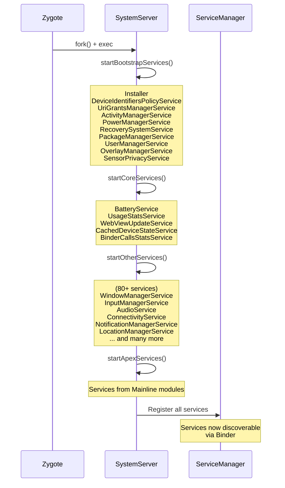

Services are started in four phases:

1. **Bootstrap services** -- The absolute minimum needed for the system to
   function (AMS, PMS, PowerManager)
2. **Core services** -- Essential but not bootstrap-critical (Battery, UsageStats)
3. **Other services** -- Everything else (Window, Input, Audio, Connectivity,
   Notification, Location, etc.)
4. **APEX services** -- Services that come from Mainline modules

### 1.3.7 Layer 6: Framework APIs

The Framework API layer (`frameworks/base/core/java/android/`) is what
application developers interact with. It is the public surface of the Android
platform, documented at developer.android.com and versioned by API level.

The `android.*` package hierarchy contains approximately 50 top-level packages:

| Package | Purpose |
|---|---|
| `android.app` | Activity, Service, Application, Fragment, Notification, Dialog |
| `android.content` | ContentProvider, ContentResolver, Intent, Context, SharedPreferences |
| `android.view` | View, ViewGroup, Window, MotionEvent, KeyEvent, Surface |
| `android.widget` | TextView, Button, RecyclerView, ImageView, and all standard widgets |
| `android.os` | Binder, Handler, Looper, Bundle, Parcel, Process, SystemClock |
| `android.graphics` | Canvas, Paint, Bitmap, drawable.*, animation.* |
| `android.media` | MediaPlayer, MediaRecorder, AudioTrack, AudioRecord, MediaCodec |
| `android.net` | ConnectivityManager, NetworkInfo, Uri, wifi.* |
| `android.telephony` | TelephonyManager, SmsManager, PhoneStateListener |
| `android.location` | LocationManager, LocationListener, Geocoder |
| `android.hardware` | Camera2 API, SensorManager, usb.*, biometrics.* |
| `android.database` | SQLite wrappers, Cursor, ContentValues |
| `android.provider` | Contacts, MediaStore, Settings, CallLog |
| `android.security` | KeyStore, KeyChain |
| `android.accounts` | AccountManager |
| `android.animation` | ValueAnimator, ObjectAnimator, AnimatorSet |
| `android.transition` | Scene, Transition framework |
| `android.speech` | Speech recognition, text-to-speech |
| `android.print` | Printing framework |
| `android.service` | Abstract base classes for various service types |
| `android.permission` | Permission-related APIs |
| `android.util` | Log, TypedValue, SparseArray, ArrayMap |
| `android.text` | Spannable, TextWatcher, Html, Editable |
| `android.webkit` | WebView, WebSettings, WebChromeClient |

Each of these packages contains classes that are essentially Binder client
proxies. When you call `startActivity()`, the `Activity` class (in
`android.app`) calls through to `ActivityTaskManager`, which calls through
to an `IActivityTaskManager.Stub.Proxy`, which makes a Binder transaction to
`ActivityTaskManagerService` in `system_server`. This pattern -- **client-side
proxy wrapping Binder IPC to a server-side implementation** -- is universal
across the Android framework.

### 1.3.8 Layer 7: Applications

At the top of the stack sit the applications -- both system apps that ship with
the OS and user-installed apps.

#### System Applications in AOSP

AOSP ships with a substantial set of system applications in `packages/apps/`:

| Application | Directory | Description |
|---|---|---|
| **SystemUI** | `frameworks/base/packages/SystemUI/` | Status bar, notification shade, quick settings, lock screen, volume dialog, power menu, recent apps, pip |
| **Launcher3** | `packages/apps/Launcher3/` | Home screen, app drawer, widgets, workspace |
| **Settings** | `packages/apps/Settings/` | System settings application |
| **Contacts** | `packages/apps/Contacts/` | Contact management |
| **Dialer** | `packages/apps/Dialer/` | Phone dialer and call management |
| **Camera2** | `packages/apps/Camera2/` | Camera application |
| **Calendar** | `packages/apps/Calendar/` | Calendar application |
| **Messaging** | `packages/apps/Messaging/` | SMS/MMS messaging |
| **DeskClock** | `packages/apps/DeskClock/` | Clock, alarm, timer, stopwatch |
| **Music** | `packages/apps/Music/` | Basic music player |
| **Gallery2** | `packages/apps/Gallery2/` | Photo gallery |
| **DocumentsUI** | `packages/apps/DocumentsUI/` | File manager (Storage Access Framework UI) |
| **Browser2** | `packages/apps/Browser2/` | WebView-based browser |
| **KeyChain** | `packages/apps/KeyChain/` | Certificate management |
| **CertInstaller** | `packages/apps/CertInstaller/` | Certificate installation |
| **ManagedProvisioning** | `packages/apps/ManagedProvisioning/` | Enterprise device setup (work profile) |
| **Stk** | `packages/apps/Stk/` | SIM Toolkit |
| **StorageManager** | `packages/apps/StorageManager/` | Storage management |
| **ThemePicker** | `packages/apps/ThemePicker/` | Material You theme customization |
| **Traceur** | `packages/apps/Traceur/` | System tracing (developer tool) |
| **WallpaperPicker2** | `packages/apps/WallpaperPicker2/` | Wallpaper selection |
| **TV** | `packages/apps/TV/` | Android TV launcher and EPG |

SystemUI deserves special mention because it is not a typical application -- it
is a system-privileged process that provides the core user interface chrome:
the status bar, the notification shade, the quick settings panel, the lock
screen, the volume dialog, the power menu, the picture-in-picture controls,
the recent apps interface (on some configurations), and more. It runs in its
own process (`com.android.systemui`) with elevated permissions and deep
integration with `WindowManagerService` and other system services.

#### Content Providers

AOSP also ships system content providers in `packages/providers/`:

| Provider | Description |
|---|---|
| `ContactsProvider` | Contacts database (contacts2.db) |
| `MediaProvider` | Media database (images, video, audio) and scoped storage |
| `CalendarProvider` | Calendar events and reminders |
| `TelephonyProvider` | SMS/MMS messages, carrier configuration |
| `DownloadProvider` | System download manager |
| `SettingsProvider` | System, secure, and global settings |
| `BlockedNumberProvider` | Blocked phone numbers |
| `UserDictionaryProvider` | Custom keyboard dictionary |
| `BookmarkProvider` | Browser bookmarks (legacy) |

---

## 1.4 Repository Structure: A Complete Guide

The AOSP source tree is enormous. A full checkout, including prebuilt toolchains
and all default repositories, can exceed 300 GB. Understanding the top-level
directory structure is essential for navigating the codebase efficiently.

The source is managed by `repo`, a tool built on top of Git. The
`.repo/manifest.xml` file defines the complete set of Git repositories and where
they are checked out. A typical AOSP checkout has over 1,000 individual Git
repositories, each mapping to a subdirectory in the source tree.

### 1.4.1 Directory Map

Below is a comprehensive listing of the top-level directories in the AOSP source
tree, with their purpose, approximate
size contribution, and significance to different types of developers.

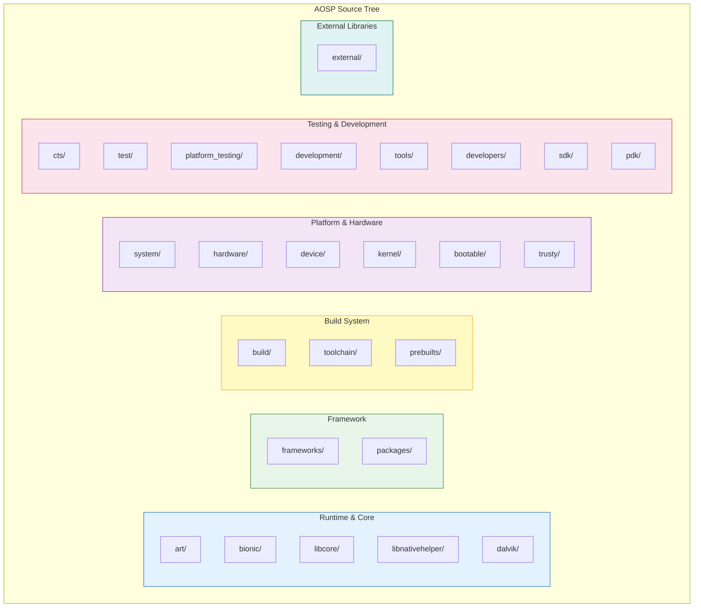

### 1.4.2 Runtime and Core Libraries

#### `art/` -- Android Runtime

The Android Runtime is the virtual machine that executes all Java/Kotlin
application code and framework code.

```
art/
    runtime/          -- Core runtime: GC, class linker, JNI, threads, monitors
    compiler/         -- Optimizing compiler (for JIT and AOT)
    dex2oat/          -- Ahead-of-time compilation tool
    libdexfile/       -- DEX file format parser and verifier
    libartbase/       -- Base utilities shared across ART components
    libartservice/    -- ART service (manages compilation on device)
    libarttools/      -- Tools library
    libartpalette/    -- Platform abstraction layer
    libnativebridge/  -- Native bridge (for ISA translation, e.g., ARM on x86)
    libnativeloader/  -- Library loading with namespace isolation
    odrefresh/        -- On-device refresh of boot image artifacts
    openjdkjvm/       -- JVM TI and JNI interface implementation
    openjdkjvmti/     -- JVMTI implementation (for debuggers/profilers)
    profman/          -- Profile manager (processes JIT profiles for PGO)
    imgdiag/          -- Boot image diagnostics
    dexdump/          -- DEX file disassembler
    dexlist/          -- DEX file lister
    oatdump/          -- OAT file disassembler
    dalvikvm/         -- ART entry point (dalvikvm command)
    adbconnection/    -- ADB-based debugging connection
    sigchainlib/      -- Signal chain management (for native signal handlers)
    perfetto_hprof/   -- Heap profiling via Perfetto
    test/             -- Extensive test suite (thousands of tests)
    benchmark/        -- Performance benchmarks
    tools/            -- Development utilities
    build/            -- Build configuration
```

**Who cares about this directory:** Runtime engineers, garbage collection
researchers, JIT/AOT compiler developers, anyone debugging class loading or
JNI issues.

#### `bionic/` -- Android's C Library

Bionic is the C library, math library, and dynamic linker for Android.

```
bionic/
    libc/             -- C library implementation
        arch-arm/     --   ARM-specific assembly (memcpy, strcmp, etc.)
        arch-arm64/   --   ARM64-specific assembly
        arch-riscv64/ --   RISC-V 64-bit assembly
        arch-x86/     --   x86-specific assembly
        arch-x86_64/  --   x86_64-specific assembly
        bionic/       --   Core C library sources (pthread, malloc, stdio, etc.)
        dns/          --   DNS resolver
        include/      --   C library headers
        kernel/       --   Kernel header wrappers (auto-generated from kernel)
        malloc_debug/ --   Memory debugging tools
        stdio/        --   Standard I/O implementation
        stdlib/       --   Standard library (qsort, bsearch, etc.)
        string/       --   String operations
        system_properties/ -- Android property system client
        upstream-*    --   Code imported from OpenBSD, FreeBSD, NetBSD
    libm/             -- Math library (sin, cos, sqrt, etc.)
    libdl/            -- Dynamic loading library (dlopen, dlsym)
    libstdc++/        -- Minimal C++ standard library (full C++ is libc++)
    linker/           -- Dynamic linker (/system/bin/linker64)
    tests/            -- Test suite
    benchmarks/       -- Performance benchmarks
    tools/            -- Maintenance tools (header generation, symbol checking)
    apex/             -- APEX module configuration
    docs/             -- Documentation
```

**Who cares about this directory:** Native developers working at the C level,
anyone debugging memory issues (malloc_debug), linker/loader problems, or
architecture-specific behavior. The `linker/` subdirectory is essential for
understanding namespace isolation and the Treble vendor boundary.

#### `libcore/` -- Java Core Libraries

The Java standard library implementation for Android.

```
libcore/
    dalvik/           -- Dalvik-specific classes (system, bytecode)
    dom/              -- DOM XML implementation
    harmony-tests/    -- Apache Harmony compatibility tests
    json/             -- org.json (JSON parsing)
    luni/             -- Main library: java.*, javax.*, sun.misc.*
    mmodules/         -- Mainline module boundaries
    ojluni/           -- OpenJDK-derived code (java.util, java.io, etc.)
    xml/              -- XML parsing (SAX, XPath)
```

These provide the `java.lang`, `java.util`, `java.io`, `java.net`, `java.nio`,
`java.security`, `java.sql`, `javax.crypto`, and other standard Java APIs.
Unlike a standard JDK, Android's implementation is heavily modified: it uses
Bionic instead of glibc, `android.icu` instead of some `java.text`
functionality, and has Android-specific security providers.

**Who cares about this directory:** Anyone debugging Java standard library
behavior on Android, or working on the ART Mainline module.

#### `libnativehelper/` -- JNI Helper Library

Utility library that simplifies JNI (Java Native Interface) coding:

```
libnativehelper/
    header_only_include/  -- Header-only JNI helpers
    include/              -- Public headers
    include_jni/          -- JNI specification headers (jni.h)
    tests/                -- Tests
```

Provides `JNIHelp.h` with functions like `jniRegisterNativeMethods()`,
`jniThrowException()`, and `jniCreateString()` that reduce boilerplate in
JNI code throughout the platform.

#### `dalvik/` -- Legacy Dalvik VM (Mostly Historical)

```
dalvik/
    dexgen/           -- DEX file generation utilities
    docs/             -- Historical documentation
    dx/               -- Original dx tool (DEX compiler, replaced by D8)
    opcode-gen/       -- Opcode definition generation
    tools/            -- Utilities
```

The Dalvik VM itself was removed when ART replaced it in Android 5.0. This
directory now contains mostly tools, the legacy `dx` compiler (replaced by D8/R8
in the build system), and opcode definitions used by other tools.

### 1.4.3 Framework

#### `frameworks/` -- The Android Framework

This is the largest and most important directory in AOSP. It contains the entire
Android application framework, native services, system libraries, and system
components.

```
frameworks/
    base/                 -- The core framework (MASSIVE: ~30M+ lines)
        core/             --   Core API classes (android.* packages)
            java/         --     Java source for framework APIs
            jni/          --     JNI bridge implementations
            res/          --     Framework resources (layouts, drawables, strings)
            proto/        --     Protobuf definitions
        services/         --   system_server services
            core/         --     Core services (AMS, WMS, PMS, 100+ more)
            java/         --     SystemServer.java entry point
            companion/    --     Companion device services
            appfunctions/ --     App functions service
            devicepolicy/ --     Device administration
            contentcapture/ --   Content capture service
            credentials/  --     Credentials manager service
            incremental/  --     Incremental file system service
            midi/         --     MIDI service
            net/          --     Network services
            people/       --     People/conversation services
            permission/   --     Permission service
            print/        --     Print service
            restrictions/ --     App restrictions
            texttospeech/ --     TTS service
            translation/  --     Translation service
            usage/        --     Usage stats service
            usb/          --     USB service
            voiceinteraction/ -- Voice interaction service
            wifi/         --     WiFi service
        packages/         --   Framework-internal applications
            SystemUI/     --     Status bar, notification shade, lock screen
            SettingsLib/  --     Shared settings library
            SettingsProvider/ --  Settings content provider
            Shell/        --     ADB shell utilities
            CompanionDeviceManager/ -- Companion device pairing
            FusedLocation/ --    Fused location provider
            PrintSpooler/ --     Print spooler service
            Tethering/    --     Tethering/hotspot
            MtpDocumentsProvider/ -- MTP file access
            CredentialManager/ -- Credential management UI
        graphics/         --   Graphics classes (Canvas, Paint, etc.)
        libs/             --   Framework libraries
            hwui/         --     Hardware-accelerated 2D rendering (Skia/HWUI)
            androidfw/    --     Asset manager, resource system
            input/        --     Input framework library
            WindowManager/ --    WindowManager library
        media/            --   Media framework Java classes
        location/         --   Location framework Java classes
        telecomm/         --   Telecom framework Java classes
        wifi/             --   WiFi framework Java classes
        cmds/             --   Command-line tools
            app_process/  --     Zygote entry point
            am/           --     Activity Manager CLI (am start, am broadcast)
            pm/           --     Package Manager CLI (pm install, pm list)
            wm/           --     Window Manager CLI (wm size, wm density)
            input/        --     Input CLI (input tap, input text)
            svc/          --     Service control CLI
            settings/     --     Settings CLI (settings put, settings get)
            bootanimation/ --    Boot animation player
            idmap2/       --     Resource overlay compiler
        test-runner/      --   AndroidJUnitRunner
        tools/            --   Build and analysis tools
            aapt2/        --     Android Asset Packaging Tool 2
            lint/         --     Lint rules

    native/               -- Native framework (C/C++)
        services/
            surfaceflinger/  -- Display compositor
            inputflinger/    -- Input event processing
            sensorservice/   -- Sensor event processing
            audiomanager/    -- Audio policy bridge
            gpuservice/      -- GPU management
            batteryservice/  -- Battery state
            displayservice/  -- Display service bridge
            vibratorservice/ -- Vibrator service
            stats/           -- StatsD
        libs/
            binder/          -- libbinder (Binder IPC client library)
            gui/             -- libgui (Surface, BufferQueue)
            ui/              -- libui (Graphic buffer types)
            input/           -- libinput
            sensor/          -- libsensor
            nativewindow/    -- ANativeWindow
            nativedisplay/   -- ADisplay
            renderengine/    -- GPU render engine (for SurfaceFlinger)
            permission/      -- Permission checking
            math/            -- Math utilities (vec, mat)
            ftl/             -- Functional Template Library
        cmds/
            servicemanager/  -- Binder ServiceManager daemon
            dumpsys/         -- dumpsys tool
            dumpstate/       -- Bug report generator
            cmd/             -- cmd tool (talks to services)
            atrace/          -- System trace tool
            installd/        -- Package installation daemon
            lshal/           -- HAL listing tool

    av/                   -- Audio/Video framework
        camera/           --   Camera service and client
        media/            --   Media framework
            libmediaplayerservice/ -- Media player service
            libstagefright/ --       Media codec framework
            codec2/        --        Codec2 (modern codec framework)
            libaudioclient/ --       Audio client library
            audioserver/   --        Audio server process
        services/
            camera/        --   Camera service
            audioflinger/  --   Audio mixer and router
            audiopolicy/   --   Audio routing policy
            mediametrics/  --   Media metrics
            mediadrm/      --   DRM service

    hardware/             -- Hardware abstraction framework layer
    compile/              -- Compilation tools
    ex/                   -- Extension libraries
    libs/                 -- Additional framework libraries
        binary_translation/ -- Berberis (native bridge / ISA translation)
        modules-utils/      -- Mainline module utilities
        native_bridge_support/ -- Native bridge support libraries
        systemui/           -- SystemUI shared libraries
        service_entitlement/ -- Carrier entitlement
    minikin/              -- Text layout engine (used by Skia/HWUI)
    multidex/             -- MultiDex support library
    opt/                  -- Optional framework components (telephony, net)
    proto_logging/        -- Protobuf-based logging
    rs/                   -- RenderScript (deprecated)
    wilhelm/              -- OpenSL ES / OpenMAX AL audio APIs
    layoutlib/            -- Layout rendering library (for Android Studio preview)
```

**Who cares about this directory:** Everyone. This is the Android framework.
Application developers trace bugs here. System developers modify services here.
OEM engineers customize SystemUI, settings, and services here. SoC vendors
integrate HALs through interfaces defined here.

#### `packages/` -- Applications, Modules, Providers, and Services

```
packages/
    apps/                 -- System applications (55+)
        Launcher3/        --   Home screen and app drawer
        Settings/         --   System settings
        Camera2/          --   Camera application
        Contacts/         --   Contact management
        Dialer/           --   Phone dialer
        Calendar/         --   Calendar
        DeskClock/        --   Clocks and alarms
        Messaging/        --   SMS/MMS
        Music/            --   Music player
        Gallery2/         --   Photo gallery
        DocumentsUI/      --   File manager
        Browser2/         --   Browser
        ThemePicker/      --   Material You theming
        Traceur/          --   System tracing
        WallpaperPicker2/ --   Wallpaper selection
        ManagedProvisioning/ -- Work profile setup
        Car/              --   Android Auto apps
        TV/               --   Android TV app
        TvSettings/       --   Android TV settings
        ...

    modules/              -- Mainline modules (40+)
        Bluetooth/        --   Bluetooth stack
        Wifi/             --   WiFi stack
        Connectivity/     --   Network connectivity
        Telephony/        --   Telephony
        Telecom/          --   Telecom service
        Media/            --   Media framework components
        Permission/       --   Permission controller
        NeuralNetworks/   --   NNAPI runtime
        DnsResolver/      --   DNS resolution
        IPsec/            --   IPsec VPN
        Nfc/              --   NFC stack
        AdServices/       --   Advertising services
        Uwb/              --   Ultra-Wideband
        Virtualization/   --   pVM (protected VMs)
        DeviceLock/       --   Device lock service
        adb/              --   ADB daemon
        Scheduling/       --   Scheduling module
        ...

    providers/            -- Content providers
        ContactsProvider/ --   Contacts database
        MediaProvider/    --   Media files database
        CalendarProvider/ --   Calendar storage
        TelephonyProvider/ --  SMS/MMS storage
        DownloadProvider/ --   Downloads
        SettingsProvider/ --   Settings storage (in frameworks/base/)
        ...

    services/             -- Background services
        Telephony/        --   Telephony service
        Telecomm/         --   Telecom service
        Car/              --   Automotive services
        Mtp/              --   MTP (Media Transfer Protocol)
        ...

    inputmethods/         -- Input methods
    screensavers/         -- Screen savers
    wallpapers/           -- Live wallpapers
```

**Who cares about this directory:** Application developers studying system app
architecture. OEM engineers customizing preinstalled apps. Mainline module
developers.

### 1.4.4 Build System

#### `build/` -- The Build System

AOSP uses a hybrid build system: **Soong** (Blueprint-based, written in Go) is
the primary build system, with legacy **Make** support for components not yet
converted.

```
build/
    soong/            -- Soong build system (Go source)
        android/      --   Android module types
        cc/           --   C/C++ build rules
        java/         --   Java build rules
        apex/         --   APEX package build rules
        rust/         --   Rust build rules
        python/       --   Python build rules
        genrule/      --   Generic build rules
        ...
    make/             -- Legacy Make-based build system
        core/         --   Core Makefile logic
        target/       --   Target configuration
        tools/        --   Build tools (releasetools, zipalign, etc.)
        envsetup.sh   --   Environment setup (lunch, m, mm, mmm commands)
    blueprint/        -- Blueprint build file parser (Soong's frontend)
    pesto/            -- Build analysis tools
    release/          -- Release configuration
    target/           -- Target (device) build configuration
    tools/            -- Build utilities
```

Build files in AOSP are named:

- `Android.bp` -- Soong (Blueprint) build files (preferred)
- `Android.mk` -- Legacy Make build files (being migrated to .bp)
- `Makefile` -- Rare, for special cases

**Who cares about this directory:** Everyone who builds AOSP. The build system
is the first thing you interact with and the last thing you debug when builds
break.

#### `toolchain/` -- Compiler Toolchain Configuration

```
toolchain/
    pgo-profiles/     -- Profile-Guided Optimization profiles for the toolchain
```

The actual compiler binaries (Clang/LLVM, Rust) are in `prebuilts/`. This
directory contains toolchain configuration and PGO profiles used to optimize
the compiler's output.

#### `prebuilts/` -- Prebuilt Binaries

The largest directory in the AOSP tree by raw size. Contains prebuilt
compiler toolchains, SDKs, and other tools that are not built from source
during a normal AOSP build.

```
prebuilts/
    clang/             -- Clang/LLVM compiler (multiple versions)
    gcc/               -- Legacy GCC compiler (for kernel, being phased out)
    go/                -- Go compiler (for Soong build system)
    jdk/               -- Java Development Kit
    build-tools/       -- aapt2, zipalign, d8, etc.
    gradle-plugin/     -- Android Gradle Plugin
    maven_repo/        -- Maven repository (AndroidX, etc.)
    sdk/               -- Android SDK platforms
    android-emulator/  -- Emulator binaries
    clang-tools/       -- Clang-based analysis tools
    cmake/             -- CMake (for NDK builds)
    cmdline-tools/     -- Android SDK command-line tools
    ktlint/            -- Kotlin linter
    manifest-merger/   -- Manifest merger tool
    bazel/             -- Bazel build tool (experimental)
    devtools/          -- Development tools
    ...
```

**Who cares about this directory:** Build engineers updating toolchains, anyone
debugging compiler issues, developers setting up the build environment.

### 1.4.5 Platform and Hardware

#### `system/` -- Core System Components

Low-level system components that sit between the kernel and the framework.

```
system/
    core/                 -- Core system utilities
        init/             --   init process (PID 1, first userspace process)
        rootdir/          --   Root filesystem init.rc files
        fastboot/         --   Fastboot protocol implementation
        adb/              --   Android Debug Bridge daemon (in Mainline now)
        debuggerd/        --   Crash handler (generates tombstones)
        libcutils/        --   C utility library (properties, threads, etc.)
        libutils/         --   C++ utility library (RefBase, String, Vector)
        liblog/           --   Android logging library
        libsparse/        --   Sparse image handling
        fs_mgr/           --   Filesystem manager (mount, verity, overlayfs)
        healthd/          --   Battery health daemon
        bootstat/         --   Boot statistics
        storaged/         --   Storage health monitoring
        watchdogd/        --   Hardware watchdog daemon
        run-as/           --   run-as command (debuggable app access)
        sdcard/           --   FUSE-based SD card emulation (legacy)
        toolbox/          --   Small command-line utilities
        property_service/ --   Property service
        llkd/             --   Live lock daemon
        libprocessgroup/  --   Cgroup management
        trusty/           --   Trusty TEE client libraries

    sepolicy/             -- SELinux policy
        private/          --   Platform-private policy
        public/           --   Public policy (visible to vendor)
        vendor/           --   Vendor-extendable policy
        prebuilts/        --   Prebuilt policies

    apex/                 -- APEX module infrastructure
        apexd/            --   APEX daemon (manages module installation)
        apexer/           --   APEX package creation tool
        tools/            --   APEX utilities

    security/             -- Security components
    bpf/                  -- BPF (Berkeley Packet Filter) programs
    connectivity/         -- Connectivity components
    media/                -- Low-level media components
    memory/               -- Memory management (lmkd, libmeminfo)
    netd/                 -- Network daemon
    vold/                 -- Volume daemon (disk encryption, mounting)
    update_engine/        -- OTA update engine
    hardware/             -- Hardware service manager
    libhidl/              -- HIDL runtime library
    libhwbinder/          -- Hardware binder library
    libvintf/             -- VINTF (Vendor Interface) manifest library
    linkerconfig/         -- Linker namespace configuration
    logging/              -- Logd (centralized log daemon)
    extras/               -- Additional system tools
    zygote/               -- Zygote configuration
    ...
```

**Who cares about this directory:** System engineers, security researchers
(sepolicy), boot engineers (init, fs_mgr), storage engineers (vold), network
engineers (netd), anyone debugging system daemons.

#### `hardware/` -- Hardware Abstraction

```
hardware/
    interfaces/       -- HAL interface definitions (AIDL and HIDL)
        audio/        --   Audio HAL
        camera/       --   Camera HAL
        graphics/     --   Graphics HAL (HWC, Gralloc)
        sensors/      --   Sensor HAL
        bluetooth/    --   Bluetooth HAL
        wifi/         --   WiFi HAL
        radio/        --   Telephony HAL
        power/        --   Power HAL
        vibrator/     --   Vibrator HAL
        health/       --   Battery health HAL
        neuralnetworks/ -- NNAPI HAL
        ... (60+ interfaces)

    libhardware/      -- Legacy HAL loading library (hw_get_module)
    libhardware_legacy/ -- Even older HAL loading
    ril/              -- Radio Interface Layer (telephony, legacy)

    google/           -- Google-specific hardware support
    qcom/             -- Qualcomm hardware support
    samsung/          -- Samsung hardware support
    broadcom/         -- Broadcom (WiFi, Bluetooth)
    nxp/              -- NXP (NFC)
    invensense/       -- InvenSense (sensors)
    ti/               -- Texas Instruments
    st/               -- STMicroelectronics
    synaptics/        -- Synaptics (touch)
```

**Who cares about this directory:** HAL implementors, SoC vendors, device
bring-up engineers, driver developers.

#### `device/` -- Device Configurations

Each supported device has a configuration directory here:

```
device/
    generic/          -- Generic device configurations
        goldfish/     --   Emulator (QEMU-based)
        car/          --   Android Automotive emulator
        tv/           --   Android TV emulator
        common/       --   Common configuration shared across generics
    google/           -- Google devices (Pixel)
    google_car/       -- Google Automotive
    amlogic/          -- Amlogic SoC devices
    linaro/           -- Linaro reference boards
    sample/           -- Sample device configuration (template)
```

A device configuration directory typically contains:

- `BoardConfig.mk` -- Board-level configuration (partition sizes, kernel
  config, architecture)
- `device.mk` -- Device-level configuration (which packages to include)
- `AndroidProducts.mk` -- Product definitions (lunch targets)
- `<product>.mk` -- Product-specific configuration
- `overlay/` -- Runtime resource overlays (customizing framework resources)
- `sepolicy/` -- Device-specific SELinux policy
- `init.*.rc` -- Device-specific init scripts
- Kernel configuration fragments

When you run `lunch` to select a build target, you are selecting a product
defined in one of these device directories.

#### `kernel/` -- Kernel Configuration and Prebuilts

```
kernel/
    configs/          -- GKI kernel configuration fragments
    prebuilts/        -- Prebuilt kernel images
    tests/            -- Kernel test suites
```

As mentioned earlier, the full kernel source is typically in a separate
repository. This directory contains configuration fragments, prebuilt images
for development, and test infrastructure.

#### `bootable/` -- Boot and Recovery

```
bootable/
    recovery/         -- Recovery mode implementation
    deprecated-ota/   -- Legacy OTA update tools
    libbootloader/    -- Bootloader libraries
```

The recovery system handles OTA updates (applying update packages),
factory reset, and sideloading. Modern devices use `update_engine`
(`system/update_engine/`) for A/B seamless updates, but recovery remains
for non-A/B devices and for factory reset.

#### `trusty/` -- Trusted Execution Environment

```
trusty/
    device/           -- TEE device configurations
    hardware/         -- TEE hardware abstraction
    host/             -- Host-side tools
    kernel/           -- Trusty kernel (separate OS)
    user/             -- Trusty userspace applications
    vendor/           -- Vendor TEE components
```

Trusty is Google's Trusted Execution Environment (TEE) operating system. It
runs alongside Android on the same processor, in a separate secure world
(typically using ARM TrustZone). Trusty hosts security-sensitive operations
like key storage (Keymaster), biometric template storage, and DRM key
handling. Not all devices use Trusty -- some use Qualcomm's QSEE or other
TEE implementations -- but it is the reference TEE in AOSP.

### 1.4.6 Testing and Development

#### `cts/` -- Compatibility Test Suite

```
cts/
    tests/            -- CTS test cases (organized by API area)
    hostsidetests/    -- Tests that run on the host (controlling the device)
    apps/             -- Test helper applications
    libs/             -- Test libraries
    common/           -- Common test utilities
    helpers/          -- Test helper utilities
    suite/            -- Test suite configuration
```

CTS is one of the pillars of the Android ecosystem. To ship a device with
Google Play (GMS), OEMs must pass CTS -- a suite of hundreds of thousands of
tests that verify API compatibility. CTS ensures that an app written against
the Android SDK will work the same way on a Samsung Galaxy as on a Google Pixel.

CTS tests cover:

- API behavior (does `Context.getSystemService()` return the correct service?)
- Permission enforcement (does a non-privileged app get SecurityException when
  expected?)
- Media codecs (does the device support required codecs at required quality?)
- Graphics (does OpenGL ES / Vulkan behave correctly?)
- Security (is SELinux enforcing? Are file permissions correct?)
- Performance (does the device meet minimum benchmarks?)
- And thousands more test cases

#### `test/` -- Test Infrastructure

```
test/
    vts/              -- Vendor Test Suite (tests HAL implementations)
    mlts/             -- Machine Learning Test Suite
    catbox/           -- Test suite for automotive
    mts/              -- Mainline Test Suite
    ...
```

VTS (Vendor Test Suite) is the companion to CTS for the vendor partition. It
tests HAL implementations to ensure they conform to the HIDL/AIDL interface
specifications.

#### `platform_testing/` -- Platform-Level Testing

```
platform_testing/
    tests/            -- Platform integration tests
    libraries/        -- Test utility libraries
    build/            -- Test build configuration
```

Platform-level tests that go beyond CTS, testing internal platform behavior
that is not part of the public API contract.

#### `development/` -- Development Utilities

```
development/
    apps/             -- Sample applications
    samples/          -- SDK samples
    tools/            -- Development tools
    ide/              -- IDE configuration
    scripts/          -- Helper scripts
    vndk/             -- VNDK tools
    ...
```

Contains sample code, development tools, and IDE configurations. The samples
here are different from the SDK samples -- they often demonstrate system-level
features.

#### `developers/` -- Developer Documentation and Samples

```
developers/
    build/            -- Build configuration for samples
    samples/          -- Developer-facing code samples
```

Additional developer-facing samples and documentation support.

#### `tools/` -- Development and Analysis Tools

```
tools/
    metalava/         -- API signature extraction and checking tool
    tradefederation/  -- Trade Federation (test harness framework)
    apksig/           -- APK signing library
    apkzlib/          -- APK ZIP library
    treble/           -- Treble compliance tools
    acloud/           -- Cloud-based Android Virtual Devices
    asuite/           -- Test suite management (atest, etc.)
    security/         -- Security analysis tools
    dexter/           -- DEX analysis tool
    repohooks/        -- Repo pre-upload hooks
    netsim/           -- Network simulation
    rootcanal/        -- Bluetooth emulation
    external_updater/ -- Tool for updating external/ projects
    carrier_settings/ -- Carrier configuration tools
    lint_checks/      -- Custom lint checks
    ...
```

**Metalava** deserves special mention: it is the tool that extracts the Android
API signature from source code, compares it against previous versions, and
enforces API compatibility rules (no removing public APIs, no changing method
signatures, etc.). The API surface files it generates (`current.txt`,
`removed.txt`, `system-current.txt`) are the canonical definition of the
Android API.

**Trade Federation (TradeFed)** is the test harness used to run CTS, VTS, and
other test suites. It handles device management, test execution, result
collection, and reporting.

#### `sdk/` -- SDK Build Support

```
sdk/
    build_tools/      -- SDK build tools configuration
    emulator/         -- Emulator configuration
    ...
```

Support files for building the Android SDK that is distributed to application
developers via Android Studio.

#### `pdk/` -- Platform Development Kit

```
pdk/
    build/            -- PDK build support
    ...
```

The Platform Development Kit helps OEMs and SoC vendors start their
customization work before a new Android version is publicly released. Google
shares the PDK with partners under NDA, allowing them to begin porting work
early.

### 1.4.7 External Libraries

#### `external/` -- Third-Party Libraries

With over **467 subdirectories**, `external/` is one of the widest directories
in AOSP. It contains third-party open-source libraries used throughout the
platform:

| Category | Examples |
|---|---|
| **Compression** | zlib, zstd, brotli, lz4, xz |
| **Cryptography** | boringssl (OpenSSL fork by Google), conscrypt |
| **Database** | sqlite |
| **Graphics** | skia (2D rendering engine), vulkan-*, angle, mesa3d |
| **Media** | libvpx, libaom, opus, flac, tremolo, libmpeg2 |
| **Networking** | curl, okhttp, grpc, protobuf |
| **Fonts** | noto-fonts, roboto-fonts |
| **Text/Unicode** | icu, harfbuzz_ng, libxml2, expat |
| **Languages** | kotlin-*, python3, lua |
| **Testing** | googletest, junit, mockito, robolectric |
| **ML/AI** | tensorflow-lite, XNNPACK, flatbuffers |
| **Build** | cmake, ninja, gyp |
| **Debugging** | lldb, valgrind, strace, elfutils |
| **Security** | selinux, pcre, libcap |
| **Bluetooth** | aac (for A2DP), libldac |
| **Automotive** | android_onboarding |
| **Misc** | libjpeg-turbo, libpng, giflib, webp, freetype |

Each subdirectory in `external/` has its own upstream project, license, and
update cadence. The `tools/external_updater/` tool helps maintain these
dependencies by tracking upstream versions and automating updates.

**Who cares about this directory:** Anyone debugging a third-party library
behavior, updating an external dependency, or auditing licenses.

### 1.4.8 Output

#### `out/` -- Build Output

```
out/
    target/                       -- Device build artifacts
        product/<device>/
            system/               --   System partition image contents
            vendor/               --   Vendor partition image contents
            system.img            --   System image
            vendor.img            --   Vendor image
            boot.img              --   Boot image (kernel + ramdisk)
            recovery.img          --   Recovery image
            super.img             --   Super image (dynamic partitions)
    host/                         -- Host tool build artifacts
    soong/                        -- Soong intermediate files
        .intermediates/           --   Build intermediates (MASSIVE)
    .module_paths/                -- Module path cache
```

The `out/` directory is not checked into version control. It is where all build
artifacts are generated. A full build can produce 100+ GB of intermediate and
final artifacts. The `out/target/product/<device>/` directory contains the
flashable images.

### 1.4.9 Source Tree Size Perspective

To give a sense of scale:

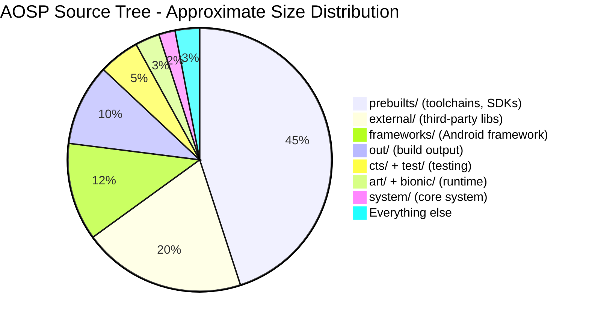

The vast majority of the source tree's disk consumption comes from prebuilt
binaries (compilers, SDKs, emulator images) and external third-party libraries.
The actual Android-specific code -- the framework, runtime, system components,
and build system -- is a much smaller fraction of the total disk usage, though
it is still enormous in its own right (tens of millions of lines of code).

---

## 1.5 Who Maintains What

The Android ecosystem is a collaboration between Google, silicon vendors, OEMs,
and the open-source community. Understanding who is responsible for which parts
of the stack is essential for knowing where to file bugs, where to send patches,
and whose constraints shape the architecture.

### 1.5.1 The Stakeholder Map

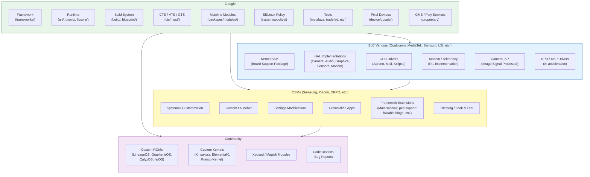

### 1.5.2 Google's Role

Google is the primary maintainer of AOSP. Google engineers write the majority
of framework code, runtime improvements, build system changes, and test
infrastructure. Google's specific responsibilities include:

**Framework Development:**

- All system services in `system_server` (AMS, WMS, PMS, and 100+ others)
- The Android API surface (`frameworks/base/core/`)
- Native services (SurfaceFlinger, AudioFlinger, InputFlinger)
- Media framework (`frameworks/av/`)
- The build system (Soong, Blueprint, Make)

**API Governance:**

- API design review (every new public API goes through an API council)
- API compatibility enforcement (via Metalava and CTS)
- API level management (each Android release increments the API level)
- Deprecation policy (APIs are deprecated but rarely removed)

**Compatibility:**

- CTS development and maintenance
- CDD (Compatibility Definition Document) authorship
- VTS (Vendor Test Suite) for HAL compliance
- GTS (Google Test Suite, proprietary) for GMS compliance
- Treble / VNDK stability requirements

**Mainline Modules:**

- Google develops and maintains Mainline modules that can be updated via the
  Play Store independently of full OS updates. As of Android 16, over 30
  modules are "mainlined," including:
  - Connectivity (WiFi, Bluetooth, Tethering, DNS)
  - Media (codecs, extractors)
  - Permissions
  - ART (the runtime itself!)
  - ADB
  - Scheduling
  - Neural Networks (NNAPI)
  - And more

**Reference Hardware:**

- Pixel devices serve as the reference implementation
- The Android Emulator (Goldfish/Cuttlefish) provides a software reference
- Google Tensor chips allow Google to optimize the full stack

**Security:**

- Monthly security bulletins and patches
- SELinux policy development
- Verified boot implementation
- Keystore/Keymaster/StrongBox specifications

### 1.5.3 SoC Vendor Responsibilities

Silicon vendors (Qualcomm, MediaTek, Samsung LSI, Google Tensor, Unisoc, and
others) provide the lowest layers of the software stack:

**Kernel Board Support Package (BSP):**

- Device tree definitions for the SoC
- Driver implementations for all on-chip peripherals
- Power management (DVFS, idle states)
- Thermal management
- Kernel scheduler tuning

**HAL Implementations:**

| HAL | What SoC Vendors Provide |
|---|---|
| **Camera** | ISP drivers, 3A algorithms (auto-focus, auto-exposure, auto-white-balance), HDR processing, multi-camera synchronization |
| **Graphics** | GPU kernel driver, userspace GL/Vulkan libraries, HWC (Hardware Composer) for display composition |
| **Audio** | ALSA/audio kernel driver, audio DSP firmware and control, codec configuration |
| **Sensors** | Sensor hub firmware, sensor HAL implementation |
| **Modem / Telephony** | RIL (Radio Interface Layer) implementation, modem firmware, IMS (VoLTE/VoWiFi) |
| **Video Codec** | Hardware codec drivers, Codec2 HAL implementation |
| **AI/ML** | NPU/DSP drivers, NNAPI HAL implementation |
| **WiFi** | WiFi driver, WiFi HAL implementation, firmware |
| **Bluetooth** | BT controller driver, BT HAL implementation, firmware |
| **GNSS** | GNSS driver, location HAL implementation |

SoC vendors typically deliver their BSP as a large set of proprietary source
code and prebuilt binaries. OEMs receive this BSP and integrate it with their
device configuration.

The Treble architecture means that SoC vendors can deliver HAL implementations
once, and OEMs can update the Android framework independently. In practice,
major OS upgrades still require BSP updates from the SoC vendor, but minor
updates and security patches can be applied without vendor involvement.

### 1.5.4 OEM Responsibilities

OEMs (Samsung, Xiaomi, OPPO, OnePlus, Motorola, Sony, Google itself, and many
others) are responsible for the final consumer product. Their work spans:

**Device Bring-up:**

- Board-specific configuration (device tree, partition layout)
- Device-specific init scripts
- SELinux policy customization
- Kernel configuration (enabling/disabling features)

**User Experience Customization:**

- SystemUI modifications (status bar, quick settings, lock screen)
- Custom launcher (Samsung One UI Home, Xiaomi Poco Launcher, etc.)
- Settings app customization (adding OEM-specific settings pages)
- Theming and visual design (icons, colors, animations, fonts)
- Sounds (ringtones, notification sounds, UI sounds)
- Boot animation

**Feature Development:**

- Multi-window enhancements (Samsung DeX, foldable split-screen)
- Pen/stylus support (Samsung S Pen, Motorola Smart Stylus)
- Camera software (computational photography, filters, modes)
- Security additions (Samsung Knox, Xiaomi Mi Security)
- Accessibility features
- Regional customizations (dual SIM behavior, local payment integration)

**Testing and Certification:**

- Running CTS to achieve Android compatibility certification
- Running GTS for GMS certification
- Carrier certification testing
- Regional regulatory testing (FCC, CE, etc.)

**Updates:**

- Porting new Android versions to existing devices
- Monthly security patch integration
- Mainline module updates (via Play Store)
- Firmware updates (modem, TrustZone, bootloader)

### 1.5.5 Community Contributions

The open-source community plays several roles:

**Custom ROM Development:**
Custom ROMs take AOSP and build alternative distributions. Major projects:

| Project | Focus |
|---|---|
| **LineageOS** | Successor to CyanogenMod. Broad device support, close to AOSP with useful additions. The largest custom ROM community. |
| **GrapheneOS** | Security and privacy focused. Hardened memory allocator, improved sandboxing, no Google dependencies by default. Pixel-only. |
| **CalyxOS** | Privacy focused with optional microG (open-source Play Services replacement). Pixel and a few other devices. |
| **/e/OS** | De-Googled Android with cloud services. Targeted at mainstream users who want privacy without complexity. |
| **Paranoid Android** | UI innovation and design focus. Known for introducing features later adopted by AOSP (immersive mode, heads-up notifications). |
| **crDroid** | Feature-rich, combining customizations from multiple sources. |
| **Android-x86** | Foundational community port of AOSP to x86/x86_64 PCs. Adds drivers and input handling for keyboards, mice, trackpads, and Ethernet, and is the base most "Android for PC" distributions derive from. |
| **BlissOS** | x86/x86_64 desktop distribution derived from Android-x86, typically tracking LineageOS. Adds a desktop-style taskbar, multi-window polish, and theming aimed at laptop/PC use. |
| **BlissROMs** | ARM phone/tablet sibling of BlissOS. Customization- and theming-focused ROM built on top of LineageOS. |
| **RemixOS** | Discontinued (2017) commercial Android-for-PC distribution by Jide, based on Android-x86. Notable for early desktop-style window management and a Start-menu-like launcher on Android. |

**Bug Reports and Code Review:**
The AOSP Gerrit instance (android-review.googlesource.com) accepts external
contributions, though the process is more restrictive than typical open-source
projects. Community members also file bugs on the AOSP issue tracker
(issuetracker.google.com) and participate in mailing lists.

**Custom Kernels:**
Independent kernel developers build optimized kernels for specific devices,
often incorporating upstream Linux improvements, scheduler tweaks, and
performance optimizations ahead of the official release cycle.

**Xposed / Magisk:**
The modding community uses frameworks like Xposed (runtime Java method hooking)
and Magisk (systemless root) to modify Android behavior without changing the
system partition. These tools demonstrate deep understanding of ART internals,
the init system, and dm-verity.

---

## 1.6 AOSP Version History

Android has evolved dramatically since its initial release. The following table
documents every major release, from Android 1.0 to Android 16.

### 1.6.1 Complete Version Table

| Version | API Level | Code Name | Release Date | Key Highlights |
|---|---|---|---|---|
| **1.0** | 1 | (None) | Sep 2008 | First public release. HTC Dream (T-Mobile G1). Basic smartphone OS with Gmail, Maps, Browser, Market. |
| **1.1** | 2 | Petit Four (internal) | Feb 2009 | Bug fixes, API refinements. |
| **1.5** | 3 | **Cupcake** | Apr 2009 | Virtual keyboard, video recording, widgets, AppWidget framework, animated transitions. |
| **1.6** | 4 | **Donut** | Sep 2009 | CDMA support, different screen sizes, quick search box, battery usage display. |
| **2.0** | 5 | **Eclair** | Oct 2009 | Multi-account support, Exchange support, HTML5, Bluetooth 2.1, live wallpapers, new browser. |
| **2.0.1** | 6 | Eclair | Dec 2009 | Minor update. |
| **2.1** | 7 | Eclair MR1 | Jan 2010 | Live wallpapers API, five home screens. |
| **2.2** | 8 | **Froyo** | May 2010 | JIT compilation (Dalvik), USB tethering, WiFi hotspot, apps on SD card, Chrome V8 JS engine. |
| **2.3** | 9 | **Gingerbread** | Dec 2010 | NFC support, SIP VoIP, gyroscope/barometer APIs, concurrent GC, new UI with green/black theme. |
| **2.3.3** | 10 | Gingerbread MR1 | Feb 2011 | NFC API improvements, new sensors. |
| **3.0** | 11 | **Honeycomb** | Feb 2011 | Tablet-only release. Action bar, fragments, hardware-accelerated 2D graphics, holographic UI. |
| **3.1** | 12 | Honeycomb MR1 | May 2011 | USB host API, MTP/PTP, joystick support. |
| **3.2** | 13 | Honeycomb MR2 | Jul 2011 | Screen compatibility improvements. |
| **4.0** | 14 | **Ice Cream Sandwich** | Oct 2011 | Unified phone/tablet experience. Face Unlock, data usage monitoring, Android Beam (NFC sharing), new Holo theme. |
| **4.0.3** | 15 | Ice Cream Sandwich MR1 | Dec 2011 | Social stream API, calendar provider improvements. |
| **4.1** | 16 | **Jelly Bean** | Jul 2012 | Project Butter (triple buffering, VSYNC choreography, 60fps), expandable notifications, Google Now. |
| **4.2** | 17 | Jelly Bean MR1 | Nov 2012 | Multi-user support (tablets), Daydream screen savers, SELinux (permissive). |
| **4.3** | 18 | Jelly Bean MR2 | Jul 2013 | Bluetooth Low Energy, restricted profiles, OpenGL ES 3.0, SELinux (enforcing). |
| **4.4** | 19 | **KitKat** | Oct 2013 | Project Svelte (low-memory optimization, 512MB devices), storage access framework, printing framework, ART introduced as developer option. |
| **5.0** | 21 | **Lollipop** | Nov 2014 | **ART replaces Dalvik** (AOT compilation). Material Design. 64-bit ABI support. Project Volta (JobScheduler, battery historian). Multi-networking API. |
| **5.1** | 22 | Lollipop MR1 | Mar 2015 | Multi-SIM, device protection (Factory Reset Protection), HD voice calling. |
| **6.0** | 23 | **Marshmallow** | Oct 2015 | **Runtime permissions** (replaces install-time-only model). Doze (deep sleep), App Standby, fingerprint API, USB-C, adoptable storage. |
| **7.0** | 24 | **Nougat** | Aug 2016 | Multi-window (split screen), direct reply notifications, Vulkan API, **JIT compiler** (ART now uses JIT+AOT hybrid). File-based encryption, seamless A/B updates. |
| **7.1** | 25 | Nougat MR1 | Oct 2016 | App shortcuts, image keyboard, enhanced live wallpapers, Daydream VR. |
| **8.0** | 26 | **Oreo** | Aug 2017 | **Project Treble** (framework/vendor split). Notification channels, autofill framework, PIP (Picture-in-Picture), adaptive icons, neural networks API (NNAPI). |
| **8.1** | 27 | Oreo MR1 | Dec 2017 | Android Go (low-memory devices), Neural Networks API 1.0. |
| **9** | 28 | **Pie** | Aug 2018 | Gesture navigation, adaptive battery/brightness (ML-based), display cutout API, indoor positioning (WiFi RTT). Biometric API. DNS over TLS. |
| **10** | 29 | **Android 10** | Sep 2019 | First version with no dessert name (public). Dark theme, **scoped storage**, gesture navigation, foldable device support, 5G APIs, **Project Mainline** (APEX modules), bubbles API. |
| **11** | 30 | **Android 11** | Sep 2020 | Conversations in notifications, bubbles, one-time permissions, **Stable AIDL for HALs**, 5G enhancements, wireless debugging, device controls (smart home). |
| **12** | 31 | **Android 12** | Oct 2021 | **Material You** (dynamic theming from wallpaper). **GKI** (Generic Kernel Image). Privacy dashboard, approximate location, microphone/camera indicators, splash screen API, Mainline module expansion. |
| **12L** | 32 | Android 12L | Mar 2022 | Large-screen optimizations (tablets, foldables, ChromeOS). Taskbar, multi-column layouts, better split-screen. |
| **13** | 33 | **Android 13** | Aug 2022 | Per-app language preferences, themed app icons, notification permission, photo picker, predictive back gesture, programmable shaders (AGSL). |
| **14** | 34 | **Android 14** | Oct 2023 | Grammatical inflection API, regional preferences, path interop, credential manager, health connect, ultra HDR, lossless USB audio. **Platform stability** improvements. |
| **15** | 35 | **Android 15 (Vanilla Ice Cream)** | 2024 | App archiving, partial screen sharing, satellite connectivity APIs, improved PDF rendering, **AV1 software codec**, NFC tap-to-pay improvements, private space (separate profile for sensitive apps), enhanced security for screen recording/projection, Health Connect expansion. |
| **16** | 36 | **Android 16 (Baklava)** | Jun 2025 | **16 KB page size** support mandatory for new apps targeting API 36. **Live Updates** notification API for ongoing tasks (ride-share, delivery, navigation). **Predictive back gesture** on by default for apps targeting API 36. **Edge-to-edge enforcement** extended (must opt out explicitly). **Adaptive layouts** required for large-screen / foldable apps. Linux **6.12** LTS GKI. Continued Mainline module expansion. Performance class 16. |

### 1.6.2 Architectural Milestones

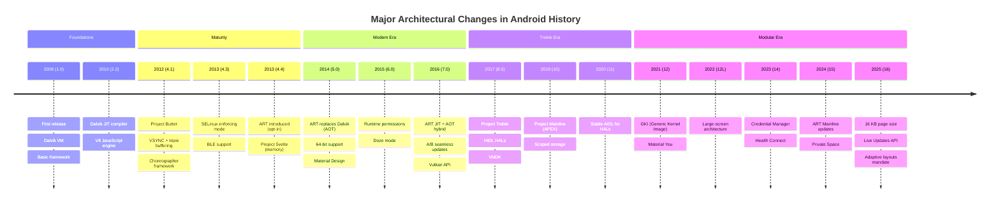

---

## 1.7 The Developer's Journey: Roadmap of This Book

Working with AOSP is a journey that begins with downloading the source and
progressively deepens into understanding, modifying, building, testing, and
contributing to the platform. This section outlines the typical developer
journey and maps it to the chapters of this book.

### 1.7.1 The Journey

```mermaid
graph TB
    subgraph Phase1["Phase 1: Setup"]
        Download["Download Source<br/>(repo init + sync)"]
        Environment["Set Up Build<br/>Environment"]
        FirstBuild["First Build<br/>(lunch + m)"]
        Flash["Flash & Run<br/>(Emulator or Device)"]
    end

    subgraph Phase2["Phase 2: Understanding"]
        Architecture["Study Architecture<br/>(This chapter)"]
        BuildSystem["Learn Build System<br/>(Soong, Blueprint, Make)"]
        Binder_study["Understand Binder<br/>(IPC mechanism)"]
        Boot["Trace Boot Process<br/>(init → Zygote → system_server)"]
    end

    subgraph Phase3["Phase 3: Exploration"]
        ReadCode["Read Framework Code<br/>(Follow an API call end-to-end)"]
        Tracing["Use System Tracing<br/>(Perfetto, systrace)"]
        Debugging["Debug with GDB/LLDB<br/>and Android Studio"]
        Dumpsys["Use dumpsys, logcat,<br/>and other diagnostic tools"]
    end

    subgraph Phase4["Phase 4: Modification"]
        ModifyFramework["Modify a System Service"]
        AddHAL["Implement a HAL"]
        CustomApp["Modify a System App<br/>(SystemUI, Launcher, Settings)"]
        NewDevice["Add a New Device<br/>(device/ configuration)"]
    end

    subgraph Phase5["Phase 5: Mastery"]
        Performance["Performance Analysis<br/>and Optimization"]
        Security["Security Hardening<br/>and SELinux Policy"]
        Contribute["Contribute Upstream<br/>(Gerrit code review)"]
        Maintain["Maintain a Custom<br/>Distribution"]
    end

    Phase1 --> Phase2
    Phase2 --> Phase3
    Phase3 --> Phase4
    Phase4 --> Phase5

    style Phase1 fill:#e8f5e9,stroke:#2e7d32
    style Phase2 fill:#e3f2fd,stroke:#1565c0
    style Phase3 fill:#fff9c4,stroke:#f9a825
    style Phase4 fill:#f3e5f5,stroke:#7b1fa2
    style Phase5 fill:#fce4ec,stroke:#c62828
```

### 1.7.2 Phase 1: Getting the Source and Building

The first step is to download the AOSP source code and build it. This is
covered in **Chapter 2: Setting Up the Development Environment**.

```
# Install repo tool
mkdir -p ~/bin
curl https://storage.googleapis.com/git-repo-downloads/repo > ~/bin/repo
chmod a+x ~/bin/repo

# Initialize the AOSP repository
mkdir aosp && cd aosp
repo init -u https://android.googlesource.com/platform/manifest -b main

# Sync all repositories (this downloads ~100 GB)
repo sync -c -j$(nproc) --optimized-fetch

# Set up the build environment
source build/envsetup.sh

# Choose a build target
lunch aosp_cf_x86_64_phone-trunk_staging-eng

# Build
m -j$(nproc)
```

The `lunch` command selects a **product** (device configuration), a **release**,
and a **variant** (eng, userdebug, or user):

| Variant | Description | Debugging | Performance |
|---|---|---|---|
| `eng` | Engineering build. Full debugging, all development tools. | Full: adb root, all logs, debug assertions | Lower (debug overhead) |
| `userdebug` | Production-like with debugging. **Recommended for development.** | adb root, debug logs available | Near-production |
| `user` | Production build. What ships to consumers. | No adb root, limited logs | Full production |

After building, you can launch the emulator:

```
# Launch Cuttlefish (cloud/headless emulator)
launch_cvd

# Or launch the graphical emulator
emulator
```

### 1.7.3 Phase 2: Understanding the Architecture

With the source downloaded and a running build, the next step is understanding
how the pieces fit together. This is the focus of the early chapters:

- **Chapter 1 (this chapter)**: The big picture -- architecture, source tree,
  stakeholders
- **Chapter 2**: Build environment, repo, Soong/Blueprint, `Android.bp` modules,
  build targets and variants
- **Chapter 4**: The boot process -- from bootloader to lock screen
- **Chapter 9**: Binder IPC -- the backbone of all inter-process communication
- **Chapter 20**: system_server and framework services -- the heart of Android

### 1.7.4 Phase 3: Exploration and Debugging

Once you understand the architecture, you can explore the live system:

- **Chapter 56**: Debugging tools -- logcat, dumpsys, Perfetto, LLDB, Android
  Studio platform debugging
- **Chapter 18**: ART internals -- garbage collection, JIT/AOT, class loading
- **Chapter 13**: Graphics pipeline -- SurfaceFlinger, HWUI, BufferQueue, HWC
- **Chapter 22**: Activity and window management -- AMS, WMS, task stacks

### 1.7.5 Phase 4: Modification and Development

With understanding comes the ability to modify:

- **Chapter 10**: HAL development -- implementing a hardware abstraction layer
- **Chapters 47-49**: System app development -- customizing SystemUI, Launcher,
  Settings
- **Chapter 52**: Mainline modules -- developing updatable components

### 1.7.6 Phase 5: Advanced Topics and Mastery

- **Chapter 56**: Performance optimization -- profiling, tracing, benchmarking
- **Chapter 40**: Security architecture -- SELinux, Keystore, verified boot,
  sandboxing
- **Chapter 55**: Testing -- CTS, VTS, writing platform tests

### 1.7.7 Tracing an API Call End-to-End

To give a concrete sense of what "understanding the architecture" means in
practice, let us trace what happens when an application calls
`startActivity(intent)`:

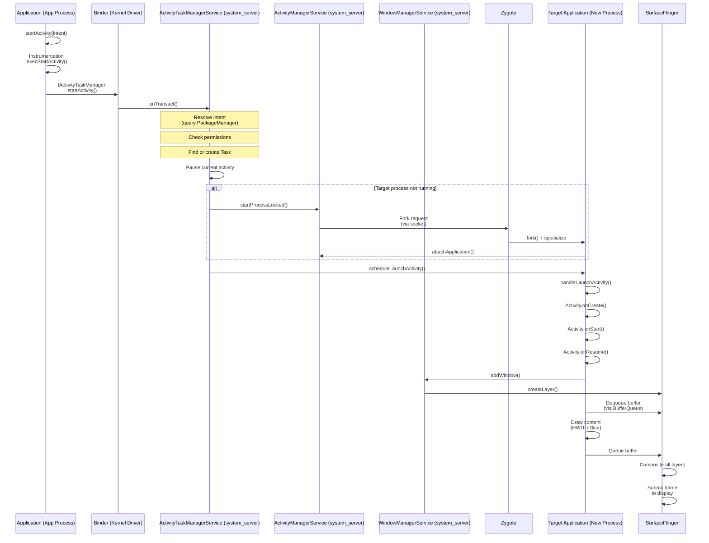

This single API call traverses:

1. **Application process** (Java) -- `Activity.startActivity()`
2. **Binder IPC** (kernel driver) -- Cross-process transaction
3. **system_server** (Java) -- `ActivityTaskManagerService` resolves the intent,
   checks permissions, manages the task/activity stack
4. **Zygote** (native) -- Forks a new process if needed
5. **Target application process** (Java) -- Activity lifecycle callbacks
6. **WindowManagerService** (Java) -- Window creation and layout
7. **SurfaceFlinger** (native C++) -- Display composition
8. **Display HAL** (vendor) -- Hardware composition and display output

A single call to `startActivity()` touches virtually every layer of the Android
stack. This is why understanding the full architecture is so valuable -- when
something goes wrong (a slow launch, a permission denial, a display glitch), you
need to know which layer to investigate.

---

## 1.8 Key Concepts Quick Reference

This section provides brief definitions of the most important concepts you will
encounter throughout this book and throughout AOSP development. Each concept is
explored in depth in later chapters; this serves as a quick reference and
orientation.

### 1.8.1 Binder

**Binder** is Android's inter-process communication (IPC) mechanism. It is the
single most important architectural element in Android -- virtually all
communication between processes goes through Binder.

```mermaid
graph LR
    subgraph Client_Process["Client Process"]
        Proxy["AIDL Proxy<br/>(auto-generated)"]
    end

    subgraph Kernel["Kernel"]
        BinderDriver["/dev/binder<br/>(Binder Driver)"]
    end

    subgraph Server_Process["Server Process"]
        Stub["AIDL Stub<br/>(auto-generated)"]
        Impl["Service<br/>Implementation"]
    end

    Proxy -->|"transact()"| BinderDriver
    BinderDriver -->|"onTransact()"| Stub
    Stub --> Impl

    style Client_Process fill:#e3f2fd,stroke:#1565c0
    style Kernel fill:#fce4ec,stroke:#c62828
    style Server_Process fill:#e8f5e9,stroke:#2e7d32
```

**Key characteristics:**

- **Transaction-based**: Clients send a data parcel, receive a reply parcel
- **Synchronous by default**: Caller blocks until the server processes the
  request and returns
- **Object-oriented**: Binder references are passed as object handles across
  processes
- **Kernel-mediated**: The kernel driver handles data copying, UID/PID
  verification, and reference counting
- **Three instances**: `/dev/binder` (framework IPC), `/dev/hwbinder`
  (framework-to-HAL), `/dev/vndbinder` (vendor-to-vendor)

**Source locations:**

- Kernel driver: `drivers/android/binder.c` (in kernel source)
- Native library: `frameworks/native/libs/binder/`
- Java layer: `frameworks/base/core/java/android/os/Binder.java`
- AIDL compiler: `system/tools/aidl/`
- ServiceManager: `frameworks/native/cmds/servicemanager/`

Binder is covered in depth in **Chapter 9**.

### 1.8.2 HAL (Hardware Abstraction Layer)

The **Hardware Abstraction Layer** is a standardized interface between Android's
framework and hardware-specific vendor implementations. It allows the same
Android framework to run on different hardware platforms.

```mermaid
graph TB
    FW["Framework Service<br/>(e.g., SensorService)"]
    HAL_IF["HAL Interface<br/>(e.g., ISensors.aidl)"]
    HAL_IMPL["HAL Implementation<br/>(vendor-specific)"]
    Driver["Kernel Driver"]

    FW --> HAL_IF
    HAL_IF --> HAL_IMPL
    HAL_IMPL --> Driver

    style FW fill:#e8f5e9,stroke:#2e7d32
    style HAL_IF fill:#fff9c4,stroke:#f9a825
    style HAL_IMPL fill:#f3e5f5,stroke:#7b1fa2
    style Driver fill:#fce4ec,stroke:#c62828
```

**Key characteristics:**

- Defined by AIDL (modern) or HIDL (legacy) interfaces
- Implemented by SoC vendors and OEMs
- Run in separate processes (out-of-process HALs) for stability and security
- Tested by VTS (Vendor Test Suite)
- Versioned for backward compatibility

**Source location:** `hardware/interfaces/` (interface definitions)

HAL development is covered in **Chapter 10**.

### 1.8.3 AIDL (Android Interface Definition Language)

**AIDL** is a language for defining interfaces that can be used for Binder IPC.
The AIDL compiler generates client-side proxy and server-side stub code in
Java, C++, NDK C++, or Rust.

```
// Example: IActivityManager.aidl
interface IActivityManager {
    int startActivity(in IApplicationThread caller,
                      in String callingPackage,
                      in Intent intent,
                      in String resolvedType,
                      in IBinder resultTo,
                      in String resultWho,
                      int requestCode,
                      int startFlags,
                      in ProfilerInfo profilerInfo,
                      in Bundle bOptions);
    // ... many more methods
}
```

**Key characteristics:**

- Used for both framework IPC and HAL interfaces (Stable AIDL)
- Supports parcelable data types (custom data structures)
- Generates code for Java, C++ (libbinder), NDK C++ (libbinder_ndk), and Rust
- Stable AIDL interfaces are versioned and backward-compatible
- Replaces HIDL for new HAL interfaces (Android 11+)

**Source locations:**

- AIDL compiler: `system/tools/aidl/`
- Framework AIDL files: Throughout `frameworks/base/core/java/`
- HAL AIDL files: `hardware/interfaces/`

### 1.8.4 HIDL (Hardware Interface Definition Language)

**HIDL** was introduced with Project Treble (Android 8.0) as the HAL interface
definition language. It has been superseded by Stable AIDL for new interfaces
but remains in use for existing HALs.

```
// Example: ICameraDevice.hal (HIDL)
interface ICameraDevice {
    getCameraCharacteristics()
        generates (Status status, CameraMetadata cameraCharacteristics);
    open(ICameraDeviceCallback callback)
        generates (Status status, ICameraDeviceSession session);
    // ...
};
```

**Key characteristics:**

- Uses `hwbinder` transport (separate from framework binder)
- Strictly versioned (e.g., `android.hardware.camera.device@3.5`)
- Supports both binderized (cross-process) and passthrough (in-process) modes
- Frozen: no new HIDL interfaces are accepted
- Existing HIDL interfaces will be maintained until migrated to AIDL

**Source locations:**

- HIDL compiler: `system/tools/hidl/`
- HAL HIDL files: `hardware/interfaces/` (`.hal` files)
- Runtime: `system/libhidl/`

### 1.8.5 APEX (Android Pony EXpress)

**APEX** is the packaging format for Mainline modules -- components of Android
that can be updated independently of a full OS update, delivered via the Google
Play Store.

```mermaid
graph TB
    subgraph APEX_Package["APEX Package (.apex)"]
        Manifest["apex_manifest.json"]
        Payload["Payload Image<br/>(ext4 filesystem)"]
        PubKey["Public Key"]
    end

    subgraph Contents["Payload Contents"]
        Libs["Shared Libraries"]
        Bins["Binaries"]
        Jars["Java Libraries"]
        FW_Res["Framework Resources"]
    end

    Payload --> Contents

    subgraph Boot["At Boot"]
        APEXd["apexd daemon"]
        Mount["Mount at<br/>/apex/{name}/"]
    end

    APEXd --> APEX_Package
    APEX_Package --> Mount

    style APEX_Package fill:#e3f2fd,stroke:#1565c0
    style Contents fill:#e8f5e9,stroke:#2e7d32
    style Boot fill:#fff9c4,stroke:#f9a825
```

**Key characteristics:**

- Self-contained package with its own filesystem image
- Mounted at `/apex/<name>/` at boot
- Cryptographically signed and verified
- Supports rollback (if a new version causes issues)
- Updated via the Play Store (does not require a full OTA)
- Managed by `apexd` (`system/apex/apexd/`)
- Examples: ART, Conscrypt, Media, DNS Resolver, WiFi, Tethering

**Source location:** `system/apex/` (infrastructure), `packages/modules/`
(individual modules)

### 1.8.6 Mainline

**Project Mainline** (introduced in Android 10) is the initiative to modularize
Android so that core components can be updated independently via the Play Store.
Each Mainline module is delivered as an APEX or an updated APK.

```mermaid
graph TB
    subgraph Traditional["Traditional Update Model"]
        Google1["Google releases<br/>new Android version"]
        SoC1["SoC vendor updates BSP"]
        OEM1["OEM integrates & tests"]
        Carrier1["Carrier approves"]
        User1["User receives update<br/>(6-18 months later)"]

        Google1 --> SoC1 --> OEM1 --> Carrier1 --> User1
    end

    subgraph Mainline_Model["Mainline Update Model"]
        Google2["Google updates<br/>Mainline module"]
        PlayStore["Google Play Store<br/>delivers update"]
        User2["User receives update<br/>(days/weeks)"]

        Google2 --> PlayStore --> User2
    end

    style Traditional fill:#fce4ec,stroke:#c62828
    style Mainline_Model fill:#e8f5e9,stroke:#2e7d32
```

As of Android 16, Mainline modules include:

| Module | Type | What It Updates |
|---|---|---|
| **ART** | APEX | The runtime itself (GC, JIT, AOT, core libs) |
| **Conscrypt** | APEX | TLS/SSL (certificate handling, crypto) |
| **DNS Resolver** | APEX | DNS resolution |
| **Media** | APEX | Media codecs, extractors, framework |
| **WiFi** | APEX | WiFi stack |
| **Tethering** | APEX | Hotspot and tethering |
| **Bluetooth** | APEX | Bluetooth stack |
| **Connectivity** | APEX | Network connectivity |
| **Telephony** | APEX | Telephony framework |
| **Permission Controller** | APK | Permission UI |
| **Neural Networks** | APEX | NNAPI runtime |
| **StatsD** | APEX | Metrics collection |
| **IPsec** | APEX | VPN |
| **SDK Extensions** | APEX | API extension mechanism |
| **AdServices** | APEX | Privacy-preserving advertising |
| **UWB** | APEX | Ultra-Wideband |
| **ADB** | APEX | Android Debug Bridge |
| **Health Connect** | APK | Health and fitness data |
| **Scheduling** | APEX | Task scheduling |
| **Profiling** | APEX | Performance profiling |
| **On-Device Personalization** | APEX | ML personalization |

The significance of Mainline cannot be overstated. Before Mainline, a security
vulnerability in the DNS resolver or the media framework required a full OS
update that had to go through the entire OEM/carrier update pipeline. With
Mainline, Google can push a fix to billions of devices within weeks, regardless
of whether the OEM has issued an OS update.

### 1.8.7 ART (Android Runtime)

**ART** is the managed runtime that executes application and framework code on
Android. It replaced Dalvik in Android 5.0.

**Key characteristics:**

- Executes DEX bytecode (Dalvik Executable format)
- Multi-tier execution: interpreter, JIT compiler, AOT compiler (`dex2oat`)
- Profile-Guided Optimization: JIT profiles guide AOT compilation
- Concurrent, generational garbage collector (CC: Concurrent Copying)
- Supports 32-bit and 64-bit architectures (ARM, ARM64, x86, x86_64, RISC-V)
- Itself is a Mainline module (updatable via Play Store)

**Source location:** `art/`

ART internals are covered in **Chapter 18**.

### 1.8.8 Zygote

**Zygote** is the parent process from which all Android application processes
and `system_server` are forked.

**Key characteristics:**

- Started by `init` early in boot
- Preloads common classes (~6,000+) and resources
- Listens on a Unix domain socket for fork requests
- Uses `fork()` for fast process creation via copy-on-write
- Two instances on 64-bit: `zygote64` (primary) and `zygote` (32-bit for
  legacy apps)

**Source locations:**

- Entry point: `frameworks/base/cmds/app_process/`
- Java: `frameworks/base/core/java/com/android/internal/os/ZygoteInit.java`
- Configuration: `system/zygote/`

### 1.8.9 system_server

**system_server** is the process that hosts all Java-based framework services.
It is the first process Zygote forks during boot.

**Key characteristics:**

- Hosts 100+ system services (AMS, WMS, PMS, and many more)
- Services communicate with apps via Binder IPC
- Runs as the `system` user (UID 1000) with broad permissions
- Crashes in system_server cause a full system restart (soft reboot)
- The most critical process after the kernel and init

**Source locations:**

- Entry point: `frameworks/base/services/java/com/android/server/SystemServer.java`
- Services: `frameworks/base/services/core/java/com/android/server/`
- Native components: `frameworks/base/services/core/jni/`

### 1.8.10 SurfaceFlinger

**SurfaceFlinger** is the system service that composes all visible surfaces
(windows, layers) into the final image displayed on screen.

```mermaid
graph LR
    App1["App 1<br/>Window"] --> BQ1["BufferQueue"]
    App2["App 2<br/>Window"] --> BQ2["BufferQueue"]
    SysUI["SystemUI<br/>(Status Bar)"] --> BQ3["BufferQueue"]
    Nav["Navigation<br/>Bar"] --> BQ4["BufferQueue"]

    BQ1 --> SF["SurfaceFlinger"]
    BQ2 --> SF
    BQ3 --> SF
    BQ4 --> SF

    SF --> HWC["HWC HAL<br/>(Hardware<br/>Composer)"]
    HWC --> Display["Display"]

    style SF fill:#e3f2fd,stroke:#1565c0
    style HWC fill:#f3e5f5,stroke:#7b1fa2
    style Display fill:#e8f5e9,stroke:#2e7d32
```

**Key characteristics:**

- Receives buffers from all visible windows via `BufferQueue`
- Composites using HWC (Hardware Composer) for hardware layers and GPU for
  client composition
- Manages VSYNC timing and frame scheduling
- Supports multiple displays (internal, external, virtual)
- Critical for display performance (janky frames = visible stutter)

**Source location:** `frameworks/native/services/surfaceflinger/`

The graphics pipeline is covered in **Chapter 13**.

### 1.8.11 WindowManagerService (WMS)

**WindowManagerService** manages the window hierarchy -- determining which
windows are visible, their size and position, their z-order (stacking), input
focus, and transitions/animations.

**Key characteristics:**

- Manages all windows on all displays
- Determines window layout based on display size, insets, and system bars
- Coordinates with SurfaceFlinger for layer creation and destruction
- Manages window transitions and animations
- Enforces window policy (which windows can appear on top, focus rules)
- Works closely with ActivityTaskManagerService for activity windows

**Source location:**
`frameworks/base/services/core/java/com/android/server/wm/`

### 1.8.12 ActivityManagerService (AMS) / ActivityTaskManagerService (ATMS)

**ActivityManagerService** manages application processes, including process
lifecycle (start, stop, kill), OOM adjustment (which processes to kill under
memory pressure), and broadcast dispatch.

**ActivityTaskManagerService** (split from AMS in Android 10) manages activities,
tasks, and activity stacks -- the user-visible "task management" that determines
which activity is in the foreground, handles task switching, and manages the
recent apps list.

**Key characteristics:**

- AMS: Process lifecycle, OOM adj, broadcast dispatch, content providers,
  service binding
- ATMS: Activity lifecycle, task management, recent apps, multi-window
- Together, they are the most complex services in system_server
- The source directory `am/` contains AMS and `wm/` contains ATMS and WMS
  (reflecting the close relationship between activity and window management)

**Source locations:**

- AMS: `frameworks/base/services/core/java/com/android/server/am/`
- ATMS: `frameworks/base/services/core/java/com/android/server/wm/`

Activity and window management are covered in **Chapter 22**.

### 1.8.13 PackageManagerService (PMS)

**PackageManagerService** is responsible for everything related to APK packages:
installation, uninstallation, package queries, permission management, intent
resolution, and APK verification.

**Key characteristics:**

- Scans and indexes all installed packages at boot
- Handles APK installation (including split APKs)
- Resolves intents to target components
- Manages permissions (both install-time and runtime)
- Enforces package signing and verification
- Maintains package state (enabled/disabled components, default handlers)
- One of the most complex services in system_server

**Source location:**
`frameworks/base/services/core/java/com/android/server/pm/`

---

## 1.9 AOSP Development Tools Overview

Before diving into the details in subsequent chapters, it is helpful to know the
essential tools you will use daily when working with AOSP.

### 1.9.1 Source Management

| Tool | Command | Purpose |
|---|---|---|
| **repo** | `repo init`, `repo sync` | Multi-repository management (wraps Git) |
| **git** | `git log`, `git diff`, `git commit` | Version control for individual repositories |
| **Gerrit** | Web UI | Code review system for AOSP contributions |

### 1.9.2 Build Tools

| Tool | Command | Purpose |
|---|---|---|
| **lunch** | `lunch <target>` | Select build target (device + variant) |
| **m** | `m` | Build the entire platform |
| **mm** | `mm` | Build modules in the current directory |
| **mmm** | `mmm <path>` | Build modules in a specified directory |
| **mma** | `mma` | Build including dependencies |
| **soong_ui** | (internal) | Build system entry point |
| **blueprint** | (internal) | `.bp` file parser |

### 1.9.3 Debugging and Analysis

| Tool | Command Example | Purpose |
|---|---|---|
| **adb** | `adb shell`, `adb logcat` | Device communication, logging |
| **logcat** | `adb logcat -s TAG` | System and application log viewer |
| **dumpsys** | `adb shell dumpsys activity` | Dump system service state |
| **am** | `adb shell am start -n com.pkg/.Activity` | Activity manager commands |
| **pm** | `adb shell pm list packages` | Package manager commands |
| **wm** | `adb shell wm size` | Window manager commands |
| **settings** | `adb shell settings get system font_scale` | Read/write system settings |
| **cmd** | `adb shell cmd package list packages` | Generic service command interface |
| **Perfetto** | `perfetto -c config.pbtxt` | System-wide tracing |
| **systrace** | `systrace.py --time=5 gfx view` | Legacy system tracing |
| **simpleperf** | `simpleperf record -p <pid>` | CPU profiling |
| **LLDB** | `lldb` | Native code debugger |
| **Android Studio** | IDE | Java/Kotlin debugging, layout inspection |

### 1.9.4 Device Tools

| Tool | Command | Purpose |
|---|---|---|
| **fastboot** | `fastboot flash system system.img` | Flash partition images |
| **adb sideload** | `adb sideload update.zip` | Install OTA from recovery |
| **make snod** | `make snod` | Rebuild system image without full build |
| **emulator** | `emulator` | QEMU-based Android Emulator |
| **launch_cvd** | `launch_cvd` | Cuttlefish virtual device |
| **lshal** | `adb shell lshal` | List HAL services |
| **service** | `adb shell service list` | List Binder services |

### 1.9.5 The dumpsys Command: Your Best Friend

The `dumpsys` command deserves special attention because it is the single most
useful diagnostic tool for AOSP development. It queries system services and
prints their internal state:

```bash
# List all services
adb shell dumpsys -l

# Dump a specific service (examples)
adb shell dumpsys activity              # AMS state (processes, tasks, etc.)
adb shell dumpsys activity activities   # Activity stacks only
adb shell dumpsys activity processes    # Process list with OOM adj
adb shell dumpsys window               # WMS state (windows, displays)
adb shell dumpsys window displays       # Display configuration
adb shell dumpsys package <pkg>        # Package details
adb shell dumpsys meminfo              # Memory usage by process
adb shell dumpsys battery              # Battery state
adb shell dumpsys alarm                # Alarm schedule
adb shell dumpsys jobscheduler         # Scheduled jobs
adb shell dumpsys notification         # Notification state
adb shell dumpsys audio                # Audio state
adb shell dumpsys SurfaceFlinger       # SurfaceFlinger state
adb shell dumpsys input                # Input state (devices, dispatch)
adb shell dumpsys connectivity         # Network state
adb shell dumpsys power                # Power state (wake locks, etc.)
adb shell dumpsys usagestats           # App usage statistics
```

Each system service implements a `dump()` method that outputs its current state
as human-readable text. When debugging any issue, `dumpsys` of the relevant
service is usually the first command to run.

---

## 1.10 Conventions Used in This Book

Throughout this book, we use the following conventions:

### 1.10.1 Source Paths

All source paths are given relative to the AOSP root directory. When we write:

```
frameworks/base/services/core/java/com/android/server/wm/WindowManagerService.java
```

This means the file is at:

```
<AOSP_ROOT>/frameworks/base/services/core/java/com/android/server/wm/WindowManagerService.java
```

Where `<AOSP_ROOT>` is the directory where you ran `repo init` and `repo sync`.
All paths in this book are relative to that root.

### 1.10.2 Code Listings

Code listings include the language identifier and, where relevant, the source
file path:

```java
// frameworks/base/core/java/android/app/Activity.java
public void startActivity(Intent intent) {
    this.startActivity(intent, null);
}
```

When code is abbreviated, ellipses (`...`) indicate omitted sections:

```java
public class ActivityManagerService extends IActivityManager.Stub {
    // ... hundreds of fields ...

    @Override
    public void startActivity(...) {
        // ... implementation ...
    }
}
```

### 1.10.3 Shell Commands

Shell commands are prefixed with `$` for user commands and `#` for root
commands:

```bash
$ adb shell                      # Connect to device shell
$ source build/envsetup.sh       # Set up build environment
# setenforce 0                   # Disable SELinux (root required)
```

### 1.10.4 Mermaid Diagrams

This book makes extensive use of Mermaid diagrams for architecture
visualizations, sequence diagrams, and flow charts. These diagrams can be
rendered by any Markdown viewer that supports Mermaid (including GitHub,
GitLab, and most modern documentation tools).

### 1.10.5 Terminology

| Term | Meaning |
|---|---|
| **AOSP** | Android Open Source Project |
| **Framework** | The Java/Kotlin layer in system_server and the `android.*` APIs |
| **Native** | C/C++ code (as opposed to Java/Kotlin) |
| **HAL** | Hardware Abstraction Layer |
| **Service** | A system service running in system_server (Java) or as a standalone daemon (native) |
| **Process** | An OS-level process with its own PID and memory space |
| **Binder service** | A service accessible over Binder IPC |
| **Client** | The process that calls a Binder service |
| **Server** | The process that hosts a Binder service implementation |
| **SoC** | System on Chip (e.g., Qualcomm Snapdragon, MediaTek Dimensity) |
| **OEM** | Original Equipment Manufacturer (device maker, e.g., Samsung, Xiaomi) |
| **BSP** | Board Support Package (kernel + drivers for a specific SoC) |
| **CTS** | Compatibility Test Suite |
| **VTS** | Vendor Test Suite |
| **GMS** | Google Mobile Services |
| **CDD** | Compatibility Definition Document |
| **GKI** | Generic Kernel Image |
| **GSI** | Generic System Image |

### 1.10.6 Using This Book with AI Assistants

Every chapter is plain Markdown with explicit source-file references, which makes
the book unusually easy for an AI assistant to consume as background when you
ask it to reason about AOSP code.

To skip having the assistant crawl the whole site, point it at
<https://aospbooks.github.io/aosp-internal-book/llms.txt>. This is an
[llmstxt.org](https://llmstxt.org/)-style index that lists every chapter and
appendix with a one-line description and its published URL, grouped by Part.
The assistant can read `llms.txt` first, decide which chapter is relevant to
the subsystem you're asking about, then fetch only that chapter -- saving
tokens and giving you sharper answers.

Practical workflows:

- **Drop the URL into a system prompt or project context.** Most coding
  assistants (Claude Code, Cursor, Copilot Workspace, Aider) accept arbitrary
  URLs as background. `llms.txt` is small (~15 KB), so it fits comfortably.
- **Cite chapters by section number.** Section numbers like `9.4.2` are stable
  across edits, so when you (or the assistant) want to reference a specific
  topic, the section number is a durable handle.
- **Pair with `cs.android.com`.** The book's source paths and line numbers
  resolve directly on Android Code Search, so an assistant can verify or extend
  any claim in the book by following the path.

---

## 1.11 Further Reading

- **AOSP Source**: https://source.android.com/
- **AOSP Code Search**: https://cs.android.com/
- **AOSP Gerrit (Code Review)**: https://android-review.googlesource.com/
- **AOSP Issue Tracker**: https://issuetracker.google.com/issues?q=componentid:192735
- **Android Architecture Overview**: https://source.android.com/docs/core/architecture
- **Project Treble**: https://source.android.com/docs/core/architecture/treble
- **Project Mainline**: https://source.android.com/docs/core/ota/modular-system
- **GKI**: https://source.android.com/docs/core/architecture/kernel/generic-kernel-image
- **CTS Documentation**: https://source.android.com/docs/compatibility/cts
- **CDD**: https://source.android.com/docs/compatibility/cdd
- **Android API Reference**: https://developer.android.com/reference
- **Android Platform Architecture**: https://developer.android.com/guide/platform

---

## 1.12 Summary

This chapter established the foundational knowledge needed to work with AOSP:

1. **AOSP is the open-source base** on which the Android ecosystem is built.
   Google adds GMS (proprietary). OEMs add customizations. The community builds
   alternative distributions. Understanding which layer you are working in is
   essential.

2. **Android's architecture is a layered stack**, from the Linux kernel through
   HALs, native services, the ART runtime, framework services (system_server),
   the public API, and applications. Each layer has clear responsibilities and
   well-defined interfaces to adjacent layers.

3. **The source tree is vast but organized.** The 30+ top-level directories each
   serve a specific purpose: `art/` for the runtime, `bionic/` for the C library,
   `frameworks/` for the application framework, `hardware/` for HAL interfaces,
   `system/` for core system components, `packages/` for applications and
   modules, `build/` for the build system, and so on.

4. **The ecosystem is a collaboration** between Google (framework, CTS, Mainline),
   SoC vendors (kernel, HALs, drivers), OEMs (customization, device bring-up),
   and the community (custom ROMs, bug reports, contributions).

5. **Android has evolved dramatically** over 15+ years and 35 API levels, with
   major architectural shifts including the move from Dalvik to ART, Project
   Treble for the vendor split, Project Mainline for modular updates, and GKI
   for kernel standardization.

6. **The developer's journey** starts with downloading and building the source,
   progresses through understanding the architecture, and advances to modifying,
   testing, and contributing to the platform.

7. **Core concepts** -- Binder, HAL, AIDL, HIDL, APEX, Mainline, ART, Zygote,
   system_server, SurfaceFlinger, WMS, AMS, PMS -- are the vocabulary of AOSP
   development. You will encounter them in every chapter that follows.

In the next chapter, we will roll up our sleeves and set up a complete AOSP
development environment: installing dependencies, downloading the source,
configuring the build, and running our first build on an emulator.


<!-- chapter:02-source-and-build -->
# Chapter 2: Source Code and Build System

The Android Open Source Project ships hundreds of millions of lines of code
across thousands of Git repositories. Building it demands a bespoke toolchain
that has evolved over more than a decade, from recursive GNU Make, to the
Soong/Blueprint meta-build system, and most recently toward Bazel. This chapter
walks through the entire pipeline: fetching the source, understanding the three
layers of the build system, configuring a product, defining modules, producing
images, and running the result on an emulator.

Every path and code snippet in this chapter was verified against the AOSP
`android16-qpr2-release` branch. Where we quote source files, we give their
location relative to the tree root so you can read along on your own checkout.

---

## 2.1 Getting the Source

### 2.1.1 Prerequisites and Hardware Requirements

Before you can fetch AOSP, your workstation needs to meet some baseline
requirements:

| Resource | Minimum | Recommended |
|----------|---------|-------------|
| Disk space (source only) | 250 GB | 400 GB (with one build output) |
| Disk space (with build) | 400 GB | 600 GB+ (SSD strongly preferred) |
| RAM | 32 GB | 64 GB+ |
| CPU | 4 cores | 16+ cores (build is highly parallel) |
| OS | Ubuntu 20.04+ / macOS (Intel or Apple Silicon) | Ubuntu 22.04 LTS |
| File system | Case-sensitive (ext4 on Linux) | ext4 or APFS (macOS) |

The build system requires a case-sensitive file system. On macOS, APFS is
case-sensitive by default on separate volumes; on Linux ext4 is case-sensitive
natively. Using NTFS or HFS+ (case-insensitive) will cause subtle failures.

You will also need the following packages on a Debian/Ubuntu host:

```bash
sudo apt-get install git-core gnupg flex bison build-essential \
  zip curl zlib1g-dev libc6-dev-i386 x11proto-core-dev \
  libx11-dev lib32z1-dev libgl1-mesa-dev libxml2-utils \
  xsltproc unzip fontconfig python3
```

### 2.1.2 The `repo` Tool

AOSP is not a single Git repository. It is a collection of *hundreds* of Git
repositories stitched together by a tool called **`repo`**. `repo` is a Python
wrapper around Git that manages:

- Fetching and synchronizing many Git repositories at once
- Maintaining a *manifest* file that describes which repositories exist at
  which paths and which branches/tags they should track
- Providing convenience commands for topic branches, uploading code reviews to
  Gerrit, and other multi-repository workflows

Install `repo` as follows:

```bash
# Create a directory for the repo tool
mkdir -p ~/bin
export PATH=~/bin:$PATH

# Download the latest repo launcher
curl https://storage.googleapis.com/git-repo-downloads/repo > ~/bin/repo
chmod a+x ~/bin/repo
```

The `repo` launcher is a small bootstrap script. On first use it downloads
the full `repo` implementation from `https://gerrit.googlesource.com/git-repo`.

**Why not a single Git repository?** Git scales poorly to repositories with
millions of files. Even with Git's efficient object storage, cloning,
branching, and status checks become painfully slow on a monolithic repo of
AOSP's size. The multi-repository approach also enables:

- **Independent project history:** Each subsystem (framework, kernel, external
  libraries) has its own commit history and can be branched independently.
- **Selective checkouts:** You can sync only the parts of the tree you need.
- **Access control:** Different repositories can have different owners and
  review requirements.
- **Forking and rebasing:** When AOSP imports upstream projects (e.g.,
  BoringSSL, ICU, LLVM), it is cleaner to keep them as separate repositories.

The key `repo` subcommands you should know:

| Command | Purpose |
|---------|---------|
| `repo init` | Initialize a new workspace |
| `repo sync` | Fetch and update all repositories |
| `repo start` | Start a new topic branch across repos |
| `repo upload` | Upload changes for code review (Gerrit) |
| `repo status` | Show working tree status across all repos |
| `repo diff` | Show unified diff across all repos |
| `repo forall` | Run a command in every repository |
| `repo info` | Show information about the manifest |
| `repo manifest` | Output the resolved manifest |
| `repo branches` | Show existing topic branches |
| `repo prune` | Delete merged topic branches |

Some examples of `repo forall`:

```bash
# Find all repositories that have uncommitted changes
repo forall -c 'git status --short' | grep -v "^$"

# Count total lines of code across all C/C++ files
repo forall -c 'find . -name "*.cpp" -o -name "*.c" -o -name "*.h" \
  | xargs wc -l 2>/dev/null' | tail -1

# Run git gc in every repository (compact storage)
repo forall -c 'git gc --auto'
```

### 2.1.3 Initializing a Workspace: `repo init`

The first step to getting the source is initializing a workspace directory:

```bash
mkdir aosp && cd aosp

# Initialize with a specific branch
repo init -u https://android.googlesource.com/platform/manifest \
  -b android16-qpr2-release
```

Key flags for `repo init`:

| Flag | Purpose |
|------|---------|
| `-u URL` | Manifest repository URL |
| `-b BRANCH` | Branch or tag to check out |
| `-m MANIFEST` | Manifest file within the repository (default: `default.xml`) |
| `--depth=N` | Shallow clone depth (saves disk/time) |
| `--partial-clone` | Use Git partial clones (downloads blobs on demand) |
| `--clone-filter=blob:limit=10M` | Only fetch blobs under 10 MB eagerly |
| `-g GROUP` | Sync only projects in a specific group |
| `--repo-rev=REV` | Pin the repo tool itself to a specific version |

After `repo init`, a `.repo/` directory is created in your workspace:

```
aosp/
  .repo/
    manifests/          <-- The manifest Git repository
      default.xml       <-- The primary manifest file
      GLOBAL-PREUPLOAD.cfg
    manifests.git/      <-- Bare clone of the manifest repo
    manifest.xml        <-- Symlink to the active manifest
    repo/               <-- The repo tool's own source code
    project.list        <-- Cached list of project paths
    project-objects/    <-- Shared bare Git repos (if using --reference)
    projects/           <-- Bare Git repos for each project
```

### 2.1.4 The Manifest File

The manifest file is the single source of truth for what repositories make up
the tree and where they go. Understanding the manifest is crucial because it
defines the *shape* of your entire source tree -- which projects exist, which
branches they track, and how they are organized into directories.

The current AOSP default manifest at
`.repo/manifests/default.xml` (1,045 lines) begins:

```xml
<?xml version="1.0" encoding="UTF-8"?>
<manifest>

  <remote  name="aosp"
           fetch=".."
           review="https://android-review.googlesource.com/" />
  <default revision="android16-qpr2-release"
           remote="aosp"
           sync-j="4" />

  <superproject name="platform/superproject" remote="aosp"
                revision="android-latest-release"/>
  <contactinfo bugurl="go/repo-bug" />

  <!-- BEGIN open-source projects -->
  <project path="build/make" name="platform/build" groups="pdk,sysui-studio" >
    <linkfile src="CleanSpec.mk" dest="build/CleanSpec.mk" />
    <linkfile src="buildspec.mk.default" dest="build/buildspec.mk.default" />
    <linkfile src="core" dest="build/core" />
    <linkfile src="envsetup.sh" dest="build/envsetup.sh" />
    <linkfile src="target" dest="build/target" />
    <linkfile src="tools" dest="build/tools" />
  </project>
  <project path="build/blueprint" name="platform/build/blueprint"
           groups="pdk,tradefed" />
  <project path="build/soong" name="platform/build/soong"
           groups="pdk,tradefed,sysui-studio" >
    <linkfile src="root.bp" dest="Android.bp" />
    <linkfile src="bootstrap.bash" dest="bootstrap.bash" />
  </project>
  ...
</manifest>
```

**Source:** `.repo/manifests/default.xml`

Key elements of the manifest:

| Element | Purpose |
|---------|---------|
| `<remote>` | Defines a Git server (name, fetch URL, Gerrit review URL) |
| `<default>` | Sets default revision, remote, and sync parallelism |
| `<project>` | One Git repository: maps `name` (server-side) to `path` (local) |
| `<linkfile>` | Creates a symlink after checkout (used heavily by `build/make`) |
| `<copyfile>` | Copies a file after checkout |
| `<superproject>` | Points to a Git superproject for atomic snapshots |
| `<include>` | Includes another manifest fragment |
| `groups` | Assigns projects to groups for selective sync |

Notice the `<linkfile>` entries for `build/make`: they create symlinks at
top-level paths like `build/envsetup.sh`, `build/core/`, and `build/target/`
so that legacy scripts can find them at their historical locations.

Also noteworthy: the `build/soong` project creates two critical symlinks:

- `root.bp` becomes `Android.bp` at the tree root (the entry point for Soong)
- `bootstrap.bash` becomes `bootstrap.bash` at the tree root

The manifest also defines `sync-j="4"` in the `<default>` element, meaning
`repo sync` will use 4 parallel fetch threads by default. You can override
this on the command line with `-j16` or higher for faster syncs on good network
connections.

#### Manifest Structure Deep Dive

A manifest file is hierarchical. Understanding each element in detail:

**The `<remote>` element:**
```xml
<remote name="aosp"
        fetch=".."
        review="https://android-review.googlesource.com/" />
```

- `name`: A label used by `<project>` elements to indicate which server hosts
  the repository.
- `fetch`: The base URL for fetching. `".."` means "relative to the manifest
  URL", so if the manifest is at `https://android.googlesource.com/platform/manifest`,
  then `".."` resolves to `https://android.googlesource.com/`.
- `review`: The Gerrit code review server URL. This is used by `repo upload`
  to submit changes for review.

**The `<default>` element:**
```xml
<default revision="android16-qpr2-release"
         remote="aosp"
         sync-j="4" />
```

- `revision`: Default branch/tag for all projects that do not specify their own.
- `remote`: Default remote for all projects.
- `sync-j`: Default parallelism for sync operations.

**The `<project>` element:**
```xml
<project path="build/make" name="platform/build" groups="pdk,sysui-studio" >
    <linkfile src="envsetup.sh" dest="build/envsetup.sh" />
</project>
```

- `path`: Where in the local tree this repository is checked out.
- `name`: The repository name on the server (appended to the remote's fetch URL).
- `groups`: Comma-separated list of groups this project belongs to.
- `revision`: (optional) Override the default revision for this project.
- `clone-depth`: (optional) Shallow clone depth.
- Children: `<linkfile>`, `<copyfile>`, `<annotation>`.

**The `<superproject>` element:**
```xml
<superproject name="platform/superproject" remote="aosp"
              revision="android-latest-release"/>
```

This points to a Git superproject that tracks the SHA-1 of every constituent
repository at a specific point in time. It enables atomic snapshots of the
entire tree, which is useful for reproducible builds and bisection.

#### Local Manifests

You can customize the manifest without modifying the original by creating
**local manifest** files in `.repo/local_manifests/`. For example, to add a
custom project:

```xml
<!-- .repo/local_manifests/my_projects.xml -->
<?xml version="1.0" encoding="UTF-8"?>
<manifest>
  <project path="vendor/mycompany"
           name="mycompany/vendor"
           remote="myremote"
           revision="main" />
  <remote name="myremote"
          fetch="https://github.com/mycompany/" />
</manifest>
```

To remove a project defined in the upstream manifest:

```xml
<manifest>
  <remove-project name="platform/external/some-project" />
</manifest>
```

This is particularly useful when OEMs or SoC vendors need to add their
proprietary components to the tree without forking the upstream manifest.

### 2.1.5 Syncing the Source: `repo sync`

Once initialized, fetch all the source code:

```bash
# Full sync with 16 parallel threads
repo sync -j16
```

For a full AOSP checkout this downloads approximately 100 GB of Git data
(compressed). The first sync takes 1-3 hours depending on network speed. You
can substantially reduce this with partial clones:

```bash
# Partial clone: blobs are fetched on demand
repo init -u https://android.googlesource.com/platform/manifest \
  -b android16-qpr2-release \
  --partial-clone \
  --clone-filter=blob:limit=10M

repo sync -c -j16 --no-tags
```

Key flags for `repo sync`:

| Flag | Purpose |
|------|---------|
| `-j N` | Number of parallel fetch jobs |
| `-c` | Fetch only the current branch (faster) |
| `--no-tags` | Skip fetching tags (saves time/space) |
| `--optimized-fetch` | Only fetch projects that changed |
| `--prune` | Remove stale branches |
| `-f` | Continue even if a project fails |

### 2.1.6 Partial Sync and Groups

You do not always need the entire tree. The manifest assigns projects to
**groups**, and you can sync only specific groups:

```bash
# Sync only PDK (Platform Development Kit) projects
repo init -u https://android.googlesource.com/platform/manifest \
  -b android16-qpr2-release \
  -g pdk

repo sync -j16
```

Groups visible in the manifest include `pdk`, `tradefed`, `cts`, `device`,
`vendor`, and device-specific groups like `yukawa` and `hikey`.

You can also sync individual projects:

```bash
# Sync only the frameworks/base repository
repo sync frameworks/base

# Sync multiple specific projects
repo sync frameworks/base packages/apps/Settings system/core
```

**Group operations:**

```bash
# Sync everything EXCEPT device-specific projects
repo init ... -g default,-device

# Sync only PDK and tradefed groups
repo init ... -g pdk,tradefed

# List all projects and their groups
repo list -g
```

The group system works with both inclusion and exclusion. The special group
`default` includes projects that have no explicit group assigned. Prefixing
a group name with `-` excludes it.

**Disk space savings with groups:**

| Sync Configuration | Approximate Size |
|-------------------|-----------------|
| Full sync (all groups) | ~100 GB (Git data) |
| PDK only (`-g pdk`) | ~60 GB |
| Minimal build system only | ~20 GB |
| Partial clone + current branch only | ~30 GB |

### 2.1.7 Working with Topic Branches

When developing across multiple repositories, `repo` provides topic branch
management:

```bash
# Start a topic branch in specific projects
repo start my-feature frameworks/base packages/apps/Settings

# Start a topic branch in all projects
repo start my-feature --all

# Check the status of all topic branches
repo branches

# Upload changes for code review
repo upload

# Delete merged topic branches
repo prune
```

The `repo upload` command packages your local commits and pushes them to
Gerrit for code review. Gerrit is Google's web-based code review tool, and
all AOSP contributions go through Gerrit at
`https://android-review.googlesource.com/`.

### 2.1.8 The Repository Layout

After a full sync, the top-level directory structure looks like this:

```
aosp/
  Android.bp           <-- Symlink to build/soong/root.bp
  art/                 <-- Android Runtime (ART)
  bionic/              <-- C library, dynamic linker, libm
  bootable/            <-- Recovery, bootloader libraries
  build/               <-- Build system
    blueprint/         <-- Blueprint parser and framework
    make/              <-- Make-based build system (legacy + glue)
    soong/             <-- Soong build system (Go)
    pesto/             <-- Bazel experiments
    release/           <-- Release configuration
  cts/                 <-- Compatibility Test Suite
  dalvik/              <-- Dalvik (historical, mostly superseded by ART)
  development/         <-- Developer tools and samples
  device/              <-- Device-specific configuration
    generic/           <-- Emulator targets (goldfish, cuttlefish)
    google/            <-- Pixel and Google devices
  external/            <-- Third-party open-source projects
  frameworks/          <-- Android framework
    base/              <-- Core framework (Java + native)
    native/            <-- SurfaceFlinger, Binder, etc.
  hardware/            <-- HAL definitions and implementations
  kernel/              <-- Kernel build configuration and prebuilts
  libcore/             <-- Core Java libraries (OpenJDK)
  libnativehelper/     <-- JNI helper library
  packages/            <-- System apps and services
    apps/              <-- Settings, Launcher, Camera, etc.
    modules/           <-- Mainline modules (APEX packages)
  prebuilts/           <-- Prebuilt compilers, SDKs, tools
  system/              <-- Low-level system components (init, adb, etc.)
  tools/               <-- Various development tools
  vendor/              <-- Vendor-specific code
```

The `Android.bp` file at the root is actually a symlink into `build/soong/`:

```
// build/soong/root.bp
// Soong finds all Android.bp and Blueprints files in the source tree,
// subdirs= and optional_subdirs= are obsolete and this file no longer
// needs a list of the top level directories that may contain Android.bp
// files.
```

**Source:** `build/soong/root.bp`

This seemingly empty file is important: it signals to Soong that this is the
root of the source tree, and that Soong should recursively discover all
`Android.bp` files beneath it.

---

## 2.2 Build System Architecture

### 2.2.1 Historical Evolution

The AOSP build system has gone through three major generations:

```mermaid
timeline
    title AOSP Build System Evolution
    2008-2015 : GNU Make
             : Android.mk files
             : Recursive make
             : Slow, hard to maintain
    2015-2020 : Soong (Make + Blueprint)
             : Android.bp files
             : Declarative modules
             : Go-based build logic
    2020-present : Soong + Bazel (experimental)
                 : Mixed builds
                 : bp2build conversion
                 : Remote Build Execution (RBE)
```

**Generation 1: GNU Make (2008-2015).**
The original Android build system was pure GNU Make. Every module was described
in an `Android.mk` file using Make variables and include directives. A typical
Android.mk file looked like:

```makefile
# Legacy Android.mk format (still supported but deprecated)
LOCAL_PATH := $(call my-dir)

include $(CLEAR_VARS)
LOCAL_MODULE := libexample
LOCAL_SRC_FILES := example.cpp
LOCAL_SHARED_LIBRARIES := liblog libutils
LOCAL_C_INCLUDES := $(LOCAL_PATH)/include
LOCAL_CFLAGS := -Wall -Werror
include $(BUILD_SHARED_LIBRARY)
```

The system worked but suffered from well-known Make problems:

- **Slow incremental builds:** Make had to re-evaluate the entire dependency
  graph on every invocation, parsing thousands of Makefile includes.
- **Fragile variable scoping:** Make variables are global by default, leading
  to subtle bugs when two modules accidentally shared a variable name.
- **Difficulty with parallelism:** Recursive Make is inherently sequential
  across directory boundaries.
- **No dependency enforcement:** Any Makefile could reference any variable
  from any other Makefile, making it impossible to reason about module
  boundaries.
- **Poor error messages:** When something went wrong in the deeply nested
  include chains, error messages were nearly indecipherable.

At its peak, the Make-based build system had over 10,000 `Android.mk` files
and took hours to parse before even starting compilation.

**Generation 2: Soong/Blueprint (2015-present).**
Google introduced Soong as a replacement, with a three-layer architecture
(described below). Modules are now declared in `Android.bp` files using a
simple, declarative, JSON-like syntax. The build logic itself is written in Go.
Make is still present as a thin glue layer for product configuration and image
assembly, but new modules should always be defined in `Android.bp`.

The migration from Make to Soong has been gradual: the `androidmk` tool
performs automated conversion, and both systems coexist. Over successive
Android releases, more modules have been converted. As of the current release,
the vast majority of platform modules use `Android.bp`.

The key insight behind Soong is the **separation of declaration from logic**.
In Make, the build file format *is* the programming language -- you declare
modules and write build logic in the same files. In Soong, the `Android.bp`
files are purely declarative (no conditionals, no loops), and all build logic
lives in Go code within the Soong binary. This makes `Android.bp` files much
simpler and less error-prone.

**Generation 3: Bazel (2020-present, experimental).**
Google has been working on migrating the build to Bazel, the open-source
version of their internal Blaze build system. This effort is tracked through
the `build/pesto/` directory and tools like `bp2build`. As of the current
release, Bazel is used for kernel builds (Kleaf) and select experiments, but
the platform build remains Soong-driven.

The migration to Bazel is motivated by:

- **Build hermeticity:** Bazel sandboxes each build action, ensuring
  reproducibility.
- **Remote execution:** Build actions can be distributed across a cluster of
  machines.
- **Content-addressable caching:** Build results can be shared across
  developers, CI systems, and even different branches.
- **Scalability:** Bazel is designed for extremely large codebases (Google's
  internal monorepo has billions of lines of code).

However, migrating a build system as complex as AOSP's is a multi-year effort,
and Soong will remain the primary build system for the foreseeable future.

### 2.2.2 The Three-Layer Architecture

The modern AOSP build system consists of three layers, each implemented in a
different technology:

```mermaid
graph TB
    subgraph "Layer 1: Blueprint"
        BP[build/blueprint/]
        BPC["context.go"]
        BPP[parser/]
        BPG[proptools/]
        BP --> BPC
        BP --> BPP
        BP --> BPG
    end

    subgraph "Layer 2: Soong"
        SG[build/soong/]
        SGC[cc/ - C/C++ modules]
        SGJ[java/ - Java modules]
        SGA[apex/ - APEX modules]
        SGR[rust/ - Rust modules]
        SGP[python/ - Python modules]
        SGF[filesystem/ - Image building]
        SG --> SGC
        SG --> SGJ
        SG --> SGA
        SG --> SGR
        SG --> SGP
        SG --> SGF
    end

    subgraph "Layer 3: Make Glue"
        MK[build/make/]
        MKC[core/ - Build logic]
        MKT[target/ - Product configs]
        MKL[tools/ - Utilities]
        MK --> MKC
        MK --> MKT
        MK --> MKL
    end

    subgraph "Output"
        NJ[Ninja Manifest]
        IMG[system.img, vendor.img, ...]
    end

    BPP -->|parses| ABPF[Android.bp files]
    BPC -->|drives| SG
    SG -->|generates| NJ
    MK -->|product config| SG
    NJ -->|executes| IMG

    style BP fill:#4a90d9,color:#fff
    style SG fill:#50b848,color:#fff
    style MK fill:#e8a838,color:#fff
    style NJ fill:#888,color:#fff
```

Let us examine each layer in detail.

### 2.2.3 Layer 1: Blueprint (`build/blueprint/`)

Blueprint is the meta-build framework -- a Go library that provides the
machinery for parsing module definition files, resolving dependencies, running
mutators, and generating Ninja build rules. Blueprint is **not
Android-specific**; it is a general-purpose tool.

The `doc.go` file in `build/blueprint/` describes the framework:

```go
// Blueprint is a meta-build system that reads in Blueprints files that
// describe modules that need to be built, and produces a Ninja
// (https://ninja-build.org/) manifest describing the commands that need
// to be run and their dependencies.  Where most build systems use built-in
// rules or a domain-specific language to describe the logic how modules are
// converted to build rules, Blueprint delegates this to per-project build
// logic written in Go.
```

**Source:** `build/blueprint/doc.go`

The core of Blueprint is `context.go` (5,781 lines, ~89 KB), which defines the
`Context` struct -- the central state object that orchestrates the entire build
process through four phases:

```go
// A Context contains all the state needed to parse a set of Blueprints files
// and generate a Ninja file.  The process of generating a Ninja file proceeds
// through a series of four phases.  Each phase corresponds with a some methods
// on the Context object
//
//          Phase                            Methods
//       ------------      -------------------------------------------
//    1. Registration         RegisterModuleType, RegisterSingletonType
//
//    2. Parse                    ParseBlueprintsFiles, Parse
//
//    3. Generate            ResolveDependencies, PrepareBuildActions
//
//    4. Write                           WriteBuildFile
```

**Source:** `build/blueprint/context.go`, lines 70-84

The four phases in detail:

```mermaid
graph LR
    A[1. Registration] --> B[2. Parse]
    B --> C[3. Generate]
    C --> D[4. Write]

    A -->|"RegisterModuleType<br/>RegisterSingletonType"| A
    B -->|"Parse Android.bp<br/>files recursively"| B
    C -->|"ResolveDependencies<br/>Run Mutators<br/>PrepareBuildActions"| C
    D -->|"WriteBuildFile<br/>output: build.ninja"| D

    style A fill:#4a90d9,color:#fff
    style B fill:#50b848,color:#fff
    style C fill:#e8a838,color:#fff
    style D fill:#d94a4a,color:#fff
```

1. **Registration:** Module types (e.g., `cc_binary`, `java_library`) and
   singletons are registered with the Context. Each module type maps to a Go
   factory function.

2. **Parse:** All `Android.bp` files in the tree are discovered and parsed.
   The Blueprint parser reads the JSON-like syntax and populates Go structs
   using reflection.

3. **Generate:** Dependencies between modules are resolved. *Mutators* run
   in registration order -- they can visit modules top-down or bottom-up to
   propagate information or split modules into variants (e.g., one per
   target architecture). Then each module generates its build actions.

4. **Write:** The accumulated build actions are serialized into a Ninja
   manifest file.

Key directories under `build/blueprint/`:

| Directory/File | Purpose |
|---------------|---------|
| `context.go` | Core orchestration (5,781 lines) |
| `parser/` | Blueprint file parser |
| `proptools/` | Property reflection and manipulation utilities |
| `pathtools/` | File path utilities and glob matching |
| `depset/` | Dependency set implementation (like Bazel depsets) |
| `bpfmt/` | Blueprint file formatter |
| `bpmodify/` | Programmatic Blueprint file modification tool |
| `bootstrap/` | Self-bootstrapping logic |
| `gobtools/` | Go binary tools for serialization |
| `gotestmain/` | Test main generator |
| `gotestrunner/` | Test runner utilities |
| `metrics/` | Build metrics and event handling |
| `incremental.go` | Incremental build support |
| `live_tracker.go` | Live file tracking for dependencies |

#### Blueprint Mutators

Mutators are one of the most important concepts in Blueprint. A mutator is a
function that visits modules and can modify them. Mutators are used for:

- **Variant creation:** A single module declaration can be split into
  multiple *variants*. For example, a `cc_library` is split into device and
  host variants, and further into architecture variants (arm64, x86_64, etc.).
- **Dependency propagation:** Information from one module can be pushed into
  its dependents (or vice versa).
- **Property defaulting:** Default values can be computed based on global
  build configuration.

Mutators run in a specific order:

```mermaid
graph LR
    A["Pre-deps<br/>Mutators"] --> B["Dependency<br/>Resolution"]
    B --> C["Post-deps<br/>Mutators"]
    C --> D["Final-deps<br/>Mutators"]
    D --> E["Generate<br/>Build Actions"]

    style A fill:#4a90d9,color:#fff
    style B fill:#50b848,color:#fff
    style C fill:#e8a838,color:#fff
    style D fill:#d94a4a,color:#fff
    style E fill:#9b59b6,color:#fff
```

1. **Pre-deps mutators** run before dependencies are resolved. They can add
   dependencies or create variants.
2. **Dependency resolution** matches dependency names to actual modules.
3. **Post-deps mutators** run after dependencies are resolved. They can access
   dependency information.
4. **Final-deps mutators** run last, for late-stage modifications.

The APEX system, for example, uses post-deps mutators to create separate
variants of libraries for each APEX they appear in:

```go
// From build/soong/apex/apex.go
func RegisterPostDepsMutators(ctx android.RegisterMutatorsContext) {
    ctx.BottomUp("apex_unique", apexUniqueVariationsMutator)
    ctx.BottomUp("mark_platform_availability", markPlatformAvailability)
    ctx.InfoBasedTransition("apex",
        android.NewGenericTransitionMutatorAdapter(&apexTransitionMutator{}))
}
```

**Source:** `build/soong/apex/apex.go`, lines 64-70

#### Blueprint Providers

Providers are Blueprint's mechanism for passing information between modules.
When a module generates build actions, it can set *provider* data that its
dependents can then read. This is more structured than Make's global variables:

```go
// Provider declaration (from build/soong/cc/cc.go)
var CcObjectInfoProvider = blueprint.NewProvider[CcObjectInfo]()

// Setting a provider (in the generating module)
ctx.SetProvider(CcObjectInfoProvider, CcObjectInfo{
    ObjFiles:   objFiles,
    TidyFiles:  tidyFiles,
    KytheFiles: kytheFiles,
})

// Reading a provider (in a dependent module)
if info, ok := ctx.OtherModuleProvider(dep, CcObjectInfoProvider); ok {
    // Use info.ObjFiles, etc.
}
```

### 2.2.4 Layer 2: Soong (`build/soong/`)

Soong is Android's build system proper. It is built *on top of* Blueprint,
registering Android-specific module types, mutators, and singletons. The
`build/soong/` directory contains 74 subdirectories, organized by the type of
module or build functionality they handle.

From `build/soong/README.md`:

```
Soong is one of the build systems used in Android, which is controlled
by files called Android.bp. There is also the legacy Make-based build
system that is controlled by files called Android.mk.

Android.bp file are JSON-like declarative descriptions of "modules" to
build; a "module" is the basic unit of building that Soong understands,
similarly to how "target" is the basic unit of building for Make.
```

**Source:** `build/soong/README.md`, lines 1-8

The build logic is described further:

```
The build logic is written in Go using the blueprint framework.
Build logic receives module definitions parsed into Go structures
using reflection and produces build rules. The build rules are
collected by blueprint and written to a ninja build file.
```

**Source:** `build/soong/README.md`, lines 610-614

Key subdirectories of `build/soong/`:

| Directory | Purpose | Key Files |
|-----------|---------|-----------|
| `cc/` | C/C++ module types (`cc_binary`, `cc_library`, etc.) | `cc.go`, `library.go`, `binary.go` |
| `java/` | Java/Kotlin module types (`java_library`, `android_app`, etc.) | `java.go`, `app.go`, `sdk_library.go` |
| `apex/` | APEX module type (3,001 lines in `apex.go`) | `apex.go`, `builder.go`, `key.go` |
| `rust/` | Rust module types | `rust.go`, `library.go` |
| `python/` | Python module types | `python.go` |
| `sh/` | Shell script module types | `sh_binary.go` |
| `genrule/` | Generic build rule modules | `genrule.go` |
| `android/` | Core Soong framework (module base classes, arch handling) | `module.go`, `arch.go`, `paths.go` |
| `filesystem/` | Image file building | `filesystem.go` |
| `ui/` | Build UI and progress reporting | `build.go` |
| `cmd/` | Command-line entry points | `soong_build/`, `soong_ui/` |
| `bpf/` | BPF program compilation | `bpf.go` |
| `sdk/` | SDK snapshot generation | `sdk.go` |
| `snapshot/` | Vendor snapshot management | `snapshot.go` |
| `linkerconfig/` | Linker namespace configuration | `linkerconfig.go` |
| `aconfig/` | Build flags (aconfig) integration | `aconfig.go` |
| `bin/` | Shell scripts for `m`, `mm`, `mmm`, etc. | `m`, `mm`, `mmm` |
| `kernel/` | Kernel-related build logic | `kernel.go` |

#### Inside the Go Code: Module Registration

Each module type is registered with Soong by a Go `init()` function. Let us
look at how the three major module families register themselves:

**C/C++ modules** (`build/soong/cc/cc.go`, 4,778 lines):

```go
// This file contains the module types for compiling C/C++ for Android,
// and converts the properties into the flags and filenames necessary to
// pass to the compiler.  The final creation of the rules is handled in
// builder.go
package cc
```

**Source:** `build/soong/cc/cc.go`, lines 15-19

The C/C++ module system defines extensive data structures for tracking
compilation state. For example, the `LinkerInfo` struct captures all linking
dependencies:

```go
type LinkerInfo struct {
    WholeStaticLibs []string
    StaticLibs      []string  // modules to statically link
    SharedLibs      []string  // modules to dynamically link
    HeaderLibs      []string  // header-only dependencies
    SystemSharedLibs []string
    ...
}
```

**Source:** `build/soong/cc/cc.go`, lines 81-99

The `cc/` directory contains over 30 Go files, each handling a different
aspect of C/C++ compilation:

| File | Purpose | Lines |
|------|---------|-------|
| `cc.go` | Core module types and properties | 4,778 |
| `builder.go` | Ninja rule generation | ~2,000 |
| `binary.go` | `cc_binary` implementation | ~500 |
| `library.go` | `cc_library` implementation | ~2,000 |
| `sanitize.go` | ASan/TSan/UBSan integration | ~1,500 |
| `ndk_sysroot.go` | NDK sysroot management | ~400 |
| `stl.go` | C++ STL selection | ~300 |
| `cmake_snapshot.go` | CMake project generation | ~400 |
| `check.go` | Build consistency checks | ~200 |

**Java modules** (`build/soong/java/java.go`, 4,070 lines):

```go
// This file contains the module types for compiling Java for Android,
// and converts the properties into the flags and filenames necessary
// to pass to the Module.  The final creation of the rules is handled
// in builder.go
package java

func registerJavaBuildComponents(ctx android.RegistrationContext) {
    ctx.RegisterModuleType("java_defaults", DefaultsFactory)
    ctx.RegisterModuleType("java_library", LibraryFactory)
    ctx.RegisterModuleType("java_library_static", LibraryStaticFactory)
    ctx.RegisterModuleType("java_library_host", LibraryHostFactory)
    ctx.RegisterModuleType("java_binary", BinaryFactory)
    ctx.RegisterModuleType("java_binary_host", BinaryHostFactory)
    ctx.RegisterModuleType("java_test", TestFactory)
    ctx.RegisterModuleType("java_test_helper_library", TestHelperLibraryFactory)
    ctx.RegisterModuleType("java_test_host", TestHostFactory)
    ctx.RegisterModuleType("java_test_import", JavaTestImportFactory)
    ctx.RegisterModuleType("java_import", ImportFactory)
    ctx.RegisterModuleType("java_import_host", ImportFactoryHost)
    ctx.RegisterModuleType("java_device_for_host", DeviceForHostFactory)
    ctx.RegisterModuleType("java_host_for_device", HostForDeviceFactory)
    ctx.RegisterModuleType("dex_import", DexImportFactory)
    ctx.RegisterModuleType("java_api_library", ApiLibraryFactory)
    ctx.RegisterModuleType("java_api_contribution", ApiContributionFactory)
    ...
}
```

**Source:** `build/soong/java/java.go`, lines 50-70

**Genrule modules** (`build/soong/genrule/genrule.go`, 1,042 lines):

```go
// A genrule module takes a list of source files ("srcs" property), an
// optional list of tools ("tools" property), and a command line ("cmd"
// property), to generate output files ("out" property).
package genrule

func RegisterGenruleBuildComponents(ctx android.RegistrationContext) {
    ctx.RegisterModuleType("genrule_defaults", defaultsFactory)
    ctx.RegisterModuleType("gensrcs", GenSrcsFactory)
    ctx.RegisterModuleType("genrule", GenRuleFactory)
    ...
}
```

**Source:** `build/soong/genrule/genrule.go`, lines 15-67

The `genrule` module type is particularly useful for code generation, protocol
buffer compilation, AIDL interface generation, and any other case where you
need to run an arbitrary command to produce source files.

#### Soong Build Flow Internals

When `soong_ui` starts a build, it proceeds through these internal steps:

```mermaid
graph TB
    subgraph "soong_ui (build driver)"
        UI1[Parse command-line flags]
        UI2[Set up logging & metrics]
        UI3[Check environment]
        UI4[Run Soong phase]
        UI5[Run Kati phase]
        UI6[Combine ninja files]
        UI7[Run Ninja]
        UI8[Report results]

        UI1 --> UI2 --> UI3 --> UI4 --> UI5 --> UI6 --> UI7 --> UI8
    end

    subgraph "soong_build (Soong proper)"
        SB1[Bootstrap: compile soong_build itself]
        SB2[Discover all Android.bp files]
        SB3[Parse Android.bp files into AST]
        SB4[Instantiate Go module objects]
        SB5[Run pre-deps mutators]
        SB6[Resolve all dependencies]
        SB7[Run post-deps mutators]
        SB8[Run final-deps mutators]
        SB9["Call GenerateAndroidBuildActions<br/>on every module"]
        SB10[Write out/soong/build.ninja]

        SB1 --> SB2 --> SB3 --> SB4 --> SB5 --> SB6 --> SB7 --> SB8 --> SB9 --> SB10
    end

    UI4 --> SB1

    style UI4 fill:#4a90d9,color:#fff
    style SB1 fill:#50b848,color:#fff
    style SB9 fill:#e8a838,color:#fff
```

The key step is **GenerateAndroidBuildActions**. This is the method that
every module type must implement. It examines the module's properties, resolves
its dependencies, and emits Ninja build rules (compile commands, link commands,
file copies, etc.).

The entry point for the build is `build/soong/soong_ui.bash`:

```bash
#!/bin/bash -eu
source $(cd $(dirname $BASH_SOURCE) &> /dev/null && pwd)/../make/shell_utils.sh
require_top

# To track how long we took to startup.
case $(uname -s) in
  Darwin)
    export TRACE_BEGIN_SOONG=`$TOP/prebuilts/build-tools/path/darwin-x86/date +%s%3N`
    ;;
  *)
    export TRACE_BEGIN_SOONG=$(date +%s%N)
    ;;
esac

setup_cog_env_if_needed
set_network_file_system_type_env_var

# Save the current PWD for use in soong_ui
export ORIGINAL_PWD=${PWD}
export TOP=$(gettop)
source ${TOP}/build/soong/scripts/microfactory.bash

soong_build_go soong_ui android/soong/cmd/soong_ui
soong_build_go mk2rbc android/soong/mk2rbc/mk2rbc
soong_build_go rbcrun rbcrun/rbcrun
soong_build_go release-config android/soong/cmd/release_config/release_config

cd ${TOP}
exec "$(getoutdir)/soong_ui" "$@"
```

**Source:** `build/soong/soong_ui.bash`

This script bootstraps the Go-based build system: it first compiles `soong_ui`
(the build driver) and several helper tools, then executes `soong_ui` which
orchestrates the entire build.

### 2.2.5 Layer 3: Make Glue (`build/make/`)

Although Soong handles module compilation, GNU Make (via Kati, a Make clone
optimized for Android) still plays an important role:

- **Product configuration:** `PRODUCT_*` variables, `BoardConfig.mk`, and
  device makefiles are still written in Make.
- **Image assembly:** The rules for combining compiled artifacts into partition
  images (`system.img`, `vendor.img`, etc.) are in Make.
- **Legacy modules:** Some modules still use `Android.mk` (though this is
  decreasing with every release).

The `build/make/` directory contains 25 top-level entries:

| Directory/File | Purpose |
|---------------|---------|
| `core/` | Core build logic (includes, rules, module definitions) |
| `target/` | Product and board configuration files |
| `tools/` | Build utilities (releasetools, signapk, etc.) |
| `envsetup.sh` | Shell environment setup script (1,187 lines) |
| `common/` | Shared build logic |
| `packaging/` | Package assembly rules |
| `Changes.md` | Build system change log |
| `shell_utils.sh` | Shell utility functions |

The relationship between these layers during a build is:

```mermaid
sequenceDiagram
    participant Dev as Developer
    participant UI as soong_ui
    participant SB as soong_build
    participant BP as Blueprint
    participant Kati as Kati (Make)
    participant Ninja as Ninja

    Dev->>UI: m droid (or just m)
    UI->>SB: Run Soong build phase
    SB->>BP: Parse all Android.bp files
    BP-->>SB: Module definitions
    SB->>SB: Run mutators
    SB->>SB: Generate build rules
    SB-->>UI: out/soong/build.ninja

    UI->>Kati: Run Make phase
    Kati->>Kati: Parse Android.mk files
    Kati->>Kati: Process product config
    Kati-->>UI: out/build-<product>.ninja

    UI->>UI: Combine ninja files
    UI->>Ninja: Execute combined ninja
    Ninja->>Ninja: Build all targets
    Ninja-->>Dev: out/target/product/<device>/
```

### 2.2.6 The Soong README: Module Definitions

The Soong README (`build/soong/README.md`) provides the authoritative reference
for `Android.bp` syntax. Here are the key elements it documents.

**Module structure:**

```
cc_binary {
    name: "gzip",
    srcs: ["src/test/minigzip.c"],
    shared_libs: ["libz"],
    stl: "none",
}
```

The README states: "Every module must have a `name` property, and the value
must be unique across all Android.bp files."

**Source:** `build/soong/README.md`, lines 43-48

**Variables:**

```
gzip_srcs = ["src/test/minigzip.c"],

cc_binary {
    name: "gzip",
    srcs: gzip_srcs,
    shared_libs: ["libz"],
    stl: "none",
}
```

"Variables are scoped to the remainder of the file they are declared in, as
well as any child Android.bp files. Variables are immutable with one exception
-- they can be appended to with a += assignment, but only before they have been
referenced."

**Source:** `build/soong/README.md`, lines 76-91

**Types supported:**

| Type | Syntax |
|------|--------|
| Bool | `true` or `false` |
| Integer | `42` |
| String | `"hello"` |
| List of strings | `["a", "b", "c"]` |
| Map | `{key1: "val", key2: ["val2"]}` |

**Comments:** Both `/* */` and `//` styles are supported.

**Defaults modules:**

```
cc_defaults {
    name: "gzip_defaults",
    shared_libs: ["libz"],
    stl: "none",
}

cc_binary {
    name: "gzip",
    defaults: ["gzip_defaults"],
    srcs: ["src/test/minigzip.c"],
}
```

**Source:** `build/soong/README.md`, lines 126-142

Defaults modules allow sharing properties across multiple module definitions,
reducing duplication.

---

## 2.3 `envsetup.sh` and `lunch`

### 2.3.1 Sourcing `envsetup.sh`

Every AOSP build session begins by sourcing the environment setup script:

```bash
source build/envsetup.sh
```

This script lives at `build/make/envsetup.sh` (1,187 lines) and is symlinked
to the top-level `build/envsetup.sh` via the manifest's `<linkfile>` directive.

The script does the following on load:

1. **Locates the tree root** using the `_gettop_once` function:

```bash
function _gettop_once
{
    local TOPFILE=build/make/core/envsetup.mk
    if [ -n "$TOP" -a -f "$TOP/$TOPFILE" ] ; then
        # The following circumlocution ensures we remove symlinks from TOP.
        (cd "$TOP"; PWD= /bin/pwd)
    else
        if [ -f $TOPFILE ] ; then
            PWD= /bin/pwd
        else
            local HERE=$PWD
            local T=
            while [ \( ! \( -f $TOPFILE \) \) -a \( "$PWD" != "/" \) ]; do
                \cd ..
                T=`PWD= /bin/pwd -P`
            done
            \cd "$HERE"
            if [ -f "$T/$TOPFILE" ]; then
                echo "$T"
            fi
        fi
    fi
}
```

**Source:** `build/make/envsetup.sh`, lines 18-43

The function walks up the directory tree looking for `build/make/core/envsetup.mk`
as a sentinel file. This is the canonical way the build system identifies the
root of an AOSP checkout.

2. **Sources `shell_utils.sh`:** Imports common shell utilities.

3. **Sets global paths** via `set_global_paths()`:

```bash
function set_global_paths()
{
    ...
    ANDROID_GLOBAL_BUILD_PATHS=$T/build/soong/bin
    ANDROID_GLOBAL_BUILD_PATHS+=:$T/build/bazel/bin
    ANDROID_GLOBAL_BUILD_PATHS+=:$T/development/scripts
    ANDROID_GLOBAL_BUILD_PATHS+=:$T/prebuilts/devtools/tools

    # add kernel specific binaries
    if [ $(uname -s) = Linux ] ; then
        ANDROID_GLOBAL_BUILD_PATHS+=:$T/prebuilts/misc/linux-x86/dtc
        ANDROID_GLOBAL_BUILD_PATHS+=:$T/prebuilts/misc/linux-x86/libufdt
    fi
    ...
    export PATH=$ANDROID_GLOBAL_BUILD_PATHS:$PATH
}
```

**Source:** `build/make/envsetup.sh`, lines 259-317

This adds build tools, Bazel binaries, emulator prebuilts, and device tree
compiler (dtc) to `PATH`.

4. **Sources vendor setup scripts** via `source_vendorsetup()`:

```bash
function source_vendorsetup() {
    ...
    for dir in device vendor product; do
        for f in $(cd "$T" && test -d $dir && \
            find -L $dir -maxdepth 4 -name 'vendorsetup.sh' 2>/dev/null \
            | sort); do
            if [[ -z "$allowed" || "$allowed_files" =~ $f ]]; then
                echo "including $f"; . "$T/$f"
            else
                echo "ignoring $f, not in $allowed"
            fi
        done
    done
    ...
}
```

**Source:** `build/make/envsetup.sh`, lines 1061-1090

This discovers and executes `vendorsetup.sh` files under `device/`, `vendor/`,
and `product/` directories. These scripts typically add device-specific lunch
combos or set up vendor-specific environment variables.

5. **Adds shell completions** via `addcompletions()` for commands like `lunch`,
   `m`, `adb`, and `fastboot`.

6. **Optionally restores previous lunch** if `USE_LEFTOVERS=1` is set.

### 2.3.2 Key Functions Defined by `envsetup.sh`

The script defines many shell functions that become available after sourcing.
Here are the most important ones:

| Function | Purpose |
|----------|---------|
| `lunch` | Select build target (product, release, variant) |
| `tapas` | Configure unbundled app build |
| `banchan` | Configure unbundled APEX build |
| `m` | Build from the top of the tree (delegates to `soong_ui.bash`) |
| `mm` | Build modules in the current directory |
| `mmm` | Build modules in specified directories |
| `croot` | `cd` to the top of the tree |
| `gomod` | `cd` to a specific module's directory |
| `godir` | `cd` to a directory matching a pattern |
| `adb` | Wrapper that ensures tree's adb is used |
| `fastboot` | Wrapper that ensures tree's fastboot is used |
| `make` | Redirects to `soong_ui.bash --make-mode` |
| `printconfig` | Display current build configuration |
| `leftovers` | Restore previous lunch selection |

The `make` function is notable -- it intercepts the system `make` command:

```bash
function get_make_command()
{
    # If we're in the top of an Android tree, use soong_ui.bash instead of make
    if [ -f build/soong/soong_ui.bash ]; then
        # Always use the real make if -C is passed in
        for arg in "$@"; do
            if [[ $arg == -C* ]]; then
                echo command make
                return
            fi
        done
        echo build/soong/soong_ui.bash --make-mode
    else
        echo command make
    fi
}

function make()
{
    _wrap_build $(get_make_command "$@") "$@"
}
```

**Source:** `build/make/envsetup.sh`, lines 1010-1030

This means that typing `make` in an AOSP tree actually invokes `soong_ui.bash
--make-mode`, not GNU Make directly.

### 2.3.3 The `lunch` Command

`lunch` is the pivotal command that selects your build target. It sets three
fundamental variables:

| Variable | Purpose | Example |
|----------|---------|---------|
| `TARGET_PRODUCT` | Which device/product to build for | `aosp_arm64` |
| `TARGET_RELEASE` | Release configuration | `trunk_staging` |
| `TARGET_BUILD_VARIANT` | Build variant (eng/userdebug/user) | `eng` |

The `lunch` function supports two formats:

```bash
# New format (recommended): positional arguments
lunch aosp_arm64 trunk_staging eng

# Legacy format: dash-separated
lunch aosp_arm64-trunk_staging-eng
```

If release and variant are omitted, they default to `trunk_staging` and `eng`
respectively:

```bash
function lunch()
{
    ...
    # Handle the new format.
    if [[ -z $legacy ]]; then
        product=$1
        release=$2
        if [[ -z $release ]]; then
            release=trunk_staging
        fi
        variant=$3
        if [[ -z $variant ]]; then
            variant=eng
        fi
    fi

    # Validate the selection and set all the environment stuff
    _lunch_meat $product $release $variant
    ...
}
```

**Source:** `build/make/envsetup.sh`, lines 550-596

The `_lunch_meat` function does the heavy lifting:

```bash
function _lunch_meat()
{
    local product=$1
    local release=$2
    local variant=$3

    TARGET_PRODUCT=$product \
    TARGET_RELEASE=$release \
    TARGET_BUILD_VARIANT=$variant \
    TARGET_BUILD_APPS= \
    build_build_var_cache
    if [ $? -ne 0 ]
    then
        if [[ "$product" =~ .*_(eng|user|userdebug) ]]
        then
            echo "Did you mean -${product/*_/}? (dash instead of underscore)"
        fi
        return 1
    fi
    export TARGET_PRODUCT=$(_get_build_var_cached TARGET_PRODUCT)
    export TARGET_BUILD_VARIANT=$(_get_build_var_cached TARGET_BUILD_VARIANT)
    export TARGET_RELEASE=$release
    export TARGET_BUILD_TYPE=release
    export TARGET_BUILD_APPS=

    set_stuff_for_environment
    ...
}
```

**Source:** `build/make/envsetup.sh`, lines 447-491

This function:

1. Invokes `soong_ui.bash --dumpvars-mode` to resolve and cache build variables
2. Exports `TARGET_PRODUCT`, `TARGET_BUILD_VARIANT`, `TARGET_RELEASE`, and
   `TARGET_BUILD_TYPE`
3. Calls `set_stuff_for_environment()`, which sets up `PATH`, `JAVA_HOME`,
   `ANDROID_PRODUCT_OUT`, and other environment variables
4. Prints the current configuration

### 2.3.4 Build Variants

The three build variants control what is included and how it is built:

| Variant | Description | `ro.debuggable` | `adb` | Optimizations |
|---------|-------------|-----------------|-------|---------------|
| `user` | Production build. Limited access. | `0` | Off by default | Full |
| `userdebug` | Like user, but with root access and debug tools. | `1` | On | Full |
| `eng` | Development build. Extra tools, no optimization. | `1` | On | Reduced |

The variant is used to select which packages are installed. For example,
`eng`-only packages include development tools like `strace`, while `user`
builds exclude them.

### 2.3.5 `envsetup.mk` and `config.mk`

After `lunch` sets the environment variables, the build system's Make layer
reads them through `build/make/core/envsetup.mk` and `build/make/core/config.mk`.

`envsetup.mk` establishes fundamental build variables:

```makefile
# Variables we check:
#     HOST_BUILD_TYPE = { release debug }
#     TARGET_BUILD_TYPE = { release debug }
# and we output a bunch of variables, see the case statement at
# the bottom for the full list
#     OUT_DIR is also set to "out" if it's not already set.

# ...

# The product defaults to generic on hardware
ifeq ($(TARGET_PRODUCT),)
TARGET_PRODUCT := aosp_arm64
endif

# the variant -- the set of files that are included for a build
ifeq ($(strip $(TARGET_BUILD_VARIANT)),)
TARGET_BUILD_VARIANT := eng
endif
```

**Source:** `build/make/core/envsetup.mk`, lines 1-85

It also detects the host configuration:

```makefile
# HOST_OS
ifneq (,$(findstring Linux,$(UNAME)))
  HOST_OS := linux
endif
ifneq (,$(findstring Darwin,$(UNAME)))
  HOST_OS := darwin
endif

# HOST_ARCH
ifneq (,$(findstring x86_64,$(UNAME)))
  HOST_ARCH := x86_64
  HOST_2ND_ARCH := x86
  HOST_IS_64_BIT := true
endif
```

**Source:** `build/make/core/envsetup.mk`, lines 122-183

And defines the partition output directories:

```makefile
TARGET_COPY_OUT_SYSTEM := system
TARGET_COPY_OUT_SYSTEM_DLKM := system_dlkm
TARGET_COPY_OUT_DATA := data
TARGET_COPY_OUT_VENDOR := $(_vendor_path_placeholder)
TARGET_COPY_OUT_PRODUCT := $(_product_path_placeholder)
TARGET_COPY_OUT_SYSTEM_EXT := $(_system_ext_path_placeholder)
TARGET_COPY_OUT_ODM := $(_odm_path_placeholder)
```

**Source:** `build/make/core/envsetup.mk`, lines 254-289

`config.mk` is the top-level configuration include. It starts with a guard
that prevents direct invocation:

```makefile
ifndef KATI
$(warning Directly using config.mk from make is no longer supported.)
$(warning )
$(warning If you are just attempting to build, you probably need to re-source envsetup.sh:)
$(warning )
$(warning $$ source build/envsetup.sh)
$(error done)
endif

BUILD_SYSTEM :=$= build/make/core
BUILD_SYSTEM_COMMON :=$= build/make/common
```

**Source:** `build/make/core/config.mk`, lines 1-22

The `ifndef KATI` guard tells us an important detail: the Make-based build does
not use standard GNU Make. It uses **Kati**, a Make implementation written in
Go that is faster and more compatible with Android's build patterns.

### 2.3.6 Kati: The Make Replacement

Kati (`build/kati/` in older trees, now part of the prebuilts) is Google's
Make-compatible build tool. It was created to address the performance problems
with GNU Make on the Android build:

- **Faster parsing:** Kati parses Makefiles much faster than GNU Make.
- **Better caching:** Kati caches parsed Makefile results between invocations.
- **Ninja generation:** Rather than executing build commands directly, Kati
  generates a Ninja manifest, which Ninja then executes.
- **Compatibility:** Kati aims to be a drop-in replacement for GNU Make,
  though it intentionally does not support some rarely-used Make features.

In the AOSP build, Kati handles:

- Product configuration (`PRODUCT_*` variables)
- Board configuration (`BOARD_*` variables)
- Image assembly rules
- Remaining `Android.mk` modules

The output of Kati is `out/build-<TARGET_PRODUCT>.ninja`, which is combined
with Soong's `out/soong/build.ninja` into a single `out/combined-<TARGET_PRODUCT>.ninja`
that Ninja executes.

### 2.3.7 How Build Variables Flow

Understanding the flow of build variables is essential for debugging build
configuration issues:

```mermaid
graph TB
    subgraph "Shell Environment"
        ENV["TARGET_PRODUCT<br/>TARGET_BUILD_VARIANT<br/>TARGET_RELEASE"]
    end

    subgraph "soong_ui"
        SUI["Reads environment<br/>variables"]
    end

    subgraph "Soong (Go)"
        SGO["Reads config via<br/>soong.&lt;TARGET_PRODUCT&gt;.variables"]
    end

    subgraph "Kati (Make)"
        KAT["envsetup.mk reads<br/>TARGET_PRODUCT etc."]
        PC["product_config.mk<br/>resolves product MK files"]
        BC["board_config.mk<br/>loads BoardConfig.mk"]

        KAT --> PC --> BC
    end

    subgraph "Ninja"
        NIN["Receives resolved<br/>variables as build<br/>rule parameters"]
    end

    ENV -->|lunch exports| SUI
    SUI -->|passes to| SGO
    SUI -->|passes to| KAT
    SGO -->|soong/build.ninja| NIN
    BC -->|build-product.ninja| NIN

    style ENV fill:#4a90d9,color:#fff
    style SGO fill:#50b848,color:#fff
    style KAT fill:#e8a838,color:#fff
    style NIN fill:#d94a4a,color:#fff
```

The variable resolution chain in the Make layer is:

1. `build/make/core/config.mk` is the top-level entry point
2. It includes `build/make/core/envsetup.mk`, which reads `TARGET_PRODUCT`
   and `TARGET_BUILD_VARIANT` from the environment
3. `envsetup.mk` includes `product_config.mk`, which finds and loads the
   product's makefile (e.g., `build/make/target/product/aosp_arm64.mk`)
4. The product makefile uses `inherit-product` to pull in base configurations
5. `board_config.mk` locates and loads `BoardConfig.mk` for the device
6. All resolved variables are then available for image assembly and as inputs
   to Soong via `soong.<TARGET_PRODUCT>.variables` (e.g.
   `out/soong/soong.aosp_cf_x86_64_phone.variables` for an
   `aosp_cf_x86_64_phone-trunk_staging-userdebug` lunch combo)

The key variable resolution happens in `envsetup.mk`:

```makefile
# Read the product specs so we can get TARGET_DEVICE and other
# variables that we need in order to locate the output files.
include $(BUILD_SYSTEM)/product_config.mk

SDK_HOST_ARCH := x86
TARGET_OS := linux

# Some board configuration files use $(PRODUCT_OUT)
TARGET_OUT_ROOT := $(OUT_DIR)/target
TARGET_PRODUCT_OUT_ROOT := $(TARGET_OUT_ROOT)/product
PRODUCT_OUT := $(TARGET_PRODUCT_OUT_ROOT)/$(TARGET_DEVICE)

include $(BUILD_SYSTEM)/board_config.mk
```

**Source:** `build/make/core/envsetup.mk`, lines 349-368

This is where `PRODUCT_OUT` -- the directory where all build outputs for the
target device go -- is computed. For `aosp_arm64`, this resolves to
`out/target/product/generic_arm64/`.

### 2.3.8 The `tapas` and `banchan` Commands

In addition to `lunch`, `envsetup.sh` provides two specialized commands for
unbundled builds:

**`tapas` -- Build unbundled apps:**

```bash
# Build the Camera app for ARM64
tapas Camera arm64 eng

# Build multiple apps
tapas Camera Gallery arm64 userdebug
```

The `tapas` function (`build/make/envsetup.sh`, lines 676-747) configures an
unbundled app build. It sets `TARGET_BUILD_APPS` to the specified app names,
which tells the build system to only build those apps (and their dependencies)
rather than the entire platform.

**`banchan` -- Build unbundled APEXes:**

```bash
# Build the Wi-Fi APEX for ARM64
banchan com.android.wifi arm64 eng

# Build multiple APEXes
banchan com.android.wifi com.android.bt arm64 userdebug
```

The `banchan` function (`build/make/envsetup.sh`, lines 749-811) is similar
to `tapas` but specialized for APEX modules. It uses `module_arm64` (or the
appropriate architecture variant) as the product, since APEXes are largely
device-independent.

Both commands are useful for:

- Mainline module development (working on a specific APEX)
- App development within the AOSP tree
- Faster builds (only building what you need)
- CI/CD pipelines that test individual modules

### 2.3.9 The `leftovers` Command

The `leftovers` command restores your previous `lunch` selection:

```bash
function leftovers()
{
    ...
    local dot_leftovers="$(getoutdir)/.leftovers"
    ...
    local product release variant
    IFS=" " read -r product release variant < "$dot_leftovers"
    echo "$INFO: Loading previous lunch: $product $release $variant"
    lunch $product $release $variant
}
```

**Source:** `build/make/envsetup.sh`, lines 598-642

When you run `lunch`, it saves your selection to `out/.leftovers`. The next
time you source `envsetup.sh`, you can either:

- Run `leftovers` manually to restore the previous selection
- Set `USE_LEFTOVERS=1` in your shell profile to auto-restore

This is particularly useful when you are always building for the same target
and do not want to type the full lunch command every time.

---

## 2.4 Android.bp Module Definitions

### 2.4.1 The Blueprint Language

`Android.bp` files use a simple, declarative syntax that intentionally avoids
conditionals and control flow. As the Soong README explains:

> "By design, Android.bp files are very simple. There are no conditionals or
> control flow statements -- any complexity is handled in build logic written in
> Go."

**Source:** `build/soong/README.md`, lines 27-28

This design decision pushes complexity into the build system's Go code, where
it can be properly tested and maintained, rather than scattering it across
thousands of build files.

### 2.4.2 Module Types

AOSP defines dozens of module types. The most commonly used are:

**C/C++ Module Types (defined in `build/soong/cc/`):**

| Module Type | Purpose |
|-------------|---------|
| `cc_binary` | Native executable |
| `cc_library` | Native shared and/or static library |
| `cc_library_shared` | Shared library only (.so) |
| `cc_library_static` | Static library only (.a) |
| `cc_library_headers` | Header-only library |
| `cc_test` | Native test executable (gtest) |
| `cc_benchmark` | Native benchmark (google-benchmark) |
| `cc_defaults` | Shared defaults for cc modules |
| `cc_prebuilt_binary` | Prebuilt native binary |
| `cc_prebuilt_library_shared` | Prebuilt shared library |

**Java/Kotlin Module Types (defined in `build/soong/java/`):**

| Module Type | Purpose |
|-------------|---------|
| `java_library` | Java library (.jar) |
| `java_library_static` | Static Java library |
| `android_library` | Android library (aar) |
| `android_app` | Android application (APK) |
| `android_test` | Android instrumentation test |
| `java_defaults` | Shared defaults for Java modules |
| `java_sdk_library` | SDK library with stubs |

**Other Important Module Types:**

| Module Type | Defined In | Purpose |
|-------------|-----------|---------|
| `apex` | `build/soong/apex/` | APEX module package |
| `apex_key` | `build/soong/apex/` | Signing key for APEX |
| `rust_binary` | `build/soong/rust/` | Rust executable |
| `rust_library` | `build/soong/rust/` | Rust library |
| `python_binary_host` | `build/soong/python/` | Python host tool |
| `sh_binary` | `build/soong/sh/` | Shell script binary |
| `genrule` | `build/soong/genrule/` | Custom build rule |
| `filegroup` | `build/soong/android/` | Group of source files |
| `prebuilt_etc` | `build/soong/etc/` | File installed to /etc |
| `bpf` | `build/soong/bpf/` | BPF program |

You can generate a complete, current list of module types and their properties
by running:

```bash
m soong_docs
# Output: $OUT_DIR/soong/docs/soong_build.html
```

### 2.4.3 The `package` Module

Each directory with an `Android.bp` file forms a *package*. You can control
package-level settings with the `package` module:

```
package {
    default_team: "trendy_team_android_settings_app",
    default_applicable_licenses: ["packages_apps_Settings_license"],
    default_visibility: [":__subpackages__"],
}
```

**Source:** `packages/apps/Settings/Android.bp`, lines 1-4

The `package` module does not have a `name` property -- its name is
automatically set to the path of its directory. Package-level settings include:

- `default_visibility`: Controls what other packages can see modules in this
  package.
- `default_applicable_licenses`: Specifies the license that applies to all
  modules in this package.
- `default_team`: The team responsible for this package (used for code
  ownership tracking).

### 2.4.4 The `license` Module

AOSP requires license declarations for all modules. The `license` module type
declares the licensing terms:

```
license {
    name: "packages_apps_Settings_license",
    visibility: [":__subpackages__"],
    license_kinds: [
        "SPDX-license-identifier-Apache-2.0",
    ],
    license_text: [
        "NOTICE",
    ],
}
```

**Source:** `packages/apps/Settings/Android.bp`, lines 8-17

This ensures that the build system can track which licenses apply to every
binary and library, enabling automated compliance checking.

### 2.4.5 The `filegroup` Module

Filegroups provide a way to name a collection of source files so they can be
referenced from other modules:

```
filegroup {
    name: "com.android.wifi-androidManifest",
    srcs: ["AndroidManifest.xml"],
}
```

**Source:** `packages/modules/Wifi/apex/Android.bp`, lines 54-57

Other modules can reference this filegroup using the `:name` syntax in their
`srcs` or other file-list properties.

### 2.4.6 The `genrule` Module

The `genrule` module type runs arbitrary commands to generate source files:

```
genrule {
    name: "statslog-settings-java-gen",
    tools: ["stats-log-api-gen"],
    cmd: "$(location stats-log-api-gen) --java $(out) --module settings" +
        " --javaPackage com.android.settings.core.instrumentation" +
        " --javaClass SettingsStatsLog",
    out: ["com/android/settings/core/instrumentation/SettingsStatsLog.java"],
}
```

**Source:** `packages/apps/Settings/Android.bp`, lines 24-30

Key genrule properties:

- `tools`: Host tools used by the command (resolved to their output paths)
- `tool_files`: Additional tool input files
- `srcs`: Input source files
- `cmd`: The command to run. Special variables:
  - `$(location <tool>)`: Path to a tool binary
  - `$(in)`: All input files
  - `$(out)`: All output files
  - `$(genDir)`: The output directory
- `out`: List of output files (relative to genDir)

The `gensrcs` variant runs the command once per input file, which is useful
for batch transformations.

### 2.4.7 Walkthrough: A C/C++ Module

The Soong README includes a canonical example:

```
cc_binary {
    name: "gzip",
    srcs: ["src/test/minigzip.c"],
    shared_libs: ["libz"],
    stl: "none",
}
```

**Source:** `build/soong/README.md`, lines 35-41

Let us examine the common properties for C/C++ modules:

```
cc_library_shared {
    name: "libexample",

    // Source files -- supports globs and path expansions
    srcs: [
        "src/*.cpp",
        ":generated_sources",  // Output of another module
    ],

    // Header search paths (relative to module directory)
    local_include_dirs: ["include"],
    export_include_dirs: ["include/public"],

    // Dependencies
    shared_libs: [          // Shared library dependencies
        "libbase",
        "liblog",
    ],
    static_libs: [          // Static library dependencies
        "libfoo_static",
    ],
    header_libs: [          // Header-only dependencies
        "libhardware_headers",
    ],

    // Compiler flags
    cflags: ["-Wall", "-Werror"],
    cppflags: ["-std=c++20"],

    // Architecture-specific configuration
    arch: {
        arm: {
            srcs: ["arm_specific.cpp"],
        },
        arm64: {
            cflags: ["-DARCH_ARM64"],
        },
        x86_64: {
            srcs: ["x86_specific.cpp"],
        },
    },

    // Target-specific (device vs. host)
    target: {
        android: {
            shared_libs: ["libcutils"],
        },
        host: {
            cflags: ["-DHOST_BUILD"],
        },
    },

    // Visibility control
    visibility: ["//frameworks/base:__subpackages__"],

    // APEX packaging
    apex_available: [
        "com.android.runtime",
        "//apex_available:platform",
    ],
}
```

The `arch` and `target` blocks are how conditionals work in `Android.bp`.
Rather than `if/else` statements, properties are nested under architecture or
target selectors, and the build system merges them with the top-level
properties at build time.

### 2.4.8 Walkthrough: An Android App

Here is a real-world example from the Settings app:

```
android_library {
    name: "Settings-core",
    defaults: [
        "SettingsLib-search-defaults",
        "SettingsLintDefaults",
        "SpaPrivilegedLib-defaults",
    ],

    srcs: [
        "src/**/*.java",
        "src/**/*.kt",
    ],
    exclude_srcs: [
        "src/com/android/settings/biometrics/fingerprint2/lib/**/*.kt",
    ],
    javac_shard_size: 50,
    use_resource_processor: true,
    resource_dirs: [
        "res",
        "res-export",
        "res-product",
    ],
    optional_uses_libs: ["com.android.extensions.appfunctions"],
    static_libs: [
        "androidx.compose.runtime_runtime-livedata",
        "androidx.lifecycle_lifecycle-livedata-ktx",
        "androidx.navigation_navigation-fragment-ktx",
        "gson",
        "guava",
        "BiometricsSharedLib",
        "SystemUIUnfoldLib",
        "WifiTrackerLib",
        ...
    ],
}
```

**Source:** `packages/apps/Settings/Android.bp`, lines 47-100+

Key observations:

- **`defaults`** pulls in shared configuration from multiple defaults modules.
- **`srcs`** uses glob patterns (`**/*.java`) to match all Java and Kotlin
  files recursively.
- **`exclude_srcs`** removes specific files from the glob results.
- **`javac_shard_size`** controls compilation parallelism by splitting the
  source into shards of 50 files each.
- **`static_libs`** lists compile-time dependencies that are bundled into the
  output.
- **`use_resource_processor`** enables Android resource processing.

### 2.4.9 Walkthrough: An APEX Module

Here is the Wi-Fi APEX module:

```
apex_defaults {
    name: "com.android.wifi-defaults",
    androidManifest: ":com.android.wifi-androidManifest",
    bootclasspath_fragments: ["com.android.wifi-bootclasspath-fragment"],
    systemserverclasspath_fragments: [
        "com.android.wifi-systemserverclasspath-fragment",
    ],
    compat_configs: ["wifi-compat-config"],
    prebuilts: [
        "cacerts_wfa",
        "mainline_supplicant_conf",
        "mainline_supplicant_rc",
    ],
    key: "com.android.wifi.key",
    certificate: ":com.android.wifi.certificate",
    apps: [
        "OsuLogin",
        "ServiceWifiResources",
        "WifiDialog",
    ],
    jni_libs: [
        "libservice-wifi-jni",
    ],
    defaults: ["r-launched-apex-module"],
    compressible: true,
}

apex {
    name: "com.android.wifi",
    defaults: ["com.android.wifi-defaults"],
    manifest: "apex_manifest.json",
}

apex_key {
    name: "com.android.wifi.key",
    public_key: "com.android.wifi.avbpubkey",
    private_key: "com.android.wifi.pem",
}
```

**Source:** `packages/modules/Wifi/apex/Android.bp`, lines 21-79

This demonstrates the APEX pattern:

- `apex_defaults` defines shared configuration
- `apex` is the actual module that produces the `.apex` file
- `apex_key` provides the signing key
- The APEX bundles apps, JNI libraries, prebuilt files, bootclasspath fragments,
  and compatibility configurations

### 2.4.10 Namespaces

For large trees where module name collisions might occur, Soong supports
namespaces:

```
soong_namespace {
    imports: [
        "hardware/google/pixel",
        "device/google/gs201/powerstats",
    ],
}

cc_binary {
    name: "android.hardware.power.stats-service.pixel",
    defaults: ["powerstats_pixel_binary_defaults"],
    srcs: ["*.cpp"],
}
```

**Source:** `build/soong/README.md`, lines 258-279

The README explains: "The name of a namespace is the path of its directory."
Name resolution first checks the module's own namespace, then searches imported
namespaces in order, and finally falls back to the global namespace.

### 2.4.11 Visibility Control

Module visibility controls which other modules can depend on a given module:

```
cc_library {
    name: "libinternal",
    visibility: [
        "//frameworks/base:__subpackages__",
        "//packages/apps/Settings:__pkg__",
    ],
}
```

The visibility system supports several patterns:

| Pattern | Meaning |
|---------|---------|
| `["//visibility:public"]` | Anyone can use this module |
| `["//visibility:private"]` | Only the same package |
| `["//some/package:__pkg__"]` | Only modules in `some/package` |
| `["//project:__subpackages__"]` | Modules in `project` or its sub-packages |
| `[":__subpackages__"]` | Shorthand for the current package's sub-packages |

**Source:** `build/soong/README.md`, lines 308-374

### 2.4.12 Conditionals and Select Statements

`Android.bp` files deliberately lack traditional conditionals. Instead, Soong
provides several mechanisms:

**Architecture selectors** (the `arch` property):

```
cc_library {
    ...
    arch: {
        arm: { srcs: ["arm.cpp"] },
        x86: { srcs: ["x86.cpp"] },
    },
}
```

**Target selectors** (the `target` property):

```
cc_library {
    ...
    target: {
        android: { shared_libs: ["libcutils"] },
        host: { cflags: ["-DHOST_BUILD"] },
    },
}
```

**Select statements** (newer mechanism):

```
cc_library {
    ...
    srcs: select(arch(), {
        "arm64": ["arm64_impl.cpp"],
        "x86_64": ["x86_impl.cpp"],
        default: ["generic_impl.cpp"],
    }),
}
```

The Soong README recommends select statements over the older
`soong_config_module_type` mechanism:

> "Select statement is a new mechanism for supporting conditionals, which is
> easier to write and maintain and reduces boilerplate code. It is recommended
> to use select statements instead of soong_config_module_type."

**Source:** `build/soong/README.md`, lines 444-448

**Soong config variables** (for vendor modules):

```
soong_config_module_type {
    name: "acme_cc_defaults",
    module_type: "cc_defaults",
    config_namespace: "acme",
    variables: ["board"],
    bool_variables: ["feature"],
    properties: ["cflags", "srcs"],
}
```

These variables are set from `BoardConfig.mk`:

```makefile
$(call soong_config_set,acme,board,soc_a)
$(call soong_config_set,acme,feature,true)
```

**Source:** `build/soong/README.md`, lines 452-568

### 2.4.13 The `bpfmt` Formatter

Soong includes a canonical formatter for `Android.bp` files:

```bash
# Recursively format all Android.bp files
bpfmt -w .
```

The canonical format uses 4-space indents, newlines after every element in a
multi-element list, and always includes trailing commas.

### 2.4.14 Converting `Android.mk` to `Android.bp`

The `androidmk` tool performs a first-pass conversion:

```bash
androidmk Android.mk > Android.bp
```

From the README:

> "The tool converts variables, modules, comments, and some conditionals, but
> any custom Makefile rules, complex conditionals or extra includes must be
> converted by hand."

**Source:** `build/soong/README.md`, lines 389-399

---

## 2.5 The Build Graph

### 2.5.1 Build Commands: `m`, `mm`, `mmm`

After lunching, you invoke the build using the `m`, `mm`, or `mmm` commands.
These are shell scripts in `build/soong/bin/`:

**`m` -- Build from the top of the tree:**

```bash
#!/bin/bash
source $(cd $(dirname $BASH_SOURCE) &> /dev/null && pwd)/../../make/shell_utils.sh
require_top
_wrap_build "$TOP/build/soong/soong_ui.bash" --build-mode --all-modules \
  --dir="$(pwd)" "$@"
exit $?
```

**Source:** `build/soong/bin/m`

**`mm` -- Build modules in the current directory:**

```bash
#!/bin/bash
source $(cd $(dirname $BASH_SOURCE) &> /dev/null && pwd)/../../make/shell_utils.sh
require_top
_wrap_build "$TOP/build/soong/soong_ui.bash" --build-mode --modules-in-a-dir \
  --dir="$(pwd)" "$@"
exit $?
```

**Source:** `build/soong/bin/mm`

**`mmm` -- Build modules in specified directories:**

```bash
#!/bin/bash
source $(cd $(dirname $BASH_SOURCE) &> /dev/null && pwd)/../../make/shell_utils.sh
require_top
_wrap_build "$TOP/build/soong/soong_ui.bash" --build-mode --modules-in-dirs \
  --dir="$(pwd)" "$@"
exit $?
```

**Source:** `build/soong/bin/mmm`

All three commands delegate to `soong_ui.bash` with different `--build-mode`
flags. The key difference:

| Command | Scope | Example |
|---------|-------|---------|
| `m` | Entire tree | `m` or `m droid` or `m Settings` |
| `mm` | Current directory only | `cd frameworks/base && mm` |
| `mmm` | Specified directory(ies) | `mmm packages/apps/Settings` |

You can also pass specific module names to `m`:

```bash
# Build specific modules
m Settings framework-minus-apex services

# Build a specific image
m systemimage

# "droid" is the default target -- builds everything
m droid

# Build nothing (just run the build system setup)
m nothing
```

### 2.5.2 The Build Pipeline

A complete build proceeds through several phases:

```mermaid
graph TB
    subgraph "Phase 1: Bootstrap"
        A[soong_ui.bash] --> B["Compile soong_ui<br/>via microfactory"]
        B --> C[Execute soong_ui]
    end

    subgraph "Phase 2: Soong"
        C --> D["Parse all Android.bp<br/>files in tree"]
        D --> E["Run mutators<br/>arch, apex, etc."]
        E --> F["Generate<br/>out/soong/build.ninja"]
    end

    subgraph "Phase 3: Kati"
        C --> G["Run Kati on<br/>Android.mk files"]
        G --> H["Process product config<br/>PRODUCT_PACKAGES, etc."]
        H --> I["Generate<br/>out/build-product.ninja"]
    end

    subgraph "Phase 4: Ninja"
        F --> J[Combine ninja files]
        I --> J
        J --> K["Execute Ninja<br/>parallel compilation"]
    end

    subgraph "Phase 5: Image Assembly"
        K --> L["Compile sources<br/>C/C++, Java, Rust, etc."]
        L --> M["Link binaries<br/>and libraries"]
        M --> N["Package APKs<br/>and APEXes"]
        N --> O["Build filesystem<br/>images"]
    end

    subgraph "Output"
        O --> P[system.img]
        O --> Q[vendor.img]
        O --> R[boot.img]
        O --> S[super.img]
        O --> T[userdata.img]
    end

    style A fill:#4a90d9,color:#fff
    style D fill:#50b848,color:#fff
    style G fill:#e8a838,color:#fff
    style K fill:#d94a4a,color:#fff
    style O fill:#9b59b6,color:#fff
```

### 2.5.3 Ninja: The Low-Level Build Executor

Neither Soong nor Kati actually compiles anything. They are *build graph
generators* -- they produce Ninja manifest files. **Ninja** is the low-level
build executor that does the actual work.

Ninja was created by Evan Martin at Google specifically for the Chrome/Chromium
build. It is designed for one thing: executing a build graph as fast as
possible. Unlike Make, Ninja does not discover or compute the build graph --
it expects a pre-computed `.ninja` file and simply executes it.

Ninja is designed for speed:

- It reads a `.ninja` file that describes all build edges (rules and their
  dependencies)
- It determines the minimal set of outdated targets (using file timestamps)
- It executes build commands in parallel, respecting dependency order
- It provides a compact, real-time progress display
- It has extremely fast startup time (sub-second even for large builds)

#### Ninja File Format

A Ninja file consists of rules and build edges:

```ninja
# Rule definition: how to compile a C file
rule cc
  command = clang -c $cflags -o $out $in
  description = CC $out

# Build edge: apply the rule to specific files
build out/obj/foo.o: cc src/foo.c
  cflags = -Wall -O2

# Another rule: linking
rule link
  command = clang -o $out $in $ldflags
  description = LINK $out

# Build edge: link object files into a binary
build out/bin/myapp: link out/obj/foo.o out/obj/bar.o
  ldflags = -lm
```

The Ninja files generated by Soong and Kati are enormous -- the combined
file for a full AOSP build can be hundreds of megabytes.

The combined Ninja file is generated at:
```
out/combined-<TARGET_PRODUCT>.ninja
```

You can inspect the build graph using Ninja's built-in tools:

```bash
# Show all commands needed to build a target
prebuilts/build-tools/linux-x86/bin/ninja \
  -f out/combined-aosp_arm64.ninja \
  -t commands out/target/product/generic_arm64/system.img

# Show the dependency graph for a target
ninja -f out/combined-aosp_arm64.ninja -t graph libcutils > deps.dot

# Show build rules for a specific output
ninja -f out/combined-aosp_arm64.ninja -t query <output-file>
```

The `showcommands` function in `envsetup.sh` provides a convenient wrapper:

```bash
# Show all commands Ninja would run
showcommands <target>
```

### 2.5.4 The Output Directory

All build artifacts are placed under the `out/` directory (or `$OUT_DIR` if
overridden):

```
out/
  .module_paths/              <-- Module path cache
  soong/
    .intermediates/           <-- Soong intermediate outputs
    build.ninja               <-- Soong-generated ninja file
    docs/                     <-- Generated documentation
  target/
    product/
      <device>/               <-- Device-specific outputs
        android-info.txt      <-- Device metadata
        boot.img              <-- Kernel + ramdisk
        dtbo.img              <-- Device Tree Blob Overlay
        init_boot.img         <-- Init boot image (Android 13+)
        obj/                  <-- Native object files
        ramdisk.img           <-- Root filesystem ramdisk
        super.img             <-- Dynamic partitions container
        system/               <-- Staged system partition contents
        system.img            <-- System partition image
        userdata.img          <-- User data partition image
        vendor/               <-- Staged vendor partition contents
        vendor.img            <-- Vendor partition image
        vendor_boot.img       <-- Vendor boot image
        product.img           <-- Product partition image
        system_ext.img        <-- System extension partition image
        recovery.img          <-- Recovery image
        vbmeta.img            <-- Verified Boot metadata
        symbols/              <-- Unstripped binaries (for debugging)
        testcases/            <-- Test binaries
  host/
    linux-x86/                <-- Host tools built during the build
      bin/                    <-- Host binaries (adb, fastboot, etc.)
      testcases/              <-- Host test cases
  combined-<product>.ninja    <-- Combined ninja manifest
  build-<product>.ninja       <-- Kati-generated ninja manifest
  verbose.log.gz              <-- Build log (if enabled)
  error.log                   <-- Error log
  dist/                       <-- Distribution artifacts
```

The key images in `out/target/product/<device>/`:

| Image | Purpose |
|-------|---------|
| `system.img` | Core Android OS (framework, apps, libraries) |
| `vendor.img` | Hardware-specific HALs and firmware |
| `boot.img` | Kernel + generic ramdisk |
| `vendor_boot.img` | Vendor-specific ramdisk |
| `init_boot.img` | Generic ramdisk (Android 13+, GKI) |
| `super.img` | Dynamic partitions container (holds system, vendor, product, etc.) |
| `userdata.img` | Initial user data partition |
| `product.img` | Product-specific customizations |
| `system_ext.img` | System extensions (OEM additions to the system partition) |
| `recovery.img` | Recovery mode image |
| `vbmeta.img` | Android Verified Boot metadata |
| `dtbo.img` | Device tree blob overlays |

### 2.5.5 The Soong Intermediates Directory

The `out/soong/.intermediates/` directory is where Soong stores intermediate
build artifacts. Each module gets its own subdirectory, organized by the
module's path in the source tree:

```
out/soong/.intermediates/
  frameworks/base/core/java/
    framework-minus-apex/
      android_common/
        javac/          <-- Java compilation outputs
        dex/            <-- DEX conversion outputs
        combined/       <-- Combined JAR
  external/zlib/
    libz/
      android_arm64_armv8-a_shared/   <-- Device shared lib variant
        libz.so
      android_arm64_armv8-a_static/   <-- Device static lib variant
        libz.a
      linux_glibc_x86_64_shared/      <-- Host shared lib variant
        libz.so
  packages/apps/Settings/
    Settings/
      android_common/
        Settings.apk
```

The directory structure reflects the **module variants** created by mutators.
A single `cc_library` like `libz` may have many variants:

- `android_arm64_armv8-a_shared`: Device ARM64, shared library
- `android_arm64_armv8-a_static`: Device ARM64, static library
- `linux_glibc_x86_64_shared`: Host Linux x86_64, shared library
- And potentially more for sanitizers, APEX variants, etc.

This directory can grow very large (100+ GB for a full build). The `m clean`
command deletes the entire `out/` directory.

### 2.5.6 Dynamic Partitions and `super.img`

Modern Android (10+) uses **dynamic partitions**: instead of fixed-size
individual partitions, a single `super.img` contains a logical volume manager
that allocates space to system, vendor, product, and other partitions
dynamically. This is configured in `BoardConfig.mk`:

```makefile
# From device/generic/goldfish/board/BoardConfigCommon.mk:

# emulator needs super.img
BOARD_BUILD_SUPER_IMAGE_BY_DEFAULT := true

# 8G + 8M
BOARD_SUPER_PARTITION_SIZE ?= 8598323200
BOARD_SUPER_PARTITION_GROUPS := emulator_dynamic_partitions

BOARD_EMULATOR_DYNAMIC_PARTITIONS_PARTITION_LIST := \
  system \
  system_dlkm \
  system_ext \
  product \
  vendor

# 8G
BOARD_EMULATOR_DYNAMIC_PARTITIONS_SIZE ?= 8589934592
```

**Source:** `device/generic/goldfish/board/BoardConfigCommon.mk`, lines 44-72

---

## 2.6 Product Configuration

### 2.6.1 The Product Configuration Hierarchy

An AOSP product is defined through a hierarchy of Make files that specify what
packages to install, what properties to set, and how to configure the board
hardware. The hierarchy flows from generic to specific:

```mermaid
graph TB
    subgraph "Generic (build/make/target/product/)"
        BASE[base.mk]
        BS[base_system.mk]
        BSE[base_system_ext.mk]
        BV[base_vendor.mk]
        BP[base_product.mk]
        C64[core_64_bit.mk]
        GS[generic_system.mk]
        AOSP[aosp_arm64.mk]

        BASE --> BS
        BASE --> BSE
        BASE --> BV
        BASE --> BP
        C64 --> AOSP
        GS --> AOSP
    end

    subgraph "Device-specific (device/)"
        DEV[device/generic/goldfish/]
        AP[AndroidProducts.mk]
        PROD[product/*.mk]
        BOARD[board/BoardConfigCommon.mk]
        BDEV[board/emu64a/BoardConfig.mk]

        DEV --> AP
        DEV --> PROD
        DEV --> BOARD
        BOARD --> BDEV
    end

    AOSP -->|inherit-product| GS
    AOSP -->|inherit-product| C64

    style BASE fill:#4a90d9,color:#fff
    style AOSP fill:#50b848,color:#fff
    style DEV fill:#e8a838,color:#fff
```

### 2.6.2 The `inherit-product` Mechanism

The `inherit-product` function is the backbone of product configuration. It
includes another product makefile and inherits all its variable settings:

```makefile
$(call inherit-product, $(SRC_TARGET_DIR)/product/core_64_bit.mk)
```

This is similar to class inheritance in object-oriented programming. The
inheritance chain can be deep -- a typical product makefile might inherit from
5-10 other makefiles, each adding or overriding specific settings.

Important rules about `inherit-product`:

- Variables like `PRODUCT_PACKAGES` are *appended*, not overridden.
- Variables like `PRODUCT_NAME` are *overridden* by the last assignment.
- The order of `inherit-product` calls matters for override behavior.
- `inherit-product-if-exists` is a variant that silently skips if the file
  does not exist (useful for optional vendor components).

The inheritance pattern follows a layered approach:

```mermaid
graph BT
    base["base.mk<br/>Core packages"]
    sys["base_system.mk<br/>System partition"]
    sext["base_system_ext.mk<br/>System_ext partition"]
    vend["base_vendor.mk<br/>Vendor partition"]
    prod["base_product.mk<br/>Product partition"]
    core64["core_64_bit.mk<br/>64-bit arch"]
    gsys["generic_system.mk<br/>GSI config"]
    handheld["handheld_system.mk<br/>Phone/tablet features"]
    tele["telephony_system.mk<br/>Telephony support"]
    aosp["aosp_arm64.mk<br/>Final product"]

    base --> sys
    base --> sext
    base --> vend
    base --> prod
    sys --> gsys
    sext --> gsys
    handheld --> gsys
    tele --> gsys
    gsys --> aosp
    core64 --> aosp
    vend --> aosp
    prod --> aosp

    style aosp fill:#50b848,color:#fff
    style base fill:#4a90d9,color:#fff
    style gsys fill:#e8a838,color:#fff
```

### 2.6.3 Product Makefiles in `build/make/target/product/`

This directory contains the generic product definitions that real device
products inherit from. Key files:

| File | Purpose |
|------|---------|
| `base.mk` | Inherits all base partition makefiles |
| `base_system.mk` | Defines base system packages (PRODUCT_PACKAGES) |
| `base_system_ext.mk` | Defines base system_ext packages |
| `base_vendor.mk` | Defines base vendor packages |
| `base_product.mk` | Defines base product packages |
| `core_64_bit.mk` | Enables 64-bit architecture support |
| `core_64_bit_only.mk` | 64-bit only (no 32-bit support) |
| `generic_system.mk` | Generic System Image (GSI) configuration |
| `aosp_arm64.mk` | AOSP product for ARM64 |
| `aosp_x86_64.mk` | AOSP product for x86_64 |
| `aosp_riscv64.mk` | AOSP product for RISC-V 64 |

The `base.mk` file is a simple aggregator:

```makefile
# This makefile is suitable to inherit by products that don't need to be
# split up by partition.
$(call inherit-product, $(SRC_TARGET_DIR)/product/base_system.mk)
$(call inherit-product, $(SRC_TARGET_DIR)/product/base_system_ext.mk)
$(call inherit-product, $(SRC_TARGET_DIR)/product/base_vendor.mk)
$(call inherit-product, $(SRC_TARGET_DIR)/product/base_product.mk)
```

**Source:** `build/make/target/product/base.mk`, lines 17-23

The `base_system.mk` file defines PRODUCT_PACKAGES -- the packages installed
into the system partition. This is a very long list (hundreds of entries) that
includes the fundamental components of Android:

```makefile
# Base modules and settings for the system partition.
PRODUCT_PACKAGES += \
    abx \
    aconfigd-system \
    adbd_system_api \
    aflags \
    am \
    android.hidl.base-V1.0-java \
    android.hidl.manager-V1.0-java \
    android.system.suspend-service \
    android.test.base \
    android.test.mock \
    android.test.runner \
    apexd \
    ...
    com.android.adbd \
    com.android.adservices \
    com.android.appsearch \
    com.android.bt \
    com.android.conscrypt \
    com.android.i18n \
    com.android.media \
    com.android.media.swcodec \
    com.android.wifi \
    ...
    framework \
    framework-graphics \
    ...
```

**Source:** `build/make/target/product/base_system.mk`, lines 18-100+

Notice that many APEX modules (`com.android.wifi`, `com.android.media`, etc.)
are listed directly in `PRODUCT_PACKAGES`. They are treated as first-class
installable packages.

### 2.6.4 A Concrete Product: `aosp_arm64`

The `aosp_arm64.mk` product definition shows how all the pieces come together:

```makefile
# The system image of aosp_arm64-userdebug is a GSI for the devices with:
# - ARM 64 bits user space
# - 64 bits binder interface
# - system-as-root
# - VNDK enforcement
# - compatible property override enabled

#
# All components inherited here go to system image
#
$(call inherit-product, $(SRC_TARGET_DIR)/product/core_64_bit.mk)
$(call inherit-product, $(SRC_TARGET_DIR)/product/generic_system.mk)

# Enable mainline checking for exact this product name
ifeq (aosp_arm64,$(TARGET_PRODUCT))
PRODUCT_ENFORCE_ARTIFACT_PATH_REQUIREMENTS := relaxed
endif

#
# All components inherited here go to system_ext image
#
$(call inherit-product, $(SRC_TARGET_DIR)/product/handheld_system_ext.mk)
$(call inherit-product, $(SRC_TARGET_DIR)/product/telephony_system_ext.mk)

# pKVM
$(call inherit-product-if-exists, \
  packages/modules/Virtualization/apex/product_packages.mk)

#
# All components inherited here go to product image
#
$(call inherit-product, $(SRC_TARGET_DIR)/product/aosp_product.mk)

#
# All components inherited here go to vendor or vendor_boot image
#
$(call inherit-product, $(SRC_TARGET_DIR)/board/generic_arm64/device.mk)
AB_OTA_UPDATER := true
AB_OTA_PARTITIONS ?= system

#
# Special settings for GSI releasing
#
ifeq (aosp_arm64,$(TARGET_PRODUCT))
MODULE_BUILD_FROM_SOURCE ?= true
$(call inherit-product, $(SRC_TARGET_DIR)/product/gsi_release.mk)
PRODUCT_SOONG_DEFINED_SYSTEM_IMAGE := aosp_system_image
USE_SOONG_DEFINED_SYSTEM_IMAGE := true
endif

PRODUCT_NAME := aosp_arm64
PRODUCT_DEVICE := generic_arm64
PRODUCT_BRAND := Android
PRODUCT_MODEL := AOSP on ARM64
PRODUCT_NO_BIONIC_PAGE_SIZE_MACRO := true
```

**Source:** `build/make/target/product/aosp_arm64.mk`

Key things to notice:

1. **Partition-organized inheritance:** Comments clearly mark which inherited
   makefiles contribute to which partition (system, system_ext, product, vendor).
2. **`inherit-product`:** The `$(call inherit-product, ...)` function includes
   another product makefile and inherits its variable settings.
3. **`PRODUCT_NAME`:** The final product name used in lunch combos.
4. **`PRODUCT_DEVICE`:** The device name, which determines which `BoardConfig.mk`
   to use.

### 2.6.5 Key PRODUCT_* Variables

| Variable | Purpose | Example |
|----------|---------|---------|
| `PRODUCT_NAME` | Product name | `aosp_arm64` |
| `PRODUCT_DEVICE` | Device name (matches `device/<vendor>/<name>/`) | `generic_arm64` |
| `PRODUCT_BRAND` | Brand string | `Android` |
| `PRODUCT_MODEL` | Model string | `AOSP on ARM64` |
| `PRODUCT_PACKAGES` | List of modules to install | `Settings framework ...` |
| `PRODUCT_COPY_FILES` | Files to copy into the image | `src:dest` pairs |
| `PRODUCT_PROPERTY_OVERRIDES` | System properties to set | `ro.foo=bar` |
| `PRODUCT_BOOT_JARS` | Jars in BOOTCLASSPATH | `framework core-oj ...` |
| `PRODUCT_SOONG_NAMESPACES` | Soong namespaces to expose to Make | `hardware/google/pixel` |
| `PRODUCT_ENFORCE_ARTIFACT_PATH_REQUIREMENTS` | Enforce path conventions | `relaxed` or `true` |
| `PRODUCT_MANIFEST_FILES` | Device manifest fragments | VINTF manifest paths |

### 2.6.6 PRODUCT_COPY_FILES

The `PRODUCT_COPY_FILES` variable copies files from the source tree into the
output image at specific paths:

```makefile
PRODUCT_COPY_FILES += \
    device/generic/goldfish/data/etc/config.ini:config.ini \
    device/generic/goldfish/display_settings.xml:$(TARGET_COPY_OUT_VENDOR)/etc/display_settings.xml \
    frameworks/native/data/etc/android.hardware.wifi.xml:$(TARGET_COPY_OUT_VENDOR)/etc/permissions/android.hardware.wifi.xml
```

The format is `source:destination`, where `destination` is relative to
`PRODUCT_OUT`. The `TARGET_COPY_OUT_*` variables help place files into the
correct partition:

| Variable | Expands To | Partition |
|----------|-----------|-----------|
| `TARGET_COPY_OUT_SYSTEM` | `system` | System |
| `TARGET_COPY_OUT_VENDOR` | `vendor` | Vendor |
| `TARGET_COPY_OUT_PRODUCT` | `product` | Product |
| `TARGET_COPY_OUT_SYSTEM_EXT` | `system_ext` | System Extension |
| `TARGET_COPY_OUT_ODM` | `odm` | ODM |

### 2.6.7 PRODUCT_PROPERTY_OVERRIDES

System properties (`ro.*`, `persist.*`, etc.) are set through product
configuration:

```makefile
PRODUCT_PROPERTY_OVERRIDES += \
    ro.hardware.egl=mesa \
    ro.opengles.version=196610 \
    debug.hwui.renderer=skiagl \
    persist.sys.dalvik.vm.lib.2=libart.so
```

These end up in various `build.prop` or `default.prop` files on the device.

### 2.6.8 Release Configuration

The AOSP build system has a relatively new release configuration mechanism
managed through `build/release/`. This system allows different "releases"
(e.g., `trunk_staging`, `next`, `ap3a`) to control feature flags and
configuration variants without changing product makefiles.

The release is specified as the second argument to `lunch`:

```bash
lunch aosp_arm64 trunk_staging eng
#                ^^^^^^^^^^^^^^^
#                release config
```

Release configuration files define which features are enabled for a particular
release, using aconfig flags and release-specific build flags.

### 2.6.9 Device Configuration: Goldfish (Emulator)

The goldfish emulator device is defined in `device/generic/goldfish/`. Its
`AndroidProducts.mk` lists the available products:

```makefile
PRODUCT_MAKEFILES := \
    $(LOCAL_DIR)/64bitonly/product/sdk_phone64_x86_64.mk \
    $(LOCAL_DIR)/64bitonly/product/sdk_phone16k_x86_64.mk \
    $(LOCAL_DIR)/64bitonly/product/sdk_phone64_x86_64_minigbm.mk \
    $(LOCAL_DIR)/64bitonly/product/sdk_phone64_x86_64_riscv64.mk \
    $(LOCAL_DIR)/64bitonly/product/sdk_tablet_arm64.mk \
    $(LOCAL_DIR)/64bitonly/product/sdk_tablet_x86_64.mk \
    $(LOCAL_DIR)/64bitonly/product/sdk_phone64_arm64.mk \
    $(LOCAL_DIR)/64bitonly/product/sdk_phone64_arm64_minigbm.mk \
    $(LOCAL_DIR)/64bitonly/product/sdk_phone16k_arm64.mk \
    $(LOCAL_DIR)/64bitonly/product/sdk_phone64_arm64_riscv64.mk \
    $(LOCAL_DIR)/64bitonly/product/sdk_slim_x86_64.mk \
    $(LOCAL_DIR)/64bitonly/product/sdk_slim_arm64.mk \
```

**Source:** `device/generic/goldfish/AndroidProducts.mk`

### 2.6.10 `BoardConfig.mk`

The `BoardConfig.mk` file defines hardware-level configuration for a device.
For the goldfish ARM64 emulator:

```makefile
# arm64 emulator specific definitions
TARGET_ARCH := arm64
TARGET_ARCH_VARIANT := armv8-a
TARGET_CPU_VARIANT := generic
TARGET_CPU_ABI := arm64-v8a

TARGET_2ND_ARCH_VARIANT := armv8-a
TARGET_2ND_CPU_VARIANT := generic

include device/generic/goldfish/board/BoardConfigCommon.mk

BOARD_BOOTIMAGE_PARTITION_SIZE := 0x02000000
BOARD_USERDATAIMAGE_PARTITION_SIZE := 576716800
```

**Source:** `device/generic/goldfish/board/emu64a/BoardConfig.mk`

The common configuration shared across all goldfish variants:

```makefile
include build/make/target/board/BoardConfigGsiCommon.mk

BOARD_VENDOR_SEPOLICY_DIRS += device/generic/goldfish/sepolicy/vendor
SYSTEM_EXT_PRIVATE_SEPOLICY_DIRS += \
  device/generic/goldfish/sepolicy/system_ext/private

TARGET_BOOTLOADER_BOARD_NAME := goldfish_$(TARGET_ARCH)

NUM_FRAMEBUFFER_SURFACE_BUFFERS := 3

# Build OpenGLES emulation guest and host libraries
BUILD_EMULATOR_OPENGL := true
BUILD_QEMU_IMAGES := true

# Build and enable the OpenGL ES View renderer
USE_OPENGL_RENDERER := true

# Emulator doesn't support sparse image format
TARGET_USERIMAGES_SPARSE_EXT_DISABLED := true

# emulator is Non-A/B device
AB_OTA_UPDATER := none
AB_OTA_PARTITIONS :=

# emulator needs super.img
BOARD_BUILD_SUPER_IMAGE_BY_DEFAULT := true

# 8G + 8M
BOARD_SUPER_PARTITION_SIZE ?= 8598323200
BOARD_SUPER_PARTITION_GROUPS := emulator_dynamic_partitions

BOARD_EMULATOR_DYNAMIC_PARTITIONS_PARTITION_LIST := \
  system \
  system_dlkm \
  system_ext \
  product \
  vendor

BOARD_SYSTEMIMAGE_FILE_SYSTEM_TYPE := $(EMULATOR_RO_PARTITION_FS)
BOARD_PRODUCTIMAGE_FILE_SYSTEM_TYPE := $(EMULATOR_RO_PARTITION_FS)
BOARD_SYSTEM_EXTIMAGE_FILE_SYSTEM_TYPE := $(EMULATOR_RO_PARTITION_FS)

BOARD_USES_SYSTEM_DLKMIMAGE := true
BOARD_SYSTEM_DLKMIMAGE_FILE_SYSTEM_TYPE := erofs

#vendor boot
BOARD_INCLUDE_DTB_IN_BOOTIMG := false
BOARD_BOOT_HEADER_VERSION := 4
BOARD_MKBOOTIMG_ARGS += --header_version $(BOARD_BOOT_HEADER_VERSION)
BOARD_VENDOR_BOOTIMAGE_PARTITION_SIZE := 0x06000000
BOARD_RAMDISK_USE_LZ4 := true
```

**Source:** `device/generic/goldfish/board/BoardConfigCommon.mk`

Key `BOARD_*` variables:

| Variable | Purpose |
|----------|---------|
| `TARGET_ARCH` | Primary architecture (arm64, x86_64, etc.) |
| `TARGET_ARCH_VARIANT` | Architecture variant (armv8-a, etc.) |
| `TARGET_CPU_VARIANT` | CPU variant (generic, cortex-a53, etc.) |
| `TARGET_CPU_ABI` | CPU ABI string (arm64-v8a, x86_64, etc.) |
| `BOARD_BOOTIMAGE_PARTITION_SIZE` | Boot partition size |
| `BOARD_SUPER_PARTITION_SIZE` | Super partition size |
| `BOARD_SUPER_PARTITION_GROUPS` | Dynamic partition groups |
| `BOARD_SYSTEMIMAGE_FILE_SYSTEM_TYPE` | System image filesystem (ext4, erofs) |
| `BOARD_BOOT_HEADER_VERSION` | Boot image header version |
| `BOARD_VENDOR_SEPOLICY_DIRS` | Vendor SEPolicy directories |

### 2.6.11 The Product Configuration Flow

The complete flow from `lunch` to a configured build:

```mermaid
graph TB
    L[lunch aosp_arm64] --> TP[TARGET_PRODUCT=aosp_arm64]
    TP --> AP["Find AndroidProducts.mk<br/>that lists aosp_arm64.mk"]
    AP --> PM[Load aosp_arm64.mk]
    PM --> IP1["inherit-product:<br/>core_64_bit.mk"]
    PM --> IP2["inherit-product:<br/>generic_system.mk"]
    PM --> IP3["inherit-product:<br/>aosp_product.mk"]
    PM --> IP4["inherit-product:<br/>device.mk"]

    IP1 --> ARCH["Set TARGET_ARCH=arm64<br/>and multilib config"]
    IP2 --> SYS["Set base system<br/>PRODUCT_PACKAGES"]
    IP3 --> PRD["Set product-specific<br/>packages"]
    IP4 --> DEV[Load device config]

    DEV --> BC["BoardConfig.mk<br/>TARGET_ARCH, partition sizes,<br/>filesystem types, SEPolicy"]

    ARCH --> BUILD[Build System Ready]
    SYS --> BUILD
    PRD --> BUILD
    BC --> BUILD

    style L fill:#4a90d9,color:#fff
    style BUILD fill:#50b848,color:#fff
    style BC fill:#e8a838,color:#fff
```

---

## 2.7 APEX: Modular System Components

### 2.7.1 What is APEX?

APEX (Android Pony EXpress) is a container format introduced in Android 10 that
allows system components to be updated independently of the full OS. Before
APEX, updating a system library or runtime required a full OTA (over-the-air)
update. With APEX, individual components -- like the ART runtime, the Wi-Fi
stack, or the DNS resolver -- can be updated through the Google Play Store or
a similar mechanism.

An APEX file is a special kind of Android package that contains:

- Native shared libraries (`.so` files)
- Executables
- Java libraries (JARs)
- Android apps (APKs)
- Configuration files
- A manifest describing the package
- A signing key for verified boot integration

### 2.7.2 APEX Architecture

```mermaid
graph TB
    subgraph "APEX File (.apex)"
        M[apex_manifest.json]
        AM[AndroidManifest.xml]
        PL[apex_payload.img]
        SIG[META-INF/ signatures]

        subgraph "apex_payload.img (ext4 or erofs)"
            LIB["lib/<br/>lib64/"]
            BIN[bin/]
            APP[app/]
            ETC[etc/]
            JARS[javalib/]
            FW[framework/]
        end

        PL --> LIB
        PL --> BIN
        PL --> APP
        PL --> ETC
        PL --> JARS
        PL --> FW
    end

    subgraph "On Device"
        STORE[/apex/com.android.wifi/]
        CURR[current/ -> v340000000]
        V1["v340000000/<br/>lib64/<br/>bin/<br/>app/<br/>etc/"]

        STORE --> CURR
        CURR --> V1
    end

    style M fill:#4a90d9,color:#fff
    style PL fill:#50b848,color:#fff
    style STORE fill:#e8a838,color:#fff
```

### 2.7.3 APEX Lifecycle on Device

Understanding how APEX works at runtime helps explain the build-time
requirements:

```mermaid
graph TB
    subgraph "Boot Sequence"
        A[Device boots]
        B[init starts apexd]
        C["apexd scans /system/apex/<br/>and /data/apex/"]
        D["For each APEX:<br/>verify signature"]
        E["Mount apex_payload.img<br/>as loop device"]
        F["Bind-mount to<br/>/apex/{name}/current/"]
        G["Update linker<br/>configuration"]
        H["System uses libraries<br/>from /apex/{name}/"]

        A --> B --> C --> D --> E --> F --> G --> H
    end

    subgraph "Update Flow"
        U1["New APEX pushed<br/>to /data/apex/"]
        U2["apexd verifies<br/>new APEX"]
        U3["On next boot:<br/>new APEX activated"]
        U4["Old APEX retained<br/>for rollback"]

        U1 --> U2 --> U3 --> U4
    end

    style A fill:#4a90d9,color:#fff
    style E fill:#50b848,color:#fff
    style U1 fill:#e8a838,color:#fff
```

1. At boot, `apexd` (the APEX daemon) scans for APEX files.
2. Each APEX file's signature is verified using the pre-installed public key.
3. The `apex_payload.img` inside each APEX is mounted as a loop device.
4. The mounted filesystem is bind-mounted to `/apex/<name>/current/`.
5. Libraries and binaries from the APEX are made available to the system
   through the linker configuration.

Pre-installed APEXes live in `/system/apex/`. When an update is received
(e.g., through the Play Store), the new APEX is stored in `/data/apex/` and
activated on the next boot. The old version is retained for rollback.

### 2.7.4 APEX in the Build System

The APEX build logic lives in `build/soong/apex/`. The main file, `apex.go`
(3,001 lines), defines the module types and build logic:

```go
// package apex implements build rules for creating the APEX files which
// are container for lower-level system components.
// See https://source.android.com/devices/tech/ota/apex
package apex

func init() {
    registerApexBuildComponents(android.InitRegistrationContext)
}

func registerApexBuildComponents(ctx android.RegistrationContext) {
    ctx.RegisterModuleType("apex", BundleFactory)
    ctx.RegisterModuleType("apex_test", TestApexBundleFactory)
    ctx.RegisterModuleType("apex_vndk", vndkApexBundleFactory)
    ctx.RegisterModuleType("apex_defaults", DefaultsFactory)
    ctx.RegisterModuleType("prebuilt_apex", PrebuiltFactory)
    ctx.RegisterModuleType("override_apex", OverrideApexFactory)
    ctx.RegisterModuleType("apex_set", apexSetFactory)

    ctx.PreDepsMutators(RegisterPreDepsMutators)
    ctx.PostDepsMutators(RegisterPostDepsMutators)
}
```

**Source:** `build/soong/apex/apex.go`, lines 17-58

The `apexBundleProperties` struct defines all the properties an APEX module can
declare:

```go
type apexBundleProperties struct {
    // Json manifest file describing meta info of this APEX bundle.
    Manifest *string `android:"path"`

    // AndroidManifest.xml file used for the zip container
    AndroidManifest proptools.Configurable[string] `android:"path,..."`

    // Determines the file contexts file for setting security contexts
    File_contexts *string `android:"path"`

    // Canned fs config file for customizing file uid/gid/mod/capabilities
    Canned_fs_config proptools.Configurable[string] `android:"path,..."`

    ApexNativeDependencies

    Multilib apexMultilibProperties

    // List of runtime resource overlays (RROs)
    Rros []string

    // List of bootclasspath fragments
    Bootclasspath_fragments proptools.Configurable[[]string]

    // List of systemserverclasspath fragments
    Systemserverclasspath_fragments proptools.Configurable[[]string]

    // List of java libraries
    Java_libs []string

    // List of sh binaries
    Sh_binaries []string

    // List of platform_compat_config files
    Compat_configs []string

    // List of filesystem images
    Filesystems []string
    ...
}
```

**Source:** `build/soong/apex/apex.go`, lines 72-120

The full `apexBundleProperties` struct also includes properties for controlling
the APEX update behavior:

```go
// Whether this APEX is considered updatable or not. When set to true,
// this will enforce additional rules for making sure that the APEX is
// truly updatable. To be updatable, min_sdk_version should be set as
// well. This will also disable the size optimizations like symlinking
// to the system libs. Default is true.
Updatable *bool

// Whether this APEX can use platform APIs or not. Can be set to true
// only when `updatable: false`. Default is false.
Platform_apis *bool

// Whether this APEX is installable to one of the partitions like
// system, vendor, etc. Default: true.
Installable *bool

// The type of filesystem to use. Either 'ext4', 'f2fs' or 'erofs'.
// Default 'ext4'.
Payload_fs_type *string
```

**Source:** `build/soong/apex/apex.go`, lines 125-147

The `ApexNativeDependencies` struct defines what goes inside the APEX:

```go
type ApexNativeDependencies struct {
    // List of native libraries embedded inside this APEX.
    Native_shared_libs proptools.Configurable[[]string]

    // List of JNI libraries embedded inside this APEX.
    Jni_libs proptools.Configurable[[]string]

    // List of rust dyn libraries embedded inside this APEX.
    Rust_dyn_libs []string

    // List of native executables embedded inside this APEX.
    Binaries proptools.Configurable[[]string]

    // List of native tests embedded inside this APEX.
    Tests []string

    // List of filesystem images embedded inside this APEX bundle.
    Filesystems []string

    // List of prebuilt_etcs embedded inside this APEX bundle.
    Prebuilts proptools.Configurable[[]string]
}
```

**Source:** `build/soong/apex/apex.go`, lines 188-209

Note the use of `proptools.Configurable[[]string]` -- this is a type that
supports the newer select statement conditional mechanism, allowing the list
of dependencies to vary based on build configuration.

### 2.7.5 Declaring an APEX Module

Here is the complete pattern for declaring an APEX, using the Wi-Fi module as
our example:

```
// Step 1: Define the signing key
apex_key {
    name: "com.android.wifi.key",
    public_key: "com.android.wifi.avbpubkey",
    private_key: "com.android.wifi.pem",
}

// Step 2: Define the certificate
android_app_certificate {
    name: "com.android.wifi.certificate",
    certificate: "com.android.wifi",
}

// Step 3: Define defaults (optional, but recommended)
apex_defaults {
    name: "com.android.wifi-defaults",
    bootclasspath_fragments: ["com.android.wifi-bootclasspath-fragment"],
    systemserverclasspath_fragments: [
        "com.android.wifi-systemserverclasspath-fragment"
    ],
    key: "com.android.wifi.key",
    certificate: ":com.android.wifi.certificate",
    apps: ["OsuLogin", "ServiceWifiResources", "WifiDialog"],
    jni_libs: ["libservice-wifi-jni"],
    compressible: true,
}

// Step 4: Define the APEX itself
apex {
    name: "com.android.wifi",
    defaults: ["com.android.wifi-defaults"],
    manifest: "apex_manifest.json",
}
```

**Source:** `packages/modules/Wifi/apex/Android.bp`

### 2.7.6 How Modules Declare APEX Availability

When a library or binary should be available inside an APEX, it uses the
`apex_available` property:

```
cc_library {
    name: "libwifi-jni",
    srcs: ["*.cpp"],
    shared_libs: ["liblog", "libbase"],

    // This library can be used in the wifi APEX and the platform
    apex_available: [
        "com.android.wifi",
        "//apex_available:platform",
    ],
}
```

The special value `//apex_available:platform` means the module can also be
used outside any APEX (i.e., directly on the system partition). Without this,
a module is restricted to APEX usage only.

The APEX build system uses a *mutator* to create separate build variants for
each APEX a module appears in. This ensures that dependencies are properly
isolated per-APEX.

### 2.7.7 Key APEX Modules in AOSP

As seen in `base_system.mk`, many core Android components are delivered as
APEX modules:

| APEX Name | Component |
|-----------|-----------|
| `com.android.adbd` | Android Debug Bridge daemon |
| `com.android.art` | Android Runtime (ART) |
| `com.android.bt` | Bluetooth stack |
| `com.android.conscrypt` | TLS/SSL provider |
| `com.android.i18n` | Internationalization (ICU) |
| `com.android.media` | Media framework |
| `com.android.media.swcodec` | Software codecs |
| `com.android.mediaprovider` | Media storage |
| `com.android.os.statsd` | Statistics daemon |
| `com.android.permission` | Permission controller |
| `com.android.resolv` | DNS resolver |
| `com.android.sdkext` | SDK extensions |
| `com.android.tethering` | Tethering and connectivity |
| `com.android.wifi` | Wi-Fi stack |
| `com.android.neuralnetworks` | Neural Networks HAL |
| `com.android.virt` | Virtualization framework |

---

## 2.8 Bazel in AOSP

### 2.8.1 Why Bazel?

Bazel is Google's open-source build system, evolved from their internal system
Blaze. It offers several advantages over Soong:

- **Hermeticity:** Builds are sandboxed and reproducible.
- **Remote execution:** Build actions can be distributed across a cluster.
- **Caching:** Build results can be shared across developers and CI.
- **Scalability:** Designed for repositories with billions of lines of code.
- **Language support:** First-class support for many languages through Starlark
  rules.

Google has been working to migrate parts of AOSP's build to Bazel, but this
is an incremental, multi-year effort.

### 2.8.2 Current Status

As of the current AOSP release, Bazel's role in the platform build is
experimental and limited:

- **Kernel builds (Kleaf):** The kernel build system has been migrated to
  Bazel (see Section 2.9).
- **Select external projects:** Some external projects like Skia maintain
  Bazel build files alongside their Soong definitions.
- **Build experiments:** The `build/pesto/experiments/` directory contains
  experimental Bazel integration tests.
- **bp2build:** A tool that converts `Android.bp` files to Bazel `BUILD` files
  has been developed, though its use remains limited.

### 2.8.3 bp2build: Converting Android.bp to BUILD

The `bp2build` tool (part of `build/soong/`) automatically converts
`Android.bp` module definitions into Bazel `BUILD.bazel` files. This is the
primary mechanism for the Soong-to-Bazel migration.

The conversion works by:

1. Parsing all `Android.bp` files (same as Soong does normally)
2. For each module type that has a registered Bazel conversion, generating the
   equivalent Bazel rule
3. Writing `BUILD.bazel` files alongside the `Android.bp` files

Not all module types have Bazel equivalents yet. The conversion is
opt-in and incremental -- only modules that have been explicitly enabled for
Bazel conversion are included.

Example conversion:

**Android.bp:**
```
cc_library {
    name: "libfoo",
    srcs: ["foo.cpp"],
    shared_libs: ["libbar"],
}
```

**Generated BUILD.bazel:**
```python
cc_library_shared(
    name = "libfoo",
    srcs = ["foo.cpp"],
    dynamic_deps = [":libbar"],
)
```

### 2.8.4 The `build/pesto/` Directory

The Bazel integration experiments live in `build/pesto/`:

```
build/pesto/
  OWNERS
  experiments/
    prepare_bazel_test_env
```

This directory is intentionally sparse -- the primary Bazel work is in the
kernel build system (Kleaf) and in individual projects that maintain their own
Bazel build files.

### 2.8.5 Build Performance with RBE

AOSP already supports RBE for some build actions through Soong's `remoteexec`
package (`build/soong/remoteexec/`). To enable RBE:

```bash
# Source the RBE setup script
source build/make/rbesetup.sh

# Set RBE-specific environment variables
export USE_RBE=1
export RBE_SERVICE=...  # Your RBE endpoint
export RBE_DIR=...      # RBE client directory

# Build with RBE
m -j200  # Higher parallelism since work is distributed
```

With RBE configured and a remote worker pool available, build times can
decrease dramatically:

| Build Type | Local (16 cores) | With RBE (~500 cores) |
|-----------|------------------|----------------------|
| Full clean build | 3-4 hours | 30-45 minutes |
| Incremental (small change) | 5-15 minutes | 2-5 minutes |
| Incremental (framework) | 20-40 minutes | 10-15 minutes |

The performance gains come from:

- Distributing compilation across many machines
- Caching compilation results (cache hit = zero cost)
- Reduced I/O contention (remote machines have fast storage)

### 2.8.6 Skia's Bazel Build

One of the more mature Bazel integrations is in the Skia graphics library
(`external/skia/bazel/`). This directory contains a complete Bazel build
system for Skia, with files like:

```
external/skia/bazel/
  BUILD.bazel              <-- Top-level build file
  Makefile                 <-- Compatibility wrapper
  buildrc                  <-- Bazel configuration
  cipd_deps.bzl            <-- CIPD dependency definitions
  common_config_settings/  <-- Shared configuration
  cpp_modules.bzl          <-- C++ module definitions
  deps.json                <-- Dependency metadata
  deps_parser/             <-- Dependency parser tool
  device_specific_configs/ <-- Per-device configurations
  external/                <-- External dependency rules
  flags.bzl                <-- Build flag definitions
  gcs_mirror.bzl           <-- Google Cloud Storage mirror rules
```

This shows the pattern for projects that want to support both Soong (for
integration with the AOSP build) and Bazel (for standalone development or
remote execution).

### 2.8.7 Remote Build Execution (RBE)

One of Bazel's key advantages is support for Remote Build Execution (RBE).
AOSP already supports RBE for some build actions through Soong's `remoteexec`
package (`build/soong/remoteexec/`). The `build/make/rbesetup.sh` script
helps configure RBE credentials and endpoints.

RBE works by:

1. Analyzing the build graph to identify actions that can run remotely
2. Uploading action inputs to a Content Addressable Store (CAS)
3. Executing the action on a remote worker
4. Downloading the outputs (or retrieving them from the action cache)

For large builds, RBE can dramatically reduce build times by distributing
compilation across hundreds of machines.

### 2.8.8 Mixed Builds

The long-term migration plan involves **mixed builds** where Soong and Bazel
coexist:

```mermaid
graph LR
    subgraph "Current State"
        ABP[Android.bp] --> Soong[Soong]
        AMK[Android.mk] --> Kati[Kati]
        Soong --> NJ1[Ninja]
        Kati --> NJ1
    end

    subgraph "Mixed Build (Transition)"
        ABP2[Android.bp] --> BP2B[bp2build]
        BP2B --> BUILD[BUILD.bazel]
        BUILD --> Bazel[Bazel]
        ABP2 --> Soong2[Soong]
        Soong2 --> NJ2[Ninja]
        Bazel --> NJ2
    end

    subgraph "Future (Goal)"
        BUILD2[BUILD.bazel] --> Bazel2[Bazel]
        Bazel2 --> NJ3[Ninja / Direct]
    end

    style Soong fill:#50b848,color:#fff
    style Bazel fill:#4a90d9,color:#fff
    style Bazel2 fill:#4a90d9,color:#fff
```

In a mixed build, some modules are built by Soong and some by Bazel, with the
results combined into a single Ninja manifest. The `bp2build` tool
automatically generates `BUILD.bazel` files from `Android.bp` definitions.

---

## 2.9 Kleaf -- Kernel Build System

### 2.9.1 Overview

Kleaf is AOSP's Bazel-based kernel build system. Unlike the platform build
(which uses Soong), the kernel build has been fully migrated to Bazel. Kleaf
provides hermetic, reproducible kernel builds with support for:

- Multiple architectures (ARM64, ARM, x86_64, i386, RISC-V 64)
- The Generic Kernel Image (GKI) architecture
- Custom and user-provided toolchains
- Remote build execution
- Incremental builds

### 2.9.2 Toolchain Configuration

Kleaf's toolchain configuration lives in
`prebuilts/clang/host/linux-x86/kleaf/`. The key files are:

**`architecture_constants.bzl`** defines the supported architectures:

```python
"""List of supported architectures by Kleaf."""

ArchInfo = provider(
    "An architecture for a clang toolchain.",
    fields = {
        "name": "a substring of the name of the toolchain.",
        "target_os": "OS of the target platform",
        "target_cpu": "CPU of the target platform",
        "target_libc": "libc of the target platform",
    },
)

SUPPORTED_ARCHITECTURES = [
    ArchInfo(
        name = "1_linux_musl_x86_64",
        target_os = "linux",
        target_cpu = "x86_64",
        target_libc = "musl",
    ),
    ArchInfo(
        name = "2_linux_x86_64",
        target_os = "linux",
        target_cpu = "x86_64",
        target_libc = "glibc",
    ),
    ArchInfo(
        name = "android_arm64",
        target_os = "android",
        target_cpu = "arm64",
        target_libc = None,
    ),
    ArchInfo(
        name = "android_arm",
        target_os = "android",
        target_cpu = "arm",
        target_libc = None,
    ),
    ArchInfo(
        name = "android_x86_64",
        target_os = "android",
        target_cpu = "x86_64",
        target_libc = None,
    ),
    ArchInfo(
        name = "android_i386",
        target_os = "android",
        target_cpu = "i386",
        target_libc = None,
    ),
    ArchInfo(
        name = "android_riscv64",
        target_os = "android",
        target_cpu = "riscv64",
        target_libc = None,
    ),
]
```

**Source:** `prebuilts/clang/host/linux-x86/kleaf/architecture_constants.bzl`

Note the inclusion of `riscv64` -- this reflects AOSP's ongoing work to support
the RISC-V architecture, which is expected to become increasingly important for
Android devices.

**`clang_toolchain.bzl`** defines the actual Clang toolchain rules:

```python
"""Defines a cc toolchain for kernel build, based on clang."""

load("@kernel_toolchain_info//:dict.bzl", "VARS")
load("@rules_cc//cc/toolchains:cc_toolchain.bzl", "cc_toolchain")
load(":clang_config.bzl", "clang_config")

_CC_TOOLCHAIN_TYPE = Label("@bazel_tools//tools/cpp:toolchain_type")

def _clang_toolchain_internal(
        name,
        clang_version,
        arch,
        clang_pkg,
        clang_all_binaries,
        clang_includes,
        linker_files = None,
        sysroot_label = None,
        sysroot_dir = None,
        ...):
    """Defines a cc toolchain for kernel build, based on clang.

    Args:
        name: name of the toolchain
        clang_version: value of `CLANG_VERSION`, e.g. `r475365b`.
        arch: an ArchInfo object to look up extra kwargs.
        ...
    """
```

**Source:** `prebuilts/clang/host/linux-x86/kleaf/clang_toolchain.bzl`, lines 15-50

### 2.9.3 Toolchain Resolution

Kleaf supports two types of toolchains, as described in its README:

1. **Default toolchains:** Named `{target_os}_{target_cpu}_clang_toolchain`,
   these are the fallback toolchains when no version is specified.

2. **User toolchains:** Provided via `--user_clang_toolchain` flag, these
   override the defaults for development or testing.

The resolution process follows Bazel's standard toolchain resolution:

```
For a build without any flags or transitions, Bazel uses
"single-platform builds" by default, so the target platform is
the same as the execution platform with two constraint values:
(linux, x86_64).

In Kleaf, if a target is built with --config=android_{cpu}, or
is wrapped in an android_filegroup with a given cpu, the target
platform has two constraint values (android, {cpu}).
```

**Source:** `prebuilts/clang/host/linux-x86/kleaf/README.md`, lines 88-99

### 2.9.4 Building a Kernel with Kleaf

To build a kernel using Kleaf, you use Bazel commands (typically wrapped by
a `build/kernel/build.sh` or `tools/bazel` script):

```bash
# Build the GKI kernel for ARM64
tools/bazel run //common:kernel_aarch64_dist

# Build with a custom toolchain
tools/bazel run --user_clang_toolchain=/path/to/toolchain \
  //common:kernel_aarch64_dist

# Build kernel modules for a specific device
tools/bazel run //private/google-modules/soc/gs201:zuma_dist

# Build with debugging enabled
tools/bazel run //common:kernel_aarch64_debug_dist
```

The Kleaf build system defines several key Bazel rules:

| Rule | Purpose |
|------|---------|
| `kernel_build` | Build a kernel binary |
| `kernel_modules` | Build kernel modules (.ko files) |
| `kernel_images` | Build boot images |
| `kernel_modules_install` | Install modules to a staging directory |
| `kernel_uapi_headers` | Generate userspace API headers |
| `ddk_module` | Build a Device Driver Kit module |
| `android_filegroup` | Group files with Android platform annotations |

#### Kleaf Build Configuration

Kleaf uses Bazel's configuration system to handle different build variants:

```python
# Example from a kernel BUILD.bazel file
kernel_build(
    name = "kernel_aarch64",
    outs = [
        "Image",
        "Image.lz4",
        "System.map",
        "vmlinux",
        "vmlinux.symvers",
    ],
    build_config = "build.config.gki.aarch64",
    module_outs = [
        # GKI modules
        "drivers/block/virtio_blk.ko",
        "drivers/net/virtio_net.ko",
        "fs/erofs/erofs.ko",
        ...
    ],
)
```

The `build_config` file specifies kernel configuration options (similar to
the traditional `defconfig` mechanism but adapted for Bazel).

### 2.9.5 Relationship with GKI

The **Generic Kernel Image (GKI)** is Android's approach to standardizing the
kernel across devices. Kleaf is the build system that produces GKI kernels.

```mermaid
graph TB
    subgraph "GKI Architecture"
        GKI["Generic Kernel Image<br/>common kernel binary"]
        VK["Vendor Kernel Modules<br/>device-specific .ko files"]
        DT["Device Tree / DTBO<br/>hardware description"]

        GKI --> BOOT[boot.img]
        VK --> VBOOT[vendor_boot.img]
        DT --> DTBO[dtbo.img]
    end

    subgraph "Kleaf Build"
        KB[kernel_build rule]
        KM[kernel_modules rule]
        KI[kernel_images rule]

        KB --> GKI
        KM --> VK
        KI --> BOOT
        KI --> VBOOT
    end

    subgraph "Toolchain"
        CLANG[Clang/LLVM toolchain]
        KLEAF[Kleaf toolchain rules]

        KLEAF --> CLANG
        CLANG --> KB
    end

    style GKI fill:#4a90d9,color:#fff
    style KB fill:#50b848,color:#fff
    style CLANG fill:#e8a838,color:#fff
```

GKI separates the kernel into:

- A **generic kernel binary** (built from the Android Common Kernel source)
  that is the same across all devices using the same Android version
- **Vendor kernel modules** (`.ko` files) that contain device-specific drivers

Kleaf builds both components, with the generic kernel being the primary GKI
artifact and vendor modules being built separately for each device.

### 2.9.6 GKI Compliance and Stability

The GKI architecture imposes strict requirements on kernel modules:

- **KMI (Kernel Module Interface) stability:** The interface between the
  generic kernel and vendor modules must remain stable within a GKI release.
  Vendor modules compiled against GKI 6.1 must work with any GKI 6.1 kernel.
- **Symbol lists:** The GKI kernel exports a defined set of symbols that
  vendor modules can use. The symbol list is version-controlled.
- **Module signing:** All GKI modules must be signed with the GKI signing key.
- **ABI monitoring:** Automated tools compare the kernel ABI between builds
  to detect breaking changes.

Kleaf integrates these requirements into its build rules, automatically
checking KMI compliance and generating signed modules.

### 2.9.7 Kleaf vs. Traditional Kernel Build

Comparing the traditional kernel build with Kleaf:

| Aspect | Traditional (`build/build.sh`) | Kleaf (Bazel) |
|--------|-------------------------------|---------------|
| Build tool | Shell scripts + Make | Bazel |
| Hermeticity | Depends on host tools | Fully hermetic |
| Caching | None (or manual) | Built-in content-addressable |
| Remote execution | No | Yes (via RBE) |
| Incremental builds | Limited | Full Bazel incremental |
| Toolchain management | Manual | Bazel toolchain rules |
| Reproducibility | Best-effort | Guaranteed |
| Configuration | build.config files | Bazel configs + build.config |
| Multi-device support | Sequential | Parallel |

The migration to Kleaf has been one of AOSP's most successful Bazel
integrations, demonstrating the benefits of Bazel's hermetic build model.

### 2.9.8 Key Kleaf Files

| File | Purpose |
|------|---------|
| `BUILD.bazel` | Top-level toolchain declarations |
| `clang_toolchain.bzl` | Clang toolchain rule definitions |
| `architecture_constants.bzl` | Supported architecture definitions |
| `clang_config.bzl` | Clang configuration (flags, features) |
| `clang_toolchain_repository.bzl` | Repository rules for user toolchains |
| `common.bzl` | Common utilities |
| `linux.bzl` | Linux-specific configuration |
| `android.bzl` | Android-specific configuration |
| `empty_toolchain.bzl` | No-op toolchain for unsupported platforms |
| `template_BUILD.bazel` | Template for generated BUILD files |

---

## 2.10 Advanced Topics

### 2.10.1 The `soong.<TARGET_PRODUCT>.variables` Bridge

Soong and Kati need to share configuration information. Kati writes a JSON
file that Soong reads. The path is keyed by `TARGET_PRODUCT` (the product
component of your lunch combo — for
`lunch aosp_cf_x86_64_phone-trunk_staging-userdebug`,
`TARGET_PRODUCT=aosp_cf_x86_64_phone`):

```
out/soong/soong.<TARGET_PRODUCT>.variables
```

The path is constructed in `build/make/core/config.mk:1255`:

```makefile
SOONG_VARIABLES := $(SOONG_OUT_DIR)/soong.$(TARGET_PRODUCT)$(COVERAGE_SUFFIX).variables
```

For the `aosp_cf_x86_64_phone` lunch combo above, the file is
`out/soong/soong.aosp_cf_x86_64_phone.variables`. A typical payload looks like:

```json
{
    "Platform_sdk_version": 35,
    "Platform_sdk_codename": "VanillaIceCream",
    "Platform_version_active_codenames": ["VanillaIceCream"],
    "DeviceName": "generic_arm64",
    "DeviceArch": "arm64",
    "DeviceArchVariant": "armv8-a",
    "DeviceCpuVariant": "generic",
    "DeviceSecondaryArch": "",
    "Aml_abis": ["arm64-v8a"],
    "Eng": true,
    "Debuggable": true,
    ...
}
```

This file bridges the Make world (where product configuration lives) with the
Go world (where module compilation happens). When you change a product
variable in a `.mk` file, it flows through this file to affect Soong's
behavior. (Soong falls back to a plain `out/soong/soong.variables` only when
`TARGET_PRODUCT` is unset; a lunched build always writes the
product-suffixed file.)

### 2.10.2 ABI Stability and VNDK

The Android build system enforces **ABI (Application Binary Interface)
stability** through several mechanisms:

- **VNDK (Vendor Native Development Kit):** A set of system libraries that
  vendors can depend on with guaranteed ABI stability across Android versions.
- **AIDL interfaces:** Stable IPC interfaces between system and vendor
  partitions.
- **HIDL interfaces:** Hardware Abstraction Layer interfaces (legacy, being
  replaced by AIDL).
- **System SDK:** Stable Java APIs for vendor applications.

The build system tracks which modules are part of the VNDK and enforces
dependency rules:

```
// Module that is part of the VNDK
cc_library {
    name: "libcutils",
    vndk: {
        enabled: true,
    },
    ...
}
```

Vendor modules can only depend on VNDK libraries and their own private
libraries. The build system rejects dependencies that would cross the
system/vendor boundary through non-stable interfaces.

### 2.10.3 Build Flags and Feature Gates

AOSP uses **aconfig** (Android Configuration) for feature flags:

```
// Flag declaration (in .aconfig file)
package: "com.android.settings.flags"

flag {
    name: "new_wifi_page"
    namespace: "settings_ui"
    description: "Enable the redesigned WiFi settings page"
    bug: "b/123456789"
}
```

Feature flags are resolved at build time based on the release configuration:

```
// Using a flag in Android.bp
cc_library {
    name: "libwifi_settings",
    srcs: select(release_flag("RELEASE_NEW_WIFI_PAGE"), {
        true: ["new_wifi_page.cpp"],
        default: ["old_wifi_page.cpp"],
    }),
}
```

This mechanism allows the same source tree to produce different builds
depending on the release configuration, without requiring separate branches.

### 2.10.4 Build System Metrics

The AOSP build system collects detailed metrics about build performance:

```bash
# Build with metrics collection
m --build-event-log=build_event.log

# View build metrics
cat out/soong_build_metrics.pb | protoc --decode=...
```

Key metrics include:

- Total build time
- Time spent in each phase (Soong, Kati, Ninja)
- Number of modules processed
- Cache hit rates
- Memory usage peaks
- I/O statistics

These metrics are invaluable for identifying build performance bottlenecks
and tracking improvements across releases.

### 2.10.5 Reproducible Builds

AOSP strives for reproducible builds -- given the same source code and build
environment, the output should be identical. This is achieved through:

- **Fixed timestamps:** Build outputs use deterministic timestamps rather than
  the current time.
- **Sorted inputs:** File lists and directory traversals are sorted to
  eliminate ordering-dependent variations.
- **Hermetic toolchain:** Prebuilt compilers and tools are checked into the
  repository.
- **Sandboxed builds:** Soong restricts access to files outside the declared
  inputs.
- **BUILD_DATETIME_FILE:** A fixed build timestamp used across all build rules.

Reproducibility is important for:

- Security auditing (verifying that a binary matches its source)
- CI/CD caching (identical inputs produce identical outputs)
- Regulatory compliance (some markets require reproducible builds)

### 2.10.6 Build System Internals: Module Variant Architecture

One of the most complex aspects of the build system is module variant
management. A single `cc_library` declaration can expand into many variants:

```mermaid
graph TB
    LIB[cc_library: libfoo]

    subgraph "Architecture Variants"
        ARM64[android_arm64]
        X86[android_x86_64]
        HOST[linux_glibc_x86_64]
    end

    subgraph "Link Type Variants"
        SHARED[shared]
        STATIC[static]
    end

    subgraph "APEX Variants"
        PLATFORM[platform]
        WIFI_APEX[com.android.wifi]
        MEDIA_APEX[com.android.media]
    end

    subgraph "Sanitizer Variants"
        NORMAL[normal]
        ASAN[asan]
        HWASAN[hwasan]
    end

    LIB --> ARM64
    LIB --> X86
    LIB --> HOST

    ARM64 --> SHARED
    ARM64 --> STATIC

    SHARED --> PLATFORM
    SHARED --> WIFI_APEX
    SHARED --> MEDIA_APEX

    PLATFORM --> NORMAL
    PLATFORM --> ASAN
    PLATFORM --> HWASAN

    style LIB fill:#4a90d9,color:#fff
    style ARM64 fill:#50b848,color:#fff
    style SHARED fill:#e8a838,color:#fff
    style PLATFORM fill:#d94a4a,color:#fff
```

A single `cc_library` can thus expand into dozens of variants, each producing
its own binary. The mutator system handles this expansion systematically:

1. **Architecture mutator:** Creates one variant per target architecture
   (arm64, x86_64, etc.) plus host variants.
2. **Link type mutator:** Creates shared and static library variants.
3. **APEX mutator:** Creates one variant per APEX the library appears in,
   plus a platform variant.
4. **Sanitizer mutator:** Creates variants for ASan, TSan, HWSan, etc.
5. **Image mutator:** Creates variants for different partition images.

This is why the `out/soong/.intermediates/` directory is so large -- it
contains separate build artifacts for every variant of every module.

---

## 2.11 Build System Reference Tables

This section provides consolidated reference tables for quick lookup during
development.

### 2.11.1 Complete List of Common Build Commands

| Command | Purpose | Example |
|---------|---------|---------|
| `source build/envsetup.sh` | Initialize build environment | Run once per terminal session |
| `lunch <target>` | Select build target | `lunch aosp_arm64` |
| `m` | Build from tree root | `m` or `m droid` |
| `m <module>` | Build a specific module | `m Settings` |
| `m <image>` | Build a specific image | `m systemimage` |
| `mm` | Build current directory | `cd frameworks/base && mm` |
| `mmm <dir>` | Build specified directory | `mmm packages/apps/Settings` |
| `m clean` | Delete output directory | |
| `m nothing` | Run setup only | Useful for checking config |
| `m soong_docs` | Generate module docs | Output in out/soong/docs/ |
| `m json-module-graph` | Generate module graph | |
| `m module-info` | Generate module index | |
| `atest <test>` | Run a test | `atest SettingsTests` |
| `croot` | cd to tree root | |
| `gomod <module>` | cd to module's source | `gomod Settings` |
| `pathmod <module>` | Print module's path | `pathmod Settings` |
| `outmod <module>` | Print module's output path | `outmod Settings` |
| `allmod` | List all modules | |
| `refreshmod` | Refresh module index | |
| `printconfig` | Show build configuration | |
| `get_build_var <var>` | Print a build variable | `get_build_var TARGET_PRODUCT` |
| `showcommands <target>` | Show build commands | |
| `bpfmt -w .` | Format Android.bp files | |
| `androidmk Android.mk` | Convert mk to bp | |
| `tapas <app>` | Build unbundled app | `tapas Camera eng` |
| `banchan <apex>` | Build unbundled APEX | `banchan com.android.wifi arm64` |

### 2.11.2 Key Environment Variables

| Variable | Set By | Purpose |
|----------|--------|---------|
| `TOP` | envsetup.sh | Root of the source tree |
| `TARGET_PRODUCT` | lunch | Product name (e.g., `aosp_arm64`) |
| `TARGET_BUILD_VARIANT` | lunch | Build variant (`eng`/`userdebug`/`user`) |
| `TARGET_RELEASE` | lunch | Release configuration |
| `TARGET_BUILD_TYPE` | lunch | Always `release` |
| `TARGET_BUILD_APPS` | tapas/banchan | Unbundled app/APEX names |
| `ANDROID_PRODUCT_OUT` | lunch | Path to device output directory |
| `ANDROID_HOST_OUT` | lunch | Path to host tools output |
| `ANDROID_BUILD_TOP` | envsetup.sh | Same as TOP (deprecated) |
| `ANDROID_JAVA_HOME` | lunch | Path to JDK |
| `OUT_DIR` | User (optional) | Override output directory (default: `out`) |
| `USE_CCACHE` | User (optional) | Enable ccache (`1` to enable) |
| `CCACHE_DIR` | User (optional) | ccache directory location |
| `SOONG_DELVE` | User (optional) | Debug port for soong_build |
| `SOONG_UI_DELVE` | User (optional) | Debug port for soong_ui |
| `NINJA_STATUS` | User (optional) | Custom Ninja status format |

### 2.11.3 Common Android.bp Properties for cc_library

| Property | Type | Purpose |
|----------|------|---------|
| `name` | string | Module name (must be unique) |
| `srcs` | list of strings | Source files (supports globs) |
| `exclude_srcs` | list of strings | Files to exclude from srcs |
| `generated_sources` | list of strings | Source-generating modules |
| `generated_headers` | list of strings | Header-generating modules |
| `cflags` | list of strings | C/C++ compiler flags |
| `cppflags` | list of strings | C++ only compiler flags |
| `conlyflags` | list of strings | C only compiler flags |
| `asflags` | list of strings | Assembly flags |
| `ldflags` | list of strings | Linker flags |
| `shared_libs` | list of strings | Shared library dependencies |
| `static_libs` | list of strings | Static library dependencies |
| `whole_static_libs` | list of strings | Static libs included entirely |
| `header_libs` | list of strings | Header-only dependencies |
| `runtime_libs` | list of strings | Runtime-only shared libraries |
| `local_include_dirs` | list of strings | Private include paths |
| `export_include_dirs` | list of strings | Public include paths |
| `export_shared_lib_headers` | list of strings | Transitively export headers |
| `stl` | string | C++ STL selection |
| `host_supported` | bool | Build for host too |
| `device_supported` | bool | Build for device (default: true) |
| `vendor` | bool | Install to vendor partition |
| `vendor_available` | bool | Available to vendor modules |
| `recovery_available` | bool | Available in recovery |
| `apex_available` | list of strings | APEX modules this can be in |
| `min_sdk_version` | string | Minimum SDK version |
| `defaults` | list of strings | Defaults modules to inherit from |
| `visibility` | list of strings | Visibility rules |
| `enabled` | bool | Whether the module is enabled |
| `arch` | map | Architecture-specific properties |
| `target` | map | Target-specific properties (android/host) |
| `multilib` | map | Multilib properties (lib32/lib64) |
| `sanitize` | map | Sanitizer configuration |
| `strip` | map | Strip configuration |
| `pack_relocations` | bool | Pack relocations (default: true) |
| `allow_undefined_symbols` | bool | Allow undefined symbols |
| `nocrt` | bool | Don't link C runtime startup |
| `no_libcrt` | bool | Don't link compiler runtime |
| `stubs` | map | Generate stubs for versioning |
| `vndk` | map | VNDK configuration |

### 2.11.4 Common Android.bp Properties for android_app

| Property | Type | Purpose |
|----------|------|---------|
| `name` | string | Module name |
| `srcs` | list of strings | Java/Kotlin source files |
| `resource_dirs` | list of strings | Android resource directories |
| `asset_dirs` | list of strings | Asset directories |
| `manifest` | string | AndroidManifest.xml path |
| `static_libs` | list of strings | Static Java library dependencies |
| `libs` | list of strings | Compile-time-only dependencies |
| `platform_apis` | bool | Use platform (hidden) APIs |
| `certificate` | string | Signing certificate |
| `privileged` | bool | Install as privileged app |
| `overrides` | list of strings | Apps this replaces |
| `required` | list of strings | Modules that must be installed too |
| `dex_preopt` | map | DEX pre-optimization settings |
| `optimize` | map | ProGuard/R8 optimization |
| `aaptflags` | list of strings | Extra AAPT flags |
| `package_name` | string | Override package name |
| `sdk_version` | string | SDK version to build against |
| `min_sdk_version` | string | Minimum SDK version |
| `target_sdk_version` | string | Target SDK version |
| `uses_libs` | list of strings | Shared library dependencies |
| `optional_uses_libs` | list of strings | Optional shared library deps |
| `jni_libs` | list of strings | JNI native libraries |
| `use_resource_processor` | bool | Enable resource processor |
| `javac_shard_size` | int | Files per javac shard |
| `errorprone` | map | Error-prone checker config |

### 2.11.5 Directory Structure Quick Reference

| Path | Contents |
|------|----------|
| `art/` | Android Runtime (ART VM, dex2oat, etc.) |
| `bionic/` | C library (libc, libm, libdl, linker) |
| `bootable/` | Recovery, bootloader libraries |
| `build/blueprint/` | Blueprint meta-build framework |
| `build/make/` | Make-based build system and product config |
| `build/soong/` | Soong build system (Go) |
| `build/pesto/` | Bazel integration experiments |
| `build/release/` | Release configuration |
| `cts/` | Compatibility Test Suite |
| `dalvik/` | Dalvik VM (historical) |
| `development/` | Developer tools and samples |
| `device/` | Device configurations |
| `device/generic/goldfish/` | Emulator (Goldfish) device |
| `device/google/cuttlefish/` | Virtual device (Cuttlefish) |
| `external/` | Third-party projects (700+ repos) |
| `frameworks/base/` | Core Android framework |
| `frameworks/native/` | Native framework (SurfaceFlinger, Binder) |
| `frameworks/av/` | Audio/Video framework |
| `hardware/interfaces/` | HIDL/AIDL HAL definitions |
| `kernel/` | Kernel build config and prebuilts |
| `libcore/` | Core Java libraries (OpenJDK-based) |
| `packages/apps/` | System applications |
| `packages/modules/` | Mainline modules (APEX) |
| `packages/providers/` | Content providers |
| `packages/services/` | System services |
| `prebuilts/` | Prebuilt tools (Clang, JDK, SDK, etc.) |
| `system/core/` | Core system utilities (init, adb, logcat) |
| `system/extras/` | Additional system utilities |
| `system/sepolicy/` | SELinux policy |
| `tools/` | Development tools |
| `vendor/` | Vendor-specific code |

---

## 2.12 Glossary of Build System Terms

| Term | Definition |
|------|-----------|
| **ABI** | Application Binary Interface. The binary-level interface between two program modules, defining data types, sizes, alignment, calling conventions, and system call numbers. |
| **AIDL** | Android Interface Definition Language. Used to define stable IPC interfaces between system components. |
| **Android.bp** | Blueprint file format used by Soong. Declarative, JSON-like syntax for defining build modules. |
| **Android.mk** | Legacy Make-based module definition format. Still supported but being phased out in favor of Android.bp. |
| **APEX** | Android Pony EXpress. A container format for independently updatable system components. |
| **Blueprint** | The meta-build framework underlying Soong. A Go library for parsing module definitions and generating Ninja manifests. |
| **BoardConfig.mk** | Device-level configuration file that defines architecture, partition sizes, and hardware features. |
| **bp2build** | Tool that converts Android.bp files to Bazel BUILD files for the Soong-to-Bazel migration. |
| **bpfmt** | Blueprint file formatter (analogous to gofmt for Go). |
| **Context** | The central state object in Blueprint that orchestrates the four build phases. |
| **Cuttlefish** | A cloud-friendly Android virtual device (alternative to the Goldfish emulator). |
| **Dynamic Partitions** | A logical volume system that allows flexible partition sizing within a single `super.img`. |
| **GKI** | Generic Kernel Image. A standardized kernel binary shared across devices of the same Android version. |
| **Goldfish** | The traditional Android emulator device, based on QEMU. |
| **GSI** | Generic System Image. A system.img that should work on any device compliant with Project Treble. |
| **HIDL** | Hardware Interface Definition Language. Legacy HAL interface language being replaced by AIDL. |
| **Kati** | A Make-compatible build tool written in Go, used by AOSP instead of GNU Make. |
| **Kleaf** | Bazel-based kernel build system. The name is a portmanteau of "kernel" and "leaf" (Bazel). |
| **KMI** | Kernel Module Interface. The stable ABI between the GKI kernel and vendor kernel modules. |
| **Mainline** | The Android project for delivering OS component updates via the Play Store using APEX and APK. |
| **Manifest** | An XML file defining the set of Git repositories that make up the AOSP source tree. |
| **Module** | The basic unit of building in Soong. Analogous to a "target" in Make or Bazel. |
| **Mutator** | A Blueprint function that visits modules to modify them (e.g., creating architecture variants). |
| **Ninja** | A fast, low-level build execution tool. Soong and Kati generate Ninja manifests; Ninja executes them. |
| **PDK** | Platform Development Kit. A subset of AOSP used by hardware partners for early device bring-up. |
| **Provider** | Blueprint's mechanism for passing structured data between modules in the dependency graph. |
| **RBE** | Remote Build Execution. Distributes build actions across a cluster for faster builds. |
| **repo** | A Python tool that manages multiple Git repositories using a manifest file. |
| **Soong** | Android's primary build system, built on top of Blueprint. Processes Android.bp files. |
| **soong_ui** | The build system driver/entry point. Orchestrates Soong, Kati, and Ninja. |
| **super.img** | The container image for dynamic partitions. Contains system, vendor, product, etc. |
| **Treble** | The Android architecture that separates the OS framework from vendor-specific code, enabling faster updates. |
| **Variant** | One of multiple builds of the same module (e.g., arm64 shared, arm64 static, x86_64 shared, etc.). |
| **VNDK** | Vendor Native Development Kit. A set of system libraries with guaranteed ABI stability for vendors. |

---

## 2.13 Further Reading

### In-Tree Documentation

These files are available in your AOSP checkout and provide authoritative
reference information:

- **`build/soong/README.md`** -- Comprehensive Soong and Android.bp reference
  (738 lines). Covers module syntax, variables, conditionals, namespaces,
  visibility, and debugging.
- **`build/blueprint/doc.go`** -- Blueprint framework architecture overview.
  Explains the meta-build concept, four build phases, and mutator system.
- **`build/make/Changes.md`** -- Chronological log of build system changes,
  deprecated variables, and migration guides.
- **`build/make/README.md`** -- Make layer documentation and links.
- **`build/soong/docs/best_practices.md`** -- Best practices for writing
  Android.bp files, including how to remove conditionals.
- **`build/soong/docs/selects.md`** -- Detailed documentation for select
  statements (the new conditional mechanism).
- **`build/soong/docs/perf.md`** -- Build performance optimization guide.
- **`build/soong/docs/compdb.md`** -- Generating compile_commands.json for
  IDE integration (VSCode, CLion, etc.).
- **`prebuilts/clang/host/linux-x86/kleaf/README.md`** -- Kleaf toolchain
  documentation for kernel builds.

### External Resources

- **Android Source website:** https://source.android.com/setup/build
  -- Official getting started guide for building AOSP.
- **Android Build Cookbook:** https://source.android.com/setup/build/building
  -- Step-by-step build instructions.
- **APEX documentation:** https://source.android.com/devices/tech/ota/apex
  -- Official APEX architecture and development guide.
- **GKI documentation:** https://source.android.com/devices/architecture/kernel/generic-kernel-image
  -- Generic Kernel Image architecture.
- **Project Treble:** https://source.android.com/devices/architecture
  -- The vendor/system partition split architecture.
- **Repo tool repository:** https://gerrit.googlesource.com/git-repo/
  -- Source code and documentation for the repo tool.
- **Ninja build system:** https://ninja-build.org/
  -- Ninja's documentation and design philosophy.
- **Bazel documentation:** https://bazel.build/
  -- Comprehensive Bazel build system documentation.
- **Gerrit Code Review:** https://android-review.googlesource.com/
  -- The AOSP code review platform.
- **Android CI:** https://ci.android.com/
  -- Continuous integration dashboard showing latest build status.
- **Android Code Search:** https://cs.android.com/
  -- Web-based code search for the entire AOSP tree.

### Generated Documentation

After building, these additional resources are available:

```bash
# Module type reference (HTML)
m soong_docs
# Output: out/soong/docs/soong_build.html

# Module dependency graph (JSON)
m json-module-graph
# Output: out/soong/module_graph.json

# Module info database
m module-info
# Output: out/target/product/<device>/module-info.json

# Installed file list
# Output: out/target/product/<device>/installed-files.txt
```

---

## 2.14 Try It: Build AOSP for the Emulator

This section provides a step-by-step guide to building AOSP from source and
running it on the Android Emulator. This is the fastest way to get a
working AOSP build and start making changes.

### 2.14.1 System Preparation

**Step 1: Ensure you have the prerequisites.**

You need a Linux machine (Ubuntu 22.04 LTS recommended) with at least 32 GB
of RAM, 400 GB of free disk space (SSD strongly recommended), and a
multicore CPU.

```bash
# Install required packages (Ubuntu/Debian)
sudo apt-get update
sudo apt-get install -y git-core gnupg flex bison build-essential \
  zip curl zlib1g-dev libc6-dev-i386 libncurses5 \
  lib32z1-dev libgl1-mesa-dev libxml2-utils xsltproc unzip \
  fontconfig python3 python3-pip openjdk-21-jdk

# Install repo
mkdir -p ~/bin
curl https://storage.googleapis.com/git-repo-downloads/repo > ~/bin/repo
chmod a+x ~/bin/repo
export PATH=~/bin:$PATH

# Configure git (required by repo)
git config --global user.name "Your Name"
git config --global user.email "you@example.com"
```

**Step 2: Create a working directory.**

```bash
# Create the AOSP directory (needs 400+ GB of free space)
mkdir -p ~/aosp
cd ~/aosp
```

### 2.14.2 Fetching the Source

**Step 3: Initialize the repo workspace.**

```bash
# Initialize with the latest release branch
repo init -u https://android.googlesource.com/platform/manifest \
  -b android16-qpr2-release

# For a faster initial sync, use partial clones:
# repo init -u https://android.googlesource.com/platform/manifest \
#   -b android16-qpr2-release \
#   --partial-clone \
#   --clone-filter=blob:limit=10M
```

**Step 4: Sync the source.**

```bash
# Full sync -- this takes 1-3 hours on a good connection
repo sync -c -j$(nproc) --no-tags

# For subsequent syncs (much faster):
# repo sync -c -j$(nproc) --no-tags --optimized-fetch
```

### 2.14.3 Setting Up the Build Environment

**Step 5: Source `envsetup.sh`.**

```bash
# Must be run from the root of the AOSP tree
source build/envsetup.sh
```

You will see output like:

```
including device/generic/goldfish/vendorsetup.sh
including device/google/cuttlefish/vendorsetup.sh
...
```

**Step 6: Select a build target with `lunch`.**

For the emulator, use one of these targets:

```bash
# ARM64 emulator (recommended for Apple Silicon Macs or ARM servers)
lunch aosp_arm64-trunk_staging-eng

# x86_64 emulator (recommended for Intel/AMD hosts -- faster emulation)
lunch sdk_phone64_x86_64-trunk_staging-eng

# Shorthand (uses defaults: trunk_staging release, eng variant)
lunch aosp_arm64
```

The output will show the build configuration:

```
============================================
PLATFORM_VERSION_CODENAME=VanillaIceCream
PLATFORM_VERSION=16
PRODUCT_SOONG_NAMESPACES=...
TARGET_PRODUCT=aosp_arm64
TARGET_BUILD_VARIANT=eng
TARGET_ARCH=arm64
TARGET_ARCH_VARIANT=armv8-a
TARGET_CPU_VARIANT=generic
HOST_OS=linux
HOST_OS_EXTRA=...
HOST_ARCH=x86_64
OUT_DIR=out
============================================
```

### 2.14.4 Building

**Step 7: Start the build.**

```bash
# Build everything (the "droid" target is the default)
m -j$(nproc)

# Or equivalently:
m droid -j$(nproc)
```

The `-j` flag controls parallelism. On a 16-core machine with 64 GB RAM, a
first build takes approximately 2-4 hours. Subsequent incremental builds are
much faster (minutes for small changes).

**Build progress** is displayed in a compact format:

```
[  1% 245/24532] //frameworks/base/core/java:framework-minus-apex
[  2% 489/24532] //external/protobuf:libprotobuf-java-nano
...
[ 99% 24500/24532] //build/make/target/product:system_image
[100% 24532/24532] Build completed successfully
```

**Common build targets:**

| Target | What it builds |
|--------|----------------|
| `m` or `m droid` | Full platform build (all images) |
| `m systemimage` | Just the system image |
| `m vendorimage` | Just the vendor image |
| `m bootimage` | Just the boot image |
| `m Settings` | Just the Settings app module |
| `m framework-minus-apex` | Just the framework JAR |
| `m nothing` | Run build system setup only (no compilation) |
| `m clean` | Delete the entire out/ directory |

**Step 8: Verify the build outputs.**

```bash
ls out/target/product/generic_arm64/

# You should see:
# android-info.txt  boot.img  ramdisk.img  super.img
# system.img  userdata.img  vendor.img  vendor_boot.img
# ...
```

### 2.14.5 Running the Emulator

**Step 9: Launch the emulator.**

```bash
# The emulator command is available after lunch
emulator
```

The emulator will:

1. Locate the built images in `$ANDROID_PRODUCT_OUT`
2. Start a QEMU-based virtual machine
3. Boot Android using your freshly built images

Useful emulator flags:

```bash
# Specify RAM size
emulator -memory 4096

# Disable GPU acceleration (if you have driver issues)
emulator -gpu swiftshader_indirect

# Use a specific skin/resolution
emulator -skin 1080x1920

# Enable verbose kernel logs
emulator -show-kernel

# Wipe user data (fresh start)
emulator -wipe-data

# Run headless (no GUI window)
emulator -no-window
```

### 2.14.6 Making Changes and Rebuilding

**Step 10: Make a change and rebuild incrementally.**

The power of building from source is the ability to modify anything. For
example, to add a system property:

```bash
# Edit a file
vi frameworks/base/core/java/android/os/Build.java

# Rebuild just the affected module
m framework-minus-apex

# Or rebuild everything (Ninja will only rebuild what changed)
m
```

For a change to a system app:

```bash
# Edit Settings source
vi packages/apps/Settings/src/com/android/settings/Settings.java

# Rebuild just Settings
m Settings

# Push the rebuilt APK to a running emulator
adb install -r out/target/product/generic_arm64/system/priv-app/Settings/Settings.apk

# Or reboot the emulator to pick up all changes
adb reboot
```

### 2.14.7 Debugging Build Failures

Build failures in AOSP can be daunting due to the size of the codebase. Here
are strategies for diagnosing common issues:

**Missing dependencies:**
```
error: frameworks/base/core/java/android/os/Foo.java:5: error: cannot find symbol
  import com.android.internal.bar.Baz;
```

This usually means a dependency is missing in the module's `Android.bp` file.
Check what module provides the missing class:

```bash
# Search for the class definition
grep -rn "class Baz" frameworks/ --include="*.java"

# Or use the module index
allmod | grep -i baz
```

**Soong/Blueprint parse errors:**
```
error: build/soong/cc/cc.go:123: module "libfoo": depends on "libbar" which
is not visible to this module
```

This is a visibility error. The depended-upon module needs to add the
depending module's package to its `visibility` list.

**Ninja execution errors:**
```
FAILED: out/soong/.intermediates/...
clang: error: ...
```

The actual compiler error will be in the output. You can re-run the failing
command directly:

```bash
# Show the exact command that failed
showcommands <target> 2>&1 | grep FAILED -A 5
```

**Out-of-memory during build:**

If Ninja gets killed by the OOM killer, reduce parallelism:

```bash
# Limit to 8 parallel jobs (instead of auto-detecting CPU count)
m -j8

# Or set a memory limit per job
export NINJA_STATUS="[%f/%t %r] "
```

**Stale build outputs:**

If you suspect the build cache is corrupted:

```bash
# Delete Soong intermediates for a specific module
rm -rf out/soong/.intermediates/frameworks/base/core/java/framework-minus-apex/

# Or delete all intermediates (forces full rebuild)
m clean

# Nuclear option: delete everything
rm -rf out/
```

### 2.14.8 Debugging Soong Itself

Soong provides built-in debugging support for when you need to understand
or modify the build system itself.

**Generating documentation:**
```bash
m soong_docs
# Opens at: out/soong/docs/soong_build.html
```

This generates HTML documentation for all registered module types and their
properties.

**Debugging with Delve:**

From `build/soong/README.md`:

```bash
# Debug soong_build (the main Soong binary)
SOONG_DELVE=5006 m nothing

# Debug only specific steps
SOONG_DELVE=2345 SOONG_DELVE_STEPS='build,modulegraph' m

# Debug soong_ui (the build driver)
SOONG_UI_DELVE=5006 m nothing
```

Then connect with a debugger (e.g., IntelliJ IDEA or `dlv connect :5006`).

**Querying the module graph:**

```bash
# Generate the module graph
m json-module-graph

# Generate queryable module info
m module-info

# The output is at:
# out/target/product/<device>/module-info.json
```

The `module-info.json` file contains machine-readable information about every
module in the build, including paths, dependencies, and installed locations.

### 2.14.9 Using Cuttlefish Instead of Goldfish

While this chapter focused on the Goldfish emulator (the traditional AOSP
emulator), Google also maintains **Cuttlefish** -- a virtual device that runs
in a cloud-friendly environment:

```bash
# Build for Cuttlefish
lunch aosp_cf_x86_64_phone trunk_staging eng
m

# Launch Cuttlefish (requires specific host setup)
launch_cvd
```

Cuttlefish advantages:

- Runs as a real virtual machine (using KVM/crosvm)
- More accurate hardware emulation
- Better suited for CI/CD pipelines
- Supports multiple concurrent instances
- Can run headless on servers

Cuttlefish disadvantages:

- Requires more host setup
- Needs KVM support
- Not as widely available as the Goldfish emulator

### 2.14.10 Useful Development Commands

After sourcing `envsetup.sh` and running `lunch`, many convenience commands
are available:

```bash
# Navigate the tree
croot                    # cd to tree root
gomod <module>          # cd to a module's directory
godir <pattern>         # cd to a directory matching a pattern

# Query the build system
get_build_var TARGET_PRODUCT     # Print a build variable
get_build_var PRODUCT_OUT        # Print the output directory
pathmod <module>                 # Print a module's source path
outmod <module>                  # Print a module's output path
allmod                           # List all modules
refreshmod                       # Refresh the module index

# Search the source tree
cgrep <pattern>         # Search C/C++ files
jgrep <pattern>         # Search Java files
resgrep <pattern>       # Search resource XML files
sgrep <pattern>         # Search all source files

# Debug and inspect
showcommands <target>   # Show Ninja commands for a target
aninja                  # Run Ninja directly with arguments
```

### 2.14.11 Build Performance Tips

1. **Use an SSD.** The build performs millions of small I/O operations. An SSD
   vs. HDD can mean a 2-5x speed difference.

2. **Maximize RAM.** 64 GB is recommended. With 32 GB, you may need to limit
   parallelism (`-j8` instead of `-j$(nproc)` on a 16-core machine).

3. **Use `ccache`.** The `ccache` tool caches compilation results:
   ```bash
   export USE_CCACHE=1
   export CCACHE_EXEC=/usr/bin/ccache
   export CCACHE_DIR=~/.ccache
   ccache -M 100G  # Set cache size
   ```

4. **Use a separate output directory.** If your source is on a network drive,
   put the output on a local SSD:
   ```bash
   export OUT_DIR=/local/ssd/aosp-out
   ```

5. **Consider `--skip-soong-tests`.** During development, you can skip test
   generation:
   ```bash
   m --skip-soong-tests
   ```

6. **Use incremental builds.** After the first full build, subsequent builds
   only recompile changed modules. Ninja is very efficient at detecting what
   needs rebuilding.

7. **Use `mm` for focused development.** When working on a single module,
   `mm` is much faster than `m` because it skips the Kati phase.

### 2.14.12 Incremental Development Workflow

For day-to-day development, the typical workflow is:

```mermaid
graph TB
    subgraph "Initial Setup (once)"
        S1[repo init + sync]
        S2[source envsetup.sh]
        S3[lunch target]
        S4[m -- full build]
        S1 --> S2 --> S3 --> S4
    end

    subgraph "Development Loop (repeated)"
        D1[Edit source files]
        D2[m -- incremental build]
        D3[Test on emulator]
        D4[Debug and iterate]

        D1 --> D2 --> D3 --> D4 --> D1
    end

    subgraph "Testing"
        T1[atest -- run tests]
        T2[adb shell -- manual testing]
        T3[CTS/VTS -- compliance testing]
    end

    S4 --> D1
    D3 --> T1
    D3 --> T2

    style S4 fill:#4a90d9,color:#fff
    style D2 fill:#50b848,color:#fff
    style T1 fill:#e8a838,color:#fff
```

**The atest tool:**

`atest` is AOSP's test runner that automatically discovers, builds, and runs
tests:

```bash
# Run all tests for a module
atest SettingsTests

# Run a specific test class
atest SettingsTests:com.android.settings.wifi.WifiSettingsTest

# Run tests with verbose output
atest -v FrameworksCoreTests

# List available tests
atest --list-modules
```

**Pushing individual files:**

For rapid iteration, you can push individual files to a running device
without rebuilding:

```bash
# Push a rebuilt shared library
adb push out/target/product/generic_arm64/system/lib64/libfoo.so /system/lib64/

# Push a rebuilt app
adb install -r out/target/product/generic_arm64/system/app/Settings/Settings.apk

# Restart the system server to pick up framework changes
adb shell stop && adb shell start

# Or reboot entirely
adb reboot
```

Note: Pushing files directly only works on `eng` or `userdebug` builds where
the system partition is writable (or you can use `adb remount`).

### 2.14.13 Understanding Build Output Messages

During a build, Soong prints progress in a compact format. Understanding
these messages helps diagnose where the build spends its time:

```
[ 47% 11523/24532] //frameworks/base/core/java:framework-minus-apex metalava ...
```

The fields are:

- `47%` -- Percentage of build edges completed
- `11523/24532` -- Completed edges / total edges
- `//frameworks/base/core/java:framework-minus-apex` -- The module being built
- `metalava` -- The tool being run (metalava is the API documentation tool)

If the build appears stuck at a particular percentage, it is likely waiting
for a long-running action to complete. Common bottlenecks include:

- **D8/R8 dexing:** Converting Java bytecode to DEX format
- **Metalava:** API compatibility checking
- **Linking large binaries:** Especially the framework JAR
- **Image building:** Creating filesystem images

You can see which actions are currently running by pressing any key during
the build (Ninja will print the active actions).

### 2.14.14 Parallel Build Configuration

The AOSP build respects several parallelism controls:

```bash
# Ninja parallelism (number of simultaneous build actions)
m -j$(nproc)              # Use all CPU cores (default)
m -j8                     # Limit to 8 parallel actions
m -j1                     # Sequential build (for debugging)

# Soong parallelism (internal to the build system setup)
# Controlled automatically based on available resources

# Java compilation sharding (in Android.bp)
android_library {
    name: "Settings-core",
    javac_shard_size: 50,  // Compile in shards of 50 files
}
```

The optimal `-j` value depends on your machine:

- With 64+ GB RAM: use `-j$(nproc)` or higher
- With 32 GB RAM: use `-j$(( $(nproc) / 2 ))`
- With 16 GB RAM: use `-j4` to `-j8`

Memory is often the bottleneck, not CPU. Each compiler instance can use
1-2 GB of memory, so with 32 GB of RAM you can safely run about 16 parallel
compilation jobs.

---

## Summary

This chapter covered the complete lifecycle of an AOSP build, from fetching the
source to running the result on an emulator. Here are the key takeaways:

```mermaid
graph LR
    subgraph "Source Management"
        REPO[repo tool]
        MANIFEST[Manifest XML]
        GIT[Git repositories]
    end

    subgraph "Build System"
        BP["Blueprint<br/>Generic framework"]
        SOONG["Soong<br/>Android-specific"]
        MAKE["Make/Kati<br/>Product config + legacy"]
        NINJA["Ninja<br/>Execution"]
    end

    subgraph "Configuration"
        ENVSETUP[envsetup.sh]
        LUNCH[lunch command]
        PRODUCT[Product .mk files]
        BOARD[BoardConfig.mk]
    end

    subgraph "Outputs"
        IMAGES[Partition images]
        APEX_OUT[APEX packages]
    end

    REPO --> GIT
    MANIFEST --> REPO
    ENVSETUP --> LUNCH
    LUNCH --> PRODUCT
    PRODUCT --> BOARD

    BP --> SOONG
    SOONG --> NINJA
    MAKE --> NINJA
    BOARD --> MAKE
    NINJA --> IMAGES
    NINJA --> APEX_OUT

    style BP fill:#4a90d9,color:#fff
    style SOONG fill:#50b848,color:#fff
    style MAKE fill:#e8a838,color:#fff
    style NINJA fill:#d94a4a,color:#fff
```

**Key files to remember:**

| File | Purpose |
|------|---------|
| `.repo/manifests/default.xml` | Manifest defining all repositories |
| `build/make/envsetup.sh` | Shell environment setup (1,187 lines) |
| `build/soong/soong_ui.bash` | Build system entry point |
| `build/soong/README.md` | Soong/Android.bp reference documentation |
| `build/blueprint/context.go` | Blueprint core (5,781 lines) |
| `build/make/core/envsetup.mk` | Core build variable setup |
| `build/make/core/config.mk` | Build configuration entry point |
| `build/make/target/product/*.mk` | Generic product definitions |
| `build/soong/apex/apex.go` | APEX build logic (3,001 lines) |
| `prebuilts/clang/host/linux-x86/kleaf/` | Kernel build toolchain rules |

**Three things the build system does:**

1. **Parses** thousands of `Android.bp` and `Android.mk` files to build a
   dependency graph of all modules in the tree.
2. **Configures** the build based on the selected product, architecture, and
   variant, using product makefiles and board configuration.
3. **Executes** the build through Ninja, which orchestrates parallel
   compilation of C/C++, Java, Kotlin, Rust, and other languages, then
   assembles the results into flashable partition images.

In the next chapter, we will explore the runtime architecture of Android --
what happens when these images boot on a device, from the bootloader through
`init` to the fully running Android system.

<!-- chapter:03-feature-flags -->
# Chapter 3: Feature Flags and aconfig

Large-scale software projects face an inherent contradiction: developers need to
commit code to the mainline branch frequently to reduce merge conflicts, yet
half-finished features must never reach end users.  For over a decade, Android
OEMs addressed this tension through long-lived release branches, cherry-pick
marathons, and `#ifdef`-like compile-time switches scattered across thousands
of files.  The result was predictable -- merge debt, stale branches, and an
ever-growing distance between what developers tested and what shipped.

Starting with Android 14 (API 34) and maturing significantly in Android 15
(API 35), the **aconfig** system introduces a unified, build-and-runtime
feature flag infrastructure.  It sits at the intersection of build policy,
runtime configuration, code generation, and testing, touching nearly every layer
of the platform.  As of the current AOSP tree, there are over 440 `.aconfig`
declaration files spanning frameworks, system services, HALs, Mainline modules,
and vendor partitions.

This chapter traces the entire feature flag pipeline: from the policy motivation
behind trunk-stable development, through the `.aconfig` declaration format and
the Soong module types that wire declarations into the build, to the Rust-based
`aconfig` tool that generates type-safe Java, C++, and Rust accessor code, into
the runtime flag resolution system backed by `aconfigd` and memory-mapped
storage files, and finally through the testing infrastructure that lets
engineers exercise every flag combination in unit and integration tests.

---

## 3.1  Feature Flag Architecture

### 3.1.1  Why Feature Flags?

The motivation for feature flags in AOSP is captured in a single phrase:
**trunk-stable development**.  Instead of isolating unreleased features on
long-lived branches, all code lives on the mainline trunk, guarded by flags
that can be flipped at build time or at runtime.  This approach yields several
benefits:

1. **Reduced merge conflicts.**  Every engineer works against the same tree.
   Features-in-progress are committed behind disabled flags, eliminating the
   need for feature branches that diverge over months.

2. **Gradual rollouts.**  A feature can be enabled for dogfood builds, then
   beta users, then a staged production rollout -- all without code changes.
   If a problem is detected, the flag is disabled server-side; no OTA required.

3. **Release decoupling.**  The release train can cut at any point on trunk.
   Features not ready for a particular release remain behind disabled flags;
   their code is present but inert.

4. **Consistent testing.**  CI can run the full test suite with flags in
   multiple combinations -- enabled, disabled, and mixed -- catching
   interactions that branch-based development misses entirely.

5. **Flag-guarded APIs.**  New public APIs can be annotated with
   `@FlaggedApi`, allowing the API surface to be conditionally visible
   depending on flag state.  This is critical for Mainline modules that
   ship across multiple Android versions.

### 3.1.2  Trunk-Stable Development Model

The trunk-stable model changes the mental model for platform engineers:

```
Traditional Model:
  main ─── feature-branch-A ──┐
       ├── feature-branch-B ──┤── merge → release-branch
       └── feature-branch-C ──┘

Trunk-Stable Model:
  main ──── all features committed (behind flags) ──── cut release
            flag_a=disabled  flag_b=enabled  flag_c=disabled
```

In the trunk-stable model, the main branch is always in a releasable state.
Features are enabled or disabled through flag configuration that is
orthogonal to the code itself.  The **release configuration** selects which
flags are enabled for a given build target (e.g., `bp4a`, `ap3a`,
`trunk_staging`).

### 3.1.3  Flag Types and Permissions

Flags in aconfig have two orthogonal dimensions:

**State** (enabled or disabled):

| State       | Meaning                                           |
|-------------|---------------------------------------------------|
| `ENABLED`   | The feature behind this flag is active.            |
| `DISABLED`  | The feature behind this flag is inactive.          |

**Permission** (who can change the flag):

| Permission   | Meaning                                                       |
|--------------|---------------------------------------------------------------|
| `READ_ONLY`  | The flag value is baked at build time.  Cannot be overridden at runtime. |
| `READ_WRITE` | The flag can be overridden at runtime via DeviceConfig or aconfigd. |

Additionally, flags may be marked as **`is_fixed_read_only`** in their
declaration.  This is a stronger guarantee: the flag can never be changed from
its declared default, not even by release configuration.  The build system
uses this to enable compile-time optimizations -- the R8 optimizer can
completely eliminate dead code branches behind fixed read-only flags.

### 3.1.4  High-Level Architecture

The aconfig system spans build time and runtime:

```mermaid
flowchart TB
    subgraph "Build Time"
        A[".aconfig declarations"] --> B["aconfig create-cache"]
        C[".values overrides"] --> B
        B --> D["Cache (.pb)"]
        D --> E["aconfig create-java-lib"]
        D --> F["aconfig create-cpp-lib"]
        D --> G["aconfig create-rust-lib"]
        E --> H["Flags.java / FeatureFlags.java<br/>FeatureFlagsImpl.java"]
        F --> I["package.h / package.cc"]
        G --> J["lib.rs"]
        D --> K["aconfig create-storage"]
        K --> L["package_map / flag_map<br/>flag_val / flag_info"]
    end

    subgraph "Runtime"
        L --> M["aconfigd"]
        M --> N["/metadata/aconfig/"]
        N --> O["Memory-mapped<br/>storage files"]
        O --> P["FeatureFlagsImpl<br/>(generated code)"]
        P --> Q["Application code"]
    end

    style A fill:#e1f5fe
    style C fill:#e1f5fe
    style H fill:#c8e6c9
    style I fill:#c8e6c9
    style J fill:#c8e6c9
    style Q fill:#fff3e0
```

### 3.1.5  Containers

A **container** is a unit of software that is built and installed as a single
artifact.  The container concept is central to aconfig because flag storage
files are organized per container.  The main containers are:

- **`system`** -- the system partition
- **`system_ext`** -- the system_ext partition
- **`vendor`** -- the vendor partition
- **`product`** -- the product partition
- **APEX modules** -- each APEX (e.g., `com.android.configinfrastructure`,
  `com.android.wifi`) is its own container
- **APKs** -- independently released APKs are their own containers

The container determines where storage files are placed and how flag values
are resolved at boot.  A flag declared in one container cannot be read by
code running in a different container without explicit export.

---

## 3.2  The aconfig System

### 3.2.1  The aconfig Tool

The `aconfig` binary is a Rust tool located at:

```
build/make/tools/aconfig/aconfig/
```

It provides several subcommands that form the backbone of the build-time
pipeline:

| Subcommand         | Purpose                                                     |
|--------------------|-------------------------------------------------------------|
| `create-cache`     | Parse `.aconfig` declarations and `.values` overrides into a binary protobuf cache |
| `create-java-lib`  | Generate Java source from the cache                         |
| `create-cpp-lib`   | Generate C++ source from the cache                          |
| `create-rust-lib`  | Generate Rust source from the cache                         |
| `create-storage`   | Generate binary storage files (package_map, flag_map, flag_val, flag_info) |
| `dump-cache`       | Dump cache contents in various formats (text, protobuf, custom) |

The tool is registered as a host binary in the Soong build system through
`pctx.HostBinToolVariable("aconfig", "aconfig")` in
`build/soong/aconfig/init.go` (line 158).

### 3.2.2  The .aconfig File Format

Flag declarations use a text-protobuf format defined by the `flag_declarations`
message in `build/make/tools/aconfig/aconfig_protos/protos/aconfig.proto`.
Each `.aconfig` file declares a package, a container, and one or more flags:

```protobuf
// File: system/apex/apexd/apexd.aconfig

package: "com.android.apex.flags"
container: "system"

flag {
  name: "mount_before_data"
  namespace: "treble"
  description: "This flag controls if allowing mounting APEXes
                before the data partition"
  bug: "361701397"
  is_fixed_read_only: true
}
```

A more complex example from the ConfigInfrastructure module:

```protobuf
// File: packages/modules/ConfigInfrastructure/framework/flags.aconfig

package: "android.provider.flags"
container: "com.android.configinfrastructure"

flag {
  name: "new_storage_writer_system_api"
  namespace: "core_experiments_team_internal"
  description: "API flag for writing new storage"
  bug: "367765164"
  is_fixed_read_only: true
  is_exported: true
}

flag {
  name: "dump_improvements"
  namespace: "core_experiments_team_internal"
  description: "Added more information on dumpsys device_config"
  bug: "364399200"
  is_exported: true
}

flag {
  name: "enable_immediate_clear_override_bugfix"
  namespace: "core_experiments_team_internal"
  description: "Bugfix flag to allow clearing a local override
                immediately"
  bug: "387316969"
  metadata {
    purpose: PURPOSE_BUGFIX
  }
}
```

### 3.2.3  Declaration Fields

Each `flag_declaration` message supports these fields, as defined in
`aconfig.proto` (lines 72-98):

| Field                | Type       | Required | Description                                       |
|----------------------|------------|----------|---------------------------------------------------|
| `name`               | `string`   | Yes      | Snake_case identifier (e.g., `mount_before_data`)  |
| `namespace`          | `string`   | Yes      | Organizational grouping for server-side management |
| `description`        | `string`   | Yes      | Human-readable purpose of the flag                 |
| `bug`                | `string`   | Yes      | Bug tracker ID (can be repeated)                   |
| `is_fixed_read_only` | `bool`     | No       | If true, value cannot change at runtime or via release config |
| `is_exported`        | `bool`     | No       | If true, flag is accessible outside its container  |
| `metadata`           | `message`  | No       | Additional metadata (purpose, storage backend)     |

The `metadata` message supports:

```protobuf
message flag_metadata {
  enum flag_purpose {
    PURPOSE_UNSPECIFIED = 0;
    PURPOSE_FEATURE = 1;
    PURPOSE_BUGFIX = 2;
  }

  enum flag_storage_backend {
    UNSPECIFIED = 0;
    ACONFIGD = 1;
    DEVICE_CONFIG = 2;
    NONE = 3;
  }

  optional flag_purpose purpose = 1;
  optional flag_storage_backend storage = 2;
}
```

The `purpose` field distinguishes between feature flags (which gate new
functionality) and bugfix flags (which gate correctness fixes).  The
`storage` field selects the runtime backend: the new `ACONFIGD`-based
memory-mapped storage or the legacy `DEVICE_CONFIG` (Settings-based) storage.

### 3.2.4  Naming Conventions

The aconfig system enforces strict naming rules (see `aconfig.proto` lines
26-57):

- **Flag names:** lowercase snake_case, no consecutive underscores, no leading
  digits (e.g., `adjust_rate` is valid; `AdjustRate` and `adjust__rate` are
  not)
- **Package names:** dot-delimited lowercase snake_case segments, each segment
  following the same rules (e.g., `com.android.mypackage`)
- **Namespaces:** lowercase snake_case (e.g., `core_experiments_team_internal`)
- **Containers:** lowercase, dot-delimited for APEX names (e.g., `system`,
  `com.android.configinfrastructure`)

### 3.2.5  Namespaces

Namespaces serve as the organizational unit for server-side flag management.
They group related flags that are typically owned by the same team and
managed through the same rollout pipeline.  On the server side (Google's
internal "Gantry" system), namespaces map to individual configuration
surfaces that teams can independently manage.

A namespace does not correspond one-to-one with a package; multiple packages
can share a namespace, and a package can contain flags in different namespaces.
The runtime DeviceConfig system (legacy storage) uses the namespace as the
property namespace for flag lookups:

```java
DeviceConfig.getProperties("core_experiments_team_internal");
```

In the new `aconfigd` storage system, namespaces are still tracked in the
metadata but are less central to the lookup path, since flags are indexed by
package and name rather than namespace.

### 3.2.6  The Flag Values File

Flag values override the default state and permission of declared flags.
They use the `flag_value` protobuf message format:

```protobuf
// File: build/make/tools/aconfig/aconfig/tests/first.values

flag_value {
    package: "com.android.aconfig.test"
    name: "disabled_ro"
    state: DISABLED
    permission: READ_ONLY
}
flag_value {
    package: "com.android.aconfig.test"
    name: "enabled_rw"
    state: ENABLED
    permission: READ_WRITE
}
flag_value {
    package: "com.android.aconfig.test"
    name: "enabled_fixed_ro"
    state: ENABLED
    permission: READ_ONLY
}
```

Real release configurations store values as `.textproto` files:

```protobuf
// File: build/release/aconfig/bp1a/.../single_thread_executor_flag_values.textproto

flag_value {
  package: "com.android.internal.camera.flags"
  name: "single_thread_executor"
  state: ENABLED
  permission: READ_ONLY
}
```

### 3.2.7  Value Resolution Order

When `aconfig create-cache` processes a flag, it applies values in order:

```mermaid
flowchart LR
    A["Declaration default<br/>(DISABLED, READ_WRITE)"] --> B["Values file 1"]
    B --> C["Values file 2"]
    C --> D["Values file N"]
    D --> E["Final state<br/>in cache"]

    style A fill:#e1f5fe
    style E fill:#c8e6c9
```

1. **Declaration default:** All flags start as `DISABLED` with `READ_WRITE`
   permission (defined in `commands.rs` line 74-75).
2. **Values files** are applied in order.  Later values override earlier ones.
3. **Build-time permission enforcement:** If
   `RELEASE_ACONFIG_REQUIRE_ALL_READ_ONLY` is set, all flags are forced to
   `READ_ONLY` regardless of their declared permission.
4. **Fixed read-only enforcement:** Flags with `is_fixed_read_only: true`
   cannot have their state overridden by values files.

Each value application is recorded as a **tracepoint** in the cache, allowing
developers to trace exactly which file set each flag's final value:

```protobuf
message tracepoint {
  optional string source = 1;
  optional flag_state state = 2;
  optional flag_permission permission = 3;
}
```

---

## 3.3  Flag Code Generation

### 3.3.1  Generated File Structure

The `aconfig` tool generates type-safe accessor code in three languages.  For
each package, the generated code follows a consistent pattern across all
languages: a public accessor facade, a runtime implementation, and a testing
interface.

**Java** (generated by `aconfig create-java-lib`):

| File                      | Purpose                                            |
|---------------------------|----------------------------------------------------|
| `Flags.java`              | Static accessor methods, one per flag               |
| `FeatureFlags.java`       | Interface declaring all flag methods                |
| `FeatureFlagsImpl.java`   | Runtime implementation (reads from storage)         |
| `CustomFeatureFlags.java` | Delegation wrapper for custom flag resolution       |
| `FakeFeatureFlagsImpl.java` | Test double for unit testing                     |

**C++** (generated by `aconfig create-cpp-lib`):

| File                  | Purpose                                               |
|-----------------------|-------------------------------------------------------|
| `<package>.h`         | Header with inline accessors and C-linkage functions  |
| `<package>.cc`        | Implementation reading from storage at runtime        |

**Rust** (generated by `aconfig create-rust-lib`):

| File         | Purpose                                                      |
|--------------|--------------------------------------------------------------|
| `src/lib.rs` | Module with flag accessor functions                          |

### 3.3.2  Code Generation Modes

The `aconfig` tool supports four code generation modes, controlled by the
`--mode` parameter (defined in `codegen/mod.rs` lines 58-64):

```rust
pub enum CodegenMode {
    Exported,       // For flags visible outside their container
    ForceReadOnly,  // All flags treated as read-only
    Production,     // Normal production mode
    Test,           // Test mode with mutable flag state
}
```

These modes are selected via the `mode` property on `java_aconfig_library`,
`cc_aconfig_library`, and `rust_aconfig_library` modules.  The supported
mode strings are (from `codegen/java_aconfig_library.go` line 31):

```go
var aconfigSupportedModes = []string{
    "production", "test", "exported", "force-read-only",
}
```

### 3.3.3  Flags.java -- The Public API Surface

The generated `Flags.java` is the primary entry point for flag checks.  It
provides static methods that delegate to an internal `FeatureFlags`
implementation.

Looking at the template in
`build/make/tools/aconfig/aconfig/templates/Flags.java.template`:

```java
// Generated code for package com.android.apex.flags

package com.android.apex.flags;

public final class Flags {

    /** @hide */
    public static final String FLAG_MOUNT_BEFORE_DATA =
        "com.android.apex.flags.mount_before_data";

    @com.android.aconfig.annotations.AssumeTrueForR8
    @com.android.aconfig.annotations.AconfigFlagAccessor
    public static boolean mountBeforeData() {
        return FEATURE_FLAGS.mountBeforeData();
    }

    private static FeatureFlags FEATURE_FLAGS = new FeatureFlagsImpl();
}
```

Key observations:

1. **Flag name constants** follow the pattern `FLAG_<UPPER_SNAKE_CASE>` and
   store the fully-qualified flag name (`package.flag_name`).

2. **R8 annotations** enable the R8 optimizer to assume a flag's value at
   compile time:
   - `@AssumeTrueForR8` -- on flags that are `ENABLED` and `READ_ONLY`
   - `@AssumeFalseForR8` -- on flags that are `DISABLED` and `READ_ONLY`
   - Read-write flags have no such annotation, since their value can change
     at runtime.

3. **Method naming** converts snake_case flag names to camelCase method names
   (e.g., `mount_before_data` becomes `mountBeforeData()`).

4. **In test mode**, `Flags.java` additionally exposes `setFeatureFlags()`
   and `unsetFeatureFlags()` methods for injecting test doubles.

### 3.3.4  FeatureFlags.java -- The Interface

The generated interface declares one boolean method per flag:

```java
package com.android.apex.flags;

/** @hide */
public interface FeatureFlags {
    @com.android.aconfig.annotations.AssumeTrueForR8
    @com.android.aconfig.annotations.AconfigFlagAccessor
    boolean mountBeforeData();
}
```

This interface is the contract that both the production and test
implementations must satisfy.

### 3.3.5  FeatureFlagsImpl.java -- Runtime Resolution

The runtime implementation varies based on the storage backend.  The aconfig
tool selects among several templates:

**New storage (aconfigd-based)** -- template
`FeatureFlagsImpl.new_storage.java.template`:

```java
package com.example.flags;

import android.os.flagging.PlatformAconfigPackageInternal;
import android.util.Log;

/** @hide */
public final class FeatureFlagsImpl implements FeatureFlags {
    private static final String TAG = "FeatureFlagsImpl";
    private static volatile boolean isCached = false;
    private static boolean myReadWriteFlag = false;

    private void init() {
        try {
            PlatformAconfigPackageInternal reader =
                PlatformAconfigPackageInternal.load(
                    "com.example.flags", 0xABCD1234L);
            myReadWriteFlag = reader.getBooleanFlagValue(0);
        } catch (Exception e) {
            Log.e(TAG, e.toString());
        } catch (LinkageError e) {
            // For mainline modules on older devices
            Log.e(TAG, e.toString());
        }
        isCached = true;
    }

    @Override
    public boolean myReadWriteFlag() {
        if (!isCached) {
            init();
        }
        return myReadWriteFlag;
    }

    @Override
    public boolean myReadOnlyFlag() {
        return true;  // Baked at build time
    }
}
```

For platform containers (`system`, `system_ext`, `product`, `vendor`), the
implementation uses `PlatformAconfigPackageInternal`.  For non-platform
containers (APEX modules), it uses `AconfigPackageInternal`.  Both read
flag values from memory-mapped storage files under `/metadata/aconfig/`.

The **package fingerprint** (`0xABCD1234L`) is a SipHash13 of the package name,
used to verify that the correct storage file is being read.

**Legacy DeviceConfig storage** -- template
`FeatureFlagsImpl.deviceConfig.java.template`:

```java
package com.example.flags;

import android.os.Binder;
import android.provider.DeviceConfig;
import android.provider.DeviceConfig.Properties;

/** @hide */
public final class FeatureFlagsImpl implements FeatureFlags {
    private static volatile boolean my_namespace_is_cached = false;
    private static boolean myReadWriteFlag = false;

    private void load_overrides_my_namespace() {
        final long ident = Binder.clearCallingIdentity();
        try {
            Properties properties =
                DeviceConfig.getProperties("my_namespace");
            myReadWriteFlag =
                properties.getBoolean(
                    Flags.FLAG_MY_READ_WRITE_FLAG, false);
        } catch (NullPointerException e) {
            throw new RuntimeException(
                "Cannot read value from namespace my_namespace "
                + "from DeviceConfig. It could be that the code "
                + "using flag executed before SettingsProvider "
                + "initialization. Please use fixed read-only flag "
                + "by adding is_fixed_read_only: true in flag "
                + "declaration.", e);
        } catch (SecurityException e) {
            // Skip loading for isolated processes
        } finally {
            Binder.restoreCallingIdentity(ident);
        }
        my_namespace_is_cached = true;
    }

    @Override
    public boolean myReadWriteFlag() {
        if (!my_namespace_is_cached) {
            load_overrides_my_namespace();
        }
        return myReadWriteFlag;
    }

    @Override
    public boolean myReadOnlyFlag() {
        return true;  // Baked at build time
    }
}
```

The DeviceConfig-based implementation groups flag reads by namespace,
performing a bulk `getProperties()` call to avoid per-flag IPC overhead.

**Test mode** -- template `FeatureFlagsImpl.test_mode.java.template`:

```java
package com.example.flags;

/** @hide */
public final class FeatureFlagsImpl implements FeatureFlags {
    @Override
    public boolean myFlag() {
        throw new UnsupportedOperationException(
            "Method is not implemented.");
    }
}
```

In test mode, the real implementation throws on every access, forcing tests
to explicitly set flag values through the fake implementation.  This ensures
tests never accidentally depend on production flag values.

### 3.3.6  FakeFeatureFlagsImpl.java -- Test Double

The `FakeFeatureFlagsImpl` is generated for non-exported libraries and
provides a map-backed implementation for testing:

```java
package com.example.flags;

import java.util.HashMap;
import java.util.Map;
import java.util.function.Predicate;

/** @hide */
public class FakeFeatureFlagsImpl extends CustomFeatureFlags {
    private final Map<String, Boolean> mFlagMap = new HashMap<>();
    private final FeatureFlags mDefaults;

    public FakeFeatureFlagsImpl() {
        this(null);
    }

    public FakeFeatureFlagsImpl(FeatureFlags defaults) {
        super(null);
        mDefaults = defaults;
        for (String flagName : getFlagNames()) {
            mFlagMap.put(flagName, null);
        }
    }

    @Override
    protected boolean getValue(String flagName,
                               Predicate<FeatureFlags> getter) {
        Boolean value = this.mFlagMap.get(flagName);
        if (value != null) {
            return value;
        }
        if (mDefaults != null) {
            return getter.test(mDefaults);
        }
        throw new IllegalArgumentException(flagName + " is not set");
    }

    public void setFlag(String flagName, boolean value) {
        if (!this.mFlagMap.containsKey(flagName)) {
            throw new IllegalArgumentException(
                "no such flag " + flagName);
        }
        this.mFlagMap.put(flagName, value);
    }

    public void resetAll() {
        for (Map.Entry entry : mFlagMap.entrySet()) {
            entry.setValue(null);
        }
    }
}
```

This class enables unit tests to set specific flag values without requiring
a running system or `DeviceConfig` provider.

### 3.3.7  CustomFeatureFlags.java -- Delegation Wrapper

The `CustomFeatureFlags` class provides a delegation pattern allowing
callers to inject custom flag resolution logic:

```java
package com.example.flags;

import java.util.function.BiPredicate;
import java.util.function.Predicate;

/** @hide */
public class CustomFeatureFlags implements FeatureFlags {
    private BiPredicate<String, Predicate<FeatureFlags>> mGetValueImpl;

    public CustomFeatureFlags(
            BiPredicate<String, Predicate<FeatureFlags>> getValueImpl) {
        mGetValueImpl = getValueImpl;
    }

    @Override
    public boolean myFlag() {
        return getValue(Flags.FLAG_MY_FLAG,
            FeatureFlags::myFlag);
    }

    public boolean isFlagReadOnlyOptimized(String flagName) {
        if (mReadOnlyFlagsSet.contains(flagName) &&
            isOptimizationEnabled()) {
            return true;
        }
        return false;
    }

    @com.android.aconfig.annotations.AssumeTrueForR8
    private boolean isOptimizationEnabled() {
        return false;
    }

    protected boolean getValue(String flagName,
                               Predicate<FeatureFlags> getter) {
        return mGetValueImpl.test(flagName, getter);
    }
}
```

The `isOptimizationEnabled()` method is marked `@AssumeTrueForR8` but returns
`false`.  This is an intentional pattern: R8 can assume this returns `true`,
enabling it to optimize away the `isFlagReadOnlyOptimized` checks for
read-only flags in release builds, while the actual runtime behavior
preserves the dynamic check.

### 3.3.8  ExportedFlags.java -- Simplified External API

For exported flag libraries (`mode: "exported"` with `single_exported_file:
true`), the aconfig tool generates an additional `ExportedFlags.java` that
provides a simplified API for external consumers (apps built outside the
platform):

```java
// Generated: ExportedFlags.java
package com.example.flags;

import android.os.Build;

public class ExportedFlags {

    public static boolean myExportedFlag() {
        if (Build.VERSION.SDK_INT >= 36) {
            return true;  // Finalized at SDK 36
        }
        return Flags.myExportedFlag();
    }
}
```

This class provides stable flag accessors that include SDK version checks
for finalized flags, ensuring backward compatibility when apps target
multiple Android versions.  The `@Deprecated` annotation is applied to the
original `Flags` and `FeatureFlags` classes to encourage migration to
`ExportedFlags`.

### 3.3.9  FeatureFlagsImpl Template Selection

The aconfig Java codegen selects from multiple `FeatureFlagsImpl`
templates based on the storage backend and code generation mode.
The selection logic (from the `add_feature_flags_impl_template` function
in `codegen/java.rs`) considers:

1. **Test mode** -- uses `FeatureFlagsImpl.test_mode.java.template`
   (throws on every access)
2. **DeviceConfig storage** -- uses
   `FeatureFlagsImpl.deviceConfig.java.template` (batch reads via
   `DeviceConfig.getProperties()`)
3. **New aconfigd storage** -- uses
   `FeatureFlagsImpl.new_storage.java.template` (reads from
   memory-mapped files via `AconfigPackageInternal`)
4. **Legacy internal** -- uses
   `FeatureFlagsImpl.legacy_flag.internal.java.template` (individual
   `DeviceConfig.getBoolean()` calls per flag, without caching)
5. **Exported mode** -- uses
   `FeatureFlagsImpl.exported.java.template`

The complete template inventory in
`build/make/tools/aconfig/aconfig/templates/`:

```
CustomFeatureFlags.java.template
ExportedFlags.java.template
FakeFeatureFlagsImpl.java.template
FeatureFlags.java.template
FeatureFlagsImpl.deviceConfig.java.template
FeatureFlagsImpl.exported.java.template
FeatureFlagsImpl.legacy_flag.internal.java.template
FeatureFlagsImpl.new_storage.java.template
FeatureFlagsImpl.test_mode.java.template
Flags.java.template
cpp_exported_header.template
cpp_source_file.template
rust.template
rust_test.template
```

The template engine used is `TinyTemplate` (a Rust crate), with
template directives like `{{ if condition }}`, `{{ for item in list }}`,
and `{variable}` substitution.

### 3.3.10  C++ Code Generation

For C++, the generated code follows a provider pattern.  The header declares
an abstract `flag_provider_interface` with virtual methods for each flag:

```cpp
// Generated: com_android_aconfig_test.h

#pragma once

#ifndef COM_ANDROID_ACONFIG_TEST
#define COM_ANDROID_ACONFIG_TEST(FLAG) \
    COM_ANDROID_ACONFIG_TEST_##FLAG
#endif

#ifndef COM_ANDROID_ACONFIG_TEST_ENABLED_FIXED_RO
#define COM_ANDROID_ACONFIG_TEST_ENABLED_FIXED_RO true
#endif

#ifdef __cplusplus

#include <memory>

namespace com::android::aconfig::test {

class flag_provider_interface {
public:
    virtual ~flag_provider_interface() = default;
    virtual bool enabled_fixed_ro() = 0;
    virtual bool disabled_rw() = 0;
};

extern std::unique_ptr<flag_provider_interface> provider_;

// Fixed read-only: resolved at compile time via macro
constexpr inline bool enabled_fixed_ro() {
    return COM_ANDROID_ACONFIG_TEST_ENABLED_FIXED_RO;
}

// Read-write: delegates to provider at runtime
inline bool disabled_rw() {
    return provider_->disabled_rw();
}

}  // namespace com::android::aconfig::test

extern "C" {
#endif

bool com_android_aconfig_test_enabled_fixed_ro();
bool com_android_aconfig_test_disabled_rw();

#ifdef __cplusplus
}
#endif
```

Key design decisions in the C++ codegen:

1. **Fixed read-only flags** become `constexpr` inline functions that
   return a preprocessor macro value.  This enables the compiler to
   eliminate dead code at compile time.

2. **Read-write flags** go through a `provider_` pointer that is
   initialized at runtime from memory-mapped storage.

3. **C-linkage functions** (`extern "C"`) are provided for consumption
   from C code and JNI.

4. **`[[clang::no_destroy]]`** annotation is applied to the provider
   pointer to avoid destruction-order issues in thread-safe contexts.

5. **In test mode**, each flag also gets a setter function (`void
   disabled_rw(bool val)`) and a `reset_flags()` function for test
   cleanup.

### 3.3.11  Rust Code Generation

For Rust, the generated code uses a provider trait pattern similar to C++:

```rust
// Generated: src/lib.rs

pub fn enabled_fixed_ro() -> bool {
    true  // Fixed read-only
}

pub fn disabled_rw() -> bool {
    // Read from storage via provider
    PROVIDER.disabled_rw()
}
```

In test mode, Rust flags use a mutable static (behind a mutex) that tests
can set and reset.  The generated test code uses a thread-local provider
to avoid interference between parallel tests.

### 3.3.12  The Code Generation Pipeline

The complete pipeline from declaration to usable library:

```mermaid
flowchart TB
    A[".aconfig file"] --> B["aconfig_declarations<br/>(Soong module)"]
    V[".values overrides"] --> VS["aconfig_values<br/>(Soong module)"]
    VS --> VSet["aconfig_value_set<br/>(Soong module)"]
    VSet --> RC["RELEASE_ACONFIG_VALUE_SETS<br/>(release config)"]
    RC --> B

    B -->|"create-cache"| Cache["aconfig-cache.pb"]

    Cache --> JL["java_aconfig_library<br/>(Soong module)"]
    Cache --> CL["cc_aconfig_library<br/>(Soong module)"]
    Cache --> RL["rust_aconfig_library<br/>(Soong module)"]

    JL -->|"create-java-lib"| JSrc["Java source .jar"]
    CL -->|"create-cpp-lib"| CSrc[".h + .cc files"]
    RL -->|"create-rust-lib"| RSrc["lib.rs"]

    JSrc --> App["Your Java/Kotlin module"]
    CSrc --> NApp["Your C++ module"]
    RSrc --> RApp["Your Rust module"]

    style A fill:#e1f5fe
    style V fill:#e1f5fe
    style Cache fill:#fff9c4
    style JSrc fill:#c8e6c9
    style CSrc fill:#c8e6c9
    style RSrc fill:#c8e6c9
```

---

## 3.4  Flag Storage and Runtime

### 3.4.1  Storage Architecture Overview

The aconfig system supports two storage backends for runtime flag resolution,
selected per-flag through the `metadata.storage` field in declarations:

```mermaid
flowchart TB
    subgraph "New Storage (aconfigd)"
        A1["Build: aconfig create-storage"] --> A2["Binary files:<br/>package_map, flag_map,<br/>flag_val, flag_info"]
        A2 --> A3["aconfigd-system<br/>(init service)"]
        A3 --> A4["/metadata/aconfig/<br/>mmap'd files"]
        A4 --> A5["Generated code<br/>(PlatformAconfigPackageInternal)"]
    end

    subgraph "Legacy Storage (DeviceConfig)"
        B1["SettingsProvider<br/>database"] --> B2["DeviceConfig API"]
        B2 --> B3["Generated code<br/>(DeviceConfig.getProperties)"]
    end

    style A4 fill:#c8e6c9
    style B1 fill:#fff9c4
```

### 3.4.2  New Storage: aconfigd and Memory-Mapped Files

The new storage system was introduced to address performance and boot-time
limitations of the DeviceConfig approach.  It consists of four binary file
types, generated at build time by `aconfig create-storage`:

| File Type       | Content                                                     |
|-----------------|-------------------------------------------------------------|
| `package_map`   | Maps package names to their offset ranges in the flag files |
| `flag_map`      | Maps flag names (within a package) to offsets in flag_val   |
| `flag_val`      | Compact array of boolean flag values                        |
| `flag_info`     | Metadata about each flag (permissions, attributes)          |

These files are defined by the `storage_file_info` proto in
`build/make/tools/aconfig/aconfig_storage_file/protos/aconfig_storage_metadata.proto`:

```protobuf
message storage_file_info {
  optional uint32 version = 1;
  optional string container = 2;
  optional string package_map = 3;
  optional string flag_map = 4;
  optional string flag_val = 5;
  optional string flag_info = 6;
  optional int64 timestamp = 7;
}
```

At boot time, the `aconfigd-system` service initializes the storage:

```
# From system/server_configurable_flags/aconfigd/aconfigd.rc

service early_system_aconfigd_platform_init
    /system/bin/aconfigd-system early-platform-init
    class core
    user system
    group system
    oneshot
    disabled

on early-init
    mkdir /metadata/aconfig 0775 root system
    mkdir /metadata/aconfig/flags 0770 root system
    mkdir /metadata/aconfig/maps 0775 root system
    mkdir /metadata/aconfig/boot 0775 root system
    exec_start early_system_aconfigd_platform_init
```

The storage files are memory-mapped read-only by client processes.  The
constant `STORAGE_LOCATION` in `aconfig_storage_read_api/src/lib.rs`
(line 62) defines the root path:

```rust
pub const STORAGE_LOCATION: &str = "/metadata/aconfig";
```

### 3.4.3  Storage Read API

The `aconfig_storage_read_api` crate provides four core functions for
reading from the memory-mapped storage files:

```rust
// 1. Get package read context (package offset info)
pub fn get_package_read_context(
    container: &str, package: &str
) -> Result<Option<PackageReadContext>>

// 2. Get flag read context (flag offset within package)
pub fn get_flag_read_context(
    container: &str, package_id: u32, flag: &str
) -> Result<Option<FlagReadContext>>

// 3. Read a boolean flag value at a global offset
pub fn get_boolean_flag_value(
    container: &str, offset: u32
) -> Result<bool>

// 4. Get storage file version
pub fn get_storage_file_version(
    file_path: &str
) -> Result<u32>
```

These are low-level APIs intended only for use by generated code.
Application developers should never call them directly.

The read path for a single flag:

```mermaid
sequenceDiagram
    participant App as Application Code
    participant Flags as Flags.java
    participant Impl as FeatureFlagsImpl
    participant Reader as AconfigPackageInternal
    participant Storage as /metadata/aconfig/

    App->>Flags: Flags.myFlag()
    Flags->>Impl: FEATURE_FLAGS.myFlag()

    alt First access (not cached)
        Impl->>Reader: load(package, fingerprint)
        Reader->>Storage: mmap(package_map)
        Reader->>Storage: mmap(flag_map)
        Reader->>Storage: mmap(flag_val)
        Reader-->>Impl: flag values
        Impl->>Impl: Cache values locally
    end

    Impl-->>Flags: true/false
    Flags-->>App: true/false
```

### 3.4.4  Storage File Internals

The four binary storage files use a versioned format with hash-table-based
lookups.  The file format is defined in
`build/make/tools/aconfig/aconfig_storage_file/src/lib.rs`.

**Package Map** (`package_map`):

The package map uses a hash table to map package names to their metadata.
Each entry contains:

```rust
pub struct PackageTableNode {
    pub package_name: String,    // e.g., "com.android.apex.flags"
    pub package_id: u32,         // Unique ID within this container
    pub boolean_start_index: u32,// Offset into flag_val for this package
    pub fingerprint: u64,        // SipHash13 of flag names (v2+)
    pub next_offset: Option<u32>,// Hash collision chain
}
```

The hash table size is chosen from a set of prime numbers
(`HASH_PRIMES` array) to minimize collisions:

```rust
pub(crate) const HASH_PRIMES: [u32; 29] = [
    7, 17, 29, 53, 97, 193, 389, 769, 1543, 3079,
    6151, 12289, 24593, 49157, 98317, 196613, ...
];
```

**Flag Map** (`flag_map`):

The flag map uses a separate hash table to map (package_id, flag_name)
pairs to flag metadata:

```rust
pub struct FlagTableNode {
    pub package_id: u32,
    pub flag_name: String,
    pub flag_type: StoredFlagType,  // ReadOnlyBoolean, ReadWriteBoolean,
                                     // FixedReadOnlyBoolean
    pub flag_index: u16,            // Index within the package's range
    pub next_offset: Option<u32>,
}
```

The `flag_type` distinguishes between:

- `ReadOnlyBoolean` -- value set at build time, not overridable at runtime
- `ReadWriteBoolean` -- value can be overridden at runtime
- `FixedReadOnlyBoolean` -- value permanently fixed, enables compiler
  optimizations

**Flag Value** (`flag_val`):

The flag value file is a compact array of boolean values.  Each flag
occupies one byte (not one bit) for efficient random access without
bit manipulation.  The offset for a specific flag is:

```
offset = package.boolean_start_index + flag.flag_index
```

**Flag Info** (`flag_info`):

The flag info file stores attribute bitmasks for each flag:

```rust
pub enum FlagInfoBit {
    IsReadWrite = 0x01,
    HasServerOverride = 0x02,
    HasLocalOverride = 0x04,
}
```

These bits track whether a flag has been overridden by server-side
configuration or local `aflags` commands.

**Storage file versions** are encoded as the first four bytes of each
file.  The current version scheme:

| Version | Features                                              |
|---------|-------------------------------------------------------|
| 1       | Basic package/flag maps and value storage              |
| 2       | Added package fingerprints (SipHash13 of flag names)   |
| 3       | Added exported read redaction support                  |

The default write version is 2 (`DEFAULT_FILE_VERSION`), and the
maximum supported read version is 3 (`MAX_SUPPORTED_FILE_VERSION`).

### 3.4.5  Package Fingerprint

Each package has a fingerprint computed using SipHash13 (from
`aconfig_storage_file/src/sip_hasher13.rs`).  The fingerprint is
computed from the sorted list of flag names within the package.  It
serves two purposes:

1. **Integrity verification:** generated code includes the fingerprint
   and verifies it at runtime against the storage file, detecting
   mismatches between code and storage.

2. **Cache invalidation:** if a flag is added or removed from a
   package, the fingerprint changes, ensuring the generated code
   re-reads from storage.

The fingerprint appears in generated code as a hex literal:

```java
PlatformAconfigPackageInternal reader =
    PlatformAconfigPackageInternal.load(
        "com.example.flags", 0xABCD1234L);
```

### 3.4.6  CXX Interop Layer

The storage read API is implemented in Rust but needs to be callable from
C++ (for `cc_aconfig_library` generated code).  The `aconfig_storage_read_api`
crate uses `cxx::bridge` to generate C++ bindings:

```rust
#[cxx::bridge]
mod ffi {
    pub struct PackageReadContextQueryCXX {
        pub query_success: bool,
        pub error_message: String,
        pub package_exists: bool,
        pub package_id: u32,
        pub boolean_start_index: u32,
        pub fingerprint: u64,
    }

    pub struct FlagReadContextQueryCXX {
        pub query_success: bool,
        pub error_message: String,
        pub flag_exists: bool,
        pub flag_type: u16,
        pub flag_index: u16,
    }

    pub struct BooleanFlagValueQueryCXX {
        pub query_success: bool,
        pub error_message: String,
        pub flag_value: bool,
    }

    extern "Rust" {
        pub fn get_package_read_context_cxx(
            file: &[u8], package: &str,
        ) -> PackageReadContextQueryCXX;

        pub fn get_flag_read_context_cxx(
            file: &[u8], package_id: u32, flag: &str,
        ) -> FlagReadContextQueryCXX;

        pub fn get_boolean_flag_value_cxx(
            file: &[u8], offset: u32,
        ) -> BooleanFlagValueQueryCXX;
    }
}
```

Each query returns a result struct with an explicit `query_success` field
and `error_message`, avoiding Rust's `Result` type which does not
translate directly across the FFI boundary.  The `flag_type` is encoded
as a `u16` for C++ compatibility.

### 3.4.7  The aconfigd Service Architecture

The `aconfigd` service is split into two binaries for security and
updatability:

| Binary               | Location                                          | Purpose                        |
|----------------------|---------------------------------------------------|--------------------------------|
| `aconfigd-system`    | `/system/bin/aconfigd-system`                     | Platform flag initialization   |
| `aconfigd-mainline`  | `/apex/com.android.configinfrastructure/bin/`     | Mainline module flag handling  |

The system instance runs as three separate one-shot services defined
in `system/server_configurable_flags/aconfigd/aconfigd.rc`:

```
service early_system_aconfigd_platform_init
    /system/bin/aconfigd-system early-platform-init
    class core
    user system
    group system
    oneshot
    disabled

service system_aconfigd_platform_init
    /system/bin/aconfigd-system platform-init
    class core
    user system
    group system
    oneshot
    disabled

service system_aconfigd_socket_service
    /system/bin/aconfigd-system start-socket
    class core
    user system
    group system
    oneshot
    disabled
    socket aconfigd_system stream 666 system system
```

**Boot sequence:**

```mermaid
sequenceDiagram
    participant Init as init
    participant Early as early_system_aconfigd
    participant AconfigD as system_aconfigd
    participant Socket as aconfigd_socket

    Note over Init: early-init phase
    Init->>Init: mkdir /metadata/aconfig/*
    Init->>Early: exec_start early-platform-init
    Early->>Early: Load boot storage records
    Early-->>Init: Done

    Note over Init: post-fs phase
    Init->>AconfigD: exec_start platform-init
    AconfigD->>AconfigD: Initialize platform<br/>storage files
    AconfigD-->>Init: Done

    Note over Init: Later (socket service)
    Init->>Socket: start-socket
    Socket->>Socket: Listen on<br/>aconfigd_system socket
    Socket->>Socket: Handle override requests
```

The socket service handles runtime flag override requests.  Internally
(from `aconfigd_commands.rs`), it creates an `Aconfigd` instance and
processes requests through a Unix domain socket:

```rust
const ACONFIGD_SOCKET: &str = "aconfigd_system";
const ACONFIGD_ROOT_DIR: &str = "/metadata/aconfig";
const STORAGE_RECORDS: &str =
    "/metadata/aconfig/storage_records.pb";

pub fn start_socket() -> Result<()> {
    let fd = rustutils::sockets::
        android_get_control_socket(ACONFIGD_SOCKET)?;
    let listener = UnixListener::from(fd);
    let mut aconfigd = Aconfigd::new(
        Path::new(ACONFIGD_ROOT_DIR),
        Path::new(STORAGE_RECORDS));
    aconfigd.initialize_from_storage_record()?;

    for stream in listener.incoming() {
        match stream {
            Ok(mut stream) => {
                aconfigd.handle_socket_request_from_stream(
                    &mut stream)?;
            }
            Err(errmsg) => {
                error!("failed to listen: {:?}", errmsg);
            }
        }
    }
    Ok(())
}
```

The `/metadata/aconfig/` directory structure at runtime:

```
/metadata/aconfig/
    storage_records.pb          # Index of all storage files
    platform_storage_records.pb # Platform-only records
    maps/
        system.package.map      # Per-container package maps
        system.flag.map
        com.android.wifi.package.map
        com.android.wifi.flag.map
        ...
    flags/
        system.val              # Per-container flag values
        system.info
        com.android.wifi.val
        com.android.wifi.info
        ...
    boot/
        system.val              # Boot-time snapshots
        system.info
        ...
```

### 3.4.8  Legacy Storage: DeviceConfig and Settings.Global

Before the aconfigd system, flags were stored in Android's DeviceConfig
framework, which ultimately reads from the `settings_config` table in
the Settings.Global content provider.  This approach has several limitations:

1. **Boot ordering dependency:** DeviceConfig requires SettingsProvider to be
   running.  Flags needed before SettingsProvider initialization cannot use
   this backend.

2. **IPC overhead:** Each `DeviceConfig.getProperties()` call involves a
   Binder IPC to the SettingsProvider process.

3. **No atomic multi-flag reads:** While `getProperties()` returns all
   flags in a namespace atomically, cross-namespace reads are not atomic.

4. **Permission model:** DeviceConfig access requires specific SELinux
   permissions that not all processes have.

The generated code for DeviceConfig storage includes explicit error
handling for these cases:

```java
try {
    Properties properties =
        DeviceConfig.getProperties("my_namespace");
    myFlag = properties.getBoolean(
        Flags.FLAG_MY_FLAG, false);
} catch (NullPointerException e) {
    throw new RuntimeException(
        "Cannot read value from namespace my_namespace "
        + "from DeviceConfig. It could be that the code "
        + "using flag executed before SettingsProvider "
        + "initialization. Please use fixed read-only "
        + "flag by adding is_fixed_read_only: true in "
        + "flag declaration.", e);
} catch (SecurityException e) {
    // For isolated process case, skip loading
}
```

### 3.4.9  Flag Value Resolution at Runtime

The complete resolution chain for a flag's value at runtime:

```mermaid
flowchart TB
    A["Build-time default<br/>(from .aconfig declaration)"] --> B{"Release config<br/>override?"}
    B -->|Yes| C["Override value from<br/>.values files"]
    B -->|No| A2["Default value"]
    C --> D{"is_fixed_read_only?"}
    A2 --> D
    D -->|Yes| E["Value frozen in<br/>binary image"]
    D -->|No| F{"READ_WRITE?"}
    F -->|No| E
    F -->|Yes| G{"Runtime override<br/>from aconfigd?"}
    G -->|Yes| H["Runtime override value"]
    G -->|No| I["Build-time value<br/>(READ_WRITE default)"]
    E --> J["Final value returned<br/>to caller"]
    H --> J
    I --> J

    style E fill:#c8e6c9
    style J fill:#fff3e0
```

**Read-only flags** (including `is_fixed_read_only`) are fully resolved at
build time.  The generated code returns a constant:

```java
public boolean myFixedFlag() {
    return true;  // Baked at build time, never changes
}
```

**Read-write flags** require a runtime lookup.  Their build-time value
serves as the default if no runtime override is present.

### 3.4.10  The aflags CLI Tool

The `aflags` binary is a device-side tool for inspecting and manipulating
flag values.  It delegates to the updatable `aflags_updatable` binary
in the ConfigInfrastructure APEX:

```rust
// From build/make/tools/aconfig/aflags/src/main.rs

fn invoke_updatable_aflags() {
    let updatable_command =
        "/apex/com.android.configinfrastructure/bin/aflags_updatable";
    // ... delegate all arguments to updatable binary
}
```

Common `aflags` commands:

```bash
# List all flags and their values
adb shell aflags list

# Show a specific flag
adb shell aflags list --package com.android.apex.flags

# Override a flag value (read-write flags only)
adb shell aflags enable com.android.apex.flags.mount_before_data

# Clear an override
adb shell aflags clear com.android.apex.flags.mount_before_data
```

---

## 3.5  Flag Lifecycle

### 3.5.1  Lifecycle Phases

Every flag follows a predictable lifecycle from creation to cleanup:

```mermaid
stateDiagram-v2
    [*] --> Development: Declare flag
    Development --> Testing: Feature complete
    Testing --> Launch: Approved
    Launch --> Cleanup: Feature stable
    Cleanup --> [*]: Flag removed

    state Development {
        [*] --> CodingBehindFlag
        CodingBehindFlag --> LocalTesting
        LocalTesting --> CodingBehindFlag
    }

    state Testing {
        [*] --> DogfoodEnabled
        DogfoodEnabled --> BetaEnabled
        BetaEnabled --> StagedRollout
    }

    state Launch {
        [*] --> EnabledForAll
        EnabledForAll --> MonitorMetrics
    }

    state Cleanup {
        [*] --> RemoveChecks
        RemoveChecks --> DeleteDeclaration
        DeleteDeclaration --> RemoveDead
    }
```

### 3.5.2  Phase 1: Development

During development, a flag is:

- **Declared** in a `.aconfig` file with `DISABLED` default state
- **Guarded** in code with `if (Flags.myNewFeature()) { ... }`
- **Tested** locally by overriding with `aflags` or build config

The developer's `Android.bp` adds the flag declaration and codegen library:

```blueprint
aconfig_declarations {
    name: "my-feature-flags",
    package: "com.android.myfeature.flags",
    container: "system",
    srcs: ["my_feature.aconfig"],
}

java_aconfig_library {
    name: "my-feature-flags-java",
    aconfig_declarations: "my-feature-flags",
}
```

### 3.5.3  Phase 2: Testing

As the feature matures:

- The release configuration for dogfood/beta builds sets the flag to
  `ENABLED` with `READ_WRITE` permission
- Server-side configuration can enable/disable the flag for specific
  user populations
- CI runs tests with the flag in both states

### 3.5.4  Phase 3: Launch

At launch:

- The flag is set to `ENABLED` and `READ_ONLY` in the release config
- For API-guarded features, the flag is finalized for the target SDK level
- The flag's value is baked into the binary and cannot be overridden

### 3.5.5  Phase 4: Cleanup

After the feature has been stable for a release cycle:

- The flag declaration is removed from the `.aconfig` file
- All `if (Flags.myFlag())` checks are replaced with the enabled branch
- Dead code from the disabled branch is removed
- The flag's codegen library dependency is removed

Cleanup is critical -- stale flags accumulate technical debt.  The aconfig
system assists cleanup by providing the `dump-cache` command to identify
flags that have been in a fixed state across all release configurations.

### 3.5.6  Bugfix Flags

Flags with `purpose: PURPOSE_BUGFIX` follow an accelerated lifecycle.  They
are typically:

- Created as `READ_WRITE` to allow quick rollback if the fix causes regression
- Promoted to `READ_ONLY` after one release cycle with the fix active
- Cleaned up in the following release

```protobuf
flag {
  name: "enable_immediate_clear_override_bugfix"
  namespace: "core_experiments_team_internal"
  description: "Bugfix flag to allow clearing a local
                override immediately"
  bug: "387316969"
  metadata {
    purpose: PURPOSE_BUGFIX
  }
}
```

### 3.5.7  Exported and Finalized Flags

Flags marked `is_exported: true` are visible to code outside their
originating container.  This is essential for Mainline modules that expose
APIs consumed by apps built outside the platform.

When an API guarded by a flag is finalized for a given SDK level, the
flag enters the **finalized flags** system.  The `finalized_flag` proto
in `aconfig_protos/protos/aconfig_internal.proto` records:

```protobuf
message finalized_flag {
  optional string name = 1;
  optional string package = 2;
  optional int32 min_sdk = 3;
}
```

In the generated exported code, finalized flags include an SDK version
check:

```java
public static boolean myExportedFlag() {
    if (Build.VERSION.SDK_INT >= 36) {
        return true;  // Finalized at SDK 36
    }
    return FEATURE_FLAGS.myExportedFlag();
}
```

This ensures that apps running on SDK 36+ always see the flag as enabled,
regardless of the runtime flag state.

---

## 3.6  Build System Integration

### 3.6.1  Soong Module Types

The aconfig build integration registers six module types through two
packages:

**From `build/soong/aconfig/init.go`** (lines 163-170):

```go
func RegisterBuildComponents(ctx android.RegistrationContext) {
    ctx.RegisterModuleType("aconfig_declarations",
        DeclarationsFactory)
    ctx.RegisterModuleType("aconfig_values",
        ValuesFactory)
    ctx.RegisterModuleType("aconfig_value_set",
        ValueSetFactory)
    ctx.RegisterSingletonModuleType(
        "all_aconfig_declarations",
        AllAconfigDeclarationsFactory)
    ctx.RegisterParallelSingletonType(
        "exported_java_aconfig_library",
        ExportedJavaDeclarationsLibraryFactory)
    ctx.RegisterModuleType(
        "all_aconfig_declarations_extension",
        AllAconfigDeclarationsExtensionFactory)
}
```

**From `build/soong/aconfig/codegen/init.go`** (lines 81-86):

```go
func RegisterBuildComponents(ctx android.RegistrationContext) {
    ctx.RegisterModuleType("aconfig_declarations_group",
        AconfigDeclarationsGroupFactory)
    ctx.RegisterModuleType("cc_aconfig_library",
        CcAconfigLibraryFactory)
    ctx.RegisterModuleType("java_aconfig_library",
        JavaDeclarationsLibraryFactory)
    ctx.RegisterModuleType("rust_aconfig_library",
        RustAconfigLibraryFactory)
}
```

### 3.6.2  aconfig_declarations

The `aconfig_declarations` module type is the starting point of the flag
pipeline.  It processes `.aconfig` source files and produces a binary cache.

**Properties** (from `aconfig_declarations.go` lines 39-56):

| Property      | Type       | Required | Description                                        |
|---------------|------------|----------|----------------------------------------------------|
| `srcs`        | `[]string` | Yes      | List of `.aconfig` files                            |
| `package`     | `string`   | Yes      | Java-style package name                             |
| `container`   | `string`   | Yes      | Container the flags belong to                       |
| `exportable`  | `bool`     | No       | Whether flags can be repackaged for export          |

Example from frameworks/base:

```blueprint
// frameworks/base/android-sdk-flags/Android.bp

aconfig_declarations {
    name: "android.sdk.flags-aconfig",
    package: "android.sdk",
    container: "system",
    srcs: ["flags.aconfig"],
}
```

The build action invokes `aconfig create-cache` with all declaration files
and any matching values from the release configuration.  The core build
rule in `init.go` (lines 27-45):

```go
aconfigRule = pctx.AndroidStaticRule("aconfig",
    blueprint.RuleParams{
        Command: `${aconfig} create-cache` +
            ` --package ${package}` +
            ` ${container}` +
            ` ${declarations}` +
            ` ${values}` +
            ` ${default-permission}` +
            ` ${allow-read-write}` +
            ` --cache ${out}.tmp` +
            ` && ( if cmp -s ${out}.tmp ${out} ;` +
            `   then rm ${out}.tmp ;` +
            `   else mv ${out}.tmp ${out} ; fi )`,
    }, ...)
```

The `cmp -s` / `mv` pattern is an optimization: the cache file is only
updated if its contents actually changed, avoiding unnecessary rebuilds
of downstream codegen targets.

### 3.6.3  aconfig_values

The `aconfig_values` module type provides flag value overrides for a specific
package.  Values modules are collected into value sets.

**Properties** (from `aconfig_values.go` lines 28-33):

| Property  | Type       | Required | Description                              |
|-----------|------------|----------|------------------------------------------|
| `srcs`    | `[]string` | Yes      | List of `.values` or `.textproto` files   |
| `package` | `string`   | Yes      | Package to which these values apply       |

Example:

```blueprint
// build/release/aconfig/bp4a/android.app/Android.bp

aconfig_values {
    name: "aconfig-values-platform_build_release-bp4a-android.app-all",
    package: "android.app",
    srcs: [
        "*_flag_values.textproto",
    ],
}
```

### 3.6.4  aconfig_value_set

The `aconfig_value_set` module type aggregates multiple `aconfig_values`
modules into a single set that can be referenced by a release configuration.

**Properties** (from `aconfig_value_set.go` lines 31-37):

| Property | Type       | Description                                    |
|----------|------------|------------------------------------------------|
| `values` | `[]string` | List of `aconfig_values` module names           |
| `srcs`   | `[]string` | Paths to `Android.bp` files containing values   |

Example:

```blueprint
// build/release/aconfig/bp4a/Android.bp

aconfig_value_set {
    name: "aconfig_value_set-platform_build_release-bp4a",
    srcs: [
        "*/Android.bp",
    ],
}
```

The `srcs` property is a newer approach that automatically discovers
`aconfig_values` modules from the specified `Android.bp` files.

### 3.6.5  Release Configuration Integration

The bridge between value sets and the build is the release configuration
variable `RELEASE_ACONFIG_VALUE_SETS`.  This variable lists the
`aconfig_value_set` modules that should be applied for the current build
target.

In the Soong build, each `aconfig_declarations` module automatically
adds a dependency on the value sets specified by this variable (from
`aconfig_declarations.go` lines 92-98):

```go
func (module *DeclarationsModule) DepsMutator(
        ctx android.BottomUpMutatorContext) {
    valuesFromConfig := ctx.Config().ReleaseAconfigValueSets()
    if len(valuesFromConfig) > 0 {
        ctx.AddDependency(ctx.Module(), implicitValuesTag,
            valuesFromConfig...)
    }
}
```

The resolution chain:

```mermaid
flowchart LR
    RC["Release Config<br/>(e.g., bp4a.scl)"] -->|"RELEASE_ACONFIG_<br/>VALUE_SETS"| AVS["aconfig_value_set<br/>modules"]
    AVS -->|"values deps"| AV["aconfig_values<br/>modules"]
    AV -->|"package match"| AD["aconfig_declarations<br/>modules"]
    AD -->|"create-cache"| Cache["Binary cache<br/>(per package)"]

    style RC fill:#e1f5fe
    style Cache fill:#c8e6c9
```

### 3.6.6  java_aconfig_library

The `java_aconfig_library` module type generates a Java library from an
`aconfig_declarations` module:

**Properties** (from `codegen/java_aconfig_library.go` lines 33-43):

| Property               | Type     | Required | Description                                    |
|------------------------|----------|----------|------------------------------------------------|
| `aconfig_declarations` | `string` | Yes      | Name of the aconfig_declarations module         |
| `mode`                 | `string` | No       | Code generation mode (default: `"production"`)  |

Example:

```blueprint
java_aconfig_library {
    name: "android.sdk.flags-aconfig-java",
    aconfig_declarations: "android.sdk.flags-aconfig",
}
```

The module automatically adds dependencies on:

- `aconfig-annotations-lib` -- for R8 optimization annotations
- `unsupportedappusage` -- for backward compatibility annotations
- `aconfig_storage_stub` -- for runtime storage access

And registers JarJar rename rules for the generated classes to support
repackaging in the exported case:

```go
module.AddJarJarRenameRule(declarations.Package+".Flags", "")
module.AddJarJarRenameRule(declarations.Package+".FeatureFlags", "")
module.AddJarJarRenameRule(
    declarations.Package+".FeatureFlagsImpl", "")
module.AddJarJarRenameRule(
    declarations.Package+".CustomFeatureFlags", "")
module.AddJarJarRenameRule(
    declarations.Package+".FakeFeatureFlagsImpl", "")
```

### 3.6.7  cc_aconfig_library

The `cc_aconfig_library` module type generates a C/C++ library:

**Properties** (from `codegen/cc_aconfig_library.go` lines 38-48):

| Property               | Type     | Required | Description                                    |
|------------------------|----------|----------|------------------------------------------------|
| `aconfig_declarations` | `string` | Yes      | Name of the aconfig_declarations module         |
| `mode`                 | `string` | No       | Code generation mode (default: `"production"`)  |

Example:

```blueprint
cc_aconfig_library {
    name: "my-feature-flags-cc",
    aconfig_declarations: "my-feature-flags",
}
```

For production and exported modes, the library automatically depends on:

- `libaconfig_storage_read_api_cc` -- C++ storage read API
- `libbase` -- Android base library
- `liblog` -- Android logging

For `force-read-only` mode, these dependencies are omitted since no
runtime storage access is needed.

The generated file names follow the pattern:

- **Source:** `<package_with_underscores>.cc` (e.g., `com_android_apex_flags.cc`)
- **Header:** `include/<package_with_underscores>.h`

### 3.6.8  rust_aconfig_library

The `rust_aconfig_library` module type generates a Rust library crate:

```blueprint
rust_aconfig_library {
    name: "my-feature-flags-rust",
    aconfig_declarations: "my-feature-flags",
}
```

This creates a library that can be added to `rlibs`, `dylibs`, or
`rustlibs` dependencies of other Rust modules.

### 3.6.9  aconfig_declarations_group

The `aconfig_declarations_group` module type aggregates multiple
codegen libraries into a single dependency, simplifying large build
configurations like `frameworks/base/AconfigFlags.bp`:

```blueprint
aconfig_declarations_group {
    name: "framework-minus-apex-aconfig-declarations",
    aconfig_declarations_groups: [
        "aconfig_trade_in_mode_flags",
        "audio-framework-aconfig",
    ],
    java_aconfig_libraries: [
        "android.app.flags-aconfig-java",
        "android.content.flags-aconfig-java",
        "android.location.flags-aconfig-java",
        "android.os.flags-aconfig-java",
        // ... many more
    ],
}
```

### 3.6.10  all_aconfig_declarations Singleton

The `all_aconfig_declarations` singleton module collects every
`aconfig_declarations` module in the entire tree into a single
combined file.  This combined file is exported to the flag management
server (Google's internal "Gantry" system):

From `all_aconfig_declarations.go` (lines 37-43):

```go
// A singleton module that collects all of the aconfig flags
// declared in the tree into a single combined file for export
// to the external flag setting server (inside Google it's Gantry).
//
// Note that this is ALL aconfig_declarations modules present
// in the tree, not just ones that are relevant to the product
// currently being built.
```

The singleton produces:

- `all_aconfig_declarations.pb` -- binary protobuf of all flags
- `all_aconfig_declarations.textproto` -- text protobuf of all flags
- Storage files: `.package.map`, `.flag.map`, `.flag.info`, `.val`

These artifacts are distributed as part of the `docs`, `droid`, `sdk`,
`release_config_metadata`, and `gms` build goals.

### 3.6.11  exported_java_aconfig_library

The `exported_java_aconfig_library` singleton generates a JAR file
containing Java flag accessor code for all exported flags across the
entire tree.  This JAR is distributed as `android-flags.jar` with the
SDK:

```go
ctx.DistForGoalWithFilename("sdk", this.intermediatePath,
    "android-flags.jar")
```

Apps built outside the platform (in Android Studio) can use this JAR
to access exported flags without needing to build the full platform.

### 3.6.12  Dependency Graph

The complete dependency graph for a typical flag integration:

```mermaid
flowchart TB
    subgraph "Declaration Layer"
        AD["aconfig_declarations"]
    end

    subgraph "Values Layer"
        AV1["aconfig_values<br/>(package A)"]
        AV2["aconfig_values<br/>(package B)"]
        AVS["aconfig_value_set"]
        AV1 --> AVS
        AV2 --> AVS
    end

    subgraph "Release Config"
        RC["RELEASE_ACONFIG_<br/>VALUE_SETS"]
        RC -->|"implicit dep"| AD
    end

    subgraph "Codegen Layer"
        JL["java_aconfig_library"]
        CL["cc_aconfig_library"]
        RL["rust_aconfig_library"]
    end

    subgraph "Consumer Layer"
        JM["Java/Kotlin module<br/>(static_libs)"]
        CM["C++ module<br/>(shared_libs)"]
        RM["Rust module<br/>(rustlibs)"]
    end

    AD --> JL
    AD --> CL
    AD --> RL
    JL --> JM
    CL --> CM
    RL --> RM
    AVS --> RC

    style AD fill:#e1f5fe
    style JL fill:#c8e6c9
    style CL fill:#c8e6c9
    style RL fill:#c8e6c9
```

### 3.6.13  Build Flags (build_flag_declarations)

In addition to aconfig feature flags, the build system supports
**build flags** -- a separate flag type used to control build-time
behavior (as opposed to runtime feature toggles).  Build flags are
managed by the `build_flags` package in
`build/soong/aconfig/build_flags/`:

```go
// build/soong/aconfig/build_flags/declarations.go

type DeclarationsModule struct {
    android.ModuleBase
    android.DefaultableModuleBase

    properties struct {
        // Build flag declaration files
        Srcs []string `android:"path"`
    }
}
```

Build flags differ from aconfig flags in that they:

- Only affect build behavior, never runtime behavior
- Do not generate accessor code (Java/C++/Rust)
- Are consumed directly by the build system (Soong, Make)
- Do not require storage files or aconfigd

Examples of build flags:

- `RELEASE_ACONFIG_REQUIRE_ALL_READ_ONLY` (force all flags to read-only)
- `RELEASE_EXPORTED_FLAG_CHECK` (enable exported flag validation)
- `RELEASE_CONFIG_FORCE_READ_ONLY` (force read-only at config level)

### 3.6.14  One Package Per Module Rule

The `all_aconfig_declarations` singleton enforces a critical constraint:
each package may only have one `aconfig_declarations` module in the
entire tree.  This is checked during the singleton build action (from
`all_aconfig_declarations.go` lines 205-216):

```go
var numOffendingPkg = 0
offendingPkgsMessage := ""
for pkg, cnt := range packages {
    if cnt > 1 {
        offendingPkgsMessage += fmt.Sprintf(
            "%d aconfig_declarations found for package %s\n",
            cnt, pkg)
        numOffendingPkg++
    }
}

if numOffendingPkg > 0 {
    panic("Only one aconfig_declarations allowed " +
          "for each package.\n" + offendingPkgsMessage)
}
```

This restriction ensures that:

- Each flag has exactly one authoritative declaration
- Flag IDs and storage offsets are deterministic
- The server-side flag management system (Gantry) has an unambiguous
  mapping from package to flags

### 3.6.15  Build-Time Flags vs. Release Configuration

The aconfig system integrates with the broader release configuration
infrastructure through several build flags:

| Build Flag                                  | Effect                                                |
|---------------------------------------------|-------------------------------------------------------|
| `RELEASE_ACONFIG_VALUE_SETS`                | Selects which value sets apply to this build            |
| `RELEASE_ACONFIG_FLAG_DEFAULT_PERMISSION`   | Default permission for all flags                       |
| `RELEASE_ACONFIG_REQUIRE_ALL_READ_ONLY`     | Forces all flags to READ_ONLY                          |
| `RELEASE_CONFIG_FORCE_READ_ONLY`            | Forces all flags to read-only at build level           |
| `RELEASE_ACONFIG_EXTRA_RELEASE_CONFIGS`     | Additional release configs to generate artifacts for   |
| `RELEASE_ACONFIG_STORAGE_VERSION`           | Version number for storage file format                 |

The `RELEASE_ACONFIG_REQUIRE_ALL_READ_ONLY` flag is particularly important
for production release builds.  When set, it overrides every flag's permission
to `READ_ONLY`, ensuring that no flag can be changed at runtime in the
released build.

---

## 3.7  Testing with Flags

### 3.7.1  The Testing Challenge

Feature flags create a combinatorial testing problem.  If a module has
N flags, there are 2^N possible flag combinations.  The aconfig testing
infrastructure provides several mechanisms to manage this complexity:

1. **SetFlagsRule** -- A JUnit `TestRule` that controls flag values within
   a test process
2. **@EnableFlags / @DisableFlags** -- Annotations for declarative flag
   configuration per test method or class
3. **@RequiresFlagsEnabled / @RequiresFlagsDisabled** -- Annotations that
   skip tests when flag preconditions are not met
4. **FlagsParameterization** -- Utility for running tests across multiple
   flag combinations
5. **FakeFeatureFlagsImpl** -- Generated test double for each flag package
6. **CheckFlagsRule** -- A `TestRule` for device-side tests that checks
   flag preconditions

### 3.7.2  SetFlagsRule

The `SetFlagsRule` class in
`platform_testing/libraries/flag-helpers/junit/src_base/android/platform/test/flag/junit/SetFlagsRule.java`
is the primary testing mechanism.  It works by replacing the `FEATURE_FLAGS`
field in each `Flags` class with a `FakeFeatureFlagsImpl` instance:

```java
public final class SetFlagsRule implements TestRule {

    // Key constants for reflection
    private static final String FAKE_FEATURE_FLAGS_IMPL_CLASS_NAME =
        "FakeFeatureFlagsImpl";
    private static final String FEATURE_FLAGS_FIELD_NAME =
        "FEATURE_FLAGS";
    private static final String FLAGS_CLASS_NAME = "Flags";

    // Two initialization modes
    public enum DefaultInitValueType {
        NULL_DEFAULT,    // Flags must be explicitly set
        DEVICE_DEFAULT,  // Use device/build default values
    }
}
```

The rule uses reflection to:

1. Find the `FEATURE_FLAGS` static field in `Flags.java`
2. Save the original `FeatureFlagsImpl` instance
3. Replace it with a `FakeFeatureFlagsImpl`
4. Restore the original after the test

### 3.7.3  @EnableFlags and @DisableFlags Annotations

These annotations provide a declarative way to set flag values for tests.
They are defined in
`platform_testing/libraries/annotations/src/android/platform/test/annotations/`:

```java
// EnableFlags.java

@Retention(RetentionPolicy.RUNTIME)
@Target({ElementType.METHOD, ElementType.TYPE})
public @interface EnableFlags {
    /**
     * The list of the feature flags to be enabled.
     * Each item is the full flag name with the format
     * {package_name}.{flag_name}.
     */
    String[] value();
}
```

```java
// DisableFlags.java

@Retention(RetentionPolicy.RUNTIME)
@Target({ElementType.METHOD, ElementType.TYPE})
public @interface DisableFlags {
    String[] value();
}
```

Usage in tests:

```java
@RunWith(AndroidJUnit4.class)
public class MyFeatureTest {
    @Rule
    public final SetFlagsRule mSetFlagsRule = new SetFlagsRule();

    @Test
    @EnableFlags(Flags.FLAG_MY_NEW_FEATURE)
    public void testWithFeatureEnabled() {
        assertTrue(Flags.myNewFeature());
        // Test the enabled code path
    }

    @Test
    @DisableFlags(Flags.FLAG_MY_NEW_FEATURE)
    public void testWithFeatureDisabled() {
        assertFalse(Flags.myNewFeature());
        // Test the disabled code path
    }

    @Test
    @EnableFlags(Flags.FLAG_MY_NEW_FEATURE)
    @DisableFlags(Flags.FLAG_OTHER_FEATURE)
    public void testMixedFlags() {
        assertTrue(Flags.myNewFeature());
        assertFalse(Flags.otherFeature());
    }
}
```

The annotations follow specific precedence rules:

- Method-level annotations override class-level annotations for the same flag
- A flag cannot be both enabled and disabled at the same level (this is an error)
- If a flag is set by both the class and method annotations, the values must
  be consistent

### 3.7.4  @RequiresFlagsEnabled and @RequiresFlagsDisabled

While `@EnableFlags` and `@DisableFlags` actively set flag values,
`@RequiresFlagsEnabled` and `@RequiresFlagsDisabled` express preconditions.
If the flag is not in the required state, the test is skipped (via JUnit
`Assume`):

```java
@Test
@RequiresFlagsEnabled(Flags.FLAG_MY_NEW_FEATURE)
public void testOnlyWhenFeatureExists() {
    // This test only runs if the flag is already enabled
    // on the device under test
}
```

These annotations are particularly useful for CTS tests that must run on
different device configurations.

### 3.7.5  Programmatic Flag Control

In addition to annotations, flags can be set programmatically through
the `SetFlagsRule`:

```java
@Rule
public final SetFlagsRule mSetFlagsRule = new SetFlagsRule();

@Before
public void setUp() {
    mSetFlagsRule.enableFlags(Flags.FLAG_MY_FEATURE);
}

@Test
public void myTest() {
    // Flag is enabled
    mSetFlagsRule.disableFlags(Flags.FLAG_MY_FEATURE);
    // Flag is now disabled
}
```

Note: The `enableFlags()` and `disableFlags()` methods on `SetFlagsRule`
are deprecated in favor of the annotation-based approach.  The annotations
provide better readability and support for `FlagsParameterization`.

### 3.7.6  FlagsParameterization

`FlagsParameterization` enables running the same test across multiple
flag combinations:

```java
@RunWith(Parameterized.class)
public class MyParameterizedTest {
    @Parameterized.Parameters(name = "{0}")
    public static List<FlagsParameterization> getParams() {
        return FlagsParameterization.allCombinationsOf(
            Flags.FLAG_FEATURE_A,
            Flags.FLAG_FEATURE_B
        );
    }

    @Rule
    public final SetFlagsRule mSetFlagsRule;

    public MyParameterizedTest(
            FlagsParameterization flags) {
        mSetFlagsRule = new SetFlagsRule(flags);
    }

    @Test
    public void testInteraction() {
        // This test runs 4 times:
        // A=true  B=true
        // A=true  B=false
        // A=false B=true
        // A=false B=false
    }
}
```

When `@EnableFlags` is used with `FlagsParameterization`, tests that
conflict with the parameterization are skipped via JUnit assumption
failure, not failed.

### 3.7.7  Test Mode Code Generation

When `java_aconfig_library` is configured with `mode: "test"`, the
generated `FeatureFlagsImpl.java` throws on every flag access:

```java
public final class FeatureFlagsImpl implements FeatureFlags {
    @Override
    public boolean myFlag() {
        throw new UnsupportedOperationException(
            "Method is not implemented.");
    }
}
```

And `Flags.java` exposes additional methods for test setup:

```java
public static void setFeatureFlags(FeatureFlags featureFlags) {
    Flags.FEATURE_FLAGS = featureFlags;
}

public static void unsetFeatureFlags() {
    Flags.FEATURE_FLAGS = null;
}
```

This pattern forces tests to explicitly configure flag state, preventing
accidental dependencies on production defaults.

### 3.7.8  C++ Test Mode

In C++ test mode, the generated header provides setter functions and a
reset function:

```cpp
namespace com::android::aconfig::test {

// Normal accessor
inline bool my_flag() {
    return provider_->my_flag();
}

// Test setter
inline void my_flag(bool val) {
    provider_->my_flag(val);
}

// Reset all flags
inline void reset_flags() {
    return provider_->reset_flags();
}

}  // namespace
```

C++ test code:

```cpp
TEST(MyTest, FeatureEnabled) {
    com::android::aconfig::test::my_flag(true);
    // Test with flag enabled
    com::android::aconfig::test::reset_flags();
}
```

### 3.7.9  CheckFlagsRule for Device Tests

While `SetFlagsRule` actively sets flag values within the test process,
`CheckFlagsRule` is designed for device-side instrumentation tests where
flags cannot be programmatically controlled.  Instead of setting flag
values, it verifies that the device's flag state matches the test's
requirements:

```java
@RunWith(AndroidJUnit4.class)
public class MyDeviceTest {
    @Rule
    public final CheckFlagsRule mCheckFlagsRule =
        DeviceFlagsValueProvider.createCheckFlagsRule();

    @Test
    @RequiresFlagsEnabled(Flags.FLAG_MY_FEATURE)
    public void testOnlyWhenEnabled() {
        // This test only runs if the device has
        // the flag enabled
    }

    @Test
    @RequiresFlagsDisabled(Flags.FLAG_MY_FEATURE)
    public void testOnlyWhenDisabled() {
        // This test only runs if the device has
        // the flag disabled
    }
}
```

`CheckFlagsRule` reads the actual device flag state (from DeviceConfig
or aconfigd) and skips tests whose preconditions are not met.  This is
essential for CTS tests that must pass on all device configurations.

The distinction between `SetFlagsRule` and `CheckFlagsRule`:

| Aspect          | SetFlagsRule            | CheckFlagsRule              |
|-----------------|-------------------------|-----------------------------|
| Flag control    | Actively sets values    | Reads device state           |
| Test behavior   | Forces flag state       | Skips on mismatch            |
| Use case        | Unit tests, Robolectric | Device instrumentation tests |
| Annotations     | @EnableFlags/@DisableFlags | @RequiresFlagsEnabled/Disabled |
| Implementation  | FakeFeatureFlagsImpl    | DeviceFlagsValueProvider     |

### 3.7.10  Host-Side Flag Testing

For host-side tests (running on the development machine, not on a device),
the `HostFlagsValueProvider` reads flag values from the build configuration:

```java
// platform_testing/libraries/flag-helpers/junit/
//   src_host/.../host/HostFlagsValueProvider.java

public class HostFlagsValueProvider implements IFlagsValueProvider {
    // Reads flag values from the aconfig cache files
    // generated during the build
}
```

This enables CTS and similar test suites to make flag-aware decisions
when running tests from a host machine against a connected device.

### 3.7.11  Ravenwood Flag Support

Ravenwood (Android's host-side device testing framework) supports aconfig
flags through the same `SetFlagsRule` mechanism.  Since Ravenwood tests
run on the host JVM without a real Android framework, the flag
implementation uses the test mode with `FakeFeatureFlagsImpl`.

The test infrastructure detects the Ravenwood environment and
automatically uses the appropriate flag provider.  Ravenwood tests can
use the same `@EnableFlags` and `@DisableFlags` annotations as device
tests.

### 3.7.12  Testing Architecture Diagram

```mermaid
flowchart TB
    subgraph "Test Setup"
        SF["SetFlagsRule"]
        EF["@EnableFlags"]
        DF["@DisableFlags"]
        EF --> SF
        DF --> SF
    end

    subgraph "Flag Injection"
        SF -->|"Reflection"| FlagsClass["Flags.FEATURE_FLAGS"]
        FlagsClass -->|"Replaced with"| Fake["FakeFeatureFlagsImpl"]
    end

    subgraph "Test Execution"
        TestCode["Test method"]
        TestCode -->|"Flags.myFlag()"| FlagsClass
        FlagsClass --> Fake
        Fake -->|"Map lookup"| Result["true/false"]
    end

    subgraph "Teardown"
        SF -->|"Restore"| Original["FeatureFlagsImpl<br/>(original)"]
    end

    style Fake fill:#c8e6c9
    style Original fill:#fff9c4
```

### 3.7.13  Best Practices for Flag Testing

1. **Test both states.** Every flag should have tests for both enabled and
   disabled paths.  Missing coverage on one path leads to regressions when
   the flag is flipped.

2. **Use annotations over programmatic control.** The `@EnableFlags` and
   `@DisableFlags` annotations are more readable and composable than
   programmatic `enableFlags()` / `disableFlags()` calls.

3. **Test interactions.** When two flags interact, use
   `FlagsParameterization.allCombinationsOf()` to cover all four states.

4. **Use DEVICE_DEFAULT for integration tests.** The
   `DefaultInitValueType.DEVICE_DEFAULT` mode starts with build-time
   defaults, matching production behavior more closely.

5. **Clean up test flags.** `SetFlagsRule` automatically restores flag
   state after each test, but be aware that static state in the code
   under test may retain flag-dependent values.

---

## 3.8  Legacy Feature Flags

Before the aconfig system, Android used several ad hoc mechanisms for
feature flagging.  Understanding these is important because they are still
widely used in the codebase and because aconfig builds upon (and
sometimes delegates to) these older systems.

### 3.8.1  SystemProperties

The `SystemProperties` class (`android.os.SystemProperties`) provides
key-value string properties, many of which function as feature flags:

```java
// Check a system property flag
boolean enabled = SystemProperties.getBoolean(
    "ro.feature.my_feature", false);
```

Property categories relevant to flagging:

| Prefix         | Mutability | Description                              |
|----------------|------------|------------------------------------------|
| `ro.*`         | Read-only  | Set at boot, cannot be changed at runtime |
| `persist.*`    | Persistent | Survives reboot, writable at runtime      |
| `sys.*`        | Volatile   | Writable, lost at reboot                  |
| `debug.*`      | Debug      | Typically used for development flags      |

**Limitations:**

- No type safety -- everything is a string
- No centralized declaration -- properties are defined by convention
- No build-system integration -- values are set in init scripts, build
  properties, or at runtime
- Maximum key length of 91 characters, value length of 92 characters
  (in older versions)
- No support for per-user or per-profile flags

### 3.8.2  Settings.Global and Settings.Secure

The `Settings` provider offers persistent key-value storage with more
flexibility than SystemProperties:

```java
// Read a settings-based flag
int value = Settings.Global.getInt(
    context.getContentResolver(),
    "my_feature_flag", 0);
```

| Table            | Scope     | Use Case                                |
|------------------|-----------|-----------------------------------------|
| `Settings.Global`| Device-wide | System-level feature flags              |
| `Settings.Secure`| Per-user   | User-specific feature flags             |
| `Settings.System`| Per-user   | User-visible settings (not flags)       |

**Limitations:**

- Requires `ContentResolver` (context dependency)
- Not available before `SettingsProvider` starts
- No type safety beyond basic int/float/string getters
- No centralized declaration or lifecycle management

### 3.8.3  DeviceConfig

`DeviceConfig` (`android.provider.DeviceConfig`) was introduced in Android
10 as a purpose-built feature flag system.  It stores flags organized by
namespace and supports server-side flag pushes:

```java
// Read a DeviceConfig flag
boolean enabled = DeviceConfig.getBoolean(
    "my_namespace", "my_flag", false);

// Listen for changes
DeviceConfig.addOnPropertiesChangedListener(
    "my_namespace",
    executor,
    properties -> {
        boolean newValue = properties.getBoolean(
            "my_flag", false);
    });
```

DeviceConfig was the precursor to aconfig's runtime storage and is still
used as a backend for flags with `metadata { storage: DEVICE_CONFIG }`.
The aconfig system generates code that reads from DeviceConfig when this
backend is selected.

**Limitations:**

- Built on top of Settings.Global (same IPC overhead)
- Requires SettingsProvider to be initialized
- No compile-time dead code elimination
- No standardized declaration format (flags are defined by convention)

### 3.8.4  config.xml Resource Overlays

Resource-based feature flags use XML configuration files that can be
overlaid by OEMs:

```xml
<!-- frameworks/base/core/res/res/values/config.xml -->
<resources>
    <bool name="config_enableMultiWindow">true</bool>
    <integer name="config_maxRunningUsers">4</integer>
</resources>
```

OEMs override these through Runtime Resource Overlays (RROs) or
build-time static overlays:

```xml
<!-- device/vendor/overlay/res/values/config.xml -->
<resources>
    <bool name="config_enableMultiWindow">false</bool>
</resources>
```

**Limitations:**

- Build-time only (RROs can change at install time, but not dynamically)
- No server-side control
- No lifecycle management
- Overlays are per-device, not per-user or per-population

### 3.8.5  Comparison Matrix

```mermaid
graph LR
    subgraph "Modern (aconfig)"
        A["Declared in .aconfig<br/>Type-safe generated code<br/>Build + Runtime control<br/>Lifecycle managed"]
    end

    subgraph "Legacy"
        B["SystemProperties<br/>String-based<br/>Boot-time only"]
        C["Settings.Global<br/>ContentProvider-based<br/>Runtime writable"]
        D["DeviceConfig<br/>Namespace-organized<br/>Server-pushable"]
        E["config.xml<br/>Resource overlays<br/>OEM-configurable"]
    end

    A -.->|"replaces"| D
    A -.->|"replaces"| B
    A -.->|"replaces"| C
```

| Feature              | aconfig       | SystemProperties | Settings.Global | DeviceConfig | config.xml |
|----------------------|---------------|------------------|-----------------|--------------|------------|
| Type safety          | Yes (codegen) | No               | No              | No           | Limited    |
| Declaration          | `.aconfig`    | Convention       | Convention      | Convention   | XML        |
| Build-time control   | Yes           | Yes              | No              | No           | Yes        |
| Runtime control      | Yes (RW)      | Limited          | Yes             | Yes          | No         |
| Server-side push     | Yes           | No               | No              | Yes          | No         |
| Dead code elim.      | Yes (R8)      | No               | No              | No           | No         |
| Lifecycle mgmt       | Yes           | No               | No              | No           | No         |
| Test infrastructure  | Yes           | Manual           | Manual          | Manual       | Manual     |
| Boot-time available  | Yes (new)     | Yes              | No              | No           | Yes        |
| Per-user             | No            | No               | Secure only     | No           | No         |

### 3.8.6  Build-Time Feature Macros

Before aconfig, native code commonly used preprocessor macros for
feature flagging:

```cpp
// Traditional approach
#ifdef ENABLE_FANCY_RENDERING
    renderFancy(scene);
#else
    renderBasic(scene);
#endif
```

These macros are set at compile time through `Android.bp` or `Android.mk`
`cflags`:

```blueprint
cc_library {
    name: "mylib",
    cflags: ["-DENABLE_FANCY_RENDERING"],
}
```

**Limitations:**

- The flag and its check are disconnected (no single declaration)
- No runtime override capability
- No test infrastructure for exercising both code paths
- Typos in macro names silently create new macros
- No centralized visibility into which flags exist

The aconfig C++ codegen preserves the zero-overhead nature of compile-time
macros for fixed read-only flags (using `constexpr inline` functions and
preprocessor defines) while adding runtime flexibility for read-write
flags.

### 3.8.7  @FlaggedApi Annotation

The `@FlaggedApi` annotation bridges aconfig flags with the Android
API surface.  When a new public API is gated by a flag:

```java
@FlaggedApi(Flags.FLAG_MY_NEW_API)
public void myNewApi() {
    // This API only exists when the flag is enabled
}
```

The metalava documentation tool and the API surface checker use this
annotation to:

- Include or exclude the API from the public API signature based on
  flag state
- Track which APIs are gated by which flags
- Enforce that finalized APIs are properly associated with their flags
- Generate SDK stubs that reflect the flag-dependent API surface

The `all_aconfig_declarations` singleton generates metadata that
metalava consumes to verify the consistency between flag states and
API visibility.

### 3.8.8  Migration from Legacy to aconfig

When migrating a legacy flag to aconfig:

1. **Declare the flag** in a `.aconfig` file with the same semantic meaning
2. **Generate the library** with `java_aconfig_library` or `cc_aconfig_library`
3. **Replace the legacy read** (`SystemProperties.getBoolean(...)` or
   `DeviceConfig.getBoolean(...)`) with the generated accessor (`Flags.myFlag()`)
4. **Add values** to the appropriate release configuration to match the
   legacy flag's default behavior
5. **Add tests** using `@EnableFlags` / `@DisableFlags`
6. **Remove the legacy flag** once all consumers have migrated

For flags that were previously controlled via `DeviceConfig`, the migration
can be gradual: set `metadata { storage: DEVICE_CONFIG }` in the aconfig
declaration to keep using the DeviceConfig backend while gaining the
benefits of type-safe generated code and centralized declaration.

---

## 3.9  Try It

The following exercises walk through the complete aconfig workflow, from
declaring a flag to testing it in all states.

### 3.9.1  Exercise 1: Inspect Existing Flags

Explore the flags declared in the AOSP tree:

```bash
# Count all .aconfig declaration files
find . -name "*.aconfig" -type f | wc -l
# Expected: ~440+ files

# Examine a simple flag declaration
cat system/apex/apexd/apexd.aconfig

# Examine a complex declaration with metadata
cat packages/modules/ConfigInfrastructure/framework/flags.aconfig

# Look at the Android.bp that wires up declarations
cat frameworks/base/android-sdk-flags/Android.bp
```

### 3.9.2  Exercise 2: Trace the Build Pipeline

Follow a single flag through the build system:

```bash
# Find all aconfig_declarations modules for a package
grep -r "aconfig_declarations {" \
    frameworks/base/android-sdk-flags/Android.bp

# Find the corresponding java_aconfig_library
grep -A5 "java_aconfig_library {" \
    frameworks/base/android-sdk-flags/Android.bp

# See which release configs set values for this package
find build/release/aconfig -name "*.textproto" \
    -exec grep -l "android.sdk" {} \;
```

### 3.9.3  Exercise 3: Examine Generated Code

After building, inspect the generated flag code:

```bash
# Build the flag library
m android.sdk.flags-aconfig-java

# Find the generated source jar
find out/soong/.intermediates -name "*.srcjar" \
    -path "*android.sdk.flags-aconfig-java*"

# Extract and examine
mkdir /tmp/flags-gen
cd /tmp/flags-gen
unzip <path-to-srcjar>
cat android/sdk/Flags.java
cat android/sdk/FeatureFlags.java
cat android/sdk/FeatureFlagsImpl.java
```

### 3.9.4  Exercise 4: Use the aconfig Tool Directly

The `aconfig` binary can be used standalone for exploration:

```bash
# Build the aconfig tool
m aconfig

# Create a test .aconfig file
cat > /tmp/test.aconfig << 'EOF'
package: "com.example.test"
container: "system"

flag {
    name: "my_test_flag"
    namespace: "test_namespace"
    description: "A test flag for learning"
    bug: "12345"
}

flag {
    name: "my_readonly_flag"
    namespace: "test_namespace"
    description: "A read-only test flag"
    bug: "12345"
    is_fixed_read_only: true
}
EOF

# Create a values override file
cat > /tmp/test.values << 'EOF'
flag_value {
    package: "com.example.test"
    name: "my_test_flag"
    state: ENABLED
    permission: READ_WRITE
}
flag_value {
    package: "com.example.test"
    name: "my_readonly_flag"
    state: ENABLED
    permission: READ_ONLY
}
EOF

# Create the cache
aconfig create-cache \
    --package com.example.test \
    --container system \
    --declarations /tmp/test.aconfig \
    --values /tmp/test.values \
    --cache /tmp/test-cache.pb

# Dump the cache in human-readable format
aconfig dump-cache \
    --cache /tmp/test-cache.pb \
    --format '{fully_qualified_name} state={state} \
              permission={permission}'

# Generate Java code
mkdir -p /tmp/java-out
aconfig create-java-lib \
    --cache /tmp/test-cache.pb \
    --mode production \
    --out /tmp/java-out

# Examine the generated code
find /tmp/java-out -name "*.java" -exec echo "=== {} ===" \; \
    -exec cat {} \;
```

### 3.9.5  Exercise 5: Query Flags with dump-cache

The `dump-cache` command supports rich formatting and filtering:

```bash
# Show all flags with their trace (which files set values)
aconfig dump-cache \
    --cache /tmp/test-cache.pb \
    --format '{fully_qualified_name} {trace}'

# Filter by permission
aconfig dump-cache \
    --cache /tmp/test-cache.pb \
    --filter 'permission:READ_WRITE' \
    --format '{name}: {state}'

# Filter by state
aconfig dump-cache \
    --cache /tmp/test-cache.pb \
    --filter 'state:ENABLED+permission:READ_ONLY' \
    --format '{fully_qualified_name}'

# Output as text protobuf
aconfig dump-cache \
    --cache /tmp/test-cache.pb \
    --format textproto
```

### 3.9.6  Exercise 6: Write Flag-Guarded Code

Create a simple module that uses aconfig flags.

**Step 1: Declare flags** (`my_module/flags.aconfig`):

```protobuf
package: "com.example.mymodule"
container: "system"

flag {
    name: "enable_new_algorithm"
    namespace: "performance"
    description: "Use the new O(n log n) algorithm"
    bug: "999999"
}

flag {
    name: "enable_caching"
    namespace: "performance"
    description: "Enable result caching"
    bug: "999998"
    is_fixed_read_only: true
}
```

**Step 2: Add build rules** (`my_module/Android.bp`):

```blueprint
aconfig_declarations {
    name: "my-module-flags",
    package: "com.example.mymodule",
    container: "system",
    srcs: ["flags.aconfig"],
}

java_aconfig_library {
    name: "my-module-flags-java",
    aconfig_declarations: "my-module-flags",
}

java_library {
    name: "my-module",
    srcs: ["src/**/*.java"],
    static_libs: ["my-module-flags-java"],
}
```

**Step 3: Use flags in code** (`my_module/src/.../MyProcessor.java`):

```java
import com.example.mymodule.Flags;

public class MyProcessor {
    public Result process(Input input) {
        if (Flags.enableNewAlgorithm()) {
            return newAlgorithm(input);
        } else {
            return legacyAlgorithm(input);
        }
    }

    private Result fetchResult(Key key) {
        if (Flags.enableCaching()) {
            Result cached = cache.get(key);
            if (cached != null) return cached;
        }
        Result result = computeResult(key);
        if (Flags.enableCaching()) {
            cache.put(key, result);
        }
        return result;
    }
}
```

### 3.9.7  Exercise 7: Write Flag Tests

Write tests covering both flag states:

```java
import static org.junit.Assert.*;

import android.platform.test.annotations.DisableFlags;
import android.platform.test.annotations.EnableFlags;
import android.platform.test.flag.junit.SetFlagsRule;
import com.example.mymodule.Flags;

import org.junit.Rule;
import org.junit.Test;
import org.junit.runner.RunWith;
import org.junit.runners.JUnit4;

@RunWith(JUnit4.class)
public class MyProcessorTest {

    @Rule
    public final SetFlagsRule mSetFlagsRule = new SetFlagsRule();

    private final MyProcessor mProcessor = new MyProcessor();

    @Test
    @EnableFlags(Flags.FLAG_ENABLE_NEW_ALGORITHM)
    public void testNewAlgorithm() {
        Result result = mProcessor.process(testInput);
        // Verify new algorithm behavior
        assertEquals(expectedNewResult, result);
    }

    @Test
    @DisableFlags(Flags.FLAG_ENABLE_NEW_ALGORITHM)
    public void testLegacyAlgorithm() {
        Result result = mProcessor.process(testInput);
        // Verify legacy algorithm behavior
        assertEquals(expectedLegacyResult, result);
    }

    @Test
    @EnableFlags({
        Flags.FLAG_ENABLE_NEW_ALGORITHM,
        Flags.FLAG_ENABLE_CACHING
    })
    public void testNewAlgorithmWithCaching() {
        Result first = mProcessor.process(testInput);
        Result second = mProcessor.process(testInput);
        // Verify caching behavior
        assertSame(first, second);
    }
}
```

### 3.9.8  Exercise 8: Parameterized Flag Testing

Test all flag combinations:

```java
import android.platform.test.flag.junit.SetFlagsRule;
import android.platform.test.flag.junit.FlagsParameterization;
import com.example.mymodule.Flags;

import org.junit.Rule;
import org.junit.Test;
import org.junit.runner.RunWith;
import org.junit.runners.Parameterized;

import java.util.List;

@RunWith(Parameterized.class)
public class MyProcessorParameterizedTest {

    @Parameterized.Parameters(name = "{0}")
    public static List<FlagsParameterization> getParams() {
        return FlagsParameterization.allCombinationsOf(
            Flags.FLAG_ENABLE_NEW_ALGORITHM,
            Flags.FLAG_ENABLE_CACHING
        );
        // Generates 4 combinations:
        // [new=T, cache=T], [new=T, cache=F],
        // [new=F, cache=T], [new=F, cache=F]
    }

    @Rule
    public final SetFlagsRule mSetFlagsRule;

    public MyProcessorParameterizedTest(
            FlagsParameterization flags) {
        mSetFlagsRule = new SetFlagsRule(flags);
    }

    @Test
    public void testProcessNeverCrashes() {
        MyProcessor processor = new MyProcessor();
        // This test runs 4 times, once per combination
        Result result = processor.process(testInput);
        assertNotNull(result);
    }
}
```

### 3.9.9  Exercise 9: Inspect Runtime Flag State on Device

Use device tools to examine and manipulate flags at runtime:

```bash
# List all aconfig flags on the device
adb shell aflags list

# Filter by package
adb shell aflags list | grep "com.android.apex"

# Check a specific flag value
adb shell device_config get \
    core_experiments_team_internal \
    com.android.provider.flags.dump_improvements

# Override a read-write flag
adb shell aflags enable \
    com.android.provider.flags.dump_improvements

# Verify the override
adb shell aflags list | grep dump_improvements

# Clear the override
adb shell aflags clear \
    com.android.provider.flags.dump_improvements

# Inspect flag storage files
adb shell ls -la /metadata/aconfig/
adb shell ls -la /metadata/aconfig/maps/
adb shell ls -la /metadata/aconfig/flags/
```

### 3.9.10  Exercise 10: Create a C++ Flag Library

Integrate aconfig with a native module:

**Step 1: Declare flags** (`my_native/flags.aconfig`):

```protobuf
package: "com.example.mynative"
container: "system"

flag {
    name: "use_new_codec"
    namespace: "media"
    description: "Use the new hardware codec path"
    bug: "111111"
}
```

**Step 2: Build rules** (`my_native/Android.bp`):

```blueprint
aconfig_declarations {
    name: "my-native-flags",
    package: "com.example.mynative",
    container: "system",
    srcs: ["flags.aconfig"],
}

cc_aconfig_library {
    name: "my-native-flags-cc",
    aconfig_declarations: "my-native-flags",
}

cc_library {
    name: "my-native-lib",
    srcs: ["my_codec.cpp"],
    shared_libs: [
        "my-native-flags-cc",
        "libaconfig_storage_read_api_cc",
        "libbase",
        "liblog",
    ],
}
```

**Step 3: Use in C++ code** (`my_native/my_codec.cpp`):

```cpp
#include "com_example_mynative.h"

void processFrame(Frame& frame) {
    if (com::example::mynative::use_new_codec()) {
        newCodecPath(frame);
    } else {
        legacyCodecPath(frame);
    }
}
```

### 3.9.11  Exercise 11: Explore the Soong Build Integration

Trace how Soong processes aconfig modules:

```bash
# Look at the Soong module registration
cat build/soong/aconfig/init.go

# Examine the declarations module implementation
cat build/soong/aconfig/aconfig_declarations.go

# See how values flow from release config to declarations
grep -n "ReleaseAconfigValueSets" \
    build/soong/aconfig/aconfig_declarations.go

# Examine the codegen module types
cat build/soong/aconfig/codegen/init.go

# Look at the Java codegen integration
cat build/soong/aconfig/codegen/java_aconfig_library.go

# See the all_aconfig_declarations singleton
cat build/soong/aconfig/all_aconfig_declarations.go
```

### 3.9.12  Exercise 12: Examine the aconfig Proto Schema

Study the protobuf definitions that underpin the system:

```bash
# The main aconfig proto definition
cat build/make/tools/aconfig/aconfig_protos/protos/aconfig.proto

# The internal proto for finalized flags
cat build/make/tools/aconfig/aconfig_protos/protos/aconfig_internal.proto

# The storage metadata proto
cat build/make/tools/aconfig/aconfig_storage_file/protos/\
    aconfig_storage_metadata.proto
```

Key messages to understand:

| Message            | File             | Purpose                                    |
|--------------------|------------------|--------------------------------------------|
| `flag_declaration` | `aconfig.proto`  | Input: individual flag declaration          |
| `flag_declarations`| `aconfig.proto`  | Input: package-level declaration wrapper    |
| `flag_value`       | `aconfig.proto`  | Input: value override for a flag            |
| `flag_values`      | `aconfig.proto`  | Input: collection of value overrides        |
| `parsed_flag`      | `aconfig.proto`  | Output: fully resolved flag with trace      |
| `parsed_flags`     | `aconfig.proto`  | Output: collection of resolved flags        |
| `tracepoint`       | `aconfig.proto`  | Output: origin record for a flag value      |
| `finalized_flag`   | `aconfig_internal.proto` | Internal: API finalization record  |
| `storage_file_info`| `aconfig_storage_metadata.proto` | Storage file locations   |

---

## Summary

The aconfig feature flag system represents a fundamental shift in how Android
manages the gap between code development and feature availability.  Its key
contributions to the platform are:

**Build-time infrastructure:**

- The `.aconfig` declaration format provides a standardized, protobuf-backed
  schema for flag metadata (package, namespace, container, permission,
  purpose, storage backend)
- The Soong module types (`aconfig_declarations`, `aconfig_values`,
  `aconfig_value_set`, `java_aconfig_library`, `cc_aconfig_library`,
  `rust_aconfig_library`) create a type-safe, dependency-tracked pipeline
  from declaration to usable library
- Release configurations select which value sets apply, enabling per-target
  flag customization without code changes

**Code generation:**

- The `aconfig` tool generates type-safe accessor code in Java, C++, and
  Rust, eliminating string-based flag lookups
- Generated code includes R8 optimization annotations that enable dead code
  elimination for read-only flags
- Four code generation modes (production, test, exported, force-read-only)
  serve different build contexts

**Runtime resolution:**

- The `aconfigd` service and memory-mapped storage files provide boot-time
  flag availability and zero-IPC flag reads
- The legacy DeviceConfig backend remains available for backward compatibility
- Read-write flags support server-side overrides without requiring OTA updates

**Testing:**

- The `SetFlagsRule`, `@EnableFlags` / `@DisableFlags` annotations, and
  `FlagsParameterization` provide comprehensive unit testing support
- Generated `FakeFeatureFlagsImpl` classes enable isolated testing
- Test mode generation forces explicit flag configuration, preventing
  accidental dependencies on production defaults

The combination of these capabilities -- trunk-stable development, type-safe
code generation, efficient runtime resolution, and comprehensive testing --
addresses the fundamental challenge of shipping hundreds of features on a
continuous development cadence while maintaining platform stability.

### Key Source Files

| Path | Description |
|------|-------------|
| `build/make/tools/aconfig/aconfig_protos/protos/aconfig.proto` | Flag declaration and value protobuf schema |
| `build/make/tools/aconfig/aconfig/src/commands.rs` | Core aconfig tool command implementations |
| `build/make/tools/aconfig/aconfig/src/codegen/java.rs` | Java code generation logic |
| `build/make/tools/aconfig/aconfig/src/codegen/cpp.rs` | C++ code generation logic |
| `build/make/tools/aconfig/aconfig/src/codegen/rust.rs` | Rust code generation logic |
| `build/make/tools/aconfig/aconfig/src/codegen/mod.rs` | CodegenMode enum and shared utilities |
| `build/make/tools/aconfig/aconfig/templates/Flags.java.template` | Java Flags class template |
| `build/make/tools/aconfig/aconfig/templates/FeatureFlags.java.template` | Java FeatureFlags interface template |
| `build/make/tools/aconfig/aconfig/templates/FeatureFlagsImpl.new_storage.java.template` | New storage FeatureFlagsImpl template |
| `build/make/tools/aconfig/aconfig/templates/FeatureFlagsImpl.deviceConfig.java.template` | DeviceConfig FeatureFlagsImpl template |
| `build/make/tools/aconfig/aconfig/templates/FeatureFlagsImpl.test_mode.java.template` | Test mode FeatureFlagsImpl template |
| `build/make/tools/aconfig/aconfig/templates/FakeFeatureFlagsImpl.java.template` | Test fake implementation template |
| `build/make/tools/aconfig/aconfig/templates/CustomFeatureFlags.java.template` | Custom delegation wrapper template |
| `build/make/tools/aconfig/aconfig/templates/cpp_exported_header.template` | C++ header template |
| `build/make/tools/aconfig/aconfig/templates/cpp_source_file.template` | C++ source template |
| `build/soong/aconfig/init.go` | Soong module registration and build rules |
| `build/soong/aconfig/aconfig_declarations.go` | aconfig_declarations module type |
| `build/soong/aconfig/aconfig_values.go` | aconfig_values module type |
| `build/soong/aconfig/aconfig_value_set.go` | aconfig_value_set module type |
| `build/soong/aconfig/all_aconfig_declarations.go` | Singleton collecting all declarations |
| `build/soong/aconfig/exported_java_aconfig_library.go` | Exported JAR singleton |
| `build/soong/aconfig/codegen/init.go` | Codegen module registration and build rules |
| `build/soong/aconfig/codegen/java_aconfig_library.go` | java_aconfig_library module type |
| `build/soong/aconfig/codegen/cc_aconfig_library.go` | cc_aconfig_library module type |
| `build/soong/aconfig/codegen/rust_aconfig_library.go` | rust_aconfig_library module type |
| `build/soong/aconfig/codegen/aconfig_declarations_group.go` | Group module type |
| `build/make/tools/aconfig/aconfig_storage_read_api/src/lib.rs` | Storage read API |
| `build/make/tools/aconfig/aconfig_storage_file/protos/aconfig_storage_metadata.proto` | Storage metadata proto |
| `system/server_configurable_flags/aconfigd/aconfigd.rc` | aconfigd init service definition |
| `system/server_configurable_flags/aconfigd/src/aconfigd_commands.rs` | aconfigd command handlers |
| `build/make/tools/aconfig/aflags/src/main.rs` | aflags device CLI tool |
| `platform_testing/libraries/flag-helpers/junit/src_base/android/platform/test/flag/junit/SetFlagsRule.java` | Test rule for flag control |
| `platform_testing/libraries/annotations/src/android/platform/test/annotations/EnableFlags.java` | @EnableFlags annotation |
| `platform_testing/libraries/annotations/src/android/platform/test/annotations/DisableFlags.java` | @DisableFlags annotation |
| `frameworks/base/AconfigFlags.bp` | Framework flag library aggregation |
| `build/release/aconfig/bp4a/Android.bp` | Release config value set example |

