# Part II: Kernel & Boot

AOSP Part II — Kernel & Boot. Use when reasoning about Android's bootloader
handoff, init.rc / first-stage init / second-stage init, the Generic Kernel
Image (GKI) and KMI stability, dm-verity / Android Verified Boot, the kernel's
Android-specific subsystems (binder driver, ashmem→memfd, low-memory killer,
PSI), vendor modules, or system properties (property_service, property
contexts, ro/persist/sys/build prefixes). Chapters 4–6.

## Chapter content

<!-- chapter:04-boot-and-init -->
# Chapter 4: Boot and Init

The journey from pressing the power button to seeing the Android home screen is one
of the most carefully orchestrated sequences in all of systems programming. Android's
boot process spans multiple privilege levels -- from firmware executing in bare-metal
machine mode, through the Linux kernel's ring-0 initialization, all the way up to
Java-based system services running in userspace. Understanding this sequence in
detail is essential for any developer who works on platform bring-up, debug boot
failures, optimize boot times, or simply wants to understand how Android comes to
life.

This chapter traces the complete boot path through actual AOSP source code, from the
bootloader to the home screen. We will read the real C++ and Java files, examine
the init.rc language, and build a mental model of the dependency chain that governs
when each component starts.

---

## 4.1 Android Boot Sequence Overview

### 4.1.1 The Complete Boot Flow

The Android boot sequence consists of seven major stages. Each stage hands off
control to the next in a carefully defined order, with strict dependencies that
determine what can happen when.

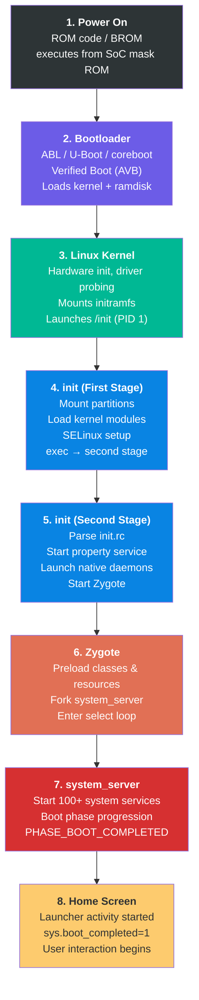

### 4.1.2 Stage-by-Stage Summary

**Stage 1: Power On (ROM Code)**

When the power button is pressed, the System-on-Chip (SoC) begins executing code
from its internal mask ROM -- a small, immutable piece of code burned into the chip
during manufacturing. This ROM code initializes the most basic hardware (clock
generators, memory controllers), loads the primary bootloader from a fixed storage
location (typically the beginning of the eMMC/UFS boot partition), and transfers
control to it. This stage is entirely vendor-specific and not part of AOSP.

**Stage 2: Bootloader (ABL/U-Boot)**

The bootloader is the first software component that can vary between devices. On
modern Android devices this is typically Android Bootloader (ABL) for Qualcomm
platforms, or U-Boot for various other SoCs. The bootloader's primary
responsibilities are:

- Initialize DRAM and critical peripherals
- Implement Android Verified Boot (AVB) to ensure system integrity
- Select the correct boot slot (A/B partitioning)
- Load the Linux kernel, ramdisk, and DTB (Device Tree Blob)
- Set kernel command line parameters
- Transfer control to the kernel

**Stage 3: Linux Kernel**

The Linux kernel initializes hardware subsystems, probes device drivers, mounts the
initial RAM filesystem (initramfs), and launches the very first userspace process:
`/init`, which runs as PID 1. The kernel's behavior during boot is controlled by
command line parameters passed from the bootloader and the Device Tree.

**Stage 4: init (First Stage)**

The init process executes in two stages. First-stage init runs from the ramdisk with
a minimal environment. Its job is to mount essential partitions (`/system`, `/vendor`,
`/product`), load kernel modules, set up SELinux policy, and then `exec()` itself
into second-stage init. This two-stage design exists because first-stage init needs
to run before SELinux policy is loaded, while second-stage init runs under full
SELinux enforcement.

**Stage 5: init (Second Stage)**

Second-stage init is the primary userspace orchestrator. It parses the init.rc
configuration files that declare services and actions, starts the property service
(Android's key-value configuration system), starts native daemons (surfaceflinger,
servicemanager, logd), and ultimately starts Zygote.

**Stage 6: Zygote**

Zygote is a specialized process that preloads the Android framework's core classes
and resources into memory, then enters a loop waiting for fork requests. Every
Android application process is created by forking from Zygote, which gives each app
a warm start with pre-initialized framework code.

**Stage 7: system_server**

The `system_server` is the first process forked from Zygote. It hosts over 100 system
services -- ActivityManagerService, PackageManagerService, WindowManagerService, and
many more. These services go through a carefully ordered boot phase progression,
with each phase unlocking additional functionality.

**Stage 8: Home Screen**

Once system_server reaches `PHASE_BOOT_COMPLETED`, the system is ready. The launcher
activity is started, the boot animation is dismissed, and the property
`sys.boot_completed` is set to `1`, signaling to all components that the device is
fully operational.

---

## 4.2 Bootloader and Verified Boot

### 4.2.1 Android Bootloader Architecture

Android does not mandate a specific bootloader implementation. Instead, it defines a
set of requirements that any bootloader must satisfy:

1. **A/B Slot Management**: Support for seamless updates via dual boot slots
2. **Verified Boot**: Implementation of Android Verified Boot (AVB) protocol
3. **Fastboot Protocol**: Support for the fastboot flashing protocol
4. **Kernel Loading**: Ability to load and decompress the kernel, ramdisk, and DTB
5. **Boot Mode Selection**: Support for normal boot, recovery, fastboot, and charger modes

The most common bootloader implementations in the Android ecosystem are:

- **ABL (Android Bootloader)**: Qualcomm's UEFI-based bootloader for Snapdragon platforms
- **U-Boot**: The open-source bootloader used by many ARM SoC vendors
- **coreboot**: Used by some Chromebook-derived Android devices

### 4.2.2 Boot Partitions

Modern Android devices use a multi-partition boot image layout. Understanding these
partitions is critical for anyone working on boot:

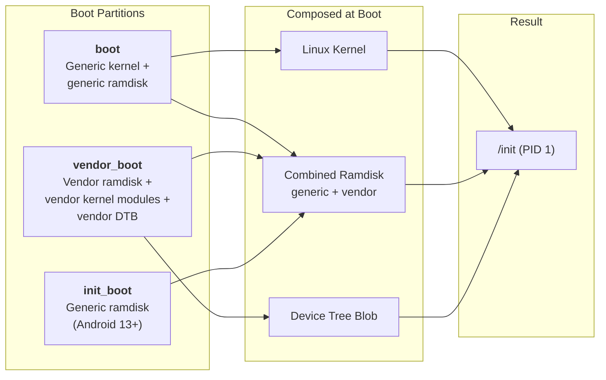

**boot partition**: Contains the Linux kernel image and, prior to Android 13, the
generic ramdisk. The boot image header (defined in
`system/tools/mkbootimg/include/bootimg/bootimg.h`) contains metadata about kernel
size, ramdisk size, page size, OS version, and header version.

**vendor_boot partition**: Introduced in Android 11 (boot image header v3). Contains
the vendor ramdisk (with device-specific init files and firmware), vendor kernel
modules, and the device tree blob. This partition allows the vendor to update its
boot components independently of the generic boot image.

**init_boot partition**: Introduced in Android 13 (boot image header v4). Moves the
generic ramdisk out of the boot partition into its own partition. This enables
updating the generic ramdisk (which contains first-stage init) independently through
GKI (Generic Kernel Image) updates.

### 4.2.3 Android Verified Boot (AVB)

Android Verified Boot ensures that all code and data that is executed comes from a
trusted source. The AVB implementation lives in `external/avb/` and is one of the
most critical security components in the Android boot chain.

#### The AVB Library Structure

The core AVB library is at `external/avb/libavb/`. The master header file is
`external/avb/libavb/libavb.h`, which includes all the component headers:

| Header File | Purpose |
|---|---|
| `avb_vbmeta_image.h` | VBMeta image format and parsing |
| `avb_slot_verify.h` | Slot verification logic |
| `avb_crypto.h` | Cryptographic primitives |
| `avb_hashtree_descriptor.h` | Hashtree (dm-verity) descriptors |
| `avb_hash_descriptor.h` | Hash descriptors for boot images |
| `avb_chain_partition_descriptor.h` | Chain of trust across partitions |
| `avb_ops.h` | Bootloader operations interface |
| `avb_footer.h` | Footer appended to verified partitions |

#### VBMeta Image Structure

The VBMeta image is the cornerstone of AVB. As defined in
`external/avb/libavb/avb_vbmeta_image.h` (lines 64-116):

```
+-----------------------------------------+
| Header data - fixed size (256 bytes)    |
+-----------------------------------------+
| Authentication data - variable size     |
+-----------------------------------------+
| Auxiliary data - variable size          |
+-----------------------------------------+
```

The header is exactly `AVB_VBMETA_IMAGE_HEADER_SIZE` (256) bytes and begins with
the magic bytes `AVB0` (`AVB_MAGIC`). From the source at line 42-46:

```c
// external/avb/libavb/avb_vbmeta_image.h, lines 42-46
#define AVB_VBMETA_IMAGE_HEADER_SIZE 256
#define AVB_MAGIC "AVB0"
#define AVB_MAGIC_LEN 4
#define AVB_RELEASE_STRING_SIZE 48
```

The vbmeta flags control verification behavior. From line 59-62:

```c
// external/avb/libavb/avb_vbmeta_image.h, lines 59-62
typedef enum {
  AVB_VBMETA_IMAGE_FLAGS_HASHTREE_DISABLED = (1 << 0),
  AVB_VBMETA_IMAGE_FLAGS_VERIFICATION_DISABLED = (1 << 1)
} AvbVBMetaImageFlags;
```

`HASHTREE_DISABLED` turns off dm-verity runtime verification, while
`VERIFICATION_DISABLED` disables all verification including descriptor parsing.
Both flags can only be set when the device is unlocked.

#### The Verification Process

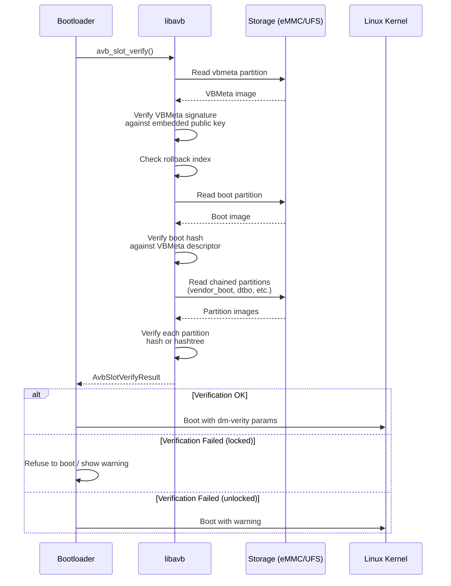

The central function is `avb_slot_verify()`, defined in
`external/avb/libavb/avb_slot_verify.h`. The result codes (lines 45-55) tell the
bootloader exactly what happened:

```c
// external/avb/libavb/avb_slot_verify.h, lines 45-55
typedef enum {
  AVB_SLOT_VERIFY_RESULT_OK,
  AVB_SLOT_VERIFY_RESULT_ERROR_OOM,
  AVB_SLOT_VERIFY_RESULT_ERROR_IO,
  AVB_SLOT_VERIFY_RESULT_ERROR_VERIFICATION,
  AVB_SLOT_VERIFY_RESULT_ERROR_ROLLBACK_INDEX,
  AVB_SLOT_VERIFY_RESULT_ERROR_PUBLIC_KEY_REJECTED,
  AVB_SLOT_VERIFY_RESULT_ERROR_INVALID_METADATA,
  AVB_SLOT_VERIFY_RESULT_ERROR_UNSUPPORTED_VERSION,
  AVB_SLOT_VERIFY_RESULT_ERROR_INVALID_ARGUMENT
} AvbSlotVerifyResult;
```

Each result code corresponds to a specific failure mode:

- `ERROR_VERIFICATION`: Hash mismatch -- the partition content has been tampered with
- `ERROR_ROLLBACK_INDEX`: Someone tried to flash an older, potentially vulnerable
  image (rollback protection)
- `ERROR_PUBLIC_KEY_REJECTED`: The signing key is not in the device's trusted key set
- `ERROR_UNSUPPORTED_VERSION`: The vbmeta image requires a newer version of libavb

#### dm-verity and Hashtree Verification

For large partitions like `system` and `vendor`, computing a hash of the entire
partition at boot would be prohibitively slow. Instead, AVB uses **dm-verity**, a
Linux kernel device-mapper target that verifies data blocks on-the-fly as they are
read from disk.

dm-verity uses a Merkle tree (hash tree) structure:

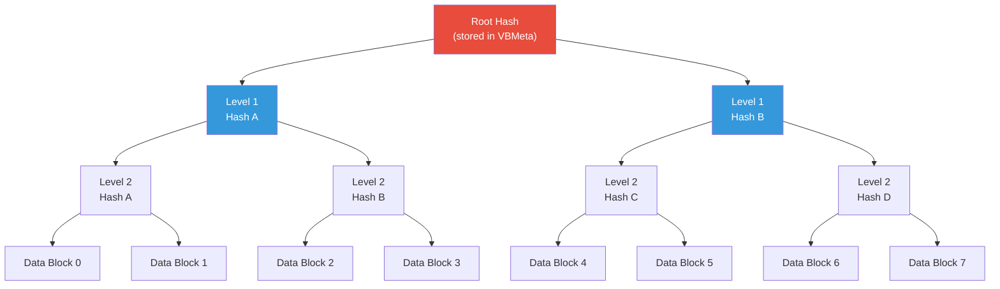

When a data block is read, the kernel computes its hash and walks up the tree to
verify it against the root hash. If any block has been modified, the hash mismatch
is detected and the kernel takes action based on the configured error mode.

The hashtree error modes are defined in `avb_slot_verify.h` (lines 86-93):

```c
// external/avb/libavb/avb_slot_verify.h, lines 86-93
typedef enum {
  AVB_HASHTREE_ERROR_MODE_RESTART_AND_INVALIDATE,
  AVB_HASHTREE_ERROR_MODE_RESTART,
  AVB_HASHTREE_ERROR_MODE_EIO,
  AVB_HASHTREE_ERROR_MODE_LOGGING,
  AVB_HASHTREE_ERROR_MODE_MANAGED_RESTART_AND_EIO,
  AVB_HASHTREE_ERROR_MODE_PANIC
} AvbHashtreeErrorMode;
```

In production (`RESTART_AND_INVALIDATE`), if dm-verity detects corruption, the device
restarts and the current slot is marked as invalid, triggering a fallback to the
other A/B slot. The `LOGGING` mode is available only when verification errors are
explicitly allowed (unlocked devices) and is used purely for development and
debugging.

#### Rollback Protection

Rollback protection prevents an attacker from flashing an older version of Android
that has known vulnerabilities. The mechanism works through rollback indices:

1. Each vbmeta image contains a rollback index -- a monotonically increasing version
   number
2. The device stores the minimum accepted rollback index in tamper-evident storage
   (typically RPMB on eMMC/UFS)
3. During verification, if the vbmeta's rollback index is less than the stored
   minimum, `AVB_SLOT_VERIFY_RESULT_ERROR_ROLLBACK_INDEX` is returned
4. After a successful boot, the stored minimum is updated to match the current
   rollback index

### 4.2.4 Recovery Mode

The Android recovery system provides a minimal environment for applying system
updates (OTAs) and performing factory resets. The recovery code lives in
`bootable/recovery/`.

Recovery operates through boot modes -- as we can see in
`system/core/init/first_stage_init.cpp` (lines 66-70):

```cpp
// system/core/init/first_stage_init.cpp, lines 66-70
enum class BootMode {
    NORMAL_MODE,
    RECOVERY_MODE,
    CHARGER_MODE,
};
```

When in recovery mode, first-stage init takes a different path -- skipping the normal
first-stage mount procedure. From line 523-524:

```cpp
// system/core/init/first_stage_init.cpp, lines 523-524
if (IsRecoveryMode()) {
    LOG(INFO) << "First stage mount skipped (recovery mode)";
```

Modern A/B devices boot the recovery ramdisk from the regular boot partition rather
than a separate recovery partition. The `ForceNormalBoot()` function (lines 117-119)
determines whether to redirect from recovery into normal boot:

```cpp
// system/core/init/first_stage_init.cpp, lines 117-119
bool ForceNormalBoot(const std::string& cmdline, const std::string& bootconfig) {
    return bootconfig.find("androidboot.force_normal_boot = \"1\"") != std::string::npos ||
           cmdline.find("androidboot.force_normal_boot=1") != std::string::npos;
}
```

This allows the same boot image to serve both normal and recovery boots, with the
bootconfig parameter controlling which path is taken.

---

## 4.3 Init: The First Process

Init is the single most important userspace process in Android. It is PID 1 -- the
ancestor of all other processes. If init crashes, the kernel panics. Init is
responsible for:

- Mounting filesystems
- Loading SELinux policy
- Starting all native daemons
- Managing the Android property system
- Monitoring and restarting crashed services
- Processing reboot and shutdown requests

### 4.3.1 The Two-Stage Design

Android's init uses a two-stage architecture. This design is driven by a fundamental
chicken-and-egg problem: SELinux policy lives on the `/system` partition, but
first-stage init needs to run before any partitions are mounted (because it is the
process that mounts them). The solution is to split init into two stages that run
as separate executions of the same binary.

The entry point is `system/core/init/main.cpp`. This single main() function acts as
a dispatch point for all init's execution modes:

```cpp
// system/core/init/main.cpp, lines 53-83
int main(int argc, char** argv) {
#if __has_feature(address_sanitizer)
    __asan_set_error_report_callback(AsanReportCallback);
#elif __has_feature(hwaddress_sanitizer)
    __hwasan_set_error_report_callback(AsanReportCallback);
#endif
    // Boost prio which will be restored later
    setpriority(PRIO_PROCESS, 0, -20);
    if (!strcmp(basename(argv[0]), "ueventd")) {
        return ueventd_main(argc, argv);
    }

    if (argc > 1) {
        if (!strcmp(argv[1], "subcontext")) {
            android::base::InitLogging(argv, &android::base::KernelLogger);
            const BuiltinFunctionMap& function_map = GetBuiltinFunctionMap();

            return SubcontextMain(argc, argv, &function_map);
        }

        if (!strcmp(argv[1], "selinux_setup")) {
            return SetupSelinux(argv);
        }

        if (!strcmp(argv[1], "second_stage")) {
            return SecondStageMain(argc, argv);
        }
    }

    return FirstStageMain(argc, argv);
}
```

This reveals that the `/system/bin/init` binary actually serves five different roles
depending on how it is invoked:

| Invocation | Function | Purpose |
|---|---|---|
| `init` (no args) | `FirstStageMain()` | First-stage initialization |
| `init selinux_setup` | `SetupSelinux()` | Load SELinux policy |
| `init second_stage` | `SecondStageMain()` | Main init loop |
| `init subcontext` | `SubcontextMain()` | SELinux subcontext worker |
| `ueventd` (symlink) | `ueventd_main()` | Device node manager |

Note line 60: the process priority is immediately boosted to -20 (highest priority)
to ensure init gets as much CPU time as possible during boot. This priority is
restored to 0 (normal) later, at line 1245 of `init.cpp`, just before entering the
main event loop.

The first-stage init has a separate, minimal entry point at
`system/core/init/first_stage_main.cpp`:

```cpp
// system/core/init/first_stage_main.cpp, lines 19-21
int main(int argc, char** argv) {
    return android::init::FirstStageMain(argc, argv);
}
```

This exists because first-stage init is linked as a separate, smaller binary that
lives in the ramdisk, while the full `main.cpp` binary lives on the `/system`
partition.

### 4.3.2 First-Stage Init: Building the Foundation

First-stage init's implementation is in `system/core/init/first_stage_init.cpp`. The
`FirstStageMain()` function (starting at line 333) is one of the most critical
pieces of code in all of Android -- if it fails, the device will not boot.

#### Phase 1: Emergency Infrastructure

The very first thing init does is set up crash handlers, then build the minimal
filesystem infrastructure needed to communicate with the outside world:

```cpp
// system/core/init/first_stage_init.cpp, lines 333-349
int FirstStageMain(int argc, char** argv) {
    if (REBOOT_BOOTLOADER_ON_PANIC) {
        InstallRebootSignalHandlers();
    }

    boot_clock::time_point start_time = boot_clock::now();

    std::vector<std::pair<std::string, int>> errors;
#define CHECKCALL(x) \
    if ((x) != 0) errors.emplace_back(#x " failed", errno);

    // Clear the umask.
    umask(0);

    CHECKCALL(clearenv());
    CHECKCALL(setenv("PATH", _PATH_DEFPATH, 1));
    // Get the basic filesystem setup we need put together in the initramdisk
    // on / and then we'll let the rc file figure out the rest.
    CHECKCALL(mount("tmpfs", "/dev", "tmpfs", MS_NOSUID, "mode=0755"));
```

The `CHECKCALL` macro is notable: rather than aborting on the first failure, it
collects all errors and reports them later. This is because at this point, logging
is not yet initialized (we do not even have `/dev/kmsg` yet), so we cannot report
errors until the basic filesystem mounts complete.

The critical filesystem setup continues with device nodes and pseudo-filesystems
(lines 350-404):

```cpp
// system/core/init/first_stage_init.cpp, lines 351-381
CHECKCALL(mkdir("/dev/pts", 0755));
CHECKCALL(mkdir("/dev/socket", 0755));
CHECKCALL(mkdir("/dev/dm-user", 0755));
CHECKCALL(mount("devpts", "/dev/pts", "devpts", 0, NULL));
CHECKCALL(mount("proc", "/proc", "proc", 0,
    "hidepid=2,gid=" MAKE_STR(AID_READPROC)));
// ...
CHECKCALL(mount("sysfs", "/sys", "sysfs", 0, NULL));
CHECKCALL(mount("selinuxfs", "/sys/fs/selinux", "selinuxfs", 0, NULL));

CHECKCALL(mknod("/dev/kmsg", S_IFCHR | 0600, makedev(1, 11)));
// ...
CHECKCALL(mknod("/dev/random", S_IFCHR | 0666, makedev(1, 8)));
CHECKCALL(mknod("/dev/urandom", S_IFCHR | 0666, makedev(1, 9)));
CHECKCALL(mknod("/dev/ptmx", S_IFCHR | 0666, makedev(5, 2)));
CHECKCALL(mknod("/dev/null", S_IFCHR | 0666, makedev(1, 3)));
```

Note the security-conscious choices here:

- `/proc` is mounted with `hidepid=2`, which hides other processes' information from
  non-root users
- `/dev/kmsg` has mode 0600 (root only), preventing unprivileged access to kernel
  messages
- The `selinuxfs` mount at `/sys/fs/selinux` is required for loading SELinux policy
  later

Only after these mounts complete can init actually log messages:

```cpp
// system/core/init/first_stage_init.cpp, lines 412-424
SetStdioToDevNull(argv);
// Now that tmpfs is mounted on /dev and we have /dev/kmsg, we can actually
// talk to the outside world...
InitKernelLogging(argv);

if (!errors.empty()) {
    for (const auto& [error_string, error_errno] : errors) {
        LOG(ERROR) << error_string << " " << strerror(error_errno);
    }
    LOG(FATAL) << "Init encountered errors starting first stage, aborting";
}

LOG(INFO) << "init first stage started!";
```

#### Phase 2: Kernel Module Loading

Modern Android devices have modular kernels where many drivers are loaded as kernel
modules rather than being compiled into the kernel. First-stage init must load these
modules before it can mount partitions (because the storage controller driver might
itself be a module):

```cpp
// system/core/init/first_stage_init.cpp, lines 441-458
boot_clock::time_point module_start_time = boot_clock::now();
int module_count = 0;
BootMode boot_mode = GetBootMode(cmdline, bootconfig);
if (!LoadKernelModules(boot_mode, want_console,
                       want_parallel, module_count)) {
    if (want_console != FirstStageConsoleParam::DISABLED) {
        LOG(ERROR) << "Failed to load kernel modules, starting console";
    } else {
        LOG(FATAL) << "Failed to load kernel modules";
    }
}
if (module_count > 0) {
    auto module_elapse_time = std::chrono::duration_cast<std::chrono::milliseconds>(
            boot_clock::now() - module_start_time);
    setenv(kEnvInitModuleDurationMs,
           std::to_string(module_elapse_time.count()).c_str(), 1);
    LOG(INFO) << "Loaded " << module_count << " kernel modules took "
              << module_elapse_time.count() << " ms";
}
```

The `LoadKernelModules()` function (lines 215-290) searches for module directories
under `/lib/modules/`, matching the running kernel version. It supports parallel
module loading to speed up boot:

```cpp
// system/core/init/first_stage_init.cpp, lines 282-284
bool retval = (want_parallel) ? m.LoadModulesParallel(std::thread::hardware_concurrency())
                              : m.LoadListedModules(!want_console);
```

The module load list varies by boot mode. Charger mode loads fewer modules since the
device only needs to display a charging animation:

```cpp
// system/core/init/first_stage_init.cpp, lines 187-212
std::string GetModuleLoadList(BootMode boot_mode, const std::string& dir_path) {
    std::string module_load_file;
    switch (boot_mode) {
        case BootMode::NORMAL_MODE:
            module_load_file = "modules.load";
            break;
        case BootMode::RECOVERY_MODE:
            module_load_file = "modules.load.recovery";
            break;
        case BootMode::CHARGER_MODE:
            module_load_file = "modules.load.charger";
            break;
    }
    // ...
}
```

#### Phase 3: Mounting Partitions

With kernel modules loaded (including storage drivers), first-stage init can now
mount the essential partitions:

```cpp
// system/core/init/first_stage_init.cpp, lines 526-540
if (!fsm) {
    fsm = CreateFirstStageMount(cmdline);
}
if (!fsm) {
    LOG(FATAL) << "FirstStageMount not available";
}

if (!created_devices && !fsm->DoCreateDevices()) {
    LOG(FATAL) << "Failed to create devices required for first stage mount";
}

if (!fsm->DoFirstStageMount()) {
    LOG(FATAL) << "Failed to mount required partitions early ...";
}
```

This is where dm-verity is configured. The `FirstStageMount` class (in
`system/core/init/first_stage_mount.cpp`) reads the fstab, creates device-mapper
nodes for verity-protected partitions, and mounts `/system`, `/vendor`, and other
required partitions.

#### Phase 4: Handoff to SELinux Setup

After partitions are mounted, first-stage init prepares for the SELinux transition
and `exec()`s itself as the "selinux_setup" phase:

```cpp
// system/core/init/first_stage_init.cpp, lines 557-575
const char* path = "/system/bin/init";
const char* args[] = {path, "selinux_setup", nullptr};
auto fd = open("/dev/kmsg", O_WRONLY | O_CLOEXEC);
dup2(fd, STDOUT_FILENO);
dup2(fd, STDERR_FILENO);
close(fd);
execv(path, const_cast<char**>(args));

// execv() only returns if an error happened, in which case we
// panic and never fall through this conditional.
PLOG(FATAL) << "execv(\"" << path << "\") failed";
```

Note the critical detail: the `execv()` call replaces the first-stage init binary
(from the ramdisk) with the full init binary from `/system/bin/init`. This is now
possible because `/system` has been mounted. Before the exec, the ramdisk
filesystem is freed to reclaim memory (line 549):

```cpp
// system/core/init/first_stage_init.cpp, lines 548-549
if (old_root_dir && old_root_info.st_dev != new_root_info.st_dev) {
    FreeRamdisk(old_root_dir.get(), old_root_info.st_dev);
}
```

### 4.3.3 SELinux Setup: The Security Transition

The SELinux setup phase is implemented in `system/core/init/selinux.cpp`. The file
begins with an excellent comment block (lines 18-50) that explains the entire
SELinux policy loading strategy. The two key concepts are:

1. **Monolithic policy**: Legacy devices use a single `/sepolicy` file
2. **Split policy**: Treble devices combine policy from `/system`, `/vendor`,
   `/product`, and `/odm` partitions

The `SetupSelinux()` function (lines 780-836) orchestrates the process:

```cpp
// system/core/init/selinux.cpp, lines 780-829
int SetupSelinux(char** argv) {
    SetStdioToDevNull(argv);
    InitKernelLogging(argv);
    // ...
    SelinuxSetupKernelLogging();

    bool use_overlays = EarlySetupOverlays();

    if (IsMicrodroid()) {
        LoadSelinuxPolicyMicrodroid();
    } else {
        LoadSelinuxPolicyAndroid();
    }

    SelinuxSetEnforcement();
    // ...
    if (selinux_android_restorecon("/system/bin/init", 0) == -1) {
        PLOG(FATAL) << "restorecon failed of /system/bin/init failed";
    }
    // ...
    const char* path = "/system/bin/init";
    const char* args[] = {path, "second_stage", nullptr};
    execv(path, const_cast<char**>(args));
```

The `LoadSelinuxPolicyAndroid()` function (lines 685-708) demonstrates the careful
five-step process needed when snapuserd (Virtual A/B snapshot daemon) is running:

```cpp
// system/core/init/selinux.cpp, lines 670-708 (comment + function)
// We use a five-step process to address this:
//  (1) Read the policy into a string, with snapuserd running.
//  (2) Rewrite the snapshot device-mapper tables, to generate new dm-user
//      devices and to flush I/O.
//  (3) Kill snapuserd, which no longer has any dm-user devices to attach to.
//  (4) Load the sepolicy and issue critical restorecons in /dev, carefully
//      avoiding anything that would read from /system.
//  (5) Re-launch snapuserd and attach it to the dm-user devices from step (2).
void LoadSelinuxPolicyAndroid() {
    MountMissingSystemPartitions();

    LOG(INFO) << "Opening SELinux policy";
    std::string policy;
    ReadPolicy(&policy);

    auto snapuserd_helper = SnapuserdSelinuxHelper::CreateIfNeeded();
    if (snapuserd_helper) {
        snapuserd_helper->StartTransition();
    }

    LoadSelinuxPolicy(policy);

    if (snapuserd_helper) {
        snapuserd_helper->FinishTransition();
        snapuserd_helper = nullptr;
    }
}
```

After loading SELinux policy and setting enforcement mode, `SetupSelinux()` performs
a `restorecon` on `/system/bin/init` itself so that the next `exec()` transitions
init from the kernel domain to the proper `init` SELinux domain. It then exec's
into second-stage init.

### 4.3.4 The Complete First-Stage Flow

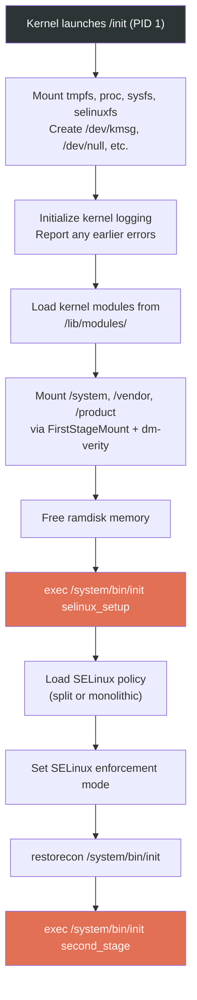

### 4.3.5 Second-Stage Init: The Main Event

Second-stage init is where the real orchestration begins. The `SecondStageMain()`
function in `system/core/init/init.cpp` (starting at line 1048) is the heart of
Android's userspace startup.

#### Initial Setup

```cpp
// system/core/init/init.cpp, lines 1048-1063
int SecondStageMain(int argc, char** argv) {
    if (REBOOT_BOOTLOADER_ON_PANIC) {
        InstallRebootSignalHandlers();
    }

    boot_clock::time_point start_time = boot_clock::now();

    trigger_shutdown = [](const std::string& command) {
        shutdown_state.TriggerShutdown(command);
    };

    SetStdioToDevNull(argv);
    InitKernelLogging(argv);
    LOG(INFO) << "init second stage started!";
```

The second-stage init then performs a rapid series of setup steps:

1. **Property initialization** (line 1108): `PropertyInit()` sets up the property
   system, which is Android's global key-value configuration store

2. **SELinux context restoration** (lines 1122-1123): Restores security labels on
   `/dev` nodes created during first-stage

3. **Epoll event loop setup** (lines 1125-1136): Creates the event loop that will
   drive init's main loop, registers signal handlers for SIGCHLD (child death) and
   SIGTERM

4. **Property service startup** (line 1137): `StartPropertyService()` launches the
   property service thread that handles property set requests from other processes

5. **Boot scripts loading** (line 1179): `LoadBootScripts()` parses all the init.rc
   files

```cpp
// system/core/init/init.cpp, lines 1108-1179
PropertyInit();

// Umount second stage resources after property service has read the .prop files.
UmountSecondStageRes();
// ...
MountExtraFilesystems();

// Now set up SELinux for second stage.
SelabelInitialize();
SelinuxRestoreContext();

Epoll epoll;
if (auto result = epoll.Open(); !result.ok()) {
    PLOG(FATAL) << result.error();
}
// ...
InstallSignalFdHandler(&epoll);
InstallInitNotifier(&epoll);
StartPropertyService(&property_fd);
// ...
ActionManager& am = ActionManager::GetInstance();
ServiceList& sm = ServiceList::GetInstance();

LoadBootScripts(am, sm);
```

#### Loading Boot Scripts

The `LoadBootScripts()` function is where init.rc files are parsed:

```cpp
// system/core/init/init.cpp, lines 339-363
static void LoadBootScripts(ActionManager& action_manager, ServiceList& service_list) {
    Parser parser = CreateParser(action_manager, service_list);

    std::string bootscript = GetProperty("ro.boot.init_rc", "");
    if (bootscript.empty()) {
        parser.ParseConfig("/system/etc/init/hw/init.rc");
        if (!parser.ParseConfig("/system/etc/init")) {
            late_import_paths.emplace_back("/system/etc/init");
        }
        parser.ParseConfig("/system_ext/etc/init");
        if (!parser.ParseConfig("/vendor/etc/init")) {
            late_import_paths.emplace_back("/vendor/etc/init");
        }
        if (!parser.ParseConfig("/odm/etc/init")) {
            late_import_paths.emplace_back("/odm/etc/init");
        }
        if (!parser.ParseConfig("/product/etc/init")) {
            late_import_paths.emplace_back("/product/etc/init");
        }
    } else {
        parser.ParseConfig(bootscript);
    }
}
```

Init.rc files are loaded from five locations in a specific order:

1. `/system/etc/init/hw/init.rc` -- the master init.rc file
2. `/system/etc/init/` -- system partition services
3. `/system_ext/etc/init/` -- system extension services
4. `/vendor/etc/init/` -- vendor services
5. `/odm/etc/init/` -- ODM (Original Design Manufacturer) services
6. `/product/etc/init/` -- product-specific services

The parser recognizes three section types (from `CreateParser()`, lines 275-284):

```cpp
// system/core/init/init.cpp, lines 275-284
Parser CreateParser(ActionManager& action_manager, ServiceList& service_list) {
    Parser parser;

    parser.AddSectionParser("service",
                            std::make_unique<ServiceParser>(&service_list, GetSubcontext()));
    parser.AddSectionParser("on",
                            std::make_unique<ActionParser>(&action_manager, GetSubcontext()));
    parser.AddSectionParser("import", std::make_unique<ImportParser>(&parser));

    return parser;
}
```

#### Action Queue and Trigger Sequence

After all scripts are loaded, init queues the trigger sequence that drives the
entire boot:

```cpp
// system/core/init/init.cpp, lines 1205-1243
am.QueueBuiltinAction(SetupCgroupsAction, "SetupCgroups");
am.QueueBuiltinAction(TestPerfEventSelinuxAction, "TestPerfEventSelinux");
am.QueueEventTrigger("early-init");
am.QueueBuiltinAction(ConnectEarlyStageSnapuserdAction, "ConnectEarlyStageSnapuserd");

// Queue an action that waits for coldboot done so we know ueventd has set up
// all of /dev...
am.QueueBuiltinAction(wait_for_coldboot_done_action, "wait_for_coldboot_done");
// ...
// ... so that we can start queuing up actions that require stuff from /dev.
am.QueueBuiltinAction(SetMmapRndBitsAction, "SetMmapRndBits");
// ...

// Trigger all the boot actions to get us started.
am.QueueEventTrigger("init");

// Don't mount filesystems or start core system services in charger mode.
std::string bootmode = GetProperty("ro.bootmode", "");
if (bootmode == "charger") {
    am.QueueEventTrigger("charger");
} else {
    am.QueueEventTrigger("late-init");
}

// Run all property triggers based on current state of the properties.
am.QueueBuiltinAction(queue_property_triggers_action, "queue_property_triggers");
```

This establishes the trigger ordering: `early-init` -> `init` -> `late-init`, which
is the backbone of the init.rc trigger chain.

#### The Main Event Loop

Init then enters its infinite event loop:

```cpp
// system/core/init/init.cpp, lines 1244-1296
// Restore prio before main loop
setpriority(PRIO_PROCESS, 0, 0);
while (true) {
    const boot_clock::time_point far_future = boot_clock::time_point::max();
    boot_clock::time_point next_action_time = far_future;

    auto shutdown_command = shutdown_state.CheckShutdown();
    if (shutdown_command) {
        LOG(INFO) << "Got shutdown_command '" << *shutdown_command
                  << "' Calling HandlePowerctlMessage()";
        HandlePowerctlMessage(*shutdown_command);
    }

    if (!(prop_waiter_state.MightBeWaiting() || Service::is_exec_service_running())) {
        am.ExecuteOneCommand();
        if (am.HasMoreCommands()) {
            next_action_time = boot_clock::now();
        }
    }

    if (!IsShuttingDown()) {
        auto next_process_action_time = HandleProcessActions();
        if (next_process_action_time) {
            next_action_time = std::min(next_action_time, *next_process_action_time);
        }
    }

    std::optional<std::chrono::milliseconds> epoll_timeout;
    if (next_action_time != far_future) {
        epoll_timeout = std::chrono::ceil<std::chrono::milliseconds>(
                std::max(next_action_time - boot_clock::now(), 0ns));
    }
    auto epoll_result = epoll.Wait(epoll_timeout);
    if (!epoll_result.ok()) {
        LOG(ERROR) << epoll_result.error();
    }
    if (!IsShuttingDown()) {
        HandleControlMessages();
        SetUsbController();
    }
}
```

Each iteration of this loop:

1. Checks for pending shutdown commands
2. Executes one queued action (if not waiting for a property or exec service)
3. Handles process timeouts and restarts
4. Waits on epoll for signals, property changes, or timeout

This single-threaded, event-driven design is intentional: it ensures that actions
execute in a deterministic order and prevents race conditions that could occur with
multi-threaded execution.

### 4.3.6 The Android Property System

The property system is Android's global key-value store, implemented in
`system/core/init/property_service.cpp`. Properties are the primary mechanism
for configuration and inter-process communication during boot.

Properties follow naming conventions that determine their behavior:

| Prefix | Behavior |
|---|---|
| `ro.*` | Read-only; can only be set once (typically during boot) |
| `persist.*` | Persisted to disk; survives reboots |
| `sys.*` | System properties; general-purpose |
| `init.svc.*` | Automatically set by init to track service states |
| `ctl.*` | Control properties; trigger init actions (start/stop/restart services) |
| `next_boot.*` | Persisted, applied on next boot |

The property service enforces SELinux MAC (Mandatory Access Control) on all property
operations. From `property_service.cpp`, the `CheckPermissions()` function (declared
around line 498) validates that the calling process has SELinux permission to set a
given property:

```cpp
// system/core/init/property_service.cpp, lines 498-499
uint32_t CheckPermissions(const std::string& name, const std::string& value,
                          const std::string& source_context, const ucred& cr,
                          std::string* error) {
```

Control properties (`ctl.*`) get special handling. When a process sets `ctl.start`
to a service name, the property service forwards this as a control message to init's
main loop, which then starts the service. From lines 439-465, the
`SendControlMessage()` function handles this:

```cpp
// system/core/init/property_service.cpp, lines 439-466
static uint32_t SendControlMessage(const std::string& msg, const std::string& name,
                                   pid_t pid, SocketConnection* socket,
                                   std::string* error) {
    auto lock = std::lock_guard{accept_messages_lock};
    if (!accept_messages) {
        if (msg == "stop") return PROP_SUCCESS;
        *error = "Received control message after shutdown, ignoring";
        return PROP_ERROR_HANDLE_CONTROL_MESSAGE;
    }
    // ...
    bool queue_success = QueueControlMessage(msg, name, pid, fd);
```

The `PropertyChanged()` function in `init.cpp` (lines 365-388) shows how property
changes flow through the system:

```cpp
// system/core/init/init.cpp, lines 365-388
void PropertyChanged(const std::string& name, const std::string& value) {
    if (name == "sys.powerctl") {
        trigger_shutdown(value);
    } else if (name == "sys.shutdown.requested") {
        HandleShutdownRequestedMessage(value);
    }

    if (property_triggers_enabled) {
        ActionManager::GetInstance().QueuePropertyChange(name, value);
        WakeMainInitThread();
    }

    prop_waiter_state.CheckAndResetWait(name, value);
}
```

The `sys.powerctl` property is handled with the highest urgency -- it bypasses the
normal event queue to trigger immediate shutdown/reboot.

### 4.3.7 The init.rc Language

The init.rc language is a domain-specific language for declaring the services and
actions that init manages. The master file is at `system/core/rootdir/init.rc`.

#### File Structure and Imports

The init.rc file begins with import statements that bring in additional configuration
files:

```
# system/core/rootdir/init.rc, lines 7-13
import /init.environ.rc
import /system/etc/init/hw/init.usb.rc
import /init.${ro.hardware}.rc
import /vendor/etc/init/hw/init.${ro.hardware}.rc
import /system/etc/init/hw/init.usb.configfs.rc
import /system/etc/init/hw/init.${ro.zygote}.rc
```

Note the use of property expansion: `${ro.hardware}` is replaced with the device's
hardware name, and `${ro.zygote}` determines which Zygote configuration is used
(32-bit, 64-bit, or both).

#### Actions and Triggers

Actions are blocks of commands that execute when a trigger condition is met:

```
on <trigger>
    <command>
    <command>
    ...
```

The `early-init` trigger runs first and sets up basic kernel parameters:

```
# system/core/rootdir/init.rc, lines 15-46
on early-init
    # Disable sysrq from keyboard
    write /proc/sys/kernel/sysrq 0

    # Android doesn't need kernel module autoloading, and it causes SELinux
    # denials.  So disable it by setting modprobe to the empty string.
    write /proc/sys/kernel/modprobe \n

    # Set the security context of /adb_keys if present.
    restorecon /adb_keys

    # Set the security context of /postinstall if present.
    restorecon /postinstall

    # memory.pressure_level used by lmkd
    chown root system /dev/memcg/memory.pressure_level
    chmod 0040 /dev/memcg/memory.pressure_level
    # app mem cgroups, used by activity manager, lmkd and zygote
    mkdir /dev/memcg/apps/ 0755 system system
    # cgroup for system_server and surfaceflinger
    mkdir /dev/memcg/system 0550 system system
```

The `late-init` trigger is the main boot orchestrator, chaining together the
filesystem mount and service start sequence:

```
# system/core/rootdir/init.rc, lines 508-537
on late-init
    trigger early-fs

    # Mount fstab in init.{$device}.rc by mount_all command. Optional parameter
    # '--early' can be specified to skip entries with 'latemount'.
    # /system and /vendor must be mounted by the end of the fs stage,
    # while /data is optional.
    trigger fs
    trigger post-fs

    # Mount fstab in init.{$device}.rc by mount_all with '--late' parameter
    # to only mount entries with 'latemount'. This is needed if '--early' is
    # specified in the previous mount_all command on the fs stage.
    trigger late-fs

    # Now we can mount /data. File encryption requires keymaster to decrypt
    # /data, which in turn can only be loaded when system properties are present.
    trigger post-fs-data

    # Should be before netd, but after apex, properties and logging is available.
    trigger load-bpf-programs
    trigger bpf-progs-loaded

    # Now we can start zygote.
    trigger zygote-start

    # Remove a file to wake up anything waiting for firmware.
    trigger firmware_mounts_complete
```

The trigger chain diagram:

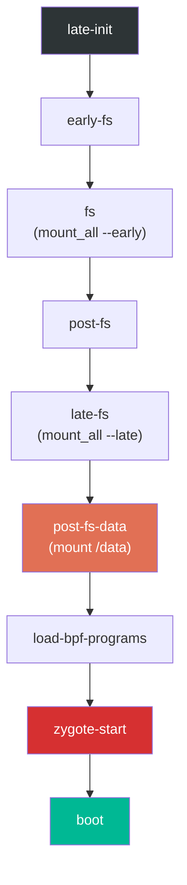

The `post-fs-data` trigger is particularly important because it prepares the `/data`
partition:

```
# system/core/rootdir/init.rc, lines 654-684
on post-fs-data

    # Start checkpoint before we touch data
    exec - system system -- /system/bin/vdc checkpoint prepareCheckpoint

    # We chown/chmod /data again so because mount is run as root + defaults
    chown system system /data
    chmod 0771 /data
    # We restorecon /data in case the userdata partition has been reset.
    restorecon /data

    # Make sure we have the device encryption key.
    installkey /data

    # Start bootcharting as soon as possible after the data partition is
    # mounted to collect more data.
    mkdir /data/bootchart 0755 shell shell encryption=Require
    bootchart start
```

The `zygote-start` trigger is where the critical Java runtime begins:

```
# system/core/rootdir/init.rc, lines 1101-1105
on zygote-start
    wait_for_prop odsign.verification.done 1
    start statsd
    start zygote
    start zygote_secondary
```

Note the `wait_for_prop` command: Zygote startup is gated on `odsign.verification.done`,
which indicates that on-device signing verification has completed. This ensures that
the ART artifacts that Zygote will load have been verified.

#### Property Triggers

Actions can also be triggered by property changes:

```
on property:sys.boot_completed=1 && property:ro.config.batteryless=true
    write /proc/sys/vm/dirty_expire_centisecs 200
    write /proc/sys/vm/dirty_writeback_centisecs 200
```

Property triggers are evaluated whenever any property changes. If the condition
matches, the associated commands execute. Compound triggers (using `&&`) require
all conditions to be true simultaneously.

#### Service Definitions

Services are persistent processes that init manages. Here is the primary Zygote
service definition from `system/core/rootdir/init.zygote64.rc`:

```
# system/core/rootdir/init.zygote64.rc, lines 1-20
service zygote /system/bin/app_process64 -Xzygote /system/bin --zygote --start-system-server --socket-name=zygote
    class main
    priority -20
    user root
    group root readproc reserved_disk
    socket zygote stream 660 root system
    socket usap_pool_primary stream 660 root system
    onrestart exec_background - system system -- /system/bin/vdc volume abort_fuse
    onrestart write /sys/power/state on
    onrestart write /sys/power/wake_lock zygote_kwl
    onrestart restart audioserver
    onrestart restart cameraserver
    onrestart restart media
    onrestart restart --only-if-running media.tuner
    onrestart restart netd
    onrestart restart wificond
    task_profiles ProcessCapacityHigh MaxPerformance
    critical window=${zygote.critical_window.minute:-off} target=zygote-fatal
```

Let us break down each directive:

| Directive | Meaning |
|---|---|
| `service zygote` | Declares a service named "zygote" |
| `/system/bin/app_process64` | The executable path |
| `-Xzygote` | Passed to the Dalvik/ART VM |
| `--zygote` | Tells app_process to start in Zygote mode |
| `--start-system-server` | Fork system_server after initialization |
| `class main` | Belongs to the "main" service class |
| `priority -20` | Run at highest scheduling priority |
| `user root` / `group root` | Run as root (Zygote needs root to fork and set UIDs) |
| `socket zygote stream 660` | Create a UNIX socket at `/dev/socket/zygote` |
| `socket usap_pool_primary` | Socket for the USAP (Unspecialized App Process) pool |
| `onrestart restart audioserver` | When Zygote restarts, also restart these services |
| `critical window=...` | If Zygote crashes too frequently, reboot the device |

The `critical` directive is a safety net: if Zygote crashes repeatedly within the
specified window, init will reboot the device to recovery to prevent a crash loop.

For devices that support both 64-bit and 32-bit apps, the file
`init.zygote64_32.rc` is used:

```
# system/core/rootdir/init.zygote64_32.rc, lines 1-11
import /system/etc/init/hw/init.zygote64.rc

service zygote_secondary /system/bin/app_process32 -Xzygote /system/bin --zygote --socket-name=zygote_secondary --enable-lazy-preload
    class main
    priority -20
    user root
    group root readproc reserved_disk
    socket zygote_secondary stream 660 root system
    socket usap_pool_secondary stream 660 root system
    onrestart restart zygote
    task_profiles ProcessCapacityHigh MaxPerformance
```

The secondary Zygote uses `--enable-lazy-preload`, meaning it defers class
preloading until the first app fork request. This saves boot time because 32-bit
apps are relatively rare on modern devices.

### 4.3.8 init.rc Parsing Flow

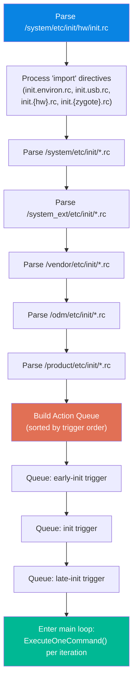

### 4.3.9 Summary of init.rc Built-in Commands

The following table lists the most commonly used init.rc commands:

| Command | Example | Description |
|---|---|---|
| `mkdir` | `mkdir /data/system 0775 system system` | Create directory with permissions |
| `write` | `write /proc/sys/kernel/sysrq 0` | Write a string to a file |
| `chmod` | `chmod 0660 /dev/kmsg` | Change file permissions |
| `chown` | `chown system system /data` | Change file ownership |
| `mount` | `mount ext4 /dev/block/sda1 /system` | Mount a filesystem |
| `mount_all` | `mount_all /vendor/etc/fstab.device` | Mount all entries from fstab |
| `start` | `start servicemanager` | Start a service |
| `stop` | `stop console` | Stop a service |
| `restart` | `restart zygote` | Restart a service |
| `setprop` | `setprop ro.build.type userdebug` | Set a system property |
| `trigger` | `trigger late-init` | Fire a trigger event |
| `exec` | `exec -- /system/bin/vdc ...` | Fork+exec and wait for completion |
| `exec_start` | `exec_start apexd-bootstrap` | Start a service and wait |
| `wait` | `wait /dev/block/sda1 5` | Wait for a file to appear (timeout) |
| `wait_for_prop` | `wait_for_prop sys.odsign.status done` | Wait for property value |
| `symlink` | `symlink ../tun /dev/net/tun` | Create a symbolic link |
| `restorecon` | `restorecon /dev` | Restore SELinux context |
| `installkey` | `installkey /data` | Install encryption key |
| `class_start` | `class_start core` | Start all services in a class |
| `class_stop` | `class_stop late_start` | Stop all services in a class |
| `enable` | `enable some_service` | Enable a disabled service |
| `setrlimit` | `setrlimit nice 40 40` | Set resource limits |
| `import` | `import /init.${ro.hardware}.rc` | Import another rc file |

---

## 4.4 Zygote: The App Incubator

Zygote is the process that gives Android its remarkably fast application startup
times. Rather than loading the entire Android framework from scratch for each new
app, Zygote preloads the framework once and then forks itself. The child process
inherits all preloaded code and data via Linux's copy-on-write memory sharing,
making app startup almost instantaneous from the framework's perspective.

### 4.4.1 From init to Zygote: The Native Bridge

When init starts the Zygote service, it executes `app_process64` (or
`app_process32`), which is the native entry point defined in
`frameworks/base/cmds/app_process/app_main.cpp`.

The `main()` function at line 173 begins by creating the `AppRuntime`, a subclass of
`AndroidRuntime` that customizes behavior for the app_process context:

```cpp
// frameworks/base/cmds/app_process/app_main.cpp, lines 173-189
int main(int argc, char* const argv[])
{
    // ...
    AppRuntime runtime(argv[0], computeArgBlockSize(argc, argv));
    // Process command line arguments
    // ignore argv[0]
    argc--;
    argv++;
```

After parsing command-line arguments, the critical decision point occurs at lines
257-282 where the `--zygote` flag determines the execution path:

```cpp
// frameworks/base/cmds/app_process/app_main.cpp, lines 257-282
bool zygote = false;
bool startSystemServer = false;
bool application = false;
String8 niceName;
String8 className;

++i;  // Skip unused "parent dir" argument.
while (i < argc) {
    const char* arg = argv[i++];
    if (strcmp(arg, "--zygote") == 0) {
        zygote = true;
        niceName = ZYGOTE_NICE_NAME;
    } else if (strcmp(arg, "--start-system-server") == 0) {
        startSystemServer = true;
    } else if (strcmp(arg, "--application") == 0) {
        application = true;
    } else if (strncmp(arg, "--nice-name=", 12) == 0) {
        niceName = (arg + 12);
    } else if (strncmp(arg, "--", 2) != 0) {
        className = arg;
        break;
    } else {
        --i;
        break;
    }
}
```

In Zygote mode, the Dalvik cache is created, ABI information is gathered, and then
the Android runtime is started with `ZygoteInit` as the entry class:

```cpp
// frameworks/base/cmds/app_process/app_main.cpp, lines 305-343
if (!className.empty()) {
    // Not in zygote mode...
} else {
    // We're in zygote mode.
    maybeCreateDalvikCache();

    if (startSystemServer) {
        args.add(String8("start-system-server"));
    }

    char prop[PROP_VALUE_MAX];
    if (property_get(ABI_LIST_PROPERTY, prop, NULL) == 0) {
        LOG_ALWAYS_FATAL("app_process: Unable to determine ABI list...");
        return 11;
    }

    String8 abiFlag("--abi-list=");
    abiFlag.append(prop);
    args.add(abiFlag);
    // ...
}

if (zygote) {
    runtime.start("com.android.internal.os.ZygoteInit", args, zygote);
} else if (!className.empty()) {
    runtime.start("com.android.internal.os.RuntimeInit", args, zygote);
}
```

The `runtime.start()` call starts the ART virtual machine, loads the specified Java
class, and calls its `main()` method. This is the transition from native C++ code
to Java code.

The `AppRuntime` class provides callback methods for lifecycle events. The
`onZygoteInit()` callback (lines 92-97) starts the Binder thread pool when a process
is forked from Zygote:

```cpp
// frameworks/base/cmds/app_process/app_main.cpp, lines 92-97
virtual void onZygoteInit()
{
    sp<ProcessState> proc = ProcessState::self();
    ALOGV("App process: starting thread pool.\n");
    proc->startThreadPool();
}
```

This is critical: Zygote itself does NOT start a Binder thread pool (because it does
not need one), but every child process forked from Zygote starts one immediately upon
specialization. This is what enables IPC for application processes.

### 4.4.2 ZygoteInit.java: The Java-Side Entry Point

`ZygoteInit.main()` in
`frameworks/base/core/java/com/android/internal/os/ZygoteInit.java` (line 814) is
the Java entry point:

```java
// frameworks/base/core/java/com/android/internal/os/ZygoteInit.java, lines 814-931
@UnsupportedAppUsage
public static void main(String[] argv) {
    ZygoteServer zygoteServer = null;

    // Mark zygote start. This ensures that thread creation will throw
    // an error.
    ZygoteHooks.startZygoteNoThreadCreation();

    // Zygote goes into its own process group.
    try {
        Os.setpgid(0, 0);
    } catch (ErrnoException ex) {
        throw new RuntimeException("Failed to setpgid(0,0)", ex);
    }

    Runnable caller;
    try {
        // ...
        boolean startSystemServer = false;
        String zygoteSocketName = "zygote";
        String abiList = null;
        boolean enableLazyPreload = false;
        for (int i = 1; i < argv.length; i++) {
            if ("start-system-server".equals(argv[i])) {
                startSystemServer = true;
            } else if ("--enable-lazy-preload".equals(argv[i])) {
                enableLazyPreload = true;
            } else if (argv[i].startsWith(ABI_LIST_ARG)) {
                abiList = argv[i].substring(ABI_LIST_ARG.length());
            } else if (argv[i].startsWith(SOCKET_NAME_ARG)) {
                zygoteSocketName = argv[i].substring(SOCKET_NAME_ARG.length());
            }
        }
```

The `ZygoteHooks.startZygoteNoThreadCreation()` call is a safety measure: it marks
the current state such that any attempt to create a new thread will throw an
exception. This is because fork() in a multi-threaded process is dangerous -- only
the calling thread is replicated in the child, leaving mutexes and other
synchronization primitives in an undefined state.

### 4.4.3 Class and Resource Preloading

The `preload()` method (lines 127-173) is where Zygote pays the one-time cost of
loading the Android framework:

```java
// frameworks/base/core/java/com/android/internal/os/ZygoteInit.java, lines 127-173
static void preload(TimingsTraceLog bootTimingsTraceLog) {
    Log.d(TAG, "begin preload");
    bootTimingsTraceLog.traceBegin("BeginPreload");
    beginPreload();
    bootTimingsTraceLog.traceEnd(); // BeginPreload
    bootTimingsTraceLog.traceBegin("PreloadClasses");
    preloadClasses();
    bootTimingsTraceLog.traceEnd(); // PreloadClasses
    bootTimingsTraceLog.traceBegin("CacheNonBootClasspathClassLoaders");
    cacheNonBootClasspathClassLoaders();
    bootTimingsTraceLog.traceEnd(); // CacheNonBootClasspathClassLoaders
    bootTimingsTraceLog.traceBegin("PreloadResources");
    Resources.preloadResources();
    bootTimingsTraceLog.traceEnd(); // PreloadResources
    Trace.traceBegin(Trace.TRACE_TAG_DALVIK, "PreloadAppProcessHALs");
    nativePreloadAppProcessHALs();
    Trace.traceEnd(Trace.TRACE_TAG_DALVIK);
    Trace.traceBegin(Trace.TRACE_TAG_DALVIK, "PreloadGraphicsDriver");
    maybePreloadGraphicsDriver();
    Trace.traceEnd(Trace.TRACE_TAG_DALVIK);
    preloadSharedLibraries();
    preloadTextResources();
    // ...
    WebViewFactory.prepareWebViewInZygote();
    endPreload();
    warmUpJcaProviders();
    Log.d(TAG, "end preload");

    sPreloadComplete = true;
}
```

The preloading sequence:

1. **`preloadClasses()`**: Loads ~15,000+ classes from `/system/etc/preloaded-classes`
   (the path is defined at line 111 as `PRELOADED_CLASSES`). Each line in the file is
   a fully qualified class name that is loaded via `Class.forName()`.

2. **`cacheNonBootClasspathClassLoaders()`**: Pre-creates class loaders for legacy
   libraries that are not on the boot classpath but are needed by old apps:
   - `android.hidl.base-V1.0-java.jar`
   - `android.hidl.manager-V1.0-java.jar`
   - `android.test.base.jar`
   - `org.apache.http.legacy.jar`

3. **`Resources.preloadResources()`**: Loads the system's default resources
   (drawables, layouts, themes) into memory.

4. **`nativePreloadAppProcessHALs()`**: Preloads HAL (Hardware Abstraction Layer)
   libraries needed by app processes.

5. **`maybePreloadGraphicsDriver()`**: Makes an OpenGL/Vulkan call to force-load the
   graphics driver into memory.

6. **`preloadSharedLibraries()`**: Loads critical native libraries:

    ```java
    // frameworks/base/core/java/com/android/internal/os/ZygoteInit.java, lines 195-207
    private static void preloadSharedLibraries() {
        Log.i(TAG, "Preloading shared libraries...");
        System.loadLibrary("android");
        System.loadLibrary("jnigraphics");
        // ...
    }
    ```

7. **`warmUpJcaProviders()`**: Pre-initializes Java Cryptography Architecture
   providers to avoid cold-start delays for crypto operations.

The `preloadClasses()` method (lines 284-397) is the most time-consuming step. It
temporarily drops root privileges while loading classes (to prevent static
initializers from gaining unintended access), then restores them afterward:

```java
// frameworks/base/core/java/com/android/internal/os/ZygoteInit.java, lines 306-315
boolean droppedPriviliges = false;
if (reuid == ROOT_UID && regid == ROOT_GID) {
    try {
        Os.setregid(ROOT_GID, UNPRIVILEGED_GID);
        Os.setreuid(ROOT_UID, UNPRIVILEGED_UID);
    } catch (ErrnoException ex) {
        throw new RuntimeException("Failed to drop root", ex);
    }
    droppedPriviliges = true;
}
```

### 4.4.4 Forking system_server

After preloading, Zygote forks its first and most important child process:
`system_server`. The `forkSystemServer()` method (lines 691-799) sets up the fork:

```java
// frameworks/base/core/java/com/android/internal/os/ZygoteInit.java, lines 718-729
/* Hardcoded command line to start the system server */
String[] args = {
        "--setuid=1000",
        "--setgid=1000",
        "--setgroups=1001,1002,1003,1004,1005,1006,1007,1008,1009,1010,1018,1021,1023,"
                + "1024,1032,1065,3001,3002,3003,3005,3006,3007,3009,3010,3011,3012",
        "--capabilities=" + capabilities + "," + capabilities,
        "--nice-name=system_server",
        "--runtime-args",
        "--target-sdk-version=" + VMRuntime.SDK_VERSION_CUR_DEVELOPMENT,
        "com.android.server.SystemServer",
};
```

Key details:

- **UID 1000**: The `system` user, not root. system_server drops root privileges.
- **Groups**: A specific set of supplementary groups giving access to network,
  Bluetooth, logging, and other capabilities.
- **Capabilities**: Linux capabilities (not to be confused with Android permissions)
  including `CAP_KILL`, `CAP_NET_ADMIN`, `CAP_SYS_NICE`, etc.
- **Entry class**: `com.android.server.SystemServer`

The actual fork happens at line 777:

```java
// frameworks/base/core/java/com/android/internal/os/ZygoteInit.java, lines 777-783
/* Request to fork the system server process */
pid = Zygote.forkSystemServer(
        parsedArgs.mUid, parsedArgs.mGid,
        parsedArgs.mGids,
        parsedArgs.mRuntimeFlags,
        null,
        parsedArgs.mPermittedCapabilities,
        parsedArgs.mEffectiveCapabilities);
```

In the child process (pid == 0), the server socket is closed (the child does not
accept fork requests) and the system server initialization begins:

```java
// frameworks/base/core/java/com/android/internal/os/ZygoteInit.java, lines 789-796
/* For child process */
if (pid == 0) {
    if (hasSecondZygote(abiList)) {
        waitForSecondaryZygote(socketName);
    }
    zygoteServer.closeServerSocket();
    return handleSystemServerProcess(parsedArgs);
}
```

### 4.4.5 The Zygote Select Loop

After forking system_server, Zygote enters its select loop to wait for fork requests
from `system_server` (via the `zygote` socket):

```java
// frameworks/base/core/java/com/android/internal/os/ZygoteInit.java, lines 901-916
if (startSystemServer) {
    Runnable r = forkSystemServer(abiList, zygoteSocketName, zygoteServer);
    if (r != null) {
        r.run();
        return;
    }
}

Log.i(TAG, "Accepting command socket connections");

// The select loop returns early in the child process after a fork and
// loops forever in the zygote.
caller = zygoteServer.runSelectLoop(abiList);
```

The select loop runs forever in the Zygote process. When ActivityManagerService needs
to start a new application, it sends a command to the Zygote socket specifying the
UID, GID, capabilities, SELinux context, and other parameters. Zygote forks, applies
these parameters, and the child process becomes the new application.

### 4.4.6 USAP: Unspecialized App Processes

Modern Android includes the USAP (Unspecialized App Process) pool, an optimization
where Zygote pre-forks a pool of unspecialized processes. When a new app needs to
start, instead of fork+specialize (which takes time), an already-forked USAP is
simply specialized. This reduces app startup latency.

The USAP socket is created alongside the main Zygote socket (as seen in the
`init.zygote64.rc` service definition):

```
socket usap_pool_primary stream 660 root system
```

### 4.4.7 The Complete Zygote Flow

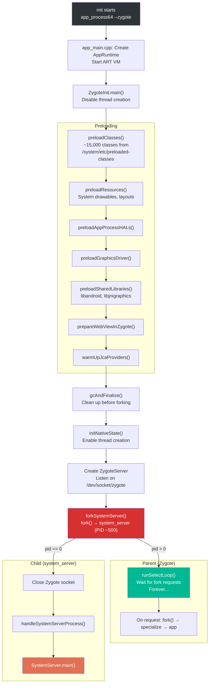

---

## 4.5 system_server Startup

The `system_server` process is the central hub of the Android framework. It hosts
over 100 system services that collectively provide the APIs and functionality that
applications depend on. The entry point is `SystemServer.java` at
`frameworks/base/services/java/com/android/server/SystemServer.java`.

### 4.5.1 SystemServer Entry Point

The `main()` method at line 710 is strikingly simple:

```java
// frameworks/base/services/java/com/android/server/SystemServer.java, lines 710-712
public static void main(String[] args) {
    new SystemServer().run();
}
```

The constructor (lines 714-727) records startup information:

```java
// frameworks/base/services/java/com/android/server/SystemServer.java, lines 714-727
public SystemServer() {
    // Check for factory test mode.
    mFactoryTestMode = FactoryTest.getMode();

    // Record process start information.
    mStartCount = SystemProperties.getInt(SYSPROP_START_COUNT, 0) + 1;
    mRuntimeStartElapsedTime = SystemClock.elapsedRealtime();
    mRuntimeStartUptime = SystemClock.uptimeMillis();

    // Remember if it's runtime restart or reboot.
    mRuntimeRestart = mStartCount > 1;
}
```

The `mStartCount` tracks how many times system_server has started since the last
reboot. A count greater than 1 indicates a runtime restart (system_server crashed
and was restarted by Zygote, which itself was restarted by init).

### 4.5.2 The run() Method: Bootstrap

The private `run()` method (lines 836-1083) contains the complete system_server
initialization sequence. It begins with critical setup:

```java
// frameworks/base/services/java/com/android/server/SystemServer.java, lines 836-953
private void run() {
    // ...
    t.traceBegin("InitBeforeStartServices");

    // Record the process start information in sys props.
    SystemProperties.set(SYSPROP_START_COUNT, String.valueOf(mStartCount));
    // ...

    // Here we go!
    Slog.i(TAG, "Entered the Android system server!");
    // ...

    // Mmmmmm... more memory!
    VMRuntime.getRuntime().clearGrowthLimit();

    // Ensure binder calls into the system always run at foreground priority.
    BinderInternal.disableBackgroundScheduling(true);

    // Increase the number of binder threads in system_server
    BinderInternal.setMaxThreads(sMaxBinderThreads);

    // Prepare the main looper thread (this thread).
    android.os.Process.setThreadPriority(
            android.os.Process.THREAD_PRIORITY_FOREGROUND);
    Looper.prepareMainLooper();
    // ...

    // Initialize native services.
    System.loadLibrary("android_servers");
    // ...

    // Initialize the system context.
    createSystemContext();
    // ...

    // Create the system service manager.
    mSystemServiceManager = new SystemServiceManager(mSystemContext);
```

Key setup steps:

- **`clearGrowthLimit()`**: Removes the heap growth limit, giving system_server
  access to all available heap memory
- **`setMaxThreads(31)`**: Sets the maximum Binder thread count to 31 (the constant
  `sMaxBinderThreads` at line 493), much higher than the default for regular apps
- **`Looper.prepareMainLooper()`**: Sets up the message loop for the main thread
- **`System.loadLibrary("android_servers")`**: Loads the native companion library
  containing JNI implementations for system services
- **`createSystemContext()`**: Creates the system-level `Context` used by services

### 4.5.3 The Four Service Start Phases

After initialization, `run()` starts services in four distinct phases (lines
1024-1044):

```java
// frameworks/base/services/java/com/android/server/SystemServer.java, lines 1024-1044
// Start services.
try {
    t.traceBegin("StartServices");
    // ...
    startBootstrapServices(t);
    startCoreServices(t);
    startOtherServices(t);
    startApexServices(t);
    // ...
    CriticalEventLog.getInstance().logSystemServerStarted();
} catch (Throwable ex) {
    Slog.e("System", "************ Failure starting system services", ex);
    throw ex;
}
```

After all services are started, system_server enters its main loop:

```java
// frameworks/base/services/java/com/android/server/SystemServer.java, lines 1080-1082
// Loop forever.
Looper.loop();
throw new RuntimeException("Main thread loop unexpectedly exited");
```

### 4.5.4 Bootstrap Services

The `startBootstrapServices()` method (lines 1176-1451) starts the services that
have complex mutual dependencies and must be initialized together. These are the
absolute foundation of the system:

```java
// frameworks/base/services/java/com/android/server/SystemServer.java, lines 1170-1175
/**
 * Starts the small tangle of critical services that are needed to get the
 * system off the ground.  These services have complex mutual dependencies
 * which is why we initialize them all in one place here.
 */
private void startBootstrapServices(@NonNull TimingsTraceAndSlog t) {
```

The bootstrap service start order (extracted from the actual source):

| Order | Service | Source Line | Purpose |
|---|---|---|---|
| 1 | ArtModuleServiceInitializer | 1187 | ART runtime integration |
| 2 | Watchdog | 1193 | Deadlock detection |
| 3 | ProtoLogConfigurationService | 1200 | ProtoLog framework |
| 4 | PlatformCompat | 1211 | App compatibility framework |
| 5 | FileIntegrityService | 1222 | File system integrity |
| 6 | Installer | 1229 | Package installation support |
| 7 | DeviceIdentifiersPolicyService | 1235 | Device ID access policy |
| 8 | FeatureFlagsService | 1241 | Runtime feature flags |
| 9 | UriGrantsManagerService | 1246 | Content URI permissions |
| 10 | PowerStatsService | 1250 | Power measurement |
| 11 | IStatsService | 1255 | Statistics collection (native) |
| 12 | MemtrackProxyService | 1261 | Memory tracking |
| 13 | AccessCheckingService | 1266 | Permission and AppOp management |
| 14 | ActivityTaskManagerService + ActivityManagerService | 1274-1283 | Activity lifecycle, process management |
| 15 | DataLoaderManagerService | 1287 | Incremental data loading |
| 16 | IncrementalService | 1293 | Incremental APK installation |
| 17 | PowerManagerService | 1301 | Power state management |
| 18 | ThermalManagerService | 1305 | Thermal monitoring |
| 19 | RecoverySystemService | 1316 | OTA and recovery |
| 20 | LightsService | 1327 | LED and backlight control |
| 21 | DisplayManagerService | 1340 | Display management |
| 22 | PHASE_WAIT_FOR_DEFAULT_DISPLAY | 1345 | *First boot phase checkpoint* |
| 23 | DomainVerificationService | 1357 | App link verification |
| 24 | PackageManagerService | 1363 | Package management |
| 25 | DexUseManagerLocal | 1377 | DEX file usage tracking |
| 26 | UserManagerService | 1397 | Multi-user management |
| 27 | OverlayManagerService | 1426 | Runtime resource overlays |
| 28 | SensorPrivacyService | 1437 | Sensor access control |
| 29 | SensorService | 1449 | Hardware sensor management |

Note the `PHASE_WAIT_FOR_DEFAULT_DISPLAY` at step 22 (line 1345):

```java
// frameworks/base/services/java/com/android/server/SystemServer.java, lines 1344-1346
// We need the default display before we can initialize the package manager.
t.traceBegin("WaitForDisplay");
mSystemServiceManager.startBootPhase(t, SystemService.PHASE_WAIT_FOR_DEFAULT_DISPLAY);
t.traceEnd();
```

This boot phase is a synchronization point: `PackageManagerService` needs display
metrics to properly handle resource selection, so it cannot start until the display
is available.

### 4.5.5 Core Services

The `startCoreServices()` method (lines 1457-1533) starts essential services that
do not have the complex interdependencies of bootstrap services:

| Order | Service | Purpose |
|---|---|---|
| 1 | SystemConfigService | System configuration |
| 2 | BatteryService | Battery level tracking |
| 3 | UsageStatsService | App usage statistics |
| 4 | WebViewUpdateService | WebView component updates |
| 5 | CachedDeviceStateService | Device state caching |
| 6 | BinderCallsStatsService | Binder call profiling |
| 7 | LooperStatsService | Handler message profiling |
| 8 | RollbackManagerService | APK rollback management |
| 9 | NativeTombstoneManagerService | Native crash tracking |
| 10 | BugreportManagerService | Bug report capture |
| 11 | GpuService | GPU driver management |
| 12 | RemoteProvisioningService | Remote key provisioning |

### 4.5.6 Other Services

The `startOtherServices()` method (lines 1539 onward) starts the remaining
~70+ system services. This is the longest method in all of SystemServer, starting
services like:

- WindowManagerService
- InputManagerService
- NetworkManagementService
- ConnectivityService
- NotificationManagerService
- LocationManagerService
- AudioService
- And many more

This method also starts APEX-delivered services and legacy Wear OS, TV, and
Automotive services based on device feature flags.

### 4.5.7 Boot Phase Progression

System services progress through well-defined boot phases. Each phase represents a
milestone in system readiness. Services can register to be notified when a phase is
reached, allowing them to perform additional initialization that depends on other
services being available.

```mermaid
flowchart LR
    P1["<b>PHASE_WAIT_FOR_<br/>DEFAULT_DISPLAY</b><br/>(100)<br/>Display available"]
    P2["<b>PHASE_LOCK_<br/>SETTINGS_READY</b><br/>(480)<br/>Lock screen ready"]
    P3["<b>PHASE_SYSTEM_<br/>SERVICES_READY</b><br/>(500)<br/>Core services ready"]
    P4["<b>PHASE_DEVICE_<br/>SPECIFIC_SERVICES_READY</b><br/>(520)<br/>Device services ready"]
    P5["<b>PHASE_ACTIVITY_<br/>MANAGER_READY</b><br/>(550)<br/>AMS ready"]
    P6["<b>PHASE_THIRD_PARTY_<br/>APPS_CAN_START</b><br/>(600)<br/>Apps can launch"]
    P7["<b>PHASE_BOOT_<br/>COMPLETED</b><br/>(1000)<br/>Boot done"]

    P1 --> P2 --> P3 --> P4 --> P5 --> P6 --> P7

    style P1 fill:#0984e3,color:#fff
    style P3 fill:#e17055,color:#fff
    style P6 fill:#00b894,color:#fff
    style P7 fill:#d63031,color:#fff
```

| Phase | Value | Description |
|---|---|---|
| `PHASE_WAIT_FOR_DEFAULT_DISPLAY` | 100 | Default display is available |
| `PHASE_LOCK_SETTINGS_READY` | 480 | Lock screen settings are available |
| `PHASE_SYSTEM_SERVICES_READY` | 500 | Core system services are ready for use |
| `PHASE_DEVICE_SPECIFIC_SERVICES_READY` | 520 | Device-specific services are ready |
| `PHASE_ACTIVITY_MANAGER_READY` | 550 | ActivityManagerService is ready to launch activities |
| `PHASE_THIRD_PARTY_APPS_CAN_START` | 600 | Third-party applications may be started |
| `PHASE_BOOT_COMPLETED` | 1000 | Boot is complete, all services running |

When `PHASE_BOOT_COMPLETED` is reached, the system property `sys.boot_completed` is
set to `1`, the boot animation is dismissed, and the home screen (launcher) activity
is started. This is the signal to all system components that the device is fully
operational.

### 4.5.8 The Boot Animation Lifecycle

The boot animation process (`bootanim`) is started as a service by init.rc and
runs a loop displaying either a default Android logo or a custom manufacturer
animation. It continues running until system_server signals completion by setting
the `service.bootanim.exit` property to `1`, which happens as part of reaching
`PHASE_BOOT_COMPLETED`.

### 4.5.9 Full system_server Boot Timeline

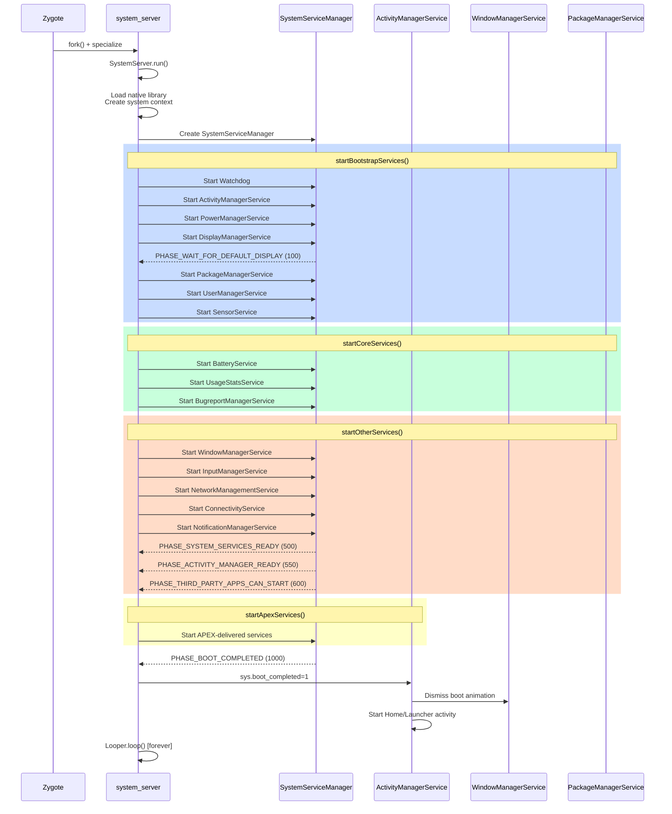

---

## 4.6 Deep Dive: The init.rc Language

This section provides a comprehensive reference for the init.rc language, which
every Android platform developer needs to understand.

### 4.6.1 Sections

Init.rc files consist of three types of sections:

**Actions** begin with the `on` keyword:

```
on <trigger> [&& <trigger>]*
    <command>
    <command>
    ...
```

**Services** begin with the `service` keyword:

```
service <name> <pathname> [ <argument> ]*
    <option>
    <option>
    ...
```

**Imports** bring in additional rc files:

```
import <path>
```

Imports are processed after all sections in the current file are parsed. Property
expansion (`${property.name}`) works in import paths, allowing hardware-specific
configuration: `import /init.${ro.hardware}.rc`.

### 4.6.2 Trigger Types

Init supports several trigger types:

**Boot triggers** fire once during the boot sequence:

| Trigger | When it fires |
|---|---|
| `early-init` | Very early in boot, before most setup |
| `init` | After basic device setup |
| `late-init` | Main boot orchestrator trigger |
| `early-fs` | Before filesystem mounts |
| `fs` | Filesystem mount phase |
| `post-fs` | After /system and /vendor are mounted |
| `late-fs` | Late filesystem mount phase |
| `post-fs-data` | After /data is mounted |
| `zygote-start` | Time to start Zygote |
| `boot` | System is ready for services |
| `charger` | Device is in charger-only mode |

**Property triggers** fire when a property matches a value:

```
on property:ro.debuggable=1
    start adbd

on property:vold.decrypt=trigger_restart_framework
    start surfaceflinger
    start zygote
```

**Compound triggers** combine boot and property triggers:

```
on boot && property:ro.config.low_ram=true
    write /proc/sys/vm/dirty_expire_centisecs 200
    write /proc/sys/vm/dirty_background_ratio 5
```

All conditions in a compound trigger must be true for the action to execute. When
a property trigger is part of a compound trigger, the action fires when the property
changes to the specified value AND all other conditions are met.

### 4.6.3 The init Trigger: System Configuration

The `init` trigger (at line 106 of `system/core/rootdir/init.rc`) performs foundational
system configuration. Here is the full action with annotations:

```
# system/core/rootdir/init.rc, lines 106-184 (selected)
on init
    sysclktz 0

    # Mix device-specific information into the entropy pool
    copy /proc/cmdline /dev/urandom
    copy /proc/bootconfig /dev/urandom

    symlink /proc/self/fd/0 /dev/stdin
    symlink /proc/self/fd/1 /dev/stdout
    symlink /proc/self/fd/2 /dev/stderr

    # cpuctl hierarchy for devices using utilclamp
    mkdir /dev/cpuctl/foreground
    mkdir /dev/cpuctl/background
    mkdir /dev/cpuctl/top-app
    mkdir /dev/cpuctl/rt
    mkdir /dev/cpuctl/system
    mkdir /dev/cpuctl/system-background
    mkdir /dev/cpuctl/dex2oat
```

This action sets the system clock timezone, seeds the entropy pool with boot
information (improving the quality of random numbers early in boot), creates standard
I/O symlinks, and sets up CPU control group hierarchies used for process scheduling.

The CPU control groups (foreground, background, top-app, etc.) are critical for
Android's process scheduling. ActivityManagerService later assigns processes to these
groups based on their importance, ensuring that foreground apps get more CPU time
than background processes.

### 4.6.4 Service Options Reference

The complete set of service options available in init.rc:

| Option | Example | Description |
|---|---|---|
| `class <name>` | `class main` | Service class for group start/stop |
| `user <name>` | `user system` | Run as this user |
| `group <name> [<name>]*` | `group system inet` | Primary and supplementary groups |
| `capabilities <cap>+` | `capabilities NET_ADMIN NET_RAW` | Linux capabilities to retain |
| `socket <name> <type> <perm> [user [group]]` | `socket zygote stream 660 root system` | Create a UNIX domain socket |
| `file <path> <type>` | `file /dev/kmsg w` | Open a file descriptor |
| `onrestart <command>` | `onrestart restart audioserver` | Command to run on restart |
| `oneshot` | | Do not restart when process exits |
| `disabled` | | Do not auto-start with class |
| `critical [window=<min>] [target=<target>]` | `critical window=10 target=zygote-fatal` | Reboot if crashes too often |
| `priority <int>` | `priority -20` | Scheduling priority (-20 to 19) |
| `oom_score_adjust <int>` | `oom_score_adjust -1000` | OOM killer score adjustment |
| `namespace <ns>` | `namespace mnt` | Run in a mount namespace |
| `seclabel <label>` | `seclabel u:r:healthd:s0` | SELinux security label |
| `writepid <file>+` | `writepid /dev/cpuset/system/tasks` | Write PID to these files |
| `task_profiles <profile>+` | `task_profiles ProcessCapacityHigh` | Apply cgroup/task profiles |
| `interface <name> <instance>` | `interface aidl android.hardware.power.IPower/default` | Register an interface |
| `stdio_to_kmsg` | | Redirect stdout/stderr to kmsg |
| `enter_namespace <ns> <path>` | `enter_namespace net /proc/1/ns/net` | Enter an existing namespace |
| `gentle_kill` | | Send SIGTERM before SIGKILL on stop |
| `shutdown <behavior>` | `shutdown critical` | Behavior during system shutdown |
| `restart_period <seconds>` | `restart_period 5` | Minimum time between restarts |
| `timeout_period <seconds>` | `timeout_period 10` | Kill service after N seconds |
| `updatable` | | Service can be overridden by APEX |
| `sigstop` | | Send SIGSTOP after fork (for debugger attach) |

### 4.6.5 Service Classes

Services are grouped into classes, allowing init to start or stop groups of services
at once. The standard classes are:

| Class | Purpose | Started by |
|---|---|---|
| `core` | Core services needed before zygote | `on post-fs-data` / `class_start core` |
| `main` | Main services including Zygote | `on zygote-start` / `class_start main` |
| `late_start` | Services that start after boot | `on boot` / `class_start late_start` |
| `hal` | Hardware abstraction layer services | Device-specific triggers |
| `early_hal` | HAL services needed early | Before `late-init` |

When `class_start main` is executed, all services with `class main` that are not
`disabled` will be started. Similarly, `class_stop main` stops all services in that
class.

### 4.6.6 Ueventd: Device Node Management

As mentioned in section 3.3.1, when init is invoked with the name `ueventd`, it
becomes the device node manager. Ueventd listens for kernel uevents and creates
device nodes in `/dev/` with appropriate permissions.

Ueventd's configuration is in `ueventd.rc` files. These define ownership and
permissions for device nodes:

```
# Example ueventd rules
/dev/null                 0666   root       root
/dev/zero                 0666   root       root
/dev/full                 0666   root       root
/dev/random               0666   root       root
/dev/urandom              0666   root       root
/dev/ashmem               0666   root       root
/dev/binder               0666   root       root
/dev/hwbinder             0666   root       root
/dev/vndbinder            0666   root       root
```

### 4.6.7 init.rc Processing Order

Understanding the processing order of init.rc files is critical for debugging boot
issues. The complete order is:

1. `/system/etc/init/hw/init.rc` is parsed first
2. All `import` statements in `init.rc` are collected (but not processed yet)
3. Files in `/system/etc/init/` are parsed (alphabetical order)
4. Files in `/system_ext/etc/init/` are parsed
5. Files in `/vendor/etc/init/` are parsed
6. Files in `/odm/etc/init/` are parsed
7. Files in `/product/etc/init/` are parsed
8. All collected `import` statements are processed (recursively)

Within each directory, `.rc` files are processed in alphabetical order. This means
that naming your rc file with a numeric prefix (e.g., `01-myservice.rc`) can
influence processing order, though relying on this is discouraged.

---

## 4.7 Deep Dive: Property Service Internals

The property service is one of the most heavily used IPC mechanisms during boot. This
section examines its implementation in detail.

### 4.7.1 Property Storage

Android properties are stored in shared memory regions mapped at
`/dev/__properties__/`. The property area is organized as a trie (prefix tree) for
efficient lookup. Each property area file is memory-mapped into every process that
reads properties, making reads extremely fast (no IPC needed).

The property storage is initialized in `PropertyInit()`, which is called from
`SecondStageMain()` in `init.cpp` (line 1108). The property info area
(`/dev/__properties__/property_info`) describes the trie structure and is parsed by
`property_info_area` (defined in `property_service.cpp` line 116):

```cpp
// system/core/init/property_service.cpp, line 116
[[clang::no_destroy]] static PropertyInfoAreaFile property_info_area;
```

### 4.7.2 Property Set Flow

When a process calls `SystemProperties.set()` (Java) or `__system_property_set()`
(native), the request flows through a UNIX domain socket to the property service
thread running inside the init process. The flow is:

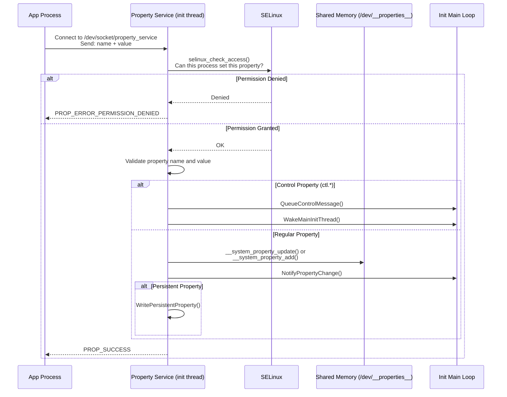

### 4.7.3 SELinux Property Access Control

Every property set operation is checked against SELinux policy. The
`CheckMacPerms()` function (lines 162-176 of `property_service.cpp`) performs this
check:

```cpp
// system/core/init/property_service.cpp, lines 162-176
static bool CheckMacPerms(const std::string& name, const char* target_context,
                          const char* source_context, const ucred& cr) {
    if (!target_context || !source_context) {
        return false;
    }

    PropertyAuditData audit_data;
    audit_data.name = name.c_str();
    audit_data.cr = &cr;

    auto lock = std::lock_guard{selinux_check_access_lock};
    return selinux_check_access(source_context, target_context,
                                "property_service", "set",
                                &audit_data) == 0;
}
```

The property info area maps property names to SELinux contexts. For example,
`ro.build.*` properties might map to `build_prop`, while `persist.sys.*` might map
to `system_prop`. Each context has separate SELinux rules controlling which domains
can read or write properties with that context.

The audit callback (lines 123-134) provides detailed logging for SELinux denials:

```cpp
// system/core/init/property_service.cpp, lines 123-134
static int PropertyAuditCallback(void* data, security_class_t /*cls*/,
                                  char* buf, size_t len) {
    auto* d = reinterpret_cast<PropertyAuditData*>(data);

    if (!d || !d->name || !d->cr) {
        LOG(ERROR) << "AuditCallback invoked with null data arguments!";
        return 0;
    }

    snprintf(buf, len, "property=%s pid=%d uid=%d gid=%d",
             d->name, d->cr->pid, d->cr->uid, d->cr->gid);
    return 0;
}
```

### 4.7.4 The Property Service Thread

The property service runs in its own thread, separate from init's main loop. This
design is important: property set requests can arrive at any time from any process,
and handling them in the main loop would delay action execution. The
`SocketConnection` class (starting at line 223) handles the wire protocol for
property requests:

```cpp
// system/core/init/property_service.cpp, lines 223-226
class SocketConnection {
  public:
    SocketConnection() = default;
    SocketConnection(int socket, const ucred& cred) : socket_(socket), cred_(cred) {}
```

Each connection receives the caller's credentials (`ucred`) through the UNIX socket,
which provides the PID, UID, and GID of the calling process. These credentials,
combined with the SELinux context, determine whether the property set is allowed.

### 4.7.5 Persistent Properties

Properties with the `persist.` prefix are stored persistently on disk under
`/data/property/`. They survive reboots. The write is handled asynchronously to
avoid blocking property set calls on disk I/O:

```cpp
// system/core/init/property_service.cpp, lines 414-423
bool need_persist = StartsWith(name, "persist.") || StartsWith(name, "next_boot.");
if (socket && persistent_properties_loaded && need_persist) {
    if (persist_write_thread) {
        persist_write_thread->Write(name, value, std::move(*socket));
        return {};
    }
    WritePersistentProperty(name, value);
}
```

Properties with the `next_boot.` prefix are also persisted, but they are applied
on the next boot rather than immediately.

### 4.7.6 Property Change Notification

When a property changes, all interested parties are notified. The
`NotifyPropertyChange()` function (lines 178-185) bridges the property service thread
and init's main loop:

```cpp
// system/core/init/property_service.cpp, lines 178-185
void NotifyPropertyChange(const std::string& name, const std::string& value) {
    auto lock = std::lock_guard{accept_messages_lock};
    if (accept_messages) {
        PropertyChanged(name, value);
    }
}
```

This calls `PropertyChanged()` in `init.cpp`, which queues property triggers and
wakes the main thread. The wake-up mechanism uses an eventfd, as shown in
`InstallInitNotifier()` (init.cpp lines 143-156):

```cpp
// system/core/init/init.cpp, lines 143-156
static void InstallInitNotifier(Epoll* epoll) {
    wake_main_thread_fd = eventfd(0, EFD_CLOEXEC);
    if (wake_main_thread_fd == -1) {
        PLOG(FATAL) << "Failed to create eventfd for waking init";
    }
    auto clear_eventfd = [] {
        uint64_t counter;
        TEMP_FAILURE_RETRY(read(wake_main_thread_fd, &counter, sizeof(counter)));
    };

    if (auto result = epoll->RegisterHandler(wake_main_thread_fd, clear_eventfd);
        !result.ok()) {
        LOG(FATAL) << result.error();
    }
}
```

---

## 4.8 Deep Dive: system_server Service Categories

The system_server starts well over 100 services. Understanding the categories and
key services is essential for platform developers.

### 4.8.1 startOtherServices: The Bulk of the Framework

The `startOtherServices()` method in `SystemServer.java` (starting at line 1539) is
the longest method in the class. It starts the "grab bag" of services that constitute
the Android framework. Here is a detailed breakdown of the key services started in
this method:

**Input and Display Services (lines ~1707-1765):**

```java
// frameworks/base/services/java/com/android/server/SystemServer.java
t.traceBegin("StartInputManagerService");
inputManager = mSystemServiceManager.startService(
        InputManagerService.Lifecycle.class).getService();
t.traceEnd();

t.traceBegin("StartWindowManagerService");
mSystemServiceManager.startBootPhase(t, SystemService.PHASE_WAIT_FOR_SENSOR_SERVICE);
wm = WindowManagerService.main(context, inputManager, !mFirstBoot,
        new PhoneWindowManager(), mActivityManagerService.mActivityTaskManager);
ServiceManager.addService(Context.WINDOW_SERVICE, wm, /* allowIsolated= */ false,
        DUMP_FLAG_PRIORITY_CRITICAL | DUMP_FLAG_PRIORITY_HIGH | DUMP_FLAG_PROTO);
t.traceEnd();
```

Note the `PHASE_WAIT_FOR_SENSOR_SERVICE` boot phase gate -- WindowManagerService
needs the sensor service (for rotation detection) before it can fully initialize.

**Storage and Content Services:**

```java
t.traceBegin("StartStorageManagerService");
mSystemServiceManager.startService(StorageManagerService.Lifecycle.class);
storageManager = IStorageManager.Stub.asInterface(
        ServiceManager.getService("mount"));
t.traceEnd();
```

StorageManagerService must start before NotificationManagerService because
notifications about USB connections and storage events depend on it.

**Connectivity Services:**

The networking stack is particularly complex, with multiple interdependent services:

```java
t.traceBegin("StartBluetoothService");
mSystemServiceManager.startServiceFromJar(BLUETOOTH_SERVICE_CLASS,
    BLUETOOTH_APEX_SERVICE_JAR_PATH);
t.traceEnd();

t.traceBegin("IpConnectivityMetrics");
mSystemServiceManager.startService(IpConnectivityMetrics.class);
t.traceEnd();
```

Bluetooth is loaded from an APEX jar (`/apex/com.android.bt/javalib/service-bluetooth.jar`),
demonstrating how modular system services have become.

### 4.8.2 APEX-Delivered Services

Modern Android delivers many system services through APEX packages. The
`startApexServices()` method starts services that come from updatable APEX modules:

| APEX Module | Service Class | Purpose |
|---|---|---|
| `com.android.os.statsd` | `StatsCompanion` | Statistics collection |
| `com.android.scheduling` | `RebootReadinessManagerService` | Safe reboot scheduling |
| `com.android.wifi` | `WifiService`, `WifiScanningService` | WiFi management |
| `com.android.tethering` | `ConnectivityServiceInitializer` | Network connectivity |
| `com.android.uwb` | `UwbService` | Ultra-wideband |
| `com.android.bt` | `BluetoothService` | Bluetooth |
| `com.android.devicelock` | `DeviceLockService` | Device lock/unlock |
| `com.android.profiling` | `ProfilingService` | System profiling |

These services are loaded from JAR files inside their respective APEX mounts under
`/apex/`. For example:

```java
// frameworks/base/services/java/com/android/server/SystemServer.java
private static final String WIFI_APEX_SERVICE_JAR_PATH =
        "/apex/com.android.wifi/javalib/service-wifi.jar";
private static final String WIFI_SERVICE_CLASS =
        "com.android.server.wifi.WifiService";
```

### 4.8.3 Safe Mode Detection

Before starting the bulk of other services, WindowManagerService checks for safe
mode (line 1851):

```java
// frameworks/base/services/java/com/android/server/SystemServer.java, lines 1849-1862
final boolean safeMode = wm.detectSafeMode();
if (safeMode) {
    Settings.Global.putInt(context.getContentResolver(),
            Settings.Global.AIRPLANE_MODE_ON, 1);
}
```

Safe mode is triggered when the user holds certain buttons during boot. In safe
mode, third-party apps are disabled, and airplane mode is automatically enabled.

### 4.8.4 Service Start Timing Constraints

The system_server uses a `SystemServerInitThreadPool` to parallelize initialization
where possible. For example, the secondary Zygote preload and HIDL service
initialization run in background threads:

```java
// frameworks/base/services/java/com/android/server/SystemServer.java, lines 1750-1755
SystemServerInitThreadPool.submit(() -> {
    TimingsTraceAndSlog traceLog = TimingsTraceAndSlog.newAsyncLog();
    traceLog.traceBegin(START_HIDL_SERVICES);
    startHidlServices();
    traceLog.traceEnd();
}, START_HIDL_SERVICES);
```

However, parallelization is constrained by the Watchdog: if a thread holds a lock
for too long, the Watchdog will kill system_server. The Watchdog is started as the
very first bootstrap service (line 1193) to ensure it can detect deadlocks from the
earliest possible point.

### 4.8.5 The Final Handoff

When all services are started and boot phases are complete, system_server enters its
main Looper (line 1081):

```java
// frameworks/base/services/java/com/android/server/SystemServer.java, lines 1080-1082
// Loop forever.
Looper.loop();
throw new RuntimeException("Main thread loop unexpectedly exited");
```

The `Looper.loop()` call never returns under normal operation. The main thread
processes messages from various system services, including ActivityManagerService's
handler messages, WindowManagerService display updates, and more. If the main loop
exits, the RuntimeException at line 1082 causes system_server to crash, which
triggers Zygote to restart, which triggers init to restart Zygote -- the entire Java
framework reboots.

---

## 4.9 Boot Time Measurement and Optimization

Understanding boot performance is essential for platform developers. Android provides
built-in tools for measuring and optimizing boot time.

### 4.9.1 Boot Time Properties

Init records timing information in system properties:

| Property | Description |
|---|---|
| `ro.boottime.init` | Timestamp when first-stage init started |
| `ro.boottime.init.first_stage` | Duration of first-stage init |
| `ro.boottime.init.selinux` | Duration of SELinux setup |
| `ro.boottime.init.modules` | Duration of kernel module loading |
| `ro.boottime.init.cold_boot_wait` | Time init waited for ueventd |

These are set in `RecordStageBoottimes()` (init.cpp lines 885-912):

```cpp
// system/core/init/init.cpp, lines 885-912
static void RecordStageBoottimes(const boot_clock::time_point& second_stage_start_time) {
    int64_t first_stage_start_time_ns = -1;
    if (auto first_stage_start_time_str = getenv(kEnvFirstStageStartedAt);
        first_stage_start_time_str) {
        SetProperty("ro.boottime.init", first_stage_start_time_str);
        android::base::ParseInt(first_stage_start_time_str, &first_stage_start_time_ns);
    }
    // ...
    SetProperty("ro.boottime.init.first_stage",
                std::to_string(selinux_start_time_ns - first_stage_start_time_ns));
    SetProperty("ro.boottime.init.selinux",
                std::to_string(second_stage_start_time.time_since_epoch().count() -
                               selinux_start_time_ns));
    if (auto init_module_time_str = getenv(kEnvInitModuleDurationMs);
        init_module_time_str) {
        SetProperty("ro.boottime.init.modules", init_module_time_str);
        unsetenv(kEnvInitModuleDurationMs);
    }
}
```

### 4.9.2 Bootchart

Android supports bootchart, a tool that records CPU, disk I/O, and process activity
during boot. Bootchart is started via init.rc:

```
# system/core/rootdir/init.rc, line 670-671
mkdir /data/bootchart 0755 shell shell encryption=Require
bootchart start
```

To capture a bootchart:

```bash
# Enable bootchart (requires userdebug/eng build)
adb shell touch /data/bootchart/enabled

# Reboot the device
adb reboot

# After boot, pull the data
adb shell tar -czf /data/local/tmp/bootchart.tgz /data/bootchart/
adb pull /data/local/tmp/bootchart.tgz
```

### 4.9.3 systrace/Perfetto Boot Tracing

Android's tracing infrastructure (Perfetto) can capture boot traces. system_server
uses `TimingsTraceAndSlog` throughout its initialization to record precise timing
for each service start:

```java
// Example from SystemServer.java
t.traceBegin("StartActivityManager");
// ... start AMS ...
t.traceEnd();
```

These traces can be captured with:

```bash
# Capture a boot trace
adb shell atrace --async_start -b 32768 -c am wm dalvik
adb reboot
# After boot:
adb shell atrace --async_dump -o /data/local/tmp/boot_trace
adb pull /data/local/tmp/boot_trace
```

### 4.9.4 Boot Monitor

For debuggable builds, init supports a boot timeout monitor that triggers a kernel
panic if boot does not complete within a specified time. This is configured via the
`ro.boot.boot_timeout` property and implemented in `StartSecondStageBootMonitor()`
(init.cpp lines 1022-1046):

```cpp
// system/core/init/init.cpp, lines 1022-1046
static void SecondStageBootMonitor(int timeout_sec) {
    auto cur_time = boot_clock::now().time_since_epoch();
    int cur_sec = std::chrono::duration_cast<std::chrono::seconds>(cur_time).count();
    int extra_sec = timeout_sec <= cur_sec ? 0 : timeout_sec - cur_sec;
    auto boot_timeout = std::chrono::seconds(extra_sec);

    LOG(INFO) << "Started BootMonitorThread, expiring in " << timeout_sec
              << " seconds from boot-up";

    if (!WaitForProperty("sys.boot_completed", "1", boot_timeout)) {
        LOG(ERROR) << "BootMonitorThread: boot didn't complete in " << timeout_sec
                   << " seconds. Trigger a panic!";
        std::this_thread::sleep_for(200ms);
        // trigger a kernel panic
        WriteStringToFile("c", PROC_SYSRQ);
    }
}
```

This safety net is invaluable during development: if a code change causes an infinite
boot loop, the device will eventually panic and (on devices with
`REBOOT_BOOTLOADER_ON_PANIC` enabled) reboot into the bootloader, allowing the
developer to flash a fixed image.

### 4.9.5 Common Boot Optimization Techniques

1. **Parallel kernel module loading**: Set `androidboot.load_modules_parallel=true`
   in bootconfig to enable parallel module loading during first-stage init

2. **Lazy Zygote preloading**: The secondary (32-bit) Zygote uses
   `--enable-lazy-preload` to defer class preloading until first use

3. **SystemServerInitThreadPool**: system_server parallelizes service initialization
   using a thread pool for independent services

4. **APEX preloading**: Pre-creating loop devices accelerates APEX mounting (see
   `InitExtraDevices()` in init.cpp lines 869-883):

    ```cpp
    // system/core/init/init.cpp, lines 869-883
    static void InitExtraDevices() {
        if constexpr (com::android::apex::flags::mount_before_data()) {
            constexpr int kMaxLoopDevices = 128;
            std::thread([]() {
                dm::LoopControl loop_control;
                for (int i = 0; i < kMaxLoopDevices; i++) {
                    (void)loop_control.Add(i);
                }
            }).detach();
        }
    }
    ```

5. **Bootchart analysis**: Use bootchart to identify the longest-running boot steps
   and optimize them

---

## 4.10 Debugging Boot Issues

### 4.10.1 Accessing Boot Logs

If the device is not booting, use these methods to access boot logs:

**Kernel log (dmesg)**:
```bash
adb shell dmesg > dmesg.log
```

**Last boot log (if device booted at least once)**:
```bash
adb shell cat /sys/fs/pstore/console-ramoops-0
```

**Init log**:
```bash
adb shell logcat -b all -d | grep "init: "
```

**Service status**:
```bash
adb shell getprop | grep "init.svc."
```

### 4.10.2 Common Boot Failures

**"Failed to mount required partitions early"**

This occurs in first-stage init when `DoFirstStageMount()` fails. Common causes:

- Corrupted fstab
- dm-verity failure (corrupted system image)
- Missing block device (storage driver not loaded)

**"SELinux: Could not load policy"**

SELinux policy failed to load during the selinux_setup phase. Common causes:

- Mismatched system/vendor SELinux policy versions
- Corrupted precompiled_sepolicy
- Missing policy files

**"Zygote: Unable to determine ABI list"**

The `ro.product.cpu.abilist` property is not set. This typically indicates a
problem with property loading or a missing `build.prop` file.

**Service crashes in a loop**

If a service with the `critical` flag crashes repeatedly, init will reboot the
device. Check logcat for crash traces and use `adb shell getprop init.svc.<name>`
to monitor service state.

### 4.10.3 First-Stage Console

For debugging first-stage init failures, you can enable a console. Add
`androidboot.first_stage_console=1` to the kernel command line or bootconfig. This
drops into a shell before first-stage mount, allowing you to inspect the early boot
environment.

The console support is in `first_stage_init.cpp` (lines 437-476):

```cpp
// system/core/init/first_stage_init.cpp, lines 437-438
auto want_console = ALLOW_FIRST_STAGE_CONSOLE ?
    FirstStageConsole(cmdline, bootconfig) : 0;
```

### 4.10.4 Using adb to Debug init.rc

Check which triggers have fired and which services are running:

```bash
# List all services and their states
adb shell getprop | grep init.svc

# Check if a specific trigger has fired (via property)
adb shell getprop sys.boot_completed

# Dump init's internal state
adb shell kill -3 1  # Send SIGQUIT to init (PID 1)
# State will be dumped to the kernel log
adb shell dmesg | tail -100
```

---

## 4.11 Deep Dive: Signal Handling in init

Since init is PID 1, it has unique responsibilities with respect to signal handling.
If PID 1 exits, the kernel panics. Therefore, init must be extremely careful about
how it handles signals.

### 4.11.1 SIGCHLD: Child Process Death

When any child process dies, init receives SIGCHLD. This is how init knows to
restart services. The signal handling setup is in `InstallSignalFdHandler()`
(init.cpp lines 782-808):

```cpp
// system/core/init/init.cpp, lines 782-808
static void InstallSignalFdHandler(Epoll* epoll) {
    // Applying SA_NOCLDSTOP to a defaulted SIGCHLD handler prevents the
    // signalfd from receiving SIGCHLD when a child process stops or
    // continues (b/77867680#comment9).
    const struct sigaction act {
        .sa_flags = SA_NOCLDSTOP, .sa_handler = SIG_DFL
    };
    sigaction(SIGCHLD, &act, nullptr);

    // Register a handler to unblock signals in the child processes.
    const int result = pthread_atfork(nullptr, nullptr, &UnblockSignals);
    if (result != 0) {
        LOG(FATAL) << "Failed to register a fork handler: " << strerror(result);
    }

    Result<void> cs_result = RegisterSignalFd(epoll, SIGCHLD, Service::GetSigchldFd());
    if (!cs_result.ok()) {
        PLOG(FATAL) << cs_result.error();
    }

    if (!IsRebootCapable()) {
        Result<int> cs_result = CreateAndRegisterSignalFd(epoll, SIGTERM);
        if (!cs_result.ok()) {
            PLOG(FATAL) << cs_result.error();
        }
        sigterm_fd = cs_result.value();
    }
}
```

Key design decisions:

1. **SA_NOCLDSTOP**: Only receive SIGCHLD when children terminate, not when they
   stop/continue. This prevents spurious wake-ups when processes are debugged with
   SIGSTOP.

2. **pthread_atfork**: Registers `UnblockSignals()` as a post-fork handler. This
   ensures that child processes created by `fork()` from init have normal signal
   handling, rather than inheriting init's blocked signal mask.

3. **signalfd**: Instead of using traditional signal handlers (which are inherently
   racy), init uses `signalfd` to convert signals into file descriptor events that
   can be multiplexed with `epoll()`. This allows signal handling to be integrated
   cleanly into init's event loop.

### 4.11.2 SIGTERM: Container Shutdown

In container environments (where init is not running as the root PID namespace),
SIGTERM is used to request graceful shutdown. From lines 713-721:

```cpp
// system/core/init/init.cpp, lines 713-721
static void HandleSigtermSignal(const signalfd_siginfo& siginfo) {
    if (siginfo.ssi_pid != 0) {
        // Drop any userspace SIGTERM requests.
        LOG(DEBUG) << "Ignoring SIGTERM from pid " << siginfo.ssi_pid;
        return;
    }

    HandlePowerctlMessage("shutdown,container");
}
```

Note the security check: only SIGTERM from PID 0 (the kernel) is honored. Any
userspace process sending SIGTERM to init is silently ignored.

### 4.11.3 Signal Handling in Child Processes

When init forks a child (to start a service), the child must unblock signals that
init blocked. The `UnblockSignals()` function (lines 745-759) handles this:

```cpp
// system/core/init/init.cpp, lines 745-759
static void UnblockSignals() {
    const struct sigaction act {
        .sa_handler = SIG_DFL
    };
    sigaction(SIGCHLD, &act, nullptr);

    sigset_t mask;
    sigemptyset(&mask);
    sigaddset(&mask, SIGCHLD);
    sigaddset(&mask, SIGTERM);

    if (sigprocmask(SIG_UNBLOCK, &mask, nullptr) == -1) {
        PLOG(FATAL) << "failed to unblock signals for PID " << getpid();
    }
}
```

This restores the default SIGCHLD handler and unblocks both SIGCHLD and SIGTERM in
the child process. Without this, services started by init would inherit init's
blocked signal mask and would not be able to detect when their own children exit.

---

## 4.12 Deep Dive: The Shutdown Sequence

The shutdown sequence is the reverse of the boot sequence, and it is just as
carefully orchestrated.

### 4.12.1 Triggering Shutdown

Shutdown is triggered by setting the `sys.powerctl` property:

```bash
# Reboot the device
setprop sys.powerctl reboot

# Shutdown the device
setprop sys.powerctl shutdown

# Reboot to bootloader
setprop sys.powerctl reboot,bootloader

# Reboot to recovery
setprop sys.powerctl reboot,recovery
```

The `PropertyChanged()` function in init.cpp (line 372) intercepts `sys.powerctl`
immediately, bypassing the normal event queue:

```cpp
// system/core/init/init.cpp, lines 365-373
void PropertyChanged(const std::string& name, const std::string& value) {
    if (name == "sys.powerctl") {
        trigger_shutdown(value);
    } else if (name == "sys.shutdown.requested") {
        HandleShutdownRequestedMessage(value);
    }
    // ...
}
```

### 4.12.2 The Shutdown State Machine

The `ShutdownState` class (init.cpp lines 241-268) manages the shutdown process:

```cpp
// system/core/init/init.cpp, lines 241-268
static class ShutdownState {
  public:
    void TriggerShutdown(const std::string& command) {
        auto lock = std::lock_guard{shutdown_command_lock_};
        shutdown_command_ = command;
        do_shutdown_ = true;
        WakeMainInitThread();
    }

    std::optional<std::string> CheckShutdown() {
        auto lock = std::lock_guard{shutdown_command_lock_};
        if (do_shutdown_ && !IsShuttingDown()) {
            do_shutdown_ = false;
            return shutdown_command_;
        }
        return {};
    }
  private:
    std::mutex shutdown_command_lock_;
    std::string shutdown_command_;
    bool do_shutdown_ = false;
} shutdown_state;
```

The design is thread-safe: `TriggerShutdown()` can be called from the property
service thread, while `CheckShutdown()` is called from the main init thread. The
lock ensures that the shutdown command is safely transferred between threads.

### 4.12.3 Shutdown Process Order

When shutdown is triggered, init executes the following sequence:

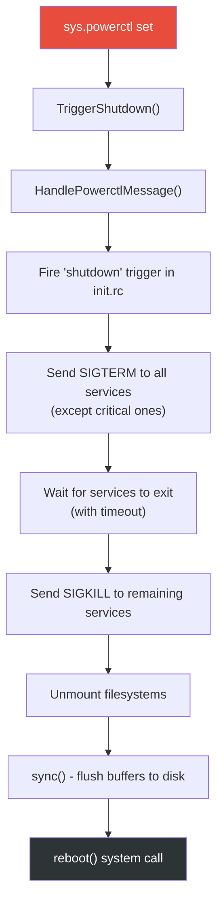

Services marked with `shutdown critical` are the last to be stopped, ensuring that
critical operations (like filesystem writes) can complete before the device powers
off.

---

## 4.13 Advanced Topics

### 4.13.1 Mount Namespaces

Init supports mount namespaces to provide different filesystem views to different
processes. The `SetupMountNamespaces()` function (called from `SecondStageMain()` at
line 1170) creates separate mount namespaces:

```cpp
// system/core/init/init.cpp, line 1170
if (!SetupMountNamespaces()) {
    PLOG(FATAL) << "SetupMountNamespaces failed";
}
```

Mount namespaces are used for:

- **APEX management**: APEXes are mounted differently in the default namespace vs.
  the bootstrap namespace
- **Vendor isolation**: Vendor processes may have a different view of `/apex` than
  system processes
- **linkerconfig**: Different processes may have different linker configurations based
  on their namespace

### 4.13.2 Subcontext

Init supports "subcontext" execution, where certain init commands run in a separate
process with a different SELinux context. This is used for vendor init scripts that
need to run with vendor-specific SELinux permissions.

From `main.cpp` (lines 66-70):

```cpp
// system/core/init/main.cpp, lines 66-70
if (!strcmp(argv[1], "subcontext")) {
    android::base::InitLogging(argv, &android::base::KernelLogger);
    const BuiltinFunctionMap& function_map = GetBuiltinFunctionMap();
    return SubcontextMain(argc, argv, &function_map);
}
```

The subcontext process communicates with init's main process via a socket,
receiving commands to execute and returning results. This design allows vendor
init scripts to run commands that require vendor SELinux permissions without
granting those permissions to init itself.

### 4.13.3 APEX Init Scripts

APEXes can include their own init.rc scripts. When an APEX is activated, init
parses its scripts and integrates them into the action and service lists. The
`CreateApexConfigParser()` function (init.cpp lines 312-337) creates a parser
specifically for APEX scripts:

```cpp
// system/core/init/init.cpp, lines 312-337
Parser CreateApexConfigParser(ActionManager& action_manager,
                               ServiceList& service_list) {
    Parser parser;
    auto subcontext = GetSubcontext();
    // ...
    parser.AddSectionParser("service",
        std::make_unique<ServiceParser>(&service_list, subcontext));
    parser.AddSectionParser("on",
        std::make_unique<ActionParser>(&action_manager, subcontext));
    return parser;
}
```

APEX init scripts can define new services and actions, but they are restricted to
operations that their SELinux policy allows.

### 4.13.4 Control Messages: start/stop/restart

Control messages are the mechanism by which system services start and stop init-
managed services at runtime. The control message map is defined in init.cpp
(lines 516-531):

```cpp
// system/core/init/init.cpp, lines 516-531
static const std::map<std::string, ControlMessageFunction, std::less<>>&
    GetControlMessageMap() {
    [[clang::no_destroy]]
    static const std::map<std::string, ControlMessageFunction, std::less<>>
        control_message_functions = {
        {"sigstop_on",   [](auto* service) { service->set_sigstop(true);
                                              return Result<void>{}; }},
        {"sigstop_off",  [](auto* service) { service->set_sigstop(false);
                                              return Result<void>{}; }},
        {"oneshot_on",   [](auto* service) { service->set_oneshot(true);
                                              return Result<void>{}; }},
        {"oneshot_off",  [](auto* service) { service->set_oneshot(false);
                                              return Result<void>{}; }},
        {"start",        DoControlStart},
        {"stop",         DoControlStop},
        {"restart",      DoControlRestart},
    };
    return control_message_functions;
}
```

Beyond the standard start/stop/restart, control messages also support:

- `sigstop_on`/`sigstop_off`: Enable/disable sending SIGSTOP to a service after
  fork, useful for attaching a debugger before the service runs any code
- `oneshot_on`/`oneshot_off`: Dynamically change whether a service restarts after
  exit
- `interface_start`/`interface_stop`/`interface_restart`: Control services by their
  registered interface name rather than their service name

APEX control messages (`apex_load`/`apex_unload`) are handled separately and allow
loading and unloading APEX init scripts at runtime.

### 4.13.5 The Epoll-Based Event Loop Architecture

Init's main loop is built on Linux's `epoll` facility, providing an efficient event
multiplexing mechanism. The architecture deserves detailed examination because it is
the backbone of init's entire operation.

The epoll instance is created in `SecondStageMain()`:

```cpp
// system/core/init/init.cpp, lines 1125-1128
Epoll epoll;
if (auto result = epoll.Open(); !result.ok()) {
    PLOG(FATAL) << result.error();
}
```

Three types of file descriptors are registered with epoll:

1. **Signal file descriptors**: SIGCHLD (child death) and SIGTERM (shutdown request)
   are converted to file descriptor events via `signalfd()`. This avoids the
   inherent races of traditional signal handlers.

2. **The wake eventfd**: A non-blocking eventfd used to wake the main loop when
   property changes or control messages arrive from other threads.

3. **Mount event handler**: Watches for filesystem mount/unmount events and updates
   properties accordingly.

The epoll has a "first callback" mechanism that ensures child reaping always happens
before any other event processing:

```cpp
// system/core/init/init.cpp, line 1133
epoll.SetFirstCallback(ReapAnyOutstandingChildren);
```

This prevents a race condition where a service monitors another service's exit
(through `init.svc.*` properties) and requests a restart before init has reaped
the zombie process.

The main loop's structure (lines 1246-1296) follows a classic event-driven pattern:

1. Check for pending shutdown
2. Execute one queued action (from init.rc triggers)
3. Handle process restarts and timeouts
4. Calculate the sleep timeout based on pending work
5. Wait on epoll (with timeout)
6. Handle control messages

The single-action-per-iteration design (line 1261, `am.ExecuteOneCommand()`) is
deliberate: it prevents any single burst of actions from starving signal handling or
property processing. If more actions are pending, the next action time is set to
"now", which causes epoll to return immediately.

When there is no pending work, init calls `mallopt(M_PURGE_ALL, 0)` (line 1286) to
release memory back to the kernel. This is a small but important optimization:
during steady-state operation (after boot), init is mostly idle, and releasing its
heap pages reduces memory pressure on the system.

### 4.13.6 The GSI (Generic System Image) Check

Init checks whether the device is running a GSI during second-stage startup
(init.cpp lines 1186-1195):

```cpp
// system/core/init/init.cpp, lines 1186-1195
auto is_running = android::gsi::IsGsiRunning() ? "1" : "0";
SetProperty(gsi::kGsiBootedProp, is_running);
auto is_installed = android::gsi::IsGsiInstalled() ? "1" : "0";
SetProperty(gsi::kGsiInstalledProp, is_installed);
if (android::gsi::IsGsiRunning()) {
    std::string dsu_slot;
    if (android::gsi::GetActiveDsu(&dsu_slot)) {
        SetProperty(gsi::kDsuSlotProp, dsu_slot);
    }
}
```

These properties allow init.rc scripts and system services to adapt behavior when
running on a GSI, which is commonly used for VTS (Vendor Test Suite) testing.

---

## 4.14 The Complete Boot Sequence in One Diagram

The following diagram summarizes the entire boot sequence covered in this chapter,
showing the flow between all major components:

```mermaid
flowchart TD
    subgraph "Hardware / Firmware"
        PO["Power On"]
        BROM["Boot ROM"]
        BL["Bootloader (ABL/U-Boot)"]
        AVB["Android Verified Boot<br/>Verify vbmeta → boot → vendor_boot"]
    end

    subgraph "Linux Kernel"
        KI["Kernel Init"]
        DP["Driver Probing"]
        RM["Mount initramfs"]
        PI["Launch /init (PID 1)"]
    end

    subgraph "First Stage Init"
        FS["Mount tmpfs, proc, sysfs"]
        KM["Load Kernel Modules"]
        FSM["Mount /system, /vendor<br/>(with dm-verity)"]
        FRR["Free ramdisk"]
        SEL["exec → selinux_setup"]
    end

    subgraph "SELinux Setup"
        SLP["Load SELinux Policy<br/>(split or monolithic)"]
        ENF["Set Enforcement Mode"]
        RC["restorecon /system/bin/init"]
        EX2["exec → second_stage"]
    end

    subgraph "Second Stage Init"
        PI2["Property Init"]
        PS["Start Property Service"]
        EP["Create Epoll Loop"]
        LBS["Load Boot Scripts<br/>(init.rc + all directories)"]
        TQ["Queue Triggers:<br/>early-init → init → late-init"]
    end

    subgraph "Trigger Chain"
        EI["early-init"]
        IN["init"]
        LI["late-init"]
        EFS["early-fs → fs → post-fs"]
        LFS["late-fs"]
        PFD["post-fs-data<br/>(mount /data)"]
        ZS["zygote-start"]
    end

    subgraph "Zygote"
        AP["app_process64 --zygote"]
        ART["Start ART VM"]
        PRE["Preload ~15K classes<br/>+ resources + drivers"]
        FSS["Fork system_server"]
        SSL["Enter select loop<br/>(wait for fork requests)"]
    end

    subgraph "system_server"
        SM["SystemServer.main()"]
        BS["startBootstrapServices()<br/>AMS, PMS, WMS, DisplayManager"]
        CS["startCoreServices()<br/>Battery, Usage, WebView"]
        OS["startOtherServices()<br/>70+ framework services"]
        AS["startApexServices()<br/>WiFi, BT, Connectivity"]
        P100["PHASE 100: Default Display"]
        P500["PHASE 500: System Services Ready"]
        P600["PHASE 600: Apps Can Start"]
        P1K["PHASE 1000: Boot Completed"]
    end

    subgraph "Home Screen"
        BC["sys.boot_completed=1"]
        BA["Dismiss boot animation"]
        HL["Launch Home/Launcher"]
        UI["User Interaction"]
    end

    PO --> BROM --> BL --> AVB --> KI
    KI --> DP --> RM --> PI
    PI --> FS --> KM --> FSM --> FRR --> SEL
    SEL --> SLP --> ENF --> RC --> EX2
    EX2 --> PI2 --> PS --> EP --> LBS --> TQ
    TQ --> EI --> IN --> LI
    LI --> EFS --> LFS --> PFD --> ZS
    ZS --> AP --> ART --> PRE --> FSS
    FSS --> SSL
    FSS --> SM --> BS --> CS --> OS --> AS
    BS --> P100
    OS --> P500
    OS --> P600
    AS --> P1K
    P1K --> BC --> BA --> HL --> UI

    style PO fill:#2d3436,color:#fff
    style AVB fill:#6c5ce7,color:#fff
    style PI fill:#00b894,color:#fff
    style SEL fill:#fdcb6e,color:#333
    style EX2 fill:#fdcb6e,color:#333
    style ZS fill:#e17055,color:#fff
    style FSS fill:#d63031,color:#fff
    style P1K fill:#d63031,color:#fff
    style UI fill:#00b894,color:#fff
```

---

## 4.15 Try It: Add a Custom Init Service

Now that we understand the complete boot sequence, let us walk through a practical
exercise: adding a custom native daemon that starts during boot.

### 4.15.1 Step 1: Write the Native Daemon

Create a simple daemon that logs a message to the kernel log every few seconds.

Create the file `device/generic/car/mybootdaemon/mybootdaemon.cpp`:

```cpp
// device/generic/car/mybootdaemon/mybootdaemon.cpp
#include <android-base/logging.h>
#include <unistd.h>

int main(int /* argc */, char** argv) {
    // Initialize logging to the kernel log (kmsg).
    android::base::InitLogging(argv, &android::base::KernelLogger);

    LOG(INFO) << "mybootdaemon: Starting up!";

    // A real daemon would do useful work here.
    // This example simply logs heartbeat messages.
    int counter = 0;
    while (true) {
        LOG(INFO) << "mybootdaemon: heartbeat #" << counter++;
        sleep(10);
    }

    // Unreachable, but good practice.
    return 0;
}
```

### 4.15.2 Step 2: Create the Build File

Create `device/generic/car/mybootdaemon/Android.bp`:

```json
cc_binary {
    name: "mybootdaemon",
    srcs: ["mybootdaemon.cpp"],
    shared_libs: [
        "libbase",
        "liblog",
    ],
    init_rc: ["mybootdaemon.rc"],

    // Install to /system/bin
    vendor: false,
}
```

The `init_rc` field tells the build system to install our init.rc file alongside the
binary. The build system will place it at `/system/etc/init/mybootdaemon.rc`, which
is one of the directories that init parses during `LoadBootScripts()`.

### 4.15.3 Step 3: Create the init.rc File

Create `device/generic/car/mybootdaemon/mybootdaemon.rc`:

```
service mybootdaemon /system/bin/mybootdaemon
    class late_start
    user system
    group system log
    disabled
    oneshot

on property:sys.boot_completed=1
    start mybootdaemon
```

Let us examine each directive:

- **`service mybootdaemon`**: Declares the service name
- **`/system/bin/mybootdaemon`**: The executable path
- **`class late_start`**: Belongs to the `late_start` class, which starts after
  `zygote-start`
- **`user system`**: Run as the `system` user (UID 1000), not root
- **`group system log`**: Supplementary groups for system access and logging
- **`disabled`**: The service does not start automatically with its class -- it must
  be explicitly started
- **`oneshot`**: The service runs once and is not restarted if it exits

The `on property:sys.boot_completed=1` trigger starts our daemon after the system
has fully booted. This is the safest time to start custom daemons because all
system services are available.

### 4.15.4 Step 4: Add the SELinux Policy

For a real device, you must create SELinux policy for your daemon. Without it,
SELinux will deny all operations and your daemon will fail to function.

Create `device/generic/car/sepolicy/private/mybootdaemon.te`:

```
# Define the mybootdaemon domain
type mybootdaemon, domain;
type mybootdaemon_exec, exec_type, file_type, system_file_type;

# Allow init to transition to our domain when starting the service
init_daemon_domain(mybootdaemon)

# Allow basic logging
allow mybootdaemon kmsg_device:chr_file { open write };

# Allow reading system properties
get_prop(mybootdaemon, default_prop)
```

And add the file context in `device/generic/car/sepolicy/private/file_contexts`:

```
/system/bin/mybootdaemon      u:object_r:mybootdaemon_exec:s0
```

### 4.15.5 Step 5: Build and Test

Add the module to your device makefile (e.g., `device/generic/car/device.mk`):

```makefile
PRODUCT_PACKAGES += mybootdaemon
```

Build the system image:

```bash
source build/envsetup.sh
lunch <your_target>
m mybootdaemon
```

For a full system image build:

```bash
m
```

### 4.15.6 Step 6: Verify

After flashing the image or booting the emulator:

```bash
# Check that the service is defined
adb shell getprop init.svc.mybootdaemon
# Expected: "running" (after boot completes)

# Check the service status
adb shell service list | grep mybootdaemon

# View the daemon's log output
adb shell dmesg | grep mybootdaemon
# Expected output:
# mybootdaemon: Starting up!
# mybootdaemon: heartbeat #0
# mybootdaemon: heartbeat #1

# Manually stop and start the service
adb shell setprop ctl.stop mybootdaemon
adb shell getprop init.svc.mybootdaemon
# Expected: "stopped"

adb shell setprop ctl.start mybootdaemon
adb shell getprop init.svc.mybootdaemon
# Expected: "running"
```

### 4.15.7 Common Pitfalls

**Problem: Service fails to start with "permission denied"**

This is almost always a SELinux issue. Check the audit log:

```bash
adb shell dmesg | grep "avc: denied"
```

Use `audit2allow` to generate the necessary policy rules.

**Problem: Service starts but immediately exits**

Check if init is killing the service. Look for the `SVC_RESTARTING` flag:

```bash
adb shell getprop init.svc.mybootdaemon
```

If it shows "restarting", your service is crashing. Check logcat and dmesg for
crash information. If your service is `oneshot` and exits normally, the status will
be "stopped" -- this is expected behavior.

**Problem: Service starts before a dependency is ready**

Use property triggers to gate startup. For example, to wait for the network stack:

```
on property:sys.boot_completed=1 && property:init.svc.netd=running
    start mybootdaemon
```

**Problem: Service runs as wrong SELinux context**

Verify the file context:

```bash
adb shell ls -Z /system/bin/mybootdaemon
# Expected: u:object_r:mybootdaemon_exec:s0
```

And verify the process context:

```bash
adb shell ps -eZ | grep mybootdaemon
# Expected: u:r:mybootdaemon:s0
```

### 4.15.8 Understanding Service States

Init tracks each service through a set of state flags. Understanding these states
is critical for debugging service startup issues:

| State | Property Value | Meaning |
|---|---|---|
| `stopped` | `init.svc.<name>=stopped` | Service is not running |
| `starting` | `init.svc.<name>=starting` | Service is being started |
| `running` | `init.svc.<name>=running` | Service is running |
| `stopping` | `init.svc.<name>=stopping` | Service is being stopped |
| `restarting` | `init.svc.<name>=restarting` | Service will restart after a delay |

The state machine:

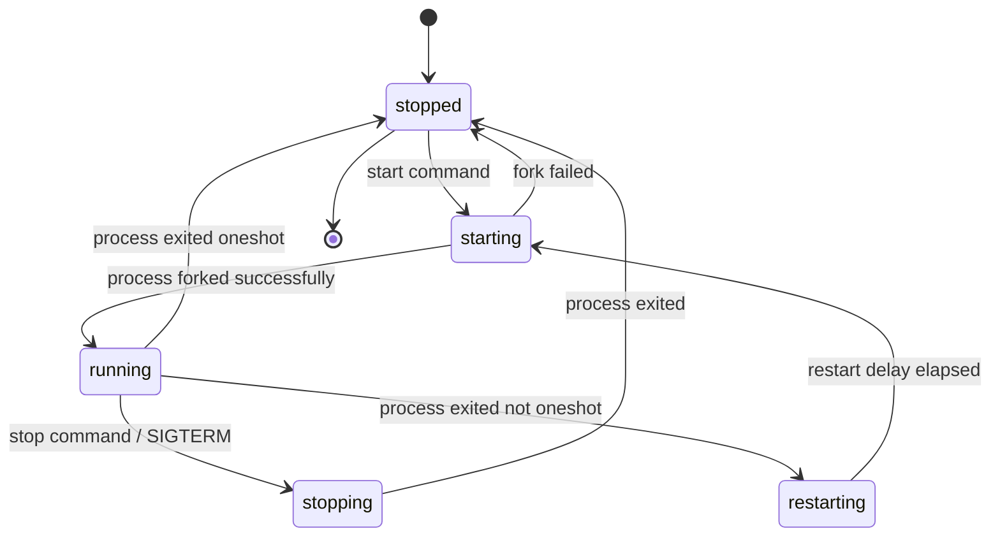

The restart delay (default: 5 seconds) prevents a crashing service from consuming
all CPU by restarting in a tight loop. This delay can be customized per-service
with the `restart_period` option.

The `HandleProcessActions()` function (init.cpp lines 390-418) drives the restart
logic:

```cpp
// system/core/init/init.cpp, lines 390-418
static std::optional<boot_clock::time_point> HandleProcessActions() {
    std::optional<boot_clock::time_point> next_process_action_time;
    for (const auto& s : ServiceList::GetInstance()) {
        if ((s->flags() & SVC_RUNNING) && s->timeout_period()) {
            auto timeout_time = s->time_started() + *s->timeout_period();
            if (boot_clock::now() > timeout_time) {
                s->Timeout();
            } else {
                if (!next_process_action_time ||
                    timeout_time < *next_process_action_time) {
                    next_process_action_time = timeout_time;
                }
            }
        }

        if (!(s->flags() & SVC_RESTARTING)) continue;

        auto restart_time = s->time_started() + s->restart_period();
        if (boot_clock::now() > restart_time) {
            if (auto result = s->Start(); !result.ok()) {
                LOG(ERROR) << "Could not restart process '" << s->name()
                           << "': " << result.error();
            }
        } else {
            if (!next_process_action_time ||
                restart_time < *next_process_action_time) {
                next_process_action_time = restart_time;
            }
        }
    }
    return next_process_action_time;
}
```

This function iterates over all services, checking for two conditions:

1. **Timeout**: If a running service has a `timeout_period` and has exceeded it, the
   service is killed
2. **Restart**: If a service is in the `SVC_RESTARTING` state and the restart delay
   has elapsed, the service is restarted

The function returns the next time it needs to run, which is used to set the epoll
timeout in the main loop.

### 4.15.9 Advanced: Making a Persistent Daemon

To create a daemon that is automatically restarted by init if it crashes, modify
the rc file:

```
service mybootdaemon /system/bin/mybootdaemon
    class late_start
    user system
    group system log

on property:sys.boot_completed=1
    enable mybootdaemon
    class_start late_start
```

Without the `oneshot` directive, init will automatically restart the service if it
exits. The `enable` command is used instead of `start` to allow the service to start
with its class.

For critical services that should trigger a device reboot if they crash too many
times:

```
service mybootdaemon /system/bin/mybootdaemon
    class late_start
    user system
    group system log
    critical
```

The `critical` directive tells init to reboot the device if the service crashes more
than four times in four minutes. This is the same mechanism used for Zygote itself.

---

## Summary

This chapter traced the complete Android boot sequence from power-on to home screen:

1. **Bootloader** loads and verifies the kernel using AVB (`external/avb/libavb/`)

1. **Bootloader** loads and verifies the kernel using AVB (`external/avb/libavb/`)
2. **Linux kernel** launches `/init` as PID 1
3. **First-stage init** (`system/core/init/first_stage_init.cpp`) mounts partitions
   and loads kernel modules
4. **SELinux setup** (`system/core/init/selinux.cpp`) loads security policy and
   transitions to the proper security domain
5. **Second-stage init** (`system/core/init/init.cpp`) parses init.rc files, starts
   the property service, and launches all native daemons
6. **Zygote** (`frameworks/base/cmds/app_process/app_main.cpp` and
   `frameworks/base/core/java/com/android/internal/os/ZygoteInit.java`) preloads the
   Android framework and forks `system_server`
7. **system_server** (`frameworks/base/services/java/com/android/server/SystemServer.java`)
   starts 100+ system services in four phases, progressing through boot phase
   milestones until `PHASE_BOOT_COMPLETED`

Key architectural insights:

- **Two-stage init** solves the SELinux chicken-and-egg problem: first-stage runs
  before policy is loaded, second-stage runs under full enforcement
- **The init.rc trigger chain** (`early-init` -> `init` -> `late-init` ->
  `early-fs` -> `fs` -> `post-fs` -> `post-fs-data` -> `zygote-start` -> `boot`)
  enforces the dependency order for the entire boot sequence
- **Zygote's fork model** enables fast app startup through copy-on-write memory
  sharing of preloaded framework code
- **Boot phase progression** in system_server allows services to perform staged
  initialization based on what other services are available
- **The property system** serves as both a configuration store and an IPC mechanism,
  with property triggers driving much of the boot orchestration

### Key Source File Reference

The following table provides a comprehensive reference to every source file discussed
in this chapter:

| File Path | Purpose | Section |
|---|---|---|
| `system/core/init/first_stage_main.cpp` | First-stage init entry point | 3.3.1 |
| `system/core/init/first_stage_init.cpp` | First-stage init implementation | 3.3.2 |
| `system/core/init/main.cpp` | Init dispatch (all modes) | 3.3.1 |
| `system/core/init/init.cpp` | Second-stage init + main loop | 3.3.5 |
| `system/core/init/selinux.cpp` | SELinux policy loading | 3.3.3 |
| `system/core/init/property_service.cpp` | Property service implementation | 3.3.6, 3.8 |
| `system/core/rootdir/init.rc` | Master init.rc configuration | 3.3.7 |
| `system/core/rootdir/init.zygote64.rc` | 64-bit Zygote service definition | 3.3.7 |
| `system/core/rootdir/init.zygote64_32.rc` | Dual Zygote (64+32) definition | 3.3.7 |
| `frameworks/base/cmds/app_process/app_main.cpp` | Zygote native entry point | 3.4.1 |
| `frameworks/base/core/java/com/android/internal/os/ZygoteInit.java` | Zygote Java entry point | 3.4.2-3.4.5 |
| `frameworks/base/services/java/com/android/server/SystemServer.java` | system_server entry point | 3.5 |
| `external/avb/libavb/avb_vbmeta_image.h` | VBMeta image format | 3.2.3 |
| `external/avb/libavb/avb_slot_verify.h` | Slot verification API | 3.2.3 |
| `external/avb/libavb/avb_hashtree_descriptor.h` | dm-verity hashtree format | 3.2.3 |

### Architectural Insights

The boot sequence reveals several fundamental design principles of Android:

**Separation of concerns through exec chains**: First-stage init, SELinux setup,
and second-stage init are all the same binary (`/system/bin/init`) but execute as
separate process images via `exec()`. Each stage has a focused responsibility and
a well-defined interface to the next stage (via command-line arguments and
environment variables).

**Event-driven, single-threaded main loop**: Init's main loop is deliberately
single-threaded for determinism. Properties, signals, and timers are all multiplexed
through epoll. The only multi-threaded aspect is the property service thread, which
communicates with the main loop through an eventfd.

**Fork-based process creation**: Zygote's fork model is the key optimization that
makes Android's app startup times possible. By paying the cost of framework loading
once (in Zygote) and sharing it across all apps via copy-on-write, Android avoids
the 2-5 second startup penalty that would occur if each app loaded the framework
independently.

**Boot phase progression**: system_server's phased boot allows services to perform
staged initialization. A service can do basic setup during its constructor, then
wait for `PHASE_SYSTEM_SERVICES_READY` before accessing other services, and
`PHASE_BOOT_COMPLETED` before assuming the system is fully operational. This
eliminates timing-dependent bugs that would occur if services tried to use other
services that had not yet started.

**Property triggers as a coordination mechanism**: The property system serves as a
lightweight publish-subscribe mechanism during boot. Services announce their state
by setting properties (e.g., `init.svc.zygote=running`), and init.rc triggers
respond to those state changes to orchestrate the boot sequence. The
`wait_for_prop` command provides synchronous waiting when strict ordering is
required.

**Defense in depth**: The boot sequence implements multiple layers of security:

- AVB ensures only verified code runs
- dm-verity provides runtime integrity checking
- SELinux confines every process to its security domain
- The property system enforces MAC on all configuration changes
- Services run with minimal privileges (user/group/capabilities)

The source files referenced in this chapter are the authoritative documentation for
Android's boot process. When the code changes, this documentation changes with it
-- which is why reading the actual source is always more reliable than any external
documentation, including this book.

### Glossary of Terms

| Term | Definition |
|---|---|
| **ABL** | Android Bootloader; Qualcomm's UEFI-based bootloader |
| **APEX** | Android Pony EXpress; updatable system component package |
| **AVB** | Android Verified Boot; chain-of-trust verification system |
| **BPF** | Berkeley Packet Filter; kernel-level packet filtering |
| **DTB** | Device Tree Blob; hardware description for the kernel |
| **dm-verity** | Device-mapper verity; runtime filesystem integrity verification |
| **epoll** | Linux I/O event notification facility |
| **fstab** | Filesystem table; describes mount points and options |
| **GKI** | Generic Kernel Image; standardized Android kernel |
| **GSI** | Generic System Image; standardized system partition for testing |
| **init.rc** | Init configuration language files |
| **PID 1** | The first userspace process; init in Android |
| **RPMB** | Replay Protected Memory Block; secure storage on eMMC/UFS |
| **SELinux** | Security-Enhanced Linux; mandatory access control |
| **SoC** | System on Chip; integrated circuit with CPU, GPU, etc. |
| **USAP** | Unspecialized App Process; pre-forked Zygote child |
| **VBMeta** | Verified Boot Metadata; signed partition verification data |
| **Zygote** | Process that pre-loads framework and forks all app processes |
| **system_server** | Central framework process hosting 100+ system services |

### Further Reading

To continue exploring the topics covered in this chapter:

- **Chapter 22** will cover Android's process management and how
  ActivityManagerService manages the lifecycle of application processes that Zygote
  creates
- **Chapter 9** will examine the Binder IPC mechanism that system_server services
  use to communicate with applications
- The Android source code at `system/core/init/README.md` contains additional
  documentation on the init.rc language
- The `external/avb/README.md` file provides detailed documentation on the AVB
  protocol and tools

<!-- chapter:05-kernel -->
# Chapter 5: Kernel

The Linux kernel is the foundation of every Android device. It manages hardware,
enforces security boundaries, schedules processes, and provides the low-level
primitives -- such as Binder IPC and shared memory -- on which the entire Android
framework is built. Yet the kernel running on an Android device is not a stock
upstream Linux kernel. Over more than fifteen years, Android has accumulated a
set of kernel modifications, out-of-tree drivers, and configuration requirements
that distinguish it from any desktop or server Linux distribution.

This chapter examines the Android kernel in depth: what Android adds to upstream
Linux, how the Generic Kernel Image (GKI) architecture reduces fragmentation,
how individual Android-specific subsystems work at the driver level, how device
trees describe hardware, how kernel configuration is managed across releases, how
the kernel integrates into the AOSP build system, and how to debug kernel-level
problems on real and emulated devices.

Throughout this chapter, we reference real files in the AOSP source tree. Every
path, config fragment, and module name cited here can be found in that tree.

---

## 5.1 Android Kernel vs Upstream Linux

### 5.1.1 The Fork That Is Not Really a Fork

Android does not maintain a permanent fork of the Linux kernel. Instead, Google
maintains a set of "Android Common Kernel" (ACK) branches that track specific
upstream Long-Term Support (LTS) releases. Each ACK branch starts from an
upstream LTS tag (e.g., `6.6`, `6.12`) and adds a curated set of patches that
provide Android-specific functionality. These patches fall into several
categories:

1. **Android-specific drivers** that implement core platform features (Binder,
   ashmem, incremental-fs)
2. **Scheduler and memory management changes** that improve interactive
   performance on mobile devices
3. **Security hardening** beyond what upstream provides by default
4. **Vendor hook infrastructure** (trace events and restricted vendor hooks)
   that allow SoC vendors to customize behavior without modifying core kernel
   code
5. **Test and debug infrastructure** integrated with Android's testing pipeline

The goal is to minimize the delta from upstream. Many patches that originated in
the Android tree have been upstreamed over the years -- wakelocks (now
`PM_WAKELOCKS`), the low memory killer (replaced by PSI-based userspace lmkd),
and `ashmem` (being superseded by `memfd`) are all examples of this convergence.

### 5.1.2 Major Android Additions

The following table summarizes the most significant kernel-level features that
Android adds or requires beyond a stock upstream kernel:

| Feature | Kernel Config | Purpose | Status |
|---------|--------------|---------|--------|
| Binder IPC | `CONFIG_ANDROID_BINDER_IPC` | Cross-process communication for all framework services | Active, required |
| Binderfs | `CONFIG_ANDROID_BINDERFS` | Dynamic Binder device management | Active, required |
| Ashmem | `CONFIG_ASHMEM` | Anonymous shared memory regions | Active, transitioning to memfd |
| Wakelocks | `CONFIG_PM_WAKELOCKS` | Prevent system suspend during critical operations | Active, required |
| PSI (Pressure Stall Information) | `CONFIG_PSI` | Memory pressure monitoring for lmkd | Active, required |
| DMA-BUF Heaps | `CONFIG_DMABUF_HEAPS_SYSTEM` | Graphics buffer allocation (ION replacement) | Active |
| FUSE filesystem | `CONFIG_FUSE_FS` | Userspace filesystem for storage access | Active, required |
| Incremental FS | `CONFIG_INCREMENTAL_FS` | On-demand APK block loading | Active |
| dm-verity | `CONFIG_DM_VERITY` | Verified boot for system partitions | Active, required |
| FS encryption | `CONFIG_FS_ENCRYPTION` | File-based encryption for userdata | Active, required |
| FS verity | `CONFIG_FS_VERITY` | Per-file integrity verification | Active, required |
| UID system stats | `CONFIG_UID_SYS_STATS` | Per-UID I/O and CPU accounting | Active, required |
| CPU freq times | `CONFIG_CPU_FREQ_TIMES` | Per-UID CPU frequency residency tracking | Active, required |
| GPU memory tracing | `CONFIG_TRACE_GPU_MEM` | GPU memory allocation tracing | Active, required |

These config options are declared as mandatory in the Android base configuration
fragments stored in the `kernel/configs/` directory of the AOSP tree.

### 5.1.3 Architectural Comparison

The following diagram illustrates how the Android kernel differs from an upstream
Linux kernel in terms of its layered architecture:

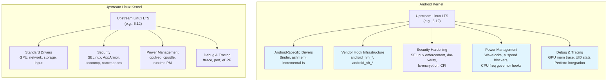

### 5.1.4 The Upstream Convergence Trend

Google has been actively working to reduce the delta between the Android Common
Kernel and upstream Linux. Several historically Android-only features have been
upstreamed or are in the process:

**Already upstreamed or converging:**

- `PM_WAKELOCKS` -- wakelock infrastructure is now part of upstream Linux
- PSI (Pressure Stall Information) -- originally developed for Android's lmkd,
  now a standard kernel feature
- The old in-kernel low memory killer (`CONFIG_ANDROID_LOW_MEMORY_KILLER`) has
  been removed; Android now uses a userspace daemon (lmkd) that reads PSI events
- `memfd_create()` is gradually replacing `ashmem` for new code
- ION allocator has been replaced by the upstream DMA-BUF heap framework

**Still Android-specific:**

- Binder driver (deeply integrated with Android's IPC model)
- Incremental FS (specialized for APK streaming)
- Vendor hooks (trace_android_rvh_* and trace_android_vh_*)
- UID-based resource accounting (`CONFIG_UID_SYS_STATS`,
  `CONFIG_CPU_FREQ_TIMES`)

The explicit disabling of the old in-kernel low memory killer is visible in the
base config fragments. In the Android 16 (branch `b`) config for kernel 6.12:

```
# CONFIG_ANDROID_LOW_MEMORY_KILLER is not set
```

**Source**: `kernel/configs/b/android-6.12/android-base.config`, line 2.

This single line tells the story of a multi-year migration: the kernel's
in-process OOM killer has been replaced by a sophisticated userspace daemon that
uses PSI events for more intelligent memory management decisions.

---

## 5.2 GKI (Generic Kernel Image)

### 5.2.1 The Fragmentation Problem

Before GKI, every Android device shipped a unique kernel. SoC vendors (Qualcomm,
MediaTek, Samsung LSI, etc.) would take an Android Common Kernel branch, apply
hundreds of patches for their SoC, and pass it to device OEMs who would apply
yet more patches for their specific hardware. The result was a deeply fragmented
ecosystem:

- Security patches could not be delivered to kernels without vendor cooperation
- Each device had a unique kernel binary that could not be updated independently
- Kernel bugs required fixes to propagate through multiple vendor trees
- Testing at scale was impossible because no two devices ran the same kernel

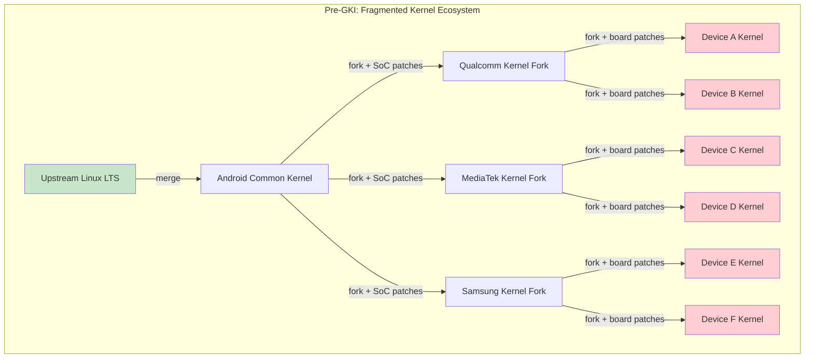

### 5.2.2 GKI 2.0 Architecture

GKI solves this by splitting the kernel into two parts:

1. **GKI core kernel** -- a single binary built by Google from the Android Common
   Kernel source. This binary is identical across all devices using the same
   kernel version.

2. **Vendor modules** -- loadable kernel modules (`.ko` files) that contain all
   SoC-specific and device-specific code. These are built by vendors against a
   stable Kernel Module Interface (KMI).

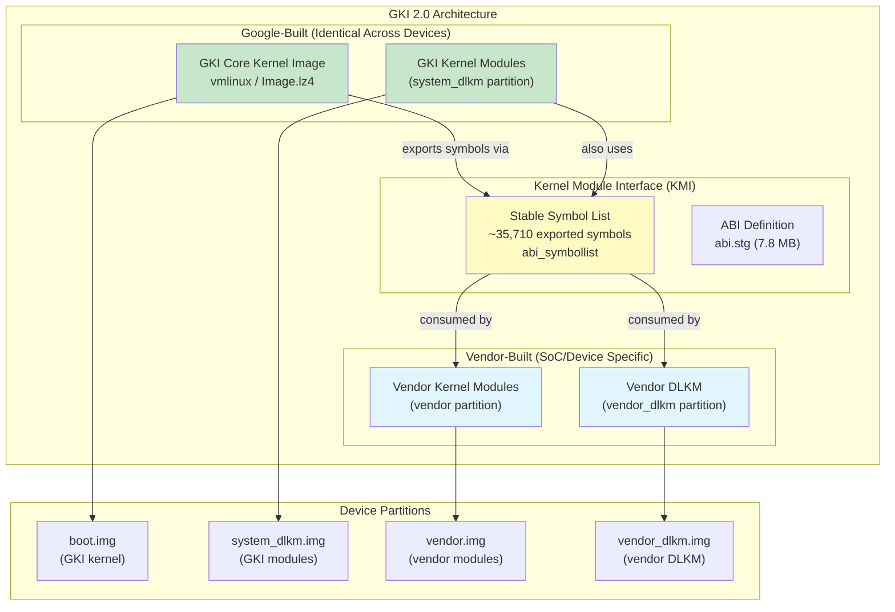

### 5.2.3 The Kernel Module Interface (KMI)

The KMI is the contract between the GKI core kernel and vendor modules. It
consists of:

1. **A symbol list** -- the set of kernel functions and variables that vendor
   modules are allowed to call. For kernel 6.6, this list contains
   approximately 35,710 entries.

    **Source**: `kernel/prebuilts/6.6/arm64/abi_symbollist` (35,710 lines)

    The symbol list begins with commonly used symbols and is organized into
    sections:

    ```
    [abi_symbol_list]
    # commonly used symbols
        module_layout
        __put_task_struct
        utf8_data_table

    [abi_symbol_list]
        add_cpu
        add_device_randomness
        add_timer
        ...
    ```

2. **An ABI definition** -- a machine-readable description of the types,
   structures, and function signatures exported by the KMI. For kernel 6.6, this
   file is approximately 7.8 MB.

    **Source**: `kernel/prebuilts/6.6/arm64/abi.stg` (7,819,214 bytes)

3. **Module versioning** (`CONFIG_MODVERSIONS=y`) -- CRC checksums are computed
   for each exported symbol based on its prototype. A module compiled against
   one version of a symbol cannot be loaded if the symbol's signature has
   changed.

The KMI is frozen for each GKI release. Once frozen, Google guarantees that the
symbol list and ABI will not change in backwards-incompatible ways for the
lifetime of that kernel branch. This allows vendors to ship module updates
independently of kernel updates, and vice versa.

### 5.2.4 KMI Symbol Stability Guarantees

The config option `CONFIG_MODVERSIONS=y` (present in all Android base configs)
enables compile-time CRC generation for every exported symbol. When a module is
loaded, the kernel checks that the CRCs in the module match the CRCs in the
running kernel. If they do not match, the module load fails with an error like:

```
disagrees about version of symbol <name>
```

This is the enforcement mechanism for KMI stability: even if the symbol name
exists, a change to its type signature will be detected and rejected.

### 5.2.5 Vendor Hooks

Since vendors cannot modify the GKI core kernel, they need a mechanism to
customize kernel behavior for their SoC. GKI provides this through **vendor
hooks** -- lightweight tracepoints that vendors can register callbacks for:

- **`android_vh_*`** (vendor hooks) -- standard tracepoints that vendors can
  attach to. These are safe to call from any context.
- **`android_rvh_*`** (restricted vendor hooks) -- hooks in performance-critical
  paths where the callback must meet stricter requirements.

The KMI symbol list includes vendor hook registration functions:

```
android_rvh_probe_register
```

**Source**: `kernel/prebuilts/6.6/arm64/abi_symbollist`, line 28

Vendor hooks allow SoC vendors to:

- Customize the scheduler for their big.LITTLE/DynamIQ CPU topology
- Add thermal management logic tied to specific sensor hardware
- Implement custom memory management policies
- Hook into power management decisions

### 5.2.6 GKI Prebuilt Kernels in AOSP

The AOSP tree ships prebuilt GKI kernels for use by the emulator and reference
devices. These prebuilts include:

```
kernel/prebuilts/
    6.1/
        arm64/
        x86_64/
    6.6/
        arm64/          # 114 files total, ~96 .ko modules
            kernel-6.6              # Uncompressed kernel image
            kernel-6.6-gz           # Gzip-compressed kernel
            kernel-6.6-lz4          # LZ4-compressed kernel
            kernel-6.6-allsyms      # Debug kernel with all symbols
            kernel-6.6-gz-allsyms   # Debug compressed kernel
            kernel-6.6-lz4-allsyms  # Debug LZ4 compressed kernel
            vmlinux                  # ELF kernel with debug info
            System.map               # Symbol address map
            System.map-allsyms       # Full symbol map
            abi_symbollist           # KMI symbol list (35,710 lines)
            abi_symbollist.raw       # Raw symbol names
            abi.stg                  # ABI definition (~7.8 MB)
            abi-full.stg             # Full ABI definition
            kernel_version.mk        # Version string for build system
            *.ko                     # ~96 GKI kernel modules
        x86_64/
    6.12/
        arm64/
        x86_64/
    common-modules/
        virtual-device/
            6.1/
            6.6/
                arm64/   # 57 device-specific modules
                x86-64/
            6.12/
            mainline/
        trusty/
    mainline/
        arm64/
        x86_64/
```

The kernel version string for the 6.6 arm64 prebuilt reveals its lineage:

```
BOARD_KERNEL_VERSION := 6.6.100-android15-8-gf988247102d3-ab14039625-4k
```

**Source**: `kernel/prebuilts/6.6/arm64/kernel_version.mk`

Breaking this down:

- `6.6.100` -- upstream LTS version 6.6, patch level 100
- `android15` -- Android 15 ACK branch
- `8` -- eighth release from this branch
- `gf988247102d3` -- git commit hash
- `ab14039625` -- Android build ID
- `4k` -- 4K page size variant

### 5.2.7 GKI Release Lifecycle

Each GKI kernel branch has a defined lifecycle with launch and end-of-life (EOL)
dates. These are tracked in `kernel/configs/kernel-lifetimes.xml`:

```xml
<branch name="android16-6.12"
        min_android_release="16"
        version="6.12"
        launch="2024-11-17"
        eol="2029-07-01">
    <lts-versions>
        <release version="6.12.23" launch="2025-06-12" eol="2026-10-01"/>
        <release version="6.12.30" launch="2025-07-11" eol="2026-11-01"/>
        <release version="6.12.38" launch="2025-08-11" eol="2026-12-01"/>
    </lts-versions>
</branch>
```

**Source**: `kernel/configs/kernel-lifetimes.xml`, lines 146-152

Key observations from this file:

- Kernel branches span multiple years (e.g., android14-6.1 runs from 2022 to
  2029)
- Each branch has specific LTS releases with their own EOL dates
- Quarterly GKI releases have a 12-15 month support window
- Older branches (pre-5.10) are marked as "non-GKI kernel" since GKI was
  introduced with kernel 5.10 for Android 12

The complete lineage of supported kernel versions:

| Branch | Kernel | Min Android | Launch | EOL |
|--------|--------|-------------|--------|-----|
| android12-5.10 | 5.10 | 12 | 2020-12 | 2027-07 |
| android13-5.15 | 5.15 | 13 | 2021-10 | 2028-07 |
| android14-5.15 | 5.15 | 14 | 2021-10 | 2028-07 |
| android14-6.1 | 6.1 | 14 | 2022-12 | 2029-07 |
| android15-6.6 | 6.6 | 15 | 2023-10 | 2028-07 |
| android16-6.12 | 6.12 | 16 | 2024-11 | 2029-07 |

### 5.2.8 How Vendors Extend Without Forking

Under GKI, the vendor extension model works as follows:

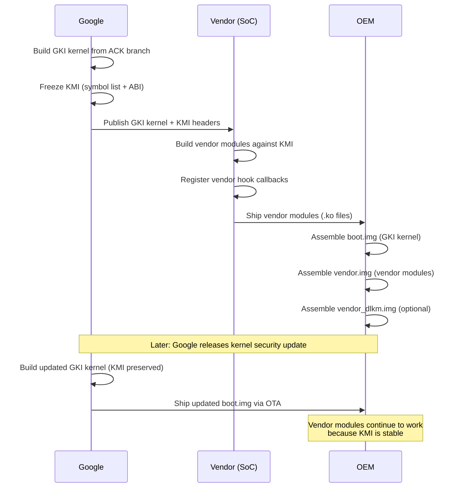

This separation means:

- Google can update the kernel for security fixes without vendor involvement
- Vendors can update their modules without waiting for a kernel update
- OEMs can mix and match GKI kernel versions with vendor module versions (within
  the same KMI generation)

---

## 5.3 Key Android-Specific Kernel Features

### 5.3.1 Binder Driver

Binder is Android's inter-process communication (IPC) mechanism. Every
interaction between apps and system services -- launching an Activity, binding a
Service, querying a ContentProvider, sending an Intent -- flows through Binder.
The Binder driver is the kernel component that makes this possible.

#### Kernel Configuration

Binder requires two config options in the Android base config:

```
CONFIG_ANDROID_BINDER_IPC=y
CONFIG_ANDROID_BINDERFS=y
```

**Source**: `kernel/configs/b/android-6.12/android-base.config`, lines 18-19

The `CONFIG_ANDROID_BINDERFS` option enables `binderfs`, a special filesystem
that allows dynamic creation of Binder device nodes. This replaced the
traditional approach of creating `/dev/binder`, `/dev/hwbinder`, and
`/dev/vndbinder` as static device nodes.

#### Transaction Model

The Binder driver implements a synchronous RPC mechanism with the following
characteristics:

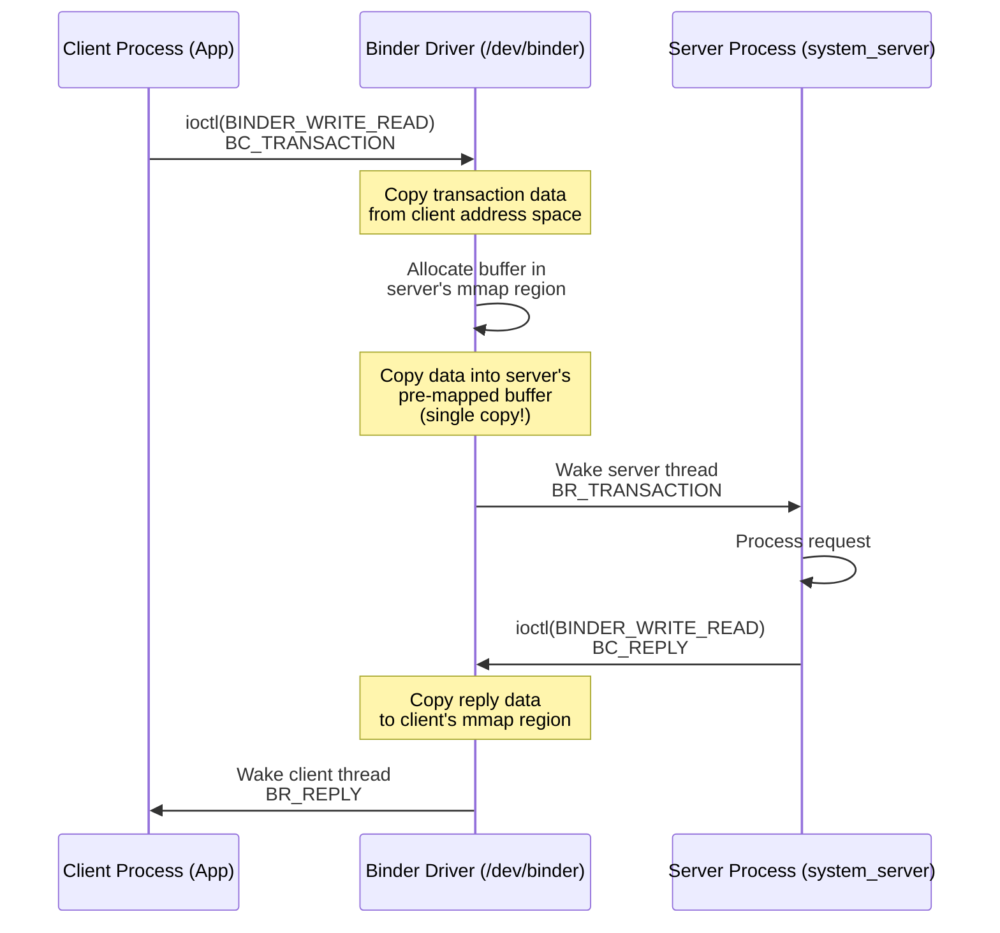

Key aspects of the transaction model:

1. **Single-copy data transfer**: The Binder driver uses `mmap()` to create a
   shared memory region in the server process's address space. When a client
   sends a transaction, the driver copies data directly from the client's
   user-space buffer into the server's mmap'ed region. This means data is
   copied only once (client user-space to server kernel-mapped buffer), rather
   than the two copies required by traditional IPC mechanisms (client to kernel,
   kernel to server).

2. **Object translation**: Binder handles (references to remote objects) are
   translated by the driver as transactions cross process boundaries. The driver
   maintains a reference-counted mapping of Binder nodes and their proxy
   handles.

3. **Death notifications**: A process can register for notification when a Binder
   object in another process dies. The driver tracks these registrations and
   sends `BR_DEAD_BINDER` notifications when the hosting process exits.

4. **Security context propagation**: The driver embeds the caller's PID, UID,
   and SELinux security context into every transaction, allowing the server to
   make authorization decisions.

#### Memory Mapping

Each process that opens the Binder device maps a region of memory using `mmap()`.
This region is used by the driver to deliver transaction data:

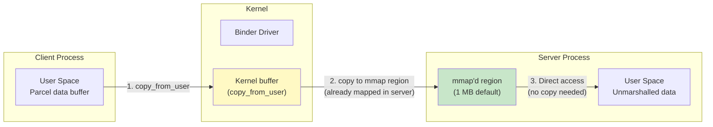

The default mmap size is 1 MB minus two pages (1,048,576 - 8,192 = 1,040,384
bytes). This is the maximum amount of data that can be in flight for a single
process's incoming transactions at any given time.

#### Thread Management

The Binder driver manages a thread pool for each process:

- When a process opens the Binder device, it registers itself with
  `BINDER_SET_CONTEXT_MGR` (for servicemanager) or starts handling transactions.
- The driver can request the creation of new threads via `BR_SPAWN_LOOPER` when
  all existing threads are busy.
- The maximum thread count is set via `BINDER_SET_MAX_THREADS`.
- Threads enter the driver via `ioctl(BINDER_WRITE_READ)` and block until a
  transaction arrives or there is a reply to deliver.

The userspace side of Binder thread management is implemented in
`frameworks/native/libs/binder/IPCThreadState.cpp`:

```cpp
// frameworks/native/libs/binder/IPCThreadState.cpp
#include <binder/IPCThreadState.h>
#include <sys/ioctl.h>
#include "binder_module.h"
```

**Source**: `frameworks/native/libs/binder/IPCThreadState.cpp`

#### The Three Binder Domains

Modern Android uses three separate Binder domains, each with its own device
node, to enforce the Treble architecture separation:

| Domain | Device | Purpose | Users |
|--------|--------|---------|-------|
| Framework | `/dev/binder` | App-to-framework IPC | Apps, system_server |
| Hardware | `/dev/hwbinder` | Framework-to-HAL IPC | system_server, HAL processes |
| Vendor | `/dev/vndbinder` | Vendor-internal IPC | Vendor processes only |

With `binderfs` (`CONFIG_ANDROID_BINDERFS=y`), these device nodes are created
dynamically by mounting a binderfs filesystem, rather than being statically
created via `mknod`. This allows containerized Android instances to have their
own isolated Binder namespaces.

### 5.3.2 DMA-BUF Heap System

#### From ION to DMA-BUF Heaps

The ION memory allocator was Android's original solution for allocating
physically contiguous or otherwise specially-constrained memory buffers for use
by GPUs, cameras, video codecs, and display hardware. ION was an Android-only
out-of-tree driver that lived in `drivers/staging/android/`.

Starting with kernel 5.10, ION has been replaced by the upstream **DMA-BUF heap
framework**. This framework provides the same functionality -- allocating
DMA-capable buffers that can be shared between hardware devices and userspace --
but through a standard, upstream kernel interface.

```mermaid
graph TB
    subgraph "Old: ION Allocator (Deprecated)"
        ION_DEV["/dev/ion"]
        ION_HEAP["ION Heap<br/>(system, CMA, carveout)"]
        ION_BUF["ION Buffer"]
        ION_FD["DMA-BUF fd"]

        ION_DEV --> ION_HEAP
        ION_HEAP --> ION_BUF
        ION_BUF --> ION_FD
    end

    subgraph "New: DMA-BUF Heaps (Upstream)"
        HEAP_DEV["/dev/dma_heap/{name}"]
        SYS_HEAP["System Heap<br/>/dev/dma_heap/system"]
        CMA_HEAP["CMA Heap<br/>/dev/dma_heap/linux,cma"]
        VENDOR_HEAP["Vendor Heaps<br/>/dev/dma_heap/{vendor}"]
        DMABUF_FD["DMA-BUF fd"]

        HEAP_DEV --> SYS_HEAP
        HEAP_DEV --> CMA_HEAP
        HEAP_DEV --> VENDOR_HEAP
        SYS_HEAP --> DMABUF_FD
        CMA_HEAP --> DMABUF_FD
        VENDOR_HEAP --> DMABUF_FD
    end

    style ION_DEV fill:#ffcdd2
    style HEAP_DEV fill:#c8e6c9
```

#### How DMA-BUF Heaps Work

1. **Heap registration**: Kernel drivers register heaps with the DMA-BUF heap
   framework, each appearing as a character device under `/dev/dma_heap/`.

2. **Allocation**: Userspace opens the appropriate heap device and calls
   `ioctl(DMA_HEAP_IOCTL_ALLOC)` to allocate a buffer. The returned file
   descriptor is a DMA-BUF fd.

3. **Sharing**: The DMA-BUF fd can be passed to other processes via Unix domain
   sockets or Binder. Any process with the fd can map the buffer into its
   address space or pass it to a hardware device driver.

4. **Zero-copy pipeline**: The GPU, camera, and display can all reference the
   same physical memory through the DMA-BUF fd, avoiding copies in the graphics
   pipeline.

The emulator's goldfish modules include a `system_heap.ko` module that provides
a DMA-BUF system heap for the virtual device:

**Source**: `prebuilts/qemu-kernel/arm64/6.12/goldfish_modules/system_heap.ko`

#### Configuration

The GKI base config requires sync file support, which is the userspace-facing
interface for DMA-BUF synchronization fences:

```
CONFIG_SYNC_FILE=y
```

**Source**: `kernel/configs/b/android-6.12/android-base.config`, line 238

### 5.3.3 FUSE Passthrough and Storage Access

#### The Storage Access Problem

Android's storage model has undergone several revisions:

1. **Pre-Android 10**: SDCardFS (a stackable filesystem) provided per-app
   storage views with different permission sets.
2. **Android 10+**: SDCardFS was deprecated in favor of FUSE, which runs
   entirely in userspace via the MediaProvider process.
3. **Android 12+**: FUSE passthrough was introduced to recover the performance
   lost by routing all I/O through a userspace daemon.

```mermaid
graph TB
    subgraph "App Storage Access Flow"
        APP["Application"]
        VFS["VFS Layer"]

        subgraph "FUSE Path"
            FUSE_K["FUSE Kernel Module"]
            MP["MediaProvider<br/>(userspace daemon)"]
            PT["Passthrough<br/>(direct to lower fs)"]
        end

        FS["Lower Filesystem<br/>(ext4 / f2fs)"]

        APP -->|"open(/storage/emulated/0/...)"| VFS
        VFS -->|"FUSE mount"| FUSE_K
        FUSE_K -->|"permission check"| MP
        MP -->|"authorized"| PT
        PT -->|"direct I/O"| FS
        FUSE_K -.->|"slow path:<br/>data through userspace"| MP
        MP -.->|"slow path"| FS
    end

    style PT fill:#c8e6c9
    style MP fill:#fff9c4
```

#### How FUSE Passthrough Works

FUSE passthrough allows the FUSE daemon (MediaProvider) to indicate that certain
file operations should be handled directly by the kernel, bypassing the FUSE
userspace daemon for data transfer:

1. The app opens a file through the FUSE mount (e.g.,
   `/storage/emulated/0/Download/photo.jpg`).
2. The FUSE kernel module sends an `OPEN` request to MediaProvider.
3. MediaProvider checks permissions and, if authorized, opens the underlying file
   on the real filesystem and tells the FUSE kernel module to use passthrough for
   this file.
4. Subsequent `read()` and `write()` calls from the app go directly from the
   FUSE kernel module to the lower filesystem, bypassing MediaProvider entirely.

This provides the security benefits of MediaProvider's permission checking while
recovering nearly native filesystem performance for actual data I/O.

#### Configuration

FUSE filesystem support is mandatory in the Android base config:

```
CONFIG_FUSE_FS=y
```

**Source**: `kernel/configs/b/android-6.12/android-base.config`, line 69

### 5.3.4 Incremental FS

#### Purpose and Design

Incremental FS (`incfs`) enables Android to start using an APK before all of its
data has been downloaded. This is the kernel component that supports Android's
"Incremental APK Installation" feature, which allows large apps (especially
games) to launch while still streaming their data.

```mermaid
sequenceDiagram
    participant PM as Package Manager
    participant IDS as Incremental Data Service
    participant INCFS as Incremental FS (kernel)
    participant APP as Application

    PM->>INCFS: Mount incfs for package
    PM->>IDS: Begin streaming APK data
    IDS->>INCFS: Fill initial blocks<br/>(IOC_FILL_BLOCKS)

    APP->>INCFS: Read block N
    alt Block N is present
        INCFS->>APP: Return data immediately
    else Block N is missing
        INCFS->>IDS: Request block N<br/>(via .pending_reads)
        IDS->>IDS: Download block N<br/>from server
        IDS->>INCFS: Fill block N<br/>(IOC_FILL_BLOCKS)
        INCFS->>APP: Return data
    end
```

#### Kernel Interface

The Incremental FS kernel module exposes its interface through ioctl commands
defined in the userspace header at
`system/incremental_delivery/incfs/kernel-headers/linux/incrementalfs.h`:

```c
#define INCFS_NAME "incremental-fs"
#define INCFS_MAGIC_NUMBER (0x5346434e49ul & ULONG_MAX)
#define INCFS_DATA_FILE_BLOCK_SIZE 4096

#define INCFS_IOC_CREATE_FILE \
    _IOWR(INCFS_IOCTL_BASE_CODE, 30, struct incfs_new_file_args)
#define INCFS_IOC_FILL_BLOCKS \
    _IOR(INCFS_IOCTL_BASE_CODE, 32, struct incfs_fill_blocks)
#define INCFS_IOC_GET_FILLED_BLOCKS \
    _IOR(INCFS_IOCTL_BASE_CODE, 34, struct incfs_get_filled_blocks_args)
```

**Source**: `system/incremental_delivery/incfs/kernel-headers/linux/incrementalfs.h`

Key design characteristics:

1. **Block-level granularity**: Files are divided into 4 KB blocks. Each block
   can be independently present or absent.

2. **Demand paging**: When a process reads a block that has not yet been
   delivered, the kernel blocks the read and signals the userspace data loader
   (via the `.pending_reads` special file) to fetch that block.

3. **Compression support**: Blocks can be stored compressed using LZ4 or Zstd:
   ```c
   enum incfs_compression_alg {
     COMPRESSION_NONE = 0,
     COMPRESSION_LZ4 = 1,
     COMPRESSION_ZSTD = 2,
   };
   ```

4. **Integrity verification**: Incremental FS supports per-file hash trees
   (`INCFS_BLOCK_FLAGS_HASH`) and fs-verity integration
   (`INCFS_XATTR_VERITY_NAME`) to verify block integrity as blocks arrive.

5. **Special files**: The filesystem exposes several special files for
   monitoring and control:
   - `.pending_reads` -- read by the data loader to discover which blocks are
     needed
   - `.log` -- access log for debugging
   - `.blocks_written` -- tracks write progress
   - `.index` -- maps file IDs to inodes
   - `.incomplete` -- lists files that are not yet fully loaded

#### Userspace Integration

The userspace component lives in `system/incremental_delivery/incfs/`:

```
system/incremental_delivery/
    incfs/
        Android.bp
        incfs.cpp           # Core incfs library
        incfs_ndk.c         # NDK interface
        MountRegistry.cpp   # Mount point tracking
        path.cpp            # Path utilities
        kernel-headers/
            linux/
                incrementalfs.h  # Kernel UAPI header
    libdataloader/          # Data loader service interface
    sysprop/                # System properties for incfs
```

**Source**: `system/incremental_delivery/incfs/`

### 5.3.5 Ashmem and Shared Memory

Android shared memory (ashmem) provides named, reference-counted shared memory
regions. It is required by the base config:

```
CONFIG_ASHMEM=y
```

**Source**: `kernel/configs/b/android-6.12/android-base.config`, line 20

Ashmem differs from standard POSIX shared memory (`shm_open`) in several ways:

- Regions can be pinned and unpinned, allowing the kernel to reclaim unpinned
  pages under memory pressure
- Regions are reference-counted by file descriptors -- when the last fd is
  closed, the memory is freed
- Regions can be sealed (made immutable) for security

While ashmem remains required for backward compatibility, new code is encouraged
to use `memfd_create()`, which is the upstream Linux equivalent and provides
similar functionality through the standard kernel API.

### 5.3.6 Wakelocks and Power Management

Android's wakelock mechanism prevents the system from entering suspend while
critical operations are in progress. The kernel component is:

```
CONFIG_PM_WAKELOCKS=y
```

**Source**: `kernel/configs/b/android-6.12/android-base.config`, line 210

Note that `CONFIG_PM_AUTOSLEEP` is explicitly disabled:

```
# CONFIG_PM_AUTOSLEEP is not set
```

**Source**: `kernel/configs/b/android-6.12/android-base.config`, line 12

This is because Android manages the sleep/wake cycle from userspace (through
the PowerManager service) rather than relying on the kernel's autosleep
mechanism.

The wakelock interface is exposed through:

- `/sys/power/wake_lock` -- write a wakelock name to acquire
- `/sys/power/wake_unlock` -- write a wakelock name to release

The userspace PowerManager service (in system_server) uses these interfaces to
implement Android's opportunistic suspend model, where the system aggressively
tries to enter suspend unless something holds a wakelock.

### 5.3.7 Low Memory Killer Daemon (lmkd)

The in-kernel low memory killer (`CONFIG_ANDROID_LOW_MEMORY_KILLER`) has been
removed from modern Android kernels. It is replaced by a userspace daemon,
`lmkd`, that makes more intelligent decisions about which processes to kill
under memory pressure.

#### Architecture

```mermaid
graph TB
    subgraph "Kernel"
        PSI_K["PSI Monitor<br/>/proc/pressure/memory"]
        MEMINFO["/proc/meminfo"]
        VMSTAT["/proc/vmstat"]
        ZONEINFO["/proc/zoneinfo"]
        CGROUPS["cgroups<br/>memory.pressure"]
    end

    subgraph "lmkd Daemon"
        PSI_M["PSI Event Monitor"]
        POLL["epoll Loop"]
        MEM_CALC["Memory Pressure<br/>Calculator"]
        KILL["Process Killer<br/>(reaper threads)"]
        STATS["Statistics<br/>(statslog)"]
        WATCH["Watchdog"]
    end

    subgraph "ActivityManager<br/>(system_server)"
        OOM_ADJ["OOM Adj Scores<br/>(process priority)"]
        PROC_LIST["Process List"]
    end

    PSI_K -->|"PSI events"| PSI_M
    MEMINFO -->|"memory stats"| MEM_CALC
    VMSTAT -->|"paging stats"| MEM_CALC
    ZONEINFO -->|"zone stats"| MEM_CALC
    OOM_ADJ -->|"socket"| POLL
    PSI_M --> POLL
    POLL --> MEM_CALC
    MEM_CALC -->|"kill decision"| KILL
    KILL -->|"pidfd_send_signal()"| PSI_K
    KILL --> STATS

    style PSI_K fill:#c8e6c9
    style PSI_M fill:#e1f5fe
    style MEM_CALC fill:#fff9c4
```

#### PSI-Based Triggering

lmkd uses the kernel's Pressure Stall Information (PSI) interface to detect
memory pressure. PSI was developed in close collaboration between Google and the
kernel community and is now a standard kernel feature.

The PSI monitor configuration in lmkd:

```c
#define DEFAULT_PSI_WINDOW_SIZE_MS 1000
#define PSI_POLL_PERIOD_SHORT_MS 10
#define PSI_POLL_PERIOD_LONG_MS 100
```

**Source**: `system/memory/lmkd/lmkd.cpp`, lines 117-121

The PSI interface is initialized through the libpsi library:

```c
// system/memory/lmkd/libpsi/psi.cpp
int init_psi_monitor(enum psi_stall_type stall_type,
                     int threshold_us,
                     int window_us,
                     enum psi_resource resource) {
    fd = TEMP_FAILURE_RETRY(open(psi_resource_file[resource],
                                 O_WRONLY | O_CLOEXEC));
```

**Source**: `system/memory/lmkd/libpsi/psi.cpp`

#### OOM Adjustment Scores

lmkd receives process priority information from ActivityManager in
system_server. Each process is assigned an OOM adjustment score that reflects
its importance:

```c
#define SYSTEM_ADJ (-900)        // System processes (never kill)
#define PERCEPTIBLE_APP_ADJ 200  // Perceptible but not foreground
#define PREVIOUS_APP_ADJ 700     // Previous foreground app
```

**Source**: `system/memory/lmkd/lmkd.cpp`, lines 79-80, 98

When memory pressure is detected, lmkd kills processes starting from the highest
OOM adjustment score (least important) and works downward until sufficient memory
is freed.

#### Key Source Files

```
system/memory/lmkd/
    lmkd.cpp            # Main daemon logic (2000+ lines)
    lmkd.rc             # init.rc service definition
    reaper.cpp           # Process kill execution (using pidfd)
    reaper.h
    watchdog.cpp         # Watchdog timer for lmkd hangs
    watchdog.h
    statslog.cpp         # Statistics reporting
    statslog.h
    libpsi/
        psi.cpp          # PSI monitor interface
        include/
            psi/psi.h    # PSI header
    liblmkd_utils.cpp   # Utility functions
```

**Source**: `system/memory/lmkd/`

### 5.3.8 dm-verity and Verified Boot

dm-verity is a device-mapper target that provides transparent integrity checking
of block devices. Android uses it to verify the integrity of system partitions
during boot:

```
CONFIG_DM_VERITY=y
```

**Source**: `kernel/configs/b/android-6.12/android-base.config`, line 60

dm-verity works by maintaining a hash tree (Merkle tree) of the entire
partition. On every read, the driver computes the hash of the data block and
verifies it against the hash tree. If verification fails, the read returns an
I/O error.

#### How dm-verity's Merkle Tree Works

```mermaid
graph TB
    subgraph "Partition Data"
        B0["Block 0<br/>4 KB"]
        B1["Block 1<br/>4 KB"]
        B2["Block 2<br/>4 KB"]
        B3["Block 3<br/>4 KB"]
        BN["Block N<br/>4 KB"]
    end

    subgraph "Hash Tree (Merkle Tree)"
        H0["hash(Block 0)"]
        H1["hash(Block 1)"]
        H2["hash(Block 2)"]
        H3["hash(Block 3)"]
        HN["hash(Block N)"]

        P0["hash(H0 || H1)"]
        P1["hash(H2 || H3)"]
        PN["hash(... || HN)"]

        ROOT["Root Hash<br/>(signed by OEM key)"]
    end

    B0 --> H0
    B1 --> H1
    B2 --> H2
    B3 --> H3
    BN --> HN

    H0 --> P0
    H1 --> P0
    H2 --> P1
    H3 --> P1
    HN --> PN

    P0 --> ROOT
    P1 --> ROOT
    PN --> ROOT

    style ROOT fill:#ffcdd2
```

The root hash is signed by the device OEM's key and verified by the bootloader
before the kernel is loaded. This creates an unbroken chain of trust from the
bootloader to every individual data block on the system partition.

dm-verity operates in several modes:

- **Enforcing** (default): I/O errors on verification failure. The device may
  restart in recovery mode.
- **Logging**: Verification failures are logged but reads succeed. Used during
  development.
- **EIO**: Returns `EIO` errors on verification failure but continues operation.

The verified boot chain in Android combines several kernel subsystems:

```mermaid
graph LR
    BL["Bootloader<br/>(verifies boot.img)"]
    KERNEL["Kernel<br/>(dm-verity for partitions)"]
    FBE["File-Based Encryption<br/>(dm-default-key)"]
    VERITY["fs-verity<br/>(per-file integrity)"]
    APK["APK Signature<br/>(framework-level)"]

    BL -->|"verified boot"| KERNEL
    KERNEL -->|"partition integrity"| FBE
    FBE -->|"data confidentiality"| VERITY
    VERITY -->|"file integrity"| APK
```

Related config options for the full verified boot chain:

```
CONFIG_DM_DEFAULT_KEY=y          # Default key for dm-crypt
CONFIG_DM_SNAPSHOT=y             # Snapshot support for OTA
CONFIG_FS_ENCRYPTION=y           # File-based encryption
CONFIG_FS_ENCRYPTION_INLINE_CRYPT=y  # Hardware inline crypto
CONFIG_FS_VERITY=y               # Per-file integrity (fs-verity)
CONFIG_BLK_INLINE_ENCRYPTION=y   # Block-level inline encryption
```

#### File-Based Encryption (FBE)

Android uses file-based encryption rather than full-disk encryption. This allows
different files to be encrypted with different keys, enabling features like
Direct Boot (where the device can show the lock screen and receive phone calls
before the user unlocks the device).

The encryption configuration is visible in the emulator's fstab:

```
/dev/block/vdc  /data  ext4  ...  fileencryption=aes-256-xts:aes-256-cts,...
```

**Source**: `device/generic/goldfish/board/fstab/arm`

This specifies:

- `aes-256-xts` for file content encryption (provides confidentiality)
- `aes-256-cts` for file name encryption (prevents metadata leakage)

#### fs-verity: Per-File Integrity

While dm-verity protects entire partitions, fs-verity (`CONFIG_FS_VERITY=y`)
provides per-file integrity verification. It is used for:

- Verifying APK files after installation (complementing APK signatures)
- Protecting system files on writable partitions
- Ensuring integrity of downloaded content

fs-verity uses the same Merkle tree concept as dm-verity but applies it to
individual files. Once a file has fs-verity enabled, any modification to its
contents will be detected as a hash mismatch on the next read.

### 5.3.9 eBPF Integration

Android uses eBPF (extended Berkeley Packet Filter) extensively for networking,
monitoring, and security:

```
CONFIG_BPF_JIT=y
CONFIG_BPF_SYSCALL=y
CONFIG_CGROUP_BPF=y
CONFIG_NETFILTER_XT_MATCH_BPF=y
CONFIG_NET_ACT_BPF=y
CONFIG_NET_CLS_BPF=y
```

**Source**: `kernel/configs/b/android-6.12/android-base.config`

The 6.12 config additionally requires:

```
CONFIG_BPF_JIT_ALWAYS_ON=y
```

eBPF programs are loaded during boot from `/system/etc/bpf/` and are used for:

- Network traffic accounting per UID
- Network firewall rules
- CPU frequency tracking
- Tracing and profiling

#### eBPF Architecture on Android

```mermaid
graph TB
    subgraph "Userspace"
        LOADER["BPF Loader<br/>(bpfloader service)"]
        PROG_DIR["/system/etc/bpf/<br/>BPF ELF programs"]
        NETD["netd<br/>(network daemon)"]
        TETHERING["Tethering Service"]
        TRAFFIC["Traffic Controller"]
    end

    subgraph "Kernel"
        VERIFIER["BPF Verifier"]
        JIT["BPF JIT Compiler"]
        MAPS["BPF Maps<br/>(per-UID counters,<br/>policy tables)"]
        HOOKS["BPF Hook Points"]

        subgraph "Hook Locations"
            CGH["cgroup/skb<br/>(per-app network)"]
            XDP["XDP<br/>(packet processing)"]
            TPH["tracepoint<br/>(kernel events)"]
            SCH["sched_cls<br/>(traffic control)"]
        end
    end

    PROG_DIR -->|"loaded at boot"| LOADER
    LOADER -->|"bpf() syscall"| VERIFIER
    VERIFIER -->|"verified safe"| JIT
    JIT --> HOOKS
    HOOKS --> CGH
    HOOKS --> XDP
    HOOKS --> TPH
    HOOKS --> SCH
    NETD --> MAPS
    TRAFFIC --> MAPS
    TETHERING --> MAPS

    style VERIFIER fill:#fff9c4
    style JIT fill:#c8e6c9
```

The BPF loader (`bpfloader`) is one of the first services started during boot.
It loads all `.o` (BPF ELF) files from `/system/etc/bpf/` and pins them into the
BPF filesystem at `/sys/fs/bpf/`. Other services like `netd` and the tethering
service then attach to these pinned programs.

Key eBPF use cases on Android:

1. **Per-UID traffic accounting**: BPF programs attached to cgroup socket hooks
   count bytes sent and received per UID, enabling the Settings app's data usage
   display and per-app data limits.

2. **Network firewall**: BPF programs implement the iptables replacement for
   per-app network access control, providing both better performance and more
   granular control.

3. **Tethering offload**: BPF programs handle packet forwarding for USB/WiFi
   tethering, moving the packet processing from userspace (slow) to kernel BPF
   (fast).

4. **CPU frequency tracking**: BPF programs attached to scheduler tracepoints
   track per-UID time spent at each CPU frequency, enabling accurate battery
   usage attribution.

### 5.3.10 SELinux Enforcement

SELinux (Security-Enhanced Linux) is mandatory on Android and is configured at
the kernel level:

```
CONFIG_SECURITY=y
CONFIG_SECURITY_NETWORK=y
CONFIG_SECURITY_SELINUX=y
CONFIG_DEFAULT_SECURITY_SELINUX=y
```

**Source**: `kernel/configs/b/android-6.12/android-base.config`, lines 222-226, 57

Android runs SELinux in enforcing mode on production devices. Every process,
file, socket, and kernel object is assigned a security label, and the SELinux
policy (compiled from `.te` files in the AOSP tree) defines which operations are
allowed between labeled objects.

The kernel's SELinux subsystem:

- Labels all kernel objects (inodes, sockets, processes, IPC objects)
- Intercepts security-relevant system calls via Linux Security Module (LSM) hooks
- Checks each operation against the loaded policy
- Denies operations not explicitly allowed
- Logs denied operations to the audit subsystem (`CONFIG_AUDIT=y`)

SELinux is the primary mechanism that confines apps to their sandbox, prevents
privilege escalation, and limits the impact of compromised system services.

### 5.3.11 Seccomp Filter

Beyond SELinux, Android uses seccomp-BPF filters to restrict the system calls
available to each process:

```
CONFIG_SECCOMP=y
CONFIG_SECCOMP_FILTER=y
```

**Source**: `kernel/configs/b/android-6.12/android-base.config`, lines 221-222

Seccomp filters use BPF programs (not eBPF -- these are classic BPF) to examine
each system call and its arguments. If a system call is not on the allowlist, the
process is killed with SIGSYS. This provides defense in depth: even if an
attacker escapes the SELinux sandbox, they still cannot invoke dangerous system
calls.

Android's seccomp policies are defined per-architecture and are applied by the
Zygote process before forking app processes.

### 5.3.12 Cgroups and Resource Control

Android uses Linux cgroups (control groups) extensively for resource management:

```
CONFIG_CGROUPS=y
CONFIG_CGROUP_BPF=y
CONFIG_CGROUP_CPUACCT=y
CONFIG_CGROUP_FREEZER=y
CONFIG_CGROUP_SCHED=y
```

**Source**: `kernel/configs/b/android-6.12/android-base.config`, lines 33-37

These cgroups serve specific Android purposes:

| Cgroup Subsystem | Config | Android Usage |
|-----------------|--------|---------------|
| cpuacct | `CONFIG_CGROUP_CPUACCT` | Per-UID CPU time accounting |
| freezer | `CONFIG_CGROUP_FREEZER` | Freezing cached/background apps |
| cpu (sched) | `CONFIG_CGROUP_SCHED` | CPU scheduling priority for app groups |
| bpf | `CONFIG_CGROUP_BPF` | Per-app network control via BPF |

The cgroup hierarchy on Android is managed by `init` and the `system_server`
process. The init script for the emulator shows the top-level cgroup setup:

```
on init
    mkdir /dev/cpuctl/foreground
    mkdir /dev/cpuctl/background
    mkdir /dev/cpuctl/top-app
    mkdir /dev/cpuctl/rt
```

**Source**: `device/generic/goldfish/init/init.ranchu.rc`, lines 47-50

These cgroup directories correspond to Android's process scheduling groups:

- **top-app**: The foreground application currently visible to the user
- **foreground**: Processes the user is aware of (e.g., music player)
- **background**: Processes running in the background
- **rt**: Real-time priority processes (audio, sensor processing)

---

## 5.4 Device Tree and Board Support

### 5.4.1 Device Tree Fundamentals

The device tree is a data structure that describes the hardware topology of a
system. On ARM and RISC-V platforms, the bootloader passes a device tree blob
(DTB) to the kernel, which uses it to discover and configure hardware devices.

The device tree is necessary because, unlike x86 systems (which use ACPI for
hardware discovery), ARM and RISC-V systems do not have a standard mechanism for
the kernel to probe hardware. The device tree fills this gap.

The Android base config enforces that at least one hardware description mechanism
is present:

```xml
<!-- CONFIG_ACPI || CONFIG_OF -->
<group>
    <conditions>
        <config>
            <key>CONFIG_ACPI</key>
            <value type="bool">n</value>
        </config>
    </conditions>
    <config>
        <key>CONFIG_OF</key>
        <value type="bool">y</value>
    </config>
</group>
```

**Source**: `kernel/configs/b/android-6.12/android-base-conditional.xml`, lines 148-172

This conditional requirement means: if ACPI is disabled, then Device Tree
(`CONFIG_OF`) must be enabled, and vice versa. ARM devices use OF (Open
Firmware / Device Tree); x86 devices typically use ACPI.

### 5.4.2 DTS, DTB, and DTBO

Device tree data flows through several formats:

```mermaid
graph LR
    DTS[".dts<br/>Device Tree Source<br/>(human-readable)"]
    DTSI[".dtsi<br/>Include files<br/>(shared definitions)"]
    DTC["dtc<br/>(DT Compiler)"]
    DTB[".dtb<br/>Device Tree Blob<br/>(binary, for kernel)"]
    DTBO[".dtbo<br/>DT Overlay Blob<br/>(binary overlay)"]

    DTSI -->|"#include"| DTS
    DTS -->|"compile"| DTC
    DTC -->|"output"| DTB
    DTC -->|"output"| DTBO

    subgraph "Boot Process"
        BL["Bootloader"]
        MERGED["Merged DTB"]
        KERNEL["Linux Kernel"]

        BL -->|"base DTB + overlays"| MERGED
        MERGED -->|"passed at boot"| KERNEL
    end

    DTB --> BL
    DTBO --> BL
```

- **DTS** (Device Tree Source): Human-readable text files that describe hardware.
  They use a tree structure with nodes representing devices and properties
  describing their configuration.
- **DTSI** (Device Tree Source Include): Shared definitions included by multiple
  DTS files. Typically, the SoC definition is in a DTSI, and each board's DTS
  includes it and adds board-specific nodes.
- **DTB** (Device Tree Blob): Compiled binary form of a DTS file. This is what
  the kernel actually parses.
- **DTBO** (Device Tree Blob Overlay): A compiled overlay that can be applied on
  top of a base DTB. Overlays allow board-specific customization without
  modifying the base SoC DTB.

### 5.4.3 Device Tree Overlays (DTBO)

Android uses device tree overlays extensively to separate SoC-level and
board-level hardware descriptions:

```mermaid
graph TB
    subgraph "SoC Vendor"
        BASE_DTB["Base DTB<br/>(SoC definition)<br/>CPU, memory controller,<br/>interrupt controller,<br/>bus topology"]
    end

    subgraph "Device OEM"
        OV1["DTBO: Display Panel<br/>resolution, timing,<br/>backlight GPIO"]
        OV2["DTBO: Camera Sensor<br/>I2C address, lanes,<br/>clock configuration"]
        OV3["DTBO: Audio Codec<br/>I2S configuration,<br/>amplifier GPIOs"]
        OV4["DTBO: Touch Controller<br/>interrupt GPIO,<br/>I2C address"]
    end

    subgraph "Bootloader"
        MERGE["Overlay Application<br/>(libufdt)"]
        FINAL["Final Merged DTB"]
    end

    BASE_DTB --> MERGE
    OV1 --> MERGE
    OV2 --> MERGE
    OV3 --> MERGE
    OV4 --> MERGE
    MERGE --> FINAL
    FINAL -->|"Passed to kernel<br/>at boot"| KERNEL["Linux Kernel"]
```

The DTBO partition is a standard Android partition that contains one or more
overlays. During boot, the bootloader reads the base DTB (typically compiled into
the kernel image or stored in a separate partition), reads the overlays from the
DTBO partition, applies them using the libufdt library, and passes the merged
result to the kernel.

### 5.4.4 Emulator (Goldfish) Device Tree

The Android emulator uses device tree to describe its virtual hardware. The
goldfish virtual device includes a precompiled DTB:

**Source**: `kernel/prebuilts/common-modules/virtual-device/6.6/arm64/fvp-base-revc.dtb`

The emulator board configuration in `device/generic/goldfish/` explicitly states
that it does not include a DTB in the boot image:

```makefile
BOARD_INCLUDE_DTB_IN_BOOTIMG := false
```

**Source**: `device/generic/goldfish/board/BoardConfigCommon.mk`, line 75

Instead, the emulator's QEMU host provides device information through a
combination of:

1. Device tree passed by QEMU to the virtual machine
2. virtio device discovery for paravirtualized devices
3. Platform device registration for goldfish-specific virtual hardware

The emulator's goldfish virtual platform includes these device-specific kernel
modules:

```
goldfish_address_space.ko  # Virtual address space for host communication
goldfish_battery.ko        # Virtual battery with host-controlled state
goldfish_pipe.ko           # High-bandwidth host-guest communication pipe
goldfish_sync.ko           # Synchronization primitives for GPU emulation
```

**Source**: `prebuilts/qemu-kernel/arm64/6.12/goldfish_modules/`

### 5.4.5 Virtual Device Modules

Beyond the goldfish-specific modules, the emulator loads a substantial set of
GKI and virtual device modules. The virtual device common modules for kernel 6.6
arm64 include 57 modules:

```
kernel/prebuilts/common-modules/virtual-device/6.6/arm64/
    virtio_dma_buf.ko       # DMA buffer sharing via virtio
    virtio_mmio.ko          # Memory-mapped virtio transport
    virtio-rng.ko           # Virtual random number generator
    virtio_net.ko           # Virtual network adapter
    virtio_input.ko         # Virtual input devices
    virtio_snd.ko           # Virtual sound device
    virtio-gpu.ko           # Virtual GPU (3D acceleration)
    virtio-media.ko         # Virtual media device
    cfg80211.ko             # Wireless configuration
    mac80211.ko             # IEEE 802.11 wireless stack
    mac80211_hwsim.ko       # Simulated wireless hardware
    system_heap.ko          # DMA-BUF system heap
    ...
```

**Source**: `kernel/prebuilts/common-modules/virtual-device/6.6/arm64/`

### 5.4.6 Device Tree Syntax Reference

A simplified example of what a goldfish-style device tree might look like:

```dts
/dts-v1/;

/ {
    compatible = "android,goldfish";
    #address-cells = <2>;
    #size-cells = <2>;

    chosen {
        bootargs = "8250.nr_uarts=1";
    };

    memory@80000000 {
        device_type = "memory";
        reg = <0x0 0x80000000 0x0 0x80000000>;  /* 2 GB */
    };

    cpus {
        #address-cells = <1>;
        #size-cells = <0>;

        cpu@0 {
            device_type = "cpu";
            compatible = "arm,armv8";
            reg = <0x0>;
            enable-method = "psci";
        };
    };

    virtio_mmio@a003c00 {
        compatible = "virtio,mmio";
        reg = <0x0 0xa003c00 0x0 0x200>;
        interrupts = <0 43 4>;
        /* Block device for /data partition */
    };

    /* Additional virtio devices for network, GPU, etc. */
};
```

Key elements:

- `compatible` strings identify the driver that should bind to each device
- `reg` properties specify the memory-mapped I/O address and size
- `interrupts` specify the interrupt number and type
- The `chosen` node passes kernel command-line arguments

### 5.4.7 Device Tree and Driver Binding

The kernel uses the `compatible` property to match device tree nodes to drivers.
When the kernel encounters a device tree node, it searches through all registered
platform drivers for one whose `of_match_table` contains a matching `compatible`
string.

```mermaid
sequenceDiagram
    participant BL as Bootloader
    participant K as Kernel
    participant OF as OF Subsystem (Device Tree Parser)
    participant BUS as Platform Bus
    participant DRV as Platform Driver

    BL->>K: Pass DTB address at boot
    K->>OF: Parse DTB into device nodes
    OF->>OF: Build device tree in memory
    OF->>BUS: Register platform devices<br/>from device tree nodes
    BUS->>BUS: For each device node
    BUS->>DRV: Match compatible string<br/>against driver of_match_table
    DRV->>DRV: probe() function called
    Note over DRV: Driver initializes hardware<br/>using DT properties<br/>(reg, interrupts, clocks, etc.)
```

For example, the virtio MMIO transport driver matches the `"virtio,mmio"`
compatible string. When the device tree contains a `virtio_mmio` node, the
kernel automatically loads and probes the virtio MMIO driver, which then
discovers individual virtio devices (network, block, GPU, etc.) through the
virtio device negotiation protocol.

### 5.4.8 Device Tree Properties Reference

Common device tree properties used in Android device trees:

| Property | Type | Example | Purpose |
|----------|------|---------|---------|
| `compatible` | string list | `"arm,armv8"` | Driver matching |
| `reg` | address, size pairs | `<0x0 0xa003c00 0x0 0x200>` | MMIO registers |
| `interrupts` | interrupt specifiers | `<0 43 4>` | IRQ configuration |
| `clocks` | phandle + clock-id | `<&cru CLK_UART0>` | Clock sources |
| `clock-names` | string list | `"uartclk", "apb_pclk"` | Named clock refs |
| `status` | string | `"okay"` or `"disabled"` | Enable/disable node |
| `#address-cells` | u32 | `<2>` | Address width in child nodes |
| `#size-cells` | u32 | `<2>` | Size width in child nodes |
| `pinctrl-0` | phandle list | `<&uart0_pins>` | Pin configuration |
| `dma-ranges` | ranges | `<0x0 0x0 ...>` | DMA address translation |

### 5.4.9 DTBO Partition Format

The DTBO partition uses a specific binary format defined by Android:

```mermaid
graph TB
    subgraph "DTBO Partition Layout"
        HDR["Header<br/>magic: 0xd7b7ab1e<br/>total_size, header_size<br/>dt_entry_count"]
        E1["Entry 1<br/>dt_size, dt_offset<br/>id, rev, custom[4]"]
        E2["Entry 2<br/>dt_size, dt_offset<br/>id, rev, custom[4]"]
        EN["Entry N<br/>..."]
        D1["DTBO Blob 1"]
        D2["DTBO Blob 2"]
        DN["DTBO Blob N"]
    end

    HDR --> E1
    E1 --> E2
    E2 --> EN
    E1 -.->|"dt_offset"| D1
    E2 -.->|"dt_offset"| D2
    EN -.->|"dt_offset"| DN
```

The bootloader selects which overlay(s) to apply based on hardware identifiers
(board ID, revision, etc.) stored in the entry metadata. This allows a single
DTBO partition to contain overlays for multiple hardware variants.

### 5.4.10 Testing Device Tree Changes

Android provides several ways to validate device tree changes:

1. **dtc (Device Tree Compiler)**: Compile and decompile DTS files for syntax
   validation:
   ```bash
   # Compile DTS to DTB
   dtc -I dts -O dtb -o board.dtb board.dts

   # Decompile DTB to DTS (for inspection)
   dtc -I dtb -O dts -o decompiled.dts board.dtb
   ```

2. **fdtdump**: Dump a DTB in human-readable format:
   ```bash
   fdtdump board.dtb
   ```

3. **/proc/device-tree on running device**: The kernel exposes the parsed device
   tree as a filesystem hierarchy:
   ```bash
   adb shell ls /proc/device-tree/
   adb shell cat /proc/device-tree/compatible
   ```

4. **VTS tests**: The Vendor Test Suite includes tests that verify device tree
   properties match the framework compatibility matrix.

---

## 5.5 Kernel Configuration

### 5.5.1 Configuration Architecture

Android's kernel configuration management is a layered system built on top of
Linux's standard Kconfig infrastructure. Rather than maintaining a single
monolithic `defconfig` file, Android uses a set of **configuration fragments**
that are combined to produce the final kernel configuration.

```mermaid
graph TB
    subgraph "Configuration Layers"
        ARCH_DEF["Architecture defconfig<br/>arch/arm64/configs/gki_defconfig"]
        BASE["android-base.config<br/>(mandatory requirements)"]
        COND["android-base-conditional.xml<br/>(architecture-specific requirements)"]
        REC["android-recommended.config<br/>(optional enhancements)"]
        NONDEBUG["non_debuggable.config<br/>(production builds only)"]
        VENDOR["Vendor fragments<br/>(SoC-specific configs)"]
        BOARD["Board fragments<br/>(device-specific configs)"]
    end

    subgraph "Merge Process"
        MERGE["scripts/kconfig/merge_config.sh"]
        DOTCONFIG[".config<br/>(final kernel config)"]
    end

    ARCH_DEF --> MERGE
    BASE --> MERGE
    COND --> MERGE
    REC --> MERGE
    NONDEBUG --> MERGE
    VENDOR --> MERGE
    BOARD --> MERGE
    MERGE --> DOTCONFIG

    style BASE fill:#ffcdd2
    style COND fill:#ffcdd2
    style REC fill:#fff9c4
    style VENDOR fill:#e1f5fe
    style BOARD fill:#e1f5fe
```

### 5.5.2 The kernel/configs Repository

The kernel configuration fragments are stored in `kernel/configs/` with the
following structure:

```
kernel/configs/
    README.md                    # Comprehensive documentation
    kernel-lifetimes.xml         # Branch lifecycle and EOL dates
    approved-ogki-builds.xml     # Approved OEM GKI builds
    Android.bp                   # Build rules
    build/
        Android.bp
        kernel_config.go         # Soong config processing
    tools/
        Android.bp
        bump.py                  # Version bump utility
        check_fragments.sh       # Fragment validation
        kconfig_xml_fixup.py     # XML fixup utility
    xsd/
        approvedBuild/           # XML schema definitions
    b/                           # Android 16 (Baklava) release
        android-6.12/
            Android.bp
            android-base.config
            android-base-conditional.xml
            android-tv-base.config
            android-tv-base-conditional.xml
    c/                           # Android 16 QPR (Custard)
        android-6.12/
    v/                           # Android 15 (Vanilla Ice Cream)
        android-6.1/
        android-6.6/
    u/                           # Android 14 (Upside Down Cake)
        android-5.15/
        android-6.1/
    t/                           # Android 13 (Tiramisu)
        android-5.10/
        android-5.15/
    s/                           # Android 12 (Snow Cone)
        android-4.19/
        android-5.4/
        android-5.10/
    r/                           # Android 11 (Red Velvet)
        android-5.4/
```

**Source**: `kernel/configs/`

The directory naming convention uses the first letter of the Android dessert
codename: `b` for Baklava (Android 16), `v` for Vanilla Ice Cream (Android 15),
`u` for Upside Down Cake (Android 14), and so on.

### 5.5.3 Base Configuration Fragment

The `android-base.config` file contains all kernel configuration options that
are **mandatory** for Android to function. These are tested as part of VTS
(Vendor Test Suite) and verified during boot through the VINTF (Vendor Interface)
compatibility matrix.

Examining the Android 16 / kernel 6.12 base config
(`kernel/configs/b/android-6.12/android-base.config`), we find 262 lines
organized into:

**Explicitly disabled options** (lines 1-15):
```
# CONFIG_ANDROID_LOW_MEMORY_KILLER is not set
# CONFIG_ANDROID_PARANOID_NETWORK is not set
# CONFIG_BPFILTER is not set
# CONFIG_DEVMEM is not set
# CONFIG_FHANDLE is not set
# CONFIG_FW_CACHE is not set
# CONFIG_IP6_NF_NAT is not set
# CONFIG_MODULE_FORCE_UNLOAD is not set
# CONFIG_NFSD is not set
# CONFIG_NFS_FS is not set
# CONFIG_PM_AUTOSLEEP is not set
# CONFIG_RT_GROUP_SCHED is not set
# CONFIG_SYSVIPC is not set
# CONFIG_USELIB is not set
```

Notable disablements:

- `CONFIG_DEVMEM` -- disables `/dev/mem` for security (prevents raw physical
  memory access)
- `CONFIG_MODULE_FORCE_UNLOAD` -- prevents force-unloading modules (stability)
- `CONFIG_SYSVIPC` -- SysV IPC is not used on Android (Binder replaces it)
- `CONFIG_USELIB` -- legacy syscall disabled for security

**Core Android requirements** (lines 16-261):

- IPC: `CONFIG_ANDROID_BINDER_IPC`, `CONFIG_ANDROID_BINDERFS`
- Memory: `CONFIG_ASHMEM`, `CONFIG_SHMEM`
- Filesystems: `CONFIG_FUSE_FS`, `CONFIG_FS_ENCRYPTION`, `CONFIG_FS_VERITY`
- Security: `CONFIG_SECURITY_SELINUX`, `CONFIG_SECCOMP`,
  `CONFIG_SECCOMP_FILTER`, `CONFIG_STACKPROTECTOR_STRONG`
- Power: `CONFIG_PM_WAKELOCKS`, `CONFIG_SUSPEND`
- Networking: extensive netfilter/iptables configuration (80+ options)
- Monitoring: `CONFIG_PSI`, `CONFIG_UID_SYS_STATS`, `CONFIG_TRACE_GPU_MEM`
- Build toolchain: `CONFIG_CC_IS_CLANG`, `CONFIG_AS_IS_LLVM`, `CONFIG_LD_IS_LLD`

### 5.5.4 Conditional Configuration

The `android-base-conditional.xml` file expresses requirements that depend on
the target architecture or other kernel configuration values. For Android 16 /
kernel 6.12:

**Minimum LTS version:**
```xml
<kernel minlts="6.12.0" />
```

**Architecture-specific requirements:**

For ARM64:
```xml
<group>
    <conditions>
        <config>
            <key>CONFIG_ARM64</key>
            <value type="bool">y</value>
        </config>
    </conditions>
    <config><key>CONFIG_ARM64_PAN</key><value type="bool">y</value></config>
    <config><key>CONFIG_CFI_CLANG</key><value type="bool">y</value></config>
    <config><key>CONFIG_SHADOW_CALL_STACK</key><value type="bool">y</value></config>
    <config><key>CONFIG_RANDOMIZE_BASE</key><value type="bool">y</value></config>
    <config><key>CONFIG_KFENCE</key><value type="bool">y</value></config>
    <config><key>CONFIG_USERFAULTFD</key><value type="bool">y</value></config>
</group>
```

**Source**: `kernel/configs/b/android-6.12/android-base-conditional.xml`,
lines 27-90

These ARM64-specific requirements include important security features:

- **CFI_CLANG** -- Control Flow Integrity, prevents control-flow hijacking attacks
- **SHADOW_CALL_STACK** -- uses a separate stack for return addresses, preventing
  ROP attacks
- **ARM64_PAN** -- Privileged Access Never, prevents kernel from accidentally
  accessing user memory
- **RANDOMIZE_BASE** -- KASLR, randomizes kernel address space layout
- **KFENCE** -- Kernel Electric Fence, low-overhead memory error detector

For x86:
```xml
<group>
    <conditions>
        <config>
            <key>CONFIG_X86</key>
            <value type="bool">y</value>
        </config>
    </conditions>
    <config><key>CONFIG_MITIGATION_PAGE_TABLE_ISOLATION</key><value type="bool">y</value></config>
    <config><key>CONFIG_MITIGATION_RETPOLINE</key><value type="bool">y</value></config>
    <config><key>CONFIG_RANDOMIZE_BASE</key><value type="bool">y</value></config>
</group>
```

x86-specific security requirements include mitigations for Meltdown (PTI) and
Spectre (Retpoline).

### 5.5.5 Configuration Differences Across Kernel Versions

Comparing the Android 15 (v) config for kernel 6.6 with the Android 16 (b)
config for kernel 6.12 reveals the evolution of Android's kernel requirements:

| Config Option | 6.6 (Android 15) | 6.12 (Android 16) | Notes |
|--------------|-------------------|---------------------|-------|
| `CONFIG_BPF_JIT_ALWAYS_ON` | absent | `y` | Mandatory JIT compilation for security |
| `CONFIG_SCHED_DEBUG` | `y` | absent | Removed from mandatory list |
| `CONFIG_HID_WACOM` | `y` | absent | Moved to optional |
| `CONFIG_IP_NF_MATCH_RPFILTER` | absent | `y` | Added reverse-path filter |

### 5.5.6 kernel-lifetimes.xml

The `kernel-lifetimes.xml` file tracks the support lifecycle for every Android
kernel branch. It serves as the authoritative source for:

1. **Branch names and versions** -- mapping between Android releases and kernel
   versions
2. **Launch and EOL dates** -- when each branch was first available and when
   support ends
3. **LTS release tracking** -- individual GKI releases with their own launch and
   EOL dates

```xml
<branch name="android15-6.6"
        min_android_release="15"
        version="6.6"
        launch="2023-10-29"
        eol="2028-07-01">
    <lts-versions>
        <release version="6.6.30" launch="2024-07-12" eol="2025-11-01"/>
        <release version="6.6.46" launch="2024-09-16" eol="2025-11-01"/>
        <!-- ... more releases ... -->
        <release version="6.6.98" launch="2025-08-11" eol="2026-12-01"/>
    </lts-versions>
</branch>
```

**Source**: `kernel/configs/kernel-lifetimes.xml`, lines 128-144

This data is consumed by VTS tests, the framework compatibility matrix checker,
and the build system to enforce that devices ship with supported kernel versions.

### 5.5.7 approved-ogki-builds.xml

The `approved-ogki-builds.xml` file lists specific GKI builds that are approved
for use by OEMs (Original Equipment Manufacturers). "OGKI" stands for OEM GKI --
it refers to GKI builds that OEMs are explicitly permitted to ship on their
devices.

Each entry contains:

- A SHA-256 hash (`id`) that uniquely identifies the build
- A bug number (`bug`) that links to the approval tracking

```xml
<ogki-approved version="1">
    <branch name="android14-6.1">
        <build id="ac5884e09bd22ecd..." bug="352795077"/>
    </branch>
    <branch name="android15-6.6">
        <build id="9541494216af24d2..." bug="359105495"/>
        <!-- ... 80+ approved builds ... -->
    </branch>
    <branch name="android16-6.12">
        <build id="38a0ecd98b0b73ee..." bug="435129220"/>
        <!-- ... 10+ approved builds ... -->
    </branch>
</ogki-approved>
```

**Source**: `kernel/configs/approved-ogki-builds.xml`

This approval process ensures that only tested, validated kernel builds are used
on production devices.

### 5.5.8 TV-Specific Configuration

Android TV devices have additional kernel configuration requirements. For
Android 16 / kernel 6.12, there are dedicated TV config fragments:

```
kernel/configs/b/android-6.12/
    android-tv-base.config
    android-tv-base-conditional.xml
```

**Source**: `kernel/configs/b/android-6.12/android-tv-base.config`

The TV base config is largely identical to the standard base config, reflecting
Android TV's convergence with the mainline Android platform. The primary
differences relate to media codec support and CEC (Consumer Electronics Control)
for HDMI devices.

### 5.5.9 Configuration Validation

Android validates kernel configurations at multiple stages:

1. **Build time**: The build system checks that the kernel configuration matches
   the VINTF compatibility matrix.

2. **VTS (Vendor Test Suite)**: The `VtsKernelConfig` test verifies that the
   running kernel's configuration includes all required options for the device's
   launch level.

3. **Boot time**: The VINTF framework compares the running kernel's configuration
   against the framework compatibility matrix and logs warnings or blocks boot if
   incompatible.

The build rules are generated from the config fragments through
`kernel/configs/build/kernel_config.go`, which processes the `.config` and
`.xml` files into compatibility matrix format.

**Source**: `kernel/configs/build/kernel_config.go`

The `kernel/configs/tools/check_fragments.sh` script can be used to validate
that config fragments are properly formatted and non-conflicting:

**Source**: `kernel/configs/tools/check_fragments.sh`

---

## 5.6 Kernel Build Integration

### 5.6.1 Two Paths: Prebuilt vs Source

The AOSP build system supports two approaches for including the kernel:

```mermaid
graph TB
    subgraph "Path 1: Prebuilt Kernels (Default)"
        PB["Prebuilt kernel binary<br/>(kernel/prebuilts/6.x/arch/)"]
        PM["Prebuilt modules<br/>(kernel/prebuilts/common-modules/)"]
        QK["QEMU kernel prebuilts<br/>(prebuilts/qemu-kernel/)"]
        BI["Build system copies<br/>to output images"]
    end

    subgraph "Path 2: Build from Source"
        KS["Android Common Kernel<br/>source tree"]
        KLEAF["Kleaf (Bazel-based)<br/>kernel build system"]
        KB["Built kernel + modules"]
        INT["Integrated into<br/>AOSP build"]
    end

    PB --> BI
    PM --> BI
    QK --> BI
    KS --> KLEAF
    KLEAF --> KB
    KB --> INT

    style PB fill:#c8e6c9
    style KLEAF fill:#e1f5fe
```

#### Prebuilt Kernels (Default for Emulator)

For the emulator and reference builds, AOSP uses prebuilt kernels stored in:

1. **GKI prebuilts**: `kernel/prebuilts/{6.1,6.6,6.12}/{arm64,x86_64}/`
2. **Virtual device modules**: `kernel/prebuilts/common-modules/virtual-device/{6.1,6.6,6.12}/`
3. **QEMU-specific prebuilts**: `prebuilts/qemu-kernel/{arm64,x86_64}/`

The emulator board config selects the kernel version:

```makefile
TARGET_KERNEL_USE ?= 6.12
KERNEL_ARTIFACTS_PATH := prebuilts/qemu-kernel/arm64/$(TARGET_KERNEL_USE)
EMULATOR_KERNEL_FILE := $(KERNEL_ARTIFACTS_PATH)/kernel-$(TARGET_KERNEL_USE)-gz
```

**Source**: `device/generic/goldfish/board/kernel/arm64.mk`, lines 20-21, 65

Note the `?=` assignment: `TARGET_KERNEL_USE` defaults to 6.12 but can be
overridden on the command line to test with different kernel versions:

```bash
# Build emulator with kernel 6.6 instead of 6.12
make TARGET_KERNEL_USE=6.6 sdk_phone64_arm64
```

#### Building from Source with Kleaf

For vendor-specific kernels, the preferred build system is Kleaf -- a
Bazel-based kernel build system. Kleaf was covered in detail in Chapter 2 (Build
System), but its key integration points with the AOSP build are:

1. Kleaf builds the kernel independently from the platform build
2. The output (kernel image + modules) is placed in a staging directory
3. The AOSP platform build picks up the kernel artifacts during image generation

### 5.6.2 Emulator Kernel Update Process

The `prebuilts/qemu-kernel/update_emu_kernels.sh` script documents the process
for updating the emulator's prebuilt kernels:

```bash
#!/bin/bash
KERNEL_VERSION="6.12"

# ./update_emu_kernel.sh --bug 123 --bid 123456
```

**Source**: `prebuilts/qemu-kernel/update_emu_kernels.sh`

The script:

1. Takes a build ID (`--bid`) from an internal CI build
2. Fetches the kernel binary and GKI modules for each architecture
3. Fetches the goldfish-specific virtual device modules
4. Places them in the `prebuilts/qemu-kernel/` tree
5. Records the bug number for tracking

### 5.6.3 Module Organization

GKI modules are organized into several categories, each delivered through a
different partition:

```mermaid
graph TB
    subgraph "Module Categories"
        direction TB

        subgraph "Ramdisk Modules (Boot-Critical)"
            RM1["virtio_dma_buf.ko"]
            RM2["virtio_mmio.ko"]
            RM3["virtio-rng.ko"]
        end

        subgraph "System Ramdisk Modules (Stage 2)"
            SM1["virtio_blk.ko"]
            SM2["virtio_console.ko"]
            SM3["virtio_pci.ko"]
            SM4["vmw_vsock_virtio_transport.ko"]
        end

        subgraph "System DLKM (system_dlkm partition)"
            SYS["~96 GKI kernel modules<br/>Networking, USB, Bluetooth,<br/>filesystems, crypto"]
        end

        subgraph "Vendor Modules (vendor partition)"
            VEN["Device-specific modules<br/>goldfish_pipe.ko,<br/>goldfish_battery.ko, etc."]
        end
    end

    subgraph "Load Order"
        BOOT["Boot (initramfs)"] --> STAGE2["Second stage init"]
        STAGE2 --> SYSTEM["System modules loaded"]
        SYSTEM --> VENDOR_LOAD["Vendor modules loaded"]
    end

    style RM1 fill:#ffcdd2
    style RM2 fill:#ffcdd2
    style RM3 fill:#ffcdd2
    style SM1 fill:#fff9c4
    style SYS fill:#c8e6c9
    style VEN fill:#e1f5fe
```

The emulator's arm64 board config defines this categorization explicitly:

```makefile
# Boot-critical modules loaded from vendor ramdisk
RAMDISK_KERNEL_MODULES := \
    virtio_dma_buf.ko \
    virtio_mmio.ko \
    virtio-rng.ko \

# System modules loaded during second stage
RAMDISK_SYSTEM_KERNEL_MODULES := \
    virtio_blk.ko \
    virtio_console.ko \
    virtio_pci.ko \
    virtio_pci_legacy_dev.ko \
    virtio_pci_modern_dev.ko \
    vmw_vsock_virtio_transport.ko \

# All GKI modules go to system_dlkm
BOARD_SYSTEM_KERNEL_MODULES := \
    $(wildcard $(KERNEL_MODULES_ARTIFACTS_PATH)/*.ko)

# Vendor modules (minus ramdisk ones)
BOARD_VENDOR_KERNEL_MODULES := \
    $(filter-out $(BOARD_VENDOR_RAMDISK_KERNEL_MODULES) \
                 $(EMULATOR_EXCLUDE_KERNEL_MODULES), \
                 $(wildcard $(VIRTUAL_DEVICE_KERNEL_MODULES_PATH)/*.ko))
```

**Source**: `device/generic/goldfish/board/kernel/arm64.mk`, lines 27-58

### 5.6.4 Module Blocklisting

Some modules are included in the prebuilt set but should not be loaded at
runtime. The emulator maintains a blocklist:

```
blocklist vkms.ko
# When enabled, hijacks the first audio device that's expected to be backed by
# virtio-snd. See also: aosp/3391025
blocklist snd-aloop.ko
```

**Source**: `device/generic/goldfish/board/kernel/kernel_modules.blocklist`

- `vkms.ko` (Virtual Kernel Mode Setting) is blocklisted because the emulator
  uses `virtio-gpu.ko` instead for display.
- `snd-aloop.ko` (ALSA loopback) is blocklisted because it conflicts with
  `virtio_snd.ko`, which provides the actual audio device.

### 5.6.5 Boot Image Generation

The boot image (`boot.img`) contains the kernel image, ramdisk, and boot
parameters. The emulator's board config specifies:

```makefile
BOARD_BOOT_HEADER_VERSION := 4
BOARD_MKBOOTIMG_ARGS += --header_version $(BOARD_BOOT_HEADER_VERSION)
BOARD_VENDOR_BOOTIMAGE_PARTITION_SIZE := 0x06000000
BOARD_RAMDISK_USE_LZ4 := true
```

**Source**: `device/generic/goldfish/board/BoardConfigCommon.mk`, lines 76-79

Boot image version 4 is the latest format, supporting:

- Separate vendor boot image (`vendor_boot.img`)
- Generic ramdisk in `boot.img`
- Vendor ramdisk in `vendor_boot.img`
- Boot configuration in a separate `bootconfig` section

The kernel command line is passed via a file rather than the boot image header:

```makefile
# BOARD_KERNEL_CMDLINE is not supported (b/361341981), use the file below
PRODUCT_COPY_FILES += \
    device/generic/goldfish/board/kernel/arm64_cmdline.txt:kernel_cmdline.txt
```

**Source**: `device/generic/goldfish/board/kernel/arm64.mk`, lines 67-69

The arm64 kernel command line is minimal:
```
8250.nr_uarts=1
```

**Source**: `device/generic/goldfish/board/kernel/arm64_cmdline.txt`

The x86_64 command line adds a clocksource specification:
```
8250.nr_uarts=1 clocksource=pit
```

**Source**: `device/generic/goldfish/board/kernel/x86_64_cmdline.txt`

### 5.6.6 16K Page Size Support

Modern Android (16+) supports 16K page size kernels, which provide better TLB
(Translation Lookaside Buffer) utilization and improved performance for
memory-intensive workloads. The emulator includes dedicated 16K page size
configurations:

```
device/generic/goldfish/board/kernel/
    arm64.mk             # Standard 4K page size
    arm64_16k.mk         # 16K page size variant
    arm64_16k_cmdline.txt
    x86_64.mk
    x86_64_16k.mk
    x86_64_16k_cmdline.txt
```

**Source**: `device/generic/goldfish/board/kernel/`

The 16K page size variant uses a separate set of prebuilt kernels:

```makefile
TARGET_KERNEL_USE := 6.12
KERNEL_ARTIFACTS_PATH := prebuilts/qemu-kernel/arm64_16k/$(TARGET_KERNEL_USE)
```

**Source**: `device/generic/goldfish/board/kernel/arm64_16k.mk`, lines 20-21

The kernel version string for 4K page size builds includes a `-4k` suffix, while
16K builds would have a `-16k` suffix.

### 5.6.7 The GSI (Generic System Image) and Kernel

The Generic System Image is Google's reference AOSP build that should work on
any GKI-compliant device. The GSI board configuration reveals how the kernel
is handled in this context:

```makefile
# build/make/target/board/BoardConfigGsiCommon.mk
TARGET_NO_KERNEL := true
```

**Source**: `build/make/target/board/BoardConfigGsiCommon.mk`

The `TARGET_NO_KERNEL := true` setting means the GSI does not include a kernel.
This is intentional: the GSI's system image is designed to be paired with the
device's existing kernel (which lives in the boot partition). This clean
separation is what makes it possible to run a GSI on any GKI-compliant device
without replacing its kernel.

The GSI also enables system_dlkm for module compatibility:

```makefile
BOARD_USES_SYSTEM_DLKMIMAGE := true
BOARD_SYSTEM_DLKMIMAGE_FILE_SYSTEM_TYPE := ext4
TARGET_COPY_OUT_SYSTEM_DLKM := system_dlkm
```

**Source**: `build/make/target/board/BoardConfigGsiCommon.mk`

### 5.6.8 Kernel Versioning in the Build System

The build system needs to know the kernel version for compatibility checking. For
prebuilt kernels, this is provided by `kernel_version.mk`:

```makefile
BOARD_KERNEL_VERSION := 6.6.100-android15-8-gf988247102d3-ab14039625-4k
```

**Source**: `kernel/prebuilts/6.6/arm64/kernel_version.mk`

The version string components are used by:

- **VINTF compatibility matrix**: Ensures framework and kernel are compatible
- **VTS tests**: Validates that the kernel meets requirements for the declared
  Android version
- **OTA system**: Ensures kernel updates maintain compatibility

### 5.6.9 Super Partition and Dynamic Partitions

The emulator uses Android's dynamic partitioning system with a super partition:

```makefile
BOARD_BUILD_SUPER_IMAGE_BY_DEFAULT := true
BOARD_SUPER_PARTITION_SIZE ?= 8598323200  # 8G + 8M
BOARD_SUPER_PARTITION_GROUPS := emulator_dynamic_partitions

BOARD_EMULATOR_DYNAMIC_PARTITIONS_PARTITION_LIST := \
    system \
    system_dlkm \
    system_ext \
    product \
    vendor
```

**Source**: `device/generic/goldfish/board/BoardConfigCommon.mk`, lines 44-55

The `system_dlkm` partition is specifically for GKI kernel modules:

```makefile
BOARD_USES_SYSTEM_DLKMIMAGE := true
BOARD_SYSTEM_DLKMIMAGE_FILE_SYSTEM_TYPE := erofs  # we never write here
TARGET_COPY_OUT_SYSTEM_DLKM := system_dlkm
```

**Source**: `device/generic/goldfish/board/BoardConfigCommon.mk`, lines 67-69

The comment "we never write here" confirms that `system_dlkm` is a read-only
partition -- kernel modules are loaded from it but never modified at runtime.
The use of `erofs` (Enhanced Read-Only File System) further enforces this
immutability.

---

## 5.7 Kernel Debugging

### 5.7.1 Kernel Tracing Infrastructure

The Linux kernel provides several powerful tracing mechanisms that Android
integrates with its tooling:

```mermaid
graph TB
    subgraph "Kernel Tracing Mechanisms"
        FT["ftrace<br/>/sys/kernel/tracing/"]
        TP["Tracepoints<br/>(static instrumentation)"]
        KP["kprobes<br/>(dynamic instrumentation)"]
        EBPF["eBPF Programs<br/>(programmable tracing)"]
    end

    subgraph "Android Tracing Tools"
        ATRACE["atrace<br/>(Android trace tool)"]
        PERFETTO["Perfetto<br/>(system-wide tracing)"]
        SYSTRACE["Systrace<br/>(legacy, uses atrace)"]
        SIMPLEPERF["simpleperf<br/>(CPU profiling)"]
    end

    subgraph "Output"
        UI["Perfetto UI<br/>(ui.perfetto.dev)"]
        REPORT["Trace reports"]
        FLAME["Flame graphs"]
    end

    FT --> ATRACE
    FT --> PERFETTO
    TP --> PERFETTO
    KP --> PERFETTO
    EBPF --> PERFETTO
    ATRACE --> PERFETTO
    PERFETTO --> UI
    SIMPLEPERF --> FLAME
    PERFETTO --> REPORT

    style PERFETTO fill:#c8e6c9
    style FT fill:#e1f5fe
```

### 5.7.2 ftrace

ftrace is the kernel's built-in tracing framework. Android requires profiling
support in the base config:

```
CONFIG_PROFILING=y
```

**Source**: `kernel/configs/b/android-6.12/android-base.config`, line 214

ftrace provides:

- **Function tracing**: Trace every kernel function call (or specific functions)
- **Function graph tracing**: Trace function entry and exit with timing
- **Event tracing**: Record specific kernel events (scheduling, I/O, memory
  allocation, etc.)
- **Trace markers**: Userspace can write to `/sys/kernel/tracing/trace_marker`
  to inject events into the kernel trace

Key ftrace virtual files:

```
/sys/kernel/tracing/
    available_tracers       # List of available tracers
    current_tracer          # Currently active tracer
    trace                   # Human-readable trace output
    trace_pipe              # Streaming trace output
    tracing_on              # Enable/disable tracing
    buffer_size_kb          # Per-CPU buffer size
    events/                 # Available tracepoints
        sched/              # Scheduler events
            sched_switch/
            sched_wakeup/
        binder/             # Binder IPC events
            binder_transaction/
            binder_lock/
        block/              # Block I/O events
        ext4/               # ext4 filesystem events
        f2fs/               # f2fs filesystem events
```

#### Using ftrace on Android

To enable function tracing on a running device:

```bash
# Enable tracing
adb shell "echo 1 > /sys/kernel/tracing/tracing_on"

# Set the tracer
adb shell "echo function_graph > /sys/kernel/tracing/current_tracer"

# Filter to specific functions (e.g., binder)
adb shell "echo 'binder_*' > /sys/kernel/tracing/set_ftrace_filter"

# Read the trace
adb shell cat /sys/kernel/tracing/trace

# Disable
adb shell "echo 0 > /sys/kernel/tracing/tracing_on"
```

### 5.7.3 Tracepoints

Tracepoints are static instrumentation points compiled into the kernel. They
provide structured event data at specific locations in the kernel code. Android
uses tracepoints extensively for:

- **Scheduler tracing**: `sched_switch`, `sched_wakeup`, `sched_process_exit`
- **Binder tracing**: `binder_transaction`, `binder_return`, `binder_lock`
- **Memory tracing**: `mm_page_alloc`, `mm_page_free`, `oom_score_adj_update`
- **GPU memory tracing**: `gpu_mem_total` (required by `CONFIG_TRACE_GPU_MEM=y`)
- **Power management**: `cpu_frequency`, `cpu_idle`, `suspend_resume`

The `CONFIG_TRACE_GPU_MEM=y` requirement in the Android base config enables
GPU memory tracking tracepoints:

```
CONFIG_TRACE_GPU_MEM=y
```

**Source**: `kernel/configs/b/android-6.12/android-base.config`, line 243

### 5.7.4 Integration with Perfetto

Perfetto is Android's system-wide tracing infrastructure (detailed in a later
chapter). Its kernel integration works through the `traced_probes` daemon, which
reads ftrace events from the kernel tracing ring buffers.

The Perfetto ftrace integration code is at:

```
external/perfetto/src/traced/probes/ftrace/
    cpu_reader.cc           # Reads ftrace per-CPU ring buffers
    cpu_reader.h
    event_info.cc           # Maps ftrace event IDs to names
    event_info_constants.cc # Known event definitions
    compact_sched.cc        # Compact encoding for scheduler events
    atrace_hal_wrapper.cc   # Android trace HAL integration
    atrace_wrapper.cc       # atrace command integration
```

**Source**: `external/perfetto/src/traced/probes/ftrace/`

Perfetto's ftrace integration:

1. Opens `/sys/kernel/tracing/per_cpu/cpuN/trace_pipe_raw` for each CPU
2. Enables requested tracepoints via
   `/sys/kernel/tracing/events/<category>/<event>/enable`
3. Reads binary trace data from the ring buffers
4. Encodes events into Perfetto's protobuf trace format
5. Writes the trace to a file or streams it to the Perfetto trace viewer

#### Capturing a Kernel Trace with Perfetto

```bash
# Record a 10-second trace with scheduler and binder events
adb shell perfetto \
    -c - \
    -o /data/misc/perfetto-traces/trace.perfetto-trace \
    <<EOF
buffers {
    size_kb: 63488
}
data_sources {
    config {
        name: "linux.ftrace"
        ftrace_config {
            ftrace_events: "sched/sched_switch"
            ftrace_events: "sched/sched_wakeup"
            ftrace_events: "binder/binder_transaction"
            ftrace_events: "power/cpu_frequency"
            ftrace_events: "power/cpu_idle"
        }
    }
}
duration_ms: 10000
EOF

# Pull the trace
adb pull /data/misc/perfetto-traces/trace.perfetto-trace .

# Open in Perfetto UI: https://ui.perfetto.dev
```

### 5.7.5 kprobes and Dynamic Tracing

kprobes allow instrumenting arbitrary kernel functions at runtime without
recompiling the kernel. They work by inserting a breakpoint instruction at the
target address and executing a handler when it is hit.

Android's base config requires `CONFIG_PROFILING=y`, which enables the
infrastructure needed for kprobes. When combined with eBPF (`CONFIG_BPF_SYSCALL=y`,
`CONFIG_BPF_JIT=y`), kprobes become a powerful tool for custom kernel
instrumentation.

#### eBPF-Based Kernel Tracing

Android's extensive eBPF configuration enables kernel tracing programs:

```bash
# List loaded BPF programs
adb shell bpftool prog list

# Show BPF maps (key-value stores used by BPF programs)
adb shell bpftool map list
```

eBPF programs loaded at boot from `/system/etc/bpf/` provide:

- Per-UID network traffic accounting
- Per-UID CPU time tracking
- Memory event monitoring

### 5.7.6 Kernel Crash Analysis with debuggerd

When a process crashes on Android, `debuggerd` (specifically `crash_dump`)
captures a tombstone -- a detailed crash report containing register state, stack
traces, memory maps, and signal information.

The crash dump mechanism is implemented at:

```
system/core/debuggerd/
    crash_dump.cpp          # Main crash handler
    debuggerd.cpp           # Debuggerd daemon
    libdebuggerd/
        tombstone.cpp       # Tombstone generation
        tombstone_proto.cpp # Protobuf tombstone format
        backtrace.cpp       # Stack unwinding
        utility.cpp         # Utility functions
    handler/                # Signal handler installed in processes
    crasher/                # Test crash program
```

**Source**: `system/core/debuggerd/`

#### How debuggerd Works

```mermaid
sequenceDiagram
    participant P as Crashing Process
    participant SH as Signal Handler (in-process)
    participant CD as crash_dump
    participant TS as Tombstone Writer
    participant LOG as logcat

    P->>P: SIGSEGV / SIGABRT / etc.
    P->>SH: Signal delivered
    SH->>SH: Clone crash_dump process
    SH->>CD: fork + execve crash_dump
    CD->>CD: ptrace(ATTACH) to crashed process
    CD->>CD: Read registers, memory maps
    CD->>CD: Unwind stack (libunwindstack)
    CD->>TS: Generate tombstone
    TS->>TS: Write /data/tombstones/tombstone_NN
    TS->>LOG: Log crash summary to logcat
    CD->>P: Resume (process will exit)
```

#### Kernel Crash Information Sources

debuggerd reads several kernel-provided files to construct the tombstone:

- `/proc/<pid>/maps` -- memory map of the crashed process
- `/proc/<pid>/status` -- process status (UID, state, threads)
- `/proc/<pid>/task/<tid>/status` -- per-thread status
- `/proc/<pid>/comm` -- process command name
- `/proc/<pid>/cmdline` -- full command line
- `/proc/version` -- kernel version string

The kernel's `ptrace()` system call is essential for crash analysis -- it allows
crash_dump to read the crashed process's registers and memory.

### 5.7.7 Kernel Log Analysis

The kernel ring buffer (`dmesg`) is one of the most important debugging tools.
On Android, kernel messages are also forwarded to `logcat` with the `kernel` tag.

```bash
# Read kernel ring buffer
adb shell dmesg

# Follow kernel messages in real time
adb shell dmesg -w

# Read kernel messages from logcat
adb logcat -b kernel

# Filter for specific subsystems
adb shell dmesg | grep -i binder
adb shell dmesg | grep -i "low memory"
adb shell dmesg | grep -i "oom"
```

#### Common Kernel Messages to Watch For

| Message Pattern | Subsystem | Meaning |
|----------------|-----------|---------|
| `binder: ...: ... got transaction` | Binder | Transaction processing |
| `lowmemorykiller:` | lmkd/OOM | Process killed for memory |
| `oom_reaper:` | OOM | Kernel OOM reaper active |
| `CPU: ... MHz` | cpufreq | CPU frequency change |
| `audit: ` | SELinux | Policy violation |
| `init: ` | init | Service lifecycle events |
| `dm_verity: ` | dm-verity | Integrity verification events |
| `FUSE: ` | FUSE | Filesystem operations |
| `incfs: ` | Incremental FS | Incremental loading events |

#### pstore: Surviving Kernel Panics

The pstore (persistent store) subsystem saves kernel logs across reboots, which
is essential for diagnosing kernel panics:

```mermaid
graph LR
    subgraph "Before Crash"
        DMESG["Kernel Ring Buffer<br/>(dmesg)"]
        PSTORE_W["pstore Writer<br/>(ramoops backend)"]
        RAM["Reserved Memory Region<br/>(survives reboot)"]
    end

    subgraph "After Reboot"
        RAM2["Reserved Memory Region"]
        PSTORE_R["pstore Reader"]
        FILES["/sys/fs/pstore/<br/>dmesg-ramoops-0<br/>console-ramoops-0<br/>pmsg-ramoops-0"]
    end

    DMESG --> PSTORE_W
    PSTORE_W --> RAM
    RAM -.->|"survives reboot"| RAM2
    RAM2 --> PSTORE_R
    PSTORE_R --> FILES
```

On devices with pstore configured, the last kernel messages before a panic are
preserved in a reserved memory region. After the device reboots, these messages
appear as files under `/sys/fs/pstore/`:

```bash
# Check for pstore data after a crash
adb shell ls /sys/fs/pstore/
# Output might include:
#   dmesg-ramoops-0     # Last kernel log
#   console-ramoops-0   # Last console output
#   pmsg-ramoops-0      # Last userspace messages

# Read the crash log
adb shell cat /sys/fs/pstore/dmesg-ramoops-0
```

### 5.7.8 Kernel Panic and Ramdump Analysis

When the kernel itself crashes (as opposed to a userspace process), different
mechanisms apply:

1. **Kernel panic logs**: The last kernel messages before a panic are preserved
   in `pstore` (persistent store), typically backed by a reserved memory region.
   On the next boot, these messages appear in `/sys/fs/pstore/`.

2. **Ramdumps**: Some SoCs support capturing a full memory dump on kernel panic.
   These can be analyzed with tools like `crash` or `gdb` using the vmlinux
   symbol file.

3. **SysRq**: The base config enables the Magic SysRq key (`CONFIG_MAGIC_SYSRQ=y`),
   which allows triggering kernel debugging actions even when the system appears
   hung:

   ```bash
   # Trigger a kernel panic (for testing ramdump capture)
   adb shell "echo c > /proc/sysrq-trigger"

   # Show all running tasks
   adb shell "echo t > /proc/sysrq-trigger"

   # Show memory information
   adb shell "echo m > /proc/sysrq-trigger"
   ```

### 5.7.9 Debugging the Binder Subsystem

Binder has its own set of debug interfaces exposed through `debugfs`:

```
/sys/kernel/debug/binder/
    state           # Global binder state (all processes)
    stats           # Binder transaction statistics
    transactions    # Active transactions
    proc/<pid>      # Per-process binder state
    failed_reply    # Failed transaction details
```

Reading binder state:

```bash
# Show binder statistics
adb shell cat /sys/kernel/debug/binder/stats

# Show binder state for system_server (PID varies)
adb shell cat /sys/kernel/debug/binder/proc/$(adb shell pidof system_server)
```

#### Interpreting Binder Debug Output

The binder stats file provides valuable information about system IPC health:

```
# Example binder stats output structure
binder stats:
BC_TRANSACTION: 12345          # Total transactions sent
BC_REPLY: 12340                # Total replies sent
BR_TRANSACTION: 12345          # Total transactions received
BR_REPLY: 12340                # Total replies received
BR_DEAD_BINDER: 5              # Death notifications
proc: 42                       # Number of processes using binder
  threads: 8                   # Average threads per process
  requested_threads: 4
  requested_threads_started: 4
  ready_threads: 6
  free_async_space: 524288
```

Key metrics to monitor:

- **High BR_DEAD_BINDER count**: Services are dying frequently; investigate
  OOM kills or crashes
- **ready_threads near 0**: Thread pool exhaustion; the process cannot handle
  more incoming transactions
- **free_async_space near 0**: Async transaction buffer full; oneway calls
  will be dropped
- **BC_TRANSACTION >> BR_REPLY**: Transactions timing out; server processes
  are overloaded

### 5.7.10 Thermal and Power Debugging

Android's kernel-level power management can be debugged through several
interfaces:

```bash
# CPU frequency information
adb shell cat /sys/devices/system/cpu/cpu0/cpufreq/scaling_cur_freq
adb shell cat /sys/devices/system/cpu/cpu0/cpufreq/scaling_available_frequencies

# CPU idle state information
adb shell cat /sys/devices/system/cpu/cpu0/cpuidle/state0/name
adb shell cat /sys/devices/system/cpu/cpu0/cpuidle/state0/time

# Thermal zone information
adb shell cat /sys/class/thermal/thermal_zone0/type
adb shell cat /sys/class/thermal/thermal_zone0/temp

# Wakelock information
adb shell cat /sys/power/wake_lock
adb shell cat /d/wakeup_sources
```

### 5.7.11 Memory Debugging

Several kernel features assist with memory debugging:

1. **KFENCE** (Kernel Electric Fence): Required on ARM64 and x86 by the
   conditional config. KFENCE detects use-after-free and out-of-bounds access
   for slab objects using a pool of guard pages.

2. **PSI monitoring**: Beyond lmkd, PSI can be read directly:
   ```bash
   adb shell cat /proc/pressure/memory
   # Output: some avg10=0.00 avg60=0.00 avg300=0.00 total=0
   #         full avg10=0.00 avg60=0.00 avg300=0.00 total=0
   ```

3. **meminfo and vmstat**: Standard kernel memory reporting:
   ```bash
   adb shell cat /proc/meminfo
   adb shell cat /proc/vmstat
   ```

4. **UID sys stats**: Per-application I/O accounting:
   ```bash
   adb shell cat /proc/uid_io/stats
   ```

---

## 5.8 Try It: Examine the Emulator Kernel

This section provides hands-on exercises for exploring the Android emulator's
kernel. These exercises assume you have an AOSP source tree synced and an
emulator image built (or the ability to use prebuilt images).

### Exercise 1: Inspect the Prebuilt Kernel

Start by examining the kernel prebuilts in the AOSP tree:

```bash
# List the available prebuilt kernel versions
ls kernel/prebuilts/
# Output: 6.1  6.6  6.12  common-modules  mainline

# Check the kernel version string
cat kernel/prebuilts/6.6/arm64/kernel_version.mk
# Output: BOARD_KERNEL_VERSION := 6.6.100-android15-8-gf988247102d3-ab14039625-4k

# Count the GKI modules
ls kernel/prebuilts/6.6/arm64/*.ko | wc -l
# Output: 96

# List some notable modules
ls kernel/prebuilts/6.6/arm64/*.ko | head -20
```

**What to look for:**

- The kernel version string encodes the LTS version, Android release, git
  commit, build ID, and page size
- GKI modules cover networking (bluetooth, USB, WiFi), filesystems, crypto,
  and device drivers
- The vmlinux file contains full debug symbols for kernel debugging

### Exercise 2: Examine the KMI Symbol List

The KMI symbol list defines the contract between the GKI kernel and vendor
modules:

```bash
# Count total KMI symbols
wc -l kernel/prebuilts/6.6/arm64/abi_symbollist
# Output: 35710

# Look at the structure
head -30 kernel/prebuilts/6.6/arm64/abi_symbollist

# Search for binder-related symbols
grep -i binder kernel/prebuilts/6.6/arm64/abi_symbollist

# Search for Android-specific symbols
grep android kernel/prebuilts/6.6/arm64/abi_symbollist

# Check the raw symbol list (just names, no sections)
head -10 kernel/prebuilts/6.6/arm64/abi_symbollist.raw
# Output: ANDROID_GKI_memcg_stat_item
#         ANDROID_GKI_node_stat_item
#         ANDROID_GKI_struct_dwc3
#         ...
```

**What to look for:**

- `ANDROID_GKI_*` symbols are Android-specific extensions to kernel structures
- `android_rvh_*` symbols are restricted vendor hook registration functions
- The symbol list is organized into `[abi_symbol_list]` sections
- Commonly used symbols like `module_layout` appear at the top

### Exercise 3: Explore the Virtual Device Modules

The emulator uses a combination of GKI modules and device-specific modules:

```bash
# List goldfish-specific modules
ls prebuilts/qemu-kernel/arm64/6.12/goldfish_modules/

# List GKI modules used by the emulator
ls prebuilts/qemu-kernel/arm64/6.12/gki_modules/ | head -20

# Count total emulator modules
ls prebuilts/qemu-kernel/arm64/6.12/goldfish_modules/ | wc -l
ls prebuilts/qemu-kernel/arm64/6.12/gki_modules/ | wc -l

# Check the module blocklist
cat device/generic/goldfish/board/kernel/kernel_modules.blocklist
```

**What to look for:**

- Goldfish modules (`goldfish_*.ko`) are specific to the emulator's virtual
  hardware
- Virtio modules (`virtio_*.ko`) implement paravirtualized devices (network,
  GPU, input, sound)
- The `system_heap.ko` module provides DMA-BUF allocation
- Blocklisted modules (`vkms.ko`, `snd-aloop.ko`) would conflict with virtio
  equivalents

### Exercise 4: Read the Kernel Configuration

Examine the Android base configuration to understand what the kernel requires:

```bash
# Read the Android 16 base config for kernel 6.12
cat kernel/configs/b/android-6.12/android-base.config

# Count mandatory config options
grep -c "=y" kernel/configs/b/android-6.12/android-base.config
# (Count of options that must be enabled)

# Count explicitly disabled options
grep -c "is not set" kernel/configs/b/android-6.12/android-base.config

# Check architecture-specific requirements
cat kernel/configs/b/android-6.12/android-base-conditional.xml

# Compare across releases
diff kernel/configs/v/android-6.6/android-base.config \
     kernel/configs/b/android-6.12/android-base.config
```

**What to look for:**

- The base config is alphabetically sorted for maintainability
- Security options (SELinux, seccomp, encryption) are mandatory
- Networking options (netfilter, iptables) are extensive because Android's
  firewall depends on them
- The conditional XML adds architecture-specific security features (CFI, SCS,
  KFENCE)

### Exercise 5: Examine the Kernel Lifecycle Data

```bash
# View kernel branch lifecycles
cat kernel/configs/kernel-lifetimes.xml

# Check approved OGKI builds
cat kernel/configs/approved-ogki-builds.xml | head -20

# Count approved builds per branch
grep -c "<build" kernel/configs/approved-ogki-builds.xml
```

**What to look for:**

- Each branch has a defined EOL years in the future (4-6 years of support)
- LTS releases within a branch have shorter individual lifetimes (12-15 months)
- The android16-6.12 branch is the newest, with releases starting in 2025
- The approved-ogki-builds.xml file has far more android15-6.6 entries than
  android16-6.12, reflecting the maturity difference

### Exercise 6: Extract the Running Emulator's Kernel Config

If you have a running emulator, you can extract the kernel's compiled-in
configuration:

```bash
# Start the emulator
emulator -avd <your_avd> &

# Wait for boot
adb wait-for-device

# Extract the kernel config (CONFIG_IKCONFIG_PROC=y is required)
adb shell "zcat /proc/config.gz" > emulator_kernel_config.txt

# Check the kernel version
adb shell cat /proc/version

# List loaded modules
adb shell lsmod

# Check memory info
adb shell cat /proc/meminfo

# Check PSI status
adb shell cat /proc/pressure/memory
adb shell cat /proc/pressure/cpu
adb shell cat /proc/pressure/io
```

The `CONFIG_IKCONFIG=y` and `CONFIG_IKCONFIG_PROC=y` options in the base config
ensure that the kernel's configuration is always accessible at runtime through
`/proc/config.gz`. This is invaluable for debugging configuration-related issues.

### Exercise 7: Explore Binder on the Emulator

```bash
# Check binder devices
adb shell ls -la /dev/binderfs/

# Check binder stats
adb shell cat /sys/kernel/debug/binder/stats 2>/dev/null || \
adb shell cat /dev/binderfs/binder-control/../stats 2>/dev/null

# Watch binder transactions in real time (root required)
adb root
adb shell "echo 1 > /sys/kernel/tracing/events/binder/binder_transaction/enable"
adb shell cat /sys/kernel/tracing/trace_pipe
# (Open an app while watching to see transactions flow)
```

### Exercise 8: Trace Kernel Activity with atrace

```bash
# List available trace categories
adb shell atrace --list_categories

# Capture a 5-second trace including scheduler and binder events
adb shell atrace -t 5 sched binder -o /data/local/tmp/trace.txt

# Pull and examine
adb pull /data/local/tmp/trace.txt
```

### Exercise 9: Examine Module Loading at Boot

The emulator's init script shows how modules are loaded during boot:

```bash
# Read the emulator's init script
cat device/generic/goldfish/init/init.ranchu.rc
```

Key lines from `init.ranchu.rc`:

```
on early-init
    start vendor.dlkm_loader
    exec u:r:modprobe:s0 -- /system/bin/modprobe -a -d /system/lib/modules zram.ko
```

**Source**: `device/generic/goldfish/init/init.ranchu.rc`, lines 37-38

This shows:

1. The `vendor.dlkm_loader` service loads vendor modules from `vendor_dlkm`
2. `zram.ko` is loaded from `system_dlkm` via modprobe during early init
3. The modprobe command runs in the `modprobe` SELinux domain (`u:r:modprobe:s0`)

The init script also configures zram for swap:

```
on init
    write /sys/block/zram0/comp_algorithm lz4
    write /proc/sys/vm/page-cluster 0
```

**Source**: `device/generic/goldfish/init/init.ranchu.rc`, lines 41-42

### Exercise 10: Examine the Emulator's Filesystem Layout

The emulator's fstab reveals the partition layout:

```bash
cat device/generic/goldfish/board/fstab/arm
```

Key entries:

```
system       /system       erofs   ro    wait,logical,first_stage_mount
system       /system       ext4    ro    wait,logical,first_stage_mount
vendor       /vendor       erofs   ro    wait,logical,first_stage_mount
system_dlkm  /system_dlkm  erofs   ro    wait,logical,first_stage_mount
/dev/block/vdc  /data      ext4    ...   wait,check,quota,fileencryption=...
/dev/block/zram0  none     swap    defaults  zramsize=75%
```

**Source**: `device/generic/goldfish/board/fstab/arm`

Notable observations:

- System, vendor, and system_dlkm are mounted read-only (either erofs or ext4)
- Data partition uses file-based encryption (`fileencryption=aes-256-xts:...`)
- Data partition has fs-verity enabled (`fsverity`)
- zram swap uses 75% of RAM as compressed swap space
- Dynamic partitions use Android's `logical` partition system (in the super
  partition)

---

## 5.9 Summary

The Android kernel is a carefully managed extension of the Linux kernel, with
additions that support Android's unique requirements for IPC (Binder), memory
management (lmkd + PSI), storage (FUSE passthrough, incremental FS), security
(dm-verity, file-based encryption, SELinux), and power management (wakelocks).

The GKI architecture represents a fundamental shift in how Android kernels are
managed. By splitting the kernel into a Google-built core image and
vendor-supplied modules with a stable interface (KMI), GKI enables:

- Independent kernel security updates
- Reduced fragmentation across the ecosystem
- Longer kernel support lifetimes (4-6 years per branch)
- Verified, approved kernel builds for production devices

The kernel configuration system ensures that all Android devices meet a minimum
set of requirements, verified at build time, test time (VTS), and boot time
(VINTF compatibility matrix). The lifecycle management system
(`kernel-lifetimes.xml`) provides transparency about which kernels are supported
and for how long.

For developers working with AOSP, understanding the kernel layer is essential
for:

- Debugging performance issues that involve scheduler, memory, or I/O behavior
- Understanding the security model (which is enforced at the kernel level)
- Working with hardware-specific features that require kernel module or device
  tree changes
- Maintaining and updating kernels for devices in the field

The exercises in section 5.8 provide a starting point for hands-on kernel
exploration using the Android emulator, which includes a fully functional GKI
kernel with the same architecture as production devices.

### Key Takeaways

1. **The Android kernel is upstream Linux plus targeted extensions.** The delta
   is intentionally minimized, and many former Android-only features have been
   upstreamed.

2. **GKI is the future.** Starting with Android 12 / kernel 5.10, all new
   devices must use the GKI architecture with a stable KMI. This enables
   independent kernel updates and reduces ecosystem fragmentation.

3. **Configuration is managed through fragments, not monolithic defconfigs.**
   The `kernel/configs/` repository maintains per-release, per-kernel-version
   configuration requirements that are validated at build, test, and boot time.

4. **Security is enforced at every layer.** From dm-verity (partition integrity)
   to file-based encryption (data confidentiality) to SELinux (mandatory access
   control) to seccomp (system call filtering) to CFI and SCS (code integrity),
   the kernel provides defense in depth.

5. **Debugging tools are rich and well-integrated.** The combination of ftrace,
   Perfetto, eBPF, debuggerd, and pstore provides comprehensive kernel-level
   observability.

6. **The emulator is a fully functional GKI target.** The goldfish virtual device
   uses the same GKI architecture as production devices, making it an excellent
   platform for kernel development and testing.

### Cross-References to Other Chapters

- **Chapter 2 (Build System)**: Kleaf, the Bazel-based kernel build system
- **Chapter 4 (Boot Process)**: How the kernel is loaded and init processes begin
- **Chapter 10 (Hardware Abstraction)**: HALs that depend on kernel drivers
- **Chapter 40 (Security)**: SELinux policy, seccomp filters, verified boot chain
- **Chapter 56 (Debugging Tools)**: Perfetto tracing, CPU scheduling, memory tuning

### Key File Reference

| File / Directory | Purpose |
|-----------------|---------|
| `kernel/configs/` | Kernel configuration fragments and lifecycle data |
| `kernel/configs/b/android-6.12/android-base.config` | Android 16 mandatory kernel config |
| `kernel/configs/b/android-6.12/android-base-conditional.xml` | Architecture-specific requirements |
| `kernel/configs/kernel-lifetimes.xml` | Branch support lifecycle |
| `kernel/configs/approved-ogki-builds.xml` | Approved OEM GKI builds |
| `kernel/prebuilts/6.6/arm64/` | GKI 6.6 prebuilt kernel and modules |
| `kernel/prebuilts/6.6/arm64/abi_symbollist` | KMI symbol list (35,710 symbols) |
| `kernel/prebuilts/common-modules/virtual-device/` | Virtual device kernel modules |
| `prebuilts/qemu-kernel/arm64/6.12/` | Emulator kernel prebuilts |
| `device/generic/goldfish/` | Emulator device configuration |
| `device/generic/goldfish/board/kernel/arm64.mk` | Emulator arm64 kernel config |
| `device/generic/goldfish/board/BoardConfigCommon.mk` | Emulator board configuration |
| `device/generic/goldfish/init/init.ranchu.rc` | Emulator init script |
| `system/memory/lmkd/` | Low Memory Killer Daemon |
| `system/memory/lmkd/lmkd.cpp` | lmkd main logic |
| `system/memory/lmkd/libpsi/psi.cpp` | PSI monitor interface |
| `system/incremental_delivery/incfs/` | Incremental FS userspace library |
| `system/core/debuggerd/` | Crash dump handler |
| `frameworks/native/libs/binder/IPCThreadState.cpp` | Binder userspace IPC |
| `external/perfetto/src/traced/probes/ftrace/` | Perfetto kernel trace integration |
| `build/make/target/board/BoardConfigGsiCommon.mk` | GSI board configuration |

<!-- chapter:06-system-properties -->
# Chapter 6: System Properties

Android's system properties are a device-wide key-value store that provides the
primary mechanism for communicating configuration data between processes. From the
moment init sets `ro.build.fingerprint` during early boot to the instant a Java
application reads `persist.sys.language` to determine the user's locale, system
properties permeate every layer of the Android stack. They are small (key up to 32
bytes historically, value up to 92 bytes for mutable properties), fast (reads require
no IPC -- just a shared memory lookup), and controlled (writes are mediated by init
through a Unix domain socket and enforced by SELinux).

Despite their apparent simplicity, system properties involve a sophisticated
interplay of shared memory regions, trie data structures, SELinux mandatory access
control, protobuf-serialized persistent storage, and a build-time type system. This
chapter dissects each layer by reading the actual AOSP source code, from the bionic
implementation in `bionic/libc/system_properties/` through the property service in
`system/core/init/property_service.cpp`, up to the Java API in
`frameworks/base/core/java/android/os/SystemProperties.java` and the Soong build
system's `sysprop_library` module type.

---

## 6.1 Property Architecture

### 6.1.1 Design Goals and Constraints

The system property mechanism was designed with several firm constraints that shaped
its architecture:

1. **Lock-free reads.** Any process must be able to read any property without
   acquiring a lock or performing IPC. This is critical because property reads happen
   in hot paths -- every `getprop` call, every Java reflection of build
   characteristics, every native daemon checking a debug flag.

2. **Single writer.** Only the init process (PID 1) may modify the shared memory
   regions containing property data. All other processes must send a request to init
   through a Unix domain socket.

3. **SELinux enforcement.** Both reads and writes are controlled by SELinux. The
   property namespace is partitioned into SELinux contexts, and processes must have
   the appropriate `property_service { set }` or `file { read }` permissions.

4. **Boot-time immutability.** Properties prefixed with `ro.` (read-only) can be set
   exactly once during boot and then become immutable for the lifetime of the device.

5. **Persistence.** Properties prefixed with `persist.` survive reboots by being
   written to `/data/property/persistent_properties` as a protobuf-serialized file.

```mermaid
graph TB
    subgraph "User Space Processes"
        APP["Application<br/>(Java/Kotlin)"]
        NATIVE["Native Daemon<br/>(C/C++)"]
        SHELL["Shell<br/>(getprop/setprop)"]
    end

    subgraph "Property Read Path (Lock-free)"
        SHM["Shared Memory<br/>/dev/__properties__/*"]
    end

    subgraph "Property Write Path (IPC)"
        SOCK["Unix Domain Socket<br/>/dev/socket/property_service"]
        INIT["init (PID 1)<br/>PropertyService Thread"]
    end

    subgraph "Storage"
        BUILDPROP["/system/build.prop<br/>/vendor/build.prop<br/>/product/etc/build.prop"]
        PERSIST["/data/property/<br/>persistent_properties"]
        KERNEL["Kernel cmdline<br/>androidboot.*"]
    end

    APP -->|"__system_property_find<br/>(mmap read)"| SHM
    NATIVE -->|"__system_property_find<br/>(mmap read)"| SHM
    SHELL -->|"__system_property_find<br/>(mmap read)"| SHM

    APP -->|"__system_property_set<br/>(socket write)"| SOCK
    NATIVE -->|"__system_property_set<br/>(socket write)"| SOCK
    SHELL -->|"__system_property_set<br/>(socket write)"| SOCK

    SOCK --> INIT
    INIT -->|"__system_property_update<br/>__system_property_add"| SHM
    INIT -->|"WritePersistentProperty"| PERSIST

    BUILDPROP -->|"PropertyLoadBootDefaults"| INIT
    KERNEL -->|"ProcessKernelCmdline"| INIT
    PERSIST -->|"LoadPersistentProperties"| INIT

    style SHM fill:#00b894,color:#fff
    style INIT fill:#0984e3,color:#fff
    style SOCK fill:#6c5ce7,color:#fff
    style PERSIST fill:#e17055,color:#fff
```

### 6.1.2 The Shared Memory Region

The foundation of the system property mechanism is a set of memory-mapped files
located under `/dev/__properties__/`. This directory resides on a `tmpfs` filesystem,
meaning it lives entirely in RAM. Init creates this directory early in boot:

```
// Source: system/core/init/property_service.cpp, PropertyInit()
void PropertyInit() {
    selinux_callback cb;
    cb.func_audit = PropertyAuditCallback;
    selinux_set_callback(SELINUX_CB_AUDIT, cb);

    mkdir("/dev/__properties__", S_IRWXU | S_IXGRP | S_IXOTH);
    CreateSerializedPropertyInfo();
    if (__system_property_area_init()) {
        LOG(FATAL) << "Failed to initialize property area";
    }
    if (!property_info_area.LoadDefaultPath()) {
        LOG(FATAL) << "Failed to load serialized property info file";
    }
    ...
}
```

The function `__system_property_area_init()` is implemented in bionic and creates the
actual memory-mapped files. Each SELinux context gets its own file under
`/dev/__properties__/`, and there is one special file for the global serial number.

The size of each property area is defined in
`bionic/libc/system_properties/prop_area.cpp`:

```c
// Source: bionic/libc/system_properties/prop_area.cpp
#ifdef LARGE_SYSTEM_PROPERTY_NODE
constexpr size_t PA_SIZE = 1024 * 1024;       // 1 MB
#else
constexpr size_t PA_SIZE = 128 * 1024;        // 128 KB
#endif
constexpr uint32_t PROP_AREA_MAGIC = 0x504f5250;  // "PROP" in little-endian
constexpr uint32_t PROP_AREA_VERSION = 0xfc6ed0ab;
```

Each property area file is created with `mmap()` using `MAP_SHARED`, so that init
(the writer) and all other processes (readers) see the same physical pages:

```c
// Source: bionic/libc/system_properties/prop_area.cpp
prop_area* prop_area::map_prop_area_rw(const char* filename, const char* context,
                                       bool* fsetxattr_failed) {
    const int fd = open(filename, O_RDWR | O_CREAT | O_NOFOLLOW | O_CLOEXEC | O_EXCL, 0444);
    ...
    if (context) {
        if (fsetxattr(fd, XATTR_NAME_SELINUX, context, strlen(context) + 1, 0) != 0) {
            // SELinux context labeling for the property file
            ...
        }
    }

    if (ftruncate(fd, PA_SIZE) < 0) { ... }

    void* const memory_area = mmap(nullptr, pa_size_, PROT_READ | PROT_WRITE,
                                   MAP_SHARED, fd, 0);
    ...
    prop_area* pa = new (memory_area) prop_area(PROP_AREA_MAGIC, PROP_AREA_VERSION);
    close(fd);
    return pa;
}
```

Notice that init opens the file with `O_RDWR` and maps it `PROT_READ | PROT_WRITE`,
while all other processes open the same file read-only and map it `PROT_READ`:

```c
// Source: bionic/libc/system_properties/prop_area.cpp
prop_area* prop_area::map_prop_area(const char* filename) {
    int fd = open(filename, O_CLOEXEC | O_NOFOLLOW | O_RDONLY);
    ...
    prop_area* map_result = map_fd_ro(fd);
    ...
}
```

The `map_fd_ro` function also validates ownership and permissions:

```c
prop_area* prop_area::map_fd_ro(const int fd) {
    struct stat fd_stat;
    if (fstat(fd, &fd_stat) < 0) { return nullptr; }

    if ((fd_stat.st_uid != 0) || (fd_stat.st_gid != 0) ||
        ((fd_stat.st_mode & (S_IWGRP | S_IWOTH)) != 0) ||
        (fd_stat.st_size < static_cast<off_t>(sizeof(prop_area)))) {
        return nullptr;  // Refuse to map files not owned by root
    }
    ...
    void* const map_result = mmap(nullptr, pa_size_, PROT_READ, MAP_SHARED, fd, 0);
    ...
}
```

This security check ensures that only root-owned, non-group/world-writable files are
accepted as valid property areas.

### 6.1.3 The prop_area Structure

The `prop_area` structure serves as the header for each memory-mapped property file.
It is defined in `bionic/libc/system_properties/include/system_properties/prop_area.h`:

```c
// Source: bionic/libc/system_properties/include/system_properties/prop_area.h
class prop_area {
 public:
    prop_area(const uint32_t magic, const uint32_t version)
        : magic_(magic), version_(version) {
        atomic_store_explicit(&serial_, 0u, memory_order_relaxed);
        memset(reserved_, 0, sizeof(reserved_));
        bytes_used_ = sizeof(prop_trie_node);
        // Reserve space for the "dirty backup area" right after the root node.
        // This area is PROP_VALUE_MAX bytes and is used for wait-free reads.
        bytes_used_ += __builtin_align_up(PROP_VALUE_MAX, sizeof(uint_least32_t));
    }

 private:
    uint32_t bytes_used_;
    atomic_uint_least32_t serial_;
    uint32_t magic_;
    uint32_t version_;
    uint32_t reserved_[28];
    char data_[0];           // Flexible array member: the actual trie data
};
```

The layout in memory is:

```
+---------------------+  offset 0
|   bytes_used_ (4B)  |
+---------------------+  offset 4
|   serial_ (4B)      |  Atomic, incremented on every property change
+---------------------+  offset 8
|   magic_ (4B)       |  0x504f5250 ("PROP")
+---------------------+  offset 12
|   version_ (4B)     |  0xfc6ed0ab
+---------------------+  offset 16
|   reserved_[28]     |  112 bytes of reserved space
+---------------------+  offset 128
|   data_[]           |  <-- Trie nodes, prop_info entries, values
|   ...               |
+---------------------+  offset PA_SIZE (128KB or 1MB)
```

The `serial_` field is crucial. It is atomically incremented every time any property
within this area is added or modified. Readers can use this to detect changes without
any locking, by polling the serial number via `__system_property_area_serial()`.

The `data_[]` region begins with the root `prop_trie_node`, followed by a
`PROP_VALUE_MAX`-sized "dirty backup area," and then all dynamically allocated trie
nodes and property info entries.

### 6.1.4 The Trie Structure

Properties are stored in a hybrid trie/binary-tree structure. Each segment of a
property name (delimited by `.`) becomes a node in the trie. At each level, sibling
nodes are organized as a binary search tree for efficient lookup.

The canonical comment in the source code illustrates this beautifully:

```
// Source: bionic/libc/system_properties/include/system_properties/prop_area.h
//
// Properties are stored in a hybrid trie/binary tree structure.
// Each property's name is delimited at '.' characters, and the tokens are put
// into a trie structure.  Siblings at each level of the trie are stored in a
// binary tree.  For instance, "ro.secure"="1" could be stored as follows:
//
// +-----+   children    +----+   children    +--------+
// |     |-------------->| ro |-------------->| secure |
// +-----+               +----+               +--------+
//                       /    \                /   |
//                 left /      \ right   left /    |  prop   +===========+
//                     v        v            v     +-------->| ro.secure |
//                  +-----+   +-----+     +-----+            +-----------+
//                  | net |   | sys |     | com |            |     1     |
//                  +-----+   +-----+     +-----+            +===========+
```

The `prop_trie_node` structure:

```c
// Source: bionic/libc/system_properties/include/system_properties/prop_area.h
struct prop_trie_node {
    uint32_t namelen;

    // Atomic "pointers" (actually offsets from data_ base)
    // Using release-consume ordering for thread safety
    atomic_uint_least32_t prop;       // -> prop_info if property exists here
    atomic_uint_least32_t left;       // -> left child in BST
    atomic_uint_least32_t right;      // -> right child in BST
    atomic_uint_least32_t children;   // -> first child in trie (next level)

    char name[0];                     // Flexible: the segment name

    prop_trie_node(const char* name, const uint32_t name_length) {
        this->namelen = name_length;
        memcpy(this->name, name, name_length);
        this->name[name_length] = '\0';
    }
};
```

```mermaid
graph TD
    ROOT["Root Node<br/>(empty)"]

    RO["ro<br/>prop_trie_node"]
    SYS["sys<br/>prop_trie_node"]
    PERSIST["persist<br/>prop_trie_node"]
    NET["net<br/>prop_trie_node"]
    DEBUG["debug<br/>prop_trie_node"]

    RO_BUILD["build<br/>prop_trie_node"]
    RO_PRODUCT["product<br/>prop_trie_node"]
    RO_HARDWARE["hardware<br/>prop_trie_node"]
    RO_BOOT["boot<br/>prop_trie_node"]
    RO_SECURE["secure<br/>prop_trie_node"]

    RO_BUILD_FP["fingerprint<br/>prop_trie_node"]
    RO_BUILD_TYPE["type<br/>prop_trie_node"]

    PI_SECURE["prop_info<br/>ro.secure = 1"]
    PI_FP["prop_info<br/>ro.build.fingerprint =<br/>google/raven/..."]
    PI_TYPE["prop_info<br/>ro.build.type = userdebug"]

    ROOT -->|children| RO
    RO -->|right BST| SYS
    SYS -->|right BST| PERSIST
    RO -->|left BST| NET
    NET -->|left BST| DEBUG

    RO -->|children| RO_BUILD
    RO_BUILD -->|right BST| RO_PRODUCT
    RO_PRODUCT -->|right BST| RO_HARDWARE
    RO_BUILD -->|left BST| RO_BOOT
    RO_HARDWARE -->|right BST| RO_SECURE

    RO_BUILD -->|children| RO_BUILD_FP
    RO_BUILD_FP -->|right BST| RO_BUILD_TYPE

    RO_SECURE -->|prop| PI_SECURE
    RO_BUILD_FP -->|prop| PI_FP
    RO_BUILD_TYPE -->|prop| PI_TYPE

    style ROOT fill:#2d3436,color:#fff
    style PI_SECURE fill:#00b894,color:#fff
    style PI_FP fill:#00b894,color:#fff
    style PI_TYPE fill:#00b894,color:#fff
```

The `find_property` method walks this trie to locate a property:

```c
// Source: bionic/libc/system_properties/prop_area.cpp
const prop_info* prop_area::find_property(prop_trie_node* const trie,
    const char* name, uint32_t namelen,
    const char* value, uint32_t valuelen, bool alloc_if_needed) {
    if (!trie) return nullptr;

    const char* remaining_name = name;
    prop_trie_node* current = trie;
    while (true) {
        const char* sep = strchr(remaining_name, '.');
        const bool want_subtree = (sep != nullptr);
        const uint32_t substr_size = (want_subtree)
            ? sep - remaining_name : strlen(remaining_name);

        if (!substr_size) return nullptr;

        // Navigate to children, creating if needed
        prop_trie_node* root = nullptr;
        uint_least32_t children_offset =
            atomic_load_explicit(&current->children, memory_order_relaxed);
        if (children_offset != 0) {
            root = to_prop_trie_node(&current->children);
        } else if (alloc_if_needed) {
            uint_least32_t new_offset;
            root = new_prop_trie_node(remaining_name, substr_size, &new_offset);
            if (root) {
                atomic_store_explicit(&current->children, new_offset,
                                      memory_order_release);
            }
        }
        if (!root) return nullptr;

        // Binary search among siblings
        current = find_prop_trie_node(root, remaining_name, substr_size,
                                       alloc_if_needed);
        if (!current) return nullptr;
        if (!want_subtree) break;
        remaining_name = sep + 1;
    }

    // Check if this node has a prop_info attached
    uint_least32_t prop_offset =
        atomic_load_explicit(&current->prop, memory_order_relaxed);
    if (prop_offset != 0) {
        return to_prop_info(&current->prop);
    } else if (alloc_if_needed) {
        // Allocate new prop_info
        ...
    }
    return nullptr;
}
```

For a property name like `ro.build.fingerprint`, the lookup proceeds as:

1. Start at root node, descend to children
2. Binary search among children for `ro` segment
3. Descend to `ro`'s children, binary search for `build`
4. Descend to `build`'s children, binary search for `fingerprint`
5. Return the `prop_info` attached to the `fingerprint` node

The binary search among siblings is implemented in `find_prop_trie_node`:

```c
// Source: bionic/libc/system_properties/prop_area.cpp
prop_trie_node* prop_area::find_prop_trie_node(prop_trie_node* const trie,
    const char* name, uint32_t namelen, bool alloc_if_needed) {
    prop_trie_node* current = trie;
    while (true) {
        if (!current) return nullptr;
        const int ret = cmp_prop_name(name, namelen, current->name,
                                       current->namelen);
        if (ret == 0) return current;        // Found
        if (ret < 0) {                       // Go left
            uint_least32_t left_offset =
                atomic_load_explicit(&current->left, memory_order_relaxed);
            if (left_offset != 0) {
                current = to_prop_trie_node(&current->left);
            } else {
                if (!alloc_if_needed) return nullptr;
                // Allocate new node to the left
                ...
            }
        } else {                             // Go right
            ...
        }
    }
}
```

### 6.1.5 The prop_info Structure

Each actual property value is stored in a `prop_info` structure, defined in
`bionic/libc/system_properties/include/system_properties/prop_info.h`:

```c
// Source: bionic/libc/system_properties/include/system_properties/prop_info.h
struct prop_info {
    static constexpr uint32_t kLongFlag = 1 << 16;
    static constexpr size_t kLongLegacyErrorBufferSize = 56;

    atomic_uint_least32_t serial;
    union {
        char value[PROP_VALUE_MAX];       // 92 bytes for short values
        struct {
            char error_message[kLongLegacyErrorBufferSize];
            uint32_t offset;              // Offset to long value
        } long_property;
    };
    char name[0];                         // Property name follows

    bool is_long() const {
        return (load_const_atomic(&serial, memory_order_relaxed) & kLongFlag) != 0;
    }

    const char* long_value() const {
        return reinterpret_cast<const char*>(this) + long_property.offset;
    }
};

static_assert(sizeof(prop_info) == 96, "sizeof struct prop_info must be 96 bytes");
```

The `serial` field in `prop_info` serves multiple purposes:

- **Bit 0 (dirty bit):** Set to 1 while a write is in progress. Readers seeing a
  dirty serial know to read from the backup area instead.
- **Bit 16 (long flag):** Set to 1 if the value exceeds `PROP_VALUE_MAX` (92 bytes).
  Read-only properties can store arbitrarily long values using this mechanism.
- **Bits 24-31 (value length):** The upper byte encodes the current value length.
- **Remaining bits:** A monotonically increasing counter.

The memory layout of a `prop_info`:

```
+----------------------------+  offset 0
|  serial (4B, atomic)       |  Dirty bit | Long flag | Length | Counter
+----------------------------+  offset 4
|  value[92] or              |  For short: inline value
|  { error_msg[56]           |  For long: error message buffer
|    offset (4B) }           |            + offset to long value
+----------------------------+  offset 96
|  name[] (variable)         |  Full property name, null-terminated
+----------------------------+
```

### 6.1.6 Wait-Free Read Protocol

The system properties mechanism implements a sophisticated wait-free read protocol
that ensures readers never block, even when a write is in progress. The protocol
relies on the `serial` field and the "dirty backup area."

When init needs to update a property, it follows this sequence in
`bionic/libc/system_properties/system_properties.cpp`:

```c
// Source: bionic/libc/system_properties/system_properties.cpp
int SystemProperties::Update(prop_info* pi, const char* value, unsigned int len) {
    ...
    uint32_t serial = atomic_load_explicit(&pi->serial, memory_order_relaxed);
    unsigned int old_len = SERIAL_VALUE_LEN(serial);

    // Step 1: Copy old value to dirty backup area
    memcpy(pa->dirty_backup_area(), pi->value, old_len + 1);

    // Step 2: Set dirty bit (bit 0 = 1)
    serial |= 1;
    atomic_store_explicit(&pi->serial, serial, memory_order_release);

    // Step 3: Memory fence before value update
    atomic_thread_fence(memory_order_release);

    // Step 4: Copy new value into prop_info
    memcpy(pi->value, value, len + 1);

    // Step 5: Clear dirty bit, update length and counter
    int new_serial = (len << 24) | ((serial + 1) & 0xffffff);
    atomic_store_explicit(&pi->serial, new_serial, memory_order_release);

    // Step 6: Wake waiters via futex
    __futex_wake(&pi->serial, INT32_MAX);

    // Step 7: Increment the global area serial
    atomic_store_explicit(serial_pa->serial(),
        atomic_load_explicit(serial_pa->serial(), memory_order_relaxed) + 1,
        memory_order_release);
    __futex_wake(serial_pa->serial(), INT32_MAX);
    return 0;
}
```

On the reader side, `ReadMutablePropertyValue` handles the dirty bit:

```c
// Source: bionic/libc/system_properties/system_properties.cpp
uint32_t SystemProperties::ReadMutablePropertyValue(const prop_info* pi, char* value) {
    uint32_t new_serial = load_const_atomic(&pi->serial, memory_order_acquire);
    uint32_t serial;
    unsigned int len;
    for (;;) {
        serial = new_serial;
        len = SERIAL_VALUE_LEN(serial);
        if (__predict_false(SERIAL_DIRTY(serial))) {
            // Writer is mid-update: read from backup area instead
            prop_area* pa = contexts_->GetPropAreaForName(pi->name);
            memcpy(value, pa->dirty_backup_area(), len + 1);
        } else {
            memcpy(value, pi->value, len + 1);
        }
        atomic_thread_fence(memory_order_acquire);
        new_serial = load_const_atomic(&pi->serial, memory_order_relaxed);
        if (__predict_true(serial == new_serial)) {
            break;  // Serial unchanged: read was consistent
        }
        // Serial changed during read: retry
        atomic_thread_fence(memory_order_acquire);
    }
    return serial;
}
```

```mermaid
sequenceDiagram
    participant Writer as init (Writer)
    participant SHM as Shared Memory
    participant Reader as Process (Reader)

    Note over SHM: serial=0x01000002<br/>value="old_val"

    Writer->>SHM: Copy old value to dirty backup area
    Writer->>SHM: Set serial dirty bit (serial |= 1)
    Writer->>SHM: memcpy new value into prop_info

    Reader->>SHM: Load serial (sees dirty bit set)
    Reader->>SHM: Read from dirty backup area ("old_val")
    Reader->>SHM: Re-load serial
    Note over Reader: Serial changed -> retry

    Writer->>SHM: Update serial: new length + cleared dirty bit
    Writer->>SHM: futex_wake()

    Reader->>SHM: Load serial (dirty bit clear)
    Reader->>SHM: Read value from prop_info ("new_val")
    Reader->>SHM: Re-load serial (matches -> success)
    Note over Reader: Read complete: "new_val"
```

Read-only properties (`ro.*`) receive an optimization: since they can never change
after being set, the reader skips the dirty-bit protocol entirely:

```c
// Source: bionic/libc/system_properties/system_properties.cpp
void SystemProperties::ReadCallback(const prop_info* pi,
    void (*callback)(void* cookie, const char* name,
                     const char* value, uint32_t serial),
    void* cookie) {
    if (is_read_only(pi->name)) {
        // Read-only: no dirty bit check needed
        uint32_t serial = load_const_atomic(&pi->serial, memory_order_relaxed);
        if (pi->is_long()) {
            callback(cookie, pi->name, pi->long_value(), serial);
        } else {
            callback(cookie, pi->name, pi->value, serial);
        }
        return;
    }
    // Mutable property: use the full protocol
    char value_buf[PROP_VALUE_MAX];
    uint32_t serial = ReadMutablePropertyValue(pi, value_buf);
    callback(cookie, pi->name, value_buf, serial);
}
```

### 6.1.7 Long Property Values

Historically, property values were limited to `PROP_VALUE_MAX` (92 bytes). Starting
with Android O, read-only (`ro.*`) properties can exceed this limit using the "long
property" mechanism. When a value exceeds `PROP_VALUE_MAX`, the `kLongFlag` (bit 16)
is set in the serial, and the value is stored at a separate offset within the
property area:

```c
// Source: bionic/libc/system_properties/prop_area.cpp
prop_info* prop_area::new_prop_info(const char* name, uint32_t namelen,
    const char* value, uint32_t valuelen, uint_least32_t* const off) {
    uint_least32_t new_offset;
    void* const p = allocate_obj(sizeof(prop_info) + namelen + 1, &new_offset);
    if (p == nullptr) return nullptr;

    prop_info* info;
    if (valuelen >= PROP_VALUE_MAX) {
        // Long value: allocate separate storage
        uint32_t long_value_offset = 0;
        char* long_location = reinterpret_cast<char*>(
            allocate_obj(valuelen + 1, &long_value_offset));
        if (!long_location) return nullptr;

        memcpy(long_location, value, valuelen);
        long_location[valuelen] = '\0';

        // Store offset relative to the prop_info structure
        long_value_offset -= new_offset;
        info = new (p) prop_info(name, namelen, long_value_offset);
    } else {
        // Short value: store inline
        info = new (p) prop_info(name, namelen, value, valuelen);
    }
    *off = new_offset;
    return info;
}
```

The `long_value()` method on `prop_info` reconstructs the pointer:

```c
const char* long_value() const {
    return reinterpret_cast<const char*>(this) + long_property.offset;
}
```

This allows properties like `ro.build.fingerprint` (which can be quite long) to store
their full values without truncation.

### 6.1.8 The property_info Trie (SELinux Context Trie)

Separate from the property value trie (which stores actual values), there is a second
trie structure that maps property names to their SELinux contexts and type
information. This is the "property_info" trie, serialized into
`/dev/__properties__/property_info`.

Init builds this trie at boot from `property_contexts` files:

```c
// Source: system/core/init/property_service.cpp
void CreateSerializedPropertyInfo() {
    auto property_infos = std::vector<PropertyInfoEntry>();

    // Load platform property contexts
    if (access("/system/etc/selinux/plat_property_contexts", R_OK) != -1) {
        LoadPropertyInfoFromFile(
            "/system/etc/selinux/plat_property_contexts", &property_infos);

        // Load partition-specific contexts
        LoadPropertyInfoFromFile(
            "/system_ext/etc/selinux/system_ext_property_contexts", ...);
        LoadPropertyInfoFromFile(
            "/vendor/etc/selinux/vendor_property_contexts", ...);
        LoadPropertyInfoFromFile(
            "/product/etc/selinux/product_property_contexts", ...);
        LoadPropertyInfoFromFile(
            "/odm/etc/selinux/odm_property_contexts", ...);
    }
    ...

    // Serialize into a compact binary format
    auto serialized_contexts = std::string();
    auto error = std::string();
    if (!BuildTrie(property_infos, "u:object_r:default_prop:s0", "string",
                   &serialized_contexts, &error)) {
        LOG(ERROR) << "Unable to serialize property contexts: " << error;
        return;
    }

    // Write to /dev/__properties__/property_info
    WriteStringToFile(serialized_contexts, PROP_TREE_FILE, 0444, 0, 0, false);
    selinux_android_restorecon(PROP_TREE_FILE, 0);
}
```

The serialized property_info trie is defined in
`system/core/property_service/libpropertyinfoparser/include/property_info_parser/property_info_parser.h`:

```c
// Source: system/core/property_service/libpropertyinfoparser/.../property_info_parser.h
struct PropertyInfoAreaHeader {
    uint32_t current_version;
    uint32_t minimum_supported_version;
    uint32_t size;
    uint32_t contexts_offset;     // -> array of SELinux context strings
    uint32_t types_offset;        // -> array of type strings
    uint32_t root_offset;         // -> root TrieNodeInternal
};

struct TrieNodeInternal {
    uint32_t property_entry;      // -> PropertyEntry for this node
    uint32_t num_child_nodes;
    uint32_t child_nodes;         // -> sorted array of child node offsets
    uint32_t num_prefixes;
    uint32_t prefix_entries;      // -> prefix match entries
    uint32_t num_exact_matches;
    uint32_t exact_match_entries; // -> exact match entries
};

struct PropertyEntry {
    uint32_t name_offset;
    uint32_t namelen;
    uint32_t context_index;       // Index into contexts array
    uint32_t type_index;          // Index into types array
};
```

```mermaid
graph TB
    subgraph "property_info file (/dev/__properties__/property_info)"
        HDR["PropertyInfoAreaHeader<br/>version, size<br/>contexts_offset<br/>types_offset<br/>root_offset"]

        CTX_ARRAY["Contexts Array<br/>[0] u:object_r:default_prop:s0<br/>[1] u:object_r:system_prop:s0<br/>[2] u:object_r:radio_prop:s0<br/>[3] u:object_r:debug_prop:s0<br/>..."]

        TYPE_ARRAY["Types Array<br/>[0] string<br/>[1] bool<br/>[2] int<br/>[3] uint<br/>..."]

        ROOT["Root TrieNodeInternal<br/>children: [ro, sys, net, persist, debug, ...]"]

        RO_NODE["'ro' TrieNodeInternal<br/>context_index: 1<br/>prefix_entries: [...]<br/>children: [build, product, ...]"]

        DEBUG_NODE["'debug' TrieNodeInternal<br/>context_index: 3<br/>type_index: 0 (string)"]
    end

    HDR --> CTX_ARRAY
    HDR --> TYPE_ARRAY
    HDR --> ROOT
    ROOT --> RO_NODE
    ROOT --> DEBUG_NODE

    style HDR fill:#0984e3,color:#fff
    style CTX_ARRAY fill:#6c5ce7,color:#fff
    style TYPE_ARRAY fill:#6c5ce7,color:#fff
```

When a process calls `__system_property_find("debug.myapp.trace")`, the bionic
library:

1. Looks up the property_info trie to find the SELinux context index for `debug.*`
2. Uses that index to open the correct property area file under `/dev/__properties__/`
3. Searches the property value trie within that area for the actual value

This two-level lookup ensures that each SELinux context maps to its own memory-mapped
file, enabling the kernel to enforce read permissions at the file level.

---

## 6.2 Property Namespaces

Android system properties follow a hierarchical naming convention where the prefix
determines the property's behavior regarding mutability, persistence, and access
control. Understanding these namespaces is essential for working with the platform.

### 6.2.1 Read-Only Properties (ro.*)

Properties beginning with `ro.` are "write-once" -- they can be set during boot but
cannot be modified afterward. The enforcement is in
`system/core/init/property_service.cpp`:

```c
// Source: system/core/init/property_service.cpp, PropertySet()
static std::optional<uint32_t> PropertySet(const std::string& name,
    const std::string& value, SocketConnection* socket, std::string* error) {
    ...
    prop_info* pi = (prop_info*)__system_property_find(name.c_str());
    if (pi != nullptr) {
        // ro.* properties are actually "write-once".
        if (StartsWith(name, "ro.")) {
            *error = "Read-only property was already set";
            return {PROP_ERROR_READ_ONLY_PROPERTY};
        }
        __system_property_update(pi, value.c_str(), valuelen);
    } else {
        int rc = __system_property_add(name.c_str(), name.size(),
                                        value.c_str(), valuelen);
        ...
    }
    ...
}
```

Key characteristics of `ro.*` properties:

- **Immutable after first set.** Any attempt to set an already-existing `ro.*`
  property returns `PROP_ERROR_READ_ONLY_PROPERTY`.
- **Can have long values.** Unlike mutable properties (limited to 91 bytes), `ro.*`
  properties can store values exceeding `PROP_VALUE_MAX` using the long property
  mechanism.
- **Optimized reads.** Readers skip the dirty-bit protocol, since the value can never
  change after being set.
- **Set during boot.** Typically loaded from `build.prop` files, kernel command line
  (`androidboot.*`), and device tree.

Common `ro.*` properties include:

| Property | Description | Example Value |
|----------|-------------|---------------|
| `ro.build.fingerprint` | Unique build identifier | `google/raven/raven:14/...` |
| `ro.build.type` | Build variant | `userdebug`, `user`, `eng` |
| `ro.build.version.sdk` | API level | `34` |
| `ro.product.model` | Device model | `Pixel 6 Pro` |
| `ro.product.manufacturer` | Device manufacturer | `Google` |
| `ro.hardware` | Hardware platform | `tensor` |
| `ro.debuggable` | Debug build flag | `1` or `0` |
| `ro.secure` | Security enforcement | `1` |
| `ro.boot.serialno` | Device serial number | (varies) |
| `ro.vendor.api_level` | Vendor API level | `34` |

### 6.2.2 Persistent Properties (persist.*)

Properties beginning with `persist.` are automatically saved to disk and restored
across reboots. The persistence mechanism is implemented in
`system/core/init/persistent_properties.cpp`.

The storage file is `/data/property/persistent_properties`, encoded as a Protocol
Buffer:

```c
// Source: system/core/init/persistent_properties.cpp
[[clang::no_destroy]] std::string persistent_property_filename =
    "/data/property/persistent_properties";
```

When a `persist.*` property is set, `PropertySet()` triggers a write:

```c
// Source: system/core/init/property_service.cpp
bool need_persist = StartsWith(name, "persist.") || StartsWith(name, "next_boot.");
if (socket && persistent_properties_loaded && need_persist) {
    if (persist_write_thread) {
        persist_write_thread->Write(name, value, std::move(*socket));
        return {};  // Response sent asynchronously after write completes
    }
    WritePersistentProperty(name, value);
}
```

The write operation reads the entire protobuf file, updates the relevant entry, and
writes it back atomically using a rename:

```c
// Source: system/core/init/persistent_properties.cpp
void WritePersistentProperty(const std::string& name, const std::string& value) {
    auto persistent_properties = LoadPersistentPropertyFile();
    if (!persistent_properties.ok()) {
        // Recover from memory if file is corrupted
        persistent_properties = LoadPersistentPropertiesFromMemory();
    }

    // Find and update, or add new entry
    auto it = std::find_if(...);
    if (it != persistent_properties->mutable_properties()->end()) {
        it->set_value(value);
    } else {
        AddPersistentProperty(name, value, &persistent_properties.value());
    }

    WritePersistentPropertyFile(*persistent_properties);
}
```

The write-to-disk uses the standard atomic rename pattern:

```c
// Source: system/core/init/persistent_properties.cpp
Result<void> WritePersistentPropertyFile(
    const PersistentProperties& persistent_properties) {
    const std::string temp_filename = persistent_property_filename + ".tmp";
    unique_fd fd(TEMP_FAILURE_RETRY(
        open(temp_filename.c_str(),
             O_WRONLY | O_CREAT | O_NOFOLLOW | O_TRUNC | O_CLOEXEC, 0600)));
    ...
    std::string serialized_string;
    persistent_properties.SerializeToString(&serialized_string);
    WriteStringToFd(serialized_string, fd);
    fsync(fd.get());
    fd.reset();

    // Atomic rename
    rename(temp_filename.c_str(), persistent_property_filename.c_str());

    // fsync the directory for durability
    auto dir_fd = unique_fd{open(dir.c_str(), O_DIRECTORY | O_RDONLY | O_CLOEXEC)};
    fsync(dir_fd.get());
    return {};
}
```

For performance, an asynchronous write thread is available. When
`ro.property_service.async_persist_writes` is `true`, init delegates persistent
writes to a dedicated `PersistWriteThread`:

```c
// Source: system/core/init/property_service.cpp
class PersistWriteThread {
  public:
    void Write(std::string name, std::string value, SocketConnection socket);
  private:
    void Work() {
        while (true) {
            std::tuple<std::string, std::string, SocketConnection> item;
            {
                std::unique_lock<std::mutex> lock(mutex_);
                while (work_.empty()) { cv_.wait(lock); }
                item = std::move(work_.front());
                work_.pop_front();
            }
            WritePersistentProperty(std::get<0>(item), std::get<1>(item));
            NotifyPropertyChange(std::get<0>(item), std::get<1>(item));
            std::get<2>(item).SendUint32(PROP_SUCCESS);
        }
    }
    std::thread thread_;
    std::mutex mutex_;
    std::condition_variable cv_;
    std::deque<std::tuple<std::string, std::string, SocketConnection>> work_;
};
```

### 6.2.3 Staged Properties (next_boot.*)

Properties prefixed with `next_boot.` are a newer mechanism for staging property
changes that take effect on the next reboot. They are stored alongside `persist.*`
properties in the same protobuf file, but at boot time they are "applied" by
replacing the corresponding `persist.*` value:

```c
// Source: system/core/init/persistent_properties.cpp, LoadPersistentProperties()
auto const staged_prefix = std::string_view("next_boot.");
auto staged_props = std::unordered_map<std::string, std::string>();
for (const auto& property_record : persistent_properties->properties()) {
    auto const& prop_name = property_record.name();
    auto const& prop_value = property_record.value();
    if (StartsWith(prop_name, staged_prefix)) {
        auto actual_prop_name = prop_name.substr(staged_prefix.size());
        staged_props[actual_prop_name] = prop_value;
    }
}
```

For example, setting `next_boot.persist.sys.language` to `fr` will cause
`persist.sys.language` to be `fr` on the next boot. The `next_boot.*` entries are
removed after they are applied.

### 6.2.4 System Properties (sys.*)

The `sys.*` namespace is used for runtime state properties that reflect the current
system status. These are mutable and do not persist across reboots. Common examples:

| Property | Description |
|----------|-------------|
| `sys.boot_completed` | Set to `1` when boot completes |
| `sys.powerctl` | Triggers reboot/shutdown |
| `sys.oem_unlock_allowed` | OEM unlock policy |
| `sys.sysctl.extra_free_kbytes` | Memory tuning |

The `sys.powerctl` property is special -- setting it triggers a device reboot or
shutdown. The property service logs the setting process for accountability:

```c
// Source: system/core/init/property_service.cpp
if (name == "sys.powerctl") {
    std::string cmdline_path = StringPrintf("proc/%d/cmdline", cr.pid);
    std::string process_cmdline;
    if (ReadFileToString(cmdline_path, &process_cmdline)) {
        process_log_string = StringPrintf(" (%s)", process_cmdline.c_str());
    }
    LOG(INFO) << "Received sys.powerctl='" << value << "' from pid: "
              << cr.pid << process_log_string;
}
```

### 6.2.5 Vendor Properties (vendor.*)

The `vendor.*` prefix is reserved for vendor-specific properties. These properties
are subject to the Vendor Interface (VINTF) property namespace isolation rules
introduced with Project Treble. See Section 6.7 for detailed coverage.

### 6.2.6 Debug Properties (debug.*)

The `debug.*` namespace is accessible to the shell user and is typically used for
development and debugging purposes. These properties have relaxed SELinux policies
compared to system properties, allowing developers to set them via `adb shell
setprop` without root access on `userdebug` builds.

From the property_contexts file:

```
# Source: system/sepolicy/private/property_contexts
debug.                  u:object_r:debug_prop:s0
debug.db.               u:object_r:debuggerd_prop:s0
```

### 6.2.7 Control Properties (ctl.*)

The `ctl.*` namespace is not a regular property namespace -- these properties are
intercepted by the property service to control init services:

```c
// Source: system/core/init/property_service.cpp
if (StartsWith(name, "ctl.")) {
    return {SendControlMessage(name.c_str() + 4, value, cr.pid, socket, error)};
}
```

Setting `ctl.start=<service_name>` starts a service, `ctl.stop=<service_name>` stops
it, and `ctl.restart=<service_name>` restarts it. Permission checks for these
operations are based on the target service's SELinux context.

### 6.2.8 Service State Properties (init.svc.*)

Init automatically maintains `init.svc.<service_name>` properties that reflect the
state of each service: `stopped`, `starting`, `running`, `stopping`, `restarting`.

### 6.2.9 Summary of Namespace Behaviors

```mermaid
graph LR
    subgraph "Property Namespace Behaviors"
        RO["ro.*<br/>Write-once<br/>Set at boot<br/>Long values OK<br/>Optimized reads"]
        PERSIST["persist.*<br/>Read-write<br/>Survives reboot<br/>Protobuf storage<br/>Async writes"]
        SYS["sys.*<br/>Read-write<br/>Runtime state<br/>Ephemeral"]
        VENDOR["vendor.*<br/>Read-write<br/>Vendor partition<br/>Treble isolated"]
        DEBUG["debug.*<br/>Read-write<br/>Shell accessible<br/>Dev/debug use"]
        CTL["ctl.*<br/>Write-only<br/>Service control<br/>Not stored"]
        NEXTBOOT["next_boot.*<br/>Staging area<br/>Applied on reboot<br/>Then removed"]
    end

    style RO fill:#00b894,color:#fff
    style PERSIST fill:#0984e3,color:#fff
    style SYS fill:#6c5ce7,color:#fff
    style VENDOR fill:#e17055,color:#fff
    style DEBUG fill:#fdcb6e,color:#333
    style CTL fill:#d63031,color:#fff
    style NEXTBOOT fill:#74b9ff,color:#333
```

---

## 6.3 Property Contexts and SELinux Integration

### 6.3.1 The property_contexts File Format

Every system property is assigned an SELinux security context through
`property_contexts` files. These files map property name prefixes (or exact names) to
SELinux labels, and optionally specify a type constraint. The format is:

```
<property_name_prefix>    <selinux_context>    [exact]    [type]
```

Where:

- **property_name_prefix**: A property name prefix (e.g., `debug.`) matching all
  properties starting with that string
- **selinux_context**: The SELinux label (e.g., `u:object_r:debug_prop:s0`)
- **exact** (optional): If present, only exact name matches qualify
- **type** (optional): Type constraint (`string`, `bool`, `int`, `uint`, `enum`)

Examples from `system/sepolicy/private/property_contexts`:

```
# Source: system/sepolicy/private/property_contexts
net.rmnet               u:object_r:net_radio_prop:s0
net.                    u:object_r:system_prop:s0
debug.                  u:object_r:debug_prop:s0
debug.db.               u:object_r:debuggerd_prop:s0
sys.powerctl            u:object_r:powerctl_prop:s0
persist.sys.            u:object_r:system_prop:s0
persist.bluetooth.      u:object_r:bluetooth_prop:s0
ro.build.               u:object_r:build_prop:s0
persist.profcollectd.enabled  u:object_r:profcollectd_enabled_prop:s0  exact  bool
```

Notice the matching precedence: more specific prefixes override less specific ones.
For example, `debug.db.uid` matches `debug.db.` (the `debuggerd_prop` context),
not `debug.` (the `debug_prop` context).

### 6.3.2 Partition-Specific Context Files

Each partition can provide its own property_contexts file. Init loads them in order:

```c
// Source: system/core/init/property_service.cpp, CreateSerializedPropertyInfo()
// Platform contexts
"/system/etc/selinux/plat_property_contexts"

// System extension contexts
"/system_ext/etc/selinux/system_ext_property_contexts"

// Vendor contexts
"/vendor/etc/selinux/vendor_property_contexts"

// Product contexts
"/product/etc/selinux/product_property_contexts"

// ODM contexts
"/odm/etc/selinux/odm_property_contexts"
```

All contexts are merged into a single serialized trie at boot time. This
allows each partition to define contexts for its own properties without
modifying the platform policy.

### 6.3.3 SELinux Enforcement on Property Writes

When a process attempts to set a property, the property service performs an SELinux
access check. This is implemented in `CheckMacPerms`:

```c
// Source: system/core/init/property_service.cpp
static bool CheckMacPerms(const std::string& name, const char* target_context,
                          const char* source_context, const ucred& cr) {
    if (!target_context || !source_context) {
        return false;
    }

    PropertyAuditData audit_data;
    audit_data.name = name.c_str();
    audit_data.cr = &cr;

    auto lock = std::lock_guard{selinux_check_access_lock};
    return selinux_check_access(source_context, target_context,
                                "property_service", "set",
                                &audit_data) == 0;
}
```

The check flow:

1. The process connects to the property service socket.
2. Init retrieves the process's SELinux context via `getpeercon()`.
3. Init looks up the target property's SELinux context from the property_info trie.
4. `selinux_check_access()` verifies the SELinux policy allows the source context
   to perform the `set` action on the `property_service` object class with the
   target context.

On failure, the denial is logged in the kernel audit log and the property set
returns `PROP_ERROR_PERMISSION_DENIED`.

```mermaid
sequenceDiagram
    participant App as Application
    participant Socket as property_service Socket
    participant PS as PropertyService (init)
    participant SE as SELinux
    participant SHM as Shared Memory

    App->>Socket: connect()
    App->>Socket: send(PROP_MSG_SETPROP2, name, value)

    PS->>Socket: accept4(), getsockopt(SO_PEERCRED)
    PS->>PS: getpeercon() -> source_context
    PS->>PS: property_info_area->GetPropertyInfo(name) -> target_context
    PS->>SE: selinux_check_access(source, target, "property_service", "set")

    alt Permission Granted
        SE-->>PS: 0 (success)
        PS->>PS: CheckType(type, value)
        PS->>SHM: __system_property_update() or __system_property_add()
        PS->>App: SendUint32(PROP_SUCCESS)
    else Permission Denied
        SE-->>PS: -1 (denied)
        PS->>App: SendUint32(PROP_ERROR_PERMISSION_DENIED)
        Note over SE: AVC denial logged to audit
    end
```

### 6.3.4 SELinux Enforcement on Property Reads

Read access control is more subtle. Since reads are performed directly from shared
memory without IPC, the enforcement occurs at the file level -- each SELinux context
gets its own file under `/dev/__properties__/`, and the kernel's file access
permissions determine which contexts a process can read.

The `ContextsSerialized` implementation maps each context to its own property area
file:

```c
// Source: bionic/libc/system_properties/contexts_serialized.cpp
prop_area* ContextsSerialized::GetPropAreaForName(const char* name) {
    uint32_t index;
    property_info_area_file_->GetPropertyInfoIndexes(name, &index, nullptr);
    if (index == ~0u || index >= num_context_nodes_) {
        return nullptr;
    }
    auto* context_node = &context_nodes_[index];
    if (!context_node->pa()) {
        context_node->Open(false, nullptr);
    }
    return context_node->pa();
}
```

When `Open()` attempts to mmap the property area file, the kernel checks whether the
calling process's SELinux context has `file { read open map }` permission for the
file's SELinux label. If the process lacks permission, the mmap fails and the
property appears not to exist.

### 6.3.5 Type Checking

Starting with Android P, property_contexts can specify type constraints. The type
checking is performed by the property service on writes:

```c
// Source: system/core/init/property_service.cpp
uint32_t CheckPermissions(const std::string& name, const std::string& value,
    const std::string& source_context, const ucred& cr, std::string* error) {
    ...
    const char* target_context = nullptr;
    const char* type = nullptr;
    property_info_area->GetPropertyInfo(name.c_str(), &target_context, &type);

    if (!CheckMacPerms(name, target_context, source_context.c_str(), cr)) {
        *error = "SELinux permission check failed";
        return PROP_ERROR_PERMISSION_DENIED;
    }

    if (!CheckType(type, value)) {
        *error = StringPrintf(
            "Property type check failed, value doesn't match expected type '%s'",
            (type ?: "(null)"));
        return PROP_ERROR_INVALID_VALUE;
    }

    return PROP_SUCCESS;
}
```

Supported type constraints:

| Type | Valid Values | Example |
|------|-------------|---------|
| `string` | Any string | `"hello world"` |
| `bool` | `true`, `false`, `1`, `0` | `true` |
| `int` | Signed integer | `-42` |
| `uint` | Unsigned integer | `1024` |
| `double` | Floating-point | `3.14` |
| `enum` | One of specified values | `filtered` |

### 6.3.6 The Appcompat Override Mechanism

Android provides an "appcompat override" mechanism that allows the platform to
present different property values to apps targeting older SDK levels. This is managed
through a parallel property area under `/dev/__properties__/appcompat_override/`:

```c
// Source: system/core/init/property_service.cpp
static constexpr char APPCOMPAT_OVERRIDE_PROP_FOLDERNAME[] =
    "/dev/__properties__/appcompat_override";
static constexpr char APPCOMPAT_OVERRIDE_PROP_TREE_FILE[] =
    "/dev/__properties__/appcompat_override/property_info";
```

When enabled (via `WRITE_APPCOMPAT_OVERRIDE_SYSTEM_PROPERTIES`), properties prefixed
with `ro.appcompat_override.` are written to the override area. Apps using the legacy
property API may see values from the override area instead of the primary area,
depending on their target SDK version.

---

## 6.4 PropertyService in Init

### 6.4.1 Initialization Sequence

The property service is initialized in two phases during init's second stage. The
complete initialization flow is:

```mermaid
flowchart TD
    A["PropertyInit()"] --> B["mkdir /dev/__properties__"]
    B --> C["CreateSerializedPropertyInfo()<br/>Load all property_contexts<br/>Build and serialize trie"]
    C --> D["__system_property_area_init()<br/>Create shared memory files"]
    D --> E["property_info_area.LoadDefaultPath()<br/>Load serialized property_info"]
    E --> F["ProcessKernelDt()<br/>Read device tree properties"]
    F --> G["ProcessBootconfig()<br/>Read bootconfig properties"]
    G --> H["ProcessKernelCmdline()<br/>Parse androidboot.* from cmdline"]
    H --> I["ExportKernelBootProps()<br/>Map ro.boot.* to legacy names"]
    I --> J["PropertyLoadBootDefaults()<br/>Load all build.prop files"]
    J --> K["PropertyLoadDerivedDefaults()<br/>Derive computed properties"]

    L["StartPropertyService()"] --> M["InitPropertySet ro.property_service.version=2"]
    M --> N["socketpair() for init communication"]
    N --> O["StartThread property_service_for_system<br/>mode=0660 gid=AID_SYSTEM"]
    O --> P["StartThread property_service<br/>mode=0666 gid=0"]
    P --> Q["Start PersistWriteThread<br/>(if async_persist_writes)"]

    style A fill:#0984e3,color:#fff
    style L fill:#0984e3,color:#fff
```

### 6.4.2 Loading Boot Properties

The `PropertyLoadBootDefaults()` function is responsible for loading all property
files in the correct order. The ordering is critical because properties defined in
later (more specific) partitions override those defined in earlier (more generic)
ones:

```c
// Source: system/core/init/property_service.cpp
void PropertyLoadBootDefaults() {
    std::map<std::string, std::string> properties;

    // Phase 1: Second stage ramdisk properties
    LoadPropertiesFromSecondStageRes(&properties);

    // Phase 2: System partition (lowest precedence among partitions)
    load_properties_from_file("/system/build.prop", nullptr, &properties);

    // Phase 3: System extension partition
    load_properties_from_partition("system_ext", 30);

    // Phase 4: System DLKM
    load_properties_from_file("/system_dlkm/etc/build.prop", nullptr, &properties);

    // Phase 5: Vendor partition
    load_properties_from_file("/vendor/default.prop", nullptr, &properties);
    load_properties_from_file("/vendor/build.prop", nullptr, &properties);

    // Phase 6: Vendor DLKM
    load_properties_from_file("/vendor_dlkm/etc/build.prop", nullptr, &properties);

    // Phase 7: ODM DLKM
    load_properties_from_file("/odm_dlkm/etc/build.prop", nullptr, &properties);

    // Phase 8: ODM partition
    load_properties_from_partition("odm", 28);

    // Phase 9: Product partition (highest precedence)
    load_properties_from_partition("product", 30);

    // Phase 10: Debug ramdisk properties (if present)
    if (access(kDebugRamdiskProp, R_OK) == 0) {
        load_properties_from_file(kDebugRamdiskProp, nullptr, &properties);
    }

    // Commit all properties to shared memory
    for (const auto& [name, value] : properties) {
        std::string error;
        PropertySetNoSocket(name, value, &error);
    }

    // Derive composed properties
    property_initialize_ro_product_props();
    property_derive_build_fingerprint();
    property_initialize_ro_cpu_abilist();
    property_initialize_ro_vendor_api_level();
    update_sys_usb_config();
}
```

The precedence order from lowest to highest is:

1. `system/build.prop`
2. `system_ext/etc/build.prop`
3. `system_dlkm/etc/build.prop`
4. `vendor/default.prop` and `vendor/build.prop`
5. `vendor_dlkm/etc/build.prop`
6. `odm_dlkm/etc/build.prop`
7. `odm/etc/build.prop`
8. `product/etc/build.prop`

### 6.4.3 Kernel Command Line Processing

Init converts `androidboot.*` parameters from the kernel command line and bootconfig
into `ro.boot.*` properties:

```c
// Source: system/core/init/property_service.cpp
constexpr auto ANDROIDBOOT_PREFIX = "androidboot."sv;

static void ProcessKernelCmdline() {
    android::fs_mgr::ImportKernelCmdline(
        [&](const std::string& key, const std::string& value) {
            if (StartsWith(key, ANDROIDBOOT_PREFIX)) {
                InitPropertySet("ro.boot." + key.substr(ANDROIDBOOT_PREFIX.size()),
                                value);
            }
        });
}

static void ProcessBootconfig() {
    android::fs_mgr::ImportBootconfig(
        [&](const std::string& key, const std::string& value) {
            if (StartsWith(key, ANDROIDBOOT_PREFIX)) {
                InitPropertySet("ro.boot." + key.substr(ANDROIDBOOT_PREFIX.size()),
                                value);
            }
        });
}
```

After loading `ro.boot.*` properties, `ExportKernelBootProps` creates legacy
aliases:

```c
// Source: system/core/init/property_service.cpp
static void ExportKernelBootProps() {
    struct {
        const char* src_prop;
        const char* dst_prop;
        const char* default_value;
    } prop_map[] = {
        { "ro.boot.serialno",   "ro.serialno",   "",        },
        { "ro.boot.mode",       "ro.bootmode",   "unknown", },
        { "ro.boot.baseband",   "ro.baseband",   "unknown", },
        { "ro.boot.bootloader", "ro.bootloader", "unknown", },
        { "ro.boot.hardware",   "ro.hardware",   "unknown", },
        { "ro.boot.revision",   "ro.revision",   "0",       },
    };
    for (const auto& prop : prop_map) {
        std::string value = GetProperty(prop.src_prop, prop.default_value);
        if (value != "") InitPropertySet(prop.dst_prop, value);
    }
}
```

### 6.4.4 The Socket-Based Write API

The property service accepts write requests through two Unix domain sockets:

```c
// Source: system/core/init/property_service.cpp
void StartPropertyService(int* epoll_socket) {
    InitPropertySet("ro.property_service.version", "2");

    int sockets[2];
    socketpair(AF_UNIX, SOCK_SEQPACKET | SOCK_CLOEXEC, 0, sockets);
    *epoll_socket = from_init_socket = sockets[0];
    init_socket = sockets[1];

    StartSendingMessages();

    // Socket for system processes (mode=0660, gid=system)
    StartThread(PROP_SERVICE_FOR_SYSTEM_NAME, 0660, AID_SYSTEM,
                property_service_for_system_thread, true);

    // Socket for all processes (mode=0666, gid=0)
    StartThread(PROP_SERVICE_NAME, 0666, 0,
                property_service_thread, false);
    ...
}
```

Two sockets are created:

- **`property_service_for_system`** (mode 0660): Only accessible by system-group
  processes. This socket also listens for internal init messages (e.g., load
  persistent properties).
- **`property_service`** (mode 0666): Accessible by all processes. This is the
  general-purpose property set socket.

Each socket runs its own thread in an epoll loop:

```c
// Source: system/core/init/property_service.cpp
static void PropertyServiceThread(int fd, bool listen_init) {
    Epoll epoll;
    epoll.Open();
    epoll.RegisterHandler(fd, std::bind(handle_property_set_fd, fd));

    if (listen_init) {
        epoll.RegisterHandler(init_socket, HandleInitSocket);
    }

    while (true) {
        auto epoll_result = epoll.Wait(std::nullopt);
        ...
    }
}
```

### 6.4.5 The Wire Protocol

The property set protocol uses two message types:

**PROP_MSG_SETPROP (legacy):**
```
[uint32_t cmd=1] [char name[PROP_NAME_MAX]] [char value[PROP_VALUE_MAX]]
```
Fixed-size fields, no response. Used by older bionic versions.

**PROP_MSG_SETPROP2 (current):**
```
[uint32_t cmd=2] [uint32_t name_len] [char name[]] [uint32_t value_len] [char value[]]
```
Length-prefixed strings, with a uint32 response code.

```c
// Source: system/core/init/property_service.cpp
static void handle_property_set_fd(int fd) {
    static constexpr uint32_t kDefaultSocketTimeout = 5000; /* ms */

    int s = accept4(fd, nullptr, nullptr, SOCK_CLOEXEC);
    ...
    ucred cr;
    socklen_t cr_size = sizeof(cr);
    getsockopt(s, SOL_SOCKET, SO_PEERCRED, &cr, &cr_size);

    SocketConnection socket(s, cr);
    uint32_t timeout_ms = kDefaultSocketTimeout;

    uint32_t cmd = 0;
    socket.RecvUint32(&cmd, &timeout_ms);

    switch (cmd) {
    case PROP_MSG_SETPROP: {
        char prop_name[PROP_NAME_MAX];
        char prop_value[PROP_VALUE_MAX];
        socket.RecvChars(prop_name, PROP_NAME_MAX, &timeout_ms);
        socket.RecvChars(prop_value, PROP_VALUE_MAX, &timeout_ms);
        ...
        HandlePropertySetNoSocket(prop_name, prop_value, source_context, cr, &error);
        break;
    }
    case PROP_MSG_SETPROP2: {
        std::string name, value;
        socket.RecvString(&name, &timeout_ms);
        socket.RecvString(&value, &timeout_ms);
        ...
        auto result = HandlePropertySet(name, value, source_context, cr,
                                         &socket, &error);
        if (result) socket.SendUint32(*result);
        break;
    }
    }
}
```

### 6.4.6 Property Change Notifications

When a property changes, init can trigger actions defined in `.rc` files. The
`PropertyChanged` function is called after every successful property set:

```c
// Source: system/core/init/property_service.cpp
void NotifyPropertyChange(const std::string& name, const std::string& value) {
    auto lock = std::lock_guard{accept_messages_lock};
    if (accept_messages) {
        PropertyChanged(name, value);
    }
}
```

This enables `.rc` file triggers like:

```
on property:sys.boot_completed=1
    start post_boot_service

on property:ro.debuggable=1
    start adbd
```

### 6.4.7 Loading Persistent Properties

Persistent properties are loaded after `/data` is mounted. The system socket thread
handles this via a protobuf message from init's main loop:

```c
// Source: system/core/init/property_service.cpp
static void HandleInitSocket() {
    auto message = ReadMessage(init_socket);
    auto init_message = InitMessage{};
    init_message.ParseFromString(*message);

    switch (init_message.msg_case()) {
    case InitMessage::kLoadPersistentProperties: {
        load_override_properties();

        auto persistent_properties = LoadPersistentProperties();
        for (const auto& property_record : persistent_properties.properties()) {
            InitPropertySet(property_record.name(), property_record.value());
        }

        // Enable debug features if debug ramdisk was used
        if (android::base::GetBoolProperty("ro.force.debuggable", false)) {
            update_sys_usb_config();
        }

        InitPropertySet("ro.persistent_properties.ready", "true");
        persistent_properties_loaded = true;
        break;
    }
    }
}
```

The legacy persistent property format stored individual files under
`/data/property/` (one file per property). Modern Android uses a single protobuf
file. The migration is handled transparently:

```c
// Source: system/core/init/persistent_properties.cpp
PersistentProperties LoadPersistentProperties() {
    auto persistent_properties = LoadPersistentPropertyFile();
    if (!persistent_properties.ok()) {
        // Fallback to legacy directory format
        persistent_properties = LoadLegacyPersistentProperties();
        if (persistent_properties.ok()) {
            // Migrate to new format
            WritePersistentPropertyFile(*persistent_properties);
            RemoveLegacyPersistentPropertyFiles();
        }
    }
    ...
}
```

---

## 6.5 SystemProperties Java API

### 6.5.1 The Hidden API

The Java interface to system properties is provided by
`android.os.SystemProperties`, located at
`frameworks/base/core/java/android/os/SystemProperties.java`. This class is annotated
with `@SystemApi` and `@hide`, meaning it is not part of the public SDK but is
available to platform code and apps using the system SDK:

```java
// Source: frameworks/base/core/java/android/os/SystemProperties.java
@SystemApi
@RavenwoodKeepWholeClass
public class SystemProperties {
    private static final String TAG = "SystemProperties";

    public static final int PROP_VALUE_MAX = 91;
    ...
}
```

### 6.5.2 Get Methods

The class provides several typed getter methods:

```java
// Source: frameworks/base/core/java/android/os/SystemProperties.java

// String get with empty default
@NonNull @SystemApi
public static String get(@NonNull String key) {
    if (TRACK_KEY_ACCESS) onKeyAccess(key);
    return native_get(key);
}

// String get with custom default
@NonNull @SystemApi
public static String get(@NonNull String key, @Nullable String def) {
    if (TRACK_KEY_ACCESS) onKeyAccess(key);
    return native_get(key, def);
}

// Integer get
@SystemApi
public static int getInt(@NonNull String key, int def) {
    if (TRACK_KEY_ACCESS) onKeyAccess(key);
    return native_get_int(key, def);
}

// Long get
@SystemApi
public static long getLong(@NonNull String key, long def) {
    if (TRACK_KEY_ACCESS) onKeyAccess(key);
    return native_get_long(key, def);
}

// Boolean get -- accepts: y/yes/1/true/on and n/no/0/false/off
@SystemApi
public static boolean getBoolean(@NonNull String key, boolean def) {
    if (TRACK_KEY_ACCESS) onKeyAccess(key);
    return native_get_boolean(key, def);
}
```

The native methods are declared with JNI optimization annotations:

```java
@FastNative
private static native String native_get(String key, String def);
@FastNative
private static native int native_get_int(String key, int def);
@FastNative
private static native long native_get_long(String key, long def);
@FastNative
private static native boolean native_get_boolean(String key, boolean def);
```

The `@FastNative` annotation indicates these are "fast" JNI calls that skip the
standard JNI overhead. They can directly call into bionic's
`__system_property_find()` and `__system_property_read()`, which are simply shared
memory lookups.

### 6.5.3 Set Method

The `set` method is notably NOT annotated with `@FastNative`:

```java
// _NOT_ FastNative: native_set performs IPC and can block
@UnsupportedAppUsage(maxTargetSdk = Build.VERSION_CODES.P)
private static native void native_set(String key, String def);

@UnsupportedAppUsage
public static void set(@NonNull String key, @Nullable String val) {
    if (val != null && !key.startsWith("ro.") &&
        val.getBytes(StandardCharsets.UTF_8).length > PROP_VALUE_MAX) {
        throw new IllegalArgumentException(
            "value of system property '" + key + "' is longer than "
            + PROP_VALUE_MAX + " bytes: " + val);
    }
    if (TRACK_KEY_ACCESS) onKeyAccess(key);
    native_set(key, val);
}
```

The `set()` method performs IPC to the property service through the Unix domain
socket, so it can block. The value length validation (91 bytes) is enforced in Java
before the native call, but only for non-`ro.*` properties (which can use the long
property mechanism).

### 6.5.4 Handle-Based Optimized Access

For frequently-read properties, the class provides a `Handle` mechanism that caches
the `prop_info` pointer from bionic:

```java
// Source: frameworks/base/core/java/android/os/SystemProperties.java

@Nullable
public static Handle find(@NonNull String name) {
    long nativeHandle = native_find(name);
    if (nativeHandle == 0) {
        return null;
    }
    return new Handle(nativeHandle);
}

public static final class Handle {
    private final long mNativeHandle;

    @NonNull public String get() {
        return native_get(mNativeHandle);
    }

    public int getInt(int def) {
        return native_get_int(mNativeHandle, def);
    }

    public long getLong(long def) {
        return native_get_long(mNativeHandle, def);
    }

    public boolean getBoolean(boolean def) {
        return native_get_boolean(mNativeHandle, def);
    }

    private Handle(long nativeHandle) {
        mNativeHandle = nativeHandle;
    }
}
```

The `native_find()` call returns the pointer to `prop_info` in shared memory. By
caching this handle, subsequent reads via `native_get(long handle)` bypass the trie
lookup entirely, going directly to the property's memory location. The handle-based
getters are annotated with `@CriticalNative` for integer/boolean types, which is even
faster than `@FastNative` as it skips JNI environment setup entirely.

### 6.5.5 Change Callbacks

Applications can register callbacks to be notified when any property changes:

```java
// Source: frameworks/base/core/java/android/os/SystemProperties.java

@UnsupportedAppUsage
private static final ArrayList<Runnable> sChangeCallbacks = new ArrayList<Runnable>();

@UnsupportedAppUsage
public static void addChangeCallback(@NonNull Runnable callback) {
    synchronized (sChangeCallbacks) {
        if (sChangeCallbacks.size() == 0) {
            native_add_change_callback();
        }
        sChangeCallbacks.add(callback);
    }
}

// Called from native code when any property changes
private static void callChangeCallbacks() {
    ArrayList<Runnable> callbacks = null;
    synchronized (sChangeCallbacks) {
        if (sChangeCallbacks.size() == 0) return;
        callbacks = new ArrayList<Runnable>(sChangeCallbacks);
    }
    final long token = Binder.clearCallingIdentity();
    try {
        for (int i = 0; i < callbacks.size(); i++) {
            try {
                callbacks.get(i).run();
            } catch (Throwable t) {
                Log.e(TAG, "Exception in SystemProperties change callback", t);
            }
        }
    } finally {
        Binder.restoreCallingIdentity(token);
    }
}
```

The native change callback mechanism uses `__system_property_wait_any()` under the
hood, which blocks on a futex until the global area serial number changes.

### 6.5.6 Digest Method

The `digestOf` method computes a SHA-1 hash of a set of property values, useful for
detecting configuration changes:

```java
// Source: frameworks/base/core/java/android/os/SystemProperties.java
public static @NonNull String digestOf(@NonNull String... keys) {
    Arrays.sort(keys);
    try {
        final MessageDigest digest = MessageDigest.getInstance("SHA-1");
        for (String key : keys) {
            final String item = key + "=" + get(key) + "\n";
            digest.update(item.getBytes(StandardCharsets.UTF_8));
        }
        return HexEncoding.encodeToString(digest.digest()).toLowerCase();
    } catch (NoSuchAlgorithmException e) {
        throw new RuntimeException(e);
    }
}
```

### 6.5.7 NDK and Native Access

For NDK applications, the public C API is:

```c
// sys/system_properties.h (NDK header)
int __system_property_get(const char* name, char* value);
const prop_info* __system_property_find(const char* name);
void __system_property_read_callback(
    const prop_info* pi,
    void (*callback)(void* cookie, const char* name,
                     const char* value, uint32_t serial),
    void* cookie);
int __system_property_foreach(
    void (*propfn)(const prop_info* pi, void* cookie),
    void* cookie);
bool __system_property_wait(
    const prop_info* pi, uint32_t old_serial,
    uint32_t* new_serial_ptr, const timespec* relative_timeout);
```

For setting properties, the NDK provides the higher-level `android-base` library:

```c
// android-base/properties.h
namespace android::base {
    std::string GetProperty(const std::string& key, const std::string& default_value);
    bool GetBoolProperty(const std::string& key, bool default_value);
    int GetIntProperty(const std::string& key, int default_value);
    bool SetProperty(const std::string& key, const std::string& value);
    bool WaitForProperty(const std::string& key, const std::string& expected_value,
                         std::chrono::milliseconds relative_timeout);
    bool WaitForPropertyCreation(const std::string& key,
                                  std::chrono::milliseconds relative_timeout);
}
```

### 6.5.8 UnsupportedAppUsage and Greylist

Many `SystemProperties` methods are annotated with `@UnsupportedAppUsage`, meaning
third-party apps historically accessed them through reflection. Starting with Android
P, access to hidden APIs became restricted. The annotations track which APIs were
used by apps and at what SDK level they were blocked:

```java
@UnsupportedAppUsage(maxTargetSdk = Build.VERSION_CODES.P)
private static native String native_get(String key, String def);
```

This means apps targeting API 28 (Pie) or above cannot reflectively call
`native_get`. The formal replacement for third-party use is the `sysprop_library`
mechanism (Section 6.6).

---

## 6.6 sysprop_library in Soong

### 6.6.1 Motivation: Typed Properties as APIs

The traditional property mechanism has several limitations for cross-partition
communication:

1. **No type safety.** All values are strings; callers must parse and validate
   manually.
2. **No API tracking.** There is no mechanism to detect breaking changes when a
   property is renamed or its expected values change.
3. **No code generation.** Each caller writes their own get/set boilerplate.
4. **No ownership model.** It is unclear which partition "owns" a property.

The `sysprop_library` module type in Soong addresses all of these. It defines
properties in `.sysprop` files, generates type-safe accessor libraries in Java, C++,
and Rust, and enforces API compatibility.

### 6.6.2 The .sysprop File Format

Properties are defined in `.sysprop` files using a protobuf text format. Here is an
example from `system/libsysprop/srcs/android/sysprop/BluetoothProperties.sysprop`:

```protobuf
# Source: system/libsysprop/srcs/android/sysprop/BluetoothProperties.sysprop
module: "android.sysprop.BluetoothProperties"
owner: Platform

prop {
    api_name: "snoop_default_mode"
    type: Enum
    scope: Public
    access: ReadWrite
    enum_values: "empty|disabled|filtered|full"
    prop_name: "persist.bluetooth.btsnoopdefaultmode"
}

prop {
    api_name: "factory_reset"
    type: Boolean
    scope: Public
    access: ReadWrite
    prop_name: "persist.bluetooth.factoryreset"
}

prop {
    api_name: "isGapLePrivacyEnabled"
    type: Boolean
    scope: Public
    access: Readonly
    prop_name: "bluetooth.core.gap.le.privacy.enabled"
}

prop {
    api_name: "getClassOfDevice"
    type: UIntList
    scope: Public
    access: Readonly
    prop_name: "bluetooth.device.class_of_device"
}
```

Each `prop` block specifies:

| Field | Description | Values |
|-------|-------------|--------|
| `api_name` | Generated method name | Any valid identifier |
| `type` | Property value type | `Boolean`, `Integer`, `Long`, `Double`, `String`, `Enum`, `UInt`, `UIntList`, `IntList`, `StringList` |
| `scope` | Visibility scope | `Public` (stable API), `Internal` (implementation detail) |
| `access` | Read/write access | `Readonly`, `Writeonce`, `ReadWrite` |
| `prop_name` | Actual property key | e.g., `persist.bluetooth.factoryreset` |
| `enum_values` | For Enum type | Pipe-separated values |
| `integer_as_bool` | Interpret integer as boolean | `true` / `false` |

### 6.6.3 Module Definition in Android.bp

A `sysprop_library` is declared in an `Android.bp` file:

```json
sysprop_library {
    name: "PlatformProperties",
    srcs: ["*.sysprop"],
    property_owner: "Platform",
    vendor_available: true,
    api_packages: ["android.sysprop"],
}
```

The `property_owner` field controls cross-partition access:

```go
// Source: build/soong/sysprop/sysprop_library.go
switch m.Owner() {
case "Platform":
    // Every partition can access platform-defined properties
    isOwnerPlatform = true
case "Vendor":
    // System can't access vendor's properties
    if installedInSystem {
        ctx.ModuleErrorf("System can't access sysprop_library owned by Vendor")
    }
case "Odm":
    // Only vendor can access Odm-defined properties
    if !installedInVendorOrOdm {
        ctx.ModuleErrorf("Odm-defined properties should be accessed only in "
            + "Vendor or Odm")
    }
}
```

### 6.6.4 Code Generation

When a `sysprop_library` module is defined, Soong automatically creates several
sub-modules through `syspropLibraryHook`:

```go
// Source: build/soong/sysprop/sysprop_library.go
func syspropLibraryHook(ctx android.LoadHookContext, m *syspropLibrary) {
    ...
    // 1. C++ implementation library (lib<name>)
    ctx.CreateModule(cc.LibraryFactory, &ccProps)

    // 2. Java source generator
    ctx.CreateModule(syspropJavaGenFactory, &syspropGenProperties{
        Srcs:  m.properties.Srcs,
        Scope: scope,
        Name:  proptools.StringPtr(m.javaGenModuleName()),
    })

    // 3. Java implementation library
    ctx.CreateModule(java.LibraryFactory, &javaLibraryProperties{
        Name: proptools.StringPtr(m.BaseModuleName()),
        Srcs: []string{":" + m.javaGenModuleName()},
    })

    // 4. Public Java stub (if platform-owned and installed in system)
    if isOwnerPlatform && installedInSystem {
        ctx.CreateModule(syspropJavaGenFactory, ...)   // public scope
        ctx.CreateModule(java.LibraryFactory, ...)     // public stub
    }

    // 5. Rust implementation library
    ctx.CreateModule(syspropRustGenFactory, &rustProps)
    ...
}
```

```mermaid
graph TB
    SYSPROP[".sysprop file<br/>BluetoothProperties.sysprop"]

    subgraph "Generated Modules"
        CC_LIB["C++ Library<br/>libPlatformProperties<br/>(cc_library)"]
        JAVA_GEN["Java Source Gen<br/>PlatformProperties_java_gen<br/>(syspropJavaGenRule)"]
        JAVA_LIB["Java Library<br/>PlatformProperties<br/>(java_library)"]
        JAVA_PUB["Java Public Stub<br/>PlatformProperties_public<br/>(java_library)"]
        RUST_LIB["Rust Library<br/>libplatformproperties_rust<br/>(rust_library)"]
    end

    SYSPROP -->|"sysprop_cc"| CC_LIB
    SYSPROP -->|"sysprop_java"| JAVA_GEN
    JAVA_GEN -->|"srcjar"| JAVA_LIB
    SYSPROP -->|"sysprop_java (public scope)"| JAVA_PUB
    SYSPROP -->|"sysprop_rust"| RUST_LIB

    subgraph "API Management"
        CURRENT["api/PlatformProperties-current.txt"]
        LATEST["api/PlatformProperties-latest.txt"]
        DUMP["API dump"]
        CHECK["API compatibility check"]
    end

    SYSPROP --> DUMP
    DUMP --> CHECK
    CHECK --> CURRENT
    CHECK --> LATEST

    style SYSPROP fill:#00b894,color:#fff
    style CC_LIB fill:#0984e3,color:#fff
    style JAVA_LIB fill:#e17055,color:#fff
    style RUST_LIB fill:#d63031,color:#fff
```

### 6.6.5 Generated Java Code

For a property defined as:

```protobuf
prop {
    api_name: "snoop_default_mode"
    type: Enum
    scope: Public
    access: ReadWrite
    enum_values: "empty|disabled|filtered|full"
    prop_name: "persist.bluetooth.btsnoopdefaultmode"
}
```

The generated Java code would look like:

```java
package android.sysprop;

public final class BluetoothProperties {
    // Enum type
    public enum snoop_default_mode_values {
        EMPTY("empty"),
        DISABLED("disabled"),
        FILTERED("filtered"),
        FULL("full");
        ...
    }

    // Getter
    public static Optional<snoop_default_mode_values> snoop_default_mode() {
        String value = SystemProperties.get("persist.bluetooth.btsnoopdefaultmode");
        return snoop_default_mode_values.tryParse(value);
    }

    // Setter (because access: ReadWrite)
    public static void snoop_default_mode(snoop_default_mode_values value) {
        SystemProperties.set("persist.bluetooth.btsnoopdefaultmode",
                              value.getPropValue());
    }
}
```

### 6.6.6 Generated C++ Code

The corresponding C++ code generates:

```cpp
namespace android::sysprop {

// Getter returning std::optional
std::optional<std::string> snoop_default_mode();

// Setter returning Result<void>
android::base::Result<void> snoop_default_mode(const std::string& value);

}  // namespace android::sysprop
```

### 6.6.7 Scope and Access Control in Generated Code

The `scope` field controls what gets generated:

- **`Public`**: The property appears in both the internal and public generated
  libraries. It is considered a stable API and must pass compatibility checks.
- **`Internal`**: The property only appears in the internal library. It is not
  part of the stable API surface.

The `access` field controls which methods are generated:

- **`Readonly`**: Only a getter is generated. The property name typically does not
  start with `persist.` and is set at build time or during boot.
- **`Writeonce`**: Both getter and setter are generated, but the setter is documented
  as one-time use (for `ro.*` properties).
- **`ReadWrite`**: Both getter and setter are generated.

### 6.6.8 API Compatibility Checking

The `sysprop_library` module enforces API stability through a two-file check:

```go
// Source: build/soong/sysprop/sysprop_library.go
// 1. Dump current API from .sysprop files
rule.Command().
    BuiltTool("sysprop_api_dump").
    Output(m.dumpedApiFile).
    Inputs(srcs)

// 2. Compare dump to checked-in current.txt (must be identical)
rule.Command().
    Text("( cmp").Flag("-s").
    Input(m.dumpedApiFile).
    Text(currentApiArgument).
    Text("|| ( echo ...error... ; exit 38) )")

// 3. Compare current.txt to latest.txt (must be compatible)
rule.Command().
    BuiltTool("sysprop_api_checker").
    Text(latestApiArgument).
    Text(currentApiArgument)
```

This ensures that:

1. The `.sysprop` files match the checked-in `api/<name>-current.txt`.
2. The current API is backward-compatible with `api/<name>-latest.txt`.

To update the API after intentional changes:

```bash
m PlatformProperties-dump-api && \
    cp out/.../api-dump.txt <module>/api/PlatformProperties-current.txt
```

### 6.6.9 Integration with property_contexts

The `sysprop_library` module automatically integrates with the property type checking
system. The list of all sysprop libraries is collected at build time:

```go
// Source: build/soong/sysprop/sysprop_library.go
if m.ExportedToMake() {
    syspropLibrariesLock.Lock()
    defer syspropLibrariesLock.Unlock()

    libraries := syspropLibraries(ctx.Config())
    *libraries = append(*libraries, "//"+ctx.ModuleDir()+":"+ctx.ModuleName())
}
```

This list is used by the property_contexts build rules to ensure that the type
constraints in property_contexts match those declared in `.sysprop` files.

---

## 6.7 Vendor Properties and Treble Isolation

### 6.7.1 The Vendor Interface and Property Namespaces

Android's Project Treble introduced strict separation between the system and vendor
partitions. For system properties, this means:

1. **Vendor properties should use the `vendor.` or `persist.vendor.` prefix.** This
   ensures they are clearly in the vendor namespace.

2. **System components should not depend on vendor-specific properties.** The
   `sysprop_library` ownership model enforces this at build time.

3. **Platform properties visible to vendor code must be stable.** When a
   `sysprop_library` owned by `Platform` is used by vendor code, only the `Public`
   scope properties are accessible, and they must pass API compatibility checks.

### 6.7.2 Vendor Property Contexts

The vendor partition provides its own property_contexts file at
`/vendor/etc/selinux/vendor_property_contexts`. This file defines SELinux labels for
vendor-specific properties.

When loading properties from vendor partition files, the property service uses a
special vendor context:

```c
// Source: system/core/init/property_service.cpp
static void LoadProperties(char* data, const char* filter,
    const char* filename, std::map<std::string, std::string>* properties) {
    static constexpr const char* const kVendorPathPrefixes[4] = {
        "/vendor",
        "/odm",
        "/vendor_dlkm",
        "/odm_dlkm",
    };

    const char* context = kInitContext;
    if (SelinuxGetVendorAndroidVersion() >= __ANDROID_API_P__) {
        for (const auto& vendor_path_prefix : kVendorPathPrefixes) {
            if (StartsWith(filename, vendor_path_prefix)) {
                context = kVendorContext;
            }
        }
    }
    ...
}
```

This means properties loaded from vendor partition files are set with the vendor
SELinux context, which has different access rules than the platform (init) context.

### 6.7.3 Vendor API Level

The `ro.vendor.api_level` property is automatically computed by init to reflect the
minimum API level the vendor partition must support:

```c
// Source: system/core/init/property_service.cpp
static void property_initialize_ro_vendor_api_level() {
    constexpr auto VENDOR_API_LEVEL_PROP = "ro.vendor.api_level";

    if (__system_property_find(VENDOR_API_LEVEL_PROP) != nullptr) {
        return;  // Already set explicitly
    }

    auto vendor_api_level = GetIntProperty("ro.board.first_api_level",
                                            __ANDROID_VENDOR_API_MAX__);
    if (vendor_api_level != __ANDROID_VENDOR_API_MAX__) {
        vendor_api_level = GetIntProperty("ro.board.api_level", vendor_api_level);
    }

    auto product_first_api_level =
        GetIntProperty("ro.product.first_api_level", __ANDROID_API_FUTURE__);
    if (product_first_api_level == __ANDROID_API_FUTURE__) {
        product_first_api_level =
            GetIntProperty("ro.build.version.sdk", __ANDROID_API_FUTURE__);
    }

    vendor_api_level = std::min(
        AVendorSupport_getVendorApiLevelOf(product_first_api_level),
        vendor_api_level);

    PropertySetNoSocket(VENDOR_API_LEVEL_PROP,
                         std::to_string(vendor_api_level), &error);
}
```

### 6.7.4 Cross-Partition Property Access Rules

The `sysprop_library` build system enforces access rules based on ownership and
installation partition:

```mermaid
graph LR
    subgraph "Property Owner"
        PO_PLATFORM["Platform"]
        PO_VENDOR["Vendor"]
        PO_ODM["Odm"]
    end

    subgraph "Consumer Partition"
        CP_SYSTEM["system / system_ext"]
        CP_VENDOR["vendor / odm"]
        CP_PRODUCT["product"]
    end

    PO_PLATFORM -->|"Public scope"| CP_SYSTEM
    PO_PLATFORM -->|"Public scope"| CP_VENDOR
    PO_PLATFORM -->|"Public scope"| CP_PRODUCT

    PO_VENDOR -->|"Internal scope"| CP_VENDOR
    PO_VENDOR -.->|"DENIED"| CP_SYSTEM
    PO_VENDOR -->|"Public scope"| CP_PRODUCT

    PO_ODM -->|"Internal scope"| CP_VENDOR
    PO_ODM -.->|"DENIED"| CP_SYSTEM
    PO_ODM -.->|"DENIED"| CP_PRODUCT

    style PO_PLATFORM fill:#00b894,color:#fff
    style PO_VENDOR fill:#e17055,color:#fff
    style PO_ODM fill:#d63031,color:#fff
```

Key rules:

- **Platform-owned** properties can be read by all partitions using the `Public`
  scope.
- **Vendor-owned** properties cannot be accessed from the system partition.
- **ODM-owned** properties can only be accessed from vendor/ODM partitions.
- The **Product** partition always uses `Public` scope, as it cannot own properties.

### 6.7.5 The ODM and Vendor DLKM Partitions

ODM (Original Design Manufacturer) and DLKM (Dynamic Loadable Kernel Modules)
partitions have their own build.prop files loaded by the property service. The
loading order ensures that ODM properties override vendor properties:

```
vendor/default.prop       -> loaded first
vendor/build.prop         -> overrides vendor/default.prop
vendor_dlkm/etc/build.prop
odm_dlkm/etc/build.prop
odm/etc/build.prop        -> overrides all vendor properties
```

This hierarchy allows an ODM to customize vendor properties without modifying the
vendor partition.

---

## 6.8 Boot Properties

### 6.8.1 Build Properties (ro.build.*)

Build properties are set at build time by the build system and embedded in
`build.prop` files. They describe the build configuration:

| Property | Description | Example |
|----------|-------------|---------|
| `ro.build.display.id` | Display string for build | `UP1A.231005.007` |
| `ro.build.version.incremental` | Incremental build number | `10817346` |
| `ro.build.version.sdk` | SDK API level | `34` |
| `ro.build.version.release` | User-visible version | `14` |
| `ro.build.version.security_patch` | Security patch date | `2023-10-05` |
| `ro.build.type` | Build type | `user` / `userdebug` / `eng` |
| `ro.build.tags` | Build tags | `release-keys` / `dev-keys` |
| `ro.build.fingerprint` | Composite fingerprint | (derived) |
| `ro.build.id` | Build ID | `UP1A.231005.007` |

### 6.8.2 Build Fingerprint Derivation

The build fingerprint is automatically derived if not explicitly set:

```c
// Source: system/core/init/property_service.cpp
static void property_derive_build_fingerprint() {
    std::string build_fingerprint = GetProperty("ro.build.fingerprint", "");
    if (!build_fingerprint.empty()) {
        return;  // Already set explicitly
    }

    const std::string UNKNOWN = "unknown";
    build_fingerprint = GetProperty("ro.product.brand", UNKNOWN);
    build_fingerprint += '/';
    build_fingerprint += GetProperty("ro.product.name", UNKNOWN);

    // 16KB page size device option support
    bool has16KbDevOption =
        android::base::GetBoolProperty("ro.product.build.16k_page.enabled", false);
    if (has16KbDevOption && getpagesize() == 16384) {
        build_fingerprint += "_16kb";
    }

    build_fingerprint += '/';
    build_fingerprint += GetProperty("ro.product.device", UNKNOWN);
    build_fingerprint += ':';
    build_fingerprint += GetProperty("ro.build.version.release_or_codename", UNKNOWN);
    build_fingerprint += '/';
    build_fingerprint += GetProperty("ro.build.id", UNKNOWN);
    build_fingerprint += '/';
    build_fingerprint += GetProperty("ro.build.version.incremental", UNKNOWN);
    build_fingerprint += ':';
    build_fingerprint += GetProperty("ro.build.type", UNKNOWN);
    build_fingerprint += '/';
    build_fingerprint += GetProperty("ro.build.tags", UNKNOWN);

    PropertySetNoSocket("ro.build.fingerprint", build_fingerprint, &error);
}
```

The resulting fingerprint looks like:
`google/raven/raven:14/UP1A.231005.007/10817346:userdebug/dev-keys`

### 6.8.3 Product Properties (ro.product.*)

Product properties describe the device identity. They follow a partition-specific
derivation system where each partition can define its own values, and a priority
order determines which value wins:

```c
// Source: system/core/init/property_service.cpp
static void property_initialize_ro_product_props() {
    const char* RO_PRODUCT_PROPS[] = {
        "brand", "device", "manufacturer", "model", "name",
    };
    const char* RO_PRODUCT_PROPS_DEFAULT_SOURCE_ORDER =
        "product,odm,vendor,system_ext,system";

    std::string ro_product_props_source_order =
        GetProperty("ro.product.property_source_order", "");
    if (ro_product_props_source_order.empty()) {
        ro_product_props_source_order = RO_PRODUCT_PROPS_DEFAULT_SOURCE_ORDER;
    }

    for (const auto& ro_product_prop : RO_PRODUCT_PROPS) {
        std::string base_prop = "ro.product." + std::string(ro_product_prop);
        if (!GetProperty(base_prop, "").empty()) continue;

        for (const auto& source : Split(ro_product_props_source_order, ",")) {
            std::string target_prop = "ro.product." + source + "." + ro_product_prop;
            std::string target_prop_val = GetProperty(target_prop, "");
            if (!target_prop_val.empty()) {
                PropertySetNoSocket(base_prop, target_prop_val, &error);
                break;
            }
        }
    }
}
```

The derivation chain for `ro.product.model`:

```mermaid
graph LR
    A["ro.product.product.model<br/>(product partition)"] -->|"highest priority"| RESULT["ro.product.model"]
    B["ro.product.odm.model<br/>(odm partition)"] -->|"if product empty"| RESULT
    C["ro.product.vendor.model<br/>(vendor partition)"] -->|"if odm empty"| RESULT
    D["ro.product.system_ext.model<br/>(system_ext partition)"] -->|"if vendor empty"| RESULT
    E["ro.product.system.model<br/>(system partition)"] -->|"lowest priority"| RESULT

    style RESULT fill:#00b894,color:#fff
```

### 6.8.4 Hardware Properties (ro.hardware.*)

Hardware properties describe the physical hardware platform:

| Property | Source | Description |
|----------|--------|-------------|
| `ro.hardware` | Kernel cmdline / DT | Hardware platform name |
| `ro.boot.hardware` | Kernel cmdline | Boot hardware identifier |
| `ro.hardware.chipname` | Vendor build.prop | SoC chip name |
| `ro.boot.hardware.cpu.pagesize` | Derived at boot | CPU page size |

The hardware property is typically set from the kernel command line and then
propagated:

```c
// From ExportKernelBootProps():
{ "ro.boot.hardware", "ro.hardware", "unknown" }
```

The CPU page size property is derived automatically:

```c
// Source: system/core/init/property_service.cpp
void PropertyLoadDerivedDefaults() {
    const char* PAGE_PROP = "ro.boot.hardware.cpu.pagesize";
    if (GetProperty(PAGE_PROP, "").empty()) {
        PropertySetNoSocket(PAGE_PROP, std::to_string(getpagesize()), &error);
    }
}
```

### 6.8.5 Boot Mode Properties (ro.boot.*)

These properties come from the kernel command line (`androidboot.*`) and bootconfig:

| Property | Description |
|----------|-------------|
| `ro.boot.serialno` | Device serial number |
| `ro.boot.mode` | Boot mode (normal, charger, recovery) |
| `ro.boot.baseband` | Baseband version |
| `ro.boot.bootloader` | Bootloader version |
| `ro.boot.hardware` | Hardware identifier |
| `ro.boot.revision` | Hardware revision |
| `ro.boot.slot_suffix` | A/B slot suffix (_a or _b) |
| `ro.boot.verifiedbootstate` | Verified boot state (green/yellow/orange) |

The kernel command line to property mapping:

```
Kernel cmdline:  androidboot.serialno=ABC123
    -> Property:  ro.boot.serialno=ABC123

Bootconfig:      androidboot.hardware=tensor
    -> Property:  ro.boot.hardware=tensor
```

### 6.8.6 CPU ABI List Properties

The CPU ABI list properties determine which instruction set architectures the device
supports:

```c
// Source: system/core/init/property_service.cpp
static void property_initialize_ro_cpu_abilist() {
    const char* kAbilistSources[] = {
        "product", "odm", "vendor", "system",
    };

    // Find first source defining these properties
    for (const auto& source : kAbilistSources) {
        const auto abilist32_prop = "ro." + source + ".product.cpu.abilist32";
        const auto abilist64_prop = "ro." + source + ".product.cpu.abilist64";
        abilist32_prop_val = GetProperty(abilist32_prop, "");
        abilist64_prop_val = GetProperty(abilist64_prop, "");
        if (abilist32_prop_val != "" || abilist64_prop_val != "") {
            break;
        }
    }

    // Merge: 64-bit first, then 32-bit
    auto abilist_prop_val = abilist64_prop_val;
    if (abilist32_prop_val != "") {
        if (abilist_prop_val != "") abilist_prop_val += ",";
        abilist_prop_val += abilist32_prop_val;
    }

    PropertySetNoSocket("ro.product.cpu.abilist", abilist_prop_val, &error);
    PropertySetNoSocket("ro.product.cpu.abilist32", abilist32_prop_val, &error);
    PropertySetNoSocket("ro.product.cpu.abilist64", abilist64_prop_val, &error);
}
```

Typical values:

- `ro.product.cpu.abilist` = `arm64-v8a,armeabi-v7a,armeabi`
- `ro.product.cpu.abilist64` = `arm64-v8a`
- `ro.product.cpu.abilist32` = `armeabi-v7a,armeabi`

### 6.8.7 Complete Boot Property Loading Timeline

```mermaid
sequenceDiagram
    participant KER as Kernel
    participant IN1 as init (1st stage)
    participant IN2 as init (2nd stage)
    participant PS as PropertyService
    participant DATA as /data partition

    Note over KER: Boot begins
    KER->>IN1: exec /init (PID 1)
    IN1->>IN2: exec 2nd stage init

    Note over IN2: PropertyInit()
    IN2->>IN2: mkdir /dev/__properties__
    IN2->>IN2: CreateSerializedPropertyInfo()
    IN2->>IN2: __system_property_area_init()

    Note over IN2: Load kernel properties
    IN2->>IN2: ProcessKernelDt() -> ro.boot.*
    IN2->>IN2: ProcessBootconfig() -> ro.boot.*
    IN2->>IN2: ProcessKernelCmdline() -> ro.boot.*
    IN2->>IN2: ExportKernelBootProps() -> ro.serialno, ro.hardware, ...

    Note over IN2: Load partition properties
    IN2->>IN2: /system/build.prop
    IN2->>IN2: /system_ext/etc/build.prop
    IN2->>IN2: /vendor/build.prop
    IN2->>IN2: /odm/etc/build.prop
    IN2->>IN2: /product/etc/build.prop

    Note over IN2: Derive computed properties
    IN2->>IN2: property_initialize_ro_product_props()
    IN2->>IN2: property_derive_build_fingerprint()
    IN2->>IN2: property_initialize_ro_cpu_abilist()
    IN2->>IN2: property_initialize_ro_vendor_api_level()

    Note over PS: StartPropertyService()
    IN2->>PS: Create property_service sockets
    PS->>PS: Start epoll threads

    Note over DATA: /data mounted
    IN2->>PS: kLoadPersistentProperties
    PS->>DATA: LoadPersistentProperties()
    DATA-->>PS: persist.* properties
    PS->>PS: InitPropertySet("ro.persistent_properties.ready", "true")

    Note over PS: System fully booted
    PS->>PS: sys.boot_completed = 1
```

---

## 6.9 Try It: Exploring System Properties

This section provides hands-on exercises for understanding the system properties
mechanism. All exercises assume you have an `adb`-connected device or emulator
running a `userdebug` or `eng` build.

### 6.9.1 Exercise: Listing and Inspecting Properties

**List all properties:**

```bash
# List all properties (typically 800-1200 on a real device)
adb shell getprop | wc -l

# List all read-only properties
adb shell getprop | grep "^\[ro\."

# List all persistent properties
adb shell getprop | grep "^\[persist\."
```

**Read specific properties:**

```bash
# Build fingerprint
adb shell getprop ro.build.fingerprint

# Device model
adb shell getprop ro.product.model

# API level
adb shell getprop ro.build.version.sdk

# Boot mode
adb shell getprop ro.bootmode

# Check if device is debuggable
adb shell getprop ro.debuggable
```

**Inspect the property area files:**

```bash
# List the property area files
adb shell ls -la /dev/__properties__/

# Check the property_info file size
adb shell ls -la /dev/__properties__/property_info

# Count property area files (one per SELinux context)
adb shell ls /dev/__properties__/ | wc -l
```

### 6.9.2 Exercise: Setting and Observing Properties

**Set a debug property:**

```bash
# Set a debug property (allowed for shell user on userdebug builds)
adb shell setprop debug.mytest.value "hello world"

# Verify it was set
adb shell getprop debug.mytest.value
# Output: hello world

# Try setting a persist property
adb shell setprop persist.mytest.value "survives reboot"
adb shell getprop persist.mytest.value

# Reboot and verify persistence
adb reboot
# After reboot:
adb shell getprop persist.mytest.value
# Output: survives reboot
```

**Observe the read-only constraint:**

```bash
# Try to change a read-only property (will fail)
adb shell setprop ro.build.type "eng"
# This will silently fail or produce an error

# Verify it didn't change
adb shell getprop ro.build.type
```

### 6.9.3 Exercise: Watching Property Changes

**Use waitforprop to wait for a property:**

```bash
# In one terminal, wait for a property to change
adb shell "
    echo 'Waiting for debug.mytest.signal...'
    while [ \"\$(getprop debug.mytest.signal)\" != 'go' ]; do
        sleep 0.1
    done
    echo 'Signal received!'
"

# In another terminal, trigger the change
adb shell setprop debug.mytest.signal go
```

**Monitor all property changes with watchprops:**

```bash
# Start watching (this tool blocks and prints changes as they happen)
adb shell watchprops
# Now set any property in another terminal to see it reported
```

### 6.9.4 Exercise: Examining Property Contexts

**View the property_contexts files:**

```bash
# Platform property contexts
adb shell cat /system/etc/selinux/plat_property_contexts | head -30

# Vendor property contexts
adb shell cat /vendor/etc/selinux/vendor_property_contexts | head -20

# Check what context a specific property has
adb shell getprop -Z debug.test.value
```

**Test SELinux enforcement:**

```bash
# Check what your shell's SELinux context is
adb shell id -Z

# Try to set a property you shouldn't have access to
adb shell setprop ro.boot.serialno "fake"
# This should fail due to both read-only and SELinux restrictions

# Check the audit log for denials
adb shell dmesg | grep "avc.*property_service"
```

### 6.9.5 Exercise: Persistent Property Storage

**Examine the persistent property file:**

```bash
# Check the persistent properties file
adb shell ls -la /data/property/

# The file is protobuf-encoded, so it's not directly human-readable
# You can examine it with a hex dump
adb shell xxd /data/property/persistent_properties | head -20
```

**Track persistent property writes:**

```bash
# Set a persistent property and observe the file update
adb shell "
    ls -la /data/property/persistent_properties
    setprop persist.mytest.timestamp \$(date +%s)
    ls -la /data/property/persistent_properties
"
# The file size and modification time should change
```

### 6.9.6 Exercise: Property Derivation Chain

**Trace product property derivation:**

```bash
# See where ro.product.model comes from
# Check each source partition:
echo "System:     $(adb shell getprop ro.product.system.model)"
echo "System_ext: $(adb shell getprop ro.product.system_ext.model)"
echo "Vendor:     $(adb shell getprop ro.product.vendor.model)"
echo "ODM:        $(adb shell getprop ro.product.odm.model)"
echo "Product:    $(adb shell getprop ro.product.product.model)"
echo ""
echo "Final:      $(adb shell getprop ro.product.model)"
echo "Source order: $(adb shell getprop ro.product.property_source_order)"
```

**Inspect build fingerprint components:**

```bash
echo "Brand:   $(adb shell getprop ro.product.brand)"
echo "Name:    $(adb shell getprop ro.product.name)"
echo "Device:  $(adb shell getprop ro.product.device)"
echo "Release: $(adb shell getprop ro.build.version.release_or_codename)"
echo "ID:      $(adb shell getprop ro.build.id)"
echo "Incr:    $(adb shell getprop ro.build.version.incremental)"
echo "Type:    $(adb shell getprop ro.build.type)"
echo "Tags:    $(adb shell getprop ro.build.tags)"
echo ""
echo "Fingerprint: $(adb shell getprop ro.build.fingerprint)"
```

### 6.9.7 Exercise: Service Control via Properties

**Use ctl.* properties to control services:**

```bash
# List running services
adb shell getprop | grep "init.svc\." | grep running

# Check a specific service state
adb shell getprop init.svc.adbd

# Restart a service via ctl property (requires appropriate permissions)
adb root
adb shell setprop ctl.restart adbd

# Watch the service state change
adb shell "
    echo 'Before: '$(getprop init.svc.adbd)
    setprop ctl.restart adbd
    sleep 1
    echo 'After:  '$(getprop init.svc.adbd)
"
```

### 6.9.8 Exercise: Building a sysprop_library

**Create a minimal sysprop_library:**

Create a `.sysprop` file:

```protobuf
# my_module/MyAppProperties.sysprop
module: "com.example.MyAppProperties"
owner: Platform

prop {
    api_name: "debug_enabled"
    type: Boolean
    scope: Internal
    access: ReadWrite
    prop_name: "persist.myapp.debug_enabled"
}

prop {
    api_name: "max_connections"
    type: Integer
    scope: Internal
    access: ReadWrite
    prop_name: "persist.myapp.max_connections"
}
```

Create the `Android.bp`:

```json
sysprop_library {
    name: "MyAppProperties",
    srcs: ["MyAppProperties.sysprop"],
    property_owner: "Platform",
}
```

After building, the generated library provides type-safe access:

```java
// Generated Java usage
import com.example.MyAppProperties;

// Type-safe boolean getter (returns Optional<Boolean>)
Optional<Boolean> debug = MyAppProperties.debug_enabled();
if (debug.orElse(false)) {
    Log.d(TAG, "Debug mode is enabled");
}

// Type-safe integer getter
Optional<Integer> maxConn = MyAppProperties.max_connections();
int connections = maxConn.orElse(10);

// Type-safe setters
MyAppProperties.debug_enabled(true);
MyAppProperties.max_connections(20);
```

### 6.9.9 Exercise: Measuring Property Read Performance

**Benchmark property reads:**

```bash
# Time 10000 property reads
adb shell "
    START=\$(date +%s%N)
    for i in \$(seq 1 10000); do
        getprop ro.build.fingerprint > /dev/null
    done
    END=\$(date +%s%N)
    ELAPSED=\$(( (END - START) / 1000000 ))
    echo \"10000 reads in \${ELAPSED}ms\"
    echo \"Average: \$(( ELAPSED * 1000 / 10000 )) us per read\"
"
```

Note that `getprop` involves process creation overhead. The actual shared memory
lookup is much faster (typically under 1 microsecond). A more accurate benchmark would
use a native program that calls `__system_property_find()` and
`__system_property_read_callback()` directly.

### 6.9.10 Exercise: Exploring the Property Trie in Memory

**Use debuggerd to examine the property memory map:**

```bash
# Find the init process
adb shell "cat /proc/1/maps | grep __properties__"
# This shows the memory-mapped property regions for init

# For any other process, replace 1 with the PID:
PID=$(adb shell pidof com.android.systemui)
adb shell "cat /proc/$PID/maps | grep __properties__"
```

This exercise reveals that every process has the property areas mapped at potentially
different virtual addresses, but they all reference the same physical pages through
the shared memory-mapped files.

---

## Summary

Android's system properties are a deceptively simple-looking mechanism that hides
considerable complexity beneath its key-value interface. The architecture achieves its
design goals through several interacting subsystems:

1. **Lock-free reads** via memory-mapped files with a trie-based lookup structure,
   using atomic operations and a dirty-backup-area protocol to ensure consistency
   without locks.

2. **Centralized writes** through init's property service, which accepts requests
   over Unix domain sockets and mediates all mutations to the shared memory.

3. **SELinux enforcement** through per-context property area files, where each
   SELinux context gets its own memory-mapped file with kernel-enforced access
   control.

4. **Typed, API-managed properties** through the `sysprop_library` build system
   module, which generates type-safe accessors in Java, C++, and Rust while
   enforcing API compatibility.

5. **Partition isolation** through the Treble-aligned ownership model, where
   platform, vendor, and ODM properties have clearly defined boundaries and
   access rules.

The key source files for system properties are:

| Component | Path |
|-----------|------|
| Property service (init) | `system/core/init/property_service.cpp` |
| Persistent properties | `system/core/init/persistent_properties.cpp` |
| Shared memory trie | `bionic/libc/system_properties/prop_area.cpp` |
| prop_info structure | `bionic/libc/system_properties/include/system_properties/prop_info.h` |
| Trie node structure | `bionic/libc/system_properties/include/system_properties/prop_area.h` |
| System property core | `bionic/libc/system_properties/system_properties.cpp` |
| NDK API | `bionic/libc/bionic/system_property_api.cpp` |
| Serialized contexts | `bionic/libc/system_properties/contexts_serialized.cpp` |
| Property info trie | `system/core/property_service/libpropertyinfoparser/include/property_info_parser/property_info_parser.h` |
| Java API | `frameworks/base/core/java/android/os/SystemProperties.java` |
| Soong sysprop_library | `build/soong/sysprop/sysprop_library.go` |
| Platform property contexts | `system/sepolicy/private/property_contexts` |
| Example .sysprop file | `system/libsysprop/srcs/android/sysprop/BluetoothProperties.sysprop` |

