# Part IV: Native Services & Media

AOSP Part IV — Native Services & Media. Use when reasoning about
surfaceflinger, audioserver, mediaserver, cameraserver, the graphics
pipeline (BufferQueue, GraphicBuffer, OpenGL ES / Vulkan / Skia / HWUI,
RenderThread, layer composition), the animation system (Choreographer,
ValueAnimator, RenderNode animations, dynamic spring/fling), the audio
stack (AudioFlinger, AudioPolicyManager, AAudio, OpenSL ES, Spatializer),
the media pipeline (MediaCodec, MediaExtractor, NuPlayer, codec2 HAL),
or the sensor stack (SensorService, sensor HAL, batching, wake-up sensors).
Chapters 12–17.

## Chapter content

<!-- chapter:12-native-services -->
# Chapter 12: Native Services

Android's system functionality is not delivered by a single monolithic process. While
`system_server` hosts the Java-based system services (ActivityManagerService,
WindowManagerService, PackageManagerService, and dozens of others), a significant
portion of the platform's critical functionality runs in **standalone native
processes** written in C++. These native services handle everything from compositing
pixels on screen, to routing touch events, to installing APKs on disk.

This chapter explores the architecture and implementation of these native services,
examining how they register with `servicemanager`, communicate over Binder, and
interact with both hardware (via HALs) and the rest of the framework. We will
walk through actual AOSP source code, trace data flows through complete
pipelines, and understand the design decisions that shaped each service.

---

## 12.1 Native Service Architecture

### 12.1.1 What Is a Native Service?

A **native service** is a C++ process that:

1. Starts as an independent process (launched by `init` from an `.rc` file).
2. Registers one or more Binder interfaces with `servicemanager`.
3. Enters a Binder thread pool or event loop to process requests.
4. Runs for the lifetime of the system (restarted by `init` if it crashes).

Unlike Java system services that all live inside the `system_server` JVM,
native services run in their own address spaces. This provides process
isolation -- a crash in SurfaceFlinger does not bring down AudioFlinger -- and
allows each service to run with the minimum set of Linux capabilities and
SELinux permissions it needs.

### 12.1.2 The servicemanager Registry Pattern

At the center of Android's service discovery mechanism sits `servicemanager`,
the first and most fundamental native service. Every other service -- native or
Java -- registers with it, and every client finds services through it.

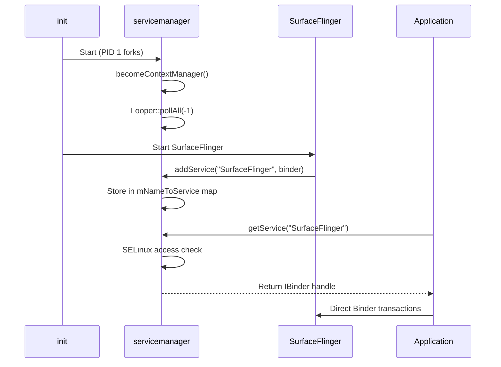

The architecture guarantees that:

- **Registration is authenticated**: `servicemanager` verifies SELinux labels
  before allowing `addService()` or `getService()` calls.
- **Discovery is centralized**: All services are findable through a single
  well-known Binder context.
- **Death notifications propagate**: When a service dies, `servicemanager`
  notifies all registered callbacks.

### 12.1.3 The Standard Service Lifecycle

Every native service follows a common pattern. Let us examine it using the GPU
service as a concrete, minimal example. The entry point is at:

> `frameworks/native/services/gpuservice/main_gpuservice.cpp`

```cpp
int main(int /* argc */, char** /* argv */) {
    signal(SIGPIPE, SIG_IGN);

    // publish GpuService
    sp<GpuService> gpuservice = new GpuService();
    sp<IServiceManager> sm(defaultServiceManager());
    sm->addService(String16(GpuService::SERVICE_NAME), gpuservice, false);

    // limit the number of binder threads to 4.
    ProcessState::self()->setThreadPoolMaxThreadCount(4);

    // start the thread pool
    sp<ProcessState> ps(ProcessState::self());
    ps->startThreadPool();
    ps->giveThreadPoolName();
    IPCThreadState::self()->joinThreadPool();

    return 0;
}
```

This pattern has five steps:

| Step | Code | Purpose |
|------|------|---------|
| 1 | `signal(SIGPIPE, SIG_IGN)` | Prevent crashes from broken pipes |
| 2 | `new GpuService()` | Construct the service object |
| 3 | `sm->addService(...)` | Register with servicemanager |
| 4 | `setThreadPoolMaxThreadCount(N)` | Configure Binder thread pool size |
| 5 | `joinThreadPool()` | Block main thread processing Binder calls |

Some services use a slightly different pattern. The `SensorService` uses the
`BinderService<T>` template, which wraps steps 2-5 into a single call:

> `frameworks/native/services/sensorservice/main_sensorservice.cpp`

```cpp
int main(int /*argc*/, char** /*argv*/) {
    signal(SIGPIPE, SIG_IGN);
    SensorService::publishAndJoinThreadPool();
    return 0;
}
```

The `BinderService<T>::publishAndJoinThreadPool()` template calls
`T::getServiceName()` to determine the registration name, constructs the
service, calls `addService()`, and enters the thread pool.

### 12.1.4 Process Isolation and init.rc Configuration

Each native service is defined in an `.rc` file that `init` parses at boot.
A typical definition looks like:

```
service surfaceflinger /system/bin/surfaceflinger
    class core animation
    user system
    group graphics drmrpc readproc
    capabilities SYS_NICE
    onrestart restart --only-if-running zygote
    task_profiles HighPerformance
```

Key properties:

- **`class`**: Determines when the service starts during boot (e.g., `core`,
  `main`, `late_start`).
- **`user`/`group`**: Linux UID/GID for process isolation.
- **`capabilities`**: Restricted set of Linux capabilities.
- **`onrestart`**: Actions to take when the service is restarted (typically
  cascading restarts of dependent services).
- **`task_profiles`**: cgroup configurations for CPU scheduling.

### 12.1.5 The Three Types of servicemanager

Android actually has three instances of `servicemanager`:

| Instance | Binary | Binder Device | Purpose |
|----------|--------|---------------|---------|
| `servicemanager` | `/system/bin/servicemanager` | `/dev/binder` | Framework services |
| `vndservicemanager` | `/vendor/bin/vndservicemanager` | `/dev/vndbinder` | Vendor HAL services |
| `servicemanager` (recovery) | Built with `__ANDROID_RECOVERY__` | `/dev/binder` | Recovery mode |

The vendor service manager exists to enforce the Treble boundary: vendor
processes cannot directly access framework services and vice versa. This
separation is enforced at the kernel level through distinct Binder device nodes.

### 12.1.6 Binder Thread Pool Sizing

Each native service carefully configures its Binder thread pool size based on
its expected concurrency. The choice matters:

- **Too few threads**: Clients block waiting for a thread, increasing latency.
- **Too many threads**: Wasted memory and context-switching overhead.

Here are the thread pool configurations from actual source code:

| Service | Max Threads | Rationale |
|---------|-------------|-----------|
| `servicemanager` | 0 (Looper-based) | Single-threaded to avoid deadlocks |
| `surfaceflinger` | Varies (usually 4) | VSYNC-driven, limited concurrency |
| `gpuservice` | 4 | Moderate concurrency for stats/queries |
| `media.codec` | 64 | Many parallel codec sessions |
| `installd` | Default (~15) | Multiple concurrent package operations |
| `sensorservice` | Default (~15) | Many concurrent sensor clients |

The `setThreadPoolMaxThreadCount(0)` call in servicemanager deserves special
attention. With zero threads in the pool, all Binder processing happens on
the main thread through the Looper. This is deliberate: servicemanager must
never call synchronously into another service (which could deadlock), so
all its outgoing calls are one-way, and incoming calls are processed
sequentially.

### 12.1.7 Death Notifications and Service Recovery

When a native service crashes, the recovery sequence is:

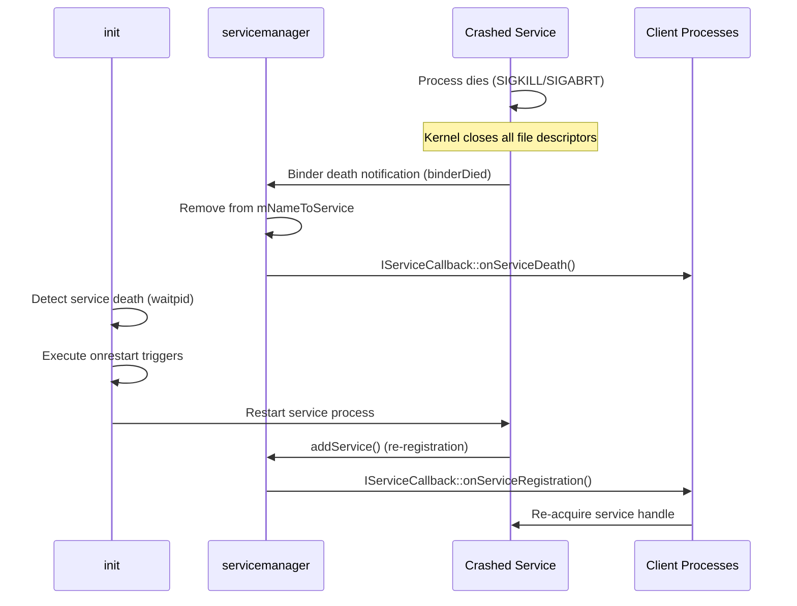

The `onrestart` directive in `.rc` files triggers cascading restarts. For
example, when SurfaceFlinger crashes:

```
onrestart restart --only-if-running zygote
```

This restarts the `zygote` process (and by extension all application
processes), because SurfaceFlinger state is not recoverable -- all layer
handles and buffer queues are lost.

### 12.1.8 Permissions and Capabilities

Native services use multiple layers of security:

1. **Linux UID/GID**: Set by the `user` and `group` directives in `.rc` files.
   For example, SurfaceFlinger runs as `user system` with groups including
   `graphics`, `drmrpc`, and `readproc`.

2. **Linux Capabilities**: Fine-grained privilege control. For example,
   SurfaceFlinger has `SYS_NICE` capability for real-time scheduling:
   ```
   capabilities SYS_NICE
   ```

3. **SELinux Mandatory Access Control**: Every IPC call is checked against
   SELinux policy. The `service_contexts` file maps service names to SELinux
   types:
   ```
   SurfaceFlinger  u:object_r:surfaceflinger_service:s0
   installd        u:object_r:installd_service:s0
   gpu             u:object_r:gpu_service:s0
   ```

4. **seccomp-bpf Sandboxing**: Used by media services to restrict system calls.
   The `SetUpMinijail()` function applies a seccomp filter that limits the
   syscalls the process can make, reducing the attack surface from malicious
   media content.

### 12.1.9 Native Services Map

The following diagram shows the major native services and their relationships:

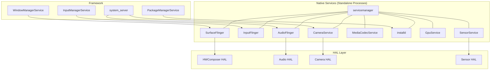

Each arrow represents a Binder connection. The native services sit between the
Java framework above and the HAL implementations below, translating high-level
API calls into hardware operations.

---

## 12.2 SurfaceFlinger

SurfaceFlinger is the **display composition service** -- arguably the most
complex and performance-critical native service in Android. It takes graphical
buffers from every application and system UI component, composites them
together, and presents the result on the display at the correct time
synchronized to the vertical sync (VSYNC) signal.

### 12.2.1 Source Layout

The SurfaceFlinger source tree at `frameworks/native/services/surfaceflinger/`
is massive -- approximately 546 files organized into the following structure:

| Directory | Purpose |
|-----------|---------|
| `CompositionEngine/` | Abstraction for the compositing pipeline |
| `Display/` | Display device management, mode switching |
| `DisplayHardware/` | HWComposer HAL interface, power control |
| `Effects/` | Color correction (Daltonizer for color-blind users) |
| `FrameTracer/` | Per-frame performance tracing |
| `FrontEnd/` | Layer lifecycle, snapshot building, transaction handling |
| `Jank/` | Jank detection and reporting |
| `PowerAdvisor/` | ADPF power hints to the kernel |
| `Scheduler/` | VSYNC prediction, frame scheduling, refresh rate selection |
| `TimeStats/` | Frame timing statistics |
| `Tracing/` | Perfetto integration for layer and transaction tracing |
| `Utils/` | Shared utilities (fences, dumpers) |

The main implementation spans over **10,600 lines** in `SurfaceFlinger.cpp`
alone. The header at `SurfaceFlinger.h` reveals the class hierarchy:

> `frameworks/native/services/surfaceflinger/SurfaceFlinger.h`

```cpp
class SurfaceFlinger : public BnSurfaceComposer,
                       public PriorityDumper,
                       private IBinder::DeathRecipient,
                       private HWC2::ComposerCallback,
                       private ICompositor,
                       private scheduler::ISchedulerCallback,
                       private compositionengine::ICEPowerCallback {
```

SurfaceFlinger inherits from:

- **`BnSurfaceComposer`**: The Binder native implementation of
  `ISurfaceComposer`, the AIDL interface that clients use.
- **`PriorityDumper`**: Supports `dumpsys SurfaceFlinger` with priority-based
  dump sections.
- **`HWC2::ComposerCallback`**: Receives callbacks from the Hardware Composer
  HAL (hotplug, VSYNC, refresh rate changes).
- **`ICompositor`**: The Scheduler's interface for triggering composition.
- **`ISchedulerCallback`**: Receives scheduling decisions (mode changes,
  frame rate updates).

### 12.2.2 High-Level Architecture

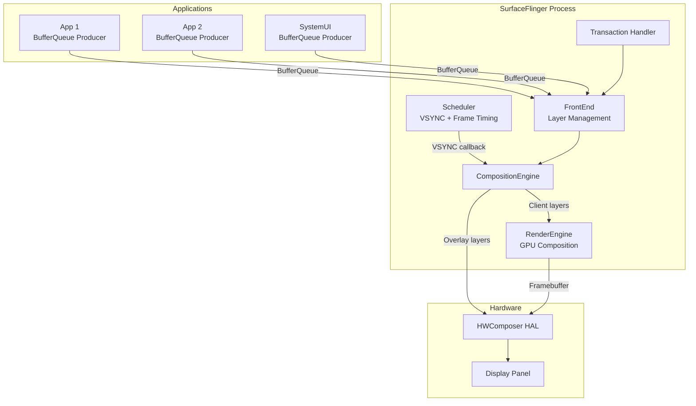

### 12.2.3 The Composition Cycle

SurfaceFlinger's main loop is driven by the Scheduler. On each VSYNC period,
the following steps execute:

1. **Commit Phase** (`commit()`):
   - Apply pending transactions (layer creation, property changes, buffer
     updates).
   - Build layer snapshots from the front-end state.
   - Update the layer tree hierarchy.

2. **Composite Phase** (`composite()`):
   - For each display, determine the visible layer set.
   - Send layers to HWComposer for `validateDisplay()`.
   - HWC decides which layers it can composite in hardware (overlay) and which
     require GPU fallback (client composition).
   - If client composition is needed, use RenderEngine (Skia/OpenGL) to
     render those layers into a framebuffer.
   - Call `presentDisplay()` to submit the final frame to the display.

3. **Post-composition**:
   - Signal release fences to applications so they can reuse buffers.
   - Update frame timing statistics.
   - Send jank metrics if frames were missed.

The key performance insight is that HWC overlay composition is essentially
"free" -- the display hardware composites the layers with zero GPU cost. GPU
composition is the fallback for layers that HWC cannot handle (e.g., complex
blending modes, too many layers, color space conversion).

### 12.2.4 Layer Management

A **Layer** represents a rectangular region of graphical content.
Each layer has:

- A **BufferQueue** for receiving graphic buffers from the producer.
- A **drawing state** and **current state** (double-buffered to allow
  concurrent updates).
- Geometric properties: position, size, crop, transform, z-order.
- Visual properties: alpha, color, blend mode, color space.

From `frameworks/native/services/surfaceflinger/Layer.cpp`:

```cpp
Layer::Layer(const surfaceflinger::LayerCreationArgs& args)
      : sequence(args.sequence),
        mFlinger(sp<SurfaceFlinger>::fromExisting(args.flinger)),
        mName(base::StringPrintf("%s#%d", args.name.c_str(), sequence)),
        mWindowType(static_cast<WindowInfo::Type>(
                args.metadata.getInt32(gui::METADATA_WINDOW_TYPE, 0))) {
    ALOGV("Creating Layer %s", getDebugName());

    mDrawingState.crop = {0, 0, -1, -1};
    mDrawingState.sequence = 0;
    mDrawingState.transform.set(0, 0);
    mDrawingState.frameNumber = 0;
    // ...
}
```

The `FrontEnd/` subsystem manages the layer lifecycle through:

- **`LayerLifecycleManager`**: Tracks creation and destruction.
- **`LayerSnapshotBuilder`**: Produces immutable snapshots for the composition
  engine, avoiding lock contention between the transaction thread and the
  composition thread.
- **`TransactionHandler`**: Queues and applies transactions atomically.

SurfaceFlinger enforces a maximum of 4096 layers (`MAX_LAYERS = 4096`) to
prevent resource exhaustion.

### 12.2.5 The Scheduler and VSYNC

The Scheduler subsystem at `frameworks/native/services/surfaceflinger/Scheduler/`
is responsible for:

- **VSYNC prediction**: Using `VSyncPredictor` to estimate future VSYNC
  timestamps based on historical data.
- **Refresh rate selection**: Choosing the optimal display refresh rate
  (60Hz, 90Hz, 120Hz, etc.) based on active layer frame rates.
- **Frame scheduling**: Waking SurfaceFlinger at the right time before
  VSYNC to perform composition.

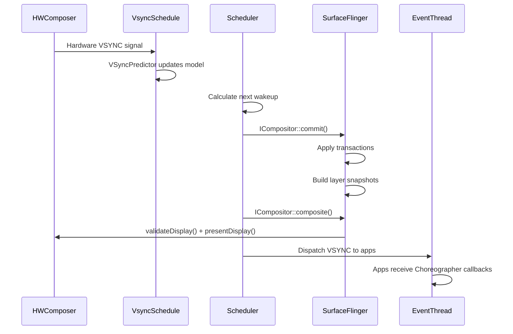

Key classes:

- **`Scheduler`** (`Scheduler.h`): Coordinates all timing. Inherits from both
  `IEventThreadCallback` and `MessageQueue`.
- **`VSyncPredictor`** (`VSyncPredictor.cpp`): Fits a linear model to hardware
  VSYNC timestamps to predict future events.
- **`VSyncDispatchTimerQueue`** (`VSyncDispatchTimerQueue.cpp`): Manages
  timer-based wakeups for different VSYNC clients.
- **`RefreshRateSelector`** (`RefreshRateSelector.cpp`): Chooses the display
  mode (refresh rate + resolution) that best satisfies all active layers.
- **`EventThread`** (`EventThread.cpp`): Delivers VSYNC events to applications
  via `DisplayEventConnection`.

### 12.2.6 HWComposer HAL Relationship

SurfaceFlinger communicates with the display hardware through the HWComposer
HAL (Hardware Composer). The interface is defined as an AIDL HAL at:

```
hardware/interfaces/graphics/composer/aidl/
```

The `HWComposer` wrapper class (`DisplayHardware/HWComposer.h`) translates
SurfaceFlinger's internal representation into HAL calls:

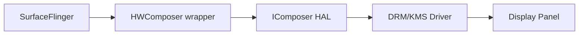

The critical HAL operations are:

| HAL Method | Purpose |
|-----------|---------|
| `createLayer()` | Allocate a hardware overlay plane |
| `setLayerBuffer()` | Assign a graphic buffer to a layer |
| `setLayerCompositionType()` | Mark as DEVICE (overlay) or CLIENT (GPU) |
| `validateDisplay()` | Ask HWC to evaluate the layer stack |
| `acceptDisplayChanges()` | Accept HWC's composition type decisions |
| `presentDisplay()` | Submit the frame for display |
| `getReleaseFences()` | Get fences for buffer recycling |

### 12.2.7 The CompositionEngine

The `CompositionEngine` (at `CompositionEngine/`) is the abstraction that
decouples the composition algorithm from the SurfaceFlinger policy logic.
It processes a set of `CompositionRefreshArgs` and produces a composited
frame for each display.

The composition flow within the engine:

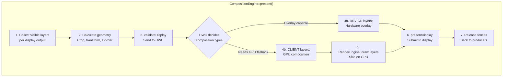

Each `Output` in the composition engine represents a display or virtual
display. The engine's `OutputLayer` objects wrap individual layer snapshots
with display-specific composition state (e.g., the composition type that
HWC assigned to that layer on that display).

**Predictive Composition Strategy**

A modern optimization is predictive composition, controlled by the flag:

```cpp
// If set, composition engine tries to predict the composition strategy
// provided by HWC based on the previous frame. If the strategy can be
// predicted, gpu composition will run parallel to the hwc validateDisplay
// call and re-run if the prediction is incorrect.
bool mPredictCompositionStrategy = false;
```

When enabled, the composition engine predicts which layers will require GPU
fallback based on the previous frame's HWC decisions. It starts GPU
composition in parallel with the `validateDisplay()` call. If the prediction
is correct, the GPU work is already done when `validateDisplay()` returns,
saving a full frame of latency for the GPU composition path.

### 12.2.8 RenderEngine: GPU Composition

When HWC cannot composite all layers (too many layers, unsupported blend modes,
color space conversion needed), SurfaceFlinger uses RenderEngine for GPU-based
composition. RenderEngine is implemented using:

- **Skia**: The primary rendering backend, using Vulkan or GLES.
- **Threaded rendering**: RenderEngine can operate on a dedicated thread to
  avoid blocking the main composition thread.

The key RenderEngine operation is `drawLayers()`, which takes a set of layer
settings (source buffer, geometry, blend mode, color matrix) and composites
them into a single output buffer that is then passed to HWC as a "client
target" layer.

### 12.2.9 Transaction Model

Applications modify layer properties through **transactions**. A transaction
is an atomic set of changes that are applied together:

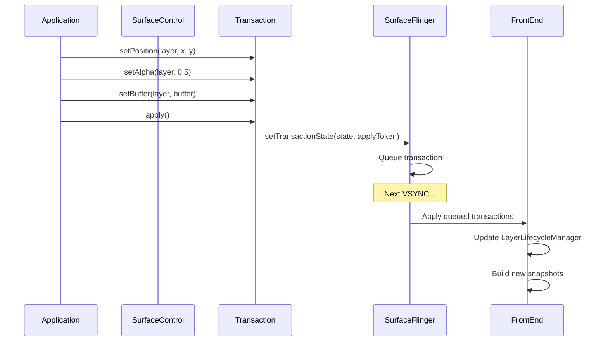

The `TransactionHandler` manages a queue of pending transactions. Transactions
can be:

- **Immediate**: Applied at the next VSYNC.
- **Deferred**: Applied at a future frame number or when a barrier fence
  signals.
- **Synchronized**: Multiple transactions applied atomically across different
  surfaces.

The `LayerLifecycleManager` is particularly noteworthy:

> `frameworks/native/services/surfaceflinger/FrontEnd/LayerLifecycleManager.h`

```cpp
// Owns a collection of RequestedLayerStates and manages their lifecycle
// and state changes.
//
// RequestedLayerStates are tracked and destroyed if they have no parent
// and no handle left to keep them alive.
class LayerLifecycleManager {
public:
    void addLayers(std::vector<std::unique_ptr<RequestedLayerState>>);
    void applyTransactions(const std::vector<QueuedTransactionState>&,
                           bool ignoreUnknownLayers = false);
    void onHandlesDestroyed(const std::vector<std::pair<uint32_t,
                            std::string>>&,
                            bool ignoreUnknownHandles = false);
    void fixRelativeZLoop(uint32_t relativeRootId);
    void commitChanges();
    // ...
};
```

### 12.2.10 HWComposer Callbacks

SurfaceFlinger receives several callbacks from the HWComposer HAL:

```cpp
// HWC2::ComposerCallback overrides:
void onComposerHalVsync(hal::HWDisplayId, nsecs_t timestamp,
                        std::optional<hal::VsyncPeriodNanos>) override;
void onComposerHalHotplugEvent(hal::HWDisplayId,
                                DisplayHotplugEvent) override;
void onComposerHalRefresh(hal::HWDisplayId) override;
void onComposerHalVsyncPeriodTimingChanged(hal::HWDisplayId,
                        const hal::VsyncPeriodChangeTimeline&) override;
void onComposerHalSeamlessPossible(hal::HWDisplayId) override;
void onComposerHalVsyncIdle(hal::HWDisplayId) override;
void onRefreshRateChangedDebug(
                        const RefreshRateChangedDebugData&) override;
void onComposerHalHdcpLevelsChanged(hal::HWDisplayId,
                        const HdcpLevels& levels) override;
```

| Callback | Trigger | SurfaceFlinger Response |
|----------|---------|------------------------|
| `onVsync` | Hardware VSYNC pulse | Updates VSyncPredictor model |
| `onHotplugEvent` | Display connected/disconnected | Creates/destroys DisplayDevice |
| `onRefresh` | HWC requests a refresh | Schedules immediate composition |
| `onVsyncPeriodTimingChanged` | Refresh rate change in progress | Updates timing parameters |
| `onVsyncIdle` | Display has gone idle (VRR) | Adjusts scheduling for idle |
| `onHdcpLevelsChanged` | HDCP protection level change | Updates content protection state |

### 12.2.11 The ISurfaceComposer API

SurfaceFlinger exposes a rich API through the `ISurfaceComposer` AIDL
interface. Key method categories include:

**Display Management**:

- `createVirtualDisplay()` / `destroyVirtualDisplay()`
- `getPhysicalDisplayIds()` / `getPhysicalDisplayToken()`
- `setDesiredDisplayModeSpecs()` (refresh rate policy)
- `setPowerMode()` (ON, OFF, DOZE, DOZE_SUSPEND)
- `setDisplayBrightness()`

**Layer Operations**:

- `setTransactionState()` (the primary channel for all layer changes)
- `setFrameRate()` (per-surface frame rate preference)
- `setGameModeFrameRateOverride()` (game-specific overrides)

**Screen Capture**:

- `captureDisplay()` (screenshot of a display)
- `captureLayers()` (screenshot of specific layers)

**Monitoring**:

- `addFpsListener()` / `addHdrLayerInfoListener()`
- `addRegionSamplingListener()` (brightness sampling for auto-brightness)
- `addWindowInfosListener()` (window info updates for InputFlinger)

### 12.2.12 Variable Refresh Rate (VRR) Support

Modern displays support Variable Refresh Rate (VRR), where the display's
refresh period can change dynamically. SurfaceFlinger handles this through:

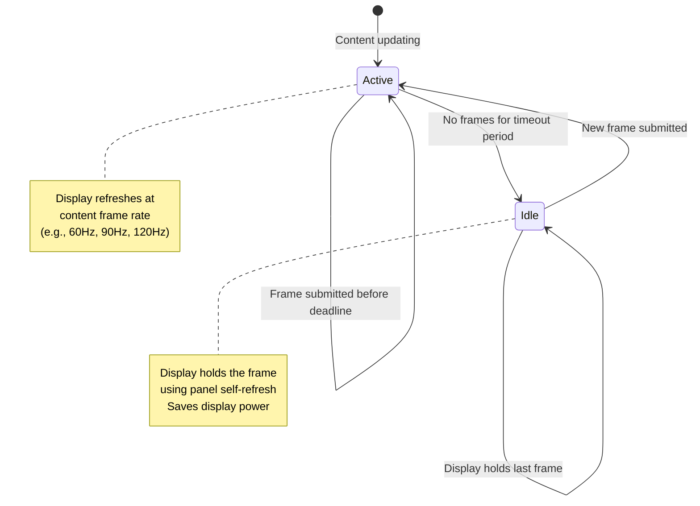

The `VsyncSchedule` class manages VRR-aware scheduling:

- When content is actively updating, VSYNC runs at the content's frame rate.
- When no new content arrives, the display enters idle mode and
  `onComposerHalVsyncIdle()` is called.
- The `vrrDisplayIdle()` callback informs the scheduler to stop unnecessary
  wakeups.
- The `KernelIdleTimerController` manages the display's idle timer in the
  kernel, which can put the display panel into a low-power self-refresh mode.

The `VsyncModulator` adjusts VSYNC offsets based on workload:

```cpp
class VsyncModulator {
    // Early offset: Used when SurfaceFlinger needs to wake up earlier
    // (e.g., when a touch event arrives and we expect new frames)
    VsyncConfig mEarlyConfig;

    // Late offset: Used during normal operation when the workload
    // is predictable
    VsyncConfig mLateConfig;

    // Early for GPU composition: Used when we expect GPU fallback
    VsyncConfig mEarlyGpuConfig;
};
```

### 12.2.13 Latch Unsignaled

The `LatchUnsignaledConfig` controls whether SurfaceFlinger can latch
(use) a buffer before its acquire fence has signaled:

```cpp
enum class LatchUnsignaledConfig {
    Disabled,           // Never latch unsignaled buffers
    AutoSingleLayer,    // Latch unsignaled only for single-layer
                        // buffer-only updates
    Always,             // Always latch unsignaled (risky)
};
```

The `AutoSingleLayer` mode is the production default. When a single layer
submits a buffer update with no other pending transactions, SurfaceFlinger
passes the buffer's acquire fence directly to HWC. If the fence signals
before the display's deadline, the frame is displayed; otherwise, the
display shows the previous frame. This reduces latency by one frame for
simple buffer updates.

### 12.2.14 Power Management

SurfaceFlinger integrates with Android's power management through:

1. **PowerAdvisor**: Communicates with the `PowerHAL` to send ADPF
   (Android Dynamic Performance Framework) hints. Before composition,
   SurfaceFlinger reports the expected workload duration; after composition,
   it reports the actual duration. The power HAL uses this information to
   adjust CPU/GPU frequencies.

2. **Display Power Modes**: SurfaceFlinger controls display power states:
   - `OFF`: Display is off, SurfaceFlinger stops compositing.
   - `ON`: Normal operation.
   - `DOZE`: Ambient display (low power, low brightness).
   - `DOZE_SUSPEND`: Like DOZE but SurfaceFlinger stops compositing
     (the display controller shows a static image).

3. **CPU Load Notification**: The `ICEPowerCallback::notifyCpuLoadUp()`
   callback warns the power system when the CPU load is about to increase
   (e.g., a burst of transactions is being processed).

### 12.2.15 Display Brightness and Color Management

SurfaceFlinger manages the display's color pipeline:

- **Wide color gamut**: Supports Display-P3 and BT.2020 color spaces.
  The `defaultCompositionDataspace` and `wideColorGamutCompositionDataspace`
  control the rendering color space.

- **HDR**: Manages HDR content compositing, including SDR-to-HDR and
  HDR-to-SDR tone mapping. The `HdrLayerInfoReporter` notifies interested
  clients when HDR content is on screen.

- **Color matrix**: A 4x4 color transformation matrix can be applied to the
  entire display output for accessibility features (color inversion,
  daltonizer for color blindness).

- **Region sampling**: The `RegionSamplingThread` samples pixel values from
  a specified screen region, used by the status bar to adjust its text color
  for readability against the background content.

### 12.2.16 Boot Stages

SurfaceFlinger tracks three boot stages:

```cpp
enum class BootStage {
    BOOTLOADER,     // Display showing bootloader splash
    BOOTANIMATION,  // Boot animation playing
    FINISHED,       // System fully booted
};
```

During `BOOTLOADER` stage, SurfaceFlinger initializes but does not yet drive
the display. Once `BOOTANIMATION` starts, SurfaceFlinger begins compositing
the boot animation frames. When `bootFinished()` is called by
`system_server`, the stage transitions to `FINISHED` and normal operation
begins.

### 12.2.17 Cross-References

SurfaceFlinger is deeply intertwined with the graphics pipeline covered in
other chapters:

- **Chapter 13 (Graphics Render Pipeline)**: The BufferQueue producer-consumer
  model that feeds buffers to SurfaceFlinger, plus detailed coverage of the
  CompositionEngine, RenderEngine (Skia), and the frame-by-frame compositing
  algorithm.
- **Chapter 10 (HAL)**: The HWComposer HAL interface and its AIDL definition.

---

## 12.3 InputFlinger

InputFlinger processes all user input -- touch events, key presses, stylus
strokes, mouse movements, gamepad buttons -- and routes them to the correct
application window. It is one of the most latency-sensitive services in
Android; even a few extra milliseconds of delay is perceptible to users.

### 12.3.1 Source Layout

The InputFlinger source lives at
`frameworks/native/services/inputflinger/` and is organized into:

| Directory | Purpose |
|-----------|---------|
| `reader/` | EventHub + InputReader: reads raw kernel events |
| `dispatcher/` | InputDispatcher: routes events to windows |
| `reporter/` | Reports input events (for accessibility) |
| `trace/` | Perfetto tracing integration |
| `rust/` | Rust FFI components via `IInputFlingerRust` |
| `aidl/` | AIDL interface definitions |
| Root files | InputManager, filters, blockers, choreographer |

### 12.3.2 The Input Pipeline

The comment in `InputManager.cpp` describes the complete pipeline:

> `frameworks/native/services/inputflinger/InputManager.cpp`

```cpp
/**
 * The event flow is via the "InputListener" interface, as follows:
 *   InputReader
 *     -> UnwantedInteractionBlocker
 *     -> InputFilter
 *     -> PointerChoreographer
 *     -> InputProcessor
 *     -> InputDeviceMetricsCollector
 *     -> InputDispatcher
 */
```

Let us trace this pipeline from hardware to application:

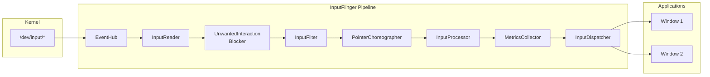

### 12.3.3 EventHub: Reading Raw Events

The EventHub is the lowest layer of the input stack. It:

1. Monitors `/dev/input/` using `inotify` for device hotplug events.
2. Opens input device nodes and reads `struct input_event` via `epoll`.
3. Identifies device capabilities (keyboard, touchscreen, mouse, etc.).
4. Maps key codes using Key Layout Map (`.kl`) and Key Character Map (`.kcm`)
   files.

From `frameworks/native/services/inputflinger/reader/EventHub.cpp`:

```cpp
static const char* DEVICE_INPUT_PATH = "/dev/input";
// v4l2 devices go directly into /dev
static const char* DEVICE_PATH = "/dev";

static constexpr size_t EVENT_BUFFER_SIZE = 256;

// Logs if the difference between the event timestamp and the read time is
// greater than this threshold.
static constexpr nsecs_t SLOW_READ_LOG_THRESHOLD_NS = ms2ns(100);
```

The EventHub uses `epoll` to efficiently wait on multiple device file
descriptors simultaneously. When an event arrives on any device, `epoll_wait()`
returns and the EventHub reads up to `EVENT_BUFFER_SIZE` (256) raw events in
a batch.

Each raw event is a Linux `struct input_event`:

```c
struct input_event {
    struct timeval time;  // Kernel timestamp
    __u16 type;           // EV_KEY, EV_ABS, EV_REL, EV_SYN, ...
    __u16 code;           // KEY_A, ABS_MT_POSITION_X, ...
    __s32 value;          // Key state, coordinate value, ...
};
```

### 12.3.4 InputReader: Interpreting Raw Events

The InputReader runs in its own thread and consumes raw events from EventHub.
It maintains a set of **InputDevice** objects, each containing one or more
**InputMapper** instances:

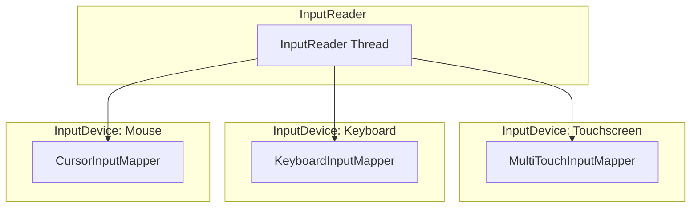

Key InputMapper types (in `reader/mapper/`):

| Mapper | Input Type | Output |
|--------|-----------|--------|
| `KeyboardInputMapper` | `EV_KEY` events | `NotifyKeyArgs` |
| `MultiTouchInputMapper` | `EV_ABS` multi-touch protocol | `NotifyMotionArgs` |
| `SingleTouchInputMapper` | `EV_ABS` single-touch protocol | `NotifyMotionArgs` |
| `CursorInputMapper` | `EV_REL` relative movement | `NotifyMotionArgs` |
| `TouchpadInputMapper` | Touchpad gestures | `NotifyMotionArgs` |
| `RotaryEncoderInputMapper` | Rotary encoder (watches, cars) | `NotifyMotionArgs` |
| `SwitchInputMapper` | `EV_SW` switch events (lid, headset) | `NotifySwitchArgs` |
| `VibratorInputMapper` | Force feedback / haptics | Haptic control |

Sub-device detection merges multiple Linux input device nodes that represent a
single physical device (e.g., a keyboard with an integrated touchpad):

```cpp
bool isSubDevice(const InputDeviceIdentifier& identifier1,
                 const InputDeviceIdentifier& identifier2) {
    return (identifier1.vendor == identifier2.vendor &&
            identifier1.product == identifier2.product &&
            identifier1.bus == identifier2.bus &&
            identifier1.version == identifier2.version &&
            identifier1.uniqueId == identifier2.uniqueId &&
            identifier1.location == identifier2.location);
}
```

### 12.3.5 Pipeline Stages

After the InputReader produces `NotifyArgs` (either `NotifyKeyArgs` or
`NotifyMotionArgs`), the events flow through several processing stages:

**UnwantedInteractionBlocker**

Removes unintentional touches, particularly palm touches on touchscreens.
When a large contact area is detected at the edge of the screen, the blocker
either removes individual pointers or suppresses the entire touch sequence.

**InputFilter**

Applies filtering rules defined by the system. This is used for accessibility
features (e.g., slow keys, sticky keys) and for the `InputFilter` AIDL
interface that allows the Rust component to apply additional filtering logic:

```cpp
mInputFilter = std::make_unique<InputFilter>(
    *mTracingStages.back(), *mInputFlingerRust,
    inputFilterPolicy, env);
```

**PointerChoreographer**

Manages pointer icons and their positions. For touchpad and mouse input, it
determines which display the pointer appears on and applies any coordinate
transformations needed for multi-display setups.

**InputProcessor**

Communicates with the device-specific `IInputProcessor` HAL to apply
hardware-assisted event classification. For example, the HAL might classify
a touch gesture as a palm rejection candidate.

**InputDeviceMetricsCollector**

Gathers usage statistics per input device: how often each device is used,
latency measurements, and interaction patterns. This data feeds into the
system's telemetry pipeline.

### 12.3.6 InputDispatcher: Routing to Windows

The InputDispatcher is the final and most complex stage. It runs in its own
thread and is responsible for:

1. **Window targeting**: Determining which window(s) should receive each event
   based on touch coordinates and the window hierarchy.
2. **Focus management**: Tracking which window has input focus for key events.
3. **ANR detection**: Monitoring whether windows respond to events within the
   timeout window (typically 5 seconds).
4. **Event injection**: Supporting programmatic event injection for testing.

From the header comment in `frameworks/native/services/inputflinger/dispatcher/InputDispatcher.h`:

```cpp
/* Dispatches events to input targets. Some functions of the input
 * dispatcher, such as identifying input targets, are controlled by a
 * separate policy object.
 *
 * IMPORTANT INVARIANT:
 *     Because the policy can potentially block or cause re-entrance
 *     into the input dispatcher, the input dispatcher never calls
 *     into the policy while holding its internal locks.
 */
class InputDispatcher : public android::InputDispatcherInterface {
```

The dispatcher maintains several key data structures:

| Data Structure | Purpose |
|----------------|---------|
| `mInboundQueue` | Incoming events waiting to be dispatched |
| `mConnectionsByToken` | Maps window tokens to `Connection` objects |
| `TouchState` (per display) | Tracks ongoing touch sequences |
| `FocusResolver` | Determines the focused window |
| `AnrTracker` | Monitors response timeouts |

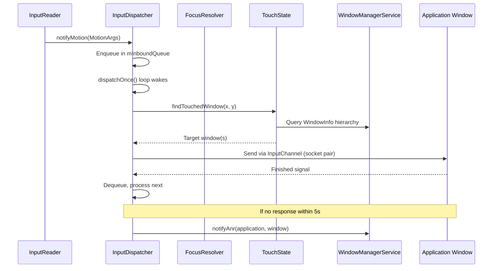

### 12.3.7 Dispatcher Event Types

The InputDispatcher processes several types of events, defined in
`frameworks/native/services/inputflinger/dispatcher/Entry.h`:

```cpp
struct EventEntry {
    enum class Type {
        DEVICE_RESET,             // Input device was reset
        FOCUS,                    // Focus changed to a new window
        KEY,                      // Keyboard key press/release
        MOTION,                   // Touch, mouse, trackpad motion
        SENSOR,                   // Sensor event (rare)
        POINTER_CAPTURE_CHANGED,  // Pointer capture mode changed
        DRAG,                     // Drag-and-drop state change
        TOUCH_MODE_CHANGED,       // Touch mode toggled

        ftl_last = TOUCH_MODE_CHANGED
    };

    int32_t id;
    Type type;
    nsecs_t eventTime;
    uint32_t policyFlags;
    std::shared_ptr<InjectionState> injectionState;
    mutable bool dispatchInProgress;

    // Injected events are from external (untrusted) sources
    inline bool isInjected() const { return injectionState != nullptr; }

    // Synthesized events aren't directly from hardware
    inline bool isSynthesized() const {
        return isInjected() ||
            IdGenerator::getSource(id) != IdGenerator::Source::INPUT_READER;
    }
};
```

Key specializations include:

- **`KeyEntry`**: Contains `deviceId`, `source`, `displayId`, `action`,
  `keyCode`, `scanCode`, `metaState`, `repeatCount`, and `flags`.
- **`MotionEntry`**: Contains pointer data arrays (`PointerProperties`,
  `PointerCoords`), `action`, `actionButton`, `edgeFlags`, `xPrecision`,
  `yPrecision`, and `classification` (e.g., palm, ambiguous).

### 12.3.8 Focus Management

The `FocusResolver` class tracks which window has input focus on each display:

> `frameworks/native/services/inputflinger/dispatcher/FocusResolver.h`

```cpp
// Focus Policy:
//   Window focusability - A window token can be focused if there is
//   at least one window handle that is visible with the same token
//   and all window handles with the same token are focusable.
//
//   Focus request - Granted if the window is focusable. If not,
//   persisted and granted when it becomes focusable.
//
//   Conditional focus request - Granted only if the specified focus
//   token is currently focused. Otherwise dropped.
class FocusResolver {
public:
    sp<IBinder> getFocusedWindowToken(
        ui::LogicalDisplayId displayId) const;

    struct FocusChanges {
        sp<IBinder> oldFocus;
        sp<IBinder> newFocus;
        ui::LogicalDisplayId displayId;
        std::string reason;
    };
    // ...
private:
    enum class Focusability {
        OK,
        NO_WINDOW,
        NOT_FOCUSABLE,
        NOT_VISIBLE,
    };
};
```

Focus changes generate `FocusEntry` events that are dispatched through the
same pipeline as key and motion events. This ensures focus changes are
ordered correctly with respect to the events that triggered them.

### 12.3.9 ANR (Application Not Responding) Detection

The InputDispatcher monitors whether applications respond to dispatched
events within the timeout window. The `AnrTracker` maintains per-connection
deadlines:

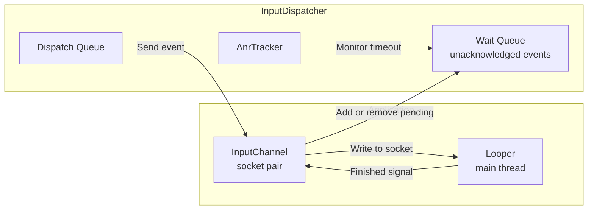

If an application does not send a `finished` signal within 5 seconds (the
default ANR timeout), the dispatcher notifies the policy:

1. The policy (InputManagerService in system_server) shows the ANR dialog.
2. The user can choose to wait or force-close the application.
3. If force-closed, all pending events for that window are cancelled.

### 12.3.10 Touch State Tracking

The `TouchState` class tracks ongoing multi-touch interactions per display:

- Which windows are currently being touched.
- The set of "touched windows" -- windows that received `ACTION_DOWN` and
  should continue receiving motion events until `ACTION_UP`.
- Split motion support -- a single touch stream can be split across multiple
  windows (e.g., when dragging across a window boundary).
- Pointer ID tracking for multi-touch disambiguation.

The `TouchedWindow` class stores per-window touch information:

```
frameworks/native/services/inputflinger/dispatcher/TouchedWindow.h
frameworks/native/services/inputflinger/dispatcher/TouchState.h
```

### 12.3.11 InputChannels and Transport

Events are delivered to applications through **InputChannels** -- pairs of
Unix domain sockets. One end is held by the InputDispatcher, and the other
is passed to the application process. The `InputTransport` protocol defines
a binary message format that is zero-copy optimized:

- **`InputMessage::Type::MOTION`**: Touch/mouse events with coordinates.
- **`InputMessage::Type::KEY`**: Keyboard events with key codes.
- **`InputMessage::Type::FINISHED`**: Application acknowledges receipt.
- **`InputMessage::Type::TIMELINE`**: Frame timing feedback.

The socket-based transport avoids the overhead of Binder IPC for the
high-frequency input event stream. A typical touch screen generates events
at 120-240 Hz, and Binder round-trips would add unacceptable latency.

### 12.3.12 Event Injection

InputDispatcher supports event injection for testing and accessibility:

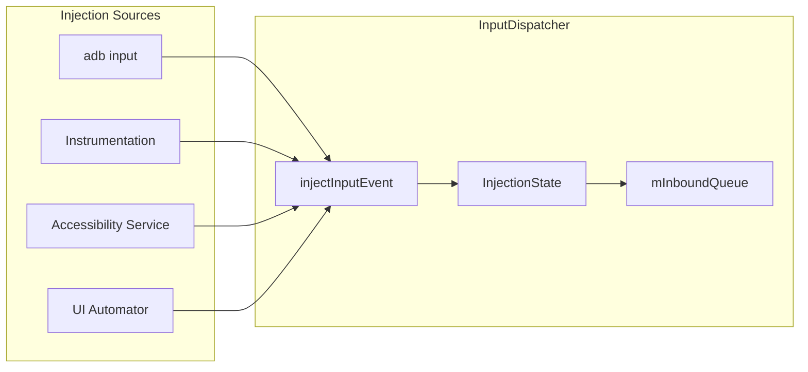

Injected events are tagged with `POLICY_FLAG_INJECTED` and tracked through
an `InjectionState` object. The dispatcher can wait for the injection to
complete (synchronous mode) or return immediately (asynchronous mode).

Permission checking ensures that only privileged callers can inject events:

- `INJECT_EVENTS` permission for general injection.
- Accessibility services have special injection privileges for the
  accessibility overlay.
- `adb shell input` uses the shell UID's injection permissions.

### 12.3.13 Latency Tracking

The InputDispatcher includes a `LatencyTracker` that measures end-to-end
input latency:

```
// From LatencyTracker.h / LatencyAggregator.h
// Tracks the timeline for each event:
// 1. Event creation time (kernel timestamp)
// 2. Event read time (EventHub)
// 3. Dispatch time (InputDispatcher)
// 4. Delivery time (written to InputChannel)
// 5. Consumption time (app reads from channel)
// 6. Finish time (app sends finished signal)
// 7. Graphics latency (frame presented on display)
```

The `LatencyAggregatorWithHistograms` produces histogram data that is
reported to the system's telemetry pipeline, enabling:

- Detection of apps with consistently high input latency.
- Identification of systemic latency regressions.
- Device-level input performance benchmarking.

### 12.3.14 The Rust Component

A notable architectural evolution in the current AOSP is the introduction of
Rust into the input pipeline via `IInputFlingerRust`:

```cpp
// Create the Rust component of InputFlinger that uses AIDL interfaces
// as the foreign function interface (FFI).
std::shared_ptr<IInputFlingerRust> createInputFlingerRust() {
    // ...
    create_inputflinger_rust(binderToPointer(*callback));
    // ...
}
```

The Rust implementation is bootstrapped through a C++ callback pattern:

1. C++ creates a `BnInputFlingerRustBootstrapCallback`.
2. Calls the CXX bridge function `create_inputflinger_rust()`.
3. The Rust side creates the `IInputFlingerRust` implementation.
4. Passes it back to C++ through the callback.

This hybrid approach allows new input filtering and processing logic to be
written in Rust (with its memory safety guarantees) while maintaining the
existing C++ infrastructure.

### 12.3.15 The InputManager Binding

The `InputManager` class ties everything together and implements the
`BnInputFlinger` Binder interface:

> `frameworks/native/services/inputflinger/InputManager.h`

```cpp
class InputManager : public InputManagerInterface, public BnInputFlinger {
private:
    std::unique_ptr<InputReaderInterface> mReader;
    std::unique_ptr<UnwantedInteractionBlockerInterface> mBlocker;
    std::unique_ptr<InputFilterInterface> mInputFilter;
    std::unique_ptr<PointerChoreographerInterface> mChoreographer;
    std::unique_ptr<InputProcessorInterface> mProcessor;
    std::unique_ptr<InputDeviceMetricsCollectorInterface> mCollector;
    std::unique_ptr<InputDispatcherInterface> mDispatcher;
    std::shared_ptr<IInputFlingerRust> mInputFlingerRust;
    std::vector<std::unique_ptr<TracedInputListener>> mTracingStages;
};
```

The `start()` method launches the reader and dispatcher threads:

```cpp
status_t InputManager::start() {
    status_t result = mDispatcher->start();
    if (result) {
        ALOGE("Could not start InputDispatcher thread due to error %d.", result);
        return result;
    }
    result = mReader->start();
    if (result) {
        ALOGE("Could not start InputReader due to error %d.", result);
        mDispatcher->stop();
        return result;
    }
    return OK;
}
```

The InputManager is not a standalone process -- it is created and owned by
`InputManagerService` in `system_server` via JNI. However, the entire C++
pipeline runs in native threads within `system_server`'s process.

---

## 12.4 AudioFlinger Overview

AudioFlinger is the native service responsible for mixing and routing audio
streams. It runs as a standalone process (`audioserver`) and is one of the
most mature native services in Android, with roots going back to the earliest
versions of the platform.

### 12.4.1 Source Location

The AudioFlinger implementation lives at:

```
frameworks/av/services/audioflinger/
```

Key files include:

| File | Purpose |
|------|---------|
| `AudioFlinger.h` / `.cpp` | Main service implementation |
| `Threads.h` / `.cpp` | Playback and recording thread management |
| `Tracks.cpp` | Audio track lifecycle and mixing |
| `Effects.h` / `.cpp` | Audio effect chain processing |
| `PatchPanel.h` / `.cpp` | Audio routing patch management |
| `MelReporter.h` / `.cpp` | Sound dose measurement (Media Exposure Limit) |
| `DeviceEffectManager.h` / `.cpp` | Per-device audio effects |
| `Client.h` / `.cpp` | Per-client state tracking |

### 12.4.2 Architecture Overview

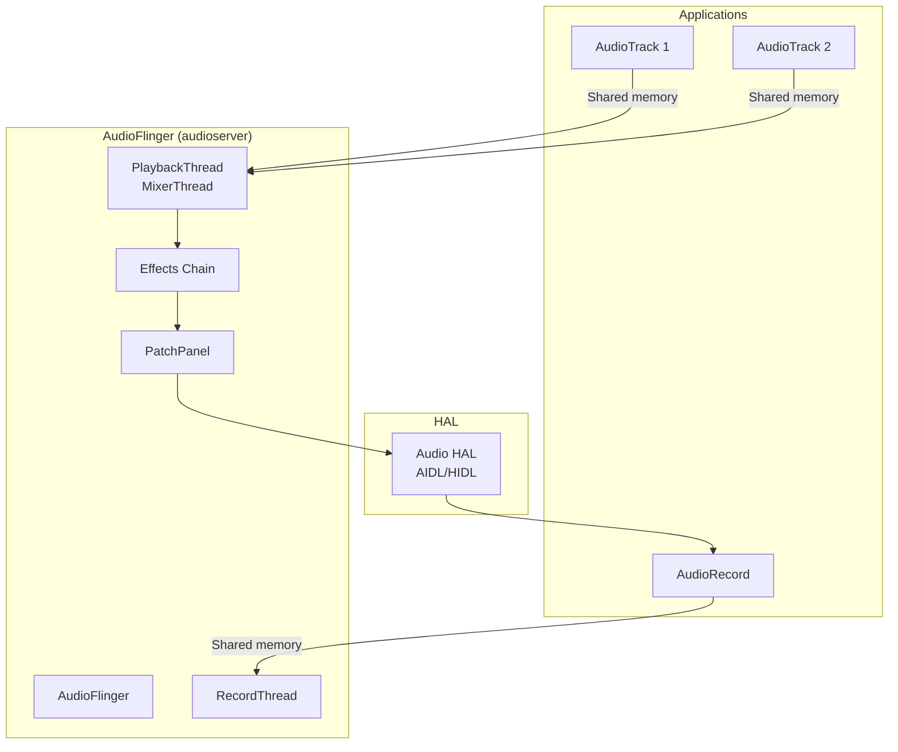

AudioFlinger uses shared memory (ashmem/memfd) buffers for zero-copy audio
data transfer between applications and the mixer threads. This is critical
for maintaining low audio latency.

The thread model is based on specialized thread classes:

- **`MixerThread`**: The most common playback thread. Mixes multiple audio
  tracks using a software mixer (or offloads to hardware).
- **`DirectOutputThread`**: Sends a single track directly to the HAL without
  software mixing (used for compressed audio passthrough).
- **`OffloadThread`**: For hardware-offloaded audio decoding and playback.
- **`RecordThread`**: Captures audio from input devices.
- **`MmapThread`**: Uses memory-mapped I/O for ultra-low-latency paths (AAudio
  MMAP mode).

### 12.4.3 The AudioFlinger Thread Model

AudioFlinger's thread architecture is central to understanding its design.
Each audio output device (speaker, headphones, Bluetooth, USB) typically
has one or more dedicated threads:

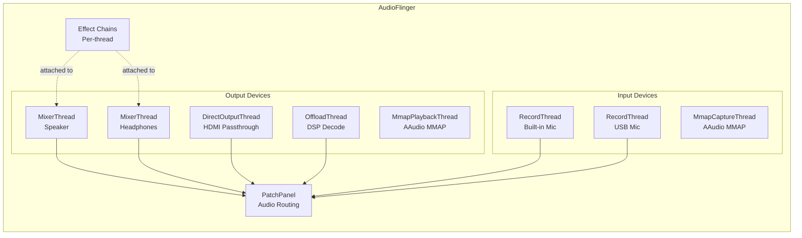

**MixerThread** is the workhorse. It runs in a tight loop:

1. Wait for the next buffer period (typically 5-20ms).
2. Pull data from all active `Track` objects (via shared memory ring buffers).
3. Mix all tracks together, applying per-track volume, pan, and aux effects.
4. Apply output effects (equalizer, bass boost, virtualizer, etc.).
5. Write the mixed buffer to the Audio HAL.

**DirectOutputThread** bypasses the mixer for formats that should not be
mixed (e.g., compressed audio sent to an HDMI receiver for decoding).

**OffloadThread** delegates decoding to the audio DSP, allowing the
application processor to sleep during playback. This is critical for
battery life during music playback.

**MmapThread** provides the lowest possible latency by mapping the HAL's
buffer directly into the application's address space, eliminating all
copy operations. This is used by the AAudio MMAP mode for pro audio
applications.

### 12.4.4 Shared Memory Audio Transport

AudioFlinger uses shared memory for zero-copy audio data transfer:

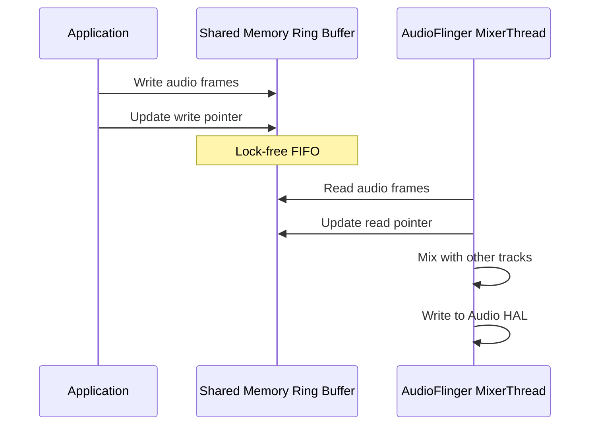

The shared memory region contains:

- A **control block** with read/write pointers and flow control flags.
- A **circular buffer** for the audio data (PCM samples).
- Flow control **futexes** for efficient blocking when the buffer is
  full (producer) or empty (consumer).

This design eliminates Binder IPC from the audio data path entirely. Only
control operations (start, stop, set volume) use Binder -- the actual audio
data flows through shared memory with minimal kernel involvement.

### 12.4.5 Cross-Reference

For a deep dive into AudioFlinger's mixing pipeline, effect chains, latency
optimization, and the Audio HAL interface, see **Chapter 15 (Audio
System)**. That chapter covers:

- The complete audio routing model and `AudioPolicy` interaction.
- Shared memory ring buffers and the `AudioTrack`/`AudioRecord` protocol.
- Effect processing chains and the `EffectModule` architecture.
- The AAudio/MMAP low-latency path.
- Audio HAL versioning (HIDL to AIDL migration).

---

## 12.5 CameraService Overview

CameraService manages all camera hardware access and is the gatekeeper
ensuring that multiple applications can share camera resources safely.

### 12.5.1 Source Location

The CameraService source lives at:

```
frameworks/av/services/camera/libcameraservice/
```

Key files:

| File | Purpose |
|------|---------|
| `CameraService.h` / `.cpp` | Main service, client management |
| `CameraFlashlight.h` / `.cpp` | Flashlight/torch control |
| `CameraServiceWatchdog.h` / `.cpp` | Detects and recovers from HAL hangs |

An interesting recent addition is the **virtual camera** subsystem at:

```
frameworks/av/services/camera/virtualcamera/
```

This provides software-based camera devices for testing, remote cameras,
and virtual displays.

### 12.5.2 Architecture Overview

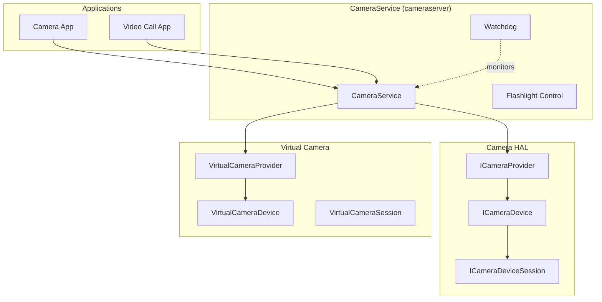

CameraService enforces strict resource arbitration:

- Only one client can use a camera device at a time (with priority-based
  eviction for foreground vs. background apps).
- The `CameraServiceWatchdog` monitors HAL responses and triggers recovery
  if the HAL becomes unresponsive.
- Camera access is subject to `android.permission.CAMERA` and AppOps checks.

### 12.5.3 Client Priority and Eviction

CameraService implements a priority-based eviction system. When a higher-priority
client requests a camera that is already in use by a lower-priority client,
the lower-priority client is evicted:

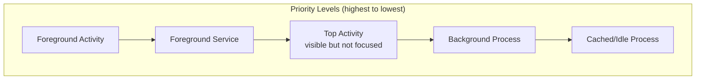

The eviction algorithm:

1. A new client requests a camera.
2. CameraService checks if the camera is currently in use.
3. If in use, compare the new client's priority (based on its process state)
   with the current client's priority.
4. If the new client has higher priority, disconnect the old client and
   connect the new one.
5. The old client receives a `disconnect()` callback and must release all
   resources.

This ensures that a foreground camera app always gets priority over background
processes, and that system-level camera access (e.g., face unlock) takes
priority over all user applications.

### 12.5.4 The CameraServiceWatchdog

The watchdog monitors for HAL hangs, which are a common failure mode with
complex camera hardware:

```cpp
class CameraServiceWatchdog {
    // Monitors camera operations and triggers recovery if they exceed
    // the configured timeout (typically 10-30 seconds)
};
```

When a HAL operation takes too long:

1. The watchdog logs a detailed diagnostic dump.
2. It may trigger a camera HAL restart.
3. All connected clients are notified of the disconnection.
4. The HAL re-initializes and clients can reconnect.

### 12.5.5 Virtual Camera

The virtual camera subsystem (`frameworks/av/services/camera/virtualcamera/`)
provides software-implemented camera devices. Key components:

| Class | Purpose |
|-------|---------|
| `VirtualCameraProvider` | Implements `ICameraProvider` for virtual cameras |
| `VirtualCameraDevice` | Implements `ICameraDevice` |
| `VirtualCameraSession` | Implements `ICameraDeviceSession` |
| `VirtualCameraRenderThread` | Generates camera frames from various sources |
| `VirtualCameraStream` | Manages output streams |

Virtual cameras can be sourced from:

- Screen capture (for remote desktop scenarios).
- Network streams (for IP cameras or remote collaboration).
- Synthetic content (for testing and development).
- Display output (for rear-display cameras on foldables).

### 12.5.6 Cross-Reference

For complete coverage of the Camera HAL interface, the capture pipeline,
stream configuration, and the Camera2 API, see **Chapter 16 (Media and
Camera)**. That chapter covers:

- The `ICameraDevice` / `ICameraDeviceSession` AIDL HAL interface.
- Request/result metadata processing.
- Stream configuration and buffer management.
- Multi-camera support and concurrent access.

---

## 12.6 MediaService Overview

The media subsystem is split across several native services, each running in
its own process with restricted permissions (using seccomp sandboxing).

### 12.6.1 MediaCodecService

The codec service runs as `media.codec` and hosts the hardware codec HAL
implementations. It uses seccomp-bpf sandboxing to restrict system calls:

> `frameworks/av/services/mediacodec/main_codecservice.cpp`

```cpp
int main(int argc __unused, char** argv) {
    strcpy(argv[0], "media.codec");
    LOG(INFO) << "mediacodecservice starting";
    signal(SIGPIPE, SIG_IGN);
    SetUpMinijail(kSystemSeccompPolicyPath, kVendorSeccompPolicyPath);

    android::ProcessState::initWithDriver("/dev/vndbinder");
    android::ProcessState::self()->startThreadPool();

    ::android::hardware::configureRpcThreadpool(64, false);

    // Default codec services
    using namespace ::android::hardware::media::omx::V1_0;
    sp<IOmx> omx = new implementation::Omx();
    // ...
    ::android::hardware::joinRpcThreadpool();
}
```

Key observations:

- Uses `/dev/vndbinder` (vendor binder), placing it in the vendor domain.
- Configures 64 RPC threads for parallel codec operations.
- Applies minijail seccomp policies from `/system/etc/seccomp_policy/`.
- Registers the `IOmx` HAL interface for OMX-based codecs.

A separate `media.swcodec` process handles software-only codecs, further
isolating them from hardware codec drivers.

### 12.6.2 MediaExtractorService

The media extractor runs as `media.extractor` and is responsible for parsing
container formats (MP4, MKV, OGG, etc.) and demultiplexing them into
elementary streams. Like the codec service, it runs in a seccomp-sandboxed
process.

### 12.6.3 Codec2 (C2) Framework

The modern codec framework is Codec2 (C2), located at:

```
frameworks/av/codec2/
```

Codec2 replaces the older OMX (OpenMAX IL) interface with a more flexible
architecture:

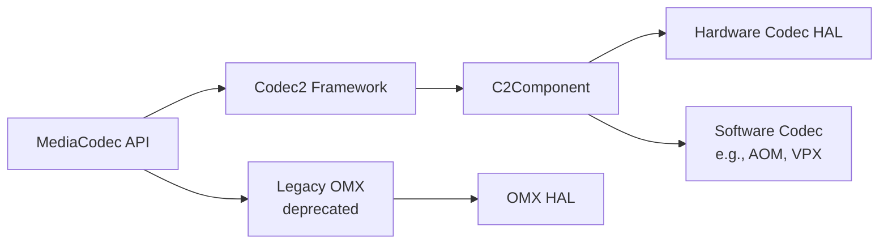

Codec2 provides:

- **Component-based architecture**: Each codec is a `C2Component` with
  well-defined input/output work queues.
- **Buffer pool management**: Efficient buffer allocation and recycling.
- **Tunneled playback**: Direct buffer passing between decoder and
  SurfaceFlinger without CPU copies.
- **Multi-instance support**: Running multiple codec instances concurrently.

### 12.6.4 Process Isolation Architecture

The media services demonstrate Android's defense-in-depth approach. Each
media service runs in its own process with restricted privileges:

```mermaid
graph TB
    subgraph "Media Processes"
        direction LR
        MC["media.codec<br/>seccomp + vndbinder"]
        ME["media.extractor<br/>seccomp + binder"]
        SWMC["media.swcodec<br/>seccomp + binder"]
        MS["mediaserver<br/>binder"]
    end

    subgraph "Isolation Measures"
        direction TB
        SEC["seccomp-bpf<br/>Syscall filtering"]
        MJ["Minijail<br/>Privilege restriction"]
        SEL["SELinux<br/>Mandatory access control"]
        NS[Namespace isolation]
    end

    MC --- SEC
    MC --- MJ
    MC --- SEL
    ME --- SEC
    ME --- MJ
    SWMC --- SEC
    SWMC --- MJ
```

The rationale for this isolation:

- **Media parsers (extractor)** are the primary attack surface for malicious
  media files. A crafted MP4/MKV file could exploit a parser bug. Running the
  parser in a sandboxed process limits the impact of such exploits.
- **Hardware codecs** interact with vendor-specific drivers that may have
  their own vulnerabilities. Using `/dev/vndbinder` isolates them from
  framework services.
- **Software codecs** have historically been a source of vulnerabilities
  (e.g., Stagefright). Running them in a separate process from hardware
  codecs prevents a software codec exploit from accessing hardware codec
  drivers.

The seccomp policy files restrict system calls to the minimum set needed:

```
/system/etc/seccomp_policy/mediacodec.policy
/vendor/etc/seccomp_policy/mediacodec.policy
```

### 12.6.5 Codec2 Component Lifecycle

A Codec2 component goes through a well-defined lifecycle:

```mermaid
stateDiagram-v2
    [*] --> UNLOADED
    UNLOADED --> LOADED: create
    LOADED --> RUNNING: start
    RUNNING --> LOADED: stop
    RUNNING --> RUNNING: process
    RUNNING --> FLUSHING: flush
    FLUSHING --> RUNNING: flush complete
    LOADED --> UNLOADED: destroy
    RUNNING --> ERROR: error
    ERROR --> LOADED: reset
```

The component processes work items from an input queue:

1. Client submits `C2Work` items containing input buffers.
2. The component processes each work item (decode/encode).
3. Completed work items are returned to the client with output buffers.
4. The client reads the output data and recycles the buffers.

### 12.6.6 Cross-Reference

For the full media pipeline architecture, including `MediaCodec`, `MediaPlayer`,
`MediaRecorder`, and the Codec2 internals, see **Chapter 16 (Media and
Camera)**.

---

## 12.7 installd

`installd` is the privileged daemon responsible for all on-disk operations
related to application installation, data management, and DEX optimization. It
runs with elevated permissions that `system_server` itself does not have,
providing a secure escalation path for package management operations.

### 12.7.1 Why installd Exists

`system_server` runs as UID `system` (1000), but application data directories
are owned by per-app UIDs (10000+). Creating, modifying, and deleting these
directories requires root or specific capabilities. Rather than giving
`system_server` these privileges, Android delegates filesystem operations to
`installd`, which runs as root with restricted capabilities and SELinux
enforcement.

### 12.7.2 Source Layout

The source is at `frameworks/native/cmds/installd/`:

| File | Purpose |
|------|---------|
| `installd.cpp` | Main entry point, initialization |
| `InstalldNativeService.h` / `.cpp` | Binder service implementation |
| `dexopt.h` / `.cpp` | DEX optimization (dex2oat invocation) |
| `utils.cpp` | Filesystem utility functions |
| `CacheTracker.h` | Cache size tracking for storage management |
| `QuotaUtils.h` / `.cpp` | Disk quota management |
| `CrateManager.cpp` | "Crate" storage management |
| `run_dex2oat.cpp` | dex2oat process spawning |
| `installd_constants.h` | Shared constants and flags |
| `globals.h` | Global path variables |

### 12.7.3 Startup and Initialization

The `installd` main function performs careful initialization before accepting
Binder calls:

> `frameworks/native/cmds/installd/installd.cpp`

```cpp
static int installd_main(const int argc ATTRIBUTE_UNUSED, char *argv[]) {
    // ...
    SLOGI("installd firing up");

    // SELinux setup
    union selinux_callback cb;
    cb.func_log = log_callback;
    selinux_set_callback(SELINUX_CB_LOG, cb);

    if (!initialize_globals()) {
        SLOGE("Could not initialize globals; exiting.\n");
        exit(1);
    }

    if (initialize_directories() < 0) {
        SLOGE("Could not create directories; exiting.\n");
        exit(1);
    }

    if (selinux_enabled && selinux_status_open(true) < 0) {
        SLOGE("Could not open selinux status; exiting.\n");
        exit(1);
    }

    if ((ret = InstalldNativeService::start()) != android::OK) {
        SLOGE("Unable to start InstalldNativeService: %d", ret);
        exit(1);
    }

    IPCThreadState::self()->joinThreadPool();
    // ...
}
```

The `initialize_directories()` function handles filesystem layout upgrades.
It reads a version file at `{android_data_dir}/misc/installd/layout_version`
and performs migrations when the layout version changes:

```cpp
if (version < 2) {
    SLOGD("Assuming that device has multi-user storage layout; "
          "upgrade no longer supported");
    version = 2;
}
```

### 12.7.4 The InstalldNativeService Interface

The `InstalldNativeService` implements the `IInstalld` AIDL interface,
exposing dozens of operations to `PackageManagerService`:

> `frameworks/native/cmds/installd/InstalldNativeService.h`

```cpp
class InstalldNativeService : public BinderService<InstalldNativeService>,
                              public os::BnInstalld {
public:
    static char const* getServiceName() { return "installd"; }

    // User data management
    binder::Status createUserData(const std::optional<std::string>& uuid,
            int32_t userId, int32_t userSerial, int32_t flags);
    binder::Status destroyUserData(const std::optional<std::string>& uuid,
            int32_t userId, int32_t flags);

    // App data management
    binder::Status createAppData(/* ... */);
    binder::Status createAppDataBatched(/* ... */);
    binder::Status clearAppData(/* ... */);
    binder::Status destroyAppData(/* ... */);

    // DEX optimization
    binder::Status dexopt(const std::string& apkPath, int32_t uid,
                          /* ... 14 more parameters ... */);

    // Storage management
    binder::Status freeCache(/* ... */);
    binder::Status getAppSize(/* ... */);
    binder::Status getUserSize(/* ... */);

    // Profile management
    binder::Status mergeProfiles(/* ... */);
    binder::Status dumpProfiles(/* ... */);

    // fs-verity
    binder::Status createFsveritySetupAuthToken(/* ... */);
    binder::Status enableFsverity(/* ... */);
    // ... and many more
};
```

### 12.7.5 App Data Directory Structure

When an app is installed, `installd` creates the following directory structure:

```
/data/user/{userId}/{packageName}/      (CE - Credential Encrypted)
/data/user_de/{userId}/{packageName}/   (DE - Device Encrypted)
```

The distinction between CE (Credential Encrypted) and DE (Device Encrypted)
storage is critical for Direct Boot support:

| Storage | Available | Use Case |
|---------|-----------|----------|
| CE | After user unlock | App databases, user files |
| DE | After device boot (before unlock) | Alarm data, notification channels |

The flags are defined in `installd_constants.h`:

```cpp
// NOTE: keep in sync with StorageManager
constexpr int FLAG_STORAGE_DE = 1 << 0;
constexpr int FLAG_STORAGE_CE = 1 << 1;
```

### 12.7.6 DEX Optimization (dexopt)

One of `installd`'s most important responsibilities is invoking `dex2oat` to
compile DEX bytecode into native machine code. The `dexopt()` function accepts
a large number of parameters:

> `frameworks/native/cmds/installd/dexopt.h`

```cpp
int dexopt(const char *apk_path, uid_t uid, const char *pkgName,
        const char *instruction_set, int dexopt_needed,
        const char* oat_dir, int dexopt_flags,
        const char* compiler_filter, const char* volume_uuid,
        const char* class_loader_context, const char* se_info,
        bool downgrade, int target_sdk_version,
        const char* profile_name, const char* dexMetadataPath,
        const char* compilation_reason, std::string* error_msg,
        /* out */ bool* completed = nullptr);
```

The dex2oat binaries are located in the ART APEX:

```cpp
#define ANDROID_ART_APEX_BIN "/apex/com.android.art/bin"
static constexpr const char* kDex2oat32Path = ANDROID_ART_APEX_BIN "/dex2oat32";
static constexpr const char* kDex2oat64Path = ANDROID_ART_APEX_BIN "/dex2oat64";
static constexpr const char* kDex2oatDebug32Path = ANDROID_ART_APEX_BIN "/dex2oatd32";
static constexpr const char* kDex2oatDebug64Path = ANDROID_ART_APEX_BIN "/dex2oatd64";
```

The dexopt flags control compilation behavior:

```cpp
constexpr int DEXOPT_PUBLIC         = 1 << 1;   // Shared library (world-readable)
constexpr int DEXOPT_DEBUGGABLE     = 1 << 2;   // Include debug info
constexpr int DEXOPT_BOOTCOMPLETE   = 1 << 3;   // Boot has finished
constexpr int DEXOPT_PROFILE_GUIDED = 1 << 4;   // Use profile for compilation
constexpr int DEXOPT_SECONDARY_DEX  = 1 << 5;   // Secondary DEX file
constexpr int DEXOPT_FORCE          = 1 << 6;   // Force recompilation
constexpr int DEXOPT_STORAGE_CE     = 1 << 7;   // CE storage
constexpr int DEXOPT_STORAGE_DE     = 1 << 8;   // DE storage
constexpr int DEXOPT_IDLE_BACKGROUND_JOB = 1 << 9;  // Background optimization
constexpr int DEXOPT_ENABLE_HIDDEN_API_CHECKS = 1 << 10;
constexpr int DEXOPT_GENERATE_COMPACT_DEX = 1 << 11;
constexpr int DEXOPT_GENERATE_APP_IMAGE = 1 << 12;
```

The dexopt needed level determines the type of compilation required:

```cpp
static constexpr int NO_DEXOPT_NEEDED            = 0;  // Already optimized
static constexpr int DEX2OAT_FROM_SCRATCH        = 1;  // Full compilation
static constexpr int DEX2OAT_FOR_BOOT_IMAGE      = 2;  // Boot image changed
static constexpr int DEX2OAT_FOR_FILTER          = 3;  // Compiler filter changed
```

### 12.7.7 Profile Management

`installd` manages ART profiles that guide Profile-Guided Optimization (PGO):

1. **Current profiles**: Per-user profiles recording which methods were executed
   at runtime (`/data/misc/profiles/cur/{userId}/{packageName}/primary.prof`).
2. **Reference profiles**: Merged profiles used as input to dex2oat
   (`/data/misc/profiles/ref/{packageName}/primary.prof`).

The `mergeProfiles()` operation combines current profiles into the reference
profile. When the merged profile indicates significant changes, the system
schedules background dexopt to recompile the app with the updated profile
data.

The result of profile analysis is one of:

```cpp
constexpr int PROFILES_ANALYSIS_OPTIMIZE                     = 1;
constexpr int PROFILES_ANALYSIS_DONT_OPTIMIZE_SMALL_DELTA    = 2;
constexpr int PROFILES_ANALYSIS_DONT_OPTIMIZE_EMPTY_PROFILES = 3;
```

### 12.7.8 The dexopt Flow

The complete dexopt flow from package installation to optimized code:

```mermaid
sequenceDiagram
    participant PMS as PackageManagerService
    participant INS as installd (IInstalld)
    participant D2O as dex2oat process
    participant ART as ART Runtime

    PMS->>INS: createAppData(uuid, pkg, userId, ...)
    INS->>INS: mkdir /data/user/{userId}/{pkg}/
    INS->>INS: chown to app UID
    INS->>INS: restorecon (SELinux labels)

    PMS->>INS: dexopt(apkPath, uid, pkgName, isa, ...)
    INS->>INS: Determine dex2oat binary (32/64 bit)
    INS->>INS: Open profile file (if PGO)
    INS->>INS: Create output .oat/.art/.vdex files
    INS->>D2O: fork + exec dex2oat
    D2O->>D2O: Parse DEX bytecode
    D2O->>D2O: Apply compiler filter (speed, speed-profile, etc.)
    D2O->>D2O: Generate native machine code
    D2O->>D2O: Write .oat (code), .art (image), .vdex (dex)
    D2O-->>INS: Exit code
    INS-->>PMS: Return success/failure

    Note over ART: At app launch...
    ART->>ART: Load .oat file for pre-compiled methods
    ART->>ART: JIT remaining methods as needed
```

The compiler filter determines the optimization level:

| Filter | Behavior | Use Case |
|--------|----------|----------|
| `verify` | Only verify DEX, no compilation | First install (minimal delay) |
| `quicken` | Verify + optimize bytecode | Quick install optimization |
| `speed` | Full AOT compilation | Background optimization |
| `speed-profile` | AOT only hot methods from profile | Best balance of size/speed |
| `everything` | Compile all methods | Testing/benchmarking |

The `dex2oat` process runs as a child of `installd`. It inherits restricted
capabilities and is subject to resource limits (CPU, memory). When running
as a background job (`DEXOPT_IDLE_BACKGROUND_JOB`), `dex2oat` uses lower
CPU priority and may include extra debugging information.

### 12.7.9 Storage Management

`installd` manages storage across multiple volumes and users:

```mermaid
graph TB
    subgraph "Internal Storage"
        DATA["/data"]
        U0["/data/user/0<br/>(Primary user)"]
        U10["/data/user/10<br/>(Work profile)"]
        DE0["/data/user_de/0<br/>(Device encrypted)"]
        DE10["/data/user_de/10"]
        PROF["/data/misc/profiles"]
        DALVIK["/data/dalvik-cache"]
    end

    subgraph "External Storage"
        EXT["/data/media/0"]
    end

    subgraph "Per-App Layout"
        direction TB
        CE_APP["CE: /data/user/0/{pkg}/"]
        DE_APP["DE: /data/user_de/0/{pkg}/"]
        CACHE["cache/"]
        CODE_CACHE["code_cache/"]
        FILES["files/"]
        DB["databases/"]
        SP["shared_prefs/"]
    end

    DATA --> U0
    DATA --> U10
    DATA --> DE0
    DATA --> DE10
    DATA --> PROF
    DATA --> DALVIK

    U0 --> CE_APP
    DE0 --> DE_APP
    CE_APP --> CACHE
    CE_APP --> CODE_CACHE
    CE_APP --> FILES
    CE_APP --> DB
    CE_APP --> SP
```

The `freeCache()` method is called when disk space runs low. It walks
through app cache directories and removes the least-recently-used cache
files until the target free space is achieved. The `CacheTracker` uses
file modification timestamps to prioritize which caches to clear first.

Disk quotas are managed through the `QuotaUtils` module, which interfaces
with the Linux filesystem quota system (when supported by the filesystem):

```cpp
// From QuotaUtils.h/cpp
// Check if the given UUID volume supports disk quotas
binder::Status isQuotaSupported(const std::optional<std::string>& volumeUuid,
        bool* _aidl_return);

// Map from UID to cache quota size
std::unordered_map<uid_t, int64_t> mCacheQuotas;
```

### 12.7.10 Batched Operations

For performance during bulk operations (e.g., creating data directories for
all apps after a user is created), `installd` supports batched variants:

```cpp
binder::Status createAppDataBatched(
    const std::vector<android::os::CreateAppDataArgs>& args,
    std::vector<android::os::CreateAppDataResult>* _aidl_return);
```

The batched API reduces Binder round-trip overhead by processing multiple
operations in a single IPC call.

### 12.7.11 SDK Sandbox Data

For the Privacy Sandbox, `installd` manages isolated data directories for
SDK sandboxes:

```cpp
binder::Status createSdkSandboxDataPackageDirectory(
    const std::optional<std::string>& uuid,
    const std::string& packageName,
    int32_t userId, int32_t appId, int32_t flags);
```

These directories are isolated from the main app's data directories,
preventing SDKs from accessing the hosting app's private data.

### 12.7.12 fs-verity Support

Modern `installd` supports fs-verity for APK integrity verification. The
`createFsveritySetupAuthToken()` and `enableFsverity()` methods allow
`PackageManagerService` to enable Merkle tree-based integrity checking on
installed APK files:

```cpp
binder::Status createFsveritySetupAuthToken(
    const android::os::ParcelFileDescriptor& authFd,
    int32_t uid,
    android::sp<IFsveritySetupAuthToken>* _aidl_return);

binder::Status enableFsverity(
    const android::sp<IFsveritySetupAuthToken>& authToken,
    const std::string& filePath,
    const std::string& packageName,
    int32_t* _aidl_return);
```

The auth token pattern ensures that only the process that opened the file
can enable fs-verity on it, preventing TOCTOU (time-of-check-time-of-use)
races.

### 12.7.13 Concurrency Control

`installd` uses fine-grained locking to allow concurrent operations on
different packages:

```cpp
private:
    std::recursive_mutex mLock;
    std::unordered_map<userid_t, std::weak_ptr<std::shared_mutex>> mUserIdLock;
    std::unordered_map<std::string, std::weak_ptr<std::recursive_mutex>> mPackageNameLock;
```

Operations on different packages can proceed in parallel, while operations
on the same package are serialized. The `mUserIdLock` map provides shared
locks per user ID, allowing multiple package operations for different packages
within the same user to run concurrently.

---

## 12.8 GPU Service

The GpuService manages GPU-related functionality including driver statistics,
memory tracking, workload monitoring, and game driver management.

### 12.8.1 Source Layout

The source is at `frameworks/native/services/gpuservice/`:

| Directory | Purpose |
|-----------|---------|
| `gpustats/` | GPU driver loading statistics |
| `gpumem/` | Per-process GPU memory tracking via eBPF |
| `gpuwork/` | GPU workload tracking via eBPF |
| `tracing/` | Perfetto-based GPU memory tracing |
| `feature_override/` | ANGLE feature override configuration |
| Root files | Main service implementation |

### 12.8.2 Service Implementation

> `frameworks/native/services/gpuservice/include/gpuservice/GpuService.h`

```cpp
class GpuService : public BnGpuService, public PriorityDumper {
public:
    static const char* const SERVICE_NAME ANDROID_API;  // "gpu"

    GpuService() ANDROID_API;

private:
    // Components
    std::shared_ptr<GpuMem> mGpuMem;
    std::shared_ptr<gpuwork::GpuWork> mGpuWork;
    std::unique_ptr<GpuStats> mGpuStats;
    std::unique_ptr<GpuMemTracer> mGpuMemTracer;
    std::mutex mLock;
    std::string mDeveloperDriverPath;
    FeatureOverrideParser mFeatureOverrideParser;
};
```

### 12.8.3 Subsystems

**GpuStats**

Tracks driver loading statistics for each application, including:

- Driver package name and version.
- Loading success/failure counts for GL, Vulkan, and ANGLE.
- Per-app loading times.
- Vulkan engine names (for game identification).

From `frameworks/native/services/gpuservice/gpustats/GpuStats.cpp`:

```cpp
static void addLoadingCount(GpuStatsInfo::Driver driver, bool isDriverLoaded,
                            GpuStatsGlobalInfo* const outGlobalInfo) {
    switch (driver) {
        case GpuStatsInfo::Driver::GL:
        case GpuStatsInfo::Driver::GL_UPDATED:
            outGlobalInfo->glLoadingCount++;
            if (!isDriverLoaded) outGlobalInfo->glLoadingFailureCount++;
            break;
        case GpuStatsInfo::Driver::VULKAN:
        case GpuStatsInfo::Driver::VULKAN_UPDATED:
            outGlobalInfo->vkLoadingCount++;
            if (!isDriverLoaded) outGlobalInfo->vkLoadingFailureCount++;
            break;
        case GpuStatsInfo::Driver::ANGLE:
            outGlobalInfo->angleLoadingCount++;
            if (!isDriverLoaded) outGlobalInfo->angleLoadingFailureCount++;
            break;
        // ...
    }
}
```

This data is reported to statsd for telemetry.

**GpuMem (GPU Memory Tracking)**

Uses eBPF (extended Berkeley Packet Filter) programs to track per-process GPU
memory allocations. The eBPF program attaches to GPU driver tracepoints and
maintains a map of PID-to-memory-usage that can be read from userspace.

```mermaid
graph TB
    subgraph "Kernel"
        TP[GPU Driver Tracepoints]
        BPF[eBPF Program]
        MAP["eBPF Map<br/>pid -> memory"]
    end

    subgraph "GpuService"
        GM[GpuMem]
        GMT[GpuMemTracer]
    end

    TP --> BPF
    BPF --> MAP
    MAP --> GM
    GM --> GMT
    GMT -->|Perfetto| Trace[Trace File]
```

**GpuWork (GPU Workload Tracking)**

Similar to GpuMem, uses eBPF to track GPU workload per process, including
time spent on GPU execution. The BPF program header is at:

```
frameworks/native/services/gpuservice/gpuwork/bpfprogs/include/gpuwork/gpuWork.h
```

**ANGLE Integration**

GpuService manages ANGLE (Almost Native Graphics Layer Engine) as a system
driver. The `toggleAngleAsSystemDriver()` method sets the
`persist.graphics.egl` property:

```cpp
void GpuService::toggleAngleAsSystemDriver(bool enabled) {
    // Permission check: only system_server allowed
    if (multiuserappid != AID_SYSTEM ||
        !PermissionCache::checkPermission(sAccessGpuServicePermission, pid, uid)) {
        ALOGE("Permission Denial: can't set persist.graphics.egl");
        return;
    }

    if (enabled) {
        android::base::SetProperty("persist.graphics.egl", sAngleGlesDriverSuffix);
    } else {
        android::base::SetProperty("persist.graphics.egl", "");
    }
}
```

**Feature Override Parser**

Parses ANGLE feature override configurations from:

```cpp
const std::string kConfigFilePath =
    "/system/etc/angle/feature_config_vk.binarypb";
```

This allows OEMs to override specific Vulkan/GLES features on a per-app or
per-device basis.

### 12.8.4 eBPF Programs for GPU Monitoring

The GPU service uses eBPF (extended Berkeley Packet Filter) programs for
kernel-level monitoring. eBPF programs run inside the kernel and can
efficiently track events without the overhead of user-kernel transitions
for each event.

**GPU Memory Tracking (GpuMem)**:

The eBPF program attaches to GPU driver tracepoints and maintains a
per-process memory map:

```mermaid
graph TB
    subgraph "Kernel Space"
        TP[gpu_mem tracepoint]
        BPF_PROG["eBPF Program:<br/>gpu_mem_total"]
        BPF_MAP["eBPF Map:<br/>gpu_mem_total_map<br/>key: pid<br/>value: bytes"]
    end

    subgraph "User Space"
        GM[GpuMem::initialize]
        READ[Read eBPF map]
        DUMP[dumpsys gpu --gpumem]
    end

    TP -->|triggers| BPF_PROG
    BPF_PROG -->|updates| BPF_MAP
    GM -->|loads program| BPF_PROG
    READ -->|reads| BPF_MAP
    READ --> DUMP
```

The `GpuMem::initialize()` method loads the eBPF program and sets up the
map. The `GpuMemTracer` periodically reads the map and exports the data
to Perfetto for visualization in trace files.

**GPU Work Tracking (GpuWork)**:

Similarly, the GPU work tracker uses eBPF to monitor time spent executing
on the GPU per process. The BPF program header:

```
frameworks/native/services/gpuservice/gpuwork/bpfprogs/include/gpuwork/gpuWork.h
```

This data is used for:

- Power attribution: Determining which app is consuming GPU power.
- Performance analysis: Identifying apps with excessive GPU usage.
- Debugging: Understanding GPU scheduling behavior.

Both eBPF programs are compiled from restricted C and loaded into the
kernel at service startup. They run with minimal overhead because they
execute directly in kernel context, avoiding context switches.

### 12.8.5 Asynchronous Initialization

GpuService initializes its eBPF subsystems asynchronously to avoid
delaying service registration:

```cpp
GpuService::GpuService()
      : mGpuMem(std::make_shared<GpuMem>()),
        mGpuWork(std::make_shared<gpuwork::GpuWork>()),
        mGpuStats(std::make_unique<GpuStats>()),
        mGpuMemTracer(std::make_unique<GpuMemTracer>()),
        mFeatureOverrideParser(kConfigFilePath) {

    mGpuMemAsyncInitThread = std::make_unique<std::thread>([this]() {
        mGpuMem->initialize();
        mGpuMemTracer->initialize(mGpuMem);
    });

    mGpuWorkAsyncInitThread = std::make_unique<std::thread>([this]() {
        mGpuWork->initialize();
    });
};
```

The eBPF program loading and map creation happen on dedicated threads,
allowing the GpuService to start accepting Binder calls immediately. The
destructor joins both threads to ensure clean shutdown:

```cpp
GpuService::~GpuService() {
    mGpuMem->stop();
    mGpuWork->stop();
    mGpuWorkAsyncInitThread->join();
    mGpuMemAsyncInitThread->join();
}
```

### 12.8.6 Game Driver Support

Android supports updatable GPU drivers through the Game Driver mechanism.
GpuService tracks two driver slots:

```cpp
void dumpGameDriverInfo(std::string* result) {
    char stableGameDriver[PROPERTY_VALUE_MAX] = {};
    property_get("ro.gfx.driver.0", stableGameDriver, "unsupported");
    StringAppendF(result, "Stable Game Driver: %s\n", stableGameDriver);

    char preReleaseGameDriver[PROPERTY_VALUE_MAX] = {};
    property_get("ro.gfx.driver.1", preReleaseGameDriver, "unsupported");
    StringAppendF(result, "Pre-release Game Driver: %s\n", preReleaseGameDriver);
}
```

The `setUpdatableDriverPath()` method allows `system_server` to specify
an alternative driver path for development purposes.

### 12.8.7 Shell Commands

GpuService supports shell commands via `adb shell cmd gpu`:

| Command | Purpose |
|---------|---------|
| `vkjson` | Dump Vulkan device properties as JSON |
| `vkprofiles` | Print support for Vulkan profiles |
| `featureOverrides` | Display ANGLE feature overrides |

---

## 12.9 Sensor Service

The SensorService manages access to all hardware and virtual sensors --
accelerometer, gyroscope, magnetometer, barometer, proximity sensor, and
many others.

### 12.9.1 Source Layout

The source is at `frameworks/native/services/sensorservice/`:

| File | Purpose |
|------|---------|
| `SensorService.h` / `.cpp` | Main service implementation |
| `SensorDevice.h` / `.cpp` | HAL abstraction (singleton) |
| `SensorEventConnection.cpp` | Per-client connection handling |
| `SensorDirectConnection.h` | Direct sensor channel (low-latency) |
| `ISensorHalWrapper.h` | HAL wrapper interface |
| `AidlSensorHalWrapper.h` | AIDL HAL implementation |
| `SensorFusion.cpp` | Software sensor fusion |
| `RotationVectorSensor.cpp` | Computed rotation vector |
| `CorrectedGyroSensor.cpp` | Bias-corrected gyroscope |
| `OrientationSensor.cpp` | Computed orientation |
| `LimitedAxesImuSensor.h` | Limited-axis IMU sensor |
| `SensorInterface.h` / `.cpp` | Abstract sensor interface |
| `SensorRecord.h` | Per-sensor activation tracking |
| `RecentEventLogger.h` | Recent event history |
| `BatteryService.h` | Battery usage tracking for sensors |

### 12.9.2 Architecture

```mermaid
graph TB
    subgraph "Applications"
        SM1["SensorManager<br/>App 1"]
        SM2["SensorManager<br/>App 2"]
    end

    subgraph "SensorService"
        SS["SensorService<br/>Thread"]
        SEC["SensorEventConnection<br/>per client"]
        SDC["SensorDirectConnection<br/>low-latency"]
        SD["SensorDevice<br/>Singleton"]
        SF[SensorFusion]
        VS["Virtual Sensors<br/>RotationVector, etc."]
    end

    subgraph "HAL"
        HW[ISensorHalWrapper]
        AIDL[AidlSensorHalWrapper]
        HIDL[HidlSensorHalWrapper]
    end

    SM1 --> SEC
    SM2 --> SEC
    SM1 --> SDC
    SEC --> SS
    SDC --> SD
    SS --> SD
    SD --> HW
    HW --> AIDL
    HW --> HIDL
    SS --> SF
    SF --> VS
```

### 12.9.3 Service Startup

SensorService uses the `BinderService` template for registration:

> `frameworks/native/services/sensorservice/main_sensorservice.cpp`

```cpp
int main(int /*argc*/, char** /*argv*/) {
    signal(SIGPIPE, SIG_IGN);
    SensorService::publishAndJoinThreadPool();
    return 0;
}
```

The `SensorService` class inherits from three base classes:

```cpp
class SensorService :
        public BinderService<SensorService>,
        public BnSensorServer,
        protected Thread
{
```

- **`BinderService<SensorService>`**: Handles registration with servicemanager.
- **`BnSensorServer`**: Binder native implementation of `ISensorServer`.
- **`Thread`**: SensorService runs its own polling thread.

### 12.9.4 The SensorDevice Singleton

`SensorDevice` is a singleton that interfaces with the sensor HAL:

> `frameworks/native/services/sensorservice/SensorDevice.cpp`

```cpp
ANDROID_SINGLETON_STATIC_INSTANCE(SensorDevice)

SensorDevice::SensorDevice() : mInHalBypassMode(false) {
    if (!connectHalService()) {
        return;
    }
    initializeSensorList();
    mIsDirectReportSupported =
        (mHalWrapper->unregisterDirectChannel(-1) != INVALID_OPERATION);
}
```

The HAL wrapper interface (`ISensorHalWrapper`) abstracts over both AIDL and
HIDL HAL versions:

```cpp
class ISensorHalWrapper {
public:
    enum HalConnectionStatus {
        CONNECTED,
        DOES_NOT_EXIST,
        FAILED_TO_CONNECT,
        UNKNOWN,
    };

    virtual bool connect(SensorDeviceCallback *callback) = 0;
    virtual ssize_t poll(sensors_event_t *buffer, size_t count) = 0;
    virtual ssize_t pollFmq(sensors_event_t *buffer,
                            size_t maxNumEventsToRead) = 0;
    virtual std::vector<sensor_t> getSensorsList() = 0;
    virtual status_t activate(int32_t sensorHandle, bool enabled) = 0;
    virtual status_t batch(int32_t sensorHandle, int64_t samplingPeriodNs,
                           int64_t maxReportLatencyNs) = 0;
    virtual status_t flush(int32_t sensorHandle) = 0;
    // ...
};
```

The wrapper supports two polling modes:

- **Traditional polling** (`poll()`): Blocking call that returns when events
  are available.
- **Fast Message Queue** (`pollFmq()`): Uses a shared-memory FIFO for
  lower-latency event delivery (HAL 2.0+).

### 12.9.5 Sensor Fusion and Virtual Sensors

SensorService creates several **virtual sensors** that do not correspond to
physical hardware. These are computed from physical sensor data using sensor
fusion algorithms:

From `frameworks/native/services/sensorservice/RotationVectorSensor.cpp`:

```cpp
RotationVectorSensor::RotationVectorSensor(int mode) : mMode(mode) {
    const sensor_t sensor = {
        .name       = getSensorName(),
        .vendor     = "AOSP",
        .version    = 3,
        .handle     = getSensorToken(),
        .type       = getSensorType(),
        .maxRange   = 1,
        .resolution = 1.0f / (1<<24),
        .power      = mSensorFusion.getPowerUsage(),
        .minDelay   = mSensorFusion.getMinDelay(),
    };
    mSensor = Sensor(&sensor);
}
```

The fusion modes produce different rotation vectors:

| Mode | Sensor Type | Input Sensors |
|------|-------------|---------------|
| `FUSION_9AXIS` | `ROTATION_VECTOR` | Accel + Gyro + Mag |
| `FUSION_NOMAG` | `GAME_ROTATION_VECTOR` | Accel + Gyro |
| `FUSION_NOGYRO` | `GEOMAGNETIC_ROTATION_VECTOR` | Accel + Mag |

The `GyroDriftSensor` computes gyroscope bias estimates from the sensor
fusion algorithm, allowing other components to correct for gyroscope drift.

### 12.9.6 Client Connection Model

Each client that registers for sensor events gets a `SensorEventConnection`:

```cpp
SensorService::SensorEventConnection::SensorEventConnection(
        const sp<SensorService>& service, uid_t uid, String8 packageName,
        bool isDataInjectionMode, const String16& opPackageName,
        const String16& attributionTag)
    : mService(service), mUid(uid), mWakeLockRefCount(0),
      mHasLooperCallbacks(false), mDead(false),
      mDataInjectionMode(isDataInjectionMode), mEventCache(nullptr),
      mCacheSize(0), mMaxCacheSize(0), /* ... */ {
    mUserId = multiuser_get_user_id(mUid);
    mChannel = new BitTube(mService->mSocketBufferSize);
}
```

Events are delivered through `BitTube` objects -- low-level socket pairs
optimized for batch event delivery. The socket buffer size is configurable:

```cpp
#define MAX_SOCKET_BUFFER_SIZE_BATCHED (100 * 1024)    // 100 KB
#define SOCKET_BUFFER_SIZE_NON_BATCHED (4 * 1024)      // 4 KB
```

### 12.9.7 Rate Limiting and Privacy

For privacy protection, SensorService caps the sampling rate for apps
targeting Android 12+ that lack the `HIGH_SAMPLING_RATE_SENSORS` permission:

```cpp
// Capped at 200 Hz
#define SENSOR_SERVICE_CAPPED_SAMPLING_PERIOD_NS (5 * 1000 * 1000)
// Direct channel rate capped to NORMAL (<=110 Hz)
#define SENSOR_SERVICE_CAPPED_SAMPLING_RATE_LEVEL SENSOR_DIRECT_RATE_NORMAL
```

This prevents apps from using high-frequency sensor data for side-channel
attacks (e.g., inferring screen taps from accelerometer data).

### 12.9.8 The SensorService Polling Loop

SensorService inherits from `Thread` and runs a continuous polling loop:

```mermaid
graph TB
    subgraph "SensorService Thread Loop"
        A[threadLoop start]
        B["SensorDevice::poll<br/>Block until events available"]
        C{Events received?}
        D[Process physical sensor events]
        E[Feed to SensorFusion]
        F[Generate virtual sensor events]
        G["Distribute to all<br/>SensorEventConnections"]
        H[Write to BitTube sockets]
        I[Track battery usage]
    end

    A --> B
    B --> C
    C -->|Yes| D
    C -->|No events / error| B
    D --> E
    E --> F
    F --> G
    G --> H
    H --> I
    I --> B
```

The loop is designed for efficiency:

1. `poll()` blocks in the kernel until sensor events are available,
   using either traditional blocking reads or a Fast Message Queue (FMQ).
2. Events are batched -- the HAL can deliver up to hundreds of events
   in a single poll return.
3. Virtual sensor processing (fusion) happens inline with the physical
   event processing, adding minimal latency.
4. Distribution to clients is batched -- all events for a single poll
   cycle are written to client sockets together.

The FMQ-based polling (`pollFmq()`) is preferred for HAL 2.0+ because
it avoids the overhead of a Binder/HIDL call for each poll cycle. The
FMQ is a shared-memory ring buffer between SensorService and the HAL,
with a lightweight signaling mechanism using eventfd or futex.

### 12.9.9 Dynamic Sensor Support

SensorService supports dynamic sensors -- sensors that can be connected
and disconnected at runtime (e.g., USB sensors, Bluetooth sensors):

```cpp
class ISensorHalWrapper {
public:
    class SensorDeviceCallback {
    public:
        virtual void onDynamicSensorsConnected(
            const std::vector<sensor_t>& dynamicSensorsAdded) = 0;
        virtual void onDynamicSensorsDisconnected(
            const std::vector<int32_t>& dynamicSensorHandlesRemoved) = 0;
    };
};
```

When a dynamic sensor connects:

1. The HAL notifies SensorDevice via the callback.
2. SensorDevice adds the new sensor to its internal list.
3. SensorService creates a new `SensorInterface` for the dynamic sensor.
4. Clients that registered for dynamic sensor notifications are informed.

### 12.9.10 Operating Modes

SensorService supports multiple operating modes:

```cpp
enum Mode {
    NORMAL = 0,         // Regular operation
    DATA_INJECTION = 1, // HAL accepts injected data (testing)
    RESTRICTED = 2,     // Only allowlisted apps can access sensors
    // ...
};
```

`DATA_INJECTION` mode is used by CTS tests to provide known sensor values.
`RESTRICTED` mode allows only allowlisted apps (typically CTS) to access
sensors, disabling all other connections.

### 12.9.11 Direct Sensor Channels

For ultra-low-latency sensor delivery, SensorService supports **direct
channels**. Instead of going through the socket-based `SensorEventConnection`,
events are written directly into a shared memory region that the application
maps:

```
SensorHAL -> Shared Memory (GRALLOC/ashmem) -> Application
```

This bypasses all SensorService processing, achieving the lowest possible
latency for applications like VR that need immediate sensor data.

---

## 12.10 servicemanager and dumpsys

### 12.10.1 servicemanager: The Foundation

`servicemanager` is the first native service to start (after `init` itself)
and is the cornerstone of Android's service infrastructure. Every other
service -- both native and Java -- depends on it for registration and
discovery.

**Source Location**: `frameworks/native/cmds/servicemanager/`

| File | Purpose |
|------|---------|
| `main.cpp` | Entry point, Binder setup, event loop |
| `ServiceManager.h` / `.cpp` | Core service registry |
| `Access.h` / `.cpp` | SELinux permission checking |
| `NameUtil.h` | Service name parsing utilities |

### 12.10.2 servicemanager Startup

The startup sequence in `main.cpp` is a masterclass in Binder architecture:

> `frameworks/native/cmds/servicemanager/main.cpp`

```cpp
int main(int argc, char** argv) {
    android::base::InitLogging(argv, android::base::KernelLogger);

    const char* driver = argc == 2 ? argv[1] : "/dev/binder";

    sp<ProcessState> ps = ProcessState::initWithDriver(driver);
    ps->setThreadPoolMaxThreadCount(0);
    ps->setCallRestriction(ProcessState::CallRestriction::FATAL_IF_NOT_ONEWAY);

    IPCThreadState::self()->disableBackgroundScheduling(true);

    sp<ServiceManager> manager =
        sp<ServiceManager>::make(std::make_unique<Access>());
    manager->setRequestingSid(true);

    if (!manager->addService("manager", manager, false,
            IServiceManager::DUMP_FLAG_PRIORITY_DEFAULT).isOk()) {
        LOG(ERROR) << "Could not self register servicemanager";
    }

    IPCThreadState::self()->setTheContextObject(manager);
    if (!ps->becomeContextManager()) {
        LOG(FATAL) << "Could not become context manager";
    }

    sp<Looper> looper = Looper::prepare(false);
    sp<BinderCallback> binderCallback = BinderCallback::setupTo(looper);
    ClientCallbackCallback::setupTo(looper, manager, binderCallback);

    if (!SetProperty("servicemanager.ready", "true")) {
        LOG(ERROR) << "Failed to set servicemanager ready property";
    }

    while(true) {
        looper->pollAll(-1);
    }

    return EXIT_FAILURE;
}
```

Key initialization steps:

1. **`ProcessState::initWithDriver("/dev/binder")`**: Opens the Binder driver.
   For vendor servicemanager, this would be `/dev/vndbinder`.

2. **`setThreadPoolMaxThreadCount(0)`**: servicemanager uses a single-threaded
   Looper model, not a thread pool. All Binder calls are processed
   sequentially on the main thread.

3. **`setCallRestriction(FATAL_IF_NOT_ONEWAY)`**: Since servicemanager
   processes all calls on a single thread, allowing synchronous (two-way)
   calls into other services would risk deadlock. This restriction ensures
   servicemanager only makes one-way calls.

4. **`becomeContextManager()`**: This special Binder ioctl
   (`BINDER_SET_CONTEXT_MGR`) makes this process the default Binder context
   manager. Any Binder transaction to handle 0 (the "null" handle) is routed
   to this process. This is how `defaultServiceManager()` works -- it returns
   a proxy to handle 0.

5. **Self-registration**: servicemanager registers itself as `"manager"`,
   making it discoverable through the same mechanism as all other services.

6. **Looper-based event loop**: Instead of `joinThreadPool()`, servicemanager
   uses a `Looper` with callback-based FD monitoring. This allows it to also
   process timer events for client callback management.

### 12.10.3 The Service Registry

The `ServiceManager` class maintains three key data structures:

```cpp
ServiceMap mNameToService;                     // name -> Service
ServiceCallbackMap mNameToRegistrationCallback; // name -> callbacks
ClientCallbackMap mNameToClientCallback;        // name -> client callbacks
```

The `Service` struct stores everything about a registered service:

```cpp
struct Service {
    sp<IBinder> binder;       // not null
    bool allowIsolated;       // Accessible from isolated processes?
    int32_t dumpPriority;     // CRITICAL, HIGH, NORMAL, DEFAULT
    bool hasClients = false;  // Client notification state
    bool guaranteeClient = false;
    Access::CallingContext ctx; // Who registered this service
};
```

### 12.10.4 SELinux Access Control

Every operation on servicemanager is subject to SELinux policy enforcement.
The `Access` class wraps the SELinux check:

> `frameworks/native/cmds/servicemanager/Access.cpp`

```cpp
bool Access::canFind(const CallingContext& ctx, const std::string& name) {
    return actionAllowedFromLookup(ctx, name, "find");
}

bool Access::canAdd(const CallingContext& ctx, const std::string& name) {
    return actionAllowedFromLookup(ctx, name, "add");
}

bool Access::canList(const CallingContext& ctx) {
    return actionAllowed(ctx, mThisProcessContext, "list", "service_manager");
}
```

The implementation looks up the service's SELinux context from
`service_contexts` files, then performs a permission check:

```cpp
bool Access::actionAllowedFromLookup(const CallingContext& sctx,
        const std::string& name, const char *perm) {
    char *tctx = nullptr;
    if (selabel_lookup(getSehandle(), &tctx, name.c_str(),
                       SELABEL_CTX_ANDROID_SERVICE) != 0) {
        LOG(ERROR) << "SELinux: No match for " << name
                   << " in service_contexts.";
        return false;
    }
    bool allowed = actionAllowed(sctx, tctx, perm, name);
    freecon(tctx);
    return allowed;
}
```

This is the mechanism that prevents arbitrary apps from registering as system
services or looking up services they should not access. For example, an
untrusted app process cannot look up `"installd"` because its SELinux domain
does not have `find` permission for that service's context.

The calling context is extracted from the Binder transaction:

```cpp
Access::CallingContext Access::getCallingContext() {
    IPCThreadState* ipc = IPCThreadState::self();
    const char* callingSid = ipc->getCallingSid();
    pid_t callingPid = ipc->getCallingPid();

    return CallingContext {
        .debugPid = callingPid,
        .uid = ipc->getCallingUid(),
        .sid = callingSid ? std::string(callingSid)
                          : getPidcon(callingPid),
    };
}
```

### 12.10.5 Service Registration Flow

When a service calls `addService()`, the following happens:

```mermaid
sequenceDiagram
    participant Svc as New Service
    participant SM as ServiceManager
    participant SEL as SELinux
    participant CB as Registered Callbacks

    Svc->>SM: addService("name", binder, allowIsolated, priority)
    SM->>SM: getCallingContext()
    SM->>SEL: canAdd(ctx, "name")
    SEL->>SEL: selabel_lookup + selinux_check_access
    SEL-->>SM: allowed = true
    SM->>SM: mNameToService["name"] = Service{binder, ...}
    SM->>SM: binder->linkToDeath(this)
    SM->>CB: Notify all mNameToRegistrationCallback["name"]
    SM-->>Svc: Status::ok()
```

The `linkToDeath()` call ensures that if the service process dies,
servicemanager receives a death notification and removes the service from
its registry. Clients that registered callbacks via
`registerForNotifications()` are notified when services appear or disappear.

### 12.10.6 The getService and addService Flows

Let us trace the complete code path for both registration and discovery.

**addService Flow**:

When a service calls `sm->addService("SurfaceFlinger", binder, ...)`, the
following code path executes inside servicemanager:

```cpp
// ServiceManager.cpp (simplified)
binder::Status ServiceManager::addService(
        const std::string& name, const sp<IBinder>& binder,
        bool allowIsolated, int32_t dumpPriority) {
    auto ctx = mAccess->getCallingContext();

    // 1. Validate the service name
    std::optional<std::string> accessor;
    auto status = canAddService(ctx, name, &accessor);
    if (!status.isOk()) return status;

    // 2. Check Binder stability
    // Only stable services can be registered

    // 3. Store in the service map
    mNameToService[name] = Service {
        .binder = binder,
        .allowIsolated = allowIsolated,
        .dumpPriority = dumpPriority,
        .ctx = ctx,
    };

    // 4. Register for death notifications
    binder->linkToDeath(sp<ServiceManager>::fromExisting(this));

    // 5. Notify waiting clients
    auto it = mNameToRegistrationCallback.find(name);
    if (it != mNameToRegistrationCallback.end()) {
        for (const auto& cb : it->second) {
            cb->onRegistration(name, binder);
        }
    }

    return Status::ok();
}
```

**getService Flow**:

When a client calls `sm->getService("SurfaceFlinger")`:

```cpp
binder::Status ServiceManager::getService(
        const std::string& name, sp<IBinder>* outBinder) {
    *outBinder = tryGetService(name, true /* startIfNotFound */).binder;
    return Status::ok();
}

Service ServiceManager::tryGetService(const std::string& name,
                                       bool startIfNotFound) {
    auto ctx = mAccess->getCallingContext();

    // 1. SELinux permission check
    std::optional<std::string> accessor;
    if (!canFindService(ctx, name, &accessor).isOk()) {
        return {};
    }

    // 2. Look up in the service map
    auto it = mNameToService.find(name);
    if (it != mNameToService.end()) {
        return it->second;
    }

    // 3. If not found and startIfNotFound, try to start it
    if (startIfNotFound) {
        tryStartService(ctx, name);
    }

    return {};
}
```

The `tryStartService()` method sets a system property
(`ctl.interface_start`) that triggers `init` to start the service:

```cpp
void ServiceManager::tryStartService(
        const Access::CallingContext& ctx,
        const std::string& name) {
    // ... property-based service start
    android::base::SetProperty("ctl.interface_start",
                               "aidl/" + name);
}
```

This is the "lazy service" mechanism: HAL services are only started when
first requested, reducing boot time and memory usage.

### 12.10.7 VINTF Integration

For non-vendor servicemanager, the `isDeclared()` method checks whether a
service is declared in the VINTF (Vendor Interface) manifest:

```cpp
binder::Status ServiceManager::isDeclared(const std::string& name,
                                          bool* outReturn) {
    // ... checks VINTF manifest for the service name
}
```

This is used during boot to verify that all required HAL services are
declared and will eventually be registered. The `getDeclaredInstances()`
method returns all declared instances of a particular HAL interface.

### 12.10.8 Client Callback Mechanism

servicemanager provides a notification mechanism for services to track whether
they have active clients:

```cpp
binder::Status registerClientCallback(const std::string& name,
                                      const sp<IBinder>& service,
                                      const sp<IClientCallback>& cb);
```

A timer fires every 5 seconds to check client reference counts:

```cpp
// From main.cpp
itimerspec timespec {
    .it_interval = { .tv_sec = 5, .tv_nsec = 0, },
    .it_value = { .tv_sec = 5, .tv_nsec = 0, },
};
```

When the reference count drops to zero (no more clients), the callback
notifies the service, which can then decide to stop or enter an idle state.

### 12.10.9 The tryUnregisterService Method

Services can voluntarily unregister themselves. This is used when a service
determines it is no longer needed:

```cpp
binder::Status tryUnregisterService(const std::string& name,
                                     const sp<IBinder>& binder);
```

The method succeeds only if:

1. The caller is the same process that registered the service.
2. The service has no remaining clients (or the `hasClients` flag indicates
   all clients have been notified).

This is part of the "lazy service" pattern: a HAL service starts when first
requested, serves clients, and then unregisters when all clients disconnect.
The service process can then exit, freeing memory and CPU resources.

### 12.10.10 Service Debug Information

The `getServiceDebugInfo()` method returns detailed information about all
registered services:

```cpp
binder::Status getServiceDebugInfo(
    std::vector<ServiceDebugInfo>* outReturn);
```

Each `ServiceDebugInfo` entry includes:

- Service name
- PID of the hosting process
- Whether the service is alive
- Whether the service has clients

This information is used by system monitoring tools and `bugreport` to
provide a snapshot of the service ecosystem.

### 12.10.11 Perfetto Tracing Integration

The system servicemanager (but not the vendor servicemanager) integrates
with Perfetto for tracing service registration and lookup events:

```cpp
#if !defined(VENDORSERVICEMANAGER) && !defined(__ANDROID_RECOVERY__)
#define PERFETTO_SM_CATEGORIES(C) \
    C(servicemanager, "servicemanager", "Service Manager category")
PERFETTO_TE_CATEGORIES_DECLARE(PERFETTO_SM_CATEGORIES);
#endif
```

This allows developers to see service registration and lookup events in
Perfetto traces, helping diagnose boot-time performance issues (e.g., a
service taking too long to start because a HAL it depends on is slow to
register).

### 12.10.12 dumpsys: The Diagnostic Swiss Army Knife

`dumpsys` is the command-line tool for querying the state of system services.
It lives at `frameworks/native/cmds/dumpsys/`.

**Usage**:

```bash
# Dump all services
adb shell dumpsys

# Dump a specific service
adb shell dumpsys SurfaceFlinger

# List all registered services
adb shell dumpsys -l

# Dump with priority filter
adb shell dumpsys --priority CRITICAL

# Dump with timeout
adb shell dumpsys -t 30 SurfaceFlinger

# Dump PID of service host process
adb shell dumpsys --pid SurfaceFlinger

# Dump thread usage
adb shell dumpsys --thread SurfaceFlinger

# Dump client PIDs
adb shell dumpsys --clients SurfaceFlinger

# Dump binder stability info
adb shell dumpsys --stability SurfaceFlinger

# Skip certain services
adb shell dumpsys --skip SurfaceFlinger,input
```

### 12.10.13 dumpsys Implementation

The `Dumpsys` class wraps the `IServiceManager` interface:

> `frameworks/native/cmds/dumpsys/dumpsys.h`

```cpp
class Dumpsys {
public:
    explicit Dumpsys(android::IServiceManager* sm) : sm_(sm) {}

    int main(int argc, char* const argv[]);

    enum Type {
        TYPE_DUMP = 0x1,
        TYPE_PID = 0x2,
        TYPE_STABILITY = 0x4,
        TYPE_THREAD = 0x8,
        TYPE_CLIENTS = 0x10,
    };

    // ...
};
```

The dump mechanism works by:

1. Calling `sm_->listServices()` to get all registered services.
2. For each service, calling `sm_->checkService()` to get the `IBinder`.
3. Spawning a thread that calls `service->dump(fd, args)` on the service.
4. Reading the output from a pipe with a configurable timeout (default 10s).
5. Writing the output to stdout with section headers and timing information.

The threaded dump with timeout is essential because `dump()` calls go into
the service's process and could potentially hang:

```cpp
status_t Dumpsys::startDumpThread(int dumpTypeFlags,
        const String16& serviceName, const Vector<String16>& args) {
    sp<IBinder> service = sm_->checkService(serviceName);
    if (service == nullptr) {
        std::cerr << "Can't find service: " << serviceName << std::endl;
        return NAME_NOT_FOUND;
    }

    int sfd[2];
    if (pipe(sfd) != 0) { /* error handling */ }

    redirectFd_ = unique_fd(sfd[0]);
    unique_fd remote_end(sfd[1]);

    // dump blocks until completion, so spawn a thread..
    activeThread_ = std::thread([=, remote_end{std::move(remote_end)}]() {
        if (dumpTypeFlags & TYPE_DUMP) {
            status_t err = service->dump(remote_end.get(), args);
            reportDumpError(serviceName, err, "dumping");
        }
        // ... other dump types
    });
    return OK;
}
```

### 12.10.14 Priority-Based Dumping

Services register with a dump priority when calling `addService()`:

```cpp
sm->addService(name, binder, allowIsolated, dumpPriority);
```

Priority levels are:

| Priority | Flag | Use |
|----------|------|-----|
| `DUMP_FLAG_PRIORITY_CRITICAL` | Critical system state | First in bug reports |
| `DUMP_FLAG_PRIORITY_HIGH` | Important but not critical | Second in reports |
| `DUMP_FLAG_PRIORITY_NORMAL` | Standard services | Bulk of dump output |
| `DUMP_FLAG_PRIORITY_DEFAULT` | Unspecified priority | Same as NORMAL |

The `PriorityDumper` helper class (used by SurfaceFlinger, GpuService, etc.)
routes dump requests to the appropriate handler based on the priority
argument:

```cpp
status_t dumpCritical(int fd, const Vector<String16>& args, bool asProto);
status_t dumpHigh(int fd, const Vector<String16>& args, bool asProto);
status_t dumpNormal(int fd, const Vector<String16>& args, bool asProto);
status_t dumpAll(int fd, const Vector<String16>& args, bool asProto);
```

This allows tools like `bugreport` to collect critical information first
(before a timeout) and then collect less critical information afterward.

### 12.10.15 The dumpsys Timeout Mechanism

The timeout handling deserves special attention because service dumps can
hang if a service is deadlocked:

```cpp
status_t Dumpsys::writeDump(int fd, const String16& serviceName,
        std::chrono::milliseconds timeout, bool asProto,
        std::chrono::duration<double>& elapsedDuration,
        size_t& bytesWritten) const {
    // ...
    struct pollfd pfd = {.fd = serviceDumpFd, .events = POLLIN};

    while (true) {
        auto time_left_ms = [end]() {
            auto now = std::chrono::steady_clock::now();
            auto diff = std::chrono::duration_cast<
                std::chrono::milliseconds>(end - now);
            return std::max(diff.count(), 0LL);
        };

        int rc = TEMP_FAILURE_RETRY(poll(&pfd, 1, time_left_ms()));
        if (rc == 0 || time_left_ms() == 0) {
            status = TIMED_OUT;
            break;
        }

        char buf[4096];
        rc = TEMP_FAILURE_RETRY(read(redirectFd_.get(), buf, sizeof(buf)));
        // ... write to output
    }
}
```

The mechanism works by:

1. The dump runs in a separate thread that writes to one end of a pipe.
2. The main thread reads from the other end of the pipe with `poll()`.
3. If `poll()` times out (default 10 seconds), the dump is abandoned.
4. The dump thread is detached (not joined) to avoid blocking indefinitely.

When a timeout occurs, dumpsys prints:

```
*** SERVICE 'SurfaceFlinger' DUMP TIMEOUT (10000ms) EXPIRED ***
```

This prevents a hung service from blocking the entire `bugreport` collection.

### 12.10.16 dumpsys Additional Dump Types

Beyond the standard `dump()` call, dumpsys can extract other information:

```cpp
enum Type {
    TYPE_DUMP = 0x1,       // Call service->dump()
    TYPE_PID = 0x2,        // Get host process PID
    TYPE_STABILITY = 0x4,  // Binder stability information
    TYPE_THREAD = 0x8,     // Thread pool usage
    TYPE_CLIENTS = 0x10,   // Client process PIDs
};
```

The **thread dump** is particularly useful for diagnosing thread pool
exhaustion:

```cpp
static status_t dumpThreadsToFd(const sp<IBinder>& service,
                                 const unique_fd& fd) {
    pid_t pid;
    service->getDebugPid(&pid);
    BinderPidInfo pidInfo;
    getBinderPidInfo(BinderDebugContext::BINDER, pid, &pidInfo);
    WriteStringToFd("Threads in use: " +
        std::to_string(pidInfo.threadUsage) + "/" +
        std::to_string(pidInfo.threadCount) + "\n", fd.get());
    return OK;
}
```

The **client dump** shows which processes are connected to a service:

```cpp
static status_t dumpClientsToFd(const sp<IBinder>& service,
                                 const unique_fd& fd) {
    // ... uses Binder debug interface to find client PIDs
    WriteStringToFd("Client PIDs: " +
        ::android::base::Join(pids, ", ") + "\n", fd.get());
    return OK;
}
```

### 12.10.17 Service Name Conventions

Service names follow specific conventions validated by `NameUtil.h`:

> `frameworks/native/cmds/servicemanager/NameUtil.h`

```cpp
struct NativeName {
    std::string package;
    std::string instance;

    // Parse {package}/{instance}
    static bool fill(std::string_view name, NativeName* nname) {
        size_t slash = name.find('/');
        if (slash == std::string_view::npos) return false;
        if (name.find('/', slash + 1) != std::string_view::npos) return false;
        if (slash == 0 || slash + 1 == name.size()) return false;
        if (name.rfind('.', slash) != std::string_view::npos) return false;
        nname->package = name.substr(0, slash);
        nname->instance = name.substr(slash + 1);
        return true;
    }
};
```

AIDL HAL services use the `{package}/{instance}` format (e.g.,
`android.hardware.sensors.ISensors/default`), while framework services
use simple names (e.g., `SurfaceFlinger`, `installd`, `gpu`).

---

## 12.11 Try It

This section provides hands-on exercises for exploring the native services
covered in this chapter.

### 12.11.1 Overview

The exercises below are designed to be run on a development device or
emulator with `adb` access. Some exercises require `root` access (available
on `userdebug` or `eng` builds). Each exercise builds on concepts from the
chapter, progressing from simple observation to active experimentation.

### Exercise 1: List All Running Services

Connect to a device or emulator and list all registered services:

```bash
# List all services registered with servicemanager
adb shell service list

# List with dumpsys (shows running status)
adb shell dumpsys -l

# Count the total number of services
adb shell service list | wc -l
```

You will typically see 150-200 services registered. Note the mix of native
services (simple names like `SurfaceFlinger`, `gpu`, `installd`) and Java
services (names like `activity`, `window`, `package`).

### Exercise 2: Explore SurfaceFlinger State

```bash
# Full SurfaceFlinger dump
adb shell dumpsys SurfaceFlinger

# Look for specific information
adb shell dumpsys SurfaceFlinger | grep "Display"
adb shell dumpsys SurfaceFlinger | grep "VSYNC"
adb shell dumpsys SurfaceFlinger | grep "Layer"

# Count visible layers
adb shell dumpsys SurfaceFlinger --list
```

In the dump output, look for:

- **Display configuration**: Resolution, refresh rate, color mode.
- **Layer list**: Every surface currently submitted for composition.
- **Composition type**: Which layers are DEVICE (hardware overlay) vs.
  CLIENT (GPU composite).
- **VSYNC information**: The predicted VSYNC timestamps and scheduling
  parameters.
- **Frame statistics**: Missed frames, jank counts, composition times.

### Exercise 3: Monitor Input Events

```bash
# Watch raw input events
adb shell getevent -lt

# Watch interpreted input events (requires root)
adb shell dumpsys input

# Look for input devices
adb shell dumpsys input | grep "Device"
```

Touch the screen while `getevent` is running and observe:

1. `EV_ABS ABS_MT_TRACKING_ID` -- Touch begin (tracking ID assigned).
2. `EV_ABS ABS_MT_POSITION_X/Y` -- Touch coordinates.
3. `EV_ABS ABS_MT_PRESSURE` -- Touch pressure.
4. `EV_SYN SYN_REPORT` -- End of event packet.
5. `EV_ABS ABS_MT_TRACKING_ID ffffffff` -- Touch end (tracking ID -1).

### Exercise 4: Inspect installd Operations

```bash
# Watch installd operations in real time
adb logcat -s installd

# Dump installd state
adb shell dumpsys installd

# Check app data directories (requires root)
adb shell ls -la /data/user/0/com.android.settings/
adb shell ls -la /data/user_de/0/com.android.settings/
```

Install a new app while watching `logcat` to see the `createAppData`,
`dexopt`, and profile setup operations.

### Exercise 5: GPU Service Diagnostics

```bash
# Dump GPU service state
adb shell dumpsys gpu

# Get Vulkan device properties
adb shell cmd gpu vkjson

# Check Vulkan profile support
adb shell cmd gpu vkprofiles

# View GPU memory usage (if available)
adb shell dumpsys gpu --gpumem

# View GPU driver statistics
adb shell dumpsys gpu --gpustats
```

### Exercise 6: Sensor Service Exploration

```bash
# Dump all sensor information
adb shell dumpsys sensorservice

# Look for virtual sensors
adb shell dumpsys sensorservice | grep "AOSP"

# Watch sensor registrations
adb shell dumpsys sensorservice | grep "Connection"
```

In the output, identify:

- **Physical sensors**: Hardware sensors with vendor names.
- **Virtual sensors**: AOSP-provided fusion sensors (Rotation Vector,
  Game Rotation Vector, etc.).
- **Active connections**: Which apps are currently receiving sensor data
  and at what rate.

### Exercise 7: servicemanager Internals

```bash
# Dump servicemanager state
adb shell dumpsys -t 5 manager

# Check if a specific service is registered
adb shell service check SurfaceFlinger
adb shell service check installd

# View service debug info
adb shell cmd -w servicemanager getServiceDebugInfo
```

### Exercise 8: Trace a Binder Call End-to-End

Use Perfetto to trace a complete Binder transaction:

```bash
# Record a 5-second trace with Binder and scheduling info
adb shell perfetto \
  -c - --txt \
  -o /data/misc/perfetto-traces/native-services.perfetto-trace \
  <<EOF
buffers: {
    size_kb: 63488
    fill_policy: DISCARD
}
data_sources: {
    config {
        name: "linux.ftrace"
        ftrace_config {
            ftrace_events: "sched/sched_switch"
            ftrace_events: "binder/binder_transaction"
            ftrace_events: "binder/binder_transaction_received"
        }
    }
}
duration_ms: 5000
EOF

# Pull and analyze in the Perfetto UI
adb pull /data/misc/perfetto-traces/native-services.perfetto-trace
```

Open the trace in the Perfetto UI (https://ui.perfetto.dev) and look for:

- Binder transactions between application processes and native services.
- The thread scheduling of SurfaceFlinger's composition cycle.
- The VSYNC timing relationships.

### Exercise 9: Build and Modify a Native Service

To understand the build system integration, try modifying a simple native
service:

```bash
# Navigate to the GPU service
cd $AOSP_ROOT/frameworks/native/services/gpuservice/

# Edit main_gpuservice.cpp - add a log message at startup
# Before sm->addService(...), add:
# ALOGI("GpuService starting - custom build");

# Build just the GPU service module
cd $AOSP_ROOT
m gpuservice

# The output binary will be at:
# out/target/product/<device>/system/bin/gpuservice
```

### Exercise 10: Observe SurfaceFlinger Composition Types

```bash
# Dump SurfaceFlinger layer state
adb shell dumpsys SurfaceFlinger --list

# Get detailed composition information
adb shell dumpsys SurfaceFlinger | grep -A5 "Composition type"

# Watch composition type changes in real-time with systrace
adb shell atrace --list_categories | grep gfx
```

Open a video player while watching the SurfaceFlinger dump. Notice how:

- The video surface is typically composed as `DEVICE` (hardware overlay) to
  avoid GPU copies of the video frames.
- The UI overlay (play button, scrub bar) may be composed as `CLIENT` (GPU)
  if the blend mode is complex.
- The status bar and navigation bar are separate layers with their own
  composition types.

### Exercise 11: Explore the Input Pipeline Latency

```bash
# Enable input event tracing
adb shell atrace -c input -b 32768 -t 5 > /tmp/input-trace.txt

# Or use Perfetto for more detailed analysis
cat > /tmp/input_trace_config.txt << 'EOF'
buffers { size_kb: 32768 fill_policy: DISCARD }
data_sources {
    config {
        name: "linux.ftrace"
        ftrace_config {
            ftrace_events: "input/input_event"
            ftrace_events: "sched/sched_switch"
            ftrace_events: "sched/sched_wakeup"
        }
    }
}
duration_ms: 5000
EOF

adb push /tmp/input_trace_config.txt /data/local/tmp/
adb shell perfetto -c /data/local/tmp/input_trace_config.txt \
    -o /data/misc/perfetto-traces/input.perfetto-trace
adb pull /data/misc/perfetto-traces/input.perfetto-trace
```

Touch the screen during the trace capture, then analyze the trace to measure:

- **Hardware to EventHub**: Time from kernel event timestamp to EventHub read.
- **EventHub to InputReader**: Processing time in the reader thread.
- **InputReader to InputDispatcher**: Time through the pipeline stages.
- **InputDispatcher to Application**: Socket write + app main thread wakeup.
- **Application handling**: Time from event receipt to finished signal.

### Exercise 12: Monitor installd During App Install

```bash
# In one terminal, watch installd logs
adb logcat -s installd:* &

# In another terminal, install an APK
adb install some-app.apk

# Watch for these key operations:
# - createAppData: Creating the app's data directories
# - dexopt: Optimizing the DEX code
# - restorecon: Setting SELinux labels
# - Profile operations: Setting up profiling
```

After installation, verify the data layout:

```bash
# List the app's data directories (requires root)
adb shell su -c "ls -la /data/user/0/com.example.app/"
adb shell su -c "ls -la /data/user_de/0/com.example.app/"

# Check the OAT (compiled code) files
adb shell su -c "find /data/app/ -name '*.oat' -o -name '*.vdex' | head -10"

# Check the profile
adb shell su -c "ls -la /data/misc/profiles/cur/0/com.example.app/"
adb shell su -c "ls -la /data/misc/profiles/ref/com.example.app/"
```

### Exercise 13: Examine Service Process Isolation

```bash
# View the processes and their UIDs
adb shell ps -A | grep -E "surface|sensor|audio|camera|install|gpu"

# Check the capabilities of a service process (requires root)
adb shell su -c "cat /proc/$(pidof surfaceflinger)/status | grep Cap"

# Decode the capabilities
adb shell su -c "capsh --decode=$(cat /proc/$(pidof surfaceflinger)/status | grep CapEff | awk '{print $2}')"

# Check SELinux context of a service
adb shell ps -Z | grep -E "surfaceflinger|installd|sensorservice"

# View the seccomp filter (if applicable)
adb shell su -c "cat /proc/$(pidof media.codec)/status | grep Seccomp"
```

### Exercise 14: Service Death and Recovery

On a `userdebug` or `eng` build, you can observe crash recovery:

```bash
# In one terminal, watch for crash/recovery
adb logcat -s init:* servicemanager:* &

# Kill a non-critical service (DO NOT kill surfaceflinger on
# production -- it will restart zygote and all apps!)
adb shell su -c "kill -9 $(pidof gpuservice)"

# Watch the logs for:
# 1. init detecting the death
# 2. servicemanager getting the death notification
# 3. init restarting the service
# 4. The service re-registering with servicemanager

# Verify the service came back
adb shell service check gpu
```

For SurfaceFlinger, the recovery is more dramatic:

```bash
# WARNING: This will restart all applications!
# Only do this on a test device.
adb shell su -c "kill -9 $(pidof surfaceflinger)"

# Watch for the cascading restart:
# 1. SurfaceFlinger dies
# 2. init restarts SurfaceFlinger
# 3. onrestart triggers zygote restart
# 4. All app processes are killed and restarted
# 5. The boot animation briefly plays
# 6. The lock screen appears
```

### Exercise 15: Compare servicemanager Variants

Examine how the same source builds into different binaries:

```bash
# System servicemanager
adb shell ls -la /system/bin/servicemanager

# Vendor servicemanager
adb shell ls -la /vendor/bin/vndservicemanager

# Check which binder device each uses
adb shell cat /proc/$(pidof servicemanager)/cmdline | tr '\0' ' '
adb shell cat /proc/$(pidof vndservicemanager)/cmdline | tr '\0' ' '
```

The vendor servicemanager is compiled with `-DVENDORSERVICEMANAGER`, which
disables VINTF manifest checking and Perfetto tracing, and changes the
SELinux context lookup to use `vendor_service_contexts` instead of
`service_contexts`.

---

### Exercise 16: Analyze GPU Driver Statistics

```bash
# Dump complete GPU service state
adb shell dumpsys gpu

# Get Vulkan device properties in JSON format
adb shell cmd gpu vkjson | python3 -m json.tool | head -50

# Check which GPU driver is in use
adb shell getprop ro.gfx.driver.0
adb shell getprop persist.graphics.egl

# View per-app GPU stats
adb shell dumpsys gpu --gpustats
```

### Exercise 17: Sensor Fusion in Action

```bash
# List all registered sensors
adb shell dumpsys sensorservice | grep "handle"

# Identify virtual sensors (vendor = "AOSP")
adb shell dumpsys sensorservice | grep -B2 "AOSP"

# Watch sensor activity
adb shell dumpsys sensorservice | grep "active"

# Check sensor direct channel support
adb shell dumpsys sensorservice | grep "direct"
```

Use a compass or level app on the device. Then dump the sensor service
to see which physical sensors (accelerometer, gyroscope, magnetometer) are
activated and how they feed into the virtual rotation vector sensor.

### Exercise 18: servicemanager SELinux Policy

```bash
# View the service_contexts file
adb shell cat /system/etc/selinux/plat_service_contexts | head -30

# Check which SELinux domain a service runs in
adb shell ps -Z | grep surfaceflinger
# Output: u:r:surfaceflinger:s0

# Verify that an app cannot access installd directly
# (This should fail due to SELinux policy)
adb shell run-as com.android.settings service call installd 1
```

### Exercise 19: Examine the Binder Thread Pool

```bash
# View Binder threads for a service
adb shell su -c "ls /proc/$(pidof surfaceflinger)/task/"

# Count Binder threads
adb shell su -c "ls /proc/$(pidof surfaceflinger)/task/ | wc -l"

# View thread names
for tid in $(adb shell su -c "ls /proc/$(pidof surfaceflinger)/task/"); do
    name=$(adb shell su -c "cat /proc/$(pidof surfaceflinger)/task/$tid/comm")
    echo "  $tid: $name"
done
```

Observe how different services have different numbers of threads:

- `servicemanager`: Very few (1-2) -- single-threaded Looper model.
- `surfaceflinger`: Moderate (10-20) -- composition threads, Binder threads,
  event threads.
- `audioserver`: Many threads -- one per active audio stream plus Binder.

### Exercise 20: End-to-End Touch Event Trace

This is the capstone exercise. Trace a touch event from the kernel through
the entire native service stack:

```bash
# Step 1: Start tracing
adb shell atrace -c input view gfx -b 65536 -t 10 &

# Step 2: Touch the screen and interact with an app

# Step 3: Pull the trace
adb pull /sdcard/trace.html

# Or use Perfetto for a more detailed trace:
cat > /tmp/e2e_config.pbtx << 'EOF'
buffers { size_kb: 65536 }
data_sources {
    config {
        name: "linux.ftrace"
        ftrace_config {
            ftrace_events: "input/*"
            ftrace_events: "sched/sched_switch"
            ftrace_events: "sched/sched_wakeup"
            ftrace_events: "binder/binder_transaction"
            ftrace_events: "binder/binder_transaction_received"
            ftrace_events: "mdss/*"
        }
    }
}
data_sources {
    config { name: "android.surfaceflinger.frametimeline" }
}
duration_ms: 10000
EOF
```

In the trace, follow a single touch event through:

1. **Kernel** (`input_event`): The touchscreen driver generates the raw event.
2. **EventHub** (`input_reader` thread): Reads from `/dev/input/eventN`.
3. **InputReader**: Converts raw events to `NotifyMotionArgs`.
4. **Pipeline stages**: `UnwantedInteractionBlocker` -> `InputFilter` ->
   `PointerChoreographer` -> `InputProcessor` -> `MetricsCollector`.
5. **InputDispatcher** (`input_dispatcher` thread): Routes to the target window.
6. **Application** (`main` thread): Receives via `InputChannel` socket.
7. **Application rendering**: The app processes the event and renders a frame.
8. **SurfaceFlinger**: Composites the new frame at the next VSYNC.
9. **Display**: The frame appears on screen.

The total end-to-end latency from touch to photons is typically 40-100ms
on modern devices, with the pipeline contributing approximately 4-8ms of
that total.

---

## Summary

This chapter surveyed the major native services that form the backbone of
Android's system functionality. Here is a recap of the key services and their
roles:

| Service | Binary | Registration Name | Primary Role |
|---------|--------|-------------------|--------------|
| servicemanager | `servicemanager` | `manager` | Service registry and discovery |
| SurfaceFlinger | `surfaceflinger` | `SurfaceFlinger` | Display composition |
| InputFlinger | (in system_server) | `inputflinger` | Input event routing |
| AudioFlinger | `audioserver` | `audio` | Audio mixing and routing |
| CameraService | `cameraserver` | `media.camera` | Camera hardware management |
| MediaCodecService | `media.codec` | (HIDL) | Hardware codec hosting |
| installd | `installd` | `installd` | APK installation, dexopt |
| GpuService | `gpuservice` | `gpu` | GPU stats and driver management |
| SensorService | `sensorservice` | `sensorservice` | Sensor access and fusion |

Key architectural patterns we observed across all services:

1. **Binder-based IPC**: Every service communicates through Binder, with
   SELinux enforcing access control on every transaction.

2. **HAL abstraction**: Hardware-facing services (SurfaceFlinger, AudioFlinger,
   SensorService) use HAL wrapper classes that abstract over AIDL and HIDL
   HAL versions.

3. **Thread models**: Services choose between Looper-based event loops
   (servicemanager), thread pools (most services), and dedicated threads
   (SurfaceFlinger's Scheduler, InputFlinger's reader/dispatcher threads).

4. **Priority dumping**: Services implement `PriorityDumper` to support
   structured diagnostic output through `dumpsys`.

5. **Privilege separation**: Services run with the minimum privileges needed,
   using Linux capabilities, SELinux, and seccomp-bpf sandboxing.

6. **Crash recovery**: The `init` process monitors all native services and
   restarts them if they crash, with `onrestart` triggers that cascade to
   dependent services.

### Architectural Lessons

Several design principles emerge from studying these native services:

**1. Separation of Data Path and Control Path**

The highest-performance services (AudioFlinger, SensorService, InputFlinger)
separate the high-frequency data path from the low-frequency control path:

- **Data path**: Shared memory (AudioFlinger), socket pairs (InputFlinger,
  SensorService), or direct memory mapping (SensorService direct channels).
  These bypass Binder entirely.
- **Control path**: Binder IPC for setup, configuration, and teardown
  operations that happen infrequently.

**2. Double-Buffered State**

SurfaceFlinger and InputFlinger both use double-buffered state to allow
concurrent reads and writes:

- SurfaceFlinger has `mCurrentState` (written by Binder threads) and
  `mDrawingState` (read by the composition thread).
- InputFlinger has separate reader and dispatcher threads with queues
  between them.

This pattern eliminates lock contention on the hot path.

**3. Predictive Scheduling**

SurfaceFlinger's `VSyncPredictor` fits a mathematical model to hardware
VSYNC timestamps, allowing it to predict future VSYNC times and wake up
at exactly the right moment. This minimizes both latency (waking up too late)
and wasted CPU time (waking up too early).

**4. Graduated Privilege**

The `installd` pattern of delegating privileged operations to a dedicated
daemon is repeated throughout Android:

- `installd` handles filesystem operations for `PackageManagerService`.
- `vold` handles volume mounting for `StorageManagerService`.
- `keystore2` handles key operations for `KeychainService`.

This minimizes the privilege of the Java system services, which are more
complex and thus more likely to have vulnerabilities.

**5. HAL Abstraction**

Every hardware-facing service wraps its HAL interface in an abstraction
layer that supports multiple HAL versions:

- `SensorDevice` wraps `ISensorHalWrapper` (AIDL and HIDL).
- `HWComposer` wraps `IComposer` (AIDL v3).
- `AudioFlinger` wraps the Audio HAL (AIDL).

This allows the service to work with both old and new HAL implementations
during the ongoing HIDL-to-AIDL migration.

### Source File Reference

All source paths referenced in this chapter are relative to the AOSP root:

| Component | Key Source Path |
|-----------|-----------------|
| servicemanager | `frameworks/native/cmds/servicemanager/` |
| SurfaceFlinger | `frameworks/native/services/surfaceflinger/` |
| InputFlinger | `frameworks/native/services/inputflinger/` |
| AudioFlinger | `frameworks/av/services/audioflinger/` |
| CameraService | `frameworks/av/services/camera/` |
| MediaCodecService | `frameworks/av/services/mediacodec/` |
| Codec2 | `frameworks/av/codec2/` |
| installd | `frameworks/native/cmds/installd/` |
| GpuService | `frameworks/native/services/gpuservice/` |
| SensorService | `frameworks/native/services/sensorservice/` |
| dumpsys | `frameworks/native/cmds/dumpsys/` |

In the next chapters, we will dive deeper into specific subsystems: the
graphics composition pipeline (Chapter 13), the audio pipeline
(Chapter 15), and the media/camera pipeline (Chapter 16).

<!-- chapter:13-graphics-render-pipeline -->
# Chapter 13: Graphics and Render Pipeline

Android's graphics stack is one of the most intricate subsystems in AOSP. It spans from
the Java `View.draw()` call in an application's UI thread all the way down through native
C++ rendering libraries, GPU shader compilation, hardware-accelerated composition, and
finally to photons leaving the physical display panel. This chapter traces that entire
journey through the actual AOSP source code, revealing the architecture, data structures,
synchronization mechanisms, and design decisions that make 60+ FPS rendering possible on
billions of devices.

---

## 13.1 Graphics Stack Overview

### 13.1.1 The Full Pipeline at a Glance

Every frame that appears on an Android screen follows a deterministic path through
multiple subsystems. Understanding this path is essential for performance analysis,
driver debugging, and framework development.

```mermaid
graph TD
    A["Application<br/>View.draw()"] --> B["HWUI<br/>RecordingCanvas"]
    B --> C["DisplayList<br/>(SkiaDisplayList)"]
    C --> D["RenderThread<br/>DrawFrameTask"]
    D --> E["SkiaPipeline<br/>(GL or Vulkan)"]
    E --> F["Skia<br/>(Ganesh GPU Backend)"]
    F --> G{"GPU API"}
    G -->|OpenGL ES| H["EGL / GLES<br/>Driver"]
    G -->|Vulkan| I["Vulkan<br/>Driver"]
    H --> J["GPU Hardware"]
    I --> J
    J --> K["BufferQueue"]
    K --> L["SurfaceFlinger"]
    L --> M["RenderEngine<br/>(Skia-based)"]
    M --> N["Hardware Composer<br/>(HWC)"]
    N --> O["Display Panel"]

    style A fill:#4CAF50,color:#fff
    style D fill:#2196F3,color:#fff
    style F fill:#FF9800,color:#fff
    style L fill:#9C27B0,color:#fff
    style N fill:#F44336,color:#fff
```

### 13.1.2 Thread Architecture

Android's rendering architecture is fundamentally multi-threaded. Each application window
has at least two threads involved in rendering:

```mermaid
sequenceDiagram
    participant UI as UI Thread
    participant RT as RenderThread
    participant SF as SurfaceFlinger
    participant HWC as HWC HAL

    UI->>UI: View.invalidate()
    UI->>UI: Choreographer VSYNC
    UI->>UI: ViewRootImpl.performTraversals()
    UI->>UI: View.draw() → RecordingCanvas
    UI->>RT: DrawFrameTask.drawFrame()
    Note over UI,RT: UI thread blocks on sync

    RT->>RT: syncFrameState()
    RT-->>UI: Unblock UI thread
    RT->>RT: CanvasContext.draw()
    RT->>RT: SkiaPipeline.renderFrame()
    RT->>RT: Skia → GPU commands
    RT->>SF: eglSwapBuffers / vkQueuePresent

    SF->>SF: Acquire buffer
    SF->>SF: RenderEngine composition
    SF->>HWC: setLayerBuffer()
    HWC->>HWC: Hardware compose
    HWC-->>SF: presentDisplay()
```

### 13.1.3 Key Source Directories

The graphics stack spans multiple top-level directories in AOSP:

| Directory | Purpose | Key Files |
|-----------|---------|-----------|
| `frameworks/native/opengl/` | EGL/GLES loader and wrappers | `libs/EGL/eglApi.cpp`, `libs/EGL/egl.cpp` |
| `frameworks/native/vulkan/` | Vulkan loader | `libvulkan/driver.cpp`, `libvulkan/api.cpp` |
| `frameworks/base/libs/hwui/` | Hardware UI renderer | `RenderNode.h`, `renderthread/` |
| `external/skia/` | 2D rendering engine | `src/gpu/ganesh/`, `include/core/` |
| `frameworks/native/services/surfaceflinger/` | System compositor | `SurfaceFlinger.cpp` |
| `hardware/interfaces/graphics/` | HAL interfaces | `composer/`, `allocator/` |
| `external/angle/` | GL-on-Vulkan translation | `src/libGLESv2/`, `src/libEGL/` |

### 13.1.4 Pipeline Selection

HWUI supports two rendering backends, selected at boot time via system properties:

```
# Source: frameworks/base/libs/hwui/Properties.h
# Property: debug.hwui.renderer
#   "skiavk" → SkiaVulkan pipeline
#   "skiagl" → SkiaGL pipeline
```

As seen in `RenderThread.cpp` (line 286):

```cpp
// frameworks/base/libs/hwui/renderthread/RenderThread.cpp, line 286
static const char* pipelineToString() {
    switch (auto renderType = Properties::getRenderPipelineType()) {
        case RenderPipelineType::SkiaGL:
            return "Skia (OpenGL)";
        case RenderPipelineType::SkiaVulkan:
            return "Skia (Vulkan)";
        default:
            LOG_ALWAYS_FATAL("canvas context type %d not supported",
                             (int32_t)renderType);
    }
}
```

The `CanvasContext::create()` factory in `CanvasContext.cpp` (line 82) instantiates the
correct pipeline:

```cpp
// frameworks/base/libs/hwui/renderthread/CanvasContext.cpp, line 82
CanvasContext* CanvasContext::create(RenderThread& thread, bool translucent,
                                     RenderNode* rootRenderNode,
                                     IContextFactory* contextFactory,
                                     pid_t uiThreadId, pid_t renderThreadId) {
    auto renderType = Properties::getRenderPipelineType();
    switch (renderType) {
        case RenderPipelineType::SkiaGL:
            return new CanvasContext(thread, translucent, rootRenderNode,
                contextFactory,
                std::make_unique<skiapipeline::SkiaOpenGLPipeline>(thread),
                uiThreadId, renderThreadId);
        case RenderPipelineType::SkiaVulkan:
            return new CanvasContext(thread, translucent, rootRenderNode,
                contextFactory,
                std::make_unique<skiapipeline::SkiaVulkanPipeline>(thread),
                uiThreadId, renderThreadId);
    }
}
```

---

## 13.2 OpenGL ES

### 13.2.1 Architecture of the EGL/GLES Loader

Android's OpenGL ES implementation is a loader-layer architecture. Applications never
link directly against GPU vendor drivers. Instead, they link against `libEGL.so` and
`libGLESv2.so`, which are thin dispatch libraries maintained in
`frameworks/native/opengl/`.

```mermaid
graph LR
    A["Application"] --> B["libEGL.so<br/>(EGL Wrapper)"]
    A --> C["libGLESv2.so<br/>(GLES Wrapper)"]
    B --> D["EGL Layers<br/>(Optional)"]
    D --> E["Vendor EGL<br/>Driver"]
    C --> F["GL Hooks<br/>(TLS dispatch)"]
    F --> G["Vendor GLES<br/>Driver"]
    B -.->|ANGLE| H["libEGL_angle.so"]
    C -.->|ANGLE| I["libGLESv2_angle.so"]

    style B fill:#2196F3,color:#fff
    style C fill:#2196F3,color:#fff
    style E fill:#FF9800,color:#fff
    style G fill:#FF9800,color:#fff
```

### 13.2.2 The EGL Connection: `egl_connection_t`

The central data structure is `egl_connection_t`, declared in `egldefs.h`. It holds
function pointers for both EGL and GLES calls:

```cpp
// frameworks/native/opengl/libs/EGL/egldefs.h
struct egl_connection_t {
    // function tables for EGL platform calls
    platform_impl_t platform;
    // function tables for GL calls - one per GLES version
    gl_hooks_t* hooks[2];
    // handle to the loaded driver shared object
    void* dso;
};
```

The global singleton `gEGLImpl` is declared in `egl.cpp` (line 33):

```cpp
// frameworks/native/opengl/libs/EGL/egl.cpp, line 33
egl_connection_t gEGLImpl;
gl_hooks_t gHooks[2];
gl_hooks_t gHooksNoContext;
```

### 13.2.3 Driver Initialization

Driver loading is triggered lazily on the first EGL call. The function
`egl_init_drivers()` in `egl.cpp` (line 155) is the entry point:

```cpp
// frameworks/native/opengl/libs/EGL/egl.cpp, line 125
static EGLBoolean egl_init_drivers_locked() {
    // ...
    Loader& loader(Loader::getInstance());
    egl_connection_t* cnx = &gEGLImpl;
    cnx->hooks[egl_connection_t::GLESv1_INDEX] =
        &gHooks[egl_connection_t::GLESv1_INDEX];
    cnx->hooks[egl_connection_t::GLESv2_INDEX] =
        &gHooks[egl_connection_t::GLESv2_INDEX];
    cnx->dso = loader.open(cnx);

    // Check for layers after driver load
    if (cnx->dso) {
        LayerLoader& layer_loader(LayerLoader::getInstance());
        layer_loader.InitLayers(cnx);
    }
    return cnx->dso ? EGL_TRUE : EGL_FALSE;
}
```

The `Loader::open()` method (in `Loader.cpp`) performs the actual `dlopen()` of the
vendor driver. It searches for drivers using these naming conventions:

1. Updated driver from `GraphicsEnv` namespace (Game driver / updatable driver)
2. Built-in vendor driver: `libEGL_<name>.so`, `libGLESv2_<name>.so`
3. ANGLE (if selected by the system): `libEGL_angle.so`

### 13.2.4 EGL API Dispatch

Every public EGL function in `eglApi.cpp` follows an identical pattern: clear the
thread-local error, obtain the global connection, and dispatch through the `platform`
function table:

```cpp
// frameworks/native/opengl/libs/EGL/eglApi.cpp, line 40
EGLDisplay eglGetDisplay(EGLNativeDisplayType display) {
    ATRACE_CALL();
    if (egl_init_drivers() == EGL_FALSE) {
        return setError(EGL_BAD_PARAMETER, EGL_NO_DISPLAY);
    }
    clearError();
    egl_connection_t* const cnx = &gEGLImpl;
    return cnx->platform.eglGetDisplay(display);
}
```

This pattern repeats for all 660 lines of `eglApi.cpp`. The `platform` table can point
either directly to the vendor driver or through optional EGL layers (used for debugging,
validation, or ANGLE interposition).

### 13.2.5 GLES Function Dispatch via TLS

OpenGL ES functions use a different dispatch mechanism -- Thread-Local Storage (TLS).
When `eglMakeCurrent()` binds a context, it sets the TLS hooks to point at the
correct driver:

```cpp
// frameworks/native/opengl/libs/EGL/egl.cpp, line 186
void setGlThreadSpecific(gl_hooks_t const* value) {
    gl_hooks_t const* volatile* tls_hooks = get_tls_hooks();
    tls_hooks[TLS_SLOT_OPENGL_API] = value;
}
```

Each GLES function (e.g., `glDrawArrays`) is a tiny trampoline that reads the current
hooks from TLS and jumps to the driver implementation. This is generated at build time
from `entries.in` and `entries_gles1.in` files.

When no context is current, the hooks point at `gl_no_context()` (line 42), which
logs an error:

```cpp
// frameworks/native/opengl/libs/EGL/egl.cpp, line 42
static int gl_no_context() {
    if (egl_tls_t::logNoContextCall()) {
        const char* const error = "call to OpenGL ES API with "
                                  "no current context (logged once per thread)";
        // ...
    }
    return 0;
}
```

### 13.2.6 EGL Layers

AOSP supports intercepting EGL/GLES calls through a layer mechanism, similar to Vulkan
layers. The `LayerLoader` class scans for layers based on:

- `debug.gles.layers` system property
- Application metadata in `GraphicsEnv`
- Settings from the GPU debug app

Layers are loaded as shared libraries that implement the `eglGetProcAddress`-based
interception pattern.

### 13.2.7 Built-in Extensions

The EGL wrapper exposes a set of built-in extensions that are implemented in the
wrapper itself, independent of the vendor driver. From `egl_platform_entries.cpp`
(line 86):

```cpp
// frameworks/native/opengl/libs/EGL/egl_platform_entries.cpp, line 86
const char* const gBuiltinExtensionString =
    "EGL_ANDROID_front_buffer_auto_refresh "
    "EGL_ANDROID_get_native_client_buffer "
    "EGL_ANDROID_presentation_time "
    "EGL_EXT_surface_CTA861_3_metadata "
    "EGL_EXT_surface_SMPTE2086_metadata "
    "EGL_KHR_get_all_proc_addresses "
    "EGL_KHR_swap_buffers_with_damage "
    ;
```

Android-specific extensions like `EGL_ANDROID_native_fence_sync` and
`EGL_ANDROID_presentation_time` are critical for frame timing and synchronization
with SurfaceFlinger.

### 13.2.8 The MultifileBlobCache

Shader compilation is expensive. AOSP implements a persistent shader cache via
`MultifileBlobCache` (in `frameworks/native/opengl/libs/EGL/MultifileBlobCache.cpp`,
1,097 lines). This cache:

- Stores compiled shader binaries on disk across app launches
- Uses a multi-file layout (one file per cache entry) for robustness
- Implements LRU eviction when the cache exceeds size limits
- Employs a background worker thread for deferred disk writes
- Validates entries using CRC checksums

The key data structures from `MultifileBlobCache.h`:

```cpp
// frameworks/native/opengl/libs/EGL/MultifileBlobCache.h, line 44
struct MultifileHeader {
    uint32_t magic;
    uint32_t crc;
    EGLsizeiANDROID keySize;
    EGLsizeiANDROID valueSize;
};
```

The cache also maintains a "hot cache" -- a memory-mapped subset of recently-used
entries for fast access without disk I/O:

```cpp
// frameworks/native/opengl/libs/EGL/MultifileBlobCache.h, line 64
struct MultifileHotCache {
    int entryFd;
    uint8_t* entryBuffer;
    size_t entrySize;
};
```

### 13.2.9 Java Bindings

The Java-side OpenGL ES APIs (`android.opengl.GLES20`, `GLES30`, etc.) are generated
by `frameworks/native/opengl/tools/glgen/`. This code generator reads the OpenGL ES
specification XML and produces both the Java classes and JNI stub C++ files. The
generated stubs call through to the native GLES functions, which in turn dispatch
via the TLS hooks.

```mermaid
graph TD
    A["Java: GLES30.glDrawArrays()"] --> B["JNI: android_opengl_GLES30.cpp"]
    B --> C["Native: glDrawArrays()"]
    C --> D["TLS Hook Dispatch"]
    D --> E["Vendor GLES Driver"]

    style A fill:#4CAF50,color:#fff
    style E fill:#FF9800,color:#fff
```

### 13.2.10 EGL Object Lifecycle

The EGL wrapper maintains reference-counted wrappers around driver EGL objects.
This prevents use-after-free bugs when applications misbehave:

```mermaid
graph TD
    A["App calls<br/>eglCreateContext()"] --> B["egl_context_t created<br/>(ref count = 1)"]
    B --> C["eglMakeCurrent()<br/>(ref count = 2)"]
    C --> D["App calls<br/>eglDestroyContext()"]
    D --> E["Marks for deletion<br/>(ref count = 1)"]
    E --> F["eglMakeCurrent(NONE)<br/>(ref count = 0)"]
    F --> G["Actually destroyed"]

    style B fill:#4CAF50,color:#fff
    style G fill:#F44336,color:#fff
```

The `egl_object_t` base class in `egl_object.h` provides this reference counting:

- `egl_display_t` -- wraps `EGLDisplay`
- `egl_context_t` -- wraps `EGLContext`, tracks GL extensions
- `egl_surface_t` -- wraps `EGLSurface`

### 13.2.11 Thread-Local Error Handling

Each thread maintains its own EGL error state via `egl_tls_t`:

```cpp
// frameworks/native/opengl/libs/EGL/egl_tls.cpp
// Thread-local storage for:
// - Current EGL error code
// - Current EGL context
// - "no context call" logging flag
```

The `clearError()` call at the start of each EGL function resets the per-thread
error to `EGL_SUCCESS`, and any subsequent error overwrites it. This follows the
EGL specification requirement that `eglGetError()` returns the most recent error.

### 13.2.12 EGL Initialization Sequence

The complete EGL initialization flow on Android:

```mermaid
sequenceDiagram
    participant App as Application
    participant EGL as libEGL.so
    participant Loader as Loader
    participant Driver as Vendor Driver

    App->>EGL: eglGetDisplay()
    EGL->>EGL: egl_init_drivers()
    EGL->>EGL: pthread_once(early_egl_init)
    Note over EGL: Fill gHooksNoContext<br/>with gl_no_context stubs
    EGL->>Loader: Loader::getInstance()
    EGL->>Loader: loader.open(cnx)
    Loader->>Loader: Determine driver path
    Loader->>Driver: dlopen("libEGL_<name>.so")
    Loader->>Driver: dlopen("libGLESv2_<name>.so")
    Loader->>Driver: Resolve all function pointers
    Loader-->>EGL: Driver loaded
    EGL->>EGL: LayerLoader.InitLayers(cnx)
    EGL-->>App: EGLDisplay handle

    App->>EGL: eglInitialize()
    EGL->>Driver: driver.eglInitialize()
    Driver-->>EGL: EGL version
    EGL-->>App: Major, Minor version

    App->>EGL: eglChooseConfig()
    EGL->>Driver: driver.eglChooseConfig()
    Driver-->>EGL: Matching configs
    EGL-->>App: Config list

    App->>EGL: eglCreateContext()
    EGL->>Driver: driver.eglCreateContext()
    Driver-->>EGL: GL context handle
    EGL->>EGL: Create egl_context_t wrapper
    EGL-->>App: EGLContext handle

    App->>EGL: eglMakeCurrent()
    EGL->>Driver: driver.eglMakeCurrent()
    EGL->>EGL: setGlThreadSpecific(driver hooks)
    Note over EGL: GL calls now dispatch<br/>to vendor driver
```

### 13.2.13 Extension String Management

The EGL wrapper manages two sets of extensions:

- **Built-in extensions**: Implemented in the wrapper itself (always available)
- **Driver extensions**: Passed through from the vendor driver (availability varies)

The combined extension string is returned to applications via `eglQueryString()`.
Android adds several proprietary extensions:

| Extension | Purpose |
|-----------|---------|
| `EGL_ANDROID_native_fence_sync` | GPU↔CPU fence synchronization |
| `EGL_ANDROID_presentation_time` | Frame presentation timestamps |
| `EGL_ANDROID_front_buffer_auto_refresh` | Direct front-buffer rendering |
| `EGL_ANDROID_get_frame_timestamps` | Per-frame timing data |
| `EGL_ANDROID_get_native_client_buffer` | AHardwareBuffer↔EGLClientBuffer |
| `EGL_KHR_swap_buffers_with_damage` | Partial screen update |

### 13.2.14 BlobCache: The Single-File Cache

Before the `MultifileBlobCache`, Android used a simpler `BlobCache` (and `FileBlobCache`)
implementation. These are still present in the codebase:

- `BlobCache.cpp` -- In-memory key-value cache with LRU eviction
- `FileBlobCache.cpp` -- Extends BlobCache with file-backed persistence
- `egl_cache.cpp` -- Integrates the blob cache with the EGL driver's cache callbacks

The `egl_cache` registers callbacks with the driver via
`EGL_ANDROID_blob_cache` extension, allowing the driver to store and retrieve
compiled shaders through the AOSP cache infrastructure.

```mermaid
graph TD
    A["GPU Driver"] -->|"set(key, value)"| B["egl_cache"]
    B --> C["MultifileBlobCache"]
    C --> D["Disk Storage"]

    E["GPU Driver"] -->|"get(key)"| B
    B --> C
    C -->|"cached value"| E

    style A fill:#FF9800,color:#fff
    style C fill:#2196F3,color:#fff
```

---

## 13.3 Vulkan

### 13.3.1 The Vulkan Loader Architecture

Android's Vulkan loader lives in `frameworks/native/vulkan/libvulkan/`. Unlike EGL,
Vulkan was designed from the ground up with a loader-layer-ICD architecture. The
Android loader is relatively thin because Vulkan's explicit API design reduces the
loader's responsibilities.

```mermaid
graph TD
    A["Application"] --> B["libvulkan.so<br/>(AOSP Loader)"]
    B --> C["API Layer<br/>(api.cpp)"]
    C --> D["Validation Layers<br/>(Optional)"]
    D --> E["Driver Layer<br/>(driver.cpp)"]
    E --> F["Vendor Vulkan HAL<br/>(vulkan.{name}.so)"]
    F --> G["GPU Hardware"]

    subgraph "Android Additions"
        H["Swapchain<br/>(swapchain.cpp)"]
        I["VkSurfaceKHR<br/>↔ ANativeWindow"]
    end

    C --> H
    H --> I
    I --> E

    style B fill:#2196F3,color:#fff
    style F fill:#FF9800,color:#fff
```

### 13.3.2 Driver Loading (`driver.cpp`)

The Vulkan HAL is loaded by the `Hal` class in `driver.cpp`. The loading sequence
tries multiple sources in priority order:

```cpp
// frameworks/native/vulkan/libvulkan/driver.cpp, line 249
bool Hal::Open() {
    ATRACE_CALL();
    const nsecs_t openTime = systemTime();

    if (hal_.ShouldUnloadBuiltinDriver()) {
        hal_.UnloadBuiltinDriver();
    }
    if (hal_.dev_) return true;

    // Use a stub device unless we successfully open a real HAL device.
    hal_.dev_ = &stubhal::kDevice;

    int result;
    const hwvulkan_module_t* module = nullptr;

    result = LoadUpdatedDriver(&module);      // 1. Game/updated driver
    if (result == -ENOENT) {
        result = LoadDriverFromApex(&module); // 2. Vulkan APEX
    }
    if (result == -ENOENT) {
        result = LoadBuiltinDriver(&module);  // 3. Built-in vendor driver
    }
    // ...
}
```

The `LoadDriver()` function (line 157) searches for the vendor HAL using system
properties:

```cpp
// frameworks/native/vulkan/libvulkan/driver.cpp, line 145
const std::array<const char*, 2> HAL_SUBNAME_KEY_PROPERTIES = {{
    "ro.hardware.vulkan",
    "ro.board.platform",
}};
```

This resolves to loading a shared library named `vulkan.<property_value>.so` from
the vendor partition.

### 13.3.3 Driver Loading from APEX

Android supports loading Vulkan drivers from APEX modules, enabling driver updates
outside of full OTA updates:

```cpp
// frameworks/native/vulkan/libvulkan/driver.cpp, line 206
int LoadDriverFromApex(const hwvulkan_module_t** module) {
    auto apex_name = android::base::GetProperty(
        RO_VULKAN_APEX_PROPERTY, "");
    if (apex_name == "") return -ENOENT;
    std::replace(apex_name.begin(), apex_name.end(), '.', '_');
    auto ns = android_get_exported_namespace(apex_name.c_str());
    if (!ns) return -ENOENT;
    // ...
    return LoadDriver(ns, apex_name.c_str(), module);
}
```

### 13.3.4 Instance and Device Creation (`api.cpp`)

The API layer in `api.cpp` handles instance/device creation, layer discovery, and
function dispatch. The `OverrideLayerNames` class (line 59) manages implicit Vulkan
layer injection:

```cpp
// frameworks/native/vulkan/libvulkan/api.cpp, line 59
class OverrideLayerNames {
public:
    OverrideLayerNames(bool is_instance,
                       const VkAllocationCallbacks& allocator)
        : is_instance_(is_instance), allocator_(allocator),
          scope_(VK_SYSTEM_ALLOCATION_SCOPE_COMMAND),
          names_(nullptr), name_count_(0), implicit_layers_() {
        implicit_layers_.result = VK_SUCCESS;
    }
    // ...
};
```

Layers can be injected via:

1. `GraphicsEnv::getDebugLayers()` -- from Android Settings UI or developer options
2. `debug.vulkan.layers` system property -- colon-separated layer list
3. `debug.vulkan.layer.<N>` properties -- individual layer selection by priority

### 13.3.5 The `CreateInfoWrapper` Class

The `CreateInfoWrapper` in `driver.cpp` (line 82) is a critical piece of infrastructure
that sanitizes `VkInstanceCreateInfo` and `VkDeviceCreateInfo` structures. It performs:

- API version validation between the app request and the ICD capability
- Extension filtering (removing extensions the ICD doesn't support)
- pNext chain sanitization (removing unrecognized structures)
- Layer name resolution

```cpp
// frameworks/native/vulkan/libvulkan/driver.cpp, line 82
class CreateInfoWrapper {
public:
    CreateInfoWrapper(const VkInstanceCreateInfo& create_info,
                      uint32_t icd_api_version,
                      const VkAllocationCallbacks& allocator);
    CreateInfoWrapper(VkPhysicalDevice physical_dev,
                      const VkDeviceCreateInfo& create_info,
                      uint32_t icd_api_version,
                      const VkAllocationCallbacks& allocator);

    VkResult Validate();
    const std::bitset<ProcHook::EXTENSION_COUNT>&
        GetHookExtensions() const;
    const std::bitset<ProcHook::EXTENSION_COUNT>&
        GetHalExtensions() const;
    // ...
};
```

### 13.3.6 The Swapchain: Vulkan Meets Android Surfaces

`swapchain.cpp` is one of the most important files in the Vulkan loader. It implements
`VK_KHR_swapchain` by bridging Vulkan's presentation model with Android's
`ANativeWindow` / `BufferQueue` system.

Key operations:

**Surface transform translation** -- Android's native window transforms and Vulkan's
surface transforms are isomorphic but encoded differently:

```cpp
// frameworks/native/vulkan/libvulkan/swapchain.cpp, line 82
VkSurfaceTransformFlagBitsKHR TranslateNativeToVulkanTransform(
    int native) {
    switch (native) {
        case 0:
            return VK_SURFACE_TRANSFORM_IDENTITY_BIT_KHR;
        case NATIVE_WINDOW_TRANSFORM_FLIP_H:
            return VK_SURFACE_TRANSFORM_HORIZONTAL_MIRROR_BIT_KHR;
        case NATIVE_WINDOW_TRANSFORM_ROT_90:
            return VK_SURFACE_TRANSFORM_ROTATE_90_BIT_KHR;
        // ...
    }
}
```

**Color space support** -- The swapchain maps Vulkan color spaces to Android data
spaces:

```cpp
// frameworks/native/vulkan/libvulkan/swapchain.cpp, line 162
const static VkColorSpaceKHR
    colorSpaceSupportedByVkEXTSwapchainColorspace[] = {
    VK_COLOR_SPACE_DISPLAY_P3_NONLINEAR_EXT,
    VK_COLOR_SPACE_DISPLAY_P3_LINEAR_EXT,
    VK_COLOR_SPACE_DCI_P3_NONLINEAR_EXT,
    VK_COLOR_SPACE_BT709_LINEAR_EXT,
    VK_COLOR_SPACE_BT709_NONLINEAR_EXT,
    VK_COLOR_SPACE_BT2020_LINEAR_EXT,
    VK_COLOR_SPACE_HDR10_ST2084_EXT,
    // ...
};
```

**Presentation timing** -- The `TimingInfo` class (line 181) tracks per-frame timing
data for `VK_GOOGLE_display_timing`:

```cpp
// frameworks/native/vulkan/libvulkan/swapchain.cpp, line 181
class TimingInfo {
public:
    TimingInfo(const VkPresentTimeGOOGLE* qp, uint64_t nativeFrameId)
        : vals_{qp->presentID, qp->desiredPresentTime, 0, 0, 0},
          native_frame_id_(nativeFrameId) {}
    bool ready() const { /* check all timestamps resolved */ }
    void calculate(int64_t rdur) { /* compute actual timings */ }
};
```

```mermaid
graph LR
    A["VkSwapchainKHR"] --> B["ANativeWindow"]
    B --> C["BufferQueue"]
    C --> D["dequeueBuffer()"]
    D --> E["VkImage<br/>(backed by<br/>AHardwareBuffer)"]
    E --> F["App renders"]
    F --> G["queueBuffer()"]
    G --> H["SurfaceFlinger<br/>acquires buffer"]

    style A fill:#2196F3,color:#fff
    style C fill:#FF9800,color:#fff
    style H fill:#9C27B0,color:#fff
```

### 13.3.7 Vulkan Profiles

`frameworks/native/vulkan/vkprofiles/` defines Android Baseline Profiles (ABP) that
specify minimum Vulkan feature sets for Android API levels. These profiles are used by
CTS and by applications to query guaranteed capabilities.

### 13.3.8 The Null Driver

For testing and development, `frameworks/native/vulkan/nulldrv/` provides a null
Vulkan driver implementation. `null_driver.cpp` and `null_driver_gen.cpp` implement
the full Vulkan API surface but perform no actual GPU operations. This is invaluable
for:

- Running CTS tests on emulators without GPU support
- Testing the loader/layer infrastructure in isolation
- Verifying application Vulkan usage patterns

### 13.3.9 Code Generation

Much of the Vulkan loader is generated from the Vulkan specification XML. The files
`api_gen.cpp`, `driver_gen.cpp`, and `null_driver_gen.cpp` are auto-generated, providing:

- Dispatch tables for all Vulkan entry points
- ProcHook tables for extension-dependent functions
- Stub implementations for the null driver

### 13.3.10 The Dispatch Table Architecture

Vulkan uses a two-level dispatch table system:

```mermaid
graph TD
    A["vkCreateBuffer()"] --> B["Instance Dispatch<br/>(api_gen.cpp)"]
    B --> C{"Layer<br/>present?"}
    C -->|Yes| D["Layer intercept"]
    D --> E["Driver Dispatch<br/>(driver_gen.cpp)"]
    C -->|No| E
    E --> F["Vendor ICD"]

    style B fill:#2196F3,color:#fff
    style D fill:#FF9800,color:#fff
    style F fill:#4CAF50,color:#fff
```

The instance dispatch table is indexed by `VkInstance` and contains function pointers
for instance-level commands. The device dispatch table is indexed by `VkDevice` and
contains device-level function pointers.

### 13.3.11 Extension Hook Points

The loader intercepts certain Vulkan functions that require Android-specific behavior.
These "proc hooks" are defined for extensions like:

| Extension | Hooked Functions | Android Behavior |
|-----------|-----------------|------------------|
| `VK_KHR_surface` | `vkCreateAndroidSurfaceKHR` | Wraps ANativeWindow |
| `VK_KHR_swapchain` | `vkCreateSwapchainKHR` | Maps to BufferQueue |
| `VK_GOOGLE_display_timing` | `vkGetPastPresentationTimingGOOGLE` | Queries frame stats |
| `VK_EXT_debug_report` | All debug callbacks | Routes to logcat |

### 13.3.12 Vulkan Instance Creation Flow

```mermaid
sequenceDiagram
    participant App as Application
    participant API as api.cpp
    participant Driver as driver.cpp
    participant HAL as Vendor HAL

    App->>API: vkCreateInstance()
    API->>API: OverrideLayerNames::Parse()
    Note over API: Inject implicit layers<br/>from debug.vulkan.layers

    API->>API: OverrideExtensionNames::Parse()
    Note over API: Add VK_EXT_debug_report<br/>if debug layer present

    API->>Driver: CreateInfoWrapper::Validate()
    Note over Driver: Sanitize API version<br/>Filter extensions<br/>Clean pNext chain

    Driver->>HAL: Hal::Get().Device()<br/>.EnumerateInstanceExtensionProperties()
    HAL-->>Driver: Available extensions

    Driver->>HAL: vkCreateInstance()
    HAL-->>Driver: VkInstance

    Driver->>Driver: Store instance dispatch table
    Driver-->>API: VkInstance
    API-->>App: VkInstance
```

### 13.3.13 Physical Device Enumeration

The Vulkan loader enumerates physical devices from the HAL:

```cpp
// driver.cpp (in setupDevice, continued from line 197)
uint32_t gpuCount;
mEnumeratePhysicalDevices(mInstance, &gpuCount, nullptr);
// Just returning the first physical device
```

Android typically has a single physical device (the mobile GPU). Multi-GPU
configurations are not common on mobile devices, so the loader simply selects
the first available device.

### 13.3.14 Queue Family Selection

VulkanManager selects queue families that support graphics operations. The queue
selection also considers the `VK_EXT_global_priority` extension for requesting
elevated GPU scheduling priority:

```cpp
// VulkanManager.cpp (sEnableExtensions)
VK_EXT_GLOBAL_PRIORITY_EXTENSION_NAME,
VK_EXT_GLOBAL_PRIORITY_QUERY_EXTENSION_NAME,
VK_KHR_GLOBAL_PRIORITY_EXTENSION_NAME,
```

This allows HWUI's rendering queue to have higher priority than background
compute workloads.

---

## 13.4 ANGLE

### 13.4.1 GL-on-Vulkan Translation

ANGLE (Almost Native Graphics Layer Engine) is Google's implementation of OpenGL ES
on top of Vulkan. In AOSP, it lives at `external/angle/` and serves as an alternative
GLES driver that translates OpenGL ES calls into Vulkan commands.

```mermaid
graph TD
    A["App GLES Calls"] --> B["libEGL_angle.so"]
    B --> C["ANGLE EGL<br/>Implementation"]
    C --> D["ANGLE GLES<br/>→ Vulkan Translator"]
    D --> E["Vulkan Commands"]
    E --> F["Vendor Vulkan<br/>Driver"]
    F --> G["GPU"]

    style B fill:#4CAF50,color:#fff
    style D fill:#FF9800,color:#fff
    style F fill:#2196F3,color:#fff
```

### 13.4.2 When ANGLE Is Used

ANGLE is selected through the EGL loader integration. The `egl_platform_entries.cpp`
file includes `EGL/eglext_angle.h` (line 44), indicating ANGLE-specific extension
support. The selection happens based on:

1. Per-app opt-in via the ANGLE preference UI in developer settings
2. System-wide ANGLE enablement via `ro.hardware.egl` property
3. Game driver selection through `GraphicsEnv`

### 13.4.3 Benefits of ANGLE

- **Driver consistency**: Same GLES behavior across different GPU vendors
- **Bug isolation**: GLES bugs can be fixed in ANGLE without vendor driver updates
- **Feature emulation**: ANGLE can emulate GLES extensions using Vulkan features
- **Updatability**: ANGLE can be updated via Google Play system updates

### 13.4.4 ANGLE Architecture

ANGLE translates at the command level, not the shader level:

- GLES state tracking in the "front-end"
- Vulkan command buffer recording in the "back-end"
- SPIRV-Cross for GLSL-to-SPIR-V shader translation
- Efficient resource management (texture, buffer, render pass)

---

## 13.5 Skia

### 13.5.1 Skia's Role in Android

Skia (`external/skia/`) is the 2D graphics library that powers nearly all rendering
in Android. It provides:

- Path rendering (curves, fills, strokes)
- Text layout and rasterization
- Image decoding and sampling
- GPU-accelerated rendering via its "Ganesh" backend
- Color management (wide gamut, HDR)

```mermaid
graph TD
    subgraph "Skia Architecture"
        A["SkCanvas<br/>(API Surface)"]
        B["SkPaint / SkPath<br/>(Primitives)"]
        C["SkSL<br/>(Shader Language)"]

        subgraph "GPU Backends"
            D["Ganesh<br/>(Production)"]
            E["Graphite<br/>(Next-gen)"]
        end

        subgraph "Ganesh Sub-backends"
            F["GL Backend"]
            G["Vulkan Backend"]
            H["Metal Backend"]
        end

        A --> D
        A --> E
        D --> F
        D --> G
        D --> H
        B --> A
        C --> D
    end

    style D fill:#FF9800,color:#fff
    style E fill:#9C27B0,color:#fff
```

### 13.5.2 Core API (`include/core/`)

Skia's public API is defined in `external/skia/include/core/`. Key classes:

- **`SkCanvas`**: The drawing surface. All draw commands go through this.
- **`SkPaint`**: Describes how to draw (color, style, blend mode, shader, etc.)
- **`SkPath`**: Geometric path data (moves, lines, curves, arcs)
- **`SkImage`**: Immutable image data (can be GPU-backed)
- **`SkSurface`**: A writable drawing target (wraps a canvas)
- **`SkShader`**: Per-pixel color generation (gradients, images, custom)
- **`SkColorSpace`**: ICC profile-based color management
- **`SkMatrix` / `SkM44`**: 2D and 3D transformation matrices

### 13.5.3 Ganesh GPU Backend (`src/gpu/ganesh/`)

Ganesh is Skia's current production GPU backend. It translates `SkCanvas` draw calls
into GPU commands using either OpenGL or Vulkan. Key concepts:

**GrDirectContext**: The GPU context that owns all GPU resources.

```cpp
// Used by RenderThread to create the Skia GPU context
// frameworks/base/libs/hwui/renderthread/RenderThread.cpp, line 232
sk_sp<GrDirectContext> grContext(
    GrDirectContexts::MakeGL(std::move(glInterface), options));
```

**GrContextOptions**: Configuration for the GPU context, set by HWUI in
`RenderThread.cpp` (line 255):

```cpp
// frameworks/base/libs/hwui/renderthread/RenderThread.cpp, line 255
void RenderThread::initGrContextOptions(GrContextOptions& options) {
    options.fPreferExternalImagesOverES3 = true;
    options.fDisableDistanceFieldPaths = true;
    if (android::base::GetBoolProperty(
            PROPERTY_REDUCE_OPS_TASK_SPLITTING, true)) {
        options.fReduceOpsTaskSplitting = GrContextOptions::Enable::kYes;
    }
}
```

**Render passes (OpsTask)**: Ganesh batches draw calls into render passes and
reorders them to minimize state changes and render target switches. The
`fReduceOpsTaskSplitting` option controls how aggressively Ganesh merges render
passes.

### 13.5.4 Graphite: The Next-Generation Backend

Graphite (`src/gpu/graphite/`) is Skia's next-generation GPU backend, designed to
take better advantage of modern explicit APIs (Vulkan, Metal, D3D12). Key differences
from Ganesh:

| Aspect | Ganesh | Graphite |
|--------|--------|----------|
| Recording | Immediate | Deferred |
| Thread model | Single-threaded GPU work | Multi-threaded recording |
| Command buffers | Implicit | Explicit |
| Pipeline state | Lazy | Pre-compiled |
| Resource management | GC-based | Explicit ownership |

Graphite is not yet the default for Android HWUI but is under active development.

### 13.5.5 SkSL: Skia's Shading Language

SkSL is Skia's custom shading language that compiles to GLSL, SPIR-V, or MSL
depending on the backend. It powers:

- Runtime shader effects (`SkRuntimeEffect`)
- Custom blend modes
- Color filters and image filters
- The `SkSL::Compiler` translates SkSL into the target GPU shading language

### 13.5.6 Codecs and Image Decoding

Skia includes codecs for PNG, JPEG, WebP, GIF, BMP, ICO, and WBMP. These are used
by `BitmapFactory` (via HWUI's JNI layer) to decode images. The codec system is
in `src/codec/` and integrates with Android's `ImageDecoder` API.

### 13.5.7 Text Rendering

Skia handles glyph rasterization using:

- **FreeType**: Outline and bitmap glyph rendering
- **HarfBuzz**: Complex text shaping (handled by minikin on Android)
- **GPU glyph atlas**: Ganesh maintains a texture atlas for cached glyphs, with
  the atlas size configured by HWUI's `CacheManager` (see Section 13.7.7)

### 13.5.8 SIMD Optimizations

Skia uses SIMD instructions extensively for CPU-side operations:

- **NEON** (ARM): Used for blending, color conversion, image sampling
- **SSE/AVX** (x86): Used for the same operations on x86 devices
- Code paths are selected at compile time based on target architecture
- Located primarily in `src/opts/`

### 13.5.9 Skia's Recording and Playback Model

Skia supports both immediate-mode rendering (draw directly to GPU) and recording
mode (record to `SkPicture` for later playback). HWUI uses the recording model:

```mermaid
graph TD
    A["SkPictureRecorder"] --> B["beginRecording()"]
    B --> C["SkCanvas*<br/>(recording canvas)"]
    C --> D["draw commands<br/>(drawRect, drawPath, ...)"]
    D --> E["finishRecordingAsPicture()"]
    E --> F["sk_sp&lt;SkPicture&gt;"]

    G["Playback"] --> H["canvas->drawPicture(picture)"]
    H --> I["Replays all recorded<br/>commands on target canvas"]

    style A fill:#4CAF50,color:#fff
    style F fill:#2196F3,color:#fff
```

The recording approach enables:

- Deferred rendering (record on UI thread, render on RenderThread)
- Display list caching (re-render without re-recording)
- Serialization (save/load for debugging with SKP files)

### 13.5.10 GPU Resource Management in Ganesh

Ganesh manages GPU resources through a resource cache:

```mermaid
graph TD
    A["SkImage (CPU data)"] -->|"makeTextureImage()"| B["GrTexture<br/>(GPU texture)"]
    B --> C["GrResourceCache"]
    C --> D{"Referenced?"}
    D -->|Yes| E["Keep alive"]
    D -->|No| F{"Budget<br/>exceeded?"}
    F -->|Yes| G["Purge (LRU)"]
    F -->|No| H["Keep cached"]

    style C fill:#FF9800,color:#fff
```

The resource cache budget is set by HWUI's CacheManager:

```cpp
// CacheManager.cpp, line 87
mGrContext->setResourceCacheLimit(mMaxResourceBytes);
```

Resources are classified as:

- **Scratch resources**: Can be reused for any purpose (render targets, vertex buffers)
- **Unique resources**: Tied to specific content (textures, shader programs)

### 13.5.11 Skia's Path Rendering

Path rendering is one of Skia's most complex subsystems. For GPU rendering, paths
are tessellated into triangles:

```mermaid
graph LR
    A["SkPath<br/>(moveTo, lineTo,<br/>cubicTo, close)"] --> B["Tessellator"]
    B --> C["Triangle mesh"]
    C --> D["Vertex buffer"]
    D --> E["GPU draw call"]

    style A fill:#4CAF50,color:#fff
    style E fill:#2196F3,color:#fff
```

Ganesh uses several strategies depending on path complexity:

- **Simple convex paths**: Direct tessellation
- **Complex paths**: Stencil-then-cover algorithm
- **Small paths**: Rasterized to a mask texture
- **Distance field paths**: SDF-based rendering for resolution-independent paths

HWUI disables distance field paths:
```cpp
// RenderThread.cpp, line 257
options.fDisableDistanceFieldPaths = true;
```

### 13.5.12 SkSurface and Rendering Targets

`SkSurface` represents a drawing destination. In HWUI, surfaces wrap GPU rendering
targets:

**For SkiaGL**: The surface wraps the EGL default framebuffer (FBO 0):
```cpp
// SkiaOpenGLPipeline.cpp
surface = SkSurfaces::WrapBackendRenderTarget(
    mRenderThread.getGrContext(), backendRT,
    getSurfaceOrigin(), colorType,
    mSurfaceColorSpace, &props);
```

**For SkiaVulkan**: The surface wraps a Vulkan swapchain image:
```cpp
// SkiaVulkanPipeline.cpp
backBuffer = mVkSurface->getCurrentSkSurface();
```

**For offscreen layers**: Surfaces are created as GPU render targets:
```cpp
// SkiaGpuPipeline.cpp
node->setLayerSurface(SkSurfaces::RenderTarget(
    mRenderThread.getGrContext(),
    skgpu::Budgeted::kYes, info, 0,
    this->getSurfaceOrigin(), &props));
```

### 13.5.13 Text Atlas Management

Skia maintains GPU texture atlases for cached glyph images. The atlas configuration
in HWUI:

```cpp
// CacheManager.cpp
contextOptions->fGlyphCacheTextureMaximumBytes =
    mMaxGpuFontAtlasBytes;
```

The atlas size is derived from the screen area:
```
mMaxGpuFontAtlasBytes = nextPowerOfTwo(screenWidth * screenHeight)
```

For a 1080x2400 display: `nextPowerOfTwo(2592000) = 4194304` (4 MB per atlas)

Multiple atlases may be allocated:

- A8 atlas for grayscale glyphs
- ARGB atlas for color emoji
- Distance field atlas for small text (if enabled)

---

## 13.6 HWUI

### 13.6.1 HWUI's Purpose

HWUI (Hardware UI) is the native rendering library that bridges Android's Java View
system with the GPU. It lives in `frameworks/base/libs/hwui/` and contains 488 files
spanning canvas recording, display list management, render node properties, animation,
and GPU pipeline integration.

```mermaid
graph TD
    subgraph "HWUI Architecture"
        A["Java View System"]
        B["Canvas.h<br/>(Recording API)"]
        C["RecordingCanvas<br/>(SkiaRecordingCanvas)"]
        D["SkiaDisplayList"]
        E["RenderNode"]
        F["RenderProperties"]
        G["RenderThread"]
        H["SkiaPipeline<br/>(GL or Vulkan)"]
        I["Skia (Ganesh)"]
    end

    A --> B
    B --> C
    C --> D
    D --> E
    E --> F
    E --> G
    G --> H
    H --> I

    style A fill:#4CAF50,color:#fff
    style G fill:#2196F3,color:#fff
    style I fill:#FF9800,color:#fff
```

### 13.6.2 The `Canvas` Interface

The abstract `Canvas` class in `hwui/Canvas.h` defines the full drawing API that
Java `android.graphics.Canvas` maps to. It includes:

**Recording API** (used by the View system):

```cpp
// frameworks/base/libs/hwui/hwui/Canvas.h, line 94
static WARN_UNUSED_RESULT Canvas* create_recording_canvas(
    int width, int height,
    uirenderer::RenderNode* renderNode = nullptr);
```

```cpp
// frameworks/base/libs/hwui/hwui/Canvas.h, line 127
virtual void resetRecording(int width, int height,
    uirenderer::RenderNode* renderNode = nullptr) = 0;
virtual void finishRecording(
    uirenderer::RenderNode* destination) = 0;
```

**Drawing primitives** -- over 40 virtual methods covering:

```cpp
// frameworks/base/libs/hwui/hwui/Canvas.h (selection)
virtual void drawColor(int color, SkBlendMode mode) = 0;
virtual void drawRect(float l, float t, float r, float b,
                      const Paint& paint) = 0;
virtual void drawRoundRect(float l, float t, float r, float b,
                           float rx, float ry, const Paint& paint) = 0;
virtual void drawCircle(float x, float y, float radius,
                        const Paint& paint) = 0;
virtual void drawPath(const SkPath& path, const Paint& paint) = 0;
virtual void drawBitmap(Bitmap& bitmap, float left, float top,
                        const Paint* paint) = 0;
virtual void drawRenderNode(
    uirenderer::RenderNode* renderNode) = 0;
```

**View system operations** (not exposed in public API):

```cpp
virtual void enableZ(bool enableZ) = 0;
virtual void drawLayer(
    uirenderer::DeferredLayerUpdater* layerHandle) = 0;
virtual void drawWebViewFunctor(int functor) { }
virtual void punchHole(const SkRRect& rect, float alpha) = 0;
```

### 13.6.3 Canvas Op Types

The canvas operations that can be recorded are enumerated in `CanvasOpTypes.h`:

```cpp
// frameworks/base/libs/hwui/canvas/CanvasOpTypes.h, line 23
enum class CanvasOpType : int8_t {
    // State ops
    Save, SaveLayer, SaveBehind, Restore, BeginZ, EndZ,

    // Clip ops
    ClipRect, ClipPath,

    // Drawing ops
    DrawColor, DrawRect, DrawRegion, DrawRoundRect,
    DrawRoundRectProperty, DrawDoubleRoundRect,
    DrawCircleProperty, DrawRippleDrawable, DrawCircle,
    DrawOval, DrawArc, DrawPaint, DrawPoint, DrawPoints,
    DrawPath, DrawLine, DrawLines, DrawVertices,
    DrawImage, DrawImageRect, DrawImageLattice,
    DrawPicture, DrawLayer, DrawRenderNode,

    COUNT
};
```

### 13.6.4 RenderNode: The View Tree Mirror

`RenderNode` (`RenderNode.h`, 452 lines) is the native counterpart of a Java `View`.
Each `View` in the UI hierarchy has a corresponding `RenderNode` that stores:

1. **RenderProperties** -- visual properties (position, transform, alpha, clip, etc.)
2. **DisplayList** -- recorded drawing commands
3. **AnimatorManager** -- active property animations

```cpp
// frameworks/base/libs/hwui/RenderNode.h, line 77
class RenderNode : public VirtualLightRefBase {
public:
    enum DirtyPropertyMask {
        GENERIC       = 1 << 1,
        TRANSLATION_X = 1 << 2,
        TRANSLATION_Y = 1 << 3,
        TRANSLATION_Z = 1 << 4,
        SCALE_X       = 1 << 5,
        SCALE_Y       = 1 << 6,
        ROTATION      = 1 << 7,
        ROTATION_X    = 1 << 8,
        ROTATION_Y    = 1 << 9,
        X             = 1 << 10,
        Y             = 1 << 11,
        Z             = 1 << 12,
        ALPHA         = 1 << 13,
        DISPLAY_LIST  = 1 << 14,
    };
    // ...
};
```

The `DirtyPropertyMask` enum enables fine-grained dirty tracking. When a View property
changes (e.g., `setTranslationX()`), only the corresponding bit is set, avoiding
unnecessary work during the sync phase.

### 13.6.5 Double-Buffered Properties

RenderNode uses a double-buffering scheme for thread safety. Properties are set by
the UI thread on the "staging" copy, then synced to the "render" copy on the
RenderThread:

```cpp
// frameworks/base/libs/hwui/RenderNode.h, line 138
const RenderProperties& properties() const { return mProperties; }
RenderProperties& animatorProperties() { return mProperties; }
const RenderProperties& stagingProperties() { return mStagingProperties; }
RenderProperties& mutateStagingProperties() { return mStagingProperties; }
```

This pattern allows the UI thread and RenderThread to work concurrently without locks
on the property data.

### 13.6.6 RenderProperties: The Full Property Set

`RenderProperties.h` (627 lines) contains the complete set of visual properties for
a RenderNode:

```cpp
// frameworks/base/libs/hwui/RenderProperties.h, line 574
struct PrimitiveFields {
    int mLeft = 0, mTop = 0, mRight = 0, mBottom = 0;
    int mWidth = 0, mHeight = 0;
    int mClippingFlags = CLIP_TO_BOUNDS;
    SkColor mSpotShadowColor = SK_ColorBLACK;
    SkColor mAmbientShadowColor = SK_ColorBLACK;
    float mAlpha = 1;
    float mTranslationX = 0, mTranslationY = 0, mTranslationZ = 0;
    float mElevation = 0;
    float mRotation = 0, mRotationX = 0, mRotationY = 0;
    float mScaleX = 1, mScaleY = 1;
    float mPivotX = 0, mPivotY = 0;
    bool mHasOverlappingRendering = false;
    bool mPivotExplicitlySet = false;
    bool mMatrixOrPivotDirty = false;
    bool mProjectBackwards = false;
    bool mProjectionReceiver = false;
    bool mAllowForceDark = true;
    bool mClipMayBeComplex = false;
    Rect mClipBounds;
    Outline mOutline;
    RevealClip mRevealClip;
} mPrimitiveFields;
```

### 13.6.7 LayerProperties and Layer Promotion

A RenderNode can be "promoted" to an offscreen layer for composition. This happens
when:

- The node has a non-opaque alpha with overlapping rendering
- An `SkImageFilter` is applied (blur, color matrix, etc.)
- A stretch effect is active
- WebView functors require a layer for clipping

```cpp
// frameworks/base/libs/hwui/RenderProperties.h, line 552
bool promotedToLayer() const {
    return mLayerProperties.mType == LayerType::None &&
           fitsOnLayer() &&
           (mComputedFields.mNeedLayerForFunctors ||
            mLayerProperties.mImageFilter != nullptr ||
            mLayerProperties.getStretchEffect().requiresLayer() ||
            (!MathUtils::isZero(mPrimitiveFields.mAlpha) &&
             mPrimitiveFields.mAlpha < 1 &&
             mPrimitiveFields.mHasOverlappingRendering));
}
```

### 13.6.8 DisplayList: The Recorded Command Stream

`DisplayList.h` defines the container for recorded canvas operations. AOSP currently
uses `SkiaDisplayListWrapper` as the active implementation:

```cpp
// frameworks/base/libs/hwui/DisplayList.h, line 338
using DisplayList = SkiaDisplayListWrapper;
```

The `SkiaDisplayListWrapper` wraps a `skiapipeline::SkiaDisplayList`, which stores:

- An `SkPicture`-like recording of Skia draw calls
- References to child `RenderNode`s
- References to `AnimatedImageDrawable`s
- WebView functor handles
- Vector drawable references

There is also a `MultiDisplayList` variant (line 173) that supports both the Skia
recording and a new `CanvasOpBuffer` format, indicating ongoing modernization of
the display list system.

### 13.6.9 The Skia Display List Pipeline

```mermaid
graph TD
    A["View.draw(Canvas)"] --> B["SkiaRecordingCanvas"]
    B --> C["SkPictureRecorder"]
    C --> D["SkiaDisplayList"]
    D --> E["Child RenderNodes"]
    D --> F["SkDrawable references"]
    D --> G["WebView Functors"]

    H["RenderThread sync"] --> D
    H --> I["SkiaGpuPipeline.renderFrame()"]
    I --> J["RenderNodeDrawable.draw()"]
    J --> K["Replay SkPicture"]
    J --> L["Recurse into children"]

    style B fill:#4CAF50,color:#fff
    style I fill:#2196F3,color:#fff
```

---

## 13.7 RenderThread

### 13.7.1 The Dedicated Render Thread

The RenderThread is a singleton thread that handles all GPU rendering for an
application. It is created once per process and manages the GPU context (GL or Vulkan),
frame timing, and all rendering operations.

```cpp
// frameworks/base/libs/hwui/renderthread/RenderThread.cpp, line 158
RenderThread& RenderThread::getInstance() {
    [[clang::no_destroy]] static sp<RenderThread> sInstance = []() {
        sp<RenderThread> thread = sp<RenderThread>::make();
        thread->start("RenderThread");
        return thread;
    }();
    gHasRenderThreadInstance = true;
    return *sInstance;
}
```

### 13.7.2 Initialization

When the RenderThread starts, it initializes several subsystems in
`initThreadLocals()` (line 204):

```cpp
// frameworks/base/libs/hwui/renderthread/RenderThread.cpp, line 204
void RenderThread::initThreadLocals() {
    setupFrameInterval();
    initializeChoreographer();
    mEglManager = new EglManager();
    mRenderState = new RenderState(*this);
    mVkManager = VulkanManager::getInstance();
    mCacheManager = new CacheManager(*this);
}
```

The thread runs at `PRIORITY_DISPLAY` priority (line 394) and integrates directly
with the Choreographer for VSYNC timing.

### 13.7.3 The Thread Loop

The main loop in `threadLoop()` (line 393) follows a classic work-queue pattern:

```cpp
// frameworks/base/libs/hwui/renderthread/RenderThread.cpp, line 393
bool RenderThread::threadLoop() {
    setpriority(PRIO_PROCESS, 0, PRIORITY_DISPLAY);
    Looper::setForThread(mLooper);
    if (gOnStartHook) {
        gOnStartHook("RenderThread");
    }
    initThreadLocals();

    while (true) {
        waitForWork();
        processQueue();
        // Handle VSYNC frame callbacks
        if (mPendingRegistrationFrameCallbacks.size() &&
            !mFrameCallbackTaskPending) {
            mVsyncSource->drainPendingEvents();
            mFrameCallbacks.insert(
                mPendingRegistrationFrameCallbacks.begin(),
                mPendingRegistrationFrameCallbacks.end());
            mPendingRegistrationFrameCallbacks.clear();
            requestVsync();
        }
        mCacheManager->onThreadIdle();
    }
    return false;
}
```

### 13.7.4 VSYNC Integration

The RenderThread listens for VSYNC signals via `AChoreographer`:

```cpp
// frameworks/base/libs/hwui/renderthread/RenderThread.cpp, line 106
class ChoreographerSource : public VsyncSource {
public:
    virtual void requestNextVsync() override {
        AChoreographer_postVsyncCallback(
            mRenderThread->mChoreographer,
            RenderThread::extendedFrameCallback,
            mRenderThread);
    }
};
```

The VSYNC callback delivers timing data including the vsync ID, frame deadline,
and frame interval:

```cpp
// frameworks/base/libs/hwui/renderthread/RenderThread.cpp, line 58
void RenderThread::extendedFrameCallback(
    const AChoreographerFrameCallbackData* cbData, void* data) {
    // ...
    AVsyncId vsyncId = AChoreographerFrameCallbackData_getFrameTimelineVsyncId(
        cbData, preferredFrameTimelineIndex);
    int64_t frameDeadline =
        AChoreographerFrameCallbackData_getFrameTimelineDeadlineNanos(
            cbData, preferredFrameTimelineIndex);
    int64_t frameTimeNanos =
        AChoreographerFrameCallbackData_getFrameTimeNanos(cbData);
    int64_t frameInterval =
        AChoreographer_getFrameInterval(rt->mChoreographer);
    rt->frameCallback(vsyncId, frameDeadline, frameTimeNanos,
                      frameInterval);
}
```

### 13.7.5 EglManager

`EglManager.cpp` (789 lines) manages the EGL context for the SkiaGL pipeline. Key
operations:

**Initialization** (line 109):

```cpp
// frameworks/base/libs/hwui/renderthread/EglManager.cpp, line 109
void EglManager::initialize() {
    if (hasEglContext()) return;
    ATRACE_NAME("Creating EGLContext");
    mEglDisplay = eglGetDisplay(EGL_DEFAULT_DISPLAY);
    EGLint major, minor;
    eglInitialize(mEglDisplay, &major, &minor);
    initExtensions();
    loadConfigs();
    createContext();
    createPBufferSurface();
    makeCurrent(mPBufferSurface, nullptr, true);
    // ...
}
```

**Config selection** -- The EglManager loads four configurations for different pixel
formats:

| Config | Pixel Format | Use Case |
|--------|-------------|----------|
| `mEglConfig` | RGBA8888 | Default rendering |
| `mEglConfigF16` | RGBA_F16 | Wide color gamut / HDR |
| `mEglConfig1010102` | RGB10_A2 | 10-bit color |
| `mEglConfigA8` | R8 | Alpha-only (masks) |

**Color space handling** -- `createSurface()` (line 396) maps Android `ColorMode` to
EGL color space attributes:

```cpp
// frameworks/base/libs/hwui/renderthread/EglManager.cpp, line 466
switch (colorMode) {
    case ColorMode::Default:
        attribs[1] = EGL_GL_COLORSPACE_LINEAR_KHR;
        break;
    case ColorMode::Hdr:
        attribs[1] = EGL_GL_COLORSPACE_SCRGB_EXT;
        break;
    case ColorMode::WideColorGamut:
        attribs[1] = EGL_GL_COLORSPACE_DISPLAY_P3_PASSTHROUGH_EXT;
        break;
}
```

**Fence synchronization** -- `fenceWait()` (line 689) implements GPU-side fence waits
using `EGL_KHR_wait_sync`:

```cpp
// frameworks/base/libs/hwui/renderthread/EglManager.cpp, line 689
status_t EglManager::fenceWait(int fence) {
    if (EglExtensions.waitSync && EglExtensions.nativeFenceSync) {
        int fenceFd = ::dup(fence);
        EGLint attribs[] = {
            EGL_SYNC_NATIVE_FENCE_FD_ANDROID, fenceFd, EGL_NONE
        };
        EGLSyncKHR sync = eglCreateSyncKHR(mEglDisplay,
            EGL_SYNC_NATIVE_FENCE_ANDROID, attribs);
        eglWaitSyncKHR(mEglDisplay, sync, 0);
        eglDestroySyncKHR(mEglDisplay, sync);
    } else {
        // Fall back to CPU-side wait
        sync_wait(fence, -1);
    }
    return OK;
}
```

### 13.7.6 VulkanManager

`VulkanManager.cpp` is the Vulkan counterpart to EglManager. It is a singleton
shared across threads (the RenderThread and the HardwareBitmapUploader thread):

```cpp
// frameworks/base/libs/hwui/renderthread/VulkanManager.cpp, line 85
sp<VulkanManager> VulkanManager::getInstance() {
    std::lock_guard _lock{sLock};
    sp<VulkanManager> vulkanManager = sWeakInstance.promote();
    if (!vulkanManager.get()) {
        vulkanManager = new VulkanManager();
        sWeakInstance = vulkanManager;
    }
    return vulkanManager;
}
```

The VulkanManager enables 26 Vulkan extensions (line 49):

```cpp
// frameworks/base/libs/hwui/renderthread/VulkanManager.cpp, line 49
static std::array<std::string_view, 26> sEnableExtensions{
    VK_KHR_EXTERNAL_MEMORY_CAPABILITIES_EXTENSION_NAME,
    VK_KHR_EXTERNAL_MEMORY_EXTENSION_NAME,
    VK_KHR_SURFACE_EXTENSION_NAME,
    VK_KHR_SWAPCHAIN_EXTENSION_NAME,
    VK_KHR_IMAGE_FORMAT_LIST_EXTENSION_NAME,
    VK_EXT_IMAGE_DRM_FORMAT_MODIFIER_EXTENSION_NAME,
    VK_ANDROID_EXTERNAL_MEMORY_ANDROID_HARDWARE_BUFFER_EXTENSION_NAME,
    VK_EXT_QUEUE_FAMILY_FOREIGN_EXTENSION_NAME,
    VK_KHR_EXTERNAL_SEMAPHORE_FD_EXTENSION_NAME,
    VK_KHR_ANDROID_SURFACE_EXTENSION_NAME,
    VK_EXT_GLOBAL_PRIORITY_EXTENSION_NAME,
    VK_EXT_GLOBAL_PRIORITY_QUERY_EXTENSION_NAME,
    VK_KHR_GLOBAL_PRIORITY_EXTENSION_NAME,
    VK_EXT_DEVICE_FAULT_EXTENSION_NAME,
    VK_EXT_FRAME_BOUNDARY_EXTENSION_NAME,
    VK_ANDROID_FRAME_BOUNDARY_EXTENSION_NAME,
};
```

**Device setup** (line 125) follows the standard Vulkan initialization pattern: enumerate
physical devices, select extensions, create a logical device:

```cpp
// frameworks/base/libs/hwui/renderthread/VulkanManager.cpp, line 125
void VulkanManager::setupDevice() {
    constexpr VkApplicationInfo app_info = {
        VK_STRUCTURE_TYPE_APPLICATION_INFO,
        nullptr,
        "android framework",  // pApplicationName
        0,
        "android framework",  // pEngineName
        0,
        mAPIVersion,
    };
    // Enumerate instance extensions, create instance,
    // enumerate physical devices, create logical device...
}
```

### 13.7.7 CacheManager

`CacheManager.cpp` (364 lines) manages GPU memory budgets for the Skia GrDirectContext.
It implements memory pressure responses at multiple levels:

```cpp
// frameworks/base/libs/hwui/renderthread/CacheManager.cpp, line 122
void CacheManager::trimMemory(TrimLevel mode) {
    if (!mGrContext) return;
    mGrContext->flushAndSubmit(GrSyncCpu::kYes);

    if (mode >= TrimLevel::BACKGROUND) {
        mGrContext->freeGpuResources();
        SkGraphics::PurgeAllCaches();
        mRenderThread.destroyRenderingContext();
    } else if (mode == TrimLevel::UI_HIDDEN) {
        mGrContext->setResourceCacheLimit(mBackgroundResourceBytes);
        SkGraphics::SetFontCacheLimit(mBackgroundCpuFontCacheBytes);
        mGrContext->purgeUnlockedResources(
            toSkiaEnum(mMemoryPolicy.purgeScratchOnly));
        mGrContext->setResourceCacheLimit(mMaxResourceBytes);
        SkGraphics::SetFontCacheLimit(mMaxCpuFontCacheBytes);
    }
}
```

**Cache sizing**: The cache limits are derived from the screen resolution:

```cpp
// frameworks/base/libs/hwui/renderthread/CacheManager.cpp, line 45
CacheManager::CacheManager(RenderThread& thread)
    : mRenderThread(thread), mMemoryPolicy(loadMemoryPolicy()) {
    mMaxSurfaceArea = static_cast<size_t>(
        (DeviceInfo::getWidth() * DeviceInfo::getHeight()) *
        mMemoryPolicy.initialMaxSurfaceAreaScale);
    setupCacheLimits();
}
```

```cpp
// line 62
void CacheManager::setupCacheLimits() {
    mMaxResourceBytes = mMaxSurfaceArea *
        mMemoryPolicy.surfaceSizeMultiplier;
    mBackgroundResourceBytes = mMaxResourceBytes *
        mMemoryPolicy.backgroundRetentionPercent;
    mMaxGpuFontAtlasBytes = nextPowerOfTwo(mMaxSurfaceArea);
    mMaxCpuFontCacheBytes = std::max(
        mMaxGpuFontAtlasBytes * 4,
        SkGraphics::GetFontCacheLimit());
}
```

**Deferred cleanup**: On every idle tick, the CacheManager performs incremental resource
cleanup:

```cpp
// line 281
void CacheManager::onThreadIdle() {
    if (!mGrContext || mFrameCompletions.size() == 0) return;
    const nsecs_t now = systemTime(CLOCK_MONOTONIC);
    if ((now - mLastDeferredCleanup) > 25_ms) {
        mLastDeferredCleanup = now;
        // ...
        mGrContext->performDeferredCleanup(
            std::chrono::milliseconds(cleanupMillis),
            toSkiaEnum(mMemoryPolicy.purgeScratchOnly));
    }
}
```

### 13.7.8 GPU Context Lifecycle

```mermaid
stateDiagram-v2
    [*] --> NoContext
    NoContext --> GLContext : requireGlContext
    NoContext --> VkContext : requireVkContext
    GLContext --> NoContext : destroyRenderingContext
    VkContext --> NoContext : destroyRenderingContext
    GLContext --> GLContext : frame rendering
    VkContext --> VkContext : frame rendering

    note right of GLContext
        EglManager.initialize()
        GrDirectContexts::MakeGL
    end note

    note right of VkContext
        VulkanManager.initialize()
        VulkanManager.createContext()
    end note
```

The RenderThread lazily creates the GPU context on first use:

```cpp
// frameworks/base/libs/hwui/renderthread/RenderThread.cpp, line 218
void RenderThread::requireGlContext() {
    if (mEglManager->hasEglContext()) return;
    mEglManager->initialize();
    sk_sp<const GrGLInterface> glInterface = GrGLMakeNativeInterface();
    GrContextOptions options;
    initGrContextOptions(options);
    cacheManager().configureContext(&options, glesVersion, size);
    sk_sp<GrDirectContext> grContext(
        GrDirectContexts::MakeGL(std::move(glInterface), options));
    setGrContext(grContext);
}

void RenderThread::requireVkContext() {
    if (vulkanManager().hasVkContext() && mGrContext) return;
    mVkManager->initialize();
    GrContextOptions options;
    initGrContextOptions(options);
    cacheManager().configureContext(&options, &vkDriverVersion,
                                   sizeof(vkDriverVersion));
    sk_sp<GrDirectContext> grContext =
        mVkManager->createContext(options);
    setGrContext(grContext);
}
```

---

## 13.8 End-to-End Frame Pipeline

### 13.8.1 The Complete Frame Journey

This section traces a single frame from `View.invalidate()` to photons leaving the
display, referencing exact source files and line numbers.

```mermaid
sequenceDiagram
    participant App as App (UI Thread)
    participant VRI as ViewRootImpl
    participant RC as RecordingCanvas
    participant RN as RenderNode
    participant RP as RenderProxy
    participant DFT as DrawFrameTask
    participant RT as RenderThread
    participant CC as CanvasContext
    participant SP as SkiaPipeline
    participant Skia as Skia (Ganesh)
    participant GPU as GPU
    participant BQ as BufferQueue
    participant SF as SurfaceFlinger
    participant HWC as HWC

    App->>VRI: View.invalidate()
    Note over VRI: Schedules traversal<br/>for next VSYNC

    VRI->>VRI: Choreographer callback
    VRI->>VRI: performTraversals()
    VRI->>VRI: performDraw()

    VRI->>RC: Canvas canvas = node.beginRecording()
    App->>RC: canvas.drawRect(), drawText(), ...
    RC->>RC: Record into SkPictureRecorder
    VRI->>RN: node.endRecording()
    Note over RN: Staging DisplayList set

    VRI->>RP: RenderProxy.syncAndDrawFrame()
    RP->>DFT: drawFrame()
    DFT->>RT: postAndWait() [queue task]
    Note over App: UI thread BLOCKS

    RT->>DFT: run()
    DFT->>CC: syncFrameState(info)
    CC->>RN: prepareTree(info)
    Note over RN: Sync staging → render<br/>properties & display lists

    DFT-->>App: unblockUiThread()
    Note over App: UI thread UNBLOCKED

    CC->>SP: draw(solelyTextureViewUpdates)
    SP->>SP: getFrame() [dequeue buffer]
    SP->>SP: renderFrame()
    SP->>Skia: SkCanvas operations
    Skia->>GPU: GL/VK draw commands
    SP->>SP: FlushAndSubmit()
    SP->>SP: swapBuffers()
    SP->>BQ: eglSwapBuffers / vkQueuePresent

    BQ->>SF: Buffer available signal
    SF->>SF: Composite all layers
    SF->>HWC: setLayerBuffer()
    HWC->>HWC: Hardware composition
    HWC-->>SF: presentDisplay()
```

### 13.8.2 Phase 1: Recording (UI Thread)

**Step 1: Invalidation.** When `View.invalidate()` is called, the framework marks the
View and its ancestors dirty. `ViewRootImpl` schedules a traversal callback with
`Choreographer`.

**Step 2: Traversal.** On the next VSYNC, `ViewRootImpl.performTraversals()` is called.
This triggers measure, layout, and draw passes.

**Step 3: Recording.** During the draw pass:

```java
// View.java (simplified)
void updateDisplayListIfDirty() {
    RecordingCanvas canvas = renderNode.beginRecording(width, height);
    try {
        draw(canvas);  // View.draw(Canvas) - app code runs here
    } finally {
        renderNode.endRecording();
    }
}
```

The `Canvas.create_recording_canvas()` factory (in `Canvas.h`, line 94) creates a
`SkiaRecordingCanvas` that wraps `SkPictureRecorder`. Every `canvas.drawRect()`,
`canvas.drawText()`, etc. call is recorded into the SkPicture, not executed
immediately.

### 13.8.3 Phase 2: Sync (RenderThread)

**Step 4: Post and Wait.** `RenderProxy` posts a `DrawFrameTask` to the RenderThread
and blocks:

```cpp
// frameworks/base/libs/hwui/renderthread/DrawFrameTask.cpp, line 82
void DrawFrameTask::postAndWait() {
    ATRACE_CALL();
    AutoMutex _lock(mLock);
    mRenderThread->queue().post([this]() { run(); });
    mSignal.wait(mLock);
}
```

**Step 5: Frame State Sync.** The RenderThread calls `syncFrameState()` (line 169):

```cpp
// frameworks/base/libs/hwui/renderthread/DrawFrameTask.cpp, line 169
bool DrawFrameTask::syncFrameState(TreeInfo& info) {
    int64_t vsync = mFrameInfo[static_cast<int>(
        FrameInfoIndex::Vsync)];
    mRenderThread->timeLord().vsyncReceived(vsync, ...);
    bool canDraw = mContext->makeCurrent();
    mContext->unpinImages();

    // Apply deferred layer updates (TextureView, etc.)
    for (size_t i = 0; i < mLayers.size(); i++) {
        if (mLayers[i]) mLayers[i]->apply();
    }
    mLayers.clear();

    mContext->setContentDrawBounds(mContentDrawBounds);
    mContext->prepareTree(info, mFrameInfo, mSyncQueued, mTargetNode);
    // ...
}
```

`prepareTree()` walks the entire RenderNode tree, syncing staging properties and
display lists to their render counterparts. After sync completes, the UI thread
is unblocked:

```cpp
// DrawFrameTask.cpp, line 125
if (canUnblockUiThread) {
    unblockUiThread();
}
```

### 13.8.4 Phase 3: Rendering (RenderThread)

**Step 6: Draw.** `CanvasContext::draw()` orchestrates the actual rendering:

```cpp
// CanvasContext.cpp (simplified)
void CanvasContext::draw(bool solelyTextureViewUpdates) {
    Frame frame = mRenderPipeline->getFrame();
    SkRect dirty = computeDirtyRect(frame, ...);
    auto drawResult = mRenderPipeline->draw(
        frame, screenDirty, dirty, lightGeometry,
        &mLayerUpdateQueue, mContentDrawBounds,
        mOpaque, lightInfo, mRenderNodes, ...);
    bool


 requireSwap;
    mRenderPipeline->swapBuffers(frame, drawResult,
        screenDirty, currentFrameInfo, &requireSwap);
}
```

**For the SkiaGL pipeline** (`SkiaOpenGLPipeline.cpp`, line 116):

```cpp
// frameworks/base/libs/hwui/pipeline/skia/SkiaOpenGLPipeline.cpp, line 116
IRenderPipeline::DrawResult SkiaOpenGLPipeline::draw(...) {
    mEglManager.damageFrame(frame, dirty);

    // Create an SkSurface wrapping the EGL default framebuffer
    GrGLFramebufferInfo fboInfo;
    fboInfo.fFBOID = 0;
    fboInfo.fFormat = GL_RGBA8;  // or GL_RGBA16F for HDR

    auto backendRT = GrBackendRenderTargets::MakeGL(
        frame.width(), frame.height(), 0, STENCIL_BUFFER_SIZE, fboInfo);
    sk_sp<SkSurface> surface = SkSurfaces::WrapBackendRenderTarget(
        mRenderThread.getGrContext(), backendRT,
        getSurfaceOrigin(), colorType, mSurfaceColorSpace, &props);

    LightingInfo::updateLighting(localGeometry, lightInfo);
    renderFrame(*layerUpdateQueue, dirty, renderNodes,
        opaque, contentDrawBounds, surface, preTransform);

    skgpu::ganesh::FlushAndSubmit(surface);
    return {true, ...};
}
```

**For the SkiaVulkan pipeline** (`SkiaVulkanPipeline.cpp`, line 74):

```cpp
// frameworks/base/libs/hwui/pipeline/skia/SkiaVulkanPipeline.cpp, line 74
IRenderPipeline::DrawResult SkiaVulkanPipeline::draw(...) {
    sk_sp<SkSurface> backBuffer =
        mVkSurface->getCurrentSkSurface();
    SkMatrix preTransform =
        mVkSurface->getCurrentPreTransform();

    renderFrame(*layerUpdateQueue, dirty, renderNodes,
        opaque, contentDrawBounds, backBuffer, preTransform);

    auto drawResult = vulkanManager().finishFrame(
        backBuffer.get());
    return {true, drawResult.submissionTime,
            std::move(drawResult.presentFence)};
}
```

### 13.8.5 Phase 4: Presentation

**Step 7: Swap Buffers.** The completed frame is submitted to the BufferQueue:

For GL:
```cpp
// EglManager.cpp, line 621
bool EglManager::swapBuffers(const Frame& frame,
                              const SkRect& screenDirty) {
    EGLint rects[4];
    frame.map(screenDirty, rects);
    eglSwapBuffersWithDamageKHR(mEglDisplay, frame.mSurface,
        rects, screenDirty.isEmpty() ? 0 : 1);
    // ...
}
```

For Vulkan:
```cpp
// SkiaVulkanPipeline.cpp, line 130
bool SkiaVulkanPipeline::swapBuffers(...) {
    currentFrameInfo->markSwapBuffers();
    if (*requireSwap) {
        vulkanManager().swapBuffers(mVkSurface, screenDirty,
            std::move(drawResult.presentFence));
    }
    return *requireSwap;
}
```

**Step 8: SurfaceFlinger Composition.** SurfaceFlinger acquires the buffer from the
BufferQueue, composites all visible layers (using RenderEngine for GPU composition
or HWC for hardware overlay composition), and presents the result to the display.

---

## 13.9 SurfaceFlinger RenderEngine

### 13.9.1 What RenderEngine Does

SurfaceFlinger's RenderEngine performs GPU-based layer composition when the Hardware
Composer (HWC) cannot handle all layers through hardware overlays. Common scenarios:

- Layers with complex blend modes
- Layers requiring color space conversion
- More layers than HWC overlay planes support
- Rounded corners or other visual effects

### 13.9.2 Skia-Based RenderEngine

Modern AOSP uses a Skia-based RenderEngine, replacing the legacy OpenGL-based
implementation. This lives in `frameworks/native/libs/renderengine/skia/`.

```mermaid
graph TD
    A["SurfaceFlinger"] --> B["RenderEngine"]
    B --> C["SkiaRenderEngine"]
    C --> D["Skia (Ganesh)"]
    D --> E{"Backend"}
    E -->|GL| F["GL RenderEngine"]
    E -->|Vulkan| G["Vulkan RenderEngine"]
    F --> H["GPU"]
    G --> H

    style B fill:#9C27B0,color:#fff
    style C fill:#FF9800,color:#fff
```

### 13.9.3 RenderEngine Operations

RenderEngine handles:

- **Layer composition**: Drawing each layer's buffer onto the output buffer
- **Color management**: Converting between different layer color spaces
- **HDR tone-mapping**: Mapping HDR content for SDR displays
- **Shadow rendering**: Drawing window shadows below elevation
- **Blur effects**: Background blur for notification shade, dialogs
- **Dim layers**: System-level dimming overlays
- **Screenshot capture**: Compositing visible layers for screenshots

### 13.9.4 Composition Flow

```mermaid
sequenceDiagram
    participant SF as SurfaceFlinger
    participant HWC as HWC HAL
    participant RE as RenderEngine

    SF->>HWC: validate(layers)
    HWC-->>SF: composition types<br/>(DEVICE, CLIENT, CURSOR)
    Note over SF: Some layers marked CLIENT

    SF->>RE: drawLayers(clientLayers)
    RE->>RE: For each CLIENT layer:
    RE->>RE: 1. Bind layer buffer as texture
    RE->>RE: 2. Apply color transform
    RE->>RE: 3. Draw to output buffer
    RE-->>SF: Composited output buffer

    SF->>HWC: setClientTarget(outputBuffer)
    SF->>HWC: presentDisplay()
```

### 13.9.5 HWC Layer Composition Types

The Hardware Composer classifies each layer into a composition type:

```mermaid
graph TD
    A["All Visible Layers"] --> B["HWC validate()"]
    B --> C{"HWC Decision"}
    C -->|DEVICE| D["Hardware Overlay<br/>(Direct scanout)"]
    C -->|CLIENT| E["GPU Composition<br/>(RenderEngine)"]
    C -->|CURSOR| F["Hardware Cursor<br/>(Dedicated plane)"]
    C -->|SIDEBAND| G["Sideband Stream<br/>(Video tunnel)"]

    D --> H["Display Controller"]
    E --> I["Client Target Buffer"]
    I --> H
    F --> H
    G --> H

    style D fill:#4CAF50,color:#fff
    style E fill:#FF9800,color:#fff
    style F fill:#2196F3,color:#fff
```

**DEVICE composition** is preferred because it avoids GPU work entirely. The display
controller directly reads from the layer's buffer. This is used for:

- Simple rectangular layers without complex blend modes
- Video playback surfaces
- Status bar and navigation bar

**CLIENT composition** falls back to GPU rendering when hardware capabilities are
exceeded. Common triggers:

- More layers than available hardware planes
- Complex blend modes or color transforms
- Non-rectangular clip regions
- Layers requiring rotation that hardware cannot handle

### 13.9.6 RenderEngine Shader Pipeline

The Skia-based RenderEngine uses a custom shader pipeline for composition:

```mermaid
graph LR
    A["Layer Buffer<br/>(Texture)"] --> B["Vertex Shader<br/>(Position + UV)"]
    B --> C["Fragment Shader"]
    C --> D["Color Space<br/>Conversion"]
    D --> E["Tone Mapping<br/>(HDR→SDR)"]
    E --> F["Alpha Blend"]
    F --> G["Output Buffer"]

    style C fill:#FF9800,color:#fff
    style D fill:#2196F3,color:#fff
```

### 13.9.7 Triple Buffering and Buffer Management

The BufferQueue between the application and SurfaceFlinger typically maintains
three buffers:

```mermaid
graph TD
    subgraph "Buffer States"
        A["Buffer A<br/>Being Displayed"]
        B["Buffer B<br/>Queued for Display"]
        C["Buffer C<br/>App Rendering"]
    end

    subgraph "Flow"
        D["App dequeues C"] --> E["App renders into C"]
        E --> F["App queues C"]
        F --> G["SF acquires B"]
        G --> H["SF displays B"]
        H --> I["SF releases A"]
        I --> D
    end

    style A fill:#4CAF50,color:#fff
    style B fill:#FF9800,color:#fff
    style C fill:#2196F3,color:#fff
```

This triple-buffering scheme ensures that:

- The app always has a buffer to render to (no stalling)
- SurfaceFlinger always has a buffer ready for display
- Frames can be dropped without visible glitches

---

## 13.10 GPU Driver Interface

### 13.10.1 HAL Interfaces

The GPU driver interface is defined in `hardware/interfaces/graphics/`. The key HAL
modules are:

```mermaid
graph TD
    subgraph "Graphics HAL Stack"
        A["IComposer<br/>(HWC HAL)"]
        B["IAllocator<br/>(Gralloc HAL)"]
        C["IMapper<br/>(Buffer Mapping)"]
        D["Vulkan HAL<br/>(hwvulkan)"]
        E["EGL/GLES<br/>(Vendor Driver)"]
    end

    F["SurfaceFlinger"] --> A
    F --> B
    F --> C

    G["HWUI / Apps"] --> D
    G --> E

    A --> H["Display Hardware"]
    B --> I["Memory Allocator"]
    D --> J["GPU Hardware"]
    E --> J

    style A fill:#F44336,color:#fff
    style B fill:#FF9800,color:#fff
    style D fill:#2196F3,color:#fff
```

### 13.10.2 The Gralloc Allocator

Buffer allocation is handled by the Gralloc HAL, defined via AIDL in
`hardware/interfaces/graphics/allocator/aidl/`:

```
// hardware/interfaces/graphics/allocator/aidl/android/hardware/graphics/allocator/IAllocator.aidl
interface IAllocator {
    AllocationResult allocate(in BufferDescriptorInfo descriptor,
                              in int count);
    boolean isSupported(in BufferDescriptorInfo descriptor);
}
```

### 13.10.3 EGL Driver Loading

The EGL driver is loaded by `Loader::open()` in `frameworks/native/opengl/libs/EGL/Loader.cpp`.
The loader searches for:

1. `libEGL_<name>.so` -- EGL implementation
2. `libGLESv1_CM_<name>.so` -- OpenGL ES 1.x implementation
3. `libGLESv2_<name>.so` -- OpenGL ES 2.0+ implementation

Where `<name>` comes from properties like `ro.hardware.egl` or the system board
platform name.

### 13.10.4 Vulkan Driver Loading

As detailed in Section 13.3.2, the Vulkan driver is loaded via the `hwvulkan` HAL
module. The driver library is named `vulkan.<name>.so` where `<name>` comes from:

```cpp
// frameworks/native/vulkan/libvulkan/driver.cpp, line 145
const std::array<const char*, 2> HAL_SUBNAME_KEY_PROPERTIES = {{
    "ro.hardware.vulkan",
    "ro.board.platform",
}};
```

### 13.10.5 Updated/Game Driver Mechanism

Android supports updatable GPU drivers through the `GraphicsEnv` system:

```mermaid
graph TD
    A["App Launch"] --> B["GraphicsEnv"]
    B --> C{"Updated Driver<br/>Available?"}
    C -->|Yes| D["Load from<br/>updatable namespace"]
    C -->|No| E{"APEX Driver?"}
    E -->|Yes| F["Load from<br/>APEX namespace"]
    E -->|No| G["Load built-in<br/>vendor driver"]

    style D fill:#4CAF50,color:#fff
    style F fill:#FF9800,color:#fff
    style G fill:#2196F3,color:#fff
```

For Vulkan (`driver.cpp`, line 232):
```cpp
int LoadUpdatedDriver(const hwvulkan_module_t** module) {
    auto ns = android::GraphicsEnv::getInstance().getDriverNamespace();
    if (!ns) return -ENOENT;
    android::GraphicsEnv::getInstance().setDriverToLoad(
        android::GpuStatsInfo::Driver::VULKAN_UPDATED);
    int result = LoadDriver(ns, "updatable gfx driver", module);
    if (result != 0) {
        LOG_ALWAYS_FATAL("couldn't find an updated Vulkan implementation");
    }
    return result;
}
```

### 13.10.6 The Hardware Composer HAL

The HWC HAL is the interface between SurfaceFlinger and the display hardware. It
has evolved through several versions:

```mermaid
graph TD
    A["HWC 1.x<br/>(Legacy C API)"] --> B["HWC 2.x<br/>(HIDL)"]
    B --> C["HWC 3.x<br/>(AIDL)"]

    style A fill:#F44336,color:#fff
    style B fill:#FF9800,color:#fff
    style C fill:#4CAF50,color:#fff
```

The current AIDL-based HWC 3 interface is defined in
`hardware/interfaces/graphics/composer/aidl/`. Key operations:

| Operation | Description |
|-----------|-------------|
| `createDisplay` | Register a new display |
| `setLayerBuffer` | Assign a buffer to a layer |
| `setLayerBlendMode` | Set alpha blending mode |
| `setLayerDataspace` | Set layer color space |
| `setLayerTransform` | Set rotation/flip transform |
| `validate` | Classify layers for composition |
| `present` | Submit the final frame to display |
| `getReleaseFences` | Get fences for released buffers |

### 13.10.7 Gralloc Buffer Allocation

All graphics buffers in Android are allocated through the Gralloc HAL. The
allocation flow:

```mermaid
sequenceDiagram
    participant App as Application
    participant BQ as BufferQueue
    participant GA as GraphicBufferAllocator
    participant HAL as Gralloc HAL
    participant DMA as DMA-BUF / ION

    App->>BQ: dequeueBuffer()
    Note over BQ: No free buffers
    BQ->>GA: allocate(w, h, format, usage)
    GA->>HAL: IAllocator.allocate()
    HAL->>DMA: Allocate DMA buffer
    DMA-->>HAL: Buffer handle + fd
    HAL-->>GA: AllocationResult
    GA-->>BQ: GraphicBuffer
    BQ-->>App: Buffer ready
```

The `BufferUsage` flags determine where the buffer can be used:

| Flag | Meaning |
|------|---------|
| `GPU_TEXTURE` | Can be sampled as a texture |
| `GPU_RENDER_TARGET` | Can be rendered to |
| `COMPOSER_OVERLAY` | Can be used as HWC overlay |
| `CPU_READ_OFTEN` | Efficient CPU read access |
| `VIDEO_ENCODER` | Can be consumed by video encoder |
| `CAMERA` | Can be produced by camera HAL |

### 13.10.8 Common AIDL Types

The common graphics types are defined in
`hardware/interfaces/graphics/common/aidl/`. Key types include:

| Type | Purpose |
|------|---------|
| `PixelFormat` | Buffer pixel format (RGBA8888, RGBA_FP16, etc.) |
| `Dataspace` | Color space + transfer function + range |
| `BufferUsage` | Usage flags (GPU_TEXTURE, GPU_RENDER_TARGET, etc.) |
| `BlendMode` | Hardware composition blend modes |
| `Transform` | Display transforms (rotation, flip) |
| `Hdr` | HDR capability types (HLG, HDR10, Dolby Vision) |
| `ColorTransform` | Color correction matrix types |

---

## 13.11 Deep Dive: Layer Rendering

### 13.11.1 Offscreen Layer Architecture

HWUI uses offscreen rendering layers for Views that need to be composited separately.
This includes Views with non-1.0 alpha, image filters (blur, color matrix), or stretch
effects. The `SkiaGpuPipeline` manages these layers in `SkiaGpuPipeline.cpp`.

```mermaid
graph TD
    A["RenderNode<br/>(LayerType::RenderLayer)"] --> B["SkSurface<br/>(GPU texture)"]
    B --> C["Render layer content<br/>into offscreen texture"]
    C --> D["Composite into parent<br/>with alpha/blend/filter"]

    E["RenderNode<br/>(promotedToLayer)"] --> F["Automatic Layer<br/>Promotion"]
    F --> B

    style A fill:#FF9800,color:#fff
    style E fill:#2196F3,color:#fff
```

### 13.11.2 Layer Creation and Sizing

Layers are created with dimensions rounded up to the nearest `LAYER_SIZE` boundary:

```cpp
// frameworks/base/libs/hwui/pipeline/skia/SkiaGpuPipeline.cpp, line 72
bool SkiaGpuPipeline::createOrUpdateLayer(RenderNode* node,
        const DamageAccumulator& damageAccumulator,
        ErrorHandler* errorHandler) {
    const int surfaceWidth =
        ceilf(node->getWidth() / float(LAYER_SIZE)) * LAYER_SIZE;
    const int surfaceHeight =
        ceilf(node->getHeight() / float(LAYER_SIZE)) * LAYER_SIZE;

    SkSurface* layer = node->getLayerSurface();
    if (!layer || layer->width() != surfaceWidth ||
        layer->height() != surfaceHeight) {
        SkImageInfo info = SkImageInfo::Make(
            surfaceWidth, surfaceHeight,
            getSurfaceColorType(), kPremul_SkAlphaType,
            getSurfaceColorSpace());
        node->setLayerSurface(SkSurfaces::RenderTarget(
            mRenderThread.getGrContext(),
            skgpu::Budgeted::kYes, info, 0,
            this->getSurfaceOrigin(), &props));
        // ...
    }
}
```

### 13.11.3 Layer Rendering Sequence

The layer rendering pipeline processes all dirty layers before drawing the main frame:

```cpp
// frameworks/base/libs/hwui/pipeline/skia/SkiaGpuPipeline.cpp, line 36
void SkiaGpuPipeline::renderLayersImpl(
        const LayerUpdateQueue& layers, bool opaque) {
    sk_sp<GrDirectContext> cachedContext;
    for (size_t i = 0; i < layers.entries().size(); i++) {
        RenderNode* layerNode = layers.entries()[i].renderNode.get();
        if (CC_UNLIKELY(layerNode->getLayerSurface() == nullptr)) {
            continue;
        }
        bool rendered = renderLayerImpl(
            layerNode, layers.entries()[i].damage);
        // Batch GPU context flushes
        GrDirectContext* currentContext = GrAsDirectContext(
            layerNode->getLayerSurface()
                ->getCanvas()->recordingContext());
        if (cachedContext.get() != currentContext) {
            if (cachedContext.get()) {
                ATRACE_NAME("flush layers (context changed)");
                cachedContext->flushAndSubmit();
            }
            cachedContext.reset(SkSafeRef(currentContext));
        }
    }
    if (cachedContext.get()) {
        ATRACE_NAME("flush layers");
        cachedContext->flushAndSubmit();
    }
}
```

### 13.11.4 Image Pinning

For hardware bitmaps, `SkiaGpuPipeline` pins images as GPU textures to ensure they
are available during rendering:

```cpp
// frameworks/base/libs/hwui/pipeline/skia/SkiaGpuPipeline.cpp, line 115
bool SkiaGpuPipeline::pinImages(
        std::vector<SkImage*>& mutableImages) {
    for (SkImage* image : mutableImages) {
        if (skgpu::ganesh::PinAsTexture(
                mRenderThread.getGrContext(), image)) {
            mPinnedImages.emplace_back(sk_ref_sp(image));
        } else {
            return false;
        }
    }
    return true;
}
```

### 13.11.5 Hardware Buffer Rendering

Both pipelines support rendering to `AHardwareBuffer` for off-screen rendering
targets (used by `SurfaceTexture`, `ImageReader`, etc.):

```cpp
// frameworks/base/libs/hwui/pipeline/skia/SkiaGpuPipeline.cpp, line 153
sk_sp<SkSurface> SkiaGpuPipeline::getBufferSkSurface(
        const HardwareBufferRenderParams& bufferParams) {
    auto bufferColorSpace = bufferParams.getColorSpace();
    if (mBufferSurface == nullptr || mBufferColorSpace == nullptr ||
        !SkColorSpace::Equals(mBufferColorSpace.get(),
                              bufferColorSpace.get())) {
        mBufferSurface = SkSurfaces::WrapAndroidHardwareBuffer(
            mRenderThread.getGrContext(), mHardwareBuffer,
            kTopLeft_GrSurfaceOrigin, bufferColorSpace,
            nullptr, true);
        mBufferColorSpace = bufferColorSpace;
    }
    return mBufferSurface;
}
```

---

## 13.12 Deep Dive: RenderNode Drawing

### 13.12.1 RenderNodeDrawable

The `RenderNodeDrawable` class (`pipeline/skia/RenderNodeDrawable.cpp`) is the bridge
between the display list tree and Skia's drawing system. It implements `SkDrawable`
and handles:

- Z-order reordering for elevation and shadows
- Projection of child nodes onto ancestor surfaces
- Outline clipping (for rounded corners)
- Layer composition with blend modes and filters

```cpp
// frameworks/base/libs/hwui/pipeline/skia/RenderNodeDrawable.cpp, line 41
RenderNodeDrawable::RenderNodeDrawable(
        RenderNode* node, SkCanvas* canvas,
        bool composeLayer, bool inReorderingSection)
    : mRenderNode(node)
    , mRecordedTransform(canvas->getTotalMatrix())
    , mComposeLayer(composeLayer)
    , mInReorderingSection(inReorderingSection) {}
```

### 13.12.2 Backwards Projection

Android's View system supports "projection" -- a child View can project its rendering
onto an ancestor's surface. This is used for ripple effects that extend beyond the
View's bounds:

```cpp
// RenderNodeDrawable.cpp, line 54
void RenderNodeDrawable::drawBackwardsProjectedNodes(
        SkCanvas* canvas, const SkiaDisplayList& displayList,
        int nestLevel) const {
    for (auto& child : displayList.mChildNodes) {
        if (!child.getRenderNode()->isRenderable()) continue;
        const RenderProperties& childProperties =
            child.getNodeProperties();
        if (childProperties.getProjectBackwards() &&
            nestLevel > 0) {
            SkAutoCanvasRestore acr2(canvas, true);
            canvas->concat(child.getRecordedMatrix());
            child.drawContent(canvas);
        }
        // Recurse into sub-nodes...
    }
}
```

### 13.12.3 Outline Clipping

RenderNode outline clipping supports rectangles, rounded rectangles, and arbitrary
paths:

```cpp
// RenderNodeDrawable.cpp, line 89
static void clipOutline(const Outline& outline,
        SkCanvas* canvas, const SkRect* pendingClip) {
    Rect possibleRect;
    float radius;
    if (!outline.getAsRoundRect(&possibleRect, &radius)) {
        if (pendingClip) canvas->clipRect(*pendingClip);
        const SkPath* path = outline.getPath();
        if (path) {
            canvas->clipPath(*path, SkClipOp::kIntersect, true);
        }
        return;
    }
    SkRect rect = possibleRect.toSkRect();
    if (radius != 0.0f) {
        if (pendingClip && !pendingClip->contains(rect)) {
            canvas->clipRect(*pendingClip);
        }
        canvas->clipRRect(
            SkRRect::MakeRectXY(rect, radius, radius),
            SkClipOp::kIntersect, true);
    } else {
        if (pendingClip) (void)rect.intersect(*pendingClip);
        canvas->clipRect(rect);
    }
}
```

### 13.12.4 Z-Order and Reordering

Nodes with non-zero Z values (elevation) are drawn in a special reordering section.
The `onDraw` method skips the draw if the node is in a reordering section but has
zero Z:

```cpp
// RenderNodeDrawable.cpp, line 125
void RenderNodeDrawable::onDraw(SkCanvas* canvas) {
    if ((!mInReorderingSection) ||
        MathUtils::isZero(mRenderNode->properties().getZ())) {
        this->forceDraw(canvas);
    }
}
```

Nodes with positive Z get shadows rendered first, then their content. Nodes with
negative Z are drawn before their parent's content. This creates Android's Material
Design elevation system.

---

## 13.13 Deep Dive: VulkanSurface

### 13.13.1 Surface Creation

`VulkanSurface.cpp` manages the integration between Vulkan and Android's native
window system. When creating a surface, it connects to the native window and
configures buffer management:

```cpp
// frameworks/base/libs/hwui/renderthread/VulkanSurface.cpp, line 80
static bool ConnectAndSetWindowDefaults(ANativeWindow* window) {
    int err = native_window_api_connect(window,
        NATIVE_WINDOW_API_EGL);
    err = window->setSwapInterval(window, 1);
    err = native_window_set_shared_buffer_mode(window, false);
    err = native_window_set_auto_refresh(window, false);
    err = native_window_set_scaling_mode(window,
        NATIVE_WINDOW_SCALING_MODE_FREEZE);
    err = native_window_set_buffers_dimensions(window, 0, 0);
    // Enable auto prerotation for 90/270 degree rotation
    err = native_window_set_auto_prerotation(window, true);
    return true;
}
```

### 13.13.2 Pre-Transform Handling

Display rotation requires special handling in Vulkan. The VulkanSurface computes a
pre-transform matrix that accounts for the display's current orientation:

```cpp
// VulkanSurface.cpp, line 49
static SkMatrix GetPreTransformMatrix(
        SkISize windowSize, int transform) {
    const int width = windowSize.width();
    const int height = windowSize.height();
    switch (transform) {
        case 0:
            return SkMatrix::I();
        case ANATIVEWINDOW_TRANSFORM_ROTATE_90:
            return SkMatrix::MakeAll(
                0, -1, height, 1, 0, 0, 0, 0, 1);
        case ANATIVEWINDOW_TRANSFORM_ROTATE_180:
            return SkMatrix::MakeAll(
                -1, 0, width, 0, -1, height, 0, 0, 1);
        case ANATIVEWINDOW_TRANSFORM_ROTATE_270:
            return SkMatrix::MakeAll(
                0, 1, 0, -1, 0, width, 0, 0, 1);
    }
}
```

### 13.13.3 Pixel Snap Matrix

VulkanSurface also includes a "pixel snap" matrix that adds a small offset to prevent
pixel-aligned geometry from falling on sub-pixel boundaries:

```cpp
// VulkanSurface.cpp, line 68
SkM44 VulkanSurface::GetPixelSnapMatrix(
        SkISize windowSize, int transform) {
    static const SkScalar kOffset = 0.063f;  // ~1/16th pixel
    SkMatrix preRotation =
        GetPreTransformMatrix(windowSize, transform);
    SkMatrix invert;
    preRotation.invert(&invert);
    return SkM44::Translate(kOffset, kOffset)
        .postConcat(SkM44(preRotation))
        .preConcat(SkM44(invert));
}
```

This is a subtle but important optimization -- without the pixel snap, non-anti-aliased
axis-aligned rectangles can produce hairline gaps due to floating-point precision issues.

---

## 13.14 Deep Dive: SkiaCanvas Implementation

### 13.14.1 The SkiaCanvas Class

`SkiaCanvas` (`SkiaCanvas.h`) is the concrete implementation of the `Canvas` abstract
class. It wraps an `SkCanvas` and adds Android-specific features:

```cpp
// frameworks/base/libs/hwui/SkiaCanvas.h, line 41
class SkiaCanvas : public Canvas {
public:
    explicit SkiaCanvas(const SkBitmap& bitmap);
    explicit SkiaCanvas(SkCanvas* canvas);

    // State operations
    virtual int getSaveCount() const override;
    virtual int save(SaveFlags::Flags flags) override;
    virtual void restore() override;

    // Drawing operations
    virtual void drawRect(float left, float top, float right,
        float bottom, const Paint& paint) override;
    virtual void drawRenderNode(
        uirenderer::RenderNode* renderNode) override;
    // ... 40+ more draw methods
};
```

### 13.14.2 The Paint Looper Pattern

SkiaCanvas implements a "looper" pattern for applying shadow/blur effects:

```cpp
// SkiaCanvas.h, line 190
template <typename Proc>
void applyLooper(const Paint* paint, Proc proc,
                 void (*preFilter)(SkPaint&) = nullptr) {
    BlurDrawLooper* looper = paint ? paint->getLooper() : nullptr;
    Paint pnt = paint ? *paint : Paint();
    if (preFilter) preFilter(pnt);
    this->onFilterPaint(pnt);
    if (looper) {
        looper->apply(pnt,
            [&](SkPoint offset, const Paint& modifiedPaint) {
                mCanvas->save();
                mCanvas->translate(offset.fX, offset.fY);
                proc(modifiedPaint);
                mCanvas->restore();
            });
    } else {
        proc(pnt);
    }
}
```

This pattern draws the shadow layer first (with an offset and blur), then the
foreground layer. It is used for text shadows and drop shadow effects.

### 13.14.3 Save Stack Management

SkiaCanvas maintains a save stack that tracks partial saves (saves that only preserve
matrix or clip, not both):

```cpp
// SkiaCanvas.h, line 210
struct SaveRec {
    int saveCount;
    SaveFlags::Flags saveFlags;
    size_t clipIndex;
};
std::unique_ptr<std::deque<SaveRec>> mSaveStack;
std::vector<Clip> mClipStack;
```

---

## 13.15 Deep Dive: RenderProxy and Thread Communication

### 13.15.1 The RenderProxy Pattern

`RenderProxy` (`renderthread/RenderProxy.cpp`) is the UI thread's handle to the
RenderThread. It provides a type-safe interface for posting work:

```cpp
// frameworks/base/libs/hwui/renderthread/RenderProxy.cpp, line 48
RenderProxy::RenderProxy(bool translucent,
        RenderNode* rootRenderNode,
        IContextFactory* contextFactory)
    : mRenderThread(RenderThread::getInstance()),
      mContext(nullptr) {
    pid_t uiThreadId = pthread_gettid_np(pthread_self());
    pid_t renderThreadId = getRenderThreadTid();
    mContext = mRenderThread.queue().runSync(
        [=, this]() -> CanvasContext* {
            return CanvasContext::create(mRenderThread,
                translucent, rootRenderNode, contextFactory,
                uiThreadId, renderThreadId);
        });
    mDrawFrameTask.setContext(
        &mRenderThread, mContext, rootRenderNode);
}
```

### 13.15.2 Synchronous vs Asynchronous Operations

RenderProxy uses two communication patterns:

**Synchronous** (`runSync`): Used when the UI thread needs a result.
```cpp
bool RenderProxy::loadSystemProperties() {
    return mRenderThread.queue().runSync([this]() -> bool {
        bool needsRedraw = Properties::load();
        if (mContext->profiler().consumeProperties()) {
            needsRedraw = true;
        }
        return needsRedraw;
    });
}
```

**Asynchronous** (`post`): Used for fire-and-forget operations.
```cpp
void RenderProxy::setSwapBehavior(SwapBehavior swapBehavior) {
    mRenderThread.queue().post(
        [this, swapBehavior]() {
            mContext->setSwapBehavior(swapBehavior);
        });
}
```

### 13.15.3 The DrawFrameTask Handoff

The most critical communication is `DrawFrameTask.drawFrame()`, which uses a
mutex+condition variable for precise handoff:

```mermaid
sequenceDiagram
    participant UI as UI Thread
    participant Q as RenderThread Queue
    participant RT as RenderThread

    UI->>UI: DrawFrameTask.drawFrame()
    UI->>UI: mSyncResult = OK
    UI->>UI: mSyncQueued = now()
    UI->>Q: post(run)
    UI->>UI: mSignal.wait(mLock) [BLOCKED]

    RT->>RT: DrawFrameTask.run()
    RT->>RT: syncFrameState(info)
    Note over RT: Copy staging → render

    alt canUnblockUiThread
        RT-->>UI: mSignal.signal() [UNBLOCK]
        Note over UI: UI thread resumes
    end

    RT->>RT: context->draw()
    RT->>RT: GPU commands
    RT->>RT: swapBuffers()

    alt !canUnblockUiThread
        RT-->>UI: mSignal.signal() [UNBLOCK]
    end
```

The UI thread is typically unblocked as soon as the sync phase completes (before GPU
work begins), allowing the next frame's measure/layout/record to overlap with the
current frame's GPU rendering.

---

## 13.16 Deep Dive: Color Management

### 13.16.1 The Color Pipeline

Android's graphics stack supports wide color gamut and HDR rendering throughout the
pipeline:

```mermaid
graph LR
    A["App Content<br/>(sRGB / P3 / BT2020)"] --> B["HWUI<br/>Color Mode"]
    B --> C["Skia<br/>SkColorSpace"]
    C --> D["EGL/Vulkan Surface<br/>Color Space Attrib"]
    D --> E["BufferQueue<br/>Dataspace"]
    E --> F["SurfaceFlinger<br/>Color Management"]
    F --> G["HWC<br/>Layer Dataspace"]
    G --> H["Display<br/>Panel Gamut"]

    style B fill:#4CAF50,color:#fff
    style F fill:#9C27B0,color:#fff
```

### 13.16.2 Color Modes in HWUI

HWUI supports multiple color modes, managed through `EglManager.createSurface()`:

| ColorMode | EGL Attribute | Surface Format | Use Case |
|-----------|-------------|----------------|----------|
| `Default` | `EGL_GL_COLORSPACE_LINEAR_KHR` | RGBA8888 | Standard sRGB |
| `WideColorGamut` | `EGL_GL_COLORSPACE_DISPLAY_P3_PASSTHROUGH_EXT` | RGBA8888 | P3 content |
| `Hdr` | `EGL_GL_COLORSPACE_SCRGB_EXT` | RGBA_F16 | HDR content |
| `Hdr10` | P3 passthrough + override | RGBA_1010102 | HDR10 content |
| `A8` | None | R8 | Alpha masks |

### 13.16.3 Wide Color Gamut in Vulkan

The VulkanSurface also supports wide color gamut:

```cpp
// VulkanSurface.cpp (in Create method)
// Color space is set on the Vulkan swapchain through
// VkSwapchainCreateInfoKHR::imageColorSpace
// The actual dataspace is set via
// ANativeWindow_setBuffersDataSpace()
```

### 13.16.4 HDR Override Workaround

The EglManager contains a notable workaround for HDR: since there is no standard EGL
color space for extended-range P3, it overrides the dataspace after surface creation:

```cpp
// EglManager.cpp, line 517
if (overrideWindowDataSpaceForHdr) {
    int32_t err = ANativeWindow_setBuffersDataSpace(
        window, P3_XRB);
    LOG_ALWAYS_FATAL_IF(err,
        "Failed to ANativeWindow_setBuffersDataSpace %d", err);
}
```

---

## 13.17 Deep Dive: Damage Tracking and Partial Updates

### 13.17.1 The Damage Region Concept

HWUI tracks which portions of the screen have changed (the "damage region") to
minimize GPU work. Only the damaged region needs to be re-rendered.

### 13.17.2 Buffer Age

The EglManager implements buffer age tracking for partial updates:

```cpp
// frameworks/base/libs/hwui/renderthread/EglManager.cpp, line 578
EGLint EglManager::queryBufferAge(EGLSurface surface) {
    switch (mSwapBehavior) {
        case SwapBehavior::Discard:
            return 0;  // Must redraw everything
        case SwapBehavior::Preserved:
            return 1;  // Previous frame preserved
        case SwapBehavior::BufferAge:
            EGLint bufferAge;
            eglQuerySurface(mEglDisplay, surface,
                EGL_BUFFER_AGE_EXT, &bufferAge);
            return bufferAge;  // Age of buffer contents
    }
    return 0;
}
```

Buffer age tells the renderer how old the buffer's contents are:

- Age 0: Unknown/new buffer, must redraw everything
- Age 1: Previous frame's content, only need to update damaged area
- Age 2: Frame from 2 frames ago, need larger damage union
- Age N: Frame from N frames ago

### 13.17.3 Damage and Swap

The damage region is communicated to the driver via `EGL_KHR_partial_update`:

```cpp
// EglManager.cpp, line 604
void EglManager::damageFrame(const Frame& frame,
                              const SkRect& dirty) {
    if (EglExtensions.setDamage &&
        mSwapBehavior == SwapBehavior::BufferAge) {
        EGLint rects[4];
        frame.map(dirty, rects);
        eglSetDamageRegionKHR(mEglDisplay, frame.mSurface,
            rects, 1);
    }
}
```

And the swap is also performed with damage information:

```cpp
// EglManager.cpp, line 621
bool EglManager::swapBuffers(const Frame& frame,
                              const SkRect& screenDirty) {
    EGLint rects[4];
    frame.map(screenDirty, rects);
    eglSwapBuffersWithDamageKHR(mEglDisplay, frame.mSurface,
        rects, screenDirty.isEmpty() ? 0 : 1);
}
```

---

## 13.18 Deep Dive: Animation and Frame Callbacks

### 13.18.1 The Animation Framework Integration

HWUI integrates with Android's animation framework through the `AnimatorManager`
class. Each `RenderNode` has an `AnimatorManager` that handles property animations
that run on the RenderThread:

```cpp
// RenderNode.h, line 157
void addAnimator(const sp<BaseRenderNodeAnimator>& animator);
void removeAnimator(const sp<BaseRenderNodeAnimator>& animator);
AnimatorManager& animators() { return mAnimatorManager; }
```

### 13.18.2 Frame Callbacks

The RenderThread supports frame callbacks for custom rendering (e.g., `TextureView`):

```cpp
// RenderThread.cpp, line 368
void RenderThread::dispatchFrameCallbacks() {
    ATRACE_CALL();
    mFrameCallbackTaskPending = false;
    std::set<IFrameCallback*> callbacks;
    mFrameCallbacks.swap(callbacks);
    if (callbacks.size()) {
        requestVsync();  // Pre-emptively request next VSYNC
        for (auto it = callbacks.begin();
             it != callbacks.end(); it++) {
            (*it)->doFrame();
        }
    }
}
```

### 13.18.3 VSYNC-Deadline Scheduling

The RenderThread uses a sophisticated scheduling algorithm that accounts for the
frame deadline:

```cpp
// RenderThread.cpp, line 73
void RenderThread::frameCallback(
        int64_t vsyncId, int64_t frameDeadline,
        int64_t frameTimeNanos, int64_t frameInterval) {
    mVsyncRequested = false;
    if (timeLord().vsyncReceived(
            frameTimeNanos, frameTimeNanos,
            vsyncId, frameDeadline, frameInterval) &&
        !mFrameCallbackTaskPending) {
        mFrameCallbackTaskPending = true;
        // Schedule work at 25% of the way to the deadline
        const auto timeUntilDeadline =
            deadlineTimePoint - frameTimeTimePoint;
        const auto runAt =
            (frameTimeTimePoint + (timeUntilDeadline / 4));
        queue().postAt(
            toNsecs_t(runAt.time_since_epoch()).count(),
            [this]() { dispatchFrameCallbacks(); });
    }
}
```

This scheduling at 25% of the deadline ensures that the RenderThread's frame work
starts early enough to complete before the deadline, while also leaving time for
the UI thread to process input events after the VSYNC.

---

## 13.19 Deep Dive: Shader Cache and Persistent Graphics Cache

### 13.19.1 ShaderCache

HWUI maintains a persistent shader cache via `pipeline/skia/ShaderCache.h`. This
cache stores compiled GPU shader binaries so they do not need to be recompiled on
subsequent app launches:

```mermaid
graph TD
    A["Skia requests<br/>shader compilation"] --> B["ShaderCache::store()"]
    B --> C["Write to disk<br/>(persistent)"]

    D["Skia needs<br/>cached shader"] --> E["ShaderCache::load()"]
    E --> F["Read from disk"]
    F --> G["Return compiled<br/>binary"]

    style B fill:#4CAF50,color:#fff
    style E fill:#2196F3,color:#fff
```

### 13.19.2 PersistentGraphicsCache

The `PersistentGraphicsCache` is an additional caching layer that Skia uses through
its `GrContextOptions::fPersistentCache` interface:

```cpp
// CacheManager.cpp, line 104
void CacheManager::configureContext(
        GrContextOptions* contextOptions,
        const void* identity, ssize_t size) {
    contextOptions->fAllowPathMaskCaching = true;
    contextOptions->fGlyphCacheTextureMaximumBytes =
        mMaxGpuFontAtlasBytes;
    contextOptions->fExecutor = &sDefaultExecutor;

    auto& shaderCache = skiapipeline::ShaderCache::get();
    shaderCache.initShaderDiskCache(identity, size);

    auto& graphicsCache =
        skiapipeline::PersistentGraphicsCache::get();
    contextOptions->fPersistentCache = &graphicsCache;
}
```

The `identity` parameter is the GLES version string (for GL) or the Vulkan driver
version (for Vulkan), ensuring that cached shaders are invalidated when the driver
changes.

### 13.19.3 Cache Executor

HWUI uses a `CommonPoolExecutor` for offloading Skia's background work (shader
compilation, texture uploads) to a thread pool:

```cpp
// CacheManager.cpp, line 97
class CommonPoolExecutor : public SkExecutor {
public:
    virtual void add(std::function<void(void)> func) override {
        CommonPool::post(std::move(func));
    }
};
```

---

## 13.20 Deep Dive: The Hint Session (ADPF)

### 13.20.1 Performance Hints

HWUI integrates with Android's Dynamic Performance Framework (ADPF) through the
`HintSessionWrapper`. This allows the framework to communicate rendering workload
predictions to the CPU/GPU governors:

```cpp
// CanvasContext.cpp (constructor)
mHintSessionWrapper = std::make_shared<HintSessionWrapper>(
    uiThreadId, renderThreadId);
```

The hint session reports:

- Expected frame completion time
- Actual frame completion time
- Thread IDs involved in rendering

This enables the platform to:

- Boost CPU/GPU frequency for heavy frames
- Reduce frequency for light frames
- Migrate threads to appropriate CPU cores

---

## 13.21 Performance Characteristics and Design Principles

### 13.21.1 Key Design Decisions

1. **Double-buffered properties**: Staging properties on the UI thread, render
   properties on the RenderThread. No locks during the hot path.

2. **Recording + replay**: Canvas operations are recorded into display lists, then
   replayed by the RenderThread. This decouples app code from GPU submission.

3. **Lazy GPU context creation**: The GPU context is not created until the first
   frame needs to be rendered, saving memory for backgrounded apps.

4. **Aggressive cache management**: The CacheManager continuously prunes GPU resources
   based on screen size, memory pressure, and app lifecycle state.

5. **Pre-rotation**: VulkanSurface handles display rotation in the rendering transform
   rather than relying on the display controller, reducing composition overhead.

6. **Fence-based synchronization**: Native fences (`EGL_ANDROID_native_fence_sync`)
   enable GPU-to-GPU synchronization without CPU involvement.

### 13.21.2 Common Performance Pitfalls

| Pitfall | Cause | Diagnosis |
|---------|-------|-----------|
| Jank on first frame | Shader compilation | Check for "shader compile" in Perfetto |
| High draw time | Too many draw calls | Reduce View hierarchy depth |
| Excessive layer creation | Alpha animations on complex Views | Set `hasOverlappingRendering=false` |
| GPU memory pressure | Too many large bitmaps | Profile with `dumpsys gfxinfo meminfo` |
| Texture upload stalls | Large images decoded on RenderThread | Use `prepareToDraw()` API |
| VSync misses | Long UI thread work | Move work off the UI thread |

### 13.21.3 Pipeline Comparison

```mermaid
graph LR
    subgraph "SkiaGL Pipeline"
        A1["EglManager"] --> B1["EGL Context"]
        B1 --> C1["GrDirectContext<br/>(GL)"]
        C1 --> D1["SkSurface wrapping<br/>FBO 0"]
        D1 --> E1["eglSwapBuffers"]
    end

    subgraph "SkiaVulkan Pipeline"
        A2["VulkanManager"] --> B2["VkDevice"]
        B2 --> C2["GrDirectContext<br/>(Vulkan)"]
        C2 --> D2["SkSurface wrapping<br/>VkImage"]
        D2 --> E2["vkQueuePresentKHR"]
    end

    style A1 fill:#4CAF50,color:#fff
    style A2 fill:#2196F3,color:#fff
```

| Aspect | SkiaGL | SkiaVulkan |
|--------|--------|------------|
| Context creation | Faster | Slower (more setup) |
| Per-frame overhead | Higher (implicit state) | Lower (explicit state) |
| Shader compilation | Driver-dependent | SPIR-V (more predictable) |
| Multi-threaded recording | Limited | Better support |
| Memory management | Driver-managed | Explicit (via Skia) |
| Pre-rotation | Not supported | Supported (in swapchain) |
| Buffer age | Via EGL extension | Via VkSwapchain |

---

## 13.22 Deep Dive: The CanvasContext Draw Flow

### 13.22.1 CanvasContext Lifecycle

The `CanvasContext` is the central coordinator for a window's rendering. Its lifecycle
is tied to the window surface:

```mermaid
stateDiagram-v2
    [*] --> Created : CanvasContext create
    Created --> SurfaceSet : setSurface
    SurfaceSet --> Drawing : draw
    Drawing --> Drawing : subsequent frames
    Drawing --> Paused : pauseSurface
    Paused --> Drawing : resumeSurface
    Drawing --> Stopped : setStopped true
    Stopped --> Drawing : setStopped false
    Drawing --> SurfaceLost : surface destroyed
    SurfaceLost --> SurfaceSet : setSurface newWindow
    Stopped --> Destroyed : destroy
    SurfaceLost --> Destroyed : destroy
    Destroyed --> [*]
```

### 13.22.2 Surface Setup

When a new surface is provided, the CanvasContext configures the pipeline and
the native window:

```cpp
// frameworks/base/libs/hwui/renderthread/CanvasContext.cpp, line 216
void CanvasContext::setSurface(ANativeWindow* window,
                                bool enableTimeout) {
    startHintSession();
    if (window) {
        mNativeSurface =
            std::make_unique<ReliableSurface>(window);
        mNativeSurface->init();
        if (enableTimeout) {
            ANativeWindow_setDequeueTimeout(window, 4000_ms);
        }
    } else {
        mNativeSurface = nullptr;
    }
    setupPipelineSurface();
}
```

The `ReliableSurface` wrapper adds robustness to the native window by handling
transient errors in `dequeueBuffer` and `queueBuffer`.

### 13.22.3 Pipeline Surface Configuration

```cpp
// CanvasContext.cpp, line 268
void CanvasContext::setupPipelineSurface() {
    bool hasSurface = mRenderPipeline->setSurface(
        mNativeSurface ? mNativeSurface->getNativeWindow()
                       : nullptr,
        mSwapBehavior);

    if (mNativeSurface && !mNativeSurface->didSetExtraBuffers()) {
        setBufferCount(mNativeSurface->getNativeWindow());
    }

    mFrameNumber = 0;
    if (mNativeSurface != nullptr && hasSurface) {
        mHaveNewSurface = true;
        mSwapHistory.clear();
        native_window_enable_frame_timestamps(
            mNativeSurface->getNativeWindow(), true);
        native_window_set_scaling_mode(
            mNativeSurface->getNativeWindow(),
            NATIVE_WINDOW_SCALING_MODE_FREEZE);
    } else {
        mRenderThread.removeFrameCallback(this);
        mGenerationID++;
    }
}
```

### 13.22.4 Buffer Count Management

The buffer count is calculated based on the window's minimum undequeued buffers:

```cpp
// CanvasContext.cpp, line 186
static void setBufferCount(ANativeWindow* window) {
    int query_value;
    int err = window->query(window,
        NATIVE_WINDOW_MIN_UNDEQUEUED_BUFFERS, &query_value);
    auto min_undequeued_buffers =
        static_cast<uint32_t>(query_value);
    // min_undequeued + 2 because renderahead was already
    // factored into the query
    int bufferCount = min_undequeued_buffers + 2;
    native_window_set_buffer_count(window, bufferCount);
}
```

Typically this results in 3 buffers (triple buffering): one being displayed, one
being composited by SurfaceFlinger, and one being rendered to by the app.

### 13.22.5 The prepareTree Phase

`prepareTree` is the critical tree-walk that syncs all RenderNode properties and
display lists:

```mermaid
graph TD
    A["CanvasContext::prepareTree()"] --> B["TreeInfo setup<br/>(MODE_FULL)"]
    B --> C["Root RenderNode<br/>prepareTree()"]
    C --> D["For each child node:"]
    D --> E["pushStagingPropertiesChanges()"]
    D --> F["pushStagingDisplayListChanges()"]
    D --> G["prepareLayer() if needed"]
    D --> H["Animate properties"]
    D --> I["Recurse into children"]

    E --> J["Copy staging props<br/>to render props"]
    F --> K["Swap staging DL<br/>to render DL"]
    G --> L["Create/resize<br/>offscreen layer"]

    style A fill:#2196F3,color:#fff
    style C fill:#4CAF50,color:#fff
```

### 13.22.6 Frame Skipping Logic

The CanvasContext can decide to skip rendering a frame under several conditions:

```cpp
// DrawFrameTask.cpp, line 107
canDrawThisFrame = !info.out.skippedFrameReason.has_value();
```

Frames are skipped when:

- No output target (surface lost)
- Context is stopped (app backgrounded)
- No content changes and no forced redraw

When a frame is skipped, any pending texture uploads are still flushed:

```cpp
// DrawFrameTask.cpp, line 143
if (CC_LIKELY(canDrawThisFrame)) {
    context->draw(solelyTextureViewUpdates);
} else {
    // Flush pending texture uploads
    if (GrDirectContext* grContext =
            mRenderThread->getGrContext()) {
        grContext->flushAndSubmit();
    }
    context->waitOnFences();
}
```

---

## 13.23 Deep Dive: WebView Integration

### 13.23.1 WebView Functors

WebView uses a special rendering path because it has its own GL/Vulkan context.
HWUI supports this through "functors" -- callbacks that WebView registers to draw
its content:

```cpp
// Canvas.h, line 150
virtual void drawWebViewFunctor(int /*functor*/) {
    LOG_ALWAYS_FATAL("Not supported");
}
```

### 13.23.2 VkInteropFunctorDrawable

When running on the Vulkan pipeline, WebView's GL content must be interoperated with
Vulkan. The `VkInteropFunctorDrawable` class handles this translation:

```mermaid
graph TD
    A["HWUI Vulkan Pipeline"] --> B["VkInteropFunctorDrawable"]
    B --> C["Allocate shared<br/>AHardwareBuffer"]
    C --> D["WebView renders<br/>GL content<br/>into AHardwareBuffer"]
    D --> E["Import AHardwareBuffer<br/>as VkImage"]
    E --> F["Composite into<br/>Vulkan frame"]

    style A fill:#2196F3,color:#fff
    style D fill:#4CAF50,color:#fff
```

### 13.23.3 Functor Layer Requirements

When a WebView functor is present in the tree, HWUI may need to force layer creation
for correct clipping behavior:

```cpp
// RenderProperties.h, line 167
bool prepareForFunctorPresence(
        bool willHaveFunctor,
        bool ancestorDictatesFunctorsNeedLayer) {
    bool functorsNeedLayer =
        ancestorDictatesFunctorsNeedLayer ||
        CC_UNLIKELY(isClipMayBeComplex()) ||
        CC_UNLIKELY(getOutline().willComplexClip()) ||
        CC_UNLIKELY(getRevealClip().willClip()) ||
        CC_UNLIKELY(getTransformMatrix() &&
            !getTransformMatrix()->isScaleTranslate());
    mComputedFields.mNeedLayerForFunctors =
        (willHaveFunctor && functorsNeedLayer);
    return CC_LIKELY(
        effectiveLayerType() == LayerType::None) &&
        functorsNeedLayer;
}
```

---

## 13.24 Deep Dive: Shadows and Elevation

### 13.24.1 The Elevation Model

Android's Material Design elevation system creates ambient and spot shadows for
Views with positive Z values:

```cpp
// RenderProperties.h, line 528
bool hasShadow() const {
    return getZ() > 0.0f &&
           getOutline().getPath() != nullptr &&
           getOutline().getAlpha() != 0.0f;
}
```

### 13.24.2 Shadow Colors

Each RenderNode has independent shadow colors:

```cpp
// RenderProperties.h, line 533
SkColor getSpotShadowColor() const {
    return mPrimitiveFields.mSpotShadowColor;
}
SkColor getAmbientShadowColor() const {
    return mPrimitiveFields.mAmbientShadowColor;
}
```

### 13.24.3 Light Source

The `LightingInfo` module maintains a global light source position used for
spot shadow calculations. The light geometry is updated before each frame:

```cpp
// SkiaOpenGLPipeline.cpp, line 163
SkPoint lightCenter = preTransform.mapXY(
    lightGeometry.center.x, lightGeometry.center.y);
LightGeometry localGeometry = lightGeometry;
localGeometry.center.x = lightCenter.fX;
localGeometry.center.y = lightCenter.fY;
LightingInfo::updateLighting(localGeometry, lightInfo);
```

### 13.24.4 Shadow Rendering in Skia

Skia renders shadows using `SkShadowUtils`. The shadow computation considers:

- View elevation (Z translation + static elevation)
- Light source position and radius
- Ambient light intensity
- Outline shape (rectangle, rounded rectangle, or path)

```mermaid
graph TD
    A["RenderNode with Z > 0"] --> B["Compute shadow params"]
    B --> C["SkShadowUtils::DrawShadow()"]
    C --> D["Ambient shadow<br/>(soft, all around)"]
    C --> E["Spot shadow<br/>(directional, below)"]
    D --> F["Composited<br/>on canvas"]
    E --> F

    style C fill:#FF9800,color:#fff
```

---

## 13.25 Deep Dive: The DamageAccumulator

### 13.25.1 Purpose

The `DamageAccumulator` tracks which regions of the screen need to be redrawn during
a tree traversal. As `prepareTree` walks the RenderNode tree, each modified node
reports its damage to the accumulator.

### 13.25.2 Transform Tracking

The DamageAccumulator also tracks the current transform from each node to the root,
which is needed for:

- Mapping node-local damage to screen coordinates
- Computing the light source position relative to each layer
- Determining shadow parameters

### 13.25.3 Damage Propagation

When a RenderNode property changes, the damage is propagated up through the tree:

```cpp
// RenderNode.h, line 248
void damageSelf(TreeInfo& info);
```

If a node changes alpha, transform, or clip, its entire bounds are damaged. If only
the display list content changes, only the union of old and new content bounds is
damaged.

---

## 13.26 Deep Dive: Memory Policies

### 13.26.1 Memory Policy Configuration

The `CacheManager` uses a `MemoryPolicy` structure that defines memory behavior
based on the device characteristics:

```mermaid
graph TD
    A["Device Boot"] --> B["loadMemoryPolicy()"]
    B --> C{"System or<br/>Persistent?"}
    C -->|Yes| D["Higher limits<br/>Longer retention"]
    C -->|No| E{"Foreground<br/>Service?"}
    E -->|Yes| F["Standard limits"]
    E -->|No| G["Lower limits<br/>Shorter retention"]

    style D fill:#4CAF50,color:#fff
    style F fill:#2196F3,color:#fff
    style G fill:#FF9800,color:#fff
```

### 13.26.2 Resource Budget Calculation

The GPU memory budget is derived from the screen area:

```
maxResourceBytes = screenWidth * screenHeight *
                   surfaceSizeMultiplier
```

For a 1080x2400 display with a multiplier of 8:
```
maxResourceBytes = 1080 * 2400 * 8 = 20,736,000 bytes (~20 MB)
```

### 13.26.3 Background Retention

When the app goes to the background, GPU resources are reduced to a fraction of the
foreground budget:

```
backgroundResourceBytes = maxResourceBytes *
                          backgroundRetentionPercent
```

Typically 50%, so the 20MB foreground budget becomes 10MB in the background.

### 13.26.4 Context Destruction Timeout

When all CanvasContexts are stopped (all windows hidden), the CacheManager schedules
the GPU context for destruction after a timeout:

```cpp
// CacheManager.cpp, line 298
void CacheManager::scheduleDestroyContext() {
    if (mMemoryPolicy.contextTimeout > 0) {
        mRenderThread.queue().postDelayed(
            mMemoryPolicy.contextTimeout,
            [this, genId = mGenerationId] {
                if (mGenerationId != genId) return;
                if (!areAllContextsStopped()) return;
                mRenderThread.destroyRenderingContext();
            });
    }
}
```

This releases all GPU memory for fully backgrounded apps.

---

## 13.27 Deep Dive: Fence Synchronization

### 13.27.1 The Role of Fences

Fences are the primary synchronization mechanism in Android's graphics stack. They
allow GPU work to be tracked without CPU blocking.

```mermaid
graph TD
    subgraph "Fence Types"
        A["EGL Fence Sync<br/>(eglCreateSyncKHR)"]
        B["Native Fence<br/>(Android sync fd)"]
        C["Vulkan Semaphore<br/>(VkSemaphore)"]
        D["Vulkan Fence<br/>(VkFence)"]
    end

    subgraph "Usage Points"
        E["Buffer release"] --> A
        E --> B
        F["Frame presentation"] --> B
        F --> C
        G["CPU wait on GPU"] --> D
        G --> A
    end

    style A fill:#4CAF50,color:#fff
    style B fill:#2196F3,color:#fff
    style C fill:#FF9800,color:#fff
    style D fill:#F44336,color:#fff
```

### 13.27.2 Native Fence Sync in EGL

The EglManager creates native fence file descriptors for cross-process synchronization:

```cpp
// EglManager.cpp, line 732
status_t EglManager::createReleaseFence(
        bool useFenceSync, EGLSyncKHR* eglFence,
        int* nativeFence) {
    *nativeFence = -1;
    if (EglExtensions.nativeFenceSync) {
        EGLSyncKHR sync = eglCreateSyncKHR(
            mEglDisplay,
            EGL_SYNC_NATIVE_FENCE_ANDROID,
            nullptr);
        glFlush();
        int fenceFd = eglDupNativeFenceFDANDROID(
            mEglDisplay, sync);
        eglDestroySyncKHR(mEglDisplay, sync);
        *nativeFence = fenceFd;
        *eglFence = EGL_NO_SYNC_KHR;
    } else if (useFenceSync && EglExtensions.fenceSync) {
        // Fall back to EGL fence sync
        *eglFence = eglCreateSyncKHR(
            mEglDisplay, EGL_SYNC_FENCE_KHR, nullptr);
        glFlush();
    }
    return OK;
}
```

### 13.27.3 GPU-Side Fence Wait

The critical `fenceWait` method allows the GPU to wait on a fence without blocking
the CPU:

```cpp
// EglManager.cpp, line 689
status_t EglManager::fenceWait(int fence) {
    if (EglExtensions.waitSync && EglExtensions.nativeFenceSync) {
        // GPU-side wait: no CPU blocking
        int fenceFd = ::dup(fence);
        EGLint attribs[] = {
            EGL_SYNC_NATIVE_FENCE_FD_ANDROID, fenceFd,
            EGL_NONE
        };
        EGLSyncKHR sync = eglCreateSyncKHR(mEglDisplay,
            EGL_SYNC_NATIVE_FENCE_ANDROID, attribs);
        eglWaitSyncKHR(mEglDisplay, sync, 0);
        eglDestroySyncKHR(mEglDisplay, sync);
    } else {
        // CPU-side wait: blocks the calling thread
        sync_wait(fence, -1);
    }
    return OK;
}
```

The GPU-side wait is strongly preferred because it allows the CPU to continue
preparing the next frame while the GPU waits for the fence to signal.

---

## 13.28 Deep Dive: Stretch and Overscroll Effects

### 13.28.1 Stretch Effect

Android 12 introduced a stretch/overscroll effect that deforms the content when the
user scrolls past the edge. This is implemented through the `StretchEffect` class:

```cpp
// RenderProperties.h, line 103
const StretchEffect& getStretchEffect() const {
    return mStretchEffect;
}
StretchEffect& mutableStretchEffect() {
    return mStretchEffect;
}
```

### 13.28.2 Layer Requirement for Stretch

The stretch effect requires a layer to apply the deformation as a post-processing
step:

```cpp
// RenderProperties.h, line 555
bool promotedToLayer() const {
    return mLayerProperties.mType == LayerType::None &&
           fitsOnLayer() &&
           (// ...
            mLayerProperties.getStretchEffect().requiresLayer() ||
            // ...);
}
```

### 13.28.3 StretchMask

The `StretchMask` on each RenderNode defines the region to which the stretch
effect applies:

```cpp
// RenderNode.h, line 130
StretchMask& getStretchMask() { return mStretchMask; }
```

---

## 13.29 Deep Dive: Force Dark (Dark Theme)

### 13.29.1 Automatic Dark Theme

HWUI includes a "force dark" mode that automatically inverts colors for apps that
do not natively support dark theme:

```cpp
// RenderNode.h (private methods)
void handleForceDark(TreeInfo* info);
bool shouldEnableForceDark(TreeInfo* info);
bool isForceInvertDark(TreeInfo& info);
```

### 13.29.2 Per-Node Opt-Out

Individual Views can opt out of force dark transformation:

```cpp
// RenderProperties.h, line 564
bool setAllowForceDark(bool allow) {
    return RP_SET(mPrimitiveFields.mAllowForceDark, allow);
}
bool getAllowForceDark() const {
    return mPrimitiveFields.mAllowForceDark;
}
```

### 13.29.3 Color Transform

When force dark is active, the display list undergoes a color transform that
inverts luminance while preserving hue:

```cpp
// DisplayList.h, line 151
void applyColorTransform(ColorTransform transform) {
    if (mImpl) {
        mImpl->applyColorTransform(transform);
    }
}
```

---

## 13.30 Deep Dive: Hole Punching

### 13.30.1 What is Hole Punching

Hole punching is a technique where HWUI creates a transparent "hole" in its rendered
content, allowing a hardware overlay (e.g., a video surface or camera preview) to
show through:

```cpp
// Canvas.h, line 154
virtual void punchHole(const SkRRect& rect, float alpha) = 0;
```

### 13.30.2 Usage in the Pipeline

```mermaid
graph TD
    A["App Window<br/>(HWUI rendered)"] --> B["Hole Punch<br/>(transparent region)"]
    B --> C["Hardware Overlay<br/>(video decoder output)"]
    C --> D["Display"]

    E["SurfaceFlinger"] --> F["App layer with hole"]
    E --> G["Video layer underneath"]
    F --> D
    G --> D

    style B fill:#FF9800,color:#fff
    style C fill:#4CAF50,color:#fff
```

Hole punching is tracked per-RenderNode:

```cpp
// RenderNode.h, line 295
bool mHasHolePunches;
```

---

## 13.31 Build System Integration

### 13.31.1 HWUI Build Configuration

HWUI is built as part of `frameworks/base` and links against both Skia and the
native graphics libraries. Key build targets:

- `libhwui` -- The main HWUI shared library
- `hwui_unit_tests` -- Native unit tests
- `hwui_static_deps` -- Static dependency libraries

### 13.31.2 Skia Build Integration

Skia is built from `external/skia/` with Android-specific build configuration that:

- Enables the Ganesh GPU backend (GL and Vulkan)
- Enables Android-specific SkSurface extensions
- Configures SIMD optimizations for the target architecture
- Excludes unused backends (Metal, Dawn, D3D)

### 13.31.3 Vulkan Loader Build

The Vulkan loader (`libvulkan.so`) is built from `frameworks/native/vulkan/libvulkan/`
with auto-generated dispatch tables from the Vulkan specification XML.

---

## 13.32 Testing Infrastructure

### 13.32.1 HWUI Tests

HWUI includes several test suites:

- **Unit tests** (`tests/unit/`): Test individual classes like `RenderNode`,
  `RenderProperties`, `DamageAccumulator`
- **Rendering tests** (`tests/rendering/`): Pixel-perfect rendering comparison tests
- **Macro benchmarks** (`tests/macrobench/`): Performance benchmarks for the full
  rendering pipeline

### 13.32.2 CTS Graphics Tests

The Compatibility Test Suite includes extensive graphics tests:

- **CtsGraphicsTestCases**: Tests for `Canvas`, `Paint`, `Path`, `Bitmap`
- **CtsUiRenderingTestCases**: Tests for hardware-accelerated rendering
- **CtsVulkanTestCases**: Vulkan CTS (based on dEQP)
- **CtsEglTestCases**: EGL conformance tests

### 13.32.3 Perfetto Integration for Testing

HWUI's ATRACE integration enables automated performance testing:

```cpp
// DrawFrameTask.cpp, line 91
ATRACE_FORMAT("DrawFrames %" PRId64, vsyncId);
```

```cpp
// RenderThread.cpp, line 92
ATRACE_FORMAT("queue mFrameCallbackTask to run after %.2fms",
    toFloatMillis(runAt - SteadyClock::now()).count());
```

These trace events can be captured and analyzed in CI pipelines to detect
performance regressions.

---

## 13.33 Evolution and Future Directions

### 13.33.1 Historical Pipeline Evolution

```mermaid
timeline
    title Android Graphics Pipeline Evolution
    section Early Android (1.0-2.x)
        Software rendering only : Skia CPU backend
    section Honeycomb (3.0)
        Hardware acceleration : HWUI v1 with OpenGL ES 2.0
    section Ice Cream Sandwich (4.0)
        GPU rendering default : DisplayList renderer
    section Lollipop (5.0)
        RenderThread : Async GPU rendering
    section Nougat (7.0)
        Vulkan 1.0 : New GPU API support
    section Pie (9.0)
        Skia pipeline : Replaced legacy GLES renderer
    section Android 10
        ANGLE : GL-on-Vulkan translation layer
    section Android 12
        Vulkan default : Primary render pipeline
        Stretch overscroll : New visual effect
    section Android 13+
        Graphite development : Next-gen Skia backend
        ADPF integration : Performance hints
```

### 13.33.2 Graphite Adoption Path

Skia's Graphite backend is being developed as the successor to Ganesh. Its adoption
path for Android includes:

1. Feature parity with Ganesh for Android use cases
2. Performance validation on representative workloads
3. Gradual rollout behind feature flags
4. Eventual replacement of Ganesh in HWUI

### 13.33.3 Vulkan-First Strategy

AOSP is moving toward a Vulkan-first strategy where:

- Vulkan is the default rendering API for HWUI
- ANGLE provides GLES compatibility on top of Vulkan
- The Vulkan driver is updatable via APEX modules
- RenderEngine in SurfaceFlinger uses the Vulkan backend

This simplifies the stack by having a single GPU API path while maintaining backward
compatibility through ANGLE.

### 13.33.4 GPU Driver Updatability

The APEX-based driver loading mechanism (`LoadDriverFromApex` in `driver.cpp`) enables:

- Monthly GPU driver updates without OTA
- Faster bug fixes for GPU-related issues
- Per-device driver optimization
- A/B driver testing

---

## 13.34 Deep Dive: The IRenderPipeline Interface

### 13.34.1 Pipeline Abstraction

The `IRenderPipeline` interface defines the contract that both `SkiaOpenGLPipeline`
and `SkiaVulkanPipeline` implement. This interface is the abstraction boundary
between the rendering logic and the GPU API:

```mermaid
classDiagram
    class IRenderPipeline {
        <<interface>>
        +makeCurrent() MakeCurrentResult
        +getFrame() Frame
        +draw() DrawResult
        +swapBuffers() bool
        +setSurface() bool
        +createTextureLayer() DeferredLayerUpdater*
        +onStop()
        +onContextDestroyed()
        +isSurfaceReady() bool
        +isContextReady() bool
        +flush() unique_fd
    }

    class SkiaPipeline {
        #mRenderThread : RenderThread&
        #mColorMode : ColorMode
        +renderFrame()
        +renderLayers()
    }

    class SkiaGpuPipeline {
        -mPinnedImages : vector
        +createOrUpdateLayer()
        +pinImages()
        +unpinImages()
        +getBufferSkSurface()
    }

    class SkiaOpenGLPipeline {
        -mEglManager : EglManager&
        -mEglSurface : EGLSurface
        +makeCurrent()
        +draw()
        +swapBuffers()
    }

    class SkiaVulkanPipeline {
        -mVkSurface : VulkanSurface*
        +makeCurrent()
        +draw()
        +swapBuffers()
    }

    IRenderPipeline <|-- SkiaPipeline
    SkiaPipeline <|-- SkiaGpuPipeline
    SkiaGpuPipeline <|-- SkiaOpenGLPipeline
    SkiaGpuPipeline <|-- SkiaVulkanPipeline
```

### 13.34.2 The DrawResult Structure

The draw result communicates timing information back to the caller:

```cpp
struct DrawResult {
    bool success;            // Whether the draw succeeded
    int64_t submissionTime;  // When GPU work was submitted
    android::base::unique_fd presentFence; // Fence for presentation
};
```

### 13.34.3 Pipeline Selection Decision Tree

```mermaid
graph TD
    A["System Property<br/>debug.hwui.renderer"] --> B{"Value?"}
    B -->|"skiavk"| C["SkiaVulkan"]
    B -->|"skiagl"| D["SkiaGL"]
    B -->|"not set"| E["Default Selection"]
    E --> F{"Vulkan Driver<br/>Available?"}
    F -->|Yes| G{"Device Config<br/>Prefers Vulkan?"}
    G -->|Yes| C
    G -->|No| D
    F -->|No| D

    style C fill:#2196F3,color:#fff
    style D fill:#4CAF50,color:#fff
```

---

## 13.35 Deep Dive: The RenderState

### 13.35.1 Purpose

The `RenderState` tracks global rendering state on the RenderThread, including:

- Active layers (for memory tracking)
- Context destruction callbacks
- GPU resource cleanup

### 13.35.2 Context Callbacks

Both `SkiaOpenGLPipeline` and `SkiaVulkanPipeline` register as context callbacks:

```cpp
// SkiaOpenGLPipeline.cpp, line 49
SkiaOpenGLPipeline::SkiaOpenGLPipeline(RenderThread& thread)
    : SkiaGpuPipeline(thread), mEglManager(thread.eglManager()) {
    thread.renderState().registerContextCallback(this);
}
```

When the GPU context is destroyed (e.g., during memory trimming), all registered
callbacks are notified so they can release their GPU resources.

### 13.35.3 Layer Tracking

The RenderState maintains a set of active layers for memory reporting:

```cpp
// CacheManager.cpp, line 244
for (std::set<Layer*>::iterator it =
        renderState->mActiveLayers.begin();
     it != renderState->mActiveLayers.end(); it++) {
    const Layer* layer = *it;
    log.appendFormat("    %s size %dx%d\n",
        layerType, layer->getWidth(), layer->getHeight());
    layerMemoryTotal +=
        layer->getWidth() * layer->getHeight() * 4;
}
```

---

## 13.36 Deep Dive: Frame Timing and Jank Detection

### 13.36.1 The JankTracker

HWUI includes a built-in jank detector (`JankTracker.h`) that monitors frame timing
and classifies frame drops:

```mermaid
graph TD
    A["Frame Completed"] --> B["JankTracker::finishFrame()"]
    B --> C{"Frame Duration<br/>> Deadline?"}
    C -->|Yes| D["Classify Jank"]
    C -->|No| E["Normal Frame"]

    D --> F{"Cause?"}
    F -->|"UI thread slow"| G["JANK_UI_THREAD"]
    F -->|"RenderThread slow"| H["JANK_RT"]
    F -->|"GPU slow"| I["JANK_GPU"]
    F -->|"Buffer stall"| J["JANK_DEQUEUE_BUFFER"]
    F -->|"Swap stall"| K["JANK_SWAP_BUFFERS"]

    style D fill:#F44336,color:#fff
    style E fill:#4CAF50,color:#fff
```

### 13.36.2 Frame Info Tracking

Each frame's timing is recorded in a `FrameInfo` array with these timestamps:

| Index | Name | Thread | Description |
|-------|------|--------|-------------|
| 0 | IntendedVsync | UI | Target VSYNC time |
| 1 | Vsync | UI | Actual VSYNC time |
| 2 | HandleInputStart | UI | Start of input processing |
| 3 | AnimationStart | UI | Start of animations |
| 4 | PerformTraversalsStart | UI | Start of measure/layout |
| 5 | DrawStart | UI | Start of draw recording |
| 6 | SyncQueued | UI | Time sync was queued |
| 7 | SyncStart | RT | Start of sync on RenderThread |
| 8 | IssueDrawCommandsStart | RT | Start of GPU command issue |
| 9 | SwapBuffers | RT | Time of buffer swap |
| 10 | FrameCompleted | RT | Frame fully complete |
| 11 | DequeueBufferDuration | RT | Time spent dequeuing buffer |
| 12 | QueueBufferDuration | RT | Time spent queuing buffer |
| 13 | GpuCompleted | GPU | GPU work completion time |
| 14 | SwapBuffersDuration | RT | Duration of swap operation |
| 15 | FrameDeadline | - | Deadline for this frame |
| 16 | FrameStartTime | - | Frame start timestamp |
| 17 | FrameInterval | - | Expected frame interval |
| 18 | VsyncId | - | VSYNC identifier |

### 13.36.3 GPU Profiling Visualization

The `FrameInfoVisualizer` draws colored bars on-screen showing per-frame timing:

```cpp
// SkiaOpenGLPipeline.cpp, line 172
if (CC_UNLIKELY(Properties::showDirtyRegions ||
    ProfileType::None != Properties::getProfileType())) {
    std::scoped_lock lock(profilerLock);
    SkCanvas* profileCanvas = surface->getCanvas();
    SkiaProfileRenderer profileRenderer(
        profileCanvas, frame.width(), frame.height());
    profiler->draw(profileRenderer);
}
```

The bars are drawn directly onto the surface canvas after the main frame content,
providing real-time performance visualization.

---

## 13.37 Deep Dive: The CommonPool Thread Pool

### 13.37.1 Background Work Distribution

HWUI uses a `CommonPool` thread pool for non-time-critical work:

```cpp
// CacheManager.cpp, line 97
class CommonPoolExecutor : public SkExecutor {
public:
    virtual void add(std::function<void(void)> func) override {
        CommonPool::post(std::move(func));
    }
};
```

This pool handles:

- Shader compilation on background threads
- Texture upload scheduling
- Deferred GPU resource cleanup
- Image decoding tasks

### 13.37.2 Integration with Skia

Skia uses the executor for parallelizing internal work:

```cpp
// CacheManager.cpp, line 108
contextOptions->fExecutor = &sDefaultExecutor;
```

This allows Ganesh to split GPU command recording work across multiple CPU threads,
reducing the wall-clock time for complex frames.

---

## 13.38 Deep Dive: Bitmap Handling

### 13.38.1 Hardware Bitmaps

Android supports "hardware bitmaps" that are stored directly in GPU memory:

```mermaid
graph TD
    A["Bitmap.createBitmap()"] --> B{"Hardware<br/>Bitmap?"}
    B -->|Yes| C["AHardwareBuffer<br/>allocation"]
    C --> D["GPU texture<br/>(via Gralloc)"]
    B -->|No| E["Java heap<br/>allocation"]
    E --> F["CPU memory"]

    G["Draw bitmap"] --> H{"Source?"}
    H -->|Hardware| I["Direct texture<br/>binding (fast)"]
    H -->|CPU| J["Upload to GPU<br/>(slow first time)"]

    style C fill:#4CAF50,color:#fff
    style E fill:#FF9800,color:#fff
```

### 13.38.2 Bitmap Upload Optimization

`SkiaGpuPipeline::prepareToDraw()` pre-uploads a bitmap to GPU memory before
the frame rendering phase:

```cpp
// SkiaGpuPipeline.cpp, line 137
void SkiaGpuPipeline::prepareToDraw(
        const RenderThread& thread, Bitmap* bitmap) {
    GrDirectContext* context = thread.getGrContext();
    if (context && !bitmap->isHardware()) {
        ATRACE_FORMAT("Bitmap#prepareToDraw %dx%d",
            bitmap->width(), bitmap->height());
        auto image = bitmap->makeImage();
        if (image.get()) {
            skgpu::ganesh::PinAsTexture(context, image.get());
            skgpu::ganesh::UnpinTexture(context, image.get());
            context->flushAndSubmit();
        }
    }
}
```

The pin/unpin sequence forces the upload to happen immediately and frees the
reference, but the texture remains in the GPU resource cache for later use.

### 13.38.3 HardwareBitmapUploader

The `HardwareBitmapUploader` class handles converting software bitmaps to
hardware bitmaps. It can use either the GL or Vulkan context:

```mermaid
graph TD
    A["Software Bitmap"] --> B["HardwareBitmapUploader"]
    B --> C["Allocate AHardwareBuffer"]
    C --> D["Create VkImage from AHB"]
    D --> E["Copy pixel data to VkImage"]
    E --> F["Hardware Bitmap Ready"]

    style B fill:#2196F3,color:#fff
    style F fill:#4CAF50,color:#fff
```

---

## 13.39 Appendix: Key File Reference

### 13.39.1 OpenGL ES Stack

| File | Path | Lines | Purpose |
|------|------|-------|---------|
| `eglApi.cpp` | `frameworks/native/opengl/libs/EGL/` | 660 | EGL API entry points |
| `egl.cpp` | `frameworks/native/opengl/libs/EGL/` | 224 | Driver initialization |
| `egl_platform_entries.cpp` | `frameworks/native/opengl/libs/EGL/` | ~2,000 | Platform EGL implementation |
| `Loader.cpp` | `frameworks/native/opengl/libs/EGL/` | ~765 | Driver loading |
| `MultifileBlobCache.cpp` | `frameworks/native/opengl/libs/EGL/` | ~1,097 | Shader cache |
| `egl_display.cpp` | `frameworks/native/opengl/libs/EGL/` | ~600 | Display management |
| `egl_object.cpp` | `frameworks/native/opengl/libs/EGL/` | ~200 | Object reference counting |
| `gl2.cpp` | `frameworks/native/opengl/libs/GLES2/` | ~50 | GLES2 trampoline |

### 13.39.2 Vulkan Stack

| File | Path | Lines | Purpose |
|------|------|-------|---------|
| `api.cpp` | `frameworks/native/vulkan/libvulkan/` | ~1,484 | API layer / layer management |
| `driver.cpp` | `frameworks/native/vulkan/libvulkan/` | ~1,953 | Driver loading / HAL interface |
| `swapchain.cpp` | `frameworks/native/vulkan/libvulkan/` | ~2,000 | Swapchain ↔ ANativeWindow |
| `layers_extensions.cpp` | `frameworks/native/vulkan/libvulkan/` | ~500 | Layer/extension discovery |
| `api_gen.cpp` | `frameworks/native/vulkan/libvulkan/` | ~1,000 | Generated dispatch |
| `driver_gen.cpp` | `frameworks/native/vulkan/libvulkan/` | ~800 | Generated driver dispatch |
| `null_driver.cpp` | `frameworks/native/vulkan/nulldrv/` | ~500 | Null driver for testing |
| `vkprofiles.cpp` | `frameworks/native/vulkan/vkprofiles/` | ~200 | Android baseline profiles |

### 13.39.3 HWUI Stack

| File | Path | Lines | Purpose |
|------|------|-------|---------|
| `RenderNode.h` | `frameworks/base/libs/hwui/` | 452 | View mirror in native |
| `RenderProperties.h` | `frameworks/base/libs/hwui/` | 627 | Visual property storage |
| `Canvas.h` | `frameworks/base/libs/hwui/hwui/` | 298 | Abstract drawing API |
| `SkiaCanvas.h` | `frameworks/base/libs/hwui/` | 241 | Skia Canvas implementation |
| `DisplayList.h` | `frameworks/base/libs/hwui/` | 342 | Command stream container |
| `CanvasOpTypes.h` | `frameworks/base/libs/hwui/canvas/` | 75 | Operation type enum |
| `RenderThread.cpp` | `frameworks/base/libs/hwui/renderthread/` | 486 | Singleton render thread |
| `DrawFrameTask.cpp` | `frameworks/base/libs/hwui/renderthread/` | 227 | Frame sync + draw task |
| `CanvasContext.cpp` | `frameworks/base/libs/hwui/renderthread/` | ~1,000 | Window rendering coordinator |
| `EglManager.cpp` | `frameworks/base/libs/hwui/renderthread/` | 789 | EGL context management |
| `VulkanManager.cpp` | `frameworks/base/libs/hwui/renderthread/` | ~1,200 | Vulkan context management |
| `VulkanSurface.cpp` | `frameworks/base/libs/hwui/renderthread/` | ~500 | Vulkan window surface |
| `CacheManager.cpp` | `frameworks/base/libs/hwui/renderthread/` | 364 | GPU memory management |
| `SkiaOpenGLPipeline.cpp` | `frameworks/base/libs/hwui/pipeline/skia/` | 306 | GL rendering pipeline |
| `SkiaVulkanPipeline.cpp` | `frameworks/base/libs/hwui/pipeline/skia/` | 227 | Vulkan rendering pipeline |
| `SkiaGpuPipeline.cpp` | `frameworks/base/libs/hwui/pipeline/skia/` | 195 | Common GPU pipeline |
| `RenderNodeDrawable.cpp` | `frameworks/base/libs/hwui/pipeline/skia/` | ~400 | Node drawing logic |
| `RenderProxy.cpp` | `frameworks/base/libs/hwui/renderthread/` | ~300 | UI thread proxy |

### 13.39.4 System Properties Reference

| Property | Default | Description |
|----------|---------|-------------|
| `debug.hwui.renderer` | (varies) | Force pipeline: `skiagl` or `skiavk` |
| `debug.hwui.profile` | `false` | Enable frame timing profiling |
| `debug.hwui.overdraw` | `false` | Show overdraw visualization |
| `debug.hwui.capture_skp_enabled` | `false` | Enable SKP capture |
| `debug.egl.callstack` | `false` | Log call stacks on EGL errors |
| `debug.vulkan.layers` | (empty) | Colon-separated Vulkan layers |
| `debug.gles.layers` | (empty) | Colon-separated GLES layers |
| `ro.hardware.vulkan` | (vendor) | Vulkan driver name |
| `ro.hardware.egl` | (vendor) | EGL driver name |
| `ro.vulkan.apex` | (empty) | Vulkan APEX module name |
| `debug.hwui.use_buffer_age` | `true` | Enable buffer age optimization |
| `debug.hwui.trace_gpu_resources` | `false` | Trace GPU memory |
| `debug.hwui.show_dirty_regions` | `false` | Flash dirty regions |
| `persist.sys.gpu.context_priority` | `0` | EGL context priority |
| `debug.hwui.disable_vsync` | `false` | Disable VSYNC synchronization |
| `debug.hwui.wait_for_gpu_completion` | `false` | Force GPU fence before swap |

### 13.39.5 Mermaid: Complete Data Flow

This diagram summarizes the complete data flow from a View property change to a pixel
on the display:

```mermaid
graph TD
    subgraph "Java Layer"
        A1["View.setAlpha(0.5f)"]
        A2["View.invalidate()"]
        A3["ViewRootImpl.scheduleTraversals()"]
        A4["Choreographer VSYNC callback"]
        A5["ViewRootImpl.performDraw()"]
        A6["View.updateDisplayListIfDirty()"]
        A7["RecordingCanvas.drawRect()"]
    end

    subgraph "HWUI Native (UI Thread)"
        B1["RenderNode.mutateStagingProperties()"]
        B2["Canvas.create_recording_canvas()"]
        B3["SkPictureRecorder.beginRecording()"]
        B4["SkCanvas draw operations"]
        B5["RenderNode.setStagingDisplayList()"]
    end

    subgraph "HWUI Native (RenderThread)"
        C1["DrawFrameTask.run()"]
        C2["syncFrameState()"]
        C3["RenderNode.prepareTree()"]
        C4["pushStagingPropertiesChanges()"]
        C5["pushStagingDisplayListChanges()"]
        C6["CanvasContext.draw()"]
        C7["SkiaPipeline.renderFrame()"]
        C8["RenderNodeDrawable.draw()"]
        C9["SkPicture.playback()"]
    end

    subgraph "GPU Layer"
        D1["Skia Ganesh"]
        D2["GrOpsTask batching"]
        D3["GPU command buffer"]
        D4["Shader compilation"]
        D5["GPU execution"]
    end

    subgraph "Composition Layer"
        E1["BufferQueue.queueBuffer()"]
        E2["SurfaceFlinger.onMessageInvalidate()"]
        E3["HWC.validate()"]
        E4["RenderEngine (if CLIENT)"]
        E5["HWC.present()"]
        E6["Display Controller"]
        E7["Physical Display"]
    end

    A1 --> B1
    A2 --> A3
    A3 --> A4
    A4 --> A5
    A5 --> A6
    A6 --> B2
    B2 --> B3
    B3 --> B4
    A7 --> B4
    B4 --> B5

    B5 --> C1
    C1 --> C2
    C2 --> C3
    C3 --> C4
    C3 --> C5
    C2 --> C6
    C6 --> C7
    C7 --> C8
    C8 --> C9

    C9 --> D1
    D1 --> D2
    D2 --> D3
    D3 --> D4
    D4 --> D5

    D5 --> E1
    E1 --> E2
    E2 --> E3
    E3 --> E4
    E4 --> E5
    E3 --> E5
    E5 --> E6
    E6 --> E7

    style A1 fill:#4CAF50,color:#fff
    style C1 fill:#2196F3,color:#fff
    style D1 fill:#FF9800,color:#fff
    style E2 fill:#9C27B0,color:#fff
    style E7 fill:#F44336,color:#fff
```

---

## 13.40 Glossary

| Term | Definition |
|------|-----------|
| **AHardwareBuffer** | Cross-process GPU buffer handle |
| **ANGLE** | Almost Native Graphics Layer Engine (GL-on-Vulkan) |
| **BufferQueue** | Producer-consumer buffer management between app and SurfaceFlinger |
| **CTS** | Compatibility Test Suite |
| **DamageRegion** | Screen area that needs redrawing |
| **DisplayList** | Recorded canvas operation stream |
| **EGL** | Native platform interface for GPU contexts |
| **FBO** | Framebuffer Object (GL offscreen render target) |
| **Ganesh** | Skia's current production GPU backend |
| **GLES** | OpenGL for Embedded Systems |
| **Graphite** | Skia's next-generation GPU backend |
| **Gralloc** | Graphics memory allocator HAL |
| **GrContext** | Skia's GPU context object |
| **HAL** | Hardware Abstraction Layer |
| **HWC** | Hardware Composer |
| **HWUI** | Hardware UI (Android's native rendering library) |
| **ICD** | Installable Client Driver (Vulkan driver) |
| **Jank** | Visible frame drop or stutter |
| **Layer** | Offscreen render target for compositing |
| **ProcHook** | Vulkan loader function interception point |
| **RenderEngine** | SurfaceFlinger's GPU composition engine |
| **RenderNode** | Native counterpart of a Java View |
| **RenderThread** | Dedicated thread for GPU rendering in each app |
| **SKP** | Skia Picture (serialized draw command recording) |
| **SkSL** | Skia's Shading Language |
| **SPIR-V** | Standard Portable Intermediate Representation for Vulkan |
| **SurfaceFlinger** | System compositor |
| **TLS** | Thread-Local Storage |
| **VSYNC** | Vertical Synchronization signal from display |
| **VulkanSurface** | HWUI's Vulkan window surface wrapper |

---

## 13.41 Try It: Trace a Frame

### 13.41.1 Using Perfetto to Trace Frame Rendering

Perfetto (the system-wide tracing tool) is the primary way to observe the graphics
pipeline in action. The ATRACE calls scattered throughout the code (`ATRACE_CALL()`,
`ATRACE_NAME()`, `ATRACE_FORMAT()`) produce trace events that Perfetto captures.

**Step 1: Capture a trace with GPU and graphics categories.**

```bash
# On a rooted device or emulator:
adb shell perfetto \
  -c - --txt \
  -o /data/misc/perfetto-traces/trace.perfetto-trace \
<<EOF
buffers: {
    size_kb: 63488
    fill_policy: RING_BUFFER
}
data_sources: {
    config {
        name: "linux.ftrace"
        ftrace_config {
            ftrace_events: "ftrace/print"
            atrace_categories: "gfx"
            atrace_categories: "view"
            atrace_categories: "hwui"
            atrace_categories: "input"
            atrace_apps: "com.example.myapp"
        }
    }
}
duration_ms: 10000
EOF
```

**Step 2: Interact with the app during the 10-second capture window.**

**Step 3: Pull and analyze the trace.**

```bash
adb pull /data/misc/perfetto-traces/trace.perfetto-trace .
# Open at https://ui.perfetto.dev
```

### 13.41.2 What to Look For in the Trace

In the Perfetto UI, you will see these key tracks:

```mermaid
graph LR
    subgraph "Perfetto Trace Tracks"
        A["UI Thread<br/>- Choreographer#doFrame<br/>- performTraversals<br/>- draw"]
        B["RenderThread<br/>- DrawFrames<br/>- syncFrameState<br/>- flush commands"]
        C["GPU Completion<br/>- Actual GPU work time"]
        D["SurfaceFlinger<br/>- onMessageInvalidate<br/>- composite"]
        E["HWC<br/>- present"]
    end

    A --> B
    B --> C
    C --> D
    D --> E
```

### 13.41.3 Key Trace Events

| Trace Event | Source File | Meaning |
|-------------|------------|---------|
| `Choreographer#doFrame` | `Choreographer.java` | VSYNC-triggered frame start |
| `Record View#draw()` | `ViewRootImpl.java` | Canvas recording phase |
| `DrawFrames <vsyncId>` | `DrawFrameTask.cpp:91` | RenderThread frame start |
| `syncFrameState` | `DrawFrameTask.cpp:170` | Property/DL sync |
| `flush commands` | `SkiaOpenGLPipeline.cpp:181` | GPU command submission |
| `eglSwapBuffers` | `eglApi.cpp:260` | Buffer presentation |
| `dequeueBuffer` | `BufferQueueProducer.cpp` | Buffer acquisition |
| `queueBuffer` | `BufferQueueProducer.cpp` | Buffer completion |

### 13.41.4 Measuring Frame Timing with `dumpsys gfxinfo`

```bash
# Enable frame stats collection
adb shell setprop debug.hwui.profile true

# Run your app, then:
adb shell dumpsys gfxinfo com.example.myapp

# Output includes per-frame timing:
# Draw    Prepare Process  Execute
# 1.20    0.82    5.43     3.21
# 0.98    0.73    4.87     2.95
```

The four columns correspond to:

- **Draw**: UI thread recording time
- **Prepare**: Sync time (texture uploads, etc.)
- **Process**: RenderThread GPU command recording
- **Execute**: GPU execution and swap time

### 13.41.5 GPU Memory Debugging

```bash
# Dump HWUI memory usage
adb shell dumpsys gfxinfo com.example.myapp meminfo

# Output shows:
# Pipeline=Skia (Vulkan)
# Memory policy:
#   Max surface area: 2764800
#   Max resource usage: 22.12MB (x8)
#   Background retention: 50%
# CPU Caches:
#   Bitmaps: 2.45 MB
#   Glyph Cache: 1.23 MB
# GPU Caches:
#   Textures: 15.67 MB
#   Buffers: 3.21 MB
```

### 13.41.6 Vulkan Validation Layers

Enable Vulkan validation for debugging:

```bash
# Enable validation layers
adb shell setprop debug.vulkan.layers VK_LAYER_KHRONOS_validation

# Or per-app via developer settings:
# Settings > Developer options > Graphics driver preferences
# Select the target app and enable "Vulkan validation"
```

### 13.41.7 GPU Rendering Profile Bars

The on-device GPU rendering profiler visualizes frame timing as color-coded bars:

```bash
# Enable via developer options or:
adb shell setprop debug.hwui.profile visual_bars
```

The bars show:

- **Blue**: Draw (UI thread)
- **Purple**: Prepare
- **Red**: Process (RenderThread)
- **Orange**: Execute (GPU + swap)
- **Green line**: 16ms budget threshold

### 13.41.8 ANGLE Debugging

To force a specific app to use ANGLE:

```bash
# Enable ANGLE for a specific package
adb shell settings put global angle_gl_driver_selection_pkgs \
    com.example.myapp
adb shell settings put global angle_gl_driver_selection_values \
    angle
```

### 13.41.9 Inspecting the Render Pipeline

```bash
# Check which pipeline is active
adb shell getprop debug.hwui.renderer
# Returns: "skiavk" or "skiagl"

# Force a specific pipeline (requires reboot)
adb shell setprop debug.hwui.renderer skiavk
adb shell stop
adb shell start
```

### 13.41.10 Building and Testing Graphics Changes

When modifying HWUI:

```bash
# Build HWUI
cd frameworks/base/libs/hwui
mm -j$(nproc)

# Run HWUI unit tests
adb sync
adb shell /data/nativetest64/hwui_unit_tests/hwui_unit_tests

# Run rendering tests
adb shell am instrument -w \
    android.uirendering.cts/androidx.test.runner.AndroidJUnitRunner
```

When modifying the Vulkan loader:

```bash
# Build the Vulkan loader
cd frameworks/native/vulkan
mm -j$(nproc)

# Run loader tests
adb sync
adb shell /data/nativetest64/libvulkan_test/libvulkan_test
```

### 13.41.11 SKP Capture for Debugging

HWUI supports capturing Skia Picture (SKP) files that record all drawing commands
for offline analysis:

```bash
# Enable SKP capture
adb shell setprop debug.hwui.capture_skp_enabled true

# Capture frames from a specific app
adb shell setprop debug.hwui.capture_skp_filename \
    /data/local/tmp/frame.skp

# Trigger capture (the next frame will be captured)
adb shell kill -10 $(pidof com.example.myapp)

# Pull the captured file
adb pull /data/local/tmp/frame.skp

# Analyze with Skia's viewer tool or https://debugger.skia.org
```

SKP files contain:

- Every `SkCanvas` draw call with full parameters
- All referenced `SkImage` data (bitmaps)
- `SkPaint` state for each operation
- Transform and clip state changes

This is invaluable for debugging rendering issues because you can replay the
exact sequence of draw calls in Skia's debugger tool.

### 13.41.12 Overdraw Debugging

HWUI can visualize overdraw (regions drawn multiple times per frame):

```bash
# Enable overdraw visualization
adb shell setprop debug.hwui.overdraw show

# Color coding:
# No color    = drawn once (ideal)
# Blue        = drawn twice
# Green       = drawn three times
# Pink        = drawn four times
# Red         = drawn five or more times (problematic)
```

```mermaid
graph TD
    A["No Overdraw<br/>(1x draw)"] -->|"Normal"| B["Optimal Performance"]
    C["2x Overdraw<br/>(Blue)"] -->|"Common"| D["Usually Acceptable"]
    E["3x Overdraw<br/>(Green)"] -->|"Watch"| F["Consider Optimization"]
    G["4x+ Overdraw<br/>(Red)"] -->|"Issue"| H["Needs Optimization"]

    style A fill:#FFFFFF,color:#000
    style C fill:#6495ED,color:#fff
    style E fill:#4CAF50,color:#fff
    style G fill:#F44336,color:#fff
```

### 13.41.13 GPU Completion Timeline

For detailed GPU timing analysis:

```bash
# Enable GPU completion fence timestamps
adb shell setprop debug.hwui.profile true

# The timing data includes:
# - handlePlayback: Time to issue GPU commands
# - sync: Time for frame state sync
# - draw: Time for GPU command recording
# - dequeueBuffer: Time to acquire a buffer
# - queueBuffer: Time to submit a buffer
```

### 13.41.14 Inspecting BufferQueue State

```bash
# Dump BufferQueue state for all surfaces
adb shell dumpsys SurfaceFlinger --list

# Dump detailed layer info
adb shell dumpsys SurfaceFlinger

# This shows:
# - Layer name and bounds
# - Buffer size and format
# - Composition type (DEVICE/CLIENT)
# - Visible region
# - Damage region
# - Buffer queue state (slots, pending buffers)
```

### 13.41.15 Hardware Composer Debugging

```bash
# Dump HWC state
adb shell dumpsys SurfaceFlinger --hwc

# Shows for each display:
# - Active config (resolution, refresh rate)
# - Layer composition decisions
# - Hardware overlay usage
# - GPU fallback reasons
```

### 13.41.16 Tracing GPU Memory

```bash
# Trace GPU memory allocations
adb shell setprop debug.hwui.trace_gpu_resources true

# Or use Perfetto with GPU memory counters:
adb shell perfetto \
  -c - --txt \
  -o /data/misc/perfetto-traces/gpu_mem.perfetto-trace \
<<EOF
buffers: {
    size_kb: 32768
}
data_sources: {
    config {
        name: "android.gpu.memory"
    }
}
duration_ms: 5000
EOF
```

### 13.41.17 Forcing Specific Render Behavior

```bash
# Force all rendering through GPU composition (no HWC overlays)
adb shell service call SurfaceFlinger 1008 i32 1

# Disable GPU composition (force HWC overlays only)
adb shell service call SurfaceFlinger 1008 i32 0

# Show surface update flashes
adb shell service call SurfaceFlinger 1002

# These are useful for diagnosing composition-related issues
```

### 13.41.18 Interactive GPU Debugging with RenderDoc

For advanced GPU debugging, RenderDoc can be used on Android:

```bash
# Install RenderDoc server on device
adb install renderdoc-server.apk

# Connect from desktop RenderDoc application
# Capture individual frames
# Inspect:
#   - All GPU draw calls
#   - Shader source code
#   - Texture/buffer contents
#   - Pipeline state at each draw
#   - GPU timing per draw call
```

### 13.41.19 Monitoring Frame Drops

```bash
# Watch for jank in real-time
adb shell dumpsys gfxinfo com.example.myapp framestats

# Output includes per-frame columns:
# FLAGS|INTENDED_VSYNC|VSYNC|OLDEST_INPUT_EVENT|
# NEWEST_INPUT_EVENT|HANDLE_INPUT_START|
# ANIMATION_START|PERFORM_TRAVERSALS_START|
# DRAW_START|SYNC_QUEUED|SYNC_START|
# ISSUE_DRAW_COMMANDS_START|SWAP_BUFFERS|
# FRAME_COMPLETED|DEADLINE|GPU_COMPLETED
```

Each column is a nanosecond timestamp. The difference between consecutive columns
reveals exactly where time was spent in each frame phase.

---

## Summary

This chapter has traced Android's graphics pipeline from application code to display
hardware, examining every layer in detail:

| Layer | Key Files | Lines of Code |
|-------|-----------|---------------|
| EGL/GLES Loader | `eglApi.cpp`, `egl.cpp`, `Loader.cpp` | ~2,500 |
| MultifileBlobCache | `MultifileBlobCache.cpp/.h` | ~1,300 |
| Vulkan Loader | `api.cpp`, `driver.cpp`, `swapchain.cpp` | ~5,400 |
| HWUI Core | `RenderNode.h`, `RenderProperties.h`, `Canvas.h` | ~1,400 |
| HWUI Display List | `DisplayList.h`, `CanvasOpTypes.h` | ~400 |
| RenderThread | `RenderThread.cpp`, `DrawFrameTask.cpp` | ~710 |
| EglManager | `EglManager.cpp` | ~789 |
| VulkanManager | `VulkanManager.cpp` | ~1,200 |
| CacheManager | `CacheManager.cpp` | ~364 |
| SkiaGL Pipeline | `SkiaOpenGLPipeline.cpp` | ~306 |
| SkiaVulkan Pipeline | `SkiaVulkanPipeline.cpp` | ~227 |
| Skia (external) | `src/gpu/ganesh/`, `include/core/` | ~500,000+ |

The architecture reflects decades of evolution:

1. **Android 1.0-2.x**: Software rendering only
2. **Android 3.0**: Hardware-accelerated rendering introduced (HWUI v1)
3. **Android 4.0**: GPU rendering default for all apps
4. **Android 5.0**: RenderThread added for async GPU work
5. **Android 7.0**: Vulkan 1.0 support
6. **Android 9.0**: Skia-based pipeline (replacing legacy OpenGL display list renderer)
7. **Android 10.0**: ANGLE integration for GL-on-Vulkan
8. **Android 12.0**: Vulkan as default render pipeline on supported devices
9. **Android 13.0+**: Skia Graphite backend development begins

The key design principle throughout is **separation of concerns with minimal
cross-thread synchronization**. The UI thread records, the RenderThread renders,
SurfaceFlinger composes, and HWC presents -- each with well-defined handoff points
and fence-based synchronization rather than locks.

<!-- chapter:14-animation-system -->
# Chapter 14: Animation System

Android's animation system has evolved across four generations of APIs, each
addressing a wider class of motion -- from simple view-level transforms
through physics-based spring models to coordinated window-manager shell
transitions.  This chapter traces the full path an animated value takes
from application code to the compositor, examines every major subsystem in
detail, and shows how the pieces connect through Choreographer's VSYNC-driven
timing pulse.

---

## 14.1 Animation Architecture Overview

### 14.1.1 Four Generations of Animation

Android provides four distinct animation layers, each built atop the one
before it:

| Generation | API Level | Package / Location | Scope |
|---|---|---|---|
| View Animation (legacy) | 1 | `android.view.animation` | Matrix + alpha on a single View |
| Property Animation | 11 | `android.animation` | Arbitrary typed property on any Object |
| Transition Framework | 19 | `android.transition` | Scene-change choreography across a ViewGroup |
| Shell Transitions | 12L+ | `com.android.wm.shell.transition` | Cross-window, cross-task WM transitions |

Additionally, the platform provides specialized subsystems for physics-based
motion (`DynamicAnimation`, `SpringAnimation`, `FlingAnimation`), native
RenderThread animations (HWUI), and drawable-level animations
(`AnimatedVectorDrawable`).

### 14.1.2 End-to-End Animation Data Flow

```mermaid
graph TD
    subgraph "Application Process"
        A[App Code: animator.start] --> B[AnimationHandler]
        B --> C[Choreographer CALLBACK_ANIMATION]
        C --> D[ValueAnimator.doAnimationFrame]
        D --> E[PropertyValuesHolder.setAnimatedValue]
        E --> F[View.setTranslationX / setAlpha / ...]
        F --> G[RenderNode property update]
    end

    subgraph "RenderThread"
        G --> H[HWUI AnimatorManager.pushStaging]
        H --> I[BaseRenderNodeAnimator.animate]
        I --> J[RenderNode draw ops]
        J --> K[SurfaceFlinger composition]
    end

    subgraph "System Server WM"
        L[Transition request] --> M[TransitionController]
        M --> N[SurfaceAnimator creates leash]
        N --> O[SurfaceAnimationRunner]
        O --> P[ValueAnimator on AnimationThread]
        P --> Q[SurfaceControl.Transaction]
        Q --> K
    end

    subgraph "Shell Process"
        R[Transitions.java onTransitionReady] --> S[TransitionHandler.startAnimation]
        S --> T[DefaultTransitionHandler]
        T --> U[Animation on SurfaceControl]
        U --> K
    end
```

### 14.1.3 Timing Infrastructure

All animations on the UI thread share a single timing source: the
**Choreographer**.  Choreographer receives VSYNC signals from the display
subsystem and dispatches five ordered callback types every frame:

```
// frameworks/base/core/java/android/view/Choreographer.java, lines 311-353

CALLBACK_INPUT       = 0   // Input events
CALLBACK_ANIMATION   = 1   // Animator frame callbacks
CALLBACK_INSETS_ANIMATION = 2   // WindowInsetsAnimation updates
CALLBACK_TRAVERSAL   = 3   // View measure/layout/draw
CALLBACK_COMMIT      = 4   // Post-draw commit; adjusts start time for skipped frames
```

The `AnimationHandler` registers a `FrameCallback` with Choreographer that,
on each VSYNC, iterates all registered `AnimationFrameCallback` instances --
which includes every running `ValueAnimator` and `DynamicAnimation`.

```mermaid
sequenceDiagram
    participant VSYNC as Display VSYNC
    participant Choreo as Choreographer
    participant AH as AnimationHandler
    participant VA as ValueAnimator
    participant Obj as Target Object
    participant RT as RenderThread

    VSYNC->>Choreo: VSYNC signal
    Choreo->>AH: doFrame(frameTimeNanos)
    AH->>AH: doAnimationFrame(frameTime)
    AH->>VA: doAnimationFrame(frameTime)
    VA->>VA: animateValue(fraction)
    VA->>Obj: setValue(interpolated)
    Obj->>RT: invalidate / property push
    RT->>RT: draw frame
```

### 14.1.4 Key Source Directories

| Directory | Contents | Lines (approx) |
|---|---|---|
| `frameworks/base/core/java/android/view/animation/` | View Animation classes | ~5,800 |
| `frameworks/base/core/java/android/animation/` | Property Animation framework | ~13,400 |
| `frameworks/base/core/java/android/transition/` | Transition Framework | ~9,200 |
| `frameworks/base/libs/hwui/` (Animator*) | Native HWUI animators | ~830 |
| `frameworks/base/core/java/android/view/Choreographer.java` | Timing pulse | 1,714 |
| `frameworks/base/services/core/java/com/android/server/wm/` (anim) | WM animation infrastructure | ~2,400 |
| `frameworks/base/libs/WindowManager/Shell/src/.../transition/` | Shell transitions | ~8,200 |
| `frameworks/base/libs/WindowManager/Shell/src/.../back/` | Predictive back | ~3,200 |
| `frameworks/base/core/java/com/android/internal/dynamicanimation/animation/` | Physics animations | ~1,750 |

### 14.1.5 Thread Model

Understanding which thread runs each animation type is critical for
performance analysis:

```mermaid
graph TD
    subgraph "UI Thread (Main Looper)"
        VA[ValueAnimator]
        OA[ObjectAnimator]
        AS[AnimatorSet]
        SA[SpringAnimation]
        FA[FlingAnimation]
        LT[LayoutTransition]
        TF[Transition Framework]
    end

    subgraph "RenderThread"
        HWUI[HWUI BaseRenderNodeAnimator]
        AVD[AnimatedVectorDrawable native]
        VPA[ViewPropertyAnimator native path]
    end

    subgraph "AnimationThread (system_server)"
        SAR[SurfaceAnimationRunner]
    end

    subgraph "SurfaceAnimationThread (system_server)"
        SATH[Surface animation handler]
    end

    subgraph "Shell Main Thread"
        ST[Shell Transitions]
        DTH[DefaultTransitionHandler]
        BAC[BackAnimationController]
    end
```

The key insight is that **ViewPropertyAnimator** and **AnimatedVectorDrawable**
(API 25+) run natively on the RenderThread, making them immune to UI thread
jank.  All other Java-based animations run on the UI thread and are
susceptible to interruption by garbage collection, heavy layout, or other
main-thread work.

### 14.1.6 Animation Coordination Across Processes

Modern Android animations often span multiple processes:

```mermaid
sequenceDiagram
    participant App as App Process
    participant SS as System Server (WM)
    participant Shell as Shell Process
    participant SF as SurfaceFlinger

    Note over App: User taps launcher icon
    App->>SS: startActivity()
    SS->>SS: Create Transition, collect windows
    SS->>SS: Wait for window draws
    SS->>Shell: onTransitionReady(TransitionInfo)
    Shell->>Shell: DefaultTransitionHandler.startAnimation()
    loop each frame
        Shell->>SF: SurfaceControl.Transaction
        SF->>SF: Compose and present
    end
    Shell->>SS: finishTransition()
    SS->>App: Activity fully visible
```

The animation runs in the Shell process, but it affects surfaces from the
App process.  This decoupling means app jank does not affect system
transition animations.

### 14.1.7 Animation Duration and Scale

All animations in Android are subject to the global animation scale settings.
There are three independent scale factors:

| Setting | Affects | Default |
|---|---|---|
| `animator_duration_scale` | Property animations (ValueAnimator, etc.) | 1.0 |
| `window_animation_scale` | Window open/close animations | 1.0 |
| `transition_animation_scale` | Activity transitions | 1.0 |

These can be modified through Developer Options or programmatically:

```bash
adb shell settings put global animator_duration_scale 2.0
adb shell settings put global window_animation_scale 0.5
adb shell settings put global transition_animation_scale 0
```

When any scale is set to 0, the corresponding animations are disabled
(complete instantly).

### 14.1.8 Frame Budget

At 60Hz, each frame has a budget of 16.67ms.  At 120Hz, the budget is
8.33ms.  The animation callback must complete within a fraction of this
budget to allow time for layout, draw, and GPU work:

| Phase | Budget (60Hz) | Budget (120Hz) |
|---|---|---|
| INPUT callbacks | ~1ms | ~0.5ms |
| ANIMATION callbacks | ~2ms | ~1ms |
| INSETS_ANIMATION | ~0.5ms | ~0.3ms |
| TRAVERSAL (layout + draw) | ~10ms | ~5ms |
| GPU render | ~3ms | ~1.5ms |
| **Total** | **~16.5ms** | **~8.3ms** |

Exceeding the budget causes frame drops (jank).  Choreographer logs a
warning when more than 30 frames are skipped.

---

## 14.2 View Animation (Legacy)

### 14.2.1 Overview

The original animation framework, present since API 1, operates by applying a
`Transformation` (matrix + alpha) to a View during the drawing phase.
Crucially, View Animations **do not change the actual layout properties** of
the view -- a translated view still receives touch events at its original
position.

Source directory:
`frameworks/base/core/java/android/view/animation/` (29 files)

### 14.2.2 The Animation Base Class

The abstract class `Animation` (1,363 lines) defines the lifecycle:

```
// frameworks/base/core/java/android/view/animation/Animation.java, lines 40-98

public abstract class Animation implements Cloneable {
    public static final int INFINITE = -1;
    public static final int RESTART = 1;
    public static final int REVERSE = 2;
    public static final int START_ON_FIRST_FRAME = -1;

    public static final int ABSOLUTE = 0;
    public static final int RELATIVE_TO_SELF = 1;
    public static final int RELATIVE_TO_PARENT = 2;

    public static final int ZORDER_NORMAL = 0;
    public static final int ZORDER_TOP = 1;
    public static final int ZORDER_BOTTOM = -1;
    ...
}
```

Key internal state (lines 110-237):

| Field | Type | Purpose |
|---|---|---|
| `mEnded` | boolean | Set by `getTransformation()` when animation ends |
| `mStarted` | boolean | Set on first frame |
| `mCycleFlip` | boolean | Toggles in REVERSE repeat mode |
| `mInitialized` | boolean | Must be true before playing |
| `mFillBefore` | boolean | Apply transform before start (default true) |
| `mFillAfter` | boolean | Persist transform after end |
| `mStartTime` | long | Absolute start time in millis |
| `mDuration` | long | Duration of one cycle |
| `mRepeatCount` | int | Number of repeats (0 = play once) |
| `mRepeatMode` | int | RESTART or REVERSE |
| `mInterpolator` | Interpolator | Easing curve |
| `mScaleFactor` | float | Scale for pivot points |

The lifecycle is driven by `getTransformation(long, Transformation)`, which
computes elapsed time, applies the interpolator, and calls the abstract method
`applyTransformation(float interpolatedTime, Transformation t)`.

```mermaid
stateDiagram-v2
    [*] --> NotStarted
    NotStarted --> Initialized: initialize w h pw ph
    Initialized --> Running: getTransformation first call
    Running --> Running: getTransformation each frame
    Running --> Repeating: repeat count not exhausted
    Repeating --> Running: next cycle
    Running --> Ended: duration exhausted
    Ended --> [*]
    Running --> Cancelled: cancel
    Cancelled --> [*]
```

### 14.2.3 Transformation

The `Transformation` class (lines 32-80) encapsulates what a View Animation
produces:

```
// frameworks/base/core/java/android/view/animation/Transformation.java, lines 32-48

public class Transformation {
    public static final int TYPE_IDENTITY = 0x0;
    public static final int TYPE_ALPHA = 0x1;
    public static final int TYPE_MATRIX = 0x2;
    public static final int TYPE_BOTH = TYPE_ALPHA | TYPE_MATRIX;

    protected Matrix mMatrix;
    protected float mAlpha;
    protected int mTransformationType;
    ...
}
```

A `Transformation` holds a `Matrix` (for translate/rotate/scale) and an
`alpha` value.  The `compose(Transformation)` method concatenates two
transformations, which is how `AnimationSet` combines child animations.

### 14.2.4 Concrete Animation Subclasses

#### AlphaAnimation

The simplest animation -- modifies only the alpha component:

```
// frameworks/base/core/java/android/view/animation/AlphaAnimation.java, lines 67-70

@Override
protected void applyTransformation(float interpolatedTime, Transformation t) {
    final float alpha = mFromAlpha;
    t.setAlpha(alpha + ((mToAlpha - alpha) * interpolatedTime));
}
```

Note `willChangeTransformationMatrix()` returns false (line 73) -- no matrix
modification, just alpha blending.

#### TranslateAnimation

Moves a view by modifying the matrix translation:

```
// frameworks/base/core/java/android/view/animation/TranslateAnimation.java, lines 166-176

@Override
protected void applyTransformation(float interpolatedTime, Transformation t) {
    float dx = mFromXDelta;
    float dy = mFromYDelta;
    if (mFromXDelta != mToXDelta) {
        dx = mFromXDelta + ((mToXDelta - mFromXDelta) * interpolatedTime);
    }
    if (mFromYDelta != mToYDelta) {
        dy = mFromYDelta + ((mToYDelta - mFromYDelta) * interpolatedTime);
    }
    t.getMatrix().setTranslate(dx, dy);
}
```

The `initialize()` method (line 179) resolves value types:

- `ABSOLUTE` -- pixel values used directly
- `RELATIVE_TO_SELF` -- multiplied by the view's own dimensions
- `RELATIVE_TO_PARENT` -- multiplied by the parent's dimensions

#### RotateAnimation

Rotates around a configurable pivot point:

```
// frameworks/base/core/java/android/view/animation/RotateAnimation.java, lines 166-175

@Override
protected void applyTransformation(float interpolatedTime, Transformation t) {
    float degrees = mFromDegrees + ((mToDegrees - mFromDegrees) * interpolatedTime);
    float scale = getScaleFactor();
    if (mPivotX == 0.0f && mPivotY == 0.0f) {
        t.getMatrix().setRotate(degrees);
    } else {
        t.getMatrix().setRotate(degrees, mPivotX * scale, mPivotY * scale);
    }
}
```

#### ScaleAnimation

Scales with pivot support; resolves from/to values which may be fractions
or dimensions:

```
// frameworks/base/core/java/android/view/animation/ScaleAnimation.java, lines 241-258

@Override
protected void applyTransformation(float interpolatedTime, Transformation t) {
    float sx = 1.0f;
    float sy = 1.0f;
    float scale = getScaleFactor();
    if (mFromX != 1.0f || mToX != 1.0f) {
        sx = mFromX + ((mToX - mFromX) * interpolatedTime);
    }
    if (mFromY != 1.0f || mToY != 1.0f) {
        sy = mFromY + ((mToY - mFromY) * interpolatedTime);
    }
    if (mPivotX == 0 && mPivotY == 0) {
        t.getMatrix().setScale(sx, sy);
    } else {
        t.getMatrix().setScale(sx, sy, scale * mPivotX, scale * mPivotY);
    }
}
```

### 14.2.5 AnimationSet

`AnimationSet` (553 lines) groups multiple animations that play together.
Its `getTransformation()` iterates children in reverse order and calls
`compose()` to concatenate their transformations:

```
// frameworks/base/core/java/android/view/animation/AnimationSet.java, lines 390-423

@Override
public boolean getTransformation(long currentTime, Transformation t) {
    final int count = mAnimations.size();
    final ArrayList<Animation> animations = mAnimations;
    final Transformation temp = mTempTransformation;

    boolean more = false;
    boolean started = false;
    boolean ended = true;

    t.clear();

    for (int i = count - 1; i >= 0; --i) {
        final Animation a = animations.get(i);
        temp.clear();
        more = a.getTransformation(currentTime, temp, getScaleFactor()) || more;
        t.compose(temp);
        started = started || a.hasStarted();
        ended = a.hasEnded() && ended;
    }
    ...
}
```

Properties like `duration`, `fillBefore`, `fillAfter`, and `repeatMode` can
be pushed down to child animations via property flags (lines 54-61):

```
// AnimationSet.java, lines 54-61
private static final int PROPERTY_FILL_AFTER_MASK         = 0x1;
private static final int PROPERTY_FILL_BEFORE_MASK        = 0x2;
private static final int PROPERTY_REPEAT_MODE_MASK        = 0x4;
private static final int PROPERTY_START_OFFSET_MASK       = 0x8;
private static final int PROPERTY_SHARE_INTERPOLATOR_MASK = 0x10;
private static final int PROPERTY_DURATION_MASK           = 0x20;
private static final int PROPERTY_MORPH_MATRIX_MASK       = 0x40;
private static final int PROPERTY_CHANGE_BOUNDS_MASK      = 0x80;
```

### 14.2.6 Interpolators

The `android.view.animation` package provides 12 built-in interpolators:

| Interpolator | Formula / Behavior | Typical Use |
|---|---|---|
| `AccelerateDecelerateInterpolator` | `cos((t+1)*PI)/2 + 0.5` | Default; natural motion |
| `AccelerateInterpolator` | `t^(2*factor)` | Exit animations |
| `DecelerateInterpolator` | `1 - (1-t)^(2*factor)` | Enter animations |
| `LinearInterpolator` | `t` | Constant velocity |
| `BounceInterpolator` | Piecewise quadratic | Bounce at end |
| `OvershootInterpolator` | Cubic overshoot | Spring-like |
| `AnticipateInterpolator` | Pull back then shoot | Cartoon wind-up |
| `AnticipateOvershootInterpolator` | Both anticipation and overshoot | Combined |
| `CycleInterpolator` | `sin(2*PI*cycles*t)` | Shake/wiggle |
| `PathInterpolator` | Custom Bezier / SVG path | Material motion |
| `BackGestureInterpolator` | Back gesture curves | Predictive back |
| `BaseInterpolator` | Abstract base | Custom implementations |

The `AccelerateDecelerateInterpolator` formula is elegantly concise:

```
// frameworks/base/core/java/android/view/animation/AccelerateDecelerateInterpolator.java, line 39

public float getInterpolation(float input) {
    return (float)(Math.cos((input + 1) * Math.PI) / 2.0f) + 0.5f;
}
```

### 14.2.7 PathInterpolator

Introduced in API 21 for Material Design motion, `PathInterpolator` maps
any `Path` from (0,0) to (1,1) into an interpolation curve.  The path is
approximated into discrete (x,y) pairs, then binary search finds the y
value for any input t:

```
// frameworks/base/core/java/android/view/animation/PathInterpolator.java, lines 207-237

@Override
public float getInterpolation(float t) {
    if (t <= 0) return 0;
    else if (t >= 1) return 1;

    // Binary search for the correct x to interpolate between.
    int startIndex = 0;
    int endIndex = mX.length - 1;
    while (endIndex - startIndex > 1) {
        int midIndex = (startIndex + endIndex) / 2;
        if (t < mX[midIndex]) {
            endIndex = midIndex;
        } else {
            startIndex = midIndex;
        }
    }
    float xRange = mX[endIndex] - mX[startIndex];
    if (xRange == 0) return mY[startIndex];
    float tInRange = t - mX[startIndex];
    float fraction = tInRange / xRange;
    float startY = mY[startIndex];
    float endY = mY[endIndex];
    return startY + (fraction * (endY - startY));
}
```

Three construction modes are supported:

- **Quadratic Bezier**: `PathInterpolator(controlX, controlY)` -- one control point
- **Cubic Bezier**: `PathInterpolator(cx1, cy1, cx2, cy2)` -- two control points
- **SVG Path Data**: via `pathData` XML attribute, parsed through `PathParser`

All interpolators implement `NativeInterpolator` to provide a native handle
for HWUI RenderThread animations.

### 14.2.8 View Animation Class Hierarchy

```mermaid
classDiagram
    class Animation {
        <<abstract>>
        +applyTransformation(float, Transformation)*
        +initialize(int, int, int, int)
        +getTransformation(long, Transformation) boolean
        +start()
        +cancel()
        +setDuration(long)
        +setInterpolator(Interpolator)
        +setRepeatCount(int)
        +setRepeatMode(int)
        +setFillAfter(boolean)
        +setAnimationListener(AnimationListener)
    }
    class AlphaAnimation {
        -float mFromAlpha
        -float mToAlpha
    }
    class TranslateAnimation {
        -float mFromXDelta
        -float mToXDelta
        -float mFromYDelta
        -float mToYDelta
    }
    class RotateAnimation {
        -float mFromDegrees
        -float mToDegrees
        -float mPivotX
        -float mPivotY
    }
    class ScaleAnimation {
        -float mFromX, mToX
        -float mFromY, mToY
        -float mPivotX, mPivotY
    }
    class AnimationSet {
        -ArrayList~Animation~ mAnimations
        +addAnimation(Animation)
    }
    class ClipRectAnimation
    class ExtendAnimation
    class TranslateXAnimation
    class TranslateYAnimation

    Animation <|-- AlphaAnimation
    Animation <|-- TranslateAnimation
    Animation <|-- RotateAnimation
    Animation <|-- ScaleAnimation
    Animation <|-- AnimationSet
    Animation <|-- ClipRectAnimation
    Animation <|-- ExtendAnimation
    TranslateAnimation <|-- TranslateXAnimation
    TranslateAnimation <|-- TranslateYAnimation
```

### 14.2.9 Limitations of View Animation

1. **No property change**: The animation applies a visual-only transformation.
   The view's `left`, `top`, `width`, `height` are unchanged, so hit testing
   uses the original bounds.

2. **View-only**: Cannot animate arbitrary objects or non-View properties.

3. **Limited types**: Only matrix (translate/rotate/scale) and alpha.  No
   color animations, no arbitrary typed values.

4. **Composition by matrix multiplication**: AnimationSet concatenates
   matrices, which limits complex multi-property coordination.

These limitations motivated the Property Animation framework in API 11.

### 14.2.10 The getTransformation() Core Loop

The heart of View Animation is the `getTransformation()` method that
computes the transformation for each frame.  This is the complete algorithm
(lines 1011-1079):

```
// frameworks/base/core/java/android/view/animation/Animation.java, lines 1011-1079

public boolean getTransformation(long currentTime, Transformation outTransformation) {
    if (mStartTime == -1) {
        mStartTime = currentTime;
    }

    final long startOffset = getStartOffset();
    final long duration = mDuration;
    float normalizedTime;
    if (duration != 0) {
        normalizedTime = ((float) (currentTime - (mStartTime + startOffset))) /
                (float) duration;
    } else {
        // time is a step-change with a zero duration
        normalizedTime = currentTime < mStartTime ? 0.0f : 1.0f;
    }

    final boolean expired = normalizedTime >= 1.0f || isCanceled();
    mMore = !expired;

    if (!mFillEnabled) normalizedTime = Math.max(Math.min(normalizedTime, 1.0f), 0.0f);

    if ((normalizedTime >= 0.0f || mFillBefore) && (normalizedTime <= 1.0f || mFillAfter)) {
        if (!mStarted) {
            fireAnimationStart();
            mStarted = true;
            ...
        }
        if (mFillEnabled) normalizedTime = Math.max(Math.min(normalizedTime, 1.0f), 0.0f);
        if (mCycleFlip) {
            normalizedTime = 1.0f - normalizedTime;
        }
        getTransformationAt(normalizedTime, outTransformation);
    }

    if (expired) {
        if (mRepeatCount == mRepeated || isCanceled()) {
            if (!mEnded) {
                mEnded = true;
                guard.close();
                fireAnimationEnd();
            }
        } else {
            if (mRepeatCount > 0) {
                mRepeated++;
            }
            if (mRepeatMode == REVERSE) {
                mCycleFlip = !mCycleFlip;
            }
            mStartTime = -1;
            mMore = true;
            fireAnimationRepeat();
        }
    }
    ...
    return mMore;
}
```

The algorithm breaks down into these steps:

1. **Start time initialization**: On the first call, `mStartTime` is set to
   `currentTime`, implementing the `START_ON_FIRST_FRAME` behavior.

2. **Normalized time computation**: `normalizedTime = (currentTime - startTime - offset) / duration`.
   This yields a value in [0, 1] representing progress through one cycle.

3. **Expiration check**: If `normalizedTime >= 1.0`, the current cycle is
   complete.

4. **Fill clamping**: If `mFillEnabled` is true, the normalized time is
   clamped to [0, 1] to prevent extrapolation.

5. **Cycle flip**: In REVERSE repeat mode, `mCycleFlip` alternates between
   true/false each repeat, and when true, the time is inverted: `1.0 - normalizedTime`.

6. **Transformation application**: `getTransformationAt()` applies the
   interpolator and calls the subclass `applyTransformation()`.

7. **Repeat handling**: If the animation has expired but the repeat count
   is not exhausted, `mStartTime` is reset to -1 and `mMore` is set to true
   to continue on the next frame.

### 14.2.11 resolveSize: Value Type Resolution

The `resolveSize()` method (line 1185) converts animation values to pixels
based on their type:

```
// Animation.java, lines 1185-1196

protected float resolveSize(int type, float value, int size, int parentSize) {
    switch (type) {
        case ABSOLUTE:
            return value;
        case RELATIVE_TO_SELF:
            return size * value;
        case RELATIVE_TO_PARENT:
            return parentSize * value;
        default:
            return value;
    }
}
```

This enables XML declarations like `android:fromXDelta="50%"` (relative to
self) or `android:fromXDelta="50%p"` (relative to parent).

### 14.2.12 View Animation in Window Manager Context

View Animations are also used internally by the Window Manager for legacy
window transitions.  `WindowAnimationSpec` wraps a view `Animation` to
apply it to a `SurfaceControl` instead of a View.  The animation's
`Transformation` matrix is converted into `SurfaceControl.Transaction`
operations (setPosition, setMatrix, setAlpha).

### 14.2.13 Interpolator Native Bridge

All built-in interpolators implement `NativeInterpolator`, which provides
a `createNativeInterpolator()` method returning a native handle.  This
handle is used by HWUI to run the same interpolation curve on the
RenderThread without crossing the JNI boundary per frame:

```
// AccelerateDecelerateInterpolator.java, lines 43-47

/** @hide */
@Override
public long createNativeInterpolator() {
    return NativeInterpolatorFactory.createAccelerateDecelerateInterpolator();
}
```

The native implementation in `frameworks/base/libs/hwui/Interpolator.cpp`
mirrors the Java formulas exactly, ensuring visual consistency between
UI-thread and RenderThread animations.

### 14.2.14 View Animation File Summary

| File | Lines | Purpose |
|---|---|---|
| `Animation.java` | 1,363 | Abstract base class |
| `AnimationSet.java` | 553 | Group of simultaneous animations |
| `AnimationUtils.java` | ~400 | Loading helpers, currentAnimationTimeMillis |
| `Transformation.java` | ~220 | Matrix + alpha container |
| `AlphaAnimation.java` | 89 | Opacity animation |
| `TranslateAnimation.java` | 241 | Position animation |
| `RotateAnimation.java` | 183 | Rotation animation |
| `ScaleAnimation.java` | 289 | Scale animation |
| `ClipRectAnimation.java` | ~80 | Clip rect animation |
| `ExtendAnimation.java` | ~60 | Edge extension animation |
| `TranslateXAnimation.java` | ~40 | X-only translation (optimized) |
| `TranslateYAnimation.java` | ~40 | Y-only translation (optimized) |
| `PathInterpolator.java` | 245 | Bezier/path-based interpolation |
| `AccelerateDecelerateInterpolator.java` | 48 | Default cosine ease |
| `AccelerateInterpolator.java` | ~55 | Power-curve acceleration |
| `DecelerateInterpolator.java` | ~55 | Power-curve deceleration |
| `LinearInterpolator.java` | ~35 | Identity function |
| `BounceInterpolator.java` | ~50 | Bounce at end |
| `OvershootInterpolator.java` | ~60 | Cubic overshoot |
| `AnticipateInterpolator.java` | ~55 | Wind-up before motion |
| `AnticipateOvershootInterpolator.java` | ~70 | Combined wind-up and overshoot |
| `CycleInterpolator.java` | ~45 | Sine cycle |
| `BackGestureInterpolator.java` | ~60 | Back gesture curves |
| `BaseInterpolator.java` | ~30 | Abstract base for interpolators |
| `Interpolator.java` | ~10 | Interface extending TimeInterpolator |
| `LayoutAnimationController.java` | ~350 | Staggered child animations |
| `GridLayoutAnimationController.java` | ~200 | Grid-based staggered animations |

---

## 14.3 Property Animation

### 14.3.1 Overview

Introduced in Android 3.0 (API 11), the Property Animation framework is the
modern workhorse of Android animation.  It animates **actual properties** on
**any Java object** -- not just views.  When you animate `View.setTranslationX`,
the property genuinely changes, so hit testing, layout, and accessibility
all reflect the animated state.

Source directory:
`frameworks/base/core/java/android/animation/` (31 files, ~13,400 lines)

### 14.3.2 Core Class Hierarchy

```mermaid
classDiagram
    class Animator {
        <<abstract>>
        +start()
        +cancel()
        +end()
        +pause()
        +resume()
        +setDuration(long) Animator
        +setInterpolator(TimeInterpolator)
        +addListener(AnimatorListener)
        +isRunning() boolean
    }
    class ValueAnimator {
        -long mDuration = 300
        -long mStartDelay
        -int mRepeatCount
        -int mRepeatMode
        -TimeInterpolator mInterpolator
        -PropertyValuesHolder[] mValues
        +ofInt(int...) ValueAnimator$
        +ofFloat(float...) ValueAnimator$
        +ofArgb(int...) ValueAnimator$
        +ofObject(TypeEvaluator, Object...) ValueAnimator$
        +ofPropertyValuesHolder(PropertyValuesHolder...) ValueAnimator$
        +setEvaluator(TypeEvaluator)
        +getAnimatedValue() Object
        +addUpdateListener(AnimatorUpdateListener)
    }
    class ObjectAnimator {
        -Object mTarget
        -String mPropertyName
        -Property mProperty
        +ofFloat(Object, String, float...) ObjectAnimator$
        +ofInt(Object, String, int...) ObjectAnimator$
        +ofArgb(Object, String, int...) ObjectAnimator$
    }
    class AnimatorSet {
        -ArrayList~Node~ mNodes
        -ArrayMap~Animator,Node~ mNodeMap
        +playTogether(Animator...)
        +playSequentially(Animator...)
        +play(Animator) Builder
    }
    class TimeAnimator {
        +setTimeListener(TimeListener)
    }

    Animator <|-- ValueAnimator
    ValueAnimator <|-- ObjectAnimator
    Animator <|-- AnimatorSet
    ValueAnimator <|-- TimeAnimator
```

### 14.3.3 ValueAnimator Deep Dive

`ValueAnimator.java` (1,821 lines) is the engine of property animation.

**Key fields** (lines 96-279):

```
// frameworks/base/core/java/android/animation/ValueAnimator.java

private static float sDurationScale = 1.0f;    // System-wide scale (line 96)
long mStartTime = -1;                          // First frame time (line 115)
boolean mStartTimeCommitted;                   // Jank compensation flag (line 129)
float mSeekFraction = -1;                      // Seek position (line 135)
private long mDuration = 300;                  // Default 300ms (line 218)
private int mRepeatCount = 0;                  // Default: play once (line 226)
private int mRepeatMode = RESTART;             // RESTART or REVERSE (line 234)
private TimeInterpolator mInterpolator = sDefaultInterpolator;  // (line 253)
PropertyValuesHolder[] mValues;                // Animated properties (line 263)
HashMap<String, PropertyValuesHolder> mValuesMap;  // Name-to-PVH lookup (line 269)
```

**Duration Scale**: The system-wide `sDurationScale` multiplies all animation
durations.  Developer Options > "Animator duration scale" modifies this.
When set to 0, `areAnimatorsEnabled()` returns false (line 411):

```
// ValueAnimator.java, line 410-412
public static boolean areAnimatorsEnabled() {
    return !(sDurationScale == 0);
}
```

**Factory methods** (lines 433-515):

| Factory | Evaluator | Description |
|---|---|---|
| `ofInt(int...)` | IntEvaluator | Integer range |
| `ofFloat(float...)` | FloatEvaluator | Float range |
| `ofArgb(int...)` | ArgbEvaluator | Color interpolation in sRGB |
| `ofObject(TypeEvaluator, Object...)` | Custom | Arbitrary type |
| `ofPropertyValuesHolder(PVH...)` | Per-holder | Multi-property |

### 14.3.4 The Animation Frame Loop

When `start()` is called, `ValueAnimator` registers itself with
`AnimationHandler` as an `AnimationFrameCallback`.  The handler schedules
a Choreographer frame callback.  On each VSYNC:

```mermaid
sequenceDiagram
    participant C as Choreographer
    participant AH as AnimationHandler
    participant VA as ValueAnimator
    participant PVH as PropertyValuesHolder
    participant KFS as KeyframeSet
    participant TE as TypeEvaluator
    participant Target as Target Object

    C->>AH: mFrameCallback.doFrame(frameTimeNanos)
    AH->>AH: doAnimationFrame(frameTime)
    loop for each AnimationFrameCallback
        AH->>VA: doAnimationFrame(frameTime)
        VA->>VA: animateBasedOnTime(currentTime)
        Note over VA: compute fraction from elapsed time
        VA->>VA: animateValue(fraction)
        Note over VA: apply interpolator to get interpolated fraction
        loop for each PropertyValuesHolder
            VA->>PVH: calculateValue(interpolatedFraction)
            PVH->>KFS: getValue(fraction)
            KFS->>TE: evaluate(fraction, startValue, endValue)
            TE-->>PVH: interpolated value
        end
        VA->>VA: notify AnimatorUpdateListeners
    end
```

The core timing logic in `animateBasedOnTime()` (simplified):

1. Compute `currentIterationFraction = (currentTime - startTime) / duration`
2. Handle repeat: divide by total iterations to get `overallFraction`
3. For REVERSE mode, flip fraction on odd iterations
4. Call `animateValue(fraction)` which applies the interpolator

### 14.3.5 ObjectAnimator

`ObjectAnimator` (1,004 lines) extends `ValueAnimator` to set the animated
value directly on a target object.  It resolves the target property through
two mechanisms:

1. **Property name (String)**: Uses reflection to find `setFoo()` / `getFoo()`
   methods.  For best performance, optimized JNI paths exist for `float` and
   `int` return types.

2. **Property object**: Uses the `Property<T, V>` abstraction which avoids
   reflection entirely.

```
// frameworks/base/core/java/android/animation/ObjectAnimator.java, lines 69-80

public final class ObjectAnimator extends ValueAnimator {
    private Object mTarget;
    private String mPropertyName;
    private Property mProperty;
    private boolean mAutoCancel = false;
    ...
}
```

Common factory methods:

- `ObjectAnimator.ofFloat(view, "translationX", 0f, 100f)`
- `ObjectAnimator.ofFloat(view, View.TRANSLATION_X, 0f, 100f)` -- preferred; no reflection
- `ObjectAnimator.ofArgb(view, "backgroundColor", Color.RED, Color.BLUE)`

### 14.3.6 PropertyValuesHolder

`PropertyValuesHolder` (1,729 lines) encapsulates one animated property:
its name/Property reference, the setter/getter methods, the keyframe set,
and the type evaluator.

```
// frameworks/base/core/java/android/animation/PropertyValuesHolder.java, lines 38-78

public class PropertyValuesHolder implements Cloneable {
    String mPropertyName;
    protected Property mProperty;
    Method mSetter = null;
    private Method mGetter = null;
    Class mValueType;
    Keyframes mKeyframes = null;
    ...
}
```

The class maintains static caches of setter/getter methods per class to avoid
repeated reflection:

```
// PropertyValuesHolder.java, lines 92-97
private static Class[] FLOAT_VARIANTS = {float.class, Float.class, double.class,
    int.class, Double.class, Integer.class};
private static Class[] INTEGER_VARIANTS = {int.class, Integer.class, float.class,
    double.class, Float.class, Double.class};
```

### 14.3.7 Keyframes and TypeEvaluators

The `Keyframe` class defines a value at a specific fraction (0.0 to 1.0).
`KeyframeSet` holds the ordered set and performs interpolation between
adjacent keyframes.

Built-in evaluators:

| Evaluator | Operation |
|---|---|
| `IntEvaluator` | `startValue + (int)(fraction * (endValue - startValue))` |
| `FloatEvaluator` | `startValue + fraction * (endValue - startValue)` |
| `ArgbEvaluator` | Per-channel interpolation in sRGB color space |
| `PointFEvaluator` | Interpolates PointF x,y independently |
| `RectEvaluator` | Interpolates Rect left/top/right/bottom |
| `IntArrayEvaluator` | Element-wise int array interpolation |
| `FloatArrayEvaluator` | Element-wise float array interpolation |

### 14.3.8 AnimatorSet and the Dependency Graph

`AnimatorSet` (2,280 lines) organizes multiple `Animator` instances into
a dependency graph using a node-based internal structure:

```mermaid
graph LR
    subgraph AnimatorSet
        A[Node: fadeIn] -->|before| B[Node: moveRight]
        A -->|before| C[Node: scaleUp]
        B -->|before| D[Node: colorChange]
        C -->|before| D
    end
```

The Builder API chains dependencies:

```java
AnimatorSet set = new AnimatorSet();
set.play(fadeIn).before(moveRight);
set.play(fadeIn).before(scaleUp);
set.play(moveRight).before(colorChange);
set.play(scaleUp).before(colorChange);
```

Internally, AnimatorSet uses an `AnimationEvent` list (line 90) sorted by
time.  On each frame, it processes events whose time has arrived, starting
or ending child animators as needed.

### 14.3.9 AnimationHandler and Background Pausing

`AnimationHandler` (579 lines) manages the per-thread animation loop.

Key mechanism -- **background pausing** (lines 196-288):  When all windows in
a process go to the background, `AnimationHandler` pauses all infinite-duration
animators to save CPU.  It tracks visibility through `mAnimatorRequestors`:

```
// frameworks/base/core/java/android/animation/AnimationHandler.java, lines 272-288

private Choreographer.FrameCallback mPauser = frameTimeNanos -> {
    if (mAnimatorRequestors.size() > 0) {
        return;  // something re-enabled since scheduling
    }
    for (int i = 0; i < mAnimationCallbacks.size(); ++i) {
        AnimationFrameCallback callback = mAnimationCallbacks.get(i);
        if (callback instanceof Animator) {
            Animator animator = ((Animator) callback);
            if (animator.getTotalDuration() == Animator.DURATION_INFINITE
                    && !animator.isPaused()) {
                mPausedAnimators.add(animator);
                animator.pause();
            }
        }
    }
};
```

### 14.3.10 ValueAnimator.start() Complete Flow

The `start()` method (lines 1117-1159) orchestrates the full animation
startup sequence.  Here is the detailed flow:

```mermaid
flowchart TD
    A[start called] --> B{Looper exists?}
    B -->|No| ERR[throw AndroidRuntimeException]
    B -->|Yes| C[Set mReversing, mStarted=true]
    C --> D[mLastFrameTime = -1, mStartTime = -1]
    D --> E[addAnimationCallback to AnimationHandler]
    E --> F{startDelay == 0 OR seeked?}
    F -->|Yes| G[startAnimation]
    F -->|No| H[Wait for delay to elapse]
    G --> I[initAnimation -- init all PropertyValuesHolders]
    I --> J[mRunning = true]
    J --> K[notifyStartListeners]
    K --> L[setCurrentPlayTime 0]
    L --> M[animateValue with fraction 0]
    M --> N[Return -- first frame will come via Choreographer]
```

Key implementation detail -- `addAnimationCallback(0)` at line 1143 calls
through to `AnimationHandler.addAnimationFrameCallback()`, which:

1. Adds this ValueAnimator to the `mAnimationCallbacks` list
2. If this is the first callback, posts `mFrameCallback` to Choreographer
3. If there is a delay, stores the delay start time in `mDelayedCallbackStartTime`

### 14.3.11 The animateBasedOnTime() Algorithm

This method (lines 1409-1434) is called each frame and converts wall-clock
time to an animation fraction:

```
// ValueAnimator.java, lines 1409-1434

boolean animateBasedOnTime(long currentTime) {
    boolean done = false;
    if (mRunning) {
        final long scaledDuration = getScaledDuration();
        final float fraction = scaledDuration > 0 ?
                (float)(currentTime - mStartTime) / scaledDuration : 1f;
        final float lastFraction = mOverallFraction;
        final boolean newIteration = (int) fraction > (int) lastFraction;
        final boolean lastIterationFinished = (fraction >= mRepeatCount + 1) &&
                (mRepeatCount != INFINITE);
        if (scaledDuration == 0) {
            done = true;
        } else if (newIteration && !lastIterationFinished) {
            notifyListeners(AnimatorCaller.ON_REPEAT, false);
        } else if (lastIterationFinished) {
            done = true;
        }
        mOverallFraction = clampFraction(fraction);
        float currentIterationFraction = getCurrentIterationFraction(
                mOverallFraction, mReversing);
        animateValue(currentIterationFraction);
    }
    return done;
}
```

Note how `getScaledDuration()` applies the system-wide duration scale:
```
private long getScaledDuration() {
    return (long)(mDuration * resolveDurationScale());
}
```

### 14.3.12 Jank Compensation: commitAnimationFrame

After the TRAVERSAL callback, Choreographer dispatches COMMIT callbacks.
ValueAnimator registers a commit callback to compensate for jank:

```
// ValueAnimator.java, lines 1384-1395

public void commitAnimationFrame(long frameTime) {
    if (!mStartTimeCommitted) {
        mStartTimeCommitted = true;
        long adjustment = frameTime - mLastFrameTime;
        if (adjustment > 0) {
            mStartTime += adjustment;
        }
    }
}
```

If the first frame of an animation is delayed by heavy layout work, the
commit callback adjusts `mStartTime` forward so the animation does not
appear to "jump" to a later position.

### 14.3.13 Duration Scale and Accessibility

The system-wide `sDurationScale` is modified by three settings:

1. **Developer Options > Animator duration scale**: 0.5x, 1x, 2x, 5x, 10x
2. **Battery Saver mode**: May set scale to 0 to disable all animations
3. **Programmatic**: `ValueAnimator.setDurationScale()` (hidden API)

When `sDurationScale` is 0, `areAnimatorsEnabled()` returns false, and
animations complete instantly.  This is critical for:

- Accessibility testing (verifying UI works without animations)
- Performance testing (removing animation overhead)
- Battery conservation

Applications can listen for scale changes:

```java
ValueAnimator.registerDurationScaleChangeListener(scale -> {
    // Adjust behavior when animation scale changes
    if (scale == 0) {
        // Animations are disabled
    }
});
```

### 14.3.14 ObjectAnimator AutoCancel

When `mAutoCancel` is true, starting an ObjectAnimator automatically cancels
any running ObjectAnimator targeting the same object and property:

```java
ObjectAnimator anim = ObjectAnimator.ofFloat(view, "alpha", 1f);
anim.setAutoCancel(true);
anim.start();
// Starting another alpha animation on the same view
// will cancel the first one automatically
```

This is the mechanism behind `ViewPropertyAnimator`'s smooth cancellation --
each new `view.animate().alpha()` call cancels the previous alpha animation.

### 14.3.15 StateListAnimator

`StateListAnimator` maps view states (pressed, focused, selected, etc.) to
`Animator` objects, enabling state-driven animations.  It is commonly used
for Material Design elevation changes:

```xml
<selector>
    <item android:state_pressed="true">
        <objectAnimator android:propertyName="translationZ"
            android:duration="100" android:valueTo="6dp"/>
    </item>
    <item>
        <objectAnimator android:propertyName="translationZ"
            android:duration="100" android:valueTo="0dp"/>
    </item>
</selector>
```

### 14.3.16 Property Animation File Summary

| File | Lines | Purpose |
|---|---|---|
| `Animator.java` | ~850 | Abstract base for all animators |
| `ValueAnimator.java` | 1,821 | Core timing engine |
| `ObjectAnimator.java` | 1,004 | Property-targeting animator |
| `AnimatorSet.java` | 2,280 | Multi-animator orchestration |
| `PropertyValuesHolder.java` | 1,729 | Per-property value management |
| `AnimationHandler.java` | 579 | Frame callback manager |
| `Keyframe.java` | ~300 | Single time/value pair |
| `KeyframeSet.java` | ~300 | Ordered keyframe collection |
| `FloatKeyframeSet.java` | ~150 | Optimized float keyframes |
| `IntKeyframeSet.java` | ~150 | Optimized int keyframes |
| `PathKeyframes.java` | ~200 | Path-based keyframes |
| `ArgbEvaluator.java` | ~90 | Color interpolation |
| `FloatEvaluator.java` | ~40 | Float interpolation |
| `IntEvaluator.java` | ~40 | Integer interpolation |
| `PointFEvaluator.java` | ~60 | PointF interpolation |
| `RectEvaluator.java` | ~70 | Rect interpolation |
| `LayoutTransition.java` | ~1,000 | ViewGroup layout change animation |
| `AnimatorInflater.java` | ~700 | XML resource loading |
| `TimeAnimator.java` | ~100 | Raw frame timing |
| `RevealAnimator.java` | ~60 | Circular reveal support |
| `StateListAnimator.java` | ~250 | State-driven animations |
| `TypeConverter.java` | ~60 | Type conversion support |
| `BidirectionalTypeConverter.java` | ~40 | Two-way conversion |

### 14.3.17 AnimationHandler.doAnimationFrame() Deep Dive

The per-frame animation dispatch (lines 395-416) is the core of the
animation loop:

```
// AnimationHandler.java, lines 395-416

private void doAnimationFrame(long frameTime) {
    long currentTime = SystemClock.uptimeMillis();
    final int size = mAnimationCallbacks.size();
    for (int i = 0; i < size; i++) {
        final AnimationFrameCallback callback = mAnimationCallbacks.get(i);
        if (callback == null) {
            continue;
        }
        if (isCallbackDue(callback, currentTime)) {
            callback.doAnimationFrame(frameTime);
            if (mCommitCallbacks.contains(callback)) {
                getProvider().postCommitCallback(new Runnable() {
                    @Override
                    public void run() {
                        commitAnimationFrame(callback, getProvider().getFrameTime());
                    }
                });
            }
        }
    }
    cleanUpList();
}
```

Key details:

1. **Null checking**: Callbacks may be nulled out by `removeCallback()` while
   iterating.  The list is cleaned up at the end.
2. **Delay checking**: `isCallbackDue()` checks if the start delay has elapsed
   by comparing against `mDelayedCallbackStartTime`.
3. **Commit callback**: If the animation has registered for commit timing
   (for jank compensation), a commit callback is posted to run after
   traversals.

### 14.3.18 AnimationFrameCallbackProvider

The `AnimationHandler` uses a pluggable callback provider for its timing
source.  The default implementation wraps Choreographer:

```java
private class MyFrameCallbackProvider implements AnimationFrameCallbackProvider {
    final Choreographer mChoreographer = Choreographer.getInstance();

    @Override
    public void postFrameCallback(Choreographer.FrameCallback callback) {
        mChoreographer.postFrameCallback(callback);
    }

    @Override
    public void postCommitCallback(Runnable runnable) {
        mChoreographer.postCallback(Choreographer.CALLBACK_COMMIT, runnable, null);
    }

    @Override
    public long getFrameTime() {
        return mChoreographer.getFrameTime();
    }

    @Override
    public long getFrameDelay() {
        return Choreographer.getFrameDelay();
    }

    @Override
    public void setFrameDelay(long delay) {
        Choreographer.setFrameDelay(delay);
    }
}
```

For testing, a custom provider can replace Choreographer with a manual
clock, enabling deterministic animation testing.

### 14.3.19 Auto-Cancel in AnimationHandler

When a new `ObjectAnimator` starts with `setAutoCancel(true)`,
`AnimationHandler.autoCancelBasedOn()` (line 466) scans all running
callbacks and cancels any `ObjectAnimator` that targets the same property
on the same object:

```
// AnimationHandler.java, lines 466-476

void autoCancelBasedOn(ObjectAnimator objectAnimator) {
    for (int i = mAnimationCallbacks.size() - 1; i >= 0; i--) {
        AnimationFrameCallback cb = mAnimationCallbacks.get(i);
        if (cb == null) {
            continue;
        }
        if (objectAnimator.shouldAutoCancel(cb)) {
            ((Animator) mAnimationCallbacks.get(i)).cancel();
        }
    }
}
```

This prevents the common bug of multiple conflicting animators competing
to set the same property.

### 14.3.20 AnimatorSet Node and Event System

AnimatorSet uses an internal `Node` class to represent each child animator
in the dependency graph.  The `Builder` API constructs relationships between
nodes:

```java
// AnimatorSet internal structure
class Node implements Cloneable {
    Animator mAnimation;
    ArrayList<Node> mChildNodes = null;
    boolean mEnded = false;
    ArrayList<Node> mSiblings;       // "with" relationships
    ArrayList<Node> mParents;        // "after" dependencies
}

class AnimationEvent {
    static final int ANIMATION_START = 0;
    static final int ANIMATION_DELAY_ENDED = 1;
    static final int ANIMATION_END = 2;
    Node mNode;
    int mEvent;
}
```

The `mEvents` list contains all start and end events sorted by time.
During animation, AnimatorSet walks this list and triggers events as their
times arrive.

```mermaid
graph TD
    subgraph "AnimatorSet Internal Graph"
        R[Root Node - delay animator]
        R --> A[Node A - fadeIn]
        R --> B[Node B - moveRight]
        A --> C[Node C - scaleUp - after A]
        B --> C
        C --> D[Node D - colorChange - after C]
    end

    subgraph "Events Timeline"
        E1["t=0: A start, B start"] --> E2["t=300ms: A end"]
        E2 --> E3["t=300ms: C start"]
        E3 --> E4["t=500ms: B end"]
        E4 --> E5["t=600ms: C end"]
        E5 --> E6["t=600ms: D start"]
        E6 --> E7["t=900ms: D end"]
    end
```

### 14.3.21 LayoutTransition

`LayoutTransition` (part of `android.animation`) provides automatic
animations when views are added to or removed from a ViewGroup.  It defines
five animation types:

| Constant | When | Default Animation |
|---|---|---|
| `APPEARING` | View becomes visible | Fade in (alpha 0 to 1) |
| `DISAPPEARING` | View becomes invisible | Fade out (alpha 1 to 0) |
| `CHANGE_APPEARING` | Others move to make room | Bounds change |
| `CHANGE_DISAPPEARING` | Others fill gap | Bounds change |
| `CHANGING` | Layout change without add/remove | Bounds change |

By default, `DISAPPEARING` and `CHANGE_APPEARING` begin immediately;
`APPEARING` and `CHANGE_DISAPPEARING` begin after the default duration,
creating a natural sequencing effect.

---

## 14.4 Transition Framework

### 14.4.1 Overview

The Transition Framework (API 19+) automates the detection of property changes
between two states of a view hierarchy ("scenes") and creates appropriate
animations.  Rather than manually calculating from/to values, developers
describe **what** to transition and the framework figures out **how**.

Source directory:
`frameworks/base/core/java/android/transition/` (33 files, ~9,200 lines)

### 14.4.2 Core Concepts

```mermaid
graph TD
    A[Scene A - Start State] --> B[TransitionManager.go or beginDelayedTransition]
    B --> C[Capture Start Values]
    C --> D[Apply Scene Change]
    D --> E[Capture End Values]
    E --> F[Diff Start vs End]
    F --> G[Create Animators for differences]
    G --> H[Run Animations]
    H --> I[Scene B - End State]
```

### 14.4.3 Transition Base Class

`Transition.java` (2,451 lines) is the abstract base.  Each subclass must
implement three methods:

1. `captureStartValues(TransitionValues)` -- Record property values before the scene change
2. `captureEndValues(TransitionValues)` -- Record property values after the scene change
3. `createAnimator(ViewGroup, TransitionValues, TransitionValues)` -- Return an `Animator` for the detected change

`TransitionValues` is a simple holder:

```java
public class TransitionValues {
    public View view;
    public final Map<String, Object> values = new ArrayMap<>();
}
```

### 14.4.4 Built-in Transitions

```mermaid
classDiagram
    class Transition {
        <<abstract>>
        +captureStartValues(TransitionValues)*
        +captureEndValues(TransitionValues)*
        +createAnimator(ViewGroup, TransitionValues, TransitionValues)* Animator
        +setDuration(long) Transition
        +setInterpolator(TimeInterpolator) Transition
        +addTarget(View) Transition
        +excludeTarget(View, boolean) Transition
    }
    class Visibility {
        <<abstract>>
        +onAppear(ViewGroup, View, TransitionValues, TransitionValues) Animator
        +onDisappear(ViewGroup, View, TransitionValues, TransitionValues) Animator
    }
    class Fade {
        +IN : int
        +OUT : int
    }
    class Slide
    class Explode
    class ChangeBounds {
        -PROPNAME_BOUNDS
        -PROPNAME_CLIP
        -PROPNAME_PARENT
    }
    class ChangeTransform
    class ChangeClipBounds
    class ChangeImageTransform
    class ChangeScroll
    class Crossfade
    class Recolor
    class Rotate
    class TransitionSet {
        +ORDERING_TOGETHER : int
        +ORDERING_SEQUENTIAL : int
        +addTransition(Transition) TransitionSet
    }
    class AutoTransition

    Transition <|-- Visibility
    Transition <|-- ChangeBounds
    Transition <|-- ChangeTransform
    Transition <|-- ChangeClipBounds
    Transition <|-- ChangeImageTransform
    Transition <|-- ChangeScroll
    Transition <|-- Crossfade
    Transition <|-- Recolor
    Transition <|-- Rotate
    Transition <|-- TransitionSet
    Visibility <|-- Fade
    Visibility <|-- Slide
    Visibility <|-- Explode
    TransitionSet <|-- AutoTransition
```

### 14.4.5 ChangeBounds

`ChangeBounds` (the most complex built-in transition) captures five
properties:

```
// frameworks/base/core/java/android/transition/ChangeBounds.java, lines 58-69

private static final String PROPNAME_BOUNDS = "android:changeBounds:bounds";
private static final String PROPNAME_CLIP = "android:changeBounds:clip";
private static final String PROPNAME_PARENT = "android:changeBounds:parent";
private static final String PROPNAME_WINDOW_X = "android:changeBounds:windowX";
private static final String PROPNAME_WINDOW_Y = "android:changeBounds:windowY";
```

It creates an `AnimatorSet` that animates view bounds using `ObjectAnimator`
on custom `Property` objects (`TOP_LEFT_PROPERTY`, `BOTTOM_RIGHT_PROPERTY`)
which internally call `View.setLeft()`, `View.setTop()`, etc.

### 14.4.6 Fade

`Fade` extends `Visibility` to animate alpha changes:

```
// frameworks/base/core/java/android/transition/Fade.java, lines 61-99

public class Fade extends Visibility {
    static final String PROPNAME_TRANSITION_ALPHA = "android:fade:transitionAlpha";
    public static final int IN = Visibility.MODE_IN;
    public static final int OUT = Visibility.MODE_OUT;
    ...
}
```

The `Visibility` base class handles the complex logic of detecting whether
a view appeared (became `VISIBLE` or was added) or disappeared (became
`GONE`/`INVISIBLE` or was removed).  For disappearing views, it uses
`ViewGroupOverlay` to keep the view visible during the fade-out.

### 14.4.7 TransitionManager

`TransitionManager` (470 lines) is the entry point for running transitions.
The most common API:

```java
// In-place transition on current hierarchy
TransitionManager.beginDelayedTransition(viewGroup, new AutoTransition());
// ... modify views ...
// Framework captures end values on next layout pass and runs animations
```

The default transition is `AutoTransition`, which is a `TransitionSet`
containing `Fade(OUT)`, `ChangeBounds`, and `Fade(IN)` in sequence.

### 14.4.8 Scene

`Scene` represents a snapshot of a view hierarchy.  It can be created from
a layout resource or captured from the current state:

```java
Scene scene = Scene.getSceneForLayout(sceneRoot, R.layout.scene_b, context);
TransitionManager.go(scene, new ChangeBounds());
```

### 14.4.9 Transition Matching Algorithm

A critical aspect of the Transition Framework is how it matches views between
the start and end states.  The `Transition` class defines four match
strategies, applied in a configurable order:

```
// frameworks/base/core/java/android/transition/Transition.java, lines 131-167

public static final int MATCH_INSTANCE = 0x1;   // Same View object
public static final int MATCH_NAME = 0x2;        // Same transitionName
public static final int MATCH_ID = 0x3;           // Same view ID
public static final int MATCH_ITEM_ID = 0x4;      // Same adapter item ID

private static final int[] DEFAULT_MATCH_ORDER = {
    MATCH_NAME,
    MATCH_INSTANCE,
    MATCH_ID,
    MATCH_ITEM_ID,
};
```

The default order is: transition name first, then instance, then ID, then
item ID.  This order matters because once a view in the start state is
matched with a view in the end state, both are removed from the pool of
unmatched views.

```mermaid
flowchart TD
    A[Start: Collect all start views] --> B[End: Collect all end views]
    B --> C[Match by MATCH_NAME]
    C --> D[Match by MATCH_INSTANCE]
    D --> E[Match by MATCH_ID]
    E --> F[Match by MATCH_ITEM_ID]
    F --> G[Remaining unmatched start views -> appeared/disappeared]
    G --> H[Create animators for each matched pair]
```

### 14.4.10 Transition Internal State

The `Transition` base class maintains extensive internal state (lines 179-252):

```
// Transition.java, lines 179-252 (key fields)

private String mName = getClass().getName();
long mStartDelay = -1;
long mDuration = -1;
TimeInterpolator mInterpolator = null;
ArrayList<Integer> mTargetIds = new ArrayList<>();
ArrayList<View> mTargets = new ArrayList<>();
ArrayList<String> mTargetNames = null;
ArrayList<Class> mTargetTypes = null;
// ... exclude lists ...
private TransitionValuesMaps mStartValues = new TransitionValuesMaps();
private TransitionValuesMaps mEndValues = new TransitionValuesMaps();
TransitionSet mParent = null;
int[] mMatchOrder = DEFAULT_MATCH_ORDER;
ArrayList<Animator> mCurrentAnimators = new ArrayList<>();
TransitionPropagation mPropagation;
EpicenterCallback mEpicenterCallback;
PathMotion mPathMotion = STRAIGHT_PATH_MOTION;
```

Note that duration, startDelay, and interpolator all default to -1/null,
which means "use the animator's own values."  Only if explicitly set on the
Transition will they override the child animators.

### 14.4.11 The TransitionValues Container

For each view, `captureStartValues()` and `captureEndValues()` populate a
`TransitionValues` map.  The convention is to use fully-qualified keys:

```java
// In ChangeBounds:
private static final String PROPNAME_BOUNDS = "android:changeBounds:bounds";
private static final String PROPNAME_CLIP = "android:changeBounds:clip";
private static final String PROPNAME_PARENT = "android:changeBounds:parent";
private static final String PROPNAME_WINDOW_X = "android:changeBounds:windowX";
private static final String PROPNAME_WINDOW_Y = "android:changeBounds:windowY";
```

This namespacing prevents collisions when multiple transitions capture
values for the same view.

### 14.4.12 TransitionSet Ordering

`TransitionSet` can run child transitions together or sequentially:

```java
// Together (default) - all children run simultaneously
TransitionSet set = new TransitionSet();
set.setOrdering(TransitionSet.ORDERING_TOGETHER);
set.addTransition(new Fade(Fade.OUT));
set.addTransition(new ChangeBounds());
set.addTransition(new Fade(Fade.IN));

// Sequential - children run one after another
TransitionSet seq = new TransitionSet();
seq.setOrdering(TransitionSet.ORDERING_SEQUENTIAL);
seq.addTransition(new Fade(Fade.OUT));   // First: fade out
seq.addTransition(new ChangeBounds());    // Then: move
seq.addTransition(new Fade(Fade.IN));     // Finally: fade in
```

`AutoTransition` is a pre-built sequential TransitionSet:
```java
// AutoTransition = Fade(OUT) -> ChangeBounds -> Fade(IN) (sequential)
public class AutoTransition extends TransitionSet {
    public AutoTransition() {
        setOrdering(ORDERING_SEQUENTIAL);
        addTransition(new Fade(Fade.OUT));
        addTransition(new ChangeBounds());
        addTransition(new Fade(Fade.IN));
    }
}
```

### 14.4.13 Target Filtering

Transitions can be targeted to specific views:

```java
transition.addTarget(R.id.my_view);           // By ID
transition.addTarget("hero_image");            // By transition name
transition.addTarget(TextView.class);          // By class
transition.addTarget(specificView);             // By instance

transition.excludeTarget(R.id.toolbar, true);  // Exclude by ID
transition.excludeTarget(Button.class, true);  // Exclude by class
transition.excludeChildren(R.id.list, true);   // Exclude subtree
```

When no targets are specified, the transition operates on all views in
the scene root.

### 14.4.14 Explode and Slide

`Explode` extends `Visibility` and moves views outward from (or inward to)
an epicenter point.  It uses `CircularPropagation` to stagger the animations
so views further from the center start later:

```mermaid
graph TD
    subgraph "Explode Transition"
        CENTER[Epicenter] --> A[View A - short delay]
        CENTER --> B[View B - medium delay]
        CENTER --> C[View C - long delay]
        CENTER --> D[View D - longest delay]
    end
```

`Slide` moves views from/to a specified edge (top, bottom, left, right)
and uses `SidePropagation` to create a wave effect.

### 14.4.15 Propagation and Motion Paths

**TransitionPropagation** controls the order in which targets animate during
a transition.  Built-in propagations:

- `CircularPropagation` -- Radiates from a center point (used by `Explode`)
- `SidePropagation` -- Propagates from an edge (used by `Slide`)

**PathMotion** controls the path that animated properties follow:

- `ArcMotion` -- Curved arc between start and end positions
- `PatternPathMotion` -- Custom path pattern

### 14.4.16 Transition Framework Architecture

```mermaid
sequenceDiagram
    participant App
    participant TM as TransitionManager
    participant T as Transition
    participant VG as ViewGroup
    participant VTO as ViewTreeObserver

    App->>TM: beginDelayedTransition(viewGroup, transition)
    TM->>T: captureStartValues() for all target views
    TM->>VTO: addOnPreDrawListener
    App->>VG: modify views (add, remove, change properties)
    Note over VG: Layout pass happens
    VTO->>TM: onPreDraw callback
    TM->>T: captureEndValues() for all target views
    TM->>T: createAnimators() - diff start vs end
    T-->>TM: List of Animator objects
    TM->>TM: runAnimators()
    Note over TM: Animations play on UI thread
```

---

## 14.5 Activity Transitions

### 14.5.1 Overview

Activity transitions (API 21+) extend the Transition Framework across
activity boundaries, enabling shared element animations between activities
or fragments.  The system coordinates the capture and transfer of shared
element state between the calling and called activities.

Key source files:

- `frameworks/base/core/java/android/app/ActivityOptions.java` (~3,085 lines)
- `frameworks/base/core/java/android/app/ActivityTransitionCoordinator.java` (~1,122 lines)
- `frameworks/base/core/java/android/app/EnterTransitionCoordinator.java`
- `frameworks/base/core/java/android/app/ExitTransitionCoordinator.java`

### 14.5.2 Transition Types

An activity transition comprises up to four independent animations:

```mermaid
graph LR
    subgraph "Calling Activity (Exit)"
        A[Exit Transition] --> B[Shared Element Exit]
    end
    subgraph "Called Activity (Enter)"
        C[Enter Transition] --> D[Shared Element Enter]
    end
    A -.->|coordinates| C
    B -.->|shared state transfer| D
```

| Animation | Default | Purpose |
|---|---|---|
| Exit Transition | null (no animation) | Non-shared views in calling activity |
| Enter Transition | null | Non-shared views in called activity |
| Shared Element Exit | `ChangeTransform` + `ChangeBounds` | Shared elements leaving |
| Shared Element Enter | `ChangeTransform` + `ChangeBounds` | Shared elements arriving |
| Return Transition | Reverse of Enter | Going back |
| Reenter Transition | Reverse of Exit | Returning to calling |

### 14.5.3 Shared Element Coordination

The system transfers shared element state through a `Bundle` containing:

1. View name (the `transitionName`)
2. Screen position and size
3. Bitmap snapshot (for cross-process transfers)
4. View-specific extras (e.g., `ImageView` scale type and matrix)

```mermaid
sequenceDiagram
    participant CallingAct as Calling Activity
    participant WM as WindowManager
    participant CalledAct as Called Activity

    CallingAct->>CallingAct: captureSharedElementState()
    CallingAct->>WM: startActivity with ActivityOptions
    Note over WM: Bundle with shared element state
    WM->>CalledAct: onCreate with shared element bundle
    CalledAct->>CalledAct: postponeEnterTransition()
    Note over CalledAct: Load data, set up views
    CalledAct->>CalledAct: startPostponedEnterTransition()
    CalledAct->>CalledAct: mapSharedElements()
    CalledAct->>CalledAct: Create enter transition animators
    Note over CalledAct: Shared elements animate from<br/>calling position to final position
```

### 14.5.4 Shared Element Return Animation Detail

When the user presses back, the shared element return animation reverses
the enter animation.  The system handles this automatically, but developers
can customize it:

```java
// Override default return shared element transition
getWindow().setSharedElementReturnTransition(
    new TransitionSet()
        .addTransition(new ChangeBounds().setDuration(300))
        .addTransition(new ChangeTransform())
        .addTransition(new ChangeImageTransform())
);
```

The return animation captures the current state of shared elements in the
called activity and animates them back to their position in the calling
activity.  This requires the calling activity to still be alive (not
destroyed), which is usually the case for standard back navigation.

### 14.5.5 Transition Fragment Integration

Fragments use the same shared element mechanism but with additional
complexity for fragment-to-fragment transitions:

```java
Fragment fragmentB = new DetailFragment();
fragmentB.setSharedElementEnterTransition(new ChangeTransform());

getSupportFragmentManager()
    .beginTransaction()
    .addSharedElement(sharedImageView, "hero_image")
    .replace(R.id.container, fragmentB)
    .addToBackStack(null)
    .commit();
```

The FragmentManager coordinates with the Transition Framework to capture
shared element state before and after the fragment swap.

### 14.5.6 ActivityOptions Animation Types

`ActivityOptions` defines numerous animation styles through constants:

| Constant | Value | Description |
|---|---|---|
| `ANIM_NONE` | 0 | No animation |
| `ANIM_CUSTOM` | 1 | Custom window animation resource |
| `ANIM_SCALE_UP` | 2 | Scale up from a rect |
| `ANIM_THUMBNAIL_SCALE_UP` | 3 | Scale up from a thumbnail |
| `ANIM_THUMBNAIL_SCALE_DOWN` | 4 | Scale down to a thumbnail |
| `ANIM_SCENE_TRANSITION` | 5 | Shared element scene transition |
| `ANIM_CLIP_REVEAL` | 6 | Circular reveal clip |
| `ANIM_OPEN_CROSS_PROFILE_APPS` | 7 | Cross-profile app launch |
| `ANIM_FROM_STYLE` | 8 | From window animation style |

### 14.5.7 ActivityTransitionCoordinator

The `ActivityTransitionCoordinator` (approximately 1,122 lines) manages the
complex handoff of shared element state between activities.  It handles:

1. **View mapping**: Matching shared element names between activities
2. **State capture**: Recording position, size, visibility, and appearance
3. **Thumbnail generation**: Creating bitmap snapshots for cross-process transfer
4. **Animation orchestration**: Coordinating enter/exit/shared element timing

```mermaid
classDiagram
    class ActivityTransitionCoordinator {
        <<abstract>>
        #ArrayList~String~ mAllSharedElementNames
        #ArrayList~View~ mSharedElements
        #ArrayList~String~ mSharedElementNames
        #ViewGroup mDecor
        #boolean mIsReturning
        +getAcceptedNames() ArrayList
        +getMappedNames() ArrayList
    }
    class ExitTransitionCoordinator {
        +startExit()
        +startExit(int, Intent)
        +stop()
    }
    class EnterTransitionCoordinator {
        +viewsReady(ArrayMap)
        +onTriggerEnter()
    }

    ActivityTransitionCoordinator <|-- ExitTransitionCoordinator
    ActivityTransitionCoordinator <|-- EnterTransitionCoordinator
```

### 14.5.8 Postponed Enter Transition

Activities can postpone their enter transition until data is loaded:

```java
// In called Activity's onCreate:
postponeEnterTransition();

// After data is loaded and views are ready:
imageView.getViewTreeObserver().addOnPreDrawListener(
    new ViewTreeObserver.OnPreDrawListener() {
        @Override
        public boolean onPreDraw() {
            imageView.getViewTreeObserver().removeOnPreDrawListener(this);
            startPostponedEnterTransition();
            return true;
        }
    });
```

This is essential when shared elements depend on asynchronously loaded data
(e.g., images loaded from network).  Without postponement, the transition
would animate to/from the wrong position or size.

### 14.5.9 Return and Reenter Transitions

When navigating back, the transitions can be reversed or customized:

| Direction | Called Activity | Calling Activity |
|---|---|---|
| Forward | Enter Transition | Exit Transition |
| Forward shared | Shared Element Enter | Shared Element Exit |
| Return | Return Transition (default: reverse of Enter) | Reenter Transition (default: reverse of Exit) |
| Return shared | Shared Element Return (default: reverse of Enter) | |

Setting explicit return transitions enables asymmetric animations:

```java
// In the called Activity:
getWindow().setReturnTransition(new Slide(Gravity.BOTTOM));
// On back, slides down instead of reversing the enter
```

---

## 14.6 Window Manager Animations

### 14.6.1 Overview

The Window Manager (WM) in system_server orchestrates animations for
window-level operations: app launches, task switches, screen rotation,
and more.  These run on dedicated animation threads, independent of the
application's UI thread.

Key source files in `frameworks/base/services/core/java/com/android/server/wm/`:

| File | Lines | Purpose |
|---|---|---|
| `WindowAnimator.java` | 365 | Per-frame animation dispatch |
| `SurfaceAnimator.java` | 647 | Leash-based surface animation |
| `SurfaceAnimationRunner.java` | 359 | Lock-free animation execution |
| `WindowAnimationSpec.java` | ~300 | Wraps legacy `Animation` for surfaces |
| `LocalAnimationAdapter.java` | ~180 | Adapter for local animations |
| `AnimationAdapter.java` | ~100 | Interface for animation implementations |
| `WindowStateAnimator.java` | ~800 | Per-window animation state |

### 14.6.2 SurfaceAnimator and the Leash Pattern

The `SurfaceAnimator` (647 lines) implements a key architectural pattern:
the **animation leash**.  Instead of directly animating a window's surface,
it creates a temporary parent surface (the "leash"), reparents the window's
children onto the leash, and hands the leash to the animation system:

```
// frameworks/base/services/core/java/com/android/server/wm/SurfaceAnimator.java, lines 44-51

/**
 * A class that can run animations on objects that have a set of child surfaces.
 * We do this by reparenting all child surfaces of an object onto a new surface,
 * called the "Leash". The Leash gets attached in the surface hierarchy where
 * the children were attached to. We then hand off the Leash to the component
 * handling the animation, which is specified by the AnimationAdapter.
 */
```

```mermaid
graph TD
    subgraph "Before Animation"
        P1[Parent Surface] --> W1[Window Surface]
        W1 --> C1[Child 1]
        W1 --> C2[Child 2]
    end

    subgraph "During Animation"
        P2[Parent Surface] --> L[Animation Leash]
        L --> W2[Window Surface]
        W2 --> C3[Child 1]
        W2 --> C4[Child 2]
    end

    subgraph "After Animation"
        P3[Parent Surface] --> W3[Window Surface]
        W3 --> C5[Child 1]
        W3 --> C6[Child 2]
    end
```

This pattern prevents the animation from interfering with the window's
internal surface tree.  When the animation completes, children are
reparented back to their original parent and the leash is destroyed.

### 14.6.3 SurfaceAnimationRunner

`SurfaceAnimationRunner` (359 lines) executes animations **without holding
the WindowManager lock**.  This is critical for performance -- the WM lock
is heavily contended, and holding it during animation would cause jank:

```
// frameworks/base/services/core/java/com/android/server/wm/SurfaceAnimationRunner.java, lines 44-47

/**
 * Class to run animations without holding the window manager lock.
 */
class SurfaceAnimationRunner {
    ...
    private final Handler mAnimationThreadHandler = AnimationThread.getHandler();
    private final Handler mSurfaceAnimationHandler = SurfaceAnimationThread.getHandler();
    ...
}
```

It uses `SfVsyncFrameCallbackProvider` to synchronize with SurfaceFlinger's
VSYNC (not the app's VSYNC), ensuring animations are timed to the compositor's
frame rate.

### 14.6.4 WindowAnimator

`WindowAnimator` (365 lines) is the per-frame dispatch coordinator.  It
schedules Choreographer callbacks and manages the overall animation state:

```
// frameworks/base/services/core/java/com/android/server/wm/WindowAnimator.java, lines 47-73

public class WindowAnimator {
    final WindowManagerService mService;
    final Choreographer.FrameCallback mAnimationFrameCallback;
    final Choreographer.VsyncCallback mAnimationVsyncCallback;
    long mCurrentTime;
    private Choreographer mChoreographer;
    ...
}
```

### 14.6.5 SurfaceAnimator.startAnimation() Flow

The `startAnimation()` method (lines 166-197) orchestrates the leash creation
and animation launch:

```
// SurfaceAnimator.java, lines 166-197

void startAnimation(@NonNull Transaction t, @NonNull AnimationAdapter anim, boolean hidden,
        @AnimationType int type,
        @Nullable OnAnimationFinishedCallback animationFinishedCallback,
        @Nullable Runnable animationCancelledCallback,
        @Nullable AnimationAdapter snapshotAnim) {
    cancelAnimation(t, true /* restarting */, true /* forwardCancel */);
    mAnimation = anim;
    mAnimationType = type;
    mSurfaceAnimationFinishedCallback = animationFinishedCallback;
    mAnimationCancelledCallback = animationCancelledCallback;
    final SurfaceControl surface = mAnimatable.getSurfaceControl();
    if (surface == null) {
        Slog.w(TAG, "Unable to start animation, surface is null or no children.");
        cancelAnimation();
        return;
    }
    if (mLeash == null) {
        mLeash = createAnimationLeash(mAnimatable, surface, t, type,
                mAnimatable.getSurfaceWidth(), mAnimatable.getSurfaceHeight(),
                0 /* x */, 0 /* y */, hidden, mService.mTransactionFactory);
        mAnimatable.onAnimationLeashCreated(t, mLeash);
    }
    mAnimatable.onLeashAnimationStarting(t, mLeash);
    mAnimation.startAnimation(mLeash, t, type, mInnerAnimationFinishedCallback);
    ...
}
```

Key steps:

1. **Cancel existing**: Any running animation is cancelled first
2. **Null check**: If the surface has been destroyed, bail out
3. **Create leash**: A new surface is created and the original surface is reparented under it
4. **Notify animatable**: The container gets a chance to adjust the leash
5. **Start animation**: The `AnimationAdapter` takes control of the leash

### 14.6.6 Animation Transfer

When a window moves between containers (e.g., during a task stack change),
the animation needs to transfer to the new container without interruption.
`transferAnimation()` (line 267) handles this by moving the leash and
animation reference from one SurfaceAnimator to another.

### 14.6.7 Animation Types

SurfaceAnimator tracks the type of animation for proper cancellation and
priority handling:

| Type | Usage |
|---|---|
| `ANIMATION_TYPE_NONE` | No animation |
| `ANIMATION_TYPE_APP_TRANSITION` | App open/close transition |
| `ANIMATION_TYPE_SCREEN_ROTATION` | Screen rotation animation |
| `ANIMATION_TYPE_RECENTS` | Recents animation |
| `ANIMATION_TYPE_WINDOW_ANIMATION` | Window-level animation |
| `ANIMATION_TYPE_DIMMER` | Dimmer fade in/out |
| `ANIMATION_TYPE_ALL` | Bitmask for all types |

### 14.6.8 WM Animation Architecture

```mermaid
graph TD
    subgraph "System Server"
        WMS[WindowManagerService] --> WA[WindowAnimator]
        WA --> SA[SurfaceAnimator]
        SA --> |creates leash| SAR[SurfaceAnimationRunner]
        SAR --> |ValueAnimator on AnimationThread| AT[AnimationThread]
        AT --> |SurfaceControl.Transaction| SF[SurfaceFlinger]
    end

    subgraph "Animation Types"
        LA[LocalAnimationAdapter] --> |WindowAnimationSpec| SAR
        RA[RemoteAnimationAdapter] --> |cross-process| SAR
    end
```

### 14.6.9 WM Server-Side Transition (Transition.java in wm/)

The WM's `Transition.java` (distinct from the framework's
`android.transition.Transition`) manages the server-side state machine for
shell transitions.  At approximately 4,587 lines, it tracks:

- Participating windows and tasks
- Transition type (open, close, change, etc.)
- Ready state and sync barriers
- Animation state for each participant

The `TransitionController` (approximately 2,049 lines) manages the lifecycle
of all active transitions and coordinates with the Shell process.

---

## 14.7 Shell Transition Animations

### 14.7.1 Overview

Shell Transitions (introduced in Android 12L) move transition animation
logic out of system_server and into the Shell process.  This architecture
gives the SystemUI/Shell process direct control over how windows animate,
enabling more sophisticated and customizable transitions.

Source directory:
`frameworks/base/libs/WindowManager/Shell/src/com/android/wm/shell/transition/`
(19 files, ~8,200 lines)

### 14.7.2 Architecture

```mermaid
sequenceDiagram
    participant App as Application
    participant WMCore as WM Core (system_server)
    participant TC as TransitionController
    participant Shell as Shell Process
    participant Trans as Transitions.java
    participant Handler as TransitionHandler
    participant SF as SurfaceFlinger

    App->>WMCore: startActivity / finish / etc
    WMCore->>TC: requestTransition
    TC->>TC: collect participating windows
    TC->>TC: sync window draws
    TC->>Shell: onTransitionReady(TransitionInfo)
    Shell->>Trans: dispatchTransition
    Trans->>Handler: startAnimation(TransitionInfo, SurfaceControl.Transaction)
    Handler->>Handler: create animations
    Handler->>SF: SurfaceControl.Transaction per frame
    Handler->>Trans: onTransitionFinished
    Trans->>WMCore: finishTransition
```

### 14.7.3 Transitions.java

`Transitions.java` (1,964 lines) is the central coordinator in the Shell
process.  It implements `ITransitionPlayer` and receives transition callbacks
from the WindowManager core:

```
// frameworks/base/libs/WindowManager/Shell/src/com/android/wm/shell/transition/Transitions.java

public class Transitions implements ... RemoteCallable<Transitions> {
    ...
}
```

It maintains an ordered list of `TransitionHandler` implementations and
dispatches each transition to the first handler that claims it.

### 14.7.4 Handler Dispatch Chain

```mermaid
graph TD
    T[Transitions.java] --> A{MixedTransitionHandler?}
    A -->|yes| B[MixedTransitionHandler]
    A -->|no| C{KeyguardTransitionHandler?}
    C -->|yes| D[KeyguardTransitionHandler]
    C -->|no| E{PipTransitionHandler?}
    E -->|yes| F[PipTransitionHandler]
    E -->|no| G{RemoteTransitionHandler?}
    G -->|yes| H[RemoteTransitionHandler]
    G -->|no| I[DefaultTransitionHandler]
```

### 14.7.5 DefaultTransitionHandler

`DefaultTransitionHandler` (1,081 lines) handles the common cases: app
launches, task switches, and activity closes.  It loads window animations
from resources and applies them to `SurfaceControl` leashes:

```
// DefaultTransitionHandler.java (imports, lines 19-70)

static imports:
    ANIM_CLIP_REVEAL, ANIM_CUSTOM, ANIM_FROM_STYLE, ANIM_NONE,
    ANIM_OPEN_CROSS_PROFILE_APPS, ANIM_SCALE_UP, ANIM_SCENE_TRANSITION,
    ANIM_THUMBNAIL_SCALE_DOWN, ANIM_THUMBNAIL_SCALE_UP
```

It builds surface animations using `TransitionAnimationHelper.loadAttributeAnimation()`
to resolve the correct window animation resource based on transition type and
window configuration.

### 14.7.6 RemoteTransitionHandler

Allows third-party launchers and apps to provide custom transition animations
by registering `RemoteTransition` objects.  The Shell dispatches the transition
info and surface controls to the remote process, which runs the animation
and signals completion.

### 14.7.7 Mixed Transitions

`MixedTransitionHandler` handles cases where multiple transition types
overlap (e.g., pip + app launch).  It splits the transition into independent
parts and delegates each to the appropriate handler.

### 14.7.8 Transition Types and Flags

The Shell processes these transition types from WindowManager:

| Type Constant | Value | Description |
|---|---|---|
| `TRANSIT_OPEN` | 1 | An app window is opening |
| `TRANSIT_CLOSE` | 2 | An app window is closing |
| `TRANSIT_TO_FRONT` | 3 | Existing window brought to front |
| `TRANSIT_TO_BACK` | 4 | Window sent to back |
| `TRANSIT_CHANGE` | 6 | Window config change (resize, etc.) |
| `TRANSIT_KEYGUARD_OCCLUDE` | 8 | Keyguard being occluded |
| `TRANSIT_KEYGUARD_UNOCCLUDE` | 9 | Keyguard being unoccluded |
| `TRANSIT_SLEEP` | 12 | Device going to sleep |
| `TRANSIT_FIRST_CUSTOM` | 1000 | Start of custom transition range |

Each participant in a transition carries flags:

| Flag | Purpose |
|---|---|
| `FLAG_IS_WALLPAPER` | Participant is wallpaper |
| `FLAG_IS_DISPLAY` | Participant is the display |
| `FLAG_NO_ANIMATION` | Skip animation for this participant |
| `FLAG_TRANSLUCENT` | Participant is translucent |
| `FLAG_SHOW_WALLPAPER` | Wallpaper should be visible |
| `FLAG_FILLS_TASK` | Participant fills its task |
| `FLAG_IS_BEHIND_STARTING_WINDOW` | Behind a starting window |
| `FLAG_STARTING_WINDOW_TRANSFER_RECIPIENT` | Receiving a starting window |
| `FLAG_IN_TASK_WITH_EMBEDDED_ACTIVITY` | In a task with embedded activities |
| `FLAG_BACK_GESTURE_ANIMATED` | Being animated by back gesture |

### 14.7.9 TransitionAnimationHelper

`TransitionAnimationHelper` provides utility methods for loading and
configuring transition animations:

- `loadAttributeAnimation()` -- Loads the correct window animation from
  theme attributes based on transition type
- `getTransitionBackgroundColorIfSet()` -- Extracts backdrop color from
  animation attributes
- `isCoveredByOpaqueFullscreenChange()` -- Determines if a change is
  hidden behind a fullscreen opaque window (skip animation)

### 14.7.10 Shell Transition Lifecycle

```mermaid
stateDiagram-v2
    [*] --> Collecting: requestTransition
    Collecting --> Syncing: all participants identified
    Syncing --> Ready: all surfaces drawn
    Ready --> Dispatched: onTransitionReady sent to Shell
    Dispatched --> Animating: handler.startAnimation
    Animating --> Finishing: animations complete
    Finishing --> Merged: merged with next transition
    Finishing --> Done: finishTransition
    Done --> [*]

    Animating --> Aborted: new transition supersedes
    Aborted --> [*]
```

### 14.7.11 Screen Rotation

`ScreenRotationAnimation` handles the special case of device rotation.  It
captures a screenshot of the pre-rotation state and crossfades/rotates it
into the post-rotation state, coordinating with the display configuration
change.

---

## 14.8 Predictive Back Animations

### 14.8.1 Overview

Predictive Back (Android 13+) provides real-time back gesture animations
that preview where the user will go before they commit the gesture.  The
Shell's back animation system drives these using `SurfaceControl`
transactions tied to gesture progress.

Source directory:
`frameworks/base/libs/WindowManager/Shell/src/com/android/wm/shell/back/`
(14 files, ~3,200 lines)

### 14.8.2 Architecture

```mermaid
sequenceDiagram
    participant User as User Gesture
    participant ISM as InputManager
    participant BAC as BackAnimationController
    participant Runner as BackAnimationRunner
    participant Anim as CrossActivityBackAnimation
    participant SF as SurfaceFlinger

    User->>ISM: Edge swipe from left/right
    ISM->>BAC: onBackMotionEvent(progress)
    BAC->>BAC: determine back destination
    BAC->>Runner: onBackStarted(BackEvent)
    loop gesture in progress
        User->>BAC: onBackProgressed(BackEvent)
        BAC->>Anim: onBackProgressed(progress, edge)
        Anim->>SF: SurfaceControl.Transaction (scale, translate)
    end
    alt user commits
        User->>BAC: onBackInvoked
        BAC->>Anim: playCloseAnimation
        Anim->>SF: final animation to completion
    else user cancels
        User->>BAC: onBackCancelled
        BAC->>Anim: playCancelAnimation
        Anim->>SF: animate back to original state
    end
```

### 14.8.3 BackAnimationController

`BackAnimationController` is the central coordinator.  It receives motion
events from the system's back gesture detector, determines the navigation
target (cross-activity, cross-task, or app callback), and dispatches to the
appropriate animation runner:

```
// frameworks/base/libs/WindowManager/Shell/src/com/android/wm/shell/back/BackAnimationController.java

public class BackAnimationController ... {
    ...
}
```

### 14.8.4 Animation Types

| Animation Class | When Used |
|---|---|
| `CrossActivityBackAnimation` | Going back within the same task |
| `CrossTaskBackAnimation` | Going back to the previous task |
| `CustomCrossActivityBackAnimation` | Apps providing custom back previews |
| `DefaultCrossActivityBackAnimation` | Default cross-activity animation |

### 14.8.5 Gesture-Driven Animation

Unlike traditional animations that run on a fixed timeline, predictive back
animations are **gesture-driven**: their progress is directly tied to the
user's finger position.  The `BackEvent` provides:

- `progress` -- 0.0 (start) to 1.0 (committed)
- `touchX`, `touchY` -- Current finger position
- `swipeEdge` -- `EDGE_LEFT` or `EDGE_RIGHT`

The animation computes scale, translation, and corner radius as functions
of progress, applying them through `SurfaceControl.Transaction` each frame.

### 14.8.6 BackAnimationController State Machine

```mermaid
stateDiagram-v2
    [*] --> Idle
    Idle --> GestureStarted: onBackMotionEvent DOWN
    GestureStarted --> Progressing: onBackProgressed
    Progressing --> Progressing: onBackProgressed continuous
    Progressing --> Committed: onBackInvoked
    Progressing --> Cancelled: onBackCancelled
    Committed --> PlayingClose: play close animation
    Cancelled --> PlayingCancel: play cancel animation
    PlayingClose --> TransitionFinished: animation done
    PlayingCancel --> Idle: animation done
    TransitionFinished --> Idle: cleanup
```

### 14.8.7 Progress-to-Transform Mapping

The predictive back animations map gesture progress to visual transforms
using piecewise functions.  For the default cross-activity animation:

| Progress | Scale | Translation X | Corner Radius |
|---|---|---|---|
| 0.0 | 1.0 | 0 | 0 |
| 0.3 | 0.9 | proportional | increasing |
| 0.6 | 0.85 | proportional | increasing |
| 1.0 | 0.8 | max | max |

The animation curves are designed to:

1. Start with minimal visual change (low sensitivity near edge)
2. Gradually increase the preview effect
3. Provide clear visual feedback about the back destination

### 14.8.8 Back Animation and Shell Transitions Integration

When predictive back commits, it triggers a shell transition.  The
`FLAG_BACK_GESTURE_ANIMATED` flag on the `TransitionInfo` tells the Shell
that this transition was initiated by a back gesture, and the animation
should smoothly continue from the current preview state rather than starting
from scratch.

### 14.8.9 Back Animation Transform Details

The default cross-activity back animation applies these transforms as
functions of gesture progress and finger position:

```
// Simplified transform calculations

// Scale shrinks the departing activity
float scale = lerp(1.0f, 0.9f, progress);
transaction.setScale(leash, scale, scale);

// Translation follows the finger horizontally
float maxTranslation = displayWidth * 0.05f;
float translationX = (swipeEdge == EDGE_LEFT)
    ? maxTranslation * progress
    : -maxTranslation * progress;
transaction.setPosition(leash, translationX, 0);

// Corner radius increases with progress
float cornerRadius = lerp(0, displayCornerRadius, progress);
transaction.setCornerRadius(leash, cornerRadius);

// The entering activity peeks from behind
float enterScale = lerp(0.85f, 1.0f, progress);
transaction.setScale(enterLeash, enterScale, enterScale);
```

The visual effect is:

1. The current activity shrinks slightly and slides in the swipe direction
2. Its corners round off to match the display corners
3. The previous activity peeks from behind, starting small and growing

### 14.8.10 ProgressVelocityTracker

`ProgressVelocityTracker.kt` tracks the velocity of the back gesture
progress value.  This velocity is used to determine:

- Whether the gesture was a quick fling (should commit immediately)
- The initial velocity for any spring animations during commit/cancel
- Whether to play the commit or cancel animation

---

## 14.9 Physics-Based Animations

### 14.9.1 Overview

Physics-based animations produce more natural motion by simulating physical
forces (springs, friction) rather than following fixed timing curves.
Unlike `ValueAnimator` which runs for a fixed duration, physics animations
run until the simulated system reaches equilibrium.

Source directory:
`frameworks/base/core/java/com/android/internal/dynamicanimation/animation/`
(6 files, ~1,750 lines)

### 14.9.2 DynamicAnimation Base Class

`DynamicAnimation` is the abstract base for all physics animations.  It
registers with `AnimationHandler` (same as `ValueAnimator`) for frame
callbacks:

```
// frameworks/base/core/java/com/android/internal/dynamicanimation/animation/DynamicAnimation.java, lines 43-44

public abstract class DynamicAnimation<T extends DynamicAnimation<T>>
        implements AnimationHandler.AnimationFrameCallback {
```

It provides pre-defined `ViewProperty` constants for common View properties:

```
// DynamicAnimation.java, lines 60-70

public static final ViewProperty TRANSLATION_X = new ViewProperty("translationX") {
    @Override
    public void setValue(View view, float value) {
        view.setTranslationX(value);
    }
    @Override
    public Float get(View view) {
        return view.getTranslationX();
    }
};
```

Available ViewProperty constants: `TRANSLATION_X`, `TRANSLATION_Y`,
`TRANSLATION_Z`, `SCALE_X`, `SCALE_Y`, `ROTATION`, `ROTATION_X`,
`ROTATION_Y`, `X`, `Y`, `Z`, `ALPHA`, `SCROLL_X`, `SCROLL_Y`.

### 14.9.3 SpringAnimation

`SpringAnimation` drives motion using a `SpringForce` -- a damped harmonic
oscillator:

```
// frameworks/base/core/java/com/android/internal/dynamicanimation/animation/SpringAnimation.java, lines 58-63

public final class SpringAnimation extends DynamicAnimation<SpringAnimation> {
    private SpringForce mSpring = null;
    private float mPendingPosition = UNSET;
    private static final float UNSET = Float.MAX_VALUE;
    private boolean mEndRequested = false;
    ...
}
```

Usage (from the class Javadoc):

```java
// Create a spring animation targeting view's X property
final SpringAnimation anim = new SpringAnimation(view, DynamicAnimation.X, 0)
        .setStartVelocity(5000);
anim.start();

// With custom spring configuration
SpringForce spring = new SpringForce(0)
        .setDampingRatio(SpringForce.DAMPING_RATIO_LOW_BOUNCY)
        .setStiffness(SpringForce.STIFFNESS_LOW);
final SpringAnimation anim2 = new SpringAnimation(view, DynamicAnimation.SCALE_Y)
        .setMinValue(0).setSpring(spring).setStartValue(1);
anim2.start();
```

### 14.9.4 SpringForce

`SpringForce` models a damped harmonic oscillator with two key parameters:

```
// frameworks/base/core/java/com/android/internal/dynamicanimation/animation/SpringForce.java, lines 35-74

public final class SpringForce implements Force {
    public static final float STIFFNESS_HIGH = 10_000f;
    public static final float STIFFNESS_MEDIUM = 1500f;
    public static final float STIFFNESS_LOW = 200f;
    public static final float STIFFNESS_VERY_LOW = 50f;

    public static final float DAMPING_RATIO_HIGH_BOUNCY = 0.2f;
    public static final float DAMPING_RATIO_MEDIUM_BOUNCY = 0.5f;
    public static final float DAMPING_RATIO_LOW_BOUNCY = 0.75f;
    public static final float DAMPING_RATIO_NO_BOUNCY = 1f;
    ...
}
```

The physics simulation uses the damped harmonic oscillator equation:

```
m * x'' + c * x' + k * x = 0
```

Where:

- `k` = stiffness (spring constant)
- `c` = damping coefficient (derived from damping ratio and natural frequency)
- `m` = mass (normalized to 1)

The `naturalFreq` is `sqrt(stiffness)`, and the solution depends on the
damping ratio:

| Damping Ratio | Behavior | Solution Type |
|---|---|---|
| = 0 | Oscillates forever | Undamped |
| < 1 | Overshoots, oscillates | Under-damped |
| = 1 | Fastest return, no overshoot | Critically damped |
| > 1 | Slow return, no overshoot | Over-damped |

```mermaid
graph LR
    subgraph "Spring Damping Behavior"
        direction TB
        A["Undamped (0.0)"] -.->|"oscillates forever"| X[Position over time]
        B["Under-damped (0.2-0.75)"] -.->|"bouncy"| X
        C["Critically damped (1.0)"] -.->|"fastest settle"| X
        D["Over-damped (>1.0)"] -.->|"slow settle"| X
    end
```

### 14.9.5 FlingAnimation

`FlingAnimation` simulates a fling gesture with friction.  It starts with an
initial velocity and decelerates due to a friction force.  The animation ends
when velocity drops below a threshold.

The friction model uses exponential decay:
```
velocity(t) = initialVelocity * e^(-friction * t)
position(t) = initialPosition + initialVelocity/friction * (1 - e^(-friction * t))
```

### 14.9.6 SpringForce Internal Computation

The SpringForce class pre-computes intermediate values for efficient
per-frame evaluation.  The initialization depends on the damping regime:

**Under-damped** (damping ratio < 1):
```
dampedFreq = naturalFreq * sqrt(1 - dampingRatio^2)
gammaPlus  = -dampingRatio * naturalFreq + dampedFreq * i
gammaMinus = -dampingRatio * naturalFreq - dampedFreq * i
```

The position and velocity at time `t` are computed analytically using
the exact solution to the damped harmonic oscillator differential equation.

**Critically damped** (damping ratio = 1):
```
position(t) = (c1 + c2 * t) * e^(-naturalFreq * t)
velocity(t) = (c2 - naturalFreq * (c1 + c2 * t)) * e^(-naturalFreq * t)
```

**Over-damped** (damping ratio > 1):
```
gammaPlus  = -dampingRatio * naturalFreq + naturalFreq * sqrt(dampingRatio^2 - 1)
gammaMinus = -dampingRatio * naturalFreq - naturalFreq * sqrt(dampingRatio^2 - 1)
```

The animation checks for convergence each frame by comparing both position
and velocity against thresholds:

```
valueThreshold  = based on the minimum visible change
velocityThreshold = valueThreshold * VELOCITY_THRESHOLD_MULTIPLIER (62.5)
```

The `VELOCITY_THRESHOLD_MULTIPLIER` (1000.0 / 16.0 = 62.5) means that if
it would take more than one frame (16ms) to move by the value threshold at
the current velocity, the spring is considered at rest.

### 14.9.7 DynamicAnimation Lifecycle

```mermaid
stateDiagram-v2
    [*] --> Created
    Created --> Running: start
    Running --> Running: doAnimationFrame each VSYNC
    Running --> Ended: force reaches equilibrium
    Running --> Cancelled: cancel
    Ended --> [*]
    Cancelled --> [*]

    note right of Running
        Each frame:
        1. Get delta time
        2. Ask Force for new value/velocity
        3. Check min/max bounds
        4. Update property on target
        5. Check if at rest
    end note
```

### 14.9.8 FlingAnimation Detailed Behavior

FlingAnimation uses an exponential decay model with configurable friction:

```
position(t) = startPosition + startVelocity / friction * (1 - e^(-friction * t))
velocity(t) = startVelocity * e^(-friction * t)
```

The friction coefficient determines how quickly the fling decelerates:

| Friction Value | Behavior | Typical Use |
|---|---|---|
| 0.1 | Very slippery, long fling | Ice-like surfaces |
| 0.5 | Low friction | Smooth scrolling lists |
| 1.0 | Default | Standard fling |
| 1.5 | Moderate friction | Slower deceleration |
| 3.0 | High friction | Quick stop |
| 10.0 | Very high friction | Near-instant stop |

The animation stops when velocity drops below the minimum visible change
threshold (approximately 1 pixel/second for position properties).

FlingAnimation also supports min/max bounds.  When the value hits a bound,
the animation stops immediately (no bounce).  To add bounce behavior,
chain a `SpringAnimation` when the fling ends at a boundary:

```java
FlingAnimation fling = new FlingAnimation(view, DynamicAnimation.TRANSLATION_X);
fling.setMinValue(0f);
fling.setMaxValue(maxX);
fling.addEndListener((anim, canceled, value, velocity) -> {
    // If ended at a boundary with remaining velocity, spring back
    if (value <= 0 || value >= maxX) {
        float target = Math.max(0, Math.min(value, maxX));
        new SpringAnimation(view, DynamicAnimation.TRANSLATION_X, target)
            .setStartVelocity(velocity)
            .start();
    }
});
```

### 14.9.9 DynamicAnimation ViewProperty Architecture

The `ViewProperty` abstract class provides a type-safe, no-reflection
mechanism for animating View properties:

```mermaid
classDiagram
    class FloatProperty~View~ {
        <<abstract>>
        +setValue(View, float)*
        +get(View) Float*
    }
    class ViewProperty {
        <<abstract>>
    }
    class TRANSLATION_X
    class TRANSLATION_Y
    class TRANSLATION_Z
    class SCALE_X
    class SCALE_Y
    class ROTATION
    class ROTATION_X
    class ROTATION_Y
    class ALPHA
    class X
    class Y
    class Z
    class SCROLL_X
    class SCROLL_Y

    FloatProperty <|-- ViewProperty
    ViewProperty <|-- TRANSLATION_X
    ViewProperty <|-- TRANSLATION_Y
    ViewProperty <|-- TRANSLATION_Z
    ViewProperty <|-- SCALE_X
    ViewProperty <|-- SCALE_Y
    ViewProperty <|-- ROTATION
    ViewProperty <|-- ROTATION_X
    ViewProperty <|-- ROTATION_Y
    ViewProperty <|-- ALPHA
    ViewProperty <|-- X
    ViewProperty <|-- Y
    ViewProperty <|-- Z
    ViewProperty <|-- SCROLL_X
    ViewProperty <|-- SCROLL_Y
```

Each property directly calls the corresponding View setter method, avoiding
reflection overhead:

```java
public static final ViewProperty ALPHA = new ViewProperty("alpha") {
    @Override
    public void setValue(View view, float value) {
        view.setAlpha(value);
    }
    @Override
    public Float get(View view) {
        return view.getAlpha();
    }
};
```

### 14.9.10 Force Interface

The `Force` interface abstracts the physics model, enabling custom force
implementations:

```java
public interface Force {
    /**
     * Returns the acceleration at the given position and velocity.
     * @param position current position
     * @param velocity current velocity
     * @return acceleration
     */
    float getAcceleration(float position, float velocity);

    /**
     * Returns whether the animation is at equilibrium.
     * @param value current value
     * @param velocity current velocity
     * @return true if at rest
     */
    boolean isAtEquilibrium(float value, float velocity);
}
```

`SpringForce` implements this interface to provide spring dynamics.
Developers can implement custom forces (e.g., gravity, magnetic attraction)
by implementing this interface and using it with `DynamicAnimation`.

### 14.9.11 Scroller and OverScroller Physics

While not part of the `DynamicAnimation` package, `Scroller` and
`OverScroller` implement the fling physics used by all standard scrollable
views.

`OverScroller` extends `Scroller` with elastic overscroll behavior at
edges.  The overscroll effect uses a spring-like model where the
displacement is proportional to the scroll velocity at the edge:

```mermaid
graph LR
    subgraph "OverScroller States"
        SCROLL[Scrolling] -->|reach edge with velocity| OVER[Overscroll]
        OVER -->|spring back| SCROLL
        SCROLL -->|fling| FLING[Flinging]
        FLING -->|reach edge| OVER
        FLING -->|decelerate to stop| SCROLL
    end
```

The fling deceleration model uses a spline-based interpolation that
approximates physical friction more accurately than pure exponential
decay.

### 14.9.12 Physics Animation Integration with Shell

The Shell process uses physics animations extensively for interactive
animations.  Bubble animations, for example, use spring dynamics to make
bubbles feel physically connected to the user's finger.

### 14.9.13 Scroller and OverScroller

While not part of the `DynamicAnimation` package, `Scroller` and
`OverScroller` in `android.widget` provide physics-based scrolling models:

- `Scroller` -- Basic fling with deceleration
- `OverScroller` -- Adds elastic overscroll at boundaries

These are used by `ScrollView`, `ListView`, `RecyclerView`, and other
scrollable containers for their fling behavior.

---

## 14.10 Native HWUI Animation

### 14.10.1 Overview

HWUI (Hardware UI) provides native C++ animation support that runs on the
**RenderThread**, completely independent of the UI thread.  This means
animations continue smoothly even if the UI thread is blocked (e.g., during
garbage collection or heavy layout).

Source files in `frameworks/base/libs/hwui/`:

| File | Lines | Purpose |
|---|---|---|
| `Animator.cpp` | ~460 | Base animation engine |
| `Animator.h` | ~280 | Animation class declarations |
| `AnimatorManager.cpp` | ~207 | Per-RenderNode animation management |
| `AnimatorManager.h` | ~80 | Manager declarations |
| `Interpolator.cpp` | ~160 | Native interpolator implementations |
| `AnimationContext.cpp` | ~100 | Frame timing context |
| `PropertyValuesAnimatorSet.cpp` | ~200 | Multi-property animation set |

### 14.10.2 BaseRenderNodeAnimator

The core native animation class manages a state machine that synchronizes
between UI thread (staging) and RenderThread (actual animation):

```
// frameworks/base/libs/hwui/Animator.cpp, lines 34-47

BaseRenderNodeAnimator::BaseRenderNodeAnimator(float finalValue)
        : mTarget(nullptr)
        , mStagingTarget(nullptr)
        , mFinalValue(finalValue)
        , mDeltaValue(0)
        , mFromValue(0)
        , mStagingPlayState(PlayState::NotStarted)
        , mPlayState(PlayState::NotStarted)
        , mHasStartValue(false)
        , mStartTime(0)
        , mDuration(300)
        , mStartDelay(0)
        , mMayRunAsync(true)
        , mPlayTime(0) {}
```

### 14.10.3 Staging Pattern

HWUI animations use a **staging pattern** to safely transfer animation state
from the UI thread to the RenderThread:

```mermaid
sequenceDiagram
    participant UI as UI Thread
    participant RT as RenderThread

    UI->>UI: animator.start()
    Note over UI: mStagingPlayState = Running
    Note over UI: mStagingRequests.push(Start)
    UI->>RT: syncFrameState (next frame)
    RT->>RT: pushStaging()
    Note over RT: resolve staging requests
    Note over RT: mPlayState = Running
    loop each RenderThread frame
        RT->>RT: animate(context)
        Note over RT: compute fraction from time
        Note over RT: apply interpolator
        Note over RT: update RenderNode property
    end
```

### 14.10.4 PlayState Machine

```
// Animator.cpp, lines 118-151 (resolveStagingRequest)

switch (request) {
    case Request::Start:
        mPlayState = PlayState::Running;
        break;
    case Request::Reverse:
        mPlayState = PlayState::Reversing;
        break;
    case Request::Reset:
        mPlayTime = 0;
        mPlayState = PlayState::Finished;
        mPendingActionUponFinish = Action::Reset;
        break;
    case Request::Cancel:
        mPlayState = PlayState::Finished;
        break;
    case Request::End:
        mPlayTime = mPlayState == PlayState::Reversing ? 0 : mDuration;
        mPlayState = PlayState::Finished;
        mPendingActionUponFinish = Action::End;
        break;
}
```

```mermaid
stateDiagram-v2
    [*] --> NotStarted
    NotStarted --> Running: Start request
    NotStarted --> Reversing: Reverse request
    Running --> Finished: duration elapsed / Cancel / End
    Running --> Reversing: Reverse request
    Reversing --> Finished: play time reaches 0 / Cancel / End
    Reversing --> Running: Start request
    Finished --> [*]
    Finished --> Running: Reset + Start
```

### 14.10.5 AnimatorManager

`AnimatorManager` (207 lines) manages all animations attached to a single
`RenderNode`:

```
// frameworks/base/libs/hwui/AnimatorManager.cpp, lines 34-55

AnimatorManager::AnimatorManager(RenderNode& parent)
        : mParent(parent), mAnimationHandle(nullptr), mCancelAllAnimators(false) {}

void AnimatorManager::addAnimator(const sp<BaseRenderNodeAnimator>& animator) {
    RenderNode* stagingTarget = animator->stagingTarget();
    if (stagingTarget == &mParent) return;
    mNewAnimators.emplace_back(animator.get());
    if (stagingTarget) {
        stagingTarget->removeAnimator(animator);
    }
    animator->attach(&mParent);
}
```

The `pushStaging()` method transfers new animators from the staging list
to the active list, and `animate()` advances all active animators for the
current frame.

### 14.10.6 Java-Side JNI Bridge

On the Java side, `RenderNodeAnimator` (approximately 513 lines) wraps native
HWUI animators.  View property animations (translationX, alpha, etc.) that
target a `RenderNode` property use this path for maximum performance:

```java
// When you call view.animate().translationX(100):
// 1. ViewPropertyAnimator creates a RenderNodeAnimator
// 2. RenderNodeAnimator calls nStart() via JNI
// 3. Native BaseRenderNodeAnimator starts on RenderThread
// 4. Each RenderThread frame: native animate() updates RenderNode
// 5. No UI thread involvement after start!
```

### 14.10.7 HWUI animate() Core Loop

The `animate()` method on BaseRenderNodeAnimator computes the current
value each RenderThread frame:

```mermaid
flowchart TD
    A[RenderThread frame] --> B[AnimatorManager.animate]
    B --> C{For each active animator}
    C --> D[Compute playTime from currentFrameTime - startTime]
    D --> E{playTime >= startDelay?}
    E -->|No| F[Still in delay, skip]
    E -->|Yes| G[fraction = playTime / duration]
    G --> H[Clamp fraction to 0..1]
    H --> I[interpolatedFraction = interpolator.interpolate fraction]
    I --> J[value = fromValue + deltaValue * interpolatedFraction]
    J --> K[Update RenderNode property]
    K --> L{fraction >= 1.0?}
    L -->|Yes| M[Mark finished, schedule callback to UI thread]
    L -->|No| N[Continue next frame]
```

### 14.10.8 Property Types in HWUI

HWUI can animate these RenderNode properties natively:

| Property | Type | Description |
|---|---|---|
| `TRANSLATION_X` | float | Horizontal translation |
| `TRANSLATION_Y` | float | Vertical translation |
| `TRANSLATION_Z` | float | Z-axis translation (elevation) |
| `SCALE_X` | float | Horizontal scale |
| `SCALE_Y` | float | Vertical scale |
| `ROTATION` | float | Z-axis rotation |
| `ROTATION_X` | float | X-axis rotation (3D) |
| `ROTATION_Y` | float | Y-axis rotation (3D) |
| `ALPHA` | float | Opacity |
| `X` | float | Absolute X position |
| `Y` | float | Absolute Y position |
| `Z` | float | Absolute Z position |

These map directly to RenderNode properties and are applied during the
display list replay phase without any Java callback.

### 14.10.9 HWUI Interpolator Implementation

The native interpolator infrastructure mirrors Java exactly.  In
`frameworks/base/libs/hwui/Interpolator.cpp`:

| Native Interpolator | Java Equivalent | Formula |
|---|---|---|
| `AccelerateDecelerateInterpolator` | Same | `cos((t+1)*PI)/2 + 0.5` |
| `AccelerateInterpolator` | Same | `t^(2*factor)` |
| `DecelerateInterpolator` | Same | `1-(1-t)^(2*factor)` |
| `LinearInterpolator` | Same | `t` |
| `PathInterpolator` | Same | Binary search on path points |
| `OvershootInterpolator` | Same | Cubic overshoot |
| `AnticipateInterpolator` | Same | Anticipation curve |
| `BounceInterpolator` | Same | Piecewise bounce |
| `CycleInterpolator` | Same | `sin(2*PI*cycles*t)` |
| `LUTInterpolator` | N/A | Lookup table from Java samples |

The `LUTInterpolator` is a special native interpolator used when a Java
interpolator does not have a native equivalent.  The Java interpolator is
sampled at regular intervals during `pushStaging()`, and the resulting
lookup table is used for RenderThread animation.

### 14.10.10 PropertyValuesAnimatorSet (Native)

For `AnimatedVectorDrawable`, the native `PropertyValuesAnimatorSet`
(`frameworks/base/libs/hwui/PropertyValuesAnimatorSet.cpp`) provides a
complete AnimatorSet implementation in C++ that runs on the RenderThread.
This enables complex multi-property AVD animations to run without any
Java callbacks.

### 14.10.11 AnimationContext and Frame Timing

`AnimationContext` provides the frame timing context for native animations:

```cpp
// AnimationContext provides frameTimeMs() used by animations
// to calculate elapsed time and fraction
class AnimationContext {
    nsecs_t frameTimeMs();
    void startFrame();
    void runRemainingAnimations(TreeInfo& info);
    ...
};
```

The frame time comes from the RenderThread's VSYNC timestamp, which may
differ slightly from the UI thread's Choreographer timestamp.  This is
intentional -- RenderThread processes the frame after the UI thread has
finished, so it uses a slightly later timestamp.

### 14.10.12 HWUI Animation and Display Lists

HWUI animations modify `RenderNode` properties, which are applied during
display list replay.  The modification happens **in-place** without
re-recording the display list, making property animations extremely
efficient:

```mermaid
graph TD
    subgraph "UI Thread"
        DL[Record Display List] --> |"only on layout/draw"| SYNC[Sync to RenderThread]
    end

    subgraph "RenderThread"
        SYNC --> PS[pushStaging - transfer new animators]
        PS --> AN[animate - update RenderNode properties]
        AN --> DRAW[Draw display list with updated properties]
        DRAW --> |"properties applied during replay"| GPU[GPU render]
    end

    style AN fill:#f96,stroke:#333,stroke-width:2px
```

Because animations modify properties but not the display list structure,
the RenderThread can animate smoothly even if the UI thread never runs.
This is why `view.animate().alpha(0.5f)` continues smoothly during GC
pauses, while a custom `ValueAnimator` that calls `invalidate()` would
stutter.

### 14.10.13 HWUI vs Java Animation Performance

| Aspect | Java (ValueAnimator) | Native (HWUI) |
|---|---|---|
| Thread | UI Thread | RenderThread |
| Survives UI jank | No | Yes |
| Property types | Any Java property | RenderNode properties only |
| Flexibility | High (custom evaluators) | Limited (float properties) |
| Overhead | Reflection, boxing | Direct native property set |
| Use case | Complex, multi-object | Simple view property animations |

---

## 14.11 Drawable and Vector Animations

### 14.11.1 AnimatedVectorDrawable

`AnimatedVectorDrawable` (approximately 1,870 lines) animates the
individual properties of a `VectorDrawable` -- paths, groups, and fills.
Starting from API 25, it runs on the **RenderThread** for jank-free
performance:

```
// frameworks/base/graphics/java/android/graphics/drawable/AnimatedVectorDrawable.java, lines 71-80

/**
 * Starting from API 25, AnimatedVectorDrawable runs on RenderThread (as
 * opposed to on UI thread for earlier APIs). This means animations in
 * AnimatedVectorDrawable can remain smooth even when there is heavy workload
 * on the UI thread.
 */
```

### 14.11.2 AVD Architecture

```mermaid
graph TD
    subgraph "XML Resources"
        AVD["animated-vector XML"] --> VD["VectorDrawable XML"]
        AVD --> OA1["ObjectAnimator XML (path)"]
        AVD --> OA2["ObjectAnimator XML (group)"]
    end

    subgraph "Runtime"
        AVD2[AnimatedVectorDrawable] --> VDS[VectorDrawableState]
        AVD2 --> AS[AnimatorSet]
        AS --> OA3[ObjectAnimator - pathData]
        AS --> OA4[ObjectAnimator - fillColor]
        AS --> OA5[ObjectAnimator - rotation]
    end

    subgraph "Rendering"
        AVD2 --> |API 25+| RT[RenderThread native animator]
        AVD2 --> |API < 25| UI[UI Thread animator]
        RT --> Canvas[RecordingCanvas]
        UI --> Canvas
    end
```

### 14.11.3 VectorDrawable Properties

`VectorDrawable` (approximately 2,398 lines) exposes numerous animatable
properties:

| Property | Target | Description |
|---|---|---|
| `pathData` | Path | SVG path morphing |
| `fillColor` | Path | Fill color |
| `fillAlpha` | Path | Fill opacity |
| `strokeColor` | Path | Stroke color |
| `strokeAlpha` | Path | Stroke opacity |
| `strokeWidth` | Path | Stroke width |
| `trimPathStart` | Path | Trim start (0-1) |
| `trimPathEnd` | Path | Trim end (0-1) |
| `trimPathOffset` | Path | Trim offset |
| `rotation` | Group | Group rotation |
| `pivotX`, `pivotY` | Group | Rotation pivot |
| `scaleX`, `scaleY` | Group | Group scale |
| `translateX`, `translateY` | Group | Group translation |

### 14.11.4 AVD RenderThread Execution Path

Starting from API 25, AVD animations execute natively on the RenderThread
through this path:

```mermaid
sequenceDiagram
    participant App as Application Code
    participant AVD as AnimatedVectorDrawable
    participant AVDS as AnimatorSet (native)
    participant RT as RenderThread
    participant RN as RenderNode
    participant VD as VectorDrawable (native)

    App->>AVD: avd.start()
    AVD->>AVDS: Start native AnimatorSet
    AVDS->>RT: Register with RenderThread frame callback
    loop each RenderThread frame
        RT->>AVDS: onAnimationFrame(frameTime)
        AVDS->>AVDS: Compute interpolated values
        AVDS->>VD: Update path data / colors / transforms
        VD->>RN: Invalidate RenderNode
        RN->>RT: Re-record display list
        RT->>RT: Draw frame
    end
    AVDS->>AVD: Animation complete callback
    AVD->>App: AnimationCallback.onAnimationEnd()
```

The key advantage is that the entire animation loop -- value computation,
property update, and drawing -- happens on the RenderThread without any
Java/JNI overhead per frame.

### 14.11.5 Path Morphing in AVD

One of the most powerful AVD features is **path morphing** -- smoothly
transitioning between two SVG path shapes.  This requires:

1. Both paths must have the same number and types of path commands
2. The framework interpolates each control point independently
3. The result is a smooth morph between shapes

```xml
<objectAnimator
    android:propertyName="pathData"
    android:valueFrom="M0,0 L24,0 L24,24 L0,24 Z"
    android:valueTo="M12,0 L24,12 L12,24 L0,12 Z"
    android:valueType="pathType"
    android:duration="500"/>
```

This morphs a square into a diamond.  The framework uses `PathParser` to
decompose each path into a sequence of points, then linearly interpolates
each point between the start and end positions.

### 14.11.6 Trim Path Animation

The trim path properties (`trimPathStart`, `trimPathEnd`, `trimPathOffset`)
enable "drawing" effects where a path appears to be drawn progressively:

```xml
<!-- Animate trimPathEnd from 0 to 1 to "draw" the path -->
<objectAnimator
    android:propertyName="trimPathEnd"
    android:valueFrom="0"
    android:valueTo="1"
    android:duration="1000"/>
```

Combined with `trimPathOffset`, this can create circular loading spinners
and progress indicators.

### 14.11.7 AVD Performance Characteristics

| Aspect | API < 25 | API >= 25 |
|---|---|---|
| Thread | UI Thread | RenderThread |
| Path morphing | Per-frame JNI | Pure native |
| Multiple AVDs | Each adds UI load | Independent of UI |
| During GC | Stutters | Smooth |
| During layout | Stutters | Smooth |
| Complexity limit | ~100 path nodes | ~500 path nodes |

Best practices for AVD performance:

1. Keep path complexity low (fewer path commands = less computation)
2. Prefer transforms (rotation, scale, translation) over path morphing
3. Use trim path for "drawing" effects instead of path morphing
4. Pre-compose complex shapes in a vector editor rather than animating
   many simple shapes

### 14.11.8 VectorDrawable Rendering Pipeline

```mermaid
flowchart TD
    A[XML/Code defines VectorDrawable] --> B[Parse groups, paths, clips]
    B --> C[Build native VectorDrawable tree]
    C --> D{Animation running?}
    D -->|No| E[Static render to Canvas]
    D -->|Yes| F[AnimatedVectorDrawableState]
    F --> G[Native PropertyValuesAnimatorSet]
    G --> |each frame| H[Update native properties]
    H --> I[Invalidate RenderNode]
    I --> J[RenderThread redraws VD to texture]
    J --> K[Composite with rest of UI]
```

### 14.11.9 AnimationDrawable

`AnimationDrawable` provides simple frame-by-frame animation, displaying
a sequence of drawables at fixed intervals.  Each frame is specified as a
drawable with a duration in the XML:

```xml
<animation-list android:oneshot="false">
    <item android:drawable="@drawable/frame1" android:duration="100"/>
    <item android:drawable="@drawable/frame2" android:duration="100"/>
    <item android:drawable="@drawable/frame3" android:duration="100"/>
</animation-list>
```

### 14.11.10 AnimatedImageDrawable

`AnimatedImageDrawable` (API 28+) supports animated image formats like
GIF and WebP.  It decodes frames on a worker thread and uses Choreographer
for frame scheduling, providing smooth playback without blocking the UI
thread.

---

## 14.12 Choreographer

### 14.12.1 Overview

`Choreographer` (1,714 lines) is the central timing coordinator for all
UI-thread work in Android.  It receives VSYNC signals from the display
subsystem and dispatches ordered callbacks that collectively produce each
frame.

Source:
`frameworks/base/core/java/android/view/Choreographer.java`

### 14.12.2 Callback Types and Ordering

```
// Choreographer.java, lines 303-355

CALLBACK_INPUT           = 0  // Input event processing
CALLBACK_ANIMATION       = 1  // Animation frame callbacks
CALLBACK_INSETS_ANIMATION = 2 // WindowInsetsAnimation updates
CALLBACK_TRAVERSAL       = 3  // View measure/layout/draw
CALLBACK_COMMIT          = 4  // Post-draw commit
```

```mermaid
graph LR
    V[VSYNC Signal] --> I[INPUT]
    I --> A[ANIMATION]
    A --> IA[INSETS_ANIMATION]
    IA --> T[TRAVERSAL]
    T --> C[COMMIT]
    C --> |next VSYNC| V
```

The ordering ensures:

1. Input events are processed first (finger positions updated)
2. Animations run next (properties updated based on new time)
3. Inset animations gather combined inset updates
4. Traversal performs layout and draw with the new state
5. Commit adjusts start times if frames were skipped

### 14.12.3 Per-Thread Singleton

Each `Looper` thread gets its own Choreographer via `ThreadLocal`:

```
// Choreographer.java, lines 127-141

private static final ThreadLocal<Choreographer> sThreadInstance =
        new ThreadLocal<Choreographer>() {
    @Override
    protected Choreographer initialValue() {
        Looper looper = Looper.myLooper();
        if (looper == null) {
            throw new IllegalStateException("The current thread must have a looper!");
        }
        Choreographer choreographer = new Choreographer(looper, VSYNC_SOURCE_APP);
        if (looper == Looper.getMainLooper()) {
            mMainInstance = choreographer;
        }
        return choreographer;
    }
};
```

### 14.12.4 VSYNC Integration

Choreographer receives VSYNC through `FrameDisplayEventReceiver`:

```
// Choreographer.java, lines 361-376

private Choreographer(Looper looper, int vsyncSource, long layerHandle) {
    mLooper = looper;
    mHandler = new FrameHandler(looper);
    mDisplayEventReceiver = USE_VSYNC
            ? new FrameDisplayEventReceiver(looper, vsyncSource, layerHandle)
            : null;
    mLastFrameTimeNanos = Long.MIN_VALUE;
    mFrameIntervalNanos = (long)(1000000000 / getRefreshRate());
    mCallbackQueues = new CallbackQueue[CALLBACK_LAST + 1];
    for (int i = 0; i <= CALLBACK_LAST; i++) {
        mCallbackQueues[i] = new CallbackQueue();
    }
    ...
}
```

### 14.12.5 Frame Callback Scheduling

```mermaid
sequenceDiagram
    participant App
    participant Choreo as Choreographer
    participant DEV as DisplayEventReceiver
    participant HW as Display Hardware

    App->>Choreo: postFrameCallback(callback)
    Choreo->>Choreo: addCallbackLocked(ANIMATION, callback)
    Choreo->>DEV: scheduleVsync()
    HW->>DEV: VSYNC signal
    DEV->>Choreo: onVsync(timestampNanos, frameIntervalNanos)
    Choreo->>Choreo: doFrame(frameTimeNanos)
    loop for each callback type (0..4)
        Choreo->>Choreo: doCallbacks(callbackType, frameTimeNanos)
    end
```

### 14.12.6 Callback Queue

Each callback type has its own `CallbackQueue` (a singly-linked list sorted
by due time):

```
// Choreographer.java, postCallbackDelayedInternal (lines 612-634)

private void postCallbackDelayedInternal(int callbackType,
        Object action, Object token, long delayMillis) {
    synchronized (mLock) {
        final long now = SystemClock.uptimeMillis();
        final long dueTime = now + delayMillis;
        mCallbackQueues[callbackType].addCallbackLocked(dueTime, action, token);
        if (dueTime <= now) {
            scheduleFrameLocked(now);
        } else {
            Message msg = mHandler.obtainMessage(MSG_DO_SCHEDULE_CALLBACK, action);
            msg.arg1 = callbackType;
            msg.setAsynchronous(true);
            mHandler.sendMessageAtTime(msg, dueTime);
        }
    }
}
```

### 14.12.7 Frame Time and Jank Detection

Choreographer detects skipped frames and logs warnings:

```
// Choreographer.java, line 178-179
private static final int SKIPPED_FRAME_WARNING_LIMIT = SystemProperties.getInt(
        "debug.choreographer.skipwarning", 30);
```

The famous log message "Skipped N frames! The application may be doing
too much work on its main thread" originates from the `doFrame()` method
when the time gap between frames exceeds `SKIPPED_FRAME_WARNING_LIMIT *
frameInterval`.

### 14.12.8 Buffer Stuffing Recovery

Modern Choreographer includes buffer stuffing detection and recovery
(lines 236-283).  When the app is blocked waiting for buffer release
(indicating too many queued frames), Choreographer adds timing offsets
to recover:

```
// Choreographer.java, lines 280-283
public void onWaitForBufferRelease(long durationNanos) {
    if (durationNanos > mLastFrameIntervalNanos / 2) {
        mBufferStuffingState.isStuffed.set(true);
    }
}
```

### 14.12.9 FrameInfo for Jank Tracking

```
// Choreographer.java, lines 296-297
FrameInfo mFrameInfo = new FrameInfo();
```

`FrameInfo` records timestamps at key points during frame processing,
used by the jank tracking infrastructure (Perfetto, HWUI) to measure
where time is spent in each frame.

### 14.12.10 The doFrame() Method

The core frame dispatch method processes all callback types in order:

```mermaid
sequenceDiagram
    participant DEV as DisplayEventReceiver
    participant FH as FrameHandler
    participant Choreo as Choreographer

    DEV->>FH: MSG_DO_FRAME
    FH->>Choreo: doFrame(frameTimeNanos)
    Note over Choreo: Check for skipped frames
    Note over Choreo: Log warning if > 30 frames skipped
    Choreo->>Choreo: mFrameInfo.markInputHandlingStart()
    Choreo->>Choreo: doCallbacks(CALLBACK_INPUT)
    Choreo->>Choreo: mFrameInfo.markAnimationsStart()
    Choreo->>Choreo: doCallbacks(CALLBACK_ANIMATION)
    Choreo->>Choreo: mFrameInfo.markInsetAnimationsStart()
    Choreo->>Choreo: doCallbacks(CALLBACK_INSETS_ANIMATION)
    Choreo->>Choreo: mFrameInfo.markPerformTraversalsStart()
    Choreo->>Choreo: doCallbacks(CALLBACK_TRAVERSAL)
    Choreo->>Choreo: doCallbacks(CALLBACK_COMMIT)
```

Each `doCallbacks()` call extracts all callbacks from the queue whose due
time has passed and invokes them.

### 14.12.11 VSYNC Source Types

Choreographer supports two VSYNC sources:

| Source | Constant | Usage |
|---|---|---|
| App VSYNC | `VSYNC_SOURCE_APP` | UI rendering (default) |
| SF VSYNC | `VSYNC_SOURCE_SURFACE_FLINGER` | Compositor-timed operations |

App VSYNC fires slightly earlier than SF VSYNC to give the app time to
render before SurfaceFlinger composites.  The `SurfaceAnimationRunner` uses
SF VSYNC via `SfVsyncFrameCallbackProvider` to synchronize WM animations
with the compositor.

### 14.12.12 Frame Scheduling

When a callback is posted, Choreographer schedules the next VSYNC if one
is not already scheduled:

```
// Choreographer.java, scheduleFrameLocked (simplified)

private void scheduleFrameLocked(long now) {
    if (!mFrameScheduled) {
        mFrameScheduled = true;
        if (USE_VSYNC) {
            if (isRunningOnLooperThreadLocked()) {
                scheduleVsyncLocked();
            } else {
                // Post message to schedule VSYNC on the correct thread
                Message msg = mHandler.obtainMessage(MSG_DO_SCHEDULE_VSYNC);
                msg.setAsynchronous(true);
                mHandler.sendMessageAtFrontOfQueue(msg);
            }
        } else {
            // Fallback: use delayed message
            final long nextFrameTime = Math.max(
                    mLastFrameTimeNanos / TimeUtils.NANOS_PER_MS + sFrameDelay, now);
            Message msg = mHandler.obtainMessage(MSG_DO_FRAME);
            msg.setAsynchronous(true);
            mHandler.sendMessageAtTime(msg, nextFrameTime);
        }
    }
}
```

Key detail: messages are set as **asynchronous** to bypass any
synchronization barriers on the message queue, ensuring VSYNC processing
is never delayed by other messages.

### 14.12.13 FrameDisplayEventReceiver

The `FrameDisplayEventReceiver` is a private inner class that bridges
between the native display event system and the Java Choreographer:

```java
private final class FrameDisplayEventReceiver extends DisplayEventReceiver {
    @Override
    public void onVsync(long timestampNanos, long physicalDisplayId,
            int frame, VsyncEventData vsyncEventData) {
        ...
        mTimestampNanos = timestampNanos;
        mFrame = frame;
        mLastVsyncEventData = vsyncEventData;
        Message msg = Message.obtain(mHandler, this);
        msg.setAsynchronous(true);
        mHandler.sendMessageAtTime(msg, timestampNanos / TimeUtils.NANOS_PER_MS);
    }

    @Override
    public void run() {
        doFrame(mTimestampNanos, mFrame, mLastVsyncEventData);
    }
}
```

The receiver is a `Runnable` that posts itself as a message.  The message
timestamp matches the VSYNC timestamp, ensuring the frame processing
happens at the correct time relative to other messages in the queue.

### 14.12.14 FPS Divisor

For low-FPS experiments, Choreographer supports an FPS divisor:

```java
void setFPSDivisor(int divisor) {
    if (divisor <= 0) divisor = 1;
    mFPSDivisor = divisor;
}
```

When `mFPSDivisor > 1`, Choreographer skips frames by not processing
every VSYNC.  For example, `mFPSDivisor = 2` on a 120Hz display would
result in 60fps rendering.

### 14.12.15 Choreographer System Properties

| Property | Default | Purpose |
|---|---|---|
| `debug.choreographer.vsync` | true | Enable VSYNC-based timing |
| `debug.choreographer.frametime` | true | Use frame time instead of current time |
| `debug.choreographer.skipwarning` | 30 | Number of skipped frames before warning |

### 14.12.16 VsyncCallback vs FrameCallback

Choreographer offers two callback interfaces:

```java
// Traditional callback - receives only frame time
public interface FrameCallback {
    void doFrame(long frameTimeNanos);
}

// Enhanced callback - receives full VSYNC event data
public interface VsyncCallback {
    void onVsync(FrameData data);
}
```

`VsyncCallback` (API 33+) provides richer information including the
VSYNC ID, preferred frame timeline, and expected presentation time.
This enables more precise animation timing for variable refresh rate
displays.

### 14.12.17 Expected Presentation Time

On devices with variable refresh rate displays, the presentation time may
not be a fixed interval from the VSYNC.  Choreographer exposes the expected
presentation time through `FrameData`:

```java
public static class FrameData {
    public long getFrameTimeNanos();
    public long getPreferredFrameTimelineDeadlineNanos();
    public long getPreferredFrameTimelinePresentationNanos();
    public long getPreferredFrameTimelineVsyncId();
    ...
}
```

Animations can use the expected presentation time to pre-compute the
value that will be visible when the frame actually appears on screen,
rather than the value at the animation callback time.

### 14.12.18 Choreographer and AnimationHandler Integration

```mermaid
graph TD
    C[Choreographer] -->|CALLBACK_ANIMATION| AH[AnimationHandler.mFrameCallback]
    AH -->|doAnimationFrame| VA1[ValueAnimator 1]
    AH -->|doAnimationFrame| VA2[ValueAnimator 2]
    AH -->|doAnimationFrame| SA1[SpringAnimation 1]
    AH -->|doAnimationFrame| FA1[FlingAnimation 1]

    C -->|CALLBACK_ANIMATION| FC1[FrameCallback 1 - app registered]
    C -->|CALLBACK_ANIMATION| FC2[FrameCallback 2 - app registered]

    C -->|CALLBACK_TRAVERSAL| VRI[ViewRootImpl.doTraversal]
```

---

## 14.13 Specialized Shell Animations

### 14.13.1 Shell Animation Infrastructure

The Shell process manages all system-level animations through a consistent
infrastructure.  Each subsystem (PIP, unfold, back, desktop) provides
animation handlers that integrate with the Shell's main thread and
transaction pipeline:

```mermaid
graph TD
    subgraph "Shell Animation Infrastructure"
        ME[Shell Main Executor] --> TC[TransactionPool]
        TC --> TXN[SurfaceControl.Transaction]
        TXN --> SF[SurfaceFlinger]

        ME --> DTH[DefaultTransitionHandler]
        ME --> PIP[PipTransitionHandler]
        ME --> BAC[BackAnimationController]
        ME --> UF[UnfoldTransitionHandler]
        ME --> DM[DesktopModeTransitionHandler]
    end

    subgraph "Common Utilities"
        TAH[TransitionAnimationHelper]
        DSA[DefaultSurfaceAnimator]
        WT[WindowThumbnail]
    end

    DTH --> TAH
    DTH --> DSA
    DTH --> WT
```

All shell animations share:

1. **TransactionPool**: Reusable transaction objects to avoid allocation
2. **ValueAnimator**: Standard property animation for timing
3. **SurfaceControl operations**: Direct compositor-level transforms
4. **Jank monitoring**: Integration with InteractionJankMonitor

### 14.13.2 Picture-in-Picture (PIP) Animations

The PIP animation system handles the unique requirements of transitioning
a window into and out of the PIP overlay:

Source: `frameworks/base/libs/WindowManager/Shell/src/com/android/wm/shell/pip2/animation/`

Key animations:

- **Enter PIP**: Full-screen window shrinks to PIP bounds with corner radius
- **Exit PIP**: PIP window expands back to full screen
- **PIP resize**: Smooth bounds change while in PIP mode
- **PIP dismiss**: Fade + scale down to dismiss point

The animations operate directly on `SurfaceControl` transactions for
smooth, compositor-level performance.

### 14.13.3 Unfold Animations

Source: `frameworks/base/libs/WindowManager/Shell/src/com/android/wm/shell/unfold/animation/`

Unfold animations handle the foldable device transitions:

- **Unfold**: Content scales and translates as the device opens
- **Fold**: Reverse of unfold
- **Half-fold**: Content adjusts for tabletop mode

These use `SurfaceControl` transforms driven by the hinge angle sensor,
providing real-time visual feedback as the user opens or closes the device.

### 14.13.4 Desktop Mode Animations

Desktop mode (freeform windowing) introduces window management animations:

- Window drag and resize with spring-based snapping
- Window minimize/maximize transitions
- Window tiling animations

### 14.13.5 Letterbox Animations

When an app that does not support the current display aspect ratio is
shown, the system applies letterbox bars and may animate the transition
between different letterbox states.

### 14.13.6 Dimmer Animations

`DimmerAnimationHelper` in the WM provides smooth dimming transitions
when a window needs a dim layer behind it (e.g., dialogs, split-screen
dividers).

### 14.13.7 Split-Screen Divider Animations

When entering or exiting split-screen mode, the divider bar animates
between its hidden and visible states.  The animation uses spring physics
for the divider position and smooth alpha transitions for visibility.

### 14.13.8 Letterbox Animation Details

Letterbox animations handle the transition between different letterbox
states:

| State Transition | Animation |
|---|---|
| No letterbox -> Letterboxed | Bars slide in from edges |
| Letterboxed -> No letterbox | Bars slide out to edges |
| Letterbox position change | Smooth bounds transition |
| Orientation change with letterbox | Crossfade with new configuration |

### 14.13.9 App Launch Animation

The default app launch animation in Shell typically follows this sequence:

```mermaid
sequenceDiagram
    participant L as Launcher Surface
    participant A as App Surface
    participant BG as Background

    Note over L,BG: Transition starts
    L->>L: Alpha: 1.0 -> 0.0 (fade out)
    A->>A: Scale: 0.8 -> 1.0 (scale up)
    A->>A: Alpha: 0.0 -> 1.0 (fade in)
    A->>A: CornerRadius: large -> 0 (square off)
    Note over L,BG: Transition ends
```

The animation is customizable through window animation style attributes
in the app's theme.  Custom launchers can provide their own animations
through `RemoteTransition`.

### 14.13.10 Task-to-Task Animation

When switching between tasks (e.g., from Recents), the animation handles:

1. **Closing task**: Slides out or fades with scale-down
2. **Opening task**: Slides in or fades with scale-up
3. **Wallpaper**: Parallax effect if visible
4. **Navigation bar**: Fade between app-colored and default states

### 14.13.11 Recents Animation Integration

The Recents animation (swipe-up gesture) is a special case that gives the
Launcher temporary control of the entire surface hierarchy:

```mermaid
sequenceDiagram
    participant User as User Gesture
    participant SS as System Server
    participant Launcher as Launcher App

    User->>SS: Swipe-up gesture detected
    SS->>Launcher: onAnimationStart(RemoteAnimationTarget[])
    Launcher->>Launcher: Create and run custom animation
    loop gesture in progress
        User->>Launcher: onMotionEvent
        Launcher->>Launcher: Update surface positions/scales
        Launcher->>SS: SurfaceControl.Transaction
    end
    alt user releases to Recents
        Launcher->>Launcher: Animate to Recents overview
    else user releases to Home
        Launcher->>SS: finishRecentsAnimation(toHome)
    else user releases to app
        Launcher->>SS: finishRecentsAnimation(toApp)
    end
```

This gives the Launcher full creative control over the transition
animation, enabling custom Recents UI designs.

### 14.13.12 Animation Synchronization with SurfaceFlinger

All shell animations ultimately produce `SurfaceControl.Transaction`
objects that are applied atomically by SurfaceFlinger.  Key transaction
operations used:

| Operation | Purpose |
|---|---|
| `setPosition(x, y)` | Move the surface |
| `setScale(sx, sy)` | Scale the surface |
| `setAlpha(alpha)` | Set surface opacity |
| `setMatrix(a, b, c, d)` | Apply 2x2 transform matrix |
| `setCornerRadius(r)` | Round corners |
| `setBackgroundBlurRadius(r)` | Apply background blur |
| `setCrop(rect)` | Clip to rectangle |
| `setLayer(z)` | Set Z-order |
| `setRelativeLayer(ref, z)` | Z-order relative to another surface |
| `reparent(newParent)` | Move in the surface hierarchy |
| `show()` / `hide()` | Visibility |

Transactions can be applied synchronously (`apply()`) or deferred to the
next VSYNC (`setDesiredPresentTime()`) for smoother timing.

---

## 14.14 Try It

### 14.14.1 Property Animation: Bouncing Ball

Create a simple property animation that bounces a view:

```java
// In an Activity
View ball = findViewById(R.id.ball);

// Method 1: ValueAnimator with manual update
ValueAnimator animator = ValueAnimator.ofFloat(0f, 500f);
animator.setDuration(1000);
animator.setInterpolator(new BounceInterpolator());
animator.addUpdateListener(animation -> {
    float value = (float) animation.getAnimatedValue();
    ball.setTranslationY(value);
});
animator.start();

// Method 2: ObjectAnimator (preferred)
ObjectAnimator objectAnimator = ObjectAnimator.ofFloat(
    ball, View.TRANSLATION_Y, 0f, 500f);
objectAnimator.setDuration(1000);
objectAnimator.setInterpolator(new BounceInterpolator());
objectAnimator.start();

// Method 3: ViewPropertyAnimator (most concise)
ball.animate()
    .translationY(500f)
    .setDuration(1000)
    .setInterpolator(new BounceInterpolator())
    .start();
```

### 14.14.2 Shared Element Activity Transition

In the calling Activity:

```java
// Define shared element
ImageView imageView = findViewById(R.id.shared_image);
imageView.setTransitionName("hero_image");

// Launch with shared element
ActivityOptions options = ActivityOptions.makeSceneTransitionAnimation(
    this, imageView, "hero_image");
startActivity(intent, options.toBundle());
```

In the called Activity:

```java
// In onCreate, before setContentView
getWindow().requestFeature(Window.FEATURE_ACTIVITY_TRANSITIONS);
getWindow().setSharedElementEnterTransition(new ChangeImageTransform());

// In layout XML
<ImageView
    android:id="@+id/detail_image"
    android:transitionName="hero_image" />
```

### 14.14.3 SpringAnimation for Natural Motion

```java
View view = findViewById(R.id.springy_view);

// Create a spring animation on translationY
SpringAnimation springAnim = new SpringAnimation(
    view, DynamicAnimation.TRANSLATION_Y, 0f);

// Configure the spring
SpringForce spring = new SpringForce(0f)
    .setDampingRatio(SpringForce.DAMPING_RATIO_MEDIUM_BOUNCY)
    .setStiffness(SpringForce.STIFFNESS_LOW);
springAnim.setSpring(spring);

// Start with velocity from a fling gesture
springAnim.setStartVelocity(velocityFromFling);
springAnim.start();
```

### 14.14.4 Multi-Property AnimatorSet

```java
View card = findViewById(R.id.card);

ObjectAnimator fadeIn = ObjectAnimator.ofFloat(card, View.ALPHA, 0f, 1f);
ObjectAnimator slideUp = ObjectAnimator.ofFloat(card, View.TRANSLATION_Y, 200f, 0f);
ObjectAnimator scaleX = ObjectAnimator.ofFloat(card, View.SCALE_X, 0.8f, 1f);
ObjectAnimator scaleY = ObjectAnimator.ofFloat(card, View.SCALE_Y, 0.8f, 1f);

AnimatorSet enterSet = new AnimatorSet();
enterSet.playTogether(fadeIn, slideUp, scaleX, scaleY);
enterSet.setDuration(350);
enterSet.setInterpolator(new DecelerateInterpolator());
enterSet.start();
```

### 14.14.5 Transition Framework: Scene Change

```java
ViewGroup sceneRoot = findViewById(R.id.scene_root);

// Create a transition
TransitionSet transition = new TransitionSet();
transition.addTransition(new Fade(Fade.OUT));
transition.addTransition(new ChangeBounds());
transition.addTransition(new Fade(Fade.IN));
transition.setOrdering(TransitionSet.ORDERING_SEQUENTIAL);

// Begin delayed transition (in-place)
TransitionManager.beginDelayedTransition(sceneRoot, transition);

// Now modify the view hierarchy
View viewToMove = findViewById(R.id.movable);
ViewGroup.LayoutParams params = viewToMove.getLayoutParams();
params.width = ViewGroup.LayoutParams.MATCH_PARENT;
viewToMove.setLayoutParams(params);
// The framework automatically captures end values and animates!
```

### 14.14.6 Tracing Animations with Perfetto

To capture animation frame timing in Perfetto:

```bash
# Record a Perfetto trace with animation-relevant categories
adb shell perfetto \
    -c - --txt \
    -o /data/misc/perfetto-traces/animation_trace.pb \
    <<EOF
buffers: {
    size_kb: 63488
    fill_policy: DISCARD
}
data_sources: {
    config {
        name: "linux.ftrace"
        ftrace_config {
            ftrace_events: "sched/sched_switch"
            ftrace_events: "power/suspend_resume"
            atrace_categories: "view"
            atrace_categories: "am"
            atrace_categories: "wm"
            atrace_categories: "anim"
            atrace_categories: "gfx"
            atrace_categories: "input"
            atrace_apps: "your.app.package"
        }
    }
}
duration_ms: 10000
EOF
```

Key Perfetto tracks to examine:

| Track | What to Look For |
|---|---|
| `Choreographer#doFrame` | Frame timing, callback durations |
| `animator:XXX` | Individual animator updates |
| `animation` | Atrace section for animation callbacks |
| `RenderThread` | Native HWUI animation ticks |
| `SurfaceFlinger` | Composition timing |

Things to look for in the trace:

1. **Frame drops**: Gaps in the Choreographer doFrame track indicate skipped
   frames.

2. **Long animation callbacks**: If the ANIMATION callback phase takes more
   than 2-3ms, consider moving work off the UI thread.

3. **RenderThread stalls**: If RenderThread is blocked waiting for the UI
   thread, the staging sync is bottlenecked.

4. **VSYNC alignment**: Animation property updates should happen in the
   ANIMATION callback and be reflected in the same frame's TRAVERSAL pass.

### 14.14.7 Debugging Animation Issues

Common diagnostic tools and techniques:

```bash
# Enable animation duration scale via adb
adb shell settings put global animator_duration_scale 10.0  # 10x slowdown

# Reset to normal
adb shell settings put global animator_duration_scale 1.0

# Disable all animations (useful for testing)
adb shell settings put global animator_duration_scale 0
adb shell settings put global window_animation_scale 0
adb shell settings put global transition_animation_scale 0

# Dump running animations
adb shell dumpsys window animator

# Show surface update rectangles
adb shell setprop debug.hwui.show_dirty_regions true
```

### 14.14.8 AnimatedVectorDrawable in Practice

Create an animated checkmark that draws itself:

**res/drawable/ic_check.xml** (VectorDrawable):
```xml
<vector xmlns:android="http://schemas.android.com/apk/res/android"
    android:width="24dp" android:height="24dp"
    android:viewportWidth="24" android:viewportHeight="24">
    <path
        android:name="check"
        android:pathData="M4.8,13.4 L9,17.6 L19.6,7"
        android:strokeColor="#4CAF50"
        android:strokeWidth="2"
        android:strokeLineCap="round"
        android:trimPathEnd="0"/>
</vector>
```

**res/drawable/avd_check.xml** (AnimatedVectorDrawable):
```xml
<animated-vector xmlns:android="http://schemas.android.com/apk/res/android"
    android:drawable="@drawable/ic_check">
    <target
        android:name="check"
        android:animation="@animator/draw_check"/>
</animated-vector>
```

**res/animator/draw_check.xml**:
```xml
<objectAnimator xmlns:android="http://schemas.android.com/apk/res/android"
    android:propertyName="trimPathEnd"
    android:valueFrom="0"
    android:valueTo="1"
    android:duration="500"
    android:interpolator="@android:interpolator/fast_out_slow_in"/>
```

In code:
```java
ImageView imageView = findViewById(R.id.check_image);
imageView.setImageResource(R.drawable.avd_check);
AnimatedVectorDrawable avd = (AnimatedVectorDrawable) imageView.getDrawable();
avd.start();
```

### 14.14.9 Custom TypeEvaluator for Complex Types

For custom types, implement `TypeEvaluator`:

```java
public class PointEvaluator implements TypeEvaluator<Point> {
    @Override
    public Point evaluate(float fraction, Point startValue, Point endValue) {
        return new Point(
            (int)(startValue.x + fraction * (endValue.x - startValue.x)),
            (int)(startValue.y + fraction * (endValue.y - startValue.y))
        );
    }
}

// Usage:
ValueAnimator animator = ValueAnimator.ofObject(
    new PointEvaluator(),
    new Point(0, 0),
    new Point(500, 500));
animator.addUpdateListener(anim -> {
    Point p = (Point) anim.getAnimatedValue();
    view.setX(p.x);
    view.setY(p.y);
});
animator.setDuration(1000);
animator.start();
```

### 14.14.10 Keyframe Animation for Complex Timing

Create multi-segment animations with different timing per segment:

```java
Keyframe kf0 = Keyframe.ofFloat(0f, 0f);
Keyframe kf1 = Keyframe.ofFloat(0.3f, 200f);  // 30% of duration
kf1.setInterpolator(new AccelerateInterpolator());
Keyframe kf2 = Keyframe.ofFloat(0.7f, 150f);  // 70% of duration
kf2.setInterpolator(new DecelerateInterpolator());
Keyframe kf3 = Keyframe.ofFloat(1f, 300f);     // 100% of duration

PropertyValuesHolder pvh = PropertyValuesHolder.ofKeyframe(
    View.TRANSLATION_Y, kf0, kf1, kf2, kf3);
ObjectAnimator animator = ObjectAnimator.ofPropertyValuesHolder(view, pvh);
animator.setDuration(1500);
animator.start();
```

### 14.14.11 Reading Animation State from Dumpsys

The WindowManager dumpsys provides animation state information:

```bash
# Dump all animation state
adb shell dumpsys window animations

# Dump surface animator state
adb shell dumpsys window surfaces

# Dump transition state
adb shell dumpsys window transitions

# Shell transition state
adb shell dumpsys activity service SystemUIService WMShell
```

Key fields to examine:

- `mAnimationLayer` -- The Z-order of the animation leash
- `mLeash` -- The SurfaceControl used for animation
- `mAnimation` -- The active AnimationAdapter
- `mPendingAnimations` / `mRunningAnimations` -- In SurfaceAnimationRunner

### 14.14.12 Animation Performance Best Practices

1. **Prefer `ViewPropertyAnimator` and RenderNode properties** for simple
   view animations -- they run on RenderThread and survive UI thread jank.

2. **Avoid allocations in update listeners**.  `AnimatorUpdateListener` runs
   every frame; allocating objects there triggers GC pauses.

3. **Use `DynamicAnimation` for gesture-driven motion**.  Springs and flings
   produce more natural results than fixed-duration animators when following
   user input.

4. **Cancel animations when views are detached**.  Leaked animations waste
   CPU and can crash when updating detached views.

5. **Batch property changes**.  Multiple `ObjectAnimator` instances on the
   same view can be combined into one `ViewPropertyAnimator` call or one
   `AnimatorSet` to reduce overhead.

6. **Profile with Perfetto**, not just visual inspection.  A 60fps animation
   that drops occasional frames is invisible to the eye but measurable in
   traces.

### 14.14.13 ViewPropertyAnimator for Concise View Animation

`ViewPropertyAnimator` provides the most concise API for common View
animations.  It is accessed through `view.animate()` and returns a builder:

```java
view.animate()
    .translationX(100f)
    .translationY(200f)
    .scaleX(1.5f)
    .scaleY(1.5f)
    .alpha(0.5f)
    .rotation(45f)
    .setDuration(500)
    .setInterpolator(new OvershootInterpolator())
    .setStartDelay(100)
    .withStartAction(() -> Log.d("Anim", "Started"))
    .withEndAction(() -> Log.d("Anim", "Ended"))
    .start();
```

Under the hood, `ViewPropertyAnimator` creates `RenderNodeAnimator` instances
that run on the RenderThread, providing the best possible performance for
view property animations.

### 14.14.14 Gesture-Driven Animation with SpringAnimation

Implement a draggable view that springs back to its original position:

```java
View draggable = findViewById(R.id.draggable);
float startX = draggable.getX();
float startY = draggable.getY();

SpringAnimation springX = new SpringAnimation(draggable, DynamicAnimation.X, startX);
springX.getSpring()
    .setDampingRatio(SpringForce.DAMPING_RATIO_MEDIUM_BOUNCY)
    .setStiffness(SpringForce.STIFFNESS_MEDIUM);

SpringAnimation springY = new SpringAnimation(draggable, DynamicAnimation.Y, startY);
springY.getSpring()
    .setDampingRatio(SpringForce.DAMPING_RATIO_MEDIUM_BOUNCY)
    .setStiffness(SpringForce.STIFFNESS_MEDIUM);

draggable.setOnTouchListener((v, event) -> {
    switch (event.getAction()) {
        case MotionEvent.ACTION_DOWN:
            springX.cancel();
            springY.cancel();
            break;
        case MotionEvent.ACTION_MOVE:
            v.setX(event.getRawX() - v.getWidth() / 2f);
            v.setY(event.getRawY() - v.getHeight() / 2f);
            break;
        case MotionEvent.ACTION_UP:
            // Calculate velocity from VelocityTracker
            springX.setStartVelocity(velocityX);
            springY.setStartVelocity(velocityY);
            springX.start();
            springY.start();
            break;
    }
    return true;
});
```

### 14.14.15 Transition Framework with Scenes

Build a two-scene transition with XML scenes:

**res/layout/scene_a.xml**:
```xml
<FrameLayout xmlns:android="http://schemas.android.com/apk/res/android"
    android:id="@+id/scene_root"
    android:layout_width="match_parent"
    android:layout_height="match_parent">

    <View
        android:id="@+id/box"
        android:layout_width="100dp"
        android:layout_height="100dp"
        android:layout_gravity="start|top"
        android:background="#FF4081"
        android:transitionName="box"/>
</FrameLayout>
```

**res/layout/scene_b.xml**:
```xml
<FrameLayout xmlns:android="http://schemas.android.com/apk/res/android"
    android:id="@+id/scene_root"
    android:layout_width="match_parent"
    android:layout_height="match_parent">

    <View
        android:id="@+id/box"
        android:layout_width="200dp"
        android:layout_height="200dp"
        android:layout_gravity="end|bottom"
        android:background="#3F51B5"
        android:transitionName="box"/>
</FrameLayout>
```

In code:
```java
ViewGroup sceneRoot = findViewById(R.id.scene_root);
Scene sceneA = Scene.getSceneForLayout(sceneRoot, R.layout.scene_a, this);
Scene sceneB = Scene.getSceneForLayout(sceneRoot, R.layout.scene_b, this);

// Custom transition with arc motion
TransitionSet transition = new TransitionSet();
ChangeBounds changeBounds = new ChangeBounds();
changeBounds.setPathMotion(new ArcMotion());
changeBounds.setDuration(500);
transition.addTransition(changeBounds);
transition.addTransition(new Recolor().setDuration(500));

// Toggle between scenes
boolean isSceneA = true;
button.setOnClickListener(v -> {
    isSceneA = !isSceneA;
    TransitionManager.go(isSceneA ? sceneA : sceneB, transition);
});
```

This produces a smooth animation where the box follows an arc path from
top-left to bottom-right while simultaneously changing color and size.

### 14.14.16 FlingAnimation for Scroll-Like Motion

```java
View card = findViewById(R.id.card);

// Create a fling animation with friction
FlingAnimation fling = new FlingAnimation(card, DynamicAnimation.TRANSLATION_X);
fling.setFriction(1.1f);  // Higher = more friction, slower
fling.setMinValue(-500f);   // Clamp to prevent going off screen
fling.setMaxValue(500f);

// Start from a velocity tracker (e.g., from a gesture)
VelocityTracker tracker = VelocityTracker.obtain();
// ... add motion events ...
tracker.computeCurrentVelocity(1000); // pixels per second
fling.setStartVelocity(tracker.getXVelocity());
fling.start();

// Chain with spring to snap to grid after fling
fling.addEndListener((animation, canceled, value, velocity) -> {
    if (!canceled) {
        float snapTarget = Math.round(value / 100f) * 100f;
        SpringAnimation spring = new SpringAnimation(card,
            DynamicAnimation.TRANSLATION_X, snapTarget);
        spring.setStartVelocity(velocity);
        spring.getSpring()
            .setStiffness(SpringForce.STIFFNESS_MEDIUM)
            .setDampingRatio(SpringForce.DAMPING_RATIO_MEDIUM_BOUNCY);
        spring.start();
    }
});
```

### 14.14.17 Custom Interpolator

Build a custom interpolator that combines ease-in with a bounce:

```java
public class EaseInBounceInterpolator extends BaseInterpolator
        implements NativeInterpolator {

    @Override
    public float getInterpolation(float t) {
        if (t < 0.6f) {
            // Ease-in for first 60%
            float normalized = t / 0.6f;
            return 0.6f * (normalized * normalized * normalized);
        } else {
            // Bounce for last 40%
            float normalized = (t - 0.6f) / 0.4f;
            float bounce = (float)(Math.sin(normalized * Math.PI * 3) *
                (1f - normalized) * 0.15f);
            return 0.6f + 0.4f * normalized + bounce;
        }
    }

    @Override
    public long createNativeInterpolator() {
        // For HWUI support, would need native implementation
        // For now, fall back to Java-side interpolation
        return 0;
    }
}
```

### 14.14.18 Window Insets Animation

Animate keyboard appearance with WindowInsetsAnimation (API 30+):

```java
// In Activity or Fragment
view.setWindowInsetsAnimationCallback(
    new WindowInsetsAnimation.Callback(DISPATCH_MODE_STOP) {
        @Override
        public void onPrepare(@NonNull WindowInsetsAnimation animation) {
            // Capture pre-animation state
        }

        @NonNull
        @Override
        public WindowInsets onProgress(@NonNull WindowInsets insets,
                @NonNull List<WindowInsetsAnimation> runningAnimations) {
            // Find the keyboard animation
            for (WindowInsetsAnimation anim : runningAnimations) {
                if ((anim.getTypeMask() & WindowInsets.Type.ime()) != 0) {
                    float progress = anim.getInterpolatedFraction();
                    // Translate view to follow keyboard
                    float offset = insets.getInsets(WindowInsets.Type.ime()).bottom;
                    view.setTranslationY(-offset * progress);
                }
            }
            return insets;
        }

        @Override
        public void onEnd(@NonNull WindowInsetsAnimation animation) {
            // Animation complete, clean up
            view.setTranslationY(0);
        }
    });
```

### 14.14.19 Multi-Property Physics Animation

Chain spring animations for a natural "rubber band" effect:

```java
View bubble = findViewById(R.id.bubble);

// X spring - tracks finger X
SpringAnimation springX = new SpringAnimation(bubble, DynamicAnimation.TRANSLATION_X);
springX.getSpring()
    .setStiffness(SpringForce.STIFFNESS_LOW)
    .setDampingRatio(SpringForce.DAMPING_RATIO_LOW_BOUNCY);

// Y spring - tracks finger Y with different stiffness
SpringAnimation springY = new SpringAnimation(bubble, DynamicAnimation.TRANSLATION_Y);
springY.getSpring()
    .setStiffness(SpringForce.STIFFNESS_VERY_LOW)
    .setDampingRatio(SpringForce.DAMPING_RATIO_LOW_BOUNCY);

// Scale spring - grows on touch
SpringAnimation springScale = new SpringAnimation(bubble, DynamicAnimation.SCALE_X);
springScale.getSpring()
    .setStiffness(SpringForce.STIFFNESS_MEDIUM)
    .setDampingRatio(SpringForce.DAMPING_RATIO_HIGH_BOUNCY);

// Link scale X and Y
springScale.addUpdateListener((anim, value, velocity) -> {
    bubble.setScaleY(value);
});

bubble.setOnTouchListener((v, event) -> {
    switch (event.getAction()) {
        case MotionEvent.ACTION_DOWN:
            springX.animateToFinalPosition(event.getRawX() - v.getWidth() / 2f);
            springY.animateToFinalPosition(event.getRawY() - v.getHeight() / 2f);
            springScale.animateToFinalPosition(1.3f);
            break;
        case MotionEvent.ACTION_MOVE:
            springX.animateToFinalPosition(event.getRawX() - v.getWidth() / 2f);
            springY.animateToFinalPosition(event.getRawY() - v.getHeight() / 2f);
            break;
        case MotionEvent.ACTION_UP:
            springX.animateToFinalPosition(0f);
            springY.animateToFinalPosition(0f);
            springScale.animateToFinalPosition(1.0f);
            break;
    }
    return true;
});
```

### 14.14.20 Perfetto Trace Analysis Walkthrough

After capturing a trace with animation categories, open it in
ui.perfetto.dev and look for these patterns:

**Healthy Animation Frame**:
```
|--- Choreographer#doFrame (16.6ms) ---|
|-- INPUT (0.5ms) --|
|-- ANIMATION (1.2ms) --|
|-- TRAVERSAL (8ms) --|
|-- COMMIT (0.1ms) --|
```

**Janky Animation Frame**:
```
|--- Choreographer#doFrame (45ms) ---|
|-- INPUT (0.5ms) --|
|-- ANIMATION (1.2ms) --|
|-- TRAVERSAL (35ms) --|  <-- Heavy layout causing jank
|-- COMMIT (0.3ms) --|     <-- Start time adjusted
```

**RenderThread Animation (no UI thread involvement)**:
```
UI Thread: (idle)
RenderThread:
|-- syncFrameState --|
|-- AnimatorManager.animate (0.2ms) --|
|-- drawRenderNode --|
```

Key metrics to track:

- Frame-to-frame time (should be ~16.6ms at 60Hz, ~8.3ms at 120Hz)
- ANIMATION callback duration (should be < 2ms)
- Time between ANIMATION callback and frame presentation

---

## Summary

Android's animation system spans four generations of Java APIs, a native
RenderThread engine, and a Shell process animation coordinator:

| Layer | Key Class | Thread | Scope |
|---|---|---|---|
| View Animation | `Animation` | UI | Visual-only transforms |
| Property Animation | `ValueAnimator`, `ObjectAnimator` | UI | Real property changes |
| Transition Framework | `Transition`, `TransitionManager` | UI | Scene-change choreography |
| Shell Transitions | `Transitions`, `DefaultTransitionHandler` | Shell | Cross-window WM transitions |
| Physics Animation | `SpringAnimation`, `FlingAnimation` | UI | Force-driven motion |
| HWUI Animation | `BaseRenderNodeAnimator` | RenderThread | Jank-free RenderNode properties |
| Predictive Back | `BackAnimationController` | Shell | Gesture-driven back previews |

Choreographer ties it all together, receiving VSYNC from the display and
dispatching the ordered callback chain (INPUT -> ANIMATION ->
INSETS_ANIMATION -> TRAVERSAL -> COMMIT) that produces each frame.

The evolution from View Animation's matrix-only transforms to the Shell
Transition system's coordinated cross-window animations reflects Android's
journey from single-window phone UI to multi-window, foldable, desktop-class
computing.  Understanding each layer's role and limitations is essential for
building smooth, responsive Android applications.

### Historical Evolution Timeline

```mermaid
timeline
    title Android Animation System Evolution
    section API 1-10
        2008 : View Animation AlphaAnimation, TranslateAnimation, etc.
        2009 : LayoutAnimationController
        2010 : AnimationDrawable improvements
    section API 11-20
        2011 : Property Animation ValueAnimator, ObjectAnimator
        2012 : LayoutTransition improvements
        2013 : Transition Framework Scene, TransitionManager
        2014 : Material transitions, shared elements, PathInterpolator
        2014 : HWUI RenderThread animations
    section API 21-30
        2015 : AnimatedVectorDrawable on RenderThread
        2016 : Physics-based animations SpringAnimation, FlingAnimation
        2017 : SurfaceAnimator leash pattern in WM
        2019 : WindowInsetsAnimation
        2020 : WindowManager refactoring
    section API 31+
        2021 : Shell Transitions architecture
        2022 : Predictive Back animations
        2023 : Predictive Back cross-activity/task
        2024 : Enhanced foldable animations, desktop mode
```

### Decision Guide: Which Animation API to Use

```mermaid
flowchart TD
    A[Need to animate] --> B{What are you animating?}
    B -->|View properties| C{Simple or complex?}
    B -->|Arbitrary object properties| D[ObjectAnimator]
    B -->|VectorDrawable paths| E[AnimatedVectorDrawable]
    B -->|View hierarchy changes| F[Transition Framework]
    B -->|Activity/Fragment enter/exit| G[Activity Transitions]
    B -->|Response to gesture| H[SpringAnimation / FlingAnimation]
    B -->|Window-level system animation| I[Shell Transitions]

    C -->|Simple: alpha, translate, scale| J[ViewPropertyAnimator]
    C -->|Complex: multiple properties, timing| K[AnimatorSet]

    J --> L[Runs on RenderThread - best perf]
    D --> M[Runs on UI thread]
    E --> N[Runs on RenderThread API 25+]
    F --> O[Automatic diffing]
    G --> P[Cross-activity coordination]
    H --> Q[No fixed duration - physics based]
    I --> R[Cross-window SurfaceControl]
    K --> M
```

### Animation and Accessibility

Android's animation system integrates with accessibility services in
several important ways:

1. **Duration scale of 0 disables all animations**: When `animator_duration_scale`
   is 0, `ValueAnimator.areAnimatorsEnabled()` returns false.  Apps should
   check this and skip to final states immediately.

2. **Reduce motion preference**: Starting in Android 12, apps can detect
   the "Remove animations" accessibility setting and adjust their animation
   strategy accordingly.

3. **Transition suppression**: The Transition Framework respects the
   animation scale.  When animations are disabled, transitions complete
   instantly.

4. **TalkBack integration**: Screen reader users benefit from reduced
   motion, as animations can interfere with focus traversal and content
   announcements.

Best practice:

```java
if (!ValueAnimator.areAnimatorsEnabled()) {
    // Skip to final state immediately
    view.setAlpha(1f);
    view.setTranslationX(0f);
} else {
    // Run normal animation
    view.animate().alpha(1f).translationX(0f).start();
}
```

### Thread Safety Considerations

The animation system has specific threading requirements:

| Component | Thread Requirement |
|---|---|
| ValueAnimator.start() | Must be called on a Looper thread |
| ObjectAnimator | Same as ValueAnimator; setter called on same thread |
| ViewPropertyAnimator | Must be called on UI thread |
| RenderThread animations | Initiated from UI thread, run on RenderThread |
| SurfaceAnimationRunner | Runs on AnimationThread |
| Shell transitions | Runs on Shell main thread |
| SpringAnimation | Must be called on a Looper thread |

Attempting to start an animator from a non-Looper thread throws:
```
AndroidRuntimeException: Animators may only be run on Looper threads
```

### Memory and Resource Considerations

Animation objects can hold references that prevent garbage collection:

1. **AnimatorListener references**: Listeners hold strong references to
   their enclosing class.  Use `AnimatorListenerAdapter` (which has empty
   default implementations) to avoid requiring all callback methods.

2. **AnimationHandler leaks**: Running animators hold strong references
   through AnimationHandler.  Always cancel animations in `onDestroy()`
   or `onDetachedFromWindow()`.

3. **Transition memory**: The Transition Framework captures view state
   (including potentially large bitmaps for shared elements).  These are
   released when the transition completes.

4. **Surface leash cleanup**: In the WM, animation leashes are surfaces
   that consume compositor memory.  The `SurfaceAnimator.reset()` method
   releases the leash when animation completes.

### Animation Testing

The animation system provides several testing hooks:

```java
// Speed up all animations for faster test execution
ValueAnimator.setDurationScale(0f);  // Instant completion

// Use custom AnimationHandler for deterministic timing
AnimationHandler testHandler = new AnimationHandler();
testHandler.setProvider(new TestAnimationFrameCallbackProvider());
AnimationHandler.setTestHandler(testHandler);

// Advance animation to specific time
testHandler.doAnimationFrame(targetTimeMs);
```

For Espresso UI tests:
```java
// In test setup
@Before
public void disableAnimations() {
    // These need ADB shell permissions in a real test
    Settings.Global.putFloat(resolver, Settings.Global.WINDOW_ANIMATION_SCALE, 0f);
    Settings.Global.putFloat(resolver, Settings.Global.TRANSITION_ANIMATION_SCALE, 0f);
    Settings.Global.putFloat(resolver, Settings.Global.ANIMATOR_DURATION_SCALE, 0f);
}
```

### Common Animation Pitfalls

1. **Starting animations in onResume()**: This can cause flickering because
   the view hierarchy may not be fully laid out.  Use `view.post()` or
   `ViewTreeObserver.OnPreDrawListener` instead.

2. **Not cancelling on config change**: Animations that hold view references
   will crash after rotation if not cancelled in `onPause()` or similar.

3. **Over-animating**: Running many simultaneous animators (>20) can cause
   frame drops even on modern devices.  Batch properties with
   `ViewPropertyAnimator` or `AnimatorSet`.

4. **Animating layout properties**: Animating `width`/`height` triggers
   `requestLayout()` every frame, which is expensive.  Prefer `scaleX`/
   `scaleY` or `setClipBounds()`.

5. **Wrong interpolator**: Using `LinearInterpolator` for UI motion looks
   robotic.  Use `FastOutSlowInInterpolator` (Material Design default) for
   most UI animations.

6. **Ignoring duration scale**: Hard-coded delays that do not respect
   `sDurationScale` will appear too long when animations are sped up
   and too short when slowed down.

### Key Source File Cross-Reference

| Section | Primary Source Files |
|---|---|
| 10.2 View Animation | `frameworks/base/core/java/android/view/animation/Animation.java` (1,363 lines) |
| | `frameworks/base/core/java/android/view/animation/AnimationSet.java` (553 lines) |
| | `frameworks/base/core/java/android/view/animation/PathInterpolator.java` (245 lines) |
| 10.3 Property Animation | `frameworks/base/core/java/android/animation/ValueAnimator.java` (1,821 lines) |
| | `frameworks/base/core/java/android/animation/ObjectAnimator.java` (1,004 lines) |
| | `frameworks/base/core/java/android/animation/AnimatorSet.java` (2,280 lines) |
| | `frameworks/base/core/java/android/animation/PropertyValuesHolder.java` (1,729 lines) |
| | `frameworks/base/core/java/android/animation/AnimationHandler.java` (579 lines) |
| 10.4 Transition Framework | `frameworks/base/core/java/android/transition/Transition.java` (2,451 lines) |
| | `frameworks/base/core/java/android/transition/TransitionManager.java` (470 lines) |
| | `frameworks/base/core/java/android/transition/ChangeBounds.java` (~500 lines) |
| | `frameworks/base/core/java/android/transition/Fade.java` (~200 lines) |
| 10.6 WM Animations | `frameworks/base/services/core/java/com/android/server/wm/SurfaceAnimator.java` (647 lines) |
| | `frameworks/base/services/core/java/com/android/server/wm/SurfaceAnimationRunner.java` (359 lines) |
| | `frameworks/base/services/core/java/com/android/server/wm/WindowAnimator.java` (365 lines) |
| 10.7 Shell Transitions | `frameworks/base/libs/WindowManager/Shell/src/.../transition/Transitions.java` (1,964 lines) |
| | `frameworks/base/libs/WindowManager/Shell/src/.../transition/DefaultTransitionHandler.java` (1,081 lines) |
| 10.8 Predictive Back | `frameworks/base/libs/WindowManager/Shell/src/.../back/BackAnimationController.java` |
| 10.9 Physics Animation | `frameworks/base/core/java/com/android/internal/dynamicanimation/animation/SpringAnimation.java` |
| | `frameworks/base/core/java/com/android/internal/dynamicanimation/animation/SpringForce.java` |
| | `frameworks/base/core/java/com/android/internal/dynamicanimation/animation/DynamicAnimation.java` |
| 10.10 HWUI Animation | `frameworks/base/libs/hwui/Animator.cpp` (~460 lines) |
| | `frameworks/base/libs/hwui/AnimatorManager.cpp` (~207 lines) |
| 10.11 Drawable Animation | `frameworks/base/graphics/java/android/graphics/drawable/AnimatedVectorDrawable.java` (~1,870 lines) |
| 10.12 Choreographer | `frameworks/base/core/java/android/view/Choreographer.java` (1,714 lines) |

### Glossary of Animation Terms

| Term | Definition |
|---|---|
| **Animator** | Abstract base class for all property animations |
| **Animation** | Abstract base class for view animations (legacy) |
| **AnimationHandler** | Per-thread manager for animation frame callbacks |
| **AnimatorSet** | Orchestrates multiple animators with timing dependencies |
| **Choreographer** | VSYNC-driven callback dispatcher for frame-synchronized work |
| **DynamicAnimation** | Base class for physics-based animations |
| **Evaluator** | Computes intermediate values between keyframes |
| **Fraction** | Progress through an animation cycle, 0.0 to 1.0 |
| **Interpolator** | Maps linear time fraction to non-linear fraction |
| **Keyframe** | A value at a specific fraction of the animation |
| **Leash** | Temporary SurfaceControl parent used during WM animations |
| **PathMotion** | Defines the motion path for position animations |
| **Propagation** | Controls staggered start delays in transitions |
| **PropertyValuesHolder** | Binds a property name to its keyframes and evaluator |
| **RenderNode** | Native drawing container with animatable properties |
| **Scene** | Snapshot of a view hierarchy for transitions |
| **SpringForce** | Damped harmonic oscillator physics model |
| **Staging** | HWUI pattern for transferring state from UI to RenderThread |
| **SurfaceControl** | Handle to a compositor surface in SurfaceFlinger |
| **Transaction** | Atomic batch of SurfaceControl operations |
| **Transformation** | Matrix + alpha result of a view animation |
| **Transition** | Detects and animates property changes between scenes |
| **TransitionInfo** | Describes participating windows in a shell transition |
| **VSYNC** | Vertical synchronization signal from the display |

### Performance Metrics

Key metrics for animation performance evaluation:

| Metric | Target | Source |
|---|---|---|
| Frame duration | < 16.67ms (60Hz) / < 8.33ms (120Hz) | Perfetto `Choreographer#doFrame` |
| Animation callback time | < 2ms | Perfetto `CALLBACK_ANIMATION` |
| Jank rate | < 1% of frames | JankTracker / FrameMetrics |
| Surface frame latency | < 2 VSYNC periods | SurfaceFlinger stats |
| Animation start latency | < 1 frame | Time from start() to first visible frame |
| Transition duration | 150-500ms (typical) | TransitionMetrics |
| Spring settle time | < 500ms | SpringForce threshold crossing |

### Further Reading

For deeper exploration of animation internals, examine these additional
source files:

- `frameworks/base/core/java/android/view/ViewPropertyAnimator.java` -- The
  concise view animation API
- `frameworks/base/core/java/android/view/RenderNodeAnimator.java` -- JNI
  bridge to HWUI animations
- `frameworks/base/libs/hwui/Interpolator.h` -- Native interpolator
  declarations
- `frameworks/base/libs/hwui/PropertyValuesAnimatorSet.cpp` -- Native
  AnimatorSet for AVD
- `frameworks/base/core/java/android/widget/Scroller.java` -- Fling
  physics for scrolling
- `frameworks/base/core/java/android/widget/OverScroller.java` -- Overscroll
  with elastic edge effects
- `frameworks/base/services/core/java/com/android/server/wm/Transition.java` --
  WM server-side transition state machine
- `frameworks/base/services/core/java/com/android/server/wm/TransitionController.java` --
  WM transition lifecycle manager
- `frameworks/base/libs/WindowManager/Shell/src/com/android/wm/shell/transition/TransitionAnimationHelper.java` --
  Animation resource loading
- `frameworks/base/libs/WindowManager/Shell/src/com/android/wm/shell/transition/DefaultSurfaceAnimator.java` --
  Surface animation builder
- `frameworks/base/core/java/android/app/ActivityTransitionCoordinator.java` --
  Cross-activity shared element coordination
- `frameworks/base/core/java/android/app/ActivityOptions.java` --
  Activity launch animation options
- `frameworks/base/libs/WindowManager/Shell/src/com/android/wm/shell/back/CrossActivityBackAnimation.kt` --
  Predictive back cross-activity animation
- `frameworks/base/libs/WindowManager/Shell/src/com/android/wm/shell/back/CrossTaskBackAnimation.java` --
  Predictive back cross-task animation
- `frameworks/base/core/java/com/android/internal/dynamicanimation/animation/FlingAnimation.java` --
  Fling physics implementation
- `frameworks/base/core/java/com/android/internal/dynamicanimation/animation/Force.java` --
  Force interface for custom physics
- `frameworks/base/core/java/android/animation/Keyframe.java` --
  Time/value pair for keyframe animations
- `frameworks/base/core/java/android/animation/KeyframeSet.java` --
  Ordered collection of keyframes with interpolation
- `frameworks/base/core/java/android/transition/Visibility.java` --
  Base class for appear/disappear transitions
- `frameworks/base/core/java/android/transition/TransitionSet.java` --
  Container for ordered transition groups
- `frameworks/base/core/java/android/transition/Scene.java` --
  View hierarchy snapshot for transitions
- `frameworks/base/core/java/android/view/animation/Transformation.java` --
  Matrix + alpha transform result
- `frameworks/base/core/java/android/view/animation/AnimationUtils.java` --
  Animation loading and timing utilities
- `frameworks/base/services/core/java/com/android/server/wm/WindowAnimationSpec.java` --
  Wraps view Animation for SurfaceControl
- `frameworks/base/services/core/java/com/android/server/wm/LocalAnimationAdapter.java` --
  Adapter for WM-local animations
- `frameworks/base/libs/WindowManager/Shell/src/com/android/wm/shell/transition/MixedTransitionHandler.java` --
  Handles overlapping transitions
- `frameworks/base/libs/WindowManager/Shell/src/com/android/wm/shell/transition/RemoteTransitionHandler.java` --
  Delegates transitions to external apps

### Relationship to Other Chapters

This chapter connects to several other topics covered in this book:

- **Chapter 13 (Graphics Render Pipeline)**: HWUI animations run on the
  RenderThread described in the graphics chapter.  Understanding display
  lists, RenderNodes, and the GPU pipeline is essential for understanding
  why RenderThread animations are jank-free.

- **Chapter 9 (Binder IPC)**: Shell transitions use Binder to communicate
  between the system_server (WindowManager) and the Shell process.  The
  `ITransitionPlayer` interface is a Binder interface, and `TransitionInfo`
  is a Parcelable transferred across the process boundary.

- **Chapter 4 (Boot and Init)**: The animation system is initialized during
  system server startup.  The `WindowManagerService` creates the
  `WindowAnimator`, `SurfaceAnimationRunner`, and animation threads during
  boot.

- **Chapter 5 (Kernel)**: VSYNC signals originate from the display hardware
  driver and are delivered through the kernel to userspace via the
  `DisplayEventReceiver` -> `Choreographer` pipeline.

The animation system sits at the intersection of application framework,
system services, and graphics pipeline, making it one of the most
cross-cutting subsystems in AOSP.

<!-- chapter:15-audio-system -->
# Chapter 15: Audio System

The Android audio stack is one of the most performance-critical subsystems in
AOSP. It must deliver audio samples from Java applications all the way to
hardware DACs with deterministic latency, while simultaneously supporting
effects processing, policy-driven routing, spatial audio with head tracking,
and low-latency MMAP paths for professional-grade recording. This chapter
traces every layer of the stack from the Java `AudioTrack` API down to the
Audio HAL silicon interface, using the actual source files from the AOSP tree.

The core audio services live under `frameworks/av/` and consist of roughly
50,000 lines of C++ in AudioFlinger alone, plus another 30,000 lines spanning
the Audio Policy engine, AAudio/Oboe service, effects library, and head
tracking pipeline. We will read key data structures, follow the mixing thread
loop line by line, and explain every optimization -- from the FastMixer that
runs at SCHED_FIFO priority 3, to the MMAP zero-copy path that bypasses
AudioFlinger entirely.

---

## 15.1 Audio Architecture Overview

### 15.1.1 The Big Picture

Android's audio system is a layered pipeline. Audio data flows from application
code through multiple process boundaries before reaching the hardware:

```
Application (Java / NDK)
       |
       v
AudioTrack / AAudio  (client library, in app process)
       |  Binder IPC
       v
AudioFlinger         (audioserver process -- mixing, effects)
       |  HAL interface
       v
Audio HAL            (vendor process or same process via HIDL/AIDL)
       |
       v
Hardware (codec / DSP / DAC)
```

The Audio Policy Service runs alongside AudioFlinger in the `audioserver`
process. It does not touch audio data; it makes routing decisions -- which
output device to use, which effects to apply, and how to handle volume.

### 15.1.2 Processes and Services

The `audioserver` process hosts three primary services:

| Service | Binder interface | Source |
|---------|-----------------|--------|
| AudioFlinger | `IAudioFlinger` | `frameworks/av/services/audioflinger/AudioFlinger.cpp` (5,126 lines) |
| AudioPolicyService | `IAudioPolicyService` | `frameworks/av/services/audiopolicy/service/AudioPolicyService.cpp` (2,790 lines) |
| AAudioService | `IAAudioService` | `frameworks/av/services/oboeservice/AAudioService.cpp` (472 lines) |

AudioFlinger is registered first:

```cpp
// AudioFlinger.cpp, line 293-298
void AudioFlinger::instantiate() {
    sp<IServiceManager> sm(defaultServiceManager());
    sm->addService(String16(IAudioFlinger::DEFAULT_SERVICE_NAME),
                   new AudioFlingerServerAdapter(new AudioFlinger()), false,
                   IServiceManager::DUMP_FLAG_PRIORITY_DEFAULT);
}
```

### 15.1.3 Signal Flow Diagram

```mermaid
graph TB
    subgraph "Application Process"
        AT[AudioTrack Java]
        AAudio[AAudio C API]
        AT --> JNI[JNI android_media_AudioTrack]
        JNI --> ATC["AudioTrack.cpp<br/>libaudioclient"]
        AAudio --> ASB["AudioStreamBuilder.cpp<br/>libaaudio"]
    end

    subgraph "audioserver Process"
        subgraph "AudioFlinger"
            AF["AudioFlinger.cpp"]
            MT["MixerThread<br/>Threads.cpp"]
            FM["FastMixer<br/>FastMixer.cpp"]
            DT[DirectThread]
            OT[OffloadThread]
            RT[RecordThread]
            MMAP[MmapThread]
            EFX["Effects.cpp"]
            PP["PatchPanel.cpp"]
        end

        subgraph "AudioPolicyService"
            APS["AudioPolicyService.cpp"]
            APM[AudioPolicyManager]
            ENG["Engine<br/>default / configurable"]
            SPAT["Spatializer.cpp"]
        end

        subgraph "AAudioService"
            AAS["AAudioService.cpp"]
            EPM[AAudioEndpointManager]
            EPMMAP[AAudioServiceEndpointMMAP]
            EPSHARED[AAudioServiceEndpointShared]
        end
    end

    subgraph "HAL Process"
        HAL["Audio HAL<br/>AIDL IModule"]
        HW[Hardware Codec/DSP]
    end

    ATC -->|Binder| AF
    ASB -->|Binder| AAS
    AF --> MT
    AF --> DT
    AF --> OT
    AF --> RT
    AF --> MMAP
    MT --> FM
    MT --> EFX
    AF --> PP
    APS --> APM
    APM --> ENG
    APS --> SPAT
    AAS --> EPM
    EPM --> EPMMAP
    EPM --> EPSHARED
    EPMMAP -->|MMAP| HAL
    MT -->|write| HAL
    DT -->|write| HAL
    HAL --> HW
```

### 15.1.4 Data Path vs. Control Path

There are two distinct paths through the audio system:

**Data path** -- The actual PCM samples. In the normal mixer path, data flows:

1. Application writes to a shared memory circular buffer (the "cblk").
2. AudioFlinger's MixerThread reads from all active tracks, mixes them.
3. The mixed result is written to the HAL output stream.

**Control path** -- Routing decisions, volume changes, device connections:

1. Application calls `AudioManager` (Java).
2. `AudioPolicyService` receives the request via Binder.
3. `AudioPolicyManager` makes the routing decision.
4. AudioFlinger is instructed to create/modify threads and patches.

### 15.1.5 Shared Memory Architecture

All audio data transfer between client and server uses shared memory, not
Binder transactions. The key structure is `audio_track_cblk_t`, defined in:

```
frameworks/av/include/private/media/AudioTrackShared.h
```

This control block contains:

- A read position (server side) and write position (client side)
- Flags for underrun/overrun detection
- Volume and mute state
- A futex-based signaling mechanism for low-latency wake-up

The actual audio buffers sit in a separate shared memory region mapped into both
the client and server address spaces. This eliminates all data copies for the
transfer between processes.

### 15.1.6 The audioserver Process

The `audioserver` binary is the native daemon that hosts all audio services.
It starts early in the boot process, launched by init:

```
# From audioserver.rc (simplified)
service audioserver /system/bin/audioserver
    class core
    user audioserver
    group audio camera drmrpc media mediadrm net_bt net_bt_admin
    capabilities BLOCK_SUSPEND SYS_NICE
    ioprio rt 4
    task_profiles ProcessCapacityHigh HighPerformance
    onrestart restart vendor.audio-hal
```

Key aspects of the audioserver process:

- Runs as user `audioserver` with `audio` group permissions.
- Has `BLOCK_SUSPEND` capability for keeping the device awake during playback.
- Has `SYS_NICE` capability for setting real-time thread priorities.
- Uses `ioprio rt 4` for real-time I/O priority.
- Uses `ProcessCapacityHigh` and `HighPerformance` task profiles for CPU
  scheduling optimization.
- Restarting audioserver also restarts the vendor audio HAL.

The process structure:

```mermaid
graph TB
    subgraph "audioserver process"
        MAIN["main thread<br/>Binder threadpool"]
        AF_BT["AudioFlinger<br/>Binder threads"]
        APS_BT["AudioPolicyService<br/>Binder threads"]

        subgraph "AudioFlinger Threads"
            M1["MixerThread #1<br/>primary output"]
            M2["MixerThread #2<br/>deep buffer"]
            D1["DirectThread<br/>if active"]
            O1["OffloadThread<br/>if active"]
            R1["RecordThread #1<br/>primary input"]
            FM1["FastMixer #1<br/>SCHED_FIFO 3"]
            FC1["FastCapture #1<br/>SCHED_FIFO 3"]
            MMAP1["MmapThread<br/>if active"]
            SPAT["SpatializerThread<br/>if supported"]
        end

        subgraph "AudioPolicy Threads"
            ACT["AudioCommandThread<br/>'ApmAudio'"]
            OCT["AudioCommandThread<br/>'ApmOutput'"]
        end

        subgraph "AAudioService"
            AAT[AAudio worker threads]
        end

        PCT[PatchCommandThread]
    end

    MAIN --> AF_BT
    MAIN --> APS_BT
    AF_BT --> M1
    AF_BT --> M2
    M1 --> FM1
    R1 --> FC1
```

### 15.1.7 Thread Types Overview

AudioFlinger creates different thread types depending on the output:

| Thread Type | Class | Purpose | Source location |
|------------|-------|---------|----------------|
| Mixer | `MixerThread` | Mix multiple PCM tracks | `Threads.cpp` line ~3700+ |
| Direct | `DirectOutputThread` | Single PCM or compressed track | `Threads.cpp` |
| Offload | `OffloadThread` | Hardware-compressed playback | `Threads.cpp` |
| Duplicating | `DuplicatingThread` | Mirror to multiple outputs | `Threads.cpp` |
| Record | `RecordThread` | Capture from input | `Threads.cpp` |
| Mmap | `MmapPlaybackThread` / `MmapCaptureThread` | MMAP zero-copy | `Threads.cpp` |
| Spatializer | `SpatializerThread` | Spatial audio mixing | `Threads.cpp` |

Each thread is associated with a HAL output or input stream and runs as a
high-priority real-time thread.

### 15.1.8 Audio Format Support

Android supports a wide range of audio formats:

| Category | Formats |
|----------|---------|
| PCM | 16-bit, 24-bit packed, 32-bit, 8.24 fixed, float |
| Compressed lossy | MP3, AAC, AAC-LC, HE-AAC, Vorbis, Opus |
| Compressed lossless | FLAC, ALAC |
| Spatial | Dolby Atmos, DTS:X (passthrough) |
| Voice | AMR-NB, AMR-WB, EVS |

PCM formats flow through the mixer and effects chain. Compressed formats
may be decoded in software (via MediaCodec) before reaching AudioTrack,
or sent directly to the HAL for hardware decode (offload path).

---

## 15.2 AudioFlinger

AudioFlinger is the central mixing engine of Android audio. It is the single
most complex component in the audio stack, with the core implementation spread
across six source files totaling over 26,000 lines:

| File | Lines | Purpose |
|------|-------|---------|
| `AudioFlinger.cpp` | 5,126 | Service entry point, Binder methods |
| `Threads.cpp` | 11,818 | All thread loop implementations |
| `Tracks.cpp` | 3,976 | Track objects (playback, record, mmap) |
| `Effects.cpp` | 3,896 | Effect chain management |
| `PatchPanel.cpp` | 1,012 | Audio routing patches |
| `FastMixer.cpp` | 541 | Low-latency fast mixer path |

All files are under:
```
frameworks/av/services/audioflinger/
```

### 15.2.1 AudioFlinger Initialization

The `AudioFlinger` constructor is surprisingly simple. The heavy lifting
happens in `onFirstRef()`:

```cpp
// AudioFlinger.cpp, line 300-330
AudioFlinger::AudioFlinger()
{
    // Move the audio session unique ID generator start base as time passes
    // to limit risk of generating the same ID again after an audioserver restart.
    timespec ts{};
    clock_gettime(CLOCK_MONOTONIC, &ts);
    uint32_t movingBase = (uint32_t)std::max((long)1, ts.tv_sec);
    for (unsigned use = AUDIO_UNIQUE_ID_USE_UNSPECIFIED;
            use < AUDIO_UNIQUE_ID_USE_MAX; use++) {
        mNextUniqueIds[use] =
                ((use == AUDIO_UNIQUE_ID_USE_SESSION
                  || use == AUDIO_UNIQUE_ID_USE_CLIENT) ?
                    movingBase : 1) * AUDIO_UNIQUE_ID_USE_MAX;
    }
    BatteryNotifier::getInstance().noteResetAudio();
}
```

The session ID generator uses a monotonic time-based offset to avoid collisions
after audioserver restarts. This is critical because clients reuse previously
allocated session IDs when reconnecting.

In `onFirstRef()`, the factory-based device discovery begins:

```cpp
// AudioFlinger.cpp, line 332-353
void AudioFlinger::onFirstRef()
{
    audio_utils::lock_guard _l(mutex());
    mMode = AUDIO_MODE_NORMAL;
    mDeviceEffectManager = sp<DeviceEffectManager>::make(
            sp<IAfDeviceEffectManagerCallback>::fromExisting(this)),
    mDevicesFactoryHalCallback = new DevicesFactoryHalCallbackImpl;
    mDevicesFactoryHal->setCallbackOnce(mDevicesFactoryHalCallback);
    // ...
    mPatchPanel = IAfPatchPanel::create(
            sp<IAfPatchPanelCallback>::fromExisting(this));
    mMelReporter = sp<MelReporter>::make(
            sp<IAfMelReporterCallback>::fromExisting(this),
            mPatchPanel);
}
```

### 15.2.2 Class Hierarchy

AudioFlinger implements multiple callback interfaces through a diamond
inheritance pattern:

```cpp
// AudioFlinger.h, line 57-64
class AudioFlinger
    : public AudioFlingerServerAdapter::Delegate  // IAudioFlinger client interface
    , public IAfClientCallback
    , public IAfDeviceEffectManagerCallback
    , public IAfMelReporterCallback
    , public IAfPatchPanelCallback
    , public IAfThreadCallback
{
```

```mermaid
classDiagram
    class AudioFlinger {
        -mPlaybackThreads : map
        -mRecordThreads : map
        -mMmapThreads : map
        -mPatchPanel : sp~IAfPatchPanel~
        -mDeviceEffectManager : sp~DeviceEffectManager~
        +createTrack() status_t
        +createRecord() status_t
        +openOutput() status_t
        +openMmapStream() status_t
        +createEffect() status_t
        +loadHwModule() audio_module_handle_t
    }

    class IAfThreadBase {
        <<interface>>
        +threadLoop() bool
        +type() type_t
    }

    class PlaybackThread {
        #mTracks : vector
        #mActiveTracks : ActiveTracks
        #mOutput : AudioStreamOut
        +prepareTracks_l() mixer_state
        +threadLoop_mix()
        +threadLoop_write() ssize_t
    }

    class MixerThread {
        -mAudioMixer : AudioMixer*
        -mFastMixer : sp~FastMixer~
        +prepareTracks_l() mixer_state
        +threadLoop_mix()
    }

    class DirectOutputThread {
        +threadLoop_mix()
        +threadLoop_sleepTime()
    }

    class OffloadThread {
        -mUseAsyncWrite : bool
        +threadLoop_write() ssize_t
    }

    class RecordThread {
        -mInput : AudioStreamIn
        +threadLoop() bool
    }

    class MmapThread {
        -mMmapStream : sp~MmapStreamInterface~
    }

    AudioFlinger --> IAfThreadBase : manages
    IAfThreadBase <|-- PlaybackThread
    PlaybackThread <|-- MixerThread
    PlaybackThread <|-- DirectOutputThread
    DirectOutputThread <|-- OffloadThread
    IAfThreadBase <|-- RecordThread
    IAfThreadBase <|-- MmapThread
```

### 15.2.3 The Binder Interface

AudioFlinger exposes a rich Binder interface with over 50 methods. The complete
list is defined as a macro in `AudioFlinger.cpp`:

```cpp
// AudioFlinger.cpp, line 173-244
#define IAUDIOFLINGER_BINDER_METHOD_MACRO_LIST \
BINDER_METHOD_ENTRY(createTrack) \
BINDER_METHOD_ENTRY(createRecord) \
BINDER_METHOD_ENTRY(sampleRate) \
BINDER_METHOD_ENTRY(format) \
BINDER_METHOD_ENTRY(frameCount) \
BINDER_METHOD_ENTRY(latency) \
BINDER_METHOD_ENTRY(setMasterVolume) \
BINDER_METHOD_ENTRY(setMasterMute) \
// ... 40+ more entries
BINDER_METHOD_ENTRY(getSoundDoseInterface) \
BINDER_METHOD_ENTRY(getAudioPolicyConfig) \
BINDER_METHOD_ENTRY(getAudioMixPort) \
BINDER_METHOD_ENTRY(resetReferencesForTest) \
```

Each Binder method is tracked for statistics and performance profiling via the
`MethodStatistics` infrastructure.

### 15.2.4 Track Creation

When an application calls `new AudioTrack()`, the Binder `createTrack` method
is invoked. The key parameters (from `AudioFlinger.h` line 82-83):

```cpp
status_t createTrack(const media::CreateTrackRequest& input,
        media::CreateTrackResponse& output) final EXCLUDES_AudioFlinger_Mutex;
```

The request specifies audio attributes (usage, content type), format, sample
rate, channel mask, frame count, and flags. AudioFlinger:

1. Validates the attribution source (line 126-157 in AudioFlinger.cpp).
2. Asks AudioPolicyService for the correct output handle.
3. Finds or creates the appropriate playback thread.
4. Allocates shared memory for the track's audio buffer.
5. Creates a `Track` object and attaches it to the thread.

### 15.2.5 Hardware Module Loading

AudioFlinger loads HAL modules through a factory pattern. The well-known module
IDs are:

```cpp
// AudioFlinger.cpp, line 684-688
static const char * const audio_interfaces[] = {
    AUDIO_HARDWARE_MODULE_ID_PRIMARY,
    AUDIO_HARDWARE_MODULE_ID_A2DP,
    AUDIO_HARDWARE_MODULE_ID_USB,
};
```

The `findSuitableHwDev_l()` method (line 690) iterates through loaded HAL
modules to find one that supports the requested device type.

### 15.2.6 The MixerThread Loop

The MixerThread is where audio mixing happens. Its `threadLoop()` method in
`Threads.cpp` is the beating heart of Android audio. The loop follows this
structure:

```mermaid
flowchart TB
    Start[threadLoop entry] --> Check{exitPending?}
    Check -->|yes| Exit[break]
    Check -->|no| Config[processConfigEvents_l]
    Config --> Standby{"Active tracks<br/>or suspended?"}
    Standby -->|idle| Wait[mWaitWorkCV.wait]
    Wait --> Start
    Standby -->|active| Prepare["prepareTracks_l<br/>evaluates all tracks"]
    Prepare --> Lock[lockEffectChains_l]
    Lock --> Mix{mMixerStatus?}
    Mix -->|TRACKS_READY| DoMix["threadLoop_mix<br/>AudioMixer::process"]
    Mix -->|underrun| Sleep["threadLoop_sleepTime<br/>insert silence"]
    DoMix --> Effects[processEffects_l]
    Effects --> Write["threadLoop_write<br/>send to HAL"]
    Write --> Unlock[unlockEffectChains]
    Unlock --> Remove[threadLoop_removeTracks]
    Remove --> Start
    Sleep --> Write
```

Key timing constants from `Threads.cpp`:

```cpp
// Threads.cpp, line 132-134
static const int8_t kMaxTrackRetries = 50;
static const int8_t kMaxTrackStartupRetries = 50;

// Threads.cpp, line 154
static const int32_t kMaxTrackRetriesDirectMs = 200;

// Threads.cpp, line 169
static const uint32_t kMinThreadSleepTimeUs = 5000;

// Threads.cpp, line 175-177
static const uint32_t kMinNormalSinkBufferSizeMs = 20;
static const uint32_t kMaxNormalSinkBufferSizeMs = 24;
```

The mixer loop runs on a ~20ms cycle. Each cycle:

1. **`prepareTracks_l()`** -- Evaluates all tracks, determines which are active,
   sets up the AudioMixer for each active track (sample rate, volume, format).
2. **`threadLoop_mix()`** -- Calls `AudioMixer::process()` which reads from all
   active track buffers and mixes into `mMixerBuffer`.
3. **`processEffects_l()`** -- Runs the effect chain on the mixed audio.
4. **`threadLoop_write()`** -- Writes the final buffer to the HAL.

### 15.2.7 The threadLoop_write() Method

The write path has two branches (from `Threads.cpp` line 3557-3616):

```cpp
// Threads.cpp, line 3557-3626
ssize_t PlaybackThread::threadLoop_write()
{
    LOG_HIST_TS();
    mInWrite = true;
    ssize_t bytesWritten;
    const size_t offset = mCurrentWriteLength - mBytesRemaining;

    // If an NBAIO sink is present, use it to write the normal mixer's submix
    if (mNormalSink != 0) {
        const size_t count = mBytesRemaining / mFrameSize;
        ATRACE_BEGIN("write");
        // update the setpoint when AudioFlinger::mScreenState changes
        const uint32_t screenState = mAfThreadCallback->getScreenState();
        if (screenState != mScreenState) {
            mScreenState = screenState;
            MonoPipe *pipe = (MonoPipe *)mPipeSink.get();
            if (pipe != NULL) {
                pipe->setAvgFrames((mScreenState & 1) ?
                        (pipe->maxFrames() * 7) / 8 : mNormalFrameCount * 2);
            }
        }
        ssize_t framesWritten = mNormalSink->write(
                (char *)mSinkBuffer + offset, count);
        ATRACE_END();
        // ...
    } else {
        // Direct output and offload threads
        ATRACE_BEGIN("write");
        bytesWritten = mOutput->write(
                (char *)mSinkBuffer + offset, mBytesRemaining);
        ATRACE_END();
    }
    // ...
}
```

For mixer threads, the write goes through an NBAIO (Non-Blocking Audio I/O)
`MonoPipe` to the FastMixer. For direct and offload threads, it writes directly
to the HAL stream.

The screen state optimization is notable: when the screen is on, the pipe's
average frame setpoint is raised to 7/8 of maximum, reducing the chance of
underruns during UI activity. When the screen is off, it drops to 2x the
normal frame count to save power.

### 15.2.8 Standby Management

Threads enter standby after a configurable delay (default 3 seconds):

```cpp
// Threads.cpp, line 252-262
static const nsecs_t kDefaultStandbyTimeInNsecs = seconds(3);

static nsecs_t getStandbyTimeInNanos() {
    static nsecs_t standbyTimeInNanos = []() {
        const int ms = property_get_int32(
                "ro.audio.flinger_standbytime_ms",
                kDefaultStandbyTimeInNsecs / NANOS_PER_MILLISECOND);
        ALOGI("%s: Using %d ms as standby time", __func__, ms);
        return milliseconds(ms);
    }();
    return standbyTimeInNanos;
}
```

In standby, the thread releases the HAL stream and stops its wake lock, saving
significant power. The standby delay for offloaded output is shorter:

```cpp
// Threads.cpp, line 184
static const nsecs_t kOffloadStandbyDelayNs = seconds(1);
```

### 15.2.9 Tracks

Track objects represent individual audio streams within a thread. The base
class `TrackBase` is defined in `Tracks.cpp`:

```cpp
// Tracks.cpp, line 89-138
TrackBase::TrackBase(
        IAfThreadBase *thread,
            const sp<Client>& client,
            const audio_attributes_t& attr,
            uint32_t sampleRate,
            audio_format_t format,
            audio_channel_mask_t channelMask,
            size_t frameCount,
            void *buffer,
            size_t bufferSize,
            audio_session_t sessionId,
            pid_t creatorPid,
            uid_t clientUid,
            bool isOut,
            const alloc_type alloc,
            track_type type,
            audio_port_handle_t portId,
            std::string metricsId)
    : mThread(thread),
      mAllocType(alloc),
      mClient(client),
      mCblk(NULL),
      mState(IDLE),
      mAttr(attr),
      mSampleRate(sampleRate),
      mFormat(format),
      mChannelMask(channelMask),
      mChannelCount(isOut ?
              audio_channel_count_from_out_mask(channelMask) :
              audio_channel_count_from_in_mask(channelMask)),
      mFrameSize(audio_bytes_per_frame(mChannelCount, format)),
      mFrameCount(frameCount),
      mSessionId(sessionId),
      // ...
```

Each track has a unique ID generated atomically:

```cpp
// Tracks.cpp, line 86
static volatile int32_t nextTrackId = 55;
```

The Track hierarchy is:

```mermaid
classDiagram
    class TrackBase {
        #mCblk : audio_track_cblk_t*
        #mBuffer : void*
        #mState : track_state
        #mSampleRate : uint32_t
        #mFormat : audio_format_t
        #mChannelMask : audio_channel_mask_t
        #mFrameCount : size_t
        #mSessionId : audio_session_t
    }

    class Track {
        -mAudioTrackServerProxy : AudioTrackServerProxy
        -mVolumeHandler : sp~VolumeHandler~
        +start() status_t
        +stop()
        +pause()
        +flush()
    }

    class OutputTrack {
        +write() bool
    }

    class RecordTrack {
        -mRecordBufferConverter : RecordBufferConverter
    }

    class MmapTrack {
        +start() status_t
        +stop()
    }

    TrackBase <|-- Track
    TrackBase <|-- RecordTrack
    TrackBase <|-- MmapTrack
    Track <|-- OutputTrack
```

### 15.2.10 FastMixer -- The Low-Latency Path

The FastMixer is a separate high-priority thread that bypasses the normal mixer
loop for latency-sensitive tracks. It is defined in:

```
frameworks/av/services/audioflinger/fastpath/FastMixer.cpp (541 lines)
```

The FastMixer design rules are strict (from the source header comment):

```cpp
// FastMixer.cpp, line 17-21
// <IMPORTANT_WARNING>
// Design rules for threadLoop() are given in the comments at section
// "Fast mixer thread" of StateQueue.h.  In particular, avoid library
// and system calls except at well-known points.
// </IMPORTANT_WARNING>
```

The FastMixer is configured with one of four policies:

```cpp
// Threads.cpp, line 202-216
static const enum {
    FastMixer_Never,    // never initialize or use: for debugging only
    FastMixer_Always,   // always initialize and use, even if not needed
    FastMixer_Static,   // initialize if needed, then use all the time
    FastMixer_Dynamic,  // initialize if needed, then use dynamically
} kUseFastMixer = FastMixer_Static;
```

The default is `FastMixer_Static`: once initialized, the FastMixer runs
continuously. The priorities are:

```cpp
// Threads.cpp, line 226-228
static const int kPriorityAudioApp = 2;
static const int kPriorityFastMixer = 3;
static const int kPriorityFastCapture = 3;
```

Fast track multiplier controls the shared buffer size:

```cpp
// Threads.cpp, line 237-244
static const int kFastTrackMultiplier = 2;
static const int kFastTrackMultiplierMin = 1;
static const int kFastTrackMultiplierMax = 2;
static int sFastTrackMultiplier = kFastTrackMultiplier;
```

#### FastMixer Thread Loop

The FastMixer's `onWork()` method (line 328) is the tight inner loop:

```cpp
// FastMixer.cpp, line 328-333
void FastMixer::onWork()
{
    const FastMixerState * const current =
            (const FastMixerState *) mCurrent;
    FastMixerDumpState * const dumpState =
            (FastMixerDumpState *) mDumpState;
```

It processes three commands:

- `MIX` -- mix tracks into the mixer buffer
- `WRITE` -- write the buffer to the output sink
- `MIX_WRITE` -- both operations combined

When the output configuration changes, the FastMixer reconfigures:

```cpp
// FastMixer.cpp, line 245-270
if (frameCount > 0 && mSampleRate > 0) {
    mMixer = new AudioMixer(frameCount, mSampleRate);
    // ...
    mPeriodNs = (frameCount * 1000000000LL) / mSampleRate;     // 1.00
    mUnderrunNs = (frameCount * 1750000000LL) / mSampleRate;   // 1.75
    mOverrunNs = (frameCount * 500000000LL) / mSampleRate;     // 0.50
    mForceNs = (frameCount * 950000000LL) / mSampleRate;       // 0.95
    mWarmupNsMin = (frameCount * 750000000LL) / mSampleRate;   // 0.75
    mWarmupNsMax = (frameCount * 1250000000LL) / mSampleRate;  // 1.25
}
```

These timing thresholds define when the FastMixer considers a cycle to be an
underrun (1.75x period) or overrun (0.5x period).

#### Track Update in FastMixer

Individual tracks are updated in `updateMixerTrack()`:

```cpp
// FastMixer.cpp, line 123-191
void FastMixer::updateMixerTrack(int index, Reason reason) {
    // ...
    switch (reason) {
    case REASON_REMOVE:
        mMixer->destroy(index);
        break;
    case REASON_ADD: {
        const status_t status = mMixer->create(
                index, fastTrack->mChannelMask,
                fastTrack->mFormat, AUDIO_SESSION_OUTPUT_MIX);
        // ...
    }
        [[fallthrough]];
    case REASON_MODIFY:
        mMixer->setBufferProvider(index, fastTrack->mBufferProvider);
        // set volume, resample, format, channel mask, haptic parameters
        mMixer->enable(index);
        break;
    }
}
```

The volume comes from the track's `VolumeProvider`:

```cpp
// FastMixer.cpp, line 155-161
float vlf, vrf;
if (fastTrack->mVolumeProvider != nullptr) {
    const gain_minifloat_packed_t vlr =
            fastTrack->mVolumeProvider->getVolumeLR();
    vlf = float_from_gain(gain_minifloat_unpack_left(vlr));
    vrf = float_from_gain(gain_minifloat_unpack_right(vlr));
} else {
    vlf = vrf = AudioMixer::UNITY_GAIN_FLOAT;
}
```

### 15.2.11 PatchPanel -- Audio Routing

The PatchPanel manages audio routing patches between sources and sinks:

```
frameworks/av/services/audioflinger/PatchPanel.cpp (1,012 lines)
```

A patch connects audio ports -- it can be device-to-device (hardware patch),
device-to-mix, or mix-to-device. The creation logic handles several scenarios:

```cpp
// PatchPanel.cpp, line 112-135
status_t PatchPanel::createAudioPatch_l(
        const struct audio_patch* patch,
        audio_patch_handle_t *handle,
        bool endpointPatch)
{
    // ...
    if (!audio_patch_is_valid(patch) ||
            (patch->num_sinks == 0 && patch->num_sources != 2)) {
        return BAD_VALUE;
    }
    // limit number of sources to 1 for now or 2 sources for
    // special cross hw module case.
    if (patch->num_sources > 2) {
        return INVALID_OPERATION;
    }
```

The special case of 2 sources handles cross-hw-module routing, where audio
must be routed between two different HAL modules (e.g., primary to USB).

```mermaid
graph LR
    subgraph "Hardware Patches"
        D1[Device A] -->|HAL patch| D2[Device B]
    end

    subgraph "Software Patches"
        D3[Input Device] -->|RecordThread| Mix1[Mix]
        Mix1 -->|PlaybackThread| D4[Output Device]
    end

    subgraph "Cross-Module"
        D5[Module A Device] -->|RecordThread| SW[Software Bridge]
        SW -->|PlaybackThread| D6[Module B Device]
    end
```

### 15.2.12 Extended Channels and Precision

The MixerThread supports extended channel configurations beyond stereo:

```cpp
// Threads.cpp, line 267
constexpr bool kEnableExtendedChannels = true;
```

And extended precision formats:

```cpp
// Threads.cpp, line 301
constexpr bool kEnableExtendedPrecision = true;
```

Valid PCM sink formats (line 305-317):

```cpp
bool IAfThreadBase::isValidPcmSinkFormat(audio_format_t format) {
    switch (format) {
    case AUDIO_FORMAT_PCM_16_BIT:
        return true;
    case AUDIO_FORMAT_PCM_FLOAT:
    case AUDIO_FORMAT_PCM_24_BIT_PACKED:
    case AUDIO_FORMAT_PCM_32_BIT:
    case AUDIO_FORMAT_PCM_8_24_BIT:
        return kEnableExtendedPrecision;
    default:
        return false;
    }
}
```

### 15.2.13 The createTrack() Deep Dive

The full `createTrack()` implementation (line 1038 in `AudioFlinger.cpp`) shows
the complete track creation pipeline:

```cpp
// AudioFlinger.cpp, line 1038-1075
status_t AudioFlinger::createTrack(
        const media::CreateTrackRequest& _input,
        media::CreateTrackResponse& _output)
{
    ATRACE_CALL();
    CreateTrackInput input =
            VALUE_OR_RETURN_STATUS(CreateTrackInput::fromAidl(_input));
    CreateTrackOutput output;

    sp<IAfTrack> track;
    sp<Client> client;
    status_t lStatus;
    audio_stream_type_t streamType;
    audio_port_handle_t portId = AUDIO_PORT_HANDLE_NONE;
    std::vector<audio_io_handle_t> secondaryOutputs;
    bool isSpatialized = false;
    bool isBitPerfect = false;

    audio_io_handle_t effectThreadId = AUDIO_IO_HANDLE_NONE;
    std::vector<int> effectIds;
    audio_attributes_t localAttr = input.attr;
```

The method then validates the attribution source, allocates a session ID if
needed, and queries AudioPolicyService for the correct output:

```cpp
// AudioFlinger.cpp, line 1069-1091
    sessionId = input.sessionId;
    if (sessionId == AUDIO_SESSION_ALLOCATE) {
        sessionId = (audio_session_t)
                newAudioUniqueId(AUDIO_UNIQUE_ID_USE_SESSION);
    }

    lStatus = AudioSystem::getOutputForAttr(
            &localAttr, &output.outputId, sessionId,
            &streamType, adjAttributionSource,
            &input.config, input.flags,
            &selectedDeviceIds, &portId, &secondaryOutputs,
            &isSpatialized, &isBitPerfect);
```

After finding the output, it validates format and channel mask, locates the
playback thread, registers the client, and handles effect chain migration:

```cpp
// AudioFlinger.cpp, line 1114-1157
    {
        audio_utils::lock_guard _l(mutex());
        IAfPlaybackThread* thread =
                checkPlaybackThread_l(output.outputId);
        client = registerClient(
                adjAttributionSource.pid,
                adjAttributionSource.uid);

        // check if an effect chain with the same session ID is
        // present on another output thread and move it here
        for (const auto& [outputId, t] : mPlaybackThreads) {
            if (outputId != output.outputId) {
                uint32_t sessions =
                        t->hasAudioSession(sessionId);
                if (sessions & IAfThreadBase::EFFECT_SESSION) {
                    effectThread = t.get();
                    break;
                }
            }
        }

        track = thread->createTrack_l(client, streamType,
                localAttr, &output.sampleRate,
                input.config.format,
                input.config.channel_mask,
                &output.frameCount,
                &output.notificationFrameCount,
                input.notificationsPerBuffer, input.speed,
                input.sharedBuffer, sessionId,
                &output.flags, callingPid,
                adjAttributionSource,
                input.clientInfo.clientTid,
                &lStatus, portId,
                input.audioTrackCallback,
                isSpatialized, isBitPerfect,
                &output.afTrackFlags);
```

The output structure captures critical information about the thread's actual
configuration:

```cpp
// AudioFlinger.cpp, line 1161-1167
        output.afFrameCount = thread->frameCount();
        output.afSampleRate = thread->sampleRate();
        output.afChannelMask =
                static_cast<audio_channel_mask_t>(
                thread->channelMask() |
                thread->hapticChannelMask());
        output.afFormat = thread->format();
        output.afLatencyMs = thread->latency();
        output.portId = portId;
```

### 15.2.14 The dump() System

AudioFlinger's dump system is comprehensive, supporting selective debugging:

```cpp
// AudioFlinger.cpp, line 838-849
static void dump_printHelp(int fd) {
    constexpr static auto helpStr =
            "AudioFlinger dumpsys help options\n"
            "  -h/--help: Print this help text\n"
            "  --hal: Include dump of audio hal\n"
            "  --stats: Include call/lock/watchdog stats\n"
            "  --effects: Include effect definitions\n"
            "  --memory: Include memory dump\n"
            "  -a/--all: Print all except --memory\n"sv;
    write(fd, helpStr.data(), helpStr.length());
}
```

The dump method iterates through all thread types:

```cpp
// AudioFlinger.cpp, line 930-952
        // dump playback threads
        for (const auto& [_, thread] : mPlaybackThreads) {
            thread->dump(fd, args);
        }
        // dump record threads
        for (const auto& [_, thread] : mRecordThreads) {
            thread->dump(fd, args);
        }
        // dump mmap threads
        for (const auto& [_, thread] : mMmapThreads) {
            thread->dump(fd, args);
        }
        // dump orphan effect chains
        if (mOrphanEffectChains.size() != 0) {
            writeStr(fd, "  Orphan Effect Chains\n");
            for (const auto& [_, effectChain] :
                    mOrphanEffectChains) {
                effectChain->dump(fd, args);
            }
        }
```

It also dumps power management, mutex statistics, and memory state:

```cpp
// AudioFlinger.cpp, line 974-979
        dprintf(fd, "\n ## BEGIN power dump\n");
        writeStr(fd, media::psh_utils::AudioPowerManager::
                getAudioPowerManager().toString());
```

```cpp
// AudioFlinger.cpp, line 819-822
    writeStr(fd, audio_utils::mutex::all_stats_to_string());
    writeStr(fd, audio_utils::mutex::all_threads_to_string());
```

### 15.2.15 Effects Processing in the Thread Loop

The effects processing stage in the mixer thread loop deserves detailed
attention. After mixing, the effect chains are processed:

```cpp
// Threads.cpp, line 4322-4348
        if (mSleepTimeUs == 0 && mType != OFFLOAD) {
            for (size_t i = 0; i < effectChains.size(); i++) {
                effectChains[i]->process_l();
                // Handle haptic data from effect chain
                if (activeHapticSessionId != AUDIO_SESSION_NONE
                        && activeHapticSessionId ==
                           effectChains[i]->sessionId()) {
                    uint32_t hapticSessionChannelCount =
                            mEffectBufferValid ?
                            audio_channel_count_from_out_mask(
                                    mMixerChannelMask) :
                            mChannelCount;
                    const size_t audioBufferSize =
                            mNormalFrameCount *
                            audio_bytes_per_frame(
                                    hapticSessionChannelCount,
                                    AUDIO_FORMAT_PCM_FLOAT);
                    memcpy_by_audio_format(
                            (uint8_t*)effectChains[i]->outBuffer()
                                    + audioBufferSize,
                            AUDIO_FORMAT_PCM_FLOAT,
                            (const uint8_t*)effectChains[i]->inBuffer()
                                    + audioBufferSize,
                            AUDIO_FORMAT_PCM_FLOAT,
                            mNormalFrameCount * mHapticChannelCount);
                }
            }
        }
```

Haptic data is handled specially: it is copied directly from the effect input
buffer to the output buffer (bypassing the effect processing) because haptic
channels are generated by the HapticGenerator effect and should not be
processed by subsequent effects in the chain.

For offloaded tracks, effects are still processed even without audio data:

```cpp
// Threads.cpp, line 4350-4358
        if (mType == OFFLOAD) {
            for (size_t i = 0; i < effectChains.size(); i++) {
                effectChains[i]->process_l();
            }
        }
```

After effects processing, the effect buffer is copied to the sink buffer
with PCM float clamping for HAL safety:

```cpp
// Threads.cpp, line 4398-4405
                static constexpr float HAL_FLOAT_SAMPLE_LIMIT = 2.0f;
                memcpy_to_float_from_float_with_clamping(
                        static_cast<float*>(mSinkBuffer),
                        static_cast<const float*>(effectBuffer),
                        framesToCopy,
                        HAL_FLOAT_SAMPLE_LIMIT /* absMax */);
```

The clamping to +/- 2.0f protects against HALs that cannot handle NaN or
extremely large float values.

### 15.2.16 Write Timing and Jitter Tracking

After writing to the HAL, the thread loop tracks timing jitter:

```cpp
// Threads.cpp, line 4436-4476
                    const int64_t lastIoBeginNs = systemTime();
                    ret = threadLoop_write();
                    const int64_t lastIoEndNs = systemTime();
                    // ...
                    writePeriodNs = lastIoEndNs - mLastIoEndNs;

                    if (audio_has_proportional_frames(mFormat)) {
                        if (mMixerStatus == MIXER_TRACKS_READY &&
                                loopCount == lastLoopCountWritten + 1) {
                            const double jitterMs =
                                TimestampVerifier<int64_t, int64_t>::
                                    computeJitterMs(
                                        {frames, writePeriodNs},
                                        {0, 0}, mSampleRate);
                            const double processMs =
                                (lastIoBeginNs - mLastIoEndNs) * 1e-6;

                            audio_utils::lock_guard _l(mutex());
                            mIoJitterMs.add(jitterMs);
                            mProcessTimeMs.add(processMs);
                        }

                        // write blocked detection
                        const int64_t deltaWriteNs =
                                lastIoEndNs - lastIoBeginNs;
                        if ((mType == MIXER || mType == SPATIALIZER)
                                && deltaWriteNs > maxPeriod) {
                            mNumDelayedWrites++;
                            if ((lastIoEndNs - lastWarning) >
                                    kWarningThrottleNs) {
                                ATRACE_NAME("underrun");
                                ALOGW("write blocked for %lld msecs",
                                    (long long)deltaWriteNs /
                                    NANOS_PER_MILLISECOND);
                            }
                        }
                    }
```

This tracking is critical for debugging latency issues. The jitter
statistics and MonoPipe depth are available in the dumpsys output.

### 15.2.17 SpatializerThread

The `SpatializerThread` is a specialized `MixerThread` for spatial audio:

```cpp
// Threads.cpp, line 8006-8022
sp<IAfPlaybackThread> IAfPlaybackThread::createSpatializerThread(
        const sp<IAfThreadCallback>& afThreadCallback,
        AudioStreamOut* output,
        audio_io_handle_t id,
        bool systemReady,
        audio_config_base_t* mixerConfig) {
    return sp<SpatializerThread>::make(
            afThreadCallback, output, id,
            systemReady, mixerConfig);
}

SpatializerThread::SpatializerThread(
        const sp<IAfThreadCallback>& afThreadCallback,
        AudioStreamOut* output,
        audio_io_handle_t id,
        bool systemReady,
        audio_config_base_t *mixerConfig)
    : MixerThread(afThreadCallback, output, id,
                   systemReady, SPATIALIZER, mixerConfig)
{
}
```

It manages HAL latency modes for low-latency head tracking:

```cpp
// Threads.cpp, line 8024-8061
void SpatializerThread::setHalLatencyMode_l() {
    if (mSupportedLatencyModes.empty()) {
        return;
    }
    if (mActiveTracks.empty()) {
        return;
    }

    audio_latency_mode_t latencyMode = AUDIO_LATENCY_MODE_FREE;
    if (mSupportedLatencyModes.size() == 1) {
        latencyMode = mSupportedLatencyModes[0];
    } else if (mSupportedLatencyModes.size() > 1) {
        for (const auto& track : mActiveTracks) {
            if (track->isSpatialized()) {
                latencyMode = mRequestedLatencyMode;
                break;
            }
        }
    }

    if (latencyMode != mSetLatencyMode) {
        status_t status =
                mOutput->stream->setLatencyMode(latencyMode);
        if (status == NO_ERROR) {
            mSetLatencyMode = latencyMode;
        }
    }
}
```

It also manages the spatializer effect and a fallback downmixer:

```cpp
// Threads.cpp, line 8072-8123
void SpatializerThread::checkOutputStageEffects()
{
    bool hasVirtualizer = false;
    bool hasDownMixer = false;
    {
        audio_utils::lock_guard _l(mutex());
        sp<IAfEffectChain> chain =
                getEffectChain_l(AUDIO_SESSION_OUTPUT_STAGE);
        if (chain != 0) {
            hasVirtualizer =
                chain->getEffectFromType_l(FX_IID_SPATIALIZER)
                    != nullptr;
            hasDownMixer =
                chain->getEffectFromType_l(EFFECT_UIID_DOWNMIX)
                    != nullptr;
        }
    }

    if (hasVirtualizer) {
        // Spatializer present, disable downmixer
        if (finalDownMixer != nullptr) {
            int32_t ret;
            finalDownMixer->asIEffect()->disable(&ret);
        }
    } else if (!hasDownMixer) {
        // No spatializer and no downmixer, create a downmixer
        // as fallback to handle multichannel content
        // ...
    }
}
```

When the spatializer effect is active, it handles the multichannel-to-binaural
rendering. When it is not active (e.g., the effect was removed), a downmixer
is automatically created as a fallback to prevent multichannel audio from
being sent directly to stereo outputs.

### 15.2.18 RecordThread

The RecordThread handles audio capture and is created with input flags:

```cpp
// Threads.cpp, line 8139-8147
sp<IAfRecordThread> IAfRecordThread::create(
        const sp<IAfThreadCallback>& afThreadCallback,
        AudioStreamIn* input,
        audio_io_handle_t id,
        bool systemReady) {
    if (input->flags & AUDIO_INPUT_FLAG_DIRECT) {
        return sp<DirectRecordThread>::make(
                afThreadCallback, input, id, systemReady);
    }
    return sp<RecordThread>::make(
            afThreadCallback, RECORD, input, id, systemReady);
}
```

The RecordThread constructor sets up NBAIO source and read-only heap:

```cpp
// Threads.cpp, line 8149-8195
RecordThread::RecordThread(/* ... */)
    : ThreadBase(afThreadCallback, id, type, systemReady,
            false /* isOut */, input, nullptr /* output */),
      mSource(mInput),
      mRsmpInBuffer(NULL),
      mRsmpInRear(0),
      mReadOnlyHeap(new MemoryDealer(
              kRecordThreadReadOnlyHeapSize,
              "RecordThreadRO",
              MemoryHeapBase::READ_ONLY)),
      mFastTrackAvail(false),
      mBtNrecSuspended(false)
{
    snprintf(mThreadName, kThreadNameLength, "AudioIn_%X", id);
    readInputParameters_l();

    mInputSource = new AudioStreamInSource(input->stream);
    size_t numCounterOffers = 0;
    const NBAIO_Format offers[1] = {
            Format_from_SR_C(mSampleRate, mChannelCount, mFormat)};
```

The read-only heap size is 0xD000 (53,248 bytes), used for fast AudioRecord
client buffers.

### 15.2.19 Suspended Output

When a thread is suspended (e.g., during BT SCO phone call), it simulates
writing to the HAL:

```cpp
// Threads.cpp, line 4312-4320
            if (isSuspended()) {
                mSleepTimeUs = suspendSleepTimeUs();
                const size_t framesRemaining =
                        mBytesRemaining / mFrameSize;
                mBytesWritten += mBytesRemaining;
                mFramesWritten += framesRemaining;
                mSuspendedFrames += framesRemaining;
                mBytesRemaining = 0;
            }
```

The `mSuspendedFrames` counter adjusts the kernel HAL position to maintain
accurate timestamps even while suspended.

### 15.2.20 MelReporter -- Sound Dose Monitoring

AudioFlinger includes a MEL (Measured Exposure Level) reporter for hearing
protection compliance. It is initialized alongside the PatchPanel:

```cpp
// AudioFlinger.cpp, line 349-351
mMelReporter = sp<MelReporter>::make(
        sp<IAfMelReporterCallback>::fromExisting(this),
        mPatchPanel);
```

The MelReporter monitors output levels and computes cumulative sound exposure
to comply with hearing safety regulations (IEC 62368-1).

### 15.2.21 The Destructor and Resource Cleanup

AudioFlinger's destructor methodically closes all threads:

```cpp
// AudioFlinger.cpp, line 475-500
AudioFlinger::~AudioFlinger()
{
    while (!mRecordThreads.empty()) {
        closeInput_nonvirtual(mRecordThreads.begin()->first);
    }
    while (!mPlaybackThreads.empty()) {
        closeOutput_nonvirtual(mPlaybackThreads.begin()->first);
    }
    while (!mMmapThreads.empty()) {
        const audio_io_handle_t io = mMmapThreads.begin()->first;
        if (mMmapThreads.begin()->second->isOutput()) {
            closeOutput_nonvirtual(io);
        } else {
            closeInput_nonvirtual(io);
        }
    }
    for (const auto& [_, audioHwDevice] : mAudioHwDevs) {
        delete audioHwDevice;
    }
    mPatchCommandThread->exit();
}
```

### 15.2.22 MMAP Stream Support

AudioFlinger opens MMAP streams for the AAudio low-latency path:

```cpp
// AudioFlinger.cpp, line 502-538
status_t AudioFlinger::openMmapStream(
        const media::OpenMmapRequest& request,
        media::OpenMmapResponse* response)
{
    // ... parse request ...
    status_t status = MmapStreamInterface::parseRequest(
            request, &isOutput, &attr, &config, &client,
            &deviceIds, &sessionId, &callback, &offloadInfo);
    // ...
    status = openMmapStreamImpl(isOutput, attr, &config, client,
            &deviceIds, &sessionId, callback,
            offloadInfo.format == AUDIO_FORMAT_DEFAULT ?
                    nullptr : &offloadInfo,
            interface, &portId);
```

The MMAP path creates a `MmapThread` instead of a regular MixerThread. This
thread manages the hardware-shared memory buffer directly, providing the lowest
possible latency.

---

## 15.3 Audio Policy Service

The Audio Policy Service is the brain of Android audio routing. It decides
which output device to use, how to handle volume, and when to create or close
audio streams. The source resides in:

```
frameworks/av/services/audiopolicy/service/AudioPolicyService.cpp (2,790 lines)
frameworks/av/services/audiopolicy/AudioPolicyInterface.h (740 lines)
```

### 15.3.1 Architecture

```mermaid
graph TB
    subgraph "AudioPolicyService"
        APS["AudioPolicyService<br/>BnAudioPolicyService"]
        ACT["AudioCommandThread<br/>'ApmAudio'"]
        OCT["AudioCommandThread<br/>'ApmOutput'"]
        APC[AudioPolicyClient]
        APE[AudioPolicyEffects]
        UID[UidPolicy]
        SPP[SensorPrivacyPolicy]
    end

    subgraph "AudioPolicyManager"
        APM[AudioPolicyManager]
        ENG[Engine]
        CFG[AudioPolicyConfig]
    end

    APS --> ACT
    APS --> OCT
    APS --> APC
    APS --> APE
    APS --> UID
    APS --> SPP
    APM --> ENG
    APM --> CFG
    APS --> APM
    APC -->|callbacks| APS
```

### 15.3.2 Initialization

The AudioPolicyService initialization in `onFirstRef()` (line 279-336) creates
the command threads, loads the policy manager, and initializes the spatializer:

```cpp
// AudioPolicyService.cpp, line 241-254
AudioPolicyService::AudioPolicyService()
    : BnAudioPolicyService(),
      mAudioPolicyManager(NULL),
      mAudioPolicyClient(NULL),
      mPhoneState(AUDIO_MODE_INVALID),
      mCaptureStateNotifier(false),
      mCreateAudioPolicyManager(createAudioPolicyManager),
      mDestroyAudioPolicyManager(destroyAudioPolicyManager),
      mUsecaseValidator(media::createUsecaseValidator()),
      mPermissionController(sp<NativePermissionController>::make())
{
      setMinSchedulerPolicy(SCHED_NORMAL, ANDROID_PRIORITY_AUDIO);
      setInheritRt(true);
}
```

### 15.3.3 Policy Manager Creation

The policy manager is loaded dynamically, allowing vendors to provide custom
implementations:

```cpp
// AudioPolicyService.cpp, line 210-238
static AudioPolicyInterface* createAudioPolicyManager(
        AudioPolicyClientInterface *clientInterface)
{
    AudioPolicyManager *apm = nullptr;
    media::AudioPolicyConfig apmConfig;
    if (status_t status = clientInterface->getAudioPolicyConfig(&apmConfig);
            status == OK) {
        auto config = AudioPolicyConfig::loadFromApmAidlConfigWithFallback(
                apmConfig);
        apm = new AudioPolicyManager(config,
                loadApmEngineLibraryAndCreateEngine(
                        config->getEngineLibraryNameSuffix(),
                        apmConfig.engineConfig),
                clientInterface);
    } else {
        auto config =
                AudioPolicyConfig::loadFromApmXmlConfigWithFallback();
        apm = new AudioPolicyManager(config,
                loadApmEngineLibraryAndCreateEngine(
                        config->getEngineLibraryNameSuffix()),
                clientInterface);
    }
    status_t status = apm->initialize();
    if (status != NO_ERROR) {
        delete apm;
        apm = nullptr;
    }
    return apm;
}
```

There are two configuration paths:

1. **AIDL-based configuration** from the HAL (`getAudioPolicyConfig`)
2. **XML-based fallback** (`audio_policy_configuration.xml`)

A custom policy manager can also be loaded via shared library:

```cpp
// AudioPolicyService.cpp, line 256-277
void AudioPolicyService::loadAudioPolicyManager()
{
    mLibraryHandle = dlopen(kAudioPolicyManagerCustomPath, RTLD_NOW);
    if (mLibraryHandle != nullptr) {
        mCreateAudioPolicyManager =
            reinterpret_cast<CreateAudioPolicyManagerInstance>(
                dlsym(mLibraryHandle, "createAudioPolicyManager"));
        mDestroyAudioPolicyManager =
            reinterpret_cast<DestroyAudioPolicyManagerInstance>(
                dlsym(mLibraryHandle, "destroyAudioPolicyManager"));
```

The custom library path is:

```cpp
// AudioPolicyService.cpp, line 57
static const char kAudioPolicyManagerCustomPath[] =
        "libaudiopolicymanagercustom.so";
```

### 15.3.4 The AudioPolicyInterface

The `AudioPolicyInterface` (740 lines) defines the contract between the
AudioPolicyService and the AudioPolicyManager. Key categories:

```cpp
// AudioPolicyInterface.h, line 80-105
class AudioPolicyInterface
{
public:
    typedef enum {
        API_INPUT_INVALID = -1,
        API_INPUT_LEGACY  = 0,
        API_INPUT_MIX_CAPTURE,
        API_INPUT_MIX_EXT_POLICY_REROUTE,
        API_INPUT_MIX_PUBLIC_CAPTURE_PLAYBACK,
        API_INPUT_TELEPHONY_RX,
    } input_type_t;

    typedef enum {
        API_OUTPUT_INVALID = -1,
        API_OUTPUT_LEGACY  = 0,
        API_OUT_MIX_PLAYBACK,
        API_OUTPUT_TELEPHONY_TX,
    } output_type_t;
```

The interface methods are organized into groups:

**Configuration:**
```cpp
virtual void onNewAudioModulesAvailable() = 0;
virtual status_t setDeviceConnectionState(...) = 0;
virtual void setPhoneState(audio_mode_t state) = 0;
virtual void setForceUse(...) = 0;
```

**Routing:**
```cpp
virtual status_t getOutputForAttr(
        const audio_attributes_t *attr,
        audio_io_handle_t *output,
        audio_session_t session,
        audio_stream_type_t *stream,
        const AttributionSourceState& attributionSource,
        audio_config_t *config,
        audio_output_flags_t *flags,
        DeviceIdVector *selectedDeviceIds,
        audio_port_handle_t *portId,
        std::vector<audio_io_handle_t> *secondaryOutputs,
        output_type_t *outputType,
        bool *isSpatialized,
        bool *isBitPerfect) = 0;
```

**Volume:**
```cpp
virtual void initStreamVolume(audio_stream_type_t stream,
                              int indexMin, int indexMax) = 0;
virtual status_t setStreamVolumeIndex(audio_stream_type_t stream,
                                      int index, bool muted,
                                      audio_devices_t device) = 0;
virtual status_t setVolumeIndexForAttributes(
        const audio_attributes_t &attr, int index,
        bool muted, audio_devices_t device) = 0;
```

**Patches and Ports:**
```cpp
virtual status_t createAudioPatch(
        const struct audio_patch *patch,
        audio_patch_handle_t *handle, uid_t uid) = 0;
virtual status_t releaseAudioPatch(
        audio_patch_handle_t handle, uid_t uid) = 0;
```

### 15.3.5 Audio Effects Integration

AudioPolicyService loads effects during initialization:

```cpp
// AudioPolicyService.cpp, line 302-312
    const sp<EffectsFactoryHalInterface> effectsFactoryHal =
            EffectsFactoryHalInterface::create();
    auto audioPolicyEffects =
            sp<AudioPolicyEffects>::make(effectsFactoryHal);
    auto uidPolicy = sp<UidPolicy>::make(this);
    auto sensorPrivacyPolicy =
            sp<SensorPrivacyPolicy>::make(this);
    {
        audio_utils::lock_guard _l(mMutex);
        mAudioPolicyEffects = audioPolicyEffects;
        mUidPolicy = uidPolicy;
        mSensorPrivacyPolicy = sensorPrivacyPolicy;
    }
    uidPolicy->registerSelf();
    sensorPrivacyPolicy->registerSelf();
```

The `UidPolicy` tracks application lifecycle for audio focus and recording
permission. The `SensorPrivacyPolicy` enforces microphone privacy when the
user toggles the sensor privacy switch.

Default device effects are initialized when the audio system is ready:

```cpp
// AudioPolicyService.cpp, line 342-349
void AudioPolicyService::onAudioSystemReady() {
    sp<AudioPolicyEffects> audioPolicyEffects;
    {
        audio_utils::lock_guard _l(mMutex);
        audioPolicyEffects = mAudioPolicyEffects;
    }
    audioPolicyEffects->initDefaultDeviceEffects();
}
```

### 15.3.6 Default vs. Configurable Engine

The audio policy engine comes in two flavors:

```
frameworks/av/services/audiopolicy/enginedefault/   -- hardcoded rules
frameworks/av/services/audiopolicy/engineconfigurable/ -- XML-driven rules
```

The **default engine** (`enginedefault`) implements fixed routing strategies
(STRATEGY_MEDIA, STRATEGY_PHONE, etc.) with hardcoded device selection logic.

The **configurable engine** (`engineconfigurable`) uses the Parameter Framework
to allow vendor-customizable routing rules through XML configuration files.
This is the preferred approach for complex audio topologies (automotive, smart
displays, etc.).

### 15.3.7 Binder Methods

The AudioPolicyService exposes over 80 Binder methods:

```cpp
// AudioPolicyService.cpp, line 74-188
#define IAUDIOPOLICYSERVICE_BINDER_METHOD_MACRO_LIST \
BINDER_METHOD_ENTRY(onNewAudioModulesAvailable) \
BINDER_METHOD_ENTRY(setDeviceConnectionState) \
// ...
BINDER_METHOD_ENTRY(getSpatializer) \
BINDER_METHOD_ENTRY(canBeSpatialized) \
BINDER_METHOD_ENTRY(getDirectPlaybackSupport) \
BINDER_METHOD_ENTRY(getDirectProfilesForAttributes) \
BINDER_METHOD_ENTRY(getSupportedMixerAttributes) \
BINDER_METHOD_ENTRY(setPreferredMixerAttributes) \
// ...
```

### 15.3.8 Command Thread

Commands from Binder calls are queued and executed asynchronously on dedicated
threads:

```cpp
// AudioPolicyService.cpp, line 292-294
mAudioCommandThread = new AudioCommandThread(
        String8("ApmAudio"), this);
mOutputCommandThread = new AudioCommandThread(
        String8("ApmOutput"), this);
```

Timeouts are configured for safety:

```cpp
// AudioPolicyService.cpp, line 61-65
static const nsecs_t kAudioCommandTimeoutNs = seconds(3);
static const nsecs_t kPatchAudioCommandTimeoutNs = seconds(4);
```

The longer timeout for patch creation accounts for Bluetooth device negotiation.

### 15.3.9 Volume Management Architecture

The Audio Policy Manager manages a complex volume hierarchy:

```mermaid
graph TB
    subgraph "Volume Sources"
        UV["User Volume<br/>hardware buttons"]
        SV["Stream Volume<br/>per stream type"]
        AV["Attribute Volume<br/>per audio attribute"]
        GV["Group Volume<br/>per volume group"]
    end

    subgraph "Volume Processing"
        VC["Volume Curves<br/>index to dB mapping"]
        AG["Absolute Gain<br/>BT devices"]
        DVG["Device Volume Gain<br/>per device type"]
    end

    subgraph "Application"
        AF_V["AudioFlinger<br/>Track Volume"]
        AF_MV["AudioFlinger<br/>Master Volume"]
    end

    UV --> SV
    SV --> VC
    AV --> VC
    GV --> VC
    VC --> DVG
    DVG --> AF_V
    AF_MV --> AF_V
    AG --> DVG
```

The `AudioPolicyInterface` defines volume control at multiple levels:

```cpp
// AudioPolicyInterface.h, line 204-296
    virtual void initStreamVolume(audio_stream_type_t stream,
            int indexMin, int indexMax) = 0;
    virtual status_t setStreamVolumeIndex(
            audio_stream_type_t stream,
            int index, bool muted,
            audio_devices_t device) = 0;
    virtual status_t setVolumeIndexForAttributes(
            const audio_attributes_t &attr,
            int index, bool muted,
            audio_devices_t device) = 0;
    virtual status_t setVolumeIndexForGroup(
            volume_group_t groupId, int index,
            bool muted, audio_devices_t device) = 0;
```

Volume groups allow applications to define custom volume knobs beyond the
traditional stream types. Each group has its own min/max range and volume
curve. This is particularly useful for automotive audio where multiple
independent volume controls are needed (navigation, entertainment, calls,
alerts).

### 15.3.10 Audio Focus and Concurrency

The Audio Policy Service works with the Java `AudioService` to enforce audio
focus rules. When multiple applications request audio simultaneously:

| Scenario | Policy Decision |
|----------|----------------|
| Music + Navigation | Duck music volume |
| Music + Phone Call | Pause/duck music, route call |
| Game + Notification | Duck game audio briefly |
| Music + Alarm | Both play, alarm wins focus |
| Recording + Call | May deny recording |

The `UidPolicy` tracks application foreground/background state:

```cpp
// AudioPolicyService.cpp, line 305-306
    auto uidPolicy = sp<UidPolicy>::make(this);
    // ...
    uidPolicy->registerSelf();
```

Background applications may have their audio paused or volume reduced
according to the configured policy.

### 15.3.11 Spatializer Integration

The AudioPolicyService creates the Spatializer during initialization:

```cpp
// AudioPolicyService.cpp, line 317-334
if (mAudioPolicyManager != nullptr) {
    audio_utils::lock_guard _l(mMutex);
    const audio_attributes_t attr =
            attributes_initializer(AUDIO_USAGE_MEDIA);
    AudioDeviceTypeAddrVector devices;
    bool hasSpatializer =
            mAudioPolicyManager->canBeSpatialized(&attr, nullptr, devices);
    if (hasSpatializer) {
        mMutex.unlock();
        mSpatializer = Spatializer::create(this, effectsFactoryHal);
        mMutex.lock();
    }
}
```

Note the careful lock management: `Spatializer::create()` acquires its own
locks, so the AudioPolicyService mutex must be released to avoid deadlock.

---

## 15.4 AAudio

AAudio is Android's modern native audio API, introduced in Android 8.0 (Oreo).
It provides a direct C API for high-performance audio with two data path modes:
MMAP (zero-copy) and Legacy (fallback through AudioTrack/AudioRecord).

The source is at:
```
frameworks/av/media/libaaudio/ (171 files)
```

Organized into subdirectories:

| Directory | Purpose |
|-----------|---------|
| `src/core/` | `AudioStream.cpp`, `AudioStreamBuilder.cpp` |
| `src/client/` | Client-side stream implementations |
| `src/fifo/` | Lock-free FIFO buffer |
| `src/flowgraph/` | Audio format conversion graph |
| `src/binding/` | Binder message types |
| `src/legacy/` | Legacy fallback path |
| `src/utility/` | Utility classes |

### 15.4.1 AudioStream Base Class

All AAudio streams derive from `AudioStream` (779 lines):

```cpp
// AudioStream.cpp, line 46-51
AudioStream::AudioStream()
        : mPlayerBase(new MyPlayerBase())
        , mStreamId(AAudio_getNextStreamId())
{
    setPeriodNanoseconds(0);
}
```

Stream IDs are sequential, starting at 1:

```cpp
// AudioStream.cpp, line 41-44
static aaudio_stream_id_t AAudio_getNextStreamId() {
    static std::atomic <aaudio_stream_id_t> nextStreamId{1};
    return nextStreamId++;
}
```

The `open()` method copies parameters from the builder:

```cpp
// AudioStream.cpp, line 72-131
aaudio_result_t AudioStream::open(const AudioStreamBuilder& builder)
{
    aaudio_result_t result = builder.validate();
    if (result != AAUDIO_OK) {
        return result;
    }

    mSamplesPerFrame = builder.getSamplesPerFrame();
    mChannelMask = builder.getChannelMask();
    mSampleRate = builder.getSampleRate();
    mDeviceIds = builder.getDeviceIds();
    mFormat = builder.getFormat();
    mSharingMode = builder.getSharingMode();
    mSharingModeMatchRequired = builder.isSharingModeMatchRequired();
    mPerformanceMode = builder.getPerformanceMode();

    mUsage = builder.getUsage();
    if (mUsage == AAUDIO_UNSPECIFIED) {
        mUsage = AAUDIO_USAGE_MEDIA;
    }
    mContentType = builder.getContentType();
    if (mContentType == AAUDIO_UNSPECIFIED) {
        mContentType = AAUDIO_CONTENT_TYPE_MUSIC;
    }
    // ... spatialization, input preset, capture policy ...

    // callbacks
    mFramesPerDataCallback = builder.getFramesPerDataCallback();
    mDataCallbackProc = builder.getDataCallbackProc();
    // ...
}
```

### 15.4.2 Stream Architecture

```mermaid
graph TB
    subgraph "Application"
        APP[AAudio C API]
    end

    subgraph "libaaudio"
        ASB[AudioStreamBuilder]
        ASI["AudioStreamInternal<br/>MMAP client"]
        ASL["AudioStreamLegacy<br/>fallback"]
        FIFO["FifoBuffer<br/>lock-free ring"]
        FG["FlowGraph<br/>format conversion"]
    end

    subgraph "AAudioService (audioserver)"
        AAS[AAudioService]
        SSMMAP[AAudioServiceStreamMMAP]
        SSShared[AAudioServiceStreamShared]
        EPMMAP[AAudioServiceEndpointMMAP]
        EPShared[AAudioServiceEndpointShared]
    end

    subgraph "AudioFlinger"
        AF[AudioFlinger]
        MMAPT[MmapThread]
    end

    APP --> ASB
    ASB -->|MMAP mode| ASI
    ASB -->|Legacy mode| ASL
    ASI -->|Binder| AAS
    ASL -->|AudioTrack| AF
    AAS --> SSMMAP
    AAS --> SSShared
    SSMMAP --> EPMMAP
    SSShared --> EPShared
    EPShared --> AF
    EPMMAP -->|MmapStreamInterface| MMAPT
    MMAPT -->|HAL| HAL[Audio HAL]
    ASI <-->|shared memory| FIFO
    FG --> FIFO
```

### 15.4.3 MMAP Mode

MMAP mode is the low-latency path. It maps the HAL's hardware buffer directly
into the client process's address space, eliminating all intermediate copies.
The data path bypasses AudioFlinger's mixer entirely.

Key characteristics:

- Latency can be as low as 1-2ms
- Requires HAL support (`AUDIO_OUTPUT_FLAG_MMAP_NOIRQ`)
- Uses shared memory between client and HAL
- No software mixing -- exclusive hardware access

The MMAP path flows through:

1. `AudioStreamInternal` (client side)
2. `AAudioService.openStream()` (Binder)
3. `AAudioServiceStreamMMAP` (service side)
4. `AAudioServiceEndpointMMAP` (HAL interface)
5. `MmapStreamInterface` (AudioFlinger)

### 15.4.4 Legacy Fallback

When MMAP is not available (older hardware, shared mode not supported), AAudio
falls back to the legacy path:

1. `AudioStreamLegacy` wraps an `AudioTrack` or `AudioRecord`.
2. Data flows through the normal AudioFlinger mixer path.
3. Latency is higher (typically 20-40ms).

The fallback is transparent to the application -- the same AAudio API is used
regardless of the underlying path.

### 15.4.5 FIFO Buffer

The lock-free FIFO is critical for AAudio's low-latency operation:

```cpp
// FifoBuffer.cpp, line 38-50
FifoBuffer::FifoBuffer(int32_t bytesPerFrame)
        : mBytesPerFrame(bytesPerFrame) {}

FifoBufferAllocated::FifoBufferAllocated(
        int32_t bytesPerFrame,
        fifo_frames_t capacityInFrames)
        : FifoBuffer(bytesPerFrame)
{
    mFifo = std::make_unique<FifoController>(
            capacityInFrames, capacityInFrames);
    int32_t bytesPerBuffer = bytesPerFrame * capacityInFrames;
    mInternalStorage = std::make_unique<uint8_t[]>(bytesPerBuffer);
}
```

The `FifoControllerIndirect` variant uses externally-provided read/write index
pointers, enabling the shared memory MMAP path:

```cpp
// FifoBuffer.cpp, line 52-65
FifoBufferIndirect::FifoBufferIndirect(
        int32_t bytesPerFrame,
        fifo_frames_t capacityInFrames,
        fifo_counter_t *readIndexAddress,
        fifo_counter_t *writeIndexAddress,
        void *dataStorageAddress)
        : FifoBuffer(bytesPerFrame)
        , mExternalStorage(static_cast<uint8_t *>(dataStorageAddress))
{
    mFifo = std::make_unique<FifoControllerIndirect>(
            capacityInFrames, capacityInFrames,
            readIndexAddress, writeIndexAddress);
}
```

The wrapping buffer logic handles the circular nature:

```cpp
// FifoBuffer.cpp, line 71-80
void FifoBuffer::fillWrappingBuffer(
        WrappingBuffer *wrappingBuffer,
        int32_t framesAvailable,
        int32_t startIndex) {
    wrappingBuffer->data[1] = nullptr;
    wrappingBuffer->numFrames[1] = 0;
    uint8_t *storage = getStorage();
    if (framesAvailable > 0) {
        fifo_frames_t capacity = mFifo->getCapacity();
        uint8_t *source = &storage[convertFramesToBytes(startIndex)];
```

### 15.4.6 FlowGraph -- Format Conversion

The flowgraph module performs sample format conversion and channel mixing. It
uses a node-based graph architecture with specialized converters:

| Node Class | Purpose |
|-----------|---------|
| `SourceFloat` | Read float samples from input |
| `SourceI16` / `SourceI24` / `SourceI32` | Read integer samples |
| `SinkFloat` | Write float samples to output |
| `SinkI16` / `SinkI24` / `SinkI32` | Write integer samples |
| `MonoToMultiConverter` | Upmix mono to multichannel |
| `MultiToMonoConverter` | Downmix to mono |
| `ChannelCountConverter` | General channel count conversion |
| `RampLinear` | Volume ramping |
| `SampleRateConverter` | Resampling |
| `ClipToRange` | Clipping protection |
| `Limiter` | Dynamic limiting |

```mermaid
graph LR
    Source[SourceI16] --> SRC[SampleRateConverter]
    SRC --> CC[ChannelCountConverter]
    CC --> Ramp[RampLinear]
    Ramp --> Limit[Limiter]
    Limit --> Sink[SinkFloat]
```

### 15.4.7 AAudio Stream States

AAudio streams follow a strict state machine:

```mermaid
stateDiagram-v2
    [*] --> UNINITIALIZED
    UNINITIALIZED --> OPEN : open
    OPEN --> STARTED : requestStart
    STARTED --> PAUSED : requestPause
    PAUSED --> STARTED : requestStart
    PAUSED --> FLUSHING : requestFlush
    FLUSHING --> FLUSHED : flush complete
    FLUSHED --> STARTED : requestStart
    STARTED --> STOPPING : requestStop
    STOPPING --> STOPPED : stop complete
    STOPPED --> STARTED : requestStart
    STOPPED --> CLOSING : close
    PAUSED --> CLOSING : close
    FLUSHED --> CLOSING : close
    OPEN --> CLOSING : close
    CLOSING --> CLOSED : close complete
    CLOSED --> [*]
    STARTED --> DISCONNECTED : device removed
    PAUSED --> DISCONNECTED : device removed
    DISCONNECTED --> CLOSING : close
```

The stream destruction has a safety assertion:

```cpp
// AudioStream.cpp, line 66-69
LOG_ALWAYS_FATAL_IF(
    !(getState() == AAUDIO_STREAM_STATE_CLOSED
      || getState() == AAUDIO_STREAM_STATE_UNINITIALIZED),
    "~AudioStream() - still in use, state = %s disconnected = %d",
    AudioGlobal_convertStreamStateToText(getState()),
    isDisconnected());
```

### 15.4.8 The AudioStreamBuilder Pattern

AAudio uses a builder pattern for stream creation. The builder collects all
parameters before creating the stream. Key methods:

```c
// Public C API
AAudio_createStreamBuilder(&builder);
AAudioStreamBuilder_setDeviceId(builder, deviceId);
AAudioStreamBuilder_setSampleRate(builder, 48000);
AAudioStreamBuilder_setChannelCount(builder, 2);
AAudioStreamBuilder_setFormat(builder, AAUDIO_FORMAT_PCM_FLOAT);
AAudioStreamBuilder_setBufferCapacityInFrames(builder, 480);
AAudioStreamBuilder_setPerformanceMode(builder,
        AAUDIO_PERFORMANCE_MODE_LOW_LATENCY);
AAudioStreamBuilder_setSharingMode(builder,
        AAUDIO_SHARING_MODE_EXCLUSIVE);
AAudioStreamBuilder_setDataCallback(builder, callback, userData);
AAudioStreamBuilder_setErrorCallback(builder, errorCb, userData);
AAudioStreamBuilder_openStream(builder, &stream);
AAudioStreamBuilder_delete(builder);
```

The builder validation ensures all parameters are consistent before attempting
to open the stream. The `open()` method copies validated parameters:

```cpp
// AudioStream.cpp, line 72-131
aaudio_result_t AudioStream::open(const AudioStreamBuilder& builder)
{
    aaudio_result_t result = builder.validate();
    if (result != AAUDIO_OK) {
        return result;
    }
    // Copy parameters from the Builder because the Builder may
    // be deleted after this call.
    mSamplesPerFrame = builder.getSamplesPerFrame();
    mChannelMask = builder.getChannelMask();
    mSampleRate = builder.getSampleRate();
    mDeviceIds = builder.getDeviceIds();
    mFormat = builder.getFormat();
    mSharingMode = builder.getSharingMode();
    // ...
    mUsage = builder.getUsage();
    if (mUsage == AAUDIO_UNSPECIFIED) {
        mUsage = AAUDIO_USAGE_MEDIA;
    }
    mContentType = builder.getContentType();
    if (mContentType == AAUDIO_UNSPECIFIED) {
        mContentType = AAUDIO_CONTENT_TYPE_MUSIC;
    }
    // ...
    mSpatializationBehavior =
            builder.getSpatializationBehavior();
    if (mSpatializationBehavior == AAUDIO_UNSPECIFIED) {
        mSpatializationBehavior =
                AAUDIO_SPATIALIZATION_BEHAVIOR_AUTO;
    }
    mIsContentSpatialized = builder.isContentSpatialized();
    mInputPreset = builder.getInputPreset();
    if (mInputPreset == AAUDIO_UNSPECIFIED) {
        mInputPreset = AAUDIO_INPUT_PRESET_VOICE_RECOGNITION;
    }
    // ...
}
```

Note the default values: `AAUDIO_USAGE_MEDIA`, `AAUDIO_CONTENT_TYPE_MUSIC`,
`AAUDIO_SPATIALIZATION_BEHAVIOR_AUTO`, `AAUDIO_INPUT_PRESET_VOICE_RECOGNITION`.
These defaults ensure reasonable behavior even when the application does not
explicitly set all parameters.

### 15.4.9 AAudio Callback Modes

AAudio supports two callback modes for data delivery:

**Standard callback** -- Called with exactly `framesPerDataCallback` frames:

```cpp
// AudioStream.cpp, line 117-124
    mFramesPerDataCallback = builder.getFramesPerDataCallback();
    mDataCallbackProc = builder.getDataCallbackProc();
    mPartialDataCallbackProc = builder.getPartialDataCallbackProc();
    if (mPartialDataCallbackProc != nullptr) {
        mDataCallbackWrapper =
                &AudioStream::partialDataCallbackInternal;
    } else if (mDataCallbackProc != nullptr) {
        mDataCallbackWrapper =
                &AudioStream::dataCallbackInternal;
    }
```

**Partial callback** -- May be called with fewer frames than requested. This
mode was added for scenarios where the audio system needs to split a buffer
boundary differently than the application expects, improving compatibility
with various HAL implementations.

### 15.4.10 IsochronousClockModel

The `IsochronousClockModel` in `src/client/IsochronousClockModel.cpp` provides
accurate timestamp estimation by modeling the hardware clock:

```
frameworks/av/media/libaaudio/src/client/IsochronousClockModel.cpp
```

It tracks the relationship between frame position and time, compensating for:

- Clock drift between the application CPU and the audio hardware
- Jitter in the callback delivery
- Phase discontinuities when the stream starts or is reconfigured

### 15.4.11 Metrics and Logging

AAudio logs detailed metrics on stream open:

```cpp
// AudioStream.cpp, line 134-150
void AudioStream::logOpenActual() {
    if (mMetricsId.size() > 0) {
        android::mediametrics::LogItem item(mMetricsId);
        item.set(AMEDIAMETRICS_PROP_EVENT,
                 AMEDIAMETRICS_PROP_EVENT_VALUE_OPEN)
            .set(AMEDIAMETRICS_PROP_PERFORMANCEMODEACTUAL,
                 AudioGlobal_convertPerformanceModeToText(
                         getPerformanceMode()))
            .set(AMEDIAMETRICS_PROP_SHARINGMODEACTUAL,
                 AudioGlobal_convertSharingModeToText(
                         getSharingMode()))
            .set(AMEDIAMETRICS_PROP_BUFFERCAPACITYFRAMES,
                 getBufferCapacity())
            .set(AMEDIAMETRICS_PROP_BURSTFRAMES,
                 getFramesPerBurst())
            // ...
```

---

## 15.5 Oboe Service (AAudioService)

The AAudioService runs inside the `audioserver` process and manages server-side
AAudio streams. It is defined across 39 files in:

```
frameworks/av/services/oboeservice/ (39 files)
```

### 15.5.1 Service Architecture

```mermaid
graph TB
    subgraph "AAudioService Components"
        AAS["AAudioService<br/>BnAAudioService"]
        CT[AAudioClientTracker]
        ST[AAudioStreamTracker]
        EPM[AAudioEndpointManager]
    end

    subgraph "Stream Types"
        SSMMAP[AAudioServiceStreamMMAP]
        SSShared[AAudioServiceStreamShared]
    end

    subgraph "Endpoints"
        EPMMAP[AAudioServiceEndpointMMAP]
        EPPLAY[AAudioServiceEndpointPlay]
        EPCAP[AAudioServiceEndpointCapture]
    end

    AAS --> CT
    AAS --> ST
    AAS --> EPM
    EPM --> EPMMAP
    EPM --> EPPLAY
    EPM --> EPCAP
    SSMMAP --> EPMMAP
    SSShared --> EPPLAY
    SSShared --> EPCAP
```

### 15.5.2 Stream Opening

The `openStream()` method (line 94-150 of `AAudioService.cpp`) handles both
MMAP and shared stream creation:

```cpp
// AAudioService.cpp, line 94-150
Status AAudioService::openStream(
        const StreamRequest &_request,
        StreamParameters* _paramsOut,
        int32_t *_aidl_return)
{
    // ...
    const aaudio_performance_mode_t performanceMode =
            configurationInput.getPerformanceMode();
    if (performanceMode != AAUDIO_PERFORMANCE_MODE_LOW_LATENCY &&
        performanceMode != AAUDIO_PERFORMANCE_MODE_POWER_SAVING_OFFLOADED) {
        ALOGE("%s denied performance mode as %d for mmap path",
              __func__, performanceMode);
        AIDL_RETURN(AAUDIO_ERROR_ILLEGAL_ARGUMENT);
    }
```

The MMAP offload mode has stricter requirements:

```cpp
// AAudioService.cpp, line 130-134
if (performanceMode ==
        AAUDIO_PERFORMANCE_MODE_POWER_SAVING_OFFLOADED &&
        (sharingMode != AAUDIO_SHARING_MODE_EXCLUSIVE ||
         !sharingModeMatchRequired)) {
    ALOGE("%s mmap offload must be exclusive", __func__);
    AIDL_RETURN(AAUDIO_ERROR_ILLEGAL_ARGUMENT);
}
```

There is a per-process stream limit:

```cpp
// AAudioService.cpp, line 44
#define MAX_STREAMS_PER_PROCESS   8
```

```cpp
// AAudioService.cpp, line 144-150
const int32_t count =
        AAudioClientTracker::getInstance().getStreamCount(pid);
if (count >= MAX_STREAMS_PER_PROCESS) {
    ALOGE("openStream(): exceeded max streams per process %d >= %d",
          count,  MAX_STREAMS_PER_PROCESS);
    AIDL_RETURN(AAUDIO_ERROR_UNAVAILABLE);
}
```

### 15.5.3 MMAP Endpoint

The `AAudioServiceEndpointMMAP` manages the hardware MMAP buffer:

```cpp
// AAudioServiceEndpointMMAP.cpp, line 42-48
#define AAUDIO_BUFFER_CAPACITY_MIN    (4 * 512)
#define AAUDIO_SAMPLE_RATE_DEFAULT    48000

// Estimated hardware timing offsets
#define OUTPUT_ESTIMATED_HARDWARE_OFFSET_NANOS \
        (3 * AAUDIO_NANOS_PER_MILLISECOND)
#define INPUT_ESTIMATED_HARDWARE_OFFSET_NANOS \
        (-1 * AAUDIO_NANOS_PER_MILLISECOND)
```

The endpoint attempts to open with the requested format, falling back through
a priority list:

```cpp
// AAudioServiceEndpointMMAP.cpp, line 78-88
const static std::map<audio_format_t, audio_format_t>
        NEXT_FORMAT_TO_TRY = {
    {AUDIO_FORMAT_PCM_FLOAT,         AUDIO_FORMAT_PCM_32_BIT},
    {AUDIO_FORMAT_PCM_32_BIT,        AUDIO_FORMAT_PCM_24_BIT_PACKED},
    {AUDIO_FORMAT_PCM_24_BIT_PACKED, AUDIO_FORMAT_PCM_8_24_BIT},
    {AUDIO_FORMAT_PCM_8_24_BIT,      AUDIO_FORMAT_PCM_16_BIT}
};
```

The open process tries up to 10 times with different configurations:

```cpp
// AAudioServiceEndpointMMAP.cpp, line 50
#define AAUDIO_MAX_OPEN_ATTEMPTS    10
```

```cpp
// AAudioServiceEndpointMMAP.cpp, line 137
while (numberOfAttempts < maxOpenAttempts) {
    if (configsTried.find(config) != configsTried.end()) {
        break;
    }
    configsTried.insert(config);
    audio_config_base_t previousConfig = config;
    result = openWithConfig(&config);
    if (result != AAUDIO_ERROR_UNAVAILABLE) {
        break;
    }
    // Try other formats
    if ((previousConfig.format == config.format) &&
            (previousConfig.sample_rate == config.sample_rate)) {
        config.format = getNextFormatToTry(config.format);
    }
    numberOfAttempts++;
}
```

### 15.5.4 Endpoint Stealing

When a second exclusive MMAP stream is requested, the first stream's endpoint
is "stolen" -- it is converted from exclusive to shared. The `openStream()`
method uses a `mOpenLock` to serialize this:

```cpp
// AAudioService.cpp, line 112
const std::unique_lock<std::recursive_mutex> lock(mOpenLock);
```

The comment explains the ordering requirement:
```
// 1) Thread A opens exclusive MMAP endpoint
// 2) Thread B wants exclusive, steals from A under this lock
// 3) Thread B opens shared MMAP endpoint
// 4) Thread A gets lock and also opens shared stream
```

### 15.5.5 MMAP Endpoint -- openWithConfig Details

The `openWithConfig()` method reveals the full MMAP stream opening sequence:

```cpp
// AAudioServiceEndpointMMAP.cpp, line 171-249
aaudio_result_t AAudioServiceEndpointMMAP::openWithConfig(
        audio_config_base_t* config) {
    aaudio_result_t result = AAUDIO_OK;
    audio_config_base_t currentConfig = *config;
    android::DeviceIdVector deviceIds;

    const audio_attributes_t attributes =
            getAudioAttributesFrom(this);

    if (mRequestedDeviceId != AAUDIO_UNSPECIFIED) {
        deviceIds.push_back(mRequestedDeviceId);
    }

    const aaudio_direction_t direction = getDirection();

    if (direction == AAUDIO_DIRECTION_OUTPUT) {
        mHardwareTimeOffsetNanos =
                OUTPUT_ESTIMATED_HARDWARE_OFFSET_NANOS;
    } else if (direction == AAUDIO_DIRECTION_INPUT) {
        mHardwareTimeOffsetNanos =
                INPUT_ESTIMATED_HARDWARE_OFFSET_NANOS;
    }
```

Hardware timing offsets compensate for the delay between the MMAP timestamp
and the actual hardware DAC/ADC operation:

- Output: +3ms (audio reaches DAC later than timestamp)
- Input: -1ms (audio was at ADC earlier than timestamp)

For offloaded MMAP, additional offload info is prepared:

```cpp
// AAudioServiceEndpointMMAP.cpp, line 207-216
    audio_offload_info_t* info = nullptr;
    audio_offload_info_t offloadInfo = AUDIO_INFO_INITIALIZER;
    if (getPerformanceMode() ==
            AAUDIO_PERFORMANCE_MODE_POWER_SAVING_OFFLOADED) {
        offloadInfo.format = config->format;
        offloadInfo.sample_rate = config->sample_rate;
        offloadInfo.channel_mask = config->channel_mask;
        offloadInfo.stream_type = AUDIO_STREAM_MUSIC;
        offloadInfo.has_video = false;
        info = &offloadInfo;
    }
```

The actual HAL open uses `MmapStreamInterface::openMmapStream()`:

```cpp
// AAudioServiceEndpointMMAP.cpp, line 218-231
    const std::lock_guard<std::mutex> lock(mMmapStreamLock);
    const status_t status = MmapStreamInterface::openMmapStream(
            isOutput,
            attributes,
            config,
            mMmapClient,
            &deviceIds,
            &sessionId,
            this, // callback
            info,
            mMmapStream,
            &mPortHandle);
```

### 15.5.6 Shared Endpoints

For shared mode, the `AAudioServiceEndpointShared` subclasses manage mixing:

- `AAudioServiceEndpointPlay` -- Mixes multiple client streams for playback
- `AAudioServiceEndpointCapture` -- Distributes capture data to multiple clients

The `AAudioMixer` class handles the mixing, working at the sample level with
float precision.

### 15.5.7 Client Tracking

The `AAudioClientTracker` monitors client processes and their streams. When a
client process dies (Binder death notification), all its streams are
automatically closed, preventing resource leaks.

### 15.5.8 Shared Ring Buffer

The `SharedRingBuffer` provides the shared memory transport between service
and client:

```
frameworks/av/services/oboeservice/SharedRingBuffer.cpp
```

It wraps a `FifoBuffer` with shared memory allocation, providing the zero-copy
path for AAudio's data transfer.

---

## 15.6 Audio Effects

Android provides a comprehensive audio effects framework with both built-in
effects and vendor-supplied effects. The source spans:

```
frameworks/av/media/libeffects/ (245 files, ~40,305 lines)
```

### 15.6.1 Effects Framework Architecture

```mermaid
graph TB
    subgraph "AudioFlinger"
        EC[EffectChain]
        EM[EffectModule]
        EH[EffectHandle]
    end

    subgraph "Effect Factory"
        EF[EffectsFactoryHal]
    end

    subgraph "Built-in Effects (libeffects)"
        LVM["LVM<br/>Bass/Treble/EQ/Reverb"]
        DP[DynamicsProcessing]
        HG[HapticGenerator]
        VIS[Visualizer]
        DM[Downmix]
        SP[Spatializer Effect]
        ER[Eraser]
    end

    subgraph "AIDL Effects HAL"
        IEF[IFactory.aidl]
        IE[IEffect.aidl]
    end

    EC --> EM
    EM --> EH
    EM --> EF
    EF --> LVM
    EF --> DP
    EF --> HG
    EF --> VIS
    EF --> DM
    EF --> SP
    EF --> ER
    EF --> IEF
    IEF --> IE
```

### 15.6.2 EffectBase -- The Effect State Machine

Every effect module derives from `EffectBase`, which manages a state machine:

```cpp
// Effects.cpp, line 103-112
EffectBase::EffectBase(
        const sp<EffectCallbackInterface>& callback,
        effect_descriptor_t *desc,
        int id,
        audio_session_t sessionId,
        bool pinned)
    : mPinned(pinned),
      mCallback(callback), mId(id), mSessionId(sessionId),
      mDescriptor(*desc)
{
}
```

The state transitions:

```cpp
// Effects.cpp, line 115-150
status_t EffectBase::setEnabled_l(bool enabled)
{
    if (enabled != isEnabled()) {
        switch (mState) {
        // going from disabled to enabled
        case IDLE:
            mState = STARTING;
            break;
        case STOPPED:
            mState = RESTART;
            break;
        case STOPPING:
            mState = ACTIVE;
            break;
        // going from enabled to disabled
        case RESTART:
            mState = STOPPED;
            break;
        case STARTING:
            mState = IDLE;
            break;
        case ACTIVE:
            mState = STOPPING;
            break;
        case DESTROYED:
            return NO_ERROR;
        }
```

```mermaid
stateDiagram-v2
    [*] --> IDLE
    IDLE --> STARTING : enable
    STARTING --> ACTIVE : process
    ACTIVE --> STOPPING : disable
    STOPPING --> STOPPED : process
    STOPPED --> RESTART : enable
    RESTART --> ACTIVE : process
    STARTING --> IDLE : disable
    STOPPING --> ACTIVE : enable
    RESTART --> STOPPED : disable
    ACTIVE --> DESTROYED : remove last handle
    STOPPED --> DESTROYED : remove last handle
    IDLE --> DESTROYED : remove last handle
```

### 15.6.3 Effect Handles and Priority

Effects support multiple handles with priority-based control. The first
non-destroyed handle is the "control" handle:

```cpp
// Effects.cpp, line 205-241
status_t EffectBase::addHandle(IAfEffectHandle *handle)
{
    audio_utils::lock_guard _l(mutex());
    int priority = handle->priority();
    size_t size = mHandles.size();
    IAfEffectHandle *controlHandle = nullptr;
    size_t i;
    for (i = 0; i < size; i++) {
        IAfEffectHandle *h = mHandles[i];
        if (h == NULL || h->disconnected()) {
            continue;
        }
        if (controlHandle == NULL) {
            controlHandle = h;
        }
        if (h->priority() <= priority) {
            break;
        }
    }
    if (i == 0) {
        // inserted in first place, take control
        if (controlHandle != NULL) {
            enabled = controlHandle->enabled();
            controlHandle->setControl(false, true, enabled);
        }
        handle->setControl(true, false, enabled);
        status = NO_ERROR;
    }
    mHandles.insert(mHandles.begin() + i, handle);
    return status;
}
```

### 15.6.4 Policy Registration

Effects are registered with the Audio Policy Manager:

```cpp
// Effects.cpp, line 244-310
status_t EffectBase::updatePolicyState()
{
    // ...
    if (doRegister) {
        if (registered) {
            status = AudioSystem::registerEffect(
                &mDescriptor, io, strategy, mSessionId, mId);
        } else {
            status = AudioSystem::unregisterEffect(mId);
        }
    }
    if (registered && doEnable) {
        status = AudioSystem::setEffectEnabled(mId, enabled);
    }
}
```

### 15.6.5 LVM (Listener Volume Manager)

The LVM bundle provides four effects in one library:

```
frameworks/av/media/libeffects/lvm/
```

| Effect | Description |
|--------|-------------|
| BassBoost | Low-frequency enhancement |
| Equalizer | 5-band parametric EQ |
| Virtualizer | Stereo widening |
| Reverb | Environmental and preset reverb |

The AIDL wrapper is in:
```
frameworks/av/media/libeffects/lvm/wrapper/Aidl/
  - BundleContext.cpp
  - EffectBundleAidl.cpp
```

### 15.6.6 DynamicsProcessing

The dynamics processing effect provides per-channel multi-band compression:

```
frameworks/av/media/libeffects/dynamicsproc/
  - dsp/DPBase.cpp (265 lines)
  - dsp/DPFrequency.cpp (677 lines)
```

It supports:

- Pre-EQ (per channel)
- Multi-band compression (per channel, per band)
- Post-EQ (per channel)
- Limiter (per channel)

### 15.6.7 Haptic Generator

The haptic generator converts audio signals into haptic feedback:

```
frameworks/av/media/libeffects/hapticgenerator/
  - Processors.cpp
  - EffectHapticGenerator.cpp
  - aidl/HapticGeneratorContext.cpp
  - aidl/EffectHapticGenerator.cpp
```

The AudioFlinger integrates haptic generation at the thread level:

```cpp
// Threads.cpp, line 4211-4228
if (mHapticChannelCount > 0) {
    for (const auto& track : mActivePlaybackTracksView) {
        sp<IAfEffectChain> effectChain =
                getEffectChain_l(track->sessionId());
        if (effectChain != nullptr
                && effectChain->containsHapticGeneratingEffect_l()) {
            activeHapticSessionId = track->sessionId();
            isHapticSessionSpatialized =
                    mType == SPATIALIZER && track->isSpatialized();
            break;
        }
    }
}
```

The FastMixer also handles haptic parameters:

```cpp
// FastMixer.cpp, line 180-185
mMixer->setParameter(index, AudioMixer::TRACK,
        AudioMixer::HAPTIC_ENABLED,
        (void *)(uintptr_t)fastTrack->mHapticPlaybackEnabled);
mMixer->setParameter(index, AudioMixer::TRACK,
        AudioMixer::HAPTIC_SCALE,
        (void *)(&(fastTrack->mHapticScale)));
mMixer->setParameter(index, AudioMixer::TRACK,
        AudioMixer::HAPTIC_MAX_AMPLITUDE,
        (void *)(&(fastTrack->mHapticMaxAmplitude)));
```

### 15.6.8 Visualizer

The Visualizer effect captures audio waveform and FFT data for visualization:

```
frameworks/av/media/libeffects/visualizer/
  - EffectVisualizer.cpp
  - aidl/
```

It is one of the effects checked by AudioFlinger during effect matching:

```cpp
// AudioFlinger.cpp, line 61
#include <system/audio_effects/effect_visualizer.h>
```

### 15.6.9 AIDL Effects Interface

Modern Android uses AIDL for the effects HAL interface:

```
hardware/interfaces/audio/aidl/ (272 AIDL files total)
```

Key effect AIDL interfaces:

| File | Purpose |
|------|---------|
| `IFactory.aidl` | Effect factory for creation and enumeration |
| `IEffect.aidl` | Individual effect instance control |
| `Parameter.aidl` | Effect parameter get/set |
| `Descriptor.aidl` | Effect type and capability description |
| `State.aidl` | Effect state machine |
| `Capability.aidl` | Effect capability declaration |

Effect types defined in AIDL:

| AIDL File | Effect Type |
|-----------|------------|
| `AcousticEchoCanceler.aidl` | AEC for voice calls |
| `NoiseSuppression.aidl` | NS for voice calls |
| `AutomaticGainControlV1.aidl` | AGC v1 |
| `AutomaticGainControlV2.aidl` | AGC v2 |
| `BassBoost.aidl` | Low-frequency boost |
| `Equalizer.aidl` | Parametric EQ |
| `Virtualizer.aidl` | Stereo widening |
| `LoudnessEnhancer.aidl` | Loudness enhancement |
| `PresetReverb.aidl` | Preset reverb environments |
| `EnvironmentalReverb.aidl` | Configurable reverb |
| `DynamicsProcessing.aidl` | Multi-band compression |
| `HapticGenerator.aidl` | Audio-to-haptic conversion |
| `Visualizer.aidl` | Waveform/FFT capture |
| `Spatializer.aidl` | Spatial audio rendering |
| `Downmix.aidl` | Channel downmixing |
| `Volume.aidl` | Volume control |
| `Eraser.aidl` | Audio source erasing |

### 15.6.10 Eraser Effect

The Eraser effect is a newer addition to the effects library:

```
frameworks/av/media/libeffects/eraser/
```

It removes specific audio sources from a mixed stream -- for example, removing
voice from music. The AIDL interface is defined at:

```
hardware/interfaces/audio/aidl/aidl_api/android.hardware.audio.effect/current/
    android/hardware/audio/effect/Eraser.aidl
```

### 15.6.11 Downmix Effect

The Downmix effect converts multichannel audio to stereo:

```
frameworks/av/media/libeffects/downmix/
```

It is used automatically by the SpatializerThread when no spatializer effect
is available, and by the framework when multichannel content needs to play
on stereo outputs. The downmix algorithm follows standard ITU-R BS.775
recommendations for channel folding.

### 15.6.12 Effect Factory and Discovery

The effects factory HAL provides effect discovery and instantiation:

```cpp
// Effects.cpp, line 22-48 (includes)
#include <media/audiohal/EffectHalInterface.h>
#include <media/audiohal/EffectsFactoryHalInterface.h>
```

AudioFlinger queries the factory at startup to build a catalog of available
effects. Each effect is identified by:

- **Type UUID** -- The class of effect (e.g., equalizer, reverb)
- **Implementation UUID** -- The specific implementation
- **API version** -- Compatibility level

Effect descriptors are matched when `createEffect()` is called:

```cpp
// AudioFlinger.h, line 167-171
    status_t getEffectDescriptor(
            const effect_uuid_t* pUuid,
            const effect_uuid_t* pTypeUuid,
            uint32_t preferredTypeFlag,
            effect_descriptor_t* descriptor) const final;
```

### 15.6.13 Device Effects

Device effects are applied to audio port devices rather than session-based
effect chains. The `DeviceEffectManager` handles these:

```cpp
// AudioFlinger.cpp, line 338-339
    mDeviceEffectManager = sp<DeviceEffectManager>::make(
            sp<IAfDeviceEffectManagerCallback>::fromExisting(this)),
```

Device effects are added/removed through the HAL:

```cpp
// AudioFlinger.cpp, line 660-682
status_t AudioFlinger::addEffectToHal(
        const struct audio_port_config *device,
        const sp<EffectHalInterface>& effect) {
    audio_utils::lock_guard lock(hardwareMutex());
    if (auto it = mAudioHwDevs.find(
            device->ext.device.hw_module);
            it != mAudioHwDevs.end()) {
        const AudioHwDevice* const audioHwDevice = it->second;
        return audioHwDevice->hwDevice()->addDeviceEffect(
                device, effect);
    }
    return NO_INIT;
}

status_t AudioFlinger::removeEffectFromHal(
        const struct audio_port_config *device,
        const sp<EffectHalInterface>& effect) {
    audio_utils::lock_guard lock(hardwareMutex());
    if (auto it = mAudioHwDevs.find(
            device->ext.device.hw_module);
            it != mAudioHwDevs.end()) {
        return it->second->hwDevice()->removeDeviceEffect(
                device, effect);
    }
    return NO_INIT;
}
```

### 15.6.14 Effect Chain Processing

In the mixer thread loop, effects are processed after mixing but before writing
to the HAL:

```cpp
// Threads.cpp, line 4271-4298
uint32_t mixerChannelCount = mEffectBufferValid ?
    audio_channel_count_from_out_mask(mMixerChannelMask)
    : mChannelCount;
if (mMixerBufferValid &&
        (mEffectBufferValid || !mHasDataCopiedToSinkBuffer)) {
    void *buffer = mEffectBufferValid ?
            mEffectBuffer : mSinkBuffer;
    audio_format_t format = mEffectBufferValid ?
            mEffectBufferFormat : mFormat;

    if (!mEffectBufferValid) {
        if (requireMonoBlend()) {
            mono_blend(mMixerBuffer, mMixerBufferFormat,
                    mChannelCount, mNormalFrameCount, true);
        }
        if (!hasFastMixer()) {
            mBalance.setBalance(mMasterBalance.load());
            mBalance.process(
                    (float *)mMixerBuffer, mNormalFrameCount);
        }
    }
    memcpy_by_audio_format(buffer, format,
            mMixerBuffer, mMixerBufferFormat,
            mNormalFrameCount *
            (mixerChannelCount + mHapticChannelCount));
}
```

The data flow is: `mMixerBuffer` -> (mono blend, balance) -> `mEffectBuffer`
-> (effects processing) -> `mSinkBuffer` -> HAL.

---

## 15.7 Spatial Audio and Head Tracking

Android's spatial audio system creates an immersive 3D audio experience by
rendering multichannel content with head tracking. The implementation spans
multiple components:

| Component | File | Lines |
|-----------|------|-------|
| Head Tracking Processor | `frameworks/av/media/libheadtracking/HeadTrackingProcessor.cpp` | 262 |
| Sensor Pose Provider | `frameworks/av/media/libheadtracking/SensorPoseProvider.cpp` | 446 |
| Spatializer (C++) | `frameworks/av/services/audiopolicy/service/Spatializer.cpp` | 1,314 |
| Spatializer (Java) | `frameworks/base/media/java/android/media/Spatializer.java` | 1,121 |
| SpatializerHelper (Java) | `frameworks/base/services/core/java/com/android/server/audio/SpatializerHelper.java` | 1,802 |

### 15.7.1 System Architecture

```mermaid
graph TB
    subgraph "Java Framework"
        SJ["Spatializer.java"]
        SH["SpatializerHelper.java"]
        AS[AudioService]
    end

    subgraph "Native - AudioPolicyService"
        SP["Spatializer.cpp"]
    end

    subgraph "Native - libheadtracking"
        HTP["HeadTrackingProcessor"]
        SPP["SensorPoseProvider"]
        PB[PoseBias]
        SD[StillnessDetector]
        SHF[ScreenHeadFusion]
        MS[ModeSelector]
        RL[PoseRateLimiter]
        PP[PosePredictor]
    end

    subgraph "Effects"
        SE["Spatializer Effect<br/>AIDL IEffect"]
    end

    subgraph "Sensors"
        IMU[IMU/Gyroscope]
    end

    SJ --> SH
    SH --> AS
    AS -->|Binder| SP
    SP --> HTP
    SP --> SPP
    SPP --> IMU
    HTP --> PB
    HTP --> SD
    HTP --> SHF
    HTP --> MS
    HTP --> RL
    HTP --> PP
    SP --> SE
```

### 15.7.2 Head Tracking Processor

The `HeadTrackingProcessor` (262 lines) is the core pose computation engine:

```cpp
// HeadTrackingProcessor.cpp, line 37-57
class HeadTrackingProcessorImpl : public HeadTrackingProcessor {
  public:
    HeadTrackingProcessorImpl(
            const Options& options,
            HeadTrackingMode initialMode)
        : mOptions(options),
          mHeadStillnessDetector(StillnessDetector::Options{
                  .defaultValue = false,
                  .windowDuration = options.autoRecenterWindowDuration,
                  .translationalThreshold =
                          options.autoRecenterTranslationalThreshold,
                  .rotationalThreshold =
                          options.autoRecenterRotationalThreshold,
          }),
          mScreenStillnessDetector(StillnessDetector::Options{
                  .defaultValue = true,
                  .windowDuration = options.screenStillnessWindowDuration,
                  .translationalThreshold =
                          options.screenStillnessTranslationalThreshold,
                  .rotationalThreshold =
                          options.screenStillnessRotationalThreshold,
          }),
          mModeSelector(ModeSelector::Options{
                  .freshnessTimeout = options.freshnessTimeout},
                  initialMode),
          mRateLimiter(PoseRateLimiter::Options{
                  .maxTranslationalVelocity =
                          options.maxTranslationalVelocity,
                  .maxRotationalVelocity =
                          options.maxRotationalVelocity})
    {}
```

The processor combines multiple sub-components:

- **StillnessDetector** (2 instances) -- Detects when the head or screen
  is stable enough to trigger auto-recentering.
- **PoseBias** (2 instances) -- Maintains the reference pose for recentering.
- **ScreenHeadFusion** -- Fuses screen and head tracking data.
- **ModeSelector** -- Chooses between tracking modes.
- **PoseRateLimiter** -- Smooths discontinuities after mode changes.
- **PosePredictor** -- Predicts future head position to reduce latency.

### 15.7.3 Head Tracking Modes

Three modes are supported:

```cpp
// HeadTrackingProcessor.cpp, line 228-237
std::string toString(HeadTrackingMode mode) {
    switch (mode) {
        case HeadTrackingMode::STATIC:
            return "STATIC";
        case HeadTrackingMode::WORLD_RELATIVE:
            return "WORLD_RELATIVE";
        case HeadTrackingMode::SCREEN_RELATIVE:
            return "SCREEN_RELATIVE";
    }
}
```

| Mode | Description |
|------|-------------|
| STATIC | No head tracking, fixed virtual speaker positions |
| WORLD_RELATIVE | Sound sources fixed in the real world |
| SCREEN_RELATIVE | Sound sources move with the screen |

### 15.7.4 Pose Prediction

Four prediction types are available:

```cpp
// HeadTrackingProcessor.cpp, line 240-248
std::string toString(PosePredictorType posePredictorType) {
    switch (posePredictorType) {
        case PosePredictorType::AUTO: return "AUTO";
        case PosePredictorType::LAST: return "LAST";
        case PosePredictorType::TWIST: return "TWIST";
        case PosePredictorType::LEAST_SQUARES: return "LEAST_SQUARES";
    }
}
```

The predictor compensates for the latency between sensor reading and audio
rendering:

```cpp
// HeadTrackingProcessor.cpp, line 63-64
const Pose3f predictedWorldToHead = mPosePredictor.predict(
        timestamp, worldToHead, headTwist,
        mOptions.predictionDuration);
```

### 15.7.5 Auto-Recentering

The processor automatically recenters when the head or screen is still:

```cpp
// HeadTrackingProcessor.cpp, line 91-118
void calculate(int64_t timestamp) override {
    bool screenStable = true;

    if (mWorldToScreenTimestamp.has_value()) {
        const Pose3f worldToLogicalScreen =
                mScreenPoseBias.getOutput();
        screenStable =
                mScreenStillnessDetector.calculate(timestamp);
        mModeSelector.setScreenStable(
                mWorldToScreenTimestamp.value(), screenStable);
        if (!screenStable) {
            recenter(true, false, "calculate: screen movement");
        }
    }

    if (mWorldToHeadTimestamp.has_value()) {
        Pose3f worldToHead = mHeadPoseBias.getOutput();
        bool headStable =
                mHeadStillnessDetector.calculate(timestamp);
        if (headStable || !screenStable) {
            recenter(true, false, "calculate: head movement");
            worldToHead = mHeadPoseBias.getOutput();
        }
    }
```

Screen movement triggers head recentering because the reference frame has
changed. Head stillness triggers recentering to bring the virtual speaker
positions back in front of the listener.

### 15.7.6 Sensor Pose Provider

The `SensorPoseProvider` (446 lines) interfaces with the Android sensor
framework to get head orientation data:

```cpp
// SensorPoseProvider.cpp, line 59-66
class EventQueueGuard {
  public:
    EventQueueGuard(const sp<SensorEventQueue>& queue,
                    Looper* looper) : mQueue(queue) {
        mQueue->looper = Looper_to_ALooper(looper);
        mQueue->requestAdditionalInfo = false;
        looper->addFd(mQueue->getFd(), kIdent,
                ALOOPER_EVENT_INPUT, nullptr, nullptr);
    }
```

It uses `SensorEnableGuard` for RAII sensor management:

```cpp
// SensorPoseProvider.cpp, line 86-98
class SensorEnableGuard {
  public:
    SensorEnableGuard(const sp<SensorEventQueue>& queue,
                      int32_t sensor)
        : mQueue(queue), mSensor(sensor) {}

    ~SensorEnableGuard() {
        if (mSensor != SensorPoseProvider::INVALID_HANDLE) {
            int ret = mQueue->disableSensor(mSensor);
            if (ret) {
                ALOGE("Failed to disable sensor: %s",
                      strerror(ret));
            }
        }
    }
```

### 15.7.7 Spatializer (Native)

The Spatializer class (1,314 lines) ties everything together:

```cpp
// Spatializer.cpp, line 46-58
namespace android {
using aidl_utils::binderStatusFromStatusT;
using aidl_utils::statusTFromBinderStatus;
using android::content::AttributionSourceState;
using binder::Status;
using media::HeadTrackingMode;
using media::Pose3f;
using media::SensorPoseProvider;
using media::audio::common::HeadTracking;
using media::audio::common::Spatialization;
```

Channel mask selection finds the maximum supported mask:

```cpp
// Spatializer.cpp, line 61-74
static audio_channel_mask_t getMaxChannelMask(
        const std::vector<audio_channel_mask_t>& masks,
        size_t channelLimit = SIZE_MAX) {
    uint32_t maxCount = 0;
    audio_channel_mask_t maxMask = AUDIO_CHANNEL_NONE;
    for (auto mask : masks) {
        const size_t count =
                audio_channel_count_from_out_mask(mask);
        if (count > channelLimit) continue;
        if (count > maxCount) {
            maxMask = mask;
            maxCount = count;
        }
    }
    return maxMask;
}
```

### 15.7.8 Display Orientation and Rate Limiting

The rate limiter prevents jarring discontinuities when pose changes are
large (e.g., after recentering or mode change):

```cpp
// HeadTrackingProcessor.cpp, line 131-136
        HeadTrackingMode prevMode = mModeSelector.getActualMode();
        mModeSelector.calculate(timestamp);
        if (mModeSelector.getActualMode() != prevMode) {
            mRateLimiter.enable();
        }
        mRateLimiter.setTarget(
                mModeSelector.getHeadToStagePose());
        mHeadToStagePose =
                mRateLimiter.calculatePose(timestamp);
```

The rate limiter constrains translational and rotational velocity:

```cpp
// HeadTrackingProcessor.cpp, line 55-57
          mRateLimiter(PoseRateLimiter::Options{
                  .maxTranslationalVelocity =
                          options.maxTranslationalVelocity,
                  .maxRotationalVelocity =
                          options.maxRotationalVelocity})
```

This ensures smooth transitions even when the underlying pose changes
abruptly, preventing distracting audio artifacts.

### 15.7.9 Internal State of the Processor

The processor maintains rich internal state for debugging:

```cpp
// HeadTrackingProcessor.cpp, line 200-218
  private:
    const Options mOptions;
    float mPhysicalToLogicalAngle = 0;
    float mPendingPhysicalToLogicalAngle = 0;
    std::optional<int64_t> mWorldToHeadTimestamp;
    std::optional<int64_t> mWorldToScreenTimestamp;
    Pose3f mHeadToStagePose;
    PoseBias mHeadPoseBias;
    PoseBias mScreenPoseBias;
    StillnessDetector mHeadStillnessDetector;
    StillnessDetector mScreenStillnessDetector;
    ScreenHeadFusion mScreenHeadFusion;
    ModeSelector mModeSelector;
    PoseRateLimiter mRateLimiter;
    PosePredictor mPosePredictor;
    static constexpr std::size_t mMaxLocalLogLine = 10;
    SimpleLog mLocalLog{mMaxLocalLogLine};
```

The `SimpleLog` provides a rolling history of recenter events for debugging:

```cpp
// HeadTrackingProcessor.cpp, line 143-153
    void recenter(bool recenterHead, bool recenterScreen,
                  std::string source) override {
        if (recenterHead) {
            mHeadPoseBias.recenter();
            mHeadStillnessDetector.reset();
            mLocalLog.log("recenter Head from %s",
                          source.c_str());
        }
        if (recenterScreen) {
            mScreenPoseBias.recenter();
            mScreenStillnessDetector.reset();
            mLocalLog.log("recenter Screen from %s",
                          source.c_str());
        }
```

### 15.7.10 Spatial Audio Processing Pipeline

```mermaid
flowchart LR
    subgraph "Input"
        MC["Multichannel Audio<br/>5.1/7.1/Atmos"]
    end

    subgraph "Head Tracking"
        IMU[IMU Sensor] --> SPP[SensorPoseProvider]
        SPP --> HTP[HeadTrackingProcessor]
        HTP --> Pose[Head-to-Stage Pose]
    end

    subgraph "Spatializer Effect"
        SE[AIDL Spatializer Effect]
    end

    subgraph "Output"
        BIN["Binaural Stereo<br/>for headphones"]
    end

    MC --> SE
    Pose --> SE
    SE --> BIN
```

The spatializer effect receives:

1. Multichannel audio input (up to 24 channels)
2. Head-to-stage pose from the head tracking processor
3. Configuration parameters (level, mode)

It outputs binaural stereo audio that creates the illusion of speakers
surrounding the listener, with the virtual speaker positions tracking the
listener's head movements.

### 15.7.11 Display Orientation Handling

When the device display rotates, the virtual speaker positions must rotate
accordingly:

```cpp
// HeadTrackingProcessor.cpp, line 70-81
void setWorldToScreenPose(int64_t timestamp,
        const Pose3f& worldToScreen) override {
    if (mPhysicalToLogicalAngle !=
            mPendingPhysicalToLogicalAngle) {
        mRateLimiter.enable();
        mPhysicalToLogicalAngle =
                mPendingPhysicalToLogicalAngle;
    }
    Pose3f worldToLogicalScreen = worldToScreen *
            Pose3f(rotateY(-mPhysicalToLogicalAngle));
```

The `physicalToLogicalAngle` is applied as a Y-axis rotation to transform from
the physical screen orientation to the logical (content) orientation.

---

## 15.8 Audio HAL

The Audio HAL (Hardware Abstraction Layer) defines the interface between
Android's audio framework and vendor-specific audio hardware drivers.

### 15.8.1 HAL Evolution

Android has gone through several HAL interface generations:

| Version | Technology | Directory |
|---------|-----------|-----------|
| 2.0 - 7.1 | HIDL | `hardware/interfaces/audio/2.0/` through `7.1/` |
| Current | AIDL | `hardware/interfaces/audio/aidl/` |

The AIDL HAL is the current standard, with 272 AIDL files across core, effect,
and common definitions.

### 15.8.2 AIDL Core Interface: IModule

The central HAL interface is `IModule`:

```
hardware/interfaces/audio/aidl/android/hardware/audio/core/IModule.aidl
```

```java
// IModule.aidl, line 45-59
/**
 * Each instance of IModule corresponds to a separate audio module.
 * The system may have multiple modules due to the physical
 * architecture, for example, it can have multiple DSPs or other
 * audio I/O units which are not interconnected in hardware directly.
 * Usually there is at least one audio module which is responsible
 * for the "main" (or "built-in") audio functionality of the system.
 * Even if the system lacks any physical audio I/O capabilities,
 * there will be a "null" audio module.
 */
@VintfStability
interface IModule {
```

Key `IModule` methods:

| Method | Purpose |
|--------|---------|
| `setModuleDebug()` | Configure debug/test behavior |
| `getTelephony()` | Get telephony control interface |
| `getBluetooth()` | Get Bluetooth SCO/HFP interface |
| `getBluetoothA2dp()` | Get Bluetooth A2DP interface |
| `getBluetoothLe()` | Get Bluetooth LE Audio interface |
| `connectExternalDevice()` | Notify device connection |
| `getAudioPorts()` | List available audio ports |
| `getAudioRoutes()` | List available audio routes |
| `openOutputStream()` | Open output stream |
| `openInputStream()` | Open input stream |
| `setAudioPatch()` | Create/modify audio patch |
| `getMmapPolicyInfos()` | Query MMAP support |
| `getSoundDose()` | Get sound dose monitoring interface |

### 15.8.3 Core AIDL Types

Key AIDL files in `hardware/interfaces/audio/aidl/android/hardware/audio/core/`:

| File | Purpose |
|------|---------|
| `IModule.aidl` | Main HAL module interface |
| `IStreamIn.aidl` | Input stream interface |
| `IStreamOut.aidl` | Output stream interface |
| `IStreamCommon.aidl` | Common stream operations |
| `IStreamCallback.aidl` | Async stream completion callbacks |
| `IStreamOutEventCallback.aidl` | Output stream events |
| `StreamDescriptor.aidl` | Stream shared memory layout |
| `AudioPatch.aidl` | Audio patch definition |
| `AudioRoute.aidl` | Audio route definition |
| `MmapBufferDescriptor.aidl` | MMAP buffer description |
| `IConfig.aidl` | Global audio configuration |
| `IBluetooth.aidl` | Bluetooth SCO/HFP control |
| `IBluetoothA2dp.aidl` | Bluetooth A2DP control |
| `IBluetoothLe.aidl` | Bluetooth LE Audio control |
| `ITelephony.aidl` | Telephony audio control |
| `ISoundDose.aidl` | Sound dose monitoring |

### 15.8.4 Stream Descriptor and Shared Memory

The `StreamDescriptor` defines the shared memory layout between the framework
and HAL for zero-copy data transfer. It contains:

- Audio data FMQ (Fast Message Queue) descriptor
- Command FMQ descriptor for HAL commands
- Reply FMQ descriptor for HAL responses
- Buffer size in frames
- Frame size in bytes

The FMQ mechanism uses shared memory with lock-free circular buffers, similar
to AAudio's FIFO but at the HAL level.

### 15.8.5 Audio Patch Model

The HAL uses a patch-based routing model. An audio patch connects sources to
sinks:

```mermaid
graph LR
    subgraph "Source Ports"
        MIC[Microphone Port]
        MIX_OUT[Mix Output Port]
        BT_IN[BT SCO Input Port]
    end

    subgraph "Sink Ports"
        SPK[Speaker Port]
        HP[Headphone Port]
        MIX_IN[Mix Input Port]
        BT_OUT[BT SCO Output Port]
    end

    MIC -->|Patch 1| MIX_IN
    MIX_OUT -->|Patch 2| SPK
    MIX_OUT -->|Patch 3| HP
    BT_IN -->|Patch 4| MIX_IN
    MIX_OUT -->|Patch 5| BT_OUT
```

### 15.8.6 HIDL to AIDL Migration

The framework supports both HIDL and AIDL HALs simultaneously. The HAL version
is checked at startup:

```cpp
// AudioFlinger.cpp, line 106-107
static const AudioHalVersionInfo kMaxAAudioPropertyDeviceHalVersion =
        AudioHalVersionInfo(AudioHalVersionInfo::Type::HIDL, 7, 1);
```

For HAL versions above HIDL 7.1, AAudio configuration comes from the HAL
directly. For older versions, it falls back to system properties:

```cpp
// AudioFlinger.cpp, line 343-346
if (mDevicesFactoryHal->getHalVersion() <=
        kMaxAAudioPropertyDeviceHalVersion) {
    mAAudioBurstsPerBuffer =
            getAAudioMixerBurstCountFromSystemProperty();
    mAAudioHwBurstMinMicros =
            getAAudioHardwareBurstMinUsecFromSystemProperty();
}
```

### 15.8.7 MMAP Support in HAL

MMAP support is queried through `getMmapPolicyInfos()`:

```cpp
// AudioFlinger.cpp, line 388-413
status_t AudioFlinger::getMmapPolicyInfos(
        AudioMMapPolicyType policyType,
        std::vector<AudioMMapPolicyInfo> *policyInfos) {
    audio_utils::lock_guard _l(mutex());
    if (mDevicesFactoryHal->getHalVersion() >
            kMaxAAudioPropertyDeviceHalVersion) {
        audio_utils::lock_guard lock(hardwareMutex());
        for (const auto& [module, audioHwDevice] : mAudioHwDevs) {
            std::vector<AudioMMapPolicyInfo> infos;
            const status_t status =
                    audioHwDevice->getMmapPolicyInfos(
                            policyType, &infos);
            policyInfos->insert(policyInfos->end(),
                    infos.begin(), infos.end());
        }
        mPolicyInfos[policyType] = *policyInfos;
    } else {
        getMmapPolicyInfosFromSystemProperty(
                policyType, policyInfos);
        mPolicyInfos[policyType] = *policyInfos;
    }
    return NO_ERROR;
}
```

### 15.8.8 Bluetooth Audio Integration

The AIDL HAL provides three separate Bluetooth interfaces reflecting the
different Bluetooth audio profiles:

```mermaid
graph TB
    subgraph "IModule"
        MOD[Audio HAL Module]
    end

    subgraph "Bluetooth Interfaces"
        BT["IBluetooth<br/>SCO + HFP"]
        A2DP["IBluetoothA2dp<br/>Advanced Audio Distribution"]
        LE["IBluetoothLe<br/>LE Audio / LC3"]
    end

    subgraph "Telephony"
        TEL["ITelephony<br/>Voice Call Audio"]
    end

    MOD --> BT
    MOD --> A2DP
    MOD --> LE
    MOD --> TEL
```

From the IModule AIDL comments:

```java
// IModule.aidl, line 93-100
    /**
     * Retrieve the interface to control Bluetooth SCO and HFP.
     *
     * If the HAL module supports either the SCO Link or
     * Hands-Free Profile functionality (or both) for Bluetooth,
     * it must return an instance of the IBluetooth interface.
     */
    @nullable IBluetooth getBluetooth();
```

This separation allows different audio paths for:

- **SCO/HFP** -- Narrowband (8kHz) or wideband (16kHz) voice
- **A2DP** -- High-quality music streaming (SBC, AAC, LDAC, aptX)
- **LE Audio** -- Next-generation low-power audio with LC3 codec

### 15.8.9 Sound Dose Interface

The HAL includes sound dose monitoring for hearing protection:

```
hardware/interfaces/audio/aidl/android/hardware/audio/core/sounddose/ISoundDose.aidl
```

This interface allows the HAL to report MEL (Measured Exposure Level) data
directly from the hardware DSP, which can be more accurate than the software
MEL computation in AudioFlinger's MelReporter.

### 15.8.10 VINTF Stability

All AIDL interfaces are marked `@VintfStability`:

```java
// IModule.aidl, line 60
@VintfStability
interface IModule {
```

This means they are part of the Vendor Interface (VINTF) manifest and are
subject to strict compatibility requirements. The framework and HAL versions
can be updated independently, with the AIDL versioning system ensuring
backward compatibility.

### 15.8.11 Default HAL Implementation

A reference implementation is provided at:

```
hardware/interfaces/audio/aidl/default/
```

This implementation serves as both a template for vendors and a functional
null audio HAL for emulators and CTS testing. It implements all required
IModule methods with sensible defaults.

### 15.8.12 Device Connection Management

AudioFlinger manages device connection state transitions:

```cpp
// AudioFlinger.cpp, line 425-445
status_t AudioFlinger::setDeviceConnectedState(
        const struct audio_port_v7 *port,
        media::DeviceConnectedState state) {
    status_t result = NO_INIT;
    audio_utils::lock_guard _l(mutex());
    audio_utils::lock_guard lock(hardwareMutex());

    if (auto it = mAudioHwDevs.find(port->ext.device.hw_module);
            it != mAudioHwDevs.end()) {
        const AudioHwDevice* const audioHwDevice = it->second;
        mHardwareStatus = AUDIO_HW_SET_CONNECTED_STATE;
        const sp<DeviceHalInterface>& dev =
                audioHwDevice->hwDevice();
        result = state ==
                media::DeviceConnectedState::PREPARE_TO_DISCONNECT
            ? dev->prepareToDisconnectExternalDevice(port)
            : dev->setConnectedState(port,
                state == media::DeviceConnectedState::CONNECTED);
        mHardwareStatus = AUDIO_HW_IDLE;
    }
    return result;
}
```

The `PREPARE_TO_DISCONNECT` state allows the HAL to gracefully handle device
removal (e.g., rerouting audio before the device is gone).

---

## 15.9 Native Audio APIs

### 15.9.1 AudioTrack (Native C++)

The native `AudioTrack` class is the primary client-side API for audio
playback. It is defined in:

```
frameworks/av/media/libaudioclient/AudioTrack.cpp (3,894 lines)
```

#### Minimum Frame Count

The minimum buffer size is calculated from the HAL:

```cpp
// AudioTrack.cpp, line 116-119
status_t AudioTrack::getMinFrameCount(
        size_t* frameCount,
        audio_stream_type_t streamType,
        uint32_t sampleRate)
{
```

#### Pitch and Speed

AudioTrack supports playback speed and pitch control with these utilities:

```cpp
// AudioTrack.cpp, line 97-113
static const bool kFixPitch = true;

static inline uint32_t adjustSampleRate(
        uint32_t sampleRate, float pitch) {
    return kFixPitch ? (sampleRate * pitch + 0.5) : sampleRate;
}

static inline float adjustSpeed(float speed, float pitch) {
    return kFixPitch ?
        speed / max(pitch, AUDIO_TIMESTRETCH_PITCH_MIN_DELTA) :
        speed;
}

static inline float adjustPitch(float pitch) {
    return kFixPitch ? AUDIO_TIMESTRETCH_PITCH_NORMAL : pitch;
}
```

The `kFixPitch` workaround emulates pitch using the sample rate converter
because the time stretcher's pitch setting was not working correctly.

#### Key Operations

| Method | Description |
|--------|-------------|
| `set()` / `create()` | Configure the track with format, rate, channel mask |
| `start()` | Begin playback |
| `stop()` | Stop playback |
| `pause()` | Pause playback |
| `flush()` | Discard pending data |
| `write()` | Write audio data (blocking or non-blocking) |
| `obtainBuffer()` / `releaseBuffer()` | Direct buffer access |
| `setVolume()` | Set left/right volume |
| `setRate()` | Set playback speed |
| `getTimestamp()` | Get presentation timestamp |

### 15.9.2 AudioRecord (Native C++)

The native `AudioRecord` class handles audio capture:

```
frameworks/av/media/libaudioclient/AudioRecord.cpp (1,891 lines)
```

Minimum frame count calculation:

```cpp
// AudioRecord.cpp, line 51-79
status_t AudioRecord::getMinFrameCount(
        size_t* frameCount,
        uint32_t sampleRate,
        audio_format_t format,
        audio_channel_mask_t channelMask)
{
    size_t size;
    status_t status = AudioSystem::getInputBufferSize(
            sampleRate, format, channelMask, &size);
    // We double the size of input buffer for ping pong use
    const auto frameSize = audio_bytes_per_frame(
            audio_channel_count_from_in_mask(channelMask), format);
    if (frameSize == 0 ||
            ((*frameCount = (size * 2) / frameSize) == 0)) {
        return BAD_VALUE;
    }
    return NO_ERROR;
}
```

The "ping pong" doubling ensures that while one buffer is being read by the
application, the other is being filled by the HAL.

### 15.9.3 AudioSystem

`AudioSystem` provides static utility methods that act as the client-side entry
point for both AudioFlinger and AudioPolicyService:

```
frameworks/av/media/libaudioclient/AudioSystem.cpp (3,201 lines)
```

It maintains service connection state:

```cpp
// AudioSystem.cpp, line 68-76
std::mutex AudioSystem::gMutex;
dynamic_policy_callback AudioSystem::gDynPolicyCallback = NULL;
record_config_callback AudioSystem::gRecordConfigCallback = NULL;
routing_callback AudioSystem::gRoutingCallback = NULL;
vol_range_init_req_callback
        AudioSystem::gVolRangeInitReqCallback = NULL;

std::mutex AudioSystem::gApsCallbackMutex;
std::mutex AudioSystem::gErrorCallbacksMutex;
std::set<audio_error_callback>
        AudioSystem::gAudioErrorCallbacks;
```

Key static methods:

| Method | Purpose |
|--------|---------|
| `getOutputForAttr()` | Get output handle for audio attributes |
| `getInputForAttr()` | Get input handle for audio attributes |
| `startOutput()` / `stopOutput()` | Notify policy of stream activity |
| `getOutputSamplingRate()` | Query output sample rate |
| `getOutputFrameCount()` | Query output buffer size |
| `getOutputLatency()` | Query output latency |
| `setParameters()` | Set HAL parameters |
| `getParameters()` | Get HAL parameters |
| `registerEffect()` | Register effect with policy |
| `setEffectEnabled()` | Enable/disable effect |
| `onNewAudioModulesAvailable()` | Handle new HAL modules |

### 15.9.4 AudioTrack.java (Java API)

The Java `AudioTrack` class is the most commonly used audio playback API:

```
frameworks/base/media/java/android/media/AudioTrack.java (4,707 lines)
```

It wraps the native `AudioTrack` through JNI, adding:

- Builder pattern for construction
- Automatic format negotiation
- Audio focus integration
- VolumeShaper support
- Routing callback support
- Spatial audio attributes

The Java API exposes the full range of playback modes:

- `MODE_STREAM` -- streaming mode with blocking writes
- `MODE_STATIC` -- static buffer mode (load once, play many times)

It also supports:

- `WRITE_BLOCKING` / `WRITE_NON_BLOCKING` write semantics
- `ENCAPSULATION_MODE_*` for compressed audio passthrough
- Performance modes: `PERFORMANCE_MODE_LOW_LATENCY`,
  `PERFORMANCE_MODE_NONE`, `PERFORMANCE_MODE_POWER_SAVING`

### 15.9.5 AudioTrack Construction Flow

The full lifecycle of an `AudioTrack` from Java to native:

```mermaid
sequenceDiagram
    participant App as Application
    participant Java as AudioTrack.java
    participant JNI as android_media_AudioTrack.cpp
    participant Native as AudioTrack.cpp
    participant AS as AudioSystem.cpp
    participant APS as AudioPolicyService
    participant AF as AudioFlinger

    App->>Java: new AudioTrack.Builder()...build()
    Java->>JNI: native_setup()
    JNI->>Native: new AudioTrack()
    Native->>Native: set()
    Native->>AS: getOutputForAttr()
    AS->>APS: getOutputForAttr() [Binder]
    APS->>APS: Select output device and stream
    APS-->>AS: output handle + stream type
    AS-->>Native: output handle
    Native->>AF: createTrack() [Binder]
    AF->>AF: Find/create playback thread
    AF->>AF: Allocate shared memory
    AF->>AF: Create Track object
    AF-->>Native: Track handle + shared memory FD
    Native->>Native: Map shared memory
    Native->>Native: Initialize cblk
    Native-->>JNI: AudioTrack object
    JNI-->>Java: native handle
    Java-->>App: AudioTrack instance
```

### 15.9.6 AudioRecord Construction Flow

AudioRecord follows a similar pattern but for input:

```mermaid
sequenceDiagram
    participant App as Application
    participant Native as AudioRecord.cpp
    participant AS as AudioSystem
    participant APS as AudioPolicyService
    participant AF as AudioFlinger

    App->>Native: new AudioRecord()
    Native->>Native: set()
    Native->>AS: getInputForAttr()
    AS->>APS: getInputForAttr() [Binder]
    APS->>APS: Select input device
    APS-->>AS: input handle + device
    AS-->>Native: input handle
    Native->>AF: createRecord() [Binder]
    AF->>AF: Find RecordThread
    AF->>AF: Allocate shared memory
    AF->>AF: Create RecordTrack
    AF-->>Native: RecordTrack handle + shared memory FD
    Native->>Native: Map shared memory
```

The minimum frame count for recording uses "ping pong" doubling:

```cpp
// AudioRecord.cpp, line 51-79
status_t AudioRecord::getMinFrameCount(
        size_t* frameCount,
        uint32_t sampleRate,
        audio_format_t format,
        audio_channel_mask_t channelMask)
{
    size_t size;
    status_t status = AudioSystem::getInputBufferSize(
            sampleRate, format, channelMask, &size);
    // We double the size of input buffer for ping pong use
    // of record buffer.
    const auto frameSize = audio_bytes_per_frame(
            audio_channel_count_from_in_mask(channelMask),
            format);
    *frameCount = (size * 2) / frameSize;
    return NO_ERROR;
}
```

### 15.9.7 AudioSystem as Service Proxy

AudioSystem maintains singleton connections to both AudioFlinger and
AudioPolicyService. It provides static methods that hide the Binder IPC:

```cpp
// AudioSystem.cpp, line 68-79
std::mutex AudioSystem::gMutex;
dynamic_policy_callback AudioSystem::gDynPolicyCallback = NULL;
record_config_callback AudioSystem::gRecordConfigCallback = NULL;
routing_callback AudioSystem::gRoutingCallback = NULL;
vol_range_init_req_callback
        AudioSystem::gVolRangeInitReqCallback = NULL;

std::mutex AudioSystem::gApsCallbackMutex;
std::mutex AudioSystem::gErrorCallbacksMutex;
std::set<audio_error_callback>
        AudioSystem::gAudioErrorCallbacks;
```

It also handles service death notifications, allowing clients to recover
from audioserver crashes by re-establishing connections and re-creating
tracks.

### 15.9.8 VolumeShaper

Both native and Java AudioTrack support `VolumeShaper`, which provides
smooth volume transitions over time:

```mermaid
graph LR
    subgraph "VolumeShaper Configuration"
        Times["Times: [0.0, 0.5, 1.0]"]
        Volumes["Volumes: [0.0, 1.0, 0.0]"]
        Interpolation[LINEAR or CUBIC]
        Duration["Duration: 1000ms"]
    end

    subgraph "Application"
        VS[VolumeShaper]
    end

    subgraph "AudioFlinger"
        VH["VolumeHandler<br/>per-track"]
    end

    Times --> VS
    Volumes --> VS
    Interpolation --> VS
    Duration --> VS
    VS -->|apply| VH
    VH -->|modulates| Audio[Audio Data]
```

VolumeShaper configurations are sent to AudioFlinger and applied in the
mixing loop. This enables smooth fade-in/fade-out effects without the
application needing to modify audio data.

### 15.9.9 Offload Playback

For compressed audio (MP3, AAC, etc.), the AudioTrack can be created with
`AUDIO_OUTPUT_FLAG_COMPRESS_OFFLOAD`. This sends compressed data directly
to the HAL for hardware decoding:

```mermaid
graph LR
    AT["AudioTrack<br/>compressed data"] -->|write| AF[OffloadThread]
    AF -->|compressed write| HAL["Audio HAL<br/>HW decoder"]
    HAL --> DAC[DAC]
```

Benefits:

- CPU is idle during playback (significant power savings)
- No software decoding overhead
- Hardware-accurate gapless playback

Limitations:

- Only one offloaded stream at a time (typically)
- Limited format support (depends on hardware)
- Effects may not be available
- Higher latency for initial start

### 15.9.10 Direct Playback

Direct playback (`AUDIO_OUTPUT_FLAG_DIRECT`) sends PCM data to the HAL
without mixing. This is used for:

- High-resolution audio (24-bit/32-bit at high sample rates)
- Multichannel audio (5.1, 7.1)
- Passthrough formats (Dolby, DTS)

The DirectOutputThread has simpler logic than the MixerThread since it
handles only a single track.

### 15.9.11 Shared Memory Transfer

The client-server data transfer uses shared memory mapped through Binder:

```mermaid
sequenceDiagram
    participant App as Application
    participant AT as AudioTrack
    participant Cblk as audio_track_cblk_t (shared memory)
    participant AF as AudioFlinger MixerThread

    App->>AT: write(buffer, size)
    AT->>Cblk: Copy data to shared buffer
    AT->>Cblk: Update write position
    AT->>Cblk: futex wake (if needed)

    Note over AF: Thread loop running
    AF->>Cblk: Read write position
    AF->>Cblk: Copy data from shared buffer
    AF->>Cblk: Update read position
    AF->>AF: Mix with other tracks
    AF->>AF: Write to HAL
```

The futex wake is used only when necessary (the server was waiting for data),
making the normal-case data transfer completely lock-free.

### 15.9.12 Volume and Gain Management

Volume in Android's audio system flows through multiple stages:

```mermaid
graph LR
    AV["App Volume<br/>AudioTrack.setVolume"] --> TV["Track Volume<br/>in AudioFlinger"]
    TV --> MV[Master Volume]
    SV["Stream Volume<br/>AudioPolicy"] --> MV
    MV --> HV[HAL Volume]
    HV --> HW[Hardware Gain]
```

Each stage can apply gain independently. The track volume is set through the
shared memory control block and applied during mixing. The master volume
and stream volumes are managed by AudioPolicyService and applied as software
gain in AudioFlinger.

---

## 15.10 Debugging and Performance Analysis

### 15.10.1 Audio System Properties

Key system properties that control audio behavior:

| Property | Default | Description |
|----------|---------|-------------|
| `ro.audio.flinger_standbytime_ms` | 3000 | Standby delay |
| `af.fast_track_multiplier` | 2 | Fast track buffer multiplier |
| `aaudio.mmap_policy` | 2 | MMAP usage policy |
| `aaudio.mmap_exclusive_policy` | 2 | Exclusive MMAP policy |
| `aaudio.hw_burst_min_usec` | varies | Min HAL burst size |
| `audio.timestamp.corrected_input_device` | NONE | Timestamp correction |

### 15.10.2 Media Metrics

Every audio operation logs metrics through the MediaMetrics system:

```cpp
// AudioFlinger.cpp, line 327-329
    mediametrics::LogItem(mMetricsId)
        .set(AMEDIAMETRICS_PROP_EVENT,
             AMEDIAMETRICS_PROP_EVENT_VALUE_CTOR)
        .record();
```

Query metrics:
```bash
adb shell dumpsys media.metrics --since 60
```

This shows all audio events from the last 60 seconds, including:

- Track creation/destruction
- Stream opens/closes
- Device routing changes
- Effect enable/disable
- Underrun/overrun events

### 15.10.3 Systrace Integration

AudioFlinger uses `ATRACE_TAG_AUDIO` for systrace integration:

```cpp
// AudioFlinger.cpp, line 20
#define ATRACE_TAG ATRACE_TAG_AUDIO
```

Key trace points:

- `AudioFlinger::createTrack` -- Track creation latency
- `write` -- HAL write duration
- `underrun` -- Underrun detection
- `AudioTrack::write` -- Client-side write timing

### 15.10.4 Mutex Statistics

AudioFlinger uses `audio_utils::mutex` which tracks lock contention:

```cpp
// AudioFlinger.cpp, line 820-822
    writeStr(fd, audio_utils::mutex::all_stats_to_string());
    writeStr(fd, audio_utils::mutex::all_threads_to_string());
```

The mutex statistics show:

- Total lock acquisitions
- Contention count (times a thread had to wait)
- Maximum wait time
- Current holders

### 15.10.5 Common Audio Issues

| Issue | Symptom | Diagnosis |
|-------|---------|-----------|
| Underrun | Audio glitches/clicks | Check `dumpsys` for underrun counts, increase buffer size |
| High latency | Noticeable delay | Check if MMAP is available, verify fast track usage |
| No audio | Silence | Check patches in `dumpsys`, verify device routing |
| Distortion | Clipped audio | Check volume levels, look for float overflow |
| Echo | Self-hearing | Check AEC effect is attached to input stream |
| Routing wrong | Wrong speaker | Check AudioPolicy routing rules |

### 15.10.6 TimerQueue

AudioFlinger uses a TimerQueue for deferred operations:

```cpp
// AudioFlinger.cpp, line 352
    ALOGD("%s: TimerQueue %s", __func__,
            mTimerQueue->ready() ? "ready" : "uninitialized");
```

The TimerQueue dump is available in stats output:

```cpp
// AudioFlinger.cpp, line 1005-1006
        dprintf(fd, "\n ## BEGIN TimerQueue dump\n");
        dprintf(fd, "%s\n", mTimerQueue->toString().c_str());
```

### 15.10.7 PowerManager Integration

AudioFlinger integrates with the Android power management system through
`AudioPowerManager`:

```cpp
// AudioFlinger.cpp, line 974-979
        dprintf(fd, "\n ## BEGIN power dump\n");
        char value[PROPERTY_VALUE_MAX];
        property_get("ro.build.display.id", value,
                     "Unknown build");
        std::string build(value);
        writeStr(fd, build + "\n");
        writeStr(fd, media::psh_utils::AudioPowerManager::
                getAudioPowerManager().toString());
```

The power manager tracks:

- Wake lock acquisitions and releases per thread
- Audio activity duration for battery attribution
- CPU frequency requests for real-time threads
- Device power state transitions

### 15.10.8 TimeCheck Watchdog

AudioFlinger uses TimeCheck as a watchdog for HAL calls:

```cpp
// AudioFlinger.cpp, line 816-817
    dprintf(fd, "\nTimeCheck:\n");
    writeStr(fd, mediautils::TimeCheck::toString());
```

TimeCheck monitors binder calls to the HAL. If a HAL call takes longer
than the configured timeout, it logs a warning and may trigger a HAL
restart to prevent the entire audio system from hanging.

### 15.10.9 Deadlock Detection

AudioFlinger's dump system detects potential deadlocks:

```cpp
// AudioFlinger.cpp, line 109-112
constexpr auto kDeadlockedString =
        "AudioFlinger may be deadlocked\n"sv;
constexpr auto kHardwareLockedString =
        "Hardware lock is taken\n"sv;
constexpr auto kClientLockedString =
        "Client lock is taken\n"sv;
```

During dump, it uses `FallibleLockGuard` which attempts to acquire locks
without blocking:

```cpp
// AudioFlinger.cpp, line 916-926
    {
        FallibleLockGuard l{hardwareMutex()};
        if (!l) writeStr(fd, kHardwareLockedString);
    }
    {
        FallibleLockGuard l{mutex()};
        if (!l) writeStr(fd, kDeadlockedString);
        {
            FallibleLockGuard ll{clientMutex()};
            if (!ll) writeStr(fd, kClientLockedString);
            dumpClients_ll(fd, parsedArgs.shouldDumpMem);
        }
```

If any lock cannot be acquired during dump, it reports the condition but
continues dumping whatever state is available without the lock. This ensures
that `dumpsys` never hangs even when the audio system is in trouble.

### 15.10.10 Memory Leak Detection

AudioFlinger can dump unreachable memory for leak detection:

```cpp
// AudioFlinger.cpp, line 1009-1015
    if (parsedArgs.shouldDumpMem) {
        dprintf(fd, "\n ## BEGIN memory dump \n");
        writeStr(fd, dumpMemoryAddresses(100 /* limit */));
        dprintf(fd, "\nDumping unreachable memory:\n");
        writeStr(fd, GetUnreachableMemoryString(
                true /* contents */, 100 /* limit */));
    }
```

This uses the `memunreachable` library to find memory that is still
allocated but no longer referenced -- a sign of memory leaks. Run it with:

```bash
adb shell dumpsys media.audio_flinger --memory
```

### 15.10.11 Battery Attribution

AudioFlinger tracks battery usage per client UID:

```cpp
// AudioFlinger.cpp, line 323
    BatteryNotifier::getInstance().noteResetAudio();
```

When a track starts or stops, battery attribution is updated:

```cpp
// Threads.cpp, line 3546-3553
#ifdef ADD_BATTERY_DATA
    for (const auto& track : tracksToRemove) {
        if (track->isExternalTrack()) {
            addBatteryData(
                IMediaPlayerService::kBatteryDataAudioFlingerStop);
        }
    }
#endif
```

This allows the system to accurately report how much battery each
application is consuming through audio playback.

---

## 15.11 Try It

### Exercise 1: Dump the Audio System State

Use `dumpsys` to inspect the running audio system:

```bash
# Dump AudioFlinger state
adb shell dumpsys media.audio_flinger

# Dump AudioPolicy state
adb shell dumpsys media.audio_policy

# Dump AAudio service state
adb shell dumpsys media.aaudio
```

Key things to look for in the AudioFlinger dump:

- **Thread list** -- Shows all active mixer, direct, and mmap threads.
- **Track list** -- Shows all active and inactive tracks per thread.
- **Effect chains** -- Shows effects attached to each session.
- **Patch list** -- Shows all active audio patches.
- **FastMixer state** -- Shows fast track activity and timing statistics.

### Exercise 2: Trace an AudioTrack from Java to HAL

1. Enable audio tracing:
```bash
adb shell atrace --async_start -c -b 65536 audio
```

2. Play some audio on the device.

3. Capture the trace:
```bash
adb shell atrace --async_stop -c -b 65536 audio > /tmp/audio_trace.txt
```

4. Open in Perfetto or systrace. Look for:
   - `AudioTrack::write` -- client-side writes
   - `MixerThread::threadLoop` -- mixer cycle
   - `FastMixer::onWork` -- fast mixer cycle
   - `write` ATRACE in `threadLoop_write` -- HAL writes

### Exercise 3: Observe the FastMixer

```bash
# Check if FastMixer is active
adb shell dumpsys media.audio_flinger | grep -A 20 "FastMixer"
```

The dump shows:

- Number of fast tracks
- Cycle times (min, max, mean, standard deviation)
- Underrun and overrun counts
- CPU load statistics

### Exercise 4: List Audio Devices and Patches

```bash
# List audio ports
adb shell dumpsys media.audio_policy | grep -A 5 "Audio Ports"

# List audio patches
adb shell dumpsys media.audio_flinger | grep -A 20 "Patches"
```

Each patch shows the source and sink port handles, the associated thread,
and whether it is a hardware or software patch.

### Exercise 5: AAudio MMAP Detection

Check if the device supports MMAP:

```bash
# Check MMAP policy
adb shell dumpsys media.audio_flinger | grep -i mmap

# Check AAudio configuration
adb shell getprop aaudio.mmap_policy
adb shell getprop aaudio.mmap_exclusive_policy
```

Values:

- `1` = Never use MMAP
- `2` = Use MMAP if available
- `3` = Always use MMAP

### Exercise 6: Audio Effects Inspection

```bash
# List available effects
adb shell dumpsys media.audio_flinger | grep -A 3 "Effect"

# List effects on a specific session
adb shell dumpsys media.audio_flinger | grep -B 2 -A 10 "EffectChain"
```

### Exercise 7: Build and Run AAudio CTS Tests

```bash
# Build AAudio tests
cd $ANDROID_BUILD_TOP
m cts -j$(nproc)

# Run AAudio tests
adb shell am instrument -w \
    android.media.aaudio.cts/android.support.test.runner.AndroidJUnitRunner
```

### Exercise 8: Monitor Sound Dose

```bash
# Check MEL (Measured Exposure Level) reporting
adb shell dumpsys media.audio_flinger | grep -A 10 "MelReporter"
```

The MelReporter tracks cumulative sound exposure across all output streams.

### Exercise 9: Spatial Audio Testing

```bash
# Check spatializer status
adb shell dumpsys media.audio_policy | grep -A 20 "Spatializer"

# Check head tracking status
adb shell dumpsys media.audio_policy | grep -i "head.tracking"
```

The spatializer dump shows:

- Whether spatialization is enabled
- Current head tracking mode (STATIC, WORLD_RELATIVE, SCREEN_RELATIVE)
- Supported channel masks
- Connected sensor information

### Exercise 10: Write a Minimal AAudio Application

Create a simple AAudio tone generator:

```c
#include <aaudio/AAudio.h>
#include <math.h>

#define SAMPLE_RATE 48000
#define FREQUENCY 440.0

static double phase = 0.0;

aaudio_data_callback_result_t dataCallback(
        AAudioStream *stream,
        void *userData,
        void *audioData,
        int32_t numFrames) {
    float *output = (float *)audioData;
    double phaseIncrement = 2.0 * M_PI * FREQUENCY / SAMPLE_RATE;

    for (int i = 0; i < numFrames; i++) {
        output[i] = (float)sin(phase) * 0.3f;
        phase += phaseIncrement;
        if (phase >= 2.0 * M_PI) phase -= 2.0 * M_PI;
    }
    return AAUDIO_CALLBACK_RESULT_CONTINUE;
}

int main() {
    AAudioStreamBuilder *builder;
    AAudioStream *stream;

    AAudio_createStreamBuilder(&builder);
    AAudioStreamBuilder_setFormat(builder, AAUDIO_FORMAT_PCM_FLOAT);
    AAudioStreamBuilder_setChannelCount(builder, 1);
    AAudioStreamBuilder_setSampleRate(builder, SAMPLE_RATE);
    AAudioStreamBuilder_setPerformanceMode(builder,
            AAUDIO_PERFORMANCE_MODE_LOW_LATENCY);
    AAudioStreamBuilder_setDataCallback(builder,
            dataCallback, NULL);

    AAudioStreamBuilder_openStream(builder, &stream);
    AAudioStreamBuilder_delete(builder);

    AAudioStream_requestStart(stream);

    // Play for 5 seconds
    sleep(5);

    AAudioStream_requestStop(stream);
    AAudioStream_close(stream);
    return 0;
}
```

Build with:
```makefile
# Android.bp
cc_binary {
    name: "aaudio_tone",
    srcs: ["aaudio_tone.c"],
    shared_libs: ["libaaudio"],
}
```

### Exercise 11: Inspect Audio Policy Configuration

```bash
# Find the audio policy configuration file
adb shell find /vendor/etc -name "audio_policy_configuration*.xml" 2>/dev/null

# Read it
adb shell cat /vendor/etc/audio_policy_configuration.xml
```

The XML file defines:

- Audio modules (primary, a2dp, usb, etc.)
- Device ports (speakers, microphones, headphones, etc.)
- Mix ports (output and input streams with supported formats)
- Audio routes (connections between ports)
- Default volume curves

### Exercise 12: Explore the AAudio FIFO

Write a program that measures the actual AAudio FIFO characteristics:

```c
#include <aaudio/AAudio.h>
#include <stdio.h>

int main() {
    AAudioStreamBuilder *builder;
    AAudioStream *stream;

    AAudio_createStreamBuilder(&builder);
    AAudioStreamBuilder_setPerformanceMode(builder,
            AAUDIO_PERFORMANCE_MODE_LOW_LATENCY);
    AAudioStreamBuilder_setSharingMode(builder,
            AAUDIO_SHARING_MODE_EXCLUSIVE);
    AAudioStreamBuilder_setFormat(builder,
            AAUDIO_FORMAT_PCM_FLOAT);
    AAudioStreamBuilder_setChannelCount(builder, 2);
    AAudioStreamBuilder_openStream(builder, &stream);

    printf("Sample rate: %d\n",
            AAudioStream_getSampleRate(stream));
    printf("Frames per burst: %d\n",
            AAudioStream_getFramesPerBurst(stream));
    printf("Buffer capacity: %d frames\n",
            AAudioStream_getBufferCapacityInFrames(stream));
    printf("Buffer size: %d frames\n",
            AAudioStream_getBufferSizeInFrames(stream));
    printf("Sharing mode: %s\n",
            AAudioStream_getSharingMode(stream) ==
                AAUDIO_SHARING_MODE_EXCLUSIVE ?
                "EXCLUSIVE" : "SHARED");
    printf("Performance mode: %d\n",
            AAudioStream_getPerformanceMode(stream));
    printf("Direction: %s\n",
            AAudioStream_getDirection(stream) ==
                AAUDIO_DIRECTION_OUTPUT ?
                "OUTPUT" : "INPUT");

    AAudioStream_close(stream);
    AAudioStreamBuilder_delete(builder);
    return 0;
}
```

### Exercise 13: Monitor Effect Chain Activity

```bash
# Watch effect chains in real-time
watch -n 1 'adb shell dumpsys media.audio_flinger \
    | grep -A 5 "EffectChain"'
```

Play music and observe:

- Which effects are attached to the music session
- Which effects are on the OUTPUT_STAGE session
- Whether the spatializer effect is active

### Exercise 14: Capture Audio Policy Decisions

```bash
# Enable verbose audio policy logging
adb shell setprop log.tag.AudioPolicyService V
adb shell setprop log.tag.AudioPolicyManager V

# Watch the log for routing decisions
adb logcat -s AudioPolicyService:V AudioPolicyManager:V
```

Now plug in headphones and observe:

- The device connection event
- The routing decision to switch from speaker to headphones
- The audio patch creation
- Volume curve adjustment for the new device

### Exercise 15: Measure Audio Round-Trip Latency

Use the built-in OboeTester app or build one:

```bash
# Install OboeTester (from the Oboe repository)
adb install OboeTester.apk
```

In OboeTester:

1. Select "Round Trip Latency" test
2. Hold the phone so the speaker faces the microphone
3. Tap "Test"
4. The app measures the time for audio to travel from speaker to microphone

Compare results with:

- AAudio MMAP exclusive mode
- AAudio shared mode
- Legacy AudioTrack path
- Different buffer sizes

### Exercise 16: Observe Thread Scheduling

```bash
# Check audio thread priorities
adb shell ps -eT | grep audio

# Check real-time priorities
adb shell cat /proc/$(adb shell pidof audioserver)/task/*/sched | head -60
```

Audio threads typically run at:

- MixerThread: SCHED_FIFO priority 2
- FastMixer: SCHED_FIFO priority 3
- FastCapture: SCHED_FIFO priority 3
- AAudioService threads: SCHED_FIFO priority 2

### Exercise 17: Inspect AIDL Audio HAL

On devices with AIDL Audio HAL:

```bash
# Check if AIDL HAL is running
adb shell service list | grep audio

# Dump HAL state
adb shell dumpsys media.audio_flinger --hal

# List available audio ports from HAL
adb shell dumpsys media.audio_flinger | grep -A 2 "Audio port"
```

### Exercise 18: Head Tracking Debug

```bash
# Check head tracking sensor status
adb shell dumpsys media.audio_policy | grep -i sensor

# Check pose data
adb shell dumpsys media.audio_policy | \
    grep -A 30 "HeadTrackingProcessor"
```

The dump shows:

- Current head-to-stage pose (rotation quaternion + translation)
- Active tracking mode
- Stillness detector state
- Rate limiter state
- Recent recenter history

### Exercise 19: Monitor MMAP Stream Health

```bash
# Check active MMAP streams
adb shell dumpsys media.aaudio | grep -A 10 "MMAP"

# Check endpoint state
adb shell dumpsys media.aaudio | \
    grep -A 20 "AAudioServiceEndpoint"
```

Look for:

- Number of active MMAP endpoints
- Hardware timestamp offsets
- Frame transfer counts
- Shared memory file descriptors

### Exercise 20: Audio HAL Latency Modes

```bash
# Check supported latency modes
adb shell dumpsys media.audio_flinger | \
    grep -i "latency.mode"

# Check current latency mode
adb shell dumpsys media.audio_flinger | \
    grep -A 5 "SpatializerThread"
```

Devices with spatial audio support may show:

- `AUDIO_LATENCY_MODE_FREE` -- No latency constraint
- `AUDIO_LATENCY_MODE_LOW` -- Low latency for head tracking

## Summary

The Android audio system is a masterwork of systems engineering that balances
competing demands: low latency for gaming and professional audio, power
efficiency for music playback, flexibility for diverse hardware configurations,
and the complexity of spatial audio with real-time head tracking.

The key architectural decisions that make it work:

1. **Shared memory data path** -- Audio data never crosses Binder. The
   `audio_track_cblk_t` control block with futex-based signaling provides
   zero-copy, near-zero-latency transfer between app and AudioFlinger.

2. **Dual mixer architecture** -- The normal MixerThread handles the common
   case with effects and resampling, while the FastMixer provides a dedicated
   SCHED_FIFO priority 3 path for latency-critical tracks.

3. **MMAP zero-copy path** -- AAudio's MMAP mode maps the HAL buffer directly
   into the application, bypassing AudioFlinger entirely for sub-2ms latency.

4. **Policy/mechanism separation** -- AudioFlinger handles audio data (the
   "mechanism"), while AudioPolicyService handles routing decisions (the
   "policy"). This keeps the hot path simple and moves complexity to the
   control path.

5. **Layered HAL interface** -- The AIDL Audio HAL provides a clean abstraction
   over hardware, with the IModule/IStream model supporting everything from
   simple codecs to complex DSP chains with MMAP support.

The source files we examined total over 50,000 lines of C++ and represent
some of the most performance-critical code in the entire Android platform.
Understanding this architecture is essential for anyone working on audio
hardware integration, audio application performance optimization, or audio
framework development.

### Source File Reference

The following table lists all major source files examined in this chapter,
with their locations and sizes:

| File | Path (relative to AOSP root) | Lines |
|------|------------------------------|-------|
| AudioFlinger.cpp | `frameworks/av/services/audioflinger/AudioFlinger.cpp` | 5,126 |
| AudioFlinger.h | `frameworks/av/services/audioflinger/AudioFlinger.h` | ~400 |
| Threads.cpp | `frameworks/av/services/audioflinger/Threads.cpp` | 11,818 |
| Threads.h | `frameworks/av/services/audioflinger/Threads.h` | 2,555 |
| Tracks.cpp | `frameworks/av/services/audioflinger/Tracks.cpp` | 3,976 |
| Effects.cpp | `frameworks/av/services/audioflinger/Effects.cpp` | 3,896 |
| PatchPanel.cpp | `frameworks/av/services/audioflinger/PatchPanel.cpp` | 1,012 |
| FastMixer.cpp | `frameworks/av/services/audioflinger/fastpath/FastMixer.cpp` | 541 |
| IAfThread.h | `frameworks/av/services/audioflinger/IAfThread.h` | 724 |
| AudioPolicyService.cpp | `frameworks/av/services/audiopolicy/service/AudioPolicyService.cpp` | 2,790 |
| AudioPolicyInterface.h | `frameworks/av/services/audiopolicy/AudioPolicyInterface.h` | 740 |
| Spatializer.cpp | `frameworks/av/services/audiopolicy/service/Spatializer.cpp` | 1,314 |
| AudioStream.cpp | `frameworks/av/media/libaaudio/src/core/AudioStream.cpp` | 779 |
| FifoBuffer.cpp | `frameworks/av/media/libaaudio/src/fifo/FifoBuffer.cpp` | ~120 |
| AAudioService.cpp | `frameworks/av/services/oboeservice/AAudioService.cpp` | 472 |
| AAudioServiceEndpointMMAP.cpp | `frameworks/av/services/oboeservice/AAudioServiceEndpointMMAP.cpp` | ~350 |
| HeadTrackingProcessor.cpp | `frameworks/av/media/libheadtracking/HeadTrackingProcessor.cpp` | 262 |
| SensorPoseProvider.cpp | `frameworks/av/media/libheadtracking/SensorPoseProvider.cpp` | 446 |
| AudioTrack.cpp | `frameworks/av/media/libaudioclient/AudioTrack.cpp` | 3,894 |
| AudioRecord.cpp | `frameworks/av/media/libaudioclient/AudioRecord.cpp` | 1,891 |
| AudioSystem.cpp | `frameworks/av/media/libaudioclient/AudioSystem.cpp` | 3,201 |
| AudioTrack.java | `frameworks/base/media/java/android/media/AudioTrack.java` | 4,707 |
| Spatializer.java | `frameworks/base/media/java/android/media/Spatializer.java` | 1,121 |
| SpatializerHelper.java | `frameworks/base/services/core/java/com/android/server/audio/SpatializerHelper.java` | 1,802 |
| IModule.aidl | `hardware/interfaces/audio/aidl/android/hardware/audio/core/IModule.aidl` | ~600 |

### Key Concepts Glossary

| Term | Definition |
|------|-----------|
| **cblk** | `audio_track_cblk_t` -- The shared memory control block between AudioTrack client and AudioFlinger server |
| **Fast track** | A track that bypasses the normal mixer and goes directly to the FastMixer for lower latency |
| **MMAP** | Memory-Mapped Audio -- Zero-copy path where HAL buffer is mapped into client address space |
| **NBAIO** | Non-Blocking Audio I/O -- The internal I/O abstraction used between mixer threads and the FastMixer |
| **MonoPipe** | A single-reader, single-writer FIFO used to connect the MixerThread to the FastMixer |
| **Patch** | An audio routing connection between source and sink ports in the HAL |
| **Session** | A unique identifier grouping related audio streams and effects |
| **Effect chain** | An ordered list of audio effects applied to a specific session |
| **Offload** | Hardware-accelerated decoding of compressed audio |
| **Direct** | Single-stream path to HAL without software mixing |
| **Burst** | The number of frames processed per HAL read/write cycle |
| **Standby** | Power-saving state where the HAL stream is released |
| **MEL** | Measured Exposure Level -- Cumulative sound dose for hearing protection |
| **Spatializer** | 3D audio renderer that converts multichannel to binaural with head tracking |
| **Head-to-Stage Pose** | The 3D rotation/translation from listener's head to the virtual speaker stage |
| **FMQ** | Fast Message Queue -- Shared memory queue used in AIDL HAL for zero-copy data transfer |

### Architecture Decision Record

| Decision | Rationale | Trade-off |
|----------|-----------|-----------|
| Shared memory for data | Zero-copy, lowest latency | Complexity of cblk synchronization |
| FastMixer at SCHED_FIFO 3 | Guaranteed low-latency mixing | Higher priority than most apps |
| MMAP bypass of AudioFlinger | Sub-2ms latency possible | No software mixing or effects |
| Dual engine (default/configurable) | Simple default, flexible for OEMs | Two code paths to maintain |
| AIDL HAL migration | Type safety, versioning | Transition period with HIDL support |
| Head tracking in separate library | Reusable, testable | Additional IPC for pose data |
| Effect priority system | Multiple clients can share effects | Complex handle management |
| Per-stream volume with VolumeShaper | Smooth transitions, per-app control | Multiple volume stages to debug |

### Further Reading

For deeper exploration of the topics covered in this chapter, the following
AOSP directories contain additional source code and documentation:

**AudioFlinger internals:**
```
frameworks/av/services/audioflinger/afutils/     -- Utility classes
frameworks/av/services/audioflinger/datapath/    -- Data path helpers
frameworks/av/services/audioflinger/fastpath/    -- Fast mixer/capture
frameworks/av/services/audioflinger/sounddose/   -- Sound dose monitoring
frameworks/av/services/audioflinger/timing/      -- Timing utilities
```

**Audio Policy implementation:**
```
frameworks/av/services/audiopolicy/managerdefault/  -- Default APM
frameworks/av/services/audiopolicy/common/          -- Common utilities
frameworks/av/services/audiopolicy/config/          -- Configuration parser
frameworks/av/services/audiopolicy/engine/          -- Engine interface
```

**Audio utilities:**
```
system/media/audio_utils/      -- Audio math, format conversion
system/media/audio/            -- Audio type definitions
frameworks/av/media/libnbaio/  -- Non-blocking audio I/O
frameworks/av/media/libmedia/  -- Media framework utilities
```

**Audio HAL implementations:**
```
hardware/interfaces/audio/aidl/default/  -- Reference AIDL HAL
hardware/interfaces/audio/common/        -- Common HAL types
hardware/interfaces/audio/effect/        -- Effect HAL types
```

**Tests:**
```
frameworks/av/services/audioflinger/TEST_MAPPING
frameworks/av/media/libaaudio/tests/
frameworks/av/services/oboeservice/TEST_MAPPING
cts/tests/tests/media/audio/
```

The audio system continues to evolve with each Android release. Recent
additions include AIDL Audio HAL migration, MMAP PCM offload support,
improved spatial audio with multiple head tracker support, sound dose
monitoring for hearing protection compliance, and the Eraser effect for
audio source separation. The core architecture, however, remains remarkably
stable -- the AudioFlinger mixing loop, the shared memory data path, and
the policy/mechanism separation have been proven over more than 15 years
of Android releases.

<!-- chapter:16-media-and-camera -->
# Chapter 16: Media and Video Pipeline

Android's media framework is one of the most architecturally complex subsystems in AOSP.
It spans from high-level Java APIs (`MediaPlayer`, `MediaCodec`, `MediaRecorder`) through
a native C++ stack that includes Stagefright, the Codec2 framework, NuPlayer, the Camera
service, media extractors, and hardware abstraction layers that communicate directly with
vendor-supplied codec and camera hardware. Across the roughly 50,000 lines of C++ that
make up the core pipeline, every frame of video you watch, every audio sample you hear,
and every photo you capture passes through the machinery described in this chapter.

---

## 16.1 Media Architecture Overview

### 16.1.1 The Layered Architecture

Android's media stack is organized into five distinct layers. At the top, Java and NDK
APIs provide the interface that application developers use. Beneath them, a native
services layer manages codec instances, playback sessions, and recording pipelines. The
core codec abstraction layer, which includes both the legacy Stagefright/OMX path and
the modern Codec2 path, translates between the services layer and actual codec
implementations. Below that, the HAL (Hardware Abstraction Layer) provides the vendor
contract. At the bottom sits the hardware itself: DSPs, dedicated video encoders/decoders,
camera sensors, and ISPs.

```mermaid
graph TD
    subgraph "Application Layer"
        A1["Java MediaPlayer API"]
        A2["Java MediaCodec API"]
        A3["Java MediaRecorder API"]
        A4["NDK AMediaCodec / AMediaPlayer"]
        A5["Java CameraX / Camera2 API"]
    end

    subgraph "Native Services Layer"
        B1["MediaPlayerService"]
        B2["MediaCodec"]
        B3["StagefrightRecorder"]
        B4["CameraService"]
    end

    subgraph "Codec Abstraction Layer"
        C1["ACodec / OMX"]
        C2["CCodec / Codec2"]
        C3["NuPlayer"]
    end

    subgraph "HAL Layer"
        D1["OMX HAL<br/>(legacy)"]
        D2["Codec2 AIDL HAL"]
        D3["Camera HAL3<br/>(AIDL/HIDL)"]
    end

    subgraph "Hardware"
        E1["Video DSP"]
        E2["Audio DSP"]
        E3["Camera ISP + Sensor"]
    end

    A1 --> B1
    A2 --> B2
    A3 --> B3
    A4 --> B2
    A5 --> B4

    B1 --> C3
    B2 --> C1
    B2 --> C2
    B3 --> B2

    C1 --> D1
    C2 --> D2
    C3 --> B2

    D1 --> E1
    D2 --> E1
    D2 --> E2
    D3 --> E3

    B4 --> D3

    style C2 fill:#e1f5fe
    style D2 fill:#e1f5fe
```

The diagram above captures the central insight of Android's media architecture: there are
two parallel paths through the codec layer. The **legacy OMX path** (ACodec) dates back to
Android 1.0 and wraps OpenMAX IL components. The **modern Codec2 path** (CCodec) was
introduced in Android 10 and is now the primary path for all Google-provided software codecs
and most vendor hardware codecs. Both paths are abstracted behind the `MediaCodec` API, so
applications need not know which is in use.

### 16.1.2 Key Processes and Services

The media framework runs across several system processes:

| Process | Service(s) | Binary |
|---|---|---|
| `mediaserver` | MediaPlayerService, MediaRecorderService | `/system/bin/mediaserver` |
| `media.codec` | Codec2 component service | `/vendor/bin/hw/android.hardware.media.c2-service` |
| `media.extractor` | MediaExtractorService | `/system/bin/mediaextractor` |
| `cameraserver` | CameraService | `/system/bin/cameraserver` |
| `media.resource_manager` | ResourceManagerService | Part of mediaserver |

This process isolation is deliberate: media extractors run in a sandboxed process to
contain the security impact of parsing untrusted media files. Codec components may run
in a vendor process to isolate vendor code from the framework.

### 16.1.3 The Flow of a Video Frame

To ground the architecture, consider the lifecycle of a single video frame during
playback:

```mermaid
sequenceDiagram
    participant App as Application
    participant MC as MediaCodec
    participant CC as CCodec
    participant HAL as Codec2 HAL
    participant HW as Video DSP
    participant SF as SurfaceFlinger

    App->>MC: dequeueInputBuffer()
    MC-->>App: buffer index
    App->>MC: queueInputBuffer(index, data)
    MC->>CC: onInputBufferFilled()
    CC->>HAL: queue(C2Work)
    HAL->>HW: Submit compressed frame
    HW-->>HAL: Decoded YUV frame
    HAL-->>CC: onWorkDone(C2Work)
    CC-->>MC: onOutputBufferAvailable()
    MC-->>App: dequeueOutputBuffer()
    App->>MC: releaseOutputBuffer(render=true)
    MC->>SF: queueBuffer to Surface
    SF->>SF: Compose & display
```

This end-to-end flow involves at least three processes (app, codec service, SurfaceFlinger)
and typically two Binder/AIDL crossings for the codec alone.

### 16.1.4 Source Tree Layout

A summary of the relevant source tree within `frameworks/av/`:

```
frameworks/av/
  media/
    libstagefright/          # Core Stagefright library
      MediaCodec.cpp         # 7917 lines - the MediaCodec state machine
      ACodec.cpp             # 9459 lines - OMX codec wrapper
      MPEG4Writer.cpp        # 6039 lines - MP4 muxer
      NuMediaExtractor.cpp   # 896 lines  - extractor wrapper
      MediaExtractorFactory.cpp  # 395 lines - extractor plugin loading
    codec2/
      components/            # 23+ software codec families
        aac/  amr_nb_wb/  aom/  apv/  avc/  base/  dav1d/  flac/
        g711/ gav1/ gsm/ hevc/ iamf/ mp3/ mpeg2/ mpeg4_h263/
        opus/ raw/ vorbis/ vpx/ xaac/
      sfplugin/              # Codec2-to-Stagefright bridge
        CCodec.cpp           # 3827 lines
        CCodecBufferChannel.cpp  # 3075 lines
        CCodecConfig.cpp
        Codec2Buffer.cpp
      hal/                   # Codec2 HAL implementation
        aidl/  hidl/  services/
      core/                  # Codec2 core interfaces
    libmediaplayerservice/
      MediaPlayerService.cpp # 3111 lines
      StagefrightRecorder.cpp # 2733 lines
      nuplayer/
        NuPlayer.cpp         # 3259 lines
        NuPlayerDecoder.cpp  # 1394 lines
        NuPlayerRenderer.cpp # 2239 lines
        NuPlayerDriver.cpp   # 1240 lines
    libmedia/
      VideoCapabilities.cpp  # 1875 lines
      MediaProfiles.cpp      # 1512 lines
  services/
    camera/
      libcameraservice/
        CameraService.cpp    # 6975 lines
        device3/             # Camera HAL3 device implementation
        api1/                # Legacy camera API
        api2/                # Camera2 API (CameraDeviceClient)
```

---

## 16.2 MediaCodec and Stagefright

### 16.2.1 MediaCodec: The Central State Machine

`MediaCodec` is the single most important class in the Android media framework. At 7917
lines in `frameworks/av/media/libstagefright/MediaCodec.cpp`, it implements a complex
asynchronous state machine that manages the lifecycle of every codec instance in the
system -- audio and video, encoder and decoder, hardware and software.

The class is defined with the following factory methods:

```cpp
// frameworks/av/media/libstagefright/MediaCodec.cpp, line 1214
// static
sp<MediaCodec> MediaCodec::CreateByType(
        const sp<ALooper> &looper, const AString &mime, bool encoder,
        status_t *err, pid_t pid, uid_t uid) {
    sp<AMessage> format;
    return CreateByType(looper, mime, encoder, err, pid, uid, format);
}

sp<MediaCodec> MediaCodec::CreateByType(
        const sp<ALooper> &looper, const AString &mime, bool encoder,
        status_t *err, pid_t pid, uid_t uid, sp<AMessage> format) {
    Vector<AString> matchingCodecs;

    MediaCodecList::findMatchingCodecs(
            mime.c_str(),
            encoder,
            0,
            format,
            &matchingCodecs);

    if (err != NULL) {
        *err = NAME_NOT_FOUND;
    }
    for (size_t i = 0; i < matchingCodecs.size(); ++i) {
        sp<MediaCodec> codec = new MediaCodec(looper, pid, uid);
        AString componentName = matchingCodecs[i];
        status_t ret = codec->init(componentName);
        if (err != NULL) {
            *err = ret;
        }
        if (ret == OK) {
            return codec;
        }
        ALOGD("Allocating component '%s' failed (%d), try next one.",
                componentName.c_str(), ret);
    }
    return NULL;
}
```

This factory pattern is critical: `CreateByType` queries the `MediaCodecList` for all
codecs that support the given MIME type, then attempts to instantiate them in priority
order. If a hardware codec fails to allocate (perhaps because all hardware instances are
in use), the system falls back to a software codec.

#### The State Machine

MediaCodec implements a well-defined state machine with the following states:

```mermaid
stateDiagram-v2
    [*] --> UNINITIALIZED
    UNINITIALIZED --> INITIALIZING : init
    INITIALIZING --> INITIALIZED : onComponentAllocated
    INITIALIZED --> CONFIGURING : configure
    CONFIGURING --> CONFIGURED : onComponentConfigured
    CONFIGURED --> STARTING : start
    STARTING --> STARTED : onStartCompleted
    STARTED --> FLUSHING : flush
    FLUSHING --> FLUSHED : onFlushCompleted
    FLUSHED --> STARTED : start
    STARTED --> STOPPING : stop
    STOPPING --> INITIALIZED : onStopCompleted
    STARTED --> RELEASING : release
    INITIALIZED --> RELEASING : release
    CONFIGURED --> RELEASING : release
    RELEASING --> UNINITIALIZED : onReleaseCompleted
    STARTED --> STARTED : queueInputBuffer / dequeueOutputBuffer

    note right of STARTED
        The steady-state: buffers flow
        between client and codec
    end note
```

The state transitions are driven by internal message codes defined at line 862 of
`MediaCodec.cpp`:

```cpp
// frameworks/av/media/libstagefright/MediaCodec.cpp, line 862
enum {
    kWhatFillThisBuffer      = 'fill',
    kWhatDrainThisBuffer     = 'drai',
    kWhatEOS                 = 'eos ',
    kWhatStartCompleted      = 'Scom',
    kWhatStopCompleted       = 'scom',
    kWhatReleaseCompleted    = 'rcom',
    kWhatFlushCompleted      = 'fcom',
    kWhatError               = 'erro',
    kWhatCryptoError         = 'ercp',
    kWhatComponentAllocated  = 'cAll',
    kWhatComponentConfigured = 'cCon',
    kWhatInputSurfaceCreated = 'isfc',
    kWhatInputSurfaceAccepted = 'isfa',
    kWhatSignaledInputEOS    = 'seos',
    kWhatOutputFramesRendered = 'outR',
    kWhatOutputBuffersChanged = 'outC',
    kWhatFirstTunnelFrameReady = 'ftfR',
    kWhatPollForRenderedBuffers = 'plrb',
    kWhatMetricsUpdated      = 'mtru',
    kWhatRequiredResourcesChanged = 'reqR',
};
```

The use of four-character codes (FourCC) as message identifiers is a signature pattern
of the Stagefright framework. These codes make debug logs human-readable: when you see
`'fill'` in a log, you immediately know it is a "fill this buffer" message.

### 16.2.2 MediaCodec Initialization

The `init()` method (line 2531) performs the crucial step of selecting and instantiating
the underlying codec implementation. It bridges between the abstract `MediaCodec` API
and concrete codec backends:

```cpp
// frameworks/av/media/libstagefright/MediaCodec.cpp, line 2531
status_t MediaCodec::init(const AString &name) {
    ScopedTrace trace(ATRACE_TAG, "MediaCodec::Init#native");
    status_t err = mResourceManagerProxy->init();
    if (err != OK) {
        mErrorLog.log(LOG_TAG, base::StringPrintf(
                "Fatal error: failed to initialize ResourceManager (err=%d)", err));
        mCodec = NULL; // remove the codec
        return err;
    }

    // save init parameters for reset
    mInitName = name;

    mCodecInfo.clear();

    bool secureCodec = false;
    const char *owner = "";
    if (!name.startsWith("android.filter.")) {
        err = mGetCodecInfo(name, &mCodecInfo);
        // ... error handling ...
        secureCodec = name.endsWith(".secure");
        Vector<AString> mediaTypes;
        mCodecInfo->getSupportedMediaTypes(&mediaTypes);
        for (size_t i = 0; i < mediaTypes.size(); ++i) {
            if (mediaTypes[i].startsWith("video/")) {
                mDomain = DOMAIN_VIDEO;
                break;
            } else if (mediaTypes[i].startsWith("audio/")) {
                mDomain = DOMAIN_AUDIO;
                break;
            } else if (mediaTypes[i].startsWith("image/")) {
                mDomain = DOMAIN_IMAGE;
                break;
            }
        }
        owner = mCodecInfo->getOwnerName();
    }

    mCodec = mGetCodecBase(name, owner);
```

There are several important details here:

1. **Resource Manager integration**: Before any codec allocation, the ResourceManager
   is initialized. This service tracks all codec instances across the system and can
   reclaim codecs from lower-priority applications when resources are scarce.

2. **Domain detection**: The codec determines whether it is handling video, audio, or
   image data by inspecting the MIME types it supports. Video codecs get a dedicated
   `ALooper` thread (`CodecLooper`) because video decoding cannot share the main event
   queue without causing stalls.

3. **Codec base selection**: The `mGetCodecBase` callback creates either an `ACodec`
   (for OMX components) or a `CCodec` (for Codec2 components), depending on the
   `owner` field from `MediaCodecInfo`.

4. **Secure codec handling**: Codecs whose names end in `.secure` indicate DRM-protected
   content paths. These require special hardware support and additional security checks.

### 16.2.3 Configuration and Resource Management

The `configure()` method (line 2856) sets up the codec with format parameters and an
output surface:

```cpp
// frameworks/av/media/libstagefright/MediaCodec.cpp, line 2856
status_t MediaCodec::configure(
        const sp<AMessage> &format,
        const sp<Surface> &surface,
        const sp<ICrypto> &crypto,
        const sp<IDescrambler> &descrambler,
        uint32_t flags) {
    ScopedTrace trace(ATRACE_TAG, "MediaCodec::configure#native");
    // Update the codec importance.
    updateCodecImportance(format);
    // ...
    sp<AMessage> msg = new AMessage(kWhatConfigure, this);
    msg->setMessage("format", format);
    msg->setInt32("flags", flags);
    msg->setObject("surface", surface);

    if (crypto != NULL || descrambler != NULL) {
        if (crypto != NULL) {
            msg->setPointer("crypto", crypto.get());
        } else {
            msg->setPointer("descrambler", descrambler.get());
        }
    }
```

The configure step includes a retry mechanism with resource reclamation. If the initial
configuration fails due to insufficient resources (e.g., all hardware codec instances are
in use), MediaCodec will ask the ResourceManagerService to reclaim a codec from a
lower-priority process and retry:

```cpp
    for (int i = 0; i <= kMaxRetry; ++i) {
        sp<AMessage> response;
        err = PostAndAwaitResponse(msg, &response);
        if (err != OK && err != INVALID_OPERATION) {
            if (isResourceError(err) && !mResourceManagerProxy->reclaimResource(resources)) {
                break;
            }
            // ...reset and retry...
        }
        if (!isResourceError(err)) {
            break;
        }
    }
```

The `kMaxRetry` constant is set to 2 (line 337), meaning configuration will be attempted
up to three times total.

### 16.2.4 The Resource Manager

The `ResourceManagerServiceProxy` (defined starting at line 415) is a sophisticated
wrapper around the system's media resource manager. It handles:

- **Resource registration**: Each codec instance registers its resource consumption
  (type, hardware/software, secure/non-secure) with the ResourceManager.
- **Resource reclamation**: When resources are exhausted, the ResourceManager identifies
  the lowest-priority client and sends it a `reclaimResource()` call.
- **Binder death handling**: If the ResourceManager process dies, the proxy automatically
  reconnects and re-registers all resources.

```cpp
// frameworks/av/media/libstagefright/MediaCodec.cpp, line 349
struct ResourceManagerClient : public BnResourceManagerClient {
    explicit ResourceManagerClient(MediaCodec* codec, int32_t pid, int32_t uid) :
            mMediaCodec(codec), mPid(pid), mUid(uid) {}

    Status reclaimResource(bool* _aidl_return) override {
        sp<MediaCodec> codec = mMediaCodec.promote();
        if (codec == NULL) {
            // Codec is already gone, so remove the resources as well
            // ...
            *_aidl_return = true;
            return Status::ok();
        }
        status_t err = codec->reclaim();
        if (err == WOULD_BLOCK) {
            ALOGD("Wait for the client to release codec.");
            usleep(kMaxReclaimWaitTimeInUs);
            ALOGD("Try to reclaim again.");
            err = codec->reclaim(true /* force */);
        }
        // ...
    }
```

The reclaim mechanism is particularly important for mobile devices where codec hardware
is limited. A typical SoC might support only 2-4 simultaneous hardware decode sessions.
When a fifth session is requested, the ResourceManager must decide which existing session
to evict. The priority is based on process OOM adjustment scores, which reflect the
application's visibility and importance to the user.

### 16.2.5 MediaCodec Metrics and Telemetry

MediaCodec implements extensive telemetry, as evidenced by the approximately 100 metric
key constants at the top of the file (lines 111-287). These metrics cover:

- **Codec identity**: name, MIME type, mode (audio/video/image), encoder/decoder,
  hardware/software, secure, tunneled
- **Performance**: latency (min/max/avg/histogram), frame rate, bitrate
- **Quality**: freeze events (count, duration, score), judder events (count, score)
- **Render quality**: frames released, rendered, dropped, skipped, stagnant
- **HDR metadata**: color standard, range, transfer function, HDR10+ info
- **Error tracking**: error codes, error states

The render quality tracking is particularly sophisticated, implementing both freeze
detection (when frames are not rendered on time) and judder detection (when frame
spacing is uneven). These metrics are surfaced to the platform's MediaMetrics system
for monitoring video playback quality at scale.

### 16.2.6 Buffer Flow in the Started State

Once a codec is started, buffers flow through a ping-pong pattern between the client
and the codec:

```mermaid
graph LR
    subgraph "Client Side"
        DI["dequeueInputBuffer()"]
        QI["queueInputBuffer()"]
        DO["dequeueOutputBuffer()"]
        RO["releaseOutputBuffer()"]
    end

    subgraph "Codec Side"
        FTB["FillThisBuffer<br/>(input available)"]
        DTB["DrainThisBuffer<br/>(output available)"]
    end

    FTB -->|"buffer index"| DI
    DI -->|"fill with data"| QI
    QI -->|"compressed data"| FTB
    DTB -->|"decoded data"| DO
    DO -->|"consume/render"| RO
    RO -->|"return to pool"| DTB
```

The `BufferCallback` class (line 968) translates between the codec's internal buffer
notifications and the `AMessage` events that drive MediaCodec's state machine:

```cpp
// frameworks/av/media/libstagefright/MediaCodec.cpp, line 984
void BufferCallback::onInputBufferAvailable(
        size_t index, const sp<MediaCodecBuffer> &buffer) {
    sp<AMessage> notify(mNotify->dup());
    notify->setInt32("what", kWhatFillThisBuffer);
    notify->setSize("index", index);
    notify->setObject("buffer", buffer);
    notify->post();
}

void BufferCallback::onOutputBufferAvailable(
        size_t index, const sp<MediaCodecBuffer> &buffer) {
    sp<AMessage> notify(mNotify->dup());
    notify->setInt32("what", kWhatDrainThisBuffer);
    notify->setSize("index", index);
    notify->setObject("buffer", buffer);
    notify->post();
}
```

### 16.2.7 ACodec: The OMX Bridge

`ACodec` in `frameworks/av/media/libstagefright/ACodec.cpp` is the legacy bridge between
MediaCodec and OpenMAX IL (OMX) components. At 9459 lines, it is one of the largest
single source files in the media framework. While being gradually replaced by Codec2,
ACodec remains important for backward compatibility with older vendor OMX implementations.

ACodec implements its own nested state machine using the `AHierarchicalStateMachine`
pattern. Each state is a nested class:

```cpp
// frameworks/av/media/libstagefright/ACodec.cpp, line 276
struct ACodec::BaseState : public AState {
    explicit BaseState(ACodec *codec, const sp<AState> &parentState = NULL);

protected:
    enum PortMode {
        KEEP_BUFFERS,
        RESUBMIT_BUFFERS,
        FREE_BUFFERS,
    };

    ACodec *mCodec;
    virtual PortMode getPortMode(OMX_U32 portIndex);
    virtual void stateExited();
    virtual bool onMessageReceived(const sp<AMessage> &msg);
    virtual bool onOMXEvent(OMX_EVENTTYPE event, OMX_U32 data1, OMX_U32 data2);
    virtual void onOutputBufferDrained(const sp<AMessage> &msg);
    virtual void onInputBufferFilled(const sp<AMessage> &msg);
};
```

The ACodec state hierarchy is:

```mermaid
stateDiagram-v2
    [*] --> UninitializedState
    UninitializedState --> LoadedState : onAllocateComponent
    LoadedState --> LoadedToIdleState : onStart
    LoadedToIdleState --> IdleToExecutingState : OMX_StateIdle reached
    IdleToExecutingState --> ExecutingState : OMX_StateExecuting reached
    ExecutingState --> OutputPortSettingsChangedState : port reconfiguration
    OutputPortSettingsChangedState --> ExecutingState : reconfiguration complete
    ExecutingState --> ExecutingToIdleState : onShutdown
    ExecutingToIdleState --> IdleToLoadedState : OMX_StateIdle reached
    IdleToLoadedState --> LoadedState : OMX_StateLoaded reached
    ExecutingState --> FlushingState : onFlush
    FlushingState --> ExecutingState : flush complete
```

The `CodecObserver` class (line 192) receives OMX callback messages and translates them
into AMessage events:

```cpp
// frameworks/av/media/libstagefright/ACodec.cpp, line 192
struct CodecObserver : public BnOMXObserver {
    explicit CodecObserver(const sp<AMessage> &msg) : mNotify(msg) {}

    virtual void onMessages(const std::list<omx_message> &messages) {
        if (messages.empty()) {
            return;
        }

        sp<AMessage> notify = mNotify->dup();
        sp<MessageList> msgList = new MessageList();
        for (std::list<omx_message>::const_iterator it = messages.cbegin();
              it != messages.cend(); ++it) {
            const omx_message &omx_msg = *it;
            sp<AMessage> msg = new AMessage;
            msg->setInt32("type", omx_msg.type);
            switch (omx_msg.type) {
                case omx_message::EVENT:
                    msg->setInt32("event", omx_msg.u.event_data.event);
                    msg->setInt32("data1", omx_msg.u.event_data.data1);
                    msg->setInt32("data2", omx_msg.u.event_data.data2);
                    break;
                case omx_message::EMPTY_BUFFER_DONE:
                    msg->setInt32("buffer", omx_msg.u.buffer_data.buffer);
                    msg->setInt32("fence_fd", omx_msg.fenceFd);
                    break;
                case omx_message::FILL_BUFFER_DONE:
                    // ... range_offset, range_length, flags, timestamp, fence_fd
                    break;
                case omx_message::FRAME_RENDERED:
                    // ... media_time_us, system_nano
                    break;
            }
            msgList->getList().push_back(msg);
        }
        notify->setObject("messages", msgList);
        notify->post();
    }
};
```

The OMX message types directly map to the OpenMAX IL specification:

- `EMPTY_BUFFER_DONE`: The codec has consumed an input buffer and is returning it
- `FILL_BUFFER_DONE`: The codec has produced output in a buffer
- `EVENT`: State change notifications, error events, port settings changes
- `FRAME_RENDERED`: A frame has been rendered to the output surface

ACodec also handles the bitrate control mode translation between Android's API constants
and OMX's `OMX_VIDEO_CONTROLRATETYPE`:

```cpp
// frameworks/av/media/libstagefright/ACodec.cpp, line 147
static OMX_VIDEO_CONTROLRATETYPE getVideoBitrateMode(const sp<AMessage> &msg) {
    int32_t tmp;
    if (msg->findInt32("bitrate-mode", &tmp)) {
        switch (tmp) {
            //BITRATE_MODE_CQ
            case 0: return OMX_Video_ControlRateConstantQuality;
            //BITRATE_MODE_VBR
            case 1: return OMX_Video_ControlRateVariable;
            //BITRATE_MODE_CBR
            case 2: return OMX_Video_ControlRateConstant;
            default: break;
        }
    }
    return OMX_Video_ControlRateVariable;
}
```

### 16.2.8 MPEG4Writer: The Container Muxer

`MPEG4Writer` in `frameworks/av/media/libstagefright/MPEG4Writer.cpp` implements the
ISO 14496 (MP4/3GP) container format writer. It handles the complex task of interleaving
audio and video tracks, writing metadata boxes, and managing the atom tree that makes
up an MP4 file.

The Track inner class (line 117) manages per-track state:

```cpp
// frameworks/av/media/libstagefright/MPEG4Writer.cpp, line 117
class MPEG4Writer::Track {
public:
    Track(MPEG4Writer *owner, const sp<MediaSource> &source, uint32_t aTrackId);
    ~Track();

    status_t start(MetaData *params);
    status_t stop(bool stopSource = true);
    status_t pause();
    bool reachedEOS();

    int64_t getDurationUs() const;
    int64_t getEstimatedTrackSizeBytes() const;
    void writeTrackHeader();
    // ...
    bool isAvc() const { return mIsAvc; }
    bool isHevc() const { return mIsHevc; }
    bool isAv1() const { return mIsAv1; }
    bool isApv() const { return mIsApv; }
    bool isHeic() const { return mIsHeic; }
    bool isAvif() const { return mIsAvif; }
    bool isHeif() const { return mIsHeif; }
    bool isAudio() const { return mIsAudio; }
    bool isMPEG4() const { return mIsMPEG4; }
    bool usePrefix() const { return mIsAvc || mIsHevc || mIsHeic || mIsDovi; }
```

The Track class supports a wide range of codecs: AVC (H.264), HEVC (H.265), AV1,
APV, HEIC, AVIF, HEIF, Dolby Vision, and traditional MPEG-4 Part 2. Key constants
define operational limits:

```cpp
// frameworks/av/media/libstagefright/MPEG4Writer.cpp, line 74
static const int64_t kMinStreamableFileSizeInBytes = 5 * 1024 * 1024;
static const uint8_t kNalUnitTypeSeqParamSet = 0x07;
static const uint8_t kNalUnitTypePicParamSet = 0x08;
static const int64_t kInitialDelayTimeUs     = 700000LL;
static const int64_t kMaxMetadataSize = 0x4000000LL;   // 64MB max per-frame metadata size
static const int64_t kMaxCttsOffsetTimeUs = 30 * 60 * 1000000LL;  // 30 minutes
```

MPEG4Writer also handles HEIF/AVIF image writing and gainmap (HDR) metadata, which
is critical for the newer Ultra HDR photo format. The track identification system
uses a `TrackId` struct (line 118) that enforces ISO 14496-12 constraints: track IDs
cannot be zero, and when used with `MediaRecorder`, they are limited to 4 bits (values
1-15).

### 16.2.9 The AMessage Pattern

Throughout the media framework, communication between components uses the `AMessage`/
`AHandler`/`ALooper` pattern. This is Stagefright's own lightweight actor model:

- **ALooper**: A thread that processes messages from a queue
- **AHandler**: Receives messages dispatched to it by a looper
- **AMessage**: A typed key-value container that can be posted to a handler

This pattern appears in nearly every method of MediaCodec. For example, `start()`:

```cpp
// frameworks/av/media/libstagefright/MediaCodec.cpp, line 3552
status_t MediaCodec::start() {
    ScopedTrace trace(ATRACE_TAG, "MediaCodec::start#native");
    sp<AMessage> msg = new AMessage(kWhatStart, this);

    // ...resource checking and retry logic...

    sp<AMessage> response;
    err = PostAndAwaitResponse(msg, &response);
    // ...
}
```

`PostAndAwaitResponse` is a synchronous wrapper: it posts the message to the looper
thread and blocks the calling thread until a response is received. This means that
while `MediaCodec::start()` appears synchronous to the caller, internally it executes
on the looper thread, ensuring thread-safe access to MediaCodec's state.

---

## 16.3 Codec2 Framework

### 16.3.1 Architecture and Design Philosophy

Codec2 (often abbreviated C2) is Android's modern codec framework, designed to replace
the aging OMX IL interface. Located in `frameworks/av/media/codec2/`, it comprises 11
subdirectories encompassing the core API, 23+ software codec families, a HAL layer, and
the `sfplugin` bridge to the Stagefright framework.

```mermaid
graph TD
    subgraph "Stagefright Integration (sfplugin/)"
        A["CCodec<br/>(CodecBase implementation)"]
        B["CCodecBufferChannel<br/>(buffer management)"]
        C["CCodecConfig<br/>(parameter translation)"]
        D["Codec2Buffer<br/>(buffer wrappers)"]
    end

    subgraph "Codec2 Core (core/)"
        E["C2Component<br/>(component interface)"]
        F["C2Buffer<br/>(buffer abstraction)"]
        G["C2Param<br/>(parameter system)"]
    end

    subgraph "HAL Layer (hal/)"
        H["Codec2 AIDL HAL"]
        I["Codec2 HIDL HAL<br/>(legacy)"]
        J["ComponentStore"]
    end

    subgraph "Software Components (components/)"
        K["23+ codec families"]
    end

    A --> B
    A --> C
    B --> D

    A --> E
    B --> F
    C --> G

    E --> H
    E --> I
    H --> J
    J --> K
```

The key design improvements over OMX include:

1. **Typed parameter system**: Instead of OMX's flat index-based parameter scheme,
   Codec2 uses a strongly-typed, reflectable parameter system (`C2Param`) that catches
   configuration errors at compile time.

2. **Work-based processing model**: Instead of OMX's separate input/output buffer
   queues, Codec2 uses a unified `C2Work` structure that bundles input and output
   together, simplifying buffer lifecycle tracking.

3. **Flexible buffer management**: Codec2 supports multiple allocator backends
   (Gralloc, ION/DMA-buf, blob) through a uniform `C2Buffer` abstraction.

4. **Component stores**: Codecs are discovered through `C2ComponentStore` interfaces
   rather than the global OMX node registry, enabling better isolation and
   vendor extensibility.

### 16.3.2 CCodec: The Codec2-to-Stagefright Bridge

`CCodec` in `frameworks/av/media/codec2/sfplugin/CCodec.cpp` implements the
`CodecBase` interface, making Codec2 components usable by `MediaCodec`. It
is the counterpart of `ACodec` for the Codec2 world.

```cpp
// frameworks/av/media/codec2/sfplugin/CCodec.cpp, line 18-19
#define LOG_TAG "CCodec"
#define ATRACE_TAG  ATRACE_TAG_VIDEO
```

CCodec includes a **watchdog mechanism** to detect hung codecs:

```cpp
// frameworks/av/media/codec2/sfplugin/CCodec.cpp, line 90
class CCodecWatchdog : public AHandler {
private:
    enum {
        kWhatWatch,
    };
    constexpr static int64_t kWatchIntervalUs = 3300000;  // 3.3 secs

public:
    static sp<CCodecWatchdog> getInstance() {
        static sp<CCodecWatchdog> sInstance = [] {
            sp<CCodecWatchdog> instance = new CCodecWatchdog;
            instance->incStrong((void *)CCodecWatchdog::getInstance);
            instance->init();
            return instance;
        }();
        return sInstance;
    }

    void watch(sp<CCodec> codec) {
        bool shouldPost = false;
        {
            Mutexed<std::set<wp<CCodec>>>::Locked codecs(mCodecsToWatch);
            shouldPost = codecs->empty();
            codecs->emplace(codec);
        }
        if (shouldPost) {
            ALOGV("posting watch message");
            (new AMessage(kWhatWatch, this))->post(kWatchIntervalUs);
        }
    }
```

The watchdog runs a singleton looper thread. Every 3.3 seconds, it checks all registered
CCodec instances and calls `initiateReleaseIfStuck()` on any that appear hung. This
is essential for robustness: if a vendor codec HAL freezes, the watchdog ensures the
system eventually recovers rather than leaving the MediaCodec in a permanently stuck state.

### 16.3.3 CCodecBufferChannel

`CCodecBufferChannel` in `frameworks/av/media/codec2/sfplugin/CCodecBufferChannel.cpp`
manages the buffer pipeline between MediaCodec and Codec2 components. It handles:

- Buffer allocation and pooling
- Conversion between MediaCodec's `MediaCodecBuffer` and Codec2's `C2Buffer`
- Surface buffer management for video output
- DRM/crypto buffer handling
- Large-frame audio buffer management

The flag conversion between MediaCodec and Codec2 buffer flags illustrates the
translation layer:

```cpp
// frameworks/av/media/codec2/sfplugin/CCodecBufferChannel.cpp, line 101
constexpr static std::initializer_list<std::pair<uint32_t, uint32_t>> flagList = {
        {BUFFER_FLAG_CODEC_CONFIG, C2FrameData::FLAG_CODEC_CONFIG},
        {BUFFER_FLAG_END_OF_STREAM, C2FrameData::FLAG_END_OF_STREAM},
        {BUFFER_FLAG_DECODE_ONLY, C2FrameData::FLAG_DROP_FRAME}
};

static uint32_t convertFlags(uint32_t flags, bool toC2) {
    return std::transform_reduce(
            flagList.begin(), flagList.end(),
            0u,
            std::bit_or{},
            [flags, toC2](const std::pair<uint32_t, uint32_t> &entry) {
                if (toC2) {
                    return (flags & entry.first) ? entry.second : 0;
                } else {
                    return (flags & entry.second) ? entry.first : 0;
                }
            });
}
```

The `SurfaceCallbackHandler` (line 121) manages asynchronous surface buffer events:

```cpp
// frameworks/av/media/codec2/sfplugin/CCodecBufferChannel.cpp, line 121
class SurfaceCallbackHandler {
public:
    enum callback_type_t {
        ON_BUFFER_RELEASED = 0,
        ON_BUFFER_ATTACHED
    };

    void post(callback_type_t callback,
            std::shared_ptr<Codec2Client::Component> component,
            uint32_t generation) {
        // ...post callback to handler thread...
    }
};
```

Key operational constants include:

```cpp
// frameworks/av/media/codec2/sfplugin/CCodecBufferChannel.cpp, line 88
constexpr size_t kSmoothnessFactor = 4;
const static size_t kDequeueTimeoutNs = 0;
```

The `kSmoothnessFactor` of 4 means the buffer channel allocates 4x the minimum number
of buffers needed, providing headroom for smooth operation under varying decode latencies.

### 16.3.4 The C2InputSurface Wrapper

For encoding scenarios where the input comes from a `Surface` (e.g., screen recording,
camera recording), CCodec uses the `C2InputSurfaceWrapper`:

```cpp
// frameworks/av/media/codec2/sfplugin/CCodec.cpp, line 164
class C2InputSurfaceWrapper : public InputSurfaceWrapper {
public:
    explicit C2InputSurfaceWrapper(
            const std::shared_ptr<Codec2Client::InputSurface> &surface,
            uint32_t width, uint32_t height, uint64_t usage)
        : mSurface(surface), mWidth(width), mHeight(height) {
        mDataSpace = HAL_DATASPACE_BT709;
        mConfig.mUsage = usage;
    }

    status_t connect(const std::shared_ptr<Codec2Client::Component> &comp) override {
        // Configure block size, count, usage, dataspace
        C2StreamBlockSizeInfo::output blockSize{0u, mWidth, mHeight};
        C2StreamBlockCountInfo::output blockCount{0u, getInputBufferCount(comp)};
        C2StreamUsageTuning::output usage{0u, mConfig.mUsage};
        C2StreamDataSpaceInfo::output dataspace{0u, mDataSpace};
        c2_status_t err = mSurface->config(
                {&blockSize, &blockCount, &usage, &dataspace},
                C2_MAY_BLOCK, &failures);
        // ...
        return mSurface->connect(comp, &mConnection);
    }
```

This wrapper configures the input surface's buffer dimensions, count, and usage flags,
then connects it directly to the Codec2 component. This enables zero-copy encoding
paths where camera or GPU output is fed directly into the encoder without CPU-side
buffer copies.

### 16.3.5 Software Codec Components (23+ Families)

The `frameworks/av/media/codec2/components/` directory contains Google's software codec
implementations, organized by codec family. Each component follows the naming convention
`c2.android.<codec>.<encoder|decoder>`.

The full set of 23+ component families:

| Directory | Codec(s) | Type | Source Files |
|---|---|---|---|
| `aac/` | AAC | Audio Dec+Enc | `C2SoftAacDec.cpp`, `C2SoftAacEnc.cpp` |
| `amr_nb_wb/` | AMR-NB, AMR-WB | Audio Dec+Enc | `C2SoftAmrDec.cpp`, `C2SoftAmrNbEnc.cpp`, `C2SoftAmrWbEnc.cpp` |
| `aom/` | AV1 (libaom) | Video Dec+Enc | `C2SoftAomDec.cpp`, `C2SoftAomEnc.cpp` |
| `apv/` | APV | Video Dec+Enc | `C2SoftApvDec.cpp`, `C2SoftApvEnc.cpp` |
| `avc/` | H.264/AVC | Video Dec+Enc | `C2SoftAvcDec.cpp`, `C2SoftAvcEnc.cpp` |
| `dav1d/` | AV1 (dav1d) | Video Dec | `C2SoftDav1dDec.cpp` |
| `flac/` | FLAC | Audio Dec+Enc | `C2SoftFlacDec.cpp`, `C2SoftFlacEnc.cpp` |
| `g711/` | G.711 (alaw/ulaw) | Audio Dec | `C2SoftG711Dec.cpp` |
| `gav1/` | AV1 (libgav1) | Video Dec | `C2SoftGav1Dec.cpp` |
| `gsm/` | GSM | Audio Dec | `C2SoftGsmDec.cpp` |
| `hevc/` | H.265/HEVC | Video Dec+Enc | `C2SoftHevcDec.cpp`, `C2SoftHevcEnc.cpp` |
| `iamf/` | IAMF | Audio Dec | `C2SoftIamfDec.cpp` |
| `mp3/` | MP3 | Audio Dec | `C2SoftMp3Dec.cpp` |
| `mpeg2/` | MPEG-2 | Video Dec | `C2SoftMpeg2Dec.cpp` |
| `mpeg4_h263/` | MPEG-4/H.263 | Video Dec+Enc | `C2SoftMpeg4Dec.cpp`, `C2SoftMpeg4Enc.cpp` |
| `opus/` | Opus | Audio Dec+Enc | `C2SoftOpusDec.cpp`, `C2SoftOpusEnc.cpp` |
| `raw/` | PCM | Audio Dec | `C2SoftRawDec.cpp` |
| `vorbis/` | Vorbis | Audio Dec | `C2SoftVorbisDec.cpp` |
| `vpx/` | VP8, VP9 | Video Dec+Enc | `C2SoftVpxDec.cpp`, `C2SoftVp8Enc.cpp`, `C2SoftVp9Enc.cpp` |
| `xaac/` | xHE-AAC | Audio Dec | `C2SoftXaacDec.cpp` |
| `base/` | (Base classes) | Utility | `SimpleC2Component.cpp`, `SimpleC2Interface.cpp` |

Notable observations:

- **Three AV1 decoders**: The framework includes three separate AV1 implementations:
  libaom (reference), dav1d (optimized for speed), and libgav1 (Google's implementation).
  In practice, dav1d is the preferred software decoder due to its superior performance.

- **IAMF (Immersive Audio Model and Formats)**: This is a relatively new addition
  supporting the IAMF standard for spatial audio, reflecting Android's push toward
  immersive media.

- **APV (Advanced Professional Video)**: Another recent addition for professional video
  workflows.

Each software codec extends the `SimpleC2Component` base class and implements the
`IntfImpl` pattern for parameter declaration:

```cpp
// frameworks/av/media/codec2/components/avc/C2SoftAvcDec.cpp, line 37
constexpr char COMPONENT_NAME[] = "c2.android.avc.decoder";
constexpr uint32_t kDefaultOutputDelay = 8;
constexpr uint32_t kMaxOutputDelay = 34;

class C2SoftAvcDec::IntfImpl : public SimpleInterface<void>::BaseParams {
public:
    explicit IntfImpl(const std::shared_ptr<C2ReflectorHelper> &helper)
        : SimpleInterface<void>::BaseParams(
                helper,
                COMPONENT_NAME,
                C2Component::KIND_DECODER,
                C2Component::DOMAIN_VIDEO,
                MEDIA_MIMETYPE_VIDEO_AVC) {
        noPrivateBuffers();
        noInputReferences();
        noOutputReferences();
        noInputLatency();
        noTimeStretch();

        addParameter(
                DefineParam(mActualOutputDelay, C2_PARAMKEY_OUTPUT_DELAY)
                .withDefault(new C2PortActualDelayTuning::output(kDefaultOutputDelay))
                .withFields({C2F(mActualOutputDelay, value).inRange(0, kMaxOutputDelay)})
                .withSetter(Setter<decltype(*mActualOutputDelay)>::StrictValueWithNoDeps)
                .build());

        addParameter(
                DefineParam(mSize, C2_PARAMKEY_PICTURE_SIZE)
                .withDefault(new C2StreamPictureSizeInfo::output(0u, 320, 240))
                .withFields({
                    C2F(mSize, width).inRange(2, 4096, 2),
                    C2F(mSize, height).inRange(2, 4096, 2),
                })
                .withSetter(SizeSetter)
                .build());
```

The `kMaxOutputDelay` of 34 for AVC is derived from the specification: AVC allows up to
16 frames of reordering delay, interlaced content doubles this to 32 fields, and the
software decoder adds 2 frames of internal delay, totaling 34.

### 16.3.6 Codec2 HAL

The Codec2 HAL layer in `frameworks/av/media/codec2/hal/` provides the interface between
the Android framework and vendor codec implementations. The HAL has evolved through
two generations:

```
hal/
  aidl/          # Modern AIDL HAL (current)
    Component.cpp
    ComponentInterface.cpp
    ComponentStore.cpp
    Configurable.cpp
    InputBufferManager.cpp
    ParamTypes.cpp
  hidl/          # Legacy HIDL HAL
  services/      # HAL service entry point
    vendor.cpp
    android.hardware.media.c2-default-service.rc
    manifest_media_c2_default.xml
```

The AIDL HAL defines key interfaces:

- **IComponentStore**: Discovers and instantiates codec components
- **IComponent**: Represents a single codec instance with queue/flush/start/stop/reset
- **IComponentInterface**: Provides parameter query and configuration
- **IConfigurable**: Generic configuration interface

The HAL service runs as a separate process (`android.hardware.media.c2-default-service`),
providing process isolation between vendor codec code and the framework:

```mermaid
graph LR
    subgraph "Framework Process"
        MC["MediaCodec"]
        CC["CCodec"]
        Client["Codec2Client"]
    end

    subgraph "HAL Process (vendor)"
        Store["ComponentStore"]
        Comp["Component<br/>(vendor codec)"]
        HW["Hardware<br/>Accelerator"]
    end

    MC --> CC
    CC --> Client
    Client -->|"AIDL/HIDL"| Store
    Client -->|"AIDL/HIDL"| Comp
    Comp --> HW
```

### 16.3.7 The Codec2 Parameter System

One of Codec2's most important innovations is its typed parameter system. Unlike OMX's
flat `OMX_INDEXTYPE` + void pointer approach, Codec2 parameters are C++ structs with
compile-time type checking:

```mermaid
graph TD
    C2P["C2Param<br/>(base class)"]
    C2SP["C2StreamParam<br/>(per-stream)"]
    C2PP["C2PortParam<br/>(per-port)"]
    C2GP["C2GlobalParam<br/>(codec-wide)"]

    C2P --> C2SP
    C2P --> C2PP
    C2P --> C2GP

    C2SP --> Ex1["C2StreamPictureSizeInfo"]
    C2SP --> Ex2["C2StreamFrameRateInfo"]
    C2SP --> Ex3["C2StreamProfileLevelInfo"]
    C2PP --> Ex4["C2PortActualDelayTuning"]
    C2PP --> Ex5["C2PortBlockSizeTuning"]
    C2GP --> Ex6["C2ComponentNameSetting"]
```

The `DefineParam` / `withDefault` / `withFields` / `withSetter` / `build()` builder
pattern provides a declarative way to specify parameter constraints. For example,
the picture size parameter for the AVC decoder constrains width and height to the range
[2, 4096] in steps of 2 (ensuring even dimensions for YUV formats).

### 16.3.8 CCodecConfig: Parameter Translation

`CCodecConfig` in `frameworks/av/media/codec2/sfplugin/CCodecConfig.cpp` performs the
crucial task of translating between Stagefright's `AMessage`-based format parameters
(e.g., `"width"`, `"height"`, `"bitrate"`) and Codec2's strongly-typed `C2Param`
structures. This translation layer is necessary because the Java `MediaFormat` API
predates Codec2 and uses string keys.

The translation covers hundreds of parameter mappings, including:

- Video dimensions: `"width"` / `"height"` to `C2StreamPictureSizeInfo`
- Frame rate: `"frame-rate"` to `C2StreamFrameRateInfo`
- Bitrate: `"bitrate"` to `C2StreamBitrateInfo`
- Profile/level: `"profile"` / `"level"` to `C2StreamProfileLevelInfo`
- Color format: `"color-format"` to `C2StreamPixelFormatInfo`
- HDR metadata: various HDR keys to `C2StreamHdrStaticInfo`, etc.

### 16.3.9 Codec2 Work Items

The fundamental unit of processing in Codec2 is the `C2Work` structure:

```mermaid
graph TD
    W["C2Work"]
    W --> WI["C2WorkInput<br/>- ordinal (timestamp, frameIndex)<br/>- buffers (input data)<br/>- flags"]
    W --> WL["C2WorkletList"]
    WL --> WK["C2Worklet<br/>- output (C2FrameData)<br/>- failures"]
    WK --> FD["C2FrameData<br/>- ordinal<br/>- buffers (output data)<br/>- configUpdate"]
```

Unlike OMX's separate `EmptyThisBuffer` / `FillThisBuffer` calls, a `C2Work` bundles
input and output together. The client submits a `C2Work` with input data filled in; the
component processes it and fills in the output data within the same `C2Work` structure,
then returns it via the `onWorkDone` callback. This design eliminates the complex
buffer-matching logic required by OMX.

---

## 16.4 MediaPlayer and MediaRecorder

### 16.4.1 MediaPlayerService

`MediaPlayerService` in `frameworks/av/media/libmediaplayerservice/MediaPlayerService.cpp`
is the system service that manages all media playback sessions. It runs in the
`mediaserver` process and is registered as `"media.player"`.

```cpp
// frameworks/av/media/libmediaplayerservice/MediaPlayerService.cpp, line 21-22
#define LOG_TAG "MediaPlayerService"
// Proxy for media player implementations
```

The service creates client sessions through its `create()` method:

```cpp
// frameworks/av/media/libmediaplayerservice/MediaPlayerService.cpp, line 503
sp<IMediaPlayer> MediaPlayerService::create(
        const sp<IMediaPlayerClient>& client,
        audio_session_t audioSessionId,
        const AttributionSourceState& attributionSource)
{
    int32_t connId = android_atomic_inc(&mNextConnId);
    AttributionSourceState verifiedAttributionSource = attributionSource;
    verifiedAttributionSource.pid = VALUE_OR_FATAL(
        legacy2aidl_pid_t_int32_t(IPCThreadState::self()->getCallingPid()));
    verifiedAttributionSource.uid = VALUE_OR_FATAL(
        legacy2aidl_uid_t_int32_t(IPCThreadState::self()->getCallingUid()));

    sp<Client> c = new Client(
            this, verifiedAttributionSource, connId, client, audioSessionId);
    // ...
    return c;
}
```

Each client connection receives a unique connection ID (`connId`), and the
`AttributionSourceState` is verified against the actual calling process's PID and UID
to prevent spoofing.

The service also provides access to the codec list:

```cpp
// frameworks/av/media/libmediaplayerservice/MediaPlayerService.cpp, line 528
sp<IMediaCodecList> MediaPlayerService::getCodecList() const {
    return MediaCodecList::getLocalInstance();
}
```

The service includes comprehensive dumpsys support (starting at line 609), which is
invaluable for debugging. Running `adb shell dumpsys media.player` produces detailed
information about all active playback sessions, including:

- Client attribution (UID, PID, package)
- Player state (playing, paused, stopped)
- Audio output configuration (stream type, volume, latency)
- Open file descriptors and memory mappings
- Codec information for each active decoder/encoder

The MediaPlayerService also manages an important MediaRecorderClient list:

```cpp
// frameworks/av/media/libmediaplayerservice/MediaPlayerService.cpp, line 614
SortedVector< sp<Client> > clients;
SortedVector< sp<MediaRecorderClient> > mediaRecorderClients;
// ...
for (const sp<Client> &c : clients) {
    c->dump(fd, args);
}
```

### 16.4.2 NuPlayer: The Default Media Player

NuPlayer is the default `MediaPlayerBase` implementation used for all local and streaming
media playback. Located in `frameworks/av/media/libmediaplayerservice/nuplayer/`, it
comprises multiple source files totaling over 8,000 lines:

| File | Lines | Purpose |
|---|---|---|
| `NuPlayer.cpp` | 3,259 | Core player logic, action queue |
| `NuPlayerRenderer.cpp` | 2,239 | Audio/video synchronization |
| `NuPlayerDecoder.cpp` | 1,394 | Decoder management (wraps MediaCodec) |
| `NuPlayerDriver.cpp` | 1,240 | MediaPlayerBase interface adapter |
| `GenericSource.cpp` | -- | Local file playback |
| `HTTPLiveSource.cpp` | -- | HLS streaming |
| `RTSPSource.cpp` | -- | RTSP streaming |
| `RTPSource.cpp` | -- | RTP streaming |
| `StreamingSource.cpp` | -- | MPEG-TS streaming |

```mermaid
graph TD
    subgraph "NuPlayer Architecture"
        Driver["NuPlayerDriver<br/>(MediaPlayerBase)"]
        NP["NuPlayer"]

        subgraph "Sources"
            GS["GenericSource<br/>(local files)"]
            HLS["HTTPLiveSource<br/>(HLS)"]
            RTSP["RTSPSource"]
            RTP["RTPSource"]
            SS["StreamingSource<br/>(MPEG-TS)"]
        end

        subgraph "Decoders"
            AD["NuPlayerDecoder<br/>(audio)"]
            VD["NuPlayerDecoder<br/>(video)"]
            PT["DecoderPassThrough<br/>(compressed audio)"]
        end

        Renderer["NuPlayerRenderer<br/>(A/V sync)"]
        CC["NuPlayerCCDecoder<br/>(captions)"]
    end

    Driver --> NP
    NP --> GS
    NP --> HLS
    NP --> RTSP
    NP --> RTP
    NP --> SS

    NP --> AD
    NP --> VD
    NP --> PT
    NP --> Renderer
    NP --> CC

    AD --> Renderer
    VD --> Renderer
```

NuPlayer uses the **Action pattern** for deferred operations. This is a queue of
operations that should execute when certain conditions are met (e.g., after a flush
completes):

```cpp
// frameworks/av/media/libmediaplayerservice/nuplayer/NuPlayer.cpp, line 68
struct NuPlayer::Action : public RefBase {
    Action() {}
    virtual void execute(NuPlayer *player) = 0;
};

struct NuPlayer::SeekAction : public Action {
    explicit SeekAction(int64_t seekTimeUs, MediaPlayerSeekMode mode)
        : mSeekTimeUs(seekTimeUs), mMode(mode) {
    }
    virtual void execute(NuPlayer *player) {
        player->performSeek(mSeekTimeUs, mMode);
    }
};

struct NuPlayer::ResumeDecoderAction : public Action {
    explicit ResumeDecoderAction(bool needNotify)
        : mNeedNotify(needNotify) {
    }
    virtual void execute(NuPlayer *player) {
        player->performResumeDecoders(mNeedNotify);
    }
};

struct NuPlayer::SetSurfaceAction : public Action {
    explicit SetSurfaceAction(const sp<Surface> &surface)
        : mSurface(surface) {
    }
    virtual void execute(NuPlayer *player) {
        player->performSetSurface(mSurface);
    }
};

struct NuPlayer::FlushDecoderAction : public Action {
    FlushDecoderAction(FlushCommand audio, FlushCommand video)
        : mAudio(audio), mVideo(video) {
    }
    virtual void execute(NuPlayer *player) {
        player->performDecoderFlush(mAudio, mVideo);
    }
};
```

The deferred action pattern solves a common problem in media players: operations like
seek require flushing both audio and video decoders, waiting for the flushes to complete,
then resuming from the new position. Rather than implementing complex multi-step state
machines, NuPlayer queues actions that execute in sequence.

### 16.4.3 NuPlayerDecoder: MediaCodec Wrapper

`NuPlayerDecoder` wraps `MediaCodec` for use within NuPlayer. It handles:

- Codec selection and initialization based on the source track format
- Input buffer feeding from the NuPlayer source
- Output buffer consumption and forwarding to the renderer
- Codec error handling and recovery
- Format change detection and handling

The decoder operates in **asynchronous mode** using MediaCodec's callback API, which
means it receives `onInputBufferAvailable` and `onOutputBufferAvailable` callbacks rather
than polling with `dequeueInputBuffer` / `dequeueOutputBuffer`.

### 16.4.4 NuPlayerRenderer: Audio/Video Synchronization

`NuPlayerRenderer` (2,239 lines) is responsible for the critical task of synchronizing
audio and video playback. It implements:

- **Audio-video sync**: Video frames are scheduled to render at the correct time
  relative to the audio timeline. The audio track's position serves as the master clock.
- **Audio track management**: Creates and manages the `AudioTrack` for PCM audio output.
- **Frame scheduling**: Uses the display's vsync timing to schedule video frame
  rendering for minimal judder.
- **Playback speed**: Supports variable-speed playback by resampling audio and
  adjusting video frame timing.
- **Pause/resume**: Handles pause and resume with correct timestamp handling.

### 16.4.5 StagefrightRecorder

`StagefrightRecorder` in `frameworks/av/media/libmediaplayerservice/StagefrightRecorder.cpp`
implements the `MediaRecorderBase` interface for recording audio and video. It orchestrates
the recording pipeline by connecting sources (camera, microphone) to encoders to muxers.

```cpp
// frameworks/av/media/libmediaplayerservice/StagefrightRecorder.cpp, line 128
StagefrightRecorder::StagefrightRecorder(const AttributionSourceState& client)
    : MediaRecorderBase(client),
      mWriter(NULL),
      mOutputFd(-1),
      mAudioSource((audio_source_t)AUDIO_SOURCE_CNT),
      mPrivacySensitive(PRIVACY_SENSITIVE_DEFAULT),
      mVideoSource(VIDEO_SOURCE_LIST_END),
      // ... RTP/RTSP parameters ...
      mStarted(false),
      mSelectedDeviceId(AUDIO_PORT_HANDLE_NONE),
      mDeviceCallbackEnabled(false),
      mSelectedMicDirection(MIC_DIRECTION_UNSPECIFIED),
      mSelectedMicFieldDimension(MIC_FIELD_DIMENSION_NORMAL) {
    ALOGV("Constructor");
    mMetricsItem = NULL;
    mAnalyticsDirty = false;
    reset();
}
```

StagefrightRecorder supports multiple output formats and employs the corresponding
writer for each:

```mermaid
graph TD
    subgraph "Audio Sources"
        MIC["AudioSource<br/>(microphone)"]
    end

    subgraph "Video Sources"
        CAM["CameraSource"]
        TL["CameraSourceTimeLapse"]
        SURF["Surface input"]
    end

    subgraph "Encoders (via MediaCodecSource)"
        AE["Audio Encoder<br/>(AAC, AMR, Opus)"]
        VE["Video Encoder<br/>(H.264, HEVC, VP8, etc.)"]
    end

    subgraph "Writers (Muxers)"
        MP4["MPEG4Writer<br/>(MP4/3GP)"]
        TS["MPEG2TSWriter<br/>(MPEG-TS)"]
        AMR["AMRWriter"]
        AAC["AACWriter"]
        OGG["OggWriter"]
        WebM["WebmWriter"]
        RTP["ARTPWriter"]
    end

    MIC --> AE
    CAM --> VE
    TL --> VE
    SURF --> VE

    AE --> MP4
    VE --> MP4
    AE --> TS
    VE --> TS
    AE --> AMR
    AE --> AAC
    AE --> OGG
    AE --> WebM
    VE --> WebM
    AE --> RTP
    VE --> RTP
```

The writer includes support for various container formats, visible in the imports:

```cpp
// frameworks/av/media/libmediaplayerservice/StagefrightRecorder.cpp, line 27+
#include <webm/WebmWriter.h>
// ...
#include <media/stagefright/AMRWriter.h>
#include <media/stagefright/AACWriter.h>
#include <media/stagefright/CameraSource.h>
#include <media/stagefright/CameraSourceTimeLapse.h>
#include <media/stagefright/MPEG2TSWriter.h>
#include <media/stagefright/MPEG4Writer.h>
#include <media/stagefright/OggWriter.h>
#include <media/stagefright/rtsp/ARTPWriter.h>
```

StagefrightRecorder collects extensive metrics for telemetry:

```cpp
// frameworks/av/media/libmediaplayerservice/StagefrightRecorder.cpp, line 82
static const char *kKeyRecorder = "recorder";
static const char *kRecorderLogSessionId = "android.media.mediarecorder.log-session-id";
static const char *kRecorderAudioBitrate = "android.media.mediarecorder.audio-bitrate";
static const char *kRecorderAudioChannels = "android.media.mediarecorder.audio-channels";
static const char *kRecorderAudioSampleRate = "android.media.mediarecorder.audio-samplerate";
static const char *kRecorderFrameRate = "android.media.mediarecorder.frame-rate";
static const char *kRecorderHeight = "android.media.mediarecorder.height";
static const char *kRecorderWidth = "android.media.mediarecorder.width";
static const char *kRecorderVideoBitrate = "android.media.mediarecorder.video-bitrate";
```

Battery tracking is integrated into the recording pipeline:

```cpp
// frameworks/av/media/libmediaplayerservice/StagefrightRecorder.cpp, line 115
static void addBatteryData(uint32_t params) {
    sp<IBinder> binder =
        defaultServiceManager()->waitForService(String16("media.player"));
    sp<IMediaPlayerService> service = interface_cast<IMediaPlayerService>(binder);
    if (service.get() == nullptr) {
        ALOGE("%s: Failed to get media.player service", __func__);
        return;
    }
    service->addBatteryData(params);
}
```

This ensures that the system's battery statistics properly account for video encoding,
which is a power-intensive operation.

### 16.4.6 The MediaPlayer Playback Pipeline

The complete playback pipeline from application to hardware:

```mermaid
sequenceDiagram
    participant App as Application
    participant MPS as MediaPlayerService
    participant NP as NuPlayer
    participant Src as GenericSource
    participant Ext as MediaExtractor
    participant Dec as NuPlayerDecoder
    participant MC as MediaCodec
    participant Rend as NuPlayerRenderer
    participant AT as AudioTrack
    participant SF as SurfaceFlinger

    App->>MPS: create() + setDataSource()
    MPS->>NP: setDataSource()
    NP->>Src: setDataSource()
    Src->>Ext: Create extractor

    App->>MPS: prepare()
    NP->>Src: prepareAsync()
    Src->>Ext: getTrackFormat()

    App->>MPS: start()
    NP->>Dec: configure + start (audio)
    NP->>Dec: configure + start (video)
    Dec->>MC: configure + start

    loop Playback
        Src->>Dec: onInputBufferAvailable
        Dec->>MC: queueInputBuffer
        MC-->>Dec: onOutputBufferAvailable
        Dec->>Rend: queueBuffer (audio/video)
        Rend->>AT: write (audio PCM)
        Rend->>SF: releaseOutputBuffer (video)
    end
```

---

## 16.5 Camera Service

### 16.5.1 CameraService Architecture

`CameraService` in `frameworks/av/services/camera/libcameraservice/CameraService.cpp`
is the central authority for all camera operations in Android. At 6975 lines, it
manages camera device discovery, client connections, security, resource allocation,
and the interface between Java APIs and vendor camera HALs.

```cpp
// frameworks/av/services/camera/libcameraservice/CameraService.cpp, line 17-18
#define LOG_TAG "CameraService"
#define ATRACE_TAG ATRACE_TAG_CAMERA
```

The service initializes during system boot:

```cpp
// frameworks/av/services/camera/libcameraservice/CameraService.cpp, line 189
CameraService::CameraService(
        std::shared_ptr<CameraServiceProxyWrapper> cameraServiceProxyWrapper,
        std::shared_ptr<AttributionAndPermissionUtils> attributionAndPermissionUtils) :
        // ...
        mEventLog(DEFAULT_EVENT_LOG_LENGTH),
        mNumberOfCameras(0),
        mNumberOfCamerasWithoutSystemCamera(0),
        mSoundRef(0), mInitialized(false),
        mAudioRestriction(
            hardware::camera2::ICameraDeviceUser::AUDIO_RESTRICTION_NONE) {
    ALOGI("CameraService started (pid=%d)", getpid());
}
```

### 16.5.2 Provider Enumeration and Device Discovery

On first reference (`onFirstRef`, line 225), CameraService initializes the camera
subsystem:

```cpp
// frameworks/av/services/camera/libcameraservice/CameraService.cpp, line 225
void CameraService::onFirstRef()
{
    ALOGI("CameraService process starting");
    BnCameraService::onFirstRef();

    // Update battery life tracking if service is restarting
    BatteryNotifier& notifier(BatteryNotifier::getInstance());
    notifier.noteResetCamera();
    notifier.noteResetFlashlight();

    status_t res = INVALID_OPERATION;
    res = enumerateProviders();
    if (res == OK) {
        mInitialized = true;
    }

    mUidPolicy = new UidPolicy(this);
    mUidPolicy->registerSelf();
    mSensorPrivacyPolicy = new SensorPrivacyPolicy(this, mAttributionAndPermissionUtils);
    mSensorPrivacyPolicy->registerSelf();
    mInjectionStatusListener = new InjectionStatusListener(this);
```

The `enumerateProviders()` method (line 278) creates the `CameraProviderManager` and
discovers all available cameras:

```cpp
// frameworks/av/services/camera/libcameraservice/CameraService.cpp, line 278
status_t CameraService::enumerateProviders() {
    status_t res;
    std::vector<std::string> deviceIds;
    std::unordered_map<std::string, std::set<std::string>> unavailPhysicalIds;
    {
        Mutex::Autolock l(mServiceLock);
        if (nullptr == mCameraProviderManager.get()) {
            mCameraProviderManager = new CameraProviderManager();
            res = mCameraProviderManager->initialize(this);
            // ...
        }
        mCameraProviderManager->setUpVendorTags();

        if (nullptr == mFlashlight.get()) {
            mFlashlight = new CameraFlashlight(mCameraProviderManager, this);
        }
        res = mFlashlight->findFlashUnits();
        deviceIds = mCameraProviderManager->getCameraDeviceIds(&unavailPhysicalIds);
    }

    for (auto& cameraId : deviceIds) {
        if (getCameraState(cameraId) == nullptr) {
            onDeviceStatusChanged(cameraId, CameraDeviceStatus::PRESENT);
        }
    }
```

The provider enumeration involves:

1. Creating a `CameraProviderManager` that discovers camera HAL providers
2. Setting up vendor-defined camera metadata tags
3. Enumerating flashlight units
4. Querying for all camera device IDs, including physical cameras within
   logical multi-camera setups
5. Registering each discovered camera with the service

The service also registers both HIDL and AIDL VNDK interfaces for vendor access:

```cpp
    sp<HidlCameraService> hcs = HidlCameraService::getInstance(this);
    if (hcs->registerAsService() != android::OK) {
        ALOGW("%s: Did not register default android.frameworks.cameraservice.service@2.2",
              __FUNCTION__);
    }

    if (!AidlCameraService::registerService(this)) {
        ALOGE("%s: Failed to register default AIDL VNDK CameraService", __FUNCTION__);
    }
```

### 16.5.3 Camera API1 vs API2

Android supports two camera APIs:

```mermaid
graph TD
    subgraph "Application APIs"
        A1["Camera API1<br/>(deprecated since API 21)"]
        A2["Camera2 API<br/>(current)"]
        AX["CameraX<br/>(Jetpack wrapper)"]
    end

    subgraph "CameraService Clients"
        C1["Camera2Client<br/>(api1/ directory)"]
        C2["CameraDeviceClient<br/>(api2/ directory)"]
    end

    subgraph "Camera HAL3"
        D["Camera3Device<br/>(device3/ directory)"]
    end

    A1 --> C1
    A2 --> C2
    AX --> C2

    C1 --> D
    C2 --> D
```

Both APIs ultimately communicate with Camera HAL3 devices, but through different
client implementations:

- **`Camera2Client`** (`api1/Camera2Client.h`): Translates the legacy API1 interface
  into Camera HAL3 operations. It maintains backward compatibility for apps that have
  not migrated to Camera2.

- **`CameraDeviceClient`** (`api2/CameraDeviceClient.h`): The native client for
  Camera2 API, providing direct access to Camera HAL3 features including manual controls,
  RAW capture, reprocessing, and multi-camera support.

### 16.5.4 Camera3Device: The HAL3 Interface

The `device3/` directory contains the Camera HAL3 device implementation, which is the
bridge between CameraService and vendor camera hardware:

```
device3/
  Camera3Device.cpp          # Main HAL3 device wrapper
  Camera3Device.h
  Camera3OutputStream.cpp    # Output stream management
  Camera3InputStream.cpp     # Input stream (reprocessing)
  Camera3IOStreamBase.cpp    # Base I/O stream
  Camera3SharedOutputStream.cpp  # Shared output streams
  Camera3StreamSplitter.cpp  # Stream splitting
  Camera3BufferManager.cpp   # Buffer allocation
  StatusTracker.cpp          # Device state tracking
  DistortionMapper.cpp       # Lens distortion correction
  ZoomRatioMapper.cpp        # Zoom coordinate mapping
  RotateAndCropMapper.cpp    # Rotation/crop transforms
  PreviewFrameSpacer.cpp     # Preview frame timing
```

The `Camera3Device` implements the core capture request pipeline:

```mermaid
sequenceDiagram
    participant App as CameraDeviceClient
    participant D as Camera3Device
    participant HAL as Camera HAL
    participant ISP as Image Signal Processor

    App->>D: submitRequest(CaptureRequest)
    D->>D: Validate request + configure streams
    D->>HAL: processCaptureRequest()
    HAL->>ISP: Program sensor + ISP
    ISP-->>HAL: Frame captured
    HAL-->>D: processCaptureResult()
    D-->>App: onCaptureCompleted(CaptureResult)
    D-->>App: onImageAvailable (via Surface)
```

### 16.5.5 Security and Permission Model

CameraService implements a sophisticated permission model defined at the top of the
file:

```cpp
// frameworks/av/services/camera/libcameraservice/CameraService.cpp, line 93-96
const char* kActivityServiceName = "activity";
const char* kSensorPrivacyServiceName = "sensor_privacy";
const char* kAppopsServiceName = "appops";
const char* kProcessInfoServiceName = "processinfo";
```

Permission checking integrates with Android's `AppOpsManager`:

```cpp
// frameworks/av/services/camera/libcameraservice/CameraService.cpp, line 102
android::PermissionChecker::PermissionResult appOpModeToPermissionResult(int32_t res) {
    switch (res) {
        case android::AppOpsManager::MODE_ERRORED:
            return android::PermissionChecker::PERMISSION_HARD_DENIED;
        case android::AppOpsManager::MODE_IGNORED:
            return android::PermissionChecker::PERMISSION_SOFT_DENIED;
        case android::AppOpsManager::MODE_ALLOWED:
            return android::PermissionChecker::PERMISSION_GRANTED;
    }
    return android::PermissionChecker::PERMISSION_HARD_DENIED;
}
```

Camera access involves multiple security layers:

1. **Android permission** (`android.permission.CAMERA`)
2. **AppOps tracking** (enables per-app camera access control)
3. **Sensor privacy** (hardware/software privacy toggle)
4. **UID policy** (background app restrictions)
5. **System camera restrictions** (some cameras visible only to system apps)
6. **Virtual device isolation** (cameras in virtual device contexts)

The virtual device camera ID mapper (line 344) enables Android's multi-device support,
where different virtual devices can have different camera mappings:

```cpp
auto [deviceId, mappedCameraId] =
    mVirtualDeviceCameraIdMapper.getDeviceIdAndMappedCameraIdPair(cameraId);
```

### 16.5.6 Camera NDK

The Camera NDK (Native Development Kit) provides C APIs for camera access from native
code, used by game engines and cross-platform frameworks. It wraps the Camera2 API
through JNI:

```mermaid
graph LR
    NDK["NDK Camera API<br/>(ACameraManager, ACaptureRequest)"]
    JNI["JNI Bridge"]
    Java["Camera2 Java API"]
    CS["CameraService"]

    NDK --> JNI
    JNI --> Java
    Java --> CS
```

The NDK camera APIs include:

- `ACameraManager`: Camera discovery and access
- `ACameraDevice`: Camera device control
- `ACameraCaptureSession`: Capture session management
- `ACaptureRequest`: Request builder
- `ACameraMetadata`: Metadata access
- `AImageReader`: Image output

---

## 16.6 Media Extractors

### 16.6.1 NuMediaExtractor

`NuMediaExtractor` in `frameworks/av/media/libstagefright/NuMediaExtractor.cpp` provides
the native interface for media container demuxing. It wraps the `MediaExtractor`
interface and adds data source management, track selection, and sample reading.

```cpp
// frameworks/av/media/libstagefright/NuMediaExtractor.cpp, line 53
NuMediaExtractor::NuMediaExtractor(EntryPoint entryPoint)
    : mEntryPoint(entryPoint),
      mTotalBitrate(-1LL),
      mDurationUs(-1LL) {
}
```

The `EntryPoint` parameter tracks where the extractor was created from, enabling
per-API telemetry.

Data sources can be set from URIs, file descriptors, or raw `DataSource` objects:

```cpp
// frameworks/av/media/libstagefright/NuMediaExtractor.cpp, line 106
status_t NuMediaExtractor::setDataSource(
        const sp<MediaHTTPService> &httpService,
        const char *path,
        const KeyedVector<String8, String8> *headers) {
    Mutex::Autolock autoLock(mLock);
    if (mImpl != NULL || path == NULL) {
        return -EINVAL;
    }
    sp<DataSource> dataSource =
        DataSourceFactory::getInstance()->CreateFromURI(httpService, path, headers);
    if (dataSource == NULL) {
        return -ENOENT;
    }
    return initMediaExtractor(dataSource);
}

status_t NuMediaExtractor::setDataSource(int fd, off64_t offset, off64_t size) {
    // ...
    sp<FileSource> fileSource = new FileSource(dup(fd), offset, size);
    status_t err = fileSource->initCheck();
    if (err != OK) {
        return err;
    }
    return initMediaExtractor(fileSource);
}
```

The actual extractor creation is delegated to `MediaExtractorFactory`:

```cpp
// frameworks/av/media/libstagefright/NuMediaExtractor.cpp, line 75
status_t NuMediaExtractor::initMediaExtractor(const sp<DataSource>& dataSource) {
    status_t err = OK;
    mImpl = MediaExtractorFactory::Create(dataSource);
    if (mImpl == NULL) {
        ALOGE("%s: failed to create MediaExtractor", __FUNCTION__);
        return ERROR_UNSUPPORTED;
    }
    setEntryPointToRemoteMediaExtractor();
    // ...
    mName = mImpl->name();
    err = updateDurationAndBitrate();
    if (err == OK) {
        mDataSource = dataSource;
    }
    return OK;
}
```

The extractor also supports CAS (Conditional Access System) for DRM-protected
broadcast content:

```cpp
// frameworks/av/media/libstagefright/NuMediaExtractor.cpp, line 181
status_t NuMediaExtractor::setMediaCas(const HInterfaceToken &casToken) {
    ALOGV("setMediaCas: casToken={%s}", arrayToString(casToken).c_str());
    Mutex::Autolock autoLock(mLock);
    if (casToken.empty()) {
        return BAD_VALUE;
    }
    mCasToken = casToken;
    if (mImpl != NULL) {
        status_t err = mImpl->setMediaCas(casToken);
        // ...
    }
```

### 16.6.2 MediaExtractorFactory

`MediaExtractorFactory` in `frameworks/av/media/libstagefright/MediaExtractorFactory.cpp`
implements the extractor plugin system. Extractors are loaded as shared libraries from
specific directories, enabling vendor-provided format support.

```cpp
// frameworks/av/media/libstagefright/MediaExtractorFactory.cpp, line 43
// static
sp<IMediaExtractor> MediaExtractorFactory::Create(
        const sp<DataSource> &source, const char *mime) {
    ALOGV("MediaExtractorFactory::Create %s", mime);

    if (!property_get_bool("media.stagefright.extractremote", true)) {
        // local extractor
        ALOGW("creating media extractor in calling process");
        return CreateFromService(source, mime);
    } else {
        // remote extractor
        sp<IBinder> binder = defaultServiceManager()->getService(
            String16("media.extractor"));
        if (binder != 0) {
            sp<IMediaExtractorService> mediaExService(
                    interface_cast<IMediaExtractorService>(binder));
            sp<IMediaExtractor> ex;
            mediaExService->makeExtractor(
                    CreateIDataSourceFromDataSource(source),
                    mime ? std::optional<std::string>(mime) : std::nullopt,
                    &ex);
            return ex;
        }
    }
    return NULL;
}
```

The key design decision here is **remote extraction by default**. The
`media.stagefright.extractremote` property (default true) causes extractor plugins to
run in the isolated `media.extractor` process. This is a security measure: media
container parsing is one of the most common attack surfaces, and running it in a
sandboxed process limits the impact of a parsing vulnerability.

The sniffing mechanism (line 132) iterates through all loaded plugins to find the best
match for a given data source:

```cpp
// frameworks/av/media/libstagefright/MediaExtractorFactory.cpp, line 132
void *MediaExtractorFactory::sniff(
        const sp<DataSource> &source, float *confidence, void **meta,
        FreeMetaFunc *freeMeta, sp<ExtractorPlugin> &plugin,
        uint32_t *creatorVersion) {
    *confidence = 0.0f;
    *meta = nullptr;
    // ...
    void *bestCreator = NULL;
    for (auto it = plugins->begin(); it != plugins->end(); ++it) {
        ALOGV("sniffing %s", (*it)->def.extractor_name);
        float newConfidence;
        // Each plugin returns a confidence score [0.0, 1.0]
        // The plugin with the highest confidence wins
```

Each extractor plugin reports a confidence score (0.0 to 1.0) for a given data source.
The factory selects the plugin with the highest confidence. This mechanism allows
multiple plugins to support the same container format, with the most specialized plugin
taking priority.

The plugin system uses the `ExtractorDef` structure:

```cpp
// frameworks/av/media/libstagefright/MediaExtractorFactory.cpp, line 106
struct ExtractorPlugin : public RefBase {
    ExtractorDef def;
    void *libHandle;
    String8 libPath;
    String8 uuidString;

    ExtractorPlugin(ExtractorDef definition, void *handle, String8 &path)
        : def(definition), libHandle(handle), libPath(path) {
        for (size_t i = 0; i < sizeof ExtractorDef::extractor_uuid; i++) {
            uuidString.appendFormat("%02x", def.extractor_uuid.b[i]);
        }
    }
    ~ExtractorPlugin() {
        if (libHandle != nullptr) {
            ALOGV("closing handle for %s %d", libPath.c_str(), def.extractor_version);
            dlclose(libHandle);
        }
    }
};
```

### 16.6.3 Container Format Support

Android supports a wide range of container formats through its extractor plugins:

| Container | Extractor | Description |
|---|---|---|
| MP4/M4A/3GP | MPEG4Extractor | ISO BMFF family |
| Matroska/WebM | MatroskaExtractor | Matroska container |
| MPEG-TS | MPEG2TSExtractor | Transport stream |
| MPEG-PS | MPEG2PSExtractor | Program stream |
| Ogg | OggExtractor | Ogg container |
| WAV | WAVExtractor | Waveform audio |
| FLAC | FLACExtractor | Free Lossless Audio |
| AMR | AMRExtractor | Adaptive Multi-Rate |
| AAC (ADTS) | AACExtractor | Raw AAC stream |
| MIDI | MidiExtractor | Musical Instrument Digital Interface |
| MP3 | MP3Extractor | MPEG-1/2 Audio Layer III |

The extraction pipeline for a typical MP4 file:

```mermaid
graph LR
    DS["DataSource<br/>(file/network)"]
    MEF["MediaExtractorFactory<br/>(sniff & create)"]
    MP4["MPEG4Extractor<br/>(parse moov/mdat)"]

    subgraph "Track Outputs"
        VT["Video Track<br/>(H.264/H.265/AV1)"]
        AT["Audio Track<br/>(AAC/Opus)"]
        ST["Subtitle Track<br/>(text)"]
    end

    DS --> MEF
    MEF --> MP4
    MP4 --> VT
    MP4 --> AT
    MP4 --> ST
```

---

## 16.7 Video Capabilities

### 16.7.1 VideoCapabilities

`VideoCapabilities` in `frameworks/av/media/libmedia/VideoCapabilities.cpp` provides
the infrastructure for querying what a codec can do: supported resolutions, frame rates,
bitrates, and more. This is the native counterpart of the Java
`MediaCodecInfo.VideoCapabilities` class.

```cpp
// frameworks/av/media/libmedia/VideoCapabilities.cpp, line 18-19
#define LOG_TAG "VideoCapabilities"
```

The class defines fundamental ranges:

```cpp
// frameworks/av/media/libmedia/VideoCapabilities.cpp, line 33
static const Range<int64_t> POSITIVE_INT64 = Range((int64_t)1, INT64_MAX);
static const Range<int32_t> BITRATE_RANGE = Range<int32_t>(0, 500000000);
static const Range<int32_t> FRAME_RATE_RANGE = Range<int32_t>(0, 960);
static const Range<Rational> POSITIVE_RATIONALS =
    Range<Rational>(Rational((int32_t)1, INT32_MAX),
                    Rational(INT32_MAX, (int32_t)1));
```

The maximum bitrate of 500 Mbps and maximum frame rate of 960 fps represent the
theoretical upper bounds of the capability system. Individual codecs will report
their actual limits within these ranges.

The capability query system supports multi-dimensional constraints. For example,
`getSupportedWidthsFor(height)` computes the valid width range given a specific height:

```cpp
// frameworks/av/media/libmedia/VideoCapabilities.cpp, line 67
std::optional<Range<int32_t>> VideoCapabilities::getSupportedWidthsFor(
        int32_t height) const {
    Range<int32_t> range = mWidthRange;
    if (!mHeightRange.contains(height)
            || (height % mHeightAlignment) != 0) {
        ALOGE("unsupported height");
        return std::nullopt;
    }

    const int32_t heightInBlocks = divUp(height, mBlockHeight);
    // constrain by block count and by block aspect ratio
    const int32_t minWidthInBlocks = std::max(
            divUp(mBlockCountRange.lower(), heightInBlocks),
            (int32_t)std::ceil(mBlockAspectRatioRange.lower().asDouble()
                    * heightInBlocks));
    const int32_t maxWidthInBlocks = std::min(
            mBlockCountRange.upper() / heightInBlocks,
            (int32_t)(mBlockAspectRatioRange.upper().asDouble()
                    * heightInBlocks));
    range = range.intersect(
            (minWidthInBlocks - 1) * mBlockWidth + mWidthAlignment,
            maxWidthInBlocks * mBlockWidth);

    // constrain by smaller dimension limit
    if (height > mSmallerDimensionUpperLimit) {
        range = range.intersect(1, mSmallerDimensionUpperLimit);
    }

    // constrain by aspect ratio
    range = range.intersect(
            (int32_t)std::ceil(mAspectRatioRange.lower().asDouble() * height),
            (int32_t)(mAspectRatioRange.upper().asDouble() * height));
    if (range.empty()) {
        return std::nullopt;
    }
    return range;
}
```

The capability computation uses a **macroblock model**: the codec's capabilities are
expressed in terms of blocks (typically 16x16 for AVC, 64x64 for HEVC), and the
supported resolution range is computed from the maximum block count, block aspect
ratio constraints, alignment requirements, and smaller-dimension limits.

The frame rate capability for a given resolution uses the same block model:

```cpp
// frameworks/av/media/libmedia/VideoCapabilities.cpp, line 145
std::optional<Range<double>> VideoCapabilities::getSupportedFrameRatesFor(
        int32_t width, int32_t height) const {
    if (!supports(std::make_optional<int32_t>(width),
                  std::make_optional<int32_t>(height),
                  std::nullopt /* rate */)) {
        ALOGE("Unsupported size. width: %d, height: %d", width, height);
        return std::nullopt;
    }
```

### 16.7.2 MediaProfiles

`MediaProfiles` in `frameworks/av/media/libmedia/MediaProfiles.cpp` parses device-specific
media capability profiles from XML configuration files. These profiles define:

- Supported camera recording quality levels (QCIF, CIF, 480p, 720p, 1080p, 2160p, 4K DCI, 8K UHD)
- Encoder configurations (codecs, bitrates, frame rates)
- File format support

The profile files are searched in a priority order:

```cpp
// frameworks/av/media/libmedia/MediaProfiles.cpp, line 45
std::array<char const*, 5> const& getXmlPaths() {
    static std::array<std::string const, 5> const paths =
        []() -> decltype(paths) {
            constexpr std::array<char const*, 4> searchDirs = {
                "product/etc/",
                "odm/etc/",
                "vendor/etc/",
                "system/etc/",
            };
            char variant[PROPERTY_VALUE_MAX];
            property_get("ro.media.xml_variant.profiles", variant, "_V1_0");
            std::string fileName =
                std::string("media_profiles") + variant + ".xml";
            return { searchDirs[0] + fileName,
                     searchDirs[1] + fileName,
                     searchDirs[2] + fileName,
                     searchDirs[3] + fileName,
                     "system/etc/media_profiles.xml" };
        }();
```

The search order (`product` > `odm` > `vendor` > `system`) allows device-specific
overrides at each customization layer. The variant property
`ro.media.xml_variant.profiles` enables different profile files for different device
SKUs.

The supported encoder/decoder name maps are comprehensive:

```cpp
// frameworks/av/media/libmedia/MediaProfiles.cpp, line 89
const MediaProfiles::NameToTagMap MediaProfiles::sVideoEncoderNameMap[] = {
    {"h263", VIDEO_ENCODER_H263},
    {"h264", VIDEO_ENCODER_H264},
    {"m4v",  VIDEO_ENCODER_MPEG_4_SP},
    {"vp8",  VIDEO_ENCODER_VP8},
    {"hevc", VIDEO_ENCODER_HEVC},
    {"vp9",  VIDEO_ENCODER_VP9},
    {"dolbyvision", VIDEO_ENCODER_DOLBY_VISION},
    {"apv", VIDEO_ENCODER_APV},
};

const MediaProfiles::NameToTagMap MediaProfiles::sAudioEncoderNameMap[] = {
    {"amrnb",  AUDIO_ENCODER_AMR_NB},
    {"amrwb",  AUDIO_ENCODER_AMR_WB},
    {"aac",    AUDIO_ENCODER_AAC},
    {"heaac",  AUDIO_ENCODER_HE_AAC},
    {"aaceld", AUDIO_ENCODER_AAC_ELD},
    {"opus",   AUDIO_ENCODER_OPUS}
};
```

HDR format support is also declared:

```cpp
// frameworks/av/media/libmedia/MediaProfiles.cpp, line 106
const MediaProfiles::NameToTagMap MediaProfiles::sHdrFormatNameMap[] = {
    {"sdr", HDR_FORMAT_NONE},
    {"hlg", HDR_FORMAT_HLG},
    {"hdr10", HDR_FORMAT_HDR10},
    {"hdr10+", HDR_FORMAT_HDR10PLUS},
    {"dolbyvision", HDR_FORMAT_DOLBY_VISION},
};

const MediaProfiles::NameToTagMap MediaProfiles::sChromaSubsamplingNameMap[] = {
    {"yuv 4:2:0", CHROMA_SUBSAMPLING_YUV_420},
    {"yuv 4:2:2", CHROMA_SUBSAMPLING_YUV_422},
    {"yuv 4:4:4", CHROMA_SUBSAMPLING_YUV_444},
};
```

And camcorder quality levels spanning from QCIF to 8K UHD:

```cpp
// frameworks/av/media/libmedia/MediaProfiles.cpp, line 136
const MediaProfiles::NameToTagMap MediaProfiles::sCamcorderQualityNameMap[] = {
    {"low", CAMCORDER_QUALITY_LOW},
    {"high", CAMCORDER_QUALITY_HIGH},
    {"qcif", CAMCORDER_QUALITY_QCIF},
    {"cif", CAMCORDER_QUALITY_CIF},
    {"480p", CAMCORDER_QUALITY_480P},
    {"720p", CAMCORDER_QUALITY_720P},
    {"1080p", CAMCORDER_QUALITY_1080P},
    {"2160p", CAMCORDER_QUALITY_2160P},
    {"qvga", CAMCORDER_QUALITY_QVGA},
    {"vga", CAMCORDER_QUALITY_VGA},
    {"4kdci", CAMCORDER_QUALITY_4KDCI},
    {"qhd", CAMCORDER_QUALITY_QHD},
    {"2k", CAMCORDER_QUALITY_2K},
    {"8kuhd", CAMCORDER_QUALITY_8KUHD},
```

### 16.7.3 Codec Discovery and Selection

The codec selection process involves multiple components working together:

```mermaid
graph TD
    subgraph "Discovery"
        MCL["MediaCodecList<br/>(system-wide codec registry)"]
        MCI["MediaCodecInfo<br/>(per-codec capabilities)"]
        VC["VideoCapabilities<br/>(resolution/fps/bitrate)"]
        AC["AudioCapabilities<br/>(sample rate/channels)"]
    end

    subgraph "Configuration"
        MP["MediaProfiles<br/>(device profiles XML)"]
        MC2["media_codecs.xml<br/>(codec list XML)"]
        MC2P["media_codecs_performance.xml<br/>(performance data)"]
    end

    subgraph "Selection"
        FMC["findMatchingCodecs()"]
        Rank["Codec ranking<br/>(HW > SW, vendor > generic)"]
    end

    MC2 --> MCL
    MC2P --> MCL
    MCL --> MCI
    MCI --> VC
    MCI --> AC
    MP --> MCL
    MCL --> FMC
    FMC --> Rank
```

The `media_codecs.xml` file, located in the vendor or system partition, declares
all available codecs on the device. The `media_codecs_performance.xml` file provides
performance data (measured achievable resolution x frame rate combinations) that enables
the framework to distinguish between codecs that can sustain 4K@30fps and those that
can only sustain 1080p@30fps.

### 16.7.4 Codec Feature Flags

The codec capability system supports feature flags that indicate optional capabilities:

| Feature | Description |
|---|---|
| `adaptive-playback` | Supports resolution changes without restarting |
| `secure-playback` | Supports DRM-protected content |
| `tunneled-playback` | Supports hardware-tunneled rendering |
| `low-latency` | Supports low-latency mode for gaming/conferencing |
| `multiple-frames` | Supports batching multiple frames per buffer |
| `partial-frame` | Supports partial frame input |
| `frame-parsing` | Supports frame boundary detection |
| `dynamic-timestamp` | Supports changing timestamps during encoding |

These features are declared in `media_codecs.xml` and queried through
`MediaCodecInfo.CodecCapabilities.isFeatureSupported()`.

---

## 16.8 Appendix: Deep-Dive Topics

### 16.8.1 The ALooper/AHandler/AMessage Framework

The Stagefright message passing framework is the backbone of all asynchronous
operations in the media stack. Understanding it is essential for reading any
media source code.

#### ALooper: The Event Loop

An `ALooper` is a thread that runs an event loop, dequeuing messages and dispatching
them to registered handlers. Key properties:

- **Thread safety**: Messages can be posted from any thread; they are enqueued
  atomically and processed sequentially on the looper thread.
- **Timed delivery**: Messages can be posted with a delay
  (`msg->post(delayUs)`), enabling timer-based operations.
- **Priority**: Loopers can run at different thread priorities. Video codec
  loopers run at `ANDROID_PRIORITY_AUDIO` for low latency.

```mermaid
graph LR
    subgraph "Any Thread"
        POST["msg->post()"]
    end

    subgraph "ALooper Thread"
        Q["Message Queue<br/>(priority-ordered)"]
        DISP["Dispatch Loop"]
        H1["Handler A<br/>onMessageReceived()"]
        H2["Handler B<br/>onMessageReceived()"]
    end

    POST -->|"enqueue"| Q
    Q -->|"dequeue"| DISP
    DISP -->|"what() routing"| H1
    DISP -->|"what() routing"| H2
```

#### AMessage: The Typed Message

`AMessage` is a key-value container that carries data between components:

```cpp
sp<AMessage> msg = new AMessage(kWhatConfigure, targetHandler);
msg->setMessage("format", format);    // nested AMessage
msg->setInt32("flags", flags);        // integer
msg->setInt64("timeUs", timestamp);   // 64-bit integer
msg->setString("name", "avc");        // string
msg->setObject("surface", surface);   // RefBase object
msg->setSize("index", bufferIndex);   // size_t
msg->setFloat("rate", 30.0f);         // float
msg->setPointer("ptr", rawPtr);       // raw pointer
msg->setRect("crop", l, t, r, b);    // rectangle
msg->post();                          // async delivery
```

#### PostAndAwaitResponse: Synchronous RPC

The `PostAndAwaitResponse` pattern converts asynchronous message passing into
synchronous function calls:

```mermaid
sequenceDiagram
    participant Caller as Calling Thread
    participant Looper as Looper Thread
    participant Handler as Handler

    Caller->>Caller: Create reply token
    Caller->>Looper: post(msg with reply token)
    Caller->>Caller: Block on reply token

    Looper->>Handler: onMessageReceived(msg)
    Handler->>Handler: Process request
    Handler->>Looper: response->postReply(replyToken)

    Looper-->>Caller: Unblock with response
    Caller->>Caller: Extract result from response
```

This pattern is used throughout MediaCodec for methods like `configure()`,
`start()`, `stop()`, `queueInputBuffer()`, and `dequeueOutputBuffer()`.

### 16.8.2 MediaCodec Domain Classification

MediaCodec classifies codecs into three domains, each with different behavior:

| Domain | Looper | CPU Boost | Battery | Resource Type |
|---|---|---|---|---|
| `DOMAIN_VIDEO` | Dedicated `CodecLooper` | HDR at 1080p+ | Tracked | HW/SW Video Codec |
| `DOMAIN_AUDIO` | Shared main looper | Never | Tracked | HW/SW Audio Codec |
| `DOMAIN_IMAGE` | Shared main looper | Never | Not tracked | HW/SW Image Codec |

Video codecs get a dedicated looper thread because video processing is latency-
sensitive: a stall in the codec's message processing would directly cause frame
drops. Audio and image codecs share the main looper because their timing
requirements are less stringent.

### 16.8.3 Secure Codec Path (DRM)

The secure codec path for DRM-protected content involves additional components:

```mermaid
graph TD
    subgraph "Clear World (accessible)"
        APP["Application"]
        MC["MediaCodec"]
        CRYPTO["ICrypto"]
    end

    subgraph "Secure World (inaccessible)"
        SEC_DEC["Secure Decoder"]
        SEC_BUF["Secure Buffers"]
        TEE["Trusted Execution<br/>Environment"]
    end

    subgraph "Display Path"
        HDCP["HDCP Encryption"]
        DISP["Display"]
    end

    APP -->|"encrypted data"| MC
    MC -->|"encrypted buffers"| CRYPTO
    CRYPTO -->|"decrypt to secure memory"| SEC_BUF
    SEC_BUF -->|"decode"| SEC_DEC
    SEC_DEC -->|"decoded frames"| HDCP
    HDCP -->|"re-encrypted"| DISP

    style SEC_DEC fill:#ffcdd2
    style SEC_BUF fill:#ffcdd2
    style TEE fill:#ffcdd2
```

Key security properties:

1. Decrypted content never exists in CPU-accessible memory
2. Decoded frames flow directly through a secure buffer path
3. HDCP (High-bandwidth Digital Content Protection) protects the display link
4. The crypto plugin runs in the TEE (Trusted Execution Environment)

The `queueSecureInputBuffer` method passes encryption metadata (key, IV, sub-sample
mapping, pattern) to the crypto subsystem, which decrypts directly into secure
memory accessible only by the hardware decoder.

### 16.8.4 Tunneled Playback Mode

Tunneled playback bypasses the standard buffer exchange and renders video
directly through the hardware:

```mermaid
graph LR
    subgraph "Standard Path"
        MC1["MediaCodec"]
        APP1["App dequeue/release"]
        SF1["SurfaceFlinger"]
    end

    subgraph "Tunneled Path"
        MC2["MediaCodec"]
        HW["Hardware A/V Sync"]
        DISP2["Display"]
    end

    MC1 -->|"output buffer"| APP1
    APP1 -->|"releaseOutputBuffer"| SF1
    SF1 --> DISP2

    MC2 -->|"direct render"| HW
    HW -->|"hardware composited"| DISP2
```

In tunneled mode:

- The application never sees decoded frames
- Audio and video synchronization is handled entirely in hardware
- Frame timing is controlled by the hardware A/V sync unit
- This typically achieves lower latency and better power efficiency
- Only available on hardware codecs that support it

### 16.8.5 Low-Latency Mode

For gaming and video conferencing, low-latency mode reduces the codec's
internal buffering:

```
kCodecNumLowLatencyModeOn    - Times low-latency was enabled
kCodecNumLowLatencyModeOff   - Times low-latency was disabled
kCodecFirstFrameIndexLowLatencyOn - Frame index when first enabled
```

When low-latency mode is active:

- Output delay is minimized (typically 0-1 frames)
- Reordering is disabled or minimized
- The codec may skip B-frame decoding
- Frame drops are preferred over buffering

### 16.8.6 Multi-Access-Unit (Large Frame) Audio

Modern audio codecs like IAMF and xHE-AAC can benefit from processing
multiple audio frames in a single buffer:

```mermaid
graph LR
    subgraph "Traditional (one AU per buffer)"
        B1["Buffer 1: AU 0"]
        B2["Buffer 2: AU 1"]
        B3["Buffer 3: AU 2"]
    end

    subgraph "Large Frame (multiple AUs per buffer)"
        B4["Buffer 1: AU 0 | AU 1 | AU 2"]
    end
```

The `queueInputBuffers` (plural) API supports this by accepting a
`BufferInfosWrapper` that describes the boundaries and timestamps of each
access unit within the larger buffer. This reduces per-frame overhead and
enables more efficient processing pipelines.

### 16.8.7 Codec2 vs OMX Feature Comparison

| Feature | OMX (ACodec) | Codec2 (CCodec) |
|---|---|---|
| Parameter system | Flat index + void* | Typed C2Param structs |
| Buffer model | Separate input/output queues | Unified C2Work |
| Error handling | OMX_EVENTTYPE | c2_status_t + detailed failures |
| Vendor parameters | Limited OMX extensions | First-class vendor params |
| Component discovery | Global OMX registry | Per-store component lists |
| Process model | In-process or HIDL | AIDL HAL (separate process) |
| Buffer allocation | OMX_AllocateBuffer | C2BlockPool + allocators |
| Stuck detection | Application must implement | Built-in CCodecWatchdog |
| Multi-frame input | Not supported | AccessUnitInfo |
| Per-frame tuning | Not supported | C2Work tunings |
| HAL specification | OMX IL 1.1.2 | android.hardware.media.c2 |
| Status | Maintenance mode | Active development |

### 16.8.8 Media Framework Process Boundaries

```mermaid
graph TD
    subgraph "App Process"
        JAVA["Java MediaCodec / MediaPlayer"]
        NDK["NDK AMediaCodec"]
        JNI["JNI / libmedia_jni"]
    end

    subgraph "mediaserver"
        MPS["MediaPlayerService"]
        MRS["MediaRecorderService"]
        RMS["ResourceManagerService"]
        NP2["NuPlayer"]
    end

    subgraph "media.codec (vendor)"
        C2HAL["Codec2 AIDL HAL"]
        VENDOR["Vendor Codec Plugins"]
    end

    subgraph "media.extractor"
        EXTSVC["MediaExtractorService"]
        PLUGINS["Extractor Plugins"]
    end

    subgraph "cameraserver"
        CAMSVC["CameraService"]
        CAMHAL["Camera HAL"]
    end

    subgraph "SurfaceFlinger"
        SFCOMP["Compositor"]
    end

    JAVA --> JNI
    NDK --> JNI
    JNI -->|"Binder"| MPS
    JNI -->|"Binder"| RMS
    JNI -->|"AIDL"| C2HAL

    MPS --> NP2
    NP2 -->|"Binder"| EXTSVC
    NP2 -->|"AIDL"| C2HAL

    MRS -->|"AIDL"| C2HAL

    JNI -->|"Binder"| CAMSVC
    CAMSVC -->|"AIDL/HIDL"| CAMHAL

    C2HAL --> VENDOR
    EXTSVC --> PLUGINS

    JNI -->|"BufferQueue"| SFCOMP
```

Each process boundary represents a security isolation boundary:

- **App to mediaserver**: Binder IPC with UID/PID verification
- **mediaserver to media.codec**: AIDL HAL with SELinux policy
- **mediaserver to media.extractor**: Binder IPC, sandboxed process
- **App to cameraserver**: Binder IPC with camera permission check
- **cameraserver to Camera HAL**: AIDL/HIDL with vendor isolation

### 16.8.9 MediaCodec Lifecycle Summary Table

| State | Entry Action | Valid Operations | Exit Conditions |
|---|---|---|---|
| UNINITIALIZED | constructor / release() | init() | init() called |
| INITIALIZING | init() posted | (wait) | Component allocated |
| INITIALIZED | Component allocated | configure(), release() | configure() called |
| CONFIGURING | configure() posted | (wait) | Component configured |
| CONFIGURED | Component configured | start(), release() | start() called |
| STARTING | start() posted | (wait) | Start completed |
| STARTED | Start completed | queue/dequeue/flush/stop/release | Any of these |
| FLUSHING | flush() posted | (wait) | Flush completed |
| FLUSHED | Flush completed | start(), stop(), release() | start()/stop() called |
| STOPPING | stop() posted | (wait) | Stop completed |
| RELEASING | release() posted | (wait) | Release completed |

### 16.8.10 Codec Metrics Key Reference

All metrics keys are prefixed with `android.media.mediacodec.`:

| Category | Key Suffix | Type | Description |
|---|---|---|---|
| Identity | `codec` | string | Component name |
| Identity | `mime` | string | MIME type |
| Identity | `mode` | string | audio/video/image |
| Identity | `encoder` | int32 | 0=decoder, 1=encoder |
| Identity | `hardware` | int32 | 0=software, 1=hardware |
| Identity | `secure` | int32 | 0=normal, 1=secure |
| Identity | `tunneled` | int32 | 0=normal, 1=tunneled |
| Resolution | `width` | int32 | Video width |
| Resolution | `height` | int32 | Video height |
| Resolution | `rotation` | int32 | 0/90/180/270 |
| Performance | `frame-rate` | int32 | Frame rate |
| Performance | `operating-rate` | int32 | Operating rate |
| Performance | `bitrate` | int32 | Bitrate |
| Performance | `bitrate_mode` | string | CQ/VBR/CBR |
| Latency | `latency.max` | int64 | Max latency (us) |
| Latency | `latency.min` | int64 | Min latency (us) |
| Latency | `latency.avg` | int64 | Avg latency (us) |
| Latency | `latency.n` | int32 | Sample count |
| Quality | `freeze-count` | int32 | Freeze events |
| Quality | `freeze-score` | double | Freeze severity |
| Quality | `judder-count` | int32 | Judder events |
| Quality | `judder-score` | double | Judder severity |
| Render | `frames-released` | int64 | Total released |
| Render | `frames-rendered` | int64 | Actually displayed |
| Render | `frames-dropped` | int64 | Dropped (late) |
| Render | `frames-skipped` | int64 | Skipped |
| Error | `errcode` | int32 | Error code |
| Error | `errstate` | string | Error state |
| Lifecycle | `lifetimeMs` | int64 | Total lifetime (ms) |

### 16.2.16 Format Shaping

MediaCodec includes a **format shaping** feature that can modify encoder parameters
to improve visual quality. The `FormatShaper` plugin adjusts QP (Quantization Parameter)
values and other settings based on device capabilities:

```
kCodecOriginalVideoQPIMin  - QP I-frame min before shaping
kCodecOriginalVideoQPIMax  - QP I-frame max before shaping
kCodecOriginalVideoQPPMin  - QP P-frame min before shaping
kCodecOriginalVideoQPPMax  - QP P-frame max before shaping
kCodecOriginalVideoQPBMin  - QP B-frame min before shaping
kCodecOriginalVideoQPBMax  - QP B-frame max before shaping
kCodecRequestedVideoQPIMin - QP I-frame min after shaping
kCodecRequestedVideoQPIMax - QP I-frame max after shaping
kCodecRequestedVideoQPPMin - QP P-frame min after shaping
kCodecRequestedVideoQPPMax - QP P-frame max after shaping
kCodecRequestedVideoQPBMin - QP B-frame min after shaping
kCodecRequestedVideoQPBMax - QP B-frame max after shaping
```

The `kCodecShapingEnhanced` metric tracks how many fields were modified: -1 means
shaping is disabled, 0 or more indicates the number of adjusted fields.

---

### 16.3.11 SimpleC2Component: The Base Class Pattern

All software Codec2 components extend `SimpleC2Component`, which is defined in
`frameworks/av/media/codec2/components/base/SimpleC2Component.cpp`. This base class
provides:

1. **Thread management**: A work processing thread that dequeues `C2Work` items
2. **Buffer pool management**: Integration with the Codec2 buffer allocator system
3. **Standard lifecycle**: `start()`, `stop()`, `flush()`, `reset()`, `release()`
4. **Error propagation**: Mapping from codec-specific errors to `c2_status_t`

The `SimpleInterface` companion class provides the `IntfImpl` pattern for parameter
declaration:

```mermaid
classDiagram
    class SimpleC2Component {
        #process(C2Work*, FlushedWork*)
        #drain(drain_mode_t, C2Work*)
        +start()
        +stop()
        +flush()
        +queue(C2WorkList*)
    }

    class SimpleInterface {
        +query(params, mayBlock)
        +config(params, mayBlock)
    }

    class C2SoftAvcDec {
        -IntfImpl mIntf
        #process(C2Work*, FlushedWork*)
        #drain(drain_mode_t, C2Work*)
    }

    class C2SoftHevcDec {
        -IntfImpl mIntf
        #process(C2Work*, FlushedWork*)
    }

    SimpleC2Component <|-- C2SoftAvcDec
    SimpleC2Component <|-- C2SoftHevcDec
    SimpleC2Component --> SimpleInterface
```

Each software codec overrides the `process()` method to implement its specific
decode or encode logic. The base class handles all the boilerplate of queue management,
buffer allocation, and error handling.

---

### 16.4.8 MediaPlayerFactory: Player Selection

The MediaPlayerService uses a factory pattern to select the appropriate player
implementation. The `MediaPlayerFactory` in
`frameworks/av/media/libmediaplayerservice/MediaPlayerFactory.cpp` can instantiate
different player types:

| Player Type | Implementation | Use Case |
|---|---|---|
| `NU_PLAYER` | NuPlayerDriver | Default for all local/streaming playback |
| `TEST_PLAYER` | TestPlayerStub | Testing and development |

Historically, Android supported `PV_PLAYER` (PacketVideo) and `SONIVOX_PLAYER` (MIDI),
but NuPlayer has consolidated all non-test playback into a single implementation.

The factory selection is based on the content type and data source:

```mermaid
graph TD
    DS["Data Source Type"]
    DS -->|"Local file or HTTP(S) URL"| GS["GenericSource"]
    DS -->|"HLS (.m3u8)"| HLS["HTTPLiveSource"]
    DS -->|"RTSP URL"| RTSP["RTSPSource"]
    DS -->|"RTP"| RTP["RTPSource"]
    DS -->|"MPEG-TS (push)"| SS["StreamingSource"]

    GS --> NP["NuPlayer"]
    HLS --> NP
    RTSP --> NP
    RTP --> NP
    SS --> NP
```

### 16.4.9 NuPlayerRenderer: Frame Scheduling Detail

NuPlayerRenderer implements a sophisticated frame scheduling algorithm for smooth
video playback:

```mermaid
sequenceDiagram
    participant Dec as NuPlayerDecoder
    participant Rend as NuPlayerRenderer
    participant Clock as MediaClock
    participant Display as SurfaceFlinger

    Dec->>Rend: queueBuffer(video frame, pts)
    Rend->>Clock: getRealTimeFor(pts)
    Clock-->>Rend: targetRenderTimeNs

    alt Frame is early
        Rend->>Rend: postDrainVideoQueue(delay)
        Note over Rend: Wait until target time
    else Frame is on time
        Rend->>Display: renderOutputBuffer(frame, targetRenderTimeNs)
    else Frame is late
        alt Within tolerance
            Rend->>Display: renderOutputBuffer(frame, now)
        else Too late
            Rend->>Rend: dropFrame()
            Note over Rend: Increment dropped frame counter
        end
    end
```

The renderer uses the audio clock as the master timing reference. Since audio playback
must be continuous (gaps are audible), the video renderer adjusts its timing to match
the audio position. This is why audio stalls typically cause video stalls but not vice
versa.

---

### 16.5.9 Camera Torch (Flashlight) Management

CameraService also manages the device flashlight:

```cpp
// frameworks/av/services/camera/libcameraservice/CameraService.cpp, line 341
void CameraService::broadcastTorchModeStatus(
        const std::string& cameraId,
        TorchModeStatus status,
        SystemCameraKind systemCameraKind) {
    auto [deviceId, mappedCameraId] =
        mVirtualDeviceCameraIdMapper
            .getDeviceIdAndMappedCameraIdPair(cameraId);

    Mutex::Autolock lock(mStatusListenerLock);
    for (auto& i : mListenerList) {
        if (shouldSkipStatusUpdates(systemCameraKind,
                i->isVendorListener(),
                i->getListenerPid(),
                i->getListenerUid())) {
            continue;
        }
        auto ret = i->getListener()->onTorchStatusChanged(
            mapToInterface(status), mappedCameraId, deviceId);
    }
}
```

The torch management integrates with the virtual device mapper, ensuring that
torch status updates are sent with the correct camera ID mapping for virtual devices.

---

### 16.6.5 Extractor Plugin Loading

The extractor plugin loading mechanism uses Linux dynamic linking:

```mermaid
sequenceDiagram
    participant Boot as System Boot
    participant MES as MediaExtractorService
    participant MEF as MediaExtractorFactory
    participant DL as dlopen/dlsym

    Boot->>MES: Start extractor service
    MES->>MEF: RegisterDefaultPlugins()
    MEF->>DL: Scan /system/lib64/extractors/
    DL-->>MEF: libmp4extractor.so
    DL-->>MEF: libmkvextractor.so
    DL-->>MEF: libmp3extractor.so
    DL-->>MEF: libaacextractor.so
    DL-->>MEF: libflacextractor.so
    DL-->>MEF: libwavextractor.so
    DL-->>MEF: liboggextractor.so
    DL-->>MEF: libamrextractor.so
    DL-->>MEF: libmpeg2extractor.so
    DL-->>MEF: libmidiextractor.so

    Note over MEF: Each plugin exports<br/>GETEXTRACTORDEF symbol

    MEF->>DL: dlopen(each .so)
    MEF->>DL: dlsym("GETEXTRACTORDEF")
    DL-->>MEF: ExtractorDef*
    MEF->>MEF: Register in plugin list
```

Each extractor shared library exports a single symbol `GETEXTRACTORDEF` that returns
an `ExtractorDef` structure containing:

- The extractor name and version
- A UUID for identification
- A sniff function for format detection
- A creator function for instantiation

---

### 16.7.7 PerformancePoint: Macroblock-Based Capability Model

The `VideoCapabilities::PerformancePoint` class implements the macroblock-based
performance model:

```cpp
// frameworks/av/media/libmedia/VideoCapabilities.cpp, line 260
void VideoCapabilities::PerformancePoint::init(
        int32_t width, int32_t height,
        int32_t frameRate, int32_t maxFrameRate,
        VideoSize blockSize) {
    mBlockSize = VideoSize(
        divUp(blockSize.getWidth(), (int32_t)16),
        divUp(blockSize.getHeight(), (int32_t)16));

    mWidth = (int32_t)(divUp(std::max(width, 1),
                    std::max(blockSize.getWidth(), 16))
                * mBlockSize.getWidth());
    mHeight = (int32_t)(divUp(std::max(height, 1),
                    std::max(blockSize.getHeight(), 16))
                * mBlockSize.getHeight());
    mMaxFrameRate = std::max(std::max(frameRate, maxFrameRate), 1);
    mMaxMacroBlockRate = std::max(frameRate, 1)
                       * (int64_t)getMaxMacroBlocks();
}
```

The model works as follows:

1. Resolution is expressed in macroblocks (16x16 pixels for AVC, configurable for others)
2. Total macroblock count = `ceil(width/16) * ceil(height/16)`
3. Maximum macroblock rate = `macroblock_count * max_frame_rate`
4. A PerformancePoint "covers" another if its macroblock rate is sufficient

This allows the system to answer questions like "can this codec decode 4K@60fps?" by
checking if `ceil(3840/16) * ceil(2160/16) * 60 = 240 * 135 * 60 = 1,944,000`
macroblocks per second is within the codec's capability.

The `estimateFrameRatesFor` method uses measured data points to estimate performance
at untested resolutions:

```cpp
// frameworks/av/media/libmedia/VideoCapabilities.cpp, line 186
std::optional<Range<double>> VideoCapabilities::estimateFrameRatesFor(
        int32_t width, int32_t height) const {
    std::optional<VideoSize> size = findClosestSize(width, height);
    if (!size) {
        return std::nullopt;
    }
    auto rangeItr = mMeasuredFrameRates.find(size.value());
    Range<int64_t> range = rangeItr->second;
    double ratio = getBlockCount(size.value().getWidth(),
                                  size.value().getHeight())
            / (double)std::max(getBlockCount(width, height), 1);
    return std::make_optional(
        Range(range.lower() * ratio, range.upper() * ratio));
}
```

This linear scaling assumes that codec performance scales linearly with macroblock
count, which is a reasonable approximation for most codec implementations.

---

### 16.7.8 MPEG4Writer Internals: Box/Atom Structure

The MPEG4Writer creates the complex box hierarchy required by ISO 14496-12:

```mermaid
graph TD
    FTYP["ftyp (file type)"]
    MDAT["mdat (media data)"]
    MOOV["moov (movie)"]
    MVHD["mvhd (movie header)"]
    TRAK1["trak (video track)"]
    TRAK2["trak (audio track)"]
    TKHD1["tkhd (track header)"]
    MDIA1["mdia (media)"]
    MDHD1["mdhd (media header)"]
    HDLR1["hdlr (handler)"]
    MINF1["minf (media info)"]
    STBL1["stbl (sample table)"]
    STSD1["stsd (sample desc)"]
    STSZ1["stsz (sample sizes)"]
    STSC1["stsc (sample-to-chunk)"]
    STCO1["stco/co64 (chunk offsets)"]
    STTS1["stts (time-to-sample)"]
    CTTS1["ctts (composition time)"]
    STSS1["stss (sync samples)"]

    FTYP
    MDAT
    MOOV --> MVHD
    MOOV --> TRAK1
    MOOV --> TRAK2
    TRAK1 --> TKHD1
    TRAK1 --> MDIA1
    MDIA1 --> MDHD1
    MDIA1 --> HDLR1
    MDIA1 --> MINF1
    MINF1 --> STBL1
    STBL1 --> STSD1
    STBL1 --> STSZ1
    STBL1 --> STSC1
    STBL1 --> STCO1
    STBL1 --> STTS1
    STBL1 --> CTTS1
    STBL1 --> STSS1
```

The `ListTableEntries` template class (line 197) provides efficient storage for the
sample tables:

```cpp
// frameworks/av/media/libstagefright/MPEG4Writer.cpp, line 367
ListTableEntries<uint32_t, 1> *mStszTableEntries;  // sample sizes
ListTableEntries<off64_t, 1> *mCo64TableEntries;   // chunk offsets
ListTableEntries<uint32_t, 3> *mStscTableEntries;   // sample-to-chunk
ListTableEntries<uint32_t, 1> *mStssTableEntries;   // sync samples
ListTableEntries<uint32_t, 2> *mSttsTableEntries;   // time-to-sample
ListTableEntries<uint32_t, 2> *mCttsTableEntries;   // composition time
ListTableEntries<uint32_t, 3> *mElstTableEntries;   // edit list
```

The template parameter (1, 2, or 3) indicates the number of values per entry. For
example, `mStscTableEntries` has 3 values per entry (first_chunk, samples_per_chunk,
sample_description_index), matching the MP4 specification for the `stsc` box.

The `ListTableEntries` implementation uses a chunked linked list to handle potentially
millions of entries efficiently:

```cpp
// frameworks/av/media/libstagefright/MPEG4Writer.cpp, line 278
void add(const TYPE& value) {
    CHECK_LT(mNumValuesInCurrEntry, mElementCapacity);
    uint32_t nEntries = mTotalNumTableEntries % mElementCapacity;
    uint32_t nValues  = mNumValuesInCurrEntry % ENTRY_SIZE;
    if (nEntries == 0 && nValues == 0) {
        mCurrTableEntriesElement = new TYPE[ENTRY_SIZE * mElementCapacity];
        CHECK(mCurrTableEntriesElement != NULL);
        mTableEntryList.push_back(mCurrTableEntriesElement);
    }
    uint32_t pos = nEntries * ENTRY_SIZE + nValues;
    mCurrTableEntriesElement[pos] = value;
    ++mNumValuesInCurrEntry;
    if ((mNumValuesInCurrEntry % ENTRY_SIZE) == 0) {
        ++mTotalNumTableEntries;
        mNumValuesInCurrEntry = 0;
    }
}
```

This design allocates memory in chunks (`mElementCapacity` entries at a time), avoiding
the overhead of individual per-sample allocations for videos that may contain millions
of frames.

---

## 16.9 Try It

### 16.9.1 Inspect Available Codecs

Use `dumpsys` to list all registered codecs on a device:

```bash
# List all codecs with their capabilities
adb shell dumpsys media.player

# This outputs detailed information including:
# - Decoder infos by media types
# - Encoder infos by media types
# - For each codec: aliases, attributes (encoder/vendor/software-only/hw-accelerated),
#   owner, HAL name, rank, supported profiles/levels, color formats
```

The dump output categorizes codecs by media type. For example, under
`Media type 'video/avc'`, you will see entries like:

```
  Decoder "c2.android.avc.decoder" supports
    aliases: []
    attributes: 0x0
      encoder: 0, vendor: 0, software-only: 1, hw-accelerated: 0
    owner: "codec2::software"
    rank: 512
```

The rank value determines codec priority: lower rank means higher priority. Hardware
codecs typically have rank 0-256, while software codecs have rank 512+.

### 16.9.2 Trace a Video Decode Session

Use systrace/perfetto to capture a video decode trace:

```bash
# Capture a trace with video tag enabled
adb shell perfetto \
  -c - --txt \
  -o /data/misc/perfetto-traces/media-trace.pb \
<<EOF
buffers: {
    size_kb: 63488
    fill_policy: DISCARD
}
buffers: {
    size_kb: 2048
    fill_policy: DISCARD
}
data_sources: {
    config {
        name: "linux.ftrace"
        ftrace_config {
            ftrace_events: "sched/sched_switch"
            atrace_categories: "video"
            atrace_categories: "view"
        }
    }
}
duration_ms: 10000
EOF
```

In the trace, look for:

- `MediaCodec::Init#native` -- codec allocation
- `MediaCodec::configure#native` -- codec configuration
- `MediaCodec::start#native` -- codec start
- `CCodec` / `ACodec` spans showing HAL interaction
- Buffer queue events showing frame flow to SurfaceFlinger

### 16.9.3 Monitor Codec Resource Usage

The ResourceManagerService can be queried for current resource usage:

```bash
# Show current codec resource allocation
adb shell dumpsys media.resource_manager
```

This shows:

- All active codec instances grouped by process
- Resource type (secure/non-secure, HW/SW, video/audio)
- Process priority (OOM adjustment score)
- Whether any clients are marked for pending removal

### 16.9.4 Inspect Camera Service State

```bash
# Full camera service dump
adb shell dumpsys media.camera

# This provides:
# - Number of cameras
# - Camera characteristics for each camera
# - Active client connections
# - Recent error events
# - Flash unit status
# - Sensor privacy state
```

### 16.9.5 Examine Media Extractor Plugins

```bash
# List loaded extractor plugins
adb shell dumpsys media.extractor

# This shows all loaded extractor shared libraries,
# their supported formats, and version information.
```

### 16.9.6 Query VideoCapabilities from Code

The following code snippet demonstrates querying video capabilities:

```java
// Java API to query codec capabilities
MediaCodecList codecList = new MediaCodecList(MediaCodecList.ALL_CODECS);
for (MediaCodecInfo info : codecList.getCodecInfos()) {
    if (!info.isEncoder()) {
        for (String type : info.getSupportedTypes()) {
            if (type.startsWith("video/")) {
                MediaCodecInfo.CodecCapabilities caps =
                    info.getCapabilitiesForType(type);
                MediaCodecInfo.VideoCapabilities vcaps =
                    caps.getVideoCapabilities();

                // Query supported resolution range
                Range<Integer> widths = vcaps.getSupportedWidths();
                Range<Integer> heights = vcaps.getSupportedHeights();

                // Query max supported frame rate for 1080p
                Range<Double> fps1080p =
                    vcaps.getSupportedFrameRatesFor(1920, 1080);

                // Check if 4K@60fps is supported
                boolean supports4K60 =
                    vcaps.areSizeAndRateSupported(3840, 2160, 60.0);

                Log.d("Codec", info.getName() + ": " + type
                    + " widths=" + widths + " heights=" + heights
                    + " 1080p_fps=" + fps1080p
                    + " 4K60=" + supports4K60);
            }
        }
    }
}
```

### 16.9.7 Build and Run a Codec2 Test

The Codec2 framework includes a command-line codec tool:

```bash
# Build the codec2 command-line tool
cd frameworks/av/media/codec2/components/cmds
mm

# The tool is in frameworks/av/media/codec2/components/cmds/codec2.cpp
# It can be used to test codec functionality directly from the command line
```

### 16.9.8 Examine Codec HAL Services

```bash
# List running Codec2 HAL services
adb shell lshal | grep c2

# Typical output:
# android.hardware.media.c2@1.0::IComponentStore/software
# android.hardware.media.c2@1.0::IComponentStore/default
```

The "software" store provides Google's software codecs, while "default" is typically the
vendor's hardware codec store.

### 16.9.9 Trigger Codec Reclamation

To observe the resource reclamation mechanism, start multiple video decode sessions
from different apps and observe the logs:

```bash
# Filter for resource manager logs
adb logcat -s ResourceManagerService MediaCodec

# When codec resources are exhausted, you'll see:
# ResourceManagerService: reclaimResource(...)
# MediaCodec: reclaim(...) <component_name>
```

### 16.9.10 Read a MediaCodec Metrics Report

After playing a video, extract the codec metrics:

```bash
# Dump MediaMetrics
adb shell dumpsys media.metrics

# Look for entries with key "codec", which contain:
# - android.media.mediacodec.codec: <codec name>
# - android.media.mediacodec.mime: <mime type>
# - android.media.mediacodec.width/height: <dimensions>
# - android.media.mediacodec.latency.avg: <avg latency in us>
# - android.media.mediacodec.frames-rendered: <count>
# - android.media.mediacodec.freeze-count: <freeze events>
# - android.media.mediacodec.judder-count: <judder events>
```

---

### 16.2.10 The Complete Buffer Lifecycle in Detail

To fully understand MediaCodec, we must trace a buffer through every stage. The
`queueInputBuffer` and `dequeueOutputBuffer` methods reveal the complete protocol.

#### Input Buffer Queuing

```cpp
// frameworks/av/media/libstagefright/MediaCodec.cpp, line 3690
status_t MediaCodec::queueInputBuffer(
        size_t index,
        size_t offset,
        size_t size,
        int64_t presentationTimeUs,
        uint32_t flags,
        AString *errorDetailMsg) {
    ScopedTrace trace(ATRACE_TAG, "MediaCodec::queueInputBuffer#native");
    if (errorDetailMsg != NULL) {
        errorDetailMsg->clear();
    }

    sp<AMessage> msg = new AMessage(kWhatQueueInputBuffer, this);
    msg->setSize("index", index);
    msg->setSize("offset", offset);
    msg->setSize("size", size);
    msg->setInt64("timeUs", presentationTimeUs);
    msg->setInt32("flags", flags);
    msg->setPointer("errorDetailMsg", errorDetailMsg);
    sp<AMessage> response;
    return PostAndAwaitResponse(msg, &response);
}
```

The parameters are:

- **index**: The buffer slot obtained from `dequeueInputBuffer`
- **offset**: Byte offset within the buffer where valid data starts
- **size**: Number of valid data bytes
- **presentationTimeUs**: The presentation timestamp in microseconds
- **flags**: Bitfield including `BUFFER_FLAG_CODEC_CONFIG`, `BUFFER_FLAG_END_OF_STREAM`,
  `BUFFER_FLAG_KEY_FRAME`, `BUFFER_FLAG_DECODE_ONLY`

#### Large Frame Audio (Multi-Access-Unit Buffers)

A newer API supports queuing multiple access units in a single buffer, which is
particularly important for large-frame audio codecs:

```cpp
// frameworks/av/media/libstagefright/MediaCodec.cpp, line 3713
status_t MediaCodec::queueInputBuffers(
        size_t index,
        size_t offset,
        size_t size,
        const sp<BufferInfosWrapper> &infos,
        AString *errorDetailMsg) {
    ScopedTrace trace(ATRACE_TAG, "MediaCodec::queueInputBuffers#native");
    sp<AMessage> msg = new AMessage(kWhatQueueInputBuffer, this);
    uint32_t bufferFlags = 0;
    uint32_t flagsinAllAU = BUFFER_FLAG_DECODE_ONLY | BUFFER_FLAG_CODECCONFIG;
    uint32_t andFlags = flagsinAllAU;
    if (infos == nullptr || infos->value.empty()) {
        ALOGE("ERROR: Large Audio frame with no BufferInfo");
        return BAD_VALUE;
    }
    // Compute combined flags across all access units
    int infoIdx = 0;
    std::vector<AccessUnitInfo> &accessUnitInfo = infos->value;
    int64_t minTimeUs = accessUnitInfo.front().mTimestamp;
    bool foundEndOfStream = false;
    for ( ; infoIdx < accessUnitInfo.size() && !foundEndOfStream; ++infoIdx) {
        bufferFlags |= accessUnitInfo[infoIdx].mFlags;
        andFlags &= accessUnitInfo[infoIdx].mFlags;
        if (bufferFlags & BUFFER_FLAG_END_OF_STREAM) {
            foundEndOfStream = true;
        }
    }
    bufferFlags = bufferFlags & (andFlags | (~flagsinAllAU));
```

The flag aggregation logic is subtle: `BUFFER_FLAG_DECODE_ONLY` is set in the aggregate
only if ALL access units have it set (via the AND operation). Other flags are set if
ANY access unit has them (via the OR operation). The expression
`bufferFlags & (andFlags | (~flagsinAllAU))` achieves this by masking out the
"all-must-agree" flags unless they were present in every access unit.

#### Secure Input Buffers (DRM)

For DRM-protected content, the secure queuing path includes encryption metadata:

```cpp
// frameworks/av/media/libstagefright/MediaCodec.cpp, line 3757
status_t MediaCodec::queueSecureInputBuffer(
        size_t index,
        size_t offset,
        const CryptoPlugin::SubSample *subSamples,
        size_t numSubSamples,
        const uint8_t key[16],
        const uint8_t iv[16],
        CryptoPlugin::Mode mode,
        const CryptoPlugin::Pattern &pattern,
        int64_t presentationTimeUs,
        uint32_t flags,
        AString *errorDetailMsg) {
    // ...
    msg->setPointer("subSamples", (void *)subSamples);
    msg->setSize("numSubSamples", numSubSamples);
    msg->setPointer("key", (void *)key);
    msg->setPointer("iv", (void *)iv);
    msg->setInt32("mode", mode);
    msg->setInt32("encryptBlocks", pattern.mEncryptBlocks);
    msg->setInt32("skipBlocks", pattern.mSkipBlocks);
```

The `CryptoPlugin::SubSample` structure describes which portions of the buffer are
encrypted and which are clear (unencrypted). The `pattern` parameter supports CENC
pattern-based encryption where encryption is applied in a repeating pattern of
encrypted and clear blocks.

#### Codec2-Native Buffer Queuing

For Codec2 components, there is a direct path that avoids legacy buffer conversion:

```cpp
// frameworks/av/media/libstagefright/MediaCodec.cpp, line 3847
status_t MediaCodec::queueBuffer(
        size_t index,
        const std::shared_ptr<C2Buffer> &buffer,
        const sp<BufferInfosWrapper> &bufferInfos,
        const sp<AMessage> &tunings,
        AString *errorDetailMsg) {
    // ...
    sp<WrapperObject<std::shared_ptr<C2Buffer>>> obj{
        new WrapperObject<std::shared_ptr<C2Buffer>>{buffer}};
    msg->setObject("c2buffer", obj);
    if (OK != (err = generateFlagsFromAccessUnitInfo(msg, bufferInfos))) {
        return err;
    }
    msg->setObject("accessUnitInfo", bufferInfos);
    if (tunings && tunings->countEntries() > 0) {
        msg->setMessage("tunings", tunings);
    }
```

This path accepts a `C2Buffer` directly, along with per-buffer `tunings` -- runtime
parameter changes that take effect for this specific buffer. This is how applications
can change encoder parameters (like bitrate) on a per-frame basis.

#### Output Buffer Dequeuing

The `dequeueOutputBuffer` method returns decoded data:

```cpp
// frameworks/av/media/libstagefright/MediaCodec.cpp, line 3939
status_t MediaCodec::dequeueOutputBuffer(
        size_t *index,
        size_t *offset,
        size_t *size,
        int64_t *presentationTimeUs,
        uint32_t *flags,
        int64_t timeoutUs) {
    ScopedTrace trace(ATRACE_TAG, "MediaCodec::dequeueOutputBuffer#native");
    sp<AMessage> msg = new AMessage(kWhatDequeueOutputBuffer, this);
    msg->setInt64("timeoutUs", timeoutUs);

    sp<AMessage> response;
    status_t err;
    if ((err = PostAndAwaitResponse(msg, &response)) != OK) {
        return err;
    }

    CHECK(response->findSize("index", index));
    CHECK(response->findSize("offset", offset));
    CHECK(response->findSize("size", size));
    CHECK(response->findInt64("timeUs", presentationTimeUs));
    CHECK(response->findInt32("flags", (int32_t *)flags));

    return OK;
}
```

The output returns five pieces of information:

1. **index**: Buffer slot to use with `getOutputBuffer` or `releaseOutputBuffer`
2. **offset**: Start of valid data within the buffer
3. **size**: Amount of valid decoded data
4. **presentationTimeUs**: When this frame should be presented
5. **flags**: Output flags (EOS, codec config, etc.)

#### Output Rendering and Release

Decoded buffers can be rendered to a surface or simply released:

```cpp
// frameworks/av/media/libstagefright/MediaCodec.cpp, line 3965
status_t MediaCodec::renderOutputBufferAndRelease(size_t index) {
    ScopedTrace(ATRACE_TAG, "MediaCodec::renderOutputBufferAndRelease#native");
    sp<AMessage> msg = new AMessage(kWhatReleaseOutputBuffer, this);
    msg->setSize("index", index);
    msg->setInt32("render", true);
    sp<AMessage> response;
    return PostAndAwaitResponse(msg, &response);
}

// With explicit timestamp for precise rendering control
status_t MediaCodec::renderOutputBufferAndRelease(size_t index, int64_t timestampNs) {
    ScopedTrace trace(ATRACE_TAG, "MediaCodec::renderOutputBufferAndRelease#native");
    sp<AMessage> msg = new AMessage(kWhatReleaseOutputBuffer, this);
    msg->setSize("index", index);
    msg->setInt32("render", true);
    msg->setInt64("timestampNs", timestampNs);
    sp<AMessage> response;
    return PostAndAwaitResponse(msg, &response);
}

status_t MediaCodec::releaseOutputBuffer(size_t index) {
    ScopedTrace trace(ATRACE_TAG, "MediaCodec::releaseOutputBuffer#native");
    sp<AMessage> msg = new AMessage(kWhatReleaseOutputBuffer, this);
    msg->setSize("index", index);
    sp<AMessage> response;
    return PostAndAwaitResponse(msg, &response);
}
```

The timestamped variant `renderOutputBufferAndRelease(index, timestampNs)` allows the
application to specify exactly when a frame should be displayed, enabling precise
frame pacing for smooth video playback.

### 16.2.11 The onMessageReceived Handler

The central message dispatcher (line 4469) is the heart of MediaCodec's asynchronous
architecture. It processes all state transitions and buffer flow:

```cpp
// frameworks/av/media/libstagefright/MediaCodec.cpp, line 4469
void MediaCodec::onMessageReceived(const sp<AMessage> &msg) {
    switch (msg->what()) {
        case kWhatCodecNotify:
        {
            int32_t what;
            CHECK(msg->findInt32("what", &what));
            switch (what) {
                case kWhatError:
                case kWhatCryptoError:
                {
                    int32_t err, actionCode;
                    CHECK(msg->findInt32("err", &err));
                    CHECK(msg->findInt32("actionCode", &actionCode));
                    ALOGE("Codec reported err %#x/%s, actionCode %d, "
                          "while in state %d/%s",
                          err, StrMediaError(err).c_str(), actionCode,
                          mState, stateString(mState).c_str());
                    if (err == DEAD_OBJECT) {
                        mFlags |= kFlagSawMediaServerDie;
                        mFlags &= ~kFlagIsComponentAllocated;
                    }
```

Error handling distinguishes between `DEAD_OBJECT` (the codec process died) and other
errors. When `DEAD_OBJECT` is detected, the `kFlagSawMediaServerDie` flag is set,
triggering special recovery logic that attempts to reconnect with the codec service.

### 16.2.12 Battery and Power Management

MediaCodec integrates with Android's battery tracking system through `BatteryChecker`:

```cpp
// frameworks/av/media/libstagefright/MediaCodec.cpp, line 4256
BatteryChecker::BatteryChecker(const sp<AMessage> &msg, int64_t timeoutUs)
    : mTimeoutUs(timeoutUs)
    , mLastActivityTimeUs(-1ll)
    , mBatteryStatNotified(false)
    , mBatteryCheckerGeneration(0)
    , mIsExecuting(false)
    , mBatteryCheckerMsg(msg) {}

void BatteryChecker::onCodecActivity(std::function<void()> batteryOnCb) {
    if (!isExecuting()) {
        return;
    }
    if (!mBatteryStatNotified) {
        batteryOnCb();
        mBatteryStatNotified = true;
        sp<AMessage> msg = mBatteryCheckerMsg->dup();
        msg->setInt32("generation", mBatteryCheckerGeneration);
        msg->post(mTimeoutUs);
        mLastActivityTimeUs = -1ll;
    } else {
        mLastActivityTimeUs = ALooper::GetNowUs();
    }
}
```

The BatteryChecker implements a timeout-based approach: it records that the codec is
active when buffer activity occurs, and if no activity is seen for the timeout period,
it records that the codec is idle. This prevents battery statistics from being inflated
by codecs that are configured but not actively processing data.

Additionally, HDR content at high resolutions triggers a CPU boost request:

```cpp
// frameworks/av/media/libstagefright/MediaCodec.cpp, line 4230
void MediaCodec::requestCpuBoostIfNeeded() {
    if (mCpuBoostRequested) {
        return;
    }
    int32_t colorFormat;
    if (mOutputFormat->contains("hdr-static-info")
            && mOutputFormat->findInt32("color-format", &colorFormat)
            && ((mSoftRenderer != NULL
                    && colorFormat == OMX_COLOR_FormatYUV420Planar16)
                || mOwnerName.equalsIgnoreCase("codec2::software"))) {
        int32_t left, top, right, bottom, width, height;
        int64_t totalPixel = 0;
        if (mOutputFormat->findRect("crop", &left, &top, &right, &bottom)) {
            totalPixel = (right - left + 1) * (bottom - top + 1);
        } else if (mOutputFormat->findInt32("width", &width)
                && mOutputFormat->findInt32("height", &height)) {
            totalPixel = width * height;
        }
        if (totalPixel >= 1920 * 1080) {
            mResourceManagerProxy->addResource(
                MediaResource::CpuBoostResource());
            mCpuBoostRequested = true;
        }
    }
}
```

Software-decoded HDR content at 1080p or above triggers the CPU boost because the
tone-mapping operation required for HDR-to-SDR conversion is computationally expensive.

### 16.2.13 Vendor Parameter Support

MediaCodec exposes vendor-specific parameters through a discovery and subscription API:

```cpp
// frameworks/av/media/libstagefright/MediaCodec.cpp, line 4208
status_t MediaCodec::querySupportedVendorParameters(
        std::vector<std::string> *names) {
    return mCodec->querySupportedParameters(names);
}

status_t MediaCodec::describeParameter(
        const std::string &name, CodecParameterDescriptor *desc) {
    return mCodec->describeParameter(name, desc);
}

status_t MediaCodec::subscribeToVendorParameters(
        const std::vector<std::string> &names) {
    return mCodec->subscribeToParameters(names);
}

status_t MediaCodec::unsubscribeFromVendorParameters(
        const std::vector<std::string> &names) {
    return mCodec->unsubscribeFromParameters(names);
}
```

This enables hardware vendors to expose codec-specific tuning parameters (like vendor-
proprietary quality settings or hardware-specific modes) without modifying the core
MediaCodec API.

### 16.2.14 The Dequeue Handler: Synchronous Mode Detail

The internal `handleDequeueOutputBuffer` method reveals the complexity of synchronous
buffer management:

```cpp
// frameworks/av/media/libstagefright/MediaCodec.cpp, line 4371
MediaCodec::DequeueOutputResult MediaCodec::handleDequeueOutputBuffer(
        const sp<AReplyToken> &replyID, bool newRequest) {
    if (!isExecuting()) {
        PostReplyWithError(replyID, INVALID_OPERATION);
    } else if (mFlags & kFlagIsAsync) {
        PostReplyWithError(replyID, INVALID_OPERATION);
    } else if (newRequest && (mFlags & kFlagDequeueOutputPending)) {
        PostReplyWithError(replyID, INVALID_OPERATION);
    } else if (mFlags & kFlagStickyError) {
        PostReplyWithError(replyID, getStickyError());
    } else if (mFlags & kFlagOutputBuffersChanged) {
        PostReplyWithError(replyID, INFO_OUTPUT_BUFFERS_CHANGED);
        mFlags &= ~kFlagOutputBuffersChanged;
    } else {
        sp<AMessage> response = new AMessage;
        BufferInfo *info = peekNextPortBuffer(kPortIndexOutput);
        if (!info) {
            return DequeueOutputResult::kNoBuffer;
        }

        const sp<MediaCodecBuffer> &buffer = info->mData;
        handleOutputFormatChangeIfNeeded(buffer);
        if (mFlags & kFlagOutputFormatChanged) {
            PostReplyWithError(replyID, INFO_FORMAT_CHANGED);
            mFlags &= ~kFlagOutputFormatChanged;
            return DequeueOutputResult::kRepliedWithError;
        }

        ssize_t index = dequeuePortBuffer(kPortIndexOutput);
        if (discardDecodeOnlyOutputBuffer(index)) {
            return DequeueOutputResult::kDiscardedBuffer;
        }

        response->setSize("index", index);
        response->setSize("offset", buffer->offset());
        response->setSize("size", buffer->size());

        int64_t timeUs;
        CHECK(buffer->meta()->findInt64("timeUs", &timeUs));
        response->setInt64("timeUs", timeUs);

        int32_t flags;
        CHECK(buffer->meta()->findInt32("flags", &flags));
        response->setInt32("flags", flags);

        statsBufferReceived(timeUs, buffer);
        response->postReply(replyID);
        return DequeueOutputResult::kSuccess;
    }
    return DequeueOutputResult::kRepliedWithError;
}
```

The dequeue handler implements several important behaviors:

1. **Output format changes** (`INFO_FORMAT_CHANGED`): When the codec's output format
   changes (e.g., resolution change during adaptive playback), the change is delivered
   as a special return value from `dequeueOutputBuffer`, not as a separate callback.

2. **Output buffer changes** (`INFO_OUTPUT_BUFFERS_CHANGED`): When the buffer set itself
   changes, this signal tells the client to re-acquire buffer references.

3. **Decode-only buffers**: Frames marked as decode-only (used for seeking, where
   frames must be decoded but not displayed) are silently discarded.

4. **Sticky errors**: Once a fatal error occurs, all subsequent dequeue calls return
   the same error until the codec is reset.

### 16.2.15 The ReleaseSurface: Drain Without Display

When a codec needs to flush or release while holding buffered frames, MediaCodec
creates a temporary `ReleaseSurface` to drain those buffers:

```cpp
// frameworks/av/media/libstagefright/MediaCodec.cpp, line 784
class MediaCodec::ReleaseSurface {
    public:
        explicit ReleaseSurface(uint64_t usage) {
            std::tie(mConsumer, mSurface) =
                BufferItemConsumer::create(usage);
            struct FrameAvailableListener :
                    public BufferItemConsumer::FrameAvailableListener {
                FrameAvailableListener(
                        const sp<BufferItemConsumer> &consumer) {
                    mConsumer = consumer;
                }
                void onFrameAvailable(const BufferItem&) override {
                    BufferItem buffer;
                    sp<BufferItemConsumer> consumer = mConsumer.promote();
                    if (consumer != nullptr
                            && consumer->acquireBuffer(&buffer, 0) == NO_ERROR) {
                        consumer->releaseBuffer(
                            buffer.mGraphicBuffer, buffer.mFence);
                    }
                }
                wp<BufferItemConsumer> mConsumer;
            };
            mFrameAvailableListener =
                sp<FrameAvailableListener>::make(mConsumer);
            mConsumer->setFrameAvailableListener(mFrameAvailableListener);
            mConsumer->setName(String8{"MediaCodec.release"});
        }
```

The `ReleaseSurface` creates a dummy buffer consumer that immediately acquires and
releases any frame queued to it. This allows the codec to complete its pending output
operations without requiring a real display surface.

---

### 16.3.10 Codec2 Error Handling and Recovery

The Codec2 framework implements layered error handling:

```mermaid
graph TD
    subgraph "Error Sources"
        HW_ERR["Hardware Error<br/>(timeout, corruption)"]
        BUF_ERR["Buffer Error<br/>(allocation failure)"]
        CFG_ERR["Config Error<br/>(invalid parameter)"]
        HAL_ERR["HAL Error<br/>(process crash)"]
    end

    subgraph "Error Handling"
        C2ERR["c2_status_t<br/>(C2_OK, C2_BAD_VALUE, etc.)"]
        WATCH["CCodecWatchdog<br/>(stuck detection)"]
        RECOV["Recovery<br/>(reset + reconfigure)"]
        RECLAIM["ResourceManager<br/>(reclaim + reallocate)"]
    end

    HW_ERR --> C2ERR
    BUF_ERR --> C2ERR
    CFG_ERR --> C2ERR
    HAL_ERR --> RECOV

    C2ERR --> WATCH
    WATCH --> RECOV
    RECOV --> RECLAIM
```

When the CCodecWatchdog detects a stuck codec (no activity for 3.3 seconds), it
initiates a release sequence. If the codec process dies (`DEAD_OBJECT`), MediaCodec's
`onMessageReceived` handler triggers full recovery including re-initialization from
the `UNINITIALIZED` state.

---

### 16.4.7 StagefrightRecorder Output Format Selection

StagefrightRecorder selects the appropriate writer based on the output format:

```mermaid
graph TD
    OF["Output Format"]
    OF -->|THREE_GPP| MP4W["MPEG4Writer<br/>(3GP container)"]
    OF -->|MPEG_4| MP4W2["MPEG4Writer<br/>(MP4 container)"]
    OF -->|WEBM| WEBM["WebmWriter<br/>(WebM container)"]
    OF -->|AMR_NB| AMRW["AMRWriter"]
    OF -->|AMR_WB| AMRW
    OF -->|AAC_ADTS| AACW["AACWriter"]
    OF -->|MPEG_2_TS| TSW["MPEG2TSWriter"]
    OF -->|OGG| OGGW["OggWriter"]
    OF -->|RTP_AVP| RTPW["ARTPWriter"]
```

Each writer handles the specific container format requirements:

- **MPEG4Writer** handles both MP4 and 3GP, including moov atom management,
  chunk interleaving, and HEIF/AVIF image writing
- **WebmWriter** produces Matroska-based containers for VP8/VP9/Opus content
- **AMRWriter** and **AACWriter** handle simple audio-only containers
- **MPEG2TSWriter** produces transport streams suitable for streaming
- **ARTPWriter** produces RTP packets for real-time streaming

---

### 16.5.7 Camera HAL3 Request Pipeline Detail

The Camera3Device implements a sophisticated request pipeline:

```mermaid
graph TD
    subgraph "Request Pipeline"
        RQ["Request Queue"]
        RT["Request Thread"]
        IFR["In-Flight Requests"]
        HAL_Q["HAL Request Queue"]
    end

    subgraph "Result Pipeline"
        PR["Partial Results"]
        FR["Full Results"]
        BUF["Buffer Returns"]
        META["Metadata Returns"]
    end

    RQ -->|"dequeue"| RT
    RT -->|"processCaptureRequest"| HAL_Q
    HAL_Q -->|"track"| IFR
    IFR -->|"partial_result"| PR
    IFR -->|"complete"| FR
    FR --> BUF
    FR --> META
```

Camera3Device tracks in-flight requests to ensure that:

- Results are delivered in order
- Partial results are accumulated correctly
- Buffer references are properly managed
- Stale requests are detected and cleaned up

The `StatusTracker` monitors the device state and ensures proper transitions between
idle, active, and error states.

---

### 16.5.8 Stream Management and Buffer Allocation

The device3 directory includes several specialized stream types:

```mermaid
classDiagram
    class Camera3Stream {
        +start()
        +stop()
        +getBuffer()
        +returnBuffer()
    }

    class Camera3OutputStream {
        -sp~Surface~ mConsumer
        +queueBufferToConsumer()
    }

    class Camera3InputStream {
        +getInputBuffer()
        +returnInputBuffer()
    }

    class Camera3SharedOutputStream {
        -Vector~sp~Surface~~ mSurfaces
        +attachSurface()
        +detachSurface()
    }

    Camera3Stream <|-- Camera3OutputStream
    Camera3Stream <|-- Camera3InputStream
    Camera3OutputStream <|-- Camera3SharedOutputStream
```

- **Camera3OutputStream**: Standard output stream that queues frames to a Surface
  (BufferQueue consumer). Used for preview, recording, and still capture.
- **Camera3InputStream**: Input stream for reprocessing. Allows captured frames
  to be fed back into the camera pipeline for operations like noise reduction
  or HDR+ merging.
- **Camera3SharedOutputStream**: Enables multiple consumers to share a single
  camera output stream, used for simultaneous preview and analysis.
- **Camera3StreamSplitter**: Splits a single stream into multiple copies for
  different consumers.

The `Camera3BufferManager` handles buffer allocation strategies:

- Pre-allocating buffers for low-latency operation
- Dynamic buffer allocation to minimize memory usage
- Buffer handoff between streams during reconfiguration

---

### 16.6.4 Extractor Security Architecture

The media extractor security model deserves special attention because media parsing
is one of the most exploited attack surfaces:

```mermaid
graph TD
    subgraph "App Process"
        MP["MediaPlayer"]
        MR["MediaRecorder"]
    end

    subgraph "MediaServer Process"
        NP["NuPlayer"]
        NME["NuMediaExtractor"]
    end

    subgraph "Extractor Process (sandboxed)"
        MEF["MediaExtractorFactory"]
        EP["Extractor Plugins<br/>(loaded as .so)"]
    end

    MP --> NP
    NP --> NME
    NME -->|"Binder IPC"| MEF
    MEF --> EP

    style EP fill:#ffcdd2
```

The extractor process has:

- **Minimal permissions**: No access to network, sensors, or other services
- **Seccomp filter**: System call whitelist limits the attack surface
- **Separate address space**: Exploiting an extractor vulnerability does not
  compromise the main media service
- **Plugin isolation**: Each extractor is a shared library loaded with `dlopen`,
  enabling modular updates

The `media.stagefright.extractremote` property can be set to `false` for debugging
to run extractors in-process, but this should never be done in production.

---

### 16.7.5 The Codec Capability Query Pipeline

Applications query codec capabilities through a multi-layered process:

```mermaid
sequenceDiagram
    participant App as Application
    participant MCL as MediaCodecList
    participant MCI as MediaCodecInfo
    participant VC as VideoCapabilities
    participant XML as media_codecs.xml
    participant HAL as Codec2 HAL

    App->>MCL: getInstance()
    MCL->>XML: Parse codec declarations
    MCL->>HAL: Query component capabilities
    HAL-->>MCL: C2Param capabilities
    MCL-->>App: IMediaCodecList

    App->>MCL: findCodecByName("c2.android.avc.decoder")
    MCL-->>App: codecIndex

    App->>MCL: getCodecInfo(codecIndex)
    MCL-->>App: MediaCodecInfo

    App->>MCI: getCapabilitiesForType("video/avc")
    MCI-->>App: CodecCapabilities

    App->>VC: getSupportedWidthsFor(1080)
    Note over VC: Compute from block model:<br/>block count, aspect ratio,<br/>alignment constraints
    VC-->>App: Range(1, 4096)

    App->>VC: getSupportedFrameRatesFor(1920, 1080)
    Note over VC: Compute from block rate:<br/>blocks_per_frame * fps <= max_blocks_per_sec
    VC-->>App: Range(0.0, 240.0)
```

The capability computation is performance-based: the `media_codecs_performance.xml`
file specifies measured throughput for each codec at various resolution/frame-rate
combinations. The `VideoCapabilities` class interpolates between these data points
to answer queries about arbitrary resolution/frame-rate combinations.

---

### 16.7.6 HDR Format Support

The media pipeline supports multiple HDR formats, each with different metadata and
transfer function requirements:

| HDR Format | Transfer Function | Metadata | Container Support |
|---|---|---|---|
| HLG | ARIB STD-B67 | None required | MP4, MPEG-TS |
| HDR10 | SMPTE ST 2084 (PQ) | Static (SMPTE ST 2086) | MP4, WebM |
| HDR10+ | SMPTE ST 2084 (PQ) | Dynamic (per-frame) | MP4 |
| Dolby Vision | PQ or HLG | Dynamic (RPU) | MP4 |

MediaCodec tracks HDR information through multiple metric keys:

```
kCodecConfigColorStandard    - BT.709, BT.2020, etc.
kCodecConfigColorRange       - Limited, Full
kCodecConfigColorTransfer    - SDR, HLG, PQ
kCodecParsedColorStandard    - As parsed from bitstream
kCodecParsedColorRange       - As parsed from bitstream
kCodecParsedColorTransfer    - As parsed from bitstream
kCodecHdrStaticInfo          - Mastering display metadata
kCodecHdr10PlusInfo          - Dynamic metadata present
kCodecHdrFormat              - Which HDR format
```

The distinction between "config" and "parsed" metadata is important: the config values
are what the application requested during `configure()`, while the parsed values are
what the codec actually found in the bitstream. A mismatch may indicate incorrect
content labeling.

---

### 16.9.11 Debugging Tips: Common Issues and Solutions

### Issue: Codec Allocation Fails

**Symptom**: `MediaCodec.configure()` returns `-12` (`NO_MEMORY`).

**Diagnosis**:
```bash
adb shell dumpsys media.resource_manager
# Check how many codecs are in use
# Look for processes with lower priority that could be reclaimed
```

**Root cause**: All hardware codec instances are in use. The ResourceManager could
not find a lower-priority session to reclaim.

**Solution**: Release unused codec instances, or use software codecs as fallback.

### Issue: Video Playback Shows Green Frames

**Symptom**: First few frames of video show as solid green or corrupted.

**Diagnosis**: The decoder has not yet received SPS/PPS (for H.264) or VPS/SPS/PPS
(for HEVC). Check that codec-specific data is queued with `BUFFER_FLAG_CODEC_CONFIG`
before video data.

### Issue: Audio-Video Sync Drift

**Symptom**: Audio and video gradually desynchronize during playback.

**Diagnosis**:
```bash
adb logcat -s NuPlayerRenderer
# Look for "too late" or "dropped" frame messages
# Check audio clock vs video presentation timestamps
```

**Root cause**: The video decoder is not keeping up with real-time, causing frames
to be dropped. This can happen when software decoding high-resolution content.

### Issue: Camera Preview Freezes

**Symptom**: Camera preview stops updating but the app does not report an error.

**Diagnosis**:
```bash
adb shell dumpsys media.camera
# Check active client connections
# Look for error events
# Check "in-flight request" count
```

**Root cause**: The Camera HAL may have stopped producing frames due to an internal
error. Check for HAL crash logs with `adb logcat -s CameraHal`.

### Issue: Media Extractor Returns ERROR_UNSUPPORTED

**Symptom**: Cannot play a specific media file.

**Diagnosis**:
```bash
adb shell dumpsys media.extractor
# Check which extractors are loaded
# Try: adb shell am start -a android.intent.action.VIEW -d file:///path/to/file.mp4
```

**Root cause**: No extractor plugin recognized the file format. The file may be
corrupted, use an unsupported container format, or have an unsupported codec within
a supported container.

### 16.9.12 Performance Profiling with Perfetto

For detailed media performance analysis, use Perfetto with the following configuration:

```protobuf
# media_trace_config.pbtx
buffers: {
    size_kb: 131072
    fill_policy: RING_BUFFER
}
data_sources: {
    config {
        name: "linux.ftrace"
        ftrace_config {
            ftrace_events: "sched/sched_switch"
            ftrace_events: "power/cpu_frequency"
            ftrace_events: "power/gpu_frequency"
            atrace_categories: "video"
            atrace_categories: "audio"
            atrace_categories: "camera"
            atrace_categories: "hal"
            atrace_categories: "view"
            atrace_categories: "gfx"
            atrace_apps: "*"
        }
    }
}
data_sources: {
    config {
        name: "android.surfaceflinger.frametimeline"
    }
}
duration_ms: 30000
```

In the resulting trace, key spans to look for:

| Span | Component | Indicates |
|---|---|---|
| `MediaCodec::configure#native` | MediaCodec | Configuration time |
| `MediaCodec::start#native` | MediaCodec | Start latency |
| `MediaCodec::queueInputBuffer#native` | MediaCodec | Input queue time |
| `MediaCodec::dequeueOutputBuffer#native` | MediaCodec | Output dequeue time |
| `CCodec::onWorkDone` | CCodec | HAL processing complete |
| `queueBuffer` | SurfaceFlinger | Frame submitted to compositor |
| `onMessageReceived` | NuPlayer | Player message processing |

### 16.9.13 Understanding Freeze and Judder Metrics

MediaCodec tracks two types of playback quality issues:

**Freeze**: A period where no new frames are rendered. Freezes appear as visible
pauses in playback.

```
freeze-count        - Total number of freeze events
freeze-score        - Severity score (duration-weighted)
freeze-rate         - Fraction of playback time spent frozen
freeze-duration-ms-avg  - Average freeze duration
freeze-duration-ms-max  - Longest freeze
```

**Judder**: Uneven frame spacing that causes visible stutter even when no frames
are dropped.

```
judder-count        - Total number of judder events
judder-score        - Severity score
judder-rate         - Fraction of playback with judder
judder-score-avg    - Average judder severity
judder-score-max    - Worst judder event
```

Freeze is typically caused by decoder stalls (slow hardware, resource contention),
while judder is typically caused by frame rate mismatches (e.g., 24fps content on
a 60Hz display causes a 3:2 pulldown pattern that produces uneven frame spacing).

### 16.9.14 Codec ID Generation and Tracking

Each MediaCodec instance receives a globally unique 64-bit ID:

```cpp
// frameworks/av/media/libstagefright/MediaCodec.cpp, line 1521
static uint64_t GenerateCodecId() {
    static std::atomic_uint64_t sId = [] {
        std::random_device rd;
        std::mt19937 gen(rd());
        std::uniform_int_distribution<uint32_t> distrib(0, UINT32_MAX);
        uint32_t randomID = distrib(gen);
        uint64_t id = randomID;
        return id << 32;
    }();
    return sId++;
}
```

The ID is composed of a random 32-bit prefix (unique per process) and an atomic
32-bit sequence number (unique per codec instance within the process). This enables
correlation of logs, metrics, and resource manager entries across the system.

---

### Key Source Files Reference

| File | Path | Lines |
|---|---|---|
| MediaCodec.cpp | `frameworks/av/media/libstagefright/MediaCodec.cpp` | 7,917 |
| ACodec.cpp | `frameworks/av/media/libstagefright/ACodec.cpp` | 9,459 |
| MPEG4Writer.cpp | `frameworks/av/media/libstagefright/MPEG4Writer.cpp` | 6,039 |
| CCodec.cpp | `frameworks/av/media/codec2/sfplugin/CCodec.cpp` | 3,827 |
| CCodecBufferChannel.cpp | `frameworks/av/media/codec2/sfplugin/CCodecBufferChannel.cpp` | 3,075 |
| MediaPlayerService.cpp | `frameworks/av/media/libmediaplayerservice/MediaPlayerService.cpp` | 3,111 |
| StagefrightRecorder.cpp | `frameworks/av/media/libmediaplayerservice/StagefrightRecorder.cpp` | 2,733 |
| NuPlayer.cpp | `frameworks/av/media/libmediaplayerservice/nuplayer/NuPlayer.cpp` | 3,259 |
| NuPlayerRenderer.cpp | `frameworks/av/media/libmediaplayerservice/nuplayer/NuPlayerRenderer.cpp` | 2,239 |
| CameraService.cpp | `frameworks/av/services/camera/libcameraservice/CameraService.cpp` | 6,975 |
| NuMediaExtractor.cpp | `frameworks/av/media/libstagefright/NuMediaExtractor.cpp` | 896 |
| MediaExtractorFactory.cpp | `frameworks/av/media/libstagefright/MediaExtractorFactory.cpp` | 395 |
| VideoCapabilities.cpp | `frameworks/av/media/libmedia/VideoCapabilities.cpp` | 1,875 |
| MediaProfiles.cpp | `frameworks/av/media/libmedia/MediaProfiles.cpp` | 1,512 |

---

## Summary

Android's media and video pipeline is a layered architecture spanning roughly 50,000
lines of core C++ code across five major subsystems:

1. **MediaCodec** (7,917 lines) provides the central state machine and API surface,
   with sophisticated resource management, metrics collection, and retry logic.

2. **ACodec** (9,459 lines) bridges to legacy OMX codecs, while **CCodec** (3,827
   lines) bridges to the modern Codec2 framework with its typed parameter system,
   work-based processing model, and 23+ software codec families.

3. **MediaPlayerService** (3,111 lines) and **NuPlayer** (3,259+ lines) orchestrate
   the complete playback pipeline from extraction through decoding to synchronized
   audio/video rendering.

4. **CameraService** (6,975 lines) manages camera hardware access with a
   comprehensive security model, multi-camera support, and both API1 (legacy) and
   API2 (modern) client paths.

5. **Media Extractors** provide container parsing with security isolation (running in
   a separate process), while **VideoCapabilities** (1,875 lines) and
   **MediaProfiles** (1,512 lines) describe what the hardware can do.

The evolution from OMX to Codec2 represents the most significant architectural shift
in Android media in the past decade, bringing type safety, better buffer management,
and improved vendor extensibility. Meanwhile, the media pipeline continues to grow
with new codec support (AV1, IAMF, APV), HDR formats (HDR10+, Dolby Vision), and
professional video features.


<!-- chapter:17-sensors -->
# Chapter 17: Sensors

Android ships with one of the most complete sensor frameworks of any
general-purpose operating system.  From the accelerometer that rotates your
screen to the head tracker that spatialises audio in earbuds, the same
architecture routes data through **three well-defined layers**: a Java/Kotlin
application API (`SensorManager`), a native system service (`SensorService`),
and a vendor HAL (`ISensors`).  This chapter traces every event from its
origin in sensor hardware, through the HAL, into the service, and up to the
application -- annotated with the exact source files in AOSP where each step
is implemented.

---

## 17.1 Sensor Architecture Overview

### 17.1.1 The Three-Layer Stack

The sensor subsystem follows the same layered approach seen throughout
AOSP.  From top to bottom the layers are:

1. **Framework (Java)** -- `android.hardware.SensorManager` and friends.
   Applications call `registerListener()` to receive periodic `SensorEvent`
   objects on a chosen `Handler` thread.

2. **System Service (C++)** -- `SensorService`, a native `BinderService`
   that runs inside `system_server`'s sensor-service thread (not inside the
   `system_server` JVM).  It manages connections, virtual sensors, fusion,
   power policy and event routing.

3. **HAL (AIDL / HIDL)** -- The vendor-supplied `ISensors` implementation
   that talks to actual sensor hardware.  Modern devices use the AIDL
   interface; older devices used HIDL 1.0 / 2.0 / 2.1.

### 17.1.2 End-to-End Data Path

```mermaid
sequenceDiagram
    participant App as Application (Java)
    participant SM as SystemSensorManager (JNI)
    participant SS as SensorService (C++ Binder)
    participant SD as SensorDevice (C++ Singleton)
    participant HAL as ISensors HAL (AIDL)
    participant HW as Sensor Hardware

    App->>SM: registerListener(listener, sensor, rate)
    SM->>SS: ISensorServer.createSensorEventConnection()
    SM->>SS: enableDisable(handle, true, period, latency)
    SS->>SD: activate(ident, handle, 1)
    SD->>HAL: batch(handle, periodNs, latencyNs)
    SD->>HAL: activate(handle, true)
    HAL->>HW: Configure & enable sensor
    loop Continuous polling
        HW-->>HAL: Sensor interrupt / DMA
        HAL-->>SD: Event FMQ write + EventFlag wake
        SD-->>SS: poll() returns events
        SS-->>SS: Process virtual sensors (Fusion)
        SS-->>SM: sendEvents() via BitTube socket
        SM-->>App: onSensorChanged(SensorEvent)
    end
    App->>SM: unregisterListener(listener)
    SM->>SS: enableDisable(handle, false, ...)
    SS->>SD: activate(ident, handle, 0)
    SD->>HAL: activate(handle, false)
```

### 17.1.3 Key Abstractions

| Concept | Class | File |
|---------|-------|------|
| Sensor metadata | `Sensor` / `SensorInfo` | `sensor/Sensor.h`, `SensorInfo.aidl` |
| Hardware sensor wrapper | `HardwareSensor` | `SensorInterface.h` |
| Virtual (fused) sensor | `VirtualSensor` | `SensorInterface.h` |
| Runtime sensor | `RuntimeSensor` | `SensorInterface.h` |
| Per-client connection | `SensorEventConnection` | `SensorEventConnection.h` |
| Direct-channel connection | `SensorDirectConnection` | `SensorDirectConnection.h` |
| HAL abstraction | `ISensorHalWrapper` | `ISensorHalWrapper.h` |
| AIDL HAL wrapper | `AidlSensorHalWrapper` | `AidlSensorHalWrapper.h` |
| Sensor fusion | `SensorFusion` / `Fusion` | `SensorFusion.h`, `Fusion.h` |
| HAL device singleton | `SensorDevice` | `SensorDevice.h` |

### 17.1.4 Component Diagram

```mermaid
graph TB
    subgraph "Application Process"
        APP[SensorEventListener]
        SM[SystemSensorManager]
        JNI["JNI Bridge<br/>nativeCreate / nativeGetSensorAtIndex"]
    end

    subgraph "system_server (native thread)"
        ISS["ISensorServer<br/>Binder interface"]
        SS["SensorService<br/>extends BinderService + Thread"]
        SEC["SensorEventConnection<br/>per-client state"]
        SDC["SensorDirectConnection<br/>low-latency path"]
        SL[SensorList]
        SF["SensorFusion<br/>Singleton"]
        VS["Virtual Sensors<br/>RotationVector / Gravity / ..."]
    end

    subgraph "SensorDevice (Singleton)"
        SD[SensorDevice]
        AW[AidlSensorHalWrapper]
        HW[HidlSensorHalWrapper]
    end

    subgraph "Vendor HAL Process"
        HAL["ISensors AIDL<br/>implementation"]
        FMQ_E["Event FMQ<br/>(sensor data)"]
        FMQ_W["WakeLock FMQ<br/>(ack channel)"]
    end

    APP -->|registerListener| SM
    SM -->|Binder| ISS
    ISS --> SS
    SS --> SEC
    SS --> SDC
    SS --> SL
    SS --> SF
    SF --> VS
    SS --> SD
    SD --> AW
    SD --> HW
    AW -->|AIDL Binder| HAL
    HAL --> FMQ_E
    HAL --> FMQ_W
    AW -.->|pollFmq| FMQ_E
    AW -.->|writeWakeLockHandled| FMQ_W

    style SS fill:#f9f,stroke:#333
    style HAL fill:#bbf,stroke:#333
```

---

## 17.2 SensorService -- The Native System Service

`SensorService` is the heart of the sensor subsystem.  It is both a
`BinderService` (so it publishes itself to `servicemanager` as `"sensorservice"`)
and a `Thread` (so it has its own polling loop).

```
Source file: frameworks/native/services/sensorservice/SensorService.cpp
Header:      frameworks/native/services/sensorservice/SensorService.h
Entry point: frameworks/native/services/sensorservice/main_sensorservice.cpp
```

### 17.2.1 Startup: `onFirstRef()`

When `SensorService` is first referenced (typically at system-server boot),
`onFirstRef()` performs the full initialisation sequence:

```mermaid
flowchart TD
    A[onFirstRef called] --> B["SensorDevice::getInstance<br/>connects to HAL"]
    B --> C["initializeHmacKey<br/>load or generate HMAC key"]
    C --> D["dev.getSensorList<br/>enumerate all HW sensors"]
    D --> E{For each sensor}
    E -->|ACCELEROMETER| F[hasAccel = true]
    E -->|GYROSCOPE| G[hasGyro = true]
    E -->|MAGNETIC_FIELD| H[hasMag = true]
    E -->|PROXIMITY| I[registerSensor as ProximitySensor]
    E -->|GRAVITY / ROTATION_VECTOR etc.| J[Mark in virtualSensorsNeeds bitmask]
    E -->|Other| K[registerSensor as HardwareSensor]
    F --> L[SensorFusion::getInstance]
    G --> L
    H --> L
    L --> M{hasGyro && hasAccel && hasMag?}
    M -->|Yes| N["Register RotationVectorSensor<br/>OrientationSensor<br/>CorrectedGyroSensor<br/>GyroDriftSensor"]
    M -->|No| O{hasAccel && hasGyro?}
    O -->|Yes| P["Register GravitySensor<br/>LinearAccelerationSensor<br/>GameRotationVectorSensor"]
    O -->|No| Q{hasAccel && hasMag?}
    Q -->|Yes| R[Register GeoMagRotationVectorSensor]
    N --> S["Check batching support<br/>set mSocketBufferSize"]
    P --> S
    Q --> S
    R --> S
    S --> T[Create Looper, event buffers]
    T --> U[Start SensorEventAckReceiver thread]
    U --> V[Start SensorService thread loop]
    V --> W["enableSchedFifoMode<br/>priority 10"]
    W --> X[Register UidPolicy]
    X --> Y[Register SensorPrivacyPolicy]
    Y --> Z[Register MicrophonePrivacyPolicy]
```

Key implementation details from the source:

**Sensor Registration.** Each hardware sensor from the HAL is wrapped in
a `HardwareSensor` object (except proximity, which uses `ProximitySensor`
for active-state tracking).  The call chain is:

```cpp
// SensorService.cpp onFirstRef(), line ~365
registerSensor(std::make_shared<HardwareSensor>(list[i]));
```

`registerSensor()` adds the sensor to the `SensorList` and creates a
`RecentEventLogger`:

```cpp
// SensorService.cpp, line ~538
bool SensorService::registerSensor(std::shared_ptr<SensorInterface> s,
                                   bool isDebug, bool isVirtual, int deviceId) {
    const int handle = s->getSensor().getHandle();
    const int type = s->getSensor().getType();
    if (mSensors.add(handle, std::move(s), isDebug, isVirtual, deviceId)) {
        mRecentEvent.emplace(handle, new SensorServiceUtil::RecentEventLogger(type));
        return true;
    } else {
        LOG_FATAL("Failed to register sensor with handle %d", handle);
        return false;
    }
}
```

**Virtual Sensor Gating.** The `virtualSensorsNeeds` bitmask tracks which
composite sensor types the HAL already provides.  If the HAL supplies
`SENSOR_TYPE_GRAVITY` natively (e.g. via a sensor hub), `SensorService` skips
registering its own `GravitySensor`.  The `IGNORE_HARDWARE_FUSION` compile-time
flag (default `false`) can force software fusion for all composite types.

**Socket Buffer Sizing.** If any sensor reports a non-zero `fifoMaxEventCount`,
the socket buffer is enlarged to `MAX_SOCKET_BUFFER_SIZE_BATCHED` (100 KB),
supporting batches of approximately 1,000 events per write.  The value is
clamped to the kernel's `wmem_max`.

### 17.2.2 The Main Thread Loop: `threadLoop()`

`SensorService` extends `Thread` and its `threadLoop()` is the critical
data path.  It runs at `SCHED_FIFO` priority 10 to minimise jitter.

```
Source: SensorService.cpp, line ~1125
```

The loop structure is:

```mermaid
flowchart TD
    A["threadLoop() entry"] --> B["device.poll(mSensorEventBuffer, numEventMax)"]
    B -->|count < 0 && DEAD_OBJECT| C[handleDeviceReconnection]
    C --> B
    B -->|count < 0 other| D["ALOGE + break => abort"]
    B -->|count >= 0| E[Clear flags field for all events]
    E --> F[Acquire mLock via ConnectionSafeAutolock]
    F --> G{Any wake-up events?}
    G -->|Yes| H["Acquire wake lock<br/>device.writeWakeLockHandled"]
    G -->|No| I[Continue]
    H --> I
    I --> J[recordLastValueLocked]
    J --> K{Virtual sensors active?}
    K -->|Yes| L[SensorFusion::process each event]
    L --> M["For each event x each active virtual sensor:<br/>si->process(&out, event) -- append to buffer"]
    M --> N[sortEventBuffer by timestamp]
    K -->|No| O[Continue]
    N --> O
    O --> P[Map flush-complete events to connections]
    P --> Q[Handle DYNAMIC_SENSOR_META events]
    Q --> R[sendEventsToAllClients]
    R -->|Loop| B
```

**Virtual Sensor Processing.** For each raw hardware event, every active
virtual sensor's `process()` method is called.  If it produces an output
event, that event is appended to the buffer.  The buffer size is calculated
as `MAX_RECEIVE_BUFFER_EVENT_COUNT / (1 + virtualSensorCount)` to guarantee
space for the worst case where every virtual sensor fires on every input
event.

**Wake Lock Protocol.** When `poll()` returns events from wake-up sensors,
`SensorService` acquires the `"SensorService_wakelock"` partial wake lock.
It is held until all `SensorEventConnection` instances have acknowledged
receipt (via the `SensorEventAckReceiver` thread).  A 5-second timeout on
the `Looper` prevents permanent wake-lock leaks.

### 17.2.3 Event Dispatch: `sendEventsToAllClients()`

```cpp
// SensorService.cpp, line ~1063
void SensorService::sendEventsToAllClients(
    const std::vector<sp<SensorEventConnection>>& activeConnections,
    ssize_t count) {
   bool needsWakeLock = false;
   for (const sp<SensorEventConnection>& connection : activeConnections) {
       connection->sendEvents(mSensorEventBuffer, count, mSensorEventScratch,
                              mMapFlushEventsToConnections);
       needsWakeLock |= connection->needsWakeLock();
       if (connection->hasOneShotSensors()) {
           cleanupAutoDisabledSensorLocked(connection, mSensorEventBuffer, count);
       }
   }
   if (mWakeLockAcquired && !needsWakeLock) {
        setWakeLockAcquiredLocked(false);
   }
}
```

Each `SensorEventConnection` filters the global buffer down to only the
sensors it has registered for, then writes to its `BitTube` socket.  The
`mSensorEventScratch` buffer is used as temporary storage during filtering.

### 17.2.4 SensorEventConnection -- Per-Client State

Each client that calls `SensorManager.registerListener()` in Java gets a
corresponding `SensorEventConnection` in native code.

```
Source: frameworks/native/services/sensorservice/SensorEventConnection.h
```

Key fields:

| Field | Purpose |
|-------|---------|
| `mChannel` (`BitTube`) | Unix socket pair for event delivery |
| `mSensorInfo` | Map of sensor handle to `FlushInfo` |
| `mEventCache` | Buffer for events when socket is full |
| `mWakeLockRefCount` | Number of unacknowledged wake-up events |
| `mUid` | UID of the owning application |
| `mTargetSdk` | Used for rate-capping policy |

The `sendEvents()` method is the hot path.  It:

1. Filters the global event buffer to this connection's registered sensors.
2. Prepends any pending flush-complete events.
3. Marks exactly one wake-up event per packet with `WAKE_UP_SENSOR_EVENT_NEEDS_ACK`.
4. Writes to the `BitTube` via `SOCK_SEQPACKET`.
5. If the write fails (socket full), caches events for later delivery.

### 17.2.5 SensorDirectConnection -- Low-Latency Path

For latency-critical applications (games, VR), `SensorDirectConnection`
bypasses the `BitTube` socket entirely.  Events are written directly into
a shared memory region (ashmem or gralloc) by the HAL.

```
Source: frameworks/native/services/sensorservice/SensorDirectConnection.h
```

```mermaid
sequenceDiagram
    participant App as Application
    participant SM as SensorManager
    participant SS as SensorService
    participant HAL as ISensors HAL
    participant SHM as Shared Memory

    App->>SM: createDirectChannel(memoryFile)
    SM->>SS: createSensorDirectConnection(mem)
    SS->>HAL: registerDirectChannel(mem)
    HAL-->>SS: channelHandle
    App->>SM: configureDirectChannel(sensor, RATE_FAST)
    SM->>SS: configureChannel(handle, rateLevel)
    SS->>HAL: configDirectReport(sensorHandle, channelHandle, FAST)
    loop Direct report
        HAL->>SHM: Write sensor_event to shared memory<br/>atomically update counter
        App->>SHM: Read events by polling atomic counter
    end
```

Direct channel events use a fixed 104-byte format (`DIRECT_REPORT_SENSOR_EVENT_TOTAL_LENGTH`)
with an atomic counter that the app polls to detect new data.  This avoids
system call overhead entirely once the channel is configured.

### 17.2.6 Operating Modes

`SensorService` supports five operating modes, controlled via `dumpsys`:

| Mode | Value | Purpose |
|------|-------|---------|
| `NORMAL` | 0 | Standard operation |
| `DATA_INJECTION` | 1 | Accept injected data for testing algorithms |
| `RESTRICTED` | 2 | Only allow-listed packages can use sensors (CTS) |
| `REPLAY_DATA_INJECTION` | 3 | Injected data delivered to all apps |
| `HAL_BYPASS_REPLAY_DATA_INJECTION` | 4 | Injected data buffered in SensorDevice |

Mode switching is done via:
```shell
# Enter RESTRICTED mode (CTS testing)
adb shell dumpsys sensorservice restrict .cts.

# Enter DATA_INJECTION mode
adb shell dumpsys sensorservice data_injection .xts.

# Return to NORMAL
adb shell dumpsys sensorservice enable
```

### 17.2.7 Sensor Privacy and UID Policy

`SensorService` enforces two orthogonal access-control mechanisms:

**UID Policy** (`UidPolicy`): Tracks whether each UID is in `ACTIVE` or
`IDLE` state via `IUidObserver`.  Idle UIDs (background apps) do not receive
sensor events.  When a UID transitions to active, event delivery resumes
transparently.

**Sensor Privacy** (`SensorPrivacyPolicy`): A system-wide toggle that
disables all sensors for all apps.  When enabled, all direct connections are
stopped, all sensor subscriptions are paused, and new registrations are
rejected.  A separate `MicrophonePrivacyPolicy` handles the microphone
toggle, which rate-caps motion sensors to 200 Hz (5 ms period) to prevent
acoustic side-channel attacks.

```mermaid
flowchart LR
    A[Sensor Event] --> B{"Sensor Privacy<br/>enabled?"}
    B -->|Yes| C[Drop event]
    B -->|No| D{UID active?}
    D -->|No| E[Drop event]
    D -->|Yes| F{Mic toggle on?}
    F -->|Yes| G{Rate > 200 Hz?}
    G -->|Yes| H[Cap to 200 Hz]
    G -->|No| I[Deliver event]
    F -->|No| I
    H --> I
```

### 17.2.8 Rate Capping for Privacy

Apps targeting Android S+ that lack the `HIGH_SAMPLING_RATE_SENSORS`
permission are capped at 200 Hz (`SENSOR_SERVICE_CAPPED_SAMPLING_PERIOD_NS`
= 5,000,000 ns).  For direct channels, the cap is `SENSOR_DIRECT_RATE_NORMAL`
(up to 110 Hz).

```
Source: SensorService.h, lines ~67-74
#define SENSOR_SERVICE_CAPPED_SAMPLING_PERIOD_NS (5 * 1000 * 1000)
#define SENSOR_SERVICE_CAPPED_SAMPLING_RATE_LEVEL SENSOR_DIRECT_RATE_NORMAL
```

---

## 17.3 Sensor HAL -- The Vendor Interface

### 17.3.1 ISensors AIDL Interface

Modern devices implement the AIDL Sensors HAL, defined in:

```
hardware/interfaces/sensors/aidl/android/hardware/sensors/ISensors.aidl
```

The interface exposes these core operations:

| Method | Purpose |
|--------|---------|
| `getSensorsList()` | Enumerate all static sensors |
| `initialize(eventQueueDescriptor, wakeLockDescriptor, callback)` | Set up FMQs and callback |
| `activate(sensorHandle, enabled)` | Enable/disable a sensor |
| `batch(sensorHandle, samplingPeriodNs, maxReportLatencyNs)` | Configure rate and batching |
| `flush(sensorHandle)` | Trigger FIFO flush |
| `injectSensorData(event)` | Inject data for testing |
| `registerDirectChannel(mem)` | Register shared-memory channel |
| `unregisterDirectChannel(channelHandle)` | Unregister channel |
| `configDirectReport(sensorHandle, channelHandle, rate)` | Configure direct report |
| `setOperationMode(mode)` | Switch NORMAL / DATA_INJECTION |

### 17.3.2 Fast Message Queues (FMQ)

The AIDL HAL uses two FMQs (Fast Message Queues) for zero-copy,
lock-free data transfer:

```mermaid
graph LR
    subgraph "HAL Process"
        EW[Event Writer]
        WLR[WakeLock Reader]
    end

    subgraph "Shared Memory (FMQ)"
        EQ["Event FMQ<br/>(SynchronizedReadWrite)"]
        WQ["WakeLock FMQ<br/>(SynchronizedReadWrite)"]
    end

    subgraph "SensorService Process"
        ER["Event Reader<br/>AidlSensorHalWrapper::pollFmq"]
        WLW["WakeLock Writer<br/>writeWakeLockHandled"]
    end

    EW -->|"write events"| EQ
    EQ -->|"read events"| ER
    WLW -->|"write ack count"| WQ
    WQ -->|"read ack count"| WLR

    EW -.->|"EventFlag::wake(READ_AND_PROCESS)"| ER
    WLW -.->|"DATA_WRITTEN flag"| WLR
```

**Event FMQ**: The HAL writes `Event` objects (sensor data) to this queue.
After writing, it wakes the framework using `EventFlag::wake()` with
`EVENT_QUEUE_FLAG_BITS_READ_AND_PROCESS`.

**Wake Lock FMQ**: The framework writes acknowledgement counts for wake-up
events.  The HAL reads these to determine when it is safe to release its
`"SensorsHAL_WAKEUP"` wake lock.  A timeout of `WAKE_LOCK_TIMEOUT_SECONDS`
(1 second) prevents wake-lock leaks if the framework is unresponsive.

### 17.3.3 SensorInfo -- Describing a Sensor

Every sensor is described by a `SensorInfo` parcelable:

```
Source: hardware/interfaces/sensors/aidl/android/hardware/sensors/SensorInfo.aidl
```

| Field | Type | Description |
|-------|------|-------------|
| `sensorHandle` | `int` | Unique identifier for this sensor |
| `name` | `String` | Human-readable name |
| `vendor` | `String` | Hardware vendor |
| `version` | `int` | Driver + HW version |
| `type` | `SensorType` | Sensor type enum |
| `typeAsString` | `String` | OEM type identifier (e.g. `com.google.glass.onheaddetector`) |
| `maxRange` | `float` | Maximum value in SI units |
| `resolution` | `float` | Smallest detectable change |
| `power` | `float` | Power consumption in mA |
| `minDelayUs` | `int` | Minimum sample period (continuous) or 0/-1 |
| `fifoReservedEventCount` | `int` | Guaranteed FIFO slots for this sensor |
| `fifoMaxEventCount` | `int` | Maximum FIFO slots (may be shared) |
| `requiredPermission` | `String` | Permission required to access |
| `maxDelayUs` | `int` | Maximum sample period |
| `flags` | `int` | Bitmask of `SENSOR_FLAG_BITS_*` |

The `flags` field encodes:

| Flag | Bit(s) | Meaning |
|------|--------|---------|
| `WAKE_UP` | 0 | Sensor wakes AP from suspend |
| `CONTINUOUS_MODE` | 1-3 = 0 | Reports at fixed rate |
| `ON_CHANGE_MODE` | 1-3 = 2 | Reports only when value changes |
| `ONE_SHOT_MODE` | 1-3 = 4 | Fires once then auto-disables |
| `SPECIAL_REPORTING_MODE` | 1-3 = 6 | Custom reporting logic |
| `DATA_INJECTION` | 4 | Supports data injection mode |
| `DYNAMIC_SENSOR` | 5 | Sensor was dynamically connected |
| `ADDITIONAL_INFO` | 6 | Supports additional info frames |
| `DIRECT_CHANNEL_ASHMEM` | 10 | Supports ashmem direct channel |
| `DIRECT_CHANNEL_GRALLOC` | 11 | Supports gralloc direct channel |
| `DIRECT_REPORT` | 7-9 | Maximum direct report rate level |

### 17.3.4 SensorDevice -- The Framework-Side HAL Proxy

`SensorDevice` is a `Singleton` that wraps the HAL connection and manages
per-sensor activation state.

```
Source: frameworks/native/services/sensorservice/SensorDevice.h
        frameworks/native/services/sensorservice/SensorDevice.cpp
```

It maintains an `Info` structure per sensor handle:

```cpp
struct Info {
    BatchParams bestBatchParams;
    KeyedVector<void*, BatchParams> batchParams;  // per-client params
    bool isActive = false;
};
```

When multiple clients request different rates for the same sensor,
`selectBatchParams()` computes the optimal parameters:

- **Sampling period**: minimum of all client requests.
- **Batch latency**: minimum of all client batch latencies, considering
  that the apparent batch period is `max(mTBatch, mTSample)`.

This ensures the fastest-polling client gets its requested rate while
batch-mode clients still receive data.

### 17.3.5 AIDL vs. HIDL Wrappers

`SensorDevice` uses an `ISensorHalWrapper` abstraction to support both
AIDL and HIDL HALs:

```
ISensorHalWrapper (abstract)
  |-- AidlSensorHalWrapper  (AIDL ISensors via FMQ)
  |-- HidlSensorHalWrapper  (HIDL ISensors 1.0/2.0/2.1)
```

The AIDL wrapper (`AidlSensorHalWrapper`) uses FMQ for event transport.
Its `pollFmq()` method blocks on the `EventFlag` until the HAL signals
new data, then copies events from the FMQ into the caller's buffer.

The HIDL wrapper uses the legacy `poll()` mechanism with a blocking HAL
call.

```
Source: frameworks/native/services/sensorservice/AidlSensorHalWrapper.h
        frameworks/native/services/sensorservice/HidlSensorHalWrapper.h
```

### 17.3.6 Dynamic Sensors

Dynamic sensors are sensors that can be connected and disconnected at
runtime -- for example, a Bluetooth heart-rate monitor or a USB sensor
module.

```
Source: hardware/interfaces/sensors/aidl/android/hardware/sensors/ISensorsCallback.aidl
```

The HAL notifies the framework of dynamic sensor changes via the
`ISensorsCallback` interface:

```aidl
interface ISensorsCallback {
    void onDynamicSensorsConnected(in SensorInfo[] sensorInfos);
    void onDynamicSensorsDisconnected(in int[] sensorHandles);
}
```

On the framework side, `SensorService::threadLoop()` watches for
`SENSOR_TYPE_DYNAMIC_SENSOR_META` events in the poll buffer:

```cpp
if (mSensorEventBuffer[i].type == SENSOR_TYPE_DYNAMIC_SENSOR_META) {
    if (mSensorEventBuffer[i].dynamic_sensor_meta.connected) {
        // Register new dynamic sensor
        auto si = std::make_shared<HardwareSensor>(s, uuid);
        device.handleDynamicSensorConnection(handle, true);
        registerDynamicSensorLocked(std::move(si));
    } else {
        // Disconnect and notify clients
        disconnectDynamicSensor(handle, activeConnections);
    }
}
```

Dynamic sensor handles are generated from a dedicated range and must never
collide with static sensor handles:

```
DYNAMIC_SENSOR_MASK flag set in sensor_t.flags
Handle must be unique until reboot
```

### 17.3.7 Direct Channels

Direct channels provide the lowest-latency path for sensor data by
bypassing `SensorService`'s event loop entirely.

```mermaid
graph TB
    subgraph "Shared Memory"
        SM["ASHMEM or<br/>Gralloc buffer"]
    end

    subgraph "HAL"
        ISH[ISensors HAL]
    end

    subgraph "Application"
        DC[SensorDirectChannel]
        POLL["Poll atomic counter<br/>read 104-byte events"]
    end

    ISH -->|"Write 104-byte events"| SM
    DC -->|"registerDirectChannel"| ISH
    DC -->|"configDirectReport"| ISH
    POLL -->|"mmap + read"| SM
```

Each direct channel event has the following 104-byte layout:

| Offset | Type | Field |
|--------|------|-------|
| 0x00 | `int32_t` | Size (always 104) |
| 0x04 | `int32_t` | Sensor report token |
| 0x08 | `int32_t` | Sensor type |
| 0x0C | `uint32_t` | Atomic counter |
| 0x10 | `int64_t` | Timestamp |
| 0x18 | `float[16]` | Sensor data |
| 0x58 | `int32_t[4]` | Reserved (zero) |

Rate levels for direct channels:

| Level | Enum | Nominal Rate | Allowed Range |
|-------|------|-------------|---------------|
| `STOP` | 0 | 0 Hz | -- |
| `NORMAL` | 1 | ~50 Hz | 28--110 Hz |
| `FAST` | 2 | ~200 Hz | 110--440 Hz |
| `VERY_FAST` | 3 | ~800 Hz | 440--1760 Hz |

### 17.3.8 Sensor Multi-HAL

For devices with sensors from multiple vendors (e.g. a main sensor hub
plus a separate barometer chip), AOSP provides the **Sensors Multi-HAL**
framework:

```
Source: hardware/interfaces/sensors/aidl/default/multihal/
        hardware/interfaces/sensors/common/default/2.X/multihal/
```

The Multi-HAL acts as a proxy that aggregates multiple sub-HALs behind a
single `ISensors` interface.  It:

1. Discovers and loads sub-HAL shared libraries.
2. Merges sensor lists, ensuring handle uniqueness.
3. Routes `activate`/`batch`/`flush` calls to the appropriate sub-HAL.
4. Multiplexes events from all sub-HALs onto a single FMQ.

```mermaid
graph TB
    SF[SensorService]
    MH["Multi-HAL Proxy<br/>ISensors"]
    SH1["Sub-HAL 1<br/>IMU Sensor Hub"]
    SH2["Sub-HAL 2<br/>Barometer"]
    SH3["Sub-HAL 3<br/>Proximity / Light"]

    SF -->|AIDL| MH
    MH --> SH1
    MH --> SH2
    MH --> SH3
```

---

## 17.4 Sensor Fusion

Sensor fusion combines raw data from multiple physical sensors to produce
higher-quality composite measurements.  AOSP implements fusion in software
as a fallback for HALs that do not natively provide composite sensor types.

### 17.4.1 SensorFusion Singleton

```
Source: frameworks/native/services/sensorservice/SensorFusion.h
        frameworks/native/services/sensorservice/SensorFusion.cpp
```

`SensorFusion` is a process-wide `Singleton` that owns three `Fusion`
instances:

| Mode | Enum | Inputs | Output |
|------|------|--------|--------|
| 9-axis | `FUSION_9AXIS` | Accelerometer + Gyroscope + Magnetometer | Full rotation vector |
| No-mag | `FUSION_NOMAG` | Accelerometer + Gyroscope | Game rotation vector (no heading) |
| No-gyro | `FUSION_NOGYRO` | Accelerometer + Magnetometer | Geomagnetic rotation vector |

The constructor selects hardware sensors:

```cpp
// SensorFusion.cpp, constructor
// Only use non-wakeup sensors, and always pick the first one
if (list[i].type == SENSOR_TYPE_ACCELEROMETER) mAcc = Sensor(list + i);
if (list[i].type == SENSOR_TYPE_MAGNETIC_FIELD) mMag = Sensor(list + i);
if (list[i].type == SENSOR_TYPE_GYROSCOPE) mGyro = Sensor(list + i);
if (list[i].type == SENSOR_TYPE_GYROSCOPE_UNCALIBRATED)
    uncalibratedGyro = Sensor(list + i);

// Prefer uncalibrated gyroscope for fusion
if (uncalibratedGyro.getType() == SENSOR_TYPE_GYROSCOPE_UNCALIBRATED)
    mGyro = uncalibratedGyro;
```

The fusion rate defaults to 200 Hz and is configurable via the system
property `sensors.aosp_low_power_sensor_fusion.maximum_rate` (wearables
typically use 100 Hz to save power).

### 17.4.2 The Fusion Algorithm (Extended Kalman Filter)

The core algorithm lives in `Fusion.cpp`:

```
Source: frameworks/native/services/sensorservice/Fusion.h
        frameworks/native/services/sensorservice/Fusion.cpp
```

It implements an **Extended Kalman Filter (EKF)** with:

- **State vector**: Modified Rodrigues parameters (orientation quaternion `x0`)
  and estimated gyro bias (`x1`).
- **Prediction step** (`handleGyro`): Integrates gyroscope data to predict
  the next orientation.
- **Correction step** (`handleAcc`, `handleMag`): Uses accelerometer and
  magnetometer measurements to correct drift.

```mermaid
flowchart LR
    subgraph "Prediction (Gyro)"
        G["Gyroscope Data<br/>angular velocity"] --> P["predict(w, dT)<br/>Integrate rotation"]
        P --> S1["Updated State<br/>x0, x1, P"]
    end

    subgraph "Correction (Accel)"
        A["Accelerometer Data<br/>gravity vector"] --> UA["handleAcc(a, dT)<br/>update() step"]
        UA --> S2["Corrected State<br/>gravity direction"]
    end

    subgraph "Correction (Mag)"
        M["Magnetometer Data<br/>field vector"] --> UM["handleMag(m)<br/>update() step"]
        UM --> S3["Corrected State<br/>heading reference"]
    end

    S1 --> UA
    S2 --> UM
    S3 --> OUT["getAttitude()<br/>Quaternion output"]
```

The filter parameters are:

```cpp
// Fusion.cpp
static const float DEFAULT_GYRO_VAR = 1e-7;       // (rad/s)^2 / Hz
static const float DEFAULT_GYRO_BIAS_VAR = 1e-12;  // (rad/s)^2 / s
static const float DEFAULT_ACC_STDEV  = 0.015f;    // m/s^2
static const float DEFAULT_MAG_STDEV  = 0.1f;      // uT

// Geomagnetic (no-gyro) mode uses relaxed parameters
static const float GEOMAG_GYRO_VAR = 1e-4;
static const float GEOMAG_ACC_STDEV  = 0.05f;
```

Safety guards:

- **Free-fall detection**: Accelerometer updates are skipped when
  `|a| < 0.1 * NOMINAL_GRAVITY` to avoid division by zero.
- **Magnetic field validation**: Updates are rejected when the field
  magnitude is outside [10, 100] uT, indicating local magnetic disturbance.
- **Gyro rate estimation**: A low-pass filter (`alpha = 1 / (1 + dT)`)
  tracks the actual gyro sampling rate for diagnostics.

### 17.4.3 Virtual Sensor Implementations

Each virtual sensor wraps `SensorFusion` and transforms the quaternion
output into the format expected by the sensor type.

**RotationVectorSensor** (9-axis fusion):

```
Source: frameworks/native/services/sensorservice/RotationVectorSensor.h
```

Produces a quaternion `[x, y, z, w]` with estimated heading accuracy.
Uses `FUSION_9AXIS` mode (accelerometer + gyroscope + magnetometer).

**GameRotationVectorSensor** (no-mag fusion):

Identical to `RotationVectorSensor` but uses `FUSION_NOMAG` mode.  The
result has no absolute heading reference but is immune to magnetic
disturbances, making it ideal for gaming.

**GeoMagRotationVectorSensor** (no-gyro fusion):

Uses `FUSION_NOGYRO` mode.  Lower quality but lower power, suitable for
devices without a gyroscope.

**GravitySensor**:

```
Source: frameworks/native/services/sensorservice/GravitySensor.h
```

Extracts the gravity component from the fusion output.  Uses the rotation
matrix to determine the direction of gravity in device coordinates.

**LinearAccelerationSensor**:

```
Source: frameworks/native/services/sensorservice/LinearAccelerationSensor.h
```

Computes `linear_acceleration = raw_acceleration - gravity` by delegating
to `GravitySensor` internally.

**CorrectedGyroSensor**:

Applies the estimated gyro bias from fusion to produce a drift-corrected
gyroscope output (registered as a debug sensor).

**OrientationSensor**:

Converts the rotation vector to Euler angles (azimuth, pitch, roll).

```mermaid
graph TB
    subgraph "Physical Sensors"
        ACC[Accelerometer]
        GYRO[Gyroscope]
        MAG[Magnetometer]
    end

    subgraph "SensorFusion"
        F9["FUSION_9AXIS<br/>Accel+Gyro+Mag"]
        FNM["FUSION_NOMAG<br/>Accel+Gyro"]
        FNG["FUSION_NOGYRO<br/>Accel+Mag"]
    end

    subgraph "Virtual Sensors"
        RV[RotationVectorSensor]
        GRV[GameRotationVectorSensor]
        GMRV[GeoMagRotationVectorSensor]
        GS[GravitySensor]
        LA[LinearAccelerationSensor]
        OS[OrientationSensor]
        CG[CorrectedGyroSensor]
    end

    ACC --> F9
    GYRO --> F9
    MAG --> F9

    ACC --> FNM
    GYRO --> FNM

    ACC --> FNG
    MAG --> FNG

    F9 --> RV
    F9 --> OS
    F9 --> CG
    FNM --> GRV
    FNM --> GS
    GS --> LA
    FNG --> GMRV
```

---

## 17.5 Sensor Types Catalog

The full set of `SensorType` values is defined in:

```
Source: hardware/interfaces/sensors/aidl/android/hardware/sensors/SensorType.aidl
```

### 17.5.1 Motion Sensors

| Type | ID | Reporting Mode | Units | Description |
|------|----|---------------|-------|-------------|
| `ACCELEROMETER` | 1 | Continuous | m/s^2 | Measures acceleration minus gravity on X, Y, Z axes |
| `ACCELEROMETER_UNCALIBRATED` | 35 | Continuous | m/s^2 | Raw acceleration with bias reported separately |
| `GYROSCOPE` | 4 | Continuous | rad/s | Angular velocity around X, Y, Z axes |
| `GYROSCOPE_UNCALIBRATED` | 16 | Continuous | rad/s | Raw angular velocity with drift reported separately |
| `ACCELEROMETER_LIMITED_AXES` | 38 | Continuous | m/s^2 | Accelerometer supporting fewer than 3 axes (automotive) |
| `GYROSCOPE_LIMITED_AXES` | 39 | Continuous | rad/s | Gyroscope supporting fewer than 3 axes (automotive) |
| `ACCELEROMETER_LIMITED_AXES_UNCALIBRATED` | 40 | Continuous | m/s^2 | Uncalibrated limited-axes accelerometer |
| `GYROSCOPE_LIMITED_AXES_UNCALIBRATED` | 41 | Continuous | rad/s | Uncalibrated limited-axes gyroscope |
| `SIGNIFICANT_MOTION` | 17 | One-shot | 1.0 | Triggers once on significant motion, then auto-disables |
| `STEP_DETECTOR` | 18 | Special | 1.0 | Triggers for each step taken |
| `STEP_COUNTER` | 19 | On-change | count | Cumulative step count since last reboot |
| `MOTION_DETECT` | 30 | One-shot | 1.0 | Triggers when device is in motion |
| `STATIONARY_DETECT` | 29 | One-shot | 1.0 | Triggers when device is stationary |

### 17.5.2 Position / Orientation Sensors

| Type | ID | Reporting Mode | Units | Description |
|------|----|---------------|-------|-------------|
| `MAGNETIC_FIELD` | 2 | Continuous | uT | Geomagnetic field on X, Y, Z axes |
| `MAGNETIC_FIELD_UNCALIBRATED` | 14 | Continuous | uT | Raw magnetic field with hard-iron bias |
| `ORIENTATION` | 3 | Continuous | degrees | Azimuth, pitch, roll (deprecated, use rotation vector) |
| `ROTATION_VECTOR` | 11 | Continuous | quaternion | Device orientation relative to East-North-Up frame |
| `GAME_ROTATION_VECTOR` | 15 | Continuous | quaternion | Like rotation vector but without magnetometer |
| `GEOMAGNETIC_ROTATION_VECTOR` | 20 | Continuous | quaternion | Like rotation vector but without gyroscope |
| `GRAVITY` | 9 | Continuous | m/s^2 | Direction and magnitude of gravity |
| `LINEAR_ACCELERATION` | 10 | Continuous | m/s^2 | Acceleration without gravity component |
| `POSE_6DOF` | 28 | Continuous | matrix | Full 6-DOF pose (position + orientation) |
| `DEVICE_ORIENTATION` | 27 | On-change | 0-3 | Device orientation in 90-degree increments |
| `HEADING` | 42 | Continuous | degrees | Direction relative to true north (automotive) |

### 17.5.3 Environment Sensors

| Type | ID | Reporting Mode | Units | Description |
|------|----|---------------|-------|-------------|
| `LIGHT` | 5 | On-change | lux | Ambient light level |
| `PRESSURE` | 6 | Continuous | hPa | Atmospheric pressure (barometer) |
| `PROXIMITY` | 8 | On-change | cm | Distance to nearest object |
| `RELATIVE_HUMIDITY` | 12 | On-change | % | Ambient relative humidity |
| `AMBIENT_TEMPERATURE` | 13 | On-change | degC | Ambient room temperature |
| `MOISTURE_INTRUSION` | 43 | On-change | 0/1 | Persistent moisture detection in chassis |

### 17.5.4 Body Sensors

| Type | ID | Reporting Mode | Units | Description |
|------|----|---------------|-------|-------------|
| `HEART_RATE` | 21 | On-change | bpm | Current heart rate (requires permission) |
| `HEART_BEAT` | 31 | Continuous | confidence | QRS complex peak detection |
| `LOW_LATENCY_OFFBODY_DETECT` | 34 | On-change | 0/1 | Wearable on-body/off-body detection |

### 17.5.5 Gesture / Interaction Sensors

| Type | ID | Reporting Mode | Description |
|------|----|---------------|-------------|
| `TILT_DETECTOR` | 22 | Special | Triggers on 35-degree gravity change |
| `WAKE_GESTURE` | 23 | One-shot | Wake device on vendor-defined gesture |
| `GLANCE_GESTURE` | 24 | One-shot | Briefly turn on screen to show notifications |
| `PICK_UP_GESTURE` | 25 | One-shot | Device picked up from surface |
| `WRIST_TILT_GESTURE` | 26 | Special | Wrist tilt for wearables (always wake-up) |

### 17.5.6 Meta / System Sensors

| Type | ID | Description |
|------|----|-------------|
| `META_DATA` | 0 | Internal flush-complete signal |
| `DYNAMIC_SENSOR_META` | 32 | Dynamic sensor connect/disconnect notifications |
| `ADDITIONAL_INFO` | 33 | Out-of-band calibration and diagnostic data |

### 17.5.7 Head Tracker Sensor

| Type | ID | Reporting Mode | Description |
|------|----|---------------|-------------|
| `HEAD_TRACKER` | 37 | Continuous | Head orientation for spatial audio |

This type is discussed in detail in Section 15.7.

### 17.5.8 Reporting Modes

```mermaid
graph TB
    subgraph "Continuous"
        C["Events at fixed rate<br/>e.g. Accelerometer at 200 Hz"]
    end

    subgraph "On-Change"
        OC["Events only when value changes<br/>e.g. Light sensor, Proximity"]
    end

    subgraph "One-Shot"
        OS["Single event then auto-disable<br/>e.g. Significant Motion"]
    end

    subgraph "Special"
        SP["Custom reporting logic<br/>e.g. Step Detector, Tilt"]
    end
```

---

## 17.6 SensorManager Java API

### 17.6.1 Class Hierarchy

```
Source: frameworks/base/core/java/android/hardware/SensorManager.java
        frameworks/base/core/java/android/hardware/SystemSensorManager.java
        frameworks/base/core/java/android/hardware/Sensor.java
        frameworks/base/core/java/android/hardware/SensorEvent.java
        frameworks/base/core/java/android/hardware/SensorEventListener.java
```

```mermaid
classDiagram
    class SensorManager {
        <<abstract>>
        +getSensorList(type) List~Sensor~
        +getDefaultSensor(type) Sensor
        +registerListener(listener, sensor, rate) boolean
        +registerListener(listener, sensor, rate, handler) boolean
        +registerListener(listener, sensor, rate, maxLatency) boolean
        +unregisterListener(listener) void
        +unregisterListener(listener, sensor) void
        +requestTriggerSensor(listener, sensor) boolean
        +cancelTriggerSensor(listener, sensor) boolean
        +createDirectChannel(MemoryFile) SensorDirectChannel
        +flush(listener) boolean
    }

    class SystemSensorManager {
        -mNativeInstance: long
        -mSensorListeners: HashMap
        -mTriggerListeners: HashMap
        -mDynamicSensorCallbacks: HashMap
        +registerListenerImpl(...) boolean
        +unregisterListenerImpl(...) void
    }

    class Sensor {
        +TYPE_ACCELEROMETER: int
        +TYPE_GYROSCOPE: int
        +TYPE_MAGNETIC_FIELD: int
        +getName() String
        +getType() int
        +getMaximumRange() float
        +getResolution() float
        +getPower() float
        +getMinDelay() int
        +getFifoMaxEventCount() int
        +isWakeUpSensor() boolean
    }

    class SensorEvent {
        +values: float[]
        +sensor: Sensor
        +accuracy: int
        +timestamp: long
    }

    class SensorEventListener {
        <<interface>>
        +onSensorChanged(event) void
        +onAccuracyChanged(sensor, accuracy) void
    }

    SensorManager <|-- SystemSensorManager
    SensorManager --> Sensor
    SensorManager --> SensorEventListener
    SensorEventListener --> SensorEvent
```

### 17.6.2 Registering a Listener

The standard usage pattern:

```java
SensorManager sensorManager = (SensorManager) getSystemService(SENSOR_SERVICE);
Sensor accelerometer = sensorManager.getDefaultSensor(Sensor.TYPE_ACCELEROMETER);

// Register with a specific rate
sensorManager.registerListener(this, accelerometer,
        SensorManager.SENSOR_DELAY_GAME);  // ~20ms period
```

The `samplingPeriodUs` parameter accepts predefined constants or a custom
microsecond value:

| Constant | Value | Approximate Rate |
|----------|-------|-----------------|
| `SENSOR_DELAY_FASTEST` | 0 | Maximum HW rate |
| `SENSOR_DELAY_GAME` | 20,000 us | 50 Hz |
| `SENSOR_DELAY_UI` | 60,000 us | 16 Hz |
| `SENSOR_DELAY_NORMAL` | 200,000 us | 5 Hz |

The overload with `maxReportLatencyUs` enables batching:

```java
// Register with batching: 50 Hz sampling, up to 5s of batching
sensorManager.registerListener(this, accelerometer,
        20_000,      // samplingPeriodUs = 20ms
        5_000_000);  // maxReportLatencyUs = 5 seconds
```

### 17.6.3 Event Delivery Pipeline

```mermaid
sequenceDiagram
    participant HAL as Sensor HAL
    participant SS as SensorService
    participant SEC as SensorEventConnection
    participant BT as BitTube Socket
    participant JNI as JNI (native_handle)
    participant MQ as MessageQueue
    participant APP as onSensorChanged

    HAL->>SS: Events via FMQ
    SS->>SEC: sendEvents() filters per-connection
    SEC->>BT: write() filtered events
    BT-->>JNI: fd becomes readable
    JNI->>MQ: Looper wakes up
    MQ->>APP: onSensorChanged(SensorEvent)
```

On the Java side, `SystemSensorManager` creates a `SensorEventQueue`
(not to be confused with the HAL-side FMQ) for each registered listener.
This queue is backed by a `BitTube` file descriptor that is registered
with the app's `Looper` via `MessageQueue.addOnFileDescriptorEventListener`.
When events arrive, the Looper wakes the thread and delivers them.

### 17.6.4 Batching and FIFO

Batching allows sensors to buffer events in hardware and deliver them
in bursts, dramatically reducing power consumption:

```mermaid
flowchart LR
    subgraph "Without Batching"
        S1[Sensor sample] -->|immediate| W1[Wake AP]
        S2[Sensor sample] -->|immediate| W2[Wake AP]
        S3[Sensor sample] -->|immediate| W3[Wake AP]
    end

    subgraph "With Batching"
        S4[Sample 1] --> FIFO[Hardware FIFO]
        S5[Sample 2] --> FIFO
        S6[Sample N] --> FIFO
        FIFO -->|"batch latency expired"| W4[Wake AP once]
    end
```

Key fields in `SensorInfo` that control batching:

- `fifoReservedEventCount`: Guaranteed events for this sensor in the
  shared FIFO.
- `fifoMaxEventCount`: Total FIFO capacity (may be shared with other
  sensors).
- `maxReportLatencyNs` in `batch()`: Maximum time events can be held
  before delivery.

When `maxReportLatencyNs = 0`, events are delivered in real time
(continuous mode).  When `maxReportLatencyNs > 0`, the HAL buffers
events up to this duration.

The `flush()` operation forces immediate delivery of all buffered events,
followed by a `FLUSH_COMPLETE` meta-event.

### 17.6.5 Trigger Sensors

One-shot sensors like `SIGNIFICANT_MOTION` use a different API:

```java
TriggerEventListener triggerListener = new TriggerEventListener() {
    @Override
    public void onTrigger(TriggerEvent event) {
        // Sensor auto-disables after triggering
        // Must re-request if you want another trigger
    }
};

sensorManager.requestTriggerSensor(triggerListener,
    sensorManager.getDefaultSensor(Sensor.TYPE_SIGNIFICANT_MOTION));
```

### 17.6.6 Dynamic Sensor Discovery

Applications can discover sensors that connect at runtime:

```java
sensorManager.registerDynamicSensorCallback(new DynamicSensorCallback() {
    @Override
    public void onDynamicSensorConnected(Sensor sensor) {
        // New sensor available -- register listener
    }

    @Override
    public void onDynamicSensorDisconnected(Sensor sensor) {
        // Sensor removed
    }
});
```

### 17.6.7 Rate Capping and Permissions

Since Android 12 (S), apps must declare `HIGH_SAMPLING_RATE_SENSORS` to
access sensors at rates above 200 Hz:

```xml
<uses-permission android:name="android.permission.HIGH_SAMPLING_RATE_SENSORS" />
```

Without this permission, `SensorService` silently caps the sampling period
to 5 ms (200 Hz).  For direct channels, the rate is capped to
`RATE_NORMAL` (~50 Hz).

The capping check in `SystemSensorManager`:

```java
private static final int CAPPED_SAMPLING_PERIOD_US = 5000;
private static final int CAPPED_SAMPLING_RATE_LEVEL = SensorDirectChannel.RATE_NORMAL;
```

---

## 17.7 Sensor Power Management

### 17.7.1 Wake-Up vs. Non-Wake-Up Sensors

Every sensor type can exist in two variants:

| Variant | `SENSOR_FLAG_BITS_WAKE_UP` | Behaviour |
|---------|---------------------------|-----------|
| **Wake-up** | Set | Events prevent AP from entering suspend |
| **Non-wake-up** | Clear | Events may be lost while AP is suspended |

The proximity sensor is the most common wake-up sensor -- it wakes the
device when the user brings the phone to their ear during a call.

### 17.7.2 Wake Lock Protocol

```mermaid
sequenceDiagram
    participant HAL as Sensor HAL
    participant SS as SensorService
    participant APP as Application

    Note over HAL: Wake-up event occurs
    HAL->>HAL: Acquire "SensorsHAL_WAKEUP" wake lock
    HAL->>SS: Write event to Event FMQ
    SS->>SS: Detect wake-up event in poll()
    SS->>SS: Acquire "SensorService_wakelock"
    SS->>HAL: Write ack count to Wake Lock FMQ
    HAL->>HAL: Decrement counter, release HAL wake lock

    SS->>APP: Deliver event via BitTube
    APP->>SS: Read event (implicit ack)
    SS->>SS: SensorEventAckReceiver processes ack
    SS->>SS: Decrement mWakeLockRefCount
    Note over SS: All acks received?
    SS->>SS: Release "SensorService_wakelock"
```

The wake lock chain ensures that the device stays awake from the moment
a wake-up sensor fires until the application has read the event:

1. **HAL** acquires `"SensorsHAL_WAKEUP"` before writing to the Event FMQ.
2. **SensorService** acquires `"SensorService_wakelock"` when it reads a
   wake-up event from `poll()`.
3. **SensorService** writes the wake-up event count to the Wake Lock FMQ,
   allowing the HAL to release its lock.
4. **SensorEventConnection** tracks unacknowledged events in `mWakeLockRefCount`.
5. When the app reads events, `SensorEventAckReceiver` detects the ack
   and decrements the ref count.
6. When all connections' ref counts reach zero, `SensorService` releases
   its wake lock.

A 5-second timeout prevents wake-lock leaks if the app fails to read events:

```cpp
// SensorService.h
void setWakeLockAcquiredLocked(bool acquire);
// Sets a 5-second timeout on the Looper
```

The HAL has its own 1-second timeout:

```aidl
// ISensors.aidl
const int WAKE_LOCK_TIMEOUT_SECONDS = 1;
```

### 17.7.3 Batching for Power Saving

The primary power-saving mechanism is batching.  When `maxBatchReportLatency`
is non-zero, the sensor hardware can buffer events and wake the AP
only when the FIFO is full or the latency expires.

Power savings come from allowing the AP to enter suspend mode between
batch deliveries:

```mermaid
graph LR
    subgraph "No Batching (100 Hz)"
        A["10 ms: wake"] --> B["Process"] --> C["10 ms: wake"] --> D["..."]
    end

    subgraph "5-second Batching (100 Hz)"
        E["5 s: sleep"] --> F["Wake: process 500 events"] --> G["5 s: sleep"]
    end
```

For a 100 Hz sensor with 5-second batching:

- **Without batching**: AP wakes 100 times/second.
- **With batching**: AP wakes once every 5 seconds.

### 17.7.4 FIFO Sharing and Batch Parameter Merging

When multiple apps request different batch parameters for the same sensor,
`SensorDevice::Info::selectBatchParams()` computes the optimal setting:

```cpp
// SensorDevice.h
void merge(const BatchParams& other) {
    mTSample = std::min(mTSample, other.mTSample);
    mTBatch = std::min(mTBatch, std::max(other.mTBatch, other.mTSample));
}
```

This ensures:

- The sampling period is the minimum requested (fastest client wins).
- The batch latency is the minimum of all clients' effective latencies.

### 17.7.5 Background Sensor Throttling

When an app's UID transitions to the `IDLE` state (background), `SensorDevice`
disables its sensor subscriptions via `DisabledReason::DISABLED_REASON_UID_IDLE`.
This prevents background apps from keeping sensors active and draining the
battery.

```mermaid
stateDiagram-v2
    [*] --> Active: App in foreground
    Active --> Idle: App goes to background
    Idle --> Active: App returns to foreground

    state Active {
        SensorsEnabled: Sensors deliver events normally
    }

    state Idle {
        SensorsDisabled: Sensors disabled for this UID
        EventsDropped: Events not delivered
    }
```

### 17.7.6 Sensor Privacy Toggle

The system-wide sensor privacy toggle (`SensorPrivacyPolicy`) disables all
sensors globally.  When activated:

1. All active sensors are deactivated.
2. All direct connections are stopped.
3. All pending flush connections are cleared.
4. New registrations are rejected.

When deactivated, previously active sensors are re-enabled.

---

## 17.8 Head Tracker Sensor and Spatial Audio

### 17.8.1 HEAD_TRACKER Sensor Type

The `HEAD_TRACKER` sensor type (ID 37) was introduced for spatial audio
in headphones.  It measures the orientation of the user's head relative
to an arbitrary (slowly drifting) reference frame.

```
Source: hardware/interfaces/sensors/aidl/android/hardware/sensors/SensorType.aidl
        (SensorType::HEAD_TRACKER = 37)
```

The head tracker uses a **head-centric coordinate frame** that differs
from the standard Android sensor coordinate system:

| Axis | Direction | Description |
|------|-----------|-------------|
| X | Right ear | Positive = right |
| Y | Nose | Positive = forward |
| Z | Top of head | Positive = up |
| X/Y plane | Nominally parallel to ground when upright |

```mermaid
graph TB
    subgraph "Head-Centric Coordinate Frame"
        direction LR
        X["+X: Right ear"]
        Y["+Y: Nose (forward)"]
        Z["+Z: Top of head"]
    end
```

### 17.8.2 Event Payload

The `HeadTracker` payload contains six floats and a discontinuity counter:

| Field | Type | Description |
|-------|------|-------------|
| `rx`, `ry`, `rz` | float | Euler rotation vector (orientation), radians |
| `vx`, `vy`, `vz` | float | Angular velocity, rad/s (0 if unsupported) |
| `discontinuityCount` | int | Increments on filter state reset |

The rotation vector format is an **Euler vector** (axis-angle), not a
quaternion, unlike `ROTATION_VECTOR`.  The magnitude represents the
rotation angle in radians (range [0, pi]), and the direction is the
rotation axis.

### 17.8.3 Integration with Spatial Audio

Head tracking feeds into the spatial audio pipeline described in
**Chapter 15 (Audio System)**.  The data flow is:

```mermaid
sequenceDiagram
    participant HT as HEAD_TRACKER Sensor (Bluetooth HID)
    participant SS as SensorService
    participant AS as AudioService
    participant SP as Spatializer
    participant OUT as Audio Output (headphones)

    HT->>SS: Head orientation events
    SS->>AS: SensorEventConnection
    AS->>SP: HeadTrackingProcessor<br/>update pose
    SP->>SP: Apply rotation to audio scene
    SP->>OUT: Spatialised audio stream
```

When a head tracker sensor is exposed as a **dynamic sensor** through
Bluetooth HID, the `DynamicSensorInfo::uuid` field is set to the HID
Persistent Unique ID, which allows the audio framework to associate
the sensor with the correct audio device.

### 17.8.4 Access Restrictions

Head tracker data is considered privacy-sensitive because it can reveal
the user's physical movements.  `SensorService` restricts access:

- By default, `mHtRestricted = true` limits head tracker access to system
  processes (UID = system or audioserver).
- For testing, the restriction can be lifted via shell command:

```shell
adb shell dumpsys sensorservice unrestrict-ht
# To re-restrict:
adb shell dumpsys sensorservice restrict-ht
```

### 17.8.5 Runtime Sensors

The head tracker is often implemented as a **runtime sensor** --
a sensor that is registered programmatically rather than being discovered
from the HAL at boot time.  Runtime sensors use handle values in the
dedicated range:

```aidl
// ISensors.aidl
const int RUNTIME_SENSORS_HANDLE_BASE = 0x5F000000;
const int RUNTIME_SENSORS_HANDLE_END  = 0x5FFFFFFF;
```

The `RuntimeSensor` class forwards `activate()` and `batch()` calls to
a `RuntimeSensorCallback`, which is typically implemented by the Bluetooth
stack or input subsystem:

```cpp
// SensorInterface.h
class RuntimeSensor : public BaseSensor {
    // ...
    sp<SensorCallback> mCallback;  // Notified on enable/disable/rate change
};
```

Registration is done via `SensorService::registerRuntimeSensor()`, which
allocates a handle from the runtime range and creates the `RuntimeSensor`
wrapper.

---

## 17.9 Automotive and Wearable Sensor Extensions

### 17.9.1 Limited-Axes IMU Sensors (Automotive)

Automotive devices may have IMU sensors mounted in positions where not all
three axes can provide meaningful data.  AOSP defines four limited-axes
sensor types for this case:

| Type | ID | Based On |
|------|----|----------|
| `ACCELEROMETER_LIMITED_AXES` | 38 | `ACCELEROMETER` |
| `GYROSCOPE_LIMITED_AXES` | 39 | `GYROSCOPE` |
| `ACCELEROMETER_LIMITED_AXES_UNCALIBRATED` | 40 | `ACCELEROMETER_UNCALIBRATED` |
| `GYROSCOPE_LIMITED_AXES_UNCALIBRATED` | 41 | `GYROSCOPE_UNCALIBRATED` |

Each event includes both the measurement values and a set of "supported"
flags indicating which axes are valid:

```aidl
// Event.aidl -> LimitedAxesImu
parcelable LimitedAxesImu {
    float x;            // Value (0 if unsupported)
    float y;
    float z;
    float xSupported;   // 1.0 = supported, 0.0 = not
    float ySupported;
    float zSupported;
}
```

`SensorService` automatically creates `LimitedAxesImuSensor` virtual sensors
on automotive devices:

```cpp
// SensorService.cpp onFirstRef()
if (isAutomotive()) {
    if (hasAccel) {
        registerVirtualSensor(
            std::make_shared<LimitedAxesImuSensor>(
                list, count, SENSOR_TYPE_ACCELEROMETER));
    }
    // ... similar for gyroscope, uncalibrated variants
}
```

The `isAutomotive()` check queries `PackageManagerNative` for the
`android.hardware.type.automotive` system feature.

```
Source: frameworks/native/services/sensorservice/LimitedAxesImuSensor.h
        frameworks/native/services/sensorservice/LimitedAxesImuSensor.cpp
```

### 17.9.2 Heading Sensor (Automotive)

The `HEADING` sensor type (ID 42) provides the direction the vehicle is
pointing relative to true north:

```aidl
parcelable Heading {
    float heading;    // degrees [0, 360)
    float accuracy;   // 68% confidence interval in degrees
}
```

This is particularly useful for navigation applications on automotive
displays where the form factor makes traditional rotation-vector sensors
less meaningful.

### 17.9.3 Wearable-Specific Sensors

Several sensor types were designed primarily for wearables:

**Wrist Tilt Gesture** (`WRIST_TILT_GESTURE`, ID 26): Triggers when the
user lifts their wrist to look at a watch.  Must be implemented as a
wake-up sensor.

**Low-Latency Off-Body Detect** (`LOW_LATENCY_OFFBODY_DETECT`, ID 34):
Detects whether a wearable device is on the user's body.  Must detect
on-to-off transitions within 1 second and off-to-on within 3 seconds.

**Heart Rate** (`HEART_RATE`, ID 21): Returns beats per minute.  Requires
`SENSOR_PERMISSION_BODY_SENSORS` permission.  The framework automatically
sets the required permission based on platform SDK version.

### 17.9.4 Wearable Fusion Rate Tuning

Wearable devices can reduce fusion power consumption by lowering the
sensor fusion rate:

```shell
# In device.mk for a wearable:
PRODUCT_PROPERTY_OVERRIDES += \
    sensors.aosp_low_power_sensor_fusion.maximum_rate=100
```

This reduces the gyroscope sampling from 200 Hz to 100 Hz during fusion,
cutting IMU power roughly in half.

---

## 17.10 Sensor Coordinate Systems

### 17.10.1 Standard Android Sensor Coordinate System

For most sensor types, Android uses a right-handed coordinate system
relative to the device's default orientation (typically portrait for
phones, landscape for tablets):

```mermaid
graph TB
    subgraph "Device Default Orientation (Portrait)"
        Y["+Y: Up (toward top edge)"]
        X["+X: Right (toward right edge)"]
        Z["+Z: Out of screen (toward user)"]
    end
```

| Axis | Direction |
|------|-----------|
| X | Positive toward right edge of the screen |
| Y | Positive toward top edge of the screen |
| Z | Positive out of the screen (toward user) |

This coordinate system is **fixed to the device**, not to the display
rotation.  When the screen rotates, the sensor axes do not change.

### 17.10.2 East-North-Up Frame

The rotation vector and geomagnetic rotation vector express orientation
relative to the **East-North-Up (ENU)** coordinate frame:

| Axis | Direction |
|------|-----------|
| X | East |
| Y | North (magnetic or true) |
| Z | Up (opposite to gravity) |

### 17.10.3 Head-Centric Frame

The `HEAD_TRACKER` sensor uses a different coordinate system centered on
the user's head (see Section 15.7.1).  This frame is natural for spatial
audio processing where the audio scene is defined relative to the
listener's head.

### 17.10.4 Quaternion Conventions

AOSP rotation vectors use the **Hamilton quaternion convention** where
the quaternion `q = [x, y, z, w]` represents a rotation of angle `theta`
around unit axis `[ax, ay, az]` as:

```
x = ax * sin(theta/2)
y = ay * sin(theta/2)
z = az * sin(theta/2)
w = cos(theta/2)
```

The `RotationVectorSensor` outputs this quaternion directly from the
fusion filter:

```cpp
// RotationVectorSensor.cpp, line ~50
const vec4_t q(mSensorFusion.getAttitude(mMode));
outEvent->data[0] = q.x;
outEvent->data[1] = q.y;
outEvent->data[2] = q.z;
outEvent->data[3] = q.w;
```

---

## 17.11 Sensor Calibration and Additional Info

### 17.11.1 Calibrated vs. Uncalibrated Sensors

Three sensor types have both calibrated and uncalibrated variants:

| Calibrated | Uncalibrated | Calibration Removed |
|-----------|-------------|-------------------|
| `ACCELEROMETER` | `ACCELEROMETER_UNCALIBRATED` | Factory bias |
| `GYROSCOPE` | `GYROSCOPE_UNCALIBRATED` | Drift compensation |
| `MAGNETIC_FIELD` | `MAGNETIC_FIELD_UNCALIBRATED` | Hard-iron offset |

Uncalibrated sensors report raw measurements alongside estimated bias
values.  The relationship is:

```
calibrated_value = uncalibrated_value - bias
```

The `Uncal` payload carries both:

```aidl
parcelable Uncal {
    float x, y, z;           // Uncalibrated measurement
    float xBias, yBias, zBias;  // Estimated bias
}
```

Applications that implement their own sensor fusion (e.g. AR frameworks)
often prefer uncalibrated data to avoid double-correction artifacts.

### 17.11.2 ADDITIONAL_INFO Events

Sensors can report out-of-band metadata through `ADDITIONAL_INFO` events.
These frames carry information such as:

- Internal temperature
- Sampling rate accuracy
- Sensor placement (rotation and translation relative to device frame)
- Custom vendor data

Additional info is delivered as a sequence of frames:

1. `AINFO_BEGIN` frame (start of report)
2. One or more data frames
3. `AINFO_END` frame (end of report)

Reports are triggered by `activate()` or `flush()` calls, and may also
update periodically for time-varying parameters (recommended rate: less
than 1/1000 of the sensor event rate).

### 17.11.3 HMAC-Based Sensor IDs

Dynamic sensors need unique, stable identifiers.  `SensorService` generates
these using HMAC-SHA256 with a persistent key:

```cpp
// SensorService.cpp
#define SENSOR_SERVICE_HMAC_KEY_FILE  "/data/system/sensor_service/hmac_key"
```

The HMAC key is generated at first boot and persisted.  Each dynamic
sensor's UUID is HMACed to produce a stable, privacy-preserving ID
that survives process restarts but is not the raw UUID.

---

## 17.12 Sensor Testing and Debugging

### 17.12.1 CTS Sensor Tests

The Compatibility Test Suite includes extensive sensor tests:

```
Source: cts/tests/sensor/src/android/hardware/cts/
```

These tests verify:

- Sensor presence and properties
- Event delivery rate and jitter
- Batching behaviour and flush correctness
- Wake-up sensor wake lock protocol
- Direct channel operation
- Rate capping enforcement
- Data injection mode

### 17.12.2 VTS Sensor Tests

Vendor Test Suite tests verify the HAL implementation:

```
Source: hardware/interfaces/sensors/aidl/vts/
```

These tests exercise the AIDL ISensors interface directly, verifying
FMQ operation, event format, dynamic sensor callbacks, and direct
channel support.

### 17.12.3 Dumpsys Output Format

The `dumpsys sensorservice` output is structured as follows:

```
Captured at: HH:MM:SS.mmm
Sensor Device:
  <HAL device information>
Sensor List:
  <for each sensor: name, vendor, version, handle, type, range, resolution, power, minDelay, fifo, flags>
Fusion States:
  9-axis fusion enabled/disabled (N clients), gyro-rate=XXX Hz, q=<x,y,z,w>, b=<bx,by,bz>
  game fusion(no mag) ...
  geomag fusion (no gyro) ...
Recent Sensor events:
  <sensor name>: <last N events with timestamps>
Active sensors:
  <name> (handle=0xNN, connections=N)
Socket Buffer size = NNN events
WakeLock Status: acquired / not held
Mode: NORMAL / RESTRICTED / DATA_INJECTION
Sensor Privacy: enabled / disabled
N open event connections
N open direct connections
Previous Registrations:
  <chronological list of register/unregister operations>
```

### 17.12.4 Proto-Based Dump

For programmatic analysis, `SensorService` supports protobuf-formatted
output:

```shell
adb shell dumpsys sensorservice --proto > sensor_dump.pb
```

The proto schema is defined in:
```
Source: frameworks/base/core/proto/android/service/sensor_service.proto
```

### 17.12.5 Common Debugging Scenarios

**Problem: Sensor events not delivered.**
Check:

1. Is the sensor in the dumpsys sensor list?
2. Is it in the "Active sensors" section?
3. Is sensor privacy enabled?
4. Is the app UID active (not idle)?
5. Is the app rate-capped below its expected rate?

**Problem: High battery drain from sensors.**
Check:

1. Look for background apps with active sensor connections in dumpsys.
2. Check wake lock status -- persistent wake lock suggests wake-up sensor
   events are not being acknowledged.
3. Verify batching is being used where appropriate.

**Problem: Sensor fusion quality is poor.**
Check:

1. Examine fusion state in dumpsys -- is the gyro rate reasonable?
2. Check if the quaternion magnitude is near 1.0 (should be exactly 1.0).
3. Look at the gyro bias vector -- large values indicate calibration issues.
4. Verify the magnetometer is not disturbed (near strong magnets or metal).

---

## 17.13 Sensor Event Data Structures

### 17.13.1 Native sensors_event_t

The core C structure for sensor events is `sensors_event_t`, defined in
the hardware headers:

```c
typedef struct sensors_event_t {
    int32_t version;     // sizeof(sensors_event_t)
    int32_t sensor;      // sensor handle
    int32_t type;        // sensor type
    int32_t reserved0;
    int64_t timestamp;   // nanoseconds (elapsedRealtimeNano)
    union {
        float data[16];
        sensors_vec_t acceleration;  // TYPE_ACCELEROMETER
        sensors_vec_t magnetic;      // TYPE_MAGNETIC_FIELD
        sensors_vec_t orientation;   // TYPE_ORIENTATION
        sensors_vec_t gyro;          // TYPE_GYROSCOPE
        float temperature;           // TYPE_TEMPERATURE (deprecated)
        float distance;              // TYPE_PROXIMITY
        float light;                 // TYPE_LIGHT
        float pressure;              // TYPE_PRESSURE
        float relative_humidity;     // TYPE_RELATIVE_HUMIDITY
        sensors_meta_data_event_t meta_data;
        dynamic_sensor_meta_event_t dynamic_sensor_meta;
        additional_info_event_t additional_info;
        heart_rate_event_t heart_rate;
        head_tracker_event_t head_tracker;
    };
    uint32_t flags;      // internal flags
    uint32_t reserved1[3];
} sensors_event_t;
```

### 17.13.2 Java SensorEvent

On the Java side, `SensorEvent` is a simple container:

```java
public class SensorEvent {
    public float[] values;     // Sensor-specific data
    public Sensor sensor;      // Source sensor
    public int accuracy;       // SensorManager.SENSOR_STATUS_*
    public long timestamp;     // nanoseconds (elapsedRealtimeNano)
}
```

The `values` array size and interpretation varies by sensor type.  For
example, accelerometer events have `values[0..2]` = (x, y, z) in m/s^2,
while rotation vector events have `values[0..4]` = (x, y, z, w, accuracy).

### 17.13.3 AIDL Event Parcelable

The HAL-side event uses a typed union for type safety:

```aidl
parcelable Event {
    long timestamp;
    int sensorHandle;
    SensorType sensorType;
    EventPayload payload;
}
```

The `EventPayload` union discriminates on `sensorType` to provide
strongly-typed access to sensor data -- `Vec3` for accelerometer,
`Vec4` for game rotation vector, `Uncal` for uncalibrated sensors,
`HeadTracker` for head tracking, and so on.

---

## 17.14 Sensor HAL Implementation Guide

### 17.14.1 Default Reference Implementation

AOSP provides a reference HAL implementation in:

```
Source: hardware/interfaces/sensors/aidl/default/Sensors.cpp
        hardware/interfaces/sensors/aidl/default/include/sensors-impl/Sensors.h
```

This implementation demonstrates the core patterns:

1. **`getSensorsList()`**: Returns a vector of `SensorInfo` for all
   supported sensors.
2. **`initialize()`**: Sets up Event and Wake Lock FMQs, saves the
   callback reference, and starts a wake lock monitoring thread.
3. **`activate()`**: Enables/disables individual sensors.
4. **`batch()`**: Configures sampling rate.
5. **`flush()`**: Triggers a `FLUSH_COMPLETE` event.

### 17.14.2 Event Writing Pattern

A typical HAL writes events to the FMQ as follows:

```cpp
// After collecting sensor data:
Event event;
event.sensorHandle = handle;
event.sensorType = SensorType::ACCELEROMETER;
event.timestamp = android::elapsedRealtimeNano();
event.payload.set<EventPayload::Tag::vec3>({x, y, z, status});

// Write to FMQ
if (mEventQueue->write(&event, 1)) {
    mEventQueueFlag->wake(
        ISensors::EVENT_QUEUE_FLAG_BITS_READ_AND_PROCESS);
}
```

### 17.14.3 Multi-HAL Integration

For devices with sensors from multiple vendor chipsets, the Multi-HAL
framework (`HalProxyAidl`) aggregates sub-HALs:

```
Source: hardware/interfaces/sensors/aidl/default/multihal/HalProxyAidl.cpp
```

Each sub-HAL implements a simplified interface and is loaded as a shared
library.  The proxy handles:

- Handle remapping (ensuring uniqueness across sub-HALs)
- Event merging from multiple sources
- Lifecycle management (connect/disconnect of sub-HALs)

---

## 17.15 Try It -- Hands-On Sensor Exercises

### 17.15.1 List All Sensors on a Device

```shell
adb shell dumpsys sensorservice
```

This dumps:

- The full sensor list (name, handle, type, range, resolution, power, FIFO)
- Fusion state (9-axis, no-mag, no-gyro)
- Recent events for each sensor
- Active sensors and connections
- Operating mode and privacy state
- Recent registration history

### 17.15.2 Monitor Sensor Events in Real Time

Using `sensorservice` directly:

```shell
# List all sensors
adb shell dumpsys sensorservice

# Watch accelerometer events (requires root or debug build)
adb shell sensorservice_test -s accelerometer
```

Or using a simple app:

```java
// Minimal sensor monitor
SensorManager sm = (SensorManager) getSystemService(SENSOR_SERVICE);
for (Sensor s : sm.getSensorList(Sensor.TYPE_ALL)) {
    Log.i("Sensors", String.format("%-40s type=%2d range=%.1f power=%.2f mA",
            s.getName(), s.getType(), s.getMaximumRange(), s.getPower()));
}

Sensor accel = sm.getDefaultSensor(Sensor.TYPE_ACCELEROMETER);
sm.registerListener(new SensorEventListener() {
    @Override
    public void onSensorChanged(SensorEvent event) {
        Log.i("Accel", String.format("x=%.3f y=%.3f z=%.3f",
                event.values[0], event.values[1], event.values[2]));
    }
    @Override
    public void onAccuracyChanged(Sensor sensor, int accuracy) {}
}, accel, SensorManager.SENSOR_DELAY_GAME);
```

### 17.15.3 Examine Batching Behaviour

```java
// Request 100 Hz with 10-second batching
Sensor accel = sm.getDefaultSensor(Sensor.TYPE_ACCELEROMETER);
sm.registerListener(listener, accel,
        10_000,       // 10 ms = 100 Hz
        10_000_000);  // 10 second max latency

// Force flush of batched events
sm.flush(listener);
// onFlushCompleted() will be called after all batched events are delivered
```

### 17.15.4 Use a Direct Channel

```java
// Create shared memory
MemoryFile memFile = new MemoryFile("sensor_direct", 4096);
SensorDirectChannel channel = sm.createDirectChannel(memFile);

// Configure accelerometer at RATE_FAST (~200 Hz)
Sensor accel = sm.getDefaultSensor(Sensor.TYPE_ACCELEROMETER);
int reportToken = channel.configure(accel, SensorDirectChannel.RATE_FAST);

// Read events from shared memory (poll atomic counter at offset 0x0C)
// Each event is 104 bytes
ByteBuffer buffer = memFile.getInputStream()...;
// Parse events using the direct report format

// Stop and close
channel.configure(accel, SensorDirectChannel.RATE_STOP);
channel.close();
```

### 17.15.5 Inject Test Data

```shell
# Enable data injection mode
adb shell dumpsys sensorservice data_injection com.example.test

# From a test app with matching package name:
# Use SensorManager.injectSensorData() to inject events
```

```java
// In test code (requires DATA_INJECTION permission)
sm.registerListener(listener, accel, SensorManager.SENSOR_DELAY_FASTEST);

SensorEvent fakeEvent = ... ; // construct with desired values
sm.injectSensorData(accel, fakeEvent.values, fakeEvent.accuracy,
        fakeEvent.timestamp);
```

### 17.15.6 Trace Sensor Performance

```shell
# Enable sensor atrace category
adb shell atrace --async_start -c sensors

# ... exercise sensors ...

adb shell atrace --async_stop -o /data/local/tmp/sensors.trace
adb pull /data/local/tmp/sensors.trace
# Open in Perfetto UI: ui.perfetto.dev
```

### 17.15.7 Monitor Power Impact

```shell
# Battery historian can show wake lock durations
adb shell dumpsys batterystats --reset
# Exercise sensors for a period
adb bugreport > bugreport.zip
# Upload to Battery Historian: bathist.cs.android.com
```

Check which sensors are active and their power draw:

```shell
adb shell dumpsys sensorservice | grep "Active sensors"
```

### 17.15.8 Inspect Sensor Fusion State

```shell
adb shell dumpsys sensorservice | grep -A5 "Fusion States"
```

This displays for each fusion mode:

- Whether it is enabled
- Number of active clients
- Estimated gyro rate
- Current attitude quaternion (x, y, z, w) and its magnitude
- Estimated gyro bias vector

### 17.15.9 Test Dynamic Sensors

If you have a Bluetooth sensor (e.g., a headset with head tracking):

```java
sm.registerDynamicSensorCallback(new DynamicSensorCallback() {
    @Override
    public void onDynamicSensorConnected(Sensor sensor) {
        Log.i("Dynamic", "Connected: " + sensor.getName() +
                " type=" + sensor.getType());
        if (sensor.getType() == Sensor.TYPE_HEAD_TRACKER) {
            sm.registerListener(htListener, sensor,
                    SensorManager.SENSOR_DELAY_FASTEST);
        }
    }
});
```

### 17.15.10 Explore the Source

Here is a roadmap for further reading in the AOSP source tree:

| Area | Path |
|------|------|
| SensorService main | `frameworks/native/services/sensorservice/SensorService.cpp` |
| Sensor fusion core | `frameworks/native/services/sensorservice/Fusion.cpp` |
| Virtual sensors | `frameworks/native/services/sensorservice/RotationVectorSensor.cpp`, `GravitySensor.cpp`, etc. |
| Sensor HAL AIDL | `hardware/interfaces/sensors/aidl/android/hardware/sensors/` |
| Default HAL impl | `hardware/interfaces/sensors/aidl/default/Sensors.cpp` |
| Multi-HAL | `hardware/interfaces/sensors/aidl/default/multihal/` |
| Java SensorManager | `frameworks/base/core/java/android/hardware/SensorManager.java` |
| SystemSensorManager | `frameworks/base/core/java/android/hardware/SystemSensorManager.java` |
| Sensor JNI | `frameworks/base/core/jni/android_hardware_SensorManager.cpp` |
| CTS tests | `cts/tests/sensor/src/android/hardware/cts/` |
| VTS tests | `hardware/interfaces/sensors/aidl/vts/` |

---

## Summary

The Android sensor framework is a layered pipeline designed for both
correctness and efficiency:

1. **The HAL** (`ISensors` AIDL) is the vendor-provided interface that
   talks to hardware.  It uses Fast Message Queues for zero-copy event
   transport and supports features like batching, direct channels, dynamic
   sensors, and data injection.

2. **SensorService** is the native system service that manages the
   lifecycle of all sensor connections.  Its dedicated `SCHED_FIFO` polling
   thread reads events from the HAL, feeds them through sensor fusion,
   and dispatches them to per-client `BitTube` sockets.  It enforces
   rate capping, sensor privacy, UID-based access control, and wake lock
   management.

3. **SensorFusion** implements an Extended Kalman Filter in three modes
   (9-axis, no-mag, no-gyro) to produce virtual sensors like rotation
   vector, gravity, and linear acceleration from raw accelerometer,
   gyroscope, and magnetometer data.

4. **The Java API** (`SensorManager`) provides the application-facing
   interface for sensor discovery, registration, batching configuration,
   trigger sensors, direct channels, and dynamic sensor callbacks.

5. **Power management** spans the entire stack: batching reduces AP wake-ups,
   wake-lock protocols ensure events are not lost during suspend, and
   UID policy throttles background applications.

6. **Head tracking** is the newest sensor type, enabling spatial audio
   in headphones via Bluetooth dynamic sensors.

The key design principle throughout is that sensor data flows through a
single, well-audited path -- from hardware through the HAL, through
`SensorService`, and out to applications -- with power policy and access
control enforced at the service layer.

