# Part VI: Framework Core

AOSP Part VI — Framework Core. Use when reasoning about system_server's
boot sequence (the four boot phases, service registration, Watchdog),
the Intent system (Intent matching, IntentFilter, IntentResolver, package
visibility, intent verification), Activity & Window Management
(ActivityTaskManagerService, WindowManagerService, activity lifecycle,
task/stack model, splash screens), the window system (WindowState,
SurfaceControl, input dispatching, focus, IME insets, transitions), the
display system (DisplayManagerService, logical vs. physical displays,
HDR, brightness, refresh-rate switching), or the View system (View
hierarchy, measure/layout/draw, Canvas/RenderNode, hardware acceleration).
Chapters 20–25.

## Chapter content

<!-- chapter:20-system-server -->
# Chapter 20: system_server

The `system_server` process is the beating heart of the Android framework. Born
from Zygote during early boot, it hosts over one hundred Java system services
that collectively manage every aspect of the device: activities, windows,
packages, power, networking, notifications, input, display, audio, security,
and much more. Every Android app interacts with `system_server` dozens of
times per second through Binder IPC, even if the developer never writes a
single line of code that mentions it.

This chapter traces `system_server` from its creation by Zygote through its
multi-phase boot sequence, catalogs the services it hosts, explains its
threading model, examines the Watchdog that guards against deadlocks, and
provides hands-on exercises for inspecting a live system.

---

## 20.1 The system_server Process

### 20.1.1 Birth from Zygote

When the Android runtime starts, `init` launches `app_process` which creates
the Zygote process. Zygote preloads common classes and resources, then
forks `system_server` as its very first child. This fork-based creation
gives `system_server` an enormous head start: all preloaded framework classes,
common libraries, and shared resources are already mapped into its address
space via copy-on-write memory.

The entry point in `SystemServer.java` is minimal. At line 710:

```java
// frameworks/base/services/java/com/android/server/SystemServer.java, line 710
public static void main(String[] args) {
    new SystemServer().run();
}
```

The constructor records basic start information (line 714-727):

```java
// frameworks/base/services/java/com/android/server/SystemServer.java, line 714
public SystemServer() {
    // Check for factory test mode.
    mFactoryTestMode = FactoryTest.getMode();

    // Record process start information.
    mStartCount = SystemProperties.getInt(SYSPROP_START_COUNT, 0) + 1;
    mRuntimeStartElapsedTime = SystemClock.elapsedRealtime();
    mRuntimeStartUptime = SystemClock.uptimeMillis();
    Process.setStartTimes(mRuntimeStartElapsedTime, mRuntimeStartUptime,
            mRuntimeStartElapsedTime, mRuntimeStartUptime);

    // Remember if it's runtime restart or reboot.
    mRuntimeRestart = mStartCount > 1;
}
```

The `mStartCount` field tracks how many times `system_server` has started.
A value greater than 1 indicates a runtime restart rather than a fresh boot --
an important distinction because a runtime restart skips certain one-time
initialization steps.

### 20.1.2 The run() Method -- Initializing the World

The `run()` method (line 836) is where all initialization happens. It follows
a carefully ordered sequence:

```
run()
  |
  +-- InitBeforeStartServices
  |     +-- Record start info in system properties
  |     +-- Initialize time zone
  |     +-- Set Binder to warn on blocking calls
  |     +-- Configure SQLite defaults
  |     +-- Prepare main looper
  |     +-- Start SystemServerInitThreadPool
  |     +-- Enqueue SystemConfig loading
  |     +-- Load libandroid_servers.so
  |     +-- Spawn fd leak check thread (debug builds)
  |     +-- Check for pending shutdown
  |     +-- Create system context
  |     +-- Create SystemServiceManager
  |
  +-- Start services
  |     +-- startBootstrapServices()
  |     +-- startCoreServices()
  |     +-- startOtherServices()
  |     +-- startApexServices()
  |     +-- updateWatchdogTimeout()
  |
  +-- Enter Looper.loop() -- runs forever
```

Several critical early steps deserve attention.

**Binder thread pool configuration:**

```java
// frameworks/base/services/java/com/android/server/SystemServer.java, line 493
private static final int sMaxBinderThreads = 31;
// ...
// line 932
BinderInternal.setMaxThreads(sMaxBinderThreads);
```

The system_server raises its Binder thread pool to 31 threads, well above the
default of 15 for regular apps. This is necessary because `system_server`
simultaneously serves hundreds of client processes.

**Main looper preparation:**

```java
// frameworks/base/services/java/com/android/server/SystemServer.java, line 934
android.os.Process.setThreadPriority(
        android.os.Process.THREAD_PRIORITY_FOREGROUND);
Looper.prepareMainLooper();
Looper.getMainLooper().setSlowLogThresholdMs(
        SLOW_DISPATCH_THRESHOLD_MS, SLOW_DELIVERY_THRESHOLD_MS);
```

The main thread gets foreground priority, and its looper is configured to log
warnings for messages taking longer than 100ms to dispatch or 200ms to
deliver. These thresholds help identify performance problems.

**System context creation:**

```java
// frameworks/base/services/java/com/android/server/SystemServer.java, line 1160
private void createSystemContext() {
    ActivityThread activityThread = ActivityThread.systemMain();
    mSystemContext = activityThread.getSystemContext();
    mSystemContext.setTheme(DEFAULT_SYSTEM_THEME);

    final Context systemUiContext = activityThread.getSystemUiContext();
    systemUiContext.setTheme(DEFAULT_SYSTEM_THEME);
    Trace.registerWithPerfetto();
}
```

Even though `system_server` is not a typical Android app, it needs an
`ActivityThread` and a `Context` for accessing resources, databases,
content providers, and the rest of the framework APIs.

**SystemServiceManager creation:**

```java
// frameworks/base/services/java/com/android/server/SystemServer.java, line 978
mSystemServiceManager = new SystemServiceManager(mSystemContext);
mSystemServiceManager.setStartInfo(mRuntimeRestart,
        mRuntimeStartElapsedTime, mRuntimeStartUptime);
mDumper.addDumpable(mSystemServiceManager);

LocalServices.addService(SystemServiceManager.class, mSystemServiceManager);
```

The `SystemServiceManager` is the central coordinator. It maintains the list
of all started `SystemService` instances, drives boot phase transitions,
and dispatches user lifecycle events. It is published as a local service
so any code within `system_server` can access it without Binder.

### 20.1.3 Service Module Organization

The `frameworks/base/services/` directory contains 59 modules organized by
functional area. The main module is `services/java/` which contains
`SystemServer.java` itself. The core module `services/core/` hosts the
majority of services, with 74 Java files and 102 subdirectory packages
directly under `com.android.server`:

```
frameworks/base/services/
  +-- java/              # SystemServer.java entry point
  +-- core/              # Core services (102 sub-packages)
  +-- accessibility/     # AccessibilityManagerService
  +-- appfunctions/      # AppFunctionManagerService
  +-- appprediction/     # AppPredictionManagerService
  +-- appwidget/         # AppWidgetService
  +-- autofill/          # AutofillManagerService
  +-- backup/            # BackupManagerService
  +-- companion/         # CompanionDeviceManagerService
  +-- contentcapture/    # ContentCaptureManagerService
  +-- contentsuggestions/ # ContentSuggestionsManagerService
  +-- contextualsearch/  # ContextualSearchManagerService
  +-- coverage/          # CoverageService
  +-- credentials/       # CredentialManagerService
  +-- devicepolicy/      # DevicePolicyManagerService
  +-- flags/             # FeatureFlagsService
  +-- midi/              # MidiService
  +-- musicrecognition/  # MusicRecognitionManagerService
  +-- net/               # NetworkManagementService
  +-- people/            # PeopleService
  +-- permission/        # AccessCheckingService
  +-- print/             # PrintManagerService
  +-- profcollect/       # ProfcollectForwardingService
  +-- restrictions/      # RestrictionsManagerService
  +-- searchui/          # SearchUiManagerService
  +-- selectiontoolbar/  # SelectionToolbarManagerService
  +-- serial/            # SerialManagerService
  +-- smartspace/        # SmartspaceManagerService
  +-- supervision/       # SupervisionService
  +-- systemcaptions/    # SystemCaptionsManagerService
  +-- texttospeech/      # TextToSpeechManagerService
  +-- translation/       # TranslationManagerService
  +-- usage/             # UsageStatsService, StorageStatsService
  +-- usb/               # UsbService
  +-- voiceinteraction/  # VoiceInteractionManagerService
  +-- wifi/              # (managed via APEX jar)
  +-- ... (59 total entries)
```

### 20.1.4 The Four Startup Phases

After initialization, `SystemServer.run()` calls four methods in strict
sequence (lines 1031-1034):

```java
// frameworks/base/services/java/com/android/server/SystemServer.java, line 1024
// Start services.
try {
    t.traceBegin("StartServices");
    // ...
    startBootstrapServices(t);
    startCoreServices(t);
    startOtherServices(t);
    startApexServices(t);
    // ...
}
```

After all services are started, the main thread enters `Looper.loop()` at
line 1081 and never returns:

```java
// frameworks/base/services/java/com/android/server/SystemServer.java, line 1080
// Loop forever.
Looper.loop();
throw new RuntimeException("Main thread loop unexpectedly exited");
```

The following Mermaid diagram shows the complete lifecycle:

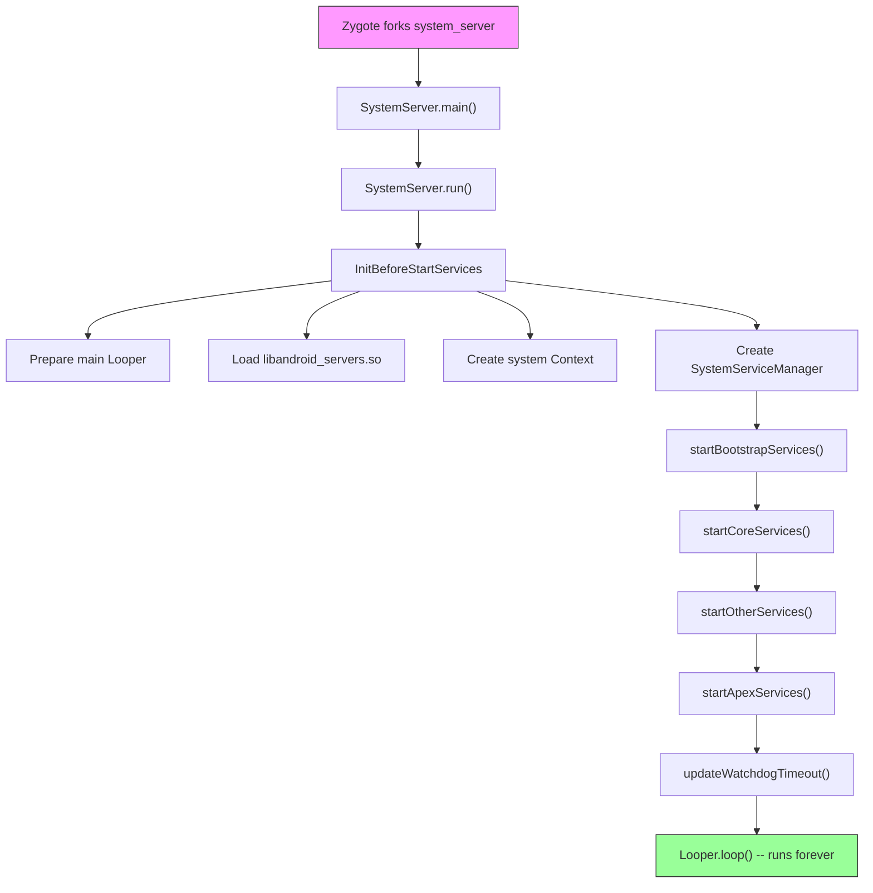

---

## 20.2 Service Lifecycle

### 20.2.1 The SystemService Base Class

Every service running inside `system_server` extends the abstract
`SystemService` class, defined in:

```
frameworks/base/services/core/java/com/android/server/SystemService.java
```

The class is annotated `@SystemApi(client = Client.SYSTEM_SERVER)`, making
it a stable API surface for system server modules. Its core structure is
straightforward (lines 72, 337-360):

```java
// frameworks/base/services/core/java/com/android/server/SystemService.java, line 72
@SystemApi(client = Client.SYSTEM_SERVER)
public abstract class SystemService {

    private final Context mContext;
    private final List<Class<?>> mDependencies;

    // line 337
    public SystemService(@NonNull Context context) {
        this(context, Collections.emptyList());
    }

    // line 357
    public SystemService(@NonNull Context context,
                         @NonNull List<Class<?>> dependencies) {
        mContext = context;
        mDependencies = Objects.requireNonNull(dependencies);
    }
```

The `dependencies` list is used by the Ravenwood deviceless testing
environment to understand transitive dependencies needed to support a
specific test. In production, most services pass an empty list.

### 20.2.2 Lifecycle Callbacks

`SystemService` defines the following lifecycle callbacks:

| Callback | When called | Purpose |
|----------|-------------|---------|
| `onStart()` | Service creation | Publish binder interfaces via `publishBinderService()` |
| `onBootPhase(int)` | Each boot phase | React to system readiness milestones |
| `onUserStarting(TargetUser)` | User starts | Initialize per-user state |
| `onUserUnlocking(TargetUser)` | User unlocking | Access credential-encrypted storage |
| `onUserUnlocked(TargetUser)` | User unlocked | Post-unlock initialization |
| `onUserSwitching(from, to)` | User switch | Transfer foreground user state |
| `onUserStopping(TargetUser)` | User stopping | Last chance for CE storage access |
| `onUserStopped(TargetUser)` | User stopped | Final cleanup after process teardown |
| `onUserCompletedEvent(TargetUser, type)` | After user events complete | Deferred non-urgent processing |

The `onStart()` method is the only abstract method (line 412):

```java
// frameworks/base/services/core/java/com/android/server/SystemService.java, line 412
public abstract void onStart();
```

All other callbacks have empty default implementations, allowing services to
override only what they need.

**Important note from the source:**

> NOTE: All lifecycle methods are called from the system server's main
> looper thread.

This means lifecycle callbacks must not block. Long-running initialization
must be dispatched to background threads.

### 20.2.3 Publishing Services

`SystemService` provides three mechanisms for publishing interfaces:

**1. Binder service** -- accessible by other processes via `ServiceManager`
(line 578-608):

```java
// frameworks/base/services/core/java/com/android/server/SystemService.java, line 578
protected final void publishBinderService(@NonNull String name,
        @NonNull IBinder service) {
    publishBinderService(name, service, false);
}

// line 606
protected final void publishBinderService(String name, IBinder service,
        boolean allowIsolated, int dumpPriority) {
    ServiceManager.addService(name, service, allowIsolated, dumpPriority);
}
```

**2. Local service** -- accessible only within `system_server` via
`LocalServices` (line 625-627):

```java
// frameworks/base/services/core/java/com/android/server/SystemService.java, line 625
protected final <T> void publishLocalService(Class<T> type, T service) {
    LocalServices.addService(type, service);
}
```

Local services avoid Binder IPC overhead for intra-process communication.
Many services publish both a Binder interface (for apps) and a local
interface (for other system services).

**3. Direct registration** -- some services bypass `SystemService` and
register directly with `ServiceManager.addService()`. This older pattern
is still used by services that predate the `SystemService` framework.

### 20.2.4 Boot Phases

Boot phases allow services to synchronize their initialization with the
overall system readiness. Each phase is a numeric constant, and services
receive them in ascending order. The phases defined in `SystemService.java`
(lines 80-124):

| Phase | Value | Constant | Meaning |
|-------|-------|----------|---------|
| Wait for default display | 100 | `PHASE_WAIT_FOR_DEFAULT_DISPLAY` | Display manager has provided the default display |
| Wait for sensor service | 200 | `PHASE_WAIT_FOR_SENSOR_SERVICE` | SensorService is available (hidden, internal) |
| Lock settings ready | 480 | `PHASE_LOCK_SETTINGS_READY` | Lock settings data can be obtained |
| System services ready | 500 | `PHASE_SYSTEM_SERVICES_READY` | Core services like PowerManager and PackageManager are safe to call |
| Device-specific services ready | 520 | `PHASE_DEVICE_SPECIFIC_SERVICES_READY` | OEM/device-specific services are available |
| Activity manager ready | 550 | `PHASE_ACTIVITY_MANAGER_READY` | Services can broadcast Intents |
| Third-party apps can start | 600 | `PHASE_THIRD_PARTY_APPS_CAN_START` | Apps can make Binder calls into services |
| Boot completed | 1000 | `PHASE_BOOT_COMPLETED` | Boot is complete, home app has started |

The `SystemServiceManager` dispatches phases to all registered services:

```java
// SystemServiceManager iterates all services:
// for each service: service.onBootPhase(phase)
```

```mermaid
graph LR
    A["PHASE_WAIT_FOR_DEFAULT_DISPLAY<br/>100"] --> B["PHASE_WAIT_FOR_SENSOR_SERVICE<br/>200"]
    B --> C["PHASE_LOCK_SETTINGS_READY<br/>480"]
    C --> D["PHASE_SYSTEM_SERVICES_READY<br/>500"]
    D --> E["PHASE_DEVICE_SPECIFIC_SERVICES_READY<br/>520"]
    E --> F["PHASE_ACTIVITY_MANAGER_READY<br/>550"]
    F --> G["PHASE_THIRD_PARTY_APPS_CAN_START<br/>600"]
    G --> H["PHASE_BOOT_COMPLETED<br/>1000"]

    style A fill:#fdd,stroke:#333
    style D fill:#ffd,stroke:#333
    style H fill:#dfd,stroke:#333
```

The boot phases form a contract: a service that needs to call
`PowerManager` should wait until `PHASE_SYSTEM_SERVICES_READY` (500),
while a service that needs to start third-party app components should wait
until `PHASE_THIRD_PARTY_APPS_CAN_START` (600).

### 20.2.5 TargetUser and User Lifecycle

The `TargetUser` inner class (lines 147-246) wraps user information for
lifecycle callbacks:

```java
// frameworks/base/services/core/java/com/android/server/SystemService.java, line 147
public static final class TargetUser {
    private final @UserIdInt int mUserId;
    private final boolean mFull;
    private final boolean mProfile;
    private final String mUserType;
    private final boolean mPreCreated;
    // ...
}
```

Services can override `isUserSupported(TargetUser)` (line 428) to opt out of
lifecycle callbacks for specific user types. For example, a service that
only works for full users (not profiles) can return `false` for profile
users, avoiding unnecessary per-user initialization.

The `UserCompletedEventType` (lines 254-326) allows batched notification
of completed user events. This is a performance optimization -- services
that need to react to multiple user events can handle them together in
`onUserCompletedEvent()` rather than individually.

### 20.2.6 The SystemServiceManager

The `SystemServiceManager` (defined in `SystemServiceManager.java`,
lines 75-138) is the orchestrator:

```java
// frameworks/base/services/core/java/com/android/server/SystemServiceManager.java, line 75
public final class SystemServiceManager implements Dumpable {
    private List<SystemService> mServices;
    private Set<String> mServiceClassnames;
    private int mCurrentPhase = -1;
    // ...
}
```

It provides several `startService()` variants:

1. **By class** -- `startService(Class<T>)` -- for services in `services.jar`
2. **By class name** -- `startService(String)` -- for services on the system
   server classpath but not in `services.jar`
3. **From JAR** -- `startServiceFromJar(String, String)` -- for services in
   standalone APEX JARs (like WiFi, Bluetooth, Connectivity)

The JAR-based loading (line 167-173) uses `PathClassLoader`:

```java
// frameworks/base/services/core/java/com/android/server/SystemServiceManager.java, line 167
public SystemService startServiceFromJar(String className, String path) {
    PathClassLoader pathClassLoader =
            SystemServerClassLoaderFactory.getOrCreateClassLoader(
                    path, this.getClass().getClassLoader(), isJarInTestApex(path));
    final Class<SystemService> serviceClass =
            loadClassFromLoader(className, pathClassLoader);
    return startService(serviceClass);
}
```

This modular loading allows mainline modules (WiFi, Bluetooth, Connectivity,
UWB) to deliver their system services via APEXes rather than being compiled
into the platform monolith.

---

## 20.3 Key Services Catalog

### 20.3.1 Bootstrap Services

Bootstrap services form the critical dependency chain. They have circular
dependencies that prevent simple sequential initialization, which is why
they are started in a special `startBootstrapServices()` method. Listed in
start order from `SystemServer.java`:

| # | Service | Class | Purpose |
|---|---------|-------|---------|
| 1 | Watchdog | `Watchdog` | Deadlock detection (started first) |
| 2 | PlatformCompat | `PlatformCompat` | App compatibility framework |
| 3 | FileIntegrityService | `FileIntegrityService` | fs-verity support |
| 4 | Installer | `Installer` | Package installation daemon interface |
| 5 | DeviceIdentifiersPolicyService | `DeviceIdentifiersPolicyService` | Device ID access policy |
| 6 | FeatureFlagsService | `FeatureFlagsService` | Runtime flag overrides |
| 7 | UriGrantsManagerService | `UriGrantsManagerService.Lifecycle` | Content URI permission grants |
| 8 | PowerStatsService | `PowerStatsService` | Rail power data tracking |
| 9 | AccessCheckingService | `AccessCheckingService` | Permissions and app-ops |
| 10 | **ActivityTaskManagerService** | `ActivityTaskManagerService.Lifecycle` | Activity/task management |
| 11 | **ActivityManagerService** | `ActivityManagerService.Lifecycle` | Process lifecycle management |
| 12 | DataLoaderManagerService | `DataLoaderManagerService` | Incremental data loading |
| 13 | **PowerManagerService** | `PowerManagerService` | Power state management |
| 14 | ThermalManagerService | `ThermalManagerService` | Thermal throttling |
| 15 | RecoverySystemService | `RecoverySystemService.Lifecycle` | OTA and recovery |
| 16 | LightsService | `LightsService` | LED and backlight control |
| 17 | **DisplayManagerService** | `DisplayManagerService` | Display management |
| 18 | DomainVerificationService | `DomainVerificationService` | App link verification |
| 19 | **PackageManagerService** | `PackageManagerService` | Package/APK management |
| 20 | UserManagerService | `UserManagerService.LifeCycle` | Multi-user management |
| 21 | OverlayManagerService | `OverlayManagerService` | Runtime resource overlays |
| 22 | ResourcesManagerService | `ResourcesManagerService` | Resource package management |
| 23 | SensorPrivacyService | `SensorPrivacyService` | Camera/mic privacy toggles |
| 24 | SensorService | `SensorService` | Sensor HAL interface |

### 20.3.2 Core Services

Core services are not entangled in the bootstrap dependency web but are
still essential. From `startCoreServices()`:

| # | Service | Class | Purpose |
|---|---------|-------|---------|
| 1 | SystemConfigService | `SystemConfigService` | System configuration |
| 2 | BatteryService | `BatteryService` | Battery level tracking |
| 3 | UsageStatsService | `UsageStatsService` | App usage statistics |
| 4 | WebViewUpdateService | `WebViewUpdateService` | WebView provider management |
| 5 | CachedDeviceStateService | `CachedDeviceStateService` | Device state caching |
| 6 | BinderCallsStatsService | `BinderCallsStatsService.LifeCycle` | Binder call metrics |
| 7 | LooperStatsService | `LooperStatsService.Lifecycle` | Handler message timing |
| 8 | RollbackManagerService | `RollbackManagerService` | APK rollback management |
| 9 | NativeTombstoneManagerService | `NativeTombstoneManagerService` | Native crash tracking |
| 10 | BugreportManagerService | `BugreportManagerService` | Bugreport capture |
| 11 | GpuService | `GpuService` | GPU driver management |
| 12 | RemoteProvisioningService | `RemoteProvisioningService` | Remote key provisioning |

### 20.3.3 Other Services (Major Subset)

The `startOtherServices()` method is the largest -- it starts the bulk of
the system services. Here is a comprehensive catalog organized by functional
area:

#### Security and Credentials

| Service | Class | Source Package | Purpose |
|---------|-------|---------------|---------|
| KeyChainSystemService | `KeyChainSystemService` | `security/` | Certificate management |
| KeyAttestationApplicationIdProvider | Direct registration | `security/` | Key attestation IDs |
| LockSettingsService | `LockSettingsService.Lifecycle` | `locksettings/` | Screen lock and encryption |
| PersistentDataBlockService | `PersistentDataBlockService` | `pdb/` | Factory reset protection |
| OemLockService | `OemLockService` | `oemlock/` | Bootloader lock state |
| TrustManagerService | `TrustManagerService` | `trust/` | Trust agents (Smart Lock) |
| BiometricService | `BiometricService` | `biometrics/` | Biometric coordination |
| AuthService | `AuthService` | `biometrics/` | Authentication routing |
| FaceService | `FaceService` | `biometrics/sensors/face/` | Face unlock |
| FingerprintService | `FingerprintService` | `biometrics/sensors/fingerprint/` | Fingerprint unlock |
| AttestationVerificationService | `AttestationVerificationManagerService` | `security/` | Attestation verification |
| AdvancedProtectionService | `AdvancedProtectionService.Lifecycle` | `security/advancedprotection/` | Advanced protection mode |
| CredentialManagerService | `CredentialManagerService` | `credentials/` | Credential management |

#### Window, Display, and Input

| Service | Class | Source Package | Purpose |
|---------|-------|---------------|---------|
| **WindowManagerService** | `WindowManagerService` | `wm/` | Window management and composition |
| **InputManagerService** | `InputManagerService.Lifecycle` | `input/` | Input event routing |
| InputMethodManagerService | `InputMethodManagerService.Lifecycle` | `inputmethod/` | Soft keyboard management |
| AccessibilityManagerService | `AccessibilityManagerService.Lifecycle` | `accessibility/` | Accessibility features |
| DeviceStateManagerService | `DeviceStateManagerService` | `devicestate/` | Foldable/posture states |
| ColorDisplayService | `ColorDisplayService` | `display/color/` | Night light, color correction |
| UiModeManagerService | `UiModeManagerService` | core | Car/TV/watch mode detection |

#### Networking

| Service | Class | Source Package | Purpose |
|---------|-------|---------------|---------|
| NetworkManagementService | `NetworkManagementService` | `net/` | Network interface management |
| NetworkPolicyManagerService | `NetworkPolicyManagerService` | `net/` | Data usage policies |
| ConnectivityService | Loaded from APEX JAR | connectivity module | Network connectivity |
| VpnManagerService | `VpnManagerService` | core | VPN management |
| WiFiService | Loaded from APEX JAR | WiFi module | WiFi management |
| WiFiScanningService | Loaded from APEX JAR | WiFi module | WiFi scanning |
| WiFiAwareService | Loaded from APEX JAR | WiFi module | WiFi Aware (NAN) |
| WiFiP2pService | Loaded from APEX JAR | WiFi module | WiFi Direct |
| BluetoothService | Loaded from APEX JAR | Bluetooth module | Bluetooth management |
| NetworkStatsService | Loaded from APEX JAR | connectivity module | Network statistics |

#### Storage and Package Management

| Service | Class | Source Package | Purpose |
|---------|-------|---------------|---------|
| StorageManagerService | `StorageManagerService.Lifecycle` | core | Volume and storage management |
| StorageStatsService | `StorageStatsService.Lifecycle` | `usage/` | Storage usage statistics |
| DeviceStorageMonitorService | `DeviceStorageMonitorService` | `storage/` | Low storage warnings |
| BackupManagerService | `BackupManagerService.Lifecycle` | `backup/` | App backup and restore |
| BlobStoreManagerService | `BlobStoreManagerService` | `blob/` | Shared binary large objects |

#### Power and Thermal

| Service | Class | Source Package | Purpose |
|---------|-------|---------------|---------|
| HintManagerService | `HintManagerService` | `power/hint/` | Performance hints to HAL |
| DeviceIdleController | `DeviceIdleController` | core | Doze mode management |
| DreamManagerService | `DreamManagerService` | `dreams/` | Screen savers and doze UI |
| TwilightService | `TwilightService` | `twilight/` | Sunrise/sunset tracking |

#### Audio, Media, and Camera

| Service | Class | Source Package | Purpose |
|---------|-------|---------------|---------|
| **AudioService** | `AudioService.Lifecycle` | `audio/` | Audio routing and volume |
| SoundTriggerMiddlewareService | `SoundTriggerMiddlewareService.Lifecycle` | `soundtrigger_middleware/` | "Hey Google" detection |
| SoundTriggerService | `SoundTriggerService` | `soundtrigger/` | Sound trigger management |
| MediaSessionService | `MediaSessionService` | `media/` | Media playback control |
| MediaRouterService | `MediaRouterService` | `media/` | Media output routing |
| MediaProjectionManagerService | `MediaProjectionManagerService` | `media/projection/` | Screen recording/casting |
| MediaResourceMonitorService | `MediaResourceMonitorService` | `media/` | Media resource tracking |
| MediaMetricsManagerService | `MediaMetricsManagerService` | `media/metrics/` | Media performance metrics |
| CameraServiceProxy | `CameraServiceProxy` | `camera/` | Camera service coordination |
| BroadcastRadioService | `BroadcastRadioService` | `broadcastradio/` | AM/FM radio |

#### Notifications and Status

| Service | Class | Source Package | Purpose |
|---------|-------|---------------|---------|
| **NotificationManagerService** | `NotificationManagerService` | `notification/` | Notification management |
| StatusBarManagerService | `StatusBarManagerService` | `statusbar/` | Status bar control |

#### Location, Time, and Sensors

| Service | Class | Source Package | Purpose |
|---------|-------|---------------|---------|
| LocationManagerService | `LocationManagerService.Lifecycle` | `location/` | Location providers |
| TimeDetectorService | `TimeDetectorService.Lifecycle` | `timedetector/` | Automatic time setting |
| TimeZoneDetectorService | `TimeZoneDetectorService.Lifecycle` | `timezonedetector/` | Time zone detection |
| LocationTimeZoneManagerService | `LocationTimeZoneManagerService.Lifecycle` | `timezonedetector/location/` | Location-based TZ |
| NetworkTimeUpdateService | `NetworkTimeUpdateService` | `timedetector/` | NTP time sync |
| GnssTimeUpdateService | `GnssTimeUpdateService.Lifecycle` | `timedetector/` | GPS time sync |
| CountryDetectorService | `CountryDetectorService` | core | Country detection |
| AltitudeService | `AltitudeService.Lifecycle` | `location/altitude/` | Altitude data |
| SensorNotificationService | `SensorNotificationService` | core | Sensor event notifications |

#### App Management

| Service | Class | Source Package | Purpose |
|---------|-------|---------------|---------|
| DevicePolicyManagerService | `DevicePolicyManagerService.Lifecycle` | `devicepolicy/` | Enterprise device management |
| ShortcutService | `ShortcutService.Lifecycle` | `pm/` | App shortcuts |
| LauncherAppsService | `LauncherAppsService` | `pm/` | Launcher-app interaction |
| CrossProfileAppsService | `CrossProfileAppsService` | `pm/` | Cross-profile app launching |
| AppHibernationService | `AppHibernationService` | `apphibernation/` | Unused app hibernation |
| AppBindingService | `AppBindingService.Lifecycle` | `appbinding/` | System app binding |
| BackgroundInstallControlService | `BackgroundInstallControlService` | `pm/` | Background install control |
| GameManagerService | `GameManagerService.Lifecycle` | `app/` | Game mode management |

#### Communication

| Service | Class | Source Package | Purpose |
|---------|-------|---------------|---------|
| TelecomLoaderService | `TelecomLoaderService` | `telecom/` | Telecom service loading |
| TelephonyRegistry | `TelephonyRegistry` | core | Telephony event broadcasting |
| MmsServiceBroker | `MmsServiceBroker` | core | MMS service coordination |
| ClipboardService | `ClipboardService` | `clipboard/` | System clipboard |

#### Jobs and Scheduling

| Service | Class | Source Package | Purpose |
|---------|-------|---------------|---------|
| **AlarmManagerService** | `AlarmManagerService` | `alarm/` | Alarm scheduling |
| **JobSchedulerService** | `JobSchedulerService` | `job/` | Deferred job scheduling |

#### Content and Search

| Service | Class | Source Package | Purpose |
|---------|-------|---------------|---------|
| AccountManagerService | `AccountManagerService.Lifecycle` | `accounts/` | Account management |
| ContentService | `ContentService.Lifecycle` | `content/` | Content provider sync |
| SearchManagerService | `SearchManagerService.Lifecycle` | `search/` | System search |
| ContentCaptureManagerService | `ContentCaptureManagerService` | `contentcapture/` | Content capture for intelligence |
| AppSearchModule | Loaded from APEX | AppSearch module | On-device search indexing |

#### TV and HDMI

| Service | Class | Source Package | Purpose |
|---------|-------|---------------|---------|
| HdmiControlService | `HdmiControlService` | `hdmi/` | HDMI-CEC control |
| TvInputManagerService | `TvInputManagerService` | `tv/` | TV input framework |
| TvInteractiveAppManagerService | `TvInteractiveAppManagerService` | `tv/interactive/` | Interactive TV apps |
| TunerResourceManagerService | `TunerResourceManagerService` | `tv/tunerresourcemanager/` | TV tuner resources |

#### Text and Localization

| Service | Class | Source Package | Purpose |
|---------|-------|---------------|---------|
| TextServicesManagerService | `TextServicesManagerService.Lifecycle` | `textservices/` | Spell checker |
| TextClassificationManagerService | `TextClassificationManagerService.Lifecycle` | `textclassifier/` | Smart text selection |
| FontManagerService | `FontManagerService.Lifecycle` | `graphics/fonts/` | System font management |
| LocaleManagerService | `LocaleManagerService` | `locales/` | Per-app locale |
| GrammaticalInflectionService | `GrammaticalInflectionService` | `grammaticalinflection/` | Grammatical gender |

#### Hardware and Peripherals

| Service | Class | Source Package | Purpose |
|---------|-------|---------------|---------|
| UsbService | `UsbService.Lifecycle` | `usb/` | USB host/device management |
| SerialManagerService | `SerialManagerService.Lifecycle` | `serial/` | Serial port management |
| HardwarePropertiesManagerService | `HardwarePropertiesManagerService` | core | CPU/GPU temperatures |
| ConsumerIrService | `ConsumerIrService` | core | IR blaster |
| VibratorManagerService | `VibratorManagerService.Lifecycle` | `vibrator/` | Haptic feedback |
| DockObserver | `DockObserver` | core | Dock state detection |
| WiredAccessoryManager | `WiredAccessoryManager` | core | Wired headset detection |
| MidiService | `MidiService.Lifecycle` | `midi/` | MIDI device management |

#### AI and Intelligence

| Service | Class | Source Package | Purpose |
|---------|-------|---------------|---------|
| VoiceInteractionManagerService | `VoiceInteractionManagerService` | `voiceinteraction/` | Voice assistant |
| SpeechRecognitionManagerService | `SpeechRecognitionManagerService` | `speech/` | Speech recognition |
| AppPredictionManagerService | `AppPredictionManagerService` | `appprediction/` | App usage prediction |
| SmartspaceManagerService | `SmartspaceManagerService` | `smartspace/` | At-a-glance widgets |
| AttentionManagerService | `AttentionManagerService` | `attention/` | User attention detection |
| RotationResolverManagerService | `RotationResolverManagerService` | `rotationresolver/` | Rotation based on face |
| AmbientContextManagerService | `AmbientContextManagerService` | `ambientcontext/` | Ambient context detection |
| WearableSensingManagerService | `WearableSensingManagerService` | `wearable/` | Wearable sensor processing |
| OnDeviceIntelligenceManagerService | Loaded from APEX | On-device intelligence | On-device AI services |

#### System Infrastructure

| Service | Class | Source Package | Purpose |
|---------|-------|---------------|---------|
| DropBoxManagerService | `DropBoxManagerService` | core | Error/diagnostic log storage |
| IncidentCompanionService | `IncidentCompanionService` | `incident/` | Incident reporting |
| StatsCompanion | Loaded from APEX | statsd module | Metrics collection helper |
| StatsPullAtomService | `StatsPullAtomService` | `stats/` | Pull-based metrics atoms |
| BinaryTransparencyService | `BinaryTransparencyService` | core | Binary integrity verification |
| PinnerService | `PinnerService` | `pinner/` | Pin critical files in RAM |
| TracingServiceProxy | `TracingServiceProxy` | `tracing/` | Perfetto trace coordination |
| LogcatManagerService | `LogcatManagerService` | `logcat/` | Logcat access management |
| CoverageService | `CoverageService` | `coverage/` | Code coverage (debug builds) |
| GraphicsStatsService | `GraphicsStatsService` | graphics | Frame timing statistics |

### 20.3.4 Mainline Module Services (APEX-delivered)

Several services are delivered through mainline module APEXes and loaded from
standalone JAR files:

| Module | JAR Path | Service Classes |
|--------|----------|-----------------|
| WiFi | `/apex/com.android.wifi/javalib/service-wifi.jar` | WifiService, WifiScanningService, WifiRttService, WifiAwareService, WifiP2pService |
| Bluetooth | `/apex/com.android.bt/javalib/service-bluetooth.jar` | BluetoothService |
| Connectivity | `/apex/com.android.tethering/javalib/service-connectivity.jar` | ConnectivityServiceInitializer, NetworkStatsServiceInitializer |
| UWB | `/apex/com.android.uwb/javalib/service-uwb.jar` | UwbService |
| Statsd | `/apex/com.android.os.statsd/javalib/service-statsd.jar` | StatsCompanion.Lifecycle |
| Scheduling | `/apex/com.android.scheduling/javalib/service-scheduling.jar` | RebootReadinessManagerService |
| Profiling | `/apex/com.android.profiling/javalib/service-profiling.jar` | ProfilingService.Lifecycle |
| DeviceLock | `/apex/com.android.devicelock/javalib/service-devicelock.jar` | DeviceLockService |

### 20.3.5 Core Server Package Structure

The `frameworks/base/services/core/java/com/android/server/` directory
contains 102 sub-packages and 74 top-level Java files. Here is the complete
sub-package listing organized by functional domain:

#### Process and Activity Management
- `am/` -- ActivityManagerService, process management, broadcast dispatch
- `wm/` -- WindowManagerService, ActivityTaskManagerService, window policy
- `app/` -- GameManagerService
- `appbinding/` -- AppBindingService
- `apphibernation/` -- AppHibernationService
- `appop/` -- AppOpsService (app operation permissions)
- `appwindowlayout/` -- AppWindowLayoutSettingsService

#### Package Management
- `pm/` -- PackageManagerService, UserManagerService, Installer
- `integrity/` -- AppIntegrityManagerService
- `rollback/` -- RollbackManagerService

#### Security
- `biometrics/` -- BiometricService, FaceService, FingerprintService
- `locksettings/` -- LockSettingsService
- `permission/` -- AccessCheckingService, permission grants
- `security/` -- KeyChain, attestation, advanced protection
- `trust/` -- TrustManagerService
- `sensorprivacy/` -- SensorPrivacyService
- `selinux/` -- SELinux audit logging

#### Display and Graphics
- `display/` -- DisplayManagerService, ColorDisplayService
- `graphics/` -- FontManagerService
- `dreams/` -- DreamManagerService

#### Input and Accessibility
- `input/` -- InputManagerService
- `inputmethod/` -- InputMethodManagerService
- `accessibility/` -- AccessibilityManagerService

#### Networking
- `connectivity/` -- PacProxyService, IpConnectivityMetrics
- `net/` -- NetworkManagementService, NetworkPolicyManagerService
- `vcn/` -- VcnManagementService

#### Power and Thermal
- `power/` -- PowerManagerService, ShutdownThread, HintManagerService
- `powerstats/` -- PowerStatsService

#### Audio and Media
- `audio/` -- AudioService
- `media/` -- MediaSessionService, MediaRouterService, MediaProjection
- `soundtrigger/` -- SoundTriggerService
- `soundtrigger_middleware/` -- SoundTriggerMiddlewareService
- `broadcastradio/` -- BroadcastRadioService
- `camera/` -- CameraServiceProxy

#### Communication
- `telecom/` -- TelecomLoaderService
- `companion/` -- CompanionDeviceManagerService

#### Storage
- `storage/` -- DeviceStorageMonitorService
- `blob/` -- BlobStoreManagerService
- `pdb/` -- PersistentDataBlockService

#### Time and Location
- `timedetector/` -- TimeDetectorService, NetworkTimeUpdateService
- `timezonedetector/` -- TimeZoneDetectorService
- `timezone/` -- Time zone data management
- `location/` -- LocationManagerService
- `twilight/` -- TwilightService

#### Content
- `content/` -- ContentService
- `contentcapture/` -- ContentCaptureManagerService
- `search/` -- SearchManagerService
- `accounts/` -- AccountManagerService

#### Notifications and Status Bar
- `notification/` -- NotificationManagerService
- `statusbar/` -- StatusBarManagerService
- `slice/` -- SliceManagerService

#### Device Management
- `devicepolicy/` -- DevicePolicyManagerService
- `devicestate/` -- DeviceStateManagerService

#### System Services
- `flags/` -- FeatureFlagsService
- `compat/` -- PlatformCompat
- `crashrecovery/` -- CrashRecoveryAdaptor
- `criticalevents/` -- CriticalEventLog
- `cpu/` -- CpuMonitorService
- `gpu/` -- GpuService
- `incident/` -- IncidentCompanionService
- `stats/` -- StatsCompanion
- `tracing/` -- TracingServiceProxy
- `logcat/` -- LogcatManagerService
- `os/` -- BugreportManagerService, SchedulingPolicyService
- `recoverysystem/` -- RecoverySystemService
- `resources/` -- ResourcesManagerService
- `uri/` -- UriGrantsManagerService
- `utils/` -- Utility classes

#### Specialized
- `tv/` -- TvInputManagerService, TvRemoteService
- `hdmi/` -- HdmiControlService
- `vibrator/` -- VibratorManagerService
- `lights/` -- LightsService
- `usb/` -- (module-level, not in core)
- `vr/` -- VR mode support
- `om/` -- OverlayManagerService
- `wallpaper/` -- WallpaperManagerService
- `theming/` -- ThemeManagerService
- `webkit/` -- WebViewUpdateService
- `sensors/` -- SensorService
- `pinner/` -- PinnerService
- `clipboard/` -- ClipboardService
- `emergency/` -- EmergencyAffordanceService

#### Intelligence and ML
- `attention/` -- AttentionManagerService
- `ambientcontext/` -- AmbientContextManagerService
- `rotationresolver/` -- RotationResolverManagerService
- `speech/` -- SpeechRecognitionManagerService
- `textclassifier/` -- TextClassificationManagerService
- `textservices/` -- TextServicesManagerService

#### Miscellaneous
- `infra/` -- Infrastructure base classes
- `feature/` -- Feature detection
- `firewall/` -- Intent firewall
- `health/` -- Health HAL integration
- `locales/` -- LocaleManagerService
- `grammaticalinflection/` -- GrammaticalInflectionService
- `memory/` -- Memory management
- `privatecompute/` -- Private compute services
- `role/` -- Role management helpers
- `signedconfig/` -- Signed configuration
- `testharness/` -- Test harness mode
- `updates/` -- System update handling
- `wearable/` -- WearableSensingManagerService

---

## 20.4 Service Start Order

### 20.4.1 startBootstrapServices()

The bootstrap phase (line 1176-1451 of `SystemServer.java`) starts the
services that form the critical dependency chain. The exact order is
significant because of mutual dependencies:

```mermaid
graph TD
    subgraph "startBootstrapServices()"
        A1["ArtModuleServiceInitializer"] --> A2["Watchdog.start()"]
        A2 --> A3["ProtoLog init"]
        A3 --> A4["PlatformCompat"]
        A4 --> A5["FileIntegrityService"]
        A5 --> A6["Installer"]
        A6 --> A7["DeviceIdentifiersPolicyService"]
        A7 --> A8["FeatureFlagsService"]
        A8 --> A9["UriGrantsManagerService"]
        A9 --> A10["PowerStatsService"]
        A10 --> A11["IStatsService (native)"]
        A11 --> A12["MemtrackProxyService (native)"]
        A12 --> A13["AccessCheckingService"]
        A13 --> A14["ActivityTaskManagerService"]
        A14 --> A15["ActivityManagerService"]
        A15 --> A16["DataLoaderManagerService"]
        A16 --> A17["IncrementalService (native)"]
        A17 --> A18["PowerManagerService"]
        A18 --> A19["ThermalManagerService"]
        A19 --> A20["AMS.initPowerManagement()"]
        A20 --> A21["RecoverySystemService"]
        A21 --> A22["LightsService"]
        A22 --> A23["DisplayManagerService"]
        A23 --> A24["PHASE_WAIT_FOR_DEFAULT_DISPLAY (100)"]
        A24 --> A25["DomainVerificationService"]
        A25 --> A26["PackageManagerService"]
        A26 --> A27["UserManagerService"]
        A27 --> A28["AMS.setSystemProcess()"]
        A28 --> A29["Watchdog.init()"]
        A29 --> A30["OverlayManagerService"]
        A30 --> A31["ResourcesManagerService"]
        A31 --> A32["SensorPrivacyService"]
        A32 --> A33["SensorService"]
    end

    style A14 fill:#fdd,stroke:#333
    style A15 fill:#fdd,stroke:#333
    style A18 fill:#ffd,stroke:#333
    style A23 fill:#ffd,stroke:#333
    style A26 fill:#fdd,stroke:#333
    style A24 fill:#ddf,stroke:#333
```

Key dependency relationships in the bootstrap phase:

1. **Watchdog starts first** (line 1192-1196): It must be running before any
   service that might deadlock.
2. **Installer before PackageManager** (line 1228-1230): `installd` must
   create critical directories before PMS scans packages.
3. **AMS and ATMS together** (line 1274-1283): These two are tightly coupled
   -- ATMS manages activities/tasks while AMS manages processes.
4. **PowerManager early** (line 1296-1302): Many services need power management.
5. **DisplayManager before PMS** (line 1339-1341): Package manager needs
   display metrics for density-based resource selection.
6. **PHASE_WAIT_FOR_DEFAULT_DISPLAY** (line 1344-1346): All services needing
   display information wait here.
7. **PackageManager pauses Watchdog** (line 1364-1370): PMS initialization is
   so slow that the Watchdog is explicitly paused.

### 20.4.2 startCoreServices()

Core services (line 1457-1533) are simpler -- no circular dependencies:

```
startCoreServices()
  +-- SystemConfigService
  +-- BatteryService
  +-- UsageStatsService
  +-- WebViewUpdateService (if FEATURE_WEBVIEW)
  +-- CachedDeviceStateService
  +-- BinderCallsStatsService
  +-- LooperStatsService
  +-- RollbackManagerService
  +-- NativeTombstoneManagerService
  +-- BugreportManagerService
  +-- GpuService
  +-- RemoteProvisioningService
  +-- CpuMonitorService (debug builds only)
```

### 20.4.3 startOtherServices()

The `startOtherServices()` method (line 1539-3600+) is by far the longest.
It contains conditional service starts based on device features, form
factor (phone/watch/TV/auto), and feature flags. The high-level flow:

```
startOtherServices()
  |
  +-- Pre-WMS services
  |     +-- KeyChainSystemService
  |     +-- BinaryTransparencyService
  |     +-- SchedulingPolicyService
  |     +-- TelecomLoaderService
  |     +-- TelephonyRegistry
  |     +-- AccountManagerService
  |     +-- ContentService
  |     +-- System providers installation
  |     +-- DropBoxManagerService
  |     +-- HintManagerService
  |     +-- RoleManagerService
  |     +-- VibratorManagerService
  |     +-- AlarmManagerService
  |     +-- InputManagerService
  |     +-- DeviceStateManagerService
  |     +-- CameraServiceProxy
  |
  +-- WindowManagerService startup
  |     +-- PHASE_WAIT_FOR_SENSOR_SERVICE (200)
  |     +-- WindowManagerService.main()
  |     +-- AMS.setWindowManager()
  |     +-- WMS.onInitReady()
  |     +-- BluetoothService
  |
  +-- Post-WMS services
  |     +-- InputMethodManagerService
  |     +-- AccessibilityManagerService
  |     +-- StorageManagerService
  |     +-- UiModeManagerService
  |     +-- LockSettingsService
  |     +-- DevicePolicyManagerService
  |     +-- StatusBarManagerService
  |     +-- NetworkManagementService
  |     +-- NetworkPolicyManagerService
  |     +-- WiFi services (from APEX)
  |     +-- ConnectivityService (from APEX)
  |     +-- NotificationManagerService
  |     +-- LocationManagerService
  |     +-- AudioService
  |     +-- JobSchedulerService
  |     +-- BackupManagerService
  |     +-- Biometric services
  |     +-- ShortcutService
  |     +-- LauncherAppsService
  |     +-- MediaProjectionManagerService
  |     +-- SliceManagerService
  |     +-- StatsCompanion (from APEX)
  |     +-- AutofillManagerService
  |     +-- ClipboardService
  |     +-- TracingServiceProxy
  |
  +-- Boot phase transitions
  |     +-- PHASE_LOCK_SETTINGS_READY (480)
  |     +-- PHASE_SYSTEM_SERVICES_READY (500)
  |     +-- Device-specific services
  |     +-- PHASE_DEVICE_SPECIFIC_SERVICES_READY (520)
  |     +-- SafetyCenterService
  |     +-- AppSearchModule
  |     +-- HealthConnectManagerService
  |
  +-- AMS.systemReady() callback
        +-- PHASE_ACTIVITY_MANAGER_READY (550)
        +-- CarServiceHelperService (automotive)
        +-- Networking systemReady calls
        +-- PHASE_THIRD_PARTY_APPS_CAN_START (600)
        +-- Start SystemUI
        +-- PHASE_BOOT_COMPLETED (1000)
```

### 20.4.4 The Boot Phase Sequence in Context

Here is how boot phases interleave with service starts. Each vertical
position represents a moment in time:

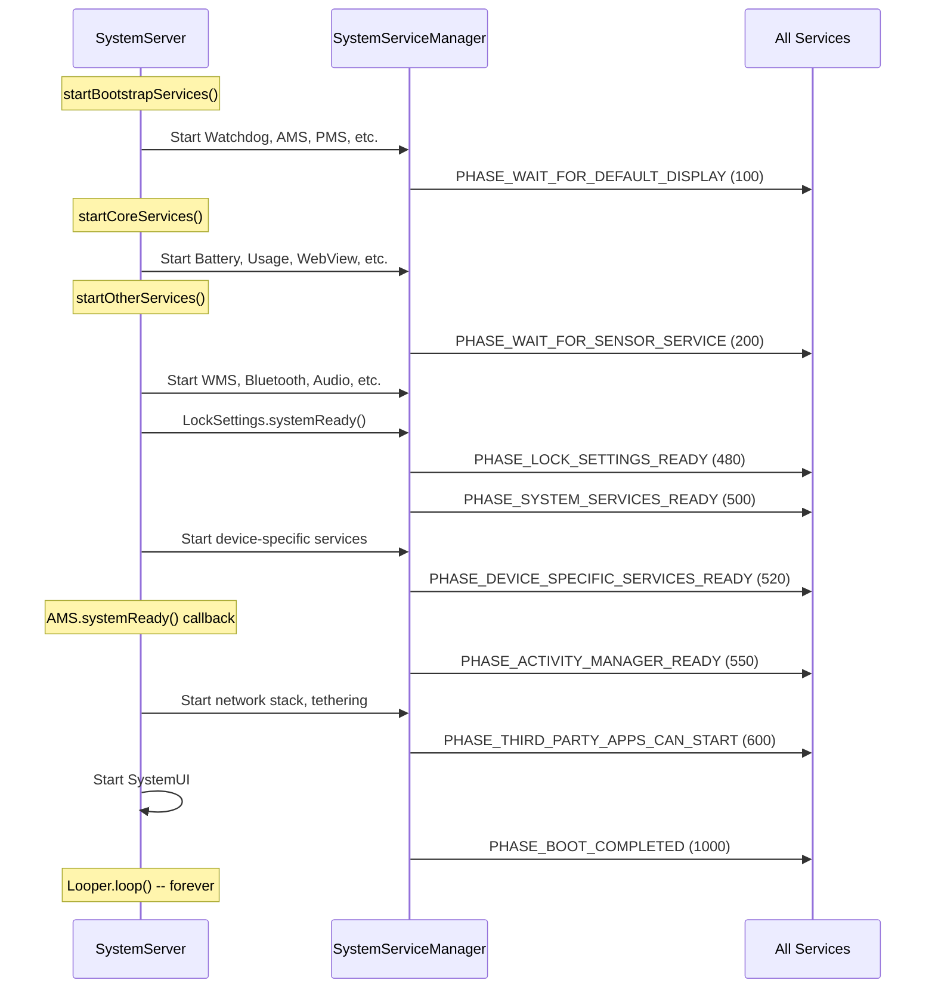

### 20.4.5 Conditional Service Starts

Many services are started only when specific hardware features are present.
`SystemServer` checks `PackageManager.hasSystemFeature()` before starting:

| Feature Flag | Services Gated |
|-------------|----------------|
| `FEATURE_BLUETOOTH` | BluetoothService |
| `FEATURE_WIFI` | WiFi*, WifiScanning |
| `FEATURE_WIFI_RTT` | WifiRttService |
| `FEATURE_WIFI_AWARE` | WifiAwareService |
| `FEATURE_WIFI_DIRECT` | WifiP2pService |
| `FEATURE_USB_HOST` or `FEATURE_USB_ACCESSORY` | UsbService |
| `FEATURE_FINGERPRINT` | FingerprintService |
| `FEATURE_FACE` | FaceService |
| `FEATURE_IRIS` | IrisService |
| `FEATURE_COMPANION_DEVICE_SETUP` | CompanionDeviceManagerService |
| `FEATURE_HDMI_CEC` | HdmiControlService |
| `FEATURE_LIVE_TV` | TvInputManagerService, TvInteractiveAppManagerService |
| `FEATURE_PRINTING` | PrintManagerService |
| `FEATURE_BACKUP` | BackupManagerService |
| `FEATURE_APP_WIDGETS` | AppWidgetService |
| `FEATURE_MIDI` | MidiService |
| `FEATURE_TELEPHONY` | TelecomLoaderService, MmsServiceBroker |
| `FEATURE_AUTOFILL` | AutofillManagerService |
| `FEATURE_CREDENTIALS` | CredentialManagerService |
| `FEATURE_CONTEXT_HUB` | ContextHubSystemService |
| `FEATURE_UWB` | UwbService |
| `FEATURE_CONSUMER_IR` | ConsumerIrService |
| `FEATURE_BROADCAST_RADIO` | BroadcastRadioService |
| `FEATURE_PICTURE_IN_PICTURE` | MediaResourceMonitorService |
| `FEATURE_TUNER` | TunerResourceManagerService |

Form factor checks also gate services:

| Form Factor | Boolean Variable | Example Services Affected |
|-------------|-----------------|--------------------------|
| Watch | `isWatch` | Many services skipped (Search, Twilight, etc.) |
| TV | `isTv` | TvRemoteService enabled; VibratorManager skipped |
| Automotive | `isAutomotive` | CarServiceHelperService enabled |
| ARC (ChromeOS) | `isArc` | ArcSystemHealthService, special AudioService |

---

## 20.5 Watchdog

### 20.5.1 Purpose and Architecture

The Watchdog (defined in `Watchdog.java`) is a critical safety mechanism that
detects when `system_server` threads become unresponsive. If a monitored thread
fails to respond within the timeout period (default: 60 seconds), the Watchdog
kills `system_server`, triggering a runtime restart. This is preferable to
leaving the device in an unresponsive state.

From the class documentation (line 84-86):

```java
// frameworks/base/services/core/java/com/android/server/Watchdog.java, line 84
/**
 * This class calls its monitor every minute. Killing this process if they
 * don't return.
 **/
public class Watchdog implements Dumpable {
```

The Watchdog is a singleton (line 484-490):

```java
// frameworks/base/services/core/java/com/android/server/Watchdog.java, line 484
public static Watchdog getInstance() {
    if (sWatchdog == null) {
        sWatchdog = new Watchdog();
    }
    return sWatchdog;
}
```

### 20.5.2 Default Timeout

The default timeout is 60 seconds in production, or 10 seconds in debug
builds (line 101):

```java
// frameworks/base/services/core/java/com/android/server/Watchdog.java, line 101
private static final long DEFAULT_TIMEOUT = DB ? 10 * 1000 : 60 * 1000;
```

The pre-watchdog timeout ratio divides the full timeout into check intervals
(line 107):

```java
// frameworks/base/services/core/java/com/android/server/Watchdog.java, line 107
private static final int PRE_WATCHDOG_TIMEOUT_RATIO = 4;
```

This means with a 60-second timeout, the Watchdog checks every 15 seconds.
At the 15-second mark it enters `WAITED_UNTIL_PRE_WATCHDOG` state and
generates a non-fatal thread dump. At 60 seconds, it becomes `OVERDUE` and
kills the process.

### 20.5.3 Completion States

The Watchdog defines four states (lines 114-117):

```java
// frameworks/base/services/core/java/com/android/server/Watchdog.java, line 114
static final int COMPLETED = 0;
static final int WAITING = 1;
static final int WAITED_UNTIL_PRE_WATCHDOG = 2;
static final int OVERDUE = 3;
```

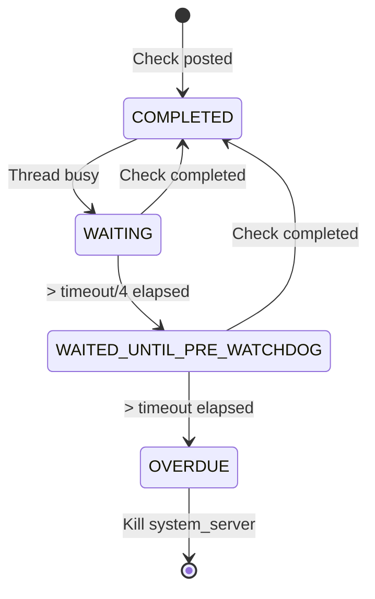

### 20.5.4 HandlerChecker

The core monitoring mechanism is the `HandlerChecker` inner class (line
263-436). Each `HandlerChecker` is associated with a Handler (and therefore
a specific thread's Looper):

```java
// frameworks/base/services/core/java/com/android/server/Watchdog.java, line 263
public static class HandlerChecker implements Runnable {
    private final Handler mHandler;
    private final String mName;
    private final ArrayList<Monitor> mMonitors = new ArrayList<Monitor>();
    private long mWaitMaxMillis;
    private boolean mCompleted;
    private Monitor mCurrentMonitor;
    private long mStartTimeMillis;
    private int mPauseCount;
```

The check mechanism works as follows:

1. The Watchdog thread calls `scheduleCheckLocked()` which posts the
   `HandlerChecker` (as a `Runnable`) to the front of the monitored
   thread's message queue.
2. When the monitored thread processes the message, `run()` executes
   all registered monitors and sets `mCompleted = true`.
3. If the monitored thread is blocked (deadlocked, or processing a very
   slow message), the `Runnable` never executes, and `mCompleted` remains
   `false`.

The `run()` method (lines 373-390):

```java
// frameworks/base/services/core/java/com/android/server/Watchdog.java, line 373
@Override
public void run() {
    final int size = mMonitors.size();
    for (int i = 0 ; i < size ; i++) {
        synchronized (mLock) {
            mCurrentMonitor = mMonitors.get(i);
        }
        mCurrentMonitor.monitor();
    }

    synchronized (mLock) {
        mCompleted = true;
        mCurrentMonitor = null;
    }
}
```

There is an important optimization (line 311-321): if the target looper
is currently polling (idle), the HandlerChecker skips posting. An idle
looper means the thread is not blocked -- no need to waste time with a
context switch.

### 20.5.5 Monitored Threads

The Watchdog constructor (line 492-549) registers checkers for all
critical system_server threads:

```java
// frameworks/base/services/core/java/com/android/server/Watchdog.java, line 492
private Watchdog() {
    mThread = new Thread(this::run, "watchdog");

    // Custom monitor checker thread
    ServiceThread t = new ServiceThread("watchdog.monitor",
            android.os.Process.THREAD_PRIORITY_DEFAULT, true);
    t.start();
    mMonitorChecker = new HandlerChecker(
            new Handler(t.getLooper()), "monitor thread", mLock);
    mHandlerCheckers.add(withDefaultTimeout(mMonitorChecker));

    // Foreground thread
    mHandlerCheckers.add(withDefaultTimeout(
        new HandlerChecker(FgThread.getHandler(),
                           "foreground thread", mLock)));
    // Main thread
    mHandlerCheckers.add(withDefaultTimeout(
        new HandlerChecker(new Handler(Looper.getMainLooper()),
                           "main thread", mLock)));
    // UI thread
    mHandlerCheckers.add(withDefaultTimeout(
        new HandlerChecker(UiThread.getHandler(),
                           "ui thread", mLock)));
    // I/O thread
    mHandlerCheckers.add(withDefaultTimeout(
        new HandlerChecker(IoThread.getHandler(),
                           "i/o thread", mLock)));
    // Display thread
    mHandlerCheckers.add(withDefaultTimeout(
        new HandlerChecker(DisplayThread.getHandler(),
                           "display thread", mLock)));
    // Animation thread
    mHandlerCheckers.add(withDefaultTimeout(
        new HandlerChecker(AnimationThread.getHandler(),
                           "animation thread", mLock)));
    // Surface animation thread
    mHandlerCheckers.add(withDefaultTimeout(
        new HandlerChecker(SurfaceAnimationThread.getHandler(),
                           "surface animation thread", mLock)));

    // Binder thread monitor
    addMonitor(new BinderThreadMonitor());
    mInterestingJavaPids.add(Process.myPid());
}
```

The eight monitored threads plus the monitor thread total nine checkers.

### 20.5.6 The Monitor Interface

Services that hold critical locks should implement `Watchdog.Monitor`
(line 460-462):

```java
// frameworks/base/services/core/java/com/android/server/Watchdog.java, line 460
public interface Monitor {
    void monitor();
}
```

The `monitor()` method should attempt to acquire the service's lock and
return. If the lock is held by a deadlocked thread, `monitor()` will block,
and the Watchdog will detect the deadlock.

The `BinderThreadMonitor` (line 453-458) checks that at least one Binder
thread is available:

```java
// frameworks/base/services/core/java/com/android/server/Watchdog.java, line 453
private static final class BinderThreadMonitor implements Watchdog.Monitor {
    @Override
    public void monitor() {
        Binder.blockUntilThreadAvailable();
    }
}
```

If all 31 Binder threads are blocked (e.g., in a deadlock chain), this
monitor will trigger the Watchdog.

### 20.5.7 The Watchdog Run Loop

The main Watchdog loop (line 858-900+) runs continuously:

```java
// frameworks/base/services/core/java/com/android/server/Watchdog.java, line 858
private void run() {
    boolean preWatchdogTriggered = false;
    // ...
    while (true) {
        // ...
        final long watchdogTimeoutMillis = mWatchdogTimeoutMillis;
        final long checkIntervalMillis =
                watchdogTimeoutMillis / PRE_WATCHDOG_TIMEOUT_RATIO;

        synchronized (mLock) {
            // Schedule checks on all handler checkers
            for (int i=0; i<mHandlerCheckers.size(); i++) {
                HandlerCheckerAndTimeout hc = mHandlerCheckers.get(i);
                hc.checker().scheduleCheckLocked(
                    hc.customTimeoutMillis()
                        .orElse(watchdogTimeoutMillis
                                * Build.HW_TIMEOUT_MULTIPLIER));
            }

            // Wait for check interval
            long start = SystemClock.uptimeMillis();
            while (timeout > 0) {
                // ...
                mLock.wait(timeout);
                // ...
            }

            // Evaluate results
            final int waitState = evaluateCheckerCompletionLocked();
            if (waitState == COMPLETED) {
                // everything is fine
                continue;
            } else if (waitState == WAITING) {
                continue;
            } else if (waitState == WAITED_UNTIL_PRE_WATCHDOG) {
                // pre-watchdog: dump but don't kill
            }
        }
        // If OVERDUE: collect stacks and kill
    }
}
```

### 20.5.8 What Happens When Watchdog Triggers

When the Watchdog detects an OVERDUE state:

1. **Stack trace collection**: Dumps stack traces of:
   - system_server (Java threads)
   - "Interesting" Java processes (StorageManager, phone process)
   - Native processes of interest (surfaceflinger, audioserver,
     cameraserver, mediaserver, etc.)
   - HAL services matching HIDL and AIDL interfaces of interest

2. **Dropbox entry**: Writes the collected data to DropBoxManager.

3. **Process kill**: Calls `Process.killProcess(Process.myPid())` to
   terminate system_server.

4. **Runtime restart**: The init process detects that system_server has
   died and triggers a full runtime restart (all Java processes are
   killed and respawned from Zygote).

The native processes of interest (line 126-149):

```java
// frameworks/base/services/core/java/com/android/server/Watchdog.java, line 126
public static final String[] NATIVE_STACKS_OF_INTEREST = new String[] {
    "/system/bin/audioserver",
    "/system/bin/cameraserver",
    "/system/bin/drmserver",
    "/system/bin/keystore2",
    "/system/bin/mediaserver",
    "/system/bin/netd",
    "/system/bin/servicemanager",
    "/system/bin/surfaceflinger",
    "/system/bin/vold",
    "media.extractor",
    "media.metrics",
    "media.codec",
    "media.swcodec",
    "media.transcoding",
    "com.android.bluetooth",
    "/apex/com.android.art/bin/artd",
    "/apex/com.android.os.statsd/bin/statsd",
    "/apex/com.android.virt/bin/virtualizationservice",
    // ...
};
```

### 20.5.9 Watchdog Pause Mechanism

For known long-running operations, the Watchdog provides pause/resume
APIs. For example, PackageManagerService initialization (line 1364-1370
in SystemServer.java):

```java
// frameworks/base/services/java/com/android/server/SystemServer.java, line 1364
try {
    Watchdog.getInstance().pauseWatchingCurrentThread("packagemanagermain");
    mPackageManagerService = PackageManagerService.main(
            mSystemContext, installer, domainVerificationService,
            mFactoryTestMode != FactoryTest.FACTORY_TEST_OFF);
} finally {
    Watchdog.getInstance().resumeWatchingCurrentThread("packagemanagermain");
}
```

Similarly, DEX optimization pauses the Watchdog (line 1972-1978):

```java
// frameworks/base/services/java/com/android/server/SystemServer.java, line 1972
try {
    Watchdog.getInstance().pauseWatchingCurrentThread("dexopt");
    mPackageManagerService.updatePackagesIfNeeded();
} catch (Throwable e) {
    reportWtf("update packages", e);
} finally {
    Watchdog.getInstance().resumeWatchingCurrentThread("dexopt");
}
```

The pause mechanism supports nesting -- each `pauseLocked()` increments
a counter, and each `resumeLocked()` decrements it. Monitoring only
resumes when the counter reaches zero.

### 20.5.10 Timeout History and Loop Breaking

The Watchdog tracks timeout history to detect crash loops (line 120-123):

```java
// frameworks/base/services/core/java/com/android/server/Watchdog.java, line 120
private static final String TIMEOUT_HISTORY_FILE =
        "/data/system/watchdog-timeout-history.txt";
private static final String PROP_FATAL_LOOP_COUNT =
        "framework_watchdog.fatal_count";
private static final String PROP_FATAL_LOOP_WINDOWS_SECS =
        "framework_watchdog.fatal_window.second";
```

If `system_server` repeatedly crashes due to Watchdog timeouts within a
configured window, the system can take more drastic recovery action
(such as entering recovery mode).

---

## 20.6 Threading Model

### 20.6.1 Overview

The `system_server` process uses a carefully designed threading model with
shared singleton threads for different priority levels. Rather than each
service creating its own thread, most services share a small set of
well-known threads. This reduces context switching, simplifies lock
ordering, and makes the system easier to reason about.

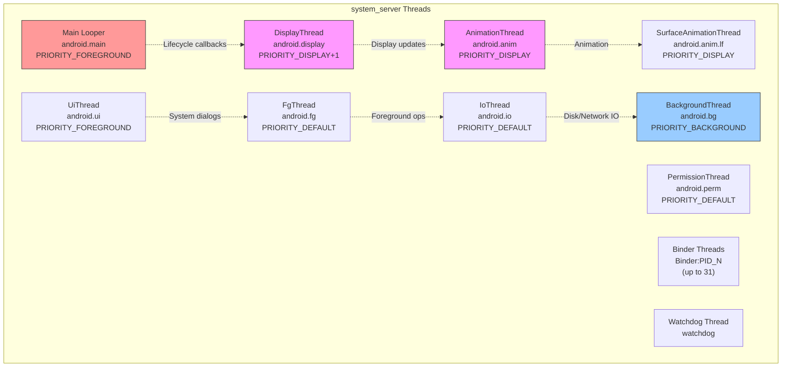

### 20.6.2 ServiceThread Base Class

All system server threads extend `ServiceThread` (defined in
`frameworks/base/core/java/com/android/server/ServiceThread.java`),
which itself extends `HandlerThread`:

```java
// frameworks/base/core/java/com/android/server/ServiceThread.java, line 30
public class ServiceThread extends HandlerThread {
    private final boolean mAllowIo;

    public ServiceThread(String name, int priority, boolean allowIo) {
        super(name, priority);
        mAllowIo = allowIo;
    }

    @Override
    public void run() {
        if (!mAllowIo) {
            StrictMode.initThreadDefaults(null);
        }
        super.run();
    }

    protected static Handler makeSharedHandler(Looper looper) {
        return new Handler(looper, null, false, /* shared= */ true);
    }
}
```

The `allowIo` parameter controls StrictMode enforcement. Threads that should
not perform disk or network I/O (like the display and animation threads)
set this to `false`, causing StrictMode violations if I/O occurs.

The `makeSharedHandler()` factory method creates handlers with `shared=true`,
allowing multiple components to safely post to the same handler without
holding its internal lock.

### 20.6.3 Thread Catalog

#### Main Looper Thread

- **Name**: the main thread of `system_server`
- **Priority**: `THREAD_PRIORITY_FOREGROUND` (-2)
- **Purpose**: Runs the main message loop; receives all `SystemService`
  lifecycle callbacks
- **Initialized at**: `SystemServer.run()` line 937

```java
// frameworks/base/services/java/com/android/server/SystemServer.java, line 937
Looper.prepareMainLooper();
```

The main looper has slow dispatch/delivery thresholds:

- Slow dispatch: 100ms
- Slow delivery: 200ms

#### DisplayThread

- **File**: `frameworks/base/services/core/java/com/android/server/DisplayThread.java`
- **Thread name**: `android.display`
- **Priority**: `THREAD_PRIORITY_DISPLAY + 1` (-3)
- **Allow I/O**: `false`
- **Trace tag**: `TRACE_TAG_SYSTEM_SERVER`
- **Purpose**: Operations affecting what is on the display. Used by
  WindowManager, DisplayManager, and InputManager for quick real-time
  operations.

From the source comment (line 26-29):

> Shared singleton foreground thread for the system. This is a thread for
> operations that affect what's on the display, which needs to have a
> minimum of latency. This thread should pretty much only be used by the
> WindowManager, DisplayManager, and InputManager to perform quick
> operations in real time.

#### AnimationThread

- **File**: `frameworks/base/services/core/java/com/android/server/AnimationThread.java`
- **Thread name**: `android.anim`
- **Priority**: `THREAD_PRIORITY_DISPLAY` (-4)
- **Allow I/O**: `false`
- **Trace tag**: `TRACE_TAG_WINDOW_MANAGER`
- **Purpose**: All legacy window animations, starting windows, and
  traversals. Has a slightly higher priority than DisplayThread.

#### SurfaceAnimationThread

- **File**: `frameworks/base/services/core/java/com/android/server/wm/SurfaceAnimationThread.java`
- **Thread name**: `android.anim.lf`
- **Priority**: `THREAD_PRIORITY_DISPLAY` (-4)
- **Allow I/O**: `false`
- **Trace tag**: `TRACE_TAG_WINDOW_MANAGER`
- **Purpose**: Runs `SurfaceAnimationRunner` which does not hold the
  window manager lock. This separation prevents animation jank when the
  WM lock is contended.

#### UiThread

- **File**: `frameworks/base/services/core/java/com/android/server/UiThread.java`
- **Thread name**: `android.ui`
- **Priority**: `THREAD_PRIORITY_FOREGROUND` (-2)
- **Allow I/O**: `false`
- **Thread group**: `THREAD_GROUP_TOP_APP` (set in `run()`)
- **Purpose**: System UI operations. Must not have operations taking more
  than a few milliseconds to avoid UI jank.

Special behavior (line 42-46):

```java
// frameworks/base/services/core/java/com/android/server/UiThread.java, line 42
@Override
public void run() {
    // Make sure UiThread is in the fg stune boost group
    Process.setThreadGroup(Process.myTid(), Process.THREAD_GROUP_TOP_APP);
    super.run();
}
```

The UiThread explicitly places itself in the `THREAD_GROUP_TOP_APP`
scheduling group for maximum CPU priority.

#### FgThread (Foreground Thread)

- **File**: `frameworks/base/core/java/com/android/server/FgThread.java`
- **Thread name**: `android.fg`
- **Priority**: `THREAD_PRIORITY_DEFAULT` (0)
- **Allow I/O**: `true`
- **Purpose**: Foreground service operations that should not be blocked by
  background work. Many services schedule their primary work here.

From the source comment (line 27-35):

> Shared singleton foreground thread for the system. This is a thread for
> regular foreground service operations, which shouldn't be blocked by
> anything running in the background. In particular, the shared background
> thread could be doing relatively long-running operations like saving
> state to disk (in addition to simply being a background priority),
> which can cause operations scheduled on it to be delayed for a
> user-noticeable amount of time.

#### IoThread

- **File**: `frameworks/base/services/core/java/com/android/server/IoThread.java`
- **Thread name**: `android.io`
- **Priority**: `THREAD_PRIORITY_DEFAULT` (0)
- **Allow I/O**: `true`
- **Purpose**: Non-background operations that may briefly block on network
  I/O (not waiting for data, but communicating with network daemons).

#### BackgroundThread

- **File**: `frameworks/base/core/java/com/android/internal/os/BackgroundThread.java`
- **Thread name**: `android.bg`
- **Priority**: `THREAD_PRIORITY_BACKGROUND` (10)
- **Purpose**: Background operations across the system. Shares a singleton
  across the entire process. Has very generous slow thresholds:
  - Slow dispatch: 10,000ms (10 seconds!)
  - Slow delivery: 30,000ms (30 seconds!)

The generous thresholds reflect that background operations are expected
to be slower and are not on the critical path for user experience.

#### PermissionThread

- **File**: `frameworks/base/services/core/java/com/android/server/PermissionThread.java`
- **Thread name**: `android.perm`
- **Priority**: `THREAD_PRIORITY_DEFAULT` (0)
- **Allow I/O**: `true`
- **Purpose**: Handles calls to and from PermissionController, and
  synchronization between permissions and app-ops states.

### 20.6.4 Thread Priority Summary

| Thread | Name | Priority | Numeric | Allow I/O | StrictMode |
|--------|------|----------|---------|-----------|------------|
| AnimationThread | `android.anim` | DISPLAY | -4 | No | Enforced |
| SurfaceAnimationThread | `android.anim.lf` | DISPLAY | -4 | No | Enforced |
| DisplayThread | `android.display` | DISPLAY+1 | -3 | No | Enforced |
| UiThread | `android.ui` | FOREGROUND | -2 | No | Enforced |
| Main Looper | `main` | FOREGROUND | -2 | N/A | N/A |
| FgThread | `android.fg` | DEFAULT | 0 | Yes | Not enforced |
| IoThread | `android.io` | DEFAULT | 0 | Yes | Not enforced |
| PermissionThread | `android.perm` | DEFAULT | 0 | Yes | Not enforced |
| BackgroundThread | `android.bg` | BACKGROUND | 10 | Yes | Not enforced |

### 20.6.5 Handler, Looper, and MessageQueue

Each shared thread has a `Looper` running a `MessageQueue`. Services
interact with threads by posting `Message` objects or `Runnable` callbacks
through `Handler` instances:

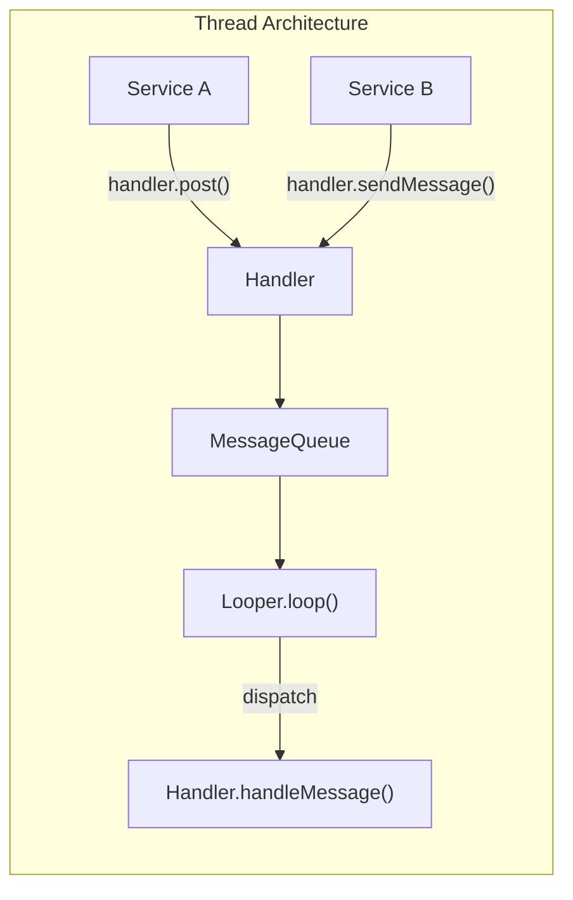

Key patterns used in system_server:

1. **Shared handlers**: Created with `shared=true` to allow posting from
   any thread without external synchronization.
2. **Handler executors**: `HandlerExecutor` wraps a Handler as a Java
   `Executor`, allowing use with modern async APIs.
3. **Message priorities**: `Message.setAsynchronous(true)` bypasses sync
   barriers, used for time-critical operations.

### 20.6.6 Binder Threads

In addition to the named threads, `system_server` maintains a pool of
up to 31 Binder threads (line 493 of SystemServer.java):

```java
// frameworks/base/services/java/com/android/server/SystemServer.java, line 493
private static final int sMaxBinderThreads = 31;
```

Binder threads are named `Binder:PID_N` where PID is the process ID and
N is the thread number. These threads handle all incoming IPC from app
processes. When all 31 threads are busy, new incoming Binder calls
queue up, and the Watchdog's `BinderThreadMonitor` will eventually
trigger if the congestion persists.

### 20.6.7 Thread Selection Guidelines

When implementing a system service, choosing the right thread is critical:

| Scenario | Recommended Thread | Rationale |
|----------|-------------------|-----------|
| Display composition, window layout | DisplayThread | Minimal latency for display |
| Window animations | AnimationThread | Highest priority for smooth animation |
| Surface animations (lock-free) | SurfaceAnimationThread | Avoids WM lock contention |
| System dialogs, overlays | UiThread | Foreground priority, TOP_APP group |
| Service business logic | FgThread | Default priority, not blocked by background |
| Disk I/O, database writes | IoThread | Allows I/O, default priority |
| Non-urgent background work | BackgroundThread | Low priority, generous timeouts |
| Permission checks | PermissionThread | Dedicated to avoid blocking other threads |

### 20.6.8 SystemServerInitThreadPool

During boot, `system_server` uses a temporary thread pool for parallel
initialization (line 944):

```java
// frameworks/base/services/java/com/android/server/SystemServer.java, line 944
SystemServerInitThreadPool.start();
```

This pool allows multiple independent initialization tasks to run
concurrently, reducing boot time. Examples include:

- `SystemConfig.getInstance()` (line 1156)
- Secondary Zygote preloading (line 1581)
- Sensor manager service startup (line 1743)
- HIDL services startup (line 1750)
- WebView preparation (line 3363)

The pool is shut down after initialization completes and is not used
during normal operation.

---

## 20.7 Deep Dive: Key Service Internals

### 20.7.1 ActivityManagerService and ActivityTaskManagerService

The ActivityManagerService (AMS) and ActivityTaskManagerService (ATMS) are
the most important services in `system_server`. They were originally a
single monolithic service, but were split to separate process management
(AMS) from activity/task management (ATMS).

**Source files:**

- `frameworks/base/services/core/java/com/android/server/am/ActivityManagerService.java`
- `frameworks/base/services/core/java/com/android/server/wm/ActivityTaskManagerService.java`

The startup sequence in `startBootstrapServices()` (lines 1274-1283):

```java
// frameworks/base/services/java/com/android/server/SystemServer.java, line 1274
t.traceBegin("StartActivityManager");
ActivityTaskManagerService atm = mSystemServiceManager.startService(
        ActivityTaskManagerService.Lifecycle.class).getService();
mActivityManagerService = ActivityManagerService.Lifecycle.startService(
        mSystemServiceManager, atm);
mActivityManagerService.setSystemServiceManager(mSystemServiceManager);
mActivityManagerService.setInstaller(installer);
mWindowManagerGlobalLock = atm.getGlobalLock();
```

Key observations:

1. ATMS starts first and returns its service reference.
2. AMS starts second and receives the ATMS reference.
3. AMS gets references to SystemServiceManager and Installer.
4. The WindowManagerGlobalLock is obtained from ATMS.

**AMS responsibilities:**

- Process lifecycle management (start, stop, kill)
- OOM adjustment calculation
- Broadcast dispatch
- Content provider management
- Crash and ANR handling
- App permissions enforcement at runtime

**ATMS responsibilities:**

- Activity stack and task management
- Activity lifecycle (create, resume, pause, stop, destroy)
- Recent tasks
- Multi-window management
- Activity transitions

Later in `startBootstrapServices()`, critical cross-references are
established (lines 1406-1418):

```java
// frameworks/base/services/java/com/android/server/SystemServer.java, line 1406
t.traceBegin("SetSystemProcess");
mActivityManagerService.setSystemProcess();
t.traceEnd();

// ...

t.traceBegin("InitWatchdog");
watchdog.init(mSystemContext, mActivityManagerService);
t.traceEnd();
```

`AMS.setSystemProcess()` registers the activity service as a Binder
service and sets up the system process's ApplicationInfo. The Watchdog
initialization requires AMS for registering the reboot broadcast
receiver.

### 20.7.2 WindowManagerService

WindowManagerService (WMS) manages all windows on the device -- app
windows, status bar, navigation bar, dialogs, toasts, and more. It is
one of the most complex services in Android.

**Source:** `frameworks/base/services/core/java/com/android/server/wm/WindowManagerService.java`

WMS starts in `startOtherServices()` (lines 1722-1730):

```java
// frameworks/base/services/java/com/android/server/SystemServer.java, line 1722
t.traceBegin("StartWindowManagerService");
mSystemServiceManager.startBootPhase(t,
        SystemService.PHASE_WAIT_FOR_SENSOR_SERVICE);
wm = WindowManagerService.main(context, inputManager, !mFirstBoot,
        new PhoneWindowManager(), mActivityManagerService.mActivityTaskManager);
ServiceManager.addService(Context.WINDOW_SERVICE, wm, false,
        DUMP_FLAG_PRIORITY_CRITICAL | DUMP_FLAG_PRIORITY_HIGH
                | DUMP_FLAG_PROTO);
```

WMS depends on:

- InputManagerService (for input event dispatch)
- PhoneWindowManager (for policy decisions like key handling)
- ActivityTaskManagerService (for activity window management)
- SensorService (must wait for PHASE_WAIT_FOR_SENSOR_SERVICE)

The WMS is registered with `DUMP_FLAG_PRIORITY_CRITICAL | DUMP_FLAG_PRIORITY_HIGH`
because its dump output is essential for debugging display issues.

After WMS starts, several critical callbacks fire:

```java
// line 1733
mActivityManagerService.setWindowManager(wm);

// line 1737
wm.onInitReady();

// line 1758
inputManager.setWindowManagerCallbacks(wm.getInputManagerCallback());
inputManager.start();

// line 1763
mDisplayManagerService.windowManagerAndInputReady();
```

This dance of cross-references is why WMS, AMS, InputManager, and
DisplayManager are all in the bootstrap/early-other phase -- they cannot
function independently.

### 20.7.3 PackageManagerService

PackageManagerService (PMS) manages all installed packages (APKs), their
permissions, components, and metadata. It is so large and complex that
its initialization is one of the longest operations during boot.

**Source:** `frameworks/base/services/core/java/com/android/server/pm/PackageManagerService.java`

PMS starts in `startBootstrapServices()` (lines 1362-1374):

```java
// frameworks/base/services/java/com/android/server/SystemServer.java, line 1362
t.traceBegin("StartPackageManagerService");
try {
    Watchdog.getInstance().pauseWatchingCurrentThread("packagemanagermain");
    mPackageManagerService = PackageManagerService.main(
            mSystemContext, installer, domainVerificationService,
            mFactoryTestMode != FactoryTest.FACTORY_TEST_OFF);
} finally {
    Watchdog.getInstance().resumeWatchingCurrentThread("packagemanagermain");
}
mFirstBoot = mPackageManagerService.isFirstBoot();
mPackageManager = mSystemContext.getPackageManager();
```

PMS depends on:

- Installer (`installd` daemon interface)
- DomainVerificationService (app link verification)
- DisplayManager (must have display metrics for resource selection)

The Watchdog is explicitly paused during PMS initialization because the
package scan can take many seconds (or even minutes on first boot with
many pre-installed apps). Without the pause, the Watchdog would kill
`system_server` during a legitimate long operation.

### 20.7.4 PowerManagerService

PowerManagerService manages the device's power state -- wake locks,
display power, doze mode, battery saver, and shutdown.

**Source:** `frameworks/base/services/core/java/com/android/server/power/PowerManagerService.java`

```java
// frameworks/base/services/java/com/android/server/SystemServer.java, line 1300
t.traceBegin("StartPowerManager");
mPowerManagerService = mSystemServiceManager.startService(
        PowerManagerService.class);
t.traceEnd();
```

PowerManager starts early because many other services need to acquire
wake locks during initialization. After AMS starts, power management
is fully initialized:

```java
// line 1310
t.traceBegin("InitPowerManagement");
mActivityManagerService.initPowerManagement();
t.traceEnd();
```

### 20.7.5 NotificationManagerService

NotificationManagerService (NMS) manages all notifications, channels,
notification policies, and interactions with the status bar.

**Source:** `frameworks/base/services/core/java/com/android/server/notification/NotificationManagerService.java`

```java
// frameworks/base/services/java/com/android/server/SystemServer.java, line 2341
t.traceBegin("StartNotificationManager");
mSystemServiceManager.startService(NotificationManagerService.class);
SystemNotificationChannels.removeDeprecated(context);
SystemNotificationChannels.createAll(context);
notification = INotificationManager.Stub.asInterface(
        ServiceManager.getService(Context.NOTIFICATION_SERVICE));
```

NMS depends on StorageManagerService (for media/USB notifications),
which is why StorageManager starts first when the filesystem is
available.

### 20.7.6 DisplayManagerService

DisplayManagerService manages physical and virtual displays, display
power state, and display adapters.

**Source:** `frameworks/base/services/core/java/com/android/server/display/DisplayManagerService.java`

```java
// frameworks/base/services/java/com/android/server/SystemServer.java, line 1339
t.traceBegin("StartDisplayManager");
mDisplayManagerService = mSystemServiceManager.startService(
        DisplayManagerService.class);
```

The critical PHASE_WAIT_FOR_DEFAULT_DISPLAY (100) boot phase follows
immediately:

```java
// line 1344
t.traceBegin("WaitForDisplay");
mSystemServiceManager.startBootPhase(t,
        SystemService.PHASE_WAIT_FOR_DEFAULT_DISPLAY);
```

No package scanning can begin until the default display is available,
because PackageManagerService needs display metrics to select the
correct resources for the device's density.

---

## 20.8 Service Communication Patterns

### 20.8.1 Binder Services vs. Local Services

Services in `system_server` communicate through two distinct patterns:

**Binder services** are registered with `ServiceManager` and are accessible
from any process on the device. They provide the public API surface that
apps use:

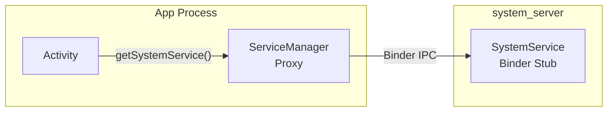

**Local services** are registered with `LocalServices` and are accessible
only within the `system_server` process. They provide privileged internal
APIs that other system services use:

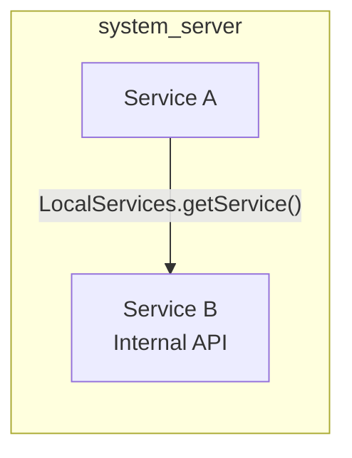

The dual-interface pattern is extremely common. For example, PowerManager:

- **Binder**: `IPowerManager` -- for apps to acquire wake locks
- **Local**: `PowerManagerInternal` -- for system services to force
  display on/off, override wake lock behavior, etc.

### 20.8.2 The Lifecycle Inner Class Pattern

Many services use an inner `Lifecycle` class that extends `SystemService`:

```java
public class ExampleManagerService extends IExampleManager.Stub {

    public static final class Lifecycle extends SystemService {
        private ExampleManagerService mService;

        public Lifecycle(Context context) {
            super(context);
        }

        @Override
        public void onStart() {
            mService = new ExampleManagerService(getContext());
            publishBinderService(Context.EXAMPLE_SERVICE, mService);
            publishLocalService(ExampleManagerInternal.class,
                    mService.new LocalService());
        }

        @Override
        public void onBootPhase(int phase) {
            mService.onBootPhase(phase);
        }
    }
}
```

This pattern separates the Binder stub implementation (the outer class)
from the lifecycle management (the inner class). The `Lifecycle` class
is what `SystemServiceManager` instantiates and manages.

### 20.8.3 Service Dependencies

Service dependencies in `system_server` are not formally declared (unlike
dependency injection frameworks). Instead, they are implicit in the
start order. A service that needs `PowerManager` is simply started after
`PowerManagerService`. This works because `SystemServer.java` explicitly
controls the order.

There have been multiple attempts to formalize dependencies:

- The `TODO: Use service dependencies instead` comment appears in
  `SystemServer.java` (line 1762)
- The `dependencies` parameter in `SystemService` constructor was added
  for the Ravenwood testing environment
- Boot phases provide coarse-grained synchronization

However, for the most part, the start order in `SystemServer.java` remains
the primary dependency mechanism.

### 20.8.4 Cross-Service Communication via Handlers

When one service needs to notify another asynchronously, it posts a
message to the target service's handler. For example, when
DisplayManagerService detects a display change, it may notify
WindowManagerService by posting to the DisplayThread handler.

Common patterns:

1. **Direct handler posting**: `displayThread.getHandler().post(callback)`
2. **Message objects**: `handler.obtainMessage(MSG_TYPE).sendToTarget()`
3. **Local service callbacks**: Register a listener interface with
   `LocalServices.getService()` and call it directly

### 20.8.5 The SystemServer Dumper

SystemServer registers a special `system_server_dumper` Binder service
(line 974) that acts as a central dump coordinator:

```java
// frameworks/base/services/java/com/android/server/SystemServer.java, line 974
ServiceManager.addService("system_server_dumper", mDumper);
mDumper.addDumpable(this);
```

The `SystemServerDumper` (lines 759-834) accepts `Dumpable` objects and
provides a unified interface for dumping their state:

```bash
# List all dumpables
adb shell dumpsys system_server_dumper --list

# Dump a specific dumpable
adb shell dumpsys system_server_dumper --name SystemServiceManager
```

This is separate from the per-service `dumpsys` mechanism because it
dumps internal `system_server` state that is not associated with any
specific Binder service.

---

## 20.9 Error Handling and Recovery

### 20.9.1 The reportWtf Pattern

Throughout `SystemServer.java`, failed service starts are caught with
a consistent pattern (line 1095-1098):

```java
// frameworks/base/services/java/com/android/server/SystemServer.java, line 1095
private void reportWtf(String msg, Throwable e) {
    Slog.w(TAG, "***********************************************");
    Slog.wtf(TAG, "BOOT FAILURE " + msg, e);
}
```

`Slog.wtf()` (What a Terrible Failure) logs the error and, on userdebug
builds, can trigger additional diagnostic actions. Most service start
failures are caught and reported with `reportWtf()` rather than crashing
`system_server`, because a partial system is better than no system at all.

### 20.9.2 Early WTF Handling

Before AMS is fully initialized, WTFs cannot be immediately processed
(there is no dropbox yet). `SystemServer` buffers them (lines 1015-1016):

```java
// frameworks/base/services/java/com/android/server/SystemServer.java, line 1016
RuntimeInit.setDefaultApplicationWtfHandler(SystemServer::handleEarlySystemWtf);
```

Later, after AMS is ready, pending WTFs are flushed (lines 3174-3179):

```java
// line 3174
synchronized (SystemService.class) {
    if (sPendingWtfs != null) {
        mActivityManagerService.schedulePendingSystemServerWtfs(sPendingWtfs);
        sPendingWtfs = null;
    }
}
```

### 20.9.3 Pending Shutdown Check

Before starting services, `SystemServer` checks if a shutdown was pending
from a previous session (lines 1100-1150):

```java
// frameworks/base/services/java/com/android/server/SystemServer.java, line 1100
private void performPendingShutdown() {
    final String shutdownAction = SystemProperties.get(
            ShutdownThread.SHUTDOWN_ACTION_PROPERTY, "");
    if (shutdownAction != null && shutdownAction.length() > 0) {
        boolean reboot = (shutdownAction.charAt(0) == '1');
        // ...
        ShutdownThread.rebootOrShutdown(null, reboot, reason);
    }
}
```

This handles the case where the device was in the middle of a reboot
(e.g., for an OTA update) when it crashed. The pending reboot is
completed before normal boot continues.

### 20.9.4 Safe Mode

Safe mode is detected after WindowManagerService starts (line 1851):

```java
// frameworks/base/services/java/com/android/server/SystemServer.java, line 1851
final boolean safeMode = wm.detectSafeMode();
if (safeMode) {
    Settings.Global.putInt(context.getContentResolver(),
            Settings.Global.AIRPLANE_MODE_ON, 1);
}
```

In safe mode:

- Airplane mode is enabled immediately
- AMS enters safe mode (`mActivityManagerService.enterSafeMode()`)
- Third-party services may be restricted
- The system shows a safe mode overlay

### 20.9.5 FD Leak Detection

On debug builds, `SystemServer` spawns a thread to monitor file descriptor
usage (line 642-695):

```java
// frameworks/base/services/java/com/android/server/SystemServer.java, line 642
private static void spawnFdLeakCheckThread() {
    final int enableThreshold = SystemProperties.getInt(
            SYSPROP_FDTRACK_ENABLE_THRESHOLD, 1600);
    final int abortThreshold = SystemProperties.getInt(
            SYSPROP_FDTRACK_ABORT_THRESHOLD, 3000);
```

The thread periodically checks the highest file descriptor number:

- Above 1600: Enables `libfdtrack` for detailed tracking
- Above 3000: Dumps an hprof heap dump and aborts the process

This prevents a slow FD leak from eventually causing mysterious failures
when the process runs out of file descriptors.

### 20.9.6 CriticalEventLog

After all services start, a critical event is logged (line 1038):

```java
// frameworks/base/services/java/com/android/server/SystemServer.java, line 1038
CriticalEventLog.getInstance().logSystemServerStarted();
```

The `CriticalEventLog` maintains a persistent record of critical system
events (boots, crashes, Watchdog kills) that survives reboots. This data
is used by rescue party logic to detect crash loops and take corrective
action (such as entering recovery mode or disabling problematic apps).

---

## 20.10 Performance Considerations

### 20.10.1 Boot Time Optimization

`SystemServer` uses several strategies to minimize boot time:

**1. Parallel initialization**: The `SystemServerInitThreadPool` runs
independent init tasks concurrently:

```java
// line 944
SystemServerInitThreadPool.start();

// line 1156 - SystemConfig loading
SystemServerInitThreadPool.submit(SystemConfig::getInstance, ...);

// line 1581 - Secondary Zygote preload
mZygotePreload = SystemServerInitThreadPool.submit(() -> { ... });

// line 1743 - Sensor manager
SystemServerInitThreadPool.submit(() -> {
    startISensorManagerService();
});

// line 1750 - HIDL services
SystemServerInitThreadPool.submit(() -> {
    startHidlServices();
});
```

**2. Deferred initialization**: Many services do minimal work in
`onStart()` and defer heavy initialization to later boot phases.

**3. Lazy loading**: Services like `FgThread`, `IoThread`, and
`BackgroundThread` use holder pattern or `NoPreloadHolder` pattern
for lazy initialization.

**4. Boot time tracking**: Timing information is tracked and reported:

```java
// line 1049
if (!mRuntimeRestart && !isFirstBootOrUpgrade()) {
    final long uptimeMillis = SystemClock.elapsedRealtime();
    // ...
    final long maxUptimeMillis = 60 * 1000;
    if (uptimeMillis > maxUptimeMillis) {
        Slog.wtf(SYSTEM_SERVER_TIMING_TAG,
                "SystemServer init took too long. uptimeMillis=" + uptimeMillis);
    }
}
```

A WTF is logged if boot takes longer than 60 seconds.

### 20.10.2 Memory Optimization

Early in `run()`, `system_server` clears its growth limit (line 911):

```java
// frameworks/base/services/java/com/android/server/SystemServer.java, line 911
VMRuntime.getRuntime().clearGrowthLimit();
```

Normal apps have a heap growth limit (typically 256MB or 512MB), but
`system_server` removes this limit because it needs to manage the entire
system's state, which can require significant memory.

### 20.10.3 Binder Performance

Several optimizations ensure Binder IPC performance:

**Background scheduling disabled:**

```java
// line 929
BinderInternal.disableBackgroundScheduling(true);
```

This ensures all incoming Binder calls to `system_server` run at
foreground priority, preventing starvation.

**Blocking call warnings:**

```java
// line 880
Binder.setWarnOnBlocking(true);
```

Within `system_server`, blocking (synchronous) Binder calls to other
processes are discouraged because they can cause deadlocks. This setting
logs warnings when they occur.

**Transaction callback:**

```java
// line 1062
Binder.setTransactionCallback(new IBinderCallback() {
    @Override
    public void onTransactionError(int pid, int code, int flags, int err) {
        mActivityManagerService.frozenBinderTransactionDetected(
                pid, code, flags, err);
    }
});
```

This detects when a frozen (cached) process receives a Binder transaction
that fails, which is important for managing process lifecycle.

### 20.10.4 Slow Log Thresholds

Each thread has configurable slow dispatch and delivery thresholds:

| Thread | Dispatch Threshold | Delivery Threshold |
|--------|-------------------|-------------------|
| Main Looper | 100ms | 200ms |
| UiThread | 100ms | 200ms |
| FgThread | 100ms | 200ms |
| PermissionThread | 100ms | 200ms |
| BackgroundThread | 10,000ms | 30,000ms |
| DisplayThread | Default | Default |
| AnimationThread | Default | Default |
| IoThread | Default | Default |

When a message exceeds these thresholds, a warning is logged with the
message details and timing information. This is invaluable for
identifying jank-causing operations.

The definitions:

- **Dispatch threshold**: How long it takes to start processing a message
  after it is dequeued
- **Delivery threshold**: How long between when a message is posted and
  when processing begins (includes time waiting in the queue)

---

## 20.11 APEX Module Service Loading

### 20.11.1 The Modularization Challenge

As Android modularized via Project Mainline, services that were previously
compiled into `services.jar` needed to be loaded from module-delivered
APEXes. This created a challenge: how to load a `SystemService` subclass
from a JAR that is not on the default classpath.

### 20.11.2 SystemServerClassLoaderFactory

The `SystemServiceManager.startServiceFromJar()` method creates a
`PathClassLoader` for each standalone JAR:

```java
// frameworks/base/services/core/java/com/android/server/SystemServiceManager.java, line 167
public SystemService startServiceFromJar(String className, String path) {
    PathClassLoader pathClassLoader =
            SystemServerClassLoaderFactory.getOrCreateClassLoader(
                    path, this.getClass().getClassLoader(),
                    isJarInTestApex(path));
    final Class<SystemService> serviceClass =
            loadClassFromLoader(className, pathClassLoader);
    return startService(serviceClass);
}
```

The class loader hierarchy:

1. The APEX JAR's `PathClassLoader` has the system server's default
   class loader as its parent.
2. This allows the APEX service to access all framework classes while
   having its own classes loaded from the APEX JAR.
3. `SystemServerClassLoaderFactory` caches class loaders so the same
   APEX JAR is not loaded multiple times.

### 20.11.3 Service Lifecycle with Modules

APEX-delivered services participate in the same lifecycle as built-in
services. They receive boot phase callbacks, user lifecycle events, and
are monitored by the Watchdog. The only difference is the loading
mechanism.

Example from WiFi:

```java
// frameworks/base/services/java/com/android/server/SystemServer.java, line 2205
t.traceBegin("StartWifi");
mSystemServiceManager.startServiceFromJar(
        WIFI_SERVICE_CLASS, WIFI_APEX_SERVICE_JAR_PATH);
```

Where:
```java
// line 434
private static final String WIFI_APEX_SERVICE_JAR_PATH =
        "/apex/com.android.wifi/javalib/service-wifi.jar";
private static final String WIFI_SERVICE_CLASS =
        "com.android.server.wifi.WifiService";
```

### 20.11.4 Complete APEX JAR Paths

Here is the complete mapping of APEX paths used in `SystemServer.java`:

| Constant | Path |
|----------|------|
| `WIFI_APEX_SERVICE_JAR_PATH` | `/apex/com.android.wifi/javalib/service-wifi.jar` |
| `BLUETOOTH_APEX_SERVICE_JAR_PATH` | `/apex/com.android.bt/javalib/service-bluetooth.jar` |
| `CONNECTIVITY_SERVICE_APEX_PATH` | `/apex/com.android.tethering/javalib/service-connectivity.jar` |
| `UWB_APEX_SERVICE_JAR_PATH` | `/apex/com.android.uwb/javalib/service-uwb.jar` |
| `RANGING_APEX_SERVICE_JAR_PATH` | `/apex/com.android.uwb/javalib/service-ranging.jar` |
| `STATS_COMPANION_APEX_PATH` | `/apex/com.android.os.statsd/javalib/service-statsd.jar` |
| `SCHEDULING_APEX_PATH` | `/apex/com.android.scheduling/javalib/service-scheduling.jar` |
| `DEVICE_LOCK_APEX_PATH` | `/apex/com.android.devicelock/javalib/service-devicelock.jar` |
| `PROFILING_SERVICE_JAR_PATH` | `/apex/com.android.profiling/javalib/service-profiling.jar` |
| `UPROBESTATS_SERVICE_JAR_PATH` | `/apex/com.android.uprobestats/javalib/service-uprobestats.jar` |

---

## 20.12 Device-Specific and Form-Factor Services

### 20.12.1 Device-Specific Services

After the standard services start, `SystemServer` loads OEM-specific
services from a resource array (lines 3232-3244):

```java
// frameworks/base/services/java/com/android/server/SystemServer.java, line 3232
t.traceBegin("StartDeviceSpecificServices");
final String[] classes = mSystemContext.getResources().getStringArray(
        R.array.config_deviceSpecificSystemServices);
for (final String className : classes) {
    t.traceBegin("StartDeviceSpecificServices " + className);
    try {
        mSystemServiceManager.startService(className);
    } catch (Throwable e) {
        reportWtf("starting " + className, e);
    }
    t.traceEnd();
}
```

OEMs populate `config_deviceSpecificSystemServices` in their device
overlays to add custom system services without modifying
`SystemServer.java`.

### 20.12.2 Watch-Specific Services

Wear OS devices start several additional services:

| Service | Class Reference |
|---------|----------------|
| WearPowerService | `WEAR_POWER_SERVICE_CLASS` |
| HealthService | `HEALTH_SERVICE_CLASS` |
| SystemStateDisplayService | `SYSTEM_STATE_DISPLAY_SERVICE_CLASS` |
| WearConnectivityService | `WEAR_CONNECTIVITY_SERVICE_CLASS` |
| WearDisplayService | `WEAR_DISPLAY_SERVICE_CLASS` |
| WearDebugService | `WEAR_DEBUG_SERVICE_CLASS` (debug builds) |
| WearTimeService | `WEAR_TIME_SERVICE_CLASS` |
| WearSettingsService | `WEAR_SETTINGS_SERVICE_CLASS` |
| WearModeService | `WEAR_MODE_SERVICE_CLASS` |
| WristOrientationService | `WRIST_ORIENTATION_SERVICE_CLASS` (conditional) |
| WearGestureService | `WEAR_GESTURE_SERVICE_CLASS` (conditional) |
| WearInputService | `WEAR_INPUT_SERVICE_CLASS` (conditional) |
| DisplayOffloadService | `WEAR_DISPLAYOFFLOAD_SERVICE_CLASS` |

These are defined in the `com.android.clockwork` package and loaded from
the `PRODUCT_SYSTEM_SERVER_JARS` classpath.

### 20.12.3 Automotive-Specific Services

Automotive (Android Automotive OS) devices start:

```java
// line 3374
t.traceBegin("StartCarServiceHelperService");
final SystemService cshs = mSystemServiceManager
        .startService(CAR_SERVICE_HELPER_SERVICE_CLASS);
```

The `CarServiceHelperService` bridges the system server to the Car
Service, which runs in a separate process and manages automotive-specific
features like vehicle HAL, cabin controls, and driving safety.

### 20.12.4 TV-Specific Services

TV devices get additional media services:

| Feature Check | Service |
|--------------|---------|
| `FEATURE_LIVE_TV` or `isTv` | TvInteractiveAppManagerService |
| `FEATURE_LIVE_TV` or `isTv` | TvInputManagerService |
| `FEATURE_TUNER` | TunerResourceManagerService |
| `isTv` | TvRemoteService |
| `isTv` and `mediaQualityFw()` | MediaQualityService |

### 20.12.5 IoT Services

Embedded/IoT devices running Android Things:

```java
// line 2941
if (RoSystemFeatures.hasFeatureEmbedded(context)) {
    t.traceBegin("StartIoTSystemService");
    mSystemServiceManager.startService(IOT_SERVICE_CLASS);
    t.traceEnd();
}
```

---

## 20.13 SystemUI Launch

### 20.13.1 The Final Step

After all services are running and all boot phases have completed, the
very last step before entering the main loop is launching SystemUI
(lines 3594-3599):

```java
// frameworks/base/services/java/com/android/server/SystemServer.java, line 3594
t.traceBegin("StartSystemUI");
try {
    startSystemUi(context, windowManagerF);
} catch (Throwable e) {
    reportWtf("starting System UI", e);
}
```

SystemUI is a separate app process (not a service within `system_server`),
but it is started by `system_server` because it provides the status bar,
navigation bar, notification shade, quick settings, and other critical
UI elements.

### 20.13.2 The Boot Completed Phase

After SystemUI starts, the final boot phase is dispatched:

```java
mSystemServiceManager.startBootPhase(t, SystemService.PHASE_BOOT_COMPLETED);
```

This signals to all services that the boot is complete. Services can
now:

- Allow full user interaction
- Start background maintenance tasks
- Begin collecting statistics
- Enable features that depend on the complete system

### 20.13.3 The Infinite Loop

Finally, the main thread enters the event loop (line 1081):

```java
// frameworks/base/services/java/com/android/server/SystemServer.java, line 1081
Looper.loop();
throw new RuntimeException("Main thread loop unexpectedly exited");
```

The `RuntimeException` on line 1082 is a safety net -- `Looper.loop()`
should never return. If it does, something is catastrophically wrong.

From this point forward, all work in `system_server` happens through:

1. Handler messages on the main looper and shared threads
2. Binder thread callbacks from app processes
3. Native callbacks from HAL services
4. Timer and alarm callbacks

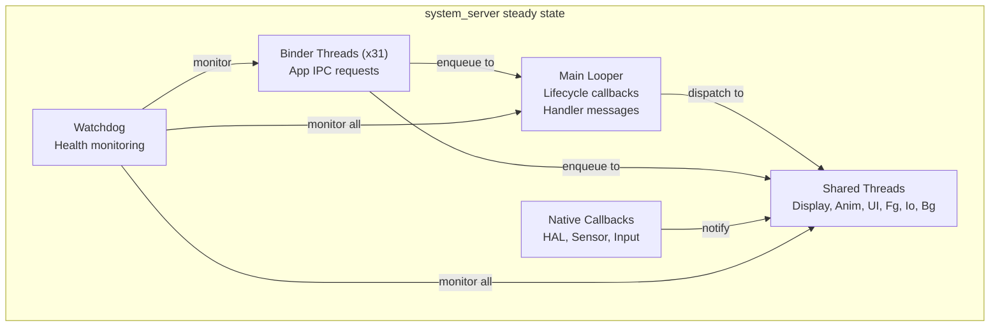

---

## 20.14 Debugging system_server

### 20.14.1 Common Failure Modes

| Symptom | Likely Cause | Diagnosis |
|---------|-------------|-----------|
| Device stuck at boot animation | Service init deadlock or crash loop | Check logcat for BOOT FAILURE, Watchdog logs |
| Runtime restart loop | Persistent Watchdog timeout | Check `/data/system/watchdog-timeout-history.txt` |
| Service not responding (ANR-like) | Lock contention or blocked thread | Get thread dump with `kill -3` |
| Binder transaction failures | Thread pool exhaustion | Check `dumpsys binder_calls_stats` |
| Memory pressure | Heap too large or leak | Check `dumpsys meminfo system_server` |
| System UI crash | SystemUI process died | Check logcat for SystemUI crashes |

### 20.14.2 Getting Thread Dumps

Java thread dumps are the most useful diagnostic tool for `system_server`
issues:

```bash
# Method 1: SIGQUIT (generates ANR trace)
adb shell kill -3 $(adb shell pidof system_server)
sleep 2
adb pull /data/anr/traces.txt

# Method 2: debuggerd (native + Java stacks)
adb shell debuggerd $(adb shell pidof system_server)
```

The trace file contains:

- Stack traces for every Java thread
- Lock ownership information
- Thread states (RUNNABLE, BLOCKED, WAITING, etc.)
- Monitor information (which thread holds which lock)

### 20.14.3 Identifying Deadlocks

A classic `system_server` deadlock involves two services holding locks
and waiting for each other. The thread dump will show:

```
"android.display" prio=5 tid=12 BLOCKED
  - waiting to lock <0x12345678> (a WindowManagerGlobalLock)
    held by thread 15
  at WindowManagerService.doSomething()

"Binder:1234_5" prio=5 tid=15 BLOCKED
  - waiting to lock <0x87654321> (a ActivityManagerService)
    held by thread 12
  at ActivityManagerService.doSomethingElse()
```

This shows thread 12 waiting for a lock held by thread 15, while
thread 15 waits for a lock held by thread 12 -- a classic deadlock.

### 20.14.4 Analyzing Boot Timing

To identify which service is slowing down boot:

```bash
# Get timing for each service start
adb logcat -s SystemServerTiming | sort -t= -k2 -n -r | head -20
```

### 20.14.5 Reading Watchdog Dumps

When the Watchdog triggers, it writes detailed information to both
logcat and DropBox:

```bash
# Check DropBox for Watchdog entries
adb shell dumpsys dropbox --print | grep -A 100 "SYSTEM_SERVER_WATCHDOG"

# Check kernel log for the kill
adb shell dmesg | grep system_server
```

The Watchdog dump includes:

- Which checker(s) were blocked
- Whether blocked in a handler or a specific monitor
- Stack traces of all interesting processes
- Kernel stack traces for native processes

### 20.14.6 Profiling system_server

For performance analysis:

```bash
# CPU profiling with simpleperf
adb shell simpleperf record -p $(adb shell pidof system_server) \
    --duration 10 -o /data/local/tmp/perf.data
adb pull /data/local/tmp/perf.data
simpleperf report -i perf.data

# Java method tracing (debug builds)
adb shell am profile start system $(adb shell pidof system_server) \
    /data/local/tmp/system_server.trace
sleep 5
adb shell am profile stop system
adb pull /data/local/tmp/system_server.trace
```

### 20.14.7 Useful System Properties

| Property | Purpose | Default |
|----------|---------|---------|
| `sys.system_server.start_count` | Number of system_server starts since boot | 1 |
| `sys.system_server.start_elapsed` | Start time (elapsed realtime ms) | varies |
| `sys.system_server.start_uptime` | Start time (uptime ms) | varies |
| `persist.sys.debug.fdtrack_enable_threshold` | FD count to enable tracking | 1600 |
| `persist.sys.debug.fdtrack_abort_threshold` | FD count to abort | 3000 |
| `persist.sys.debug.fdtrack_interval` | FD check interval (seconds) | 120 |
| `framework_watchdog.fatal_count` | Watchdog crash count for loop detection | varies |
| `framework_watchdog.fatal_window.second` | Time window for crash loop detection | varies |

---

## 20.15 Writing a Custom System Service

### 20.15.1 Service Structure Template

A well-structured system service follows this pattern:

```java
// IMyService.aidl -- define the Binder interface

// MyManagerService.java
package com.android.server.myservice;

public class MyManagerService extends IMyService.Stub {

    // Internal interface for other system services
    final class LocalService extends MyManagerInternal {
        // Privileged operations
    }

    // Lifecycle class for SystemServiceManager
    public static final class Lifecycle extends SystemService {
        private MyManagerService mService;

        public Lifecycle(Context context) {
            super(context);
        }

        @Override
        public void onStart() {
            mService = new MyManagerService(getContext());
            publishBinderService(Context.MY_SERVICE, mService);
            publishLocalService(MyManagerInternal.class,
                    mService.new LocalService());
        }

        @Override
        public void onBootPhase(int phase) {
            if (phase == PHASE_SYSTEM_SERVICES_READY) {
                mService.systemReady();
            }
        }

        @Override
        public void onUserStarting(@NonNull TargetUser user) {
            mService.onUserStarting(user.getUserIdentifier());
        }
    }
}
```

### 20.15.2 Registration in SystemServer

Add the service start to the appropriate method in `SystemServer.java`:

```java
// In startOtherServices() or startCoreServices()
t.traceBegin("StartMyService");
mSystemServiceManager.startService(MyManagerService.Lifecycle.class);
t.traceEnd();
```

### 20.15.3 Thread Safety Considerations

When writing a system service, thread safety is paramount:

1. **Binder calls come on Binder threads** -- any public method in the
   Binder stub can be called concurrently from multiple threads.
2. **Lifecycle callbacks come on the main thread** -- but other calls
   may come simultaneously on Binder threads.
3. **Use the appropriate shared thread** -- do not create new threads
   for every operation.
4. **Implement Watchdog.Monitor** if you hold a lock that could
   deadlock with other system services.
5. **Avoid holding locks during Binder calls to other services** --
   this is the primary cause of deadlocks.

### 20.15.4 Testing with Ravenwood

The Ravenwood framework supports deviceless testing of system services.
The `dependencies` parameter in the `SystemService` constructor helps
Ravenwood understand which other services need to be available:

```java
public MyManagerService(Context context) {
    super(context, List.of(PowerManager.class, PackageManager.class));
}
```

This tells Ravenwood that `MyManagerService` requires `PowerManager`
and `PackageManager` to function, so they must be set up in the test
environment.

---

## 20.16 The startApexServices() Phase

### 20.16.1 APEX Service Discovery

After `startOtherServices()` completes, `SystemServer` enters the fourth
and final startup method: `startApexServices()`. This phase handles
services that are defined in APEX modules and registered via
`SystemServiceRegistry` rather than being hardcoded in `SystemServer.java`.

The key difference from `startServiceFromJar()` calls in
`startOtherServices()` is that APEX services discovered here are
declared by the APEX manifest and registered dynamically. This allows
APEX modules to add system services without modifying `SystemServer.java`
at all.

### 20.16.2 Updating the Watchdog Timeout

After all services are started, the Watchdog timeout is updated from
system settings (line 1037):

```java
// frameworks/base/services/java/com/android/server/SystemServer.java, line 1037
updateWatchdogTimeout(t);
```

This call registers a `SettingsObserver` that watches for changes to
`Settings.Global.WATCHDOG_TIMEOUT_MILLIS`, allowing the timeout to be
adjusted dynamically by the server-side configuration system:

```java
// frameworks/base/services/core/java/com/android/server/Watchdog.java, line 617
void updateWatchdogTimeout(long timeoutMillis) {
    if (!DB && !Build.IS_USERDEBUG
            && timeoutMillis
                <= ZygoteConnectionConstants.WRAPPED_PID_TIMEOUT_MILLIS) {
        timeoutMillis =
                ZygoteConnectionConstants.WRAPPED_PID_TIMEOUT_MILLIS + 1;
    }
    mWatchdogTimeoutMillis = timeoutMillis;
    Slog.i(TAG, "Watchdog timeout updated to "
            + mWatchdogTimeoutMillis + " millis");
}
```

The timeout cannot be set below the Zygote wrapped PID timeout on
non-debug builds to prevent false positives when debugging wrapped
applications.

---

## 20.17 Lock Ordering and Deadlock Prevention

### 20.17.1 The Lock Hierarchy

Within `system_server`, multiple services hold multiple locks. To prevent
deadlocks, the framework uses an informal lock ordering convention:

1. **WindowManagerGlobalLock** -- The "big lock" shared between WMS and
   ATMS. This is the most contended lock in the system.
2. **ActivityManagerService lock** -- Protects AMS internal state.
3. **PowerManagerService.mLock** -- Protects power state.
4. **Individual service locks** -- Each service's internal state.

The general rule: always acquire locks in a consistent order. Never hold
a service-specific lock while calling into another service that might
try to acquire a higher-level lock.

### 20.17.2 LockGuard

The `LockGuard` class (in `frameworks/base/services/core/java/com/android/server/LockGuard.java`)
provides runtime lock-order verification:

```java
// Usage pattern:
LockGuard.installLock(this, LockGuard.INDEX_WINDOW);
// Later:
LockGuard.guard(LockGuard.INDEX_POWER); // warns if holding WINDOW lock
```

When a thread acquires locks out of order, LockGuard logs a warning
that helps developers identify potential deadlock scenarios before they
become actual deadlocks in the field.

### 20.17.3 ThreadPriorityBooster

The `ThreadPriorityBooster` class (in
`frameworks/base/services/core/java/com/android/server/ThreadPriorityBooster.java`)
temporarily boosts thread priority while holding critical locks. This
prevents priority inversion, where a low-priority thread holds a lock
that a high-priority thread needs.

Pattern:

```java
class MyService {
    private final ThreadPriorityBooster mBooster =
            new ThreadPriorityBooster(
                    Process.THREAD_PRIORITY_DISPLAY,
                    LockGuard.INDEX_WINDOW);

    void criticalOperation() {
        mBooster.boost();
        try {
            synchronized (mLock) {
                // Critical work at display priority
            }
        } finally {
            mBooster.reset();
        }
    }
}
```

### 20.17.4 Common Deadlock Patterns

The most common deadlock patterns in `system_server`:

**Pattern 1: Service A calls Service B while holding lock**

```
Thread 1: ServiceA.lock() -> ServiceB.method() -> ServiceB.lock()
Thread 2: ServiceB.lock() -> ServiceA.method() -> ServiceA.lock()
```

Prevention: Never call into another service while holding your own lock.
Instead, copy needed data under lock, release the lock, then make the
external call.

**Pattern 2: Binder call while holding lock**

```
Thread 1 (Binder): ServiceA.lock() -> app process Binder call
App process: ServiceA.method() -> ServiceA.lock() (blocked!)
```

Prevention: This is why `Binder.setWarnOnBlocking(true)` is set in
`system_server`. Avoid making outgoing Binder calls while holding locks.

**Pattern 3: Lock and Handler**

```
Thread 1: lock() -> handler.post(runnable that needs lock)
Handler thread: runnable runs -> tries to acquire lock -> blocked
Meanwhile Thread 1 waits for handler.runWithScissors() -> deadlock
```

Prevention: Avoid `runWithScissors()` (post and wait) patterns. Use
asynchronous message passing instead.

---

## 20.18 Memory Architecture

### 20.18.1 Heap Configuration

`system_server` has special heap configuration compared to regular apps:

```java
// frameworks/base/services/java/com/android/server/SystemServer.java, line 911
VMRuntime.getRuntime().clearGrowthLimit();
```

Regular apps typically have:

- Default heap size: 256MB (varies by device)
- Growth limit: same as default (enforced)

`system_server`:

- Growth limit: removed (unlimited growth)
- Actual usage: typically 200-500MB depending on number of apps
  installed and device configuration

### 20.18.2 Shared Memory Optimization

Early in `run()`, `system_server` initializes a shared memory region
(lines 1021-1022):

```java
// frameworks/base/services/java/com/android/server/SystemServer.java, line 1021
ApplicationSharedMemory instance = ApplicationSharedMemory.create();
ApplicationSharedMemory.setInstance(instance);
```

This shared memory region allows efficient data sharing between
`system_server` and app processes without Binder IPC overhead. It is
used for high-frequency, small-data communication paths.

### 20.18.3 Zygote Memory Inheritance

Since `system_server` is forked from Zygote, it inherits:

- All preloaded framework classes (already in the class table)
- Common resources and assets
- ICU and timezone data
- OpenGL/Vulkan driver state

This shared memory (via Linux copy-on-write pages) means the actual
private memory footprint of `system_server` is much smaller than its
virtual memory size would suggest.

### 20.18.4 GC Considerations

`system_server`'s garbage collector behavior has special implications:

1. **Large heap**: More objects to scan, longer GC pauses
2. **Concurrent GC**: The ART runtime uses concurrent GC to minimize
   pause times, but `system_server` allocates rapidly during boot
3. **GC during PMS init**: PackageManagerService allocates heavily
   during package scanning. The ArtModuleServiceInitializer is loaded
   early (before PMS) specifically to avoid the class linker competing
   with GC (as noted in the code comment at line 1182-1186):

```java
// line 1180
// This needs to happen before DexUseManagerLocal init. We do it
// here to avoid colliding with a GC. ArtModuleServiceInitializer
// is a class from a separate dex file "service-art.jar", so
// referencing it involves the class linker. The class linker and
// the GC are mutually exclusive (b/263486535).
```

---

## 20.19 The SystemServerInitThreadPool

### 20.19.1 Purpose

The `SystemServerInitThreadPool` provides a temporary thread pool
specifically for parallelizing initialization work during boot. It is
started early (line 944) and shut down after initialization completes.

**Source:** `frameworks/base/services/core/java/com/android/server/SystemServerInitThreadPool.java`

### 20.19.2 Usage Pattern

Tasks are submitted as lambdas with descriptive names:

```java
// SystemConfig loading - line 1156
SystemServerInitThreadPool.submit(
        SystemConfig::getInstance, "ReadingSystemConfig");

// Secondary Zygote preload - line 1581
mZygotePreload = SystemServerInitThreadPool.submit(() -> {
    String[] abis32 = Build.SUPPORTED_32_BIT_ABIS;
    if (abis32.length > 0
            && !Process.ZYGOTE_PROCESS.preloadDefault(abis32[0])) {
        Slog.e(TAG, "Unable to preload default resources");
    }
}, "SecondaryZygotePreload");

// Native sensor manager - line 1743
SystemServerInitThreadPool.submit(() -> {
    startISensorManagerService();
}, "StartISensorManagerService");

// HIDL services - line 1750
SystemServerInitThreadPool.submit(() -> {
    startHidlServices();
}, "StartHidlServices");

// WebView preparation - line 3363
webviewPrep = SystemServerInitThreadPool.submit(() -> {
    ConcurrentUtils.waitForFutureNoInterrupt(
            mZygotePreload, "Zygote preload");
    mZygotePreload = null;
    mWebViewUpdateService.prepareWebViewInSystemServer();
}, "WebViewFactoryPreparation");
```

### 20.19.3 Synchronization

Some tasks depend on earlier tasks. The `Future<?>` returned by
`submit()` allows later code to wait for completion:

```java
// Wait for Zygote preload before WebView prep
ConcurrentUtils.waitForFutureNoInterrupt(mZygotePreload, "Zygote preload");

// Wait for WebView prep before starting third-party apps
if (webviewPrep != null) {
    ConcurrentUtils.waitForFutureNoInterrupt(
            webviewPrep, WEBVIEW_PREPARATION);
}
```

### 20.19.4 Dumping State

The pool is registered as a dumpable (line 945):

```java
mDumper.addDumpable(SystemServerInitThreadPool.getInstance());
```

This allows monitoring which initialization tasks are still pending or
have completed during boot.

---

## 20.20 Binder Transaction Monitoring

### 20.20.1 Transaction Callbacks

After all services start, `system_server` installs a Binder transaction
callback (lines 1062-1067):

```java
// frameworks/base/services/java/com/android/server/SystemServer.java, line 1062
Binder.setTransactionCallback(new IBinderCallback() {
    @Override
    public void onTransactionError(int pid, int code, int flags, int err) {
        mActivityManagerService.frozenBinderTransactionDetected(
                pid, code, flags, err);
    }
});
```

This detects failed Binder transactions to frozen (cached) processes.
When a process is frozen (moved to the cgroup freezer), Binder
transactions to it fail immediately. This callback notifies AMS, which
can then handle the situation (e.g., killing the frozen process or
requeuing the transaction).

### 20.20.2 Post-GC Memory Metrics

`system_server` also registers a post-GC callback for memory monitoring
(lines 1071-1078):

```java
// line 1071
if (android.app.Flags.reportPostgcMemoryMetrics()
        && com.android.libcore.readonly.Flags.postCleanupApis()) {
    VMRuntime.addPostCleanupCallback(new Runnable() {
        @Override public void run() {
            MetricsLoggerWrapper.logPostGcMemorySnapshot();
        }
    });
}
```

This collects memory metrics after each GC cycle, providing insights
into the long-term memory behavior of `system_server`.

---

## 20.21 Feature Flags in system_server

### 20.21.1 Flag-Gated Service Starts

Many service starts in modern AOSP are gated by feature flags. This
allows services to be enabled/disabled without code changes:

```java
// Example: IntrusionDetectionService
if (!isWatch && !isTv && !isAutomotive
        && android.security.Flags.aflApi()) {
    t.traceBegin("StartIntrusionDetectionService");
    mSystemServiceManager.startService(IntrusionDetectionService.class);
    t.traceEnd();
}

// Example: AdvancedProtectionService
if (!isWatch && !isTv && !isAutomotive
        && android.security.Flags.aapmApi()) {
    t.traceBegin("StartAdvancedProtectionService");
    mSystemServiceManager.startService(
            AdvancedProtectionService.Lifecycle.class);
    t.traceEnd();
}

// Example: TradeInModeService
if (!isWatch && !isTv && !isAutomotive && enableTradeInMode()) {
    t.traceBegin("StartTradeInModeService");
    mSystemServiceManager.startService(TradeInModeService.class);
    t.traceEnd();
}

// Example: UserRecoveryManagerService
if (enableUserRecoveryManager()) {
    t.traceBegin("StartUserRecoveryManager");
    mSystemServiceManager.startService(
            UserRecoveryManagerService.class);
    t.traceEnd();
}
```

### 20.21.2 FeatureFlagsService

The `FeatureFlagsService` is started in the bootstrap phase (line 1240):

```java
// line 1240
t.traceBegin("StartFeatureFlagsService");
mSystemServiceManager.startService(FeatureFlagsService.class);
t.traceEnd();
```

This service is started early because other services need to read flag
values during their initialization. It provides the mechanism for
distributing runtime flag overrides and keeping processes in sync with
the latest flag values.

### 20.21.3 Crash Recovery Flags

The crash recovery mechanism is itself flag-gated (line 1319):

```java
// line 1319
if (!Flags.refactorCrashrecovery()) {
    CrashRecoveryAdaptor.rescuePartyRegisterHealthObserver(mSystemContext);
}
```

And later (line 3208):

```java
// line 3208
if (Flags.refactorCrashrecovery()) {
    t.traceBegin("StartCrashRecoveryModule");
    CrashRecoveryAdaptor.initializeCrashrecoveryModuleService(
            mSystemServiceManager);
    t.traceEnd();
} else {
    CrashRecoveryAdaptor.packageWatchdogNoteBoot(mSystemContext);
}
```

This shows the ongoing migration of crash recovery logic from the
platform to a modular implementation.

---

## 20.22 Architecture Diagrams

### 20.22.1 Complete system_server Architecture

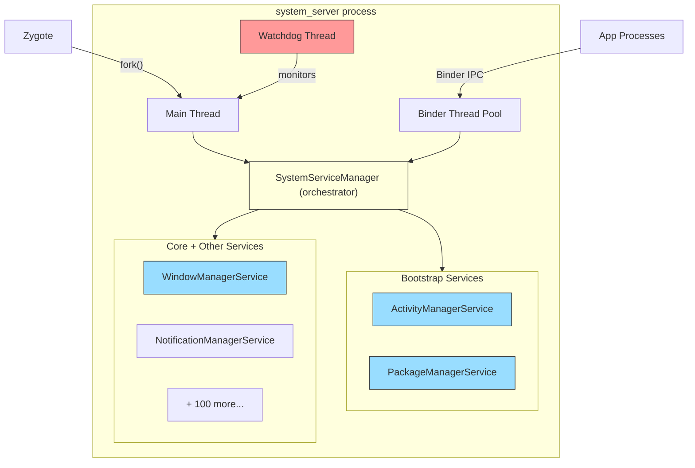

### 20.22.2 Service Registration Flow

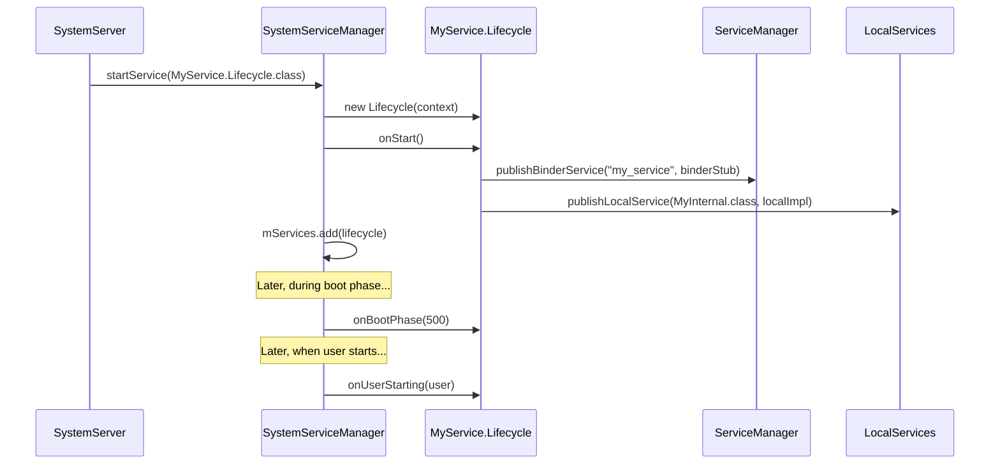

---

## 20.23 Historical Context

### 20.23.1 Evolution of system_server

The `system_server` architecture has evolved significantly:

**Early Android (1.x-2.x)**:

- Monolithic `SystemServer.java` with inline service construction
- No `SystemService` base class
- No boot phases
- Limited threading model

**Android 4.x-5.x**:

- Introduction of `SystemService` base class
- Boot phases added for orderly initialization
- `SystemServiceManager` for lifecycle management
- Shared threads introduced (Display, Animation, UI, Fg, Io, Bg)

**Android 8.x-9.x (Project Treble)**:

- HAL interfaces moved to HIDL
- Stronger separation between framework and vendor code
- Watchdog AIDL interface monitoring added

**Android 10+ (Project Mainline)**:

- Services moved to APEX modules
- `startServiceFromJar()` mechanism added
- `SystemServerClassLoaderFactory` for APEX class loading
- Connectivity, WiFi, Bluetooth services modularized

**Android 12+**:

- ActivityTaskManagerService split from ActivityManagerService
- PermissionThread added
- Enhanced Watchdog with pre-watchdog timeout
- Feature flag gating of service starts

**Android 14+**:

- Ravenwood testing framework integration
- Service dependencies for testing
- Enhanced crash recovery module
- Refactored CrashRecovery as a module

### 20.23.2 The Monolith Pattern

`system_server` follows a "monolithic process, modular services" pattern.
All services run in a single process for several reasons:

1. **Performance**: Intra-process calls via `LocalServices` avoid
   Binder IPC overhead. Given that services call each other thousands
   of times per second, this is significant.
2. **Atomicity**: Having all services in one process means a crash in
   any service restarts all of them, maintaining consistency.
3. **Lock sharing**: Critical locks (like `WindowManagerGlobalLock`)
   can be shared across services without IPC.
4. **Memory efficiency**: Shared heap reduces overall memory usage.

The downside is that one poorly-written service can bring down the
entire system, which is why the Watchdog is so important.

### 20.23.3 Why Not Microservices?

Android considered splitting system services into separate processes
(a microservices-like architecture) but rejected it because:

1. **IPC cost**: Every cross-service call would require Binder IPC
   (~10us minimum), which is unacceptable for the tight interaction
   patterns between AMS, WMS, and InputManager.
2. **Consistency**: Partial failures would require complex recovery
   logic. With a monolithic process, it is all-or-nothing.
3. **Memory overhead**: Each process has its own heap, class loading,
   and VM overhead. Hundreds of small processes would use much more
   memory than one large process.

The APEX module approach is a middle ground: the code is modular and
updatable, but it all runs in the same process.

---

## 20.24 Quick Reference

### 20.24.1 Source File Index

| File Path | Lines | Purpose |
|-----------|-------|---------|
| `frameworks/base/services/java/com/android/server/SystemServer.java` | ~3600 | Entry point, startup orchestration |
| `frameworks/base/services/core/java/com/android/server/SystemService.java` | 641 | Service base class, boot phase constants |
| `frameworks/base/services/core/java/com/android/server/SystemServiceManager.java` | ~500 | Service lifecycle management |
| `frameworks/base/services/core/java/com/android/server/Watchdog.java` | ~1100 | Deadlock detection, thread monitoring |
| `frameworks/base/core/java/com/android/server/ServiceThread.java` | 52 | Handler thread base class |
| `frameworks/base/services/core/java/com/android/server/DisplayThread.java` | 79 | Display operations thread |
| `frameworks/base/services/core/java/com/android/server/AnimationThread.java` | 76 | Window animation thread |
| `frameworks/base/services/core/java/com/android/server/wm/SurfaceAnimationThread.java` | 76 | Lock-free surface animation |
| `frameworks/base/services/core/java/com/android/server/UiThread.java` | 89 | System UI thread |
| `frameworks/base/core/java/com/android/server/FgThread.java` | 69 | Foreground operations thread |
| `frameworks/base/services/core/java/com/android/server/IoThread.java` | 59 | I/O operations thread |
| `frameworks/base/core/java/com/android/internal/os/BackgroundThread.java` | 104 | Background operations thread |
| `frameworks/base/services/core/java/com/android/server/PermissionThread.java` | 72 | Permission operations thread |
| `frameworks/base/services/core/java/com/android/server/SystemServerInitThreadPool.java` | ~100 | Boot-time parallel init pool |

### 20.24.2 Boot Phase Quick Reference

| Value | Constant | Gate |
|-------|----------|------|
| 100 | `PHASE_WAIT_FOR_DEFAULT_DISPLAY` | Default display available |
| 200 | `PHASE_WAIT_FOR_SENSOR_SERVICE` | Sensor HAL ready |
| 480 | `PHASE_LOCK_SETTINGS_READY` | Lock settings readable |
| 500 | `PHASE_SYSTEM_SERVICES_READY` | Core services callable |
| 520 | `PHASE_DEVICE_SPECIFIC_SERVICES_READY` | OEM services callable |
| 550 | `PHASE_ACTIVITY_MANAGER_READY` | Can broadcast Intents |
| 600 | `PHASE_THIRD_PARTY_APPS_CAN_START` | Apps can make Binder calls |
| 1000 | `PHASE_BOOT_COMPLETED` | Home app started |

### 20.24.3 Thread Quick Reference

| Thread Name | Java Class | Priority | I/O | Monitored by Watchdog |
|-------------|-----------|----------|-----|----------------------|
| `main` | Main Looper | FOREGROUND (-2) | Yes | Yes |
| `android.display` | `DisplayThread` | DISPLAY+1 (-3) | No | Yes |
| `android.anim` | `AnimationThread` | DISPLAY (-4) | No | Yes |
| `android.anim.lf` | `SurfaceAnimationThread` | DISPLAY (-4) | No | Yes |
| `android.ui` | `UiThread` | FOREGROUND (-2) | No | Yes |
| `android.fg` | `FgThread` | DEFAULT (0) | Yes | Yes |
| `android.io` | `IoThread` | DEFAULT (0) | Yes | Yes |
| `android.bg` | `BackgroundThread` | BACKGROUND (10) | Yes | No |
| `android.perm` | `PermissionThread` | DEFAULT (0) | Yes | No |
| `watchdog` | `Watchdog` | DEFAULT (0) | N/A | N/A |
| `watchdog.monitor` | `ServiceThread` | DEFAULT (0) | Yes | N/A |
| `Binder:PID_N` | Binder pool | FOREGROUND (-2) | Yes | Yes (via BinderThreadMonitor) |

### 20.24.4 Key Constants

| Constant | Value | Location |
|----------|-------|----------|
| `sMaxBinderThreads` | 31 | `SystemServer.java:493` |
| `DEFAULT_TIMEOUT` | 60,000ms | `Watchdog.java:101` |
| `PRE_WATCHDOG_TIMEOUT_RATIO` | 4 | `Watchdog.java:107` |
| `SLOW_DISPATCH_THRESHOLD_MS` | 100ms | `SystemServer.java:346` |
| `SLOW_DELIVERY_THRESHOLD_MS` | 200ms | `SystemServer.java:347` |
| `DEFAULT_SYSTEM_THEME` | `Theme_DeviceDefault_System` | `SystemServer.java:499` |
| `SERVICE_CALL_WARN_TIME_MS` | 50ms | `SystemServiceManager.java:78` |
| `DEFAULT_MAX_USER_POOL_THREADS` | 3 | `SystemServiceManager.java:92` |
| `USER_POOL_SHUTDOWN_TIMEOUT_SECONDS` | 30s | `SystemServiceManager.java:97` |

### 20.24.5 Essential dumpsys Commands

| Command | Information Shown |
|---------|-------------------|
| `dumpsys activity` | AMS state: processes, activities, broadcasts |
| `dumpsys activity processes` | Running processes and OOM adj |
| `dumpsys window` | WMS state: windows, displays, input |
| `dumpsys package <pkg>` | Package details, permissions, components |
| `dumpsys power` | Power state, wake locks, battery stats |
| `dumpsys notification` | Active notifications and channels |
| `dumpsys audio` | Audio routing, volumes, devices |
| `dumpsys connectivity` | Network state, connections |
| `dumpsys display` | Display configuration, brightness |
| `dumpsys input` | Input devices, event dispatching |
| `dumpsys alarm` | Scheduled alarms |
| `dumpsys jobscheduler` | Pending and running jobs |
| `dumpsys battery` | Battery state and history |
| `dumpsys usagestats` | App usage statistics |
| `dumpsys meminfo system_server` | Memory breakdown |
| `dumpsys binder_calls_stats` | Binder call statistics |
| `dumpsys looper_stats` | Handler message timing |
| `dumpsys system_server_dumper` | Internal system_server state |
| `service list` | All registered Binder services |

---

## 20.25 BackupManagerService

The Android backup framework enables applications to back up their data to
cloud or local storage and restore it after device reset, migration, or app
reinstallation. `BackupManagerService` (BMS) is the system service that
orchestrates this entire process -- managing backup transports, scheduling
key-value and full-data backups, and coordinating restore operations.

**Key source files:**

| File | Description |
|------|-------------|
| `frameworks/base/services/backup/java/com/android/server/backup/BackupManagerService.java` | Top-level delegator service |
| `frameworks/base/services/backup/java/com/android/server/backup/UserBackupManagerService.java` | Per-user backup logic |
| `frameworks/base/services/backup/java/com/android/server/backup/TransportManager.java` | Transport lifecycle management |
| `frameworks/base/services/backup/java/com/android/server/backup/FullBackupJob.java` | JobScheduler integration for full backups |
| `frameworks/base/services/backup/java/com/android/server/backup/keyvalue/KeyValueBackupTask.java` | Key-value backup execution |
| `frameworks/base/services/backup/java/com/android/server/backup/fullbackup/PerformFullTransportBackupTask.java` | Full backup execution |
| `frameworks/base/services/backup/java/com/android/server/backup/restore/PerformUnifiedRestoreTask.java` | Restore execution |
| `frameworks/base/services/backup/java/com/android/server/backup/transport/TransportConnection.java` | Transport binding logic |

### 20.25.1 Architecture Overview

BMS uses a two-layer architecture: a system-level delegator and per-user
managers. This design mirrors Android's multi-user model.

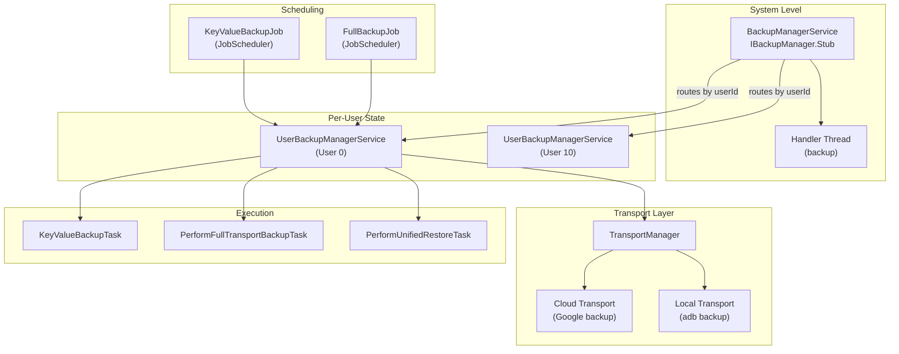

The `BackupManagerService` class documentation states its role:

```java
// frameworks/base/services/backup/java/com/android/server/backup/BackupManagerService.java
/**
 * This class is responsible for handling user-aware operations and acts as
 * a delegator, routing incoming calls to the appropriate per-user
 * {@link UserBackupManagerService} to handle the corresponding
 * backup/restore operation.
 */
public class BackupManagerService extends IBackupManager.Stub
        implements BackupManagerInternal {
```

Each `UserBackupManagerService` instance maintains its own:

- **TransportManager** -- tracks registered transports for that user
- **BackupHandler** -- message-based task scheduling
- **ProcessedPackagesJournal** -- persistent log of backed-up packages
- **DataChangedJournal** -- list of packages with pending key-value changes
- **FullBackupQueue** -- round-robin schedule for full backups

### 20.25.2 Activation and Disablement

BMS can be disabled at two levels:

1. **Permanent** -- The system property `ro.backup.disable` set to `true`
2. **Temporary** -- The `setBackupServiceActive(userId, boolean)` API, typically
   called by `DevicePolicyManager` for enterprise devices

Activation state is tracked using sentinel files:

```java
// frameworks/base/services/backup/java/com/android/server/backup/BackupManagerService.java
private static final String BACKUP_SUPPRESS_FILENAME = "backup-suppress";
private static final String BACKUP_ACTIVATED_FILENAME = "backup-activated";
private static final String REMEMBER_ACTIVATED_FILENAME = "backup-remember-activated";
```

The activation check follows a four-level precedence:

1. **Global suppression** -- Suppress file for `USER_SYSTEM` disables all users
2. **User-specific suppression** -- Suppress file for a particular user
3. **Default activation** -- Whether the user's backup defaults to active
4. **Explicit activation file** -- Presence of activation file for the user

### 20.25.3 Backup Transports

A backup transport is a pluggable component that defines where backup data
goes. Transports are discovered via `PackageManager` by scanning for services
with the action `android.backup.TRANSPORT_HOST`:

```java
// frameworks/base/services/backup/java/com/android/server/backup/TransportManager.java
public static final String SERVICE_ACTION_TRANSPORT_HOST =
        "android.backup.TRANSPORT_HOST";
```

The `TransportManager` maintains a whitelist of allowed transports from
`SystemConfig.getBackupTransportWhitelist()`. Only whitelisted transports
can register. Each transport is wrapped in a `TransportConnection` that
handles the Binder binding lifecycle:

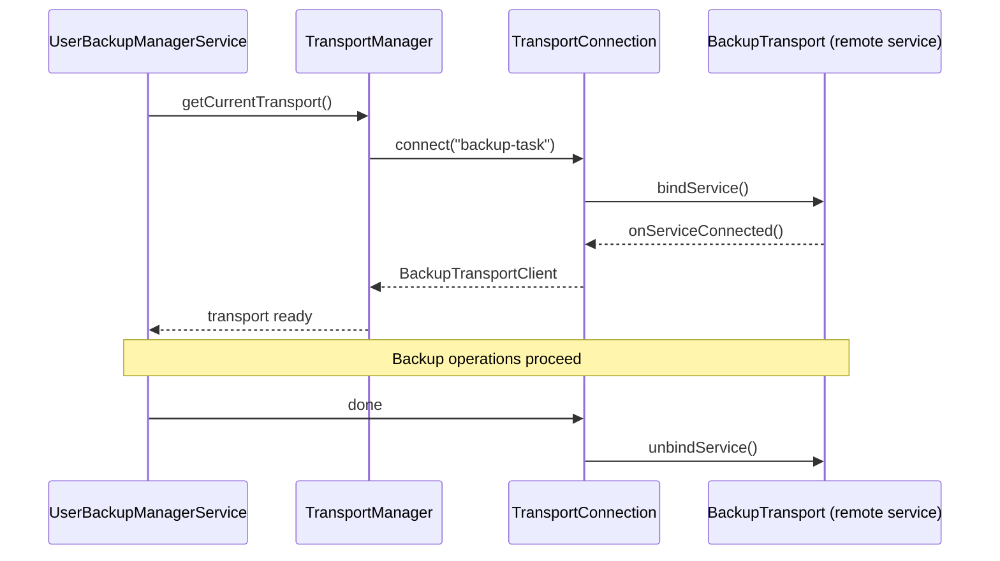

Google's cloud backup transport (`com.google.android.gms/.backup.BackupTransportService`)
implements the `IBackupTransport` interface, but the architecture is open --
OEMs can provide their own transport implementations.

### 20.25.4 Key-Value vs. Full Backup

Android supports two fundamentally different backup strategies:

**Key-Value Backup:**

- Apps extend `BackupAgent` and implement `onBackup()`/`onRestore()`
- Data is stored as key-value pairs using `BackupDataOutput`
- Incremental -- only changed keys are transmitted
- Scheduled via `KeyValueBackupJob` through `JobScheduler`
- Tracked through `DataChangedJournal` -- when an app calls
  `BackupManager.dataChanged()`, its package name is written to the journal

**Full Backup:**

- Automatic backup of entire app directories (internal storage, databases, etc.)
- No app code changes required (unless `BackupAgent` overrides `onFullBackup()`)
- Configured via `android:fullBackupContent` in the manifest
- Scheduled via `FullBackupJob` in a round-robin queue
- Requires the device to be idle and charging (except on Wear devices)

```java
// frameworks/base/services/backup/java/com/android/server/backup/FullBackupJob.java
builder.setRequiredNetworkType(constants.getFullBackupRequiredNetworkType())
        .setRequiresCharging(constants.getFullBackupRequireCharging());
if (!ctx.getPackageManager().hasSystemFeature(PackageManager.FEATURE_WATCH)) {
    builder.setRequiresDeviceIdle(true);
}
```

The backup lifecycle for both types:

```mermaid
flowchart TB
    subgraph "Key-Value Backup"
        KV1["App calls<br/>BackupManager.dataChanged()"]
        KV2["Package added to<br/>DataChangedJournal"]
        KV3["KeyValueBackupJob fires"]
        KV4["KeyValueBackupTask<br/>binds to app's BackupAgent"]
        KV5["Agent.onBackup() called<br/>(incremental state delta)"]
        KV6["Delta sent to transport<br/>via performBackup()"]

        KV1 --> KV2 --> KV3 --> KV4 --> KV5 --> KV6
    end

    subgraph "Full Backup"
        FB1["FullBackupJob fires<br/>(idle + charging)"]
        FB2["Next app in<br/>round-robin queue"]
        FB3["Bind to app's<br/>BackupAgent"]
        FB4["Agent.onFullBackup() called<br/>(or default file walker)"]
        FB5["Tar-format stream sent<br/>to transport"]

        FB1 --> FB2 --> FB3 --> FB4 --> FB5
    end
```

### 20.25.5 The BackupHandler Message Protocol

`UserBackupManagerService` uses a handler-based message protocol defined in
`BackupHandler`:

| Message | Purpose |
|---------|---------|
| `MSG_RUN_BACKUP` | Execute a pending key-value backup pass |
| `MSG_RUN_ADB_BACKUP` | Execute an adb backup (user-initiated) |
| `MSG_RUN_ADB_RESTORE` | Execute an adb restore |
| `MSG_RUN_RESTORE` | Execute a cloud restore |
| `MSG_RUN_CLEAR` | Clear backup data for a package |
| `MSG_RETRY_CLEAR` | Retry clearing after transport unavailability |
| `MSG_REQUEST_BACKUP` | Request backup of specific packages |
| `MSG_SCHEDULE_BACKUP_PACKAGE` | Schedule a package for backup |
| `MSG_BACKUP_OPERATION_TIMEOUT` | Timeout during backup agent operation |
| `MSG_RESTORE_OPERATION_TIMEOUT` | Timeout during restore operation |
| `MSG_RESTORE_SESSION_TIMEOUT` | Timeout for a restore session |
| `MSG_FULL_CONFIRMATION_TIMEOUT` | User confirmation timeout for full backup |
| `MSG_OP_COMPLETE` | Operation completion notification |

### 20.25.6 Backup Eligibility

Not all packages are eligible for backup. The `BackupEligibilityRules` class
determines eligibility based on:

- `android:allowBackup` manifest attribute (default `true`)
- Application flags: must not be `STOPPED`, must be a real package
- Target SDK and backup-specific compat changes
- For key-value backup: must have a declared `BackupAgent`
- For full backup: can use the default agent if no custom agent specified
- Signature verification: restore data from a different signing key is rejected

### 20.25.7 Restore Operations

Restore is coordinated by `PerformUnifiedRestoreTask`, which handles both
key-value and full-data restores through a state machine:

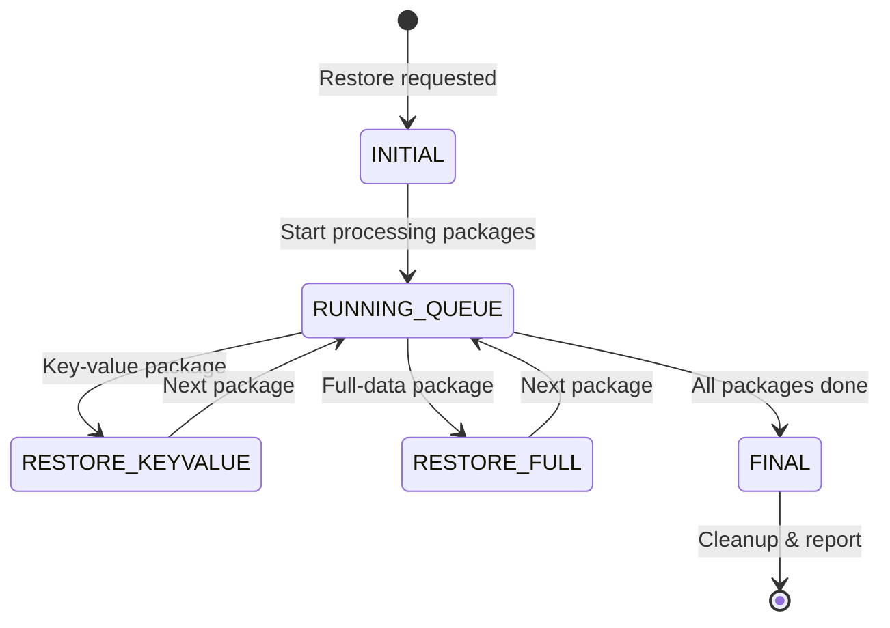

Restores are queued in `mPendingRestores` and processed serially -- only one
restore can run at a time per user:

```java
// frameworks/base/services/backup/java/com/android/server/backup/UserBackupManagerService.java
@GuardedBy("mPendingRestores")
private boolean mIsRestoreInProgress;

@GuardedBy("mPendingRestores")
private final Queue<PerformUnifiedRestoreTask> mPendingRestores = new ArrayDeque<>();
```

### 20.25.8 Cloud vs. Local Backup

The transport architecture allows seamless switching between backup destinations:

| Aspect | Cloud Backup (Google) | Local Backup (adb) |
|--------|----------------------|-------------------|
| Transport | `com.google.android.gms` | `com.android.internal.backup.LocalTransport` |
| Trigger | JobScheduler (automatic) | `adb backup` command (manual) |
| Encryption | TLS + server-side encryption | Optional user-set password |
| Format | Transport-specific (protobuf) | Tar archive with optional encryption |
| Quota | Limited (25MB key-value, configurable full) | Unlimited |
| Network required | Yes | No |
| File version header | N/A | `ANDROID BACKUP\n` + version 5 |

The file format for ADB backups is:

```java
// frameworks/base/services/backup/java/com/android/server/backup/UserBackupManagerService.java
public static final int BACKUP_FILE_VERSION = 5;
public static final String BACKUP_FILE_HEADER_MAGIC = "ANDROID BACKUP\n";
public static final String BACKUP_METADATA_FILENAME = "_meta";
public static final int BACKUP_METADATA_VERSION = 1;
public static final int BACKUP_WIDGET_METADATA_TOKEN = 0x01FFED01;
```

### 20.25.9 Multi-User Considerations

BMS handles edge cases around multi-user devices:

- The main user might not exist at boot time (first boot), tracked via
  `mDidMainUserExistAtBoot`
- Non-system user backup state is stored in both the user's directory
  and the system directory -- when a user is removed, BMS cleans up the
  system-dir portion via `onRemovedNonSystemUser()`
- Each user gets an independent `UserBackupManagerService` with its own
  transports, schedules, and state

---

## 20.26 CrashRecoveryModule and RescueParty

When Android detects persistent crashes -- whether from apps, system services,
or boot loops -- the crash recovery subsystem progressively escalates through
increasingly aggressive mitigations to restore the device to a functional state.
This system is built on three cooperating components: `PackageWatchdog`,
`RescueParty`, and `CrashRecoveryModule`.

**Key source files:**

| File | Description |
|------|-------------|
| `frameworks/base/packages/CrashRecovery/services/platform/java/com/android/server/crashrecovery/CrashRecoveryModule.java` | Module lifecycle |
| `frameworks/base/packages/CrashRecovery/services/platform/java/com/android/server/PackageWatchdog.java` | Failure monitoring engine |
| `frameworks/base/packages/CrashRecovery/services/platform/java/com/android/server/RescueParty.java` | Escalating mitigation logic |
| `frameworks/base/services/core/java/com/android/server/crashrecovery/CrashRecoveryHelper.java` | Connectivity module health listener |

### 20.26.1 CrashRecoveryModule Lifecycle

`CrashRecoveryModule` is delivered as an APEX module and follows the
`SystemService` lifecycle:

```java
// frameworks/base/packages/CrashRecovery/services/platform/java/com/android/server/crashrecovery/CrashRecoveryModule.java
public static class Lifecycle extends SystemService {
    @Override
    public void onStart() {
        RescueParty.registerHealthObserver(mSystemContext);
        mPackageWatchdog.registerShutdownBroadcastReceiver();
        mPackageWatchdog.noteBoot();
    }

    @Override
    public void onBootPhase(int phase) {
        if (phase == PHASE_THIRD_PARTY_APPS_CAN_START) {
            mPackageWatchdog.onPackagesReady();
        }
    }
}
```

At `onStart()`, three critical actions happen:

1. RescueParty registers itself as a health observer with PackageWatchdog
2. PackageWatchdog registers to listen for shutdown broadcasts
3. PackageWatchdog records the boot event (for boot loop detection)

At boot phase 600 (`PHASE_THIRD_PARTY_APPS_CAN_START`), PackageWatchdog
initializes its health check controller and begins monitoring.

### 20.26.2 PackageWatchdog

PackageWatchdog is the central failure monitoring engine. It tracks package
health through multiple failure signals and delegates mitigation to registered
observers.

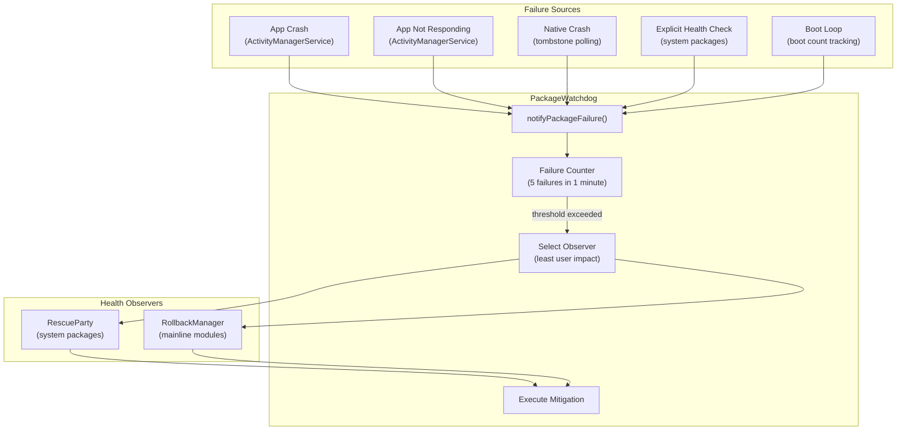

**Failure reasons:**

```java
// frameworks/base/packages/CrashRecovery/services/platform/java/com/android/server/PackageWatchdog.java
public static final int FAILURE_REASON_UNKNOWN = 0;
public static final int FAILURE_REASON_NATIVE_CRASH = 1;
public static final int FAILURE_REASON_EXPLICIT_HEALTH_CHECK = 2;
public static final int FAILURE_REASON_APP_CRASH = 3;
public static final int FAILURE_REASON_APP_NOT_RESPONDING = 4;
public static final int FAILURE_REASON_BOOT_LOOP = 5;
```

**Trigger thresholds:**

| Parameter | Default | Description |
|-----------|---------|-------------|
| `DEFAULT_TRIGGER_FAILURE_COUNT` | 5 | Failures needed to trigger mitigation |
| `DEFAULT_TRIGGER_FAILURE_DURATION_MS` | 60,000ms (1 min) | Window for counting failures |
| `DEFAULT_OBSERVING_DURATION_MS` | 2 days | How long to monitor a package |
| `DEFAULT_DEESCALATION_WINDOW_MS` | 1 hour | Sliding window for mitigation count |
| `DEFAULT_BOOT_LOOP_TRIGGER_COUNT` | 5 | Boots to detect a boot loop |
| `DEFAULT_BOOT_LOOP_TRIGGER_WINDOW_MS` | 10 min | Window for boot loop detection |

When `notifyPackageFailure()` is called, the watchdog:

1. Records the failure timestamp for the package
2. Counts failures within the trigger window
3. If the threshold is exceeded, selects the registered observer with the
   **lowest user impact** (using `PackageHealthObserverImpact` levels)
4. Calls the observer's mitigation method
5. Records the mitigation for de-escalation tracking

**Observer registration and selection:**

```java
// Each observer registers with PackageWatchdog
PackageWatchdog.getInstance(context).registerHealthObserver(
        null, RescuePartyObserver.getInstance(context));
```

When multiple observers are registered (e.g., RescueParty and RollbackManager),
the watchdog selects the one whose mitigation has the least user impact. This
ensures a package rollback is preferred over a factory reset.

**State persistence:**

PackageWatchdog persists its observer state to `/data/system/package-watchdog.xml`
using the `AtomicFile` mechanism. Boot loop mitigation counts are stored
separately in `/metadata/watchdog/mitigation_count.txt` to survive filesystem
checkpoint aborts.

### 20.26.3 RescueParty Escalation Levels

RescueParty registers as a `PackageHealthObserver` and implements a graduated
escalation strategy. Each successive mitigation attempt escalates to a more
aggressive level:

```mermaid
flowchart TB
    subgraph "Legacy Escalation (pre-flag)"
        L1["Level 1: Reset untrusted<br/>settings to defaults"]
        L2["Level 2: Reset untrusted<br/>settings changes"]
        L3["Level 3: Reset trusted<br/>settings to defaults"]
        L4["Level 4: Warm reboot"]
        L5["Level 5: Factory reset"]

        L1 --> L2 --> L3 --> L4 --> L5
    end

    subgraph "New Escalation (recoverabilityDetection flag)"
        N1["Level 1: Scoped DeviceConfig<br/>reset (per-package)"]
        N2["Level 2: All DeviceConfig<br/>reset"]
        N3["Level 3: Warm reboot"]
        N4["Level 4: Reset untrusted<br/>settings defaults"]
        N5["Level 5: Reset untrusted<br/>settings changes"]
        N6["Level 6: Reset trusted<br/>settings defaults"]
        N7["Level 7: Factory reset"]

        N1 --> N2 --> N3 --> N4 --> N5 --> N6 --> N7
    end

    subgraph "Simplified Escalation (deprecateFlagsAndSettingsResets flag)"
        S1["Level 1: Warm reboot"]
        S2["Level 2: Factory reset"]

        S1 --> S2
    end
```

The escalation constants:

```java
// frameworks/base/packages/CrashRecovery/services/platform/java/com/android/server/RescueParty.java
static final int RESCUE_LEVEL_NONE = 0;
static final int RESCUE_LEVEL_SCOPED_DEVICE_CONFIG_RESET = 1;
static final int RESCUE_LEVEL_ALL_DEVICE_CONFIG_RESET = 2;
static final int RESCUE_LEVEL_WARM_REBOOT = 3;
static final int RESCUE_LEVEL_RESET_SETTINGS_UNTRUSTED_DEFAULTS = 4;
static final int RESCUE_LEVEL_RESET_SETTINGS_UNTRUSTED_CHANGES = 5;
static final int RESCUE_LEVEL_RESET_SETTINGS_TRUSTED_DEFAULTS = 6;
static final int RESCUE_LEVEL_FACTORY_RESET = 7;
```

### 20.26.4 RescueParty Disable Conditions

RescueParty is deliberately disabled in several scenarios to avoid interfering
with development and testing:

- **Engineering builds** (`Build.TYPE.equals("eng")`) -- Always disabled
- **USB-connected userdebug** -- Disabled when USB is active on userdebug
  builds, indicating active debugging
- **DeviceConfig flag** -- `persist.device_config.configuration.disable_rescue_party`
- **Manual property** -- `persist.sys.disable_rescue` for emergency override
- **Explicit enable** -- `persist.sys.enable_rescue` overrides all disable checks

```java
// frameworks/base/packages/CrashRecovery/services/platform/java/com/android/server/RescueParty.java
// We're disabled on userdebug devices connected over USB, since that's
// a decent signal that someone is actively trying to debug the device,
// or that it's in a lab environment.
if (Build.TYPE.equals("userdebug") && isUsbActive()) {
    Slog.v(TAG, "Disabled because of active USB connection");
    return true;
}
```

### 20.26.5 Boot Loop Detection

Boot loops are detected by `PackageWatchdog.BootThreshold`:

```
Boot loop detection:
  - Track: mBootThreshold(count=5, window=10min)
  - PackageWatchdog.noteBoot() called at every system_server start
  - If 5 boots occur within 10 minutes → FAILURE_REASON_BOOT_LOOP
  - Boot loop failures skip per-package scoped mitigations
    (no package to blame → go straight to global mitigations)
```

When a boot loop is detected without a specific failing package, the
mitigation count offset shifts by 1 because scoped DeviceConfig reset
is meaningless without a target package.

### 20.26.6 Factory Reset Throttling

To prevent rapid factory reset cycles, RescueParty implements throttling:

```java
// frameworks/base/packages/CrashRecovery/services/platform/java/com/android/server/RescueParty.java
static final long DEFAULT_FACTORY_RESET_THROTTLE_DURATION_MIN = 1440; // 24 hours
```

The `CrashRecoveryProperties` system stores:

- `attemptingFactoryReset` -- Whether a factory reset is in progress
- `attemptingReboot` -- Whether a reboot is in progress
- `lastFactoryResetTimeMs` -- Timestamp of last factory reset
- `maxRescueLevelAttempted` -- Highest level ever reached

### 20.26.7 CrashRecoveryHelper

The `CrashRecoveryHelper` class bridges PackageWatchdog with the
connectivity module health monitoring:

```java
// frameworks/base/services/core/java/com/android/server/crashrecovery/CrashRecoveryHelper.java
public void registerConnectivityModuleHealthListener() {
    mConnectivityModuleConnector.registerHealthListener(
            packageName -> {
            final VersionedPackage pkg = getVersionedPackage(packageName);
            if (pkg == null) {
                Slog.wtf(TAG, "NetworkStack failed but could not find its package");
                return;
            }
            final List<VersionedPackage> pkgList = Collections.singletonList(pkg);
            PackageWatchdog.getInstance(mContext).notifyPackageFailure(pkgList,
                    PackageWatchdog.FAILURE_REASON_EXPLICIT_HEALTH_CHECK);
        });
}
```

This ensures network stack crashes are funneled through the same
PackageWatchdog pipeline as other failures, enabling consistent
mitigation (including potential rollback of the Tethering APEX).

### 20.26.8 Integration with RollbackManager

PackageWatchdog works alongside `RollbackManager` for mainline module
crash recovery:

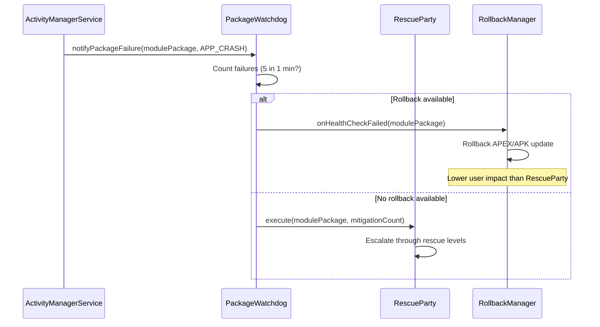

The key principle is **least user impact**: rollback (restoring the previous
version) is always preferred over settings resets or factory reset because
it is less disruptive.

---

## 20.27 ClipboardService

The `ClipboardService` manages the system clipboard -- the mechanism that
enables copy-and-paste across applications. What seems like a trivial
feature involves deep security considerations: cross-app data leakage,
content URI permission grants, multi-user isolation, virtual device
clipboard silos, automatic clipboard clearing, and access notification
toasts.

> **Source:**
> `frameworks/base/services/core/java/com/android/server/clipboard/ClipboardService.java`

### 20.27.1 Architecture Overview

ClipboardService extends `SystemService` and publishes two interfaces on
startup:

```java
// ClipboardService.java, line 251-254
@Override
public void onStart() {
    publishBinderService(Context.CLIPBOARD_SERVICE, new ClipboardImpl());
    LocalServices.addService(ClipboardManagerInternal.class, new ClipboardInternalImpl());
}
```

The dual interface follows the standard `system_server` pattern:
`ClipboardImpl` (Binder) for app-facing IPC, and `ClipboardInternalImpl`
(local) for intra-process use by other system services.

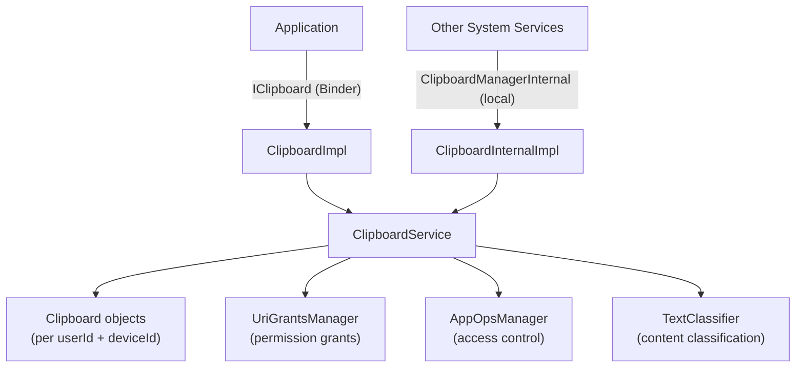

### 20.27.2 The Clipboard Data Model

Clipboard data is stored in `Clipboard` objects indexed by a composite key
of `(userId, deviceId)`:

```java
// ClipboardService.java, line 182
@GuardedBy("mLock")
private final SparseArrayMap<Integer, Clipboard> mClipboards = new SparseArrayMap<>();
```

Each `Clipboard` instance holds:

| Field | Type | Purpose |
|-------|------|---------|
| `primaryClip` | `ClipData` | The actual clipboard content |
| `primaryClipUid` | `int` | UID of the app that set the clip |
| `mPrimaryClipPackage` | `String` | Package that set the clip |
| `primaryClipListeners` | `RemoteCallbackList` | Registered change listeners |
| `mNotifiedUids` | `SparseBooleanArray` | UIDs already shown access toast |
| `mNotifiedTextClassifierUids` | `SparseBooleanArray` | UIDs already sent to classifier |
| `mTextClassifier` | `TextClassifier` | Session for content annotation |

`ClipData` itself is the framework's representation of clipboard content. It
wraps a `ClipDescription` (MIME types) and one or more `ClipData.Item`
objects. Each item can carry plain text, HTML text, an `Intent`, or a
content `Uri`. The MIME types supported include:

- `MIMETYPE_TEXT_PLAIN` -- simple text
- `MIMETYPE_TEXT_HTML` -- HTML markup
- `MIMETYPE_TEXT_INTENT` -- an Intent
- `MIMETYPE_TEXT_URILIST` -- content URIs
- `MIMETYPE_APPLICATION_SHORTCUT` -- launcher shortcuts
- `MIMETYPE_APPLICATION_ACTIVITY` -- activity references
- `MIMETYPE_APPLICATION_TASK` -- task references

### 20.27.3 Cross-App Security Restrictions

The clipboard is a high-value attack vector because any app can read data
placed by any other app. Android enforces several layers of protection:

**AppOps gating.** Every read and write goes through `AppOpsManager`:

```java
// clipboardAccessAllowed checks both OP_READ_CLIPBOARD and OP_WRITE_CLIPBOARD
if (!clipboardAccessAllowed(
        AppOpsManager.OP_READ_CLIPBOARD, pkg, attributionTag,
        intendingUid, intendingUserId, intendingDeviceId)) {
    return null;
}
```

**Content URI permission grants.** When a `ClipData` contains a content URI,
the clipboard service grants temporary read permissions to the reading app
via `UriGrantsManager`. This is the `addActiveOwnerLocked()` call that runs
when `getPrimaryClip()` is invoked.

**User isolation.** Each Android user gets a separate clipboard namespace.
The `getIntendingUserId()` method validates cross-user access through
`ActivityManagerInternal.handleIncomingUser()`, requiring either
`INTERACT_ACROSS_USERS_FULL` or `INTERACT_ACROSS_USERS` permission.

**Device lock check.** If the user profile is locked (device locked, FBE
credential-encrypted storage not yet available), clipboard reads return null:

```java
if (isDeviceLocked(intendingUserId, deviceId)) {
    return null;
}
```

### 20.27.4 Clipboard Access Notification

Starting with Android 12, the system shows a toast notification whenever an
app reads the clipboard. This is the "Pasted from <app>" message users see:

```java
// ClipboardService.java, line 161
private static final long ACCESS_NOTIFICATION_SUPPRESSION_TIMEOUT_MILLIS = 1000L;
```

The notification is suppressed for 1 second after a previous notification for
the same UID, preventing toast spam when apps read the clipboard multiple
times rapidly. The feature is controlled by a per-user setting
(`CLIPBOARD_SHOW_ACCESS_NOTIFICATIONS`) and a server-side `DeviceConfig` flag.

The `showAccessNotificationLocked()` method also sends the clipboard content
to the `TextClassifier` for content-type logging via
`notifyTextClassifierLocked()`, which classifies up to
`mMaxClassificationLength` (default 400) characters.

### 20.27.5 Automatic Clipboard Clearing

To reduce the window during which sensitive data (passwords, credit cards)
sits on the clipboard, the service implements auto-clear:

```java
// ClipboardService.java, line 139
public static final long DEFAULT_CLIPBOARD_TIMEOUT_MILLIS = 3600000; // 1 hour
```

When `setPrimaryClip()` is called, the service schedules a delayed
`ClipboardClearHandler.MSG_CLEAR` message. The timeout (default 1 hour)
and the feature toggle are both controlled via `DeviceConfig`:

```java
if (DeviceConfig.getBoolean(DeviceConfig.NAMESPACE_CLIPBOARD,
        PROPERTY_AUTO_CLEAR_ENABLED, true)) {
    mClipboardClearHandler.sendMessageDelayed(clearMessage,
            getTimeoutForAutoClear());
}
```

If the user pastes the content before the timeout, a new timer is
rescheduled from the paste time, giving the user another full timeout window.

### 20.27.6 Virtual Device Clipboard Silos

With the introduction of virtual devices (CDM -- Companion Device Manager),
clipboard isolation becomes more complex. Apps running on a virtual device
can have a separate clipboard from the default device:

```java
// getIntendingDeviceId() determines which clipboard an app should access
private int getIntendingDeviceId(int requestedDeviceId, int uid) {
    if (mVdmInternal == null) {
        return DEVICE_ID_DEFAULT;
    }
    ArraySet<Integer> virtualDeviceIds = mVdmInternal.getDeviceIdsForUid(uid);
    // ...
}
```

The policy is controlled per virtual device via
`VirtualDeviceManager.getDevicePolicy(deviceId, POLICY_TYPE_CLIPBOARD)`.
When `DEVICE_POLICY_CUSTOM` is set, the virtual device shares the default
clipboard. Otherwise, it gets its own isolated clipboard. When a virtual
device is closed, the `VirtualDeviceListener` callback removes its clipboard.

```mermaid
graph LR
    subgraph "Default Device"
        DC["Clipboard<br/>(userId=0, deviceId=DEFAULT)"]
    end
    subgraph "Virtual Device 1"
        VC1["Clipboard<br/>(userId=0, deviceId=1)"]
    end
    subgraph "Virtual Device 2 (shared)"
        VC2["Uses Default Clipboard<br/>(DEVICE_POLICY_CUSTOM)"]
    end
    VC2 -.->|"shares"| DC
```

### 20.27.7 Emulator and ARC Integration

ClipboardService detects the execution environment at construction time and
installs an appropriate clipboard monitor:

```java
// ClipboardService.java, line 223-238
if (Build.IS_EMULATOR) {
    mClipboardMonitor = new EmulatorClipboardMonitor(/* callback */);
} else if (Build.IS_ARC) {
    mClipboardMonitor = new ArcClipboardMonitor(/* callback */);
} else {
    mClipboardMonitor = (clip) -> {};
}
```

The `EmulatorClipboardMonitor` syncs the clipboard between the Android
emulator and the host machine. `ArcClipboardMonitor` enables clipboard
sharing between the ChromeOS host and the Android container in ARC
(Android Runtime for Chrome).

---

## 20.28 DownloadManager and DownloadProvider

The download subsystem provides a system-level download service that handles
background HTTP downloads with notification integration, retry logic, network
constraint awareness, and MediaStore integration. Unlike most system
services, the download infrastructure is split between a system API
(`DownloadManager`) and a separate ContentProvider process
(`DownloadProvider`).

> **Source root:**
> `packages/providers/DownloadProvider/src/com/android/providers/downloads/`

### 20.28.1 Architecture

```mermaid
graph TD
    App["Application"] -->|"DownloadManager API"| DM["DownloadManager"]
    DM -->|"ContentResolver.insert()"| DP["DownloadProvider<br/>(ContentProvider)"]
    DP -->|"schedules"| JS["DownloadJobService<br/>(JobScheduler)"]
    JS -->|"spawns"| DT["DownloadThread"]
    DT -->|"HTTP request"| Net["Network"]
    DT -->|"progress updates"| DP
    DT -->|"notifications"| DN["DownloadNotifier"]
    DT -->|"media scanning"| DS["DownloadScanner"]
    DP -->|"SQLite"| DB["downloads.db"]

    style DP fill:#f9f,stroke:#333
    style DT fill:#bbf,stroke:#333
```

The key components are:

| Component | File | Role |
|-----------|------|------|
| `DownloadProvider` | `DownloadProvider.java` | ContentProvider managing the downloads database |
| `DownloadJobService` | `DownloadJobService.java` | JobService hosting download execution threads |
| `DownloadThread` | `DownloadThread.java` | Performs the actual HTTP download on a background thread |
| `DownloadNotifier` | `DownloadNotifier.java` | Manages download progress/completion notifications |
| `DownloadInfo` | `DownloadInfo.java` | In-memory representation of a download's state |
| `DownloadScanner` | `DownloadScanner.java` | Triggers MediaStore scanning for completed downloads |
| `Constants` | `Constants.java` | Retry limits, timeout values, other constants |

### 20.28.2 The Download Database

DownloadProvider uses a SQLite database (`downloads.db`, version 114) with a
single `downloads` table. The database tracks every download's URI, file
path, status, bytes downloaded, MIME type, notification visibility, retry
count, ETag, and more.

```java
// DownloadProvider.java, line 97-101
private static final String DB_NAME = "downloads.db";
private static final int DB_VERSION = 114;
private static final String DB_TABLE = "downloads";
private static final int IDLE_CONNECTION_TIMEOUT_MS = 30000;
```

URI matching routes requests through a standard `UriMatcher`:

| URI Pattern | Constant | Description |
|-------------|----------|-------------|
| `downloads/my_downloads` | `MY_DOWNLOADS` | Downloads belonging to calling UID |
| `downloads/my_downloads/#` | `MY_DOWNLOADS_ID` | Individual download by calling UID |
| `downloads/all_downloads` | `ALL_DOWNLOADS` | All downloads (requires permission) |
| `downloads/all_downloads/#` | `ALL_DOWNLOADS_ID` | Individual download (any UID) |

### 20.28.3 Download Execution with JobScheduler

Each download is executed as a job in `DownloadJobService`. When a new
download is inserted into the provider, a job is scheduled. The service
maintains a `SparseArray<DownloadThread>` of active threads:

```java
// DownloadJobService.java, line 57-76
@Override
public boolean onStartJob(JobParameters params) {
    final int id = params.getJobId();
    final DownloadInfo info = DownloadInfo.queryDownloadInfo(this, id);
    if (info == null) {
        return false;
    }
    final DownloadThread thread;
    synchronized (mActiveThreads) {
        if (mActiveThreads.indexOfKey(id) >= 0) {
            return false; // Already running
        }
        thread = new DownloadThread(this, params, info);
        mActiveThreads.put(id, thread);
    }
    thread.start();
    return true;
}
```

The job timeout is 10 minutes (standard JobScheduler limit). If a download
does not finish, the job is rescheduled and the download resumes using HTTP
Range headers and the stored ETag.

### 20.28.4 Retry Logic

`DownloadThread` implements a retry mechanism with exponential backoff:

```java
// Constants.java, line 143-155
public static final int MAX_RETRIES = 5;
public static final int MIN_RETRY_AFTER = 30;      // 30 seconds
public static final int MAX_RETRY_AFTER = 24 * 60 * 60; // 24 hours
```

When an error occurs, the thread distinguishes between retryable and
permanent failures:

```mermaid
flowchart TD
    E["Error occurs"] --> R{"Is status retryable?"}
    R -->|"Yes"| P{"Made progress?"}
    P -->|"Yes"| Reset["Reset fail count to 1"]
    P -->|"No"| Inc["Increment fail count"]
    Reset --> C{"numFailed < MAX_RETRIES (5)?"}
    Inc --> C
    C -->|"Yes"| Net{"Network available?"}
    Net -->|"Yes"| Retry["STATUS_WAITING_TO_RETRY<br/>(backoff delay)"]
    Net -->|"No"| Wait["STATUS_WAITING_FOR_NETWORK"]
    C -->|"No"| Fail["Permanent failure"]
    R -->|"No"| Fail
```

The "made progress" check is key: if any data was transferred during the
current attempt, the failure counter resets to 1. This prevents a large
file download from failing permanently due to intermittent connectivity.

### 20.28.5 Notification Integration

`DownloadNotifier` manages three notification channels:

| Channel | Importance | Usage |
|---------|-----------|-------|
| `active` | `IMPORTANCE_MIN` | Downloads in progress |
| `waiting` | `IMPORTANCE_DEFAULT` | Downloads waiting for network |
| `complete` | `IMPORTANCE_DEFAULT` | Completed or failed downloads |

Download visibility is controlled by the `VISIBILITY_*` constants set in
the `DownloadManager.Request`:

- `VISIBILITY_VISIBLE` -- show notification while running
- `VISIBILITY_VISIBLE_NOTIFY_COMPLETED` -- show while running and after completion
- `VISIBILITY_VISIBLE_NOTIFY_ONLY_COMPLETION` -- show only on completion
- `VISIBILITY_HIDDEN` -- no notification (requires `DOWNLOAD_WITHOUT_NOTIFICATION`)

The notifier tracks active download speeds in a `LongSparseLongArray` to
calculate and display estimated time remaining.

### 20.28.6 Network Awareness

`DownloadThread` uses the caller's default network rather than the system
default, respecting per-UID network restrictions:

```java
// DownloadThread.java, line 300-304
mNetwork = mSystemFacade.getNetwork(mParams);
if (mNetwork == null) {
    throw new StopRequestException(STATUS_WAITING_FOR_NETWORK,
            "No network associated with requesting UID");
}
```

The thread registers a `NetworkPolicyListener` to react to policy changes
(metered network restrictions, data saver mode) mid-download. Traffic is
tagged with the requesting UID for proper data accounting:

```java
TrafficStats.setThreadStatsTagDownload();
TrafficStats.setThreadStatsUid(mInfo.mUid);
```

---

## 20.29 Try It

### 20.29.1 Listing All System Services

Use `service list` to see all registered Binder services:

```bash
adb shell service list
```

This produces output like:

```
Found 290 services:
0	DockObserver: [android.os.IBinder]
1	SurfaceFlinger: [android.ui.ISurfaceComposer]
2	accessibility: [android.view.accessibility.IAccessibilityManager]
3	account: [android.accounts.IAccountManager]
4	activity: [android.app.IActivityManager]
5	activity_task: [android.app.IActivityTaskManager]
...
```

Count the total:

```bash
adb shell service list | head -1
```

### 20.29.2 Inspecting system_server Process

View basic process information:

```bash
# Process ID
adb shell pidof system_server

# Thread count
adb shell ls /proc/$(adb shell pidof system_server)/task | wc -l

# Process status
adb shell cat /proc/$(adb shell pidof system_server)/status | head -20

# Memory usage
adb shell dumpsys meminfo system_server
```

### 20.29.3 Dumpsys Commands

`dumpsys` is the primary tool for inspecting service state. Each service
implements a `dump()` method:

```bash
# Dump all services (very long!)
adb shell dumpsys

# Dump a specific service
adb shell dumpsys activity
adb shell dumpsys window
adb shell dumpsys package
adb shell dumpsys power
adb shell dumpsys notification
adb shell dumpsys audio
adb shell dumpsys connectivity
adb shell dumpsys display
adb shell dumpsys input
adb shell dumpsys alarm
adb shell dumpsys jobscheduler
adb shell dumpsys battery
adb shell dumpsys usagestats
adb shell dumpsys deviceidle

# Dump the SystemServer dumper for internal state
adb shell dumpsys system_server_dumper
adb shell dumpsys system_server_dumper --list
adb shell dumpsys system_server_dumper --name SystemServer
adb shell dumpsys system_server_dumper --name Watchdog
```

### 20.29.4 Inspecting Boot Phases

Boot phase transitions are logged and can be traced:

```bash
# View boot timing events
adb shell logcat -b events | grep boot_progress

# View SystemServer timing tags
adb shell logcat -s SystemServerTiming

# Full boot tracing with Perfetto
adb shell perfetto -o /data/misc/perfetto-traces/boot.pb \
    -c - <<EOF
buffers: { size_kb: 65536 }
data_sources: {
    config {
        name: "android.log"
        android_log_config {
            log_ids: LID_EVENTS
        }
    }
}
duration_ms: 60000
EOF
```

### 20.29.5 Observing Service Start Order

The SystemServer logs each service start with timing information:

```bash
# Filter for service start messages
adb shell logcat -s SystemServer SystemServiceManager

# Look for specific boot phase transitions
adb shell logcat | grep -E "PHASE_|startBootPhase"
```

### 20.29.6 Watchdog Diagnostics

```bash
# Dump Watchdog state
adb shell dumpsys system_server_dumper --name Watchdog

# View Watchdog-related logs
adb shell logcat -s Watchdog

# Check for past Watchdog kills
adb shell logcat -b crash | grep -i watchdog

# View timeout history
adb shell cat /data/system/watchdog-timeout-history.txt
```

### 20.29.7 Thread Inspection

```bash
# List all system_server threads with names
adb shell ps -T -p $(adb shell pidof system_server)

# View specific named threads
adb shell ps -T -p $(adb shell pidof system_server) | grep -E \
    "android\.(display|anim|ui|fg|io|bg|perm)|Binder:|watchdog"

# Get Java thread dump (sends SIGQUIT)
adb shell kill -3 $(adb shell pidof system_server)
# Then check /data/anr/ for the trace file
adb shell ls -la /data/anr/
```

### 20.29.8 Service Dependencies and Boot Timing

```bash
# View how long each service took to start
adb shell logcat -s SystemServerTimingAsync SystemServerTiming | \
    grep -E "traceBegin|traceEnd"

# Check if a specific service is running
adb shell service check activity
adb shell service check window
adb shell service check package

# Call a service directly
adb shell service call activity 1  # IBinder.FIRST_CALL_TRANSACTION
```

### 20.29.9 Examining SystemServiceManager State

```bash
# Dump all registered system services
adb shell dumpsys system_server_dumper --name SystemServiceManager
```

This shows:

- All registered services and their classes
- Current boot phase
- Service start times
- Active user IDs

### 20.29.10 Monitoring Binder Thread Pool

```bash
# Check Binder thread usage
adb shell cat /proc/$(adb shell pidof system_server)/status | \
    grep Threads

# View Binder calls stats
adb shell dumpsys binder_calls_stats

# View specific Binder transaction information
adb shell cat /sys/kernel/debug/binder/proc/$(adb shell pidof system_server) \
    2>/dev/null | head -50
```

### 20.29.11 Forcing a Watchdog Timeout (Development Only)

On userdebug/eng builds, you can test the Watchdog by inducing a deadlock.
**WARNING: This will crash system_server and restart the runtime.**

```bash
# Reduce watchdog timeout (settings must be available)
adb shell settings put global watchdog_timeout_millis 10000

# Or use the debug property
adb shell setprop persist.sys.debug.watchdog_timeout 10
```

### 20.29.12 Tracing Service Startup with Perfetto

```bash
# Record a boot trace
adb shell setprop persist.debug.atrace.boottrace 1
adb shell setprop persist.traced.enable 1

# After reboot, pull the trace
adb pull /data/misc/perfetto-traces/boottrace.perfetto-trace

# Open in ui.perfetto.dev
```

The trace will show all the `TimingsTraceAndSlog` spans from SystemServer,
including every service start and boot phase transition, with precise
timestamps.

### 20.29.13 Simulating Boot Phases

You can watch boot phases progress in real time during a reboot:

```bash
# Reboot and immediately start capturing
adb reboot && sleep 5 && adb wait-for-device && \
    adb logcat -s SystemServiceManager | grep -i phase
```

Expected output sequence:

```
SystemServiceManager: Starting phase 100
SystemServiceManager: Starting phase 200
SystemServiceManager: Starting phase 480
SystemServiceManager: Starting phase 500
SystemServiceManager: Starting phase 520
SystemServiceManager: Starting phase 550
SystemServiceManager: Starting phase 600
SystemServiceManager: Starting phase 1000
```

### 20.29.14 Examining Service Registration

To see how a specific service is registered:

```bash
# Check if a service exists and get its interface descriptor
adb shell service check activity
adb shell service check window
adb shell service check package

# Get service debug info (PID, interface)
adb shell dumpsys -l
```

### 20.29.15 Monitoring Looper Statistics

```bash
# Dump looper statistics to see message processing times
adb shell dumpsys looper_stats

# This shows for each looper:
# - Message count
# - Total time
# - Max time
# - Exception count
```

This data comes from the `LooperStatsService` started in
`startCoreServices()` and is invaluable for identifying which messages
are slow on which threads.

---

## Summary

The `system_server` process is the largest and most complex process in
Android. It is forked from Zygote and initializes over 100 Java system
services through a carefully ordered four-phase startup sequence:
bootstrap, core, other, and APEX services. Each service extends the
`SystemService` base class and receives lifecycle callbacks as the
system progresses through eight boot phases from
`PHASE_WAIT_FOR_DEFAULT_DISPLAY` (100) to `PHASE_BOOT_COMPLETED` (1000).

The threading model uses eight shared singleton threads (plus the main
looper and a pool of 31 Binder threads), each with a specific priority
level and purpose. The Watchdog monitors all critical threads every 15
seconds and kills `system_server` if any thread remains unresponsive for
60 seconds, triggering a runtime restart rather than leaving the device
frozen.

Service communication uses a dual-interface pattern: Binder services
for cross-process access from apps, and local services for efficient
intra-process access from other system services. The lock ordering
discipline, ThreadPriorityBooster, and LockGuard mechanisms prevent
deadlocks across the hundreds of interacting services.

Performance is optimized through parallel initialization via
`SystemServerInitThreadPool`, lazy singleton thread creation, Zygote
memory inheritance, and careful boot phase ordering. The APEX module
loading mechanism allows services to be delivered and updated through
mainline modules without modifying `SystemServer.java`.

Understanding `system_server` is essential for AOSP development because
virtually every framework API passes through it. Whether you are adding
a new system service, debugging a boot hang, optimizing startup time,
or investigating a Watchdog timeout, the concepts in this chapter --
service lifecycle, boot phases, threading model, Watchdog monitoring,
lock ordering, and the dual-interface communication pattern -- provide
the foundation for working effectively with the Android framework.

<!-- chapter:21-intent-system -->
# Chapter 21: Intent System Deep Dive

The Intent system is the central inter-component and inter-application messaging mechanism
in Android. Every activity launch, every broadcast delivery, every service binding, and
every content provider query ultimately flows through an Intent or an Intent-like
mechanism. This chapter dissects the full lifecycle of an Intent -- from construction
through resolution to delivery -- by examining the real AOSP source code that implements
it.

---

## 21.1 Intent Architecture

### 21.1.1 The Intent Object Model

An Intent is, at its core, a passive data structure -- a message envelope that describes
an operation to be performed. The class is defined in:

```
frameworks/base/core/java/android/content/Intent.java
```

The Javadoc in the source captures this precisely:

> "An intent is an abstract description of an operation to be performed. It can be used
> with startActivity to launch an Activity, broadcastIntent to send it to any interested
> BroadcastReceiver components, and startService or bindService to communicate with a
> background Service."

The Intent class itself is roughly 12,000 lines long, containing hundreds of standard
action constants, category constants, extra key definitions, and flag declarations. The
actual data carried by an individual Intent instance, however, fits into a compact set of
private fields (around line 8010 in the source):

```java
// frameworks/base/core/java/android/content/Intent.java, line ~8010
private String mAction;
private Uri mData;
private String mType;
private String mIdentifier;
private String mPackage;
private ComponentName mComponent;
private int mFlags;
private int mLocalFlags;
private int mExtendedFlags;
private ArraySet<String> mCategories;
private Bundle mExtras;
private Rect mSourceBounds;
private Intent mSelector;
private ClipData mClipData;
private int mContentUserHint = UserHandle.USER_CURRENT;
```

These fields partition into two tiers of importance.

**Primary fields** (used for resolution and matching):

| Field | Type | Purpose |
|-------|------|---------|
| `mAction` | `String` | The general action to perform (e.g., `ACTION_VIEW`) |
| `mData` | `Uri` | The data URI to operate on |
| `mType` | `String` | Explicit MIME type |
| `mComponent` | `ComponentName` | Explicit target component |
| `mCategories` | `ArraySet<String>` | Additional classification categories |
| `mPackage` | `String` | Restrict resolution to a specific package |
| `mIdentifier` | `String` | Unique identity for distinguishing otherwise-equal intents |

**Secondary fields** (metadata and payload):

| Field | Type | Purpose |
|-------|------|---------|
| `mExtras` | `Bundle` | Arbitrary key-value payload data |
| `mFlags` | `int` | Behavioral flags (activity launch mode, receiver flags) |
| `mSelector` | `Intent` | Alternate Intent used for resolution |
| `mClipData` | `ClipData` | Rich content attached to the Intent |
| `mSourceBounds` | `Rect` | Visual origin hint for transitions |

### 21.1.2 Intent Structure Diagram

```mermaid
classDiagram
    class Intent {
        -String mAction
        -Uri mData
        -String mType
        -String mIdentifier
        -String mPackage
        -ComponentName mComponent
        -int mFlags
        -int mLocalFlags
        -int mExtendedFlags
        -ArraySet~String~ mCategories
        -Bundle mExtras
        -Rect mSourceBounds
        -Intent mSelector
        -ClipData mClipData
        -int mContentUserHint
        +getAction() String
        +getData() Uri
        +getType() String
        +getComponent() ComponentName
        +getCategories() Set~String~
        +resolveType(ContentResolver) String
        +filterEquals(Intent) boolean
        +filterHashCode() int
        +setComponent(ComponentName) Intent
        +setAction(String) Intent
        +setData(Uri) Intent
        +setType(String) Intent
        +addCategory(String) Intent
        +putExtra(String, Object) Intent
        +setFlags(int) Intent
    }

    class IntentFilter {
        -int mPriority
        -int mOrder
        -ArraySet~String~ mActions
        -ArrayList~String~ mCategories
        -ArrayList~String~ mDataSchemes
        -ArrayList~PatternMatcher~ mDataSchemeSpecificParts
        -ArrayList~AuthorityEntry~ mDataAuthorities
        -ArrayList~PatternMatcher~ mDataPaths
        -ArrayList~String~ mDataTypes
        -int mVerifyState
        +matchAction(String) boolean
        +matchData(String, String, Uri) int
        +matchCategories(Set~String~) String
        +match(ContentResolver, Intent, boolean, String) int
        +addAction(String) void
        +addDataScheme(String) void
        +addDataAuthority(String, String) void
        +addDataPath(String, int) void
        +addDataType(String) void
        +addCategory(String) void
        +setPriority(int) void
    }

    class ResolveInfo {
        +ActivityInfo activityInfo
        +ServiceInfo serviceInfo
        +ProviderInfo providerInfo
        +IntentFilter filter
        +int priority
        +int preferredOrder
        +int match
        +UserHandle userHandle
        +boolean isInstantAppAvailable
    }

    class ComponentName {
        -String mPackage
        -String mClass
        +getPackageName() String
        +getClassName() String
        +flattenToString() String
    }

    Intent --> ComponentName : mComponent
    Intent --> Intent : mSelector
    IntentFilter --> "0..*" IntentFilter.AuthorityEntry : mDataAuthorities
    ResolveInfo --> IntentFilter : filter
    ResolveInfo --> ActivityInfo : activityInfo
    ResolveInfo --> ServiceInfo : serviceInfo
```

### 21.1.3 The Two Forms of Intents

The source code at line ~257 of `Intent.java` documents the two fundamental forms:

**Explicit Intents** have a specified component via `setComponent()` or `setClass()`.
When an explicit component is set, the system bypasses all resolution logic -- the named
component is used directly. This is the mechanism for intra-application navigation and
for targeting specific system services.

**Implicit Intents** have no component set. Instead, they carry enough information
(action, data, type, categories) for the system to determine which available component
is the best match. This is the mechanism for inter-application communication and for
leveraging the "late runtime binding" that the Intent documentation describes.

```mermaid
flowchart TD
    A[Intent Created] --> B{mComponent != null?}
    B -->|Yes| C[Explicit Intent]
    B -->|No| D[Implicit Intent]
    C --> E[Direct Component Delivery]
    D --> F[Intent Resolution]
    F --> G[PackageManager.queryIntentActivities]
    G --> H{Results count?}
    H -->|0| I[ActivityNotFoundException]
    H -->|1| J[Direct launch]
    H -->|>1| K[Chooser Dialog]
    E --> L[Component Receives Intent]
    J --> L
    K --> M[User Selects] --> L
```

### 21.1.4 The filterEquals Contract

A critical method on Intent is `filterEquals()`, defined around line 11969:

```java
// frameworks/base/core/java/android/content/Intent.java
public boolean filterEquals(Intent other) {
    if (other == null) {
        return false;
    }
    if (!Objects.equals(this.mAction, other.mAction)) return false;
    if (!Objects.equals(this.mData, other.mData)) return false;
    if (!Objects.equals(this.mType, other.mType)) return false;
    if (!Objects.equals(this.mIdentifier, other.mIdentifier)) return false;
    if (!Objects.equals(this.mPackage, other.mPackage)) return false;
    if (!Objects.equals(this.mComponent, other.mComponent)) return false;
    if (!Objects.equals(this.mCategories, other.mCategories)) return false;
    return true;
}
```

This method defines the identity of an Intent for purposes of:

- PendingIntent matching (two PendingIntents with filterEquals Intents share the same token)
- `FLAG_RECEIVER_REPLACE_PENDING` broadcast replacement
- `FilterComparison` wrapper used as HashMap keys

Note that `mExtras` is deliberately excluded. Two Intents that differ only in their
extras are considered the same Intent for resolution and PendingIntent purposes. This
is a common source of bugs, documented explicitly in the PendingIntent Javadoc.

### 21.1.5 Intent Flags

The Intent class defines flags in two categories, both encoded as bitmasks in `mFlags`.

**Activity flags** (bits 0-25, roughly) control launch behavior:

| Flag | Value | Effect |
|------|-------|--------|
| `FLAG_ACTIVITY_NEW_TASK` | `0x10000000` | Launch into a new task |
| `FLAG_ACTIVITY_CLEAR_TOP` | `0x04000000` | Clear activities above target in stack |
| `FLAG_ACTIVITY_SINGLE_TOP` | `0x20000000` | Reuse existing instance at top |
| `FLAG_ACTIVITY_NO_HISTORY` | `0x40000000` | Do not keep in history |
| `FLAG_ACTIVITY_CLEAR_TASK` | `0x00008000` | Clear task before launching |
| `FLAG_ACTIVITY_EXCLUDE_FROM_RECENTS` | `0x00800000` | Hide from Recents |
| `FLAG_ACTIVITY_FORWARD_RESULT` | `0x02000000` | Relay result to original caller |
| `FLAG_ACTIVITY_LAUNCH_ADJACENT` | `0x00001000` | Multi-window adjacent launch |

**Receiver flags** (bits 26-31, roughly) control broadcast behavior:

| Flag | Value | Effect |
|------|-------|--------|
| `FLAG_RECEIVER_REGISTERED_ONLY` | `0x40000000` | Only registered receivers |
| `FLAG_RECEIVER_REPLACE_PENDING` | `0x20000000` | Replace matching pending broadcasts |
| `FLAG_RECEIVER_FOREGROUND` | `0x10000000` | Deliver at foreground priority |
| `FLAG_RECEIVER_NO_ABORT` | `0x08000000` | Cannot abort ordered broadcast |
| `FLAG_RECEIVER_INCLUDE_BACKGROUND` | `0x01000000` | Include stopped/background apps |
| `FLAG_RECEIVER_EXCLUDE_BACKGROUND` | `0x00800000` | Exclude background apps |

**URI permission flags** (bits 0-2) grant temporary access:

| Flag | Value | Effect |
|------|-------|--------|
| `FLAG_GRANT_READ_URI_PERMISSION` | `0x00000001` | Grant read on data URI |
| `FLAG_GRANT_WRITE_URI_PERMISSION` | `0x00000002` | Grant write on data URI |
| `FLAG_GRANT_PERSISTABLE_URI_PERMISSION` | `0x00000040` | Permission survives reboot |
| `FLAG_GRANT_PREFIX_URI_PERMISSION` | `0x00000080` | Grant on URI prefix |

### 21.1.6 Intent Construction Patterns

The Intent class supports several construction patterns. Understanding these is crucial
because they affect which fields are populated and how resolution behaves.

**Direct constructors:**

```java
// Empty intent - requires setters
Intent intent = new Intent();

// Action-only intent
Intent intent = new Intent(Intent.ACTION_VIEW);

// Action + URI (implicit)
Intent intent = new Intent(Intent.ACTION_VIEW, Uri.parse("https://example.com"));

// Explicit class target
Intent intent = new Intent(context, TargetActivity.class);

// Explicit component via strings
Intent intent = new Intent();
intent.setClassName("com.example.app", "com.example.app.TargetActivity");
```

**The setData/setType mutual exclusion:**

A critical API subtlety: `setData()` clears the type, and `setType()` clears the data.
To set both, you must use `setDataAndType()`:

```java
// WRONG: type is cleared
intent.setData(Uri.parse("content://media/images/1"));
intent.setType("image/jpeg");  // This clears mData!

// CORRECT: both preserved
intent.setDataAndType(Uri.parse("content://media/images/1"), "image/jpeg");
```

The source code confirms this mutual exclusion pattern (around line 10440):

```java
public @NonNull Intent setData(@Nullable Uri data) {
    mData = data;
    mType = null;   // Type cleared!
    return this;
}

public @NonNull Intent setType(@Nullable String type) {
    mData = null;   // Data cleared!
    mType = type;
    return this;
}

public @NonNull Intent setDataAndType(@Nullable Uri data, @Nullable String type) {
    mData = data;
    mType = type;   // Both preserved
    return this;
}
```

### 21.1.7 The Selector Mechanism

The `mSelector` field (line 8024) provides a powerful but rarely used indirection
mechanism. When a selector is set, the system uses the selector Intent for resolution
instead of the main Intent. However, the main Intent's identity (for `filterEquals`)
remains based on the main Intent, not the selector.

From the source (line ~10590):

```java
// Intent.java
public void setSelector(@Nullable Intent selector) {
    if (selector == this) {
        throw new IllegalArgumentException(
                "Intent being set as a selector of itself");
    }
    if (selector != null && mPackage != null) {
        throw new IllegalArgumentException(
                "Can't set selector when package name is already set");
    }
    mSelector = selector;
}
```

Use case: The `CATEGORY_APP_BROWSER` intent uses a selector to target the browser's
launcher activity specifically:

```java
Intent browserIntent = new Intent(Intent.ACTION_MAIN);
Intent selector = new Intent(Intent.ACTION_MAIN);
selector.addCategory(Intent.CATEGORY_APP_BROWSER);
browserIntent.setSelector(selector);
startActivity(browserIntent);
```

This launches the browser via its MAIN/LAUNCHER entry point rather than a VIEW intent,
avoiding task confusion if the user has previously launched the browser normally.

### 21.1.8 ClipData and URI Permission Grants

The `mClipData` field (line 8025) serves a dual purpose: carrying rich content and
enabling URI permission grants on multiple URIs. When `FLAG_GRANT_READ_URI_PERMISSION`
or `FLAG_GRANT_WRITE_URI_PERMISSION` is set, the grant applies to both the main `mData`
URI and all URIs in the ClipData items.

From the source documentation (line ~10633):

> "The main feature of using this over the extras for data is that
> FLAG_GRANT_READ_URI_PERMISSION and FLAG_GRANT_WRITE_URI_PERMISSION will operate on
> any URI items included in the clip data."

This is essential for the `ACTION_SEND_MULTIPLE` pattern where an app shares multiple
content URIs:

```java
Intent shareIntent = new Intent(Intent.ACTION_SEND_MULTIPLE);
shareIntent.setType("image/*");
shareIntent.addFlags(Intent.FLAG_GRANT_READ_URI_PERMISSION);

ArrayList<Uri> imageUris = new ArrayList<>();
imageUris.add(uri1);
imageUris.add(uri2);
imageUris.add(uri3);
shareIntent.putParcelableArrayListExtra(Intent.EXTRA_STREAM, imageUris);

// ClipData ensures URI permissions are granted for all URIs
ClipData clip = ClipData.newUri(resolver, "images", uri1);
for (int i = 1; i < imageUris.size(); i++) {
    clip.addItem(new ClipData.Item(imageUris.get(i)));
}
shareIntent.setClipData(clip);
```

### 21.1.9 Intent Copy Modes

The Intent class defines three copy modes (line ~8033):

```java
private static final int COPY_MODE_ALL = 0;      // Full copy
private static final int COPY_MODE_FILTER = 1;    // Only filter-relevant fields
private static final int COPY_MODE_HISTORY = 2;   // All except extras/clipdata
```

`COPY_MODE_FILTER` creates a "stripped" Intent containing only the fields used for
matching: action, data, type, identifier, package, component, and categories. Flags,
extras, ClipData, and source bounds are excluded. This mode is used when the system
needs to store an Intent for matching purposes without the overhead of the payload.

`COPY_MODE_HISTORY` is similar to a full copy but replaces the extras with a
`Bundle.STRIPPED` sentinel if they are non-empty. This is used for historical records
and debugging dumps where the full extra data is not needed.

### 21.1.10 Standard Actions Deep Dive

The Intent class defines over 100 standard actions. They are grouped by purpose:

**Activity Actions** (launched with `startActivity()`):

| Action | String Value | Purpose |
|--------|-------------|---------|
| `ACTION_MAIN` | `android.intent.action.MAIN` | Main entry point |
| `ACTION_VIEW` | `android.intent.action.VIEW` | Display data |
| `ACTION_EDIT` | `android.intent.action.EDIT` | Edit data |
| `ACTION_PICK` | `android.intent.action.PICK` | Select an item |
| `ACTION_CHOOSER` | `android.intent.action.CHOOSER` | Show chooser dialog |
| `ACTION_GET_CONTENT` | `android.intent.action.GET_CONTENT` | Get content by type |
| `ACTION_SEND` | `android.intent.action.SEND` | Share content |
| `ACTION_SENDTO` | `android.intent.action.SENDTO` | Send to specific recipient |
| `ACTION_DIAL` | `android.intent.action.DIAL` | Show dialer |
| `ACTION_CALL` | `android.intent.action.CALL` | Place phone call |
| `ACTION_INSERT` | `android.intent.action.INSERT` | Insert new data |
| `ACTION_DELETE` | `android.intent.action.DELETE` | Delete data |
| `ACTION_SEARCH` | `android.intent.action.SEARCH` | Perform search |
| `ACTION_WEB_SEARCH` | `android.intent.action.WEB_SEARCH` | Web search |
| `ACTION_QUICK_VIEW` | `android.intent.action.QUICK_VIEW` | Preview data |
| `ACTION_INSERT_OR_EDIT` | `android.intent.action.INSERT_OR_EDIT` | Insert or edit |

**Broadcast Actions** (delivered via `sendBroadcast()`):

| Action | String Value | Protected? |
|--------|-------------|-----------|
| `ACTION_BOOT_COMPLETED` | `android.intent.action.BOOT_COMPLETED` | Yes |
| `ACTION_SHUTDOWN` | `android.intent.action.ACTION_SHUTDOWN` | Yes |
| `ACTION_TIME_TICK` | `android.intent.action.TIME_TICK` | Yes |
| `ACTION_TIME_CHANGED` | `android.intent.action.TIME_SET` | Yes |
| `ACTION_TIMEZONE_CHANGED` | `android.intent.action.TIMEZONE_CHANGED` | Yes |
| `ACTION_BATTERY_CHANGED` | `android.intent.action.BATTERY_CHANGED` | Yes |
| `ACTION_POWER_CONNECTED` | `android.intent.action.ACTION_POWER_CONNECTED` | Yes |
| `ACTION_PACKAGE_ADDED` | `android.intent.action.PACKAGE_ADDED` | Yes |
| `ACTION_PACKAGE_REMOVED` | `android.intent.action.PACKAGE_REMOVED` | Yes |
| `ACTION_SCREEN_ON` | `android.intent.action.SCREEN_ON` | Yes |
| `ACTION_SCREEN_OFF` | `android.intent.action.SCREEN_OFF` | Yes |
| `ACTION_LOCALE_CHANGED` | `android.intent.action.LOCALE_CHANGED` | Yes |

**Standard Categories:**

| Category | String Value | Purpose |
|----------|-------------|---------|
| `CATEGORY_DEFAULT` | `android.intent.category.DEFAULT` | Default for startActivity |
| `CATEGORY_BROWSABLE` | `android.intent.category.BROWSABLE` | Can be opened from browser |
| `CATEGORY_LAUNCHER` | `android.intent.category.LAUNCHER` | Show in app launcher |
| `CATEGORY_HOME` | `android.intent.category.HOME` | Home screen replacement |
| `CATEGORY_ALTERNATIVE` | `android.intent.category.ALTERNATIVE` | Alternative action |
| `CATEGORY_TAB` | `android.intent.category.TAB` | Tab UI |
| `CATEGORY_INFO` | `android.intent.category.INFO` | Information about package |
| `CATEGORY_PREFERENCE` | `android.intent.category.PREFERENCE` | Preferences screen |
| `CATEGORY_CAR_DOCK` | `android.intent.category.CAR_DOCK` | Car dock activity |
| `CATEGORY_DESK_DOCK` | `android.intent.category.DESK_DOCK` | Desk dock activity |
| `CATEGORY_APP_BROWSER` | `android.intent.category.APP_BROWSER` | Browser app |
| `CATEGORY_APP_EMAIL` | `android.intent.category.APP_EMAIL` | Email app |
| `CATEGORY_APP_MAPS` | `android.intent.category.APP_MAPS` | Maps app |
| `CATEGORY_APP_MESSAGING` | `android.intent.category.APP_MESSAGING` | Messaging app |
| `CATEGORY_APP_MUSIC` | `android.intent.category.APP_MUSIC` | Music app |
| `CATEGORY_APP_CALENDAR` | `android.intent.category.APP_CALENDAR` | Calendar app |
| `CATEGORY_APP_CONTACTS` | `android.intent.category.APP_CONTACTS` | Contacts app |
| `CATEGORY_APP_GALLERY` | `android.intent.category.APP_GALLERY` | Gallery app |

---

## 21.2 Intent Resolution

Intent resolution is the process of mapping an implicit Intent to one or more concrete
components that can handle it. The system performs this resolution by comparing the
Intent's attributes against the `<intent-filter>` declarations in installed packages
and against dynamically registered receivers.

### 21.2.1 Resolution Architecture

The resolution machinery lives in the PackageManagerService and its helper classes:

```
frameworks/base/services/core/java/com/android/server/pm/resolution/ComponentResolverBase.java
frameworks/base/services/core/java/com/android/server/pm/resolution/ComponentResolver.java
frameworks/base/services/core/java/com/android/server/pm/resolution/ComponentResolverApi.java
```

`ComponentResolverBase` maintains four specialized resolvers, one per component type:

```java
// frameworks/base/services/core/java/com/android/server/pm/resolution/ComponentResolverBase.java
protected ComponentResolver.ActivityIntentResolver mActivities;
protected ComponentResolver.ProviderIntentResolver mProviders;
protected ComponentResolver.ReceiverIntentResolver mReceivers;
protected ComponentResolver.ServiceIntentResolver mServices;
protected ArrayMap<String, ParsedProvider> mProvidersByAuthority;
```

Each resolver indexes the IntentFilters of all installed components of that type. When a
resolution query arrives, the appropriate resolver performs the matching.

```mermaid
flowchart TD
    A[Application calls startActivity/sendBroadcast/bindService] --> B[ActivityManagerService / PackageManagerService]
    B --> C{Intent has Component?}
    C -->|Yes: Explicit| D[Direct lookup by ComponentName]
    C -->|No: Implicit| E[ComponentResolverBase]
    E --> F{Target type?}
    F -->|Activity| G[ActivityIntentResolver.queryIntent]
    F -->|Receiver| H[ReceiverIntentResolver.queryIntent]
    F -->|Service| I[ServiceIntentResolver.queryIntent]
    F -->|Provider| J[ProviderIntentResolver.queryIntent]
    G --> K[Match against all registered IntentFilters]
    H --> K
    I --> K
    J --> K
    K --> L[Build List of ResolveInfo]
    L --> M[Apply filtering: permissions, visibility, user state]
    M --> N[Sort by priority, preferredOrder, match quality]
    N --> O[Return results]
    D --> O
```

### 21.2.2 Explicit Intent Resolution

Explicit resolution is trivial. When `mComponent` is set on an Intent, the system
performs a direct lookup:

```java
// ComponentResolverBase.java
public boolean componentExists(@NonNull ComponentName componentName) {
    ParsedMainComponent component = mActivities.mActivities.get(componentName);
    if (component != null) return true;
    component = mReceivers.mActivities.get(componentName);
    if (component != null) return true;
    component = mServices.mServices.get(componentName);
    if (component != null) return true;
    return mProviders.mProviders.get(componentName) != null;
}
```

This is an O(1) HashMap lookup. No filter matching occurs. The component must exist,
be enabled, be exported (or share the same UID as the caller), and the caller must
have any required permissions.

### 21.2.3 Implicit Intent Resolution: The Three Tests

Implicit resolution matches an Intent against every IntentFilter registered for the
relevant component type. The matching algorithm from `IntentFilter` (defined in
`frameworks/base/core/java/android/content/IntentFilter.java`) applies three tests
in sequence. All three must pass for a match.

```mermaid
flowchart TD
    A[IntentFilter.match] --> B[Test 1: Action Match]
    B -->|Fail| C[NO_MATCH_ACTION: -3]
    B -->|Pass| D[Test 2: Data Match]
    D -->|Fail type| E[NO_MATCH_TYPE: -1]
    D -->|Fail data| F[NO_MATCH_DATA: -2]
    D -->|Pass| G[Test 3: Category Match]
    G -->|Fail| H[NO_MATCH_CATEGORY: -4]
    G -->|Pass| I[Match Success]
    I --> J[Return MATCH_CATEGORY_xxx + MATCH_ADJUSTMENT_NORMAL]
```

**Test 1: Action Match** (`matchAction()`):

The Intent's action must be listed in the filter's action set. If the filter specifies
no actions, the match always fails. If the Intent's action is null, modern Android
(targeting V+) blocks the match via the `BLOCK_NULL_ACTION_INTENTS` compatibility change.

```java
// IntentFilter.java
public final boolean matchAction(String action) {
    return matchAction(action, false, null);
}

private boolean matchAction(String action, boolean wildcardSupported,
        @Nullable Collection<String> ignoreActions) {
    if (wildcardSupported && WILDCARD.equals(action)) {
        // Wildcard matches any action in the filter
        ...
        return !mActions.isEmpty();
    }
    if (ignoreActions != null && ignoreActions.contains(action)) {
        return false;
    }
    return hasAction(action);
}
```

**Test 2: Data Match** (`matchData()`):

The data match is the most complex test, evaluating the Intent's MIME type, URI scheme,
authority, and path against the filter's data specifications. The method returns a match
quality constant that encodes how specific the match was:

| Constant | Value | Meaning |
|----------|-------|---------|
| `MATCH_CATEGORY_EMPTY` | `0x0100000` | No data specification |
| `MATCH_CATEGORY_SCHEME` | `0x0200000` | Scheme matched |
| `MATCH_CATEGORY_HOST` | `0x0300000` | Scheme + host matched |
| `MATCH_CATEGORY_PORT` | `0x0400000` | Scheme + host + port matched |
| `MATCH_CATEGORY_PATH` | `0x0500000` | Full URI matched |
| `MATCH_CATEGORY_SCHEME_SPECIFIC_PART` | `0x0580000` | Scheme + SSP matched |
| `MATCH_CATEGORY_TYPE` | `0x0600000` | MIME type matched |

Higher values indicate more specific matches. The `MATCH_ADJUSTMENT_NORMAL` value
(`0x8000`) is added to successful matches as a quality baseline.

The data matching logic from `IntentFilter.matchData()` (line ~1742) follows a
hierarchical evaluation:

```mermaid
flowchart TD
    A[matchData: type, scheme, data] --> B{Filter has schemes?}
    B -->|No| C{scheme is content:/file:/empty?}
    C -->|No| D[NO_MATCH_DATA]
    C -->|Yes| E[Continue to type check]
    B -->|Yes| F{scheme in filter's schemes?}
    F -->|No| D
    F -->|Yes| G[MATCH_CATEGORY_SCHEME]
    G --> H{Filter has SSPs?}
    H -->|Yes| I{SSP matches?}
    I -->|Yes| J[MATCH_CATEGORY_SCHEME_SPECIFIC_PART]
    I -->|No| K[Try authority]
    H -->|No| K
    K --> L{Filter has authorities?}
    L -->|Yes| M{Authority matches?}
    M -->|No| D
    M -->|Yes| N{Filter has paths?}
    N -->|No| O[Use authority match level]
    N -->|Yes| P{Path matches?}
    P -->|No| D
    P -->|Yes| Q[MATCH_CATEGORY_PATH]
    L -->|No| R[Keep scheme match]
    E --> S{Filter has types?}
    J --> S
    O --> S
    Q --> S
    R --> S
    S -->|Yes| T{MIME type matches?}
    T -->|Yes| U[MATCH_CATEGORY_TYPE]
    T -->|No| V[NO_MATCH_TYPE]
    S -->|No| W{Intent has type?}
    W -->|Yes| V
    W -->|No| X[Return match + MATCH_ADJUSTMENT_NORMAL]
    U --> X
```

**Test 3: Category Match** (`matchCategories()`):

Every category in the Intent must appear in the filter. Extra categories in the filter
that are absent from the Intent do not cause failure. If the filter has no categories,
it only matches Intents with no categories.

```java
// IntentFilter.java, line ~1904
public final String matchCategories(Set<String> categories) {
    if (categories == null) {
        return null;  // Success: no categories required
    }
    Iterator<String> it = categories.iterator();
    if (mCategories == null) {
        return it.hasNext() ? it.next() : null;  // Fail if intent has categories
    }
    while (it.hasNext()) {
        final String category = it.next();
        if (!mCategories.contains(category)) {
            return category;  // Return the first unmatched category
        }
    }
    return null;  // Success: all categories matched
}
```

The critical implication: any activity that wants to be reachable via `startActivity()`
with an implicit Intent must declare `CATEGORY_DEFAULT` in its filter, because
`startActivity()` always adds `CATEGORY_DEFAULT` to the Intent.

### 21.2.4 ResolveInfo: The Resolution Result

The result of resolution is a `ResolveInfo` object (or a list of them), defined in:

```
frameworks/base/core/java/android/content/pm/ResolveInfo.java
```

Key fields:

```java
// ResolveInfo.java
public class ResolveInfo implements Parcelable {
    public ActivityInfo activityInfo;    // Non-null for activity/receiver matches
    public ServiceInfo serviceInfo;      // Non-null for service matches
    public ProviderInfo providerInfo;    // Non-null for provider matches
    public IntentFilter filter;          // The matched filter
    public int priority;                 // Declared priority
    public int preferredOrder;           // User preference order
    public int match;                    // Match quality constant
    public UserHandle userHandle;        // Cross-profile origin
    public boolean isInstantAppAvailable;
}
```

The `match` field encodes the quality of the match as a combination of
`MATCH_CATEGORY_MASK` and `MATCH_ADJUSTMENT_MASK`. When multiple components match, they
are sorted by: (1) priority (higher first), (2) preferredOrder (user preference), (3)
match quality (more specific matches first).

### 21.2.5 The Full match() Method

The complete `match()` method in IntentFilter (line ~2452) orchestrates all three tests
plus the newer extras matching:

```java
// IntentFilter.java, line ~2452
public final int match(String action, String type, String scheme,
        Uri data, Set<String> categories, String logTag, boolean supportWildcards,
        @Nullable Collection<String> ignoreActions, @Nullable Bundle extras) {
    // Test 1: Action
    if (action != null && !matchAction(action, supportWildcards, ignoreActions)) {
        return NO_MATCH_ACTION;
    }

    // Test 2: Data (type + scheme + authority + path)
    int dataMatch = matchData(type, scheme, data, supportWildcards);
    if (dataMatch < 0) {
        return dataMatch;
    }

    // Test 3: Categories
    String categoryMismatch = matchCategories(categories);
    if (categoryMismatch != null) {
        return NO_MATCH_CATEGORY;
    }

    // Test 4: Extras (newer addition, hidden API)
    String extraMismatch = matchExtras(extras);
    if (extraMismatch != null) {
        return NO_MATCH_EXTRAS;
    }

    return dataMatch;
}
```

Note the fourth test: extras matching. While still a hidden API, this allows system
services to create IntentFilters that match against specific extra values. The
`matchExtras()` method (line ~1941) checks that every key-value pair in the filter's
extras exists with an identical value in the Intent's extras.

The convenience method that most client code uses:

```java
// IntentFilter.java, line ~2386
public final int match(ContentResolver resolver, Intent intent,
        boolean resolve, String logTag) {
    String type = resolve ? intent.resolveType(resolver) : intent.getType();
    return match(intent.getAction(), type, intent.getScheme(),
                 intent.getData(), intent.getCategories(), logTag,
                 false /* supportWildcards */, null /* ignoreActions */,
                 intent.getExtras());
}
```

The `resolve` parameter is important: when true, the type is determined by calling
`intent.resolveType(resolver)`, which queries the ContentResolver for the MIME type
of the data URI if no explicit type is set. When false, only `intent.getType()` is
used (returns the explicitly-set type or null).

### 21.2.6 The Predicate API

IntentFilter also exposes a `Predicate<Intent>` API for functional-style matching:

```java
// IntentFilter.java, line ~2348
public @NonNull Predicate<Intent> asPredicate() {
    return i -> match(null, i, false, TAG) >= 0;
}

public @NonNull Predicate<Intent> asPredicateWithTypeResolution(
        @NonNull ContentResolver resolver) {
    return i -> match(resolver, i, true, TAG) >= 0;
}
```

This enables usage like:

```java
IntentFilter filter = new IntentFilter(Intent.ACTION_VIEW);
filter.addDataScheme("https");
filter.addDataAuthority("example.com", null);

List<Intent> matchingIntents = allIntents.stream()
    .filter(filter.asPredicate())
    .collect(Collectors.toList());
```

### 21.2.7 Resolution Priority and Ordering

When multiple components match an implicit Intent, the system must choose which one to
use (for activities) or determine delivery order (for broadcasts). The ordering algorithm
considers several factors:

```mermaid
flowchart TD
    A[Multiple matches found] --> B[Sort by priority descending]
    B --> C[Within same priority: sort by preferredOrder]
    C --> D[Within same preferredOrder: sort by match quality]
    D --> E[Within same match quality: sort by system vs third-party]
    E --> F{Single winner?}
    F -->|Yes| G[Launch directly]
    F -->|No| H{User has default set?}
    H -->|Yes| I[Launch default]
    H -->|No| J[Show chooser]
```

The system also considers:

- **Default browser**: When resolving web URLs, the user's default browser gets priority
- **Instant apps**: If `isInstantAppAvailable` is true in a ResolveInfo, the instant
  app version may be preferred
- **Auto-verified domains**: App Links with verified domains bypass the chooser entirely
  (see Section 21.5)
- **Cross-profile matches**: Matches from other profiles are included in the chooser
  with a work/personal badge

### 21.2.8 The CATEGORY_DEFAULT Deep Dive

The `CATEGORY_DEFAULT` requirement is one of the most important and most frequently
misunderstood aspects of intent resolution. Here is the exact behavior:

1. `Context.startActivity()` adds `CATEGORY_DEFAULT` to the Intent automatically
2. `PackageManager.queryIntentActivities()` does NOT add it automatically
3. `Context.sendBroadcast()` does NOT add it
4. `Context.startService()` does NOT add it

This means:

- Activities MUST declare `CATEGORY_DEFAULT` to be launchable via implicit intents
- Broadcast receivers do NOT need `CATEGORY_DEFAULT`
- Services do NOT need `CATEGORY_DEFAULT`

```xml
<!-- This activity is reachable via startActivity() with implicit intent -->
<activity android:name=".ReachableActivity" android:exported="true">
    <intent-filter>
        <action android:name="com.example.MY_ACTION" />
        <category android:name="android.intent.category.DEFAULT" />
    </intent-filter>
</activity>

<!-- This activity is NOT reachable via startActivity() with implicit intent -->
<!-- But IS findable via queryIntentActivities() -->
<activity android:name=".HiddenActivity" android:exported="true">
    <intent-filter>
        <action android:name="com.example.MY_ACTION" />
        <!-- No CATEGORY_DEFAULT! -->
    </intent-filter>
</activity>
```

### 21.2.9 The Chooser

When multiple activities match an implicit Intent and no default is set, the system
presents a Chooser dialog. Applications can also explicitly invoke the Chooser:

```java
Intent chooser = Intent.createChooser(targetIntent, "Share via");
startActivity(chooser);
```

The `ACTION_CHOOSER` wraps the original intent in `EXTRA_INTENT` and optionally adds
`EXTRA_INITIAL_INTENTS` for additional options. The Chooser is itself an Activity
(`com.android.internal.app.ChooserActivity`) that queries the PackageManager and
presents the results.

```mermaid
sequenceDiagram
    participant App as Application
    participant ATMS as ActivityTaskManagerService
    participant AS as ActivityStarter
    participant ATS as ActivityTaskSupervisor
    participant PMS as PackageManagerService
    participant CR as ComponentResolver
    participant Chooser as ChooserActivity

    App->>ATMS: startActivity(implicit intent)
    ATMS->>AS: execute()
    AS->>ATS: resolveIntent()
    ATS->>PMS: PackageManagerInternal.resolveIntent()
    PMS->>CR: queryActivities(intent, resolvedType, flags, userId)
    CR-->>PMS: List<ResolveInfo>
    PMS-->>ATS: ResolveInfo (or multiple)
    ATS-->>AS: ResolveInfo
    alt Single match
        AS->>App: Launch matched activity
    else Multiple matches, no default
        AS->>Chooser: Launch with EXTRA_INTENT
        Chooser->>PMS: queryIntentActivities()
        PMS-->>Chooser: Full list
        Chooser->>App: User picks, launches selected
    end
```

### 21.2.10 Scheme-Based Matching Details

A subtle but important behavior: when a filter declares no schemes, it will implicitly
match intents with no data URI, or with `content:` or `file:` scheme URIs. This
allows MIME-type-only filters to work with ContentProviders. From `matchData()`:

```java
// IntentFilter.java, line ~1802
} else {
    // Special case: match either an Intent with no data URI,
    // or with a scheme: URI.  This is to give a convenience for
    // the common case where you want to deal with data in a
    // content provider, which is done by type...
    if (scheme != null && !"".equals(scheme)
            && !"content".equals(scheme)
            && !"file".equals(scheme)) {
        return NO_MATCH_DATA;
    }
}
```

This means a filter with only `<data android:mimeType="image/*"/>` will match an Intent
with `data=content://media/images/1` and `type=image/jpeg`, even though no scheme is
declared in the filter.

---

## 21.3 PendingIntent

A PendingIntent is a token that represents a future Intent operation, maintained by the
system and executable by any party holding the token. It is one of the most security-
sensitive objects in the Android framework.

### 21.3.1 Source Location and Class Structure

```
frameworks/base/core/java/android/app/PendingIntent.java
```

The PendingIntent class wraps an `IIntentSender` binder token:

```java
// PendingIntent.java, line ~135
public final class PendingIntent implements Parcelable {
    private final IIntentSender mTarget;
    private IBinder mWhitelistToken;
    private @Nullable PendingIntentInfo mCachedInfo;
}
```

The actual pending intent state is maintained on the server side in
`ActivityManagerService`. The client-side `PendingIntent` object is merely a handle.

### 21.3.2 Creation Methods

PendingIntents are created through four static factory methods, corresponding to the
four types of operations:

```java
PendingIntent.getActivity(context, requestCode, intent, flags)
PendingIntent.getActivities(context, requestCode, intents, flags)
PendingIntent.getBroadcast(context, requestCode, intent, flags)
PendingIntent.getService(context, requestCode, intent, flags)
PendingIntent.getForegroundService(context, requestCode, intent, flags)
```

Each method calls through to `ActivityManagerService`, which creates an
`PendingIntentRecord` stored in a process-independent map. The `requestCode` parameter
is used to distinguish PendingIntents that would otherwise be considered equivalent
via `filterEquals()`.

```mermaid
flowchart TD
    A[App calls PendingIntent.getActivity] --> B[checkPendingIntent: validate flags]
    B --> C[ActivityManager.getService.getIntentSender]
    C --> D[AMS.getIntentSenderLocked]
    D --> E{Existing PI with same filterEquals + requestCode?}
    E -->|Yes + FLAG_NO_CREATE| F[Return existing]
    E -->|Yes + FLAG_CANCEL_CURRENT| G[Cancel old, create new]
    E -->|Yes + FLAG_UPDATE_CURRENT| H[Update extras of existing]
    E -->|Yes + no special flag| I[Return existing as-is]
    E -->|No + FLAG_NO_CREATE| J[Return null]
    E -->|No| K[Create PendingIntentRecord]
    K --> L[Store in mIntentSenderRecords]
    L --> M[Return PendingIntent token]
    F --> M
    G --> M
    H --> M
```

### 21.3.3 PendingIntent Flags

The flags control both the behavior of the PendingIntent and its identity:

| Flag | Value | Behavior |
|------|-------|----------|
| `FLAG_ONE_SHOT` | `1<<30` | Can be sent only once; auto-cancels after use |
| `FLAG_NO_CREATE` | `1<<29` | Return null if no matching PI exists |
| `FLAG_CANCEL_CURRENT` | `1<<28` | Cancel any existing matching PI first |
| `FLAG_UPDATE_CURRENT` | `1<<27` | Replace extras of existing matching PI |
| `FLAG_IMMUTABLE` | `1<<26` | Prevent modification at send time |
| `FLAG_MUTABLE` | `1<<25` | Allow modification at send time |
| `FLAG_ALLOW_UNSAFE_IMPLICIT_INTENT` | `1<<24` | Allow mutable + implicit (dangerous) |

### 21.3.4 Mutable vs. Immutable PendingIntents

Starting with Android 12 (API 31), apps must explicitly choose mutability. The
compatibility change `PENDING_INTENT_EXPLICIT_MUTABILITY_REQUIRED` (change ID
`160794467`) enforces this:

```java
// PendingIntent.java, line ~442
private static void checkPendingIntent(int flags, @NonNull Intent intent,
        @NonNull Context context, boolean isActivityResultType) {
    final boolean isFlagImmutableSet = (flags & PendingIntent.FLAG_IMMUTABLE) != 0;
    final boolean isFlagMutableSet = (flags & PendingIntent.FLAG_MUTABLE) != 0;

    if (isFlagImmutableSet && isFlagMutableSet) {
        throw new IllegalArgumentException(
            "Cannot set both FLAG_IMMUTABLE and FLAG_MUTABLE for PendingIntent");
    }

    if (Compatibility.isChangeEnabled(PENDING_INTENT_EXPLICIT_MUTABILITY_REQUIRED)
            && !isFlagImmutableSet && !isFlagMutableSet) {
        throw new IllegalArgumentException(
            packageName + ": Targeting S+ ... requires that one of "
            + "FLAG_IMMUTABLE or FLAG_MUTABLE be specified ...");
    }
}
```

Starting with Android 14 (API 34), creating a mutable PendingIntent with an implicit
Intent is blocked via `BLOCK_MUTABLE_IMPLICIT_PENDING_INTENT` (change ID `236704164`):

```java
// PendingIntent.java, line ~481
public static boolean isNewMutableDisallowedImplicitPendingIntent(int flags,
        @NonNull Intent intent, boolean isActivityResultType) {
    if (isActivityResultType) return false;
    boolean isFlagMutableSet = (flags & PendingIntent.FLAG_MUTABLE) != 0;
    boolean isImplicit = (intent.getComponent() == null)
                      && (intent.getPackage() == null);
    boolean isFlagAllowUnsafe =
            (flags & PendingIntent.FLAG_ALLOW_UNSAFE_IMPLICIT_INTENT) != 0;
    return !isFlagNoCreateSet && isFlagMutableSet && isImplicit
            && !isFlagAllowUnsafe;
}
```

### 21.3.5 Security Implications

PendingIntents are a delegation mechanism: they execute with the identity and permissions
of the creator, not the sender. This creates several security considerations:

```mermaid
flowchart LR
    A[App A creates PendingIntent] -->|Carries A's identity| B[System stores PI record]
    B -->|Token passed to| C[App B receives PI token]
    C -->|Calls send| D[System executes with App A's identity]
    D --> E[Target component sees App A as caller]

    style A fill:#e1f5fe
    style C fill:#fff3e0
    style D fill:#ffebee
```

**Security best practices enforced by the framework:**

1. **Use FLAG_IMMUTABLE by default** -- prevents the sender from modifying the Intent
2. **Set an explicit component** -- prevents redirection attacks
3. **Use FLAG_ONE_SHOT for sensitive operations** -- prevents replay attacks
4. **Avoid mutable + implicit** -- blocked for targetSdk 34+

### 21.3.6 The getActivity Implementation Path

The actual creation of a PendingIntent for an activity follows a detailed path through
the system. From `PendingIntent.getActivityAsUser()` (line ~573):

```java
// PendingIntent.java
public static PendingIntent getActivityAsUser(Context context, int requestCode,
        @NonNull Intent intent, int flags, Bundle options, UserHandle user) {
    String packageName = context.getPackageName();
    String resolvedType = intent.resolveTypeIfNeeded(context.getContentResolver());
    checkPendingIntent(flags, intent, context, false);
    try {
        intent.migrateExtraStreamToClipData(context);
        intent.prepareToLeaveProcess(context);
        IIntentSender target =
            ActivityManager.getService().getIntentSenderWithFeature(
                INTENT_SENDER_ACTIVITY, packageName,
                context.getAttributionTag(), null, null, requestCode,
                new Intent[] { intent },
                resolvedType != null ? new String[] { resolvedType } : null,
                flags, options, user.getIdentifier());
        return target != null ? new PendingIntent(target) : null;
    } catch (RemoteException e) {
        throw e.rethrowFromSystemServer();
    }
}
```

Key steps in this path:

1. **Type resolution**: `resolveTypeIfNeeded()` queries the ContentResolver for the
   MIME type if the Intent has a `content:` URI but no explicit type
2. **Validation**: `checkPendingIntent()` enforces mutability requirements
3. **Stream migration**: `migrateExtraStreamToClipData()` moves EXTRA_STREAM URIs to
   ClipData for proper URI permission grants
4. **Process preparation**: `prepareToLeaveProcess()` performs security checks on the
   Intent before it crosses process boundaries
5. **IPC call**: The request crosses to `ActivityManagerService` via Binder

### 21.3.7 PendingIntent.send() and Fill-In

When a PendingIntent is sent, the caller can optionally provide a "fill-in" Intent
that supplements the original. The fill-in only applies if the PendingIntent is mutable:

```java
pendingIntent.send(context, resultCode, fillInIntent);
```

The fill-in uses `Intent.fillIn()` which respects specific fill-in flags:

```java
public static final int FILL_IN_ACTION       = 1<<0;
public static final int FILL_IN_DATA         = 1<<1;
public static final int FILL_IN_CATEGORIES   = 1<<2;
public static final int FILL_IN_COMPONENT    = 1<<3;
public static final int FILL_IN_PACKAGE      = 1<<4;
public static final int FILL_IN_SOURCE_BOUNDS = 1<<5;
public static final int FILL_IN_SELECTOR     = 1<<6;
public static final int FILL_IN_CLIP_DATA    = 1<<7;
```

By default, a field in the fill-in Intent only replaces the corresponding field in
the original Intent if the original field was null/empty. The fill-in flags override
this: if `FILL_IN_ACTION` is set, the action is always replaced even if the original
had one.

For immutable PendingIntents, the fill-in Intent is ignored entirely.

### 21.3.8 The OnFinished Callback

PendingIntent supports a completion callback via the `OnFinished` interface:

```java
// PendingIntent.java
public interface OnFinished {
    void onSendFinished(PendingIntent pendingIntent, Intent intent,
            int resultCode, String resultData, Bundle resultExtras);
}
```

This is primarily useful for broadcast PendingIntents, where you want to know the
result of an ordered broadcast. The `FinishedDispatcher` inner class handles the
callback delivery, ensuring it runs on the correct Handler.

### 21.3.9 PendingIntent and Notifications

PendingIntents are the backbone of notification interaction. Every tap on a
notification, every action button, and every reply action uses a PendingIntent:

```mermaid
flowchart TD
    A[App creates notification] --> B[Create PendingIntent for content tap]
    A --> C[Create PendingIntent for action button 1]
    A --> D[Create PendingIntent for action button 2]
    A --> E[Create PendingIntent for inline reply]

    B --> F[Notification.Builder.setContentIntent PI]
    C --> G[Notification.Action uses PI]
    D --> H[Notification.Action uses PI]
    E --> I[RemoteInput attached to action PI]

    F --> J[NotificationManager.notify]
    G --> J
    H --> J
    I --> J

    J --> K[User taps notification]
    K --> L[System calls PendingIntent.send]
    L --> M[Action executes with creator's identity]
```

Common pattern with FLAG_IMMUTABLE for notifications:

```java
// Content tap: immutable, explicit component
PendingIntent contentPI = PendingIntent.getActivity(context, 0,
    new Intent(context, DetailActivity.class).putExtra("id", itemId),
    PendingIntent.FLAG_IMMUTABLE | PendingIntent.FLAG_UPDATE_CURRENT);

// Inline reply: must be mutable to receive RemoteInput
PendingIntent replyPI = PendingIntent.getBroadcast(context, 0,
    new Intent(context, ReplyReceiver.class),
    PendingIntent.FLAG_MUTABLE | PendingIntent.FLAG_UPDATE_CURRENT);
```

### 21.3.10 PendingIntent Identity

Two PendingIntents are considered the same if they have:

- Same type (activity, broadcast, service)
- Same request code
- Same Intent (per `filterEquals()`)
- Same flags (including mutability)

The `FLAG_ONE_SHOT` and `FLAG_IMMUTABLE` flags are part of the identity. To retrieve
a previously created one-shot PendingIntent, you must pass both `FLAG_ONE_SHOT` and
`FLAG_NO_CREATE`.

---

## 21.4 Broadcast System

The broadcast system delivers Intents to registered receivers. It is one of the most
complex subsystems in Android, handling ordering, permissions, background restrictions,
deferral, and cross-user delivery.

### 21.4.1 Broadcast Architecture

The core broadcast classes reside in:

```
frameworks/base/services/core/java/com/android/server/am/BroadcastQueue.java
frameworks/base/services/core/java/com/android/server/am/BroadcastRecord.java
frameworks/base/services/core/java/com/android/server/am/BroadcastProcessQueue.java
```

`BroadcastQueue` is an abstract base class defining the queue interface:

```java
// BroadcastQueue.java, line ~44
public abstract class BroadcastQueue {
    final @NonNull ActivityManagerService mService;
    final @NonNull Handler mHandler;
    final @NonNull BroadcastSkipPolicy mSkipPolicy;
    final @NonNull BroadcastHistory mHistory;
}
```

Key abstract operations:

| Method | Purpose |
|--------|---------|
| `enqueueBroadcastLocked()` | Add broadcast for future delivery |
| `finishReceiverLocked()` | Signal receiver completion |
| `onApplicationAttachedLocked()` | Process attached, dispatch pending |
| `onApplicationTimeoutLocked()` | Process start timed out |
| `onApplicationProblemLocked()` | Process crashed or ANR |
| `onApplicationCleanupLocked()` | Process killed |
| `isIdleLocked()` | Check if queue is empty |
| `waitForIdle()` | Block until all dispatched |
| `waitForBarrier()` | Block until current pending dispatched |

### 21.4.2 BroadcastRecord: The Broadcast Envelope

Every broadcast in transit is represented by a `BroadcastRecord`:

```java
// BroadcastRecord.java, line ~82
final class BroadcastRecord extends Binder {
    final @NonNull Intent intent;           // the broadcast intent
    final @Nullable ComponentName targetComp;
    final @Nullable ProcessRecord callerApp;
    final @Nullable String callerPackage;
    final int callingPid;
    final int callingUid;
    final boolean ordered;                  // serialize delivery?
    final boolean sticky;                   // from sticky data?
    final boolean alarm;                    // from alarm trigger?
    final boolean pushMessage;              // from push message?
    final boolean interactive;              // from user interaction?
    final boolean initialSticky;            // initial sticky delivery?
    final boolean prioritized;              // multiple priority tranches?
    final boolean deferUntilActive;         // infinitely deferrable?
    final boolean urgent;                   // classified as urgent?
    final int userId;
    final @Nullable String[] requiredPermissions;
    final @Nullable String[] excludedPermissions;
    final @Nullable String[] excludedPackages;
    final @NonNull List<Object> receivers;  // BroadcastFilter and ResolveInfo
    final @DeliveryState int[] delivery;    // per-receiver delivery state
    final @NonNull String[] deliveryReasons;
    int nextReceiver;                       // index of next receiver
    int resultCode;
    @Nullable String resultData;
    @Nullable Bundle resultExtras;
    boolean resultAbort;
}
```

The `receivers` list contains a mix of `BroadcastFilter` objects (for dynamically
registered receivers) and `ResolveInfo` objects (for manifest-declared receivers).
These are interleaved in priority order.

### 21.4.3 Delivery State Machine

Each receiver in a BroadcastRecord goes through a delivery state machine:

```java
// BroadcastRecord.java
static final int DELIVERY_PENDING   = 0;  // Waiting to run
static final int DELIVERY_DELIVERED = 1;  // Finished successfully (terminal)
static final int DELIVERY_SKIPPED   = 2;  // Skipped by policy (terminal)
static final int DELIVERY_TIMEOUT   = 3;  // Timed out (terminal)
static final int DELIVERY_SCHEDULED = 4;  // Currently executing
static final int DELIVERY_FAILURE   = 5;  // Dispatch failure (terminal)
static final int DELIVERY_DEFERRED  = 6;  // Deferred while app cached
```

```mermaid
stateDiagram-v2
    [*] --> PENDING
    PENDING --> SCHEDULED : Dispatched to process
    PENDING --> SKIPPED : Policy skip
    PENDING --> DEFERRED : App cached
    SCHEDULED --> DELIVERED : Receiver calls finish
    SCHEDULED --> TIMEOUT : ANR timeout
    SCHEDULED --> FAILURE : Process crashed
    DEFERRED --> PENDING : App un-cached
    DEFERRED --> SKIPPED : Cleanup
    DELIVERED --> [*]
    SKIPPED --> [*]
    TIMEOUT --> [*]
    FAILURE --> [*]
```

### 21.4.4 BroadcastProcessQueue

The modern broadcast implementation uses per-process queues:

```java
// BroadcastProcessQueue.java, line ~67
class BroadcastProcessQueue {
    final @NonNull BroadcastConstants constants;
    final @NonNull String processName;
    final int uid;
    @Nullable BroadcastProcessQueue processNameNext;  // linked list
    @Nullable BroadcastProcessQueue runnableAtNext;    // runnable list
    @Nullable BroadcastProcessQueue runnableAtPrev;
    @Nullable ProcessRecord app;
}
```

This design allows the broadcast system to:

- Rate-limit delivery per process
- Defer delivery to cached/frozen processes
- Maintain ordering within a process while allowing parallelism across processes
- Handle process death without losing broadcast state for other processes

```mermaid
flowchart TD
    A[sendBroadcast Intent] --> B[AMS.broadcastIntentLocked]
    B --> C[Resolve receivers: manifest + registered]
    C --> D[Create BroadcastRecord]
    D --> E[BroadcastQueue.enqueueBroadcastLocked]
    E --> F{For each receiver}
    F --> G[Find/Create BroadcastProcessQueue for target process]
    G --> H[Enqueue into per-process queue]
    H --> I{Process running?}
    I -->|Yes| J[Schedule delivery: DELIVERY_SCHEDULED]
    I -->|No| K{Manifest receiver?}
    K -->|Yes| L[Start process, then deliver]
    K -->|No| M[DELIVERY_SKIPPED: process not running]
    J --> N[IApplicationThread.scheduleReceiver]
    N --> O[Receiver.onReceive executes]
    O --> P[AMS.finishReceiver]
    P --> Q[DELIVERY_DELIVERED]
    L --> J
```

### 21.4.5 Ordered Broadcasts

Ordered broadcasts are delivered one receiver at a time, in priority order. Each
receiver can inspect and modify the result, or abort the broadcast.

```java
// Sending an ordered broadcast
sendOrderedBroadcast(
    intent,
    receiverPermission,
    resultReceiver,     // final receiver (always called)
    scheduler,
    initialCode,
    initialData,
    initialExtras
);
```

In a `BroadcastRecord`, the `ordered` field is `true` for ordered broadcasts. The
`resultCode`, `resultData`, and `resultExtras` fields carry the rolling result that
each receiver can modify. The `resultAbort` field is set when a receiver calls
`abortBroadcast()`.

```mermaid
sequenceDiagram
    participant S as Sender
    participant AMS as ActivityManagerService
    participant R1 as Receiver 1 (priority=100)
    participant R2 as Receiver 2 (priority=50)
    participant R3 as Receiver 3 (priority=0)
    participant FR as Final Receiver

    S->>AMS: sendOrderedBroadcast(intent, resultReceiver=FR)
    AMS->>R1: onReceive(intent)
    R1->>AMS: setResultData("modified by R1")
    AMS->>R2: onReceive(intent, resultData="modified by R1")
    R2->>AMS: abortBroadcast()
    Note over AMS,R3: R3 skipped due to abort
    AMS->>FR: onReceive(resultCode, resultData, resultExtras)
    Note over FR: Final receiver always called, even after abort
```

Key behaviors of ordered broadcasts:

- Receivers execute serially, highest priority first
- Each receiver has a timeout (typically 10 seconds for foreground)
- `abortBroadcast()` stops delivery to remaining receivers
- The final/result receiver always executes regardless of abort
- `FLAG_RECEIVER_NO_ABORT` prevents receivers from aborting

### 21.4.6 Sticky Broadcasts

Sticky broadcasts persist after delivery. When a receiver registers for a sticky action,
it immediately receives the last broadcast with that action.

```java
// Deprecated but still functional in the source:
sendStickyBroadcast(intent);
```

Sticky broadcasts were deprecated in API 21, and their use requires the
`BROADCAST_STICKY` permission. The system still uses them internally for some system
state like `ACTION_BATTERY_CHANGED`.

```mermaid
flowchart TD
    A[sendStickyBroadcast] --> B[AMS stores intent in sticky map]
    B --> C[Normal broadcast delivery to current receivers]
    C --> D[Intent persists in sticky map]
    D --> E[Later: registerReceiver with matching filter]
    E --> F[Immediately receive stored sticky intent]
    E --> G[Also receive future broadcasts normally]

    style D fill:#fff3e0
```

In `BroadcastRecord`, sticky broadcasts are identified by the `sticky` boolean field,
and the initial delivery from the sticky store sets `initialSticky = true`.

### 21.4.7 Registered vs. Manifest Receivers

Android supports two registration mechanisms for broadcast receivers:

**Dynamic (registered) receivers** are registered at runtime via `Context.registerReceiver()`.
They exist only while the registering component is alive. They are represented as
`BroadcastFilter` objects in the receiver list.

**Static (manifest) receivers** are declared in `AndroidManifest.xml` with `<receiver>`
tags. They can be launched even when the app is not running (subject to background
restrictions). They are represented as `ResolveInfo` objects in the receiver list.

```mermaid
flowchart LR
    subgraph "Dynamic Registration"
        A1[Context.registerReceiver] --> B1[BroadcastFilter stored in AMS]
        B1 --> C1[Delivered to running process only]
    end

    subgraph "Manifest Registration"
        A2["&lt;receiver&gt; in AndroidManifest.xml"] --> B2[ResolveInfo from PackageManager]
        B2 --> C2[Can start process if needed]
    end

    C1 --> D[BroadcastRecord.receivers list]
    C2 --> D
```

**Background restrictions** (Android 8.0+): Most implicit broadcasts cannot be delivered
to manifest-declared receivers. Apps targeting API 26+ can only receive implicit broadcasts
in the manifest for a small allowlist of exempt broadcasts. This restriction was
introduced to reduce unnecessary process starts and improve battery life.

Exceptions to the manifest receiver restriction include:

- `ACTION_BOOT_COMPLETED`
- `ACTION_LOCALE_CHANGED`
- `ACTION_USB_ACCESSORY_ATTACHED`
- Broadcasts with explicit component targeting

### 21.4.8 LocalBroadcastManager

`LocalBroadcastManager` (in the AndroidX library, now deprecated) provided in-process
broadcast delivery without IPC overhead. It was implemented as a simple observer pattern
with no involvement of `ActivityManagerService`.

The modern replacement is to use `LiveData`, `Flow`, or other reactive patterns for
in-process communication. The system never used `LocalBroadcastManager` internally.

### 21.4.9 Broadcast Delivery Prioritization

Broadcasts in the modern queue system carry classification metadata:

```java
// BroadcastRecord.java fields
final boolean alarm;              // BROADCAST_TYPE_ALARM
final boolean pushMessage;        // BROADCAST_TYPE_PUSH_MESSAGE
final boolean interactive;        // BROADCAST_TYPE_INTERACTIVE
final boolean urgent;             // classified as urgent
final boolean deferUntilActive;   // BROADCAST_TYPE_DEFERRABLE_UNTIL_ACTIVE
```

The `BroadcastProcessQueue` uses these to determine delivery urgency and scheduling.
Interactive broadcasts (triggered by user action) get priority over alarm broadcasts,
which get priority over background broadcasts.

### 21.4.10 Broadcast ANR

When a broadcast receiver does not complete within its timeout, the system triggers
an ANR (Application Not Responding):

- Foreground broadcasts: 10 seconds
- Background broadcasts: 60 seconds

The `receiverTime` field in `BroadcastRecord` tracks when the current receiver started
execution. The `anrCount` field tracks how many ANRs a particular broadcast has caused.

```mermaid
sequenceDiagram
    participant BQ as BroadcastQueue
    participant Proc as Target Process
    participant AMS as ActivityManagerService

    BQ->>Proc: scheduleReceiver(intent)
    Note over BQ: Start ANR timer (10s/60s)
    alt Normal completion
        Proc->>BQ: finishReceiver(resultCode)
        BQ->>BQ: Cancel ANR timer
    else Timeout
        BQ->>AMS: broadcastTimeoutLocked()
        AMS->>AMS: appNotResponding(process)
        Note over AMS: Show ANR dialog
    end
```

### 21.4.11 Broadcast Options

The `BroadcastOptions` class provides fine-grained control over broadcast delivery.
It is passed as a `Bundle` to `sendBroadcast()`:

```java
BroadcastOptions options = BroadcastOptions.makeBasic();
options.setDeliveryGroupPolicy(BroadcastOptions.DELIVERY_GROUP_POLICY_MOST_RECENT);
options.setDeferralPolicy(BroadcastOptions.DEFERRAL_POLICY_UNTIL_ACTIVE);

sendBroadcast(intent, null, options.toBundle());
```

Key options available in `BroadcastOptions`:

| Option | Purpose |
|--------|---------|
| `setDeliveryGroupPolicy()` | Control grouping of similar broadcasts |
| `setDeferralPolicy()` | When to defer delivery (e.g., until app is active) |
| `setTemporaryAppAllowlist()` | Grant temporary background execution allowlist |
| `setRequireCompatChange()` | Only deliver to apps with specific compat change |
| `setShareIdentityEnabled()` | Share sender identity with receivers |

The `DEFERRAL_POLICY_UNTIL_ACTIVE` policy is particularly important for battery
optimization. Broadcasts with this policy are held until the target app is in the
foreground or otherwise active. From `BroadcastRecord.java`:

```java
// BroadcastRecord.java
static boolean CORE_DEFER_UNTIL_ACTIVE = true;
```

When enabled, system/core apps that use `DEFERRAL_POLICY_DEFAULT` are treated as
`DEFERRAL_POLICY_UNTIL_ACTIVE`, reducing unnecessary wake-ups.

### 21.4.12 Broadcast Delivery Group Policies

The `DeliveryGroupPolicy` in `BroadcastOptions` controls how the system handles
multiple broadcasts to the same receiver:

| Policy | Behavior |
|--------|----------|
| `DELIVERY_GROUP_POLICY_ALL` | Deliver every broadcast (default) |
| `DELIVERY_GROUP_POLICY_MOST_RECENT` | Only deliver the most recent matching broadcast |
| `DELIVERY_GROUP_POLICY_MERGED` | Merge extras from all matching broadcasts |

`DELIVERY_GROUP_POLICY_MOST_RECENT` is used for state-update broadcasts where only the
latest value matters (e.g., connectivity changes). This prevents receivers from
processing stale intermediate states.

### 21.4.13 The BroadcastSkipPolicy

The `BroadcastSkipPolicy` (referenced in `BroadcastQueue`'s constructor) determines
which receivers should be skipped during delivery:

```java
// BroadcastQueue.java
final @NonNull BroadcastSkipPolicy mSkipPolicy;
```

Skip reasons include:

- Receiver's package is stopped or disabled
- Receiver's package is suspended
- Receiver is in a crashed state
- Background execution restrictions apply
- Receiver doesn't meet permission requirements
- Receiver is excluded by `excludedPackages` or `excludedPermissions`
- Receiver's app is frozen or in a hibernation state

Each skip is recorded in the `deliveryReasons` array of the `BroadcastRecord`,
providing detailed audit trails for debugging broadcast delivery issues.

### 21.4.14 Broadcast History

The `BroadcastHistory` class (stored in `BroadcastQueue.mHistory`) maintains a
historical record of recent broadcast deliveries for debugging purposes. This
history is dumped when you run:

```bash
adb shell dumpsys activity broadcasts
```

The history includes:

- The Intent action and data
- The sender package and UID
- The list of receivers and their delivery states
- Timing information (enqueue, dispatch, finish)
- Any ANRs that occurred

### 21.4.15 Background Broadcast Restrictions: Historical Evolution

The restrictions on implicit broadcasts to manifest receivers have evolved across
Android versions:

| Android Version | API | Change |
|----------------|-----|--------|
| 7.0 (Nougat) | 24 | `ACTION_NEW_PICTURE` and `ACTION_NEW_VIDEO` removed |
| 8.0 (Oreo) | 26 | Most implicit broadcasts blocked for manifest receivers |
| 9.0 (Pie) | 28 | `ACTION_BATTERY_CHANGED` no longer delivered to manifest receivers |
| 10 (Q) | 29 | No new restrictions |
| 11 (R) | 30 | Package visibility affects broadcast resolution |
| 12 (S) | 31 | Exported attribute required for components with filters |
| 13 (T) | 33 | Context-registered receivers require export flag |
| 14 (U) | 34 | Further tightening of dynamic receiver registration |

The workarounds for background restrictions:

1. Use `JobScheduler` or `WorkManager` for deferred work
2. Register receivers dynamically at runtime
3. Use explicit intents (target specific components)
4. Use `FLAG_RECEIVER_INCLUDE_BACKGROUND` (system-only)

---

## 21.5 App Links and Deep Links

App Links and Deep Links allow HTTP/HTTPS URLs to open directly in an app instead of
a browser. The AOSP implementation involves IntentFilter verification, Digital Asset
Links, and the DomainVerificationManager.

### 21.5.1 Deep Links vs. App Links

**Deep Links** are any URI that leads to a specific screen in an app. They require an
intent filter with the matching URI pattern but do not require verification. If multiple
apps handle the same URI, the user sees a disambiguation dialog.

**App Links** (Android 6.0+) are verified deep links. The app proves ownership of the
web domain through Digital Asset Links, and the system automatically opens verified links
in the app without a disambiguation dialog.

```mermaid
flowchart TD
    A[User clicks https://example.com/path] --> B{Link Type}
    B --> C[Deep Link: Any app with matching filter]
    B --> D[App Link: Verified domain ownership]
    C --> E{Multiple handlers?}
    E -->|Yes| F[Disambiguation dialog]
    E -->|No| G[Open in matching app]
    D --> H{Domain verified?}
    H -->|Yes| I[Open directly in verified app]
    H -->|No| J[Fall back to disambiguation]
```

### 21.5.2 Intent Filter for App Links

An App Link intent filter must declare:

```xml
<intent-filter android:autoVerify="true">
    <action android:name="android.intent.action.VIEW" />
    <category android:name="android.intent.category.DEFAULT" />
    <category android:name="android.intent.category.BROWSABLE" />
    <data android:scheme="https"
          android:host="example.com"
          android:pathPrefix="/products" />
</intent-filter>
```

The `android:autoVerify="true"` attribute triggers domain verification. The
`IntentFilter` class tracks this via:

```java
// IntentFilter.java
private static final int STATE_VERIFY_AUTO         = 0x00000001;
private static final int STATE_NEED_VERIFY         = 0x00000010;
private static final int STATE_NEED_VERIFY_CHECKED = 0x00000100;
private static final int STATE_VERIFIED            = 0x00001000;

private int mVerifyState;
```

### 21.5.3 Verification Eligibility

Not all filters with `autoVerify` actually need verification. The `needsVerification()`
method checks the requirements:

```java
// IntentFilter.java, line ~754
public final boolean needsVerification() {
    return getAutoVerify() && handlesWebUris(true);
}
```

The `handlesWebUris(true)` method verifies that:

1. The filter handles `ACTION_VIEW`
2. The filter includes `CATEGORY_BROWSABLE`
3. The filter declares at least one scheme
4. When `onlyWebSchemes=true`, all declared schemes are `http` or `https`

```java
// IntentFilter.java, line ~704
public final boolean handlesWebUris(boolean onlyWebSchemes) {
    if (!hasAction(Intent.ACTION_VIEW)
        || !hasCategory(Intent.CATEGORY_BROWSABLE)
        || mDataSchemes == null
        || mDataSchemes.size() == 0) {
        return false;
    }
    final int N = mDataSchemes.size();
    for (int i = 0; i < N; i++) {
        final String scheme = mDataSchemes.get(i);
        final boolean isWebScheme =
                SCHEME_HTTP.equals(scheme) || SCHEME_HTTPS.equals(scheme);
        if (onlyWebSchemes) {
            if (!isWebScheme) return false;
        } else {
            if (isWebScheme) return true;
        }
    }
    return onlyWebSchemes;
}
```

### 21.5.4 Digital Asset Links

Domain verification uses the Digital Asset Links protocol. The system fetches:

```
https://example.com/.well-known/assetlinks.json
```

The JSON file must contain:

```json
[{
    "relation": ["delegate_permission/common.handle_all_urls"],
    "target": {
        "namespace": "android_app",
        "package_name": "com.example.app",
        "sha256_cert_fingerprints": [
            "AA:BB:CC:DD:EE:FF:00:11:22:33:44:55:66:77:88:99:..."
        ]
    }
}]
```

The `DomainVerificationManager` service manages verification state. Its source is
located in:

```
frameworks/base/services/core/java/com/android/server/pm/verify/domain/
```

```mermaid
sequenceDiagram
    participant Install as Package Install
    participant PMS as PackageManagerService
    participant DVM as DomainVerificationManager
    participant Net as Network
    participant Web as example.com

    Install->>PMS: Install package with autoVerify filter
    PMS->>DVM: Schedule domain verification
    DVM->>Net: HTTP GET https://example.com/.well-known/assetlinks.json
    Net->>Web: Request
    Web-->>Net: assetlinks.json
    Net-->>DVM: Response
    DVM->>DVM: Verify package name + cert fingerprint
    alt Verification succeeds
        DVM->>PMS: Mark domain as verified
        Note over PMS: Future intents for this domain go directly to app
    else Verification fails
        DVM->>PMS: Mark as unverified
        Note over PMS: User sees disambiguation dialog
    end
```

### 21.5.5 The intent:// Scheme

The `intent://` scheme allows web pages to create Intents directly:

```
intent://scan/#Intent;scheme=zxing;package=com.google.zxing.client.android;end
```

This URI is parsed by `Intent.parseUri()` to create an Intent with:

- scheme: `zxing`
- package: `com.google.zxing.client.android`
- action: `android.intent.action.VIEW` (default)

The browser uses this to launch apps with specific intents. If the target app is
not installed, the browser can optionally redirect to the Play Store using the
`S.browser_fallback_url` extra in the intent URI.

### 21.5.6 App Link Verification Timing

Domain verification is triggered at package installation time. The system schedules
verification for all intent filters that have `autoVerify="true"` and meet the
`needsVerification()` criteria.

The verification has several important timing characteristics:

1. **Verification is asynchronous**: The app is installed immediately; verification
   happens in the background
2. **Network required**: Verification requires network access to fetch assetlinks.json
3. **Retry behavior**: If verification fails due to network issues, the system may
   retry at a later time
4. **Multi-domain handling**: If an app declares multiple domains, ALL domains must
   verify successfully for automatic linking to work for any of them
5. **Re-verification**: When an app is updated, verification may be re-triggered if
   the intent filters changed

```mermaid
sequenceDiagram
    participant PM as PackageManager
    participant DV as DomainVerifier
    participant Net as Network

    PM->>DV: Package installed with autoVerify filters
    DV->>DV: Extract all unique domains
    loop For each domain
        DV->>Net: Fetch /.well-known/assetlinks.json
        alt Success
            Net-->>DV: Valid JSON with matching entry
            DV->>DV: Mark domain as verified
        else Network error
            Net-->>DV: Timeout/error
            DV->>DV: Mark as pending, schedule retry
        else Invalid JSON
            Net-->>DV: Missing/invalid assetlinks
            DV->>DV: Mark domain as denied
        end
    end
    DV->>PM: Update verification state
```

### 21.5.7 Testing App Links

The Android toolchain provides several mechanisms for testing App Links:

```bash
# Check current state
adb shell pm get-app-links --user cur com.example.app

# Manually approve a domain (for testing)
adb shell pm set-app-links --package com.example.app 2 example.com

# Reset all verification
adb shell pm set-app-links --package com.example.app 0 all

# Re-trigger verification
adb shell pm verify-app-links --re-verify com.example.app

# Test with a URL launch
adb shell am start -a android.intent.action.VIEW \
    -c android.intent.category.BROWSABLE \
    -d "https://example.com/products/123"
```

The Digital Asset Links JSON can be validated using:
```
https://digitalassetlinks.googleapis.com/v1/statements:list?source.web.site=https://example.com
```

### 21.5.8 Verification State Management

Domain verification state is per-user and per-package. The possible states are:

| State | Meaning |
|-------|---------|
| `STATE_NO_RESPONSE` | Verification not yet attempted or no response |
| `STATE_SUCCESS` | Domain verified successfully |
| `STATE_DENIED` | Verification failed (domain does not match) |
| `STATE_MIGRATED` | State migrated from legacy system |
| `STATE_RESTORED` | State restored from backup |

Users can also manually manage App Link settings through Settings, which can override
the automatic verification state.

---

## 21.6 Intent Filters

Intent Filters are the matching patterns against which Intents are resolved. They are
defined in the `IntentFilter` class and declared in XML within `AndroidManifest.xml`.

### 21.6.1 IntentFilter Internal Structure

```
frameworks/base/core/java/android/content/IntentFilter.java
```

The IntentFilter class maintains separate collections for each matching dimension:

```java
// IntentFilter.java, line ~335
private int mPriority;
private int mOrder;
private final ArraySet<String> mActions;
private ArrayList<String> mCategories = null;
private ArrayList<String> mDataSchemes = null;
private ArrayList<PatternMatcher> mDataSchemeSpecificParts = null;
private ArrayList<AuthorityEntry> mDataAuthorities = null;
private ArrayList<PatternMatcher> mDataPaths = null;
private ArrayList<UriRelativeFilterGroup> mUriRelativeFilterGroups = null;
private ArrayList<String> mStaticDataTypes = null;
private ArrayList<String> mDataTypes = null;
private ArrayList<String> mMimeGroups = null;
private boolean mHasStaticPartialTypes = false;
private boolean mHasDynamicPartialTypes = false;
private PersistableBundle mExtras = null;
private int mVerifyState;
```

### 21.6.2 Filter Matching Rules

The IntentFilter documentation (starting at line ~102) defines the precise matching
rules:

```mermaid
flowchart TD
    subgraph "Action Match"
        A1[Intent.action] --> A2{In filter.mActions?}
        A2 -->|Yes| A3[Action PASS]
        A2 -->|No| A4[Action FAIL]
    end

    subgraph "Category Match"
        C1[Intent.categories] --> C2{ALL in filter.mCategories?}
        C2 -->|Yes| C3[Category PASS]
        C2 -->|No| C4[Category FAIL]
    end

    subgraph "Data Match"
        D1[Intent data + type] --> D2{Filter has schemes?}
        D2 -->|Yes| D3{Scheme matches?}
        D3 -->|Yes| D4{Authority matches?}
        D4 -->|Yes| D5{Path matches?}
        D5 -->|Yes| D6[Data PASS]
        D3 -->|No| D7[Data FAIL]
        D4 -->|No| D7
        D5 -->|No| D7
        D2 -->|No| D8{Scheme is content/file/empty?}
        D8 -->|Yes| D9{Type matches?}
        D8 -->|No| D7
        D9 -->|Yes| D6
        D9 -->|No| D10[Type FAIL]
    end

    A3 --> C1
    C3 --> D1
```

**Key rules from the source Javadoc:**

1. **Action**: If the filter specifies actions, the Intent action must match one. If the
   filter specifies no actions, it only matches Intents with no action (but this is
   rarely useful).

2. **Data Type**: MIME type matching is **case-sensitive** (unlike RFC MIME). Always use
   lowercase. Wildcards work: `audio/*` matches `audio/mpeg`.

3. **Data Scheme**: Also **case-sensitive**. Always use lowercase.

4. **Data Authority**: Case-sensitive host matching. Wildcard subdomain matching uses the
   `*` prefix (e.g., `*.example.com`).

5. **Data Path**: Supports literal, prefix, suffix, simple glob, and advanced glob patterns
   via `PatternMatcher`.

6. **Categories**: All categories in the Intent must be present in the filter. Extra
   categories in the filter are ignored.

### 21.6.3 Match Quality Constants

The match quality is a bitmask combining a category constant and an adjustment:

```java
// IntentFilter.java
public static final int MATCH_CATEGORY_MASK     = 0xfff0000;
public static final int MATCH_ADJUSTMENT_MASK   = 0x000ffff;
public static final int MATCH_ADJUSTMENT_NORMAL = 0x8000;
```

The category values form a hierarchy of specificity:

```
MATCH_CATEGORY_EMPTY (0x0100000)
  < MATCH_CATEGORY_SCHEME (0x0200000)
    < MATCH_CATEGORY_HOST (0x0300000)
      < MATCH_CATEGORY_PORT (0x0400000)
        < MATCH_CATEGORY_PATH (0x0500000)
          < MATCH_CATEGORY_SCHEME_SPECIFIC_PART (0x0580000)
            < MATCH_CATEGORY_TYPE (0x0600000)
```

When multiple filters match, the one with the highest match quality wins.

### 21.6.4 AuthorityEntry

The `AuthorityEntry` inner class handles host and port matching:

```java
// IntentFilter.java, line ~1120 (approximate)
public static final class AuthorityEntry {
    private final String mOrigHost;
    private final String mHost;
    private final boolean mWild;    // true if host starts with "*."
    private final int mPort;

    public int match(Uri data, boolean wildcardSupported) {
        String host = data.getHost();
        if (host == null) return NO_MATCH_DATA;

        if (mWild) {
            if (host.length() < mHost.length()) return NO_MATCH_DATA;
            host = host.substring(host.length() - mHost.length());
        }
        if (host.compareToIgnoreCase(mHost) != 0) return NO_MATCH_DATA;

        if (!wildcardSupported && mPort >= 0) {
            if (mPort != data.getPort()) return NO_MATCH_DATA;
            return MATCH_CATEGORY_PORT;
        }
        return MATCH_CATEGORY_HOST;
    }
}
```

Note that authority matching in IntentFilter uses `compareToIgnoreCase` for the host
portion, even though the general rule states case-sensitivity. This is because host
matching specifically lowercases during comparison, while other aspects (scheme, type)
do not.

### 21.6.5 Priority

The `mPriority` field influences the order in which matching components are considered.
The system defines two sentinel values:

```java
// IntentFilter.java
public static final int SYSTEM_HIGH_PRIORITY = 1000;
public static final int SYSTEM_LOW_PRIORITY = -1000;
```

Applications should never use priorities at or above `SYSTEM_HIGH_PRIORITY`. In
practice, the system truncates application-declared priorities. For ordered broadcasts,
priority determines delivery order. For activities, priority is used when resolving
preferred activities.

The `LIMIT_PRIORITY_SCOPE` compatibility change in `BroadcastRecord` further restricts
priority scope to process-level ordering, meaning priority values only influence delivery
order within the same process for modern apps.

### 21.6.6 Auto-Verify

The `autoVerify` attribute on an intent filter is stored in `mVerifyState`:

```java
// IntentFilter.java
private static final int STATE_VERIFY_AUTO         = 0x00000001;
private static final int STATE_NEED_VERIFY         = 0x00000010;
private static final int STATE_NEED_VERIFY_CHECKED = 0x00000100;
private static final int STATE_VERIFIED            = 0x00001000;
```

When an intent filter has `autoVerify="true"` and handles web URIs (http/https with
ACTION_VIEW and CATEGORY_BROWSABLE), the system initiates domain verification at
install time. This was covered in detail in Section 21.5.6.

### 21.6.7 UriRelativeFilterGroup (Modern Addition)

Recent AOSP versions added `UriRelativeFilterGroup` for more granular URI matching.
This is gated behind the `FLAG_RELATIVE_REFERENCE_INTENT_FILTERS` feature flag:

```java
// IntentFilter.java, line ~1619
@FlaggedApi(Flags.FLAG_RELATIVE_REFERENCE_INTENT_FILTERS)
public final void addUriRelativeFilterGroup(@NonNull UriRelativeFilterGroup group) {
    Objects.requireNonNull(group);
    if (mUriRelativeFilterGroups == null) {
        mUriRelativeFilterGroups = new ArrayList<>();
    }
    mUriRelativeFilterGroups.add(group);
}
```

URI relative filter groups allow matching against query parameters and fragments,
which standard data path matching does not support. Groups are evaluated after path
matching, and matching is done in the order groups were added.

### 21.6.8 XML Declaration

An intent filter in the manifest maps to the internal data structures:

```xml
<intent-filter android:priority="0" android:autoVerify="false">
    <!-- Actions: one or more -->
    <action android:name="android.intent.action.VIEW" />
    <action android:name="android.intent.action.EDIT" />

    <!-- Categories: zero or more -->
    <category android:name="android.intent.category.DEFAULT" />
    <category android:name="android.intent.category.BROWSABLE" />

    <!-- Data: zero or more, combined conjunctively -->
    <data android:scheme="https"
          android:host="example.com"
          android:port="443"
          android:pathPrefix="/api/"
          android:mimeType="application/json" />
</intent-filter>
```

Each `<action>` adds to `mActions`. Each `<category>` adds to `mCategories`. The
`<data>` element's attributes are distributed across multiple internal collections:
scheme to `mDataSchemes`, host+port to `mDataAuthorities`, path/pathPrefix/pathPattern
to `mDataPaths`, and mimeType to `mDataTypes`.

**Important**: Multiple `<data>` elements within a single `<intent-filter>` are
combined, not treated independently. A filter with two `<data>` elements creates a
cross-product of all schemes, hosts, and paths. To match independent URI patterns,
use separate `<intent-filter>` blocks.

### 21.6.9 Common IntentFilter Patterns

**Pattern 1: App launcher entry point**

```xml
<intent-filter>
    <action android:name="android.intent.action.MAIN" />
    <category android:name="android.intent.category.LAUNCHER" />
</intent-filter>
```

No `CATEGORY_DEFAULT` needed because the launcher uses explicit intents.

**Pattern 2: Share target (receive shared content)**

```xml
<intent-filter>
    <action android:name="android.intent.action.SEND" />
    <category android:name="android.intent.category.DEFAULT" />
    <data android:mimeType="image/*" />
</intent-filter>
<intent-filter>
    <action android:name="android.intent.action.SEND" />
    <category android:name="android.intent.category.DEFAULT" />
    <data android:mimeType="text/plain" />
</intent-filter>
<intent-filter>
    <action android:name="android.intent.action.SEND_MULTIPLE" />
    <category android:name="android.intent.category.DEFAULT" />
    <data android:mimeType="image/*" />
</intent-filter>
```

Note: Separate filters for different MIME types, not combined in one filter.

**Pattern 3: Custom scheme deep link**

```xml
<intent-filter>
    <action android:name="android.intent.action.VIEW" />
    <category android:name="android.intent.category.DEFAULT" />
    <category android:name="android.intent.category.BROWSABLE" />
    <data android:scheme="myapp" android:host="open" android:pathPrefix="/item/" />
</intent-filter>
```

This handles URIs like `myapp://open/item/123`.

**Pattern 4: HTTPS App Link (verified)**

```xml
<intent-filter android:autoVerify="true">
    <action android:name="android.intent.action.VIEW" />
    <category android:name="android.intent.category.DEFAULT" />
    <category android:name="android.intent.category.BROWSABLE" />
    <data android:scheme="https" android:host="www.example.com" />
    <data android:pathPrefix="/products/" />
    <data android:pathPrefix="/categories/" />
</intent-filter>
```

**Pattern 5: Content provider data viewer**

```xml
<intent-filter>
    <action android:name="android.intent.action.VIEW" />
    <action android:name="android.intent.action.EDIT" />
    <category android:name="android.intent.category.DEFAULT" />
    <data android:mimeType="vnd.android.cursor.item/vnd.example.note" />
</intent-filter>
```

This matches intents with `content:` URIs that resolve to the specified MIME type.

**Pattern 6: Service binding filter**

```xml
<service android:name=".MyService" android:exported="true"
         android:permission="com.example.BIND_MY_SERVICE">
    <intent-filter>
        <action android:name="com.example.action.BIND_SERVICE" />
    </intent-filter>
</service>
```

No `CATEGORY_DEFAULT` needed for services.

### 21.6.10 PatternMatcher Types

The `PatternMatcher` class (used for path and SSP matching) supports five pattern types:

| Type | Constant | Behavior |
|------|----------|----------|
| Literal | `PATTERN_LITERAL` | Exact string match |
| Prefix | `PATTERN_PREFIX` | Matches if string starts with pattern |
| Simple glob | `PATTERN_SIMPLE_GLOB` | `*` matches any sequence, `.` is literal |
| Advanced glob | `PATTERN_ADVANCED_GLOB` | Full glob with `[`, `]`, `{`, `}` |
| Suffix | `PATTERN_SUFFIX` | Matches if string ends with pattern |

The `PATTERN_SIMPLE_GLOB` is the most commonly used. Unlike regex, `.` is a literal
character, not a wildcard. The `*` wildcard matches zero or more characters. Examples:

- `"/products/*"` matches `/products/` and `/products/123` and `/products/123/details`
- `"/items/.*\\.json"` matches `/items/data.json` and `/items/list.json`
- `"*.pdf"` as a suffix matches any string ending in `.pdf`

---

## 21.7 Cross-Profile Intents

Android's work profile feature creates separate user spaces on a single device. Intents
do not cross profile boundaries by default. The `CrossProfileIntentFilter` mechanism
allows controlled forwarding.

### 21.7.1 CrossProfileIntentFilter

```
frameworks/base/services/core/java/com/android/server/pm/CrossProfileIntentFilter.java
```

The `CrossProfileIntentFilter` extends `WatchedIntentFilter` and adds cross-profile
routing metadata:

```java
// CrossProfileIntentFilter.java, line ~42
class CrossProfileIntentFilter extends WatchedIntentFilter {
    private static final String ATTR_TARGET_USER_ID = "targetUserId";
    private static final String ATTR_FLAGS = "flags";
    private static final String ATTR_OWNER_PACKAGE = "ownerPackage";
    private static final String ATTR_ACCESS_CONTROL = "accessControl";

    public static final int FLAG_IS_PACKAGE_FOR_FILTER = 0x00000008;
    public static final int FLAG_ALLOW_CHAINED_RESOLUTION = 0x00000010;
}
```

When an implicit Intent is resolved, the system checks whether any
`CrossProfileIntentFilter` matches. If a match is found, the resolution also queries
the target user's profile for matching components.

### 21.7.2 Access Control Levels

The `CrossProfileIntentFilter` defines three access control levels:

```java
// CrossProfileIntentFilter.java
public static final int ACCESS_LEVEL_ALL = 0;            // Any caller can modify
public static final int ACCESS_LEVEL_SYSTEM = 10;        // Only system can modify
public static final int ACCESS_LEVEL_SYSTEM_ADD_ONLY = 20; // System add, no removal
```

These levels protect against malicious modification of cross-profile routing rules.
`ACCESS_LEVEL_SYSTEM_ADD_ONLY` is the most restrictive: once a rule is added by the
system, it cannot be removed or modified by any caller.

### 21.7.3 Cross-Profile Resolution Flow

```mermaid
flowchart TD
    A[Intent from Work Profile] --> B[PackageManagerService.resolveIntent]
    B --> C[Resolve in current user's profile]
    C --> D[Check CrossProfileIntentFilters]
    D --> E{Any CPIF matches?}
    E -->|No| F[Return local results only]
    E -->|Yes| G[Resolve in target user's profile]
    G --> H[Merge results]
    H --> I{FLAG_ALLOW_CHAINED_RESOLUTION?}
    I -->|Yes| J[Also check profiles linked from target]
    I -->|No| K[Return merged results]
    J --> K
    K --> L[IntentForwarderActivity wraps for cross-profile delivery]
```

The `IntentForwarderActivity` (`com.android.internal.app.IntentForwarderActivity`) is the
system component that performs the actual cross-profile forwarding. `ResolveInfo` objects
from cross-profile resolution carry a `userHandle` field to identify their origin.

### 21.7.4 Default Cross-Profile Filters

The system establishes default cross-profile intent filters between personal and work
profiles:

```
frameworks/base/services/core/java/com/android/server/pm/DefaultCrossProfileIntentFiltersUtils.java
```

These defaults ensure basic functionality works across profiles:

- Web browsing intents can resolve across profiles
- Phone call intents reach the correct dialer
- SMS intents can cross profiles
- Camera capture intents work from either profile

Device administrators can add or remove cross-profile intent filters using the
`DevicePolicyManager` API.

### 21.7.5 The CrossProfileIntentResolverEngine

The resolution engine that handles cross-profile queries:

```
frameworks/base/services/core/java/com/android/server/pm/CrossProfileIntentResolverEngine.java
frameworks/base/services/core/java/com/android/server/pm/CrossProfileResolver.java
frameworks/base/services/core/java/com/android/server/pm/DefaultCrossProfileResolver.java
```

These classes implement the algorithm for:

1. Checking if the source user has any cross-profile intent filters
2. Evaluating whether the intent matches those filters
3. Querying the target user's PackageManager for matching components
4. Constructing ResolveInfo entries that reference the IntentForwarderActivity
5. Handling chained resolution when multiple profiles are involved

---

## 21.8 Protected Broadcasts

Protected broadcasts are actions that only the system (UID 1000 / system_server) can
send. They are a security mechanism to prevent apps from spoofing critical system events.

### 21.8.1 Declaration

Protected broadcasts are declared in `AndroidManifest.xml` files of system packages
using the `<protected-broadcast>` tag:

```xml
<!-- From frameworks/base/core/res/AndroidManifest.xml -->
<protected-broadcast android:name="android.intent.action.BOOT_COMPLETED" />
<protected-broadcast android:name="android.intent.action.PACKAGE_ADDED" />
<protected-broadcast android:name="android.intent.action.PACKAGE_REMOVED" />
<protected-broadcast android:name="android.intent.action.BATTERY_CHANGED" />
<protected-broadcast android:name="android.intent.action.TIME_SET" />
<protected-broadcast android:name="android.intent.action.TIMEZONE_CHANGED" />
<!-- ... hundreds more ... -->
```

### 21.8.2 Enforcement

The PackageManagerService maintains a set of protected broadcast actions:

```
frameworks/base/services/core/java/com/android/server/pm/PackageManagerService.java
```

During package scanning, each `<protected-broadcast>` declaration is added to
`mProtectedBroadcasts`. When a broadcast is sent, `ActivityManagerService` checks:

```mermaid
flowchart TD
    A[App sends broadcast with action X] --> B{Is X a protected broadcast?}
    B -->|No| C[Allow: normal broadcast delivery]
    B -->|Yes| D{Is caller system UID or root?}
    D -->|Yes| E[Allow: system can send protected broadcasts]
    D -->|No| F[Reject: SecurityException]
    F --> G[Log warning: non-system sender of protected broadcast]
```

### 21.8.3 Common Protected Broadcasts

| Action | Purpose |
|--------|---------|
| `ACTION_BOOT_COMPLETED` | Device finished booting |
| `ACTION_SHUTDOWN` | Device is shutting down |
| `ACTION_PACKAGE_ADDED` | New package installed |
| `ACTION_PACKAGE_REMOVED` | Package uninstalled |
| `ACTION_PACKAGE_CHANGED` | Package component state changed |
| `ACTION_BATTERY_CHANGED` | Battery level or state changed |
| `ACTION_POWER_CONNECTED` | External power connected |
| `ACTION_POWER_DISCONNECTED` | External power disconnected |
| `ACTION_TIME_CHANGED` | System time set explicitly |
| `ACTION_TIMEZONE_CHANGED` | Timezone changed |
| `ACTION_LOCALE_CHANGED` | System locale changed |
| `ACTION_CONFIGURATION_CHANGED` | Device configuration changed |
| `ACTION_SCREEN_ON` | Screen turned on |
| `ACTION_SCREEN_OFF` | Screen turned off |
| `ACTION_USER_PRESENT` | User unlocked device |

### 21.8.4 Why Protected Broadcasts Matter

Without protection, any app could send `ACTION_BOOT_COMPLETED` and trick receivers
into performing post-boot initialization at arbitrary times. Or an app could send
`ACTION_PACKAGE_REMOVED` with a forged package name to confuse package tracking logic.

Protected broadcasts are part of Android's defense-in-depth strategy. Even though
broadcast receivers should validate their inputs, preventing the spoofing of system
events removes an entire class of attacks.

---

## 21.9 Intent Security

Intents are a powerful IPC mechanism, and their misuse creates security vulnerabilities.
This section covers the security model and the framework's defenses.

### 21.9.1 The Explicit Component Rule

The single most important security principle: **always use explicit Intents when the
target is known**. Implicit Intents can be intercepted by malicious apps that declare
matching intent filters.

```java
// Secure: explicit Intent
Intent intent = new Intent(context, MyActivity.class);
startActivity(intent);

// Also secure: explicit component
Intent intent = new Intent();
intent.setComponent(new ComponentName("com.example", "com.example.SecureActivity"));
startActivity(intent);

// Risky: implicit Intent (can be intercepted)
Intent intent = new Intent("com.example.CUSTOM_ACTION");
startActivity(intent);
```

### 21.9.2 The Exported Attribute

Components must be explicitly exported to receive Intents from other applications:

```xml
<!-- Exported: reachable from other apps -->
<activity android:name=".PublicActivity"
          android:exported="true">
    <intent-filter>
        <action android:name="android.intent.action.VIEW" />
    </intent-filter>
</activity>

<!-- Not exported: only reachable from same app -->
<activity android:name=".PrivateActivity"
          android:exported="false" />
```

Starting with Android 12 (API 31), the `exported` attribute must be explicitly set
for any component that has intent filters. Previously, having an intent filter
automatically made a component exported.

```mermaid
flowchart TD
    A[Intent targets ComponentName] --> B{Target exported?}
    B -->|Yes| C{Caller has required permissions?}
    B -->|No| D{Same UID as target?}
    D -->|Yes| E[Allow]
    D -->|No| F[SecurityException]
    C -->|Yes| E
    C -->|No| F
```

### 21.9.3 Permission Checks for Broadcasts

Broadcasts support bidirectional permission checks:

**Sender-side permission**: The sender can require receivers to hold a permission:

```java
sendBroadcast(intent, Manifest.permission.ACCESS_FINE_LOCATION);
```

Only receivers that hold `ACCESS_FINE_LOCATION` will receive the broadcast.

**Receiver-side permission**: A receiver can require senders to hold a permission:

```java
// In registerReceiver:
registerReceiver(receiver, filter, Manifest.permission.BLUETOOTH_CONNECT, handler);
```

```xml
<!-- In manifest: -->
<receiver android:name=".MyReceiver"
          android:permission="com.example.MY_PERMISSION" />
```

Only senders holding `com.example.MY_PERMISSION` can deliver broadcasts to this receiver.

```mermaid
flowchart TD
    A[Sender sends broadcast with requiredPermission P1] --> B[Receiver registered with requiredPermission P2]
    B --> C{Receiver holds P1?}
    C -->|No| D[Skip this receiver]
    C -->|Yes| E{Sender holds P2?}
    E -->|No| D
    E -->|Yes| F[Deliver broadcast]
```

### 21.9.4 Intent Redirect Prevention

Android 15 introduced `FLAG_PREVENT_INTENT_REDIRECT`, tracked by the flag constant
`preventIntentRedirect` (visible in the Intent.java imports at line 23):

```java
// Intent.java imports
import static android.security.Flags.FLAG_PREVENT_INTENT_REDIRECT;
import static android.security.Flags.preventIntentRedirect;
```

This addresses a class of vulnerabilities where an app launches an activity with an
Intent that contains another Intent in its extras, and the receiving activity blindly
launches the inner Intent with its own elevated permissions. The framework now validates
and blocks these redirect chains when the security flag is enabled.

### 21.9.5 URI Permission Grants

Intents can carry temporary URI permission grants:

```java
Intent intent = new Intent(Intent.ACTION_VIEW);
intent.setData(contentUri);
intent.addFlags(Intent.FLAG_GRANT_READ_URI_PERMISSION);
startActivity(intent);
```

These grants are:

- Temporary (revoked when the receiving task is finished, unless persistable)
- Scoped to the specific URI (or URI prefix with `FLAG_GRANT_PREFIX_URI_PERMISSION`)
- Tracked by `ActivityManagerService` per process

The `FLAG_GRANT_PERSISTABLE_URI_PERMISSION` flag allows the receiver to persist the
grant across reboots using `ContentResolver.takePersistableUriPermission()`.

### 21.9.6 Package Visibility Filtering

Android 11 (API 30) introduced package visibility restrictions. An app can only see
packages that are:

- Explicitly queried via `<queries>` in the manifest
- Covered by broad visibility permissions like `QUERY_ALL_PACKAGES`
- System packages
- Packages the app already interacts with

This affects intent resolution: `queryIntentActivities()` will not return components
from invisible packages. However, launching an explicit Intent to a specific component
still works even if the target package is not visible.

```mermaid
flowchart TD
    A[App queries PackageManager] --> B{Target package visible?}
    B -->|Yes| C[Return component info]
    B -->|No| D{App has QUERY_ALL_PACKAGES?}
    D -->|Yes| C
    D -->|No| E{Target in app's queries manifest?}
    E -->|Yes| C
    E -->|No| F[Filter out from results]

    G[App starts explicit Intent] --> H{Component exists?}
    H -->|Yes| I[Allow launch regardless of visibility]
    H -->|No| J[ActivityNotFoundException]
```

### 21.9.7 The CATEGORY_DEFAULT Requirement

A frequently misunderstood security-relevant behavior: `Context.startActivity()` always
adds `CATEGORY_DEFAULT` to implicit Intents. This means any activity that wants to be
discoverable via implicit intents must include `CATEGORY_DEFAULT` in its filter.

This is documented in the Intent class (line ~406):

> "Note also the DEFAULT category supplied here: this is **required** for the
> Context.startActivity method to resolve your activity when its component name is not
> explicitly specified."

The practical implication: if you omit `CATEGORY_DEFAULT`, your activity can still
be found via `PackageManager.queryIntentActivities()` (which does not add the default
category) but cannot be launched via `startActivity()` with an implicit intent. This
provides a mechanism for "queryable but not directly launchable" activities.

### 21.9.8 Intent Validation at Process Boundaries

When an Intent crosses process boundaries (via Binder), several validations occur:

1. **Parcel size limits**: Intents with very large extras can exceed the Binder
   transaction buffer (typically 1MB). This causes a `TransactionTooLargeException`.

2. **Type safety**: Starting with Android 13 (API 33), `getParcelableExtra()` requires
   a class parameter for type-safe deserialization:
   ```java
   // Old (deprecated): returns Object, unchecked cast
   Intent inner = intent.getParcelableExtra("key");

   // New (safe): returns typed result or null
   Intent inner = intent.getParcelableExtra("key", Intent.class);
   ```

3. **prepareToLeaveProcess()**: Called automatically when an Intent is about to cross
   a process boundary. This validates URI permissions and performs security checks.

4. **Strict mode violations**: In development mode, passing file:// URIs to other apps
   triggers `FileUriExposedException` (API 24+). Content URIs with proper grants must
   be used instead.

### 21.9.9 Broadcast Exclusion

The `BroadcastRecord` supports fine-grained delivery control:

```java
// BroadcastRecord.java
final @Nullable String[] requiredPermissions;  // receivers must hold these
final @Nullable String[] excludedPermissions;  // receivers must NOT hold these
final @Nullable String[] excludedPackages;     // these packages are excluded
```

`excludedPermissions` is used for privacy-sensitive broadcasts where holders of certain
permissions should not receive the broadcast (for example, excluding apps with
`INTERACT_ACROSS_USERS` from receiving user-specific broadcasts).

`excludedPackages` allows the sender to explicitly block specific packages from
receiving the broadcast.

### 21.9.10 Security Checklist

```mermaid
flowchart TD
    A[Sending an Intent?] --> B{Target known?}
    B -->|Yes| C[Use explicit component]
    B -->|No| D[Use implicit + verify resolves]
    D --> E[Add permission requirement if sensitive]

    F[Creating PendingIntent?] --> G{Need modification at send?}
    G -->|No| H[Use FLAG_IMMUTABLE]
    G -->|Yes| I[Use FLAG_MUTABLE + explicit component]
    H --> J[Set explicit component]
    I --> J

    K[Declaring broadcast receiver?] --> L{Need external access?}
    L -->|Yes| M[Set exported=true + permission]
    L -->|No| N[Set exported=false]

    O[Receiving Intent?] --> P[Validate all data]
    P --> Q[Never blindly launch inner intents]
    Q --> R[Check caller identity if relevant]
```

### 21.9.11 Common Intent Security Vulnerabilities

**1. Intent Redirect (Confused Deputy)**

An app receives an Intent containing another Intent in its extras, then blindly
launches the inner Intent. Since the launching app may have elevated permissions
(e.g., system app), the inner Intent executes with those permissions.

```mermaid
flowchart LR
    A[Malicious App] -->|Sends Intent with embedded evil Intent| B[Vulnerable App]
    B -->|Launches evil Intent with its own privileges| C[Protected Component]
    style A fill:#ffebee
    style C fill:#e8f5e9
```

Mitigation: Always validate inner Intents. Check that the component belongs to your
package. Never launch an unvalidated Intent from extras.

**2. Intent Sniffing (Man-in-the-Middle)**

A malicious app registers an intent filter that matches a target app's implicit Intents,
intercepting sensitive data.

```mermaid
flowchart LR
    A[App A sends implicit Intent] --> B{Intent Resolution}
    B --> C[Legitimate App B]
    B --> D[Malicious App M]
    D -->|Intercepts data| E[Data Leak]
    style D fill:#ffebee
```

Mitigation: Use explicit Intents for sensitive operations. Set the package name to
restrict resolution to a specific app.

**3. Broadcast Injection**

A malicious app sends a broadcast that a receiver trusts as coming from the system.
This is mitigated by protected broadcasts for system actions, but custom actions
remain vulnerable.

Mitigation: Use permission-protected receivers. Validate the sender's identity using
`BroadcastReceiver.getSenderApplication()` or permission checks.

**4. PendingIntent Hijacking**

If a PendingIntent with a mutable implicit Intent is leaked to an untrusted app, that
app can modify the Intent to redirect the action.

Mitigation: Use `FLAG_IMMUTABLE` and explicit components. Modern Android blocks
mutable implicit PendingIntents for apps targeting API 34+.

**5. Task Hijacking via Intent Flags**

Malicious use of `FLAG_ACTIVITY_NEW_TASK`, `FLAG_ACTIVITY_CLEAR_TASK`, and similar
flags can manipulate the target app's task stack, potentially overlaying phishing UIs.

Mitigation: Validate incoming Intent flags. Use `launchMode` attributes in the manifest
to control how your activities are launched.

---

## 21.10 Try It

This section provides hands-on exercises to explore the Intent system using real AOSP
tools and source code.

### Exercise 21.1: Inspect Intent Fields with adb

Use `adb shell am` to construct and send intents:

```bash
# Launch an explicit intent
adb shell am start -n com.android.settings/.Settings

# Launch an implicit intent with action and data
adb shell am start -a android.intent.action.VIEW -d "https://example.com"

# Send a broadcast
adb shell am broadcast -a com.example.TEST_ACTION --es message "hello"

# Send an ordered broadcast
adb shell am broadcast -a com.example.ORDERED --ei priority 100

# View broadcast delivery with verbose logging
adb shell dumpsys activity broadcasts
```

### Exercise 21.2: Explore Intent Resolution

```bash
# Query which activities handle a specific intent
adb shell pm query-activities -a android.intent.action.VIEW -t "image/*"

# Resolve a specific URL
adb shell pm resolve-activity -a android.intent.action.VIEW \
    -d "https://www.google.com"

# List all intent filters for a package
adb shell dumpsys package com.android.settings | grep -A 20 "intent-filter"

# Check preferred activities (default apps)
adb shell dumpsys preferred-activities
```

### Exercise 21.3: Examine Broadcast Queue State

```bash
# Dump the entire broadcast system state
adb shell dumpsys activity broadcasts

# Watch broadcasts in real-time
adb logcat -s BroadcastQueue:V ActivityManager:I

# Send a test broadcast and observe delivery
adb shell am broadcast -a android.intent.action.TIME_SET
# This will fail with SecurityException - it's a protected broadcast!

# Send a non-protected broadcast
adb shell am broadcast -a com.example.MY_CUSTOM_ACTION --es key value
```

### Exercise 21.4: Verify App Links

```bash
# Check domain verification state for a package
adb shell pm get-app-links com.example.app

# Manually trigger verification
adb shell pm verify-app-links --re-verify com.example.app

# Reset verification state
adb shell pm set-app-links --package com.example.app 0 all

# Approve a domain manually for testing
adb shell pm set-app-links --package com.example.app 2 example.com
```

### Exercise 21.5: Trace Intent Resolution in Source

Navigate the resolution path through the source code:

1. Start at `Context.startActivity()`:
   ```
   frameworks/base/core/java/android/app/ContextImpl.java
   ```

2. Follow to `Instrumentation.execStartActivity()`:
   ```
   frameworks/base/core/java/android/app/Instrumentation.java
   ```

3. Cross the Binder boundary to `ActivityTaskManagerService`:
   ```
   frameworks/base/services/core/java/com/android/server/wm/ActivityTaskManagerService.java
   ```

4. Resolution happens in the PackageManager:
   ```
   frameworks/base/services/core/java/com/android/server/pm/ComputerEngine.java
   ```

5. Component matching occurs in:
   ```
   frameworks/base/services/core/java/com/android/server/pm/resolution/ComponentResolverBase.java
   ```

6. IntentFilter matching:
   ```
   frameworks/base/core/java/android/content/IntentFilter.java
   ```

### Exercise 21.6: PendingIntent Inspection

```bash
# List all pending intents in the system
adb shell dumpsys activity intents

# Create a test PendingIntent via an alarm
adb shell am broadcast -a android.intent.action.SET_ALARM \
    --es android.intent.extra.alarm.HOUR 12 \
    --es android.intent.extra.alarm.MINUTES 30

# Inspect PendingIntent records
adb shell dumpsys activity processes | grep -A 5 "PendingIntent"
```

### Exercise 21.7: Cross-Profile Intent Forwarding

```bash
# List cross-profile intent filters (requires root or work profile)
adb shell dumpsys package cross-profile-intent-filters

# Check which intents forward between profiles
adb shell pm list-cross-profile-intent-filters --user 0

# On a device with work profile (user 10):
adb shell am start --user 10 \
    -a android.intent.action.VIEW -d "https://example.com"
```

### Exercise 21.8: Build a Custom Intent Filter Tester

Create a minimal app that exercises the IntentFilter matching algorithm:

```java
// IntentFilterTester.java
import android.content.Intent;
import android.content.IntentFilter;
import android.net.Uri;

public class IntentFilterTester {
    public static void main(String[] args) {
        // Create a filter matching web URLs for a specific domain
        IntentFilter filter = new IntentFilter();
        filter.addAction(Intent.ACTION_VIEW);
        filter.addCategory(Intent.CATEGORY_DEFAULT);
        filter.addCategory(Intent.CATEGORY_BROWSABLE);
        filter.addDataScheme("https");
        filter.addDataAuthority("example.com", null);
        filter.addDataPath("/products", PatternMatcher.PATTERN_PREFIX);

        // Test various intents
        testMatch(filter, "https://example.com/products/123");     // Should match
        testMatch(filter, "https://example.com/about");            // Should NOT match
        testMatch(filter, "http://example.com/products/123");      // Should NOT match
        testMatch(filter, "https://evil.com/products/123");        // Should NOT match
    }

    static void testMatch(IntentFilter filter, String uri) {
        Intent intent = new Intent(Intent.ACTION_VIEW, Uri.parse(uri));
        intent.addCategory(Intent.CATEGORY_DEFAULT);
        intent.addCategory(Intent.CATEGORY_BROWSABLE);
        int match = filter.match(
            null,    // ContentResolver
            intent,
            false,   // resolve
            "test"   // tag for logging
        );
        System.out.printf("URI: %-50s Match: %s (0x%x)%n",
            uri,
            match >= 0 ? "YES" : "NO",
            match);
    }
}
```

### Exercise 21.9: Protected Broadcast Audit

```bash
# Find all protected broadcasts declared in the platform
grep -r "protected-broadcast" \
    frameworks/base/core/res/AndroidManifest.xml | wc -l

# Search for protected broadcasts across all system packages
find . -name "AndroidManifest.xml" -path "*/res/*" \
    -exec grep -l "protected-broadcast" {} \;

# Attempt to send a protected broadcast (will fail from shell on user builds)
adb shell am broadcast -a android.intent.action.BOOT_COMPLETED
# Expected: Security exception for non-system sender
```

### Exercise 21.10: Intent Redirect Vulnerability Detection

Inspect an app for potential Intent redirect vulnerabilities:

```java
// Vulnerable pattern:
@Override
protected void onCreate(Bundle savedInstanceState) {
    super.onCreate(savedInstanceState);
    Intent innerIntent = getIntent().getParcelableExtra("next_intent");
    if (innerIntent != null) {
        startActivity(innerIntent);  // DANGEROUS: launches arbitrary intent
    }
}

// Safe pattern:
@Override
protected void onCreate(Bundle savedInstanceState) {
    super.onCreate(savedInstanceState);
    Intent innerIntent = getIntent().getParcelableExtra("next_intent", Intent.class);
    if (innerIntent != null) {
        // Validate the component
        ComponentName component = innerIntent.getComponent();
        if (component != null
            && component.getPackageName().equals(getPackageName())) {
            startActivity(innerIntent);  // Safe: only our own components
        }
    }
}
```

Use the following to search for potential vulnerabilities in a codebase:

```bash
# Find potential intent redirect patterns
grep -rn "getParcelableExtra.*Intent" \
    --include="*.java" \
    app/src/main/java/ | grep -v "test"

# Find startActivity calls on extras
grep -rn "startActivity.*getIntent\(\)\.get" \
    --include="*.java" \
    app/src/main/java/
```

### Exercise 21.11: Monitor Broadcast Delivery Timing

Use the `BroadcastQueue` dumpsys output to analyze delivery timing:

```bash
# Trigger a configuration change and monitor broadcast timing
adb shell settings put system font_scale 1.1

# Immediately dump broadcast state
adb shell dumpsys activity broadcasts | head -100

# Look for timing data:
# enqueueTime: when the broadcast was queued
# dispatchTime: when delivery began
# finishTime: when the last receiver completed
# receiverTime: per-receiver start time

# Reset
adb shell settings put system font_scale 1.0
```

Parse the output to calculate:

- Queue wait time = dispatchTime - enqueueTime
- Total delivery time = finishTime - enqueueTime
- Per-receiver time = terminalTime[i] - scheduledTime[i]

### Exercise 21.12: IntentFilter Match Quality Analysis

Write a test that demonstrates the match quality hierarchy:

```java
// Create filters of increasing specificity
IntentFilter emptyFilter = new IntentFilter(Intent.ACTION_VIEW);
// Match: MATCH_CATEGORY_EMPTY + MATCH_ADJUSTMENT_NORMAL

IntentFilter schemeFilter = new IntentFilter(Intent.ACTION_VIEW);
schemeFilter.addDataScheme("https");
// Match: MATCH_CATEGORY_SCHEME + MATCH_ADJUSTMENT_NORMAL

IntentFilter hostFilter = new IntentFilter(Intent.ACTION_VIEW);
hostFilter.addDataScheme("https");
hostFilter.addDataAuthority("example.com", null);
// Match: MATCH_CATEGORY_HOST + MATCH_ADJUSTMENT_NORMAL

IntentFilter pathFilter = new IntentFilter(Intent.ACTION_VIEW);
pathFilter.addDataScheme("https");
pathFilter.addDataAuthority("example.com", null);
pathFilter.addDataPath("/products", PatternMatcher.PATTERN_PREFIX);
// Match: MATCH_CATEGORY_PATH + MATCH_ADJUSTMENT_NORMAL

IntentFilter typeFilter = IntentFilter.create(Intent.ACTION_VIEW, "text/html");
// Match: MATCH_CATEGORY_TYPE + MATCH_ADJUSTMENT_NORMAL

// Test each filter against the same intent
Intent intent = new Intent(Intent.ACTION_VIEW, Uri.parse("https://example.com/products/1"));
// Expected order from lowest to highest match:
// emptyFilter < schemeFilter < hostFilter < pathFilter
```

### Exercise 21.13: Debugging PendingIntent Equivalence

Demonstrate the common PendingIntent mistake where extras don't affect identity:

```java
// These two PendingIntents are THE SAME because extras don't count
Intent intent1 = new Intent(context, MyActivity.class);
intent1.putExtra("notification_id", 1);
PendingIntent pi1 = PendingIntent.getActivity(context, 0, intent1,
    PendingIntent.FLAG_IMMUTABLE);

Intent intent2 = new Intent(context, MyActivity.class);
intent2.putExtra("notification_id", 2);
PendingIntent pi2 = PendingIntent.getActivity(context, 0, intent2,
    PendingIntent.FLAG_IMMUTABLE);

// pi1 and pi2 reference the SAME PendingIntent!
// Both notifications will open with notification_id=1

// Fix 1: Use different request codes
PendingIntent pi1 = PendingIntent.getActivity(context, 1, intent1, ...);
PendingIntent pi2 = PendingIntent.getActivity(context, 2, intent2, ...);

// Fix 2: Use different data URIs
intent1.setData(Uri.parse("app://notification/1"));
intent2.setData(Uri.parse("app://notification/2"));

// Fix 3: Use setIdentifier() (API 29+)
intent1.setIdentifier("notification_1");
intent2.setIdentifier("notification_2");
```

### Exercise 21.14: Reading the Intent Source Code

Navigate through these key methods in the AOSP source, tracing the data flow:

```
1. Intent constructor and field initialization:
   frameworks/base/core/java/android/content/Intent.java:8049-8100

2. Intent.filterEquals() - understand identity:
   frameworks/base/core/java/android/content/Intent.java:11969-11982

3. IntentFilter.match() - the complete matching algorithm:
   frameworks/base/core/java/android/content/IntentFilter.java:2452-2500

4. IntentFilter.matchData() - the complex data matching:
   frameworks/base/core/java/android/content/IntentFilter.java:1742-1833

5. ComponentResolverBase.queryActivities() - system-side resolution:
   frameworks/base/services/core/java/com/android/server/pm/resolution/
       ComponentResolverBase.java:128-131

6. BroadcastQueue.enqueueBroadcastLocked() - broadcast entry point:
   frameworks/base/services/core/java/com/android/server/am/
       BroadcastQueue.java:112

7. BroadcastRecord delivery states:
   frameworks/base/services/core/java/com/android/server/am/
       BroadcastRecord.java:196-234

8. PendingIntent.checkPendingIntent() - security validation:
   frameworks/base/core/java/android/app/PendingIntent.java:442-478

9. CrossProfileIntentFilter access control:
   frameworks/base/services/core/java/com/android/server/pm/
       CrossProfileIntentFilter.java:42-98

10. IntentFilter.needsVerification() - App Link eligibility:
    frameworks/base/core/java/android/content/IntentFilter.java:754-756
```

### Exercise 21.15: Build a Broadcast Delivery Monitor

Create a diagnostic tool that monitors broadcast delivery:

```java
// BroadcastMonitor.java
public class BroadcastMonitor extends BroadcastReceiver {

    // Register for all broadcasts (requires system permission on real devices)
    // For testing, register for specific actions
    public static IntentFilter createWideFilter() {
        IntentFilter filter = new IntentFilter();
        filter.addAction(Intent.ACTION_SCREEN_ON);
        filter.addAction(Intent.ACTION_SCREEN_OFF);
        filter.addAction(Intent.ACTION_BATTERY_CHANGED);
        filter.addAction(Intent.ACTION_POWER_CONNECTED);
        filter.addAction(Intent.ACTION_POWER_DISCONNECTED);
        filter.addAction(Intent.ACTION_PACKAGE_ADDED);
        filter.addAction(Intent.ACTION_PACKAGE_REMOVED);
        filter.addAction(Intent.ACTION_TIME_TICK);
        filter.addAction(Intent.ACTION_TIMEZONE_CHANGED);
        // Add data schemes for package broadcasts
        filter.addDataScheme("package");
        return filter;
    }

    @Override
    public void onReceive(Context context, Intent intent) {
        long receiveTime = SystemClock.uptimeMillis();
        String action = intent.getAction();
        Bundle extras = intent.getExtras();

        StringBuilder sb = new StringBuilder();
        sb.append("Broadcast received: ").append(action);
        sb.append("\n  Time: ").append(receiveTime);
        sb.append("\n  Data: ").append(intent.getData());
        sb.append("\n  Flags: 0x").append(Integer.toHexString(intent.getFlags()));
        if (extras != null) {
            sb.append("\n  Extras: ").append(extras.keySet());
        }
        if (isOrderedBroadcast()) {
            sb.append("\n  Ordered: true");
            sb.append("\n  ResultCode: ").append(getResultCode());
            sb.append("\n  ResultData: ").append(getResultData());
        }
        Log.i("BroadcastMonitor", sb.toString());
    }
}
```

### Exercise 21.16: Verify Exported Component Security

Audit a project for potentially insecure exported components:

```bash
# Find all exported components
grep -rn 'android:exported="true"' \
    --include="AndroidManifest.xml" \
    app/src/main/

# Find components with intent filters but no permission
grep -B5 -A20 '<intent-filter' \
    --include="AndroidManifest.xml" \
    app/src/main/AndroidManifest.xml | \
    grep -v 'android:permission'

# Find broadcast receivers without permission protection
grep -B2 -A10 '<receiver' \
    --include="AndroidManifest.xml" \
    app/src/main/AndroidManifest.xml | \
    grep -E '(exported="true"|<intent-filter)' | \
    grep -v 'permission'

# Find services that are exported
grep -B2 -A10 '<service' \
    --include="AndroidManifest.xml" \
    app/src/main/AndroidManifest.xml | \
    grep 'exported="true"'
```

For each exported component found, verify:

1. Does it need to be exported?
2. Is it protected by a permission?
3. Does it validate incoming Intent data?
4. Could an attacker cause harm by invoking it?

---

## Summary

### Architectural Overview

```mermaid
flowchart TD
    subgraph "Application Layer"
        A1[startActivity]
        A2[sendBroadcast]
        A3[startService / bindService]
        A4[ContentResolver.query]
    end

    subgraph "Framework Layer"
        B1[Intent Object]
        B2[PendingIntent Token]
        B3[IntentFilter Matching]
    end

    subgraph "System Server"
        C1[ActivityTaskManagerService]
        C2[ActivityManagerService / BroadcastQueue]
        C3[PackageManagerService / ComponentResolver]
        C4[DomainVerificationManager]
    end

    subgraph "Resolution Infrastructure"
        D1[ComponentResolverBase]
        D2[ActivityIntentResolver]
        D3[ReceiverIntentResolver]
        D4[ServiceIntentResolver]
        D5[CrossProfileIntentResolverEngine]
    end

    A1 --> B1 --> C1
    A2 --> B1 --> C2
    A3 --> B1 --> C1
    A4 --> B1 --> C3

    C1 --> C3
    C2 --> C3
    C3 --> D1
    D1 --> D2
    D1 --> D3
    D1 --> D4
    D1 --> D5

    B2 --> C2
    B3 --> D1
    C3 --> C4
```

### Key Takeaways

The Intent system is Android's universal messaging fabric. This chapter traced the full
lifecycle from the Intent object's fields through the resolution algorithm in
`ComponentResolverBase`, the broadcast delivery system in `BroadcastQueue` and
`BroadcastProcessQueue`, the PendingIntent token system, App Links domain verification,
cross-profile forwarding, and the security mechanisms that protect it all.

Key source files examined:

| File | Purpose |
|------|---------|
| `frameworks/base/core/java/android/content/Intent.java` | Intent class (~12K lines) |
| `frameworks/base/core/java/android/content/IntentFilter.java` | Filter matching |
| `frameworks/base/core/java/android/app/PendingIntent.java` | Deferred intent tokens |
| `frameworks/base/core/java/android/content/pm/ResolveInfo.java` | Resolution results |
| `frameworks/base/services/core/java/com/android/server/am/BroadcastQueue.java` | Broadcast dispatch |
| `frameworks/base/services/core/java/com/android/server/am/BroadcastRecord.java` | Broadcast state |
| `frameworks/base/services/core/java/com/android/server/am/BroadcastProcessQueue.java` | Per-process queue |
| `frameworks/base/services/core/java/com/android/server/pm/resolution/ComponentResolverBase.java` | Component resolution |
| `frameworks/base/services/core/java/com/android/server/pm/CrossProfileIntentFilter.java` | Cross-profile routing |

The resolution algorithm applies three sequential tests -- action, data, and category --
each of which must pass. The match quality hierarchy (EMPTY < SCHEME < HOST < PORT <
PATH < SSP < TYPE) determines which component wins when multiple filters match. The
modern broadcast system uses per-process queues with delivery state tracking, deferral
for cached processes, and classification-based prioritization. PendingIntents delegate
execution authority through system-managed tokens, with mandatory mutability declarations
since Android 12 and mandatory explicitness for mutable PendingIntents since Android 14.

### Version History of Major Intent System Changes

| Android Version | API | Significant Changes |
|----------------|-----|---------------------|
| 1.0 | 1 | Original Intent system |
| 3.0 (Honeycomb) | 11 | Fragment arguments via Intents |
| 4.1 (Jelly Bean) | 16 | Intent.setSelector() |
| 5.0 (Lollipop) | 21 | Sticky broadcasts deprecated |
| 6.0 (Marshmallow) | 23 | App Links (autoVerify), runtime permissions |
| 7.0 (Nougat) | 24 | FileUriExposedException, some implicit broadcasts removed |
| 8.0 (Oreo) | 26 | Implicit broadcast restrictions for manifest receivers |
| 10 (Q) | 29 | Intent.setIdentifier() |
| 11 (R) | 30 | Package visibility filtering |
| 12 (S) | 31 | PendingIntent mutability required, exported required |
| 13 (T) | 33 | Type-safe getParcelableExtra, registered receiver export flag |
| 14 (U) | 34 | Mutable implicit PendingIntent blocked |
| 15 (V) | 35 | Null action intent blocking, intent redirect prevention |

### Design Principles

The Intent system embodies several fundamental Android design principles:

1. **Late binding**: Components are connected at runtime, not compile time. An app does
   not need to know which other apps are installed to communicate with them.

2. **Component reuse**: Any app can leverage functionality provided by any other app
   through implicit intents, without direct code dependencies.

3. **Security by default**: Starting from recent Android versions, components are not
   exported by default, PendingIntents must declare mutability, and implicit broadcasts
   to manifest receivers are restricted.

4. **User choice**: When multiple apps can handle an intent, the user decides. The
   system never silently routes to a potentially malicious handler.

5. **Verifiable trust**: App Links use Digital Asset Links to establish verified
   relationships between apps and web domains, replacing user-trust with
   cryptographic verification.

The overarching theme: the Intent system balances openness (any app can participate in
intent resolution) with security (explicit components, protected broadcasts, permission
checks, package visibility, and redirect prevention). Understanding both sides of this
balance is essential for building robust Android applications and for working on the
framework itself.

<!-- chapter:22-activity-and-window -->
# Chapter 22: Activity and Window Management Overview

The Activity and Window Management subsystem is the beating heart of
the Android user experience. Every tap that launches an app, every swipe that
switches tasks, every split-screen arrangement, and every floating
picture-in-picture window passes through the intricate machinery of
`ActivityManagerService` (AMS), `ActivityTaskManagerService` (ATMS), and
`WindowManagerService` (WMS). Together these three services -- all running
inside `system_server` -- manage the full lifecycle of activities, the
hierarchy of tasks and windows, the scheduling of process priorities, and the
choreography of visual transitions that the user sees on screen.

This chapter provides a comprehensive architectural overview. We will trace
real code paths through the AOSP source, examine class hierarchies with Mermaid
diagrams, and dissect the data structures that underpin every visible
interaction on Android. Chapters 23 and 24 will dive deeper into the Window
System internals and the Display/Compositor pipeline respectively; here we
establish the foundations.

---

## 22.1 AMS and ATMS Architecture

### 22.1.1 Historical Context: The Great Split

Before Android 10 (API 29), `ActivityManagerService` was a single monolithic
class responsible for *everything*: process management, activity lifecycle,
task management, broadcast dispatch, service binding, content provider
tracking, and OOM adjustment. The file exceeded 30,000 lines and was one of
the most complex classes in all of AOSP.

Starting with Android 10, the AOSP team extracted activity-related and
task-related logic into a new service: `ActivityTaskManagerService`. This
separation reflects a fundamental architectural distinction:

- **AMS** (`com.android.server.am.ActivityManagerService`) -- Manages
  *processes*: lifecycle, priority (OOM adj), broadcasts, services, content
  providers, instrumentation, and the LRU process list.

- **ATMS** (`com.android.server.wm.ActivityTaskManagerService`) -- Manages
  *activities and tasks*: the startActivity pipeline, task stacks, activity
  lifecycle transitions, recents, lock task mode, and multi-window
  configuration.

Note the package difference: AMS lives in `com.android.server.am` while ATMS
lives in `com.android.server.wm` (window manager). This reflects how tightly
activities and windows are coupled -- ATMS was moved into the WM package to
share the same lock and reduce cross-lock contention.

### 22.1.2 Class Declaration and Inheritance

```java
// frameworks/base/services/core/java/com/android/server/am/ActivityManagerService.java, line 543
public class ActivityManagerService extends IActivityManager.Stub
        implements Watchdog.Monitor, BatteryStatsImpl.BatteryCallback,
                   ActivityManagerGlobalLock {
```

```java
// frameworks/base/services/core/java/com/android/server/wm/ActivityTaskManagerService.java, line 336
public class ActivityTaskManagerService extends IActivityTaskManager.Stub {
```

Both extend their respective AIDL Stub classes, meaning they handle Binder IPC
calls from client apps. AMS additionally implements `Watchdog.Monitor` (to
detect system hangs) and `BatteryStatsImpl.BatteryCallback` (for power
tracking).

### 22.1.3 The Two-Lock Architecture

AMS and ATMS use different global locks, which is a critical design decision
for concurrency:

```java
// In AMS (line 685):
final ActivityManagerGlobalLock mGlobalLock = ActivityManagerService.this;

// The process-specific lock (line 723):
final ActivityManagerGlobalLock mProcLock = ENABLE_PROC_LOCK
        ? new ActivityManagerProcLock() : mGlobalLock;
```

```java
// In ATMS (line 412):
final WindowManagerGlobalLock mGlobalLock = new WindowManagerGlobalLock();
```

ATMS shares its `WindowManagerGlobalLock` with WMS. This means that activity
operations and window operations are serialized under the same lock -- a
deliberate choice since activities and windows are so tightly coupled that
they almost always need to be modified together.

AMS, on the other hand, has its own `ActivityManagerGlobalLock` plus a
separate `mProcLock` for process-specific operations. The lock ordering
convention documented in the source (lines 698-724) specifies:

1. `mGlobalLock` (AMS) -- acquired first
2. `mProcLock` -- acquired second if needed
3. Other internal locks

The naming convention for methods reflects this:

- `-LOSP` -- Locked with any Of global am Service or Process lock
- `-LSP` -- Locked with both Service and Process lock
- `-Locked` -- Locked with global AM service lock alone
- `-LPr` -- Locked with Process lock alone

### 22.1.4 Key Fields in AMS

```java
// frameworks/base/services/core/java/com/android/server/am/ActivityManagerService.java
CachedAppOptimizer mCachedAppOptimizer;     // line 646 - freezer/compaction
OomAdjuster mOomAdjuster;                    // line 647 - OOM adjustment engine
BroadcastQueue mBroadcastQueue;              // line 738 - broadcast dispatch
BroadcastController mBroadcastController;    // line 742 - broadcast management
final IntentFirewall mIntentFirewall;        // line 680 - intent filtering
```

Important timing constants defined in AMS:

```java
// line 580: How long before a started process must attach
static final int PROC_START_TIMEOUT = 10 * 1000 * Build.HW_TIMEOUT_MULTIPLIER;

// line 583: How long for bindApplication to complete before ANR
static final int BIND_APPLICATION_TIMEOUT = 15 * 1000 * Build.HW_TIMEOUT_MULTIPLIER;

// line 587: Delay before killing an unused app zygote
static final int KILL_APP_ZYGOTE_DELAY_MS = 5 * 1000;

// line 596-597: Broadcast timeouts
static final int BROADCAST_FG_TIMEOUT = 10 * 1000 * Build.HW_TIMEOUT_MULTIPLIER;
static final int BROADCAST_BG_TIMEOUT = 60 * 1000 * Build.HW_TIMEOUT_MULTIPLIER;
```

### 22.1.5 Key Fields in ATMS

```java
// frameworks/base/services/core/java/com/android/server/wm/ActivityTaskManagerService.java
ActivityTaskSupervisor mTaskSupervisor;              // line 421
ActivityClientController mActivityClientController;  // line 422
RootWindowContainer mRootWindowContainer;            // line 423
WindowManagerService mWindowManager;                 // line 424

// Process tracking
final ProcessMap<WindowProcessController> mProcessNames = new ProcessMap<>();  // line 430
final WindowProcessControllerMap mProcessMap = new WindowProcessControllerMap<>();  // line 432
volatile WindowProcessController mHomeProcess;       // line 434
volatile WindowProcessController mTopApp;            // line 441
```

ATMS also manages app switching policy:

```java
// line 549-561
private volatile int mAppSwitchesState = APP_SWITCH_ALLOW;
static final int APP_SWITCH_DISALLOW = 0;
static final int APP_SWITCH_FG_ONLY = 1;
static final int APP_SWITCH_ALLOW = 2;
```

### 22.1.6 AMS-ATMS Relationship Diagram

```mermaid
graph TB
    subgraph "system_server Process"
        subgraph "ActivityManagerService (am package)"
            AMS["AMS<br/>IActivityManager.Stub"]
            ProcList["ProcessList"]
            ProcRecord["ProcessRecord"]
            OomAdj["OomAdjuster"]
            BroadcastQ["BroadcastQueue"]
            ActiveSvc["ActiveServices"]
            AMS --> ProcList
            AMS --> OomAdj
            AMS --> BroadcastQ
            AMS --> ActiveSvc
            ProcList --> ProcRecord
        end

        subgraph "ActivityTaskManagerService (wm package)"
            ATMS["ATMS<br/>IActivityTaskManager.Stub"]
            Supervisor["ActivityTaskSupervisor"]
            StartController["ActivityStartController"]
            Starter["ActivityStarter"]
            RWC["RootWindowContainer"]
            RecentT["RecentTasks"]
            ATMS --> Supervisor
            ATMS --> StartController
            StartController --> Starter
            ATMS --> RWC
            ATMS --> RecentT
        end

        subgraph "WindowManagerService (wm package)"
            WMS["WMS<br/>IWindowManager.Stub"]
            SurfacePlacer["WindowSurfacePlacer"]
            TransCtrl["TransitionController"]
            WMS --> SurfacePlacer
            WMS --> TransCtrl
        end

        AMS -.->|"mActivityTaskManager"| ATMS
        ATMS -.->|"mWindowManager"| WMS
        ATMS ---|"shares mGlobalLock"| WMS
    end

    App["App Process"] -->|"Binder IPC"| AMS
    App -->|"Binder IPC"| ATMS
    App -->|"Binder IPC"| WMS

    style AMS fill:#e1f5fe
    style ATMS fill:#fff3e0
    style WMS fill:#e8f5e9
```

### 22.1.7 Responsibilities Matrix

| Responsibility | AMS | ATMS | WMS |
|----------------|:---:|:----:|:---:|
| Process start/stop | X | | |
| OOM adj computation | X | | |
| Broadcast dispatch | X | | |
| Service binding | X | | |
| Content provider tracking | X | | |
| Activity start pipeline | | X | |
| Task management | | X | |
| Recents list | | X | |
| Activity lifecycle callbacks | | X | |
| Lock task mode | | X | |
| Window add/remove | | | X |
| Window layout/positioning | | | X |
| Surface management | | | X |
| Input dispatch configuration | | | X |
| Display management | | | X |
| Activity visibility | | X | X |
| Configuration changes | | X | X |

### 22.1.8 The WindowManagerGlobalLock

The shared lock between ATMS and WMS deserves special attention. When ATMS
was created, the engineers chose to have it share the WM lock rather than
maintain a separate lock. This design means:

1. **Activity state changes and window state changes are atomic** -- When an
   activity transitions to RESUMED, the corresponding window visibility
   update happens under the same lock acquisition.

2. **No lock-ordering deadlocks between ATMS and WMS** -- Since they share
   the same lock, there is no possibility of A-holds-lock1-waiting-for-lock2
   while B-holds-lock2-waiting-for-lock1.

3. **Reduced concurrency** -- The downside is that activity operations and
   window operations cannot proceed in parallel. This is mitigated by keeping
   critical sections short and performing heavy work (like surface
   transactions) outside the lock.

The `WindowManagerThreadPriorityBooster` ensures that threads holding the WM
lock get a temporary priority boost to reduce priority inversion.

---

## 22.2 Activity Lifecycle from the Framework Perspective

### 22.2.1 The ActivityRecord State Machine

Every running activity is represented server-side by an `ActivityRecord`
instance. The lifecycle states are defined as an enum:

```java
// frameworks/base/services/core/java/com/android/server/wm/ActivityRecord.java, line 558
enum State {
    INITIALIZING,
    STARTED,
    RESUMED,
    PAUSING,
    PAUSED,
    STOPPING,
    STOPPED,
    FINISHING,
    DESTROYING,
    DESTROYED,
    RESTARTING_PROCESS
}
```

These states map to -- but are not identical to -- the client-side Activity
lifecycle callbacks. The server drives the client through these states via
the `ClientLifecycleManager` and `ClientTransaction` mechanism.

```mermaid
stateDiagram-v2
    [*] --> INITIALIZING: ActivityRecord created
    INITIALIZING --> STARTED: onCreate + onStart
    STARTED --> RESUMED: onResume
    RESUMED --> PAUSING: pause requested
    PAUSING --> PAUSED: onPause complete
    PAUSED --> STOPPING: stop requested
    PAUSED --> RESUMED: resume again
    STOPPING --> STOPPED: onStop complete
    STOPPED --> STARTED: restart - onRestart + onStart
    STOPPED --> FINISHING: finish called
    PAUSED --> FINISHING: finish while paused
    RESUMED --> FINISHING: finish while resumed
    FINISHING --> DESTROYING: cleanup begins
    DESTROYING --> DESTROYED: onDestroy complete
    DESTROYED --> [*]: ActivityRecord removed
    STOPPED --> RESTARTING_PROCESS: process died
    PAUSED --> RESTARTING_PROCESS: process died
    RESTARTING_PROCESS --> INITIALIZING: process restarted
```

### 22.2.2 ActivityRecord Key Fields

The `ActivityRecord` class (declared at line 376) extends `WindowToken`,
making it simultaneously an activity representation and a window container:

```java
// frameworks/base/services/core/java/com/android/server/wm/ActivityRecord.java, line 376
final class ActivityRecord extends WindowToken {
```

Key fields include:

```java
// Identity and configuration
final ActivityTaskManagerService mAtmService;  // line 431
final ActivityInfo info;                        // line 434 - from AndroidManifest
final int mUserId;                             // line 436
final String packageName;                      // line 439
final ComponentName mActivityComponent;        // line 441
final Intent intent;                           // line 452
final String processName;                      // line 455
final String taskAffinity;                     // line 456

// State tracking
WindowProcessController app;                  // line 499 - hosting process
private State mState;                         // line 500 - current lifecycle state
private Task task;                            // line 468 - containing task

// Timing
long createTime = System.currentTimeMillis(); // line 469
long lastVisibleTime;                         // line 470
long pauseTime;                               // line 471

// Result handling
ActivityRecord resultTo;                      // line 480
final String resultWho;                       // line 481
final int requestCode;                        // line 482

// Lifecycle flags
boolean finishing;                            // line 515
boolean delayedResume;                        // line 514
int launchMode;                               // line 517
```

Timeout constants that protect against hung applications:

```java
// line 416: Pause must complete within 500ms
private static final int PAUSE_TIMEOUT = 500;

// line 425: Stop must complete within 11s (just before ANR at 10s)
private static final int STOP_TIMEOUT = 11 * 1000;

// line 429: Destroy must complete within 10s
private static final int DESTROY_TIMEOUT = 10 * 1000;
```

### 22.2.3 The startActivity() Flow

When an app calls `startActivity()`, the request travels through multiple
layers before an activity actually appears on screen. Here is the complete
flow:

```mermaid
sequenceDiagram
    participant App as App Process
    participant Inst as Instrumentation
    participant ATMS as ActivityTaskManagerService
    participant ASC as ActivityStartController
    participant AS as ActivityStarter
    participant RWC as RootWindowContainer
    participant ATS as ActivityTaskSupervisor
    participant WMS as WindowManagerService

    App->>Inst: startActivity(intent)
    Inst->>ATMS: startActivity() [Binder IPC]
    Note over ATMS: startActivity() delegates to<br/>startActivityAsUser()
    ATMS->>ATMS: startActivityAsUser()<br/>validate caller, resolve user
    ATMS->>ASC: getActivityStartController()<br/>.obtainStarter()
    ASC->>AS: obtain() from pool
    Note over AS: Configure via builder:<br/>setCaller, setIntent,<br/>setResultTo, etc.
    AS->>AS: execute()
    Note over AS: Acquire mGlobalLock
    AS->>AS: executeRequest()
    Note over AS: Validate caller<br/>Check permissions<br/>Resolve activity info<br/>Check interceptors
    AS->>AS: startActivityInner()
    Note over AS: computeLaunchingTaskFlags()<br/>computeTargetTask()<br/>computeLaunchParams()
    AS->>AS: isAllowedToStart()
    alt New Task
        AS->>AS: setNewTask()
    else Existing Task
        AS->>AS: recycleTask() or<br/>addOrReparentStartingActivity()
    end
    AS->>RWC: resumeFocusedTasksTopActivities()
    RWC->>ATS: resumeTopActivityUncheckedLocked()
    ATS->>ATS: Pause current activity
    ATS->>App: schedulePauseActivity() [via ClientTransaction]
    App-->>ATS: activityPaused()
    ATS->>ATS: resumeTopActivityInnerLocked()
    alt Process exists
        ATS->>App: scheduleTransaction(LaunchActivityItem)
    else Process not started
        ATS->>ATMS: startProcessAsync()
        Note over ATMS: Fork via Zygote<br/>(see Section 22.7)
    end
    App->>App: handleLaunchActivity()
    App->>App: onCreate(), onStart(), onResume()
    App->>WMS: addWindow() [via Session]
    WMS->>WMS: Create WindowState<br/>Assign layer<br/>Create Surface
    App-->>ATMS: activityResumed()
```

### 22.2.4 Inside execute()

The `ActivityStarter.execute()` method (line 785) is the main entry point.
Let us trace its logic:

```java
// frameworks/base/services/core/java/com/android/server/wm/ActivityStarter.java, line 785
int execute() {
    // ...
    try {
        onExecutionStarted();

        // Validate intent
        if (mRequest.intent != null) {
            if (mRequest.intent.hasFileDescriptors()) {
                throw new IllegalArgumentException("File descriptors passed in Intent");
            }
        }

        // Notify metrics logger of impending launch
        final LaunchingState launchingState;
        synchronized (mService.mGlobalLock) {
            final ActivityRecord caller = ActivityRecord.forTokenLocked(mRequest.resultTo);
            launchingState = mSupervisor.getActivityMetricsLogger()
                    .notifyActivityLaunching(mRequest.intent, caller, callingUid);
        }

        // Resolve activity if not already done
        if (mRequest.activityInfo == null) {
            mRequest.resolveActivity(mSupervisor);
        }

        int res = START_CANCELED;
        synchronized (mService.mGlobalLock) {
            // Check for global config changes
            // ...

            res = resolveToHeavyWeightSwitcherIfNeeded();
            if (res != START_SUCCESS) {
                return res;
            }

            res = executeRequest(mRequest);  // line 855 -- the real work
        }
        // ...
    }
}
```

### 22.2.5 Inside executeRequest()

The `executeRequest()` method (line 1028) performs extensive validation:

1. **Caller validation** (lines 1063-1074): Resolves the calling
   `WindowProcessController` and extracts PID/UID.

2. **Intent resolution** (lines 1145-1165): Checks if the target component
   exists. If not, checks for archived apps.

3. **Permission checks** (lines 1218-1223): Delegates to
   `ActivityTaskSupervisor.checkStartAnyActivityPermission()`.

4. **Activity interceptors** (various lines): A chain of
   `ActivityInterceptorCallback` instances can redirect or block the launch.
   These include the permissions review interceptor, the suspended-package
   interceptor, and others.

5. **Background Activity Launch (BAL) check**: Determines whether a
   background app is allowed to start an activity. The `BalVerdict` object
   encapsulates this decision.

6. **ActivityRecord creation**: A new `ActivityRecord` is constructed with
   all the resolved information.

7. **Delegation to `startActivityUnchecked()`** which calls
   `startActivityInner()`.

### 22.2.6 Inside startActivityInner()

This is the core method (line 1934) where the actual task targeting happens:

```java
// frameworks/base/services/core/java/com/android/server/wm/ActivityStarter.java, line 1934
int startActivityInner(final ActivityRecord r, ActivityRecord sourceRecord,
        IVoiceInteractionSession voiceSession, IVoiceInteractor voiceInteractor,
        int startFlags, ActivityOptions options, Task inTask,
        TaskFragment inTaskFragment, BalVerdict balVerdict,
        NeededUriGrants intentGrants, int realCallingUid) {

    setInitialState(r, options, inTask, inTaskFragment, startFlags,
            sourceRecord, voiceSession, voiceInteractor, balVerdict, realCallingUid);

    computeLaunchingTaskFlags();   // line 2897 - resolve FLAG_ACTIVITY_NEW_TASK, etc.
    mIntent.setFlags(mLaunchFlags);

    final Task reusedTask = resolveReusableTask(includeLaunchedFromBubble);
    final Task targetTask = reusedTask != null ? reusedTask : computeTargetTask();
    final boolean newTask = targetTask == null;
    // ...
```

The method then follows this decision tree:

```mermaid
flowchart TD
    Start["startActivityInner()"] --> SetInit["setInitialState()"]
    SetInit --> CompFlags["computeLaunchingTaskFlags()"]
    CompFlags --> Resolve["resolveReusableTask()"]
    Resolve --> CompTarget["computeTargetTask()"]
    CompTarget --> CheckNew{New Task?}

    CheckNew -->|Yes| SetNewTask["setNewTask()<br/>Create Task"]
    CheckNew -->|No| CheckTop{"targetTaskTop<br/>exists?"}

    CheckTop -->|Yes| Recycle["recycleTask()<br/>Reuse existing task"]
    CheckTop -->|No| AddToTask["mAddingToTask = true"]

    SetNewTask --> CheckResume{mDoResume?}
    Recycle --> CheckResume
    AddToTask --> CheckResume

    CheckResume -->|Yes| MoveFront["moveToFront()<br/>if allowed"]
    CheckResume -->|No| Done["Return result"]

    MoveFront --> ResumeTop["resumeFocusedTasksTopActivities()"]
    ResumeTop --> Done
```

### 22.2.7 The Lifecycle Callback Mechanism

Android uses a transactional model to deliver lifecycle callbacks to client
apps. The `ClientLifecycleManager` in ATMS creates `ClientTransaction`
objects that bundle lifecycle state requests:

```mermaid
sequenceDiagram
    participant ATMS
    participant CLM as ClientLifecycleManager
    participant CT as ClientTransaction
    participant AT as ApplicationThread (in App)
    participant AH as ActivityThread.H (Handler)

    ATMS->>CLM: scheduleTransaction()
    CLM->>CT: new ClientTransaction(client, activityToken)
    CLM->>CT: addCallback(LaunchActivityItem)
    CLM->>CT: setLifecycleStateRequest(ResumeActivityItem)
    CT->>AT: schedule() [Binder oneway]
    AT->>AH: sendMessage(EXECUTE_TRANSACTION)
    AH->>AH: handleMessage()
    Note over AH: TransactionExecutor.execute()
    AH->>AH: executeCallbacks()
    AH->>AH: executeLifecycleState()
    Note over AH: calls Activity.onCreate,<br/>onStart, onResume
```

The transaction executor calculates the shortest path through the lifecycle
state machine. For example, if the current state is STOPPED and the requested
state is RESUMED, it will automatically execute onRestart -> onStart ->
onResume.

---

## 22.3 Task and ActivityRecord Hierarchy

### 22.3.1 The WindowContainer Hierarchy

The entire window/activity hierarchy in Android is built on a single base
class: `WindowContainer`. Understanding this hierarchy is essential for
understanding how the system manages windows, tasks, and displays.

```java
// frameworks/base/services/core/java/com/android/server/wm/WindowContainer.java, line 115
class WindowContainer<E extends WindowContainer> extends ConfigurationContainer<E>
        implements Comparable<WindowContainer>, Animatable {
```

`WindowContainer` provides:

- A parent-child tree structure (`mParent`, `mChildren`)
- Configuration propagation (screen size, orientation, etc.)
- Animation support
- Z-ordering via `Comparable<WindowContainer>`
- Surface management (each container can own a SurfaceControl)

### 22.3.2 The Complete Hierarchy

```mermaid
classDiagram
    class WindowContainer~E~ {
        +WindowContainer mParent
        +WindowList~E~ mChildren
        +SurfaceControl mSurfaceControl
        +addChild()
        +removeChild()
        +getParent()
        +compareTo()
    }

    class RootWindowContainer {
        -DisplayContent[] displays
        +resumeFocusedTasksTopActivities()
        +ensureActivitiesVisible()
    }

    class DisplayContent {
        +DisplayInfo mDisplayInfo
        +TaskDisplayArea mDefaultTaskDisplayArea
        +DisplayPolicy mDisplayPolicy
        +InputMonitor mInputMonitor
    }

    class DisplayArea~T~ {
        +Type mType
        +String mName
    }

    class TaskDisplayArea {
        +Task[] rootTasks
        +getFocusedRootTask()
        +getRootTaskAbove()
    }

    class Task {
        +int mTaskId
        +String affinity
        +Intent baseIntent
        +ActivityRecord[] activities
        +getRootActivity()
        +getTopNonFinishingActivity()
        +moveToFront()
    }

    class TaskFragment {
        +int mTaskFragmentOrganizerUid
        +Task getTask()
    }

    class ActivityRecord {
        +ActivityInfo info
        +State mState
        +ComponentName mActivityComponent
        +WindowProcessController app
        +Task task
    }

    class WindowToken {
        +IBinder token
        +int windowType
    }

    class WindowState {
        +IWindow mClient
        +WindowManager.LayoutParams mAttrs
        +SurfaceControl mSurfaceControl
        +Rect mFrame
    }

    WindowContainer <|-- RootWindowContainer
    WindowContainer <|-- DisplayContent
    WindowContainer <|-- DisplayArea
    DisplayArea <|-- TaskDisplayArea
    WindowContainer <|-- TaskFragment
    TaskFragment <|-- Task
    WindowContainer <|-- WindowToken
    WindowToken <|-- ActivityRecord
    WindowContainer <|-- WindowState

    RootWindowContainer o-- DisplayContent : contains
    DisplayContent o-- DisplayArea : contains
    TaskDisplayArea o-- Task : contains root tasks
    Task o-- TaskFragment : may contain
    Task o-- ActivityRecord : contains
    TaskFragment o-- ActivityRecord : contains
    ActivityRecord o-- WindowState : contains (windows)
```

### 22.3.3 Hierarchy in Practice

In a real running system, the hierarchy typically looks like this:

```mermaid
graph TB
    Root["RootWindowContainer"]
    DC0["DisplayContent<br/>(Display 0 - default)"]
    Root --> DC0

    subgraph "Display 0"
        DA_Below["DisplayArea<br/>(below tasks)"]
        TDA["TaskDisplayArea<br/>(DefaultTaskDisplayArea)"]
        DA_Above["DisplayArea<br/>(above tasks)"]

        DC0 --> DA_Below
        DC0 --> TDA
        DC0 --> DA_Above

        subgraph "Task Display Area"
            Home["Task (Home)<br/>id=1"]
            Recent["Task (Recents)<br/>id=2"]
            AppTask["Task (App)<br/>id=42"]

            TDA --> Home
            TDA --> Recent
            TDA --> AppTask

            subgraph "App Task 42"
                AR1["ActivityRecord<br/>MainActivity"]
                AR2["ActivityRecord<br/>DetailActivity"]
                AppTask --> AR1
                AppTask --> AR2

                subgraph "MainActivity Windows"
                    WS1["WindowState<br/>(main window)"]
                    WS2["WindowState<br/>(popup/dialog)"]
                    AR1 --> WS1
                    AR1 --> WS2
                end
            end
        end

        subgraph "Above Tasks"
            SB["WindowToken<br/>(StatusBar)"]
            NB["WindowToken<br/>(NavigationBar)"]
            DA_Above --> SB
            DA_Above --> NB
        end
    end
```

### 22.3.4 Task (Back Stack) Internals

The `Task` class (line 209) extends `TaskFragment`:

```java
// frameworks/base/services/core/java/com/android/server/wm/Task.java, line 209
class Task extends TaskFragment {
```

And `TaskFragment` extends `WindowContainer`:

```java
// frameworks/base/services/core/java/com/android/server/wm/TaskFragment.java, line 124
class TaskFragment extends WindowContainer<WindowContainer> {
```

Key Task attributes:

| Field | Purpose |
|-------|---------|
| `mTaskId` | Unique identifier for the task |
| `affinity` | Task affinity from AndroidManifest |
| `rootAffinity` | The affinity of the root activity at creation |
| `baseIntent` | The intent that started the root activity |
| `mCallingUid` | UID that created this task |
| `mResizeMode` | How this task can be resized |
| `mConfigWillChange` | Set when configuration update is pending |

Tasks also have a reparenting system with three modes:

```java
// frameworks/base/services/core/java/com/android/server/wm/Task.java, line 273-277
static final int REPARENT_MOVE_ROOT_TASK_TO_FRONT = 0;
static final int REPARENT_KEEP_ROOT_TASK_AT_FRONT = 1;
static final int REPARENT_LEAVE_ROOT_TASK_IN_PLACE = 2;
```

### 22.3.5 ActivityRecord as a WindowToken

A key architectural insight is that `ActivityRecord` extends `WindowToken`:

```java
// frameworks/base/services/core/java/com/android/server/wm/WindowToken.java, line 63
class WindowToken extends WindowContainer<WindowState> {

// frameworks/base/services/core/java/com/android/server/wm/ActivityRecord.java, line 376
final class ActivityRecord extends WindowToken {
```

This means an `ActivityRecord` *is* a `WindowToken`, and directly contains
`WindowState` children. When an app creates windows (via `WindowManager.addView()`),
those windows become children of the activity's `WindowToken`.

This design elegantly unifies the activity and window hierarchies. When an
activity is removed, all its windows are automatically cleaned up because they
are children in the container tree.

### 22.3.6 WindowState Core Fields

```java
// frameworks/base/services/core/java/com/android/server/wm/WindowState.java, line 274
class WindowState extends WindowContainer<WindowState>
        implements WindowManagerPolicy.WindowState, InsetsControlTarget, InputTarget {
```

A `WindowState` extends `WindowContainer<WindowState>`, meaning windows can
have sub-windows (like popup menus or dialog overlays).

Key fields of `WindowState`:

- `mClient` -- The `IWindow` Binder proxy back to the client process
- `mAttrs` -- `WindowManager.LayoutParams` defining type, flags, size
- `mToken` -- The `WindowToken` this window belongs to
- `mActivityRecord` -- The activity this window is part of (may be null for
  system windows)
- `mSurfaceControl` -- The SurfaceFlinger surface for rendering
- `mFrame` -- The computed screen-coordinate rectangle
- `mSession` -- The `Session` (per-process connection to WMS)
- `mWinAnimator` -- The animation controller for this window

### 22.3.7 DisplayContent and Display Areas

```java
// frameworks/base/services/core/java/com/android/server/wm/DisplayContent.java, line 288
class DisplayContent extends RootDisplayArea
        implements WindowManagerPolicy.DisplayContentInfo {
```

Each physical or virtual display is represented by a `DisplayContent`. It
contains a hierarchy of `DisplayArea` objects that organize windows into
layers:

```mermaid
graph TB
    DC["DisplayContent<br/>(RootDisplayArea)"]

    subgraph "Display Area Hierarchy"
        TA["Tokens DisplayArea<br/>(Above tasks, Z=high)"]
        TDA["TaskDisplayArea<br/>(Activities live here)"]
        TB["Tokens DisplayArea<br/>(Below tasks, Z=low)"]

        DC --> TA
        DC --> TDA
        DC --> TB
    end

    subgraph "Above Tasks"
        IME["IME Layer"]
        Status["Status Bar"]
        Nav["Navigation Bar"]
        TA --> IME
        TA --> Status
        TA --> Nav
    end

    subgraph "Task Display Area"
        T1["Root Task 1"]
        T2["Root Task 2"]
        TDA --> T1
        TDA --> T2
    end

    subgraph "Below Tasks"
        WP["Wallpaper"]
        TB --> WP
    end
```

The `TaskDisplayArea` (line 74) is particularly important:

```java
// frameworks/base/services/core/java/com/android/server/wm/TaskDisplayArea.java, line 74
final class TaskDisplayArea extends DisplayArea<WindowContainer> {
```

It manages the set of root tasks on a display and provides methods like
`getFocusedRootTask()` and `getRootTaskAbove()` that are critical for
determining which activity is currently focused.

### 22.3.8 RootWindowContainer

The `RootWindowContainer` (line 171) is the apex of the entire hierarchy:

```java
// frameworks/base/services/core/java/com/android/server/wm/RootWindowContainer.java, line 171
class RootWindowContainer extends WindowContainer<DisplayContent>
        implements DisplayManager.DisplayListener {
```

It contains all `DisplayContent` objects and provides system-wide operations:

- `resumeFocusedTasksTopActivities()` -- Resumes the top activity across all
  displays
- `ensureActivitiesVisible()` -- Recalculates visibility for all activities
- `findActivity()` -- Searches all tasks on all displays for an activity
- `getDefaultTaskDisplayArea()` -- Returns the default display's task area
- `getTopDisplayFocusedRootTask()` -- Returns the focused task stack

---

## 22.4 Window Addition Flow

### 22.4.1 Client-Side: From View to Session

When an app calls `WindowManager.addView()`, the request starts on the client
side in `WindowManagerGlobal`:

```mermaid
sequenceDiagram
    participant App as Application Code
    participant WM as WindowManager (WindowManagerImpl)
    participant WMG as WindowManagerGlobal
    participant VRI as ViewRootImpl
    participant Session as IWindowSession (Binder proxy)
    participant WMS as WindowManagerService

    App->>WM: addView(view, params)
    WM->>WMG: addView(view, params, display, parentWindow, userId)
    Note over WMG: Create ViewRootImpl<br/>Store in mViews, mRoots, mParams
    WMG->>VRI: new ViewRootImpl(context, display)
    WMG->>VRI: setView(view, params, panelParentView)
    Note over VRI: Measure and layout view tree
    VRI->>Session: addToDisplay("window, attrs,<br/>viewVisibility, displayId, ...")
    Note over Session: This is a Binder IPC call<br/>to system_server
    Session->>WMS: addWindow(session, client, attrs, ...)
    Note over WMS: Validate, create WindowState,<br/>assign to token, set up surface
    WMS-->>Session: result code
    Session-->>VRI: result code
    Note over VRI: If success, begin drawing loop:<br/>performTraversals() -> draw()
```

### 22.4.2 Server-Side: WMS.addWindow()

The `addWindow()` method in WMS (line 1626) is one of the most important
methods in the entire window management system. It performs extensive
validation and setup:

```java
// frameworks/base/services/core/java/com/android/server/wm/WindowManagerService.java, line 1626
public int addWindow(Session session, IWindow client, LayoutParams attrs,
        int viewVisibility, int displayId, int requestUserId,
        @InsetsType int requestedVisibleTypes,
        InputChannel outInputChannel, WindowRelayoutResult result) {
```

### 22.4.3 Step-by-Step addWindow() Flow

```mermaid
flowchart TD
    Entry["addWindow() called"] --> PermCheck["mPolicy.checkAddPermission()<br/>Check window type permission"]
    PermCheck --> AcquireLock["synchronized(mGlobalLock)"]
    AcquireLock --> DisplayReady{"Display ready?"}
    DisplayReady -->|No| ErrDisplay["Throw IllegalStateException"]
    DisplayReady -->|Yes| ClientAlive{"Client alive?"}
    ClientAlive -->|No| ErrDead["Return ADD_APP_EXITING"]
    ClientAlive -->|Yes| SubWindow{"Sub-window?<br/>(type FIRST_SUB..LAST_SUB)"}

    SubWindow -->|Yes| FindParent["Find parent window"]
    SubWindow -->|No| Continue1["Continue"]
    FindParent --> ParentExists{"Parent found?"}
    ParentExists -->|No| ErrBadToken["Return ADD_BAD_SUBWINDOW_TOKEN"]
    ParentExists -->|Yes| Continue1

    Continue1 --> GetDisplay["Get DisplayContent"]
    GetDisplay --> DupCheck{"Window already<br/>in mWindowMap?"}
    DupCheck -->|Yes| ErrDup["Return ADD_DUPLICATE_ADD"]
    DupCheck -->|No| GetToken["Get/Create WindowToken"]

    GetToken --> ValidateToken{"Valid token for<br/>window type?"}
    ValidateToken -->|No| ErrBadApp["Return ADD_BAD_APP_TOKEN<br/>or ADD_NOT_APP_TOKEN"]
    ValidateToken -->|Yes| CreateWS["Create WindowState"]

    CreateWS --> AdjustParams["displayPolicy.adjustWindowParamsLw()"]
    AdjustParams --> Validate["displayPolicy.validateAddingWindowLw()"]
    Validate --> InputChannel["Open InputChannel<br/>if needed"]
    InputChannel --> RegisterWin["Register in mWindowMap"]
    RegisterWin --> AddToToken["token.addWindow(win)"]
    AddToToken --> PolicyAdd["displayPolicy.addWindowLw()"]
    PolicyAdd --> UpdateInput["Update input windows"]
    UpdateInput --> FocusUpdate["Update focus if needed"]
    FocusUpdate --> RequestLayout["Request layout traversal"]
    RequestLayout --> Return["Return ADD_OKAY + flags"]
```

### 22.4.4 Token Validation Logic

The token validation in `addWindow()` is a critical security gate. The system
verifies that the window type matches the token:

```java
// line 1771-1825 (simplified)
if (rootType >= FIRST_APPLICATION_WINDOW && rootType <= LAST_APPLICATION_WINDOW) {
    activity = token.asActivityRecord();
    if (activity == null) {
        // Not an app token - reject
        return WindowManagerGlobal.ADD_NOT_APP_TOKEN;
    } else if (activity.getParent() == null) {
        // Activity is exiting - reject
        return WindowManagerGlobal.ADD_APP_EXITING;
    }
} else if (rootType == TYPE_INPUT_METHOD) {
    if (token.windowType != TYPE_INPUT_METHOD) {
        return WindowManagerGlobal.ADD_BAD_APP_TOKEN;
    }
} else if (rootType == TYPE_WALLPAPER) {
    if (token.windowType != TYPE_WALLPAPER) {
        return WindowManagerGlobal.ADD_BAD_APP_TOKEN;
    }
}
// ... similar checks for VOICE_INTERACTION, ACCESSIBILITY_OVERLAY, TOAST, etc.
```

This ensures that:

- Application windows can only be created with a valid `ActivityRecord` token
- System windows must have the correct token type
- No process can create a window type it is not authorized for

### 22.4.5 WindowState Creation

When validation passes, a new `WindowState` is created:

```java
// line 1846-1848
final WindowState win = new WindowState(this, session, client, token, parentWindow,
        appOp[0], attrs, viewVisibility, session.mUid, userId,
        session.mCanAddInternalSystemWindow);
```

After creation, the window goes through:

1. **Parameter adjustment** -- `displayPolicy.adjustWindowParamsLw()` may modify
   flags and attributes.

2. **Input channel setup** -- If the window accepts input, an `InputChannel`
   pair is created. One end stays in WMS (for the input dispatcher), the other
   is sent back to the client.

3. **Registration** -- The window is added to `mWindowMap` (keyed by Binder
   token) and to its `WindowToken`.

4. **Display policy** -- `displayPolicy.addWindowLw()` handles special window
   types (status bar, navigation bar).

5. **Layout request** -- A layout traversal is scheduled so the window can
   be positioned and sized.

### 22.4.6 The addWindowInner() Method

After the main validation, `addWindowInner()` (line 1977) handles type-specific
setup:

```java
// frameworks/base/services/core/java/com/android/server/wm/WindowManagerService.java, line 1977
private int addWindowInner(@NonNull WindowState win, @NonNull DisplayPolicy displayPolicy,
        @NonNull ActivityRecord activity, @NonNull DisplayContent displayContent,
        @NonNull IWindow client, @NonNull LayoutParams attrs, int uid,
        @NonNull WindowRelayoutResult result) {
    // ...
    win.mToken.addWindow(win);      // line 1985 - add to token
    displayPolicy.addWindowLw(win, attrs); // line 1986

    if (type == TYPE_APPLICATION_STARTING && activity != null) {
        activity.attachStartingWindow(win);   // Starting/splash window
    } else if (type == TYPE_INPUT_METHOD) {
        displayContent.setInputMethodWindowLocked(win);  // IME
    } else if (type == TYPE_INPUT_METHOD_DIALOG) {
        displayContent.computeImeLayeringTarget(true);
    } else {
        // Handle wallpaper window
        if (type == TYPE_WALLPAPER) {
            displayContent.mWallpaperController.clearLastWallpaperTimeoutTime();
        }
    }
    // ...
}
```

### 22.4.7 The Session Binder Object

Each app process that creates windows establishes a `Session` with WMS:

```java
// frameworks/base/services/core/java/com/android/server/wm/Session.java, line 104
class Session extends IWindowSession.Stub implements IBinder.DeathRecipient {
    final WindowManagerService mService;
    final int mUid;
    final int mPid;
```

The Session acts as a per-process proxy. The three key methods for window
management are:

```java
// line 258-279
public int addToDisplay(IWindow window, WindowManager.LayoutParams attrs,
        int viewVisibility, int displayId, ...) {
    return mService.addWindow(this, window, attrs, viewVisibility, displayId,
            UserHandle.getUserId(mUid), requestedVisibleTypes, outInputChannel, result);
}

public int addToDisplayAsUser(IWindow window, WindowManager.LayoutParams attrs,
        int viewVisibility, int displayId, int userId, ...) {
    return mService.addWindow(this, window, attrs, viewVisibility, displayId, userId,
            requestedVisibleTypes, outInputChannel, result);
}

public int addToDisplayWithoutInputChannel(IWindow window, ...) {
    return mService.addWindow(this, window, attrs, viewVisibility, displayId,
            UserHandle.getUserId(mUid), WindowInsets.Type.defaultVisible(),
            null /* outInputChannel */, result);
}
```

The `Session` also implements `IBinder.DeathRecipient`, so when a client
process dies, all its windows are automatically cleaned up.

---

## 22.5 WindowManagerService Architecture

### 22.5.1 Class Overview

```java
// frameworks/base/services/core/java/com/android/server/wm/WindowManagerService.java, line 408
public class WindowManagerService extends IWindowManager.Stub
        implements Watchdog.Monitor, WindowManagerPolicy.WindowManagerFuncs {
```

WMS implements three interfaces:

- `IWindowManager.Stub` -- Binder service for remote clients
- `Watchdog.Monitor` -- System health monitoring
- `WindowManagerPolicy.WindowManagerFuncs` -- Policy callbacks

### 22.5.2 Core Data Structures

```java
// Active sessions (one per client process)
final ArraySet<Session> mSessions = new ArraySet<>();      // line 630

// Master window map: IWindow Binder -> WindowState
final HashMap<IBinder, WindowState> mWindowMap = new HashMap<>(); // line 633

// Input token -> WindowState mapping
final HashMap<IBinder, WindowState> mInputToWindowMap = new HashMap<>(); // line 636

// The global lock (shared with ATMS)
final WindowManagerGlobalLock mGlobalLock;                 // line 639

// Windows currently being resized
final ArrayList<WindowState> mResizingWindows = new ArrayList<>(); // line 646

// Windows with changing frames
final ArrayList<WindowState> mFrameChangingWindows = new ArrayList<>(); // line 652
```

### 22.5.3 Key Component References

```java
// Policy and layout
WindowManagerPolicy mPolicy;                          // line 606
final WindowManagerFlags mFlags;                      // line 608
final WindowSurfacePlacer mWindowPlacerLocked;       // line 541
final StartingSurfaceController mStartingSurfaceController; // line 518

// External services
final IActivityManager mActivityManager;             // line 610
final ActivityManagerInternal mAmInternal;            // line 611
ActivityTaskManagerService mAtmService;              // (set during init)

// Display settings
final DisplayWindowSettings mDisplayWindowSettings;   // line 622
final DisplayAreaPolicy.Provider mDisplayAreaPolicyProvider; // line 487

// Tracing and debugging
final WindowTracing mWindowTracing;                  // line 484
final TransitionTracer mTransitionTracer;            // line 485
```

### 22.5.4 Constants and Configuration

```java
// Focus update modes (line 439-447)
static final int UPDATE_FOCUS_NORMAL = 0;
static final int UPDATE_FOCUS_WILL_ASSIGN_LAYERS = 1;
static final int UPDATE_FOCUS_PLACING_SURFACES = 2;
static final int UPDATE_FOCUS_WILL_PLACE_SURFACES = 3;
static final int UPDATE_FOCUS_REMOVING_FOCUS = 4;

// Timing constants
static final int MAX_ANIMATION_DURATION = 10 * 1000;          // line 418
static final int WINDOW_FREEZE_TIMEOUT_DURATION = 2000;       // line 421
static final int LAST_ANR_LIFETIME_DURATION_MSECS = 2 * 60 * 60 * 1000; // line 424

// Animation scales (line 474-478)
static final int WINDOW_ANIMATION_SCALE = 0;
static final int TRANSITION_ANIMATION_SCALE = 1;
private static final int ANIMATION_DURATION_SCALE = 2;
```

### 22.5.5 WMS Threading Model

WMS operations run on the `android.display` thread (also called the WM
thread). This is separate from the main thread to avoid blocking UI operations
with window management work.

```mermaid
graph LR
    subgraph "system_server threads"
        Main["main thread<br/>(Looper.getMainLooper)"]
        Display["android.display thread<br/>(WMS Handler H)"]
        Anim["android.anim thread<br/>(animation)"]
        AnimThread2["android.anim.lf thread<br/>(low-fidelity anim)"]
        UI["android.ui thread"]
    end

    subgraph "Binder threads"
        B1["Binder thread 1"]
        B2["Binder thread 2"]
        BN["Binder thread N"]
    end

    B1 -->|"acquire mGlobalLock"| Display
    B2 -->|"acquire mGlobalLock"| Display

    Display -->|"post to"| Anim
    Display -->|"post to"| UI

    style Display fill:#e8f5e9
```

The key thread model rules:

1. **All WMS state modifications** happen while holding `mGlobalLock`
2. **Binder calls** arrive on binder threads but acquire `mGlobalLock`
3. **Handler H** processes deferred operations on the display thread
4. **Animation work** is dispatched to the animation thread
5. **SurfaceFlinger transactions** can be submitted from any thread (they are
   lock-free)

### 22.5.6 The Window Surface Placer

The `WindowSurfacePlacer` is responsible for triggering layout passes:

```mermaid
flowchart TD
    Trigger["State change triggers<br/>requestTraversal()"] --> Schedule["Schedule traversal<br/>via Handler"]
    Schedule --> Perform["performSurfacePlacement()"]
    Perform --> Layout["Layout all windows<br/>(compute frames)"]
    Layout --> Place["Place surfaces<br/>(set position, size, Z-order)"]
    Place --> Animate["Start animations<br/>if needed"]
    Animate --> Apply["Apply SurfaceFlinger<br/>transaction"]
    Apply --> Notify["Notify clients of<br/>new frames/configuration"]
```

### 22.5.7 Focus Management

WMS maintains the concept of the "focused window" -- the window that receives
keyboard input. Focus updates happen through `updateFocusedWindowLocked()`:

```mermaid
flowchart TD
    Change["Window added/removed/<br/>visibility changed"] --> UpdateFocus["updateFocusedWindowLocked()"]
    UpdateFocus --> Compute["computeFocusedWindow()<br/>Walk hierarchy top-down"]
    Compute --> Changed{"Focus changed?"}
    Changed -->|No| Done["No-op"]
    Changed -->|Yes| NotifyOld["Notify old focus:<br/>window losing focus"]
    NotifyOld --> SetNew["Set new mCurrentFocus"]
    SetNew --> NotifyNew["Notify new focus:<br/>window gaining focus"]
    NotifyNew --> UpdateInput["Update InputDispatcher<br/>focus window"]
    UpdateInput --> UpdateAMS["Notify AMS of<br/>app focus change"]
    UpdateAMS --> Done2["Done"]
```

The focus computation walks the window hierarchy from top to bottom, looking
for the first window that:

1. Can receive focus (`FLAG_NOT_FOCUSABLE` is not set)
2. Is visible
3. Belongs to the current user (or is a system window)

### 22.5.8 The PriorityDumper

WMS provides diagnostic dumps at three priority levels:

```java
// line 543-572
private final PriorityDump.PriorityDumper mPriorityDumper = new PriorityDump.PriorityDumper() {
    @Override
    public void dumpCritical(...) {
        doDump(fd, pw, new String[] {"-a"}, asProto);
    }

    @Override
    public void dumpHigh(...) {
        // Dump visible activities and window clients
        mAtmService.dumpActivity(fd, pw, "all", ...);
        dumpVisibleWindowClients(fd, pw, timeoutMs);
    }

    @Override
    public void dump(...) {
        doDump(fd, pw, args, asProto);
    }
};
```

This three-tier approach ensures that critical diagnostic data can be
collected quickly (for ANR dumps), while full dumps are available for
deeper debugging.

---

## 22.6 Intent Resolution and Activity Startup

### 22.6.1 Explicit vs. Implicit Intents

When `startActivity()` is called, the system must determine which activity
should handle the intent. This is done through the `ResolveInfo` lookup.

**Explicit intents** specify the exact component:
```java
// Component is set -- resolution is direct
Intent intent = new Intent(context, DetailActivity.class);
```

**Implicit intents** describe an action and let the system find matches:
```java
// No component -- PackageManager resolves
Intent intent = new Intent(Intent.ACTION_VIEW, uri);
```

### 22.6.2 The Resolution Pipeline

```mermaid
sequenceDiagram
    participant AS as ActivityStarter
    participant Req as Request
    participant ATS as ActivityTaskSupervisor
    participant PMS as PackageManagerService
    participant Resolver as IntentResolver

    AS->>Req: resolveActivity(mSupervisor)
    Req->>ATS: resolveIntent(intent, resolvedType, userId, flags)
    ATS->>PMS: PackageManagerInternal.resolveIntent()
    PMS->>Resolver: queryIntentActivities()

    alt Explicit Intent
        Resolver->>PMS: Look up component directly
        PMS-->>ATS: ResolveInfo (single match)
    else Implicit Intent
        Resolver->>Resolver: Match action, categories, data
        Resolver->>PMS: Return matching list
        alt Single match
            PMS-->>ATS: ResolveInfo (best match)
        else Multiple matches
            PMS-->>ATS: ResolverActivity (chooser)
        else No matches
            PMS-->>ATS: null (ActivityNotFoundException)
        end
    end

    ATS-->>Req: ResolveInfo
    Req->>AS: Set mRequest.activityInfo, mRequest.resolveInfo
```

### 22.6.3 ActivityStarter Pipeline Stages

The `ActivityStarter` (line 169) processes each start request through a
well-defined pipeline:

```java
// frameworks/base/services/core/java/com/android/server/wm/ActivityStarter.java, line 169
class ActivityStarter {
    private final ActivityTaskManagerService mService;           // line 188
    private final RootWindowContainer mRootWindowContainer;     // line 189
    private final ActivityTaskSupervisor mSupervisor;           // line 190
    private final ActivityStartInterceptor mInterceptor;        // line 191
    private final ActivityStartController mController;          // line 192
```

The ActivityStarter uses a **pool** pattern to avoid allocation:

```java
// line 323-345
static class DefaultFactory implements Factory {
    private final int MAX_STARTER_COUNT = 3;
    private SynchronizedPool<ActivityStarter> mStarterPool =
            new SynchronizedPool<>(MAX_STARTER_COUNT);

    @Override
    public ActivityStarter obtain() {
        ActivityStarter starter = mStarterPool.acquire();
        if (starter == null) {
            starter = new ActivityStarter(mController, mService, mSupervisor, mInterceptor);
        }
        return starter;
    }
}
```

The pool holds at most 3 instances because at most 3 can be active
simultaneously: the last completed starter (for logging), the current
starter, and a re-entrant starter from the current one.

### 22.6.4 computeLaunchingTaskFlags()

This method (line 2897) determines which task the activity will land in by
adjusting the intent flags:

```java
// frameworks/base/services/core/java/com/android/server/wm/ActivityStarter.java, line 2897
private void computeLaunchingTaskFlags() {
```

Key rules implemented:

1. **No source + no explicit task** -- Forces `FLAG_ACTIVITY_NEW_TASK`:
   ```java
   // line 2954-2962
   if (mSourceRecord == null) {
       if ((mLaunchFlags & FLAG_ACTIVITY_NEW_TASK) == 0 && mInTask == null) {
           Slog.w(TAG, "startActivity called from non-Activity context; forcing "
                   + "Intent.FLAG_ACTIVITY_NEW_TASK for: " + mIntent);
           mLaunchFlags |= FLAG_ACTIVITY_NEW_TASK;
       }
   }
   ```

2. **Source is singleInstance** -- New activity must go in its own task:
   ```java
   // line 2963-2967
   } else if (mSourceRecord.launchMode == LAUNCH_SINGLE_INSTANCE) {
       mLaunchFlags |= FLAG_ACTIVITY_NEW_TASK;
   }
   ```

3. **Target is singleInstance/singleTask** -- Always gets its own task:
   ```java
   // line 2968-2972
   } else if (isLaunchModeOneOf(LAUNCH_SINGLE_INSTANCE, LAUNCH_SINGLE_TASK)) {
       mLaunchFlags |= FLAG_ACTIVITY_NEW_TASK;
   }
   ```

4. **LAUNCH_ADJACENT** -- Requires both `NEW_TASK` and a source record:
   ```java
   // line 2975-2989
   if ((mLaunchFlags & FLAG_ACTIVITY_LAUNCH_ADJACENT) != 0) {
       final boolean hasNewTaskFlag = (mLaunchFlags & FLAG_ACTIVITY_NEW_TASK) != 0;
       if (!hasNewTaskFlag || mSourceRecord == null) {
           mLaunchFlags &= ~FLAG_ACTIVITY_LAUNCH_ADJACENT;
       }
   }
   ```

### 22.6.5 computeTargetTask()

This method (line 2211) determines the existing task to reuse (or null for a
new task):

```java
// frameworks/base/services/core/java/com/android/server/wm/ActivityStarter.java, line 2211
private Task computeTargetTask() {
    if (mStartActivity.resultTo == null && mInTask == null && !mAddingToTask
            && (mLaunchFlags & FLAG_ACTIVITY_NEW_TASK) != 0) {
        // A new task should be created instead of using existing one.
        return null;
    } else if (mSourceRecord != null) {
        return mSourceRecord.getTask();        // Same task as caller
    } else if (mInTask != null) {
        // Explicit task specified (from AppTaskImpl)
        if (!mInTask.isAttached()) {
            getOrCreateRootTask(mStartActivity, mLaunchFlags, mInTask, mOptions);
        }
        return mInTask;
    } else {
        // Fallback: use the top task of a new/existing root task
        final Task rootTask = getOrCreateRootTask(mStartActivity, mLaunchFlags,
                null, mOptions);
        final ActivityRecord top = rootTask.getTopNonFinishingActivity();
        if (top != null) {
            return top.getTask();
        } else {
            rootTask.removeIfPossible("computeTargetTask");
        }
    }
    return null;
}
```

Decision tree:

```mermaid
flowchart TD
    Start["computeTargetTask()"] --> CheckNewTask{"FLAG_ACTIVITY_NEW_TASK<br/>and no resultTo,<br/>no inTask?"}
    CheckNewTask -->|Yes| ReturnNull["return null<br/>(create new task)"]
    CheckNewTask -->|No| CheckSource{"mSourceRecord<br/>!= null?"}
    CheckSource -->|Yes| ReturnSourceTask["return sourceRecord.getTask()<br/>(same task as caller)"]
    CheckSource -->|No| CheckInTask{"mInTask != null?"}
    CheckInTask -->|Yes| ReturnInTask["return mInTask<br/>(explicitly specified task)"]
    CheckInTask -->|No| Fallback["Get or create root task,<br/>use its top activity's task"]
    Fallback --> HasTop{"Top activity<br/>exists?"}
    HasTop -->|Yes| ReturnTop["return top.getTask()"]
    HasTop -->|No| RemoveEmpty["Remove empty root task<br/>return null"]
```

### 22.6.6 Launch Modes Explained

The launch mode (from `AndroidManifest.xml`) fundamentally affects how
activities are placed in tasks:

| Launch Mode | Flag | Behavior |
|-------------|------|----------|
| `standard` | Default | New instance in caller's task |
| `singleTop` | `LAUNCH_SINGLE_TOP` | Reuse if already at top of task (calls `onNewIntent()`) |
| `singleTask` | `LAUNCH_SINGLE_TASK` | One instance per task; brings task to front |
| `singleInstance` | `LAUNCH_SINGLE_INSTANCE` | One instance in its own exclusive task |
| `singleInstancePerTask` | `LAUNCH_SINGLE_INSTANCE_PER_TASK` | One instance per task, but multiple tasks allowed |

```mermaid
graph TB
    subgraph "standard"
        S_T1["Task"]
        S_A["Activity A"]
        S_B["Activity B"]
        S_A2["Activity A (new)"]
        S_T1 --> S_A
        S_A --> S_B
        S_B --> S_A2
    end

    subgraph "singleTop"
        ST_T1["Task"]
        ST_A["Activity A"]
        ST_B["Activity B &#9888;"]
        ST_T1 --> ST_A
        ST_A --> ST_B
        ST_B -.->|"if B at top:<br/>onNewIntent()"| ST_B
    end

    subgraph "singleTask"
        STK_T1["Task"]
        STK_A["Activity A &#9888;"]
        STK_B["Activity B"]
        STK_T1 --> STK_A
        STK_A --> STK_B
        STK_A -.->|"clear above,<br/>onNewIntent()"| STK_A
    end

    subgraph "singleInstance"
        SI_T1["Task 1"]
        SI_A["Activity A"]
        SI_T2["Task 2 (exclusive)"]
        SI_B["Activity B"]
        SI_T1 --> SI_A
        SI_T2 --> SI_B
    end
```

### 22.6.7 Background Activity Launch (BAL) Restrictions

Starting with Android 10, apps cannot start activities from the background
unless they meet specific criteria. The `BackgroundActivityStartController`
evaluates a `BalVerdict`:

```java
// ActivityStarter.java, line 202-205
@VisibleForTesting(visibility = VisibleForTesting.Visibility.PRIVATE)
BalVerdict mBalVerdict;
```

The BAL check happens in `isAllowedToStart()` (line 2263):

```java
// line 2283-2291
boolean blockBalInTask = (newTask
        || !targetTask.isUidPresent(mCallingUid)
        || (LAUNCH_SINGLE_INSTANCE == mLaunchMode
            && targetTask.inPinnedWindowingMode()));

if (mBalVerdict.blocks() && blockBalInTask
        && handleBackgroundActivityAbort(r)) {
    Slog.e(TAG, "Abort background activity starts from " + mCallingUid);
    return START_ABORTED;
}
```

BAL is allowed when:

- The calling app has a visible window
- The calling app has a pending activity result
- The calling app recently had a visible activity
- The calling app is bound by a system service with `BIND_ALLOW_BACKGROUND_ACTIVITY_STARTS`
- The caller is a device owner or profile owner
- The caller has the `START_ACTIVITIES_FROM_BACKGROUND` permission

### 22.6.8 The Activity Interceptor Chain

Before an activity is actually started, a chain of interceptors can modify
or block the launch:

```java
// ATMS fields (line 520-521)
private SparseArray<ActivityInterceptorCallback> mActivityInterceptorCallbacks =
        new SparseArray<>();
```

Interceptor ordering is defined by ranges:

```java
// From ActivityInterceptorCallback.java
// SYSTEM_FIRST_ORDERED_ID through SYSTEM_LAST_ORDERED_ID for system
// MAINLINE_FIRST_ORDERED_ID through MAINLINE_LAST_ORDERED_ID for mainline
```

Common interceptors include:

1. **Permissions Review** -- Shows runtime permission dialog if needed
2. **Suspended App** -- Blocks launches of suspended apps
3. **Confirm Credentials** -- Handles work profile unlock
4. **Dream** -- Handles launching during dream/screensaver
5. **Harmfull App Warning** -- Shows warning for sideloaded apps

### 22.6.9 The Task Weight Limit

An important safety mechanism prevents apps from creating too many activities
in a single task:

```java
// ActivityStarter.java, line 182
private static final long MAX_TASK_WEIGHT_FOR_ADDING_ACTIVITY = 300;

// line 1978-1985 (in startActivityInner)
if (targetTask != null) {
    if (targetTask.getTreeWeight() > MAX_TASK_WEIGHT_FOR_ADDING_ACTIVITY) {
        Slog.e(TAG, "Remove " + targetTask + " because it has contained too many"
                + " activities or windows (abort starting " + r
                + " from uid=" + mCallingUid);
        targetTask.removeImmediately("bulky-task");
        return START_ABORTED;
    }
}
```

The "tree weight" counts all activities and windows in the task hierarchy. If
it exceeds 300, the entire task is forcibly removed. This prevents malicious
or buggy apps from exhausting system resources (particularly SurfaceFlinger
surfaces).

---

## 22.7 Process Management

### 22.7.1 ProcessList and OOM Adjustment

The `ProcessList` class (line 184) manages all application processes and
their priority levels:

```java
// frameworks/base/services/core/java/com/android/server/am/ProcessList.java, line 184
public final class ProcessList implements ProcessStateController.ProcessLruUpdater {
```

### 22.7.2 OOM Adjustment Values

The OOM adjustment (oom_adj) value determines how aggressively the Low Memory
Killer Daemon (LMKD) will terminate a process. Lower values mean higher
priority:

```java
// frameworks/base/services/core/java/com/android/server/am/ProcessList.java
// line 295: System process
public static final int SYSTEM_ADJ = -900;

// line 292: Persistent system services
public static final int PERSISTENT_PROC_ADJ = -800;

// line 288: Persistent service bindings
public static final int PERSISTENT_SERVICE_ADJ = -700;

// line 284: Current foreground app
public static final int FOREGROUND_APP_ADJ = 0;

// line 280: Recently top, now FGS
public static final int PERCEPTIBLE_RECENT_FOREGROUND_APP_ADJ = 50;

// line 271: Visible but not foreground
public static final int VISIBLE_APP_ADJ = 100;

// line 267: Perceptible (e.g., background music)
public static final int PERCEPTIBLE_APP_ADJ = 200;

// line 262: Perceptible medium
public static final int PERCEPTIBLE_MEDIUM_APP_ADJ = 225;

// line 257: Perceptible low
public static final int PERCEPTIBLE_LOW_APP_ADJ = 250;

// line 253: Backup in progress
public static final int BACKUP_APP_ADJ = 300;

// line 249: Heavy-weight app
public static final int HEAVY_WEIGHT_APP_ADJ = 400;

// line 244: Background service
public static final int SERVICE_ADJ = 500;

// line 240: Home app
public static final int HOME_APP_ADJ = 600;

// line 234: Previous app (for quick switch)
public static final int PREVIOUS_APP_ADJ = 700;

// line 226: Old service (B list)
public static final int SERVICE_B_ADJ = 800;

// line 213: Cached app (invisible)
public static final int CACHED_APP_MIN_ADJ = 900;
public static final int CACHED_APP_MAX_ADJ = 999;
```

This forms a priority ladder:

```mermaid
graph LR
    subgraph "Process Priority (OOM adj)"
        direction TB
        SYS["-900: SYSTEM<br/>Never killed"]
        PERS["-800: PERSISTENT<br/>Telephony, etc."]
        PERSVC["-700: PERSISTENT_SERVICE"]
        FG["0: FOREGROUND<br/>Current top app"]
        PERC_R["50: RECENT FG"]
        VIS["100: VISIBLE<br/>Behind dialog"]
        PERC["200: PERCEPTIBLE<br/>BG music"]
        PERC_M["225: PERCEPTIBLE_MED"]
        PERC_L["250: PERCEPTIBLE_LOW"]
        BACKUP["300: BACKUP"]
        HEAVY["400: HEAVY_WEIGHT"]
        SVC["500: SERVICE"]
        HOME["600: HOME"]
        PREV["700: PREVIOUS"]
        SVC_B["800: SERVICE_B"]
        CACHED["900-999: CACHED<br/>First to be killed"]

        SYS ~~~ PERS
        PERS ~~~ PERSVC
        PERSVC ~~~ FG
        FG ~~~ PERC_R
        PERC_R ~~~ VIS
        VIS ~~~ PERC
        PERC ~~~ PERC_M
        PERC_M ~~~ PERC_L
        PERC_L ~~~ BACKUP
        BACKUP ~~~ HEAVY
        HEAVY ~~~ SVC
        SVC ~~~ HOME
        HOME ~~~ PREV
        PREV ~~~ SVC_B
        SVC_B ~~~ CACHED
    end

    style SYS fill:#c8e6c9
    style PERS fill:#c8e6c9
    style FG fill:#e8f5e9
    style VIS fill:#fff9c4
    style CACHED fill:#ffcdd2
```

### 22.7.3 Scheduling Groups

In addition to OOM adj, processes are assigned scheduling groups that affect
CPU allocation:

```java
// line 305-319
public static final int SCHED_GROUP_UNDEFINED = Integer.MIN_VALUE;
public static final int SCHED_GROUP_BACKGROUND = 0;
static final int SCHED_GROUP_RESTRICTED = 1;
static final int SCHED_GROUP_DEFAULT = 2;
public static final int SCHED_GROUP_TOP_APP = 3;
static final int SCHED_GROUP_TOP_APP_BOUND = 4;
static final int SCHED_GROUP_FOREGROUND_WINDOW = 5;
```

The scheduling group maps directly to Linux cgroup settings:

- `SCHED_GROUP_BACKGROUND` -> `background` cgroup (limited CPU)
- `SCHED_GROUP_DEFAULT` -> `foreground` cgroup (normal CPU)
- `SCHED_GROUP_TOP_APP` -> `top-app` cgroup (priority CPU, potentially FIFO scheduling)

### 22.7.4 ProcessRecord Structure

Each running process is tracked by a `ProcessRecord`:

```java
// frameworks/base/services/core/java/com/android/server/am/ProcessRecord.java, line 85
class ProcessRecord extends ProcessRecordInternal implements WindowProcessListener {
    final ActivityManagerService mService;       // line 88
    volatile ApplicationInfo info;               // line 95
    final ProcessInfo processInfo;               // line 96
    final boolean appZygote;                     // line 97

    private UidRecord mUidRecord;                // line 106
    private final PackageList mPkgList;          // line 111
```

ProcessRecord fields track:

- **Identity**: UID, PID, process name, application info
- **State**: current process state, OOM adj, scheduling group
- **Components**: running activities, services, providers, receivers
- **Resource usage**: CPU time, memory, battery consumption
- **Lifecycle**: start time, death callbacks, crash history

### 22.7.5 Process Start via Zygote

When a new activity needs to be launched in a process that does not yet exist,
the system forks it from the Zygote. The flow goes through `ProcessList.startProcess()`:

```java
// frameworks/base/services/core/java/com/android/server/am/ProcessList.java, line 2453
private Process.ProcessStartResult startProcess(HostingRecord hostingRecord,
        String entryPoint, ProcessRecord app, int uid, int[] gids,
        int runtimeFlags, int zygotePolicyFlags, int mountExternal,
        String seInfo, String requiredAbi, String instructionSet,
        String invokeWith, long startTime) {
```

```mermaid
sequenceDiagram
    participant ATMS
    participant AMS
    participant PL as ProcessList
    participant Zygote as Zygote Process
    participant New as New App Process

    ATMS->>AMS: startProcessAsync(processName, info, ...)
    AMS->>PL: startProcessLocked(app, hostingRecord, ...)
    Note over PL: Prepare process parameters<br/>GIDs, runtime flags,<br/>SE Linux info

    PL->>PL: startProcessLocked()<br/>(second overload)
    Note over PL: Choose Zygote type:<br/>- Regular Zygote<br/>- WebView Zygote<br/>- App Zygote

    PL->>PL: startProcess()
    Note over PL: Trace.traceBegin("Start proc")

    alt Regular Zygote
        PL->>Zygote: Process.start()<br/>via ZygoteProcess.start()
        Note over Zygote: fork() + specialize
    else App Zygote
        PL->>Zygote: appZygote.startProcess()
        Note over Zygote: fork() from app zygote
    else WebView Zygote
        PL->>Zygote: Process.startWebView()
    end

    Zygote->>New: Fork child process
    New->>New: ActivityThread.main()
    New->>AMS: attachApplication(IApplicationThread)
    AMS->>AMS: bindApplication()
    AMS->>ATMS: attachApplication(app)
    ATMS->>ATMS: Schedule pending activities<br/>for this process
    ATMS->>New: scheduleTransaction(LaunchActivityItem)
```

### 22.7.6 Zygote Policy Flags

The `startProcessLocked()` method uses policy flags to hint to the Zygote
about process priority:

```java
// Referenced from ActivityManagerService.java imports
static final int ZYGOTE_POLICY_FLAG_EMPTY = 0;
static final int ZYGOTE_POLICY_FLAG_LATENCY_SENSITIVE = 1;   // Top app
static final int ZYGOTE_POLICY_FLAG_SYSTEM_PROCESS = 2;      // System server
static final int ZYGOTE_POLICY_FLAG_BATCH_LAUNCH = 4;        // Boot-time batch
```

When launching the top app's process, `ZYGOTE_POLICY_FLAG_LATENCY_SENSITIVE`
is used to signal that this fork should be prioritized.

### 22.7.7 ProcessList and LMKD Communication

ProcessList communicates with the Low Memory Killer Daemon through a local
socket using a binary protocol:

```java
// line 372-383
static final byte LMK_TARGET = 0;          // Set kill thresholds
static final byte LMK_PROCPRIO = 1;        // Set process priority
static final byte LMK_PROCREMOVE = 2;      // Process removed
static final byte LMK_PROCPURGE = 3;       // Purge all entries
static final byte LMK_GETKILLCNT = 4;      // Get kill count
static final byte LMK_SUBSCRIBE = 5;       // Subscribe to events
static final byte LMK_PROCKILL = 6;        // Kill notification (unsolicited)
static final byte LMK_UPDATE_PROPS = 7;    // Update properties
static final byte LMK_KILL_OCCURRED = 8;   // Kill event to subscribers
static final byte LMK_START_MONITORING = 9; // Start delayed monitoring
static final byte LMK_BOOT_COMPLETED = 10; // Boot completion signal
static final byte LMK_PROCS_PRIO = 11;     // Batch priority update
```

When OOM adj changes, ProcessList sends `LMK_PROCPRIO` commands to LMKD, which
writes the values to `/proc/<pid>/oom_score_adj`. When memory is low, LMKD
kills processes with the highest oom_score_adj first.

### 22.7.8 The OomAdjuster

The `OomAdjuster` (line 168) is an abstract class that computes the OOM
adjustment for every process:

```java
// frameworks/base/services/core/java/com/android/server/am/OomAdjuster.java, line 168
public abstract class OomAdjuster {
```

The computation considers:

1. **Top activity** -- The process running the top-most visible activity gets
   `FOREGROUND_APP_ADJ`
2. **Visible activities** -- Processes with visible-but-not-top activities get
   `VISIBLE_APP_ADJ`
3. **Service bindings** -- Client importance propagates to service processes
4. **Foreground services** -- Get `PERCEPTIBLE_APP_ADJ` or similar
5. **Recent use** -- The previous app gets `PREVIOUS_APP_ADJ`
6. **Home app** -- Gets `HOME_APP_ADJ` (special protection)
7. **Cached** -- Everything else falls into the cached range (900-999)

```mermaid
flowchart TD
    Start["computeOomAdjLSP()"] --> IsTop{"Running top<br/>activity?"}
    IsTop -->|Yes| TopAdj["adj = FOREGROUND_APP_ADJ (0)"]
    IsTop -->|No| IsVisible{"Has visible<br/>activity?"}
    IsVisible -->|Yes| VisAdj["adj = VISIBLE_APP_ADJ (100)"]
    IsVisible -->|No| HasFGS{"Has foreground<br/>service?"}
    HasFGS -->|Yes| FGSAdj["adj = PERCEPTIBLE_APP_ADJ (200)"]
    HasFGS -->|No| IsPrev{"Is previous<br/>app?"}
    IsPrev -->|Yes| PrevAdj["adj = PREVIOUS_APP_ADJ (700)"]
    IsPrev -->|No| IsHome{"Is home<br/>app?"}
    IsHome -->|Yes| HomeAdj["adj = HOME_APP_ADJ (600)"]
    IsHome -->|No| HasService{"Has running<br/>service?"}
    HasService -->|Yes| SvcAdj["adj = SERVICE_ADJ (500)"]
    HasService -->|No| CachedAdj["adj = CACHED_APP_MIN_ADJ (900)<br/>to CACHED_APP_MAX_ADJ (999)"]

    TopAdj --> PropBindings["Propagate through<br/>service bindings"]
    VisAdj --> PropBindings
    FGSAdj --> PropBindings
    PrevAdj --> PropBindings
    HomeAdj --> PropBindings
    SvcAdj --> PropBindings
    CachedAdj --> PropBindings

    PropBindings --> SetSchedGroup["Assign scheduling group"]
    SetSchedGroup --> NotifyLMKD["Notify LMKD<br/>(if adj changed)"]
```

### 22.7.9 Process States

Beyond OOM adj, each process has a "process state" that is reported to apps
via `ActivityManager.RunningAppProcessInfo`:

```java
// From ActivityManager.java (not in our files, but referenced)
PROCESS_STATE_TOP = 2;                    // Running the foreground activity
PROCESS_STATE_BOUND_TOP = 3;              // Bound to a top app
PROCESS_STATE_FOREGROUND_SERVICE = 4;     // Running a foreground service
PROCESS_STATE_BOUND_FOREGROUND_SERVICE = 5;
PROCESS_STATE_IMPORTANT_FOREGROUND = 6;   // Important foreground work
PROCESS_STATE_IMPORTANT_BACKGROUND = 7;   // Important background work
PROCESS_STATE_TRANSIENT_BACKGROUND = 8;   // Transient background
PROCESS_STATE_BACKUP = 9;                 // Backup operation
PROCESS_STATE_SERVICE = 10;               // Running a service
PROCESS_STATE_RECEIVER = 11;              // Executing a broadcast receiver
PROCESS_STATE_TOP_SLEEPING = 12;          // Top app while screen off
PROCESS_STATE_HEAVY_WEIGHT = 13;          // Heavy-weight process
PROCESS_STATE_HOME = 14;                  // Home process
PROCESS_STATE_LAST_ACTIVITY = 15;         // Has a recently-used activity
PROCESS_STATE_CACHED_ACTIVITY = 16;       // Cached with activity
PROCESS_STATE_CACHED_ACTIVITY_CLIENT = 17;
PROCESS_STATE_CACHED_RECENT = 18;         // Cached, in recents
PROCESS_STATE_CACHED_EMPTY = 19;          // Cached, no content
```

### 22.7.10 CachedAppOptimizer (Freezer)

Modern Android (11+) uses the CachedAppOptimizer to freeze cached processes:

```java
// ActivityManagerService.java, line 646
CachedAppOptimizer mCachedAppOptimizer;
```

When a process becomes cached, the optimizer can:

1. **Compact** its memory (RSS compaction using `process_madvise`)
2. **Freeze** it using cgroup freezer v2, stopping all threads
3. **Unfreeze** it when needed (e.g., broadcast received, service bind)

This significantly reduces power consumption by preventing cached apps from
consuming CPU cycles.

### 22.7.11 The Process LRU List

AMS maintains a Least Recently Used (LRU) list of all processes. This list
is used when the system needs to determine which processes to kill:

The LRU list is divided into sections:

1. **Activities** -- Processes with activities (front of list = most recent)
2. **Services** -- Processes running services
3. **Other** -- Everything else (back of list = least recent)

```mermaid
graph LR
    subgraph "LRU List (most recent -> least recent)"
        direction LR
        A1["Process A<br/>(top activity)"]
        A2["Process B<br/>(visible activity)"]
        S1["Process C<br/>(running service)"]
        S2["Process D<br/>(bound service)"]
        O1["Process E<br/>(cached)"]
        O2["Process F<br/>(empty)"]

        A1 --> A2 --> S1 --> S2 --> O1 --> O2
    end

    style A1 fill:#c8e6c9
    style A2 fill:#e8f5e9
    style S1 fill:#fff9c4
    style S2 fill:#fff9c4
    style O1 fill:#ffcdd2
    style O2 fill:#ffcdd2
```

---

## 22.8 Deep Dive: The setState() Method and State Transitions

Understanding how `ActivityRecord.setState()` works is critical because
every lifecycle transition flows through it.

### 22.8.1 setState() Implementation

```java
// frameworks/base/services/core/java/com/android/server/wm/ActivityRecord.java, line 5704
void setState(State state, String reason) {
    ProtoLog.v(WM_DEBUG_STATES, "State movement: %s from:%s to:%s reason:%s",
            this, mState, state, reason);

    if (state == mState) {
        ProtoLog.v(WM_DEBUG_STATES, "State unchanged from:%s", state);
        return;
    }

    final State prevState = mState;
    mState = state;

    if (getTaskFragment() != null) {
        getTaskFragment().onActivityStateChanged(this, state, reason);
    }
    // ...
```

The method performs these key actions after updating the state:

1. **Notifies the TaskFragment** -- The containing task fragment needs to know
   about state changes to manage its own visibility and lifecycle.

2. **Updates service connection visibility** -- via `updateVisibleForServiceConnection()`.

3. **Triggers process state recalculation** -- via
   `mTaskSupervisor.onProcessActivityStateChanged(app, false)`.

4. **State-specific side effects** (lines 5736-5783):

```java
switch (state) {
    case RESUMED:
        mAtmService.updateBatteryStats(this, true);
        mAtmService.updateActivityUsageStats(this, Event.ACTIVITY_RESUMED);
        // Fall through to STARTED
    case STARTED:
        // Update process info to foreground
        if (app != null) {
            app.updateProcessInfo(false, true, true, true);
        }
        break;
    case PAUSED:
        mAtmService.updateBatteryStats(this, false);
        mAtmService.updateActivityUsageStats(this, Event.ACTIVITY_PAUSED);
        break;
    case STOPPED:
        mAtmService.updateActivityUsageStats(this, Event.ACTIVITY_STOPPED);
        // Remove from unknown app visibility controller
        break;
    case DESTROYED:
        if (app != null && (mVisible || mVisibleRequested)) {
            mAtmService.updateBatteryStats(this, false);
        }
        mAtmService.updateActivityUsageStats(this, Event.ACTIVITY_DESTROYED);
        break;
}
```

### 22.8.2 State Transition Triggers

Each state transition is triggered by a specific event:

```mermaid
graph TD
    subgraph "Transition Triggers"
        T1["INITIALIZING -> STARTED<br/>Trigger: realStartActivityLocked()"]
        T2["STARTED -> RESUMED<br/>Trigger: completeResumeLocked()"]
        T3["RESUMED -> PAUSING<br/>Trigger: startPausingLocked()"]
        T4["PAUSING -> PAUSED<br/>Trigger: completePauseLocked()"]
        T5["PAUSED -> STOPPING<br/>Trigger: stopIfPossible()"]
        T6["STOPPING -> STOPPED<br/>Trigger: activityStopped()"]
        T7["* -> FINISHING<br/>Trigger: finishActivityLocked()"]
        T8["FINISHING -> DESTROYING<br/>Trigger: destroyIfPossible()"]
        T9["DESTROYING -> DESTROYED<br/>Trigger: destroyed()"]
    end
```

### 22.8.3 Battery and Usage Stats Integration

Notice how `setState()` updates battery stats on every RESUMED/PAUSED
transition. This is how Android tracks per-app power consumption for
activities. The call to `updateBatteryStats(this, true)` on RESUMED marks
the beginning of foreground usage, and `updateBatteryStats(this, false)` on
PAUSED marks the end.

Similarly, `updateActivityUsageStats()` feeds data to the UsageStatsManager,
which apps can query to understand usage patterns.

---

## 22.9 Advanced: The resumeTopActivity Pipeline

### 22.9.1 The Recursive Resume Pattern

Resuming activities is one of the most complex operations in the framework.
The entry point is `Task.resumeTopActivityUncheckedLocked()`:

```java
// frameworks/base/services/core/java/com/android/server/wm/Task.java, line 5240
boolean resumeTopActivityUncheckedLocked(ActivityRecord prev, ActivityOptions options,
        boolean deferPause) {
```

This method has re-entrancy protection:

```java
// line 299: Guard against recursive calls
boolean mInResumeTopActivity = false;
```

The flow descends through the task hierarchy:

```mermaid
sequenceDiagram
    participant RWC as RootWindowContainer
    participant DC as DisplayContent
    participant TDA as TaskDisplayArea
    participant Task as Task (root)
    participant LeafTask as Task (leaf)
    participant TF as TaskFragment
    participant AR as ActivityRecord

    RWC->>DC: resumeFocusedTasksTopActivities()
    DC->>TDA: getFocusedRootTask()
    TDA->>Task: resumeTopActivityUncheckedLocked()
    Note over Task: Check mInResumeTopActivity guard
    Task->>Task: resumeTopActivityInnerLocked()
    Task->>LeafTask: iterate children
    LeafTask->>TF: resumeTopActivity()
    TF->>AR: Find topRunningActivity()
    alt Activity already resumed
        TF-->>Task: false (nothing to do)
    else Activity needs resume
        TF->>AR: Check if process exists
        alt Process alive
            TF->>AR: makeActiveIfNeeded()
            TF->>AR: scheduleResumeTransaction()
        else Process dead
            TF->>RWC: startSpecificActivity(r, ...)
            Note over RWC: Will fork via Zygote
        end
    end
```

### 22.9.2 Pause-Before-Resume Protocol

Before a new activity can resume, the currently resumed activity must be
paused. This is the "pause-before-resume" protocol:

```mermaid
sequenceDiagram
    participant Framework as Framework (system_server)
    participant OldApp as Old Activity (App Process A)
    participant NewApp as New Activity (App Process B)

    Framework->>OldApp: schedulePauseActivity(token, finishing, ...)
    Note over OldApp: Activity.onPause() executes
    OldApp->>Framework: activityPaused(token)
    Note over Framework: completePauseLocked()<br/>Old activity now PAUSED

    Framework->>Framework: resumeTopActivityInnerLocked()
    alt New process exists
        Framework->>NewApp: scheduleResumeActivity(token, ...)
        Note over NewApp: Activity.onResume() executes
        NewApp->>Framework: activityResumed(token)
    else New process needs start
        Framework->>Framework: startSpecificActivity()
        Note over Framework: Fork process via Zygote<br/>Wait for attachApplication()<br/>Then schedule launch
    end
```

The pause timeout is critical: if the old activity does not respond to
`activityPaused()` within `PAUSE_TIMEOUT` (500ms), the framework forcibly
completes the pause and proceeds. This prevents a hung app from blocking
all task switches.

### 22.9.3 The Idle Timeout

After an activity launches, the framework waits for it to report idle. The
`ActivityTaskSupervisor` manages this:

```java
// frameworks/base/services/core/java/com/android/server/wm/ActivityTaskSupervisor.java, line 194
private static final int IDLE_TIMEOUT = 10 * 1000 * Build.HW_TIMEOUT_MULTIPLIER;
```

If an activity does not report idle within 10 seconds, the framework proceeds
without it. This timeout is the backstop that prevents a misbehaving app from
permanently blocking the activity lifecycle.

---

## 22.10 Advanced: recycleTask() and Intent Flag Processing

### 22.10.1 recycleTask() Logic

When `startActivityInner()` finds an existing task to reuse (via
`resolveReusableTask()` or `computeTargetTask()`), it calls `recycleTask()`:

```java
// frameworks/base/services/core/java/com/android/server/wm/ActivityStarter.java, line 2384
int recycleTask(Task targetTask, ActivityRecord targetTaskTop, Task reusedTask,
        NeededUriGrants intentGrants) {
    // Should not recycle task from a different user
    if (targetTask.mUserId != mStartActivity.mUserId) {
        mTargetRootTask = targetTask.getRootTask();
        mAddingToTask = true;
        return START_SUCCESS;
    }

    if (reusedTask != null) {
        if (targetTask.intent == null) {
            // Assign base intent from affinity-based movement
            targetTask.setIntent(mStartActivity);
        }
        // Handle FLAG_ACTIVITY_TASK_ON_HOME
    }
```

Key operations in `recycleTask()`:

1. **User check** -- Rejects cross-user task recycling (line 2388)
2. **Intent assignment** -- Sets the task's base intent if it was moved by affinity
3. **Power mode** -- Starts power mode for the launch (line 2411)
4. **Target root task** -- Positions the task in the hierarchy
5. **`START_FLAG_ONLY_IF_NEEDED`** -- Short-circuits if the activity is
   already at the top
6. **Flag compliance** -- Processes `CLEAR_TOP`, `SINGLE_TOP`, etc.
7. **Starting window** -- Shows splash screen if the task moved to front
8. **Dream dismissal** -- Wakes the screen if launching over a dream

The return value indicates what happened:

```java
// line 2473
return mMovedToFront ? START_TASK_TO_FRONT : START_DELIVERED_TO_TOP;
```

### 22.10.2 Flag Processing: CLEAR_TOP and SINGLE_TOP

The `complyActivityFlags()` method processes the rich set of Intent flags.
The most commonly encountered combinations:

| Flags | Effect |
|-------|--------|
| `NEW_TASK` | Create or find a task with matching affinity |
| `NEW_TASK + CLEAR_TASK` | Clear the task and start fresh |
| `NEW_TASK + CLEAR_TOP` | Remove everything above the target activity |
| `SINGLE_TOP` | Reuse if already at top, call onNewIntent() |
| `REORDER_TO_FRONT` | Move existing activity to top of task |
| `NEW_DOCUMENT` | Create a new document task (multi-instance) |
| `MULTIPLE_TASK` | Always create a new task (with NEW_TASK) |
| `LAUNCH_ADJACENT` | Launch in adjacent split-screen window |
| `NO_ANIMATION` | Suppress transition animation |

### 22.10.3 The deliverNewIntent Mechanism

When an existing activity receives a new intent (e.g., singleTop or
singleTask re-delivery), the framework uses `deliverNewIntent()`:

```mermaid
sequenceDiagram
    participant AS as ActivityStarter
    participant AR as ActivityRecord
    participant CLM as ClientLifecycleManager
    participant App as App Process

    AS->>AR: deliverNewIntent(callingUid, intent, intentGrants)
    AR->>AR: Check mIntentDelivered flag
    AR->>AR: addNewIntentLocked(intent)
    AR->>CLM: scheduleTransaction(NewIntentItem)
    CLM->>App: schedule(ClientTransaction)
    App->>App: Activity.onNewIntent(intent)
```

The `mIntentDelivered` flag (line 274) ensures the intent is delivered at
most once, even if multiple code paths converge on `deliverNewIntent()`.

---

## 22.11 Advanced: Multi-Window and TaskFragment Architecture

### 22.11.1 TaskFragment: The Embedding Container

Modern Android supports activity embedding, where multiple activities can
be displayed side-by-side within a single task. This is managed through
`TaskFragment`:

```java
// frameworks/base/services/core/java/com/android/server/wm/TaskFragment.java, line 124
class TaskFragment extends WindowContainer<WindowContainer> {
```

A `TaskFragment` is positioned between `Task` and `ActivityRecord` in the
hierarchy. A single `Task` can contain multiple `TaskFragment` objects, each
hosting one or more activities:

```mermaid
graph TB
    Task["Task"]
    TF1["TaskFragment (Left)"]
    TF2["TaskFragment (Right)"]
    Task --> TF1
    Task --> TF2
    AR1["ActivityRecord A"]
    AR2["ActivityRecord B"]
    TF1 --> AR1
    TF2 --> AR2
```

### 22.11.2 The TaskFragmentOrganizer

Third-party libraries (like the AndroidX Activity Embedding library) interact
with the framework through the `TaskFragmentOrganizer` API. This allows apps
to:

1. Create `TaskFragment` containers within their tasks
2. Specify how activities should be distributed across fragments
3. Define split ratios and layout rules
4. Handle configuration changes in the embedding layout

```mermaid
sequenceDiagram
    participant App as App (Jetpack Library)
    participant TFO as TaskFragmentOrganizer
    participant WME as WindowOrganizerController
    participant Task as Task

    App->>TFO: registerOrganizer()
    TFO->>WME: Register via Binder
    App->>TFO: createTaskFragment(token, ...)
    TFO->>WME: applyTransaction(WindowContainerTransaction)
    WME->>Task: Create TaskFragment as child
    App->>TFO: startActivityInTaskFragment(tf, intent)
    TFO->>WME: OP_TYPE_START_ACTIVITY_IN_TASK_FRAGMENT
    WME->>Task: Start activity in specified TaskFragment
```

### 22.11.3 Embedding Check Results

When starting an activity in a TaskFragment, the system checks compatibility:

```java
// TaskFragment.java
static final int EMBEDDING_ALLOWED = 0;
static final int EMBEDDING_DISALLOWED_MIN_DIMENSION_VIOLATION = 1;
static final int EMBEDDING_DISALLOWED_NEW_TASK = 2;
static final int EMBEDDING_DISALLOWED_UNTRUSTED_HOST = 3;
```

These checks prevent:

- Activities from being embedded in containers too small for their minimum
  dimensions
- Activities that require `NEW_TASK` from being embedded
- Untrusted apps from embedding activities from other packages

### 22.11.4 Split-Screen and Freeform Windows

Split-screen mode is implemented using the windowing mode system:

```java
// WindowConfiguration windowing modes
WINDOWING_MODE_UNDEFINED = 0;
WINDOWING_MODE_FULLSCREEN = 1;
WINDOWING_MODE_PINNED = 2;         // Picture-in-Picture
WINDOWING_MODE_FREEFORM = 5;       // Desktop-like floating
WINDOWING_MODE_MULTI_WINDOW = 6;   // Generic multi-window
```

Each task has a windowing mode that determines how it is laid out on screen.
The system coordinates these modes through the `TaskDisplayArea`:

```mermaid
graph TB
    TDA["TaskDisplayArea"]

    subgraph "Fullscreen Tasks"
        T1["Task 1 (FULLSCREEN)"]
    end

    subgraph "Split Tasks"
        T2["Task 2 (MULTI_WINDOW)"]
        T3["Task 3 (MULTI_WINDOW)"]
    end

    subgraph "Floating"
        T4["Task 4 (FREEFORM)"]
        T5["Task 5 (PINNED/PiP)"]
    end

    TDA --> T1
    TDA --> T2
    TDA --> T3
    TDA --> T4
    TDA --> T5
```

---

## 22.12 Advanced: The Starting Window (Splash Screen)

### 22.12.1 Purpose and Types

When an activity is being launched but has not yet drawn its first frame, the
system can display a "starting window" (splash screen) to provide immediate
visual feedback. There are two types:

```java
// frameworks/base/services/core/java/com/android/server/wm/ActivityRecord.java, lines 407-409
static final int STARTING_WINDOW_TYPE_NONE = 0;
static final int STARTING_WINDOW_TYPE_SNAPSHOT = 1;
static final int STARTING_WINDOW_TYPE_SPLASH_SCREEN = 2;
```

- **SNAPSHOT** -- Uses a cached screenshot of the activity from a previous
  run. This provides the most seamless experience for task switches.
- **SPLASH_SCREEN** -- Shows a themed splash screen based on the activity's
  theme colors and icon.

### 22.12.2 Starting Window Flow

```mermaid
sequenceDiagram
    participant AS as ActivityStarter
    participant AR as ActivityRecord
    participant SSC as StartingSurfaceController
    participant Shell as SystemUI/Shell
    participant WMS as WMS

    AS->>AR: showStartingWindow(taskSwitch)
    AR->>AR: Decide: snapshot or splash?
    AR->>SSC: createStartingSurface(activityRecord)

    alt Snapshot available
        SSC->>Shell: Request snapshot window
        Shell->>WMS: addWindow(TYPE_APPLICATION_STARTING)
        WMS->>WMS: activity.attachStartingWindow(win)
    else Splash screen
        SSC->>Shell: Request splash screen
        Shell->>Shell: Inflate themed splash layout
        Shell->>WMS: addWindow(TYPE_APPLICATION_STARTING)
    end

    Note over AR: App process starts, draws first frame
    AR->>AR: onFirstWindowDrawn()
    AR->>SSC: removeStartingWindow()
    SSC->>WMS: Remove starting window
```

### 22.12.3 Starting Window in addWindowInner()

When the starting window is added to WMS, it gets special handling:

```java
// WindowManagerService.java, line 1988-1991
if (type == TYPE_APPLICATION_STARTING && activity != null) {
    activity.attachStartingWindow(win);
    ProtoLog.v(WM_DEBUG_STARTING_WINDOW, "addWindow: %s startingWindow=%s",
            activity, win);
}
```

The `attachStartingWindow()` method stores the reference in `mStartingWindow`
on the `ActivityRecord`, and the window is removed once the real content
window has drawn.

---

## 22.13 Advanced: The Window Layout Engine

### 22.13.1 WindowSurfacePlacer

The `WindowSurfacePlacer` is the engine that drives window layout:

```java
// frameworks/base/services/core/java/com/android/server/wm/WindowSurfacePlacer.java, line 112
final void performSurfacePlacement() {
    performSurfacePlacement(false /* force */);
}
```

The layout loop:

```mermaid
flowchart TD
    Request["requestTraversal()"] --> Schedule["Post to Handler"]
    Schedule --> Check["performSurfacePlacementIfScheduled()"]
    Check --> Loop["performSurfacePlacementLoop()"]
    Loop --> BeginTrace["Trace: performSurfacePlacement"]

    BeginTrace --> RootPerform["mService.mRoot.performSurfacePlacement()"]
    RootPerform --> LayoutAll["Layout all DisplayContent"]
    LayoutAll --> ApplyChanges["Apply surface transactions"]
    ApplyChanges --> CheckPending{"Pending changes?"}
    CheckPending -->|Yes| Loop
    CheckPending -->|No| Done["Layout complete"]

    Done --> EndTrace["End trace"]
```

The loop repeats up to `LAYOUT_REPEAT_THRESHOLD` (4) times to handle
cascading layout changes, where updating one window's layout triggers changes
in another.

### 22.13.2 Display Policy

Each `DisplayContent` has a `DisplayPolicy` that enforces platform-specific
layout rules:

- Status bar position and size
- Navigation bar position and size
- System gesture regions
- Cutout/notch avoidance zones
- IME (Input Method Editor) placement

The `DisplayPolicy` is consulted during `addWindow()`:

```java
// WMS.addWindow(), line 1850
displayPolicy.adjustWindowParamsLw(win, win.mAttrs);
// ...
res = displayPolicy.validateAddingWindowLw(attrs, callingPid, callingUid);
```

And during layout:

```java
// line 1986
displayPolicy.addWindowLw(win, attrs);
```

---

## 22.14 Advanced: Configuration Change Propagation

### 22.14.1 Configuration Hierarchy

Configuration changes (screen rotation, font scale, locale, density, etc.)
propagate through the `WindowContainer` hierarchy using the
`ConfigurationContainer` base class:

```mermaid
graph TB
    Global["Global Configuration<br/>(device-level)"]
    Display["Display Override Config<br/>(per-display density, etc.)"]
    Task["Task Config<br/>(windowing bounds)"]
    Activity["Activity Config<br/>(theme, local overrides)"]

    Global --> Display
    Display --> Task
    Task --> Activity

    Note1["Each level can override<br/>specific config fields"]
```

When the global configuration changes (e.g., screen rotation), the change
propagates top-down through the hierarchy:

```mermaid
sequenceDiagram
    participant WMS
    participant RWC as RootWindowContainer
    participant DC as DisplayContent
    participant Task
    participant AR as ActivityRecord
    participant App as App Process

    WMS->>RWC: updateConfiguration(newConfig)
    RWC->>DC: onConfigurationChanged()
    DC->>Task: onConfigurationChanged()
    Task->>AR: onConfigurationChanged()
    AR->>AR: shouldRelaunchLocked()?

    alt Activity handles config change
        AR->>App: scheduleTransaction(ActivityConfigurationChangeItem)
        App->>App: onConfigurationChanged(newConfig)
    else Activity needs relaunch
        AR->>App: scheduleTransaction(DestroyActivityItem)
        Note over App: onDestroy()
        AR->>App: scheduleTransaction(LaunchActivityItem)
        Note over App: onCreate() with saved state
    end
```

### 22.14.2 Merged Configuration

Each `WindowContainer` computes a "merged configuration" that combines
its parent's configuration with its own overrides:

```java
// ConfigurationContainer.java
Configuration getMergedOverrideConfiguration() {
    // Returns the combination of all ancestor overrides + this container's overrides
}
```

This allows each level to customize specific fields:

- **Display**: May override density for external displays
- **Task**: Overrides bounds for freeform/split windows
- **Activity**: May override orientation, smallest screen width

### 22.14.3 Activity Relaunch Decision

The `shouldRelaunchLocked()` check compares the old and new configurations
to determine if the activity can handle the change:

```java
// Simplified logic
int changes = oldConfig.diff(newConfig);
int handledChanges = activityInfo.getRealConfigChanged();
boolean needsRelaunch = (changes & ~handledChanges) != 0;
```

If the activity declared `android:configChanges` in its manifest for the
changed configuration fields, it receives `onConfigurationChanged()` instead
of being destroyed and recreated.

---

## 22.15 Advanced: ANR Detection in the Activity System

### 22.15.1 ANR (Application Not Responding) Triggers

ANR detection in the activity system occurs at several points:

1. **Input dispatch timeout** -- Default 5 seconds for focused window
2. **Broadcast timeout** -- 10s foreground, 60s background
3. **Service timeout** -- 20s foreground, 200s background
4. **Content provider timeout** -- Published within 10s of process start

For activities specifically, the key timeouts are:

```java
// ActivityRecord.java
private static final int PAUSE_TIMEOUT = 500;      // ms
private static final int STOP_TIMEOUT = 11 * 1000;  // ms
private static final int DESTROY_TIMEOUT = 10 * 1000; // ms

// ActivityManagerService.java
static final int PROC_START_TIMEOUT = 10 * 1000;    // ms
static final int BIND_APPLICATION_TIMEOUT = 15 * 1000; // ms

// ActivityTaskManagerService.java
static final long INSTRUMENTATION_KEY_DISPATCHING_TIMEOUT_MILLIS = 60 * 1000;

// ActivityTaskSupervisor.java
private static final int IDLE_TIMEOUT = 10 * 1000;  // ms
```

### 22.15.2 Input ANR Flow

```mermaid
sequenceDiagram
    participant Input as InputDispatcher (native)
    participant WMS
    participant AMS
    participant App

    Input->>App: Dispatch input event
    Note over Input: Start 5s timer
    Input->>Input: Wait for finish signal

    alt App responds in time
        App->>Input: finishInputEvent()
        Note over Input: Cancel timer
    else Timeout (5s)
        Input->>WMS: notifyANR(windowToken)
        WMS->>AMS: inputDispatchingTimedOut()
        AMS->>AMS: Collect stack traces
        AMS->>AMS: Show ANR dialog
        Note over AMS: User can: Wait / Close / Report
    end
```

### 22.15.3 The AnrController

ATMS uses `AnrController` objects to manage ANR handling:

```java
// ActivityTaskManagerService.java, line 578
@GuardedBy("itself")
private final List<AnrController> mAnrController = new ArrayList<>();
```

Multiple controllers can be registered, allowing different parts of the
system to customize ANR behavior (e.g., the instrumentation framework
extends timeouts during testing).

---

## 22.16 Advanced: Lock Task Mode

### 22.16.1 Overview

Lock Task Mode restricts the device to a set of whitelisted tasks. This is
used for kiosk-mode applications, enterprise device management, and
educational deployments.

```java
// ActivityTaskManagerService.java, line 518
private LockTaskController mLockTaskController;
```

### 22.16.2 Lock Task Levels

```java
// ActivityManager.java
LOCK_TASK_MODE_NONE = 0;     // Normal operation
LOCK_TASK_MODE_LOCKED = 1;   // Task is locked (started by app)
LOCK_TASK_MODE_PINNED = 2;   // Screen pinning (started by user)
```

### 22.16.3 Lock Task Enforcement

The `LockTaskController` enforces restrictions at multiple points:

1. **Activity start** -- `isAllowedToStart()` checks
   `isLockTaskModeViolation()`:
   ```java
   // ActivityStarter.java, line 2299-2309
   if (!newTask) {
       if (mService.getLockTaskController().isLockTaskModeViolation(
               targetTask, isNewClearTask)) {
           return START_RETURN_LOCK_TASK_MODE_VIOLATION;
       }
   } else {
       if (mService.getLockTaskController().isNewTaskLockTaskModeViolation(r)) {
           return START_RETURN_LOCK_TASK_MODE_VIOLATION;
       }
   }
   ```

2. **Task removal** -- Prevents removing locked tasks from recents
3. **Navigation** -- Disables Home and Recents buttons
4. **Status bar** -- Disables notification shade and quick settings

---

## 22.17 Advanced: The Recent Tasks System

### 22.17.1 RecentTasks Manager

```java
// ActivityTaskManagerService.java, line 473
private RecentTasks mRecentTasks;
```

The `RecentTasks` class maintains the ordered list of tasks shown in the
Recents (Overview) screen. It handles:

- Adding tasks when they move to the background
- Removing tasks when the user dismisses them
- Persisting tasks across reboots (for cold-start recents)
- Enforcing per-user task limits
- Managing task thumbnails (screenshots)

### 22.17.2 Task Persistence

Tasks with `FLAG_ACTIVITY_RETAIN_IN_RECENTS` are persisted to disk as XML
in `/data/system_ce/<userId>/recent_tasks/`. The persistence format includes:

```xml
<task
    task_id="42"
    real_activity="com.example.app/.MainActivity"
    affinity="com.example.app"
    user_id="0"
    effective_uid="10094"
    last_time_moved="1679012345678">
    <intent .../>
    <activity id="0" ...>
        <intent .../>
    </activity>
</task>
```

### 22.17.3 Task Snapshots

The system captures screenshots of tasks as they move to the background.
These snapshots are used for:

1. The Recents carousel thumbnails
2. Starting window snapshots (for fast task switching)
3. Splash screen alternatives

---

## 22.18 Advanced: Visibility Computation

### 22.18.1 ensureActivitiesVisible()

One of the most critical operations in the system is determining which
activities should be visible. This is driven by
`RootWindowContainer.ensureActivitiesVisible()`:

```mermaid
flowchart TD
    Trigger["Activity state changed"] --> EAV["ensureActivitiesVisible()"]
    EAV --> ForEachDisplay["For each DisplayContent"]
    ForEachDisplay --> ForEachTask["For each root Task"]
    ForEachTask --> Walk["Walk task from top to bottom"]
    Walk --> CheckOcclusion{"Activity occludes<br/>below?"}
    CheckOcclusion -->|Yes| HideBelow["Make activities below invisible"]
    CheckOcclusion -->|No| ShowBelow["Activities below remain visible"]
    HideBelow --> UpdateVis["Update visibility state"]
    ShowBelow --> UpdateVis
    UpdateVis --> NotifyApps["Notify affected apps"]
```

An activity "occludes" those below it if:

- It is fullscreen (not translucent)
- It is not finishing
- It fills the entire task bounds

Translucent activities (dialogs, floating windows) allow activities behind
them to remain visible.

### 22.18.2 The occludesParent() Check

```java
// ActivityRecord.java, line 665
private boolean mOccludesParent;
```

This field is set based on:

- The activity's theme (transparent vs. opaque)
- Whether it fills the parent bounds
- Whether it has the `windowIsFloating` style attribute

### 22.18.3 Visibility States for TaskFragment

```java
// TaskFragment.java
static final int TASK_FRAGMENT_VISIBILITY_VISIBLE = 0;
static final int TASK_FRAGMENT_VISIBILITY_VISIBLE_BEHIND_TRANSLUCENT = 1;
static final int TASK_FRAGMENT_VISIBILITY_INVISIBLE = 2;
```

---

## 22.19 Performance Considerations

### 22.19.1 Lock Contention

The `WindowManagerGlobalLock` is one of the most contended locks in the
system. Every Binder call to WMS and ATMS must acquire it. Strategies to
minimize contention:

1. **Keep critical sections short** -- Perform heavy computation outside the
   lock
2. **Batch surface transactions** -- Submit multiple changes in a single
   `SurfaceControl.Transaction`
3. **Defer layout** -- The `WindowSurfacePlacer` batches layout requests
4. **Lock-free reads** -- Some fields (like `mCurrentFocus`) use volatile
   for lock-free reads in common cases

### 22.19.2 Process Start Optimization

Android uses several techniques to speed up process creation:

1. **Zygote pre-fork** -- The Zygote preloads common classes and resources
2. **USAP (Unspecialized App Process)** -- Pre-forked processes waiting to
   be specialized
3. **App Zygote** -- Per-app zygotes that cache app-specific resources
4. **WebView Zygote** -- Specialized zygote for WebView processes
5. **Process pools** -- Cached app processes can be reused

---

## 22.20 Key Interfaces and AIDL Contracts

### 22.20.1 IActivityManager

The AIDL interface that apps use to communicate with AMS:

| Method | Purpose |
|--------|---------|
| `startService()` | Start a background service |
| `bindService()` | Bind to a service |
| `broadcastIntent()` | Send a broadcast |
| `getRunningAppProcesses()` | Query running processes |
| `getMemoryInfo()` | Query system memory |
| `setProcessImportant()` | Mark process importance |
| `killBackgroundProcesses()` | Kill cached processes |

### 22.20.2 IActivityTaskManager

The AIDL interface for activity and task operations:

| Method | Purpose |
|--------|---------|
| `startActivity()` | Start an activity |
| `startActivities()` | Start multiple activities |
| `finishActivity()` | Finish an activity |
| `moveTaskToFront()` | Bring a task to front |
| `removeTask()` | Remove a task |
| `getRecentTasks()` | Get recent tasks list |
| `setLockTaskMode()` | Enable lock task mode |
| `enterPictureInPictureMode()` | Enter PiP |
| `requestStartTransition()` | Start window transition |

### 22.20.3 IWindowManager

The AIDL interface for window management:

| Method | Purpose |
|--------|---------|
| `openSession()` | Create a new Session |
| `addWindow()` | (via Session) Add a window |
| `removeWindow()` | (via Session) Remove a window |
| `relayoutWindow()` | (via Session) Update window layout |
| `setFocusedApp()` | Set the focused app |
| `screenshotDisplay()` | Capture display screenshot |
| `freezeRotation()` | Lock screen rotation |
| `setScreenCaptureDisabled()` | Disable screen capture |

### 22.20.4 IApplicationThread

The callback interface that the system uses to drive the app process:

| Method | Purpose |
|--------|---------|
| `scheduleTransaction()` | Execute lifecycle transaction |
| `scheduleTrimMemory()` | Request memory trim |
| `scheduleBindService()` | Bind to a service |
| `scheduleReceiver()` | Deliver a broadcast |
| `dumpActivity()` | Dump activity state |
| `scheduleSuicide()` | Force process exit |
| `scheduleCreateService()` | Create a service |

---

## 22.21 Common Debugging Patterns

### 22.21.1 Diagnosing Slow Activity Launches

1. **Check Perfetto trace** for which phase is slow:
   ```
   adb shell am start -W -S <component>
   ```
   The `-S` flag force-stops the app first for a consistent cold start.

2. **Check for lock contention** in the trace:
   Look for long `monitor contention` slices in system_server.

3. **Check process start time**:
   ```bash
   adb logcat -s ActivityManager | grep "Start proc"
   ```
   If fork time is high, check if USAP pool is configured.

4. **Check Application.onCreate()**:
   Many apps do heavy initialization here. Look for `bindApplication` duration.

### 22.21.2 Diagnosing Window Addition Failures

The `addWindow()` return codes indicate what went wrong:

| Return Code | Constant | Meaning |
|-------------|----------|---------|
| 0 | `ADD_OKAY` | Success |
| -1 | `ADD_BAD_APP_TOKEN` | Invalid token for window type |
| -2 | `ADD_BAD_SUBWINDOW_TOKEN` | Bad parent window token |
| -3 | `ADD_NOT_APP_TOKEN` | Non-activity token for app window |
| -4 | `ADD_APP_EXITING` | Activity is being removed |
| -5 | `ADD_DUPLICATE_ADD` | Window already registered |
| -6 | `ADD_STARTING_NOT_NEEDED` | Starting window not needed |
| -7 | `ADD_MULTIPLE_SINGLETON` | Multiple singletons |
| -8 | `ADD_PERMISSION_DENIED` | Insufficient permissions |
| -9 | `ADD_INVALID_DISPLAY` | Display does not exist |
| -10 | `ADD_INVALID_TYPE` | Invalid window type |
| -11 | `ADD_INVALID_USER` | Invalid user ID |

### 22.21.3 Diagnosing Activity State Issues

```bash
# Check current activity state
adb shell dumpsys activity activities | grep -E "state=|State="

# Look for stuck transitions
adb shell dumpsys activity transitions

# Check for pending operations
adb shell dumpsys activity starter
```

### 22.21.4 Diagnosing OOM Kills

```bash
# Check recent kills
adb logcat -b events | grep "am_kill"

# Check current process priorities
adb shell dumpsys activity oom

# Check LMKD statistics
adb shell dumpsys activity lmk
```

---

## Cross-References

This chapter provides the architectural overview. The following chapters
build on these foundations:

- **Chapter 23: The Window System Deep Dive** -- Covers window layout
  computation, surface management, the ViewRootImpl rendering pipeline,
  insets handling, and the shell transitions system introduced in Android 13+.

- **Chapter 24: Display and Compositor Pipeline** -- Covers SurfaceFlinger
  internals, hardware composition, multi-display support, virtual displays,
  and the HWC (Hardware Composer) HAL interface.

The relationship between these three chapters:

```mermaid
graph TB
    Ch22["Chapter 22<br/>Activity & Window Overview<br/>(This chapter)"]
    Ch23["Chapter 23<br/>Window System Deep Dive"]
    Ch24["Chapter 24<br/>Display & Compositor"]

    Ch22 -->|"Window hierarchy,<br/>addWindow flow"| Ch23
    Ch22 -->|"DisplayContent,<br/>surface basics"| Ch24
    Ch23 -->|"Surface transactions"| Ch24

    subgraph "Coverage"
        Ch15a["AMS/ATMS architecture<br/>Activity lifecycle<br/>Task hierarchy<br/>Process management<br/>startActivity pipeline"]
        Ch16a["Window layout engine<br/>ViewRootImpl<br/>Insets<br/>Shell transitions<br/>Input dispatch"]
        Ch17a["SurfaceFlinger<br/>HWC HAL<br/>VSync<br/>Buffer management<br/>Multi-display"]
    end

    Ch22 --- Ch15a
    Ch23 --- Ch16a
    Ch24 --- Ch17a

    style Ch22 fill:#e1f5fe
    style Ch23 fill:#fff3e0
    style Ch24 fill:#e8f5e9
```

---

## 22.22 Advanced: The Transition System

### 22.22.1 Shell Transitions (Android 13+)

Modern Android uses "Shell Transitions" to coordinate visual transitions
between activities, tasks, and windows. This replaced the legacy
`AppTransition` system.

```mermaid
sequenceDiagram
    participant WMCore as WM Core
    participant TC as TransitionController
    participant Shell as SystemUI Shell
    participant SF as SurfaceFlinger

    WMCore->>TC: requestStartTransition(transition)
    TC->>TC: Collect participants<br/>(opening, closing, changing)
    TC->>TC: setReady() when all collected
    TC->>Shell: onTransitionReady(TransitionInfo)
    Note over Shell: Shell decides animation type:<br/>- open/close<br/>- task switch<br/>- PiP<br/>- split-screen
    Shell->>Shell: Create and run animation
    Shell->>SF: Apply surface changes via Transaction
    Shell->>TC: finishTransition(token)
    TC->>WMCore: Clean up transition state
```

### 22.22.2 TransitionInfo

The `TransitionInfo` object passed to Shell contains:

- **Type**: OPEN, CLOSE, TO_FRONT, TO_BACK, CHANGE, PIP
- **Flags**: KEYGUARD_GOING_AWAY, IS_RECENTS, etc.
- **Changes**: List of `TransitionInfo.Change` objects, each describing
  a container that changed (with before/after state)

Each `Change` includes:

- The `WindowContainerToken`
- Start and end bounds
- Start and end rotation
- Window configuration
- Leash (SurfaceControl for the animation)

### 22.22.3 Transition Types

```java
// WindowManager.java transit types
TRANSIT_OPEN = 1;          // Activity/task opening
TRANSIT_CLOSE = 2;         // Activity/task closing
TRANSIT_TO_FRONT = 3;      // Existing task coming to front
TRANSIT_TO_BACK = 4;       // Task going to back
TRANSIT_CHANGE = 6;        // Config change (rotation, bounds)
TRANSIT_PIP = 8;           // PiP transition
TRANSIT_START_LOCK_TASK_MODE = 14; // Entering lock task mode
```

### 22.22.4 Animation Controllers

Shell provides different animation controllers for different scenarios:

```mermaid
graph TB
    Trans["Transition Ready"]
    Trans --> Type{"Transition Type?"}

    Type -->|"Open/Close"| Default["DefaultTransitionHandler<br/>Fade + scale animations"]
    Type -->|"Task Switch"| Recents["RecentsTransitionHandler<br/>Recents animation"]
    Type -->|"PiP"| PiP["PipTransitionHandler<br/>Shrink/grow to PiP window"]
    Type -->|"Split"| Split["SplitTransitionHandler<br/>Split-screen animations"]
    Type -->|"Keyguard"| KG["KeyguardTransitionHandler<br/>Lock/unlock animations"]
    Type -->|"Unfold"| Unfold["UnfoldTransitionHandler<br/>Foldable unfold animation"]
```

---

## 22.23 Advanced: Activity Client Controller

### 22.23.1 The IActivityClientController Interface

The `ActivityClientController` is the server-side endpoint for activity-level
operations initiated by the client process:

```java
// ActivityTaskManagerService.java, line 422
ActivityClientController mActivityClientController;
```

This controller handles operations like:

- `activityPaused()` -- Client reports pause completion
- `activityStopped()` -- Client reports stop completion
- `activityDestroyed()` -- Client reports destroy completion
- `activityResumed()` -- Client reports resume completion
- `reportSizeConfigurations()` -- Client reports supported size ranges
- `setRequestedOrientation()` -- Client requests orientation lock
- `convertToTranslucent()` -- Client becomes translucent
- `convertFromTranslucent()` -- Client becomes opaque
- `enterPictureInPictureMode()` -- Client enters PiP

### 22.23.2 The Callback Flow

```mermaid
sequenceDiagram
    participant App as App Process
    participant ACC as ActivityClientController (system_server)
    participant AR as ActivityRecord
    participant ATMS

    Note over App: Activity.onPause() completes
    App->>ACC: activityPaused(token)
    ACC->>AR: activityPaused(false /* timeout */)
    AR->>AR: setState(PAUSED, "activityPaused")
    AR->>ATMS: completePauseLocked(...)
    ATMS->>ATMS: resumeTopActivity(...)
```

This shows how the client-driven lifecycle callbacks feed back into the
server-side state machine to trigger the next state transition.

---

## 22.24 Advanced: The ActivityTaskSupervisor

### 22.24.1 Role and Responsibilities

The `ActivityTaskSupervisor` (line 185) acts as a coordination layer between
ATMS and the container hierarchy:

```java
// frameworks/base/services/core/java/com/android/server/wm/ActivityTaskSupervisor.java, line 185
public class ActivityTaskSupervisor implements RecentTasks.Callbacks {
```

Key responsibilities:

- Managing the activity idle queue
- Starting specific activities in processes
- Handling waiting activities (waiting for process start)
- Managing sleep/wake state for activities
- Coordinating with RecentTasks callbacks

### 22.24.2 The Idle Queue

After an activity starts, it must report idle within `IDLE_TIMEOUT` (10s):

```java
// line 194
private static final int IDLE_TIMEOUT = 10 * 1000 * Build.HW_TIMEOUT_MULTIPLIER;
```

The idle queue manages activities that have been launched but not yet finished
their initialization. When all activities report idle, the system can:

- Remove activities that were stopped during the launch
- Finish pending transitions
- Trim memory for backgrounded processes

### 22.24.3 The Handler

`ActivityTaskSupervisor` has its own handler for deferred operations:

```java
// line 2823
private final class ActivityTaskSupervisorHandler extends Handler {
    @Override
    public void handleMessage(Message msg) {
        synchronized (mService.mGlobalLock) {
            if (handleMessageInner(msg)) {
                return;
            }
        }
    }
}
```

Message types include:

- `IDLE_TIMEOUT_MSG` -- Activity failed to report idle
- `IDLE_NOW_MSG` -- Force idle processing
- `SLEEP_TIMEOUT_MSG` -- Sleep timeout for activities
- `LAUNCH_TIMEOUT_MSG` -- Activity failed to launch

---

## 22.25 Advanced: The ActivityStartController

### 22.25.1 Factory and Pool Pattern

The `ActivityStartController` manages the creation and recycling of
`ActivityStarter` instances:

```java
// ActivityTaskManagerService.java, line 519
private ActivityStartController mActivityStartController;
```

It provides the `obtainStarter()` method that apps interact with through
the builder pattern:

```mermaid
graph LR
    ATMS["ATMS.startActivityAsUser()"]
    ASC["ActivityStartController"]
    Factory["ActivityStarter.DefaultFactory"]
    Pool["SynchronizedPool (max 3)"]
    Starter["ActivityStarter instance"]

    ATMS -->|"getActivityStartController()"| ASC
    ASC -->|"obtainStarter()"| Factory
    Factory -->|"acquire()"| Pool
    Pool -->|"existing or new"| Starter
    Starter -->|"after execute()"| Pool
```

### 22.25.2 Builder Pattern Usage

The `ActivityStarter` uses a fluent builder pattern for configuration:

```java
// Typical usage in ATMS (simplified)
getActivityStartController().obtainStarter(intent, "startActivityAsUser")
    .setCaller(caller)
    .setCallingUid(callingUid)
    .setCallingPid(callingPid)
    .setCallingPackage(callingPackage)
    .setRealCallingUid(realCallingUid)
    .setRealCallingPid(realCallingPid)
    .setResultTo(resultTo)
    .setResultWho(resultWho)
    .setRequestCode(requestCode)
    .setStartFlags(startFlags)
    .setActivityOptions(options)
    .setUserId(userId)
    .execute();
```

Each setter returns the `ActivityStarter` instance, allowing chaining. The
`execute()` call at the end triggers the full startup pipeline.

---

## 22.26 Advanced: DisplayContent Internals

### 22.26.1 Display Content Structure

Each `DisplayContent` manages a complete display with its own:

- Window hierarchy (organized into DisplayAreas)
- Input dispatcher configuration
- Focus tracking
- Wallpaper controller
- IME controller
- Rotation controller

```java
// frameworks/base/services/core/java/com/android/server/wm/DisplayContent.java, line 288
class DisplayContent extends RootDisplayArea
        implements WindowManagerPolicy.DisplayContentInfo {
```

### 22.26.2 Key DisplayContent Fields

| Field | Purpose |
|-------|---------|
| `mDisplayInfo` | Physical display properties (size, density, refresh rate) |
| `mDefaultTaskDisplayArea` | The primary area for app tasks |
| `mDisplayPolicy` | Platform-specific layout policy |
| `mInputMonitor` | Manages input window list for InputDispatcher |
| `mCurrentFocus` | Currently focused WindowState |
| `mWallpaperController` | Wallpaper positioning and animation |
| `mImeWindowsContainer` | IME (keyboard) window management |
| `mPinnedTaskController` | PiP window management |
| `mWinAddedSinceNullFocus` | Windows added when no focus existed |

### 22.26.3 Multi-Display Support

Android supports multiple displays through multiple `DisplayContent` objects:

```mermaid
graph TB
    RWC["RootWindowContainer"]
    DC0["DisplayContent 0<br/>(Built-in screen)"]
    DC1["DisplayContent 1<br/>(HDMI output)"]
    DC2["DisplayContent 2<br/>(Virtual display)"]

    RWC --> DC0
    RWC --> DC1
    RWC --> DC2

    subgraph "Display 0 (Phone)"
        TDA0["TaskDisplayArea"]
        TDA0 --> T0["Home Task"]
        TDA0 --> T1["App Task"]
    end

    subgraph "Display 1 (External)"
        TDA1["TaskDisplayArea"]
        TDA1 --> T2["Presentation Task"]
    end

    subgraph "Display 2 (Virtual)"
        TDA2["TaskDisplayArea"]
        TDA2 --> T3["Cast Task"]
    end

    DC0 --> TDA0
    DC1 --> TDA1
    DC2 --> TDA2
```

Virtual displays are created for:

- Screen casting (Miracast, Chromecast)
- Media projection (screen recording)
- Virtual device testing
- Presentation mode

---

## 22.27 Advanced: The Input Dispatch Connection

### 22.27.1 Input Channels

When a window is added with `addWindow()`, an `InputChannel` is created if
the window accepts input:

```java
// WMS.addWindow(), line 1861-1864
final boolean openInputChannels = (outInputChannel != null
        && (attrs.inputFeatures & INPUT_FEATURE_NO_INPUT_CHANNEL) == 0);
if (openInputChannels) {
    win.openInputChannel(outInputChannel);
}
```

The `InputChannel` is a pair of Unix domain socket endpoints:

- **Server side** -- Held by the InputDispatcher in system_server
- **Client side** -- Sent back to the app process via the Binder call

```mermaid
graph LR
    subgraph "App Process"
        VRI["ViewRootImpl"]
        IC_C["InputChannel<br/>(client end)"]
        IER["InputEventReceiver"]
        VRI --> IC_C --> IER
    end

    subgraph "system_server"
        ID["InputDispatcher"]
        IC_S["InputChannel<br/>(server end)"]
        ID --> IC_S
    end

    IC_S <-.->|"Unix domain socket"| IC_C

    subgraph "InputFlinger (native)"
        IR["InputReader"]
        IR --> ID
    end
```

### 22.27.2 Input Focus and Window Ordering

The InputDispatcher needs to know which windows are on screen and in what
order. This is communicated through the `InputMonitor`:

```java
// Called after window changes
displayContent.getInputMonitor().setUpdateInputWindowsNeededLw();
```

The `InputMonitor` collects all visible windows and their bounds, then
sends this to the native `InputDispatcher` via `InputManagerService`.

### 22.27.3 Spy Windows and Input Features

Windows can have special input features:

```java
// WindowManager.LayoutParams
INPUT_FEATURE_NO_INPUT_CHANNEL = 0x0002;      // No input
INPUT_FEATURE_SPY = 0x0020;                    // Spy on input (see events but don't consume)
INPUT_FEATURE_SENSITIVE_FOR_PRIVACY = 0x0040;  // Mark as sensitive
INPUT_FEATURE_DISPLAY_TOPOLOGY_AWARE = 0x0100; // Cross-display topology
```

Spy windows are used by SystemUI for gesture detection (edge swipes,
notification pulldown) -- they see all input events without consuming them.

---

## 22.28 Design Patterns in the Activity/Window System

### 22.28.1 The Container Tree Pattern

The entire window hierarchy uses a tree pattern where each node:

- Has exactly one parent (except the root)
- Can have multiple children
- Propagates configuration changes top-down
- Aggregates state bottom-up (e.g., visibility)
- Owns a SurfaceControl for compositing

### 22.28.2 The Pool/Recycler Pattern

`ActivityStarter` uses object pooling to avoid allocation overhead:
```java
private SynchronizedPool<ActivityStarter> mStarterPool =
        new SynchronizedPool<>(MAX_STARTER_COUNT);
```

Similarly, `ClientTransaction` objects and various other framework objects
use recycling.

### 22.28.3 The Two-Phase Commit Pattern

Activity launches use a two-phase approach:

1. **Prepare phase**: Validate, resolve, check permissions (can fail)
2. **Commit phase**: Create task, add activity, schedule resume (should not fail)

The comment "From now on, no exceptions or errors allowed!" at line 1923 in
`addWindow()` marks the boundary between these phases.

### 22.28.4 The Deferred Execution Pattern

Many operations in WMS are deferred rather than executed immediately:

- Layout is deferred and batched via `WindowSurfacePlacer.requestTraversal()`
- Focus updates are deferred during surface placement
- Surface transactions are batched and submitted atomically

This batching improves performance by avoiding redundant work when multiple
changes happen in quick succession.

### 22.28.5 The Token Pattern

Android uses tokens extensively for security:

- **Activity tokens** -- IBinder references that prove an activity exists
- **Window tokens** -- Prove that a process is authorized to create a window
- **Session tokens** -- Per-process connection identity
- **Transition tokens** -- Track ongoing window transitions

Tokens are unforgeable Binder objects -- a process cannot create a valid token
without the system having created it first.

---

## 22.29 Glossary of Key Terms

| Term | Definition |
|------|-----------|
| **AMS** | ActivityManagerService -- manages processes, broadcasts, services |
| **ATMS** | ActivityTaskManagerService -- manages activities, tasks, recents |
| **WMS** | WindowManagerService -- manages windows, surfaces, layout |
| **ActivityRecord** | Server-side representation of a running activity |
| **Task** | A stack of activities (the "back stack") |
| **TaskFragment** | A sub-container within a task for activity embedding |
| **WindowState** | Server-side representation of a window |
| **WindowToken** | A grouping of windows belonging to the same logical entity |
| **DisplayContent** | Representation of a physical or virtual display |
| **DisplayArea** | A region within a display for organizing windows |
| **TaskDisplayArea** | The display area where app tasks live |
| **RootWindowContainer** | The root of the entire window/display hierarchy |
| **Session** | Per-process connection to WMS |
| **OOM adj** | Out-Of-Memory adjustment -- process priority for LMKD |
| **LMKD** | Low Memory Killer Daemon |
| **BAL** | Background Activity Launch -- restrictions on bg starts |
| **ProcessRecord** | AMS's per-process bookkeeping structure |
| **WindowProcessController** | ATMS's per-process tracking structure |
| **ClientTransaction** | Bundle of lifecycle callbacks sent to app process |
| **Shell Transitions** | Modern animation system for window transitions |
| **PiP** | Picture-in-Picture mode |
| **Lock Task Mode** | Kiosk mode restricting device to whitelisted tasks |
| **SurfaceControl** | Handle to a compositing surface in SurfaceFlinger |
| **InputChannel** | Socket pair for delivering input events |
| **ViewRootImpl** | Client-side root of the view/window system |
| **Zygote** | Parent process from which all app processes are forked |
| **USAP** | Unspecialized App Process -- pre-forked process pool |

---

## 22.30 Source Code Navigation Guide

For readers who want to explore the source code themselves, here is a guided
map of the key directories and their contents.

### 22.30.1 The `am` Package

```
frameworks/base/services/core/java/com/android/server/am/
    ActivityManagerService.java    -- Main AMS class (~19,921 lines)
    ProcessList.java               -- Process management + OOM adj values
    ProcessRecord.java             -- Per-process bookkeeping
    OomAdjuster.java               -- OOM adjustment computation (abstract)
    CachedAppOptimizer.java        -- Freezer + compaction
    ActiveServices.java            -- Service lifecycle management
    BroadcastQueue.java            -- Broadcast dispatch
    BroadcastController.java       -- Broadcast coordination
    ContentProviderHelper.java     -- Content provider tracking
    ActivityManagerDebugConfig.java -- Debug flag configuration
    ActivityManagerConstants.java  -- Tunable constants
    UidRecord.java                 -- Per-UID state tracking
    PendingIntentRecord.java       -- Pending intent storage
    HostingRecord.java             -- Process hosting information
```

### 22.30.2 The `wm` Package (Activity/Window)

```
frameworks/base/services/core/java/com/android/server/wm/
    ActivityTaskManagerService.java  -- Main ATMS class (~8,130 lines)
    WindowManagerService.java        -- Main WMS class (~10,983 lines)
    ActivityStarter.java             -- Activity launch pipeline
    ActivityRecord.java              -- Per-activity state
    Task.java                        -- Task (back stack)
    TaskFragment.java                -- Activity embedding container
    WindowState.java                 -- Per-window state
    WindowContainer.java             -- Base hierarchy class
    WindowToken.java                 -- Window grouping token
    RootWindowContainer.java         -- Hierarchy root
    DisplayContent.java              -- Per-display state
    DisplayArea.java                 -- Display area abstraction
    TaskDisplayArea.java             -- App task area
    ActivityTaskSupervisor.java      -- Activity coordination
    ActivityStartController.java     -- Starter factory
    ActivityStartInterceptor.java    -- Launch interception
    BackgroundActivityStartController.java -- BAL enforcement
    RecentTasks.java                 -- Recent tasks list
    LockTaskController.java          -- Lock task mode
    KeyguardController.java          -- Lock screen interaction
    Session.java                     -- Per-process WMS connection
    DisplayPolicy.java               -- Display layout policy
    WindowSurfacePlacer.java         -- Layout engine
    InputMonitor.java                -- Input dispatch configuration
    TransitionController.java        -- Shell transitions
    BackNavigationController.java    -- Predictive back gesture
    ClientLifecycleManager.java      -- Lifecycle callback dispatch
    WindowManagerConstants.java      -- Tunable WM constants
    SensitiveContentPackages.java    -- Privacy-sensitive content tracking
    StartingSurfaceController.java   -- Splash screen management
    AppCompatController.java         -- App compatibility
    LaunchParamsController.java      -- Launch positioning
    WindowProcessController.java     -- ATMS's per-process state
```

### 22.30.3 Client-Side Code

```
frameworks/base/core/java/android/app/
    Activity.java                    -- The Activity base class
    ActivityThread.java              -- Main thread of app process
    Instrumentation.java             -- Activity instrumentation
    ClientTransactionHandler.java    -- Handles lifecycle transactions
    servertransaction/
        ClientTransaction.java       -- Transaction container
        LaunchActivityItem.java      -- Launch callback
        ResumeActivityItem.java      -- Resume request
        PauseActivityItem.java       -- Pause request
        StopActivityItem.java        -- Stop request
        DestroyActivityItem.java     -- Destroy request
        NewIntentItem.java           -- New intent delivery
        TransactionExecutor.java     -- Executes transactions

frameworks/base/core/java/android/view/
    WindowManager.java               -- Window management API
    WindowManagerGlobal.java         -- Global window tracking (client)
    WindowManagerImpl.java           -- Per-context implementation
    ViewRootImpl.java                -- Root of client view hierarchy
    IWindowManager.aidl              -- WMS Binder interface
    IWindowSession.aidl              -- Session Binder interface
    IWindow.aidl                     -- Client window callback
    SurfaceControl.java              -- Surface management API
```

### 22.30.4 Key AIDL Files

```
frameworks/base/core/java/android/app/
    IActivityManager.aidl            -- AMS interface
    IActivityTaskManager.aidl        -- ATMS interface
    IApplicationThread.aidl          -- Callback to app process

frameworks/base/core/java/android/view/
    IWindowManager.aidl              -- WMS interface
    IWindowSession.aidl              -- Per-process session
    IWindow.aidl                     -- Per-window callback
```

### 22.30.5 Reading Order for New Contributors

If you are new to this codebase, we recommend reading files in this order:

1. **Start with the hierarchy**: `WindowContainer.java` (base class) ->
   `WindowToken.java` -> `ActivityRecord.java` (the key entity)

2. **Understand the container tree**: `RootWindowContainer.java` ->
   `DisplayContent.java` -> `TaskDisplayArea.java` -> `Task.java`

3. **Follow a startActivity call**: `ActivityTaskManagerService.java`
   (`startActivityAsUser`) -> `ActivityStarter.java` (`execute()` ->
   `executeRequest()` -> `startActivityInner()`)

4. **Follow a window addition**: `Session.java` (`addToDisplay()`) ->
   `WindowManagerService.java` (`addWindow()`)

5. **Understand process management**: `ProcessList.java` (OOM adj values,
   `startProcessLocked()`) -> `ProcessRecord.java`

---

## 22.31 Frequently Asked Questions

### Q: Why are AMS and ATMS separate services instead of one?

**A**: The split serves both software engineering and runtime goals. The
monolithic AMS was over 30,000 lines and mixed concerns: process lifetime
management (CPU, memory, OOM) with UI-centric activity management (tasks,
stacks, transitions). Separating them:

- Reduces complexity of each individual class
- Allows ATMS to share the WM lock (eliminating cross-lock deadlocks)
- Makes the activity/window coupling explicit in the package structure
- Enables independent testing of process vs. activity management

### Q: Why does ATMS live in the `wm` package instead of `am`?

**A**: ATMS must hold the same lock as WMS because activity and window
operations are tightly coupled. Placing ATMS in the `wm` package makes this
coupling explicit and avoids unnecessary cross-package dependencies.

### Q: How does the system decide whether to create a new task or reuse one?

**A**: The decision tree in `ActivityStarter.startActivityInner()` considers:

1. The `FLAG_ACTIVITY_NEW_TASK` flag
2. The activity's `launchMode` (standard, singleTop, singleTask, singleInstance)
3. The source activity's launch mode
4. Whether an explicit `inTask` was specified
5. Task affinity matching (via `resolveReusableTask()`)
6. The `FLAG_ACTIVITY_CLEAR_TOP` and `FLAG_ACTIVITY_CLEAR_TASK` flags

### Q: What happens if an activity does not respond to `onPause()`?

**A**: The `PAUSE_TIMEOUT` (500ms) fires. The framework calls
`completePauseLocked()` with `resumeNext=true`, which forcibly considers
the pause complete and proceeds to resume the next activity. The slow app
may later receive an ANR if it is also not responding to input events.

### Q: How does the system decide which process to kill under memory pressure?

**A**: The `OomAdjuster` computes an `oom_score_adj` for each process based on
what it is doing (running a foreground activity, a visible activity, a service,
nothing). This value is written to `/proc/<pid>/oom_score_adj`. When memory
is low, the Linux kernel's OOM killer (or LMKD) kills the process with the
highest `oom_score_adj` first. The range is -1000 (never kill) to 1000 (kill
first), with app values typically ranging from 0 (foreground) to 999 (cached).

### Q: Can two activities from different apps be in the same task?

**A**: Yes. If App A starts an activity in App B without `FLAG_ACTIVITY_NEW_TASK`,
and App B's activity has a matching `taskAffinity`, the new activity joins
App A's task. This is the default behavior for explicit intents. It is how
the share sheet, browser, and many other cross-app flows work.

### Q: What is the maximum number of activities in a task?

**A**: There is no strict maximum count, but `ActivityStarter` enforces a
"tree weight" limit of 300 (`MAX_TASK_WEIGHT_FOR_ADDING_ACTIVITY`). This
counts all activities and windows in the task. If exceeded, the entire task
is removed to prevent resource exhaustion.

### Q: How does the ActivityRecord relate to the WindowState?

**A**: `ActivityRecord` extends `WindowToken`, which extends
`WindowContainer<WindowState>`. This means an ActivityRecord IS a
WindowToken and directly contains WindowState children. When an activity
creates windows (its main window, dialogs, popups), those windows become
children of the ActivityRecord in the container tree. This gives the system
automatic cleanup: removing an ActivityRecord removes all its windows.

---

## 22.32 Try It: Tracing and Debugging

This section provides hands-on exercises for observing the activity and
window management system in action.

### 22.32.1 Exercise 1: Inspect Window Hierarchy with dumpsys

**Objective**: Examine the live window hierarchy to understand the container
tree.

**Step 1: Dump the window hierarchy**

```bash
# Full window dump
adb shell dumpsys window windows

# More concise -- just the hierarchy
adb shell dumpsys window containers
```

**Step 2: Understand the output**

The `dumpsys window containers` output shows the WindowContainer tree
indented by depth. Here is an annotated example:

```
ROOT type=undefined mode=fullscreen override-mode=undefined
  #0 Display 0 name="Built-in Screen"
    #2 Leaf:36:36 type=undefined
      #0 WindowToken{...} type=2024        <-- Navigation bar
    #1 DefaultTaskDisplayArea type=undefined
      #2 Task=1 type=home mode=fullscreen   <-- Home task
        #0 Task=7 type=home
          #0 ActivityRecord{... com.android.launcher3/.Launcher}
            #1 Window{... com.android.launcher3/...Launcher}
      #1 Task=42 type=standard             <-- App task
        #0 ActivityRecord{... com.android.settings/.Settings}
          #0 Window{... com.android.settings/.Settings}
      #0 Task=2 type=recents                <-- Recents
    #0 Leaf:0:1 type=undefined
      #0 WindowToken{...} type=2013        <-- Wallpaper
```

**Step 3: Dump activity stacks**

```bash
# Activity-focused dump
adb shell dumpsys activity activities
```

This shows:

- All display areas and their task stacks
- Each task with its activities
- Activity states (RESUMED, PAUSED, STOPPED, etc.)
- Activity flags and launch modes

**Step 4: Inspect a specific activity**

```bash
# Dump details for a specific package
adb shell dumpsys activity activities | grep -A 20 "com.android.settings"
```

### 22.32.2 Exercise 2: Monitor Activity Lifecycle Events

**Objective**: Watch lifecycle transitions in real-time.

```bash
# Monitor ActivityManager events
adb logcat -s ActivityManager:I ActivityTaskManager:I

# Or use the more detailed WM tags
adb logcat -s "WindowManager:V" "ActivityTaskManager:V"
```

Launch an activity and observe the log output:

```
I ActivityTaskManager: START u0 {cmp=com.android.settings/.Settings} from uid 2000
I ActivityTaskManager: Displayed com.android.settings/.Settings: +412ms
```

### 22.32.3 Exercise 3: Inspect Process Priorities

**Objective**: Observe OOM adj values for running processes.

```bash
# View all processes and their OOM adj
adb shell dumpsys activity oom

# Or get the raw values from procfs
adb shell cat /proc/<pid>/oom_score_adj
```

The `dumpsys activity oom` output groups processes by their OOM adj bucket:

```
  FOREGROUND (0):
    proc #0: fore  T/A/T  trm: 0 12345:com.android.launcher3/u0a54 (top-activity)

  VISIBLE (100):
    proc #1: vis   A/S/-  trm: 0 12346:com.android.systemui/u0a38 (vis-activity)

  PERCEPTIBLE (200):
    proc #2: prcp  S/-/-  trm: 0 12347:com.android.music/u0a67 (fg-service)

  CACHED (900+):
    proc #5: cch+5 B/-/-  trm: 0 12350:com.example.app/u0a94 (cch-activity)
```

### 22.32.4 Exercise 4: Force a Configuration Change

**Objective**: Observe how the framework handles configuration changes.

```bash
# Rotate the screen
adb shell settings put system accelerometer_rotation 0
adb shell settings put system user_rotation 1  # landscape

# Watch the logs
adb logcat -s ActivityManager:I | grep -i config
```

You will see:

1. Configuration change detected
2. Activities being destroyed and recreated (unless they handle the change)
3. Window layout recalculation

### 22.32.5 Exercise 5: Examine Task State with am Commands

```bash
# List all tasks
adb shell am stack list

# Get task details
adb shell dumpsys activity recents

# Start an activity in a specific task
adb shell am start --task <taskId> -n com.android.settings/.Settings

# Move a task to front
adb shell am task focus <taskId>

# Remove a task
adb shell am task remove <taskId>
```

### 22.32.6 Exercise 6: Window Inspector with wm Commands

```bash
# Get display info
adb shell wm size
adb shell wm density

# Override display size (useful for testing)
adb shell wm size 1080x1920
adb shell wm density 480

# Reset overrides
adb shell wm size reset
adb shell wm density reset

# Get surface flinger state
adb shell dumpsys SurfaceFlinger --list
```

### 22.32.7 Debugging Tips for Framework Developers

1. **Enable verbose WM logging**:
   ```bash
   adb shell wm logging enable-text WM_DEBUG_ADD_REMOVE
   adb shell wm logging enable-text WM_DEBUG_FOCUS
   adb shell wm logging enable-text WM_DEBUG_STARTING_WINDOW
   ```

2. **Capture a bug report with all state**:
   ```bash
   adb bugreport > bugreport.zip
   ```
   The bug report contains complete `dumpsys` output for all relevant
   services.

3. **Use `am monitor` for lifecycle events**:
   ```bash
   adb shell am monitor
   ```
   This opens an interactive monitor that shows activity lifecycle events
   and allows blocking activities (useful for testing ANR handling).

4. **Trace specific Binder calls**:
   ```bash
   adb shell atrace -t 5 am wm view > trace.txt
   ```

5. **Examine the surface hierarchy**:
   ```bash
   adb shell dumpsys SurfaceFlinger
   ```
   This shows all surface layers, their Z-order, and buffer state.

---

## Summary

In this chapter we explored the three pillars of Android's activity and
window management:

1. **AMS and ATMS Architecture**: The historical split between
   process management (AMS, ~19,921 lines in `com.android.server.am`) and
   activity/task management (ATMS, ~8,130 lines in `com.android.server.wm`).
   AMS uses its own `ActivityManagerGlobalLock` plus `mProcLock`, while ATMS
   shares the `WindowManagerGlobalLock` with WMS. This shared lock eliminates
   deadlocks between activity and window operations while ensuring atomicity
   of coupled state changes.

2. **Activity Lifecycle**: The `ActivityRecord.State` enum
   with 11 states from `INITIALIZING` through `DESTROYED` plus
   `RESTARTING_PROCESS`. The `ClientLifecycleManager` drives state transitions
   in client processes via `ClientTransaction` objects. Framework-side
   timeouts protect against hung applications: 500ms pause, 11s stop,
   10s destroy, 10s idle.

3. **The Container Hierarchy**: Built on `WindowContainer`
   (line 115), the unified tree extends from `RootWindowContainer` through
   `DisplayContent` (inherits from `RootDisplayArea`), `DisplayArea`,
   `TaskDisplayArea`, `Task` (extends `TaskFragment`), `TaskFragment`
   (extends `WindowContainer`), `ActivityRecord` (extends `WindowToken`),
   down to `WindowState`. This elegant design means activities ARE window
   tokens, and removing a container automatically removes all descendants.

4. **Window Addition Flow**: The path from
   `WindowManager.addView()` through `ViewRootImpl.setView()`,
   `Session.addToDisplay()` (Binder IPC), to `WMS.addWindow()` (line 1626)
   with its extensive 350-line validation (token checks for each window type,
   permission verification, display access control, duplicate detection) and
   setup (`WindowState` creation, `InputChannel` pair, surface allocation,
   policy configuration).

5. **WMS Architecture**: The ~10,983-line service with its
   `mWindowMap` (global window registry), `mSessions` (per-process
   connections), display-thread model, five focus update modes, the
   `WindowSurfacePlacer` layout engine, and the `PriorityDumper` for
   diagnostic data collection at critical/high/normal priorities.

6. **Intent Resolution and Launch Pipeline**: From
   `ATMS.startActivityAsUser()` (line 1280) through the `ActivityStarter`
   pipeline: `execute()` (line 785, metrics + HeavyWeight check) ->
   `executeRequest()` (line 1028, validation + permissions + interceptors +
   BAL check + ActivityRecord creation) -> `startActivityInner()` (line 1934,
   `computeLaunchingTaskFlags()` + `computeTargetTask()` + task reuse/creation
   + resume). Five launch modes, the 300-weight task limit, the interceptor
   chain, and the move-to-front decision logic.

7. **Process Management**: The OOM adj ladder from
   `SYSTEM_ADJ` (-900) through `FOREGROUND_APP_ADJ` (0) to
   `CACHED_APP_MAX_ADJ` (999), with 16 named levels. Six scheduling groups
   mapping to Linux cgroups. Process start via `ProcessList.startProcess()`
   (line 2453) which forks from Zygote (regular, app, or WebView).
   Communication with LMKD via 12 binary protocol commands over a local
   socket. The `CachedAppOptimizer` freezer for cached process power savings.

8. **Advanced Topics**: The `setState()` side effects
   and battery/usage stats integration. The recursive `resumeTopActivity`
   pipeline and pause-before-resume protocol. The `recycleTask()` mechanism
   and intent flag processing. Multi-window/TaskFragment architecture. The
   starting window (splash screen) system. The `WindowSurfacePlacer` layout
   loop. Configuration change propagation. ANR detection timeouts. Lock task
   mode enforcement. The recent tasks persistence system. Visibility
   computation via `ensureActivitiesVisible()`. Shell transitions (Android 13+)
   and their animation controllers. The input dispatch connection via
   `InputChannel` socket pairs. And the design patterns that recur throughout
   the system: container trees, object pools, two-phase commits, deferred
   execution, and unforgeable Binder tokens.

The next chapter will take a deep dive into the window system mechanics --
how frames are computed, how surfaces are managed, and how the new shell
transitions system orchestrates smooth animations between activities and
tasks.

<!-- chapter:23-window-system -->
# Chapter 23: Window System

The Android window system is a multi-layered architecture that spans from native composition (SurfaceFlinger) through Java framework services (WindowManagerService) to a presentation library (WM Shell) that orchestrates animations and feature UIs. This chapter provides a comprehensive analysis of the window management layer -- the policy engine that sits between applications requesting screen real estate and the compositor that paints pixels to the display.

Chapter 13 (Graphics & Render Pipeline) covered how buffers flow from application through HWUI to SurfaceFlinger. This chapter covers the layer above that: how windows are created, tracked, organized into a hierarchy, animated through transitions, and managed across multiple displays and windowing modes. A companion three-part detailed report (referenced in section 23.11) provides a 100-section deep dive; this chapter provides the architectural foundation needed to read that report productively.

---

## 23.1 Window Management Architecture

### 23.1.1 Architectural Overview

The window management system is organized into four distinct layers, each with a clear separation of concerns:

```mermaid
graph TB
    subgraph "Application Layer"
        APP["App Process<br/>(ViewRootImpl + WindowManager)"]
    end

    subgraph "System Server — WM Core"
        WMS["WindowManagerService<br/>Policy Engine"]
        ATMS["ActivityTaskManagerService<br/>Task Lifecycle"]
        RWC["RootWindowContainer<br/>Hierarchy Root"]
        TC["TransitionController<br/>Transition Orchestration"]
        WOC["WindowOrganizerController<br/>Organizer Dispatch"]
    end

    subgraph "System Server — WM Shell"
        STO["ShellTaskOrganizer<br/>Task Surface Control"]
        TR["Transitions<br/>Animation Player"]
        SC["ShellController<br/>Feature Registry"]
    end

    subgraph "Native Layer"
        SF["SurfaceFlinger<br/>Compositor"]
        IF["InputFlinger<br/>Input Dispatch"]
    end

    APP -->|"IWindowSession<br/>(Binder)"| WMS
    WMS <-->|"Internal API"| ATMS
    ATMS --> RWC
    WMS --> TC
    TC -->|"TransitionInfo"| TR
    WOC -->|"TaskOrganizer<br/>callbacks"| STO

    WMS -->|"SurfaceControl.Transaction"| SF
    STO -->|"SurfaceControl.Transaction"| SF
    TR -->|"SurfaceControl.Transaction"| SF

    WMS -->|"InputWindowHandle"| IF
    IF -->|"InputChannel"| APP

    style WMS fill:#e1f5fe
    style TR fill:#f3e5f5
    style SF fill:#fff3e0
```

The key insight is that all three Java layers (App, WM Core, WM Shell) can issue `SurfaceControl.Transaction` commands directly to SurfaceFlinger. This is not a strict pipeline but a collaborative model: WM Core sets policy, Shell sets presentation, and both push surface operations to the compositor.

### 23.1.2 WindowManagerService

`WindowManagerService` (WMS) is the central policy engine of the window system. Located at:

```
frameworks/base/services/core/java/com/android/server/wm/WindowManagerService.java
```

At 10,983 lines, it is one of the largest classes in the Android framework. WMS extends `IWindowManager.Stub` and implements `Watchdog.Monitor` and `WindowManagerPolicy.WindowManagerFuncs`:

```java
public class WindowManagerService extends IWindowManager.Stub
        implements Watchdog.Monitor, WindowManagerPolicy.WindowManagerFuncs {
```

WMS is responsible for:

1. **Window lifecycle management** -- Adding, removing, and relaying out windows via `IWindowSession`
2. **Focus management** -- Determining which window receives input focus, with five update modes (`UPDATE_FOCUS_NORMAL`, `UPDATE_FOCUS_WILL_ASSIGN_LAYERS`, `UPDATE_FOCUS_PLACING_SURFACES`, `UPDATE_FOCUS_WILL_PLACE_SURFACES`, `UPDATE_FOCUS_REMOVING_FOCUS`)
3. **Policy enforcement** -- Window type permissions, secure content flags, overlay restrictions
4. **Surface synchronization** -- The global lock (`mGlobalLock`) that protects all window state, shared with `ActivityTaskManagerService`
5. **Display configuration** -- DPI overrides, forced scaling modes, display settings
6. **Animation coordination** -- Window animation scales, transition timeouts

Key constants define the operational boundaries:

```java
static final int MAX_ANIMATION_DURATION = 10 * 1000;           // 10 seconds
static final int WINDOW_FREEZE_TIMEOUT_DURATION = 2000;        // 2 seconds
static final int LAST_ANR_LIFETIME_DURATION_MSECS = 2 * 60 * 60 * 1000; // 2 hours
```

WMS holds references to critical subsystem controllers:

- `mDisplayAreaPolicyProvider` -- Controls how `DisplayArea` hierarchies are constructed per display
- `mWindowTracing` / `mTransitionTracer` -- Debugging infrastructure
- `mConstants` -- Runtime-configurable parameters via `WindowManagerConstants`

### 23.1.3 The WindowContainer Hierarchy

The window system models all window-related objects as a tree of `WindowContainer` nodes. Every node maintains a parent reference, a list of children in z-order, and a 1:1 mapping to a `SurfaceControl` in the SurfaceFlinger layer tree.

**Source file:** `frameworks/base/services/core/java/com/android/server/wm/WindowContainer.java` (3,803 lines)

```java
class WindowContainer<E extends WindowContainer> extends ConfigurationContainer<E>
        implements Comparable<WindowContainer>, Animatable {

    private WindowContainer<WindowContainer> mParent = null;
    protected final ArrayList<E> mChildren = new ArrayList<E>();
    protected SurfaceControl mSurfaceControl;
    protected final SurfaceAnimator mSurfaceAnimator;
    final TransitionController mTransitionController;
}
```

Key properties of `WindowContainer`:

- **Children are z-ordered**: The `mChildren` list is maintained in z-order, with the top-most child at the tail (highest index). The `POSITION_TOP` and `POSITION_BOTTOM` constants (`Integer.MAX_VALUE` and `Integer.MIN_VALUE`) enable explicit ordering.

- **Surface 1:1 mapping**: `mSurfaceControl` mirrors this node in the SurfaceFlinger layer tree. Every hierarchy change (reparent, reorder) produces a corresponding `SurfaceControl.Transaction`.

- **Animation via leash**: `mSurfaceAnimator` manages a separate `SurfaceControl` (the "leash") that is interposed between this node and its parent during animations. All children are reparented to the leash so animations can transform the entire subtree.

- **Sync state machine**: `mSyncState` tracks whether this container is participating in a BLAST sync group (`SYNC_STATE_NONE`, `SYNC_STATE_WAITING_FOR_DRAW`, `SYNC_STATE_READY`).

- **Configuration propagation**: Extends `ConfigurationContainer`, so configuration changes (rotation, density, windowing mode) cascade down the tree.

### 23.1.4 Complete Class Hierarchy

The following diagram shows the complete inheritance hierarchy from `WindowContainer` down to concrete leaf types:

```mermaid
classDiagram
    class ConfigurationContainer {
        +Configuration mRequestedOverrideConfiguration
        +Configuration mResolvedOverrideConfiguration
        +Configuration mFullConfiguration
        +onConfigurationChanged()
    }

    class WindowContainer {
        -WindowContainer mParent
        #ArrayList~E~ mChildren
        #SurfaceControl mSurfaceControl
        #SurfaceAnimator mSurfaceAnimator
        +TransitionController mTransitionController
        +BLASTSyncEngine.SyncGroup mSyncGroup
        +int mSyncState
        +addChild()
        +removeChild()
        +prepareSurfaces()
    }

    class DisplayArea {
        +int mFeatureId
        +addWindow()
        +findAreaForWindowType()
    }

    class RootDisplayArea {
        +DisplayAreaPolicy mPolicy
        +placeWindowTokens()
    }

    class DisplayContent {
        +int mDisplayId
        +InputMonitor mInputMonitor
        +InsetsStateController mInsetsStateController
        +ImeContainer mImeWindowsContainer
        +DisplayFrames mDisplayFrames
    }

    class RootWindowContainer {
        +ArrayList~DisplayContent~ mChildren
        +performSurfacePlacement()
        +updateFocusedWindowLocked()
    }

    class TaskDisplayArea {
        +ArrayList~Task~ mChildren
        +createRootTask()
    }

    class WindowToken {
        +IBinder token
        +int windowType
    }

    class ActivityRecord {
        +ActivityInfo info
        +State mState
        +Task task
    }

    class TaskFragment {
        +int mTaskFragmentOrganizerUid
    }

    class Task {
        +int mTaskId
        +int mUserId
        +Intent mIntent
    }

    class WindowState {
        +Session mSession
        +WindowManager.LayoutParams mAttrs
        +int mViewVisibility
        +WindowFrames mWindowFrames
    }

    ConfigurationContainer <|-- WindowContainer
    WindowContainer <|-- DisplayArea
    DisplayArea <|-- RootDisplayArea
    RootDisplayArea <|-- DisplayContent
    WindowContainer <|-- RootWindowContainer
    DisplayArea <|-- TaskDisplayArea
    WindowContainer <|-- WindowToken
    WindowToken <|-- ActivityRecord
    WindowContainer <|-- TaskFragment
    TaskFragment <|-- Task
    WindowContainer <|-- WindowState
```

The hierarchy from root to leaf for a typical display is:

```
RootWindowContainer
  └── DisplayContent (display 0)
        └── DisplayArea.Root
              ├── DisplayArea (HideDisplayCutout)
              │     ├── DisplayArea (OneHanded)
              │     │     ├── DisplayArea (Magnification)
              │     │     │     ├── TaskDisplayArea (DefaultTaskDisplayArea)
              │     │     │     │     ├── Task (root task)
              │     │     │     │     │     ├── Task (leaf task)
              │     │     │     │     │     │     ├── ActivityRecord
              │     │     │     │     │     │     │     └── WindowState (main window)
              │     │     │     │     │     │     │           └── WindowState (sub-window)
              │     │     │     │     │     │     └── ActivityRecord
              │     │     │     │     │     └── Task (leaf task)
              │     │     │     │     └── Task (root task - PiP)
              │     │     │     └── WindowToken (TYPE_WALLPAPER)
              │     │     │           └── WindowState (wallpaper)
              │     │     └── WindowToken (TYPE_STATUS_BAR)
              │     │           └── WindowState (status bar)
              │     └── DisplayArea (AppZoomOut)
              ├── ImeContainer
              │     └── WindowToken (TYPE_INPUT_METHOD)
              │           └── WindowState (IME)
              ├── WindowToken (TYPE_NAVIGATION_BAR)
              │     └── WindowState (nav bar)
              └── WindowToken (TYPE_NOTIFICATION_SHADE)
                    └── WindowState (shade)
```

### 23.1.5 WindowState

`WindowState` is the server-side representation of a single window. It extends `WindowContainer<WindowState>`, meaning its children are sub-windows (TYPE_APPLICATION_PANEL, TYPE_APPLICATION_MEDIA, etc.).

**Source file:** `frameworks/base/services/core/java/com/android/server/wm/WindowState.java` (6,191 lines)

```java
class WindowState extends WindowContainer<WindowState>
        implements WindowManagerPolicy.WindowState,
                   InputTarget,
                   InsetsControlTarget {
```

WindowState implements three critical interfaces:

- `WindowManagerPolicy.WindowState` -- Policy queries about window attributes
- `InputTarget` -- Input dispatch targeting
- `InsetsControlTarget` -- Insets animation control

Key fields:

| Field | Type | Purpose |
|-------|------|---------|
| `mSession` | `Session` | Binder connection to the client process |
| `mAttrs` | `WindowManager.LayoutParams` | Window type, flags, soft input mode |
| `mViewVisibility` | `int` | Client-requested visibility (VISIBLE/INVISIBLE/GONE) |
| `mWindowFrames` | `WindowFrames` | Computed frame, display frame, content frame |
| `mRequestedWidth/Height` | `int` | Client's requested dimensions |
| `mGlobalScale` | `float` | Compatibility scaling factor |
| `mInsetsSourceProviders` | `SparseArray` | Insets this window provides to others |
| `mWinAnimator` | `WindowStateAnimator` | Legacy animation state |

### 23.1.6 DisplayContent

`DisplayContent` represents one logical display in the window hierarchy. It extends `RootDisplayArea`, which itself extends `DisplayArea.Dimmable`, which extends `DisplayArea`, which extends `WindowContainer`.

**Source file:** `frameworks/base/services/core/java/com/android/server/wm/DisplayContent.java` (7,311 lines)

```java
class DisplayContent extends RootDisplayArea
        implements WindowManagerPolicy.DisplayContentInfo {

    final int mDisplayId;
    @Nullable String mCurrentUniqueDisplayId;
    private SurfaceControl mOverlayLayer;
    private SurfaceControl mInputOverlayLayer;
    private final ImeContainer mImeWindowsContainer;
    int mMinSizeOfResizeableTaskDp;
}
```

DisplayContent maintains several special surface layers:

- `mOverlayLayer` -- Always-on-top surfaces (strict mode flash, magnification overlay)
- `mInputOverlayLayer` -- Input-related overlay surfaces
- `mPointerEventDispatcherOverlayLayer` -- Receives all pointer input on the display
- `mA11yOverlayLayer` -- Accessibility overlay surfaces

Each DisplayContent creates its own `InsetsStateController` to manage system bar insets, its own `InputMonitor` for input dispatch, and its own `DisplayFrames` for layout computation.

### 23.1.7 RootWindowContainer

`RootWindowContainer` is the absolute root of the window hierarchy. It is a direct child of `WindowManagerService` and contains all `DisplayContent` instances.

**Source file:** `frameworks/base/services/core/java/com/android/server/wm/RootWindowContainer.java`

Its primary responsibilities are:

- `performSurfacePlacement()` -- The main layout pass that computes window positions and pushes surface transactions
- `updateFocusedWindowLocked()` -- Determines the globally focused window across all displays
- Managing display addition/removal as displays connect/disconnect
- Routing intents and activities to appropriate displays

### 23.1.8 The Surface Placement Cycle

Window layout follows a cyclic pattern driven by `RootWindowContainer.performSurfacePlacement()`:

```mermaid
sequenceDiagram
    participant WMS as WindowManagerService
    participant RWC as RootWindowContainer
    participant DC as DisplayContent
    participant WS as WindowState
    participant SF as SurfaceFlinger

    WMS->>RWC: performSurfacePlacement()
    RWC->>DC: performLayout()
    DC->>WS: computeFrames()
    WS-->>DC: WindowFrames updated

    RWC->>DC: prepareSurfaces()
    DC->>WS: prepareSurfaces()
    Note over WS: Set position, size, visibility<br/>on pending transaction

    RWC->>SF: SurfaceControl.Transaction.apply()
    Note over SF: Atomic commit of all<br/>surface changes
```

The `LAYOUT_REPEAT_THRESHOLD` (4) limits how many times the layout pass can re-run within a single placement cycle to prevent infinite loops when layout changes trigger further layout changes.

### 23.1.9 WMS Internal Data Structures

WindowManagerService maintains several critical collections that enable fast window lookup and lifecycle management:

```java
// Active client sessions (one per connected process)
final ArraySet<Session> mSessions = new ArraySet<>();

// Fast lookup: IWindow binder token → WindowState
final HashMap<IBinder, WindowState> mWindowMap = new HashMap<>();

// Fast lookup: InputWindowHandle token → WindowState
final HashMap<IBinder, WindowState> mInputToWindowMap = new HashMap<>();

// Windows currently being resized (need client notification after transaction)
final ArrayList<WindowState> mResizingWindows = new ArrayList<>();

// Windows with frame changes pending
final ArrayList<WindowState> mFrameChangingWindows = new ArrayList<>();

// Windows whose surfaces should be destroyed
final ArrayList<WindowState> mDestroySurface = new ArrayList<>();

// Emergency: force-remove windows when out of memory
final ArrayList<WindowState> mForceRemoves = new ArrayList<>();

// Callbacks for "all windows drawn" events
final ArrayMap<WindowContainer<?>, Message> mWaitingForDrawnCallbacks = new ArrayMap<>();

// Windows that hide non-system overlay windows (FLAG_HIDE_NON_SYSTEM_OVERLAY_WINDOWS)
private ArrayList<WindowState> mHidingNonSystemOverlayWindows = new ArrayList<>();

// Key interception info for each input token
final Map<IBinder, KeyInterceptionInfo> mKeyInterceptionInfoForToken =
        Collections.synchronizedMap(new ArrayMap<>());

// IME display policy cache (accessed without lock)
volatile Map<Integer, Integer> mDisplayImePolicyCache =
        Collections.unmodifiableMap(new ArrayMap<>());
```

The `mGlobalLock` (`WindowManagerGlobalLock`) is the central synchronization primitive shared between WMS and `ActivityTaskManagerService`. All window hierarchy modifications must hold this lock.

### 23.1.10 Window Session

Each application process that creates windows establishes a `Session` with WMS via `IWindowSession`. The session is a per-process Binder connection that provides the API for:

- Adding windows (`addToDisplayAsUser`)
- Removing windows (`remove`)
- Relayout (size/position changes) (`relayout`)
- Finishing drawing (`finishDrawing`)
- Window positioning updates
- Input event delivery setup

```mermaid
sequenceDiagram
    participant App as Application Process
    participant VRI as ViewRootImpl
    participant WMS as WindowManagerService
    participant Sess as Session

    App->>VRI: WindowManager.addView()
    VRI->>WMS: openSession()
    WMS->>Sess: new Session(callerPid, callerUid)
    WMS-->>VRI: IWindowSession

    VRI->>Sess: addToDisplayAsUser(window, attrs, displayId)
    Sess->>WMS: addWindow(session, window, attrs)
    Note over WMS: Create WindowState<br/>Add to hierarchy<br/>Create SurfaceControl

    VRI->>Sess: relayout(window, attrs, requestedWidth, requestedHeight)
    Sess->>WMS: relayoutWindow(session, window, attrs, ...)
    Note over WMS: Compute new frames<br/>Create/resize Surface

    VRI->>Sess: finishDrawing(window,
    Sess->>WMS: finishDrawingWindow(session, window)
    Note over WMS: Mark window as drawn<br/>May trigger transition readiness
```

### 23.1.11 The Global Lock and Thread Safety

The `WindowManagerGlobalLock` (`mGlobalLock`) is one of the most contended locks in the system server. It protects:

- All `WindowContainer` hierarchy operations
- Window state changes (visibility, focus, configuration)
- Surface transaction preparation
- Display configuration changes

The lock is shared between WMS and ATMS to avoid deadlocks when operations span both services. In the animation system, a separate `SurfaceAnimationThread` is used for posting animation callbacks to avoid holding `mGlobalLock` during frame callbacks.

WMS also uses several specialized mechanisms to reduce lock contention:

1. **Volatile caches**: `mDisplayImePolicyCache` is a volatile `Map` that can be read without the lock
2. **Handler posting**: Operations that need the lock but are not urgent are posted to the `WindowManagerService.H` handler
3. **Read-only snapshots**: `InsetsState`, `TransitionInfo`, and `TaskInfo` are snapshot objects that can be sent to other threads/processes without holding the lock

### 23.1.12 BLASTSyncEngine

**Source file:** `frameworks/base/services/core/java/com/android/server/wm/BLASTSyncEngine.java`

`BLASTSyncEngine` is the synchronization mechanism that ensures all windows participating in a transition have redrawn their content before the transition animates. Its name comes from "Buffer Layered Ahead of SurfaceFlinger Transaction" (BLAST), the buffer delivery mechanism that replaced the legacy `BufferQueue` consumer-side model.

The sync engine operates in five steps, as documented in the source:

1. **Open sync set**: `startSyncSet(TransactionReadyListener)` -- returns an ID
2. **Add participants**: `addToSyncSet(id, WindowContainer)` -- registers containers
3. **Apply changes**: Configuration changes, reparents, visibility changes
4. **Mark ready**: `setReady(id)` -- signals that all changes have been made
5. **Wait for draw**: Each participant redraws; when all are done, `transactionReady` fires

Sync methods:
```java
METHOD_UNDEFINED = -1; // No method specified
METHOD_NONE = 0;       // Apps draw internally, just report completion
METHOD_BLAST = 1;      // Apps send buffers to be applied in sync
```

The parallel sync system prevents dependency cycles: if sync B depends on sync A and a container is added to A that is already watched by B, the container is moved from B to A rather than creating a cycle.

### 23.1.13 DisplayContent Internals

`DisplayContent` (7,311 lines) maintains extensive state for its display. Key internal structures beyond those already discussed:

```java
// Display metrics and configuration
int mInitialDisplayWidth, mInitialDisplayHeight;
int mInitialDisplayDensity;
float mInitialPhysicalXDpi, mInitialPhysicalYDpi;
DisplayCutout mInitialDisplayCutout;
RoundedCorners mInitialRoundedCorners;
DisplayShape mInitialDisplayShape;

// Overridable metrics (via adb shell wm size/density)
int mBaseDisplayWidth, mBaseDisplayHeight;
int mBaseDisplayDensity;
boolean mIsSizeForced, mIsDensityForced;

// Display policy and rotation
final DisplayPolicy mDisplayPolicy;
final DisplayRotation mDisplayRotation;
DisplayFrames mDisplayFrames;

// Token registry (IBinder → WindowToken)
private final HashMap<IBinder, WindowToken> mTokenMap = new HashMap();

// Gesture exclusion zones
private final Region mSystemGestureExclusion = new Region();
private int mSystemGestureExclusionLimit;

// Keep-clear areas (for PiP avoidance, etc.)
Set<Rect> mRestrictedKeepClearAreas = new ArraySet<>();
Set<Rect> mUnrestrictedKeepClearAreas = new ArraySet<>();

// Layout state
private boolean mLayoutNeeded;
int pendingLayoutChanges;
boolean mWaitingForConfig;

// PiP task controller
final PinnedTaskController mPinnedTaskController;

// Display area policy (controls DisplayArea hierarchy)
final DisplayAreaPolicy mDisplayAreaPolicy;

// Content recording (screen capture/mirror)
@Nullable ContentRecorder mContentRecorder;
```

The `mDisplayAreaPolicy` is critical: it is created by the `DisplayAreaPolicy.Provider` (configured in WMS) and determines how the `DisplayArea` hierarchy is structured for this display. Different device types can provide different policies.

The display tracks rotation through `mDisplayRotation` and maintains rotation-dependent caches for:

- Display cutout geometry (`mDisplayCutoutCache`)
- Rounded corner geometry (`mRoundedCornerCache`)
- Privacy indicator bounds (`mPrivacyIndicatorBoundsCache`)
- Display shape (`mDisplayShapeCache`)

These caches use `RotationCache` to avoid recomputing geometry on every rotation change, only recalculating when the rotation actually differs.

---

## 23.2 WM Shell Library

### 23.2.1 Shell vs Core: The Architectural Split

The window system is split into two halves:

| Aspect | WM Core | WM Shell |
|--------|---------|----------|
| **Location** | `frameworks/base/services/core/.../server/wm/` | `frameworks/base/libs/WindowManager/Shell/` |
| **Process** | System server (main WM thread) | System server (SystemUI / Shell thread) |
| **Role** | Policy engine -- decides *what* happens | Presentation engine -- decides *how* it looks |
| **API Surface** | Internal to system server | Exports via AIDL to SystemUI and Launcher |
| **Window access** | Direct WindowState/Task manipulation | TaskOrganizer callbacks, SurfaceControl |
| **Animation** | Triggers transitions, manages sync | Receives TransitionInfo, animates surfaces |

The split was introduced to allow OEMs and system components (SystemUI, Launcher) to customize window behavior without modifying core WM policy. WM Core signals intent ("this task is entering PiP"), and Shell decides presentation ("animate with this curve to this corner").

### 23.2.2 Shell Directory Structure

The Shell library is organized into feature modules:

```
frameworks/base/libs/WindowManager/Shell/src/com/android/wm/shell/
├── ShellTaskOrganizer.java          — Central task lifecycle listener
├── RootTaskDisplayAreaOrganizer.java — Display area management
├── RootDisplayAreaOrganizer.java     — Root display area control
├── WindowManagerShellWrapper.java    — WMS API wrapper
├── dagger/                           — Dependency injection modules
│   ├── WMShellModule.java           — Phone-specific providers
│   ├── WMShellBaseModule.java       — Shared providers
│   ├── WMShellConcurrencyModule.java — Threading configuration
│   ├── TvWMShellModule.java         — TV-specific providers
│   ├── WMComponent.java            — Dagger component definition
│   └── WMSingleton.java            — Scope annotation
├── transition/                       — Transition animation system
│   ├── Transitions.java             — Master transition player
│   ├── DefaultTransitionHandler.java — Default animations
│   ├── MixedTransitionHandler.java  — Cross-feature transitions
│   └── RemoteTransitionHandler.java — Launcher remote transitions
├── splitscreen/                      — Split-screen feature
│   ├── StageCoordinator.java        — Split layout management
│   ├── SplitScreenController.java   — API surface
│   └── SplitScreenTransitions.java  — Split-specific animations
├── pip/                              — Picture-in-Picture
│   ├── PipTaskOrganizer.java        — PiP task management
│   ├── PipTransition.java           — PiP transition handler
│   └── PipAnimationController.java  — PiP animation logic
├── bubbles/                          — Bubble notifications
│   ├── BubbleController.java        — Bubble lifecycle
│   ├── BubbleStackView.java         — Bubble UI
│   └── BubbleTransitions.java       — Bubble animations
├── desktopmode/                      — Desktop windowing
│   ├── DesktopTasksController.kt    — Desktop task management
│   ├── DesktopTasksLimiter.kt       — Task count limits
│   └── WindowDragTransitionHandler.kt — Drag-to-move
├── freeform/                         — Freeform windowing
│   ├── FreeformTaskListener.java    — Freeform task events
│   └── FreeformTaskTransitionHandler.java — Freeform animations
├── back/                             — Predictive back gestures
│   ├── BackAnimationController.java — Back gesture handling
│   └── CrossTaskBackAnimation.java  — Cross-task animations
├── windowdecor/                      — Window decorations (caption bars)
├── onehanded/                        — One-handed mode
├── unfold/                           — Foldable unfold animation
├── recents/                          — Recent apps integration
├── fullscreen/                       — Fullscreen task listener
├── keyguard/                         — Keyguard transition handler
├── common/                           — Shared utilities
├── sysui/                            — SystemUI integration
├── animation/                        — Animation utilities
└── protolog/                         — ProtoLog configuration
```

### 23.2.3 ShellTaskOrganizer

`ShellTaskOrganizer` is the central hub through which Shell receives task lifecycle events from WM Core. It extends `TaskOrganizer` and dispatches events to registered listeners based on windowing mode.

**Source file:** `frameworks/base/libs/WindowManager/Shell/src/com/android/wm/shell/ShellTaskOrganizer.java`

The listener type system routes tasks to the appropriate feature module:

```java
// Listener types registered with ShellTaskOrganizer
TASK_LISTENER_TYPE_FULLSCREEN  → FullscreenTaskListener
TASK_LISTENER_TYPE_MULTI_WINDOW → StageCoordinator (split-screen)
TASK_LISTENER_TYPE_PIP         → PipTaskOrganizer
TASK_LISTENER_TYPE_FREEFORM    → FreeformTaskListener
TASK_LISTENER_TYPE_DESKTOP_MODE → DesktopTasksController
```

When WM Core changes a task's windowing mode, `ShellTaskOrganizer` automatically reroutes the task to the appropriate listener. This is the mechanism by which, for example, entering PiP transfers task management from the fullscreen listener to `PipTaskOrganizer`.

### 23.2.4 Dependency Injection Architecture

Shell uses Dagger 2 for dependency injection, organized into a layered module hierarchy:

```mermaid
graph TB
    subgraph "DI Module Hierarchy"
        BASE["WMShellBaseModule<br/>(shared across all device types)"]
        CONC["WMShellConcurrencyModule<br/>(threading configuration)"]
        PHONE["WMShellModule<br/>(phone-specific providers)"]
        TV["TvWMShellModule<br/>(TV-specific providers)"]
        COMP["WMComponent<br/>(Dagger component)"]
    end

    BASE --> COMP
    CONC --> COMP
    PHONE --> COMP
    TV -.-> COMP

    subgraph "Key Bindings"
        B1["ShellTaskOrganizer"]
        B2["Transitions"]
        B3["SplitScreenController"]
        B4["PipController"]
        B5["BubbleController"]
        B6["DesktopTasksController"]
        B7["BackAnimationController"]
    end

    COMP --> B1
    COMP --> B2
    COMP --> B3
    PHONE --> B4
    PHONE --> B5
    PHONE --> B6
    PHONE --> B7

    style BASE fill:#e8f5e9
    style PHONE fill:#e1f5fe
    style TV fill:#fff3e0
```

**Source files:**

- `WMShellBaseModule.java` -- Provides components shared across all variants (ShellTaskOrganizer, Transitions, DisplayController, SyncTransactionQueue)
- `WMShellModule.java` -- Phone/tablet-specific components (PIP phone implementation, Bubbles, Desktop mode, Split-screen)
- `TvWMShellModule.java` -- TV-specific components (PIP TV implementation, no Bubbles)
- `WMShellConcurrencyModule.java` -- Threading infrastructure

The `@WMSingleton` scope annotation ensures that components like `ShellTaskOrganizer` and `Transitions` are singletons within the Shell component:

```java
@WMSingleton
@Component(modules = {
    WMShellBaseModule.class,
    WMShellConcurrencyModule.class,
    WMShellModule.class,          // or TvWMShellModule for TV
    ShellBackAnimationModule.class,
    PipModule.class,
    PinnedLayerModule.class,
})
public interface WMComponent { ... }
```

Per-variant customization is achieved by swapping the device-specific module. For example, TV replaces `WMShellModule` with `TvWMShellModule`, which provides a TV-specific PIP implementation and omits Bubbles entirely.

### 23.2.5 Shell Communication Model

Shell communicates with external components via multiple channels:

```mermaid
graph TB
    subgraph "System Server Process"
        subgraph "WM Core"
            WMS_["WindowManagerService"]
            TC_["TransitionController"]
            WOC_["WindowOrganizerController"]
        end

        subgraph "WM Shell"
            STO_["ShellTaskOrganizer"]
            TR_["Transitions"]
            SI_["ShellInterface"]
        end
    end

    subgraph "SystemUI Process"
        WMSh_["WMShell<br/>(Dagger in-process)"]
    end

    subgraph "Launcher Process"
        QS_["Quickstep<br/>(AIDL binder)"]
    end

    WOC_ -->|"TaskOrganizer callbacks<br/>(in-process)"| STO_
    TC_ -->|"ITransitionPlayer<br/>(in-process)"| TR_

    SI_ -->|"Dagger injection<br/>(in-process same classloader)"| WMSh_
    SI_ -->|"AIDL Binder IPC<br/>(cross-process)"| QS_

    style WMS_ fill:#e1f5fe
    style TR_ fill:#f3e5f5
```

**In-process communication (Shell to WM Core)**:

- Shell calls WM Core APIs (e.g., `TaskOrganizer.applyTransaction()`) directly since they share the system server process
- WM Core calls Shell via organizer callbacks (`TaskOrganizer.onTaskAppeared()`, `ITransitionPlayer.onTransitionReady()`)
- These calls cross thread boundaries (WM thread to Shell thread) via Handler posting

**In-process communication (Shell to SystemUI)**:

- SystemUI loads Shell as a Dagger component within its process
- Shell provides interfaces (e.g., `Pip`, `SplitScreen`, `Bubbles`) via Dagger injection
- Communication is direct Java method calls with thread annotations (`@ExternalThread`, `@ShellMainThread`)

**Cross-process communication (Shell to Launcher)**:

- Launcher communicates via AIDL binder interfaces (`IShellTransitions`, `ISplitScreen`, `IBackAnimation`, etc.)
- Shell provides binder implementations via `ExternalInterfaceBinder` pattern
- Calls are dispatched from the binder thread to the Shell main thread

### 23.2.6 Threading Model

Shell uses a multi-threaded architecture with explicit thread annotations and executor-based dispatch:

**Source file:** `frameworks/base/libs/WindowManager/Shell/src/com/android/wm/shell/dagger/WMShellConcurrencyModule.java`

```mermaid
graph LR
    subgraph "Thread Pool"
        SYSUI["SysUI Main Thread<br/>(@ExternalMainThread)<br/>Looper.getMainLooper()"]
        SHELL["Shell Main Thread<br/>(@ShellMainThread)<br/>'wmshell.main'<br/>THREAD_PRIORITY_DISPLAY"]
        ANIM["Shell Animation Thread<br/>(@ShellAnimationThread)<br/>'wmshell.anim'<br/>THREAD_PRIORITY_DISPLAY"]
        BG["Shell Background Thread<br/>(@ShellBackgroundThread)<br/>'wmshell.background'<br/>THREAD_PRIORITY_BACKGROUND"]
        SPLASH["Shell Splash Thread<br/>(@ShellSplashscreenThread)<br/>'wmshell.splashscreen'"]
        DESKTOP["Shell Desktop Thread<br/>(@ShellDesktopThread)<br/>'wmshell.desktop'<br/>THREAD_PRIORITY_FOREGROUND"]
    end

    SYSUI -->|"ExternalThread<br/>annotations"| SHELL
    SHELL -->|"Animation<br/>dispatch"| ANIM
    SHELL -->|"I/O, persistence"| BG
```

The `@ShellMainThread` is the primary execution thread for Shell components. It runs at `THREAD_PRIORITY_DISPLAY` priority, the same as the SurfaceFlinger and RenderThread, ensuring that window management operations are not preempted by lower-priority work.

The threading model enforces a strict contract:

- Shell components execute on `@ShellMainThread`
- SystemUI calls into Shell via `@ExternalMainThread` executors that post to the Shell thread
- Launcher calls into Shell via AIDL binder, which also dispatches to the Shell thread
- Animations that need frame-perfect timing use `@ShellAnimationThread`
- Heavy operations (snapshot capture, persistence) use `@ShellBackgroundThread`

The `enableShellMainThread()` configuration check determines whether a dedicated Shell thread is created, or whether Shell reuses the SysUI main thread:

```java
public static boolean enableShellMainThread(Context context) {
    return context.getResources().getBoolean(R.bool.config_enableShellMainThread);
}
```

Message queue monitoring thresholds are set at 30ms for both delivery and dispatch, enabling detection of thread contention in debug builds:

```java
private static final int MSGQ_SLOW_DELIVERY_THRESHOLD_MS = 30;
private static final int MSGQ_SLOW_DISPATCH_THRESHOLD_MS = 30;
```

---

## 23.3 Transition System

### 23.3.1 Overview: From Legacy AppTransition to Shell Transitions

The transition system manages how window changes (opening, closing, resizing, rotating) are animated. Android has evolved from a legacy `AppTransition` system (where WM Core both decided and animated transitions) to a "Shell Transitions" architecture where WM Core collects participating windows and Shell drives the animation.

The Shell Transitions system (`ENABLE_SHELL_TRANSITIONS = true`) is now the primary path. The key benefit is that Shell can orchestrate complex multi-window animations (e.g., entering split-screen with two tasks simultaneously) that the legacy system could not handle.

### 23.3.2 TransitionController (WM Core Side)

**Source file:** `frameworks/base/services/core/java/com/android/server/wm/TransitionController.java` (2,049 lines)

`TransitionController` manages the collection and synchronization phases of transitions on the WM Core side. Its Javadoc provides the key architectural insight:

> *"Currently, only 1 transition can be the primary 'collector' at a time. However, collecting can actually be broken into two phases: (1) Actually making WM changes and recording the participating containers. (2) Waiting for the participating containers to become ready (eg. redrawing content). Because (2) takes most of the time AND doesn't change WM, we can actually have multiple transitions in phase (2) concurrently with one in phase (1). We refer to this arrangement as 'parallel' collection."*

Key design points:

- **Parallel collection**: Multiple transitions can wait for readiness simultaneously, but only one can actively collect participants
- **Track assignment**: When a transition moves to "playing", it is checked against all other playing transitions. If it does not overlap, it gets a new "track" for parallel animation. If it overlaps with transitions in more than one track, it is marked SYNC and waits for all prior animations to finish.
- **Timeout management**: `DEFAULT_TIMEOUT_MS` (5000ms) for transitions involving app startup; `CHANGE_TIMEOUT_MS` (2000ms) for configuration changes

```java
class TransitionController {
    private static final int DEFAULT_TIMEOUT_MS = 5000;
    private static final int CHANGE_TIMEOUT_MS = 2000;

    static final int SYNC_METHOD =
            SystemProperties.getBoolean("persist.wm.debug.shell_transit_blast", false)
                    ? BLASTSyncEngine.METHOD_BLAST : BLASTSyncEngine.METHOD_NONE;
}
```

### 23.3.3 Transition (WM Core Side)

**Source file:** `frameworks/base/services/core/java/com/android/server/wm/Transition.java` (4,587 lines)

Each `Transition` instance represents a single transition from creation through collection, readiness, playing, and completion. The transition types are defined in `WindowManager`:

| Constant | Value | Description |
|----------|-------|-------------|
| `TRANSIT_OPEN` | 1 | Window/task appearing |
| `TRANSIT_CLOSE` | 2 | Window/task disappearing |
| `TRANSIT_TO_FRONT` | 3 | Existing task moving to front |
| `TRANSIT_TO_BACK` | 4 | Task moving to back |
| `TRANSIT_CHANGE` | 6 | Configuration change (rotation, bounds) |
| `TRANSIT_PIP` | 8 | Entering Picture-in-Picture |
| `TRANSIT_SLEEP` | 9 | Display going to sleep |
| `TRANSIT_WAKE` | 10 | Display waking up |

The `Transition` class tracks:

- **Participants**: Which `WindowContainer` nodes are participating
- **Changes**: What changed for each participant (open, close, change, etc.)
- **Animation options**: Per-activity animation overrides, cross-profile animations
- **Sync state**: Whether all participants have redrawn their content

### 23.3.4 Transitions (Shell Side -- The Animation Player)

**Source file:** `frameworks/base/libs/WindowManager/Shell/src/com/android/wm/shell/transition/Transitions.java`

The Shell-side `Transitions` class is the master animation orchestrator. It implements `ITransitionPlayer` and manages the lifecycle of transitions from the Shell perspective:

```
--start--> PENDING --onTransitionReady--> READY --play--> ACTIVE --finish--> |
                                                --merge--> MERGED --^
```

```mermaid
stateDiagram-v2
    [*] --> PENDING: startTransition / requestTransition
    PENDING --> READY: onTransitionReady with TransitionInfo
    READY --> ACTIVE: play with handler
    READY --> MERGED: merge into active
    ACTIVE --> [*]: finish
    MERGED --> [*]: parent finishes
```

Shell defines custom transition types beyond the core types for feature-specific transitions:

```java
// Shell-specific custom transition types (TRANSIT_FIRST_CUSTOM + N)
TRANSIT_EXIT_PIP              = TRANSIT_FIRST_CUSTOM + 1;
TRANSIT_EXIT_PIP_TO_SPLIT     = TRANSIT_FIRST_CUSTOM + 2;
TRANSIT_REMOVE_PIP            = TRANSIT_FIRST_CUSTOM + 3;
TRANSIT_SPLIT_SCREEN_PAIR_OPEN = TRANSIT_FIRST_CUSTOM + 4;
TRANSIT_SPLIT_SCREEN_OPEN_TO_SIDE = TRANSIT_FIRST_CUSTOM + 5;
TRANSIT_SPLIT_DISMISS_SNAP    = TRANSIT_FIRST_CUSTOM + 6;
TRANSIT_SPLIT_DISMISS         = TRANSIT_FIRST_CUSTOM + 7;
TRANSIT_MAXIMIZE              = TRANSIT_FIRST_CUSTOM + 8;
TRANSIT_RESTORE_FROM_MAXIMIZE = TRANSIT_FIRST_CUSTOM + 9;
TRANSIT_PIP_BOUNDS_CHANGE     = TRANSIT_FIRST_CUSTOM + 16;
TRANSIT_MINIMIZE              = TRANSIT_FIRST_CUSTOM + 20;
```

### 23.3.5 Transition Handler Chain

Shell uses a handler chain to dispatch transitions to the appropriate feature module:

```mermaid
graph TB
    subgraph "Transition Handler Chain"
        TI["TransitionInfo from WM Core"]
        TI --> MH["MixedTransitionHandler<br/>(cross-feature transitions)"]
        MH -->|"not handled"| KH["KeyguardTransitionHandler<br/>(keyguard occlude/unocclude)"]
        KH -->|"not handled"| SH["SleepHandler<br/>(sleep/wake transitions)"]
        SH -->|"not handled"| PT["PipTransition<br/>(PiP enter/exit)"]
        PT -->|"not handled"| SCT["SplitScreenTransitions<br/>(split enter/exit)"]
        SCT -->|"not handled"| FTH["FreeformTaskTransitionHandler<br/>(freeform bounds changes)"]
        FTH -->|"not handled"| RTH["RemoteTransitionHandler<br/>(Launcher remote transitions)"]
        RTH -->|"not handled"| DTH["DefaultTransitionHandler<br/>(standard open/close/change)"]
    end

    style TI fill:#e1f5fe
    style DTH fill:#e8f5e9
```

Each handler in the chain implements `TransitionHandler` and can either:

1. **Claim** the transition by returning `true` from `startAnimation()`, taking responsibility for calling `finishTransition()` when done
2. **Decline** by returning `false`, passing it to the next handler
3. **Request merging** with a currently playing transition if the transitions are compatible

The `MixedTransitionHandler` is special: it handles transitions that involve multiple features simultaneously (e.g., entering split-screen while another window is entering PiP).

### 23.3.6 Transition Lifecycle: End-to-End Flow

```mermaid
sequenceDiagram
    participant App as Application
    participant WMS as WM Core
    participant TC as TransitionController
    participant T as Transition
    participant BSE as BLASTSyncEngine
    participant TR as Shell Transitions
    participant Handler as TransitionHandler
    participant SF as SurfaceFlinger

    App->>WMS: startActivity()
    WMS->>TC: requestStartTransition(TRANSIT_OPEN)
    TC->>T: new Transition()
    TC->>TR: onTransitionStartRequested()
    Note over T: COLLECTING phase

    WMS->>T: collect(openingTask)
    WMS->>T: collect(closingTask)
    T->>BSE: startSyncSet()
    Note over T: Wait for participants to redraw

    App-->>BSE: finishDrawing()
    BSE-->>TC: onSyncFinished()
    Note over T: READY phase

    TC->>TR: onTransitionReady(TransitionInfo)
    TR->>Handler: startAnimation(TransitionInfo, startTransaction, finishTransaction)
    Note over Handler: ACTIVE phase

    Handler->>SF: startTransaction.apply()
    Note over Handler: Animate surfaces...
    Handler->>SF: finishTransaction.apply()
    Handler->>TR: finishTransition()
    TR->>TC: onTransitionFinished()
    Note over T: FINISHED
```

The two SurfaceControl.Transactions -- `startTransaction` and `finishTransaction` -- are critical:

- **startTransaction**: Applied at animation start; sets up the initial animation state (may show/hide surfaces, set initial positions)
- **finishTransaction**: Applied at animation end; sets the final state (final positions, final visibility). This is the "ground truth" that persists after the animation.

### 23.3.7 TransitionInfo: The Data Contract

`TransitionInfo` is the data object passed from WM Core to Shell that describes everything Shell needs to animate a transition:

```mermaid
classDiagram
    class TransitionInfo {
        +int type
        +int flags
        +List~Change~ changes
        +SurfaceControl.Transaction startTransaction
        +SurfaceControl.Transaction finishTransaction
    }

    class Change {
        +WindowContainerToken container
        +SurfaceControl leash
        +int mode
        +int flags
        +Rect startAbsBounds
        +Rect endAbsBounds
        +Rect endRelOffset
        +int startRotation
        +int endRotation
        +ActivityManager.RunningTaskInfo taskInfo
        +AnimationOptions animationOptions
    }

    TransitionInfo --> Change : contains 1..*
```

Each `Change` in the `TransitionInfo` represents one participating container with:

- Its `mode` (OPEN, CLOSE, TO_FRONT, TO_BACK, CHANGE)
- Its `flags` (IS_WALLPAPER, IS_INPUT_METHOD, IS_DISPLAY, FILLS_TASK, TRANSLUCENT, etc.)
- Start and end bounds for interpolation
- Start and end rotation for rotation animations
- A `leash` SurfaceControl that Shell can animate

Flags on individual changes provide Shell with enough context to decide animations:

```java
FLAG_IS_WALLPAPER            // This change is a wallpaper
FLAG_IS_INPUT_METHOD         // This change is the IME
FLAG_IS_DISPLAY              // This change represents a display-level transition
FLAG_FILLS_TASK              // Activity fills its task bounds
FLAG_TRANSLUCENT             // Activity has translucent windows
FLAG_SHOW_WALLPAPER          // Activity shows wallpaper behind
FLAG_NO_ANIMATION            // Suppress animation for this change
FLAG_IS_BEHIND_STARTING_WINDOW // Hidden behind splash screen
FLAG_MOVED_TO_TOP            // Container moved to top of z-order
FLAG_IN_TASK_WITH_EMBEDDED_ACTIVITY // Container in embedded activity task
FLAG_DISPLAY_HAS_ALERT_WINDOWS // Display has visible alert windows
FLAG_TASK_LAUNCHING_BEHIND   // Task launching behind current
FLAG_IS_VOICE_INTERACTION    // Voice interaction window
FLAG_IS_OCCLUDED             // Occluded by keyguard
FLAG_CONFIG_AT_END           // Configuration applies at animation end
FLAG_WILL_IME_SHOWN          // IME will be shown after transition
```

### 23.3.8 Transition Merging

When multiple transitions are ready concurrently within the same track, the system attempts to **merge** them. Merging combines a new transition into an already-playing transition, allowing the animation to smoothly incorporate additional changes without restarting.

The merge flow:

```mermaid
sequenceDiagram
    participant TC as TransitionController
    participant TR as Shell Transitions
    participant H1 as Active Handler
    participant T_Active as Active Transition
    participant T_New as New Transition

    TR->>H1: Can you merge T_New into T_Active?
    alt Merge accepted
        H1->>TR: mergeAnimation(T_New, into T_Active)
        Note over H1: Adjust animation to<br/>incorporate new changes
        T_New-->>TR: Moved to MERGED state
    else Merge rejected
        TR->>TR: Queue T_New in READY state
        Note over TR: T_New waits for<br/>T_Active to finish
    end
```

Common merge scenarios:

- Opening multiple activities in rapid succession (second merge into first)
- Configuration change while an app transition is animating
- IME show/hide during an app transition

### 23.3.9 Parallel Tracks

The track system enables true parallel animation. When WM Core determines that a new transition does not overlap with any currently playing transitions, it assigns the transition to a new track:

```
Track 0: [Transition A: Task 1 open] → [Transition C: Task 1 close]
Track 1: [Transition B: Task 2 change] → [Transition D: Task 2 PiP]
```

Transitions within a track are serialized. Transitions across tracks play simultaneously.

If a transition overlaps with more than one track (e.g., it involves containers from both Track 0 and Track 1), it is marked as SYNC. A SYNC transition blocks until all active tracks finish their current animations, then plays exclusively.

### 23.3.10 DefaultTransitionHandler

`DefaultTransitionHandler` is the fallback handler that provides standard Android window animations. It handles:

- **Open/close**: Fade in/out with optional scale
- **To front/back**: Existing window moving in z-order
- **Change**: Bounds change, rotation change
- **Wallpaper transitions**: Parallax and cross-fade with wallpaper

**Source file:** `frameworks/base/libs/WindowManager/Shell/src/com/android/wm/shell/transition/DefaultTransitionHandler.java`

The `DefaultTransitionHandler` creates `SurfaceControl.Transaction` frame callbacks via `ValueAnimator` to smoothly interpolate surface properties (position, size, alpha, corner radius) from start to end state.

### 23.3.11 RemoteTransitionHandler

`RemoteTransitionHandler` enables external components (primarily Launcher/Quickstep) to register `RemoteTransition` objects that handle specific transitions. This is how Launcher provides its custom recents animation, app-to-home animation, and app launch animation.

**Source file:** `frameworks/base/libs/WindowManager/Shell/src/com/android/wm/shell/transition/RemoteTransitionHandler.java`

Remote transitions use `TransitionFilter` to match specific transition patterns (e.g., "closing an app to show home"). When a match is found, the remote handler forwards the `TransitionInfo` to the remote component via AIDL.

---

## 23.4 Multi-Window Architecture

### 23.4.1 Windowing Modes

Android defines five windowing modes in `WindowConfiguration`:

**Source file:** `frameworks/base/core/java/android/app/WindowConfiguration.java`

```java
public static final int WINDOWING_MODE_UNDEFINED   = 0;
public static final int WINDOWING_MODE_FULLSCREEN  = 1;
public static final int WINDOWING_MODE_PINNED      = 2;  // Picture-in-Picture
public static final int WINDOWING_MODE_FREEFORM    = 5;  // Freely resizable
public static final int WINDOWING_MODE_MULTI_WINDOW = 6; // Split-screen
```

The windowing mode determines a task's layout behavior:

| Mode | Bounds | User Resizable | Z-Order | Use Case |
|------|--------|----------------|---------|----------|
| FULLSCREEN | Fills display | No | Normal stacking | Default phone mode |
| PINNED | Small fixed rect | Limited | Always on top | Video PiP |
| FREEFORM | User-defined rect | Yes (drag edges) | Normal stacking | Desktop mode |
| MULTI_WINDOW | Half/portion of display | Via divider | Side by side | Split screen |

The `tasksAreFloating()` helper method identifies which modes produce floating windows:

```java
// WindowConfiguration.java
public boolean tasksAreFloating() {
    return mWindowingMode == WINDOWING_MODE_FREEFORM
            || mWindowingMode == WINDOWING_MODE_MULTI_WINDOW;
}
```

### 23.4.2 Split Screen Architecture

Split screen divides the display into two stages, each hosting one or more tasks. The architecture spans both WM Core and Shell.

**Key source files:**

- `frameworks/base/libs/WindowManager/Shell/src/com/android/wm/shell/splitscreen/StageCoordinator.java`
- `frameworks/base/libs/WindowManager/Shell/src/com/android/wm/shell/splitscreen/SplitScreenController.java`
- `frameworks/base/libs/WindowManager/Shell/src/com/android/wm/shell/splitscreen/StageTaskListener.java`

```mermaid
graph TB
    subgraph "Split Screen Architecture"
        SSC["SplitScreenController<br/>(API surface)"]
        SC["StageCoordinator<br/>(layout orchestration)"]
        SL["SplitLayout<br/>(divider + bounds)"]
        STL_A["StageTaskListener A<br/>(top/left stage)"]
        STL_B["StageTaskListener B<br/>(bottom/right stage)"]
        SST["SplitScreenTransitions<br/>(enter/exit animations)"]
    end

    SSC --> SC
    SC --> SL
    SC --> STL_A
    SC --> STL_B
    SC --> SST

    subgraph "WM Core Tasks"
        RT_A["Root Task A"]
        RT_B["Root Task B"]
        T_A["App Task A"]
        T_B["App Task B"]
    end

    STL_A -.-> RT_A
    STL_B -.-> RT_B
    RT_A --> T_A
    RT_B --> T_B

    style SC fill:#e1f5fe
    style SST fill:#f3e5f5
```

The `StageCoordinator` manages the spatial relationship between stages. Split positions are defined as constants:

```java
SPLIT_POSITION_TOP_OR_LEFT     // First stage
SPLIT_POSITION_BOTTOM_OR_RIGHT // Second stage
SPLIT_POSITION_UNDEFINED       // Not in split
```

Snap positions define the divider ratios:

```java
SNAP_TO_2_50_50  // Equal split
SNAP_TO_2_10_90  // First stage small
SNAP_TO_2_90_10  // First stage large
```

Split screen can also operate in "flexible" mode (`enableFlexibleSplit` flag) where more than two tasks can participate, and the divider positions are more fluid.

Exit reasons are enumerated to track why split screen was dismissed:

```java
EXIT_REASON_APP_DOES_NOT_SUPPORT_MULTIWINDOW
EXIT_REASON_APP_FINISHED
EXIT_REASON_CHILD_TASK_ENTER_PIP
EXIT_REASON_CHILD_TASK_ENTER_BUBBLE
EXIT_REASON_DESKTOP_MODE
EXIT_REASON_DEVICE_FOLDED
EXIT_REASON_DRAG_DIVIDER
EXIT_REASON_FULLSCREEN_REQUEST
EXIT_REASON_FULLSCREEN_SHORTCUT
EXIT_REASON_RETURN_HOME
EXIT_REASON_ROOT_TASK_VANISHED
EXIT_REASON_SCREEN_LOCKED_SHOW_ON_TOP
EXIT_REASON_UNKNOWN
```

### 23.4.3 Picture-in-Picture (PiP)

PiP allows a task to shrink to a small floating overlay window while the user interacts with other apps.

**Key source files:**

- `frameworks/base/libs/WindowManager/Shell/src/com/android/wm/shell/pip/PipTaskOrganizer.java`
- `frameworks/base/libs/WindowManager/Shell/src/com/android/wm/shell/pip/PipTransition.java`
- `frameworks/base/libs/WindowManager/Shell/src/com/android/wm/shell/pip/PipAnimationController.java`

`PipTaskOrganizer` extends the task organizer pattern to manage the PiP task's surface directly:

```java
// Registered as TASK_LISTENER_TYPE_PIP with ShellTaskOrganizer
```

PiP animation directions define the transition phases:

```java
TRANSITION_DIRECTION_TO_PIP                  // Entering PiP
TRANSITION_DIRECTION_LEAVE_PIP               // Expanding back to fullscreen
TRANSITION_DIRECTION_LEAVE_PIP_TO_SPLIT_SCREEN // Expanding into split
TRANSITION_DIRECTION_EXPAND_OR_UNEXPAND      // User expand/collapse gesture
TRANSITION_DIRECTION_REMOVE_STACK            // Dismissing PiP entirely
TRANSITION_DIRECTION_SNAP_AFTER_RESIZE       // Snapping to edge after resize
TRANSITION_DIRECTION_USER_RESIZE             // User pinch-to-resize
TRANSITION_DIRECTION_SAME                    // No direction change
TRANSITION_DIRECTION_NONE                    // No transition
```

The PiP animation can be of two types:

- `ANIM_TYPE_BOUNDS` -- Bounds change animation (move, resize)
- `ANIM_TYPE_ALPHA` -- Alpha fade animation (enter, exit)

### 23.4.4 Freeform Mode

Freeform mode (`WINDOWING_MODE_FREEFORM`) enables desktop-style freely resizable windows. This mode is the foundation for Android's desktop windowing experience.

**Key source files:**

- `frameworks/base/libs/WindowManager/Shell/src/com/android/wm/shell/freeform/FreeformTaskListener.java`
- `frameworks/base/libs/WindowManager/Shell/src/com/android/wm/shell/freeform/FreeformTaskTransitionHandler.java`

`FreeformTaskListener` handles task appearance/vanish events and manages window decorations (caption bars) for freeform windows. `FreeformTaskTransitionHandler` animates transitions involving freeform tasks, such as entering freeform from fullscreen or resizing.

### 23.4.5 Desktop Mode

Desktop mode is an evolution of freeform that adds a full desktop windowing experience with task management, window limits, and multi-desk support.

**Key source files:**

- `frameworks/base/libs/WindowManager/Shell/src/com/android/wm/shell/desktopmode/DesktopTasksController.kt`
- `frameworks/base/libs/WindowManager/Shell/src/com/android/wm/shell/desktopmode/DesktopTasksLimiter.kt`
- `frameworks/base/libs/WindowManager/Shell/src/com/android/wm/shell/desktopmode/WindowDragTransitionHandler.kt`

The desktop mode directory contains a substantial number of components (50+ files), reflecting the complexity of a full desktop windowing experience:

```
desktopmode/
├── DesktopTasksController.kt          — Central controller
├── DesktopTasksLimiter.kt            — Enforces max open task count
├── WindowDragTransitionHandler.kt     — Drag-to-move transitions
├── DragToDesktopTransitionHandler.kt  — Drag from dock to desktop
├── DesktopImeHandler.kt              — IME integration for freeform
├── DesktopImmersiveController.kt     — Immersive mode in desktop
├── DesktopDisplayEventHandler.kt     — Display connect/disconnect
├── DisplayFocusResolver.kt           — Per-display focus for desktop
├── DesktopPipTransitionController.kt — PiP within desktop mode
├── DesktopTaskPosition.kt            — Window position management
├── DesktopWallpaperActivity.kt       — Desktop wallpaper surface
├── DesktopModeVisualIndicator.java   — Drag visual indicator
├── multidesks/                        — Multi-desk support
├── minimize/                          — Task minimization
├── education/                         — User onboarding
├── animation/                         — Desktop-specific animations
├── data/                              — Desktop state persistence
├── common/                            — Shared utilities
└── desktopfirst/                      — Desktop-first experience
```

Desktop mode introduces transition types specific to windowing operations:

```java
TRANSIT_MAXIMIZE              // Freeform → maximized
TRANSIT_RESTORE_FROM_MAXIMIZE // Maximized → freeform
TRANSIT_MINIMIZE              // Task minimization
```

### 23.4.6 Multi-Window Task Flow

The following diagram shows how a task transitions between windowing modes:

```mermaid
stateDiagram-v2
    [*] --> FULLSCREEN: Launch app

    FULLSCREEN --> PINNED: Enter PiP
    FULLSCREEN --> MULTI_WINDOW: Enter split screen
    FULLSCREEN --> FREEFORM: Enter desktop mode

    PINNED --> FULLSCREEN: Expand from PiP
    PINNED --> MULTI_WINDOW: PiP to split

    MULTI_WINDOW --> FULLSCREEN: Exit split - drag divider or dismiss
    MULTI_WINDOW --> PINNED: Split task enters PiP

    FREEFORM --> FULLSCREEN: Maximize / exit desktop
    FREEFORM --> PINNED: Freeform task enters PiP

    FULLSCREEN --> [*]: Task finished
    PINNED --> [*]: Dismiss PiP
    MULTI_WINDOW --> [*]: Task finished in split
    FREEFORM --> [*]: Task finished in desktop
```

Each transition between modes involves:

1. WM Core updating the task's `WindowConfiguration.windowingMode`
2. A transition being created and collected by `TransitionController`
3. The old Shell listener releasing the task and the new listener acquiring it (via `ShellTaskOrganizer`)
4. Shell animating the transition through the appropriate `TransitionHandler`

### 23.4.7 WindowContainerTransaction

`WindowContainerTransaction` (WCT) is the atomic operation mechanism that Shell uses to make changes to the window hierarchy. Rather than making individual calls to WM Core, Shell batches changes into a single WCT:

```java
WindowContainerTransaction wct = new WindowContainerTransaction();
wct.setBounds(taskToken, newBounds);           // Change bounds
wct.setWindowingMode(taskToken, FREEFORM);     // Change windowing mode
wct.reorder(taskToken, true /* onTop */);      // Reorder in z-stack
wct.reparent(taskToken, newParentToken, true); // Move to different parent

// Apply atomically via the organizer
shellTaskOrganizer.applyTransaction(wct);
```

WCT operations include:

- `setBounds()` -- Change task bounds
- `setWindowingMode()` -- Change windowing mode
- `reorder()` -- Move in z-order
- `reparent()` -- Move to different parent container
- `setFocusable()` -- Set focus policy
- `setHidden()` -- Hide/show container
- `startTask()` -- Start a pending intent in context of this transaction
- `sendPendingIntent()` -- Launch via pending intent

WCTs can be submitted with or without an associated transition. When submitted with a transition, the WCT changes are collected as part of the transition and animated by Shell.

### 23.4.8 Task and TaskFragment Hierarchy

Within the multi-window system, the task hierarchy is:

```
TaskDisplayArea
  └── Task (root task, often windowing-mode-specific)
        ├── Task (leaf task, holds activities)
        │     ├── TaskFragment (optional, for activity embedding)
        │     │     └── ActivityRecord
        │     │           └── WindowState
        │     └── ActivityRecord
        │           └── WindowState
        └── Task (another leaf task)
```

The `Task` class (7,190 lines) extends `TaskFragment`:

```java
class Task extends TaskFragment { ... }
```

And `TaskFragment` extends `WindowContainer`:

```java
class TaskFragment extends WindowContainer<WindowContainer> { ... }
```

This hierarchy enables:

- **Root tasks** for windowing mode grouping (e.g., a split-screen root task contains two leaf tasks)
- **Leaf tasks** for individual activities
- **TaskFragments** for activity embedding (side-by-side activities within a single task, used by Jetpack WindowManager)

### 23.4.9 Activity Record and the Window-Activity Relationship

`ActivityRecord` extends `WindowToken`, which extends `WindowContainer<WindowState>`:

```java
final class ActivityRecord extends WindowToken { ... }
class WindowToken extends WindowContainer<WindowState> { ... }
```

This means an `ActivityRecord` directly contains `WindowState` children. A single activity may have multiple windows:

- The main application window (`TYPE_BASE_APPLICATION`)
- A starting/splash window (`TYPE_APPLICATION_STARTING`)
- Sub-windows (panels, media surfaces)
- Dialog windows

The `ActivityRecord` manages the activity lifecycle states (INITIALIZING, STARTED, RESUMED, PAUSED, STOPPED, FINISHING, DESTROYED), and these states influence window visibility and transition behavior.

### 23.4.10 Bounds Computation

Multi-window bounds are computed through a cascade:

```mermaid
graph TB
    DC["DisplayContent bounds<br/>(full display)"]
    TDA["TaskDisplayArea bounds<br/>(display minus system bars)"]
    ROOT["Root Task bounds<br/>(may be split portion)"]
    LEAF["Leaf Task bounds<br/>(may have margins)"]
    AR["ActivityRecord bounds<br/>(letterboxed if needed)"]
    WS["WindowState frame<br/>(final layout)"]

    DC --> TDA
    TDA --> ROOT
    ROOT --> LEAF
    LEAF --> AR
    AR --> WS

    style DC fill:#e8f5e9
    style WS fill:#e1f5fe
```

Each level can constrain or transform the bounds:

- **DisplayContent**: Full display dimensions minus notch/cutout if applicable
- **TaskDisplayArea**: Display area after subtracting persistent system UI
- **Root Task**: In split mode, this is half (or a portion) of the task display area
- **Leaf Task**: May have additional constraints (minimum size, aspect ratio)
- **ActivityRecord**: May be letterboxed if the activity does not support the available bounds
- **WindowState**: Final frame computed by layout, accounting for insets and compatibility scaling

---

## 23.5 Multi-Display

### 23.5.1 DisplayContent and the Display Model

Each connected display (physical or virtual) is represented by a `DisplayContent` instance in the window hierarchy. The `RootWindowContainer` at the top of the hierarchy contains one `DisplayContent` child per display.

```mermaid
graph TB
    RWC["RootWindowContainer"]
    DC0["DisplayContent<br/>mDisplayId=0<br/>(Internal)"]
    DC1["DisplayContent<br/>mDisplayId=1<br/>(External HDMI)"]
    DC2["DisplayContent<br/>mDisplayId=2<br/>(Virtual - Cast)"]

    RWC --> DC0
    RWC --> DC1
    RWC --> DC2

    subgraph "Display 0 Hierarchy"
        DA0["DisplayArea.Root"]
        TDA0["TaskDisplayArea"]
        IME0["ImeContainer"]
    end

    subgraph "Display 1 Hierarchy"
        DA1["DisplayArea.Root"]
        TDA1["TaskDisplayArea"]
        IME1["ImeContainer"]
    end

    DC0 --> DA0
    DA0 --> TDA0
    DA0 --> IME0

    DC1 --> DA1
    DA1 --> TDA1
    DA1 --> IME1
```

Each `DisplayContent` is self-contained with its own:

- `DisplayArea` hierarchy (configured by `DisplayAreaPolicy`)
- `InsetsStateController` (system bar insets are per-display)
- `InputMonitor` (input window list is per-display)
- `DisplayFrames` (screen bounds, cutout, insets)
- Focus tracking (per-display focused window)
- IME container (IME can be local or fallback to default display)

### 23.5.2 Display Identification

Displays use two identification schemes:

| Identifier | Type | Stability | Source |
|-----------|------|-----------|--------|
| `mDisplayId` | `int` | Stable within boot | Assigned by `DisplayManagerService` |
| `mCurrentUniqueDisplayId` | `String` | Can change at runtime | Physical display EDID or virtual display token |

The `mCurrentUniqueDisplayId` can change if the underlying physical display hardware changes (e.g., hot-plugging a different monitor), while `mDisplayId` remains stable for the lifetime of the `DisplayContent`.

### 23.5.3 Virtual Displays

Virtual displays are created via `DisplayManagerService` and backed by a `Surface` rather than physical hardware. They are used for:

- **Screen casting/mirroring** -- Content is rendered to a virtual display, captured, and sent over network
- **Presentation API** -- `android.app.Presentation` renders to a virtual display for secondary screens
- **Companion devices** -- Virtual device framework creates virtual displays for remote devices
- **Testing** -- Instrumentation creates virtual displays for multi-display tests

Virtual display flags control behavior:

| Flag | Effect |
|------|--------|
| `FLAG_PRIVATE` | Content only visible to creating process |
| `FLAG_SHOULD_SHOW_SYSTEM_DECORATIONS` | Display gets status/navigation bars |
| `FLAG_CAN_SHOW_WITH_INSECURE_KEYGUARD` | Can show content when keyguard is active |
| `FLAG_ALLOWS_CONTENT_MODE_SWITCH` | Display content mode can change |

### 23.5.4 Cross-Display Window Movement

Tasks can be moved between displays via several mechanisms:

1. **WindowContainerTransaction**: Shell issues a `WindowContainerTransaction` that reparents a task to a different display's `TaskDisplayArea`
2. **Activity launch targeting**: An activity can be launched targeting a specific display via `ActivityOptions.setLaunchDisplayId()`
3. **Display disconnect**: When a display is removed, its tasks must be migrated to a surviving display

The cross-display movement process:

```mermaid
sequenceDiagram
    participant Shell as WM Shell
    participant WOC as WindowOrganizerController
    participant TC as TransitionController
    participant Task as Task
    participant DC_Old as DisplayContent (old)
    participant DC_New as DisplayContent (new)
    participant SF as SurfaceFlinger

    Shell->>WOC: applyTransaction(reparent task to new display)
    WOC->>TC: createTransition(TRANSIT_CHANGE)
    TC->>Task: collect()

    WOC->>Task: reparent(newParent)
    Task->>DC_Old: removeChild(task)
    Task->>DC_New: addChild(task)

    Note over Task: Configuration updated<br/>(new display metrics,<br/>density, rotation)

    Task-->>TC: ready (redrawn)
    TC->>Shell: onTransitionReady(TransitionInfo)
    Shell->>SF: Animate surface movement
```

The `DisplayContent` class tracks several key settings that affect cross-display behavior:

- `mMinSizeOfResizeableTaskDp` -- Minimum task size on this display
- IME policy (`DISPLAY_IME_POLICY_LOCAL` vs `DISPLAY_IME_POLICY_FALLBACK_DISPLAY`) -- Whether the IME appears on this display or on the default display
- Display content mode management (enabled via `ENABLE_DISPLAY_CONTENT_MODE_MANAGEMENT` flag)

### 23.5.5 Per-Display Focus

The window system maintains focus at two levels:

1. **Per-display focus** -- Each `DisplayContent` tracks its own focused window
2. **Global focus** -- `RootWindowContainer` determines which display's focused window is the "top" focus (receives key events)

This dual-level system is essential for multi-display scenarios where the user might interact with different displays simultaneously (e.g., typing on one display while watching a video on another).

### 23.5.6 Display Groups and Topology

Displays can be organized into groups for coordinated behavior. Display groups affect:

- **Wallpaper sharing**: Displays in the same group may share wallpaper
- **Configuration inheritance**: Group-level configuration overrides
- **Focus behavior**: Focus policies may be group-aware

The display topology system manages spatial relationships between displays:

```mermaid
graph LR
    subgraph "Display Topology"
        D0["Display 0<br/>(Internal)<br/>1080x2400"]
        D1["Display 1<br/>(External HDMI)<br/>1920x1080"]
        D2["Display 2<br/>(Virtual - Cast)<br/>1280x720"]
    end

    D0 -->|"Right edge"| D1
    D0 -.->|"No spatial relation"| D2

    style D0 fill:#e8f5e9
    style D1 fill:#e1f5fe
    style D2 fill:#fff3e0
```

Spatial relationships enable:

- Cursor movement across adjacent display edges
- Drag-and-drop between displays
- Window drag-to-move between displays

### 23.5.7 IME Policy Per Display

Each display has an IME (Input Method Editor) policy that determines where the software keyboard appears:

```java
DISPLAY_IME_POLICY_LOCAL           // IME shows on this display
DISPLAY_IME_POLICY_FALLBACK_DISPLAY // IME shows on default display
```

The policy is cached in WMS at the volatile `mDisplayImePolicyCache` map for lock-free access. Virtual displays and some secondary displays use `FALLBACK_DISPLAY` policy because they may not have appropriate system decorations or touch input for IME interaction.

The `ImeContainer` within each `DisplayContent` manages the IME window's z-ordering. The IME needs special z-ordering logic because it must appear:

- Above the target window (the window requesting input)
- Below system overlays and the navigation bar
- In the correct position relative to the `DisplayArea` hierarchy

### 23.5.8 Display Configuration and Overrides

Each `DisplayContent` tracks both initial and overridden display metrics. These can be modified via:

- **adb shell**: `wm size`, `wm density`, `wm scaling` commands
- **Settings**: User-accessible display size/density settings
- **System server**: Programmatic display configuration changes

The override system maintains a ratio (`mForcedDisplayDensityRatio`) between the forced density and the initial density. When the display resolution changes (e.g., on a device with variable resolution support), this ratio is used to scale the density proportionally, preserving the user's chosen display size.

```java
// DisplayContent fields for override tracking
int mBaseDisplayWidth = 0;     // May differ from mInitialDisplayWidth
int mBaseDisplayHeight = 0;    // May differ from mInitialDisplayHeight
int mBaseDisplayDensity = 0;   // May differ from mInitialDisplayDensity
boolean mIsSizeForced = false;
boolean mIsDensityForced = false;
float mForcedDisplayDensityRatio = 0.0f;
```

---

## 23.6 Input System Integration

### 23.6.1 InputFlinger to WMS Pipeline

The input system and window system are tightly coupled: InputFlinger needs to know the window layout to route touch events to the correct window, and WMS needs to track focus for keyboard input routing.

```mermaid
graph LR
    subgraph "Kernel"
        EV["evdev<br/>(touch, keyboard)"]
    end

    subgraph "Native Services"
        IR["InputReader<br/>(read events)"]
        ID["InputDispatcher<br/>(route events)"]
    end

    subgraph "System Server"
        IMS["InputManagerService"]
        WMS["WindowManagerService"]
        IM["InputMonitor<br/>(per display)"]
    end

    subgraph "Application"
        IC["InputChannel"]
        VRI["ViewRootImpl"]
    end

    EV --> IR
    IR --> ID
    ID <-->|"window layout sync"| IM
    IM --> WMS
    IMS --> ID

    ID -->|"InputChannel<br/>(socket pair)"| IC
    IC --> VRI
```

### 23.6.2 InputMonitor

**Source file:** `frameworks/base/services/core/java/com/android/server/wm/InputMonitor.java`

`InputMonitor` is instantiated per-display (`DisplayContent` creates one) and is responsible for updating InputFlinger with the current window layout. When windows change, `InputMonitor` walks the window hierarchy and builds an ordered list of `InputWindowHandle` structures that tell InputFlinger:

- The bounds of each window
- Whether it is touchable (`FLAG_NOT_TOUCHABLE`)
- Whether it is touch-modal (`FLAG_NOT_TOUCH_MODAL`)
- Whether it should receive input at all (`INPUT_FEATURE_NO_INPUT_CHANNEL`)
- The input channel to dispatch events through
- Trusted overlay status (`PRIVATE_FLAG_TRUSTED_OVERLAY`)
- SPY flag for input monitoring (`INPUT_FEATURE_SPY`)

Special input consumers are registered for system-level input interception:

```java
INPUT_CONSUMER_PIP              // PiP gesture handling
INPUT_CONSUMER_RECENTS_ANIMATION // Recents swipe gesture
INPUT_CONSUMER_WALLPAPER        // Wallpaper touch forwarding
```

### 23.6.3 Window Targeting

When a touch event arrives, InputDispatcher resolves the target window through these steps:

1. **Find the display**: Map the event coordinates to a display via display topology
2. **Walk the window list**: Top-to-bottom through the display's window list
3. **Hit test**: Check if the event coordinates fall within a window's touchable region
4. **Check flags**: Skip windows with `FLAG_NOT_TOUCHABLE`; pass through windows without `FLAG_NOT_TOUCH_MODAL`
5. **Trusted overlay check**: Special handling for trusted overlays that should intercept but not consume input
6. **Deliver**: Send the event through the window's `InputChannel`

For keyboard/key events, the dispatch is simpler: events go to the focused window (determined by `DisplayContent.mCurrentFocus`).

### 23.6.4 Focus Management

Focus management is a multi-step process triggered by `WindowManagerService.updateFocusedWindowLocked()`:

```java
static final int UPDATE_FOCUS_NORMAL = 0;
static final int UPDATE_FOCUS_WILL_ASSIGN_LAYERS = 1;
static final int UPDATE_FOCUS_PLACING_SURFACES = 2;
static final int UPDATE_FOCUS_WILL_PLACE_SURFACES = 3;
static final int UPDATE_FOCUS_REMOVING_FOCUS = 4;
```

The five modes control when during the surface placement cycle focus is updated:

| Mode | When Used | Behavior |
|------|-----------|----------|
| `UPDATE_FOCUS_NORMAL` | General focus update | Triggers layout redo if focus changed |
| `UPDATE_FOCUS_WILL_ASSIGN_LAYERS` | Before layer assignment | Layers assigned after focus update |
| `UPDATE_FOCUS_PLACING_SURFACES` | During surface placement | Layout already in progress |
| `UPDATE_FOCUS_WILL_PLACE_SURFACES` | Layout will follow | Defers layout to upcoming pass |
| `UPDATE_FOCUS_REMOVING_FOCUS` | Focus window being removed | Cleans up outgoing focus |

Focus is determined by walking the window hierarchy top-to-bottom and finding the first window that:

- Is visible (or becoming visible)
- Is focusable (not `FLAG_NOT_FOCUSABLE`)
- Is not behind the keyguard (unless `FLAG_SHOW_WHEN_LOCKED`)
- Has the `mIsFocusable` property set (not explicitly unfocusable)

### 23.6.5 Input and Display Topology

For multi-display scenarios, the input system must handle display topology -- knowing which displays are adjacent and how to route events that cross display boundaries. `DisplayContent` maintains:

```java
private SurfaceControl mInputOverlayLayer;
private SurfaceControl mPointerEventDispatcherOverlayLayer;
```

The `INPUT_FEATURE_DISPLAY_TOPOLOGY_AWARE` flag on a window's layout params indicates that it should receive input events with display topology awareness, enabling seamless cursor movement across displays.

### 23.6.6 InputChannel: The Event Delivery Mechanism

`InputChannel` is a pair of Unix domain sockets that connects InputDispatcher (native) to the application's `ViewRootImpl` (Java). Each `WindowState` that can receive input gets an `InputChannel`:

```mermaid
graph LR
    subgraph "Native (InputDispatcher)"
        ID["InputDispatcher"]
        SC_S["Server socket"]
    end

    subgraph "Application Process"
        SC_C["Client socket"]
        IER["InputEventReceiver"]
        VRI["ViewRootImpl"]
    end

    ID --> SC_S
    SC_S <-->|"Unix socket pair"| SC_C
    SC_C --> IER
    IER --> VRI
```

The socket pair is created during `addWindow()` and the server-side socket is registered with `InputDispatcher` via the `InputWindowHandle`. The client-side socket is returned to the application through the `IWindowSession`.

Events flow as serialized `InputMessage` structures through the socket. The application reads them in its `InputEventReceiver` (attached to the Looper), processes them through the `ViewRootImpl` InputStage chain, and sends a finished signal back through the socket.

### 23.6.7 Window Input Flags

Window input behavior is controlled by several flags:

| Flag | Effect |
|------|--------|
| `FLAG_NOT_FOCUSABLE` | Window cannot receive keyboard focus |
| `FLAG_NOT_TOUCHABLE` | Touch events pass through this window |
| `FLAG_NOT_TOUCH_MODAL` | Touch events outside window bounds pass to windows behind |
| `FLAG_SLIPPERY` | Touch can slip to adjacent windows |
| `INPUT_FEATURE_NO_INPUT_CHANNEL` | Window has no input channel (invisible to input) |
| `INPUT_FEATURE_SPY` | Window receives copies of all input events (monitoring) |
| `INPUT_FEATURE_SENSITIVE_FOR_PRIVACY` | Window content is privacy-sensitive |
| `INPUT_FEATURE_DISPLAY_TOPOLOGY_AWARE` | Handles cross-display pointer movement |
| `PRIVATE_FLAG_TRUSTED_OVERLAY` | Overlay is trusted (system-signed) |

The `FLAG_NOT_TOUCH_MODAL` flag is particularly important for multi-window scenarios: without it, a window would consume all touch events within the display bounds, even those outside the window's visible area.

### 23.6.8 Input Consumers

WMS can register special "input consumers" that intercept input before it reaches normal windows:

```java
INPUT_CONSUMER_PIP              // Intercepts gestures for PiP manipulation
INPUT_CONSUMER_RECENTS_ANIMATION // Intercepts swipe-up for recents gesture
INPUT_CONSUMER_WALLPAPER        // Forwards touch to wallpaper for parallax
```

Input consumers are implemented as `InputConsumerImpl` objects that have their own `InputChannel` and `SurfaceControl`. They are inserted into the input window list at specific z-order positions to intercept events before they reach app windows.

### 23.6.9 Spy Windows

The `INPUT_FEATURE_SPY` flag allows a window to receive copies of input events without consuming them. This is used by:

- System gestures (edge swipe detection)
- Accessibility overlays
- Input monitoring for analytics

Spy windows do not affect event dispatch to normal windows -- they only observe.

### 23.6.10 Cursor and Touch Sprites (libinputservice)

Sections 23.6.1–23.6.9 trace input events from kernel evdev all the way
into `ViewRootImpl`'s `InputStage` chain. None of those subsystems draw
anything — they route events. The visible artefacts that follow the
pointer around (the mouse cursor arrow, the white circles that appear
under fingertips when "Show touches" is enabled in developer options,
the stylus tip indicator) are drawn by a separate library at
`frameworks/base/libs/input/`, packaged as `libinputservice`. This
subsection covers what that library does, where it lives in the
process tree, and how it interacts with InputFlinger and SurfaceFlinger.

#### Why a Separate Library

InputFlinger lives in its own native daemon and is performance-critical;
it must not pull in `libhwui`, `libgui`, or any other heavy graphics
dependency. But the pointer policy (which cursor to show, whether to
fade, how to animate touch spots) has to *render*. The split is
intentional:

- InputFlinger defines an abstract
  `PointerControllerInterface` (in
  `frameworks/native/services/inputflinger/include/`).
- A separate library, `libinputservice`, provides the concrete
  implementation. The header that wires the two together explicitly
  documents the dependency story:

```cpp
// Source: frameworks/native/services/inputflinger/include/
//   PointerChoreographerPolicyInterface.h
// "library, libinputservice, that has the additional dependencies. The PointerController
//  will be mocked when testing PointerChoreographer."
virtual std::shared_ptr<PointerControllerInterface> createPointerController(
        PointerControllerInterface::ControllerType type) = 0;
```

- The factory call is made by `PointerChoreographerPolicyInterface`, an
  interface that *system_server* implements via its JNI native side.
  `frameworks/base/services/core/jni/Android.bp` (line 142) links
  `libinputservice` into the JNI bundle, so the concrete
  `PointerController` is constructed inside the `system_server`
  process, not inside InputFlinger.

Net effect: the heavy graphics dependencies stay out of the InputFlinger
binary; InputFlinger holds an opaque `PointerControllerInterface*` and
calls `move(...)`, `setPosition(...)`, `setSpots(...)`,
`updatePointerIcon(...)` on it without knowing those calls eventually
schedule SurfaceFlinger transactions.

#### What's in the Library

The shared library is ~10 files in `frameworks/base/libs/input/`:

| File | Purpose |
|------|---------|
| `PointerController.{h,cpp}` | Concrete `PointerControllerInterface` implementation; per-display sprite owner |
| `PointerControllerContext.{h,cpp}` | Per-pointer-controller shared state (policy, looper, sprite controller, message handler) |
| `MouseCursorController.{h,cpp}` | Manages the single mouse-cursor sprite per display: position, icon style, fade animation |
| `TouchSpotController.{h,cpp}` | Manages up to 12 "spot" sprites per display (one per active finger) |
| `SpriteController.{h,cpp}` | Generic Sprite/SpriteController abstraction over `SurfaceComposerClient` |
| `SpriteIcon.{h,cpp}` | Bitmap + hotspot pair drawn into a sprite surface |

The library compiles as `cc_library_shared` with the
`inputflinger_defaults` build flags, so InputFlinger code shape stays
consistent across the two binaries. Its dependency list is the give-away:

```blueprint
// Source: frameworks/base/libs/input/Android.bp:34
shared_libs: [
    "libandroid_runtime",
    "libbinder",
    "libcutils",
    "libhwui",       // graphics
    "liblog",
    "libutils",
    "libgui",        // SurfaceComposerClient
    "libinput",
],
header_libs: [
    "libinputflinger_headers",
],
```

`libhwui` and `libgui` are the dependencies InputFlinger cannot afford
to take.

#### The Three Sprite Roles

`PointerController` has three concrete subclasses, each of which
*disables* the operations that do not apply to its role by fatal-asserting:

```cpp
// Source: frameworks/base/libs/input/PointerController.h:143
class MousePointerController : public PointerController {
    // disables setPresentation(), setSpots(), clearSpots()
    // — mouse pointers never use spot rendering
};

class TouchPointerController : public PointerController {
    // disables move(), setPosition(), getPosition(), fade(), unfade(), ...
    // — touch spots are coordinate-driven, not delta-driven; no fade
};

class StylusPointerController : public PointerController {
    // disables setPresentation(), setSpots(), clearSpots()
    // — stylus is a single tip indicator
};
```

The fatal-assert pattern (`LOG_ALWAYS_FATAL("Should not be called")`) is
deliberate: misuse from upstream code crashes
loudly in CI rather than silently rendering the wrong thing on the
screen. Each role has exactly one valid call path, and the type system
ensures InputFlinger can't accidentally ask a touch controller to
`move(...)` a cursor.

The shared base class holds:

- A `MouseCursorController` (single cursor per pointer controller)
- A per-display map `unordered_map<LogicalDisplayId, TouchSpotController>`
  (lazy-created spot controllers, one per display that has active
  touches)
- A `DisplayInfoListener` registered with `WindowInfosListener` to
  receive cross-display topology changes

#### Sprite Lifecycle

`SpriteController` is the heart of the rendering. Each `Sprite` is
backed by a `SurfaceControl` parented under a "system sprite overlay
layer" provided by SurfaceFlinger. The overlay layer sits at a
z-order chosen by SurfaceFlinger to be on top of every window — that
is what makes the cursor always visible, even over `TYPE_SYSTEM_ALERT`
windows.

```mermaid
sequenceDiagram
    participant IF as InputFlinger<br/>(PointerChoreographer)
    participant SS as system_server<br/>(JNI policy)
    participant PC as PointerController<br/>(libinputservice)
    participant SC as SpriteController
    participant SF as SurfaceFlinger

    IF->>SS: createPointerController(MOUSE)
    SS->>PC: PointerController::create(policy, looper, spriteController, MOUSE)
    PC->>PC: build MouseCursorController, register WindowInfosListener
    Note over PC: cursor sprite created lazily on first setIcon()
    IF->>PC: move(dx, dy) on each mouse event
    PC->>PC: clamp to displayViewport, apply Transform
    PC->>SC: setPosition(sprite, x, y) — under controller's lock
    SC->>SC: invalidateSpriteLocked(sprite) + post MSG_UPDATE_SPRITES
    SC->>SC: doUpdateSprites() on looper thread
    SC->>SF: SurfaceComposerClient transaction (setPosition, setLayer)
    SF-->>SC: next vsync renders sprite at new position
```

Two layered design choices stand out:

- **All public setters acquire the controller's lock, but the surface
  work is asynchronous.** `Sprite::setPosition(...)` updates a local
  `SpriteState` field, marks a `DIRTY_POSITION` bit, and posts a
  message to the controller's `Handler`. The actual
  `SurfaceComposerClient` transaction runs on a separate looper
  thread, so the input hot path is never blocked on SurfaceFlinger
  Binder round-trips.
- **`SpriteState` is copy-able.** The looper-thread update path
  *copies* the locked state out, releases the lock, and then runs the
  transaction. Resizing or redrawing a sprite surface cannot stall an
  input thread, even briefly. The comment in `SpriteController.h:170`
  spells this out: "the surfaces can be resized and redrawn without
  blocking the client by holding a lock on the sprites for a long
  time".

#### Touch Spot Specifics

`TouchSpotController` owns up to `MAX_SPOTS = 12` `Spot` records, each
tied to a finger pointer ID. When "Show touches" is on (Developer
Options → `SHOW_TOUCHES`), `PointerController::setSpots(...)` receives
the current `PointerCoords` array plus a `BitSet32` of active IDs:

```cpp
// Source: frameworks/base/libs/input/PointerController.h:64
void setSpots(const PointerCoords* spotCoords, const uint32_t* spotIdToIndex,
              BitSet32 spotIdBits, ui::LogicalDisplayId displayId) override;
```

The implementation:

1. Looks up the per-display `TouchSpotController` (creating one on
   first use).
2. For each bit in `spotIdBits`, either updates an existing `Spot` or
   adopts one from a recycled pool (the controller caches up to 12
   sprite SurfaceControls to avoid Binder round-trips when the same
   finger ID reappears).
3. Calls `Spot::updateSprite(...)` which sets icon / position / alpha
   on the underlying `Sprite`.
4. Spots not present in the new bitmask fade out and are recycled.

The `skipScreenshot` flag passed alongside spots adds
`ISurfaceComposerClient::eSkipScreenshot` to the sprite's
SurfaceControl flags, so screenshots and screen mirroring don't
capture the touch indicators (privacy + cleanliness for screencasts).

#### Display Topology Awareness

`PointerController` registers a `DisplayInfoListener` (subclass of
`WindowInfosListener`). When the window infos snapshot changes (a
display rotates, a virtual display appears, an external monitor's
viewport shifts), the listener fires `onDisplayInfosChangedLocked(...)`,
which:

- Updates the per-display `Transform` used to convert pointer
  coordinates from physical to logical display space.
- Rebuilds the spot-controller map to drop entries for displays that
  no longer exist.
- Updates `displaysToSkipScreenshot` so spot sprites stay
  screenshot-skipped on the right displays after topology changes.

The lock used by the listener is the same lock the controller uses
internally — the constructor comment in `PointerController.h:102`
explains the choice: the listener can outlive the controller (because
the `WindowInfosListener` registration takes a strong reference), so
sharing the listener's lock with the controller avoids needing a
separate lock with the same ordering rules.

#### Skip-Screenshot Per Display

`setSkipScreenshotFlagForDisplay(LogicalDisplayId)` /
`clearSkipScreenshotFlags()` let the system request that the *cursor*
also be excluded from screenshots / mirror feeds on specific displays.
This is used for screenrecord and projection scenarios where the
cursor would otherwise appear as a stale artefact in the captured
output. The flag flows through `MouseCursorController` down to
`Sprite::setSkipScreenshot(bool)` and then into the sprite's
`SurfaceControl` flags via the same async transaction path.

#### Summary: Why This Library Exists at This Boundary

The sprite layer is one of the cleanest examples in AOSP of *splitting
a subsystem along its dependency profile*:

- InputFlinger gets to remain a tight, dependency-light daemon focused
  on event delivery.
- The pointer/spot rendering policy gets to live in
  `system_server`, where it can talk to SurfaceFlinger, load icon
  bitmaps via the framework's resource system, and respect window
  topology changes.
- The seam between them (`PointerControllerInterface` +
  `PointerChoreographerPolicyInterface`) is small enough that
  InputFlinger unit tests mock it trivially, while still giving
  `system_server` complete control over what actually appears on
  screen.

For most callers, `libinputservice` is invisible — its surface is
"the cursor follows my mouse and the touch dots appear when developer
options are on". For framework developers tracing why the cursor
flickers, fades, or appears on the wrong display, `PointerController`
and its `MouseCursorController` / `TouchSpotController` collaborators
are where the answer lives.

---

## 23.7 Surface and Leash

### 23.7.1 The SurfaceControl Hierarchy

Every `WindowContainer` in the WM hierarchy has a corresponding `SurfaceControl` in SurfaceFlinger. This creates a parallel tree:

```mermaid
graph TB
    subgraph "WM Hierarchy (Java)"
        RWC_J["RootWindowContainer"]
        DC_J["DisplayContent"]
        DA_J["DisplayArea"]
        TDA_J["TaskDisplayArea"]
        T_J["Task"]
        AR_J["ActivityRecord"]
        WS_J["WindowState"]
    end

    subgraph "Surface Hierarchy (SurfaceFlinger)"
        RWC_S["SurfaceControl<br/>(root)"]
        DC_S["SurfaceControl<br/>(display)"]
        DA_S["SurfaceControl<br/>(display area)"]
        TDA_S["SurfaceControl<br/>(task display area)"]
        T_S["SurfaceControl<br/>(task)"]
        AR_S["SurfaceControl<br/>(activity)"]
        WS_S["SurfaceControl<br/>(window buffer layer)"]
    end

    RWC_J -.->|"1:1"| RWC_S
    DC_J -.->|"1:1"| DC_S
    DA_J -.->|"1:1"| DA_S
    TDA_J -.->|"1:1"| TDA_S
    T_J -.->|"1:1"| T_S
    AR_J -.->|"1:1"| AR_S
    WS_J -.->|"1:1"| WS_S

    RWC_S --> DC_S
    DC_S --> DA_S
    DA_S --> TDA_S
    TDA_S --> T_S
    T_S --> AR_S
    AR_S --> WS_S
```

This 1:1 mapping is a fundamental invariant of the system. Every time a child is added to or removed from a `WindowContainer`, a corresponding `SurfaceControl` reparent operation is issued to SurfaceFlinger via a `SurfaceControl.Transaction`.

The `prepareSurfaces()` method, called during the surface placement pass, allows each `WindowContainer` to update its `SurfaceControl` properties (position, size, alpha, visibility, layer order) before the transaction is committed.

### 23.7.2 Animation Leash Mechanism

The animation leash is the key mechanism that enables smooth animations of window containers. The `SurfaceAnimator` class manages this:

**Source file:** `frameworks/base/services/core/java/com/android/server/wm/SurfaceAnimator.java` (647 lines)

From the source Javadoc:

> *"We do this by reparenting all child surfaces of an object onto a new surface, called the 'Leash'. The Leash gets attached in the surface hierarchy where the children were attached to. We then hand off the Leash to the component handling the animation. When the animation is done, our callback to finish the animation will be invoked, at which we reparent the children back to the original parent."*

```mermaid
graph TB
    subgraph "Before Animation"
        P1["Parent SurfaceControl"]
        C1["Container SurfaceControl"]
        CH1["Child Surface A"]
        CH2["Child Surface B"]
        P1 --> C1
        C1 --> CH1
        C1 --> CH2
    end

    subgraph "During Animation"
        P2["Parent SurfaceControl"]
        L2["LEASH SurfaceControl<br/>(animation target)"]
        C2["Container SurfaceControl"]
        CH3["Child Surface A"]
        CH4["Child Surface B"]
        P2 --> L2
        L2 --> C2
        C2 --> CH3
        C2 --> CH4
    end

    subgraph "After Animation"
        P3["Parent SurfaceControl"]
        C3["Container SurfaceControl"]
        CH5["Child Surface A"]
        CH6["Child Surface B"]
        P3 --> C3
        C3 --> CH5
        C3 --> CH6
    end

    style L2 fill:#fff3e0
```

The leash creation flow:

```java
void startAnimation(Transaction t, AnimationAdapter anim, boolean hidden,
        @AnimationType int type, ...) {
    cancelAnimation(t, true /* restarting */, true /* forwardCancel */);
    mAnimation = anim;
    mAnimationType = type;
    SurfaceControl surface = mAnimatable.getSurfaceControl();
    if (mLeash == null) {
        mLeash = createAnimationLeash(mAnimatable, surface, t, type,
                mAnimatable.getSurfaceWidth(), mAnimatable.getSurfaceHeight(),
                0, 0, hidden, mService.mTransactionFactory);
        mAnimatable.onAnimationLeashCreated(t, mLeash);
    }
    mAnimatable.onLeashAnimationStarting(t, mLeash);
    mAnimation.startAnimation(mLeash, t, type, mInnerAnimationFinishedCallback);
}
```

### 23.7.3 Animation Types

The `SurfaceAnimator` defines animation types that categorize different uses of the leash mechanism:

```java
ANIMATION_TYPE_NONE           = 0;       // No animation
ANIMATION_TYPE_APP_TRANSITION = 1;       // App open/close/change
ANIMATION_TYPE_SCREEN_ROTATION = 1 << 1; // Screen rotation
ANIMATION_TYPE_DIMMER         = 1 << 2;  // Background dimming
ANIMATION_TYPE_RECENTS        = 1 << 3;  // Recents gesture
ANIMATION_TYPE_WINDOW_ANIMATION = 1 << 4; // Per-window animation
ANIMATION_TYPE_INSETS_CONTROL = 1 << 5;  // Insets show/hide
ANIMATION_TYPE_TOKEN_TRANSFORM = 1 << 6; // Fixed rotation
ANIMATION_TYPE_STARTING_REVEAL = 1 << 7; // Starting window reveal
ANIMATION_TYPE_PREDICT_BACK   = 1 << 8;  // Predictive back gesture
ANIMATION_TYPE_ALL            = -1;      // Match any type
```

These are bit flags, enabling queries like "is any animation of type X running on this container or its children?"

### 23.7.4 Layer Assignment and Leash Interaction

When a leash is present, layer operations must target the leash rather than the underlying surface. `SurfaceAnimator` handles this transparently:

```java
void setLayer(Transaction t, int layer) {
    t.setLayer(mLeash != null ? mLeash : mAnimatable.getSurfaceControl(), layer);
}

void setRelativeLayer(Transaction t, SurfaceControl relativeTo, int layer) {
    t.setRelativeLayer(mLeash != null ? mLeash : mAnimatable.getSurfaceControl(),
            relativeTo, layer);
}
```

### 23.7.5 Animation Transfer

Animations can be transferred between `SurfaceAnimator` instances without visual interruption. This is used when a window is reparented during an active animation:

```java
void transferAnimation(SurfaceAnimator from) {
    // Steal the leash, animation, and callbacks from the source
    mLeash = from.mLeash;
    mAnimation = from.mAnimation;
    mAnimationType = from.mAnimationType;
    mSurfaceAnimationFinishedCallback = from.mSurfaceAnimationFinishedCallback;

    // Cancel source without forwarding to the animation adapter
    from.cancelAnimation(t, false, false /* forwardCancel */);

    // Reparent our surface to the stolen leash
    t.reparent(surface, mLeash);
    t.reparent(mLeash, parent);

    // Register in the transfer map for callback routing
    mService.mAnimationTransferMap.put(mAnimation, this);
}
```

The `mAnimationTransferMap` in `WindowManagerService` ensures that when the animation adapter fires its completion callback, it is routed to the correct (new) `SurfaceAnimator` rather than the original.

### 23.7.6 The Animatable Interface

The `SurfaceAnimator.Animatable` interface defines the contract that any animatable container must implement:

```java
interface Animatable {
    // The transaction that will be used for pending surface operations
    Transaction getPendingTransaction();
    Transaction getSyncTransaction();
    void commitPendingTransaction();

    // Surface control management
    SurfaceControl getSurfaceControl();
    SurfaceControl getAnimationLeashParent();
    SurfaceControl getParentSurfaceControl();

    // Surface dimensions
    int getSurfaceWidth();
    int getSurfaceHeight();

    // Leash lifecycle callbacks
    void onAnimationLeashCreated(Transaction t, SurfaceControl leash);
    void onAnimationLeashLost(Transaction t);
    void onLeashAnimationStarting(Transaction t, SurfaceControl leash);

    // Builder for creating the leash surface
    Builder makeAnimationLeash();
}
```

`WindowContainer` implements `Animatable`, which means every node in the hierarchy can be animated via the leash mechanism. This is used for:

- App transitions (open, close, change)
- Window animations (enter, exit)
- Screen rotation
- Insets animations (status bar hide/show)
- Recents gesture animation
- Predictive back gesture

### 23.7.7 Leash Creation Details

The `createAnimationLeash()` static method in `SurfaceAnimator` constructs the leash surface:

```java
static SurfaceControl createAnimationLeash(Animatable animatable,
        SurfaceControl surface, Transaction t, @AnimationType int type,
        int width, int height, int x, int y, boolean hidden,
        Supplier<Transaction> transactionFactory) {

    SurfaceControl leash = animatable.makeAnimationLeash()
            .setName(surface + " - animation-leash of " + typeToString(type))
            .setHidden(hidden)
            .setEffectLayer()
            .setCallsite("SurfaceAnimator.createAnimationLeash")
            .build();

    // Reparent the leash to where the surface was
    t.reparent(leash, animatable.getAnimationLeashParent());
    // Reparent the surface under the leash
    t.reparent(surface, leash);
    // Position and size the leash
    t.setPosition(leash, x, y);
    t.setWindowCrop(leash, width, height);
    // Transfer layer assignment
    t.setAlpha(leash, hidden ? 0 : 1);

    return leash;
}
```

The leash is created as an `EffectLayer` (a container-only surface with no buffer), which means it does not consume GPU memory or affect composition performance -- it only provides a transform node in the surface tree.

### 23.7.8 Transaction Batching and Atomic Apply

All surface changes during a placement cycle are accumulated into a single `SurfaceControl.Transaction` and applied atomically:

```mermaid
sequenceDiagram
    participant WMS as WindowManagerService
    participant WC as WindowContainers
    participant TX as SurfaceControl.Transaction
    participant SF as SurfaceFlinger

    WMS->>WC: performSurfacePlacement()
    loop For each container
        WC->>TX: setPosition(...)
        WC->>TX: setLayer(...)
        WC->>TX: setVisibility(...)
        WC->>TX: setCrop(...)
        WC->>TX: setAlpha(...)
        WC->>TX: setMatrix(...)
    end

    WMS->>TX: apply()
    TX->>SF: Atomic transaction commit
    Note over SF: All changes visible<br/>in a single frame
```

This atomic commit ensures that users never see intermediate states where some windows have moved but others have not. The atomicity is guaranteed by SurfaceFlinger's transaction system, which processes all operations in a single commit before the next frame.

### 23.7.9 Sync Transaction vs Pending Transaction

`WindowContainer` maintains two transaction objects with different semantics:

- **`mPendingTransaction`** (`getPendingTransaction()`): Accumulated changes that will be applied during the next `performSurfacePlacement()`. This is the normal path for layout changes.

- **`mSyncTransaction`** (`getSyncTransaction()`): Used during BLAST sync. When a container is part of a sync group, its surface changes are redirected to the sync transaction, which is held until all participants are ready, then applied atomically with the synced buffer deliveries.

The distinction is critical for transitions: during a transition, participants redirect their surface changes to the sync transaction so that the visual update (surfaces move) is synchronized with the content update (surfaces show new content).

---

## 23.8 Window Types and Z-Order

### 23.8.1 Window Type Ranges

Android organizes window types into three ranges, defined in `WindowManager.LayoutParams`:

**Source file:** `frameworks/base/core/java/android/view/WindowManager.java`

```java
// Application windows: 1-99
public static final int FIRST_APPLICATION_WINDOW = 1;
public static final int LAST_APPLICATION_WINDOW  = 99;

// Sub-windows (attached to an application window): 1000-1999
public static final int FIRST_SUB_WINDOW = 1000;
public static final int LAST_SUB_WINDOW  = 1999;

// System windows (special purpose): 2000-2999
public static final int FIRST_SYSTEM_WINDOW = 2000;
public static final int LAST_SYSTEM_WINDOW  = 2999;
```

### 23.8.2 Application Window Types

| Constant | Value | Description |
|----------|-------|-------------|
| `TYPE_BASE_APPLICATION` | 1 | Base window for an activity |
| `TYPE_APPLICATION` | 2 | Normal application window |
| `TYPE_APPLICATION_STARTING` | 3 | Starting/splash screen window |
| `TYPE_DRAWN_APPLICATION` | 4 | Variant that waits for first draw |
| `TYPE_APPLICATION_OVERLAY` | 2038 | App overlay (needs SYSTEM_ALERT_WINDOW) |

Application windows (1-99) are the most common. The `TYPE_BASE_APPLICATION` is created automatically for each `ActivityRecord`.

### 23.8.3 Sub-Window Types

| Constant | Value | Description |
|----------|-------|-------------|
| `TYPE_APPLICATION_PANEL` | 1000 | Panel on top of application |
| `TYPE_APPLICATION_MEDIA` | 1001 | Media surface (e.g., video) |
| `TYPE_APPLICATION_SUB_PANEL` | 1002 | Sub-panel |
| `TYPE_APPLICATION_ATTACHED_DIALOG` | 1003 | Dialog attached to app |
| `TYPE_APPLICATION_MEDIA_OVERLAY` | 1004 | Media overlay |
| `TYPE_APPLICATION_ABOVE_SUB_PANEL` | 1005 | Above sub-panel |

Sub-windows are children of an application window in the `WindowState` hierarchy. They are z-ordered relative to their parent.

### 23.8.4 System Window Types

System windows form the largest category. They are ordered by type value, which maps to relative z-order:

| Constant | Offset | Description |
|----------|--------|-------------|
| `TYPE_STATUS_BAR` | +0 | Status bar |
| `TYPE_SEARCH_BAR` | +1 | Search bar |
| `TYPE_PHONE` | +2 | Phone call window |
| `TYPE_SYSTEM_ALERT` | +3 | System alert dialog |
| `TYPE_KEYGUARD` | +4 | Keyguard (deprecated) |
| `TYPE_TOAST` | +5 | Toast notification |
| `TYPE_SYSTEM_OVERLAY` | +6 | System overlay |
| `TYPE_PRIORITY_PHONE` | +7 | Priority phone call |
| `TYPE_SYSTEM_DIALOG` | +8 | System dialog |
| `TYPE_KEYGUARD_DIALOG` | +9 | Keyguard dialog |
| `TYPE_SYSTEM_ERROR` | +10 | System error |
| `TYPE_INPUT_METHOD` | +11 | Input method (keyboard) |
| `TYPE_INPUT_METHOD_DIALOG` | +12 | IME candidate picker |
| `TYPE_WALLPAPER` | +13 | Wallpaper |
| `TYPE_STATUS_BAR_PANEL` | +14 | Status bar panel |
| `TYPE_SECURE_SYSTEM_OVERLAY` | +15 | Secure overlay |
| `TYPE_DRAG` | +16 | Drag surface |
| `TYPE_STATUS_BAR_SUB_PANEL` | +17 | Status bar sub-panel |
| `TYPE_POINTER` | +18 | Pointer |
| `TYPE_NAVIGATION_BAR` | +19 | Navigation bar |
| `TYPE_VOLUME_OVERLAY` | +20 | Volume control |
| `TYPE_BOOT_PROGRESS` | +21 | Boot progress |
| `TYPE_INPUT_CONSUMER` | +22 | Input consumer |
| `TYPE_NAVIGATION_BAR_PANEL` | +24 | Navigation bar panel |
| `TYPE_DISPLAY_OVERLAY` | +26 | Display overlay |
| `TYPE_MAGNIFICATION_OVERLAY` | +27 | Magnification overlay |
| `TYPE_PRIVATE_PRESENTATION` | +30 | Private presentation |
| `TYPE_VOICE_INTERACTION` | +31 | Voice interaction |
| `TYPE_ACCESSIBILITY_OVERLAY` | +32 | Accessibility overlay |
| `TYPE_VOICE_INTERACTION_STARTING` | +33 | Voice interaction starting |
| `TYPE_DOCK_DIVIDER` | +34 | Split-screen divider |
| `TYPE_QS_DIALOG` | +35 | Quick settings dialog |
| `TYPE_SCREENSHOT` | +36 | Screenshot window |
| `TYPE_PRESENTATION` | +37 | Presentation display |
| `TYPE_APPLICATION_OVERLAY` | +38 | Application overlay |
| `TYPE_ACCESSIBILITY_MAGNIFICATION_OVERLAY` | +39 | Accessibility magnification |
| `TYPE_NOTIFICATION_SHADE` | +40 | Notification shade |
| `TYPE_STATUS_BAR_ADDITIONAL` | +41 | Additional status bar |

### 23.8.5 Z-Order Layer Assignment

The `DisplayAreaPolicy` framework organizes windows into `DisplayArea` zones based on their type. Within each zone, layer assignment follows the `TYPE_LAYER_MULTIPLIER` system:

**Source file:** `frameworks/base/core/java/android/view/WindowManagerPolicyConstants.java`

```java
int TYPE_LAYER_MULTIPLIER = 10000;  // Layer spacing between types
int TYPE_LAYER_OFFSET     = 1000;   // Sub-layer offset within a type

int WATERMARK_LAYER       = TYPE_LAYER_MULTIPLIER * 100;
int STRICT_MODE_LAYER     = TYPE_LAYER_MULTIPLIER * 101;
int WINDOW_FREEZE_LAYER   = TYPE_LAYER_MULTIPLIER * 200;
int SCREEN_FREEZE_LAYER_BASE = WINDOW_FREEZE_LAYER + TYPE_LAYER_MULTIPLIER;
```

Each window type gets a base layer of `type * TYPE_LAYER_MULTIPLIER`, with `TYPE_LAYER_OFFSET` providing room for sub-windows within that type. This guarantees that system windows (type 2000+) are always above application windows (type 1-99) in the z-order.

### 23.8.6 DisplayArea-Based Z-Ordering

The modern z-ordering system uses `DisplayArea` hierarchy rather than raw layer numbers. The `DisplayAreaPolicy.DefaultProvider` builds a hierarchy that groups windows by feature:

```mermaid
graph TB
    ROOT["DisplayArea.Root<br/>(z-order root)"]

    subgraph "Below Apps"
        WALL["Wallpaper (TYPE_WALLPAPER)"]
    end

    subgraph "App Zone"
        HCT["HideDisplayCutout"]
        OH["OneHanded"]
        MAG["Magnification"]
        AZO["AppZoomOut"]
        TDA["DefaultTaskDisplayArea<br/>(all app tasks here)"]
    end

    subgraph "Above Apps"
        SBAR["StatusBar (TYPE_STATUS_BAR)"]
        NAV["NavigationBar (TYPE_NAVIGATION_BAR)"]
        IME["ImeContainer (TYPE_INPUT_METHOD)"]
        SHADE["NotificationShade (TYPE_NOTIFICATION_SHADE)"]
    end

    subgraph "Overlay Zone"
        ACC["AccessibilityOverlay"]
        MGOV["MagnificationOverlay"]
    end

    ROOT --> WALL
    ROOT --> HCT
    HCT --> OH
    OH --> MAG
    MAG --> TDA
    MAG --> AZO
    ROOT --> SBAR
    ROOT --> NAV
    ROOT --> IME
    ROOT --> SHADE
    ROOT --> ACC
    ROOT --> MGOV
```

Features like `FEATURE_HIDE_DISPLAY_CUTOUT`, `FEATURE_ONE_HANDED`, and `FEATURE_FULLSCREEN_MAGNIFICATION` are implemented as `DisplayArea` nodes that wrap sections of the hierarchy. When a feature is active, it transforms all surfaces in its subtree (e.g., `OneHanded` translates the entire app zone downward).

### 23.8.7 DisplayAreaPolicy and DisplayAreaPolicyBuilder

**Source file:** `frameworks/base/services/core/java/com/android/server/wm/DisplayAreaPolicy.java`

`DisplayAreaPolicy` is an abstract class that defines how the `DisplayArea` hierarchy is constructed for a display:

```java
public abstract class DisplayAreaPolicy {
    protected final WindowManagerService mWmService;
    protected final RootDisplayArea mRoot;

    // Attach a WindowToken to the appropriate DisplayArea
    public abstract void addWindow(WindowToken token);

    // Find the DisplayArea for a given window type
    public abstract DisplayArea.Tokens findAreaForWindowType(int type,
            Bundle options, boolean ownerCanManageAppTokens,
            boolean roundedCornerOverlay);

    // Get DisplayAreas for a given feature
    public abstract List<DisplayArea<? extends WindowContainer>>
            getDisplayAreas(int featureId);
}
```

The `DisplayAreaPolicyBuilder` constructs the hierarchy using a feature-based approach:

```java
// Feature IDs from DisplayAreaOrganizer
FEATURE_DEFAULT_TASK_CONTAINER = 1;   // Where apps go
FEATURE_WINDOWED_MAGNIFICATION = 4;   // Windowed magnification
FEATURE_FULLSCREEN_MAGNIFICATION = 5; // Fullscreen magnification
FEATURE_ONE_HANDED = 6;               // One-handed mode
FEATURE_HIDE_DISPLAY_CUTOUT = 7;      // Display cutout hiding
FEATURE_IME_PLACEHOLDER = 8;          // IME positioning
FEATURE_APP_ZOOM_OUT = 9;             // App zoom out
```

Features are configured in the policy by specifying which window types they apply to. The builder then generates a tree of `DisplayArea` nodes that group window types under the appropriate feature nodes. This is an automatic process -- the builder determines the minimum set of `DisplayArea` nodes needed to satisfy all feature requirements.

### 23.8.8 DisplayArea Variants

`DisplayArea` has several subclasses for different purposes:

```mermaid
classDiagram
    class DisplayArea~T~ {
        +int mFeatureId
        +String mName
        +boolean mOrganized
    }

    class RootDisplayArea {
        +DisplayAreaPolicy mPolicy
    }

    class DisplayArea_Tokens {
        +addChild(WindowToken)
    }

    class DisplayArea_Dimmable {
        +Dimmer mDimmer
    }

    class TaskDisplayArea {
        +createRootTask()
        +getRootHomeTask()
        +getRootPinnedTask()
    }

    DisplayArea <|-- RootDisplayArea
    DisplayArea <|-- DisplayArea_Tokens
    DisplayArea <|-- DisplayArea_Dimmable
    DisplayArea_Dimmable <|-- TaskDisplayArea
```

- **`DisplayArea.Tokens`**: A leaf `DisplayArea` that holds `WindowToken` instances directly (e.g., for wallpaper, status bar)
- **`DisplayArea.Dimmable`**: A `DisplayArea` that supports dimming its content (used as a base for task areas)
- **`TaskDisplayArea`**: The primary area where application tasks are placed
- **`RootDisplayArea`**: The root of the hierarchy for a display (or a sub-root for display area groups)

### 23.8.9 DisplayAreaOrganizer

Just as `TaskOrganizer` lets Shell control tasks, `DisplayAreaOrganizer` lets Shell control `DisplayArea` nodes. This is used for:

- `RootTaskDisplayAreaOrganizer` -- Controls the root task display area for features like one-handed mode
- `RootDisplayAreaOrganizer` -- Controls the root display area for display-level effects

Organizers receive callbacks when their `DisplayArea` is created or removed, and can apply surface transformations (scale, position, crop) to affect all content within the area.

### 23.8.10 Window Type to DisplayArea Mapping

When a new window is added to the system, `DisplayAreaPolicy.addWindow()` is called to find the correct `DisplayArea` for the window's type. The policy walks the feature tree and places the window in the most specific `DisplayArea.Tokens` node that covers its type.

For example:

- `TYPE_WALLPAPER` (2013) goes to the wallpaper `DisplayArea.Tokens` below the app zone
- `TYPE_STATUS_BAR` (2000) goes to the status bar `DisplayArea.Tokens` above apps but below overlays
- `TYPE_BASE_APPLICATION` (1) goes to the `TaskDisplayArea` via its containing `Task`
- `TYPE_NAVIGATION_BAR` (2019) goes to the navigation bar `DisplayArea.Tokens`
- `TYPE_NOTIFICATION_SHADE` (2040) goes above the navigation bar

This type-based routing is what creates the z-ordering guarantee: system windows above apps, overlays above system windows, and so on.

---

## 23.9 Insets System

### 23.9.1 What Are Insets?

Insets represent regions of the screen that are occupied by system UI (status bar, navigation bar, IME) or display features (cutouts, rounded corners). Windows must account for these regions when laying out their content.

The insets system evolved from legacy `fitSystemWindows()` to the modern `WindowInsets` API with `InsetsController`.

### 23.9.2 InsetsStateController

**Source file:** `frameworks/base/services/core/java/com/android/server/wm/InsetsStateController.java`

`InsetsStateController` is instantiated per-`DisplayContent` and manages the global insets state for that display:

```java
class InsetsStateController {
    private final InsetsState mState = new InsetsState();
    private final DisplayContent mDisplayContent;
    private final SparseArray<InsetsSourceProvider> mProviders = new SparseArray<>();
    private final ArrayMap<InsetsControlTarget, ArrayList<InsetsSourceProvider>>
            mControlTargetProvidersMap = new ArrayMap<>();
}
```

Key concepts:

- **InsetsState**: A snapshot of all insets sources on the display. Each `WindowState` gets a customized `InsetsState` based on its position in the z-order (via `mAboveInsetsState`).

- **InsetsSourceProvider**: Each window that provides insets (status bar, navigation bar, IME) has an `InsetsSourceProvider` registered with the controller.

- **InsetsControlTarget**: Windows that control insets visibility (typically the focused app window). The control target can show/hide system bars with animation.

### 23.9.3 InsetsSource Types

The `WindowInsets.Type` class defines the insets categories:

| Type | Bitmask | Source |
|------|---------|--------|
| `statusBars()` | `1 << 0` | Status bar window |
| `navigationBars()` | `1 << 1` | Navigation bar window |
| `captionBar()` | `1 << 2` | Caption/title bar |
| `ime()` | `1 << 3` | Input method (keyboard) |
| `systemGestures()` | `1 << 4` | System gesture exclusion zones |
| `mandatorySystemGestures()` | `1 << 5` | Mandatory gesture zones |
| `tappableElement()` | `1 << 6` | Tappable system UI elements |
| `displayCutout()` | `1 << 7` | Display cutout regions |

### 23.9.4 Insets Flow: Provider to Consumer

```mermaid
sequenceDiagram
    participant SB as Status Bar Window (InsetsSourceProvider)
    participant ISC as InsetsStateController
    participant FW as Focused App Window (InsetsControlTarget)
    participant IC as InsetsController (client-side)

    Note over SB: Status bar visible,<br/>provides TOP insets

    SB->>ISC: Register InsetsSource(statusBars, frame)
    ISC->>ISC: Update InsetsState
    ISC->>FW: notifyInsetsChanged()
    FW->>IC: WindowInsets dispatched

    Note over IC: App receives insets,<br/>adjusts content area

    IC->>ISC: requestControl(statusBars)
    ISC->>FW: InsetsSourceControl granted

    Note over IC: User swipes to hide status bar

    IC->>ISC: hide(statusBars)
    ISC->>SB: Animate status bar out
```

### 23.9.5 Local Insets Sources

`WindowContainer` supports local insets sources (`mLocalInsetsSources`) that apply only to a subtree of the hierarchy, not the entire display:

```java
// WindowContainer.java
@Nullable
SparseArray<InsetsSource> mLocalInsetsSources = null;
```

These are used for features like caption bars in freeform/desktop mode, where the inset should only apply to windows within a specific task. The `addLocalInsetsFrameProvider()` method supports two frame sources:

- `SOURCE_ARBITRARY_RECTANGLE`: A fixed rectangle defines the insets
- `SOURCE_ATTACHED_CONTAINER_BOUNDS`: The container's own bounds define the insets

Local insets propagate down the hierarchy through `updateAboveInsetsState()`, which merges parent and local insets sources when visiting child containers.

### 23.9.6 Excluded Insets Types

`WindowContainer` also supports insets type exclusion:

```java
protected @InsetsType int mMergedExcludeInsetsTypes = 0;
private @InsetsType int mExcludeInsetsTypes = 0;
```

This allows specific containers to opt out of receiving certain insets types, which is useful for edge-to-edge rendering and custom system UI configurations.

### 23.9.7 IME Insets

The IME (input method editor) is a special insets source (`ID_IME`) with unique handling:

- **IME policy per display**: `DISPLAY_IME_POLICY_LOCAL` means the IME appears on the same display as the focused window; `DISPLAY_IME_POLICY_FALLBACK_DISPLAY` routes IME to the default display
- **Empty control target**: When no window wants IME control, the `mEmptyImeControlTarget` hides the IME:

```java
private final InsetsControlTarget mEmptyImeControlTarget = new InsetsControlTarget() {
    @Override
    public void notifyInsetsControlChanged(int displayId) {
        InsetsSourceControl[] controls = getControlsForDispatch(this);
        for (InsetsSourceControl control : controls) {
            if (control.getType() == WindowInsets.Type.ime()) {
                mDisplayContent.mWmService.mH.post(() ->
                        InputMethodManagerInternal.get().removeImeSurface(displayId));
            }
        }
    }
};
```

### 23.9.8 Insets Animation

The insets system supports animated show/hide of system bars. When the user swipes to hide the navigation bar, or when the IME slides up, the animation is driven by the `InsetsController` on the client side with coordination from `InsetsStateController` on the server side.

The animation flow:

```mermaid
sequenceDiagram
    participant App as InsetsController (client)
    participant ISC as InsetsStateController (server)
    participant SB as System Bar Window
    participant SF as SurfaceFlinger

    App->>ISC: show(navigationBars())
    ISC->>ISC: Grant InsetsSourceControl to App
    ISC-->>App: InsetsSourceControl (leash + initial state)

    loop Animation frames
        App->>SF: setPosition(leash, interpolatedY)
        App->>SF: setAlpha(leash, interpolatedAlpha)
    end

    App->>ISC: insetsAnimationFinished()
    ISC->>SB: Update visible state
```

The `InsetsSourceControl` includes a leash `SurfaceControl` that the client can animate directly, enabling frame-perfect animations without round-trips to the system server.

### 23.9.9 Edge-to-Edge and Insets Consumption

With Android 15's edge-to-edge enforcement, the insets system becomes even more important. Apps that opt into edge-to-edge rendering (or are forced into it) must explicitly handle insets:

```java
// LayoutParams flags
PRIVATE_FLAG_OPT_OUT_EDGE_TO_EDGE  // App explicitly opts out
```

The `FLAG_FORCE_CONSUMING` on `InsetsSource` forces certain insets to be consumed by the window framework even if the app does not handle them, preventing content from rendering behind system bars.

### 23.9.10 Safe Region Bounds

`WindowContainer` supports safe region bounds that constrain where content can appear:

```java
@Nullable
private Rect mSafeRegionBounds;
```

These bounds are used by `AppCompatSafeRegionPolicy` to ensure that content on devices with unusual display shapes (foldables, round displays) remains within the usable area. Safe region bounds propagate down the hierarchy -- a parent's bounds apply to all descendants unless overridden.

---

## 23.10 Shell Features

Shell features are the user-facing window management capabilities built on top of the Shell infrastructure. Each feature is implemented as a module with its own task listener, transition handler, and sometimes dedicated surface management.

### 23.10.1 Picture-in-Picture (PiP)

**Directory:** `frameworks/base/libs/WindowManager/Shell/src/com/android/wm/shell/pip/`

PiP allows a video or communication activity to continue in a small floating window. The implementation has phone-specific and TV-specific variants:

- `pip/phone/` -- Phone implementation with drag-to-dismiss, double-tap to resize
- `pip/tv/` -- TV implementation with remote-control navigation

Core components:

- `PipTaskOrganizer` -- Manages the PiP task surface, bounds, and windowing mode changes
- `PipTransition` -- Handles enter/exit PiP transitions via Shell Transitions
- `PipAnimationController` -- Controls animation curves (bounds, alpha, rotation)
- `PipTransitionState` -- State machine tracking the PiP lifecycle

PiP transitions integrate with the broader Shell transition system through custom transition types (`TRANSIT_EXIT_PIP`, `TRANSIT_REMOVE_PIP`, `TRANSIT_PIP_BOUNDS_CHANGE`).

The PiP-to-split-screen flow (`TRANSIT_EXIT_PIP_TO_SPLIT`) demonstrates the cross-feature transition handling: a PiP window expanding into one side of a split-screen layout requires coordinating both the PiP and split-screen modules.

**Cross-reference:** The detailed PiP analysis is in the companion report, Part 2, section 66.

### 23.10.2 Bubbles

**Directory:** `frameworks/base/libs/WindowManager/Shell/src/com/android/wm/shell/bubbles/`

Bubbles present notification content as floating, draggable circles that expand into a task-backed UI:

Core components:

- `BubbleController` (30+ supporting classes) -- Central lifecycle management
- `BubbleStackView` -- The floating stack of bubble circles
- `BubbleExpandedView` -- The expanded content pane
- `BubbleData` -- Bubble ordering, overflow, persistence
- `BubbleTransitions` -- Enter/exit/expand/collapse animations
- `BubbleTaskView` -- Task-backed content rendering

Bubbles use `SurfaceControlViewHost` for embedded window rendering, which allows Shell to host a task's content within its own surface hierarchy without a traditional window.

**Cross-reference:** Detailed Bubbles analysis is in Part 2, section 67.

### 23.10.3 Split Screen

**Directory:** `frameworks/base/libs/WindowManager/Shell/src/com/android/wm/shell/splitscreen/`

Split screen divides the display into two (or more) stages:

Core components:

- `SplitScreenController` -- Public API surface, IPC interface
- `StageCoordinator` -- Orchestrates layout, bounds, divider position
- `StageCoordinator2.kt` -- Next-generation Kotlin coordinator
- `StageTaskListener` -- Per-stage task lifecycle listener
- `SplitScreenTransitions` -- Enter/exit/dismiss animations
- `SplitLayout` -- Divider geometry, snap points, parallax

Split screen supports multiple entry mechanisms:

- Drag from recents
- Launch-adjacent intent flag
- Long-press in recents for split-screen shortcut
- Desktop mode drag to screen edge

**Cross-reference:** Detailed split screen analysis is in Part 2, section 68.

### 23.10.4 Desktop Windowing

**Directory:** `frameworks/base/libs/WindowManager/Shell/src/com/android/wm/shell/desktopmode/`

Desktop windowing is the most complex Shell feature, providing a full desktop experience with:

- **Freeform windows** with title bars, resize handles, minimize/maximize/close buttons
- **Task limiting** (`DesktopTasksLimiter`) to manage resource usage
- **Window drag** (`WindowDragTransitionHandler`) for move/resize operations
- **Desktop wallpaper** (`DesktopWallpaperActivity`) as a background surface
- **Multi-desk support** (`multidesks/`) for virtual desktop switching
- **Display focus resolution** (`DisplayFocusResolver`) for multi-display desktop
- **Immersive mode** (`DesktopImmersiveController`) for fullscreen apps in desktop
- **IME handling** (`DesktopImeHandler`) for keyboard layout in freeform windows
- **Minimization** (`minimize/`) for task bar integration

The desktop mode directory alone contains 50+ files, reflecting the significant engineering investment in bringing desktop-class windowing to Android.

**Cross-reference:** Detailed desktop mode analysis is in Part 2, section 69.

### 23.10.5 Predictive Back

**Directory:** `frameworks/base/libs/WindowManager/Shell/src/com/android/wm/shell/back/`

Predictive back implements the Android 14+ back gesture system where swiping back shows a preview of the destination before committing:

Core components:

- `BackAnimationController` -- Gesture progress tracking, animation selection
- `CrossTaskBackAnimation` -- Animation between different tasks
- `CrossActivityBackAnimation.kt` -- Animation between activities in same task
- `DefaultCrossActivityBackAnimation.kt` -- Default cross-activity animation
- `CustomCrossActivityBackAnimation.kt` -- Custom animations (shared element, etc.)
- `ShellBackAnimationRegistry` -- Registration of back animation handlers

Predictive back uses `ANIMATION_TYPE_PREDICT_BACK` in the `SurfaceAnimator` system, allowing it to coexist with other animation types.

**Cross-reference:** Detailed predictive back analysis is in Part 2, section 70.

### 23.10.6 Additional Shell Features

| Feature | Directory | Purpose |
|---------|-----------|---------|
| Window Decorations | `windowdecor/` | Caption bars, resize handles for freeform/desktop windows |
| One-Handed Mode | `onehanded/` | Shifts display content down for one-hand use |
| Unfold Animation | `unfold/` | Foldable device unfold transition |
| App-to-Web | `apptoweb/` | Cross-context transitions between app and web content |
| App Zoom Out | `appzoomout/` | Display-level zoom out effect |
| Activity Embedding | `activityembedding/` | Embedded activities within tasks |
| Compat UI | `compatui/` | Letterboxing, size compatibility UI |
| Starting Surface | `startingsurface/` | Splash screen management |
| Fullscreen | `fullscreen/` | Default fullscreen task handling |
| Keyguard | `keyguard/` | Lock screen transition integration |
| Recents | `recents/` | Recent apps integration |
| Crash Handling | `crashhandling/` | App crash UX within windowed modes |
| Drag and Drop | `draganddrop/` | Cross-window drag and drop |
| Pinned Layer | `pinnedlayer/` | Pinned surface management |

### 23.10.7 Feature Module Pattern

All Shell features follow a consistent architectural pattern:

```mermaid
graph TB
    subgraph "Feature Module Pattern"
        IFACE["Feature Interface<br/>(e.g., Pip.java, SplitScreen.java)<br/>Public API for external callers"]
        CTRL["Feature Controller<br/>(e.g., PipController, SplitScreenController)<br/>External API implementation"]
        TASK["Feature TaskListener<br/>(e.g., PipTaskOrganizer, StageTaskListener)<br/>Task lifecycle management"]
        TRANS["Feature TransitionHandler<br/>(e.g., PipTransition, SplitScreenTransitions)<br/>Animation logic"]
        STATE["Feature State<br/>(e.g., PipTransitionState, SplitState)<br/>State tracking"]
    end

    IFACE --> CTRL
    CTRL --> TASK
    CTRL --> TRANS
    CTRL --> STATE
    TASK --> STATE
    TRANS --> STATE

    subgraph "Shell Infrastructure"
        STO["ShellTaskOrganizer"]
        TR["Transitions"]
        SC["ShellController"]
    end

    TASK -->|"registerTaskListener"| STO
    TRANS -->|"registerHandler"| TR
    CTRL -->|"registerFeature"| SC
```

Each feature module:

1. **Registers** a task listener with `ShellTaskOrganizer` for its windowing mode
2. **Registers** a transition handler with `Transitions` for its custom transition types
3. **Registers** itself with `ShellController` for lifecycle management
4. **Exposes** a public interface (AIDL or Java) for external callers (SystemUI, Launcher)

### 23.10.8 MixedTransitionHandler: Cross-Feature Coordination

The `MixedTransitionHandler` handles transitions that span multiple features simultaneously:

**Source file:** `frameworks/base/libs/WindowManager/Shell/src/com/android/wm/shell/transition/MixedTransitionHandler.java`

Mixed transitions arise in several scenarios:

| Scenario | Features Involved |
|----------|-------------------|
| Entering split while PiP is active | Split + PiP |
| PiP entering while keyguard shows | PiP + Keyguard |
| Desktop task moving while split is active | Desktop + Split |
| Recents gesture while PiP is visible | Recents + PiP |

The `MixedTransitionHandler` detects these scenarios by examining the `TransitionInfo` changes and delegates sub-animations to the appropriate feature handlers while coordinating their timing.

`DefaultMixedTransition` and `RecentsMixedTransition` are specific implementations for common mixed scenarios:

```
MixedTransitionHandler
├── DefaultMixedTransition    — General cross-feature handling
└── RecentsMixedTransition    — Recents + other feature handling
```

### 23.10.9 Window Decorations

**Directory:** `frameworks/base/libs/WindowManager/Shell/src/com/android/wm/shell/windowdecor/`

Window decorations provide title bars (caption bars) for freeform and desktop-mode windows. The implementation uses `SurfaceControlViewHost` to render the decoration views within Shell's surface hierarchy, above the task's content but below system overlays.

Key capabilities:

- **Drag-to-move**: Title bar serves as a drag handle for window positioning
- **Resize handles**: Edge and corner handles for window resizing
- **Window controls**: Minimize, maximize/restore, close buttons
- **Title display**: Shows the activity label
- **Theming**: Adapts to light/dark mode and accent colors
- **View host pooling**: Reuses `SurfaceControlViewHost` instances for efficiency

The caption bar system has evolved from a legacy `DecorView`-based approach (where the app process rendered its own title bar) to a Shell-based approach (where Shell renders the title bar externally). The Shell approach provides consistent styling, eliminates app-side rendering overhead, and enables system-level drag/resize handling.

### 23.10.10 Shell Initialization and Lifecycle

Shell features are initialized through `ShellInit`, which provides a deterministic initialization order:

```mermaid
sequenceDiagram
    participant SI as ShellInit
    participant SC as ShellController
    participant STO as ShellTaskOrganizer
    participant TR as Transitions
    participant PIP as PipController
    participant SPLIT as SplitScreenController
    participant DESK as DesktopTasksController
    participant BACK as BackAnimationController

    SI->>SC: init()
    SI->>STO: init()
    SI->>TR: init()
    SI->>PIP: init()
    SI->>SPLIT: init()
    SI->>DESK: init()
    SI->>BACK: init()

    Note over STO: Register with WM Core<br/>TaskOrganizer
    Note over TR: Register as ITransitionPlayer<br/>with WM Core
    Note over PIP: Register PIP listener<br/>with ShellTaskOrganizer
    Note over SPLIT: Register split listener<br/>with ShellTaskOrganizer
```

The initialization order matters because features depend on infrastructure components. `ShellTaskOrganizer` must register with WM Core before feature modules can register their listeners with it. `Transitions` must register as the transition player before feature modules can register their handlers.

### 23.10.11 Shell Error Handling

**Directory:** `frameworks/base/libs/WindowManager/Shell/src/com/android/wm/shell/crashhandling/`

`ShellCrashHandler` manages what happens when a Shell component encounters an unrecoverable error. Since Shell runs in the system server process, an unhandled exception could crash the entire system. The crash handler:

1. Catches exceptions from Shell components
2. Logs the error with full stack trace
3. Attempts graceful degradation (e.g., exiting split screen, exiting PiP)
4. Reports to telemetry for analysis

### 23.10.12 Performance Monitoring

**Directory:** `frameworks/base/libs/WindowManager/Shell/src/com/android/wm/shell/performance/`

Shell integrates with Android's `SystemPerformanceHinter` to provide performance hints during transitions:

- Transition start triggers a performance boost hint
- Heavy animations (split enter, desktop window drag) request sustained performance
- Animation completion releases the performance boost

The `InteractionJankMonitor` integration tracks frame drops during Shell-driven animations, enabling jank detection and reporting for transitions, PiP resize, split divider drag, and other interactive operations.

---

## 23.11 Detailed Reference

### 23.11.1 The Three-Part Companion Report

This chapter provides the architectural foundation for the window system. For a deep dive into every subsystem, consult the companion three-part report located in the book's supplementary materials:

| Part | Sections | Coverage |
|------|----------|----------|
| **Part 1: Foundations** | Sections 1-45 | Architecture overview, Android vs Linux graphics stack, Activity/Window/Task relationship, WM Core and Shell, transitions, animations, display system, multi-window, multi-display, rendering pipeline, input system |
| **Part 2: Features** | Sections 46-75 | SystemUI/Launcher integration, testing, caption bars, drag and drop, buffer management, virtual displays, companion devices, display refresh, rotation, foldables, keyguard, starting windows, app compatibility, wallpaper, color management, window types, accessibility, IME, PiP, Bubbles, split screen, desktop mode, predictive back, client-side architecture, configuration, multi-user, task snapshots, security |
| **Part 3: Platform** | Sections 76-100 | System UI windows, power/performance, task management, accessibility features, foldable shell, debugging, content protection, architectural evolution, display cutout, SurfaceFlinger FrontEnd, system keys, boot animation, atomic operations, display mirroring, automotive, TaskFragment, dreams, synchronization, TV WM, Wear OS WM, window decoration |

### 23.11.2 Quick Section Finder

For common topics, use this cross-reference to find the relevant section(s) in the companion report:

| Topic | Report Section(s) |
|-------|-------------------|
| How activities map to windows | Part 1, section 5 |
| Task and TaskFragment hierarchy | Part 1, sections 6, Part 3 section 95 |
| WM Core internals | Part 1, section 7 |
| WM Shell architecture | Part 1, section 8 |
| Shell DI and threading | Part 1, sections 10-11 |
| Transition animation framework | Part 1, sections 15-19 |
| Surface leash mechanism | Part 1, section 16 |
| DisplayArea hierarchy | Part 1, section 22 |
| Insets system | Part 1, section 23 |
| Multi-window modes | Part 1, sections 26-31 |
| Multi-display | Part 1, sections 32-35 |
| InputFlinger integration | Part 1, section 44 |
| PiP implementation | Part 2, section 66 |
| Bubbles implementation | Part 2, section 67 |
| Split screen implementation | Part 2, section 68 |
| Desktop windowing | Part 2, section 69 |
| Predictive back | Part 2, section 70 |
| ViewRootImpl client side | Part 2, section 71 |
| Buffer management | Part 2, sections 51-52 |
| HWUI and rendering | Part 1, section 37 |
| SurfaceFlinger composition | Part 3, section 89 |
| Window decoration (DecorView) | Part 3, section 100 |
| Debugging and tracing | Part 3, section 84 |

### 23.11.3 Key Source Files Reference

The following table lists the most important source files for each section of this chapter, with line counts to indicate complexity:

| File | Lines | Chapter Section |
|------|-------|-----------------|
| `WindowManagerService.java` | 10,983 | 16.1 (Architecture) |
| `WindowContainer.java` | 3,803 | 16.1 (Hierarchy) |
| `WindowState.java` | 6,191 | 16.1 (Window state) |
| `DisplayContent.java` | 7,311 | 16.1, 16.5 (Display) |
| `RootWindowContainer.java` | -- | 16.1 (Hierarchy root) |
| `Task.java` | 7,190 | 16.1, 16.4 (Tasks) |
| `ActivityRecord.java` | 9,788 | 16.1 (Activities) |
| `TaskFragment.java` | -- | 16.1 (Task fragments) |
| `DisplayArea.java` | -- | 16.8 (Z-order) |
| `DisplayAreaPolicy.java` | -- | 16.8 (Z-order policy) |
| `TransitionController.java` | 2,049 | 16.3 (Core transitions) |
| `Transition.java` | 4,587 | 16.3 (Transition state) |
| `Transitions.java` (Shell) | -- | 16.3 (Shell animation) |
| `SurfaceAnimator.java` | 647 | 16.7 (Leash mechanism) |
| `InsetsStateController.java` | -- | 16.9 (Insets) |
| `InputMonitor.java` | -- | 16.6 (Input) |
| `StageCoordinator.java` | -- | 16.4 (Split screen) |
| `PipTaskOrganizer.java` | -- | 16.4 (PiP) |
| `DesktopTasksController.kt` | -- | 16.4 (Desktop) |
| `BackAnimationController.java` | -- | 16.10 (Predictive back) |
| `WMShellModule.java` | -- | 16.2 (DI) |
| `WMShellConcurrencyModule.java` | -- | 16.2 (Threading) |

### 23.11.4 Debugging the Window System

The window system provides extensive debugging infrastructure:

**dumpsys commands:**

```bash
# Full WMS state dump
adb shell dumpsys window

# Windows only
adb shell dumpsys window windows

# Display state
adb shell dumpsys window displays

# Transitions
adb shell dumpsys window transitions

# Focused window
adb shell dumpsys window focus

# Window containers hierarchy
adb shell dumpsys window containers

# Display areas
adb shell dumpsys window display-areas

# Input dispatch state
adb shell dumpsys input
```

**Perfetto tracing:**

The window system integrates with Perfetto for production-quality tracing. Key trace categories:

- `TRACE_TAG_WINDOW_MANAGER` -- All WM operations
- Window state changes are logged as Perfetto trace events
- Transition lifecycle is traced from creation through finish
- `TransitionTracer` provides specialized transition tracing

**ProtoLog:**

WM Core uses ProtoLog for structured logging with per-group enable/disable:

```java
// Log groups (can be enabled/disabled at runtime)
WM_DEBUG_ADD_REMOVE         // Window add/remove operations
WM_DEBUG_FOCUS              // Focus changes (verbose)
WM_DEBUG_FOCUS_LIGHT        // Focus changes (brief)
WM_DEBUG_ANIM               // Animation events
WM_DEBUG_ORIENTATION        // Orientation changes
WM_DEBUG_WINDOW_TRANSITIONS_MIN // Transition events (minimal)
WM_DEBUG_SYNC_ENGINE        // BLAST sync engine events
WM_DEBUG_BOOT               // Boot sequence
WM_DEBUG_SCREEN_ON          // Screen on/off
WM_DEBUG_STARTING_WINDOW    // Starting window lifecycle
WM_DEBUG_WINDOW_MOVEMENT    // Window position changes
WM_ERROR                    // Error conditions
WM_SHOW_TRANSACTIONS        // Surface transactions
WM_SHOW_SURFACE_ALLOC       // Surface allocation/deallocation
```

Shell has its own ProtoLog groups (e.g., `WM_SHELL_TRANSITIONS`, `WM_SHELL_SPLIT_SCREEN`) for feature-specific logging.

**Window traces:**

`WindowTracing` captures periodic snapshots of the entire window hierarchy as Protocol Buffer messages, which can be analyzed with the Winscope tool for debugging layout, visibility, and z-order issues.

### 23.11.5 Architecture Cheat Sheet

For quick reference, the core architectural patterns:

1. **WindowContainer tree** -- All window entities form a single tree rooted at `RootWindowContainer`. Each node has a 1:1 `SurfaceControl`.

2. **Organizer pattern** -- `TaskOrganizer`, `DisplayAreaOrganizer`, `TaskFragmentOrganizer` allow Shell to subscribe to and control subsets of the hierarchy without modifying Core.

3. **Shell transitions** -- WM Core collects participating containers into a `Transition`, waits for readiness, then hands a `TransitionInfo` to Shell for animation. Shell returns control via `finishTransition()`.

4. **Leash animation** -- To animate a surface subtree, a new "leash" surface is interposed between the container and its parent. The animation target is the leash; children move with it.

5. **Insets contract** -- Windows that provide insets register `InsetsSourceProvider`s. Windows that consume insets receive `InsetsState` snapshots. The focused window can control insets visibility via `InsetsSourceControl`.

6. **Per-display isolation** -- Each `DisplayContent` has its own `InsetsStateController`, `InputMonitor`, focus tracking, and `DisplayArea` hierarchy. Cross-display operations require explicit reparenting.

7. **Dagger DI for variant customization** -- Phone, TV, and Auto swap Dagger modules to provide variant-specific Shell feature implementations (e.g., TV PiP vs Phone PiP).

---

## Summary

### Architecture Recap

The Android window system is a three-tier architecture:

- **WM Core** (system server) manages the `WindowContainer` hierarchy, enforces policy, coordinates transitions, and synchronizes with SurfaceFlinger
- **WM Shell** (Shell library) manages surface presentation, drives transition animations, and implements feature UIs (PiP, split screen, bubbles, desktop mode)
- **SurfaceFlinger** (native compositor) composites the surface tree onto physical and virtual displays

### Key Design Patterns

1. **WindowContainer hierarchy** -- All window entities form a single tree rooted at `RootWindowContainer`. Each node maintains a 1:1 `SurfaceControl` in SurfaceFlinger's layer tree. The tree is ordered bottom-to-top in the `mChildren` list.

2. **Organizer pattern** -- `TaskOrganizer`, `DisplayAreaOrganizer`, and `TaskFragmentOrganizer` allow Shell to subscribe to and control subsets of the hierarchy via callbacks, without modifying Core policy code.

3. **Shell transitions** -- WM Core collects participating containers into a `Transition`, waits for readiness via `BLASTSyncEngine`, then hands a `TransitionInfo` with surface leashes to Shell for animation. Shell returns control via `finishTransition()`. Multiple tracks enable parallel animations.

4. **Leash animation** -- To animate a surface subtree, a new "leash" `EffectLayer` is interposed between the container and its parent. The animation transforms the leash; children move with it. After animation, children are reparented back.

5. **Insets contract** -- Windows providing system UI register `InsetsSourceProvider`s. Consuming windows receive `InsetsState` snapshots. The focused window controls insets visibility via `InsetsSourceControl` with direct leash animation.

6. **Per-display isolation** -- Each `DisplayContent` has its own `InsetsStateController`, `InputMonitor`, focus tracking, `DisplayAreaPolicy`, and `DisplayArea` hierarchy. Cross-display operations require explicit reparenting with configuration updates.

7. **Dagger DI for variant customization** -- Phone, TV, and Auto swap Dagger modules (`WMShellModule`, `TvWMShellModule`) to provide variant-specific Shell feature implementations while sharing `WMShellBaseModule` infrastructure.

8. **Transaction atomicity** -- All surface changes within a placement cycle accumulate in a single `SurfaceControl.Transaction` and apply atomically, ensuring users never see intermediate states.

### Scale of the System

The window system is one of the largest subsystems in AOSP:

| Component | Approximate Lines | Files |
|-----------|-------------------|-------|
| WM Core (`server/wm/`) | 200,000+ | 250+ |
| WM Shell (`wm/shell/`) | 150,000+ | 400+ |
| Window API (`view/`) | 50,000+ | 50+ |
| Total | 400,000+ | 700+ |

The five largest individual source files -- `WindowManagerService.java` (10,983 lines), `ActivityRecord.java` (9,788 lines), `DisplayContent.java` (7,311 lines), `Task.java` (7,190 lines), and `WindowState.java` (6,191 lines) -- together exceed 41,000 lines of Java code, reflecting the deep complexity of window management.

### Evolution Direction

The window system is evolving in several clear directions:

1. **Desktop-first**: Over 50 files in the `desktopmode/` directory, plus feature flags for desktop windowing, multi-desk support, and display focus management, signal a strategic push toward desktop-class computing.

2. **Kotlin adoption**: New Shell components (like `StageCoordinator2.kt`, `DesktopTasksController.kt`, `WindowDragTransitionHandler.kt`) are written in Kotlin, while existing Java components are maintained.

3. **Parallel transitions**: The track-based parallel transition system continues to evolve with flags like `ENABLE_PARALLEL_CD_TRANSITIONS_DURING_RECENTS` for more concurrent animation support.

4. **Multi-display maturity**: Features like `ENABLE_PRESENTATION_FOR_CONNECTED_DISPLAYS`, `ENABLE_DISPLAY_CONTENT_MODE_MANAGEMENT`, and the `DisplayFocusResolver` indicate deepening multi-display support beyond mirroring toward true multi-display computing.

5. **Flexible split**: The `enableFlexibleSplit` and `enableFlexibleTwoAppSplit` flags suggest movement toward more dynamic multi-window layouts beyond the traditional two-pane split.

For the 100-section deep dive into every subsystem, implementation detail, and edge case, see the companion three-part report (Part 1: sections 1-45, Part 2: sections 46-75, Part 3: sections 76-100).

<!-- chapter:24-display-system -->
# Chapter 24: Display System

The Android display system spans three major processes -- `system_server`,
`surfaceflinger`, and client applications -- and bridges two languages
(Java in the framework, C++ in the native compositor). Its responsibilities
range from discovering physical panels, through scheduling frame refresh at
precise VSYNC intervals, to compositing hundreds of graphical layers into a
single output image. This chapter examines every major subsystem: the Java-side
`DisplayManagerService` that owns display lifecycle; the `DisplayArea`
hierarchy that organises window Z-ordering; the VSYNC pipeline from hardware
interrupts through `Choreographer`; screen rotation and foldable display
management; display cutout and rounded-corner handling; the SurfaceFlinger
front-end refactor and `CompositionEngine`; buffer management through
`BLASTBufferQueue`; virtual displays and mirroring; colour management; and
display power control.

Readers who have worked through the graphics rendering pipeline in Chapter 13
and the system_server architecture in Chapter 20 will find this chapter
naturally extends those foundations into the display-specific domain.

---

## 24.1 Display System Architecture

### 24.1.1 The Three-Layer Model

Android's display subsystem is organised into three distinct layers, each
running in a different process and address space:

```mermaid
graph TB
    subgraph "Application Process"
        VRI["ViewRootImpl"]
        CH["Choreographer"]
        BBQ["BLASTBufferQueue"]
    end

    subgraph "system_server"
        DMS["DisplayManagerService"]
        WMS["WindowManagerService"]
        DPC["DisplayPowerController"]
        CDS["ColorDisplayService"]
        DSMS["DeviceStateManagerService"]
    end

    subgraph "surfaceflinger"
        SCH["Scheduler"]
        FE["FrontEnd<br/>(LayerLifecycleManager)"]
        CE["CompositionEngine"]
        HWC["HWComposer (HAL)"]
    end

    subgraph "Kernel / Hardware"
        DRM["DRM/KMS"]
        PANEL["Display Panel"]
    end

    VRI -->|"relayout/setFrame"| WMS
    CH -->|"VSYNC callback"| VRI
    BBQ -->|"SurfaceControl.Transaction"| FE
    DMS -->|"DisplayAdapter events"| WMS
    DMS -->|"DisplayPowerRequest"| DPC
    DMS <-->|"device state changes"| DSMS
    WMS -->|"layer state"| FE
    SCH -->|"VSYNC"| CE
    FE -->|"LayerSnapshots"| CE
    CE -->|"HWC calls"| HWC
    HWC -->|"DRM ioctl"| DRM
    DRM -->|"scanout"| PANEL
```

**Layer 1 -- Framework (system_server).** `DisplayManagerService` owns the
lifecycle of every display. It discovers physical displays through
`DisplayAdapter` implementations, creates `LogicalDisplay` objects that map
to physical `DisplayDevice` instances, and notifies `WindowManagerService`
of display additions, removals, and configuration changes.

**Layer 2 -- Native compositor (surfaceflinger).** SurfaceFlinger receives
buffer updates through `SurfaceControl.Transaction`, schedules composition
on VSYNC, and delegates the actual pixel blending to either the Hardware
Composer HAL (overlay planes) or the GPU (client composition via
RenderEngine).

**Layer 3 -- Kernel (DRM/KMS).** The Linux DRM subsystem manages display
hardware: mode setting, CRTC/encoder/connector topology, and page-flip
ioctls that trigger scanout of composed framebuffers.

### 24.1.2 DisplayManagerService

`DisplayManagerService` (DMS) is a `SystemService` registered during
`system_server` boot. At 6601 lines, it is one of the largest services in
the framework. Its Javadoc explains the architecture:

> The DisplayManagerService manages the global lifecycle of displays,
> decides how to configure logical displays based on the physical display
> devices currently attached, sends notifications to the system and to
> applications when the state changes.

DMS uses the `DisplayThread` (a shared `HandlerThread` at
`THREAD_PRIORITY_DISPLAY`) for its main handler. All internal state is
protected by a single `SyncRoot` lock -- the same lock used by all display
adapters and logical display objects:

```java
// frameworks/base/services/core/java/com/android/server/display/DisplayManagerService.java
private final SyncRoot mSyncRoot = new SyncRoot();
```

The lock ordering constraint is critical: DMS may hold `mSyncRoot` and call
into SurfaceFlinger (via `SurfaceControl`), but it must never call into
`WindowManagerService` while holding `mSyncRoot` because WMS holds its own
`mGlobalLock` and may call back into DMS. All potentially reentrant
out-calls are dispatched asynchronously through the handler.

### 24.1.3 Display Adapter Architecture

DMS discovers displays through a set of `DisplayAdapter` implementations:

```mermaid
classDiagram
    class DisplayAdapter {
        <<abstract>>
        +registerLocked()
        +Listener onDisplayDeviceEvent()
    }

    class LocalDisplayAdapter {
        -mPhysicalDisplays: SparseArray
        +hotplugEventLocked()
    }

    class VirtualDisplayAdapter {
        -mVirtualDisplayDevices: ArrayMap
        +createVirtualDisplayLocked()
    }

    class WifiDisplayAdapter {
        -mWifiDisplayController
        +requestConnectLocked()
    }

    class OverlayDisplayAdapter {
        -mOverlays: ArrayList
        +updateOverlayDisplayDevicesLocked()
    }

    DisplayAdapter <|-- LocalDisplayAdapter
    DisplayAdapter <|-- VirtualDisplayAdapter
    DisplayAdapter <|-- WifiDisplayAdapter
    DisplayAdapter <|-- OverlayDisplayAdapter

    class DisplayDeviceRepository {
        -mDisplayDevices: List
        +onDisplayDeviceEvent()
        +Listener interface
    }

    DisplayAdapter --> DisplayDeviceRepository : reports events
```

- **LocalDisplayAdapter** handles physical displays (built-in and external)
  reported by SurfaceFlinger's hotplug mechanism. It receives `EVENT_ADD`,
  `EVENT_REMOVE`, and `EVENT_CHANGE` notifications and creates
  `LocalDisplayDevice` instances backed by a SurfaceFlinger display token.

- **VirtualDisplayAdapter** creates virtual displays on behalf of
  applications, receiving a `VirtualDisplayConfig` with dimensions, density,
  flags, and an `IVirtualDisplayCallback` for lifecycle management.

- **WifiDisplayAdapter** manages Miracast (Wi-Fi Display / WFD)
  connections via `WifiDisplayController`.

- **OverlayDisplayAdapter** creates developer overlay displays parsed from
  the `persist.sys.overlay_display` system property.

All adapters report to `DisplayDeviceRepository`, which maintains the
canonical list of active `DisplayDevice` objects and notifies DMS of changes.

### 24.1.4 LogicalDisplay and Physical Mapping

The separation between `LogicalDisplay` and `DisplayDevice` is fundamental.
A `LogicalDisplay` represents a display as seen by the rest of the system
(window manager, applications), while a `DisplayDevice` represents the
underlying physical or virtual hardware.

```mermaid
classDiagram
    class LogicalDisplay {
        -mDisplayId: int
        -mLayerStack: int
        -mPrimaryDisplayDevice: DisplayDevice
        -mOverrideDisplayInfo: DisplayInfo
        -mDesiredDisplayModeSpecs
        -mIsEnabled: boolean
        -mIsInTransition: boolean
        +getDisplayInfoLocked()
        +configureDisplayLocked()
        +setDisplayInfoOverrideFromWindowManagerLocked()
    }

    class DisplayDevice {
        <<abstract>>
        -mDisplayAdapter: DisplayAdapter
        -mDisplayToken: IBinder
        -mUniqueId: String
        -mCurrentLayerStack: int
        +getDisplayDeviceInfoLocked()
        +performTraversalLocked()
        +getDisplaySurfaceDefaultSizeLocked()
    }

    class DisplayDeviceInfo {
        +width: int
        +height: int
        +densityDpi: float
        +xDpi: float
        +yDpi: float
        +refreshRate: float
        +supportedModes: Display.Mode[]
        +type: int
        +flags: int
    }

    LogicalDisplay "1" --> "1" DisplayDevice : mPrimaryDisplayDevice
    DisplayDevice --> DisplayDeviceInfo : getDisplayDeviceInfoLocked()
```

The key design insight, stated in the `LogicalDisplay` Javadoc:

> Logical displays and display devices are orthogonal concepts. Some mapping
> will exist between logical displays and display devices but it can be
> many-to-many and some might have no relation at all.

In practice, for single-display phones the mapping is 1:1. For foldables,
the mapping becomes dynamic -- a single logical display (the default display,
ID 0) can be swapped between the inner and outer physical display devices
during fold/unfold transitions. This swapping is managed by
`LogicalDisplayMapper`.

### 24.1.5 Display Configuration Flow

When a display is first connected, the configuration flows through multiple
components:

```mermaid
sequenceDiagram
    participant HW as Hardware / SurfaceFlinger
    participant LDA as LocalDisplayAdapter
    participant DDR as DisplayDeviceRepository
    participant LDM as LogicalDisplayMapper
    participant DMS as DisplayManagerService
    participant WMS as WindowManagerService

    HW->>LDA: Hotplug callback (connected)
    LDA->>LDA: Create LocalDisplayDevice
    LDA->>DDR: sendDisplayDeviceEventLocked(device, ADDED)
    DDR->>LDM: onDisplayDeviceAdded(device)
    LDM->>LDM: Create LogicalDisplay with assigned displayId
    LDM->>DMS: Listener.onLogicalDisplayEventLocked(ADDED)
    DMS->>DMS: sendDisplayEventLocked(EVENT_ADDED)
    DMS->>WMS: onDisplayAdded(displayId)
    WMS->>WMS: Create DisplayContent, build DisplayArea hierarchy
```

DMS maintains two critical data structures for event delivery:

```java
// All callback records indexed by calling process id
private final SparseArray<CallbackRecord> mCallbacks = new SparseArray<>();
// All callback records indexed by [uid][pid]
private final SparseArray<SparseArray<CallbackRecord>> mCallbackRecordByPidByUid =
        new SparseArray<>();
```

Events are delivered via `MSG_DELIVER_DISPLAY_EVENT` posted to the handler,
ensuring asynchronous delivery without holding `mSyncRoot`.

### 24.1.6 Display Groups

Displays are organised into `DisplayGroup` instances that share power state
and brightness. The primary display group contains the built-in display(s);
virtual displays may create their own groups using
`VIRTUAL_DISPLAY_FLAG_OWN_DISPLAY_GROUP` or be part of the device display
group using `VIRTUAL_DISPLAY_FLAG_DEVICE_DISPLAY_GROUP`. The
`DisplayGroupAllocator` assigns group IDs:

```java
// LogicalDisplayMapper events related to groups
public static final int DISPLAY_GROUP_EVENT_ADDED = 1;
public static final int DISPLAY_GROUP_EVENT_CHANGED = 2;
public static final int DISPLAY_GROUP_EVENT_REMOVED = 3;
```

Display groups affect power management -- when the default display group
goes to sleep, all displays in that group turn off together.

### 24.1.7 DisplayInfo and Overrides

The `DisplayInfo` object visible to applications is constructed through a
layered override mechanism:

1. **Base info** -- Derived from `DisplayDeviceInfo` of the primary
   display device (physical size, density, supported modes).
2. **DMS overrides** -- Display mode selection, user-disabled HDR types,
   frame rate overrides.
3. **WMS overrides** -- Window manager sets `DisplayInfo` fields for
   app-visible size (accounting for overscan, cutout, rotation). These are
   applied via `setDisplayInfoOverrideFromWindowManagerLocked()`.

The `WM_OVERRIDE_FIELDS` constant set in `DisplayInfoOverrides` defines
exactly which fields WMS is permitted to override, preventing accidental
clobbering of hardware-derived values.

### 24.1.8 DisplayBlanker: Power State Coordination

The `DisplayBlanker` interface provides the bridge between
`DisplayPowerController` and SurfaceFlinger for display power state
changes. DMS implements an anonymous `DisplayBlanker` that coordinates
state changes across multiple displays:

```java
// frameworks/base/services/core/java/com/android/server/display/DisplayManagerService.java
private final DisplayBlanker mDisplayBlanker = new DisplayBlanker() {
    @Override
    public synchronized void requestDisplayState(int displayId, int state,
            float brightness, float sdrBrightness) {
        // Check if ALL displays are inactive or off
        boolean allInactive = true;
        boolean allOff = true;
        // ... iterate over mDisplayStates
        if (state == Display.STATE_OFF) {
            requestDisplayStateInternal(displayId, state, brightness, sdrBrightness);
        }
        if (stateChanged) {
            mDisplayPowerCallbacks.onDisplayStateChange(allInactive, allOff);
        }
        if (state != Display.STATE_OFF) {
            requestDisplayStateInternal(displayId, state, brightness, sdrBrightness);
        }
    }
};
```

The ordering is critical: for OFF transitions, the display state is set
before notifying PowerManager; for ON transitions, PowerManager is notified
first. This prevents race conditions where the system thinks the display
is on while it is still powering down.

### 24.1.9 Display Mode Director

`DisplayModeDirector` sits between `DisplayManagerService` and
`RefreshRateSelector`, translating high-level mode requests from various
sources (app, settings, performance hints) into `DesiredDisplayModeSpecs`:

```mermaid
graph TD
    subgraph "Vote Sources"
        APP["App Request<br/>(setFrameRate)"]
        SET["Settings<br/>(peak refresh rate)"]
        PERF["Performance Hint<br/>(game mode)"]
        LOW["Low Power Mode"]
        PROX["Proximity"]
        SKIN["Skin Temperature"]
    end

    subgraph "DisplayModeDirector"
        DIR["Vote Aggregation"]
        SPEC["DesiredDisplayModeSpecs"]
    end

    APP --> DIR
    SET --> DIR
    PERF --> DIR
    LOW --> DIR
    PROX --> DIR
    SKIN --> DIR
    DIR --> SPEC
    SPEC --> DMS_OUT["DisplayManagerService<br/>(applies to LogicalDisplay)"]
```

Each vote source has a priority, and the director resolves conflicts by
prioritising system constraints (thermal, low power) over app requests.

### 24.1.10 Handler Message Protocol

DMS uses a handler-based message protocol for asynchronous operations:

| Message | Constant | Purpose |
|---------|----------|---------|
| Register default adapters | `MSG_REGISTER_DEFAULT_DISPLAY_ADAPTERS` (1) | Boot-time adapter setup |
| Register additional adapters | `MSG_REGISTER_ADDITIONAL_DISPLAY_ADAPTERS` (2) | Post-boot adapter setup |
| Deliver display event | `MSG_DELIVER_DISPLAY_EVENT` (3) | Notify callbacks of display changes |
| Request traversal | `MSG_REQUEST_TRAVERSAL` (4) | Trigger SurfaceFlinger display configuration |
| Update viewport | `MSG_UPDATE_VIEWPORT` (5) | Update input viewport mappings |
| Load brightness configs | `MSG_LOAD_BRIGHTNESS_CONFIGURATIONS` (6) | Load brightness curves |
| Frame rate override event | `MSG_DELIVER_DISPLAY_EVENT_FRAME_RATE_OVERRIDE` (7) | Notify of FRO changes |
| Display group event | `MSG_DELIVER_DISPLAY_GROUP_EVENT` (8) | Notify of group additions/removals |
| Device state received | `MSG_RECEIVED_DEVICE_STATE` (9) | Process foldable state change |
| Dispatch pending events | `MSG_DISPATCH_PENDING_PROCESS_EVENTS` (10) | Batch event delivery |

The `MSG_REQUEST_TRAVERSAL` message is particularly important: when
display configuration changes, DMS must schedule a traversal in
SurfaceFlinger to apply the new display parameters (layer stack
assignment, display projection, display mode).

---

## 24.2 DisplayArea Hierarchy

### 24.2.1 What Is a DisplayArea?

Below `DisplayContent` (the `WindowContainer` that represents a full logical
display), Android organises windows into a tree of `DisplayArea` containers.
Each `DisplayArea` groups windows that share a common feature or Z-order
region. The class hierarchy is:

```mermaid
classDiagram
    class WindowContainer~T~ {
        +getChildCount()
        +getChildAt(index)
        +positionChildAt()
    }

    class DisplayArea~T~ {
        #mType: Type
        #mName: String
        #mFeatureId: int
        #mOrganizer: IDisplayAreaOrganizer
        +setIgnoreOrientationRequest()
    }

    class RootDisplayArea {
        +mFeatureId: int
    }

    class TaskDisplayArea {
        +mTasks: ArrayList
    }

    class DisplayContent {
        +mDisplayId: int
    }

    class DisplayArea_Tokens {
        +addChild(WindowToken)
    }

    class DisplayArea_Dimmable {
        +dim layer support
    }

    WindowContainer <|-- DisplayArea
    DisplayArea <|-- RootDisplayArea
    DisplayArea <|-- TaskDisplayArea
    RootDisplayArea <|-- DisplayContent
    DisplayArea <|-- DisplayArea_Tokens
    DisplayArea <|-- DisplayArea_Dimmable
```

The Javadoc for `DisplayArea` explains the three flavours that enforce
Z-order correctness:

```
DisplayAreas come in three flavors:
- BELOW_TASKS: Can only contain BELOW_TASK DisplayAreas and WindowTokens
   that go below tasks.
- ABOVE_TASKS: Can only contain ABOVE_TASK DisplayAreas and WindowTokens
   that go above tasks.
- ANY: Can contain any kind of DisplayArea, and any kind of WindowToken
   or the Task container.
```

### 24.2.2 Feature IDs

Each `DisplayArea` carries a `mFeatureId` that identifies its purpose. The
standard feature IDs are defined in `DisplayAreaOrganizer`:

| Feature ID | Constant | Value | Purpose |
|-----------|----------|-------|---------|
| `FEATURE_ROOT` | `FEATURE_SYSTEM_FIRST` | 0 | Root of the hierarchy |
| `FEATURE_DEFAULT_TASK_CONTAINER` | `FEATURE_SYSTEM_FIRST + 1` | 1 | Default container for Tasks |
| `FEATURE_WINDOW_TOKENS` | `FEATURE_SYSTEM_FIRST + 2` | 2 | Container for non-Task window tokens |
| `FEATURE_ONE_HANDED` | `FEATURE_SYSTEM_FIRST + 3` | 3 | One-handed mode scaling |
| `FEATURE_WINDOWED_MAGNIFICATION` | `FEATURE_SYSTEM_FIRST + 4` | 4 | Windowed accessibility magnification |
| `FEATURE_FULLSCREEN_MAGNIFICATION` | `FEATURE_SYSTEM_FIRST + 5` | 5 | Fullscreen magnification |
| `FEATURE_HIDE_DISPLAY_CUTOUT` | `FEATURE_SYSTEM_FIRST + 6` | 6 | Content below cutout |
| `FEATURE_IME_PLACEHOLDER` | `FEATURE_SYSTEM_FIRST + 7` | 7 | IME container position |
| `FEATURE_IME` | `FEATURE_SYSTEM_FIRST + 8` | 8 | Actual IME container |
| `FEATURE_WINDOWING_LAYER` | `FEATURE_SYSTEM_FIRST + 9` | 9 | Fallback windowing layer |
| `FEATURE_APP_ZOOM_OUT` | `FEATURE_SYSTEM_FIRST + 10` | 10 | App zoom-out support |

Vendor features use `FEATURE_VENDOR_FIRST` (10001) through
`FEATURE_VENDOR_LAST` (20001), allowing OEMs to define custom DisplayArea
hierarchy nodes (e.g., automotive rear-display areas, dual-screen features).

### 24.2.3 DisplayAreaPolicyBuilder

The `DisplayAreaPolicyBuilder` constructs the hierarchy tree by taking a set
of `Feature` definitions and building the necessary intermediate
`DisplayArea` nodes to satisfy the Z-ordering constraints.

A typical AOSP `DefaultDisplayAreaPolicy` builds this hierarchy:

```mermaid
graph TD
    DC["DisplayContent<br/>(RootDisplayArea, FEATURE_ROOT)"]
    WM["WindowedMagnification<br/>(FEATURE_WINDOWED_MAGNIFICATION)"]
    BT["DisplayArea.Tokens<br/>(Wallpapers below tasks)"]
    TDA["TaskDisplayArea<br/>(FEATURE_DEFAULT_TASK_CONTAINER)"]
    ATI["DisplayArea.Tokens<br/>(Above tasks, below IME)"]
    IME["ImeContainers<br/>(FEATURE_IME_PLACEHOLDER)"]
    ATW["DisplayArea.Tokens<br/>(Above IME, below Magnification Overlay)"]
    MAG["DisplayArea.Tokens<br/>(TYPE_ACCESSIBILITY_MAGNIFICATION_OVERLAY and above)"]

    DC --> WM
    DC --> MAG
    WM --> BT
    WM --> TDA
    WM --> ATI
    WM --> IME
    WM --> ATW
```

The builder works by:

1. Collecting all `Feature` definitions, each targeting a range of window
   types (e.g., "WindowedMagnification" covers everything up to
   `TYPE_ACCESSIBILITY_MAGNIFICATION_OVERLAY`).
2. For each Z-order slot (the 36-layer model from window type constants),
   determining which features apply.
3. Creating intermediate `DisplayArea` nodes wherever a feature boundary
   crosses a Z-order boundary, splitting the tree to maintain correct
   ordering.

### 24.2.4 DisplayAreaGroup for Multi-Root Hierarchies

The builder supports multiple root hierarchies through
`DisplayAreaGroup`, which is critical for automotive and foldable devices.
The code example in `DisplayAreaPolicyBuilder` shows how to create
separate roots for front and rear displays:

```java
// Example from DisplayAreaPolicyBuilder Javadoc:
RootDisplayArea firstRoot = new RootDisplayArea(wmService, "FirstRoot",
        FEATURE_FIRST_ROOT);
DisplayAreaPolicyBuilder.HierarchyBuilder firstGroupHierarchy =
    new DisplayAreaPolicyBuilder.HierarchyBuilder(firstRoot)
        .setTaskDisplayAreas(firstTdaList);

return new DisplayAreaPolicyBuilder()
    .setRootHierarchy(rootHierarchy)
    .addDisplayAreaGroupHierarchy(firstGroupHierarchy)
    .setSelectRootForWindowFunc(selectRootForWindowFunc)
    .build(wmService, content);
```

The `selectRootForWindowFunc` is a `BiFunction<Integer, Bundle,
RootDisplayArea>` that routes each window token to the appropriate root
based on window type and launch options.

### 24.2.5 Hierarchy Validation Rules

The `DisplayAreaPolicyBuilder.validate()` method enforces strict structural
constraints on the hierarchy:

1. **Unique IDs for roots and TDAs**: Every `RootDisplayArea` and
   `TaskDisplayArea` must have a globally unique feature ID.
2. **Unique feature IDs per root**: `Feature` nodes below the same
   `RootDisplayArea` must have unique IDs, but features below different
   roots may share IDs (enabling cross-root organizing).
3. **Exactly one IME container**: The IME container must exist in exactly
   one hierarchy builder.
4. **Exactly one default TDA**: One `TaskDisplayArea` must have the ID
   `FEATURE_DEFAULT_TASK_CONTAINER`.
5. **ID range limit**: No ID may exceed `FEATURE_VENDOR_LAST` (20001).
6. **Valid windowing layer**: The root hierarchy must contain a windowing
   layer (`FEATURE_WINDOWED_MAGNIFICATION` or `FEATURE_WINDOWING_LAYER`)
   at the top level. If absent, the builder automatically inserts a
   `FEATURE_WINDOWING_LAYER`.

```java
// frameworks/base/services/core/java/com/android/server/wm/DisplayAreaPolicyBuilder.java
if (!mRootHierarchyBuilder.hasValidWindowingLayer()) {
    mRootHierarchyBuilder.mFeatures.add(0 /* top level index */,
        new Feature.Builder(wmService.mPolicy, "WindowingLayer",
            FEATURE_WINDOWING_LAYER)
            .setExcludeRoundedCornerOverlay(false).all().build());
}
```

### 24.2.6 Feature Definition and Window Type Targeting

Each `Feature` targets a set of window types using a builder pattern
that supports ranges and exceptions:

```java
// Example: WindowedMagnification targets everything below
// the accessibility magnification overlay
new Feature.Builder(wmService.mPolicy, "WindowedMagnification",
        FEATURE_WINDOWED_MAGNIFICATION)
    .upTo(TYPE_ACCESSIBILITY_MAGNIFICATION_OVERLAY)
    .except(TYPE_ACCESSIBILITY_MAGNIFICATION_OVERLAY)
    .setNewDisplayAreaSupplier(DisplayArea.Dimmable::new)
    .build()
```

The `Feature.Builder` methods:

- `all()` -- Target all window types
- `upTo(type)` -- Target all types up to and including the given type
- `except(type)` -- Exclude a specific type from the range
- `and(type)` -- Add a specific type to the set
- `setNewDisplayAreaSupplier()` -- Custom DisplayArea factory (e.g.,
  `Dimmable` for magnification dimming support)
- `setExcludeRoundedCornerOverlay()` -- Whether to exclude rounded corner
  overlay windows

### 24.2.7 The Build Algorithm

The `HierarchyBuilder.build()` method implements the core algorithm for
generating the DisplayArea tree:

```mermaid
flowchart TD
    A["Collect all Features"] --> B["Sort by Z-order precedence"]
    B --> C["For each Z-order slot (0..36):"]
    C --> D["Determine which Features<br/>include this slot"]
    D --> E{"Same Feature set as<br/>previous slot?"}
    E -->|"Yes"| F["Extend current leaf DA"]
    E -->|"No"| G["Create new intermediate<br/>DisplayArea nodes"]
    G --> H["Close DAs for Features<br/>that no longer apply"]
    H --> I["Open DAs for Features<br/>that newly apply"]
    I --> F
    F --> J{"More slots?"}
    J -->|"Yes"| C
    J -->|"No"| K["Attach TDA at APPLICATION_LAYER"]
    K --> L["Attach IME container"]
    L --> M["Complete hierarchy"]
```

The algorithm ensures that:

- A `DisplayArea` exists for each contiguous range of Z-order slots that
  share the same Feature set.
- Features that span only a subset of the Z-order space get their own
  nested `DisplayArea` nodes.
- The `TaskDisplayArea` is inserted at exactly `APPLICATION_LAYER`
  (the Z-order position between below-task and above-task windows).

### 24.2.8 DefaultSelectRootForWindowFunction

When multiple roots exist (e.g., automotive front/rear displays), the
`DefaultSelectRootForWindowFunction` routes window tokens:

```java
// frameworks/base/services/core/java/com/android/server/wm/DisplayAreaPolicyBuilder.java
public RootDisplayArea apply(Integer windowType, Bundle options) {
    if (mDisplayAreaGroupRoots.isEmpty()) {
        return mDisplayRoot;
    }
    if (options != null) {
        final int rootId = options.getInt(KEY_ROOT_DISPLAY_AREA_ID, FEATURE_UNDEFINED);
        if (rootId != FEATURE_UNDEFINED) {
            for (RootDisplayArea root : mDisplayAreaGroupRoots) {
                if (root.mFeatureId == rootId) return root;
            }
        }
    }
    return mDisplayRoot;
}
```

The routing key is `KEY_ROOT_DISPLAY_AREA_ID` in the `ActivityOptions`
bundle, allowing launchers and system components to direct windows to
specific roots.

### 24.2.9 DisplayArea Organizers

Shell and SystemUI can register `IDisplayAreaOrganizer` implementations to
receive callbacks when specific feature DisplayAreas appear, change, or
vanish. This is the mechanism that enables:

- **One-handed mode**: Registers for `FEATURE_ONE_HANDED`, then scales and
  translates the DisplayArea.
- **Windowed magnification**: Registers for `FEATURE_WINDOWED_MAGNIFICATION`.
- **App zoom-out**: Registers for `FEATURE_APP_ZOOM_OUT`.

The `DisplayAreaOrganizerController` manages the registration and dispatches
`onDisplayAreaAppeared`, `onDisplayAreaInfoChanged`, and
`onDisplayAreaVanished` callbacks. The organizer receives a
`SurfaceControl` leash that it can reparent or transform.

### 24.2.10 Orientation Handling in DisplayAreas

`DisplayArea` has a critical role in orientation management through the
`mSetIgnoreOrientationRequest` flag. When set, the DisplayArea ignores
fixed-orientation requests from apps below it, showing them in letterbox
instead of rotating the entire display:

```java
// frameworks/base/services/core/java/com/android/server/wm/DisplayArea.java
boolean setIgnoreOrientationRequest(boolean ignoreOrientationRequest) {
    if (mSetIgnoreOrientationRequest == ignoreOrientationRequest) {
        return false;
    }
    mSetIgnoreOrientationRequest = ignoreOrientationRequest;
    // Check whether we should notify Display to update orientation
    // ...
}
```

This is used on large-screen devices (tablets, foldables in open posture)
where rotating the entire display for a portrait-only app would be
undesirable. The DisplayArea suppresses the orientation request, and the
app is shown letterboxed within the current display orientation.

---

## 24.3 Display Refresh and VSYNC

### 24.3.1 The VSYNC Pipeline

VSYNC (Vertical Synchronization) is the heartbeat of the display system.
Every frame displayed on screen begins with a VSYNC signal from the
display hardware. Android's VSYNC pipeline transforms raw hardware interrupts
into precisely timed callbacks at multiple points in the rendering chain.

```mermaid
graph LR
    subgraph "Hardware"
        HWV["HW VSYNC<br/>(display panel interrupt)"]
    end

    subgraph "SurfaceFlinger Scheduler"
        VP["VSyncPredictor<br/>(timing model)"]
        VD["VSyncDispatchTimerQueue<br/>(callback scheduling)"]
        ET_SF["EventThread<br/>(sf)"]
        ET_APP["EventThread<br/>(app)"]
    end

    subgraph "system_server"
        CH["Choreographer"]
        VRI2["ViewRootImpl"]
    end

    subgraph "App Process"
        APP["Application<br/>onDraw()"]
    end

    HWV -->|"timestamp samples"| VP
    VP -->|"predicted VSYNC"| VD
    VD -->|"sf callback"| ET_SF
    VD -->|"app callback"| ET_APP
    ET_APP -->|"VSYNC event via BitTube"| CH
    CH -->|"doFrame()"| VRI2
    VRI2 -->|"measure/layout/draw"| APP
    ET_SF -->|"wakeup"| CE2["CompositionEngine<br/>present()"]
```

### 24.3.2 VSyncPredictor: The Timing Model

`VSyncPredictor` maintains a linear regression model of VSYNC timing.
Rather than relying solely on the latest hardware timestamp, it collects a
history of timestamps and fits a line (slope + intercept) to predict future
VSYNC events:

```cpp
// frameworks/native/services/surfaceflinger/Scheduler/VSyncPredictor.h
struct Model {
    nsecs_t slope;     // period between VSYNCs
    nsecs_t intercept; // phase offset
};
```

The predictor accepts timestamps via `addVsyncTimestamp()`, filters outliers
(using `outlierTolerancePercent`), and requires a minimum number of samples
(`minimumSamplesForPrediction`) before generating predictions. This
filtering is essential because hardware VSYNC timestamps can jitter by
tens of microseconds due to display controller timing granularity.

The `nextAnticipatedVSyncTimeFrom()` method returns the next predicted
VSYNC time from a given timepoint, which is used by the dispatch system to
schedule callbacks precisely.

### 24.3.3 VSyncDispatchTimerQueue: Callback Scheduling

`VSyncDispatchTimerQueue` translates predicted VSYNC times into actual
timer-based wakeups. Each registered callback is represented by a
`VSyncDispatchTimerQueueEntry` with three states:

```mermaid
stateDiagram-v2
    [*] --> Disarmed
    Disarmed --> Armed : schedule
    Armed --> Running : timer fires, executing
    Running --> Disarmed : callback completes
    Armed --> Disarmed : cancel
```

Each entry carries `ScheduleTiming` that specifies:

- **workDuration** -- how long before the VSYNC the callback needs to wake
  up (e.g., app rendering might need 16ms)
- **readyDuration** -- additional time needed after work completes before
  the VSYNC deadline
- **earliestVsync** -- the earliest VSYNC this callback is interested in

The timer queue coalesces callbacks that are close in time (within
`timerSlack`) into a single timer wakeup, reducing the number of context
switches.

### 24.3.4 EventThread: VSYNC Distribution to Clients

Two `EventThread` instances run in SurfaceFlinger:

1. **sf EventThread** -- Wakes SurfaceFlinger's main loop for composition.
2. **app EventThread** -- Distributes VSYNC events to applications via
   `IDisplayEventConnection` / `BitTube`.

`EventThreadConnection` wraps a `BitTube` (a socket pair) for zero-copy
VSYNC event delivery to the client. The connection supports three request
modes:

```cpp
// frameworks/native/services/surfaceflinger/Scheduler/EventThread.h
enum class VSyncRequest {
    None = -2,        // No VSYNC events
    Single = -1,      // Wake for next two frames (avoid scheduler overhead)
    SingleSuppressCallback = 0,  // Wake for next frame only
    Periodic = 1,     // Continuous VSYNC delivery
    // Values > 1 specify a divisor (every Nth VSYNC)
};
```

### 24.3.5 Choreographer: Java-Side VSYNC Consumption

On the Java side, `Choreographer` receives VSYNC events from the app
EventThread through a `DisplayEventReceiver` and dispatches them to
registered callbacks in priority order:

1. **CALLBACK_INPUT** -- Input event processing
2. **CALLBACK_ANIMATION** -- Property animations, Transitions
3. **CALLBACK_INSETS_ANIMATION** -- WindowInsets animations
4. **CALLBACK_TRAVERSAL** -- View measure/layout/draw
5. **CALLBACK_COMMIT** -- Post-draw commit

Each Activity's `ViewRootImpl` registers a `CALLBACK_TRAVERSAL` with
Choreographer. When `requestLayout()` or `invalidate()` is called, the
ViewRootImpl schedules itself with Choreographer, which waits for the next
VSYNC before executing the traversal.

### 24.3.6 RefreshRateSelector: Display Mode Selection

`RefreshRateSelector` is the policy engine that selects the optimal display
refresh rate from the modes supported by the hardware. It considers
multiple inputs:

```mermaid
graph TD
    subgraph "Layer Votes"
        LR1["Layer 1: ExplicitExact 60Hz"]
        LR2["Layer 2: Heuristic 90Hz"]
        LR3["Layer 3: NoVote"]
        LR4["Layer 4: ExplicitCategory Normal"]
    end

    subgraph "Global Signals"
        IDLE["Idle timer expired"]
        TOUCH["Touch active"]
        PWR["Power hint"]
    end

    subgraph "Policy"
        DMP["DisplayManager Policy<br/>(primaryRanges, appRequestRanges)"]
        OVR["Override Policy<br/>(CTS testing)"]
    end

    LR1 --> RRS["RefreshRateSelector"]
    LR2 --> RRS
    LR3 --> RRS
    LR4 --> RRS
    IDLE --> RRS
    TOUCH --> RRS
    PWR --> RRS
    DMP --> RRS
    OVR --> RRS
    RRS --> MODE["Selected FrameRateMode<br/>(e.g., 120Hz display, 60Hz render)"]
```

The `LayerVoteType` enum captures the different ways a layer can express
its refresh rate preference:

| Vote Type | Description |
|-----------|-------------|
| `NoVote` | Layer does not care about refresh rate |
| `Min` | Requests minimum available rate (power saving) |
| `Max` | Requests maximum available rate (smoothness) |
| `Heuristic` | Platform-calculated rate from content analysis |
| `ExplicitDefault` | App-requested rate with Default compatibility |
| `ExplicitExactOrMultiple` | App-requested rate, exact or integer multiple |
| `ExplicitExact` | App-requested rate, exact match only |
| `ExplicitGte` | App-requested rate, greater-than-or-equal |
| `ExplicitCategory` | App-requested frame rate category (Normal/High) |

The selector operates under a `Policy` that defines:

- `defaultMode` -- the mode to use when there are no strong preferences
- `primaryRanges` -- the physical and render FPS ranges
- `appRequestRanges` -- the app-visible FPS ranges
- `allowGroupSwitching` -- whether to switch between mode groups
- `idleScreenConfigOpt` -- idle timer configuration

The kMinSupportedFrameRate is 20 Hz -- below this, content would appear
visibly choppy. Frame rate categories define thresholds: Normal starts at
60 Hz, High starts at 90 Hz.

### 24.3.7 Scheduler: Orchestrating Frame Production

The `Scheduler` class is the top-level coordinator that ties together VSYNC
prediction, event threading, and mode selection. It inherits from both
`IEventThreadCallback` and `MessageQueue`:

```cpp
// frameworks/native/services/surfaceflinger/Scheduler/Scheduler.h
class Scheduler : public IEventThreadCallback, android::impl::MessageQueue {
    // ...
};
```

Key concepts:

- **Pacesetter display**: In multi-display configurations, one physical
  display is designated the "pacesetter" that drives the composition
  cadence. The scheduler uses `designatePacesetterDisplay()` to select it
  automatically, or `forcePacesetterDisplay()` to override.

- **VsyncModulator**: Adjusts VSYNC offsets dynamically based on workload.
  When a frame is about to miss its deadline, the modulator can advance
  the app VSYNC phase to give more rendering time.

- **LayerHistory**: Tracks per-layer frame production rates using heuristics
  to provide `LayerRequirement` inputs to `RefreshRateSelector`.

### 24.3.8 VsyncConfiguration: Phase Offsets

`VsyncConfiguration` maps refresh rates to VSYNC offset configurations.
Each configuration defines timing for three scenarios:

```cpp
// frameworks/native/services/surfaceflinger/Scheduler/VsyncConfiguration.h
struct VsyncConfigSet {
    VsyncConfig early;     // During transaction processing
    VsyncConfig earlyGpu;  // During GPU composition
    VsyncConfig late;      // Normal steady-state
};
```

Each `VsyncConfig` contains:

- **sfOffset** / **sfWorkDuration**: When SurfaceFlinger wakes relative
  to VSYNC
- **appOffset** / **appWorkDuration**: When apps wake relative to VSYNC

The offset strategy:

- **Late (normal)**: App wakes early in the VSYNC period, renders, then
  SF wakes later to composite and present. This maximises the time
  available for app rendering.
- **Early (transaction heavy)**: Both app and SF wake earlier to handle
  the extra transaction processing work.
- **Early GPU (GPU composition)**: SF wakes earlier because GPU composition
  takes longer than HWC overlay composition.

The legacy `PhaseOffsets` implementation used fixed nanosecond offsets.
The modern `WorkDuration` implementation uses duration-based scheduling
that adapts better to different refresh rates.

### 24.3.9 VsyncModulator: Dynamic Offset Switching

`VsyncModulator` switches between Early, EarlyGpu, and Late VSYNC
configurations based on runtime conditions:

```cpp
// frameworks/native/services/surfaceflinger/Scheduler/VsyncModulator.h
class VsyncModulator : public IBinder::DeathRecipient {
    static constexpr int MIN_EARLY_TRANSACTION_FRAMES = 2;
    static constexpr int MIN_EARLY_GPU_FRAMES = 2;
    // ...
};
```

The modulator maintains frame counters:

- **Early transaction frames**: After a transaction is scheduled, keep
  early offsets for at least `MIN_EARLY_TRANSACTION_FRAMES` (2) frames
  plus a time delay (`MIN_EARLY_TRANSACTION_TIME`) to avoid races with
  transaction commit.
- **Early GPU frames**: After GPU composition is used, keep early GPU
  offsets for `MIN_EARLY_GPU_FRAMES` (2) frames as a low-pass filter
  against alternating composition strategies.

The state transitions:

```mermaid
stateDiagram-v2
    Late --> Early : setTransactionSchedule
    Early --> Late : frames elapsed,<br/>no pending tx
    Late --> EarlyGpu : onDisplayRefresh<br/>usedGpu=true
    EarlyGpu --> Late : frames elapsed,<br/>no GPU comp
    Early --> EarlyGpu : onDisplayRefresh<br/>usedGpu=true
    EarlyGpu --> Early : setTransactionSchedule
    Late --> Early : onRefreshRateChangeInitiated
    Early --> Late : onRefreshRateChangeCompleted
```

### 24.3.10 VsyncSchedule: Per-Display VSYNC

`VsyncSchedule` encapsulates the complete VSYNC infrastructure for a
single physical display:

- A `VSyncTracker` (usually `VSyncPredictor`) for timing model
- A `VSyncDispatch` (usually `VSyncDispatchTimerQueue`) for callback
  scheduling
- A `VSyncController` for receiving hardware VSYNC timestamps

In multi-display configurations, each physical display has its own
`VsyncSchedule`. The pacesetter display's schedule drives the main
composition loop, while secondary displays use their own schedules
for VSYNC event distribution.

### 24.3.11 Frame Timeline

Android's `FrameTimeline` (in the Scheduler directory) tracks the lifecycle
of every frame through the system, recording:

- Expected and actual app render start times
- Expected and actual presentation times (VSYNC)
- GPU completion fences
- Present fences from the display

This data powers the `dumpsys SurfaceFlinger --frametimeline` debugging
output and feeds into `perfetto` traces for performance analysis.

### 24.3.12 Idle Timer and Power Optimization

The `RefreshRateSelector` supports an idle screen configuration that
reduces refresh rate when the display content is static:

```cpp
// RefreshRateSelector.h
struct Policy {
    // ...
    std::optional<gui::DisplayModeSpecs::IdleScreenRefreshRateConfig>
        idleScreenConfigOpt;
};
```

The `OneShotTimer` in the Scheduler fires after a configurable idle
period, signalling the `RefreshRateSelector` to lower the refresh rate.
Any new content update (buffer queue activity, touch event) resets the
timer. This is a significant power optimization: a phone showing a
static document drops from 120 Hz to 60 Hz (or lower) after a few
seconds of inactivity.

### 24.3.13 SmallAreaDetection

`SmallAreaDetectionAllowMappings` enables per-UID small-area detection
thresholds. When enabled, SurfaceFlinger can reduce the refresh rate for
layers that update only a small percentage of the screen (e.g., a blinking
cursor), preventing those layers from forcing the entire display to run at
a high refresh rate. The `SmallAreaDetectionController` in
`DisplayManagerService` manages the allow-list of UIDs.

---

## 24.4 Screen Rotation

### 24.4.1 DisplayRotation: The Policy Engine

`DisplayRotation` (2255 lines) owns the mapping between the requested
orientation (from the topmost Activity) and the actual physical rotation
of the display. It resides in `WindowManagerService` and is instantiated
per-`DisplayContent`:

```java
// frameworks/base/services/core/java/com/android/server/wm/DisplayRotation.java
public class DisplayRotation {
    private final WindowManagerService mService;
    private final DisplayContent mDisplayContent;
    private final DisplayPolicy mDisplayPolicy;
    private final FoldController mFoldController;
    private final DeviceStateController mDeviceStateController;
    private final DisplayRotationCoordinator mDisplayRotationCoordinator;
    // ...
}
```

The rotation decision pipeline:

```mermaid
flowchart TD
    A["Activity requests orientation<br/>(screenOrientation attribute)"] --> B["DisplayRotation.updateOrientationFromApp()"]
    B --> C{"Orientation locked<br/>by user setting?"}
    C -->|Yes| D["Use user rotation"]
    C -->|No| E["rotationForOrientation()"]
    E --> F{"Fixed to user<br/>rotation mode?"}
    F -->|Yes| G["User rotation"]
    F -->|No| H["Sensor-based rotation"]
    H --> I{"Lid open?<br/>Dock mode?"}
    I -->|Lid/dock| J["Use lid/dock rotation"]
    I -->|Normal| K["Sensor orientation"]
    K --> L["OrientationListener<br/>(SensorManager)"]
    L --> M["proposedRotation"]
    M --> N["Apply rotation"]
```

### 24.4.2 Rotation Lifecycle

When a rotation occurs, the system must coordinate multiple subsystems:

```mermaid
sequenceDiagram
    participant Sensor as OrientationListener
    participant DR as DisplayRotation
    participant DC as DisplayContent
    participant WMS as WindowManagerService
    participant SF as SurfaceFlinger
    participant Shell as Shell Transitions

    Sensor->>DR: onProposedRotationChanged(rotation)
    DR->>DC: updateOrientation()
    DC->>DC: Calculate new rotation
    DC->>WMS: sendNewConfiguration()
    WMS->>Shell: Request CHANGE transition
    Shell->>SF: Set display projection (new rotation)
    SF->>SF: Apply rotation transform
    Shell->>Shell: Play rotation animation
    Note over Shell: Wait for windows to redraw
    Shell->>WMS: Transition complete
```

### 24.4.3 SeamlessRotator: Zero-Flicker Rotation

`SeamlessRotator` enables rotation without a blackout screen by applying
counter-transforms to individual windows. During seamless rotation, each
window's `SurfaceControl` is transformed to undo the display rotation,
so from the user's perspective, the content appears stationary while the
display orientation changes underneath.

The constructor computes the transform matrix:

```java
// frameworks/base/services/core/java/com/android/server/wm/SeamlessRotator.java
public SeamlessRotator(@Rotation int oldRotation, @Rotation int newRotation,
        DisplayInfo info, boolean applyFixedTransformationHint) {
    // Convert from old logical coords -> physical coords -> new logical coords
    CoordinateTransforms.transformLogicalToPhysicalCoordinates(
            oldRotation, pW, pH, mTransform);
    CoordinateTransforms.transformPhysicalToLogicalCoordinates(
            newRotation, pW, pH, tmp);
    mTransform.postConcat(tmp);
}
```

The `unrotate()` method applies this transform to each window's
`SurfaceControl`:

```java
public void unrotate(Transaction transaction, WindowContainer win) {
    applyTransform(transaction, win.getSurfaceControl());
    float[] winSurfacePos = {win.mLastSurfacePosition.x, win.mLastSurfacePosition.y};
    mTransform.mapPoints(winSurfacePos);
    transaction.setPosition(win.getSurfaceControl(), winSurfacePos[0], winSurfacePos[1]);
}
```

Additionally, `mApplyFixedTransformHint` sets a buffer transform hint on
the SurfaceControl so that graphic producers (e.g., the app's
`Surface`) do not allocate buffers in the new orientation prematurely --
the hint pins the expected buffer orientation to the old rotation until
the producer catches up.

### 24.4.4 AsyncRotationController: Non-Activity Windows

While activities can redraw in the new orientation, non-activity windows
(status bar, navigation bar, screen decor overlays) may take additional
frames to update. `AsyncRotationController` manages their appearance during
the transition:

```java
// frameworks/base/services/core/java/com/android/server/wm/AsyncRotationController.java
class AsyncRotationController extends FadeAnimationController
        implements Consumer<WindowState> {
    private final ArrayMap<WindowToken, Operation> mTargetWindowTokens;
    // ...
}
```

The controller supports four transition operations:

| Op | Constant | Behavior |
|----|----------|----------|
| `OP_LEGACY` | 0 | Legacy non-transition path |
| `OP_APP_SWITCH` | 1 | App open/close with rotation (fade out, then fade in) |
| `OP_CHANGE` | 2 | Normal rotation (hide via parent leash, fade in when redrawn) |
| `OP_CHANGE_MAY_SEAMLESS` | 3 | Potentially seamless (shell decides) |

For seamless rotation of system windows (e.g., screen decor overlays that
must be seamless), the controller requests individual sync transactions and
applies the `SeamlessRotator` counter-transform to each window token.

### 24.4.5 Foldable Rotation Coordination

The `FoldController` (inner class of `DisplayRotation`) handles rotation
during fold/unfold events. It introduces a `FOLDING_RECOMPUTE_CONFIG_DELAY_MS`
(800ms) delay when folding to closed state, preventing configuration
changes and visual jumps during the mechanical folding motion.

`DisplayRotationCoordinator` synchronises rotation across multiple displays
(e.g., inner and outer displays of a foldable). When the default display
changes rotation, it notifies other displays through a callback mechanism
so they can coordinate their own rotation responses.

### 24.4.6 Rotation History and Debugging

`DisplayRotation` maintains a `RotationHistory` ring buffer that records
every rotation change with timestamp, source (sensor, user, policy), old
rotation, and new rotation. This is invaluable for debugging rotation
issues:

```
dumpsys window | grep -A 20 "RotationHistory"
```

Similarly, `RotationLockHistory` tracks when rotation lock was toggled
and by which mechanism (user setting, device state, camera compat).

### 24.4.7 DisplayRotationReversionController

The `DisplayRotationReversionController` handles cases where the display
rotation should be temporarily overridden:

| Reversion Type | Constant | Trigger |
|---------------|----------|---------|
| Camera compat | `REVERSION_TYPE_CAMERA_COMPAT` | Camera app needs specific orientation |
| Half fold | `REVERSION_TYPE_HALF_FOLD` | Device in tabletop posture |
| No sensor | `REVERSION_TYPE_NOSENSOR` | Sensor disabled/unavailable |

When a reversion is active, `DisplayRotation` uses the reverted rotation
instead of the sensor-detected rotation. Reversions are stacked and
unwound in order.

### 24.4.8 Rotation and Transitions Integration

Screen rotation is deeply integrated with Shell Transitions (Chapter 23).
When rotation changes, the transition system:

1. **Captures a screenshot** of the pre-rotation state (or uses
   `SeamlessRotator` for seamless transitions).
2. **Starts a CHANGE transition** that includes the DisplayContent.
3. **Coordinates with `AsyncRotationController`** to handle non-activity
   windows.
4. **Plays the rotation animation** (usually a crossfade from screenshot
   to live content).
5. **Waits for all windows to redraw** in the new orientation before
   completing the transition.

The legacy rotation path (pre-Shell Transitions) used a
`ScreenRotationAnimation` that rendered a GPU-accelerated rotation
of the pre-rotation screenshot. The new path delegates this entirely
to Shell, which can apply more sophisticated animations.

---

## 24.5 Foldable Display Support

### 24.5.1 DeviceStateManagerService: The State Machine

`DeviceStateManagerService` manages the physical configuration of
variable-state devices like foldables. It is the central authority for
answering "what posture is the device in right now?"

```java
// frameworks/base/services/core/java/com/android/server/devicestate/
//     DeviceStateManagerService.java
public final class DeviceStateManagerService extends SystemService {
    private final DeviceStatePolicy mDeviceStatePolicy;
    private final BinderService mBinderService;
    // ...
}
```

The service defines device states using properties:

| Property | Description |
|----------|-------------|
| `PROPERTY_FOLDABLE_HARDWARE_CONFIGURATION_FOLD_IN_CLOSED` | Device is fully folded |
| `PROPERTY_FOLDABLE_HARDWARE_CONFIGURATION_FOLD_IN_HALF_OPEN` | Tabletop/tent posture |
| `PROPERTY_FOLDABLE_HARDWARE_CONFIGURATION_FOLD_IN_OPEN` | Fully unfolded |
| `PROPERTY_FOLDABLE_DISPLAY_CONFIGURATION_INNER_PRIMARY` | Inner display is primary |
| `PROPERTY_FOLDABLE_DISPLAY_CONFIGURATION_OUTER_PRIMARY` | Outer display is primary |
| `PROPERTY_FEATURE_DUAL_DISPLAY_INTERNAL_DEFAULT` | Dual display mode |
| `PROPERTY_FEATURE_REAR_DISPLAY` | Rear display mode |
| `PROPERTY_POWER_CONFIGURATION_TRIGGER_SLEEP` | This state triggers sleep |
| `PROPERTY_POWER_CONFIGURATION_TRIGGER_WAKE` | This state triggers wake |

### 24.5.2 Device State Providers

The `DeviceStateProvider` interface supplies the physical device state.
`FoldableDeviceStateProvider` is the standard implementation that reads
from the hinge angle sensor and hall effect sensor to determine the fold
posture. The provider reports state changes to `DeviceStateManagerService`,
which then consults the `DeviceStatePolicy` to determine the appropriate
system response.

```mermaid
graph TD
    subgraph "Hardware"
        HA["Hinge Angle Sensor"]
        HE["Hall Effect Sensor"]
    end

    subgraph "DeviceStateManagerService"
        FDSP["FoldableDeviceStateProvider"]
        DSMS2["DeviceStateManagerService"]
        DSP["DeviceStatePolicy<br/>(BookStyleDeviceStatePolicy)"]
    end

    subgraph "Consumers"
        DMS2["DisplayManagerService"]
        WMS2["WindowManagerService"]
        PM["PowerManager"]
    end

    HA --> FDSP
    HE --> FDSP
    FDSP -->|"new base state"| DSMS2
    DSMS2 --> DSP
    DSP -->|"committed state"| DMS2
    DSP -->|"committed state"| WMS2
    DSP -->|"wake/sleep trigger"| PM
```

### 24.5.3 LogicalDisplayMapper: Display Swapping

`LogicalDisplayMapper` is the key component that makes foldable display
transitions work. When the device transitions between states (e.g., from
CLOSED to OPEN), the mapper must:

1. **Identify which physical displays are enabled** in the new state using
   `DeviceStateToLayoutMap` (a mapping from device state identifiers to
   `Layout` objects describing which displays are active and their
   positions).

2. **Swap the underlying `DisplayDevice`** for the default `LogicalDisplay`.
   The logical display ID (0) stays the same, but its backing physical
   display changes from outer to inner (or vice versa).

3. **Manage the transition** with `mIsInTransition` flags and a timeout
   (`TIMEOUT_STATE_TRANSITION_MILLIS = 500ms`) to handle cases where the
   transition takes too long.

```mermaid
sequenceDiagram
    participant DSM as DeviceStateManagerService
    participant DMS3 as DisplayManagerService
    participant LDM2 as LogicalDisplayMapper
    participant LD as LogicalDisplay (ID=0)

    DSM->>DMS3: onStateChanged(STATE_OPEN)
    DMS3->>LDM2: setDeviceStateLocked(STATE_OPEN)
    LDM2->>LDM2: Look up Layout for STATE_OPEN
    LDM2->>LDM2: Mark displays in transition
    Note over LDM2: Layout says: inner display enabled,<br/>outer display disabled
    LDM2->>LD: setPrimaryDisplayDeviceLocked(innerDevice)
    LDM2->>LDM2: Send LOGICAL_DISPLAY_EVENT_SWAPPED
    LDM2->>LDM2: Disable outer LogicalDisplay
    LDM2->>DMS3: Listener.onLogicalDisplayEvent(SWAPPED)
    DMS3->>DMS3: Notify WindowManager of display change
```

The mapper emits specific events for different scenarios:

```java
public static final int LOGICAL_DISPLAY_EVENT_SWAPPED = 1 << 3;
public static final int LOGICAL_DISPLAY_EVENT_DEVICE_STATE_TRANSITION = 1 << 5;
```

### 24.5.4 BookStyleDeviceStatePolicy

For book-style foldables (where the fold axis is vertical, like a book),
`BookStyleDeviceStatePolicy` implements `DeviceStatePolicy` to manage:

- **Outer-to-inner transitions**: When unfolding, the outer display content
  is migrated to the inner display. The policy coordinates with
  `DisplayManagerService` and `WindowManagerService` to ensure apps see
  a smooth transition.

- **Rear display mode**: Allows using the outer display as a viewfinder
  while the device is open, with the inner display facing away from the
  user. This mode is enabled by `PROPERTY_FEATURE_REAR_DISPLAY`.

- **Dual display mode**: Both inner and outer displays active simultaneously,
  enabled by `PROPERTY_FEATURE_DUAL_DISPLAY_INTERNAL_DEFAULT`.

### 24.5.5 Concurrent Displays

Modern foldables can run both displays simultaneously. The
`DisplayTopologyCoordinator` manages the spatial relationship between
displays, and `DisplayTopologyStore` persists the topology configuration.
When concurrent displays are active, the system:

- Assigns separate `DisplayGroup` instances if the displays serve
  different purposes
- Applies stricter thermal brightness throttling (the thermal data ID
  changes in concurrent mode)
- Routes input events to the correct display based on touch coordinates

### 24.5.6 DeviceStateToLayoutMap

`DeviceStateToLayoutMap` provides the mapping from device state identifiers
to `Layout` objects that describe which displays are active and their
positions. The default state `STATE_DEFAULT` maps to the initial layout
with a single default display. Each layout specifies:

- Which `DisplayDevice`s are enabled
- The position of each display (front, rear, unknown)
- The `DisplayGroup` name for each display
- Lead/follower relationships between displays (for brightness)

```mermaid
graph TD
    subgraph "Device State: CLOSED (0)"
        LC["Layout: outer display enabled<br/>Position: FRONT"]
    end

    subgraph "Device State: HALF_OPEN (1)"
        LH["Layout: inner display enabled<br/>Position: FRONT"]
    end

    subgraph "Device State: OPEN (2)"
        LO["Layout: inner display enabled<br/>Position: FRONT"]
    end

    subgraph "Device State: REAR (3)"
        LR["Layout: outer display enabled<br/>Position: REAR"]
    end

    subgraph "Device State: DUAL (4)"
        LD["Layout: both displays enabled<br/>Inner: FRONT, Outer: REAR"]
    end
```

### 24.5.7 Display Swapping Events

During a display swap, the `LogicalDisplayMapper` emits a carefully
ordered sequence of events:

```mermaid
sequenceDiagram
    participant LDM3 as LogicalDisplayMapper
    participant DMS6 as DisplayManagerService
    participant WMS3 as WindowManagerService
    participant APPS as Applications

    LDM3->>DMS6: LOGICAL_DISPLAY_EVENT_DEVICE_STATE_TRANSITION
    Note over DMS6: Transition begins, display may flicker
    LDM3->>DMS6: LOGICAL_DISPLAY_EVENT_SWAPPED
    DMS6->>WMS3: Display configuration changed
    WMS3->>WMS3: Recalculate DisplayContent bounds
    WMS3->>APPS: Configuration change callbacks
    LDM3->>DMS6: LOGICAL_DISPLAY_EVENT_BASIC_CHANGED
    Note over DMS6: Transition complete, new display active
```

The `TIMEOUT_STATE_TRANSITION_MILLIS` (500ms) guard ensures that a stalled
transition does not leave the system in an indeterminate state.

### 24.5.8 FoldSettingProvider

`FoldSettingProvider` manages user preferences for foldable behavior:

- Whether to mirror the default display when folded
- Whether to include the default display in the display topology
- Resolution mode preferences per display

These settings are read through `Settings.Secure` and influence the
`LogicalDisplayMapper`'s layout decisions.

---

## 24.6 Display Cutout and Rounded Corners

### 24.6.1 DisplayCutout: Modelling Non-Rectangular Screens

`DisplayCutout` represents the area of the display that is not functional
for displaying content -- typically a notch, hole-punch camera, or dynamic
island. It is immutable and carried through the system as part of
`DisplayInfo` and `WindowInsets`.

```java
// frameworks/base/core/java/android/view/DisplayCutout.java
public final class DisplayCutout {
    private final Rect mSafeInsets;
    private final Insets mWaterfallInsets;
    private final Rect[] mBounds;  // One rect per side (left, top, right, bottom)
    // ...
}
```

The cutout defines:

- **Safe insets** -- the rectangular region that is guaranteed to be
  free of cutouts, expressed as insets from each edge
- **Bounding rectangles** -- the precise bounds of the cutout on each of
  the four sides
- **Waterfall insets** -- for curved-edge (waterfall) displays, the insets
  where the display curves away from the flat plane

### 24.6.2 CutoutSpecification: Configuration DSL

The cutout shape is defined in the device overlay resource
`R.string.config_mainBuiltInDisplayCutout` using a custom specification
language parsed by `CutoutSpecification`:

```java
// frameworks/base/core/java/android/view/CutoutSpecification.java
```

The specification supports SVG-like path commands (M, L, C, Q, Z, etc.)
that define the cutout shape relative to the display dimensions. The
parser handles:

- **`@dp` suffix**: Values in density-independent pixels
- **`@bottom`, `@right`, `@center_vertical`**: Positioning shortcuts
- **`@left` keyword**: Binds the path to the left side of the display

A typical specification for a centered punch-hole camera:

```
M 0,0
L -24,0
C -24,0 -24,24 0,24
L 0,48
C 0,48 24,48 24,24
L 24,0
C 24,0 0,0 0,0
@dp
@center_horizontal
```

### 24.6.3 Cutout Modes

Apps declare their cutout handling preference via
`WindowManager.LayoutParams.layoutInDisplayCutoutMode`:

| Mode | Constant | Behavior |
|------|----------|----------|
| `LAYOUT_IN_DISPLAY_CUTOUT_MODE_DEFAULT` | 0 | Content avoids cutout in portrait, uses full screen in landscape |
| `LAYOUT_IN_DISPLAY_CUTOUT_MODE_SHORT_EDGES` | 1 | Content extends into cutout on short edges |
| `LAYOUT_IN_DISPLAY_CUTOUT_MODE_NEVER` | 2 | Content never extends into cutout area |
| `LAYOUT_IN_DISPLAY_CUTOUT_MODE_ALWAYS` | 3 | Content always extends into cutout area |

The window manager evaluates these modes in `DisplayPolicy` when computing
window frames. For `ALWAYS`, the window receives the full display area;
for `NEVER`, the window is inset by the cutout safe insets.

### 24.6.4 WmDisplayCutout

`WmDisplayCutout` is the window-manager-internal wrapper that adds rotation
awareness to `DisplayCutout`. When the display rotates, the cutout bounds
must be rotated accordingly. `WmDisplayCutout` caches rotated variants to
avoid recomputation:

```mermaid
graph LR
    DC2["DisplayCutout<br/>(from device config)"] --> WDC["WmDisplayCutout<br/>(rotation-aware)"]
    WDC --> R0["Rotation 0<br/>(original)"]
    WDC --> R90["Rotation 90<br/>(rotated bounds)"]
    WDC --> R180["Rotation 180"]
    WDC --> R270["Rotation 270"]
```

### 24.6.5 RoundedCorners and DisplayShape

Modern displays have rounded corners that must be accounted for in layout:

- **`RoundedCorners`** describes the radius of each corner (top-left,
  top-right, bottom-left, bottom-right). Apps access this through
  `WindowInsets.getRoundedCorner()`.

- **`DisplayShape`** provides the full outline path of the display,
  accounting for both cutouts and rounded corners. This is used by
  SystemUI to draw decorations that precisely follow the display edge.

- **`PrivacyIndicatorBounds`** defines the region reserved for privacy
  indicators (camera, microphone) that may overlap with the cutout area.

The framework provides `DecorCaptionView` corner radius information through
`WindowDecoration` so that window decorations (caption bars in freeform
mode) can match the display corner radius.

### 24.6.6 Cutout Rotation

When the display rotates, the cutout must rotate with it. The
`DisplayCutout` class provides rotation through `CutoutPathParserInfo`:

```java
// frameworks/base/core/java/android/view/DisplayCutout.java
private static final class CutoutPathParserInfo {
    final int displayWidth;
    final int physicalDisplayHeight;
    final int displayHeight;
    final float density;
    final String cutoutSpec;
    final int rotation;
    final float scale;
    final float physicalPixelDisplaySizeRatio;
}
```

The path is re-parsed at each rotation, with the parser applying the
rotation transform to the SVG path coordinates. The result is cached
per `(spec, width, height, density, rotation)` tuple to avoid repeated
parsing:

```java
// Static cache fields in DisplayCutout
@GuardedBy("CACHE_LOCK")
private static String sCachedSpec;
@GuardedBy("CACHE_LOCK")
private static int sCachedDisplayWidth;
@GuardedBy("CACHE_LOCK")
private static int sCachedDisplayHeight;
@GuardedBy("CACHE_LOCK")
private static float sCachedDensity;
@GuardedBy("CACHE_LOCK")
private static Pair<Path, DisplayCutout> sCachedCutout = NULL_PAIR;
```

### 24.6.7 Side Overrides

For devices with cutouts on multiple sides (e.g., a camera notch on top
and a sensor housing on the bottom), `DisplayCutout` supports side
overrides that remap cutout bounds to different sides:

```java
@GuardedBy("CACHE_LOCK")
private static int[] sCachedSideOverrides;
```

Side overrides allow OEMs to correct cutout positioning when the physical
cutout location does not match the default mapping assumed by the spec
parser.

### 24.6.8 Emulation Overlays

For development and testing, the cutout can be emulated on devices without
physical cutouts using Runtime Resource Overlays (RROs) in the category
`com.android.internal.display_cutout_emulation`. AOSP includes several
emulation overlays (tall cutout, wide cutout, corner cutout, double cutout)
that can be enabled through:

```shell
cmd overlay enable com.android.internal.display_cutout_emulation.tall
```

---

## 24.7 SurfaceFlinger Composition

### 24.7.1 Architecture Overview

SurfaceFlinger is Android's native display compositor. It runs as a
standalone service (`/system/bin/surfaceflinger`) and is responsible for
collecting graphical layers from all applications and compositing them
into the final display output.

The composition architecture has undergone a significant "front-end
refactor" that separated layer state management from the composition
pipeline:

```mermaid
graph TD
    subgraph "Front-End (New)"
        TH["TransactionHandler<br/>(receives SurfaceControl.Transaction)"]
        LLM["LayerLifecycleManager<br/>(layer creation/destruction)"]
        LH["LayerHierarchy<br/>(parent-child tree)"]
        LSB["LayerSnapshotBuilder<br/>(immutable snapshots)"]
    end

    subgraph "Composition Engine"
        CE3["CompositionEngine::present()"]
        OUT["Output<br/>(per-display)"]
        OL["OutputLayer<br/>(per-layer-per-display)"]
        RS["RenderSurface<br/>(framebuffer)"]
    end

    subgraph "Hardware"
        HWC2["HWComposer"]
        RE["RenderEngine<br/>(GPU fallback)"]
    end

    TH --> LLM
    LLM --> LH
    LH --> LSB
    LSB -->|"LayerSnapshots"| CE3
    CE3 --> OUT
    OUT --> OL
    OUT --> RS
    OL --> HWC2
    OL --> RE
```

### 24.7.2 LayerLifecycleManager

`LayerLifecycleManager` owns the collection of `RequestedLayerState`
objects and manages their lifecycle:

```cpp
// frameworks/native/services/surfaceflinger/FrontEnd/LayerLifecycleManager.h
class LayerLifecycleManager {
public:
    void addLayers(std::vector<std::unique_ptr<RequestedLayerState>>);
    void applyTransactions(const std::vector<QueuedTransactionState>&,
                           bool ignoreUnknownLayers = false);
    void onHandlesDestroyed(
            const std::vector<std::pair<uint32_t, std::string>>&,
            bool ignoreUnknownHandles = false);
    void commitChanges();
    // ...
};
```

The lifecycle model is straightforward:

1. **addLayers** -- New layers are added with their initial
   `RequestedLayerState`.
2. **applyTransactions** -- Queued transactions update layer properties
   (position, size, buffer, alpha, etc.).
3. **onHandlesDestroyed** -- When a client releases its layer handle,
   the manager marks the layer for destruction. Layers without a parent
   and without a handle are destroyed on `commitChanges()`.
4. **commitChanges** -- Invokes `ILifecycleListener` callbacks
   (`onLayerAdded`, `onLayerDestroyed`) and clears change flags.

The manager tracks changes through `ftl::Flags<RequestedLayerState::Changes>`
that accumulate between commits, enabling the snapshot builder to perform
incremental updates.

### 24.7.3 LayerSnapshotBuilder

`LayerSnapshotBuilder` walks the `LayerHierarchy` tree and produces an
ordered list of `LayerSnapshot` objects suitable for `CompositionEngine`:

```cpp
// frameworks/native/services/surfaceflinger/FrontEnd/LayerSnapshotBuilder.h
class LayerSnapshotBuilder {
public:
    void update(const Args&);
    std::vector<std::unique_ptr<LayerSnapshot>>& getSnapshots();
    void forEachVisibleSnapshot(const ConstVisitor& visitor) const;
    // ...
};
```

The builder implements two update paths:

- **Fast path** (`tryFastUpdate`): When only buffer updates have occurred
  (no hierarchy or geometry changes), the builder can update snapshots
  in-place without re-walking the tree.
- **Full update** (`updateSnapshots`): Re-walks the hierarchy, updating
  inherited properties (visibility, alpha, color transform, crop) from
  parent to child.

Snapshots are immutable once built, providing a consistent view of layer
state for the composition pipeline without holding locks.

### 24.7.4 CompositionEngine

`CompositionEngine` orchestrates the actual composition:

```cpp
// frameworks/native/services/surfaceflinger/CompositionEngine/include/
//     compositionengine/CompositionEngine.h
class CompositionEngine {
public:
    virtual std::shared_ptr<Display> createDisplay(const DisplayCreationArgs&) = 0;
    virtual void present(CompositionRefreshArgs&) = 0;
    virtual void preComposition(CompositionRefreshArgs&) = 0;
    virtual void postComposition(CompositionRefreshArgs&) = 0;
    virtual HWComposer& getHwComposer() const = 0;
    virtual renderengine::RenderEngine& getRenderEngine() const = 0;
};
```

The composition cycle:

```mermaid
sequenceDiagram
    participant S as Scheduler
    participant SF2 as SurfaceFlinger
    participant CE4 as CompositionEngine
    participant OUT2 as Output (per display)
    participant HWC3 as HWComposer
    participant RE2 as RenderEngine

    S->>SF2: VSYNC callback
    SF2->>SF2: Collect transactions
    SF2->>SF2: Build LayerSnapshots
    SF2->>CE4: present(refreshArgs)
    CE4->>CE4: preComposition (release fences)
    CE4->>OUT2: prepare() - assign layers to HWC
    OUT2->>HWC3: validate()
    HWC3-->>OUT2: composition strategy
    alt Client composition needed
        OUT2->>RE2: drawLayers()
        RE2-->>OUT2: client target buffer
    end
    OUT2->>HWC3: presentDisplay()
    HWC3-->>OUT2: present fence
    CE4->>CE4: postComposition (resolve fences)
```

### 24.7.5 HWComposer Validation

The Hardware Composer (HWC) HAL determines which layers can be handled by
dedicated overlay hardware and which must be composited by the GPU. The
validation cycle:

1. **prepare/validate**: SurfaceFlinger sends all layers to HWC.
2. **HWC returns per-layer composition type**:
   - `DEVICE` -- HWC handles this layer directly (DMA overlay plane)
   - `CLIENT` -- SurfaceFlinger must render this layer via GPU
   - `SIDEBAND` -- Sideband stream (e.g., hardware video decoder)
   - `CURSOR` -- Cursor overlay plane
3. **acceptChanges**: SurfaceFlinger accepts HWC's decisions.
4. **Client composition**: Layers marked `CLIENT` are drawn by
   `RenderEngine` into the client target buffer.
5. **presentDisplay**: HWC composites all planes and presents.

This two-pass strategy minimises GPU usage -- on capable hardware, many or
all layers can be handled by overlay planes, saving power and reducing
latency.

### 24.7.6 RequestedLayerState and Change Tracking

Each layer's state is captured in a `RequestedLayerState` that mirrors
the properties set through `SurfaceControl.Transaction`:

```mermaid
classDiagram
    class RequestedLayerState {
        +layerId: uint32_t
        +name: string
        +parentId: uint32_t
        +relativeParentId: uint32_t
        +z: int32_t
        +position: vec2
        +bufferSize: Size
        +crop: Rect
        +alpha: float
        +color: half4
        +flags: uint32_t
        +transform: uint32_t
        +cornerRadius: float
        +backgroundBlurRadius: int
        +changes: Flags~Changes~
    }

    class Changes {
        <<flags>>
        Created
        Destroyed
        Hierarchy
        Geometry
        Content
        AffectsChildren
        FrameRate
        Visibility
        Buffer
    }

    RequestedLayerState --> Changes
```

The `Changes` flags are critical for the snapshot builder's incremental
update path. When only `Buffer` has changed (no geometry, hierarchy, or
visibility changes), the fast path can update just the buffer reference
in existing snapshots without re-walking the hierarchy tree.

### 24.7.7 LayerHierarchy: Parent-Child Tree

`LayerHierarchy` builds an ordered tree from `RequestedLayerState` objects:

```mermaid
graph TD
    ROOT["Root"]
    ROOT --> D0["Display 0 Root"]
    D0 --> APP1["App Layer (z=0)"]
    D0 --> APP2["App Layer (z=1)"]
    D0 --> SYS["System Overlay (z=100)"]
    APP1 --> CHILD1["Child Surface (z=0)"]
    APP1 --> CHILD2["Child Surface (z=1)"]
    APP2 --> REL["Relative Layer<br/>(relativeParent=SYS)"]
```

The hierarchy handles:

- **Z-ordering**: Children sorted by Z within their parent
- **Relative layers**: Layers positioned relative to a non-parent layer
  (used for PopupWindows, tooltips)
- **Mirror layers**: Layers that reference another layer's subtree for
  display mirroring
- **Cycle detection**: The hierarchy builder detects and breaks relative-Z
  loops via `fixRelativeZLoop()`

### 24.7.8 LayerSnapshot Properties

Each `LayerSnapshot` computed by the builder contains:

- Resolved geometry (combined transform, crop, and position from all ancestors)
- Resolved visibility (taking parent alpha, flags, and crop into account)
- Resolved color transform (combined from all ancestors)
- Buffer reference and acquisition fence
- Shadow settings
- Per-layer color space
- Rounded corner radius (combining layer's own radius with parent's)
- Composition type hint

The snapshots are sorted in Z-order and filtered for visibility before
being passed to `CompositionEngine`.

### 24.7.9 Output and OutputLayer

For each display, `CompositionEngine` creates an `Output` that manages:

- The display's `RenderSurface` (framebuffer or virtual display surface)
- The `DisplayColorProfile` (native gamut, HDR capabilities)
- A list of `OutputLayer` objects (one per visible layer on this display)

`OutputLayer` tracks per-display composition state:

- The HWC composition type (`DEVICE`, `CLIENT`, `CURSOR`)
- The display-local geometry (after display projection)
- The buffer handle and fence for this output
- Whether the layer needs sRGB-to-display-gamut conversion

### 24.7.10 Performance: GPU vs HWC Composition

The choice between GPU and HWC composition has significant power and
latency implications:

| Aspect | HWC (Overlay) | GPU (Client) |
|--------|--------------|--------------|
| Power | Low (DMA from buffer) | High (shader execution) |
| Latency | 1 VSYNC | 1-2 VSYNC (GPU + present) |
| Capacity | Limited planes (4-8) | Unlimited |
| Transforms | Limited (scale, rotate, crop) | Arbitrary |
| Blending | Limited modes | Full shader support |
| Per-pixel alpha | Sometimes | Always |

The HWC validation determines the optimal split. Modern SoCs expose 4-8
overlay planes, each capable of scan-out from a different buffer. Layers
that exceed the hardware capacity, or that require unsupported transforms
(e.g., complex blur), fall back to GPU composition.

---

## 24.8 BufferQueue and BLASTBufferQueue

### 24.8.1 BufferQueue: The Producer-Consumer Model

`BufferQueue` is the fundamental data structure for passing graphical
buffers between producers (apps, camera, video decoder) and consumers
(SurfaceFlinger, ImageReader, video encoder). It implements a slot-based
buffer pool:

```mermaid
stateDiagram-v2
    [*] --> FREE : Allocated
    FREE --> DEQUEUED : dequeueBuffer
    DEQUEUED --> QUEUED : queueBuffer
    DEQUEUED --> FREE : cancelBuffer
    QUEUED --> ACQUIRED : acquireBuffer
    ACQUIRED --> FREE : releaseBuffer
```

Each BufferQueue has a fixed number of slots (typically 3 for triple
buffering). The states:

| State | Owner | Description |
|-------|-------|-------------|
| `FREE` | BufferQueue | Available for producer to dequeue |
| `DEQUEUED` | Producer | Producer is rendering into this buffer |
| `QUEUED` | BufferQueue | Waiting for consumer to acquire |
| `ACQUIRED` | Consumer | Consumer is reading/compositing this buffer |

### 24.8.2 Triple Buffering

Android uses triple buffering by default: while the display is scanning
out buffer A and SurfaceFlinger is compositing buffer B, the application
can render into buffer C. This pipeline maximises throughput at the cost
of one additional frame of latency:

```mermaid
gantt
    title Triple Buffering Pipeline
    dateFormat X
    axisFormat %s

    section Display
    Buffer A scanout    :a1, 0, 16
    Buffer B scanout    :b1, 16, 32
    Buffer C scanout    :c1, 32, 48

    section SurfaceFlinger
    Compose B           :sf1, 0, 16
    Compose C           :sf2, 16, 32
    Compose A           :sf3, 32, 48

    section App
    Render C            :app1, 0, 16
    Render A            :app2, 16, 32
    Render B            :app3, 32, 48
```

The buffer count can be adjusted. Double buffering reduces latency but
risks frame drops when rendering takes longer than one VSYNC period.

### 24.8.3 BLASTBufferQueue: Transaction-Based Delivery

`BLASTBufferQueue` (Buffer Lifecycle And Sync Transfer) replaced the legacy
`BufferLayer` approach of having SurfaceFlinger directly acquire buffers.
Instead, the client acquires buffers from the `BufferItemConsumer` and
delivers them to SurfaceFlinger through `SurfaceControl.Transaction`:

```mermaid
sequenceDiagram
    participant App as Application
    participant BBQ2 as BLASTBufferQueue
    participant BIC as BLASTBufferItemConsumer
    participant SC as SurfaceComposerClient
    participant SF3 as SurfaceFlinger

    App->>BBQ2: Surface.lockCanvas() / EGL swap
    BBQ2->>BBQ2: dequeueBuffer() from IGraphicBufferProducer
    App->>App: Render content
    App->>BBQ2: queueBuffer()
    BBQ2->>BIC: onFrameAvailable()
    BIC->>BBQ2: acquireBuffer()
    BBQ2->>SC: Transaction.setBuffer(surfaceControl, buffer)
    BBQ2->>SC: Transaction.setBufferCrop(...)
    BBQ2->>SC: Transaction.apply()
    SC->>SF3: Binder call with transaction
    SF3->>SF3: Apply in next composition cycle
    SF3-->>BBQ2: transactionCallback (latch time, present fence)
    BBQ2->>BIC: releaseBuffer (with release fence)
```

Key advantages of BLAST:

1. **Atomic updates**: Buffer submission is bundled with geometry changes
   (position, crop, matrix) in a single transaction, eliminating tearing
   between buffer content and window position.
2. **Client-side control**: The client decides when to submit buffers,
   enabling synchronisation with other operations (e.g., `SyncGroup`).
3. **Fence management**: Release fences flow back through transaction
   callbacks, and the `ReleaseBufferCallback` ensures proper fence
   propagation.

### 24.8.4 BLASTBufferQueue Internals

The `BLASTBufferQueue` class manages several maps:

```cpp
// frameworks/native/libs/gui/include/gui/BLASTBufferQueue.h
class BLASTBufferQueue : public ConsumerBase::FrameAvailableListener {
    sp<IGraphicBufferProducer> mProducer;
    sp<BLASTBufferItemConsumer> mConsumer;
    // Submitted buffers awaiting release
    // Size hint: kSubmittedBuffersMapSizeHint = 8
    ftl::SmallMap<...> mSubmitted;
    // Dequeue timestamps for frame timing
    // Size hint: kDequeueTimestampsMapSizeHint = 32
    ftl::SmallMap<...> mDequeueTimestamps;
};
```

The `syncNextTransaction()` method allows callers to intercept the next
transaction before it is applied, enabling operations like
`ViewRootImpl`'s synchronised buffer submission during `relayout`.
`mergeWithNextTransaction()` allows merging additional transaction
operations (e.g., position changes) with the next buffer submission.

### 24.8.5 Frame Timestamps

`BLASTBufferItemConsumer` extends `BufferItemConsumer` with frame event
history tracking. The `updateFrameTimestamps()` method records:

- Refresh start time
- GPU composition done fence
- Present fence
- Previous release fence
- Compositor timing
- Latch time
- Dequeue ready time

These timestamps flow back to the application through
`FrameEventHistoryDelta` for `EGL_ANDROID_get_frame_timestamps` and
`Choreographer.FrameInfo`.

### 24.8.6 Fence Synchronization

The buffer pipeline uses fence objects (backed by Linux sync files) to
synchronize access between CPU, GPU, and display hardware:

```mermaid
sequenceDiagram
    participant App4 as Application (CPU)
    participant GPU as GPU
    participant BBQ3 as BLASTBufferQueue
    participant SF8 as SurfaceFlinger
    participant HWC4 as HWComposer

    App4->>GPU: Submit draw commands
    GPU-->>BBQ3: Acquire fence (GPU will signal when done)
    BBQ3->>SF8: Transaction with buffer + acquire fence
    SF8->>SF8: Wait for acquire fence before compositing
    SF8->>HWC4: presentDisplay()
    HWC4-->>SF8: Present fence (display will signal when scanout starts)
    SF8->>BBQ3: Release callback with release fence
    BBQ3->>App4: Buffer released, safe to draw again
    Note over App4: Wait for release fence before<br/>dequeuing same buffer
```

Three types of fences:

- **Acquire fence**: Signalled when the GPU finishes rendering. SurfaceFlinger
  must wait for this before reading the buffer.
- **Release fence**: Signalled when SurfaceFlinger/HWC is done with the
  buffer. The producer must wait for this before reusing the buffer.
- **Present fence**: Signalled when the composed frame starts scanning out
  on the display. Used for frame timing measurements.

### 24.8.7 Gralloc Buffer Allocation

Buffer memory is allocated through the Gralloc HAL (Graphics Allocator),
which returns `GraphicBuffer` objects backed by hardware-specific memory
(contiguous DRAM for HWC scanout, tiled memory for GPU, etc.).

The `IGraphicBufferProducer` and `IGraphicBufferConsumer` interfaces use
Binder to share `GraphicBuffer` handles between producer and consumer
processes. The actual buffer memory is shared via file descriptors (dmabuf),
so both processes map the same physical memory.

### 24.8.8 The BLAST Migration Story

Before BLAST, SurfaceFlinger directly acquired buffers from the
BufferQueue on its own timeline. This created synchronization problems:

1. **Buffer-geometry desync**: An app could queue a buffer at size 800x600
   while simultaneously requesting a window resize to 1024x768. The buffer
   and the window geometry would be applied in different SurfaceFlinger
   frames, causing visible tearing.

2. **No atomic updates**: Multiple related changes (buffer + position +
   crop + alpha) could not be applied atomically.

3. **Consumer-side latency**: SurfaceFlinger had to poll each BufferQueue
   for new buffers, adding latency.

BLAST solved all three by moving buffer acquisition to the client side
and bundling buffer submission with geometry changes in a single
`SurfaceControl.Transaction`. The migration was gradual, controlled by
the `BLASTBufferQueue` flag, and is now the only supported path.

### 24.8.9 SyncGroup and Cross-Surface Synchronization

`BLASTBufferQueue.syncNextTransaction()` supports cross-surface
synchronization. When `ViewRootImpl` needs to synchronize a buffer
submission with a `WindowContainerTransaction` (e.g., during
`relayout`), it registers a sync callback:

```java
// In ViewRootImpl
mBlastBufferQueue.syncNextTransaction(transaction -> {
    // Merge buffer transaction with the relayout transaction
    mergedTransaction.merge(transaction);
    mergedTransaction.apply();
});
```

This ensures that the new buffer and the new window bounds appear in
the same SurfaceFlinger frame, eliminating flicker during resizes.

---

## 24.9 Virtual Display and Mirroring

### 24.9.1 Creating Virtual Displays

Virtual displays enable rendering into an off-screen surface for screen
recording, presentation, Miracast, and the Virtual Device Framework.
They are created through `DisplayManager.createVirtualDisplay()`, which
calls into `DisplayManagerService`:

```mermaid
sequenceDiagram
    participant App2 as Application
    participant DM2 as DisplayManager
    participant DMS4 as DisplayManagerService
    participant VDA as VirtualDisplayAdapter
    participant SF4 as SurfaceFlinger

    App2->>DM2: createVirtualDisplay(config)
    DM2->>DMS4: createVirtualDisplay(config, callback)
    DMS4->>DMS4: Permission checks
    DMS4->>VDA: createVirtualDisplayLocked(callback, config, ...)
    VDA->>SF4: SurfaceControl.createDisplay(name, secure)
    SF4-->>VDA: Display token
    VDA->>VDA: Create VirtualDisplayDevice
    VDA->>DMS4: sendDisplayDeviceEventLocked(ADDED)
    DMS4-->>App2: displayId
```

### 24.9.2 Virtual Display Flags

`VirtualDisplayConfig` supports a rich set of flags that control behavior:

| Flag | Description |
|------|-------------|
| `VIRTUAL_DISPLAY_FLAG_PUBLIC` | Display visible to all apps |
| `VIRTUAL_DISPLAY_FLAG_PRESENTATION` | Suitable for Presentation API |
| `VIRTUAL_DISPLAY_FLAG_SECURE` | Content protected; requires CAPTURE_SECURE_VIDEO_OUTPUT |
| `VIRTUAL_DISPLAY_FLAG_OWN_CONTENT_ONLY` | Never mirrors; only shows own content |
| `VIRTUAL_DISPLAY_FLAG_AUTO_MIRROR` | Mirrors default display when no content |
| `VIRTUAL_DISPLAY_FLAG_OWN_DISPLAY_GROUP` | Own DisplayGroup for power management |
| `VIRTUAL_DISPLAY_FLAG_DEVICE_DISPLAY_GROUP` | Joins the device's primary DisplayGroup |
| `VIRTUAL_DISPLAY_FLAG_OWN_FOCUS` | Manages its own focus chain |
| `VIRTUAL_DISPLAY_FLAG_SHOULD_SHOW_SYSTEM_DECORATIONS` | StatusBar, NavBar on this display |
| `VIRTUAL_DISPLAY_FLAG_TRUSTED` | System-trusted display (requires INTERNAL_SYSTEM_WINDOW) |
| `VIRTUAL_DISPLAY_FLAG_ALWAYS_UNLOCKED` | Bypass keyguard on this display |
| `VIRTUAL_DISPLAY_FLAG_STEAL_TOP_FOCUS_DISABLED` | Do not steal focus from other displays |

### 24.9.3 VirtualDisplaySurface and Three-BQ Routing

For virtual displays that mirror or compose content, the `VirtualDisplaySurface`
manages a three-BufferQueue routing system within SurfaceFlinger:

```mermaid
graph LR
    subgraph "Producer Side"
        SF5["SurfaceFlinger<br/>(GPU composition output)"]
    end

    subgraph "VirtualDisplaySurface"
        SBQ["Source BQ<br/>(from GPU composition)"]
        SINK["Sink BQ<br/>(to consumer)"]
        VDS["Routing Logic"]
    end

    subgraph "Consumer Side"
        ENC["MediaCodec / Consumer"]
    end

    SF5 -->|"client composition target"| SBQ
    SBQ --> VDS
    VDS -->|"routed buffer"| SINK
    SINK --> ENC
```

The routing logic handles three cases:

1. **GPU composition only**: The GPU-composed output goes directly from the
   source BQ to the sink BQ.
2. **HWC composition only**: HWC writes directly to the sink BQ.
3. **Mixed**: GPU composes client layers into the source BQ, then HWC
   composites everything (including GPU output) into the sink BQ.

`SinkSurfaceHelper` manages the sink-side BufferQueue, handling buffer
allocation, format negotiation, and fence synchronization with the
consumer.

### 24.9.4 Display Mirroring with Mirror Layers

Display mirroring in SurfaceFlinger is implemented through mirror layers.
When a virtual display mirrors another display, SurfaceFlinger creates a
mirror layer that references the source display's layer stack:

```mermaid
graph TD
    subgraph "Source Display (ID=0)"
        LS0["LayerStack 0"]
        L1["App Layer"]
        L2["StatusBar Layer"]
        L3["NavBar Layer"]
    end

    subgraph "SurfaceFlinger"
        ML["Mirror Layer<br/>(references LayerStack 0)"]
    end

    subgraph "Virtual Display (ID=2)"
        LS2["LayerStack 2"]
        ML2["Mirror of LayerStack 0"]
    end

    LS0 --> L1
    LS0 --> L2
    LS0 --> L3
    L1 -.->|"mirrored"| ML
    L2 -.->|"mirrored"| ML
    L3 -.->|"mirrored"| ML
    ML --> ML2
    ML2 --> LS2
```

The `LayerLifecycleManager.updateDisplayMirrorLayers()` method manages
mirror layer references when layer hierarchy changes occur.

### 24.9.5 MediaProjection Integration

`MediaProjection` is the framework API for screen capture and recording.
It creates a virtual display with the `AUTO_MIRROR` flag and routes the
output to a `MediaCodec` encoder or `ImageReader`:

```mermaid
sequenceDiagram
    participant App3 as Screen Recorder
    participant MP as MediaProjectionManager
    participant DMS5 as DisplayManagerService
    participant CR as ContentRecorder
    participant VD as Virtual Display

    App3->>MP: getMediaProjection(resultCode, data)
    MP-->>App3: MediaProjection token
    App3->>DMS5: createVirtualDisplay(surface, AUTO_MIRROR)
    DMS5->>VD: Create virtual display
    DMS5->>CR: setContentRecordingSession(session)
    CR->>CR: Start mirroring source display
    Note over VD: Mirrors default display content<br/>to the virtual display surface
    App3->>App3: Read from Surface via MediaCodec
```

`ContentRecorder` in `WindowManagerService` manages the ongoing recording
session, handling display changes, rotation, and the `FLAG_SECURE`
exclusion (secure windows appear black in the recording).

### 24.9.6 Virtual Device Framework Integration

The Virtual Device Framework (VDF) extends virtual displays with full
device semantics. A `VirtualDeviceImpl` manages:

- One or more virtual displays
- Virtual input devices (keyboard, mouse, touchscreen)
- Virtual audio devices
- Window policy controllers

`DisplayWindowPolicyController` (stored in DMS's
`mDisplayWindowPolicyControllers`) enforces per-display window policies:
which apps can run, whether the keyguard is shown, whether activities
can be launched on the virtual display.

```java
// DisplayManagerService.java
final SparseArray<Pair<IVirtualDevice, DisplayWindowPolicyController>>
        mDisplayWindowPolicyControllers = new SparseArray<>();
```

### 24.9.7 WifiDisplayAdapter and Miracast

`WifiDisplayAdapter` manages Wi-Fi Display (Miracast) connections:

```mermaid
sequenceDiagram
    participant User as User
    participant DMS7 as DisplayManagerService
    participant WDA as WifiDisplayAdapter
    participant WDC as WifiDisplayController
    participant Sink as Miracast Sink

    User->>DMS7: Connect to WFD display
    DMS7->>WDA: requestConnectLocked(address)
    WDA->>WDC: requestConnect(address)
    WDC->>Sink: RTSP negotiation
    Sink-->>WDC: Connected
    WDC->>WDA: Create WifiDisplayDevice
    WDA->>DMS7: sendDisplayDeviceEventLocked(ADDED)
    DMS7->>DMS7: Create LogicalDisplay
    Note over DMS7: Virtual display mirrors<br/>default display to WFD sink
```

The WFD connection uses RTSP for session management and RTP for video
stream delivery. The video is captured through the standard virtual
display surface and encoded in H.264.

### 24.9.8 OverlayDisplayAdapter for Development

`OverlayDisplayAdapter` creates overlay displays from the system property:

```shell
setprop persist.sys.overlay_display "1920x1080/320"
```

This creates a virtual display that appears as a window on the primary
display. It is invaluable for multi-display development without physical
hardware. The format supports multiple displays:

```shell
setprop persist.sys.overlay_display "1920x1080/320;1280x720/240"
```

### 24.9.9 External Display Policy

`ExternalDisplayPolicy` manages the behavior when external displays
are connected (via HDMI, USB-C, DisplayPort). It coordinates with
`DisplayManagerService` to:

- Determine whether to mirror or extend
- Apply user preferences for the display
- Handle the `DEVELOPMENT_FORCE_DESKTOP_MODE_ON_EXTERNAL_DISPLAYS`
  setting
- Manage `ExternalDisplayStatsService` for tracking external display
  usage telemetry

---

## 24.10 Display Color Management

### 24.10.1 ColorDisplayService

`ColorDisplayService` manages all display color transforms through a
priority-ordered pipeline of `TintController` instances:

```java
// frameworks/base/services/core/java/com/android/server/display/color/
//     ColorDisplayService.java
public final class ColorDisplayService extends SystemService {
    // Color modes
    static final int COLOR_MODE_NATURAL = 0;
    static final int COLOR_MODE_BOOSTED = 1;
    static final int COLOR_MODE_SATURATED = 2;
    static final int COLOR_MODE_AUTOMATIC = 3;
    // ...
}
```

### 24.10.2 TintController Hierarchy

Each color transformation is implemented as a `TintController` subclass:

```mermaid
classDiagram
    class TintController {
        <<abstract>>
        +getMatrix(): float[]
        +setMatrix(int cct)
        +isActivated(): boolean
    }

    class ColorTemperatureTintController {
        -mMatrix: float[16]
        +Night Display (warm tint)
    }

    class DisplayWhiteBalanceTintController {
        -mCurrentColorTemperature
        +Ambient white balance
    }

    class GlobalSaturationTintController {
        -mMatrix: float[16]
        +Display saturation level
    }

    class ReduceBrightColorsTintController {
        -mMatrix: float[16]
        +Reduce bright colors (a11y)
    }

    class AppSaturationController {
        -mAppsMap: SparseArray
        +Per-app saturation (a11y)
    }

    TintController <|-- ColorTemperatureTintController
    TintController <|-- DisplayWhiteBalanceTintController
    TintController <|-- GlobalSaturationTintController
    TintController <|-- ReduceBrightColorsTintController
    TintController <|-- AppSaturationController
```

### 24.10.3 DisplayTransformManager: The Priority Matrix

`DisplayTransformManager` maintains a priority-ordered sparse array of
4x4 colour matrices that are multiplied together and sent to SurfaceFlinger
as a single combined transform:

```java
// frameworks/base/services/core/java/com/android/server/display/color/
//     DisplayTransformManager.java
public static final int LEVEL_COLOR_MATRIX_NIGHT_DISPLAY = 100;
public static final int LEVEL_COLOR_MATRIX_DISPLAY_WHITE_BALANCE = 125;
public static final int LEVEL_COLOR_MATRIX_SATURATION = 150;
public static final int LEVEL_COLOR_MATRIX_GRAYSCALE = 200;
public static final int LEVEL_COLOR_MATRIX_REDUCE_BRIGHT_COLORS = 250;
public static final int LEVEL_COLOR_MATRIX_INVERT_COLOR = 300;
```

The levels define the composition order. When multiple transforms are active
(e.g., Night Display + Grayscale), the matrices are multiplied in level
order:

```mermaid
graph LR
    ND["Night Display<br/>(level 100)"] --> WB["White Balance<br/>(level 125)"]
    WB --> SAT["Saturation<br/>(level 150)"]
    SAT --> GRAY["Grayscale<br/>(level 200)"]
    GRAY --> RBC["Reduce Bright Colors<br/>(level 250)"]
    RBC --> INV["Invert Color<br/>(level 300)"]
    INV --> FINAL["Combined Matrix<br/>(sent to SurfaceFlinger)"]
```

The combined matrix is sent to SurfaceFlinger via Binder transaction
codes:

```java
private static final int SURFACE_FLINGER_TRANSACTION_COLOR_MATRIX = 1015;
private static final int SURFACE_FLINGER_TRANSACTION_DALTONIZER = 1014;
private static final int SURFACE_FLINGER_TRANSACTION_SATURATION = 1022;
private static final int SURFACE_FLINGER_TRANSACTION_DISPLAY_COLOR = 1023;
```

### 24.10.4 Night Display

Night Display (blue light filter) uses `ColorTemperatureTintController` to
shift the display toward warmer tones. It supports three activation modes:

| Mode | Constant | Behavior |
|------|----------|----------|
| Disabled | `AUTO_MODE_DISABLED` | Manual on/off only |
| Custom schedule | `AUTO_MODE_CUSTOM_TIME` | User-defined start/end times |
| Twilight | `AUTO_MODE_TWILIGHT` | Automatic based on sunrise/sunset |

The twilight mode integrates with `TwilightManager` to compute local
sunrise and sunset times based on the device's location.

The colour temperature is converted to a 4x4 matrix using a CCT (Correlated
Colour Temperature) to RGB transform. The `CctEvaluator` class maps CCT
values to matrix coefficients using a `Spline` interpolation of calibration
data.

### 24.10.5 Display White Balance

`DisplayWhiteBalanceTintController` uses ambient light sensor data to
maintain consistent white appearance under different lighting conditions.
The `DisplayWhiteBalanceController` reads from the colour temperature
sensor (or derived from the ambient light sensor) and computes a correction
matrix that shifts the display white point to compensate for ambient
lighting.

### 24.10.6 SurfaceFlinger Color Pipeline

On the SurfaceFlinger side, color management involves:

1. **Per-layer color space**: Each layer declares its color space
   (sRGB, Display P3, BT.2020). SurfaceFlinger converts to the output
   color space during composition.

2. **Display color profiles**: `DisplayColorProfile` describes the
   display's native color gamut and supported HDR types.

3. **HDR handling**: HDR content (HDR10, HLG, Dolby Vision) receives
   tone-mapping through RenderEngine when the display does not natively
   support the HDR format.

4. **Color modes**: The HAL supports multiple color modes (e.g., sRGB,
   Display P3, Native) that SurfaceFlinger can switch between based on
   content requirements.

### 24.10.7 HDR Output Control

DMS provides HDR output control, allowing users to disable specific HDR
types:

```java
// DisplayManagerService.java
private int[] mUserDisabledHdrTypes = {};
private boolean mAreUserDisabledHdrTypesAllowed = true;
```

The `HdrConversionMode` controls system-wide HDR format conversion:

- **Passthrough**: HDR content sent to display as-is
- **System-selected**: System chooses optimal output format
- **Force SDR**: All content tone-mapped to SDR

### 24.10.8 Per-App Color Transforms

`AppSaturationController` applies per-app desaturation for accessibility.
When an accessibility service requests reduced saturation for specific
apps, the controller maintains a per-UID saturation level:

```mermaid
graph LR
    A11Y["AccessibilityManager"] -->|"setAppSaturation(uid, level)"| ASC["AppSaturationController"]
    ASC -->|"per-layer colorTransform"| SF7["SurfaceFlinger<br/>(per-layer matrix)"]
```

Unlike the global transforms that apply to all content, per-app transforms
are applied as per-layer colour matrices in SurfaceFlinger, allowing
different apps to have different saturation levels simultaneously.

### 24.10.9 Daltonizer (Color Blindness Correction)

The daltonizer applies a colour-correction matrix for users with colour
vision deficiency. It supports three types:

- **Protanomaly** -- Red-weak
- **Deuteranomaly** -- Green-weak
- **Tritanomaly** -- Blue-weak

The correction matrix is sent to SurfaceFlinger via the
`SURFACE_FLINGER_TRANSACTION_DALTONIZER` (1014) transaction code. It
operates independently of the colour matrix pipeline -- the daltonizer
is applied in SurfaceFlinger's shader as a separate transform.

### 24.10.10 Even Dimmer

"Even Dimmer" is an accessibility feature (formerly "Extra Dim") that
reduces display brightness below the minimum hardware brightness by
applying a dimming colour matrix. The
`ReduceBrightColorsTintController` generates a matrix that scales all
colour channels:

```java
// Maximum reduction allowed
private static final int EVEN_DIMMER_MAX_PERCENT_ALLOWED = 100;
```

The percentage is set through `Settings.Secure.REDUCE_BRIGHT_COLORS_LEVEL`
and converted to a matrix with diagonal values less than 1.0. This works
in conjunction with (not instead of) the hardware brightness control,
allowing the display to appear dimmer than the backlight minimum.

### 24.10.11 Color Mode Selection

The user-facing "Display" settings provide colour mode selection:

| Mode | Constant | Description |
|------|----------|-------------|
| Natural | `COLOR_MODE_NATURAL` (0) | Calibrated sRGB |
| Boosted | `COLOR_MODE_BOOSTED` (1) | Slightly enhanced saturation |
| Saturated | `COLOR_MODE_SATURATED` (2) | Wide gamut, vivid colours |
| Automatic | `COLOR_MODE_AUTOMATIC` (3) | Content-aware switching |

In `Automatic` mode, the system switches between sRGB and the display's
native wide gamut based on the colour space of the visible content. This
is communicated to SurfaceFlinger via the `SURFACE_FLINGER_TRANSACTION_DISPLAY_COLOR` (1023) transaction code.

---

## 24.11 Display Power

### 24.11.1 DisplayPowerController: The State Machine

`DisplayPowerController` (3507 lines) manages the power state of a single
display. It runs on its own handler and communicates asynchronously with
both `PowerManagerService` (via `DisplayPowerCallbacks`) and the display
hardware.

```java
// frameworks/base/services/core/java/com/android/server/display/
//     DisplayPowerController.java
final class DisplayPowerController implements
        AutomaticBrightnessController.Callbacks,
        DisplayWhiteBalanceController.Callbacks {
    // Message types
    private static final int MSG_UPDATE_POWER_STATE = 1;
    private static final int MSG_SCREEN_ON_UNBLOCKED = 2;
    private static final int MSG_SCREEN_OFF_UNBLOCKED = 3;
    // ...
}
```

### 24.11.2 Display Power States

The display follows a strict state machine:

```mermaid
stateDiagram-v2
    [*] --> OFF
    OFF --> ON : POLICY_BRIGHT or POLICY_DIM
    ON --> DOZE : POLICY_DOZE
    ON --> OFF : POLICY_OFF
    DOZE --> DOZE_SUSPEND : timeout
    DOZE --> ON : user interaction
    DOZE_SUSPEND --> DOZE : proximity wakeup
    DOZE_SUSPEND --> OFF : POLICY_OFF
    DOZE --> OFF : POLICY_OFF
    ON --> ON_SUSPEND : suspend request

    state ON {
        BRIGHT --> DIM : timeout
        DIM --> BRIGHT : user interaction
    }
```

The `DisplayPowerRequest` from `PowerManagerService` specifies the
desired policy:

| Policy | Description |
|--------|-------------|
| `POLICY_OFF` | Display completely off |
| `POLICY_DOZE` | Low-power always-on display (AOD) |
| `POLICY_DIM` | Display dimmed (approaching sleep) |
| `POLICY_BRIGHT` | Normal brightness |

### 24.11.3 Brightness Control

The brightness pipeline in `DisplayPowerController` involves multiple
strategies:

```mermaid
graph TD
    subgraph "Brightness Inputs"
        USER["User Setting<br/>(brightness slider)"]
        AUTO["AutomaticBrightnessController<br/>(light sensor)"]
        CLAMP["BrightnessClamperController<br/>(thermal, power, HBM)"]
        TEMP["DisplayWhiteBalanceController"]
    end

    subgraph "DisplayBrightnessController"
        DBC["Strategy Selection"]
        STRAT["DisplayBrightnessStrategy"]
    end

    subgraph "Output"
        ANIM["RampAnimator<br/>(smooth transitions)"]
        DPS["DisplayPowerState<br/>(screen brightness)"]
        SF6["SurfaceFlinger<br/>(setDisplayBrightness)"]
    end

    USER --> DBC
    AUTO --> DBC
    CLAMP --> DBC
    TEMP --> DBC
    DBC --> STRAT
    STRAT --> ANIM
    ANIM --> DPS
    DPS --> SF6
```

**AutomaticBrightnessController** reads from the ambient light sensor and
applies the user's brightness curve configuration (`BrightnessConfiguration`)
to determine the target brightness. It supports multiple modes:

| Mode | Constant | Description |
|------|----------|-------------|
| Default | `AUTO_BRIGHTNESS_MODE_DEFAULT` | Standard auto-brightness |
| Idle | `AUTO_BRIGHTNESS_MODE_IDLE` | Lower brightness when idle |
| Doze | `AUTO_BRIGHTNESS_MODE_DOZE` | AOD brightness curve |
| Bedtime Wear | `AUTO_BRIGHTNESS_MODE_BEDTIME_WEAR` | Wear OS bedtime mode |

**BrightnessClamperController** enforces brightness limits from:

- Thermal throttling (reduce brightness when device is hot)
- High Brightness Mode (HBM) restrictions
- Power saving mode constraints
- Even Dimmer accessibility feature

### 24.11.4 Always-On Display (AOD)

AOD support requires coordination between `DisplayPowerController`,
`DreamManagerService`, and SurfaceFlinger:

1. **DreamManagerService** starts the AOD dream (a `DreamService` with
   `ACTIVITY_TYPE_DREAM`).
2. **DisplayPowerController** transitions to `POLICY_DOZE`, setting the
   display to a low-power state.
3. **SurfaceFlinger** may switch to a special display mode with reduced
   refresh rate and limited colour depth.
4. **DisplayPowerState** manages the screen brightness to the AOD level.

The `ColorFade` animation (the screen-off effect) is rendered using
OpenGL ES, creating a smooth fade-to-black or fade-to-AOD transition.

### 24.11.5 Sleep Tokens

Sleep tokens are the mechanism by which display power state interacts with
the Activity lifecycle. `ActivityTaskManagerService` acquires sleep tokens
when displays go to sleep, which freezes the activity lifecycle -- no
activity resumes or pauses while the display is off.

When `DisplayPowerController` signals screen-off, it triggers:

1. `PowerManager.goToSleep()` -- Initiates the sleep sequence
2. `ActivityTaskManagerInternal.acquireSleepToken()` -- Freezes activity
   lifecycle for the display
3. Activities in the RESUMED state are paused
4. The window manager applies the `DISPLAY_STATE_OFF` flag

When the display wakes, the sleep token is released, and the foreground
activity is resumed.

### 24.11.6 Proximity Sensor

`DisplayPowerProximityStateController` manages the proximity sensor that
turns off the display during phone calls:

```mermaid
stateDiagram-v2
    [*] --> Unknown
    Unknown --> Near : sensor reports NEAR
    Unknown --> Far : sensor reports FAR
    Near --> Far : sensor reports FAR
    Far --> Near : sensor reports NEAR
    Near --> Unknown : timeout / call ended
```

When proximity is NEAR and a phone call is active, the display is forced
off. A debounce mechanism prevents flickering when the sensor reading
oscillates.

### 24.11.7 The updatePowerState() Pipeline

The core of `DisplayPowerController` is the `updatePowerState()` method,
triggered by `MSG_UPDATE_POWER_STATE`. This is a large, single-pass method
that evaluates the current state and computes the desired display power
configuration:

```mermaid
flowchart TD
    A["MSG_UPDATE_POWER_STATE"] --> B["Read pending power request"]
    B --> C["Compute desired screen state<br/>(ON, DOZE, OFF)"]
    C --> D["Initialize display power state<br/>if first time"]
    D --> E["Handle proximity sensor"]
    E --> F["Determine brightness source<br/>(user, auto, override)"]
    F --> G["Apply brightness clamping<br/>(thermal, HBM, RBC)"]
    G --> H["Compute brightness ramp<br/>(fast for user, slow for auto)"]
    H --> I["Apply color fade animation<br/>(screen on/off effect)"]
    I --> J["Set display brightness<br/>via DisplayBlanker"]
    J --> K["Report screen state<br/>to policy (TURNING_ON, ON, etc.)"]
    K --> L{"State settled?"}
    L -->|"No"| M["Re-post MSG_UPDATE_POWER_STATE"]
    L -->|"Yes"| N["Report ready to PowerManager"]
```

The method uses a state machine for tracking screen-on/off reporting:

| State | Constant | Meaning |
|-------|----------|---------|
| Unreported | `REPORTED_TO_POLICY_UNREPORTED` (-1) | Initial state |
| Screen off | `REPORTED_TO_POLICY_SCREEN_OFF` (0) | Display confirmed off |
| Turning on | `REPORTED_TO_POLICY_SCREEN_TURNING_ON` (1) | Display powering up |
| Screen on | `REPORTED_TO_POLICY_SCREEN_ON` (2) | Display confirmed on |
| Turning off | `REPORTED_TO_POLICY_SCREEN_TURNING_OFF` (3) | Display powering down |

### 24.11.8 Brightness Ramp Animations

`DisplayPowerController` uses `DualRampAnimator` (an extension of
`RampAnimator`) to smoothly transition brightness. The dual ramp handles
both the HDR brightness and SDR brightness simultaneously:

- **Increase ramp**: Maximum time `mBrightnessRampIncreaseMaxTimeMillis`
  (e.g., 2000ms for a gentle brightening when going outdoors)
- **Decrease ramp**: Maximum time `mBrightnessRampDecreaseMaxTimeMillis`
  (e.g., 5000ms for a gentle dimming when going indoors)
- **Idle ramps**: Separate, typically longer ramp times for when the
  device is idle

The ramp skipping logic (`RAMP_STATE_SKIP_INITIAL`,
`RAMP_STATE_SKIP_AUTOBRIGHT`) allows the initial brightness set on
screen-on to be applied instantly without animation, avoiding a visible
brightness ramp when the screen turns on.

### 24.11.9 High Brightness Mode (HBM)

`HighBrightnessModeController` manages the display's peak brightness
capability, which is typically limited by thermal constraints:

```mermaid
stateDiagram-v2
    [*] --> Normal
    Normal --> HBM_SV : Sunlight detected, lux > threshold
    HBM_SV --> Normal : Sunlight absent or thermal limit
    Normal --> HBM_HDR : HDR content displayed
    HBM_HDR --> Normal : No HDR content
    HBM_SV --> Throttled : Thermal warning
    Throttled --> Normal : Temperature drops
```

HBM metadata (`HighBrightnessModeMetadata`) is maintained per-display by
`HighBrightnessModeMetadataMapper`, tracking running time in HBM to
enforce time-in-state limits that protect the display hardware.

### 24.11.10 Brightness Nit Ranges

`DisplayPowerController` supports a detailed nit-based brightness range
for telemetry, with 37 buckets from 0-1 nits through 2750-3000 nits:

```java
private static final float[] BRIGHTNESS_RANGE_BOUNDARIES = {
    0, 1, 2, 3, 4, 5, 6, 7, 8, 9, 10, 20, 30, 40, 50, 60, 70, 80,
    90, 100, 200, 300, 400, 500, 600, 700, 800, 900, 1000, 1200,
    1400, 1600, 1800, 2000, 2250, 2500, 2750, 3000
};
```

Similarly, ambient light levels are bucketed into 14 lux ranges from
0-0.1 through 30000-100000 lux for brightness event tracking. These
statistics feed into `BrightnessTracker` for adaptive brightness model
improvement and `FrameworkStatsLog` for platform telemetry.

### 24.11.11 Lead-Follower Brightness

For devices with multiple displays that should share brightness (e.g.,
a foldable where inner and outer displays should have consistent brightness),
`DisplayPowerController` supports a lead-follower model:

```java
private int mLeadDisplayId = Layout.NO_LEAD_DISPLAY;
```

When `mLeadDisplayId` is set, the follower display mirrors the leader's
brightness decisions rather than running its own auto-brightness
algorithm. The leader-follower relationship is defined in the `Layout`
configuration from `DeviceStateToLayoutMap`.

### 24.11.12 Display Offload

`DisplayOffloadSession` enables offloading display updates to a
co-processor (e.g., for watch faces on Wear OS). When offload is active,
the main processor can enter deep sleep while the co-processor handles
simple display updates (time, complications). The session is managed
through `DisplayOffloadSessionImpl` in `DisplayManagerService`.

When offloading is active and the screen needs to turn on (e.g., wrist
raise), the `MSG_OFFLOADING_SCREEN_ON_UNBLOCKED` message coordinates
the handoff from the co-processor back to the main display pipeline,
tracked via the `SCREEN_ON_BLOCKED_BY_DISPLAYOFFLOAD_TRACE_NAME`
trace marker.

---

## Summary

The Android display system is a deep vertical stack that begins with
hardware VSYNC interrupts and extends through native C++ composition,
Java framework services, and application-level APIs. The key architectural
decisions that define this system are:

1. **Logical/Physical separation**: `LogicalDisplay` decouples the
   system-visible display from the underlying hardware, enabling foldable
   display swapping, virtual displays, and future multi-panel configurations.

2. **DisplayArea tree**: The `DisplayAreaPolicyBuilder` creates a flexible
   container hierarchy that enforces Z-ordering while allowing features
   (magnification, one-handed mode, cutout hiding) to target specific
   window-type ranges.

3. **VSYNC-driven pipeline**: Every frame starts with a predicted VSYNC
   from `VSyncPredictor`, flows through `VSyncDispatchTimerQueue` to
   `EventThread`, crosses into Java-land via `Choreographer`, and
   culminates in `CompositionEngine::present()`.

4. **Transaction-based buffer delivery**: `BLASTBufferQueue` bundles buffer
   submission with geometry changes in atomic `SurfaceControl.Transaction`
   operations, eliminating the class of bugs that arose from
   buffer-geometry desynchronisation.

5. **Front-end/back-end split**: SurfaceFlinger's refactored architecture
   separates layer state management (`LayerLifecycleManager`,
   `LayerSnapshotBuilder`) from composition (`CompositionEngine`,
   `HWComposer`), enabling better testing, incremental updates, and
   reduced lock contention.

6. **Priority-ordered colour transforms**: `DisplayTransformManager`
   composes multiple 4x4 colour matrices (night display, white balance,
   saturation, accessibility) in a defined priority order, producing a
   single combined transform for SurfaceFlinger.

7. **State-driven foldable support**: `DeviceStateManagerService` provides
   a clean state-machine abstraction for foldable postures, with
   `LogicalDisplayMapper` handling the complex display swapping that makes
   fold/unfold transitions appear seamless to applications.

These subsystems interact constantly during normal device operation.
A single frame touches the VSYNC predictor, Choreographer, ViewRootImpl,
BLASTBufferQueue, the SurfaceFlinger front-end, CompositionEngine,
HWComposer, and the kernel DRM driver -- a pipeline that completes in
under 16 milliseconds at 60 Hz, or under 8 milliseconds at 120 Hz.

### End-to-End Frame Lifecycle

To illustrate how these subsystems interact, consider the lifecycle of a
single frame from touch to photon:

```mermaid
sequenceDiagram
    participant HW2 as Display Panel
    participant VP2 as VSyncPredictor
    participant VDT as VSyncDispatchTimerQueue
    participant ET2 as EventThread (app)
    participant CH2 as Choreographer
    participant VRI3 as ViewRootImpl
    participant APP2 as Application View
    participant BBQ4 as BLASTBufferQueue
    participant GPU2 as GPU (RenderThread)
    participant ET3 as EventThread (sf)
    participant SF9 as SurfaceFlinger
    participant CE5 as CompositionEngine
    participant HWC5 as HWComposer
    participant DRM2 as DRM/KMS

    HW2->>VP2: HW VSYNC timestamp
    VP2->>VP2: Update linear model
    VP2->>VDT: Predicted next VSYNC
    VDT->>ET2: Timer fires (app wakeup)
    ET2->>CH2: VSYNC event via BitTube
    CH2->>CH2: CALLBACK_INPUT (process touch)
    CH2->>CH2: CALLBACK_ANIMATION
    CH2->>VRI3: CALLBACK_TRAVERSAL
    VRI3->>APP2: onMeasure/onLayout/onDraw
    APP2->>VRI3: Canvas draw commands
    VRI3->>GPU2: Flush to RenderThread
    GPU2->>BBQ4: queueBuffer (with acquire fence)
    BBQ4->>SF9: Transaction.setBuffer(...)
    VDT->>ET3: Timer fires (sf wakeup)
    ET3->>SF9: VSYNC callback
    SF9->>SF9: Apply pending transactions
    SF9->>SF9: Build LayerSnapshots
    SF9->>CE5: present(refreshArgs)
    CE5->>HWC5: validate() + presentDisplay()
    HWC5->>DRM2: Atomic commit (page flip)
    DRM2->>HW2: Scanout new frame
    HW2->>HW2: Photons reach user's eye
```

**Typical latency breakdown (at 120 Hz, 8.33ms period):**

| Phase | Duration | Notes |
|-------|----------|-------|
| VSYNC to app wakeup | 0.5-1ms | Timer scheduling overhead |
| Input + animation | 0.5-2ms | Depends on callback complexity |
| Measure/layout/draw | 1-4ms | View tree complexity |
| GPU render | 1-3ms | Shader complexity, overdraw |
| SurfaceFlinger compose | 0.5-2ms | Depends on GPU vs HWC |
| HWC commit | 0.2-0.5ms | DRM atomic commit |
| **Total** | **3.7-12.5ms** | Must fit in 8.33ms for 120Hz |

When the total exceeds the VSYNC period, the frame misses its deadline
and is presented one period late (a "jank" frame). The `FrameTimeline`
records these misses, and tools like `perfetto` and `dumpsys SurfaceFlinger
--frametimeline` expose them for performance analysis.

### Quick Reference: Key Source Paths

| Component | Path |
|-----------|------|
| DisplayManagerService | `frameworks/base/services/core/java/com/android/server/display/DisplayManagerService.java` |
| LogicalDisplay | `frameworks/base/services/core/java/com/android/server/display/LogicalDisplay.java` |
| LogicalDisplayMapper | `frameworks/base/services/core/java/com/android/server/display/LogicalDisplayMapper.java` |
| DisplayPowerController | `frameworks/base/services/core/java/com/android/server/display/DisplayPowerController.java` |
| ColorDisplayService | `frameworks/base/services/core/java/com/android/server/display/color/ColorDisplayService.java` |
| DisplayTransformManager | `frameworks/base/services/core/java/com/android/server/display/color/DisplayTransformManager.java` |
| VirtualDisplayAdapter | `frameworks/base/services/core/java/com/android/server/display/VirtualDisplayAdapter.java` |
| DeviceStateManagerService | `frameworks/base/services/core/java/com/android/server/devicestate/DeviceStateManagerService.java` |
| DisplayArea | `frameworks/base/services/core/java/com/android/server/wm/DisplayArea.java` |
| DisplayAreaPolicyBuilder | `frameworks/base/services/core/java/com/android/server/wm/DisplayAreaPolicyBuilder.java` |
| DisplayAreaPolicy | `frameworks/base/services/core/java/com/android/server/wm/DisplayAreaPolicy.java` |
| DisplayRotation | `frameworks/base/services/core/java/com/android/server/wm/DisplayRotation.java` |
| SeamlessRotator | `frameworks/base/services/core/java/com/android/server/wm/SeamlessRotator.java` |
| AsyncRotationController | `frameworks/base/services/core/java/com/android/server/wm/AsyncRotationController.java` |
| DisplayCutout | `frameworks/base/core/java/android/view/DisplayCutout.java` |
| CutoutSpecification | `frameworks/base/core/java/android/view/CutoutSpecification.java` |
| Scheduler | `frameworks/native/services/surfaceflinger/Scheduler/Scheduler.h` |
| RefreshRateSelector | `frameworks/native/services/surfaceflinger/Scheduler/RefreshRateSelector.h` |
| VSyncPredictor | `frameworks/native/services/surfaceflinger/Scheduler/VSyncPredictor.h` |
| VSyncDispatchTimerQueue | `frameworks/native/services/surfaceflinger/Scheduler/VSyncDispatchTimerQueue.h` |
| EventThread | `frameworks/native/services/surfaceflinger/Scheduler/EventThread.h` |
| LayerLifecycleManager | `frameworks/native/services/surfaceflinger/FrontEnd/LayerLifecycleManager.h` |
| LayerSnapshotBuilder | `frameworks/native/services/surfaceflinger/FrontEnd/LayerSnapshotBuilder.h` |
| CompositionEngine | `frameworks/native/services/surfaceflinger/CompositionEngine/include/compositionengine/CompositionEngine.h` |
| BLASTBufferQueue | `frameworks/native/libs/gui/include/gui/BLASTBufferQueue.h` |

### Debugging Commands

| Command | Purpose |
|---------|---------|
| `dumpsys display` | DisplayManagerService state |
| `dumpsys SurfaceFlinger` | SurfaceFlinger layer tree, composition stats |
| `dumpsys SurfaceFlinger --frametimeline` | Frame timing data |
| `dumpsys SurfaceFlinger --list` | List all layers |
| `dumpsys window displays` | WindowManagerService display info |
| `dumpsys window display-areas` | DisplayArea hierarchy |
| `dumpsys color_display` | ColorDisplayService state |
| `dumpsys device_state` | DeviceStateManagerService state |
| `cmd display set-brightness <0.0-1.0>` | Set display brightness |
| `cmd display reset-brightness-configuration` | Reset auto-brightness |
| `wm size` | Display logical size |
| `wm density` | Display density |
| `settings put system accelerometer_rotation 0/1` | Lock/unlock rotation |


<!-- chapter:25-view-system -->
# Chapter 25: View System and Input Dispatch

The Android **View System** is the client-side rendering and event-handling
framework that transforms declarative XML (or programmatic construction) into
the interactive pixels on screen.  It occupies the application process -- in
contrast to the server-side WindowManagerService discussed in Chapter 23 --
and communicates with the server through the bridge object `ViewRootImpl`.

Every button press, scroll gesture, keyboard navigation event, and
accessibility query flows through the view hierarchy.  Every animation frame
is orchestrated by the `Choreographer`, funneled through `ViewRootImpl`'s
`performTraversals()`, and ultimately rasterized by HWUI on a dedicated
render thread.

This chapter provides an exhaustive, source-level tour of the view system.
We will trace the full lifecycle from XML inflation to hardware-accelerated
rendering, dissect the touch dispatch algorithm in exact detail, and examine
the machinery behind focus, accessibility, window insets, and custom views.

---

## 25.1 View Hierarchy: View, ViewGroup, ViewRootImpl

### 25.1.1 The Fundamental Classes

The Android view system is built on three pillars:

1. **`View`** -- the atomic building block.  Every visible element on screen
   (Button, TextView, ImageView, custom widgets) is a `View` subclass.  At
   ~34,918 lines, `View.java` is one of the largest files in the Android
   framework, handling measurement, layout, drawing, touch events, focus,
   accessibility, animations, and more.

2. **`ViewGroup`** -- the composite container.  `ViewGroup extends View` and
   can hold an ordered list of child `View` objects.  Layouts like
   `LinearLayout`, `FrameLayout`, `ConstraintLayout`, and `RecyclerView` are
   all `ViewGroup` subclasses.

3. **`ViewRootImpl`** -- the bridge.  A single `ViewRootImpl` instance sits
   at the top of each window's view hierarchy, connecting the application's
   view tree to the `WindowManagerService` in `system_server`.  It owns the
   `Surface`, manages the `Choreographer` callback, and drives the entire
   measure-layout-draw cycle through `performTraversals()`.

```
Source: frameworks/base/core/java/android/view/ViewGroup.java (line 139)

    public abstract class ViewGroup extends View implements ViewParent, ViewManager {
        ...
        private View mFocused;
        private View mDefaultFocus;
        View mFocusedInCluster;
        ...
    }
```

### 25.1.2 Class Hierarchy

```mermaid
classDiagram
    class View {
        -int mPrivateFlags
        -RenderNode mRenderNode
        -int mMeasuredWidth
        -int mMeasuredHeight
        -int mLeft, mTop, mRight, mBottom
        -ViewParent mParent
        -AttachInfo mAttachInfo
        +measure(int, int)
        +layout(int, int, int, int)
        +draw(Canvas)
        +onMeasure(int, int)
        +onLayout(boolean, int, int, int, int)
        +onDraw(Canvas)
        +dispatchTouchEvent(MotionEvent) boolean
        +onTouchEvent(MotionEvent) boolean
        +invalidate()
        +requestLayout()
    }

    class ViewGroup {
        -View[] mChildren
        -int mChildrenCount
        -TouchTarget mFirstTouchTarget
        +dispatchTouchEvent(MotionEvent) boolean
        +onInterceptTouchEvent(MotionEvent) boolean
        +addView(View)
        +removeView(View)
        +onLayout(boolean, int, int, int, int)*
        +measureChild(View, int, int)
    }

    class ViewRootImpl {
        -View mView
        -Choreographer mChoreographer
        -Surface mSurface
        -ThreadedRenderer mThreadedRenderer
        +setView(View, LayoutParams)
        +scheduleTraversals()
        +performTraversals()
        -performMeasure(int, int)
        -performLayout(LayoutParams, int, int)
        -draw(boolean)
    }

    View <|-- ViewGroup
    ViewGroup <|-- LinearLayout
    ViewGroup <|-- FrameLayout
    ViewGroup <|-- RelativeLayout
    ViewGroup <|-- ConstraintLayout
    ViewRootImpl --> View : mView (root)
    ViewRootImpl --> Choreographer : mChoreographer
    ViewRootImpl --> Surface : mSurface
```

### 25.1.3 The Window-View Relationship

Each window in Android corresponds to exactly one `ViewRootImpl` instance.
When `WindowManagerImpl.addView()` is called (e.g., when an Activity's
`DecorView` is first displayed), the following chain executes:

```
WindowManagerImpl.addView(decorView, layoutParams)
  -> WindowManagerGlobal.addView()
       -> new ViewRootImpl(context, display)
       -> viewRootImpl.setView(decorView, layoutParams, panelParent)
```

Inside `ViewRootImpl.setView()` (line 1511):

```
Source: frameworks/base/core/java/android/view/ViewRootImpl.java

    public void setView(View view, WindowManager.LayoutParams attrs,
            View panelParentView, int userId) {
        synchronized (this) {
            if (mView == null) {
                mView = view;
                ...
                // Schedule the first layout -before- adding to the window
                // manager, to make sure we do the relayout before receiving
                // any other events from the system.
                requestLayout();
                InputChannel inputChannel = null;
                if ((mWindowAttributes.inputFeatures
                        & WindowManager.LayoutParams.INPUT_FEATURE_NO_INPUT_CHANNEL) == 0) {
                    inputChannel = new InputChannel();
                }
                ...
```

Key points from this code:

- The `ViewRootImpl` stores the root view in `mView`.
- `requestLayout()` is called *before* the window is added to the server, so
  the first measure/layout pass happens before any input events arrive.
- An `InputChannel` is created to receive input events from the
  `InputDispatcher` running in the system server.

### 25.1.4 The AttachInfo Structure

When a `View` is attached to a window, it receives an `AttachInfo` object that
contains per-window state shared by every view in the tree:

```mermaid
graph TB
    subgraph AttachInfo
        Handler["mHandler (UI thread)"]
        Root["mRootView"]
        TreeObs["mTreeObserver"]
        TR["mThreadedRenderer"]
        WinVis["mWindowVisibility"]
        DrawTime["mDrawingTime"]
        ScrollContainers["mScrollContainers"]
    end
    ViewRootImpl -->|creates| AttachInfo
    View -->|receives via dispatchAttachedToWindow| AttachInfo
```

Each view in the hierarchy holds a reference to this single `AttachInfo`,
giving it access to the handler for posting messages, the renderer for
hardware acceleration, the window visibility state, and the tree observer
for layout-change callbacks.

### 25.1.5 View Identity and the View Tree

Every view has a numeric ID (set via `android:id` in XML or `setId()` in
code) and an optional transient name.  The `findViewById()` method performs
a depth-first search through the view tree to locate a view by ID:

```mermaid
graph TD
    DecorView["DecorView (ViewGroup)"]
    ContentFrame["content (FrameLayout)"]
    LinearLayout["LinearLayout"]
    TextView["TextView id=title"]
    Button["Button id=submit"]
    ImageView["ImageView id=icon"]

    DecorView --> ContentFrame
    ContentFrame --> LinearLayout
    LinearLayout --> TextView
    LinearLayout --> Button
    LinearLayout --> ImageView
```

The tree is stored as an array inside each `ViewGroup`:

```
Source: frameworks/base/core/java/android/view/ViewGroup.java

    private View[] mChildren;
    private int mChildrenCount;
```

Children are drawn in array order (index 0 is drawn first, behind later
children), though `getChildDrawingOrder()` can customize this.

### 25.1.6 Private Flags: The Internal State Machine

`View` maintains its state through a set of private flag bitmasks stored in
`mPrivateFlags`, `mPrivateFlags2`, `mPrivateFlags3`, and `mPrivateFlags4`.
These flags control nearly every aspect of the view lifecycle:

| Flag | Field | Hex | Meaning |
|------|-------|-----|---------|
| `PFLAG_WANTS_FOCUS` | mPrivateFlags | `0x00000001` | View requested focus during layout |
| `PFLAG_FOCUSED` | mPrivateFlags | `0x00000002` | View currently has focus |
| `PFLAG_SELECTED` | mPrivateFlags | `0x00000004` | View is selected |
| `PFLAG_HAS_BOUNDS` | mPrivateFlags | `0x00000010` | View has been assigned bounds |
| `PFLAG_DRAWN` | mPrivateFlags | `0x00000020` | View has been drawn at least once |
| `PFLAG_DRAW_ANIMATION` | mPrivateFlags | `0x00000040` | View is being animated |
| `PFLAG_SKIP_DRAW` | mPrivateFlags | `0x00000080` | View has no drawing content |
| `PFLAG_REQUEST_TRANSPARENT_REGIONS` | mPrivateFlags | `0x00000200` | Requests transparent regions |
| `PFLAG_DRAWABLE_STATE_DIRTY` | mPrivateFlags | `0x00000400` | Drawable state needs refresh |
| `PFLAG_MEASURED_DIMENSION_SET` | mPrivateFlags | `0x00000800` | setMeasuredDimension() was called |
| `PFLAG_FORCE_LAYOUT` | mPrivateFlags | `0x00001000` | Force next measure/layout |
| `PFLAG_LAYOUT_REQUIRED` | mPrivateFlags | `0x00002000` | Layout needed after measure |
| `PFLAG_PRESSED` | mPrivateFlags | `0x00004000` | View is pressed (touch down) |
| `PFLAG_DRAWING_CACHE_VALID` | mPrivateFlags | `0x00008000` | Drawing cache is valid |
| `PFLAG_DIRTY` | mPrivateFlags | `0x00200000` | View needs redrawing |
| `PFLAG_INVALIDATED` | mPrivateFlags | `0x80000000` | View is invalidated |
| `PFLAG_PREPRESSED` | mPrivateFlags | `0x02000000` | Pre-pressed state (tap delay) |

The lifecycle of these flags during a single frame:

```mermaid
stateDiagram-v2
    [*] --> Invalidated: invalidate
    Invalidated --> ForceLayout: requestLayout
    ForceLayout --> Measuring: measure called
    Measuring --> MeasuredSet: setMeasuredDimension
    MeasuredSet --> LayoutRequired: PFLAG_LAYOUT_REQUIRED set
    LayoutRequired --> Laying: layout called
    Laying --> LaidOut: PFLAG3_IS_LAID_OUT set
    LaidOut --> Drawing: draw called
    Drawing --> Drawn: PFLAG_DRAWN set
    Drawn --> CacheValid: PFLAG_DRAWING_CACHE_VALID set
    CacheValid --> [*]: Frame complete
```

Understanding these flags is essential for debugging -- when a view refuses
to draw, the flags reveal exactly where in the pipeline it got stuck.  The
`View.toString()` method outputs a compact representation:

```
// Example output from View.toString() debug mode:
// V.E..... ........ 0,0-1080,1920 #7f080001 android:id/content
// | | flags: V=VISIBLE, E=ENABLED, F=FOCUSED, etc.
```

### 25.1.7 View Coordinate Systems

Views use multiple coordinate systems that can be confusing:

```mermaid
graph TB
    subgraph "Screen Coordinates"
        SC["(screenX, screenY)<br/>getLocationOnScreen()"]
    end

    subgraph "Window Coordinates"
        WC["(windowX, windowY)<br/>getLocationInWindow()"]
    end

    subgraph "Parent Coordinates"
        PC["(mLeft, mTop, mRight, mBottom)<br/>getLeft(), getTop()"]
    end

    subgraph "Local Coordinates"
        LC["(0,0) to (width, height)<br/>getWidth(), getHeight()"]
    end

    subgraph "Scroll-Adjusted"
        SAC["Offset by (mScrollX, mScrollY)<br/>getScrollX(), getScrollY()"]
    end

    SC --> WC
    WC --> PC
    PC --> LC
    LC --> SAC
```

| Coordinate System | Origin | Used By |
|-------------------|--------|---------|
| Screen | Top-left of physical display | `getLocationOnScreen()`, accessibility |
| Window | Top-left of window surface | `getLocationInWindow()`, touch events |
| Parent | View's position in parent | `mLeft`, `mTop`, `getX()`, `getY()` |
| Local | Top-left of view's content area | `onDraw()`, `onTouchEvent()` |
| Scroll | Offset by scroll position | Canvas in `onDraw()` |

The `getX()` and `getY()` methods return the visual position including
translation: `getX() = mLeft + getTranslationX()`.  This is important for
views being animated -- `getLeft()` returns the layout position, while
`getX()` returns the actual visual position.

### 25.1.8 ViewTreeObserver

Each view hierarchy has a `ViewTreeObserver` that provides callbacks for
global layout events:

| Callback | When Fired |
|----------|------------|
| `OnGlobalLayoutListener` | After layout pass completes |
| `OnPreDrawListener` | Just before drawing; can cancel the draw |
| `OnDrawListener` | During each draw pass |
| `OnScrollChangedListener` | When any view scrolls |
| `OnGlobalFocusChangeListener` | When focus moves between views |
| `OnWindowAttachListener` | When view tree attaches/detaches from window |
| `OnWindowFocusChangeListener` | When window gains/loses focus |
| `OnTouchModeChangeListener` | When touch mode changes |

`OnGlobalLayoutListener` is commonly used to measure views after they have
been laid out, since `getWidth()` / `getHeight()` return 0 before layout:

```java
view.getViewTreeObserver().addOnGlobalLayoutListener(
    new ViewTreeObserver.OnGlobalLayoutListener() {
        @Override
        public void onGlobalLayout() {
            // View has been measured and laid out
            int width = view.getWidth();
            int height = view.getHeight();
            // Remove listener to avoid repeated calls
            view.getViewTreeObserver()
                .removeOnGlobalLayoutListener(this);
        }
    });
```

---

## 25.2 Measure-Layout-Draw Cycle

The core rendering loop of the Android view system is the
**measure-layout-draw** cycle, driven by `ViewRootImpl.performTraversals()`.
This method is called once per frame when the UI needs updating, triggered
by `Choreographer` on the next VSYNC.

### 25.2.1 The Three Phases

```mermaid
sequenceDiagram
    participant Choreographer
    participant VRI as ViewRootImpl
    participant Root as Root View
    participant Child as Child Views

    Choreographer->>VRI: doTraversal()
    VRI->>VRI: performTraversals()
    Note over VRI: Phase 1: MEASURE
    VRI->>VRI: performMeasure(widthSpec, heightSpec)
    VRI->>Root: measure(widthSpec, heightSpec)
    Root->>Root: onMeasure(widthSpec, heightSpec)
    Root->>Child: child.measure(childWidthSpec, childHeightSpec)
    Child->>Child: onMeasure(childWidthSpec, childHeightSpec)
    Child-->>Root: setMeasuredDimension(w, h)
    Root-->>VRI: setMeasuredDimension(w, h)

    Note over VRI: Phase 2: LAYOUT
    VRI->>VRI: performLayout(lp, desiredW, desiredH)
    VRI->>Root: layout(0, 0, measuredW, measuredH)
    Root->>Root: onLayout(changed, l, t, r, b)
    Root->>Child: child.layout(cl, ct, cr, cb)
    Child->>Child: onLayout(changed, l, t, r, b)

    Note over VRI: Phase 3: DRAW
    VRI->>VRI: draw(fullRedrawNeeded)
    VRI->>Root: updateDisplayListIfDirty()
    Root->>Root: draw(canvas) or dispatchDraw(canvas)
    Root->>Child: child.updateDisplayListIfDirty()
    Child->>Child: draw(canvas)
```

### 25.2.2 MeasureSpec: The Constraint Protocol

The measurement system communicates constraints from parent to child using
`MeasureSpec`, a packed 32-bit integer that encodes both a **mode** and a
**size** in a single `int`:

```
Source: frameworks/base/core/java/android/view/View.java (line 31726)

    public static class MeasureSpec {
        private static final int MODE_SHIFT = 30;
        private static final int MODE_MASK  = 0x3 << MODE_SHIFT;

        public static final int UNSPECIFIED = 0 << MODE_SHIFT;  // 0x00000000
        public static final int EXACTLY     = 1 << MODE_SHIFT;  // 0x40000000
        public static final int AT_MOST     = 2 << MODE_SHIFT;  // 0x80000000

        public static int makeMeasureSpec(int size, int mode) {
            return (size & ~MODE_MASK) | (mode & MODE_MASK);
        }

        public static int getMode(int measureSpec) {
            return (measureSpec & MODE_MASK);
        }

        public static int getSize(int measureSpec) {
            return (measureSpec & ~MODE_MASK);
        }
    }
```

The three modes and their meaning:

| Mode | Value | Meaning | Triggered by |
|------|-------|---------|-------------|
| `EXACTLY` | `0x40000000` | Child must be exactly this size | `match_parent` or explicit dp/px |
| `AT_MOST` | `0x80000000` | Child can be up to this size | `wrap_content` |
| `UNSPECIFIED` | `0x00000000` | No constraint; child decides | ScrollView measuring its child |

The two high bits store the mode and the remaining 30 bits store the size,
giving a maximum measurable dimension of 2^30 - 1 = 1,073,741,823 pixels.

```mermaid
graph LR
    subgraph "MeasureSpec (32-bit int)"
        Bits31_30["Bits 31-30: MODE"]
        Bits29_0["Bits 29-0: SIZE"]
    end

    Bits31_30 -->|"00"| UNSPECIFIED
    Bits31_30 -->|"01"| EXACTLY
    Bits31_30 -->|"10"| AT_MOST
```

### 25.2.3 View.measure() -- The Entry Point

`View.measure()` is declared `final` -- subclasses cannot override it.
Instead they override `onMeasure()`.  The `measure()` method handles:

1. **Measure cache** -- a `LongSparseLongArray` keyed by the concatenation
   of width and height MeasureSpecs.  If the same constraints were used
   before and the view has not been force-laid-out, the cached dimensions
   are reused without calling `onMeasure()`.

2. **Force layout flag** -- `PFLAG_FORCE_LAYOUT` forces a new measurement
   regardless of cache state.

3. **Optical bounds** -- adjustments for views with optical insets (e.g.,
   shadows in 9-patch backgrounds).

```
Source: frameworks/base/core/java/android/view/View.java (line 28542)

    public final void measure(int widthMeasureSpec, int heightMeasureSpec) {
        ...
        long key = (long) widthMeasureSpec << 32 |
                   (long) heightMeasureSpec & 0xffffffffL;
        if (mMeasureCache == null) mMeasureCache = new LongSparseLongArray(2);

        final boolean forceLayout =
            (mPrivateFlags & PFLAG_FORCE_LAYOUT) == PFLAG_FORCE_LAYOUT;
        ...
        if (forceLayout || needsLayout) {
            mPrivateFlags &= ~PFLAG_MEASURED_DIMENSION_SET;
            resolveRtlPropertiesIfNeeded();
            int cacheIndex = ...;
            if (cacheIndex < 0) {
                onMeasure(widthMeasureSpec, heightMeasureSpec);
            } else {
                long value = mMeasureCache.valueAt(cacheIndex);
                setMeasuredDimensionRaw((int)(value >> 32), (int)value);
            }
            // Verify setMeasuredDimension() was called
            if ((mPrivateFlags & PFLAG_MEASURED_DIMENSION_SET)
                    != PFLAG_MEASURED_DIMENSION_SET) {
                throw new IllegalStateException(
                    getClass().getName() + "#onMeasure() did not set the "
                    + "measured dimension by calling setMeasuredDimension()");
            }
            mPrivateFlags |= PFLAG_LAYOUT_REQUIRED;
        }
        ...
    }
```

The contract is strict: if you override `onMeasure()`, you **must** call
`setMeasuredDimension()`.  Failure to do so throws an `IllegalStateException`.

### 25.2.4 The Default onMeasure()

The base `View.onMeasure()` simply picks the larger of the background size
and the minimum size:

```
Source: frameworks/base/core/java/android/view/View.java (line 28672)

    protected void onMeasure(int widthMeasureSpec, int heightMeasureSpec) {
        setMeasuredDimension(
            getDefaultSize(getSuggestedMinimumWidth(), widthMeasureSpec),
            getDefaultSize(getSuggestedMinimumHeight(), heightMeasureSpec));
    }
```

`getDefaultSize()` returns the spec size for EXACTLY and AT_MOST, and the
suggested minimum for UNSPECIFIED.  This is why a bare custom `View` with
`wrap_content` fills its parent unless `onMeasure()` is overridden.

### 25.2.5 ViewGroup Measurement

`ViewGroup` does not override `onMeasure()` directly -- it is abstract.
Instead it provides helper methods for subclasses:

- **`measureChild(child, parentWidthSpec, parentHeightSpec)`** -- creates
  child specs from parent specs minus padding, then calls `child.measure()`.
- **`measureChildWithMargins(child, parentWidthSpec, widthUsed,
  parentHeightSpec, heightUsed)`** -- like `measureChild` but also accounts
  for the child's margins and space already consumed by other children.
- **`getChildMeasureSpec(parentSpec, padding, childDimension)`** -- the
  core algorithm that combines a parent's constraint with a child's
  `LayoutParams` dimension to produce the child's `MeasureSpec`.

The spec-combination table:

| Parent Mode | Child LayoutParams | Result Mode | Result Size |
|-------------|-------------------|-------------|-------------|
| EXACTLY | exact dp | EXACTLY | child size |
| EXACTLY | match_parent | EXACTLY | parent size - padding |
| EXACTLY | wrap_content | AT_MOST | parent size - padding |
| AT_MOST | exact dp | EXACTLY | child size |
| AT_MOST | match_parent | AT_MOST | parent size - padding |
| AT_MOST | wrap_content | AT_MOST | parent size - padding |
| UNSPECIFIED | exact dp | EXACTLY | child size |
| UNSPECIFIED | match_parent | UNSPECIFIED | 0 |
| UNSPECIFIED | wrap_content | UNSPECIFIED | 0 |

### 25.2.6 View.layout() -- Positioning

After measurement, `performLayout()` positions the root view at (0, 0):

```
Source: frameworks/base/core/java/android/view/ViewRootImpl.java (line 5164)

    host.layout(0, 0, host.getMeasuredWidth(), host.getMeasuredHeight());
```

`View.layout()` (line 25798) stores the position and calls `onLayout()`:

```
Source: frameworks/base/core/java/android/view/View.java

    public void layout(int l, int t, int r, int b) {
        if ((mPrivateFlags3 & PFLAG3_MEASURE_NEEDED_BEFORE_LAYOUT) != 0) {
            onMeasure(mOldWidthMeasureSpec, mOldHeightMeasureSpec);
            mPrivateFlags3 &= ~PFLAG3_MEASURE_NEEDED_BEFORE_LAYOUT;
        }

        int oldL = mLeft;
        int oldT = mTop;
        int oldB = mBottom;
        int oldR = mRight;

        boolean changed = isLayoutModeOptical(mParent) ?
                setOpticalFrame(l, t, r, b) : setFrame(l, t, r, b);

        if (changed || (mPrivateFlags & PFLAG_LAYOUT_REQUIRED)
                == PFLAG_LAYOUT_REQUIRED) {
            onLayout(changed, l, t, r, b);
            ...
            // Notify OnLayoutChangeListeners
            if (li != null && li.mOnLayoutChangeListeners != null) {
                for (OnLayoutChangeListener listener : listenersCopy) {
                    listener.onLayoutChange(this, l, t, r, b,
                                            oldL, oldT, oldR, oldB);
                }
            }
        }
        mPrivateFlags &= ~PFLAG_FORCE_LAYOUT;
        mPrivateFlags3 |= PFLAG3_IS_LAID_OUT;
    }
```

Notice the re-measurement guard: if the view was served from the measure
cache (`PFLAG3_MEASURE_NEEDED_BEFORE_LAYOUT`), `onMeasure()` is called
again before layout to ensure a fresh measurement.

### 25.2.7 View.draw() -- The Seven Steps

`View.draw()` (line 25251) executes drawing in a precisely defined order:

```
Source: frameworks/base/core/java/android/view/View.java

    public void draw(@NonNull Canvas canvas) {
        /*
         * Draw traversal performs several drawing steps which must
         * be executed in the appropriate order:
         *
         *      1. Draw the background
         *      2. If necessary, save the canvas' layers to prepare
         *         for fading
         *      3. Draw view's content
         *      4. Draw children
         *      5. If necessary, draw the fading edges and restore layers
         *      6. Draw decorations (scrollbars for instance)
         *      7. If necessary, draw the default focus highlight
         */

        drawBackground(canvas);         // Step 1
        ...
        onDraw(canvas);                 // Step 3
        dispatchDraw(canvas);           // Step 4
        ...
        onDrawForeground(canvas);       // Step 6
        drawDefaultFocusHighlight(canvas); // Step 7
    }
```

```mermaid
graph TD
    A["1. drawBackground()"] --> B["2. Save canvas layers (if fading)"]
    B --> C["3. onDraw() - view content"]
    C --> D["4. dispatchDraw() - children"]
    D --> E["5. Draw fading edges (if saved)"]
    E --> F["6. onDrawForeground() - scrollbars, foreground"]
    F --> G["7. drawDefaultFocusHighlight()"]
    style C fill:#e1f5fe
    style D fill:#e8f5e9
```

For `ViewGroup`, `dispatchDraw()` iterates over children and calls
`drawChild()` for each, which in turn calls `child.draw(canvas, this, ...)`.

### 25.2.8 The PFLAG_SKIP_DRAW Optimization

Many `ViewGroup` subclasses (like `LinearLayout`, `FrameLayout`) have no
custom drawing of their own -- they merely contain children.  When a
`ViewGroup` has no background, no foreground, and no custom drawing, the
framework sets `PFLAG_SKIP_DRAW`, and `updateDisplayListIfDirty()` bypasses
`draw()` entirely, calling `dispatchDraw()` directly:

```
Source: frameworks/base/core/java/android/view/View.java (line 24116)

    if ((mPrivateFlags & PFLAG_SKIP_DRAW) == PFLAG_SKIP_DRAW) {
        dispatchDraw(canvas);
        drawAutofilledHighlight(canvas);
        if (mOverlay != null && !mOverlay.isEmpty()) {
            mOverlay.getOverlayView().draw(canvas);
        }
    } else {
        draw(canvas);
    }
```

This optimization is significant: in a typical deep view hierarchy, many
intermediate `ViewGroup` nodes skip most of the draw pipeline.

### 25.2.9 requestLayout() and invalidate()

Two methods trigger re-rendering, but they serve different purposes:

**`requestLayout()`** -- signals that the view's dimensions or position may
have changed.  It walks up the parent chain, setting `PFLAG_FORCE_LAYOUT`
on each ancestor until reaching `ViewRootImpl`, which calls
`scheduleTraversals()`.  This triggers a full measure-layout-draw cycle.

```
Source: frameworks/base/core/java/android/view/View.java (line 28478)

    public void requestLayout() {
        if (mMeasureCache != null) mMeasureCache.clear();
        ...
        mPrivateFlags |= PFLAG_FORCE_LAYOUT;
        mPrivateFlags |= PFLAG_INVALIDATED;

        if (mParent != null && !mParent.isLayoutRequested()) {
            mParent.requestLayout();
        }
    }
```

The propagation up the parent chain into a full measure-layout-draw cycle:

```mermaid
graph TB
    RL1["View.requestLayout()"] --> RL2["parent.requestLayout()"]
    RL2 --> RL3["...ancestors..."]
    RL3 --> RL4["ViewRootImpl.requestLayout()"]
    RL4 --> RL5["scheduleTraversals()"]
    RL5 --> RL6["MEASURE + LAYOUT + DRAW"]
```

**`invalidate()`** -- signals that the view's appearance has changed but its
size and position have not.  It propagates a dirty rectangle up to
`ViewRootImpl`, triggering only a draw pass (no measure or layout).

```
Source: frameworks/base/core/java/android/view/View.java (line 21249)

    public void invalidate() {
        invalidate(true);
    }

    void invalidateInternal(int l, int t, int r, int b,
            boolean invalidateCache, boolean fullInvalidate) {
        ...
        mPrivateFlags |= PFLAG_DIRTY;
        if (invalidateCache) {
            mPrivateFlags |= PFLAG_INVALIDATED;
            mPrivateFlags &= ~PFLAG_DRAWING_CACHE_VALID;
        }
        // Propagate the damage rectangle to the parent view.
        final ViewParent p = mParent;
        if (p != null && ai != null && l < r && t < b) {
            final Rect damage = ai.mTmpInvalRect;
            damage.set(l, t, r, b);
            p.invalidateChild(this, damage);
        }
    }
```

The damage-rectangle propagation up to `ViewRootImpl`, triggering a draw-only pass:

```mermaid
graph TB
    INV1["View.invalidate()"] --> INV2["parent.invalidateChild(this, dirty)"]
    INV2 --> INV3["...ancestors..."]
    INV3 --> INV4["ViewRootImpl.invalidateChildInParent()"]
    INV4 --> INV5["scheduleTraversals()"]
    INV5 --> INV6["DRAW only"]
```

### 25.2.10 performTraversals() -- The Orchestrator

`ViewRootImpl.performTraversals()` (line 3574) is the single largest method
in the view system, spanning hundreds of lines.  It orchestrates the entire
rendering pipeline:

```
Source: frameworks/base/core/java/android/view/ViewRootImpl.java

    private void performTraversals() {
        final View host = mView;
        if (host == null || !mAdded) return;
        ...
        mIsInTraversal = true;
        mWillDrawSoon = true;
        ...
        // Phase 0: Determine desired window size
        if (mFirst) {
            desiredWindowWidth = ...;  // From display or frame
            desiredWindowHeight = ...;
            host.dispatchAttachedToWindow(mAttachInfo, 0);
            dispatchApplyInsets(host);
        }
        ...
        // Phase 1: MEASURE
        if (layoutRequested) {
            windowSizeMayChange |= measureHierarchy(host, lp,
                resources, desiredWindowWidth, desiredWindowHeight, ...);
        }
        ...
        // Phase 1.5: Relayout window if size changed
        if (windowShouldResize || ...) {
            relayoutResult = relayoutWindow(params, ...);
            ...
        }
        ...
        // Phase 2: LAYOUT
        if (didLayout) {
            performLayout(lp, desiredWindowWidth, desiredWindowHeight);
        }
        ...
        // Phase 3: DRAW
        if (!cancelAndRedraw) {
            ... // perform the draw
        }
        ...
        mIsInTraversal = false;
    }
```

The critical subtlety is that `performTraversals()` may call
`measureHierarchy()` *twice* -- once before relayout and once after -- if
the window size changed as a result of measurement.  This two-pass behavior
ensures that views see the final window dimensions during their last
measurement.

### 25.2.11 performMeasure, performLayout, and draw

These are thin wrappers that add tracing:

```
Source: frameworks/base/core/java/android/view/ViewRootImpl.java (line 5082)

    private void performMeasure(int childWidthMeasureSpec,
            int childHeightMeasureSpec) {
        if (mView == null) return;
        Trace.traceBegin(Trace.TRACE_TAG_VIEW, "measure");
        try {
            mView.measure(childWidthMeasureSpec, childHeightMeasureSpec);
        } finally {
            Trace.traceEnd(Trace.TRACE_TAG_VIEW);
        }
        mMeasuredWidth = mView.getMeasuredWidth();
        mMeasuredHeight = mView.getMeasuredHeight();
    }
```

```
Source: frameworks/base/core/java/android/view/ViewRootImpl.java (line 5148)

    private void performLayout(WindowManager.LayoutParams lp,
            int desiredWindowWidth, int desiredWindowHeight) {
        mInLayout = true;
        final View host = mView;
        ...
        host.layout(0, 0, host.getMeasuredWidth(),
                          host.getMeasuredHeight());
        mInLayout = false;
        // Handle requestLayout() calls that occurred during layout
        int numViewsRequestingLayout = mLayoutRequesters.size();
        if (numViewsRequestingLayout > 0) {
            // Second pass for views that called requestLayout during layout
            ...
            host.layout(0, 0, host.getMeasuredWidth(),
                              host.getMeasuredHeight());
        }
    }
```

The second layout pass handles the case where a view calls `requestLayout()`
during `onLayout()`.  This is logged as a warning but is tolerated for
backward compatibility.

---

## 25.3 Touch Event Dispatch

The touch dispatch mechanism in Android is one of the most nuanced parts of
the framework.  Understanding it requires following the event from the
`InputDispatcher` in the system server through `ViewRootImpl` to the
deepest child view.

### 25.3.1 MotionEvent Anatomy

Before tracing the dispatch chain, we must understand `MotionEvent` -- the
object that carries all touch information:

```
Source: frameworks/base/core/java/android/view/MotionEvent.java (line 197)

    public final class MotionEvent extends InputEvent implements Parcelable {
```

A single `MotionEvent` can contain data for **multiple pointers** (fingers)
simultaneously.  Each pointer has:

- **Pointer ID** -- stable identifier for the lifetime of the touch
  (persists across MOVE events).
- **Pointer Index** -- position in the current event's pointer array
  (can change between events).
- **X, Y coordinates** -- position in the receiving view's coordinate space.
- **Pressure, Size, Touch Major/Minor** -- physical characteristics.
- **Tool Type** -- `TOOL_TYPE_FINGER`, `TOOL_TYPE_STYLUS`, `TOOL_TYPE_MOUSE`,
  `TOOL_TYPE_ERASER`, or `TOOL_TYPE_PALM`.

**Action codes:**

| Action | Value | Meaning |
|--------|-------|---------|
| `ACTION_DOWN` | 0 | First finger touches the screen |
| `ACTION_UP` | 1 | Last finger lifts off |
| `ACTION_MOVE` | 2 | One or more fingers moved |
| `ACTION_CANCEL` | 3 | Gesture canceled (e.g., parent intercepted) |
| `ACTION_OUTSIDE` | 4 | Touch outside the window bounds |
| `ACTION_POINTER_DOWN` | 5 + (index << 8) | Additional finger touches |
| `ACTION_POINTER_UP` | 6 + (index << 8) | Non-last finger lifts off |
| `ACTION_HOVER_MOVE` | 7 | Pointer moved while not touching |
| `ACTION_HOVER_ENTER` | 9 | Pointer entered view bounds |
| `ACTION_HOVER_EXIT` | 10 | Pointer exited view bounds |

The `ACTION_POINTER_DOWN` and `ACTION_POINTER_UP` actions encode the pointer
index in the upper 8 bits.  Use `getActionMasked()` to strip the index, and
`getActionIndex()` to retrieve it:

```java
int actionMasked = event.getActionMasked();  // e.g., ACTION_POINTER_DOWN
int pointerIndex = event.getActionIndex();   // e.g., 1
int pointerId = event.getPointerId(pointerIndex);  // Stable ID
```

**Batching**: For efficiency, multiple `ACTION_MOVE` samples between VSYNC
frames are batched into a single `MotionEvent`.  The latest coordinates are
in the main event; historical samples are accessible via:

```java
int historySize = event.getHistorySize();
for (int h = 0; h < historySize; h++) {
    float historicalX = event.getHistoricalX(h);
    float historicalY = event.getHistoricalY(h);
    long historicalTime = event.getHistoricalEventTime(h);
}
```

### 25.3.2 ViewConfiguration Touch Constants

`ViewConfiguration` provides density-scaled constants that control touch
behavior throughout the framework:

```
Source: frameworks/base/core/java/android/view/ViewConfiguration.java (line 51)
```

| Constant | Default Value | Purpose |
|----------|:------------:|---------|
| `TAP_TIMEOUT` | 100 ms | Delay before confirming a tap (vs. scroll) |
| `DOUBLE_TAP_TIMEOUT` | 300 ms | Max interval between double-tap events |
| `DOUBLE_TAP_MIN_TIME` | 40 ms | Min interval (filter accidental double-taps) |
| `LONG_PRESS_TIMEOUT` | 400 ms | Duration before long-press fires |
| `PRESSED_STATE_DURATION` | 64 ms | Duration of pressed visual feedback |
| `MULTI_PRESS_TIMEOUT` | 300 ms | Interval for multi-press detection |
| `KEY_REPEAT_TIMEOUT` | 400 ms | Delay before key repeat starts |
| `KEY_REPEAT_DELAY` | 50 ms | Interval between key repeats |
| `SCROLL_BAR_FADE_DURATION` | 250 ms | Scrollbar fade-out animation time |
| `SCROLL_BAR_DEFAULT_DELAY` | 300 ms | Delay before scrollbar fades |

Scaled (density-dependent) constants:

| Method | Default (mdpi) | Purpose |
|--------|:--------------:|---------|
| `getScaledTouchSlop()` | 8 dp | Min movement before recognizing a drag |
| `getScaledDoubleTapSlop()` | 100 dp | Max distance between double-tap events |
| `getScaledMinimumFlingVelocity()` | 50 dp/s | Min velocity for a fling gesture |
| `getScaledMaximumFlingVelocity()` | 8000 dp/s | Max capped fling velocity |
| `getScaledOverscrollDistance()` | 0 dp | Overscroll distance |
| `getScaledOverflingDistance()` | 6 dp | Overfling distance |
| `getScaledPagingTouchSlop()` | 16 dp | Slop for paging gestures |

These constants are used throughout `View.onTouchEvent()`,
`ScrollView.onInterceptTouchEvent()`, `RecyclerView`, `ViewPager`, etc. to
make gesture recognition behave consistently across different screen densities.

### 25.3.3 The MotionEvent Journey

```mermaid
sequenceDiagram
    participant ID as InputDispatcher (system_server)
    participant IC as InputChannel
    participant VRI as ViewRootImpl
    participant WCB as WindowInputEventReceiver
    participant DV as DecorView
    participant VG as ViewGroup
    participant V as Child View

    ID->>IC: sendInputEvent(MotionEvent)
    IC->>WCB: onInputEvent(event)
    WCB->>VRI: enqueueInputEvent(event)
    VRI->>VRI: deliverInputEvent(event)
    VRI->>VRI: ViewPostImeInputStage.processPointerEvent()
    VRI->>DV: dispatchPointerEvent(event)
    DV->>DV: dispatchTouchEvent(event)
    DV->>VG: dispatchTouchEvent(event)
    VG->>VG: onInterceptTouchEvent(event)?
    VG->>V: dispatchTouchEvent(event)
    V->>V: onTouchListener.onTouch()?
    V->>V: onTouchEvent(event)
```

### 25.3.4 ViewRootImpl Input Pipeline

`ViewRootImpl` processes input events through a chain of **InputStage**
objects, each responsible for a different category:

```mermaid
graph LR
    A["NativePreImeInputStage"] --> B["ViewPreImeInputStage"]
    B --> C["ImeInputStage"]
    C --> D["EarlyPostImeInputStage"]
    D --> E["NativePostImeInputStage"]
    E --> F["ViewPostImeInputStage"]
    F --> G["SyntheticInputStage"]
```

Touch events flow through `ViewPostImeInputStage`, which calls
`mView.dispatchPointerEvent(event)`, ultimately invoking the root view's
`dispatchTouchEvent()`.

### 25.3.5 View.dispatchTouchEvent()

For leaf `View` objects, the dispatch is straightforward:

```
Source: frameworks/base/core/java/android/view/View.java (line 16750)

    public boolean dispatchTouchEvent(MotionEvent event) {
        if (event.isTargetAccessibilityFocus()) {
            if (!isAccessibilityFocusedViewOrHost()) {
                return false;
            }
            event.setTargetAccessibilityFocus(false);
        }
        boolean result = false;
        ...
        if (onFilterTouchEventForSecurity(event)) {
            result = performOnTouchCallback(event);
        }
        ...
        return result;
    }
```

`performOnTouchCallback()` implements the priority chain:

1. **ScrollBar dragging** -- if the event is on a scrollbar, handle it.
2. **`OnTouchListener.onTouch()`** -- if set and the view is enabled, call
   the listener.  If it returns `true`, the event is consumed.
3. **`onTouchEvent()`** -- the default handling for clicks, long-presses,
   etc.

```
Source: frameworks/base/core/java/android/view/View.java (line 16796)

    private boolean performOnTouchCallback(MotionEvent event) {
        boolean handled = false;
        if ((mViewFlags & ENABLED_MASK) == ENABLED
                && handleScrollBarDragging(event)) {
            handled = true;
        }
        ListenerInfo li = mListenerInfo;
        if (li != null && li.mOnTouchListener != null
                && (mViewFlags & ENABLED_MASK) == ENABLED) {
            handled = li.mOnTouchListener.onTouch(this, event);
        }
        if (handled) return true;
        return onTouchEvent(event);
    }
```

### 25.3.6 ViewGroup.dispatchTouchEvent() -- The Full Algorithm

`ViewGroup.dispatchTouchEvent()` (line 2646) implements the complete touch
dispatch algorithm.  This is the most critical event-handling code in
Android:

**Step 1: Reset on ACTION_DOWN**

```
Source: frameworks/base/core/java/android/view/ViewGroup.java

    if (actionMasked == MotionEvent.ACTION_DOWN) {
        cancelAndClearTouchTargets(ev);
        resetTouchState();
    }
```

Every new gesture starts clean -- the old touch targets are cleared.

**Step 2: Check for interception**

```
    final boolean intercepted;
    if (actionMasked == MotionEvent.ACTION_DOWN
            || mFirstTouchTarget != null) {
        final boolean disallowIntercept =
            (mGroupFlags & FLAG_DISALLOW_INTERCEPT) != 0;
        if (!disallowIntercept) {
            intercepted = onInterceptTouchEvent(ev);
        } else {
            intercepted = false;
        }
    } else {
        // No touch targets and not a DOWN -- keep intercepting
        intercepted = true;
    }
```

The interception check only runs on `ACTION_DOWN` or when a child is
already receiving events.  The child can call
`parent.requestDisallowInterceptTouchEvent(true)` to prevent the parent
from intercepting (e.g., a horizontal `ViewPager` inside a vertical
`ScrollView`).

**Step 3: Find a touch target (on DOWN)**

```
    if (!canceled && !intercepted) {
        if (actionMasked == MotionEvent.ACTION_DOWN
                || (split && actionMasked == MotionEvent.ACTION_POINTER_DOWN)
                || actionMasked == MotionEvent.ACTION_HOVER_MOVE) {
            ...
            // Scan children from front to back
            for (int i = childrenCount - 1; i >= 0; i--) {
                final View child = ...;
                if (!child.canReceivePointerEvents()
                        || !isTransformedTouchPointInView(x, y, child, null)) {
                    continue;
                }
                ...
                if (dispatchTransformedTouchEvent(ev, false, child, idBits)) {
                    // Child wants the touch -- add to touch targets
                    newTouchTarget = addTouchTarget(child, idBitsToAssign);
                    alreadyDispatchedToNewTouchTarget = true;
                    break;
                }
            }
        }
    }
```

Children are scanned **front to back** (highest Z-order first, which is
the highest index in the children array).  The first child that returns
`true` from `dispatchTransformedTouchEvent()` becomes the touch target.

**Step 4: Dispatch to touch targets**

```
    if (mFirstTouchTarget == null) {
        // No child consumed it -- handle as ordinary view
        handled = dispatchTransformedTouchEvent(ev, canceled, null,
                TouchTarget.ALL_POINTER_IDS);
    } else {
        // Dispatch to existing touch targets
        TouchTarget target = mFirstTouchTarget;
        while (target != null) {
            final TouchTarget next = target.next;
            if (alreadyDispatchedToNewTouchTarget
                    && target == newTouchTarget) {
                handled = true;
            } else {
                final boolean cancelChild = ... || intercepted;
                if (dispatchTransformedTouchEvent(ev, cancelChild,
                        target.child, target.pointerIdBits)) {
                    handled = true;
                }
            }
            target = next;
        }
    }
```

The `TouchTarget` linked list allows multi-touch: different pointers can be
routed to different children.

### 25.3.7 The Complete Dispatch Flow

```mermaid
flowchart TD
    Start["ViewGroup.dispatchTouchEvent()"] --> IsDown{ACTION_DOWN?}
    IsDown -->|Yes| ClearTargets["Clear touch targets<br/>Reset state"]
    IsDown -->|No| CheckIntercept
    ClearTargets --> CheckIntercept

    CheckIntercept{Check interception}
    CheckIntercept -->|"DOWN or has target<br/>& not disallowed"| CallIntercept["onInterceptTouchEvent()"]
    CheckIntercept -->|"No targets & not DOWN"| SetIntercepted["intercepted = true"]
    CheckIntercept -->|"disallowIntercept"| NotIntercepted["intercepted = false"]
    CallIntercept --> InterceptResult{Intercepted?}
    InterceptResult -->|Yes| SetIntercepted
    InterceptResult -->|No| NotIntercepted

    NotIntercepted --> IsNewPointer{"New pointer<br/>ACTION_DOWN?"}
    SetIntercepted --> DispatchTargets

    IsNewPointer -->|Yes| ScanChildren["Scan children front-to-back"]
    IsNewPointer -->|No| DispatchTargets

    ScanChildren --> ChildHit{"Child in bounds<br/>& can receive?"}
    ChildHit -->|No| NextChild["Try next child"]
    NextChild --> ChildHit
    ChildHit -->|Yes| DispatchToChild["dispatchTransformedTouchEvent(child)"]

    DispatchToChild --> ChildConsumed{Child returned true?}
    ChildConsumed -->|Yes| AddTarget["addTouchTarget(child)"]
    ChildConsumed -->|No| NextChild

    AddTarget --> DispatchTargets
    DispatchTargets["Dispatch to touch targets"]
    DispatchTargets --> HasTargets{mFirstTouchTarget != null?}
    HasTargets -->|No| SelfHandle["Handle as ordinary View<br/>(super.dispatchTouchEvent)"]
    HasTargets -->|Yes| LoopTargets["For each target:<br/>dispatchTransformedTouchEvent()"]

    SelfHandle --> Done["return handled"]
    LoopTargets --> Done
```

### 25.3.8 onInterceptTouchEvent()

The default `ViewGroup.onInterceptTouchEvent()` almost always returns
`false`:

```
Source: frameworks/base/core/java/android/view/ViewGroup.java (line 3311)

    public boolean onInterceptTouchEvent(MotionEvent ev) {
        if (ev.isFromSource(InputDevice.SOURCE_MOUSE)
                && ev.getAction() == MotionEvent.ACTION_DOWN
                && ev.isButtonPressed(MotionEvent.BUTTON_PRIMARY)
                && isOnScrollbarThumb(ev.getX(), ev.getY())) {
            return true;
        }
        return false;
    }
```

Scrolling containers like `ScrollView` and `RecyclerView` override this to
detect scroll gestures and intercept them from their children.

### 25.3.9 onTouchEvent() -- Click and Long-Press Handling

`View.onTouchEvent()` (line 18265) implements the built-in gesture
recognition for clicks, long-presses, and touch feedback:

```
Source: frameworks/base/core/java/android/view/View.java

    public boolean onTouchEvent(MotionEvent event) {
        final boolean clickable = ((viewFlags & CLICKABLE) == CLICKABLE
                || (viewFlags & LONG_CLICKABLE) == LONG_CLICKABLE)
                || (viewFlags & CONTEXT_CLICKABLE) == CONTEXT_CLICKABLE;

        if ((viewFlags & ENABLED_MASK) == DISABLED) {
            // A disabled view still consumes events if clickable
            return clickable;
        }

        if (mTouchDelegate != null) {
            if (mTouchDelegate.onTouchEvent(event)) return true;
        }

        if (clickable || (viewFlags & TOOLTIP) == TOOLTIP) {
            switch (action) {
                case MotionEvent.ACTION_UP:
                    // Check for tap, schedule performClick()
                    if (!mHasPerformedLongPress && !mIgnoreNextUpEvent) {
                        removeLongPressCallback();
                        if (!focusTaken) {
                            if (mPerformClick == null) {
                                mPerformClick = new PerformClick();
                            }
                            if (!post(mPerformClick)) {
                                performClickInternal();
                            }
                        }
                    }
                    break;

                case MotionEvent.ACTION_DOWN:
                    // Start long-press detection
                    if (isInScrollingContainer) {
                        mPrivateFlags |= PFLAG_PREPRESSED;
                        // Delayed pressed feedback
                        postDelayed(mPendingCheckForTap,
                            ViewConfiguration.getTapTimeout());
                    } else {
                        setPressed(true, x, y);
                        checkForLongClick(0, x, y, ...);
                    }
                    break;

                case MotionEvent.ACTION_CANCEL:
                    // Reset all state
                    ...
                    break;

                case MotionEvent.ACTION_MOVE:
                    // Check if still inside view bounds
                    ...
                    break;
            }
            return true;
        }
        return false;
    }
```

Key behaviors:

- **PREPRESSED** state: Inside a scrolling container, the pressed visual
  feedback is delayed by `ViewConfiguration.getTapTimeout()` (100ms) to
  distinguish taps from scroll starts.
- **Long-press** detection: A `CheckForLongPress` Runnable is posted with
  `ViewConfiguration.getLongPressTimeout()` (usually 500ms).
- **Click** is posted via `PerformClick` Runnable rather than called directly,
  allowing the view's visual state to update before the click handler runs.

### 25.3.10 Multi-Touch and Pointer Splitting

When `FLAG_SPLIT_MOTION_EVENTS` is set (the default since API 11),
`ViewGroup` can route different pointer IDs to different children.  The
`TouchTarget` linked list stores pointer ID bitmasks per target:

```mermaid
graph LR
    subgraph TT["TouchTarget Chain"]
        T1["Target 1<br/>child: Button A<br/>pointerIds: 0x01"]
        T2["Target 2<br/>child: Button B<br/>pointerIds: 0x02"]
    end
    T1 -->|next| T2
    mFirstTouchTarget --> T1
```

When dispatching, `dispatchTransformedTouchEvent()` splits the
`MotionEvent`, creating a new event with only the relevant pointers for
each target child.

### 25.3.11 Nested Scrolling

Modern Android uses the **nested scrolling** protocol for coordinating
scroll between parent and child:

```mermaid
sequenceDiagram
    participant Child as Child (NestedScrollingChild)
    participant Parent as Parent (NestedScrollingParent)

    Child->>Parent: startNestedScroll(axes)
    Parent-->>Child: true (accepted)

    Note over Child: User drags finger
    Child->>Parent: dispatchNestedPreScroll(dx, dy, consumed, offset)
    Parent->>Parent: onNestedPreScroll(child, dx, dy, consumed)
    Note over Parent: Consume some of the scroll

    Child->>Child: Scroll by remaining amount
    Child->>Parent: dispatchNestedScroll(dxConsumed, dyConsumed, dxUnconsumed, dyUnconsumed)
    Parent->>Parent: onNestedScroll(child, ...)

    Note over Child: Finger lifted
    Child->>Parent: dispatchNestedPreFling(velocityX, velocityY)
    Child->>Parent: stopNestedScroll()
```

This protocol allows, for example, a `RecyclerView` inside a
`CoordinatorLayout` to share scroll with a collapsing toolbar.

---

## 25.4 ViewRootImpl: The Bridge to WMS

`ViewRootImpl` is the most important class in the client-side view system.
It implements `ViewParent`, serving as the ultimate parent of the view
hierarchy, and communicates with WindowManagerService through a Binder
interface.

### 25.4.1 Lifecycle

```mermaid
stateDiagram-v2
    [*] --> Created: WindowManagerGlobal.addView
    Created --> ViewSet: setView decor, layoutParams
    ViewSet --> Active: requestLayout + addToDisplayAsUser
    Active --> Traversing: scheduleTraversals
    Traversing --> Active: performTraversals complete
    Active --> Stopped: activity paused
    Stopped --> Active: activity resumed
    Active --> Dying: removeView
    Dying --> [*]: doDie
```

### 25.4.2 scheduleTraversals() and Choreographer

`scheduleTraversals()` is the gateway to the rendering pipeline:

```
Source: frameworks/base/core/java/android/view/ViewRootImpl.java (line 3085)

    void scheduleTraversals() {
        if (!mTraversalScheduled) {
            mTraversalScheduled = true;
            mTraversalBarrier = mQueue.postSyncBarrier();
            mChoreographer.postCallback(
                    Choreographer.CALLBACK_TRAVERSAL,
                    mTraversalRunnable, null);
            notifyRendererOfFramePending();
            pokeDrawLockIfNeeded();
        }
    }
```

Three critical actions happen here:

1. **Sync barrier** -- `mQueue.postSyncBarrier()` inserts a barrier into the
   `MessageQueue`, preventing synchronous messages from running.  Only
   asynchronous messages (like VSYNC callbacks) can proceed.  This ensures
   traversals happen before any other handler messages.

2. **Choreographer callback** -- The traversal is posted as a
   `CALLBACK_TRAVERSAL` type, which runs after input and animation callbacks
   in the Choreographer's frame processing.

3. **Renderer notification** -- `notifyRendererOfFramePending()` tells HWUI
   a frame is coming, allowing it to prepare.

### 25.4.3 Choreographer Frame Processing

The `Choreographer` coordinates all frame-related work through five callback
types, executed in strict order:

```
Source: frameworks/base/core/java/android/view/Choreographer.java (line 1156)

    mFrameInfo.markInputHandlingStart();
    doCallbacks(Choreographer.CALLBACK_INPUT, frameIntervalNanos);

    mFrameInfo.markAnimationsStart();
    doCallbacks(Choreographer.CALLBACK_ANIMATION, frameIntervalNanos);
    doCallbacks(Choreographer.CALLBACK_INSETS_ANIMATION, frameIntervalNanos);

    mFrameInfo.markPerformTraversalsStart();
    doCallbacks(Choreographer.CALLBACK_TRAVERSAL, frameIntervalNanos);

    doCallbacks(Choreographer.CALLBACK_COMMIT, frameIntervalNanos);
```

```mermaid
graph LR
    VSYNC["VSYNC Signal"] --> Input["CALLBACK_INPUT<br/>(input events)"]
    Input --> Anim["CALLBACK_ANIMATION<br/>(ValueAnimator etc.)"]
    Anim --> InsetsAnim["CALLBACK_INSETS_ANIMATION<br/>(IME show/hide)"]
    InsetsAnim --> Traversal["CALLBACK_TRAVERSAL<br/>(measure/layout/draw)"]
    Traversal --> Commit["CALLBACK_COMMIT<br/>(frame finalization)"]
```

| Callback Type | Value | Purpose |
|---------------|-------|---------|
| `CALLBACK_INPUT` | 0 | Process pending input events |
| `CALLBACK_ANIMATION` | 1 | Run `ValueAnimator` frame updates |
| `CALLBACK_INSETS_ANIMATION` | 2 | Inset animation updates (e.g., IME transition) |
| `CALLBACK_TRAVERSAL` | 3 | `performTraversals()` -- measure, layout, draw |
| `CALLBACK_COMMIT` | 4 | Frame commit; jitter correction |

The ordering matters: input is processed first so animations and traversals
reflect the latest user interaction.

### 25.4.4 The doTraversal() Bridge

When the Choreographer fires `CALLBACK_TRAVERSAL`, it invokes
`mTraversalRunnable`:

```
Source: frameworks/base/core/java/android/view/ViewRootImpl.java (line 3123)

    void doTraversal() {
        if (mTraversalScheduled) {
            mTraversalScheduled = false;
            mQueue.removeSyncBarrier(mTraversalBarrier);
            performTraversals();
        }
    }
```

The sync barrier is removed *before* `performTraversals()` runs, allowing
normal messages to be processed once the traversal completes.

### 25.4.5 Window Relayout

During `performTraversals()`, if the window size has changed, ViewRootImpl
calls `relayoutWindow()`, which is a Binder call to `WindowManagerService`:

```mermaid
sequenceDiagram
    participant VRI as ViewRootImpl
    participant WMS as WindowManagerService
    participant SF as SurfaceFlinger

    VRI->>WMS: relayoutWindow(params, ...)
    WMS->>WMS: Compute frames and insets
    WMS->>SF: createSurfaceControl() (if needed)
    WMS-->>VRI: result (frames, insets, surface)
    VRI->>VRI: Apply new frames
    VRI->>VRI: Continue with measure/layout/draw
```

The result includes the new window frame, insets, and possibly a new
`Surface` if the window was newly created or recreated.

### 25.4.6 RequestLayout During Layout

`ViewRootImpl` handles the pathological case where `requestLayout()` is
called during an ongoing layout pass:

```
Source: frameworks/base/core/java/android/view/ViewRootImpl.java (line 5129)

    boolean requestLayoutDuringLayout(final View view) {
        if (!mLayoutRequesters.contains(view)) {
            mLayoutRequesters.add(view);
        }
        if (!mHandlingLayoutInLayoutRequest) {
            return true;  // First pass: let it proceed
        } else {
            return false;  // Second pass: post to next frame
        }
    }
```

In `performLayout()`, after the first `host.layout()` call, any views that
called `requestLayout()` during layout are collected and a **second layout
pass** is triggered.  If any *still* request layout during the second pass,
their requests are posted to the next frame to prevent infinite loops.

### 25.4.7 Input Event Delivery Pipeline in Detail

The input pipeline in `ViewRootImpl` deserves deeper examination.  When an
input event arrives from the `InputDispatcher`, it passes through a chain
of `InputStage` objects.  Each stage can:

1. **Forward** the event to the next stage.
2. **Finish** the event (mark as handled).

The stages are constructed in `setView()`:

```mermaid
graph TD
    subgraph "Pre-IME Stages"
        S1["NativePreImeInputStage<br/>(native key events)"]
        S2["ViewPreImeInputStage<br/>(dispatchKeyEventPreIme)"]
    end

    subgraph "IME Stage"
        S3["ImeInputStage<br/>(route to InputConnection)"]
    end

    subgraph "Post-IME Stages"
        S4["EarlyPostImeInputStage<br/>(handle system shortcuts)"]
        S5["NativePostImeInputStage<br/>(native fallback)"]
        S6["ViewPostImeInputStage<br/>(dispatchTouchEvent, dispatchKeyEvent)"]
        S7["SyntheticInputStage<br/>(trackball->DPAD, joystick->DPAD)"]
    end

    S1 --> S2 --> S3 --> S4 --> S5 --> S6 --> S7
```

For touch events, `ViewPostImeInputStage` is the critical stage.  Its
`processPointerEvent()` method calls:

1. `mView.dispatchPointerEvent(event)` -- dispatches to the view hierarchy.
2. If the event is a `DOWN`, it schedules a check for potential pointer
   capture.
3. If hardware acceleration is enabled and the event involves drawing, it
   uses `mAttachInfo.mThreadedRenderer` to signal the render thread.

For key events, the pipeline allows the IME to consume keys before the view
hierarchy sees them.  This is why typing in an `EditText` does not trigger
`onKeyDown()` on the `Activity` -- the IME stage intercepts the key first.

### 25.4.8 Sync Barrier Mechanism

The sync barrier is a subtle but load-bearing mechanism.  Here is the
detailed timeline:

```mermaid
sequenceDiagram
    participant App as App Code
    participant MQ as MessageQueue
    participant Choreo as Choreographer
    participant VRI as ViewRootImpl

    App->>App: textView.setText("Hello")
    App->>VRI: requestLayout() -> scheduleTraversals()
    VRI->>MQ: postSyncBarrier() [barrier token]
    VRI->>Choreo: postCallback(CALLBACK_TRAVERSAL, mTraversalRunnable)
    App->>MQ: handler.post(checkWidth)

    Note over MQ: Barrier blocks checkWidth (synchronous)
    Note over MQ: VSYNC arrives (asynchronous)

    Choreo->>VRI: mTraversalRunnable.run()
    VRI->>MQ: removeSyncBarrier(token)
    VRI->>VRI: performTraversals()
    Note over VRI: setText triggers re-measure, text has new width
    VRI->>VRI: Traversal complete

    Note over MQ: Barrier removed, checkWidth can run
    MQ->>App: checkWidth.run()
    Note over App: textView.getWidth() returns correct value
```

This guarantees that any `Runnable` posted to the handler *after*
`scheduleTraversals()` will execute *after* the traversal completes.  The
AOSP source contains a comment (line 3088) explicitly documenting this
guarantee as a public API contract.

### 25.4.9 Frame Rate Voting

Modern `ViewRootImpl` participates in frame rate voting for Variable Refresh
Rate (VRR) displays.  Views can influence the display refresh rate:

```java
// Request high frame rate for smooth scrolling
view.setRequestedFrameRate(120f);

// Let the system decide
view.setRequestedFrameRate(
    View.REQUESTED_FRAME_RATE_CATEGORY_DEFAULT);
```

During `performTraversals()`, `ViewRootImpl` collects frame rate votes from
all views in the hierarchy and reports the preferred category to
SurfaceFlinger.  Categories include:

| Category | Value | Typical Use |
|----------|-------|-------------|
| `FRAME_RATE_CATEGORY_HIGH` | 4 | Active scrolling, animation |
| `FRAME_RATE_CATEGORY_NORMAL` | 3 | General UI interaction |
| `FRAME_RATE_CATEGORY_LOW` | 1 | Static content, clock widgets |
| `FRAME_RATE_CATEGORY_NO_PREFERENCE` | 0 | No opinion |

This system reduces power consumption by lowering the refresh rate when the
screen content is static.

---

## 25.5 Hardware Acceleration: RenderNode and HWUI

Since Android 3.0 (and mandatory since 4.0 for most windows), Android uses
**hardware-accelerated rendering** via the **HWUI** library (written in C++
in `frameworks/base/libs/hwui/`).  The Java-side API is built around
`RenderNode` and `ThreadedRenderer`.

### 25.5.1 Architecture Overview

```mermaid
graph TB
    subgraph "UI Thread (App Process)"
        View["View Hierarchy"]
        Record["Record display lists<br/>(RecordingCanvas)"]
        RN["RenderNode tree"]
    end

    subgraph "Render Thread (App Process)"
        TR["ThreadedRenderer<br/>(HardwareRenderer)"]
        CanvasCtx["CanvasContext"]
        Pipeline["Vulkan/GL Pipeline"]
    end

    subgraph "SurfaceFlinger"
        SF["Compositor"]
        Display["Physical Display"]
    end

    View -->|"draw()"| Record
    Record --> RN
    RN -->|"syncAndDrawFrame()"| TR
    TR --> CanvasCtx
    CanvasCtx --> Pipeline
    Pipeline -->|"Buffer Queue"| SF
    SF --> Display
```

### 25.5.2 RenderNode -- The Display List Node

Each `View` has a `RenderNode` stored in `mRenderNode`.  A `RenderNode`
holds:

- A **display list** -- a recorded sequence of draw operations (draw rect,
  draw text, draw bitmap, etc.) captured by a `RecordingCanvas`.
- **Properties** -- transform (translation, rotation, scale), alpha, clip,
  elevation, pivot point, etc.  These can be changed *without* re-recording
  the display list.

```
Source: frameworks/base/core/java/android/view/View.java (line 5763, 5997)

    final RenderNode mRenderNode;

    // In constructor:
    mRenderNode = RenderNode.create(getClass().getName(),
        new ViewAnimationHostBridge(this));
```

### 25.5.3 updateDisplayListIfDirty() -- Recording Draw Commands

When a view needs redrawing, `updateDisplayListIfDirty()` re-records its
display list:

```
Source: frameworks/base/core/java/android/view/View.java (line 24064)

    public RenderNode updateDisplayListIfDirty() {
        final RenderNode renderNode = mRenderNode;
        if (!canHaveDisplayList()) return renderNode;

        if ((mPrivateFlags & PFLAG_DRAWING_CACHE_VALID) == 0
                || !renderNode.hasDisplayList()
                || mRecreateDisplayList) {

            if (renderNode.hasDisplayList() && !mRecreateDisplayList) {
                // Just need children to refresh their display lists
                mPrivateFlags |= PFLAG_DRAWN | PFLAG_DRAWING_CACHE_VALID;
                dispatchGetDisplayList();
                return renderNode;
            }

            mRecreateDisplayList = true;
            int width = mRight - mLeft;
            int height = mBottom - mTop;

            final RecordingCanvas canvas =
                renderNode.beginRecording(width, height);
            try {
                if ((mPrivateFlags & PFLAG_SKIP_DRAW) == PFLAG_SKIP_DRAW) {
                    dispatchDraw(canvas);
                } else {
                    draw(canvas);
                }
            } finally {
                renderNode.endRecording();
                setDisplayListProperties(renderNode);
            }
        }
        return renderNode;
    }
```

The key insight: `RecordingCanvas` does not actually draw to a bitmap.
Instead it records the draw commands into the `RenderNode`'s display list.
Later, on the render thread, HWUI replays these commands using
Vulkan or OpenGL.

### 25.5.4 Property Animations Without Redraw

Because `RenderNode` stores transform properties separately from the display
list, property animations can update translation, alpha, rotation, etc.
without re-recording the display list.  This is why
`View.setTranslationX()`, `View.setAlpha()`, `View.setRotation()`, etc. are
so efficient -- they update `RenderNode` properties directly, and the render
thread applies them during compositing.

```mermaid
graph LR
    subgraph "Invalidate path (re-record)"
        INV["View.invalidate()"] --> UDLID["updateDisplayListIfDirty()"]
        UDLID --> BEGIN["beginRecording()"]
        BEGIN --> DRAW["draw(canvas)"]
        DRAW --> END["endRecording()"]
    end

    subgraph "Property animation path (no re-record)"
        ANIM["setTranslationX(100)"] --> PROP["mRenderNode.setTranslationX(100)"]
        PROP --> DIRTY["damageInParent()"]
        DIRTY --> FRAME["Next frame: just replay with new transform"]
    end
```

### 25.5.5 ThreadedRenderer

`ThreadedRenderer` (line 67 of `ThreadedRenderer.java`) extends
`HardwareRenderer` and manages the render thread:

```
Source: frameworks/base/core/java/android/view/ThreadedRenderer.java

    /**
     * Threaded renderer that proxies the rendering to a render thread.
     *
     * The UI thread can block on the RenderThread, but RenderThread must
     * never block on the UI thread.
     *
     * ThreadedRenderer creates an instance of RenderProxy. RenderProxy in
     * turn creates and manages a CanvasContext on the RenderThread.
     */
    public final class ThreadedRenderer extends HardwareRenderer {
```

The separation is fundamental:

- **UI thread**: measures, lays out, records display lists.
- **Render thread**: executes OpenGL/Vulkan commands, manages the GPU.

### 25.5.6 The draw() Method in ViewRootImpl

`ViewRootImpl.draw()` (line 5767) decides between hardware and software
rendering:

```
Source: frameworks/base/core/java/android/view/ViewRootImpl.java

    private boolean draw(boolean fullRedrawNeeded, ...) {
        Surface surface = mSurface;
        if (!surface.isValid()) return false;
        ...
        if (!dirty.isEmpty() || mIsAnimating || accessibilityFocusDirty) {
            if (isHardwareEnabled()) {
                // Hardware path
                mAttachInfo.mThreadedRenderer.invalidateRoot();
                dirty.setEmpty();
                ...
                mAttachInfo.mThreadedRenderer.draw(mView, mAttachInfo, ...);
                ...
            } else {
                // Software path (fallback)
                drawSoftware(surface, mAttachInfo, ...);
            }
        }
    }
```

In the hardware-accelerated path:

1. The root `RenderNode` is invalidated.
2. `ThreadedRenderer.draw()` calls `updateRootDisplayList()`, which invokes
   `mView.updateDisplayListIfDirty()` to rebuild dirty display lists.
3. `syncAndDrawFrame()` syncs the display list tree to the render thread and
   kicks off GPU rendering.

### 25.5.7 Software Rendering Fallback

When hardware acceleration is unavailable (e.g., for `LAYER_TYPE_SOFTWARE`
views or certain canvas operations), `drawSoftware()` locks the `Surface`
to get a `Canvas` backed by a CPU-side bitmap buffer:

```mermaid
graph TB
    subgraph "Hardware Accelerated"
        HW1["RecordingCanvas"] --> HW2["RenderNode (display list)"]
        HW2 --> HW3["Render Thread"]
        HW3 --> HW4["GPU (Vulkan/GL)"]
        HW4 --> HW5["Buffer Queue"]
    end

    subgraph "Software Rendering"
        SW1["Surface.lockCanvas()"] --> SW2["Bitmap-backed Canvas"]
        SW2 --> SW3["CPU rasterization"]
        SW3 --> SW4["Surface.unlockCanvasAndPost()"]
        SW4 --> SW5["Buffer Queue"]
    end

    HW5 --> SF["SurfaceFlinger"]
    SW5 --> SF
```

### 25.5.8 Layer Types

Views support three layer types:

| Layer Type | Value | Behavior |
|------------|-------|----------|
| `LAYER_TYPE_NONE` | 0 | No off-screen buffer (default) |
| `LAYER_TYPE_SOFTWARE` | 1 | Rendered into a CPU bitmap |
| `LAYER_TYPE_HARDWARE` | 2 | Rendered into a GPU texture |

Hardware layers are useful for complex views that are animated (e.g., alpha
fade, translation) -- the view is rendered once into a texture, then the
texture is composited with different transform properties each frame, avoiding
re-recording the display list.

---

## 25.6 Window Insets and Cutouts

### 25.6.1 WindowInsets

`WindowInsets` encapsulates the areas of a window that are partially
obscured by system UI (status bar, navigation bar, IME, display cutout):

```
Source: frameworks/base/core/java/android/view/WindowInsets.java (line 80)

    public final class WindowInsets {
        private final Insets[] mTypeInsetsMap;
        private final Insets[] mTypeMaxInsetsMap;
        private final boolean[] mTypeVisibilityMap;
        private final DisplayCutout mDisplayCutout;
        private final RoundedCorners mRoundedCorners;
        private final DisplayShape mDisplayShape;
        ...
    }
```

### 25.6.2 Inset Types

The `WindowInsets.Type` class (line 1891) defines all inset categories as
bit flags:

```
Source: frameworks/base/core/java/android/view/WindowInsets.java

    public static final class Type {
        static final int STATUS_BARS           = 1 << 0;
        static final int NAVIGATION_BARS       = 1 << 1;
        static final int CAPTION_BAR           = 1 << 2;
        static final int IME                   = 1 << 3;
        static final int SYSTEM_GESTURES       = 1 << 4;
        static final int MANDATORY_SYSTEM_GESTURES = 1 << 5;
        static final int TAPPABLE_ELEMENT      = 1 << 6;
        static final int DISPLAY_CUTOUT        = 1 << 7;
        static final int SYSTEM_OVERLAYS       = 1 << 8;
    }
```

```mermaid
graph TD
    subgraph "WindowInsets Type Flags"
        SB["STATUS_BARS (bit 0)"]
        NB["NAVIGATION_BARS (bit 1)"]
        CB["CAPTION_BAR (bit 2)"]
        IME["IME (bit 3)"]
        SG["SYSTEM_GESTURES (bit 4)"]
        MSG["MANDATORY_SYSTEM_GESTURES (bit 5)"]
        TE["TAPPABLE_ELEMENT (bit 6)"]
        DC["DISPLAY_CUTOUT (bit 7)"]
        SO["SYSTEM_OVERLAYS (bit 8)"]
    end
```

### 25.6.3 Insets Dispatch Chain

Insets flow down the view hierarchy from `ViewRootImpl`:

```mermaid
sequenceDiagram
    participant WMS as WindowManagerService
    participant VRI as ViewRootImpl
    participant DV as DecorView
    participant CFL as ContentFrameLayout
    participant AppView as App View

    WMS-->>VRI: New insets state
    VRI->>VRI: dispatchApplyInsets(host)
    VRI->>DV: dispatchApplyWindowInsets(insets)
    DV->>DV: onApplyWindowInsets(insets)
    Note over DV: Consume status bar insets
    DV->>CFL: dispatchApplyWindowInsets(remaining)
    CFL->>AppView: dispatchApplyWindowInsets(remaining)
    AppView->>AppView: onApplyWindowInsets(remaining)
```

The dispatch uses `View.dispatchApplyWindowInsets()`:

```
Source: frameworks/base/core/java/android/view/View.java (line 12931)

    public WindowInsets dispatchApplyWindowInsets(WindowInsets insets) {
        try {
            mPrivateFlags3 |= PFLAG3_APPLYING_INSETS;
            if (mListenerInfo != null
                    && mListenerInfo.mOnApplyWindowInsetsListener != null) {
                return mListenerInfo.mOnApplyWindowInsetsListener
                    .onApplyWindowInsets(this, insets);
            } else {
                return onApplyWindowInsets(insets);
            }
        } finally {
            mPrivateFlags3 &= ~PFLAG3_APPLYING_INSETS;
        }
    }
```

The listener takes priority over the default `onApplyWindowInsets()`.  This
is the mechanism used by `ViewCompat.setOnApplyWindowInsetsListener()` from
the Jetpack library.

### 25.6.4 Edge-to-Edge and the Modern Insets API

Starting with Android 15, the system enforces edge-to-edge rendering.  Apps
must handle insets explicitly using the modern API:

```java
// Modern approach (API 30+)
ViewCompat.setOnApplyWindowInsetsListener(view, (v, insets) -> {
    Insets systemBars = insets.getInsets(
        WindowInsetsCompat.Type.systemBars());
    v.setPadding(systemBars.left, systemBars.top,
                 systemBars.right, systemBars.bottom);
    return WindowInsetsCompat.CONSUMED;
});
```

### 25.6.5 Display Cutout

`DisplayCutout` (defined in `DisplayCutout.java`, line 68) describes the
non-functional areas of a display where a camera notch, punch-hole, or other
hardware intrusion exists:

```mermaid
graph TD
    subgraph "Display with Cutout"
        StatusBar["Status Bar Area"]
        Cutout["Display Cutout<br/>(camera notch)"]
        Content["App Content Area"]
        NavBar["Navigation Bar"]
    end

    subgraph "DisplayCutout API"
        SafeInsets["getSafeInsetTop/Bottom/Left/Right()"]
        BoundingRects["getBoundingRects()"]
        WaterfallInsets["getWaterfallInsets()"]
    end

    Cutout --> SafeInsets
    Cutout --> BoundingRects
```

The `layoutInDisplayCutoutMode` attribute controls how windows interact with
cutouts:

| Mode | Behavior |
|------|----------|
| `DEFAULT` | Content is not laid out in cutout area in portrait |
| `SHORT_EDGES` | Content extends into cutout on short edges |
| `NEVER` | Content never extends into cutout area |
| `ALWAYS` | Content always extends into cutout area |

### 25.6.6 WindowInsetsAnimation

Inset changes (e.g., IME showing/hiding) can be animated.  Views register
`WindowInsetsAnimation.Callback` to participate:

```mermaid
sequenceDiagram
    participant System as System/IME
    participant VRI as ViewRootImpl
    participant View as App View

    System->>VRI: Insets changing (IME showing)
    VRI->>View: onPrepare(animation)
    Note over View: Snapshot current state

    VRI->>View: onStart(animation, bounds)
    Note over View: Prepare for animation

    loop Each frame
        VRI->>View: onProgress(insets, runningAnimations)
        Note over View: Interpolate layout
    end

    VRI->>View: onEnd(animation)
    Note over View: Finalize state
```

### 25.6.7 Rounded Corners and Display Shape

Modern devices have rounded display corners.  The `RoundedCorners` object
inside `WindowInsets` provides the corner radii, and `DisplayShape` provides
the actual shape path of the display:

```java
WindowInsets insets = view.getRootWindowInsets();
RoundedCorner topLeft = insets.getRoundedCorner(
    RoundedCorner.POSITION_TOP_LEFT);
if (topLeft != null) {
    int radius = topLeft.getRadius();
    Point center = topLeft.getCenter();
}
```

---

## 25.7 Focus and Keyboard Navigation

### 25.7.1 Focus Model

Android's focus system supports two modes:

1. **Touch mode** -- no view has visible focus; tapping directly activates
   views.  Only views that are `focusableInTouchMode` can gain focus.
2. **Non-touch mode** (D-pad, keyboard, trackball) -- a single view has
   visible focus, indicated by a highlight.  Arrow keys move focus between
   views.

```mermaid
stateDiagram-v2
    [*] --> TouchMode: Screen touched
    [*] --> NonTouchMode: D-pad/keyboard input

    TouchMode --> NonTouchMode: D-pad pressed
    NonTouchMode --> TouchMode: Screen touched

    state TouchMode {
        NoVisibleFocus: No visible focus ring
        FocusableInTouchMode: Only focusableInTouchMode views get focus
    }

    state NonTouchMode {
        VisibleFocus: Focus ring visible
        ArrowNavigation: D-pad moves focus
    }
```

### 25.7.2 Focus Search with FocusFinder

When the user presses a directional key, `View.focusSearch()` delegates to
`FocusFinder`, which implements a spatial algorithm to find the next
focusable view:

```
Source: frameworks/base/core/java/android/view/View.java (line 14872)

    public View focusSearch(@FocusRealDirection int direction) {
        if (mParent != null) {
            return mParent.focusSearch(this, direction);
        } else {
            return null;
        }
    }
```

`FocusFinder` (line 38 of `FocusFinder.java`) uses the following algorithm:

1. Collect all focusable views in the hierarchy.
2. For each candidate, compute a **distance metric** based on the spatial
   relationship to the currently focused view.
3. The metric considers:
   - Whether the candidate is in the search direction.
   - The "beam" -- the rectangle projected from the current focus in the
     search direction.
   - The distance between edges/centers of the two rectangles.
4. The nearest candidate wins.

```mermaid
graph TB
    subgraph "Focus Search Algorithm"
        Current["Currently focused view"]
        Beam["Project beam in direction"]
        Candidates["Collect focusable candidates"]
        InBeam["Filter: candidates in beam"]
        Closest["Select closest by weighted distance"]
    end

    Current --> Beam
    Beam --> Candidates
    Candidates --> InBeam
    InBeam --> Closest
```

### 25.7.3 Focus Direction Constants

| Constant | Value | Direction |
|----------|-------|-----------|
| `FOCUS_LEFT` | 17 | Left |
| `FOCUS_UP` | 33 | Up |
| `FOCUS_RIGHT` | 66 | Right |
| `FOCUS_DOWN` | 130 | Down |
| `FOCUS_FORWARD` | 2 | Next in tab order |
| `FOCUS_BACKWARD` | 1 | Previous in tab order |

### 25.7.4 ViewGroup Focus Strategy

`ViewGroup` provides three focus strategies via `setDescendantFocusability()`:

```
Source: frameworks/base/core/java/android/view/ViewGroup.java (line 3336)

    public boolean requestFocus(int direction,
            Rect previouslyFocusedRect) {
        int descendantFocusability = getDescendantFocusability();
        boolean result;
        switch (descendantFocusability) {
            case FOCUS_BLOCK_DESCENDANTS:
                result = super.requestFocus(direction, ...);
                break;
            case FOCUS_BEFORE_DESCENDANTS:
                result = super.requestFocus(direction, ...)
                    || onRequestFocusInDescendants(direction, ...);
                break;
            case FOCUS_AFTER_DESCENDANTS:
                result = onRequestFocusInDescendants(direction, ...)
                    || super.requestFocus(direction, ...);
                break;
        }
        return result;
    }
```

| Strategy | Behavior |
|----------|----------|
| `FOCUS_BEFORE_DESCENDANTS` | Parent tries to take focus before children |
| `FOCUS_AFTER_DESCENDANTS` | Children are offered focus first (default) |
| `FOCUS_BLOCK_DESCENDANTS` | Children never get focus |

### 25.7.5 Keyboard Navigation Clusters

API 26 introduced **keyboard navigation clusters** for grouping related
views.  When the user presses Tab, focus moves between clusters.  Within a
cluster, arrow keys navigate between individual views:

```mermaid
graph LR
    subgraph "Cluster A (Toolbar)"
        Back["Back"]
        Title["Title"]
        Menu["Menu"]
    end

    subgraph "Cluster B (Content)"
        Item1["Item 1"]
        Item2["Item 2"]
        Item3["Item 3"]
    end

    subgraph "Cluster C (FAB)"
        FAB["FAB Button"]
    end

    ClusterA -->|Tab| ClusterB
    ClusterB -->|Tab| ClusterC
    ClusterC -->|Tab| ClusterA
```

A `ViewGroup` becomes a cluster by setting
`android:keyboardNavigationCluster="true"`.

### 25.7.6 Default Focus

Within a cluster (or the entire hierarchy), a view can be marked as the
**default focus** with `android:focusedByDefault="true"`.  When focus enters
a cluster, it goes to the default-focus view first.

---

## 25.8 Accessibility Integration

### 25.8.1 The Accessibility Bridge

Android's accessibility system builds a parallel tree of
`AccessibilityNodeInfo` objects from the view hierarchy.  Accessibility
services (TalkBack, Switch Access, etc.) read and interact with this tree:

```mermaid
graph TB
    subgraph "App Process"
        ViewTree["View Hierarchy"]
        ANI["AccessibilityNodeInfo tree"]
    end

    subgraph "system_server"
        AMS_a["AccessibilityManagerService"]
    end

    subgraph "Accessibility Service Process"
        TalkBack["TalkBack / Switch Access"]
    end

    ViewTree -->|"createAccessibilityNodeInfo()"| ANI
    ANI -->|Binder| AMS_a
    AMS_a -->|Binder| TalkBack
    TalkBack -->|"performAction()"| AMS_a
    AMS_a -->|"performAccessibilityAction()"| ViewTree
```

### 25.8.2 createAccessibilityNodeInfo()

Each view creates its accessibility representation on demand:

```
Source: frameworks/base/core/java/android/view/View.java (line 9513)

    public AccessibilityNodeInfo createAccessibilityNodeInfo() {
        if (mAccessibilityDelegate != null) {
            return mAccessibilityDelegate
                .createAccessibilityNodeInfo(this);
        } else {
            return createAccessibilityNodeInfoInternal();
        }
    }

    public AccessibilityNodeInfo createAccessibilityNodeInfoInternal() {
        AccessibilityNodeProvider provider = getAccessibilityNodeProvider();
        if (provider != null) {
            return provider.createAccessibilityNodeInfo(
                AccessibilityNodeProvider.HOST_VIEW_ID);
        } else {
            AccessibilityNodeInfo info = AccessibilityNodeInfo.obtain(this);
            onInitializeAccessibilityNodeInfo(info);
            return info;
        }
    }
```

### 25.8.3 onInitializeAccessibilityNodeInfo()

The base implementation sets many properties from the view's state:

```
Source: frameworks/base/core/java/android/view/View.java (line 9569)

    @CallSuper
    public void onInitializeAccessibilityNodeInfo(
            AccessibilityNodeInfo info) {
        // Sets: parent, bounds, package, class, content description,
        // enabled, clickable, focusable, focused, long-clickable,
        // selected, context-clickable, etc.
    }
```

Subclasses override this to add domain-specific information:

- `TextView` adds text content, selection, input type.
- `SeekBar` adds range info (min, max, current).
- `RecyclerView` adds collection info (row/column counts).

### 25.8.4 AccessibilityNodeProvider

For views that represent complex virtual hierarchies (e.g., a custom
calendar grid, a custom number picker), `AccessibilityNodeProvider` allows
exposing virtual child nodes that do not correspond to real `View` objects:

```mermaid
graph TD
    subgraph "Custom Calendar View"
        RealView["CalendarView (single View)"]
        VP1["Virtual: Day 1"]
        VP2["Virtual: Day 2"]
        VP3["Virtual: ..."]
        VP30["Virtual: Day 30"]
    end

    RealView -->|AccessibilityNodeProvider| VP1
    RealView -->|AccessibilityNodeProvider| VP2
    RealView -->|AccessibilityNodeProvider| VP3
    RealView -->|AccessibilityNodeProvider| VP30
```

### 25.8.5 Accessibility Actions

Views expose actions that accessibility services can perform:

| Action | Description |
|--------|-------------|
| `ACTION_CLICK` | Performs a click |
| `ACTION_LONG_CLICK` | Performs a long-click |
| `ACTION_SCROLL_FORWARD` | Scrolls content forward |
| `ACTION_SCROLL_BACKWARD` | Scrolls content backward |
| `ACTION_SET_TEXT` | Sets text in an editable view |
| `ACTION_SELECT` | Selects the view |
| `ACTION_FOCUS` | Requests input focus |
| `ACTION_ACCESSIBILITY_FOCUS` | Requests accessibility focus |

Custom actions can be added for domain-specific interactions:

```java
info.addAction(new AccessibilityAction(
    R.id.action_archive, "Archive message"));
```

### 25.8.6 Content Descriptions and Live Regions

Two key accessibility attributes:

- **`contentDescription`** -- a text label for views without inherent text
  (e.g., ImageButton).  TalkBack reads this aloud.
- **`accessibilityLiveRegion`** -- marks views whose content changes
  dynamically and should be announced:
  - `ACCESSIBILITY_LIVE_REGION_NONE` (default) -- no announcements.
  - `ACCESSIBILITY_LIVE_REGION_POLITE` -- announced when idle.
  - `ACCESSIBILITY_LIVE_REGION_ASSERTIVE` -- announced immediately.

### 25.8.7 Accessibility Events

Views send accessibility events to notify services of state changes:

```mermaid
sequenceDiagram
    participant View
    participant VRI as ViewRootImpl
    participant AMgr as AccessibilityManager
    participant AMS_a as AccessibilityManagerService
    participant Service as TalkBack

    View->>AMgr: sendAccessibilityEvent(TYPE_VIEW_CLICKED)
    AMgr->>AMS_a: sendAccessibilityEvent(event)
    AMS_a->>Service: onAccessibilityEvent(event)
    Service->>Service: Announce "Button, double-tap to activate"
```

Common event types:

- `TYPE_VIEW_CLICKED` -- view was clicked.
- `TYPE_VIEW_FOCUSED` -- view gained focus.
- `TYPE_VIEW_TEXT_CHANGED` -- text in an editable view changed.
- `TYPE_WINDOW_CONTENT_CHANGED` -- the view hierarchy changed.
- `TYPE_VIEW_SCROLLED` -- a scrollable view was scrolled.

---

## 25.9 LayoutInflater: XML to Views

### 25.9.1 Overview

`LayoutInflater` converts XML layout resources into `View` objects at
runtime.  It is the bridge between the declarative XML files in `res/layout/`
and the programmatic view hierarchy in memory.

```
Source: frameworks/base/core/java/android/view/LayoutInflater.java (line 74)

    public abstract class LayoutInflater {
        protected final Context mContext;
        private Factory mFactory;
        private Factory2 mFactory2;
        private Factory2 mPrivateFactory;
        ...
    }
```

### 25.9.2 The Inflation Process

```mermaid
sequenceDiagram
    participant App as Application Code
    participant LI as LayoutInflater
    participant XML as XmlPullParser
    participant Factory as Factory/Factory2
    participant View as View instance

    App->>LI: inflate(R.layout.activity_main, root)
    LI->>LI: inflate(parser, root, attachToRoot)
    LI->>XML: advanceToRootNode()
    LI->>XML: getName() -> "LinearLayout"

    alt Is <merge> tag
        LI->>LI: rInflate(parser, root, ...)
    else Normal tag
        LI->>LI: createViewFromTag(root, name, attrs)
        alt Factory2 set
            LI->>Factory: onCreateView(parent, name, context, attrs)
        else Factory set
            LI->>Factory: onCreateView(name, context, attrs)
        else No factory
            LI->>LI: onCreateView(name, attrs) or createView(name, prefix, attrs)
        end
        Factory-->>LI: View or null
        LI->>LI: rInflateChildren(parser, temp, attrs, true)
        Note over LI: Recursively inflate children
    end

    LI->>LI: Apply LayoutParams from root if provided
    LI-->>App: Inflated View hierarchy
```

### 25.9.3 The inflate() Method

```
Source: frameworks/base/core/java/android/view/LayoutInflater.java (line 509)

    public View inflate(XmlPullParser parser, ViewGroup root,
            boolean attachToRoot) {
        synchronized (mConstructorArgs) {
            ...
            final String name = parser.getName();

            if (TAG_MERGE.equals(name)) {
                if (root == null || !attachToRoot) {
                    throw new InflateException(
                        "<merge /> can be used only with a valid "
                        + "ViewGroup root and attachToRoot=true");
                }
                rInflate(parser, root, inflaterContext, attrs, false);
            } else {
                final View temp = createViewFromTag(
                    root, name, inflaterContext, attrs);
                ViewGroup.LayoutParams params = null;
                if (root != null) {
                    params = root.generateLayoutParams(
                        inflaterContext, attrs);
                    if (!attachToRoot) {
                        temp.setLayoutParams(params);
                    }
                }
                rInflateChildren(parser, temp, attrs, true);
                if (root != null && attachToRoot) {
                    root.addView(temp, params);
                }
                if (root == null || !attachToRoot) {
                    result = temp;
                }
            }
            return result;
        }
    }
```

Key behaviors:

- If `root` is provided and `attachToRoot` is `true`, the inflated view is
  added to `root` via `addView()`.
- If `root` is provided but `attachToRoot` is `false`, `root` is used only
  to generate correct `LayoutParams`.
- If `root` is `null`, the inflated view gets no `LayoutParams` -- a common
  source of bugs.

### 25.9.4 View Construction

`createViewFromTag()` resolves a tag name to a `View` class and instantiates
it.  The resolution order:

1. **`Factory2.onCreateView()`** -- if a `Factory2` is set (e.g., by
   `AppCompatActivity`), it gets first chance.  This is how `<Button>` in
   XML becomes `AppCompatButton` at runtime.
2. **`Factory.onCreateView()`** -- legacy callback.
3. **`mPrivateFactory`** -- used by the system for internal views.
4. **`onCreateView()`** -- handles views without a package prefix by
   prepending `"android.view."` or `"android.widget."`.
5. **`createView()`** -- uses reflection to find a constructor matching
   `(Context, AttributeSet)` and caches it in `sConstructorMap`.

```
Source: frameworks/base/core/java/android/view/LayoutInflater.java

    static final Class<?>[] mConstructorSignature = new Class[] {
        Context.class, AttributeSet.class};

    private static final HashMap<String, Constructor<? extends View>>
        sConstructorMap = new HashMap<>();
```

The constructor cache (`sConstructorMap`) is static and shared across all
`LayoutInflater` instances in the process, making subsequent inflations
faster.

### 25.9.5 Special Tags

| Tag | Behavior |
|-----|----------|
| `<merge>` | Flattens children directly into the parent, avoiding an extra nesting level |
| `<include>` | Includes another layout file inline |
| `<requestFocus>` | Requests focus for the parent view |
| `<tag>` | Sets a tag on the parent view |
| `<blink>` | Easter egg from 1995 -- creates a blinking container |

### 25.9.6 Async Layout Inflation

`AsyncLayoutInflater` (from Jetpack) performs inflation on a background
thread, delivering the result to the UI thread via a callback.  This avoids
janking the main thread for complex layouts:

```java
AsyncLayoutInflater inflater = new AsyncLayoutInflater(this);
inflater.inflate(R.layout.complex_layout, container,
    (view, resId, parent) -> {
        parent.addView(view);
    });
```

Limitations: async inflation cannot be used with views that access the
`Looper` during construction, or with `<merge>` tags, or with layouts that
use `Factory` callbacks requiring the UI thread.

### 25.9.7 rInflate() and Recursive Processing

The recursive inflation is handled by `rInflate()` and `rInflateChildren()`:

```mermaid
flowchart TD
    Start["rInflateChildren(parser, parent, attrs)"] --> Loop{"More XML elements?"}
    Loop -->|Yes| ReadTag["Read tag name"]
    ReadTag --> IsRequestFocus{Is requestFocus?}
    IsRequestFocus -->|Yes| RF["parent.restoreDefaultFocus()"]
    RF --> Loop
    IsRequestFocus -->|No| IsTag{Is tag?}
    IsTag -->|Yes| ParseTag["parseViewTag(parent, child, attrs)"]
    ParseTag --> Loop
    IsTag -->|No| IsInclude{Is include?}
    IsInclude -->|Yes| ProcessInclude["parseInclude(parser, context, parent, attrs)"]
    ProcessInclude --> Loop
    IsInclude -->|No| IsMerge{Is merge?}
    IsMerge -->|Yes| Error["throw InflateException<br/>(merge only at root)"]
    IsMerge -->|No| CreateChild["createViewFromTag(parent, name, context, attrs)"]
    CreateChild --> GenParams["parent.generateLayoutParams(attrs)"]
    GenParams --> Recurse["rInflateChildren(parser, child, attrs)"]
    Recurse --> AddChild["parent.addView(child, params)"]
    AddChild --> Loop
    Loop -->|No| Done["return"]
```

Each child element triggers recursive descent.  The `XmlPullParser` tracks
depth automatically, so the recursion naturally matches the XML nesting.

### 25.9.8 The Include Tag and Layout Reuse

The `<include>` tag merges another layout file inline.  The include processing:

1. Read the `layout` attribute to get the referenced layout resource.
2. Obtain the `XmlResourceParser` for the included layout.
3. Apply any overriding attributes (e.g., `android:layout_width` on the
   `<include>` overrides the root element of the included layout).
4. Recursively inflate the included layout into the current parent.

```xml
<!-- main_layout.xml -->
<LinearLayout ...>
    <include
        layout="@layout/toolbar"
        android:layout_width="match_parent"
        android:layout_height="wrap_content" />
    <!-- More views -->
</LinearLayout>

<!-- toolbar.xml -->
<Toolbar
    android:layout_width="match_parent"
    android:layout_height="?attr/actionBarSize" />
```

Important: `<include>` does not create an extra view node -- the root of the
included layout replaces the `<include>` tag directly.

### 25.9.9 The Merge Tag and Hierarchy Flattening

The `<merge>` tag is used to eliminate an unnecessary root `ViewGroup` in
included layouts:

```xml
<!-- Without merge: adds extra FrameLayout -->
<FrameLayout>
    <TextView ... />
    <Button ... />
</FrameLayout>

<!-- With merge: children added directly to parent -->
<merge>
    <TextView ... />
    <Button ... />
</merge>
```

When a `<merge>` layout is included into a parent, its children are added
directly to the parent without an intermediate container.  This reduces the
depth of the view hierarchy and improves measure/layout performance.

Constraint: `<merge>` can only be used as the root tag of a layout file,
and it requires `attachToRoot=true` when inflating.

### 25.9.10 Theme Overlays During Inflation

Each view tag can specify a `android:theme` attribute that creates a
`ContextThemeWrapper` for that subtree:

```xml
<Button
    android:theme="@style/ThemeOverlay.AppCompat.Dark"
    android:text="Dark Button" />
```

During inflation, if a `theme` attribute is found, the inflater creates a
new `ContextThemeWrapper` and uses it for constructing the view.  This allows
different parts of the same layout to have different themes (e.g., a dark
toolbar in a light activity).

### 25.9.11 Precompiled Layouts

Starting with Android 10, the system can precompile commonly used layouts
during device boot.  The compiled format stores the view hierarchy as a
binary blob that can be deserialized faster than parsing XML:

```mermaid
graph LR
    XML["XML Layout Resource"] --> Compiler["Layout Compiler<br/>(build time)"]
    Compiler --> Dex["Compiled Layout<br/>(.dex or binary)"]
    Dex --> Inflater["LayoutInflater<br/>(runtime)"]
    Inflater --> ViewTree["View Hierarchy"]

    XML -->|"fallback"| Parser["XmlPullParser<br/>(runtime)"]
    Parser --> Inflater
```

This optimization is primarily used for system layouts (status bar,
notification shade, etc.) where inflation performance is critical.

### 25.9.12 View Binding and Data Binding

Modern Android development often avoids raw `findViewById()` by using:

- **View Binding** -- generates a binding class per layout file with typed
  references to all views with IDs.  No reflection, no runtime cost.
- **Data Binding** -- generates binding code that observes `LiveData` or
  `Observable` objects and updates views automatically.

Both compile-time tools generate code that calls `LayoutInflater.inflate()`
under the hood, then casts and caches view references.

---

## 25.10 Custom Views

### 25.10.1 The Custom View Contract

Creating a custom `View` requires understanding and implementing the
correct callbacks.  The minimal contract:

```mermaid
graph TD
    subgraph "Must Implement"
        Constructor["Constructor(Context, AttributeSet)"]
        OnMeasure["onMeasure(widthSpec, heightSpec)"]
        OnDraw["onDraw(Canvas)"]
    end

    subgraph "Often Override"
        OnLayout["onLayout() (ViewGroups only)"]
        OnTouch["onTouchEvent(MotionEvent)"]
        OnSizeChanged["onSizeChanged(w, h, oldW, oldH)"]
        SaveRestore["onSaveInstanceState() / onRestoreInstanceState()"]
    end

    subgraph "Performance"
        Invalidate["invalidate() for visual changes"]
        RequestLayout["requestLayout() for size changes"]
    end
```

### 25.10.2 Constructor Patterns

Custom views need at least two constructors for XML inflation to work:

```java
public class PieChart extends View {
    private Paint mPaint;
    private RectF mOvalBounds;

    // Programmatic construction
    public PieChart(Context context) {
        this(context, null);
    }

    // XML inflation
    public PieChart(Context context, @Nullable AttributeSet attrs) {
        this(context, attrs, 0);
    }

    // XML inflation with default style
    public PieChart(Context context, @Nullable AttributeSet attrs,
            int defStyleAttr) {
        super(context, attrs, defStyleAttr);
        init(context, attrs);
    }

    private void init(Context context, AttributeSet attrs) {
        mPaint = new Paint(Paint.ANTI_ALIAS_FLAG);
        mOvalBounds = new RectF();

        // Read custom attributes
        if (attrs != null) {
            TypedArray a = context.obtainStyledAttributes(
                attrs, R.styleable.PieChart);
            mPaint.setColor(a.getColor(
                R.styleable.PieChart_sliceColor, Color.RED));
            a.recycle();
        }
    }
}
```

### 25.10.3 Custom onMeasure()

The default `onMeasure()` makes a `wrap_content` view fill its parent.
Custom views should measure themselves properly:

```java
@Override
protected void onMeasure(int widthMeasureSpec, int heightMeasureSpec) {
    int desiredWidth = 200;  // Intrinsic size in pixels
    int desiredHeight = 200;

    int width = resolveSize(desiredWidth, widthMeasureSpec);
    int height = resolveSize(desiredHeight, heightMeasureSpec);

    setMeasuredDimension(width, height);
}
```

`View.resolveSize()` is a helper that returns:

- The spec size for `EXACTLY`.
- The smaller of desired size and spec size for `AT_MOST`.
- The desired size for `UNSPECIFIED`.

A more detailed implementation handling all three modes:

```java
private int measureDimension(int desiredSize, int measureSpec) {
    int result;
    int specMode = MeasureSpec.getMode(measureSpec);
    int specSize = MeasureSpec.getSize(measureSpec);

    switch (specMode) {
        case MeasureSpec.EXACTLY:
            result = specSize;  // Parent says exactly this size
            break;
        case MeasureSpec.AT_MOST:
            result = Math.min(desiredSize, specSize);  // Up to this size
            break;
        case MeasureSpec.UNSPECIFIED:
        default:
            result = desiredSize;  // Whatever you want
            break;
    }
    return result;
}
```

### 25.10.4 Custom onDraw()

The `Canvas` and `Paint` objects are the core drawing primitives:

```java
@Override
protected void onDraw(Canvas canvas) {
    super.onDraw(canvas);

    int width = getWidth();
    int height = getHeight();
    int radius = Math.min(width, height) / 2;
    int cx = width / 2;
    int cy = height / 2;

    // Draw background circle
    mPaint.setColor(Color.LTGRAY);
    mPaint.setStyle(Paint.Style.FILL);
    canvas.drawCircle(cx, cy, radius, mPaint);

    // Draw pie slice
    mPaint.setColor(mSliceColor);
    mOvalBounds.set(cx - radius, cy - radius,
                    cx + radius, cy + radius);
    canvas.drawArc(mOvalBounds, -90, mSweepAngle, true, mPaint);

    // Draw text label
    mPaint.setColor(Color.BLACK);
    mPaint.setTextSize(48);
    mPaint.setTextAlign(Paint.Align.CENTER);
    canvas.drawText(mLabel, cx, cy, mPaint);
}
```

### 25.10.5 Canvas Drawing Primitives

| Method | Description |
|--------|-------------|
| `drawRect(left, top, right, bottom, paint)` | Draw a rectangle |
| `drawCircle(cx, cy, radius, paint)` | Draw a circle |
| `drawArc(oval, startAngle, sweepAngle, useCenter, paint)` | Draw an arc |
| `drawLine(startX, startY, stopX, stopY, paint)` | Draw a line |
| `drawPath(path, paint)` | Draw an arbitrary path |
| `drawText(text, x, y, paint)` | Draw text |
| `drawBitmap(bitmap, left, top, paint)` | Draw a bitmap |
| `drawRoundRect(rect, rx, ry, paint)` | Draw a rounded rectangle |

### 25.10.6 Paint Configuration

`Paint` controls how drawing operations are rendered:

| Property | Effect |
|----------|--------|
| `setColor(int)` | Fill/stroke color |
| `setStyle(Style)` | `FILL`, `STROKE`, or `FILL_AND_STROKE` |
| `setStrokeWidth(float)` | Stroke width in pixels |
| `setAntiAlias(boolean)` | Enable anti-aliasing |
| `setTextSize(float)` | Text size in pixels |
| `setTypeface(Typeface)` | Font family |
| `setShader(Shader)` | Gradient or bitmap shader |
| `setMaskFilter(MaskFilter)` | Blur or emboss filter |
| `setPathEffect(PathEffect)` | Dash, corner, etc. |
| `setXfermode(Xfermode)` | Porter-Duff compositing mode |
| `setShadowLayer(radius, dx, dy, color)` | Drop shadow |

### 25.10.7 invalidate() vs requestLayout() for Custom Views

The choice between these two methods is critical for performance:

```mermaid
graph TB
    Change{"What changed?"}
    Change -->|"Only appearance<br/>(color, text, animation)"| INV["invalidate()"]
    Change -->|"Size or position<br/>(content length, visibility)"| RL["requestLayout()"]

    INV --> DrawOnly["Redraw only<br/>(fast)"]
    RL --> FullCycle["Measure + Layout + Draw<br/>(slower)"]
```

**Best practice**: In a custom view, when updating a property:

```java
public void setSweepAngle(float angle) {
    if (mSweepAngle != angle) {
        mSweepAngle = angle;
        invalidate();  // Only visual change -- no size change
    }
}

public void setLabel(String label) {
    if (!Objects.equals(mLabel, label)) {
        mLabel = label;
        requestLayout();  // Text might change measured size
        invalidate();
    }
}
```

### 25.10.8 Saving and Restoring State

Custom views should save their state across configuration changes:

```java
@Override
protected Parcelable onSaveInstanceState() {
    Parcelable superState = super.onSaveInstanceState();
    Bundle bundle = new Bundle();
    bundle.putParcelable("super", superState);
    bundle.putFloat("sweepAngle", mSweepAngle);
    return bundle;
}

@Override
protected void onRestoreInstanceState(Parcelable state) {
    Bundle bundle = (Bundle) state;
    super.onRestoreInstanceState(bundle.getParcelable("super"));
    mSweepAngle = bundle.getFloat("sweepAngle");
    invalidate();
}
```

### 25.10.9 Custom ViewGroup

Creating a custom `ViewGroup` requires implementing `onLayout()` to position
children:

```java
public class SimpleFlowLayout extends ViewGroup {

    @Override
    protected void onMeasure(int widthMeasureSpec, int heightMeasureSpec) {
        int maxWidth = MeasureSpec.getSize(widthMeasureSpec);
        int currentX = getPaddingLeft();
        int currentY = getPaddingTop();
        int lineHeight = 0;

        for (int i = 0; i < getChildCount(); i++) {
            View child = getChildAt(i);
            if (child.getVisibility() == GONE) continue;

            measureChild(child, widthMeasureSpec, heightMeasureSpec);
            int childWidth = child.getMeasuredWidth();
            int childHeight = child.getMeasuredHeight();

            if (currentX + childWidth > maxWidth - getPaddingRight()) {
                // Wrap to next line
                currentX = getPaddingLeft();
                currentY += lineHeight;
                lineHeight = 0;
            }

            currentX += childWidth;
            lineHeight = Math.max(lineHeight, childHeight);
        }

        int totalHeight = currentY + lineHeight + getPaddingBottom();
        setMeasuredDimension(
            resolveSize(maxWidth, widthMeasureSpec),
            resolveSize(totalHeight, heightMeasureSpec));
    }

    @Override
    protected void onLayout(boolean changed,
            int l, int t, int r, int b) {
        int maxWidth = r - l;
        int currentX = getPaddingLeft();
        int currentY = getPaddingTop();
        int lineHeight = 0;

        for (int i = 0; i < getChildCount(); i++) {
            View child = getChildAt(i);
            if (child.getVisibility() == GONE) continue;

            int childWidth = child.getMeasuredWidth();
            int childHeight = child.getMeasuredHeight();

            if (currentX + childWidth > maxWidth - getPaddingRight()) {
                currentX = getPaddingLeft();
                currentY += lineHeight;
                lineHeight = 0;
            }

            child.layout(currentX, currentY,
                         currentX + childWidth,
                         currentY + childHeight);
            currentX += childWidth;
            lineHeight = Math.max(lineHeight, childHeight);
        }
    }
}
```

### 25.10.10 Custom Attributes in attrs.xml

Custom views define their own XML attributes in `res/values/attrs.xml`:

```xml
<!-- res/values/attrs.xml -->
<declare-styleable name="PieChart">
    <attr name="sliceColor" format="color" />
    <attr name="showLabel" format="boolean" />
    <attr name="labelText" format="string" />
    <attr name="sliceAngle" format="float" />
    <attr name="animationDuration" format="integer" />
</declare-styleable>
```

Reading these in the constructor:

```java
private void init(Context context, AttributeSet attrs) {
    TypedArray a = context.obtainStyledAttributes(
        attrs, R.styleable.PieChart);
    try {
        mSliceColor = a.getColor(
            R.styleable.PieChart_sliceColor, Color.RED);
        mShowLabel = a.getBoolean(
            R.styleable.PieChart_showLabel, true);
        mLabelText = a.getString(
            R.styleable.PieChart_labelText);
        mSliceAngle = a.getFloat(
            R.styleable.PieChart_sliceAngle, 90f);
        mAnimDuration = a.getInteger(
            R.styleable.PieChart_animationDuration, 300);
    } finally {
        a.recycle();  // MUST recycle TypedArray
    }
}
```

Usage in XML:

```xml
<com.example.PieChart
    xmlns:app="http://schemas.android.com/apk/res-auto"
    android:layout_width="200dp"
    android:layout_height="200dp"
    app:sliceColor="#FF5722"
    app:showLabel="true"
    app:labelText="45%"
    app:sliceAngle="162" />
```

Supported attribute formats:

| Format | Example | Java Type |
|--------|---------|-----------|
| `boolean` | `true` / `false` | `boolean` |
| `color` | `#FF0000` / `@color/red` | `int` (ARGB) |
| `dimension` | `16dp` / `24sp` | `float` (pixels) |
| `float` | `0.5` | `float` |
| `fraction` | `50%` / `50%p` | `float` |
| `integer` | `42` | `int` |
| `string` | `"Hello"` | `String` |
| `reference` | `@drawable/icon` | resource ID (`int`) |
| `enum` | defined values | `int` |
| `flag` | combinable values | `int` (bitfield) |

### 25.10.11 Touch Handling in Custom Views

Custom views that need to handle touch gestures should use
`GestureDetector` or implement `onTouchEvent()` directly:

```java
public class SwipeView extends View {
    private GestureDetectorCompat mDetector;
    private float mOffsetX = 0;

    public SwipeView(Context context, AttributeSet attrs) {
        super(context, attrs);
        mDetector = new GestureDetectorCompat(context,
            new GestureDetector.SimpleOnGestureListener() {
                @Override
                public boolean onScroll(MotionEvent e1, MotionEvent e2,
                        float distanceX, float distanceY) {
                    mOffsetX -= distanceX;
                    invalidate();
                    return true;
                }

                @Override
                public boolean onFling(MotionEvent e1, MotionEvent e2,
                        float velocityX, float velocityY) {
                    // Start fling animation
                    return true;
                }

                @Override
                public boolean onDown(MotionEvent e) {
                    return true;  // Must return true to receive events
                }
            });
    }

    @Override
    public boolean onTouchEvent(MotionEvent event) {
        return mDetector.onTouchEvent(event);
    }

    @Override
    protected void onDraw(Canvas canvas) {
        canvas.translate(mOffsetX, 0);
        // Draw content at offset position
    }
}
```

Key rules for custom touch handling:

1. **Return `true` from `onDown()`** in `GestureDetector` or from
   `ACTION_DOWN` in `onTouchEvent()`.  Returning `false` means the view
   does not want subsequent events for this gesture.

2. **Call `parent.requestDisallowInterceptTouchEvent(true)`** when your
   view takes ownership of a gesture to prevent parents from stealing it.

3. **Handle `ACTION_CANCEL`** -- always reset your gesture state.  The
   parent can intercept at any time, sending a `CANCEL` to the child.

4. **Use `VelocityTracker`** for fling detection if not using
   `GestureDetector`:

```java
VelocityTracker tracker = VelocityTracker.obtain();
tracker.addMovement(event);
if (event.getAction() == MotionEvent.ACTION_UP) {
    tracker.computeCurrentVelocity(1000);  // pixels per second
    float vx = tracker.getXVelocity();
    float vy = tracker.getYVelocity();
    tracker.recycle();
}
```

### 25.10.12 Custom Drawables and the Drawable-View Relationship

Views can have a background `Drawable`, a foreground `Drawable`, and any
number of custom drawables drawn in `onDraw()`.  The relationship between
`View` and `Drawable` is bidirectional:

```mermaid
graph LR
    View -->|"setBackground()"| Drawable
    Drawable -->|"setCallback(this)"| View
    Drawable -->|"invalidateSelf()"| View
    View -->|"invalidateDrawable()"| Redraw
```

When a `Drawable` needs to redraw (e.g., an animation frame), it calls
`invalidateSelf()`, which calls `Drawable.Callback.invalidateDrawable()` on
the view.  The view then calls `invalidate()` to trigger a redraw.

This callback mechanism is important: if you hold a reference to a
`Drawable` without setting its callback to a view, animated drawables will
not update.  Conversely, if a drawable's callback references a view that has
been detached, it can leak the view.

### 25.10.13 Compound Views vs. Custom Layouts

There are two approaches to complex custom UI:

**Compound View** -- extends `LinearLayout` (or similar), inflates an XML
layout in the constructor, and exposes a high-level API:

```java
public class UserCard extends LinearLayout {
    private ImageView mAvatar;
    private TextView mName;

    public UserCard(Context context, AttributeSet attrs) {
        super(context, attrs);
        inflate(context, R.layout.user_card, this);
        mAvatar = findViewById(R.id.avatar);
        mName = findViewById(R.id.name);
    }

    public void setUser(String name, Bitmap avatar) {
        mName.setText(name);
        mAvatar.setImageBitmap(avatar);
    }
}
```

**Custom Layout** -- extends `ViewGroup` and implements `onMeasure()` /
`onLayout()` for full control over child positioning (as shown in the
`SimpleFlowLayout` example above).

| Aspect | Compound View | Custom Layout |
|--------|--------------|--------------|
| Complexity | Low | High |
| Flexibility | Limited to XML layout | Full control |
| Performance | Extra nesting layer | Optimal |
| Reusability | Good | Excellent |
| Use case | Simple combinations | Complex arrangements |

### 25.10.14 Performance Best Practices for Custom Views

1. **Avoid allocations in `onDraw()`** -- pre-create `Paint`, `Path`,
   `RectF` objects in the constructor or `init()`.

2. **Use `clipRect()` to limit drawing** -- when only a portion of the view
   is dirty, the canvas clip rect limits the area that needs rendering.

3. **Use hardware layers for animations** -- set
   `setLayerType(LAYER_TYPE_HARDWARE, null)` during animation, then
   `LAYER_TYPE_NONE` when done.

4. **Minimize overdraw** -- avoid stacking opaque backgrounds.  Use
   `canvas.clipRect()` or `RenderNode` clip to prevent drawing under
   opaque siblings.

5. **Profile with GPU rendering profiler** -- use "Profile GPU rendering"
   in Developer Options to identify slow frames.

6. **Avoid deep hierarchies** -- each level adds measure/layout cost.
   Prefer `ConstraintLayout` or flat custom layouts.

---

## 25.11 Key Source File Quick Reference

| Concept | Primary File | Key Method/Class |
|---------|-------------|-----------------|
| View measurement | `View.java:28542` | `measure()`, `onMeasure()` |
| View layout | `View.java:25798` | `layout()`, `onLayout()` |
| View drawing | `View.java:25251` | `draw()`, `onDraw()` |
| MeasureSpec | `View.java:31726` | `MeasureSpec` inner class |
| Touch dispatch (View) | `View.java:16750` | `dispatchTouchEvent()` |
| Touch dispatch (ViewGroup) | `ViewGroup.java:2646` | `dispatchTouchEvent()` |
| Touch interception | `ViewGroup.java:3311` | `onInterceptTouchEvent()` |
| Touch handling | `View.java:18265` | `onTouchEvent()` |
| Traversal orchestration | `ViewRootImpl.java:3574` | `performTraversals()` |
| Schedule traversals | `ViewRootImpl.java:3085` | `scheduleTraversals()` |
| Measure entry | `ViewRootImpl.java:5082` | `performMeasure()` |
| Layout entry | `ViewRootImpl.java:5148` | `performLayout()` |
| Draw entry | `ViewRootImpl.java:5767` | `draw()` |
| Display list recording | `View.java:24064` | `updateDisplayListIfDirty()` |
| Invalidation | `View.java:21249` | `invalidate()` |
| Layout request | `View.java:28478` | `requestLayout()` |
| Choreographer frame | `Choreographer.java:1157` | `doCallbacks()` |
| Window insets | `WindowInsets.java:80` | `WindowInsets`, `Type` |
| Insets dispatch | `View.java:12931` | `dispatchApplyWindowInsets()` |
| Accessibility | `View.java:9513` | `createAccessibilityNodeInfo()` |
| Layout inflation | `LayoutInflater.java:509` | `inflate()` |
| ThreadedRenderer | `ThreadedRenderer.java:67` | `ThreadedRenderer` |
| Focus search | `FocusFinder.java:38` | `FocusFinder` |
| ViewRootImpl setup | `ViewRootImpl.java:1511` | `setView()` |

---

## 25.12 Try It: Hands-On Experiments

### Experiment 25.1: Trace the Measure-Layout-Draw Cycle

Create a custom `View` that logs each lifecycle callback:

```java
public class TracingView extends View {
    private static final String TAG = "TracingView";

    public TracingView(Context context, AttributeSet attrs) {
        super(context, attrs);
    }

    @Override
    protected void onMeasure(int widthMeasureSpec, int heightMeasureSpec) {
        Log.d(TAG, "onMeasure: width=" +
            MeasureSpec.toString(widthMeasureSpec) +
            " height=" + MeasureSpec.toString(heightMeasureSpec));
        super.onMeasure(widthMeasureSpec, heightMeasureSpec);
        Log.d(TAG, "  -> measured: " + getMeasuredWidth()
            + "x" + getMeasuredHeight());
    }

    @Override
    protected void onLayout(boolean changed,
            int left, int top, int right, int bottom) {
        Log.d(TAG, "onLayout: changed=" + changed +
            " l=" + left + " t=" + top +
            " r=" + right + " b=" + bottom);
    }

    @Override
    protected void onDraw(Canvas canvas) {
        Log.d(TAG, "onDraw: canvas=" + canvas.getWidth()
            + "x" + canvas.getHeight());
        canvas.drawColor(Color.CYAN);
    }
}
```

**Expected logcat output** (on first display):
```
D/TracingView: onMeasure: width=EXACTLY 1080 height=AT_MOST 1920
D/TracingView:   -> measured: 1080x1920
D/TracingView: onLayout: changed=true l=0 t=0 r=1080 b=1920
D/TracingView: onDraw: canvas=1080x1920
```

**Exercise**: Add the view to a `ScrollView` and observe how the measure
spec mode changes to `UNSPECIFIED` for the height.

---

### Experiment 25.2: Observe Touch Dispatch

Create a layout with nested `ViewGroup` interceptors:

```java
public class LoggingLinearLayout extends LinearLayout {
    private final String mName;

    public LoggingLinearLayout(Context context, String name) {
        super(context);
        mName = name;
    }

    @Override
    public boolean dispatchTouchEvent(MotionEvent ev) {
        Log.d("Touch", mName + ".dispatchTouchEvent: "
            + MotionEvent.actionToString(ev.getAction()));
        return super.dispatchTouchEvent(ev);
    }

    @Override
    public boolean onInterceptTouchEvent(MotionEvent ev) {
        Log.d("Touch", mName + ".onInterceptTouchEvent: "
            + MotionEvent.actionToString(ev.getAction()));
        return false;  // Change to true to see interception
    }

    @Override
    public boolean onTouchEvent(MotionEvent ev) {
        Log.d("Touch", mName + ".onTouchEvent: "
            + MotionEvent.actionToString(ev.getAction()));
        return false;
    }
}
```

Build a hierarchy: Outer -> Inner -> Button.  Observe the dispatch order:

```
D/Touch: Outer.dispatchTouchEvent: ACTION_DOWN
D/Touch: Outer.onInterceptTouchEvent: ACTION_DOWN
D/Touch: Inner.dispatchTouchEvent: ACTION_DOWN
D/Touch: Inner.onInterceptTouchEvent: ACTION_DOWN
D/Touch: [Button handles ACTION_DOWN]
D/Touch: Outer.dispatchTouchEvent: ACTION_UP
D/Touch: Outer.onInterceptTouchEvent: ACTION_UP
D/Touch: Inner.dispatchTouchEvent: ACTION_UP
D/Touch: Inner.onInterceptTouchEvent: ACTION_UP
D/Touch: [Button handles ACTION_UP -> onClick]
```

**Exercise**: Make the Outer `onInterceptTouchEvent()` return `true` on
`ACTION_MOVE` and observe how the child receives `ACTION_CANCEL`.

---

### Experiment 25.3: Visualize Hardware Acceleration

Compare software and hardware rendering of a complex path:

```java
public class PerformanceTestView extends View {
    private Path mComplexPath;
    private Paint mPaint;
    private long mLastDrawTimeNs;

    @Override
    protected void onDraw(Canvas canvas) {
        long start = System.nanoTime();

        // Draw 1000 circles
        for (int i = 0; i < 1000; i++) {
            float x = (float)(Math.random() * getWidth());
            float y = (float)(Math.random() * getHeight());
            mPaint.setColor(Color.argb(128,
                (int)(Math.random() * 255),
                (int)(Math.random() * 255),
                (int)(Math.random() * 255)));
            canvas.drawCircle(x, y, 20, mPaint);
        }

        mLastDrawTimeNs = System.nanoTime() - start;
        Log.d("Perf", "Draw time: " +
            (mLastDrawTimeNs / 1_000_000.0) + " ms" +
            " hardware=" + canvas.isHardwareAccelerated());
    }
}
```

**Exercise**: Toggle the layer type between `LAYER_TYPE_NONE`,
`LAYER_TYPE_SOFTWARE`, and `LAYER_TYPE_HARDWARE` and compare frame times.
Use `adb shell dumpsys gfxinfo <package>` to see the frame statistics.

---

### Experiment 25.4: Insets Handling

Build an edge-to-edge activity and handle insets:

```java
public class InsetsActivity extends Activity {
    @Override
    protected void onCreate(Bundle savedInstanceState) {
        super.onCreate(savedInstanceState);

        // Go edge-to-edge
        getWindow().setDecorFitsSystemWindows(false);

        View root = new View(this);
        root.setBackgroundColor(Color.WHITE);
        setContentView(root);

        root.setOnApplyWindowInsetsListener((v, insets) -> {
            Insets systemBars = insets.getInsets(
                WindowInsets.Type.systemBars());
            Insets ime = insets.getInsets(WindowInsets.Type.ime());
            Insets cutout = insets.getInsets(
                WindowInsets.Type.displayCutout());

            Log.d("Insets", "System bars: " + systemBars);
            Log.d("Insets", "IME: " + ime);
            Log.d("Insets", "Cutout: " + cutout);

            v.setPadding(
                Math.max(systemBars.left, cutout.left),
                Math.max(systemBars.top, cutout.top),
                Math.max(systemBars.right, cutout.right),
                Math.max(systemBars.bottom, Math.max(ime.bottom,
                         cutout.bottom)));

            return WindowInsets.CONSUMED;
        });
    }
}
```

**Exercise**: Show a soft keyboard and observe how the IME insets change.
Try animating the content in response using `WindowInsetsAnimation.Callback`.

---

### Experiment 25.5: Focus Navigation with Systrace

Test directional focus navigation:

```xml
<LinearLayout
    android:orientation="vertical"
    android:keyboardNavigationCluster="true">

    <Button android:id="@+id/btn1"
        android:text="Button 1"
        android:nextFocusDown="@+id/btn3" />

    <Button android:id="@+id/btn2"
        android:text="Button 2" />

    <Button android:id="@+id/btn3"
        android:text="Button 3"
        android:focusedByDefault="true" />
</LinearLayout>
```

**Exercise**: Connect a physical keyboard or use `adb shell input keyevent`
to send `KEYCODE_DPAD_DOWN` (20) and `KEYCODE_TAB` (61).  Observe focus
movement through logcat.  Use `adb shell dumpsys activity <package>` to
inspect the current focus state.

---

### Experiment 25.6: Build a Custom AnalogClock View

Combine all concepts into a custom analog clock:

```java
public class AnalogClockView extends View {
    private Paint mHourPaint, mMinutePaint, mSecondPaint, mTickPaint;
    private float mHour, mMinute, mSecond;
    private Handler mHandler = new Handler(Looper.getMainLooper());

    private Runnable mTickRunnable = new Runnable() {
        @Override
        public void run() {
            Calendar cal = Calendar.getInstance();
            mHour = cal.get(Calendar.HOUR_OF_DAY) % 12
                  + cal.get(Calendar.MINUTE) / 60f;
            mMinute = cal.get(Calendar.MINUTE)
                    + cal.get(Calendar.SECOND) / 60f;
            mSecond = cal.get(Calendar.SECOND)
                    + cal.get(Calendar.MILLISECOND) / 1000f;
            invalidate();  // Only visual change
            mHandler.postDelayed(this, 16);  // ~60fps
        }
    };

    public AnalogClockView(Context context, AttributeSet attrs) {
        super(context, attrs);
        initPaints();
    }

    private void initPaints() {
        mHourPaint = new Paint(Paint.ANTI_ALIAS_FLAG);
        mHourPaint.setStrokeWidth(8);
        mHourPaint.setStrokeCap(Paint.Cap.ROUND);

        mMinutePaint = new Paint(Paint.ANTI_ALIAS_FLAG);
        mMinutePaint.setStrokeWidth(4);
        mMinutePaint.setStrokeCap(Paint.Cap.ROUND);

        mSecondPaint = new Paint(Paint.ANTI_ALIAS_FLAG);
        mSecondPaint.setColor(Color.RED);
        mSecondPaint.setStrokeWidth(2);

        mTickPaint = new Paint(Paint.ANTI_ALIAS_FLAG);
        mTickPaint.setStrokeWidth(2);
    }

    @Override
    protected void onMeasure(int widthMeasureSpec, int heightMeasureSpec) {
        int desired = 400;
        int width = resolveSize(desired, widthMeasureSpec);
        int height = resolveSize(desired, heightMeasureSpec);
        int size = Math.min(width, height);
        setMeasuredDimension(size, size);
    }

    @Override
    protected void onDraw(Canvas canvas) {
        int cx = getWidth() / 2;
        int cy = getHeight() / 2;
        int radius = Math.min(cx, cy) - 10;

        // Draw tick marks
        for (int i = 0; i < 12; i++) {
            float angle = (float)(i * Math.PI / 6);
            float startR = radius * 0.85f;
            float endR = radius * 0.95f;
            canvas.drawLine(
                cx + startR * (float)Math.sin(angle),
                cy - startR * (float)Math.cos(angle),
                cx + endR * (float)Math.sin(angle),
                cy - endR * (float)Math.cos(angle),
                mTickPaint);
        }

        // Draw hour hand
        float hourAngle = (float)(mHour * Math.PI / 6);
        canvas.drawLine(cx, cy,
            cx + radius * 0.5f * (float)Math.sin(hourAngle),
            cy - radius * 0.5f * (float)Math.cos(hourAngle),
            mHourPaint);

        // Draw minute hand
        float minuteAngle = (float)(mMinute * Math.PI / 30);
        canvas.drawLine(cx, cy,
            cx + radius * 0.7f * (float)Math.sin(minuteAngle),
            cy - radius * 0.7f * (float)Math.cos(minuteAngle),
            mMinutePaint);

        // Draw second hand
        float secondAngle = (float)(mSecond * Math.PI / 30);
        canvas.drawLine(cx, cy,
            cx + radius * 0.8f * (float)Math.sin(secondAngle),
            cy - radius * 0.8f * (float)Math.cos(secondAngle),
            mSecondPaint);
    }

    @Override
    protected void onAttachedToWindow() {
        super.onAttachedToWindow();
        mHandler.post(mTickRunnable);
    }

    @Override
    protected void onDetachedFromWindow() {
        super.onDetachedFromWindow();
        mHandler.removeCallbacks(mTickRunnable);
    }

    // Accessibility: announce time
    @Override
    public void onInitializeAccessibilityNodeInfo(
            AccessibilityNodeInfo info) {
        super.onInitializeAccessibilityNodeInfo(info);
        info.setContentDescription(
            String.format("%d:%02d", (int)mHour, (int)mMinute));
    }
}
```

**Exercises**:

1. Add `onSaveInstanceState()` / `onRestoreInstanceState()` to preserve
   the display mode (analog/digital) across rotation.

2. Add custom XML attributes (`app:hourHandColor`, `app:showSeconds`) and
   read them in the constructor via `TypedArray`.

3. Make the view announce time changes via `ACCESSIBILITY_LIVE_REGION_POLITE`
   so TalkBack reads the time periodically.

4. Use `Choreographer.postFrameCallback()` instead of `Handler.postDelayed()`
   for smoother animation synchronized with VSYNC.

5. Profile the view using `adb shell dumpsys gfxinfo <package> framestats`
   and identify if any frames exceed the 16ms budget.

---

### Experiment 25.7: Systrace / Perfetto Analysis

Record a Perfetto trace while scrolling a `RecyclerView`:

```bash
# Record a 5-second trace with view-related categories
adb shell perfetto -o /data/misc/perfetto-traces/view_trace.perfetto-trace \
    -t 5s \
    --txt <<EOF
buffers: { size_kb: 65536 }
data_sources: {
    config {
        name: "linux.ftrace"
        ftrace_config {
            ftrace_events: "sched/sched_switch"
            ftrace_events: "power/suspend_resume"
            atrace_categories: "view"
            atrace_categories: "gfx"
            atrace_categories: "input"
            atrace_apps: "com.example.app"
        }
    }
}
EOF
```

Open the trace in `ui.perfetto.dev` and look for:

1. **measure** / **layout** / **draw** slices on the UI thread.
2. **DrawFrame** slices on the RenderThread.
3. **deliverInputEvent** showing input-to-display latency.
4. **Choreographer#doFrame** showing the frame callback execution order.

**Exercise**: Introduce a deliberate 20ms sleep in `onBindViewHolder()` and
observe the jank in the trace.  Then move the slow work to a background
thread and verify the jank disappears.

---

### Experiment 25.8: LayoutInflater Factory

Intercept view creation to replace all `Button` instances with custom
styled buttons:

```java
LayoutInflater inflater = getLayoutInflater();
inflater.setFactory2(new LayoutInflater.Factory2() {
    @Override
    public View onCreateView(View parent, String name,
            Context context, AttributeSet attrs) {
        if ("Button".equals(name)) {
            Log.d("Factory", "Intercepting Button creation");
            Button button = new Button(context, attrs);
            button.setAllCaps(false);
            button.setBackgroundColor(Color.MAGENTA);
            return button;
        }
        return null;  // Fall through to default
    }

    @Override
    public View onCreateView(String name, Context context,
            AttributeSet attrs) {
        return null;
    }
});
```

**Exercise**: Inspect how `AppCompatActivity` uses `Factory2` to replace
`Button` with `AppCompatButton`, `TextView` with `AppCompatTextView`, etc.
Read `AppCompatViewInflater.java` from the AndroidX source.

---

### Experiment 25.9: Measure Performance of View Hierarchies

Compare the performance of different layout strategies:

```java
public class MeasureBenchmark {
    // Strategy 1: Deep nested LinearLayouts
    private View createDeepHierarchy(Context ctx, int depth) {
        if (depth == 0) {
            TextView tv = new TextView(ctx);
            tv.setText("Leaf");
            return tv;
        }
        LinearLayout ll = new LinearLayout(ctx);
        ll.setOrientation(LinearLayout.VERTICAL);
        ll.addView(createDeepHierarchy(ctx, depth - 1));
        return ll;
    }

    // Strategy 2: Flat ConstraintLayout
    private View createFlatHierarchy(Context ctx, int count) {
        ConstraintLayout cl = new ConstraintLayout(ctx);
        for (int i = 0; i < count; i++) {
            TextView tv = new TextView(ctx);
            tv.setId(View.generateViewId());
            tv.setText("Item " + i);
            cl.addView(tv);
        }
        return cl;
    }

    public void benchmark(Context ctx) {
        // Measure a depth-20 hierarchy
        View deep = createDeepHierarchy(ctx, 20);
        long start = System.nanoTime();
        int wSpec = View.MeasureSpec.makeMeasureSpec(1080,
            View.MeasureSpec.EXACTLY);
        int hSpec = View.MeasureSpec.makeMeasureSpec(1920,
            View.MeasureSpec.EXACTLY);
        deep.measure(wSpec, hSpec);
        long deepTime = System.nanoTime() - start;

        // Measure a flat 20-child hierarchy
        View flat = createFlatHierarchy(ctx, 20);
        start = System.nanoTime();
        flat.measure(wSpec, hSpec);
        long flatTime = System.nanoTime() - start;

        Log.d("Benchmark", "Deep (20 levels): "
            + (deepTime / 1000) + " us");
        Log.d("Benchmark", "Flat (20 children): "
            + (flatTime / 1000) + " us");
    }
}
```

**Exercise**: Run this benchmark and compare.  Then increase the depth/count
to 50 and 100.  Graph the results to see how measure time scales linearly
with flat hierarchies but can grow exponentially with nested ones (especially
when `wrap_content` is used at each level).

---

### Experiment 25.10: Debug Drawing with Developer Options

Android provides several developer options for debugging the view system:

1. **Show layout bounds** (`Settings > Developer Options > Show layout bounds`):
   Draws magenta clip bounds, blue margins, and green padding for every view.

2. **Profile GPU rendering** (`Developer Options > Profile GPU rendering`):
   Shows a bar chart overlay with per-frame timing broken into:
   - **Blue**: Draw (recording display lists)
   - **Green**: Sync & upload (syncing display lists to render thread)
   - **Red**: Execute (GPU execution)
   - **Orange**: Process (swap buffers)

3. **Debug GPU overdraw** (`Developer Options > Debug GPU overdraw`):
   Colors pixels by how many times they are drawn:
   - **No color**: drawn once (optimal)
   - **Blue**: drawn twice (acceptable)
   - **Green**: drawn 3 times (concerning)
   - **Pink**: drawn 4 times (problematic)
   - **Red**: drawn 5+ times (critical)

```bash
# Enable layout bounds programmatically (for debugging)
adb shell setprop debug.layout true
adb shell service call activity 1599295570

# Capture a GPU rendering dump
adb shell dumpsys gfxinfo com.example.app framestats

# Enable overdraw debugging
adb shell setprop debug.hwui.overdraw show
```

**Exercise**: Run an app with complex layouts and identify overdraw hotspots.
Fix them by:

- Removing unnecessary backgrounds.
- Using `canvas.clipRect()` in custom views.
- Setting `android:background="@null"` on views that inherit unwanted
  backgrounds.

---

### Experiment 25.11: Implement a VelocityTracker-Based Fling

Build a view that tracks finger velocity and performs a fling animation:

```java
public class FlingView extends View {
    private float mPosX, mPosY;
    private VelocityTracker mVelocityTracker;
    private Scroller mScroller;
    private float mLastTouchX, mLastTouchY;

    public FlingView(Context context, AttributeSet attrs) {
        super(context, attrs);
        mScroller = new Scroller(context);
    }

    @Override
    public boolean onTouchEvent(MotionEvent event) {
        switch (event.getActionMasked()) {
            case MotionEvent.ACTION_DOWN:
                if (!mScroller.isFinished()) {
                    mScroller.abortAnimation();
                }
                if (mVelocityTracker == null) {
                    mVelocityTracker = VelocityTracker.obtain();
                } else {
                    mVelocityTracker.clear();
                }
                mVelocityTracker.addMovement(event);
                mLastTouchX = event.getX();
                mLastTouchY = event.getY();
                return true;

            case MotionEvent.ACTION_MOVE:
                mVelocityTracker.addMovement(event);
                float dx = event.getX() - mLastTouchX;
                float dy = event.getY() - mLastTouchY;
                mPosX += dx;
                mPosY += dy;
                mLastTouchX = event.getX();
                mLastTouchY = event.getY();
                invalidate();
                return true;

            case MotionEvent.ACTION_UP:
                mVelocityTracker.addMovement(event);
                mVelocityTracker.computeCurrentVelocity(1000);
                float vx = mVelocityTracker.getXVelocity();
                float vy = mVelocityTracker.getYVelocity();

                ViewConfiguration vc =
                    ViewConfiguration.get(getContext());
                if (Math.abs(vx) > vc.getScaledMinimumFlingVelocity()
                        || Math.abs(vy)
                            > vc.getScaledMinimumFlingVelocity()) {
                    mScroller.fling(
                        (int)mPosX, (int)mPosY,
                        (int)vx, (int)vy,
                        Integer.MIN_VALUE, Integer.MAX_VALUE,
                        Integer.MIN_VALUE, Integer.MAX_VALUE);
                    invalidate();
                }
                mVelocityTracker.recycle();
                mVelocityTracker = null;
                return true;

            case MotionEvent.ACTION_CANCEL:
                if (mVelocityTracker != null) {
                    mVelocityTracker.recycle();
                    mVelocityTracker = null;
                }
                return true;
        }
        return false;
    }

    @Override
    public void computeScroll() {
        if (mScroller.computeScrollOffset()) {
            mPosX = mScroller.getCurrX();
            mPosY = mScroller.getCurrY();
            invalidate();
        }
    }

    @Override
    protected void onDraw(Canvas canvas) {
        canvas.drawColor(Color.WHITE);
        Paint p = new Paint(Paint.ANTI_ALIAS_FLAG);
        p.setColor(Color.BLUE);
        canvas.drawCircle(mPosX + getWidth() / 2f,
                          mPosY + getHeight() / 2f, 50, p);
    }
}
```

**Exercises**:

1. Add friction by using `OverScroller` instead of `Scroller` and setting
   friction via `setFriction()`.

2. Add boundary constraints so the circle bounces off the view edges.

3. Log the velocity values and compare with
   `getScaledMinimumFlingVelocity()` and `getScaledMaximumFlingVelocity()`.

4. Use `postInvalidateOnAnimation()` instead of `invalidate()` in
   `computeScroll()` for VSYNC-synchronized updates.

---

### Experiment 25.12: ViewOverlay for Transient Effects

`ViewOverlay` allows drawing on top of a view without modifying the view
hierarchy.  This is useful for temporary visual effects:

```java
// Add a red circle overlay
Drawable circle = new ShapeDrawable(new OvalShape());
((ShapeDrawable) circle).getPaint().setColor(Color.RED);
circle.setBounds(100, 100, 200, 200);
view.getOverlay().add(circle);

// Animate and remove
ObjectAnimator fade = ObjectAnimator.ofInt(
    circle, "alpha", 255, 0);
fade.setDuration(1000);
fade.addListener(new AnimatorListenerAdapter() {
    @Override
    public void onAnimationEnd(Animator animation) {
        view.getOverlay().remove(circle);
    }
});
fade.start();
```

`ViewGroupOverlay` extends `ViewOverlay` to support adding entire `View`
objects.  This is used internally by the framework for shared element
transitions -- the transitioning view is reparented to the overlay of the
window's `DecorView` during the animation.

**Exercise**: Use `ViewGroupOverlay` to animate a `View` across two
different parent `ViewGroup` objects without re-parenting.

---

### Experiment 25.13: Window Insets Animation

Implement a synchronized keyboard animation:

```java
public class InsetsAnimActivity extends Activity {
    @Override
    protected void onCreate(Bundle savedInstanceState) {
        super.onCreate(savedInstanceState);

        getWindow().setDecorFitsSystemWindows(false);

        LinearLayout root = new LinearLayout(this);
        root.setOrientation(LinearLayout.VERTICAL);

        EditText editText = new EditText(this);
        editText.setHint("Type here...");

        View spacer = new View(this);
        spacer.setLayoutParams(new LinearLayout.LayoutParams(
            LinearLayout.LayoutParams.MATCH_PARENT, 0, 1f));

        root.addView(spacer);
        root.addView(editText);
        setContentView(root);

        // Animate content with keyboard
        root.setWindowInsetsAnimationCallback(
            new WindowInsetsAnimation.Callback(
                WindowInsetsAnimation.Callback
                    .DISPATCH_MODE_CONTINUE_ON_SUBTREE) {

                private int mStartBottom;
                private int mEndBottom;

                @Override
                public void onPrepare(
                        @NonNull WindowInsetsAnimation animation) {
                    mStartBottom = root.getPaddingBottom();
                }

                @NonNull
                @Override
                public WindowInsetsAnimation.Bounds onStart(
                        @NonNull WindowInsetsAnimation animation,
                        @NonNull WindowInsetsAnimation.Bounds bounds) {
                    mEndBottom = root.getRootWindowInsets()
                        .getInsets(WindowInsets.Type.ime()).bottom;
                    return bounds;
                }

                @NonNull
                @Override
                public WindowInsets onProgress(
                        @NonNull WindowInsets insets,
                        @NonNull List<WindowInsetsAnimation>
                            runningAnimations) {
                    WindowInsetsAnimation imeAnim = null;
                    for (WindowInsetsAnimation anim
                            : runningAnimations) {
                        if ((anim.getTypeMask()
                                & WindowInsets.Type.ime()) != 0) {
                            imeAnim = anim;
                            break;
                        }
                    }
                    if (imeAnim != null) {
                        float fraction =
                            imeAnim.getInterpolatedFraction();
                        int bottom = (int)(mStartBottom
                            + (mEndBottom - mStartBottom) * fraction);
                        root.setPadding(0, 0, 0, bottom);
                    }
                    return insets;
                }

                @Override
                public void onEnd(
                        @NonNull WindowInsetsAnimation animation) {
                    // Final state applied
                }
            });
    }
}
```

**Exercise**: Modify the animation to also translate the `EditText` upward
using `setTranslationY()` for a parallax effect as the keyboard appears.

---

## Summary

This chapter has provided a comprehensive source-level tour of the Android
View System, covering:

- **View Hierarchy** (Section 25.1): The `View` / `ViewGroup` / `ViewRootImpl`
  triad that forms the foundation of every Android UI.

- **Measure-Layout-Draw** (Section 25.2): The three-phase rendering pipeline
  driven by `performTraversals()`, with `MeasureSpec` as the constraint
  protocol and `requestLayout()` / `invalidate()` as the trigger mechanisms.

- **Touch Dispatch** (Section 25.3): The `dispatchTouchEvent()` /
  `onInterceptTouchEvent()` / `onTouchEvent()` chain that routes touch events
  through the hierarchy, with multi-touch splitting and nested scrolling.

- **ViewRootImpl** (Section 25.4): The bridge to `WindowManagerService`,
  managing `Choreographer` integration, sync barriers, window relayout, and
  the entire frame lifecycle.

- **Hardware Acceleration** (Section 25.5): `RenderNode` display lists,
  `ThreadedRenderer`, the UI thread / Render Thread split, and why property
  animations are fast.

- **Window Insets** (Section 25.6): The modern insets API with typed inset
  categories, display cutouts, rounded corners, and inset animations.

- **Focus Navigation** (Section 25.7): Touch mode vs. non-touch mode,
  `FocusFinder` spatial algorithm, keyboard clusters, and focus strategies.

- **Accessibility** (Section 25.8): `AccessibilityNodeInfo` tree generation,
  virtual node providers, actions, events, and content descriptions.

- **LayoutInflater** (Section 25.9): XML parsing, `Factory` / `Factory2`
  hooks, view construction via reflection caching, and special tags.

- **Custom Views** (Section 25.10): The complete custom view contract,
  `Canvas` / `Paint` primitives, performance best practices, and custom
  `ViewGroup` layout.

The view system is where every line of application UI code ultimately
executes.  Understanding its internals -- from the `MeasureSpec` bit packing
to the `Choreographer` VSYNC synchronization to the `RenderNode` display
list recording -- is essential for building high-performance Android
applications and for diagnosing the subtle layout and rendering issues that
arise in complex UIs.

---


