# Part VIII: Connectivity

AOSP Part VIII — Connectivity. Use when reasoning about Networking
(ConnectivityService, Wi-Fi framework, netd, DNS resolver, VPN, tethering,
NetworkSecurityConfig, VCN, Thread mesh), Telephony (TelephonyManager,
PhoneInterfaceManager, RIL/RILD, modem AIDL, IMS framework, emergency
calling), Bluetooth (Bluetooth Mainline module, BTA, GATT, A2DP/HFP/AVDTP,
LE Audio, pairing, scanning, advertising), NFC (NfcAdapter/NfcService,
NCI, tag dispatch, HCE, secure element, reader mode, NFC-F/V), or USB &
ADB (USB gadget framework, host-mode USB, MTP/PTP, RNDIS tethering, adb
daemon, adb over Wi-Fi). Chapters 35–39.

## Chapter content

<!-- chapter:35-networking -->
# Chapter 35: Networking and Connectivity

Android's networking stack is one of the most sophisticated subsystems in AOSP,
spanning from high-level Java framework APIs down through native daemons and into
the Linux kernel's networking primitives. This chapter traces the complete path a
network packet takes, examines the key services and modules that manage
connectivity, and explores how Android handles everything from Wi-Fi association
to DNS resolution to VPN tunneling.

---

## 35.1 Networking Architecture Overview

### 35.1.1 The Big Picture

Android networking is organized in layers that mirror the classic
operating-system model but with Android-specific additions for modularity,
security, and updatability. At the highest level, applications use APIs like
`ConnectivityManager` and `WifiManager`. These APIs communicate via Binder IPC
to system services running inside `system_server`. Those services, in turn,
talk to native daemons (`netd`, the DNS resolver) and the Linux kernel through
Netlink sockets, iptables/nftables commands, and BPF programs.

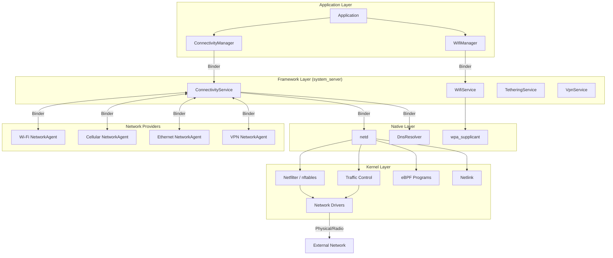
```mermaid
graph TD
    subgraph "Application Layer"
        APP["Application"]
        CM["ConnectivityManager"]
        WM["WifiManager"]
    end

    subgraph "Framework Layer (system_server)"
        CS["ConnectivityService"]
        WS["WifiService"]
        TS["TetheringService"]
        VS["VpnService"]
    end

    subgraph "Network Providers"
        NA_WIFI["Wi-Fi NetworkAgent"]
        NA_CELL["Cellular NetworkAgent"]
        NA_ETH["Ethernet NetworkAgent"]
        NA_VPN["VPN NetworkAgent"]
    end

    subgraph "Native Layer"
        NETD["netd"]
        DNSR["DnsResolver"]
        WPA["wpa_supplicant"]
    end

    subgraph "Kernel Layer"
        NF["Netfilter / nftables"]
        TC["Traffic Control"]
        BPF["eBPF Programs"]
        NETLINK["Netlink"]
        DRIVER["Network Drivers"]
    end

    APP --> CM
    APP --> WM
    CM -->|Binder| CS
    WM -->|Binder| WS
    CS <-->|Binder| NA_WIFI
    CS <-->|Binder| NA_CELL
    CS <-->|Binder| NA_ETH
    CS <-->|Binder| NA_VPN
    WS --> WPA
    CS -->|Binder| NETD
    CS -->|Binder| DNSR
    NETD --> NF
    NETD --> TC
    NETD --> BPF
    NETD --> NETLINK
    NF --> DRIVER
    TC --> DRIVER
    DRIVER -->|"Physical/Radio"| EXT["External Network"]
```

### 35.1.2 Key Components Summary

| Component | Type | Location | Role |
|-----------|------|----------|------|
| ConnectivityService | Java system service | `packages/modules/Connectivity/service/` | Central network management |
| NetworkAgent | Java framework class | `packages/modules/Connectivity/framework/` | Bearer-to-CS communication |
| NetworkFactory | Java framework class | `packages/modules/Connectivity/staticlibs/` | Creates NetworkAgents |
| netd | Native daemon (C++) | `system/netd/` | Kernel network configuration |
| DnsResolver | Native module (C++) | `packages/modules/DnsResolver/` | DNS resolution, DoT/DoH |
| Wi-Fi Service | Java system service | `packages/modules/Wifi/service/` | Wi-Fi management |
| NetworkStack | Mainline module | `packages/modules/NetworkStack/` | DHCP, network validation |
| Tethering | Mainline module | `packages/modules/Connectivity/Tethering/` | USB/Wi-Fi/BT tethering |

### 35.1.3 Mainline Modularization

Starting with Android 10 (API 29), Google began extracting networking components
into independently updatable Mainline modules. This was a pivotal architectural
decision: it decoupled critical networking code from the slower platform OTA
cadence, allowing Google to push security patches and feature updates through the
Play Store.

The key networking Mainline modules are:

1. **Connectivity module** (`packages/modules/Connectivity/`): Contains
   ConnectivityService, the tethering subsystem, and related framework code.
2. **NetworkStack module** (`packages/modules/NetworkStack/`): Handles DHCP
   client, network validation (captive portal detection), and IP provisioning.
3. **Wi-Fi module** (`packages/modules/Wifi/`): The entire Wi-Fi subsystem
   including WifiService, ClientModeImpl, and scanning logic.
4. **DnsResolver module** (`packages/modules/DnsResolver/`): The native DNS
   resolver with DoT and DoH support.

Each module ships as an APEX package, providing a self-contained update unit
with its own versioning, signing, and rollback capability.

### 35.1.4 Network IDs and Routing

Every active network in Android is assigned a unique **network ID** (netId), an
integer in the range 100--65535. This ID is fundamental: it ties together routes,
DNS configuration, iptables rules, and socket binding. When an application opens
a socket, the kernel uses the netId (applied via an `fwmark` on the socket) to
select the correct routing table.

From `system/netd/server/NetworkController.cpp`:

```cpp
// Keep these in sync with ConnectivityService.java.
const unsigned MIN_NET_ID = 100;
const unsigned MAX_NET_ID = 65535;
```

The framework manages netId allocation through `NetIdManager`:

```
// Source: packages/modules/Connectivity/service/src/com/android/server/NetIdManager.java
```

### 35.1.5 The Data Path: From App to Wire

When an application sends data, the following sequence occurs:

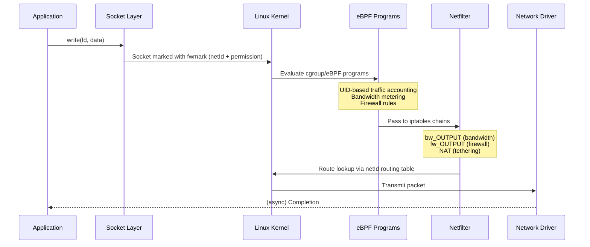
```mermaid
sequenceDiagram
    participant App as Application
    participant Socket as Socket Layer
    participant Kernel as Linux Kernel
    participant BPF as eBPF Programs
    participant NF as Netfilter
    participant Driver as Network Driver

    App->>Socket: write(fd, data)
    Socket->>Kernel: Socket marked with fwmark (netId + permission)
    Kernel->>BPF: Evaluate cgroup/eBPF programs
    Note over BPF: UID-based traffic accounting<br/>Bandwidth metering<br/>Firewall rules
    BPF->>NF: Pass to iptables chains
    Note over NF: bw_OUTPUT (bandwidth)<br/>fw_OUTPUT (firewall)<br/>NAT (tethering)
    NF->>Kernel: Route lookup via netId routing table
    Kernel->>Driver: Transmit packet
    Driver-->>App: (async) Completion
```

The `fwmark` mechanism is central to Android's per-network routing. Each socket
is tagged with a 32-bit mark that encodes:

- The network ID (bits 0--15)
- Permission bits (bits 16--17)
- Whether the socket is explicitly bound (bit 18)
- Whether VPN bypass is allowed (bit 19)

The `FwmarkServer` in netd is responsible for applying these marks when sockets
are created, using a BPF program attached to cgroup hooks:

```
// Source: system/netd/server/FwmarkServer.cpp
```

---

## 35.2 ConnectivityService

### 35.2.1 Overview

`ConnectivityService` is the central nervous system of Android networking. At
16,000+ lines of Java code, it is one of the largest and most critical services
in `system_server`. It manages the lifecycle of all networks, satisfies
application network requests, handles network scoring and selection, and
coordinates with native daemons for routing and DNS configuration.

**Source file:**
`packages/modules/Connectivity/service/src/com/android/server/ConnectivityService.java`

```java
// Source: packages/modules/Connectivity/service/src/com/android/server/ConnectivityService.java
@TargetApi(Build.VERSION_CODES.S)
public class ConnectivityService extends IConnectivityManager.Stub
        implements BroadcastReceiveHelper.Delegate {
    private static final String TAG = ConnectivityService.class.getSimpleName();
    // ...

    // Default URL for captive portal detection
    private static final String DEFAULT_CAPTIVE_PORTAL_HTTP_URL =
            "http://connectivitycheck.gstatic.com/generate_204";

    // How long to wait before switching back to a radio's default network
    private static final int RESTORE_DEFAULT_NETWORK_DELAY = 1 * 60 * 1000;

    // Default to 30s linger time-out, and 5s for nascent network
    private static final String LINGER_DELAY_PROPERTY = "persist.netmon.linger";
    private static final int DEFAULT_LINGER_DELAY_MS = 30_000;
    private static final int DEFAULT_NASCENT_DELAY_MS = 5_000;

    // The maximum number of network requests allowed per uid
    static final int MAX_NETWORK_REQUESTS_PER_UID = 100;
    // ...
}
```

### 35.2.2 The Handler Thread Model

ConnectivityService processes nearly all of its work on a single handler thread.
This is deliberate: a single-threaded model eliminates the need for complex
locking across the many data structures that track networks, requests, and
callbacks. Messages are dispatched through an internal `InternalHandler` that
processes events such as:

- Network agent registration and unregistration
- Network capability changes
- Link property updates
- Network score changes
- Validation results from NetworkMonitor
- Application network requests and callbacks

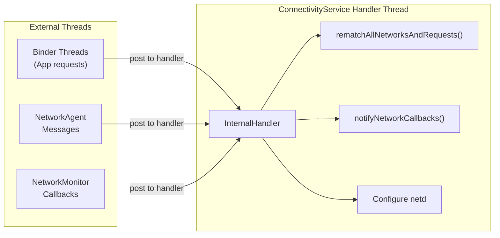
```mermaid
graph LR
    subgraph "External Threads"
        BINDER["Binder Threads<br/>(App requests)"]
        AGENTS["NetworkAgent<br/>Messages"]
        MONITOR["NetworkMonitor<br/>Callbacks"]
    end

    subgraph "ConnectivityService Handler Thread"
        HANDLER["InternalHandler"]
        REMATCH["rematchAllNetworksAndRequests()"]
        NOTIFY["notifyNetworkCallbacks()"]
        NETD_CMD["Configure netd"]
    end

    BINDER -->|"post to handler"| HANDLER
    AGENTS -->|"post to handler"| HANDLER
    MONITOR -->|"post to handler"| HANDLER
    HANDLER --> REMATCH
    HANDLER --> NOTIFY
    HANDLER --> NETD_CMD
```

### 35.2.3 NetworkAgent

`NetworkAgent` is the bridge between a network transport (Wi-Fi, cellular,
Ethernet, VPN) and ConnectivityService. Each active network connection is
represented by exactly one NetworkAgent instance. The agent communicates
bidirectionally with ConnectivityService through an asynchronous message
channel.

**Source file:**
`packages/modules/Connectivity/framework/src/android/net/NetworkAgent.java`

```java
// Source: packages/modules/Connectivity/framework/src/android/net/NetworkAgent.java
@SystemApi
public abstract class NetworkAgent {
    @Nullable
    private volatile Network mNetwork;

    @Nullable
    private volatile INetworkAgentRegistry mRegistry;

    private final Handler mHandler;

    public static final int MIN_LINGER_TIMER_MS = 2000;

    // Message constants for communication with ConnectivityService
    public static final int CMD_SUSPECT_BAD = BASE;
    public static final int EVENT_NETWORK_INFO_CHANGED = BASE + 1;
    public static final int EVENT_NETWORK_CAPABILITIES_CHANGED = BASE + 2;
    public static final int EVENT_NETWORK_PROPERTIES_CHANGED = BASE + 3;
    public static final int EVENT_NETWORK_SCORE_CHANGED = BASE + 4;
    public static final int CMD_REPORT_NETWORK_STATUS = BASE + 7;
    public static final int CMD_START_SOCKET_KEEPALIVE = BASE + 11;
    public static final int CMD_STOP_SOCKET_KEEPALIVE = BASE + 12;
    // ...
}
```

The lifecycle of a NetworkAgent is:

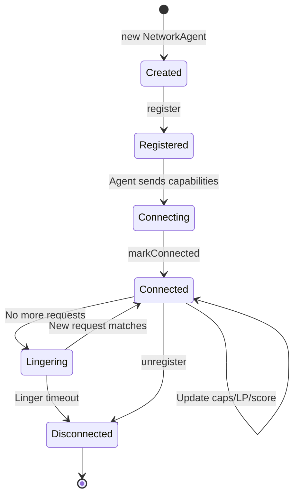
```mermaid
stateDiagram-v2
    [*] --> Created: new NetworkAgent
    Created --> Registered: register
    Registered --> Connecting: Agent sends capabilities
    Connecting --> Connected: markConnected
    Connected --> Connected: Update caps/LP/score
    Connected --> Lingering: No more requests
    Lingering --> Connected: New request matches
    Lingering --> Disconnected: Linger timeout
    Connected --> Disconnected: unregister
    Disconnected --> [*]
```

**Key methods a transport must implement:**

| Method | When Called | Purpose |
|--------|-----------|---------|
| `onNetworkUnwanted()` | CS no longer needs the network | Transport should disconnect |
| `onBandwidthUpdateRequested()` | CS needs updated throughput | Transport should refresh |
| `onValidationStatus()` | Network validated or failed | Transport may adjust behavior |
| `onSignalStrengthThresholdsUpdated()` | Thresholds changed | Adjust signal monitoring |
| `onStartSocketKeepalive()` | App requests keepalive | Offload to hardware if possible |
| `onStopSocketKeepalive()` | Keepalive no longer needed | Stop hardware offload |
| `onSaveAcceptUnvalidated()` | User accepts unvalidated | Remember preference |

### 35.2.4 NetworkFactory

While `NetworkAgent` represents an active network, `NetworkFactory` represents
the _capability_ to create networks. Each transport registers a factory with
ConnectivityService, declaring what kinds of networks it can provide.

**Source file:**
`packages/modules/Connectivity/staticlibs/device/android/net/NetworkFactory.java`

```java
// Source: packages/modules/Connectivity/staticlibs/device/android/net/NetworkFactory.java
public class NetworkFactory {
    static final boolean DBG = true;

    final NetworkFactoryShim mImpl;

    public NetworkFactory(Looper looper, Context context, String logTag,
            @Nullable final NetworkCapabilities filter) {
        LOG_TAG = logTag;
        if (isAtLeastS()) {
            mImpl = new NetworkFactoryImpl(this, looper, context, filter);
        } else {
            mImpl = new NetworkFactoryLegacyImpl(this, looper, context, filter);
        }
    }

    public static final int CMD_REQUEST_NETWORK = 1;
    public static final int CMD_CANCEL_REQUEST = 2;
    // ...
}
```

When an application files a `NetworkRequest`, ConnectivityService evaluates
all registered factories. If a factory's declared capabilities match the
request, ConnectivityService sends it a `CMD_REQUEST_NETWORK` message. The
factory then decides whether to bring up a new network (create a NetworkAgent)
or ignore the request.

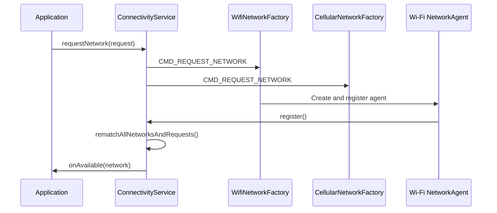
```mermaid
sequenceDiagram
    participant App as Application
    participant CS as ConnectivityService
    participant WF as WifiNetworkFactory
    participant CF as CellularNetworkFactory
    participant WA as Wi-Fi NetworkAgent

    App->>CS: requestNetwork(request)
    CS->>WF: CMD_REQUEST_NETWORK
    CS->>CF: CMD_REQUEST_NETWORK
    WF->>WA: Create and register agent
    WA->>CS: register()
    CS->>CS: rematchAllNetworksAndRequests()
    CS->>App: onAvailable(network)
```

### 35.2.5 NetworkRequest and NetworkCapabilities

Applications express their networking requirements through `NetworkRequest`
objects, which wrap `NetworkCapabilities` constraints.

**Source file:**
`packages/modules/Connectivity/framework/src/android/net/NetworkRequest.java`

A `NetworkRequest` specifies:

- **Required capabilities**: What the network must provide (e.g., `NET_CAPABILITY_INTERNET`)
- **Forbidden capabilities**: What the network must not have (e.g., `NET_CAPABILITY_NOT_METERED` forbidden means metered is OK)
- **Transport types**: Which bearers are acceptable (Wi-Fi, cellular, etc.)
- **Network specifier**: For targeting specific networks (e.g., a particular Wi-Fi SSID)

`NetworkCapabilities` is the richest descriptor in the system, encoding dozens
of attributes about a network:

**Source file:**
`packages/modules/Connectivity/framework/src/android/net/NetworkCapabilities.java`

Key capability constants include:

| Capability | Meaning |
|-----------|---------|
| `NET_CAPABILITY_INTERNET` | Network has general Internet access |
| `NET_CAPABILITY_VALIDATED` | System confirmed Internet connectivity |
| `NET_CAPABILITY_NOT_METERED` | Network does not bill by usage |
| `NET_CAPABILITY_NOT_VPN` | Network is not a VPN |
| `NET_CAPABILITY_NOT_ROAMING` | Not on a roaming network |
| `NET_CAPABILITY_NOT_CONGESTED` | Network is not congested |
| `NET_CAPABILITY_NOT_SUSPENDED` | Network is not suspended |
| `NET_CAPABILITY_CAPTIVE_PORTAL` | Behind a captive portal |
| `NET_CAPABILITY_PARTIAL_CONNECTIVITY` | Limited connectivity |
| `NET_CAPABILITY_MMS` | MMS capable |
| `NET_CAPABILITY_ENTERPRISE` | Enterprise network |
| `NET_CAPABILITY_LOCAL_NETWORK` | Local network (e.g., Thread) |

Transport types include:

| Transport | Description |
|-----------|-------------|
| `TRANSPORT_CELLULAR` | Mobile data (LTE, 5G) |
| `TRANSPORT_WIFI` | Wi-Fi |
| `TRANSPORT_BLUETOOTH` | Bluetooth PAN |
| `TRANSPORT_ETHERNET` | Wired Ethernet |
| `TRANSPORT_VPN` | Virtual Private Network |
| `TRANSPORT_WIFI_AWARE` | Wi-Fi Aware (NAN) |
| `TRANSPORT_LOWPAN` | Low-power WAN (LoWPAN) |
| `TRANSPORT_TEST` | Test networks |
| `TRANSPORT_SATELLITE` | Satellite connectivity |
| `TRANSPORT_THREAD` | Thread mesh networking |

### 35.2.6 Network Scoring and Selection

When multiple networks can satisfy a request, ConnectivityService must choose
the best one. The network selection algorithm has evolved significantly over
Android's history:

1. **Legacy scoring** (pre-Android 12): Simple integer scores. Higher wins.
   Wi-Fi defaulted to 60, cellular to 50.

2. **Modern scoring** (Android 12+): A policy-based `NetworkScore` that
   encodes multiple dimensions:

```java
// From NetworkAgent.java
public static final int WIFI_BASE_SCORE = 60;
```

The `rematchAllNetworksAndRequests()` method is the heart of network selection.
It runs on every significant network change and iterates through all active
requests, finding the best network for each:

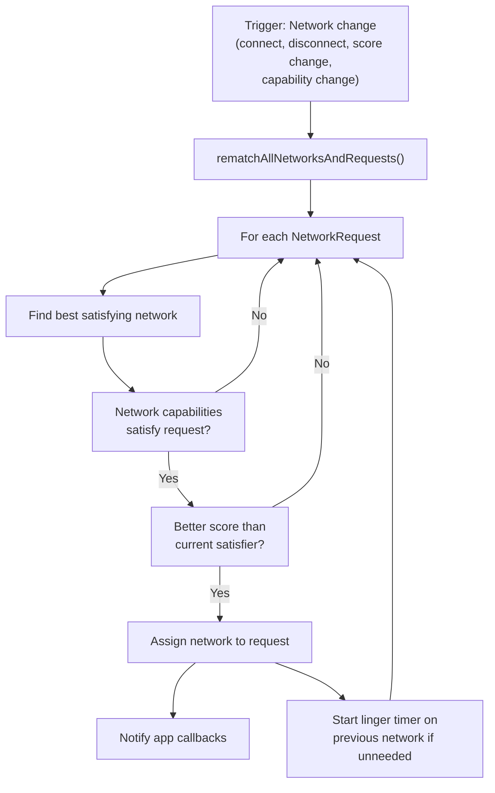
```mermaid
flowchart TD
    TRIGGER["Trigger: Network change<br/>(connect, disconnect, score change,<br/>capability change)"]
    REMATCH["rematchAllNetworksAndRequests()"]
    ITERATE["For each NetworkRequest"]
    FIND["Find best satisfying network"]
    CHECK_CAPS["Network capabilities<br/>satisfy request?"]
    CHECK_SCORE["Better score than<br/>current satisfier?"]
    ASSIGN["Assign network to request"]
    NOTIFY["Notify app callbacks"]
    LINGER["Start linger timer on<br/>previous network if unneeded"]

    TRIGGER --> REMATCH
    REMATCH --> ITERATE
    ITERATE --> FIND
    FIND --> CHECK_CAPS
    CHECK_CAPS -->|Yes| CHECK_SCORE
    CHECK_CAPS -->|No| ITERATE
    CHECK_SCORE -->|Yes| ASSIGN
    CHECK_SCORE -->|No| ITERATE
    ASSIGN --> NOTIFY
    ASSIGN --> LINGER
    LINGER --> ITERATE
```

The scoring considers multiple policies:

- **Transport primary**: Prefers the transport's primary network
- **Validated over unvalidated**: Prefers networks that passed validation
- **Metered vs unmetered**: Prefers unmetered when available
- **User preference**: Respects user network selection
- **VPN**: VPNs are handled specially with their own scoring rules

### 35.2.7 LinkProperties

`LinkProperties` describes the IP-level configuration of a network:

- IP addresses (both IPv4 and IPv6)
- DNS servers
- Routing table entries
- Interface name (e.g., `wlan0`, `rmnet0`)
- MTU
- HTTP proxy settings
- NAT64 prefix (for IPv6-only networks)

When a NetworkAgent updates its LinkProperties, ConnectivityService pushes the
corresponding routes and DNS configuration to netd:

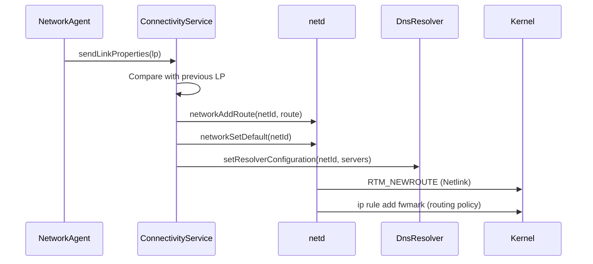
```mermaid
sequenceDiagram
    participant NA as NetworkAgent
    participant CS as ConnectivityService
    participant NETD as netd
    participant DNSR as DnsResolver
    participant KERNEL as Kernel

    NA->>CS: sendLinkProperties(lp)
    CS->>CS: Compare with previous LP
    CS->>NETD: networkAddRoute(netId, route)
    CS->>NETD: networkSetDefault(netId)
    CS->>DNSR: setResolverConfiguration(netId, servers)
    NETD->>KERNEL: RTM_NEWROUTE (Netlink)
    NETD->>KERNEL: ip rule add fwmark (routing policy)
```

### 35.2.8 Network Lifecycle Events and Callbacks

Applications receive network state changes through registered callbacks.
ConnectivityService supports a rich set of callback events:

```java
// From ConnectivityService.java import block
import static android.net.ConnectivityManager.CALLBACK_AVAILABLE;
import static android.net.ConnectivityManager.CALLBACK_BLK_CHANGED;
import static android.net.ConnectivityManager.CALLBACK_CAP_CHANGED;
import static android.net.ConnectivityManager.CALLBACK_IP_CHANGED;
import static android.net.ConnectivityManager.CALLBACK_LOCAL_NETWORK_INFO_CHANGED;
import static android.net.ConnectivityManager.CALLBACK_LOSING;
import static android.net.ConnectivityManager.CALLBACK_LOST;
import static android.net.ConnectivityManager.CALLBACK_PRECHECK;
import static android.net.ConnectivityManager.CALLBACK_SUSPENDED;
import static android.net.ConnectivityManager.CALLBACK_RESUMED;
```

The callback lifecycle for a typical network connection:

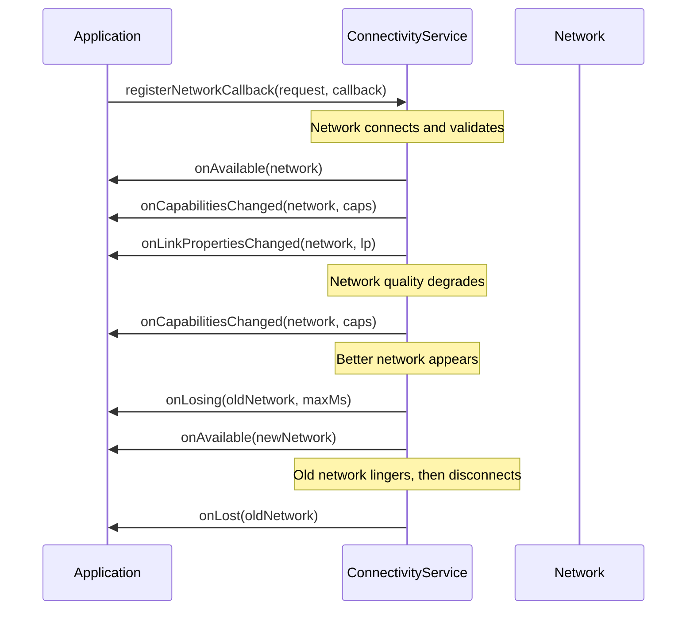
```mermaid
sequenceDiagram
    participant App as Application
    participant CS as ConnectivityService
    participant Net as Network

    App->>CS: registerNetworkCallback(request, callback)
    Note over CS: Network connects and validates
    CS->>App: onAvailable(network)
    CS->>App: onCapabilitiesChanged(network, caps)
    CS->>App: onLinkPropertiesChanged(network, lp)
    Note over CS: Network quality degrades
    CS->>App: onCapabilitiesChanged(network, caps)
    Note over CS: Better network appears
    CS->>App: onLosing(oldNetwork, maxMs)
    CS->>App: onAvailable(newNetwork)
    Note over CS: Old network lingers, then disconnects
    CS->>App: onLost(oldNetwork)
```

### 35.2.9 BPF-Based Traffic Control

Modern Android increasingly uses eBPF (extended Berkeley Packet Filter) programs
for traffic control, replacing traditional iptables rules. BPF programs are
attached to cgroup hooks to enforce per-UID traffic policies.

```java
// Source: packages/modules/Connectivity/service/src/com/android/server/ConnectivityService.java
// BPF program attachment points
import static com.android.net.module.util.BpfUtils.BPF_CGROUP_GETSOCKOPT;
import static com.android.net.module.util.BpfUtils.BPF_CGROUP_INET4_BIND;
import static com.android.net.module.util.BpfUtils.BPF_CGROUP_INET4_CONNECT;
import static com.android.net.module.util.BpfUtils.BPF_CGROUP_INET6_BIND;
import static com.android.net.module.util.BpfUtils.BPF_CGROUP_INET6_CONNECT;
import static com.android.net.module.util.BpfUtils.BPF_CGROUP_INET_EGRESS;
import static com.android.net.module.util.BpfUtils.BPF_CGROUP_INET_INGRESS;
import static com.android.net.module.util.BpfUtils.BPF_CGROUP_INET_SOCK_CREATE;
import static com.android.net.module.util.BpfUtils.BPF_CGROUP_INET_SOCK_RELEASE;
import static com.android.net.module.util.BpfUtils.BPF_CGROUP_SETSOCKOPT;
import static com.android.net.module.util.BpfUtils.BPF_CGROUP_UDP4_RECVMSG;
import static com.android.net.module.util.BpfUtils.BPF_CGROUP_UDP4_SENDMSG;
import static com.android.net.module.util.BpfUtils.BPF_CGROUP_UDP6_RECVMSG;
import static com.android.net.module.util.BpfUtils.BPF_CGROUP_UDP6_SENDMSG;
```

These BPF programs provide:

- **UID-based accounting**: Track bytes sent/received per UID
- **Firewall enforcement**: Block/allow traffic per UID and chain
- **Socket marking**: Apply fwmarks at socket creation time
- **Data saver**: Restrict background data for metered networks
- **Bandwidth control**: Enforce per-interface quotas

The `BpfNetMaps` class in the Connectivity module manages these maps, replacing
many of the traditional iptables-based mechanisms:

```java
// Source: packages/modules/Connectivity/service/src/com/android/server/BpfNetMaps.java
```

### 35.2.10 Frozen App Handling

ConnectivityService has sophisticated handling for frozen (cached) applications.
When an app is frozen by the ActivityManager, its network callbacks are queued
rather than delivered, avoiding unnecessary wake-ups:

```java
// Source: ConnectivityService.java import block
import static com.android.server.connectivity.ConnectivityFlags.QUEUE_CALLBACKS_FOR_FROZEN_APPS;
```

When the app is unfrozen, queued callbacks are delivered in order, ensuring the
app has an accurate view of the current network state.

---

## 35.3 Wi-Fi Framework

### 35.3.1 Architecture Overview

The Wi-Fi framework in AOSP is a complex subsystem that manages Wi-Fi radio
operations, network scanning, connection management, SoftAP (hotspot), Wi-Fi
Direct (P2P), and Wi-Fi Aware (NAN). Since Android 12, the entire Wi-Fi stack
ships as a Mainline module.

**Module root:** `packages/modules/Wifi/`

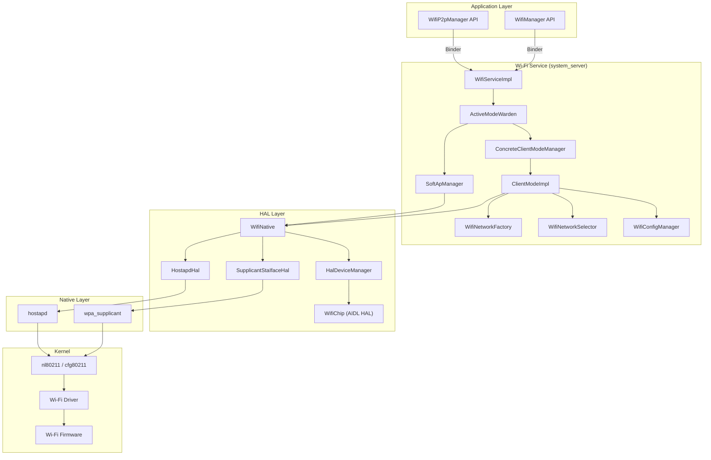
```mermaid
graph TD
    subgraph "Application Layer"
        WIFIMGR["WifiManager API"]
        P2PMGR["WifiP2pManager API"]
    end

    subgraph "Wi-Fi Service (system_server)"
        WIFISVC["WifiServiceImpl"]
        AMWM["ActiveModeWarden"]
        CMM["ConcreteClientModeManager"]
        CMI["ClientModeImpl"]
        SAM["SoftApManager"]
        WFACT["WifiNetworkFactory"]
        WSEL["WifiNetworkSelector"]
        WCFG["WifiConfigManager"]
    end

    subgraph "HAL Layer"
        WNATIVE["WifiNative"]
        HALDEV["HalDeviceManager"]
        SUPPLICANT["SupplicantStaIfaceHal"]
        HOSTAPD["HostapdHal"]
        WCHIP["WifiChip (AIDL HAL)"]
    end

    subgraph "Native Layer"
        WPA["wpa_supplicant"]
        HAPD["hostapd"]
    end

    subgraph "Kernel"
        NL80211["nl80211 / cfg80211"]
        WDRIVER["Wi-Fi Driver"]
        FIRMWARE["Wi-Fi Firmware"]
    end

    WIFIMGR -->|Binder| WIFISVC
    P2PMGR -->|Binder| WIFISVC
    WIFISVC --> AMWM
    AMWM --> CMM
    AMWM --> SAM
    CMM --> CMI
    CMI --> WNATIVE
    CMI --> WFACT
    CMI --> WSEL
    CMI --> WCFG
    SAM --> WNATIVE
    WNATIVE --> HALDEV
    WNATIVE --> SUPPLICANT
    WNATIVE --> HOSTAPD
    HALDEV --> WCHIP
    SUPPLICANT --> WPA
    HOSTAPD --> HAPD
    WPA --> NL80211
    HAPD --> NL80211
    NL80211 --> WDRIVER
    WDRIVER --> FIRMWARE
```

### 35.3.2 WifiServiceImpl

`WifiServiceImpl` is the Binder-facing service that implements `IWifiManager`.
It handles all public API calls from applications and delegates work to internal
components.

**Source file:**
`packages/modules/Wifi/service/java/com/android/server/wifi/WifiServiceImpl.java`

```java
// Source: packages/modules/Wifi/service/java/com/android/server/wifi/WifiServiceImpl.java
// WifiServiceImpl handles dozens of Wi-Fi manager APIs including:
// - Scan management (IScanResultsCallback)
// - Network suggestions (ISuggestionConnectionStatusListener)
// - SoftAP control (ISoftApCallback)
// - P2P operations
// - Traffic state monitoring (ITrafficStateCallback)
// - Verbose logging control
// - DPP (Device Provisioning Protocol)
// - TWT (Target Wake Time)
```

Key responsibilities include:

- Permission enforcement (location, Wi-Fi state change, etc.)
- API parameter validation
- Delegation to `ActiveModeWarden` for mode changes
- Broadcasting Wi-Fi state changes
- Managing local-only hotspot requests

### 35.3.3 ClientModeImpl: The Wi-Fi State Machine

`ClientModeImpl` is the workhorse of Wi-Fi connectivity. It extends
`StateMachine` and manages the complete lifecycle of a Wi-Fi connection: from
scanning and authentication through DHCP and full connectivity.

**Source file:**
`packages/modules/Wifi/service/java/com/android/server/wifi/ClientModeImpl.java`

```java
// Source: packages/modules/Wifi/service/java/com/android/server/wifi/ClientModeImpl.java
public class ClientModeImpl extends StateMachine implements ClientMode {
    // Roles for this client mode interface
    // ROLE_CLIENT_PRIMARY - the main STA interface
    // ROLE_CLIENT_LOCAL_ONLY - local-only connection
    // ROLE_CLIENT_SECONDARY_LONG_LIVED - persistent secondary
    // ROLE_CLIENT_SECONDARY_TRANSIENT - temporary secondary (MBB)
    // ROLE_CLIENT_SCAN_ONLY - scan-only mode
    // ...
}
```

The state machine contains the following key states:

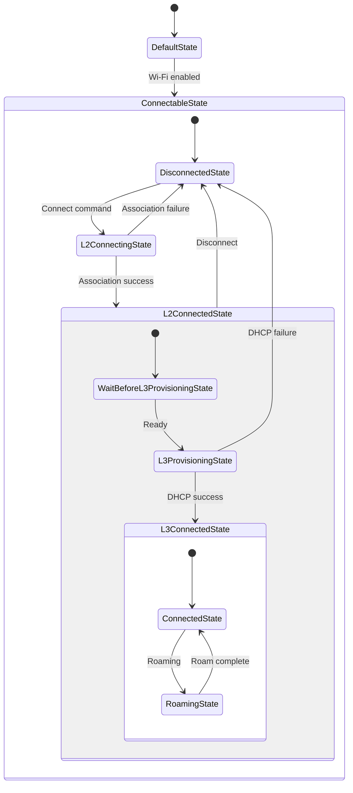
```mermaid
stateDiagram-v2
    [*] --> DefaultState
    DefaultState --> ConnectableState: Wi-Fi enabled

    state ConnectableState {
        [*] --> DisconnectedState
        DisconnectedState --> L2ConnectingState: Connect command
        L2ConnectingState --> L2ConnectedState: Association success
        L2ConnectingState --> DisconnectedState: Association failure

        state L2ConnectedState {
            [*] --> WaitBeforeL3ProvisioningState
            WaitBeforeL3ProvisioningState --> L3ProvisioningState: Ready
            L3ProvisioningState --> L3ConnectedState: DHCP success
            L3ProvisioningState --> DisconnectedState: DHCP failure

            state L3ConnectedState {
                [*] --> ConnectedState
                ConnectedState --> RoamingState: Roaming
                RoamingState --> ConnectedState: Roam complete
            }
        }
        L2ConnectedState --> DisconnectedState: Disconnect
    }
```

**State descriptions:**

| State | Description |
|-------|-------------|
| `DefaultState` | Wi-Fi is off or initializing |
| `ConnectableState` | Wi-Fi is on and ready to connect |
| `DisconnectedState` | Not associated with any AP |
| `L2ConnectingState` | Attempting 802.11 association |
| `L2ConnectedState` | Associated at L2, waiting for L3 |
| `WaitBeforeL3ProvisioningState` | Brief pause before IP provisioning |
| `L3ProvisioningState` | Running DHCP or static IP config |
| `L3ConnectedState` | Full IP connectivity established |
| `ConnectedState` | Stable connected state |
| `RoamingState` | Transitioning between APs |

### 35.3.4 WifiNative: The HAL Bridge

`WifiNative` serves as the interface between the Java Wi-Fi framework and the
native Wi-Fi HAL (Hardware Abstraction Layer). It manages hardware interfaces,
delegates supplicant operations, and handles scan results.

**Source file:**
`packages/modules/Wifi/service/java/com/android/server/wifi/WifiNative.java`

```java
// Source: packages/modules/Wifi/service/java/com/android/server/wifi/WifiNative.java
// WifiNative creates and manages different interface types:
// HDM_CREATE_IFACE_STA - Station (client) interface
// HDM_CREATE_IFACE_AP - Access Point interface
// HDM_CREATE_IFACE_AP_BRIDGE - Bridged AP (dual-band)
// HDM_CREATE_IFACE_P2P - Wi-Fi Direct interface
// HDM_CREATE_IFACE_NAN - Wi-Fi Aware interface
```

The HAL communication path:

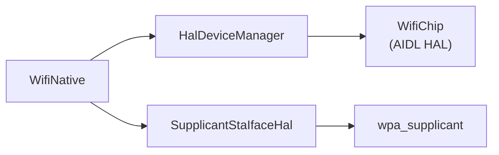
```mermaid
graph LR
    WN["WifiNative"]
    HDM["HalDeviceManager"]
    CHIP["WifiChip<br/>(AIDL HAL)"]
    SIFACE["SupplicantStaIfaceHal"]
    WPA["wpa_supplicant"]

    WN --> HDM
    WN --> SIFACE
    HDM --> CHIP
    SIFACE --> WPA
```

### 35.3.5 wpa_supplicant Integration

Android uses the industry-standard `wpa_supplicant` for 802.11 authentication.
The `SupplicantStaIfaceHal` class communicates with wpa_supplicant through an
AIDL interface, handling:

- WPA/WPA2/WPA3 authentication
- 802.1X enterprise authentication (EAP-TLS, EAP-TTLS, EAP-PEAP, EAP-SIM, etc.)
- FILS (Fast Initial Link Setup) for reduced connection time
- OWE (Opportunistic Wireless Encryption) for open networks
- SAE (Simultaneous Authentication of Equals) for WPA3
- DPP (Device Provisioning Protocol) for easy onboarding

### 35.3.6 Network Selection

The `WifiNetworkSelector` evaluates available scan results and selects the
best network to connect to. It considers:

1. **Saved network priority**: User-configured preferences
2. **Signal strength (RSSI)**: Weighted by band (2.4 GHz, 5 GHz, 6 GHz)
3. **Security type**: Prefers stronger security
4. **Past performance**: Historical connection quality metrics
5. **Network suggestions**: App-suggested networks
6. **Enterprise policies**: Device admin restrictions
7. **Blocked networks**: Temporarily disabled due to failures

### 35.3.7 SoftAP (Mobile Hotspot)

`SoftApManager` handles the mobile hotspot functionality, managing the AP
interface lifecycle through its own state machine.

**Source file:**
`packages/modules/Wifi/service/java/com/android/server/wifi/SoftApManager.java`

```java
// Source: packages/modules/Wifi/service/java/com/android/server/wifi/SoftApManager.java
public class SoftApManager implements ActiveModeManager {
    private static final String TAG = "SoftApManager";
    // SoftAP manages the AP mode lifecycle:
    // - Interface creation (via WifiNative/HalDeviceManager)
    // - Channel selection (considering coexistence)
    // - Client connection/disconnection tracking
    // - Bridged AP mode (dual-band simultaneous)
    // - Idle timeout management
    // ...
}
```

SoftAP features include:

- **Dual-band support**: Bridged AP mode provides simultaneous 2.4 GHz and 5 GHz
- **Client management**: Track connected clients, enforce max client limits
- **Coexistence**: `CoexManager` handles interference with cellular bands
- **Auto-shutdown**: Configurable idle timeout when no clients are connected
- **WPA3-SAE**: Support for WPA3 security in hotspot mode
- **MAC randomization**: Privacy-preserving MAC for AP BSSID

### 35.3.8 Wi-Fi Direct (P2P)

Wi-Fi Direct allows devices to connect directly without an access point. The
implementation lives in `packages/modules/Wifi/service/java/com/android/server/wifi/p2p/`
and is managed by `WifiP2pServiceImpl`.

The P2P connection flow:

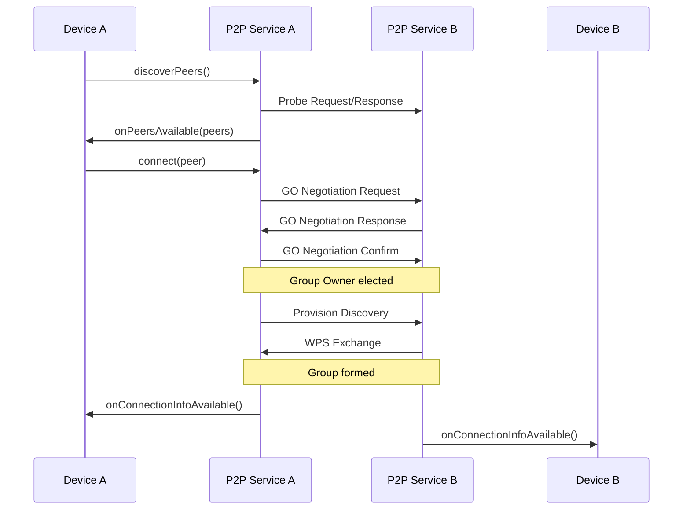
```mermaid
sequenceDiagram
    participant DevA as Device A
    participant P2PA as P2P Service A
    participant P2PB as P2P Service B
    participant DevB as Device B

    DevA->>P2PA: discoverPeers()
    P2PA->>P2PB: Probe Request/Response
    P2PA->>DevA: onPeersAvailable(peers)
    DevA->>P2PA: connect(peer)
    P2PA->>P2PB: GO Negotiation Request
    P2PB->>P2PA: GO Negotiation Response
    P2PA->>P2PB: GO Negotiation Confirm
    Note over P2PA,P2PB: Group Owner elected
    P2PA->>P2PB: Provision Discovery
    P2PB->>P2PA: WPS Exchange
    Note over P2PA,P2PB: Group formed
    P2PA->>DevA: onConnectionInfoAvailable()
    P2PB->>DevB: onConnectionInfoAvailable()
```

### 35.3.9 Multi-Link Operation (MLO) and Wi-Fi 7

Modern AOSP includes support for Wi-Fi 7 (802.11be) features, including
Multi-Link Operation. The `MloLink` class in the Wi-Fi framework represents
individual links in an MLO connection:

```java
// From ClientModeImpl.java imports
import android.net.wifi.MloLink;
```

MLO enables simultaneous transmission across multiple channels and bands,
significantly improving throughput and latency.

---

## 35.4 netd (Network Daemon)

### 35.4.1 Overview

`netd` is the native daemon responsible for configuring the Linux kernel's
networking subsystem on behalf of the Android framework. It runs as a privileged
process and is the primary pathway for routing table manipulation, firewall
rule management, bandwidth control, and interface configuration.

**Source directory:** `system/netd/`

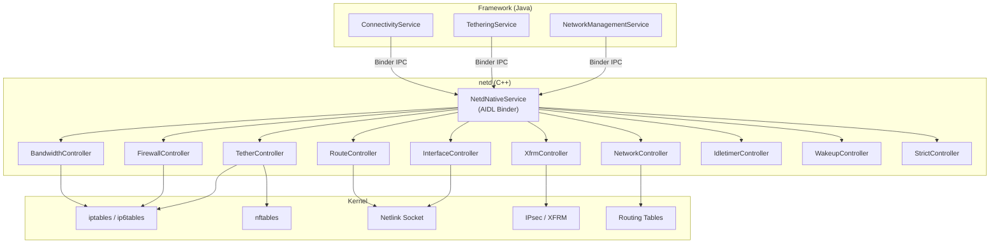
```mermaid
graph TD
    subgraph "Framework (Java)"
        CS["ConnectivityService"]
        TS["TetheringService"]
        NMS["NetworkManagementService"]
    end

    subgraph "netd (C++)"
        NNS["NetdNativeService<br/>(AIDL Binder)"]
        NC["NetworkController"]
        BC["BandwidthController"]
        FC["FirewallController"]
        RC["RouteController"]
        TC_CTRL["TetherController"]
        IC["InterfaceController"]
        XC["XfrmController"]
        IT["IdletimerController"]
        WC["WakeupController"]
        SC["StrictController"]
    end

    subgraph "Kernel"
        IPTABLES["iptables / ip6tables"]
        NFTABLES["nftables"]
        NETLINK_K["Netlink Socket"]
        XFRM["IPsec / XFRM"]
        ROUTING["Routing Tables"]
    end

    CS -->|Binder IPC| NNS
    TS -->|Binder IPC| NNS
    NMS -->|Binder IPC| NNS
    NNS --> NC
    NNS --> BC
    NNS --> FC
    NNS --> RC
    NNS --> TC_CTRL
    NNS --> IC
    NNS --> XC
    NNS --> IT
    NNS --> WC
    NNS --> SC
    NC --> ROUTING
    BC --> IPTABLES
    FC --> IPTABLES
    RC --> NETLINK_K
    TC_CTRL --> IPTABLES
    TC_CTRL --> NFTABLES
    IC --> NETLINK_K
    XC --> XFRM
```

### 35.4.2 NetdNativeService: The Binder Interface

`NetdNativeService` exposes netd's functionality via AIDL Binder. It is the
sole entry point for framework callers.

**Source file:** `system/netd/server/NetdNativeService.h`

```cpp
// Source: system/netd/server/NetdNativeService.h
class NetdNativeService : public BinderService<NetdNativeService>, public BnNetd {
  public:
    NetdNativeService();
    static status_t start();
    static char const* getServiceName() { return "netd"; }

    // Firewall commands
    binder::Status firewallReplaceUidChain(const std::string& chainName,
                                           bool isAllowlist,
                                           const std::vector<int32_t>& uids,
                                           bool* ret) override;
    binder::Status firewallSetFirewallType(int32_t firewallType) override;
    binder::Status firewallSetInterfaceRule(const std::string& ifName,
                                            int32_t firewallRule) override;
    binder::Status firewallSetUidRule(int32_t childChain, int32_t uid,
                                      int32_t firewallRule) override;

    // Bandwidth control commands
    binder::Status bandwidthEnableDataSaver(bool enable, bool *ret) override;
    binder::Status bandwidthSetInterfaceQuota(const std::string& ifName,
                                              int64_t bytes) override;
    binder::Status bandwidthSetGlobalAlert(int64_t bytes) override;
    binder::Status bandwidthAddNaughtyApp(int32_t uid) override;
    binder::Status bandwidthAddNiceApp(int32_t uid) override;

    // Network and routing commands
    binder::Status networkCreate(const NativeNetworkConfig& config) override;
    binder::Status networkDestroy(int32_t netId) override;
    binder::Status networkAddInterface(int32_t netId,
                                       const std::string& iface) override;
    binder::Status networkAddRoute(int32_t netId, const std::string& ifName,
                                   const std::string& destination,
                                   const std::string& nextHop) override;
    binder::Status networkSetDefault(int32_t netId) override;

    // Socket operations
    binder::Status socketDestroy(const std::vector<UidRangeParcel>& uids,
                                 const std::vector<int32_t>& skipUids) override;
    // ...
};
```

### 35.4.3 NetworkController: Routing and Networks

The `NetworkController` manages the creation and configuration of network
abstractions within netd. Each network (physical, virtual, local, or
unreachable) gets its own routing table and policy rules.

**Source file:** `system/netd/server/NetworkController.cpp`

```cpp
// Source: system/netd/server/NetworkController.cpp
// THREAD-SAFETY
// The methods in this file are called from multiple threads (from
// CommandListener, FwmarkServer and DnsProxyListener). So, all accesses
// to shared state are guarded by a lock.

class NetworkController::DelegateImpl : public PhysicalNetwork::Delegate {
  public:
    explicit DelegateImpl(NetworkController* networkController);

    [[nodiscard]] int modifyFallthrough(unsigned vpnNetId,
                                        const std::string& physicalInterface,
                                        Permission permission, bool add);
  // ...
};
```

Network types in netd:

| Type | Class | Purpose |
|------|-------|---------|
| Physical | `PhysicalNetwork` | Wi-Fi, cellular, Ethernet |
| Virtual | `VirtualNetwork` | VPN networks |
| Local | `LocalNetwork` | localhost and local interfaces |
| Unreachable | `UnreachableNetwork` | Block traffic (reject routes) |
| Dummy | `DummyNetwork` | Test/placeholder network |

### 35.4.4 iptables Chain Architecture

netd organizes iptables rules into carefully ordered chains. The ordering is
critical for correct operation and is explicitly documented in the source.

**Source file:** `system/netd/server/Controllers.cpp`

```cpp
// Source: system/netd/server/Controllers.cpp
// ORDERING IS CRITICAL, AND SHOULD BE TRIPLE-CHECKED WITH EACH CHANGE.

static const std::vector<const char*> FILTER_INPUT = {
    OEM_IPTABLES_FILTER_INPUT,
    BandwidthController::LOCAL_INPUT,     // "bw_INPUT"
    FirewallController::LOCAL_INPUT,      // "fw_INPUT"
};

static const std::vector<const char*> FILTER_FORWARD = {
    OEM_IPTABLES_FILTER_FORWARD,
    FirewallController::LOCAL_FORWARD,    // "fw_FORWARD"
    BandwidthController::LOCAL_FORWARD,   // "bw_FORWARD"
    TetherController::LOCAL_FORWARD,      // tethering forwarding
};

static const std::vector<const char*> FILTER_OUTPUT = {
    OEM_IPTABLES_FILTER_OUTPUT,
    FirewallController::LOCAL_OUTPUT,     // "fw_OUTPUT"
    StrictController::LOCAL_OUTPUT,       // cleartext enforcement
    BandwidthController::LOCAL_OUTPUT,    // "bw_OUTPUT"
};

static const std::vector<const char*> RAW_PREROUTING = {
    IdletimerController::LOCAL_RAW_PREROUTING,
    BandwidthController::LOCAL_RAW_PREROUTING,
    TetherController::LOCAL_RAW_PREROUTING,
};

static const std::vector<const char*> MANGLE_POSTROUTING = {
    OEM_IPTABLES_MANGLE_POSTROUTING,
    BandwidthController::LOCAL_MANGLE_POSTROUTING,
    IdletimerController::LOCAL_MANGLE_POSTROUTING,
};

static const std::vector<const char*> MANGLE_INPUT = {
    CONNMARK_MANGLE_INPUT,
    WakeupController::LOCAL_MANGLE_INPUT,
    RouteController::LOCAL_MANGLE_INPUT,
};
```

The chain execution order for an incoming packet:

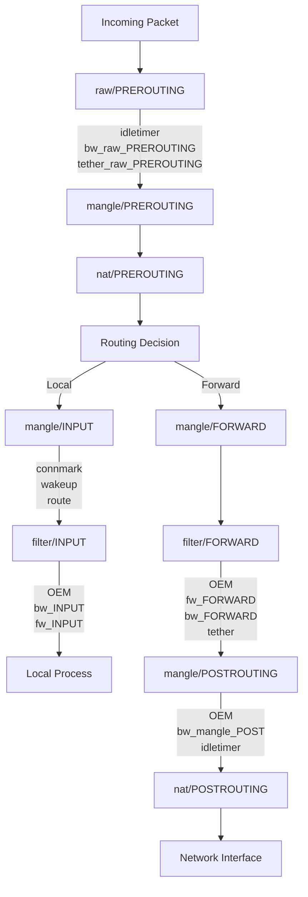
```mermaid
graph TD
    PKT["Incoming Packet"] --> RAW["raw/PREROUTING"]
    RAW --> |"idletimer<br/>bw_raw_PREROUTING<br/>tether_raw_PREROUTING"| MANGLE_PRE["mangle/PREROUTING"]
    MANGLE_PRE --> NAT_PRE["nat/PREROUTING"]
    NAT_PRE --> ROUTE["Routing Decision"]
    ROUTE -->|"Local"| MANGLE_IN["mangle/INPUT"]
    ROUTE -->|"Forward"| MANGLE_FWD["mangle/FORWARD"]

    MANGLE_IN -->|"connmark<br/>wakeup<br/>route"| FILTER_IN["filter/INPUT"]
    FILTER_IN -->|"OEM<br/>bw_INPUT<br/>fw_INPUT"| LOCAL["Local Process"]

    MANGLE_FWD --> FILTER_FWD["filter/FORWARD"]
    FILTER_FWD -->|"OEM<br/>fw_FORWARD<br/>bw_FORWARD<br/>tether"| MANGLE_POST["mangle/POSTROUTING"]
    MANGLE_POST -->|"OEM<br/>bw_mangle_POST<br/>idletimer"| NAT_POST["nat/POSTROUTING"]
    NAT_POST --> OUT["Network Interface"]
```

### 35.4.5 BandwidthController

The `BandwidthController` implements data usage tracking and enforcement using
iptables quota rules and BPF programs.

**Source file:** `system/netd/server/BandwidthController.cpp`

```cpp
// Source: system/netd/server/BandwidthController.cpp
const char BandwidthController::LOCAL_INPUT[] = "bw_INPUT";
const char BandwidthController::LOCAL_FORWARD[] = "bw_FORWARD";
const char BandwidthController::LOCAL_OUTPUT[] = "bw_OUTPUT";
const char BandwidthController::LOCAL_RAW_PREROUTING[] = "bw_raw_PREROUTING";
const char BandwidthController::LOCAL_MANGLE_POSTROUTING[] = "bw_mangle_POSTROUTING";
const char BandwidthController::LOCAL_GLOBAL_ALERT[] = "bw_global_alert";
```

Bandwidth control features:

- **Per-interface quotas**: Limit data usage on specific interfaces
- **Global alerts**: Notify when total usage exceeds a threshold
- **Naughty apps**: UIDs blocked from using metered networks (data saver)
- **Nice apps**: UIDs exempt from data saver restrictions
- **Shared costly chain**: Global quota across all metered interfaces

```cpp
// Source: system/netd/server/BandwidthController.cpp
// Comments explaining the rule structure:
//  * global quota for all costly interfaces uses a single costly chain:
//   . initial rules
//     iptables -N bw_costly_shared
//     iptables -I bw_INPUT -i iface0 -j bw_costly_shared
//     iptables -I bw_OUTPUT -o iface0 -j bw_costly_shared
//     iptables -I bw_costly_shared -m quota \! --quota 500000 \
//         -j REJECT --reject-with icmp-net-prohibited
//     iptables -A bw_costly_shared -j bw_penalty_box
//     iptables -A bw_penalty_box -j bw_happy_box
```

### 35.4.6 FirewallController

The `FirewallController` manages per-UID network access rules, implementing
Android's firewall chains for doze mode, battery saver, and app standby.

**Source file:** `system/netd/server/FirewallController.cpp`

```cpp
// Source: system/netd/server/FirewallController.cpp
const char FirewallController::TABLE[] = "filter";
const char FirewallController::LOCAL_INPUT[] = "fw_INPUT";
const char FirewallController::LOCAL_OUTPUT[] = "fw_OUTPUT";
const char FirewallController::LOCAL_FORWARD[] = "fw_FORWARD";

// ICMPv6 types that are required for any form of IPv6 connectivity to work.
const char* const FirewallController::ICMPV6_TYPES[] = {
    "packet-too-big",
    "router-solicitation",
    "router-advertisement",
    "neighbour-solicitation",
    "neighbour-advertisement",
    "redirect",
};
```

The firewall supports two modes:

- **Denylist** (default): All traffic is allowed unless explicitly denied
- **Allowlist**: All traffic is blocked unless explicitly allowed

Child chains implement specific power-saving policies:

| Chain | Purpose | Mode |
|-------|---------|------|
| `fw_dozable` | Doze mode whitelist | Allowlist |
| `fw_standby` | App standby denylist | Denylist |
| `fw_powersave` | Battery saver whitelist | Allowlist |
| `fw_restricted` | Background restriction | Denylist |
| `fw_low_power_standby` | Low-power standby | Allowlist |
| `fw_background` | Background network access | Mixed |

### 35.4.7 RouteController

The `RouteController` manages Linux routing tables and policy rules. Each
network gets its own routing table, identified by the netId. Policy routing
rules use fwmarks to direct packets to the correct table.

The routing architecture:

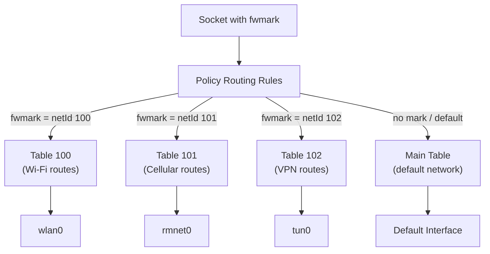
```mermaid
graph TD
    SOCKET["Socket with fwmark"] --> PR["Policy Routing Rules"]
    PR --> |"fwmark = netId 100"| RT100["Table 100<br/>(Wi-Fi routes)"]
    PR --> |"fwmark = netId 101"| RT101["Table 101<br/>(Cellular routes)"]
    PR --> |"fwmark = netId 102"| RT102["Table 102<br/>(VPN routes)"]
    PR --> |"no mark / default"| RTMAIN["Main Table<br/>(default network)"]

    RT100 --> IF_WLAN["wlan0"]
    RT101 --> IF_RMNET["rmnet0"]
    RT102 --> IF_TUN["tun0"]
    RTMAIN --> IF_DEFAULT["Default Interface"]
```

### 35.4.8 XfrmController: IPsec

The `XfrmController` manages Linux XFRM (IPsec transform) operations for
VPN and other encrypted tunnel needs:

**Source file:** `system/netd/server/XfrmController.cpp`

It handles:

- Security Association (SA) creation and deletion
- Security Policy (SP) configuration
- Tunnel interface management
- ESP (Encapsulating Security Payload) configuration
- SPI (Security Parameter Index) allocation

### 35.4.9 FwmarkServer

The `FwmarkServer` is a UNIX domain socket server within netd that handles
socket tagging. When a socket is created, the C library (`bionic`) connects
to the FwmarkServer, which applies the appropriate fwmark based on the
process's UID, the default network, and any explicit network binding.

**Source file:** `system/netd/server/FwmarkServer.cpp`

This mechanism ensures that every socket is automatically routed through the
correct network without application intervention.

---

## 35.5 DNS Resolver

### 35.5.1 Architecture

The DNS resolver runs as a module within the netd process (linked as a shared
library) but is maintained as a separate Mainline module for independent
updatability.

**Module root:** `packages/modules/DnsResolver/`

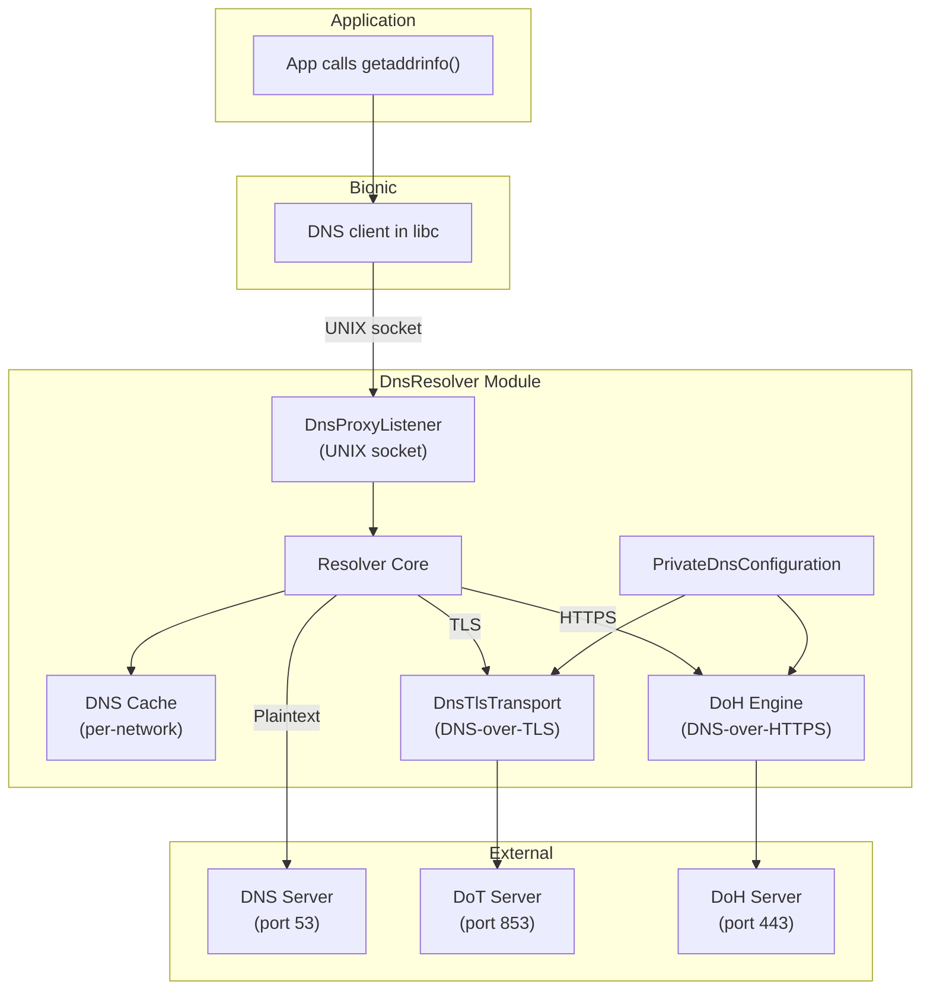
```mermaid
graph TD
    subgraph "Application"
        APP["App calls getaddrinfo()"]
    end

    subgraph "Bionic"
        BIONIC["DNS client in libc"]
    end

    subgraph "DnsResolver Module"
        DPL["DnsProxyListener<br/>(UNIX socket)"]
        RESOLV["Resolver Core"]
        CACHE["DNS Cache<br/>(per-network)"]
        DOT["DnsTlsTransport<br/>(DNS-over-TLS)"]
        DOH["DoH Engine<br/>(DNS-over-HTTPS)"]
        PDNS["PrivateDnsConfiguration"]
    end

    subgraph "External"
        DNS53["DNS Server<br/>(port 53)"]
        DNS853["DoT Server<br/>(port 853)"]
        DNS443["DoH Server<br/>(port 443)"]
    end

    APP --> BIONIC
    BIONIC -->|"UNIX socket"| DPL
    DPL --> RESOLV
    RESOLV --> CACHE
    RESOLV -->|"Plaintext"| DNS53
    RESOLV -->|"TLS"| DOT
    RESOLV -->|"HTTPS"| DOH
    DOT --> DNS853
    DOH --> DNS443
    PDNS --> DOT
    PDNS --> DOH
```

### 35.5.2 Initialization

The resolver is initialized when netd starts, through the `resolv_init()`
function:

**Source file:** `packages/modules/DnsResolver/DnsResolver.cpp`

```cpp
// Source: packages/modules/DnsResolver/DnsResolver.cpp
bool resolv_init(const ResolverNetdCallbacks* callbacks) {
    android::base::InitLogging(/*argv=*/nullptr);
    LOG(INFO) << __func__ << ": Initializing resolver";
    const bool isDebug = isDebuggable();
    resolv_set_log_severity(isDebug
        ? android::base::INFO
        : android::base::WARNING);
    doh_init_logger(isDebug
        ? DOH_LOG_LEVEL_INFO
        : DOH_LOG_LEVEL_WARN);

    using android::net::gApiLevel;
    gApiLevel = getApiLevel();
    using android::net::gResNetdCallbacks;
    gResNetdCallbacks.check_calling_permission =
        callbacks->check_calling_permission;
    gResNetdCallbacks.get_network_context =
        callbacks->get_network_context;
    gResNetdCallbacks.log = callbacks->log;
    if (gApiLevel >= 30) {
        gResNetdCallbacks.tagSocket = callbacks->tagSocket;
        gResNetdCallbacks.evaluate_domain_name =
            callbacks->evaluate_domain_name;
    }
    android::net::gDnsResolv = android::net::DnsResolver::getInstance();
    return android::net::gDnsResolv->start();
}
```

The `DnsResolver::start()` method launches two key components:

1. `DnsProxyListener`: Listens for DNS queries on a UNIX domain socket
2. `DnsResolverService`: AIDL Binder interface for configuration

```cpp
// Source: packages/modules/DnsResolver/DnsResolver.cpp
bool DnsResolver::start() {
    if (!verifyCallbacks()) {
        LOG(ERROR) << __func__ << ": Callback verification failed";
        return false;
    }
    if (mDnsProxyListener.startListener()) {
        PLOG(ERROR) << __func__ << ": Unable to start DnsProxyListener";
        return false;
    }
    binder_status_t ret;
    if ((ret = DnsResolverService::start()) != STATUS_OK) {
        LOG(ERROR) << __func__
                   << ": Unable to start DnsResolverService: " << ret;
        return false;
    }
    return true;
}
```

### 35.5.3 DNS Query Flow

When an application calls `InetAddress.getByName()` or `getaddrinfo()`, the
query follows this path:

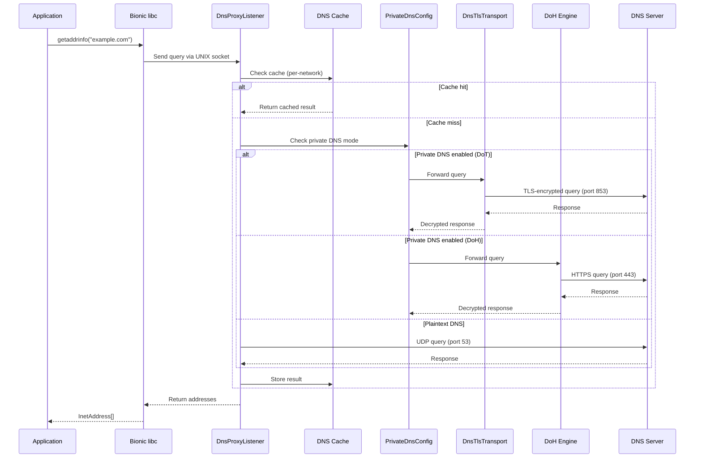
```mermaid
sequenceDiagram
    participant App as Application
    participant Bionic as Bionic libc
    participant DPL as DnsProxyListener
    participant Cache as DNS Cache
    participant Private as PrivateDnsConfig
    participant DoT as DnsTlsTransport
    participant DoH as DoH Engine
    participant Server as DNS Server

    App->>Bionic: getaddrinfo("example.com")
    Bionic->>DPL: Send query via UNIX socket
    DPL->>Cache: Check cache (per-network)
    alt Cache hit
        Cache-->>DPL: Return cached result
    else Cache miss
        DPL->>Private: Check private DNS mode
        alt Private DNS enabled (DoT)
            Private->>DoT: Forward query
            DoT->>Server: TLS-encrypted query (port 853)
            Server-->>DoT: Response
            DoT-->>Private: Decrypted response
        else Private DNS enabled (DoH)
            Private->>DoH: Forward query
            DoH->>Server: HTTPS query (port 443)
            Server-->>DoH: Response
            DoH-->>Private: Decrypted response
        else Plaintext DNS
            DPL->>Server: UDP query (port 53)
            Server-->>DPL: Response
        end
        DPL->>Cache: Store result
    end
    DPL-->>Bionic: Return addresses
    Bionic-->>App: InetAddress[]
```

### 35.5.4 DNS-over-TLS (DoT)

The `DnsTlsTransport` class implements DNS-over-TLS (RFC 7858) for encrypted
DNS queries on port 853.

**Source file:** `packages/modules/DnsResolver/DnsTlsTransport.cpp`

```cpp
// Source: packages/modules/DnsResolver/DnsTlsTransport.cpp
namespace {
// Make a DNS query for the hostname
// "<random>-dnsotls-ds.metric.gstatic.com".
// This is used for DoT validation probing.
std::vector<uint8_t> makeDnsQuery() {
    static const char kDnsSafeChars[] =
            "abcdefhijklmnopqrstuvwxyz"
            "ABCDEFHIJKLMNOPQRSTUVWXYZ"
            "0123456789";
    // ... builds a DNS query with random prefix for validation
}
}  // namespace
```

The DoT implementation features:

- **Session caching**: Reuses TLS sessions to reduce handshake overhead
- **Connection reuse**: Multiplexes queries over persistent connections
- **Validation**: Probes DoT servers before activating them
- **Failover**: Falls back to plaintext DNS if DoT fails

Key classes in the DoT stack:

| Class | File | Role |
|-------|------|------|
| `DnsTlsTransport` | `DnsTlsTransport.cpp` | Connection management |
| `DnsTlsSocket` | `DnsTlsSocket.cpp` | TLS socket wrapper |
| `DnsTlsDispatcher` | `DnsTlsDispatcher.cpp` | Query routing |
| `DnsTlsQueryMap` | `DnsTlsQueryMap.cpp` | Query/response matching |
| `DnsTlsSessionCache` | `DnsTlsSessionCache.cpp` | TLS session reuse |
| `DnsTlsServer` | `DnsTlsServer.cpp` | Server representation |

### 35.5.5 DNS-over-HTTPS (DoH)

DoH support was added in Android 13 and provides DNS encryption over HTTPS
(RFC 8484). The DoH engine is implemented in Rust for memory safety and
performance.

**Source file:** `packages/modules/DnsResolver/PrivateDnsConfiguration.cpp`

```cpp
// Source: packages/modules/DnsResolver/PrivateDnsConfiguration.cpp
FeatureFlags makeDohFeatureFlags() {
    const Experiments* const instance = Experiments::getInstance();
    const auto getTimeout = [&](const std::string_view key,
                                 int defaultValue) -> uint64_t {
        static constexpr int kMinTimeoutMs = 1000;
        uint64_t timeout = instance->getFlag(key, defaultValue);
        if (timeout < kMinTimeoutMs) {
            timeout = kMinTimeoutMs;
        }
        return timeout;
    };

    return FeatureFlags{
        .probe_timeout_ms = getTimeout("doh_probe_timeout_ms",
            PrivateDnsConfiguration::kDohProbeDefaultTimeoutMs),
        .idle_timeout_ms = getTimeout("doh_idle_timeout_ms",
            PrivateDnsConfiguration::kDohIdleDefaultTimeoutMs),
        .use_session_resumption =
            instance->getFlag("doh_session_resumption", 0) == 1,
        .enable_early_data =
            instance->getFlag("doh_early_data", 0) == 1,
    };
}
```

DoH feature flags allow server-side control over:

- **Probe timeout**: How long to wait for DoH validation
- **Idle timeout**: How long to keep idle connections open
- **Session resumption**: TLS 1.3 session resumption (0-RTT)
- **Early data**: TLS 1.3 early data for reduced latency

### 35.5.6 Private DNS Configuration

The `PrivateDnsConfiguration` class manages the lifecycle of private DNS
(DoT/DoH) servers, including validation and failover.

**Source file:** `packages/modules/DnsResolver/PrivateDnsConfiguration.cpp`

```cpp
// Source: packages/modules/DnsResolver/PrivateDnsConfiguration.cpp
// Returns the sorted (sort IPv6 before IPv4) servers.
std::vector<std::string> sortServers(
        const std::vector<std::string>& servers) {
    std::vector<std::string> out = servers;
    std::sort(out.begin(), out.end(),
        [](std::string a, std::string b) {
            return IPAddress::forString(a) > IPAddress::forString(b);
        });
    return out;
}
```

Private DNS modes:

1. **Off**: All DNS queries are plaintext
2. **Opportunistic** (default): Try DoT/DoH, fall back to plaintext
3. **Strict**: Force DoT/DoH; fail if unavailable

The validation state machine:

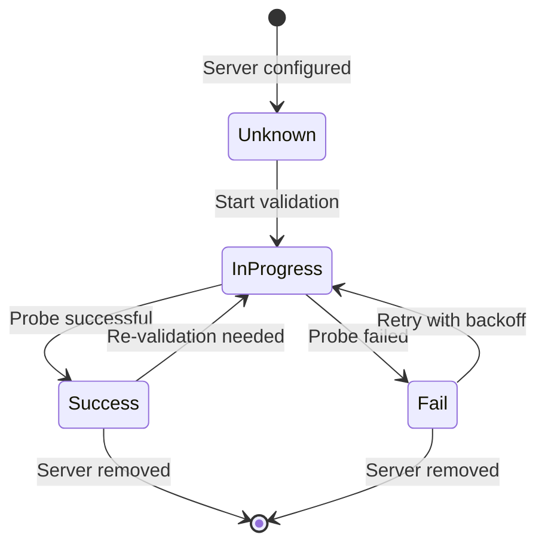
```mermaid
stateDiagram-v2
    [*] --> Unknown: Server configured
    Unknown --> InProgress: Start validation
    InProgress --> Success: Probe successful
    InProgress --> Fail: Probe failed
    Success --> InProgress: Re-validation needed
    Fail --> InProgress: Retry with backoff
    Success --> [*]: Server removed
    Fail --> [*]: Server removed
```

### 35.5.7 Dns64 and NAT64

The `Dns64Configuration` class handles DNS64 prefix discovery for IPv6-only
networks. When a network has no IPv4 connectivity, DNS64 synthesizes AAAA
records from A records, and NAT64 (handled by clatd in the connectivity module)
translates the packets.

**Source file:** `packages/modules/DnsResolver/Dns64Configuration.cpp`

### 35.5.8 Per-Network DNS Cache

The resolver maintains separate DNS caches per network ID. This prevents
DNS cache poisoning across networks and ensures that responses are appropriate
for the network context (e.g., captive portal responses are not cached for
the global DNS).

Key cache behaviors:

- **TTL-based expiry**: Respects DNS record TTL values
- **Network isolation**: Separate cache per netId
- **Negative caching**: Caches NXDOMAIN responses
- **Cache flushing**: Triggered on network changes

### 35.5.9 DNS Query Logging

The `DnsQueryLog` class provides diagnostic logging for DNS queries:

**Source file:** `packages/modules/DnsResolver/DnsQueryLog.cpp`

This enables debugging via `dumpsys dnsresolver` and metrics collection for
DNS performance monitoring.

---

## 35.6 VPN Framework

### 35.6.1 Architecture Overview

Android's VPN framework supports multiple VPN types: third-party VPN apps
(VpnService API), platform-managed IKEv2 VPNs, and legacy PPTP/L2TP VPNs.
The central implementation resides in the `Vpn` class.

**Source file:**
`frameworks/base/services/core/java/com/android/server/connectivity/Vpn.java`

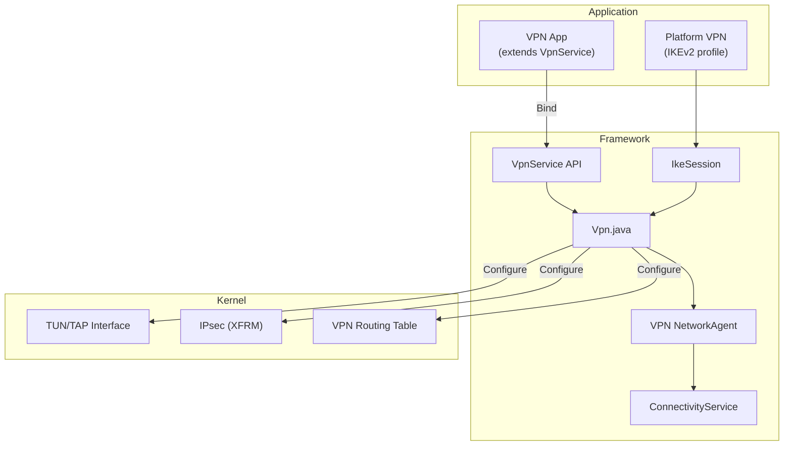
```mermaid
graph TD
    subgraph "Application"
        VPNAPP["VPN App<br/>(extends VpnService)"]
        IKEV2["Platform VPN<br/>(IKEv2 profile)"]
    end

    subgraph "Framework"
        VPN["Vpn.java"]
        VPNSVC["VpnService API"]
        IKESESS["IkeSession"]
        NA_VPN["VPN NetworkAgent"]
        CS["ConnectivityService"]
    end

    subgraph "Kernel"
        TUN["TUN/TAP Interface"]
        IPSEC["IPsec (XFRM)"]
        ROUTING_VPN["VPN Routing Table"]
    end

    VPNAPP -->|"Bind"| VPNSVC
    VPNSVC --> VPN
    IKEV2 --> IKESESS
    IKESESS --> VPN
    VPN --> NA_VPN
    NA_VPN --> CS
    VPN -->|"Configure"| TUN
    VPN -->|"Configure"| IPSEC
    VPN -->|"Configure"| ROUTING_VPN
```

### 35.6.2 The Vpn Class

The `Vpn` class is one of the most complex classes in the connectivity stack,
handling both third-party VPN apps and platform-managed VPNs.

```java
// Source: frameworks/base/services/core/java/com/android/server/connectivity/Vpn.java
public class Vpn {
    private static final String NETWORKTYPE = "VPN";
    private static final String TAG = "Vpn";

    // VPN launch idle allowlist duration
    private static final long VPN_LAUNCH_IDLE_ALLOWLIST_DURATION_MS = 60 * 1000;

    // IKEv2 retry delays with exponential backoff
    private static final long[] IKEV2_VPN_RETRY_DELAYS_MS =
            {1_000L, 2_000L, 5_000L, 30_000L, 60_000L, 300_000L, 900_000L};

    // Maximum VPN profile size (128 KB)
    static final int MAX_VPN_PROFILE_SIZE_BYTES = 1 << 17;

    // VPN network score
    private static final int VPN_DEFAULT_SCORE = 101;

    // Data stall recovery delays
    private static final long[] DATA_STALL_RECOVERY_DELAYS_MS =
            {1000L, 5000L, 30000L, 60000L, 120000L, 240000L, 480000L, 960000L};

    // Maximum MOBIKE recovery attempts
    private static final int MAX_MOBIKE_RECOVERY_ATTEMPT = 2;

    // Automatic keepalive interval
    public static final int AUTOMATIC_KEEPALIVE_DELAY_SECONDS = 30;
    // ...
}
```

### 35.6.3 VPN Types

Android supports three VPN implementation approaches:

**1. Third-Party VPN (VpnService API)**

Applications extend `VpnService` and request a TUN interface from the kernel.
All traffic matching the VPN's routing rules is redirected through this
interface, where the app encrypts and tunnels it.

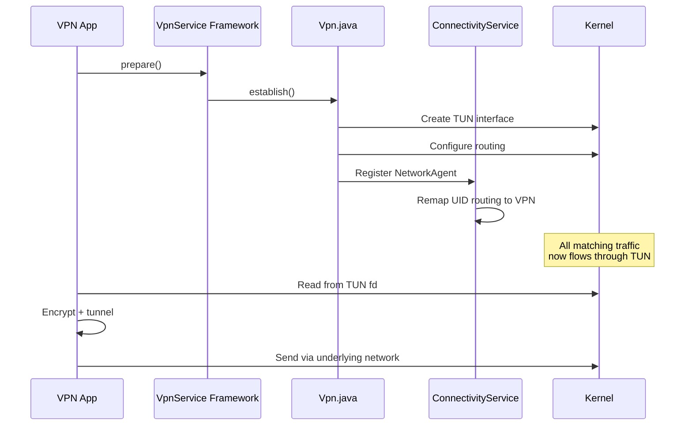
```mermaid
sequenceDiagram
    participant App as VPN App
    participant FW as VpnService Framework
    participant VPN as Vpn.java
    participant CS as ConnectivityService
    participant Kernel as Kernel

    App->>FW: prepare()
    FW->>VPN: establish()
    VPN->>Kernel: Create TUN interface
    VPN->>Kernel: Configure routing
    VPN->>CS: Register NetworkAgent
    CS->>CS: Remap UID routing to VPN
    Note over Kernel: All matching traffic<br/>now flows through TUN
    App->>Kernel: Read from TUN fd
    App->>App: Encrypt + tunnel
    App->>Kernel: Send via underlying network
```

**2. Platform VPN (IKEv2)**

For IKEv2 VPNs, the framework manages the entire connection lifecycle:

```java
// Source: frameworks/base/services/core/java/com/android/server/connectivity/Vpn.java
// IKE session management imports
import android.net.ipsec.ike.IkeSession;
import android.net.ipsec.ike.IkeSessionCallback;
import android.net.ipsec.ike.IkeSessionConfiguration;
import android.net.ipsec.ike.IkeSessionParams;
import android.net.ipsec.ike.IkeTunnelConnectionParams;
```

The platform handles:

- IKE negotiation (IKEv2 with EAP or certificate authentication)
- IPsec SA management
- MOBIKE for seamless network switching
- Automatic retry with exponential backoff
- Data stall detection and recovery

**3. Legacy VPN (PPTP/L2TP)**

Deprecated but still supported through the `LegacyVpnInfo` and `VpnProfile`
classes.

### 35.6.4 Per-App VPN

ConnectivityService can restrict VPN traffic to specific applications or
exclude specific applications. This is implemented through UID ranges:

```java
// Source: Vpn.java imports
import android.net.UidRangeParcel;
```

The UID ranges are configured on the VPN's network via netd's
`networkAddUidRanges()`. Packets from included UIDs are fwmarked for the VPN
routing table.

### 35.6.5 Always-On VPN

The always-on VPN feature ensures that a VPN is always active. If the
connection drops, traffic is either blocked (lockdown mode) or allowed to
flow through the underlying network (without lockdown).

```java
// Source: Vpn.java
private static final String LOCKDOWN_ALLOWLIST_SETTING_NAME =
        Settings.Secure.ALWAYS_ON_VPN_LOCKDOWN_WHITELIST;
```

Lockdown VPN implementation:

1. ConnectivityService blocks all traffic for the VPN's UID ranges using
   `BLOCKED_REASON_LOCKDOWN_VPN`
2. Only traffic through the VPN interface is permitted
3. Certain essential system apps can be allowlisted

### 35.6.6 VPN Network Agent

The VPN registers a `NetworkAgent` with ConnectivityService, advertising
capabilities that include:

- `TRANSPORT_VPN`
- Capabilities inherited from underlying networks (metered, not-roaming, etc.)
- Underlying network information for proper routing

```mermaid
graph TD
    subgraph "VPN Network"
        VPN_NA["VPN NetworkAgent<br/>TRANSPORT_VPN<br/>NET_CAPABILITY_INTERNET"]
    end

    subgraph "Underlying Networks"
        WIFI_NA["Wi-Fi NetworkAgent<br/>TRANSPORT_WIFI"]
        CELL_NA["Cellular NetworkAgent<br/>TRANSPORT_CELLULAR"]
    end

    VPN_NA -->|"Underlying"| WIFI_NA
    VPN_NA -.->|"Fallback"| CELL_NA
```

### 35.6.7 IKEv2 Data Stall Recovery

The Vpn class implements sophisticated data stall recovery for IKEv2 VPNs:

```java
// Source: Vpn.java
// Data stall recovery timers: 1s, 5s, 30s, 1m, 2m, 4m, 8m, 16m
private static final long[] DATA_STALL_RECOVERY_DELAYS_MS =
        {1000L, 5000L, 30000L, 60000L, 120000L, 240000L, 480000L, 960000L};
// Maximum attempts to perform MOBIKE when the network is bad
private static final int MAX_MOBIKE_RECOVERY_ATTEMPT = 2;
```

Recovery strategy:

1. First 2 attempts: Try MOBIKE (IKEv2 Mobility and Multihoming) to migrate
   the session to a different path
2. Subsequent attempts: Full session restart with exponential backoff
3. If all recovery attempts are exhausted, repeat the last interval

---

## 35.7 Tethering

### 35.7.1 Architecture Overview

The Tethering module allows Android devices to share their Internet connection
with other devices via USB, Wi-Fi hotspot, Bluetooth, Ethernet, or Wi-Fi
Direct.

**Module root:** `packages/modules/Connectivity/Tethering/`

```mermaid
graph TD
    subgraph "Tethering Module"
        TM["TetheringManager<br/>(public API)"]
        TETHER["Tethering.java<br/>(main coordinator)"]
        IPS["IpServer<br/>(per-interface)"]
        UNM["UpstreamNetworkMonitor"]
        BPF_COORD["BpfCoordinator"]
        IPV6_COORD["IPv6TetheringCoordinator"]
        RAD["RouterAdvertisementDaemon"]
        DHCP_S["DHCP Server"]
    end

    subgraph "External Components"
        CS["ConnectivityService"]
        NETD["netd"]
        WIFI["Wi-Fi Service"]
        USB["USB Service"]
        BT["Bluetooth Service"]
    end

    subgraph "Kernel"
        NAT["NAT (iptables)"]
        BPF_K["BPF Offload"]
        FORWARDING["IP Forwarding"]
    end

    TM -->|Binder| TETHER
    TETHER --> IPS
    TETHER --> UNM
    TETHER --> BPF_COORD
    TETHER --> IPV6_COORD
    IPS --> RAD
    IPS --> DHCP_S
    UNM -->|"Monitor"| CS
    TETHER --> NETD
    TETHER --> WIFI
    TETHER --> USB
    TETHER --> BT
    IPS --> NAT
    BPF_COORD --> BPF_K
    IPS --> FORWARDING
```

### 35.7.2 The Tethering Class

`Tethering.java` is the central coordinator for all tethering operations. It
manages the lifecycle of tethered interfaces and coordinates between upstream
(Internet-providing) and downstream (client-facing) networks.

**Source file:**
`packages/modules/Connectivity/Tethering/src/com/android/networkstack/tethering/Tethering.java`

```java
// Source: packages/modules/Connectivity/Tethering/src/com/android/networkstack/tethering/Tethering.java
// Supported tethering types:
// TETHERING_WIFI      - Wi-Fi hotspot
// TETHERING_USB       - USB tethering (RNDIS/NCM)
// TETHERING_BLUETOOTH - Bluetooth PAN
// TETHERING_WIFI_P2P  - Wi-Fi Direct tethering
// TETHERING_NCM       - USB NCM (Network Control Model)
// TETHERING_ETHERNET  - Ethernet tethering
// TETHERING_WIGIG     - WiGig (60 GHz)
// TETHERING_VIRTUAL   - Virtual tethering
```

### 35.7.3 Tethering Types

| Type | Interface | Transport | Use Case |
|------|-----------|-----------|----------|
| Wi-Fi | wlan0/1 | 802.11 | Mobile hotspot |
| USB RNDIS | rndis0 | USB | Wired to PC |
| USB NCM | ncm0 | USB | Modern USB networking |
| Bluetooth | bt-pan | BT PAN | Low-speed sharing |
| Ethernet | eth0 | Ethernet | Automotive, TV |
| Wi-Fi P2P | p2p0 | Wi-Fi Direct | Direct device sharing |
| WiGig | wigig0 | 802.11ad | High-speed 60 GHz |

### 35.7.4 IpServer: Per-Interface Management

Each tethered interface is managed by an `IpServer` instance that runs its
own state machine.

**Source file:**
`packages/modules/Connectivity/Tethering/src/android/net/ip/IpServer.java`

```mermaid
stateDiagram-v2
    [*] --> InitialState
    InitialState --> LocalHotspotState: LOCAL_ONLY request
    InitialState --> TetheredState: TETHERING request
    LocalHotspotState --> InitialState: Stop
    TetheredState --> InitialState: Stop
    TetheredState --> TetheredState: Upstream change

    state TetheredState {
        [*] --> ConfigureInterface
        ConfigureInterface --> RunDHCP: Start DHCP server
        RunDHCP --> SetupNAT: Configure NAT rules
        SetupNAT --> Active: Ready
        Active --> UpdateUpstream: Upstream changes
        UpdateUpstream --> Active: Reconfigure
    }
```

### 35.7.5 BPF Offload

The `BpfCoordinator` manages eBPF-based tethering offload, which bypasses
the Linux networking stack for forwarded packets, dramatically improving
throughput and reducing CPU usage.

**Source file:**
`packages/modules/Connectivity/Tethering/src/com/android/networkstack/tethering/BpfCoordinator.java`

```java
// Source: packages/modules/Connectivity/Tethering/src/com/android/networkstack/tethering/BpfCoordinator.java
// BPF maps used for tethering offload:
import com.android.net.module.util.bpf.Tether4Key;
import com.android.net.module.util.bpf.Tether4Value;
import com.android.net.module.util.bpf.TetherStatsValue;
```

The BPF tethering offload works by installing forwarding rules in eBPF maps:

```mermaid
graph LR
    subgraph "Without BPF Offload"
        A1["Downstream Packet"] --> B1["Kernel IP Stack"]
        B1 --> C1["iptables NAT"]
        C1 --> D1["Routing"]
        D1 --> E1["Upstream"]
    end

    subgraph "With BPF Offload"
        A2["Downstream Packet"] --> B2["BPF Program<br/>(TC ingress)"]
        B2 -->|"Lookup BPF map<br/>NAT + forward"| E2["Upstream"]
        B2 -.->|"Miss"| C2["Kernel IP Stack<br/>(slow path)"]
    end
```

The BPF maps contain:

- **Tether4Key/Tether4Value**: IPv4 connection tracking entries
- **TetherStatsValue**: Per-interface traffic statistics
- **Downstream/Upstream keys**: Direction-specific forwarding rules

### 35.7.6 IPv6 Tethering

The `IPv6TetheringCoordinator` manages IPv6 prefix delegation for tethered
clients:

**Source file:**
`packages/modules/Connectivity/Tethering/src/com/android/networkstack/tethering/IPv6TetheringCoordinator.java`

IPv6 tethering uses:

- **RouterAdvertisementDaemon**: Sends Router Advertisements to clients
- **DadProxy**: Handles Duplicate Address Detection for tethered devices
- **NeighborPacketForwarder**: Forwards neighbor discovery messages

```mermaid
sequenceDiagram
    participant Client as Tethered Client
    participant IPS as IpServer
    participant RAD as RA Daemon
    participant Upstream as Upstream Network

    Upstream->>IPS: IPv6 prefix delegated
    IPS->>RAD: Configure prefix for advertisement
    RAD->>Client: Router Advertisement (prefix, DNS)
    Client->>Client: SLAAC: Generate IPv6 address
    Client->>IPS: IPv6 traffic
    IPS->>Upstream: Forward (BPF or kernel)
```

### 35.7.7 DHCP Server

The tethering module includes its own DHCP server for assigning IPv4 addresses
to tethered clients:

```java
// Source: packages/modules/Connectivity/Tethering/src/android/net/dhcp/DhcpServingParamsParcelExt.java
```

The DHCP server provides:

- IPv4 address assignment from a configured pool
- Default gateway (the tethering device)
- DNS server configuration (forwarded from upstream)
- Lease management and renewal

### 35.7.8 Upstream Network Monitor

The `UpstreamNetworkMonitor` tracks available upstream networks and selects
the best one for providing Internet to tethered clients. It registers
network callbacks with ConnectivityService and responds to network changes.

Selection priority (typical):

1. DUN (Dedicated Upstream Network) capable cellular
2. Wi-Fi
3. Regular cellular
4. Ethernet

### 35.7.9 NAT Configuration

For IPv4 tethering, netd configures Network Address Translation (NAT) rules:

```mermaid
graph LR
    CLIENT["Tethered Client<br/>192.168.49.x"] -->|"src: 192.168.49.2"| TETHER["Tethering Device"]
    TETHER -->|"NAT: src -> WAN IP"| UPSTREAM["Internet"]
    UPSTREAM -->|"NAT: dst -> 192.168.49.2"| TETHER
    TETHER -->|"dst: 192.168.49.2"| CLIENT
```

The NAT is configured through netd's tethering controller, which sets up
iptables MASQUERADE rules in the nat/POSTROUTING chain.

---

## 35.8 Network Security Config

### 35.8.1 Overview

Android's Network Security Config allows applications to customize their
network security settings in a declarative XML format. This includes
certificate pinning, custom trust anchors, and cleartext traffic policies.

**Framework source:**
`frameworks/base/packages/NetworkSecurityConfig/platform/src/android/security/net/config/`

### 35.8.2 XML Configuration Format

Applications define their security configuration in
`res/xml/network_security_config.xml`, referenced from the `AndroidManifest.xml`:

```xml
<!-- Example network_security_config.xml -->
<network-security-config>
    <!-- Base configuration applying to all connections -->
    <base-config cleartextTrafficPermitted="false">
        <trust-anchors>
            <certificates src="system" />
        </trust-anchors>
    </base-config>

    <!-- Per-domain configuration -->
    <domain-config>
        <domain includeSubdomains="true">example.com</domain>
        <pin-set expiration="2025-12-31">
            <pin digest="SHA-256">base64EncodedPin=</pin>
            <pin digest="SHA-256">backupPinBase64=</pin>
        </pin-set>
        <trust-anchors>
            <certificates src="system" />
            <certificates src="@raw/my_ca" />
        </trust-anchors>
    </domain-config>

    <!-- Debug overrides (only active in debug builds) -->
    <debug-overrides>
        <trust-anchors>
            <certificates src="user" />
        </trust-anchors>
    </debug-overrides>
</network-security-config>
```

### 35.8.3 NetworkSecurityConfig Class

The `NetworkSecurityConfig` class is the runtime representation of the security
configuration:

**Source file:**
`frameworks/base/packages/NetworkSecurityConfig/platform/src/android/security/net/config/NetworkSecurityConfig.java`

```java
// Source: frameworks/base/packages/NetworkSecurityConfig/platform/src/android/security/net/config/NetworkSecurityConfig.java
public final class NetworkSecurityConfig {
    public static final boolean DEFAULT_CLEARTEXT_TRAFFIC_PERMITTED = true;
    public static final boolean DEFAULT_HSTS_ENFORCED = false;

    // Certificate Transparency verification for apps targeting after BAKLAVA
    @ChangeId
    @EnabledAfter(targetSdkVersion = Build.VERSION_CODES.BAKLAVA)
    static final long DEFAULT_ENABLE_CERTIFICATE_TRANSPARENCY = 407952621L;

    private final boolean mCleartextTrafficPermitted;
    private final boolean mHstsEnforced;
    private final boolean mCertificateTransparencyVerificationRequired;
    private final PinSet mPins;
    private final List<CertificatesEntryRef> mCertificatesEntryRefs;
    private Set<TrustAnchor> mAnchors;
    private NetworkSecurityTrustManager mTrustManager;
    // ...
}
```

### 35.8.4 XML Parsing

The `XmlConfigSource` class parses the XML configuration and creates
the runtime `NetworkSecurityConfig` objects:

**Source file:**
`frameworks/base/packages/NetworkSecurityConfig/platform/src/android/security/net/config/XmlConfigSource.java`

```java
// Source: frameworks/base/packages/NetworkSecurityConfig/platform/src/android/security/net/config/XmlConfigSource.java
public class XmlConfigSource implements ConfigSource {
    private static final int CONFIG_BASE = 0;
    private static final int CONFIG_DOMAIN = 1;
    private static final int CONFIG_DEBUG = 2;

    private NetworkSecurityConfig mDefaultConfig;
    private NetworkSecurityConfig mLocalhostConfig;
    private Set<Pair<Domain, NetworkSecurityConfig>> mDomainMap;
    // ...
}
```

### 35.8.5 Configuration Elements

| Element | Description |
|---------|-------------|
| `<base-config>` | Default config for all connections |
| `<domain-config>` | Per-domain overrides |
| `<debug-overrides>` | Debug-build-only settings |
| `<trust-anchors>` | Custom CA certificates |
| `<certificates>` | Certificate source (`system`, `user`, `@raw/`) |
| `<pin-set>` | Certificate pinning with expiration |
| `<pin>` | Individual pin (SHA-256 digest of public key) |
| `cleartextTrafficPermitted` | Allow/deny HTTP |
| `<certificateTransparency>` | CT verification requirement |

### 35.8.6 Key Implementation Classes

| Class | Role |
|-------|------|
| `NetworkSecurityConfig` | Runtime config representation |
| `XmlConfigSource` | XML parser |
| `ManifestConfigSource` | Reads manifest for config reference |
| `ApplicationConfig` | Per-app configuration manager |
| `NetworkSecurityTrustManager` | Custom `X509TrustManager` |
| `RootTrustManager` | Root of trust chain |
| `PinSet` | Certificate pin storage |
| `CertificatesEntryRef` | Certificate source reference |
| `SystemCertificateSource` | System CA store |
| `DirectoryCertificateSource` | Directory-based CA source |

### 35.8.7 Certificate Pinning Flow

```mermaid
sequenceDiagram
    participant App as Application
    participant TM as NetworkSecurityTrustManager
    participant Config as NetworkSecurityConfig
    participant PinSet as PinSet
    participant System as SystemCertificateSource

    App->>TM: TLS handshake
    TM->>Config: Get config for domain
    Config-->>TM: NetworkSecurityConfig
    TM->>System: Validate certificate chain
    System-->>TM: Chain valid
    TM->>PinSet: Check pins
    alt Pin matches
        PinSet-->>TM: Pin valid
        TM-->>App: Connection allowed
    else Pin mismatch
        PinSet-->>TM: Pin invalid
        TM-->>App: Connection rejected
    end
```

### 35.8.8 Certificate Transparency

Starting with Android 16, Certificate Transparency (CT) verification is
enabled by default for apps targeting the latest SDK:

```java
// Source: NetworkSecurityConfig.java
@ChangeId
@EnabledAfter(targetSdkVersion = Build.VERSION_CODES.BAKLAVA)
static final long DEFAULT_ENABLE_CERTIFICATE_TRANSPARENCY = 407952621L;
```

The `CertificateTransparencyService` in the Connectivity module manages
CT log list updates and verification:

**Source directory:**
`packages/modules/Connectivity/networksecurity/service/src/com/android/server/net/ct/`

```xml
<!-- Example: enabling CT in network security config -->
<network-security-config>
  <base-config>
    <certificateTransparency enabled="true" />
  </base-config>
</network-security-config>
```

### 35.8.9 Cleartext Traffic Restrictions

By default, Android blocks cleartext (non-HTTPS) traffic for apps targeting
Android 9+. The `StrictController` in netd enforces this at the network level:

```
// Source: system/netd/server/Controllers.cpp
// StrictController is in the FILTER_OUTPUT chain:
static const std::vector<const char*> FILTER_OUTPUT = {
    OEM_IPTABLES_FILTER_OUTPUT,
    FirewallController::LOCAL_OUTPUT,
    StrictController::LOCAL_OUTPUT,    // <-- cleartext enforcement
    BandwidthController::LOCAL_OUTPUT,
};
```

### 35.8.10 Default Security Behavior by Target SDK

| Target SDK | Cleartext | User CAs | CT Required |
|-----------|-----------|----------|------------|
| < 24 (Android 7) | Allowed | Trusted | No |
| 24-27 | Allowed | Not trusted | No |
| 28+ (Android 9) | Blocked | Not trusted | No |
| 36+ (BAKLAVA) | Blocked | Not trusted | Yes (default) |

---

## 35.9 NetworkStack Module

### 35.9.1 Overview

The NetworkStack Mainline module handles IP provisioning, network validation
(captive portal detection), and DHCP. It runs in a separate process
(`com.android.networkstack`) with `NETWORK_STACK` permission, isolating
these critical functions from the rest of the system.

**Module root:** `packages/modules/NetworkStack/`

```mermaid
graph TD
    subgraph "NetworkStack Module"
        NM["NetworkMonitor"]
        IPC["IpClient"]
        DHCP["DHCP Client"]
        CPD["Captive Portal Detection"]
        DS["Data Stall Detection"]
        IPMS["IpMemoryStore"]
    end

    subgraph "ConnectivityService"
        CS["ConnectivityService"]
        NA["NetworkAgent"]
    end

    subgraph "Network"
        PORTAL["Captive Portal"]
        INTERNET["Internet"]
        DHCP_SRV["DHCP Server"]
    end

    CS -->|"Create monitor"| NM
    NM -->|"Validation result"| CS
    NA --> IPC
    IPC --> DHCP
    DHCP --> DHCP_SRV
    NM --> CPD
    NM --> DS
    CPD --> PORTAL
    CPD --> INTERNET
    NM --> IPMS
```

### 35.9.2 NetworkMonitor: Network Validation

`NetworkMonitor` is a state machine that validates network connectivity by
probing Internet endpoints. It detects captive portals, partial connectivity,
and data stalls.

**Source file:**
`packages/modules/NetworkStack/src/com/android/server/connectivity/NetworkMonitor.java`

```java
// Source: packages/modules/NetworkStack/src/com/android/server/connectivity/NetworkMonitor.java
public class NetworkMonitor extends StateMachine {
    // Validation probe types
    // NETWORK_VALIDATION_PROBE_DNS      - DNS resolution test
    // NETWORK_VALIDATION_PROBE_HTTP     - HTTP probe (generate_204)
    // NETWORK_VALIDATION_PROBE_HTTPS    - HTTPS probe
    // NETWORK_VALIDATION_PROBE_FALLBACK - Fallback URL probe
    // NETWORK_VALIDATION_PROBE_PRIVDNS  - Private DNS validation
    // ...
}
```

The validation state machine:

```mermaid
stateDiagram-v2
    [*] --> DefaultState

    state DefaultState {
        [*] --> MaybeNotifyState
        MaybeNotifyState --> EvaluatingState: Start validation
        EvaluatingState --> ValidatedState: All probes pass
        EvaluatingState --> CaptivePortalState: Portal detected
        EvaluatingState --> WaitingForNextProbeState: Probe failed
        WaitingForNextProbeState --> EvaluatingState: Retry timer
        CaptivePortalState --> EvaluatingState: User dismissed portal
        ValidatedState --> EvaluatingState: Re-validation needed
    }

    state EvaluatingState {
        [*] --> ProbeHTTPS
        ProbeHTTPS --> ProbeHTTP: In parallel
        ProbeHTTPS --> ProbeDNS: In parallel
        ProbeDNS --> CheckResults
        ProbeHTTP --> CheckResults
        ProbeHTTPS --> CheckResults
    }
```

### 35.9.3 Validation Probes

NetworkMonitor performs multiple types of probes to determine network status:

| Probe | URL/Method | Purpose |
|-------|-----------|---------|
| HTTP | `http://connectivitycheck.gstatic.com/generate_204` | Detect captive portals |
| HTTPS | `https://www.google.com/generate_204` | Verify TLS works |
| DNS | A/AAAA queries for probe hostnames | Verify DNS resolution |
| Fallback | Configurable fallback URLs | Alternative probing |
| Private DNS | Probe private DNS hostname | Verify DoT/DoH |

```java
// Source: NetworkMonitor.java imports showing probe constants
import static com.android.networkstack.util.NetworkStackUtils.CAPTIVE_PORTAL_HTTPS_URL;
import static com.android.networkstack.util.NetworkStackUtils.CAPTIVE_PORTAL_HTTP_URL;
import static com.android.networkstack.util.NetworkStackUtils.CAPTIVE_PORTAL_FALLBACK_URL;
import static com.android.networkstack.util.NetworkStackUtils.CAPTIVE_PORTAL_OTHER_FALLBACK_URLS;
import static com.android.networkstack.util.NetworkStackUtils.CAPTIVE_PORTAL_OTHER_HTTPS_URLS;
import static com.android.networkstack.util.NetworkStackUtils.CAPTIVE_PORTAL_OTHER_HTTP_URLS;
```

### 35.9.4 Captive Portal Detection

Captive portal detection works by comparing HTTP responses against expected
values:

```mermaid
flowchart TD
    START["Send HTTP GET to<br/>connectivitycheck.gstatic.com/generate_204"]
    R204["Response: 204 No Content"]
    R302["Response: 302/301 Redirect"]
    R200["Response: 200 with content"]
    TIMEOUT["Timeout / DNS failure"]

    VALIDATED["Network VALIDATED"]
    PORTAL["CAPTIVE PORTAL<br/>Show sign-in notification"]
    PARTIAL["PARTIAL CONNECTIVITY"]
    INVALID["INVALID / Retry"]

    START --> R204
    START --> R302
    START --> R200
    START --> TIMEOUT

    R204 --> VALIDATED
    R302 --> PORTAL
    R200 -->|"Content != expected"| PORTAL
    R200 -->|"Content matches"| VALIDATED
    TIMEOUT --> INVALID
```

When a captive portal is detected:

1. NetworkMonitor reports `NETWORK_TEST_RESULT_INVALID` with a redirect URL
2. ConnectivityService adds `NET_CAPABILITY_CAPTIVE_PORTAL` to the network
3. A notification is shown to the user
4. The user taps the notification and is shown the portal login page
5. After login, NetworkMonitor re-validates

### 35.9.5 Data Stall Detection

NetworkMonitor also detects data stalls on validated networks using two
mechanisms:

**DNS-based detection:**

```java
// Source: NetworkMonitor.java imports
import static android.net.util.DataStallUtils.DATA_STALL_EVALUATION_TYPE_DNS;
import static android.net.util.DataStallUtils.DEFAULT_CONSECUTIVE_DNS_TIMEOUT_THRESHOLD;
```

If consecutive DNS queries time out beyond a threshold, a data stall is
reported.

**TCP-based detection:**

```java
import static android.net.util.DataStallUtils.DATA_STALL_EVALUATION_TYPE_TCP;
import static android.net.util.DataStallUtils.DEFAULT_TCP_POLLING_INTERVAL_MS;
```

TCP metrics (packet loss rate, retransmission count) are polled at regular
intervals. If the failure rate exceeds a threshold, a data stall is detected.

```mermaid
graph TD
    subgraph "DNS Stall Detection"
        DNS_Q["DNS Queries"] --> DNS_T["Track timeouts"]
        DNS_T -->|"Consecutive timeouts<br/>> threshold"| STALL_DNS["Data Stall!"]
    end

    subgraph "TCP Stall Detection"
        TCP_P["Poll TCP metrics<br/>(every N seconds)"] --> TCP_A["Analyze"]
        TCP_A -->|"Packet fail rate<br/>> threshold"| STALL_TCP["Data Stall!"]
    end

    STALL_DNS --> REPORT["Report to<br/>ConnectivityService"]
    STALL_TCP --> REPORT
    REPORT --> CS_ACTION["CS: Notify apps via<br/>ConnectivityDiagnosticsManager"]
```

### 35.9.6 IpClient: IP Provisioning

`IpClient` (formerly `IpManager`) handles the IP provisioning lifecycle for
a network interface. It manages:

- DHCP client for IPv4 address assignment
- IPv6 SLAAC (Stateless Address Autoconfiguration)
- Router discovery
- Neighbor discovery
- APF (Android Packet Filter) program installation

The IP provisioning flow:

```mermaid
sequenceDiagram
    participant WF as Wi-Fi Framework
    participant IPC as IpClient
    participant DHCP as DHCP Client
    participant SLAAC as IPv6 SLAAC
    participant Server as DHCP Server
    participant Router as Router

    WF->>IPC: startProvisioning(config)
    par IPv4 Provisioning
        IPC->>DHCP: Start DHCP discovery
        DHCP->>Server: DHCPDISCOVER
        Server->>DHCP: DHCPOFFER
        DHCP->>Server: DHCPREQUEST
        Server->>DHCP: DHCPACK
        DHCP->>IPC: IPv4 address assigned
    and IPv6 Provisioning
        IPC->>SLAAC: Listen for RAs
        Router->>SLAAC: Router Advertisement
        SLAAC->>IPC: IPv6 address (SLAAC)
    end
    IPC->>WF: onProvisioningSuccess(linkProperties)
```

### 35.9.7 IpMemoryStore

The `IpMemoryStore` persists network-related data across connections, enabling
faster reconnections and smarter network selection:

- **L2 key mapping**: Maps L2 (MAC/BSSID) information to stored data
- **Network attributes**: Stores previously assigned addresses, DNS servers
- **Blob storage**: Generic key-value storage for network metadata
- **Expiry management**: Automatically cleans up stale entries

### 35.9.8 Module Isolation

The NetworkStack module runs in its own process with specific permissions:

```mermaid
graph TD
    subgraph "system_server Process"
        CS["ConnectivityService"]
    end

    subgraph "NetworkStack Process"
        NS["NetworkStackService"]
        NM["NetworkMonitor"]
        IPC["IpClient"]
    end

    CS <-->|"AIDL IPC<br/>INetworkMonitor<br/>IIpClient"| NS

    classDef server fill:#e1f5fe
    classDef stack fill:#f3e5f5
    class CS server
    class NS,NM,IPC stack
```

This process isolation provides:

- **Security**: Network validation code runs with limited privileges
- **Updatability**: Module can be updated independently
- **Stability**: Crashes in NetworkStack do not bring down system_server
- **Testability**: Easier to test in isolation

---

## 35.10 VCN (Virtual Carrier Network)

The Virtual Carrier Network (VCN) subsystem provides carrier-grade IPsec
tunneling over any available transport -- cellular or Wi-Fi -- presenting the
result as a single, seamless mobile network to the rest of the platform. Where a
traditional VPN serves user privacy, VCN serves the *carrier*: a mobile operator
can configure the device to wrap all traffic in an IKEv2/IPsec tunnel back to
the carrier's gateway, effectively creating a "virtual" carrier network that
follows the subscriber across physical transports.

### 35.10.1 Motivation and Design Goals

Carriers that deploy Wi-Fi Offload (ePDG) or private networks need a mechanism
to tunnel subscriber traffic securely from the device to the carrier gateway,
regardless of whether the device is on Wi-Fi, cellular, or switching between
them. VCN provides:

1. **Carrier-bound tunneling**: Unlike user VPNs, VCN tunnels are tied to a
   carrier subscription group. Only the carrier's provisioning app (with
   carrier privileges) can install a VCN configuration.
2. **Seamless mobility**: When the underlying transport changes (e.g., Wi-Fi to
   cellular), the VCN migrates the IKE/IPsec session via MOBIKE (RFC 4555),
   avoiding TCP connection resets visible to applications.
3. **Safe-mode fallback**: If the tunnel cannot be established within a timeout,
   VCN falls back to "safe mode" -- exposing the raw underlying networks so the
   device is never left without connectivity.
4. **Per-capability gateway connections**: A single VCN instance can manage
   multiple gateway connections, each serving different `NetworkCapabilities`
   (e.g., one for INTERNET, another for DUN/tethering).

### 35.10.2 Architecture

**Module root:** `packages/modules/Connectivity/Vcn/`

The VCN subsystem is organised into four main classes, each at a different
level of granularity:

```mermaid
graph TD
    subgraph "VCN Management Layer"
        VCNMS["VcnManagementService<br/>(IVcnManagementService.Stub)"]
        TST["TelephonySubscriptionTracker"]
    end

    subgraph "VCN Instance Layer"
        VCN["Vcn<br/>(per subscription group)"]
        VNP["VcnNetworkProvider"]
    end

    subgraph "Gateway Connection Layer"
        GW1["VcnGatewayConnection #1<br/>(INTERNET)"]
        GW2["VcnGatewayConnection #2<br/>(DUN)"]
    end

    subgraph "Route Selection Layer"
        UNC1["UnderlyingNetworkController"]
        UNE1["UnderlyingNetworkEvaluator"]
        NPC["NetworkPriorityClassifier"]
    end

    subgraph "Tunnel Layer"
        IKE["IkeSession<br/>(IKEv2 + IPsec)"]
        NA["VCN NetworkAgent"]
        TUN["IPsec Tunnel Interface"]
    end

    subgraph "Underlying Transports"
        WIFI["Wi-Fi Network"]
        CELL["Cellular Network"]
    end

    VCNMS -->|"Creates per sub-group"| VCN
    VCNMS --> TST
    TST -->|"Subscription snapshots"| VCNMS
    VCN --> VNP
    VNP -->|"NetworkRequest routing"| VCN
    VCN -->|"Creates per capability"| GW1
    VCN -->|"Creates per capability"| GW2
    GW1 --> UNC1
    UNC1 --> UNE1
    UNC1 --> NPC
    UNE1 -->|"Monitors"| WIFI
    UNE1 -->|"Monitors"| CELL
    GW1 --> IKE
    IKE --> TUN
    GW1 --> NA
    NA -->|"Registered with"| CS["ConnectivityService"]
```

The hierarchy from the AOSP source captures this precisely:

```
// Source: packages/modules/Connectivity/Vcn/service-b/src/com/android/server/VcnManagementService.java
// Lines 115-163 (ASCII art from the source comment)

VcnManagementService --1:1--> TelephonySubscriptionTracker
        |
     1:N Creates when config present, subscription group active,
        and providing app is carrier privileged
        |
        v
       Vcn -- manages GatewayConnection lifecycles based on
              fulfillable NetworkRequests and overall safe-mode
        |
     1:N Creates to fulfill NetworkRequests
        |
        v
  VcnGatewayConnection -- manages a single IKEv2 tunnel session
        and NetworkAgent, handles mobility events
        |
     1:1 Creates upon instantiation
        |
        v
  UnderlyingNetworkController -- manages underlying physical
        networks, filing requests to bring them up
```

### 35.10.3 VcnManagementService

`VcnManagementService` is the top-level system service, registered with
`ServiceManager` and accessible via `VcnManager`. It is responsible for:

- **Config persistence**: VCN configs are stored as XML in
  `/data/system/vcn/configs.xml` and survive reboots.
- **Carrier-privilege enforcement**: Only apps with carrier privileges for the
  subscription group can set or clear VCN configs.
- **Vcn lifecycle management**: Creates and tears down `Vcn` instances as
  subscription groups become active/inactive.
- **Underlying network policy**: Provides `VcnUnderlyingNetworkPolicy` to
  ConnectivityService, controlling whether underlying networks are marked
  as `NOT_VCN_MANAGED`.

```java
// Source: packages/modules/Connectivity/Vcn/service-b/src/com/android/server/VcnManagementService.java
public class VcnManagementService extends IVcnManagementService.Stub {
    // Configs stored persistently
    static final String VCN_CONFIG_FILE =
            new File(Environment.getDataDirectory(),
                "system/vcn/configs.xml").getPath();

    // Grace period before tearing down if carrier privileges are lost
    static final long CARRIER_PRIVILEGES_LOST_TEARDOWN_DELAY_MS =
            TimeUnit.SECONDS.toMillis(30);

    // Wi-Fi is restricted by default (must go through VCN tunnel)
    private static final Set<Integer> RESTRICTED_TRANSPORTS_DEFAULT =
            Collections.singleton(TRANSPORT_WIFI);
    // ...
}
```

### 35.10.4 TelephonySubscriptionTracker

The `TelephonySubscriptionTracker` de-noises subscription change events and
provides a stable snapshot of active subscription groups to
`VcnManagementService`. A subscription group is considered "active and ready"
when:

1. At least one contained subscription ID has carrier config loaded
   (`CarrierConfigManager.isConfigForIdentifiedCarrier()` returns true).
2. The subscription is listed as active per `SubscriptionManager`.

```java
// Source: packages/modules/Connectivity/Vcn/service-b/src/com/android/server/vcn/TelephonySubscriptionTracker.java
public class TelephonySubscriptionTracker extends BroadcastReceiver {
    // Maps slot IDs to ready subscription IDs
    private final Map<Integer, Integer> mReadySubIdsBySlotId = new HashMap<>();
    // ...
}
```

### 35.10.5 The Vcn Class

Each `Vcn` instance manages all `VcnGatewayConnection`s for a single
subscription group. It acts as a `Handler`, processing messages for
configuration updates, network requests, subscription changes, safe-mode
transitions, and mobile data toggles.

```java
// Source: packages/modules/Connectivity/Vcn/service-b/src/com/android/server/vcn/Vcn.java
public class Vcn extends Handler {
    // VCN network score -- must beat raw underlying networks
    private static final int VCN_LEGACY_SCORE_INT = 52;

    // Capabilities requiring mobile data to be enabled
    private static final List<Integer> CAPS_REQUIRING_MOBILE_DATA =
            Arrays.asList(NET_CAPABILITY_INTERNET, NET_CAPABILITY_DUN);

    // Map of active gateway connections
    private final Map<VcnGatewayConnectionConfig, VcnGatewayConnection>
            mVcnGatewayConnections = new HashMap<>();

    // Status tracking: ACTIVE, SAFE_MODE, or INACTIVE
    private volatile int mCurrentStatus = VCN_STATUS_CODE_ACTIVE;
}
```

Key message types handled by `Vcn`:

| Message | Trigger |
|---------|---------|
| `MSG_EVENT_CONFIG_UPDATED` | Carrier app updated VCN configuration |
| `MSG_EVENT_NETWORK_REQUESTED` | New `NetworkRequest` from `VcnNetworkProvider` |
| `MSG_EVENT_SUBSCRIPTIONS_CHANGED` | Subscription snapshot changed |
| `MSG_EVENT_GATEWAY_CONNECTION_QUIT` | A gateway connection tore down |
| `MSG_EVENT_SAFE_MODE_STATE_CHANGED` | Safe-mode timer fired or cleared |
| `MSG_EVENT_MOBILE_DATA_TOGGLED` | User toggled mobile data |

### 35.10.6 VcnGatewayConnection State Machine

`VcnGatewayConnection` is the heart of the VCN subsystem -- a `StateMachine`
managing a single IKEv2/IPsec tunnel and its corresponding `NetworkAgent`. The
state machine has five states:

```mermaid
stateDiagram-v2
    [*] --> DisconnectedState
    DisconnectedState --> ConnectingState : Underlying network available
    ConnectingState --> ConnectedState : IKE session negotiated
    ConnectingState --> DisconnectingState : Error occurred
    ConnectingState --> RetryTimeoutState : Retriable error
    ConnectedState --> DisconnectingState : Teardown or error
    ConnectedState --> RetryTimeoutState : Retriable error
    DisconnectingState --> RetryTimeoutState : Has underlying network
    DisconnectingState --> DisconnectedState : No underlying network
    RetryTimeoutState --> ConnectingState : Retry timer expired
    RetryTimeoutState --> DisconnectingState : Teardown requested
```

Key events processed by the state machine:

```java
// Source: packages/modules/Connectivity/Vcn/service-b/src/com/android/server/vcn/VcnGatewayConnection.java
// Selected event constants
private static final int EVENT_UNDERLYING_NETWORK_CHANGED = 1;
private static final int EVENT_RETRY_TIMEOUT_EXPIRED = 2;
private static final int EVENT_SESSION_LOST = 3;
private static final int EVENT_SESSION_CLOSED = 4;
private static final int EVENT_TRANSFORM_CREATED = 5;
private static final int EVENT_SETUP_COMPLETED = 6;
```

Critical timeouts govern the behaviour:

| Timeout | Value | Purpose |
|---------|-------|---------|
| `NETWORK_LOSS_DISCONNECT_TIMEOUT` | 30 s | Grace period before tearing down after underlying network lost |
| `TEARDOWN_TIMEOUT` | 5 s | Maximum time to wait for IKE session closure |
| `SAFEMODE_TIMEOUT` | 30 s | Time before entering safe mode if tunnel cannot establish |

### 35.10.7 Underlying Network Selection

The `UnderlyingNetworkController` evaluates available physical networks
(cellular, Wi-Fi) and selects the best one for the tunnel. Selection is based
on carrier-defined priority templates:

```java
// Source: packages/modules/Connectivity/Vcn/service-b/src/com/android/server/vcn/routeselection/UnderlyingNetworkController.java
public class UnderlyingNetworkController {
    // Tracks all underlying networks with their evaluators
    private final Map<Network, UnderlyingNetworkEvaluator>
            mUnderlyingNetworkRecords = new ArrayMap<>();

    // Separate callbacks for Wi-Fi and cell bring-up
    private final List<NetworkCallback> mCellBringupCallbacks = new ArrayList<>();
    private NetworkCallback mWifiBringupCallback;
    // Wi-Fi RSSI threshold callbacks for entry/exit hysteresis
    private NetworkCallback mWifiEntryRssiThresholdCallback;
    private NetworkCallback mWifiExitRssiThresholdCallback;
}
```

The `NetworkPriorityClassifier` implements the priority logic. Carriers
configure `VcnUnderlyingNetworkTemplate` objects (cell or Wi-Fi templates)
with match criteria including:

- **Cellular**: roaming state, opportunistic flag, home/roaming PLMN
- **Wi-Fi**: SSID, RSSI thresholds (with entry/exit hysteresis)

### 35.10.8 Safe Mode

Safe mode is VCN's critical reliability mechanism. If a `VcnGatewayConnection`
cannot establish a tunnel within `SAFEMODE_TIMEOUT_SECONDS` (30 seconds), the
entire `Vcn` instance enters safe mode:

1. Underlying networks are no longer marked as restricted (the
   `NET_CAPABILITY_NOT_VCN_MANAGED` capability is restored).
2. Applications can access the raw underlying networks directly.
3. The VCN continues attempting to establish the tunnel in the background.
4. Once the tunnel is re-established, the VCN exits safe mode.

This ensures that a misconfigured or unreachable carrier gateway never leaves
the device without network connectivity.

### 35.10.9 VcnNetworkProvider

`VcnNetworkProvider` registers with `ConnectivityService` as a `NetworkProvider`
and routes incoming `NetworkRequest`s to the appropriate `Vcn` instance. It
builds a capability filter that matches cellular-type requests:

```java
// Source: packages/modules/Connectivity/Vcn/service-b/src/com/android/server/vcn/VcnNetworkProvider.java
private NetworkCapabilities buildCapabilityFilter() {
    final NetworkCapabilities.Builder builder =
            new NetworkCapabilities.Builder()
                    .addTransportType(TRANSPORT_CELLULAR)
                    .addCapability(NET_CAPABILITY_TRUSTED)
                    .addCapability(NET_CAPABILITY_NOT_RESTRICTED)
                    .addCapability(NET_CAPABILITY_NOT_VPN)
                    .addCapability(NET_CAPABILITY_NOT_VCN_MANAGED);
    for (int cap : VcnGatewayConnectionConfig.ALLOWED_CAPABILITIES) {
        builder.addCapability(cap);
    }
    return builder.build();
}
```

### 35.10.10 Integration with ConnectivityService

From `ConnectivityService`'s perspective, a VCN tunnel appears as a regular
cellular `NetworkAgent`. The key distinction is the `NOT_VCN_MANAGED` capability:

- **Underlying networks** (raw Wi-Fi/cellular) are marked as *lacking*
  `NOT_VCN_MANAGED` when VCN is active, making them invisible to most apps.
- **The VCN NetworkAgent** carries `NOT_VCN_MANAGED`, so it satisfies normal
  `NetworkRequest`s.
- In safe mode, underlying networks regain `NOT_VCN_MANAGED`.

```mermaid
sequenceDiagram
    participant App as Application
    participant CM as ConnectivityManager
    participant CS as ConnectivityService
    participant VNP as VcnNetworkProvider
    participant VCN as Vcn
    participant GW as VcnGatewayConnection
    participant IKE as IkeSession
    participant UNC as UnderlyingNetworkController

    App->>CM: requestNetwork(INTERNET)
    CM->>CS: NetworkRequest
    CS->>VNP: onNetworkNeeded()
    VNP->>VCN: handleNetworkRequested()
    VCN->>GW: create VcnGatewayConnection
    GW->>UNC: start monitoring transports
    UNC-->>GW: underlying network selected
    GW->>IKE: openSession(IkeSessionParams)
    IKE-->>GW: onChildTransformCreated()
    GW->>GW: apply IPsec transforms to tunnel
    GW->>CS: register VCN NetworkAgent
    CS-->>App: onAvailable(VCN network)
```

### 35.10.11 Key Source Files

| Class | Path | Lines |
|-------|------|-------|
| VcnManagementService | `packages/modules/Connectivity/Vcn/service-b/src/com/android/server/VcnManagementService.java` | 1,551 |
| Vcn | `packages/modules/Connectivity/Vcn/service-b/src/com/android/server/vcn/Vcn.java` | 791 |
| VcnGatewayConnection | `packages/modules/Connectivity/Vcn/service-b/src/com/android/server/vcn/VcnGatewayConnection.java` | 3,122 |
| VcnNetworkProvider | `packages/modules/Connectivity/Vcn/service-b/src/com/android/server/vcn/VcnNetworkProvider.java` | ~200 |
| UnderlyingNetworkController | `packages/modules/Connectivity/Vcn/service-b/src/com/android/server/vcn/routeselection/UnderlyingNetworkController.java` | ~400 |
| TelephonySubscriptionTracker | `packages/modules/Connectivity/Vcn/service-b/src/com/android/server/vcn/TelephonySubscriptionTracker.java` | ~350 |
| NetworkPriorityClassifier | `packages/modules/Connectivity/Vcn/service-b/src/com/android/server/vcn/routeselection/NetworkPriorityClassifier.java` | ~300 |

---

## 35.11 Thread Network

Thread is an IPv6-based mesh networking protocol designed for low-power IoT
(Internet of Things) devices, built on the IEEE 802.15.4 radio standard.
Android's Thread implementation, added as part of the Connectivity Mainline
module, allows Android devices to serve as Thread Border Routers -- bridging
Thread mesh networks to the wider IP infrastructure (Wi-Fi/Ethernet).

### 35.11.1 What is Thread?

Thread is a low-power, low-latency mesh networking protocol standardised by
the Thread Group. Key properties:

- **IEEE 802.15.4**: Uses the 2.4 GHz radio band with 250 kbps throughput,
  channel pages 0 (channels 11-26).
- **IPv6 native**: Every Thread device gets a globally routable IPv6 address;
  no NAT or application-layer gateways needed.
- **Mesh topology**: Devices self-organise into a mesh, with Routers forwarding
  packets and a single Leader coordinating the network.
- **Low power**: End devices (Children) can sleep for extended periods,
  delegating packet buffering to their parent Router.
- **Thread 1.3**: The current version, supporting features like Service
  Registration Protocol (SRP), multicast, and NAT64 for IPv4 connectivity.

Device roles in a Thread network:

| Role | Description |
|------|-------------|
| Leader | Elected Router that manages Router ID assignment and network data |
| Router | Full participant that forwards packets and can act as parent for Children |
| Child | End device associated with a parent Router; may sleep to save power |
| Border Router | Router with connectivity to external IP networks (Wi-Fi/Ethernet) |
| Detached | Device not currently part of a Thread partition |

### 35.11.2 Architecture

**Module root:** `packages/modules/Connectivity/thread/`

Android's Thread implementation spans three layers:

```mermaid
graph TD
    subgraph "Framework Layer"
        TNM["ThreadNetworkManager<br/>(@SystemService)"]
        TNC["ThreadNetworkController"]
        AOD["ActiveOperationalDataset"]
    end

    subgraph "Service Layer"
        TNS["ThreadNetworkService<br/>(IThreadNetworkManager.Stub)"]
        TNCS["ThreadNetworkControllerService<br/>(IThreadNetworkController.Stub)"]
        TNF["ThreadNetworkFactory"]
        TNCC["ThreadNetworkCountryCode"]
    end

    subgraph "Native Layer"
        OTD["ot-daemon<br/>(OpenThread daemon)"]
        OT["OpenThread Stack"]
        TUN["TUN Interface<br/>(thread-wpan0)"]
        IEEE["IEEE 802.15.4 Radio"]
    end

    subgraph "Connectivity Integration"
        CS["ConnectivityService"]
        NA["NetworkAgent<br/>(TRANSPORT_THREAD)"]
        MDNS["NsdPublisher<br/>(mDNS/SRP)"]
    end

    TNM --> TNC
    TNC -->|Binder| TNCS
    TNCS --> OTD
    OTD --> OT
    OT --> TUN
    OT --> IEEE
    TNCS --> NA
    NA --> CS
    TNCS --> MDNS
    TNS --> TNCS
    TNF --> CS
```

### 35.11.3 ThreadNetworkManager and ThreadNetworkController

`ThreadNetworkManager` is the public `@SystemApi` entry point, registered as
the `thread_network` system service. It provides access to
`ThreadNetworkController` instances -- currently a single controller per device:

```java
// Source: packages/modules/Connectivity/thread/framework/java/android/net/thread/ThreadNetworkManager.java
@SystemService(ThreadNetworkManager.SERVICE_NAME)
public final class ThreadNetworkManager {
    public static final String SERVICE_NAME = "thread_network";
    public static final String FEATURE_NAME =
            "android.hardware.thread_network";

    @NonNull
    public List<ThreadNetworkController> getAllThreadNetworkControllers() {
        return mUnmodifiableControllerServices;
    }
}
```

`ThreadNetworkController` exposes the full Thread control plane:

```java
// Source: packages/modules/Connectivity/thread/framework/java/android/net/thread/ThreadNetworkController.java
public final class ThreadNetworkController {
    // Device roles
    public static final int DEVICE_ROLE_STOPPED = 0;
    public static final int DEVICE_ROLE_DETACHED = 1;
    public static final int DEVICE_ROLE_CHILD = 2;
    public static final int DEVICE_ROLE_ROUTER = 3;
    public static final int DEVICE_ROLE_LEADER = 4;

    // Radio states
    public static final int STATE_DISABLED = 0;
    public static final int STATE_ENABLED = 1;
    public static final int STATE_DISABLING = 2;

    // Thread version
    public static final int THREAD_VERSION_1_3 = 4;
}
```

Key APIs on the controller:

| Method | Permission | Description |
|--------|------------|-------------|
| `setEnabled()` | `THREAD_NETWORK_PRIVILEGED` | Enable/disable Thread radio (persistent across reboots) |
| `join()` | `THREAD_NETWORK_PRIVILEGED` | Join a Thread network with an Operational Dataset |
| `leave()` | `THREAD_NETWORK_PRIVILEGED` | Leave the current Thread network |
| `scheduleMigration()` | `THREAD_NETWORK_PRIVILEGED` | Schedule migration to a new dataset |
| `createRandomizedDataset()` | `THREAD_NETWORK_PRIVILEGED` | Generate a new random dataset |
| `registerStateCallback()` | -- | Observe role, connectivity, and enabled state |
| `registerOperationalDatasetCallback()` | -- | Observe dataset changes |
| `setChannelMaxPowers()` | `THREAD_NETWORK_PRIVILEGED` | Set per-channel transmit power limits |

### 35.11.4 Active Operational Dataset

An `ActiveOperationalDataset` contains all parameters needed to join a Thread
network. It is serialised as a TLV (Type-Length-Value) byte array, following
the Thread specification:

```java
// Source: packages/modules/Connectivity/thread/framework/java/android/net/thread/ActiveOperationalDataset.java
public final class ActiveOperationalDataset implements Parcelable {
    public static final int LENGTH_MAX_DATASET_TLVS = 254;
    public static final int LENGTH_EXTENDED_PAN_ID = 8;
    public static final int LENGTH_NETWORK_KEY = 16;
    public static final int LENGTH_MESH_LOCAL_PREFIX_BITS = 64;
    public static final int LENGTH_PSKC = 16;
    public static final int CHANNEL_PAGE_24_GHZ = 0;
}
```

The dataset contains:

| Field | Length | Description |
|-------|--------|-------------|
| Network Name | 1-16 bytes (UTF-8) | Human-readable network identifier |
| Network Key | 16 bytes | AES-128 encryption key for the mesh |
| Extended PAN ID | 8 bytes | Unique network identifier |
| Mesh-Local Prefix | 64 bits | IPv6 prefix for mesh-internal addresses |
| PSKc | 16 bytes | Pre-Shared Key for commissioner authentication |
| Channel | 2 bytes | IEEE 802.15.4 channel (page + number) |
| PAN ID | 2 bytes | Short PAN identifier |
| Security Policy | variable | Key rotation time and security flags |

### 35.11.5 ThreadNetworkControllerService

The service implementation lives in
`ThreadNetworkControllerService`, which communicates with the native
`ot-daemon` process via AIDL:

```java
// Source: packages/modules/Connectivity/thread/service/java/com/android/server/thread/ThreadNetworkControllerService.java
final class ThreadNetworkControllerService extends IThreadNetworkController.Stub {
    // ot-daemon communication
    @Nullable private IOtDaemon mOtDaemon;
    // Network integration
    @Nullable private NetworkAgent mNetworkAgent;
    // Infrastructure link monitoring
    private Network mUpstreamNetwork;
    // TUN interface for Thread traffic
    private final TunInterfaceController mTunIfController;
    // mDNS/SRP publisher
    private final NsdPublisher mNsdPublisher;
}
```

The service initialises `ot-daemon` with the device configuration:

```java
// Source: ThreadNetworkControllerService.java (simplified)
private IOtDaemon getOtDaemon() throws RemoteException {
    IOtDaemon otDaemon = mOtDaemonSupplier.get();  // waits for ot_daemon
    otDaemon.initialize(
            shouldEnableThread(),
            newOtDaemonConfig(mPersistentSettings.getConfiguration()),
            mTunIfController.getTunFd(),
            mNsdPublisher,
            getMeshcopTxtAttributes(mResources.get(), mSystemProperties),
            mCountryCodeSupplier.get(),
            FeatureFlags.isTrelEnabled(),
            mOtDaemonCallbackProxy);
    otDaemon.asBinder().linkToDeath(
            () -> mHandler.post(this::onOtDaemonDied), 0);
    return otDaemon;
}
```

### 35.11.6 OpenThread and ot-daemon

The native Thread protocol implementation is based on
[OpenThread](https://openthread.io/), Google's open-source Thread stack. The
`ot-daemon` process runs as a system daemon, initialised via an `.rc` file:

```
# packages/modules/Connectivity/thread/apex/ot-daemon.34rc
service ot-daemon /apex/com.android.tethering/bin/ot-daemon
```

`ot-daemon` manages:

- The IEEE 802.15.4 radio driver (via the Thread Radio Co-Processor interface)
- The Thread mesh protocol stack (MLE, routing, 6LoWPAN)
- A TUN interface (`thread-wpan0`) for passing IPv6 traffic between the
  Thread mesh and the Android networking stack
- Service Registration Protocol (SRP) for mDNS service discovery

### 35.11.7 Connectivity Integration

Thread networks integrate with `ConnectivityService` through a `NetworkAgent`
with `TRANSPORT_THREAD`. The service creates a `LocalNetworkConfig` for the
Thread interface and registers multicast routing rules:

```mermaid
sequenceDiagram
    participant TNCS as ThreadNetworkControllerService
    participant OTD as ot-daemon
    participant TUN as thread-wpan0 TUN
    participant NA as NetworkAgent
    participant CS as ConnectivityService
    participant UP as Upstream Network (Wi-Fi)

    OTD->>TNCS: onThreadDeviceRoleChanged(LEADER)
    TNCS->>NA: register(TRANSPORT_THREAD)
    NA->>CS: connected
    TNCS->>CS: requestUpstreamNetwork(Wi-Fi/Ethernet)
    CS-->>TNCS: upstream network available
    TNCS->>TNCS: configure multicast routing
    Note over TUN,UP: IPv6 traffic bridged<br/>between Thread mesh and upstream
```

The upstream network request prefers Wi-Fi or Ethernet with INTERNET capability:

```java
// Source: ThreadNetworkControllerService.java
private NetworkRequest newUpstreamNetworkRequest() {
    return new NetworkRequest.Builder()
            .addTransportType(NetworkCapabilities.TRANSPORT_WIFI)
            .addTransportType(NetworkCapabilities.TRANSPORT_ETHERNET)
            .addCapability(NetworkCapabilities.NET_CAPABILITY_INTERNET)
            .build();
}
```

### 35.11.8 Ephemeral Key Commissioning

Thread 1.3 introduced the Ephemeral Key (ePSKc) mechanism for secure device
commissioning. A new device can use a short-lived key to join the network:

```java
// Source: ThreadNetworkController.java
// Ephemeral key states
public static final int EPHEMERAL_KEY_DISABLED = 0;
public static final int EPHEMERAL_KEY_ENABLED = 1;
public static final int EPHEMERAL_KEY_IN_USE = 2;

// Maximum lifetime of 10 minutes
private static final Duration EPHEMERAL_KEY_LIFETIME_MAX =
        Duration.ofMinutes(10);
```

When enabled, an external commissioner (e.g., a smartphone app) can use the
ephemeral key to establish a DTLS session with the Border Router, obtain the
network credentials, and join the Thread mesh.

### 35.11.9 Country Code and Channel Management

`ThreadNetworkCountryCode` coordinates with Wi-Fi and Telephony country code
modules to determine the operating region, which affects allowed channels
and transmit power. The service is initialised after both modules are ready:

```java
// Source: ThreadNetworkService.java
public void onBootPhase(int phase) {
    if (phase == SystemService.PHASE_SYSTEM_SERVICES_READY) {
        mControllerService = ThreadNetworkControllerService.newInstance(
                mContext, mPersistentSettings,
                () -> mCountryCode.getCountryCode());
        mCountryCode = ThreadNetworkCountryCode.newInstance(
                mContext, mControllerService, mPersistentSettings);
    } else if (phase == SystemService.PHASE_BOOT_COMPLETED) {
        // Delayed to BOOT_COMPLETED because Wi-Fi/Telephony
        // country code modules need to be ready first
        mCountryCode.initialize();
    }
}
```

### 35.11.10 Key Source Files

| Class | Path |
|-------|------|
| ThreadNetworkManager | `packages/modules/Connectivity/thread/framework/java/android/net/thread/ThreadNetworkManager.java` |
| ThreadNetworkController | `packages/modules/Connectivity/thread/framework/java/android/net/thread/ThreadNetworkController.java` |
| ActiveOperationalDataset | `packages/modules/Connectivity/thread/framework/java/android/net/thread/ActiveOperationalDataset.java` |
| ThreadNetworkService | `packages/modules/Connectivity/thread/service/java/com/android/server/thread/ThreadNetworkService.java` |
| ThreadNetworkControllerService | `packages/modules/Connectivity/thread/service/java/com/android/server/thread/ThreadNetworkControllerService.java` |
| ThreadNetworkCountryCode | `packages/modules/Connectivity/thread/service/java/com/android/server/thread/ThreadNetworkCountryCode.java` |
| ThreadNetworkFactory | `packages/modules/Connectivity/thread/service/java/com/android/server/thread/ThreadNetworkFactory.java` |
| NsdPublisher | `packages/modules/Connectivity/thread/service/java/com/android/server/thread/NsdPublisher.java` |

---

## 35.12 Deep Dive: ConnectivityService Internals

This appendix section provides additional depth on the most critical internal
mechanisms of ConnectivityService.

### 35.12.1 Network Agent Registration

When a transport (Wi-Fi, cellular, etc.) creates a NetworkAgent and calls
`register()`, ConnectivityService processes the registration through
`handleRegisterNetworkAgent()`:

```java
// Source: packages/modules/Connectivity/service/src/com/android/server/ConnectivityService.java
private void handleRegisterNetworkAgent(NetworkAgentInfo nai,
        INetworkMonitor networkMonitor) {
    if (VDBG) log("Network Monitor created for " + nai);
    // Store a copy of the declared capabilities.
    nai.setDeclaredCapabilities(nai.networkCapabilities);
    // Make sure the LinkProperties and NetworkCapabilities reflect
    // what the agent info said.
    nai.getAndSetNetworkCapabilities(mixInCapabilities(nai,
            nai.getDeclaredCapabilitiesSanitized(
                mCarrierPrivilegeAuthenticator)));
    processLinkPropertiesFromAgent(nai, nai.linkProperties);

    mNetworkAgentInfos.add(nai);
    synchronized (mNetworkForNetId) {
        mNetworkForNetId.put(nai.network.getNetId(), nai);
    }

    try {
        networkMonitor.start();
    } catch (RemoteException e) {
        e.rethrowAsRuntimeException();
    }

    if (nai.isLocalNetwork()) {
        handleUpdateLocalNetworkConfig(nai,
            null /* oldConfig */, nai.localNetworkConfig);
    }
    nai.notifyRegistered(networkMonitor);
    NetworkInfo networkInfo = nai.networkInfo;
    updateNetworkInfo(nai, networkInfo);
    maybeUpdateVpnUids(nai, null, nai.networkCapabilities);
    nai.processEnqueuedMessages(mTrackerHandler::handleMessage);
}
```

The registration process:

1. **Sanitize capabilities**: The declared capabilities are validated and
   mixed with system-level overrides
2. **Process link properties**: Validate routes, DNS servers, and interface
3. **Store the agent**: Add to the tracking data structures
4. **Start NetworkMonitor**: Begin validation probes
5. **Handle local networks**: Configure forwarding for Thread, etc.
6. **Update network info**: Trigger rematch if the network is connected
7. **Process enqueued messages**: Deliver any messages queued during registration

### 35.12.2 The Rematch Algorithm

The `rematchAllNetworksAndRequests()` method is the heart of network selection.
It runs every time something changes that could affect which network best
satisfies each request.

```java
// Source: packages/modules/Connectivity/service/src/com/android/server/ConnectivityService.java
private void rematchAllNetworksAndRequests() {
    rematchNetworksAndRequests(getNrisFromGlobalRequests());
}

private void rematchNetworksAndRequests(
        @NonNull final Set<NetworkRequestInfo> networkRequests) {
    ensureRunningOnConnectivityServiceThread();
    final long start = SystemClock.elapsedRealtime();
    final NetworkReassignment changes =
        computeNetworkReassignment(networkRequests);
    final long computed = SystemClock.elapsedRealtime();
    applyNetworkReassignment(changes, start);
    final long applied = SystemClock.elapsedRealtime();
    issueNetworkNeeds();
    final long end = SystemClock.elapsedRealtime();
    if (VDBG || DDBG) {
        log(String.format(
            "Rematched networks [computed %dms] [applied %dms] [issued %d]",
            computed - start, applied - computed, end - applied));
        log(changes.debugString());
    }
}
```

The rematch is a three-phase process:

**Phase 1: Compute reassignment (`computeNetworkReassignment`)**

- For each network request, find the best network that satisfies it
- Compare capabilities, score, and other attributes
- Build a `NetworkReassignment` object describing all changes

**Phase 2: Apply reassignment (`applyNetworkReassignment`)**

- Update the default network if it changed
- Send callbacks to applications (onAvailable, onLost, etc.)
- Configure forwarding rules for local networks
- Update linger timers

**Phase 3: Issue network needs (`issueNetworkNeeds`)**

- Notify network factories about unsatisfied requests
- Allow factories to bring up new networks if needed

### 35.12.3 NetworkReassignment Data Structure

The `NetworkReassignment` class accumulates all changes that result from a
rematch into a single atomic operation:

```java
// Source: packages/modules/Connectivity/service/src/com/android/server/ConnectivityService.java
private static class NetworkReassignment {
    static class RequestReassignment {
        @NonNull public final NetworkRequestInfo mNetworkRequestInfo;
        @Nullable public final NetworkRequest mOldNetworkRequest;
        @Nullable public final NetworkRequest mNewNetworkRequest;
        @Nullable public final NetworkAgentInfo mOldNetwork;
        @Nullable public final NetworkAgentInfo mNewNetwork;
        // ...

        public String toString() {
            final NetworkRequest requestToShow = null != mNewNetworkRequest
                    ? mNewNetworkRequest
                    : mNetworkRequestInfo.mRequests.get(0);
            return requestToShow.requestId + " : "
                    + (null != mOldNetwork
                        ? mOldNetwork.network.getNetId() : "null")
                    + " -> "
                    + (null != mNewNetwork
                        ? mNewNetwork.network.getNetId() : "null");
        }
    }

    @NonNull private final ArrayList<RequestReassignment>
        mReassignments = new ArrayList<>();
    // ...
}
```

### 35.12.4 Default Network Selection

When the default network changes, ConnectivityService must update the kernel's
default routing and notify all interested applications:

```java
// Source: packages/modules/Connectivity/service/src/com/android/server/ConnectivityService.java
private void makeDefaultNetwork(
        @Nullable final NetworkAgentInfo newDefaultNetwork) {
    try {
        if (null != newDefaultNetwork) {
            mNetd.networkSetDefault(
                newDefaultNetwork.network.getNetId());
        } else {
            mNetd.networkClearDefault();
        }
    } catch (RemoteException | ServiceSpecificException e) {
        loge("Exception setting default network :" + e);
    }
}
```

The full default network change process:

```mermaid
sequenceDiagram
    participant CS as ConnectivityService
    participant NETD as netd
    participant DNSR as DnsResolver
    participant APPS as Applications
    participant KERNEL as Kernel

    CS->>CS: rematchAllNetworksAndRequests()
    Note over CS: New best network found
    CS->>NETD: networkSetDefault(newNetId)
    NETD->>KERNEL: Update default routing rules
    CS->>DNSR: setDefaultNetwork(newNetId)
    DNSR->>DNSR: Switch DNS cache to new network
    CS->>APPS: onAvailable(newNetwork)
    CS->>APPS: onLosing(oldNetwork, lingerMs)
    Note over CS: After linger timeout
    CS->>APPS: onLost(oldNetwork)
    CS->>CS: teardownUnneededNetwork(oldNai)
```

### 35.12.5 ConnectivityFlags: Feature Flags

ConnectivityService uses runtime feature flags to enable or disable specific
behaviors, allowing gradual rollouts and quick rollbacks:

```java
// Source: packages/modules/Connectivity/service/src/com/android/server/connectivity/ConnectivityFlags.java
public final class ConnectivityFlags {
    // Boot namespace for this module
    public static final String NAMESPACE_TETHERING_BOOT = "tethering_boot";

    // Feature flags
    public static final String REQUEST_RESTRICTED_WIFI =
            "request_restricted_wifi";
    public static final String INGRESS_TO_VPN_ADDRESS_FILTERING =
            "ingress_to_vpn_address_filtering";
    public static final String BACKGROUND_FIREWALL_CHAIN =
            "background_firewall_chain";
    public static final String CELLULAR_DATA_INACTIVITY_TIMEOUT =
            "cellular_data_inactivity_timeout";
    public static final String WIFI_DATA_INACTIVITY_TIMEOUT =
            "wifi_data_inactivity_timeout";
    public static final String DELAY_DESTROY_SOCKETS =
            "delay_destroy_sockets";
    public static final String QUEUE_CALLBACKS_FOR_FROZEN_APPS =
            "queue_callbacks_for_frozen_apps";
    public static final String CLOSE_QUIC_CONNECTION =
            "close_quic_connection";
    public static final String CONSTRAINED_DATA_SATELLITE_METRICS =
            "constrained_data_satellite_metrics";
    public static final String USE_SATELLITE_REPORTED_SUSPENDED_AND_ROAMING =
            "use_satellite_reported_suspended_and_roaming";
    // ...
}
```

Notable feature flags:

| Flag | Purpose |
|------|---------|
| `QUEUE_CALLBACKS_FOR_FROZEN_APPS` | Queue network callbacks for frozen apps |
| `DELAY_DESTROY_SOCKETS` | Delay socket destruction on network switch |
| `CLOSE_QUIC_CONNECTION` | Close QUIC connections on network change |
| `BACKGROUND_FIREWALL_CHAIN` | Background firewall chain enforcement |
| `CELLULAR_DATA_INACTIVITY_TIMEOUT` | Cellular idle timeout |
| `WIFI_DATA_INACTIVITY_TIMEOUT` | Wi-Fi idle timeout |
| `INGRESS_TO_VPN_ADDRESS_FILTERING` | Filter ingress to VPN addresses |
| `REQUEST_RESTRICTED_WIFI` | Allow restricted Wi-Fi requests |

### 35.12.6 DNS Resolver Unsolicited Events

ConnectivityService registers for unsolicited events from the DNS resolver
to monitor DNS health and handle NAT64 prefix changes:

```java
// Source: packages/modules/Connectivity/service/src/com/android/server/ConnectivityService.java
// DnsResolverUnsolicitedEventCallback handles:
//   onDnsHealthEvent - DNS query success/failure rates
//   onNat64PrefixEvent - NAT64 prefix discovery/removal
//   onPrivateDnsValidationEvent - Private DNS server validation
```

```java
@Override
public void onDnsHealthEvent(final DnsHealthEventParcel event) {
    NetworkAgentInfo nai = getNetworkAgentInfoForNetId(event.netId);
    if (nai != null && nai.satisfies(
            mDefaultRequest.mRequests.get(0))) {
        nai.networkMonitor().notifyDnsResponse(event.healthResult);
    }
}

@Override
public void onNat64PrefixEvent(final Nat64PrefixEventParcel event) {
    mHandler.post(() -> handleNat64PrefixEvent(
        event.netId, event.prefixOperation,
        event.prefixAddress, event.prefixLength));
}
```

### 35.12.7 Blocked Reasons

ConnectivityService tracks why network access might be blocked for a specific
UID, using a bitmask of reasons:

```java
// From ConnectivityManager:
import static android.net.ConnectivityManager.BLOCKED_REASON_APP_BACKGROUND;
import static android.net.ConnectivityManager.BLOCKED_REASON_LOCKDOWN_VPN;
import static android.net.ConnectivityManager.BLOCKED_REASON_NETWORK_RESTRICTED;
import static android.net.ConnectivityManager.BLOCKED_REASON_NONE;
import static android.net.ConnectivityManager.BLOCKED_METERED_REASON_MASK;
```

Blocked reasons and their triggers:

| Reason | Trigger |
|--------|---------|
| `BLOCKED_REASON_NONE` | Traffic is not blocked |
| `BLOCKED_REASON_APP_BACKGROUND` | App is in background with restrictions |
| `BLOCKED_REASON_LOCKDOWN_VPN` | VPN lockdown active, app not in VPN |
| `BLOCKED_REASON_NETWORK_RESTRICTED` | Network is restricted |
| `BLOCKED_METERED_REASON_*` | Metered network restrictions (data saver) |

Applications receive blocked status changes through the `onBlockedStatusChanged`
callback.

---

## 35.13 Deep Dive: Wi-Fi Internals

### 35.13.1 ActiveModeWarden: Wi-Fi Mode Management

The `ActiveModeWarden` manages the Wi-Fi chip's operating modes. Modern Wi-Fi
chips support concurrent operation in multiple modes (STA + STA, STA + AP,
STA + P2P, etc.), and the warden coordinates these.

```mermaid
graph TD
    WARDEN["ActiveModeWarden"]
    CMM1["ConcreteClientModeManager<br/>(Primary STA)"]
    CMM2["ConcreteClientModeManager<br/>(Secondary STA)"]
    SAM["SoftApManager<br/>(AP Mode)"]
    CMI1["ClientModeImpl<br/>(wlan0)"]
    CMI2["ClientModeImpl<br/>(wlan1)"]

    WARDEN --> CMM1
    WARDEN --> CMM2
    WARDEN --> SAM
    CMM1 --> CMI1
    CMM2 --> CMI2
```

### 35.13.2 Client Roles

Each ClientModeManager operates in a specific role:

```java
// Source: packages/modules/Wifi/service/java/com/android/server/wifi/ClientModeImpl.java
// ROLE_CLIENT_PRIMARY - the main STA interface (handles default connection)
// ROLE_CLIENT_LOCAL_ONLY - local-only connection (P2P, local hotspot)
// ROLE_CLIENT_SECONDARY_LONG_LIVED - persistent secondary (dual-STA)
// ROLE_CLIENT_SECONDARY_TRANSIENT - temporary secondary (make-before-break)
// ROLE_CLIENT_SCAN_ONLY - scan-only mode (no connection)
```

The dual-STA architecture enables:

- **Make-Before-Break** (MBB): Connect to a new network before disconnecting
  from the old one, eliminating connectivity gaps during handover
- **Dual simultaneous connections**: Connect to two different networks at once
  (e.g., Internet + IoT network)
- **Wi-Fi Direct while connected**: Maintain STA connection during P2P

### 35.13.3 Wi-Fi Scanning Architecture

Wi-Fi scanning is a multi-layered process:

```mermaid
graph TD
    subgraph "Scan Requestors"
        APP_SCAN["App Scan Request"]
        AUTO_SCAN["Auto-join Scan"]
        CONN_SCAN["Connectivity Scan"]
        PNO["Preferred Network Offload"]
    end

    subgraph "Scan Coordination"
        PROXY["ScanRequestProxy"]
        SCHED["WifiScanningScheduler"]
    end

    subgraph "Execution"
        SCANNER["WifiScanner"]
        WNATIVE["WifiNative"]
        DRIVER["Wi-Fi Driver"]
    end

    APP_SCAN --> PROXY
    AUTO_SCAN --> SCHED
    CONN_SCAN --> SCHED
    PNO --> WNATIVE
    PROXY --> SCANNER
    SCHED --> SCANNER
    SCANNER --> WNATIVE
    WNATIVE --> DRIVER
```

**Preferred Network Offload (PNO)**: Hardware-offloaded scanning that runs even
when the CPU is asleep. The Wi-Fi firmware scans for preferred networks and
wakes the CPU only when a match is found.

### 35.13.4 Wi-Fi Security Protocols

ClientModeImpl supports a comprehensive set of security protocols:

| Protocol | Key | Authentication | Introduced |
|----------|-----|---------------|------------|
| Open | None | None | Original |
| WEP | Shared key | Pre-shared key | Original (deprecated) |
| WPA-Personal | TKIP/AES | PSK | Android 1.0 |
| WPA2-Personal | AES | PSK | Android 1.0 |
| WPA3-Personal | AES | SAE | Android 10 |
| WPA2-Enterprise | AES | 802.1X/EAP | Android 1.0 |
| WPA3-Enterprise | AES-256 | 802.1X/EAP | Android 10 |
| OWE | AES | Opportunistic | Android 10 |
| WAPI | SMS4 | Certificate/PSK | Android 11 |
| DPP | AES | Device Provisioning | Android 10 |

### 35.13.5 Wi-Fi Network Scoring Details

The WifiNetworkSelector uses a sophisticated scoring algorithm:

```mermaid
graph TD
    SCAN["Scan Results"]
    FILTER["Filter:<br/>- Security compatible<br/>- BSSID not blocked<br/>- Signal above threshold"]
    SCORE["Score each candidate:<br/>+ RSSI score (band-weighted)<br/>+ Security bonus<br/>+ Saved network bonus<br/>+ Suggestion bonus<br/>+ Current network bonus<br/>- Penalty for recent failures"]
    SELECT["Select highest score"]
    CONNECT["Initiate connection"]

    SCAN --> FILTER
    FILTER --> SCORE
    SCORE --> SELECT
    SELECT --> CONNECT
```

---

## 35.14 Deep Dive: netd Internals

### 35.14.1 netd Process Architecture

The `netd` process runs as `root` (or with `CAP_NET_ADMIN`) and consists of
several threads:

```mermaid
graph TD
    subgraph "netd Process"
        MAIN["Main Thread<br/>(Binder server)"]
        NNS["NetdNativeService<br/>(AIDL Binder)"]
        NHW["NetdHwService<br/>(HIDL/AIDL HAL)"]
        FWS["FwmarkServer<br/>(UNIX socket)"]
        NLH["NetlinkHandler<br/>(Netlink listener)"]
        DNS["DnsResolver<br/>(shared library)"]
    end

    subgraph "Clients"
        CS_C["ConnectivityService"]
        BIONIC_C["Bionic libc"]
        KERNEL_C["Kernel Events"]
    end

    CS_C -->|"Binder"| NNS
    BIONIC_C -->|"UNIX socket"| FWS
    KERNEL_C -->|"Netlink"| NLH
    NNS --> NHW
```

### 35.14.2 IptablesRestoreController

Rather than executing individual iptables commands (which would require forking
a process for each rule change), netd uses `iptables-restore` to batch rule
updates:

```cpp
// Source: system/netd/server/IptablesRestoreController.cpp
// The controller maintains persistent stdin/stdout pipes to iptables-restore
// processes, sending batches of rules and reading back results.
```

This approach provides:

- **Atomicity**: Multiple rules are applied as a single transaction
- **Performance**: No process fork overhead per rule
- **Error handling**: Failures in a batch are reported as a group

### 35.14.3 SockDiag: Socket Diagnostics

The `SockDiag` class uses Linux's SOCK_DIAG netlink interface to enumerate and
manipulate kernel sockets:

**Source file:** `system/netd/server/SockDiag.cpp`

This is used for:

- **Socket destruction**: When VPN is enabled/disabled or networks change,
  existing sockets must be destroyed to force reconnection through the new path
- **Connection tracking**: Enumerate TCP connections for diagnostics
- **UID-based socket operations**: Target sockets by application UID

### 35.14.4 WakeupController

The `WakeupController` tracks which network packets wake the device from sleep:

**Source file:** `system/netd/server/WakeupController.cpp`

It uses NFLOG (netfilter logging) to capture packet metadata when the device
wakes up, helping identify applications that cause excessive wakeups.

### 35.14.5 TcpSocketMonitor

The `TcpSocketMonitor` polls TCP socket statistics at regular intervals to
detect network quality issues:

**Source file:** `system/netd/server/TcpSocketMonitor.cpp`

Monitored metrics include:

- Retransmission count
- Round-trip time (RTT)
- Send congestion window size
- Packet loss rate

---

## 35.15 Deep Dive: NetworkMonitor Validation

### 35.15.1 Probe Configuration

NetworkMonitor's probe behavior is highly configurable through DeviceConfig
and resource overlays:

```java
// Source: packages/modules/NetworkStack/src/com/android/server/connectivity/NetworkMonitor.java
// Configurable probe URLs
// CAPTIVE_PORTAL_HTTPS_URL - HTTPS validation URL
// CAPTIVE_PORTAL_HTTP_URL - HTTP captive portal probe URL
// CAPTIVE_PORTAL_FALLBACK_URL - Fallback probe URL
// CAPTIVE_PORTAL_OTHER_FALLBACK_URLS - Additional fallback URLs
// CAPTIVE_PORTAL_OTHER_HTTPS_URLS - Additional HTTPS URLs
// CAPTIVE_PORTAL_OTHER_HTTP_URLS - Additional HTTP URLs
```

| Configuration | Default | Purpose |
|--------------|---------|---------|
| HTTP probe URL | `connectivitycheck.gstatic.com/generate_204` | Primary portal detection |
| HTTPS probe URL | `www.google.com/generate_204` | TLS verification |
| Probe timeout | 10 seconds | Maximum wait per probe |
| DNS timeout | 5 seconds | DNS resolution timeout |
| Evaluation interval | Variable | Time between validation attempts |
| Data stall DNS threshold | 5 consecutive | DNS timeout threshold |
| Data stall TCP interval | 2 seconds | TCP metrics polling interval |

### 35.15.2 Multi-URL Probing

To reduce false positives, NetworkMonitor supports probing multiple URLs
simultaneously:

```mermaid
graph TD
    START["Start Validation"]
    HTTP["HTTP Probe<br/>(generate_204)"]
    HTTPS["HTTPS Probe<br/>(google.com)"]
    FB1["Fallback Probe 1"]
    FB2["Fallback Probe 2"]

    START --> HTTP
    START --> HTTPS

    HTTP -->|"204"| PASS_H["HTTP Pass"]
    HTTP -->|"302"| PORTAL["Captive Portal"]
    HTTP -->|"timeout"| FB1
    HTTP -->|"200 with content"| PORTAL

    HTTPS -->|"204"| PASS_S["HTTPS Pass"]
    HTTPS -->|"TLS error"| PARTIAL["Partial Connectivity"]

    FB1 -->|"204"| PASS_F["Fallback Pass"]
    FB1 -->|"fail"| FB2

    PASS_H --> COMBINE["Combine Results"]
    PASS_S --> COMBINE
    PASS_F --> COMBINE
    PORTAL --> RESULT["Final Result"]
    PARTIAL --> RESULT
    COMBINE --> RESULT
```

### 35.15.3 Private DNS Validation

When Private DNS (DoT/DoH) is configured, NetworkMonitor performs additional
validation:

```java
// Source: NetworkMonitor.java
// Private DNS validation probes the configured DoT/DoH server with a
// synthetic DNS query to verify it is reachable and functioning.
// The probe hostname has the format:
//   <random>-dnsotls-ds.metric.gstatic.com
// This ensures the probe goes through the actual DNS resolution path.
```

The validation process:

1. Resolve the private DNS hostname to get server IPs
2. Establish a TLS connection to port 853 (DoT) or HTTPS (DoH)
3. Send a synthetic DNS query
4. Verify the response is valid
5. If successful, mark private DNS as validated
6. If failed, mark as broken and optionally fall back to plaintext

### 35.15.4 Captive Portal User Flow

When a captive portal is detected, the system guides the user through
sign-in:

```mermaid
sequenceDiagram
    participant NM as NetworkMonitor
    participant CS as ConnectivityService
    participant NM_SVC as NotificationManager
    participant USER as User
    participant CPA as CaptivePortalLogin Activity
    participant PORTAL as Captive Portal

    NM->>CS: reportCaptivePortal(redirectUrl)
    CS->>NM_SVC: Show "Sign in to network" notification
    USER->>NM_SVC: Tap notification
    NM_SVC->>CPA: Launch CaptivePortalLogin
    CPA->>PORTAL: Load sign-in page in WebView
    USER->>PORTAL: Complete sign-in
    PORTAL->>CPA: Redirect to success
    CPA->>NM: APP_RETURN_DISMISSED
    NM->>NM: Re-validate network
    NM->>CS: reportNetworkConnectivity(true)
    CS->>CS: Update capabilities (VALIDATED)
```

---

## 35.16 Deep Dive: IPv6-Only Networks and CLAT

### 35.16.1 NAT64 / CLAT Architecture

Android supports IPv6-only networks through a combination of DNS64 (synthetic
AAAA records) and CLAT (Client-side Local Address Translation). CLAT runs in
the connectivity module and translates IPv4 packets to IPv6 for transmission
over the IPv6-only network.

**Source directory:** `packages/modules/Connectivity/clatd/`

```mermaid
graph LR
    subgraph "Application"
        APP["IPv4 App<br/>(connects to 203.0.113.1)"]
    end

    subgraph "CLAT (clatd)"
        CLAT_IN["clat4 interface<br/>(192.0.0.4)"]
        XLAT["IPv4 -> IPv6<br/>Translation"]
    end

    subgraph "Network"
        V6_NET["IPv6-only Network"]
        NAT64["NAT64 Gateway<br/>(ISP)"]
        V4_DST["IPv4 Destination<br/>(203.0.113.1)"]
    end

    APP -->|"IPv4 packet<br/>dst: 203.0.113.1"| CLAT_IN
    CLAT_IN --> XLAT
    XLAT -->|"IPv6 packet<br/>dst: 64:ff9b::203.0.113.1"| V6_NET
    V6_NET --> NAT64
    NAT64 -->|"IPv4 packet<br/>dst: 203.0.113.1"| V4_DST
```

CLAT provides:

- Transparent IPv4 connectivity over IPv6-only networks
- Per-process CLAT interface (v4-wlan0, v4-rmnet0)
- BPF-accelerated translation for performance
- Automatic configuration via DNS64 prefix discovery

### 35.16.2 DNS64 Prefix Discovery

The DnsResolver discovers the NAT64 prefix by querying for the synthetic
AAAA record of `ipv4only.arpa`:

```mermaid
sequenceDiagram
    participant DR as DnsResolver
    participant DNS as DNS Server
    participant CS as ConnectivityService

    DR->>DNS: AAAA query for ipv4only.arpa
    DNS-->>DR: AAAA: 64:ff9b::192.0.0.170
    DR->>DR: Extract prefix: 64:ff9b::/96
    DR->>CS: onNat64PrefixEvent(prefix)
    CS->>CS: Start CLAT on interface
```

---

## 35.17 Deep Dive: Tethering Offload

### 35.17.1 Hardware Offload HAL

In addition to BPF-based offload, Android supports hardware tethering offload
through a HAL interface:

**Source file:**
`packages/modules/Connectivity/Tethering/src/com/android/networkstack/tethering/OffloadHalAidlImpl.java`

The hardware offload HAL allows the modem or network processor to handle
tethering forwarding entirely in hardware, achieving maximum throughput with
zero CPU involvement.

```mermaid
graph TD
    subgraph "Software Path"
        PKT_SW["Packet"] --> KERNEL_SW["Kernel IP Stack"]
        KERNEL_SW --> IPTABLES_SW["iptables NAT"]
        IPTABLES_SW --> OUT_SW["Output"]
    end

    subgraph "BPF Path"
        PKT_BPF["Packet"] --> BPF_P["BPF Program"]
        BPF_P --> OUT_BPF["Output"]
    end

    subgraph "Hardware Path"
        PKT_HW["Packet"] --> HW_ENGINE["HW Offload Engine"]
        HW_ENGINE --> OUT_HW["Output"]
    end

    style PKT_SW fill:#ffcdd2
    style PKT_BPF fill:#fff9c4
    style PKT_HW fill:#c8e6c9
```

Performance comparison:

- **Software path**: ~500 Mbps (CPU-bound)
- **BPF path**: ~2 Gbps (kernel bypass)
- **Hardware path**: Line rate (zero CPU)

### 35.17.2 Connection Tracking Integration

The `BpfCoordinator` integrates with the Linux connection tracking subsystem
(conntrack) to monitor active NAT sessions:

```java
// Source: packages/modules/Connectivity/Tethering/src/com/android/networkstack/tethering/BpfCoordinator.java
import static com.android.net.module.util.ip.ConntrackMonitor.ConntrackEvent;
```

Conntrack events trigger BPF map updates:

- **New connection**: Install forwarding entry in BPF map
- **Connection update**: Refresh timeout, update counters
- **Connection destroy**: Remove entry from BPF map

---

## 35.18 Deep Dive: QUIC and Modern Protocols

### 35.18.1 QUIC Connection Management

ConnectivityService includes handling for QUIC (HTTP/3) connections during
network transitions:

```java
// Source: ConnectivityFlags.java
public static final String CLOSE_QUIC_CONNECTION =
        "close_quic_connection";
```

Unlike TCP, QUIC connections use UDP and may not be properly reset during
network changes. The `CLOSE_QUIC_CONNECTION` flag enables explicit QUIC
connection termination to prevent stale connections.

### 35.18.2 Socket Destruction on Network Change

When the default network changes, ConnectivityService can destroy sockets on
the old network to force applications to reconnect:

```java
// Source: ConnectivityFlags.java
public static final String DELAY_DESTROY_SOCKETS =
        "delay_destroy_sockets";
```

The socket destruction process:

1. Identify sockets bound to the old network (via UID range and fwmark)
2. Send RST for TCP sockets using the `SockDiag` interface
3. For QUIC, send CONNECTION_CLOSE if the flag is enabled
4. Optionally delay destruction to allow graceful migration

---

## 35.19 Deep Dive: Satellite Connectivity

### 35.19.1 Satellite Network Support

Android includes support for satellite-based connectivity, a feature added for
emergency and remote scenarios:

```java
// Source: ConnectivityService.java imports
import static android.net.NetworkCapabilities.TRANSPORT_SATELLITE;

// Source: ConnectivityFlags.java
public static final String CONSTRAINED_DATA_SATELLITE_METRICS =
        "constrained_data_satellite_metrics";
public static final String USE_SATELLITE_REPORTED_SUSPENDED_AND_ROAMING =
        "use_satellite_reported_suspended_and_roaming";
```

Satellite networks are treated as a distinct transport type with special
characteristics:

- **High latency**: Round-trip times of 500ms+ (GEO) to 20-50ms (LEO)
- **Bandwidth constrained**: Limited throughput
- **Intermittent**: May be suspended during satellite hand-off
- **Metered**: Typically billed per byte

ConnectivityService handles satellite-specific states like suspended and
roaming differently from terrestrial networks, using carrier-reported status.

---

## 35.20 Deep Dive: Thread Mesh Networking

### 35.20.1 Thread Network Support

Android includes support for Thread, a low-power mesh networking protocol
designed for IoT devices:

```java
// Source: ConnectivityService.java imports
import static android.net.NetworkCapabilities.TRANSPORT_THREAD;

// Source: ConnectivityFlags.java imports
import static com.android.server.connectivity.ConnectivityFlags.SATISFIED_BY_LOCAL_NETWORK_METRICS;
```

Thread networks are classified as local networks (`NET_CAPABILITY_LOCAL_NETWORK`)
and are managed through the Thread Network module:

```
// Source: packages/modules/Connectivity/thread/
```

The Thread integration enables:

- Border Router functionality (Thread <-> Wi-Fi/Ethernet)
- Matter protocol support for smart home devices
- IPv6 mesh networking with 6LoWPAN
- Low-power operation for battery-powered devices

---

## 35.21 Deep Dive: Network Permissions Model

### 35.21.1 Permission Hierarchy

Android's network access is governed by a multi-layered permission model:

```mermaid
graph TD
    subgraph "Application Permissions"
        INTERNET["android.permission.INTERNET<br/>(normal permission, auto-granted)"]
        NET_STATE["ACCESS_NETWORK_STATE<br/>(normal permission)"]
        WIFI_STATE["ACCESS_WIFI_STATE<br/>(normal permission)"]
        CHANGE_NET["CHANGE_NETWORK_STATE<br/>(normal permission)"]
        CHANGE_WIFI["CHANGE_WIFI_STATE<br/>(normal permission)"]
        FINE_LOC["ACCESS_FINE_LOCATION<br/>(dangerous permission)"]
    end

    subgraph "System Permissions"
        NET_ADMIN["NETWORK_SETTINGS<br/>(signature/privileged)"]
        NET_STACK["NETWORK_STACK<br/>(signature/privileged)"]
        MAINLINE["MAINLINE_NETWORK_STACK<br/>(module permission)"]
        CONN_INTERNAL["CONNECTIVITY_INTERNAL<br/>(signature)"]
    end

    INTERNET --> |"Required for"| SOCKET["Socket creation"]
    NET_STATE --> |"Required for"| QUERY["Query network state"]
    FINE_LOC --> |"Required for"| SCAN["Wi-Fi scan results"]
    NET_ADMIN --> |"Required for"| CONFIG["Network configuration"]
    NET_STACK --> |"Required for"| STACK["NetworkStack operations"]
```

### 35.21.2 INTERNET Permission Enforcement

The `INTERNET` permission is unique in Android: it is enforced at the kernel
level through the `inet` supplementary group (GID 3003). When an app has the
permission, its process is given this group at fork time. The kernel's paranoid
network security (configured via `/proc/sys/net/`) restricts socket creation
to processes with the appropriate GID.

```
// From system/netd/server/NetdNativeService.h
binder::Status trafficSetNetPermForUids(
    int32_t permission,
    const std::vector<int32_t>& uids) override;
```

Apps without `INTERNET` permission literally cannot create AF_INET or AF_INET6
sockets -- the `socket()` system call returns `EACCES`.

### 35.21.3 Location Permission for Wi-Fi Scans

Starting with Android 8.0, accessing Wi-Fi scan results requires location
permission because BSSID/SSID data can be used for location tracking.
ConnectivityService and WifiService redact location-sensitive data based on
the caller's permission level:

```java
// Source: packages/modules/Connectivity/framework/src/android/net/NetworkCapabilities.java
// Redaction levels for NetworkCapabilities
import static android.net.NetworkCapabilities.REDACT_FOR_ACCESS_FINE_LOCATION;
import static android.net.NetworkCapabilities.REDACT_FOR_LOCAL_MAC_ADDRESS;
import static android.net.NetworkCapabilities.REDACT_FOR_NETWORK_SETTINGS;
import static android.net.NetworkCapabilities.REDACT_FOR_THREAD_NETWORK_PRIVILEGED;
import static android.net.NetworkCapabilities.REDACT_NONE;
```

### 35.21.4 UID-Based Network Isolation

Each socket in Android is tagged with its owner's UID. This enables:

- Per-UID firewall rules (allow/deny network access)
- Per-UID traffic accounting (data usage tracking)
- Per-UID VPN routing (per-app VPN)
- Per-UID network selection (enterprise profiles)

The UID information flows from:

1. Process creation (kernel assigns UID)
2. Socket creation (kernel tags socket with UID via cgroup)
3. BPF programs (read UID from socket, apply policy)
4. iptables/nftables (match on UID for filtering)

---

## 35.22 Deep Dive: Multicast and mDNS

### 35.22.1 mDNS Service Discovery

netd includes an mDNS (multicast DNS) service for local network service
discovery:

**Source file:** `system/netd/server/MDnsService.cpp`

mDNS enables:

- Device discovery on local networks (e.g., Chromecast, printers)
- Service advertisement (NSD - Network Service Discovery API)
- Zero-configuration networking

### 35.22.2 Multicast Routing for Local Networks

ConnectivityService manages multicast routing for local networks (Thread, etc.):

```java
// Source: ConnectivityService.java
import static android.net.MulticastRoutingConfig.FORWARD_NONE;
```

The multicast routing configuration controls how multicast packets are forwarded
between local network interfaces and upstream networks, enabling IoT device
communication across network boundaries.

---

## 35.23 Deep Dive: DSCP Policy

### 35.23.1 Differentiated Services Code Point (DSCP) Marking

ConnectivityService supports DSCP policy management for QoS (Quality of
Service) marking:

```java
// Source: ConnectivityService.java
import com.android.server.connectivity.DscpPolicyTracker;
```

DSCP policies allow applications to mark their traffic for priority handling
by the network infrastructure. The `DscpPolicyTracker` manages per-network
DSCP rules through traffic control (TC) mechanisms.

```java
// NetworkAgent DSCP events
public static final int EVENT_REMOVE_ALL_DSCP_POLICIES = BASE + /* ... */;
```

---

## 35.24 Deep Dive: QoS and Keepalive

### 35.24.1 Socket Keepalive

Android provides hardware-offloaded socket keepalive for maintaining NAT
bindings and detecting connection failures:

```java
// Source: packages/modules/Connectivity/framework/src/android/net/NetworkAgent.java
// Keepalive management messages
public static final int CMD_START_SOCKET_KEEPALIVE = BASE + 11;
public static final int CMD_STOP_SOCKET_KEEPALIVE = BASE + 12;
public static final int EVENT_SOCKET_KEEPALIVE = BASE + 13;
public static final int CMD_ADD_KEEPALIVE_PACKET_FILTER = BASE + 16;
public static final int CMD_REMOVE_KEEPALIVE_PACKET_FILTER = BASE + 17;
```

Hardware keepalive offload:

1. The application requests a keepalive via `SocketKeepalive`
2. ConnectivityService assigns a hardware slot
3. The NetworkAgent configures the hardware to send periodic packets
4. For TCP, a packet filter is also installed to handle ACK responses
5. The CPU remains asleep; only the network hardware is active

```mermaid
sequenceDiagram
    participant App as Application
    participant CS as ConnectivityService
    participant KT as KeepaliveTracker
    participant NA as NetworkAgent
    participant HW as Wi-Fi Hardware

    App->>CS: startNattKeepalive(network, interval)
    CS->>KT: handleStartKeepalive()
    KT->>NA: CMD_START_SOCKET_KEEPALIVE(slot, interval)
    NA->>HW: Configure keepalive offload
    HW->>HW: Send keepalive packet every N seconds
    Note over HW: CPU sleeps, hardware maintains NAT binding
    HW->>NA: EVENT_SOCKET_KEEPALIVE(error)
    NA->>KT: Report status
    KT->>App: Callback with result
```

### 35.24.2 QoS Callbacks

ConnectivityService supports per-flow QoS callbacks for applications that need
to monitor quality metrics:

```java
// Source: NetworkAgent.java
public static final int CMD_REGISTER_QOS_CALLBACK = BASE + 20;
```

QoS callbacks provide:

- EPS bearer QoS attributes (LTE)
- NR QoS session attributes (5G)
- Per-flow bandwidth and latency information

---

## 35.25 Network Types and Their Android Representation

### 35.25.1 Complete Transport-to-Implementation Mapping

| Transport | Interface Pattern | NetworkAgent Location | HAL |
|-----------|------------------|----------------------|-----|
| Wi-Fi | wlan0, wlan1 | `WifiNetworkAgent` (in ClientModeImpl) | Wi-Fi AIDL HAL |
| Cellular | rmnet0, rmnet1 | `TelephonyNetworkAgent` (in TelephonyNetworkFactory) | Radio AIDL HAL |
| Ethernet | eth0 | `EthernetNetworkAgent` | None (kernel driver) |
| Bluetooth | bt-pan | `BluetoothNetworkAgent` (in BluetoothPan) | Bluetooth AIDL HAL |
| VPN | tun0, ipsec0 | Vpn-internal agent | None (kernel TUN) |
| Wi-Fi Aware | aware0 | `WifiAwareNetworkAgent` | Wi-Fi AIDL HAL |
| LoWPAN | lowpan0 | `LowpanNetworkAgent` | LoWPAN HAL |
| Thread | thread0 | `ThreadNetworkAgent` | Thread HAL |
| Satellite | sat0 | `SatelliteNetworkAgent` | Satellite HAL |
| Test | test0 | `TestNetworkAgent` | None |

### 35.25.2 Network Lifecycle Complete Flow

The complete lifecycle of a network from creation to destruction:

```mermaid
graph TD
    NF["NetworkFactory.register()"] -->|"Advertise capabilities"| CS1["CS: Track factory"]
    APP["App: requestNetwork()"] --> CS2["CS: File request"]
    CS2 -->|"Match factory"| NF2["Factory: CMD_REQUEST_NETWORK"]
    NF2 --> NA_CREATE["Create NetworkAgent"]
    NA_CREATE --> NA_REG["NetworkAgent.register()"]
    NA_REG --> CS3["CS: handleRegisterNetworkAgent()"]
    CS3 --> NM_START["NetworkMonitor.start()"]
    NM_START --> PROBE["Validation probes"]
    PROBE -->|"Valid"| CS4["CS: NET_CAPABILITY_VALIDATED"]
    CS4 --> REMATCH["CS: rematchAllNetworksAndRequests()"]
    REMATCH --> NOTIFY["CS: Notify apps (onAvailable)"]
    NOTIFY --> ACTIVE["Network is ACTIVE"]
    ACTIVE -->|"Score decrease or<br/>better network"| LINGER["LINGERING"]
    LINGER -->|"30s timeout"| TEARDOWN["CS: teardownUnneededNetwork()"]
    LINGER -->|"New request matches"| ACTIVE
    ACTIVE -->|"Transport disconnect"| UNREGISTER["NetworkAgent.unregister()"]
    TEARDOWN --> DESTROY["CS: destroyNativeNetwork()"]
    UNREGISTER --> DESTROY
    DESTROY --> CLEANUP["CS: Cleanup routes, DNS, fwmarks"]
    CLEANUP --> NOTIFY_LOST["CS: Notify apps (onLost)"]
    NOTIFY_LOST --> DONE["Network removed"]
```

This comprehensive flow shows how a network moves through every stage from
factory registration through active use, lingering, and eventual teardown,
highlighting the interactions between the application, ConnectivityService,
NetworkAgent, NetworkMonitor, and the kernel.

---

## 35.26 Try It: Network Debugging

### 35.26.1 dumpsys connectivity

The most powerful tool for debugging Android networking is `dumpsys connectivity`.
It provides a comprehensive snapshot of the entire connectivity state.

```bash
# Full connectivity dump
adb shell dumpsys connectivity

# Short format (summary)
adb shell dumpsys connectivity --short

# Diagnostic mode
adb shell dumpsys connectivity --diag

# Just network information
adb shell dumpsys connectivity networks

# Just request information
adb shell dumpsys connectivity requests

# Traffic controller state
adb shell dumpsys connectivity trafficcontroller
```

**Reading the output:**

The dump includes several sections:

1. **NetworkAgentInfo**: Lists all active networks with their capabilities,
   score, and validation status:

```
NetworkAgentInfo [WIFI () - 100] {
  mNetworkCapabilities: [ Transports: WIFI Capabilities: INTERNET&NOT_METERED&NOT_RESTRICTED
    &TRUSTED&NOT_VPN&VALIDATED&NOT_ROAMING&FOREGROUND&NOT_CONGESTED&NOT_SUSPENDED
    &NOT_VCN_MANAGED LinkUpBandwidthKbps: 1048576 LinkDnBandwidthKbps: 1048576
    SignalStrength: -55 ]
  mLinkProperties: {InterfaceName: wlan0 LinkAddresses: [192.168.1.100/24,
    fe80::1234:5678:abcd:ef01/64] DnsAddresses: [192.168.1.1] Domains: null
    MTU: 1500 Routes: [0.0.0.0/0 -> 192.168.1.1 wlan0,
    192.168.1.0/24 -> 0.0.0.0 wlan0]}
  mScore: Score(70 ; Policies : TRANSPORT_PRIMARY)
  Validated: true
}
```

2. **Network requests**: Shows what applications have requested:

```
NetworkRequest [ REQUEST id=1, [ Capabilities: INTERNET&NOT_RESTRICTED
  &TRUSTED&NOT_VPN ] ]
```

3. **Default network**: The currently selected default network

### 35.26.2 dumpsys wifi

```bash
# Full Wi-Fi dump
adb shell dumpsys wifi

# Specific sections
adb shell dumpsys wifi scan    # Scan results
adb shell dumpsys wifi config  # Saved networks
```

Key information in the Wi-Fi dump:

- Current connection state and RSSI
- Scan results with channel information
- Saved network configurations
- SoftAP state
- Connection history and failure reasons

### 35.26.3 dumpsys netd

```bash
# netd status
adb shell dumpsys netd

# Network routing tables
adb shell ip rule show
adb shell ip route show table all

# iptables rules
adb shell iptables -L -v -n
adb shell ip6tables -L -v -n
```

### 35.26.4 DNS Debugging

```bash
# DNS resolver state
adb shell dumpsys dnsresolver

# Test DNS resolution
adb shell nslookup example.com

# Check private DNS status
adb shell settings get global private_dns_mode
adb shell settings get global private_dns_specifier
```

### 35.26.5 Network Diagnostics Commands

```bash
# Check connectivity
adb shell ping -c 4 8.8.8.8
adb shell ping6 -c 4 2001:4860:4860::8888

# Trace route
adb shell traceroute 8.8.8.8

# Check interface status
adb shell ifconfig
adb shell ip addr show
adb shell ip link show

# Monitor network events
adb shell logcat -s ConnectivityService:V NetworkMonitor:V Vpn:V

# Check active connections
adb shell cat /proc/net/tcp
adb shell cat /proc/net/tcp6

# Network statistics
adb shell cat /proc/net/dev
```

### 35.26.6 ConnectivityDiagnosticsManager

For programmatic network diagnostics, Android provides the
`ConnectivityDiagnosticsManager` API:

```java
// Register for connectivity diagnostics
ConnectivityDiagnosticsManager cdm = context.getSystemService(
        ConnectivityDiagnosticsManager.class);

NetworkRequest request = new NetworkRequest.Builder()
        .addCapability(NET_CAPABILITY_INTERNET)
        .build();

cdm.registerConnectivityDiagnosticsCallback(
        request, executor,
        new ConnectivityDiagnosticsCallback() {
            @Override
            public void onConnectivityReportAvailable(
                    ConnectivityReport report) {
                // Analyze report
                Bundle additional = report.getAdditionalInfo();
                int probesAttempted = additional.getInt(
                    KEY_NETWORK_PROBES_ATTEMPTED_BITMASK);
                int probesSucceeded = additional.getInt(
                    KEY_NETWORK_PROBES_SUCCEEDED_BITMASK);
            }

            @Override
            public void onDataStallSuspected(DataStallReport report) {
                int method = report.getDetectionMethod();
                if (method == DETECTION_METHOD_DNS_EVENTS) {
                    // DNS-based data stall
                } else if (method == DETECTION_METHOD_TCP_METRICS) {
                    // TCP-based data stall
                }
            }
        });
```

### 35.26.7 Simulating Network Conditions

For testing, Android provides several tools to simulate network conditions:

```bash
# Enable/disable Wi-Fi
adb shell svc wifi enable
adb shell svc wifi disable

# Enable/disable mobile data
adb shell svc data enable
adb shell svc data disable

# Set network speed limit (emulator only)
adb shell cmd connectivity set-bandwidth-limit <interface> <kbps>

# Simulate captive portal
adb shell settings put global captive_portal_mode 0  # Disable detection
adb shell settings put global captive_portal_mode 1  # Enable (prompt)

# Test VPN
adb shell dumpsys connectivity --diag
```

### 35.26.8 Reading BPF Maps

For advanced debugging of BPF-based traffic control:

```bash
# Dump tethering BPF stats
adb shell dumpsys tethering

# View BPF program status
adb shell cat /sys/fs/bpf/

# Check traffic controller maps
adb shell dumpsys connectivity trafficcontroller
```

### 35.26.9 Common Debugging Scenarios

**Scenario 1: Network connected but no Internet**

```bash
# 1. Check network validation state
adb shell dumpsys connectivity | grep -A5 "Validated"

# 2. Check DNS resolution
adb shell nslookup www.google.com

# 3. Check routing
adb shell ip route get 8.8.8.8

# 4. Check captive portal
adb shell dumpsys connectivity | grep "CAPTIVE_PORTAL"

# 5. Check iptables for blocked traffic
adb shell iptables -L fw_OUTPUT -v -n
```

**Scenario 2: VPN not working**

```bash
# 1. Check VPN state
adb shell dumpsys connectivity | grep -A10 "VPN"

# 2. Check TUN interface
adb shell ip addr show tun0

# 3. Check routing rules
adb shell ip rule show

# 4. Check VPN-specific routing table
adb shell ip route show table <vpn-netid>

# 5. Check UID routing
adb shell dumpsys connectivity | grep "UidRange"
```

**Scenario 3: Slow Wi-Fi**

```bash
# 1. Check signal strength
adb shell dumpsys wifi | grep "RSSI"

# 2. Check link speed
adb shell dumpsys wifi | grep "Link speed"

# 3. Check for data stalls
adb shell dumpsys connectivity --diag | grep "DataStall"

# 4. Check for channel congestion
adb shell dumpsys wifi scan | grep "freq"

# 5. Check bandwidth estimates
adb shell dumpsys connectivity | grep "Bandwidth"
```

**Scenario 4: Tethering issues**

```bash
# 1. Check tethering state
adb shell dumpsys tethering

# 2. Check upstream network
adb shell dumpsys tethering | grep "upstream"

# 3. Check NAT rules
adb shell iptables -t nat -L -v -n

# 4. Check DHCP server
adb shell dumpsys tethering | grep "DHCP"

# 5. Check IP forwarding
adb shell cat /proc/sys/net/ipv4/ip_forward
```

### 35.26.10 Network Logging and Tracing

For deeper analysis, enable verbose logging:

```bash
# Enable verbose connectivity logging
adb shell setprop log.tag.ConnectivityService VERBOSE
adb shell setprop log.tag.NetworkMonitor VERBOSE
adb shell setprop log.tag.DnsResolver VERBOSE
adb shell setprop log.tag.Vpn VERBOSE

# Monitor specific tags
adb logcat -s ConnectivityService:V NetworkAgent:V \
    NetworkMonitor:V WifiService:V ClientModeImpl:V

# Enable netd debug logging
adb shell setprop log.tag.Netd VERBOSE
```

### 35.26.11 Developer Options: Network Settings

The Settings app provides several network-related developer options:

| Setting | Effect |
|---------|--------|
| Wi-Fi verbose logging | Enables detailed Wi-Fi logs |
| Mobile data always active | Keeps cellular active alongside Wi-Fi |
| USB configuration | Select USB tethering mode |
| Networking diagnostics | Run connectivity tests |

### 35.26.12 Programmatic Network Testing

```java
// Test if a specific network has connectivity
ConnectivityManager cm = context.getSystemService(ConnectivityManager.class);
Network activeNetwork = cm.getActiveNetwork();
NetworkCapabilities caps = cm.getNetworkCapabilities(activeNetwork);

if (caps != null) {
    boolean hasInternet = caps.hasCapability(
            NetworkCapabilities.NET_CAPABILITY_INTERNET);
    boolean isValidated = caps.hasCapability(
            NetworkCapabilities.NET_CAPABILITY_VALIDATED);
    boolean isMetered = !caps.hasCapability(
            NetworkCapabilities.NET_CAPABILITY_NOT_METERED);

    Log.d(TAG, "Internet: " + hasInternet
            + ", Validated: " + isValidated
            + ", Metered: " + isMetered);
}

// Request a specific network type
NetworkRequest wifiRequest = new NetworkRequest.Builder()
        .addTransportType(NetworkCapabilities.TRANSPORT_WIFI)
        .addCapability(NetworkCapabilities.NET_CAPABILITY_INTERNET)
        .build();

cm.requestNetwork(wifiRequest, new ConnectivityManager.NetworkCallback() {
    @Override
    public void onAvailable(@NonNull Network network) {
        // Wi-Fi network is available
        // Bind socket to this network:
        network.bindSocket(socket);
    }

    @Override
    public void onLost(@NonNull Network network) {
        // Wi-Fi network lost
    }

    @Override
    public void onCapabilitiesChanged(@NonNull Network network,
            @NonNull NetworkCapabilities caps) {
        // Capabilities changed (e.g., validated, signal strength)
        int signalStrength = caps.getSignalStrength();
    }

    @Override
    public void onLinkPropertiesChanged(@NonNull Network network,
            @NonNull LinkProperties lp) {
        // IP config changed
        List<InetAddress> dnsServers = lp.getDnsServers();
    }
});
```

---

## Summary

Android's networking and connectivity stack is a deeply layered system that
combines Java framework services, native daemons, eBPF programs, and Linux
kernel subsystems into a cohesive whole. The key architectural insights are:

1. **ConnectivityService is the orchestrator**: All network management flows
   through this single service, which maintains a global view of all networks,
   requests, and their matching.

2. **NetworkAgent is the network abstraction**: Each transport (Wi-Fi, cellular,
   VPN) communicates with ConnectivityService through this uniform interface,
   enabling transport-agnostic network management.

3. **Mainline modularization enables agility**: Critical networking components
   (Connectivity, NetworkStack, Wi-Fi, DnsResolver) ship as independently
   updatable APEX modules, decoupling security fixes from platform OTAs.

4. **eBPF is replacing iptables**: Modern Android increasingly uses BPF programs
   for traffic control, offering better performance and more flexible policy
   enforcement than traditional iptables chains.

5. **Per-network isolation is fundamental**: The netId/fwmark mechanism ensures
   that routing, DNS, and firewall rules are correctly scoped to individual
   networks, enabling features like per-app VPN and multi-network connectivity.

6. **Security is layered**: From Network Security Config (application-level)
   through encrypted DNS (transport-level) to firewall rules (network-level),
   Android applies defense in depth to protect network communications.

The networking stack continues to evolve rapidly. Recent additions include
Wi-Fi 7 MLO support, satellite connectivity, Thread mesh networking, and
DoH for encrypted DNS. The modular architecture ensures these features can be
delivered to users without waiting for full platform upgrades.

### Key Source Files Reference

| File | Path |
|------|------|
| ConnectivityService | `packages/modules/Connectivity/service/src/com/android/server/ConnectivityService.java` |
| NetworkAgent | `packages/modules/Connectivity/framework/src/android/net/NetworkAgent.java` |
| NetworkFactory | `packages/modules/Connectivity/staticlibs/device/android/net/NetworkFactory.java` |
| NetworkCapabilities | `packages/modules/Connectivity/framework/src/android/net/NetworkCapabilities.java` |
| NetworkRequest | `packages/modules/Connectivity/framework/src/android/net/NetworkRequest.java` |
| ClientModeImpl | `packages/modules/Wifi/service/java/com/android/server/wifi/ClientModeImpl.java` |
| WifiServiceImpl | `packages/modules/Wifi/service/java/com/android/server/wifi/WifiServiceImpl.java` |
| WifiNative | `packages/modules/Wifi/service/java/com/android/server/wifi/WifiNative.java` |
| SoftApManager | `packages/modules/Wifi/service/java/com/android/server/wifi/SoftApManager.java` |
| NetdNativeService | `system/netd/server/NetdNativeService.h` |
| Controllers | `system/netd/server/Controllers.cpp` |
| BandwidthController | `system/netd/server/BandwidthController.cpp` |
| FirewallController | `system/netd/server/FirewallController.cpp` |
| NetworkController | `system/netd/server/NetworkController.cpp` |
| DnsResolver | `packages/modules/DnsResolver/DnsResolver.cpp` |
| DnsTlsTransport | `packages/modules/DnsResolver/DnsTlsTransport.cpp` |
| PrivateDnsConfiguration | `packages/modules/DnsResolver/PrivateDnsConfiguration.cpp` |
| Vpn | `frameworks/base/services/core/java/com/android/server/connectivity/Vpn.java` |
| Tethering | `packages/modules/Connectivity/Tethering/src/com/android/networkstack/tethering/Tethering.java` |
| BpfCoordinator | `packages/modules/Connectivity/Tethering/src/com/android/networkstack/tethering/BpfCoordinator.java` |
| IpServer | `packages/modules/Connectivity/Tethering/src/android/net/ip/IpServer.java` |
| NetworkMonitor | `packages/modules/NetworkStack/src/com/android/server/connectivity/NetworkMonitor.java` |
| NetworkSecurityConfig | `frameworks/base/packages/NetworkSecurityConfig/platform/src/android/security/net/config/NetworkSecurityConfig.java` |
| XmlConfigSource | `frameworks/base/packages/NetworkSecurityConfig/platform/src/android/security/net/config/XmlConfigSource.java` |

<!-- chapter:36-telephony -->
# Chapter 36: Telephony and RIL

Android's telephony subsystem is one of the most complex and heavily layered pieces of
the platform.  It spans from public SDK APIs that any application can call
(`TelephonyManager`, `SmsManager`) through a privileged system service
(`PhoneInterfaceManager`), an internal "phone" object hierarchy, the Radio
Interface Layer (RIL) that serialises requests to the cellular modem, and finally
an AIDL HAL that hardware vendors implement.  This chapter traces every hop of
that chain in the AOSP source, explains the SIM, SMS, IMS, carrier
configuration, and data-connection machinery, and provides hands-on exercises to
explore the stack on a real device or emulator.

---

## 36.1 Telephony Architecture

### 36.1.1 The Big Picture

Android telephony is organised into four major layers, each running in a
different process or address space:

1. **Application layer** -- third-party or system apps that use the public
   `TelephonyManager`, `SmsManager`, `SubscriptionManager`, or `TelecomManager`
   APIs.
2. **Framework layer** -- the telephony service running inside the
   `com.android.phone` process, including `PhoneInterfaceManager` (the Binder
   stub of `ITelephony`) and the `Phone` object hierarchy.
3. **RIL layer** -- the `RIL.java` class that translates high-level commands
   into AIDL/HIDL calls directed at the vendor radio daemon.
4. **HAL / modem layer** -- the vendor-supplied radio HAL implementation
   (`IRadioModem`, `IRadioSim`, `IRadioNetwork`, etc.) that actually talks to
   the baseband processor.

```mermaid
graph TD
    A["App Process<br/>(TelephonyManager)"] -->|Binder IPC| B["com.android.phone<br/>(PhoneInterfaceManager)"]
    B --> C["Phone / GsmCdmaPhone"]
    C --> D["RIL.java<br/>(CommandsInterface)"]
    D -->|AIDL Binder| E["Radio HAL<br/>(vendor daemon)"]
    E -->|AT commands / QMI| F["Baseband Modem"]

    style A fill:#e1f5fe
    style B fill:#fff3e0
    style C fill:#fff3e0
    style D fill:#fce4ec
    style E fill:#f3e5f5
    style F fill:#e8f5e9
```

The telephony framework code lives in several distinct repositories inside the
AOSP tree.  The key source locations are:

| Layer | Path | Description |
|-------|------|-------------|
| Public API | `frameworks/base/telephony/java/android/telephony/` | `TelephonyManager` (19 705 lines), `SubscriptionManager`, `SmsManager`, `CarrierConfigManager` |
| Internal framework | `frameworks/opt/telephony/src/java/com/android/internal/telephony/` | `Phone` (5 408 lines), `GsmCdmaPhone` (4 333 lines), `RIL` (6 017 lines), `ServiceStateTracker`, `CommandsInterface` |
| Phone process | `packages/services/Telephony/src/com/android/phone/` | `PhoneInterfaceManager` (14 737 lines), `PhoneGlobals`, `CarrierConfigLoader` |
| Telephony module | `packages/modules/Telephony/` | Mainline-modularised telephony code (apex, framework, libs) |
| Radio HAL | `hardware/interfaces/radio/aidl/` | AIDL-based HAL interfaces: modem, sim, network, data, voice, messaging, ims |
| Telecom | `packages/services/Telecomm/` | `CallsManager`, call routing, `InCallService` binding |

Source reference -- the top-level class that receives every Binder call from
`TelephonyManager`:

```
// packages/services/Telephony/src/com/android/phone/PhoneInterfaceManager.java
public class PhoneInterfaceManager extends ITelephony.Stub {
```

### 36.1.2 TelephonyManager -- the Public Entry Point

`TelephonyManager` is the SDK-visible face of the telephony stack.  It is
annotated as a `@SystemService`:

```
// frameworks/base/telephony/java/android/telephony/TelephonyManager.java
@SystemService(Context.TELEPHONY_SERVICE)
public class TelephonyManager {
```

Applications obtain it via `Context.getSystemService(TelephonyManager.class)`.
Internally, every method on `TelephonyManager` forwards to
`ITelephony.Stub.Proxy` over Binder IPC, which resolves to
`PhoneInterfaceManager` in the phone process.

A simplified view of a `getNetworkOperatorName()` call:

```mermaid
sequenceDiagram
    participant App
    participant TM as TelephonyManager
    participant Binder
    participant PIM as PhoneInterfaceManager
    participant Phone as GsmCdmaPhone
    participant SST as ServiceStateTracker

    App->>TM: getNetworkOperatorName()
    TM->>Binder: ITelephony.getNetworkOperatorNameForPhone(phoneId)
    Binder->>PIM: getNetworkOperatorNameForPhone(phoneId)
    PIM->>Phone: getServiceState()
    Phone->>SST: getServiceState()
    SST-->>Phone: ServiceState
    Phone-->>PIM: ServiceState
    PIM-->>Binder: operatorAlphaLong
    Binder-->>TM: operatorAlphaLong
    TM-->>App: "T-Mobile"
```

Key public API groupings on `TelephonyManager`:

- **Device identity**: `getImei()`, `getMeid()`, `getDeviceId()`
- **SIM info**: `getSimState()`, `getSimOperator()`, `getSimSerialNumber()`
- **Network state**: `getNetworkType()`, `getNetworkOperatorName()`,
  `getServiceState()`
- **Call state**: `getCallState()`, `listen()` (deprecated), `registerTelephonyCallback()`
- **Data**: `getDataState()`, `getDataNetworkType()`, `isDataEnabled()`
- **Radio control** (privileged): `setRadioPower()`, `setPreferredNetworkType()`

### 36.1.3 PhoneInterfaceManager -- the Binder Gateway

`PhoneInterfaceManager` lives in `packages/services/Telephony/` and extends
`ITelephony.Stub`.  At 14 737 lines it is the single largest class in the
telephony stack.  It performs three critical functions:

1. **Permission enforcement** -- every method checks the caller's UID against
   required permissions (`READ_PHONE_STATE`, `MODIFY_PHONE_STATE`,
   `READ_PRIVILEGED_PHONE_STATE`, carrier privileges, etc.).
2. **Phone selection** -- for multi-SIM devices, it maps the caller's
   subscription ID to the correct `Phone` object using `PhoneFactory`.
3. **Delegation** -- it calls into the internal `Phone` hierarchy and returns
   the result.

Example permission check pattern:

```java
// packages/services/Telephony/src/com/android/phone/PhoneInterfaceManager.java
public String getImeiForSlot(int slotIndex, String callingPackage,
        String callingFeatureId) {
    enforceReadPrivilegedPermission("getImeiForSlot");
    Phone phone = PhoneFactory.getPhone(slotIndex);
    return phone != null ? phone.getImei() : null;
}
```

### 36.1.4 Phone Class Hierarchy

The internal `Phone` abstract class is the heart of the telephony framework.
It extends `Handler` (so it can process asynchronous modem responses) and
defines the common interface that the rest of the stack programs against.

```
// frameworks/opt/telephony/src/java/com/android/internal/telephony/Phone.java
public abstract class Phone extends Handler implements PhoneInternalInterface {
```

The class hierarchy:

```mermaid
classDiagram
    class Phone {
        <<abstract>>
        +getServiceState() ServiceState
        +dial(String number) Connection
        +getCallTracker() CallTracker
        +getDataNetworkController() DataNetworkController
        #mCi : CommandsInterface
        #mContext : Context
    }

    class GsmCdmaPhone {
        +mCT : GsmCdmaCallTracker
        +mSST : ServiceStateTracker
        +mEmergencyNumberTracker
        +handleMessage(Message msg)
    }

    class ImsPhone {
        +mCT : ImsPhoneCallTracker
        +handleInCallMmiCommands(String dialString)
    }

    class ImsPhoneBase {
        <<abstract>>
    }

    Phone <|-- GsmCdmaPhone
    Phone <|-- ImsPhoneBase
    ImsPhoneBase <|-- ImsPhone
```

`GsmCdmaPhone` is the unified phone implementation for both GSM and CDMA
networks (the two were merged in Android 7).  It is the class instantiated by
`PhoneFactory` for each SIM slot:

```java
// frameworks/opt/telephony/src/java/com/android/internal/telephony/GsmCdmaPhone.java
public class GsmCdmaPhone extends Phone {
    public static final String LOG_TAG = "GsmCdmaPhone";
    ...
    public GsmCdmaCallTracker mCT;
    public ServiceStateTracker mSST;
    public EmergencyNumberTracker mEmergencyNumberTracker;
```

`ImsPhone` is an overlay phone that handles IMS (Voice over LTE / Wi-Fi)
calling.  It delegates to `ImsPhoneCallTracker` for call control:

```java
// frameworks/opt/telephony/src/java/com/android/internal/telephony/imsphone/ImsPhone.java
package com.android.internal.telephony.imsphone;
```

### 36.1.5 PhoneFactory -- Bootstrapping the Stack

`PhoneFactory` is the static factory that wires everything together at boot
time.  `PhoneGlobals.onCreate()` calls `PhoneFactory.makeDefaultPhones()`,
which:

1. Creates `CommandsInterface[]` (one RIL per modem).
2. Creates `UiccController` (the UICC/SIM manager singleton).
3. Creates `GsmCdmaPhone[]` (one per SIM slot).
4. Creates `PhoneSwitcher` (for multi-SIM data switching).
5. Creates `SubscriptionManagerService`.
6. Creates `EuiccController` (for eSIM management).

```java
// frameworks/opt/telephony/src/java/com/android/internal/telephony/PhoneFactory.java
public class PhoneFactory {
    static private Phone[] sPhones = null;
    static private CommandsInterface[] sCommandsInterfaces = null;
    static private UiccController sUiccController;
    ...
    public static void makeDefaultPhones(Context context,
            @NonNull FeatureFlags featureFlags) {
```

The complete boot sequence:

```mermaid
sequenceDiagram
    participant Zygote
    participant PG as PhoneGlobals
    participant PF as PhoneFactory
    participant RIL as RIL[]
    participant UiccC as UiccController
    participant Phone as GsmCdmaPhone[]
    participant SubMgr as SubscriptionManagerService

    Zygote->>PG: onCreate()
    PG->>PF: makeDefaultPhones(context)
    PF->>RIL: new RIL(context, slot0)
    PF->>RIL: new RIL(context, slot1)
    PF->>UiccC: make(context, ci[])
    PF->>Phone: new GsmCdmaPhone(context, ci[0], slot0)
    PF->>Phone: new GsmCdmaPhone(context, ci[1], slot1)
    PF->>SubMgr: init(context)
    PG->>PG: Create PhoneInterfaceManager
    PG->>PG: Register with ServiceManager
```

### 36.1.6 Key Event Constants

The `Phone` base class defines a rich set of event constants used in its
`Handler` message loop.  These drive the asynchronous state machine:

```java
// frameworks/opt/telephony/src/java/com/android/internal/telephony/Phone.java
protected static final int EVENT_RADIO_AVAILABLE             = 1;
protected static final int EVENT_SSN                         = 2;
protected static final int EVENT_SIM_RECORDS_LOADED          = 3;
private static final int EVENT_MMI_DONE                      = 4;
protected static final int EVENT_RADIO_ON                    = 5;
protected static final int EVENT_GET_BASEBAND_VERSION_DONE   = 6;
protected static final int EVENT_USSD                        = 7;
public static final int EVENT_RADIO_OFF_OR_NOT_AVAILABLE     = 8;
private static final int EVENT_GET_SIM_STATUS_DONE           = 11;
protected static final int EVENT_SET_CALL_FORWARD_DONE       = 12;
protected static final int EVENT_GET_CALL_FORWARD_DONE       = 13;
protected static final int EVENT_CALL_RING                   = 14;
private static final int EVENT_SET_NETWORK_MANUAL_COMPLETE   = 16;
private static final int EVENT_SET_NETWORK_AUTOMATIC_COMPLETE = 17;
protected static final int EVENT_SET_CLIR_COMPLETE           = 18;
protected static final int EVENT_REGISTERED_TO_NETWORK       = 19;
protected static final int EVENT_GET_DEVICE_IDENTITY_DONE    = 21;
public static final int EVENT_EMERGENCY_CALLBACK_MODE_ENTER  = 25;
protected static final int EVENT_SRVCC_STATE_CHANGED         = 31;
protected static final int EVENT_CARRIER_CONFIG_CHANGED      = 43;
protected static final int EVENT_MODEM_RESET                 = 45;
protected static final int EVENT_RADIO_STATE_CHANGED         = 47;
protected static final int EVENT_REGISTRATION_FAILED         = 57;
protected static final int EVENT_BARRING_INFO_CHANGED        = 58;
protected static final int EVENT_LINK_CAPACITY_CHANGED       = 59;
protected static final int EVENT_SUBSCRIPTIONS_CHANGED       = 62;
protected static final int EVENT_CELL_IDENTIFIER_DISCLOSURE  = 72;
protected static final int EVENT_SECURITY_ALGORITHM_UPDATE   = 74;
protected static final int EVENT_LAST = EVENT_SET_SECURITY_ALGORITHMS_UPDATED_ENABLED_DONE;
```

The event numbering extends to 75 as of the current codebase, reflecting
decades of accumulation from the original GSM-only phone through CDMA support,
IMS integration, security notifications, and 5G NR capabilities.

### 36.1.7 Phone Instance Variables and Sub-Components

The `Phone` base class holds references to dozens of sub-components that manage
different aspects of telephony:

```java
// frameworks/opt/telephony/src/java/com/android/internal/telephony/Phone.java
public CommandsInterface mCi;
protected DataNetworkController mDataNetworkController;
protected CarrierSignalAgent mCarrierSignalAgent;
protected CarrierActionAgent mCarrierActionAgent;
public SmsStorageMonitor mSmsStorageMonitor;
public SmsUsageMonitor mSmsUsageMonitor;
protected DeviceStateMonitor mDeviceStateMonitor;
protected DisplayInfoController mDisplayInfoController;
protected AccessNetworksManager mAccessNetworksManager;
protected CarrierResolver mCarrierResolver;
protected SignalStrengthController mSignalStrengthController;
protected Phone mImsPhone = null;
protected UiccController mUiccController = null;
```

The registrant pattern is used extensively for observer notifications:

```java
// frameworks/opt/telephony/src/java/com/android/internal/telephony/Phone.java
protected final RegistrantList mPreciseCallStateRegistrants = new RegistrantList();
private final RegistrantList mHandoverRegistrants = new RegistrantList();
private final RegistrantList mNewRingingConnectionRegistrants = new RegistrantList();
private final RegistrantList mIncomingRingRegistrants = new RegistrantList();
protected final RegistrantList mDisconnectRegistrants = new RegistrantList();
private final RegistrantList mServiceStateRegistrants = new RegistrantList();
protected final RegistrantList mMmiCompleteRegistrants = new RegistrantList();
protected final RegistrantList mMmiRegistrants = new RegistrantList();
```

These `RegistrantList` objects implement the observer pattern used throughout
the telephony stack.  Components call `registerForXxx()` to add themselves, and
receive `Message` callbacks when events occur.

### 36.1.8 GsmCdmaPhone Constructor -- Wiring Everything Together

The `GsmCdmaPhone` constructor demonstrates how all sub-components are created
and wired together.  It uses `TelephonyComponentFactory` for dependency
injection:

```java
// frameworks/opt/telephony/src/java/com/android/internal/telephony/GsmCdmaPhone.java
public GsmCdmaPhone(Context context, CommandsInterface ci, PhoneNotifier notifier,
        boolean unitTestMode, int phoneId, int precisePhoneType,
        TelephonyComponentFactory telephonyComponentFactory,
        ImsManagerFactory imsManagerFactory, @NonNull FeatureFlags featureFlags) {
    super(precisePhoneType == PhoneConstants.PHONE_TYPE_GSM ? "GSM" : "CDMA",
            notifier, context, ci, unitTestMode, phoneId, telephonyComponentFactory,
            featureFlags);
    mPrecisePhoneType = precisePhoneType;
    mVoiceCallSessionStats = new VoiceCallSessionStats(mPhoneId, this, featureFlags);
    mImsManagerFactory = imsManagerFactory;
    initOnce(ci);
    initRatSpecific(precisePhoneType);
    // CarrierSignalAgent uses CarrierActionAgent in construction so it needs to be created
    // after CarrierActionAgent.
    mCarrierActionAgent = mTelephonyComponentFactory.inject(CarrierActionAgent.class.getName())
            .makeCarrierActionAgent(this);
    mCarrierSignalAgent = mTelephonyComponentFactory.inject(CarrierSignalAgent.class.getName())
            .makeCarrierSignalAgent(this);
    mAccessNetworksManager = mTelephonyComponentFactory
            .inject(AccessNetworksManager.class.getName())
            .makeAccessNetworksManager(this, getLooper(), featureFlags);
    mSignalStrengthController = mTelephonyComponentFactory.inject(
            SignalStrengthController.class.getName()).makeSignalStrengthController(this);
    mSST = mTelephonyComponentFactory.inject(ServiceStateTracker.class.getName())
            .makeServiceStateTracker(this, this.mCi, featureFlags);
    ...
    mDataNetworkController = mTelephonyComponentFactory.inject(
            DataNetworkController.class.getName())
            .makeDataNetworkController(this, getLooper(), featureFlags);
```

The factory pattern (`TelephonyComponentFactory`) allows test code to inject
mocks, which is essential for the extensive telephony unit test suite.

### 36.1.9 ServiceStateTracker -- Network Registration

`ServiceStateTracker` (SST) is one of the most important sub-components.  It
continuously monitors and reports the device's registration state on the
cellular network:

```java
// frameworks/opt/telephony/src/java/com/android/internal/telephony/ServiceStateTracker.java
```

SST polls the modem for registration state changes, processes unsolicited
network indications, and maintains the `ServiceState` object that the rest of
the stack queries.  The `ServiceState` contains:

- Voice registration state (in-service, emergency-only, out-of-service)
- Data registration state
- Radio access technology (LTE, NR, WCDMA, etc.)
- Roaming status
- Operator name and PLMN codes
- Cell identity (cell ID, TAC, etc.)
- NR state (connected, not restricted, restricted)

```mermaid
graph TD
    Modem["Modem"] -->|"networkStateChanged()"| RIL["RIL"]
    RIL --> SST["ServiceStateTracker"]
    SST -->|"pollState()"| RIL
    RIL -->|"getVoiceRegistrationState()"| Modem
    RIL -->|"getDataRegistrationState()"| Modem
    RIL -->|"getOperator()"| Modem
    Modem --> RIL
    RIL --> SST
    SST --> SS["ServiceState"]
    SS --> Phone["GsmCdmaPhone"]
    SS --> TM["TelephonyManager<br/>(apps)"]
    SS --> DNC["DataNetworkController"]
```

### 36.1.10 The Telephony Module (Mainline)

Starting with Android 12, parts of the telephony stack are modularised as a
Mainline module:

```
packages/modules/Telephony/
    apex/          -- Telephony APEX definition
    framework/     -- Module framework code
    libs/          -- Shared libraries
    flags/         -- Feature flags
    tests/         -- Module tests
```

This allows Google to deliver telephony updates via the Play Store without a
full OS upgrade.  The APEX contains the `com.android.telephony` module,
packaging framework components and optionally the telephony service.

### 36.1.11 Security Considerations

The telephony stack handles sensitive data (IMSI, phone numbers, SMS content)
and enforces strict permission boundaries:

| Permission | Protection Level | Grants Access To |
|-----------|-----------------|------------------|
| `READ_PHONE_STATE` | dangerous | Phone number, call state, network operator |
| `READ_PHONE_NUMBERS` | dangerous | Phone numbers specifically |
| `CALL_PHONE` | dangerous | Outgoing calls |
| `SEND_SMS` | dangerous | Sending SMS |
| `READ_SMS` | dangerous | Reading SMS database |
| `RECEIVE_SMS` | dangerous | Incoming SMS broadcasts |
| `MODIFY_PHONE_STATE` | signature\|privileged | Radio power, network mode |
| `READ_PRIVILEGED_PHONE_STATE` | signature\|privileged | IMEI, IMSI |
| `CARRIER_PRIVILEGES` | dynamic (SIM-based) | Carrier-privileged operations |

New in recent Android versions, the telephony stack adds cellular security
transparency features:

```java
// frameworks/opt/telephony/src/java/com/android/internal/telephony/Phone.java
protected static final int EVENT_CELL_IDENTIFIER_DISCLOSURE  = 72;
protected static final int EVENT_SECURITY_ALGORITHM_UPDATE   = 74;
```

These notify users when null ciphers are used or when IMSI catchers are
detected.  The related classes:

```
frameworks/opt/telephony/src/java/com/android/internal/telephony/security/CellularIdentifierDisclosureNotifier.java
frameworks/opt/telephony/src/java/com/android/internal/telephony/security/NullCipherNotifier.java
frameworks/opt/telephony/src/java/com/android/internal/telephony/security/CellularNetworkSecuritySafetySource.java
```

---

## 36.2 Radio Interface Layer (RIL)

### 36.2.1 Overview

The Radio Interface Layer is the bridge between the Java telephony framework
and the vendor-specific modem firmware.  Historically, the RIL was a C daemon
(`rild`) that communicated with the framework over a Unix socket using a
custom binary protocol.  Modern Android (12+) has migrated to a stable
AIDL-based HAL, splitting the old monolithic `IRadio` HIDL interface into
domain-specific AIDL interfaces.

```mermaid
graph LR
    subgraph "Java Framework (com.android.phone)"
        RIL["RIL.java"]
    end

    subgraph "Radio HAL (vendor process)"
        IRM["IRadioModem"]
        IRS["IRadioSim"]
        IRN["IRadioNetwork"]
        IRD["IRadioData"]
        IRV["IRadioVoice"]
        IRMS["IRadioMessaging"]
        IRI["IRadioIms"]
    end

    subgraph "Modem Hardware"
        BP["Baseband Processor"]
    end

    RIL -->|AIDL Binder| IRM
    RIL -->|AIDL Binder| IRS
    RIL -->|AIDL Binder| IRN
    RIL -->|AIDL Binder| IRD
    RIL -->|AIDL Binder| IRV
    RIL -->|AIDL Binder| IRMS
    RIL -->|AIDL Binder| IRI
    IRM --> BP
    IRS --> BP
    IRN --> BP
    IRD --> BP
    IRV --> BP
    IRMS --> BP
    IRI --> BP
```

### 36.2.2 RIL.java -- the Java Side

`RIL.java` implements the `CommandsInterface` that every `Phone` object
programs against.  It is 6 017 lines of asynchronous request/response
plumbing:

```java
// frameworks/opt/telephony/src/java/com/android/internal/telephony/RIL.java
public class RIL extends BaseCommands implements CommandsInterface {
    static final String RILJ_LOG_TAG = "RILJ";
    static final String RILJ_WAKELOCK_TAG = "*telephony-radio*";
```

The class maintains separate service proxy objects for each HAL domain:

```java
// frameworks/opt/telephony/src/java/com/android/internal/telephony/RIL.java
private RadioResponse mRadioResponse;
private RadioIndication mRadioIndication;
private volatile IRadio mRadioProxy = null;
private DataResponse mDataResponse;
private DataIndication mDataIndication;
private ImsResponse mImsResponse;
private ImsIndication mImsIndication;
private MessagingResponse mMessagingResponse;
private MessagingIndication mMessagingIndication;
private ModemResponse mModemResponse;
private ModemIndication mModemIndication;
private NetworkResponse mNetworkResponse;
private NetworkIndication mNetworkIndication;
private SimResponse mSimResponse;
private SimIndication mSimIndication;
private VoiceResponse mVoiceResponse;
private VoiceIndication mVoiceIndication;
```

Each service proxy is stored in a `SparseArray` keyed by the HAL service type:

```java
private SparseArray<RadioServiceProxy> mServiceProxies = new SparseArray<>();
```

### 36.2.3 CommandsInterface -- the Abstraction Boundary

`CommandsInterface` defines the complete set of operations that the
telephony framework can request of the modem.  It includes both solicited
commands (requests) and unsolicited indication registration:

```java
// frameworks/opt/telephony/src/java/com/android/internal/telephony/CommandsInterface.java
public interface CommandsInterface {

    // Call forwarding constants
    static final int CF_ACTION_DISABLE          = 0;
    static final int CF_ACTION_ENABLE           = 1;
    static final int CF_ACTION_REGISTRATION     = 3;
    static final int CF_ACTION_ERASURE          = 4;

    static final int CF_REASON_UNCONDITIONAL    = 0;
    static final int CF_REASON_BUSY             = 1;
    static final int CF_REASON_NO_REPLY         = 2;
    static final int CF_REASON_NOT_REACHABLE    = 3;
    static final int CF_REASON_ALL              = 4;
    static final int CF_REASON_ALL_CONDITIONAL  = 5;

    // IMS capabilities
    int IMS_MMTEL_CAPABILITY_VOICE = 1 << 0;
    int IMS_MMTEL_CAPABILITY_VIDEO = 1 << 1;
    int IMS_MMTEL_CAPABILITY_SMS   = 1 << 2;
    int IMS_RCS_CAPABILITIES       = 1 << 3;
```

Key solicited command categories:

| Category | Example Methods |
|----------|----------------|
| Voice | `dial()`, `acceptCall()`, `hangupConnection()`, `conference()` |
| Data | `setupDataCall()`, `deactivateDataCall()`, `getDataCallList()` |
| Network | `setNetworkSelectionModeAutomatic()`, `getAvailableNetworks()`, `setAllowedNetworkTypesBitmap()` |
| SIM | `getIccCardStatus()`, `supplyIccPin()`, `iccIO()`, `changeIccPin()` |
| SMS | `sendSMS()`, `acknowledgeLastIncomingGsmSms()`, `writeSmsToSim()` |
| Modem | `setRadioPower()`, `getBasebandVersion()`, `getDeviceIdentity()` |

### 36.2.4 HAL Version Evolution

The RIL class tracks supported HAL versions for backward compatibility:

```java
// frameworks/opt/telephony/src/java/com/android/internal/telephony/RIL.java
public static final HalVersion RADIO_HAL_VERSION_1_1 = new HalVersion(1, 1);
public static final HalVersion RADIO_HAL_VERSION_1_2 = new HalVersion(1, 2);
public static final HalVersion RADIO_HAL_VERSION_1_3 = new HalVersion(1, 3);
public static final HalVersion RADIO_HAL_VERSION_1_4 = new HalVersion(1, 4);
public static final HalVersion RADIO_HAL_VERSION_1_5 = new HalVersion(1, 5);
public static final HalVersion RADIO_HAL_VERSION_1_6 = new HalVersion(1, 6);
public static final HalVersion RADIO_HAL_VERSION_2_0 = new HalVersion(2, 0);
public static final HalVersion RADIO_HAL_VERSION_2_1 = new HalVersion(2, 1);
public static final HalVersion RADIO_HAL_VERSION_2_2 = new HalVersion(2, 2);
public static final HalVersion RADIO_HAL_VERSION_2_3 = new HalVersion(2, 3);
public static final HalVersion RADIO_HAL_VERSION_2_4 = new HalVersion(2, 4);
```

Versions 1.x use the legacy HIDL `IRadio` monolithic interface.  Version 2.0+
represents the modern AIDL split HAL.  The RIL class transparently falls back
to HIDL when AIDL services are not available, using a compatibility override
map:

```java
// frameworks/opt/telephony/src/java/com/android/internal/telephony/RIL.java
private final ConcurrentHashMap<Integer, HalVersion> mCompatOverrides =
        new ConcurrentHashMap<>();
```

### 36.2.5 AIDL Radio HAL Interfaces

Starting with Android 13, the radio HAL is defined as a set of AIDL
interfaces under `hardware/interfaces/radio/aidl/`.  Each interface is
annotated with `@VintfStability` for vendor interface stability guarantees.

The seven domain interfaces and their AIDL source locations:

| Interface | Path | Responsibility |
|-----------|------|----------------|
| `IRadioModem` | `hardware/interfaces/radio/aidl/android/hardware/radio/modem/IRadioModem.aidl` | Radio power, device identity, baseband version, hardware config |
| `IRadioSim` | `hardware/interfaces/radio/aidl/android/hardware/radio/sim/IRadioSim.aidl` | SIM PIN/PUK, ICC I/O, phonebook, carrier restrictions |
| `IRadioNetwork` | `hardware/interfaces/radio/aidl/android/hardware/radio/network/IRadioNetwork.aidl` | Network scan, registration, signal strength, barring info |
| `IRadioData` | `hardware/interfaces/radio/aidl/android/hardware/radio/data/IRadioData.aidl` | Data call setup/teardown, keepalive, QoS, slicing |
| `IRadioVoice` | `hardware/interfaces/radio/aidl/android/hardware/radio/voice/IRadioVoice.aidl` | Dial, accept, hangup, DTMF, call forwarding, USSD |
| `IRadioMessaging` | `hardware/interfaces/radio/aidl/android/hardware/radio/messaging/IRadioMessaging.aidl` | SMS send/receive, cell broadcast, MMS support |
| `IRadioIms` | `hardware/interfaces/radio/aidl/android/hardware/radio/ims/IRadioIms.aidl` | IMS registration info, SRVCC, IMS traffic type |

Each domain interface follows a triplet pattern:

```mermaid
graph TD
    subgraph "IRadioModem domain"
        A["IRadioModem<br/>(solicited requests)"]
        B["IRadioModemResponse<br/>(solicited responses)"]
        C["IRadioModemIndication<br/>(unsolicited indications)"]
    end
    A -.->|"setResponseFunctions()"| B
    A -.->|"setResponseFunctions()"| C
```

For example, from the modem domain:

```
// hardware/interfaces/radio/aidl/android/hardware/radio/modem/IRadioModem.aidl
@VintfStability
oneway interface IRadioModem {
    void enableModem(in int serial, in boolean on);
    void getBasebandVersion(in int serial);
    void getDeviceIdentity(in int serial);
    void getHardwareConfig(in int serial);
    void getModemActivityInfo(in int serial);
    ...
}
```

Every method takes a `serial` parameter that the framework uses to match
asynchronous responses.  The `oneway` modifier means calls are fire-and-forget;
responses arrive through the callback interfaces.

### 36.2.6 Solicited vs Unsolicited Messages

The RIL communication model has two distinct flows:

**Solicited messages** -- the framework sends a request and expects a response:

```mermaid
sequenceDiagram
    participant RIL as RIL.java
    participant HAL as IRadioModem
    participant Resp as IRadioModemResponse

    RIL->>HAL: getBasebandVersion(serial=42)
    Note right of HAL: Modem processes request
    HAL->>Resp: getBasebandVersionResponse(serial=42, version)
    Resp->>RIL: processResponse(serial=42)
```

**Unsolicited indications** -- the modem sends notifications without being
asked:

```mermaid
sequenceDiagram
    participant Modem as Baseband Modem
    participant HAL as IRadioNetworkIndication
    participant RIL as RIL.java
    participant SST as ServiceStateTracker

    Modem->>HAL: Network state changes
    HAL->>RIL: networkStateChanged(type)
    RIL->>SST: registrantsNotify()
    SST->>SST: pollState()
```

Common unsolicited indications include:

- `radioStateChanged` -- modem power state change
- `networkStateChanged` -- registration / roaming changes
- `newSms` -- incoming SMS received
- `callStateChanged` -- active calls changed
- `dataCallListChanged` -- data bearer state changed
- `simStatusChanged` -- SIM card inserted / removed
- `signalStrengthUpdate` -- signal bars changed

### 36.2.7 Wake Lock Management

The RIL uses Android wake locks to keep the device awake while waiting for
modem responses.  Two separate wake locks are maintained:

```java
// frameworks/opt/telephony/src/java/com/android/internal/telephony/RIL.java
public final WakeLock mWakeLock;           // request/response
public final WakeLock mAckWakeLock;        // ack sent
...
private static final int DEFAULT_WAKE_LOCK_TIMEOUT_MS = 60000;
private static final int DEFAULT_ACK_WAKE_LOCK_TIMEOUT_MS = 200;
```

The request wake lock is acquired when a request is sent and released when
the response arrives (or a timeout fires).  The pending requests are tracked
in a `SparseArray`:

```java
SparseArray<RILRequest> mRequestList = new SparseArray<>();
```

### 36.2.8 Feature-to-Service Mapping

The RIL maps Android feature flags to specific HAL services, allowing graceful
degradation when a device does not support certain capabilities:

```java
// frameworks/opt/telephony/src/java/com/android/internal/telephony/RIL.java
private static final Map<String, Integer> FEATURES_TO_SERVICES = Map.ofEntries(
    Map.entry(PackageManager.FEATURE_TELEPHONY_CALLING, HAL_SERVICE_VOICE),
    Map.entry(PackageManager.FEATURE_TELEPHONY_DATA, HAL_SERVICE_DATA),
    Map.entry(PackageManager.FEATURE_TELEPHONY_MESSAGING, HAL_SERVICE_MESSAGING),
    Map.entry(PackageManager.FEATURE_TELEPHONY_IMS, HAL_SERVICE_IMS)
);
```

The HAL service constants are defined in `TelephonyManager`:

```java
// frameworks/base/telephony/java/android/telephony/TelephonyManager.java
public static final int HAL_SERVICE_RADIO     = 0;
public static final int HAL_SERVICE_DATA      = 1;
public static final int HAL_SERVICE_MESSAGING = 2;
public static final int HAL_SERVICE_MODEM     = 3;
public static final int HAL_SERVICE_NETWORK   = 4;
public static final int HAL_SERVICE_SIM       = 5;
public static final int HAL_SERVICE_VOICE     = 6;
public static final int HAL_SERVICE_IMS       = 7;
```

### 36.2.9 Death Recipient and Recovery

If the radio HAL process crashes, the RIL detects it through Binder death
recipients and attempts recovery:

```java
// frameworks/opt/telephony/src/java/com/android/internal/telephony/RIL.java
static final int EVENT_RADIO_PROXY_DEAD = 6;
static final int EVENT_AIDL_PROXY_DEAD  = 7;
```

When a death notification is received, the RIL:

1. Marks all pending requests as failed.
2. Clears the proxy reference.
3. Notifies `ServiceStateTracker` and `DataNetworkController`.
4. Attempts to rebind to the HAL service.

### 36.2.10 RilHandler -- Internal Event Processing

The RIL has its own internal `Handler` subclass that processes timeout and
death events:

```java
// frameworks/opt/telephony/src/java/com/android/internal/telephony/RIL.java
public class RilHandler extends Handler {
    @Override
    public void handleMessage(Message msg) {
        RILRequest rr;
        switch (msg.what) {
            case EVENT_WAKE_LOCK_TIMEOUT:
                // Haven't heard back from the last request.  Assume we're
                // not getting a response and release the wake lock.
                synchronized (mRequestList) {
                    if (msg.arg1 == mWlSequenceNum && clearWakeLock(FOR_WAKELOCK)) {
                        if (mRadioBugDetector != null) {
                            mRadioBugDetector.processWakelockTimeout();
                        }
                        if (RILJ_LOGD) {
                            int count = mRequestList.size();
                            riljLog("WAKE_LOCK_TIMEOUT mRequestList=" + count);
                            for (int i = 0; i < count; i++) {
                                rr = mRequestList.valueAt(i);
                                riljLog(i + ": [" + rr.mSerial + "] "
                                        + RILUtils.requestToString(rr.mRequest));
                            }
                        }
                    }
                }
                break;

            case EVENT_ACK_WAKE_LOCK_TIMEOUT:
                if (msg.arg1 == mAckWlSequenceNum && clearWakeLock(FOR_ACK_WAKELOCK)) {
                    if (RILJ_LOGV) riljLog("ACK_WAKE_LOCK_TIMEOUT");
                }
                break;

            case EVENT_BLOCKING_RESPONSE_TIMEOUT:
                int serial = (int) msg.obj;
                rr = findAndRemoveRequestFromList(serial);
                if (rr == null) break;
                if (rr.mResult != null) {
                    Object timeoutResponse = getResponseForTimedOutRILRequest(rr);
                    AsyncResult.forMessage(rr.mResult, timeoutResponse, null);
                    rr.mResult.sendToTarget();
                }
                decrementWakeLock(rr);
                rr.release();
                break;

            case EVENT_RADIO_PROXY_DEAD:
                // HIDL radio proxy died
                ...
                resetProxyAndRequestList(service);
                break;

            case EVENT_AIDL_PROXY_DEAD:
                // AIDL radio proxy died
                ...
                resetProxyAndRequestList(aidlService);
                break;
        }
    }
}
```

### 36.2.11 Radio Bug Detection

The `RadioBugDetector` automatically detects stuck modems by monitoring wake
lock timeouts:

```java
// frameworks/opt/telephony/src/java/com/android/internal/telephony/RIL.java
if (mRadioBugDetector != null) {
    mRadioBugDetector.processWakelockTimeout();
}
```

When the modem consistently fails to respond, the detector reports an anomaly
through `AnomalyReporter`, which triggers diagnostic data collection.

### 36.2.12 Binder Death Handling

The RIL uses two different death recipient mechanisms depending on the HAL
binding:

**HIDL (legacy)**: `HwBinder.DeathRecipient`

```java
// frameworks/opt/telephony/src/java/com/android/internal/telephony/RIL.java
final class RadioProxyDeathRecipient implements HwBinder.DeathRecipient {
    @Override
    public void serviceDied(long cookie) {
        riljLog("serviceDied");
        mRilHandler.sendMessageAtFrontOfQueue(mRilHandler.obtainMessage(
                EVENT_RADIO_PROXY_DEAD,
                HAL_SERVICE_RADIO, 0, cookie));
    }
}
```

**AIDL (modern)**: `IBinder.DeathRecipient`

```java
private final class BinderServiceDeathRecipient implements IBinder.DeathRecipient {
    private IBinder mBinder;
    private final int mService;

    @Override
    public void binderDied() {
        riljLog("Service " + serviceToString(mService) + " has died.");
        mRilHandler.sendMessageAtFrontOfQueue(mRilHandler.obtainMessage(
                EVENT_AIDL_PROXY_DEAD, mService, 0, mLinkedFlags));
        unlinkToDeath();
    }
}
```

When any service dies, `resetProxyAndRequestList()` is called, which:

1. Clears the service proxy reference.
2. Sends error responses for all pending requests.
3. Releases all held wake locks.
4. Triggers re-connection attempts.

For AIDL services, resetting one service triggers a reset of all AIDL services
since they typically live in the same vendor process.

### 36.2.13 Request Serialisation and Histograms

Every RIL request gets a unique serial number.  The framework maintains
histograms of request/response latencies:

```java
// frameworks/opt/telephony/src/java/com/android/internal/telephony/RIL.java
static SparseArray<TelephonyHistogram> sRilTimeHistograms = new SparseArray<>();
static final int RIL_HISTOGRAM_BUCKET_COUNT = 5;

public static List<TelephonyHistogram> getTelephonyRILTimingHistograms() {
    List<TelephonyHistogram> list;
    synchronized (sRilTimeHistograms) {
        list = new ArrayList<>(sRilTimeHistograms.size());
        for (int i = 0; i < sRilTimeHistograms.size(); i++) {
            TelephonyHistogram entry = new TelephonyHistogram(sRilTimeHistograms.valueAt(i));
            list.add(entry);
        }
    }
    return list;
}
```

These histograms are accessible via `TelephonyManager.requestModemActivityInfo()`
and are used for power attribution and performance monitoring.

### 36.2.14 Mock Modem for Testing

The RIL class includes built-in support for a mock modem, allowing integration
testing without real hardware:

```java
// frameworks/opt/telephony/src/java/com/android/internal/telephony/RIL.java
private MockModem mMockModem;
```

This is activated via `TelephonyShellCommand` and replaces the real HAL
service proxies with test doubles.  The MockModem framework lives at:

```
frameworks/opt/telephony/src/java/com/android/internal/telephony/MockModem.java
```

It allows test scripts to:

- Simulate SIM insertion/removal
- Simulate network registration changes
- Simulate incoming calls and SMS
- Simulate radio power state changes

### 36.2.15 HIDL to AIDL Migration

The evolution from HIDL to AIDL is a significant architectural shift:

```mermaid
graph LR
    subgraph "HIDL Era (Android 8-12)"
        H1["IRadio 1.0-1.6<br/>(monolithic)"]
        H2["Single HIDL interface<br/>All domains combined"]
    end

    subgraph "AIDL Era (Android 13+)"
        A1["IRadioModem"]
        A2["IRadioSim"]
        A3["IRadioNetwork"]
        A4["IRadioData"]
        A5["IRadioVoice"]
        A6["IRadioMessaging"]
        A7["IRadioIms"]
    end

    H1 -->|"Split into domains"| A1
    H1 -->|"Split into domains"| A2
    H1 -->|"Split into domains"| A3
    H1 -->|"Split into domains"| A4
    H1 -->|"Split into domains"| A5
    H1 -->|"Split into domains"| A6
    H1 -->|"Split into domains"| A7
```

The HIDL versions are preserved for backward compatibility:

```
hardware/interfaces/radio/1.0/   -- Android 8 (original HIDL)
hardware/interfaces/radio/1.1/   -- Android 8.1
hardware/interfaces/radio/1.2/   -- Android 9
hardware/interfaces/radio/1.3/   -- Android 10
hardware/interfaces/radio/1.4/   -- Android 10
hardware/interfaces/radio/1.5/   -- Android 11
hardware/interfaces/radio/1.6/   -- Android 12
hardware/interfaces/radio/aidl/  -- Android 13+ (AIDL split)
```

Benefits of the AIDL split:

| Aspect | HIDL (Monolithic) | AIDL (Split) |
|--------|-------------------|--------------|
| Update scope | Any change touches all domains | Each domain updates independently |
| Process isolation | Single process | Each service can be in its own process |
| Stability | VINTF but harder to extend | `@VintfStability` with cleaner versioning |
| Type safety | Struct + enum types | Full AIDL parcelable support |
| Testing | Must mock entire interface | Mock individual domains |

---

## 36.3 SIM Management

### 36.3.1 UICC Framework Overview

The Universal Integrated Circuit Card (UICC) is the smart card that holds the
SIM application.  Android models the physical card hierarchy through a set of
classes in `frameworks/opt/telephony/src/java/com/android/internal/telephony/uicc/`:

```mermaid
graph TD
    UC["UiccController<br/>(singleton)"]
    UC --> US1["UiccSlot[0]"]
    UC --> US2["UiccSlot[1]"]
    US1 --> UP1["UiccPort[0]"]
    US2 --> UP2["UiccPort[0]"]
    UP1 --> UCard1["UiccCard"]
    UP2 --> UCard2["UiccCard"]
    UCard1 --> UProf1["UiccProfile"]
    UCard2 --> UProf2["UiccProfile"]
    UProf1 --> App1["UiccCardApplication<br/>(SIM/USIM)"]
    UProf2 --> App2["UiccCardApplication<br/>(SIM/USIM)"]
    App1 --> Rec1["SIMRecords / IsimRecords"]
    App2 --> Rec2["SIMRecords / IsimRecords"]
```

`UiccController` is the entry point.  It is a singleton created during
`PhoneFactory.makeDefaultPhones()`:

```java
// frameworks/opt/telephony/src/java/com/android/internal/telephony/uicc/UiccController.java
/**
 * This class is responsible for keeping all knowledge about
 * Universal Integrated Circuit Card (UICC), also know as SIM's,
 * in the system.
 *
 * UiccController is created with the call to make() function.
 * UiccController is a singleton and make() must only be called once.
 *
 * Once created UiccController registers with RIL for "on" and
 * "unsol_sim_status_changed" notifications.
 */
```

The key UICC classes and their files:

| Class | File | Role |
|-------|------|------|
| `UiccController` | `uicc/UiccController.java` | Singleton; manages all slots and cards |
| `UiccSlot` | `uicc/UiccSlot.java` | Physical card slot (can be physical or eSIM) |
| `UiccPort` | `uicc/UiccPort.java` | Logical port on a slot (for MEP -- Multiple Enabled Profiles) |
| `UiccCard` | `uicc/UiccCard.java` | Represents the smart card itself |
| `UiccProfile` | `uicc/UiccProfile.java` | Represents a carrier profile on the card |
| `UiccCardApplication` | `uicc/UiccCardApplication.java` | SIM/USIM/ISIM application on the card |
| `SIMRecords` | `uicc/SIMRecords.java` | Reads/caches EF (Elementary File) data from the SIM |
| `IsimRecords` | `uicc/IsimRecords.java` | ISIM application records (for IMS) |
| `IccFileHandler` | `uicc/IccFileHandler.java` | Reads/writes SIM files via ICC I/O commands |
| `PinStorage` | `uicc/PinStorage.java` | Stores cached SIM PINs for unattended reboot |

### 36.3.2 SIM Card Status Flow

When a SIM card is inserted (or at boot), the following sequence occurs:

```mermaid
sequenceDiagram
    participant Modem
    participant RIL as RIL.java
    participant UC as UiccController
    participant US as UiccSlot
    participant UCard as UiccCard
    participant UProf as UiccProfile
    participant App as UiccCardApplication
    participant Rec as SIMRecords
    participant SubMgr as SubscriptionManagerService

    Modem->>RIL: simStatusChanged (unsolicited)
    RIL->>UC: handleMessage(EVENT_GET_ICC_STATUS_DONE)
    UC->>US: update(IccCardStatus)
    US->>UCard: update(IccCardStatus)
    UCard->>UProf: update(IccCardStatus)
    UProf->>App: update(AppStatus)
    App->>Rec: Load SIM records
    Rec->>RIL: iccIO (read EF_IMSI, EF_ICCID, etc.)
    RIL-->>Rec: Record data
    Rec->>UC: SIM records loaded
    UC->>SubMgr: Update subscription info
```

The `IccCardApplicationStatus` contains the application state:

```java
// frameworks/opt/telephony/src/java/com/android/internal/telephony/uicc/IccCardApplicationStatus.java
public enum AppType {
    APPTYPE_UNKNOWN,
    APPTYPE_SIM,
    APPTYPE_USIM,
    APPTYPE_RUIM,
    APPTYPE_CSIM,
    APPTYPE_ISIM
}
```

### 36.3.3 IRadioSim HAL

The SIM-related operations go through `IRadioSim`:

```
// hardware/interfaces/radio/aidl/android/hardware/radio/sim/IRadioSim.aidl
@VintfStability
oneway interface IRadioSim {
    void areUiccApplicationsEnabled(in int serial);
    void changeIccPin2ForApp(in int serial, in String oldPin2,
            in String newPin2, in String aid);
    void changeIccPinForApp(in int serial, in String oldPin,
            in String newPin, in String aid);
    void enableUiccApplications(in int serial, in boolean enable);
```

Key SIM HAL operations:

| Method | Purpose |
|--------|---------|
| `getIccCardStatus` | Get current card/app status |
| `supplyIccPinForApp` | Enter SIM PIN |
| `supplyIccPukForApp` | Enter PUK code |
| `changeIccPinForApp` | Change SIM PIN |
| `iccIOForApp` | Raw ICC I/O (read/write SIM files) |
| `iccOpenLogicalChannel` | Open logical channel for APDU |
| `iccTransmitApduLogicalChannel` | Send APDU to SIM |
| `setCarrierRestrictions` | Carrier lock (SIM lock) |
| `getSimPhonebookRecords` | Read SIM phonebook |

### 36.3.4 SubscriptionManager and SubscriptionManagerService

`SubscriptionManager` is the public API for managing SIM subscriptions.  It
exposes information about active and inactive SIM cards:

```java
// frameworks/base/telephony/java/android/telephony/SubscriptionManager.java
public class SubscriptionManager {
    public List<SubscriptionInfo> getActiveSubscriptionInfoList()
    public SubscriptionInfo getActiveSubscriptionInfo(int subId)
    public int getActiveSubscriptionInfoCount()
    public int getDefaultSmsSubscriptionId()
    public int getDefaultVoiceSubscriptionId()
    public int getDefaultDataSubscriptionId()
```

On the implementation side, `SubscriptionManagerService` (replacing the older
`SubscriptionController`) is a comprehensive service at:

```
frameworks/opt/telephony/src/java/com/android/internal/telephony/subscription/SubscriptionManagerService.java
```

It manages the subscription database stored in the Telephony provider
(`content://telephony/siminfo`), handles subscription lifecycle events,
and coordinates multi-SIM settings.

### 36.3.5 Multi-SIM Support: DSDS and DSDA

Android supports multiple SIM configurations:

| Mode | Description | Radio Configuration |
|------|-------------|---------------------|
| **Single SIM** | One SIM slot | One modem instance |
| **DSDS** (Dual SIM Dual Standby) | Two SIMs, one active at a time for data/voice | Two logical modems, one active RF chain |
| **DSDA** (Dual SIM Dual Active) | Two SIMs, both can be active simultaneously | Two modems, two RF chains |
| **TSTS** (Triple SIM Triple Standby) | Three SIMs | Three logical modems |

The number of SIM slots is managed by `PhoneConfigurationManager`:

```java
// frameworks/opt/telephony/src/java/com/android/internal/telephony/PhoneConfigurationManager.java
```

`MultiSimSettingController` coordinates cross-SIM settings:

```java
// frameworks/opt/telephony/src/java/com/android/internal/telephony/MultiSimSettingController.java
```

`PhoneSwitcher` handles data SIM switching in DSDS mode:

```java
// frameworks/opt/telephony/src/java/com/android/internal/telephony/data/PhoneSwitcher.java
```

`SimultaneousCallingTracker` manages DSDA simultaneous call scenarios:

```java
// frameworks/opt/telephony/src/java/com/android/internal/telephony/SimultaneousCallingTracker.java
```

The multi-SIM architecture:

```mermaid
graph TD
    subgraph "Slot 0"
        P0["GsmCdmaPhone[0]"]
        R0["RIL[0]"]
        P0 --> R0
    end

    subgraph "Slot 1"
        P1["GsmCdmaPhone[1]"]
        R1["RIL[1]"]
        P1 --> R1
    end

    PS["PhoneSwitcher"] --> P0
    PS --> P1
    MSSC["MultiSimSettingController"] --> P0
    MSSC --> P1

    R0 -->|AIDL| HAL0["IRadio* (slot0)"]
    R1 -->|AIDL| HAL1["IRadio* (slot1)"]
```

### 36.3.6 eSIM (eUICC) Support

Embedded SIM support is implemented through the eUICC framework:

```
frameworks/opt/telephony/src/java/com/android/internal/telephony/euicc/EuiccController.java
frameworks/opt/telephony/src/java/com/android/internal/telephony/euicc/EuiccCardController.java
frameworks/opt/telephony/src/java/com/android/internal/telephony/euicc/EuiccConnector.java
```

`EuiccController` delegates to an `EuiccService` implementation (typically
provided by the carrier or Google):

```java
// frameworks/opt/telephony/src/java/com/android/internal/telephony/euicc/EuiccController.java
```

The eSIM profile lifecycle:

```mermaid
stateDiagram-v2
    [*] --> Downloaded : downloadSubscription
    Downloaded --> Enabled : switchToSubscription
    Enabled --> Disabled : switchToSubscription other
    Disabled --> Enabled : switchToSubscription
    Enabled --> Deleted : deleteSubscription
    Disabled --> Deleted : deleteSubscription
    Deleted --> [*]
```

Key eSIM APIs on `EuiccManager`:

- `downloadSubscription()` -- download an eSIM profile from a carrier server
- `switchToSubscription()` -- activate a downloaded profile
- `deleteSubscription()` -- remove a profile
- `getEid()` -- get the eUICC hardware identifier

### 36.3.7 SubscriptionInfo -- the Data Model

`SubscriptionInfo` is the public data class that represents a SIM subscription.
It contains:

```java
// frameworks/base/telephony/java/android/telephony/SubscriptionInfo.java
public class SubscriptionInfo implements Parcelable {
    // Unique subscription ID
    private int mId;
    // ICCID of the SIM card
    private String mIccId;
    // Slot index (0, 1, ...)
    private int mSimSlotIndex;
    // Display name (e.g., "T-Mobile")
    private CharSequence mDisplayName;
    // Carrier name
    private CharSequence mCarrierName;
    // MCC + MNC
    private int mMcc;
    private int mMnc;
    // Country ISO
    private String mCountryIso;
    // Is embedded (eSIM)?
    private boolean mIsEmbedded;
    // Data roaming setting
    private int mDataRoaming;
    // Card ID
    private int mCardId;
    // Is opportunistic?
    private boolean mIsOpportunistic;
    // Group UUID (for grouped subscriptions)
    private ParcelUuid mGroupUuid;
}
```

The internal `SubscriptionInfoInternal` adds additional fields not exposed to
the public API:

```java
// frameworks/opt/telephony/src/java/com/android/internal/telephony/subscription/SubscriptionInfoInternal.java
```

### 36.3.8 Multi-SIM Settings and Defaults

`SubscriptionManager` provides methods to query and set default subscriptions:

```java
// frameworks/base/telephony/java/android/telephony/SubscriptionManager.java
public int getDefaultVoiceSubscriptionId()    // Default for voice calls
public int getDefaultSmsSubscriptionId()      // Default for SMS
public int getDefaultDataSubscriptionId()     // Default for mobile data
public int getActiveDataSubscriptionId()      // Currently active data sub
```

In DSDS mode, the user can set different defaults for voice, SMS, and data.
The `MultiSimSettingController` enforces consistency:

```java
// frameworks/opt/telephony/src/java/com/android/internal/telephony/MultiSimSettingController.java
```

For example, if a SIM is removed, the controller automatically updates the
default to the remaining SIM.

### 36.3.9 PhoneSwitcher -- Data SIM Switching

In DSDS mode, only one SIM can be active for data at a time.  `PhoneSwitcher`
manages the DDS (Default Data Subscription) switching:

```java
// frameworks/opt/telephony/src/java/com/android/internal/telephony/data/PhoneSwitcher.java
```

The switching logic considers:

1. User's explicit data SIM preference
2. Emergency call requirements
3. Opportunistic subscription presence
4. Carrier-requested temporary switches (e.g., for MMS on a non-data SIM)

```mermaid
flowchart TD
    A["Data request arrives"] --> B{"Which SIM?"}
    B -->|Default Data SIM| C["Route to default"]
    B -->|Non-default SIM| D{"Temporary switch needed?"}
    D -->|Yes, MMS or emergency| E["PhoneSwitcher: Switch DDS temporarily"]
    D -->|No| F["Queue request until DDS switches"]
    E --> G["Modem activates non-default SIM for data"]
    G --> H["Complete data request"]
    H --> I["PhoneSwitcher: Switch DDS back"]
```

### 36.3.10 SIM State Machine

The SIM goes through several states during initialization:

```mermaid
stateDiagram-v2
    [*] --> UNKNOWN
    UNKNOWN --> NOT_READY : SIM detected
    NOT_READY --> PIN_REQUIRED : PIN enabled
    NOT_READY --> READY : PIN not enabled
    PIN_REQUIRED --> READY : PIN entered correctly
    PIN_REQUIRED --> PUK_REQUIRED : 3 wrong PIN attempts
    PUK_REQUIRED --> READY : PUK entered correctly
    PUK_REQUIRED --> PERM_DISABLED : 10 wrong PUK attempts
    READY --> LOADED : Records loaded
    LOADED --> [*]
    UNKNOWN --> ABSENT : No SIM
    UNKNOWN --> CARD_IO_ERROR : SIM error
```

These states are defined as constants in `TelephonyManager`:

```java
// frameworks/base/telephony/java/android/telephony/TelephonyManager.java
public static final int SIM_STATE_UNKNOWN       = 0;
public static final int SIM_STATE_ABSENT        = 1;
public static final int SIM_STATE_PIN_REQUIRED  = 2;
public static final int SIM_STATE_PUK_REQUIRED  = 3;
public static final int SIM_STATE_NETWORK_LOCKED = 4;
public static final int SIM_STATE_READY         = 5;
public static final int SIM_STATE_NOT_READY     = 6;
public static final int SIM_STATE_PERM_DISABLED = 7;
public static final int SIM_STATE_CARD_IO_ERROR = 8;
public static final int SIM_STATE_LOADED        = 10;
public static final int SIM_STATE_PRESENT       = 11;
```

### 36.3.11 SIM File System and EFs

The SIM card contains a hierarchical file system defined by 3GPP.  Key
Elementary Files (EFs) that Android reads:

| EF Name | EF ID | Content |
|---------|-------|---------|
| EF_IMSI | 6F07 | International Mobile Subscriber Identity |
| EF_ICCID | 2FE2 | SIM card unique identifier |
| EF_AD | 6FAD | Administrative data (MNC length) |
| EF_MSISDN | 6F40 | Phone number(s) |
| EF_SPN | 6F46 | Service Provider Name |
| EF_SMS | 6F3C | SMS messages stored on SIM |
| EF_ADN | 6F3A | Abbreviated Dialing Numbers (phonebook) |
| EF_FDN | 6F3B | Fixed Dialing Numbers |
| EF_PLMN_ACT | 6F60 | User-controlled PLMN selector with access technology |
| EF_HPLMN | 6F31 | HPLMN search period |
| EF_SST | 6F38 | SIM Service Table |

The `SIMRecords` class reads these files using the `IccFileHandler`:

```java
// frameworks/opt/telephony/src/java/com/android/internal/telephony/uicc/SIMRecords.java
```

For USIM (3G+), the files live under the ADF (Application Dedicated File) for
the USIM application, identified by its AID (Application Identifier).

### 36.3.12 PIN Storage and Unattended Reboot

`PinStorage` provides secure caching of SIM PINs to support unattended reboot
(e.g., after an OTA update):

```java
// frameworks/opt/telephony/src/java/com/android/internal/telephony/uicc/PinStorage.java
```

The PIN is stored encrypted in memory and automatically supplied to the SIM
after a reboot, so the device can reconnect to the network without user
intervention.  This is critical for devices that receive OTA updates overnight.

### 36.3.13 Carrier Restriction (SIM Lock)

The `IRadioSim` HAL supports carrier restrictions (SIM locking):

```
void setCarrierRestrictions(in int serial,
        in CarrierRestrictions carriers,
        in SimLockMultiSimPolicy multiSimPolicy);
void getCarrierRestrictions(in int serial);
```

This allows carriers and device manufacturers to restrict which SIM cards can
be used in a device.  The `CarrierRestrictions` structure specifies allowed
and excluded carriers by MCC/MNC and optionally GID (Group Identifier).

---

## 36.4 SMS/MMS

### 36.4.1 SMS Architecture Overview

Android SMS handling involves multiple components spanning the framework,
carrier services, and the modem:

```mermaid
graph TD
    App["App<br/>(SmsManager)"] -->|Binder| SMS_IF["IccSmsInterfaceManager"]
    SMS_IF --> SDC["SmsDispatchersController"]
    SDC --> GsmD["GsmSMSDispatcher"]
    SDC --> CdmaD["CdmaSMSDispatcher"]
    SDC --> ImsD["ImsSmsDispatcher"]
    GsmD --> RIL["RIL"]
    CdmaD --> RIL
    ImsD --> IMS["ImsService"]
    RIL -->|IRadioMessaging| HAL["Radio HAL"]

    Modem["Modem"] -->|"newSms indication"| RIL2["RIL"]
    RIL2 --> InboundGsm["GsmInboundSmsHandler"]
    RIL2 --> InboundCdma["CdmaInboundSmsHandler"]
    InboundGsm --> InboundSms["InboundSmsHandler"]
    InboundCdma --> InboundSms
    InboundSms -->|"SMS_RECEIVED broadcast"| DefaultApp["Default SMS App"]
```

### 36.4.2 Outbound SMS Flow

When an application sends an SMS via `SmsManager.sendTextMessage()`:

```mermaid
sequenceDiagram
    participant App
    participant SM as SmsManager
    participant ISIM as IccSmsInterfaceManager
    participant SDC as SmsDispatchersController
    participant Disp as GsmSMSDispatcher
    participant RIL as RIL.java
    participant HAL as IRadioMessaging
    participant Modem

    App->>SM: sendTextMessage(dest, text, sentPI, deliveryPI)
    SM->>ISIM: sendText(dest, scAddr, text, sentPI, deliveryPI)
    ISIM->>SDC: sendText(dest, scAddr, text, ...)
    SDC->>SDC: Select dispatcher (GSM/CDMA/IMS)
    SDC->>Disp: sendSms(tracker)
    Disp->>Disp: Check permissions, rate limiting
    Disp->>RIL: sendSMS(smscPdu, pdu, response)
    RIL->>HAL: sendSms(serial, GsmSmsMessage)
    HAL->>Modem: Submit SMS
    Modem-->>HAL: Send result
    HAL-->>RIL: sendSmsResponse(serial, result)
    RIL-->>Disp: handleSendComplete(result)
    Disp-->>App: sentPI.send(RESULT_OK)
```

The `SmsDispatchersController` determines which dispatcher to use based on the
current IMS registration state and the service state:

```java
// frameworks/opt/telephony/src/java/com/android/internal/telephony/SmsDispatchersController.java
public class SmsDispatchersController extends Handler {
    private static final String TAG = "SmsDispatchersController";

    /** Radio is ON */
    private static final int EVENT_RADIO_ON = 11;

    /** IMS registration/SMS format changed */
    private static final int EVENT_IMS_STATE_CHANGED = 12;

    /** Service state changed */
    private static final int EVENT_SERVICE_STATE_CHANGED = 14;
```

### 36.4.3 Inbound SMS Flow

Incoming SMS messages arrive as unsolicited indications from the modem:

```mermaid
sequenceDiagram
    participant Modem
    participant HAL as IRadioMessagingIndication
    participant RIL as RIL.java
    participant ISH as InboundSmsHandler
    participant Filter as CarrierServicesSmsFilter
    participant App as Default SMS App

    Modem->>HAL: New SMS received
    HAL->>RIL: newSms(indicationType, pdu)
    RIL->>ISH: handleNewSms(SmsMessage)
    ISH->>ISH: State machine: DeliveringState
    ISH->>Filter: filterSms(pdus, callback)
    Filter-->>ISH: FILTER_RESULT_ALLOW
    ISH->>ISH: Store in SMS database
    ISH->>App: Broadcast SMS_RECEIVED_ACTION
    ISH->>RIL: acknowledgeLastIncomingGsmSms(success=true)
    RIL->>HAL: acknowledgeLastIncomingGsmSms(serial, true, cause)
```

`InboundSmsHandler` is a state machine with several states:

```java
// frameworks/opt/telephony/src/java/com/android/internal/telephony/InboundSmsHandler.java
```

The states manage:

- **IdleState** -- waiting for incoming SMS
- **DeliveringState** -- processing an incoming message
- **WaitingState** -- waiting for the default SMS app to acknowledge

### 36.4.4 IRadioMessaging HAL

The messaging HAL interface handles SMS at the modem level:

```
// hardware/interfaces/radio/aidl/android/hardware/radio/messaging/IRadioMessaging.aidl
@VintfStability
oneway interface IRadioMessaging {
    void acknowledgeIncomingGsmSmsWithPdu(in int serial,
            in boolean success, in String ackPdu);
    void acknowledgeLastIncomingGsmSms(in int serial,
            in boolean success, in SmsAcknowledgeFailCause cause);
    void sendSms(in int serial, in GsmSmsMessage message);
    void sendSmsExpectMore(in int serial, in GsmSmsMessage message);
    void sendImsSms(in int serial, in ImsSmsMessage message);
```

Key messaging data structures defined in the AIDL directory
`hardware/interfaces/radio/aidl/android/hardware/radio/messaging/`:

| Type | File | Purpose |
|------|------|---------|
| `GsmSmsMessage` | `GsmSmsMessage.aidl` | GSM SMS PDU + SMSC address |
| `CdmaSmsMessage` | `CdmaSmsMessage.aidl` | CDMA SMS message |
| `ImsSmsMessage` | `ImsSmsMessage.aidl` | IMS SMS message (over IP) |
| `SendSmsResult` | `SendSmsResult.aidl` | Result with message reference and ack PDU |
| `SmsWriteArgs` | `SmsWriteArgs.aidl` | For writing SMS to SIM |

### 36.4.5 SMS Rate Limiting and Security

The `SMSDispatcher` enforces rate limiting to prevent SMS abuse:

```java
// frameworks/opt/telephony/src/java/com/android/internal/telephony/SMSDispatcher.java
```

Key security measures:

- **Permission check**: `SEND_SMS` permission required
- **Rate limiting**: Configurable max SMS per period
- **Premium number detection**: Warns before sending to premium-rate numbers
- **Carrier filter**: `CarrierMessagingService` can intercept and filter messages
- **User confirmation dialog**: Shown for suspicious send patterns

### 36.4.6 MMS Handling

MMS (Multimedia Messaging Service) is handled differently from SMS.  MMS
messages are sent and received over mobile data connections, not through the
RIL SMS channel:

```mermaid
graph TD
    App["MMS App"] -->|"sendMessage()"| MmsService["MmsService"]
    MmsService --> HttpClient["HTTP Client"]
    HttpClient -->|"HTTP POST to MMSC"| MMSC["MMS Center"]

    MMSC2["MMS Center"] -->|"WAP Push SMS"| Modem["Modem"]
    Modem --> RIL["RIL"]
    RIL --> WapPush["WapPushOverSms"]
    WapPush --> MmsApp["MMS App"]
    MmsApp --> HttpGet["HTTP GET from MMSC"]
```

MMS notifications arrive as WAP Push SMS messages.  The `WapPushOverSms` class
dispatches these:

```java
// frameworks/opt/telephony/src/java/com/android/internal/telephony/WapPushOverSms.java
```

### 36.4.7 Carrier Messaging Service

Carriers can intercept and filter both incoming and outgoing SMS/MMS by
implementing `CarrierMessagingService`:

```java
// android.service.carrier.CarrierMessagingService
public abstract class CarrierMessagingService extends Service {
    public void onFilterSms(MessagePdu pdu, String format,
            int destPort, int subId, ResultCallback<Boolean> callback)
    public void onSendTextSms(String text, int subId,
            String destAddress, int sendSmsFlag,
            ResultCallback<SendSmsResult> callback)
    public void onSendMultipartTextSms(List<String> parts, int subId,
            String destAddress, int sendSmsFlag,
            ResultCallback<SendMultipartSmsResult> callback)
    public void onSendDataSms(byte[] data, int subId,
            String destAddress, int destPort,
            ResultCallback<SendSmsResult> callback)
}
```

The `CarrierServicesSmsFilter` in `InboundSmsHandler` checks for carrier
filtering before delivering messages to the default SMS app.

### 36.4.8 SMS Domain Selection

Modern Android uses domain selection to route SMS over the best available
network.  The `SmsDispatchersController` evaluates:

1. Is IMS SMS available? (Use `ImsSmsDispatcher`)
2. Is the device in LTE-only mode? (Use IMS or wait)
3. Is CDMA the current RAT? (Use `CdmaSMSDispatcher`)
4. Default: Use `GsmSMSDispatcher`

```java
// frameworks/opt/telephony/src/java/com/android/internal/telephony/SmsDispatchersController.java
/** Radio is ON */
private static final int EVENT_RADIO_ON = 11;
/** IMS registration/SMS format changed */
private static final int EVENT_IMS_STATE_CHANGED = 12;
/** Callback from RIL_REQUEST_IMS_REGISTRATION_STATE */
private static final int EVENT_IMS_STATE_DONE = 13;
/** Service state changed */
private static final int EVENT_SERVICE_STATE_CHANGED = 14;
```

The domain selection framework also supports emergency SMS:

```java
// frameworks/opt/telephony/src/java/com/android/internal/telephony/domainselection/EmergencySmsDomainSelectionConnection.java
// frameworks/opt/telephony/src/java/com/android/internal/telephony/domainselection/SmsDomainSelectionConnection.java
```

### 36.4.9 SMS Storage on SIM

SMS messages can be stored on the SIM card's EF_SMS file.  The
`IRadioMessaging` HAL provides methods for this:

```
void writeSmsToSim(in int serial, in SmsWriteArgs smsWriteArgs);
void deleteSmsOnSim(in int serial, in int index);
```

The `SmsWriteArgs` structure specifies the status (read, unread, sent, unsent)
and the PDU to write.

### 36.4.10 Cell Broadcast SMS

Cell broadcast (also known as wireless emergency alerts, ETWS, and CMAS)
delivers messages to all devices in a cell area.  It uses a separate channel
from point-to-point SMS:

```java
// frameworks/opt/telephony/src/java/com/android/internal/telephony/CellBroadcastConfigTracker.java
```

The modem delivers cell broadcast messages through unsolicited indications, and
the `CellBroadcastService` processes them for emergency alerting.

### 36.4.11 SmsManager Public API

`SmsManager` is the public SDK interface for SMS:

```java
// frameworks/base/telephony/java/android/telephony/SmsManager.java
public final class SmsManager {
    public void sendTextMessage(String destAddress, String scAddress,
            String text, PendingIntent sentIntent, PendingIntent deliveryIntent)
    public void sendMultipartTextMessage(String destAddress, String scAddress,
            ArrayList<String> parts, ArrayList<PendingIntent> sentIntents,
            ArrayList<PendingIntent> deliveryIntents)
    public void sendDataMessage(String destAddress, String scAddress,
            short destPort, byte[] data, PendingIntent sentIntent,
            PendingIntent deliveryIntent)
    public ArrayList<SmsMessage> divideMessage(String text)
}
```

The `sentIntent` receives one of these result codes:

| Code | Meaning |
|------|---------|
| `RESULT_OK` | SMS sent successfully |
| `RESULT_ERROR_GENERIC_FAILURE` | Generic failure |
| `RESULT_ERROR_RADIO_OFF` | Radio is off |
| `RESULT_ERROR_NULL_PDU` | Null PDU |
| `RESULT_ERROR_NO_SERVICE` | No network service |
| `RESULT_ERROR_LIMIT_EXCEEDED` | Rate limit exceeded |
| `RESULT_ERROR_SHORT_CODE_NOT_ALLOWED` | Premium SMS blocked |
| `RESULT_ERROR_SHORT_CODE_NEVER_ALLOWED` | Premium SMS permanently blocked |

---

## 36.5 IMS (IP Multimedia Subsystem)

### 36.5.1 IMS Architecture Overview

IMS enables voice (VoLTE), video, and messaging over IP networks rather than
traditional circuit-switched paths.  Android's IMS architecture has three
layers:

```mermaid
graph TD
    subgraph "Application Layer"
        Dialer["Dialer / InCallUI"]
        MsgApp["Messaging App"]
    end

    subgraph "Telecom / Telephony Framework"
        TC["TelecomManager"]
        IM["ImsManager"]
        IP["ImsPhone"]
        IPCT["ImsPhoneCallTracker"]
    end

    subgraph "IMS Framework"
        IR["ImsResolver"]
        ISC["ImsServiceController"]
        MMTEL["MmTelFeature"]
        RCS["RcsFeature"]
    end

    subgraph "Vendor IMS Implementation"
        ImsS["ImsService<br/>(vendor APK)"]
    end

    subgraph "Radio HAL"
        IHAL["IRadioIms"]
    end

    Dialer --> TC
    TC --> IP
    IP --> IPCT
    IPCT --> IM
    IM --> IR
    IR --> ISC
    ISC --> ImsS
    ImsS --> MMTEL
    ImsS --> RCS
    ImsS -->|optional| IHAL
```

### 36.5.2 ImsResolver -- Finding the Right ImsService

`ImsResolver` discovers and binds to `ImsService` implementations.  It
prioritises carrier-configured packages over device defaults:

```java
// frameworks/opt/telephony/src/java/com/android/internal/telephony/ims/ImsResolver.java
/**
 * Creates a list of ImsServices that are available to bind to based on the
 * Device configuration overlay values "config_ims_rcs_package" and
 * "config_ims_mmtel_package" as well as Carrier Configuration value
 * "config_ims_rcs_package_override_string" and
 * "config_ims_mmtel_package_override_string".
 *
 * These ImsServices are then bound to in the following order:
 * 1. Carrier Config defined override value per SIM.
 * 2. Device overlay default value (including no SIM case).
 */
public class ImsResolver implements
        ImsServiceController.ImsServiceControllerCallbacks {
```

The binding priority:

```mermaid
flowchart TD
    A["Carrier Config Override?"] -->|Yes| B["Bind to carrier override ImsService"]
    A -->|No| C["Device overlay default?"]
    C -->|Yes| D["Bind to device default ImsService"]
    C -->|No| E["No IMS available"]
```

### 36.5.3 ImsPhone and ImsPhoneCallTracker

`ImsPhone` is the phone object that handles IMS calls.  It is created as a
companion to `GsmCdmaPhone`:

```java
// frameworks/opt/telephony/src/java/com/android/internal/telephony/imsphone/ImsPhone.java
package com.android.internal.telephony.imsphone;
```

`ImsPhoneCallTracker` manages the actual IMS call lifecycle:

```java
// frameworks/opt/telephony/src/java/com/android/internal/telephony/imsphone/ImsPhoneCallTracker.java
```

The IMS call flow:

```mermaid
sequenceDiagram
    participant User
    participant Telecom as TelecomManager
    participant CS as ConnectionService
    participant IP as ImsPhone
    participant IPCT as ImsPhoneCallTracker
    participant ImsM as ImsManager
    participant ImsS as ImsService (vendor)

    User->>Telecom: Place call
    Telecom->>CS: createConnection()
    CS->>IP: dial(number)
    IP->>IPCT: dial(number, ImsCallProfile)
    IPCT->>ImsM: createCall(profile)
    ImsM->>ImsS: startSession()
    ImsS->>ImsS: SIP INVITE to IMS core
    ImsS-->>ImsM: Call connected
    ImsM-->>IPCT: onCallStarted()
    IPCT-->>IP: State = ACTIVE
    IP-->>Telecom: Connection state ACTIVE
```

### 36.5.4 VoLTE (Voice over LTE)

VoLTE routes voice calls over the LTE data path using SIP/RTP rather than
circuit-switched fallback (CSFB).  The key components:

1. **MmTelFeature** -- the vendor's implementation of multimedia telephony
   features (voice, video, SMS over IMS).
2. **ImsCall** -- represents an active IMS session with SIP state.
3. **ImsCallProfile** -- call attributes (audio codec, video state, etc.).

The `MmTelFeature` capability flags control what services are available:

```java
// frameworks/opt/telephony/src/java/com/android/internal/telephony/CommandsInterface.java
int IMS_MMTEL_CAPABILITY_VOICE = 1 << 0;
int IMS_MMTEL_CAPABILITY_VIDEO = 1 << 1;
int IMS_MMTEL_CAPABILITY_SMS   = 1 << 2;
```

### 36.5.5 VoWiFi (Wi-Fi Calling)

Wi-Fi calling uses the same IMS infrastructure but routes SIP/RTP traffic
over Wi-Fi instead of LTE.  The key enabler is the `ImsRegistrationImplBase`
registration technology:

```java
// android.telephony.ims.stub.ImsRegistrationImplBase
public static final int REGISTRATION_TECH_LTE   = 0;
public static final int REGISTRATION_TECH_IWLAN = 1; // Wi-Fi
public static final int REGISTRATION_TECH_CROSS_SIM = 2;
public static final int REGISTRATION_TECH_NR    = 3;
```

When registered over IWLAN (IP Wireless Access Network), the device can
make and receive calls through Wi-Fi.

### 36.5.6 IRadioIms HAL

The IMS radio HAL provides modem-level IMS support:

```
// hardware/interfaces/radio/aidl/android/hardware/radio/ims/IRadioIms.aidl
@VintfStability
oneway interface IRadioIms {
    void setSrvccCallInfo(int serial, in SrvccCall[] srvccCalls);
    void updateImsRegistrationInfo(int serial, in ImsRegistration imsRegistration);
```

Key IMS HAL operations:

| Method | Purpose |
|--------|---------|
| `setSrvccCallInfo` | Provide SRVCC call info to radio |
| `updateImsRegistrationInfo` | Inform modem of IMS registration state |
| `startImsTraffic` | Notify modem of upcoming IMS traffic type |
| `stopImsTraffic` | Notify modem IMS traffic has ended |
| `triggerEpsFallback` | Request EPS fallback from NR |

The IMS traffic types indicate priority to the modem for RF resource allocation
in DSDS scenarios:

```
// hardware/interfaces/radio/aidl/android/hardware/radio/ims/ImsTrafficType.aidl
// Priority: EMERGENCY > EMERGENCY_SMS > VOICE > VIDEO > SMS > REGISTRATION > Ut/XCAP
```

### 36.5.7 SRVCC (Single Radio Voice Call Continuity)

SRVCC handles the handover of an active IMS voice call from LTE/NR to a legacy
circuit-switched network (2G/3G) when the device moves out of VoLTE coverage:

```mermaid
sequenceDiagram
    participant Call as Active VoLTE Call
    participant Modem
    participant RIL as RIL.java
    participant Phone as GsmCdmaPhone
    participant ImsP as ImsPhone
    participant IPCT as ImsPhoneCallTracker

    Modem->>RIL: srvccStateChanged(STARTED)
    RIL->>Phone: EVENT_SRVCC_STATE_CHANGED
    Phone->>ImsP: handleSrvccStateChanged(STARTED)
    Note over ImsP: Transfer call state to CS domain
    Modem->>RIL: srvccStateChanged(COMPLETED)
    RIL->>Phone: EVENT_SRVCC_STATE_CHANGED
    Phone->>Phone: CS call tracker takes over
    Note over Call: Call continues on 2G/3G
```

### 36.5.8 Video Calling (ViLTE)

Video calling over LTE extends VoLTE with bidirectional video streams:

```java
// android.telecom.VideoProfile
public class VideoProfile implements Parcelable {
    public static final int STATE_AUDIO_ONLY     = 0x0;
    public static final int STATE_TX_ENABLED     = 0x1;
    public static final int STATE_RX_ENABLED     = 0x2;
    public static final int STATE_BIDIRECTIONAL  = STATE_TX_ENABLED | STATE_RX_ENABLED;
    public static final int STATE_PAUSED         = 0x4;
}
```

The `ImsCallProfile` carries video state information, and `ImsPhoneCallTracker`
manages the video stream lifecycle.

### 36.5.9 ImsServiceController -- Managing the Binding

`ImsServiceController` manages the lifecycle of the bound ImsService:

```java
// frameworks/opt/telephony/src/java/com/android/internal/telephony/ims/ImsServiceController.java
```

It handles:

- Binding and unbinding to the ImsService
- Feature creation (`createMmTelFeature()`, `createRcsFeature()`)
- Feature removal on unbind
- Crash recovery (rebinding after unexpected death)

The ImsServiceController maintains a state machine for each feature:

```mermaid
stateDiagram-v2
    [*] --> NOT_AVAILABLE
    NOT_AVAILABLE --> INITIALIZING : bind
    INITIALIZING --> READY : Feature connected
    READY --> NOT_AVAILABLE : unbind
    READY --> NOT_AVAILABLE : ImsService died
    NOT_AVAILABLE --> INITIALIZING : rebind after crash
```

### 36.5.10 RCS (Rich Communication Services)

RCS is handled through the `RcsFeature` of the ImsService.  The Android
framework provides:

- `ImsRcsController` -- manages RCS features from the phone process
- `RcsFeature` -- the vendor's RCS implementation
- UCE (User Capability Exchange) -- for sharing capabilities between users
- RCS provisioning -- auto-configuration support

```java
// packages/services/Telephony/src/com/android/phone/ImsRcsController.java
// packages/services/Telephony/src/com/android/phone/RcsProvisioningMonitor.java
```

The `TelephonyRcsService` integrates RCS into the telephony framework:

```java
// packages/services/Telephony/src/com/android/services/telephony/rcs/TelephonyRcsService.java
```

### 36.5.11 IMS Provisioning

IMS features often require provisioning from the carrier before they can be
used.  The provisioning state is managed by `ImsProvisioningController`:

```java
// packages/services/Telephony/src/com/android/phone/ImsProvisioningController.java
// packages/services/Telephony/src/com/android/phone/ImsProvisioningLoader.java
```

Provisioning can be delivered through:

- **Carrier config** -- static provisioning in carrier configuration
- **XML auto-configuration** -- downloaded from a carrier server
- **Device management** -- provisioned via OMA-DM or similar

The `ProvisioningManager` API exposes provisioning status:

```java
// android.telephony.ims.ProvisioningManager
public class ProvisioningManager {
    public void registerProvisioningChangedCallback(Callback callback)
    public int getProvisioningIntValue(int key)
    public String getProvisioningStringValue(int key)
    public void setProvisioningIntValue(int key, int value)
}
```

### 36.5.12 IMS Enablement and Registration Flow

The complete IMS enablement flow involves multiple components:

```mermaid
flowchart TD
    A["Device boots"] --> B["PhoneFactory creates GsmCdmaPhone"]
    B --> C["ImsResolver discovers ImsService packages"]
    C --> D["ImsServiceController binds to vendor ImsService"]
    D --> E["ImsEnablementTracker checks carrier config"]
    E --> F{"IMS enabled?"}
    F -->|Yes| G["ImsService.createMmTelFeature()"]
    G --> H["IMS registration starts"]
    H --> I{"Network available?"}
    I -->|LTE| J["Register over LTE"]
    I -->|Wi-Fi| K["Register over IWLAN"]
    J --> L["VoLTE / ViLTE ready"]
    K --> M["VoWiFi ready"]
    F -->|No| N["IMS disabled"]
```

Related files:

```
frameworks/opt/telephony/src/java/com/android/internal/telephony/ims/ImsEnablementTracker.java
frameworks/opt/telephony/src/java/com/android/internal/telephony/ims/ImsServiceController.java
frameworks/opt/telephony/src/java/com/android/internal/telephony/imsphone/ImsRegistrationCallbackHelper.java
```

---

## 36.6 Carrier Configuration

### 36.6.1 CarrierConfigManager

`CarrierConfigManager` provides per-carrier configuration overrides that
control the behaviour of the telephony stack.  This is how carriers customise
Android telephony without modifying the platform code:

```java
// frameworks/base/telephony/java/android/telephony/CarrierConfigManager.java
@SystemService(Context.CARRIER_CONFIG_SERVICE)
@RequiresFeature(PackageManager.FEATURE_TELEPHONY_SUBSCRIPTION)
public class CarrierConfigManager {
```

Configuration values are delivered as `PersistableBundle` objects containing
key-value pairs.  The framework ships a comprehensive set of default values,
and carriers override them through:

1. **Static XML overlay** -- `carrier_config.xml` files in the build.
2. **CarrierService** -- a carrier-privileged app that dynamically provides
   configuration.
3. **CarrierConfigLoader** -- the system component that loads and caches
   configurations.

### 36.6.2 Configuration Loading Flow

```mermaid
sequenceDiagram
    participant SIM as SIM Inserted
    participant CCL as CarrierConfigLoader
    participant Static as Static XML Config
    participant CS as CarrierService
    participant CCM as CarrierConfigManager

    SIM->>CCL: SIM state changed
    CCL->>Static: Load default config
    CCL->>Static: Load carrier-specific overlay (by MCC/MNC)
    CCL->>CS: Bind to carrier app's CarrierService
    CS-->>CCL: onLoadConfig() returns PersistableBundle
    CCL->>CCL: Merge: default < XML overlay < CarrierService
    CCL->>CCM: Broadcast ACTION_CARRIER_CONFIG_CHANGED
    Note over CCM: Apps can now query<br/>getConfigForSubId()
```

### 36.6.3 Key Configuration Categories

The `CarrierConfigManager` defines hundreds of configuration keys.  Here are
the major categories:

**Voice and Calling**:

- `KEY_CARRIER_VOLTE_AVAILABLE_BOOL` -- enable VoLTE
- `KEY_CARRIER_WFC_IMS_AVAILABLE_BOOL` -- enable Wi-Fi Calling
- `KEY_CARRIER_SUPPORTS_SS_OVER_UT_BOOL` -- Supplementary Services over UT interface
- `KEY_ADDITIONAL_CALL_SETTING_BOOL` -- show additional call settings
- `KEY_SUPPORT_CONFERENCE_CALL_BOOL` -- conference call support

**Data**:

- `KEY_DATA_SWITCH_VALIDATION_TIMEOUT_LONG` -- DDS switch timeout
- `KEY_CARRIER_METERED_APN_TYPES_STRINGS` -- metered APN types
- `KEY_CARRIER_NR_AVAILABILITIES_INT_ARRAY` -- NR SA/NSA config
- `KEY_BANDWIDTH_STRING_ARRAY` -- expected bandwidths per RAT

**SMS/MMS**:

- `KEY_MMS_USER_AGENT_STRING` -- MMS HTTP user agent
- `KEY_SMS_REQUIRES_DESTINATION_NUMBER_CONVERSION_BOOL`
- `KEY_MMS_MAX_MESSAGE_SIZE_INT` -- max MMS size

**IMS**:

- `KEY_IMS_CONFERENCE_SIZE_LIMIT_INT` -- max conference size
- `KEY_CARRIER_IMS_PACKAGE_OVERRIDE_STRING` -- custom IMS package
- `KEY_CARRIER_RCS_PROVISIONING_REQUIRED_BOOL` -- RCS provisioning

**Network**:

- `KEY_PREFERRED_NETWORK_TYPE_BOOL` -- preferred RAT
- `KEY_HIDE_ENHANCED_4G_LTE_BOOL` -- UI toggle visibility
- `KEY_CARRIER_NR_AVAILABILITIES_INT_ARRAY` -- 5G NR config

### 36.6.4 CarrierConfigLoader

`CarrierConfigLoader` in the phone process manages the loading lifecycle:

```java
// packages/services/Telephony/src/com/android/phone/CarrierConfigLoader.java
```

It implements a multi-tier configuration system:

```mermaid
graph TD
    A["Platform defaults<br/>(hardcoded in CarrierConfigManager)"] --> B["Static XML overlay<br/>(per-MCC/MNC carrier_config.xml)"]
    B --> C["CarrierService override<br/>(dynamic, from carrier app)"]
    C --> D["Final merged config"]

    style A fill:#e8f5e9
    style B fill:#fff3e0
    style C fill:#e1f5fe
    style D fill:#f3e5f5
```

Each higher tier overrides values from the lower tier.  The final merged
`PersistableBundle` is cached and served to callers.

### 36.6.5 Listening for Configuration Changes

Applications and framework components listen for carrier config changes:

```java
// Broadcast intent
CarrierConfigManager.ACTION_CARRIER_CONFIG_CHANGED

// Extras
CarrierConfigManager.EXTRA_SLOT_INDEX
CarrierConfigManager.EXTRA_SUBSCRIPTION_INDEX
```

Within the telephony framework, many components register for this broadcast:

```java
// frameworks/opt/telephony/src/java/com/android/internal/telephony/Phone.java
protected static final int EVENT_CARRIER_CONFIG_CHANGED = 43;
```

When carrier config changes (e.g., after a SIM swap), the entire telephony
stack re-evaluates its configuration: data APNs are reloaded, IMS settings
are re-checked, and network preferences are updated.

### 36.6.6 Configuration Reload Sequence

When a carrier config change is detected (SIM swap, OTA update, carrier app
push), the entire telephony stack reacts:

```mermaid
sequenceDiagram
    participant CCL as CarrierConfigLoader
    participant Broadcast as System Broadcast
    participant SST as ServiceStateTracker
    participant DNC as DataNetworkController
    participant DPM as DataProfileManager
    participant IMS as ImsResolver
    participant Phone as GsmCdmaPhone

    CCL->>Broadcast: ACTION_CARRIER_CONFIG_CHANGED
    Broadcast->>Phone: EVENT_CARRIER_CONFIG_CHANGED
    Phone->>SST: Re-evaluate network preferences
    Phone->>DNC: Re-evaluate data settings
    DNC->>DPM: Reload APN database
    DPM->>DPM: Query telephony content provider
    DNC->>DNC: Tear down/re-setup data connections if APNs changed
    Broadcast->>IMS: Re-evaluate IMS package override
    IMS->>IMS: Rebind to correct ImsService if carrier changed
```

This cascade ensures that every component picks up the new carrier-specific
behaviour.

### 36.6.7 Per-SIM Configuration

In multi-SIM devices, carrier configuration is maintained per-subscription.
The `CarrierConfigManager.getConfigForSubId(int subId)` method returns the
merged config for a specific SIM:

```java
// Usage pattern in telephony framework
CarrierConfigManager configManager = context.getSystemService(CarrierConfigManager.class);
PersistableBundle config = configManager.getConfigForSubId(subId);
boolean volteAvailable = config.getBoolean(
        CarrierConfigManager.KEY_CARRIER_VOLTE_AVAILABLE_BOOL, false);
```

This pattern is used throughout the telephony stack, with components caching
the relevant config values and re-reading them on `EVENT_CARRIER_CONFIG_CHANGED`.

### 36.6.8 Configuration Debugging

The `TelephonyShellCommand` provides a comprehensive carrier config CLI:

```bash
# Get a specific value
adb shell cmd phone cc get-value -s <subId> <key>

# Get all values
adb shell cmd phone cc get-all-values -s <subId>

# Override a value (test builds only)
adb shell cmd phone cc set-value -s <subId> -b <key> <value>  # boolean
adb shell cmd phone cc set-value -s <subId> -i <key> <value>  # int
adb shell cmd phone cc set-value -s <subId> -s <key> <value>  # string

# Clear overrides
adb shell cmd phone cc clear-values -s <subId>
```

### 36.6.9 Carrier Privileges

Not all carrier configuration comes from static files.  Carrier-privileged
applications can dynamically provide configuration through `CarrierService`.
Carrier privilege is granted by matching the app's signing certificate
against certificates stored on the SIM card's UICC Access Rules (ARA-M):

```java
// frameworks/opt/telephony/src/java/com/android/internal/telephony/CarrierPrivilegesTracker.java
```

This allows carrier apps (pre-installed or downloaded) to:

- Override carrier configuration
- Access privileged telephony APIs
- Send/receive carrier-specific SMS
- Manage data profiles

The privilege check flow:

```mermaid
sequenceDiagram
    participant App as Carrier App
    participant PIM as PhoneInterfaceManager
    participant CPT as CarrierPrivilegesTracker
    participant UiccP as UiccProfile
    participant SIM as SIM Card (ARA-M)

    App->>PIM: Privileged telephony API call
    PIM->>CPT: hasCarrierPrivilegeForPackage(package)
    CPT->>UiccP: getCarrierPrivilegeStatusForPackage(package)
    UiccP->>SIM: Read ARA-M access rules
    SIM-->>UiccP: Certificate hashes
    UiccP->>UiccP: Compare app signing cert with ARA-M certs
    UiccP-->>CPT: CARRIER_PRIVILEGE_STATUS_HAS_ACCESS
    CPT-->>PIM: Privilege granted
    PIM-->>App: API response
```

The carrier privilege status values:

```java
// frameworks/base/telephony/java/android/telephony/TelephonyManager.java
public static final int CARRIER_PRIVILEGE_STATUS_HAS_ACCESS = 1;
public static final int CARRIER_PRIVILEGE_STATUS_NO_ACCESS = 0;
public static final int CARRIER_PRIVILEGE_STATUS_RULES_NOT_LOADED = -1;
public static final int CARRIER_PRIVILEGE_STATUS_ERROR_LOADING_RULES = -2;
```

### 36.6.10 CarrierService Dynamic Configuration

A carrier-privileged app can implement `CarrierService` to dynamically provide
configuration:

```java
// android.service.carrier.CarrierService
public abstract class CarrierService extends Service {
    public abstract PersistableBundle onLoadConfig(CarrierIdentifier id);
    public void notifyCarrierNetworkChange(boolean active) { }
}
```

When `onLoadConfig()` returns, the `CarrierConfigLoader` merges the result
with the static defaults and XML overlays, with the dynamic values taking
highest priority.

The carrier can also signal network changes to the platform through
`notifyCarrierNetworkChange()`, which temporarily changes the network icon in
the status bar to indicate carrier-specific network events.

---

## 36.7 Phone State and Call Management

### 36.7.1 Telecom and Telephony -- the Two Systems

Android call management is split between two distinct systems:

| System | Package | Role |
|--------|---------|------|
| **Telecom** | `packages/services/Telecomm/` | Call routing, UI binding, audio routing, multi-call management |
| **Telephony** | `packages/services/Telephony/` | Modem interaction, radio state, SIM, SMS |

Telecom is the higher-level system that manages calls across multiple sources
(cellular, VoIP, SIP), while Telephony handles the cellular-specific details.

```mermaid
graph TD
    subgraph "Telecom Service"
        CM["CallsManager"]
        InCall["InCallController"]
        CAM["CallAudioManager"]
    end

    subgraph "Telephony Service"
        TCS["TelephonyConnectionService"]
        PIM["PhoneInterfaceManager"]
        Phone["GsmCdmaPhone"]
    end

    subgraph "Dialer App"
        ICS["InCallService"]
        UI["InCallUI"]
    end

    UI --> ICS
    ICS -->|Binder| InCall
    InCall --> CM
    CM --> TCS
    TCS --> Phone
    Phone --> RIL["RIL"]
    CM --> CAM
```

### 36.7.2 TelecomManager -- the Call Control API

`TelecomManager` is the public API for call management.  Key operations:

```java
// frameworks/base/telecomm/java/android/telecom/TelecomManager.java
public class TelecomManager {
    public void placeCall(Uri address, Bundle extras)
    public boolean endCall()
    public void acceptRingingCall()
    public boolean isInCall()
    public boolean isRinging()
    public List<PhoneAccountHandle> getCallCapablePhoneAccounts()
    public PhoneAccountHandle getDefaultOutgoingPhoneAccount(String uriScheme)
}
```

### 36.7.3 ConnectionService -- the Bridge

`ConnectionService` is the abstract service that Telecom binds to for call
control.  The telephony implementation is `TelephonyConnectionService`:

```java
// packages/services/Telephony/src/com/android/services/telephony/TelephonyConnectionService.java
```

It translates Telecom's `Connection` abstraction into telephony `Phone` calls:

```mermaid
sequenceDiagram
    participant TC as TelecomManager
    participant CM as CallsManager
    participant TCS as TelephonyConnectionService
    participant Phone as GsmCdmaPhone
    participant CT as GsmCdmaCallTracker
    participant RIL as RIL.java
    participant HAL as IRadioVoice

    TC->>CM: placeCall(tel:+1234567890)
    CM->>TCS: onCreateOutgoingConnection()
    TCS->>Phone: dial("+1234567890")
    Phone->>CT: dial("+1234567890")
    CT->>RIL: dial(dialString, clirMode, uusInfo)
    RIL->>HAL: dial(serial, Dial{address, clir})
    HAL->>HAL: Modem places call
    HAL-->>RIL: dialResponse(serial)
    RIL-->>CT: Response OK
    CT-->>Phone: GsmCdmaConnection created
    Phone-->>TCS: Connection active
    TCS-->>CM: Connection.setActive()
```

### 36.7.4 IRadioVoice HAL

The voice HAL handles call control at the modem level:

```
// hardware/interfaces/radio/aidl/android/hardware/radio/voice/IRadioVoice.aidl
@VintfStability
oneway interface IRadioVoice {
    void acceptCall(in int serial);
    void cancelPendingUssd(in int serial);
    void conference(in int serial);
    void dial(in int serial, in Dial dialInfo);
    void emergencyDial(in int serial, in Dial dialInfo,
            in int categories, in String[] urns,
            in EmergencyCallRouting routing, ...);
```

Key voice operations:

| Method | AT Command Equivalent | Purpose |
|--------|----------------------|---------|
| `dial` | `ATD` | Initiate a call |
| `acceptCall` | `ATA` | Answer incoming call |
| `hangup` | `ATH` | End a specific call |
| `conference` | `AT+CHLD=3` | Merge calls |
| `switchWaitingOrHoldingAndActive` | `AT+CHLD=2` | Swap active/held calls |
| `getCurrentCalls` | `AT+CLCC` | List active calls |
| `sendDtmf` | `AT+VTS` | Send DTMF tone |

### 36.7.5 Call State Machine

A telephony call goes through several states:

```mermaid
stateDiagram-v2
    [*] --> IDLE
    IDLE --> DIALING : User dials
    IDLE --> INCOMING : Network delivers call
    DIALING --> ALERTING : Remote phone rings
    ALERTING --> ACTIVE : Remote answers
    INCOMING --> ACTIVE : User answers
    ACTIVE --> HOLDING : User holds
    HOLDING --> ACTIVE : User resumes
    ACTIVE --> DISCONNECTING : User hangs up
    DISCONNECTING --> DISCONNECTED : Modem confirms
    DISCONNECTED --> [*]
    INCOMING --> DISCONNECTED : User rejects
    DIALING --> DISCONNECTED : Call fails
```

The `GsmCdmaCallTracker` and `ImsPhoneCallTracker` maintain this state for
circuit-switched and IMS calls respectively:

```java
// frameworks/opt/telephony/src/java/com/android/internal/telephony/GsmCdmaCallTracker.java
```

### 36.7.6 Emergency Calls

Emergency calls receive special treatment throughout the stack:

1. **EmergencyNumberTracker** maintains the emergency number database
   (compiled from multiple sources: modem, SIM, carrier config, database):

    ```java
    // frameworks/opt/telephony/src/java/com/android/internal/telephony/emergency/EmergencyNumberTracker.java
    ```

2. **EmergencyStateTracker** coordinates the emergency call state machine:

    ```java
    // frameworks/opt/telephony/src/java/com/android/internal/telephony/emergency/EmergencyStateTracker.java
    ```

3. **Domain Selection** determines whether to route emergency calls over
   CS (circuit-switched) or IMS:

    ```java
    // frameworks/opt/telephony/src/java/com/android/internal/telephony/domainselection/DomainSelectionResolver.java
    ```

4. The `IRadioVoice.emergencyDial()` HAL method provides enhanced information
   to the modem:

    ```
    // hardware/interfaces/radio/aidl/android/hardware/radio/voice/IRadioVoice.aidl
    void emergencyDial(in int serial, in Dial dialInfo,
            in int categories, in String[] urns,
            in EmergencyCallRouting routing, ...);
    ```

    Emergency call routing options:

    ```
    // hardware/interfaces/radio/aidl/android/hardware/radio/voice/EmergencyCallRouting.aidl
    // UNKNOWN -- Let the modem decide
    // EMERGENCY -- Use emergency routing
    // NORMAL -- Try normal routing first, then emergency
    ```

### 36.7.7 InCallService -- the UI Connection

The dialer app implements `InCallService` to receive call state updates and
display the in-call UI:

```java
// frameworks/base/telecomm/java/android/telecom/InCallService.java
public abstract class InCallService extends Service {
    public void onCallAdded(Call call) { }
    public void onCallRemoved(Call call) { }
    public void onCanAddCallChanged(boolean canAddCall) { }
}
```

The Telecom system binds to the default dialer's `InCallService` and the
system `InCallService` (for emergency calls and car mode).

### 36.7.8 Call Forwarding and Supplementary Services

The telephony stack supports GSM/IMS supplementary services (SS) through MMI
codes.  When a user dials a code like `*21*number#` (activate call forwarding),
the framework parses it and routes the request:

```java
// frameworks/opt/telephony/src/java/com/android/internal/telephony/CommandsInterface.java
static final int CF_ACTION_DISABLE          = 0;
static final int CF_ACTION_ENABLE           = 1;
static final int CF_ACTION_REGISTRATION     = 3;
static final int CF_ACTION_ERASURE          = 4;

static final int CF_REASON_UNCONDITIONAL    = 0;
static final int CF_REASON_BUSY             = 1;
static final int CF_REASON_NO_REPLY         = 2;
static final int CF_REASON_NOT_REACHABLE    = 3;
static final int CF_REASON_ALL              = 4;
static final int CF_REASON_ALL_CONDITIONAL  = 5;
```

The call forward flow:

```mermaid
sequenceDiagram
    participant User
    participant Dialer
    participant Phone as GsmCdmaPhone
    participant MMI as GsmMmiCode
    participant RIL as RIL.java
    participant HAL as IRadioVoice

    User->>Dialer: Dial *21*+1234567890#
    Dialer->>Phone: dial("*21*+1234567890#")
    Phone->>MMI: Parse MMI code
    MMI->>Phone: handleDialInternal()
    Phone->>RIL: setCallForward(CF_ACTION_REGISTRATION,<br/>CF_REASON_UNCONDITIONAL, "+1234567890")
    RIL->>HAL: setCallForward(serial, CallForwardInfo)
    HAL-->>RIL: setCallForwardResponse()
    RIL-->>Phone: Result
    Phone-->>User: MMI complete notification
```

Call barring uses facility codes:

```java
// frameworks/opt/telephony/src/java/com/android/internal/telephony/CommandsInterface.java
static final String CB_FACILITY_BAOC         = "AO";  // Bar All Outgoing
static final String CB_FACILITY_BAOIC        = "OI";  // Bar Outgoing International
static final String CB_FACILITY_BAOICxH      = "OX";  // Bar Outgoing Intl except Home
static final String CB_FACILITY_BAIC         = "AI";  // Bar All Incoming
static final String CB_FACILITY_BAICr        = "IR";  // Bar Incoming when Roaming
static final String CB_FACILITY_BA_ALL       = "AB";  // All Barring services
static final String CB_FACILITY_BA_MO        = "AG";  // All MO Barring
static final String CB_FACILITY_BA_MT        = "AC";  // All MT Barring
static final String CB_FACILITY_BA_SIM       = "SC";  // SIM PIN lock
static final String CB_FACILITY_BA_FD        = "FD";  // Fixed Dialing
```

### 36.7.9 USSD (Unstructured Supplementary Service Data)

USSD allows interactive communication with the network for services like
balance inquiry, prepaid recharge, etc.:

```java
// frameworks/opt/telephony/src/java/com/android/internal/telephony/CommandsInterface.java
static final int USSD_MODE_NOTIFY        = 0;  // One-shot notification
static final int USSD_MODE_REQUEST       = 1;  // Further user action needed
static final int USSD_MODE_NW_RELEASE    = 2;  // Network terminated session
```

The flow: user dials a USSD code (e.g., `*123#`) -> GsmCdmaPhone sends
`sendUssd()` through RIL -> IRadioVoice.sendUssd() -> modem sends to network
-> response arrives as unsolicited indication -> displayed to user.

### 36.7.10 DTMF Tones

During an active call, DTMF (Dual-Tone Multi-Frequency) tones are sent through:

```
// hardware/interfaces/radio/aidl/android/hardware/radio/voice/IRadioVoice.aidl
void sendDtmf(in int serial, in String s);
void startDtmf(in int serial, in String s);
void stopDtmf(in int serial);
```

`sendDtmf()` sends a single brief tone, while `startDtmf()`/`stopDtmf()`
allow the user to hold a key for a longer tone.

### 36.7.11 PhoneAccount and Call Routing

A `PhoneAccount` represents a source of phone calls.  In a multi-SIM device,
there is one PhoneAccount per SIM:

```java
// frameworks/base/telecomm/java/android/telecom/PhoneAccount.java
```

Telecom uses PhoneAccounts to route outgoing calls to the correct SIM / call
provider.  The `CallsManager` in the Telecom service evaluates:

1. User's default outgoing account preference.
2. Call-specific account (if specified by the caller).
3. Emergency call routing rules.
4. Available network state per SIM.

```mermaid
flowchart TD
    A["Outgoing call request"] --> B{"Account specified?"}
    B -->|Yes| C["Use specified PhoneAccount"]
    B -->|No| D{"Default account set?"}
    D -->|Yes| E["Use default PhoneAccount"]
    D -->|No| F["Show account picker dialog"]
    C --> G["Route to ConnectionService"]
    E --> G
    F --> G
```

---

## 36.8 Data Connection

### 36.8.1 DataNetworkController -- the Central Module

The data connection management was completely rewritten in Android 13.  The
central class is `DataNetworkController`:

```java
// frameworks/opt/telephony/src/java/com/android/internal/telephony/data/DataNetworkController.java
/**
 * DataNetworkController in the central module of the telephony data stack.
 * It is responsible to create and manage all the mobile data networks.
 * It is per-SIM basis which means for DSDS devices, there will be two
 * DataNetworkController instances. Unlike the Android 12 DcTracker, which is
 * designed to be per-transport (i.e. cellular, IWLAN), DataNetworkController
 * is designed to handle data networks on both cellular and IWLAN.
 */
public class DataNetworkController extends Handler {
```

The data subsystem architecture:

```mermaid
graph TD
    subgraph "DataNetworkController"
        DNC["DataNetworkController<br/>(per-SIM)"]
        DPM["DataProfileManager"]
        DCM["DataConfigManager"]
        DSM["DataSettingsManager"]
        DRM["DataRetryManager"]
        DSRM["DataStallRecoveryManager"]
        ANM["AccessNetworksManager"]
        LBE["LinkBandwidthEstimator"]
    end

    subgraph "Data Networks"
        DN1["DataNetwork<br/>(internet)"]
        DN2["DataNetwork<br/>(ims)"]
        DN3["DataNetwork<br/>(mms)"]
    end

    subgraph "Network Agent"
        NA["TelephonyNetworkAgent"]
    end

    DNC --> DPM
    DNC --> DCM
    DNC --> DSM
    DNC --> DRM
    DNC --> DSRM
    DNC --> ANM
    DNC --> LBE
    DNC --> DN1
    DNC --> DN2
    DNC --> DN3
    DN1 --> NA
    DN2 --> NA
    DN3 --> NA
```

Key companion classes in `frameworks/opt/telephony/src/java/com/android/internal/telephony/data/`:

| Class | File | Responsibility |
|-------|------|----------------|
| `DataNetworkController` | `DataNetworkController.java` | Central orchestrator (4 575 lines) |
| `DataNetwork` | `DataNetwork.java` | Individual data bearer, state machine |
| `DataProfileManager` | `DataProfileManager.java` | APN/data profile management |
| `DataConfigManager` | `DataConfigManager.java` | Carrier config for data |
| `DataSettingsManager` | `DataSettingsManager.java` | User data settings |
| `DataRetryManager` | `DataRetryManager.java` | Retry policies |
| `DataStallRecoveryManager` | `DataStallRecoveryManager.java` | Stall detection and recovery |
| `DataServiceManager` | `DataServiceManager.java` | Interface to data services |
| `AccessNetworksManager` | `AccessNetworksManager.java` | Transport (cellular/IWLAN) selection |
| `PhoneSwitcher` | `PhoneSwitcher.java` | DDS (Default Data Subscription) switching |
| `LinkBandwidthEstimator` | `LinkBandwidthEstimator.java` | Bandwidth estimation |
| `TelephonyNetworkAgent` | `TelephonyNetworkAgent.java` | ConnectivityService agent |
| `TelephonyNetworkProvider` | `TelephonyNetworkProvider.java` | Network provider |
| `AutoDataSwitchController` | `AutoDataSwitchController.java` | Automatic DDS switching |

### 36.8.2 DataNetworkController Events

The controller uses a rich event system to drive its state machine:

```java
// frameworks/opt/telephony/src/java/com/android/internal/telephony/data/DataNetworkController.java
private static final int EVENT_ADD_NETWORK_REQUEST = 2;
private static final int EVENT_REMOVE_NETWORK_REQUEST = 3;
private static final int EVENT_SRVCC_STATE_CHANGED = 4;
private static final int EVENT_REEVALUATE_UNSATISFIED_NETWORK_REQUESTS = 5;
private static final int EVENT_PS_RESTRICT_ENABLED = 6;
private static final int EVENT_PS_RESTRICT_DISABLED = 7;
private static final int EVENT_DATA_SERVICE_BINDING_CHANGED = 8;
private static final int EVENT_SIM_STATE_CHANGED = 9;
private static final int EVENT_TEAR_DOWN_ALL_DATA_NETWORKS = 12;
private static final int EVENT_SUBSCRIPTION_CHANGED = 15;
private static final int EVENT_REEVALUATE_EXISTING_DATA_NETWORKS = 16;
private static final int EVENT_SERVICE_STATE_CHANGED = 17;
private static final int EVENT_VOICE_CALL_ENDED = 18;
private static final int EVENT_EMERGENCY_CALL_CHANGED = 20;
private static final int EVENT_EVALUATE_PREFERRED_TRANSPORT = 21;
private static final int EVENT_SUBSCRIPTION_PLANS_CHANGED = 22;
private static final int EVENT_SLICE_CONFIG_CHANGED = 24;
```

### 36.8.3 Data Call Setup Flow

Setting up a mobile data connection involves multiple components:

```mermaid
sequenceDiagram
    participant CS as ConnectivityService
    participant DNC as DataNetworkController
    participant DPM as DataProfileManager
    participant DE as DataEvaluation
    participant DN as DataNetwork
    participant DSM as DataServiceManager
    participant RIL as RIL.java
    participant HAL as IRadioData

    CS->>DNC: NetworkRequest (INTERNET)
    DNC->>DPM: findBestDataProfile(request)
    DPM-->>DNC: DataProfile (e.g., default APN)
    DNC->>DE: evaluateDataSetup(request, profile)
    DE-->>DNC: DataAllowed
    DNC->>DN: new DataNetwork(phone, request, profile)
    DN->>DSM: setupDataCall(profile, ...)
    DSM->>RIL: setupDataCall(accessNetwork, dataProfile, ...)
    RIL->>HAL: setupDataCall("serial, accessNetwork,<br/>dataProfile, roaming, reason, ...")
    HAL->>HAL: Modem establishes PDN
    HAL-->>RIL: setupDataCallResponse(result)
    RIL-->>DSM: SetupDataCallResult
    DSM-->>DN: DataCallResponse
    DN->>DN: Configure LinkProperties
    DN->>DN: Create TelephonyNetworkAgent
    DN-->>CS: NetworkAgent registers
```

### 36.8.4 IRadioData HAL

The data HAL manages PDN (Packet Data Network) connections:

```
// hardware/interfaces/radio/aidl/android/hardware/radio/data/IRadioData.aidl
@VintfStability
oneway interface IRadioData {
    void allocatePduSessionId(in int serial);
    void cancelHandover(in int serial, in int callId);
    void deactivateDataCall(in int serial, in int cid,
            in DataRequestReason reason);
    void getDataCallList(in int serial);
    void getSlicingConfig(in int serial);
    void releasePduSessionId(in int serial, in int id);
    void setDataAllowed(in int serial, in boolean allow);
    void setDataProfile(in int serial, in DataProfileInfo[] profiles);
    void setDataThrottling(in int serial, in DataThrottlingAction action,
            in long completionDuration);
    void setupDataCall(in int serial, in int accessNetwork,
            in DataProfileInfo dataProfileInfo, in boolean roamingAllowed,
            in DataRequestReason reason, ...);
    void startHandover(in int serial, in int callId);
    void startKeepalive(in int serial, in KeepaliveRequest keepalive);
    void stopKeepalive(in int serial, in int sessionHandle);
```

Key data types defined in `hardware/interfaces/radio/aidl/android/hardware/radio/data/`:

| Type | Description |
|------|-------------|
| `DataProfileInfo` | APN name, protocol, auth, type |
| `SetupDataCallResult` | CID, addresses, DNS, MTU, QoS |
| `DataCallFailCause` | Error codes (e.g., `INSUFFICIENT_RESOURCES`, `MISSING_UNKNOWN_APN`) |
| `SliceInfo` | 5G network slice parameters |
| `TrafficDescriptor` | URSP traffic descriptors |
| `QosSession` | QoS bearer session info |
| `KeepaliveRequest` | NAT keepalive parameters |

### 36.8.5 APN Management

Access Point Names (APNs) define how the device connects to the carrier's
packet network.  The `DataProfileManager` loads APNs from the Telephony
provider database:

```java
// frameworks/opt/telephony/src/java/com/android/internal/telephony/data/DataProfileManager.java
/**
 * DataProfileManager manages the all DataProfiles for the current
 * subscription.
 */
public class DataProfileManager extends Handler {
    /** Event for APN database changed. */
    private static final int EVENT_APN_DATABASE_CHANGED = 2;
```

APNs are stored in the content provider at `content://telephony/carriers` and
categorized by type:

| APN Type | `ApnSetting` Constant | Usage |
|----------|----------------------|-------|
| `default` | `TYPE_DEFAULT` | General internet |
| `mms` | `TYPE_MMS` | MMS messages |
| `supl` | `TYPE_SUPL` | GPS assistance |
| `dun` | `TYPE_DUN` | Tethering |
| `hipri` | `TYPE_HIPRI` | High-priority |
| `fota` | `TYPE_FOTA` | Firmware OTA |
| `ims` | `TYPE_IMS` | IMS/VoLTE |
| `ia` | `TYPE_IA` | Initial attach |
| `emergency` | `TYPE_EMERGENCY` | Emergency data |
| `xcap` | `TYPE_XCAP` | XCAP (call settings over UT) |
| `enterprise` | `TYPE_ENTERPRISE` | Enterprise slicing |

### 36.8.6 DataNetwork State Machine

Each `DataNetwork` object manages its own state machine:

```mermaid
stateDiagram-v2
    [*] --> Connecting
    Connecting --> Connected : setupDataCall succeeds
    Connecting --> Disconnected : setup fails
    Connected --> Connected : Re-evaluation OK
    Connected --> Handover : Transport change needed
    Handover --> Connected : Handover succeeds
    Handover --> Disconnected : Handover fails
    Connected --> Disconnecting : Teardown requested
    Disconnecting --> Disconnected : deactivateDataCall done
    Disconnected --> [*]
```

```java
// frameworks/opt/telephony/src/java/com/android/internal/telephony/data/DataNetwork.java
```

The `DataNetwork` creates a `TelephonyNetworkAgent` when connected, which
registers with `ConnectivityService` to make the network available to apps:

```java
// frameworks/opt/telephony/src/java/com/android/internal/telephony/data/TelephonyNetworkAgent.java
```

### 36.8.7 Data Evaluation

Before setting up a data call, `DataNetworkController` evaluates whether data
is allowed.  The `DataEvaluation` class checks multiple conditions:

```java
// frameworks/opt/telephony/src/java/com/android/internal/telephony/data/DataEvaluation.java
```

Disallowed reasons include:

| Reason | Description |
|--------|-------------|
| `DATA_DISABLED` | User turned off mobile data |
| `ROAMING_DISABLED` | Data roaming is off and device is roaming |
| `NOT_IN_SERVICE` | No network registration |
| `EMERGENCY_CALL` | Emergency call in progress |
| `SIM_NOT_READY` | SIM not loaded |
| `RADIO_POWER_OFF` | Radio is off |
| `CONCURRENT_VOICE_NOT_ALLOWED` | Voice call blocks data (DSDS) |
| `DATA_THROTTLED` | Carrier throttling active |
| `CARRIER_ACTION_DISABLED` | Carrier signaled data off |

### 36.8.8 DataNetworkController Internal State

The controller maintains extensive internal state for decision-making:

```java
// frameworks/opt/telephony/src/java/com/android/internal/telephony/data/DataNetworkController.java
private final Phone mPhone;
private final DataConfigManager mDataConfigManager;
private final DataSettingsManager mDataSettingsManager;
private final DataProfileManager mDataProfileManager;
private final DataStallRecoveryManager mDataStallRecoveryManager;
private final AccessNetworksManager mAccessNetworksManager;
private final DataRetryManager mDataRetryManager;
private final ImsManager mImsManager;
private final TelecomManager mTelecomManager;
private final NetworkPolicyManager mNetworkPolicyManager;
private final SparseArray<DataServiceManager> mDataServiceManagers = new SparseArray<>();

// Subscription and service state
private int mSubId = SubscriptionManager.INVALID_SUBSCRIPTION_ID;
private ServiceState mServiceState;
private final List<SubscriptionPlan> mSubscriptionPlans = new ArrayList<>();

// Network tracking
private final NetworkRequestList mAllNetworkRequestList = new NetworkRequestList();
private final List<DataNetwork> mDataNetworkList = new ArrayList<>();
private boolean mAnyDataNetworkExisting;
private boolean mAnyCellularDataNetworkExisting;

// Internet data state
private int mInternetDataNetworkState = TelephonyManager.DATA_DISCONNECTED;
private Set<DataNetwork> mConnectedInternetNetworks = new HashSet<>();
private int mImsDataNetworkState = TelephonyManager.DATA_DISCONNECTED;
private int mInternetLinkStatus = DataCallResponse.LINK_STATUS_UNKNOWN;

// Control state
private boolean mPsRestricted = false;
private boolean mNrAdvancedCapableByPco = false;
private boolean mIsSrvccHandoverInProcess = false;
private int mSimState = TelephonyManager.SIM_STATE_UNKNOWN;
private int mDataActivity = TelephonyManager.DATA_ACTIVITY_NONE;
```

The controller also tracks IMS state for graceful IMS teardown:

```java
private final Map<DataNetwork, Runnable> mPendingImsDeregDataNetworks = new ArrayMap<>();
private final SparseIntArray mRegisteredImsFeaturesTransport = new SparseIntArray(2);
private final SparseArray<String> mImsFeaturePackageName = new SparseArray<>();
```

### 36.8.9 Data Settings Manager

`DataSettingsManager` tracks user-visible data settings:

```java
// frameworks/opt/telephony/src/java/com/android/internal/telephony/data/DataSettingsManager.java
```

Settings managed:

- Mobile data enabled/disabled
- Data roaming enabled/disabled
- Data during calls (for DSDS)
- Auto data switch preference

These settings are persisted in `Settings.Global` and observed by the
`DataNetworkController` to trigger data connection setup/teardown.

### 36.8.10 Data Retry Manager

`DataRetryManager` implements exponential backoff for failed data setup
attempts:

```java
// frameworks/opt/telephony/src/java/com/android/internal/telephony/data/DataRetryManager.java
```

Retry types:

- `DataSetupRetryEntry` -- retry after initial setup failure
- `DataHandoverRetryEntry` -- retry after handover failure

The retry policy is configurable per carrier through `DataConfigManager`,
allowing carriers to specify:

- Initial retry delay
- Maximum retry count
- Backoff multiplier
- Maximum delay
- Which failure causes should trigger retries

### 36.8.11 Data Stall Recovery

`DataStallRecoveryManager` detects and recovers from situations where a data
connection exists but traffic is not flowing:

```java
// frameworks/opt/telephony/src/java/com/android/internal/telephony/data/DataStallRecoveryManager.java
```

Recovery actions escalate:

1. **Get data call list** -- verify modem state
2. **Cleanup data connection** -- tear down and reconnect
3. **Reset radio** -- toggle airplane mode
4. **Restart modem** -- request modem reboot

### 36.8.12 Transport Selection: Cellular vs IWLAN

The `AccessNetworksManager` decides whether data should flow over cellular
(WWAN) or IWLAN (Wi-Fi offload):

```java
// frameworks/opt/telephony/src/java/com/android/internal/telephony/data/AccessNetworksManager.java
```

When a handover between transports is needed (e.g., moving from Wi-Fi to
cellular for IMS data), the `DataNetwork` performs a seamless handover:

```mermaid
sequenceDiagram
    participant ANM as AccessNetworksManager
    participant DNC as DataNetworkController
    participant DN as DataNetwork
    participant DSM_W as DataServiceManager (IWLAN)
    participant DSM_C as DataServiceManager (Cellular)

    ANM->>DNC: Preferred transport changed (IWLAN -> Cellular)
    DNC->>DN: startHandover(CELLULAR)
    DN->>DSM_C: setupDataCall(handover=true)
    DSM_C-->>DN: Setup success
    DN->>DSM_W: deactivateDataCall(handover)
    DN->>DN: Update NetworkAgent properties
    Note over DN: Seamless handover complete
```

### 36.8.13 Keepalive Support

The data stack supports NAT (Network Address Translation) keepalive to prevent
data connections from being dropped by intermediate network equipment:

```
// hardware/interfaces/radio/aidl/android/hardware/radio/data/IRadioData.aidl
void startKeepalive(in int serial, in KeepaliveRequest keepalive);
void stopKeepalive(in int serial, in int sessionHandle);
```

The `KeepaliveTracker` in the framework manages active keepalive sessions:

```java
// frameworks/opt/telephony/src/java/com/android/internal/telephony/data/KeepaliveTracker.java
```

Keepalive packets are typically UDP or TCP packets sent at regular intervals
to maintain NAT mappings, which is particularly important for VoWiFi
connections behind NAT.

### 36.8.14 QoS (Quality of Service)

The data stack supports QoS bearers for differentiated service:

```java
// frameworks/opt/telephony/src/java/com/android/internal/telephony/data/QosCallbackTracker.java
```

QoS information flows from the modem through the HAL:

```
// hardware/interfaces/radio/aidl/android/hardware/radio/data/QosSession.aidl
// hardware/interfaces/radio/aidl/android/hardware/radio/data/Qos.aidl
// hardware/interfaces/radio/aidl/android/hardware/radio/data/EpsQos.aidl
// hardware/interfaces/radio/aidl/android/hardware/radio/data/NrQos.aidl
```

QoS sessions are associated with specific data flows, allowing the modem to
provide differentiated treatment for voice vs. data vs. video traffic.

### 36.8.15 Auto Data Switch

The `AutoDataSwitchController` automatically switches the DDS (Default Data
Subscription) to a SIM with better connectivity:

```java
// frameworks/opt/telephony/src/java/com/android/internal/telephony/data/AutoDataSwitchController.java
```

Criteria for automatic switching include:

- Signal strength comparison between SIMs
- Network type (prefer 5G over 4G)
- Data stall detection
- User's original preference (for reverting)

### 36.8.16 Data Metrics and Analytics

The telephony stack collects extensive metrics about data connections:

```java
// frameworks/opt/telephony/src/java/com/android/internal/telephony/metrics/MetricsCollector.java
// frameworks/opt/telephony/src/java/com/android/internal/telephony/analytics/TelephonyAnalytics.java
```

Metrics include:

- Data call setup time and success rate
- Handover success/failure rates
- Data stall frequency
- QoS bearer creation/teardown counts
- Per-RAT data usage

These are reported through `TelephonyStatsLog` atoms for server-side analysis.

### 36.8.17 Data Config Manager

`DataConfigManager` loads data-specific carrier configuration and provides
it to the rest of the data stack:

```java
// frameworks/opt/telephony/src/java/com/android/internal/telephony/data/DataConfigManager.java
```

Key configuration items it manages:

- Retry policies (initial delay, max count, backoff)
- Metered/unmetered APN types
- Bandwidth estimates per RAT
- Handover policies
- Data stall recovery steps
- Network type constraints

When carrier config changes, `DataConfigManager` broadcasts to all its
callbacks, causing `DataNetworkController`, `DataRetryManager`,
`DataStallRecoveryManager`, and others to reload their configuration.

### 36.8.18 Link Bandwidth Estimator

`LinkBandwidthEstimator` provides real-time bandwidth estimates to
ConnectivityService, which uses them for network selection:

```java
// frameworks/opt/telephony/src/java/com/android/internal/telephony/data/LinkBandwidthEstimator.java
```

The estimator uses multiple inputs:

- Modem-reported `LinkCapacityEstimate` (from IRadioNetwork)
- Historical bandwidth data per RAT/signal level
- Active transfer measurements

These estimates feed into the `NetworkScore` that ConnectivityService uses
when choosing between Wi-Fi and cellular.

### 36.8.19 5G Network Slicing

Network slicing support is integrated into the data stack:

```
// hardware/interfaces/radio/aidl/android/hardware/radio/data/SliceInfo.aidl
// hardware/interfaces/radio/aidl/android/hardware/radio/data/SlicingConfig.aidl
// hardware/interfaces/radio/aidl/android/hardware/radio/data/TrafficDescriptor.aidl
// hardware/interfaces/radio/aidl/android/hardware/radio/data/UrspRule.aidl
```

The `DataNetworkController` processes slice config changes:

```java
private static final int EVENT_SLICE_CONFIG_CHANGED = 24;
```

URSP (UE Route Selection Policy) rules map traffic descriptors to network
slices, allowing different apps or traffic types to use different network
slices for QoS guarantees.

---

## 36.9 ImsMedia -- RTP/RTCP for VoLTE and VoWiFi

The ImsMedia module provides the real-time media transport layer for IMS voice
and video calls. Where the IMS framework (Section 36.5) handles call signalling
via SIP, ImsMedia handles the actual audio and video data -- encoding,
packetisation into RTP, quality monitoring via RTCP, and DTMF tone generation.
It runs as a separate Mainline module, communicating with vendor-provided
RTP stack hardware through an AIDL HAL interface.

### 36.9.1 Architecture Overview

**Module root:** `packages/modules/ImsMedia/`

ImsMedia is structured as a three-layer stack: a framework API layer, a Java
service layer, and a native C++ media engine backed by a vendor HAL:

```mermaid
graph TD
    subgraph "IMS Call Stack"
        IMS["ImsService<br/>(IMS framework)"]
    end

    subgraph "Framework API (android.telephony.imsmedia)"
        MGR["ImsMediaManager"]
        ASESS["ImsAudioSession"]
        VSESS["ImsVideoSession"]
        TSESS["ImsTextSession"]
    end

    subgraph "ImsMedia Service Process"
        CTRL["ImsMediaController<br/>(Android Service)"]
        ASVC["AudioSession"]
        VSVC["VideoSession"]
        TSVC["TextSession"]
        JNI["JNIImsMediaService"]
    end

    subgraph "Native Media Engine (libimsmedia)"
        CORE["Media Core"]
        AUDIOG["Audio Stream Graphs<br/>(RTP Tx/Rx, RTCP)"]
        VIDEOG["Video Stream Graphs"]
        TEXTG["Text Stream Graphs"]
        JITTER["Jitter Buffer"]
        CODEC["Codec Nodes<br/>(AMR, EVS, H.264)"]
    end

    subgraph "Vendor HAL (AIDL)"
        HAL_M["IImsMedia"]
        HAL_S["IImsMediaSession"]
    end

    IMS -->|Binder| MGR
    MGR -->|bindService| CTRL
    CTRL --> ASVC
    CTRL --> VSVC
    CTRL --> TSVC
    ASVC --> JNI
    VSVC --> JNI
    JNI --> CORE
    CORE --> AUDIOG
    CORE --> VIDEOG
    CORE --> TEXTG
    AUDIOG --> JITTER
    AUDIOG --> CODEC
    CORE -->|AIDL Binder| HAL_M
    HAL_M --> HAL_S
```

### 36.9.2 Session Types

ImsMedia supports three distinct media session types, each encapsulating
audio, video, or real-time text:

```java
// Source: packages/modules/ImsMedia/framework/src/android/telephony/imsmedia/ImsMediaSession.java
public interface ImsMediaSession {
    int SESSION_TYPE_AUDIO = 0;
    int SESSION_TYPE_VIDEO = 1;
    int SESSION_TYPE_RTT = 2;   // Real-Time Text (RFC 4103)

    // Packet types
    int PACKET_TYPE_RTP = 0;    // Real Time Protocol (RFC 3550)
    int PACKET_TYPE_RTCP = 1;   // Real Time Control Protocol (RFC 3550)

    // Operation results
    int RESULT_SUCCESS = RtpError.NONE;
    int RESULT_INVALID_PARAM = RtpError.INVALID_PARAM;
    int RESULT_NOT_READY = RtpError.NOT_READY;
    int RESULT_NO_MEMORY = RtpError.NO_MEMORY;
    int RESULT_NO_RESOURCES = RtpError.NO_RESOURCES;
    int RESULT_PORT_UNAVAILABLE = RtpError.PORT_UNAVAILABLE;
    int RESULT_NOT_SUPPORTED = RtpError.NOT_SUPPORTED;
}
```

### 36.9.3 ImsMediaManager -- Opening Sessions

`ImsMediaManager` is the framework-level entry point. It binds to the
`ImsMediaController` service and provides the `openSession()` API:

```java
// Source: packages/modules/ImsMedia/framework/src/android/telephony/imsmedia/ImsMediaManager.java
public class ImsMediaManager {
    protected static final String MEDIA_SERVICE_PACKAGE =
            "com.android.telephony.imsmedia";
    protected static final String MEDIA_SERVICE_CLASS =
            MEDIA_SERVICE_PACKAGE + ".ImsMediaController";

    /**
     * Opens a RTP session with local UDP sockets for RTP and RTCP.
     * On success, SessionCallback.onOpenSessionSuccess() returns
     * an ImsMediaSession. On failure, onOpenSessionFailure() fires.
     */
    public void openSession(
            @NonNull DatagramSocket rtpSocket,
            @NonNull DatagramSocket rtcpSocket,
            @NonNull @SessionType int sessionType,
            @Nullable RtpConfig rtpConfig,
            @NonNull Executor executor,
            @NonNull SessionCallback callback) {
        callback.setExecutor(executor);
        mImsMedia.openSession(
                ParcelFileDescriptor.fromDatagramSocket(rtpSocket),
                ParcelFileDescriptor.fromDatagramSocket(rtcpSocket),
                sessionType, rtpConfig, callback.getBinder());
    }
}
```

### 36.9.4 ImsMediaController -- The Service

`ImsMediaController` is an Android `Service` that runs in its own process. It
manages all active media sessions and delegates to type-specific session
implementations:

```java
// Source: packages/modules/ImsMedia/service/src/com/android/telephony/imsmedia/ImsMediaController.java
public class ImsMediaController extends Service {
    private final SparseArray<IMediaSession> mSessions = new SparseArray();

    // Session creation by type
    switch (sessionType) {
        case SESSION_TYPE_AUDIO:
            session = new AudioSession(sessionId, callback);
            break;
        case SESSION_TYPE_VIDEO:
            JNIImsMediaService.setAssetManager(this.getAssets());
            session = new VideoSession(sessionId, callback);
            break;
        case SESSION_TYPE_RTT:
            session = new TextSession(sessionId, callback);
            break;
    }
}
```

The service also provides SPROP (Sequence Parameter Set) generation for H.264
video via the native layer:

```java
// ImsMediaController.java
public void generateVideoSprop(VideoConfig[] videoConfigList,
        IBinder callback) {
    String[] spropList = new String[videoConfigList.length];
    for (VideoConfig config : videoConfigList) {
        Parcel parcel = Parcel.obtain();
        config.writeToParcel(parcel, 0);
        spropList[idx] = JNIImsMediaService.generateSprop(
                parcel.marshall());
    }
    IImsMediaCallback.Stub.asInterface(callback)
            .onVideoSpropResponse(spropList);
}
```

### 36.9.5 RTP Configuration

The `RtpConfig` base class encapsulates all parameters needed for an RTP stream.
It defines media direction modes and carries codec-specific sub-configurations:

```java
// Source: packages/modules/ImsMedia/framework/src/android/telephony/imsmedia/RtpConfig.java
public abstract class RtpConfig implements Parcelable {
    // Media direction constants
    public static final int MEDIA_DIRECTION_NO_FLOW = 0;
    public static final int MEDIA_DIRECTION_SEND_ONLY = 1;
    public static final int MEDIA_DIRECTION_RECEIVE_ONLY = 2;
    public static final int MEDIA_DIRECTION_SEND_RECEIVE = 3;
    public static final int MEDIA_DIRECTION_INACTIVE = 4;  // HOLD

    // Core fields
    private @MediaDirection int mDirection;
    private int mAccessNetwork;
    private InetSocketAddress mRemoteRtpAddress;
    private RtcpConfig mRtcpConfig;
    private byte mDscp;              // DiffServ marking
    private byte mRxPayloadTypeNumber;
    private byte mTxPayloadTypeNumber;
    private byte mSamplingRateKHz;
    private RtpContextParams mRtpContextParams;
    private AnbrMode mAnbrMode;      // Access Network Bitrate
}
```

The media direction state machine:

```mermaid
stateDiagram-v2
    [*] --> NO_FLOW : Session opened, no config
    NO_FLOW --> SEND_RECEIVE : modifySession
    SEND_RECEIVE --> SEND_ONLY : Remote muted
    SEND_RECEIVE --> RECEIVE_ONLY : Local muted
    SEND_RECEIVE --> INACTIVE : Call HOLD
    INACTIVE --> SEND_RECEIVE : Call RESUME
    SEND_ONLY --> SEND_RECEIVE : Remote unmuted
    RECEIVE_ONLY --> SEND_RECEIVE : Local unmuted
```

### 36.9.6 Audio Configuration and Codecs

`AudioConfig` extends `RtpConfig` with audio-specific codec parameters:

```java
// Source: packages/modules/ImsMedia/framework/src/android/telephony/imsmedia/AudioConfig.java
public final class AudioConfig extends RtpConfig {
    // Supported codecs (mapped to HAL radio.ims.media.CodecType)
    public static final int CODEC_AMR = CodecType.AMR;       // Narrowband
    public static final int CODEC_AMR_WB = CodecType.AMR_WB; // Wideband
    public static final int CODEC_EVS = CodecType.EVS;       // Enhanced Voice
    public static final int CODEC_PCMA = CodecType.PCMA;     // G.711 A-law
    public static final int CODEC_PCMU = CodecType.PCMU;     // G.711 mu-law

    private byte pTimeMillis;           // Packetisation time
    private int maxPtimeMillis;         // Maximum ptime
    private boolean dtxEnabled;         // Discontinuous Transmission
    private @CodecType int codecType;
    private byte mDtmfTxPayloadTypeNumber;
    private byte mDtmfRxPayloadTypeNumber;
    private byte dtmfSamplingRateKHz;
    private AmrParams amrParams;        // AMR-specific parameters
    private EvsParams evsParams;        // EVS-specific parameters
}
```

Codec negotiation typically follows this flow during VoLTE call setup:

```mermaid
sequenceDiagram
    participant SIP as IMS SIP Stack
    participant IMS as ImsService
    participant MGR as ImsMediaManager
    participant CTRL as ImsMediaController
    participant HAL as IImsMedia HAL

    SIP->>IMS: SDP Answer received (AMR-WB)
    IMS->>MGR: openSession(rtpSocket, rtcpSocket, AUDIO, audioConfig)
    MGR->>CTRL: openSession(rtpFd, rtcpFd, SESSION_TYPE_AUDIO, config)
    CTRL->>CTRL: create AudioSession(sessionId)
    CTRL->>HAL: openSession(sessionId, localEndPoint, rtpConfig)
    HAL-->>CTRL: onOpenSessionSuccess(IImsMediaSession)
    CTRL-->>MGR: onOpenSessionSuccess(ImsAudioSession)
    Note over HAL: RTP/RTCP streams now flowing
    IMS->>MGR: modifySession(updatedConfig)
    Note over HAL: Codec or direction changed mid-call
```

### 36.9.7 RTCP Configuration

RTCP (Real-Time Control Protocol) runs alongside RTP, providing reception
quality feedback. `RtcpConfig` supports standard RTCP and extended reports
per RFC 3611:

```java
// Source: packages/modules/ImsMedia/framework/src/android/telephony/imsmedia/RtcpConfig.java
public final class RtcpConfig implements Parcelable {
    // RTCP Extended Report (XR) block types (RFC 3611)
    public static final int FLAG_RTCPXR_NONE = 0;
    public static final int FLAG_RTCPXR_LOSS_RLE_REPORT_BLOCK = 1 << 0;
    public static final int FLAG_RTCPXR_DUPLICATE_RLE_REPORT_BLOCK = 1 << 1;
    public static final int FLAG_RTCPXR_PACKET_RECEIPT_TIMES_REPORT_BLOCK = 1 << 2;
    public static final int FLAG_RTCPXR_RECEIVER_REFERENCE_TIME_REPORT_BLOCK = 1 << 3;
    public static final int FLAG_RTCPXR_DLRR_REPORT_BLOCK = 1 << 4;
    public static final int FLAG_RTCPXR_STATISTICS_SUMMARY_REPORT_BLOCK = 1 << 5;
    public static final int FLAG_RTCPXR_VOIP_METRICS_REPORT_BLOCK = 1 << 6;

    private final String canonicalName;  // CNAME for session
    private final int transmitPort;      // Outgoing RTCP port
    private final int intervalSec;       // Report interval (0 = disabled)
}
```

### 36.9.8 Media Quality Monitoring

ImsMedia provides real-time media quality monitoring through the
`MediaQualityThreshold` mechanism. Applications set thresholds and receive
callbacks when quality degrades:

```java
// Source: packages/modules/ImsMedia/framework/src/android/telephony/imsmedia/MediaQualityThreshold.java
public final class MediaQualityThreshold implements Parcelable {
    private final int[] mRtpInactivityTimerMillis;   // No-packet timeout
    private final int mRtcpInactivityTimerMillis;    // No RTCP timeout
    private final int mRtpHysteresisTimeInMillis;    // Debounce period
    private final int mRtpPacketLossDurationMillis;  // Loss measurement window
    private final int[] mRtpPacketLossRate;          // Loss % thresholds
    private final int[] mRtpJitterMillis;            // Jitter thresholds
    private final boolean mNotifyCurrentStatus;      // Immediate report
    private final int mVideoBitrateBps;              // Video bitrate threshold
}
```

Quality events are reported through `AudioSessionCallback`:

| Callback | Trigger |
|----------|---------|
| `onMediaQualityStatusChanged()` | Packet loss or jitter crosses threshold |
| `onMediaInactivityChanged()` | RTP/RTCP inactivity timer expired |
| `onRtpReceptionStats()` | Periodic reception statistics |
| `onCallQualityChanged()` | Aggregated quality score changed |

### 36.9.9 Audio Session Capabilities

The `ImsAudioSession` provides rich audio-specific operations:

```java
// Source: packages/modules/ImsMedia/framework/src/android/telephony/imsmedia/ImsAudioSession.java
public class ImsAudioSession implements ImsMediaSession {
    void modifySession(RtpConfig config);        // Change codec/direction
    void setMediaQualityThreshold(threshold);    // Set quality monitoring
    void addConfig(AudioConfig config);          // Early media endpoint
    void deleteConfig(AudioConfig config);       // Remove early media
    void confirmConfig(AudioConfig config);      // Confirm final endpoint
    void sendDtmf(char digit, int duration);     // Fixed-duration DTMF
    void startDtmf(char digit);                  // Start continuous DTMF
    void stopDtmf();                             // Stop continuous DTMF
    void sendRtpHeaderExtension(List<RtpHeaderExtension>); // Custom headers
}
```

Early media support is notable: during call establishment, the IMS network
may provide multiple candidate media endpoints. The session accumulates these
via `addConfig()` and commits to one via `confirmConfig()`.

### 36.9.10 Video Session

`ImsVideoSession` adds video-specific operations:

```java
// Source: packages/modules/ImsMedia/framework/src/android/telephony/imsmedia/ImsVideoSession.java
public class ImsVideoSession implements ImsMediaSession {
    void setPreviewSurface(Surface surface);      // Camera preview
    void setDisplaySurface(Surface surface);      // Remote video display
    void requestVideoDataUsage();                 // Bandwidth tracking
}
```

### 36.9.11 AIDL HAL Interface

The vendor-side RTP stack implements the `@VintfStability` AIDL HAL:

```
// Source: hardware/interfaces/radio/aidl/android/hardware/radio/ims/media/IImsMedia.aidl
@VintfStability
oneway interface IImsMedia {
    void setListener(in IImsMediaListener mediaListener);
    void openSession(int sessionId, in LocalEndPoint localEndPoint,
            in RtpConfig config);
    void closeSession(int sessionId);
}

// Source: hardware/interfaces/radio/aidl/android/hardware/radio/ims/media/IImsMediaSession.aidl
@VintfStability
oneway interface IImsMediaSession {
    void setListener(in IImsMediaSessionListener sessionListener);
    void modifySession(in RtpConfig config);
    void sendDtmf(char dtmfDigit, int duration);
    void startDtmf(char dtmfDigit);
    void stopDtmf();
    void sendHeaderExtension(in List<RtpHeaderExtension> extensions);
    void setMediaQualityThreshold(in MediaQualityThreshold threshold);
    void requestRtpReceptionStats(in int intervalMs);
    void adjustDelay(in int delayMs);
}
```

The `oneway` modifier means all calls are asynchronous fire-and-forget;
results come back through the listener callbacks.

### 36.9.12 Native Media Engine

The C++ native layer (`libimsmedia`) implements the actual media processing
pipeline as a graph of stream nodes:

```
packages/modules/ImsMedia/service/src/com/android/telephony/imsmedia/lib/libimsmedia/core/
  audio/
    AudioJitterBuffer.cpp       - Adaptive jitter buffer for audio
    AudioStreamGraphRtcp.cpp    - RTCP stream graph for audio
    nodes/
      AudioRtpPayloadEncoderNode.cpp  - RTP packetisation
      AudioRtpPayloadDecoderNode.cpp  - RTP depacketisation
      DtmfEncoderNode.cpp             - DTMF tone generation
      ImsMediaAudioUtil.cpp           - Audio utility functions
  video/
    VideoStreamGraphRtpTx.cpp   - Video RTP transmit graph
    VideoStreamGraphRtpRx.cpp   - Video RTP receive graph
  text/
    TextManager.cpp             - RTT text management
    TextJitterBuffer.cpp        - Jitter buffer for text
```

Each stream type uses a graph of processing nodes connected in a pipeline:

```mermaid
graph LR
    subgraph "Audio TX Pipeline"
        MIC["Microphone<br/>Source"] --> ENC["Codec Encoder<br/>(AMR/EVS)"]
        ENC --> PAY["RTP Payload<br/>Encoder"]
        PAY --> SOCK_TX["UDP Socket<br/>(RTP)"]
    end

    subgraph "Audio RX Pipeline"
        SOCK_RX["UDP Socket<br/>(RTP)"] --> DEPAY["RTP Payload<br/>Decoder"]
        DEPAY --> JIT["Jitter<br/>Buffer"]
        JIT --> DEC["Codec Decoder<br/>(AMR/EVS)"]
        DEC --> SPK["Speaker<br/>Renderer"]
    end

    subgraph "RTCP"
        RTCP_TX["RTCP Sender<br/>(SR/RR)"]
        RTCP_RX["RTCP Receiver<br/>(SR/RR/XR)"]
    end
```

### 36.9.13 Key Source Files

| Component | Path |
|-----------|------|
| ImsMediaManager | `packages/modules/ImsMedia/framework/src/android/telephony/imsmedia/ImsMediaManager.java` |
| ImsMediaSession | `packages/modules/ImsMedia/framework/src/android/telephony/imsmedia/ImsMediaSession.java` |
| ImsAudioSession | `packages/modules/ImsMedia/framework/src/android/telephony/imsmedia/ImsAudioSession.java` |
| ImsVideoSession | `packages/modules/ImsMedia/framework/src/android/telephony/imsmedia/ImsVideoSession.java` |
| RtpConfig | `packages/modules/ImsMedia/framework/src/android/telephony/imsmedia/RtpConfig.java` |
| AudioConfig | `packages/modules/ImsMedia/framework/src/android/telephony/imsmedia/AudioConfig.java` |
| RtcpConfig | `packages/modules/ImsMedia/framework/src/android/telephony/imsmedia/RtcpConfig.java` |
| MediaQualityThreshold | `packages/modules/ImsMedia/framework/src/android/telephony/imsmedia/MediaQualityThreshold.java` |
| ImsMediaController | `packages/modules/ImsMedia/service/src/com/android/telephony/imsmedia/ImsMediaController.java` |
| IImsMedia HAL | `hardware/interfaces/radio/aidl/android/hardware/radio/ims/media/IImsMedia.aidl` |
| IImsMediaSession HAL | `hardware/interfaces/radio/aidl/android/hardware/radio/ims/media/IImsMediaSession.aidl` |

---

## 36.10 WAP Push

WAP Push is a legacy but still actively used mechanism for delivering small
data payloads over SMS to mobile devices. Despite the name referencing the
Wireless Application Protocol, WAP Push's most important modern role is
delivering **MMS notification indicators** -- the SMS-borne messages that tell
the device an MMS message is waiting for download. Every time you receive a
picture message, a WAP Push PDU arrives first.

### 36.10.1 What is WAP Push?

WAP Push is defined by the Open Mobile Alliance (OMA) WAP specifications
(WAP-235, WAP-230-WSP). A WAP Push message is a binary PDU (Protocol Data
Unit) carried inside one or more SMS messages. The PDU contains:

1. **Transaction ID**: Identifies the push transaction.
2. **PDU Type**: PUSH (0x06) or CONFIRMED-PUSH (0x07).
3. **Content-Type**: MIME type of the payload (e.g.,
   `application/vnd.wap.mms-message` for MMS notifications).
4. **Headers**: WSP (Wireless Session Protocol) headers, including optional
   application ID for routing.
5. **Body**: The actual push data payload.

Common WAP Push content types:

| Content Type | Purpose |
|-------------|---------|
| `application/vnd.wap.mms-message` | MMS notification (most common) |
| `application/vnd.wap.sic` | Service Indication (URL push) |
| `application/vnd.wap.slc` | Service Loading (auto-fetch URL) |
| `application/vnd.wap.coc` | Cache Operation |
| `text/vnd.wap.si` | Service Indication (text form) |

### 36.10.2 Architecture

WAP Push processing in AOSP involves three components: the inbound SMS
handler that identifies WAP Push PDUs, the `WapPushOverSms` class that
decodes and dispatches them, and the optional `WapPushManager` service for
application-ID-based routing:

```mermaid
graph TD
    subgraph "Radio Layer"
        MODEM["Modem"]
    end

    subgraph "SMS Processing"
        RIL["RIL<br/>(IRadioMessaging)"]
        IBSMS["InboundSmsHandler"]
    end

    subgraph "WAP Push Processing"
        WPOS["WapPushOverSms"]
        WSPD["WspTypeDecoder"]
        WPM["WapPushManager<br/>(optional)"]
        WPCACHE["WapPushCache"]
    end

    subgraph "Application Dispatch"
        MMS_APP["Default MMS App"]
        WAP_APP["WAP-registered App"]
        BCAST["WAP_PUSH_DELIVER<br/>Broadcast"]
    end

    MODEM -->|SMS PDU| RIL
    RIL --> IBSMS
    IBSMS -->|"isWapPush?"| WPOS
    WPOS --> WSPD
    WPOS --> WPCACHE
    WPOS -->|"has appId?"| WPM
    WPM -->|"MESSAGE_HANDLED"| WPOS
    WPM -.->|"route by appId"| WAP_APP
    WPOS -->|"MMS notification"| MMS_APP
    WPOS -->|"other WAP push"| BCAST
```

### 36.10.3 WapPushOverSms -- The Core Dispatcher

`WapPushOverSms` is the central class for WAP Push processing. It implements
`ServiceConnection` to bind to the optional `WapPushManager` service:

```java
// Source: frameworks/opt/telephony/src/java/com/android/internal/telephony/WapPushOverSms.java
public class WapPushOverSms implements ServiceConnection {
    private static final String TAG = "WAP PUSH";
    private final Context mContext;
    private UserManager mUserManager;
    private PowerWhitelistManager mPowerWhitelistManager;

    // Bound WapPushManager service (optional module)
    private volatile IWapPushManager mWapPushManager;

    public WapPushOverSms(Context context, FeatureFlags featureFlags) {
        mContext = context;
        mPowerWhitelistManager =
                mContext.getSystemService(PowerWhitelistManager.class);
        mUserManager = mContext.getSystemService(UserManager.class);
        bindWapPushManagerService(mContext);
    }
}
```

### 36.10.4 PDU Decoding

The `decodeWapPdu()` method performs the binary PDU parsing. The WSP format
is compact but complex:

```java
// Source: WapPushOverSms.java (simplified decode flow)
private DecodedResult decodeWapPdu(byte[] pdu, InboundSmsHandler handler) {
    int index = 0;

    // 1. Transaction ID (1 byte)
    int transactionId = pdu[index++] & 0xFF;

    // 2. PDU Type (1 byte) -- must be PUSH or CONFIRMED_PUSH
    int pduType = pdu[index++] & 0xFF;
    if (pduType != WspTypeDecoder.PDU_TYPE_PUSH &&
            pduType != WspTypeDecoder.PDU_TYPE_CONFIRMED_PUSH) {
        // Some carriers use non-standard PDU offsets
        index = mContext.getResources().getInteger(
                R.integer.config_valid_wappush_index);
        // Re-read transaction ID and PDU type at new offset
    }

    WspTypeDecoder pduDecoder = new WspTypeDecoder(pdu);

    // 3. Header Length (uintvar, up to 5 bytes per WAP-230-WSP 8.1.2)
    pduDecoder.decodeUintvarInteger(index);
    int headerLength = (int) pduDecoder.getValue32();

    // 4. Content-Type (well-known or extension media)
    pduDecoder.decodeContentType(index);
    String mimeType = pduDecoder.getValueString();

    // 5. Extract header and body
    byte[] header = Arrays.copyOfRange(pdu, headerStart,
            headerStart + headerLength);
    byte[] intentData = Arrays.copyOfRange(pdu,
            headerStart + headerLength, pdu.length);

    // 6. Check for MMS notification -- cache message size
    GenericPdu parsedPdu = new PduParser(intentData).parse();
    if (parsedPdu instanceof NotificationInd) {
        NotificationInd nInd = (NotificationInd) parsedPdu;
        WapPushCache.putWapMessageSize(
                nInd.getContentLocation(),
                nInd.getTransactionId(),
                nInd.getMessageSize());
    }

    // 7. Look for application ID in WSP headers
    if (pduDecoder.seekXWapApplicationId(index, headerEnd)) {
        result.wapAppId = pduDecoder.getValueString();
    }

    return result;
}
```

The binary format, while compact, reflects the constraints of early 2000s
mobile networks where every byte of SMS payload was precious.

### 36.10.5 Application-ID Routing

If the WAP Push PDU contains an `X-Wap-Application-Id` header, the system
attempts to route it through the `WapPushManager` service. This allows
specific applications to register for specific WAP Push content types:

```java
// Source: WapPushOverSms.java (dispatch with app ID)
if (result.wapAppId != null) {
    IWapPushManager wapPushMan = mWapPushManager;
    if (wapPushMan != null) {
        // Whitelist the WapPushManager package for FGS start
        mPowerWhitelistManager.whitelistAppTemporarilyForEvent(
                mWapPushManagerPackage,
                PowerWhitelistManager.EVENT_MMS,
                REASON_EVENT_MMS, "mms-mgr");

        int procRet = wapPushMan.processMessage(
                result.wapAppId, result.contentType, intent);

        if ((procRet & WapPushManagerParams.MESSAGE_HANDLED) > 0
                && (procRet & WapPushManagerParams.FURTHER_PROCESSING)
                        == 0) {
            return Intents.RESULT_SMS_HANDLED;  // Fully handled
        }
    }
}
```

The `WapPushManagerParams` define the processing result flags:

```java
// Source: frameworks/opt/telephony/src/java/com/android/internal/telephony/WapPushManagerParams.java
public class WapPushManagerParams {
    public static final int APP_TYPE_ACTIVITY = 0;
    public static final int APP_TYPE_SERVICE = 1;
    public static final int MESSAGE_HANDLED = 0x1;
    public static final int APP_QUERY_FAILED = 0x2;
    public static final int SIGNATURE_NO_MATCH = 0x4;
    public static final int INVALID_RECEIVER_NAME = 0x8;
    public static final int EXCEPTION_CAUGHT = 0x10;
    public static final int FURTHER_PROCESSING = 0x8000;
}
```

### 36.10.6 MMS Notification Dispatch

The most common WAP Push flow is MMS notification delivery. When the MIME type
is `application/vnd.wap.mms-message`, the system directs the intent to the
default MMS app:

```java
// Source: WapPushOverSms.java
Intent intent = new Intent(Intents.WAP_PUSH_DELIVER_ACTION);
intent.setType(result.mimeType);
intent.putExtra("transactionId", result.transactionId);
intent.putExtra("pduType", result.pduType);
intent.putExtra("header", result.header);
intent.putExtra("data", result.intentData);

// Direct to default MMS app only
ComponentName componentName =
        SmsApplication.getDefaultMmsApplicationAsUser(mContext,
                true, userHandle);
if (componentName != null) {
    intent.setComponent(componentName);
    // Whitelist the MMS app for foreground service start
    long duration = mPowerWhitelistManager.whitelistAppTemporarilyForEvent(
            componentName.getPackageName(),
            PowerWhitelistManager.EVENT_MMS,
            REASON_EVENT_MMS, "mms-app");
}

handler.dispatchIntent(intent,
        getPermissionForType(result.mimeType),
        getAppOpsStringPermissionForIntent(result.mimeType),
        options, receiver, userHandle, subId);
```

The permission check depends on content type:

| MIME Type | Required Permission |
|-----------|-------------------|
| `application/vnd.wap.mms-message` | `RECEIVE_MMS` |
| All other WAP Push types | `RECEIVE_WAP_PUSH` |

### 36.10.7 WapPushCache

`WapPushCache` stores metadata about received MMS notification PDUs, primarily
the message size. This is used for satellite connectivity scenarios where
large MMS downloads may not be feasible:

```java
// Source: frameworks/opt/telephony/src/java/com/android/internal/telephony/WapPushCache.java
// Caches: contentLocation + transactionId -> messageSize
WapPushCache.putWapMessageSize(
        nInd.getContentLocation(),
        nInd.getTransactionId(),
        nInd.getMessageSize());
```

### 36.10.8 WAP Push in the Messaging App

On the receiving end, the default messaging app (e.g., `packages/apps/Messaging/`)
registers broadcast receivers for WAP Push:

```
// packages/apps/Messaging/src/com/android/messaging/receiver/
MmsWapPushReceiver.java           // Receives WAP_PUSH_RECEIVED_ACTION
MmsWapPushDeliverReceiver.java    // Receives WAP_PUSH_DELIVER_ACTION
AbortMmsWapPushReceiver.java      // Aborts WAP push for non-default apps
```

The `MmsWapPushDeliverReceiver` parses the MMS notification indicator and
initiates the actual MMS download over HTTP from the carrier's MMSC
(Multimedia Messaging Service Centre).

### 36.10.9 End-to-End MMS Flow via WAP Push

```mermaid
sequenceDiagram
    participant MMSC as Carrier MMSC
    participant SMSC as Carrier SMSC
    participant Modem as Device Modem
    participant RIL as RIL
    participant IBSMS as InboundSmsHandler
    participant WP as WapPushOverSms
    participant APP as MMS App

    MMSC->>SMSC: MMS notification (WAP Push PDU)
    SMSC->>Modem: SMS bearing WAP Push
    Modem->>RIL: newSms(pdu)
    RIL->>IBSMS: processMessagePart()
    IBSMS->>WP: dispatchWapPdu(pdu)
    WP->>WP: decodeWapPdu() - parse WSP headers
    WP->>WP: Parse MMS notification indicator
    WP->>WP: Cache message size in WapPushCache
    WP->>APP: WAP_PUSH_DELIVER_ACTION intent
    APP->>APP: Parse notification - extract content-location URL
    APP->>MMSC: HTTP GET content-location (download MMS)
    MMSC-->>APP: MMS content (MIME multipart)
    APP->>APP: Store and display MMS message
```

### 36.10.10 Key Source Files

| File | Path | Lines |
|------|------|-------|
| WapPushOverSms | `frameworks/opt/telephony/src/java/com/android/internal/telephony/WapPushOverSms.java` | 505 |
| WapPushManagerParams | `frameworks/opt/telephony/src/java/com/android/internal/telephony/WapPushManagerParams.java` | 70 |
| WapPushCache | `frameworks/opt/telephony/src/java/com/android/internal/telephony/WapPushCache.java` | 172 |
| InboundSmsHandler | `frameworks/opt/telephony/src/java/com/android/internal/telephony/InboundSmsHandler.java` | ~2,000 |
| MmsWapPushDeliverReceiver | `packages/apps/Messaging/src/com/android/messaging/receiver/MmsWapPushDeliverReceiver.java` | ~50 |

---

## 36.11 Try It

### Exercise 36-1: Inspect the Telephony Service with dumpsys

Connect to a device or emulator and dump the telephony state:

```bash
# Full telephony dump (very long)
adb shell dumpsys telephony.registry

# Phone state
adb shell dumpsys telephony.registry | grep -A5 "mCallState"

# Service state (registration, operator, RAT)
adb shell dumpsys telephony.registry | grep -A10 "mServiceState"

# Signal strength
adb shell dumpsys telephony.registry | grep "mSignalStrength"
```

### Exercise 36-2: Explore RIL Communication with Logcat

The RIL logs every request and response.  Filter for the `RILJ` tag:

```bash
# Watch RIL solicited requests and responses
adb logcat -b radio -s RILJ:V

# Watch for specific operations
adb logcat -b radio | grep -E "RILJ|RIL_REQUEST|RIL_UNSOL"
```

Try triggering events and watch the logs:

```bash
# Toggle airplane mode
adb shell cmd connectivity airplane-mode enable
adb shell cmd connectivity airplane-mode disable

# The radio log will show:
# > setRadioPower(on=false)
# < setRadioPowerResponse
# > setRadioPower(on=true)
# < setRadioPowerResponse
# < radioStateChanged(RADIO_ON)
```

### Exercise 36-3: Query Telephony State Programmatically

Write a simple ADB shell command to explore telephony state:

```bash
# Get IMEI
adb shell service call phone 1 | grep -oP "'.*?'"

# Using the telephony shell command
adb shell cmd phone

# List available subcommands
adb shell cmd phone help

# Get carrier config
adb shell cmd phone cc get-value -s 1 carrier_volte_available_bool

# Get IMS registration state
adb shell cmd phone ims get-registration
```

### Exercise 36-4: Examine SIM Card Status

```bash
# SIM state
adb shell dumpsys telephony.registry | grep -A3 "mSimState"

# UICC controller state
adb shell dumpsys phone | grep -A20 "UiccController"

# Subscription info
adb shell content query --uri content://telephony/siminfo
```

### Exercise 36-5: Trace a Data Connection Setup

```bash
# Watch DataNetworkController logs
adb logcat -b radio -s DataNetworkController:V

# Toggle mobile data
adb shell svc data disable
adb shell svc data enable

# Observe the log output:
# DataNetworkController: onAddNetworkRequest
# DataNetworkController: evaluateDataSetup
# DataNetworkController: DataNetwork created
# DataNetwork: setupDataCall
# DataNetwork: onSetupResponse - success
# DataNetwork: createNetworkAgent
```

### Exercise 36-6: Read the AIDL HAL Definitions

Explore the radio HAL AIDL interfaces directly:

```bash
# List all radio HAL interface files
find hardware/interfaces/radio/aidl/ -name "*.aidl" | sort

# Count methods in IRadioVoice
grep "void " hardware/interfaces/radio/aidl/android/hardware/radio/voice/IRadioVoice.aidl

# Count methods in IRadioData
grep "void " hardware/interfaces/radio/aidl/android/hardware/radio/data/IRadioData.aidl

# Look at the voice call data structure
cat hardware/interfaces/radio/aidl/android/hardware/radio/voice/Call.aidl
```

### Exercise 36-7: Simulate an Incoming SMS (Emulator Only)

On the Android Emulator, you can inject SMS through the emulator console:

```bash
# Connect to the emulator console
telnet localhost 5554

# Send an SMS
sms send +15551234567 "Hello from Chapter 36!"

# Watch the SMS arrive in logcat
adb logcat -b radio -s InboundSmsHandler:V GsmInboundSmsHandler:V
```

### Exercise 36-8: Inspect Carrier Configuration

```bash
# Dump carrier config for slot 0
adb shell cmd phone cc get-all-values -s 1

# Check specific IMS-related config
adb shell cmd phone cc get-value -s 1 carrier_volte_available_bool
adb shell cmd phone cc get-value -s 1 carrier_wfc_ims_available_bool
adb shell cmd phone cc get-value -s 1 carrier_supports_ss_over_ut_bool
```

### Exercise 36-9: Monitor IMS Registration

```bash
# IMS registration state
adb shell cmd phone ims get-registration

# Watch IMS-related logs
adb logcat -s ImsPhone:V ImsPhoneCallTracker:V ImsResolver:V ImsManager:V

# Toggle Wi-Fi and watch IMS handover
adb shell svc wifi disable
adb shell svc wifi enable
```

### Exercise 36-10: Explore the UICC Object Hierarchy

```bash
# Dump the UICC controller state
adb shell dumpsys phone | grep -A 100 "UiccController"

# Examine individual slot states
adb shell dumpsys phone | grep -A 20 "UiccSlot"

# Check card applications
adb shell dumpsys phone | grep -A 10 "UiccCardApplication"

# See SIM records
adb shell dumpsys phone | grep -A 20 "SIMRecords"
```

The dump shows the complete UICC object tree:

```
UiccController:
  mUiccSlots[0]:
    mCardState=CARDSTATE_PRESENT
    mUiccCard:
      UiccProfile:
        mUniversalPinState=PINSTATE_UNKNOWN
        UiccCardApplication[0]:
          mAppType=APPTYPE_USIM
          mAppState=APPSTATE_READY
          mPersoSubState=PERSOSUBSTATE_READY
```

### Exercise 36-11: Monitor Data Network Lifecycle

```bash
# Watch data network creation and teardown
adb logcat -b radio -s DataNetwork:V DataNetworkController:V

# Trigger a data network change
adb shell svc data disable
sleep 2
adb shell svc data enable

# Expected log flow:
# DataNetworkController: evaluateDataSetup
# DataNetworkController: Data allowed - NORMAL
# DataNetwork: setupDataCall on WWAN
# DataNetwork: onSetupResponse: resultCode=SUCCESS
# DataNetwork: transitionTo ConnectedState
# DataNetwork: createNetworkAgent
```

### Exercise 36-12: Inspect APN Configuration

```bash
# List all APNs for the current carrier
adb shell content query --uri content://telephony/carriers --where "current=1"

# List all APN types
adb shell content query --uri content://telephony/carriers/preferapn

# Check the preferred APN
adb shell content query --uri content://telephony/carriers/preferapn \
    --projection name:apn:type:protocol

# Dump DataProfileManager state
adb shell dumpsys phone | grep -A 30 "DataProfileManager"
```

### Exercise 36-13: Test Emergency Number Recognition

```bash
# List all emergency numbers
adb shell cmd phone emergency-number-list

# The output shows emergency numbers from multiple sources:
#   [Phone0][DB    ] 112 GSM(DEFAULT POLICE AMBULANCE FIRE_BRIGADE)
#   [Phone0][DB    ] 911 GSM(DEFAULT POLICE AMBULANCE FIRE_BRIGADE)
#   [Phone0][MODEM ] 112 GSM(UNSPECIFIED)
#   [Phone0][SIM   ] 911 GSM(POLICE)
```

### Exercise 36-14: Explore Multi-SIM Configuration

```bash
# Check phone count and active subscriptions
adb shell cmd phone get-phone-count
adb shell cmd phone get-active-subs

# List all subscriptions
adb shell content query --uri content://telephony/siminfo

# Check default subscription settings
adb shell settings get global multi_sim_voice_call
adb shell settings get global multi_sim_sms
adb shell settings get global multi_sim_data_call

# Dump PhoneSwitcher state
adb shell dumpsys phone | grep -A 20 "PhoneSwitcher"
```

### Exercise 36-15: Trace IMS Registration

```bash
# Watch the complete IMS registration sequence
adb logcat -b radio -s ImsResolver:V ImsServiceController:V \
    ImsPhone:V ImsPhoneCallTracker:V ImsManager:V

# Check IMS feature status
adb shell cmd phone ims get-registration

# Check IMS provisioning
adb shell cmd phone ims get-provisioning -s 1

# Toggle IMS features via carrier config
adb shell cmd phone cc set-value -s 1 -b carrier_volte_available_bool true
adb shell cmd phone cc set-value -s 1 -b carrier_wfc_ims_available_bool true
```

### Exercise 36-16: Analyze Signal Strength

```bash
# Get current signal strength
adb shell dumpsys telephony.registry | grep -A 20 "mSignalStrength"

# Watch signal strength changes in real time
adb logcat -b radio -s SignalStrengthController:V

# The output shows signal level details:
# SignalStrength: {mCdma=CdmaSignalStrength: cdmaDbm=-120 ...
#                  mGsm=GsmSignalStrength: ...
#                  mLte=LteSignalStrength: rssi=-89 rsrp=-100 ...
#                  mNr=NrSignalStrength: ssRsrp=-95 ...}
```

### Exercise 36-17: Examine Carrier Config Keys

```bash
# List all known carrier config keys
adb shell cmd phone cc get-all-values -s 1 | head -100

# Check specific categories
adb shell cmd phone cc get-value -s 1 carrier_volte_available_bool
adb shell cmd phone cc get-value -s 1 carrier_wfc_ims_available_bool
adb shell cmd phone cc get-value -s 1 carrier_supports_ss_over_ut_bool
adb shell cmd phone cc get-value -s 1 carrier_nr_availabilities_int_array
adb shell cmd phone cc get-value -s 1 carrier_metered_apn_types_strings

# Override a config value (requires root or test build)
adb shell cmd phone cc set-value -s 1 -b carrier_volte_available_bool false
# Reset to default
adb shell cmd phone cc clear-values -s 1
```

### Exercise 36-18: Dump the Complete Phone State

```bash
# The phone dumpsys provides an enormous amount of state information.
# Here are key sections to examine:

# Full phone dump (very long, redirect to file)
adb shell dumpsys phone > /tmp/phone_dump.txt

# Key sections in the dump:
# 1. Phone state per slot
grep -A 50 "Phone State:" /tmp/phone_dump.txt

# 2. Service state (network registration)
grep -A 30 "mServiceState" /tmp/phone_dump.txt

# 3. Data network state
grep -A 50 "DataNetworkController" /tmp/phone_dump.txt

# 4. IMS state
grep -A 30 "ImsPhone" /tmp/phone_dump.txt

# 5. UICC state
grep -A 50 "UiccController" /tmp/phone_dump.txt

# 6. Subscription info
grep -A 30 "SubscriptionManagerService" /tmp/phone_dump.txt

# 7. Carrier config
grep -A 50 "CarrierConfigLoader" /tmp/phone_dump.txt
```

### Exercise 36-19: Observe the Radio HAL with Vendor Logs

On userdebug or eng builds, the vendor radio HAL often provides its own logs:

```bash
# Watch vendor radio logs
adb logcat -b radio | grep -i "radio"

# Qualcomm-specific (common on many devices)
adb logcat -b radio | grep -i "qcril\|ril_utf\|RILQ\|QC-RIL"

# Samsung-specific
adb logcat -b radio | grep -i "SRIL\|samsung-ril"

# Check which radio HAL services are running
adb shell service list | grep radio

# Check AIDL radio HAL service instances
adb shell dumpsys -l | grep radio
```

### Exercise 36-20: Simulate Network Changes on Emulator

The Android Emulator provides console commands for network simulation:

```bash
# Connect to emulator console
telnet localhost 5554

# Change network speed
network speed gsm      # GSM (9.6 kbps)
network speed edge     # EDGE (236.8 kbps)
network speed umts     # UMTS (384 kbps)
network speed hsdpa    # HSDPA (14.4 Mbps)
network speed lte      # LTE (100 Mbps)
network speed full     # Full speed

# Simulate network latency
network delay none     # No delay
network delay gprs     # GPRS delay (150-550ms)
network delay edge     # EDGE delay (80-400ms)
network delay umts     # UMTS delay (35-200ms)

# Change voice/data registration
gsm voice home         # In service (home)
gsm voice roaming      # Roaming
gsm voice searching    # Searching for network
gsm voice denied       # Registration denied
gsm voice off          # Unregistered
gsm voice on           # Re-register

gsm data home          # Data in service
gsm data roaming       # Data roaming
gsm data off           # Data off
```

### Exercise 36-21: Walk Through a Voice Call in Code

Follow the code path of an outgoing voice call through the AOSP source:

1. **Entry point**: `TelephonyManager` or `TelecomManager.placeCall()`

2. **Telecom routing**: `CallsManager` selects the `PhoneAccount` and calls
   `TelephonyConnectionService.onCreateOutgoingConnection()`

3. **Phone selection**: `TelephonyConnectionService` picks the `GsmCdmaPhone`
   for the subscription

4. **Call tracker**: `GsmCdmaPhone.dial()` delegates to
   `GsmCdmaCallTracker.dial()`

5. **RIL request**: `GsmCdmaCallTracker` calls `mCi.dial()` on the
   `CommandsInterface`

6. **HAL call**: `RIL.dial()` serialises the request to
   `IRadioVoice.dial(serial, Dial{address, clir})`

7. **Modem response**: The HAL responds via `IRadioVoiceResponse.dialResponse()`

8. **State update**: `GsmCdmaCallTracker.handlePollCalls()` picks up the new
   call state

The key files to read for this trace:

```
packages/services/Telecomm/src/com/android/server/telecom/CallsManager.java
packages/services/Telephony/src/com/android/services/telephony/TelephonyConnectionService.java
frameworks/opt/telephony/src/java/com/android/internal/telephony/GsmCdmaPhone.java
frameworks/opt/telephony/src/java/com/android/internal/telephony/GsmCdmaCallTracker.java
frameworks/opt/telephony/src/java/com/android/internal/telephony/RIL.java
hardware/interfaces/radio/aidl/android/hardware/radio/voice/IRadioVoice.aidl
```

### Exercise 36-22: Understand the Data Evaluation Decision Tree

When a data request arrives, the `DataNetworkController` runs through a
comprehensive evaluation.  Trace this by watching the logs:

```bash
# Enable verbose data logging
adb logcat -b radio -s DataNetworkController:V DataEvaluation:V

# Toggle mobile data off and on
adb shell svc data disable
sleep 3
adb shell svc data enable
```

The log output reveals the evaluation process:

```
DataNetworkController: onAddNetworkRequest: INTERNET
DataNetworkController: findBestDataProfileForRequest: INTERNET
DataProfileManager: Found data profile: default
DataNetworkController: evaluateDataSetup for INTERNET
DataEvaluation: Checking: DATA_ENABLED=true
DataEvaluation: Checking: IN_SERVICE=true
DataEvaluation: Checking: SIM_READY=true
DataEvaluation: Checking: RADIO_POWER=true
DataEvaluation: Checking: NOT_ROAMING=true
DataEvaluation: Result: DATA_ALLOWED (NORMAL)
DataNetworkController: Creating DataNetwork for INTERNET
```

### Exercise 36-23: Build and Run Telephony Unit Tests

The telephony stack has an extensive unit test suite:

```bash
# Run all telephony unit tests
cd frameworks/opt/telephony
atest TeleServiceTests

# Run specific test classes
atest com.android.internal.telephony.RILTest
atest com.android.internal.telephony.GsmCdmaPhoneTest
atest com.android.internal.telephony.data.DataNetworkControllerTest

# Run with verbose output
atest --verbose TeleServiceTests

# The tests use MockModem and Mockito extensively to simulate
# modem behavior without real hardware.
```

### Exercise 36-24: Explore the Telephony Shell Command

The `cmd phone` shell command provides a rich CLI for telephony exploration:

```bash
# List all available subcommands
adb shell cmd phone help

# Key subcommands:
adb shell cmd phone ims               # IMS commands
adb shell cmd phone cc                 # Carrier config commands
adb shell cmd phone data              # Data commands
adb shell cmd phone emergency-number-list  # Emergency numbers
adb shell cmd phone src set-test-enabled true/false  # Test mode

# IMS subcommands
adb shell cmd phone ims help
adb shell cmd phone ims get-registration  # IMS registration state
adb shell cmd phone ims get-provisioning -s 1  # IMS provisioning

# Data subcommands
adb shell cmd phone data help
adb shell cmd phone data enable -s 1   # Enable mobile data
adb shell cmd phone data disable -s 1  # Disable mobile data
```

---

## Summary

### Architectural Lessons

The telephony subsystem illustrates several recurring Android architectural
themes:

- **Layered abstraction**: each layer (SDK -> service -> framework -> RIL ->
  HAL -> modem) has a clean boundary and can be replaced independently.
- **Asynchronous Handler/Message pattern**: the `Phone`, `RIL`, `DataNetwork`,
  and `InboundSmsHandler` classes all extend `Handler` and drive state machines
  through message passing.
- **AIDL HAL stability**: the radio HAL's migration from HIDL to AIDL with
  `@VintfStability` ensures vendor implementations survive platform upgrades.
- **Domain decomposition**: the monolithic `IRadio` was split into seven
  focused interfaces (`IRadioModem`, `IRadioSim`, `IRadioNetwork`,
  `IRadioData`, `IRadioVoice`, `IRadioMessaging`, `IRadioIms`), each with its
  own response and indication callbacks.
- **Carrier customisation**: the `CarrierConfigManager` system allows hundreds
  of per-carrier behaviour overrides without modifying platform code.

The telephony stack is among the oldest code in Android, and its evolution from
a simple GSM phone layer to a multi-SIM, IMS-capable, 5G-slicing-aware system
demonstrates how the platform's modular architecture supports incremental
modernisation of even the most critical subsystems.

### The Complete Telephony Flow -- from Dial to Modem

To fully appreciate the architecture, consider the complete flow of an
outgoing voice call:

```mermaid
graph TD
    A["1. User taps Dial"] --> B["2. Dialer calls TelecomManager.placeCall()"]
    B --> C["3. Telecom CallsManager creates Call object"]
    C --> D["4. CallsManager selects PhoneAccount (SIM)"]
    D --> E["5. Telecom binds to TelephonyConnectionService"]
    E --> F["6. TelephonyConnectionService.onCreateOutgoingConnection()"]
    F --> G["7. Selects GsmCdmaPhone for subscription"]
    G --> H["8. GsmCdmaPhone.dial()"]
    H --> I["9. GsmCdmaCallTracker.dial()"]
    I --> J["10. CommandsInterface.dial()"]
    J --> K["11. RIL.dial() creates RILRequest"]
    K --> L["12. RIL acquires wake lock"]
    L --> M["13. IRadioVoice.dial(serial, Dial)"]
    M --> N["14. Vendor HAL sends AT+ATD to modem"]
    N --> O["15. Modem places call on network"]
    O --> P["16. IRadioVoiceResponse.dialResponse()"]
    P --> Q["17. RIL processes response, releases wake lock"]
    Q --> R["18. GsmCdmaCallTracker.handlePollCalls()"]
    R --> S["19. Call state propagated through registrants"]
    S --> T["20. Telecom notifies InCallService (Dialer UI)"]
```

This 20-step path spans five processes (dialer app, Telecom, phone service,
RIL Java, vendor HAL) and four Binder boundaries, yet completes in under 200ms
on modern hardware.

### Design Principles

The telephony stack embodies several design principles worth noting:

1. **Separation of Telecom and Telephony**: Call routing (Telecom) is separated
   from radio control (Telephony), allowing VoIP and other call sources to
   integrate through the same `ConnectionService` interface.

2. **Per-SIM Isolation**: Each SIM slot gets its own `Phone`, `RIL`,
   `ServiceStateTracker`, `DataNetworkController`, and `ImsPhone`.  This
   ensures multi-SIM correctness through structural isolation rather than
   conditional logic.

3. **Asynchronous Everything**: Every modem operation is asynchronous (the RIL
   uses wake locks, serial numbers, and callback messages).  This prevents
   any single slow modem response from blocking the entire telephony stack.

4. **Feature Flags**: The `FeatureFlags` interface
   (`frameworks/opt/telephony/src/java/com/android/internal/telephony/flags/FeatureFlags.java`)
   allows individual telephony features to be enabled/disabled per build, which
   is essential for the incremental rollout of complex telephony changes.

5. **Carrier Extensibility**: The `CarrierConfigManager` + `CarrierService`
   system allows any carrier to customise hundreds of telephony behaviours
   without modifying or forking the platform code.

6. **HAL Stability Contract**: The `@VintfStability` annotation on every radio
   HAL interface ensures that vendor modem implementations survive Android
   version upgrades -- a critical requirement for the cellular ecosystem where
   modem firmware development cycles are independent of Android releases.

### Key Source File Reference

| File | Path | Lines |
|------|------|-------|
| `TelephonyManager.java` | `frameworks/base/telephony/java/android/telephony/TelephonyManager.java` | 19 705 |
| `PhoneInterfaceManager.java` | `packages/services/Telephony/src/com/android/phone/PhoneInterfaceManager.java` | 14 737 |
| `RIL.java` | `frameworks/opt/telephony/src/java/com/android/internal/telephony/RIL.java` | 6 017 |
| `Phone.java` | `frameworks/opt/telephony/src/java/com/android/internal/telephony/Phone.java` | 5 408 |
| `DataNetworkController.java` | `frameworks/opt/telephony/src/java/com/android/internal/telephony/data/DataNetworkController.java` | 4 575 |
| `GsmCdmaPhone.java` | `frameworks/opt/telephony/src/java/com/android/internal/telephony/GsmCdmaPhone.java` | 4 333 |
| `IRadioModem.aidl` | `hardware/interfaces/radio/aidl/android/hardware/radio/modem/IRadioModem.aidl` | |
| `IRadioSim.aidl` | `hardware/interfaces/radio/aidl/android/hardware/radio/sim/IRadioSim.aidl` | |
| `IRadioNetwork.aidl` | `hardware/interfaces/radio/aidl/android/hardware/radio/network/IRadioNetwork.aidl` | |
| `IRadioData.aidl` | `hardware/interfaces/radio/aidl/android/hardware/radio/data/IRadioData.aidl` | |
| `IRadioVoice.aidl` | `hardware/interfaces/radio/aidl/android/hardware/radio/voice/IRadioVoice.aidl` | |
| `IRadioMessaging.aidl` | `hardware/interfaces/radio/aidl/android/hardware/radio/messaging/IRadioMessaging.aidl` | |
| `IRadioIms.aidl` | `hardware/interfaces/radio/aidl/android/hardware/radio/ims/IRadioIms.aidl` | |
| `ServiceStateTracker.java` | `frameworks/opt/telephony/src/java/com/android/internal/telephony/ServiceStateTracker.java` | |
| `InboundSmsHandler.java` | `frameworks/opt/telephony/src/java/com/android/internal/telephony/InboundSmsHandler.java` | |
| `SmsDispatchersController.java` | `frameworks/opt/telephony/src/java/com/android/internal/telephony/SmsDispatchersController.java` | |
| `UiccController.java` | `frameworks/opt/telephony/src/java/com/android/internal/telephony/uicc/UiccController.java` | |
| `SubscriptionManagerService.java` | `frameworks/opt/telephony/src/java/com/android/internal/telephony/subscription/SubscriptionManagerService.java` | |
| `ImsResolver.java` | `frameworks/opt/telephony/src/java/com/android/internal/telephony/ims/ImsResolver.java` | |
| `CarrierConfigManager.java` | `frameworks/base/telephony/java/android/telephony/CarrierConfigManager.java` | |
| `PhoneFactory.java` | `frameworks/opt/telephony/src/java/com/android/internal/telephony/PhoneFactory.java` | |
| `DataNetwork.java` | `frameworks/opt/telephony/src/java/com/android/internal/telephony/data/DataNetwork.java` | |
| `DataProfileManager.java` | `frameworks/opt/telephony/src/java/com/android/internal/telephony/data/DataProfileManager.java` | |
| `PhoneSwitcher.java` | `frameworks/opt/telephony/src/java/com/android/internal/telephony/data/PhoneSwitcher.java` | |
| `ImsPhone.java` | `frameworks/opt/telephony/src/java/com/android/internal/telephony/imsphone/ImsPhone.java` | |
| `ImsPhoneCallTracker.java` | `frameworks/opt/telephony/src/java/com/android/internal/telephony/imsphone/ImsPhoneCallTracker.java` | |
| `PhoneGlobals.java` | `packages/services/Telephony/src/com/android/phone/PhoneGlobals.java` | |
| `CallsManager.java` | `packages/services/Telecomm/src/com/android/server/telecom/CallsManager.java` | |

### Directory Structure Reference

The telephony source tree follows a logical organisation:

```
frameworks/
  base/telephony/java/android/telephony/
    TelephonyManager.java           -- Public telephony API
    SubscriptionManager.java        -- Public subscription API
    SmsManager.java                 -- Public SMS API
    CarrierConfigManager.java       -- Carrier configuration API
    ServiceState.java               -- Network registration state
    SignalStrength.java             -- Signal level
    data/
      ApnSetting.java              -- APN data model
      DataProfile.java             -- Data connection profile
    ims/
      ImsManager.java              -- IMS management API
      ImsService.java              -- Vendor IMS service base
      feature/
        MmTelFeature.java          -- MM telephony feature
        RcsFeature.java            -- RCS feature
    emergency/
      EmergencyNumber.java         -- Emergency number definition
  base/telecomm/java/android/telecom/
    TelecomManager.java            -- Call management API
    ConnectionService.java         -- Call provider abstraction
    InCallService.java             -- In-call UI binding
    PhoneAccount.java              -- Phone account definition
  opt/telephony/src/java/com/android/internal/telephony/
    Phone.java                     -- Base phone abstraction
    GsmCdmaPhone.java              -- Unified GSM/CDMA phone
    RIL.java                       -- Radio Interface Layer
    CommandsInterface.java         -- Modem command abstraction
    ServiceStateTracker.java       -- Network registration tracking
    PhoneFactory.java              -- Phone object factory
    data/
      DataNetworkController.java   -- Data connection orchestrator
      DataNetwork.java             -- Individual data network
      DataProfileManager.java      -- APN management
      PhoneSwitcher.java           -- Multi-SIM data switching
    imsphone/
      ImsPhone.java                -- IMS phone implementation
      ImsPhoneCallTracker.java     -- IMS call tracker
    uicc/
      UiccController.java          -- SIM card management
      SIMRecords.java              -- SIM file reading
    subscription/
      SubscriptionManagerService.java -- Subscription management
    ims/
      ImsResolver.java             -- ImsService discovery
    emergency/
      EmergencyNumberTracker.java  -- Emergency number database
      EmergencyStateTracker.java   -- Emergency call state
    security/
      CellularIdentifierDisclosureNotifier.java
      NullCipherNotifier.java
packages/
  services/Telephony/src/com/android/phone/
    PhoneInterfaceManager.java     -- Binder service implementation
    PhoneGlobals.java              -- Phone process entry point
    CarrierConfigLoader.java       -- Config loading
  services/Telecomm/src/com/android/server/telecom/
    CallsManager.java              -- Call routing and management
  modules/Telephony/
    apex/                          -- Mainline module packaging
hardware/
  interfaces/radio/aidl/android/hardware/radio/
    modem/IRadioModem.aidl         -- Modem HAL
    sim/IRadioSim.aidl             -- SIM HAL
    network/IRadioNetwork.aidl     -- Network HAL
    data/IRadioData.aidl           -- Data HAL
    voice/IRadioVoice.aidl         -- Voice HAL
    messaging/IRadioMessaging.aidl -- Messaging HAL
    ims/IRadioIms.aidl             -- IMS HAL
```

### Glossary of Telephony Terms

| Term | Full Name | Description |
|------|-----------|-------------|
| APN | Access Point Name | Gateway configuration for mobile data |
| CSFB | Circuit-Switched Fallback | Falling back to 2G/3G for voice when VoLTE is unavailable |
| DDS | Default Data Subscription | The SIM currently used for mobile data |
| DSDA | Dual SIM Dual Active | Both SIMs can have active calls simultaneously |
| DSDS | Dual SIM Dual Standby | Both SIMs register, but only one active at a time |
| EF | Elementary File | A file on the SIM card (e.g., EF_IMSI) |
| eSIM | Embedded SIM | Software-programmable SIM (eUICC) |
| eUICC | Embedded Universal Integrated Circuit Card | The hardware chip for eSIM |
| HIDL | HAL Interface Definition Language | Legacy Android HAL interface system |
| ICCID | Integrated Circuit Card Identifier | Unique SIM card serial number |
| IMS | IP Multimedia Subsystem | IP-based voice/video/messaging |
| IMSI | International Mobile Subscriber Identity | Unique subscriber identity on SIM |
| IWLAN | IP Wireless Local Area Network | WiFi-based IMS transport |
| MEP | Multiple Enabled Profiles | Multiple active eSIM profiles on one eUICC |
| MMS | Multimedia Messaging Service | Rich messaging over data |
| MMSC | Multimedia Messaging Service Center | MMS server |
| NR | New Radio | 5G radio access technology |
| PDN | Packet Data Network | A data connection (bearer) |
| PLMN | Public Land Mobile Network | Carrier network identifier (MCC+MNC) |
| QMI | Qualcomm MSM Interface | Qualcomm's modem communication protocol |
| RCS | Rich Communication Services | Enhanced messaging standard |
| RIL | Radio Interface Layer | Framework-to-modem bridge |
| SRVCC | Single Radio Voice Call Continuity | VoLTE-to-CS handover |
| TAC | Tracking Area Code | LTE location identifier |
| UICC | Universal Integrated Circuit Card | The smart card (SIM) |
| URSP | UE Route Selection Policy | 5G traffic routing rules |
| USSD | Unstructured Supplementary Service Data | Interactive network service |
| ViLTE | Video over LTE | Video calling over 4G |
| VINTF | Vendor Interface | Android's vendor interface stability framework |
| VoLTE | Voice over LTE | Voice calling over 4G |
| VoNR | Voice over New Radio | Voice calling over 5G |
| VoWiFi | Voice over Wi-Fi | Wi-Fi calling |

### Further Reading

For deeper exploration of the telephony stack, the following source files are
recommended starting points, listed by topic:

**Understanding the Phone lifecycle:**

- `PhoneFactory.makeDefaultPhone()` -- how phones are created at boot
- `PhoneGlobals.onCreate()` -- the phone process entry point
- `GsmCdmaPhone` constructor -- how sub-components are wired together

**Understanding RIL communication:**

- `RIL.java` `getRadioServiceProxy()` -- how HAL services are obtained
- `RILRequest.java` -- the request/response tracking data structure
- `RadioResponse.java` -- how HAL responses are dispatched

**Understanding data connections:**

- `DataNetworkController.onAddNetworkRequest()` -- how a new data request flows
- `DataNetwork.setupDataCall()` -- the actual data call setup
- `DataEvaluation.java` -- the data allow/disallow decision tree

**Understanding IMS:**

- `ImsResolver.queryServiceInfo()` -- how ImsServices are discovered
- `ImsPhoneCallTracker.dial()` -- how an IMS call is placed
- `ImsRegistrationCallbackHelper.java` -- IMS registration state tracking

**Understanding the radio HAL:**

- `IRadioModem.aidl` -- read the full interface to understand modem capabilities
- `IRadioNetwork.aidl` -- understand network scanning and registration
- `IRadioData.aidl` -- understand data call setup at the HAL level

<!-- chapter:37-bluetooth -->
# Chapter 37: Bluetooth

Bluetooth is one of the most feature-rich subsystems in AOSP, encompassing
classic Bluetooth (BR/EDR), Bluetooth Low Energy (BLE), dozens of profiles, a
full native HCI stack, and deep integration with the audio and telephony
frameworks. Android's Bluetooth implementation lives primarily in
`packages/modules/Bluetooth/`, shipped as an updatable APEX module
(`com.android.bt`). This chapter traces every layer from the Java framework API
down through the native Gabeldorsche/Fluoride stack to the AIDL HAL that talks
to the controller firmware.

---

## 37.1 Bluetooth Architecture

### 37.1.1 High-Level Overview

Android's Bluetooth stack is organized as a vertical set of layers. An
application at the top uses public SDK classes; those delegate through AIDL
binder calls to a privileged system service; the service drives a native C++/
Rust stack that speaks HCI to the hardware through a vendor HAL.

```mermaid
graph TB
    subgraph "Application Layer"
        APP["Third-Party App"]
    end

    subgraph "Framework API Layer"
        BM["BluetoothManager"]
        BA["BluetoothAdapter"]
        BD["BluetoothDevice"]
        PROF["Profile Proxies<br/>(BluetoothA2dp, BluetoothHeadset,<br/>BluetoothGatt, ...)"]
    end

    subgraph "System Service Layer (Bluetooth APEX)"
        BMS["BluetoothManagerService<br/>(BluetoothService.kt)"]
        AS["AdapterService"]
        PS["Profile Services<br/>(A2dpService, HeadsetService,<br/>GattService, ...)"]
    end

    subgraph "Native Stack Layer"
        BTIF["BTIF (Bluetooth Interface)"]
        BTA["BTA (Bluetooth Application)"]
        STACK["Stack Core<br/>(L2CAP, SDP, SMP, GATT,<br/>AVDTP, AVRCP, RFCOMM)"]
        GD["Gabeldorsche (GD) Modules<br/>(HCI, ACL, Advertising,<br/>Scanning, Storage)"]
    end

    subgraph "HAL Layer"
        HAL["IBluetoothHci (AIDL HAL)"]
    end

    subgraph "Hardware"
        CTRL["Bluetooth Controller<br/>(Firmware)"]
    end

    APP --> BM
    BM --> BA
    BA --> BD
    BA --> PROF
    PROF --> BMS
    BMS --> AS
    AS --> PS
    PS --> BTIF
    BTIF --> BTA
    BTA --> STACK
    STACK --> GD
    GD --> HAL
    HAL --> CTRL
```

### 37.1.2 BluetoothManager

`BluetoothManager` is the system service entry point for applications. It is
annotated as `@SystemService(Context.BLUETOOTH_SERVICE)` and is obtained via
`Context.getSystemService()`.

Source: `packages/modules/Bluetooth/framework/java/android/bluetooth/BluetoothManager.java`

```java
@SystemService(Context.BLUETOOTH_SERVICE)
@RequiresFeature(PackageManager.FEATURE_BLUETOOTH)
public final class BluetoothManager {
    private final BluetoothAdapter mAdapter;
    private final Context mContext;

    /** @hide */
    public BluetoothManager(Context context) {
        mContext = context.createDeviceContext(Context.DEVICE_ID_DEFAULT);
        mAdapter = BluetoothAdapter.createAdapter(mContext);
    }

    @RequiresNoPermission
    public BluetoothAdapter getAdapter() {
        return mAdapter;
    }
    // ...
}
```

`BluetoothManager` provides three main capabilities:

1. **Adapter access** -- `getAdapter()` returns the singleton `BluetoothAdapter`
   for the local Bluetooth controller.
2. **GATT connection state** -- `getConnectionState()` and
   `getConnectedDevices()` report BLE GATT connection status.
3. **GATT server creation** -- `openGattServer()` instantiates a
   `BluetoothGattServer` for hosting local services.

### 37.1.3 BluetoothAdapter

`BluetoothAdapter` (5,500+ lines) is the central API class for all Bluetooth
operations. It represents the local Bluetooth radio and is the starting point
for discovery, bonding, profile connections, and BLE operations.

Source: `packages/modules/Bluetooth/framework/java/android/bluetooth/BluetoothAdapter.java`

Key state constants define the adapter lifecycle:

```java
public static final int STATE_OFF = 10;
public static final int STATE_TURNING_ON = 11;
public static final int STATE_ON = 12;
public static final int STATE_TURNING_OFF = 13;
public static final int STATE_BLE_TURNING_ON = 14;   // @hide
public static final int STATE_BLE_ON = 15;            // @SystemApi
public static final int STATE_BLE_TURNING_OFF = 16;   // @hide
```

The adapter state machine has two levels of "on": `STATE_BLE_ON` enables only
the BLE subsystem (advertising, scanning), while `STATE_ON` additionally
activates the classic BR/EDR transport and all profiles.

```mermaid
stateDiagram-v2
    [*] --> STATE_OFF
    STATE_OFF --> STATE_BLE_TURNING_ON : enable
    STATE_BLE_TURNING_ON --> STATE_BLE_ON : BLE ready
    STATE_BLE_ON --> STATE_TURNING_ON : profile startup
    STATE_TURNING_ON --> STATE_ON : all profiles ready
    STATE_ON --> STATE_TURNING_OFF : disable
    STATE_TURNING_OFF --> STATE_BLE_ON : profiles stopped
    STATE_BLE_ON --> STATE_BLE_TURNING_OFF : BLE shutdown
    STATE_BLE_TURNING_OFF --> STATE_OFF : complete
```

Key methods on `BluetoothAdapter`:

| Method | Purpose |
|--------|---------|
| `enable()` / `disable()` | Turn Bluetooth on/off (requires `BLUETOOTH_CONNECT`) |
| `startDiscovery()` | Begin scanning for nearby BR/EDR devices |
| `getBondedDevices()` | Return the set of paired devices |
| `getBluetoothLeScanner()` | Obtain the BLE scanner |
| `getBluetoothLeAdvertiser()` | Obtain the BLE advertiser |
| `listenUsingRfcommWithServiceRecord()` | Create an RFCOMM server socket |
| `listenUsingL2capChannel()` | Create an L2CAP CoC server socket |
| `getProfileProxy()` | Bind to a profile service (A2DP, HFP, etc.) |
| `getRemoteDevice()` | Create a `BluetoothDevice` from a MAC address |
| `nameForState()` | Convert state integer to human-readable string |

### 37.1.4 BluetoothManagerService and BluetoothService

On the system server side, `BluetoothService` (Kotlin) boots the Bluetooth
subsystem. It is a `SystemService` that creates a handler thread, constructs a
`BluetoothSupervisor`, and publishes the binder service.

Source: `packages/modules/Bluetooth/service/src/BluetoothService.kt`

```kotlin
class BluetoothService(context: Context) : SystemService(context) {
    private val looper = HandlerThread("BluetoothSystemServer").apply { start() }.looper
    private val serviceDispatcher = Handler(looper).asCoroutineDispatcher()
    private val scope = CoroutineScope(serviceDispatcher + SupervisorJob())

    private var supervisor: BluetoothSupervisor

    init {
        Log.d("Booting now")
        val bluetoothComponent =
            if (Flags.userRestrictionRefactor()) {
                BluetoothComponent(context)
            } else { null }
        supervisor = runBlocking(serviceDispatcher) {
            BluetoothSupervisor(context, looper, bluetoothComponent)
        }
        // ...
    }

    override fun onStart() {
        publishBinderService(SERVICE_NAME,
            BluetoothServiceBinder(looper, supervisor.api(), context))
    }
}
```

`BluetoothManagerService` is the Java class that handles the heavy lifting:
binding to the `AdapterService`, managing enable/disable state transitions,
crash recovery (up to 6 retries), airplane mode integration, and user switching.

Source: `packages/modules/Bluetooth/service/src/com/android/server/bluetooth/BluetoothManagerService.java`

Key design features of `BluetoothManagerService`:

- **Crash recovery**: Tracks crash timestamps in `mCrashTimestamps`, restarts
  the service up to `MAX_ERROR_RESTART_RETRIES` (6) times with a
  `SERVICE_RESTART_TIME_MS` (400 ms) delay.
- **State management**: Uses `BluetoothAdapterState` (Kotlin flow-based) to
  track and wait on adapter state transitions with timeout support.
- **Handler messages**: All state transitions are serialized through
  `BluetoothHandler` messages like `MESSAGE_BLUETOOTH_SERVICE_CONNECTED`,
  `MESSAGE_BLUETOOTH_STATE_CHANGE`, `MESSAGE_TIMEOUT_BIND`.
- **Airplane mode**: Integrates with `AirplaneModeListener` and
  `SatelliteModeListener` for radio state management.

Source: `packages/modules/Bluetooth/service/src/AdapterState.kt`

```kotlin
class BluetoothAdapterState {
    private val _uiState = MutableSharedFlow<Int>(1)

    init { set(State.OFF) }

    fun set(s: Int) = runBlocking {
        _uiState.emit(s)
        if (!disableCacheForTesting) {
            IpcDataCache.invalidateCache(IPC_CACHE_MODULE_SYSTEM, GET_SYSTEM_STATE_API)
        }
    }

    fun get(): Int = _uiState.replayCache.get(0)

    suspend fun waitForState(timeout: Duration, vararg states: Int): Boolean =
        withTimeoutOrNull(timeout) {
            _uiState.filter { states.contains(it) }.first()
        } != null
}
```

### 37.1.5 AdapterService

`AdapterService` is the Android `Service` running inside the Bluetooth APK
(`com.android.bluetooth`). It is the bridge between the Java world and the
native C++ stack. Every profile service registers with it, and it manages the
overall lifecycle of the Bluetooth stack.

Source: `packages/modules/Bluetooth/android/app/src/com/android/bluetooth/btservice/AdapterService.java`

`AdapterService` imports and coordinates all profile services:

```java
import com.android.bluetooth.a2dp.A2dpService;
import com.android.bluetooth.a2dpsink.A2dpSinkService;
import com.android.bluetooth.avrcp.AvrcpTargetService;
import com.android.bluetooth.avrcpcontroller.AvrcpControllerService;
import com.android.bluetooth.bas.BatteryService;
import com.android.bluetooth.bass_client.BassClientService;
import com.android.bluetooth.csip.CsipSetCoordinatorService;
import com.android.bluetooth.gatt.GattService;
import com.android.bluetooth.hap.HapClientService;
import com.android.bluetooth.hearingaid.HearingAidService;
import com.android.bluetooth.hfp.HeadsetService;
import com.android.bluetooth.hfpclient.HeadsetClientService;
import com.android.bluetooth.hid.HidDeviceService;
import com.android.bluetooth.hid.HidHostService;
// ... and more
```

### 37.1.6 The Bluetooth APEX Module

Since Android 12, the Bluetooth stack ships as an updatable mainline module in
an APEX container (`com.android.bt`). This allows Google to push Bluetooth
security patches and feature updates via Google Play system updates without a
full OTA.

Directory: `packages/modules/Bluetooth/apex/`

The APEX bundles:

- Framework JARs (the `android.bluetooth` package)
- The Bluetooth APK (`com.android.bluetooth`)
- The native shared libraries (the C++/Rust stack)
- Configuration files (`bt_did.conf`, etc.)
- The system service (`BluetoothService`)

### 37.1.7 Permissions Model

Android 12+ introduced granular Bluetooth permissions to replace the legacy
`BLUETOOTH` and `BLUETOOTH_ADMIN` permissions:

| Permission | Purpose |
|------------|---------|
| `BLUETOOTH_CONNECT` | Connect to bonded devices, access device info |
| `BLUETOOTH_SCAN` | Discover nearby devices (may derive location) |
| `BLUETOOTH_ADVERTISE` | Make the device visible to others |
| `BLUETOOTH_PRIVILEGED` | System-only privileged operations |

The framework API classes use custom annotations to enforce these:

```java
@RequiresBluetoothConnectPermission
@RequiresPermission(BLUETOOTH_CONNECT)
public Set<BluetoothDevice> getBondedDevices() { ... }
```

---

## 37.2 Bluetooth Stack

### 37.2.1 Stack Evolution: Fluoride to Gabeldorsche

Android's Bluetooth native stack has undergone a major architectural evolution:

**Fluoride** (pre-Android 13) was the original C++ Bluetooth stack, evolved from
Broadcom's BlueDroid. It used a monolithic design with tightly coupled layers
and global state.

**Gabeldorsche** (GD) is the modern replacement, designed with a modular
architecture. GD modules progressively replace Fluoride components from the
bottom up (HCI layer first, then ACL management, then profiles).

```mermaid
graph LR
    subgraph "Modern Stack (Gabeldorsche)"
        GD_HAL["GD hal/"]
        GD_HCI["GD hci/"]
        GD_STORAGE["GD storage/"]
        GD_CRYPTO["GD crypto_toolbox/"]
        GD_OS["GD os/"]
        GD_METRICS["GD metrics/"]
    end

    subgraph "Legacy Stack (Fluoride)"
        F_BTA["bta/ (BT Application)"]
        F_STACK["stack/ (Core Protocols)"]
        F_BTIF["btif/ (BT Interface)"]
        F_MAIN["main/ (Shim Layer)"]
    end

    GD_HAL --> GD_HCI
    GD_HCI --> F_MAIN
    F_MAIN --> F_BTA
    F_BTA --> F_STACK
    F_BTIF --> F_BTA
```

The shim layer in `main/shim/` provides the bridge, allowing Fluoride code to
call into GD modules for functionality that has been migrated.

### 37.2.2 Source Tree Layout

The native Bluetooth stack lives in `packages/modules/Bluetooth/system/`:

```
system/
  gd/           # Gabeldorsche -- the modern modular stack
    hal/         # HAL abstraction (AIDL/HIDL backends)
    hci/         # HCI layer, controller, ACL manager
    storage/     # Persistent device database
    crypto_toolbox/  # Cryptographic primitives
    os/          # OS abstraction (handler, alarm, etc.)
    metrics/     # Bluetooth metrics collection
    packet/      # Packet serialization framework
  btif/          # Bluetooth Interface -- JNI bridge
    src/         # btif_core.cc, btif_dm.cc, btif_av.cc, ...
    avrcp/       # AVRCP target implementation
  bta/           # Bluetooth Application layer
    av/          # A2DP/AVRCP application layer
    dm/          # Device management
    gatt/        # GATT client/server application layer
    hf_client/   # HFP client
    hfp/         # HFP audio gateway
    hh/          # HID host
    hd/          # HID device
    le_audio/    # LE Audio
    pan/         # PAN profile
    sdp/         # Service Discovery Protocol
    sys/         # System manager
  stack/         # Core protocol implementations
    a2dp/        # A2DP codec handling
    acl/         # ACL connection management
    avct/        # AVCTP (AV Control Transport)
    avdt/        # AVDTP (AV Distribution Transport)
    avrc/        # AVRCP protocol
    bnep/        # Bluetooth Network Encapsulation Protocol
    btm/         # Bluetooth Manager (classic security)
    btu/         # Bluetooth Upper layer
    gatt/        # GATT protocol
    hid/         # HID protocol
    l2cap/       # L2CAP protocol
    pan/         # PAN protocol
    rfcomm/      # RFCOMM serial protocol
    sdp/         # SDP protocol
    smp/         # Security Manager Protocol (BLE)
    srvc/        # GATT-based services (DIS, etc.)
  audio_hal_interface/  # Audio HAL integration
    aidl/        # AIDL audio HAL client
  rust/          # Rust components (new GATT server)
  main/          # Stack initialization and shim layer
    shim/        # GD-to-Fluoride shim
  include/       # Public headers
  osi/           # OS Interface abstraction
  common/        # Common utilities
```

### 37.2.3 Gabeldorsche (GD) Module Details

The GD modules in `system/gd/` use a consistent design pattern: each module
defines abstract interfaces, with separate implementations for Android
(production) and host (testing).

#### GD HAL Module

The HAL module abstracts the transport between the stack and the controller. It
supports two backends: AIDL (modern) and HIDL (legacy).

Source: `packages/modules/Bluetooth/system/gd/hal/hci_backend.h`

```cpp
namespace bluetooth::hal {

class HciBackend {
public:
  static std::shared_ptr<HciBackend> CreateAidl();
  static std::shared_ptr<HciBackend> CreateAidl(const std::string& hci_instance_name);
  static std::shared_ptr<HciBackend> CreateHidl(::bluetooth::os::Handler*);

  virtual ~HciBackend() = default;
  virtual void initialize(std::shared_ptr<HciBackendCallbacks>) = 0;
  virtual void sendHciCommand(const std::vector<uint8_t>&) = 0;
  virtual void sendAclData(const std::vector<uint8_t>&) = 0;
  virtual void sendScoData(const std::vector<uint8_t>&) = 0;
  virtual void sendIsoData(const std::vector<uint8_t>&) = 0;
};

}  // namespace bluetooth::hal
```

The `HciHal` class (defined in `hci_hal.h`) wraps the backend and provides the
interface the rest of the stack uses:

Source: `packages/modules/Bluetooth/system/gd/hal/hci_hal.h`

```cpp
class HciHal {
public:
  virtual void registerIncomingPacketCallback(HciHalCallbacks* callback) = 0;
  virtual void unregisterIncomingPacketCallback() = 0;
  virtual void sendHciCommand(HciPacket command) = 0;
  virtual void sendAclData(HciPacket data) = 0;
  virtual void sendScoData(HciPacket data) = 0;
  virtual void sendIsoData(HciPacket data) = 0;
};
```

The callback interface mirrors the HAL:

```cpp
class HciHalCallbacks {
public:
  virtual void hciEventReceived(HciPacket event) = 0;
  virtual void aclDataReceived(HciPacket data) = 0;
  virtual void scoDataReceived(HciPacket data) = 0;
  virtual void isoDataReceived(HciPacket data) = 0;
  virtual void controllerNeedsReset() {}
};
```

#### GD HCI Module

The HCI module handles controller initialization, feature discovery, and
provides managers for various HCI subsystems.

Source: `packages/modules/Bluetooth/system/gd/hci/controller_impl.h`

`ControllerImpl` queries the controller's capabilities through HCI commands and
exposes them as boolean feature flags:

```cpp
class ControllerImpl : public Controller {
public:
  // Classic capabilities
  virtual bool SupportsSimplePairing() const override;
  virtual bool SupportsSecureConnections() const override;
  virtual bool SupportsRoleSwitch() const override;
  virtual bool SupportsSco() const override;

  // BLE capabilities
  virtual bool SupportsBle() const override;
  virtual bool SupportsBleExtendedAdvertising() const override;
  virtual bool SupportsBlePeriodicAdvertising() const override;
  virtual bool SupportsBle2mPhy() const override;
  virtual bool SupportsBleCodedPhy() const override;
  virtual bool SupportsBlePrivacy() const override;
  virtual bool SupportsBleConnectedIsochronousStreamCentral() const override;
  virtual bool SupportsBleIsochronousBroadcaster() const override;
  virtual bool SupportsBleChannelSounding() const override;

  // Buffer information
  virtual uint16_t GetAclPacketLength() const override;
  virtual uint16_t GetNumAclPacketBuffers() const override;
  virtual LeBufferSize GetLeBufferSize() const override;
  virtual LeBufferSize GetControllerIsoBufferSize() const override;
};
```

The LE event masks are version-gated to avoid setting unsupported bits:

```cpp
static constexpr uint64_t kLeEventMask53 = 0x00000007ffffffff;  // BT 5.3
static constexpr uint64_t kLeEventMask52 = 0x00000003ffffffff;  // BT 5.2
static constexpr uint64_t kLeEventMask51 = 0x0000000000ffffff;  // BT 5.1
static constexpr uint64_t kLeEventMask50 = 0x00000000000fffff;  // BT 5.0
```

The GD HCI module also provides specialized managers:

| Manager | Source | Purpose |
|---------|--------|---------|
| `LeAdvertisingManagerImpl` | `hci/le_advertising_manager_impl.h` | BLE advertising set management |
| `LeScanningManagerImpl` | `hci/le_scanning_manager_impl.h` | BLE scan management with filters |
| `AclManagerClassicImpl` | `hci/acl_manager/acl_manager_classic_impl.h` | Classic ACL connections |
| `AclManagerLeImpl` | `hci/acl_manager/acl_manager_le_impl.h` | BLE ACL connections |
| `LeAddressManager` | `hci/le_address_manager.h` | RPA rotation and address management |
| `DistanceMeasurementManagerImpl` | `hci/distance_measurement_manager_impl.h` | Channel sounding / ranging |

#### GD Storage Module

The storage module persists bonding information, device properties, and adapter
configuration. It uses a config file format (INI-style) stored on disk.

Source: `packages/modules/Bluetooth/system/gd/storage/storage_module.h`

The storage keys are defined as preprocessor macros:

Source: `packages/modules/Bluetooth/system/gd/storage/config_keys.h`

```cpp
#define BTIF_STORAGE_SECTION_ADAPTER "Adapter"
#define BTIF_STORAGE_KEY_ADDR_TYPE "AddrType"
#define BTIF_STORAGE_KEY_ADDRESS "Address"
#define BTIF_STORAGE_KEY_ALIAS "Aliase"
#define BTIF_STORAGE_KEY_DEV_CLASS "DevClass"
#define BTIF_STORAGE_KEY_DEV_TYPE "DevType"
#define BTIF_STORAGE_KEY_HFP_VERSION "HfpVersion"
#define BTIF_STORAGE_KEY_GATT_CLIENT_DB_HASH "GattClientDatabaseHash"
// ... many more
```

### 37.2.4 Rust Components

Android is progressively introducing Rust into the Bluetooth stack for memory
safety. The Rust GATT server shares the ATT channel with the existing C++ GATT
client.

Source: `packages/modules/Bluetooth/system/rust/src/gatt.rs`

```rust
//! This module is a simple GATT server that shares the ATT channel with the
//! existing C++ GATT client. See go/private-gatt-in-platform for the design.

mod arbiter;
mod callbacks;
mod channel;
mod ffi;
mod ids;
#[cfg(test)]
mod mocks;
mod mtu;
mod opcode_types;
mod server;
```

The `arbiter` manages which side (C++ or Rust) handles each incoming ATT
packet. The `ffi` module provides the Foreign Function Interface bindings
between Rust and C++. This dual-language approach exemplifies Android's
incremental memory-safety strategy.

### 37.2.5 BTIF: The JNI Bridge

The Bluetooth Interface layer (`btif/`) bridges the Java `AdapterService` and
the native C++ stack via JNI. Each profile has a corresponding `btif_*.cc` file.

Source: `packages/modules/Bluetooth/system/btif/src/`

Key BTIF files:

| File | Purpose |
|------|---------|
| `btif_core.cc` | Core initialization, enable/disable |
| `btif_dm.cc` | Device Management: discovery, bonding |
| `btif_av.cc` | A2DP audio/video |
| `btif_hf.cc` | Hands-Free Profile (audio gateway) |
| `btif_hh.cc` | HID Host |
| `btif_hd.cc` | HID Device |
| `btif_gatt.cc` | GATT operations |
| `btif_gatt_client.cc` | GATT client operations |
| `btif_gatt_server.cc` | GATT server operations |
| `btif_ble_scanner.cc` | BLE scanning |
| `btif_pan.cc` | Personal Area Networking |
| `btif_rc.cc` | AVRCP remote control |
| `btif_storage.cc` | Persistent storage (bonding data) |
| `btif_sock.cc` | RFCOMM/L2CAP socket management |
| `btif_le_audio.cc` | LE Audio |
| `btif_config.cc` | Configuration file management |
| `stack_manager.cc` | Stack initialization sequence |

`btif_core.cc` reads its configuration from the APEX:

```cpp
#if defined(__ANDROID__)
#define BTE_DID_CONF_FILE "/apex/com.android.bt/etc/bluetooth/bt_did.conf"
#endif
```

### 37.2.6 Stack Initialization Sequence

When `BluetoothManagerService` requests enable, the following sequence unfolds:

```mermaid
sequenceDiagram
    participant App as Application
    participant BMS as BluetoothManagerService
    participant AS as AdapterService
    participant SM as StackManager
    participant BTIF as btif_core
    participant GD as GD Modules
    participant HAL as IBluetoothHci

    App->>BMS: enable()
    BMS->>AS: bind to AdapterService
    AS->>SM: start_up_stack_async()
    SM->>BTIF: btif_init_bluetooth()
    BTIF->>GD: Initialize GD modules
    GD->>HAL: initialize(callback)
    HAL-->>GD: initializationComplete(SUCCESS)
    GD-->>BTIF: Stack ready
    BTIF->>SM: Initialize L2CAP, SDP, SMP, GATT
    SM->>SM: Initialize BTA subsystem
    SM-->>AS: Stack started
    AS->>AS: Start profile services
    AS-->>BMS: STATE_ON
    BMS-->>App: ACTION_STATE_CHANGED(STATE_ON)
```

The stack initialization in `stack_manager.cc` follows a specific order:

Source: `packages/modules/Bluetooth/system/btif/src/stack_manager.cc`

```cpp
// Stack components are initialized in dependency order:
// 1. OSI (OS Interface) module
// 2. GD modules (HAL, HCI, Controller)
// 3. BTM (Bluetooth Manager)
// 4. L2CAP
// 5. SDP
// 6. SMP
// 7. GATT
// 8. GAP
// 9. PAN/BNEP (if enabled)
// 10. HID (if enabled)
// 11. BTA system manager
```

### 37.2.7 The Shim Layer

The shim layer (`main/shim/`) is a critical architectural component that allows
the legacy Fluoride code to gradually adopt GD modules. Instead of a big-bang
rewrite, each GD module provides a shim that presents the same interface the
Fluoride code expects, while internally delegating to the new implementation.

Source: `packages/modules/Bluetooth/system/main/shim/`

This design enables incremental migration:

1. Write a new GD module with modern design
2. Create a shim that adapts the GD API to the legacy interface
3. Redirect the legacy code path through the shim
4. Eventually remove the shim when all consumers are migrated

The entry points used by the BTIF layer to access GD modules are centralized:

Source: `packages/modules/Bluetooth/system/main/shim/entry.h`

### 37.2.8 Floss: The Linux Bluetooth Stack

AOSP also includes **Floss** (`packages/modules/Bluetooth/floss/`), a Linux-
oriented Bluetooth stack that reuses the same native code but targets desktop
Linux environments instead of Android. Floss replaces BlueZ for ChromeOS and
other Google platforms, sharing the same codebase while using D-Bus instead of
Binder for IPC.

---

## 37.3 Bluetooth Profiles

Bluetooth profiles define the procedures and data formats for specific use
cases. AOSP implements profiles in three layers: Java service classes (in the
Bluetooth APK), BTA (Bluetooth Application) handlers in C++, and protocol-level
code in the stack.

### 37.3.1 Profile Architecture

Each profile follows a consistent pattern:

```mermaid
graph TB
    subgraph "Java Layer"
        PROXY["BluetoothXxx<br/>(Framework Proxy)"]
        SERVICE["XxxService<br/>(Bluetooth APK)"]
        NATIVE["XxxNativeInterface<br/>(JNI Bridge)"]
    end

    subgraph "Native Layer"
        BTIF_X["btif_xxx.cc"]
        BTA_X["bta/xxx/"]
        STACK_X["stack/xxx/"]
    end

    PROXY -->|"AIDL Binder"| SERVICE
    SERVICE --> NATIVE
    NATIVE -->|"JNI"| BTIF_X
    BTIF_X --> BTA_X
    BTA_X --> STACK_X
```

Profile services in the Bluetooth APK:

Source: `packages/modules/Bluetooth/android/app/src/com/android/bluetooth/`

```
a2dp/          -- A2dpService, A2dpStateMachine
a2dpsink/      -- A2dpSinkService (receiver role)
avrcp/         -- AvrcpTargetService
avrcpcontroller/ -- AvrcpControllerService
bas/           -- BatteryService
bass_client/   -- BassClientService (broadcast audio)
btservice/     -- AdapterService, ProfileService base
csip/          -- CsipSetCoordinatorService
gatt/          -- GattService
hap/           -- HapClientService (Hearing Access)
hearingaid/    -- HearingAidService
hfp/           -- HeadsetService (HFP Audio Gateway)
hfpclient/     -- HeadsetClientService
hid/           -- HidHostService, HidDeviceService
le_audio/      -- LeAudioService
le_scan/       -- Scanning
map/           -- BluetoothMapService
mapclient/     -- MapClientService
mcp/           -- Media Control Profile
opp/           -- OPP (Object Push)
pan/           -- PanService
pbap/          -- PBAP server
pbapclient/    -- PbapClientService
sap/           -- SIM Access Profile
sdp/           -- SDP service
tbs/           -- Telephone Bearer Service
vc/            -- Volume Control
```

### 37.3.2 A2DP -- Advanced Audio Distribution Profile

A2DP enables high-quality audio streaming from a source (typically a phone) to
a sink (headphones, speakers). It uses AVDTP (Audio/Video Distribution
Transport Protocol) for stream management.

Source: `packages/modules/Bluetooth/android/app/src/com/android/bluetooth/a2dp/A2dpService.java`

```java
public class A2dpService extends ConnectableProfile {
    private final A2dpNativeInterface mNativeInterface;
    private final A2dpCodecConfig mA2dpCodecConfig;
    private final AudioManager mAudioManager;
    private final int mMaxConnectedAudioDevices;

    private BluetoothDevice mActiveDevice;
    private final ConcurrentMap<BluetoothDevice, A2dpStateMachine> mStateMachines =
            new ConcurrentHashMap<>();

    private static final int MAX_A2DP_STATE_MACHINES = 50;
    private final boolean mA2dpOffloadEnabled;
}
```

Key A2DP architecture points:

- **State machines**: Each connected device gets its own `A2dpStateMachine`
  instance (up to `MAX_A2DP_STATE_MACHINES = 50`).
- **Active device**: Only one device at a time is the active audio sink
  (`mActiveDevice`), protected by `mActiveSwitchingGuard`.
- **Codec negotiation**: `A2dpCodecConfig` manages codec selection and
  configuration (see Section 37.7).
- **Offload support**: `mA2dpOffloadEnabled` indicates whether the SoC handles
  encoding in hardware.

#### A2DP State Machine

Each remote A2DP device is managed by an `A2dpStateMachine` instance. The
comment at the top of the source file documents the complete state diagram:

Source: `packages/modules/Bluetooth/android/app/src/com/android/bluetooth/a2dp/A2dpStateMachine.java`

```java
// Bluetooth A2DP StateMachine. There is one instance per remote device.
//  - "Disconnected" and "Connected" are steady states.
//  - "Connecting" and "Disconnecting" are transient states until the
//     connection / disconnection is completed.
//
//                        (Disconnected)
//                           |       ^
//                   CONNECT |       | DISCONNECTED
//                           V       |
//                 (Connecting)<--->(Disconnecting)
//                           |       ^
//                 CONNECTED |       | DISCONNECT
//                           V       |
//                          (Connected)
// NOTES:
//  - If state machine is in "Connecting" state and the remote device sends
//    DISCONNECT request, the state machine transitions to "Disconnecting" state.
//  - Similarly, if the state machine is in "Disconnecting" state and the remote
//    device sends CONNECT request, the state machine transitions to "Connecting"
//    state.
```

```java
final class A2dpStateMachine extends StateMachine {
    static final int MESSAGE_CONNECT = 1;
    static final int MESSAGE_DISCONNECT = 2;
    static final int MESSAGE_STACK_EVENT = 101;
    private static final int MESSAGE_CONNECT_TIMEOUT = 201;

    @VisibleForTesting static final Duration CONNECT_TIMEOUT = Duration.ofSeconds(30);

    private final Disconnected mDisconnected;
    private final Connecting mConnecting;
    private final Disconnecting mDisconnecting;
    private final Connected mConnected;
    private final boolean mA2dpOffloadEnabled;
}
```

```mermaid
stateDiagram-v2
    [*] --> Disconnected
    Disconnected --> Connecting : CONNECT
    Connecting --> Connected : CONNECTED
    Connecting --> Disconnected : TIMEOUT/REJECT
    Connecting --> Disconnecting : DISCONNECT from remote
    Connected --> Disconnecting : DISCONNECT
    Connected --> Streaming : START_STREAM
    Streaming --> Connected : SUSPEND_STREAM
    Disconnecting --> Disconnected : DISCONNECTED
    Disconnecting --> Connecting : CONNECT from remote
```

#### A2DP Protocol Stack

A2DP uses AVDTP (Audio/Video Distribution Transport Protocol) for signaling
and media transport, which itself runs over L2CAP:

```mermaid
graph TB
    subgraph "A2DP Protocol Stack"
        A2DP_APP["A2DP Application"]
        AVDTP_SIG["AVDTP Signaling"]
        AVDTP_MEDIA["AVDTP Media Transport"]
        L2CAP_SIG["L2CAP (Signaling Channel)"]
        L2CAP_MEDIA["L2CAP (Media Channel)"]
        ACL["ACL"]
    end

    A2DP_APP --> AVDTP_SIG
    A2DP_APP --> AVDTP_MEDIA
    AVDTP_SIG --> L2CAP_SIG
    AVDTP_MEDIA --> L2CAP_MEDIA
    L2CAP_SIG --> ACL
    L2CAP_MEDIA --> ACL
```

The native A2DP and AVDTP implementations:

* Source: `packages/modules/Bluetooth/system/stack/a2dp/` (codec handling)
* Source: `packages/modules/Bluetooth/system/stack/avdt/` (AVDTP protocol)
* Source: `packages/modules/Bluetooth/system/bta/av/` (A2DP application layer)

### 37.3.3 HFP -- Hands-Free Profile

HFP enables hands-free phone calls over Bluetooth, typically used in car kits
and headsets. Android implements the Audio Gateway (AG) role.

Source: `packages/modules/Bluetooth/android/app/src/com/android/bluetooth/hfp/HeadsetService.java`

The `HeadsetStateMachine` manages per-device connection state. Unlike A2DP,
HFP has additional states for SCO audio connection management:

Source: `packages/modules/Bluetooth/android/app/src/com/android/bluetooth/hfp/HeadsetStateMachine.java`

```java
class HeadsetStateMachine extends StateMachine {
    static final int CONNECT = 1;
    static final int DISCONNECT = 2;
    static final int CONNECT_AUDIO = 3;
    static final int DISCONNECT_AUDIO = 4;
    static final int VOICE_RECOGNITION_START = 5;
    static final int VOICE_RECOGNITION_STOP = 6;
    static final int INTENT_SCO_VOLUME_CHANGED = 7;
    static final int CALL_STATE_CHANGED = 9;
    static final int DEVICE_STATE_CHANGED = 10;
    static final int SEND_CLCC_RESPONSE = 11;

    private static final int MAX_RETRY_DISCONNECT_AUDIO = 3;

    // State machine states (7 states vs A2DP's 4)
    private final Disconnected mDisconnected = new Disconnected();
    private final Connecting mConnecting = new Connecting();
    private final Disconnecting mDisconnecting = new Disconnecting();
    private final Connected mConnected = new Connected();
    private final AudioOn mAudioOn = new AudioOn();
    private final AudioConnecting mAudioConnecting = new AudioConnecting();
    private final AudioDisconnecting mAudioDisconnecting = new AudioDisconnecting();
}
```

The HFP state machine has 7 states, reflecting the dual nature of HFP
connections (service-level connection + audio connection):

```mermaid
stateDiagram-v2
    [*] --> Disconnected
    Disconnected --> Connecting : CONNECT
    Connecting --> Connected : CONNECTED
    Connecting --> Disconnected : TIMEOUT
    Connected --> Disconnecting : DISCONNECT
    Connected --> AudioConnecting : CONNECT_AUDIO
    AudioConnecting --> AudioOn : AUDIO_CONNECTED
    AudioConnecting --> Connected : AUDIO_TIMEOUT
    AudioOn --> AudioDisconnecting : DISCONNECT_AUDIO
    AudioDisconnecting --> Connected : AUDIO_DISCONNECTED
    Disconnecting --> Disconnected : DISCONNECTED
```

Key HFP features:

- **AT command processing**: Phone status, call control, DTMF, caller ID
- **SCO audio connection management**: Separate from the service-level ACL
  connection
- **Wideband speech**: mSBC (16 kHz) and LC3 (32 kHz) codec support
- **Phone state synchronization**: Call state, signal strength, battery level,
  roaming status
- **In-band ring tone**: Ring audio played through the headset
- **Voice recognition activation**: Trigger voice assistant from headset button
- **CLCC responses**: Current List of Calls, reported via AT+CLCC

The HFP native interface is in `btif_hf.cc`, which implements the AG role
callbacks. HFP uses RFCOMM for the AT command channel and SCO for the audio
channel.

#### HFP Audio Codecs

| Codec | Sample Rate | Bandwidth | Quality |
|-------|------------|-----------|---------|
| CVSD | 8 kHz | 64 kbps | Narrowband (mandatory) |
| mSBC | 16 kHz | 64 kbps | Wideband (HFP 1.6+) |
| LC3 | 32 kHz | Variable | Super wideband (HFP 1.9+) |

### 37.3.4 AVRCP -- Audio/Video Remote Control Profile

AVRCP allows remote control of media playback. Android implements both the
Target (TG) and Controller (CT) roles.

Source: `packages/modules/Bluetooth/android/app/src/com/android/bluetooth/avrcp/AvrcpTargetService.java`

```java
public class AvrcpTargetService extends ProfileService {
    // Integrates with Android's MediaSession framework
    // to relay now-playing info, play status, and media
    // player list to connected controllers (car head units)
}
```

AVRCP Target features:

- Now-playing metadata (title, artist, album, duration)
- Play status (playing, paused, position)
- Player application settings (repeat, shuffle)
- Media player browsing
- Cover art (BIP -- Basic Imaging Profile)
- Volume synchronization (absolute volume)

The controller side (`AvrcpControllerService`) connects to remote targets and
relays media information back to the Android media framework.

### 37.3.5 Profile Identifiers

The `BluetoothProfile` interface defines numeric identifiers for every
supported profile:

Source: `packages/modules/Bluetooth/framework/java/android/bluetooth/BluetoothProfile.java`

```java
public interface BluetoothProfile {
    int STATE_DISCONNECTED = 0;
    int STATE_CONNECTING = 1;
    int STATE_CONNECTED = 2;
    int STATE_DISCONNECTING = 3;

    int HEADSET = 1;                    // HFP
    int A2DP = 2;                       // A2DP Source
    @Deprecated int HEALTH = 3;         // HDP (removed)
    @SystemApi int HID_HOST = 4;        // HID Host
    @SystemApi int PAN = 5;             // PAN
    // ... PBAP, GATT, GATT_SERVER, MAP, SAP, A2DP_SINK,
    // AVRCP_CONTROLLER, AVRCP, HID_DEVICE, OPP, HEADSET_CLIENT,
    // HEARING_AID, LE_AUDIO, LE_AUDIO_BROADCAST, VOLUME_CONTROL,
    // CSIP_SET_COORDINATOR, LE_CALL_CONTROL, HAP_CLIENT, BATTERY, etc.
}
```

All profile state transitions are broadcast via `Intent` with extras
`EXTRA_STATE` (new state) and `EXTRA_PREVIOUS_STATE` (old state), allowing
applications to monitor profile connection changes.

### 37.3.6 HID -- Human Interface Device

HID supports Bluetooth keyboards, mice, game controllers, and other input
devices. AOSP implements both roles:

- **HID Host** (`HidHostService`): Receives input from remote HID devices
- **HID Device** (`HidDeviceService`): Makes the Android device act as a HID
  peripheral (e.g., a virtual keyboard)

Source: `packages/modules/Bluetooth/android/app/src/com/android/bluetooth/hid/HidHostService.java`

HID uses the L2CAP protocol with two channels:

- **Control channel** (PSM 0x0011): For HID control commands
- **Interrupt channel** (PSM 0x0013): For input reports

The native implementation in `stack/hid/` handles HID descriptor parsing, report
mode management, and the low-level L2CAP connections.

### 37.3.7 PAN -- Personal Area Networking

PAN enables IP networking over Bluetooth. Android supports both PANU (Personal
Area Network User) and NAP (Network Access Point) roles.

Source: `packages/modules/Bluetooth/android/app/src/com/android/bluetooth/pan/PanService.java`

```java
public class PanService extends ConnectableProfile {
    private static final int BLUETOOTH_MAX_PAN_CONNECTIONS = 5;

    final ConcurrentHashMap<BluetoothDevice, BluetoothPanDevice> mPanDevices =
            new ConcurrentHashMap<>();
    private final PanNativeInterface mNativeInterface;
    private final TetheringManager mTetheringManager;
}
```

PAN uses BNEP (Bluetooth Network Encapsulation Protocol) over L2CAP to
transport Ethernet frames. The `BluetoothTetheringNetworkFactory` integrates
with Android's connectivity framework to provide Bluetooth tethering.

Key PAN architecture points:

- Up to 5 simultaneous PAN connections (`BLUETOOTH_MAX_PAN_CONNECTIONS`)
- Integration with `TetheringManager` for Android tethering
- `PanNativeInterface` bridges to `btif_pan.cc` via JNI
- BNEP protocol encapsulates Ethernet frames over L2CAP

The stack enforces PAN support at compile time:

Source: `packages/modules/Bluetooth/system/btif/src/stack_manager.cc`

```cpp
static_assert(BTA_PAN_INCLUDED,
    "Pan profile is always included in the bluetooth stack");
static_assert(PAN_SUPPORTS_ROLE_NAP,
    "Pan profile always supports network access point");
static_assert(PAN_SUPPORTS_ROLE_PANU,
    "Pan profile always supports user as a client");
```

#### PAN Protocol Stack

```mermaid
graph TB
    subgraph "PAN Protocol Stack"
        IP["IP / TCP / UDP"]
        BNEP["BNEP<br/>(Bluetooth Network Encapsulation)"]
        L2CAP_PAN["L2CAP"]
        ACL_PAN["ACL"]
    end

    IP --> BNEP
    BNEP --> L2CAP_PAN
    L2CAP_PAN --> ACL_PAN
```

### 37.3.8 Core Protocol Stack

Before diving into the remaining profiles, it is useful to understand the core
protocol layers that all profiles share.

#### L2CAP (Logical Link Control and Adaptation Protocol)

L2CAP is the fundamental multiplexing layer for Bluetooth. All higher-level
protocols and profiles run over L2CAP channels identified by Protocol/Service
Multiplexer (PSM) values.

Source: `packages/modules/Bluetooth/system/stack/l2cap/`

```
l2c_main.cc          -- L2CAP initialization and main loop
l2c_api.cc           -- L2CAP API (connect, disconnect, write)
l2c_csm.cc           -- Channel State Machine
l2c_link.cc          -- ACL link management
l2c_ble.cc           -- BLE-specific L2CAP
l2c_ble_conn_params.cc -- BLE connection parameter management
l2c_fcr.cc           -- Flow Control and Retransmission modes
l2c_int.h            -- Internal definitions
```

Key L2CAP PSM assignments:

| PSM | Protocol |
|-----|----------|
| 0x0001 | SDP |
| 0x0003 | RFCOMM |
| 0x000F | BNEP |
| 0x0011 | HID Control |
| 0x0013 | HID Interrupt |
| 0x0017 | AVCTP (AVRCP) |
| 0x0019 | AVDTP (A2DP) |
| 0x001B | AVCTP Browse |
| 0x001F | ATT (GATT/BLE) |
| 0x0025 | LE L2CAP CoC |

#### RFCOMM

RFCOMM emulates serial port connections over L2CAP. It provides a simple
stream-oriented interface used by profiles like HFP, SPP, and OPP.

Source: `packages/modules/Bluetooth/system/stack/rfcomm/`

#### SDP (Service Discovery Protocol)

SDP enables devices to discover what services are available on a remote device.
Each profile registers an SDP record describing its capabilities.

Source: `packages/modules/Bluetooth/system/stack/sdp/`

### 37.3.9 GATT -- Generic Attribute Profile

GATT is the foundation of BLE communication. It defines a client/server model
where devices expose services containing characteristics (data values) and
descriptors (metadata).

Source: `packages/modules/Bluetooth/android/app/src/com/android/bluetooth/gatt/GattService.java`

```java
public class GattService extends ProfileService {
    // Manages GATT client connections
    // Handles GATT server registrations
    // Coordinates BLE scanning and advertising
    // Provides distance measurement
}
```

GATT is covered in detail in Section 37.4 (BLE).

### 37.3.10 MAP -- Message Access Profile

MAP enables access to messages (SMS, MMS, email) on a remote device. This is
commonly used by car head units to display phone messages.

Source: `packages/modules/Bluetooth/android/app/src/com/android/bluetooth/map/`

MAP uses OBEX (Object Exchange) over RFCOMM or L2CAP for message transfer,
with a Message Notification Service (MNS) for push updates when new messages
arrive.

### 37.3.11 PBAP -- Phone Book Access Profile

PBAP allows a remote device to access the phone book. Car head units use this
to sync contacts for hands-free calling and caller ID display.

Source: `packages/modules/Bluetooth/android/app/src/com/android/bluetooth/pbapclient/PbapClientService.java`

PBAP transfers vCard-formatted contact data over OBEX, supporting features like
photo transfer and search.

### 37.3.12 OPP -- Object Push Profile

OPP provides simple file transfer capabilities ("Bluetooth share"). It is the
simplest OBEX-based profile, supporting push and pull of files.

Source: `packages/modules/Bluetooth/android/app/src/com/android/bluetooth/opp/`

### 37.3.13 LE Audio Profiles

LE Audio is a major new profile family introduced in Bluetooth 5.2:

Source: `packages/modules/Bluetooth/android/app/src/com/android/bluetooth/le_audio/LeAudioService.java`

LE Audio includes:

- **BAP** (Basic Audio Profile): Core audio streaming over LE
- **LC3** codec: Mandatory high-quality low-complexity codec
- **CIS** (Connected Isochronous Streams): Point-to-point audio
- **BIS** (Broadcast Isochronous Streams): One-to-many audio
- **CSIP** (Coordinated Set): Group management for multi-device setups
  (e.g., left/right earbuds)
- **VCP** (Volume Control): Distributed volume management
- **MCP** (Media Control): Media control for LE Audio devices
- **TBS** (Telephone Bearer Service): Call control for LE Audio
- **HAP** (Hearing Access Profile): Hearing aid support
- **BASS** (Broadcast Audio Scan Service): Broadcast audio discovery

```mermaid
graph TB
    subgraph "LE Audio Profile Stack"
        BAP["BAP<br/>(Basic Audio Profile)"]
        CIS["CIS<br/>(Connected Isochronous)"]
        BIS["BIS<br/>(Broadcast Isochronous)"]
        CSIP["CSIP<br/>(Coordinated Sets)"]
        VCP["VCP<br/>(Volume Control)"]
        MCP["MCP<br/>(Media Control)"]
        TBS["TBS<br/>(Telephone Bearer)"]
        HAP["HAP<br/>(Hearing Access)"]
        BASS["BASS<br/>(Broadcast Audio Scan)"]
        LC3["LC3 Codec"]
    end

    BAP --> CIS
    BAP --> BIS
    BAP --> LC3
    CSIP --> BAP
    VCP --> BAP
    MCP --> BAP
    TBS --> BAP
    HAP --> BAP
    BASS --> BIS
```

---

## 37.4 BLE (Bluetooth Low Energy)

### 37.4.1 BLE Architecture in AOSP

Bluetooth Low Energy operates on its own set of channels (37, 38, 39 for
advertising; 0-36 for data) and has a fundamentally different connection model
from classic Bluetooth. In AOSP, BLE functionality spans three major areas:
advertising, scanning, and GATT client/server operations.

```mermaid
graph TB
    subgraph "Application"
        APP_ADV["Advertiser App"]
        APP_SCAN["Scanner App"]
        APP_GATT_C["GATT Client App"]
        APP_GATT_S["GATT Server App"]
    end

    subgraph "Framework"
        BLE_ADV["BluetoothLeAdvertiser"]
        BLE_SCAN["BluetoothLeScanner"]
        GATT_C["BluetoothGatt"]
        GATT_S["BluetoothGattServer"]
    end

    subgraph "Bluetooth Service"
        GATT_SVC["GattService"]
        ADV_MGR["AdvertiseManager"]
    end

    subgraph "Native Stack"
        BTIF_GATT["btif_gatt*.cc<br/>btif_ble_scanner.cc"]
        GD_ADV["LeAdvertisingManagerImpl"]
        GD_SCAN["LeScanningManagerImpl"]
        GD_ACL["AclManagerLeImpl"]
        STACK_GATT["stack/gatt/"]
        RUST_GATT["rust/src/gatt.rs"]
    end

    APP_ADV --> BLE_ADV --> GATT_SVC
    APP_SCAN --> BLE_SCAN --> GATT_SVC
    APP_GATT_C --> GATT_C --> GATT_SVC
    APP_GATT_S --> GATT_S --> GATT_SVC
    GATT_SVC --> ADV_MGR
    GATT_SVC --> BTIF_GATT
    ADV_MGR --> BTIF_GATT
    BTIF_GATT --> GD_ADV
    BTIF_GATT --> GD_SCAN
    BTIF_GATT --> STACK_GATT
    STACK_GATT --> RUST_GATT
    GD_ADV --> GD_ACL
    GD_SCAN --> GD_ACL
```

### 37.4.2 BLE Advertising

BLE advertising makes a device discoverable to nearby scanners. AOSP supports
both legacy advertising (31-byte PDU) and extended advertising (up to 255 bytes
per fragment, multiple advertising sets).

Source: `packages/modules/Bluetooth/system/gd/hci/le_advertising_manager_impl.h`

```cpp
class LeAdvertisingManagerImpl : public LeAdvertisingManager {
public:
  static constexpr AdvertiserId kInvalidId = 0xFF;
  static constexpr uint16_t kLeMaximumLegacyAdvertisingDataLength = 31;
  static constexpr uint16_t kLeMaximumFragmentLength = 251;
  static constexpr uint16_t kLeMaximumGapDataLength = 255;

  void ExtendedCreateAdvertiser(
      uint8_t client_id, int reg_id, const AdvertisingConfig config,
      common::Callback<void(Address, AddressType)> scan_callback,
      common::Callback<void(ErrorCode, uint8_t, uint8_t)> set_terminated_callback,
      uint16_t duration, uint8_t max_extended_advertising_events,
      os::Handler* handler) override;

  void RegisterAdvertiser(
      common::ContextualOnceCallback<void(uint8_t, AdvertisingStatus)>
          callback) override;
  // ...
};
```

The advertising lifecycle:

```mermaid
sequenceDiagram
    participant App
    participant Framework as BluetoothLeAdvertiser
    participant GattSvc as GattService
    participant AdvMgr as LeAdvertisingManagerImpl
    participant HCI as HCI Layer

    App->>Framework: startAdvertising(settings, data, callback)
    Framework->>GattSvc: startAdvertisingSet(params, data, ...)
    GattSvc->>AdvMgr: RegisterAdvertiser()
    AdvMgr-->>GattSvc: advertiser_id
    GattSvc->>AdvMgr: ExtendedCreateAdvertiser(config)
    AdvMgr->>HCI: LE Set Advertising Parameters
    AdvMgr->>HCI: LE Set Advertising Data
    AdvMgr->>HCI: LE Set Scan Response Data
    AdvMgr->>HCI: LE Set Advertising Enable
    HCI-->>AdvMgr: Command Complete
    AdvMgr-->>GattSvc: Advertising started
    GattSvc-->>App: onStartSuccess(settingsInEffect)
```

Advertising parameters include:

| Parameter | Description |
|-----------|-------------|
| Advertising interval | Min/max time between advertisements (20 ms - 10.24 s) |
| Advertising type | Connectable, scannable, non-connectable, directed |
| TX power level | Transmission power (-127 to +20 dBm) |
| Primary PHY | 1M, Coded (for extended range) |
| Secondary PHY | 1M, 2M, Coded |
| Advertising SID | Set identifier for extended advertising |
| Own address type | Public, random, RPA |

### 37.4.3 BLE Scanning

BLE scanning discovers nearby advertising devices. AOSP provides sophisticated
filtering capabilities to reduce power consumption.

Source: `packages/modules/Bluetooth/system/gd/hci/le_scanning_manager_impl.h`

```cpp
class LeScanningManagerImpl : public LeScanningManager {
public:
  static constexpr uint8_t kMaxAppNum = 32;

  void RegisterScanner(const Uuid app_uuid) override;
  void Scan(bool start) override;
  void SetScanParameters(LeScanType scan_type, ...) override;
  void SetScanFilterPolicy(LeScanningFilterPolicy filter_policy) override;

  // Hardware-accelerated scan filtering
  void ScanFilterEnable(bool enable) override;
  void ScanFilterParameterSetup(ApcfAction action, uint8_t filter_index,
      AdvertisingFilterParameter advertising_filter_parameter) override;
  void ScanFilterAdd(uint8_t filter_index,
      std::vector<AdvertisingPacketContentFilterCommand> filters) override;

  // Batch scanning for power efficiency
  void BatchScanConfigStorage(uint8_t batch_scan_full_max,
      uint8_t batch_scan_truncated_max,
      uint8_t batch_scan_notify_threshold, ScannerId scanner_id) override;
  void BatchScanEnable(BatchScanMode scan_mode, ...) override;
};
```

AOSP scan modes trade off latency vs. power consumption:

| Scan Mode | Behavior |
|-----------|----------|
| `SCAN_MODE_LOW_POWER` | Scan window ~512 ms every ~5120 ms |
| `SCAN_MODE_BALANCED` | Scan window ~1024 ms every ~4096 ms |
| `SCAN_MODE_LOW_LATENCY` | Continuous scanning |
| `SCAN_MODE_OPPORTUNISTIC` | No own scan; piggyback on other scans |

Scan filter types (APCF -- Android Platform Content Filtering):

```mermaid
graph TB
    SF["Scan Filters"]
    SF --> NAME["Device Name"]
    SF --> ADDR["Device Address"]
    SF --> UUID["Service UUID"]
    SF --> SOLICIT["Solicitation UUID"]
    SF --> SD["Service Data"]
    SF --> MD["Manufacturer Data"]
    SF --> TRANSPORT["Transport Block"]
```

Hardware scan filtering (APCF) offloads filter matching to the Bluetooth
controller, allowing the host processor to sleep while the controller watches
for matching advertisements.

### 37.4.4 GATT Client

The GATT client discovers and interacts with services on remote BLE devices.

Key operations:

1. **Service discovery**: `discoverServices()` enumerates all services,
   characteristics, and descriptors on the remote device
2. **Read/Write**: Read or write characteristic and descriptor values
3. **Notifications/Indications**: Subscribe to value change notifications
4. **MTU negotiation**: Request a larger ATT MTU for efficiency

The GATT protocol stack in native code:

Source: `packages/modules/Bluetooth/system/stack/gatt/`

```
gatt_main.cc   -- GATT module initialization
gatt_api.cc    -- Public API (GATTS_*, GATTC_* functions)
gatt_cl.cc     -- GATT client procedures
gatt_sr.cc     -- GATT server procedures
gatt_db.cc     -- Service database management
gatt_auth.cc   -- Authentication handling
gatt_utils.cc  -- Utility functions
gatt_attr.cc   -- Attribute handling
att_protocol.cc -- ATT protocol PDU handling
```

```mermaid
sequenceDiagram
    participant App
    participant BG as BluetoothGatt
    participant GS as GattService
    participant Stack as stack/gatt

    App->>BG: connectGatt(device, autoConnect, callback)
    BG->>GS: clientConnect(address, ...)
    GS->>Stack: GATTC_Open()
    Stack-->>GS: onConnected(conn_id)
    GS-->>App: onConnectionStateChange(CONNECTED)

    App->>BG: discoverServices()
    BG->>GS: discoverServices(conn_id)
    GS->>Stack: GATTC_Discover(conn_id)
    Stack-->>GS: onSearchComplete(services)
    GS-->>App: onServicesDiscovered(status)

    App->>BG: readCharacteristic(char)
    BG->>GS: readCharacteristic(conn_id, handle)
    GS->>Stack: GATTC_Read(conn_id, handle)
    Stack-->>GS: onReadComplete(value)
    GS-->>App: onCharacteristicRead(char, value)
```

### 37.4.5 GATT Server

The GATT server hosts local services that remote devices can discover and
interact with. Applications use `BluetoothManager.openGattServer()` to create
a server instance.

Source: `packages/modules/Bluetooth/framework/java/android/bluetooth/BluetoothManager.java`

```java
public BluetoothGattServer openGattServer(
        Context context, BluetoothGattServerCallback callback,
        int transport, boolean eattSupport) {
    IBluetoothGatt iGatt = mAdapter.getBluetoothGatt();
    if (iGatt == null) return null;
    BluetoothGattServer mGattServer = new BluetoothGattServer(iGatt, transport, mAdapter);
    Boolean regStatus = mGattServer.registerCallback(callback, eattSupport);
    return regStatus ? mGattServer : null;
}
```

GATT server operations:

- Add services with characteristics and descriptors
- Handle read/write requests from remote clients
- Send notifications/indications to subscribed clients
- Manage multiple simultaneous client connections

The new Rust GATT server (`system/rust/src/gatt.rs`) uses an arbiter to share
the ATT bearer with the C++ implementation, enabling both to coexist on the
same connection.

### 37.4.6 BLE Connection Management

BLE connections use the LE ACL manager in the GD stack:

Source: `packages/modules/Bluetooth/system/gd/hci/acl_manager/`

```
acl_manager_le.h              -- LE ACL manager interface
acl_manager_le_impl.cc        -- LE ACL connection implementation
acl_connection.cc              -- ACL connection base class
acl_scheduler.cc               -- Connection scheduling
```

Connection parameters managed by the stack:

- **Connection interval**: How often the devices communicate (7.5 ms - 4 s)
- **Peripheral latency**: Number of connection events a peripheral can skip
- **Supervision timeout**: Time before a lost connection is declared
- **Connection PHY**: 1M, 2M (faster), or Coded (longer range)

### 37.4.7 LE Address Privacy

BLE uses Resolvable Private Addresses (RPAs) to prevent tracking. The
`LeAddressManager` in GD handles RPA rotation:

Source: `packages/modules/Bluetooth/system/gd/hci/le_address_manager.h`

RPAs are generated from an Identity Resolving Key (IRK) and a random number,
then rotated periodically (typically every 15 minutes). Only devices that
possess the IRK can resolve the RPA back to the device's identity.

```mermaid
graph TB
    subgraph "RPA Generation"
        IRK["Identity Resolving Key<br/>(128-bit, shared during bonding)"]
        RAND["Random Number<br/>(24-bit prand)"]
        HASH["hash = AES-128(IRK, prand)"]
        RPA["RPA = prand || hash[0:23]"]
    end

    IRK --> HASH
    RAND --> HASH
    HASH --> RPA

    subgraph "RPA Resolution"
        RPA2["Received RPA"]
        EXTRACT["Extract prand from RPA"]
        HASH2["computed_hash = AES-128(IRK, prand)"]
        COMPARE["Compare hash portions"]
        RESULT["Identity Confirmed"]
    end

    RPA2 --> EXTRACT
    EXTRACT --> HASH2
    HASH2 --> COMPARE
    COMPARE --> RESULT
```

Address types in BLE:

| Type | Description |
|------|-------------|
| Public | Fixed IEEE 802 address (like classic BT) |
| Random Static | Random address, fixed for a power cycle |
| Random Private Resolvable | Rotated periodically, resolvable with IRK |
| Random Private Non-Resolvable | Rotated periodically, cannot be resolved |

The native code in `stack/btm/btm_ble_int.h` provides the low-level BLE
management functions:

Source: `packages/modules/Bluetooth/system/stack/btm/btm_ble_int.h`

```cpp
void btm_ble_init(void);
void btm_ble_free();
void btm_ble_connected(const RawAddress& bda, uint16_t handle,
                       uint8_t enc_mode, uint8_t role,
                       tBLE_ADDR_TYPE addr_type, bool addr_matched,
                       bool can_read_discoverable_characteristics);
tBTM_SEC_DEV_REC* btm_ble_resolve_random_addr(const RawAddress& random_bda);
void btm_ble_scanner_init(void);
void btm_ble_scanner_cleanup(void);
```

### 37.4.8 BLE Framework API Classes

The BLE framework API is organized in the `android.bluetooth.le` package:

Source: `packages/modules/Bluetooth/framework/java/android/bluetooth/le/`

| Class | Purpose |
|-------|---------|
| `BluetoothLeScanner` | Start/stop BLE scans |
| `BluetoothLeAdvertiser` | Start/stop BLE advertising |
| `ScanSettings` | Configure scan parameters (mode, callback type) |
| `ScanFilter` | Filter scan results (name, UUID, address, etc.) |
| `ScanResult` | Represents a discovered BLE device |
| `ScanRecord` | Parsed advertising data |
| `ScanCallback` | Callback for scan events |
| `AdvertiseSettings` | Configure legacy advertising parameters |
| `AdvertisingSetParameters` | Configure extended advertising parameters |
| `AdvertiseData` | Advertising payload data |
| `AdvertiseCallback` | Callback for advertising events |
| `PeriodicAdvertisingManager` | Periodic advertising sync |
| `DistanceMeasurementManager` | Channel sounding / ranging |
| `ChannelSoundingParams` | Parameters for distance measurement |

### 37.4.9 EATT (Enhanced ATT)

Bluetooth 5.2 introduced Enhanced ATT, which allows multiple ATT bearers over
a single LE connection. This enables parallel GATT operations without head-of-
line blocking.

Source: `packages/modules/Bluetooth/system/stack/eatt/`

EATT uses L2CAP Credit-Based Flow Control (CoC) channels, with each channel
acting as an independent ATT bearer. The `eattSupport` parameter in
`BluetoothManager.openGattServer()` controls whether the server uses EATT
for notifications.

---

## 37.5 Bluetooth HAL

### 37.5.1 HAL Interface Design

The Bluetooth HAL provides a clean boundary between the vendor-specific
controller firmware and the generic AOSP Bluetooth stack. The interface operates
at the HCI (Host Controller Interface) level, dealing only in HCI packets.

Source: `hardware/interfaces/bluetooth/aidl/android/hardware/bluetooth/IBluetoothHci.aidl`

```java
@VintfStability
interface IBluetoothHci {
    void close();
    void initialize(in IBluetoothHciCallbacks callback);
    void sendAclData(in byte[] data);
    void sendHciCommand(in byte[] command);
    void sendIsoData(in byte[] data);
    void sendScoData(in byte[] data);
}
```

The interface is deliberately minimal -- six methods that cover the complete HCI
transport:

| Method | HCI Packet Type | Direction |
|--------|----------------|-----------|
| `sendHciCommand()` | Command (0x01) | Host -> Controller |
| `sendAclData()` | ACL Data (0x02) | Host -> Controller |
| `sendScoData()` | SCO Data (0x03) | Host -> Controller |
| `sendIsoData()` | ISO Data (0x05) | Host -> Controller |
| `initialize()` | Setup | Host -> Controller |
| `close()` | Teardown | Host -> Controller |

### 37.5.2 HAL Callbacks

The callback interface handles packets from the controller to the host:

Source: `hardware/interfaces/bluetooth/aidl/android/hardware/bluetooth/IBluetoothHciCallbacks.aidl`

```java
@VintfStability
interface IBluetoothHciCallbacks {
    void aclDataReceived(in byte[] data);
    void hciEventReceived(in byte[] event);
    void initializationComplete(in Status status);
    void isoDataReceived(in byte[] data);
    void scoDataReceived(in byte[] data);
}
```

### 37.5.3 HAL Status Codes

Source: `hardware/interfaces/bluetooth/aidl/android/hardware/bluetooth/Status.aidl`

```java
@VintfStability
@Backing(type="int")
enum Status {
    SUCCESS,
    ALREADY_INITIALIZED,
    UNABLE_TO_OPEN_INTERFACE,
    HARDWARE_INITIALIZATION_ERROR,
    UNKNOWN,
}
```

### 37.5.4 AIDL Backend Implementation

The GD stack connects to the HAL via the AIDL backend:

Source: `packages/modules/Bluetooth/system/gd/hal/hci_backend_aidl.cc`

```cpp
class AidlHci : public HciBackend {
public:
  AidlHci(const char* service_name) {
    ::ndk::SpAIBinder binder(AServiceManager_waitForService(service_name));
    hci_ = aidl::android::hardware::bluetooth::IBluetoothHci::fromBinder(binder);

    // Set up death recipient to detect HAL crashes
    death_recipient_ = ::ndk::ScopedAIBinder_DeathRecipient(
        AIBinder_DeathRecipient_new([](void*) {
          log::error("The Bluetooth HAL service died.");
          log::fatal("The Bluetooth HAL died.");
        }));
    AIBinder_linkToDeath(hci_->asBinder().get(), death_recipient_.get(), this);
  }
  // ...
};
```

The AIDL service name used to connect to the HAL:

```cpp
static constexpr char kBluetoothAidlHalInterfaceName[] =
    "android.hardware.bluetooth.IBluetoothHci";
```

The `AidlHciCallbacks` class bridges HAL callbacks into the GD stack:

```cpp
class AidlHciCallbacks : public BnBluetoothHciCallbacks {
public:
  AidlHciCallbacks(std::shared_ptr<HciBackendCallbacks> callbacks)
      : callbacks_(callbacks) {}

  ::ndk::ScopedAStatus initializationComplete(AidlStatus status) override {
    log::assert_that(status == AidlStatus::SUCCESS, "...");
    callbacks_->initializationComplete();
    return ::ndk::ScopedAStatus::ok();
  }

  ::ndk::ScopedAStatus hciEventReceived(const std::vector<uint8_t>& packet) override {
    callbacks_->hciEventReceived(packet);
    return ::ndk::ScopedAStatus::ok();
  }
  // ... aclDataReceived, scoDataReceived, isoDataReceived
};
```

### 37.5.5 HCI Packet Flow

The complete packet flow through the stack:

```mermaid
graph LR
    subgraph "Host (Android)"
        APP["Profile Code"]
        L2CAP["L2CAP"]
        HCI_LAYER["HCI Layer (GD)"]
        HAL_IMPL["HciHal Implementation"]
        AIDL["AIDL Backend"]
    end

    subgraph "Controller"
        FW["Bluetooth Firmware"]
    end

    APP -->|"L2CAP SDU"| L2CAP
    L2CAP -->|"ACL Fragment"| HCI_LAYER
    HCI_LAYER -->|"HCI Packet"| HAL_IMPL
    HAL_IMPL -->|"sendAclData()"| AIDL
    AIDL -->|"Binder IPC"| FW

    FW -->|"Binder IPC"| AIDL
    AIDL -->|"aclDataReceived()"| HAL_IMPL
    HAL_IMPL -->|"HCI Event/Data"| HCI_LAYER
    HCI_LAYER -->|"ACL Fragment"| L2CAP
    L2CAP -->|"L2CAP SDU"| APP
```

### 37.5.6 Bluetooth Audio HAL

In addition to the HCI HAL, Bluetooth audio uses a separate Audio HAL interface
for streaming audio data. This is particularly important for A2DP and LE Audio.

Source: `hardware/interfaces/bluetooth/audio/aidl/`

The Bluetooth Audio HAL supports multiple session types:

- A2DP software encoding/decoding
- A2DP hardware offload encoding/decoding
- LE Audio software encoding/decoding
- LE Audio hardware offload
- LE Audio broadcast
- HFP software encoding/decoding

The audio data flows through a Fast Message Queue (FMQ) shared between the
Bluetooth stack and the Audio HAL, avoiding the overhead of Binder IPC for
bulk audio data transfer.

### 37.5.7 Snoop Logger

The HAL layer includes a snoop logger that captures all HCI traffic for
debugging:

Source: `packages/modules/Bluetooth/system/gd/hal/snoop_logger.h`

Snoop logging modes (configured via developer options):

| Mode | Constant | Description |
|------|----------|-------------|
| Disabled | `BT_SNOOP_LOG_MODE_DISABLED` | No logging |
| Filtered | `BT_SNOOP_LOG_MODE_FILTERED` | Log headers only, strip data |
| Full | `BT_SNOOP_LOG_MODE_FULL` | Complete packet capture |

The snoop log is written in BTSnoop format, compatible with Wireshark for
analysis.

---

## 37.6 Pairing and Bonding

### 37.6.1 Pairing vs. Bonding

**Pairing** is the process of establishing a temporary security relationship
between two devices. It involves authentication and key generation.

**Bonding** extends pairing by storing the generated keys persistently, so
devices can reconnect securely without re-pairing.

### 37.6.2 Security Manager Protocol (SMP)

SMP handles the pairing process for BLE connections. The implementation is in
the `stack/smp/` directory.

Source: `packages/modules/Bluetooth/system/stack/smp/smp_int.h`

#### Association Models

SMP defines multiple pairing methods based on the I/O capabilities of each
device:

```cpp
typedef enum : uint8_t {
  /* Legacy mode */
  SMP_MODEL_ENCRYPTION_ONLY = 0,        /* Just Works */
  SMP_MODEL_PASSKEY = 1,                /* Passkey Entry (input) */
  SMP_MODEL_OOB = 2,                    /* Out of Band */
  SMP_MODEL_KEY_NOTIF = 3,              /* Passkey Entry (display) */
  /* Secure Connections mode */
  SMP_MODEL_SEC_CONN_JUSTWORKS = 4,     /* Just Works (SC) */
  SMP_MODEL_SEC_CONN_NUM_COMP = 5,      /* Numeric Comparison */
  SMP_MODEL_SEC_CONN_PASSKEY_ENT = 6,   /* Passkey Entry (SC) */
  SMP_MODEL_SEC_CONN_PASSKEY_DISP = 7,  /* Passkey Display (SC) */
  SMP_MODEL_SEC_CONN_OOB = 8,           /* OOB (SC) */
} tSMP_ASSO_MODEL;
```

The association model is selected based on the I/O capability exchange:

```mermaid
graph TB
    START["I/O Capability Exchange"]
    START --> SC{"Secure Connections<br/>supported?"}
    SC -->|"No"| LEGACY["Legacy Pairing"]
    SC -->|"Yes"| SECURE["Secure Connections"]

    LEGACY --> L_OOB{"OOB data<br/>available?"}
    L_OOB -->|"Yes"| L_OOB_MODEL["OOB"]
    L_OOB -->|"No"| L_IO{"I/O Capabilities"}
    L_IO -->|"NoInput/NoOutput"| L_JW["Just Works<br/>(No MITM protection)"]
    L_IO -->|"Display + Keyboard"| L_PK["Passkey Entry"]
    L_IO -->|"Display only"| L_DISP["Passkey Display"]
    L_IO -->|"Keyboard only"| L_KB["Passkey Input"]

    SECURE --> S_OOB{"OOB data<br/>available?"}
    S_OOB -->|"Yes"| S_OOB_MODEL["OOB (SC)"]
    S_OOB -->|"No"| S_IO{"I/O Capabilities"}
    S_IO -->|"NoInput/NoOutput"| S_JW["Just Works (SC)<br/>(No MITM protection)"]
    S_IO -->|"Both have Display+Keyboard"| S_NC["Numeric Comparison<br/>(6-digit number)"]
    S_IO -->|"One has Display, other Keyboard"| S_PK["Passkey Entry (SC)"]
```

#### SMP State Machine

Source: `packages/modules/Bluetooth/system/stack/smp/smp_main.cc`

The SMP state machine has 17 states:

```cpp
const char* const smp_state_name[] = {
    "SMP_STATE_IDLE",
    "SMP_STATE_WAIT_APP_RSP",
    "SMP_STATE_SEC_REQ_PENDING",
    "SMP_STATE_PAIR_REQ_RSP",
    "SMP_STATE_WAIT_CONFIRM",
    "SMP_STATE_CONFIRM",
    "SMP_STATE_RAND",
    "SMP_STATE_PUBLIC_KEY_EXCH",
    "SMP_STATE_SEC_CONN_PHS1_START",
    "SMP_STATE_WAIT_COMMITMENT",
    "SMP_STATE_WAIT_NONCE",
    "SMP_STATE_SEC_CONN_PHS2_START",
    "SMP_STATE_WAIT_DHK_CHECK",
    "SMP_STATE_DHK_CHECK",
    "SMP_STATE_ENCRYPTION_PENDING",
    "SMP_STATE_BOND_PENDING",
    "SMP_STATE_CREATE_LOCAL_SEC_CONN_OOB_DATA",
    "SMP_STATE_MAX"
};
```

And 41 events that drive transitions:

```cpp
const char* const smp_event_name[] = {
    "PAIRING_REQ_EVT",
    "PAIRING_RSP_EVT",
    "CONFIRM_EVT",
    "RAND_EVT",
    "PAIRING_FAILED_EVT",
    "ENC_INFO_EVT",
    "CENTRAL_ID_EVT",
    "ID_INFO_EVT",
    "ID_ADDR_EVT",
    "SIGN_INFO_EVT",
    "SECURITY_REQ_EVT",
    "PAIR_PUBLIC_KEY_EVT",
    "PAIR_DHKEY_CHECK_EVT",
    "PAIR_KEYPRESS_NOTIFICATION_EVT",
    "PAIR_COMMITMENT_EVT",
    // ... and more
};
```

#### SMP Commands (OTA Opcodes)

```cpp
typedef enum : uint8_t {
  SMP_OPCODE_PAIRING_REQ      = 0x01,
  SMP_OPCODE_PAIRING_RSP      = 0x02,
  SMP_OPCODE_CONFIRM           = 0x03,
  SMP_OPCODE_RAND              = 0x04,
  SMP_OPCODE_PAIRING_FAILED    = 0x05,
  SMP_OPCODE_ENCRYPT_INFO      = 0x06,
  SMP_OPCODE_CENTRAL_ID        = 0x07,
  SMP_OPCODE_IDENTITY_INFO     = 0x08,
  SMP_OPCODE_ID_ADDR           = 0x09,
  // ...
} tSMP_OPCODE;
```

### 37.6.3 Secure Connections Pairing Flow

Secure Connections (introduced in Bluetooth 4.2) uses ECDH (Elliptic Curve
Diffie-Hellman) for key exchange, providing protection against passive
eavesdropping.

```mermaid
sequenceDiagram
    participant I as Initiator
    participant R as Responder

    Note over I,R: Phase 1: Feature Exchange
    I->>R: Pairing Request (IO Cap, Auth Req, Key Size)
    R->>I: Pairing Response (IO Cap, Auth Req, Key Size)

    Note over I,R: Phase 2: Authentication (SC)
    I->>R: Public Key (PKa)
    R->>I: Public Key (PKb)
    Note over I,R: Both compute DHKey = P256(SKx, PKy)

    alt Numeric Comparison
        I->>R: Commitment (Ca = f4(PKax, PKbx, Na, 0))
        R->>I: Commitment (Cb = f4(PKbx, PKax, Nb, 0))
        I->>R: Nonce (Na)
        R->>I: Nonce (Nb)
        Note over I,R: Both display 6-digit number<br/>Va = Vb = g2(PKax, PKbx, Na, Nb)
        Note over I,R: User confirms match
    else Passkey Entry
        Note over I,R: 20 rounds of commitment exchange<br/>using passkey bits
    else Just Works
        Note over I,R: Same as Numeric Comparison<br/>but no user verification
    end

    Note over I,R: Phase 2: Key Confirmation
    I->>R: DHKey Check (Ea)
    R->>I: DHKey Check (Eb)

    Note over I,R: Phase 3: Key Distribution
    I->>R: Encryption Info (LTK)
    I->>R: Central ID (EDIV, Rand)
    I->>R: Identity Info (IRK)
    I->>R: Identity Address
    R->>I: Identity Info (IRK)
    R->>I: Identity Address
```

### 37.6.4 Key Distribution

SMP distributes several types of keys during bonding:

| Key | Purpose |
|-----|---------|
| **LTK** (Long Term Key) | Encrypts future connections |
| **IRK** (Identity Resolving Key) | Resolves Resolvable Private Addresses |
| **CSRK** (Connection Signature Resolving Key) | Signs unencrypted data |
| **Link Key** (BR/EDR) | Cross-transport key derivation |

Source: `packages/modules/Bluetooth/system/stack/smp/smp_act.cc`

```cpp
const tSMP_ACT smp_distribute_act[] = {
    smp_generate_ltk,        /* SMP_SEC_KEY_TYPE_ENC  */
    smp_send_id_info,        /* SMP_SEC_KEY_TYPE_ID   */
    smp_generate_csrk,       /* SMP_SEC_KEY_TYPE_CSRK */
    smp_set_derive_link_key  /* SMP_SEC_KEY_TYPE_LK   */
};
```

### 37.6.5 Classic Bluetooth Pairing

Classic Bluetooth uses a different pairing mechanism managed by the Bluetooth
Manager (BTM) layer in `stack/btm/`. The Secure Simple Pairing (SSP) protocol
supports:

1. **Numeric Comparison**: Both devices display a 6-digit number; user confirms
   they match
2. **Passkey Entry**: User enters a passkey displayed on one device into the
   other
3. **Just Works**: Automatic pairing with no user interaction (no MITM
   protection)
4. **Out of Band (OOB)**: Key exchange via an alternate channel (NFC, QR code)

### 37.6.6 Bond State Management

The Device Manager (`btif_dm.cc`) coordinates the pairing process between the
Java layer and the native stack:

Source: `packages/modules/Bluetooth/system/btif/src/btif_dm.cc`

Bond state transitions are broadcast to applications:

```mermaid
stateDiagram-v2
    [*] --> BOND_NONE
    BOND_NONE --> BOND_BONDING : createBond
    BOND_BONDING --> BOND_BONDED : pairing success
    BOND_BONDING --> BOND_NONE : pairing failed/cancelled
    BOND_BONDED --> BOND_NONE : removeBond
```

### 37.6.7 Key Storage

Bonding keys are stored persistently in the Bluetooth config file
(`/data/misc/bluedroid/bt_config.conf` or through the GD storage module).

Source: `packages/modules/Bluetooth/system/gd/storage/`

The storage module manages:

- Per-device sections identified by Bluetooth address
- Key material (LTK, IRK, CSRK, Link Key)
- Device properties (name, class, type, features)
- Profile-specific data (GATT cache, HFP version, AVRCP features)

Key storage uses the `BluetoothKeystoreService` for secure key management:

Source: `packages/modules/Bluetooth/android/app/src/com/android/bluetooth/btservice/bluetoothkeystore/BluetoothKeystoreService.java`

The storage keys are defined in a centralized header:

Source: `packages/modules/Bluetooth/system/gd/storage/config_keys.h`

```cpp
#define BTIF_STORAGE_SECTION_ADAPTER "Adapter"
#define BTIF_STORAGE_KEY_ADDR_TYPE "AddrType"
#define BTIF_STORAGE_KEY_ADDRESS "Address"
#define BTIF_STORAGE_KEY_ALIAS "Aliase"
#define BTIF_STORAGE_KEY_DEV_CLASS "DevClass"
#define BTIF_STORAGE_KEY_DEV_TYPE "DevType"
#define BTIF_STORAGE_KEY_HFP_VERSION "HfpVersion"
#define BTIF_STORAGE_KEY_GATT_CLIENT_DB_HASH "GattClientDatabaseHash"
#define BTIF_STORAGE_KEY_GATT_CLIENT_SUPPORTED "GattClientSupportedFeatures"
#define BTIF_STORAGE_KEY_HID_DESCRIPTOR "HidDescriptor"
// ... many more per-profile keys
```

The config file uses a simple INI-style format where each bonded device has
its own section:

```ini
[Adapter]
Address = AA:BB:CC:DD:EE:FF
DiscoveryTimeout = 120

[11:22:33:44:55:66]
Name = MyHeadphones
DevClass = 240404
DevType = 1
AddrType = 0
Aliase = User-Friendly Name
LinkKey = 0123456789abcdef0123456789abcdef
LinkKeyType = 4
PinLength = 0
HfpVersion = 263
AvrcpControllerVersion = 259
GattClientSupportedFeatures = 03
```

### 37.6.8 Cross-Transport Key Derivation

Bluetooth 4.2 introduced Cross-Transport Key Derivation (CTKD), which allows
a device that bonds over one transport (LE or BR/EDR) to automatically derive
keys for the other transport. This means a single pairing operation can secure
both classic and BLE connections.

The SMP state machine handles CTKD via the `SMP_SEC_KEY_TYPE_LK` key type,
using the `smp_set_derive_link_key` action to generate a BR/EDR Link Key from
the LE LTK.

### 37.6.9 Security Levels

Bluetooth defines multiple security levels:

| Level | Name | Authentication | Encryption | Requirements |
|-------|------|----------------|------------|--------------|
| 1 | No Security | No | No | None |
| 2 | Unauthenticated | No | Yes | Encryption only |
| 3 | Authenticated | Yes | Yes | MITM protection |
| 4 | Authenticated (SC) | Yes | Yes | Secure Connections + MITM |

Services can specify their required security level. For example, a payment
service would require Level 4, while a generic data service might accept
Level 2.

---

## 37.7 Bluetooth Audio

### 37.7.1 Audio Architecture Overview

Bluetooth audio in AOSP involves three major subsystems: the Bluetooth stack
(codec negotiation, stream management), the Audio HAL (audio data path), and
AudioFlinger (Android's audio server).

```mermaid
graph TB
    subgraph "Audio Framework"
        AF["AudioFlinger"]
        AP["AudioPolicyService"]
    end

    subgraph "Bluetooth Audio HAL"
        BT_AHAL["BluetoothAudioProvider<br/>(AIDL Audio HAL)"]
        FMQ["Fast Message Queue<br/>(Shared Memory)"]
    end

    subgraph "Bluetooth Stack"
        A2DP_ENC["A2DP Encoding<br/>(a2dp_encoding.h)"]
        CODEC["Codec Selection<br/>(a2dp_codec_config.cc)"]
        AVDTP_L["AVDTP Layer"]
        L2CAP_A["L2CAP"]
    end

    subgraph "Offload Path (Optional)"
        DSP["Audio DSP"]
    end

    AF -->|"PCM Audio"| BT_AHAL
    BT_AHAL -->|"PCM via FMQ"| A2DP_ENC
    BT_AHAL -.->|"Offload"| DSP
    A2DP_ENC -->|"Encoded Audio"| AVDTP_L
    AVDTP_L --> L2CAP_A
    CODEC --> A2DP_ENC
    AP --> AF
    DSP -.->|"Encoded Audio"| L2CAP_A
```

### 37.7.2 A2DP Codec Negotiation

A2DP codec selection is a multi-step process involving capability exchange,
user preferences, and hardware support.

Source: `packages/modules/Bluetooth/system/stack/a2dp/a2dp_codec_config.cc`

The codec framework supports both standard and vendor-specific codecs:

```cpp
#include "a2dp_aac.h"
#include "a2dp_sbc.h"
#include "a2dp_vendor.h"
#include "a2dp_vendor_aptx_constants.h"
#include "a2dp_vendor_aptx_hd_constants.h"
#include "a2dp_vendor_ldac_constants.h"

#if !defined(EXCLUDE_NONSTANDARD_CODECS)
#include "a2dp_vendor_aptx.h"
#include "a2dp_vendor_aptx_hd.h"
#include "a2dp_vendor_ldac.h"
#include "a2dp_vendor_opus.h"
#endif
```

Codec identification from OTA capabilities:

```cpp
std::optional<CodecId> ParseCodecId(uint8_t const media_codec_capabilities[]) {
  tA2DP_CODEC_TYPE codec_type = A2DP_GetCodecType(media_codec_capabilities);
  switch (codec_type) {
    case A2DP_MEDIA_CT_SBC:
      return CodecId::SBC;
    case A2DP_MEDIA_CT_AAC:
      return CodecId::AAC;
    case A2DP_MEDIA_CT_NON_A2DP: {
      uint32_t vendor_id = A2DP_VendorCodecGetVendorId(media_codec_capabilities);
      uint16_t codec_id = A2DP_VendorCodecGetCodecId(media_codec_capabilities);
      return static_cast<CodecId>(
          VendorCodecId(static_cast<uint16_t>(vendor_id), codec_id));
    }
    default: return std::nullopt;
  }
}
```

### 37.7.3 Supported A2DP Codecs

| Codec | Type | Bitrate | Features |
|-------|------|---------|----------|
| **SBC** | Mandatory | 198-345 kbps | Universal compatibility |
| **AAC** | Standard | Up to 320 kbps | Better quality at same bitrate as SBC |
| **aptX** | Vendor (Qualcomm) | 352 kbps | Low latency, better quality |
| **aptX HD** | Vendor (Qualcomm) | 576 kbps | 24-bit high-resolution audio |
| **LDAC** | Vendor (Sony) | 330/660/990 kbps | Highest quality, adaptive bitrate |
| **Opus** | Vendor | Variable | Open-source, versatile |
| **LC3** | Standard (LE Audio) | Variable | New standard for LE Audio |

Each codec has its own source files:

Source: `packages/modules/Bluetooth/system/stack/a2dp/`

```
a2dp_sbc.cc                  -- SBC codec handling
a2dp_sbc_encoder.cc          -- SBC encoding
a2dp_aac.cc                  -- AAC codec handling
a2dp_aac_encoder.cc          -- AAC encoding
a2dp_vendor_aptx.cc          -- aptX codec handling
a2dp_vendor_aptx_encoder.cc  -- aptX encoding
a2dp_vendor_aptx_hd.cc       -- aptX HD codec handling
a2dp_vendor_aptx_hd_encoder.cc -- aptX HD encoding
a2dp_vendor_ldac.cc          -- LDAC codec handling
a2dp_vendor_ldac_encoder.cc  -- LDAC encoding
a2dp_vendor_opus.cc          -- Opus codec handling
a2dp_vendor_opus_encoder.cc  -- Opus encoding
```

### 37.7.4 Codec Negotiation Flow

```mermaid
sequenceDiagram
    participant SRC as Source (Phone)
    participant SNK as Sink (Headphones)
    participant HAL as Audio HAL

    Note over SRC,SNK: AVDTP Signaling
    SRC->>SNK: Discover (get SEPs)
    SNK-->>SRC: SEP list with capabilities

    SRC->>HAL: get_a2dp_configuration(remote_seps, user_prefs)
    HAL-->>SRC: Best codec configuration

    SRC->>SNK: Set Configuration (selected codec)
    SNK-->>SRC: Accept

    SRC->>SNK: Open Stream
    SNK-->>SRC: Accept

    SRC->>SNK: Start Stream
    SNK-->>SRC: Accept

    Note over SRC,SNK: Audio Streaming
    SRC->>SNK: Media Packets (encoded audio)
```

The Audio HAL participates in codec selection through the provider interface:

Source: `packages/modules/Bluetooth/system/audio_hal_interface/a2dp_encoding.h`

```cpp
namespace bluetooth::audio::a2dp::provider {

// Query the codec selection from the audio HAL.
// The HAL picks the best audio configuration based on remote SEPs.
std::optional<a2dp_configuration> get_a2dp_configuration(
    RawAddress peer_address,
    std::vector<a2dp_remote_capabilities> const& remote_seps,
    btav_a2dp_codec_config_t const& user_preferences,
    ::bluetooth::a2dp::CodecId user_preferred_codec_id);

// Query the codec parameters from the audio HAL.
tA2DP_STATUS parse_a2dp_configuration(
    ::bluetooth::a2dp::CodecId codec_id,
    const uint8_t* codec_info,
    btav_a2dp_codec_config_t* codec_parameters,
    std::vector<uint8_t>* vendor_specific_parameters);

}  // namespace provider
```

### 37.7.5 Software vs. Hardware Offload Encoding

AOSP supports two audio data paths:

**Software Encoding**: PCM audio flows from AudioFlinger through the Bluetooth
Audio HAL's FMQ to the Bluetooth stack, which encodes it using a software codec
(SBC, AAC, LDAC, etc.) and sends the encoded data over L2CAP.

**Hardware Offload**: PCM audio is routed directly from the audio DSP to the
Bluetooth controller's hardware encoder, bypassing the host CPU. This reduces
power consumption and latency.

Source: `packages/modules/Bluetooth/system/audio_hal_interface/a2dp_encoding.h`

```cpp
// Check if new bluetooth_audio is running with offloading encoders
bool is_hal_offloading();

// Initialize BluetoothAudio HAL: openProvider
bool init(bluetooth::common::MessageLoopThread* message_loop,
          StreamCallbacks const* stream_callbacks, bool offload_enabled);
```

The `StreamCallbacks` interface manages the audio lifecycle:

```cpp
class StreamCallbacks {
public:
  virtual Status StartStream(bool low_latency) const { return Status::FAILURE; }
  virtual Status SuspendStream() const { return Status::FAILURE; }
  virtual Status StopStream() const { return SuspendStream(); }
  virtual Status SetLatencyMode(bool low_latency) const { return Status::FAILURE; }
};
```

### 37.7.6 Audio HAL AIDL Interface

The Bluetooth Audio HAL uses AIDL interfaces for communication:

Source: `packages/modules/Bluetooth/system/audio_hal_interface/aidl/`

```
client_interface_aidl.h          -- Client interface to Audio HAL
client_interface_aidl.cc         -- Implementation
bluetooth_audio_port_impl.h     -- Audio port implementation
bluetooth_audio_port_impl.cc    -- Port callbacks
a2dp/                            -- A2DP-specific audio handling
le_audio_software_aidl.h        -- LE Audio software encoding
le_audio_software_aidl.cc       -- Implementation
hfp_client_interface_aidl.h     -- HFP audio interface
hfp_client_interface_aidl.cc    -- Implementation
hearing_aid_software_encoding_aidl.h -- Hearing aid audio
```

### 37.7.7 Audio Routing Integration

When a Bluetooth audio device is connected, the audio policy service routes
audio to it. `A2dpService` registers with the `AudioManager` for device
callbacks:

Source: `packages/modules/Bluetooth/android/app/src/com/android/bluetooth/a2dp/A2dpService.java`

```java
public class A2dpService extends ConnectableProfile {
    private final AudioManager mAudioManager;
    private final AudioManagerAudioDeviceCallback mAudioManagerAudioDeviceCallback =
            new AudioManagerAudioDeviceCallback();

    // The active device is the one currently receiving audio
    @GuardedBy("mStateMachines")
    private BluetoothDevice mActiveDevice;
}
```

The complete audio routing chain:

```mermaid
graph LR
    subgraph "Audio Source"
        MEDIA["Media Player"]
    end

    subgraph "Audio Framework"
        AT["AudioTrack"]
        AF["AudioFlinger"]
        APS["AudioPolicyService"]
    end

    subgraph "Bluetooth Audio HAL"
        PROVIDER["IBluetoothAudioProvider"]
        PORT["IBluetoothAudioPort"]
    end

    subgraph "Bluetooth Stack"
        A2DP["A2DP Encoder"]
        AVDTP["AVDTP"]
    end

    subgraph "Transport"
        L2CAP["L2CAP"]
        HCI["HCI ACL"]
    end

    MEDIA --> AT
    AT --> AF
    APS -->|"Route to BT"| AF
    AF --> PROVIDER
    PROVIDER -->|"FMQ (PCM)"| PORT
    PORT --> A2DP
    A2DP -->|"Encoded frames"| AVDTP
    AVDTP --> L2CAP
    L2CAP --> HCI
```

### 37.7.8 LE Audio

LE Audio represents a generational leap in Bluetooth audio, introducing:

- **LC3 codec**: Mandatory codec with better quality than SBC at half the
  bitrate
- **Multi-stream audio**: Independent streams to left/right earbuds
- **Broadcast audio**: Auracast -- one source, many listeners
- **Isochronous channels**: Guaranteed timing for audio delivery

Source: `packages/modules/Bluetooth/android/app/src/com/android/bluetooth/le_audio/LeAudioService.java`

LE Audio uses Connected Isochronous Streams (CIS) for point-to-point audio and
Broadcast Isochronous Streams (BIS) for one-to-many broadcast.

The native audio interfaces for LE Audio:

Source: `packages/modules/Bluetooth/system/audio_hal_interface/`

```
le_audio_software.h          -- LE Audio software encoding interface
le_audio_software.cc         -- Implementation
le_audio_software_aidl.h     -- AIDL-based implementation
le_audio_software_aidl.cc    -- Implementation
```

### 37.7.9 HFP Audio

HFP audio uses SCO (Synchronous Connection-Oriented) links for voice calls.
The HFP client interface manages the audio connection:

Source: `packages/modules/Bluetooth/system/audio_hal_interface/hfp_client_interface.h`

HFP audio supports:

- **CVSD**: Narrowband codec (8 kHz, mandatory)
- **mSBC**: Wideband codec (16 kHz, optional but widely supported)
- **LC3**: Super wideband codec (32 kHz, new in Bluetooth 5.3)

#### SCO vs. ISO for Voice

Classic HFP uses SCO links for bidirectional voice audio. SCO provides:

- Fixed 64 kbps bandwidth
- Guaranteed periodic time slots
- Low latency (~10 ms)

LE Audio uses ISO (Isochronous) channels instead, which provide:

- Variable bandwidth
- Better error resilience
- Support for multiple streams
- Broadcast capability

### 37.7.10 Audio Latency and Quality

Bluetooth audio involves inherent latency from encoding, buffering, and
wireless transmission. AOSP provides mechanisms to minimize this:

Source: `packages/modules/Bluetooth/system/audio_hal_interface/a2dp_encoding.h`

```cpp
// Set low latency buffer mode allowed or disallowed
void set_audio_low_latency_mode_allowed(bool allowed);
```

Typical latency ranges:

| Transport | Codec | Typical Latency |
|-----------|-------|----------------|
| A2DP | SBC | 150-250 ms |
| A2DP | aptX Low Latency | 40-80 ms |
| A2DP | AAC | 100-200 ms |
| LE Audio | LC3 | 20-40 ms |
| HFP | mSBC | 30-50 ms |

The Dynamic Audio Buffer feature (DAB) allows runtime adjustment of buffer
sizes:

```cpp
virtual uint32_t GetDabSupportedCodecs() const override;
virtual const std::array<DynamicAudioBufferCodecCapability, 32>&
    GetDabCodecCapabilities() const override;
virtual void SetDabAudioBufferTime(uint16_t buffer_time_ms) override;
```

### 37.7.11 Codec Extensibility

AOSP supports hardware-defined codec extensions through the Audio HAL provider:

Source: `packages/modules/Bluetooth/system/audio_hal_interface/aidl/provider_info.h`

This allows SoC vendors to add proprietary codecs without modifying the
Bluetooth stack. The provider reports its supported codecs, and the stack
queries the provider during codec negotiation to determine if a hardware-
accelerated codec is available for the connected device.

---

## 37.8 Try It

This section provides practical exercises for exploring the Bluetooth stack.

### 37.8.1 Inspecting Bluetooth State via ADB

Check the current Bluetooth adapter state:

```bash
# Check if Bluetooth is enabled
adb shell settings get global bluetooth_on

# Get the Bluetooth adapter address
adb shell settings get secure bluetooth_address

# Dump Bluetooth service state
adb shell dumpsys bluetooth_manager

# Dump detailed adapter service information
adb shell dumpsys bluetooth_manager AdapterService
```

### 37.8.2 Capturing HCI Logs

Enable full HCI snoop logging for analysis:

```bash
# Enable HCI snoop log via developer options
adb shell setprop persist.bluetooth.btsnooplogmode full

# Restart Bluetooth to apply
adb shell svc bluetooth disable
adb shell svc bluetooth enable

# Pull the snoop log
adb pull /data/misc/bluetooth/logs/btsnoop_hci.log

# Open in Wireshark
wireshark btsnoop_hci.log
```

### 37.8.3 Listing Bonded Devices

Use the `bt_config.conf` file to inspect stored bonding information:

```bash
# View the Bluetooth config file (requires root)
adb root
adb shell cat /data/misc/bluedroid/bt_config.conf
```

The config file uses INI format with per-device sections:

```ini
[Adapter]
Address = AA:BB:CC:DD:EE:FF
DiscoveryTimeout = 120

[11:22:33:44:55:66]
Name = MyHeadphones
DevClass = 240404
DevType = 1
AddrType = 0
LinkKey = 0123456789abcdef0123456789abcdef
LinkKeyType = 4
```

### 37.8.4 Exploring Profile Connections

Query active Bluetooth profile connections:

```bash
# List connected A2DP devices
adb shell dumpsys bluetooth_manager A2dpService

# List connected HFP devices
adb shell dumpsys bluetooth_manager HeadsetService

# List GATT connections
adb shell dumpsys bluetooth_manager GattService
```

### 37.8.5 BLE Scanning from the Command Line

Use the `btmgmt` or `bluetoothctl` tools (available in AOSP eng builds) for
low-level BLE operations:

```bash
# Using Android's internal BLE scanning (requires root)
adb root
adb shell cmd bluetooth_manager le-scan start
# Observe logcat for scan results:
adb logcat -s BtGatt.ScanManager
```

### 37.8.6 Monitoring Bluetooth Events

Watch Bluetooth state changes and profile events in real time:

```bash
# Filter logcat for Bluetooth events
adb logcat -s BluetoothAdapter BluetoothManagerService \
    BluetoothService AdapterService bt_btif_core

# Monitor SMP pairing
adb logcat -s smp bt_btif_dm

# Monitor A2DP codec selection
adb logcat -s bluetooth-a2dp bt_btif_av

# Monitor GATT operations
adb logcat -s BtGatt
```

### 37.8.7 Building and Testing Bluetooth Changes

Build just the Bluetooth module:

```bash
# Build the Bluetooth APEX
m com.android.bt

# Build only the native stack
m libbt-stack

# Build and run Bluetooth unit tests
atest --host bluetooth_test_gd
atest BluetoothInstrumentationTests
```

### 37.8.8 Using the Bluetooth Shell Command

The Bluetooth service exposes a shell interface for testing:

```bash
# Access the Bluetooth shell
adb shell cmd bluetooth_manager

# Example commands:
adb shell cmd bluetooth_manager enable
adb shell cmd bluetooth_manager disable
adb shell cmd bluetooth_manager get-state
```

### 37.8.9 Analyzing A2DP Codec Configuration

Inspect the current A2DP codec configuration:

```bash
# Dump A2DP codec status
adb shell dumpsys bluetooth_manager A2dpService | grep -i codec

# Check codec offload support
adb shell getprop persist.bluetooth.a2dp_offload.disabled
adb shell getprop ro.bluetooth.a2dp_offload.supported
```

### 37.8.10 Writing a Simple BLE Scanner

A minimal BLE scanning application:

```java
public class BleScanActivity extends Activity {
    private BluetoothLeScanner scanner;

    @Override
    protected void onCreate(Bundle savedInstanceState) {
        super.onCreate(savedInstanceState);

        BluetoothManager btManager =
            (BluetoothManager) getSystemService(Context.BLUETOOTH_SERVICE);
        BluetoothAdapter adapter = btManager.getAdapter();
        scanner = adapter.getBluetoothLeScanner();

        ScanSettings settings = new ScanSettings.Builder()
            .setScanMode(ScanSettings.SCAN_MODE_LOW_LATENCY)
            .build();

        // Filter for a specific service UUID
        ScanFilter filter = new ScanFilter.Builder()
            .setServiceUuid(ParcelUuid.fromString(
                "0000180d-0000-1000-8000-00805f9b34fb")) // Heart Rate
            .build();

        scanner.startScan(
            List.of(filter), settings, new ScanCallback() {
                @Override
                public void onScanResult(int callbackType, ScanResult result) {
                    BluetoothDevice device = result.getDevice();
                    int rssi = result.getRssi();
                    Log.d("BLE", "Found: " + device + " RSSI: " + rssi);
                }
            });
    }
}
```

### 37.8.11 Writing a GATT Server

A minimal GATT server that exposes a custom service:

```java
public class GattServerActivity extends Activity {
    private BluetoothGattServer gattServer;

    // Custom service and characteristic UUIDs
    private static final UUID SERVICE_UUID =
        UUID.fromString("12345678-1234-1234-1234-123456789abc");
    private static final UUID CHAR_UUID =
        UUID.fromString("12345678-1234-1234-1234-123456789abd");

    @Override
    protected void onCreate(Bundle savedInstanceState) {
        super.onCreate(savedInstanceState);

        BluetoothManager btManager =
            (BluetoothManager) getSystemService(Context.BLUETOOTH_SERVICE);

        gattServer = btManager.openGattServer(this,
            new BluetoothGattServerCallback() {
                @Override
                public void onConnectionStateChange(
                        BluetoothDevice device, int status, int newState) {
                    Log.d("GATT", "Connection state: " + newState);
                }

                @Override
                public void onCharacteristicReadRequest(
                        BluetoothDevice device, int requestId, int offset,
                        BluetoothGattCharacteristic characteristic) {
                    gattServer.sendResponse(device, requestId,
                        BluetoothGatt.GATT_SUCCESS, 0,
                        "Hello BLE".getBytes());
                }
            });

        // Create service
        BluetoothGattService service = new BluetoothGattService(
            SERVICE_UUID, BluetoothGattService.SERVICE_TYPE_PRIMARY);

        // Create characteristic
        BluetoothGattCharacteristic characteristic =
            new BluetoothGattCharacteristic(CHAR_UUID,
                BluetoothGattCharacteristic.PROPERTY_READ,
                BluetoothGattCharacteristic.PERMISSION_READ);
        service.addCharacteristic(characteristic);

        gattServer.addService(service);
    }
}
```

### 37.8.12 Experimenting with Pandora

AOSP includes the Pandora Bluetooth testing framework, which provides a gRPC-
based interface for automated Bluetooth testing:

Directory: `packages/modules/Bluetooth/pandora/`

Pandora enables programmatic control of Bluetooth operations for conformance
testing, including pairing, profile connections, and data transfer.

### 37.8.13 Tracing the Full Stack

To trace a Bluetooth operation from Java to HCI, enable logging at each layer:

```bash
# Framework layer
adb shell setprop log.tag.BluetoothAdapter VERBOSE

# Service layer
adb shell setprop log.tag.BluetoothManagerService VERBOSE
adb shell setprop log.tag.AdapterService VERBOSE

# Profile layer
adb shell setprop log.tag.A2dpService VERBOSE
adb shell setprop log.tag.HeadsetService VERBOSE

# Native layer
adb shell setprop persist.bluetooth.btsnooplogmode full

# Collect all logs
adb logcat -b all > bluetooth_trace.log
```

### 37.8.14 Understanding the Bluetooth Config File

Inspect and understand the persistent Bluetooth configuration:

```bash
# Location of the config file
adb root
adb shell ls -la /data/misc/bluedroid/bt_config.conf

# Count the number of bonded devices
adb shell grep -c '^\[' /data/misc/bluedroid/bt_config.conf

# List bonded device addresses
adb shell grep '^\[.*:.*:.*\]' /data/misc/bluedroid/bt_config.conf
```

### 37.8.15 Debugging Pairing Issues

When Bluetooth pairing fails, use these debugging techniques:

```bash
# Watch SMP events in real-time
adb logcat -s smp bt_btif_dm bt_smp | grep -E "SMP_STATE|smp_sm_event|pairing"

# Check the HCI snoop log for pairing packets:
# 1. Enable full snoop logging
adb shell setprop persist.bluetooth.btsnooplogmode full
# 2. Reproduce the pairing
# 3. Pull and analyze the log
adb pull /data/misc/bluetooth/logs/btsnoop_hci.log
# 4. Open in Wireshark, filter: "btsmp"
```

Common pairing failure reasons:

- **Timeout** (30 seconds): One device did not respond in time
- **Authentication failure**: Passkey mismatch or user rejection
- **Encryption failure**: Key generation or exchange error
- **Repeated attempts**: Too many failed attempts, device is temporarily blocked

### 37.8.16 Monitoring LE Audio

LE Audio introduces new concepts that can be debugged with specific filters:

```bash
# Monitor LE Audio service
adb logcat -s LeAudioService LeAudioStateMachine

# Monitor broadcast audio
adb logcat -s LeAudioBroadcast BassClientService

# Monitor volume control
adb logcat -s VolumeControlService

# Monitor coordinated sets
adb logcat -s CsipSetCoordinatorService
```

### 37.8.17 Bluetooth System Properties

Key system properties that control Bluetooth behavior:

```bash
# Check all Bluetooth-related properties
adb shell getprop | grep -i bluetooth

# Important properties:
adb shell getprop persist.bluetooth.btsnooplogmode     # Snoop log mode
adb shell getprop persist.bluetooth.a2dp_offload.disabled  # A2DP offload
adb shell getprop ro.bluetooth.a2dp_offload.supported  # Offload support
adb shell getprop bluetooth.profile.a2dp.source.enabled # A2DP source
adb shell getprop bluetooth.profile.hfp.ag.enabled     # HFP AG
adb shell getprop bluetooth.profile.gatt.enabled       # GATT
```

### 37.8.18 Custom Profile Development

To implement a custom Bluetooth profile in an application:

1. **For classic Bluetooth**: Use RFCOMM server sockets:

```java
BluetoothAdapter adapter = BluetoothAdapter.getDefaultAdapter();
UUID MY_UUID = UUID.fromString("fa87c0d0-afac-11de-8a39-0800200c9a66");
BluetoothServerSocket serverSocket =
    adapter.listenUsingRfcommWithServiceRecord("MyService", MY_UUID);

// Accept connections in a background thread
BluetoothSocket socket = serverSocket.accept();
InputStream in = socket.getInputStream();
OutputStream out = socket.getOutputStream();
// ... handle data
```

2. **For BLE**: Use GATT server/client (see Sections 37.8.10 and 37.8.11)

3. **For L2CAP CoC** (Connection-oriented Channels):

```java
// Server side
BluetoothServerSocket l2capServer =
    adapter.listenUsingL2capChannel();
int psm = l2capServer.getPsm(); // Dynamic PSM assigned

// Client side
BluetoothSocket l2capClient =
    device.createL2capChannel(psm);
l2capClient.connect();
```

### 37.8.19 Rootcanal: The Virtual Bluetooth Controller

AOSP includes Rootcanal, a virtual Bluetooth controller for testing on
emulators. Rootcanal simulates a Bluetooth controller without requiring real
hardware, allowing developers to test Bluetooth functionality on the Android
Emulator.

The GD HAL has a specific Rootcanal backend:

Source: `packages/modules/Bluetooth/system/gd/hal/hci_hal_impl_host_rootcanal.cc`

```bash
# Run tests with Rootcanal
atest --host bluetooth_test_gd -- --rootcanal
```

---

## Summary

Android's Bluetooth subsystem is a multi-layered, multi-language stack that
spans from the framework SDK (`BluetoothManager`, `BluetoothAdapter`) through
the system service (`BluetoothManagerService`, `AdapterService`), down through
the native Gabeldorsche/Fluoride C++/Rust stack, to the AIDL HAL that
interfaces with the Bluetooth controller firmware.

Key architectural highlights:

- **Updatable APEX module**: The entire Bluetooth stack ships as `com.android.bt`,
  updatable via Google Play system updates independently of full OTA updates.
- **Gabeldorsche migration**: The native stack is progressively modernizing from
  the legacy Fluoride (Broadcom-derived) architecture to the modular
  Gabeldorsche design, starting with the lowest layers (HCI, ACL) and working
  up.
- **Rust integration**: New components like the GATT server are written in Rust
  for memory safety, coexisting with C++ through FFI bindings and an arbiter
  pattern.
- **AIDL HAL**: The Bluetooth HAL operates at the HCI level, providing a clean
  vendor abstraction with just six methods (`initialize`, `close`, plus four
  send methods for HCI command, ACL, SCO, and ISO packets).
- **Rich profile support**: Over 25 Bluetooth profiles are implemented, from
  classic A2DP/HFP to modern LE Audio with BAP, CSIP, VCP, MCP, and TBS.
- **Hardware offload**: Audio encoding can be offloaded to the SoC's DSP for
  power efficiency, with the Audio HAL providing a separate data path via
  Fast Message Queues.
- **Comprehensive security**: SMP implements all Bluetooth pairing models with
  a 17-state state machine, supporting Legacy and Secure Connections pairing,
  Cross-Transport Key Derivation, and RPA-based privacy.

The Bluetooth codebase demonstrates many AOSP patterns: binder IPC between
framework and service, JNI bridging to native code, state machines for protocol
management (A2DP has 4 states; HFP has 7; SMP has 17), and HAL abstraction for
hardware portability. Understanding this stack provides insight into how Android
manages complex, real-time wireless protocols within its security and permission
framework.

### Key Source Paths

| Component | Path |
|-----------|------|
| Framework API | `packages/modules/Bluetooth/framework/java/android/bluetooth/` |
| BLE API | `packages/modules/Bluetooth/framework/java/android/bluetooth/le/` |
| System Service | `packages/modules/Bluetooth/service/src/` |
| Bluetooth APK | `packages/modules/Bluetooth/android/app/src/com/android/bluetooth/` |
| AdapterService | `packages/modules/Bluetooth/android/app/src/com/android/bluetooth/btservice/` |
| Profile Services | `packages/modules/Bluetooth/android/app/src/com/android/bluetooth/{a2dp,hfp,gatt,...}/` |
| Gabeldorsche (GD) | `packages/modules/Bluetooth/system/gd/` |
| GD HAL | `packages/modules/Bluetooth/system/gd/hal/` |
| GD HCI | `packages/modules/Bluetooth/system/gd/hci/` |
| GD Storage | `packages/modules/Bluetooth/system/gd/storage/` |
| BTIF (JNI Bridge) | `packages/modules/Bluetooth/system/btif/` |
| BTA (App Layer) | `packages/modules/Bluetooth/system/bta/` |
| Stack Core | `packages/modules/Bluetooth/system/stack/` |
| L2CAP | `packages/modules/Bluetooth/system/stack/l2cap/` |
| SMP | `packages/modules/Bluetooth/system/stack/smp/` |
| GATT | `packages/modules/Bluetooth/system/stack/gatt/` |
| A2DP Codecs | `packages/modules/Bluetooth/system/stack/a2dp/` |
| Rust Components | `packages/modules/Bluetooth/system/rust/` |
| Audio HAL Interface | `packages/modules/Bluetooth/system/audio_hal_interface/` |
| Bluetooth AIDL HAL | `hardware/interfaces/bluetooth/aidl/` |
| Bluetooth Audio HAL | `hardware/interfaces/bluetooth/audio/aidl/` |
| APEX Configuration | `packages/modules/Bluetooth/apex/` |
| Floss (Linux) | `packages/modules/Bluetooth/floss/` |
| Pandora Testing | `packages/modules/Bluetooth/pandora/` |

### Further Reading

The Bluetooth specification itself is freely available from the Bluetooth SIG
at https://www.bluetooth.com/specifications/specs/. Key specification documents
relevant to AOSP:

- **Core Specification 5.4**: The foundational Bluetooth specification
  defining the radio, baseband, L2CAP, SDP, GAP, and GATT protocols.
- **A2DP 1.4**: Advanced Audio Distribution Profile specification, defining
  audio streaming procedures and SBC codec requirements.
- **HFP 1.9**: Hands-Free Profile specification with LC3 super wideband
  audio support.
- **AVRCP 1.6.2**: Audio/Video Remote Control Profile with browsing and
  cover art support.
- **LE Audio (BAP, CSIP, VCP, etc.)**: The family of specifications for
  next-generation Bluetooth audio over LE transport.

Within AOSP, the Bluetooth team maintains documentation in:

- `packages/modules/Bluetooth/system/doc/` -- Native stack design documents
- `packages/modules/Bluetooth/system/gd/docs/` -- Gabeldorsche design docs
- `packages/modules/Bluetooth/system/gd/README.md` -- GD overview

<!-- chapter:38-nfc -->
# Chapter 38: NFC -- Near Field Communication

Near Field Communication (NFC) is a short-range wireless technology operating at
13.56 MHz with typical range of a few centimeters.  It builds on the same ISO/IEC
14443 and FeliCa standards used by contactless smart cards but adds a peer-to-peer
dimension.  Android has included NFC support since API level 9 (Android 2.3,
Gingerbread) and the stack has evolved through several architectural generations.

NFC's defining characteristic is its extremely short range -- typically 0-4 cm.
This makes physical proximity a natural authentication factor: you must
deliberately tap to pay, share, or authenticate.  The radio link itself is
passive in the sense that one device (the reader/initiator) generates the RF
field while the other (the tag/card/target) modulates the field to communicate.

---

## 38.1 NFC Architecture

### 38.1.1 NFC Standards and Operating Modes

NFC encompasses several ISO and industry standards, each mapped to a "technology"
in the AOSP source:

| Standard | AOSP Technology | Common Use |
|----------|----------------|------------|
| ISO 14443-3A | NfcA | MIFARE, most tags |
| ISO 14443-3B | NfcB | E-passports, some transit |
| ISO 14443-4 | IsoDep | Smart cards, HCE |
| JIS X 6319-4 | NfcF | FeliCa (Japan transit, payments) |
| ISO 15693 | NfcV | Library tags, warehouse labels |
| ISO 14443-3A variant | MifareClassic | Legacy access cards |
| ISO 14443-3A variant | MifareUltralight | Event tickets |
| NFC-DEP (ISO 18092) | (deprecated) | Former Android Beam |

Android operates NFC in three fundamental modes:

1. **Reader/Writer Mode** -- the phone generates an RF field and communicates with
   passive tags or smart cards.
2. **Card Emulation Mode** -- the phone behaves like a contactless smart card,
   responding to an external reader's RF field.  This can be Host Card Emulation
   (HCE, processed by the application processor) or off-host (processed by a
   Secure Element).
3. **Peer-to-Peer Mode** -- two NFC devices exchange data bidirectionally.  This
   mode was used by Android Beam, which was deprecated in Android 10.

### 38.1.2 The AOSP NFC Stack: Layer Cake

The Android NFC implementation forms a layered stack that spans from application
Java code down to vendor-specific hardware:

```mermaid
graph TB
    subgraph "Application Layer"
        A1["App using NfcAdapter"]
        A2["HostApduService\n(HCE)"]
        A3["HostNfcFService\n(HCE-F)"]
    end

    subgraph "Framework Layer"
        F1["android.nfc.NfcAdapter"]
        F2["android.nfc.NdefMessage\nandroid.nfc.NdefRecord"]
        F3["android.nfc.tech.*\n(NfcA, NfcB, NfcF,\nNfcV, IsoDep, Ndef, ...)"]
        F4["android.nfc.cardemulation.*\n(CardEmulation,\nHostApduService, ...)"]
    end

    subgraph "NfcService (System)"
        S1["NfcService\n(com.android.nfc)"]
        S2["NfcDispatcher"]
        S3["CardEmulationManager"]
        S4["HostEmulationManager"]
        S5["AidRoutingManager"]
    end

    subgraph "NCI / JNI Layer"
        N1["NativeNfcManager\n(dhimpl)"]
        N2["libnfc-nci\n(C library)"]
        N3["JNI Bridge\n(nfc_nci_jni)"]
    end

    subgraph "HAL Layer"
        H1["INfc (AIDL HAL)\n@VintfStability"]
        H2["INfcClientCallback"]
    end

    subgraph "Hardware"
        HW1["NFC Controller\n(NFCC)"]
        HW2["Secure Element\n(eSE / UICC)"]
    end

    A1 --> F1
    A2 --> F4
    A3 --> F4
    F1 --> S1
    F2 --> S1
    F3 --> S1
    F4 --> S3
    S1 --> S2
    S1 --> S3
    S3 --> S4
    S3 --> S5
    S1 --> N1
    N1 --> N3
    N3 --> N2
    N2 --> H1
    H1 --> H2
    H1 --> HW1
    HW1 --> HW2
```

### 38.1.3 Key Source Directories

The NFC implementation spans multiple directories in the AOSP tree:

| Directory | Purpose |
|-----------|---------|
| `packages/modules/Nfc/framework/` | Public API: `NfcAdapter`, `NdefMessage`, `NdefRecord`, tech classes |
| `packages/modules/Nfc/NfcNci/src/com/android/nfc/` | NfcService, NfcDispatcher, and core system logic |
| `packages/modules/Nfc/NfcNci/src/com/android/nfc/cardemulation/` | HCE and card emulation subsystem |
| `packages/modules/Nfc/NfcNci/nci/src/com/android/nfc/dhimpl/` | Native interface (NativeNfcManager) |
| `packages/modules/Nfc/NfcNci/nci/jni/` | JNI C++ code bridging Java and libnfc-nci |
| `packages/modules/Nfc/libnfc-nci/` | NCI protocol stack (C library) |
| `hardware/interfaces/nfc/aidl/` | AIDL HAL interface definitions |
| `hardware/interfaces/nfc/1.0/` through `1.2/` | Legacy HIDL HAL interfaces |
| `packages/modules/Nfc/apex/` | Mainline APEX packaging |

### 38.1.4 NfcAdapter: The Application Entry Point

`NfcAdapter` is the application-facing singleton that gates all NFC operations.
An application obtains it through a single static call:

```java
// Source: packages/modules/Nfc/framework/java/android/nfc/NfcAdapter.java
public final class NfcAdapter {
    // The three tag dispatch intents, in priority order:
    public static final String ACTION_NDEF_DISCOVERED =
            "android.nfc.action.NDEF_DISCOVERED";
    public static final String ACTION_TECH_DISCOVERED =
            "android.nfc.action.TECH_DISCOVERED";
    public static final String ACTION_TAG_DISCOVERED =
            "android.nfc.action.TAG_DISCOVERED";

    // Reader mode flags
    public static final int FLAG_READER_NFC_A = 0x1;
    public static final int FLAG_READER_NFC_B = 0x2;
    public static final int FLAG_READER_NFC_F = 0x4;
    public static final int FLAG_READER_NFC_V = 0x8;
    public static final int FLAG_READER_NFC_BARCODE = 0x10;
    public static final int FLAG_READER_SKIP_NDEF_CHECK = 0x80;
    public static final int FLAG_READER_NO_PLATFORM_SOUNDS = 0x100;
    ...
}
```

The adapter communicates with `NfcService` through a Binder interface
(`INfcAdapter.aidl`).  Key methods include:

- `enableReaderMode()` / `disableReaderMode()` -- exclusive tag reading
- `enableForegroundDispatch()` / `disableForegroundDispatch()` -- priority tag
  routing to a foreground activity
- `isEnabled()` -- check NFC hardware state
- `ignore()` -- debounce a specific tag

### 38.1.5 NfcService: The System Server Component

`NfcService` is the central daemon.  At 6,666+ lines it is one of the larger
system services.  It runs in the `com.android.nfc` process with the shared UID
`android.uid.nfc` (see `NfcNci/AndroidManifest.xml`).  It is **not** part of
`system_server` -- it runs in its own process:

```
// Source: packages/modules/Nfc/NfcNci/src/com/android/nfc/NfcService.java
public class NfcService implements DeviceHostListener, ForegroundUtils.Callback {
    static final String TAG = "NfcService";
    public static final String SERVICE_NAME = "nfc";
    ...
}
```

NfcService responsibilities:

- Initialize and manage NFC hardware through the NCI stack
- Handle screen state changes (polling is disabled when screen is off)
- Route tag discoveries to the correct application
- Manage the HCE card emulation subsystem
- Maintain the NFCC routing table
- Expose Binder APIs consumed by NfcAdapter

### 38.1.6 NFC HAL: Hardware Abstraction

The HAL mediates between the NCI stack and the vendor's NFC controller driver.
The current interface is AIDL-based (`android.hardware.nfc.INfc`) with
`@VintfStability` for Mainline compatibility.  The HAL provides exactly the
operations a NCI host needs:

```
// Source: hardware/interfaces/nfc/aidl/aidl_api/android.hardware.nfc/current/
//         android/hardware/nfc/INfc.aidl
@VintfStability
interface INfc {
    void open(in INfcClientCallback clientCallback);
    void close(in NfcCloseType type);
    void coreInitialized();
    void factoryReset();
    NfcConfig getConfig();
    void powerCycle();
    void preDiscover();
    int write(in byte[] data);
    void setEnableVerboseLogging(in boolean enable);
    boolean isVerboseLoggingEnabled();
    NfcStatus controlGranted();
}
```

### 38.1.7 NCI: NFC Controller Interface

The NFC Controller Interface (NCI) is the standardized protocol between the host
(application processor) and the NFC Controller (NFCC).  The AOSP implementation
is in `libnfc-nci`, a C library that implements the NCI 1.0 and 2.0 specs.

The NCI protocol uses a command/response/notification model:

```mermaid
sequenceDiagram
    participant Host as Host (libnfc-nci)
    participant NFCC as NFC Controller

    Host->>NFCC: NCI Command (via HAL write())
    NFCC-->>Host: NCI Response (via HAL callback sendData())
    Note over Host,NFCC: Asynchronous notifications
    NFCC-->>Host: NCI Notification (via HAL callback sendData())
```

NCI messages are classified by Group ID (GID) and Opcode ID (OID):

| GID | Purpose |
|-----|---------|
| 0x00 | NCI Core (RESET, INIT, SET_CONFIG) |
| 0x01 | RF Management (DISCOVER, ACTIVATE) |
| 0x02 | NFCEE Management (Secure Element) |
| 0x0F | Proprietary (vendor-specific) |

### 38.1.8 NFC as a Mainline Module (APEX)

Starting in recent Android releases, the NFC stack is packaged as a Mainline
module (`com.android.nfcservices`), allowing Google to update NFC independently
of full OS updates.  The APEX package contains:

- The `NfcNci` APK (NfcService, card emulation, dispatch logic)
- The NFC framework classes
- The `libnfc-nci` native library
- JNI bridges

The APEX manifest lives at:

```
packages/modules/Nfc/apex/manifest.json
```

### 38.1.9 End-to-End: From RF Field to Intent

When a user taps their phone against an NFC tag, this is the complete data path:

```mermaid
sequenceDiagram
    participant Tag as NFC Tag
    participant NFCC as NFC Controller
    participant HAL as NFC HAL
    participant NCI as libnfc-nci
    participant JNI as JNI Bridge
    participant NNM as NativeNfcManager
    participant SVC as NfcService
    participant DSP as NfcDispatcher
    participant APP as Application

    Tag->>NFCC: RF field modulation
    NFCC->>HAL: NCI notification (tag discovered)
    HAL->>NCI: sendData() callback
    NCI->>JNI: nfaConnectionCallback()
    JNI->>NNM: notifyNdefMessageListeners()
    NNM->>SVC: onRemoteEndpointDiscovered(TagEndpoint)
    SVC->>SVC: sendMessage(MSG_NDEF_TAG, tag)
    SVC->>SVC: Read NDEF data from tag
    SVC->>DSP: dispatchTag(tag, ndefMessage)
    DSP->>DSP: Build Intent with TAG, ID, NDEF extras
    DSP->>DSP: Try ACTION_NDEF_DISCOVERED
    DSP->>DSP: Try ACTION_TECH_DISCOVERED
    DSP->>DSP: Try ACTION_TAG_DISCOVERED
    DSP->>APP: startActivity(matchingIntent)
```

---

## 38.2 NfcService

### 38.2.1 Service Lifecycle

NfcService is not a traditional Android Service subclass.  It is created by
`NfcApplication` during `onCreate()` and registered as a system service under
the name `"nfc"`.  The service persists for the entire lifetime of the NFC
process.

The lifecycle follows these phases:

```mermaid
stateDiagram-v2
    [*] --> ProcessStart: NfcApplication.onCreate
    ProcessStart --> NfcServiceCreated: new NfcService
    NfcServiceCreated --> BootTask: TASK_BOOT
    BootTask --> NfcOn: NFC enabled in Settings
    BootTask --> NfcOff: NFC disabled in Settings
    NfcOn --> NfcTurningOff: TASK_DISABLE
    NfcTurningOff --> NfcOff: Shutdown complete
    NfcOff --> NfcTurningOn: TASK_ENABLE
    NfcTurningOn --> NfcOn: Init complete
    NfcOn --> HwError: onHwErrorReported
    HwError --> NfcTurningOff: restartStack
```

NfcService's state is tracked through the standard NfcAdapter state constants:

```java
// Source: packages/modules/Nfc/NfcNci/src/com/android/nfc/NfcService.java
int mState;  // NfcAdapter.STATE_ON, STATE_TURNING_ON,
             // STATE_OFF, STATE_TURNING_OFF
```

### 38.2.2 NfcApplication: The Bootstrap

The NFC process starts through `NfcApplication`, the `Application` subclass
declared in the manifest:

```xml
<!-- Source: packages/modules/Nfc/NfcNci/AndroidManifest.xml -->
<application android:name=".NfcApplication"
             android:icon="@drawable/icon"
             android:label="@string/app_name"
             android:theme="@android:style/Theme.Material.Light"
```

The process runs with UID `android.uid.nfc` (`sharedUserId`), giving it
privileged access to NFC hardware.  On startup, `NfcApplication.onCreate()`
constructs the `NfcService` singleton and registers it.

### 38.2.3 The EnableDisableTask State Machine

NFC hardware initialization is handled by an `AsyncTask` subclass called
`EnableDisableTask`.  This avoids blocking the main thread during potentially
slow firmware download and NFC controller initialization:

```java
// Source: packages/modules/Nfc/NfcNci/src/com/android/nfc/NfcService.java
static final int TASK_ENABLE = 1;
static final int TASK_DISABLE = 2;
static final int TASK_BOOT = 3;
static final int TASK_ENABLE_ALWAYS_ON = 4;
static final int TASK_DISABLE_ALWAYS_ON = 5;
```

The enable sequence:

1. Check firmware (`mDeviceHost.checkFirmware()`) -- may trigger firmware download
2. Initialize NFC controller (`mDeviceHost.initialize()`)
3. Apply routing table
4. Start polling for tags

A watchdog timer (`INIT_WATCHDOG_MS = 90000` -- 90 seconds) guards against
firmware download hangs.  The large timeout accounts for the fact that NFC
firmware download can be time-consuming on some hardware.

### 38.2.4 Screen State Management

NFC polling behavior is tightly coupled to screen state.  The system conserves
power by reducing or stopping NFC polling when the screen is off:

```java
// Source: packages/modules/Nfc/NfcNci/src/com/android/nfc/NfcService.java
// minimum screen state that enables NFC polling
static final int NFC_POLLING_MODE = ScreenStateHelper.SCREEN_STATE_ON_UNLOCKED;
```

`ScreenStateHelper` maps display state to four levels:

| Screen State | Value | Polling Behavior |
|-------------|-------|-----------------|
| `SCREEN_STATE_OFF` | 1 | No polling (except always-on/SE) |
| `SCREEN_STATE_ON_LOCKED` | 2 | Limited polling (lock screen pay) |
| `SCREEN_STATE_ON_UNLOCKED` | 3 | Full polling |
| `SCREEN_STATE_UNKNOWN` | 0 | Treated as off |

Screen state changes trigger `MSG_APPLY_SCREEN_STATE` which recalculates
discovery parameters and updates the NFCC accordingly.

### 38.2.5 The Message Handler

NfcService processes events through a Handler message loop.  All critical
operations funnel through message constants:

```java
// Source: packages/modules/Nfc/NfcNci/src/com/android/nfc/NfcService.java
static final int MSG_NDEF_TAG = 0;
static final int MSG_MOCK_NDEF = 3;
static final int MSG_ROUTE_AID = 5;
static final int MSG_UNROUTE_AID = 6;
static final int MSG_COMMIT_ROUTING = 7;
static final int MSG_RF_FIELD_ACTIVATED = 9;
static final int MSG_RF_FIELD_DEACTIVATED = 10;
static final int MSG_RESUME_POLLING = 11;
static final int MSG_REGISTER_T3T_IDENTIFIER = 12;
static final int MSG_DEREGISTER_T3T_IDENTIFIER = 13;
static final int MSG_TAG_DEBOUNCE = 14;
static final int MSG_APPLY_SCREEN_STATE = 16;
static final int MSG_TRANSACTION_EVENT = 17;
static final int MSG_PREFERRED_PAYMENT_CHANGED = 18;
static final int MSG_TOAST_DEBOUNCE_EVENT = 19;
static final int MSG_DELAY_POLLING = 20;
static final int MSG_CLEAR_ROUTING_TABLE = 21;
static final int MSG_UPDATE_ISODEP_PROTOCOL_ROUTE = 22;
static final int MSG_UPDATE_TECHNOLOGY_ABF_ROUTE = 23;
```

The handler serializes NFC operations that would otherwise race -- particularly
tag dispatch, routing table commits, and screen state changes.

### 38.2.6 Tag Discovery: onRemoteEndpointDiscovered

When the NFC controller discovers a tag, the native layer delivers it through
the `DeviceHostListener` callback:

```java
// Source: packages/modules/Nfc/NfcNci/src/com/android/nfc/NfcService.java
@Override
public void onRemoteEndpointDiscovered(TagEndpoint tag) {
    Log.d(TAG, "onRemoteEndpointDiscovered");
    sendMessage(MSG_NDEF_TAG, tag);
}
```

The `MSG_NDEF_TAG` handler then:

1. Reads the tag's technology list and UID
2. Attempts to read NDEF data from the tag
3. Builds a `Tag` parcelable with the discovered information
4. Passes the tag and NDEF message to `NfcDispatcher`
5. Plays the NFC "tag discovered" sound
6. Starts presence checking to detect tag removal

### 38.2.7 DeviceHost and DeviceHostListener

`DeviceHost` is the interface that abstracts the native NFC stack.
`NativeNfcManager` implements it, and `NfcService` implements its listener:

```java
// Source: packages/modules/Nfc/NfcNci/src/com/android/nfc/DeviceHost.java
public interface DeviceHost {
    public interface DeviceHostListener {
        public void onRemoteEndpointDiscovered(TagEndpoint tag);
        public void onHostCardEmulationActivated(int technology);
        public void onHostCardEmulationData(int technology, byte[] data);
        public void onHostCardEmulationDeactivated(int technology);
        public void onRemoteFieldActivated();
        public void onRemoteFieldDeactivated();
        public void onNfcTransactionEvent(byte[] aid, byte[] data, String seName);
        public void onEeUpdated();
        public void onHwErrorReported();
        public void onPollingLoopDetected(List<PollingFrame> pollingFrames);
        public void onVendorSpecificEvent(int gid, int oid, byte[] payload);
        ...
    }

    public interface TagEndpoint {
        boolean connect(int technology);
        boolean reconnect();
        boolean disconnect();
        boolean presenceCheck();
        int[] getTechList();
        byte[] getUid();
        byte[] transceive(byte[] data, boolean raw, int[] returnCode);
        boolean checkNdef(int[] out);
        byte[] readNdef();
        boolean writeNdef(byte[] data);
        NdefMessage findAndReadNdef();
        boolean formatNdef(byte[] key);
        boolean isNdefFormatable();
        boolean makeReadOnly();
        ...
    }
}
```

The `TagEndpoint` interface is notably rich -- it encapsulates all operations
on a discovered tag, from raw transceive to NDEF read/write/format.

### 38.2.8 NativeNfcManager: The JNI Bridge

`NativeNfcManager` is the `DeviceHost` implementation that bridges Java and the
native `libnfc-nci` through JNI:

```java
// Source: packages/modules/Nfc/NfcNci/nci/src/com/android/nfc/dhimpl/NativeNfcManager.java
public class NativeNfcManager implements DeviceHost {
    static final String DRIVER_NAME = "android-nci";

    private long mNative;  // pointer to native structure

    private void loadLibrary() {
        System.loadLibrary("nfc_nci_jni");
    }

    public native boolean initializeNativeStructure();
    private native boolean doInitialize();
    private native boolean doDownload();
    ...
}
```

The JNI C++ implementation lives in `NfcNci/nci/jni/` with files including:

- `NativeNfcManager.cpp` -- controller initialization and management
- `NativeNfcTag.cpp` -- tag operations (read, write, transceive)
- `RoutingManager.cpp` -- AID and technology routing
- `NfcTag.cpp` -- tag state tracking
- `HciEventManager.cpp` -- HCI events from Secure Elements

### 38.2.9 Reader Mode Internals

When an application activates reader mode, NfcService reconfigures the NFC
controller to disable card emulation and peer-to-peer, focusing exclusively on
tag polling:

```java
// Source: packages/modules/Nfc/NfcNci/src/com/android/nfc/NfcService.java
ReaderModeParams mReaderModeParams;

// Stored when enableReaderMode is called:
static class ReaderModeParams {
    int flags;
    IAppCallback callback;
    int presenceCheckDelay;
}
```

The `ReaderModeDeathRecipient` monitors the calling process.  If the process
dies, reader mode is automatically disabled to prevent the NFC controller from
being locked in a non-standard configuration:

```mermaid
sequenceDiagram
    participant App as Application
    participant SVC as NfcService
    participant NFCC as NFC Controller

    App->>SVC: enableReaderMode(flags, callback)
    SVC->>SVC: Store ReaderModeParams
    SVC->>SVC: Link death recipient
    SVC->>NFCC: Update discovery parameters
    Note over NFCC: Card emulation disabled,<br/>polling only for specified techs

    Note over App: App dies or calls disableReaderMode
    SVC->>SVC: Death recipient fires OR explicit disable
    SVC->>NFCC: Restore normal discovery
```

### 38.2.10 Routing Table Management

The NFCC maintains a routing table that determines how incoming ISO-DEP,
NFC-F, and other frames are routed -- to the host (application processor),
to the eSE, or to the UICC.  NfcService orchestrates routing table updates
through a delayed scheduler to coalesce multiple rapid changes:

```java
// Source: packages/modules/Nfc/NfcNci/src/com/android/nfc/NfcService.java
private final ScheduledExecutorService mRtUpdateScheduler =
        Executors.newScheduledThreadPool(1);

// On NFCEE update:
mRtUpdateScheduledTask = mRtUpdateScheduler.schedule(
    () -> {
        if (mIsHceCapable) {
            mCardEmulationManager.onTriggerRoutingTableUpdate();
        }
    },
    50,
    TimeUnit.MILLISECONDS);
```

Routing is governed by three dimensions:

1. **AID routing** -- specific AIDs to specific destinations
2. **Protocol routing** -- ISO-DEP frames to a default destination
3. **Technology routing** -- NFC-A/B/F frames to a default destination

### 38.2.11 Watchdog and Recovery

NfcService includes a watchdog mechanism to detect and recover from hardware
hangs:

```java
// Source: packages/modules/Nfc/NfcNci/src/com/android/nfc/NfcService.java
static final int INIT_WATCHDOG_MS = 90000;   // 90s for init (firmware download)
static final int ROUTING_WATCHDOG_MS = 6000;  // 6s for routing commits
```

When `onHwErrorReported()` fires, the service performs a full stack restart:

```java
@Override
public void onHwErrorReported() {
    if (android.nfc.Flags.nfcEventListener() && mCardEmulationManager != null) {
        mCardEmulationManager.onInternalErrorReported(
                CardEmulation.NFC_INTERNAL_ERROR_NFC_HARDWARE_ERROR);
    }
    restartStack();
}

private void restartStack() {
    // ...
    new EnableDisableTask().execute(TASK_DISABLE);
    new EnableDisableTask().execute(TASK_ENABLE);
}
```

### 38.2.12 Secure NFC

Secure NFC restricts NFC operations to the unlocked screen state.  When enabled,
the NFCC is configured to only respond when the device is unlocked:

```java
// Source: packages/modules/Nfc/NfcNci/src/com/android/nfc/NfcService.java
static final String PREF_SECURE_NFC_ON = "secure_nfc_on";
boolean mIsSecureNfcEnabled;
```

This feature targets scenarios where users want NFC payments to require device
unlock, preventing contactless fraud when the phone is in a pocket.

---

## 38.3 NFC HAL

### 38.3.1 HAL Evolution: HIDL to AIDL

The NFC HAL has gone through three generations:

| Version | Path | Transport |
|---------|------|-----------|
| 1.0 | `hardware/interfaces/nfc/1.0/` | HIDL |
| 1.1 | `hardware/interfaces/nfc/1.1/` | HIDL |
| 1.2 | `hardware/interfaces/nfc/1.2/` | HIDL |
| AIDL v1 | `hardware/interfaces/nfc/aidl/` (version 1) | AIDL |
| AIDL v2 | `hardware/interfaces/nfc/aidl/` (version 2) | AIDL |

The AIDL HAL is the current standard, with `@VintfStability` enabling it to
work across independently updatable system partitions.  All new devices should
implement the AIDL version.

### 38.3.2 INfc AIDL Interface

The primary HAL interface defines the operations the NCI host stack can perform
on the NFC controller:

```
// Source: hardware/interfaces/nfc/aidl/aidl_api/android.hardware.nfc/current/
//         android/hardware/nfc/INfc.aidl
@VintfStability
interface INfc {
    void open(in INfcClientCallback clientCallback);
    void close(in NfcCloseType type);
    void coreInitialized();
    void factoryReset();
    NfcConfig getConfig();
    void powerCycle();
    void preDiscover();
    int write(in byte[] data);
    void setEnableVerboseLogging(in boolean enable);
    boolean isVerboseLoggingEnabled();
    NfcStatus controlGranted();
}
```

Method semantics:

| Method | Purpose |
|--------|---------|
| `open()` | Power on the NFCC, register callback for data/events |
| `close()` | Power down or set to standby (`DISABLE` vs `HOST_SWITCHED_OFF`) |
| `coreInitialized()` | Signal that NCI CORE_INIT is complete |
| `write()` | Send NCI command/data to the NFCC |
| `getConfig()` | Retrieve static hardware configuration |
| `powerCycle()` | Hard reset the NFCC |
| `preDiscover()` | Vendor hook before discovery starts |
| `factoryReset()` | Wipe NFCC configuration to defaults |
| `controlGranted()` | Grant exclusive control to the HAL |

### 38.3.3 INfcClientCallback

The callback interface is how the HAL sends data and events back to the NCI
host:

```
// Source: hardware/interfaces/nfc/aidl/aidl_api/android.hardware.nfc/current/
//         android/hardware/nfc/INfcClientCallback.aidl
@VintfStability
interface INfcClientCallback {
    void sendData(in byte[] data);
    void sendEvent(in NfcEvent event, in NfcStatus status);
}
```

`sendData()` carries NCI responses and notifications from the NFCC.
`sendEvent()` carries lifecycle events like `OPEN_CPLT`, `CLOSE_CPLT`, and
`ERROR`.

### 38.3.4 NfcConfig: Hardware Configuration

The `NfcConfig` parcelable contains the static hardware configuration that the
NCI stack needs to operate correctly:

```
// Source: hardware/interfaces/nfc/aidl/aidl_api/android.hardware.nfc/current/
//         android/hardware/nfc/NfcConfig.aidl
@VintfStability
parcelable NfcConfig {
    boolean nfaPollBailOutMode;
    PresenceCheckAlgorithm presenceCheckAlgorithm;
    ProtocolDiscoveryConfig nfaProprietaryCfg;
    byte defaultOffHostRoute;
    byte defaultOffHostRouteFelica;
    byte defaultSystemCodeRoute;
    byte defaultSystemCodePowerState;
    byte defaultRoute;
    byte offHostESEPipeId;
    byte offHostSIMPipeId;
    int maxIsoDepTransceiveLength;
    byte[] hostAllowlist;
    byte[] offHostRouteUicc;
    byte[] offHostRouteEse;
    byte defaultIsoDepRoute;
    byte[] offHostSimPipeIds;
    boolean t4tNfceeEnable;
}
```

Key fields:

| Field | Purpose |
|-------|---------|
| `defaultRoute` | Default AID route (host=0x00, or SE ID) |
| `defaultOffHostRoute` | Default off-host route (eSE ID) |
| `defaultOffHostRouteFelica` | Default FeliCa route (eSE ID) |
| `offHostRouteUicc` | UICC SE route IDs |
| `offHostRouteEse` | eSE route IDs |
| `maxIsoDepTransceiveLength` | Maximum ISO-DEP frame size |
| `presenceCheckAlgorithm` | How to check if a tag is still present |
| `t4tNfceeEnable` | Enable Type-4 tag NFCEE emulation |

### 38.3.5 NfcEvent and NfcStatus Enumerations

The HAL uses strongly-typed enumerations for lifecycle events and status codes:

```
// Source: hardware/interfaces/nfc/aidl/.../NfcEvent.aidl
@Backing(type="int") @VintfStability
enum NfcEvent {
    OPEN_CPLT = 0,
    CLOSE_CPLT = 1,
    POST_INIT_CPLT = 2,
    PRE_DISCOVER_CPLT = 3,
    HCI_NETWORK_RESET = 4,
    ERROR = 5,
    REQUEST_CONTROL = 6,
    RELEASE_CONTROL = 7,
}

// Source: hardware/interfaces/nfc/aidl/.../NfcStatus.aidl
@Backing(type="int") @VintfStability
enum NfcStatus {
    OK = 0,
    FAILED = 1,
    ERR_TRANSPORT = 2,
    ERR_CMD_TIMEOUT = 3,
    REFUSED = 4,
}
```

The `ERR_CMD_TIMEOUT` status is particularly important -- it indicates the NFCC
stopped responding, which typically triggers `onHwErrorReported()` and a stack
restart.

### 38.3.6 NfcCloseType and PresenceCheckAlgorithm

`NfcCloseType` controls how the NFCC is shut down:

```
@Backing(type="int") @VintfStability
enum NfcCloseType {
    DISABLE = 0,           // User explicitly disabled NFC
    HOST_SWITCHED_OFF = 1, // Device is shutting down
}
```

`PresenceCheckAlgorithm` controls how the NCI stack verifies a tag is still in
range:

```
@Backing(type="byte") @VintfStability
enum PresenceCheckAlgorithm {
    DEFAULT = 0,      // Let the stack choose
    I_BLOCK = 1,      // Send ISO-DEP I-Block
    ISO_DEP_NAK = 2,  // Send ISO-DEP NAK
}
```

### 38.3.7 ProtocolDiscoveryConfig

The `ProtocolDiscoveryConfig` parcelable controls which NFC protocols are
discovered during polling.  It maps to NCI RF discovery parameters that the NCI
stack configures in the NFCC.

### 38.3.8 HAL Open-Write-Close Lifecycle

The HAL follows a strict lifecycle:

```mermaid
stateDiagram-v2
    [*] --> Closed
    Closed --> Opening: open callback
    Opening --> Opened: OPEN_CPLT event
    Opened --> CoreInit: coreInitialized
    CoreInit --> Ready: POST_INIT_CPLT event
    Ready --> PreDiscover: preDiscover
    PreDiscover --> Discovering: PRE_DISCOVER_CPLT event
    Ready --> Writing: write nciCommand
    Writing --> Ready: Command acknowledged
    Ready --> Closing: close type
    Closing --> Closed: CLOSE_CPLT event
    Ready --> PowerCycle: powerCycle
    PowerCycle --> Closed: Cycle complete
```

The key invariant is that `write()` can only be called after `open()` has
completed (signaled by `OPEN_CPLT`).  The `coreInitialized()` call signals that
the host has finished its NCI CORE_INIT sequence and the HAL can perform any
post-initialization vendor-specific operations.

### 38.3.9 NCI Data Flow Through the HAL

All NCI protocol data flows through two pathways:

```mermaid
graph LR
    subgraph "Host to NFCC"
        H2N1["libnfc-nci"] -->|"NCI Command bytes"| H2N2["INfc.write()"]
        H2N2 --> H2N3["NFCC Hardware"]
    end

    subgraph "NFCC to Host"
        N2H1["NFCC Hardware"] -->|"NCI Response/Notification"| N2H2["INfcClientCallback.sendData()"]
        N2H2 --> N2H3["libnfc-nci"]
    end
```

The HAL implementation is responsible for framing.  Some controllers use SPI,
I2C, or UART for the physical transport, but this is hidden behind the HAL
abstraction.

### 38.3.10 libnfc-nci: The NCI Stack

The `libnfc-nci` library (`packages/modules/Nfc/libnfc-nci/`) implements the
NCI protocol in C.  It manages:

- NCI command assembly and response parsing
- RF discovery state machine
- Tag activation and data exchange
- NFCEE (Secure Element) management
- Listen mode (card emulation) protocol handling

The library structure:

```
libnfc-nci/
  src/
    nfc/          # Core NFC logic
    nfa/          # NFA (NFC Adaptation) layer
    gki/          # Generic Kernel Interface (threading)
    hal/          # HAL adaptation layer
    include/      # Headers
  conf/           # Configuration files
```

### 38.3.11 VTS Tests for the NFC HAL

The VTS (Vendor Test Suite) tests for the NFC HAL ensure conformance:

```
hardware/interfaces/nfc/aidl/vts/
```

These tests verify:

- `open()` / `close()` lifecycle
- `write()` returns correct byte count
- `getConfig()` returns valid configuration
- Callback delivery for events and data
- `powerCycle()` properly resets the controller

---

## 38.4 NDEF: NFC Data Exchange Format

### 38.4.1 What Is NDEF

NDEF (NFC Data Exchange Format) is a lightweight binary format standardized by
the NFC Forum for encoding structured payloads.  It is transport-agnostic --
while designed for NFC, the format itself can be used over any channel.

NDEF has two main concepts:

- **NdefMessage** -- a container holding one or more records
- **NdefRecord** -- a single typed payload (URI, text, MIME data, etc.)

Android represents these as `android.nfc.NdefMessage` and
`android.nfc.NdefRecord`.

### 38.4.2 NdefMessage: The Container

```java
// Source: packages/modules/Nfc/framework/java/android/nfc/NdefMessage.java
public final class NdefMessage implements Parcelable {
    private final NdefRecord[] mRecords;

    // Construct from raw bytes (e.g., read from tag)
    public NdefMessage(byte[] data) throws FormatException { ... }

    // Construct from records
    public NdefMessage(NdefRecord[] records) { ... }
    public NdefMessage(NdefRecord record, NdefRecord... records) { ... }

    // Get all records
    public NdefRecord[] getRecords() { return mRecords; }

    // Serialize to bytes (e.g., for writing to tag)
    public byte[] toByteArray() { ... }
}
```

The first record in a message has special importance -- the tag dispatch system
uses it to determine which application to launch.

### 38.4.3 NdefRecord: The Payload Unit

Each `NdefRecord` carries a typed payload:

```java
// Source: packages/modules/Nfc/framework/java/android/nfc/NdefRecord.java
public final class NdefRecord implements Parcelable {
    // Constructor
    public NdefRecord(short tnf, byte[] type, byte[] id, byte[] payload) { ... }

    // Factory methods
    public static NdefRecord createUri(Uri uri) { ... }
    public static NdefRecord createUri(String uriString) { ... }
    public static NdefRecord createMime(String mimeType, byte[] mimeData) { ... }
    public static NdefRecord createExternal(
            String domain, String type, byte[] data) { ... }
    public static NdefRecord createTextRecord(
            String languageCode, String text) { ... }
    public static NdefRecord createApplicationRecord(
            String packageName) { ... }

    // Accessors
    public short getTnf() { ... }
    public byte[] getType() { ... }
    public byte[] getId() { ... }
    public byte[] getPayload() { ... }

    // Convenience converters
    public Uri toUri() { ... }
    public String toMimeType() { ... }
}
```

### 38.4.4 TNF: Type Name Format

The 3-bit TNF field classifies how the type field should be interpreted:

```java
// Source: packages/modules/Nfc/framework/java/android/nfc/NdefRecord.java
public static final short TNF_EMPTY = 0x00;
public static final short TNF_WELL_KNOWN = 0x01;
public static final short TNF_MIME_MEDIA = 0x02;
public static final short TNF_ABSOLUTE_URI = 0x03;
public static final short TNF_EXTERNAL_TYPE = 0x04;
public static final short TNF_UNKNOWN = 0x05;
public static final short TNF_UNCHANGED = 0x06;
```

| TNF | Name | Type Field Meaning |
|-----|------|-------------------|
| 0x00 | Empty | No type, no payload |
| 0x01 | Well-Known | NFC Forum RTD type (URI, Text, Smart Poster) |
| 0x02 | MIME Media | RFC 2046 MIME type string |
| 0x03 | Absolute URI | RFC 3986 absolute URI |
| 0x04 | External Type | Reverse-domain custom type |
| 0x05 | Unknown | Unknown type (like application/octet-stream) |
| 0x06 | Unchanged | Continuation chunk (not exposed to apps) |

### 38.4.5 Well-Known RTD Types

The NFC Forum defines Record Type Definition (RTD) constants for common
well-known types:

```java
// Source: packages/modules/Nfc/framework/java/android/nfc/NdefRecord.java
public static final byte[] RTD_TEXT = {0x54};              // "T"
public static final byte[] RTD_URI = {0x55};               // "U"
public static final byte[] RTD_SMART_POSTER = {0x53, 0x70}; // "Sp"
public static final byte[] RTD_ALTERNATIVE_CARRIER = {0x61, 0x63}; // "ac"
public static final byte[] RTD_HANDOVER_CARRIER = {0x48, 0x63};    // "Hc"
public static final byte[] RTD_HANDOVER_REQUEST = {0x48, 0x72};    // "Hr"
public static final byte[] RTD_HANDOVER_SELECT = {0x48, 0x73};     // "Hs"
```

```mermaid
graph TD
    WK["TNF_WELL_KNOWN (0x01)"]
    WK --> URI["RTD_URI 'U'\nURLs with prefix compression"]
    WK --> TEXT["RTD_TEXT 'T'\nHuman-readable text"]
    WK --> SP["RTD_SMART_POSTER 'Sp'\nURI + metadata"]
    WK --> AC["RTD_ALTERNATIVE_CARRIER 'ac'\nHandover negotiation"]
    WK --> HC["RTD_HANDOVER_CARRIER 'Hc'\nCarrier description"]
    WK --> HR["RTD_HANDOVER_REQUEST 'Hr'\nHandover request"]
    WK --> HS["RTD_HANDOVER_SELECT 'Hs'\nHandover select"]
```

### 38.4.6 URI Record Encoding and Prefix Compression

URI records use an efficient prefix compression scheme.  The first byte of the
payload is a prefix index:

| Index | Prefix | Index | Prefix |
|-------|--------|-------|--------|
| 0x00 | (none) | 0x01 | `http://www.` |
| 0x02 | `https://www.` | 0x03 | `http://` |
| 0x04 | `https://` | 0x05 | `tel:` |
| 0x06 | `mailto:` | 0x07 | `ftp://anonymous:anonymous@` |
| 0x08 | `ftp://ftp.` | 0x09 | `ftps://` |
| 0x0A | `sftp://` | 0x0B | `smb://` |
| 0x0C | `nfs://` | 0x0D | `ftp://` |
| 0x0E | `dav://` | 0x0F | `news:` |
| 0x10 | `telnet://` | 0x11 | `imap:` |
| 0x12 | `rtsp://` | 0x13 | `urn:` |
| 0x14 | `pop:` | 0x15 | `sip:` |
| 0x16 | `sips:` | 0x17 | `tftp:` |
| 0x18 | `btspp://` | 0x19 | `btl2cap://` |
| 0x1A | `btgoep://` | 0x1B | `tcpobex://` |
| 0x1C | `irdaobex://` | 0x1D | `file://` |
| 0x1E | `urn:epc:id:` | 0x1F | `urn:epc:tag:` |
| 0x20 | `urn:epc:pat:` | 0x21 | `urn:epc:raw:` |
| 0x22 | `urn:epc:` | 0x23 | `urn:nfc:` |

For example, `https://android.com` is encoded as `0x04` + `android.com` (9
bytes instead of 22).  The `createUri()` factory method handles this
automatically.

### 38.4.7 Text Record Encoding

Text records (`RTD_TEXT`) encode:

- Status byte: bit 7 = encoding (0=UTF-8, 1=UTF-16), bits 5-0 = language code
  length
- Language code (IANA format, e.g., "en", "ja")
- Text payload

```
Byte layout:
[Status] [Language Code] [Text]
  1 byte   N bytes        M bytes

Status byte:
  Bit 7: 0 = UTF-8, 1 = UTF-16
  Bit 6: Reserved
  Bits 5-0: Language code length
```

### 38.4.8 Smart Poster Records

A Smart Poster (`RTD_SMART_POSTER`) is a nested NDEF message containing multiple
records that together describe a "poster":

```mermaid
graph TD
    SP["Smart Poster Record\nTNF=0x01, Type='Sp'"]
    SP --> URI["URI Record\n(mandatory)"]
    SP --> TITLE["Title Record\nRTD_TEXT (optional)"]
    SP --> ACTION["Action Record\n(optional: open/save/edit)"]
    SP --> ICON["Icon Record\nMIME image (optional)"]
    SP --> SIZE["Size Record\n(optional)"]
    SP --> TYPE["Type Record\nMIME type (optional)"]
```

The payload of a Smart Poster record is itself a valid NDEF message.  The Android
tag dispatch system unwraps Smart Posters and dispatches based on the embedded
URI.

### 38.4.9 MIME Type Records

MIME records (`TNF_MIME_MEDIA`) carry arbitrary binary data typed with a standard
MIME type:

```java
// Create a MIME record
NdefRecord mimeRecord = NdefRecord.createMime(
    "application/vnd.example.myapp",
    myPayloadBytes
);
```

The tag dispatch system uses the MIME type for intent matching, allowing apps
to register for specific MIME types in their manifest.

### 38.4.10 External Type Records and Android Application Records

External type records (`TNF_EXTERNAL_TYPE`) use reverse-domain naming for custom
types:

```java
NdefRecord extRecord = NdefRecord.createExternal(
    "example.com",        // domain
    "mytype",             // type
    myPayloadBytes        // data
);
// Results in type: "example.com:mytype"
```

The **Android Application Record (AAR)** is a special external type that forces
dispatch to a specific package:

```java
NdefRecord aar = NdefRecord.createApplicationRecord("com.example.myapp");
// TNF = TNF_EXTERNAL_TYPE
// Type = "android.com:pkg"
// Payload = "com.example.myapp"
```

When an AAR is present in an NDEF message, Android guarantees that the specified
app will handle the tag.  If the app is not installed, the Play Store opens to
install it.

### 38.4.11 NDEF Binary Format on the Wire

The binary format of an NDEF record header:

```
Byte 0 (flags):
  Bit 7 (MB): Message Begin -- first record in message
  Bit 6 (ME): Message End -- last record in message
  Bit 5 (CF): Chunk Flag -- record is a chunk
  Bit 4 (SR): Short Record -- payload length is 1 byte
  Bit 3 (IL): ID Length present
  Bits 2-0: TNF (Type Name Format)

Byte 1: TYPE_LENGTH
Byte 2: PAYLOAD_LENGTH (1 byte if SR=1, 4 bytes if SR=0)
Byte 3: ID_LENGTH (only if IL=1)
Bytes N: TYPE
Bytes N: ID (only if IL=1)
Bytes N: PAYLOAD
```

```mermaid
graph LR
    subgraph "NDEF Message"
        R1["Record 1\nMB=1, ME=0"]
        R2["Record 2\nMB=0, ME=0"]
        R3["Record 3\nMB=0, ME=1"]
    end
    R1 --> R2 --> R3

    subgraph "Record Structure"
        F["Flags\n(1 byte)"]
        TL["Type Length\n(1 byte)"]
        PL["Payload Length\n(1 or 4 bytes)"]
        IL["ID Length\n(0 or 1 byte)"]
        T["Type\n(N bytes)"]
        I["ID\n(N bytes)"]
        P["Payload\n(N bytes)"]
    end
    F --> TL --> PL --> IL --> T --> I --> P
```

### 38.4.12 Creating NDEF Records in Code

Common NDEF construction patterns:

```java
// URI record
NdefRecord uriRecord = NdefRecord.createUri("https://android.com");

// Text record
NdefRecord textRecord = NdefRecord.createTextRecord("en", "Hello NFC");

// MIME record
NdefRecord mimeRecord = NdefRecord.createMime(
    "application/json",
    "{\"key\":\"value\"}".getBytes(StandardCharsets.UTF_8)
);

// Android Application Record (AAR)
NdefRecord aarRecord = NdefRecord.createApplicationRecord("com.example.app");

// Compose a message with URI + AAR
NdefMessage message = new NdefMessage(uriRecord, aarRecord);

// Serialize for writing to tag
byte[] rawBytes = message.toByteArray();
```

---

## 38.5 Tag Dispatch System

### 38.5.1 The Dispatch Priority Chain

Android's tag dispatch system follows a strict priority chain to determine
which application handles a discovered tag:

```mermaid
graph TD
    TAG["Tag Discovered"]
    FD{"Foreground\nDispatch\nActive?"}
    NDEF{"Has NDEF\nMessage?"}
    NDEF_MATCH{"App matches\nACTION_NDEF_\nDISCOVERED?"}
    TECH_MATCH{"App matches\nACTION_TECH_\nDISCOVERED?"}
    TAG_MATCH{"App matches\nACTION_TAG_\nDISCOVERED?"}
    FD_DELIVER["Deliver to\nforeground activity"]
    NDEF_DELIVER["Launch NDEF\nmatching activity"]
    TECH_DELIVER["Launch TECH\nmatching activity"]
    TAG_DELIVER["Launch TAG\nmatching activity"]
    DROP["No handler found\n(tag ignored)"]

    TAG --> FD
    FD -->|Yes| FD_DELIVER
    FD -->|No| NDEF
    NDEF -->|Yes| NDEF_MATCH
    NDEF -->|No| TECH_MATCH
    NDEF_MATCH -->|Yes| NDEF_DELIVER
    NDEF_MATCH -->|No| TECH_MATCH
    TECH_MATCH -->|Yes| TECH_DELIVER
    TECH_MATCH -->|No| TAG_MATCH
    TAG_MATCH -->|Yes| TAG_DELIVER
    TAG_MATCH -->|No| DROP
```

### 38.5.2 ACTION_NDEF_DISCOVERED: Highest Priority

`ACTION_NDEF_DISCOVERED` is the most specific intent.  The system examines the
first `NdefRecord` in the first `NdefMessage` and constructs an intent with:

- **URI data**: if the record is a URI or Smart Poster
- **MIME type**: if the record is a MIME-type record

```java
// Source: packages/modules/Nfc/NfcNci/src/com/android/nfc/NfcDispatcher.java
public Intent setNdefIntent() {
    intent.setAction(NfcAdapter.ACTION_NDEF_DISCOVERED);
    if (ndefUri != null) {
        intent.setData(ndefUri);
        return intent;
    } else if (ndefMimeType != null) {
        intent.setType(ndefMimeType);
        return intent;
    }
    return null;
}
```

Activities register with intent filters to catch specific URIs or MIME types:

```xml
<activity android:name=".NfcHandler">
    <intent-filter>
        <action android:name="android.nfc.action.NDEF_DISCOVERED" />
        <category android:name="android.intent.category.DEFAULT" />
        <data android:scheme="https" android:host="example.com" />
    </intent-filter>
</activity>
```

### 38.5.3 ACTION_TECH_DISCOVERED: Technology Matching

If no activity handles `ACTION_NDEF_DISCOVERED`, the system falls back to
`ACTION_TECH_DISCOVERED`.  This intent matches based on the tag's supported
technologies rather than payload content.

Activities declare interest through a `meta-data` element pointing to an XML
resource:

```xml
<!-- AndroidManifest.xml -->
<activity android:name=".TechHandler">
    <intent-filter>
        <action android:name="android.nfc.action.TECH_DISCOVERED" />
    </intent-filter>
    <meta-data android:name="android.nfc.action.TECH_DISCOVERED"
               android:resource="@xml/nfc_tech_filter" />
</activity>
```

The filter XML uses AND within a `tech-list` and OR between `tech-list` groups:

```xml
<!-- res/xml/nfc_tech_filter.xml -->
<resources>
    <!-- Match any tag with NfcA AND Ndef -->
    <tech-list>
        <tech>android.nfc.tech.NfcA</tech>
        <tech>android.nfc.tech.Ndef</tech>
    </tech-list>

    <!-- OR match any tag with NfcF -->
    <tech-list>
        <tech>android.nfc.tech.NfcF</tech>
    </tech-list>
</resources>
```

Matching logic: a tag matches if any single `tech-list` is a **subset** of the
tag's technology list.

### 38.5.4 ACTION_TAG_DISCOVERED: Catch-All Fallback

`ACTION_TAG_DISCOVERED` is the lowest priority fallback.  It matches any NFC
tag regardless of content or technology.  This is intended as a last resort --
well-designed apps should use the more specific intents:

```java
// Source: packages/modules/Nfc/NfcNci/src/com/android/nfc/NfcDispatcher.java
public Intent setTagIntent() {
    intent.setData(null);
    intent.setType(null);
    intent.setAction(NfcAdapter.ACTION_TAG_DISCOVERED);
    return intent;
}
```

### 38.5.5 NfcDispatcher: The Dispatch Engine

`NfcDispatcher` orchestrates the entire dispatch chain:

```java
// Source: packages/modules/Nfc/NfcNci/src/com/android/nfc/NfcDispatcher.java
class NfcDispatcher {
    static final int DISPATCH_SUCCESS = 1;
    static final int DISPATCH_FAIL = 2;
    static final int DISPATCH_UNLOCK = 3;

    private PendingIntent mOverrideIntent;         // foreground dispatch
    private IntentFilter[] mOverrideFilters;        // foreground dispatch filters
    private String[][] mOverrideTechLists;          // foreground dispatch techs
    private final RegisteredComponentCache mTechListFilters; // tech discovery cache
    ...
}
```

The dispatch flow:

1. Check foreground dispatch override (`mOverrideIntent`)
2. Try `ACTION_NDEF_DISCOVERED` with URI or MIME type
3. Try `ACTION_VIEW` with URI (for web URLs)
4. Try `ACTION_TECH_DISCOVERED` with technology matching
5. Try `ACTION_TAG_DISCOVERED` as final fallback
6. Return `DISPATCH_FAIL` if nothing matches

### 38.5.6 DispatchInfo: Building the Intent

`DispatchInfo` is a helper class that constructs the dispatch intent with all
necessary extras:

```java
// Source: packages/modules/Nfc/NfcNci/src/com/android/nfc/NfcDispatcher.java
static class DispatchInfo {
    public final Intent intent;
    public final Tag tag;
    final Uri ndefUri;
    final String ndefMimeType;

    DispatchInfo(Context context, NfcInjector nfcInjector,
            Tag tag, NdefMessage message) {
        intent = new Intent();
        intent.putExtra(NfcAdapter.EXTRA_TAG, tag);
        intent.putExtra(NfcAdapter.EXTRA_ID, tag.getId());
        if (message != null) {
            intent.putExtra(NfcAdapter.EXTRA_NDEF_MESSAGES,
                    new NdefMessage[] {message});
            ndefUri = message.getRecords()[0].toUri();
            ndefMimeType = message.getRecords()[0].toMimeType();
        } else {
            ndefUri = null;
            ndefMimeType = null;
        }
        ...
    }
}
```

Intent extras provided to the receiving activity:

| Extra | Type | Purpose |
|-------|------|---------|
| `EXTRA_TAG` | `Tag` | The discovered tag object |
| `EXTRA_ID` | `byte[]` | Tag UID |
| `EXTRA_NDEF_MESSAGES` | `NdefMessage[]` | NDEF messages (if any) |

### 38.5.7 Foreground Dispatch Override

Foreground dispatch gives the currently visible activity highest priority for
tag events, bypassing the normal dispatch chain:

```java
// Source: packages/modules/Nfc/NfcNci/src/com/android/nfc/NfcDispatcher.java
public synchronized void setForegroundDispatch(PendingIntent intent,
        IntentFilter[] filters, String[][] techLists) {
    mOverrideIntent = intent;
    mOverrideFilters = filters;
    mOverrideTechLists = techLists;
    ...
}
```

When a foreground dispatch is active and a tag is discovered:

1. If `mOverrideFilters` is null or the tag matches a filter, deliver to
   `mOverrideIntent`
2. The tag is **not** dispatched through the normal chain

If the activity goes to background, the dispatch is automatically cleared
through a `ForegroundUtils.Callback`:

```java
class ForegroundCallbackImpl implements ForegroundUtils.Callback {
    @Override
    public void onUidToBackground(int uid) {
        synchronized (NfcDispatcher.this) {
            if (mForegroundUid == uid) {
                setForegroundDispatch(null, null, null);
            }
        }
    }
}
```

### 38.5.8 Tech-List XML Filter Format

The tech-list XML file is parsed by `RegisteredComponentCache`, which maintains
a cache of all activities with `ACTION_TECH_DISCOVERED` filters:

```java
// Source: packages/modules/Nfc/NfcNci/src/com/android/nfc/NfcDispatcher.java
private final RegisteredComponentCache mTechListFilters;

// Initialized with:
mTechListFilters = new RegisteredComponentCache(mContext,
        NfcAdapter.ACTION_TECH_DISCOVERED,
        NfcAdapter.ACTION_TECH_DISCOVERED);
```

Available technology classes for filters:

| Class | ISO Standard |
|-------|-------------|
| `android.nfc.tech.NfcA` | ISO 14443-3A |
| `android.nfc.tech.NfcB` | ISO 14443-3B |
| `android.nfc.tech.NfcF` | JIS X 6319-4 (FeliCa) |
| `android.nfc.tech.NfcV` | ISO 15693 |
| `android.nfc.tech.IsoDep` | ISO 14443-4 |
| `android.nfc.tech.Ndef` | NDEF formatted |
| `android.nfc.tech.NdefFormatable` | Can be NDEF formatted |
| `android.nfc.tech.MifareClassic` | NXP MIFARE Classic |
| `android.nfc.tech.MifareUltralight` | NXP MIFARE Ultralight |
| `android.nfc.tech.NfcBarcode` | Kovio/Thinfilm barcode |

### 38.5.9 Tag App Preference List

Android supports a per-user preference list that controls which apps receive
tag events.  Users can mute specific apps from receiving NFC tag dispatches:

```java
// Source: packages/modules/Nfc/NfcNci/src/com/android/nfc/NfcService.java
HashMap<Integer, HashMap<String, Boolean>> mTagAppPrefList =
        new HashMap<Integer, HashMap<String, Boolean>>();
```

The dispatch engine checks this list before delivering intents:

```java
// Source: packages/modules/Nfc/NfcNci/src/com/android/nfc/NfcDispatcher.java
List<ResolveInfo> checkPrefList(List<ResolveInfo> activities, int userId) {
    // ...
    Map<String, Boolean> preflist =
            mNfcAdapter.getTagIntentAppPreferenceForUser(userId);
    if (preflist.containsKey(pkgName)) {
        if (!preflist.get(pkgName)) {
            // Muted -- remove from candidate list
            filtered.remove(resolveInfo);
        }
    }
    // ...
}
```

### 38.5.10 Multi-User Dispatch

Tag dispatch respects Android's multi-user model.  The dispatcher tries the
current foreground user first, then falls back to other active user profiles:

```java
// Source: packages/modules/Nfc/NfcNci/src/com/android/nfc/NfcDispatcher.java
boolean tryStartActivity() {
    // Try current user
    List<ResolveInfo> activities = queryNfcIntentActivitiesAsUser(
            packageManager, intent,
            UserHandle.of(ActivityManager.getCurrentUser()));
    // ...
    if (activities.size() > 0) {
        context.startActivityAsUser(rootIntent, UserHandle.CURRENT);
        return true;
    }
    // Try other active users
    List<UserHandle> userHandles = getCurrentActiveUserHandles();
    // ...
}
```

### 38.5.11 Manifest Registration for Tag Intents

A complete manifest registration for handling NFC tags:

```xml
<manifest ...>
    <uses-permission android:name="android.permission.NFC" />
    <uses-feature android:name="android.hardware.nfc"
                  android:required="true" />

    <application ...>
        <!-- Handle NDEF URI tags -->
        <activity android:name=".NdefUriActivity"
                  android:exported="true">
            <intent-filter>
                <action android:name="android.nfc.action.NDEF_DISCOVERED" />
                <category android:name="android.intent.category.DEFAULT" />
                <data android:scheme="https"
                      android:host="example.com"
                      android:pathPrefix="/nfc/" />
            </intent-filter>
        </activity>

        <!-- Handle NDEF MIME tags -->
        <activity android:name=".NdefMimeActivity"
                  android:exported="true">
            <intent-filter>
                <action android:name="android.nfc.action.NDEF_DISCOVERED" />
                <category android:name="android.intent.category.DEFAULT" />
                <data android:mimeType="application/vnd.example.mydata" />
            </intent-filter>
        </activity>

        <!-- Handle specific tech tags -->
        <activity android:name=".TechActivity"
                  android:exported="true">
            <intent-filter>
                <action android:name="android.nfc.action.TECH_DISCOVERED" />
            </intent-filter>
            <meta-data android:name="android.nfc.action.TECH_DISCOVERED"
                       android:resource="@xml/tech_filter" />
        </activity>

        <!-- Catch-all for any tag -->
        <activity android:name=".TagCatchAllActivity"
                  android:exported="true">
            <intent-filter>
                <action android:name="android.nfc.action.TAG_DISCOVERED" />
                <category android:name="android.intent.category.DEFAULT" />
            </intent-filter>
        </activity>
    </application>
</manifest>
```

### 38.5.12 Common Pitfalls in Tag Dispatch

1. **Registering only for `ACTION_TAG_DISCOVERED`** -- this catches tags only
   when no more specific handler exists.  Prefer `ACTION_NDEF_DISCOVERED` or
   `ACTION_TECH_DISCOVERED`.

2. **Forgetting `android:exported="true"`** -- tag dispatch uses implicit
   intents, which require exported activities on Android 12+.

3. **Not handling multi-record messages** -- the dispatch system only examines
   the first record.  Additional records (like AARs) must be handled explicitly.

4. **Missing DEFAULT category** -- `ACTION_NDEF_DISCOVERED` and
   `ACTION_TAG_DISCOVERED` require `CATEGORY_DEFAULT` in the intent filter.

5. **Not using foreground dispatch** -- for apps that need guaranteed tag access
   (e.g., tag writers), foreground dispatch avoids the activity chooser.

---

## 38.6 Host Card Emulation (HCE)

### 38.6.1 What Is HCE

Host Card Emulation allows an Android device to emulate an ISO-DEP (ISO 14443-4)
contactless smart card.  The application processor handles the APDU exchange
instead of a dedicated Secure Element.  This enables:

- Contactless payments (Google Wallet, bank apps)
- Loyalty cards
- Transit cards (where supported)
- Access control badges

HCE was introduced in Android 4.4 (KitKat, API 19).

```mermaid
graph LR
    subgraph "External Reader"
        R["POS Terminal\nor Reader"]
    end

    subgraph "Android Device"
        subgraph "NFC Controller"
            NFCC["NFCC\n(listen mode)"]
        end
        subgraph "Host (AP)"
            HEM["HostEmulationManager"]
            SVC["HostApduService\n(your app)"]
        end
        subgraph "Secure Element"
            SE["eSE / UICC"]
        end
    end

    R <-->|"RF (ISO-DEP)"| NFCC
    NFCC <-->|"NCI"| HEM
    HEM <-->|"APDU"| SVC
    NFCC <-->|"SWP"| SE

    style HEM fill:#f9f,stroke:#333
    style SVC fill:#bbf,stroke:#333
```

### 38.6.2 Architecture: HostApduService

Applications implement HCE by extending `HostApduService`:

```java
public class MyPaymentService extends HostApduService {
    @Override
    public byte[] processCommandApdu(byte[] apdu, Bundle extras) {
        // Process the SELECT APDU or subsequent commands
        if (isSelectAid(apdu)) {
            return SELECT_OK_SW;
        }
        // Process transaction APDUs
        return processTransaction(apdu);
    }

    @Override
    public void onDeactivated(int reason) {
        // Clean up when the reader moves away
    }
}
```

The service is declared in the manifest with AID groups:

```xml
<service android:name=".MyPaymentService"
         android:exported="true"
         android:permission="android.permission.BIND_NFC_SERVICE">
    <intent-filter>
        <action android:name="android.nfc.cardemulation.action.HOST_APDU_SERVICE" />
    </intent-filter>
    <meta-data android:name="android.nfc.cardemulation.host_apdu_service"
               android:resource="@xml/apdu_service" />
</service>
```

### 38.6.3 CardEmulationManager: The Orchestrator

`CardEmulationManager` is the central coordinator for all card emulation
functionality:

```java
// Source: packages/modules/Nfc/NfcNci/src/com/android/nfc/cardemulation/
//         CardEmulationManager.java
public class CardEmulationManager implements
        RegisteredServicesCache.Callback,
        RegisteredNfcFServicesCache.Callback,
        PreferredServices.Callback,
        EnabledNfcFServices.Callback,
        WalletRoleObserver.Callback {

    final RegisteredAidCache mAidCache;
    final RegisteredT3tIdentifiersCache mT3tIdentifiersCache;
    final RegisteredServicesCache mServiceCache;
    final RegisteredNfcFServicesCache mNfcFServicesCache;
    final HostEmulationManager mHostEmulationManager;
    final HostNfcFEmulationManager mHostNfcFEmulationManager;
    final PreferredServices mPreferredServices;
    final WalletRoleObserver mWalletRoleObserver;
    ...
}
```

It manages six subsystems:

```mermaid
graph TD
    CEM["CardEmulationManager"]
    CEM --> RSC["RegisteredServicesCache\n(HCE services)"]
    CEM --> RNFSC["RegisteredNfcFServicesCache\n(HCE-F services)"]
    CEM --> RAC["RegisteredAidCache\n(AID resolution)"]
    CEM --> RT3T["RegisteredT3tIdentifiersCache\n(T3T identifiers)"]
    CEM --> HEM["HostEmulationManager\n(APDU processing)"]
    CEM --> HNFEM["HostNfcFEmulationManager\n(NFC-F processing)"]
    CEM --> PS["PreferredServices\n(default payment)"]
    CEM --> WRO["WalletRoleObserver\n(wallet role)"]
    CEM --> ARM["AidRoutingManager\n(NFCC routing)"]
```

### 38.6.4 AID Registration and Routing

AID (Application Identifier) routing determines which service handles which
card application.  AIDs follow ISO 7816-4 and are hex-encoded:

```java
// Source: packages/modules/Nfc/NfcNci/src/com/android/nfc/cardemulation/
//         CardEmulationManager.java
static final int MINIMUM_AID_LENGTH = 5;
static final int SELECT_APDU_HDR_LENGTH = 5;

// NDEF Tag application AIDs
static final byte[] NDEF_AID_V1 =
        new byte[] {(byte)0xd2, 0x76, 0x00, 0x00, (byte)0x85, 0x01, 0x00};
static final byte[] NDEF_AID_V2 =
        new byte[] {(byte)0xd2, 0x76, 0x00, 0x00, (byte)0x85, 0x01, 0x01};

// Select APDU header: CLA INS P1 P2
static final byte[] SELECT_AID_HDR = new byte[] {0x00, (byte)0xa4, 0x04, 0x00};
```

The routing table in the NFCC maps AIDs to destinations:

| Route ID | Destination |
|----------|-------------|
| 0x00 | Host (application processor) |
| 0x01-0xFF | Off-host (eSE, UICC, etc.) |

### 38.6.5 AID Groups and Categories

Services declare AID groups in XML, each belonging to a category:

```xml
<!-- res/xml/apdu_service.xml -->
<host-apdu-service xmlns:android="http://schemas.android.com/apk/res/android"
    android:description="@string/service_description"
    android:requireDeviceUnlock="false"
    android:apduServiceBanner="@drawable/banner">

    <!-- Payment AID group -->
    <aid-group android:description="@string/payment"
               android:category="payment">
        <aid-filter android:name="A0000000041010" />  <!-- Visa -->
        <aid-filter android:name="A0000000031010" />  <!-- Mastercard -->
    </aid-group>

    <!-- Other AID group -->
    <aid-group android:description="@string/loyalty"
               android:category="other">
        <aid-filter android:name="F0010203040506" />
    </aid-group>
</host-apdu-service>
```

Two AID categories:

- `payment` -- only one payment service can be active (the default payment
  service)
- `other` -- multiple services can register for the same AIDs; if conflict,
  user is prompted

### 38.6.6 HostEmulationManager: APDU Processing

`HostEmulationManager` manages the APDU exchange between the NFC controller
and the bound `HostApduService`:

```java
// Source: packages/modules/Nfc/NfcNci/src/com/android/nfc/cardemulation/
//         HostEmulationManager.java
public class HostEmulationManager {
    static final int STATE_IDLE = 0;
    static final int STATE_W4_SELECT = 1;
    static final int STATE_W4_SERVICE = 2;
    static final int STATE_W4_DEACTIVATE = 3;
    static final int STATE_XFER = 4;
    static final int STATE_POLLING_LOOP = 5;

    static final byte INSTR_SELECT = (byte)0xA4;

    // Standard responses
    static final byte[] AID_NOT_FOUND = {0x6A, (byte)0x82};
    static final byte[] UNKNOWN_ERROR = {0x6F, 0x00};

    // Android-specific HCE detection AID
    static final String ANDROID_HCE_AID = "A000000476416E64726F6964484345";
    static final byte[] ANDROID_HCE_RESPONSE =
            {0x14, (byte)0x81, 0x00, 0x00, (byte)0x90, 0x00};
    ...
}
```

### 38.6.7 The HCE State Machine

The HCE state machine handles the lifecycle of a single card emulation
transaction:

```mermaid
stateDiagram-v2
    [*] --> IDLE
    IDLE --> W4_SELECT: onHostCardEmulationActivated
    W4_SELECT --> W4_SERVICE: SELECT APDU received,<br/>resolve AID
    W4_SERVICE --> XFER: Service bound,<br/>forward APDU
    XFER --> XFER: Subsequent APDUs
    XFER --> W4_SELECT: New SELECT APDU,<br/>different AID
    XFER --> IDLE: onHostCardEmulationDeactivated
    W4_SELECT --> IDLE: onHostCardEmulationDeactivated
    W4_SERVICE --> IDLE: Service bind timeout
    IDLE --> POLLING_LOOP: Polling frames detected
    POLLING_LOOP --> W4_SELECT: Activated
    POLLING_LOOP --> IDLE: Deactivated
```

When a SELECT APDU arrives:

1. Extract AID from the APDU (`CLA=0x00, INS=0xA4, P1=0x04, P2=0x00`)
2. Look up AID in `RegisteredAidCache`
3. If the resolved service differs from the currently bound service, unbind
   the old and bind the new
4. Forward the APDU to the service via `Messenger`
5. Relay the service's response back through the NCI stack

### 38.6.8 RegisteredAidCache: AID Resolution

The `RegisteredAidCache` maintains a `TreeMap` of AIDs to services, supporting
three matching modes:

```java
// Source: packages/modules/Nfc/NfcNci/src/com/android/nfc/cardemulation/
//         RegisteredAidCache.java
static final int AID_ROUTE_QUAL_SUBSET = 0x20;
static final int AID_ROUTE_QUAL_PREFIX = 0x10;
```

AID matching modes:

| Mode | Constant | Behavior |
|------|----------|----------|
| Exact only | `AID_MATCHING_EXACT_ONLY` | AID must match exactly |
| Exact or prefix | `AID_MATCHING_EXACT_OR_PREFIX` | AID or prefix match |
| Prefix only | `AID_MATCHING_PREFIX_ONLY` | All AIDs are prefix matches |
| Exact, subset, or prefix | `AID_MATCHING_EXACT_OR_SUBSET_OR_PREFIX` | Most flexible |

Power state routing controls when a route is active:

```java
static final int POWER_STATE_SWITCH_ON = 0x1;
static final int POWER_STATE_SWITCH_OFF = 0x2;
static final int POWER_STATE_BATTERY_OFF = 0x4;
static final int POWER_STATE_SCREEN_OFF_UNLOCKED = 0x8;
static final int POWER_STATE_SCREEN_ON_LOCKED = 0x10;
static final int POWER_STATE_SCREEN_OFF_LOCKED = 0x20;
```

### 38.6.9 AidRoutingManager: NFCC Routing Table

`AidRoutingManager` translates the resolved AID map into the actual NFCC
routing table:

```java
// Source: packages/modules/Nfc/NfcNci/src/com/android/nfc/cardemulation/
//         AidRoutingManager.java
public class AidRoutingManager {
    static final int ROUTE_HOST = 0x00;

    int mDefaultRoute;
    int mDefaultIsoDepRoute;
    int mDefaultOffHostRoute;
    int mDefaultFelicaRoute;
    int mDefaultSysCodeRoute;

    // Routing table: route ID -> set of AIDs
    SparseArray<Set<String>> mAidRoutingTable;
    // Reverse lookup: AID -> route ID
    HashMap<String, Integer> mRouteForAid;
    // Power state per AID
    HashMap<String, Integer> mPowerForAid;
    ...
}
```

The routing table has a size limit imposed by the NFCC hardware
(`mMaxAidRoutingTableSize`).  When the table exceeds this limit, the manager
must prioritize or compress entries.

### 38.6.10 Preferred Payment Services and Wallet Role

Android designates one "preferred payment service" that handles payment AIDs
by default.  This is tied to the **Wallet Role** introduced in recent Android
versions:

```java
// Source: packages/modules/Nfc/NfcNci/src/com/android/nfc/cardemulation/
//         CardEmulationManager.java
final WalletRoleObserver mWalletRoleObserver;
final PreferredServices mPreferredServices;
```

The Wallet Role holder gets priority for:

- Payment category AIDs
- Tap-to-pay UI
- Default contactless payment selection

### 38.6.11 Observe Mode and Polling Loop Filters

Observe mode is an advanced feature that allows an HCE service to receive
polling loop frames without fully activating the card emulation transaction.
This enables:

- Detecting reader presence before revealing card credentials
- Implementing custom transaction flows
- Supporting privacy-preserving payment protocols

```java
// Source: packages/modules/Nfc/NfcNci/src/com/android/nfc/NfcService.java
@Override
public void onPollingLoopDetected(List<PollingFrame> frames) {
    if (mCardEmulationManager != null) {
        mCardEmulationManager.onPollingLoopDetected(
                new ArrayList<>(frames));
    }
}
```

The firmware can autonomously enable or disable observe mode:

```java
@Override
public void onObserveModeDisabledInFirmware(PollingFrame exitFrame) {
    mCardEmulationManager.onObserveModeDisabledInFirmware(exitFrame);
    onObserveModeStateChanged(false);
}

@Override
public void onObserveModeEnabledInFirmware() {
    onObserveModeStateChanged(true);
}
```

### 38.6.12 Off-Host Card Emulation

Off-host card emulation routes APDUs directly to a Secure Element (eSE or UICC)
without involving the application processor.  This is used for:

- SIM-based payments
- Telecom applications
- High-security credentials

The routing is configured through `NfcConfig`:

```
// From NfcConfig:
byte defaultOffHostRoute;       // Default off-host destination
byte[] offHostRouteUicc;        // UICC route IDs
byte[] offHostRouteEse;         // eSE route IDs
```

Applications declare off-host services with `OffHostApduService`:

```xml
<service android:name=".MyOffHostService"
         android:exported="true"
         android:permission="android.permission.BIND_NFC_SERVICE">
    <intent-filter>
        <action android:name=
            "android.nfc.cardemulation.action.OFF_HOST_APDU_SERVICE" />
    </intent-filter>
    <meta-data android:name=
            "android.nfc.cardemulation.off_host_apdu_service"
               android:resource="@xml/offhost_service" />
</service>
```

### 38.6.13 HCE Security Considerations

1. **No hardware isolation** -- unlike SE-based emulation, HCE processes
   APDUs on the application processor.  A compromised OS can intercept
   transaction data.

2. **Tokenization** -- payment networks mitigate risk by using tokenized
   PANs that are worthless if intercepted.

3. **Device unlock requirements** -- services can require the device to be
   unlocked (`android:requireDeviceUnlock="true"`).

4. **BIND_NFC_SERVICE permission** -- only the NFC system service can bind
   to HCE services, preventing rogue apps from intercepting APDUs.

5. **AID conflict resolution** -- when multiple apps register the same AID,
   the system presents a chooser for "other" category, or uses the default
   payment service for "payment" category.

---

## 38.7 Secure Element

### 38.7.1 What Is a Secure Element

A Secure Element (SE) is a tamper-resistant hardware component that can run
Java Card applets.  It provides a hardware-isolated execution environment for
sensitive operations like payment credential storage.

Three types of SE exist in Android devices:

```mermaid
graph TD
    NFC["NFC Controller"]
    NFC -->|"SWP\n(Single Wire Protocol)"| UICC["UICC SE\n(in SIM card)"]
    NFC -->|"SPI/I2C"| ESE["Embedded SE\n(soldered to board)"]
    NFC -->|"Internal"| DHSE["Device Host SE\n(software SE, rare)"]

    AP["Application Processor"]
    AP -->|"OMAPI"| UICC
    AP -->|"OMAPI"| ESE
```

### 38.7.2 eSE: Embedded Secure Element

The eSE is a dedicated chip soldered onto the device motherboard.  It is
permanently connected to the NFC controller and optionally accessible to the
application processor.  Key characteristics:

- Not removable by the user
- Controlled by the device manufacturer
- Can perform contactless transactions even when the device is powered off
  (battery-off mode)
- Connected to NFCC via SPI, I2C, or proprietary interface

In `NfcConfig`, the eSE is identified by:

```
byte[] offHostRouteEse;     // Route IDs for eSE
byte offHostESEPipeId;      // HCI pipe ID for eSE
```

### 38.7.3 UICC-Based Secure Element

The UICC (Universal Integrated Circuit Card -- the SIM card) contains an
integrated SE.  It connects to the NFC controller via the Single Wire Protocol
(SWP):

- Removable and controlled by the mobile network operator
- Contains telecom applets (SIM toolkit)
- Can host payment applets provisioned by the operator
- Connection is interrupted when SIM is removed

In `NfcConfig`:

```
byte[] offHostRouteUicc;    // Route IDs for UICC
byte offHostSIMPipeId;      // HCI pipe ID for SIM
byte[] offHostSimPipeIds;   // Multiple SIM pipe IDs
```

### 38.7.4 OMAPI: Open Mobile API

OMAPI (Open Mobile API) allows applications to communicate directly with
Secure Elements through the `android.se.omapi` package.  NfcService integrates
with OMAPI through:

```java
// Source: packages/modules/Nfc/NfcNci/src/com/android/nfc/NfcService.java
private ISecureElementService mSEService;
```

OMAPI provides:

- `SEService` -- entry point for SE access
- `Reader` -- represents a specific SE (eSE or UICC slot)
- `Session` -- a communication session with an SE
- `Channel` -- a logical channel for APDU exchange

Access to OMAPI requires the `android.permission.SECURE_ELEMENT_PRIVILEGED_OPERATION`
permission for privileged operations, or per-AID access control rules stored
in the SE itself.

### 38.7.5 SE Routing in the NFC Controller

The NFCC maintains routing entries that direct contactless transactions to the
appropriate SE:

```mermaid
graph TD
    READER["External Reader"]
    READER -->|"RF (ISO-DEP)"| NFCC["NFC Controller"]

    NFCC -->|"AID A0000000041010"| HOST["Host\n(HCE payment app)"]
    NFCC -->|"AID A0000000031010"| ESE["eSE\n(Mastercard applet)"]
    NFCC -->|"AID A000000003101001"| UICC["UICC\n(SIM payment)"]
    NFCC -->|"Default ISO-DEP"| HOST
    NFCC -->|"NFC-F"| ESE
```

Routing dimensions:

| Routing Type | Resolution | NCI Config |
|-------------|-----------|------------|
| AID-based | Specific AID to specific destination | RF_SET_LISTEN_MODE_ROUTING |
| Protocol-based | ISO-DEP/NFC-DEP to a default | Technology routing |
| Technology-based | NFC-A/B/F to a default | Technology routing |

### 38.7.6 Transaction Events from the SE

When an off-host SE processes a transaction, NfcService receives a notification
and broadcasts it to interested applications:

```java
// Source: packages/modules/Nfc/NfcNci/src/com/android/nfc/NfcService.java
@Override
public void onNfcTransactionEvent(byte[] aid, byte[] data, String seName) {
    byte[][] dataObj = {aid, data, seName.getBytes()};
    sendMessage(MSG_TRANSACTION_EVENT, dataObj);
}
```

The `MSG_TRANSACTION_EVENT` handler broadcasts `ACTION_TRANSACTION_DETECTED`:

```java
// NfcAdapter constant:
public static final String ACTION_TRANSACTION_DETECTED =
        "android.nfc.action.TRANSACTION_DETECTED";
```

Applications must hold the `NFC_TRANSACTION_EVENT` permission to receive these
broadcasts.

### 38.7.7 NfcConfig SE Parameters

The HAL's `NfcConfig` contains several SE-related parameters:

| Parameter | Purpose |
|-----------|---------|
| `defaultOffHostRoute` | Default NFCEE ID for off-host routing |
| `defaultOffHostRouteFelica` | NFCEE ID for FeliCa off-host routing |
| `offHostESEPipeId` | HCI pipe ID for eSE access |
| `offHostSIMPipeId` | HCI pipe ID for SIM access |
| `offHostRouteUicc` | Array of UICC NFCEE IDs |
| `offHostRouteEse` | Array of eSE NFCEE IDs |
| `offHostSimPipeIds` | Array of SIM pipe IDs |
| `hostAllowlist` | Which hosts can access NFC |

### 38.7.8 Off-Host Route Configuration

The `RoutingOptionManager` centralizes off-host route configuration:

```java
// Source: packages/modules/Nfc/NfcNci/src/com/android/nfc/cardemulation/
//         AidRoutingManager.java
int mDefaultOffHostRoute;  // from RoutingOptionManager
int mDefaultFelicaRoute;   // from RoutingOptionManager
int mDefaultSysCodeRoute;  // from RoutingOptionManager
byte[] mOffHostRouteUicc;  // from RoutingOptionManager
byte[] mOffHostRouteEse;   // from RoutingOptionManager
```

### 38.7.9 HCI Network and Pipes

The Host Controller Interface (HCI) network connects the NFC controller to
Secure Elements.  HCI events are managed at the JNI layer:

```
// Source: packages/modules/Nfc/NfcNci/nci/jni/HciEventManager.cpp
```

The HCI network is reset when necessary:

```
// NfcEvent enum:
HCI_NETWORK_RESET = 4,
```

An HCI network reset clears all pipe connections and requires re-initialization
of SE communication channels.

### 38.7.10 SE Access Control

Access to Secure Elements is controlled through:

1. **Access Rules Application Master (ARA-M)** -- an applet on the SE that
   stores access control rules mapping certificate hashes to allowed AIDs
2. **Access Control Enforcer** -- OMAPI's built-in enforcer that queries
   ARA-M before allowing channel operations
3. **Android permissions** -- `SECURE_ELEMENT_PRIVILEGED_OPERATION` for
   privileged access
4. **SELinux** -- process-level access control to SE device nodes

---

## 38.8 Reader Mode

### 38.8.1 What Reader Mode Does

Reader mode provides exclusive access to NFC tag operations for a single
foreground activity.  When active, it:

- Disables card emulation (the phone won't respond as a card)
- Disables peer-to-peer mode
- Focuses polling on specified NFC technologies
- Delivers discovered tags directly to the registered callback
- Bypasses the normal tag dispatch system

This is essential for applications that need reliable, uninterrupted tag
communication -- such as transit card readers, tag writers, and inventory
management tools.

### 38.8.2 enableReaderMode API

The primary API:

```java
// Source: packages/modules/Nfc/framework/java/android/nfc/NfcAdapter.java
public void enableReaderMode(Activity activity, ReaderCallback callback,
        int flags, Bundle extras) {
    mNfcActivityManager.enableReaderMode(activity, callback, flags, extras);
}
```

Usage:

```java
@Override
protected void onResume() {
    super.onResume();
    NfcAdapter nfc = NfcAdapter.getDefaultAdapter(this);
    if (nfc != null) {
        nfc.enableReaderMode(this,
            new NfcAdapter.ReaderCallback() {
                @Override
                public void onTagDiscovered(Tag tag) {
                    // Handle the tag on a background thread
                    processTag(tag);
                }
            },
            NfcAdapter.FLAG_READER_NFC_A |
            NfcAdapter.FLAG_READER_NFC_B |
            NfcAdapter.FLAG_READER_SKIP_NDEF_CHECK,
            null  // extras Bundle
        );
    }
}

@Override
protected void onPause() {
    super.onPause();
    NfcAdapter nfc = NfcAdapter.getDefaultAdapter(this);
    if (nfc != null) {
        nfc.disableReaderMode(this);
    }
}
```

### 38.8.3 Foreground Dispatch System

Foreground dispatch is an older mechanism that gives priority tag routing to
the foreground activity but does not disable card emulation:

```java
@Override
protected void onResume() {
    super.onResume();
    NfcAdapter nfc = NfcAdapter.getDefaultAdapter(this);

    PendingIntent pendingIntent = PendingIntent.getActivity(this, 0,
            new Intent(this, getClass())
                    .addFlags(Intent.FLAG_ACTIVITY_SINGLE_TOP),
            PendingIntent.FLAG_MUTABLE);

    IntentFilter[] filters = new IntentFilter[] {
        new IntentFilter(NfcAdapter.ACTION_NDEF_DISCOVERED)
    };

    String[][] techLists = new String[][] {
        new String[] { NfcA.class.getName() }
    };

    nfc.enableForegroundDispatch(this, pendingIntent, filters, techLists);
}

@Override
protected void onNewIntent(Intent intent) {
    if (NfcAdapter.ACTION_NDEF_DISCOVERED.equals(intent.getAction())) {
        Tag tag = intent.getParcelableExtra(NfcAdapter.EXTRA_TAG);
        // Process the tag
    }
}

@Override
protected void onPause() {
    super.onPause();
    NfcAdapter.getDefaultAdapter(this).disableForegroundDispatch(this);
}
```

**Comparison: Reader Mode vs Foreground Dispatch**

| Feature | Reader Mode | Foreground Dispatch |
|---------|-------------|-------------------|
| Card emulation | Disabled | Active |
| P2P mode | Disabled | Active |
| Delivery method | Callback | Intent |
| NDEF auto-read | Configurable | Always attempted |
| Threading | Callback thread | Main thread |
| API level | 19+ | 10+ |

### 38.8.4 Reader Mode Flags and Technology Masks

Reader mode flags control which technologies are polled:

```java
// Source: packages/modules/Nfc/framework/java/android/nfc/NfcAdapter.java
public static final int FLAG_READER_NFC_A = 0x1;          // ISO 14443-3A
public static final int FLAG_READER_NFC_B = 0x2;          // ISO 14443-3B
public static final int FLAG_READER_NFC_F = 0x4;          // JIS X 6319-4
public static final int FLAG_READER_NFC_V = 0x8;          // ISO 15693
public static final int FLAG_READER_NFC_BARCODE = 0x10;   // Kovio barcode
public static final int FLAG_READER_SKIP_NDEF_CHECK = 0x80;     // Don't auto-read NDEF
public static final int FLAG_READER_NO_PLATFORM_SOUNDS = 0x100; // Suppress tap sound
```

These map to NfcService's internal polling masks:

```java
// Source: packages/modules/Nfc/NfcNci/src/com/android/nfc/NfcService.java
static final int NFC_POLL_A = 0x01;
static final int NFC_POLL_B = 0x02;
static final int NFC_POLL_F = 0x04;
static final int NFC_POLL_V = 0x08;
static final int NFC_POLL_B_PRIME = 0x10;
static final int NFC_POLL_KOVIO = 0x20;
```

### 38.8.5 Presence Check Mechanisms

Presence checking determines if a tag is still in range.  Three algorithms
are available:

```
// Source: hardware/interfaces/nfc/aidl/.../PresenceCheckAlgorithm.aidl
enum PresenceCheckAlgorithm {
    DEFAULT = 0,      // Stack decides
    I_BLOCK = 1,      // Send ISO-DEP I-Block
    ISO_DEP_NAK = 2,  // Send ISO-DEP NAK
}
```

NfcService configures the default presence check delay:

```java
// Source: packages/modules/Nfc/NfcNci/src/com/android/nfc/NfcService.java
static final int DEFAULT_PRESENCE_CHECK_DELAY = 125;  // milliseconds
```

Applications can customize the delay through the extras Bundle passed to
`enableReaderMode()`:

```java
Bundle extras = new Bundle();
extras.putInt(NfcAdapter.EXTRA_READER_PRESENCE_CHECK_DELAY, 500);
nfc.enableReaderMode(this, callback, flags, extras);
```

### 38.8.6 NFC Discovery Parameters

`NfcDiscoveryParameters` encapsulates the NFC controller's configuration for
discovery:

```java
// Source: packages/modules/Nfc/NfcNci/src/com/android/nfc/NfcDiscoveryParameters.java
NfcDiscoveryParameters mCurrentDiscoveryParameters =
        NfcDiscoveryParameters.getNfcOffParameters();
```

The parameters include:

- Technology mask (which technologies to poll for)
- Listen mode configuration (card emulation)
- Polling interval
- Screen state dependent behavior

### 38.8.7 Polling Technology Masks

The default polling technology mask enables most common technologies:

```java
// Source: packages/modules/Nfc/NfcNci/src/com/android/nfc/NfcService.java
static final int DEFAULT_POLL_TECH = 0x2f;
// Binary: 0010 1111
// Enabled: NFC_POLL_A | NFC_POLL_B | NFC_POLL_F | NFC_POLL_V | NFC_POLL_KOVIO

static final int DEFAULT_LISTEN_TECH = 0xf;
// Binary: 0000 1111
// Enabled: NFC_LISTEN_A | NFC_LISTEN_B | NFC_LISTEN_F | NFC_LISTEN_V
```

Users can customize the polling and listen technology masks through settings:

```java
static final String PREF_POLL_TECH = "polling_tech_dfl";
static final String PREF_LISTEN_TECH = "listen_tech_dfl";
```

### 38.8.8 Tag Debouncing

Tag debouncing prevents the same tag from being dispatched multiple times in
rapid succession:

```java
// Source: packages/modules/Nfc/NfcNci/src/com/android/nfc/NfcService.java
byte mDebounceTagUid[];
int mDebounceTagDebounceMs;
int mDebounceTagNativeHandle = INVALID_NATIVE_HANDLE;
ITagRemovedCallback mDebounceTagRemovedCallback;
```

When `ignore()` is called on a tag, its UID is stored in `mDebounceTagUid`.
For the specified debounce period, any tag with the same UID is silently
ignored.

### 38.8.9 Reader Mode vs Normal Discovery

```mermaid
graph LR
    subgraph "Normal Discovery Mode"
        N_POLL["Poll: A, B, F, V"]
        N_LISTEN["Listen: A, B, F\n(card emulation)"]
        N_BOTH["Both active\nsimultaneously"]
    end

    subgraph "Reader Mode"
        R_POLL["Poll: selected techs only"]
        R_LISTEN["Listen: DISABLED"]
        R_ONLY["Only polling active"]
    end

    N_POLL --> N_BOTH
    N_LISTEN --> N_BOTH
    R_POLL --> R_ONLY
```

Key differences in NFC controller behavior:

| Aspect | Normal Mode | Reader Mode |
|--------|------------|-------------|
| Polling | All default technologies | Only specified flags |
| Listening | Active (HCE) | Disabled |
| NDEF auto-read | Always | Configurable |
| P2P | Available | Disabled |
| Dispatch | Intent-based | Callback-based |
| Sound | Platform sound | Configurable |

---

## 38.9 NFC-F (FeliCa) and NFC-V

### 38.9.1 NFC-F: FeliCa Overview

NFC-F (JIS X 6319-4) is the contactless technology used by Sony's FeliCa
system, dominant in Japan for:

- Transit cards (Suica, PASMO, ICOCA)
- Electronic money (Edy, nanaco, WAON)
- Identification cards

FeliCa uses a proprietary communication scheme at 212 kbps or 424 kbps,
operating at the standard 13.56 MHz NFC frequency.  Key characteristics:

- **System Code** -- identifies the card application (like AID for ISO-DEP)
- **IDm (Manufacturer)** -- 8-byte identifier assigned during manufacture
- **PMm** -- manufacturing parameter memory

### 38.9.2 NfcF Tag Technology Class

The `NfcF` class provides access to NFC-F tag properties and raw communication:

```java
// Source: packages/modules/Nfc/framework/java/android/nfc/tech/NfcF.java
public final class NfcF extends BasicTagTechnology {
    public static final String EXTRA_SC = "systemcode";
    public static final String EXTRA_PMM = "pmm";

    private byte[] mSystemCode = null;
    private byte[] mManufacturer = null;

    public static NfcF get(Tag tag) {
        if (!tag.hasTech(TagTechnology.NFC_F)) return null;
        try { return new NfcF(tag); }
        catch (RemoteException e) { return null; }
    }

    // Get the system code (2 bytes)
    public byte[] getSystemCode() { return mSystemCode; }

    // Get the manufacturer bytes (IDm, 8 bytes)
    public byte[] getManufacturer() { return mManufacturer; }

    // Send raw NFC-F commands and receive response
    public byte[] transceive(byte[] data) throws IOException { ... }

    // Maximum transceive length
    public int getMaxTransceiveLength() { ... }
}
```

Usage:

```java
Tag tag = intent.getParcelableExtra(NfcAdapter.EXTRA_TAG);
NfcF nfcF = NfcF.get(tag);
if (nfcF != null) {
    nfcF.connect();
    byte[] systemCode = nfcF.getSystemCode();
    byte[] manufacturer = nfcF.getManufacturer();

    // FeliCa Read Without Encryption command
    byte[] readCmd = buildFeliCaReadCommand(manufacturer, serviceCode, blockList);
    byte[] response = nfcF.transceive(readCmd);

    nfcF.close();
}
```

### 38.9.3 Host-Based NFC-F Emulation (HCE-F)

HCE-F allows Android to emulate a FeliCa card, enabling:

- Software-based transit card emulation
- Mobile payment using FeliCa protocols
- Custom FeliCa-based services

```mermaid
graph LR
    READER["FeliCa Reader"]
    READER <-->|"NFC-F protocol"| NFCC["NFC Controller"]
    NFCC <-->|"NCI"| HNFEM["HostNfcFEmulationManager"]
    HNFEM <-->|"Messenger"| SERVICE["HostNfcFService\n(your app)"]
```

### 38.9.4 HostNfcFService and HostNfcFEmulationManager

Applications implement NFC-F emulation by extending `HostNfcFService`:

```java
public class MyFeliCaService extends HostNfcFService {
    @Override
    public byte[] processNfcFPacket(byte[] packet, Bundle extras) {
        // Process incoming NFC-F command
        // Return response packet
        return buildResponse(packet);
    }

    @Override
    public void onDeactivated(int reason) {
        // Clean up
    }
}
```

`HostNfcFEmulationManager` manages the NFC-F emulation lifecycle:

```java
// Source: packages/modules/Nfc/NfcNci/src/com/android/nfc/cardemulation/
//         HostNfcFEmulationManager.java
public class HostNfcFEmulationManager {
    static final int STATE_IDLE = 0;
    static final int STATE_W4_SERVICE = 1;
    static final int STATE_XFER = 2;

    static final int NFCID2_LENGTH = 8;
    static final int MINIMUM_NFCF_PACKET_LENGTH = 10;
    ...
}
```

### 38.9.5 T3T Identifiers and System Codes

NFC-F card emulation uses T3T (Type 3 Tag) identifiers instead of AIDs for
routing:

```java
// Source: packages/modules/Nfc/NfcNci/src/com/android/nfc/NfcService.java
static final int MSG_REGISTER_T3T_IDENTIFIER = 12;
static final int MSG_DEREGISTER_T3T_IDENTIFIER = 13;
```

The `RegisteredT3tIdentifiersCache` maintains the mapping of system codes
and NFCID2 values to services:

```java
// Source: packages/modules/Nfc/NfcNci/src/com/android/nfc/cardemulation/
//         CardEmulationManager.java
final RegisteredT3tIdentifiersCache mT3tIdentifiersCache;
```

System code routing is configured in the NFCC:

```java
// Source: packages/modules/Nfc/NfcNci/src/com/android/nfc/cardemulation/
//         AidRoutingManager.java
int mDefaultSysCodeRoute;
```

### 38.9.6 NFC-V: ISO 15693 (Vicinity Cards)

NFC-V (ISO 15693) operates at a longer range than other NFC technologies
(up to ~1 meter in some configurations).  It is commonly used for:

- Library book tags
- Warehouse inventory labels
- Industrial asset tracking
- Pharmaceutical tracking

Key properties:

- **DSF ID** (Data Storage Format Identifier) -- identifies the data structure
- **Response Flags** -- status flags from the tag
- UID is 8 bytes (assigned by manufacturer)

### 38.9.7 NfcV Tag Technology Class

```java
// Source: packages/modules/Nfc/framework/java/android/nfc/tech/NfcV.java
public final class NfcV extends BasicTagTechnology {
    public static final String EXTRA_RESP_FLAGS = "respflags";
    public static final String EXTRA_DSFID = "dsfid";

    private byte mRespFlags;
    private byte mDsfId;

    public static NfcV get(Tag tag) {
        if (!tag.hasTech(TagTechnology.NFC_V)) return null;
        try { return new NfcV(tag); }
        catch (RemoteException e) { return null; }
    }

    public byte getResponseFlags() { return mRespFlags; }
    public byte getDsfId() { return mDsfId; }

    // Send raw NFC-V commands (FLAGS, CMD, PARAMETER bytes)
    // CRC is automatically appended
    public byte[] transceive(byte[] data) throws IOException { ... }
}
```

Usage:

```java
Tag tag = intent.getParcelableExtra(NfcAdapter.EXTRA_TAG);
NfcV nfcV = NfcV.get(tag);
if (nfcV != null) {
    nfcV.connect();

    byte dsfId = nfcV.getDsfId();
    byte respFlags = nfcV.getResponseFlags();

    // Read Single Block (ISO 15693 command 0x20)
    byte[] readCmd = new byte[] {
        0x02,  // FLAGS: high data rate
        0x20,  // READ_SINGLE_BLOCK command
        0x00   // Block number
    };
    byte[] response = nfcV.transceive(readCmd);

    nfcV.close();
}
```

### 38.9.8 Other Tag Technologies: NfcA, NfcB, IsoDep, MifareClassic, MifareUltralight

The full set of tag technology classes in `android.nfc.tech`:

| Class | Description | Key Methods |
|-------|-------------|-------------|
| `NfcA` | ISO 14443-3A | `getAtqa()`, `getSak()`, `transceive()` |
| `NfcB` | ISO 14443-3B | `getApplicationData()`, `getProtocolInfo()`, `transceive()` |
| `IsoDep` | ISO 14443-4 | `getHistoricalBytes()`, `getHiLayerResponse()`, `transceive()` |
| `Ndef` | NDEF formatted | `getNdefMessage()`, `writeNdefMessage()`, `makeReadOnly()` |
| `NdefFormatable` | Can be formatted | `format()`, `formatReadOnly()` |
| `MifareClassic` | NXP MIFARE Classic | `authenticate()`, `readBlock()`, `writeBlock()` |
| `MifareUltralight` | NXP MIFARE Ultralight | `readPages()`, `writePage()` |
| `NfcBarcode` | Kovio barcode | `getType()`, `getBarcode()` |

All technology classes extend `BasicTagTechnology` which provides:

- `connect()` -- establish communication
- `close()` -- release communication
- `isConnected()` -- check connection state
- `getTag()` -- get the underlying Tag object

```mermaid
classDiagram
    class TagTechnology {
        <<interface>>
        +getTag() Tag
        +connect()
        +close()
        +isConnected() boolean
    }

    class BasicTagTechnology {
        #Tag mTag
        #int mSelectedTechnology
        +transceive(byte[]) byte[]
    }

    class NfcA {
        +getAtqa() byte[]
        +getSak() short
        +transceive() byte[]
    }

    class NfcB {
        +getApplicationData() byte[]
        +getProtocolInfo() byte[]
    }

    class NfcF {
        +getSystemCode() byte[]
        +getManufacturer() byte[]
    }

    class NfcV {
        +getResponseFlags() byte
        +getDsfId() byte
    }

    class IsoDep {
        +getHistoricalBytes() byte[]
        +getHiLayerResponse() byte[]
        +setTimeout(int)
    }

    class Ndef {
        +getNdefMessage() NdefMessage
        +writeNdefMessage(NdefMessage)
        +makeReadOnly() boolean
        +getType() String
        +getMaxSize() int
    }

    class MifareClassic {
        +authenticateSectorWithKeyA()
        +authenticateSectorWithKeyB()
        +readBlock(int) byte[]
        +writeBlock(int, byte[])
    }

    class MifareUltralight {
        +readPages(int) byte[]
        +writePage(int, byte[])
        +getType() int
    }

    TagTechnology <|-- BasicTagTechnology
    BasicTagTechnology <|-- NfcA
    BasicTagTechnology <|-- NfcB
    BasicTagTechnology <|-- NfcF
    BasicTagTechnology <|-- NfcV
    BasicTagTechnology <|-- IsoDep
    BasicTagTechnology <|-- Ndef
    BasicTagTechnology <|-- MifareClassic
    BasicTagTechnology <|-- MifareUltralight
```

---

## 38.10 Try It: NFC Development Exercises

### 38.10.1 Exercise 1: Read an NDEF Tag

**Goal**: Build an activity that reads NDEF messages from tags.

```java
public class ReadNdefActivity extends Activity {

    @Override
    protected void onCreate(Bundle savedInstanceState) {
        super.onCreate(savedInstanceState);
        setContentView(R.layout.activity_read_ndef);
        handleIntent(getIntent());
    }

    @Override
    protected void onNewIntent(Intent intent) {
        super.onNewIntent(intent);
        handleIntent(intent);
    }

    private void handleIntent(Intent intent) {
        String action = intent.getAction();
        if (NfcAdapter.ACTION_NDEF_DISCOVERED.equals(action)
                || NfcAdapter.ACTION_TECH_DISCOVERED.equals(action)
                || NfcAdapter.ACTION_TAG_DISCOVERED.equals(action)) {

            Parcelable[] rawMessages = intent.getParcelableArrayExtra(
                    NfcAdapter.EXTRA_NDEF_MESSAGES);

            if (rawMessages != null) {
                NdefMessage[] messages = new NdefMessage[rawMessages.length];
                for (int i = 0; i < rawMessages.length; i++) {
                    messages[i] = (NdefMessage) rawMessages[i];
                }
                processNdefMessages(messages);
            }

            Tag tag = intent.getParcelableExtra(NfcAdapter.EXTRA_TAG);
            byte[] tagId = intent.getByteArrayExtra(NfcAdapter.EXTRA_ID);
            Log.d("NFC", "Tag ID: " + bytesToHex(tagId));
            Log.d("NFC", "Tag techs: " +
                    Arrays.toString(tag.getTechList()));
        }
    }

    private void processNdefMessages(NdefMessage[] messages) {
        for (NdefMessage msg : messages) {
            for (NdefRecord record : msg.getRecords()) {
                short tnf = record.getTnf();
                byte[] type = record.getType();
                byte[] payload = record.getPayload();

                Log.d("NFC", "TNF: " + tnf);
                Log.d("NFC", "Type: " + new String(type));

                Uri uri = record.toUri();
                if (uri != null) {
                    Log.d("NFC", "URI: " + uri.toString());
                }

                String mime = record.toMimeType();
                if (mime != null) {
                    Log.d("NFC", "MIME: " + mime);
                    Log.d("NFC", "Data: " + new String(payload));
                }
            }
        }
    }

    private static String bytesToHex(byte[] bytes) {
        if (bytes == null) return "null";
        StringBuilder sb = new StringBuilder();
        for (byte b : bytes) {
            sb.append(String.format("%02X", b));
        }
        return sb.toString();
    }
}
```

**Manifest registration**:

```xml
<activity android:name=".ReadNdefActivity"
          android:exported="true"
          android:launchMode="singleTop">
    <intent-filter>
        <action android:name="android.nfc.action.NDEF_DISCOVERED" />
        <category android:name="android.intent.category.DEFAULT" />
        <data android:mimeType="text/plain" />
    </intent-filter>
    <intent-filter>
        <action android:name="android.nfc.action.NDEF_DISCOVERED" />
        <category android:name="android.intent.category.DEFAULT" />
        <data android:scheme="https" />
    </intent-filter>
</activity>
```

**Verification**: write an NDEF URI tag with a tool like NFC TagWriter, then
tap your phone.  The activity should launch and display the tag content.

### 38.10.2 Exercise 2: Write an NDEF Tag

**Goal**: Write NDEF content to a blank or rewritable tag.

```java
public class WriteNdefActivity extends Activity {
    private NfcAdapter mNfcAdapter;
    private PendingIntent mPendingIntent;
    private boolean mWriteMode = false;

    @Override
    protected void onCreate(Bundle savedInstanceState) {
        super.onCreate(savedInstanceState);
        setContentView(R.layout.activity_write_ndef);

        mNfcAdapter = NfcAdapter.getDefaultAdapter(this);
        mPendingIntent = PendingIntent.getActivity(this, 0,
                new Intent(this, getClass())
                        .addFlags(Intent.FLAG_ACTIVITY_SINGLE_TOP),
                PendingIntent.FLAG_MUTABLE);
    }

    @Override
    protected void onResume() {
        super.onResume();
        // Enable foreground dispatch to catch any tag
        mNfcAdapter.enableForegroundDispatch(this, mPendingIntent,
                null, null);
    }

    @Override
    protected void onPause() {
        super.onPause();
        mNfcAdapter.disableForegroundDispatch(this);
    }

    @Override
    protected void onNewIntent(Intent intent) {
        super.onNewIntent(intent);
        if (mWriteMode) {
            Tag tag = intent.getParcelableExtra(NfcAdapter.EXTRA_TAG);
            writeTag(tag);
        }
    }

    private void writeTag(Tag tag) {
        // Build the NDEF message
        NdefRecord uriRecord = NdefRecord.createUri("https://android.com");
        NdefRecord textRecord = NdefRecord.createTextRecord("en",
                "Hello from AOSP Internals!");
        NdefRecord aarRecord = NdefRecord.createApplicationRecord(
                "com.example.nfcdemo");

        NdefMessage message = new NdefMessage(uriRecord, textRecord,
                aarRecord);

        try {
            Ndef ndef = Ndef.get(tag);
            if (ndef != null) {
                ndef.connect();
                if (!ndef.isWritable()) {
                    Log.e("NFC", "Tag is read-only");
                    return;
                }
                if (ndef.getMaxSize() < message.toByteArray().length) {
                    Log.e("NFC", "Tag capacity too small");
                    return;
                }
                ndef.writeNdefMessage(message);
                Log.d("NFC", "Write successful!");
                ndef.close();
            } else {
                // Try to format the tag
                NdefFormatable formatable = NdefFormatable.get(tag);
                if (formatable != null) {
                    formatable.connect();
                    formatable.format(message);
                    formatable.close();
                    Log.d("NFC", "Format and write successful!");
                } else {
                    Log.e("NFC", "Tag does not support NDEF");
                }
            }
        } catch (Exception e) {
            Log.e("NFC", "Write failed", e);
        }
    }

    public void enableWriteMode() {
        mWriteMode = true;
        // Show UI indicating "tap a tag to write"
    }
}
```

**Verification**: tap a blank NTAG213/215/216 tag, then read it back with
Exercise 1 or any NFC reader app.

### 38.10.3 Exercise 3: Implement a Payment HCE Service

**Goal**: Build a minimal HCE service that responds to payment SELECT commands.

**Service implementation**:

```java
public class DemoPaymentService extends HostApduService {
    private static final String TAG = "DemoPaymentService";

    // Visa AID
    private static final String VISA_AID = "A0000000041010";

    // Status words
    private static final byte[] SW_OK = {(byte) 0x90, 0x00};
    private static final byte[] SW_UNKNOWN = {0x6F, 0x00};
    private static final byte[] SW_CLA_NOT_SUPPORTED = {0x6E, 0x00};
    private static final byte[] SW_INS_NOT_SUPPORTED = {0x6D, 0x00};

    // SELECT response: FCI template
    private static final byte[] SELECT_RESPONSE = buildSelectResponse();

    @Override
    public byte[] processCommandApdu(byte[] apdu, Bundle extras) {
        Log.d(TAG, "Received APDU: " + bytesToHex(apdu));

        if (apdu.length < 4) {
            return SW_UNKNOWN;
        }

        byte cla = apdu[0];
        byte ins = apdu[1];

        // Handle SELECT command (INS = 0xA4)
        if (ins == (byte) 0xA4) {
            return handleSelect(apdu);
        }

        // Handle GET PROCESSING OPTIONS (INS = 0xA8)
        if (ins == (byte) 0xA8) {
            return handleGpo(apdu);
        }

        return SW_INS_NOT_SUPPORTED;
    }

    @Override
    public void onDeactivated(int reason) {
        Log.d(TAG, "Deactivated: " +
                (reason == DEACTIVATION_LINK_LOSS ?
                        "link loss" : "deselected"));
    }

    private byte[] handleSelect(byte[] apdu) {
        // Extract AID from SELECT APDU
        if (apdu.length >= 5) {
            int aidLength = apdu[4] & 0xFF;
            if (apdu.length >= 5 + aidLength) {
                byte[] aid = new byte[aidLength];
                System.arraycopy(apdu, 5, aid, 0, aidLength);
                Log.d(TAG, "SELECT AID: " + bytesToHex(aid));

                // Return FCI with SW 9000
                return concat(SELECT_RESPONSE, SW_OK);
            }
        }
        return SW_UNKNOWN;
    }

    private byte[] handleGpo(byte[] apdu) {
        // Return minimal GPO response
        // In production, this would contain real EMV data
        byte[] gpoResponse = {
            (byte) 0x80, 0x06,  // Response Format 1
            0x00, 0x00,         // AIP
            0x08, 0x01, 0x01, 0x00  // AFL
        };
        return concat(gpoResponse, SW_OK);
    }

    private static byte[] buildSelectResponse() {
        // Minimal FCI template
        return new byte[] {
            0x6F, 0x0A,                 // FCI Template
            (byte) 0x84, 0x07,          // DF Name (AID)
            (byte) 0xA0, 0x00, 0x00,    // Visa AID
            0x00, 0x04, 0x10, 0x10,
            (byte) 0xA5, 0x00           // FCI Proprietary Template (empty)
        };
    }

    // ... utility methods
}
```

**Service declaration** (`res/xml/payment_service.xml`):

```xml
<host-apdu-service xmlns:android="http://schemas.android.com/apk/res/android"
    android:description="@string/demo_payment_description"
    android:requireDeviceUnlock="false">

    <aid-group android:description="@string/payment_aids"
               android:category="payment">
        <aid-filter android:name="A0000000041010" />
    </aid-group>
</host-apdu-service>
```

**Manifest**:

```xml
<service android:name=".DemoPaymentService"
         android:exported="true"
         android:permission="android.permission.BIND_NFC_SERVICE">
    <intent-filter>
        <action android:name=
            "android.nfc.cardemulation.action.HOST_APDU_SERVICE" />
    </intent-filter>
    <meta-data android:name=
            "android.nfc.cardemulation.host_apdu_service"
               android:resource="@xml/payment_service" />
</service>
```

**Verification**: use an NFC reader app on another phone to send a SELECT APDU
for the Visa AID.

### 38.10.4 Exercise 4: Use Reader Mode

**Goal**: Use reader mode for reliable tag reading without card emulation
interference.

```java
public class ReaderModeActivity extends Activity
        implements NfcAdapter.ReaderCallback {
    private NfcAdapter mNfcAdapter;
    private TextView mStatusText;

    @Override
    protected void onCreate(Bundle savedInstanceState) {
        super.onCreate(savedInstanceState);
        setContentView(R.layout.activity_reader_mode);
        mStatusText = findViewById(R.id.status_text);
        mNfcAdapter = NfcAdapter.getDefaultAdapter(this);
    }

    @Override
    protected void onResume() {
        super.onResume();
        Bundle options = new Bundle();
        options.putInt(NfcAdapter.EXTRA_READER_PRESENCE_CHECK_DELAY, 250);

        mNfcAdapter.enableReaderMode(this, this,
                NfcAdapter.FLAG_READER_NFC_A |
                NfcAdapter.FLAG_READER_NFC_B |
                NfcAdapter.FLAG_READER_NFC_F |
                NfcAdapter.FLAG_READER_NFC_V,
                options);
    }

    @Override
    protected void onPause() {
        super.onPause();
        mNfcAdapter.disableReaderMode(this);
    }

    @Override
    public void onTagDiscovered(Tag tag) {
        // This runs on a binder thread -- not the main thread
        StringBuilder info = new StringBuilder();
        info.append("Tag UID: ").append(bytesToHex(tag.getId())).append("\n");
        info.append("Technologies:\n");
        for (String tech : tag.getTechList()) {
            info.append("  - ").append(tech).append("\n");
        }

        // Try to read NDEF
        Ndef ndef = Ndef.get(tag);
        if (ndef != null) {
            try {
                ndef.connect();
                NdefMessage msg = ndef.getNdefMessage();
                if (msg != null) {
                    info.append("NDEF message: ")
                        .append(msg.getRecords().length)
                        .append(" records\n");
                    for (NdefRecord record : msg.getRecords()) {
                        Uri uri = record.toUri();
                        if (uri != null) {
                            info.append("  URI: ").append(uri).append("\n");
                        }
                    }
                }
                ndef.close();
            } catch (Exception e) {
                info.append("Error: ").append(e.getMessage()).append("\n");
            }
        }

        // Try IsoDep for smart cards
        IsoDep isoDep = IsoDep.get(tag);
        if (isoDep != null) {
            try {
                isoDep.connect();
                isoDep.setTimeout(5000);

                // Send SELECT PPSE
                byte[] selectPpse = {
                    0x00, (byte) 0xA4, 0x04, 0x00,
                    0x0E,  // Lc = 14 bytes
                    0x32, 0x50, 0x41, 0x59, 0x2E, 0x53, 0x59, 0x53,
                    0x2E, 0x44, 0x44, 0x46, 0x30, 0x31,  // "2PAY.SYS.DDF01"
                    0x00   // Le
                };
                byte[] response = isoDep.transceive(selectPpse);
                info.append("PPSE response: ")
                    .append(bytesToHex(response)).append("\n");

                isoDep.close();
            } catch (Exception e) {
                info.append("IsoDep error: ")
                    .append(e.getMessage()).append("\n");
            }
        }

        final String result = info.toString();
        runOnUiThread(() -> mStatusText.setText(result));
    }
}
```

**Verification**: tap various NFC tags and cards.  The activity should display
their technology details and content.

### 38.10.5 Exercise 5: Foreground Dispatch

**Goal**: Use foreground dispatch to intercept tags destined for other apps.

```java
public class ForegroundDispatchActivity extends Activity {
    private NfcAdapter mNfcAdapter;
    private PendingIntent mPendingIntent;
    private IntentFilter[] mIntentFilters;
    private String[][] mTechLists;

    @Override
    protected void onCreate(Bundle savedInstanceState) {
        super.onCreate(savedInstanceState);
        setContentView(R.layout.activity_foreground);

        mNfcAdapter = NfcAdapter.getDefaultAdapter(this);

        mPendingIntent = PendingIntent.getActivity(this, 0,
                new Intent(this, getClass())
                        .addFlags(Intent.FLAG_ACTIVITY_SINGLE_TOP),
                PendingIntent.FLAG_MUTABLE);

        // Match all NDEF messages
        IntentFilter ndefFilter = new IntentFilter(
                NfcAdapter.ACTION_NDEF_DISCOVERED);
        try {
            ndefFilter.addDataType("*/*");
        } catch (IntentFilter.MalformedMimeTypeException e) {
            throw new RuntimeException(e);
        }

        // Match all tech tags
        IntentFilter techFilter = new IntentFilter(
                NfcAdapter.ACTION_TECH_DISCOVERED);

        mIntentFilters = new IntentFilter[] { ndefFilter, techFilter };

        // Match any NFC technology
        mTechLists = new String[][] {
            { NfcA.class.getName() },
            { NfcB.class.getName() },
            { NfcF.class.getName() },
            { NfcV.class.getName() },
            { IsoDep.class.getName() },
        };
    }

    @Override
    protected void onResume() {
        super.onResume();
        mNfcAdapter.enableForegroundDispatch(this,
                mPendingIntent, mIntentFilters, mTechLists);
    }

    @Override
    protected void onPause() {
        super.onPause();
        mNfcAdapter.disableForegroundDispatch(this);
    }

    @Override
    protected void onNewIntent(Intent intent) {
        super.onNewIntent(intent);
        Log.d("NFC", "Foreground dispatch received: " + intent.getAction());
        Tag tag = intent.getParcelableExtra(NfcAdapter.EXTRA_TAG);
        if (tag != null) {
            Log.d("NFC", "Tag: " + Arrays.toString(tag.getTechList()));
        }
    }
}
```

### 38.10.6 Exercise 6: Dump the NFC Routing Table

**Goal**: Use `dumpsys` to inspect the NFC service state and routing table.

```bash
# Dump the full NFC service state
adb shell dumpsys nfc

# Key sections to examine:
# - "mState" -- NFC enabled/disabled
# - "Routing Table" -- AID routing entries
# - "HCE Services" -- registered HostApduService components
# - "Discovery Parameters" -- current polling configuration

# Example output analysis:
# Look for lines like:
#   mState=ON
#   mScreenState=ON_UNLOCKED
#   AID Routing Table:
#     A0000000041010 -> Route: 0x00 (Host)
#     A0000000031010 -> Route: 0x02 (eSE)
```

To inspect the NFC HAL:

```bash
# Check if NFC HAL is running
adb shell service list | grep nfc

# Check VINTF for NFC HAL declaration
adb shell cat /vendor/etc/vintf/manifest.xml | grep -A5 nfc

# Inspect NFC system properties
adb shell getprop | grep nfc
```

To inspect NFC controller state:

```bash
# Enable NFC debug logging
adb shell setprop persist.nfc.debug_enabled true

# View NFC logs
adb logcat -s NfcService:V NfcDispatcher:V NfcCardEmulationManager:V

# Enable NCI protocol snoop log
adb shell setprop persist.nfc.snoop_log_mode full
```

### 38.10.7 Exercise 7: Inspect NFC HAL via AIDL

**Goal**: Understand the HAL interface by examining the AIDL definitions.

```bash
# Browse the AIDL HAL interface
find $ANDROID_BUILD_TOP/hardware/interfaces/nfc/aidl \
    -name "*.aidl" -not -path "*/aidl_api/*" | sort

# View the current frozen API
cat $ANDROID_BUILD_TOP/hardware/interfaces/nfc/aidl/\
    aidl_api/android.hardware.nfc/current/android/hardware/nfc/INfc.aidl

# Compare versions to see API evolution
diff $ANDROID_BUILD_TOP/hardware/interfaces/nfc/aidl/\
    aidl_api/android.hardware.nfc/1/android/hardware/nfc/INfc.aidl \
     $ANDROID_BUILD_TOP/hardware/interfaces/nfc/aidl/\
    aidl_api/android.hardware.nfc/2/android/hardware/nfc/INfc.aidl

# Run VTS tests against the HAL
atest VtsHalNfcTargetTest
```

**Questions to explore**:

1. What new methods were added between AIDL v1 and v2?
2. What fields does `NfcConfig` contain? How do they affect routing?
3. What events does `INfcClientCallback` deliver?
4. How does the HAL handle power management (`NfcCloseType`)?

### 38.10.8 Exercise 8: NFC-F FeliCa Emulation

**Goal**: Build a minimal NFC-F (FeliCa) card emulation service.

**Service implementation**:

```java
public class DemoFeliCaService extends HostNfcFService {
    private static final String TAG = "DemoFeliCaService";

    // FeliCa command codes
    private static final byte CMD_POLLING = 0x04;
    private static final byte CMD_READ_WITHOUT_ENCRYPTION = 0x06;
    private static final byte RESP_READ_WITHOUT_ENCRYPTION = 0x07;

    @Override
    public byte[] processNfcFPacket(byte[] packet, Bundle extras) {
        Log.d(TAG, "Received NFC-F packet: " + bytesToHex(packet));

        if (packet.length < 10) {
            return null;  // Too short
        }

        byte length = packet[0];
        byte commandCode = packet[1];
        // NFCID2 is bytes 2-9

        switch (commandCode) {
            case CMD_READ_WITHOUT_ENCRYPTION:
                return handleReadWithoutEncryption(packet);
            default:
                Log.d(TAG, "Unknown command: " +
                        String.format("0x%02X", commandCode));
                return null;
        }
    }

    @Override
    public void onDeactivated(int reason) {
        Log.d(TAG, "FeliCa deactivated: reason=" + reason);
    }

    private byte[] handleReadWithoutEncryption(byte[] packet) {
        // Build a minimal Read Without Encryption response
        byte[] nfcid2 = new byte[8];
        System.arraycopy(packet, 2, nfcid2, 0, 8);

        // Response: Length + RespCode + NFCID2 + StatusFlag1 +
        //           StatusFlag2 + NumBlocks + BlockData
        byte[] blockData = "HelloFeliCa!1234".getBytes();  // 16 bytes
        byte[] response = new byte[1 + 1 + 8 + 1 + 1 + 1 + 16];
        response[0] = (byte) response.length;  // Length
        response[1] = RESP_READ_WITHOUT_ENCRYPTION;
        System.arraycopy(nfcid2, 0, response, 2, 8);
        response[10] = 0x00;  // Status Flag 1: success
        response[11] = 0x00;  // Status Flag 2: success
        response[12] = 0x01;  // Number of blocks
        System.arraycopy(blockData, 0, response, 13, 16);

        return response;
    }
}
```

**Service declaration** (`res/xml/felica_service.xml`):

```xml
<host-nfcf-service xmlns:android="http://schemas.android.com/apk/res/android"
    android:description="@string/demo_felica_description">
    <system-code-filter android:name="4000"
                        android:nfcid2="02FE010203040506" />
</host-nfcf-service>
```

**Manifest**:

```xml
<service android:name=".DemoFeliCaService"
         android:exported="true"
         android:permission="android.permission.BIND_NFC_SERVICE">
    <intent-filter>
        <action android:name=
            "android.nfc.cardemulation.action.HOST_NFCF_SERVICE" />
    </intent-filter>
    <meta-data android:name=
            "android.nfc.cardemulation.host_nfcf_service"
               android:resource="@xml/felica_service" />
</service>
```

---

## Summary

This chapter explored Android's NFC stack from the 13.56 MHz radio up through
the application-facing APIs:

**Architecture** -- the NFC stack is a layered system spanning the AIDL HAL
(`INfc`), the libnfc-nci NCI protocol library, the JNI bridge
(`NativeNfcManager`), the central `NfcService` daemon, and the public
`NfcAdapter` API.  The entire stack ships as a Mainline APEX module
(`com.android.nfcservices`).

**NfcService** -- the 6,666+ line central coordinator manages NFC hardware
lifecycle, screen-state-dependent polling, the message handler loop, tag
discovery, card emulation, and routing table updates.

**NFC HAL** -- the AIDL HAL (`android.hardware.nfc.INfc`) provides an 11-method
interface for NCI host operations.  `NfcConfig` carries hardware-specific
routing and configuration.  The callback (`INfcClientCallback`) delivers NCI
data and lifecycle events.

**NDEF** -- the NFC Data Exchange Format encodes typed payloads (URIs, text,
MIME, custom) into `NdefMessage`/`NdefRecord` structures.  The 3-bit TNF field
plus type bytes identify the payload format.  URI prefix compression saves
bytes on the tag.

**Tag Dispatch** -- Android dispatches tags through a three-tier intent chain:
`ACTION_NDEF_DISCOVERED` (most specific), `ACTION_TECH_DISCOVERED` (technology
matching), and `ACTION_TAG_DISCOVERED` (catch-all).  Foreground dispatch and
reader mode provide exclusive tag access for the foreground activity.

**HCE** -- Host Card Emulation lets apps emulate ISO-DEP smart cards.
`HostApduService` processes APDU commands, `CardEmulationManager` orchestrates
AID routing, and `AidRoutingManager` programs the NFCC routing table.
Observe mode enables polling loop detection before card activation.

**Secure Element** -- eSE and UICC secure elements provide hardware-isolated
execution for high-security credentials.  OMAPI provides application access.
Off-host card emulation routes transactions directly to the SE.

**NFC-F and NFC-V** -- FeliCa (NFC-F) support includes reader mode via `NfcF`
and host emulation via `HostNfcFService`.  NFC-V (ISO 15693) provides
longer-range communication for inventory and industrial tags.

The key source files to study:

| File | Path |
|------|------|
| NfcService | `packages/modules/Nfc/NfcNci/src/com/android/nfc/NfcService.java` |
| NfcDispatcher | `packages/modules/Nfc/NfcNci/src/com/android/nfc/NfcDispatcher.java` |
| DeviceHost | `packages/modules/Nfc/NfcNci/src/com/android/nfc/DeviceHost.java` |
| NfcAdapter | `packages/modules/Nfc/framework/java/android/nfc/NfcAdapter.java` |
| NdefRecord | `packages/modules/Nfc/framework/java/android/nfc/NdefRecord.java` |
| CardEmulationManager | `packages/modules/Nfc/NfcNci/src/com/android/nfc/cardemulation/CardEmulationManager.java` |
| HostEmulationManager | `packages/modules/Nfc/NfcNci/src/com/android/nfc/cardemulation/HostEmulationManager.java` |
| AidRoutingManager | `packages/modules/Nfc/NfcNci/src/com/android/nfc/cardemulation/AidRoutingManager.java` |
| NativeNfcManager | `packages/modules/Nfc/NfcNci/nci/src/com/android/nfc/dhimpl/NativeNfcManager.java` |
| INfc.aidl | `hardware/interfaces/nfc/aidl/aidl_api/android.hardware.nfc/current/android/hardware/nfc/INfc.aidl` |
| NfcConfig.aidl | `hardware/interfaces/nfc/aidl/aidl_api/android.hardware.nfc/current/android/hardware/nfc/NfcConfig.aidl` |

<!-- chapter:39-usb-adb -->
# Chapter 39: USB, ADB, and MTP

USB connectivity in Android serves three fundamentally different audiences
simultaneously: the developer debugging an application over ADB, the end user
transferring photos via MTP, and the accessory manufacturer hooking a game
controller through USB host mode. Each audience exercises a distinct slice of a
stack that stretches from user-space Java services deep into the Linux kernel's
USB gadget and host controller drivers. This chapter follows every byte from the
USB wire through the HAL, into the framework services, and out to the
application layer, referencing real AOSP source paths throughout.

---

## 39.1 USB Framework Overview

### 39.1.1 The Big Picture

Android's USB subsystem is organized into four vertical tiers: the public SDK
API (`UsbManager`), the system service (`UsbService` and its sub-managers), the
Hardware Abstraction Layer (IUsb and IUsbGadget AIDL HALs), and the Linux kernel
USB subsystem (gadget driver, host controller driver, configfs, functionfs).

```mermaid
graph TD
    subgraph "Application Layer"
        APP["Application / Settings UI"]
        UM["UsbManager API"]
    end

    subgraph "System Server (USB Service)"
        US["UsbService"]
        UDM["UsbDeviceManager"]
        UHM["UsbHostManager"]
        UPM["UsbPortManager"]
        UPERM["UsbPermissionManager"]
    end

    subgraph "HAL Layer"
        IUSB["IUsb AIDL HAL"]
        IUSBG["IUsbGadget AIDL HAL"]
    end

    subgraph "Kernel Layer"
        GADGET["USB Gadget Driver"]
        HOST["USB Host Controller"]
        CONFIGFS["ConfigFS / FunctionFS"]
        TYPEC["USB Type-C Controller"]
    end

    APP --> UM
    UM -->|"Binder IPC"| US
    US --> UDM
    US --> UHM
    US --> UPM
    US --> UPERM
    UDM -->|"AIDL Binder"| IUSBG
    UPM -->|"AIDL Binder"| IUSB
    UHM -->|"JNI"| HOST
    IUSBG --> GADGET
    IUSBG --> CONFIGFS
    IUSB --> TYPEC
    HOST -->|"/dev/bus/usb"| APP
```

### 39.1.2 Key Components

| Component | Type | Source Path | Role |
|-----------|------|-------------|------|
| `UsbManager` | SDK API | `frameworks/base/core/java/android/hardware/usb/UsbManager.java` | Public API for apps |
| `UsbService` | System Service | `frameworks/base/services/usb/.../UsbService.java` | Central coordinator |
| `UsbDeviceManager` | Internal Manager | `frameworks/base/services/usb/.../UsbDeviceManager.java` | Gadget mode state machine |
| `UsbHostManager` | Internal Manager | `frameworks/base/services/usb/.../UsbHostManager.java` | Host mode device enumeration |
| `UsbPortManager` | Internal Manager | `frameworks/base/services/usb/.../UsbPortManager.java` | Type-C port management |
| `UsbPermissionManager` | Internal Manager | `frameworks/base/services/usb/.../UsbPermissionManager.java` | Per-user permission tracking |
| `IUsb` | AIDL HAL | `hardware/interfaces/usb/aidl/.../IUsb.aidl` | Port status, role switching |
| `IUsbGadget` | AIDL HAL | `hardware/interfaces/usb/gadget/aidl/.../IUsbGadget.aidl` | Gadget function configuration |
| `adbd` | Native Daemon | `packages/modules/adb/daemon/main.cpp` | ADB daemon |
| MTP Native | Native Library | `frameworks/av/media/mtp/` | MTP protocol implementation |
| MTP Service | Java Service | `packages/services/Mtp/` | MTP documents provider |

### 39.1.3 Dual-Mode Architecture: Gadget vs. Host

A single USB Type-C port can operate in two fundamentally different modes,
determined by the data role negotiated through the USB Power Delivery protocol:

1. **Device/Gadget mode (UFP)**: The Android device appears as a peripheral to a
   host (typically a PC). This enables MTP file transfer, ADB debugging, PTP
   photo transfer, RNDIS tethering, MIDI, and USB accessory (AOA). The kernel's
   USB gadget framework (`configfs`) exposes composite USB functions.

2. **Host mode (DFP)**: The Android device acts as a USB host. Connected USB
   peripherals (keyboards, mice, storage, audio devices) are enumerated and made
   available to applications through the `UsbManager` API.

The `UsbPortManager` monitors port status changes via the `IUsb` HAL and
coordinates mode transitions between these two modes.

### 39.1.4 UsbManager -- The Public API

`UsbManager` (source: `frameworks/base/core/java/android/hardware/usb/UsbManager.java`)
is the `@SystemService`-annotated entry point that applications use to interact
with USB. It provides:

**Device (gadget) mode operations:**

- Query and set current USB functions (MTP, PTP, etc.)
- Access USB accessory information
- Open USB accessory connections

**Host mode operations:**

- Enumerate connected USB devices (`getDeviceList()`)
- Request permission to communicate with a device
- Open device connections (`openDevice()`)

**Function constants** define the gadget configurations available:

```java
// From UsbManager.java -- function bitmask values
public static final long FUNCTION_NONE = 0;
public static final long FUNCTION_MTP = GadgetFunction.MTP;       // 1 << 2
public static final long FUNCTION_PTP = GadgetFunction.PTP;       // 1 << 4
public static final long FUNCTION_RNDIS = GadgetFunction.RNDIS;   // 1 << 5
public static final long FUNCTION_MIDI = GadgetFunction.MIDI;     // 1 << 3
public static final long FUNCTION_ACCESSORY = GadgetFunction.ACCESSORY; // 1 << 1
public static final long FUNCTION_AUDIO_SOURCE = GadgetFunction.AUDIO_SOURCE; // 1 << 6
public static final long FUNCTION_ADB = GadgetFunction.ADB;       // 1
public static final long FUNCTION_NCM = GadgetFunction.NCM;       // 1 << 10
public static final long FUNCTION_UVC = GadgetFunction.UVC;       // 1 << 7
```

These constants map directly to the `GadgetFunction` AIDL parcelable defined at
`hardware/interfaces/usb/gadget/aidl/android/hardware/usb/gadget/GadgetFunction.aidl`.

### 39.1.5 UsbService -- The Central Coordinator

`UsbService` (source: `frameworks/base/services/usb/java/com/android/server/usb/UsbService.java`)
implements `IUsbManager` and runs within `system_server`. It is the Binder
endpoint for all USB operations and delegates work to specialized sub-managers:

```mermaid
graph LR
    subgraph "UsbService Delegation"
        US["UsbService<br/>(IUsbManager.Stub)"]
        UDM["UsbDeviceManager<br/>gadget mode"]
        UHM["UsbHostManager<br/>host mode"]
        UPM["UsbPortManager<br/>Type-C ports"]
        UPERM["UsbPermissionManager<br/>per-user permissions"]
        U4M["Usb4Manager<br/>USB4/Thunderbolt"]
        UALSA["UsbAlsaManager<br/>audio devices"]
    end

    US --> UDM
    US --> UHM
    US --> UPM
    US --> UPERM
    US --> U4M
    US --> UALSA
```

The service's lifecycle follows the standard `SystemService` pattern:

1. **Construction**: During `system_server` boot, `UsbService` is instantiated.
2. **`systemReady()`**: Triggers initialization of all sub-managers. The
   `UsbHostManager` starts a native thread to monitor `/dev/bus/usb` for
   device attach/detach events. The `UsbPortManager` queries the HAL for
   current port status.
3. **Runtime**: Handles Binder calls from applications, broadcasts USB state
   changes, manages permissions and settings per user profile.

### 39.1.6 System Properties and Sysfs Paths

`UsbDeviceManager` monitors and controls USB state through several kernel
interfaces and system properties:

| Interface | Path | Purpose |
|-----------|------|---------|
| USB state sysfs | `/sys/class/android_usb/android0/state` | Legacy gadget state |
| USB functions sysfs | `/sys/class/android_usb/android0/functions` | Legacy function config |
| UDC controller | `sys.usb.controller` (sysprop) | ConfigFS UDC name |
| USB config | `persist.sys.usb.config` (sysprop) | Persistent USB config |
| RNDIS address | `/sys/class/android_usb/android0/f_rndis/ethaddr` | Tethering MAC |
| MIDI ALSA | `/sys/class/android_usb/android0/f_midi/alsa` | MIDI device info |
| UEvent match | `DEVPATH=/devices/virtual/android_usb/android0` | Legacy state changes |
| UEvent match | `SUBSYSTEM=udc` | Modern UDC state changes |
| FunctionFS | `/dev/usb-ffs/adb/` | ADB FunctionFS endpoints |

---

## 39.2 UsbDeviceManager: The Gadget Mode State Machine

### 39.2.1 Overview

`UsbDeviceManager` (source: `frameworks/base/services/usb/java/com/android/server/usb/UsbDeviceManager.java`)
is the most complex component in the USB framework. It manages the Android
device's appearance as a USB peripheral, handling function switching (MTP, PTP,
RNDIS, accessory, MIDI, ADB), state transitions triggered by cable events, and
the delicate coordination between screen lock state, user preferences, and
kernel-level USB configuration.

The class implements `ActivityTaskManagerInternal.ScreenObserver` to react to
keyguard state changes -- a critical detail because MTP access to user data
requires the screen to be unlocked.

### 39.2.2 Architecture

```mermaid
graph TD
    subgraph "UsbDeviceManager"
        UEVENT["UsbUEventObserver<br/>(kernel uevent listener)"]
        HANDLER["UsbHandler<br/>(abstract state machine)"]
        HAL_HANDLER["UsbHandlerHal<br/>(HAL-based)"]
        LEGACY_HANDLER["UsbHandlerLegacy<br/>(sysfs-based)"]
        GADGET_HAL["UsbGadgetHal<br/>(AIDL proxy)"]
    end

    subgraph "Kernel"
        UEVENT_K["Kernel UEvent"]
        CONFIGFS_K["ConfigFS Gadget"]
        FFS_K["FunctionFS"]
    end

    UEVENT_K -->|"USB_STATE change"| UEVENT
    UEVENT -->|"MSG_UPDATE_STATE"| HANDLER
    HANDLER --> HAL_HANDLER
    HANDLER --> LEGACY_HANDLER
    HAL_HANDLER -->|"setCurrentUsbFunctions()"| GADGET_HAL
    LEGACY_HANDLER -->|"sysfs write"| CONFIGFS_K
    GADGET_HAL -->|"AIDL Binder"| CONFIGFS_K
    CONFIGFS_K --> FFS_K
```

### 39.2.3 Dual Handler Strategy

`UsbDeviceManager` selects between two concrete handler implementations at
construction time:

```java
// From UsbDeviceManager constructor
if (mUsbGadgetHal == null) {
    // Initialize the legacy UsbHandler
    mHandler = new UsbHandlerLegacy(FgThread.get().getLooper(),
            mContext, this, alsaManager, permissionManager);
} else {
    // Initialize HAL based UsbHandler
    mHandler = new UsbHandlerHal(FgThread.get().getLooper(),
            mContext, this, alsaManager, permissionManager);
}
```

- **`UsbHandlerHal`**: Used on modern devices where the `IUsbGadget` AIDL HAL
  is available. Calls `setCurrentUsbFunctions()` on the HAL to request
  configuration changes. The HAL implementation handles the kernel-level
  ConfigFS manipulation.

- **`UsbHandlerLegacy`**: Fallback for older devices without the gadget HAL.
  Directly writes to sysfs files and system properties to switch USB functions.

### 39.2.4 Message-Based State Machine

The `UsbHandler` processes USB state transitions through Android's `Handler`
message queue. This serializes all state changes onto the foreground thread,
preventing race conditions:

| Message ID | Constant | Trigger |
|------------|----------|---------|
| 0 | `MSG_UPDATE_STATE` | Kernel reports connect/disconnect/configured |
| 1 | `MSG_ENABLE_ADB` | ADB toggle changed in developer settings |
| 2 | `MSG_SET_CURRENT_FUNCTIONS` | Application requests function change |
| 3 | `MSG_SYSTEM_READY` | System server ready |
| 4 | `MSG_BOOT_COMPLETED` | Boot completed broadcast |
| 5 | `MSG_USER_SWITCHED` | Active user changed |
| 6 | `MSG_UPDATE_USER_RESTRICTIONS` | User policy changed |
| 7 | `MSG_UPDATE_PORT_STATE` | Type-C port status changed |
| 8 | `MSG_ACCESSORY_MODE_ENTER_TIMEOUT` | 10s timeout for accessory negotiation |
| 9 | `MSG_UPDATE_CHARGING_STATE` | Battery charging state changed |
| 10 | `MSG_UPDATE_HOST_STATE` | Host mode device attach/detach |
| 11 | `MSG_LOCALE_CHANGED` | Language changed (notification update) |
| 12 | `MSG_SET_SCREEN_UNLOCKED_FUNCTIONS` | Screen-unlock function preference |
| 13 | `MSG_UPDATE_SCREEN_LOCK` | Keyguard shown/hidden |
| 14 | `MSG_SET_CHARGING_FUNCTIONS` | Switch to charging-only mode |
| 15 | `MSG_SET_FUNCTIONS_TIMEOUT` | Function switch timed out |
| 16 | `MSG_GET_CURRENT_USB_FUNCTIONS` | Query current gadget functions |
| 17 | `MSG_FUNCTION_SWITCH_TIMEOUT` | Gadget re-enumeration timeout |
| 18 | `MSG_GADGET_HAL_REGISTERED` | HAL service became available |
| 19 | `MSG_RESET_USB_GADGET` | Reset gadget hardware |
| 20 | `MSG_ACCESSORY_HANDSHAKE_TIMEOUT` | AOA handshake timeout |
| 21 | `MSG_INCREASE_SENDSTRING_COUNT` | AOA string descriptor received |
| 22 | `MSG_UPDATE_USB_SPEED` | USB speed negotiation complete |
| 23 | `MSG_UPDATE_HAL_VERSION` | HAL version info updated |
| 24 | `MSG_USER_UNLOCKED_AFTER_BOOT` | First unlock after boot |

### 39.2.5 USB State Transitions

The kernel reports USB state changes through UEvent messages. The
`UsbUEventObserver` processes these and translates them into handler messages:

```mermaid
stateDiagram-v2
    [*] --> DISCONNECTED: Cable unplugged
    DISCONNECTED --> CONNECTED: Cable plugged in
    CONNECTED --> CONFIGURED: Host completes enumeration
    CONFIGURED --> DISCONNECTED: Cable removed
    CONFIGURED --> CONNECTED: Re-enumeration on function switch

    state CONFIGURED {
        [*] --> CHARGING: No data function
        CHARGING --> MTP: User selects MTP
        CHARGING --> PTP: User selects PTP
        CHARGING --> RNDIS: USB tethering enabled
        CHARGING --> MIDI: User selects MIDI
        MTP --> CHARGING: Screen locked
        PTP --> CHARGING: Screen locked
    }
```

The `updateState()` method in `UsbHandler` maps kernel state strings to
internal state:

```java
// From UsbHandler.updateState()
if ("DISCONNECTED".equals(state)) {
    connected = 0; configured = 0;
} else if ("CONNECTED".equals(state)) {
    connected = 1; configured = 0;
} else if ("CONFIGURED".equals(state)) {
    connected = 1; configured = 1;
}
```

### 39.2.6 Function Switching

When the user (or system) requests a USB function change, the state machine
performs a multi-step process:

```mermaid
sequenceDiagram
    participant User as User / Settings
    participant UDM as UsbDeviceManager
    participant Handler as UsbHandlerHal
    participant HAL as IUsbGadget HAL
    participant Kernel as Kernel ConfigFS
    participant Host as USB Host (PC)

    User->>UDM: setCurrentFunctions(MTP | ADB)
    UDM->>Handler: MSG_SET_CURRENT_FUNCTIONS
    Handler->>HAL: setCurrentUsbFunctions(bitmap, callback, timeout)
    HAL->>Kernel: Tear down current gadget
    Kernel-->>Host: USB disconnect
    HAL->>Kernel: Configure new functions in ConfigFS
    HAL->>Kernel: Enable UDC
    Kernel-->>Host: USB connect (re-enumerate)
    Host->>Kernel: SET_CONFIGURATION
    Kernel-->>Handler: UEvent: CONFIGURED
    Handler->>Handler: MSG_UPDATE_STATE(connected=1, configured=1)
    Handler->>UDM: Broadcast USB_STATE intent
```

### 39.2.7 Debouncing and Timeouts

Function switching causes a transient USB disconnect. The state machine applies
debouncing to prevent false disconnect events from disrupting the function
switch:

```java
// Debounce delays from UsbDeviceManager
private static final int DEVICE_STATE_UPDATE_DELAY_EXT = 3000;  // 3 seconds
private static final int DEVICE_STATE_UPDATE_DELAY = 1000;       // 1 second
private static final int HOST_STATE_UPDATE_DELAY = 1000;         // 1 second
private static final int ACCESSORY_REQUEST_TIMEOUT = 10 * 1000;  // 10 seconds
private static final int ACCESSORY_HANDSHAKE_TIMEOUT = 10 * 1000; // 10 seconds
```

After `resetUsbGadget()` is called, debouncing is temporarily disabled via the
`mResetUsbGadgetDisableDebounce` flag, ensuring the first disconnect after a
gadget reset is processed immediately.

### 39.2.8 Screen Lock Interaction

MTP requires access to user storage, which must be protected when the screen is
locked. `UsbDeviceManager` coordinates with the keyguard:

1. When the screen locks (`onKeyguardStateChanged(true)`), the handler receives
   `MSG_UPDATE_SCREEN_LOCK`.
2. If MTP or PTP is active, the handler switches to charging-only functions.
3. The user's preferred functions are stored in `SharedPreferences` under
   the key `usb-screen-unlocked-config-<userId>`.
4. When the screen unlocks, the previously stored functions are restored.

### 39.2.9 Interface Deny List

For security, certain USB interface classes are always denied from application
access when the device acts as a host:

```java
// From UsbDeviceManager static initializer
sDenyInterfaces.add(UsbConstants.USB_CLASS_AUDIO);
sDenyInterfaces.add(UsbConstants.USB_CLASS_COMM);
sDenyInterfaces.add(UsbConstants.USB_CLASS_HID);
sDenyInterfaces.add(UsbConstants.USB_CLASS_PRINTER);
sDenyInterfaces.add(UsbConstants.USB_CLASS_MASS_STORAGE);
sDenyInterfaces.add(UsbConstants.USB_CLASS_HUB);
sDenyInterfaces.add(UsbConstants.USB_CLASS_CDC_DATA);
sDenyInterfaces.add(UsbConstants.USB_CLASS_CSCID);
sDenyInterfaces.add(UsbConstants.USB_CLASS_CONTENT_SEC);
sDenyInterfaces.add(UsbConstants.USB_CLASS_VIDEO);
sDenyInterfaces.add(UsbConstants.USB_CLASS_WIRELESS_CONTROLLER);
```

### 39.2.10 MTP Service Binding

When MTP or PTP functions become active, the handler binds to the MTP service:

```java
// Constants from UsbHandler
protected static final String MTP_PACKAGE_NAME = "com.android.mtp";
protected static final String MTP_SERVICE_CLASS_NAME = "com.android.mtp.MtpService";
```

The `ServiceConnection` is maintained for the duration of the MTP session and
unbound when functions change away from MTP/PTP. This binding serves a critical
purpose beyond just starting the service: it prevents the Activity Manager from
freezing the MTP process. Without the binding, the system might freeze the MTP
service's process to reclaim resources, which would break the ongoing USB
transfer session.

The binding lifecycle follows the MTP function state:

```mermaid
stateDiagram-v2
    [*] --> Unbound: MTP not active
    Unbound --> Binding: MTP function enabled
    Binding --> Bound: onServiceConnected
    Bound --> Unbinding: MTP function disabled
    Unbinding --> Unbound: onServiceDisconnected
    Bound --> Bound: Transfer in progress
```

### 39.2.11 MIDI Function Discovery

When the MIDI gadget function is activated, `UsbDeviceManager` must discover
the ALSA card and device numbers for the synthesized MIDI device. This involves
two approaches:

**Modern approach** (sysfs-based identification):
```java
// Navigate the sysfs hierarchy under the UDC controller
File soundDir = new File("/sys/class/udc/" + controllerName + "/gadget/sound");
File[] cardDirs = FileUtils.listFilesOrEmpty(soundDir,
    (dir, file) -> file.startsWith("card"));
File[] midis = FileUtils.listFilesOrEmpty(cardDirs[0],
    (dir, file) -> file.startsWith("midi"));

// Parse card and device numbers from "midiC<card>D<device>"
Pattern pattern = Pattern.compile("midiC(\\d+)D(\\d+)");
Matcher matcher = pattern.matcher(midis[0].getName());
if (matcher.matches()) {
    mMidiCard = Integer.parseInt(matcher.group(1));
    mMidiDevice = Integer.parseInt(matcher.group(2));
}
```

**Legacy approach** (ALSA file):
```java
// Read from the legacy sysfs path
Scanner scanner = new Scanner(new File(MIDI_ALSA_PATH));
mMidiCard = scanner.nextInt();
mMidiDevice = scanner.nextInt();
```

The discovered card/device pair is passed to `UsbAlsaManager` to register the
peripheral MIDI device with the Android MIDI service.

### 39.2.12 USB State Broadcast

The handler broadcasts USB state changes to all interested receivers:

```java
protected void updateUsbStateBroadcastIfNeeded(long functions) {
    Intent intent = new Intent(UsbManager.ACTION_USB_STATE);
    intent.addFlags(Intent.FLAG_RECEIVER_REPLACE_PENDING
            | Intent.FLAG_RECEIVER_INCLUDE_BACKGROUND
            | Intent.FLAG_RECEIVER_FOREGROUND);
    intent.putExtra(UsbManager.USB_CONNECTED, mConnected);
    intent.putExtra(UsbManager.USB_HOST_CONNECTED, mHostConnected);
    intent.putExtra(UsbManager.USB_CONFIGURED, mConfigured);
    intent.putExtra(UsbManager.USB_DATA_UNLOCKED,
            isUsbTransferAllowed() && isUsbDataTransferActive(mCurrentFunctions));

    // Add active function flags
    long remainingFunctions = functions;
    while (remainingFunctions != 0) {
        intent.putExtra(UsbManager.usbFunctionsToString(
                Long.highestOneBit(remainingFunctions)), true);
        remainingFunctions -= Long.highestOneBit(remainingFunctions);
    }

    // Only broadcast if state actually changed
    if (!isUsbStateChanged(intent)) return;
    sendStickyBroadcast(intent);
}
```

The `ACTION_USB_STATE` broadcast is sticky: late-registered receivers
immediately receive the last broadcast state. The intent includes boolean
extras for each active function, allowing receivers to check specific
function states.

### 39.2.13 User Restriction Enforcement

Enterprise-managed devices can restrict USB file transfer through
`UserManager.DISALLOW_USB_FILE_TRANSFER`:

```java
protected boolean isUsbTransferAllowed() {
    UserManager userManager = (UserManager) mContext.getSystemService(
            Context.USER_SERVICE);
    return !userManager.hasUserRestriction(
            UserManager.DISALLOW_USB_FILE_TRANSFER);
}
```

When this restriction is active:

- MTP and PTP functions are suppressed
- The USB notification shows "Charging only"
- Applications cannot switch to data transfer functions

### 39.2.14 Accessory Handshake Tracking

The handler tracks detailed timing information about the AOA handshake process
for debugging and analytics:

```java
private long mAccessoryConnectionStartTime = 0L;  // When GET_PROTOCOL received
private int mSendStringCount = 0;                   // Number of SEND_STRING uevents
private boolean mStartAccessory = false;             // Whether START received

// Broadcast handshake details for debugging
private void broadcastUsbAccessoryHandshake() {
    Intent intent = new Intent(UsbManager.ACTION_USB_ACCESSORY_HANDSHAKE)
        .putExtra(UsbManager.EXTRA_ACCESSORY_UEVENT_TIME,
                mAccessoryConnectionStartTime)
        .putExtra(UsbManager.EXTRA_ACCESSORY_STRING_COUNT,
                mSendStringCount)
        .putExtra(UsbManager.EXTRA_ACCESSORY_START,
                mStartAccessory)
        .putExtra(UsbManager.EXTRA_ACCESSORY_HANDSHAKE_END,
                SystemClock.elapsedRealtime());
    sendStickyBroadcast(intent);
}
```

### 39.2.15 RNDIS Tethering Integration

When RNDIS (USB tethering) is activated:

1. The handler configures the `RNDIS` gadget function.
2. A locally-administered MAC address is generated from `ro.serialno`:

    ```java
    // First byte is 0x02 to signify a locally administered address
    address[0] = 0x02;
    String serial = SystemProperties.get("ro.serialno", "1234567890ABCDEF");
    // XOR the USB serial across the remaining 5 bytes
    for (int i = 0; i < serialLength; i++) {
        address[i % (ETH_ALEN - 1) + 1] ^= (int) serial.charAt(i);
    }
    ```

3. The address is written to `/sys/class/android_usb/android0/f_rndis/ethaddr`.
4. The tethering service takes over IP configuration of the resulting
   `rndis0` network interface.

---

## 39.3 USB HAL: IUsb and IUsbGadget

### 39.3.1 HAL Architecture Overview

Android's USB HAL is split into two distinct AIDL interfaces, each managing a
different aspect of USB hardware:

```mermaid
graph TD
    subgraph "Framework (system_server)"
        UPM["UsbPortManager"]
        UDM2["UsbDeviceManager"]
    end

    subgraph "IUsb HAL"
        IUSB2["IUsb.aidl"]
        IUSB_CB["IUsbCallback.aidl"]
        PS["PortStatus.aidl"]
    end

    subgraph "IUsbGadget HAL"
        IUSBG2["IUsbGadget.aidl"]
        IUSBG_CB["IUsbGadgetCallback.aidl"]
        GF["GadgetFunction.aidl"]
        USPD["UsbSpeed.aidl"]
    end

    subgraph "Kernel"
        TYPEC2["Type-C Controller Driver"]
        GADGET2["USB Gadget ConfigFS"]
    end

    UPM -->|"Binder"| IUSB2
    IUSB2 -->|"callback"| IUSB_CB
    IUSB_CB --> UPM
    IUSB2 --> TYPEC2

    UDM2 -->|"Binder"| IUSBG2
    IUSBG2 -->|"callback"| IUSBG_CB
    IUSBG_CB --> UDM2
    IUSBG2 --> GADGET2
```

### 39.3.2 IUsb AIDL Interface

Source: `hardware/interfaces/usb/aidl/android/hardware/usb/IUsb.aidl`

The `IUsb` interface manages USB Type-C port hardware. It is marked
`@VintfStability` (VINTF-stable) and declared `oneway` (asynchronous):

```
@VintfStability
oneway interface IUsb {
    void enableContaminantPresenceDetection(in String portName,
            in boolean enable, long transactionId);
    void enableUsbData(in String portName, boolean enable, long transactionId);
    void enableUsbDataWhileDocked(in String portName, long transactionId);
    void queryPortStatus(long transactionId);
    void setCallback(in IUsbCallback callback);
    void switchRole(in String portName, in PortRole role, long transactionId);
    void limitPowerTransfer(in String portName, boolean limit, long transactionId);
    void resetUsbPort(in String portName, long transactionId);
}
```

Key operations:

| Method | Purpose |
|--------|---------|
| `queryPortStatus()` | Retrieve current status of all Type-C ports |
| `switchRole()` | Trigger DR_SWAP or PR_SWAP for role switching |
| `enableUsbData()` | Enable/disable USB data signaling |
| `enableContaminantPresenceDetection()` | Moisture/debris detection |
| `setCallback()` | Register for async notifications |
| `limitPowerTransfer()` | Control power delivery |
| `resetUsbPort()` | Reset a misbehaving port |

### 39.3.3 PortStatus: Comprehensive Port State

Source: `hardware/interfaces/usb/aidl/android/hardware/usb/PortStatus.aidl`

The `PortStatus` parcelable conveys the complete state of a USB Type-C port:

```
@VintfStability
parcelable PortStatus {
    String portName;
    PortDataRole currentDataRole;      // HOST or DEVICE
    PortPowerRole currentPowerRole;    // SOURCE or SINK
    PortMode currentMode;              // UFP, DFP, AUDIO_ACCESSORY, DEBUG_ACCESSORY
    boolean canChangeMode;
    boolean canChangeDataRole;         // PD DR_SWAP supported
    boolean canChangePowerRole;        // PD PR_SWAP supported
    PortMode[] supportedModes;
    ContaminantProtectionMode[] supportedContaminantProtectionModes;
    boolean supportsEnableContaminantPresenceProtection;
    ContaminantProtectionStatus contaminantProtectionStatus;
    ContaminantDetectionStatus contaminantDetectionStatus;
    UsbDataStatus[] usbDataStatus;
    boolean powerTransferLimited;
    PowerBrickStatus powerBrickStatus;
    boolean supportsComplianceWarnings;
    ComplianceWarning[] complianceWarnings;
    PlugOrientation plugOrientation;   // Cable orientation (CC1 vs CC2)
    AltModeData[] supportedAltModes;   // DisplayPort Alt Mode, etc.
}
```

### 39.3.4 IUsbGadget AIDL Interface

Source: `hardware/interfaces/usb/gadget/aidl/android/hardware/usb/gadget/IUsbGadget.aidl`

The `IUsbGadget` interface controls the USB gadget (device mode) configuration:

```
@VintfStability
oneway interface IUsbGadget {
    void setCurrentUsbFunctions(in long functions,
            in IUsbGadgetCallback callback,
            in long timeoutMs, long transactionId);
    void getCurrentUsbFunctions(in IUsbGadgetCallback callback,
            long transactionId);
    void getUsbSpeed(in IUsbGadgetCallback callback, long transactionId);
    void reset(in IUsbGadgetCallback callback, long transactionId);
}
```

### 39.3.5 GadgetFunction Bitmask

Source: `hardware/interfaces/usb/gadget/aidl/android/hardware/usb/gadget/GadgetFunction.aidl`

Functions are combined as a bitmask:

| Constant | Value | Description |
|----------|-------|-------------|
| `NONE` | `0` | No function (pull down gadget) |
| `ADB` | `1` | Android Debug Bridge |
| `ACCESSORY` | `1 << 1` | Android Open Accessory |
| `MTP` | `1 << 2` | Media Transfer Protocol |
| `MIDI` | `1 << 3` | USB MIDI device |
| `PTP` | `1 << 4` | Picture Transfer Protocol |
| `RNDIS` | `1 << 5` | USB tethering (RNDIS) |
| `AUDIO_SOURCE` | `1 << 6` | AOAv2 audio source |
| `UVC` | `1 << 7` | USB Video Class |
| `NCM` | `1 << 10` | Network Control Model |

Multiple functions are composited. For example, `MTP | ADB` = `5` (binary
`0b00000101`) configures both MTP and ADB simultaneously.

### 39.3.6 HAL Version Evolution

The USB HAL has evolved through multiple HIDL and AIDL versions:

```mermaid
timeline
    title USB HAL Version History
    section HIDL Era
        1.0 : Basic port status and role switching
        1.1 : Extended port status
        1.2 : Contaminant detection, USB speed
        1.3 : Compliance warnings
    section AIDL Era
        AIDL v1 : Migration to AIDL, all HIDL features
        AIDL v2 : Power brick, DisplayPort Alt Mode
        AIDL v3 : Plug orientation, compliance enhancements
```

Source directories:

- HIDL: `hardware/interfaces/usb/1.0/`, `1.1/`, `1.2/`, `1.3/`
- AIDL: `hardware/interfaces/usb/aidl/`
- Gadget HIDL: `hardware/interfaces/usb/gadget/1.0/`, `1.1/`, `1.2/`
- Gadget AIDL: `hardware/interfaces/usb/gadget/aidl/`

### 39.3.7 Default HAL Implementation

Source: `hardware/interfaces/usb/aidl/default/`

The default HAL implementation provides a reference that vendors can use as a
starting point. It typically interacts with the kernel through:

1. **Sysfs files** under `/sys/class/typec/` for port status
2. **ConfigFS** under `/config/usb_gadget/` for gadget function configuration
3. **Kernel UEvents** for asynchronous status notifications
4. **Debugfs** for testing and development

### 39.3.8 UsbPortManager and HAL Interaction

`UsbPortManager` (source: `frameworks/base/services/usb/java/com/android/server/usb/UsbPortManager.java`)
is the framework-side consumer of the `IUsb` HAL:

```java
// From UsbPortManager constructor
public UsbPortManager(Context context) {
    mContext = context;
    mUsbPortHal = UsbPortHalInstance.getInstance(this, null);
}

public void systemReady() {
    mSystemReady = true;
    if (mUsbPortHal != null) {
        mUsbPortHal.systemReady();
        mUsbPortHal.queryPortStatus(++mTransactionId);
    }
}
```

Port role combinations are tracked as bitmasks:

```java
// Role combinations from UsbPortManager
private static final int COMBO_SOURCE_HOST =
        UsbPort.combineRolesAsBit(POWER_ROLE_SOURCE, DATA_ROLE_HOST);
private static final int COMBO_SOURCE_DEVICE =
        UsbPort.combineRolesAsBit(POWER_ROLE_SOURCE, DATA_ROLE_DEVICE);
private static final int COMBO_SINK_HOST =
        UsbPort.combineRolesAsBit(POWER_ROLE_SINK, DATA_ROLE_HOST);
private static final int COMBO_SINK_DEVICE =
        UsbPort.combineRolesAsBit(POWER_ROLE_SINK, DATA_ROLE_DEVICE);
```

---

## 39.4 ADB Architecture

### 39.4.1 Overview

The Android Debug Bridge (ADB) is the primary developer tool for communicating
with Android devices. It enables shell access, file transfer, application
installation, log collection, port forwarding, and dozens of other debugging
and development operations. ADB is a Mainline module, meaning it can be updated
independently of the full platform OTA through Google Play system updates.

ADB uses a client-server architecture with three components:

```mermaid
graph LR
    subgraph "Developer Machine"
        CLIENT["adb client<br/>(CLI tool)"]
        SERVER["adb server<br/>(background daemon)"]
    end

    subgraph "Android Device"
        ADBD["adbd<br/>(device daemon)"]
    end

    CLIENT -->|"TCP localhost:5037"| SERVER
    SERVER -->|"USB or TCP/WiFi"| ADBD
```

Source: `packages/modules/adb/`

### 39.4.2 Three-Component Architecture

**1. ADB Client (`adb`)**: The command-line tool that developers invoke. It
connects to the local ADB server over TCP (default port 5037). If no server is
running, the client starts one.

Source: `packages/modules/adb/client/main.cpp`

**2. ADB Server**: A background process on the developer's machine that
manages connections to all devices. It:

- Discovers devices via USB scanning and mDNS
- Multiplexes connections from multiple `adb` clients
- Handles device authentication
- Routes commands to the appropriate device

**3. ADB Daemon (`adbd`)**: Runs on the Android device. It:

- Listens for connections over USB (FunctionFS) and/or TCP
- Authenticates connections using RSA key pairs
- Spawns shell processes, handles file transfers, manages port forwarding
- Runs with reduced privileges (UID `shell`) on production builds

Source: `packages/modules/adb/daemon/main.cpp`

### 39.4.3 ADB Protocol

The ADB protocol is a simple message-based protocol with six core message
types, defined in `packages/modules/adb/adb.h`:

```c
#define A_SYNC 0x434e5953  // 'SYNC' - synchronization
#define A_CNXN 0x4e584e43  // 'CNXN' - connection
#define A_OPEN 0x4e45504f  // 'OPEN' - open stream
#define A_OKAY 0x59414b4f  // 'OKAY' - stream ready
#define A_CLSE 0x45534c43  // 'CLSE' - close stream
#define A_WRTE 0x45545257  // 'WRTE' - write data
#define A_AUTH 0x48545541  // 'AUTH' - authentication
#define A_STLS 0x534C5453  // 'STLS' - start TLS
```

Each message has a fixed 24-byte header:

```c
// From types.h
struct amessage {
    uint32_t command;     // command identifier constant
    uint32_t arg0;        // first argument
    uint32_t arg1;        // second argument
    uint32_t data_length; // length of payload (0 is allowed)
    uint32_t data_check;  // checksum of data payload
    uint32_t magic;       // command ^ 0xffffffff
};
```

### 39.4.4 Connection Establishment

```mermaid
sequenceDiagram
    participant Server as ADB Server
    participant Daemon as adbd (device)

    Note over Server,Daemon: USB or TCP connection established

    Server->>Daemon: A_CNXN (version, max_payload, "host::features=...")

    alt Authentication Required
        Daemon->>Server: A_AUTH (TOKEN, random_token)
        Server->>Daemon: A_AUTH (SIGNATURE, signed_token)
        alt Signature Valid
            Daemon->>Server: A_CNXN (version, max_payload, "device::features=...")
        else Key Not Known
            Daemon->>Server: A_AUTH (TOKEN, new_random_token)
            Server->>Daemon: A_AUTH (RSAPUBLICKEY, public_key)
            Note over Daemon: User prompt: "Allow USB debugging?"
            Daemon->>Server: A_CNXN (version, max_payload, "device::features=...")
        end
    else Authentication Not Required (eng build)
        Daemon->>Server: A_CNXN (version, max_payload, "device::features=...")
    end
```

The protocol version has evolved:
```c
#define A_VERSION_MIN 0x01000000       // original
#define A_VERSION_SKIP_CHECKSUM 0x01000001  // skip checksum (Dec 2017)
#define A_VERSION 0x01000001           // current
```

### 39.4.5 Transport Types

ADB supports multiple transport types, defined in `packages/modules/adb/adb.h`:

```c
enum TransportType {
    kTransportUsb,    // Physical USB connection
    kTransportLocal,  // TCP/IP connection (emulator or network)
    kTransportAny,    // Any available transport
    kTransportHost,   // Service in the ADB server itself
};
```

**Connection states** track the lifecycle of each transport:

```c
enum ConnectionState {
    kCsConnecting = 0,  // Haven't received a response yet
    kCsAuthorizing,     // Authorizing with keys from ADB_VENDOR_KEYS
    kCsUnauthorized,    // Fell back to user prompt
    kCsNoPerm,          // Insufficient permissions
    kCsDetached,        // USB device detached from server
    kCsOffline,         // Peer detected but no comm started
    kCsBootloader,      // fastboot OS
    kCsDevice,          // Android OS (adbd)
    kCsHost,            // What device sees from its end
    kCsRecovery,        // Recovery mode (adbd)
    kCsSideload,        // Sideload mode (minadbd)
    kCsRescue,          // Rescue mode (minadbd)
};
```

### 39.4.6 The `atransport` Class

Source: `packages/modules/adb/transport.h`

The `atransport` class is the central abstraction for a connection to a remote
device:

```mermaid
classDiagram
    class atransport {
        +TransportId id
        +TransportType type
        +string serial
        +string product
        +string model
        +string device
        +bool use_tls
        +FeatureSet features
        +ConnectionState GetConnectionState()
        +void SetConnection(Connection)
        +int Write(apacket*)
        +void Reset()
        +void Kick()
    }

    class Connection {
        <<abstract>>
        +bool Write(unique_ptr~apacket~)
        +bool Start()
        +void Stop()
        +bool DoTlsHandshake(RSA*)
        +void Reset()
    }

    class BlockingConnection {
        <<abstract>>
        +bool Read(apacket*)
        +bool Write(apacket*)
        +void Close()
        +void Reset()
    }

    class FdConnection {
        -unique_fd fd_
        -TlsConnection tls_
    }

    class BlockingConnectionAdapter {
        -BlockingConnection underlying_
        -thread read_thread_
        -thread write_thread_
        -deque write_queue_
    }

    atransport --> Connection
    Connection <|-- BlockingConnectionAdapter
    BlockingConnectionAdapter --> BlockingConnection
    BlockingConnection <|-- FdConnection
```

### 39.4.7 USB Transport (Device Side)

Source: `packages/modules/adb/daemon/usb.cpp`

On the device, `adbd` communicates over USB using Linux FunctionFS:

```c
// USB FunctionFS endpoints
#define USB_FFS_ADB_PATH "/dev/usb-ffs/adb/"
#define USB_FFS_ADB_EP0  USB_FFS_ADB_PATH "ep0"   // Control endpoint
#define USB_FFS_ADB_OUT  USB_FFS_ADB_PATH "ep1"    // OUT (host to device)
#define USB_FFS_ADB_IN   USB_FFS_ADB_PATH "ep2"    // IN (device to host)
```

The USB transport uses asynchronous I/O (Linux AIO) for performance:

```c
static constexpr size_t kUsbReadQueueDepth = 8;
static constexpr size_t kUsbReadSize = 16384;     // 16KB per read
static constexpr size_t kUsbWriteQueueDepth = 8;
static constexpr size_t kUsbWriteSize = 16384;    // 16KB per write
```

The 16KB limit exists because not all USB controllers support larger operations.
Each submitted operation allocates a kernel buffer of that size, so the queue
depth is kept shallow (8 entries) to minimize memory usage while maintaining
sufficient depth to keep the USB stack saturated.

FunctionFS events drive the USB transport state machine:

```c
// FunctionFS event types handled by adbd
FUNCTIONFS_BIND      // Function bound to UDC
FUNCTIONFS_UNBIND    // Function unbound from UDC
FUNCTIONFS_ENABLE    // Host configured the gadget
FUNCTIONFS_DISABLE   // Host deconfigured the gadget
FUNCTIONFS_SETUP     // Control request from host
FUNCTIONFS_SUSPEND   // USB suspend signaled
FUNCTIONFS_RESUME    // USB resume signaled
```

The I/O subsystem uses a templated `IoBlock` structure for managing asynchronous
operations:

```cpp
template <class Payload>
struct IoBlock {
    bool pending = false;
    struct iocb control = {};
    Payload payload;
    TransferId id() const { return TransferId::from_value(control.aio_data); }
};

using IoReadBlock = IoBlock<Block>;
using IoWriteBlock = IoBlock<std::shared_ptr<Block>>;
```

ADB identifies itself on the USB bus with specific class/subclass codes that
the host-side ADB server uses to discover ADB-capable devices:
```c
#define ADB_CLASS     0xff   // Vendor-specific class
#define ADB_SUBCLASS  0x42   // ADB subclass
#define ADB_PROTOCOL  0x1    // ADB protocol

// USB Debug Bridge Class (USB 3.x)
#define ADB_DBC_CLASS     0xDC  // Debug Device Class
#define ADB_DBC_SUBCLASS  0x2   // Debug subclass
```

### 39.4.7.1 USB Transport (Host Side)

Source: `packages/modules/adb/client/usb_linux.cpp`, `packages/modules/adb/client/usb_libusb.cpp`

On the host, the ADB server discovers and communicates with devices through
either:

1. **Direct USB I/O** (`usb_linux.cpp`): Scans `/dev/bus/usb/` and uses
   `usbdevfs` ioctls for direct device communication. This is the traditional
   approach.

2. **libusb** (`usb_libusb.cpp`): Uses the libusb library for portable USB
   access. Provides hotplug notification support.

The host USB transport scans for USB interfaces matching the ADB
class/subclass/protocol identifiers, then claims the interface and opens bulk
endpoints for data transfer.

```mermaid
graph TD
    subgraph "ADB Server USB Discovery"
        SCAN["Scan /dev/bus/usb/ or libusb hotplug"]
        PARSE["Parse USB descriptors"]
        MATCH["Match ADB class/subclass/protocol"]
        CLAIM["Claim USB interface"]
        OPEN["Open bulk endpoints"]
        TRANSPORT["Create atransport"]
    end

    SCAN --> PARSE
    PARSE --> MATCH
    MATCH --> CLAIM
    CLAIM --> OPEN
    OPEN --> TRANSPORT
```

### 39.4.8 Authentication

Source: `packages/modules/adb/daemon/auth.cpp`

ADB authentication uses RSA-2048 key pairs:

1. The server generates a 20-byte random token.
2. The daemon sends the token to the server.
3. The server signs the token with its private key.
4. The daemon verifies the signature against known public keys.
5. If verification fails, the daemon prompts the user to accept the key.

```mermaid
sequenceDiagram
    participant Server as ADB Server
    participant Daemon as adbd
    participant UI as Framework (Settings)

    Daemon->>Server: A_AUTH(TOKEN, 20-byte random)
    Server->>Daemon: A_AUTH(SIGNATURE, RSA-signed token)

    alt Key in authorized_keys
        Daemon->>Server: A_CNXN (success)
    else Unknown key
        Daemon->>Server: A_AUTH(TOKEN, new random)
        Server->>Daemon: A_AUTH(RSAPUBLICKEY, public key)
        Daemon->>UI: Show authorization dialog
        UI-->>Daemon: User approves
        Note over Daemon: Save key to /data/misc/adb/adb_keys
        Daemon->>Server: A_CNXN (success)
    end
```

The authentication context is managed through `adbd_auth`:
```c
static AdbdAuthContext* auth_ctx;
static RSA* rsa_pkey = nullptr;
bool auth_required = true;  // Set to false on eng builds
```

### 39.4.9 adbd Privilege Management

Source: `packages/modules/adb/daemon/main.cpp`

On production builds, `adbd` drops privileges using `minijail`:

```c
// Groups added for various functionality
gid_t groups[] = {
    AID_ADB,          // USB driver access
    AID_LOG,          // System logs (logcat)
    AID_INPUT,        // Input diagnostics (getevent)
    AID_INET,         // Network diagnostics (ping)
    AID_NET_BT,       // Bluetooth diagnostics
    AID_NET_BT_ADMIN, // Bluetooth admin
    AID_SDCARD_R,     // SD card read
    AID_SDCARD_RW,    // SD card write
    AID_NET_BW_STATS, // Network bandwidth stats
    AID_READPROC,     // /proc cross-UID reading
    AID_UHID,         // HID command support
    AID_EXT_DATA_RW,  // External data access
    AID_EXT_OBB_RW,   // OBB file access
    AID_READTRACEFS,  // Trace filesystem
};
```

The decision to drop privileges depends on build type:
```c
// ro.debuggable: 1 on eng and userdebug builds
// ro.secure: 1 on userdebug and user builds
// service.adb.root: set by "adb root" command
bool drop = ro_secure;
if (ro_debuggable && adb_root) drop = false;
if (adb_unroot) drop = true;
```

### 39.4.10 Feature Negotiation

ADB peers exchange feature sets during the connection handshake via the
connection banner. Key features defined in `transport.h`:

| Feature | Description |
|---------|-------------|
| `shell_v2` | Shell protocol version 2 (multiplexed stdin/stdout/stderr) |
| `cmd` | `cmd` command available |
| `stat_v2` | Extended stat information |
| `ls_v2` | Extended directory listing |
| `push_sync` | `push --sync` support |
| `apex` | APK/APEX installation |
| `abb` | Android Binder Bridge (interactive) |
| `abb_exec` | Android Binder Bridge (raw pipe) |
| `sendrecv_v2` | File sync v2 protocol |
| `sendrecv_v2_brotli` | Brotli compression for sync v2 |
| `sendrecv_v2_lz4` | LZ4 compression for sync v2 |
| `sendrecv_v2_zstd` | Zstd compression for sync v2 |
| `sendrecv_v2_dry_run_send` | Dry-run send mode |
| `delayed_ack` | Delayed acknowledgment for throughput |
| `dev-raw` | Raw device access service |

### 39.4.11 WiFi ADB

Starting with Android 11, ADB supports wireless connections via Wi-Fi. The
`adbd` daemon listens on TCP port 5555 (or a configured port) and uses mDNS
for service discovery:

```c
// From daemon/main.cpp
if (access(USB_FFS_ADB_EP0, F_OK) == 0) {
    usb_init();  // Listen on USB
    is_usb = true;
}

// Also listen on TCP if configured
std::string prop_port = android::base::GetProperty("service.adb.tcp.port", "");
if (sscanf(prop_port.c_str(), "%d", &port) == 1 && port > 0) {
    addrs.push_back(android::base::StringPrintf("tcp:%d", port));
    addrs.push_back(android::base::StringPrintf("vsock:%d", port));
    setup_adb(addrs);
}
```

WiFi ADB uses TLS for encrypted communication, with pairing handled through
QR codes or 6-digit pairing codes.

---

## 39.5 ADB Commands Deep Dive

### 39.5.1 Command Architecture

ADB commands follow a consistent pattern: the client sends a service request
string to the server, which either handles it locally or forwards it to the
device daemon. The daemon maps service strings to handlers.

```mermaid
graph TD
    subgraph "adb client"
        CLI["adb shell ls"]
    end

    subgraph "adb server (host)"
        PARSE["Parse command"]
        ROUTE["Route to transport"]
    end

    subgraph "adbd (device)"
        SVC["Service dispatcher"]
        SHELL["shell service"]
        SYNC["sync service"]
        JDWP["jdwp service"]
        ABB["abb service"]
        FWD["forward service"]
    end

    CLI -->|"host:transport:serial"| PARSE
    PARSE -->|"shell:ls"| ROUTE
    ROUTE -->|"A_OPEN shell:ls"| SVC
    SVC --> SHELL
    SVC --> SYNC
    SVC --> JDWP
    SVC --> ABB
    SVC --> FWD
```

### 39.5.2 Shell Commands (`adb shell`)

Source: `packages/modules/adb/daemon/shell_service.cpp`

The shell service uses the Shell Protocol v2, which multiplexes stdin, stdout,
stderr, and exit status over a single stream:

```c
// From shell_protocol.h
enum Id : uint8_t {
    kIdStdin = 0,           // Input to shell
    kIdStdout = 1,          // Standard output
    kIdStderr = 2,          // Standard error
    kIdExit = 3,            // Exit status
    kIdCloseStdin = 4,      // Close stdin
    kIdWindowSizeChange = 5, // Terminal resize
    kIdInvalid = 255,
};
```

Each shell protocol packet has a 5-byte header (1 byte ID + 4 bytes length):

```
+--------+--------+--------+--------+--------+--------...--------+
|   ID   |       Length (32-bit LE)          |     Payload       |
+--------+--------+--------+--------+--------+--------...--------+
```

Shell v2 supports:

- Separate stdout/stderr streams
- Proper exit code propagation
- PTY allocation for interactive shells
- Window size change notifications

**Interactive shell vs. command execution:**

When running `adb shell` (no arguments), an interactive PTY-based shell is
spawned. The shell process runs as the `shell` user (UID 2000) on production
builds, or as `root` if `adb root` has been executed on a debuggable build.

When running `adb shell <command>`, the command is executed in a subprocess with
stdin/stdout/stderr captured. The shell protocol ensures clean separation of
output streams:

```mermaid
graph LR
    subgraph "Host Side"
        STDIN["stdin (terminal)"]
        STDOUT["stdout"]
        STDERR["stderr"]
    end

    subgraph "Shell Protocol"
        MUX["Multiplexer"]
    end

    subgraph "Device Side"
        SH_IN["stdin"]
        SH_OUT["stdout"]
        SH_ERR["stderr"]
        EXIT["exit code"]
    end

    STDIN -->|"kIdStdin"| MUX
    MUX -->|"kIdStdout"| STDOUT
    MUX -->|"kIdStderr"| STDERR
    MUX -->|"kIdExit"| STDOUT

    MUX <--> SH_IN
    MUX <--> SH_OUT
    MUX <--> SH_ERR
    MUX <--> EXIT
```

**Window size propagation:**

When the terminal window is resized during an interactive shell session, the
client sends a `kIdWindowSizeChange` packet containing the new dimensions as
an ASCII string. The daemon updates the PTY's `winsize` structure, causing the
shell process to receive a `SIGWINCH` signal.

### 39.5.3 File Transfer (`adb push` / `adb pull`)

Source: `packages/modules/adb/client/file_sync_client.cpp`, `packages/modules/adb/daemon/file_sync_service.cpp`

File transfer uses the sync protocol, defined in
`packages/modules/adb/file_sync_protocol.h`:

```c
// Sync protocol message IDs
#define ID_LSTAT_V1 MKID('S', 'T', 'A', 'T')
#define ID_STAT_V2  MKID('S', 'T', 'A', '2')
#define ID_LIST_V1  MKID('L', 'I', 'S', 'T')
#define ID_LIST_V2  MKID('L', 'I', 'S', '2')
#define ID_SEND_V1  MKID('S', 'E', 'N', 'D')
#define ID_SEND_V2  MKID('S', 'N', 'D', '2')
#define ID_RECV_V1  MKID('R', 'E', 'C', 'V')
#define ID_RECV_V2  MKID('R', 'C', 'V', '2')
#define ID_DONE     MKID('D', 'O', 'N', 'E')
#define ID_DATA     MKID('D', 'A', 'T', 'A')
#define ID_OKAY     MKID('O', 'K', 'A', 'Y')
#define ID_FAIL     MKID('F', 'A', 'I', 'L')
#define ID_QUIT     MKID('Q', 'U', 'I', 'T')
```

**Push operation flow:**

```mermaid
sequenceDiagram
    participant Client as adb push
    participant Daemon as adbd sync service

    Client->>Daemon: OPEN "sync:"
    Daemon->>Client: OKAY
    Client->>Daemon: SEND_V2 (path, mode, flags)
    loop For each chunk
        Client->>Daemon: DATA (up to 64KB)
    end
    Client->>Daemon: DONE (mtime)
    Daemon->>Client: OKAY
    Client->>Daemon: QUIT
```

**Sync v2 features:**

- **Compression**: Brotli, LZ4, and Zstd compression are supported
- **Dry-run mode**: Test a push without actually writing files
- **Extended stat**: Full `struct stat` information (device, inode, uid, gid,
  atime, mtime, ctime)

The `sync_data` structure limits chunks to 64KB:
```c
#define SYNC_DATA_MAX (64 * 1024)

struct __attribute__((packed)) sync_data {
    uint32_t id;
    uint32_t size;
};  // followed by `size` bytes of data.
```

### 39.5.4 Package Installation (`adb install`)

Source: `packages/modules/adb/client/adb_install.cpp`

`adb install` performs these steps:

1. Push the APK to a temporary location on the device
2. Invoke `pm install` or use the streaming install protocol
3. Clean up the temporary file

For **streaming installs** (default on modern devices):

1. Open a `exec:cmd package` service
2. Stream the APK directly to the Package Manager
3. No intermediate file on device storage is needed

**Incremental installation** (`adb install --incremental`) uses an even more
sophisticated approach where only required blocks of the APK are transferred
on demand, dramatically reducing install times for large apps.

### 39.5.5 Log Collection (`adb logcat`)

`adb logcat` opens a `shell:logcat` service on the device. The output is
streamed back in real time using the shell protocol. The logcat binary on the
device reads from the kernel's log buffers via `/dev/log/` or the logd socket.

### 39.5.6 Port Forwarding (`adb forward` / `adb reverse`)

Source: `packages/modules/adb/adb.h`, `packages/modules/adb/adb_listeners.cpp`

**Forward** (`adb forward tcp:8080 tcp:8080`): Creates a listener on the host
that tunnels connections to the device.

**Reverse** (`adb reverse tcp:8080 tcp:8080`): Creates a listener on the device
that tunnels connections to the host.

```mermaid
graph LR
    subgraph "Host"
        HA["Host App<br/>localhost:8080"]
        HS["ADB Server"]
    end

    subgraph "Device"
        DA["Device App<br/>localhost:8080"]
        DD["adbd"]
    end

    HA -->|"adb forward"| HS
    HS -->|"USB/TCP"| DD
    DD --> DA

    DA -->|"adb reverse"| DD
    DD -->|"USB/TCP"| HS
    HS --> HA
```

Forward and reverse configurations are tracked per-transport in the
`reverse_forwards_` map within `atransport`:
```cpp
// Track remote addresses against local addresses
std::unordered_map<std::string, std::string> reverse_forwards_;
```

### 39.5.7 ABB: Android Binder Bridge

Source: `packages/modules/adb/daemon/abb.cpp`, `packages/modules/adb/daemon/abb_service.cpp`

ABB provides a direct Binder IPC path from `adb` commands to system services,
bypassing the shell. Commands like `adb shell cmd package list packages`
internally use ABB when the feature is supported:

```
adb shell cmd <service> <arguments>
     |
     v
  abb_exec:<service> <arguments>
     |
     v
  ServiceManager.getService(<service>)
     |
     v
  Direct Binder call
```

This is significantly faster than spawning a shell process and invoking the
`cmd` binary.

### 39.5.8 JDWP Service

Source: `packages/modules/adb/daemon/jdwp_service.cpp`

The JDWP (Java Debug Wire Protocol) service enables Java debugger attachment.
When a debuggable app starts, its runtime registers with `adbd`'s JDWP service.
The `adb jdwp` command lists all PIDs with active JDWP connections, and
`adb forward tcp:PORT jdwp:PID` creates a tunnel for debugger attachment.

---

## 39.6 MTP: Media Transfer Protocol

### 39.6.1 Overview

MTP (Media Transfer Protocol) is the standard protocol for transferring media
files between Android devices and computers. Unlike USB Mass Storage (which
exposes a raw block device), MTP provides object-level file access, allowing
the device to maintain filesystem control and serve files to both the host
computer and local applications simultaneously.

```mermaid
graph TD
    subgraph "Host Computer"
        MTP_HOST["MTP Initiator<br/>(Windows Explorer, Android File Transfer)"]
    end

    subgraph "Android Device"
        subgraph "Java Layer"
            MTP_SVC["MtpService<br/>(packages/services/Mtp/)"]
            MTP_DB["MtpDatabase<br/>(MediaStore bridge)"]
        end

        subgraph "Native Layer"
            MTP_SERVER["MtpServer<br/>(frameworks/av/media/mtp/)"]
            MTP_FFS["MtpFfsHandle<br/>(FunctionFS I/O)"]
        end

        subgraph "Kernel"
            FFS["FunctionFS<br/>(MTP gadget function)"]
            USB_GADGET["USB Gadget Composite"]
        end
    end

    MTP_HOST <-->|"USB bulk transfers"| USB_GADGET
    USB_GADGET <--> FFS
    FFS <--> MTP_FFS
    MTP_FFS <--> MTP_SERVER
    MTP_SERVER <-->|"JNI"| MTP_DB
    MTP_DB <--> MTP_SVC
```

### 39.6.2 MTP Architecture

The MTP implementation spans three layers:

**Native MTP Library** (`frameworks/av/media/mtp/`):

- `MtpServer.cpp/h`: Main MTP protocol engine
- `MtpFfsHandle.cpp/h`: FunctionFS transport (modern)
- `MtpFfsCompatHandle.cpp/h`: Compatibility FunctionFS transport
- `MtpDevHandle.cpp/h`: Legacy `/dev/mtp_usb` transport
- `MtpDataPacket.cpp/h`: Data container serialization
- `MtpRequestPacket.cpp/h`: Command container parsing
- `MtpResponsePacket.cpp/h`: Response container construction
- `MtpEventPacket.cpp/h`: Event notification packets
- `MtpStorage.cpp/h`: Storage abstraction (maps to filesystem paths)
- `MtpObjectInfo.cpp/h`: Object metadata
- `MtpProperty.cpp/h`: MTP property descriptors

**MTP Service** (`packages/services/Mtp/`):

- `MtpService.java`: Android Service that manages the MTP server lifecycle
- `MtpDatabase.java`: Bridge between MTP operations and MediaStore
- `MtpDocumentsProvider.java`: Storage Access Framework integration
- `MtpReceiver.java`: Broadcast receiver for USB state changes
- `MtpManager.java`: Host-side MTP device management

**Framework Integration** (`frameworks/base/`):

- `UsbDeviceManager` binds to `MtpService` when MTP function is active
- `MediaProvider` supplies file metadata to `MtpDatabase`

### 39.6.3 MTP Server Initialization and Run Loop

Source: `frameworks/av/media/mtp/MtpServer.cpp`

The `MtpServer` constructor selects the appropriate USB transport based on
FunctionFS availability:

```cpp
// Transport selection in MtpServer constructor
bool ffs_ok = access(FFS_MTP_EP0, W_OK) == 0;
if (ffs_ok) {
    bool aio_compat = android::base::GetBoolProperty(
            "sys.usb.ffs.aio_compat", false);
    mHandle = aio_compat
            ? new MtpFfsCompatHandle(controlFd)
            : new MtpFfsHandle(controlFd);
} else {
    mHandle = new MtpDevHandle();  // Legacy /dev/mtp_usb
}
```

Three transport implementations exist:

1. **`MtpFfsHandle`**: Modern FunctionFS with async I/O -- highest performance
2. **`MtpFfsCompatHandle`**: FunctionFS with compatibility mode for devices
   where native AIO has issues
3. **`MtpDevHandle`**: Legacy kernel MTP device node (`/dev/mtp_usb`)

The main server loop (`MtpServer::run()`) processes MTP transactions:

```mermaid
graph TD
    START["start(mPtp)"] --> READ_REQ["Read request packet"]
    READ_REQ -->|"Error (ECANCELED)"| READ_REQ
    READ_REQ -->|"Error (other)"| CLEANUP
    READ_REQ -->|"Success"| CHECK_DATA["Check if data-in operation"]
    CHECK_DATA -->|"Data expected"| READ_DATA["Read data packet"]
    CHECK_DATA -->|"No data"| HANDLE["handleRequest()"]
    READ_DATA --> HANDLE
    HANDLE -->|"Has response data"| WRITE_DATA["Write data packet"]
    HANDLE -->|"No response data"| WRITE_RESP["Write response packet"]
    WRITE_DATA --> WRITE_RESP
    WRITE_RESP -->|"Error (ECANCELED)"| READ_REQ
    WRITE_RESP -->|"Error (other)"| CLEANUP
    WRITE_RESP -->|"Success"| READ_REQ
    CLEANUP["Commit open edits<br/>Close handle"]
```

The run loop identifies data-in operations (host sending data to device):
```cpp
bool dataIn = (operation == MTP_OPERATION_SEND_OBJECT_INFO
            || operation == MTP_OPERATION_SET_OBJECT_REFERENCES
            || operation == MTP_OPERATION_SET_OBJECT_PROP_VALUE
            || operation == MTP_OPERATION_SET_DEVICE_PROP_VALUE);
```

When the server exits (due to USB disconnect or function change), it commits
all pending edits to prevent data loss:
```cpp
int count = mObjectEditList.size();
for (int i = 0; i < count; i++) {
    ObjectEdit* edit = mObjectEditList[i];
    commitEdit(edit);
    delete edit;
}
mObjectEditList.clear();
mHandle->close();
```

### 39.6.4 Storage Management

The `MtpServer` manages multiple storage locations. On a typical Android device:

- **Internal Storage** (storage ID `0x00010001`): `/storage/emulated/<user>/`
- **SD Card** (storage ID `0x00020001`): `/storage/<sdcard-uuid>/`

Storage add/remove operations trigger MTP events to the host:

```cpp
void MtpServer::addStorage(MtpStorage* storage) {
    std::lock_guard<std::mutex> lg(mMutex);
    mStorages.push_back(storage);
    sendStoreAdded(storage->getStorageID());
}

void MtpServer::removeStorage(MtpStorage* storage) {
    std::lock_guard<std::mutex> lg(mMutex);
    auto iter = std::find(mStorages.begin(), mStorages.end(), storage);
    if (iter != mStorages.end()) {
        sendStoreRemoved(storage->getStorageID());
        mStorages.erase(iter);
    }
}
```

When a storage is queried with ID `0` (wildcard), the first storage is
returned. When queried with `0xFFFFFFFF`, any storage matches. This follows
the MTP specification for aggregate operations across all storages.

### 39.6.5 MTP Protocol Details

MTP (Media Transfer Protocol) is a session-oriented protocol originally
developed by Microsoft as an extension of PTP (Picture Transfer Protocol, also
known as ISO 15740). Communication happens through three USB endpoints:

1. **Bulk OUT** (host to device): Commands and data from initiator
2. **Bulk IN** (device to host): Responses and data to initiator
3. **Interrupt IN** (device to host): Asynchronous event notifications

Each MTP transaction uses container packets:

```
Container Format (12-byte header):
+--------+--------+--------+--------+
|   Container Length (32-bit LE)    |
+--------+--------+--------+--------+
|Container|  Operation/Response     |
|  Type   |      Code              |
+--------+--------+--------+--------+
|   Transaction ID (32-bit LE)      |
+--------+--------+--------+--------+
|   Parameters / Data (variable)    |
+--------+--------+--------+--------+
```

Container types from `frameworks/av/media/mtp/mtp.h`:
```c
#define MTP_CONTAINER_TYPE_COMMAND      1
#define MTP_CONTAINER_TYPE_DATA         2
#define MTP_CONTAINER_TYPE_RESPONSE     3
#define MTP_CONTAINER_TYPE_EVENT        4
```

### 39.6.6 Supported MTP Operations

The `MtpServer` in AOSP supports the following operation codes (from
`frameworks/av/media/mtp/MtpServer.cpp`):

| Operation Code | Name | Description |
|---------------|------|-------------|
| `0x1001` | `GET_DEVICE_INFO` | Query device capabilities |
| `0x1002` | `OPEN_SESSION` | Start MTP session |
| `0x1003` | `CLOSE_SESSION` | End MTP session |
| `0x1004` | `GET_STORAGE_IDS` | List available storages |
| `0x1005` | `GET_STORAGE_INFO` | Query storage capacity/free space |
| `0x1006` | `GET_NUM_OBJECTS` | Count objects in storage |
| `0x1007` | `GET_OBJECT_HANDLES` | List object handles |
| `0x1008` | `GET_OBJECT_INFO` | Query object metadata |
| `0x1009` | `GET_OBJECT` | Download object data |
| `0x100A` | `GET_THUMB` | Download thumbnail |
| `0x100B` | `DELETE_OBJECT` | Delete an object |
| `0x100C` | `SEND_OBJECT_INFO` | Create new object (metadata) |
| `0x100D` | `SEND_OBJECT` | Upload object data |
| `0x1010` | `RESET_DEVICE` | Reset MTP state |
| `0x1014` | `GET_DEVICE_PROP_DESC` | Device property descriptor |
| `0x1015` | `GET_DEVICE_PROP_VALUE` | Read device property |
| `0x1016` | `SET_DEVICE_PROP_VALUE` | Write device property |
| `0x1019` | `MOVE_OBJECT` | Move object to new parent |
| `0x101A` | `COPY_OBJECT` | Copy object |
| `0x101B` | `GET_PARTIAL_OBJECT` | Range read |
| `0x9801` | `GET_OBJECT_PROPS_SUPPORTED` | List supported properties |
| `0x9802` | `GET_OBJECT_PROP_DESC` | Property descriptor |
| `0x9803` | `GET_OBJECT_PROP_VALUE` | Read object property |
| `0x9804` | `SET_OBJECT_PROP_VALUE` | Write object property |
| `0x9805` | `GET_OBJECT_PROP_LIST` | Bulk property read |

### 39.6.7 Android Extensions for Direct File I/O

Android extends the standard MTP protocol with custom operations for efficient
direct file editing:

```c
// From mtp.h -- Android extensions
#define MTP_OPERATION_GET_PARTIAL_OBJECT_64  0x95C1  // 64-bit offset read
#define MTP_OPERATION_SEND_PARTIAL_OBJECT    0x95C2  // Host-to-device write
#define MTP_OPERATION_TRUNCATE_OBJECT        0x95C3  // Truncate to 64-bit length
#define MTP_OPERATION_BEGIN_EDIT_OBJECT       0x95C4  // Begin edit session
#define MTP_OPERATION_END_EDIT_OBJECT         0x95C5  // Commit edit changes
```

These extensions enable applications like document editors to modify files in
place without full download-modify-upload cycles:

```mermaid
sequenceDiagram
    participant Host as MTP Host
    participant Server as MtpServer

    Host->>Server: BEGIN_EDIT_OBJECT(handle)
    Server->>Server: Open file, create ObjectEdit
    Server-->>Host: OK

    Host->>Server: GET_PARTIAL_OBJECT_64(handle, offset, size)
    Server-->>Host: DATA (file region)

    Host->>Server: SEND_PARTIAL_OBJECT(handle, offset, size)
    Host->>Server: DATA (modified region)
    Server-->>Host: OK

    Host->>Server: TRUNCATE_OBJECT(handle, new_size)
    Server-->>Host: OK

    Host->>Server: END_EDIT_OBJECT(handle)
    Server->>Server: Commit changes, close ObjectEdit
    Server-->>Host: OK
```

### 39.6.8 FunctionFS Transport

Source: `frameworks/av/media/mtp/MtpFfsHandle.h`

The `MtpFfsHandle` class implements the USB transport using Linux FunctionFS,
providing high-performance asynchronous I/O:

```cpp
class MtpFfsHandle : public IMtpHandle {
protected:
    android::base::unique_fd mControl;   // Control endpoint (ep0)
    android::base::unique_fd mBulkIn;    // Bulk IN (device to host)
    android::base::unique_fd mBulkOut;   // Bulk OUT (host to device)
    android::base::unique_fd mIntr;      // Interrupt IN (events)

    aio_context_t mCtx;                  // Linux AIO context

    struct io_buffer mIobuf[NUM_IO_BUFS]; // Double-buffered I/O
    // ...
};
```

The data header prepended to MTP data transfers:
```c
struct mtp_data_header {
    __le32 length;           // Packet length including header
    __le16 type;             // Container type (2 = data)
    __le16 command;          // MTP command code
    __le32 transaction_id;   // Transaction ID
};
```

### 39.6.9 MTP Event Notification

The MTP server sends asynchronous events to the host through the interrupt
endpoint:

```c
// Supported events from MtpServer.cpp
static const MtpEventCode kSupportedEventCodes[] = {
    MTP_EVENT_OBJECT_ADDED,       // 0x4002 - New file created
    MTP_EVENT_OBJECT_REMOVED,     // 0x4003 - File deleted
    MTP_EVENT_STORE_ADDED,        // 0x4004 - Storage mounted
    MTP_EVENT_STORE_REMOVED,      // 0x4005 - Storage unmounted
    MTP_EVENT_DEVICE_PROP_CHANGED,// 0x4006 - Device property changed
    MTP_EVENT_OBJECT_INFO_CHANGED,// 0x4007 - Object metadata changed
};
```

When a file is added or removed on the device (e.g., by a camera app), the
`MtpDatabase` notifies the `MtpServer`, which sends the appropriate event to
the host. The host can then refresh its directory listing.

### 39.6.10 PTP Mode

PTP (Picture Transfer Protocol) is a subset of MTP focused on image transfer.
When PTP mode is selected instead of MTP, the `MtpServer` is initialized with
the `ptp` flag set to `true`:

```cpp
MtpServer::MtpServer(IMtpDatabase* database, int controlFd, bool ptp, ...)
    :   mDatabase(database),
        mPtp(ptp),  // true for PTP mode
        // ...
```

In PTP mode, the server restricts:

- Object formats to image types (JPEG, TIFF, PNG, etc.)
- Operations to the standard PTP subset
- Properties to photo-relevant metadata

PTP mode is useful for connecting to photo kiosks and older software that
does not support the full MTP extension set.

### 39.6.11 MTP Documents Provider

Source: `packages/services/Mtp/src/com/android/mtp/MtpDocumentsProvider.java`

When an Android device acts as an MTP **host** (accessing files on another MTP
device), the `MtpDocumentsProvider` integrates MTP devices into the Storage
Access Framework, allowing any SAF-compatible app to browse files on connected
MTP devices.

Key classes in the host-side MTP stack:

- `MtpDocumentsProvider`: SAF provider implementation
- `MtpManager`: Manages MTP device connections
- `MtpDatabase`: Caches MTP object metadata locally
- `DocumentLoader`: Handles background loading of directory contents
- `PipeManager`: Manages transfer pipe for large files

---

## 39.7 USB Accessory Mode (AOA)

### 39.7.1 Android Open Accessory Protocol Overview

The Android Open Accessory (AOA) protocol allows external USB devices
(accessories) to communicate with Android applications. Unlike standard USB
host mode (where Android is the host), in accessory mode the external device
is the USB host and the Android device is the peripheral.

This is particularly useful for:

- Car head units (Android Auto)
- Docking stations
- Game controllers
- Industrial equipment
- Musical instruments

### 39.7.2 AOA Handshake Protocol

```mermaid
sequenceDiagram
    participant ACC as USB Accessory (Host)
    participant DEV as Android Device (Peripheral)

    Note over ACC,DEV: Device initially in normal USB mode

    ACC->>DEV: GET_PROTOCOL (vendor request 51)
    DEV->>ACC: Protocol version (1 or 2)

    ACC->>DEV: SEND_STRING(0, manufacturer)
    ACC->>DEV: SEND_STRING(1, model)
    ACC->>DEV: SEND_STRING(2, description)
    ACC->>DEV: SEND_STRING(3, version)
    ACC->>DEV: SEND_STRING(4, URI)
    ACC->>DEV: SEND_STRING(5, serial)

    ACC->>DEV: START_ACCESSORY (vendor request 53)

    Note over DEV: Device disconnects, re-enumerates<br/>with accessory VID/PID

    DEV-->>ACC: Re-enumerate as accessory<br/>(VID=0x18D1, PID=0x2D00/0x2D01)

    ACC->>DEV: Open bulk endpoints
    ACC->>DEV: Application data exchange
```

### 39.7.3 Accessory Detection in UsbDeviceManager

Source: `frameworks/base/services/usb/java/com/android/server/usb/UsbDeviceManager.java`

The `UsbUEventObserver` monitors kernel UEvents for accessory handshake
progress:

```java
// UEvent patterns for accessory protocol
private static final String ACCESSORY_START_MATCH =
        "DEVPATH=/devices/virtual/misc/usb_accessory";

// In UsbUEventObserver.onUEvent():
String accessory = event.get("ACCESSORY");
if ("GETPROTOCOL".equals(accessory)) {
    // Accessory sent GET_PROTOCOL control request
    mHandler.setAccessoryUEventTime(SystemClock.elapsedRealtime());
    resetAccessoryHandshakeTimeoutHandler();
} else if ("SENDSTRING".equals(accessory)) {
    // Accessory sent string descriptor
    mHandler.sendEmptyMessage(MSG_INCREASE_SENDSTRING_COUNT);
    resetAccessoryHandshakeTimeoutHandler();
} else if ("START".equals(accessory)) {
    // Accessory sent START_ACCESSORY
    startAccessoryMode();
}
```

### 39.7.4 Accessory Mode Activation

When `START_ACCESSORY` is received, `UsbDeviceManager` switches the gadget
to accessory function:

```java
private void startAccessoryMode() {
    if (!mHasUsbAccessory) return;

    mAccessoryStrings = nativeGetAccessoryStrings();

    // Mandatory strings must be set
    boolean enableAccessory = (mAccessoryStrings != null &&
            mAccessoryStrings[UsbAccessory.MANUFACTURER_STRING] != null &&
            mAccessoryStrings[UsbAccessory.MODEL_STRING] != null);

    long functions = UsbManager.FUNCTION_NONE;
    if (enableAccessory) {
        functions |= UsbManager.FUNCTION_ACCESSORY;
    }

    if (functions != UsbManager.FUNCTION_NONE) {
        // Set timeout for host to complete configuration
        mHandler.sendMessageDelayed(
                mHandler.obtainMessage(MSG_ACCESSORY_MODE_ENTER_TIMEOUT),
                ACCESSORY_REQUEST_TIMEOUT);
        setCurrentFunctions(functions, operationId);
    }
}
```

### 39.7.5 Userspace AOA Implementation

Modern AOSP includes a userspace AOA implementation as an alternative to the
kernel-based accessory driver:

```java
// From UsbDeviceManager constructor
mEnableAoaUserspaceImplementation =
        android.hardware.usb.flags.Flags.enableAoaUserspaceImplementation()
                && deviceEnabledUserspaceAoa
                && nativeCheckAccessoryFfsDirectories();
```

When userspace AOA is enabled, accessory string descriptors are read from
FunctionFS rather than the kernel driver:
```java
if (mEnableAoaUserspaceImplementation) {
    mAccessoryStrings = nativeGetAccessoryStringsFromFfs();
} else {
    mAccessoryStrings = nativeGetAccessoryStrings();
}
```

### 39.7.6 AOA Version 2 (Audio)

AOAv2 adds audio streaming support. When an accessory requests audio, the
`AUDIO_SOURCE` gadget function is enabled alongside `ACCESSORY`:

```java
// GadgetFunction bitmask values
ACCESSORY    = 1 << 1;   // AOA data
AUDIO_SOURCE = 1 << 6;   // AOAv2 audio
```

The audio is presented to the host as a standard USB Audio Class device,
allowing the accessory to receive audio output from the Android device without
special drivers.

### 39.7.7 Application Integration

Applications register to receive USB accessory intents through their manifest:

```xml
<activity android:name=".MyAccessoryActivity">
    <intent-filter>
        <action android:name="android.hardware.usb.action.USB_ACCESSORY_ATTACHED"/>
    </intent-filter>
    <meta-data
        android:name="android.hardware.usb.action.USB_ACCESSORY_ATTACHED"
        android:resource="@xml/accessory_filter"/>
</activity>
```

The filter XML specifies which accessories to match:
```xml
<resources>
    <usb-accessory manufacturer="Example Corp"
                   model="GamePad"
                   version="1.0"/>
</resources>
```

At runtime, the application uses `UsbManager` to open the accessory connection:
```java
UsbManager usbManager = getSystemService(UsbManager.class);
UsbAccessory[] accessories = usbManager.getAccessoryList();
if (accessories != null) {
    ParcelFileDescriptor fd = usbManager.openAccessory(accessories[0]);
    FileInputStream input = new FileInputStream(fd.getFileDescriptor());
    FileOutputStream output = new FileOutputStream(fd.getFileDescriptor());
    // Read/write accessory data
}
```

---

## 39.8 USB Host Mode

### 39.8.1 Overview

In USB host mode, the Android device acts as a USB host, providing power and
enumerating connected USB peripherals. This enables use of:

- USB keyboards and mice
- USB storage devices (flash drives)
- USB audio devices (DACs, headsets)
- USB cameras
- USB Ethernet adapters
- USB MIDI controllers
- Custom USB devices (with application-managed protocols)

### 39.8.2 UsbHostManager

Source: `frameworks/base/services/usb/java/com/android/server/usb/UsbHostManager.java`

`UsbHostManager` manages USB devices connected to the Android device in host
mode. It runs a native thread that monitors the USB bus:

```java
public void systemReady() {
    synchronized (mLock) {
        Runnable runnable = this::monitorUsbHostBus;
        new Thread(null, runnable, "UsbService host thread").start();
    }
}

// Native methods
private native void monitorUsbHostBus();
private native ParcelFileDescriptor nativeOpenDevice(String deviceAddress);
```

### 39.8.3 Device Enumeration

```mermaid
sequenceDiagram
    participant Kernel as Linux USB Core
    participant JNI as UsbHostManager JNI
    participant UHM as UsbHostManager
    participant Settings as UsbProfileGroupSettingsManager
    participant App as Application

    Kernel->>JNI: USB device connected
    JNI->>UHM: usbDeviceAdded(address, class, subclass, descriptors)
    UHM->>UHM: Parse USB descriptors
    UHM->>UHM: Check deny lists

    alt Device allowed
        UHM->>UHM: Build UsbDevice object
        UHM->>Settings: deviceAttached(newDevice)
        Settings->>App: ACTION_USB_DEVICE_ATTACHED broadcast
    else Device denied
        UHM->>UHM: Log and ignore
    end

    Note over Kernel,App: Later, device removed
    Kernel->>JNI: USB device disconnected
    JNI->>UHM: usbDeviceRemoved(address)
    UHM->>Settings: usbDeviceRemoved(device)
    Settings->>App: ACTION_USB_DEVICE_DETACHED broadcast
```

### 39.8.4 Descriptor Parsing

When a USB device is connected, the raw descriptors are parsed by
`UsbDescriptorParser` to build an `android.hardware.usb.UsbDevice` object:

```java
// From UsbHostManager.usbDeviceAdded()
UsbDescriptorParser parser = new UsbDescriptorParser(deviceAddress, descriptors);
logUsbDevice(parser);  // Log VID:PID, manufacturer, product, serial

UsbDevice.Builder newDeviceBuilder = parser.toAndroidUsbDeviceBuilder();
UsbDevice newDevice = newDeviceBuilder.build(serialNumberReader);
mDevices.put(deviceAddress, newDevice);
```

The parser examines USB descriptors to classify the device:

- `parser.hasAudioInterface()` -- USB audio device
- `parser.hasHIDInterface()` -- HID device (keyboard, mouse)
- `parser.hasStorageInterface()` -- Mass storage device
- `parser.isInputHeadset()` / `parser.isOutputHeadset()` -- Audio headset
- `parser.isDock()` -- Docking station

### 39.8.5 Deny Lists

`UsbHostManager` maintains two levels of deny lists:

**1. Bus-level deny list**: Configured via the device's resource overlay:
```java
mHostDenyList = context.getResources().getStringArray(
        com.android.internal.R.array.config_usbHostDenylist);
```

**2. Class-level deny list**: Blocks certain USB classes from application
access:
```java
private boolean isDenyListed(int clazz, int subClass) {
    if (clazz == UsbConstants.USB_CLASS_HUB) return true;
    return clazz == UsbConstants.USB_CLASS_HID
            && subClass == UsbConstants.USB_INTERFACE_SUBCLASS_BOOT;
}
```

### 39.8.6 USB Permissions

Source: `frameworks/base/services/usb/java/com/android/server/usb/UsbPermissionManager.java`

Access to USB devices requires explicit permission. The permission model works
as follows:

```mermaid
graph TD
    subgraph "Permission Granting"
        MANIFEST["Manifest filter match<br/>(auto-grant)"]
        DIALOG["User permission dialog<br/>(manual grant)"]
        PRIV["Privileged system app<br/>(pre-granted)"]
    end

    subgraph "UsbPermissionManager"
        UPERM2["UsbPermissionManager"]
        UUPM["UsbUserPermissionManager<br/>(per-user)"]
    end

    MANIFEST --> UPERM2
    DIALOG --> UPERM2
    PRIV --> UPERM2
    UPERM2 --> UUPM
```

Applications can request permission in two ways:

**1. Intent filter matching** (automatic):
```xml
<activity android:name=".UsbDeviceActivity">
    <intent-filter>
        <action android:name="android.hardware.usb.action.USB_DEVICE_ATTACHED"/>
    </intent-filter>
    <meta-data
        android:name="android.hardware.usb.action.USB_DEVICE_ATTACHED"
        android:resource="@xml/device_filter"/>
</activity>
```

With a device filter:
```xml
<resources>
    <usb-device vendor-id="1234" product-id="5678"/>
</resources>
```

**2. Runtime permission request** (programmatic):
```java
UsbManager usbManager = getSystemService(UsbManager.class);
UsbDevice device = ...;
if (!usbManager.hasPermission(device)) {
    PendingIntent permissionIntent = PendingIntent.getBroadcast(
            this, 0, new Intent(ACTION_USB_PERMISSION), 0);
    usbManager.requestPermission(device, permissionIntent);
}
```

### 39.8.7 Opening USB Devices

Once permission is granted, applications communicate with USB devices through
file descriptors:

```java
UsbDeviceConnection connection = usbManager.openDevice(device);
// Claim an interface
connection.claimInterface(usbInterface, true);

// Bulk transfer
byte[] buffer = new byte[64];
int bytesRead = connection.bulkTransfer(endpoint, buffer, buffer.length, TIMEOUT);

// Control transfer
connection.controlTransfer(
    UsbConstants.USB_DIR_IN | UsbConstants.USB_TYPE_VENDOR,
    REQUEST_CODE, VALUE, INDEX, buffer, buffer.length, TIMEOUT);
```

Under the hood, `UsbHostManager.openDevice()` calls `nativeOpenDevice()` which
returns a `ParcelFileDescriptor` to the USB device node (e.g.,
`/dev/bus/usb/001/003`).

### 39.8.7.1 USB Transfer Types

The `UsbDeviceConnection` class supports all four USB transfer types:

| Transfer Type | Method | Max Size | Use Case |
|--------------|--------|----------|----------|
| Control | `controlTransfer()` | 4KB per setup | Device configuration, vendor commands |
| Bulk | `bulkTransfer()` | Variable | Data-heavy transfers (storage, printers) |
| Interrupt | `bulkTransfer()` on interrupt EP | 64B (FS) / 1024B (HS) | HID events, status polling |
| Isochronous | `UsbRequest` (async) | 1023B (FS) / 1024B (HS) | Audio/video streaming |

For asynchronous transfers, applications use `UsbRequest`:

```java
UsbRequest request = new UsbRequest();
request.initialize(connection, endpoint);
ByteBuffer buffer = ByteBuffer.allocate(64);
request.queue(buffer, 64);

// Wait for completion
UsbRequest completed = connection.requestWait();
if (completed == request) {
    // Process data in buffer
    buffer.flip();
    int bytesReceived = buffer.remaining();
}
```

### 39.8.7.2 USB Device Class Model

The `UsbDevice` object provides a hierarchical view of the USB device:

```mermaid
graph TD
    DEV["UsbDevice<br/>VID:PID, class, serial"]
    CFG1["UsbConfiguration 0<br/>attributes, maxPower"]
    CFG2["UsbConfiguration 1"]
    IF1["UsbInterface 0<br/>class, subclass, protocol"]
    IF2["UsbInterface 1"]
    EP1["UsbEndpoint 0<br/>IN, BULK, 512B"]
    EP2["UsbEndpoint 1<br/>OUT, BULK, 512B"]
    EP3["UsbEndpoint 2<br/>IN, INTERRUPT, 8B"]

    DEV --> CFG1
    DEV --> CFG2
    CFG1 --> IF1
    CFG1 --> IF2
    IF1 --> EP1
    IF1 --> EP2
    IF2 --> EP3
```

Applications iterate through this hierarchy to find the interface and endpoints
they need:

```java
for (int i = 0; i < device.getConfigurationCount(); i++) {
    UsbConfiguration config = device.getConfiguration(i);
    for (int j = 0; j < config.getInterfaceCount(); j++) {
        UsbInterface iface = config.getInterface(j);
        if (iface.getInterfaceClass() == UsbConstants.USB_CLASS_VENDOR_SPEC) {
            for (int k = 0; k < iface.getEndpointCount(); k++) {
                UsbEndpoint ep = iface.getEndpoint(k);
                if (ep.getDirection() == UsbConstants.USB_DIR_IN) {
                    inEndpoint = ep;
                } else {
                    outEndpoint = ep;
                }
            }
        }
    }
}
```

### 39.8.8 USB Audio Integration

The `UsbAlsaManager` (source:
`frameworks/base/services/usb/java/com/android/server/usb/UsbAlsaManager.java`)
handles USB audio devices:

```mermaid
graph LR
    USB_AUDIO["USB Audio Device"] --> UHM2["UsbHostManager"]
    UHM2 --> UALSA2["UsbAlsaManager"]
    UALSA2 --> ALSA["ALSA Subsystem"]
    UALSA2 --> MIDI2["UsbDirectMidiDevice"]
    ALSA --> AUDIO_HAL["Audio HAL"]
    AUDIO_HAL --> AUDIOFLINGER["AudioFlinger"]
```

When a USB audio device is connected:

1. `UsbHostManager` calls `mUsbAlsaManager.usbDeviceAdded()`
2. `UsbAlsaManager` creates an `UsbAlsaDevice` representing the ALSA sound card
3. The Audio HAL is notified of the new output/input device
4. AudioFlinger routes audio to/from the USB device

### 39.8.9 USB MIDI

For USB MIDI devices, `UsbHostManager` creates `UsbDirectMidiDevice` instances:

```java
if (parser.containsUniversalMidiDeviceEndpoint()) {
    UsbDirectMidiDevice midiDevice = UsbDirectMidiDevice.create(
            mContext, newDevice, parser, true, uniqueUsbDeviceIdentifier);
    midiDevices.add(midiDevice);

    // If also MIDI 1.0 compatible, create legacy device
    if (parser.containsLegacyMidiDeviceEndpoint()) {
        midiDevice = UsbDirectMidiDevice.create(
                mContext, newDevice, parser, false, uniqueUsbDeviceIdentifier);
        midiDevices.add(midiDevice);
    }
}
```

A unique 3-digit code is generated to associate related MIDI devices:
```java
private String generateNewUsbDeviceIdentifier() {
    String code;
    do {
        code = "";
        for (int i = 0; i < 3; i++) {
            code += mRandom.nextInt(10);
        }
    } while (mMidiUniqueCodes.contains(code));
    mMidiUniqueCodes.add(code);
    return code;
}
```

### 39.8.10 Connection Tracking

`UsbHostManager` maintains a rolling log of connection/disconnection events
for debugging:

```java
static final int MAX_CONNECT_RECORDS = 32;

class ConnectionRecord {
    long mTimestamp;
    String mDeviceAddress;
    final int mMode;  // CONNECT, CONNECT_BADPARSE, CONNECT_BADDEVICE, DISCONNECT
    final byte[] mDescriptors;
}
```

These records are accessible through `dumpsys usb` and include raw USB
descriptors for detailed analysis.

---

## 39.9 Internal Details: ConfigFS and the Linux USB Gadget Framework

### 39.9.1 ConfigFS Gadget Architecture

Modern Android devices use Linux's ConfigFS-based USB gadget framework to
manage composite USB device configurations. This replaces the older
`android_usb` driver and provides a more flexible, user-space-configurable
approach.

```mermaid
graph TD
    subgraph "User Space"
        HAL["IUsbGadget HAL"]
        INIT["init (property triggers)"]
    end

    subgraph "ConfigFS (/config/usb_gadget/)"
        G1["g1/ (gadget instance)"]
        STRINGS["strings/0x409/<br/>manufacturer, product, serial"]
        CONFIGS["configs/b.1/<br/>configuration"]
        FUNCS["functions/<br/>ffs.adb, ffs.mtp, ...]"]
        UDC["UDC (controller binding)"]
    end

    subgraph "FunctionFS"
        FFS_ADB["/dev/usb-ffs/adb/"]
        FFS_MTP["/dev/usb-ffs/mtp/"]
    end

    subgraph "Kernel USB Stack"
        COMPOSITE["USB Composite Driver"]
        UDC_DRIVER["UDC Hardware Driver"]
    end

    HAL --> G1
    INIT --> G1
    G1 --> STRINGS
    G1 --> CONFIGS
    G1 --> FUNCS
    G1 --> UDC
    FUNCS --> FFS_ADB
    FUNCS --> FFS_MTP
    UDC --> COMPOSITE
    COMPOSITE --> UDC_DRIVER
```

### 39.9.2 Gadget Configuration Process

When the HAL receives a `setCurrentUsbFunctions()` call, the typical ConfigFS
manipulation sequence is:

```
1. Write "" to UDC                    # Unbind from controller
2. Unlink functions from configs/b.1/ # Remove current functions
3. Create/configure new functions     # e.g., mkdir functions/ffs.mtp
4. Link functions to configs/b.1/     # symlink functions/ffs.mtp -> configs/b.1/f1
5. Write controller name to UDC       # Bind to controller, trigger enumeration
```

This sequence causes a USB disconnect/reconnect cycle visible to the host.

### 39.9.3 FunctionFS Endpoint Architecture

Each FunctionFS instance creates a filesystem that user-space daemons use to
implement USB functions:

```
/dev/usb-ffs/adb/
    ep0       # Control endpoint (descriptors, events)
    ep1       # Bulk OUT (host to device)
    ep2       # Bulk IN (device to host)

/dev/usb-ffs/mtp/
    ep0       # Control endpoint
    ep1       # Bulk OUT
    ep2       # Bulk IN
    ep3       # Interrupt IN (events)
```

The user-space daemon (e.g., `adbd` or MTP server):

1. Opens `ep0` and writes USB descriptors (device, configuration, interface,
   endpoint descriptors)
2. Reads `ep0` for control events (BIND, UNBIND, ENABLE, DISABLE, SETUP)
3. Opens `ep1`, `ep2`, etc. for data transfer
4. Performs read/write operations on data endpoints

### 39.9.4 Composite Device Descriptors

When multiple functions are active (e.g., MTP + ADB), the gadget presents
itself as a USB composite device:

```
USB Device Descriptor:
    idVendor:   0x18D1 (Google Inc.)
    idProduct:  0x4EE2 (MTP + ADB)

USB Configuration Descriptor:
    bNumInterfaces: 3

    Interface 0: MTP
        bInterfaceClass:    0xFF (Vendor Specific)
        bInterfaceSubClass: 0xFF
        bInterfaceProtocol: 0x00
        Endpoint: Bulk IN
        Endpoint: Bulk OUT
        Endpoint: Interrupt IN

    Interface 1: ADB
        bInterfaceClass:    0xFF (Vendor Specific)
        bInterfaceSubClass: 0x42
        bInterfaceProtocol: 0x01
        Endpoint: Bulk IN
        Endpoint: Bulk OUT
```

The VID:PID pair changes based on the active function combination:

| Functions | PID | Description |
|-----------|-----|-------------|
| MTP | `0x4EE1` | MTP only |
| MTP + ADB | `0x4EE2` | MTP with debugging |
| PTP | `0x4EE5` | PTP only |
| PTP + ADB | `0x4EE6` | PTP with debugging |
| RNDIS | `0x4EE3` | USB tethering |
| RNDIS + ADB | `0x4EE4` | Tethering with debugging |
| Accessory | `0x2D00` | AOA accessory |
| Accessory + ADB | `0x2D01` | AOA with debugging |
| MIDI | `0x4EE8` | MIDI only |
| MIDI + ADB | `0x4EE9` | MIDI with debugging |
| Charging | `0x4EE0` | No data function |

### 39.9.5 USB Speed Negotiation

The USB connection speed is determined during physical layer negotiation and
reported through the `IUsbGadget` HAL:

```
@VintfStability
parcelable UsbSpeed {
    const int UNKNOWN = -1;
    const int USB20 = 0;      // 480 Mbps
    const int USB30 = 1;      // 5 Gbps
    const int USB31 = 2;      // 10 Gbps
    const int USB32 = 3;      // 20 Gbps
    const int USB40 = 4;      // 40 Gbps
}
```

The negotiated speed affects maximum transfer sizes and throughput. ADB file
transfer performance is typically:

- USB 2.0 High Speed: 30-40 MB/s effective
- USB 3.0 SuperSpeed: 100-200 MB/s effective
- USB 3.1/3.2: Limited by device storage speed

### 39.9.6 Contaminant Detection

Modern USB-C ports include contaminant (moisture/debris) detection. When
contaminant is detected:

1. The HAL reports `ContaminantDetectionStatus.DETECTED`
2. `UsbPortManager` posts a notification warning the user
3. USB data may be disabled to prevent electrical damage
4. The port continues charging at reduced power
5. When contaminant clears, normal operation resumes

```mermaid
stateDiagram-v2
    [*] --> Clean: No contaminant
    Clean --> Detected: Moisture/debris sensed
    Detected --> Clean: Contaminant cleared
    Detected --> Disabled: USB data disabled

    state Clean {
        [*] --> Normal: Full USB operation
    }

    state Detected {
        [*] --> Warning: Notification shown
        Warning --> PowerOnly: Data disabled, charging reduced
    }

    Disabled --> Clean: User action / dry out
```

---

## 39.10 Try It: Hands-On Experiments

### 39.10.1 Explore USB State Machine

Monitor USB state changes in real time:

```bash
# Watch USB state changes via logcat
adb logcat -s UsbDeviceManager:* UsbService:*

# Check current USB configuration
adb shell getprop sys.usb.config
adb shell getprop sys.usb.state
adb shell getprop sys.usb.controller

# Check persistent USB config
adb shell getprop persist.sys.usb.config
```

### 39.10.2 Switch USB Functions

```bash
# Switch to MTP mode
adb shell svc usb setFunctions mtp

# Switch to PTP mode
adb shell svc usb setFunctions ptp

# Switch to RNDIS (tethering)
adb shell svc usb setFunctions rndis

# Switch to MIDI mode
adb shell svc usb setFunctions midi

# Check current functions
adb shell svc usb getFunctions

# Reset USB gadget
adb shell svc usb resetUsbGadget
```

### 39.10.3 Inspect USB HAL State

```bash
# Dump USB service state
adb shell dumpsys usb

# Check USB port status
adb shell dumpsys usb | grep -A 20 "USB Port State"

# Check HAL version
adb shell dumpsys usb | grep "hal version"

# List USB gadget HAL
adb shell service list | grep usb
```

### 39.10.4 ADB Protocol Exploration

```bash
# Check ADB version and protocol
adb version

# List connected devices with details
adb devices -l

# Check device features
adb shell getprop ro.adb.secure
adb shell getprop service.adb.root
adb shell getprop ro.debuggable

# View ADB authentication keys
adb shell ls -la /data/misc/adb/

# Enable wireless ADB
adb tcpip 5555
adb connect <device-ip>:5555

# Check ADB transport speed
adb shell cat /config/usb_gadget/g1/UDC
```

### 39.10.5 Test File Transfer Performance

```bash
# Create a test file
dd if=/dev/urandom of=/tmp/testfile bs=1M count=100

# Push with timing
time adb push /tmp/testfile /data/local/tmp/

# Pull with timing
time adb pull /data/local/tmp/testfile /tmp/pulled_file

# Compare transfer speeds
# USB 2.0 HS: ~35-40 MB/s
# USB 3.x: ~100+ MB/s (device dependent)
```

### 39.10.6 Explore MTP from Device Side

```bash
# Check MTP server status
adb shell dumpsys usb | grep -i mtp

# Monitor MTP operations
adb logcat -s MtpServer:* MtpService:*

# List MTP storage IDs
adb shell dumpsys media.mtp

# Check FunctionFS endpoints for MTP
adb shell ls -la /dev/usb-ffs/mtp/
```

### 39.10.7 USB Host Mode Exploration

```bash
# List connected USB devices (host mode)
adb shell cat /proc/bus/usb/devices 2>/dev/null || \
adb shell lsusb 2>/dev/null || \
adb shell "for f in /sys/bus/usb/devices/*/product; do \
    echo $(dirname $f): $(cat $f 2>/dev/null); done"

# Check USB host deny list
adb shell dumpsys usb | grep -A 5 "deny"

# Monitor USB host events
adb logcat -s UsbHostManager:*

# Examine USB descriptors of connected device
adb shell "dumpsys usb -dump-raw"
```

### 39.10.8 Build and Test USB HAL Changes

```bash
# Build the default USB HAL
cd $AOSP_ROOT  # Navigate to the AOSP source tree
source build/envsetup.sh
lunch <target>

# Build USB HAL
m android.hardware.usb-service

# Build USB Gadget HAL
m android.hardware.usb.gadget-service

# Run USB VTS tests
atest VtsHalUsbV1_0TargetTest
atest VtsHalUsbGadgetV1_0TargetTest
```

### 39.10.9 ADB Over WiFi Pairing

```bash
# On the device: Enable wireless debugging in Developer Options

# On the host: Pair with the device
adb pair <device-ip>:<pairing-port>
# Enter the 6-digit pairing code shown on device

# Connect after pairing
adb connect <device-ip>:<connection-port>

# Verify connection
adb devices -l
```

### 39.10.10 Port Forwarding Experiment

```bash
# Forward local port to device port
adb forward tcp:8080 tcp:8080

# Reverse: forward device port to host port
adb reverse tcp:3000 tcp:3000

# List all forwards
adb forward --list
adb reverse --list

# Remove forwards
adb forward --remove tcp:8080
adb reverse --remove-all
```

### 39.10.11 Investigate USB Accessory Mode

```bash
# Check accessory support
adb shell getprop ro.usb.ffs.ready
adb shell ls -la /dev/usb_accessory 2>/dev/null

# Monitor accessory events
adb logcat -s UsbDeviceManager:* | grep -i accessory

# Check AOA userspace implementation status
adb shell getprop ro.usb.userspace.aoa.enabled
```

### 39.10.12 Trace USB Stack with ftrace

```bash
# Enable USB tracing (requires root)
adb root
adb shell "echo 1 > /sys/kernel/debug/tracing/events/gadget/enable"
adb shell "echo 1 > /sys/kernel/debug/tracing/events/usb/enable"

# Plug/unplug USB cable, then read trace
adb shell cat /sys/kernel/debug/tracing/trace

# Disable tracing
adb shell "echo 0 > /sys/kernel/debug/tracing/events/gadget/enable"
adb shell "echo 0 > /sys/kernel/debug/tracing/events/usb/enable"
```

### 39.10.13 Dump ADB Protocol Traffic

```bash
# Set ADB trace categories
export ADB_TRACE=all  # or: usb, transport, adb, packets

# Run adb with tracing enabled
ADB_TRACE=packets adb shell echo hello

# On device, enable adbd tracing
adb shell setprop persist.adb.trace_mask 0xffff
adb shell stop adbd && adb shell start adbd
```

### 39.10.14 Explore ConfigFS Gadget Configuration

On devices with configfs gadget support, you can inspect the USB gadget
configuration directly:

```bash
# View the gadget configuration tree
adb shell ls -la /config/usb_gadget/

# Examine the primary gadget
adb shell ls -la /config/usb_gadget/g1/

# View gadget strings (manufacturer, product, serial)
adb shell cat /config/usb_gadget/g1/strings/0x409/manufacturer
adb shell cat /config/usb_gadget/g1/strings/0x409/product
adb shell cat /config/usb_gadget/g1/strings/0x409/serialnumber

# View VID/PID
adb shell cat /config/usb_gadget/g1/idVendor
adb shell cat /config/usb_gadget/g1/idProduct

# View active configuration
adb shell ls /config/usb_gadget/g1/configs/b.1/
adb shell cat /config/usb_gadget/g1/configs/b.1/strings/0x409/configuration

# View active functions (symlinks)
adb shell ls -la /config/usb_gadget/g1/configs/b.1/ | grep "^l"

# View available functions
adb shell ls /config/usb_gadget/g1/functions/

# View the UDC (USB Device Controller)
adb shell cat /config/usb_gadget/g1/UDC
```

### 39.10.15 Monitor USB Type-C Port Status

```bash
# View Type-C port information
adb shell dumpsys usb | grep -A 30 "USB Port State"

# Monitor Type-C sysfs
adb shell ls /sys/class/typec/
adb shell cat /sys/class/typec/port0/data_role 2>/dev/null
adb shell cat /sys/class/typec/port0/power_role 2>/dev/null
adb shell cat /sys/class/typec/port0/port_type 2>/dev/null

# Check USB Power Delivery status
adb shell cat /sys/class/typec/port0/power_operation_mode 2>/dev/null

# Watch for UEvents (requires root)
adb root
adb shell udevadm monitor --kernel --subsystem-match=typec 2>/dev/null || \
    adb shell "cat /dev/uevent_monitor 2>/dev/null" || \
    echo "Use logcat to monitor UEvents"
```

### 39.10.16 Benchmark USB Data Throughput

```bash
# Test raw ADB transfer speed
dd if=/dev/zero bs=1M count=256 > /tmp/zero_256m

# Push benchmark
echo "Push benchmark:"
time adb push /tmp/zero_256m /data/local/tmp/benchmark

# Pull benchmark
echo "Pull benchmark:"
time adb pull /data/local/tmp/benchmark /tmp/benchmark_pull

# Clean up
adb shell rm /data/local/tmp/benchmark
rm /tmp/zero_256m /tmp/benchmark_pull

# Check USB speed from device perspective
adb shell dumpsys usb | grep -i speed
adb shell cat /sys/class/udc/*/current_speed 2>/dev/null
```

### 39.10.17 Explore ADB Key Management

```bash
# View authorized keys on device
adb shell cat /data/misc/adb/adb_keys

# View your ADB public key on host
cat ~/.android/adbkey.pub

# View the RSA key fingerprint
openssl rsa -in ~/.android/adbkey -pubout 2>/dev/null | \
    openssl md5 -c

# Revoke all USB debugging authorizations (on device)
adb shell settings put global development_settings_enabled 0
# Or via Settings > Developer Options > Revoke USB debugging authorizations
```

### 39.10.18 Write a Simple USB Host Application

Create a minimal application that enumerates USB devices:

```java
// USB enumeration activity
public class UsbEnumerator extends Activity {
    @Override
    protected void onCreate(Bundle savedInstanceState) {
        super.onCreate(savedInstanceState);

        UsbManager usbManager = getSystemService(UsbManager.class);
        HashMap<String, UsbDevice> deviceList = usbManager.getDeviceList();

        for (UsbDevice device : deviceList.values()) {
            Log.i("USB", String.format("Device: %s", device.getDeviceName()));
            Log.i("USB", String.format("  VID:PID = %04x:%04x",
                    device.getVendorId(), device.getProductId()));
            Log.i("USB", String.format("  Manufacturer: %s",
                    device.getManufacturerName()));
            Log.i("USB", String.format("  Product: %s",
                    device.getProductName()));
            Log.i("USB", String.format("  Class: 0x%02x Subclass: 0x%02x",
                    device.getDeviceClass(), device.getDeviceSubclass()));

            for (int i = 0; i < device.getConfigurationCount(); i++) {
                UsbConfiguration config = device.getConfiguration(i);
                Log.i("USB", String.format("  Config %d: %d interfaces",
                        i, config.getInterfaceCount()));

                for (int j = 0; j < config.getInterfaceCount(); j++) {
                    UsbInterface iface = config.getInterface(j);
                    Log.i("USB", String.format(
                            "    Interface %d: class=0x%02x endpoints=%d",
                            j, iface.getInterfaceClass(),
                            iface.getEndpointCount()));
                }
            }
        }
    }
}
```

### 39.10.19 Debug USB Connection Issues

Common USB debugging techniques:

```bash
# Check if USB is properly initialized
adb shell getprop sys.usb.state
adb shell getprop sys.usb.config
adb shell getprop init.svc.adbd

# Verify FunctionFS is available
adb shell ls -la /dev/usb-ffs/

# Check kernel USB messages
adb shell dmesg | grep -i usb | tail -30

# View USB controller information
adb shell cat /sys/class/udc/*/state 2>/dev/null
adb shell cat /sys/class/udc/*/device/uevent 2>/dev/null

# Reset USB gadget (if functions are stuck)
adb shell svc usb resetUsbGadget

# Force ADB restart
adb kill-server
adb start-server
adb devices
```

### 39.10.20 Inspect MTP Object Tree

```bash
# Use Android's mtp-send/receive tools (if available)
# Or monitor MTP operations via logcat:
adb logcat -s MtpServer:V MtpDatabase:V MtpService:V

# In another terminal, connect the device as MTP to a computer
# and browse files -- watch the MTP operations in logcat

# Common MTP operation codes to watch for:
# 0x1001 = GET_DEVICE_INFO
# 0x1002 = OPEN_SESSION
# 0x1007 = GET_OBJECT_HANDLES
# 0x1008 = GET_OBJECT_INFO
# 0x1009 = GET_OBJECT (file download)
# 0x100D = SEND_OBJECT (file upload)
# 0x100B = DELETE_OBJECT
```

---

## Summary

This chapter traced the complete USB, ADB, and MTP stack through AOSP:

**USB Framework (Section 39.1)**: The `UsbService` coordinates USB
operations through specialized sub-managers. `UsbManager` provides the public
API, while the service delegates to `UsbDeviceManager` (gadget mode),
`UsbHostManager` (host mode), and `UsbPortManager` (Type-C ports).

**UsbDeviceManager (Section 39.2)**: A sophisticated message-based state machine
manages USB gadget function switching. It coordinates screen lock state, user
preferences, kernel UEvents, and the gadget HAL, with careful debouncing to
handle transient disconnect/reconnect events during function changes.

**USB HAL (Section 39.3)**: Two AIDL interfaces -- `IUsb` (port management) and
`IUsbGadget` (gadget configuration) -- abstract vendor-specific USB hardware.
The HAL reports comprehensive port status including Type-C role, contaminant
detection, compliance warnings, and DisplayPort Alt Mode.

**ADB Architecture (Section 39.4)**: The three-component ADB architecture
(client, server, daemon) communicates through a simple message protocol over
USB or TCP. RSA-based authentication secures connections, and feature
negotiation enables protocol evolution.

**ADB Commands (Section 39.5)**: Shell v2 protocol multiplexes stdin/stdout/
stderr. File sync v2 supports compression (Brotli, LZ4, Zstd). ABB provides
fast Binder-based service access. Port forwarding enables bidirectional
tunneling.

**MTP Service (Section 39.6)**: The MTP stack spans native code
(`frameworks/av/media/mtp/`) and Java services (`packages/services/Mtp/`).
Android extends standard MTP with direct file I/O operations and uses
FunctionFS for high-performance USB transport.

**USB Accessory Mode (Section 39.7)**: The AOA protocol enables external USB
hosts to communicate with Android applications through a defined handshake
sequence. AOAv2 adds audio streaming. A new userspace AOA implementation
provides flexibility beyond the kernel driver.

**USB Host Mode (Section 39.8)**: `UsbHostManager` monitors the USB bus via JNI
native code, parsing device descriptors and maintaining deny lists. The
permission model requires explicit user consent for application access to USB
devices.

### Key Source Paths Reference

| Component | Path |
|-----------|------|
| USB public API | `frameworks/base/core/java/android/hardware/usb/` |
| USB system service | `frameworks/base/services/usb/java/com/android/server/usb/` |
| USB HAL (AIDL) | `hardware/interfaces/usb/aidl/` |
| USB Gadget HAL | `hardware/interfaces/usb/gadget/aidl/` |
| ADB module | `packages/modules/adb/` |
| ADB daemon | `packages/modules/adb/daemon/` |
| ADB client | `packages/modules/adb/client/` |
| MTP native library | `frameworks/av/media/mtp/` |
| MTP service | `packages/services/Mtp/` |

