# Part IX: Security

AOSP Part IX — Security. Use when reasoning about SELinux on Android,
Keystore/Keymint, Trusty TEE, gatekeeper/weaver, Android Verified Boot,
dm-verity, hardware-backed attestation, Credential Manager (CredentialManagerService,
credential providers, passkeys/FIDO2, password and autofill integration,
digital credentials), or DRM (MediaDrm framework, Widevine L1/L2/L3,
OEMCrypto, license acquisition, secure decoder/display path). Chapters 40–42.

## Chapter content

<!-- chapter:40-security -->
# Chapter 40: Security

Android's security architecture is one of the most comprehensive and layered
defenses deployed at consumer-device scale.  Every component, from the
bootloader through the kernel, system services, and application framework,
participates in a multi-level "defense-in-depth" strategy.  This chapter walks
through each major subsystem -- SELinux mandatory access control, Verified Boot,
hardware-backed key storage, the Trusty TEE, biometric authentication, app
sandboxing, encryption, and network security -- reading the actual AOSP source
code at every step.

---

## 40.1  Android Security Model

### 40.1.1  Design Principles

Android's security model rests on four fundamental principles:

1. **Application sandboxing** -- each application runs with its own Linux UID
   and in its own process, with its own private data directory.
2. **Least privilege** -- applications start with almost no permissions and must
   request them explicitly.  The user or system policy grants (or denies) each
   one.
3. **Defense in depth** -- no single mechanism is trusted in isolation.  The
   kernel sandbox, SELinux MAC, seccomp-BPF, and userspace permission checks
   each serve as independent layers.
4. **Secure by default** -- new features ship in a locked-down state and must
   be explicitly relaxed.

### 40.1.2  Layered Defense Overview

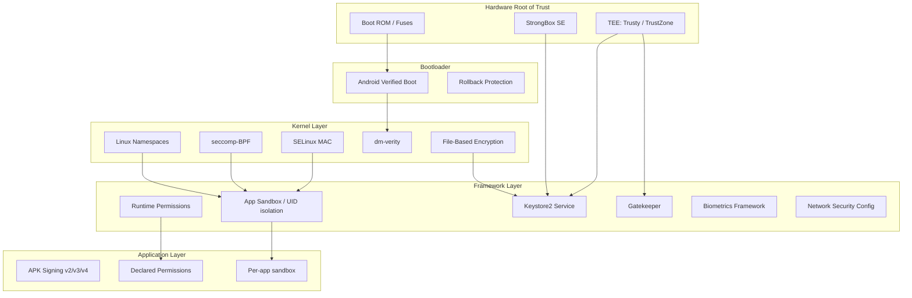

### 40.1.3  Application Signing

Every APK must be signed before it can be installed.  Android supports multiple
signature schemes:

| Scheme | Introduced | How it works |
|--------|-----------|--------------|
| v1 (JAR) | Android 1.0 | Signs individual ZIP entries via `META-INF/` |
| v2 | Android 7.0 | Signs the entire APK as a binary blob |
| v3 | Android 9 | Extends v2 with key rotation support |
| v3.1 | Android 13 | Adds rotation-min-sdk-version |
| v4 | Android 11 | Produces a separate `.idsig` file for incremental installs |

The signature establishes the identity of the developer.  The package manager
uses it for:

- **Upgrade verification** -- an update must be signed with the same key as the
  installed package.
- **Shared UID** -- two packages signed with the same key can request the same
  Linux UID and share data.
- **Signature permissions** -- certain permissions are only grantable to packages
  signed with the platform key.

### 40.1.4  Permission Model

Android defines three protection levels for permissions:

- **normal** -- granted automatically at install time (e.g. `INTERNET`).
- **dangerous** -- requires explicit user consent at runtime (e.g. `CAMERA`,
  `READ_CONTACTS`).
- **signature** -- only granted to apps signed with the same certificate as
  the app that declared the permission, or the platform.

The permission enforcement happens at multiple layers:

1. **Framework checks** -- `Context.checkPermission()` in Java/Kotlin code.
2. **Binder service checks** -- services check the calling UID and PID.
3. **Kernel-level checks** -- SELinux and Linux DAC prevent unauthorized
   access even if framework checks are bypassed.

### 40.1.5  Trust Chain from Hardware to Application

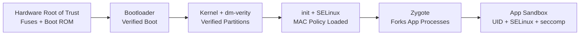

The chain of trust starts at non-modifiable hardware (fused public keys in the
SoC's boot ROM) and extends through every layer until it reaches the
application.  If any link in this chain is broken, the device can detect it
and respond (refuse to boot, show a warning, or wipe data depending on policy).

### 40.1.6  Security Boundary Definitions

Understanding Android security requires clear definitions of trust boundaries:

| Boundary | Inside (Trusted) | Outside (Untrusted) |
|----------|------------------|---------------------|
| Hardware root of trust | Fused keys, Boot ROM | All software |
| TEE boundary | Trusty kernel + TAs | Linux kernel, Android framework |
| Kernel boundary | Kernel code, loaded modules | All userspace processes |
| System service boundary | system_server, privileged daemons | Apps, untrusted code |
| App sandbox boundary | App's own process and data | Other apps, system internals |

Each boundary is enforced by a different mechanism:

- Hardware root of trust: physical fuses, one-time-programmable memory.
- TEE boundary: ARM TrustZone hardware (TZASC, secure monitor at EL3).
- Kernel boundary: CPU privilege rings (EL0 vs EL1), page table isolation.
- System service boundary: SELinux type enforcement + Linux DAC.
- App sandbox: UID isolation + SELinux + seccomp-BPF + mount namespaces.

### 40.1.7  Threat Model

Android's security model considers the following threat actors:

1. **Malicious apps** -- apps that attempt to steal data from other apps,
   escalate privileges, or persist after uninstallation.
2. **Network attackers** -- adversaries who can observe and modify network
   traffic (e.g., on public WiFi).
3. **Physical attackers** -- adversaries with physical access to the device
   (stolen phones, forensic examination).
4. **Supply chain attackers** -- attempts to inject malicious code into the
   OS image or bootloader.
5. **Insider threats** -- compromised vendor code or HALs running with
   elevated privileges.

Each security subsystem addresses specific threat actors:

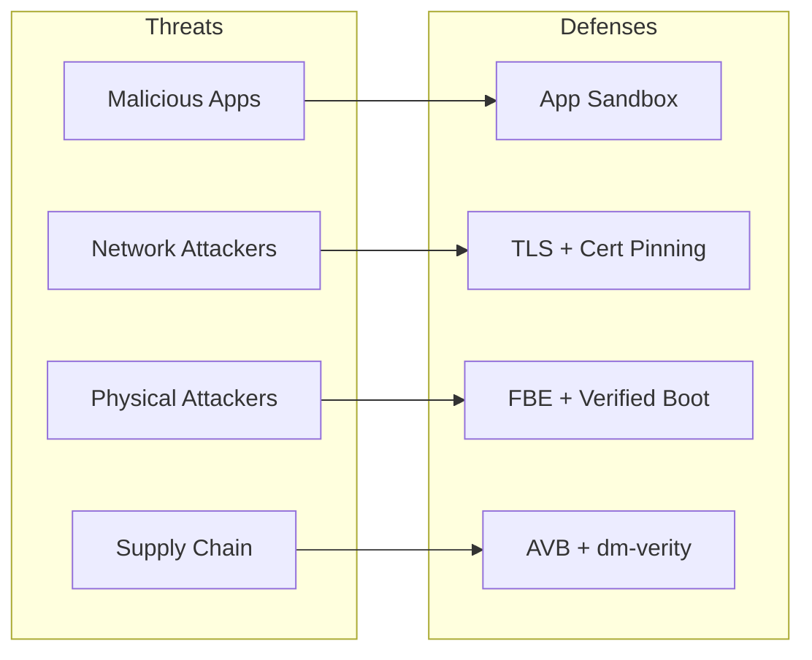

### 40.1.8  Multi-User Security

Android supports multiple users on a single device.  Each user gets:

- A unique `userId` (0, 10, 11, ...).
- Separate encrypted storage (CE and DE keys per user).
- Separate installed apps with per-user UIDs (appId + userId * 100000).
- Independent lock screen credentials.
- MLS (Multi-Level Security) categories in SELinux to prevent cross-user
  data access even within the same app.

The SELinux MLS categories are assigned based on the user ID, creating
cryptographic separation between users at the MAC level.

### 40.1.9  Work Profile Security

Android's work profile (managed profile) extends multi-user security for
enterprise use cases:

- Work apps run with a separate user ID (e.g., user 10).
- A separate encryption key protects work data.
- IT administrators can remotely wipe the work profile without affecting
  personal data.
- Cross-profile data sharing is controlled by the device policy controller.
- Work profile apps appear alongside personal apps but are sandboxed.

---

## 40.2  SELinux

SELinux (Security-Enhanced Linux) provides mandatory access control (MAC) on
Android.  Unlike traditional discretionary access control (DAC) where file
owners control permissions, SELinux enforces a centralized policy that even
root processes cannot override.

### 40.2.1  SELinux Architecture on Android

Android has shipped with SELinux in enforcing mode since Android 5.0.  The
policy is compiled at build time from source files under:

```
system/sepolicy/
```

The directory structure (15 subdirectories) includes:

| Directory | Purpose |
|-----------|---------|
| `public/` | Type and attribute definitions visible to vendor policy |
| `private/` | Platform-private policy (allow, neverallow rules) |
| `vendor/` | Vendor HAL policies |
| `contexts/` | File, property, service contexts |
| `mac_permissions/` | MAC permissions XML for app signing |
| `build/` | Build system integration |
| `compat/` | Compatibility mappings between platform versions |
| `tools/` | Policy analysis tools |
| `tests/` | CTS-compatible policy tests |
| `apex/` | APEX-specific policy |
| `prebuilts/` | Prebuilt policy for API-level compatibility |
| `reqd_mask/` | Required policy mask |
| `flagging/` | Feature-flag-gated policy |
| `microdroid/` | Policy for pVM microdroid |
| `treble_sepolicy_tests_for_release/` | Treble compatibility tests |

### 40.2.2  Type Enforcement (TE)

SELinux type enforcement is the core mechanism.  Every process is assigned a
**domain** (type) and every object (file, socket, binder, etc.) is assigned a
**type**.  Access is granted only if an explicit `allow` rule exists.

The fundamental rule syntax is:

```
allow source_domain target_type:object_class permissions;
```

For example, here is the base policy for all zygote-spawned apps, from
`system/sepolicy/public/app.te`:

```te
###
### Domain for all zygote spawned apps
###
### This file is the base policy for all zygote spawned apps.
### Other policy files, such as isolated_app.te, untrusted_app.te, etc
### extend from this policy. Only policies which should apply to ALL
### zygote spawned apps should be added here.
###
type appdomain_tmpfs, file_type;
```

Note the design comment: `public/` contains only type and attribute
definitions, never `allow` or `neverallow` statements.  Those go in
`private/`.

### 40.2.3  Domains and Attributes

Attributes are groups of types.  They allow writing rules that apply to many
domains at once.  From `system/sepolicy/public/attributes` (490 lines):

```te
# All types used for devices.
attribute dev_type;

# All types used for processes.
attribute domain;

# All types used for filesystems.
attribute fs_type;

# All types used for files that can exist on a labeled fs.
attribute file_type;

# All types used for domain entry points.
attribute exec_type;

# All types used for /data files.
attribute data_file_type;

# All types used for app private data files in seapp_contexts.
attribute app_data_file_type;
```

The `domain` attribute is critical -- it is applied to every process type.
Rules in `private/domain.te` apply to every process on the system:

```te
# Rules for all domains.

# Allow reaping by init.
allow domain init:process sigchld;

# Intra-domain accesses.
allow domain self:process {
    fork
    sigchld
    sigkill
    sigstop
    signull
    signal
    getsched
    setsched
    getsession
    getpgid
    getcap
    setcap
    getattr
    setrlimit
};
allow domain self:fd use;
allow domain proc:dir r_dir_perms;
```

### 40.2.4  Type Transitions

When a process executes a new binary, SELinux can automatically transition it
to a new domain.  This is how `init` spawns daemons in the correct domain:

```te
# When init runs /system/bin/vold, transition to vold domain
domain_auto_trans(init, vold_exec, vold)
```

The `domain_auto_trans` macro expands to:

```te
type_transition init vold_exec:process vold;
allow init vold:process transition;
allow vold vold_exec:file { read getattr map execute entrypoint };
```

### 40.2.5  App Domain Assignment via seapp_contexts

The file `system/sepolicy/private/seapp_contexts` (216 lines) maps
applications to SELinux domains based on their properties:

```
# Input selectors:
#       isSystemServer (boolean)
#       isEphemeralApp (boolean)
#       user (string)
#       seinfo (string)
#       name (string)
#       isPrivApp (boolean)
#       minTargetSdkVersion (unsigned integer)
#       fromRunAs (boolean)
```

Sample mappings:

| Selector | Domain |
|----------|--------|
| `isSystemServer=true` | `system_server` |
| `user=system seinfo=platform` | `system_app` |
| `user=_app minTargetSdkVersion=34` | `untrusted_app` |
| `user=_app minTargetSdkVersion=30` | `untrusted_app_30` |
| `user=_app minTargetSdkVersion=29` | `untrusted_app_29` |
| `user=_isolated` | `isolated_app` |

The versioned domains (`untrusted_app_25`, `untrusted_app_27`, etc.) allow
progressively tighter restrictions on older apps while maintaining backward
compatibility.  Newer targetSdkVersion apps get the strictest rules.

### 40.2.6  Neverallow Rules

Neverallow rules are compile-time assertions.  They do not generate runtime
policy but instead prevent anyone (including vendor policy authors) from
writing rules that violate the stated invariant.  If a policy change would
violate a neverallow, the build fails.

From `system/sepolicy/private/app_neverallows.te` (338 lines), here are
representative neverallow rules:

```te
define(`all_untrusted_apps',`{
  ephemeral_app
  isolated_app
  isolated_app_all
  isolated_compute_app
  mediaprovider
  mediaprovider_app
  untrusted_app
  untrusted_app_25
  untrusted_app_27
  untrusted_app_29
  untrusted_app_30
  untrusted_app_all
}')

# Receive or send uevent messages.
neverallow all_untrusted_apps domain:netlink_kobject_uevent_socket *;

# Do not allow untrusted apps to register services.
neverallow all_untrusted_apps service_manager_type:service_manager add;

# Do not allow untrusted apps to use VendorBinder
neverallow all_untrusted_apps vndbinder_device:chr_file *;

# Do not allow untrusted apps to connect to the property service
neverallow { all_untrusted_apps -mediaprovider } property_socket:sock_file write;
neverallow { all_untrusted_apps -mediaprovider } init:unix_stream_socket connectto;
neverallow { all_untrusted_apps -mediaprovider } property_type:property_service set;

# Block calling execve() on files in an apps home directory.
# This is a W^X violation.  For compatibility, allow for targetApi <= 28.
neverallow {
  all_untrusted_apps
  -untrusted_app_25
  -untrusted_app_27
  -runas_app
} { app_data_file privapp_data_file }:file execute_no_trans;
```

Key categories of neverallow rules for untrusted apps:

1. **No service registration** -- apps cannot add services to servicemanager.
2. **No VendorBinder access** -- apps cannot talk directly to vendor HALs.
3. **No property modification** -- apps cannot set system properties.
4. **No kernel interface access** -- no uevent sockets, no sysfs writes, no
   debugfs reads, no /proc sensitive files.
5. **No W^X violation** -- apps with targetSdk >= 29 cannot execute files in
   their home directory.
6. **No hard links** -- prevents installd deletion bypasses.
7. **Restricted socket types** -- only TCP/UDP/VSOCK permitted, no raw/netlink.

### 40.2.7  HAL Neverallows

HAL servers also face restrictions.  From `system/sepolicy/private/hal_neverallows.te`:

```te
# only HALs responsible for network hardware should have privileged
# network capabilities
neverallow {
  halserverdomain
  -hal_bluetooth_server
  -hal_wifi_server
  -hal_wifi_hostapd_server
  -hal_wifi_supplicant_server
  -hal_telephony_server
  -hal_uwb_server
  ...
} self:global_capability_class_set { net_admin net_raw };
```

This ensures that a compromised audio or camera HAL cannot gain network
capabilities.

### 40.2.8  Vendor Sepolicy Split (Treble)

Project Treble introduced the split between platform and vendor sepolicy.
The split enables independent platform and vendor updates:

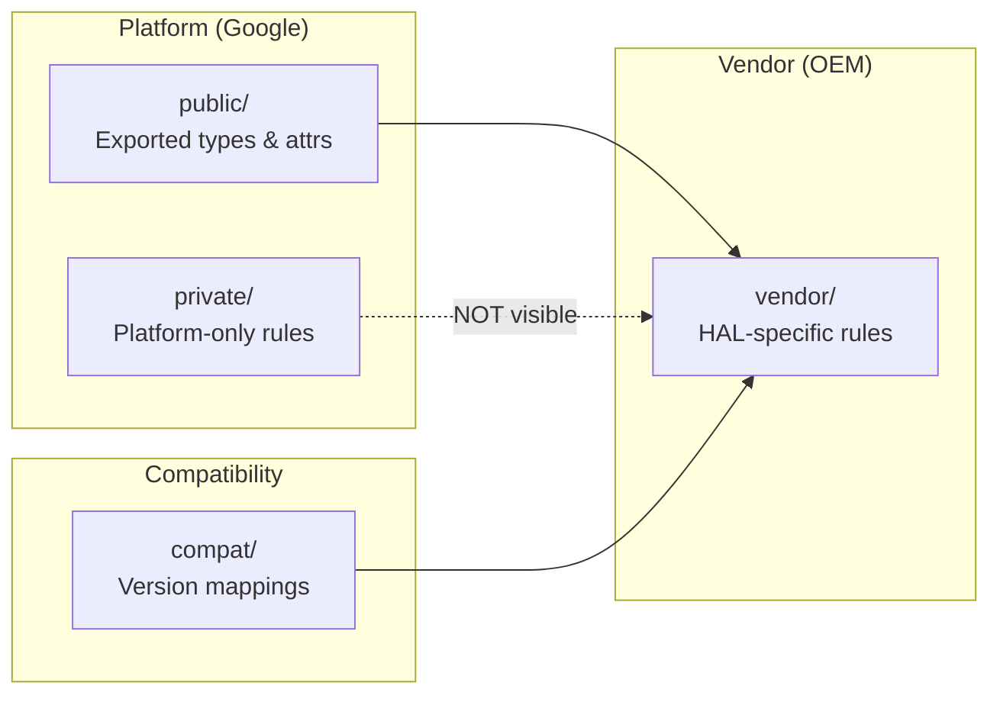

Rules for the split:

1. **public/** types and attributes are the API surface -- vendor policy can
   reference these.
2. **private/** types and rules are invisible to vendor policy.  Vendor policy
   cannot use `allow` rules targeting private types.
3. **compat/** contains mapping files that translate old type names to new ones
   across platform versions.
4. **vendor/** contains policy specific to the vendor's HAL implementations.

The vendor sepolicy directory contains files like:

```
vendor/
  file.te
  file_contexts
  hal_atrace_default.te
  hal_audio_default.te
  hal_bluetooth_default.te
  hal_camera_default.te
  hal_fingerprint_default.te
  hal_gatekeeper_default.te
  hal_keymint_default.te
  ...
```

### 40.2.9  Global Domain Rules

The `private/domain.te` file contains rules that apply to every process on
the system.  It is one of the most important policy files (hundreds of lines).
Representative rules from `system/sepolicy/private/domain.te`:

```te
# Root fs.
allow domain tmpfs:dir { getattr search };
allow domain rootfs:dir search;
allow domain rootfs:lnk_file { read getattr };

# Device accesses.
allow domain device:dir search;
allow domain dev_type:lnk_file r_file_perms;
allow domain null_device:chr_file rw_file_perms;
allow domain zero_device:chr_file rw_file_perms;

# /dev/binder can be accessed by ... everyone! :)
allow { domain -hwservicemanager -vndservicemanager }
    binder_device:chr_file rw_file_perms;

# Restrict binder ioctls to an allowlist.
allowxperm domain binder_device:chr_file
    ioctl { unpriv_binder_ioctls };

# /dev/binderfs needs to be accessed by everyone too!
allow domain binderfs:dir { getattr search };
allow domain binderfs_features:dir search;
allow domain binderfs_features:file r_file_perms;

# Global access to cacerts, seccomp_policy, system libs
allow domain system_seccomp_policy_file:file r_file_perms;
allow domain system_security_cacerts_file:file r_file_perms;
allow domain system_linker_exec:file { execute read open getattr map };
allow domain system_lib_file:file { execute read open getattr map };
```

Note how even the global rules are carefully scoped.  Binder access is
universal (it is the IPC backbone), but the allowed ioctls are restricted
to an unprivileged set.  The `hwservicemanager` and `vndservicemanager` are
explicitly excluded from accessing the standard binder device because they
use their own (`hwbinder_device`, `vndbinder_device`).

### 40.2.10  The App Domain Policy (private/app.te)

The file `system/sepolicy/private/app.te` (844 lines) defines rules for all
zygote-spawned app processes.  Key categories of access:

**Keystore access:**
```te
allow { appdomain -isolated_app_all -ephemeral_app -sdk_sandbox_all }
    keystore:keystore2_key { delete use get_info grant rebind update };

use_keystore({ appdomain -isolated_app_all -ephemeral_app -sdk_sandbox_all })
```

**App sandbox file access:**
```te
# App sandbox file accesses.
allow { appdomain -isolated_app_all -mlstrustedsubject -sdk_sandbox_all } {
  app_data_file
  privapp_data_file
}:dir create_dir_perms;
allow { appdomain -isolated_app_all -mlstrustedsubject -sdk_sandbox_all } {
  app_data_file
  privapp_data_file
}:file create_file_perms;
```

**Binder IPC:**
```te
# Use the Binder.
binder_use(appdomain)
# Perform binder IPC to binder services.
binder_call(appdomain, binderservicedomain)
# Perform binder IPC to other apps.
binder_call(appdomain, appdomain)
# Perform binder IPC to ephemeral apps.
binder_call(appdomain, ephemeral_app)
```

**Neverallow rules in app.te** (excerpts from the ~300 neverallow rules):

```te
# Superuser capabilities.
neverallow { appdomain -bluetooth -network_stack -nfc }
    self:capability_class_set *;

# Block device access.
neverallow appdomain dev_type:blk_file { read write };

# ptrace access to non-app domains.
neverallow appdomain { domain -appdomain }:process ptrace;

# The Android security model guarantees the confidentiality and
# integrity of application data and execution state. Ptrace bypasses
# those confidentiality guarantees.
neverallow {
  domain
  -appdomain
  -crash_dump
} appdomain:process ptrace;

# Write to rootfs.
neverallow appdomain rootfs:dir_file_class_set
    { create write setattr relabelfrom relabelto append unlink link rename };

# Write to /system.
neverallow appdomain system_file_type:dir_file_class_set
    { create write setattr relabelfrom relabelto append unlink link rename };

# Write to system-owned parts of /data.
neverallow appdomain system_data_file:dir_file_class_set
    { create write setattr relabelfrom relabelto append unlink link rename };

# Transition to a non-app domain (prevent domain escalation).
neverallow { appdomain -shell }
    { domain -appdomain -crash_dump -rs -virtualizationmanager }:process
    { transition };

# Sensitive app domains are not allowed to execute from /data
# to prevent persistence attacks.
neverallow {
  bluetooth
  isolated_app_all
  nfc
  radio
  shared_relro
  sdk_sandbox_all
  system_app
} {
  data_file_type
  -apex_art_data_file
  -dalvikcache_data_file
  -system_data_file
  -apk_data_file
}:file no_x_file_perms;

# Don't allow apps access to character devices.
neverallow appdomain {
    audio_device
    camera_device
    dm_device
    radio_device
    rpmsg_device
}:chr_file { read write };

# Apps cannot access proc/net tcp/udp tables.
neverallow { appdomain -shell } proc_net_tcp_udp:file *;
```

These neverallow rules collectively ensure that even if a framework bug allows
a code path to be reached, the kernel-level MAC policy blocks the operation.

### 40.2.11  Policy Compilation and Loading

The SELinux policy is compiled at build time and loaded by `init` during
early boot.  The build process:

1. **m4 preprocessing** -- macros like `domain_auto_trans`, `app_domain`,
   `net_domain` are expanded.
2. **Policy compilation** -- `checkpolicy` compiles `.te` files into a binary
   policy.
3. **Context compilation** -- `sefcontext_compile` compiles `file_contexts`
   into binary format.
4. **CIL compilation** -- since Android 8.0, policy is compiled to CIL
   (Common Intermediate Language) for the platform/vendor split.
5. **Policy validation** -- `sepolicy_tests` and neverallow checks run as
   build-time assertions.
6. **Loading** -- `init` loads the compiled policy from `/system/etc/selinux/`
   via `/sys/fs/selinux/load`.

The split policy loading flow:

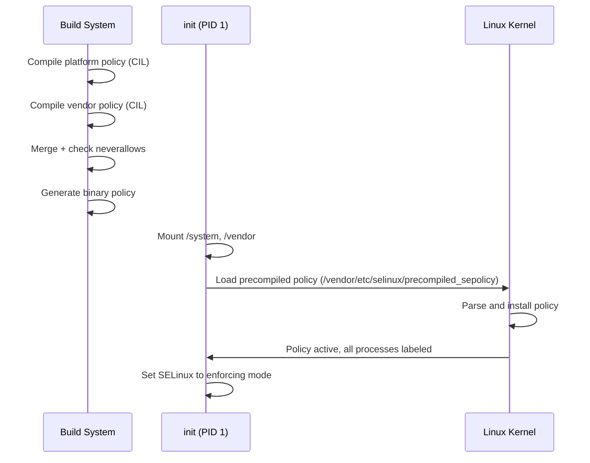

### 40.2.12  Using audit2allow

When SELinux blocks an operation, it generates an audit log (a "denial").
The `audit2allow` tool converts these denials into candidate allow rules:

```bash
# Capture denials from the device
adb shell dmesg | grep 'avc:  denied' > denials.txt

# Generate allow rules
audit2allow -i denials.txt

# Generate a loadable policy module
audit2allow -i denials.txt -M my_module
```

Example denial and generated rule:

```
# Denial:
avc:  denied  { read } for  pid=1234 comm="my_daemon"
  name="config.xml" dev="sda1" ino=5678
  scontext=u:r:my_daemon:s0 tcontext=u:object_r:system_file:s0
  tclass=file permissive=0

# audit2allow output:
allow my_daemon system_file:file read;
```

However, blindly applying `audit2allow` output is dangerous.  The correct
approach is usually to create a more specific type for the target file rather
than granting broad access to `system_file`.

### 40.2.13  SELinux Contexts Files

Several context files map filesystem paths, properties, and services to
SELinux labels:

| File | Purpose |
|------|---------|
| `file_contexts` | Maps filesystem paths to file types |
| `property_contexts` | Maps system properties to types |
| `service_contexts` | Maps binder services to types |
| `hwservice_contexts` | Maps HIDL HW services to types |
| `seapp_contexts` | Maps apps to domains and data types |
| `mac_permissions.xml` | Maps app signatures to seinfo tags |

### 40.2.14  Common Debugging Techniques

When developing new system services or HALs, SELinux denials are common.
Here is the systematic approach:

**Step 1: Identify the denial**
```
avc:  denied  { write } for  pid=2456 comm="my_service"
  path="/data/misc/my_service/config"
  scontext=u:r:my_service:s0
  tcontext=u:object_r:system_data_file:s0
  tclass=file permissive=0
```

**Step 2: Analyze the denial components**

- `source`: `my_service` (the process trying to access)
- `target`: `system_data_file` (the object being accessed)
- `class`: `file` (the type of object)
- `permission`: `write` (the operation attempted)

**Step 3: Determine the correct fix**

Wrong approach (too broad):
```te
# BAD: Grants access to all system_data_file
allow my_service system_data_file:file write;
```

Correct approach (create specific type):
```te
# In file.te:
type my_service_data_file, file_type, data_file_type;

# In file_contexts:
/data/misc/my_service(/.*)? u:object_r:my_service_data_file:s0

# In my_service.te:
allow my_service my_service_data_file:file create_file_perms;
allow my_service my_service_data_file:dir create_dir_perms;
```

**Step 4: Verify with neverallow checks**

After writing the policy, rebuild and check that no neverallow rules are
violated.

### 40.2.15  SELinux MLS/MCS for User Isolation

Android uses MLS (Multi-Level Security) categories to isolate users and apps.
Each app process receives categories based on its user ID and app ID:

```
u:r:untrusted_app:s0:c42,c256,c512,c768
```

The `c42,c256,c512,c768` are MLS categories derived from the UID.  Two
processes can only access each other's files if their categories are
compatible.  This provides kernel-level isolation between:

- Different Android users (user 0 vs user 10).
- Different apps within the same user.
- Work profile apps vs personal apps.

The category assignment is controlled by `seapp_contexts`:

```
# levelFrom=all determines the level from both UID and user ID.
# levelFrom=user determines the level from the user ID.
# levelFrom=app determines the level from the process UID.
```

---

## 40.3  Verified Boot (AVB)

Android Verified Boot (AVB) ensures that all executed code comes from a trusted
source rather than from an attacker or corruption.  The implementation lives
in:

```
external/avb/
```

### 40.3.1  AVB Architecture

The Verified Boot process establishes a chain of trust from hardware fuses to
every partition:

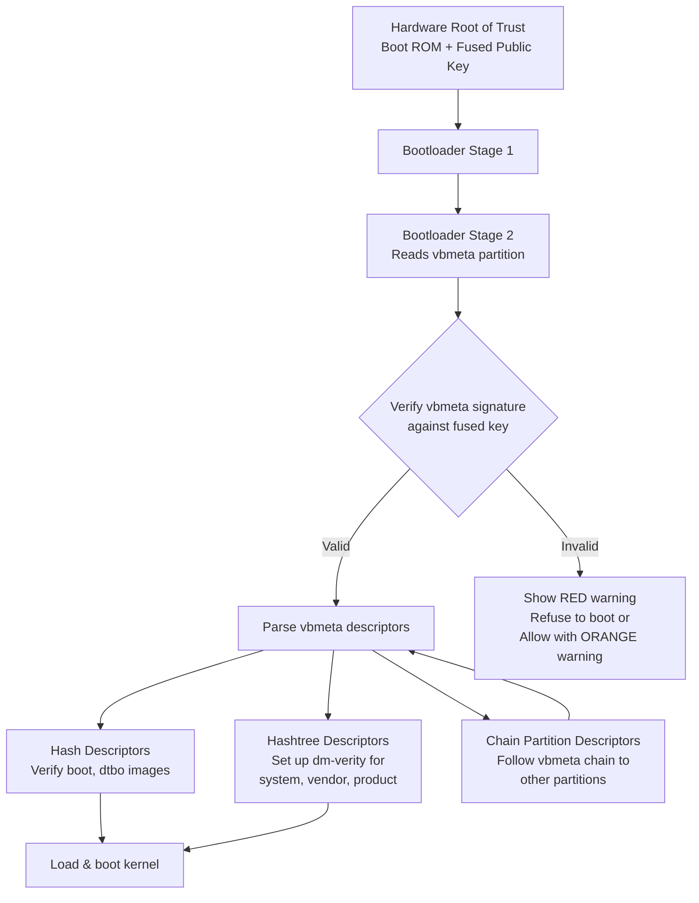

### 40.3.2  vbmeta Image Format

The vbmeta image is the core data structure.  From
`external/avb/libavb/avb_vbmeta_image.h`:

```c
/* Size of the vbmeta image header. */
#define AVB_VBMETA_IMAGE_HEADER_SIZE 256

/* Magic for the vbmeta image header. */
#define AVB_MAGIC "AVB0"
#define AVB_MAGIC_LEN 4
```

The image consists of three blocks:

```
+-----------------------------------------+
| Header data - fixed size (256 bytes)    |
+-----------------------------------------+
| Authentication data - variable size     |
+-----------------------------------------+
| Auxiliary data - variable size          |
+-----------------------------------------+
```

The header structure from the source:

```c
typedef struct AvbVBMetaImageHeader {
  /*   0: Four bytes equal to "AVB0" (AVB_MAGIC). */
  uint8_t magic[AVB_MAGIC_LEN];

  /*   4: The major version of libavb required for this header. */
  uint32_t required_libavb_version_major;
  /*   8: The minor version of libavb required for this header. */
  uint32_t required_libavb_version_minor;

  /*  12: The size of the signature block. */
  uint64_t authentication_data_block_size;
  /*  20: The size of the auxiliary data block. */
  uint64_t auxiliary_data_block_size;

  /*  28: The verification algorithm used. */
  uint32_t algorithm_type;

  /*  32: Offset into the "Authentication data" block of hash data. */
  uint64_t hash_offset;
  /*  40: Length of the hash data. */
  uint64_t hash_size;

  /*  48: Offset into the "Authentication data" block of signature data. */
  uint64_t signature_offset;
  /*  56: Length of the signature data. */
  uint64_t signature_size;

  /*  64: Offset into the "Auxiliary data" block of public key data. */
  uint64_t public_key_offset;
  /*  72: Length of the public key data. */
  uint64_t public_key_size;

  /* 112: The rollback index for rollback protection. */
  uint64_t rollback_index;

  /* 120: Flags from the AvbVBMetaImageFlags enumeration. */
  uint32_t flags;

  /* 124: The location of the rollback index. */
  uint32_t rollback_index_location;

  /* 128: The release string from avbtool. */
  uint8_t release_string[AVB_RELEASE_STRING_SIZE];

  /* 176: Padding to ensure struct is size 256 bytes. */
  uint8_t reserved[80];
} AVB_ATTR_PACKED AvbVBMetaImageHeader;
```

### 40.3.3  Verification Result Codes

The verification produces one of several results, defined in the same header:

```c
typedef enum {
  AVB_VBMETA_VERIFY_RESULT_OK,
  AVB_VBMETA_VERIFY_RESULT_OK_NOT_SIGNED,
  AVB_VBMETA_VERIFY_RESULT_INVALID_VBMETA_HEADER,
  AVB_VBMETA_VERIFY_RESULT_UNSUPPORTED_VERSION,
  AVB_VBMETA_VERIFY_RESULT_HASH_MISMATCH,
  AVB_VBMETA_VERIFY_RESULT_SIGNATURE_MISMATCH,
} AvbVBMetaVerifyResult;
```

The bootloader must also verify that the embedded public key matches a known
trusted key.  As the source comments emphasize:

> VERY IMPORTANT: Even if `AVB_VBMETA_VERIFY_RESULT_OK` is returned, you
> still need to check that the public key embedded in the image matches a
> known key!

### 40.3.4  Slot Verification

The high-level API for verifying a complete slot is `avb_slot_verify()`, from
`external/avb/libavb/avb_slot_verify.h`:

```c
AvbSlotVerifyResult avb_slot_verify(
    AvbOps* ops,
    const char* const* requested_partitions,
    const char* ab_suffix,
    AvbSlotVerifyFlags flags,
    AvbHashtreeErrorMode hashtree_error_mode,
    AvbSlotVerifyData** out_data);
```

Result codes indicate the nature of any failure:

```c
typedef enum {
  AVB_SLOT_VERIFY_RESULT_OK,
  AVB_SLOT_VERIFY_RESULT_ERROR_OOM,
  AVB_SLOT_VERIFY_RESULT_ERROR_IO,
  AVB_SLOT_VERIFY_RESULT_ERROR_VERIFICATION,
  AVB_SLOT_VERIFY_RESULT_ERROR_ROLLBACK_INDEX,
  AVB_SLOT_VERIFY_RESULT_ERROR_PUBLIC_KEY_REJECTED,
  AVB_SLOT_VERIFY_RESULT_ERROR_INVALID_METADATA,
  AVB_SLOT_VERIFY_RESULT_ERROR_UNSUPPORTED_VERSION,
  AVB_SLOT_VERIFY_RESULT_ERROR_INVALID_ARGUMENT
} AvbSlotVerifyResult;
```

The implementation in `external/avb/libavb/avb_slot_verify.c` defines key
constants:

```c
/* Maximum number of partitions that can be loaded with avb_slot_verify(). */
#define MAX_NUMBER_OF_LOADED_PARTITIONS 32

/* Maximum number of vbmeta images that can be loaded. */
#define MAX_NUMBER_OF_VBMETA_IMAGES 32

/* Maximum size of a vbmeta image - 64 KiB. */
#define VBMETA_MAX_SIZE (64 * 1024)
```

### 40.3.5  Chain Partition Descriptors

Large systems split vbmeta across multiple partitions.  A chain partition
descriptor points to another partition's vbmeta, creating a verification
tree.  From `external/avb/libavb/avb_chain_partition_descriptor.h`:

```c
typedef struct AvbChainPartitionDescriptor {
  AvbDescriptor parent_descriptor;
  uint32_t rollback_index_location;
  uint32_t partition_name_len;
  uint32_t public_key_len;
  uint32_t flags;
  uint8_t reserved[60];
} AVB_ATTR_PACKED AvbChainPartitionDescriptor;
```

This allows, for example, the `vendor_boot` partition to have its own
signing key and rollback index, independent of the main vbmeta.

### 40.3.6  Rollback Protection

Each vbmeta image contains a `rollback_index` -- a monotonically increasing
counter.  The bootloader stores the minimum accepted rollback index in tamper-
evident storage (typically RPMB or fuse-based).  If an attacker tries to flash
an older (vulnerable) image:

1. The old image's rollback index is lower than the stored value.
2. `avb_slot_verify()` returns `AVB_SLOT_VERIFY_RESULT_ERROR_ROLLBACK_INDEX`.
3. The bootloader refuses to boot the image.

There are up to 32 rollback index locations:

```c
#define AVB_MAX_NUMBER_OF_ROLLBACK_INDEX_LOCATIONS 32
```

### 40.3.7  The AVB Footer

For partitions that contain both image data and vbmeta, the vbmeta is appended
after the image, and a footer at the very end of the partition points to it.
From `external/avb/libavb/avb_footer.h`:

```c
#define AVB_FOOTER_MAGIC "AVBf"
#define AVB_FOOTER_SIZE 64

typedef struct AvbFooter {
  uint8_t magic[AVB_FOOTER_MAGIC_LEN];
  uint32_t version_major;
  uint32_t version_minor;
  uint64_t original_image_size;
  uint64_t vbmeta_offset;
  uint64_t vbmeta_size;
  uint8_t reserved[28];
} AVB_ATTR_PACKED AvbFooter;
```

### 40.3.8  dm-verity for Runtime Protection

Verified Boot would be incomplete without runtime integrity checks.  For
read-only partitions (system, vendor, product), AVB sets up
**dm-verity** -- a Linux device-mapper target that verifies each disk block
against a Merkle tree hash on read.

The hashtree error modes determine what happens when corruption is detected:

```c
typedef enum {
  AVB_HASHTREE_ERROR_MODE_RESTART_AND_INVALIDATE,
  AVB_HASHTREE_ERROR_MODE_RESTART,
  AVB_HASHTREE_ERROR_MODE_EIO,
  AVB_HASHTREE_ERROR_MODE_LOGGING,
  AVB_HASHTREE_ERROR_MODE_MANAGED_RESTART_AND_EIO,
  AVB_HASHTREE_ERROR_MODE_PANIC
} AvbHashtreeErrorMode;
```

In production, `RESTART_AND_INVALIDATE` is typical: the device invalidates the
corrupted slot and reboots, falling back to the other A/B slot if available.

### 40.3.9  Locked vs. Unlocked Bootloader

| State | Behavior |
|-------|----------|
| **Locked** | Only images signed with the OEM key boot.  Verification failure = no boot. |
| **Unlocked** | Verification still runs but failures are permitted.  `ALLOW_VERIFICATION_ERROR` flag is set.  An ORANGE warning screen is shown. |

```c
typedef enum {
  AVB_SLOT_VERIFY_FLAGS_NONE = 0,
  AVB_SLOT_VERIFY_FLAGS_ALLOW_VERIFICATION_ERROR = (1 << 0),
  AVB_SLOT_VERIFY_FLAGS_RESTART_CAUSED_BY_HASHTREE_CORRUPTION = (1 << 1),
  AVB_SLOT_VERIFY_FLAGS_NO_VBMETA_PARTITION = (1 << 2),
} AvbSlotVerifyFlags;
```

When a device is unlocked:

1. All user data is wiped (factory reset).
2. The bootloader shows a warning on every boot.
3. Attestation certificates include the unlocked state, so relying parties
   (banks, enterprise MDM) know the device may be compromised.

### 40.3.10  The Verification Implementation

The actual verification logic in `avb_slot_verify.c` follows a careful pattern
of loading and checking each partition:

```c
// From external/avb/libavb/avb_slot_verify.c

static inline bool result_should_continue(AvbSlotVerifyResult result) {
  switch (result) {
    case AVB_SLOT_VERIFY_RESULT_ERROR_OOM:
    case AVB_SLOT_VERIFY_RESULT_ERROR_IO:
    case AVB_SLOT_VERIFY_RESULT_ERROR_INVALID_METADATA:
    case AVB_SLOT_VERIFY_RESULT_ERROR_UNSUPPORTED_VERSION:
    case AVB_SLOT_VERIFY_RESULT_ERROR_INVALID_ARGUMENT:
      return false;

    case AVB_SLOT_VERIFY_RESULT_OK:
    case AVB_SLOT_VERIFY_RESULT_ERROR_VERIFICATION:
    case AVB_SLOT_VERIFY_RESULT_ERROR_ROLLBACK_INDEX:
    case AVB_SLOT_VERIFY_RESULT_ERROR_PUBLIC_KEY_REJECTED:
      return true;
  }
  return false;
}
```

This function determines whether verification should continue when
`ALLOW_VERIFICATION_ERROR` is set (unlocked bootloader).  Fatal errors (OOM,
IO, bad metadata) always abort, but verification-related errors are allowed
to continue so the unlocked device can still boot.

The verification flow for each partition:

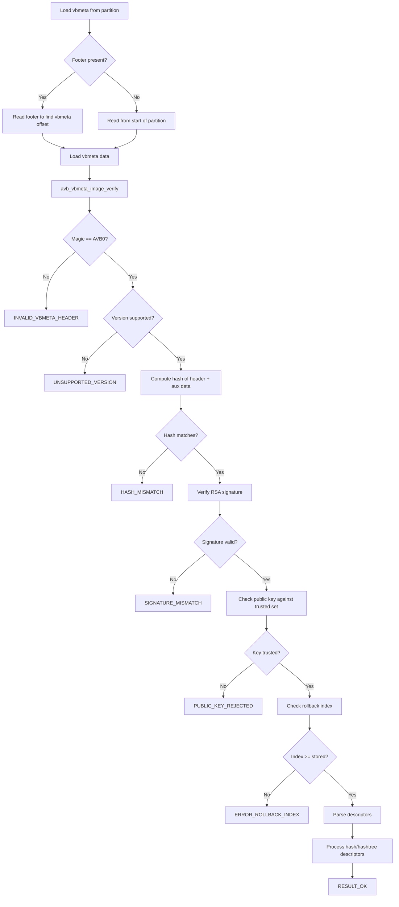

### 40.3.11  Descriptor Types

AVB uses several descriptor types to describe partitions:

| Descriptor | Purpose |
|-----------|---------|
| **Hash** | Stores the hash of an entire partition (boot, dtbo) |
| **Hashtree** | Stores the root hash of a Merkle tree (system, vendor) |
| **Kernel Cmdline** | Adds parameters to the kernel command line |
| **Chain Partition** | Points to another partition's vbmeta |
| **Property** | Stores key-value pairs |

Hash descriptors are used for small partitions where the entire image
can be verified before use.  Hashtree descriptors are for large partitions
where block-by-block verification (dm-verity) is necessary.

### 40.3.12  dm-verity Merkle Tree

The Merkle tree for dm-verity is structured as follows:

```
                    Root Hash (stored in vbmeta)
                    /                          \
            Hash(L1[0])                   Hash(L1[1])
           /          \                  /          \
    Hash(L0[0])  Hash(L0[1])    Hash(L0[2])  Hash(L0[3])
      |             |              |             |
   Block 0       Block 1       Block 2       Block 3
   (4096 B)      (4096 B)      (4096 B)      (4096 B)
```

When any block is read from disk:

1. The block's hash is computed (SHA-256).
2. The hash is verified against its entry in the hash tree.
3. The hash tree entry is verified against its parent.
4. This chain continues up to the root hash.
5. The root hash was already verified during boot by AVB.

If any block has been tampered with, the hash mismatch is detected and the
configured error mode determines the response (restart, EIO, logging, panic).

### 40.3.13  avbtool Command Reference

The `avbtool.py` script at `external/avb/avbtool.py` provides the build-time
tooling:

| Command | Purpose |
|---------|---------|
| `make_vbmeta_image` | Create a standalone vbmeta image |
| `add_hash_footer` | Add a hash footer to a partition image |
| `add_hashtree_footer` | Add a hashtree footer to a partition image |
| `erase_footer` | Remove an AVB footer |
| `info_image` | Display AVB information about an image |
| `extract_public_key` | Extract the public key from a private key |
| `calculate_vbmeta_digest` | Calculate the digest of vbmeta images |
| `resize_image` | Resize a partition image |
| `set_ab_metadata` | Set A/B metadata |

### 40.3.14  Kernel Command-Line Parameters

AVB sets several `androidboot.vbmeta.*` kernel command-line parameters:

- `androidboot.veritymode`: `enforcing`, `eio`, `disabled`, or `logging`
- `androidboot.vbmeta.device_state`: `locked` or `unlocked`
- `androidboot.vbmeta.hash_alg`, `size`, `digest`: integrity of vbmeta chain
- `androidboot.vbmeta.invalidate_on_error`: `yes` for restart-and-invalidate mode
- `androidboot.vbmeta.avb_version`: the AVB library version (e.g., "1.0")
- `androidboot.vbmeta.device`: PARTUUID of the vbmeta partition
- `androidboot.vbmeta.public_key_digest`: SHA-256 of the signing public key
- `androidboot.veritymode.managed`: `yes` if using managed restart-and-EIO

From the source documentation:

```
androidboot.veritymode: This is set to 'disabled' if the
AVB_VBMETA_IMAGE_FLAGS_HASHTREE_DISABLED flag is set in top-level
vbmeta struct. Otherwise it is set to 'enforcing' if the
passed-in hashtree error mode is AVB_HASHTREE_ERROR_MODE_RESTART
or AVB_HASHTREE_ERROR_MODE_RESTART_AND_INVALIDATE, 'eio' if it's
set to AVB_HASHTREE_ERROR_MODE_EIO, and 'logging' if it's set to
AVB_HASHTREE_ERROR_MODE_LOGGING.
```

These parameters are consumed by the `init` process and Android framework
to determine the device's integrity state and adjust behavior accordingly.

### 40.3.15  Managed Verity Mode State Machine

The `MANAGED_RESTART_AND_EIO` error mode implements a state machine:

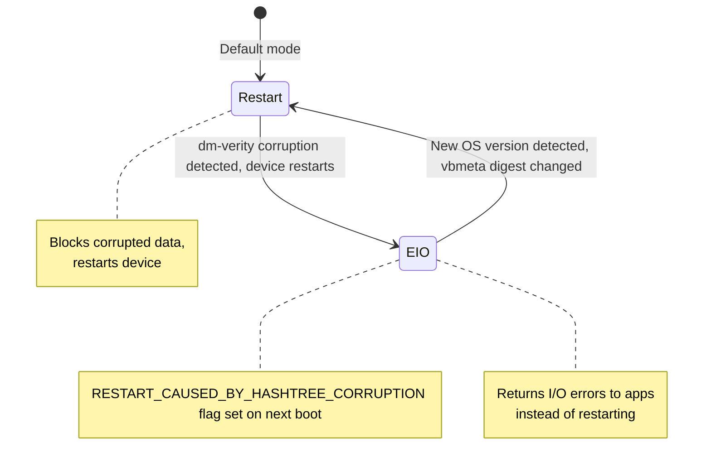

This design prevents a boot loop: if corruption is persistent, the device
switches to EIO mode (returning errors to apps) instead of continuously
restarting.  A RED warning screen is shown to inform the user.

### 40.3.16  Integration with A/B Updates

AVB works closely with the A/B update system:

1. The current slot (e.g., slot A) is verified and booted.
2. An OTA update is applied to slot B while A is running.
3. After update, the bootloader switches the active slot to B.
4. AVB verifies slot B's vbmeta and all partitions.
5. If verification succeeds, slot B becomes the new default.
6. If verification fails, the bootloader falls back to slot A.
7. After successful boot, the rollback indexes may be updated to prevent
   rollback to the old version.

---

## 40.4  Keystore and KeyMint

### 40.4.1  Overview

The Android Keystore system provides hardware-backed cryptographic key storage
and operations.  The implementation has evolved through several generations:

| Generation | Interface | Since |
|-----------|-----------|-------|
| Keymaster 0.x | C HAL | Android 4.3 |
| Keymaster 1.0 | HIDL 1.0 | Android 6.0 |
| Keymaster 2.0 | HIDL 2.0 | Android 7.0 |
| Keymaster 3.0 | HIDL 3.0 | Android 8.0 |
| Keymaster 4.0 | HIDL 4.0 | Android 9 |
| **KeyMint 1.0** | **AIDL** | **Android 12** |
| KeyMint 2.0 | AIDL | Android 13 |
| KeyMint 3.0 | AIDL | Android 14 |

The Keymaster-to-KeyMint transition moved from HIDL to AIDL and introduced
improvements in attestation, key upgrade, and remote provisioning.

### 40.4.2  Keystore2 Architecture

The Keystore 2.0 service is implemented in Rust at
`system/security/keystore2/`.  The main library (`src/lib.rs`) exposes these
modules:

```rust
//! This crate implements the Android Keystore 2.0 service.

pub mod apc;
pub mod async_task;
pub mod authorization;
pub mod boot_level_keys;
pub mod database;
pub mod ec_crypto;
pub mod enforcements;
pub mod entropy;
pub mod error;
pub mod globals;
pub mod id_rotation;
pub mod key_parameter;
pub mod legacy_blob;
pub mod legacy_importer;
pub mod maintenance;
pub mod metrics;
pub mod metrics_store;
pub mod operation;
pub mod permission;
pub mod raw_device;
pub mod remote_provisioning;
pub mod security_level;
pub mod service;
pub mod shared_secret_negotiation;
pub mod utils;

mod attestation_key_utils;
mod audit_log;
mod gc;
mod km_compat;
mod super_key;
mod sw_keyblob;
mod watchdog_helper;
```

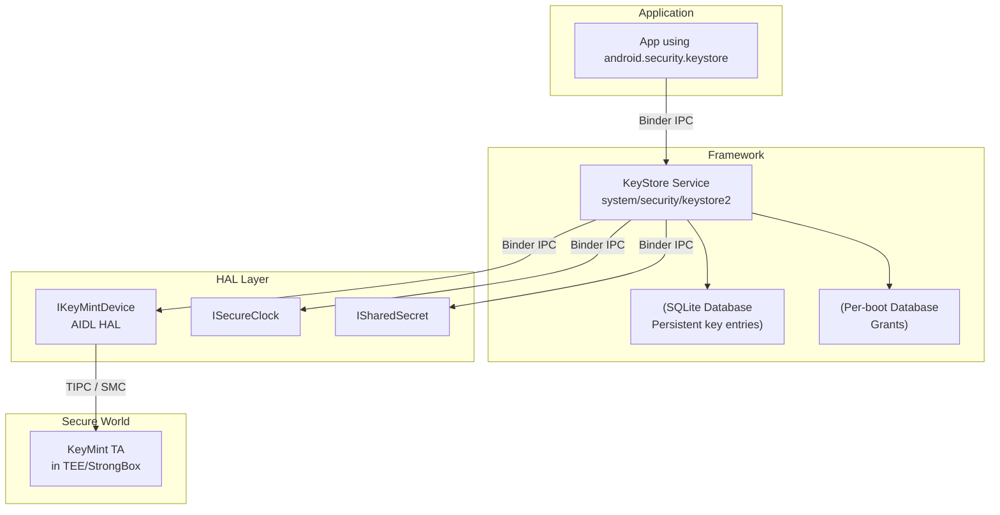

### 40.4.3  Security Levels

Keystore2 supports multiple security levels.  The `KeystoreSecurityLevel`
struct in `system/security/keystore2/src/security_level.rs`:

```rust
/// Implementation of the IKeystoreSecurityLevel Interface.
pub struct KeystoreSecurityLevel {
    security_level: SecurityLevel,
    keymint: Strong<dyn IKeyMintDevice>,
    hw_info: KeyMintHardwareInfo,
    km_uuid: Uuid,
    operation_db: OperationDb,
    rem_prov_state: RemProvState,
    id_rotation_state: IdRotationState,
}
```

The three security levels are:

| Level | Description |
|-------|-------------|
| `SOFTWARE` | Keys stored in software (TEE unavailable) |
| `TRUSTED_ENVIRONMENT` | Keys in the TEE (ARM TrustZone, etc.) |
| `STRONGBOX` | Keys in a dedicated secure element |

### 40.4.4  Database Module

The database design is documented in `system/security/keystore2/src/database.rs`:

```rust
//! This is the Keystore 2.0 database module.
//! The database module provides a connection to the backing SQLite store.
//! We have two databases one for persistent key blob storage and one for
//! items that have a per boot life cycle.
//!
//! ## Persistent database
//! The persistent database has tables for key blobs. They are organized
//! as follows:
//! The `keyentry` table is the primary table for key entries. It is
//! accompanied by two tables for blobs and parameters.
//! Each key entry occupies exactly one row in the `keyentry` table and
//! zero or more rows in the tables `blobentry` and `keyparameter`.
//!
//! ## Per boot database
//! The per boot database stores items with a per boot lifecycle.
//! Currently, there is only the `grant` table in this database.
//! Grants are references to a key that can be used to access a key by
//! clients that don't own that key.
```

### 40.4.5  Access Control via SELinux

Keystore2 uses SELinux for fine-grained access control.  The permission module
(`system/security/keystore2/src/permission.rs`) defines the `keystore2_key`
SELinux class:

```rust
implement_class!(
    /// KeyPerm provides a convenient abstraction from the SELinux class
    /// `keystore2_key`.
    #[selinux(class_name = keystore2_key)]
    pub enum KeyPerm {
        /// Checked when convert_storage_key_to_ephemeral is called.
        #[selinux(name = convert_storage_key_to_ephemeral)]
        ConvertStorageKeyToEphemeral = ...,
        /// Checked when the caller tries to delete a key.
        #[selinux(name = delete)]
        Delete = ...,
        /// Checked when the caller tries to use a unique id.
        #[selinux(name = gen_unique_id)]
        GenUniqueId = ...,
        /// Checked when the caller tries to load a key.
        #[selinux(name = get_info)]
        GetInfo = ...,
        /// Checked when the caller attempts to grant a key to another uid.
        #[selinux(name = grant)]
        Grant = ...,
        /// Checked when the caller attempts to use Domain::BLOB.
        #[selinux(name = manage_blob)]
        ManageBlob = ...,
    }
);
```

This means every key operation is checked against the caller's SELinux context,
not just their UID.  A process must have both the right UID (or a valid grant)
AND the right SELinux permissions.

### 40.4.6  Enforcements Module

The enforcements module (`system/security/keystore2/src/enforcements.rs`)
handles authentication requirements for key operations.  Key use can require:

- **User authentication** -- a recent unlock (PIN, pattern, password, or
  biometric) is required before the key can be used.
- **Per-operation authentication** -- the user must authenticate for each
  individual cryptographic operation.
- **Timeout-based authentication** -- authentication is valid for a specified
  time window.
- **Boot-level keys** -- keys that become inaccessible after a certain boot
  phase completes.

```rust
#[derive(Debug)]
enum AuthRequestState {
    /// An outstanding per operation authorization request.
    OpAuth,
    /// An outstanding request for a timestamp token.
    TimeStamp(Mutex<Receiver<Result<TimeStampToken, Error>>>),
}

#[derive(Debug)]
struct AuthRequest {
    state: AuthRequestState,
    /// This need to be set to Some to fulfill an AuthRequestState::OpAuth.
    hat: Mutex<Option<HardwareAuthToken>>,
}
```

### 40.4.7  Key Attestation

Key attestation proves to a remote party that a key was generated inside
secure hardware.  The attestation chain consists of:

1. **Attestation certificate** -- signed by the TEE's attestation key,
   containing the key's properties (algorithm, purpose, auth requirements).
2. **Intermediate certificate(s)** -- linking the TEE's key to a root.
3. **Root certificate** -- the Google Hardware Attestation Root or the
   manufacturer's root.

The attestation includes the device's verified boot state (`locked`/`unlocked`)
and the OS version, enabling relying parties to make trust decisions.

### 40.4.8  Operation Lifecycle

Keystore2 manages cryptographic operations with a well-defined lifecycle.
From `system/security/keystore2/src/operation.rs`:

```rust
//! Operations implement the API calls update, finish, and abort.
//! Additionally, an operation can be dropped and pruned. The former
//! happens if the client deletes a binder to the operation object.
//! An existing operation may get pruned when running out of operation
//! slots and a new operation takes precedence.
//!
//! ## Operation Lifecycle
//! An operation gets created when the client calls
//! `IKeystoreSecurityLevel::create`.
//! It may receive zero or more update request. The lifecycle ends when:
//!  * `update` yields an error.
//!  * `finish` is called.
//!  * `abort` is called.
//!  * The operation gets dropped.
//!  * The operation gets pruned.
```

The operation pruning strategy is important for devices with limited TEE
resources.  When a new operation is requested but all slots are full:

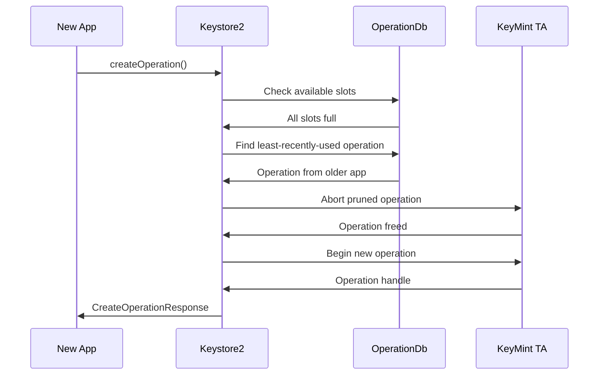

### 40.4.9  Super Keys and User Authentication

The super key module (`system/security/keystore2/src/super_key.rs`) manages
the keys that protect per-user Keystore data.  There are several types of
super encryption:

```rust
/// Encryption algorithm used by a particular type of superencryption key
pub enum SuperEncryptionAlgorithm {
    /// Symmetric encryption with AES-256-GCM
    Aes256Gcm,
    /// Asymmetric encryption with ECDH P-521
    EcdhP521,
}

/// Specify which keys should be wiped given a particular user's UserSuperKeys
pub enum WipeKeyOption {
    /// Wipe unlocked_device_required_symmetric/private and biometric_unlock keys
    PlaintextAndBiometric,
    /// Wipe only unlocked_device_required_symmetric/private keys
    PlaintextOnly,
}
```

The biometric unlock timeout is carefully tuned:

```rust
/// Allow up to 15 seconds between the user unlocking using a biometric, and
/// the auth token being used to unlock in
/// [`SuperKeyManager::try_unlock_user_with_biometric`].
/// This seems short enough for security purposes, while long enough that even
/// the very slowest device will present the auth token in time.
const BIOMETRIC_AUTH_TIMEOUT_S: i32 = 15; // seconds
```

### 40.4.10  Key Garbage Collection

The key garbage collector (`system/security/keystore2/src/gc.rs`) handles
secure deletion of key material:

```rust
//! This module implements the key garbage collector.
//! The key garbage collector has one public function `notify_gc()`.
//! This will create a thread on demand which will query the database
//! for unreferenced key entries, optionally dispose of sensitive key
//! material appropriately, and then delete the key entry from the
//! database.
```

When a key is deleted:

1. The database entry is marked for deletion.
2. The GC thread wakes up.
3. If the key has a hardware-backed blob, the HAL is called to delete it
   from the TEE.
4. The database entry and all associated blobs are removed.
5. The underlying storage blocks are overwritten (secure discard).

### 40.4.11  Remote Key Provisioning (RKP)

Starting with Android 12, devices support Remote Key Provisioning.  Instead
of burning attestation keys in the factory, keys are provisioned from a Google
backend after the device passes integrity checks.  The relevant module is:

```
system/security/keystore2/src/remote_provisioning.rs
system/security/keystore2/rkpd_client/
```

Benefits:

- Eliminates factory key injection infrastructure.
- Supports key rotation and revocation at scale.
- Reduces the blast radius of key compromise.

### 40.4.12  KeyMint AIDL Interface

The KeyMint HAL is defined in AIDL at
`hardware/interfaces/security/keymint/aidl/`.  Key AIDL files include:

| File | Purpose |
|------|---------|
| `IKeyMintDevice.aidl` | Main device interface (generateKey, importKey, begin) |
| `IKeyMintOperation.aidl` | Per-operation interface (update, finish, abort) |
| `SecurityLevel.aidl` | TEE, StrongBox, Software levels |
| `Algorithm.aidl` | RSA, EC, AES, HMAC, 3DES |
| `KeyCharacteristics.aidl` | Key properties returned from generateKey |
| `KeyCreationResult.aidl` | Key blob + characteristics + certificates |
| `HardwareAuthToken.aidl` | Authentication token structure |
| `Tag.aidl` | Key parameter tags (PURPOSE, ALGORITHM, KEY_SIZE, etc.) |
| `ErrorCode.aidl` | Detailed error codes |

The `IKeyMintDevice` interface defines these core operations:

```
interface IKeyMintDevice {
    KeyMintHardwareInfo getHardwareInfo();
    void addRngEntropy(in byte[] data);
    KeyCreationResult generateKey(in KeyParameter[] keyParams,
                                  in AttestationKey attestationKey);
    KeyCreationResult importKey(in KeyParameter[] keyParams,
                                in KeyFormat keyFormat,
                                in byte[] keyData,
                                in AttestationKey attestationKey);
    KeyCreationResult importWrappedKey(in byte[] wrappedKeyData,
                                       in byte[] wrappingKeyBlob,
                                       in byte[] maskingKey, ...);
    byte[] upgradeKey(in byte[] keyBlobToUpgrade,
                      in KeyParameter[] upgradeParams);
    void deleteKey(in byte[] keyBlob);
    void deleteAllKeys();
    void destroyAttestationIds();
    BeginResult begin(in KeyPurpose purpose,
                      in byte[] keyBlob,
                      in KeyParameter[] params,
                      in HardwareAuthToken authToken);
    byte[] deviceLocked(in boolean passwordOnly,
                        in TimeStampToken timestampToken);
    byte[] earlyBootEnded();
    ...
}
```

### 40.4.13  Keystore2 Authorization Flow

The authorization flow for a key operation involves multiple checks:

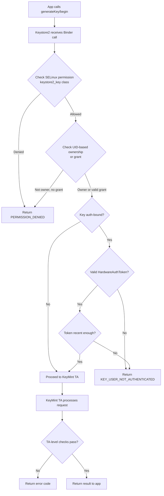

This multi-layer authorization ensures:

- SELinux prevents unauthorized access even from root.
- UID checks prevent cross-app key access.
- Auth-binding requires recent user authentication.
- The TEE performs its own validation independent of the framework.

### 40.4.14  Key Import and Wrapping

Keystore2 supports importing existing keys into hardware:

- **Plain import**: the key material is sent to the TEE, which wraps it
  with a device-bound key.  The original plaintext key exists briefly in
  transit.
- **Wrapped import**: the key is wrapped by a transport key before leaving
  the source.  The TEE unwraps it internally, so the plaintext key never
  exists outside secure hardware.  This is used for bulk key provisioning.

### 40.4.15  StrongBox

StrongBox is a dedicated secure element (SE) that provides the highest security
level.  Unlike the TEE, which shares the main CPU, StrongBox uses a separate
processor with its own:

- CPU
- Secure storage
- True random number generator
- Tamper-resistance mechanisms
- Independent clock

StrongBox supports a subset of KeyMint algorithms and is mandatory for
devices launching with Android 9+ (for certain key types).

---

## 40.5  TEE: Trusty

### 40.5.1  Overview

Trusty is Google's open-source Trusted Execution Environment (TEE) operating
system.  It runs alongside Android in the ARM TrustZone secure world (or
analogous isolation on other architectures).  The source tree is:

```
trusty/
  kernel/       - Trusty kernel (Little Kernel based)
  user/         - Userspace TAs (Trusted Applications)
  device/       - Device-specific configurations
  hardware/     - Hardware abstraction
  host/         - Host-side tools
  vendor/       - Vendor TAs
```

The Android-side integration for communicating with Trusty lives in:

```
system/core/trusty/
  keymint/          - KeyMint HAL backed by Trusty
  keymaster/        - Legacy Keymaster HAL backed by Trusty
  gatekeeper/       - Gatekeeper HAL backed by Trusty
  storage/          - Secure storage proxy
  secretkeeper/     - SecretKeeper HAL for pVM secrets
  confirmationui/   - Protected Confirmation UI
  metrics/          - TEE metrics reporting
  libtrusty/        - IPC library for talking to Trusty
  libtrusty-rs/     - Rust bindings for libtrusty
```

### 40.5.2  TrustZone Architecture

ARM TrustZone divides the SoC into two worlds:

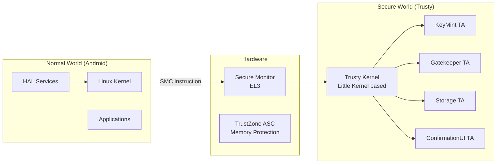

Key properties of TrustZone:

- **Hardware-enforced isolation** -- the normal world physically cannot access
  secure world memory.  The TrustZone Address Space Controller (TZASC) blocks
  all normal world bus transactions to secure memory regions.
- **SMC (Secure Monitor Call)** -- the only entry point from normal to secure
  world.  This is a privileged ARM instruction that traps to EL3 (the secure
  monitor), which then dispatches to the Trusty kernel.
- **Separate address spaces** -- Trusty has its own page tables, separate from
  Linux.

### 40.5.3  The SMC Communication Path

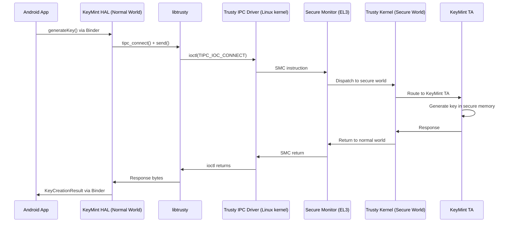

### 40.5.4  libtrusty -- The IPC Library

The `libtrusty` library (`system/core/trusty/libtrusty/trusty.c`) provides the
normal-world interface for connecting to Trusty TAs.  It supports two
transport mechanisms:

1. **TIPC over kernel driver** -- uses `/dev/trusty-ipc-dev0` and ioctl calls.
2. **TIPC over VSOCK** -- for virtual machine environments where Trusty runs
   in a separate VM.

```c
static bool use_vsock_connection = false;

static int tipc_vsock_connect(const char* type_cid_port_str,
                              const char* srv_name) {
    // Parse "STREAM:cid:port" or "SEQPACKET:cid:port"
    int fd = socket(AF_VSOCK, socket_type, 0);
    // Connect to the Trusty VM...
}
```

### 40.5.5  KeyMint HAL in Trusty

The Trusty KeyMint HAL (`system/core/trusty/keymint/src/keymint_hal_main.rs`)
is implemented in Rust.  It connects to the Trusty KeyMint TA over TIPC:

```rust
const TRUSTY_KEYMINT_RUST_SERVICE_NAME: &str = "com.android.trusty.keymint";

impl SerializedChannel for TipcChannel {
    const MAX_SIZE: usize = 4000;
    fn execute(&mut self, serialized_req: &[u8]) -> binder::Result<Vec<u8>> {
        self.0.send(serialized_req).map_err(|e| { ... })?;
        let mut expect_more_msgs = true;
        let mut full_rsp = Vec::new();
        while expect_more_msgs {
            let mut recv_buf = Vec::new();
            self.0.recv(&mut recv_buf).map_err(|e| { ... })?;
            let current_rsp_content;
            (expect_more_msgs, current_rsp_content) = extract_rsp(&recv_buf)?;
            full_rsp.extend_from_slice(current_rsp_content);
        }
        Ok(full_rsp)
    }
}
```

The main function connects to the TA and registers all HAL services:

```rust
fn inner_main() -> Result<(), HalServiceError> {
    // Create connection to the TA
    let connection =
        trusty::TipcChannel::connect(args.dev.as_str(),
                                     TRUSTY_KEYMINT_RUST_SERVICE_NAME)
            .map_err(|e| { ... })?;
    let tipc_channel = Arc::new(Mutex::new(TipcChannel(connection)));

    register_binder_services(&tipc_channel, ALL_HALS, SERVICE_INSTANCE)?;

    // Send the HAL service information to the TA
    send_hal_info(tipc_channel.lock().unwrap().deref_mut())?;

    binder::ProcessState::join_thread_pool();
    Ok(())
}
```

### 40.5.6  Confirmation UI

Protected Confirmation (Confirmation UI) displays a trusted prompt to the
user that cannot be spoofed by malware.  The Trusty implementation lives in
`system/core/trusty/confirmationui/`.

```cpp
class TrustyConfirmationUI : public BnConfirmationUI {
  public:
    ::ndk::ScopedAStatus
    promptUserConfirmation(
        const shared_ptr<IConfirmationResultCallback>& resultCB,
        const vector<uint8_t>& promptText,
        const vector<uint8_t>& extraData,
        const string& locale,
        const vector<UIOption>& uiOptions) override;

    ::ndk::ScopedAStatus
    deliverSecureInputEvent(
        const HardwareAuthToken& secureInputToken) override;

    ::ndk::ScopedAStatus abort() override;
};
```

The TA in the secure world controls the display directly (or via a secure
display path), ensuring the normal world OS cannot modify what the user sees.
The user's confirmation is signed by the TA, producing a
`HardwareAuthToken` that cryptographically proves the user approved the
displayed content.

### 40.5.7  SecretKeeper

The SecretKeeper HAL (`system/core/trusty/secretkeeper/`) manages secrets
for protected Virtual Machines (pVMs).  It ensures that secrets bound to a
specific VM identity are only released to authenticated VMs, supporting
the Android Virtualization Framework's security model.

### 40.5.8  Trusty Build and Configuration

Trusty device configurations live in `trusty/device/` and
`trusty/vendor/`.  The Android-side build integration is handled by
makefiles in `system/core/trusty/`:

- `trusty-base.mk` -- base Trusty configuration
- `trusty-storage-cf.mk` -- Cuttlefish (emulator) storage configuration
- `trusty-storage.mk` -- production storage configuration
- `trusty-keymint-apex.mk` -- APEX packaging for KeyMint
- `trusty-keymint.mk` -- KeyMint HAL build rules
- `trusty-test.mk` -- Test configuration

### 40.5.9  Trusty Kernel Architecture

The Trusty kernel is based on Little Kernel (LK), a small real-time OS
designed for resource-constrained environments.  Key properties:

- **Microkernel design** -- minimal kernel with IPC, scheduling, and memory
  management.  TAs run as userspace processes.
- **Capability-based security** -- TAs request capabilities (storage access,
  crypto hardware, etc.) at build time.
- **No dynamic loading** -- all TAs are loaded at boot from a signed image.
  No runtime code loading is permitted.
- **Small TCB** -- the Trusted Computing Base is much smaller than Linux,
  reducing the attack surface.

### 40.5.10  Trusty vs Other TEEs

Android supports multiple TEE implementations:

| TEE | Provider | Key Properties |
|-----|----------|---------------|
| **Trusty** | Google (open source) | LK-based, reference implementation |
| **OP-TEE** | Linaro (open source) | Linux-style API, widely used in SBCs |
| **QSEE** | Qualcomm (proprietary) | Used on Snapdragon SoCs |
| **Kinibi** | Trustonic (proprietary) | Used on Samsung Exynos, MediaTek |
| **iTrustee** | Huawei (proprietary) | Used on Kirin SoCs |

The Android HAL interfaces (KeyMint, Gatekeeper, etc.) are TEE-agnostic.
The HAL implementation translates between the Android AIDL interface and the
specific TEE's native API.  This is why `system/core/trusty/keymint/` exists
specifically for Trusty, while other TEE vendors provide their own HAL
implementations.

### 40.5.11  TIPC Protocol

Trusty IPC (TIPC) is a message-based protocol:

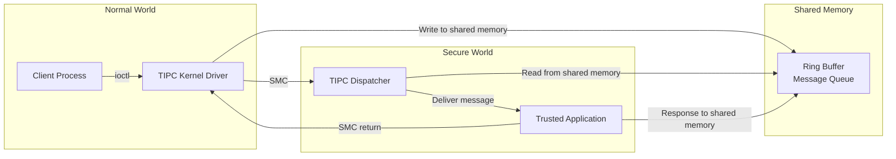

TIPC channels have these properties:

- Maximum message size of 4000 bytes (as seen in the KeyMint HAL).
- Messages exceeding this limit are split and reassembled.
- Channels are authenticated by the Trusty kernel, which knows the
  normal-world caller's identity.

### 40.5.12  Secure Storage

The Trusty Storage proxy (`system/core/trusty/storage/`) provides persistent
storage for TAs.  Since the secure world typically cannot directly access the
filesystem, the proxy runs in the normal world and services storage requests
from TAs through a secure protocol:

```
Normal World                    Secure World
+------------------+            +------------------+
| Storage Proxy    |<-- TIPC -->| Storage TA       |
| (runs as daemon) |            | (in Trusty)      |
| Writes to        |            | Encrypts data    |
| /data/vendor/ss  |            | with TA-bound key|
+------------------+            +------------------+
```

The data is encrypted and integrity-protected by the TA before it crosses
to the normal world for persistence.

---

## 40.6  Gatekeeper and Biometrics

### 40.6.1  Gatekeeper -- PIN/Pattern/Password Verification

Gatekeeper verifies the user's knowledge factor (PIN, pattern, or password)
in the TEE.  The Trusty implementation is in
`system/core/trusty/gatekeeper/`:

```cpp
class TrustyGateKeeperDevice : public BnGatekeeper {
  public:
    ::ndk::ScopedAStatus enroll(
        int32_t uid,
        const std::vector<uint8_t>& currentPasswordHandle,
        const std::vector<uint8_t>& currentPassword,
        const std::vector<uint8_t>& desiredPassword,
        GatekeeperEnrollResponse* _aidl_return) override;

    ::ndk::ScopedAStatus verify(
        int32_t uid,
        int64_t challenge,
        const std::vector<uint8_t>& enrolledPasswordHandle,
        const std::vector<uint8_t>& providedPassword,
        GatekeeperVerifyResponse* _aidl_return) override;

    ::ndk::ScopedAStatus deleteAllUsers() override;
    ::ndk::ScopedAStatus deleteUser(int32_t uid) override;
};
```

The flow works as follows:

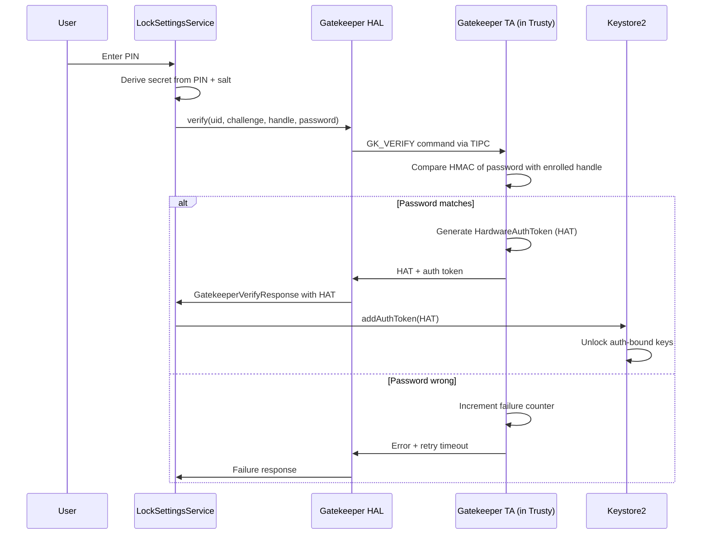

Key security properties:

- **Throttling in hardware** -- the TEE enforces exponentially increasing
  delays after failed attempts (30s after 5 failures, with the wait time
  doubling).  The normal world cannot bypass this.
- **Per-user isolation** -- each user has their own enrolled handle, stored
  in `/data/system_de/<userId>/gatekeeper/`.
- **Challenge binding** -- the verification challenge prevents replay attacks.

### 40.6.2  Enrollment

During enrollment, the TEE:

1. Receives the new password (or a derivative thereof).
2. Generates an HMAC using a hardware-bound key.
3. Returns a "password handle" -- the HMAC plus metadata.
4. The framework stores the handle; the original password is never persisted.

For password changes, the old password must be verified first (to prevent an
attacker with physical access from simply enrolling a new password).

### 40.6.3  Biometrics Framework

Android supports multiple biometric modalities through the HAL interfaces in
`hardware/interfaces/biometrics/`:

```
hardware/interfaces/biometrics/
  common/         - Shared types (ICancellationSignal, OperationContext)
  fingerprint/    - Fingerprint HAL
    aidl/         - AIDL interface definitions
    2.1/          - Legacy HIDL 2.1
    2.2/          - Legacy HIDL 2.2
    2.3/          - Legacy HIDL 2.3
  face/           - Face HAL
    aidl/         - AIDL interface definitions
    1.0/          - Legacy HIDL 1.0
```

### 40.6.4  Fingerprint HAL

The AIDL fingerprint interface (`IFingerprint.aidl`) is clean and session-based:

```java
@VintfStability
interface IFingerprint {
    SensorProps[] getSensorProps();

    ISession createSession(in int sensorId, in int userId,
                           in ISessionCallback cb);
}
```

The `ISession` interface defines all operations:

```java
@VintfStability
interface ISession {
    void generateChallenge();
    void revokeChallenge(in long challenge);
    ICancellationSignal enroll(in HardwareAuthToken hat);
    ICancellationSignal authenticate(in long operationId);
    ICancellationSignal detectInteraction();
    void enumerateEnrollments();
    void removeEnrollments(in int[] enrollmentIds);
    void getAuthenticatorId();
    void invalidateAuthenticatorId();
    void resetLockout(in HardwareAuthToken hat);
    void close();

    // For under-display sensors
    void onPointerDown(in int pointerId, in int x, in int y,
                       in float minor, in float major);
    void onPointerUp(in int pointerId);
    void onUiReady();
}
```

Sensor types supported:

| Type | Description |
|------|-------------|
| `REAR` | Capacitive sensor on the back |
| `UNDER_DISPLAY_ULTRASONIC` | Ultrasonic sensor under the display |
| `UNDER_DISPLAY_OPTICAL` | Optical sensor under the display |
| `POWER_BUTTON` | Integrated into the power button |

### 40.6.5  Sensor Strength Levels

Biometric sensors are classified by strength:

| Strength | Description | Can unlock Keystore keys? |
|----------|-------------|--------------------------|
| `CONVENIENCE` | Spoofable; for UX convenience only | No |
| `WEAK` | Harder to spoof but no crypto guarantee | No |
| `STRONG` | Meets CDD requirements; produces HATs | Yes |

Only `STRONG` sensors can produce `HardwareAuthToken`s that unlock
authentication-bound keys in Keystore.

### 40.6.6  The HardwareAuthToken (HAT) Flow

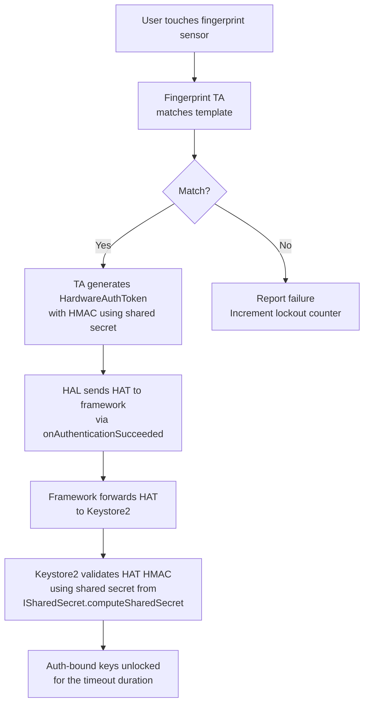

The HMAC key used to authenticate HATs is established through the
`ISharedSecret` interface, where all TEE components (KeyMint, Gatekeeper,
Biometrics) agree on a shared secret at boot time.

### 40.6.7  Lockout Policy

The biometrics framework enforces strict lockout:

- After 5 failed authentication attempts: 30-second timed lockout.
- After continued failures: lockout duration increases.
- After 20 cumulative failures: permanent lockout (requires PIN/pattern/
  password).
- Lockout persists across reboots (stored in the TA's secure storage).

From the `ISession.aidl`:

```
Note that lockout states MUST persist after device reboots, HAL crashes, etc.

See the Android CDD section 7.3.10 for the full set of lockout and
rate-limiting requirements.
```

### 40.6.8  Face Authentication

The face HAL (`hardware/interfaces/biometrics/face/aidl/`) follows a similar
pattern to the fingerprint HAL but supports face-specific features:

- Enrollment types: `DEFAULT` vs `ACCESSIBILITY` (for users who cannot move
  their head normally).
- Multiple enrollment stages: the HAL guides the user through head movements.
- Active vs. passive sensing: some implementations use IR flood illuminators,
  others use structured light depth cameras.

### 40.6.9  Authentication Flow Comparison


All three authentication methods produce the same output:
a `HardwareAuthToken` that Keystore2 can validate.  This unified design
means auth-bound keys do not need to know which authentication method was
used -- they just need a valid token.

### 40.6.10  Shared Secret Negotiation

At boot time, all authentication-related TAs (KeyMint, Gatekeeper,
Fingerprint, Face) negotiate a shared HMAC key through the
`ISharedSecret` interface:

1. Each TA generates a random nonce and contributes it.
2. The `ISharedSecret.computeSharedSecret()` method combines all nonces.
3. All TAs derive the same HMAC key using a KDF.
4. This key is used to sign and verify HardwareAuthTokens.

If any TA is compromised, it cannot forge tokens that the others would
accept, because the shared secret depends on contributions from all TAs.

### 40.6.11  Biometric Prompt

Android's `BiometricPrompt` API provides a unified UI for biometric
authentication.  It handles:

- Choosing the best available biometric modality.
- Displaying a consistent system-controlled UI.
- Falling back to PIN/pattern/password when biometrics fail.
- Managing lockout states across modalities.
- Returning a `CryptoObject` for hardware-bound authentication.

The BiometricPrompt flow:

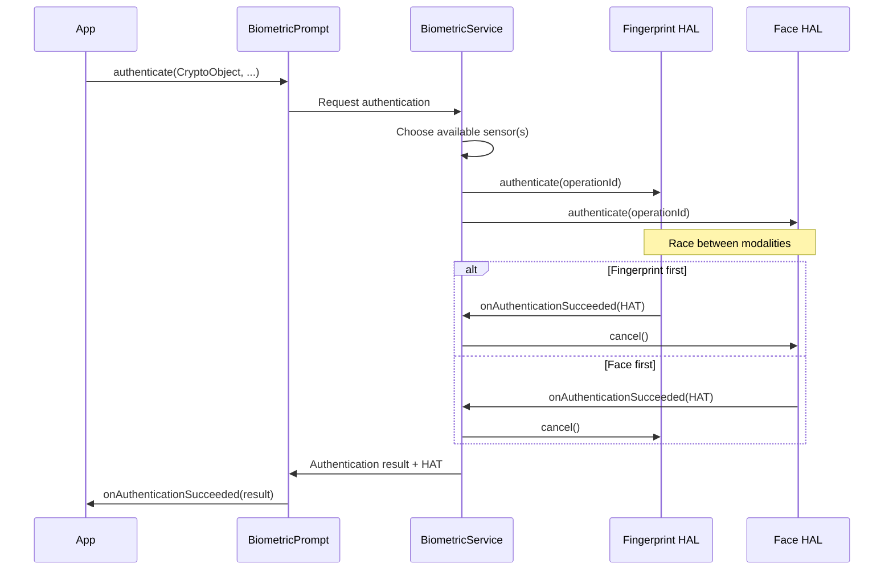

---

## 40.7  App Sandbox

### 40.7.1  UID-per-App Isolation

Every installed application receives a unique Linux UID.  This UID is assigned
at install time by the Package Manager and never changes.  The UID forms the
basis of the sandbox:

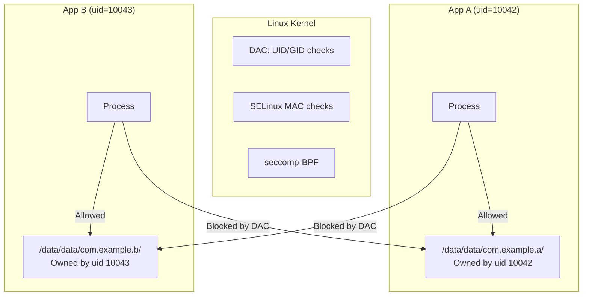

The app data directory is created with permissions `0700` and owned by the
app's UID, so no other (non-root) process can read or write it.

### 40.7.2  SELinux Domains for Apps

Apps run in type-specific SELinux domains based on their `targetSdkVersion`
and other properties.  The domain assignment is driven by `seapp_contexts`:

```
# From system/sepolicy/private/seapp_contexts

# System server
isSystemServer=true domain=system_server_startup

# Apps with targetSdkVersion >= 34
user=_app domain=untrusted_app type=app_data_file levelFrom=all

# Apps with targetSdkVersion 30-33
user=_app minTargetSdkVersion=30 domain=untrusted_app_30 ...

# Isolated processes
user=_isolated domain=isolated_app ...
```

The untrusted_app domain (`system/sepolicy/private/untrusted_app.te`):

```te
###
### Untrusted apps.
###
### This file defines the rules for untrusted apps running with
### targetSdkVersion >= 34.
###

typeattribute untrusted_app coredomain;

app_domain(untrusted_app)
untrusted_app_domain(untrusted_app)
net_domain(untrusted_app)
bluetooth_domain(untrusted_app)
```

### 40.7.3  Isolated Processes

The `isolated_app` domain is the most restricted:

```te
typeattribute isolated_app coredomain;

app_domain(isolated_app)
isolated_app_domain(isolated_app)
```

Isolated processes:

- Cannot access the network directly (no `net_domain`).
- Cannot access any content provider or service by default.
- Cannot read/write any files except those explicitly passed to them via
  file descriptors.
- Run as a unique UID each time (drawn from a reserved range).

From `system/sepolicy/private/isolated_app.te`:

```te
# Allow access to network sockets received over IPC.
# New socket creation is not permitted.
allow isolated_app { ephemeral_app priv_app untrusted_app_all }:{
    tcp_socket udp_socket
} { rw_socket_perms_no_ioctl };

# b/32896414: Allow accessing sdcard file descriptors passed to
# isolated_apps by other processes. Open should never be allowed.
allow isolated_app { sdcard_type fuse media_rw_data_file }:file {
    read write append getattr lock map
};
```

### 40.7.4  seccomp-BPF Filtering

Android applies seccomp-BPF (Secure Computing mode with Berkeley Packet
Filter) to app processes.  This restricts which system calls an app can make,
even before SELinux is consulted.

The seccomp filter is applied by the Zygote during process specialization.
Blocked syscalls include:

| Category | Examples |
|----------|---------|
| **Kernel module loading** | `init_module`, `finit_module`, `delete_module` |
| **Raw I/O** | `ioperm`, `iopl` |
| **Process tracing** | `ptrace` (unless debuggable) |
| **Namespace manipulation** | `unshare`, `setns` |
| **Clock manipulation** | `clock_settime`, `settimeofday` |
| **Mount operations** | `mount`, `umount2` |
| **Swap management** | `swapon`, `swapoff` |
| **Reboot** | `reboot` |

A blocked syscall results in process termination (SIGKILL) or an error return,
depending on the filter rule.

### 40.7.5  Namespace Isolation

Starting with Android 10, app processes use Linux mount namespaces to further
restrict their view of the filesystem:

- Each app has its own mount namespace.
- FUSE-mounted external storage is presented with per-app views.
- `/proc/net` is filtered to hide network information from apps targeting
  Android 10+.

### 40.7.6  Zygote Specialization

The Zygote is the parent process for all app processes.  When an app is
launched, the Zygote forks and then "specializes" the child process:

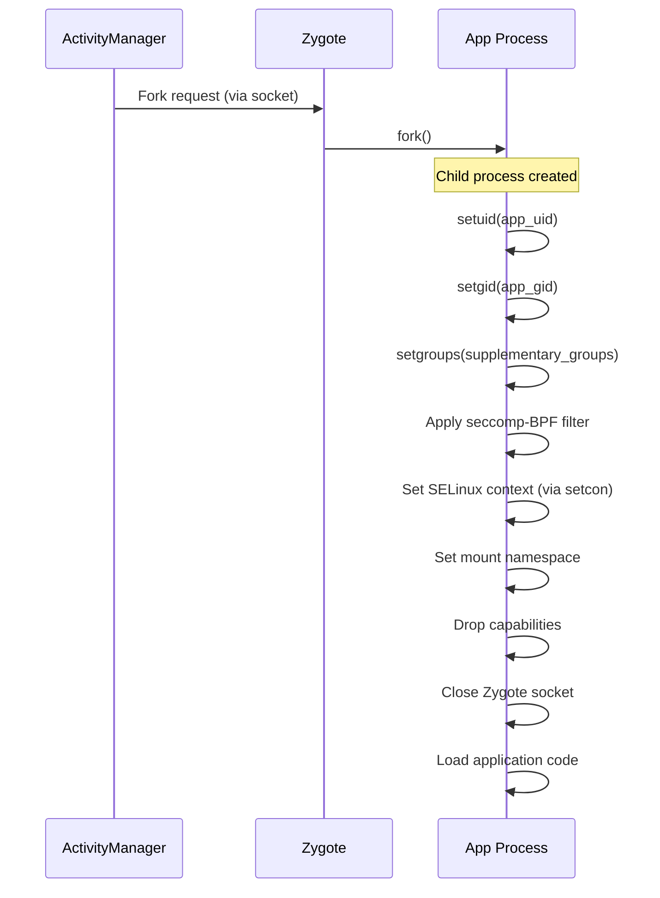

During specialization:

1. **UID/GID set** -- to the app's assigned UID.
2. **Supplementary groups** -- set based on permissions (e.g., `inet` group
   for INTERNET permission, `media_rw` for storage access).
3. **seccomp filter applied** -- restricts available syscalls.
4. **SELinux domain transition** -- from `zygote` to the appropriate app
   domain (e.g., `untrusted_app`).
5. **Mount namespace** -- isolated mount view created.
6. **Capabilities dropped** -- no Linux capabilities remain.
7. **Zygote socket closed** -- the child cannot fork more processes.

### 40.7.7  Permission to Group Mapping

The `INTERNET` permission is enforced at the kernel level through group
membership.  When granted, the app's process gets the `inet` supplementary
group (GID 3003), which allows it to create AF_INET/AF_INET6 sockets.  The
kernel's `paranoid_networking` feature restricts socket creation to processes
in specific groups:

| Group | GID | Permission |
|-------|-----|-----------|
| `inet` | 3003 | Network socket creation |
| `net_raw` | 3004 | Raw socket creation (ping) |
| `sdcard_rw` | 1015 | External storage write |
| `media_rw` | 1023 | Media storage write |

### 40.7.8  Detailed seccomp-BPF Policy

The seccomp-BPF filter is defined per architecture.  For ARM64, the policy
blocks dangerous syscalls while allowing the hundreds of syscalls needed for
normal app operation.  The filter structure:

```mermaid
flowchart TD
    A[Syscall from app process] --> B{syscall number in allowlist?}
    B -->|Yes| C[Allow syscall to proceed]
    B -->|No| D{syscall number in blocklist?}
    D -->|Yes| E[Return EPERM or SIGSYS]
    D -->|No| F{Architecture-specific handling}
    F --> G[Default: allow or block based on policy]
```

The seccomp policy files are at:
```
bionic/libc/seccomp/
```

Example blocked syscalls and their security rationale:

| Syscall | Rationale for blocking |
|---------|----------------------|
| `init_module` | Loading kernel modules would be game-over |
| `delete_module` | Unloading security modules |
| `mount` | Mounting new filesystems could bypass sandbox |
| `umount2` | Unmounting could expose raw block devices |
| `ptrace` | Debugging other processes leaks data |
| `unshare` | Namespace manipulation could escape sandbox |
| `setns` | Entering other namespaces |
| `reboot` | Denial of service |
| `swapon/swapoff` | System resource manipulation |
| `settimeofday` | Clock manipulation affects auth tokens |
| `pivot_root` | Filesystem root manipulation |
| `acct` | Process accounting control |
| `kexec_load` | Loading a new kernel |

### 40.7.9  Process-Level Isolation Details

Each app process has the following isolation properties:

**File descriptor table**: Forked from Zygote but scrubbed of sensitive FDs.
The Zygote socket FD is closed immediately after fork.

**Signal handling**: Apps can only send signals to processes in the same
app (same UID), except for SIGCHLD (parent notification) and signal 0
(existence test).

**Memory protection**: App processes have ASLR (Address Space Layout
Randomization), stack canaries, and execute-only memory for code segments.

**Resource limits**: `setrlimit` is called to restrict:

- Maximum number of file descriptors
- Maximum stack size
- Maximum virtual memory size
- Core dump size (typically zero)

### 40.7.10  Intent-Based Communication Security

Apps communicate primarily through Intents, which are mediated by
`system_server`.  The security checks on Intent delivery:

1. **Permission check** -- if the receiver declares a permission, the sender
   must hold it.
2. **Export check** -- unexported components cannot be targeted by external
   apps.
3. **SELinux check** -- binder_call permissions must allow the IPC.
4. **App visibility** -- Android 11+ restricts which apps can see each other
   based on `<queries>` declarations in the manifest.

### 40.7.11  Content Provider Security

Content Providers have their own access control:

```xml
<provider
    android:name=".MyProvider"
    android:authorities="com.example.provider"
    android:exported="true"
    android:readPermission="com.example.READ"
    android:writePermission="com.example.WRITE">
    <path-permission
        android:path="/sensitive"
        android:readPermission="com.example.READ_SENSITIVE" />
</provider>
```

- `exported=false` (default for targetSdk >= 31): only the same app can
  access it.
- `readPermission` / `writePermission`: separate read and write permissions.
- `<path-permission>`: per-path permissions for fine-grained control.
- URI grants: temporary one-time permission to specific URIs.

### 40.7.12  SDK Sandbox

Android 13 introduced the SDK Sandbox, a separate process for running
advertising and analytics SDKs in isolation from the host app:

```
user=_sdksandbox domain=sdk_sandbox type=sdk_sandbox_data_file
```

The SDK sandbox runs with its own UID and SELinux domain, preventing SDKs from
accessing the host app's data or other sensitive system resources.

The SDK Sandbox architecture:

```mermaid
graph TB
    subgraph "App Process (uid=10042)"
        App[App Code]
        SDK_Client[SDK Client API]
    end

    subgraph "SDK Sandbox Process (uid=20042)"
        SDK_Runtime[SDK Runtime]
        AdSDK[Ad SDK Code]
        AnalyticsSDK[Analytics SDK]
    end

    subgraph "System"
        SS["SdkSandboxManager<br/>in system_server"]
    end

    App --> SDK_Client
    SDK_Client -->|Binder IPC| SS
    SS -->|Manages lifecycle| SDK_Runtime
    SDK_Runtime --> AdSDK
    SDK_Runtime --> AnalyticsSDK
    AdSDK -.->|Cannot access| App
```

Key restrictions on the SDK Sandbox:

- No access to the host app's files or shared preferences.
- Limited network access.
- Cannot read device identifiers.
- Cannot access location.
- Runs with its own separate storage area.

### 40.7.13  App Cloning and Profile Security

Android supports app cloning (running two instances of the same app) through
the multi-user framework.  Each clone:

- Gets a unique UID in a different user space.
- Has its own encrypted CE/DE storage.
- Is isolated by SELinux MLS categories.
- Cannot access the other clone's data.

### 40.7.14  WebView Isolation

WebView content runs in isolated renderer processes:

```te
# WebView renderers use isolated_app domain
typeattribute isolated_app coredomain;
app_domain(isolated_app)
isolated_app_domain(isolated_app)
```

The WebView process:

- Runs as `isolated_app` with the most restrictive SELinux policy.
- Cannot open files (only use passed file descriptors).
- Cannot create network connections (only use passed sockets).
- Cannot access the parent app's data directory.
- Is killed when the WebView is destroyed.

This ensures that a compromised renderer (e.g., via a browser exploit)
has minimal access to the device.

---

## 40.8  Encryption

### 40.8.1  File-Based Encryption (FBE)

FBE, introduced in Android 7.0 and mandatory since Android 10, encrypts
different files with different keys, allowing each user's data to be
encrypted independently.  The implementation is in `system/vold/FsCrypt.cpp`.

FBE uses the kernel's native filesystem encryption (fscrypt) support:

```cpp
// system/vold/FsCrypt.cpp
#include <fscrypt/fscrypt.h>
#include <libdm/dm.h>
```

Key functions from `system/vold/FsCrypt.h`:

```cpp
bool fscrypt_initialize_systemwide_keys();
bool fscrypt_init_user0();
bool fscrypt_create_user_keys(userid_t user_id, bool ephemeral);
bool fscrypt_destroy_user_keys(userid_t user_id);
bool fscrypt_set_ce_key_protection(userid_t user_id,
                                   const std::vector<uint8_t>& secret);
bool fscrypt_unlock_ce_storage(userid_t user_id,
                               const std::vector<uint8_t>& secret);
bool fscrypt_lock_ce_storage(userid_t user_id);
bool fscrypt_prepare_user_storage(const std::string& volume_uuid,
                                  userid_t user_id, int flags);
```

### 40.8.2  FBE Key Classes

FBE uses two classes of encryption keys per user:

```mermaid
graph TB
    subgraph "Device Encrypted (DE)"
        DE_Key["DE Key<br/>Available at boot"]
        DE_Data["/data/system_de/<userId>/<br/>/data/misc_de/<userId>/<br/>/data/vendor_de/<userId>/"]
    end

    subgraph "Credential Encrypted (CE)"
        CE_Key["CE Key<br/>Available after first unlock"]
        CE_Data["/data/system_ce/<userId>/<br/>/data/misc_ce/<userId>/<br/>/data/vendor_ce/<userId>/<br/>/data/data/ (user 0)"]
    end

    subgraph "Key Storage"
        KS["/data/misc/vold/user_keys/<br/>ce/<userId>/<br/>de/<userId>/"]
    end

    DE_Key --> DE_Data
    CE_Key --> CE_Data
    KS --> DE_Key
    KS --> CE_Key
```

| Key Class | Unlocked When | Protects |
|-----------|--------------|----------|
| **DE (Device Encrypted)** | Device boots | Alarm, telephony, accessibility settings |
| **CE (Credential Encrypted)** | User enters credential | App data, contacts, messages |

This design enables Direct Boot: the device can boot and run essential
services (alarms, phone calls) before the user has entered their credential.

### 40.8.3  FBE Key Path Structure

The encryption keys are organized in a directory hierarchy under
`/data/misc/vold/user_keys/`.  From `system/vold/FsCrypt.cpp`:

```cpp
const std::string device_key_dir =
    std::string() + DATA_MNT_POINT + fscrypt_unencrypted_folder;
const std::string device_key_path = device_key_dir + "/key";

const std::string user_key_dir =
    std::string() + DATA_MNT_POINT + "/misc/vold/user_keys";

const std::string systemwide_volume_key_dir =
    std::string() + DATA_MNT_POINT + "/misc/vold/volume_keys";
```

Key directory layout:

```
/data/misc/vold/user_keys/
  ce/
    0/          # User 0 CE keys
      current/  # Currently active CE key
    10/         # User 10 CE keys
  de/
    0/          # User 0 DE keys
    10/         # User 10 DE keys
```

Helper functions for key path resolution:

```cpp
static std::string get_de_key_path(userid_t user_id) {
    return StringPrintf("%s/de/%d", user_key_dir.c_str(), user_id);
}

static std::string get_ce_key_directory_path(userid_t user_id) {
    return StringPrintf("%s/ce/%d", user_key_dir.c_str(), user_id);
}
```

The internal state tracking uses maps to manage installed encryption policies:

```cpp
// The currently installed CE and DE keys for each user.
// Protected by VolumeManager::mCryptLock.
struct UserPolicies {
    EncryptionPolicy internal;
    std::map<std::string, EncryptionPolicy> adoptable;
};

std::map<userid_t, UserPolicies> s_ce_policies;
std::map<userid_t, UserPolicies> s_de_policies;
```

### 40.8.4  Key Derivation and Storage

From `system/vold/KeyStorage.cpp`:

```cpp
const KeyAuthentication kEmptyAuthentication{""};

static constexpr size_t AES_KEY_BYTES = 32;
static constexpr size_t GCM_NONCE_BYTES = 12;
static constexpr size_t GCM_MAC_BYTES = 16;
static constexpr size_t SECDISCARDABLE_BYTES = 1 << 14;

static const char* kHashPrefix_secdiscardable =
    "Android secdiscardable SHA512";
static const char* kHashPrefix_keygen =
    "Android key wrapping key generation SHA512";
```

The key storage mechanism:

1. A random 256-bit encryption key is generated.
2. The key is wrapped using a key derived from:
   - The user's credential (for CE keys)
   - A hardware-bound key from Keystore (bound to the device)
   - A "secdiscardable" random file (16 KiB) that is securely deleted when
     the key is no longer needed
3. The wrapped key is stored in `/data/misc/vold/user_keys/`.

### 40.8.5  Encryption Key Lifecycle

```mermaid
stateDiagram-v2
    [*] --> Created: fscrypt_create_user_keys
    Created --> DE_Active: Device boots, DE key installed to kernel
    DE_Active --> CE_Active: User enters credential, fscrypt_unlock_ce_storage
    CE_Active --> CE_Locked: Device locks, fscrypt_lock_ce_storage
    CE_Locked --> CE_Active: User re-enters credential
    CE_Active --> Destroyed: User removed, fscrypt_destroy_user_keys
    DE_Active --> Destroyed: User removed
    Destroyed --> [*]
```

The key installation process uses the kernel's fscrypt API:

1. The raw key (or hardware-wrapped key) is retrieved from storage.
2. The key is installed into the kernel's fscrypt keyring using
   `FS_IOC_ADD_ENCRYPTION_KEY`.
3. The kernel returns a key identifier.
4. The identifier is set as the encryption policy for directories using
   `FS_IOC_SET_ENCRYPTION_POLICY`.
5. The kernel encrypts/decrypts file contents transparently.

### 40.8.6  Metadata Encryption

Metadata encryption protects filesystem metadata (filenames, permissions,
directory structure) that FBE does not cover.  The implementation is in
`system/vold/MetadataCrypt.cpp`:

```cpp
// Parsed from metadata options
struct CryptoOptions {
    struct CryptoType cipher = invalid_crypto_type;
    bool use_legacy_options_format = false;
    bool set_dun = true;
    bool use_hw_wrapped_key = false;
};

// The first entry in this table is the default crypto type.
constexpr CryptoType supported_crypto_types[] = {aes_256_xts, adiantum};
```

Metadata encryption uses `dm-default-key`, a device-mapper target that
transparently encrypts all data written to the underlying block device with
a single key.  This key is available at boot (not credential-bound) and
protects data at rest when the device is powered off.

Supported ciphers:

| Cipher | Performance | Security |
|--------|------------|----------|
| **AES-256-XTS** | Fast with hardware acceleration | Standard choice |
| **Adiantum** | Fast without hardware acceleration | For low-end devices without AES instructions |

### 40.8.7  Full-Disk Encryption (FDE) -- Legacy

FDE was the encryption model before FBE (Android 5.0-6.0).  It encrypted the
entire `/data` partition with a single key derived from the user's credential.
FDE had significant usability issues:

- The device could not boot functional services until the user entered their
  credential.
- No Direct Boot: alarms, phone calls, and accessibility services were
  unavailable before unlock.
- A single key compromise exposed all data.

FDE is deprecated and no longer supported on new devices launching with
Android 10+.

### 40.8.8  Hardware-Wrapped Keys

For devices with inline encryption engines (common on modern SoCs), keys
can be "hardware-wrapped":

1. The key is generated inside the inline crypto engine.
2. Only an encrypted ("wrapped") version of the key is ever visible to
   software.
3. The inline crypto engine unwraps the key internally during I/O.

This means that even a kernel compromise cannot extract the raw encryption key.
The `use_hw_wrapped_key` option in metadata encryption enables this feature.

### 40.8.9  The dm-default-key Implementation

Metadata encryption uses the `dm-default-key` device-mapper target.  From
`system/vold/MetadataCrypt.cpp`, the setup involves:

```cpp
static bool create_crypto_blk_dev(
    const std::string& dm_name,
    const std::string& blk_device,
    const KeyBuffer& key,
    const CryptoOptions& options,
    std::string* crypto_blkdev,
    uint64_t* nr_sec,
    bool is_userdata)
{
    if (!get_number_of_sectors(blk_device, nr_sec)) return false;
    // dm-default-key uses 4096-byte sectors
    *nr_sec &= ~7;

    KeyBuffer module_key;
    if (options.use_hw_wrapped_key) {
        if (!exportWrappedStorageKey(key, &module_key)) {
            LOG(ERROR) << "Failed to get ephemeral wrapped key";
            return false;
        }
    } else {
        module_key = key;
    }
    // ... set up dm-default-key target ...
}
```

The metadata encryption layer sits between the filesystem and the block device:

```
Filesystem (ext4/f2fs)
        |
   dm-default-key (metadata encryption, AES-256-XTS)
        |
   Raw block device (/dev/block/by-name/userdata)
```

### 40.8.10  The Secdiscardable Mechanism

A unique security feature is the "secdiscardable" file:

```cpp
static constexpr size_t SECDISCARDABLE_BYTES = 1 << 14;  // 16384 bytes

static const char* kHashPrefix_secdiscardable =
    "Android secdiscardable SHA512";
```

This 16 KiB random file is stored alongside each key.  Its hash is mixed into
the key derivation.  When a key needs to be permanently destroyed:

1. The secdiscardable file is securely erased using `BLKDISCARD` or
   `FITRIM` ioctls.
2. Even if the encrypted key blob is somehow recovered, the loss of the
   secdiscardable makes it useless.
3. On flash storage, the DISCARD command tells the flash controller to
   erase the physical blocks, making recovery extremely difficult.

This provides a defense against forensic recovery of deleted keys.

### 40.8.11  CE Key Protection with User Credential

When a user sets a credential (PIN, pattern, password), the CE key becomes
protected by a key derived from the credential.  The protection flow:

```mermaid
sequenceDiagram
    participant User
    participant LS as LockSettingsService
    participant GK as Gatekeeper
    participant Vold
    participant KS as Keystore

    User->>LS: Set new PIN "1234"
    LS->>GK: enroll(password_derived_secret)
    GK->>LS: Password handle
    LS->>LS: Store handle in /data/system/gatekeeper.pattern.key
    LS->>KS: Create synthetic password (SP)
    Note over KS: SP = random 256-bit value
    KS->>KS: Encrypt SP with credential-derived key
    KS->>KS: Store encrypted SP
    LS->>Vold: fscrypt_set_ce_key_protection(userId, SP)
    Vold->>Vold: Re-wrap CE key with SP
    Note over Vold: CE key now requires SP to unlock
```

On unlock:

```mermaid
sequenceDiagram
    participant User
    participant LS as LockSettingsService
    participant GK as Gatekeeper
    participant Vold

    User->>LS: Enter PIN "1234"
    LS->>GK: verify(password_derived_secret)
    GK->>LS: HardwareAuthToken
    LS->>LS: Use token + credential to decrypt SP
    LS->>Vold: fscrypt_unlock_ce_storage(userId, SP)
    Vold->>Vold: Unwrap CE key using SP
    Vold->>Vold: Install CE key to kernel fscrypt keyring
    Note over Vold: CE storage now accessible
```

### 40.8.12  Encryption Architecture Diagram

```mermaid
graph TB
    subgraph "At Rest (Power Off)"
        Disk["/data partition<br/>Everything encrypted"]
    end

    subgraph "After Boot (Before Unlock)"
        MD["Metadata Encryption<br/>dm-default-key active"]
        DE_Unlocked["DE keys available<br/>DE storage readable"]
        CE_Locked["CE keys locked<br/>CE storage inaccessible"]
    end

    subgraph "After User Unlock"
        CE_Unlocked["CE keys unlocked<br/>All user data accessible"]
    end

    Disk -->|Boot| MD
    MD --> DE_Unlocked
    MD --> CE_Locked
    CE_Locked -->|User enters credential| CE_Unlocked
```

### 40.8.13  SecureBox and the Recoverable Key Store

The encryption subsystems covered above (FBE, metadata encryption, dm-default-key)
protect data *at rest on the device*. Android also needs to protect keys
that leave the device — most importantly, the user's lock-screen-protected
keys when they are backed up to a remote vault for later recovery on a new
device. The "SecureBox" library at `frameworks/base/libs/securebox/`
provides the cryptographic primitive that the recoverable key store uses
to wrap those keys end-to-end.

This subsection walks through the SecureBox v2 wire format, why it is
shaped the way it is, and how `RecoverableKeyStoreManager` consumes it.

#### What SecureBox Is

`com.android.security.SecureBox` is a 461-line, dependency-free Java
class that implements an authenticated public-key + shared-secret hybrid
encryption scheme over the NIST P-256 elliptic curve, AES-128-GCM, and
HKDF-SHA-256. It exposes exactly four public methods:

```java
// Source: frameworks/base/libs/securebox/src/com/android/security/SecureBox.java:142
public static KeyPair genKeyPair() throws NoSuchAlgorithmException;
public static byte[]  encrypt(@Nullable PublicKey theirPublicKey,
                              @Nullable byte[] sharedSecret,
                              @Nullable byte[] header,
                              @Nullable byte[] payload);
public static byte[]  decrypt(@Nullable PrivateKey ourPrivateKey,
                              @Nullable byte[] sharedSecret,
                              @Nullable byte[] header,
                              byte[] encryptedPayload);
public static byte[]  encodePublicKey(PublicKey publicKey);
public static PublicKey decodePublicKey(byte[] keyBytes);
```

The signatures encode the design contract:

- A caller can encrypt with the recipient's **public key**, with a
  **shared secret**, or with **both** (in which case both are required
  to decrypt). At least one of the two must be non-null.
- `header` is authenticated but not encrypted — it travels in cleartext
  but the GCM tag binds it to the payload, so any modification fails
  decryption with `AEADBadTagException`.
- `payload` is the encrypted body. Either input may be null/empty.

The library is built as a plain `java_library` with no `static_libs` and
no Android dependencies beyond `@hide` annotations and an
`ArrayUtils.concat` helper — a deliberate choice so that the same code
can be vetted as a self-contained cryptographic unit.

#### The SecureBox v2 Wire Format

The output of `encrypt(...)` is a single byte array with the layout:

```
+--------+----------------+--------+----------------------------+
|        |                |        |                            |
| VERSION| sender pubKey  | nonce  |  AES-GCM(ciphertext || tag)|
| 2 B    | 65 B (DH only) | 12 B   |  variable                  |
|        |                |        |                            |
+--------+----------------+--------+----------------------------+
```

- **VERSION** is the constant `0x02 0x00` — little-endian 2 (the "v2"
  in SecureBox v2).
- **sender pubKey** is present *only* in the public-key paths
  (`theirPublicKey != null`). The sender generates a fresh ephemeral
  P-256 key pair per `encrypt(...)` call, performs ECDH against the
  recipient's public key, and emits its own public key in
  uncompressed-point form (`0x04 || X (32 B) || Y (32 B)`,
  `EC_PUBLIC_KEY_LEN_BYTES = 65`).
- **nonce** is 12 freshly-random bytes per call (`SecureRandom`).
- **AES-GCM body** is the AES-128-GCM ciphertext with the 16-byte
  authentication tag appended (standard JCE GCM layout).

The HKDF info string differs by mode:

```java
// Source: frameworks/base/libs/securebox/src/com/android/security/SecureBox.java:77
private static final byte[] HKDF_INFO_WITH_PUBLIC_KEY =
        "P256 HKDF-SHA-256 AES-128-GCM".getBytes(StandardCharsets.UTF_8);
private static final byte[] HKDF_INFO_WITHOUT_PUBLIC_KEY =
        "SHARED HKDF-SHA-256 AES-128-GCM".getBytes(StandardCharsets.UTF_8);
```

Mixing the two info strings is what makes the same library
unambiguously cover both the ECDH and pure-shared-secret cases — the
derived AES key is bound to its derivation mode, so a payload encrypted
in one mode cannot decrypt in the other even if the keying material
collides.

The full key-derivation chain is:

1. `dhSecret = ECDH(senderPrivate, recipientPublic)`  (empty in the
   pure-shared-secret mode)
2. `keyingMaterial = dhSecret || sharedSecret`
3. `prk = HMAC-SHA-256(salt = "SECUREBOX" || 0x02 0x00, ikm = keyingMaterial)`
4. `K = first 16 bytes of HMAC-SHA-256(prk, info || 0x01)`  (one HKDF block)
5. AES-128-GCM with `K`, `nonce`, AAD = `header`

This is a textbook HKDF construction; the only Android-specific bits
are the `"SECUREBOX" || 0x02 0x00` salt and the API-37-stable info
strings.

```mermaid
flowchart LR
    subgraph Encrypt["encrypt(theirPub, sharedSecret, header, payload)"]
        EphGen["genKeyPair → senderPriv, senderPub"]
        ECDH["dhSecret = ECDH(senderPriv, theirPub)"]
        Concat["keyingMaterial = dhSecret || sharedSecret"]
        HKDF["HKDF-SHA-256(salt='SECUREBOX'||0x02 0x00,<br/>info='P256 HKDF-SHA-256 AES-128-GCM',<br/>ikm=keyingMaterial) → K (16 B)"]
        Nonce["genRandomNonce → 12 B"]
        GCM["AES-128-GCM-Encrypt(K, nonce, aad=header, pt=payload)"]
        Out["VERSION (2) || senderPub (65) || nonce (12) || ciphertext"]
        EphGen --> ECDH --> Concat --> HKDF --> GCM --> Out
        Nonce --> GCM
    end
```

#### Curve Validation on Decode

`SecureBox` ships its own P-256 parameters (the canonical NIST p, a, b,
G, n constants in the static initializer) instead of trusting the JCE
to resolve them. The reason is `decodePublicKey(...)` validates that
the received point actually lies on the curve:

```java
// Source: frameworks/base/libs/securebox/src/com/android/security/SecureBox.java:430
private static void validateEcPoint(BigInteger x, BigInteger y) throws InvalidKeyException {
    if (x.compareTo(EC_PARAM_P) >= 0
            || y.compareTo(EC_PARAM_P) >= 0
            || x.signum() == -1
            || y.signum() == -1) {
        throw new InvalidKeyException("Point lies outside of the expected curve");
    }
    // Points on the curve satisfy y^2 = x^3 + ax + b (mod p)
    BigInteger lhs = y.modPow(BIG_INT_02, EC_PARAM_P);
    BigInteger rhs = x.modPow(BIG_INT_02, EC_PARAM_P)
            .add(EC_PARAM_A).mod(EC_PARAM_P)
            .multiply(x).add(EC_PARAM_B).mod(EC_PARAM_P);
    if (!lhs.equals(rhs)) {
        throw new InvalidKeyException("Point lies outside of the expected curve");
    }
}
```

This blocks invalid-curve attacks: an attacker who controls the
`encryptedPayload` cannot smuggle a malicious "public key" that lives
on a weaker curve and use the resulting ECDH leakage to recover the
recipient's private key. The check matches IETF / NIST SP 800-56A
public-key-validation guidance and is performed before the key is
handed to `KeyAgreement`.

The encoded form is also chosen deliberately: uncompressed
`0x04 || X || Y`, fixed 65 bytes, with `arraycopy` careful about
two's-complement sign-bit leading zeros (lines 386-398). The fixed-width
encoding is what `RecoverableKeyStoreManager` later persists into the
"vault params" blob handed to the recovery service.

#### How the Recoverable Key Store Uses It

The principal consumer is the LockSettings recoverable key store
implementation in `frameworks/base/services/core/java/com/android/server/locksettings/recoverablekeystore/`:

| File | Use of SecureBox |
|------|-------------------|
| `RecoverableKeyStoreManager.java` | Top-level service handling `RecoveryController` AIDLs; uses SecureBox to wrap session keys end-to-end against a recovery agent's public key. |
| `KeySyncUtils.java` | Computes the locally-stored encrypted snapshot of "application keys + per-user recovery key" using SecureBox with the user's LSKF-derived shared secret. |
| `storage/RemoteLockscreenValidationSessionStorage.java` | Maintains the ephemeral SecureBox key pair that protects a remote-unlock session (used during Find My Device flows). |

The high-level recovery flow:

1. On a *source* device, the user opts into Cloud Key Vault backups
   via Settings. The system derives a recovery key from the
   lock-screen credential (Gatekeeper-anchored), then uses
   `SecureBox.encrypt(theirPublicKey = recoveryServicePublicKey,
   sharedSecret = recoverySalt, ...)` to wrap the user's application
   keys for the chosen recovery agent.
2. The wrapped blob travels via the recovery agent (e.g. Google's
   account-tied cloud service). The cloud service stores it but cannot
   read it — only the recipient device with the corresponding
   `recoveryServicePrivateKey` plus the user-derived `sharedSecret`
   can `SecureBox.decrypt(...)` it.
3. On a *target* device, after successful lock-screen credential
   re-entry against the cloud-issued challenge, the system retrieves
   the wrapped blob and `decrypt(...)`s it, repopulating the keystore
   with the user's recoverable keys.

The `header` argument is used to bind each blob to its context
(recovery agent ID, vault version, intended slot). Any tampering with
that context invalidates the GCM tag and fails recovery — exactly the
property the recovery protocol needs.

#### The Remote Lock-Screen Validation Variant

`com.android.settings.password.RemoteLockscreenValidationFragment`
(in `packages/apps/Settings/`) uses the same SecureBox primitive for a
different flow: a *remote* unlock confirmation during Find My Device
flows. Settings generates an ephemeral P-256 key pair via
`SecureBox.genKeyPair()`, sends the public key to the cloud service,
and decrypts the cloud's challenge response with the private key. The
public-key path (no shared secret) of `SecureBox.encrypt` is what the
cloud uses on its end.

This second consumer is why `SecureBox` exposes the ECDH-only mode as
a first-class API path rather than insisting on a shared secret.

#### Why a Separate Library Instead of a JCE Provider

SecureBox could have been shipped as a JCE `Cipher` provider, but it
is deliberately not:

- The wire format is a single fixed shape with an explicit version
  byte — easier to audit as a sealed primitive than as a configurable
  algorithm.
- The library is consumed by `system_server` (LockSettings) and by an
  app (Settings). Packaging it as a `java_library` with no Android
  framework dependencies means the same compiled class file is used
  in both contexts, with no provider-installation differences.
- The implementation must run on every Android device that supports
  recoverable key stores. Avoiding a provider lets the code work even
  when the active JCE provider has been replaced or restricted (e.g.
  by FIPS-mode builds that disallow generic GCM modes).

`SecureBox` is therefore a small, self-contained, intentionally
boring building block — the boringness is the security argument. The
v2 format has not changed since the file was added (2017 copyright
header), and the consumer code can rely on a stable wire shape across
the entire fleet that supports recoverable key stores.

---

## 40.9  Network Security

### 40.9.1  Network Security Config

The Network Security Config system allows apps to declare their network
security preferences in a declarative XML format.  The implementation is in:

```
frameworks/base/packages/NetworkSecurityConfig/platform/src/android/security/net/config/
```

The main class, `NetworkSecurityConfig.java`, manages:

```java
public final class NetworkSecurityConfig {
    public static final boolean DEFAULT_CLEARTEXT_TRAFFIC_PERMITTED = true;
    public static final boolean DEFAULT_HSTS_ENFORCED = false;

    private final boolean mCleartextTrafficPermitted;
    private final boolean mHstsEnforced;
    private final boolean mCertificateTransparencyVerificationRequired;
    private final PinSet mPins;
    private final List<CertificatesEntryRef> mCertificatesEntryRefs;
    private Set<TrustAnchor> mAnchors;
}
```

Key source files in the implementation:

| File | Purpose |
|------|---------|
| `NetworkSecurityConfig.java` | Core configuration class |
| `XmlConfigSource.java` | Parses XML config from AndroidManifest |
| `ManifestConfigSource.java` | Reads config reference from manifest |
| `NetworkSecurityTrustManager.java` | TLS trust manager with config awareness |
| `RootTrustManager.java` | Root trust manager that routes to per-domain configs |
| `Pin.java` / `PinSet.java` | Certificate pinning support |
| `Domain.java` | Domain matching for per-domain config |
| `SystemCertificateSource.java` | System CA certificate provider |
| `UserCertificateSource.java` | User-installed CA certificate provider |

### 40.9.2  XML Configuration Format

Apps declare their network security policy in `res/xml/network_security_config.xml`:

```xml
<?xml version="1.0" encoding="utf-8"?>
<network-security-config>
    <!-- Base config applied to all connections -->
    <base-config cleartextTrafficPermitted="false">
        <trust-anchors>
            <certificates src="system" />
        </trust-anchors>
    </base-config>

    <!-- Per-domain overrides -->
    <domain-config>
        <domain includeSubdomains="true">api.example.com</domain>
        <pin-set expiration="2025-01-01">
            <pin digest="SHA-256">7HIpactkIAq2Y49orFOOQKurWxmmSFZhBCoQYcRhJ3Y=</pin>
            <!-- Backup pin -->
            <pin digest="SHA-256">fwza0LRMXouZHRC8Ei+4PyuldPDcf3UKgO/04cDM1oE=</pin>
        </pin-set>
        <trust-anchors>
            <certificates src="system" />
        </trust-anchors>
    </domain-config>

    <!-- Debug overrides (only in debuggable builds) -->
    <debug-overrides>
        <trust-anchors>
            <certificates src="user" />
        </trust-anchors>
    </debug-overrides>
</network-security-config>
```

### 40.9.3  Cleartext Traffic Restrictions

Android progressively restricts cleartext (non-TLS) HTTP traffic:

| targetSdkVersion | Default cleartext | Behavior |
|-----------------|-------------------|----------|
| <= 23 | Permitted | No restriction |
| 24-27 | Permitted | Can opt out via config |
| >= 28 | **Blocked** | Must explicitly opt in for cleartext |

When cleartext traffic is blocked, `HttpURLConnection` and OkHttp refuse to
make HTTP connections, and the system logs a warning.

### 40.9.4  Certificate Pinning

Certificate pinning binds a domain to specific public keys, preventing
man-in-the-middle attacks even if a CA is compromised:

```mermaid
flowchart TD
    A[App connects to api.example.com] --> B[TLS handshake]
    B --> C[Server presents certificate chain]
    C --> D{Chain valid per system CAs?}
    D -->|No| E[Connection rejected]
    D -->|Yes| F{Pin-set configured?}
    F -->|No| G[Connection allowed]
    F -->|Yes| H{"Any cert in chain<br/>matches a pin?"}
    H -->|Yes| G
    H -->|No| I["Connection rejected<br/>Pin mismatch"]
```

Pin-sets have mandatory features:

- **Expiration date** -- pins expire so that a wrong pin does not permanently
  brick the app's connectivity.
- **Backup pins** -- at least two pins must be specified (one current, one
  backup) to enable key rotation.

### 40.9.5  Certificate Transparency

Starting with Android 16 (Baklava), Certificate Transparency (CT) verification
is enabled by default for apps targeting the new SDK level:

```java
@ChangeId
@EnabledAfter(targetSdkVersion = Build.VERSION_CODES.BAKLAVA)
static final long DEFAULT_ENABLE_CERTIFICATE_TRANSPARENCY = 407952621L;
```

CT ensures that certificates issued by CAs are publicly logged, making it
harder for CAs to issue fraudulent certificates without detection.

### 40.9.6  Trust Anchor Configuration

The Network Security Config supports three certificate sources:

| Source | Description |
|--------|-------------|
| `system` | System CA store (`/system/etc/security/cacerts/`) |
| `user` | User-installed certificates |
| `@raw/my_ca` | App-bundled CA certificate |

For apps targeting Android 7.0+, user-installed CAs are NOT trusted by
default.  This prevents enterprise or parental-control proxies from silently
intercepting app traffic.

### 40.9.7  Network Security Architecture

```mermaid
graph TB
    subgraph "Application"
        App[App Code]
        NSC[network_security_config.xml]
    end

    subgraph "Framework"
        ASP[ApplicationConfig]
        ManifestSrc[ManifestConfigSource]
        XmlSrc[XmlConfigSource]
        RTM[RootTrustManager]
        NSTM[NetworkSecurityTrustManager]
    end

    subgraph "Platform"
        SysCA["System CA Store<br/>/system/etc/security/cacerts/"]
        UserCA["User CA Store<br/>/data/misc/user/0/cacerts-added/"]
        Conscrypt[Conscrypt TLS Provider]
    end

    App --> NSC
    NSC --> ManifestSrc
    ManifestSrc --> XmlSrc
    XmlSrc --> ASP
    ASP --> RTM
    RTM --> NSTM
    NSTM --> Conscrypt
    Conscrypt --> SysCA
    Conscrypt --> UserCA
```

### 40.9.8  The XmlConfigSource Parser

The `XmlConfigSource.java` parses the app's network security configuration
XML.  The parsing handles nested structures:

```xml
<network-security-config>
    <!-- Global defaults -->
    <base-config>
        <trust-anchors>
            <certificates src="system" />
        </trust-anchors>
    </base-config>

    <!-- Per-domain overrides (most specific wins) -->
    <domain-config>
        <domain includeSubdomains="true">example.com</domain>
        <trust-anchors>
            <certificates src="system" />
            <certificates src="@raw/custom_ca" />
        </trust-anchors>
    </domain-config>

    <!-- Nested domain configs for sub-paths -->
    <domain-config>
        <domain includeSubdomains="true">example.com</domain>
        <domain-config>
            <domain>api.example.com</domain>
            <pin-set>
                <pin digest="SHA-256">...</pin>
            </pin-set>
        </domain-config>
    </domain-config>
</network-security-config>
```

Domain matching follows a most-specific-match rule: `api.example.com` would
match the nested config with pinning, while `www.example.com` would match the
parent config with the custom CA.

### 40.9.9  Certificate Transparency Details

Certificate Transparency works by requiring that TLS certificates be logged
to publicly auditable CT logs before they are accepted.  The verification
flow:

```mermaid
flowchart TD
    A[TLS Handshake] --> B[Server presents certificate]
    B --> C["Extract SCTs<br/>Signed Certificate Timestamps"]
    C --> D{SCTs present?}
    D -->|No| E{CT required?}
    E -->|Yes| F[Connection rejected]
    E -->|No| G[Continue without CT]
    D -->|Yes| H["Verify SCT signatures<br/>against known CT logs"]
    H --> I{Signatures valid?}
    I -->|No| F
    I -->|Yes| J{"Enough SCTs?<br/>Minimum depends on cert lifetime"}
    J -->|No| F
    J -->|Yes| K[Connection accepted]
```

SCTs (Signed Certificate Timestamps) can be delivered through three mechanisms:

1. **TLS extension** -- the server includes SCTs in the TLS handshake.
2. **OCSP stapling** -- SCTs are embedded in OCSP responses.
3. **X.509 extension** -- SCTs are embedded in the certificate itself.

### 40.9.10  HTTPS Enforcement Evolution

Android has progressively tightened HTTPS requirements:

| Android Version | Change |
|----------------|--------|
| 6.0 | `usesCleartextTraffic` manifest attribute introduced |
| 7.0 | Network Security Config introduced; user CAs not trusted by default |
| 9.0 | `cleartextTrafficPermitted` defaults to false for targetSdk >= 28 |
| 10 | TLS 1.3 enabled by default |
| 14 | System-only CA trust for targetSdk >= 34 |
| 16 (Baklava) | Certificate Transparency enabled by default |

### 40.9.11  DNS over TLS / DNS over HTTPS

Android 9+ supports Private DNS (DNS over TLS, port 853).  Android 13+
adds DNS over HTTPS (DoH).  These prevent network observers from seeing DNS
queries in plaintext.  The implementation is in the `DnsResolver` module
(an updatable Mainline module), separate from the app-level Network Security
Config.

Private DNS modes:

| Mode | Behavior |
|------|----------|
| **Off** | Standard DNS (plaintext UDP port 53) |
| **Automatic** | Try DoT, fall back to standard DNS |
| **Private DNS provider** | Always use DoT to specified hostname, fail if unavailable |

The automatic mode discovery works by:

1. Attempting a TLS connection to the network-provided DNS server on port 853.
2. If the server supports DoT and its certificate is valid, using DoT.
3. If not, falling back to standard DNS.

### 40.9.12  VPN Security Integration

Android's VPN framework integrates with the security model:

- VPN apps receive the `BIND_VPN_SERVICE` permission.
- VPN traffic is routed through a TUN interface.
- The VPN app can see all DNS queries and network traffic, but:
  - It runs in the `untrusted_app` SELinux domain.
  - It cannot access other apps' files or processes.
  - It cannot escalate privileges beyond network observation.
- Always-on VPN can be configured to block all traffic when VPN disconnects.

### 40.9.13  Network Security for System Services

System services have different network security properties:

```te
# From private/app.te - apps cannot access certain network interfaces
neverallow all_untrusted_apps domain:netlink_kobject_uevent_socket *;
neverallow all_untrusted_apps domain:netlink_socket *;

# Restricted socket ioctls
neverallowxperm all_untrusted_apps domain:{
    icmp_socket rawip_socket tcp_socket udp_socket
} ioctl priv_sock_ioctls;
```

This ensures that even if an app compromises the network stack, it cannot
use privileged network operations like raw sockets, ICMP manipulation,
or netlink configuration.

---

## 40.10  Try It

This section provides hands-on exercises for exploring Android's security
subsystems.

### Exercise 29.1: Inspect SELinux Policy

Build the sepolicy and inspect its contents:

```bash
# In the AOSP source tree
cd system/sepolicy

# List all types defined in public policy
grep '^type ' public/*.te | sort

# Count neverallow rules
grep -c 'neverallow' private/*.te

# View the domain assigned to a specific app
grep 'untrusted_app' private/seapp_contexts
```

On a running device:

```bash
# Check SELinux mode
adb shell getenforce

# View the SELinux context of a running process
adb shell ps -eZ | grep com.example.myapp

# View recent SELinux denials
adb shell dmesg | grep 'avc:  denied'

# Check file contexts
adb shell ls -Z /data/data/com.example.myapp/
```

### Exercise 29.2: Examine Verified Boot State

```bash
# Check the verified boot state from userspace
adb shell getprop ro.boot.verifiedbootstate
# Output: green (locked, verified), yellow (locked, custom key),
#         orange (unlocked), red (verification failure)

# View the vbmeta digest
adb shell getprop ro.boot.vbmeta.digest

# Check device lock state
adb shell getprop ro.boot.vbmeta.device_state

# Examine AVB metadata on a partition image
avbtool info_image --image boot.img
```

### Exercise 29.3: Explore Keystore Keys

```bash
# List all Keystore aliases for the current user
adb shell cmd keystore2 list

# Generate a test key
# (In an Android app)
val keyGen = KeyPairGenerator.getInstance(
    KeyProperties.KEY_ALGORITHM_EC, "AndroidKeyStore")
keyGen.initialize(
    KeyGenParameterSpec.Builder("test_key",
        KeyProperties.PURPOSE_SIGN)
        .setDigests(KeyProperties.DIGEST_SHA256)
        .build())
val keyPair = keyGen.generateKeyPair()

# Check the security level of the key
adb shell dumpsys keystore2
```

### Exercise 29.4: Verify App Sandbox Isolation

```bash
# Check the UID of a running app
adb shell ps -o USER,PID,NAME | grep com.example

# Try to access another app's data (should fail)
adb shell run-as com.example.app1 ls /data/data/com.example.app2/
# Output: ls: /data/data/com.example.app2/: Permission denied

# View seccomp filter status
adb shell cat /proc/<pid>/status | grep Seccomp
# Output: Seccomp:  2  (2 = filter mode)

# View the SELinux domain
adb shell cat /proc/<pid>/attr/current
# Output: u:r:untrusted_app:s0:c42,c256,c512,c768
```

### Exercise 29.5: Inspect Encryption Status

```bash
# Check FBE status
adb shell getprop ro.crypto.state
# Output: encrypted

# Check which encryption type is in use
adb shell getprop ro.crypto.type
# Output: file

# List DE and CE directories
adb shell ls /data/system_de/0/
adb shell ls /data/system_ce/0/

# Check dm-default-key (metadata encryption)
adb shell dmctl table userdata
```

### Exercise 29.6: Test Network Security Config

Create a test app with network security config:

```xml
<!-- res/xml/network_security_config.xml -->
<network-security-config>
    <base-config cleartextTrafficPermitted="false" />
    <domain-config>
        <domain>httpbin.org</domain>
        <pin-set>
            <pin digest="SHA-256">
                AAAAAAAAAAAAAAAAAAAAAAAAAAAAAAAAAAAAAAAAAA=
            </pin>
        </pin-set>
    </domain-config>
</network-security-config>
```

```xml
<!-- AndroidManifest.xml -->
<application
    android:networkSecurityConfig="@xml/network_security_config"
    ... >
```

Then test:

```bash
# HTTP connection should fail (cleartext blocked)
# HTTPS to httpbin.org should fail (pin mismatch)
# HTTPS to other hosts should succeed
```

### Exercise 29.7: Examine Trusty Services

```bash
# On a Trusty-enabled device, check for the Trusty IPC device
adb shell ls -la /dev/trusty-ipc-dev0

# View running Trusty HAL services
adb shell dumpsys -l | grep -i trusty

# Check KeyMint HAL instance
adb shell service check android.hardware.security.keymint.IKeyMintDevice/default

# View Gatekeeper HAL
adb shell service check android.hardware.gatekeeper.IGatekeeper/default
```

### Exercise 29.8: Audit SELinux Policy Changes

Practice the audit2allow workflow:

```bash
# 1. Capture denials
adb shell dmesg | grep 'avc:  denied' > /tmp/denials.txt

# 2. Generate candidate allow rules
audit2allow -i /tmp/denials.txt

# 3. NEVER blindly apply! Instead:
#    - Determine if the access is legitimate
#    - If so, create a specific type for the target
#    - Write a minimal allow rule
#    - Add appropriate neverallow tests

# 4. Rebuild sepolicy
cd system/sepolicy
mmm .
```

### Exercise 29.9: Trace a Key Generation through the Stack

Use system tracing to follow a key generation from app to TEE:

```bash
# Enable tracing
adb shell atrace --async_start -b 65536 aidl hal

# In your app: generate a KeyStore key

# Collect trace
adb shell atrace --async_stop -z > /tmp/trace.html

# Or use perfetto for more detailed tracing
adb shell perfetto --txt -c - <<EOF
buffers { size_kb: 65536 }
data_sources {
    config {
        name: "android.gpu.memory"
    }
}
data_sources {
    config {
        name: "android.surfaceflinger.frametimeline"
    }
}
duration_ms: 10000
EOF
```

### Exercise 29.10: Build and Flash Custom AVB Keys

For development purposes only, on an unlocked device:

```bash
# Generate a new RSA 4096 key pair
openssl genrsa -out custom_key.pem 4096

# Extract the public key for embedding
avbtool extract_public_key --key custom_key.pem --output custom_key.bin

# Sign a boot image
avbtool add_hash_footer \
    --image boot.img \
    --partition_size $((64 * 1024 * 1024)) \
    --partition_name boot \
    --key custom_key.pem \
    --algorithm SHA256_RSA4096

# Sign the vbmeta image
avbtool make_vbmeta_image \
    --output vbmeta.img \
    --key custom_key.pem \
    --algorithm SHA256_RSA4096 \
    --include_descriptors_from_image boot.img

# Flash (requires unlocked bootloader)
fastboot flash vbmeta vbmeta.img
fastboot flash boot boot.img
```

### Exercise 29.11: Write a Custom SELinux Policy for a New Daemon

This exercise walks through creating SELinux policy from scratch for a
hypothetical new system daemon called `my_daemon`.

**Step 1: Create the type definition** (`system/sepolicy/public/my_daemon.te`):
```te
# Type for the my_daemon process
type my_daemon, domain;

# Type for the executable
type my_daemon_exec, exec_type, file_type, system_file_type;
```

**Step 2: Create the private policy** (`system/sepolicy/private/my_daemon.te`):
```te
# Domain transition from init
init_daemon_domain(my_daemon)

# Allow access to its own data directory
type my_daemon_data_file, file_type, data_file_type;
allow my_daemon my_daemon_data_file:dir create_dir_perms;
allow my_daemon my_daemon_data_file:file create_file_perms;

# Allow binder communication with system_server
binder_use(my_daemon)
binder_call(my_daemon, system_server)

# Allow reading system properties
get_prop(my_daemon, system_prop)

# Allow network access (if needed)
net_domain(my_daemon)
```

**Step 3: Add file_contexts**:
```
/system/bin/my_daemon  u:object_r:my_daemon_exec:s0
/data/misc/my_daemon(/.*)? u:object_r:my_daemon_data_file:s0
```

**Step 4: Add service_contexts** (if registering a binder service):
```
my_daemon_service  u:object_r:my_daemon_service:s0
```

**Step 5: Build and verify**:
```bash
mmm system/sepolicy
# Check for neverallow violations
# Deploy and test
```

### Exercise 29.12: Analyze the Authentication Flow

Trace the complete flow from screen unlock to key availability:

```bash
# Enable verbose Keystore logging
adb shell setprop log.tag.keystore2 VERBOSE

# Monitor the authentication flow
adb logcat -s keystore2:* GateKeeper:* Fingerprint:*

# Lock and unlock the device, then search for:
# - GateKeeper: verify() calls
# - HardwareAuthToken generation
# - Keystore2: addAuthToken() calls
# - Super key unlocking
```

### Exercise 29.13: Measure the Security Surface

Quantify the security-relevant code:

```bash
# Count SELinux rules
grep -c 'allow ' system/sepolicy/private/*.te
grep -c 'neverallow' system/sepolicy/private/*.te

# Count Keystore2 source lines
wc -l system/security/keystore2/src/*.rs

# List all AIDL security interfaces
find hardware/interfaces/security -name "*.aidl" | wc -l
find hardware/interfaces/biometrics -name "*.aidl" | wc -l

# Count AVB source lines
wc -l external/avb/libavb/*.c external/avb/libavb/*.h
```

### Exercise 29.14: Examine Verified Boot on a Real Device

```bash
# Dump the full vbmeta information
adb pull /dev/block/by-name/vbmeta vbmeta.img
avbtool info_image --image vbmeta.img

# The output will show:
# - Algorithm: SHA256_RSA4096 (or similar)
# - Rollback index: <value>
# - Release string: "avbtool ..."
# - Descriptors:
#   - Hash descriptor for boot
#   - Hashtree descriptor for system
#   - Chain partition descriptor for vendor

# Check the dm-verity status at runtime
adb shell cat /proc/device-mapper/verity/status
# Or on newer kernels:
adb shell dmctl status system
```

### Exercise 29.15: Explore Hardware-Backed Key Properties

```java
// In an Android app, generate a key and inspect its properties
KeyGenParameterSpec spec = new KeyGenParameterSpec.Builder(
    "test_hwbound_key",
    KeyProperties.PURPOSE_SIGN | KeyProperties.PURPOSE_VERIFY)
    .setDigests(KeyProperties.DIGEST_SHA256)
    .setAlgorithmParameterSpec(new ECGenParameterSpec("secp256r1"))
    .setIsStrongBoxBacked(true)  // Request StrongBox
    .setUserAuthenticationRequired(true)
    .setUserAuthenticationValidityDurationSeconds(30)
    .setAttestationChallenge("my_challenge".getBytes())
    .build();

KeyPairGenerator kpg = KeyPairGenerator.getInstance(
    KeyProperties.KEY_ALGORITHM_EC, "AndroidKeyStore");
kpg.initialize(spec);
KeyPair kp = kpg.generateKeyPair();

// Inspect the attestation certificate chain
KeyStore ks = KeyStore.getInstance("AndroidKeyStore");
ks.load(null);
Certificate[] chain = ks.getCertificateChain("test_hwbound_key");
// chain[0] = attestation cert (contains key properties in extension)
// chain[1..n] = intermediate + root certs

// Parse the attestation extension (OID 1.3.6.1.4.1.11129.2.1.17)
// to read:
// - Security level (TEE or StrongBox)
// - Verified boot state
// - OS version and patch level
// - Key properties (algorithm, purpose, auth requirements)
```

---

## Summary

Android's security is not a single feature but an interlocking set of
mechanisms, each providing defense even when neighboring layers are
compromised:

| Layer | Mechanism | Protects Against |
|-------|-----------|-----------------|
| Hardware | Root of trust, TEE, StrongBox | Physical attacks, key extraction |
| Boot | AVB, dm-verity | OS tampering, rollback attacks |
| Kernel | SELinux, seccomp, namespaces | Privilege escalation, policy bypass |
| Storage | FBE, metadata encryption | Data theft from powered-off device |
| Framework | Keystore2, permissions, app sandbox | App-to-app attacks, unauthorized access |
| Network | NSC, certificate pinning, CT | Man-in-the-middle, traffic interception |
| User auth | Gatekeeper, biometrics | Unauthorized physical access |

The key insight is that these layers are not alternatives -- they are
**cumulative**.  An attacker must defeat all of them simultaneously to fully
compromise a device.  Each layer assumes the layer below it might be
partially compromised and provides independent protection.

### Security Updates and Mainline Modules

Starting with Android 10, security-critical components can be updated
independently of full OS updates through Project Mainline:

| Module | Security Role |
|--------|-------------|
| **Conscrypt** | TLS implementation (certificate validation, cipher suites) |
| **DNS Resolver** | Private DNS (DoT/DoH) |
| **Media Codecs** | Prevents media-based exploits |
| **Networking** | Network stack security patches |
| **Permission Controller** | Permission management and privacy |
| **DocumentsUI** | Prevents file manager exploits |
| **tethering** | Hotspot/tethering security |

These modules are updated via the Play Store as APEX packages, allowing
Google to push security fixes without waiting for OEM/carrier approval.

### Monthly Security Patch Levels

Android uses two security patch levels:

1. **Platform SPL** (`ro.build.version.security_patch`): Patches to the
   Android framework, system libraries, and core.
2. **Vendor SPL** (`ro.vendor.build.security_patch`): Patches to vendor
   components, HALs, and kernel.

Both are dates (e.g., `2025-03-05`).  CTS verifies that the device's
patch level matches its claimed security patches.

The Keystore attestation certificate includes the patch level, allowing
relying parties to require a minimum patch level before trusting the device.

### Attack Surface Reduction Over Time

Each Android version reduces the attack surface:

| Version | Key Security Improvements |
|---------|-------------------------|
| 5.0 | SELinux enforcing, FDE |
| 6.0 | Runtime permissions, Verified Boot v1 |
| 7.0 | FBE, Network Security Config, Verified Boot v2 (AVB) |
| 8.0 | Treble HAL isolation, seccomp for all apps |
| 9.0 | StrongBox, BiometricPrompt, cleartext default off |
| 10 | Scoped storage, FBE mandatory, mount namespace per app |
| 11 | Scoped storage enforced, one-time permissions |
| 12 | KeyMint AIDL, Remote Key Provisioning |
| 13 | SDK Sandbox, photo picker |
| 14 | Credential Manager, improved passkey support |
| 15 | Per-app locale, tighter intent restrictions |

### Security Architecture Principles

Several cross-cutting principles emerge from the code:

1. **No single point of failure** -- every security mechanism is designed to
   be useful even if other mechanisms are bypassed.  SELinux blocks access
   even if DAC permissions are wrong.  Encryption protects data even if
   filesystem permissions are bypassed.  Verified Boot detects tampering even
   if the attacker has root.

2. **Hardware-anchored trust** -- the most sensitive operations (key storage,
   authentication verification, boot verification) are anchored in hardware
   that software cannot modify.  The TEE, StrongBox, and boot ROM fuses
   provide guarantees that no amount of software compromise can violate.

3. **Principle of least authority** -- every component runs with the minimum
   privileges needed.  Apps start with no permissions.  HALs are confined
   to their specific domain.  Even system services are restricted by SELinux
   neverallow rules.

4. **Defense in depth with independent layers** -- the sandbox is enforced by
   UID isolation AND SELinux AND seccomp AND mount namespaces.  An attacker
   must bypass ALL of these simultaneously.

5. **Progressive tightening** -- each Android version tightens restrictions
   for apps targeting the new SDK level while maintaining backward compatibility
   for older apps.  This is visible in the versioned untrusted_app domains
   and the network security config defaults.

6. **Open source verification** -- all security-critical code (SELinux policy,
   AVB, Keystore2, biometric HALs) is open source, enabling independent
   audit and verification.

### Key Source Paths

| Path | Component | Language |
|------|-----------|---------|
| `system/sepolicy/` | SELinux policy | SELinux TE |
| `system/sepolicy/public/` | Exported types & attributes | SELinux TE |
| `system/sepolicy/private/` | Platform-private policy | SELinux TE |
| `system/sepolicy/vendor/` | Vendor HAL policy | SELinux TE |
| `external/avb/` | Android Verified Boot | C |
| `external/avb/libavb/` | Core AVB library | C |
| `external/avb/avbtool.py` | AVB build tool | Python |
| `system/security/keystore2/` | Keystore2 service | Rust |
| `system/security/keystore2/src/` | Keystore2 core modules | Rust |
| `system/security/keystore2/aidl/` | Keystore2 AIDL interface | AIDL |
| `system/core/trusty/` | Trusty HAL integrations | Rust/C++ |
| `system/core/trusty/keymint/` | KeyMint HAL for Trusty | Rust |
| `system/core/trusty/gatekeeper/` | Gatekeeper HAL for Trusty | C++ |
| `system/core/trusty/confirmationui/` | Confirmation UI for Trusty | C++ |
| `system/core/trusty/secretkeeper/` | SecretKeeper HAL | Rust |
| `system/core/trusty/libtrusty/` | IPC library for Trusty | C |
| `trusty/` | Trusty TEE OS | C |
| `trusty/kernel/` | Trusty kernel (Little Kernel) | C |
| `trusty/user/` | Trusty userspace TAs | C |
| `system/vold/` | Volume daemon (encryption) | C++ |
| `system/vold/FsCrypt.cpp` | File-Based Encryption | C++ |
| `system/vold/MetadataCrypt.cpp` | Metadata encryption | C++ |
| `system/vold/KeyStorage.cpp` | Key storage and wrapping | C++ |
| `hardware/interfaces/biometrics/` | Biometric HALs | AIDL/C++ |
| `hardware/interfaces/biometrics/fingerprint/aidl/` | Fingerprint HAL | AIDL |
| `hardware/interfaces/biometrics/face/aidl/` | Face HAL | AIDL |
| `hardware/interfaces/security/keymint/aidl/` | KeyMint HAL | AIDL |
| `frameworks/base/packages/NetworkSecurityConfig/` | Network security | Java |

### Security Testing in AOSP

AOSP includes extensive security tests:

| Test Suite | Path | Tests |
|-----------|------|-------|
| SELinux CTS | `system/sepolicy/tests/` | Neverallow validation, context correctness |
| Keystore VTS | `hardware/interfaces/security/keymint/aidl/vts/` | HAL conformance |
| Biometric VTS | `hardware/interfaces/biometrics/fingerprint/aidl/vts/` | HAL conformance |
| AVB tests | `external/avb/test/` | Image verification, signing |
| Keystore2 unit tests | `system/security/keystore2/src/*/tests.rs` | Rust unit tests |
| Treble sepolicy tests | `system/sepolicy/treble_sepolicy_tests_for_release/` | Vendor isolation |

Running the SELinux tests:

```bash
# Build the sepolicy tests
mmm system/sepolicy/tests

# Run treble sepolicy tests
python3 system/sepolicy/tests/treble_tests.py \
    -l system/sepolicy/prebuilts/api/<api>/ \
    -f <compiled_policy>
```

Running Keystore2 tests:

```bash
# Rust unit tests
cd system/security/keystore2
atest keystore2_test
```

### Further Reading

- Android Security Bulletin: monthly security patches and CVEs.
- Android CDD (Compatibility Definition Document): mandatory security
  requirements for all Android devices.
- Keystore2 design docs in `system/security/keystore2/`.
- AVB README at `external/avb/README.md`.
- SELinux README at `system/sepolicy/README.md`.
- Trusty documentation at `trusty/` and `system/core/trusty/`.

<!-- chapter:41-credential-manager -->
# Chapter 41: Credential Manager and Passkeys

The Credential Manager framework, introduced in Android 14, provides a unified API for
managing user credentials -- passwords, passkeys (FIDO2/WebAuthn), federated sign-in
tokens, and digital identity documents. It replaces the fragmented landscape of
individual autofill services and proprietary sign-in SDKs with a single, pluggable
system service that mediates between requesting apps and credential provider apps.

This chapter traces the complete architecture from the client-facing
`CredentialManager` API through the system service, provider sessions, the selection
UI, and the provider-side `CredentialProviderService`. We ground every description in
the real AOSP source under `frameworks/base/services/credentials/` and
`frameworks/base/core/java/android/credentials/`.

---

## 41.1 Credential Manager Architecture

### 41.1.1 Problem Statement

Before Credential Manager, credential retrieval involved multiple disconnected
mechanisms:

| Mechanism | Limitation |
|---|---|
| `AccountManager` | Only managed account tokens; no standardized passkey support |
| Autofill Framework (`AutofillService`) | Designed for filling views, not modern credential types |
| FIDO2 libraries (Play Services) | Proprietary; not available on AOSP builds |
| Third-party password managers | Each required its own integration path |

Apps needed to call different APIs for passwords versus passkeys versus federated
credentials. Users had to configure each mechanism separately.

### 41.1.2 Design Goals

The Credential Manager was designed around these principles:

1. **Single API surface** -- One call to retrieve any credential type
2. **Pluggable providers** -- Any app can register as a credential provider
3. **System-mediated selection** -- The system controls the credential picker UI
4. **Two-phase protocol** -- An initial "begin" query followed by user-selected finalization
5. **Per-user isolation** -- Each Android user has independent provider configurations

### 41.1.3 High-Level Architecture

```mermaid
graph TB
    subgraph "Client App Process"
        CA[Client App]
        CM[CredentialManager API]
    end

    subgraph "system_server"
        CMS[CredentialManagerService]
        CMSI["CredentialManagerServiceImpl<br/>per-user, per-provider"]
        RS["RequestSession<br/>GetRequestSession / CreateRequestSession"]
        PS["ProviderSession<br/>ProviderGetSession / ProviderCreateSession"]
        RCS["RemoteCredentialService<br/>ServiceConnector"]
        CMUI[CredentialManagerUi]
        CDR[CredentialDescriptionRegistry]
    end

    subgraph "Provider App Process"
        CPS[CredentialProviderService]
        STORE["(Credential Store)"]
    end

    subgraph "UI Process"
        SEL[Credential Selector Activity]
    end

    CA --> CM
    CM -->|Binder IPC| CMS
    CMS --> CMSI
    CMS --> RS
    RS --> PS
    PS --> RCS
    RCS -->|Bind & Call| CPS
    CPS --> STORE
    RS --> CMUI
    CMUI --> SEL
    SEL -->|User Selection| RS
    CMS --> CDR

    style CMS fill:#e1f5fe
    style RS fill:#fff3e0
    style PS fill:#fff3e0
    style CPS fill:#e8f5e9
```

**Source file locations:**

| Component | Path |
|---|---|
| `CredentialManagerService` | `frameworks/base/services/credentials/java/com/android/server/credentials/CredentialManagerService.java` |
| `CredentialManagerServiceImpl` | `frameworks/base/services/credentials/java/com/android/server/credentials/CredentialManagerServiceImpl.java` |
| `RequestSession` | `frameworks/base/services/credentials/java/com/android/server/credentials/RequestSession.java` |
| `ProviderSession` | `frameworks/base/services/credentials/java/com/android/server/credentials/ProviderSession.java` |
| `RemoteCredentialService` | `frameworks/base/services/credentials/java/com/android/server/credentials/RemoteCredentialService.java` |
| `CredentialManagerUi` | `frameworks/base/services/credentials/java/com/android/server/credentials/CredentialManagerUi.java` |
| `CredentialProviderService` | `frameworks/base/core/java/android/service/credentials/CredentialProviderService.java` |
| `Credential` | `frameworks/base/core/java/android/credentials/Credential.java` |

### 41.1.4 Key Abstractions

The framework introduces several layers of abstraction that allow the system to
handle diverse credential types through a uniform protocol:

**Credential** -- A typed container holding credential data. The `Credential` class
(`frameworks/base/core/java/android/credentials/Credential.java`) carries a type
string and a `Bundle` of data:

```java
// From Credential.java
public final class Credential implements Parcelable {
    public static final String TYPE_PASSWORD_CREDENTIAL =
            "android.credentials.TYPE_PASSWORD_CREDENTIAL";

    private final String mType;
    private final Bundle mData;
}
```

Specific credential types are identified by string constants:

| Type Constant | Credential Kind |
|---|---|
| `TYPE_PASSWORD_CREDENTIAL` | Username/password pair |
| `"androidx.credentials.TYPE_PUBLIC_KEY_CREDENTIAL"` | Passkey (FIDO2/WebAuthn) |
| `"com.credman.IdentityCredential"` | Digital identity document |
| Custom type strings | Provider-defined credentials |

**CredentialOption** -- Specifies what the client app is requesting. Each option
carries a type, retrieval data (a `Bundle`), and candidate query data.

**CredentialProviderInfo** -- Metadata about an installed credential provider,
including its `ComponentName`, capabilities (supported credential types), and whether
it is a system provider.

### 41.1.5 The Two-Phase Protocol

A fundamental design choice is the two-phase communication between system_server
and credential providers:

```mermaid
sequenceDiagram
    participant App as Client App
    participant CMS as CredentialManagerService
    participant Prov as CredentialProviderService
    participant UI as Selector UI

    App->>CMS: getCredential(request)
    Note over CMS: Phase 1: Begin (Query)
    CMS->>Prov: onBeginGetCredential(beginRequest)
    Prov-->>CMS: BeginGetCredentialResponse<br/>(credential entries, auth actions)

    CMS->>UI: Show credential selector
    UI-->>CMS: User selects an entry

    Note over CMS: Phase 2: Finalize
    CMS->>Prov: PendingIntent fires provider Activity
    Note over Prov: Provider retrieves full credential
    Prov-->>CMS: GetCredentialResponse(credential)
    CMS-->>App: GetCredentialResponse
```

**Phase 1 (Begin/Query):** The system sends a `BeginGetCredentialRequest` to each
enabled provider. Providers respond with lightweight metadata -- credential entries
describing available credentials, authentication actions if the provider is locked,
and optional remote entries. No actual credential data is exchanged yet.

**Phase 2 (Finalize):** After the user selects an entry from the system UI, the
system fires the `PendingIntent` attached to that entry. The provider's Activity
retrieves the full credential (possibly after biometric verification) and returns
it via `Activity.setResult()`.

This two-phase approach has important security properties:

- Credential material is never loaded into memory until the user explicitly selects it
- The system never holds raw credentials; it only brokers metadata
- Providers can require authentication (unlock, biometrics) before revealing data

### 41.1.6 Service Registration and Discovery

Credential Manager is registered as a system service during `SystemServer` startup:

```java
// From CredentialManagerService.java
@Override // from SystemService
public void onStart() {
    publishBinderService(CREDENTIAL_SERVICE, new CredentialManagerServiceStub());
}
```

The service name is `Context.CREDENTIAL_SERVICE`, making it accessible via:

```java
CredentialManager cm = context.getSystemService(CredentialManager.class);
```

---

## 41.2 CredentialManagerService

### 41.2.1 Service Hierarchy

`CredentialManagerService` extends `AbstractMasterSystemService`, a framework
pattern for services that manage per-user child services. The class hierarchy is:

```mermaid
classDiagram
    class SystemService {
        +onStart()
        +onUserStopped()
    }
    class AbstractMasterSystemService {
        #newServiceListLocked()
        #getServiceListForUserLocked()
        #mLock : Object
    }
    class CredentialManagerService {
        -mSystemServicesCacheList : SparseArray
        -mRequestSessions : SparseArray
        -mSessionManager : SessionManager
        +onStart()
    }
    class CredentialManagerServiceImpl {
        -mInfo : CredentialProviderInfo
        +initiateProviderSessionForRequestLocked()
        +isServiceCapableLocked()
    }

    SystemService <|-- AbstractMasterSystemService
    AbstractMasterSystemService <|-- CredentialManagerService
    CredentialManagerService "1" --> "*" CredentialManagerServiceImpl : manages per-user
```

**Source:** `frameworks/base/services/credentials/java/com/android/server/credentials/CredentialManagerService.java`

### 41.2.2 Constructor and Settings Resolver

The constructor wires up the settings-based provider resolution:

```java
// From CredentialManagerService.java (line ~130)
public CredentialManagerService(@NonNull Context context) {
    super(
            context,
            new SecureSettingsServiceNameResolver(
                    context, Settings.Secure.CREDENTIAL_SERVICE,
                    /* isMultipleMode= */ true),
            null,
            PACKAGE_UPDATE_POLICY_REFRESH_EAGER);
    mContext = context;
}
```

Key details:

| Parameter | Purpose |
|---|---|
| `Settings.Secure.CREDENTIAL_SERVICE` | The setting key storing enabled provider component names |
| `isMultipleMode=true` | Allows multiple concurrent providers (unlike autofill's single-provider model) |
| `PACKAGE_UPDATE_POLICY_REFRESH_EAGER` | Eagerly rebuilds provider list when packages change |

Enabled providers are stored as a colon-separated list of flattened `ComponentName`
strings in `Settings.Secure.CREDENTIAL_SERVICE`. A separate setting,
`Settings.Secure.CREDENTIAL_SERVICE_PRIMARY`, tracks which providers are "primary"
(preferred for credential creation).

### 41.2.3 System vs. User-Configurable Providers

The service maintains two categories of providers:

```mermaid
graph LR
    subgraph "Per-User Provider Lists"
        UC["User-Configurable Providers<br/>from Settings.Secure.CREDENTIAL_SERVICE"]
        SP["System Providers<br/>discovered via SYSTEM_SERVICE_INTERFACE"]
    end
    UC --> CONCAT[Concatenated List]
    SP --> CONCAT
    CONCAT --> RS[Used for Request Sessions]
```

**User-configurable providers** are those the user has explicitly enabled in Settings.
They declare the standard `CredentialProviderService.SERVICE_INTERFACE` intent filter.

**System providers** are OEM-installed providers that declare the
`CredentialProviderService.SYSTEM_SERVICE_INTERFACE` intent filter. They are
always available regardless of user settings. The system discovers them via:

```java
// From CredentialManagerService.java
private List<CredentialManagerServiceImpl> constructSystemServiceListLocked(
        int resolvedUserId) {
    List<CredentialProviderInfo> serviceInfos =
            CredentialProviderInfoFactory.getAvailableSystemServices(
                    mContext, resolvedUserId,
                    /* disableSystemAppVerificationForTests= */ false,
                    new HashSet<>());
    // ... wrap each in CredentialManagerServiceImpl
}
```

### 41.2.4 Request Session Management

All ongoing credential operations are tracked per-user through request sessions:

```java
// From CredentialManagerService.java
@GuardedBy("mLock")
private final SparseArray<Map<IBinder, RequestSession>> mRequestSessions =
        new SparseArray<>();
```

The `SparseArray` is keyed by user ID. Each user can have multiple concurrent
request sessions (identified by `IBinder` tokens). Sessions are added when a
request begins and removed when they complete or are cancelled:

```java
private void addSessionLocked(int userId, RequestSession session) {
    synchronized (mLock) {
        Map<IBinder, RequestSession> sessions = mRequestSessions.get(userId);
        if (sessions == null) {
            sessions = new HashMap<>();
            mRequestSessions.put(userId, sessions);
        }
        sessions.put(session.mRequestId, session);
    }
}
```

### 41.2.5 The CredentialManagerServiceStub (Binder Interface)

The inner class `CredentialManagerServiceStub` implements `ICredentialManager.Stub`
and provides the actual Binder entry points. The main operations are:

| Method | Purpose |
|---|---|
| `executeGetCredential()` | Retrieve an existing credential (password, passkey) |
| `executeCreateCredential()` | Create/save a new credential |
| `executePrepareGetCredential()` | Two-step get: prepare first, then retrieve |
| `getCandidateCredentials()` | Used by autofill to get candidate credentials |
| `clearCredentialState()` | Clear provider-side state (e.g., on sign-out) |
| `setEnabledProviders()` | Configure which providers are active |
| `getCredentialProviderServices()` | List available providers |
| `isEnabledCredentialProviderService()` | Check if a specific provider is enabled |
| `registerCredentialDescription()` | Register credential descriptions for matching |

### 41.2.6 Get Credential Flow (Detailed)

The `executeGetCredential()` method orchestrates the complete get flow:

```mermaid
sequenceDiagram
    participant Client as Client App
    participant Stub as CredentialManagerServiceStub
    participant GRS as GetRequestSession
    participant CMSI as CredentialManagerServiceImpl
    participant PGS as ProviderGetSession
    participant RCS as RemoteCredentialService
    participant Prov as CredentialProviderService
    participant UI as Selector UI

    Client->>Stub: executeGetCredential(request, callback)

    Note over Stub: Validate request, create session
    Stub->>GRS: new GetRequestSession(...)
    Stub->>CMSI: initiateProviderSessionForRequestLocked()
    CMSI->>PGS: createNewSession()
    PGS->>RCS: new RemoteCredentialService()

    Note over Stub: Invoke all provider sessions
    loop For each provider
        PGS->>RCS: onBeginGetCredential(beginRequest)
        RCS->>Prov: service.onBeginGetCredential()
        Prov-->>RCS: BeginGetCredentialResponse
        RCS-->>PGS: onProviderResponseSuccess()
        PGS-->>GRS: onProviderStatusChanged(CREDENTIALS_RECEIVED)
    end

    GRS->>GRS: isUiInvocationNeeded()?
    GRS->>UI: launchUiWithProviderData()
    UI-->>GRS: onUiSelection(entry)
    GRS->>PGS: onUiEntrySelected()

    Note over PGS: Fire PendingIntent for selected entry
    PGS-->>GRS: onFinalResponseReceived()
    GRS-->>Client: callback.onResponse(GetCredentialResponse)
```

Step by step within the code:

1. **Request validation and session creation:**
```java
// CredentialManagerServiceStub.executeGetCredential()
final GetRequestSession session = new GetRequestSession(
        getContext(), mSessionManager, mLock, userId, callingUid,
        callback, request,
        constructCallingAppInfo(callingPackage, userId, request.getOrigin()),
        getEnabledProvidersForUser(userId),
        CancellationSignal.fromTransport(cancelTransport),
        timestampBegan);
addSessionLocked(userId, session);
```

2. **Provider session initiation:** The service iterates over all enabled providers
and creates a `ProviderGetSession` for each that is capable of handling the request:
```java
List<ProviderSession> providerSessions =
        initiateProviderSessions(session, request.getCredentialOptions()
                .stream().map(CredentialOption::getType).collect(Collectors.toList()));
```

3. **Provider invocation:** Each `ProviderSession.invokeSession()` binds to the
remote provider and calls `onBeginGetCredential`.

4. **Response aggregation:** As each provider responds, `onProviderStatusChanged()`
is called. When all providers have responded and at least one has credentials:
```java
// GetRequestSession.onProviderStatusChanged()
if (!isAnyProviderPending()) {
    if (isUiInvocationNeeded()) {
        getProviderDataAndInitiateUi();
    } else {
        respondToClientWithErrorAndFinish(
                GetCredentialException.TYPE_NO_CREDENTIAL, "No credentials available");
    }
}
```

5. **UI display and user selection:** The system UI presents the aggregated
credentials. On selection, `onUiSelection()` routes to the appropriate
`ProviderSession`.

6. **Final credential delivery:** The provider's `PendingIntent` resolves the full
credential, which flows back through `onFinalResponseReceived()` to the client.

### 41.2.7 Create Credential Flow

The create flow follows a similar pattern but uses `CreateRequestSession` and
`ProviderCreateSession`:

```mermaid
sequenceDiagram
    participant App as Client App
    participant CMS as CredentialManagerService
    participant CRS as CreateRequestSession
    participant Prov as CredentialProviderService
    participant UI as Selector UI

    App->>CMS: createCredential(request)
    CMS->>CRS: new CreateRequestSession(...)

    loop For each enabled provider
        CMS->>Prov: onBeginCreateCredential(beginRequest)
        Prov-->>CMS: BeginCreateCredentialResponse<br/>(CreateEntry items)
    end

    CRS->>UI: Show create entries
    UI-->>CRS: User selects provider
    Note over CRS: Fire PendingIntent
    Prov-->>CRS: CreateCredentialResponse
    CRS-->>App: callback.onResponse()
```

The create flow differs in that:

- Only one credential is being created (not selecting from multiple)
- The response contains `CreateEntry` items, one per provider willing to save
- Primary providers are highlighted in the UI, determined by
  `Settings.Secure.CREDENTIAL_SERVICE_PRIMARY`

### 41.2.8 Permission Model

The Credential Manager enforces several permissions:

| Permission | Required For |
|---|---|
| `CREDENTIAL_MANAGER_SET_ORIGIN` | Setting a custom origin (for browsers making cross-origin requests) |
| `CREDENTIAL_MANAGER_SET_ALLOWED_PROVIDERS` | Restricting which providers can respond |
| `WRITE_SECURE_SETTINGS` | Configuring enabled providers via `setEnabledProviders()` |
| `QUERY_ALL_PACKAGES` or `LIST_ENABLED_CREDENTIAL_PROVIDERS` | Listing available providers |
| `PROVIDE_REMOTE_CREDENTIALS` | Offering remote/hybrid entries (OEM-only) |

The origin is critical for WebAuthn/passkey operations where a browser acts on behalf
of a web application. Only privileged callers (typically the browser with appropriate
permissions) can set the origin, which providers use to verify the relying party.

### 41.2.9 Package Lifecycle Handling

When a provider package is updated or removed, the service reacts:

```java
// CredentialManagerService.handlePackageRemovedMultiModeLocked()
protected void handlePackageRemovedMultiModeLocked(String packageName, int userId) {
    updateProvidersWhenPackageRemoved(new SettingsWrapper(mContext), packageName, userId);
    // Remove from user-configurable services cache
    // Remove from system services cache
    // Evict from CredentialDescriptionRegistry
}
```

For package updates, `CredentialManagerServiceImpl.handlePackageUpdateLocked()`
re-validates the provider's manifest and capabilities.

---

## 41.3 Credential Providers

### 41.3.1 The CredentialProviderService Contract

A credential provider implements `CredentialProviderService`, an abstract `Service`
class. Providers must handle three callback categories:

```mermaid
classDiagram
    class CredentialProviderService {
        <<abstract>>
        +onBeginGetCredential(request, cancellation, callback)*
        +onBeginCreateCredential(request, cancellation, callback)*
        +onClearCredentialState(request, cancellation, callback)*
    }
    class PasswordManager {
        +onBeginGetCredential()
        +onBeginCreateCredential()
        +onClearCredentialState()
    }
    class PasskeyProvider {
        +onBeginGetCredential()
        +onBeginCreateCredential()
        +onClearCredentialState()
    }

    CredentialProviderService <|-- PasswordManager
    CredentialProviderService <|-- PasskeyProvider
```

**Source:** `frameworks/base/core/java/android/service/credentials/CredentialProviderService.java`

### 41.3.2 Manifest Declaration

Providers register through `AndroidManifest.xml`:

```xml
<service
    android:name=".MyCredentialProvider"
    android:permission="android.permission.BIND_CREDENTIAL_PROVIDER_SERVICE"
    android:exported="true">

    <!-- Standard provider interface (user-configurable) -->
    <intent-filter>
        <action android:name="android.service.credentials.CredentialProviderService" />
    </intent-filter>

    <!-- Declare supported credential types in metadata -->
    <meta-data
        android:name="android.credentials.provider"
        android:resource="@xml/provider_config" />
</service>
```

The metadata XML declares supported credential types:

```xml
<!-- res/xml/provider_config.xml -->
<credential-provider xmlns:android="http://schemas.android.com/apk/res/android">
    <capabilities>
        <capability name="android.credentials.TYPE_PASSWORD_CREDENTIAL" />
        <capability name="androidx.credentials.TYPE_PUBLIC_KEY_CREDENTIAL" />
    </capabilities>
</credential-provider>
```

System providers use a different intent filter action:
```xml
<action android:name="android.service.credentials.system.CredentialProviderService" />
```

### 41.3.3 Service Capability Checking

When initiating provider sessions, the system checks whether each provider supports
the requested credential types:

```java
// From CredentialManagerServiceImpl.java
@GuardedBy("mLock")
boolean isServiceCapableLocked(List<String> requestedOptions) {
    if (mInfo == null) {
        return false;
    }
    for (String capability : requestedOptions) {
        if (mInfo.hasCapability(capability)) {
            return true;
        }
    }
    return false;
}
```

Only providers with matching capabilities are included in a request session. This
prevents sending password requests to passkey-only providers and vice versa.

### 41.3.4 BeginGetCredentialRequest and Response

The "begin" phase request contains:

```mermaid
classDiagram
    class BeginGetCredentialRequest {
        -callingAppInfo : CallingAppInfo
        -beginGetCredentialOptions : List~BeginGetCredentialOption~
    }
    class BeginGetCredentialOption {
        -id : String
        -type : String
        -candidateQueryData : Bundle
    }
    class CallingAppInfo {
        -packageName : String
        -signingInfo : SigningInfo
        -origin : String
    }

    BeginGetCredentialRequest --> CallingAppInfo
    BeginGetCredentialRequest --> "*" BeginGetCredentialOption
```

The response describes what the provider can offer:

```mermaid
classDiagram
    class BeginGetCredentialResponse {
        -credentialEntries : List~CredentialEntry~
        -actions : List~Action~
        -authenticationActions : List~Action~
        -remoteEntry : RemoteEntry
    }
    class CredentialEntry {
        -key : String
        -subkey : String
        -pendingIntent : PendingIntent
        -slice : Slice
    }
    class Action {
        -title : CharSequence
        -pendingIntent : PendingIntent
    }
    class RemoteEntry {
        -pendingIntent : PendingIntent
    }

    BeginGetCredentialResponse --> "*" CredentialEntry
    BeginGetCredentialResponse --> "*" Action
    BeginGetCredentialResponse --> RemoteEntry
```

**CredentialEntry** -- Represents a single available credential (e.g., "user@example.com
password" or "Passkey for example.com"). Contains a `PendingIntent` that fires when
selected.

**Action** -- A generic action the provider wants to show (e.g., "Manage passwords").

**Authentication Action** -- Shown when the provider's vault is locked. Selecting it
launches the provider's unlock flow. After unlocking, the provider returns the actual
`BeginGetCredentialResponse` through `EXTRA_BEGIN_GET_CREDENTIAL_RESPONSE`.

**RemoteEntry** -- For hybrid/cross-device flows. Only honored from the OEM-configured
hybrid service, checked via:

```java
// From ProviderSession.java
protected boolean enforceRemoteEntryRestrictions(
        @Nullable ComponentName expectedRemoteEntryProviderService) {
    if (!mComponentName.equals(expectedRemoteEntryProviderService)) {
        Slog.w(TAG, "Remote entry being dropped as it is not from the service "
                + "configured by the OEM.");
        return false;
    }
    // Also verify PROVIDE_REMOTE_CREDENTIALS permission
}
```

### 41.3.5 RemoteCredentialService Connection

`RemoteCredentialService` extends `ServiceConnector.Impl` to manage the binding
lifecycle with each provider:

```java
// From RemoteCredentialService.java
public class RemoteCredentialService
        extends ServiceConnector.Impl<ICredentialProviderService> {

    private static final long TIMEOUT_REQUEST_MILLIS = 3 * DateUtils.SECOND_IN_MILLIS;
    private static final long TIMEOUT_IDLE_SERVICE_CONNECTION_MILLIS =
            5 * DateUtils.SECOND_IN_MILLIS;
}
```

**Key timeouts:**

- **Request timeout:** 3 seconds. If a provider does not respond within 3 seconds,
  the request is cancelled and the provider is reported as failed.
- **Idle disconnect:** 5 seconds. After completing requests, the service unbinds
  after 5 seconds of inactivity.

The connection uses `CompletableFuture` with `orTimeout()`:

```java
// From RemoteCredentialService.onBeginGetCredential()
CompletableFuture<BeginGetCredentialResponse> connectThenExecute =
        postAsync(service -> {
            CompletableFuture<BeginGetCredentialResponse> getCredentials =
                    new CompletableFuture<>();
            service.onBeginGetCredential(request, new IBeginGetCredentialCallback.Stub() {
                @Override
                public void onSuccess(BeginGetCredentialResponse response) {
                    getCredentials.complete(response);
                }
                @Override
                public void onFailure(String errorType, CharSequence message) {
                    getCredentials.completeExceptionally(
                            new GetCredentialException(errorType, errorMsg));
                }
                // ...
            });
            return getCredentials;
        }).orTimeout(TIMEOUT_REQUEST_MILLIS, TimeUnit.MILLISECONDS);
```

Error handling covers several failure modes:

| Error | Constant | Handling |
|---|---|---|
| Provider timeout | `ERROR_TIMEOUT` | Cancellation signal dispatched, provider marked failed |
| Provider exception | `ERROR_PROVIDER_FAILURE` | Exception propagated to session |
| Task cancelled | `ERROR_TASK_CANCELED` | Cancellation acknowledged |
| Binder death | `binderDied()` | `onProviderServiceDied()` callback invoked |
| Unknown error | `ERROR_UNKNOWN` | Generic failure reported |

### 41.3.6 ProviderSession State Machine

Each `ProviderSession` tracks its lifecycle through a state machine:

```mermaid
stateDiagram-v2
    [*] --> NOT_STARTED
    NOT_STARTED --> PENDING : invokeSession
    PENDING --> CREDENTIALS_RECEIVED : onProviderResponseSuccess<br/>has credentials
    PENDING --> SAVE_ENTRIES_RECEIVED : onProviderResponseSuccess<br/>create flow
    PENDING --> EMPTY_RESPONSE : onProviderResponseSuccess<br/>no credentials
    PENDING --> CANCELED : cancelProviderRemoteSession
    PENDING --> SERVICE_DEAD : onProviderServiceDied

    CREDENTIALS_RECEIVED --> COMPLETE : onUiEntrySelected<br/>final response
    CREDENTIALS_RECEIVED --> NO_CREDENTIALS_FROM_AUTH_ENTRY : auth entry empty
    SAVE_ENTRIES_RECEIVED --> COMPLETE : onUiEntrySelected

    COMPLETE --> [*]
    CANCELED --> [*]
    SERVICE_DEAD --> [*]
    EMPTY_RESPONSE --> [*]
```

The status checks are used to decide when to invoke the UI:

```java
// From ProviderSession.java
public static boolean isUiInvokingStatus(Status status) {
    return status == Status.CREDENTIALS_RECEIVED
            || status == Status.SAVE_ENTRIES_RECEIVED
            || status == Status.NO_CREDENTIALS_FROM_AUTH_ENTRY;
}

public static boolean isStatusWaitingForRemoteResponse(Status status) {
    return status == Status.PENDING;
}
```

The `RequestSession` waits until no provider is in `PENDING` state before deciding
whether to show the UI or report an error.

### 41.3.7 Metrics Collection

The credential framework includes extensive telemetry. Every session tracks:

| Metric | Collector |
|---|---|
| API call timestamps | `RequestSessionMetric` |
| Per-provider candidate phase | `CandidatePhaseMetric` |
| UI invocation timing | `RequestSessionMetric.collectUiCallStartTime()` |
| Chosen provider status | `ChosenProviderFinalPhaseMetric` |
| Authentication entry usage | `BrowsedAuthenticationMetric` |
| Credential type selected | `collectChosenClassType()` |

Metric classes reside in:
`frameworks/base/services/credentials/java/com/android/server/credentials/metrics/`

---

## 41.4 Passkeys and FIDO2

### 41.4.1 What Are Passkeys?

Passkeys are FIDO2/WebAuthn credentials based on public-key cryptography. Unlike
passwords:

| Property | Password | Passkey |
|---|---|---|
| Secret storage | Server stores hash | Server stores public key only |
| Phishing resistance | None | Origin-bound |
| Replay attacks | Possible | Challenge-response prevents |
| User experience | Must remember | Biometric/device unlock |
| Cross-device | Manual entry | QR code or Bluetooth hybrid |

A passkey consists of:

- A **private key** stored securely on the device (in a credential provider)
- A **public key** registered with the relying party (website/app)
- A **credential ID** linking the two

### 41.4.2 Passkey Creation (Registration)

```mermaid
sequenceDiagram
    participant RP as Relying Party (Server)
    participant App as Client App
    participant CM as CredentialManager
    participant Prov as Passkey Provider

    RP->>App: Registration challenge + options
    App->>CM: createCredential(CreatePublicKeyCredentialRequest)

    Note over CM: type = "androidx.credentials.TYPE_PUBLIC_KEY_CREDENTIAL"
    CM->>Prov: onBeginCreateCredential(beginRequest)
    Prov-->>CM: BeginCreateCredentialResponse(CreateEntry)
    Note over CM: User selects provider in UI
    CM->>Prov: PendingIntent → provider Activity

    Note over Prov: Generate key pair<br/>Sign challenge with private key<br/>Store private key securely
    Prov-->>CM: CreateCredentialResponse(attestation)
    CM-->>App: CreateCredentialResponse
    App->>RP: Send attestation for verification
```

The `CreatePublicKeyCredentialRequest` carries a JSON string conforming to the
WebAuthn `PublicKeyCredentialCreationOptions` spec:

```json
{
    "rp": { "id": "example.com", "name": "Example" },
    "user": { "id": "base64userId", "name": "user@example.com" },
    "challenge": "base64challenge",
    "pubKeyCredParams": [
        { "type": "public-key", "alg": -7 },
        { "type": "public-key", "alg": -257 }
    ],
    "authenticatorSelection": {
        "residentKey": "required",
        "userVerification": "required"
    }
}
```

Algorithm identifiers follow the COSE algorithm registry:

- `-7` (ES256): ECDSA with P-256 and SHA-256
- `-257` (RS256): RSASSA-PKCS1-v1_5 with SHA-256

### 41.4.3 Passkey Authentication (Assertion)

```mermaid
sequenceDiagram
    participant RP as Relying Party
    participant App as Client App
    participant CM as CredentialManager
    participant Prov as Passkey Provider

    RP->>App: Authentication challenge
    App->>CM: getCredential(GetPublicKeyCredentialOption)

    CM->>Prov: onBeginGetCredential(beginRequest)
    Note over Prov: Search for matching passkeys<br/>(by rpId)
    Prov-->>CM: CredentialEntry per matching passkey

    Note over CM: User selects passkey + biometric
    CM->>Prov: PendingIntent → provider Activity
    Note over Prov: Sign challenge with private key
    Prov-->>CM: GetCredentialResponse(assertion)
    CM-->>App: GetCredentialResponse
    App->>RP: Send assertion for verification
```

The `GetPublicKeyCredentialOption` contains a JSON string conforming to
`PublicKeyCredentialRequestOptions`:

```json
{
    "rpId": "example.com",
    "challenge": "base64challenge",
    "allowCredentials": [],
    "userVerification": "required"
}
```

An empty `allowCredentials` array means "discoverable credentials" (passkeys), where
the provider searches its store for any passkeys matching the relying party ID.

### 41.4.4 Origin Verification

For passkeys to provide phishing resistance, the origin must be verified. When a
browser initiates a passkey operation, it sets the origin:

```java
// Browser sets origin for web-initiated requests
GetCredentialRequest request = new GetCredentialRequest.Builder()
        .addCredentialOption(publicKeyOption)
        .setOrigin("https://example.com")  // Requires CREDENTIAL_MANAGER_SET_ORIGIN
        .build();
```

The `CallingAppInfo` passed to providers includes:

- **Package name** of the calling app
- **Signing info** (certificates) of the calling app
- **Origin** string (if set by a privileged caller)

Providers verify the origin matches the relying party's expected origin and that the
calling app's signing certificate matches the Digital Asset Links declarations.

### 41.4.5 Hybrid / Cross-Device Authentication

Cross-device passkey authentication (using a phone to sign in on a laptop) uses
the FIDO2 hybrid transport. In the Credential Manager model:

1. The OEM configures a hybrid service via
   `config_defaultCredentialManagerHybridService`
2. That service can include a `RemoteEntry` in its `BeginGetCredentialResponse`
3. When the user selects the remote entry, the hybrid flow begins (typically
   via BLE + CTAP2)

The hybrid service is validated through:
```java
// From RequestSession.java constructor
mHybridService = context.getResources().getString(
        R.string.config_defaultCredentialManagerHybridService);
```

Only the OEM-designated service, verified through `enforceRemoteEntryRestrictions()`,
can offer remote entries. This prevents arbitrary apps from intercepting cross-device
authentication flows.

### 41.4.6 Attestation

During passkey creation, the provider may generate an attestation statement proving
the key was created in specific hardware (e.g., StrongBox, TEE). The attestation
data is included in the `CreateCredentialResponse` and forwarded to the relying party.

Common attestation formats:

- **None:** No attestation; provider self-signs
- **Packed:** Compact attestation format
- **Android Key Attestation:** Uses Android's hardware-backed key attestation chain
- **TPM:** Trusted Platform Module attestation (rare on Android)

---

## 41.5 Password and Autofill Integration

### 41.5.1 Password Credentials

Password credentials use the type `Credential.TYPE_PASSWORD_CREDENTIAL`. The data
bundle contains:

| Key | Type | Description |
|---|---|---|
| `android.credentials.BUNDLE_KEY_ID` | String | Username/identifier |
| `android.credentials.BUNDLE_KEY_PASSWORD` | String | Password value |

A password-focused `BeginGetCredentialResponse` returns `CredentialEntry` items,
one for each stored password matching the calling app.

### 41.5.2 Autofill Bridge

The Credential Manager integrates with the existing autofill framework through a
specialized code path. The `getCandidateCredentials()` Binder method is restricted
to the system's configured credential-autofill service:

```java
// From CredentialManagerServiceStub.getCandidateCredentials()
String credentialManagerAutofillCompName = mContext.getResources().getString(
        R.string.config_defaultCredentialManagerAutofillService);
ComponentName componentName = ComponentName.unflattenFromString(
        credentialManagerAutofillCompName);
// Verify the caller IS this configured autofill service
PackageManager pm = mContext.createContextAsUser(
        UserHandle.getUserHandleForUid(callingUid), 0).getPackageManager();
String callingProcessPackage = pm.getNameForUid(callingUid);
if (!Objects.equals(componentName.getPackageName(), callingProcessPackage)) {
    throw new SecurityException(callingProcessPackage
            + " is not the device's credential autofill package.");
}
```

This creates a `GetCandidateRequestSession` which returns candidates to the autofill
service for display in the autofill dropdown, providing a seamless experience in
form fields.

### 41.5.3 Autofill Placeholder

When a credential-only provider (one without an autofill service component) is set
as primary, the system stores a placeholder value:

```java
// From CredentialManagerService.java
public static final String AUTOFILL_PLACEHOLDER_VALUE = "credential-provider";
```

This tells the autofill framework that credential management is handled by the
Credential Manager rather than a traditional `AutofillService`.

### 41.5.4 Migration Path

The Credential Manager provides a migration path from legacy autofill providers:

```mermaid
graph TB
    subgraph "Legacy (Android 13 and below)"
        AF[AutofillService]
        AM[AccountManager]
        FIDO[FIDO2 SDK]
    end

    subgraph "Modern (Android 14+)"
        CPS[CredentialProviderService]
        CM[CredentialManager API]
    end

    AF -.->|"Can also implement"| CPS
    AM -.->|"Replaced by"| CM
    FIDO -.->|"Replaced by"| CM
    CPS --> CM
```

A single provider app can implement both `AutofillService` (for backward
compatibility) and `CredentialProviderService` (for the modern flow). The system
coordinates between them through the autofill bridge.

---

## 41.6 Digital Credentials

### 41.6.1 Identity Documents

Android's Credential Manager has been extended to support digital identity documents
-- government-issued IDs, driving licenses, health insurance cards, and other
verifiable credentials. These use the digital credential type system.

The framework provides a generic container; the actual credential format (mDL per
ISO 18013-5, W3C Verifiable Credentials, etc.) is handled by the provider.

### 41.6.2 Credential Description Registry

The `CredentialDescriptionRegistry` is a per-user, in-memory registry where providers
pre-register descriptions of their available credentials. This enables the system
to route requests to appropriate providers without querying every provider:

```java
// From CredentialDescriptionRegistry.java
public class CredentialDescriptionRegistry {
    private static final int MAX_ALLOWED_CREDENTIAL_DESCRIPTIONS = 128;
    private static final int MAX_ALLOWED_ENTRIES_PER_PROVIDER = 16;

    private Map<String, Set<CredentialDescription>> mCredentialDescriptions;
    private int mTotalDescriptionCount;
}
```

**Source:** `frameworks/base/services/credentials/java/com/android/server/credentials/CredentialDescriptionRegistry.java`

The registry is:

- **Per-user:** Each user has an independent instance via `SparseArray`
- **In-memory:** Not persisted across reboots; providers re-register on startup
- **Size-limited:** Maximum 128 total descriptions, 16 per provider

### 41.6.3 Registration and Matching

Providers register credential descriptions during startup or when their credential
inventory changes:

```java
// Provider registers a digital ID credential
CredentialDescription description = new CredentialDescription(
        "com.credman.IdentityCredential",
        Set.of("org.iso.18013.5.1.family_name",
               "org.iso.18013.5.1.given_name",
               "org.iso.18013.5.1.portrait"),
        credentialEntries);

RegisterCredentialDescriptionRequest request =
        new RegisterCredentialDescriptionRequest(Set.of(description));
credentialManager.registerCredentialDescription(request);
```

When a get request arrives with `SUPPORTED_ELEMENT_KEYS`, the system uses the
registry to find matching providers:

```java
// From CredentialDescriptionRegistry.java
public Set<FilterResult> getMatchingProviders(Set<Set<String>> supportedElementKeys) {
    Set<FilterResult> result = new HashSet<>();
    for (String packageName : mCredentialDescriptions.keySet()) {
        Set<CredentialDescription> currentSet = mCredentialDescriptions.get(packageName);
        for (CredentialDescription containedDescription : currentSet) {
            if (canProviderSatisfyAny(
                    containedDescription.getSupportedElementKeys(),
                    supportedElementKeys)) {
                result.add(new FilterResult(packageName,
                        containedDescription.getSupportedElementKeys(),
                        containedDescription.getCredentialEntries()));
            }
        }
    }
    return result;
}
```

Matching uses set containment -- a provider matches if its registered element keys
are a superset of the requested element keys:

```java
static boolean checkForMatch(Set<String> registeredElementKeys,
        Set<String> requestedElementKeys) {
    return registeredElementKeys.containsAll(requestedElementKeys);
}
```

### 41.6.4 Registry-Based Get Flow

When a get request includes credential description options, the system takes a
different path through `prepareProviderSessions()`:

```mermaid
graph TB
    REQ[GetCredentialRequest]
    REQ --> SPLIT{Has SUPPORTED_ELEMENT_KEYS?}

    SPLIT -->|Yes| REG["Registry Path<br/>ProviderRegistryGetSession"]
    SPLIT -->|No| REMOTE["Remote Service Path<br/>ProviderGetSession"]

    REG --> FILTER["CredentialDescriptionRegistry<br/>getMatchingProviders"]
    FILTER --> SESSIONS["Create sessions for<br/>matching providers only"]

    REMOTE --> ALL["Create sessions for<br/>all enabled providers"]

    SESSIONS --> MERGE[Merge all sessions]
    ALL --> MERGE
    MERGE --> UI[UI with combined results]
```

This optimization avoids binding to providers that cannot possibly have matching
credentials, reducing latency for digital credential requests.

### 41.6.5 Verifiable Presentations

For digital credential use cases, the flow typically involves:

1. **Verifier** requests specific claims (e.g., "prove you are over 21")
2. **App** creates a `GetCredentialRequest` with element keys describing needed claims
3. **System** routes to providers via the registry
4. **Provider** presents user consent UI showing what will be shared
5. **User** approves selective disclosure
6. **Provider** generates a cryptographically signed presentation
7. **Response** flows back through the system to the verifier

The system never sees the actual credential data; it only facilitates the connection
between verifier and provider.

---

## 41.7 Deep Dive into Internal Classes

### 41.7.1 CredentialManagerUi Internals

The `CredentialManagerUi` class manages the bridge between system_server and the
credential selector UI (typically implemented in SystemUI or a dedicated selector app).

**Source:** `frameworks/base/services/credentials/java/com/android/server/credentials/CredentialManagerUi.java`

The UI operates through a `ResultReceiver` pattern:

```java
// From CredentialManagerUi.java
@NonNull
private final ResultReceiver mResultReceiver = new ResultReceiver(
        new Handler(Looper.getMainLooper())) {
    @Override
    protected void onReceiveResult(int resultCode, Bundle resultData) {
        handleUiResult(resultCode, resultData);
    }
};
```

Result codes from the UI:

| Result Code | Constant | Handling |
|---|---|---|
| `RESULT_CODE_DIALOG_COMPLETE_WITH_SELECTION` | User selected a credential | Route to `ProviderSession.onUiEntrySelected()` |
| `RESULT_CODE_DIALOG_USER_CANCELED` | User dismissed the dialog | Call `onUiCancellation(true)` |
| `RESULT_CODE_CANCELED_AND_LAUNCHED_SETTINGS` | User went to settings | Call `onUiCancellation(false)` |
| `RESULT_CODE_DATA_PARSING_FAILURE` | UI failed to parse data | Call `onUiSelectorInvocationFailure()` |

The UI status tracking prevents duplicate operations:

```java
// From CredentialManagerUi.java
enum UiStatus {
    IN_PROGRESS,       // Waiting for provider responses
    USER_INTERACTION,  // UI is displayed, user interacting
    NOT_STARTED,       // Initial state
    TERMINATED         // UI dismissed or failed
}
```

The `createPendingIntent()` method constructs the intent for the selector Activity.
It packages:

- `RequestInfo` describing what is being requested
- `ProviderData` from all responding providers
- `ResultReceiver` for receiving the selection result
- Session tracking IDs for metrics

### 41.7.2 ProviderGetSession Details

`ProviderGetSession` is the concrete implementation that handles the get-credential
provider communication. It creates the `BeginGetCredentialRequest` from the client's
`GetCredentialRequest`:

```mermaid
graph LR
    subgraph "Client Request"
        GCR[GetCredentialRequest]
        CO1["CredentialOption 1<br/>type: PASSWORD"]
        CO2["CredentialOption 2<br/>type: PUBLIC_KEY"]
        GCR --> CO1
        GCR --> CO2
    end

    subgraph "Provider Begin Request"
        BGR[BeginGetCredentialRequest]
        BGO1["BeginGetCredentialOption 1<br/>type: PASSWORD<br/>candidateQueryData"]
        BGO2["BeginGetCredentialOption 2<br/>type: PUBLIC_KEY<br/>candidateQueryData"]
        BGR --> BGO1
        BGR --> BGO2
    end

    CO1 -->|Transformed| BGO1
    CO2 -->|Transformed| BGO2
```

Each `CredentialOption` in the client request is transformed into a
`BeginGetCredentialOption` for the provider. The transformation strips out
sensitive retrieval data and sends only the candidate query data -- information
the provider needs to search its store.

### 41.7.3 ProviderCreateSession Details

For credential creation, `ProviderCreateSession` transforms the
`CreateCredentialRequest` into a `BeginCreateCredentialRequest`:

```mermaid
graph LR
    subgraph "Client Create Request"
        CCR[CreateCredentialRequest]
        TYPE[type: PUBLIC_KEY_CREDENTIAL]
        DATA["credentialData: Bundle<br/>contains JSON options"]
    end

    subgraph "Provider Begin Create"
        BCR[BeginCreateCredentialRequest]
        BCTYPE[type: PUBLIC_KEY_CREDENTIAL]
        BCDATA[candidateQueryData: Bundle]
    end

    CCR --> BCR
    TYPE --> BCTYPE
    DATA -->|Filtered| BCDATA
```

The `BeginCreateCredentialResponse` from providers contains `CreateEntry` items.
Each `CreateEntry` has:

- A display title (e.g., "Save to Google Password Manager")
- A `PendingIntent` for the actual save flow
- Optional metadata about the provider

### 41.7.4 ClearRequestSession

The clear credential state flow is simpler -- it asks all providers to clear
any cached state for the calling app:

```java
// From ClearRequestSession.java
// Sends ClearCredentialStateRequest to all providers
// Useful when user signs out of an app
// Providers clear cached tokens, session state, etc.
```

This operation is critical for security hygiene -- when a user logs out of
an app, the app should call `clearCredentialState()` to ensure that credential
providers do not have stale authentication state.

### 41.7.5 Settings Integration

The enabled provider list is stored in Secure Settings, one per user:

```
Settings.Secure.CREDENTIAL_SERVICE = "credential_service"
Settings.Secure.CREDENTIAL_SERVICE_PRIMARY = "credential_service_primary"
```

The format is colon-separated flattened ComponentNames:

```
com.google.android.gms/.auth.credentials.CredentialProviderService:com.example/.MyProvider
```

Primary providers get preferential placement in the creation UI. The system reads
these through:

```java
// From CredentialManagerService.java
static Set<ComponentName> getPrimaryProvidersForUserId(Context context, int userId) {
    SecureSettingsServiceNameResolver resolver = new SecureSettingsServiceNameResolver(
            context, Settings.Secure.CREDENTIAL_SERVICE_PRIMARY,
            /* isMultipleMode= */ true);
    String[] serviceNames = resolver.readServiceNameList(resolvedUserId);
    // Parse into ComponentName set
}
```

### 41.7.6 Error Taxonomy

The Credential Manager defines a structured error taxonomy:

**Get Credential Errors (`GetCredentialException`):**

| Type | Meaning |
|---|---|
| `TYPE_NO_CREDENTIAL` | No matching credentials found anywhere |
| `TYPE_USER_CANCELED` | User dismissed the selector |
| `TYPE_INTERRUPTED` | UI was interrupted (e.g., by another activity) |
| `TYPE_UNKNOWN` | Unclassified error |

**Create Credential Errors (`CreateCredentialException`):**

| Type | Meaning |
|---|---|
| `TYPE_NO_CREATE_OPTIONS` | No provider can create the requested type |
| `TYPE_USER_CANCELED` | User dismissed the creation UI |
| `TYPE_INTERRUPTED` | UI was interrupted |
| `TYPE_UNKNOWN` | Unclassified error |

**Clear Credential State Errors (`ClearCredentialStateException`):**

| Type | Meaning |
|---|---|
| `TYPE_UNKNOWN` | Clear operation failed |

Errors flow through the `respondToClientWithErrorAndFinish()` method in
`RequestSession`:

```java
// From RequestSession.java
protected void respondToClientWithErrorAndFinish(String errorType, String errorMsg) {
    // ... status checks
    try {
        invokeClientCallbackError(errorType, errorMsg);
    } catch (RemoteException e) {
        Slog.e(TAG, "Issue while responding to client with error : " + e);
    }
    boolean isUserCanceled = errorType.contains(MetricUtilities.USER_CANCELED_SUBSTRING);
    if (isUserCanceled) {
        finishSession(false, ApiStatus.USER_CANCELED.getMetricCode());
    } else {
        finishSession(false, ApiStatus.FAILURE.getMetricCode());
    }
}
```

### 41.7.7 Cancellation Architecture

Cancellation flows bidirectionally through the stack:

```mermaid
graph TB
    subgraph "Client-Initiated Cancellation"
        CLIENT["Client calls cancel()"]
        CS[CancellationSignal fires]
        RS_CANCEL[RequestSession.cancelListener]
        UI_CANCEL[Maybe cancel UI]
        PROV_CANCEL[Cancel all ProviderSessions]
    end

    CLIENT --> CS --> RS_CANCEL
    RS_CANCEL --> UI_CANCEL
    RS_CANCEL --> PROV_CANCEL

    subgraph "Provider-Side Cancellation"
        PROV_CS[ICancellationSignal from provider]
        RCS_DISPATCH[RemoteCredentialService.dispatchCancellationSignal]
        PROV_ABORT[Provider aborts operation]
    end

    PROV_CANCEL --> RCS_DISPATCH --> PROV_ABORT
```

The client receives an `ICancellationSignal` transport when calling get or create:

```java
// Return type from executeGetCredential()
ICancellationSignal cancelTransport = CancellationSignal.createTransport();
// Client can call cancelTransport.cancel() at any time
```

When cancelled:

1. The `RequestSession`'s cancellation listener fires
2. If the UI is active, a cancel intent is sent to dismiss it
3. All pending `ProviderSession` instances receive cancellation signals
4. The session terminates with `ApiStatus.CLIENT_CANCELED`

### 41.7.8 Thread Model

The Credential Manager operates on multiple threads:

| Component | Thread | Reason |
|---|---|---|
| Binder calls | Binder thread pool | Incoming IPC from client apps |
| Request session | Main handler | UI callbacks and state management |
| Provider communication | `ServiceConnector` thread | Async service binding |
| Result delivery | Main handler | `ResultReceiver` from UI |
| Metrics logging | Calling thread | Synchronous metric collection |

The `RequestSession` uses a main-thread Handler:

```java
// From RequestSession.java
mHandler = new Handler(Looper.getMainLooper(), null, true);
```

Provider responses are dispatched to the main thread via:

```java
// From RemoteCredentialService.java
connectThenExecute.whenComplete((result, error) ->
        Handler.getMain().post(() -> handleExecutionResponse(result, error, cancellationSink)));
```

### 41.7.9 Feature Flags

The Credential Manager uses `android.credentials.flags.Flags` for feature gating:

```java
// Referenced throughout the codebase:
import android.credentials.flags.Flags;

// Examples:
if (Flags.clearSessionEnabled()) {
    // Bind client binder death recipient for session cleanup
}
if (Flags.metricBugfixesContinued()) {
    // Apply continued metric bugfixes
}
```

These flags allow gradual rollout of behavior changes without code branches, following
the AOSP trunk-stable development model.

### 41.7.10 Security Considerations

The Credential Manager enforces several security boundaries:

1. **Package identity verification:** Every request validates the caller's package
   name against the Binder calling UID to prevent spoofing:
   ```java
   enforceCallingPackage(callingPackage, callingUid);
   ```

2. **Signing info for origin binding:** `CallingAppInfo` includes `SigningInfo`
   for asset link verification:
   ```java
   callingAppInfo = new CallingAppInfo(realPackageName, packageInfo.signingInfo, origin);
   ```

3. **Provider binding permission:** Providers require the
   `BIND_CREDENTIAL_PROVIDER_SERVICE` permission, preventing unauthorized service
   binding.

4. **Origin restriction:** Only callers with `CREDENTIAL_MANAGER_SET_ORIGIN` can
   set custom origins, preventing apps from impersonating browsers.

5. **Binder death detection:** Client death is detected and sessions are cleaned up:
   ```java
   private class RequestSessionDeathRecipient implements IBinder.DeathRecipient {
       @Override
       public void binderDied() {
           finishSession(isUiWaitingForData(), ApiStatus.BINDER_DIED.getMetricCode());
       }
   }
   ```

6. **Remote entry restriction:** Only OEM-designated services with the
   `PROVIDE_REMOTE_CREDENTIALS` permission can offer cross-device entries.

7. **Per-user isolation:** Provider lists and request sessions are strictly per-user,
   preventing cross-user credential leakage.

### 41.7.11 Testing Support

The framework includes several testing affordances:

- `getCredentialProviderServicesForTesting()` bypasses system-app verification
- `CredentialDescriptionRegistry.clearAllSessions()` resets state for tests
- `CredentialDescriptionRegistry.setSession()` allows injecting test data
- `isCredentialDescriptionApiEnabled()` can be toggled via DeviceConfig

Provider-side testing:
```kotlin
// Use Jetpack Credential Manager test library
testImplementation("androidx.credentials:credentials-testing:1.x.y")
```

The test library provides fake implementations of the Credential Manager API that
can be configured to return specific responses without needing real providers.

### 41.7.12 Jetpack Credential Manager vs. Framework API

The `androidx.credentials` Jetpack library wraps the framework API with several
additions:

| Feature | Framework API | Jetpack Library |
|---|---|---|
| Availability | Android 14+ | Android 4.4+ (via Play Services) |
| Passkey type | Raw Bundle | `PublicKeyCredential` class |
| Password type | Raw Bundle | `PasswordCredential` class |
| Google Sign-In | Not included | `GoogleIdTokenCredential` |
| Custom types | Supported | Type-safe wrappers |
| Provider API | `CredentialProviderService` | Same |

On Android 14+, the Jetpack library delegates directly to the framework. On older
versions, it uses Google Play Services as the backend. This dual-path approach gives
developers a single API that works across all Android versions.

### 41.7.13 Session Management and Cleanup

The `SessionManager` tracks all active request sessions and ensures cleanup:

```java
// SessionManager implements RequestSession.SessionLifetime
private final SessionManager mSessionManager = new SessionManager();
```

When a session finishes (success, error, or cancellation), it calls back:

```java
// From RequestSession.java
public interface SessionLifetime {
    void onFinishRequestSession(@UserIdInt int userId, IBinder token);
}
```

This triggers removal from the `mRequestSessions` map. Without proper cleanup,
abandoned sessions would leak memory and potentially hold references to provider
bindings.

The death recipient mechanism provides an additional safety net:

```java
// From RequestSession.java
private class RequestSessionDeathRecipient implements IBinder.DeathRecipient {
    @Override
    public void binderDied() {
        Slog.d(TAG, "Client binder died - clearing session");
        finishSession(isUiWaitingForData(), ApiStatus.BINDER_DIED.getMetricCode());
    }
}
```

If the client app crashes or is killed, the binder death triggers session cleanup,
preventing resource leaks and dangling UI states.

### 41.7.14 Provider Response Aggregation Strategy

When multiple providers respond to a get request, the system must aggregate and
present their results coherently. The aggregation follows these rules:

1. **All providers queried in parallel:** All enabled providers with matching
   capabilities receive the `BeginGetCredentialRequest` simultaneously

2. **Wait for all or timeout:** The system waits until all providers respond or
   the 3-second timeout expires. Any provider that times out is marked as failed

3. **Credential entries merged:** All credential entries from all providers are
   combined into a single list for the UI

4. **Authentication entries preserved:** Each provider's authentication action
   (for locked vaults) is shown as a separate entry

5. **Remote entry deduplicated:** Only one remote/hybrid entry is shown (from the
   OEM-configured service)

6. **Primary provider highlighted:** If a create request, primary providers get
   preferential placement

```mermaid
graph TB
    subgraph "Provider Responses"
        P1["Provider 1<br/>3 password entries"]
        P2["Provider 2<br/>1 passkey entry<br/>+ auth action"]
        P3["Provider 3<br/>TIMEOUT - no response"]
    end

    P1 --> AGG[Aggregation]
    P2 --> AGG
    P3 -.->|Excluded| AGG

    AGG --> UI["Credential Selector UI<br/>4 credential entries<br/>1 auth action"]
```

### 41.7.15 The PrepareGetRequestSession

The `PrepareGetRequestSession` supports a two-step retrieval pattern used by the
autofill integration:

1. **Prepare phase:** Query providers and cache the results
2. **Get phase:** Use cached results when the user interacts with a form field

This avoids the latency of querying providers at the moment the user taps a field.
The prepare phase returns a `PrepareGetCredentialResponseInternal` indicating:

- Whether any credential results are available
- Whether authentication results are available
- Whether remote results are available
- A `PendingIntent` to invoke when results are needed

### 41.7.16 Provider Information Factory

`CredentialProviderInfoFactory` is responsible for discovering and constructing
provider metadata:

```java
// From CredentialProviderInfoFactory.java (in service.credentials package)
// Discovers providers by querying PackageManager for:
// 1. Services declaring SERVICE_INTERFACE (user-configurable providers)
// 2. Services declaring SYSTEM_SERVICE_INTERFACE (system providers)
// 3. Parses metadata XML for capability declarations
// 4. Checks signing certificates for system provider validation
```

Factory methods:

- `getAvailableSystemServices()` -- Finds all system providers on the device
- `getCredentialProviderServices()` -- Gets providers filtered by user preferences
- `create()` -- Creates a `CredentialProviderInfo` for a specific component

### 41.7.17 Request Types and RequestInfo

The `RequestInfo` class encapsulates the type and parameters of a credential request.
It serves as a key input to the selector UI:

```java
// From RequestInfo.java
public static final String TYPE_GET = "android.credentials.selection.TYPE_GET";
public static final String TYPE_CREATE = "android.credentials.selection.TYPE_CREATE";
public static final String TYPE_GET_VIA_REGISTRY =
        "android.credentials.selection.TYPE_GET_VIA_REGISTRY";
```

| Request Type | Description | Used By |
|---|---|---|
| `TYPE_GET` | Standard credential retrieval | `executeGetCredential()` |
| `TYPE_CREATE` | Credential creation/saving | `executeCreateCredential()` |
| `TYPE_GET_VIA_REGISTRY` | Registry-based retrieval (digital creds) | `executeGetCredential()` with element keys |

The request type determines:

- Which UI layout the selector uses (credential list vs. save prompt)
- Whether primary provider highlighting is applied
- How entries are sorted and presented

### 41.7.18 Disabled Provider Data

When the selector UI is shown, it may include information about disabled providers:

```java
// From CredentialManagerUi.java
// Disabled providers are shown in the UI to inform users that
// additional credential sources exist but need to be enabled
// The UI may include a "More options" or "Enable provider" action
```

The `DisabledProviderData` class carries:

- Provider package name and display name
- An action intent to navigate to provider settings
- The credential types the provider supports

This helps users discover and enable credential providers they have installed but
not yet activated.

### 41.7.19 Integration with WebView and Browsers

For web-based authentication, the passkey flow has special considerations:

```mermaid
sequenceDiagram
    participant Web as Web Page
    participant WV as WebView/Browser
    participant CM as CredentialManager
    participant Prov as Provider

    Web->>WV: navigator.credentials.create(options)
    Note over WV: Parse WebAuthn options
    WV->>CM: createCredential(request)<br/>with origin="https://example.com"
    Note over CM: Requires CREDENTIAL_MANAGER_SET_ORIGIN
    CM->>Prov: onBeginCreateCredential()
    Note over Prov: Verify origin matches RP ID
    Prov-->>CM: Response
    CM-->>WV: CreateCredentialResponse
    WV-->>Web: PublicKeyCredential
```

The browser (or WebView) is responsible for:

1. Parsing the JavaScript WebAuthn API call
2. Setting the correct origin (requires privileged permission)
3. Mapping between W3C WebAuthn types and Android Credential Manager types
4. Returning the result in W3C-compliant format to JavaScript

The `CallingAppInfo.getOrigin()` method provides the web origin that providers
use for relying party verification.

### 41.7.20 Credential Manager and Lock Screen

The Credential Manager interacts with the lock screen in several ways:

1. **Conditional UI:** On the lock screen, the system can show credential
   suggestions in the autofill IME bar without requiring a full app context

2. **Biometric gating:** Passkey authentication typically requires biometric
   verification, which providers implement through their PendingIntent Activities

3. **Direct boot:** In direct boot mode (before CE storage unlock), only
   DE-stored credentials are accessible. Most credential providers store data
   in CE storage, so they are unavailable until the user unlocks

4. **Credential Manager as keyguard input:** Some OEMs integrate passkey
   authentication directly into the lock screen flow, allowing passkey-based
   device unlock (though this is not part of AOSP)

### 41.7.21 Performance Characteristics

Typical timing for credential operations (measured on mid-range device):

| Phase | Duration | Bottleneck |
|---|---|---|
| Session creation | 1-5 ms | Object allocation, lock acquisition |
| Provider binding | 50-200 ms | Service connection establishment |
| Provider query (begin) | 100-500 ms | Provider's credential search |
| UI display | 50-100 ms | Activity launch, layout inflation |
| User selection | Variable | User interaction time |
| Provider finalization | 100-300 ms | Credential retrieval, biometric |
| Total (best case) | ~500 ms | Dominated by provider response |
| Timeout (worst case) | 3000 ms | Provider timeout enforced |

Optimization strategies:

- Pre-warming provider bindings (done by autofill bridge)
- `PrepareGetRequestSession` for pre-fetching
- `CredentialDescriptionRegistry` for skipping non-matching providers
- Parallel provider queries (all providers queried simultaneously)

---

## 41.8 Try It

### 41.7.1 Inspecting Credential Manager State

**List enabled credential providers:**

```bash
# Check the Settings.Secure value for the current user
adb shell settings get --user 0 secure credential_service

# Check primary providers
adb shell settings get --user 0 secure credential_service_primary
```

**Dump CredentialManagerService state:**

```bash
adb shell dumpsys credential
```

This shows:

- Active provider services (user-configurable and system)
- Ongoing request sessions
- Provider capability information
- Service binding states

### 41.7.2 Enabling a Provider

```bash
# Set a provider as enabled (requires WRITE_SECURE_SETTINGS)
adb shell settings put --user 0 secure credential_service \
    "com.example.myprovider/.MyCredentialProviderService"

# Set a provider as primary
adb shell settings put --user 0 secure credential_service_primary \
    "com.example.myprovider/.MyCredentialProviderService"
```

### 41.7.3 Implementing a Minimal Provider

A basic password provider demonstrates the two-phase protocol.

**1. Service declaration (AndroidManifest.xml):**

```xml
<service
    android:name=".DemoCredentialProvider"
    android:permission="android.permission.BIND_CREDENTIAL_PROVIDER_SERVICE"
    android:exported="true">
    <intent-filter>
        <action android:name="android.service.credentials.CredentialProviderService" />
    </intent-filter>
    <meta-data
        android:name="android.credentials.provider"
        android:resource="@xml/provider_config" />
</service>
```

**2. Provider configuration (res/xml/provider_config.xml):**

```xml
<credential-provider xmlns:android="http://schemas.android.com/apk/res/android">
    <capabilities>
        <capability name="android.credentials.TYPE_PASSWORD_CREDENTIAL" />
    </capabilities>
</credential-provider>
```

**3. Service implementation:**

```kotlin
class DemoCredentialProvider : CredentialProviderService() {

    override fun onBeginGetCredential(
        request: BeginGetCredentialRequest,
        cancellationSignal: CancellationSignal,
        callback: OutcomeReceiver<BeginGetCredentialResponse,
                GetCredentialException>
    ) {
        val entries = mutableListOf<CredentialEntry>()

        for (option in request.beginGetCredentialOptions) {
            if (option.type == Credential.TYPE_PASSWORD_CREDENTIAL) {
                // Look up stored credentials for the calling app
                val stored = lookupPasswords(request.callingAppInfo.packageName)
                for (cred in stored) {
                    entries.add(
                        CredentialEntry.Builder(
                            option.id,
                            createPendingIntent(cred.id)
                        )
                        .build()
                    )
                }
            }
        }

        callback.onResult(
            BeginGetCredentialResponse.Builder()
                .setCredentialEntries(entries)
                .build()
        )
    }

    override fun onBeginCreateCredential(
        request: BeginCreateCredentialRequest,
        cancellationSignal: CancellationSignal,
        callback: OutcomeReceiver<BeginCreateCredentialResponse,
                CreateCredentialException>
    ) {
        callback.onResult(
            BeginCreateCredentialResponse.Builder()
                .addCreateEntry(
                    CreateEntry.Builder("Save to Demo Provider",
                        createSavePendingIntent()
                    ).build()
                ).build()
        )
    }

    override fun onClearCredentialState(
        request: ClearCredentialStateRequest,
        cancellationSignal: CancellationSignal,
        callback: OutcomeReceiver<Void, ClearCredentialStateException>
    ) {
        // Clear any cached credential state
        callback.onResult(null)
    }
}
```

**4. Client usage:**

```kotlin
val credentialManager = getSystemService(CredentialManager::class.java)

// Get a credential
val getRequest = GetCredentialRequest.Builder()
    .addCredentialOption(
        GetPasswordOption()
    )
    .build()

credentialManager.getCredential(
    context = this,
    request = getRequest,
    cancellationSignal = null,
    executor = mainExecutor,
    callback = object : OutcomeReceiver<GetCredentialResponse,
            GetCredentialException> {
        override fun onResult(result: GetCredentialResponse) {
            // Handle credential: result.credential.data
        }
        override fun onError(error: GetCredentialException) {
            // Handle error
        }
    }
)
```

### 41.7.4 Debugging Provider Communication

**Enable verbose logging:**

```bash
adb shell setprop log.tag.CredentialManager VERBOSE
adb logcat -s CredentialManager
```

**Monitor provider binding:**

```bash
adb logcat | grep -E "CredentialManagerServiceImpl|RemoteCredentialService"
```

**Check for timeout issues:**

```bash
# The 3-second timeout is logged when providers are slow
adb logcat | grep "Remote provider response timed"
```

### 41.7.5 Credential Description API

**Check if the description API is enabled:**

```bash
adb shell device_config get credential enable_credential_description_api
```

**Enable it for testing:**

```bash
adb shell device_config put credential enable_credential_description_api true
```

### 41.7.6 Testing Passkey Flows

To test passkey creation and authentication:

1. Set up a WebAuthn relying party (or use webauthn.io for testing)
2. Enable a passkey-capable provider (e.g., Google Password Manager)
3. In a test app or browser:

```kotlin
// Create a passkey
val createRequest = CreateCredentialRequest(
    "androidx.credentials.TYPE_PUBLIC_KEY_CREDENTIAL",
    Bundle().apply {
        putString(
            "androidx.credentials.BUNDLE_KEY_REQUEST_JSON",
            """{"rp":{"id":"example.com","name":"Example"},
               "user":{"id":"dXNlcg","name":"user@example.com"},
               "challenge":"Y2hhbGxlbmdl",
               "pubKeyCredParams":[{"type":"public-key","alg":-7}],
               "authenticatorSelection":{"residentKey":"required"}}"""
        )
    }
)
credentialManager.createCredential(context, createRequest, ...)
```

### 41.7.7 DeviceConfig Flags

The Credential Manager respects several `DeviceConfig` flags:

| Flag | Namespace | Purpose |
|---|---|---|
| `enable_credential_manager` | `credential` | Master enable/disable |
| `enable_credential_description_api` | `credential` | Enable registry-based matching |

```bash
# Check if Credential Manager is enabled
adb shell device_config get credential enable_credential_manager

# Disable for testing
adb shell device_config put credential enable_credential_manager false
```

### 41.7.8 Sequence of Key Log Messages

When tracing a complete get-credential flow, look for these log messages in order:

```
CredentialManager: starting executeGetCredential with callingPackage: com.example.app
CredentialManager: CredentialManagerServiceImpl constructed for: com.provider/.Service
CredentialManager: Provider session created and being added for: com.provider/.Service
CredentialManager: Status changed for: com.provider/.Service, with status: CREDENTIALS_RECEIVED
CredentialManager: Provider status changed - ui invocation is needed
CredentialManager: For ui, provider data size: 1
CredentialManager: onFinalResponseReceived from: com.provider/.Service
CredentialManager: finishing session with propagateCancellation false
```

---

## Summary

The Credential Manager framework transforms Android's credential handling from a
fragmented collection of APIs into a unified, secure, and extensible system. Its
architecture rests on several key pillars:

- **`CredentialManagerService`** orchestrates the entire flow, managing per-user
  provider instances and request sessions
- **The two-phase protocol** (begin/finalize) ensures credential material is never
  unnecessarily loaded or exposed to the system
- **`ProviderSession` state machines** track each provider's progress through
  a well-defined lifecycle
- **`RemoteCredentialService`** handles the asynchronous binding and communication
  with provider processes, with strict timeouts
- **The `CredentialDescriptionRegistry`** enables efficient routing for digital
  credential use cases
- **System-mediated UI** via `CredentialManagerUi` ensures users always see a
  trustworthy credential picker

The framework supports passwords, passkeys (FIDO2/WebAuthn), and digital identity
credentials through the same unified path, with extensibility for future credential
types through the provider capability system.

<!-- chapter:42-drm -->
# Chapter 42: DRM and Content Protection

Digital Rights Management (DRM) is one of the most commercially critical subsystems in
Android. Every time a user streams a movie from Netflix, rents a film on Google Play, or
watches live sports through a premium app, the DRM framework silently negotiates licenses,
decrypts content, and enforces output-protection policies -- all without the user noticing.
This chapter dissects Android's DRM architecture from the Java API surface down through the
native framework, across the HAL boundary, and into the vendor-supplied plugin
implementations that perform the actual cryptographic operations.

We begin with a high-level architectural overview (Section 42.1), then trace the framework
code that applications interact with (Section 42.2). We next examine the stable AIDL HAL
contracts that vendor plugins must implement (Section 42.3), discuss the Widevine DRM
system that ships on virtually every Android device (Section 42.4), and walk through the
ClearKey reference plugin line by line (Section 42.5). We then cover the secure codec path
that protects decrypted frames from being captured in the clear (Section 42.6), the metrics
and logging infrastructure that enables diagnostics without leaking protected material
(Section 42.7), and finish with hands-on exercises (Section 42.8).

---

## 42.1 DRM Architecture Overview

### 42.1.1 The Problem DRM Solves

Content owners -- movie studios, music labels, sports leagues -- license their material to
streaming services under strict conditions: the content must be encrypted in transit and at
rest; decryption keys must never be exposed to application code; the decrypted frames must
be protected from screen-capture or HDMI ripping; and the system must report back to the
license server when playback completes (secure stops). Android's DRM framework exists to
satisfy these requirements while presenting a clean, DRM-scheme-agnostic API to application
developers.

### 42.1.2 Core Components

The DRM subsystem comprises four principal components that span three process boundaries:

1. **MediaDrm** -- The Java API that applications use to negotiate licenses and manage
   sessions. Lives in the app process.

2. **MediaCrypto** -- A companion Java API that bridges the DRM session to the codec.
   Also lives in the app process but delegates all cryptographic work across Binder.

3. **DRM Framework (libmediadrm)** -- The native C++ layer in `mediaserver` /
   `mediadrmserver` that routes calls to the appropriate HAL backend, manages sessions via
   the `DrmSessionManager`, and collects metrics.

4. **DRM HAL Plugin** -- A vendor-supplied AIDL service (or legacy HIDL service) that
   implements the actual cryptographic operations. Runs in its own process.

```
Source path: frameworks/av/drm/          (native framework)
             frameworks/base/media/java/android/media/MediaDrm.java   (Java API)
             hardware/interfaces/drm/    (HAL definitions)
             frameworks/av/drm/mediadrm/plugins/clearkey/   (reference plugin)
```

### 42.1.3 End-to-End Architecture Diagram

The following diagram shows how a DRM-protected playback session flows from the application
layer down through the framework to the hardware-backed plugin:

```mermaid
graph TB
    subgraph "Application Process"
        APP[Application]
        MD["MediaDrm<br/>Java API"]
        MC["MediaCrypto<br/>Java API"]
        CODEC[MediaCodec]
        EXT[MediaExtractor]
    end

    subgraph "mediaserver / mediadrmserver"
        DH["DrmHal<br/>libmediadrm"]
        CH["CryptoHal<br/>libmediadrm"]
        DSM[DrmSessionManager]
        DML[DrmMetricsLogger]
    end

    subgraph "DRM HAL Process"
        DF[IDrmFactory]
        DP[IDrmPlugin]
        CP[ICryptoPlugin]
    end

    subgraph "Trusted Execution Environment"
        TEE[OEMCrypto / TrustZone]
    end

    APP --> MD
    APP --> MC
    APP --> CODEC
    APP --> EXT

    MD -->|Binder| DH
    MC -->|Binder| CH
    CODEC -->|secure buffer| CH

    DH --> DSM
    DH --> DML
    DH -->|AIDL / HIDL| DF
    DF --> DP
    DF --> CP

    CH -->|AIDL / HIDL| CP

    DP -->|TEE calls| TEE
    CP -->|secure decrypt| TEE
```

### 42.1.4 UUID-Based Scheme Selection

Every DRM scheme is identified by a 16-byte UUID. When an application encounters
DRM-protected content, it reads the scheme UUID from the content metadata (typically from
PSSH boxes in ISO BMFF containers or ContentProtection elements in DASH manifests) and
queries whether the device supports it:

```java
// Source: frameworks/base/media/java/android/media/MediaDrm.java
public static final boolean isCryptoSchemeSupported(@NonNull UUID uuid) {
    return isCryptoSchemeSupportedNative(getByteArrayFromUUID(uuid), null,
            SECURITY_LEVEL_UNKNOWN);
}
```

The well-known UUIDs include:

| DRM Scheme | UUID |
|-----------|------|
| Widevine | `edef8ba9-79d6-4ace-a3c8-27dcd51d21ed` |
| ClearKey (Common PSSH) | `1077efec-c0b2-4d02-ace3-3c1e52e2fb4b` |
| ClearKey | `e2719d58-a985-b3c9-781a-b030af78d30e` |
| PlayReady | `9a04f079-9840-4286-ab92-e65be0885f95` |

At the native layer, `DrmHal::isCryptoSchemeSupported()` tries the AIDL HAL first, then
falls back to the legacy HIDL HAL:

```cpp
// Source: frameworks/av/drm/libmediadrm/DrmHal.cpp
DrmStatus DrmHal::isCryptoSchemeSupported(const uint8_t uuid[16],
        const String8& mimeType,
        DrmPlugin::SecurityLevel securityLevel,
        bool* result) {
    DrmStatus statusResult =
            mDrmHalAidl->isCryptoSchemeSupported(uuid, mimeType,
                    securityLevel, result);
    if (*result) return statusResult;
    return mDrmHalHidl->isCryptoSchemeSupported(uuid, mimeType,
            securityLevel, result);
}
```

This dual-backend pattern permeates every method in `DrmHal`. The class attempts AIDL
first; if the AIDL HAL is not initialized (`initCheck() != OK`), it falls through to
HIDL.

### 42.1.5 The Playback Lifecycle

A complete DRM playback session follows these steps:

```mermaid
sequenceDiagram
    participant App
    participant MediaDrm
    participant LicenseServer
    participant MediaCrypto
    participant MediaCodec
    participant DrmPlugin as IDrmPlugin (HAL)
    participant CryptoPlugin as ICryptoPlugin (HAL)

    App->>MediaDrm: new MediaDrm(schemeUUID)
    App->>MediaDrm: openSession()
    MediaDrm->>DrmPlugin: openSession(securityLevel)
    DrmPlugin-->>MediaDrm: sessionId

    App->>MediaDrm: getKeyRequest(sessionId, initData, mimeType, keyType)
    MediaDrm->>DrmPlugin: getKeyRequest(scope, initData, mimeType, keyType, params)
    DrmPlugin-->>MediaDrm: KeyRequest{data, defaultUrl, requestType}

    App->>LicenseServer: POST keyRequest.data
    LicenseServer-->>App: keyResponse

    App->>MediaDrm: provideKeyResponse(sessionId, keyResponse)
    MediaDrm->>DrmPlugin: provideKeyResponse(scope, response)
    DrmPlugin-->>MediaDrm: keySetId

    App->>MediaCrypto: new MediaCrypto(schemeUUID, sessionId)
    MediaCrypto->>CryptoPlugin: setMediaDrmSession(sessionId)

    App->>MediaCodec: configure(format, surface, mediaCrypto, flags)

    loop For each encrypted sample
        App->>MediaCodec: queueSecureInputBuffer(cryptoInfo)
        MediaCodec->>CryptoPlugin: decrypt(DecryptArgs)
        CryptoPlugin-->>MediaCodec: bytesDecrypted
        MediaCodec-->>App: dequeueOutputBuffer()
    end

    App->>MediaDrm: closeSession(sessionId)
    MediaDrm->>DrmPlugin: closeSession(sessionId)
```

### 42.1.6 Security Levels

The DRM HAL defines a hierarchy of security levels that express the robustness of the
device's DRM implementation. These are defined in the AIDL enum:

```
// Source: hardware/interfaces/drm/aidl/android/hardware/drm/SecurityLevel.aidl
enum SecurityLevel {
    UNKNOWN,            // Unable to determine the security level
    SW_SECURE_CRYPTO,   // Software-based whitebox crypto
    SW_SECURE_DECODE,   // Software-based whitebox crypto + obfuscated decoder
    HW_SECURE_CRYPTO,   // Key management and crypto in TEE
    HW_SECURE_DECODE,   // Key management, crypto, and decode in TEE
    HW_SECURE_ALL,      // All processing in TEE (compressed + uncompressed)
    DEFAULT,            // Highest supported level on the device
}
```

Higher security levels unlock higher-quality content. A device with `HW_SECURE_ALL` can
stream 4K HDR from premium services, while one limited to `SW_SECURE_CRYPTO` may be
restricted to SD resolution. The security level is selected when opening a session:

```java
// Source: frameworks/base/media/java/android/media/MediaDrm.java
public byte[] openSession(@SecurityLevel int level) throws
        NotProvisionedException, ResourceBusyException {
    byte[] sessionId = openSessionNative(level);
    mPlaybackComponentMap.put(ByteBuffer.wrap(sessionId),
            new PlaybackComponent(sessionId));
    return sessionId;
}
```

---

## 42.2 DRM Framework

### 42.2.1 Source Tree Layout

The DRM framework code lives under `frameworks/av/drm/` and splits into several
libraries and directories:

```
frameworks/av/drm/
    drmserver/              Legacy DRM manager service (OMA DRM)
        DrmManager.cpp
        DrmManagerService.cpp
        main_drmserver.cpp
    libdrmframework/        Client library for legacy DRM APIs
    libmediadrm/            Core DRM framework library
        DrmHal.cpp          Unified AIDL+HIDL entry point
        DrmHalAidl.cpp      AIDL HAL wrapper (44 KB)
        DrmHalHidl.cpp      HIDL HAL wrapper (56 KB)
        CryptoHal.cpp       Crypto routing layer
        CryptoHalAidl.cpp   AIDL Crypto wrapper
        CryptoHalHidl.cpp   HIDL Crypto wrapper
        DrmHalListener.cpp  Event dispatch from HAL to framework
        DrmSessionManager.cpp  Session lifecycle & resource management
        DrmMetrics.cpp       Metrics collection (protobuf)
        DrmMetricsLogger.cpp Metrics reporting to MediaMetrics
        DrmMetricsConsumer.cpp  Metrics export to PersistableBundle
        DrmUtils.cpp         HAL discovery and factory creation
        DrmPluginPath.cpp    Plugin shared-library path resolution
        SharedLibrary.cpp    dlopen/dlsym wrapper
        DrmStatus.cpp        Status code translation
        PluginMetricsReporting.cpp
        include/mediadrm/    Public headers
    libmediadrmrkp/          Remote key provisioning support
    mediadrm/
        plugins/
            clearkey/        Reference ClearKey plugin
    mediacas/                Conditional Access System (CAS)
    common/                  Common utilities
```

### 42.2.2 MediaDrm Java API

The `MediaDrm` class (`frameworks/base/media/java/android/media/MediaDrm.java`) is the
primary application-facing API. It is a `final class` implementing `AutoCloseable`, which
means sessions are automatically cleaned up if the developer uses try-with-resources.

Key design characteristics:

- **UUID-based construction**: A `MediaDrm` instance is created for a specific DRM scheme
  UUID. The constructor calls `native_setup()` which connects to the native
  `DrmMetricsLogger` layer, which in turn creates the `DrmHal` object.

- **Session-oriented**: All key operations (getKeyRequest, provideKeyResponse, etc.)
  operate on a session identified by an opaque byte-array session ID.

- **Listener architecture**: The class supports four listener types, all managed through a
  generic `ConcurrentHashMap<Integer, ListenerWithExecutor>` pattern:

```java
// Source: frameworks/base/media/java/android/media/MediaDrm.java
private static final int DRM_EVENT = 200;
private static final int EXPIRATION_UPDATE = 201;
private static final int KEY_STATUS_CHANGE = 202;
private static final int SESSION_LOST_STATE = 203;

private final Map<Integer, ListenerWithExecutor> mListenerMap =
        new ConcurrentHashMap<>();
```

Events originate from the HAL plugin via the `IDrmPluginListener` AIDL interface, propagate
through the `DrmHalListener` native class, and arrive at `MediaDrm.postEventFromNative()`
which dispatches to the registered listener on the appropriate executor.

### 42.2.3 Key Request / Response Flow

The license acquisition process is the heart of DRM operation. The application calls
`getKeyRequest()` to generate an opaque license request, sends it to a license server over
HTTPS, and provides the response back:

```mermaid
graph LR
    subgraph Application
        A1[getKeyRequest] --> A2[HTTP POST to license server]
        A2 --> A3[provideKeyResponse]
    end

    subgraph FW["Framework - libmediadrm"]
        A1 -.->|JNI| F1[DrmHal::getKeyRequest]
        A3 -.->|JNI| F2[DrmHal::provideKeyResponse]
    end

    subgraph HP["HAL Plugin"]
        F1 -.->|AIDL| H1[IDrmPlugin::getKeyRequest]
        F2 -.->|AIDL| H2[IDrmPlugin::provideKeyResponse]
    end
```

The key type determines the behavior:

| Key Type | Constant | Behavior |
|----------|----------|----------|
| Streaming | `KEY_TYPE_STREAMING` (1) | Keys valid only for current session |
| Offline | `KEY_TYPE_OFFLINE` (2) | Keys persisted, usable without network |
| Release | `KEY_TYPE_RELEASE` (3) | Release previously saved offline keys |

The key request type returned from the plugin tells the application what to do:

| Request Type | Constant | Meaning |
|-------------|----------|---------|
| Initial | `REQUEST_TYPE_INITIAL` (0) | First license request |
| Renewal | `REQUEST_TYPE_RENEWAL` (1) | License renewal before expiry |
| Release | `REQUEST_TYPE_RELEASE` (2) | Key release confirmation |
| None | `REQUEST_TYPE_NONE` (3) | Keys already available, no request needed |
| Update | `REQUEST_TYPE_UPDATE` (4) | Keys loaded but need value update |

### 42.2.4 MediaCrypto -- The Codec Bridge

`MediaCrypto` (`frameworks/base/media/java/android/media/MediaCrypto.java`) is the bridge
between the DRM session and the media codec. It is a simpler class than `MediaDrm`:

```java
// Source: frameworks/base/media/java/android/media/MediaCrypto.java
public final class MediaCrypto {
    public static final boolean isCryptoSchemeSupported(@NonNull UUID uuid);
    public MediaCrypto(@NonNull UUID uuid, @NonNull byte[] sessionId)
            throws MediaCryptoException;
    public final native boolean requiresSecureDecoderComponent(
            @NonNull String mime);
    public final native void setMediaDrmSession(@NonNull byte[] sessionId)
            throws MediaCryptoException;
    public native final void release();
}
```

The `requiresSecureDecoderComponent()` method is critical: it queries the HAL plugin to
determine whether the current security policy requires a secure decoder. If it returns
`true`, the application must configure `MediaCodec` with the `CONFIGURE_FLAG_SECURE` flag,
and all decoded frames stay in secure (protected) memory that cannot be read by the CPU.

### 42.2.5 DrmHal -- The Unified Native Entry Point

The `DrmHal` class (`frameworks/av/drm/libmediadrm/DrmHal.cpp`) is a thin routing layer
that holds both an AIDL backend (`DrmHalAidl`) and a HIDL backend (`DrmHalHidl`):

```cpp
// Source: frameworks/av/drm/libmediadrm/DrmHal.cpp
DrmHal::DrmHal() {
    mDrmHalHidl = sp<DrmHalHidl>::make();
    mDrmHalAidl = sp<DrmHalAidl>::make();
}
```

Every API method follows the same pattern: try AIDL first, fall through to HIDL. This
design maintains backward compatibility with devices shipping HIDL-based DRM HALs while
preferring the newer AIDL interface on modern devices.

The `createPlugin()` method demonstrates this fallthrough:

```cpp
// Source: frameworks/av/drm/libmediadrm/DrmHal.cpp
DrmStatus DrmHal::createPlugin(const uint8_t uuid[16],
        const String8& appPackageName) {
    return mDrmHalAidl->createPlugin(uuid, appPackageName) == OK
                   ? DrmStatus(OK)
                   : mDrmHalHidl->createPlugin(uuid, appPackageName);
}
```

### 42.2.6 DrmHalAidl -- The AIDL Backend

`DrmHalAidl` (`frameworks/av/drm/libmediadrm/DrmHalAidl.cpp`, approximately 1,260 lines)
contains the full AIDL integration logic. At initialization, it discovers AIDL DRM HAL
services using `AServiceManager`, queries their supported crypto schemes, and instantiates
the appropriate `IDrmPlugin` via the factory:

The class performs extensive type conversion between the framework's legacy types
(`Vector<uint8_t>`, `KeyedVector<String8, String8>`) and the AIDL types
(`std::vector<uint8_t>`, `std::vector<KeyValue>`). The `toKeyValueVector()` and
`toKeyedVector()` helper functions handle this translation:

```cpp
// Source: frameworks/av/drm/libmediadrm/DrmHalAidl.cpp
static std::vector<KeyValue> toKeyValueVector(
        const KeyedVector<String8, String8>& keyedVector) {
    std::vector<KeyValue> stdKeyedVector;
    for (size_t i = 0; i < keyedVector.size(); i++) {
        KeyValue keyValue;
        keyValue.key = toStdString(keyedVector.keyAt(i));
        keyValue.value = toStdString(keyedVector.valueAt(i));
        stdKeyedVector.push_back(keyValue);
    }
    return stdKeyedVector;
}
```

### 42.2.7 DrmSessionManager -- Resource Management

The `DrmSessionManager` (`frameworks/av/drm/libmediadrm/DrmSessionManager.cpp`) manages
DRM session lifecycles and integrates with Android's `ResourceManagerService` to enable
session reclamation under resource pressure.

```mermaid
graph TB
    subgraph DrmSessionManager
        SM["DrmSessionManager<br/>Singleton"]
    end

    subgraph ResourceManagerService
        RMS[IResourceManagerService]
    end

    subgraph DP_SG["DRM Plugin"]
        DP[IDrmPlugin sessions]
    end

    SM -->|addResource| RMS
    SM -->|removeResource| RMS
    RMS -->|reclaimResource| SM
    SM -->|closeSession| DP
```

When a session is opened, the manager registers it with the `ResourceManagerService` as a
`kDrmSession` resource:

```cpp
// Source: frameworks/av/drm/libmediadrm/DrmSessionManager.cpp
static std::vector<MediaResourceParcel> toResourceVec(
        const Vector<uint8_t> &sessionId, int64_t value) {
    using Type = aidl::android::media::MediaResourceType;
    using SubType = aidl::android::media::MediaResourceSubType;
    std::vector<MediaResourceParcel> resources;
    MediaResourceParcel resource{
            Type::kDrmSession, SubType::kUnspecifiedSubType,
            toStdVec<>(sessionId), value};
    resources.push_back(resource);
    return resources;
}
```

If the system runs low on DRM session resources (many DRM implementations limit concurrent
sessions), the `ResourceManagerService` can reclaim sessions from lower-priority
applications by calling back into the `DrmSessionManager`, which closes the session and
delivers an `EVENT_SESSION_RECLAIMED` event to the app.

### 42.2.8 DRM Event Propagation

Events flow from the HAL plugin through the framework to the application via the
`IDrmPluginListener` AIDL callback interface and the `DrmHalListener` class:

```mermaid
sequenceDiagram
    participant Plugin as IDrmPlugin (HAL)
    participant Listener as DrmHalListener
    participant Metrics as MediaDrmMetrics
    participant Client as IDrmClient
    participant MediaDrm as MediaDrm (Java)
    participant App as Application

    Plugin->>Listener: onKeysChange(sessionId, keyStatusList, hasNewUsableKey)
    Listener->>Metrics: mKeyStatusChangeCounter.Increment()
    Listener->>Client: sendKeysChange(sessionId, keyStatusList, hasNewUsableKey)
    Client->>MediaDrm: postEventFromNative(KEY_STATUS_CHANGE, ...)
    MediaDrm->>App: onKeyStatusChange(md, sessionId, keyInfo, hasNewUsableKey)
```

The `DrmHalListener` translates AIDL event types to framework event types and increments
metrics counters for every event:

```cpp
// Source: frameworks/av/drm/libmediadrm/DrmHalListener.cpp
::ndk::ScopedAStatus DrmHalListener::onEvent(
        EventTypeAidl eventTypeAidl,
        const std::vector<uint8_t>& sessionId,
        const std::vector<uint8_t>& data) {
    mMetrics->mEventCounter.Increment((uint32_t)eventTypeAidl);
    // ... dispatch to IDrmClient ...
}
```

### 42.2.9 Provisioning

Some DRM schemes require device provisioning -- a one-time process where the device obtains
unique credentials from a provisioning server. The flow mirrors the key request/response
pattern:

1. The application catches `NotProvisionedException` from `openSession()` or
   `getKeyRequest()`.
2. It calls `getProvisionRequest()` to get an opaque provisioning request.
3. It sends the request to the provisioning server URL.
4. It provides the response via `provideProvisionResponse()`.

The HAL method signature is:

```
// Source: hardware/interfaces/drm/aidl/android/hardware/drm/IDrmPlugin.aidl
ProvisionRequest getProvisionRequest(
        in String certificateType, in String certificateAuthority);
```

### 42.2.10 Secure Stops

Secure stops are a mechanism for enforcing concurrent stream limits. The HAL plugin
persists a signed session record each time a `MediaCrypto` object is created. When playback
completes, the application retrieves and relays these records to the license server, which
verifies that the session is genuinely terminated.

The `IDrmPlugin` interface provides a complete secure stop lifecycle:

| Method | Purpose |
|--------|---------|
| `getSecureStops()` | Get all secure stop records |
| `getSecureStopIds()` | Get all secure stop IDs |
| `getSecureStop(SecureStopId)` | Get a specific secure stop by ID |
| `releaseSecureStops(OpaqueData)` | Release with server confirmation |
| `releaseSecureStop(SecureStopId)` | Release specific stop by ID |
| `releaseAllSecureStops()` | Release all stops |
| `removeSecureStop(SecureStopId)` | Remove without server confirmation |
| `removeAllSecureStops()` | Remove all without confirmation |

### 42.2.11 Offline License Management

Offline licenses allow content to be played without a network connection. The framework
provides methods to manage offline license state:

```java
// Key flow for offline licenses
// 1. Request offline keys
KeyRequest request = mediaDrm.getKeyRequest(
    sessionId, initData, mimeType, MediaDrm.KEY_TYPE_OFFLINE, null);

// 2. After providing response, receive a keySetId
byte[] keySetId = mediaDrm.provideKeyResponse(sessionId, response);

// 3. Later, restore offline keys to a new session
mediaDrm.restoreKeys(newSessionId, keySetId);

// 4. Query offline license state
List<KeySetId> offlineKeys = mediaDrm.getOfflineLicenseKeySetIds();
OfflineLicenseState state = mediaDrm.getOfflineLicenseState(keySetId);
```

The `IDrmPlugin` HAL supports three offline license states:

```
// Source: hardware/interfaces/drm/aidl/android/hardware/drm/OfflineLicenseState.aidl
enum OfflineLicenseState {
    UNKNOWN,   // Unable to determine the state
    USABLE,    // Keys available for decryption
    INACTIVE,  // Marked for release but not yet confirmed
}
```

### 42.2.12 Plugin Path Resolution

Legacy shared-library-based plugins are loaded from a vendor-specific path determined at
runtime:

```cpp
// Source: frameworks/av/drm/libmediadrm/DrmPluginPath.cpp
const char* getDrmPluginPath() {
    char value[PROPERTY_VALUE_MAX];
    if (property_get("drm.64bit.enabled", value, NULL) == 0) {
        return "/vendor/lib/mediadrm";
    } else {
        return "/vendor/lib64/mediadrm";
    }
}
```

The `SharedLibrary` class wraps `dlopen`/`dlsym`:

```cpp
// Source: frameworks/av/drm/libmediadrm/SharedLibrary.cpp
SharedLibrary::SharedLibrary(const String8 &path) {
    mLibHandle = dlopen(path.c_str(), RTLD_NOW);
}

void *SharedLibrary::lookup(const char *symbol) const {
    if (!mLibHandle) return NULL;
    (void)dlerror();
    return dlsym(mLibHandle, symbol);
}
```

### 42.2.13 HAL Discovery

The `DrmUtils` module (`frameworks/av/drm/libmediadrm/DrmUtils.cpp`) is responsible for
discovering available DRM HAL services. It enumerates both AIDL and HIDL service
registrations:

For HIDL, it iterates through all versions (1.0 through 1.4) of the IDrmFactory interface:

```cpp
// Source: frameworks/av/drm/libmediadrm/DrmUtils.cpp
template <typename Hal, typename V, typename M>
void MakeHidlFactories(const uint8_t uuid[16], V& factories,
                       M& instances) {
    sp<HServiceManager> serviceManager =
            HServiceManager::getService();
    serviceManager->listManifestByInterface(
            Hal::descriptor,
            [&](const hidl_vec<hidl_string>& registered) {
                for (const auto& instance : registered) {
                    auto factory = Hal::getService(instance);
                    if (factory != nullptr) {
                        instances[instance.c_str()] = Hal::descriptor;
                        // ... check UUID support ...
                    }
                }
            });
}
```

For AIDL, the discovery uses `AServiceManager` to find registered
`android.hardware.drm.IDrmFactory` services.

---

## 42.3 DRM HAL

### 42.3.1 HAL Evolution

The DRM HAL has gone through significant evolution:

| Version | Interface | Transport | Notes |
|---------|-----------|-----------|-------|
| 1.0 | HIDL | hwbinder | Initial DRM HAL |
| 1.1 | HIDL | hwbinder | Added metrics (DrmMetricGroup) |
| 1.2 | HIDL | hwbinder | Added offline license management |
| 1.3 | HIDL | hwbinder | Added log messages |
| 1.4 | HIDL | hwbinder | Added requiresSecureDecoder with level |
| AIDL v1 | AIDL | binder | Unified interface, Stable AIDL |
| AIDL v2 (current) | AIDL | binder | Added KeyHandleResult, getKeyHandle |

The directory structure reflects this evolution:

```
hardware/interfaces/drm/
    1.0/        HIDL v1.0 interfaces
    1.1/        HIDL v1.1 interfaces (extends 1.0)
    1.2/        HIDL v1.2 interfaces (extends 1.1)
    1.3/        HIDL v1.3 interfaces (extends 1.2)
    1.4/        HIDL v1.4 interfaces (extends 1.3)
    aidl/       Stable AIDL interfaces (current)
        android/hardware/drm/   AIDL source files
        aidl_api/               Frozen API snapshots
        vts/                    Vendor Test Suite
    common/     Shared utilities
```

### 42.3.2 IDrmFactory -- The Entry Point

The `IDrmFactory` is the HAL entry point. A vendor registers one or more factory services;
the framework discovers them and uses the factory to create plugin instances:

```
// Source: hardware/interfaces/drm/aidl/android/hardware/drm/IDrmFactory.aidl
@VintfStability
interface IDrmFactory {
    @nullable IDrmPlugin createDrmPlugin(
            in Uuid uuid, in String appPackageName);

    @nullable ICryptoPlugin createCryptoPlugin(
            in Uuid uuid, in byte[] initData);

    CryptoSchemes getSupportedCryptoSchemes();
}
```

The `CryptoSchemes` return value tells the framework which UUIDs and content types the
factory supports, along with the minimum and maximum security levels for each MIME type:

```mermaid
classDiagram
    class IDrmFactory {
        +createDrmPlugin(uuid, packageName) IDrmPlugin
        +createCryptoPlugin(uuid, initData) ICryptoPlugin
        +getSupportedCryptoSchemes() CryptoSchemes
    }

    class CryptoSchemes {
        +uuids: List~Uuid~
        +mimeTypes: List~SupportedContentType~
    }

    class SupportedContentType {
        +mime: String
        +minLevel: SecurityLevel
        +maxLevel: SecurityLevel
    }

    IDrmFactory --> CryptoSchemes
    CryptoSchemes --> SupportedContentType
```

### 42.3.3 IDrmPlugin -- Session and Key Management

The `IDrmPlugin` interface (`hardware/interfaces/drm/aidl/android/hardware/drm/IDrmPlugin.aidl`,
approximately 750 lines) is the largest interface in the DRM HAL. It covers session
management, key acquisition, provisioning, secure stops, property access, crypto
operations, and metrics.

The full method inventory:

**Session Management:**

| Method | Signature |
|--------|-----------|
| `openSession` | `byte[] openSession(in SecurityLevel securityLevel)` |
| `closeSession` | `void closeSession(in byte[] sessionId)` |
| `getNumberOfSessions` | `NumberOfSessions getNumberOfSessions()` |
| `getSecurityLevel` | `SecurityLevel getSecurityLevel(in byte[] sessionId)` |

**Key Management:**

| Method | Signature |
|--------|-----------|
| `getKeyRequest` | `KeyRequest getKeyRequest(in byte[] scope, in byte[] initData, in String mimeType, in KeyType keyType, in KeyValue[] optionalParameters)` |
| `provideKeyResponse` | `KeySetId provideKeyResponse(in byte[] scope, in byte[] response)` |
| `removeKeys` | `void removeKeys(in byte[] sessionId)` |
| `restoreKeys` | `void restoreKeys(in byte[] sessionId, in KeySetId keySetId)` |
| `queryKeyStatus` | `List<KeyValue> queryKeyStatus(in byte[] sessionId)` |

**Provisioning:**

| Method | Signature |
|--------|-----------|
| `getProvisionRequest` | `ProvisionRequest getProvisionRequest(in String certificateType, in String certificateAuthority)` |
| `provideProvisionResponse` | `ProvideProvisionResponseResult provideProvisionResponse(in byte[] response)` |

**Secure Stops:**

| Method | Signature |
|--------|-----------|
| `getSecureStops` | `List<SecureStop> getSecureStops()` |
| `getSecureStopIds` | `List<SecureStopId> getSecureStopIds()` |
| `getSecureStop` | `SecureStop getSecureStop(in SecureStopId secureStopId)` |
| `releaseSecureStops` | `void releaseSecureStops(in OpaqueData ssRelease)` |
| `releaseSecureStop` | `void releaseSecureStop(in SecureStopId secureStopId)` |
| `releaseAllSecureStops` | `void releaseAllSecureStops()` |
| `removeSecureStop` | `void removeSecureStop(in SecureStopId secureStopId)` |
| `removeAllSecureStops` | `void removeAllSecureStops()` |

**Offline License Management:**

| Method | Signature |
|--------|-----------|
| `getOfflineLicenseKeySetIds` | `List<KeySetId> getOfflineLicenseKeySetIds()` |
| `getOfflineLicenseState` | `OfflineLicenseState getOfflineLicenseState(in KeySetId keySetId)` |
| `removeOfflineLicense` | `void removeOfflineLicense(in KeySetId keySetId)` |

**Properties:**

| Method | Signature |
|--------|-----------|
| `getPropertyString` | `String getPropertyString(in String propertyName)` |
| `getPropertyByteArray` | `byte[] getPropertyByteArray(in String propertyName)` |
| `setPropertyString` | `void setPropertyString(in String propertyName, in String value)` |
| `setPropertyByteArray` | `void setPropertyByteArray(in String propertyName, in byte[] value)` |

Standard property names include:

| Property | Type | Description |
|----------|------|-------------|
| `vendor` | String | DRM scheme vendor name |
| `version` | String | DRM scheme version |
| `description` | String | Human-readable description |
| `deviceUniqueId` | byte[] | Device unique identifier |

**Crypto Operations:**

| Method | Signature |
|--------|-----------|
| `encrypt` | `byte[] encrypt(in byte[] sessionId, in byte[] keyId, in byte[] input, in byte[] iv)` |
| `decrypt` | `byte[] decrypt(in byte[] sessionId, in byte[] keyId, in byte[] input, in byte[] iv)` |
| `sign` | `byte[] sign(in byte[] sessionId, in byte[] keyId, in byte[] message)` |
| `verify` | `boolean verify(in byte[] sessionId, in byte[] keyId, in byte[] message, in byte[] signature)` |
| `signRSA` | `byte[] signRSA(...)` |

**Configuration:**

| Method | Signature |
|--------|-----------|
| `setCipherAlgorithm` | `void setCipherAlgorithm(in byte[] sessionId, in String algorithm)` |
| `setMacAlgorithm` | `void setMacAlgorithm(in byte[] sessionId, in String algorithm)` |
| `getHdcpLevels` | `HdcpLevels getHdcpLevels()` |
| `requiresSecureDecoder` | `boolean requiresSecureDecoder(in String mime, in SecurityLevel level)` |

**Metrics and Logging:**

| Method | Signature |
|--------|-----------|
| `getMetrics` | `List<DrmMetricGroup> getMetrics()` |
| `getLogMessages` | `List<LogMessage> getLogMessages()` |

**Listener:**

| Method | Signature |
|--------|-----------|
| `setListener` | `void setListener(in IDrmPluginListener listener)` |

### 42.3.4 ICryptoPlugin -- Decryption Engine

The `ICryptoPlugin` interface (`hardware/interfaces/drm/aidl/android/hardware/drm/ICryptoPlugin.aidl`)
handles the actual decryption of content samples. It is a more focused interface:

```
// Source: hardware/interfaces/drm/aidl/android/hardware/drm/ICryptoPlugin.aidl
@VintfStability
interface ICryptoPlugin {
    int decrypt(in DecryptArgs args);
    List<LogMessage> getLogMessages();
    void notifyResolution(in int width, in int height);
    boolean requiresSecureDecoderComponent(in String mime);
    void setMediaDrmSession(in byte[] sessionId);
    void setSharedBufferBase(in SharedBuffer base);
    KeyHandleResult getKeyHandle(in byte[] keyId, in Mode mode);
}
```

The `decrypt()` method is the performance-critical path -- it is called for every encrypted
media sample during playback. The `DecryptArgs` parcelable bundles all parameters into a
single IPC call:

```
// Source: hardware/interfaces/drm/aidl/android/hardware/drm/DecryptArgs.aidl
parcelable DecryptArgs {
    boolean secure;          // Whether a secure decoder is being used
    byte[] keyId;            // Key ID for decryption
    byte[] iv;               // Initialization vector
    Mode mode;               // UNENCRYPTED, AES_CTR, AES_CBC, AES_CBC_CTS
    Pattern pattern;         // CENC pattern (encrypt/skip block counts)
    SubSample[] subSamples;  // Clear and encrypted byte ranges
    SharedBuffer source;     // Input buffer reference
    long offset;             // Offset into source buffer
    DestinationBuffer destination;  // Output buffer (secure or non-secure)
}
```

The `secure` flag in `DecryptArgs` controls whether the output goes to a normal shared
memory buffer (`nonsecureMemory`) or to a secure buffer handle (`secureMemory`) that only
the hardware compositor and secure video decoder can access.

### 42.3.5 IDrmPluginListener -- Asynchronous Events

The `IDrmPluginListener` interface allows the HAL plugin to notify the framework of
asynchronous events:

```
// Source: hardware/interfaces/drm/aidl/android/hardware/drm/IDrmPluginListener.aidl
@VintfStability
interface IDrmPluginListener {
    oneway void onEvent(in EventType eventType,
            in byte[] sessionId, in byte[] data);
    oneway void onExpirationUpdate(in byte[] sessionId,
            in long expiryTimeInMS);
    oneway void onKeysChange(in byte[] sessionId,
            in KeyStatus[] keyStatusList,
            in boolean hasNewUsableKey);
    oneway void onSessionLostState(in byte[] sessionId);
}
```

All methods are `oneway` (fire-and-forget) to prevent the HAL from blocking on the
framework. The event types are:

```
// Source: hardware/interfaces/drm/aidl/android/hardware/drm/EventType.aidl
enum EventType {
    PROVISION_REQUIRED,  // Device needs provisioning
    KEY_NEEDED,          // App needs to request keys
    KEY_EXPIRED,         // Keys have expired
    VENDOR_DEFINED,      // Vendor-specific event
    SESSION_RECLAIMED,   // Session reclaimed by resource manager
}
```

### 42.3.6 Status Codes

The DRM HAL defines a comprehensive set of status codes that cover every failure mode:

```
// Source: hardware/interfaces/drm/aidl/android/hardware/drm/Status.aidl
enum Status {
    OK,
    ERROR_DRM_NO_LICENSE,
    ERROR_DRM_LICENSE_EXPIRED,
    ERROR_DRM_SESSION_NOT_OPENED,
    ERROR_DRM_CANNOT_HANDLE,
    ERROR_DRM_INVALID_STATE,
    BAD_VALUE,
    ERROR_DRM_NOT_PROVISIONED,
    ERROR_DRM_RESOURCE_BUSY,
    ERROR_DRM_INSUFFICIENT_OUTPUT_PROTECTION,
    ERROR_DRM_DEVICE_REVOKED,
    ERROR_DRM_DECRYPT,
    ERROR_DRM_UNKNOWN,
    ERROR_DRM_INSUFFICIENT_SECURITY,
    ERROR_DRM_FRAME_TOO_LARGE,
    ERROR_DRM_SESSION_LOST_STATE,
    ERROR_DRM_RESOURCE_CONTENTION,
    CANNOT_DECRYPT_ZERO_SUBSAMPLES,
    CRYPTO_LIBRARY_ERROR,
    GENERAL_OEM_ERROR,
    GENERAL_PLUGIN_ERROR,
    INIT_DATA_INVALID,
    KEY_NOT_LOADED,
    LICENSE_PARSE_ERROR,
    LICENSE_POLICY_ERROR,
    LICENSE_RELEASE_ERROR,
    LICENSE_REQUEST_REJECTED,
    LICENSE_RESTORE_ERROR,
    LICENSE_STATE_ERROR,
    MALFORMED_CERTIFICATE,
    MEDIA_FRAMEWORK_ERROR,
    MISSING_CERTIFICATE,
    PROVISIONING_CERTIFICATE_ERROR,
    PROVISIONING_CONFIGURATION_ERROR,
    PROVISIONING_PARSE_ERROR,
    PROVISIONING_REQUEST_REJECTED,
    RETRYABLE_PROVISIONING_ERROR,
    SECURE_STOP_RELEASE_ERROR,
    STORAGE_READ_FAILURE,
    STORAGE_WRITE_FAILURE,
}
```

These status codes map to Java error codes in `MediaDrm.ErrorCodes` and
`MediaCodec.CryptoException` error codes, giving applications granular insight into
failures.

### 42.3.7 AIDL Data Types

The DRM HAL defines numerous AIDL parcelable types. Here is the complete type hierarchy:

```mermaid
classDiagram
    class DecryptArgs {
        +boolean secure
        +byte[] keyId
        +byte[] iv
        +Mode mode
        +Pattern pattern
        +SubSample[] subSamples
        +SharedBuffer source
        +long offset
        +DestinationBuffer destination
    }

    class SubSample {
        +int numBytesOfClearData
        +int numBytesOfEncryptedData
    }

    class Pattern {
        +int encryptBlocks
        +int skipBlocks
    }

    class SharedBuffer {
        +int bufferId
        +long offset
        +long size
    }

    class KeyRequest {
        +byte[] request
        +KeyRequestType requestType
        +String defaultUrl
    }

    class KeyStatus {
        +byte[] keyId
        +KeyStatusType type
    }

    class ProvisionRequest {
        +byte[] request
        +String defaultUrl
    }

    class DrmMetricGroup {
        +List~DrmMetric~ metrics
    }

    class DrmMetric {
        +String name
        +List~DrmMetricNamedValue~ attributes
        +List~DrmMetricNamedValue~ values
    }

    class LogMessage {
        +long timeMs
        +LogPriority priority
        +String message
    }

    DecryptArgs --> SubSample
    DecryptArgs --> Pattern
    DecryptArgs --> SharedBuffer
    DrmMetricGroup --> DrmMetric
    DrmMetric --> DrmMetricNamedValue
```

### 42.3.8 VTS Testing

The DRM HAL includes a comprehensive Vendor Test Suite (VTS) that validates HAL
implementations against the interface contracts:

```
hardware/interfaces/drm/aidl/vts/
    drm_hal_common.cpp      Common test infrastructure (22 KB)
    drm_hal_test.cpp         Test cases (19 KB)
    drm_hal_test_main.cpp    Test entry point
    include/
        drm_hal_common.h    Test helper class definitions
```

The VTS tests exercise every method on both `IDrmPlugin` and `ICryptoPlugin`, verifying
correct behavior for both success and error paths.

---

## 42.4 Widevine DRM

### 42.4.1 Overview

Widevine is Google's DRM technology and the most widely deployed content protection system
on Android. It is a proprietary, closed-source implementation, but its architecture is
well-documented through the public DRM HAL interfaces it implements. Widevine is
identified by UUID `edef8ba9-79d6-4ace-a3c8-27dcd51d21ed`.

### 42.4.2 Security Levels: L1, L2, L3

Widevine defines three security levels that map to the HAL's SecurityLevel enum:

| Widevine Level | HAL SecurityLevel | Requirements |
|---------------|------------------|--------------|
| **L1** | `HW_SECURE_ALL` | All crypto operations and content processing in TEE. Keys and decrypted content never leave secure hardware. Required for HD/4K/HDR content. |
| **L2** | `HW_SECURE_CRYPTO` | Crypto operations in TEE, but decoding in software. Keys protected in hardware but decrypted content accessible to CPU. Rarely used in practice. |
| **L3** | `SW_SECURE_CRYPTO` | All operations in software with whitebox crypto obfuscation. No hardware security. Limited to SD resolution by most license policies. |

**Widevine L1 -- HW_SECURE_ALL data path:**

```mermaid
graph TB
    L1_APP[Application] --> L1_FW[DRM Framework]
    L1_FW --> L1_WV[Widevine HAL]
    L1_WV --> L1_OEM[OEMCrypto in TEE]
    L1_OEM --> L1_DEC[Secure Video Decoder]
    L1_DEC --> L1_DISP[Secure Display Path]
    style L1_OEM fill:#4a9,stroke:#333,color:#fff
    style L1_DEC fill:#4a9,stroke:#333,color:#fff
    style L1_DISP fill:#4a9,stroke:#333,color:#fff
```

**Widevine L3 -- SW_SECURE_CRYPTO data path:**

```mermaid
graph TB
    L3_APP[Application] --> L3_FW[DRM Framework]
    L3_FW --> L3_WV[Widevine HAL]
    L3_WV --> L3_SW["Software Crypto<br/>Whitebox AES"]
    L3_SW --> L3_DEC[Software Decoder]
    L3_DEC --> L3_DISP[Normal Display]
    style L3_SW fill:#d84,stroke:#333,color:#fff
    style L3_DEC fill:#d84,stroke:#333,color:#fff
```

### 42.4.3 TEE Integration

For L1 security, Widevine relies on OEMCrypto, a standardized interface that device
manufacturers implement inside their Trusted Execution Environment (TEE) -- typically
ARM TrustZone or similar hardware-isolated environment.

OEMCrypto provides:

1. **Device key storage**: Unique per-device RSA key pair stored in hardware-protected
   storage during manufacturing.
2. **Session key derivation**: Content keys are encrypted (wrapped) by the license server
   using the device's public key and unwrapped inside the TEE.
3. **Content decryption**: AES-CTR or AES-CBC decryption of media samples happens entirely
   within the secure world.
4. **Output protection enforcement**: The TEE verifies HDCP levels on display outputs
   before allowing decrypted content to be rendered.
5. **Secure buffer management**: Decrypted video frames are written to secure memory
   regions that cannot be read by the normal-world CPU.

```mermaid
graph LR
    subgraph "Normal World (Android)"
        APP[App] --> FW[DRM Framework]
        FW --> WV[Widevine Plugin]
    end

    subgraph "Secure World (TEE)"
        OEM[OEMCrypto API]
        KS["Key Storage<br/>RSA device key"]
        DEC[AES Decryptor]
        SB[Secure Buffers]
    end

    WV -->|SMC / TEE Client API| OEM
    OEM --> KS
    OEM --> DEC
    DEC --> SB

    subgraph "Hardware"
        SVD[Secure Video Decoder]
        HDCP[HDCP TX]
        DISP[Display]
    end

    SB --> SVD
    SVD --> HDCP
    HDCP --> DISP
```

### 42.4.4 Provisioning Flow

Widevine devices are provisioned in two ways:

1. **Factory Provisioning**: During device manufacturing, a unique device certificate
   (containing the device's RSA public key and attestation from Widevine) is burned into
   the TEE's secure storage. This is the standard approach for L1 devices.

2. **Online Provisioning**: If the device certificate is not present (or for L3 devices),
   the device can request provisioning at runtime. The `getProvisionRequest()` /
   `provideProvisionResponse()` HAL methods handle this flow.

### 42.4.5 License Request Structure

Widevine license requests contain:

- Device certificate (proving device identity and security level)
- Content identification (from PSSH data)
- Requested key types (streaming or offline)
- HDCP and output protection capabilities
- Client information (app package name, device model)

The license server evaluates these against the content owner's policy and returns
appropriately scoped content keys encrypted for the device.

### 42.4.6 HDCP Enforcement

Widevine enforces HDCP (High-bandwidth Digital Content Protection) through the
`getHdcpLevels()` method:

```
// Source: hardware/interfaces/drm/aidl/android/hardware/drm/IDrmPlugin.aidl
HdcpLevels getHdcpLevels();
```

This returns both the currently negotiated HDCP level (depends on connected displays) and
the maximum HDCP level the device supports. Content policies may require specific HDCP
levels (e.g., HDCP 2.2 for 4K content), and the DRM plugin must enforce these requirements,
returning `ERROR_DRM_INSUFFICIENT_OUTPUT_PROTECTION` if the requirements are not met.

### 42.4.7 Integration with MediaCodec

When Widevine reports that a secure decoder is required (via
`requiresSecureDecoderComponent()` returning `true`), the `MediaCodec` must be configured
with:

```java
codec.configure(format, surface, mediaCrypto,
        MediaCodec.CONFIGURE_FLAG_SECURE);
```

This triggers the codec to allocate secure input and output buffers. The encrypted input
is decrypted by the `ICryptoPlugin::decrypt()` call with `DecryptArgs.secure = true`, and
the decrypted output goes directly to a secure buffer that only the hardware video decoder
and display compositor can access.

---

## 42.5 ClearKey DRM Plugin

### 42.5.1 Purpose and Design

ClearKey is the reference DRM implementation included in AOSP. It implements the ISO/IEC
23001-7 Common Encryption standard using unencrypted ("clear") keys delivered via JSON Web
Keys (JWK). It serves three purposes:

1. **Testing**: Developers can test DRM playback flows without a commercial DRM server.
2. **Compliance**: It validates that the DRM framework interfaces work correctly.
3. **Reference**: It demonstrates how to implement a DRM HAL plugin.

ClearKey supports two UUIDs:

```cpp
// Source: frameworks/av/drm/mediadrm/plugins/clearkey/common/ClearKeyUUID.cpp
const std::array<uint8_t, 16> kCommonPsshBoxUUID{
    0x10,0x77,0xEF,0xEC,0xC0,0xB2,0x4D,0x02,
    0xAC,0xE3,0x3C,0x1E,0x52,0xE2,0xFB,0x4B
};

const std::array<uint8_t, 16> kClearKeyUUID{
    0xE2,0x71,0x9D,0x58,0xA9,0x85,0xB3,0xC9,
    0x78,0x1A,0xB0,0x30,0xAF,0x78,0xD3,0x0E
};
```

### 42.5.2 Source Layout

```
frameworks/av/drm/mediadrm/plugins/clearkey/
    aidl/                      AIDL HAL implementation (current)
        Service.cpp            Binder service entry point
        DrmFactory.cpp         IDrmFactory implementation
        DrmPlugin.cpp          IDrmPlugin implementation (41 KB)
        CryptoPlugin.cpp       ICryptoPlugin implementation (10 KB)
        CreatePluginFactories.cpp
        include/
            DrmFactory.h
            DrmPlugin.h
            CryptoPlugin.h
            AidlUtils.h
            AidlClearKeryProperties.h
    common/                    Shared code between AIDL and legacy impls
        AesCtrDecryptor.cpp    AES-CTR decryption using OpenSSL
        ClearKeyUUID.cpp       UUID definitions
        InitDataParser.cpp     PSSH/CENC init data parsing
        JsonWebKey.cpp         JWK parsing
        Session.cpp            Session key management
        SessionLibrary.cpp     Session storage
        DeviceFiles.cpp        Offline license persistence
        MemoryFileSystem.cpp   In-memory file system for testing
        Base64.cpp             Base64 encoding/decoding
        Buffer.cpp             Buffer utilities
        Utils.cpp              Miscellaneous helpers
        include/clearkeydrm/
            AesCtrDecryptor.h
            ClearKeyTypes.h
            ClearKeyDrmProperties.h
            Session.h
            SessionLibrary.h
            ...
    default/                   Legacy HIDL implementation
        ...
```

### 42.5.3 Service Entry Point

The ClearKey HAL runs as a standalone binder service:

```cpp
// Source: frameworks/av/drm/mediadrm/plugins/clearkey/aidl/Service.cpp
int main(int /*argc*/, char* argv[]) {
    InitLogging(argv, LogdLogger());
    ABinderProcess_setThreadPoolMaxThreadCount(8);

    std::shared_ptr<DrmFactory> drmFactory = createDrmFactory();
    const std::string drmInstance =
            std::string() + DrmFactory::descriptor + "/clearkey";
    binder_status_t status = AServiceManager_addService(
            drmFactory->asBinder().get(), drmInstance.c_str());
    CHECK(status == STATUS_OK);

    ABinderProcess_joinThreadPool();
    return EXIT_FAILURE;  // should not be reached
}
```

The service registers itself as `android.hardware.drm.IDrmFactory/clearkey` in the
binder service manager.

### 42.5.4 DrmFactory -- Plugin Creation

The ClearKey `DrmFactory` validates the UUID and creates plugin instances:

```cpp
// Source: frameworks/av/drm/mediadrm/plugins/clearkey/aidl/DrmFactory.cpp
::ndk::ScopedAStatus DrmFactory::createDrmPlugin(
        const Uuid& in_uuid, const string& in_appPackageName,
        shared_ptr<IDrmPlugin>* _aidl_return) {
    if (!isClearKeyUUID(in_uuid.uuid.data())) {
        *_aidl_return = nullptr;
        return toNdkScopedAStatus(Status::BAD_VALUE);
    }
    shared_ptr<DrmPlugin> plugin =
            ::ndk::SharedRefBase::make<DrmPlugin>(
                    SessionLibrary::get());
    *_aidl_return = plugin;
    return toNdkScopedAStatus(Status::OK);
}
```

The factory also reports supported MIME types and security levels:

```cpp
// Source: frameworks/av/drm/mediadrm/plugins/clearkey/aidl/DrmFactory.cpp
::ndk::ScopedAStatus DrmFactory::getSupportedCryptoSchemes(
        CryptoSchemes* _aidl_return) {
    CryptoSchemes schemes{};
    for (const auto& uuid : getSupportedCryptoSchemes()) {
        schemes.uuids.push_back({uuid});
    }
    for (auto mime : {kIsoBmffVideoMimeType, kIsoBmffAudioMimeType,
                      kCencInitDataFormat, kWebmVideoMimeType,
                      kWebmAudioMimeType, kWebmInitDataFormat}) {
        const auto minLevel = SecurityLevel::SW_SECURE_CRYPTO;
        const auto maxLevel = SecurityLevel::SW_SECURE_CRYPTO;
        schemes.mimeTypes.push_back({mime, minLevel, maxLevel});
    }
    *_aidl_return = schemes;
    return ndk::ScopedAStatus::ok();
}
```

Note that ClearKey only supports `SW_SECURE_CRYPTO` -- it is a software-only plugin with
no hardware security backing.

### 42.5.5 DrmPlugin -- Session and Key Management

The ClearKey `DrmPlugin` (`frameworks/av/drm/mediadrm/plugins/clearkey/aidl/DrmPlugin.cpp`,
approximately 1100 lines) implements the full `IDrmPlugin` interface. Key aspects:

**Initialization:**

```cpp
// Source: frameworks/av/drm/mediadrm/plugins/clearkey/aidl/DrmPlugin.cpp
DrmPlugin::DrmPlugin(SessionLibrary* sessionLibrary)
    : mSessionLibrary(sessionLibrary),
      mOpenSessionOkCount(0),
      mCloseSessionOkCount(0),
      mCloseSessionNotOpenedCount(0),
      mNextSecureStopId(kSecureStopIdStart),
      mMockError(Status::OK) {
    mPlayPolicy.clear();
    initProperties();
    mSecureStops.clear();
    mReleaseKeysMap.clear();
    std::srand(std::time(nullptr));
}
```

**Properties initialization:**

```cpp
// Source: frameworks/av/drm/mediadrm/plugins/clearkey/aidl/DrmPlugin.cpp
void DrmPlugin::initProperties() {
    mStringProperties.clear();
    mStringProperties[kVendorKey] = kAidlVendorValue;
    mStringProperties[kVersionKey] = kVersionValue;
    mStringProperties[kPluginDescriptionKey] = kAidlPluginDescriptionValue;
    mStringProperties[kAlgorithmsKey] = kAidlAlgorithmsValue;
    // ...
}
```

**Secure stop management:**

ClearKey implements secure stops as a test environment (not a secure implementation):

```cpp
// Source: frameworks/av/drm/mediadrm/plugins/clearkey/aidl/DrmPlugin.cpp
// The secure stop in ClearKey implementation is not installed securely.
// This function merely creates a test environment for testing secure
// stops APIs.
void DrmPlugin::installSecureStop(
        const std::vector<uint8_t>& sessionId) {
    Mutex::Autolock lock(mSecureStopLock);
    ClearkeySecureStop clearkeySecureStop;
    clearkeySecureStop.id = uint32ToVector(++mNextSecureStopId);
    clearkeySecureStop.data.assign(sessionId.begin(),
                                    sessionId.end());
    mSecureStops.insert(std::pair<std::vector<uint8_t>,
            ClearkeySecureStop>(clearkeySecureStop.id,
                                clearkeySecureStop));
}
```

### 42.5.6 CryptoPlugin -- Decryption

The ClearKey `CryptoPlugin` (`frameworks/av/drm/mediadrm/plugins/clearkey/aidl/CryptoPlugin.cpp`)
implements the actual decryption. It supports two modes:

1. **UNENCRYPTED** (`Mode::UNENCRYPTED`): Simply copies clear data bytes.
2. **AES_CTR** (`Mode::AES_CTR`): Decrypts using AES-128-CTR mode.

The decrypt method shows the complete flow:

```cpp
// Source: frameworks/av/drm/mediadrm/plugins/clearkey/aidl/CryptoPlugin.cpp
::ndk::ScopedAStatus CryptoPlugin::decrypt(
        const DecryptArgs& in_args, int32_t* _aidl_return) {
    *_aidl_return = 0;

    // ClearKey does not support secure decryption
    if (in_args.secure) {
        return toNdkScopedAStatus(Status::ERROR_DRM_CANNOT_HANDLE,
                "secure decryption is not supported with ClearKey");
    }

    // Validate source and destination buffers...
    // (buffer bounds checking with overflow protection)

    if (in_args.mode == Mode::UNENCRYPTED) {
        // Copy clear data directly
        size_t offset = 0;
        for (size_t i = 0; i < in_args.subSamples.size(); ++i) {
            const SubSample& subSample = in_args.subSamples[i];
            if (subSample.numBytesOfClearData != 0) {
                memcpy(destPtr + offset, srcPtr + offset,
                       subSample.numBytesOfClearData);
                offset += subSample.numBytesOfClearData;
            }
        }
        *_aidl_return = static_cast<ssize_t>(offset);
        return toNdkScopedAStatus(Status::OK);

    } else if (in_args.mode == Mode::AES_CTR) {
        // Delegate to Session::decrypt which uses AesCtrDecryptor
        auto res = mSession->decrypt(
                in_args.keyId.data(), in_args.iv.data(),
                srcPtr, destPtr,
                clearDataLengths, encryptedDataLengths,
                &bytesDecrypted);
        // ...
    }
}
```

Note the extensive overflow-protection checks using `__builtin_add_overflow`. Each check
references a specific security advisory (e.g., `android_errorWriteLog(0x534e4554,
"176496160")`), showing that these bounds checks were added in response to real
vulnerabilities.

### 42.5.7 AES-CTR Decryption Implementation

The actual AES-CTR decryption uses OpenSSL:

```cpp
// Source: frameworks/av/drm/mediadrm/plugins/clearkey/common/AesCtrDecryptor.cpp
CdmResponseType AesCtrDecryptor::decrypt(
        const std::vector<uint8_t>& key, const Iv iv,
        const uint8_t* source, uint8_t* destination,
        const std::vector<int32_t>& clearDataLengths,
        const std::vector<int32_t>& encryptedDataLengths,
        size_t* bytesDecryptedOut) {

    if (key.size() != kBlockSize ||
        clearDataLengths.size() != encryptedDataLengths.size()) {
        return clearkeydrm::ERROR_DECRYPT;
    }

    uint32_t blockOffset = 0;
    uint8_t previousEncryptedCounter[kBlockSize];
    memset(previousEncryptedCounter, 0, kBlockSize);

    size_t offset = 0;
    AES_KEY opensslKey;
    AES_set_encrypt_key(key.data(), kBlockBitCount, &opensslKey);
    Iv opensslIv;
    memcpy(opensslIv, iv, sizeof(opensslIv));

    for (size_t i = 0; i < clearDataLengths.size(); ++i) {
        int32_t numBytesOfClearData = clearDataLengths[i];
        if (numBytesOfClearData > 0) {
            memcpy(destination + offset, source + offset,
                   numBytesOfClearData);
            offset += numBytesOfClearData;
        }
        int32_t numBytesOfEncryptedData = encryptedDataLengths[i];
        if (numBytesOfEncryptedData > 0) {
            AES_ctr128_encrypt(source + offset,
                               destination + offset,
                               numBytesOfEncryptedData,
                               &opensslKey, opensslIv,
                               previousEncryptedCounter,
                               &blockOffset);
            offset += numBytesOfEncryptedData;
        }
    }

    *bytesDecryptedOut = offset;
    return clearkeydrm::OK;
}
```

The implementation processes subsamples sequentially: clear data is memcpy'd while
encrypted data is decrypted using `AES_ctr128_encrypt()` from OpenSSL. The IV counter
state is maintained across subsamples for correct CTR mode operation.

### 42.5.8 JSON Web Key (JWK) Handling

ClearKey uses JSON Web Keys for key delivery. The key response format is:

```json
{
    "keys": [
        {
            "kty": "oct",
            "kid": "<base64url-encoded key ID>",
            "k": "<base64url-encoded key value>"
        }
    ],
    "type": "temporary"
}
```

The `JsonWebKey` parser (`frameworks/av/drm/mediadrm/plugins/clearkey/common/JsonWebKey.cpp`)
extracts the key ID and key value from this JSON structure.

For offline licenses, the `type` field is `"persistent-license"`:

```cpp
// Source: frameworks/av/drm/mediadrm/plugins/clearkey/aidl/DrmPlugin.cpp
const std::string kOfflineLicense("\"type\":\"persistent-license\"");
```

### 42.5.9 Session Architecture

```mermaid
classDiagram
    class SessionLibrary {
        -map sessions
        +get() SessionLibrary
        +createSession() Session
        +findSession(id) Session
        +destroySession(session)
        +numOpenSessions() uint32_t
    }

    class Session {
        -sessionId: vector~uint8_t~
        -keyMap: KeyMap
        -mockError: CdmResponseType
        +decrypt(keyId, iv, src, dst, clear, enc, out) CdmResponseType
        +getKeyRequest(initData, mimeType) Status
        +provideKeyResponse(response) Status
    }

    class AesCtrDecryptor {
        +decrypt(key, iv, src, dst, clear, enc, out) CdmResponseType
    }

    SessionLibrary "1" --> "*" Session
    Session --> AesCtrDecryptor
```

The `SessionLibrary` is a singleton that manages all open sessions. Each `Session` holds
its own key map and delegates decryption to the `AesCtrDecryptor`.

### 42.5.10 Building ClearKey

ClearKey can be built as a persistent service or a lazy (on-demand) service:

```makefile
# Source: frameworks/av/drm/mediadrm/plugins/clearkey/service.mk
# Persistent service configuration
```

The VINTF manifest declaration:

```xml
<!-- Source: frameworks/av/drm/mediadrm/plugins/clearkey/aidl/
     android.hardware.drm-service.clearkey.xml -->
<manifest version="1.0" type="device">
    <hal format="aidl">
        <name>android.hardware.drm</name>
        <fqname>IDrmFactory/clearkey</fqname>
    </hal>
</manifest>
```

### 42.5.11 ClearKey vs. Production DRM

The following table highlights what ClearKey implements vs. what a production DRM system
like Widevine must provide:

| Feature | ClearKey | Widevine (L1) |
|---------|----------|---------------|
| Key transport | Clear JSON | Encrypted (device key) |
| Key storage | In-memory | TEE secure storage |
| Decryption | OpenSSL in normal world | OEMCrypto in TEE |
| Secure buffers | Not supported | Required |
| Security level | SW_SECURE_CRYPTO only | Up to HW_SECURE_ALL |
| HDCP enforcement | None (HDCP_NONE) | Full (HDCP 2.2+) |
| Provisioning | Not needed | Factory + online |
| Output protection | None | HDCP + secure display path |
| Offline licenses | Simulated (memory FS) | Persistent secure storage |
| Secure stops | Test implementation | Cryptographically signed |

---

## 42.6 Secure Codec Path

### 42.6.1 The Content Protection Problem

When DRM-protected content is decrypted for playback, the decrypted frames must not be
accessible to application code or other software running on the device. If an application
could read the raw decoded frames, it could record and redistribute the content, defeating
the purpose of DRM. The secure codec path ensures that decrypted content flows through
hardware-protected memory from decryption to display.

### 42.6.2 Encrypted Buffer Flow

The path from encrypted media to screen involves several transitions:

```mermaid
graph LR
    subgraph "Non-Secure Memory"
        A["Encrypted Media<br/>from network/storage"]
        B["MediaExtractor<br/>encrypted samples"]
    end

    subgraph "Shared Memory (Ashmem)"
        C["Encrypted Input Buffer<br/>SharedBuffer"]
    end

    subgraph "ICryptoPlugin"
        D{decrypt}
    end

    subgraph "Secure Memory"
        E["Decrypted Frame<br/>secure handle"]
    end

    subgraph "Secure Hardware"
        F[Secure Video Decoder]
        G[Protected Compositor]
        H[HDCP-Protected Output]
    end

    A --> B --> C --> D
    D -->|secure=true| E
    D -->|secure=false| C2[Non-secure output]
    E --> F --> G --> H
```

### 42.6.3 CryptoInfo and queueSecureInputBuffer

When an application queues an encrypted buffer to `MediaCodec`, it provides a
`CryptoInfo` object describing the encryption:

```java
MediaCodec.CryptoInfo cryptoInfo = new MediaCodec.CryptoInfo();
cryptoInfo.set(
    numSubSamples,        // number of subsamples
    numBytesOfClearData,  // int[] clear bytes per subsample
    numBytesOfEncryptedData, // int[] encrypted bytes per subsample
    keyId,                // 16-byte key identifier
    iv,                   // 16-byte initialization vector
    MediaCodec.CRYPTO_MODE_AES_CTR  // encryption mode
);

// For pattern encryption (CENC pattern mode)
cryptoInfo.setPattern(new MediaCodec.CryptoInfo.Pattern(
    encryptBlocks,  // number of 16-byte blocks to encrypt
    skipBlocks      // number of 16-byte blocks to skip
));

codec.queueSecureInputBuffer(bufferIndex, 0, cryptoInfo,
        presentationTimeUs, 0);
```

### 42.6.4 Subsample Structure

The Common Encryption (CENC) standard defines a subsample structure where each media
sample consists of alternating clear and encrypted regions:

```mermaid
graph LR
    subgraph "Media Sample"
        S1["Clear: NAL header<br/>10 bytes"] --> S2["Encrypted: NAL body<br/>4086 bytes"]
        S2 --> S3["Clear: NAL header<br/>5 bytes"] --> S4["Encrypted: NAL body<br/>2043 bytes"]
    end
```

This is represented in the HAL as an array of `SubSample`:

```
// Source: hardware/interfaces/drm/aidl/android/hardware/drm/SubSample.aidl
parcelable SubSample {
    int numBytesOfClearData;
    int numBytesOfEncryptedData;
}
```

The clear portions (typically NAL unit headers in H.264/H.265) remain unencrypted so
the codec can parse the stream structure without decryption.

### 42.6.5 Pattern Encryption (CENC Pattern Mode)

Modern CENC defines a pattern mode where encryption alternates in fixed-size blocks:

```
// Source: hardware/interfaces/drm/aidl/android/hardware/drm/Pattern.aidl
parcelable Pattern {
    int encryptBlocks;  // number of 16-byte blocks to encrypt
    int skipBlocks;     // number of 16-byte blocks to leave clear
}
```

For example, a pattern of `{1, 9}` means encrypt one 16-byte block then skip nine,
repeating across the entire encrypted portion. This reduces computational overhead while
still protecting the content visually (since even partial encryption of video frames
makes them unwatchable).

### 42.6.6 Shared Buffer Architecture

The `ICryptoPlugin` uses shared memory to pass encrypted data from the framework to the
HAL plugin for decryption:

```
// Source: hardware/interfaces/drm/aidl/android/hardware/drm/SharedBuffer.aidl
parcelable SharedBuffer {
    int bufferId;    // Identifies which shared memory region
    long offset;     // Offset within the region
    long size;       // Size of data
}
```

The `setSharedBufferBase()` method establishes the memory mapping:

```
// From ICryptoPlugin.aidl
void setSharedBufferBase(in SharedBuffer base);
```

There can be multiple shared buffers per crypto plugin, distinguished by `bufferId`. The
`CryptoHalAidl` layer validates buffer bounds to prevent out-of-bounds access:

```cpp
// Source: frameworks/av/drm/libmediadrm/CryptoHalAidl.cpp
status_t CryptoHalAidl::checkSharedBuffer(
        const SharedBufferHidl& buffer) {
    int32_t seqNum = static_cast<int32_t>(buffer.bufferId);
    if (mHeapSizes.indexOfKey(seqNum) < 0) {
        return UNKNOWN_ERROR;
    }
    size_t heapSize = mHeapSizes.valueFor(seqNum);
    if (heapSize < buffer.offset + buffer.size ||
        SIZE_MAX - buffer.offset < buffer.size) {
        android_errorWriteLog(0x534e4554, "76221123");
        return UNKNOWN_ERROR;
    }
    return OK;
}
```

### 42.6.7 Destination Buffer Types

The decrypt output can go to two types of destinations:

```
// Source: hardware/interfaces/drm/aidl/android/hardware/drm/DestinationBuffer.aidl
union DestinationBuffer {
    SharedBuffer nonsecureMemory;   // CPU-accessible shared memory
    NativeHandle secureMemory;      // Opaque handle to secure buffer
}
```

For L1 (secure) playback, the destination is a `secureMemory` handle. The CPU cannot read
this memory; only the secure video decoder hardware can access it. For L3 (non-secure)
playback, the destination is `nonsecureMemory`.

### 42.6.8 Secure Decoder Selection

The framework determines whether to use a secure decoder by querying both the DRM plugin
and the crypto plugin:

```mermaid
graph TB
    A[requiresSecureDecoder?] --> B{"IDrmPlugin::<br/>requiresSecureDecoder<br/>mime, level"}
    A --> C{"ICryptoPlugin::<br/>requiresSecureDecoderComponent<br/>mime"}

    B -->|true| D["Use secure codec<br/>CONFIGURE_FLAG_SECURE"]
    C -->|true| D
    B -->|false| E{Is secure preferred?}
    C -->|false| E
    E -->|yes| D
    E -->|no| F[Use normal codec]
```

### 42.6.9 Resolution Notification

The `ICryptoPlugin::notifyResolution()` method informs the plugin of the current display
resolution:

```
void notifyResolution(in int width, in int height);
```

This enables the plugin to enforce resolution-based policies. For example, a license might
allow 4K playback only at L1 security but restrict L3 to 480p. The plugin can check the
resolution against the license policy and return
`ERROR_DRM_INSUFFICIENT_OUTPUT_PROTECTION` or `ERROR_DRM_INSUFFICIENT_SECURITY` if the
policy is violated.

### 42.6.10 Key Handle Optimization

The AIDL v2 DRM HAL introduces `getKeyHandle()` as a performance optimization:

```
// Source: hardware/interfaces/drm/aidl/android/hardware/drm/ICryptoPlugin.aidl
KeyHandleResult getKeyHandle(in byte[] keyId, in Mode mode);
```

This allows the crypto plugin to pre-resolve a key ID into an opaque handle, reducing
the per-sample overhead of looking up the key during `decrypt()`. The handle can reference
a pre-loaded key in the TEE, avoiding repeated key-ID-to-key-material resolution.

---

## 42.7 DRM Metrics and Logging

### 42.7.1 Metrics Architecture

Android's DRM framework includes a comprehensive metrics system that tracks the
performance and reliability of DRM operations without exposing any sensitive content or
key material.

```mermaid
graph TB
    subgraph "HAL Plugin"
        PM["Plugin Metrics<br/>IDrmPlugin::getMetrics"]
        PL["Plugin Logs<br/>IDrmPlugin::getLogMessages"]
    end

    subgraph "Framework - libmediadrm"
        DM["MediaDrmMetrics<br/>DrmMetrics.cpp"]
        DML2["DrmMetricsLogger<br/>DrmMetricsLogger.cpp"]
        DMC["DrmMetricsConsumer<br/>DrmMetricsConsumer.cpp"]
    end

    subgraph "System Services"
        MM[MediaMetrics Service]
        DS[dumpsys media.metrics]
    end

    subgraph "Application"
        APP[MediaDrm.getMetrics]
        PB[PersistableBundle]
    end

    PM -->|AIDL| DML2
    PL -->|AIDL| DML2
    DM --> DMC
    DML2 --> MM
    DM --> PB
    DMC --> PB
    PB --> APP
    MM --> DS
```

### 42.7.2 Framework Metrics Collection

The `MediaDrmMetrics` class (`frameworks/av/drm/libmediadrm/DrmMetrics.cpp`) collects
operational metrics at the framework level using counter and distribution metric types:

```cpp
// Source: frameworks/av/drm/libmediadrm/DrmMetrics.cpp
MediaDrmMetrics::MediaDrmMetrics()
    : mOpenSessionCounter("drm.mediadrm.open_session", "status"),
      mCloseSessionCounter("drm.mediadrm.close_session", "status"),
      mGetKeyRequestTimeUs("drm.mediadrm.get_key_request", "status"),
      mProvideKeyResponseTimeUs("drm.mediadrm.provide_key_response",
                                "status"),
      mGetProvisionRequestCounter(
              "drm.mediadrm.get_provision_request", "status"),
      mProvideProvisionResponseCounter(
              "drm.mediadrm.provide_provision_response", "status"),
      mKeyStatusChangeCounter("drm.mediadrm.key_status_change",
                              "key_status_type"),
      mEventCounter("drm.mediadrm.event", "event_type"),
      mGetDeviceUniqueIdCounter(
              "drm.mediadrm.get_device_unique_id", "status") {
}
```

The metrics tracked include:

| Metric | Type | Description |
|--------|------|-------------|
| `open_session` | Counter | Session open attempts, by status |
| `close_session` | Counter | Session close attempts, by status |
| `get_key_request` | Distribution | Key request latency (microseconds) |
| `provide_key_response` | Distribution | Key response processing time |
| `get_provision_request` | Counter | Provisioning request count |
| `provide_provision_response` | Counter | Provisioning response count |
| `key_status_change` | Counter | Key status events, by type |
| `event` | Counter | DRM events, by type |
| `get_device_unique_id` | Counter | Device ID requests |

### 42.7.3 Session Lifespan Tracking

The framework tracks the start and end times of each session:

```cpp
// Source: frameworks/av/drm/libmediadrm/DrmMetrics.cpp
void MediaDrmMetrics::SetSessionStart(
        const Vector<uint8_t> &sessionId) {
    std::string sessionIdHex = ToHexString(sessionId);
    mSessionLifespans[sessionIdHex] =
        std::make_pair(GetCurrentTimeMs(), (int64_t)0);
}

void MediaDrmMetrics::SetSessionEnd(
        const Vector<uint8_t> &sessionId) {
    std::string sessionIdHex = ToHexString(sessionId);
    int64_t endTimeMs = GetCurrentTimeMs();
    if (mSessionLifespans.find(sessionIdHex) !=
            mSessionLifespans.end()) {
        mSessionLifespans[sessionIdHex] =
            std::make_pair(
                    mSessionLifespans[sessionIdHex].first,
                    endTimeMs);
    } else {
        mSessionLifespans[sessionIdHex] =
            std::make_pair((int64_t)0, endTimeMs);
    }
}
```

### 42.7.4 Metrics Serialization

Metrics are serialized using Protocol Buffers for efficient storage and transmission:

```cpp
// Source: frameworks/av/drm/libmediadrm/DrmMetrics.cpp
status_t MediaDrmMetrics::GetSerializedMetrics(
        std::string *serializedMetrics) {
    DrmFrameworkMetrics metrics;

    mOpenSessionCounter.ExportValues(
        [&](const status_t status, const int64_t value) {
            auto *counter = metrics.add_open_session_counter();
            counter->set_count(value);
            counter->mutable_attributes()->set_error_code(status);
        });

    // ... export all metric types ...

    mGetKeyRequestTimeUs.ExportValues(
        [&](const status_t status, const EventStatistics &stats) {
            auto *metric = metrics.add_get_key_request_time_us();
            metric->set_min(stats.min);
            metric->set_max(stats.max);
            metric->set_mean(stats.mean);
            metric->set_operation_count(stats.count);
            metric->set_variance(
                    stats.sum_squared_deviation / stats.count);
            metric->mutable_attributes()->set_error_code(status);
        });

    for (const auto &sessionLifespan : mSessionLifespans) {
        auto *map = metrics.mutable_session_lifetimes();
        (*map)[sessionLifespan.first].set_start_time_ms(
            sessionLifespan.second.first);
        (*map)[sessionLifespan.first].set_end_time_ms(
            sessionLifespan.second.second);
    }

    return metrics.SerializeToString(serializedMetrics)
            ? OK : UNKNOWN_ERROR;
}
```

### 42.7.5 DrmMetricsLogger -- MediaMetrics Integration

The `DrmMetricsLogger` class (`frameworks/av/drm/libmediadrm/DrmMetricsLogger.cpp`) is a
wrapper around `DrmHal` that intercepts every API call, captures timing and result codes,
and reports them to the `MediaMetrics` service:

```cpp
// Source: frameworks/av/drm/libmediadrm/DrmMetricsLogger.cpp
DrmMetricsLogger::DrmMetricsLogger(IDrmFrontend frontend)
    : mImpl(sp<DrmHal>::make()),
      mUuid(),
      mObjNonce(),
      mFrontend(frontend) {}
```

The logger converts DRM error codes to enumerated values for consistent reporting:

```cpp
// Source: frameworks/av/drm/libmediadrm/DrmMetricsLogger.cpp
int MediaErrorToEnum(status_t err) {
    switch (err) {
        STATUS_CASE(DRM_UNKNOWN);
        STATUS_CASE(DRM_NO_LICENSE);
        STATUS_CASE(DRM_LICENSE_EXPIRED);
        STATUS_CASE(DRM_RESOURCE_BUSY);
        STATUS_CASE(DRM_INSUFFICIENT_OUTPUT_PROTECTION);
        STATUS_CASE(DRM_SESSION_NOT_OPENED);
        // ... 30+ error code mappings ...
    }
    return ENUM_DRM_UNKNOWN;
}
```

### 42.7.6 DrmMetricsConsumer -- PersistableBundle Export

The `DrmMetricsConsumer` class (`frameworks/av/drm/libmediadrm/DrmMetricsConsumer.cpp`)
converts metrics into `PersistableBundle` objects that are returned to applications through
`MediaDrm.getMetrics()`.

Metrics are organized into success and error counts:

```cpp
// Source: frameworks/av/drm/libmediadrm/DrmMetricsConsumer.cpp
template <typename T>
void ExportCounterMetric(const CounterMetric<T> &counter,
                         PersistableBundle *metrics) {
    std::string success_count_name =
            counter.metric_name() + ".ok.count";
    std::string error_count_name =
            counter.metric_name() + ".error.count";
    counter.ExportValues(
        [&](const status_t status, const int64_t value) {
            if (status == OK) {
                metrics->putLong(
                        String16(success_count_name.c_str()),
                        value);
            } else {
                int64_t total_errors(0);
                metrics->getLong(
                        String16(error_count_name.c_str()),
                        &total_errors);
                metrics->putLong(
                        String16(error_count_name.c_str()),
                        total_errors + value);
            }
        });
}
```

### 42.7.7 Plugin-Level Metrics

The HAL provides plugin-specific metrics through the `getMetrics()` method:

```
// Source: hardware/interfaces/drm/aidl/android/hardware/drm/DrmMetricGroup.aidl
parcelable DrmMetricGroup {
    List<DrmMetric> metrics;
}
```

Each `DrmMetric` consists of a name, a set of attributes (dimensions), and a set of
values (measurements):

```
// Source: hardware/interfaces/drm/aidl/android/hardware/drm/DrmMetric.aidl
parcelable DrmMetric {
    String name;
    List<DrmMetricNamedValue> attributes;
    List<DrmMetricNamedValue> values;
}
```

The AIDL documentation provides a concrete example:

```
DrmMetricGroup {
    metrics[0] {
        name: "buf_copy"
        attributes[0] {
            name: "size"
            type: INT64_TYPE
            int64Value: 1024
        }
        values[0] {
            componentName: "operation_count"
            type: INT64_TYPE
            int64Value: 75
        }
        values[1] {
            component_name: "average_time_seconds"
            type: DOUBLE_TYPE
            doubleValue: 0.00000042
        }
    }
}
```

### 42.7.8 Log Messages

Both `IDrmPlugin` and `ICryptoPlugin` support `getLogMessages()`:

```
// Source: hardware/interfaces/drm/aidl/android/hardware/drm/LogMessage.aidl
parcelable LogMessage {
    long timeMs;             // Timestamp in milliseconds since epoch
    LogPriority priority;    // ERROR, WARNING, INFO, DEBUG, VERBOSE
    String message;          // Human-readable message
}
```

These log messages are designed for debugging DRM issues without exposing sensitive
information. They are accessible to applications through `MediaDrm.getLogMessages()` and
can be included in bug reports.

### 42.7.9 Error Codes for Applications

The Java `MediaDrm.ErrorCodes` class provides applications with structured error
information:

```java
// Source: frameworks/base/media/java/android/media/MediaDrm.java
public final static class ErrorCodes {
    public static final int ERROR_UNKNOWN = 0;
    public static final int ERROR_NO_KEY = 1;
    public static final int ERROR_KEY_EXPIRED = 2;
    public static final int ERROR_RESOURCE_BUSY = 3;
    public static final int ERROR_INSUFFICIENT_OUTPUT_PROTECTION = 4;
    public static final int ERROR_SESSION_NOT_OPENED = 5;
    public static final int ERROR_UNSUPPORTED_OPERATION = 6;
    public static final int ERROR_INSUFFICIENT_SECURITY = 7;
    public static final int ERROR_FRAME_TOO_LARGE = 8;
    public static final int ERROR_LOST_STATE = 9;
    public static final int ERROR_CERTIFICATE_MALFORMED = 10;
    public static final int ERROR_CERTIFICATE_MISSING = 11;
    public static final int ERROR_CRYPTO_LIBRARY = 12;
    public static final int ERROR_GENERIC_OEM = 13;
    public static final int ERROR_GENERIC_PLUGIN = 14;
    public static final int ERROR_INIT_DATA = 15;
    public static final int ERROR_KEY_NOT_LOADED = 16;
    public static final int ERROR_LICENSE_PARSE = 17;
    public static final int ERROR_LICENSE_POLICY = 18;
    // ... more error codes ...
}
```

Each error code includes recovery guidance in its Javadoc. The `MediaDrmStateException`
also carries vendor-specific error codes accessible through the `MediaDrmThrowable`
interface:

```java
// Source: frameworks/base/media/java/android/media/MediaDrm.java
public int getVendorError();    // Vendor-specific error code
public int getOemError();       // OEM-specific error code
public int getErrorContext();   // Additional error context
```

---

## 42.8 Try It: DRM Experimentation Exercises

### 42.8.1 Exercise 1: Query Supported DRM Schemes

Write a simple Android application that queries which DRM schemes are available on the
device:

```java
import android.media.MediaDrm;
import java.util.List;
import java.util.UUID;

public class DrmSchemeQuery {
    // Well-known DRM UUIDs
    private static final UUID WIDEVINE_UUID =
            new UUID(0xEDEF8BA979D64ACEL, 0xA3C827DCD51D21EDL);
    private static final UUID CLEARKEY_UUID =
            new UUID(0xE2719D58A985B3C9L, 0x781AB030AF78D30EL);
    private static final UUID COMMON_PSSH_UUID =
            new UUID(0x1077EFECC0B24D02L, 0xACE33C1E52E2FB4BL);

    public void querySchemes() {
        // Method 1: Check specific UUIDs
        System.out.println("Widevine supported: " +
                MediaDrm.isCryptoSchemeSupported(WIDEVINE_UUID));
        System.out.println("ClearKey supported: " +
                MediaDrm.isCryptoSchemeSupported(CLEARKEY_UUID));

        // Check with MIME type and security level
        System.out.println("Widevine MP4 L1: " +
                MediaDrm.isCryptoSchemeSupported(WIDEVINE_UUID,
                        "video/mp4",
                        MediaDrm.SECURITY_LEVEL_HW_SECURE_ALL));
        System.out.println("Widevine MP4 L3: " +
                MediaDrm.isCryptoSchemeSupported(WIDEVINE_UUID,
                        "video/mp4",
                        MediaDrm.SECURITY_LEVEL_SW_SECURE_CRYPTO));

        // Method 2: Enumerate all supported schemes
        List<UUID> schemes = MediaDrm.getSupportedCryptoSchemes();
        for (UUID uuid : schemes) {
            System.out.println("Supported scheme: " + uuid);
        }
    }
}
```

**What to observe:**

- Most Android devices will report Widevine and ClearKey as supported.
- The security level check reveals whether the device has L1 (hardware TEE) support.
- `getSupportedCryptoSchemes()` returns all registered HAL factory UUIDs.

### 42.8.2 Exercise 2: ClearKey Playback with ExoPlayer

Use ExoPlayer (now part of AndroidX Media3) to play ClearKey-encrypted DASH content:

```java
import androidx.media3.exoplayer.ExoPlayer;
import androidx.media3.exoplayer.drm.DefaultDrmSessionManager;
import androidx.media3.exoplayer.drm.LocalMediaDrmCallback;
import androidx.media3.common.MediaItem;
import androidx.media3.common.C;

public class ClearKeyPlayback {

    // ClearKey license in JWK format (base64url-encoded)
    private static final String CLEARKEY_LICENSE =
        "{\"keys\":[" +
            "{\"kty\":\"oct\"," +
            "\"kid\":\"" + /* base64url key ID */ + "\"," +
            "\"k\":\"" + /* base64url key value */ + "\"}" +
        "],\"type\":\"temporary\"}";

    public void setupPlayer(Context context, SurfaceView surfaceView) {
        // Create DRM session manager for ClearKey
        DefaultDrmSessionManager drmSessionManager =
                new DefaultDrmSessionManager.Builder()
                        .setUuidAndExoMediaDrmProvider(
                                C.CLEARKEY_UUID,
                                FrameworkMediaDrm.DEFAULT_PROVIDER)
                        .build(new LocalMediaDrmCallback(
                                CLEARKEY_LICENSE.getBytes()));

        // Create player with DRM
        ExoPlayer player = new ExoPlayer.Builder(context)
                .build();
        player.setVideoSurfaceView(surfaceView);

        // Set DRM-protected media
        MediaItem mediaItem = new MediaItem.Builder()
                .setUri("https://example.com/content.mpd")
                .setDrmConfiguration(
                        new MediaItem.DrmConfiguration.Builder(
                                C.CLEARKEY_UUID)
                        .build())
                .build();

        player.setMediaItem(mediaItem);
        player.prepare();
        player.play();
    }
}
```

### 42.8.3 Exercise 3: Inspect DRM Properties

Open a DRM session and query plugin properties:

```java
import android.media.MediaDrm;
import android.os.PersistableBundle;

public class DrmPropertyInspector {

    private static final UUID WIDEVINE_UUID =
            new UUID(0xEDEF8BA979D64ACEL, 0xA3C827DCD51D21EDL);

    public void inspectProperties() throws Exception {
        MediaDrm drm = new MediaDrm(WIDEVINE_UUID);

        // Query standard properties
        String vendor = drm.getPropertyString("vendor");
        String version = drm.getPropertyString("version");
        String description = drm.getPropertyString("description");
        byte[] deviceId = drm.getPropertyByteArray("deviceUniqueId");

        System.out.println("Vendor: " + vendor);
        System.out.println("Version: " + version);
        System.out.println("Description: " + description);
        System.out.println("Device ID length: " + deviceId.length);

        // Open session and check security level
        byte[] sessionId = drm.openSession();
        int securityLevel = drm.getSecurityLevel(sessionId);
        System.out.println("Security level: " + securityLevel);

        // Get metrics
        PersistableBundle metrics = drm.getMetrics();
        // Inspect metric keys
        for (String key : metrics.keySet()) {
            System.out.println("Metric: " + key + " = " +
                    metrics.get(key));
        }

        // Get log messages (for debugging)
        java.util.List<MediaDrm.LogMessage> logs =
                drm.getLogMessages();
        for (MediaDrm.LogMessage log : logs) {
            System.out.println("Log [" + log.getTimestampMillis() +
                    "] " + log.getMessage());
        }

        drm.closeSession(sessionId);
        drm.close();
    }
}
```

### 42.8.4 Exercise 4: Examine HAL Interfaces with dumpsys

Use `adb shell` to inspect the running DRM HAL:

```bash
# List registered DRM HAL services
adb shell service list | grep drm

# Check ClearKey service status
adb shell dumpsys android.hardware.drm.IDrmFactory/clearkey

# View media DRM metrics
adb shell dumpsys media.metrics | grep -i drm

# List VINTF HAL declarations
adb shell lshal | grep drm

# Check service manager for DRM services
adb shell cmd drm_manager list
```

### 42.8.5 Exercise 5: Trace DRM Operations

Use `atrace` and `systrace` to observe DRM operations during playback:

```bash
# Enable DRM-related trace tags
adb shell atrace --async_start -c drm video

# Play DRM content, then stop tracing
adb shell atrace --async_stop > /tmp/drm_trace.txt

# View DRM-specific logs
adb logcat -s DrmHal:V DrmHalAidl:V CryptoHalAidl:V \
    clearkey-DrmPlugin:V clearkey-CryptoPlugin:V \
    DrmSessionManager:V DrmMetricsLogger:V
```

### 42.8.6 Exercise 6: Build ClearKey from Source

Build the ClearKey HAL plugin from the AOSP source:

```bash
# Navigate to the AOSP source tree
cd $AOSP_ROOT

# Build just the ClearKey plugin
m android.hardware.drm-service.clearkey

# The output binary will be at:
# out/target/product/*/vendor/bin/hw/
#     android.hardware.drm-service.clearkey

# Build the ClearKey VTS tests
m VtsHalDrmTargetTest

# Run VTS tests against ClearKey
adb shell /data/nativetest64/VtsHalDrmTargetTest/VtsHalDrmTargetTest \
    --hal_service_instance=android.hardware.drm.IDrmFactory/clearkey
```

### 42.8.7 Exercise 7: Monitor DRM Session Lifecycle

Write a listener-based monitor that tracks all DRM events:

```java
import android.media.MediaDrm;
import java.util.List;

public class DrmSessionMonitor {

    private static final UUID WIDEVINE_UUID =
            new UUID(0xEDEF8BA979D64ACEL, 0xA3C827DCD51D21EDL);

    public void monitorSession() throws Exception {
        MediaDrm drm = new MediaDrm(WIDEVINE_UUID);

        // Register all listeners
        drm.setOnExpirationUpdateListener((md, sessionId, expiryTime) -> {
            System.out.println("Expiration update: session=" +
                    bytesToHex(sessionId) +
                    " expiry=" + expiryTime);
        }, null);

        drm.setOnKeyStatusChangeListener(
                (md, sessionId, keyInfo, hasNewUsableKey) -> {
            System.out.println("Key status change: session=" +
                    bytesToHex(sessionId) +
                    " hasUsableKey=" + hasNewUsableKey);
            for (MediaDrm.KeyStatus ks : keyInfo) {
                System.out.println("  Key " +
                        bytesToHex(ks.getKeyId()) +
                        " status=" + ks.getStatusCode());
            }
        }, null);

        drm.setOnSessionLostStateListener(
                (md, sessionId) -> {
            System.out.println("Session lost state: " +
                    bytesToHex(sessionId));
        }, null);

        drm.setOnEventListener((md, sessionId, event, extra, data) -> {
            System.out.println("DRM event: type=" + event +
                    " extra=" + extra);
        });

        // Open session and perform key exchange...
        byte[] sessionId = drm.openSession();
        // ... use session for playback ...

        drm.closeSession(sessionId);
        drm.close();
    }

    private String bytesToHex(byte[] bytes) {
        StringBuilder sb = new StringBuilder();
        for (byte b : bytes) {
            sb.append(String.format("%02x", b));
        }
        return sb.toString();
    }
}
```

### 42.8.8 Exercise 8: Inspect ClearKey Source Code

Trace the complete ClearKey key-request/response flow through the source:

```bash
# Step 1: Start at the factory
# File: frameworks/av/drm/mediadrm/plugins/clearkey/aidl/DrmFactory.cpp
# DrmFactory::createDrmPlugin() validates UUID, creates DrmPlugin

# Step 2: Session creation
# File: frameworks/av/drm/mediadrm/plugins/clearkey/common/SessionLibrary.cpp
# SessionLibrary::createSession() generates session ID

# Step 3: Key request generation
# File: frameworks/av/drm/mediadrm/plugins/clearkey/aidl/DrmPlugin.cpp
# DrmPlugin::getKeyRequest() parses PSSH init data

# Step 4: Init data parsing
# File: frameworks/av/drm/mediadrm/plugins/clearkey/common/InitDataParser.cpp
# InitDataParser::parse() extracts key IDs from PSSH/CENC

# Step 5: Key response processing
# DrmPlugin::provideKeyResponse() parses JWK

# Step 6: JWK parsing
# File: frameworks/av/drm/mediadrm/plugins/clearkey/common/JsonWebKey.cpp
# JsonWebKey::extractKeysFromJsonWebKeySet() decodes keys

# Step 7: Decryption
# File: frameworks/av/drm/mediadrm/plugins/clearkey/aidl/CryptoPlugin.cpp
# CryptoPlugin::decrypt() delegates to Session::decrypt()

# Step 8: AES-CTR decryption
# File: frameworks/av/drm/mediadrm/plugins/clearkey/common/AesCtrDecryptor.cpp
# AesCtrDecryptor::decrypt() uses OpenSSL AES_ctr128_encrypt
```

---

## Summary

Android's DRM architecture is a multi-layered system designed to satisfy the conflicting
demands of content protection, device diversity, and application simplicity.

**Key architectural decisions:**

1. **UUID-based abstraction**: Applications interact with DRM through scheme-agnostic APIs.
   The UUID mechanism allows multiple DRM systems to coexist on a single device.

2. **HAL isolation**: The cryptographic implementation runs in a separate process (and
   potentially in a TEE), isolated from application code. The AIDL HAL provides a stable,
   versioned contract between the framework and vendor plugins.

3. **Dual-backend compatibility**: The `DrmHal` / `CryptoHal` routing layer supports both
   AIDL and HIDL backends, enabling gradual migration from HIDL to AIDL without breaking
   existing vendor implementations.

4. **Secure buffer pipeline**: For L1 security, decrypted content never touches
   CPU-accessible memory. The entire path from decryption through decoding to display
   runs in hardware-protected memory.

5. **Comprehensive metrics**: The three-tier metrics system (framework counters,
   plugin metrics, log messages) provides diagnostic visibility without compromising
   content security.

**Key source files for further exploration:**

| Component | Path |
|-----------|------|
| MediaDrm Java API | `frameworks/base/media/java/android/media/MediaDrm.java` |
| MediaCrypto Java API | `frameworks/base/media/java/android/media/MediaCrypto.java` |
| DrmHal (unified) | `frameworks/av/drm/libmediadrm/DrmHal.cpp` |
| DrmHalAidl | `frameworks/av/drm/libmediadrm/DrmHalAidl.cpp` |
| CryptoHalAidl | `frameworks/av/drm/libmediadrm/CryptoHalAidl.cpp` |
| DrmSessionManager | `frameworks/av/drm/libmediadrm/DrmSessionManager.cpp` |
| DrmMetrics | `frameworks/av/drm/libmediadrm/DrmMetrics.cpp` |
| DrmMetricsLogger | `frameworks/av/drm/libmediadrm/DrmMetricsLogger.cpp` |
| IDrmFactory AIDL | `hardware/interfaces/drm/aidl/android/hardware/drm/IDrmFactory.aidl` |
| IDrmPlugin AIDL | `hardware/interfaces/drm/aidl/android/hardware/drm/IDrmPlugin.aidl` |
| ICryptoPlugin AIDL | `hardware/interfaces/drm/aidl/android/hardware/drm/ICryptoPlugin.aidl` |
| SecurityLevel AIDL | `hardware/interfaces/drm/aidl/android/hardware/drm/SecurityLevel.aidl` |
| Status AIDL | `hardware/interfaces/drm/aidl/android/hardware/drm/Status.aidl` |
| ClearKey Factory | `frameworks/av/drm/mediadrm/plugins/clearkey/aidl/DrmFactory.cpp` |
| ClearKey DrmPlugin | `frameworks/av/drm/mediadrm/plugins/clearkey/aidl/DrmPlugin.cpp` |
| ClearKey CryptoPlugin | `frameworks/av/drm/mediadrm/plugins/clearkey/aidl/CryptoPlugin.cpp` |
| ClearKey AES-CTR | `frameworks/av/drm/mediadrm/plugins/clearkey/common/AesCtrDecryptor.cpp` |
| ClearKey UUID | `frameworks/av/drm/mediadrm/plugins/clearkey/common/ClearKeyUUID.cpp` |
| VTS Tests | `hardware/interfaces/drm/aidl/vts/drm_hal_test.cpp` |

