# Part X: UI Framework

AOSP Part X — UI Framework. Use when reasoning about Widgets and
RemoteViews (AppWidget framework, RemoteViews, RemoteCompose, host/provider
model), WebView (WebView Mainline module, Chromium content layer, renderer
process, JS bridges, sandboxing), Accessibility (AccessibilityService,
AccessibilityNodeInfo, TalkBack, magnification, Switch Access), or
Internationalization (ICU, locale resolution, resource qualifier matching,
RTL support, Unicode in AOSP). Chapters 43–46.

## Chapter content

<!-- chapter:43-widgets-remoteviews -->
# Chapter 43: Widgets, RemoteViews, and RemoteCompose

Android widgets are one of the platform's oldest and most architecturally distinctive
features. Unlike normal app UI, a widget's view hierarchy lives in a process that did
not create it -- typically the launcher. This cross-process rendering requirement
drives the entire design of `RemoteViews`, `AppWidgetService`, and the new
`RemoteCompose` subsystem. This chapter traces every layer, from the provider-side
`AppWidgetProvider` through the system service that brokers updates, through
`RemoteViews`' action serialization and inflation pipeline, and finally into the
RemoteCompose engine that may eventually replace the XML-layout approach altogether.

---

## 43.1 AppWidget Framework

The client-side AppWidget framework is defined in
`frameworks/base/core/java/android/appwidget/`. It consists of 10 public Java files
that together define the contract between widget providers (apps that supply widget
content) and widget hosts (apps that display them).

### 43.1.1 Core Classes

The framework revolves around five central classes:

| Class | Role | Lines |
|---|---|---|
| `AppWidgetProvider` | BroadcastReceiver convenience wrapper for providers | 220 |
| `AppWidgetHost` | Host-side connection to AppWidgetService | 726 |
| `AppWidgetHostView` | The actual View container that renders RemoteViews | ~800 |
| `AppWidgetManager` | System-service client proxy (singleton) | ~1,500 |
| `AppWidgetProviderInfo` | Parcelable metadata describing a widget provider | 647 |

Plus newer additions:

| Class | Role | Lines |
|---|---|---|
| `AppWidgetEvent` | Engagement metrics for widget interactions | 401 |
| `PendingHostUpdate` | Queued update types during host reconnection | ~100 |
| `AppWidgetConfigActivityProxy` | Proxy for cross-profile config activities | ~100 |
| `AppWidgetManagerInternal` | System-server-internal API surface | ~50 |

### 43.1.2 AppWidgetProvider -- The Provider Entry Point

`AppWidgetProvider` (220 lines) extends `BroadcastReceiver`. It is a pure convenience
class: everything it does can be accomplished with a raw receiver. Its `onReceive()`
method dispatches to hook methods based on the received intent action:

```java
// frameworks/base/core/java/android/appwidget/AppWidgetProvider.java
public void onReceive(Context context, Intent intent) {
    String action = intent.getAction();
    if (AppWidgetManager.ACTION_APPWIDGET_ENABLE_AND_UPDATE.equals(action)) {
        this.onReceive(context, new Intent(intent)
                .setAction(AppWidgetManager.ACTION_APPWIDGET_ENABLED));
        this.onReceive(context, new Intent(intent)
                .setAction(AppWidgetManager.ACTION_APPWIDGET_UPDATE));
    } else if (AppWidgetManager.ACTION_APPWIDGET_UPDATE.equals(action)) {
        Bundle extras = intent.getExtras();
        if (extras != null) {
            int[] appWidgetIds = extras.getIntArray(
                    AppWidgetManager.EXTRA_APPWIDGET_IDS);
            if (appWidgetIds != null && appWidgetIds.length > 0) {
                this.onUpdate(context,
                        AppWidgetManager.getInstance(context), appWidgetIds);
            }
        }
    } else if (AppWidgetManager.ACTION_APPWIDGET_DELETED.equals(action)) {
        // ...extract single ID, call onDeleted()
    } else if (AppWidgetManager.ACTION_APPWIDGET_OPTIONS_CHANGED.equals(action)) {
        // ...extract options bundle, call onAppWidgetOptionsChanged()
    } else if (AppWidgetManager.ACTION_APPWIDGET_ENABLED.equals(action)) {
        this.onEnabled(context);
    } else if (AppWidgetManager.ACTION_APPWIDGET_DISABLED.equals(action)) {
        this.onDisabled(context);
    } else if (AppWidgetManager.ACTION_APPWIDGET_RESTORED.equals(action)) {
        // ...call onRestored() then onUpdate()
    }
}
```

The dispatch is straightforward, but notice the combined broadcast action
`ACTION_APPWIDGET_ENABLE_AND_UPDATE`. This is a newer optimization (controlled by
the `COMBINED_BROADCAST_ENABLED` DeviceConfig flag) that merges the enable and
initial update into a single broadcast, reducing widget startup latency.

The hook methods that subclasses override:

| Callback | When Called |
|---|---|
| `onUpdate()` | Periodic update timer fires, or widget first bound |
| `onEnabled()` | First instance of this provider placed on any host |
| `onDisabled()` | Last instance of this provider removed from all hosts |
| `onDeleted()` | A specific widget instance is removed |
| `onAppWidgetOptionsChanged()` | Widget resized or options changed |
| `onRestored()` | Widget instances restored from backup (followed by onUpdate) |

### 43.1.3 AppWidgetHost -- The Host Entry Point

`AppWidgetHost` (726 lines) is the host application's handle to the widget system.
Launcher3, for example, creates an `AppWidgetHost` with a fixed host ID of 1024.

The class has three critical architectural elements:

**1. IPC Callback Stub:**

```java
// frameworks/base/core/java/android/appwidget/AppWidgetHost.java
static class Callbacks extends IAppWidgetHost.Stub {
    private final WeakReference<Handler> mWeakHandler;

    public void updateAppWidget(int appWidgetId, RemoteViews views) {
        if (isLocalBinder() && views != null) {
            views = views.clone();
        }
        Handler handler = mWeakHandler.get();
        if (handler == null) return;
        Message msg = handler.obtainMessage(HANDLE_UPDATE,
                appWidgetId, 0, views);
        msg.sendToTarget();
    }
    // ... providerChanged, appWidgetRemoved, viewDataChanged, etc.
}
```

Note the `isLocalBinder()` check -- when the call originates in the same process
(system_server calling itself), the `RemoteViews` must be cloned to prevent shared
mutable state corruption.

**2. Handler-based message dispatch:**

Six message types flow from the callback stub through the Handler:

| Constant | Value | Meaning |
|---|---|---|
| `HANDLE_UPDATE` | 1 | New RemoteViews available |
| `HANDLE_PROVIDER_CHANGED` | 2 | Provider APK updated |
| `HANDLE_PROVIDERS_CHANGED` | 3 | Available widget list changed |
| `HANDLE_VIEW_DATA_CHANGED` | 4 | Collection data invalidated |
| `HANDLE_APP_WIDGET_REMOVED` | 5 | Widget instance removed server-side |
| `HANDLE_VIEW_UPDATE_DEFERRED` | 6 | Deferred update for lazy inflation |

**3. Listener registry (SparseArray):**

```java
private final SparseArray<AppWidgetHostListener> mListeners = new SparseArray<>();
```

Each widget instance is identified by an integer `appWidgetId`. The listener
interface (`AppWidgetHostListener`) defines:

- `updateAppWidget(RemoteViews views)` -- apply new content
- `onUpdateProviderInfo(AppWidgetProviderInfo)` -- provider changed
- `onViewDataChanged(int viewId)` -- collection data changed
- `updateAppWidgetDeferred(String, int)` -- lazy evaluation path
- `collectWidgetEvent()` -- engagement metrics collection

**Service binding** happens lazily on first construction:

```java
private static void bindService(Context context) {
    synchronized (sServiceLock) {
        if (sServiceInitialized) return;
        sServiceInitialized = true;
        // Check for FEATURE_APP_WIDGETS
        IBinder b = ServiceManager.getService(Context.APPWIDGET_SERVICE);
        sService = IAppWidgetService.Stub.asInterface(b);
    }
}
```

### 43.1.4 AppWidgetProviderInfo -- Widget Metadata

`AppWidgetProviderInfo` (647 lines) is a `Parcelable` that describes a widget's
capabilities. It is populated from the `<appwidget-provider>` XML metadata in the
provider's manifest.

Key fields:

| Field | Type | Description |
|---|---|---|
| `provider` | `ComponentName` | Identity of the BroadcastReceiver |
| `minWidth/minHeight` | `int` | Minimum dimensions in pixels |
| `minResizeWidth/Height` | `int` | Minimum resize dimensions |
| `maxResizeWidth/Height` | `int` | Maximum resize dimensions |
| `targetCellWidth/Height` | `int` | Default size in grid cells |
| `updatePeriodMillis` | `int` | Requested update interval (min 30 minutes) |
| `initialLayout` | `int` | Resource ID of the initial layout |
| `initialKeyguardLayout` | `int` | Layout for keyguard display |
| `configure` | `ComponentName` | Configuration activity |
| `resizeMode` | `int` | Bitmask: RESIZE_HORIZONTAL, RESIZE_VERTICAL |
| `widgetCategory` | `int` | HOME_SCREEN, KEYGUARD, SEARCHBOX, NOT_KEYGUARD |
| `widgetFeatures` | `int` | RECONFIGURABLE, HIDE_FROM_PICKER, CONFIGURATION_OPTIONAL |
| `generatedPreviewCategories` | `int` | Categories with generated previews available |

### 43.1.5 AppWidgetEvent -- Engagement Metrics

`AppWidgetEvent` (401 lines) is a newer addition (Android 16, flagged under
`FLAG_ENGAGEMENT_METRICS`) that tracks user interactions with widgets:

```java
// frameworks/base/core/java/android/appwidget/AppWidgetEvent.java
public final class AppWidgetEvent implements Parcelable {
    public static final int MAX_NUM_ITEMS = 10;

    private final int mAppWidgetId;
    private final Duration mVisibleDuration;
    private final Instant mStart;
    private final Instant mEnd;
    private final Rect mPosition;
    private final int[] mClickedIds;   // max 10 view IDs
    private final int[] mScrolledIds;  // max 10 view IDs
}
```

The `Builder` class tracks visibility windows:

```java
public Builder startVisibility() {
    long now = System.currentTimeMillis();
    if (now < mStart) mStart = now;
    mLastVisibilityChangeMillis = SystemClock.uptimeMillis();
    return this;
}

public Builder endVisibility() {
    long now = System.currentTimeMillis();
    if (now > mEnd) mEnd = now;
    mDurationMillis += SystemClock.uptimeMillis() - mLastVisibilityChangeMillis;
    return this;
}
```

Events are serialized to `PersistableBundle` and reported to `UsageStatsManager` via
`AppWidgetHost.reportAllWidgetEvents()`.

### 43.1.6 Widget Lifecycle

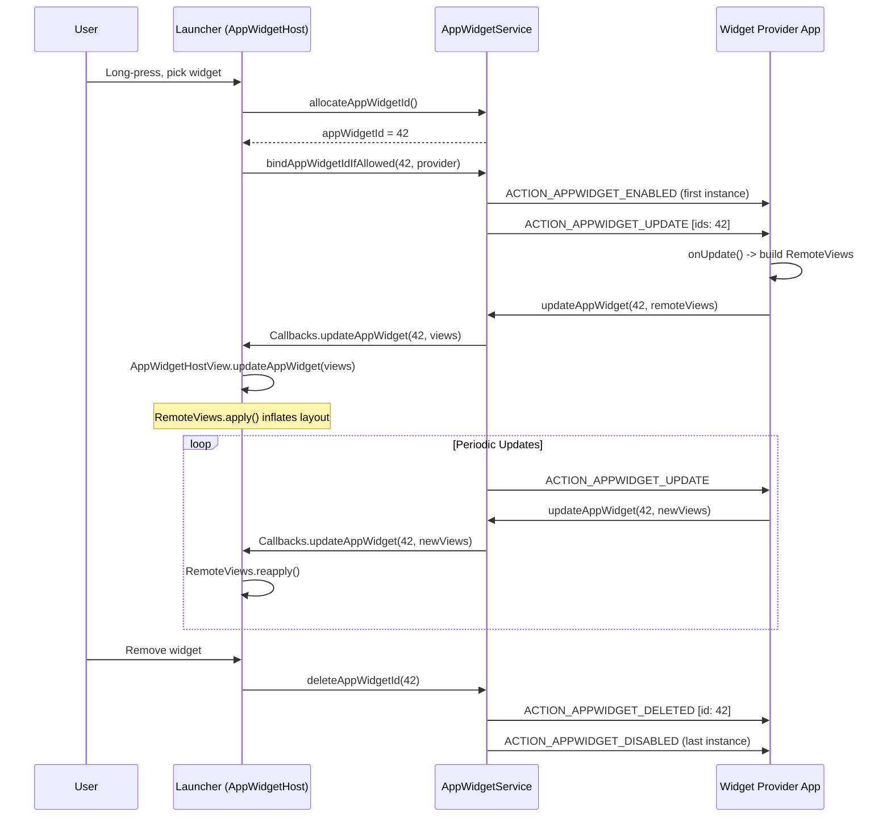
```mermaid
sequenceDiagram
    participant User
    participant Launcher as Launcher (AppWidgetHost)
    participant AWS as AppWidgetService
    participant Provider as Widget Provider App

    User->>Launcher: Long-press, pick widget
    Launcher->>AWS: allocateAppWidgetId()
    AWS-->>Launcher: appWidgetId = 42
    Launcher->>AWS: bindAppWidgetIdIfAllowed(42, provider)
    AWS->>Provider: ACTION_APPWIDGET_ENABLED (first instance)
    AWS->>Provider: ACTION_APPWIDGET_UPDATE [ids: 42]
    Provider->>Provider: onUpdate() -> build RemoteViews
    Provider->>AWS: updateAppWidget(42, remoteViews)
    AWS->>Launcher: Callbacks.updateAppWidget(42, views)
    Launcher->>Launcher: AppWidgetHostView.updateAppWidget(views)
    Note over Launcher: RemoteViews.apply() inflates layout

    loop Periodic Updates
        AWS->>Provider: ACTION_APPWIDGET_UPDATE
        Provider->>AWS: updateAppWidget(42, newViews)
        AWS->>Launcher: Callbacks.updateAppWidget(42, newViews)
        Launcher->>Launcher: RemoteViews.reapply()
    end

    User->>Launcher: Remove widget
    Launcher->>AWS: deleteAppWidgetId(42)
    AWS->>Provider: ACTION_APPWIDGET_DELETED [id: 42]
    AWS->>Provider: ACTION_APPWIDGET_DISABLED (last instance)
```

### 43.1.7 AppWidgetHostView -- View Container

`AppWidgetHostView` (in `frameworks/base/core/java/android/appwidget/AppWidgetHostView.java`)
extends `FrameLayout` and implements `AppWidgetHostListener`. It is the actual
`View` placed in the host's layout hierarchy. Key responsibilities:

1. **Inflate or reapply RemoteViews** when `updateAppWidget()` is called
2. **Handle error states** -- display an error layout when the provider crashes
3. **Support engagement metrics** via `AppWidgetEvent.Builder`
4. **Apply color resources** for dynamic theming
5. **Manage keyguard vs. home screen** layout switching based on `OPTION_APPWIDGET_HOST_CATEGORY`

The `updateAppWidget()` method decides between `apply()` (first time) and
`reapply()` (subsequent updates with compatible layouts):

```java
public void updateAppWidget(RemoteViews remoteViews) {
    // ... null checks, error handling ...
    if (mView != null) {
        mView = remoteViews.reapply(/* ... */);
    } else {
        mView = remoteViews.apply(/* ... */);
    }
}
```

---

## 43.2 AppWidgetService

The system-side `AppWidgetService` manages registration, binding, updates, and
security policy for all widgets across all users. The implementation lives in
`frameworks/base/services/appwidget/java/com/android/server/appwidget/`.

### 43.2.1 Service Architecture

The service is split into two classes:

| Class | Role |
|---|---|
| `AppWidgetService.java` | Lifecycle wrapper, registered as `APPWIDGET_SERVICE` |
| `AppWidgetServiceImpl.java` | The actual IPC implementation (~7,500 lines) |

`AppWidgetServiceImpl` extends `IAppWidgetService.Stub` and implements
`WidgetBackupProvider` and `OnCrossProfileWidgetProvidersChangeListener`.

### 43.2.2 Internal Data Model

The service maintains five core data structures, all protected by `mLock`:

```java
// frameworks/base/services/appwidget/java/.../AppWidgetServiceImpl.java
private final ArrayList<Widget> mWidgets = new ArrayList<>();
private final ArrayList<Host> mHosts = new ArrayList<>();
private final ArrayList<Provider> mProviders = new ArrayList<>();
private final ArraySet<Pair<Integer, String>> mPackagesWithBindWidgetPermission
        = new ArraySet<>();
private final SparseBooleanArray mLoadedUserIds = new SparseBooleanArray();
```

The relationships form a many-to-many graph:

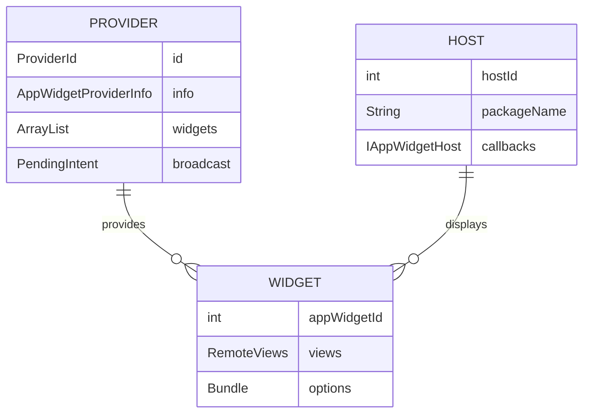
```mermaid
erDiagram
    PROVIDER ||--o{ WIDGET : "provides"
    HOST ||--o{ WIDGET : "displays"
    WIDGET {
        int appWidgetId
        RemoteViews views
        Bundle options
    }
    PROVIDER {
        ProviderId id
        AppWidgetProviderInfo info
        ArrayList widgets
        PendingIntent broadcast
    }
    HOST {
        int hostId
        String packageName
        IAppWidgetHost callbacks
    }
```

### 43.2.3 Widget Allocation and Binding

When a host requests a new widget:

1. **`allocateAppWidgetId()`** assigns a monotonically increasing integer from
   `mNextAppWidgetIds` (per-user). Creates a `Widget` object and associates it
   with the calling `Host`.

2. **`bindAppWidgetIdIfAllowed()`** or **`bindAppWidgetId()`** links the widget
   to a specific `Provider`. This triggers:
   - Security policy check (caller must have `BIND_APPWIDGET` permission or
     per-package allowlist in `mPackagesWithBindWidgetPermission`)
   - Cross-profile checks via `DevicePolicyManagerInternal`
   - Scheduling the initial `ACTION_APPWIDGET_UPDATE` broadcast

### 43.2.4 Update Pipeline

When a provider calls `AppWidgetManager.updateAppWidget()`:

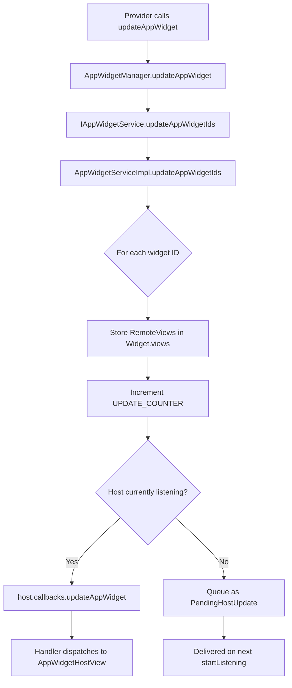
```mermaid
flowchart TD
    A[Provider calls updateAppWidget] --> B[AppWidgetManager.updateAppWidget]
    B --> C[IAppWidgetService.updateAppWidgetIds]
    C --> D[AppWidgetServiceImpl.updateAppWidgetIds]
    D --> E{For each widget ID}
    E --> F[Store RemoteViews in Widget.views]
    F --> G[Increment UPDATE_COUNTER]
    G --> H{Host currently listening?}
    H -->|Yes| I[host.callbacks.updateAppWidget]
    H -->|No| J[Queue as PendingHostUpdate]
    I --> K[Handler dispatches to AppWidgetHostView]
    J --> L[Delivered on next startListening]
```

The `PendingHostUpdate` mechanism handles the case when a host calls
`stopListening()` (e.g., activity goes to background). When `startListening()`
is called again, all queued updates are delivered in order:

```java
public void startListening() {
    List<PendingHostUpdate> updates;
    updates = sService.startListening(mCallbacks, mContextOpPackageName,
            mHostId, idsToUpdate).getList();
    for (PendingHostUpdate update : updates) {
        switch (update.type) {
            case TYPE_VIEWS_UPDATE: updateAppWidgetView(/*...*/); break;
            case TYPE_PROVIDER_CHANGED: onProviderChanged(/*...*/); break;
            case TYPE_VIEW_DATA_CHANGED: viewDataChanged(/*...*/); break;
            case TYPE_APP_WIDGET_REMOVED: dispatchOnAppWidgetRemoved(/*...*/); break;
        }
    }
}
```

### 43.2.5 Periodic Updates via AlarmManager

The service schedules periodic updates using `AlarmManager` with a minimum
period of 30 minutes (enforced by `MIN_UPDATE_PERIOD`):

```java
// AppWidgetServiceImpl.java
private static final int MIN_UPDATE_PERIOD = DEBUG ? 0 : 30 * 60 * 1000;
```

### 43.2.6 Bitmap Memory Limits

The service computes a maximum bitmap memory budget based on the display size:

```java
private void computeMaximumWidgetBitmapMemory() {
    Display display = mContext.getDisplayNoVerify();
    Point size = new Point();
    display.getRealSize(size);
    // 1.5 * 4 bytes/pixel * w * h ==> 6 * w * h
    mMaxWidgetBitmapMemory = 6 * size.x * size.y;
}
```

This limit is enforced during `RemoteViews` serialization. On a 1080x2400 display,
the budget is approximately 15.5 MB.

### 43.2.7 State Persistence

Widget state is persisted to XML files at
`/data/system/appwidgets.xml` (per-user variant under `/data/system_ce/<user>/`):

```java
private static final String STATE_FILENAME = "appwidgets.xml";
private static final int CURRENT_VERSION = 1;
```

The `handleSaveMessage()` method converts state to bytes under `mLock`, then
writes to disk outside the lock to minimize contention.

### 43.2.8 Generated Previews

Widget providers can set generated previews (snapshots of widget content for the
picker) via `AppWidgetManager.setWidgetPreview()`. These are stored in
`/data/system_ce/<user>/appwidget/previews/` and are rate-limited:

```java
private static final long DEFAULT_GENERATED_PREVIEW_RESET_INTERVAL_MS =
        Duration.ofHours(1).toMillis();
private static final int DEFAULT_GENERATED_PREVIEW_MAX_CALLS_PER_INTERVAL = 2;
private static final int DEFAULT_GENERATED_PREVIEW_MAX_PROVIDERS = 50;
```

### 43.2.9 Engagement Metrics Reporting

The `reportWidgetEvents()` method accepts `AppWidgetEvent[]` from hosts and
forwards them to `UsageStatsManager` as `USER_INTERACTION` events. A
`ReportWidgetEventsJob` periodically triggers collection:

```java
private static final long DEFAULT_WIDGET_EVENTS_REPORT_INTERVAL_MS =
        Duration.ofHours(1).toMillis();
```

### 43.2.10 Security Policy and Limits

Hard limits prevent abuse:

| Limit | Value |
|---|---|
| Maximum hosts per package | 20 |
| Maximum widgets per host | 200 |
| Minimum update period | 30 minutes |
| Generated preview API calls per hour | 2 |
| Maximum providers with previews | 50 |

---

## 43.3 RemoteViews

`RemoteViews` is the central mechanism for cross-process UI in Android. Defined in
`frameworks/base/core/java/android/widget/RemoteViews.java` (10,874 lines), it
serializes a description of view modifications as `Parcelable` actions that can be
sent over Binder, then applied (inflated) in the receiving process.

### 43.3.1 Architecture Overview

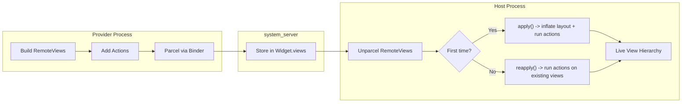
```mermaid
flowchart LR
    subgraph PP["Provider Process"]
        A[Build RemoteViews] --> B[Add Actions]
        B --> C[Parcel via Binder]
    end
    subgraph system_server
        C --> D[Store in Widget.views]
    end
    subgraph HP["Host Process"]
        D --> E[Unparcel RemoteViews]
        E --> F{First time?}
        F -->|Yes| G["apply() -> inflate layout + run actions"]
        F -->|No| H["reapply() -> run actions on existing views"]
        G --> I[Live View Hierarchy]
        H --> I
    end
```

### 43.3.2 Supported Views

`RemoteViews` restricts which `View` classes can be used. Views must be annotated
with `@RemoteView`:

**Layouts (ViewGroups):**

- `AdapterViewFlipper`
- `FrameLayout`
- `GridLayout`
- `GridView`
- `LinearLayout`
- `ListView`
- `RelativeLayout`
- `StackView`
- `ViewFlipper`

**Widgets (Leaf Views):**

- `AnalogClock`, `Button`, `Chronometer`, `ImageButton`, `ImageView`
- `ProgressBar`, `TextClock`, `TextView`

**API 31+ additions:**

- `CheckBox`, `RadioButton`, `RadioGroup`, `Switch`

The filter is enforced at inflation time:

```java
// RemoteViews.java
private static final LayoutInflater.Filter INFLATER_FILTER =
        (clazz) -> clazz.isAnnotationPresent(RemoteViews.RemoteView.class);
```

### 43.3.3 Action System

Every mutation to a `RemoteViews` object creates an `Action` that is appended to
an internal `ArrayList<Action>`:

```java
@UnsupportedAppUsage
private ArrayList<Action> mActions;
```

Each `Action` subclass has a unique tag for parceling. Here are the defined tags:

| Tag Constant | Value | Purpose |
|---|---|---|
| `SET_ON_CLICK_RESPONSE_TAG` | 1 | Click handlers |
| `REFLECTION_ACTION_TAG` | 2 | Generic setter via reflection |
| `SET_DRAWABLE_TINT_TAG` | 3 | Drawable tinting |
| `VIEW_GROUP_ACTION_ADD_TAG` | 4 | Add child RemoteViews |
| `VIEW_CONTENT_NAVIGATION_TAG` | 5 | Content navigation |
| `SET_EMPTY_VIEW_ACTION_TAG` | 6 | Set empty view for adapter |
| `VIEW_GROUP_ACTION_REMOVE_TAG` | 7 | Remove child views |
| `SET_PENDING_INTENT_TEMPLATE_TAG` | 8 | Collection click template |
| `SET_REMOTE_VIEW_ADAPTER_INTENT_TAG` | 10 | Legacy collection adapter |
| `TEXT_VIEW_DRAWABLE_ACTION_TAG` | 11 | Compound drawables |
| `BITMAP_REFLECTION_ACTION_TAG` | 12 | Bitmap via reflection |
| `TEXT_VIEW_SIZE_ACTION_TAG` | 13 | Text size |
| `VIEW_PADDING_ACTION_TAG` | 14 | View padding |
| `SET_REMOTE_INPUTS_ACTION_TAG` | 18 | Remote input for notifications |
| `LAYOUT_PARAM_ACTION_TAG` | 19 | Layout parameters |
| `SET_RIPPLE_DRAWABLE_COLOR_TAG` | 21 | Ripple effect color |
| `SET_INT_TAG_TAG` | 22 | Integer tag on view |
| `REMOVE_FROM_PARENT_ACTION_TAG` | 23 | Remove from parent |
| `RESOURCE_REFLECTION_ACTION_TAG` | 24 | Resource-based reflection |
| `COMPLEX_UNIT_DIMENSION_REFLECTION_ACTION_TAG` | 25 | Dimension units |
| `SET_COMPOUND_BUTTON_CHECKED_TAG` | 26 | CheckBox/Switch checked |
| `SET_RADIO_GROUP_CHECKED` | 27 | RadioGroup selection |
| `SET_VIEW_OUTLINE_RADIUS_TAG` | 28 | View outline radius |
| `SET_ON_CHECKED_CHANGE_RESPONSE_TAG` | 29 | Checked change handler |
| `NIGHT_MODE_REFLECTION_ACTION_TAG` | 30 | Dark mode variant |
| `SET_REMOTE_COLLECTION_ITEMS_ADAPTER_TAG` | 31 | Collection items |
| `ATTRIBUTE_REFLECTION_ACTION_TAG` | 32 | Theme attribute |
| `SET_REMOTE_ADAPTER_TAG` | 33 | New-style adapter |
| `SET_ON_STYLUS_HANDWRITING_RESPONSE_TAG` | 34 | Stylus handwriting |
| `SET_DRAW_INSTRUCTION_TAG` | 35 | RemoteCompose instructions |

The `Action` base class defines the contract:

```java
// RemoteViews.java
private abstract static class Action {
    @IdRes int mViewId;

    public abstract void apply(View root, ViewGroup rootParent,
            ActionApplyParams params) throws ActionException;

    public static final int MERGE_REPLACE = 0;
    public static final int MERGE_APPEND = 1;
    public static final int MERGE_IGNORE = 2;

    public int mergeBehavior() { return MERGE_REPLACE; }
    public abstract int getActionTag();
    public String getUniqueKey() {
        return (getActionTag() + "_" + mViewId);
    }

    // Async variant for background preparation
    public Action initActionAsync(ViewTree root, ViewGroup rootParent,
            ActionApplyParams params) {
        return this;
    }
}
```

### 43.3.4 Reflection Actions

The most general `Action` type is `ReflectionAction`, which invokes arbitrary
setter methods on views. When you call `RemoteViews.setTextViewText()`, it creates
a `ReflectionAction` that calls `setText()`:

```java
public void setTextViewText(@IdRes int viewId, CharSequence text) {
    setCharSequence(viewId, "setText", text);
}
```

The reflection lookup is cached in `sMethods` (an `ArrayMap<MethodKey, MethodArgs>`)
using `MethodHandle` for efficient invocation.

### 43.3.5 Layout Modes

`RemoteViews` supports three modes for responsive layouts:

| Mode | Constant | Description |
|---|---|---|
| Normal | `MODE_NORMAL` | Single layout |
| Landscape/Portrait | `MODE_HAS_LANDSCAPE_AND_PORTRAIT` | Two layouts by orientation |
| Sized | `MODE_HAS_SIZED_REMOTEVIEWS` | Multiple layouts by size (up to 16) |

The sized mode (API 31+) allows providers to supply multiple `RemoteViews` at
different breakpoints:

```java
public RemoteViews(Map<SizeF, RemoteViews> remoteViews) {
    // Creates a sized RemoteViews with up to MAX_INIT_VIEW_COUNT (16) variants
}
```

### 43.3.6 Bitmap Cache

Bitmaps are deduplicated via `BitmapCache`:

```java
@UnsupportedAppUsage
private BitmapCache mBitmapCache = new BitmapCache();
```

Only the root `RemoteViews` in a hierarchy stores the cache. Nested `RemoteViews`
(from `addView` or landscape/portrait) reference the parent's cache via index.
The `reduceImageSizes()` method enforces maximum dimensions:

```java
public void reduceImageSizes(int maxWidth, int maxHeight) {
    ArrayList<Bitmap> cache = mBitmapCache.mBitmaps;
    for (int i = 0; i < cache.size(); i++) {
        Bitmap bitmap = cache.get(i);
        cache.set(i, Icon.scaleDownIfNecessary(bitmap, maxWidth, maxHeight));
    }
}
```

### 43.3.7 Apply vs. Reapply

The two core operations:

**`apply()`** -- Full inflation:

1. Inflates the XML layout resource using `LayoutInflater` with the `INFLATER_FILTER`
2. Walks the action list and applies each action to the inflated view tree
3. Returns the inflated root `View`

**`reapply()`** -- Incremental update:

1. Reuses the existing view hierarchy
2. Only applies the new actions, using merge semantics
3. Actions with `MERGE_REPLACE` overwrite previous actions for the same view/type
4. Actions with `MERGE_APPEND` accumulate (e.g., adding children)

The merge logic in `mergeRemoteViews()`:

```java
public void mergeRemoteViews(RemoteViews newRv) {
    HashMap<String, Action> map = new HashMap<>();
    for (Action a : mActions) {
        map.put(a.getUniqueKey(), a);
    }
    for (Action a : copy.mActions) {
        String key = a.getUniqueKey();
        int mergeBehavior = a.mergeBehavior();
        if (map.containsKey(key) && mergeBehavior == Action.MERGE_REPLACE) {
            mActions.remove(map.get(key));
        }
        if (mergeBehavior == MERGE_REPLACE || mergeBehavior == MERGE_APPEND) {
            mActions.add(a);
        }
    }
    reconstructCaches();
}
```

### 43.3.8 Async Apply

For smoother UI, `RemoteViews` supports async inflation:

```java
public CancellationSignal applyAsync(Context context, ViewGroup parent,
        Executor executor, OnViewAppliedListener listener) {
    // Inflate and apply on executor thread, callback on UI thread
}
```

Actions can override `initActionAsync()` to perform expensive work (like parsing
RemoteCompose documents) off the UI thread, then return a lightweight `RuntimeAction`
that runs on UI.

### 43.3.9 The Serialization Pipeline

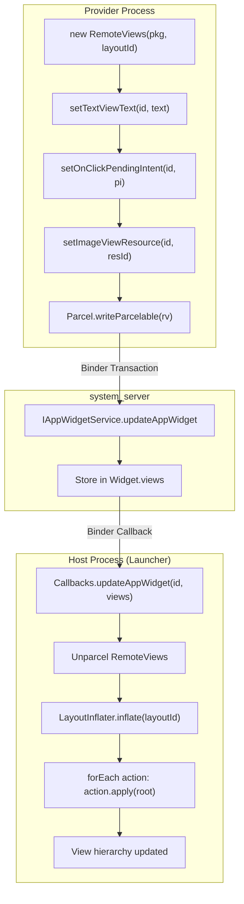
```mermaid
flowchart TD
    subgraph "Provider Process"
        A["new RemoteViews(pkg, layoutId)"] --> B["setTextViewText(id, text)"]
        B --> C["setOnClickPendingIntent(id, pi)"]
        C --> D["setImageViewResource(id, resId)"]
        D --> E["Parcel.writeParcelable(rv)"]
    end

    E -->|"Binder Transaction"| F

    subgraph "system_server"
        F["IAppWidgetService.updateAppWidget"] --> G["Store in Widget.views"]
    end

    G -->|"Binder Callback"| H

    subgraph "Host Process (Launcher)"
        H["Callbacks.updateAppWidget(id, views)"] --> I["Unparcel RemoteViews"]
        I --> J["LayoutInflater.inflate(layoutId)"]
        J --> K["forEach action: action.apply(root)"]
        K --> L["View hierarchy updated"]
    end
```

The parceling process writes:

1. Mode byte (normal, landscape/portrait, or sized)
2. `BitmapCache` (only at root)
3. `RemoteCollectionCache` (only at root)
4. `ApplicationInfo`
5. Layout ID, View ID, light background layout ID
6. Action count, then each action (tag + data)
7. Apply flags, provider instance ID, hasDrawInstructions flag

### 43.3.10 RemoteViewsAdapter and RemoteViewsService

For collection widgets (ListView, GridView, StackView), a different mechanism
is needed because the adapter data may be large and dynamic.

**`RemoteViewsService`** (321 lines) is an abstract `Service` that hosts
`RemoteViewsFactory` instances:

```java
// frameworks/base/core/java/android/widget/RemoteViewsService.java
public interface RemoteViewsFactory {
    void onCreate();
    void onDataSetChanged();  // Heavy work allowed synchronously
    void onDestroy();
    int getCount();
    RemoteViews getViewAt(int position);
    RemoteViews getLoadingView();
    int getViewTypeCount();
    long getItemId(int position);
    boolean hasStableIds();
}
```

**`RemoteViewsAdapter`** (1,305 lines) is the host-side adapter that connects
to the `RemoteViewsService` via `IRemoteViewsFactory` (AIDL). It manages:

- Service connection lifecycle
- View caching and recycling
- Loading views during async fetch
- Data change notifications via `notifyDataSetChanged()`

The newer `RemoteCollectionItems` API (API 31+) allows inline collection data
without a service, reducing IPC overhead:

```java
new RemoteViews.RemoteCollectionItems.Builder()
    .addItem(id, remoteViewsForItem)
    .setHasStableIds(true)
    .build();
```

### 43.3.11 DrawInstructions -- Bridge to RemoteCompose

The `SET_DRAW_INSTRUCTION_TAG` (35) action connects `RemoteViews` to the new
`RemoteCompose` system:

```java
// RemoteViews.java
@FlaggedApi(FLAG_DRAW_DATA_PARCEL)
public RemoteViews(@NonNull final DrawInstructions drawInstructions) {
    Objects.requireNonNull(drawInstructions);
    mHasDrawInstructions = true;
    addAction(new SetDrawInstructionAction(drawInstructions));
}
```

`SetDrawInstructionAction` applies the draw instructions to a `RemoteComposePlayer`:

```java
private class SetDrawInstructionAction extends Action {
    private final DrawInstructions mInstructions;

    @Override
    public void apply(View root, ViewGroup rootParent, ActionApplyParams params) {
        applyAction(root, (player, doc) -> {
            player.setDocument(doc);
            applyActionListener(player, params);
            return ACTION_NOOP;
        });
    }

    @Override
    public final Action initActionAsync(ViewTree root, ViewGroup rootParent,
            ActionApplyParams params) {
        return applyAction(root.mRoot, (player, doc) -> {
            PreparedDocument preparedDoc = player.prepareDocument(doc);
            return preparedDoc == null ? ACTION_NOOP
                : new RunnableAction(() -> {
                    player.setPreparedDocument(preparedDoc);
                    applyActionListener(player, params);
                });
        });
    }
}
```

The `initActionAsync` variant enables background document parsing, keeping the
UI thread responsive.

---

## 43.4 RemoteViews in Notifications

Notifications are the other major consumer of `RemoteViews`. While most notifications
use the platform's standard templates, custom notifications use `RemoteViews` directly.

### 43.4.1 Notification Template System

The `Notification.Builder` creates `RemoteViews` internally for standard templates:

```java
Notification.Builder builder = new Notification.Builder(context, channelId)
    .setContentTitle("Title")
    .setContentText("Content");
```

Internally, `Notification.Builder.createContentView()` constructs a `RemoteViews`
from system layout resources and populates it with actions for title, text, icon, etc.

Custom notifications provide their own RemoteViews:

```java
RemoteViews customView = new RemoteViews(getPackageName(),
        R.layout.notification_custom);
customView.setTextViewText(R.id.title, "Custom Title");
builder.setCustomContentView(customView);
```

### 43.4.2 SystemUI's NotifRemoteViewsFactory

SystemUI uses `NotifRemoteViewsFactory` (in
`frameworks/base/packages/SystemUI/src/com/android/systemui/statusbar/notification/row/NotifRemoteViewsFactory.kt`)
to intercept view inflation within notification RemoteViews:

```kotlin
// NotifRemoteViewsFactory.kt
interface NotifRemoteViewsFactory {
    fun instantiate(
        row: ExpandableNotificationRow,
        @InflationFlag layoutType: Int,
        parent: View?,
        name: String,
        context: Context,
        attrs: AttributeSet
    ): View?
}
```

This factory pattern allows SystemUI to substitute custom implementations for
standard views within notifications. For example, `RemoteComposePlayer` views
can be injected when the notification uses `DrawInstructions`.

### 43.4.3 NotifRemoteViewCache

The `NotifRemoteViewCacheImpl` caches inflated notification views to avoid
re-inflation when a notification is rebound:

```java
// NotifRemoteViewCacheImpl.java
public interface NotifRemoteViewCache {
    boolean hasCachedView(NotificationEntry entry, @InflationFlag int flag);
    View getCachedView(NotificationEntry entry, @InflationFlag int flag);
    void putCachedView(NotificationEntry entry, @InflationFlag int flag, View v);
    void removeCachedView(NotificationEntry entry, @InflationFlag int flag);
}
```

### 43.4.4 Security Considerations

Notification RemoteViews run in SystemUI's process with elevated privileges.
Several security measures apply:

1. **View filtering**: The `INFLATER_FILTER` ensures only `@RemoteView`-annotated
   classes can be instantiated
2. **Nesting limits**: `MAX_NESTED_VIEWS = 10` prevents stack overflow
3. **Bitmap limits**: `reduceImageSizes()` is called before display
4. **URI grants**: `visitUris()` collects all referenced URIs so appropriate
   permission grants can be issued
5. **PendingIntent validation**: Actions with PendingIntents are validated
   against the calling package

---

## 43.5 RemoteCompose Architecture

RemoteCompose is a new rendering system within AOSP that provides a
programmatic alternative to XML layouts for cross-process rendering. Located in
`frameworks/base/core/java/com/android/internal/widget/remotecompose/`, it
comprises 265 Java files totaling over 60,000 lines of code.

### 43.5.1 Design Goals

RemoteCompose addresses fundamental limitations of the XML-based `RemoteViews`:

1. **Static layout**: XML layouts cannot express animations, data-driven values,
   or conditional rendering without full re-serialization
2. **Limited view set**: Only `@RemoteView`-annotated views are available
3. **Performance**: Each update requires full Parcel serialization over Binder
4. **Expressiveness**: Complex visual designs require many actions

RemoteCompose replaces this with a binary bytecode format (`WireBuffer`) that
encodes draw operations, layout instructions, variables, expressions, and
animations into a compact document that can be rendered by a player.

### 43.5.2 Architecture Split: core/ and player/

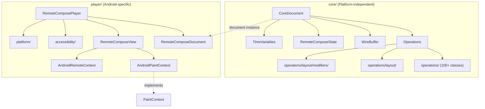
```mermaid
flowchart TB
    subgraph "core/ (Platform-independent)"
        A[CoreDocument] --> B[Operations]
        A --> C[WireBuffer]
        A --> D[RemoteComposeState]
        A --> E[TimeVariables]
        B --> F["operations/ (100+ classes)"]
        B --> G["operations/layout/"]
        B --> H["operations/layout/modifiers/"]
    end

    subgraph "player/ (Android-specific)"
        I[RemoteComposePlayer] --> J[RemoteComposeDocument]
        I --> K[RemoteComposeView]
        K --> L[AndroidPaintContext]
        K --> M[AndroidRemoteContext]
        I --> N["accessibility/"]
        I --> O["platform/"]
    end

    A -.->|"document instance"| J
    L -.->|"implements"| P[PaintContext]
```

The `core/` package is designed to be platform-independent -- it could theoretically
run on non-Android JVMs. The `player/` package binds to Android APIs (`Canvas`,
`Paint`, `View` system, accessibility).

### 43.5.3 CoreDocument

`CoreDocument` (in `core/CoreDocument.java`) is the central data structure. It
contains:

```java
// frameworks/base/.../remotecompose/core/CoreDocument.java
public class CoreDocument implements Serializable {
    public static final int MAJOR_VERSION = 1;
    public static final int MINOR_VERSION = 2;
    public static final int PATCH_VERSION = 0;
    public static final int DOCUMENT_API_LEVEL = 8;

    ArrayList<Operation> mOperations = new ArrayList<>();
    RootLayoutComponent mRootLayoutComponent = null;
    RemoteComposeState mRemoteComposeState = new RemoteComposeState();
    TimeVariables mTimeVariables = new TimeVariables();
    Version mVersion;
    String mContentDescription;
    long mRequiredCapabilities = 0L;
    int mWidth = 0;
    int mHeight = 0;
    int mContentScroll, mContentSizing, mContentMode;
    int mContentAlignment = RootContentBehavior.ALIGNMENT_CENTER;
    RemoteComposeBuffer mBuffer = new RemoteComposeBuffer();
    // ... expression maps, clock, touch operations ...
}
```

The document lifecycle:

1. **Construction**: Created on the provider side, operations are appended
2. **Serialization**: Written to a `RemoteComposeBuffer` (byte stream)
3. **Transport**: Embedded in `RemoteViews` as `DrawInstructions`
4. **Deserialization**: `initFromBuffer()` reconstructs operations
5. **Initialization**: `initializeContext()` loads resources, caches bitmaps
6. **Painting**: `paint()` executes operations via a `PaintContext`

### 43.5.4 WireBuffer

`WireBuffer` (in `core/WireBuffer.java`) is the binary encoding layer:

```java
// frameworks/base/.../remotecompose/core/WireBuffer.java
public class WireBuffer {
    private static final int BUFFER_SIZE = 1024 * 1024; // 1 MB default
    byte[] mBuffer;
    int mIndex = 0;
    int mSize = 0;
    boolean[] mValidOperations = new boolean[256];

    public void start(int type) {
        if (!mValidOperations[type]) {
            throw new RuntimeException(
                    "Operation " + type + " is not supported for this version");
        }
        mStartingIndex = mIndex;
        writeByte(type);
    }
}
```

The buffer supports:

- Primitive types: `writeByte`, `writeInt`, `writeFloat`, `writeLong`
- Strings via length-prefixed encoding
- Auto-resizing when capacity is exceeded
- Version-gated operations via `mValidOperations` array

### 43.5.5 PaintContext

`PaintContext` (in `core/PaintContext.java`) is the abstract rendering interface:

```java
// frameworks/base/.../remotecompose/core/PaintContext.java
public abstract class PaintContext {
    public static final int TEXT_MEASURE_MONOSPACE_WIDTH = 0x01;
    public static final int TEXT_MEASURE_FONT_HEIGHT = 0x02;
    public static final int TEXT_MEASURE_SPACES = 0x04;
    public static final int TEXT_COMPLEX = 0x08;

    protected RemoteContext mContext;

    public abstract void drawBitmap(int imageId,
            int srcLeft, int srcTop, int srcRight, int srcBottom,
            int dstLeft, int dstTop, int dstRight, int dstBottom, int cdId);
    public abstract void scale(float scaleX, float scaleY);
    public abstract void translate(float translateX, float translateY);
    public abstract void drawArc(float left, float top, float right,
            float bottom, float startAngle, float sweepAngle);
    public abstract void drawSector(/*...*/);
    public abstract void drawCircle(float x, float y, float radius);
    public abstract void drawLine(float x1, float y1, float x2, float y2);
    public abstract void drawRect(float l, float t, float r, float b);
    public abstract void drawRoundRect(/*...*/);
    public abstract void drawOval(/*...*/);
    public abstract void drawText(/*...*/);
    public abstract void drawTextOnPath(/*...*/);
    public abstract void drawPath(/*...*/);
    // ... matrix operations, clipping, paint state ...
}
```

This abstraction allows the core to express rendering without depending on
Android's `Canvas` API directly.

### 43.5.6 RemoteComposeState

`RemoteComposeState` (in `core/RemoteComposeState.java`) manages the runtime
state of a document:

```java
// frameworks/base/.../remotecompose/core/RemoteComposeState.java
public class RemoteComposeState implements CollectionsAccess {
    public static final int START_ID = 42;
    public static final int BITMAP_TEXTURE_ID_OFFSET = 2000;

    private final IntMap<Object> mIntDataMap = new IntMap<>();
    private final HashMap<Object, Integer> mDataIntMap = new HashMap<>();
    private final IntFloatMap mFloatMap = new IntFloatMap();
    private final IntIntMap mIntegerMap = new IntIntMap();
    private final IntIntMap mColorMap = new IntIntMap();
    private final IntMap<DataMap> mDataMapMap = new IntMap<>();
    private final IntMap<Object> mPathMap = new IntMap<>();
}
```

This state holds:

- **Named data**: Bitmaps, text strings, paths, shaders -- all indexed by integer ID
- **Variables**: Floats, integers, colors -- with override flags for host-side values
- **Collections**: Lists and maps for data-driven content
- **Path data**: Pre-computed path coordinates and winding rules

---

## 43.6 RemoteCompose Operations

The `operations/` directory under `core/` contains 100+ operation classes. Each
operation has a unique opcode defined in `Operations.java`.

### 43.6.1 Operation Registry

`Operations.java` defines all opcodes and registers their companion
(factory) objects. The opcodes span several categories:

**Protocol operations:**

| Opcode | Value | Class |
|---|---|---|
| `HEADER` | 0 | `Header` |
| `THEME` | 63 | `Theme` |
| `CLICK_AREA` | 64 | `ClickArea` |
| `ROOT_CONTENT_BEHAVIOR` | 65 | `RootContentBehavior` |
| `ROOT_CONTENT_DESCRIPTION` | 103 | `RootContentDescription` |
| `ACCESSIBILITY_SEMANTICS` | 250 | `CoreSemantics` |

**Draw operations:**

| Opcode | Value | Class |
|---|---|---|
| `DRAW_RECT` | 42 | `DrawRect` |
| `DRAW_TEXT_RUN` | 43 | `DrawText` |
| `DRAW_BITMAP` | 44 | `DrawBitmap` |
| `DRAW_CIRCLE` | 46 | `DrawCircle` |
| `DRAW_LINE` | 47 | `DrawLine` |
| `DRAW_ROUND_RECT` | 51 | `DrawRoundRect` |
| `DRAW_SECTOR` | 52 | `DrawSector` |
| `DRAW_TEXT_ON_PATH` | 53 | `DrawTextOnPath` |
| `DRAW_OVAL` | 56 | `DrawOval` |
| `DRAW_ARC` | 152 | `DrawArc` |
| `DRAW_PATH` | 124 | `DrawPath` |
| `DRAW_TWEEN_PATH` | 125 | `DrawTweenPath` |
| `DRAW_TEXT_ANCHOR` | 133 | `DrawTextAnchored` |
| `DRAW_BITMAP_SCALED` | 149 | `DrawBitmapScaled` |
| `DRAW_BITMAP_INT` | 66 | `DrawBitmapInt` |
| `DRAW_CONTENT` | 139 | `DrawContent` |
| `DRAW_TO_BITMAP` | 190 | `DrawToBitmap` |
| `DRAW_BITMAP_TEXT_ANCHORED` | 184 | `DrawBitmapTextAnchored` |

**Data operations:**

| Opcode | Value | Class |
|---|---|---|
| `DATA_TEXT` | 102 | `TextData` |
| `DATA_BITMAP` | 101 | `BitmapData` |
| `DATA_SHADER` | 45 | `ShaderData` |
| `DATA_PATH` | 123 | `PathData` |
| `DATA_FLOAT` | 80 | `FloatConstant` |
| `DATA_INT` | 140 | `IntegerConstant` |
| `DATA_LONG` | 148 | `LongConstant` |
| `DATA_BOOLEAN` | 143 | `BooleanConstant` |
| `DATA_FONT` | 189 | `FontData` |
| `DATA_BITMAP_FONT` | 167 | `BitmapFontData` |

**Matrix operations:**

| Opcode | Value | Class |
|---|---|---|
| `MATRIX_SCALE` | 126 | `MatrixScale` |
| `MATRIX_TRANSLATE` | 127 | `MatrixTranslate` |
| `MATRIX_SKEW` | 128 | `MatrixSkew` |
| `MATRIX_ROTATE` | 129 | `MatrixRotate` |
| `MATRIX_SAVE` | 130 | `MatrixSave` |
| `MATRIX_RESTORE` | 131 | `MatrixRestore` |
| `MATRIX_SET` | 132 | `MatrixConstant` |
| `MATRIX_FROM_PATH` | 181 | `MatrixFromPath` |
| `MATRIX_EXPRESSION` | 187 | `MatrixExpression` |
| `MATRIX_VECTOR_MATH` | 188 | `MatrixVectorMath` |

**Clipping operations:**

| Opcode | Value | Class |
|---|---|---|
| `CLIP_PATH` | 38 | `ClipPath` |
| `CLIP_RECT` | 39 | `ClipRect` |

**Paint operations:**

| Opcode | Value | Class |
|---|---|---|
| `PAINT_VALUES` | 40 | `PaintData` |

### 43.6.2 Draw Operation Detail: DrawText

`DrawText` demonstrates the variable-binding pattern used throughout:

```java
// frameworks/base/.../remotecompose/core/operations/DrawText.java
public class DrawText extends PaintOperation implements VariableSupport {
    int mTextID;
    float mX, mY;       // Source coordinates (may be NaN for variables)
    float mOutX, mOutY; // Resolved coordinates
    boolean mRtl;

    @Override
    public void updateVariables(RemoteContext context) {
        mOutX = Float.isNaN(mX) ? context.getFloat(Utils.idFromNan(mX)) : mX;
        mOutY = Float.isNaN(mY) ? context.getFloat(Utils.idFromNan(mY)) : mY;
    }

    @Override
    public void registerListening(RemoteContext context) {
        if (Float.isNaN(mX)) context.listensTo(Utils.idFromNan(mX), this);
        if (Float.isNaN(mY)) context.listensTo(Utils.idFromNan(mY), this);
    }
}
```

The NaN-encoding trick is clever: coordinate values that are `Float.NaN` with
specific bit patterns encode variable IDs. `Utils.idFromNan()` extracts the ID
from the NaN payload. This allows the same serialization format to hold both
literal values and variable references.

### 43.6.3 Bitmap Operations

`BitmapData` (opcode 101) loads a bitmap into the document state:

```java
public class BitmapData extends Operation {
    int mImageId;
    int mWidth, mHeight;
    byte[] mBitmapData; // Compressed bitmap bytes
}
```

Multiple draw variants exist:

- `DrawBitmap`: Source/destination rect mapping
- `DrawBitmapInt`: Integer coordinates for pixel-perfect rendering
- `DrawBitmapScaled`: Scaled rendering with automatic fitting
- `DrawBitmapTextAnchored`: Text rendered from bitmap font glyphs

### 43.6.4 Path Operations

Paths are first-class objects in RemoteCompose:

| Operation | Description |
|---|---|
| `PathData` | Raw path coordinate data |
| `PathCreate` | Construct path from primitives |
| `PathAppend` | Append segments to existing path |
| `PathCombine` | Boolean operations on paths |
| `PathTween` | Interpolate between two paths |
| `PathExpression` | Dynamic path from expressions |
| `DrawPath` | Render a stored path |
| `DrawTweenPath` | Render an animated path transition |

### 43.6.5 Expression and Animation Operations

RemoteCompose supports data-driven rendering through expression operations:

| Opcode | Value | Description |
|---|---|---|
| `ANIMATED_FLOAT` | 81 | Animated float value |
| `COLOR_EXPRESSIONS` | 134 | Color computed from expressions |
| `FLOAT_LIST` | 147 | List of float values |
| `INTEGER_EXPRESSION` | 144 | Integer computed from expression |
| `TEXT_FROM_FLOAT` | 135 | Text generated from float value |
| `TEXT_MERGE` | 136 | Concatenate text values |
| `TEXT_LOOKUP` | 151 | Look up text by key |
| `TEXT_LOOKUP_INT` | 153 | Look up text by integer key |
| `DATA_MAP_LOOKUP` | 154 | Look up value in data map |
| `TOUCH_EXPRESSION` | 157 | Expression driven by touch input |

### 43.6.6 Haptic Feedback

The `HapticFeedback` operation (opcode 177) triggers device haptics from the
document:

```java
// frameworks/base/.../remotecompose/core/operations/HapticFeedback.java
public class HapticFeedback extends Operation {
    private int mHapticFeedbackType;

    @Override
    public void write(WireBuffer buffer) {
        apply(buffer, mHapticFeedbackType);
    }
}
```

The player-side `HapticSupport` class translates feedback type constants to
Android `HapticFeedbackConstants`.

### 43.6.7 Particle System

RemoteCompose includes a particle system for animated effects:

| Opcode | Value | Description |
|---|---|---|
| `PARTICLE_DEFINE` | 161 | Define particle emitter parameters |
| `PARTICLE_PROCESS` | 162 | Process particle simulation step |
| `PARTICLE_LOOP` | 163 | Loop particle rendering |
| `IMPULSE_START` | 164 | Trigger impulse animation |
| `IMPULSE_PROCESS` | 165 | Process impulse state |

### 43.6.8 Conditional and Control Flow

| Opcode | Value | Description |
|---|---|---|
| `CONDITIONAL_OPERATIONS` | 178 | Execute operations based on condition |
| `FUNCTION_DEFINE` | 168 | Define reusable function |
| `FUNCTION_CALL` | 166 | Call defined function |
| `DEBUG_MESSAGE` | 179 | Emit debug output |
| `WAKE_IN` | 191 | Schedule a repaint after delay |

---

## 43.7 RemoteCompose Layout and State

### 43.7.1 Layout System

RemoteCompose includes a full layout system with opcodes in the 200+ range:

**Layout containers:**

| Opcode | Value | Class | Description |
|---|---|---|---|
| `LAYOUT_ROOT` | 200 | `RootLayoutComponent` | Document root |
| `LAYOUT_CONTENT` | 201 | `LayoutComponentContent` | Content placeholder |
| `LAYOUT_BOX` | 202 | `BoxLayout` | Overlay layout (like FrameLayout) |
| `LAYOUT_FIT_BOX` | 176 | `FitBoxLayout` | Scale-to-fit layout |
| `LAYOUT_ROW` | 203 | `RowLayout` | Horizontal layout |
| `LAYOUT_COLUMN` | 204 | `ColumnLayout` | Vertical layout |
| `LAYOUT_CANVAS` | 205 | `CanvasLayout` | Free-form canvas |
| `LAYOUT_CANVAS_CONTENT` | 207 | `CanvasContent` | Canvas child |
| `LAYOUT_TEXT` | 208 | `TextLayout` | Text component |
| `LAYOUT_STATE` | 217 | `StateLayout` | State-driven layout |
| `LAYOUT_IMAGE` | 234 | `ImageLayout` | Image component |
| `LAYOUT_COLLAPSIBLE_ROW` | 230 | `CollapsibleRowLayout` | Collapsible horizontal |
| `LAYOUT_COLLAPSIBLE_COLUMN` | 233 | `CollapsibleColumnLayout` | Collapsible vertical |

**Structural operations:**

| Opcode | Value | Description |
|---|---|---|
| `COMPONENT_START` | 2 | Begin component definition |
| `CONTAINER_END` | 214 | End container scope |
| `LOOP_START` | 215 | Begin loop iteration |

The layout managers (in `operations/layout/managers/`) implement a measure-layout-draw
cycle similar to Android's `View` system but entirely within RemoteCompose.

### 43.7.2 Layout Managers

Each layout type has a corresponding manager class:

```
core/operations/layout/managers/
    BoxLayout.java
    CanvasLayout.java
    ColumnLayout.java
    CollapsibleColumnLayout.java
    CollapsibleRowLayout.java
    FitBoxLayout.java
    ImageLayout.java
    LayoutManager.java
    RowLayout.java
    StateLayout.java
    TextLayout.java
```

`LayoutManager` is the base class. Each manager implements:

- **Measurement**: Calculate intrinsic and constrained sizes
- **Layout**: Position children within the allocated space
- **Drawing**: Delegate to paint operations

### 43.7.3 Modifier System

Modifiers adjust component behavior without changing the layout type. They
are applied as a chain, similar to Jetpack Compose's modifier pattern:

**Dimension modifiers:**

| Opcode | Value | Class |
|---|---|---|
| `MODIFIER_WIDTH` | 16 | `WidthModifierOperation` |
| `MODIFIER_HEIGHT` | 67 | `HeightModifierOperation` |
| `MODIFIER_WIDTH_IN` | 231 | `WidthInModifierOperation` |
| `MODIFIER_HEIGHT_IN` | 232 | `HeightInModifierOperation` |

**Visual modifiers:**

| Opcode | Value | Class |
|---|---|---|
| `MODIFIER_BACKGROUND` | 55 | `BackgroundModifierOperation` |
| `MODIFIER_BORDER` | 107 | `BorderModifierOperation` |
| `MODIFIER_PADDING` | 58 | `PaddingModifierOperation` |
| `MODIFIER_CLIP_RECT` | 108 | `ClipRectModifierOperation` |
| `MODIFIER_ROUNDED_CLIP_RECT` | 54 | `RoundedClipRectModifierOperation` |
| `MODIFIER_GRAPHICS_LAYER` | 224 | `GraphicsLayerModifierOperation` |
| `MODIFIER_RIPPLE` | 229 | `RippleModifierOperation` |
| `MODIFIER_MARQUEE` | 228 | `MarqueeModifierOperation` |

**Layout modifiers:**

| Opcode | Value | Class |
|---|---|---|
| `MODIFIER_OFFSET` | 221 | `OffsetModifierOperation` |
| `MODIFIER_ZINDEX` | 223 | `ZIndexModifierOperation` |
| `MODIFIER_SCROLL` | 226 | `ScrollModifierOperation` |
| `MODIFIER_VISIBILITY` | 211 | `ComponentVisibilityOperation` |
| `MODIFIER_COLLAPSIBLE_PRIORITY` | 235 | `CollapsiblePriorityModifierOperation` |

**Interaction modifiers:**

| Opcode | Value | Class |
|---|---|---|
| `MODIFIER_CLICK` | 59 | `ClickModifierOperation` |
| `MODIFIER_TOUCH_DOWN` | 219 | `TouchDownModifierOperation` |
| `MODIFIER_TOUCH_UP` | 220 | `TouchUpModifierOperation` |
| `MODIFIER_TOUCH_CANCEL` | 225 | `TouchCancelModifierOperation` |
| `MODIFIER_DRAW_CONTENT` | 174 | `DrawContentOperation` |

**Action modifiers:**

| Opcode | Value | Class |
|---|---|---|
| `HOST_ACTION` | 209 | `HostActionOperation` |
| `HOST_METADATA_ACTION` | 216 | `HostActionMetadataOperation` |
| `HOST_NAMED_ACTION` | 210 | `HostNamedActionOperation` |
| `RUN_ACTION` | 236 | `RunActionOperation` |
| `VALUE_INTEGER_CHANGE_ACTION` | 212 | `ValueIntegerChangeActionOperation` |
| `VALUE_STRING_CHANGE_ACTION` | 213 | `ValueStringChangeActionOperation` |
| `VALUE_FLOAT_CHANGE_ACTION` | 222 | `ValueFloatChangeActionOperation` |

The `ComponentModifiers` class aggregates modifiers into a chain:

```
core/operations/layout/modifiers/ComponentModifiers.java
```

### 43.7.4 State and Variables

**VariableSupport interface:**

```java
// frameworks/base/.../remotecompose/core/VariableSupport.java
public interface VariableSupport {
    void registerListening(RemoteContext context);
    void updateVariables(RemoteContext context);
    void markDirty();
}
```

Operations that depend on runtime values implement `VariableSupport`. They
register interest in specific variable IDs via `context.listensTo(id, this)`.
When the variable changes, `updateVariables()` is called and the operation
recalculates its output values.

**TimeVariables:**

```java
// frameworks/base/.../remotecompose/core/TimeVariables.java
public class TimeVariables {
    public void updateTime(RemoteContext context, ZoneId zoneId,
            LocalDateTime dateTime) {
        context.loadFloat(RemoteContext.ID_CONTINUOUS_SEC, sec);
        context.loadFloat(RemoteContext.ID_TIME_IN_SEC, currentSeconds);
        context.loadFloat(RemoteContext.ID_TIME_IN_MIN, currentMinute);
        context.loadFloat(RemoteContext.ID_TIME_IN_HR, hour);
        context.loadFloat(RemoteContext.ID_CALENDAR_MONTH, month);
        context.loadFloat(RemoteContext.ID_DAY_OF_MONTH, day_of_month);
        context.loadFloat(RemoteContext.ID_WEEK_DAY, day_week);
        context.loadFloat(RemoteContext.ID_DAY_OF_YEAR, day_of_year);
        context.loadFloat(RemoteContext.ID_YEAR, year);
        context.loadFloat(RemoteContext.ID_OFFSET_TO_UTC,
                offset.getTotalSeconds());
        context.loadInteger(RemoteContext.ID_EPOCH_SECOND, (int) epochSec);
        context.loadFloat(RemoteContext.ID_API_LEVEL,
                CoreDocument.getDocumentApiLevel() + CoreDocument.BUILD);
    }
}
```

This enables clock-face widgets and time-dependent animations without any
Binder round-trips -- the player locally updates time variables and repaints.

**Named Variables:**

The `NamedVariable` operation (opcode 137) associates a human-readable name
with a variable ID and type. Types include:

- `COLOR_TYPE`
- `STRING_TYPE`
- `FLOAT_TYPE`
- `INTEGER_TYPE`

This allows hosts to discover and set document variables by name.

**RemoteComposeState data maps:**

The state uses efficient specialized maps:

```java
private final IntFloatMap mFloatMap = new IntFloatMap();
private final IntIntMap mIntegerMap = new IntIntMap();
private final IntIntMap mColorMap = new IntIntMap();
private final IntMap<DataMap> mDataMapMap = new IntMap<>();
```

Override flags (`mColorOverride[]`, `mFloatOverride[]`, etc.) track which values
have been set by the host vs. the document itself.

### 43.7.5 Serialization

**WireBuffer encoding:**

Each operation writes itself to the `WireBuffer`:

1. `buffer.start(opcode)` -- writes the 1-byte opcode
2. Operation-specific data (primitives, strings, byte arrays)
3. No explicit end marker -- the reader knows each operation's exact format

**Serializable interface:**

```java
// frameworks/base/.../remotecompose/core/serialize/Serializable.java
public interface Serializable {
    // serialize to a MapSerializer for JSON/debug output
}
```

**SerializeTags:**

```java
// frameworks/base/.../remotecompose/core/serialize/SerializeTags.java
// Tag constants for map-based serialization format
```

**MapSerializer:**

```java
// frameworks/base/.../remotecompose/core/serialize/MapSerializer.java
public interface MapSerializer {
    MapSerializer addType(String type);
    MapSerializer addFloatExpressionSrc(String key, float[] value);
    MapSerializer addIntExpressionSrc(String key, int[] value, int mask);
    MapSerializer addPath(String key, float[] path);
    // ... other typed add methods
}
```

The `MapSerializer` provides a structured serialization format for debugging,
testing, and potential JSON export of documents.

### 43.7.6 Document Flow

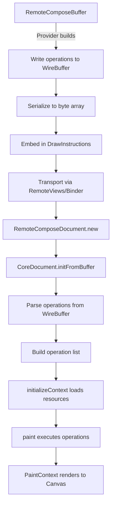
```mermaid
flowchart TD
    A[RemoteComposeBuffer] -->|"Provider builds"| B[Write operations to WireBuffer]
    B --> C[Serialize to byte array]
    C --> D[Embed in DrawInstructions]
    D --> E[Transport via RemoteViews/Binder]
    E --> F[RemoteComposeDocument.new]
    F --> G[CoreDocument.initFromBuffer]
    G --> H[Parse operations from WireBuffer]
    H --> I[Build operation list]
    I --> J[initializeContext loads resources]
    J --> K[paint executes operations]
    K --> L[PaintContext renders to Canvas]
```

---

## 43.8 RemoteCompose Player

The `player/` directory provides the Android-specific rendering implementation.

### 43.8.1 RemoteComposePlayer

`RemoteComposePlayer` (in `player/RemoteComposePlayer.java`) extends `FrameLayout`
and is the primary widget for rendering RemoteCompose documents:

```java
// frameworks/base/.../remotecompose/player/RemoteComposePlayer.java
public class RemoteComposePlayer extends FrameLayout
        implements RemoteContextActions {

    private RemoteComposeView mInner;
    private StateUpdater mStateUpdater;
    private final ThemeSupport mThemeSupport = new ThemeSupport();
    private final SensorSupport mSensorsSupport = new SensorSupport();
    private final HapticSupport mHapticSupport = new HapticSupport();

    // Version compatibility check
    private static final int MAX_SUPPORTED_MAJOR_VERSION = MAJOR_VERSION;
    private static final int MAX_SUPPORTED_MINOR_VERSION = MINOR_VERSION;

    // Theme constants
    public static final int THEME_UNSPECIFIED = Theme.UNSPECIFIED;
    public static final int THEME_LIGHT = Theme.LIGHT;
    public static final int THEME_DARK = Theme.DARK;
}
```

Key capabilities:

- **Document loading**: `setDocument()` or `setPreparedDocument()` (for async)
- **Theme support**: Light/dark theme switching
- **Sensor integration**: Accelerometer, gyroscope values as variables
- **Haptic feedback**: Translate document haptic requests to device vibrations
- **Touch handling**: Propagate touch events to document components
- **Scroll support**: `showOnScreen()`, `scrollByOffset()`, `scrollDirection()`
- **Click handling**: `performClick()` routes to document click areas

### 43.8.2 RemoteComposeDocument

`RemoteComposeDocument` (in `player/RemoteComposeDocument.java`) is the public
API for loading documents:

```java
// frameworks/base/.../remotecompose/player/RemoteComposeDocument.java
public class RemoteComposeDocument {
    private CoreDocument mDocument;

    public RemoteComposeDocument(byte[] inputStream) {
        this(new ByteArrayInputStream(inputStream), new SystemClock());
    }

    public RemoteComposeDocument(InputStream inputStream, Clock clock) {
        mDocument = new CoreDocument(clock);
        RemoteComposeBuffer buffer = RemoteComposeBuffer.fromInputStream(inputStream);
        mDocument.initFromBuffer(buffer);
    }

    public void paint(RemoteContext context, int theme) {
        mDocument.paint(context, theme);
    }

    public int needsRepaint() {
        return mDocument.needsRepaint(); // -1 = no, 0 = ASAP, >0 = delay ms
    }

    public boolean canBeDisplayed(int majorVersion, int minorVersion,
            long capabilities) {
        return mDocument.canBeDisplayed(majorVersion, minorVersion, capabilities);
    }
}
```

### 43.8.3 PreparedDocument and Async Loading

For smooth UI, documents can be prepared on a background thread:

```java
public class RemoteComposePlayer extends FrameLayout {
    public PreparedDocument prepareDocument(RemoteComposeDocument doc) {
        // Parse and initialize on background thread
        // Returns PreparedDocument that can be set on UI thread
    }

    public void setPreparedDocument(PreparedDocument doc) {
        // Apply pre-initialized document on UI thread (fast)
    }
}
```

This maps to the `SetDrawInstructionAction.initActionAsync()` path in RemoteViews.

### 43.8.4 AndroidPaintContext

`AndroidPaintContext` (in `player/platform/AndroidPaintContext.java`) is the
concrete `PaintContext` implementation for Android:

```java
// frameworks/base/.../player/platform/AndroidPaintContext.java
public class AndroidPaintContext extends PaintContext {
    Paint mPaint = new Paint();
    // Maps to android.graphics.Canvas operations:
    // - drawBitmap -> canvas.drawBitmap()
    // - drawRect -> canvas.drawRect()
    // - drawText -> canvas.drawTextRun()
    // - drawPath -> canvas.drawPath()
    // - clipRect -> canvas.clipRect()
    // - save/restore -> canvas.save()/restore()
    // Supports:
    // - LinearGradient, RadialGradient, SweepGradient, BitmapShader
    // - RuntimeShader (AGSL/SkSL)
    // - Custom fonts via FontFamily/FontVariationAxis
    // - RenderEffect, BlendMode, PorterDuff
}
```

### 43.8.5 Platform Support Classes

The `player/platform/` directory contains Android integration classes:

| Class | Role |
|---|---|
| `RemoteComposeView` | Custom View that draws the CoreDocument |
| `AndroidRemoteContext` | Android implementation of RemoteContext |
| `AndroidPaintContext` | Canvas-based PaintContext implementation |
| `ThemeSupport` | Resolves Android theme attributes to RemoteCompose values |
| `SensorSupport` | Feeds device sensor data into document variables |
| `HapticSupport` | Translates haptic feedback requests |
| `FloatsToPath` | Converts float arrays to android.graphics.Path |
| `ClickAreaView` | Transparent view overlays for click detection |
| `RemotePreparedDocument` | Async-prepared document holder |
| `AndroidPlatformServices` | Platform service resolution |
| `AndroidComputedTextLayout` | Text measurement using Android APIs |
| `SettingsRetriever` | System settings access |

### 43.8.6 Accessibility

The `player/accessibility/` directory implements accessibility support:

| Class | Role |
|---|---|
| `RemoteComposeTouchHelper` | `ExploreByTouchHelper` implementation |
| `PlatformRemoteComposeTouchHelper` | Platform-specific touch accessibility |
| `CoreDocumentAccessibility` | Extract semantic tree from CoreDocument |
| `RemoteComposeDocumentAccessibility` | Public accessibility API |
| `RemoteComposeAccessibilityRegistrar` | Register with accessibility framework |
| `SemanticNodeApplier` | Apply semantics to accessibility nodes |
| `AndroidPlatformSemanticNodeApplier` | Android-specific node population |

The accessibility layer traverses the document's component tree and exposes
semantic information (content descriptions, click actions, scroll state) through
Android's `AccessibilityNodeInfo` framework.

### 43.8.7 State Management

The `player/state/` directory contains:

| Class | Role |
|---|---|
| `StateUpdater` | Interface for external state injection |
| `StateUpdaterImpl` | Default implementation |

State updates allow the host to inject values (e.g., weather data, notification
counts) into document variables without rebuilding the document.

### 43.8.8 Rendering Pipeline

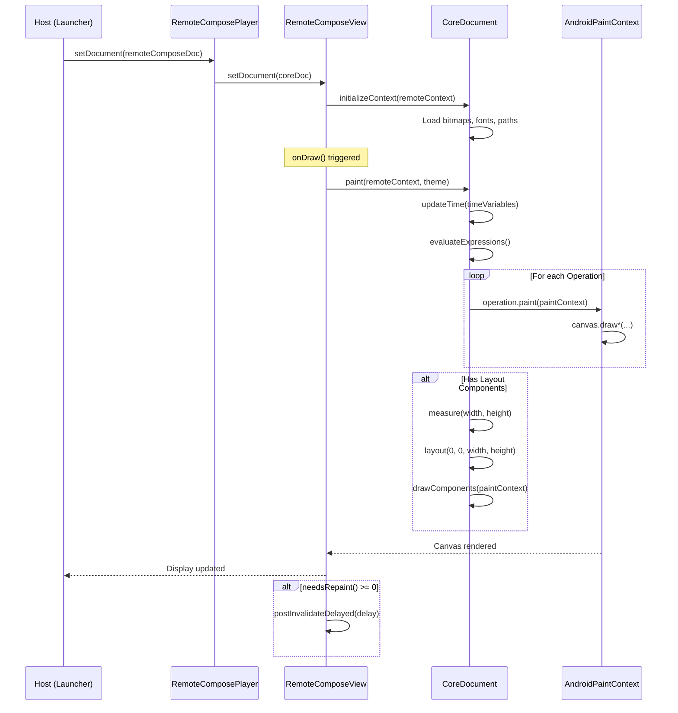
```mermaid
sequenceDiagram
    participant Host as Host (Launcher)
    participant Player as RemoteComposePlayer
    participant View as RemoteComposeView
    participant Doc as CoreDocument
    participant PC as AndroidPaintContext

    Host->>Player: setDocument(remoteComposeDoc)
    Player->>View: setDocument(coreDoc)
    View->>Doc: initializeContext(remoteContext)
    Doc->>Doc: Load bitmaps, fonts, paths

    Note over View: onDraw() triggered

    View->>Doc: paint(remoteContext, theme)
    Doc->>Doc: updateTime(timeVariables)
    Doc->>Doc: evaluateExpressions()

    loop For each Operation
        Doc->>PC: operation.paint(paintContext)
        PC->>PC: canvas.draw*(...)
    end

    alt Has Layout Components
        Doc->>Doc: measure(width, height)
        Doc->>Doc: layout(0, 0, width, height)
        Doc->>Doc: drawComponents(paintContext)
    end

    PC-->>View: Canvas rendered
    View-->>Host: Display updated

    alt needsRepaint() >= 0
        View->>View: postInvalidateDelayed(delay)
    end
```

---

## 43.9 Launcher3 Widget Integration

The Launcher3 app (in `packages/apps/Launcher3/`) is the primary widget host on
most Android devices. Its widget integration layer handles discovery, pinning,
resizing, and lifecycle management.

### 43.9.1 Key Widget Classes

| Class | Path | Role |
|---|---|---|
| `LauncherWidgetHolder` | `widget/LauncherWidgetHolder.java` | AppWidgetHost wrapper for background execution |
| `LauncherAppWidgetHostView` | `widget/LauncherAppWidgetHostView.java` | Custom host view with long-press, auto-advance |
| `WidgetManagerHelper` | `widget/WidgetManagerHelper.java` | AppWidgetManager wrapper |
| `PendingAddWidgetInfo` | `widget/PendingAddWidgetInfo.java` | Widget being added (not yet bound) |
| `PendingAppWidgetHostView` | `widget/PendingAppWidgetHostView.java` | Placeholder during widget load |
| `WidgetHostViewLoader` | `widget/WidgetHostViewLoader.java` | Async widget loading |
| `WidgetAddFlowHandler` | `widget/WidgetAddFlowHandler.java` | Widget add/configure flow |
| `LauncherAppWidgetProviderInfo` | `widget/LauncherAppWidgetProviderInfo.java` | Extended provider info |
| `DatabaseWidgetPreviewLoader` | `widget/DatabaseWidgetPreviewLoader.java` | Preview image loading |
| `LocalColorExtractor` | `widget/LocalColorExtractor.java` | Dynamic theme color extraction |

### 43.9.2 LauncherWidgetHolder

`LauncherWidgetHolder` wraps `AppWidgetHost` to run widget operations on a
background thread:

```java
// packages/apps/Launcher3/src/com/android/launcher3/widget/LauncherWidgetHolder.java
public class LauncherWidgetHolder {
    public static final int APPWIDGET_HOST_ID = 1024;

    protected static final int FLAG_LISTENING = 1;
    protected static final int FLAG_STATE_IS_NORMAL = 1 << 1;
    protected static final int FLAG_ACTIVITY_STARTED = 1 << 2;
    protected static final int FLAG_ACTIVITY_RESUMED = 1 << 3;

    private static final int FLAGS_SHOULD_LISTEN =
        FLAG_STATE_IS_NORMAL | FLAG_ACTIVITY_STARTED | FLAG_ACTIVITY_RESUMED;

    protected final ListenableAppWidgetHost mWidgetHost;
    protected final SparseArray<LauncherAppWidgetHostView> mViews = new SparseArray<>();
}
```

The flag system ensures listening only when the launcher is fully visible and
in normal state (not in overview mode or being paused).

### 43.9.3 LauncherAppWidgetHostView

`LauncherAppWidgetHostView` extends the framework's `AppWidgetHostView` with
launcher-specific features:

```java
// packages/apps/Launcher3/.../widget/LauncherAppWidgetHostView.java
public class LauncherAppWidgetHostView extends BaseLauncherAppWidgetHostView
        implements TouchCompleteListener, View.OnLongClickListener,
                   UpdateDeferrableView, Poppable {

    private static final long ADVANCE_INTERVAL = 20000;   // 20 seconds
    private static final long ADVANCE_STAGGER = 250;      // 250ms stagger
    private static final long UPDATE_LOCK_TIMEOUT_MILLIS = 1000;

    private final CheckLongPressHelper mLongPressHelper;
    private boolean mIsScrollable;
    private long mDeferUpdatesUntilMillis = 0;
    private RemoteViews mLastRemoteViews;
}
```

Key features:

- **Long-press handling**: `CheckLongPressHelper` detects long-press for
  widget resizing or removal
- **Auto-advance**: Widgets like `StackView` are auto-advanced every 20 seconds
  with 250ms stagger between widgets
- **Update deferral**: During animations or transitions, updates are deferred
  for up to 1 second to prevent visual glitches
- **Color resources**: `setColorResources()` applies dynamic theme colors
- **Scrollability detection**: Tracks whether the widget contains scrollable content

### 43.9.4 Widget Picker

The picker (in `widget/picker/`) presents available widgets to the user:

| Class | Role |
|---|---|
| `WidgetsListAdapter` | RecyclerView adapter for widget list |
| `WidgetPagedView` | Paged widget carousel |
| `WidgetRecommendationsView` | AI/recommendation-based widget suggestions |
| `WidgetsListHeaderViewHolderBinder` | Bind header entries (app name) |
| `WidgetsListTableViewHolderBinder` | Bind widget preview tables |
| `SimpleWidgetsSearchAlgorithm` | Search filtering |

### 43.9.5 Widget Pinning Flow

When a user adds a widget:

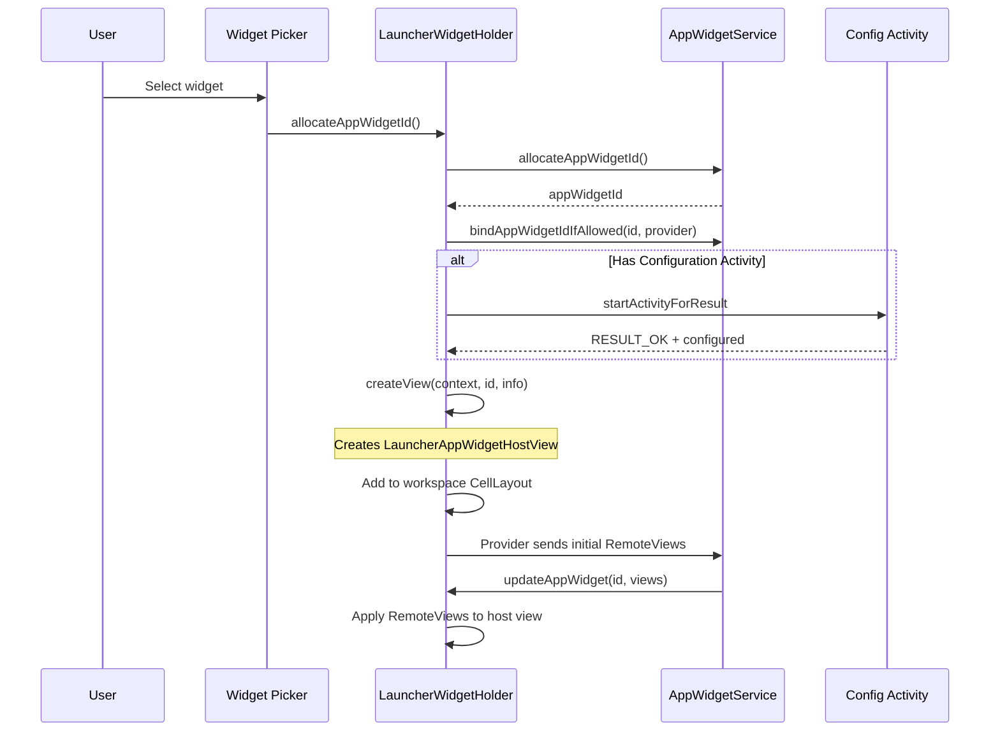
```mermaid
sequenceDiagram
    participant User
    participant Picker as Widget Picker
    participant Holder as LauncherWidgetHolder
    participant AWS as AppWidgetService
    participant ConfigAct as Config Activity

    User->>Picker: Select widget
    Picker->>Holder: allocateAppWidgetId()
    Holder->>AWS: allocateAppWidgetId()
    AWS-->>Holder: appWidgetId
    Holder->>AWS: bindAppWidgetIdIfAllowed(id, provider)

    alt Has Configuration Activity
        Holder->>ConfigAct: startActivityForResult
        ConfigAct-->>Holder: RESULT_OK + configured
    end

    Holder->>Holder: createView(context, id, info)
    Note over Holder: Creates LauncherAppWidgetHostView
    Holder->>Holder: Add to workspace CellLayout
    Holder->>AWS: Provider sends initial RemoteViews
    AWS->>Holder: updateAppWidget(id, views)
    Holder->>Holder: Apply RemoteViews to host view
```

### 43.9.6 Widget Resizing

Widget resizing involves:

1. User enters resize mode (long-press then tap resize handle)
2. `AppWidgetResizeFrame` draws the resize handles
3. User drags to new size
4. Launcher calculates new cell dimensions
5. Calls `AppWidgetManager.updateAppWidgetOptions()` with new size bundle
6. Service sends `ACTION_APPWIDGET_OPTIONS_CHANGED` to provider
7. Provider rebuilds RemoteViews for new size (or uses sized RemoteViews)

### 43.9.7 Widget Utilities

| Class | Purpose |
|---|---|
| `WidgetSizes` | Calculate widget sizes from grid cells |
| `WidgetsTableUtils` | Arrange widgets in preview table grid |
| `WidgetDragScaleUtils` | Scale calculations during drag |

---

## 43.10 Try It: Build a Custom Widget

This section provides a practical exercise demonstrating the concepts covered
in this chapter.

### 43.10.1 XML-Based Widget (Traditional)

**Step 1: Create the AppWidgetProvider**

```java
// src/com/example/widget/MyWidgetProvider.java
public class MyWidgetProvider extends AppWidgetProvider {

    @Override
    public void onUpdate(Context context, AppWidgetManager appWidgetManager,
            int[] appWidgetIds) {
        for (int appWidgetId : appWidgetIds) {
            RemoteViews views = new RemoteViews(
                    context.getPackageName(), R.layout.widget_layout);

            // Set text
            views.setTextViewText(R.id.widget_title, "My Widget");
            views.setTextViewText(R.id.widget_subtitle,
                    new SimpleDateFormat("HH:mm").format(new Date()));

            // Set click handler
            Intent intent = new Intent(context, MainActivity.class);
            PendingIntent pendingIntent = PendingIntent.getActivity(
                    context, 0, intent, PendingIntent.FLAG_IMMUTABLE);
            views.setOnClickPendingIntent(R.id.widget_root, pendingIntent);

            appWidgetManager.updateAppWidget(appWidgetId, views);
        }
    }

    @Override
    public void onEnabled(Context context) {
        // First widget instance placed -- start any background work
    }

    @Override
    public void onDisabled(Context context) {
        // Last widget instance removed -- clean up
    }
}
```

**Step 2: Define the widget layout**

```xml
<!-- res/layout/widget_layout.xml -->
<LinearLayout xmlns:android="http://schemas.android.com/apk/res/android"
    android:id="@+id/widget_root"
    android:layout_width="match_parent"
    android:layout_height="match_parent"
    android:orientation="vertical"
    android:padding="16dp"
    android:background="@drawable/widget_background">

    <TextView
        android:id="@+id/widget_title"
        android:layout_width="wrap_content"
        android:layout_height="wrap_content"
        android:textSize="18sp"
        android:textColor="?android:attr/textColorPrimary" />

    <TextView
        android:id="@+id/widget_subtitle"
        android:layout_width="wrap_content"
        android:layout_height="wrap_content"
        android:textSize="14sp"
        android:textColor="?android:attr/textColorSecondary" />
</LinearLayout>
```

**Step 3: Define widget metadata**

```xml
<!-- res/xml/widget_info.xml -->
<appwidget-provider xmlns:android="http://schemas.android.com/apk/res/android"
    android:minWidth="180dp"
    android:minHeight="60dp"
    android:targetCellWidth="3"
    android:targetCellHeight="1"
    android:updatePeriodMillis="1800000"
    android:initialLayout="@layout/widget_layout"
    android:resizeMode="horizontal|vertical"
    android:widgetCategory="home_screen"
    android:widgetFeatures="reconfigurable|configuration_optional"
    android:previewLayout="@layout/widget_layout"
    android:description="@string/widget_description" />
```

**Step 4: Register in AndroidManifest.xml**

```xml
<receiver android:name=".widget.MyWidgetProvider"
    android:exported="true">
    <intent-filter>
        <action android:name="android.appwidget.action.APPWIDGET_UPDATE" />
    </intent-filter>
    <meta-data
        android:name="android.appwidget.provider"
        android:resource="@xml/widget_info" />
</receiver>
```

### 43.10.2 Collection Widget with RemoteViewsService

**Step 1: Implement the factory**

```java
// src/com/example/widget/MyRemoteViewsFactory.java
public class MyWidgetService extends RemoteViewsService {
    @Override
    public RemoteViewsFactory onGetViewFactory(Intent intent) {
        return new MyRemoteViewsFactory(this, intent);
    }
}

class MyRemoteViewsFactory implements RemoteViewsService.RemoteViewsFactory {
    private List<String> mItems = new ArrayList<>();

    @Override
    public void onDataSetChanged() {
        // Fetch fresh data -- this runs on a binder thread,
        // heavy work is safe here
        mItems.clear();
        mItems.addAll(fetchItems());
    }

    @Override
    public RemoteViews getViewAt(int position) {
        RemoteViews rv = new RemoteViews(mPackageName,
                R.layout.widget_list_item);
        rv.setTextViewText(R.id.item_text, mItems.get(position));

        // Fill-in intent for individual item clicks
        Intent fillInIntent = new Intent();
        fillInIntent.putExtra("item_position", position);
        rv.setOnClickFillInIntent(R.id.item_root, fillInIntent);

        return rv;
    }

    @Override
    public int getCount() { return mItems.size(); }

    @Override
    public RemoteViews getLoadingView() { return null; } // Use default

    @Override
    public int getViewTypeCount() { return 1; }

    @Override
    public long getItemId(int position) { return position; }

    @Override
    public boolean hasStableIds() { return true; }

    @Override
    public void onCreate() { }

    @Override
    public void onDestroy() { mItems.clear(); }
}
```

**Step 2: Set up the adapter in the provider**

```java
@Override
public void onUpdate(Context context, AppWidgetManager manager,
        int[] appWidgetIds) {
    for (int id : appWidgetIds) {
        RemoteViews views = new RemoteViews(context.getPackageName(),
                R.layout.widget_collection);

        // Set up the collection adapter
        Intent serviceIntent = new Intent(context, MyWidgetService.class);
        views.setRemoteAdapter(R.id.widget_list, serviceIntent);
        views.setEmptyView(R.id.widget_list, R.id.widget_empty);

        // Set up click template
        Intent clickIntent = new Intent(context, DetailActivity.class);
        PendingIntent clickPending = PendingIntent.getActivity(
                context, 0, clickIntent,
                PendingIntent.FLAG_UPDATE_CURRENT | PendingIntent.FLAG_MUTABLE);
        views.setPendingIntentTemplate(R.id.widget_list, clickPending);

        manager.updateAppWidget(id, views);
    }
}
```

### 43.10.3 Sized RemoteViews for Responsive Layout

```java
@Override
public void onUpdate(Context context, AppWidgetManager manager,
        int[] appWidgetIds) {
    for (int id : appWidgetIds) {
        Map<SizeF, RemoteViews> viewMapping = new ArrayMap<>();

        // Small: 2x1 cells -- show only title
        RemoteViews small = new RemoteViews(context.getPackageName(),
                R.layout.widget_small);
        small.setTextViewText(R.id.title, "Title");
        viewMapping.put(new SizeF(120f, 40f), small);

        // Medium: 3x2 cells -- show title and image
        RemoteViews medium = new RemoteViews(context.getPackageName(),
                R.layout.widget_medium);
        medium.setTextViewText(R.id.title, "Title");
        medium.setImageViewResource(R.id.image, R.drawable.preview);
        viewMapping.put(new SizeF(200f, 100f), medium);

        // Large: 4x3 cells -- show title, image, and description
        RemoteViews large = new RemoteViews(context.getPackageName(),
                R.layout.widget_large);
        large.setTextViewText(R.id.title, "Title");
        large.setImageViewResource(R.id.image, R.drawable.preview);
        large.setTextViewText(R.id.description, "Full description");
        viewMapping.put(new SizeF(300f, 200f), large);

        manager.updateAppWidget(id, new RemoteViews(viewMapping));
    }
}
```

### 43.10.4 RemoteCompose Widget (DrawInstructions)

```java
@Override
public void onUpdate(Context context, AppWidgetManager manager,
        int[] appWidgetIds) {
    for (int id : appWidgetIds) {
        // Build a RemoteCompose document
        RemoteComposeBuffer buffer = new RemoteComposeBuffer();
        // ... add Header, theme, draw operations to buffer ...

        byte[] documentBytes = buffer.toByteArray();
        List<byte[]> instructions = new ArrayList<>();
        instructions.add(documentBytes);

        DrawInstructions drawInstructions =
                new DrawInstructions.Builder(instructions).build();

        // Create RemoteViews from DrawInstructions
        RemoteViews views = new RemoteViews(drawInstructions);

        manager.updateAppWidget(id, views);
    }
}
```

When the host's `AppWidgetHostView` receives these RemoteViews, it detects
`mHasDrawInstructions == true` and uses a `RemoteComposePlayer` instead of
inflating an XML layout.

### 43.10.5 Engagement Metrics

```java
// In your widget's AppWidgetHostView setup
RemoteViews views = new RemoteViews(packageName, R.layout.widget);

// Tag views for event tracking
views.setAppWidgetEventTag(R.id.button_1, 1001);
views.setAppWidgetEventTag(R.id.scroll_list, 2001);

// Later, query events
List<AppWidgetEvent> events =
        AppWidgetManager.getInstance(context)
                .queryAppWidgetEvents(appWidgetId);
for (AppWidgetEvent event : events) {
    Duration visible = event.getVisibleDuration();
    int[] clicked = event.getClickedIds();
    int[] scrolled = event.getScrolledIds();
    // Analyze engagement...
}
```

### 43.10.6 Build and Test

To build a widget within the AOSP tree:

```bash
# Build the widget app
m MyWidgetApp

# Install on device
adb install -r $OUT/system/app/MyWidgetApp/MyWidgetApp.apk

# Force a widget update (useful for testing)
adb shell am broadcast -a android.appwidget.action.APPWIDGET_UPDATE \
    --ei appWidgetIds 42 \
    -n com.example.widget/.MyWidgetProvider

# Dump widget service state
adb shell dumpsys appwidget

# Check widget memory usage
adb shell dumpsys meminfo com.example.widget
```

### 43.10.7 Debugging Tips

1. **Widget not appearing in picker**: Verify the `<receiver>` has the correct
   intent-filter and `<meta-data>` in the manifest. Check `adb shell dumpsys
   appwidget` for registered providers.

2. **Updates not arriving**: Check `updatePeriodMillis` (minimum 30 minutes in
   production). Use `AlarmManager` or `WorkManager` for more frequent updates.

3. **RemoteViews crash**: The `ActionException` message typically includes the
   method name and parameter type that failed. Common causes:
   - Using a non-`@RemoteView` view class
   - Nesting depth exceeding `MAX_NESTED_VIEWS` (10)
   - Bitmap size exceeding `mMaxWidgetBitmapMemory`

4. **RemoteCompose not rendering**: Ensure the host's `AppWidgetHostView` creates
   a `RemoteComposePlayer` when `mHasDrawInstructions` is true. Check document
   version compatibility with `canBeDisplayed()`.

5. **Engagement metrics not collecting**: Verify the `FLAG_ENGAGEMENT_METRICS`
   feature flag is enabled. Check that `setAppWidgetEventTag()` is called
   before the views are applied.

---

## Summary

The Android widget system is a multi-layer architecture connecting app providers to
host processes through a system service broker:

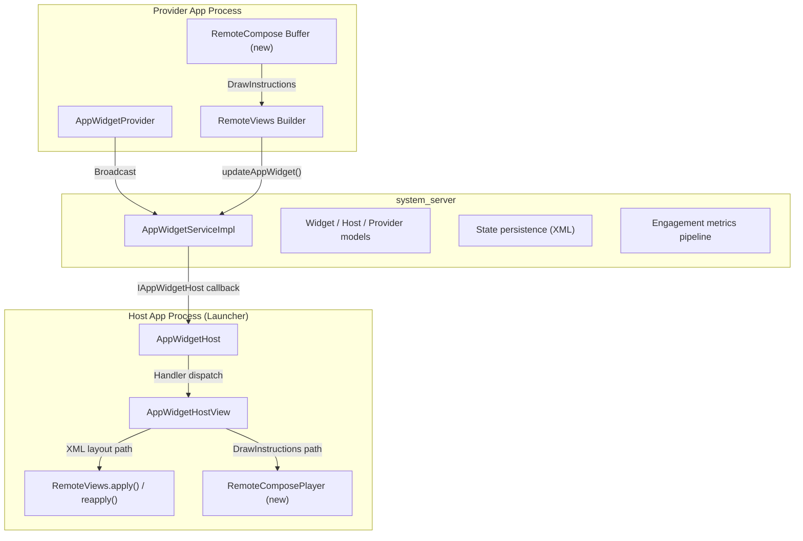
```mermaid
flowchart TB
    subgraph "Provider App Process"
        P1[AppWidgetProvider]
        P2[RemoteViews Builder]
        P3["RemoteCompose Buffer (new)"]
    end

    subgraph "system_server"
        S1[AppWidgetServiceImpl]
        S2["Widget / Host / Provider models"]
        S3["State persistence (XML)"]
        S4["Engagement metrics pipeline"]
    end

    subgraph "Host App Process (Launcher)"
        H1[AppWidgetHost]
        H2[AppWidgetHostView]
        H3["RemoteViews.apply() / reapply()"]
        H4["RemoteComposePlayer (new)"]
    end

    P1 -->|"Broadcast"| S1
    P2 -->|"updateAppWidget()"| S1
    P3 -->|"DrawInstructions"| P2
    S1 -->|"IAppWidgetHost callback"| H1
    H1 -->|"Handler dispatch"| H2
    H2 -->|"XML layout path"| H3
    H2 -->|"DrawInstructions path"| H4
```

The key takeaways:

1. **RemoteViews** serializes view mutations as an ordered list of typed `Action`
   objects (35 action types) that are applied to an inflated XML layout.

2. **AppWidgetService** brokers the relationship between providers and hosts,
   enforcing security policy, managing state persistence, and handling periodic
   updates via `AlarmManager`.

3. **RemoteCompose** is a significant new addition (265 files, 60,000+ lines)
   that provides a binary bytecode format for rendering. It supports draw
   operations, layout containers, modifiers, variables, expressions, animations,
   haptics, and accessibility -- far exceeding what `RemoteViews` can express.

4. **The bridge** between old and new is the `DrawInstructions` class and
   `SET_DRAW_INSTRUCTION_TAG` (35), which embeds RemoteCompose documents
   inside traditional `RemoteViews` parcels.

5. **Launcher3** adds substantial widget-specific logic on top of the framework:
   background-thread host operations, update deferral during animations,
   auto-advance for collection widgets, and a full widget picker UI.

### Key Source Paths

| Path | Description |
|---|---|
| `frameworks/base/core/java/android/appwidget/AppWidgetProvider.java` | AppWidget provider base class (220 lines) |
| `frameworks/base/core/java/android/appwidget/AppWidgetHost.java` | AppWidget host abstraction (726 lines) |
| `frameworks/base/core/java/android/appwidget/AppWidgetEvent.java` | Widget event model (401 lines) |
| `frameworks/base/core/java/android/appwidget/AppWidgetHostView.java` | Host view that renders widgets |
| `frameworks/base/core/java/android/appwidget/AppWidgetManager.java` | Public API entry point |
| `frameworks/base/core/java/android/appwidget/AppWidgetProviderInfo.java` | Widget metadata (647 lines) |
| `frameworks/base/services/appwidget/java/com/android/server/appwidget/AppWidgetServiceImpl.java` | system_server implementation |
| `frameworks/base/core/java/android/widget/RemoteViews.java` | RemoteViews action serialization (10,874 lines) |
| `frameworks/base/core/java/android/widget/RemoteViewsService.java` | Collection widget service (321 lines) |
| `frameworks/base/core/java/android/widget/RemoteViewsAdapter.java` | Collection widget adapter (1,305 lines) |
| `frameworks/base/core/java/com/android/internal/widget/remotecompose/core/CoreDocument.java` | RemoteCompose document model |
| `frameworks/base/core/java/com/android/internal/widget/remotecompose/core/Operations.java` | RemoteCompose operations registry |
| `frameworks/base/core/java/com/android/internal/widget/remotecompose/core/WireBuffer.java` | RemoteCompose wire format |
| `frameworks/base/core/java/com/android/internal/widget/remotecompose/core/PaintContext.java` | RemoteCompose paint context |
| `frameworks/base/core/java/com/android/internal/widget/remotecompose/player/RemoteComposePlayer.java` | RemoteCompose player |
| `frameworks/base/core/java/com/android/internal/widget/remotecompose/player/RemoteComposeDocument.java` | RemoteCompose document loader |
| `frameworks/base/core/java/com/android/internal/widget/remotecompose/player/platform/AndroidPaintContext.java` | Android-specific paint context |
| `frameworks/base/packages/SystemUI/src/com/android/systemui/statusbar/notification/row/NotifRemoteViewsFactory.kt` | Notification RemoteViews factory |
| `packages/apps/Launcher3/src/com/android/launcher3/widget/LauncherWidgetHolder.java` | Launcher3 widget host holder |
| `packages/apps/Launcher3/src/com/android/launcher3/widget/LauncherAppWidgetHostView.java` | Launcher3 host view |

<!-- chapter:44-webview -->
# Chapter 44: WebView

WebView is Android's embeddable browser component, allowing applications to display web
content directly within their UI. Under the surface, it is a remarkably complex subsystem:
a thin Android framework facade that delegates every operation to an updatable, Chromium-based
provider package running in its own set of processes. This chapter traces the entire stack --
from the XML `<WebView>` tag an application developer writes, through the factory and provider
abstraction, into the multi-process Chromium engine, its security sandbox, and the update
mechanism that keeps it current without a full OS upgrade.

---

## 44.1 WebView Architecture

### 44.1.1 Historical Context

Android's WebView has undergone three major architectural eras:

1. **WebKit era (Android 1.0 -- 4.3)**: WebView was a monolithic, in-process component built
   on the WebKit rendering engine. It shipped as part of the platform image and could only be
   updated through full OTA system updates.

2. **Chromium migration (Android 4.4 -- 6.0)**: Starting with KitKat (API 19), Android replaced
   the WebKit backend with Chromium's content layer. Initially the Chromium code was still
   compiled into the system image, but the architecture introduced the provider abstraction
   that would enable future decoupling.

3. **Updatable WebView (Android 7.0+)**: From Nougat onward, WebView became a separately
   updatable APK delivered through the Play Store or system updaters. The framework contains
   only thin proxy classes; the actual implementation lives in the WebView provider package
   (typically `com.google.android.webview` or `com.android.webview`).

### 44.1.2 High-Level Component Map

The following diagram shows the major components involved when an application uses WebView:

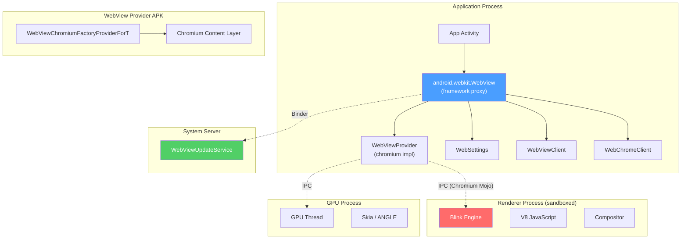
```mermaid
graph TB
    subgraph "Application Process"
        APP["App Activity"]
        WV["android.webkit.WebView<br/>(framework proxy)"]
        WVP["WebViewProvider<br/>(chromium impl)"]
        WS["WebSettings"]
        WVC["WebViewClient"]
        WCC["WebChromeClient"]
        APP --> WV
        WV --> WVP
        WV --> WS
        WV --> WVC
        WV --> WCC
    end

    subgraph "WebView Provider APK"
        FACTORY["WebViewChromiumFactoryProviderForT"]
        CHROMIUM["Chromium Content Layer"]
        FACTORY --> CHROMIUM
    end

    subgraph "Renderer Process (sandboxed)"
        BLINK["Blink Engine"]
        V8["V8 JavaScript"]
        COMPOSITOR["Compositor"]
    end

    subgraph "GPU Process"
        GPU_THREAD["GPU Thread"]
        SKIA["Skia / ANGLE"]
    end

    subgraph "System Server"
        WVUS["WebViewUpdateService"]
    end

    WVP -.->|"IPC (Chromium Mojo)"| BLINK
    WVP -.->|"IPC"| GPU_THREAD
    WV -.->|"Binder"| WVUS

    style WV fill:#4a9eff,color:#fff
    style BLINK fill:#ff6b6b,color:#fff
    style WVUS fill:#51cf66,color:#fff
```

### 44.1.3 Multi-Process Model

Modern Android WebView uses a multi-process architecture derived from Chromium:

- **Browser process**: This is the application's own process. The Chromium "browser" logic
  runs on the app's main thread and a pool of IO/worker threads within the same process. It
  handles navigation decisions, cookie management, permission prompts, and communication with
  the Android framework.

- **Renderer process**: A separate, sandboxed process that runs the Blink rendering engine and
  V8 JavaScript engine. Multiple WebView instances in the same application may share a single
  renderer, but a renderer crash is isolated from the browser process. The renderer is spawned
  from the **WebView Zygote**, a specialized child zygote that pre-loads the WebView provider
  code for fast process creation.

- **GPU process**: Handles GPU-accelerated compositing and rasterization. WebView shares the
  application's GPU thread when hardware-accelerated, drawing through a "functor" mechanism
  that integrates with Android's `RenderThread`.

The multi-process model is controlled by the framework. The `WebViewDelegate.isMultiProcessEnabled()`
method currently returns `true` unconditionally:

```
Source: frameworks/base/core/java/android/webkit/WebViewDelegate.java

    public boolean isMultiProcessEnabled() {
        return true;
    }
```

### 44.1.4 Process Isolation and the WebView Zygote

Renderer processes are created through a dedicated **WebView Zygote** rather than the main
application Zygote. This child zygote is specialized for WebView:

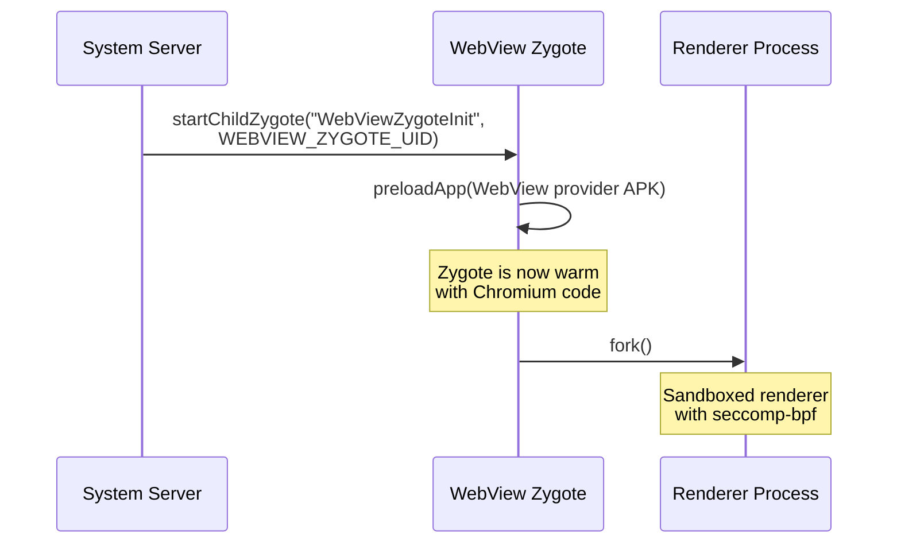
```mermaid
sequenceDiagram
    participant SysSrv as System Server
    participant WVZygote as WebView Zygote
    participant Renderer as Renderer Process

    SysSrv->>WVZygote: startChildZygote("WebViewZygoteInit",<br/>WEBVIEW_ZYGOTE_UID)
    WVZygote->>WVZygote: preloadApp(WebView provider APK)
    Note over WVZygote: Zygote is now warm<br/>with Chromium code

    WVZygote->>Renderer: fork()
    Note over Renderer: Sandboxed renderer<br/>with seccomp-bpf
```

The `WebViewZygote` class manages the lifecycle of this child zygote:

```
Source: frameworks/base/core/java/android/webkit/WebViewZygote.java

    sZygote = Process.ZYGOTE_PROCESS.startChildZygote(
            "com.android.internal.os.WebViewZygoteInit",
            "webview_zygote",
            Process.WEBVIEW_ZYGOTE_UID,
            Process.WEBVIEW_ZYGOTE_UID,
            sharedAppGid,
            runtimeFlags,
            "webview_zygote",  // seInfo
            abi,
            TextUtils.join(",", Build.SUPPORTED_ABIS),
            null,
            Process.FIRST_ISOLATED_UID,
            Integer.MAX_VALUE);
```

Key observations:

- The zygote runs under a dedicated UID (`WEBVIEW_ZYGOTE_UID`).
- It pre-loads the WebView APK so that forked renderer processes start quickly.
- When the WebView provider changes (e.g., an update), the old zygote is killed and a
  new one is started with the updated package.

### 44.1.5 Drawing Integration

WebView integrates with Android's hardware-accelerated rendering pipeline through a
**draw functor** mechanism. Instead of the standard `View.onDraw()` path that records
display list operations, WebView registers a native functor with the `RenderThread`:

```
Source: frameworks/base/core/java/android/webkit/WebViewDelegate.java

    public void drawWebViewFunctor(@NonNull Canvas canvas, int functor) {
        if (!(canvas instanceof RecordingCanvas)) {
            throw new IllegalArgumentException(canvas.getClass().getName()
                    + " is not a RecordingCanvas canvas");
        }
        ((RecordingCanvas) canvas).drawWebViewFunctor(functor);
    }
```

This functor is a native function pointer (created via `AwDrawFn_CreateFunctor` in the
Chromium code) that the `RenderThread` invokes during the GPU composition phase. This
allows WebView content to be composited alongside native Android UI elements without
expensive pixel copies between processes.

### 44.1.6 WebView Class Hierarchy and Package Structure

The `android.webkit` package contains all the public-facing WebView classes. Here is the
complete set of major classes and their roles:

| Class | Role |
|---|---|
| `WebView` | The main view widget; thin proxy to `WebViewProvider` |
| `WebSettings` | Per-instance configuration (abstract, impl in provider) |
| `WebViewClient` | Navigation and error event callbacks |
| `WebChromeClient` | Browser-chrome UI event callbacks |
| `WebViewFactory` | Singleton factory; loads and caches the provider |
| `WebViewFactoryProvider` | Interface for the top-level provider factory |
| `WebViewProvider` | Interface for per-WebView backend |
| `WebViewDelegate` | Bridge granting provider access to framework internals |
| `WebViewLibraryLoader` | Native library loading with RELRO optimization |
| `WebViewZygote` | Manages the child zygote for renderer processes |
| `WebViewUpdateService` | Legacy client for the system update service |
| `WebViewUpdateManager` | Modern client for the system update service |
| `WebViewProviderInfo` | Describes a candidate WebView provider package |
| `WebViewProviderResponse` | Response from the update service with status |
| `WebViewRenderProcess` | Handle to a renderer process |
| `WebViewRenderProcessClient` | Callbacks for renderer responsiveness |
| `CookieManager` | Cookie management singleton |
| `WebStorage` | Web storage (localStorage, sessionStorage) management |
| `GeolocationPermissions` | Geolocation permission management |
| `TracingController` | Performance tracing integration |
| `TracingConfig` | Tracing configuration (categories, modes) |
| `ServiceWorkerController` | Service Worker management |
| `JavascriptInterface` | Annotation for exposed Java methods |
| `SafeBrowsingResponse` | Response actions for Safe Browsing hits |
| `RenderProcessGoneDetail` | Information about renderer crashes |
| `ConsoleMessage` | JavaScript console message representation |
| `ValueCallback<T>` | Generic callback for async operations |
| `WebResourceRequest` | Incoming resource request details |
| `WebResourceResponse` | Custom resource response |
| `WebResourceError` | Resource loading error details |
| `WebMessage` | Message for the Web Messaging API |
| `WebMessagePort` | Port for the Web Messaging API |
| `WebBackForwardList` | Navigation history snapshot |
| `WebHistoryItem` | Single entry in navigation history |

The AIDL interface files define the Binder IPC contract between the client and the
system service:

| AIDL File | Purpose |
|---|---|
| `IWebViewUpdateService.aidl` | Update service Binder interface |
| `WebViewProviderInfo.aidl` | Parcelable provider info |
| `WebViewProviderResponse.aidl` | Parcelable provider response |

### 44.1.7 Configuration and Feature Flags

WebView behavior is influenced by several flag mechanisms:

1. **`flags.aconfig`**: The `android.webkit` package defines aconfig flags for gradual
   feature rollouts. Key flags include:
   - `FLAG_UPDATE_SERVICE_IPC_WRAPPER`: Gates the `WebViewUpdateManager` class
   - `FLAG_FILE_SYSTEM_ACCESS`: Enables File System Access API in WebView
   - `FLAG_USER_AGENT_REDUCTION`: Enables User-Agent string reduction
   - `FLAG_DEPRECATE_START_SAFE_BROWSING`: Deprecates explicit Safe Browsing init

2. **`@ChangeId` annotations**: Compatibility changes gated by `targetSdkVersion`:
   - `ENABLE_SIMPLIFIED_DARK_MODE` (API 33+): Algorithmic dark mode
   - `ENABLE_USER_AGENT_REDUCTION` (post-Baklava): Reduced UA string
   - `ENABLE_FILE_SYSTEM_ACCESS` (post-Baklava): File System Access API

3. **Chromium command-line flags**: The provider can accept Chromium-style flags for
   testing and debugging. These are typically set via developer options or `adb`:
   ```bash
   adb shell "echo 'chrome --enable-features=SomeFeature' > \
       /data/local/tmp/webview-command-line"
   ```

4. **Android system properties**: `WebViewDelegate` monitors system properties for
   tracing enablement via `SystemProperties.addChangeCallback()`.

---

## 44.2 WebViewFactory

The `WebViewFactory` class is the entry point for creating and loading the WebView
implementation. It is a `@SystemApi` class hidden from regular application developers,
but it is the central coordinator that bridges the Android framework and the Chromium
provider.

```
Source: frameworks/base/core/java/android/webkit/WebViewFactory.java
```

### 44.2.1 Class Overview

`WebViewFactory` is a `final` class with entirely static methods. Its key responsibilities:

| Responsibility | Method |
|---|---|
| Get/cache provider singleton | `getProvider()` |
| Load provider class | `getProviderClass()` |
| Load native library | `loadWebViewNativeLibraryFromPackage()` |
| Reserve zygote address space | `prepareWebViewInZygote()` |
| Handle provider changes | `onWebViewProviderChanged()` |
| Check WebView support | `isWebViewSupported()` |
| Access update service | `getUpdateService()` |

### 44.2.2 The Chromium Factory Class

The factory hardcodes the name of the Chromium provider implementation class:

```java
private static final String CHROMIUM_WEBVIEW_FACTORY =
        "com.android.webview.chromium.WebViewChromiumFactoryProviderForT";

private static final String CHROMIUM_WEBVIEW_FACTORY_METHOD = "create";
```

This class name is resolved at runtime from the WebView provider APK's classloader. The
trailing "ForT" indicates the API compatibility level (Tiramisu/API 33+). Different
Android versions may use different suffixed class names.

### 44.2.3 Provider Initialization Sequence

The full initialization sequence when an application first creates a `WebView` involves
multiple coordinated steps:

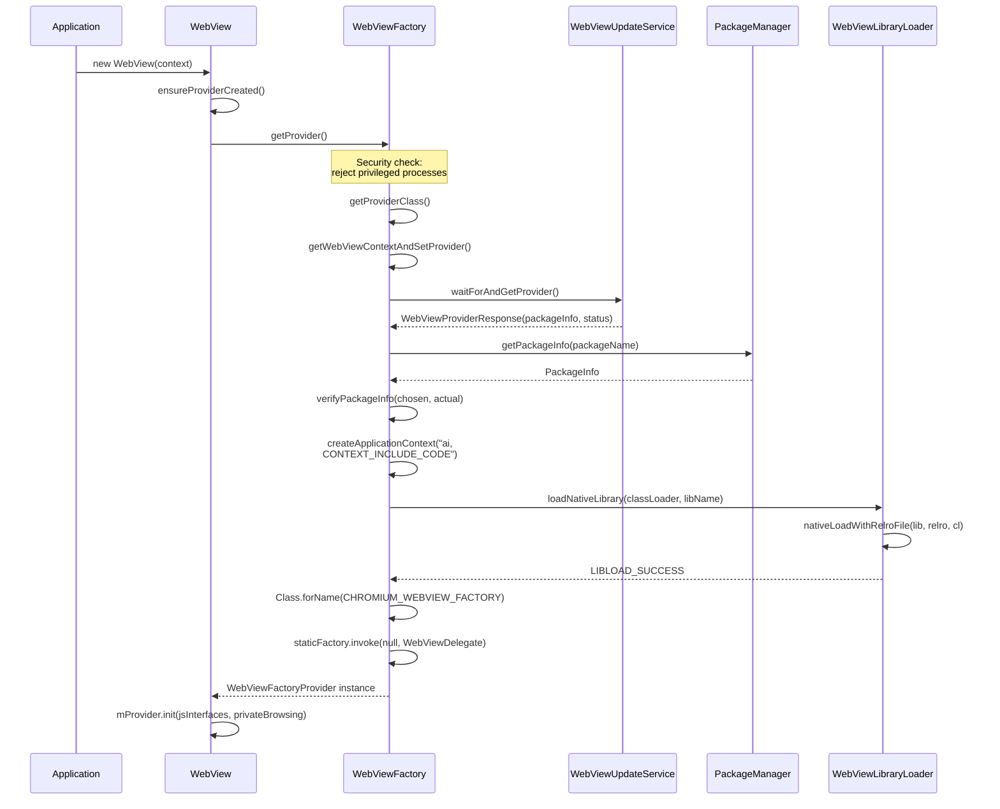
```mermaid
sequenceDiagram
    participant App as Application
    participant WV as WebView
    participant WVF as WebViewFactory
    participant WVUS as WebViewUpdateService
    participant PM as PackageManager
    participant NL as WebViewLibraryLoader

    App->>WV: new WebView(context)
    WV->>WV: ensureProviderCreated()
    WV->>WVF: getProvider()

    Note over WVF: Security check:<br/>reject privileged processes

    WVF->>WVF: getProviderClass()
    WVF->>WVF: getWebViewContextAndSetProvider()

    WVF->>WVUS: waitForAndGetProvider()
    WVUS-->>WVF: WebViewProviderResponse(packageInfo, status)

    WVF->>PM: getPackageInfo(packageName)
    PM-->>WVF: PackageInfo
    WVF->>WVF: verifyPackageInfo(chosen, actual)

    WVF->>WVF: createApplicationContext("ai,<br/>CONTEXT_INCLUDE_CODE")

    WVF->>NL: loadNativeLibrary(classLoader, libName)
    NL->>NL: nativeLoadWithRelroFile(lib, relro, cl)
    NL-->>WVF: LIBLOAD_SUCCESS

    WVF->>WVF: Class.forName(CHROMIUM_WEBVIEW_FACTORY)
    WVF->>WVF: staticFactory.invoke(null, WebViewDelegate)
    WVF-->>WV: WebViewFactoryProvider instance

    WV->>WV: mProvider.init(jsInterfaces, privateBrowsing)
```

### 44.2.4 Security Guard: Privileged Process Rejection

WebView explicitly refuses to load in privileged system processes. The `getProvider()`
method checks the caller's UID:

```java
final int appId = UserHandle.getAppId(android.os.Process.myUid());
if (appId == android.os.Process.ROOT_UID
        || appId == android.os.Process.SYSTEM_UID
        || appId == android.os.Process.PHONE_UID
        || appId == android.os.Process.NFC_UID
        || appId == android.os.Process.BLUETOOTH_UID) {
    throw new UnsupportedOperationException(
            "For security reasons, WebView is not allowed in privileged processes");
}
```

This is a critical security measure. WebView loads and executes arbitrary web content
including JavaScript. Running it in a privileged process (system_server, telephony,
Bluetooth, NFC) would give web-originating exploits access to system-level capabilities.

### 44.2.5 Package Verification

Before loading the provider, `WebViewFactory` performs rigorous verification of the
WebView package:

1. **Package name match**: The package name returned by the update service must match the
   one fetched from `PackageManager`.

2. **Version code check**: The actual installed version must be at least as high as what
   the update service reported (guards against downgrade attacks).

3. **Signature verification**: The signatures of the installed package must match those
   of the chosen package. This uses `ArraySet`-based comparison for order independence.

4. **Library flag check**: The package must declare a
   `com.android.webview.WebViewLibrary` meta-data entry pointing to the native `.so` file.

```java
private static void verifyPackageInfo(PackageInfo chosen, PackageInfo toUse)
        throws MissingWebViewPackageException {
    if (!chosen.packageName.equals(toUse.packageName)) { ... }
    if (chosen.getLongVersionCode() > toUse.getLongVersionCode()) { ... }
    if (getWebViewLibrary(toUse.applicationInfo) == null) { ... }
    if (!signaturesEquals(chosen.signatures, toUse.signatures)) { ... }
}
```

### 44.2.6 Startup Timestamps

`WebViewFactory` records detailed timing information for each phase of WebView loading
through the `StartupTimestamps` inner class. These timestamps are exposed to the provider
via `WebViewDelegate.getStartupTimestamps()` and are used for performance monitoring:

| Timestamp | Phase |
|---|---|
| `mWebViewLoadStart` | Overall load begins |
| `mCreateContextStart/End` | Creating the WebView APK context |
| `mAddAssetsStart/End` | Registering resource paths |
| `mGetClassLoaderStart/End` | Obtaining the APK classloader |
| `mNativeLoadStart/End` | Loading the native `.so` with RELRO |
| `mProviderClassForNameStart/End` | Resolving the factory class |

### 44.2.7 RELRO Sharing

A key optimization in WebView loading is **RELRO (Relocation Read-Only) sharing**. The
Chromium native library (`libwebviewchromium.so`) is large (typically 50-100 MB). When
this library is loaded, the dynamic linker must process relocations -- fixups to absolute
addresses in the shared library. These relocations produce identical results in every
process because the library is loaded at the same pre-reserved address.

The `WebViewLibraryLoader` class coordinates this optimization:

```
Source: frameworks/base/core/java/android/webkit/WebViewLibraryLoader.java
```

1. **Address space reservation** happens in the Zygote before any app is forked:
   ```java
   static void reserveAddressSpaceInZygote() {
       System.loadLibrary("webviewchromium_loader");
       long addressSpaceToReserve;
       if (VMRuntime.getRuntime().is64Bit()) {
           addressSpaceToReserve = 1 * 1024 * 1024 * 1024; // 1 GB on 64-bit
       } else if (VMRuntime.getRuntime().vmInstructionSet().equals("arm")) {
           addressSpaceToReserve = 130 * 1024 * 1024; // 130 MB on ARM32
       } else {
           addressSpaceToReserve = 190 * 1024 * 1024; // 190 MB on x86 emu
       }
       sAddressSpaceReserved = nativeReserveAddressSpace(addressSpaceToReserve);
   }
   ```

2. **RELRO file creation** happens in an isolated process (`RelroFileCreator`) that loads
   the library, processes relocations, and writes the result to a shared file:
   - 32-bit: `/data/misc/shared_relro/libwebviewchromium32.relro`
   - 64-bit: `/data/misc/shared_relro/libwebviewchromium64.relro`

3. **RELRO file consumption**: When an app loads WebView, it maps the pre-computed RELRO
   file instead of reprocessing relocations, saving both time and memory (the RELRO pages
   are shared read-only across all processes using WebView).

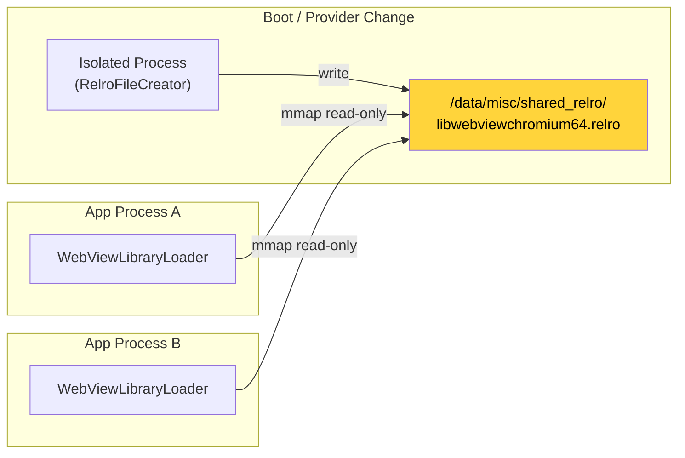
```mermaid
graph LR
    subgraph "Boot / Provider Change"
        IS["Isolated Process<br/>(RelroFileCreator)"]
        IS -->|write| RF["/data/misc/shared_relro/<br/>libwebviewchromium64.relro"]
    end

    subgraph "App Process A"
        A["WebViewLibraryLoader"]
        A -->|mmap read-only| RF
    end

    subgraph "App Process B"
        B["WebViewLibraryLoader"]
        B -->|mmap read-only| RF
    end

    style RF fill:#ffd43b,color:#000
```

---

## 44.3 WebView Provider

### 44.3.1 The Provider Abstraction

Android's WebView architecture uses a **provider pattern** to decouple the public API
from the implementation. Three interfaces define this contract:

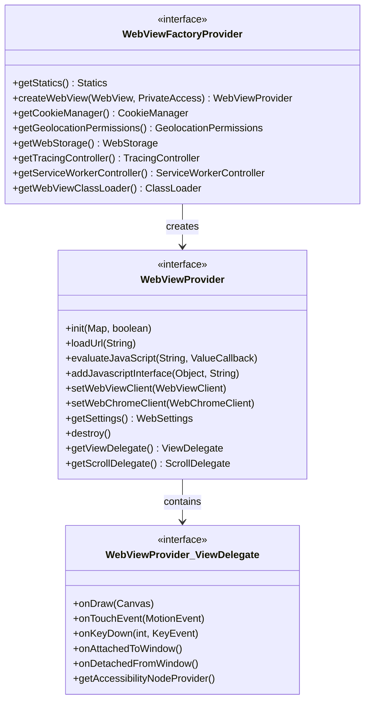
```mermaid
classDiagram
    class WebViewFactoryProvider {
        <<interface>>
        +getStatics() Statics
        +createWebView(WebView, PrivateAccess) WebViewProvider
        +getCookieManager() CookieManager
        +getGeolocationPermissions() GeolocationPermissions
        +getWebStorage() WebStorage
        +getTracingController() TracingController
        +getServiceWorkerController() ServiceWorkerController
        +getWebViewClassLoader() ClassLoader
    }

    class WebViewProvider {
        <<interface>>
        +init(Map, boolean)
        +loadUrl(String)
        +evaluateJavaScript(String, ValueCallback)
        +addJavascriptInterface(Object, String)
        +setWebViewClient(WebViewClient)
        +setWebChromeClient(WebChromeClient)
        +getSettings() WebSettings
        +destroy()
        +getViewDelegate() ViewDelegate
        +getScrollDelegate() ScrollDelegate
    }

    class WebViewProvider_ViewDelegate {
        <<interface>>
        +onDraw(Canvas)
        +onTouchEvent(MotionEvent)
        +onKeyDown(int, KeyEvent)
        +onAttachedToWindow()
        +onDetachedFromWindow()
        +getAccessibilityNodeProvider()
    }

    WebViewFactoryProvider --> WebViewProvider : creates
    WebViewProvider --> WebViewProvider_ViewDelegate : contains
```

**`WebViewFactoryProvider`** is the top-level factory. It is a singleton per process,
created via reflection from the `WebViewChromiumFactoryProviderForT.create()` static method.
It provides:

- Factory method to create `WebViewProvider` instances (one per `WebView` widget)
- Singleton accessors for `CookieManager`, `WebStorage`, `GeolocationPermissions`, etc.
- A `Statics` sub-interface for static utility methods

**`WebViewProvider`** is the per-instance backend. Every public method on `android.webkit.WebView`
delegates to a corresponding method on this interface. It also contains two sub-interfaces:

- `ViewDelegate`: Handles `View`-level callbacks (draw, touch, key events, accessibility)
- `ScrollDelegate`: Handles scroll computation

### 44.3.2 The Delegation Pattern in WebView

The `android.webkit.WebView` class is a thin proxy. Its constructor calls
`ensureProviderCreated()`, which triggers the entire factory loading sequence described
in Section 44.2:

```java
private void ensureProviderCreated() {
    checkThread();
    if (mProvider == null) {
        mProvider = getFactory().createWebView(this, new PrivateAccess());
    }
}
```

Every public method then delegates directly:

```java
public void loadUrl(@NonNull String url) {
    checkThread();
    mProvider.loadUrl(url);
}

public void evaluateJavascript(@NonNull String script,
        @Nullable ValueCallback<String> resultCallback) {
    checkThread();
    mProvider.evaluateJavaScript(script, resultCallback);
}
```

The `checkThread()` call enforces that WebView is only accessed from the thread on
which it was created (typically the main/UI thread). Starting from API 18 (Jelly Bean MR2),
violations throw an exception rather than silently failing.

### 44.3.3 WebViewChromium: The Concrete Implementation

The concrete provider implementation lives in the WebView APK, not in the framework. The
class `com.android.webview.chromium.WebViewChromiumFactoryProviderForT` (loaded via
reflection) wraps Chromium's content layer. This class:

1. Initializes the Chromium browser process (command-line flags, feature list, field trials)
2. Creates the Chromium `BrowserContext` (profile with cookies, storage, cache)
3. Instantiates `WebViewChromium` (the per-instance `WebViewProvider` implementation)
4. Sets up the GPU process connection
5. Manages the renderer process pool via the WebView Zygote

### 44.3.4 Prebuilt vs. Updatable Provider

The WebView provider can come from two sources:

| Source | Package Name (typical) | Update Channel |
|---|---|---|
| AOSP prebuilt | `com.android.webview` | System image only |
| Google (GMS) | `com.google.android.webview` | Play Store / Mainline |
| Standalone Chrome | `com.android.chrome` | Play Store |

On devices with Google Play Services, the system typically ships with
`com.google.android.webview` as the default provider and `com.android.webview` as the
fallback. The `WebViewProviderInfo` class describes each candidate:

```
Source: frameworks/base/core/java/android/webkit/WebViewProviderInfo.java

    public final String packageName;
    public final String description;
    public final boolean availableByDefault;
    public final boolean isFallback;
    public final Signature[] signatures;
```

The `availableByDefault` flag marks the primary provider. The `isFallback` flag marks
a provider that should only be used when the primary is unavailable (uninstalled, disabled,
or invalid). The `signatures` array ensures that only packages signed with expected keys
can serve as WebView providers.

### 44.3.5 WebViewDelegate: The Bridge to Framework Internals

The `WebViewDelegate` class provides the Chromium implementation with controlled access
to Android framework internals that are not part of the public SDK:

```
Source: frameworks/base/core/java/android/webkit/WebViewDelegate.java
```

Key capabilities exposed through this delegate:

- **Draw functor registration**: `drawWebViewFunctor()` lets WebView hook into the
  hardware-accelerated rendering pipeline
- **Tracing integration**: `isTraceTagEnabled()` and `setOnTraceEnabledChangeListener()`
  connect WebView tracing to Android's systrace infrastructure
- **Resource management**: `getPackageId()` resolves the WebView APK's resource package ID
  so resources from the WebView APK can be correctly addressed
- **Application context**: `getApplication()` provides access to the embedding app
- **Data directory**: `getDataDirectorySuffix()` supports multi-process data isolation
- **Startup metrics**: `getStartupTimestamps()` provides timing data for performance analysis

---

## 44.4 WebView Update Mechanism

### 44.4.1 The WebViewUpdateService

The `WebViewUpdateService` is a system service that manages which WebView provider is
active and coordinates the transition when providers are updated. It runs in `system_server`
and is accessed via Binder IPC.

```
Source: frameworks/base/services/core/java/com/android/server/webkit/WebViewUpdateServiceImpl2.java
```

The service implementation (`WebViewUpdateServiceImpl2`) tracks:

- The list of all configured WebView providers (from device configuration)
- Which provider is currently active
- The RELRO preparation state
- Package installation/removal events that affect provider selection

### 44.4.2 Provider Selection Algorithm

When the system needs to choose a WebView provider (at boot or after a package change),
the `WebViewUpdateServiceImpl2.findPreferredWebViewPackage()` method selects the best
available package:

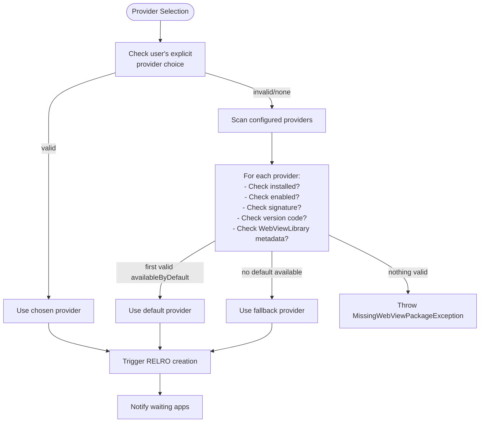
```mermaid
flowchart TD
    START([Provider Selection]) --> CHECK_USER["Check user's explicit<br/>provider choice"]
    CHECK_USER -->|valid| USE_CHOSEN["Use chosen provider"]
    CHECK_USER -->|invalid/none| SCAN["Scan configured providers"]

    SCAN --> VALIDATE["For each provider:<br/>- Check installed?<br/>- Check enabled?<br/>- Check signature?<br/>- Check version code?<br/>- Check WebViewLibrary metadata?"]

    VALIDATE -->|first valid availableByDefault| USE_DEFAULT["Use default provider"]
    VALIDATE -->|no default available| USE_FALLBACK["Use fallback provider"]
    VALIDATE -->|nothing valid| THROW["Throw MissingWebViewPackageException"]

    USE_CHOSEN --> RELRO["Trigger RELRO creation"]
    USE_DEFAULT --> RELRO
    USE_FALLBACK --> RELRO

    RELRO --> NOTIFY["Notify waiting apps"]
```

The validation checks include:

| Check | Constant | Description |
|---|---|---|
| SDK version | `VALIDITY_INCORRECT_SDK_VERSION` | Provider targets correct SDK |
| Version code | `VALIDITY_INCORRECT_VERSION_CODE` | Meets minimum version |
| Signature | `VALIDITY_INCORRECT_SIGNATURE` | Matches configured signatures |
| Library flag | `VALIDITY_NO_LIBRARY_FLAG` | Has `WebViewLibrary` metadata |

### 44.4.3 Client-Side IPC Wrapper

Applications interact with the update service through `WebViewUpdateManager`, a modern
wrapper that uses `Context.getSystemService()`:

```
Source: frameworks/base/core/java/android/webkit/WebViewUpdateManager.java
```

Key operations:

```java
// Block until the WebView provider is ready
WebViewProviderResponse waitForAndGetProvider();

// Get the current provider package
PackageInfo getCurrentWebViewPackage();

// List all configured providers
WebViewProviderInfo[] getAllWebViewPackages();

// List currently valid providers
WebViewProviderInfo[] getValidWebViewPackages();

// Switch provider (requires WRITE_SECURE_SETTINGS)
String changeProviderAndSetting(String newProvider);

// Get the default provider
WebViewProviderInfo getDefaultWebViewPackage();
```

The service registration happens in `WebViewBootstrapFrameworkInitializer`:

```java
SystemServiceRegistry.registerForeverStaticService(
        Context.WEBVIEW_UPDATE_SERVICE,
        WebViewUpdateManager.class,
        (b) -> new WebViewUpdateManager(
                IWebViewUpdateService.Stub.asInterface(b)));
```

### 44.4.4 Package Change Handling

When a WebView provider package is installed, updated, or removed, the update service
receives a package broadcast and processes it:

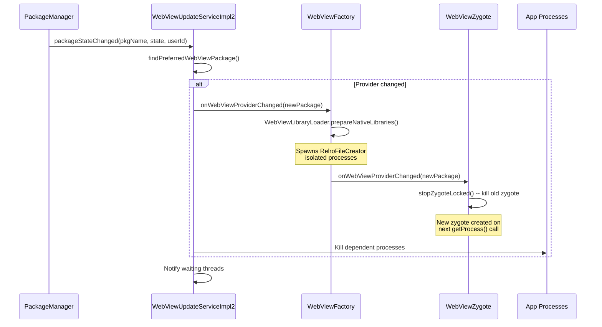
```mermaid
sequenceDiagram
    participant PM as PackageManager
    participant WVUS as WebViewUpdateServiceImpl2
    participant WVF as WebViewFactory
    participant WVZ as WebViewZygote
    participant Apps as App Processes

    PM->>WVUS: packageStateChanged(pkgName, state, userId)
    WVUS->>WVUS: findPreferredWebViewPackage()

    alt Provider changed
        WVUS->>WVF: onWebViewProviderChanged(newPackage)
        WVF->>WVF: WebViewLibraryLoader.prepareNativeLibraries()
        Note over WVF: Spawns RelroFileCreator<br/>isolated processes

        WVF->>WVZ: onWebViewProviderChanged(newPackage)
        WVZ->>WVZ: stopZygoteLocked() -- kill old zygote
        Note over WVZ: New zygote created on<br/>next getProcess() call

        WVUS->>Apps: Kill dependent processes
    end

    WVUS->>WVUS: Notify waiting threads
```

The wait timeout for RELRO preparation is 1000 milliseconds (`WAIT_TIMEOUT_MS`), which is
deliberately shorter than the 5000ms `KEY_DISPATCHING_TIMEOUT` to avoid ANR (Application
Not Responding) dialogs.

### 44.4.5 Mainline Module Integration

Starting with Android 10, WebView can be updated as a **Mainline module** via Google Play
system updates. This uses the same package update mechanism but with Mainline-specific
delivery:

- WebView updates are delivered as APK modules (not APEX)
- Updates can be rolled back if they cause issues
- The update applies to all users on the device
- No reboot is required; apps pick up the new version on next WebView creation

### 44.4.6 Fallback and Recovery

The update service includes a repair mechanism. If the current provider becomes unusable
(e.g., it is uninstalled or disabled), the service attempts to recover:

1. If the current provider is the default and it becomes missing, trigger a repair
2. The repair mechanism re-enables the fallback provider if needed
3. The `mAttemptedToRepairBefore` flag prevents infinite repair loops
4. All processes depending on the old provider are killed so they restart with the new one

---

## 44.5 WebView APIs

### 44.5.1 The WebView Class

`android.webkit.WebView` extends `AbsoluteLayout` (for historical backward-compatibility
reasons) and implements several listener interfaces:

```
Source: frameworks/base/core/java/android/webkit/WebView.java
```

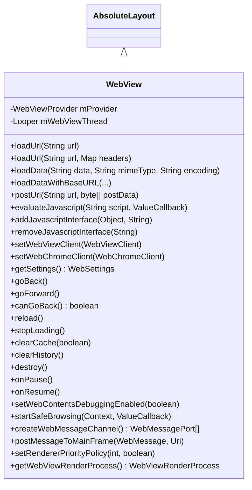
```mermaid
classDiagram
    class AbsoluteLayout
    class WebView {
        -WebViewProvider mProvider
        -Looper mWebViewThread
        +loadUrl(String url)
        +loadUrl(String url, Map headers)
        +loadData(String data, String mimeType, String encoding)
        +loadDataWithBaseURL(...)
        +postUrl(String url, byte[] postData)
        +evaluateJavascript(String script, ValueCallback)
        +addJavascriptInterface(Object, String)
        +removeJavascriptInterface(String)
        +setWebViewClient(WebViewClient)
        +setWebChromeClient(WebChromeClient)
        +getSettings() WebSettings
        +goBack()
        +goForward()
        +canGoBack() boolean
        +reload()
        +stopLoading()
        +clearCache(boolean)
        +clearHistory()
        +destroy()
        +onPause()
        +onResume()
        +setWebContentsDebuggingEnabled(boolean)
        +startSafeBrowsing(Context, ValueCallback)
        +createWebMessageChannel() WebMessagePort[]
        +postMessageToMainFrame(WebMessage, Uri)
        +setRendererPriorityPolicy(int, boolean)
        +getWebViewRenderProcess() WebViewRenderProcess
    }

    AbsoluteLayout <|-- WebView
```

#### Content Loading Methods

WebView provides multiple ways to load content:

| Method | Use Case |
|---|---|
| `loadUrl(String)` | Load a URL (http, https, file, data, javascript) |
| `loadUrl(String, Map)` | Load URL with custom HTTP headers |
| `loadData(String, String, String)` | Load inline HTML via data: URL |
| `loadDataWithBaseURL(...)` | Load inline HTML with a custom base URL |
| `postUrl(String, byte[])` | HTTP POST to a URL |

The `loadDataWithBaseURL` method is particularly important for security: it sets the
**origin** for the loaded content, which governs the same-origin policy for any
JavaScript executing in the page.

#### JavaScript Execution

Two mechanisms exist for JavaScript interaction:

1. **evaluateJavascript()**: Execute arbitrary JavaScript in the current page context
   and optionally receive the result:
   ```java
   webView.evaluateJavascript("document.title", value -> {
       // value is the JSON-encoded result
   });
   ```

2. **addJavascriptInterface()**: Expose a Java object to JavaScript, allowing bidirectional
   communication (see Section 44.5.5).

#### Navigation

WebView maintains a back/forward navigation stack:

- `canGoBack()` / `goBack()` -- navigate backward
- `canGoForward()` / `goForward()` -- navigate forward
- `canGoBackOrForward(int)` / `goBackOrForward(int)` -- navigate by step count
- `copyBackForwardList()` -- snapshot the navigation history

#### Lifecycle Management

WebView follows Android's activity lifecycle:

- `onPause()` -- pause animations, geolocation (but not JavaScript timers)
- `onResume()` -- resume paused WebView
- `pauseTimers()` / `resumeTimers()` -- pause/resume all JavaScript timers globally
- `destroy()` -- release all internal resources; the WebView must be removed from the
  view hierarchy first

### 44.5.2 WebSettings

`WebSettings` controls the behavior of a WebView instance. It is an abstract class whose
concrete implementation is provided by the Chromium backend.

```
Source: frameworks/base/core/java/android/webkit/WebSettings.java
```

Key settings categories:

#### JavaScript and Content

| Setting | Default | Description |
|---|---|---|
| `setJavaScriptEnabled(boolean)` | `false` | Enable/disable JavaScript execution |
| `setDomStorageEnabled(boolean)` | `false` | Enable HTML5 DOM Storage |
| `setDatabaseEnabled(boolean)` | `false` | Enable HTML5 Web SQL Database |
| `setMediaPlaybackRequiresUserGesture(boolean)` | `true` | Require gesture for media |
| `setAllowFileAccess(boolean)` | varies | Allow `file://` URL access |
| `setAllowContentAccess(boolean)` | `true` | Allow `content://` URL access |

#### Display and Layout

| Setting | Default | Description |
|---|---|---|
| `setTextZoom(int)` | `100` | Text size as percentage |
| `setUseWideViewPort(boolean)` | `false` | Enable viewport meta tag support |
| `setLoadWithOverviewMode(boolean)` | `false` | Zoom out to fit content by width |
| `setSupportZoom(boolean)` | `true` | Enable zoom support |
| `setBuiltInZoomControls(boolean)` | `false` | Enable pinch-to-zoom |
| `setDisplayZoomControls(boolean)` | `true` | Show on-screen zoom buttons |

#### Caching

| Mode | Constant | Behavior |
|---|---|---|
| Default | `LOAD_DEFAULT` | Use cache when valid, network otherwise |
| Cache first | `LOAD_CACHE_ELSE_NETWORK` | Use cache even if expired, else network |
| No cache | `LOAD_NO_CACHE` | Always load from network |
| Cache only | `LOAD_CACHE_ONLY` | Never use network |

#### Mixed Content

The `setMixedContentMode()` method controls how HTTPS pages handle HTTP sub-resources:

| Mode | Constant | Security Level |
|---|---|---|
| Always allow | `MIXED_CONTENT_ALWAYS_ALLOW` | Least secure |
| Never allow | `MIXED_CONTENT_NEVER_ALLOW` | Most secure |
| Compatibility | `MIXED_CONTENT_COMPATIBILITY_MODE` | Follows browser defaults |

#### Dark Mode

```java
public static final long ENABLE_SIMPLIFIED_DARK_MODE = 214741472L;
```

Starting from Android 13 (Tiramisu), WebView supports algorithmic darkening of web content
through `setAlgorithmicDarkeningAllowed()`. This enables WebView to automatically apply
dark themes to web pages that do not natively support `prefers-color-scheme`.

#### User-Agent Reduction

```java
@ChangeId
@EnabledAfter(targetSdkVersion = android.os.Build.VERSION_CODES.BAKLAVA)
public static final long ENABLE_USER_AGENT_REDUCTION = 371034303L;
```

For apps targeting post-Baklava, the default User-Agent is reduced to `Linux; Android 10; K`
with version `0.0.0` to reduce fingerprinting surface, following the broader User-Agent
Reduction initiative across Chromium.

### 44.5.3 WebViewClient

`WebViewClient` handles navigation events and errors. An application sets it via
`WebView.setWebViewClient()`. If no client is set, the default behavior delegates URL
handling to the system (via `ActivityManager`).

```
Source: frameworks/base/core/java/android/webkit/WebViewClient.java
```

Key callbacks organized by lifecycle:

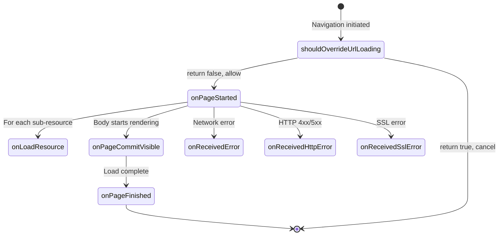
```mermaid
stateDiagram-v2
    [*] --> shouldOverrideUrlLoading : Navigation initiated
    shouldOverrideUrlLoading --> onPageStarted : return false, allow
    shouldOverrideUrlLoading --> [*] : return true, cancel

    onPageStarted --> onLoadResource : For each sub-resource
    onPageStarted --> onPageCommitVisible : Body starts rendering
    onPageCommitVisible --> onPageFinished : Load complete

    onPageStarted --> onReceivedError : Network error
    onPageStarted --> onReceivedHttpError : HTTP 4xx/5xx
    onPageStarted --> onReceivedSslError : SSL error

    onPageFinished --> [*]
```

#### Navigation Control

```java
// Modern version (API 24+)
public boolean shouldOverrideUrlLoading(WebView view, WebResourceRequest request) {
    return shouldOverrideUrlLoading(view, request.getUrl().toString());
}
```

Returning `true` cancels the navigation and lets the app handle it (e.g., opening an
external browser). Returning `false` allows WebView to proceed normally.

Important caveats from the source:

- Not called for POST requests
- Not called for navigations initiated by `loadUrl()`
- May be called for subframes and non-HTTP schemes

#### Resource Interception

```java
public WebResourceResponse shouldInterceptRequest(WebView view,
        WebResourceRequest request) {
    return null; // Return null to let WebView load normally
}
```

This powerful callback allows the application to intercept any resource request and return
custom data. Use cases include:

- Serving local assets for offline support
- Injecting custom CSS or JavaScript
- Implementing custom caching strategies
- URL rewriting

**Thread safety note**: This method is called on a background thread, not the UI thread.

#### Error Handling

| Callback | When Called |
|---|---|
| `onReceivedError(WebView, WebResourceRequest, WebResourceError)` | Network/DNS/connection failures |
| `onReceivedHttpError(WebView, WebResourceRequest, WebResourceResponse)` | HTTP status >= 400 |
| `onReceivedSslError(WebView, SslErrorHandler, SslError)` | SSL certificate errors |

The SSL error callback deserves special attention. The default behavior is `handler.cancel()`,
which is the secure choice. The source code explicitly warns:

> Do not prompt the user about SSL errors. Users are unlikely to be able to make an
> informed security decision, and WebView does not provide a UI for showing the details
> of the error in a meaningful way.

#### Render Process Management

```java
public boolean onRenderProcessGone(WebView view, RenderProcessGoneDetail detail) {
    return false;
}
```

When a renderer process crashes or is killed by the system, this callback notifies the
application. Multiple `WebView` instances may share a renderer, so the callback fires for
each affected WebView. Returning `false` (the default) causes the application to crash;
returning `true` indicates the app has handled the situation (e.g., by cleaning up the
WebView and recreating it).

#### Safe Browsing

```java
public void onSafeBrowsingHit(WebView view, WebResourceRequest request,
        @SafeBrowsingThreat int threatType, SafeBrowsingResponse callback) {
    callback.showInterstitial(/* allowReporting */ true);
}
```

When Safe Browsing detects a malicious URL, this callback lets the app decide how to
respond. Threat types include:

| Constant | Value | Description |
|---|---|---|
| `SAFE_BROWSING_THREAT_UNKNOWN` | 0 | Unknown threat |
| `SAFE_BROWSING_THREAT_MALWARE` | 1 | Malware detected |
| `SAFE_BROWSING_THREAT_PHISHING` | 2 | Phishing/deceptive content |
| `SAFE_BROWSING_THREAT_UNWANTED_SOFTWARE` | 3 | Unwanted software |
| `SAFE_BROWSING_THREAT_BILLING` | 4 | Billing fraud (API 29+) |

### 44.5.4 WebChromeClient

`WebChromeClient` handles browser-chrome events -- UI elements and interactions that are
outside the web content area itself.

```
Source: frameworks/base/core/java/android/webkit/WebChromeClient.java
```

Key callback categories:

#### Page Metadata

| Callback | Purpose |
|---|---|
| `onProgressChanged(WebView, int)` | Loading progress (0--100) |
| `onReceivedTitle(WebView, String)` | Document title changed |
| `onReceivedIcon(WebView, Bitmap)` | Favicon received |

#### JavaScript Dialogs

WebChromeClient handles JavaScript's `alert()`, `confirm()`, and `prompt()` dialogs:

```java
public boolean onJsAlert(WebView view, String url, String message, JsResult result) {
    return false; // false = show default dialog
}

public boolean onJsConfirm(WebView view, String url, String message, JsResult result) {
    return false;
}

public boolean onJsPrompt(WebView view, String url, String message,
        String defaultValue, JsPromptResult result) {
    return false;
}
```

Returning `false` shows the default system dialog. Returning `true` suppresses it and
the app must call `result.confirm()` or `result.cancel()` to resume JavaScript execution.

If no `WebChromeClient` is set at all, JavaScript dialogs are silently suppressed.

#### Fullscreen Video

```java
public void onShowCustomView(View view, CustomViewCallback callback) {}
public void onHideCustomView() {}
```

When a video element enters fullscreen (e.g., the user taps a fullscreen button), WebView
creates a separate `View` containing the video and passes it to `onShowCustomView()`. The
application should add this view to a fullscreen window. When fullscreen exits,
`onHideCustomView()` is called.

#### Window Management

```java
public boolean onCreateWindow(WebView view, boolean isDialog,
        boolean isUserGesture, Message resultMsg) {
    return false; // false = don't create window
}
```

When JavaScript calls `window.open()`, this callback asks the app to create a new WebView.
The app should check `isUserGesture` to block popup windows not initiated by user action.

#### Permissions

```java
public void onGeolocationPermissionsShowPrompt(String origin,
        GeolocationPermissions.Callback callback) {}

public void onPermissionRequest(PermissionRequest request) {
    request.deny(); // Default: deny all permissions
}
```

The `onPermissionRequest` callback handles requests for camera, microphone, and other
sensitive capabilities. The default behavior denies all such requests.

#### File Chooser

```java
public boolean onShowFileChooser(WebView webView,
        ValueCallback<Uri[]> filePathCallback,
        FileChooserParams fileChooserParams) {
    return false;
}
```

The `FileChooserParams` class defines modes for file selection:

| Mode | Constant | Description |
|---|---|---|
| Open single | `MODE_OPEN` | Pick one existing file |
| Open multiple | `MODE_OPEN_MULTIPLE` | Pick multiple files |
| Open folder | `MODE_OPEN_FOLDER` | Pick a directory (File System Access API) |
| Save | `MODE_SAVE` | Create/overwrite a file |

The `MODE_OPEN_FOLDER` and `MODE_SAVE` modes are part of the new File System Access API
support, gated behind the `ENABLE_FILE_SYSTEM_ACCESS` change ID for apps targeting
post-Baklava.

#### Console Messages

```java
public boolean onConsoleMessage(ConsoleMessage consoleMessage) {
    onConsoleMessage(consoleMessage.message(), consoleMessage.lineNumber(),
            consoleMessage.sourceId());
    return false;
}
```

JavaScript `console.log()`, `console.warn()`, and `console.error()` calls are forwarded
to this callback, enabling the host application to capture and process web console output.

### 44.5.5 JavascriptInterface

The `@JavascriptInterface` annotation marks Java methods that should be exposed to
JavaScript running in the WebView:

```
Source: frameworks/base/core/java/android/webkit/JavascriptInterface.java

@Retention(RetentionPolicy.RUNTIME)
@Target({ElementType.METHOD})
public @interface JavascriptInterface {
}
```

This annotation is runtime-retained, meaning the WebView implementation can discover
annotated methods via reflection. Starting from API 17, only methods with this annotation
are accessible from JavaScript -- a critical security fix that prevents JavaScript from
calling arbitrary Java methods via reflection.

Usage pattern:

```java
class WebAppInterface {
    @JavascriptInterface
    public void showToast(String message) {
        Toast.makeText(context, message, Toast.LENGTH_SHORT).show();
    }
}

webView.addJavascriptInterface(new WebAppInterface(), "Android");
// JavaScript can now call: Android.showToast("Hello from JS!")
```

Security considerations documented in the `WebView.addJavascriptInterface()` source:

1. The Java object is exposed to **all frames** in the WebView, including third-party
   iframes. There is no way to restrict it to a specific origin.

2. JavaScript calls Java methods on a **private background thread**, not the UI thread.
   Thread safety is the developer's responsibility.

3. For apps targeting API 17+, only `@JavascriptInterface`-annotated methods are accessible.
   For older apps, all public methods (including inherited ones from `Object`) are exposed,
   which allows arbitrary code execution via `getClass().forName(...)`.

4. Java object fields are never accessible from JavaScript (only methods).

### 44.5.6 Web Messaging API

WebView also supports the HTML5 MessageChannel API for structured communication:

```java
// Create a message channel
WebMessagePort[] ports = webView.createWebMessageChannel();

// Send one port to the web page
webView.postMessageToMainFrame(
    new WebMessage("init", new WebMessagePort[]{ports[1]}),
    Uri.parse("https://example.com"));

// Receive messages from the web page
ports[0].setWebMessageCallback(new WebMessagePort.WebMessageCallback() {
    public void onMessage(WebMessagePort port, WebMessage message) {
        // Handle message from JS
    }
});
```

This is a more structured and secure alternative to `addJavascriptInterface` because
messages can be validated and the channel endpoints are explicitly controlled.

### 44.5.7 WebResourceRequest and WebResourceResponse

The `WebResourceRequest` class provides detailed information about incoming resource
requests in `WebViewClient.shouldInterceptRequest()` and
`WebViewClient.shouldOverrideUrlLoading()`:

```java
public interface WebResourceRequest {
    Uri getUrl();                        // The request URL
    boolean isForMainFrame();            // true if this is the main frame
    boolean isRedirect();                // true if this is a redirect
    boolean hasGesture();                // true if initiated by user gesture
    String getMethod();                  // HTTP method (GET, POST, etc.)
    Map<String, String> getRequestHeaders(); // HTTP request headers
}
```

`WebResourceResponse` allows applications to provide custom responses for intercepted
requests:

```java
WebResourceResponse response = new WebResourceResponse(
    "text/html",           // MIME type
    "UTF-8",               // encoding
    new ByteArrayInputStream(htmlBytes)  // data stream
);
response.setStatusCodeAndReasonPhrase(200, "OK");
response.setResponseHeaders(Map.of(
    "Cache-Control", "max-age=3600",
    "Content-Type", "text/html; charset=UTF-8"
));
```

This enables powerful patterns:

1. **Offline-first**: Serve cached content when the network is unavailable
2. **Asset loading**: Serve local assets through HTTP-like URLs for same-origin compliance
3. **Content filtering**: Block or replace specific resources (ads, trackers)
4. **URL rewriting**: Redirect requests to different servers transparently

#### Error Types and Error Codes

`WebViewClient` defines a comprehensive set of error codes for resource loading failures:

| Constant | Value | Description |
|---|---|---|
| `ERROR_UNKNOWN` | -1 | Generic error |
| `ERROR_HOST_LOOKUP` | -2 | DNS resolution failed |
| `ERROR_UNSUPPORTED_AUTH_SCHEME` | -3 | Auth scheme not supported |
| `ERROR_AUTHENTICATION` | -4 | Server authentication failed |
| `ERROR_PROXY_AUTHENTICATION` | -5 | Proxy authentication failed |
| `ERROR_CONNECT` | -6 | Connection to server failed |
| `ERROR_IO` | -7 | Read/write error |
| `ERROR_TIMEOUT` | -8 | Connection timed out |
| `ERROR_REDIRECT_LOOP` | -9 | Too many redirects |
| `ERROR_UNSUPPORTED_SCHEME` | -10 | Unsupported URI scheme |
| `ERROR_FAILED_SSL_HANDSHAKE` | -11 | SSL handshake failed |
| `ERROR_BAD_URL` | -12 | Malformed URL |
| `ERROR_FILE` | -13 | Generic file error |
| `ERROR_FILE_NOT_FOUND` | -14 | File not found |
| `ERROR_TOO_MANY_REQUESTS` | -15 | Too many requests |
| `ERROR_UNSAFE_RESOURCE` | -16 | Blocked by Safe Browsing |

### 44.5.8 WebView Lifecycle Best Practices

Proper lifecycle management is critical for WebView applications. The framework documentation
and source code reveal several patterns:

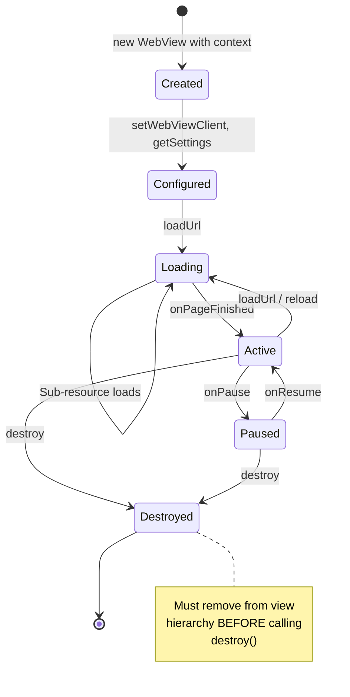
```mermaid
stateDiagram-v2
    [*] --> Created : new WebView with context
    Created --> Configured : setWebViewClient, getSettings
    Configured --> Loading : loadUrl
    Loading --> Active : onPageFinished
    Active --> Paused : onPause
    Paused --> Active : onResume
    Active --> Destroyed : destroy
    Paused --> Destroyed : destroy
    Destroyed --> [*]

    Active --> Loading : loadUrl / reload
    Loading --> Loading : Sub-resource loads

    note right of Destroyed
        Must remove from view
        hierarchy BEFORE calling
        destroy()
    end note
```

Key lifecycle rules:

1. **Create on UI thread only**: WebView must be created on a thread with a Looper (typically
   the main thread). The constructor stores `Looper.myLooper()` and enforces thread affinity
   for all subsequent calls.

2. **Pause when backgrounded**: Call `onPause()` when the activity goes to background to
   reduce power consumption. This pauses animations and geolocation but does not pause
   JavaScript timers.

3. **Pause timers globally**: Call `pauseTimers()` to stop all JavaScript timers across
   all WebView instances. This is a global operation and should be used when the entire
   application is backgrounded.

4. **Destroy properly**: Before calling `destroy()`, remove the WebView from its parent
   view. After `destroy()`, no other methods may be called on the WebView.

5. **Handle process death**: The renderer process may be killed by the system at any time
   (especially under memory pressure). Applications must handle `onRenderProcessGone()`
   to avoid crashing.

### 44.5.9 CookieManager

The `CookieManager` singleton manages cookies across all `WebView` instances in a process:

```
Source: frameworks/base/core/java/android/webkit/CookieManager.java
```

```java
// Get the singleton
CookieManager cookieManager = CookieManager.getInstance();

// Set a cookie
cookieManager.setCookie("https://example.com", "key=value; Max-Age=3600");

// Get cookies
String cookies = cookieManager.getCookie("https://example.com");

// Third-party cookie control (per WebView)
cookieManager.setAcceptThirdPartyCookies(webView, false);

// Flush to persistent storage
cookieManager.flush();
```

Third-party cookie policy defaults:

- Apps targeting KitKat (API 19) or below: **allow** third-party cookies
- Apps targeting Lollipop (API 21) or later: **block** third-party cookies

### 44.5.10 WebViewRenderProcess and WebViewRenderProcessClient

These classes provide programmatic control over the renderer process:

```
Source: frameworks/base/core/java/android/webkit/WebViewRenderProcess.java
Source: frameworks/base/core/java/android/webkit/WebViewRenderProcessClient.java
```

**WebViewRenderProcess** provides a handle to terminate a renderer:

```java
public abstract boolean terminate();
```

**WebViewRenderProcessClient** receives responsiveness notifications:

```java
public abstract void onRenderProcessUnresponsive(
        @NonNull WebView view, @Nullable WebViewRenderProcess renderer);

public abstract void onRenderProcessResponsive(
        @NonNull WebView view, @Nullable WebViewRenderProcess renderer);
```

The unresponsiveness detector fires if the renderer fails to process an input event or
navigate within a reasonable time. Callbacks repeat at a minimum interval of 5 seconds
while the renderer remains unresponsive.

---

## 44.6 Chromium Integration

### 44.6.1 The Content Layer

WebView uses Chromium's **content layer** -- the public embedding API that sits above
the platform-specific shell but below Chrome's browser UI. The content layer provides:

- Page navigation and loading
- Blink rendering engine (HTML, CSS, layout)
- V8 JavaScript engine
- Network stack (Chromium's own, not Android's `HttpURLConnection`)
- Compositor for GPU-accelerated rendering
- Mojo IPC for inter-process communication

```mermaid
graph TB
    subgraph "Chrome Browser"
        CHROME_UI["Chrome UI Layer"]
        CHROME_UI --> CONTENT
    end

    subgraph "WebView"
        AW["Android WebView<br/>(aw/ layer)"]
        AW --> CONTENT
    end

    subgraph "Content Layer (shared)"
        CONTENT["content/"]
        CONTENT --> BLINK["Blink<br/>(third_party/blink)"]
        CONTENT --> V8_ENG["V8<br/>(v8/)"]
        CONTENT --> NET["Network Stack<br/>(net/)"]
        CONTENT --> CC["Compositor<br/>(cc/)"]
        CONTENT --> MOJO["Mojo IPC<br/>(mojo/)"]
    end

    style CONTENT fill:#4a9eff,color:#fff
    style AW fill:#51cf66,color:#fff
```

The `aw/` (Android WebView) layer in Chromium's source tree adapts the content API to
Android's WebView contracts. It implements `WebViewProvider`, handles the draw functor
integration, manages the WebView-specific compositor mode, and bridges Android's
`WebSettings` to Chromium's internal content settings.

### 44.6.2 GPU Process and Hardware Acceleration

WebView's GPU integration is unique among Chromium embedders because it must share the
application's GPU context. Unlike Chrome (which has its own GPU process), WebView hooks
into Android's `RenderThread`:

```mermaid
sequenceDiagram
    participant UI as UI Thread
    participant RT as RenderThread
    participant CF as Chromium Functor
    participant GPU as GPU Driver

    UI->>UI: WebView.onDraw(canvas)
    UI->>RT: Record drawWebViewFunctor(functor)

    RT->>CF: AwDrawFn_OnDraw(functor, draw_params)
    CF->>CF: Chromium compositor generates GL commands
    CF->>GPU: glDrawArrays(), glTexImage2D(), etc.
    GPU-->>RT: Frame complete
```

The draw functor (`AwDrawFn_CreateFunctor` / `AwDrawFn_OnDraw`) is a native callback
registered through `WebViewDelegate.drawWebViewFunctor()`. This avoids the overhead of
a separate GPU process and allows WebView content to be composited in the same pass as
native Android views.

### 44.6.3 Renderer Process Sandboxing

The renderer process runs in a restricted sandbox with multiple layers of isolation:

1. **UID isolation**: Each renderer gets an isolated UID from the
   `FIRST_ISOLATED_UID` range, preventing access to other apps' data.

2. **SELinux policy**: The renderer runs under the `webview_zygote` SELinux context,
   which restricts file system access, network operations, and system calls.

3. **seccomp-bpf**: A BPF filter restricts the set of system calls the renderer can
   make, blocking dangerous calls like `mount`, `reboot`, `ptrace`, etc.

4. **Process capabilities**: The renderer drops all Linux capabilities after startup.

5. **Namespace isolation**: The renderer uses separate PID and network namespaces (on
   supported kernels) to further restrict its view of the system.

```mermaid
graph TB
    subgraph "Sandbox Layers"
        direction TB
        L1["UID Isolation<br/>(isolated_app UID)"]
        L2["SELinux MAC<br/>(webview_zygote context)"]
        L3["seccomp-bpf<br/>(syscall filter)"]
        L4["Capability Dropping<br/>(no caps after init)"]
        L5["Namespace Isolation<br/>(PID, network)"]
        L1 --- L2 --- L3 --- L4 --- L5
    end

    RENDERER["Renderer Process<br/>(Blink + V8)"] --> L1

    style RENDERER fill:#ff6b6b,color:#fff
    style L1 fill:#ffd43b,color:#000
    style L2 fill:#ffd43b,color:#000
    style L3 fill:#ffd43b,color:#000
    style L4 fill:#ffd43b,color:#000
    style L5 fill:#ffd43b,color:#000
```

### 44.6.4 Network Stack

WebView uses Chromium's own network stack rather than Android's. This provides:

- HTTP/2 and HTTP/3 (QUIC) support
- Connection pooling and multiplexing
- TLS 1.3 with Chromium's own certificate verification
- Cronet-compatible network API
- Cookie storage in Chromium's cookie database

The network stack runs in the browser (application) process, not the renderer. This means
network requests from web content cross the Mojo IPC boundary from renderer to browser,
are executed in the browser process, and responses are sent back.

### 44.6.5 Mojo IPC

Communication between the browser and renderer processes uses Chromium's **Mojo** IPC
framework. Mojo provides:

- Typed message interfaces (defined in `.mojom` files)
- Shared memory regions for large data transfers
- Data pipes for streaming
- Capability-based security (interface handles cannot be forged)

Key Mojo interfaces used by WebView include:

| Interface | Direction | Purpose |
|---|---|---|
| `blink.mojom.LocalFrame` | Browser -> Renderer | Frame management |
| `blink.mojom.FrameHost` | Renderer -> Browser | Navigation requests |
| `content.mojom.Renderer` | Browser -> Renderer | Process control |
| `network.mojom.URLLoader` | Either direction | Resource loading |

### 44.6.6 V8 JavaScript Engine Integration

WebView uses the V8 JavaScript engine that ships as part of Chromium. V8 runs in the
renderer process and provides:

- **JIT compilation**: V8 compiles JavaScript to optimized machine code at runtime using
  its TurboFan optimizing compiler. In WebView, JIT is enabled by default, but the renderer
  sandbox restricts memory-mapping executable pages to prevent JIT spraying attacks.

- **Garbage collection**: V8's Orinoco garbage collector uses concurrent and parallel
  collection strategies to minimize pause times during web page interaction.

- **WebAssembly support**: V8 includes a WebAssembly (Wasm) engine that can execute
  compiled Wasm modules with near-native performance.

- **Isolate-per-frame**: Each frame (main frame and iframes) gets its own V8 isolate
  when site isolation is active, ensuring that JavaScript from different origins cannot
  share memory.

The JavaScript-to-Java bridge (via `addJavascriptInterface()`) crosses the process boundary
twice: first from V8 in the renderer to the browser process via Mojo IPC, then from the
Chromium browser-side code to the Java bridge object via JNI.

```mermaid
sequenceDiagram
    participant JS as JavaScript (V8)
    participant BLINK as Blink (Renderer)
    participant MOJO as Mojo IPC
    participant BROWSER as Browser Process
    participant JNI as JNI Bridge
    participant JAVA as Java Object

    JS->>BLINK: Call injectedObject.method()
    BLINK->>MOJO: Serialize call parameters
    MOJO->>BROWSER: Transfer message
    BROWSER->>JNI: Find annotated method
    JNI->>JAVA: Invoke method()
    JAVA-->>JNI: Return value
    JNI-->>BROWSER: Convert to Chromium type
    BROWSER-->>MOJO: Serialize response
    MOJO-->>BLINK: Transfer response
    BLINK-->>JS: Return value to JavaScript
```

### 44.6.7 Compositor Architecture in WebView Mode

WebView's compositor operates differently from Chrome's. In Chrome, the compositor runs
in a dedicated GPU process and produces frames independently. In WebView, the compositor
must integrate with Android's `RenderThread`:

```mermaid
graph TB
    subgraph "UI Thread"
        ONDRAW["WebView.onDraw()"]
        RECORD["Record GL functor<br/>into DisplayList"]
        ONDRAW --> RECORD
    end

    subgraph "RenderThread"
        PLAYBACK["Playback DisplayList"]
        INVOKE["Invoke AwDrawFn"]
        COMPOSE["Chromium Compositor<br/>(cc/ layer)"]
        RASTER["Rasterize tiles"]
        PLAYBACK --> INVOKE
        INVOKE --> COMPOSE
        COMPOSE --> RASTER
    end

    subgraph "Renderer Process"
        LAYOUT["Blink Layout"]
        PAINT["Blink Paint"]
        COMMIT["Compositor Commit"]
        LAYOUT --> PAINT --> COMMIT
    end

    RECORD -->|"Hardware-accelerated<br/>rendering pipeline"| PLAYBACK
    COMMIT -->|"Shared memory<br/>(compositor frames)"| COMPOSE

    style COMPOSE fill:#4a9eff,color:#fff
```

This architecture means:

1. The Blink renderer computes layout and paint operations, producing a compositor frame
   (a tree of layers with their content).

2. The compositor frame is transferred to the browser process via shared memory.

3. On the next `RenderThread` frame, the draw functor is invoked, and the Chromium
   compositor rasterizes the frame's tiles into the application's GPU context.

4. The result is composited alongside other Android views in the same GPU pass.

This is called **"synchronous compositor"** mode in Chromium terminology because the
compositor must synchronize with Android's `RenderThread` cadence rather than running
on its own timeline.

### 44.6.8 Threading Model

WebView uses multiple threads within the application process:

| Thread | Role |
|---|---|
| UI Thread (Main) | Android lifecycle, WebView API calls, Chromium browser main thread |
| IO Thread | Network I/O, IPC message dispatch |
| RenderThread | Hardware-accelerated rendering, compositor |
| ThreadPool workers | Background tasks, DNS prefetch, file I/O |
| Java Bridge Thread | `@JavascriptInterface` method execution |

The UI thread serves dual duty as both the Android main thread and Chromium's browser
main thread. This is a key constraint: long-running Chromium operations on the browser
main thread can cause ANRs in the Android application. The Chromium code is designed to
avoid blocking the main thread, but complex page loads with many frames can still cause
jank.

### 44.6.9 Service Worker Support

WebView supports Service Workers through the `ServiceWorkerController` and
`ServiceWorkerClient` classes:

```java
ServiceWorkerController swController = ServiceWorkerController.getInstance();
swController.setServiceWorkerClient(new ServiceWorkerClient() {
    @Override
    public WebResourceResponse shouldInterceptRequest(WebResourceRequest request) {
        // Intercept service worker requests
        return null; // null = let WebView handle normally
    }
});

ServiceWorkerWebSettings swSettings = swController.getServiceWorkerWebSettings();
swSettings.setAllowContentAccess(true);
swSettings.setCacheMode(WebSettings.LOAD_DEFAULT);
```

Service Workers run in the renderer process and can intercept network requests, enabling
offline support and push notifications for web applications embedded in WebView.

### 44.6.10 WebView vs. Chrome: Key Differences

Although WebView and Chrome share the same Chromium codebase, there are significant
behavioral differences:

| Aspect | Chrome | WebView |
|---|---|---|
| Process model | Separate GPU process | Shared app GPU thread |
| Compositor | Asynchronous | Synchronous (tied to RenderThread) |
| Browser UI | Full Chrome UI | No browser UI (app provides UI) |
| Navigation | Full URL bar, tabs | Controlled by app code |
| Extensions | Supported | Not supported |
| DevTools | Built-in | Requires explicit enablement |
| Safe Browsing | Always on | On by default, can be disabled |
| Cookie storage | Chrome profile | Per-app WebView data directory |
| Autofill | Chrome's autofill | Android platform autofill |
| Download handling | Chrome's download manager | `DownloadListener` callback to app |
| Multi-profile | Supported | Single profile per data directory |

---

## 44.7 WebView and Security

### 44.7.1 Same-Origin Policy

WebView enforces the standard web same-origin policy: scripts from one origin cannot
access resources or DOM from a different origin. The origin is defined by the tuple
(scheme, host, port).

Special considerations for Android WebView:

- Content loaded via `loadData()` has origin `"null"` -- it cannot access any other
  origin's resources. The source documentation explicitly warns:

  > This must not be considered to be a trusted origin by the application or by any
  > JavaScript code running inside the WebView, because malicious content can also
  > create frames with a null origin.

- Content loaded via `loadDataWithBaseURL()` with an HTTP/HTTPS base URL gets that URL's
  origin, enabling meaningful same-origin checks.

- `file://` URLs share a single origin, which is why `setAllowFileAccess(false)` is the
  secure default for apps targeting API 30+.

### 44.7.2 Mixed Content Handling

WebView provides three modes for handling mixed content (HTTP resources loaded from an
HTTPS page):

```java
// Most secure: block all mixed content
webSettings.setMixedContentMode(WebSettings.MIXED_CONTENT_NEVER_ALLOW);

// Least secure: allow all mixed content
webSettings.setMixedContentMode(WebSettings.MIXED_CONTENT_ALWAYS_ALLOW);

// Browser-compatible: block some, allow others
webSettings.setMixedContentMode(WebSettings.MIXED_CONTENT_COMPATIBILITY_MODE);
```

`MIXED_CONTENT_NEVER_ALLOW` is recommended for security-sensitive applications.
`MIXED_CONTENT_COMPATIBILITY_MODE` follows Chromium's evolving policy, which increasingly
blocks mixed content by default.

### 44.7.3 Safe Browsing

WebView integrates Google Safe Browsing to protect users from malicious websites. The
Safe Browsing system checks URLs against a regularly-updated database of known threats.

```mermaid
sequenceDiagram
    participant WV as WebView
    participant SB as Safe Browsing Database
    participant APP as WebViewClient

    WV->>SB: Check URL hash prefix
    alt URL is safe
        SB-->>WV: No match
        WV->>WV: Proceed with load
    else URL matches threat
        SB-->>WV: Threat detected
        WV->>APP: onSafeBrowsingHit("request,<br/>threatType, callback")
        alt App handles
            APP->>WV: callback.proceed(report)
            Note over WV: Load proceeds (user risk)
        else Default behavior
            APP->>WV: callback.showInterstitial(true)
            Note over WV: Show warning page
        end
    end
```

Safe Browsing is enabled by default. Applications can:

- Disable it via `WebSettings.setSafeBrowsingEnabled(false)`
- Allowlist specific hosts via `WebView.setSafeBrowsingWhitelist()`
- Handle threats custom via `WebViewClient.onSafeBrowsingHit()`
- Link to the privacy policy via `WebView.getSafeBrowsingPrivacyPolicyUrl()`

Starting from WebView version 122.0.6174.0, Safe Browsing initialization is automatic.
The previously-required `WebView.startSafeBrowsing()` call is now deprecated and no-ops.

### 44.7.4 SSL/TLS Security

WebView uses Chromium's TLS implementation, which provides:

- TLS 1.2 and 1.3 support
- Certificate Transparency enforcement
- HSTS (HTTP Strict Transport Security) preload list
- OCSP stapling
- Strong cipher suite selection

When an SSL error occurs, the `WebViewClient.onReceivedSslError()` callback is invoked.
The default behavior cancels the load:

```java
public void onReceivedSslError(WebView view, SslErrorHandler handler, SslError error) {
    handler.cancel(); // Secure default: reject
}
```

Client certificate authentication is handled through `onReceivedClientCertRequest()`,
which defaults to canceling (no client certificate sent):

```java
public void onReceivedClientCertRequest(WebView view, ClientCertRequest request) {
    request.cancel(); // Default: no client cert
}
```

### 44.7.5 JavaScript Bridge Security

The `addJavascriptInterface()` mechanism has been a historical source of security
vulnerabilities. Key mitigations:

1. **`@JavascriptInterface` annotation requirement** (API 17+): Only annotated methods
   are exposed, preventing reflection-based attacks.

2. **Privileged process exclusion**: WebView refuses to load in system_server, phone,
   NFC, Bluetooth, or root processes.

3. **Origin blindness warning**: The injected object is accessible from all frames,
   including cross-origin iframes. Applications must not assume the calling frame is
   trusted.

4. **Thread isolation**: JavaScript calls to Java objects execute on a private background
   thread, not the UI thread. This prevents UI-thread blocking but requires thread-safe
   implementations.

### 44.7.6 File Access Controls

WebView provides granular control over local file access:

| Setting | Default (API < 30) | Default (API >= 30) |
|---|---|---|
| `setAllowFileAccess()` | `true` | `false` |
| `setAllowContentAccess()` | `true` | `true` |
| `setAllowFileAccessFromFileURLs()` | `false` (API 16+) | `false` |
| `setAllowUniversalAccessFromFileURLs()` | `false` (API 16+) | `false` |

The recommendation in the source code is clear:

> Apps should not open file:// URLs from any external source in WebView. It's
> recommended to always use `androidx.webkit.WebViewAssetLoader` to access files
> including assets and resources over http(s):// schemes, instead of file:// URLs.

File-scheme cookies are also disabled by default and deprecated:

```java
@Deprecated
public static void setAcceptFileSchemeCookies(boolean accept) {
    getInstance().setAcceptFileSchemeCookiesImpl(accept);
}
```

### 44.7.7 Content Security Policy Integration

WebView respects Content Security Policy (CSP) headers and meta tags set by web pages.
CSP provides an additional layer of defense by specifying which sources of content are
permitted. For example:

```
Content-Security-Policy: default-src 'self'; script-src 'self' https://cdn.example.com
```

This instructs the WebView to only execute scripts from the page's own origin or the
specified CDN. CSP violations are reported through the `onConsoleMessage()` callback
in `WebChromeClient`.

When embedding untrusted web content, applications should verify that the loaded pages
have appropriate CSP headers. However, CSP is enforced by the renderer and controlled
by the web content -- the embedding application cannot inject CSP headers for
third-party content loaded via `loadUrl()`.

### 44.7.8 Network Security Configuration

Android's Network Security Configuration (NSC) applies to WebView's network stack.
Applications can customize trust anchors, certificate pinning, and cleartext traffic
policy through their `network_security_config.xml`:

```xml
<?xml version="1.0" encoding="utf-8"?>
<network-security-config>
    <domain-config>
        <domain includeSubdomains="true">example.com</domain>
        <pin-set expiration="2025-12-31">
            <pin digest="SHA-256">base64_encoded_hash=</pin>
        </pin-set>
    </domain-config>
    <base-config cleartextTrafficPermitted="false" />
</network-security-config>
```

When `cleartextTrafficPermitted` is `false`, WebView blocks all HTTP (non-HTTPS) requests.
Certificate pins declared in NSC are enforced for WebView connections in addition to
Chromium's built-in certificate verification.

### 44.7.9 Data Directory Isolation

WebView supports data directory isolation for multi-process applications. The
`WebViewFactory.setDataDirectorySuffix()` method must be called before any WebView is
created:

```java
// In Application.onCreate(), before any WebView creation
WebView.setDataDirectorySuffix("process_name");
```

This is critical for applications that use WebView in multiple processes. Without
unique suffixes, multiple processes would contend for the same data directory (cookies,
cache, local storage), potentially causing data corruption. The implementation validates
the suffix to prevent path traversal:

```java
static void setDataDirectorySuffix(String suffix) {
    synchronized (sProviderLock) {
        if (sProviderInstance != null) {
            throw new IllegalStateException(
                    "Can't set data directory suffix: WebView already initialized");
        }
        if (suffix.indexOf(File.separatorChar) >= 0) {
            throw new IllegalArgumentException("Suffix " + suffix
                                               + " contains a path separator");
        }
        sDataDirectorySuffix = suffix;
    }
}
```

### 44.7.10 Renderer Priority Policy

Applications can influence how aggressively the system reclaims renderer process
memory:

```java
// Keep the renderer alive even when WebView is not visible
webView.setRendererPriorityPolicy(
    WebView.RENDERER_PRIORITY_IMPORTANT,
    false /* waivedWhenNotVisible */);

// Allow the system to kill the renderer when WebView is not visible
webView.setRendererPriorityPolicy(
    WebView.RENDERER_PRIORITY_BOUND,
    true /* waivedWhenNotVisible */);
```

Priority levels:

| Priority | Constant | Behavior |
|---|---|---|
| Important | `RENDERER_PRIORITY_IMPORTANT` | Renderer treated like a foreground service |
| Bound | `RENDERER_PRIORITY_BOUND` | Renderer treated like a bound service |
| Waived | `RENDERER_PRIORITY_WAIVED` | Renderer has low priority, easily killed |

When `waivedWhenNotVisible` is `true`, the priority drops to `WAIVED` whenever the WebView
is not attached to the window or is not visible, allowing the system to reclaim memory
more aggressively for background WebViews.

### 44.7.11 WebView Disabling

The framework provides a mechanism to completely disable WebView in a process:

```java
static void disableWebView() {
    synchronized (sProviderLock) {
        if (sProviderInstance != null) {
            throw new IllegalStateException(
                    "Can't disable WebView: WebView already initialized");
        }
        sWebViewDisabled = true;
    }
}
```

When disabled, any subsequent attempt to create a WebView throws `IllegalStateException`.
This is used by system components that should never load web content (for security isolation
purposes) to ensure that WebView cannot be triggered by accident.

### 44.7.12 Feature Detection

Before attempting to use WebView, applications should verify that the device supports it:

```java
static boolean isWebViewSupported() {
    if (sWebViewSupported == null) {
        sWebViewSupported = AppGlobals.getInitialApplication().getPackageManager()
                .hasSystemFeature(PackageManager.FEATURE_WEBVIEW);
    }
    return sWebViewSupported;
}
```

Some Android devices (particularly embedded/IoT devices, Android Automotive without browser
support, or Android Things) may not include a WebView implementation. Attempting to create a
WebView on such devices throws `UnsupportedOperationException`.

---

## 44.8 WebView Debugging

### 44.8.1 Enabling Remote Debugging

WebView supports Chrome DevTools remote debugging. This is enabled programmatically:

```java
WebView.setWebContentsDebuggingEnabled(true);
```

This static method delegates to the provider:

```java
public static void setWebContentsDebuggingEnabled(boolean enabled) {
    getFactory().getStatics().setWebContentsDebuggingEnabled(enabled);
}
```

When enabled, the WebView opens a Unix domain socket that Chrome DevTools Protocol (CDP)
clients can connect to.

### 44.8.2 chrome://inspect

The primary debugging workflow:

1. Enable debugging in the app (either via the API call above, or the app's manifest
   declares `android:debuggable="true"`)

2. Connect the device via USB and enable USB debugging

3. Open `chrome://inspect` in Chrome on the development machine

4. The WebView instances appear under the device listing

5. Click "inspect" to open a full DevTools window for the WebView

```mermaid
graph LR
    subgraph "Android Device"
        APP["App with WebView"]
        ADB["ADB Daemon"]
        APP -->|Unix socket| ADB
    end

    subgraph "Development Machine"
        CHROME["Chrome Browser"]
        DEVTOOLS["DevTools<br/>(chrome://inspect)"]
        CHROME --> DEVTOOLS
    end

    ADB <-->|"USB / WiFi ADB"| CHROME

    style DEVTOOLS fill:#4a9eff,color:#fff
```

### 44.8.3 DevTools Capabilities

Once connected, the full Chrome DevTools suite is available:

| Panel | Capabilities |
|---|---|
| Elements | Inspect and modify the DOM and CSS |
| Console | Execute JavaScript, view console output |
| Sources | Set breakpoints, step through JavaScript |
| Network | Monitor all network requests/responses |
| Performance | Record and analyze rendering performance |
| Memory | Heap snapshots, allocation profiling |
| Application | Inspect cookies, local storage, IndexedDB |
| Security | View certificate details, mixed content |

### 44.8.4 Console Message Forwarding

Even without DevTools attached, JavaScript console messages can be captured via
`WebChromeClient.onConsoleMessage()`:

```java
webView.setWebChromeClient(new WebChromeClient() {
    @Override
    public boolean onConsoleMessage(ConsoleMessage consoleMessage) {
        Log.d("WebView", consoleMessage.message()
                + " -- From line " + consoleMessage.lineNumber()
                + " of " + consoleMessage.sourceId());
        return true; // Message handled
    }
});
```

`ConsoleMessage` includes:

- Message text
- Source file ID
- Line number
- Message level (DEBUG, ERROR, LOG, TIP, WARNING)

### 44.8.5 TracingController

For performance analysis, WebView provides a `TracingController` API that integrates
with Chromium's tracing infrastructure:

```
Source: frameworks/base/core/java/android/webkit/TracingController.java
```

```java
TracingController tracingController = TracingController.getInstance();

// Start tracing
tracingController.start(new TracingConfig.Builder()
        .addCategories(TracingConfig.CATEGORIES_WEB_DEVELOPER)
        .build());

// ... perform operations ...

// Stop and collect trace data
tracingController.stop(new FileOutputStream("trace.json"),
        Executors.newSingleThreadExecutor());
```

The trace output is in Chromium's JSON trace format, which can be loaded in:

- `chrome://tracing` in Chrome
- Perfetto UI (https://ui.perfetto.dev)
- Android Studio Profiler

`TracingConfig` supports multiple category presets:

- `CATEGORIES_NONE` -- no categories
- `CATEGORIES_ALL` -- all categories
- `CATEGORIES_ANDROID_WEBVIEW` -- WebView-specific categories
- `CATEGORIES_WEB_DEVELOPER` -- categories useful for web developers
- `CATEGORIES_INPUT_LATENCY` -- input event processing categories
- `CATEGORIES_RENDERING` -- rendering pipeline categories
- `CATEGORIES_JAVASCRIPT_AND_RENDERING` -- JS and rendering combined

The tracing system also integrates with Android's systrace via the `WebViewDelegate`:

```java
public boolean isTraceTagEnabled() {
    return Trace.isTagEnabled(Trace.TRACE_TAG_WEBVIEW);
}
```

### 44.8.6 Crash Diagnostics

When a renderer process crashes, the application receives information through
`RenderProcessGoneDetail`:

```
Source: frameworks/base/core/java/android/webkit/RenderProcessGoneDetail.java
```

```java
public abstract boolean didCrash();          // true = crash, false = killed by system
public abstract int rendererPriorityAtExit(); // Priority at time of exit
```

For testing crash handling, the special URL `chrome://crash` triggers an intentional
renderer crash.

---

## 44.9 Try It

This section provides hands-on exercises to explore WebView internals on a real device
or emulator.

### Exercise 55.1: Inspect the Active WebView Provider

Query the system to see which WebView provider is currently active:

```bash
# List all configured WebView providers
adb shell cmd webviewupdate list-providers

# Show the currently active provider
adb shell cmd webviewupdate get-current-provider

# Show detailed dump of WebView update service state
adb shell dumpsys webviewupdate
```

Expected output includes the provider package name, version code, and whether it was
chosen by default or user preference.

### Exercise 55.2: Switch WebView Provider

On devices with multiple providers (e.g., standalone WebView and Chrome):

```bash
# List available providers
adb shell cmd webviewupdate list-providers

# Switch to Chrome as WebView provider (if available)
adb shell cmd webviewupdate set-webview-implementation com.android.chrome

# Switch back to standalone WebView
adb shell cmd webviewupdate set-webview-implementation com.google.android.webview
```

You can also switch providers from Settings > Developer Options > WebView Implementation.

### Exercise 55.3: Observe the WebView Zygote

```bash
# Find the WebView Zygote process
adb shell ps -A | grep webview_zygote

# Look at the zygote's child processes (renderers)
adb shell ps -A | grep isolated

# Check the zygote's SELinux context
adb shell ps -AZ | grep webview_zygote
```

### Exercise 55.4: Monitor RELRO File Creation

```bash
# Watch for RELRO file changes
adb shell ls -la /data/misc/shared_relro/

# Trigger RELRO recreation by force-updating WebView
adb shell cmd webviewupdate set-webview-implementation com.google.android.webview

# Check RELRO files again
adb shell ls -la /data/misc/shared_relro/
```

### Exercise 55.5: Build a Minimal WebView App

Create a minimal application that exercises the key WebView APIs:

```java
public class WebViewExplorerActivity extends Activity {
    private WebView webView;

    @Override
    protected void onCreate(Bundle savedInstanceState) {
        super.onCreate(savedInstanceState);
        webView = new WebView(this);
        setContentView(webView);

        // Enable debugging
        WebView.setWebContentsDebuggingEnabled(true);

        // Configure settings
        WebSettings settings = webView.getSettings();
        settings.setJavaScriptEnabled(true);
        settings.setDomStorageEnabled(true);
        settings.setMixedContentMode(WebSettings.MIXED_CONTENT_NEVER_ALLOW);

        // Set up clients
        webView.setWebViewClient(new WebViewClient() {
            @Override
            public void onPageFinished(WebView view, String url) {
                Log.d("WebViewExplorer", "Page loaded: " + url);
            }

            @Override
            public boolean onRenderProcessGone(WebView view,
                    RenderProcessGoneDetail detail) {
                Log.e("WebViewExplorer", "Renderer gone! Crashed: "
                        + detail.didCrash());
                // Clean up and recreate
                webView.destroy();
                webView = new WebView(WebViewExplorerActivity.this);
                setContentView(webView);
                return true;
            }
        });

        webView.setWebChromeClient(new WebChromeClient() {
            @Override
            public void onProgressChanged(WebView view, int newProgress) {
                Log.d("WebViewExplorer", "Progress: " + newProgress + "%");
            }

            @Override
            public boolean onConsoleMessage(ConsoleMessage consoleMessage) {
                Log.d("WebViewJS", consoleMessage.message());
                return true;
            }
        });

        // Set up render process monitoring
        webView.setWebViewRenderProcessClient(new WebViewRenderProcessClient() {
            @Override
            public void onRenderProcessUnresponsive(
                    WebView view, WebViewRenderProcess renderer) {
                Log.w("WebViewExplorer", "Renderer unresponsive!");
            }

            @Override
            public void onRenderProcessResponsive(
                    WebView view, WebViewRenderProcess renderer) {
                Log.i("WebViewExplorer", "Renderer responsive again.");
            }
        });

        // Add a JavaScript interface
        webView.addJavascriptInterface(new Object() {
            @JavascriptInterface
            public String getDeviceInfo() {
                return Build.MODEL + " / Android " + Build.VERSION.RELEASE;
            }
        }, "AndroidBridge");

        // Load a page
        webView.loadUrl("https://example.com");
    }

    @Override
    protected void onPause() {
        super.onPause();
        webView.onPause();
    }

    @Override
    protected void onResume() {
        super.onResume();
        webView.onResume();
    }

    @Override
    protected void onDestroy() {
        webView.destroy();
        super.onDestroy();
    }
}
```

### Exercise 55.6: Remote Debugging with DevTools

1. Build and install the app from Exercise 55.5.

2. Open Chrome on your development machine and navigate to `chrome://inspect`.

3. The app's WebView should appear under "Remote Target".

4. Click "inspect" to open DevTools.

5. In the DevTools Console, try:
   ```javascript
   // Call the Java bridge
   AndroidBridge.getDeviceInfo()

   // Inspect the page
   document.title

   // Monitor network
   // (Switch to Network tab and reload the page)
   ```

### Exercise 55.7: Test Renderer Crash Handling

With the app from Exercise 55.5 running:

```bash
# Trigger a renderer crash
adb shell "echo 'javascript:void(0)' | am start -a android.intent.action.VIEW -d 'chrome://crash'"
```

Or, in the DevTools console:
```javascript
// This navigates to a special URL that crashes the renderer
location.href = "chrome://crash";
```

Observe the `onRenderProcessGone` callback firing in logcat:
```bash
adb logcat -s WebViewExplorer
```

### Exercise 55.8: Trace WebView Performance

```java
// In your app, add tracing:
TracingController tc = TracingController.getInstance();

// Start tracing
tc.start(new TracingConfig.Builder()
    .addCategories(TracingConfig.CATEGORIES_WEB_DEVELOPER)
    .setTracingMode(TracingConfig.RECORD_UNTIL_FULL)
    .build());

// Perform some WebView operations
webView.loadUrl("https://example.com");

// After a few seconds, stop and save
tc.stop(new FileOutputStream(
    getExternalFilesDir(null) + "/webview_trace.json"),
    Executors.newSingleThreadExecutor());
```

Then pull the trace file and load it in `chrome://tracing`:
```bash
adb pull /sdcard/Android/data/<your.package>/files/webview_trace.json
```

### Exercise 55.9: Examine WebView Memory Usage

```bash
# Find the WebView-using app's PID
adb shell pidof <your.package.name>

# Examine its memory map for the WebView library
adb shell cat /proc/<PID>/maps | grep webviewchromium

# Check for RELRO sharing
adb shell cat /proc/<PID>/maps | grep shared_relro

# Get a full memory report
adb shell dumpsys meminfo <your.package.name>
```

Look for the `libwebviewchromium.so` mapping and verify that the RELRO section is mapped
from the shared file (it should appear as a file-backed mapping to
`/data/misc/shared_relro/libwebviewchromium64.relro`).

### Exercise 55.10: Inspect WebView Provider Package

```bash
# Get the current provider package name
PROVIDER=$(adb shell cmd webviewupdate get-current-provider | \
    grep "Current" | awk '{print $NF}')

# Examine its APK details
adb shell dumpsys package $PROVIDER | head -50

# Check the WebViewLibrary metadata
adb shell dumpsys package $PROVIDER | grep -A5 "meta-data"

# List its native libraries
adb shell pm path $PROVIDER
# Then examine the APK
adb shell "unzip -l $(pm path $PROVIDER | sed 's/package://') | grep .so"
```

### Exercise 55.11: Monitor WebView IPC

Use `strace` to observe the system calls made during WebView initialization:

```bash
# Attach strace to the app process during WebView creation
# (requires root or debuggable app)
adb shell strace -f -e trace=openat,mmap,connect -p <PID> 2>&1 | \
    grep -E "(shared_relro|webviewchromium|zygote)"
```

This reveals the RELRO file mapping, native library loading, and zygote communication.

### Exercise 55.12: Intercept and Modify Web Requests

Build on Exercise 55.5 to intercept and modify resource requests:

```java
webView.setWebViewClient(new WebViewClient() {
    @Override
    public WebResourceResponse shouldInterceptRequest(WebView view,
            WebResourceRequest request) {
        String url = request.getUrl().toString();

        // Log all requests
        Log.d("Intercept", request.getMethod() + " " + url
                + " mainFrame=" + request.isForMainFrame()
                + " redirect=" + request.isRedirect());

        // Block requests to tracking domains
        if (url.contains("analytics.example.com")) {
            return new WebResourceResponse(
                "text/plain", "UTF-8",
                new ByteArrayInputStream(new byte[0]));
        }

        // Serve local assets for a specific path
        if (url.startsWith("https://myapp.local/assets/")) {
            String assetPath = url.replace("https://myapp.local/assets/", "");
            try {
                InputStream is = getAssets().open(assetPath);
                return new WebResourceResponse(
                    "text/html", "UTF-8", is);
            } catch (IOException e) {
                Log.e("Intercept", "Asset not found: " + assetPath);
            }
        }

        return null; // Let WebView handle normally
    }
});
```

Then load a page and observe the intercepted requests in logcat.

### Exercise 55.13: Web Messaging Channel

Demonstrate the HTML5 MessageChannel API:

```java
// In the Activity
WebMessagePort[] channel = webView.createWebMessageChannel();
WebMessagePort appPort = channel[0];
WebMessagePort pagePort = channel[1];

// Listen for messages from the web page
appPort.setWebMessageCallback(new WebMessagePort.WebMessageCallback() {
    @Override
    public void onMessage(WebMessagePort port, WebMessage message) {
        Log.d("WebMessage", "Received from page: " + message.getData());

        // Send a response back
        port.postMessage(new WebMessage("Response from Android!"));
    }
});

// Load a page and send the port to it
webView.loadDataWithBaseURL("https://example.com", """
    <html><body>
    <script>
    window.addEventListener('message', function(event) {
        // Receive the port
        var port = event.ports[0];
        port.onmessage = function(e) {
            document.body.innerHTML += '<p>From Android: ' + e.data + '</p>';
        };
        // Send a message to Android
        port.postMessage('Hello from JavaScript!');
    });
    </script>
    <p>Waiting for messages...</p>
    </body></html>
    """, "text/html", "UTF-8", null);

// Transfer the port to the page
webView.postMessageToMainFrame(
    new WebMessage("init", new WebMessagePort[]{pagePort}),
    Uri.parse("https://example.com"));
```

### Exercise 55.14: Investigate WebView Provider Internals

Explore the internal structure of the WebView provider APK:

```bash
# Find the provider APK path
PROVIDER_PKG=$(adb shell cmd webviewupdate get-current-provider 2>/dev/null | \
    grep "Current" | awk '{print $NF}')
APK_PATH=$(adb shell pm path $PROVIDER_PKG | head -1 | sed 's/package://')

echo "Provider: $PROVIDER_PKG"
echo "APK: $APK_PATH"

# Check the native library size
adb shell "unzip -l $APK_PATH 2>/dev/null | grep libwebviewchromium"

# Check the WebView library metadata
adb shell dumpsys package $PROVIDER_PKG | grep -A2 "com.android.webview.WebViewLibrary"

# Check the provider's declared permissions
adb shell dumpsys package $PROVIDER_PKG | grep "permission"

# Check the provider's version info
adb shell dumpsys package $PROVIDER_PKG | grep -E "(versionCode|versionName)"
```

### Exercise 55.15: Monitor Multi-Process WebView

Observe the multi-process nature of WebView during page loads:

```bash
# Start monitoring processes
adb shell "while true; do
    echo '--- $(date) ---'
    ps -A | grep -E '(webview|isolated|your.package)'
    sleep 2
done"
```

In a second terminal, launch your WebView app and load a page. You should observe:

1. The main app process appears immediately
2. An `isolated` process spawns when the renderer starts
3. The `webview_zygote` process may be visible as the parent of isolated processes

To see the process relationships:
```bash
# Show process tree including WebView processes
adb shell ps -A --format pid,ppid,name | grep -E "(webview|isolated|zygote)"
```

### Exercise 55.16: Cookie Inspection

Examine how cookies are managed across WebView instances:

```java
CookieManager cm = CookieManager.getInstance();

// Set a test cookie
cm.setCookie("https://httpbin.org", "test_key=test_value; Max-Age=3600");

// Load the page
webView.loadUrl("https://httpbin.org/cookies");

// After page loads, read cookies back
String cookies = cm.getCookie("https://httpbin.org");
Log.d("Cookies", "Stored cookies: " + cookies);

// Check if third-party cookies are accepted
boolean thirdParty = cm.acceptThirdPartyCookies(webView);
Log.d("Cookies", "Third-party cookies accepted: " + thirdParty);
```

The httpbin.org `/cookies` endpoint will show which cookies the browser sent, allowing
you to verify that cookies set via `CookieManager` are properly sent with requests.

### Exercise 55.17: Safe Browsing Testing

Test Safe Browsing integration with known test URLs:

```java
webView.setWebViewClient(new WebViewClient() {
    @Override
    public void onSafeBrowsingHit(WebView view, WebResourceRequest request,
            int threatType, SafeBrowsingResponse callback) {
        String threatName;
        switch (threatType) {
            case SAFE_BROWSING_THREAT_MALWARE:
                threatName = "MALWARE";
                break;
            case SAFE_BROWSING_THREAT_PHISHING:
                threatName = "PHISHING";
                break;
            case SAFE_BROWSING_THREAT_UNWANTED_SOFTWARE:
                threatName = "UNWANTED_SOFTWARE";
                break;
            default:
                threatName = "UNKNOWN (" + threatType + ")";
        }

        Log.w("SafeBrowsing", "Threat detected: " + threatName
                + " at " + request.getUrl());

        // Show the default interstitial
        callback.showInterstitial(true);
    }
});

// Google provides test URLs for Safe Browsing:
// https://testsafebrowsing.appspot.com/
webView.loadUrl("https://testsafebrowsing.appspot.com/");
```

---

## Summary

Android's WebView is a study in architectural layering: a thin framework proxy delegates
to an updatable Chromium-based provider that runs web content in sandboxed renderer
processes. The key components are:

- **WebViewFactory**: The coordinator that loads the provider, verifies signatures,
  manages RELRO sharing, and enforces security constraints
  (`frameworks/base/core/java/android/webkit/WebViewFactory.java`).

- **Provider abstraction**: `WebViewFactoryProvider`, `WebViewProvider`, and
  `WebViewDelegate` define the contract between framework and implementation
  (`frameworks/base/core/java/android/webkit/WebViewFactoryProvider.java`,
  `frameworks/base/core/java/android/webkit/WebViewProvider.java`,
  `frameworks/base/core/java/android/webkit/WebViewDelegate.java`).

- **Update mechanism**: `WebViewUpdateServiceImpl2` in system_server manages provider
  selection, RELRO preparation, and failover
  (`frameworks/base/services/core/java/com/android/server/webkit/WebViewUpdateServiceImpl2.java`).

- **WebView Zygote**: A specialized child zygote that pre-loads the provider APK for
  fast renderer process creation
  (`frameworks/base/core/java/android/webkit/WebViewZygote.java`).

- **API surface**: `WebView`, `WebSettings`, `WebViewClient`, `WebChromeClient`,
  `CookieManager`, and `@JavascriptInterface` provide the developer-facing API
  (all in `frameworks/base/core/java/android/webkit/`).

- **Security**: Multi-layered defenses including process sandboxing, privileged-process
  exclusion, signature verification, same-origin policy, Safe Browsing, and SSL/TLS
  enforcement protect both the device and the user.

The updatable nature of WebView -- independent of the platform OS version -- is one of
Android's most significant architectural decisions for security and web compatibility,
ensuring that web rendering stays current even on devices that no longer receive full
OS updates.

<!-- chapter:45-accessibility -->
# Chapter 45: Accessibility

## 45.1 Accessibility Architecture

Android's accessibility framework is one of the platform's most sophisticated
subsystems. It provides a mechanism by which users with disabilities --
including visual, motor, hearing, and cognitive impairments -- can interact
with every application on the device, even those whose developers never
anticipated such use. The architecture is designed around three pillars:
**event observation**, **content introspection**, and **action injection**.

At the highest level, the accessibility framework connects three categories of
participants:

1. **Applications** (Views and ViewGroups) that produce `AccessibilityEvent`s
   and expose their content as trees of `AccessibilityNodeInfo` objects.
2. **AccessibilityManagerService** (AMS), the centralized system service that
   routes events, manages service bindings, and enforces security policies.
3. **AccessibilityServices**, which consume events, inspect the view tree, and
   perform actions on behalf of the user. TalkBack, Switch Access, and
   Voice Access are the most widely deployed examples.

### 45.1.1 High-Level Data Flow

The following diagram illustrates the core data flow from a View's state
change through to an accessibility service's response:

```mermaid
sequenceDiagram
    participant View as View (App Process)
    participant VRI as ViewRootImpl
    participant AM as AccessibilityManager (Client Library)
    participant AMS as AccessibilityManagerService (system_server)
    participant SP as SecurityPolicy
    participant Svc as AccessibilityService (e.g. TalkBack)

    View->>VRI: requestSendAccessibilityEvent()
    VRI->>AM: sendAccessibilityEvent(event)
    AM->>AMS: sendAccessibilityEvent(event, userId)
    AMS->>SP: canDispatchAccessibilityEventLocked()
    SP-->>AMS: allowed / denied
    AMS->>AMS: dispatchAccessibilityEventLocked()
    AMS->>Svc: onAccessibilityEvent(event)
    Note over Svc: Service processes event
    Svc->>AMS: findAccessibilityNodeInfoByViewId()
    AMS->>VRI: IAccessibilityInteractionConnection
    VRI-->>AMS: AccessibilityNodeInfo tree
    AMS-->>Svc: AccessibilityNodeInfo tree
    Svc->>AMS: performAction(ACTION_CLICK)
    AMS->>VRI: performAccessibilityAction()
    VRI->>View: performClick()
```

### 45.1.2 The Three Core Classes

The accessibility framework revolves around three core classes that every
AOSP developer must understand:

**AccessibilityManagerService** is the central coordinator. Defined in:
```
frameworks/base/services/accessibility/java/com/android/server/accessibility/
    AccessibilityManagerService.java
```

It runs inside `system_server` and implements the `IAccessibilityManager`
AIDL interface. The class declaration reveals its many roles:

```java
// AccessibilityManagerService.java, line 246
public class AccessibilityManagerService extends IAccessibilityManager.Stub
        implements AbstractAccessibilityServiceConnection.SystemSupport,
        AccessibilityUserState.ServiceInfoChangeListener,
        AccessibilityWindowManager.AccessibilityEventSender,
        AccessibilitySecurityPolicy.AccessibilityUserManager,
        SystemActionPerformer.SystemActionsChangedListener,
        SystemActionPerformer.DisplayUpdateCallBack,
        ProxyManager.SystemSupport {
```

At 7,173 lines (at time of writing), it is one of the larger system services.

**AccessibilityService** is the abstract base class that all accessibility
services extend. Defined in:
```
frameworks/base/core/java/android/accessibilityservice/AccessibilityService.java
```

Services run in their own process and communicate with AMS over Binder. Each
service declares its capabilities in an XML metadata file and receives events
matching its configured event types and package filters.

**AccessibilityNodeInfo** represents a single node in the accessibility tree.
Defined in:
```
frameworks/base/core/java/android/view/accessibility/AccessibilityNodeInfo.java
```

At 8,308 lines, it is the richest data structure in the accessibility
framework, carrying text content, bounds, actions, collection info,
range info, and tree relationships.

### 45.1.3 Component Architecture Diagram

```mermaid
graph TB
    subgraph "Application Process"
        View["View / ViewGroup"]
        VRI["ViewRootImpl"]
        AMClient["AccessibilityManager<br/>(client proxy)"]
    end

    subgraph "system_server Process"
        AMS["AccessibilityManagerService"]
        SecPol["AccessibilitySecurityPolicy"]
        WinMgr["AccessibilityWindowManager"]
        UserState["AccessibilityUserState"]
        InputFilter["AccessibilityInputFilter"]
        MagCtrl["MagnificationController"]
        SysAction["SystemActionPerformer"]
        KeyDisp["KeyEventDispatcher"]
        TraceM["AccessibilityTraceManager"]
    end

    subgraph "Service Process (e.g., TalkBack)"
        A11ySvc["AccessibilityService"]
        A11yCache["AccessibilityCache"]
    end

    View --> VRI
    VRI --> AMClient
    AMClient -->|"Binder IPC"| AMS
    AMS --> SecPol
    AMS --> WinMgr
    AMS --> UserState
    AMS --> InputFilter
    AMS --> MagCtrl
    AMS --> SysAction
    AMS --> KeyDisp
    AMS --> TraceM
    AMS -->|"Binder IPC"| A11ySvc
    A11ySvc --> A11yCache
    A11ySvc -->|"findNodeInfo /<br/>performAction"| AMS
    InputFilter --> MagCtrl
```

### 45.1.4 AccessibilityNodeInfo in Detail

Every `View` in the Android UI hierarchy is capable of producing an
`AccessibilityNodeInfo` snapshot of itself. This snapshot is what
accessibility services see when they query the window content. The node
carries a wealth of information:

| Property Category | Examples |
|-------------------|----------|
| Identity | `viewIdResourceName`, `className`, `packageName` |
| Text | `text`, `contentDescription`, `hintText`, `tooltipText` |
| State | `isChecked`, `isEnabled`, `isFocused`, `isSelected`, `isPassword` |
| Geometry | `boundsInScreen`, `boundsInParent`, `boundsInWindow` |
| Tree structure | `parentNodeId`, `childNodeIds`, `labeledBy`, `labelFor` |
| Actions | `AccessibilityAction` list (click, long-click, scroll, etc.) |
| Collection info | `CollectionInfo`, `CollectionItemInfo` for lists/grids |
| Range info | `RangeInfo` for seekbars, progress bars |
| Extra data | `Bundle` of extras for custom key-value pairs |

The node ID scheme uses a 64-bit value composed of two 32-bit IDs:

```java
// AccessibilityNodeInfo.java
public static final long UNDEFINED_NODE_ID =
    makeNodeId(UNDEFINED_ITEM_ID, UNDEFINED_ITEM_ID);

public static final long ROOT_NODE_ID =
    makeNodeId(ROOT_ITEM_ID, AccessibilityNodeProvider.HOST_VIEW_ID);
```

The `makeNodeId` function packs a view ID and a virtual descendant ID into
a single `long`. This supports `AccessibilityNodeProvider`, which allows a
single `View` to report itself as a tree of virtual nodes -- essential for
custom views that draw multiple interactive elements.

### 45.1.5 AccessibilityNodeInfo Actions

The action system in `AccessibilityNodeInfo` allows accessibility services to
interact with the UI. Standard actions are defined as bit-masked constants for
legacy compatibility and as `AccessibilityAction` objects for newer APIs:

```java
// AccessibilityNodeInfo.java -- legacy action constants
public static final int ACTION_FOCUS       = 1;        // 1 << 0
public static final int ACTION_CLICK       = 1 << 4;   // 0x00000010
public static final int ACTION_LONG_CLICK  = 1 << 5;   // 0x00000020
public static final int ACTION_SELECT      = 1 << 2;   // 0x00000004
public static final int ACTION_SCROLL_FORWARD  = 1 << 12;
public static final int ACTION_SCROLL_BACKWARD = 1 << 13;
public static final int ACTION_SET_TEXT    = 1 << 21;
```

The `AccessibilityAction` class wraps an action ID and an optional label,
allowing custom actions to be exposed to services alongside the standard ones.

### 45.1.6 Prefetch Strategies

Modern Android provides sophisticated prefetch strategies for accessibility
node traversal. These are declared as flags on `AccessibilityNodeInfo`:

```java
public static final int FLAG_PREFETCH_ANCESTORS = 1;
public static final int FLAG_PREFETCH_SIBLINGS = 1 << 1;
public static final int FLAG_PREFETCH_DESCENDANTS_HYBRID = 1 << 2;
public static final int FLAG_PREFETCH_DESCENDANTS_DEPTH_FIRST = 1 << 3;
public static final int FLAG_PREFETCH_DESCENDANTS_BREADTH_FIRST = 1 << 4;
```

The hybrid strategy prefetches children of the root before recursing, which
provides a good balance between latency and completeness. The depth-first and
breadth-first strategies are mutually exclusive with each other and with the
hybrid strategy; combining incompatible strategies triggers an
`IllegalArgumentException`.

---

## 45.2 AccessibilityManagerService

`AccessibilityManagerService` (AMS) is the beating heart of Android's
accessibility subsystem. It is a system service that runs in the
`system_server` process. It is started during system boot by
`SystemServer.startOtherServices()` and registered under the name
`Context.ACCESSIBILITY_SERVICE`.

Source location:
```
frameworks/base/services/accessibility/java/com/android/server/accessibility/
    AccessibilityManagerService.java
```

### 45.2.1 Responsibilities

AMS has seven primary responsibilities:

1. **Event Dispatch** -- Receiving `AccessibilityEvent`s from applications and
   routing them to bound accessibility services.
2. **Service Lifecycle** -- Binding to, managing, and unbinding from
   accessibility services.
3. **Security Enforcement** -- Ensuring that events are only dispatched to
   authorized services and that services can only access content they are
   permitted to see.
4. **Window Management** -- Maintaining the accessibility window tree, a
   parallel structure to the window manager's window list.
5. **Input Filtering** -- Installing an `AccessibilityInputFilter` in the
   input pipeline when features like touch exploration or magnification are
   enabled.
6. **Magnification Coordination** -- Managing the `MagnificationController`
   which handles both full-screen and windowed magnification.
7. **User State Management** -- Maintaining per-user accessibility
   preferences, enabled services, and shortcut configurations.

### 45.2.2 Key Internal Components

AMS delegates to several collaborator classes:

```mermaid
graph LR
    AMS["AccessibilityManagerService"]

    AMS --> SecPol["AccessibilitySecurityPolicy"]
    AMS --> WinMgr["AccessibilityWindowManager"]
    AMS --> UserState["AccessibilityUserState"]
    AMS --> UiAuto["UiAutomationManager"]
    AMS --> ProxyMgr["ProxyManager"]
    AMS --> TraceM["AccessibilityTraceManager"]
    AMS --> MagCtrl["MagnificationController"]
    AMS --> MagProc["MagnificationProcessor"]
    AMS --> InputFilter["AccessibilityInputFilter"]
    AMS --> KeyDisp["KeyEventDispatcher"]
    AMS --> FPDisp["FingerprintGestureDispatcher"]
    AMS --> SysPerf["SystemActionPerformer"]
    AMS --> CapMgr["CaptioningManagerImpl"]

    style AMS fill:#e1f5fe
```

**AccessibilitySecurityPolicy** (790 lines) is the gatekeeper. It determines:

- Whether an event can be dispatched to a given service
- Whether a service can retrieve window content
- Which package name should be reported for cross-profile events
- Whether a non-accessibility-categorized service should trigger a warning

The security policy maintains a bitmask of event types for which the source
`AccessibilityNodeInfo` should be retained:

```java
// AccessibilitySecurityPolicy.java, line 68
private static final int KEEP_SOURCE_EVENT_TYPES =
    AccessibilityEvent.TYPE_VIEW_CLICKED
    | AccessibilityEvent.TYPE_VIEW_FOCUSED
    | AccessibilityEvent.TYPE_VIEW_HOVER_ENTER
    | AccessibilityEvent.TYPE_VIEW_HOVER_EXIT
    | AccessibilityEvent.TYPE_VIEW_LONG_CLICKED
    | AccessibilityEvent.TYPE_VIEW_TEXT_CHANGED
    | AccessibilityEvent.TYPE_WINDOW_STATE_CHANGED
    | AccessibilityEvent.TYPE_WINDOWS_CHANGED
    | AccessibilityEvent.TYPE_VIEW_SELECTED
    | AccessibilityEvent.TYPE_WINDOW_CONTENT_CHANGED
    | AccessibilityEvent.TYPE_VIEW_TEXT_SELECTION_CHANGED
    | AccessibilityEvent.TYPE_VIEW_SCROLLED
    | AccessibilityEvent.TYPE_VIEW_ACCESSIBILITY_FOCUSED
    | AccessibilityEvent.TYPE_VIEW_ACCESSIBILITY_FOCUS_CLEARED
    | AccessibilityEvent.TYPE_VIEW_TEXT_TRAVERSED_AT_MOVEMENT_GRANULARITY
    | AccessibilityEvent.TYPE_VIEW_TARGETED_BY_SCROLL;
```

Events not in this bitmask have their source node stripped before delivery to
services, preventing unauthorized content scraping.

**AccessibilityWindowManager** maintains the accessibility window tree. It
tracks:

- Global interaction connections (cross-user windows)
- Per-user interaction connections
- The active window and accessibility-focused window
- The Picture-in-Picture window

**AccessibilityUserState** holds per-user configuration:

- The list of bound and binding services (`mBoundServices`)
- Enabled service component names
- Shortcut assignments per shortcut type
- Magnification mode preferences
- Soft keyboard show mode

### 45.2.3 Event Dispatch Pipeline

The event dispatch pipeline is the most performance-critical path in the
accessibility framework. Let us trace an event from origin to delivery.

**Step 1: Event origination.** A `View` calls `sendAccessibilityEvent()` or
`sendAccessibilityEventUnchecked()`. The event propagates up the view tree
through `requestSendAccessibilityEvent()` on parent views, allowing parent
views to augment or block the event.

**Step 2: Cross-process delivery.** The event reaches `ViewRootImpl`, which
calls through the client-side `AccessibilityManager` to the server-side AMS
over Binder:

```java
// AccessibilityManagerService.java, line 1366
public void sendAccessibilityEvent(AccessibilityEvent event, int userId) {
```

**Step 3: Security checks.** AMS resolves the calling user, validates the
reported package name, and checks dispatch permission:

```java
// AccessibilityManagerService.java, line 1388
resolvedUserId = mSecurityPolicy
    .resolveCallingUserIdEnforcingPermissionsLocked(userId);
event.setPackageName(mSecurityPolicy.resolveValidReportedPackageLocked(
    event.getPackageName(), UserHandle.getCallingAppId(),
    resolvedUserId, getCallingPid()));
```

**Step 4: Window state update.** For events that affect window tracking
(like `TYPE_WINDOW_STATE_CHANGED`), AMS asks WindowManager to recompute
windows for accessibility:

```java
// AccessibilityManagerService.java, line 1439
wm.computeWindowsForAccessibility(displayId);
```

**Step 5: Dispatch to services.** The actual dispatch calls
`notifyAccessibilityServicesDelayedLocked()` twice -- once for services that
requested the event types synchronously (interactive), once for those that
requested them asynchronously (observational):

```java
// AccessibilityManagerService.java, line 1457
private void dispatchAccessibilityEventLocked(AccessibilityEvent event) {
    if (mProxyManager.isProxyedDisplay(event.getDisplayId())) {
        mProxyManager.sendAccessibilityEventLocked(event);
    } else {
        notifyAccessibilityServicesDelayedLocked(event, false);
        notifyAccessibilityServicesDelayedLocked(event, true);
    }
    mUiAutomationManager.sendAccessibilityEventLocked(event);
}
```

**Step 6: Input filter notification.** If an input filter is installed (for
touch exploration or magnification), the event is also forwarded to it:

```java
// AccessibilityManagerService.java, line 1404
if (mHasInputFilter && mInputFilter != null) {
    mMainHandler.sendMessage(obtainMessage(
        AccessibilityManagerService::sendAccessibilityEventToInputFilter,
        this, AccessibilityEvent.obtain(event)));
}
```

The following diagram captures this pipeline:

```mermaid
flowchart TD
    A[View.sendAccessibilityEvent] --> B[ViewRootImpl]
    B --> C[AccessibilityManager.sendAccessibilityEvent]
    C -->|Binder IPC| D[AMS.sendAccessibilityEvent]
    D --> E{PiP window?}
    E -->|Yes| F[Remap windowId to PiP]
    E -->|No| G[Resolve userId]
    F --> G
    G --> H[Validate packageName]
    H --> I{canDispatchEvent?}
    I -->|No| Z[Event dropped]
    I -->|Yes| J[Update active/focused window]
    J --> K{TYPE_WINDOW_STATE_CHANGED?}
    K -->|Yes| L[computeWindowsForAccessibility]
    K -->|No| M[dispatchAccessibilityEventLocked]
    L --> N{Window available?}
    N -->|No| O["Postpone event<br/>500ms timeout"]
    N -->|Yes| M
    M --> P["notifyServicesDelayed<br/>non-interactive"]
    M --> Q["notifyServicesDelayed<br/>interactive"]
    M --> R[UiAutomation.sendEvent]
    D --> S{InputFilter installed?}
    S -->|Yes| T[Forward to InputFilter]
    S -->|No| U[Skip]

    style D fill:#e1f5fe
    style M fill:#c8e6c9
```

### 45.2.4 AMS Initialization

The constructor of `AccessibilityManagerService` reveals the complete set of
collaborators it creates:

```java
// AccessibilityManagerService.java, line 614
public AccessibilityManagerService(Context context) {
    super(PermissionEnforcer.fromContext(context));
    mContext = context;
    mPowerManager = context.getSystemService(PowerManager.class);
    mUserManager = context.getSystemService(UserManager.class);
    mWindowManagerService =
        LocalServices.getService(WindowManagerInternal.class);
    mTraceManager = AccessibilityTraceManager.getInstance(
        mWindowManagerService.getAccessibilityController(),
        this, mLock);
    mMainHandler = new MainHandler(mContext.getMainLooper());
    mActivityTaskManagerService =
        LocalServices.getService(ActivityTaskManagerInternal.class);
    mPackageManager = mContext.getPackageManager();
    // Security policy
    mSecurityPolicy = new AccessibilitySecurityPolicy(
        policyWarningUIController, mContext, this,
        LocalServices.getService(PackageManagerInternal.class));
    // Window manager
    mA11yWindowManager = new AccessibilityWindowManager(
        mLock, mMainHandler, mWindowManagerService,
        this, mSecurityPolicy, this, mTraceManager);
    // Magnification
    mMagnificationController = new MagnificationController(
        this, mLock, mContext,
        new MagnificationScaleProvider(mContext),
        Executors.newSingleThreadExecutor(),
        mContext.getMainLooper());
    mMagnificationProcessor =
        new MagnificationProcessor(mMagnificationController);
    // Additional controllers
    mCaptioningManagerImpl = new CaptioningManagerImpl(mContext);
    mFlashNotificationsController =
        new FlashNotificationsController(mContext);
    mInputManager = context.getSystemService(InputManager.class);
}
```

During `init()`, AMS registers broadcast receivers, sets up content observers
for accessibility-related settings changes, and registers key gesture
handlers for keyboard-based accessibility shortcuts:

```java
// AccessibilityManagerService.java, line 666
private void init() {
    mSecurityPolicy.setAccessibilityWindowManager(mA11yWindowManager);
    registerBroadcastReceivers();
    mAccessibilityContentObserver =
        new AccessibilityContentObserver(mMainHandler);
    mAccessibilityContentObserver.register(
        mContext.getContentResolver());

    // Register keyboard gesture handlers
    List<Integer> supportedGestures = new ArrayList<>();
    if (enableSelectToSpeakKeyGestures()) {
        supportedGestures.add(
            KeyGestureEvent.KEY_GESTURE_TYPE_ACTIVATE_SELECT_TO_SPEAK);
    }
    if (enableTalkbackKeyGestures()) {
        supportedGestures.add(
            KeyGestureEvent.KEY_GESTURE_TYPE_TOGGLE_SCREEN_READER);
    }
    if (enableTalkbackAndMagnifierKeyGestures()) {
        supportedGestures.add(
            KeyGestureEvent.KEY_GESTURE_TYPE_TOGGLE_MAGNIFICATION);
    }
    if (!supportedGestures.isEmpty()) {
        mInputManager.registerKeyGestureEventHandler(
            supportedGestures, mKeyGestureEventHandler);
    }
}
```

This initialization sequence demonstrates how AMS connects to the input
system, settings database, and window manager at startup. The key gesture
registration is gated by feature flags, allowing incremental rollout of
keyboard-based accessibility activation.

### 45.2.5 The LocalService Interface

AMS exposes an internal interface for use by other system services within
`system_server` through `AccessibilityManagerInternal`:

```java
// AccessibilityManagerService.java, line 462
private static final class LocalServiceImpl
    extends AccessibilityManagerInternal {

    @Override
    public void setImeSessionEnabled(
        SparseArray<IAccessibilityInputMethodSession> sessions,
        boolean enabled) { ... }

    @Override
    public void unbindInput() { ... }

    @Override
    public void bindInput() { ... }

    @Override
    public void createImeSession(ArraySet<Integer> ignoreSet) { ... }

    @Override
    public void startInput(
        IRemoteAccessibilityInputConnection connection,
        EditorInfo editorInfo, boolean restarting) { ... }

    @Override
    public void performSystemAction(int actionId) { ... }
}
```

This interface allows `InputMethodManagerService` to coordinate with
accessibility services for input method session management, and allows
other system services to trigger system actions through the accessibility
framework.

### 45.2.6 Window State Changed Event Postponement

A notable detail in the event dispatch pipeline is the postponement logic for
`TYPE_WINDOW_STATE_CHANGED` events. When an app reports a window state change
but the corresponding window is not yet registered in the accessibility window
list (a race condition between the app process and WindowManagerService), AMS
postpones the event for up to 500ms:

```java
// AccessibilityManagerService.java, line 272
private static final int
    POSTPONE_WINDOW_STATE_CHANGED_EVENT_TIMEOUT_MILLIS = 500;
```

When a `WINDOWS_CHANGE_ADDED` event arrives, AMS checks for pending postponed
events that match the new window and dispatches them:

```java
// AccessibilityManagerService.java, line 4953
public void sendAccessibilityEventForCurrentUserLocked(AccessibilityEvent event) {
    if (event.getWindowChanges() == AccessibilityEvent.WINDOWS_CHANGE_ADDED) {
        sendPendingWindowStateChangedEventsForAvailableWindowLocked(
            event.getWindowId());
    }
    sendAccessibilityEventLocked(event, mCurrentUserId);
}
```

### 45.2.7 Service Binding

Accessibility services are bound using the standard Android `bindService()`
mechanism, with a critical security constraint: only services declared with
the `android.permission.BIND_ACCESSIBILITY_SERVICE` permission can be bound.

The binding lifecycle is managed by `AccessibilityServiceConnection`:

```
frameworks/base/services/accessibility/java/com/android/server/accessibility/
    AccessibilityServiceConnection.java
```

This class extends `AbstractAccessibilityServiceConnection`, which provides
the common behavior for both accessibility services and UiAutomation
connections. The abstract base class implements
`IAccessibilityServiceConnection.Stub`, meaning it is the server-side Binder
endpoint that services call into.

```mermaid
classDiagram
    class IAccessibilityServiceConnection {
        <<AIDL Stub>>
    }

    class AbstractAccessibilityServiceConnection {
        <<abstract>>
        +Context mContext
        +SystemSupport mSystemSupport
        +WindowManagerInternal mWindowManagerService
        +AccessibilityWindowManager mA11yWindowManager
        +findAccessibilityNodeInfoByViewId()
        +findAccessibilityNodeInfosByText()
        +performAccessibilityAction()
        +takeScreenshot()
    }

    class AccessibilityServiceConnection {
        +WeakReference~AccessibilityUserState~ mUserStateWeakReference
        +int mUserId
        +Intent mIntent
        +bindLocked()
        +unbindLocked()
    }

    class ProxyAccessibilityServiceConnection {
        +registerServiceOnDeviceLocked()
    }

    class UiAutomationManager {
        +sendAccessibilityEventLocked()
    }

    IAccessibilityServiceConnection <|-- AbstractAccessibilityServiceConnection
    AbstractAccessibilityServiceConnection <|-- AccessibilityServiceConnection
    AbstractAccessibilityServiceConnection <|-- ProxyAccessibilityServiceConnection
```

The connection holds a weak reference to `AccessibilityUserState` to avoid
reference cycles, since user state maintains lists of bound services:

```java
// AccessibilityServiceConnection.java, line 97
final WeakReference<AccessibilityUserState> mUserStateWeakReference;
```

### 45.2.8 Security Model

The accessibility framework has an extensive security model because
accessibility services are granted extraordinary power -- they can read screen
content, observe user input, and inject actions. The security controls are:

1. **Permission requirement**: Services must declare
   `android.permission.BIND_ACCESSIBILITY_SERVICE` in their manifest.

2. **Explicit user consent**: Users must explicitly enable each service in
   Settings. A confirmation dialog warns about the capabilities being granted.

3. **Event filtering**: `AccessibilitySecurityPolicy.canDispatchAccessibilityEventLocked()`
   checks whether the event should be dispatched to the current user's
   services.

4. **Package validation**: The reported package name is validated to prevent
   a malicious app from spoofing events as coming from another package:
   ```java
   mSecurityPolicy.resolveValidReportedPackageLocked(
       event.getPackageName(), UserHandle.getCallingAppId(),
       resolvedUserId, getCallingPid());
   ```

5. **Source stripping**: For event types not in `KEEP_SOURCE_EVENT_TYPES`,
   the source `AccessibilityNodeInfo` is removed before dispatch, preventing
   services from querying content they should not access.

6. **Non-accessibility-tool notification**: Services that are not categorized
   as accessibility tools (via `accessibilityTool="true"` in their metadata)
   trigger a persistent notification warning the user. This is controlled by
   `PolicyWarningUIController`:
   ```
   frameworks/base/services/accessibility/java/com/android/server/accessibility/
       PolicyWarningUIController.java
   ```

7. **Enhanced Confirmation Mode (ECM)**: The `EnhancedConfirmationManager`
   provides an additional layer of verification for accessibility service
   activation, particularly for side-loaded apps.

8. **Per-user isolation**: Each user has independent accessibility state,
   managed through `AccessibilityUserState`. Profile parents share
   accessibility state with their managed profiles.

### 45.2.9 The Lock and Threading Model

AMS uses a single lock (`mLock`) for all state synchronization. Operations
that must not hold the lock during execution (such as Binder calls to service
processes) use a resyncing pattern -- they copy needed state under the lock,
release it, and then make the outbound call.

AMS processes events on the main handler to ensure serialization:

```java
// AccessibilityManagerService.java, line 4965
private void sendAccessibilityEventLocked(AccessibilityEvent event, int userId) {
    event.setEventTime(SystemClock.uptimeMillis());
    mMainHandler.sendMessage(obtainMessage(
        AccessibilityManagerService::sendAccessibilityEvent,
        this, event, userId));
}
```

This ensures that event dispatch, window state updates, and service
notifications happen in a deterministic order on the main thread.

### 45.2.10 AMS Shell Commands

AMS exposes a shell command interface through `AccessibilityShellCommand` for
debugging and testing:

```bash
# List enabled accessibility services
adb shell cmd accessibility get-enabled-services

# Enable an accessibility service
adb shell settings put secure enabled_accessibility_services \
    com.google.android.marvin.talkback/\
    com.google.android.marvin.talkback.TalkBackService

# Check if touch exploration is enabled
adb shell settings get secure touch_exploration_enabled

# Dump accessibility state
adb shell dumpsys accessibility
```

The `dumpsys accessibility` command is especially valuable for debugging. It
prints the current user state, all bound services and their capabilities,
the accessibility window list, magnification state, and input filter state.

### 45.2.11 Flash Notifications

The `FlashNotificationsController` provides visual notification alerts for
users who are deaf or hard of hearing:

```
frameworks/base/services/accessibility/java/com/android/server/accessibility/
    FlashNotificationsController.java
```

When enabled, it flashes the camera LED or the screen when notifications,
alarms, or other alerting events occur. The controller monitors audio
playback configurations and maps alarm/notification sounds to flash
patterns. The flash reasons are categorized:

```java
AccessibilityManager.FLASH_REASON_ALARM
AccessibilityManager.FLASH_REASON_PREVIEW
```

This is configured through `Settings.System.CAMERA_FLASH_NOTIFICATION` and
`Settings.System.SCREEN_FLASH_NOTIFICATION`.

### 45.2.12 FingerprintGestureDispatcher

For devices with rear-mounted fingerprint sensors, accessibility services can
capture swipe gestures on the sensor:

```
frameworks/base/services/accessibility/java/com/android/server/accessibility/
    FingerprintGestureDispatcher.java
```

The dispatcher registers with the fingerprint HAL and routes gesture events
to services that declared `flagRequestFingerprintGestures`:

```java
// FingerprintGestureDispatcher.java, line 36
public class FingerprintGestureDispatcher
    extends IFingerprintClientActiveCallback.Stub
    implements Handler.Callback {
```

This enables TalkBack to use fingerprint swipes for navigation (swipe up/down
on the sensor to scroll through items) without requiring the user to touch
the screen.

### 45.2.13 SystemActionPerformer

The `SystemActionPerformer` enables accessibility services to trigger
system-level actions like going back, going home, opening the notification
shade, and taking screenshots:

```
frameworks/base/services/accessibility/java/com/android/server/accessibility/
    SystemActionPerformer.java
```

It supports both legacy global action IDs (used by older services) and the
newer `RemoteAction`-based system action registration API (used by SystemUI):

```java
// SystemActionPerformer.java -- supported use cases:
// 1. Legacy: service calls performGlobalAction(GLOBAL_ACTION_BACK)
// 2. Modern: SystemUI registers actions, service discovers and triggers them
// 3. Hybrid: Service uses new API to find actions, falls back to legacy IDs
```

The available system actions include:

| Action | Description |
|--------|-------------|
| `GLOBAL_ACTION_BACK` | Simulates the Back button |
| `GLOBAL_ACTION_HOME` | Simulates the Home button |
| `GLOBAL_ACTION_RECENTS` | Opens the Recents screen |
| `GLOBAL_ACTION_NOTIFICATIONS` | Opens the notification shade |
| `GLOBAL_ACTION_QUICK_SETTINGS` | Opens Quick Settings |
| `GLOBAL_ACTION_POWER_DIALOG` | Shows the power menu |
| `GLOBAL_ACTION_TOGGLE_SPLIT_SCREEN` | Toggles split screen |
| `GLOBAL_ACTION_LOCK_SCREEN` | Locks the screen |
| `GLOBAL_ACTION_TAKE_SCREENSHOT` | Captures a screenshot |

### 45.2.14 AccessibilityTraceManager

The `AccessibilityTraceManager` provides comprehensive tracing for debugging
accessibility interactions:

```
frameworks/base/services/accessibility/java/com/android/server/accessibility/
    AccessibilityTraceManager.java
```

Tracing categories are defined as flags:

```java
// AccessibilityTrace.java
FLAGS_ACCESSIBILITY_MANAGER           // AMS-side operations
FLAGS_ACCESSIBILITY_MANAGER_CLIENT    // Client-side calls
FLAGS_ACCESSIBILITY_SERVICE_CLIENT    // Service-side calls
FLAGS_ACCESSIBILITY_SERVICE_CONNECTION // Service connection events
FLAGS_ACCESSIBILITY_INTERACTION_CONNECTION // Window queries
FLAGS_WINDOW_MANAGER_INTERNAL         // WM interactions
FLAGS_FINGERPRINT                     // Fingerprint gesture events
FLAGS_INPUT_FILTER                    // Input filter operations
FLAGS_MAGNIFICATION_CONNECTION        // Magnification events
FLAGS_PACKAGE_BROADCAST_RECEIVER      // Package change events
FLAGS_USER_BROADCAST_RECEIVER         // User change events
```

When tracing is enabled, every Binder call, event dispatch, and state
transition is logged with full parameter values. This is invaluable for
diagnosing complex interaction bugs between services, AMS, and applications.

Tracing state can be checked at each log point:

```java
if (mTraceManager.isA11yTracingEnabledForTypes(FLAGS_ACCESSIBILITY_MANAGER)) {
    mTraceManager.logTrace(LOG_TAG + ".sendAccessibilityEvent",
        FLAGS_ACCESSIBILITY_MANAGER,
        "event=" + event + ";userId=" + userId);
}
```

### 45.2.15 Multi-User and Visible Background Users

AMS maintains per-user accessibility state through the `mUserStates` sparse
array. When the current user changes, AMS transitions accessibility state:

```java
// AccessibilityManagerService.java
@GuardedBy("mLock")
@VisibleForTesting
final SparseArray<AccessibilityUserState> mUserStates = new SparseArray<>();
```

Recent Android versions support visible background users (e.g., on
automotive multi-display devices). AMS tracks these through:

```java
@GuardedBy("mLock")
@Nullable // only set when device supports visible background users
private final SparseBooleanArray mVisibleBgUserIds;
```

When a background user becomes visible, their accessibility services need to
be active. The `mVisibleBgUserIds` tracking ensures that events from visible
background user windows are dispatched to the correct set of services.

### 45.2.16 The ProxyManager

The `ProxyManager` supports accessibility on virtual displays that are owned
by proxy connections (e.g., remote desktop or casting scenarios):

```
frameworks/base/services/accessibility/java/com/android/server/accessibility/
    ProxyManager.java
```

Proxy displays have their own accessibility service connections
(`ProxyAccessibilityServiceConnection`) that operate independently from the
main display's services. Events from proxy displays are dispatched through
the proxy manager rather than the normal event pipeline.

### 45.2.17 Input Method Integration

AMS integrates with the Input Method Manager to support accessibility input
methods. An accessibility service can provide its own input method session
through `IAccessibilityInputMethodSession`, enabling:

- Braille keyboard input
- Morse code input
- Switch-based text entry

The integration is managed through the `LocalServiceImpl` interface:

```java
// AccessibilityManagerService inner class
@Override
public void setImeSessionEnabled(
    SparseArray<IAccessibilityInputMethodSession> sessions,
    boolean enabled) { ... }

@Override
public void startInput(
    IRemoteAccessibilityInputConnection connection,
    EditorInfo editorInfo, boolean restarting) { ... }
```

---

## 45.3 TalkBack and Screen Readers

TalkBack is Android's built-in screen reader, the most important
accessibility service on the platform. While TalkBack itself ships as a
Google app (not in AOSP's core), the framework it depends on is entirely
in AOSP. Understanding TalkBack's interaction model illuminates the
capabilities and constraints of the `AccessibilityService` API.

### 45.3.1 How a Screen Reader Works on Android

A screen reader on Android operates through the following cycle:

```mermaid
stateDiagram-v2
    [*] --> Listening
    Listening --> EventReceived: onAccessibilityEvent
    EventReceived --> TreeQuery: getSource / getRootInActiveWindow
    TreeQuery --> NodeAnalysis: Traverse AccessibilityNodeInfo tree
    NodeAnalysis --> SpeechOutput: Speak content description / text
    SpeechOutput --> UserInput: Wait for gesture
    UserInput --> ActionInjection: performAction on target node
    ActionInjection --> Listening: Action complete

    state EventReceived {
        TYPE_VIEW_FOCUSED --> ProcessFocus
        TYPE_WINDOW_STATE_CHANGED --> ProcessWindow
        TYPE_VIEW_TEXT_CHANGED --> ProcessText
        TYPE_VIEW_SCROLLED --> ProcessScroll
    }
```

1. **Event Reception**: TalkBack receives `AccessibilityEvent`s from AMS.
   It configures its `AccessibilityServiceInfo` to request all event types
   and to retrieve window content.

2. **Tree Querying**: When an event indicates a meaningful state change (focus
   moved, window changed, text updated), TalkBack queries the accessibility
   tree starting from the event source or the root of the active window.

3. **Content Processing**: TalkBack analyzes the `AccessibilityNodeInfo`
   tree to determine what to speak. It considers:
   - `contentDescription` (always preferred for custom views)
   - `text` (for `TextView`-derived widgets)
   - `hintText` (for empty input fields)
   - `roleDescription` (for custom semantics)
   - Collection and range information
   - State descriptions (`stateDescription`)

4. **Speech Synthesis**: Content is synthesized through Android's
   `TextToSpeech` API and spoken through the audio system.

5. **Haptic and Audio Feedback**: Navigation events produce earcons (short
   audio cues) and haptic feedback to provide non-visual context.

6. **Gesture Navigation**: In touch exploration mode, the user navigates by
   swiping (left/right to move between elements, up/down to change navigation
   granularity) and double-tapping to activate.

### 45.3.2 AccessibilityService Lifecycle

An `AccessibilityService` extends `android.app.Service` and is bound by the
system when the user enables it. The lifecycle callbacks are:

```java
// AccessibilityService.java (simplified)
public abstract class AccessibilityService extends Service {

    // Called when the system connects to the service
    protected void onServiceConnected() { }

    // Called for each accessibility event matching the service's filters
    public abstract void onAccessibilityEvent(AccessibilityEvent event);

    // Called when the system wants to interrupt the service's feedback
    public abstract void onInterrupt();

    // Called when a gesture is detected (if service requests gestures)
    protected boolean onGesture(AccessibilityGestureEvent gestureEvent) {
        return false;
    }

    // Called for key events (if service requests key event filtering)
    protected boolean onKeyEvent(KeyEvent event) { return false; }
}
```

### 45.3.3 Service Configuration via XML Metadata

Every accessibility service declares its configuration in an XML file
referenced from the service's manifest entry:

```xml
<service
    android:name=".MyAccessibilityService"
    android:permission="android.permission.BIND_ACCESSIBILITY_SERVICE">
    <intent-filter>
        <action android:name=
            "android.accessibilityservice.AccessibilityService" />
    </intent-filter>
    <meta-data
        android:name="android.accessibilityservice"
        android:resource="@xml/accessibility_service_config" />
</service>
```

The XML configuration file specifies:

```xml
<accessibility-service
    xmlns:android="http://schemas.android.com/apk/res/android"
    android:accessibilityEventTypes="typeAllMask"
    android:accessibilityFeedbackType="feedbackSpoken"
    android:accessibilityFlags="flagReportViewIds
        |flagRetrieveInteractiveWindows
        |flagRequestTouchExplorationMode
        |flagRequestFilterKeyEvents
        |flagRequestMultiFingerGestures"
    android:canRetrieveWindowContent="true"
    android:canRequestTouchExplorationMode="true"
    android:canRequestFilterKeyEvents="true"
    android:canPerformGestures="true"
    android:canTakeScreenshot="true"
    android:notificationTimeout="100"
    android:settingsActivity=".SettingsActivity"
    android:isAccessibilityTool="true" />
```

Key flags include:

| Flag | Purpose |
|------|---------|
| `flagReportViewIds` | Include resource IDs in `AccessibilityNodeInfo` |
| `flagRetrieveInteractiveWindows` | Query multiple windows |
| `flagRequestTouchExplorationMode` | Enable touch exploration |
| `flagRequestFilterKeyEvents` | Receive key events before dispatch |
| `flagRequestMultiFingerGestures` | Receive multi-finger gestures |
| `flagRequestAccessibilityButton` | Show an accessibility button |
| `flagServiceHandlesDoubleTap` | Intercept double-tap during explore |
| `flagSendMotionEvents` | Receive raw motion events |
| `isAccessibilityTool` | Suppress non-a11y-tool warning |

### 45.3.4 Window Content Traversal

When a screen reader needs to build a complete understanding of the current
screen, it traverses the accessibility tree starting from the root:

```java
AccessibilityNodeInfo root = getRootInActiveWindow();
if (root != null) {
    traverseTree(root);
    root.recycle();
}

void traverseTree(AccessibilityNodeInfo node) {
    // Process this node
    processNode(node);

    // Recurse into children
    for (int i = 0; i < node.getChildCount(); i++) {
        AccessibilityNodeInfo child = node.getChild(i);
        if (child != null) {
            traverseTree(child);
            child.recycle();
        }
    }
}
```

Each `getChild()` call is a Binder IPC to the app process (unless the node
is cached). To mitigate this cost, the prefetch system (described in
section 45.1.6) fetches related nodes proactively.

### 45.3.5 The AccessibilityCache

Services maintain an `AccessibilityCache` to reduce Binder round-trips:

```
frameworks/base/core/java/android/view/accessibility/AccessibilityCache.java
```

The cache stores `AccessibilityNodeInfo` and `AccessibilityWindowInfo` objects
and is invalidated when events indicate that cached data may be stale. Cache
invalidation events include `TYPE_WINDOW_CONTENT_CHANGED`,
`TYPE_WINDOW_STATE_CHANGED`, and `TYPE_WINDOWS_CHANGED`.

```mermaid
flowchart LR
    A[Service requests node] --> B{In cache?}
    B -->|Yes| C[Return cached node]
    B -->|No| D[Binder IPC to app]
    D --> E[App creates AccessibilityNodeInfo]
    E --> F[Return to service]
    F --> G[Store in cache]
    G --> C

    H[AccessibilityEvent arrives] --> I{Invalidation event?}
    I -->|Yes| J[Invalidate affected cache entries]
    I -->|No| K[No cache action]
```

### 45.3.6 Braille Display Support

Recent Android versions include `BrailleDisplayConnection`, which allows
accessibility services to communicate with refreshable braille displays:

```
frameworks/base/services/accessibility/java/com/android/server/accessibility/
    BrailleDisplayConnection.java
```

This enables TalkBack to output content to Braille hardware and receive
Braille keyboard input, supporting deafblind users.

---

## 45.4 Switch Access

Switch Access is Android's scanning-based accessibility service that enables
users with severe motor impairments to interact with the device using one or
more physical switches (buttons, keyboard keys, or Bluetooth devices).

### 45.4.1 Operating Principle

Unlike TalkBack, which relies on touch exploration, Switch Access highlights
UI elements one at a time (or in groups) in a scanning pattern. The user
activates a switch to select the currently highlighted element.

The scanning modes are:

| Mode | Description |
|------|-------------|
| **Auto-scan** | Elements highlight automatically at a configurable interval |
| **Step scanning** | One switch advances to the next element, another selects |
| **Group selection** | Elements are divided into groups; user narrows down by selecting groups |

```mermaid
stateDiagram-v2
    [*] --> Scanning
    Scanning --> Highlighting: Timer tick / Switch press
    Highlighting --> Selected: Select switch pressed
    Selected --> ActionMenu: Show action menu
    ActionMenu --> PerformAction: User picks action
    PerformAction --> Scanning: Action executed

    state Scanning {
        GroupScan --> ItemScan: Group selected
        ItemScan --> GroupScan: All items scanned
    }
```

### 45.4.2 Implementation Architecture

Switch Access runs as an `AccessibilityService` and leverages the same APIs
as TalkBack. Its unique behavior centers on:

1. **Key Event Interception**: Switch Access requests `flagRequestFilterKeyEvents`
   to capture switch presses (which appear as key events from external input
   devices).

2. **Overlay Drawing**: It uses `TYPE_ACCESSIBILITY_OVERLAY` windows to draw
   highlight rectangles around scannable elements. This window type is
   exclusive to accessibility services.

3. **Node Scanning**: It traverses the accessibility tree to build a flat list
   of actionable nodes, then iterates through them in the configured scan
   order.

4. **Action Menus**: When an element is selected, Switch Access shows a menu
   of available actions (click, long click, scroll, etc.) derived from the
   node's `AccessibilityAction` list.

### 45.4.3 KeyEvent Filtering

The key event filtering mechanism is central to Switch Access. When a service
requests key event filtering, AMS routes key events through
`KeyEventDispatcher`:

```
frameworks/base/services/accessibility/java/com/android/server/accessibility/
    KeyEventDispatcher.java
```

The dispatcher sends each key event to all services that requested filtering.
Services have 500ms to respond:

```java
// KeyEventDispatcher.java, line 51
private static final long ON_KEY_EVENT_TIMEOUT_MILLIS = 500;
```

If a service reports the event as handled, it is consumed and not passed to
the rest of the input pipeline. If the service does not respond within the
timeout, the event is passed through.

```mermaid
sequenceDiagram
    participant IP as Input Pipeline
    participant KED as KeyEventDispatcher
    participant Svc1 as Switch Access
    participant Svc2 as TalkBack

    IP->>KED: KeyEvent (ACTION_DOWN)
    KED->>Svc1: onKeyEvent()
    KED->>Svc2: onKeyEvent()
    Svc1-->>KED: handled = true
    Svc2-->>KED: handled = false
    Note over KED: Event consumed by Svc1
    KED-->>IP: Event consumed
```

### 45.4.4 Accessibility Overlays

Accessibility services can create overlay windows using
`TYPE_ACCESSIBILITY_OVERLAY`. These windows:

- Are drawn above all other windows except the system alert window
- Are created through the service's `WindowManager`
- Are automatically removed when the service disconnects
- Are invisible to other accessibility services (to prevent infinite loops)

Switch Access uses overlays to draw highlight borders, action menus, and the
scanning cursor. This is a privileged capability -- only services with
`BIND_ACCESSIBILITY_SERVICE` permission can create these overlays.

### 45.4.5 AutoclickController

The autoclick feature, while distinct from Switch Access, serves a similar
population of users with motor impairments. It automatically clicks when the
mouse cursor stops moving:

```
frameworks/base/services/accessibility/java/com/android/server/accessibility/
    autoclick/AutoclickController.java
```

The controller supports multiple click types:

| Type | Description |
|------|-------------|
| `AUTOCLICK_TYPE_LEFT_CLICK` | Standard left click (default) |
| `AUTOCLICK_TYPE_RIGHT_CLICK` | Right click |
| `AUTOCLICK_TYPE_DOUBLE_CLICK` | Double click |
| `AUTOCLICK_TYPE_LONG_PRESS` | Long press |
| `AUTOCLICK_TYPE_DRAG` | Drag (hold and move) |
| `AUTOCLICK_TYPE_SCROLL` | Scroll |

The autoclick delay is configurable and defaults to a value that balances
responsiveness with accidental activation:

```java
// AutoclickController imports
AccessibilityManager.AUTOCLICK_DELAY_DEFAULT
AccessibilityManager.AUTOCLICK_DELAY_WITH_INDICATOR_DEFAULT
```

Movement detection includes jitter tolerance to handle involuntary cursor
movement from poor motor control. This prevents both:

- Unwanted clicks when there is no intentional mouse movement
- Autoclick never triggering because minor tremors are detected as movement

The `AutoclickController` implements `EventStreamTransformation`, placing it
in the same input pipeline as touch exploration and magnification. It
observes mouse motion events and injects click event sequences when the
cursor has been stationary for the configured delay period.

### 45.4.6 MouseKeysInterceptor

The `MouseKeysInterceptor` enables keyboard-based cursor control, allowing
users who cannot use a mouse to control the mouse pointer with keyboard
keys:

```
frameworks/base/services/accessibility/java/com/android/server/accessibility/
    MouseKeysInterceptor.java
```

When enabled, designated keys (typically the numeric keypad) move the mouse
cursor and simulate clicks. This is registered as a shortcut target through:

```java
// AccessibilityShortcutController.java
public static final ComponentName MOUSE_KEYS_COMPONENT_NAME =
    new ComponentName("com.android.server.accessibility", "MouseKeys");
```

---

## 45.5 Magnification

Android provides two complementary magnification modes for users with low
vision: **full-screen magnification** and **window magnification**. The
implementation spans the accessibility service infrastructure and the window
manager.

### 45.5.1 Magnification Architecture

```mermaid
graph TB
    subgraph "Magnification Controller Layer"
        MC["MagnificationController"]
        MC --> FSMC["FullScreenMagnificationController"]
        MC --> MCM["MagnificationConnectionManager"]
    end

    subgraph "Gesture Detection Layer"
        AIF["AccessibilityInputFilter"]
        AIF --> FSMGH["FullScreenMagnification<br/>GestureHandler"]
        AIF --> WMGH["WindowMagnification<br/>GestureHandler"]
        AIF --> MKH["MagnificationKeyHandler"]
    end

    subgraph "Window Manager Integration"
        WMI["WindowManagerInternal"]
        MS["MagnificationSpec"]
        WMI --> MS
    end

    subgraph "Scale & Animation"
        MSP["MagnificationScaleProvider"]
        MAnim["Animation<br/>(ValueAnimator)"]
    end

    MC --> AIF
    FSMC --> WMI
    MCM --> WMI
    MC --> MSP
    FSMC --> MAnim

    style MC fill:#e1f5fe
```

The magnification subsystem lives under:
```
frameworks/base/services/accessibility/java/com/android/server/accessibility/
    magnification/
```

Key source files:

| File | Lines | Role |
|------|-------|------|
| `MagnificationController.java` | ~1500 | Orchestrates mode transitions and UI |
| `FullScreenMagnificationController.java` | ~2600 | Full-screen zoom via MagnificationSpec |
| `MagnificationConnectionManager.java` | ~1400 | Window magnification via SystemUI |
| `FullScreenMagnificationGestureHandler.java` | ~2100 | Triple-tap and pinch gesture detection |
| `WindowMagnificationGestureHandler.java` | ~600 | Window magnification gesture handling |
| `MagnificationKeyHandler.java` | ~170 | Keyboard shortcut handling |
| `MagnificationScaleProvider.java` | ~140 | Scale bounds and persistence |
| `MagnificationGestureHandler.java` | ~250 | Base class for gesture handlers |

### 45.5.2 Full-Screen Magnification

Full-screen magnification scales the entire display content around a center
point. It operates by modifying the `MagnificationSpec` that
WindowManagerService applies to the display:

```java
// FullScreenMagnificationController.java, line 86
public class FullScreenMagnificationController implements
    WindowManagerInternal.AccessibilityControllerInternal
        .UiChangesForAccessibilityCallbacks {
```

The `MagnificationSpec` contains a scale factor and x/y offsets:

```java
// frameworks/base/core/java/android/view/MagnificationSpec.java
public class MagnificationSpec implements Parcelable {
    public float scale = 1.0f;
    public float offsetX = 0.0f;
    public float offsetY = 0.0f;
}
```

When magnification is active, every window on the display is transformed by
this spec, effectively zooming in on a region of the screen.

The controller maintains per-display state:

```java
// FullScreenMagnificationController.java, line 111
@GuardedBy("mLock")
private final SparseArray<DisplayMagnification> mDisplays = new SparseArray<>(0);
```

### 45.5.3 Full-Screen Magnification Gestures

The `FullScreenMagnificationGestureHandler` implements a sophisticated state
machine to detect magnification gestures. The primary interaction model:

1. **Triple tap** toggles magnification on/off at the tap location.
2. **Triple tap and hold** temporarily magnifies and enters viewport dragging
   mode -- the magnified region follows the finger. Releasing the finger
   returns to the previous state.
3. **Two-finger pinch** while magnified adjusts the zoom level.
4. **Two-finger scroll** while magnified pans the viewport.

```mermaid
stateDiagram-v2
    [*] --> IDLE: Not magnified
    IDLE --> DETECTING: First tap detected
    DETECTING --> IDLE: Timeout / wrong gesture
    DETECTING --> MAGNIFIED: Triple tap confirmed
    MAGNIFIED --> PANNING: Two-finger drag
    MAGNIFIED --> SCALING: Two-finger pinch
    MAGNIFIED --> VIEWPORT_DRAGGING: Triple tap and hold
    PANNING --> MAGNIFIED: Fingers lifted
    SCALING --> MAGNIFIED: Fingers lifted
    VIEWPORT_DRAGGING --> IDLE: Finger lifted<br/>if was not magnified
    VIEWPORT_DRAGGING --> MAGNIFIED: Finger lifted<br/>if was magnified
    MAGNIFIED --> IDLE: Triple tap to exit

    state DETECTING {
        TAP1 --> TAP2: Second tap
        TAP2 --> TAP3: Third tap
    }
```

The gesture handler is installed as part of the `EventStreamTransformation`
pipeline in `AccessibilityInputFilter`:

```java
// AccessibilityInputFilter.java, line 98
static final int FLAG_FEATURE_MAGNIFICATION_SINGLE_FINGER_TRIPLE_TAP
    = 0x00000001;
```

### 45.5.4 Window Magnification

Window magnification displays a movable, resizable magnifying glass window
over the content. Unlike full-screen magnification, only a portion of the
screen is magnified, allowing the user to see both magnified and unmagnified
content simultaneously.

Window magnification is implemented through a cooperation between the
accessibility service and SystemUI. The `MagnificationConnectionManager`
manages the connection to the SystemUI-side component:

```
frameworks/base/services/accessibility/java/com/android/server/accessibility/
    magnification/MagnificationConnectionManager.java
```

The `WindowMagnificationGestureHandler` handles gestures specific to window
magnification:

```java
// WindowMagnificationGestureHandler.java, line 73
public class WindowMagnificationGestureHandler
    extends MagnificationGestureHandler {
```

Its gestures include:

- Triple tap to toggle the magnification window
- Pinch (with at least one finger inside the window) to adjust scale
- Two-finger drag to move the magnification window

### 45.5.5 MagnificationController: Mode Coordination

The top-level `MagnificationController` coordinates between full-screen and
window magnification modes and manages the magnification switch UI:

```java
// MagnificationController.java, line 93
public class MagnificationController implements
    MagnificationConnectionManager.Callback,
    MagnificationGestureHandler.Callback,
    MagnificationKeyHandler.Callback,
    FullScreenMagnificationController.MagnificationInfoChangedCallback,
    WindowManagerInternal.AccessibilityControllerInternal
        .UiChangesForAccessibilityCallbacks {
```

The magnification capabilities setting determines available modes:

| Setting Value | Modes Available |
|---------------|-----------------|
| `ACCESSIBILITY_MAGNIFICATION_MODE_FULLSCREEN` | Full-screen only |
| `ACCESSIBILITY_MAGNIFICATION_MODE_WINDOW` | Window only |
| `ACCESSIBILITY_MAGNIFICATION_MODE_ALL` | Both (user can switch) |

When both modes are available, a floating switch button appears, allowing the
user to toggle between full-screen and window magnification.

### 45.5.6 Scale Constraints

The `MagnificationScaleProvider` enforces scale bounds:

```java
// MagnificationScaleProvider.java
public static final float MIN_SCALE = 1.0f;
public static final float MAX_SCALE = 8.0f;
```

The provider also handles per-user scale persistence through `Settings.Secure`:

```java
Settings.Secure.ACCESSIBILITY_DISPLAY_MAGNIFICATION_SCALE
```

### 45.5.7 Keyboard Magnification Control

The `MagnificationKeyHandler` enables magnification control through keyboard
shortcuts, supporting users who use external keyboards:

```
frameworks/base/services/accessibility/java/com/android/server/accessibility/
    magnification/MagnificationKeyHandler.java
```

Key gestures include Ctrl+= to zoom in, Ctrl+- to zoom out, and arrow keys
to pan while magnified. The handler implements repeat key behavior with a
configurable initial delay and a repeat interval of 60ms:

```java
// MagnificationController.java, line 139
public static final int KEYBOARD_REPEAT_INTERVAL_MS = 60;
```

### 45.5.8 Always-On Magnification

The `AlwaysOnMagnificationFeatureFlag` controls a feature where magnification
remains active at 1.0x scale, ready to zoom in without the activation gesture.
This reduces interaction latency for frequent magnification users:

```
frameworks/base/services/accessibility/java/com/android/server/accessibility/
    magnification/AlwaysOnMagnificationFeatureFlag.java
```

When enabled, the `FullScreenMagnificationController` keeps a 1.0x
magnification spec applied, which can be immediately adjusted without the
triple-tap activation gesture.

### 45.5.9 Magnification and Window Manager Integration

The magnification system's interaction with WindowManager is critical to
understanding how the visual effect is achieved.

**Full-screen magnification** works by having WindowManager apply a
`MagnificationSpec` transformation to the entire display. This transformation
is applied at the SurfaceFlinger composition level, meaning it affects all
windows on the display uniformly. The flow is:

```mermaid
sequenceDiagram
    participant FSMGH as FullScreenMagnificationGestureHandler
    participant FSMC as FullScreenMagnificationController
    participant WMI as WindowManagerInternal
    participant SF as SurfaceFlinger

    FSMGH->>FSMC: setScaleAndCenter(scale, x, y)
    FSMC->>FSMC: Calculate MagnificationSpec
    FSMC->>WMI: setMagnificationSpec(displayId, spec)
    WMI->>SF: Apply transform to display layer
    Note over SF: All windows scaled<br/>and offset
```

**Window magnification** takes a fundamentally different approach. Instead of
transforming the entire display, it renders a secondary viewport that captures
and magnifies a region of the screen. This is implemented through SystemUI's
magnification window, which:

1. Captures screen content from the magnification region
2. Renders it scaled in a movable overlay window
3. Allows pinch-to-zoom and drag-to-pan within the window

The coordination between AMS and SystemUI for window magnification happens
through the `IMagnificationConnection` AIDL interface:

```
frameworks/base/core/java/android/view/accessibility/
    IMagnificationConnection.aidl
    IMagnificationConnectionCallback.aidl
    IRemoteMagnificationAnimationCallback.aidl
```

### 45.5.10 Cursor Following and Input Focus Tracking

The magnification system can follow text cursor movement and keyboard focus
changes. Two feature settings control this:

```java
// FullScreenMagnificationController.java, line 115
private boolean mMagnificationFollowTypingEnabled = true;
private boolean mMagnificationFollowKeyboardEnabled = false;
```

When `mMagnificationFollowTypingEnabled` is true and the user is typing in a
text field, the magnification viewport automatically pans to keep the cursor
visible. The cursor following mode is configured through:

```java
Settings.Secure.AccessibilityMagnificationCursorFollowingMode
```

This is essential for low-vision users who use magnification while typing --
without cursor following, the text insertion point would quickly leave the
magnified viewport.

### 45.5.11 Magnification Thumbnail

The `MagnificationThumbnail` provides a minimap-style overview showing which
portion of the screen is currently magnified:

```
frameworks/base/services/accessibility/java/com/android/server/accessibility/
    magnification/MagnificationThumbnail.java
```

This gives users spatial awareness of their magnified viewport's position
relative to the full screen, particularly useful at high zoom levels where
the visible portion is a small fraction of the total screen area.

### 45.5.12 Pointer Motion Event Filtering

The `FullScreenMagnificationPointerMotionEventFilter` adjusts pointer events
to account for the magnification transformation:

```
frameworks/base/services/accessibility/java/com/android/server/accessibility/
    magnification/FullScreenMagnificationPointerMotionEventFilter.java
```

When the screen is magnified, raw touch coordinates must be transformed to
screen coordinates. This filter ensures that pointer events are correctly
mapped to the magnified coordinate space, so that tapping on a magnified
button hits the correct target.

### 45.5.13 Vibration Feedback

The `FullScreenMagnificationVibrationHelper` provides haptic feedback during
magnification interactions:

```
frameworks/base/services/accessibility/java/com/android/server/accessibility/
    magnification/FullScreenMagnificationVibrationHelper.java
```

Vibration is triggered when magnification activates, deactivates, or reaches
scale boundaries. This provides non-visual confirmation of magnification
state changes for users who may not be able to perceive the visual zoom
animation clearly.

---

## 45.6 Accessibility Events

Accessibility events are the primary communication mechanism between
applications and accessibility services. Every meaningful UI change can
produce an event that services observe.

### 45.6.1 Event Types

`AccessibilityEvent` defines a comprehensive set of event types. Each type
is a power-of-two constant, enabling efficient bitmask filtering:

```java
// AccessibilityEvent.java
public static final int TYPE_VIEW_CLICKED                          = 1;
public static final int TYPE_VIEW_LONG_CLICKED                     = 1 << 1;
public static final int TYPE_VIEW_SELECTED                         = 1 << 2;
public static final int TYPE_VIEW_FOCUSED                          = 1 << 3;
public static final int TYPE_VIEW_TEXT_CHANGED                     = 1 << 4;
public static final int TYPE_WINDOW_STATE_CHANGED                  = 1 << 5;
public static final int TYPE_NOTIFICATION_STATE_CHANGED            = 1 << 6;
public static final int TYPE_VIEW_HOVER_ENTER                      = 1 << 7;
public static final int TYPE_VIEW_HOVER_EXIT                       = 1 << 8;
public static final int TYPE_TOUCH_EXPLORATION_GESTURE_START       = 1 << 9;
public static final int TYPE_TOUCH_EXPLORATION_GESTURE_END         = 1 << 10;
public static final int TYPE_WINDOW_CONTENT_CHANGED                = 1 << 11;
public static final int TYPE_VIEW_SCROLLED                         = 1 << 12;
public static final int TYPE_VIEW_TEXT_SELECTION_CHANGED            = 1 << 13;
public static final int TYPE_ANNOUNCEMENT                          = 1 << 14;
public static final int TYPE_VIEW_ACCESSIBILITY_FOCUSED            = 1 << 15;
public static final int TYPE_VIEW_ACCESSIBILITY_FOCUS_CLEARED      = 1 << 16;
public static final int TYPE_VIEW_TEXT_TRAVERSED_AT_MOVEMENT_GRANULARITY
                                                                    = 1 << 17;
public static final int TYPE_GESTURE_DETECTION_START               = 1 << 18;
public static final int TYPE_GESTURE_DETECTION_END                 = 1 << 19;
public static final int TYPE_TOUCH_INTERACTION_START               = 1 << 20;
public static final int TYPE_TOUCH_INTERACTION_END                 = 1 << 21;
public static final int TYPE_WINDOWS_CHANGED                       = 1 << 22;
public static final int TYPE_VIEW_CONTEXT_CLICKED                  = 1 << 23;
public static final int TYPE_ASSIST_READING_CONTEXT                = 1 << 24;
public static final int TYPE_SPEECH_STATE_CHANGE                   = 1 << 25;
public static final int TYPE_VIEW_TARGETED_BY_SCROLL               = 1 << 26;
```

### 45.6.2 Event Properties by Type

Each event type carries a different set of properties. The following table
summarizes the key properties for commonly handled events:

| Event Type | Key Properties |
|------------|---------------|
| `TYPE_VIEW_CLICKED` | source, className, packageName, eventTime |
| `TYPE_VIEW_FOCUSED` | source, className, packageName, eventTime |
| `TYPE_VIEW_TEXT_CHANGED` | text, beforeText, fromIndex, addedCount, removedCount |
| `TYPE_WINDOW_STATE_CHANGED` | className, windowChanges, contentChangeTypes |
| `TYPE_VIEW_SCROLLED` | scrollDeltaX, scrollDeltaY, maxScrollX, maxScrollY |
| `TYPE_NOTIFICATION_STATE_CHANGED` | text, parcelableData (Notification) |
| `TYPE_WINDOWS_CHANGED` | windowChanges bitmask |
| `TYPE_VIEW_TEXT_SELECTION_CHANGED` | fromIndex, toIndex, itemCount |
| `TYPE_VIEW_TEXT_TRAVERSED_AT_MOVEMENT_GRANULARITY` | movementGranularity, fromIndex, toIndex, action |

### 45.6.3 Event Origination in the View System

Events originate in the View system through two paths:

**Path 1: Automatic events** -- The framework fires events automatically for
standard state changes. For example, when a `View` gains focus:

```java
// View.java (simplified)
protected void onFocusChanged(boolean gainFocus, int direction,
        Rect previouslyFocusedRect) {
    if (gainFocus) {
        sendAccessibilityEvent(AccessibilityEvent.TYPE_VIEW_FOCUSED);
    }
}
```

**Path 2: Custom events** -- Custom views or app code can fire events
manually:

```java
view.sendAccessibilityEvent(AccessibilityEvent.TYPE_ANNOUNCEMENT);
// or with more control:
AccessibilityEvent event = AccessibilityEvent.obtain(
    AccessibilityEvent.TYPE_WINDOW_STATE_CHANGED);
event.setContentDescription("Loading complete");
view.sendAccessibilityEventUnchecked(event);
```

### 45.6.4 Event Propagation Through the View Hierarchy

When a View fires an accessibility event, it propagates upward through the
view hierarchy before being sent to AMS:

```mermaid
flowchart BT
    A[Button.sendAccessibilityEvent] --> B[LinearLayout.requestSendAccessibilityEvent]
    B --> C[FrameLayout.requestSendAccessibilityEvent]
    C --> D[DecorView.requestSendAccessibilityEvent]
    D --> E[ViewRootImpl.requestSendAccessibilityEvent]
    E --> F[AccessibilityManager.sendAccessibilityEvent]
    F -->|Binder| G[AccessibilityManagerService]

    style A fill:#c8e6c9
    style G fill:#e1f5fe
```

Each parent in the chain has the opportunity to modify the event via
`onRequestSendAccessibilityEvent()`. This is how, for example, a `RecyclerView`
adds scroll position information to events from its children.

### 45.6.5 Window State Changed Sub-Types

`TYPE_WINDOW_STATE_CHANGED` carries additional information through
`contentChangeTypes`:

```java
// AccessibilityEvent.java
// Change type for TYPE_WINDOW_STATE_CHANGED:
public static final int WINDOWS_CHANGE_ADDED    = 1;       // Window appeared
public static final int WINDOWS_CHANGE_REMOVED  = 1 << 1;  // Window disappeared
public static final int WINDOWS_CHANGE_TITLE    = 1 << 2;  // Title changed
public static final int WINDOWS_CHANGE_FOCUSED  = 1 << 6;  // Focus changed
```

These sub-types allow services to react differently to window additions versus
title changes versus focus transitions.

### 45.6.6 Event Throttling and Coalescing

AMS applies event throttling to prevent services from being overwhelmed by
high-frequency events (e.g., `TYPE_VIEW_SCROLLED` during a fling). Each
service has a `notificationTimeout` configured in its metadata:

```xml
android:notificationTimeout="100"
```

Events of the same type from the same source within this timeout window are
coalesced -- only the most recent one is delivered.

### 45.6.7 Sensitive Event Data

Views can be marked as having sensitive accessibility data through:

```java
view.setAccessibilityDataSensitive(
    View.ACCESSIBILITY_DATA_SENSITIVE_YES);
```

When a view is marked sensitive, events fired from higher in the view
hierarchy will not populate all properties when the event source is the
sensitive view. This protects sensitive data (such as password field content)
from being leaked to accessibility services that observe events from ancestor
views.

### 45.6.8 The AccessibilityRecord Base Class

`AccessibilityEvent` extends `AccessibilityRecord`, which provides the base
data fields shared by all event types:

```java
// AccessibilityRecord.java (simplified fields)
private int mBooleanProperties;       // Bit-packed boolean states
private int mCurrentItemIndex;        // Current index in scrollable
private int mItemCount;               // Total items in scrollable
private int mScrollX;                 // Horizontal scroll position
private int mScrollY;                 // Vertical scroll position
private int mScrollDeltaX;            // Horizontal scroll delta
private int mScrollDeltaY;            // Vertical scroll delta
private int mMaxScrollX;              // Max horizontal scroll
private int mMaxScrollY;              // Max vertical scroll
private int mAddedCount;              // Chars added (text change)
private int mRemovedCount;            // Chars removed (text change)
private int mFromIndex;               // Start index
private int mToIndex;                 // End index
private CharSequence mClassName;      // Source class name
private CharSequence mContentDescription;
private CharSequence mBeforeText;     // Text before change
private Parcelable mParcelableData;   // Extra parcelable data
private List<CharSequence> mText;     // Text list
private int mSourceWindowId;          // Source window ID
private long mSourceNodeId;           // Source node ID
private int mSourceDisplayId;         // Source display ID
private int mConnectionId;            // Connection for queries
```

An event can also contain multiple records. For example, a window with
multiple changed children might produce a single event with multiple
`AccessibilityRecord` entries, each describing a different change.

### 45.6.9 Event Recycling and Pooling

`AccessibilityEvent` objects are pooled to reduce garbage collection
pressure. Events obtained through `AccessibilityEvent.obtain()` come from
a pool and must be recycled after use:

```java
// In application code
AccessibilityEvent event = AccessibilityEvent.obtain(eventType);
// ... populate event ...
parent.requestSendAccessibilityEvent(child, event);
// Framework recycles the event after dispatch

// In AMS (after Binder delivery)
if (OWN_PROCESS_ID != Binder.getCallingPid()) {
    event.recycle();  // Recycle cross-process events
}
```

This pooling pattern is especially important for high-frequency events like
`TYPE_VIEW_SCROLLED`, which can fire dozens of times per second during a
fling gesture.

### 45.6.10 Event Dispatch Timing

The timing guarantees of the accessibility event system are:

1. **In-process**: Events from `View.sendAccessibilityEvent()` to
   `AccessibilityManager.sendAccessibilityEvent()` are synchronous.

2. **Binder crossing**: The call from `AccessibilityManager` to AMS is
   a one-way Binder transaction, meaning the caller does not block waiting
   for AMS to process the event.

3. **AMS processing**: AMS processes events on its main handler, which
   provides ordering guarantees. Events from the same source are processed
   in order.

4. **Service delivery**: Events are delivered to services through one-way
   Binder calls. Each service receives events independently, and a slow
   service cannot block event delivery to other services.

5. **End-to-end latency**: Typical end-to-end latency from View event to
   service callback is 5-15ms on modern hardware. The `notificationTimeout`
   configured by the service may add additional delay for coalesced events.

### 45.6.11 Event Type String Representation

For debugging, each event type has a string representation:

```java
// AccessibilityEvent.java, line 1881
case TYPE_VIEW_CLICKED:    return "TYPE_VIEW_CLICKED";
case TYPE_VIEW_FOCUSED:    return "TYPE_VIEW_FOCUSED";
case TYPE_VIEW_TEXT_CHANGED: return "TYPE_VIEW_TEXT_CHANGED";
case TYPE_WINDOW_STATE_CHANGED: return "TYPE_WINDOW_STATE_CHANGED";
case TYPE_NOTIFICATION_STATE_CHANGED:
                           return "TYPE_NOTIFICATION_STATE_CHANGED";
case TYPE_TOUCH_EXPLORATION_GESTURE_START:
                           return "TYPE_TOUCH_EXPLORATION_GESTURE_START";
case TYPE_TOUCH_EXPLORATION_GESTURE_END:
                           return "TYPE_TOUCH_EXPLORATION_GESTURE_END";
```

These are used extensively in `dumpsys` output and trace logs.

---

## 45.7 Content Descriptions and Semantics

Content descriptions are the most fundamental accessibility mechanism in
Android. They provide text labels for UI elements that do not have inherent
text content, enabling screen readers to describe the element to the user.

### 45.7.1 contentDescription vs. text vs. labeledBy

There are three primary mechanisms for providing semantic text to accessibility
services:

**contentDescription**: Set on any `View` to provide a brief, human-readable
description of its purpose. This is the primary accessibility label for
non-text views:

```java
imageButton.setContentDescription("Send message");
```

**text**: Automatically exposed by `TextView` subclasses. Screen readers
preferentially read the `text` property for text-containing views.

**labeledBy / labelFor**: Establishes a labeling relationship between two
views. Commonly used for form fields:

```xml
<TextView
    android:id="@+id/username_label"
    android:text="Username"
    android:labelFor="@id/username_input" />
<EditText
    android:id="@+id/username_input" />
```

In the accessibility tree, the `EditText` node's `labeledBy` property points
to the `TextView` node, so screen readers can announce "Username, edit text"
when the field gains focus.

### 45.7.2 Semantic Properties in AccessibilityNodeInfo

`AccessibilityNodeInfo` exposes a rich set of semantic properties:

```mermaid
graph TB
    Node["AccessibilityNodeInfo"]

    Node --> Text["Text Properties"]
    Text --> T1["text"]
    Text --> T2["contentDescription"]
    Text --> T3["hintText"]
    Text --> T4["tooltipText"]
    Text --> T5["stateDescription"]
    Text --> T6["roleDescription"]
    Text --> T7["error"]

    Node --> State["State Properties"]
    State --> S1["isChecked"]
    State --> S2["isEnabled"]
    State --> S3["isSelected"]
    State --> S4["isPassword"]
    State --> S5["isFocusable"]
    State --> S6["isFocused"]
    State --> S7["isClickable"]
    State --> S8["isScrollable"]
    State --> S9["isEditable"]
    State --> S10["isVisibleToUser"]
    State --> S11["isImportantForAccessibility"]

    Node --> Structure["Structural Properties"]
    Structure --> R1["className"]
    Structure --> R2["packageName"]
    Structure --> R3["viewIdResourceName"]
    Structure --> R4["uniqueId"]

    Node --> Collection["Collection Properties"]
    Collection --> C1["CollectionInfo"]
    Collection --> C2["CollectionItemInfo"]
    Collection --> C3["RangeInfo"]
```

### 45.7.3 stateDescription

`stateDescription` (introduced in Android 11) provides a textual description
of the current state of a node, separate from its label. For example, a
toggle switch might have:

```java
node.setContentDescription("Wi-Fi");
node.setStateDescription("On");
```

Screen readers announce: "Wi-Fi, switch, On". This is preferred over changing
`contentDescription` to "Wi-Fi enabled" because it separates identity from
state.

### 45.7.4 roleDescription

`roleDescription` overrides the default role announced by screen readers.
A button might have `className = "android.widget.Button"`, which TalkBack
announces as "button". Setting `roleDescription` to "link" changes this to:

```java
node.setRoleDescription("link");
```

Use this sparingly -- overuse confuses users who expect standard role names.

### 45.7.5 Collection and Range Semantics

For lists, grids, and tabular data, `AccessibilityNodeInfo` provides
collection semantics:

**CollectionInfo** on the container node:
```java
AccessibilityNodeInfo.CollectionInfo.obtain(
    rowCount,    // number of rows
    columnCount, // number of columns
    hierarchical // whether the collection is hierarchical
);
```

**CollectionItemInfo** on each item node:
```java
AccessibilityNodeInfo.CollectionItemInfo.obtain(
    rowIndex, rowSpan,
    columnIndex, columnSpan,
    heading // whether this item is a heading
);
```

**RangeInfo** for continuous value controls:
```java
AccessibilityNodeInfo.RangeInfo.obtain(
    RangeInfo.RANGE_TYPE_INT,
    min,     // minimum value
    max,     // maximum value
    current  // current value
);
```

These semantics enable screen readers to announce "Item 3 of 15" or
"Volume, 50%, slider" -- providing spatial and quantitative context.

### 45.7.6 Custom Actions

Views can expose custom actions through `AccessibilityNodeInfo`:

```java
@Override
public void onInitializeAccessibilityNodeInfo(AccessibilityNodeInfo info) {
    super.onInitializeAccessibilityNodeInfo(info);
    info.addAction(new AccessibilityNodeInfo.AccessibilityAction(
        R.id.action_archive,
        "Archive"
    ));
}
```

When a screen reader user activates this node's action menu, "Archive" appears
as an option alongside the standard actions.

### 45.7.7 AccessibilityNodeProvider for Virtual Views

Custom views that draw multiple interactive elements (e.g., a calendar
widget, a chart) should implement `AccessibilityNodeProvider`:

```java
public class CalendarView extends View {
    @Override
    public AccessibilityNodeProvider getAccessibilityNodeProvider() {
        return new AccessibilityNodeProvider() {
            @Override
            public AccessibilityNodeInfo createAccessibilityNodeInfo(
                    int virtualViewId) {
                if (virtualViewId == HOST_VIEW_ID) {
                    return createNodeForHost();
                }
                return createNodeForDay(virtualViewId);
            }

            @Override
            public boolean performAction(int virtualViewId, int action,
                    Bundle arguments) {
                // Handle actions on virtual nodes
            }

            @Override
            public List<AccessibilityNodeInfo> findAccessibilityNodeInfosByText(
                    String searched, int virtualViewId) {
                // Text search within virtual tree
            }
        };
    }
}
```

Each virtual node gets a unique ID within the view, and the system uses the
`makeNodeId(viewId, virtualDescendantId)` scheme to create globally unique
64-bit node IDs.

### 45.7.8 Traversal Order

By default, accessibility traversal follows the View tree order. Applications
can customize this using:

```java
// Set explicit traversal order
viewA.setAccessibilityTraversalBefore(R.id.viewB);
viewB.setAccessibilityTraversalAfter(R.id.viewA);
```

Or by using `android:accessibilityTraversalBefore` and
`android:accessibilityTraversalAfter` attributes in layout XML.

### 45.7.9 importantForAccessibility

Not every View should be individually focusable by accessibility services. The
`importantForAccessibility` property controls whether a View appears in the
accessibility tree:

```java
// Values for importantForAccessibility
View.IMPORTANT_FOR_ACCESSIBILITY_AUTO             // System decides
View.IMPORTANT_FOR_ACCESSIBILITY_YES              // Always included
View.IMPORTANT_FOR_ACCESSIBILITY_NO               // Excluded
View.IMPORTANT_FOR_ACCESSIBILITY_NO_HIDE_DESCENDANTS // Excluded with children
```

The `AUTO` mode (default) uses heuristics: a View is considered important if
it is focusable, clickable, long-clickable, or has a content description. The
`NO_HIDE_DESCENDANTS` option is useful for container views that should be
treated as a single accessible unit -- for example, a card view where the
entire card is clickable and individual children should not be independently
focusable.

### 45.7.10 Live Regions

Live regions announce content changes without requiring focus. They are
essential for dynamic content like timers, notification badges, and loading
indicators:

```java
// Set a view as a live region
view.setAccessibilityLiveRegion(View.ACCESSIBILITY_LIVE_REGION_POLITE);
```

| Live Region Mode | Behavior |
|-----------------|----------|
| `NONE` | Changes are not announced (default) |
| `POLITE` | Changes are announced when the screen reader is idle |
| `ASSERTIVE` | Changes interrupt current speech to announce immediately |

When a live region's content changes, a `TYPE_WINDOW_CONTENT_CHANGED` event is
fired. The screen reader checks the live region mode and either queues the
announcement (polite) or interrupts current speech (assertive).

### 45.7.11 Heading Navigation

Views can be marked as headings to enable heading-level navigation, similar
to heading navigation in web screen readers:

```java
node.setHeading(true);
```

When heading navigation is active in TalkBack, users can swipe up/down to
jump between headings, enabling rapid navigation through long, structured
content.

### 45.7.12 Pane Titles

Pane titles provide labels for major UI regions, announced when focus enters
a new pane:

```java
view.setAccessibilityPaneTitle("Search results");
```

When the content of a pane changes, the screen reader announces the pane
title to give context. This is particularly useful for fragments, tabs, and
other container-level navigation patterns.

### 45.7.13 The ExtraRenderingInfo API

For views that render text, `AccessibilityNodeInfo.ExtraRenderingInfo` provides
additional rendering details:

```java
ExtraRenderingInfo info = node.getExtraRenderingInfo();
if (info != null) {
    Size textSize = info.getTextSizeInPx();
    int textSizeUnit = info.getTextSizeUnit();
    CharSequence layoutParams = info.getLayoutSize();
}
```

This enables accessibility services to detect small text, poor contrast
ratios, and other visual accessibility issues beyond just missing labels.

The `AccessibilityNodeInfo` carries these relationships through
`traversalBefore` and `traversalAfter` properties, allowing screen readers to
navigate in the application's intended order rather than the default tree
traversal order.

---

## 45.8 Touch Exploration

Touch exploration is the mechanism by which blind and low-vision users
navigate the screen by touch. When touch exploration is enabled, touching
the screen does not activate controls -- instead, it describes them. The user
receives spoken feedback about whatever element is under their finger, and
activates elements through double-tapping.

### 45.8.1 The TouchExplorer Class

Touch exploration is implemented by:
```
frameworks/base/services/accessibility/java/com/android/server/accessibility/
    gestures/TouchExplorer.java
```

The class JavaDoc describes the interaction model:

```
1. One finger moving slow around performs touch exploration.
2. One finger moving fast around performs gestures.
3. Two close fingers moving in the same direction perform a drag.
4. Multi-finger gestures are delivered to view hierarchy.
5. Two fingers moving in different directions are considered a
   multi-finger gesture.
6. Double tapping performs a click action on the accessibility
   focused rectangle.
7. Tapping and holding for a while performs a long press in a
   similar fashion as the click above.
```

### 45.8.2 Touch State Machine

`TouchExplorer` implements an `EventStreamTransformation` that intercepts
all touch events and re-interprets them. It works closely with `TouchState`,
which tracks the current state:

```java
// TouchState.java
public static final int STATE_CLEAR = 0;
public static final int STATE_TOUCH_INTERACTING = 1;
public static final int STATE_TOUCH_EXPLORING = 2;
public static final int STATE_DRAGGING = 3;
public static final int STATE_DELEGATING = 4;
public static final int STATE_GESTURE_DETECTING = 5;
```

```mermaid
stateDiagram-v2
    [*] --> STATE_CLEAR: No touch
    STATE_CLEAR --> STATE_TOUCH_INTERACTING: ACTION_DOWN
    STATE_TOUCH_INTERACTING --> STATE_TOUCH_EXPLORING: Single finger,<br/>slow movement
    STATE_TOUCH_INTERACTING --> STATE_GESTURE_DETECTING: Single finger,<br/>fast movement
    STATE_TOUCH_INTERACTING --> STATE_DRAGGING: Two fingers,<br/>same direction
    STATE_TOUCH_INTERACTING --> STATE_DELEGATING: Two fingers,<br/>different direction<br/>multi-touch
    STATE_TOUCH_EXPLORING --> STATE_CLEAR: ACTION_UP
    STATE_GESTURE_DETECTING --> STATE_CLEAR: Gesture recognized<br/>or timeout
    STATE_DRAGGING --> STATE_CLEAR: All fingers up
    STATE_DELEGATING --> STATE_CLEAR: All fingers up
    STATE_TOUCH_EXPLORING --> STATE_DRAGGING: Second finger down
    STATE_TOUCH_EXPLORING --> STATE_GESTURE_DETECTING: Fast movement detected
```

### 45.8.3 How Touch Exploration Transforms Events

When touch exploration is active, `TouchExplorer` transforms the event stream
as follows:

| User Action | Raw Event | Transformed Event |
|------------|-----------|-------------------|
| Finger down | `ACTION_DOWN` | `ACTION_HOVER_ENTER` |
| Finger moves slowly | `ACTION_MOVE` | `ACTION_HOVER_MOVE` |
| Finger up | `ACTION_UP` | `ACTION_HOVER_EXIT` |
| Double tap | Two `ACTION_DOWN`/`ACTION_UP` pairs | `ACTION_CLICK` on focused node |
| Double tap and hold | `ACTION_DOWN`/hold | `ACTION_LONG_CLICK` on focused node |
| Two-finger drag | Two-pointer `ACTION_MOVE` | `ACTION_SCROLL` on scrollable parent |
| Swipe gesture | Fast `ACTION_MOVE` | Gesture event to service |

This transformation is the key insight: touch events are converted to hover
events so that the accessibility service can announce what is under the finger
without activating it.

### 45.8.4 Hover Events and Accessibility Focus

When the system sends `ACTION_HOVER_ENTER` to a View, the View gains
**accessibility focus** (distinct from input focus). The currently
accessibility-focused view is highlighted with a green rectangle (by default)
and its content is spoken by the screen reader.

```mermaid
sequenceDiagram
    participant User as User's Finger
    participant TE as TouchExplorer
    participant WM as WindowManager
    participant View as Target View
    participant TB as TalkBack

    User->>TE: ACTION_DOWN (touch)
    TE->>WM: ACTION_HOVER_ENTER
    WM->>View: onHoverEvent(ENTER)
    View->>View: requestAccessibilityFocus()
    View-->>TB: TYPE_VIEW_ACCESSIBILITY_FOCUSED
    TB->>TB: Speak content description
    Note over User: User hears description
    User->>TE: ACTION_UP
    TE->>WM: ACTION_HOVER_EXIT
```

### 45.8.5 The EventStreamTransformation Pipeline

`TouchExplorer` is part of a chain of `EventStreamTransformation` objects
installed in `AccessibilityInputFilter`:

```mermaid
flowchart LR
    Input["Input Events"] --> AIF["AccessibilityInputFilter"]
    AIF --> MagGH["MagnificationGestureHandler"]
    MagGH --> TE["TouchExplorer"]
    TE --> KBI["KeyboardInterceptor"]
    KBI --> MEI["MotionEventInjector"]
    MEI --> AC["AutoclickController"]
    AC --> Output["Input Pipeline"]
```

Each transformation in the chain can consume, modify, or pass through events.
The order matters: magnification gestures are detected before touch
exploration, so a triple-tap for magnification is not misinterpreted as a
touch exploration gesture.

The chain is configured based on feature flags:

```java
// AccessibilityInputFilter.java
static final int FLAG_FEATURE_MAGNIFICATION_SINGLE_FINGER_TRIPLE_TAP
    = 0x00000001;
static final int FLAG_FEATURE_TOUCH_EXPLORATION    = 0x00000002;
static final int FLAG_FEATURE_FILTER_KEY_EVENTS    = 0x00000004;
static final int FLAG_FEATURE_AUTOCLICK            = 0x00000008;
static final int FLAG_FEATURE_INJECT_MOTION_EVENTS = 0x00000010;
static final int FLAG_FEATURE_CONTROL_SCREEN_MAGNIFIER = 0x00000020;
static final int FLAG_FEATURE_TRIGGERED_SCREEN_MAGNIFIER = 0x00000040;
static final int FLAG_SERVICE_HANDLES_DOUBLE_TAP   = 0x00000080;
```

### 45.8.6 Gesture Detection

`TouchExplorer` delegates gesture detection to `GestureManifold`:

```
frameworks/base/services/accessibility/java/com/android/server/accessibility/
    gestures/GestureManifold.java
```

`GestureManifold` registers a rich set of gesture matchers covering:

- **Single-finger swipes**: Up, down, left, right, and L-shaped combinations
  (e.g., up-then-left, right-then-down)
- **Multi-finger taps**: 2-finger single/double/triple tap, 3-finger
  single/double/triple tap, 4-finger taps
- **Multi-finger swipes**: 2/3/4-finger swipes in all directions
- **Tap-and-hold**: Single-finger double-tap-and-hold, multi-finger variants

The gesture constants reveal the full vocabulary:

```java
// GestureManifold imports from AccessibilityService
GESTURE_SWIPE_UP, GESTURE_SWIPE_DOWN,
GESTURE_SWIPE_LEFT, GESTURE_SWIPE_RIGHT,
GESTURE_SWIPE_UP_AND_DOWN, GESTURE_SWIPE_DOWN_AND_UP,
GESTURE_SWIPE_LEFT_AND_RIGHT, GESTURE_SWIPE_RIGHT_AND_LEFT,
GESTURE_SWIPE_UP_AND_LEFT, GESTURE_SWIPE_UP_AND_RIGHT,
GESTURE_SWIPE_DOWN_AND_LEFT, GESTURE_SWIPE_DOWN_AND_RIGHT,
GESTURE_SWIPE_LEFT_AND_UP, GESTURE_SWIPE_LEFT_AND_DOWN,
GESTURE_SWIPE_RIGHT_AND_UP, GESTURE_SWIPE_RIGHT_AND_DOWN,
GESTURE_DOUBLE_TAP, GESTURE_DOUBLE_TAP_AND_HOLD,
GESTURE_2_FINGER_SINGLE_TAP, GESTURE_2_FINGER_DOUBLE_TAP,
GESTURE_2_FINGER_TRIPLE_TAP, ...
GESTURE_3_FINGER_SINGLE_TAP, GESTURE_3_FINGER_DOUBLE_TAP,
GESTURE_3_FINGER_TRIPLE_TAP, ...
GESTURE_4_FINGER_SINGLE_TAP, GESTURE_4_FINGER_DOUBLE_TAP,
GESTURE_4_FINGER_TRIPLE_TAP, ...
```

Each gesture matcher extends `GestureMatcher` and implements a state machine
for detecting its specific gesture pattern.

### 45.8.7 Edge Swipes

`TouchExplorer` defines an edge region at the top and bottom of the screen:

```java
// TouchExplorer.java, line 102
private static final float EDGE_SWIPE_HEIGHT_CM = 0.25f;
```

Three-finger swipes starting from the bottom edge are treated differently,
enabling system navigation gestures even during touch exploration.

### 45.8.8 Dragging

When two close fingers move in the same direction during touch exploration,
`TouchExplorer` enters `STATE_DRAGGING`. This allows two-finger scrolling
of lists and other scrollable content. The direction similarity is determined
by a cosine threshold:

```java
// TouchExplorer.java, line 95
private static final float MAX_DRAGGING_ANGLE_COS = 0.525321989f; // cos(pi/4)
```

If two pointers move with an angle greater than 45 degrees between their
vectors, they are not considered a drag and the state transitions to
`STATE_DELEGATING` instead.

### 45.8.9 The SendHoverEnterAndMoveDelayed Pattern

`TouchExplorer` uses delayed handler messages to distinguish between touch
exploration and gestures. When a finger touches down, it does not immediately
send a hover event. Instead, it starts a delayed message:

```java
// TouchExplorer.java (fields, lines 125-131)
private final SendHoverEnterAndMoveDelayed mSendHoverEnterAndMoveDelayed;
private final SendHoverExitDelayed mSendHoverExitDelayed;
private final SendAccessibilityEventDelayed mSendTouchExplorationEndDelayed;
private final SendAccessibilityEventDelayed mSendTouchInteractionEndDelayed;
private final ExitGestureDetectionModeDelayed mExitGestureDetectionModeDelayed;
```

The delay period (`mDetermineUserIntentTimeout`) allows the system to
distinguish between:

- A finger placed for exploration (slow, deliberate placement)
- A finger placed for a gesture (fast, directional movement)
- A finger placed for a double-tap (quick tap-tap pattern)

If the finger moves quickly before the timeout, the system transitions to
gesture detection mode. If it stays still or moves slowly, hover events are
sent and touch exploration begins.

### 45.8.10 Accessibility Events During Touch Exploration

Touch exploration generates a specific sequence of accessibility events:

```mermaid
sequenceDiagram
    participant TE as TouchExplorer
    participant AMS as AccessibilityManagerService
    participant TB as TalkBack

    Note over TE: User touches screen
    TE->>AMS: TYPE_TOUCH_INTERACTION_START
    TE->>AMS: TYPE_TOUCH_EXPLORATION_GESTURE_START
    Note over TE: User explores (finger moves)
    TE->>AMS: TYPE_VIEW_HOVER_ENTER (for each view)
    TE->>AMS: TYPE_VIEW_HOVER_EXIT (leaving previous)
    Note over TE: User lifts finger
    TE->>AMS: TYPE_TOUCH_EXPLORATION_GESTURE_END
    TE->>AMS: TYPE_TOUCH_INTERACTION_END
```

These events bracket the exploration session, allowing services to track
when exploration starts and ends. For example, a screen reader might clear
its speech queue when a new exploration session starts.

### 45.8.11 Gesture Detection Timeout

If no gesture is detected within 2 seconds, the gesture detection state exits
automatically:

```java
// TouchExplorer.java, line 98
private static final int EXIT_GESTURE_DETECTION_TIMEOUT = 2000;
```

This prevents the system from remaining in gesture detection mode indefinitely
if the user's movement does not match any recognized gesture pattern.

### 45.8.12 The ReceivedPointerTracker

The `ReceivedPointerTracker` (an inner class of `TouchState`) tracks the state
of all received pointers:

```java
// TouchState.java, line 44
public static final int MAX_POINTER_COUNT = 32;
public static final int ALL_POINTER_ID_BITS = 0xFFFFFFFF;
```

It maintains a bitmask of active pointer IDs, the last received event for each
pointer, and timing information used for gesture detection. The 32-pointer
limit matches the maximum pointer ID defined in the native input system
(`MAX_POINTER_ID` in `frameworks/native/include/input/Input.h`).

### 45.8.13 Touch Exploration and Multi-Display

Touch exploration supports multi-display devices. Each display can have its
own touch exploration state, and the `AccessibilityInputFilter` maintains
per-display `TouchExplorer` instances. This means that on a device with
multiple screens (such as an automotive device with a center console and
rear-seat displays), touch exploration operates independently on each display.

---

## 45.9 Accessibility Shortcuts

Android provides multiple shortcut mechanisms for quickly activating
accessibility features. These shortcuts are managed by the
`AccessibilityShortcutController`:

```
frameworks/base/core/java/com/android/internal/accessibility/
    AccessibilityShortcutController.java
```

### 45.9.1 Shortcut Types

The following shortcut types are supported:

```java
// ShortcutConstants.java
public static final int SOFTWARE = 1;       // Floating button / nav bar
public static final int HARDWARE = 1 << 1;  // Volume keys shortcut
public static final int TRIPLETAP = 1 << 2; // Triple-tap on screen
public static final int GESTURE = 1 << 3;   // Two-finger triple-tap
public static final int QUICK_SETTINGS = 1 << 4;    // Quick Settings tile
public static final int KEY_GESTURE = 1 << 5;       // Keyboard shortcut
public static final int TWOFINGER_DOUBLETAP = 1 << 6; // Two-finger double-tap
```

```mermaid
graph TB
    Shortcuts["Accessibility Shortcuts"]

    Shortcuts --> HW["Hardware Shortcut<br/>(Volume Up + Down)"]
    Shortcuts --> SW["Software Shortcut<br/>(Navigation Bar / FAB)"]
    Shortcuts --> TT["Triple-Tap Shortcut"]
    Shortcuts --> G["Gesture Shortcut<br/>(Two-finger triple-tap)"]
    Shortcuts --> QS["Quick Settings Tile"]
    Shortcuts --> KG["Keyboard Shortcut"]
    Shortcuts --> TFD["Two-finger Double-tap"]

    HW --> Target1["TalkBack"]
    SW --> Target2["Magnification"]
    TT --> Target3["Magnification"]
    G --> Target4["TalkBack"]
    QS --> Target5["Color Inversion"]
    KG --> Target6["Select to Speak"]
```

### 45.9.2 The Hardware Shortcut (Volume Keys)

The hardware shortcut is triggered by pressing and holding both volume up and
volume down keys simultaneously for approximately 3 seconds. This is
configured through:

```
Settings.Secure.ACCESSIBILITY_SHORTCUT_TARGET_SERVICE
```

The shortcut is handled in the input pipeline by
`AccessibilityShortcutController`, which registers a `ContentObserver` on the
settings value to track the assigned target service.

### 45.9.3 The Software Shortcut (Accessibility Button)

The accessibility button appears either as an icon in the navigation bar (in
3-button navigation mode) or as a floating action button (in gesture
navigation mode). Its mode is controlled by:

```java
// Settings.Secure
ACCESSIBILITY_BUTTON_MODE_NAVIGATION_BAR  // In nav bar
ACCESSIBILITY_BUTTON_MODE_FLOATING_MENU   // Floating button
ACCESSIBILITY_BUTTON_MODE_GESTURE         // Two-finger swipe up
```

When tapped, the button activates the assigned accessibility feature. If
multiple features are assigned, a chooser dialog appears:

```
com.android.internal.accessibility.dialog.AccessibilityButtonChooserActivity
```

### 45.9.4 Framework Feature Shortcuts

Several framework features can be assigned to shortcuts without requiring an
accessibility service:

```java
// AccessibilityShortcutController.java
public static final ComponentName COLOR_INVERSION_COMPONENT_NAME =
    new ComponentName("com.android.server.accessibility", "ColorInversion");
public static final ComponentName DALTONIZER_COMPONENT_NAME =
    new ComponentName("com.android.server.accessibility", "Daltonizer");
public static final ComponentName MAGNIFICATION_COMPONENT_NAME =
    new ComponentName("com.android.server.accessibility", "Magnification");
public static final ComponentName ONE_HANDED_COMPONENT_NAME =
    new ComponentName("com.android.server.accessibility", "OneHandedMode");
public static final ComponentName REDUCE_BRIGHT_COLORS_COMPONENT_NAME =
    new ComponentName("com.android.server.accessibility", "ReduceBrightColors");
public static final ComponentName FONT_SIZE_COMPONENT_NAME =
    new ComponentName("com.android.server.accessibility", "FontSize");
public static final ComponentName AUTOCLICK_COMPONENT_NAME =
    new ComponentName("com.android.server.accessibility", "Autoclick");
public static final ComponentName MOUSE_KEYS_COMPONENT_NAME =
    new ComponentName("com.android.server.accessibility", "MouseKeys");
```

These are pseudo-component-names that AMS recognizes and handles internally
rather than binding to an external service.

### 45.9.5 Quick Settings Tiles

Accessibility features can expose Quick Settings tiles, allowing one-tap
activation from the notification shade. The tile component names follow a
parallel naming convention:

```java
public static final ComponentName COLOR_INVERSION_TILE_COMPONENT_NAME =
    new ComponentName("com.android.server.accessibility", "ColorInversionTile");
public static final ComponentName DALTONIZER_TILE_COMPONENT_NAME =
    new ComponentName("com.android.server.accessibility", "ColorCorrectionTile");
public static final ComponentName HEARING_AIDS_TILE_COMPONENT_NAME =
    new ComponentName("com.android.server.accessibility", "HearingDevicesTile");
```

### 45.9.6 Keyboard Gesture Shortcuts

Modern Android supports keyboard-based accessibility activation through
key gesture events. These are controlled by feature flags:

```java
// AccessibilityManagerService.java imports
import static com.android.hardware.input.Flags.enableSelectToSpeakKeyGestures;
import static com.android.hardware.input.Flags.enableTalkbackAndMagnifierKeyGestures;
import static com.android.hardware.input.Flags.enableTalkbackKeyGestures;
import static com.android.hardware.input.Flags.enableVoiceAccessKeyGestures;
```

These allow users with physical keyboards (including external keyboards
connected to tablets) to activate accessibility services through keyboard
shortcuts.

### 45.9.7 Shortcut Configuration and Persistence

Each shortcut type maintains its target assignments in `Settings.Secure`:

```
Settings.Secure.ACCESSIBILITY_BUTTON_TARGETS        // Software shortcut
Settings.Secure.ACCESSIBILITY_SHORTCUT_TARGET_SERVICE // Hardware shortcut
Settings.Secure.ACCESSIBILITY_DISPLAY_MAGNIFICATION_ENABLED // Triple-tap
Settings.Secure.ACCESSIBILITY_QS_TARGETS             // Quick Settings
```

The `AccessibilityUserState` class tracks the complete mapping of shortcut
types to target services per user, and `ShortcutUtils` provides helper
methods for reading and writing these assignments.

### 45.9.8 Shortcut Activation Flow

When a shortcut is activated, the following flow executes:

```mermaid
flowchart TD
    A[Shortcut Triggered] --> B{Which type?}
    B -->|Hardware| C[Volume keys held 3s]
    B -->|Software| D[Nav bar / FAB tapped]
    B -->|Triple-tap| E["Triple-tap detected<br/>by MagnificationGestureHandler"]
    B -->|Gesture| F["Two-finger triple-tap<br/>by TouchExplorer"]
    B -->|Quick Settings| G[QS tile tapped]
    B -->|Keyboard| H["Key gesture detected<br/>by InputManager"]

    C --> I[AccessibilityShortcutController]
    D --> J{Multiple targets?}
    E --> K[Toggle magnification]
    F --> I
    G --> L[Toggle feature directly]
    H --> I

    J -->|One| M[Activate service directly]
    J -->|Multiple| N[Show chooser dialog]
    I --> O{Target is service?}
    O -->|Yes| P[Enable/disable service]
    O -->|No| Q{Framework feature?}
    Q -->|Yes| R[Toggle Setting]
    Q -->|No| S[Launch activity]
```

### 45.9.9 The Accessibility Button Chooser

When multiple services are assigned to the software shortcut, tapping the
accessibility button shows a chooser:

```
com.android.internal.accessibility.dialog.AccessibilityButtonChooserActivity
com.android.internal.accessibility.dialog.AccessibilityShortcutChooserActivity
```

The chooser displays all assigned targets with their icons and labels. It also
provides an "Edit shortcuts" option that links directly to the accessibility
shortcut settings. The dialog is shown as a `TYPE_KEYGUARD_DIALOG` window
type, ensuring it appears above other content but below system dialogs.

### 45.9.10 Shortcut State Logging

Shortcut activations are tracked through logging metrics for usage analysis:

```java
// AccessibilityManagerService.java
static final String METRIC_ID_QS_SHORTCUT_ADD =
    "accessibility.value_qs_shortcut_add";
static final String METRIC_ID_QS_SHORTCUT_REMOVE =
    "accessibility.value_qs_shortcut_remove";
```

The `AccessibilityStatsLogUtils.logAccessibilityShortcutActivated()` method
records each shortcut activation with the shortcut type, target service, and
timestamp. This data helps the Android team understand which shortcuts are
most used and guide future UX improvements.

### 45.9.11 Hearing Aids Integration

The accessibility shortcut system includes special handling for hearing
devices:

```java
public static final ComponentName ACCESSIBILITY_HEARING_AIDS_COMPONENT_NAME =
    new ComponentName("com.android.server.accessibility", "HearingAids");
```

When the hearing aids shortcut is activated, it launches a dedicated hearing
devices dialog:

```java
static final String ACTION_LAUNCH_HEARING_DEVICES_DIALOG =
    "com.android.systemui.action.LAUNCH_HEARING_DEVICES_DIALOG";
```

This allows users with hearing aids to quickly access their device settings,
volume adjustments, and routing preferences without navigating through the
full settings hierarchy.

## 45.10 Try It

This section provides hands-on exercises for exploring the accessibility
framework.

### 45.10.1 Exercise: Inspect the Accessibility Tree

Use `uiautomator` to dump the accessibility tree and compare it with the
View hierarchy:

```bash
# Dump the accessibility tree
adb shell uiautomator dump /sdcard/a11y-tree.xml
adb pull /sdcard/a11y-tree.xml

# Alternatively, use the accessibility dump command
adb shell dumpsys accessibility
```

Open `a11y-tree.xml` and identify:

1. Which views have `content-desc` attributes?
2. Which views are marked `clickable="true"` but have no `content-desc`?
3. Do any `ImageView` elements lack content descriptions?

### 45.10.2 Exercise: Write a Minimal AccessibilityService

Create a minimal accessibility service that logs all events to logcat:

**Step 1: Create the service class.**

```java
package com.example.a11ydemo;

import android.accessibilityservice.AccessibilityService;
import android.util.Log;
import android.view.accessibility.AccessibilityEvent;

public class LoggingAccessibilityService extends AccessibilityService {
    private static final String TAG = "A11yDemo";

    @Override
    public void onAccessibilityEvent(AccessibilityEvent event) {
        Log.d(TAG, "Event: " + event.getEventType()
            + " pkg=" + event.getPackageName()
            + " cls=" + event.getClassName()
            + " text=" + event.getText());
    }

    @Override
    public void onInterrupt() {
        Log.d(TAG, "Service interrupted");
    }

    @Override
    protected void onServiceConnected() {
        Log.d(TAG, "Service connected");
    }
}
```

**Step 2: Create the configuration XML (`res/xml/a11y_config.xml`).**

```xml
<?xml version="1.0" encoding="utf-8"?>
<accessibility-service
    xmlns:android="http://schemas.android.com/apk/res/android"
    android:accessibilityEventTypes="typeAllMask"
    android:accessibilityFeedbackType="feedbackGeneric"
    android:accessibilityFlags="flagReportViewIds"
    android:canRetrieveWindowContent="true"
    android:notificationTimeout="100"
    android:isAccessibilityTool="true"
    android:description="@string/a11y_service_description" />
```

**Step 3: Declare in AndroidManifest.xml.**

```xml
<service
    android:name=".LoggingAccessibilityService"
    android:exported="true"
    android:permission="android.permission.BIND_ACCESSIBILITY_SERVICE">
    <intent-filter>
        <action android:name=
            "android.accessibilityservice.AccessibilityService" />
    </intent-filter>
    <meta-data
        android:name="android.accessibilityservice"
        android:resource="@xml/a11y_config" />
</service>
```

**Step 4: Enable the service** through Settings > Accessibility > Downloaded
services, then observe logcat:

```bash
adb logcat -s A11yDemo
```

Navigate through any app and observe the event stream. Note the frequency
of events and the information each carries.

### 45.10.3 Exercise: Explore Touch Exploration State Transitions

Enable TalkBack, then observe the touch exploration states by enabling debug
logging:

```bash
# Enable TouchExplorer debug logging
adb shell setprop log.tag.TouchExplorer DEBUG
```

Perform these interactions and observe the state transitions in logcat:

1. **Single finger slow drag**: Touch and slowly move across the screen.
   Observe hover events and accessibility focus changes.

2. **Double tap**: Touch an element, then double-tap. Observe the click
   action on the accessibility-focused node.

3. **Two-finger drag**: Place two fingers and scroll. Observe the transition
   to `STATE_DRAGGING`.

4. **Swipe gestures**: Perform a right swipe to move to the next element,
   then a left swipe to move to the previous element.

5. **Two-finger triple-tap**: Observe the shortcut activation.

### 45.10.4 Exercise: Test Magnification Gestures

Enable magnification through Settings > Accessibility > Magnification.

1. **Triple-tap** anywhere on the screen. Observe the zoom animation and the
   magnified state.

2. **While magnified**, use two fingers to pan the viewport. Observe how the
   magnification center moves.

3. **While magnified**, use a pinch gesture to adjust the zoom level.

4. **Triple-tap and hold** to temporarily magnify. Move your finger while
   holding. Release and observe the return to the original state.

5. **Dump magnification state**:
   ```bash
   adb shell dumpsys accessibility | grep -A 20 "Magnification"
   ```

### 45.10.5 Exercise: Audit Content Descriptions

Use the Accessibility Scanner app (available from Google Play) or write a
script to audit missing content descriptions:

```bash
# Dump the accessibility tree and find elements without descriptions
adb shell uiautomator dump /sdcard/a11y.xml
adb pull /sdcard/a11y.xml
```

Then search for clickable or focusable elements without content descriptions:

```python
import xml.etree.ElementTree as ET

tree = ET.parse('a11y.xml')
root = tree.getroot()

for node in root.iter('node'):
    clickable = node.get('clickable') == 'true'
    content_desc = node.get('content-desc', '')
    text = node.get('text', '')
    class_name = node.get('class', '')

    if clickable and not content_desc and not text:
        bounds = node.get('bounds', '')
        print(f"MISSING: {class_name} at {bounds}")
```

### 45.10.6 Exercise: Monitor AccessibilityManagerService Event Dispatch

Use the accessibility tracing facility to observe event dispatch in detail:

```bash
# Enable accessibility tracing
adb shell cmd accessibility
# (lists available commands)

# Dump full accessibility state
adb shell dumpsys accessibility
```

The dump output includes:

- Current user accessibility state
- Enabled services and their configurations
- Bound services and their capabilities
- Window list with accessibility window IDs
- Magnification state
- Input filter configuration

### 45.10.7 Exercise: Implement a Switch Access-like Scanner

Build a simplified version of Switch Access that highlights elements one at
a time:

```java
public class SimpleScannerService extends AccessibilityService {
    private List<AccessibilityNodeInfo> mScanTargets = new ArrayList<>();
    private int mCurrentIndex = 0;

    @Override
    protected void onServiceConnected() {
        // Collect all actionable nodes
        refreshScanTargets();
    }

    @Override
    public void onAccessibilityEvent(AccessibilityEvent event) {
        if (event.getEventType() ==
                AccessibilityEvent.TYPE_WINDOW_STATE_CHANGED) {
            refreshScanTargets();
        }
    }

    @Override
    protected boolean onKeyEvent(KeyEvent event) {
        if (event.getKeyCode() == KeyEvent.KEYCODE_SPACE
                && event.getAction() == KeyEvent.ACTION_UP) {
            // Space = advance to next element
            advanceScan();
            return true;
        }
        if (event.getKeyCode() == KeyEvent.KEYCODE_ENTER
                && event.getAction() == KeyEvent.ACTION_UP) {
            // Enter = activate current element
            activateCurrent();
            return true;
        }
        return false;
    }

    private void refreshScanTargets() {
        mScanTargets.clear();
        mCurrentIndex = 0;
        AccessibilityNodeInfo root = getRootInActiveWindow();
        if (root != null) {
            collectActionableNodes(root, mScanTargets);
            root.recycle();
        }
    }

    private void collectActionableNodes(
            AccessibilityNodeInfo node,
            List<AccessibilityNodeInfo> targets) {
        if (node.isClickable() && node.isVisibleToUser()) {
            targets.add(AccessibilityNodeInfo.obtain(node));
        }
        for (int i = 0; i < node.getChildCount(); i++) {
            AccessibilityNodeInfo child = node.getChild(i);
            if (child != null) {
                collectActionableNodes(child, targets);
                child.recycle();
            }
        }
    }

    private void advanceScan() {
        if (mScanTargets.isEmpty()) return;
        // Clear previous focus
        if (mCurrentIndex < mScanTargets.size()) {
            mScanTargets.get(mCurrentIndex).performAction(
                AccessibilityNodeInfo.ACTION_CLEAR_ACCESSIBILITY_FOCUS);
        }
        // Advance
        mCurrentIndex = (mCurrentIndex + 1) % mScanTargets.size();
        // Set new focus
        mScanTargets.get(mCurrentIndex).performAction(
            AccessibilityNodeInfo.ACTION_ACCESSIBILITY_FOCUS);
    }

    private void activateCurrent() {
        if (mCurrentIndex < mScanTargets.size()) {
            mScanTargets.get(mCurrentIndex).performAction(
                AccessibilityNodeInfo.ACTION_CLICK);
        }
    }

    @Override
    public void onInterrupt() { }
}
```

This exercise demonstrates the core principles of Switch Access:
tree traversal, node filtering, accessibility focus management, and action
execution.

### 45.10.8 Exercise: Trace an AccessibilityEvent End-to-End

Set a breakpoint or add logging at each stage of the event pipeline and
click a button in any app. Trace the event through:

1. `View.sendAccessibilityEvent()` in the app process
2. `ViewRootImpl.requestSendAccessibilityEvent()` in the app process
3. `AccessibilityManager.sendAccessibilityEvent()` crossing the Binder
4. `AccessibilityManagerService.sendAccessibilityEvent()` in system_server
5. `AccessibilitySecurityPolicy.canDispatchAccessibilityEventLocked()` check
6. `dispatchAccessibilityEventLocked()` to bound services
7. `AccessibilityServiceConnection.notifyAccessibilityEvent()` crossing Binder
8. `AccessibilityService.onAccessibilityEvent()` in the service process

Document the timing at each stage. On a typical device, the end-to-end
latency from View event to service callback is 5-15ms.

### 45.10.9 Exercise: Examine Magnification Internals

Explore the magnification implementation by examining the display
magnification state through WindowManager:

```bash
# Check current magnification spec
adb shell dumpsys window displays | grep -A 5 "MagnificationSpec"

# Enable magnification via settings
adb shell settings put secure accessibility_display_magnification_enabled 1

# Set magnification scale
adb shell settings put secure accessibility_display_magnification_scale 3.0

# Check magnification mode
adb shell settings get secure accessibility_magnification_mode
```

After enabling magnification and triple-tapping to zoom:

```bash
# Observe the magnification spec change
adb shell dumpsys accessibility | grep -i magnif
```

Note how the `MagnificationSpec` values change as you pan and zoom.

### 45.10.10 Exercise: Build an Accessibility Audit Tool

Combine the knowledge from this chapter to build a comprehensive accessibility
auditing tool:

```java
public class AuditService extends AccessibilityService {
    private static final String TAG = "A11yAudit";

    @Override
    protected void onServiceConnected() {
        auditCurrentScreen();
    }

    @Override
    public void onAccessibilityEvent(AccessibilityEvent event) {
        if (event.getEventType() ==
                AccessibilityEvent.TYPE_WINDOW_STATE_CHANGED) {
            auditCurrentScreen();
        }
    }

    private void auditCurrentScreen() {
        AccessibilityNodeInfo root = getRootInActiveWindow();
        if (root == null) return;

        int totalNodes = 0;
        int clickableWithoutLabel = 0;
        int imagesWithoutDescription = 0;
        int smallTouchTargets = 0;

        List<AccessibilityNodeInfo> queue = new ArrayList<>();
        queue.add(root);

        while (!queue.isEmpty()) {
            AccessibilityNodeInfo node = queue.remove(0);
            totalNodes++;

            // Check: clickable without label
            if (node.isClickable() && TextUtils.isEmpty(
                    node.getContentDescription())
                    && TextUtils.isEmpty(node.getText())) {
                clickableWithoutLabel++;
                Log.w(TAG, "Unlabeled clickable: "
                    + node.getClassName() + " "
                    + node.getViewIdResourceName());
            }

            // Check: ImageView without description
            if ("android.widget.ImageView".equals(
                    node.getClassName().toString())
                    && TextUtils.isEmpty(
                        node.getContentDescription())) {
                imagesWithoutDescription++;
            }

            // Check: touch target size (48dp minimum)
            Rect bounds = new Rect();
            node.getBoundsInScreen(bounds);
            float density = getResources()
                .getDisplayMetrics().density;
            float widthDp = bounds.width() / density;
            float heightDp = bounds.height() / density;
            if (node.isClickable()
                    && (widthDp < 48 || heightDp < 48)) {
                smallTouchTargets++;
            }

            // Recurse into children
            for (int i = 0; i < node.getChildCount(); i++) {
                AccessibilityNodeInfo child = node.getChild(i);
                if (child != null) {
                    queue.add(child);
                }
            }
        }

        Log.i(TAG, "=== Accessibility Audit ===");
        Log.i(TAG, "Total nodes: " + totalNodes);
        Log.i(TAG, "Clickable without label: "
            + clickableWithoutLabel);
        Log.i(TAG, "Images without description: "
            + imagesWithoutDescription);
        Log.i(TAG, "Small touch targets (<48dp): "
            + smallTouchTargets);
    }

    @Override
    public void onInterrupt() { }
}
```

Run this tool against several apps and compare the results. Common issues
include:

- `ImageButton` elements without `contentDescription`
- Custom views that do not implement `onInitializeAccessibilityNodeInfo()`
- Touch targets smaller than the recommended 48dp minimum
- Lists that do not provide `CollectionInfo` / `CollectionItemInfo`
- Decorative images that should be marked as not important for accessibility

### 45.10.11 Exercise: Explore the Accessibility Settings Database

The accessibility framework stores its configuration in `Settings.Secure`.
Explore these settings to understand how the system persists state:

```bash
# List all accessibility-related settings
adb shell settings list secure | grep -i access

# Key settings and their meanings
adb shell settings get secure enabled_accessibility_services
# Returns: colon-separated list of ComponentName strings

adb shell settings get secure touch_exploration_enabled
# Returns: 0 or 1

adb shell settings get secure accessibility_display_magnification_enabled
# Returns: 0 or 1

adb shell settings get secure accessibility_display_magnification_scale
# Returns: float (e.g., 2.0)

adb shell settings get secure accessibility_magnification_mode
# Returns: 1 (fullscreen), 2 (window), or 3 (all)

adb shell settings get secure accessibility_button_targets
# Returns: colon-separated list of ComponentName strings

adb shell settings get secure accessibility_shortcut_target_service
# Returns: ComponentName of hardware shortcut target

adb shell settings get secure accessibility_button_mode
# Returns: 0 (nav bar), 1 (floating menu), 2 (gesture)

adb shell settings get secure high_text_contrast_enabled
# Returns: 0 or 1

adb shell settings get secure accessibility_captioning_enabled
# Returns: 0 or 1
```

Modify these settings directly to toggle accessibility features without
using the Settings UI. This is particularly useful for automated testing.

### 45.10.12 Exercise: UiAutomation for Testing

The `UiAutomation` framework provides programmatic accessibility service
access for testing. It uses the same infrastructure as regular accessibility
services but is managed by the `UiAutomationManager`:

```java
// In an instrumentation test
UiAutomation uiAutomation = getInstrumentation().getUiAutomation();

// Get the root accessibility node
AccessibilityNodeInfo root =
    uiAutomation.getRootInActiveWindow();

// Perform a click on a button found by text
List<AccessibilityNodeInfo> nodes =
    root.findAccessibilityNodeInfosByText("Submit");
if (!nodes.isEmpty()) {
    nodes.get(0).performAction(AccessibilityNodeInfo.ACTION_CLICK);
}

// Wait for and check events
AccessibilityEvent event = uiAutomation.executeAndWaitForEvent(
    () -> {
        // Perform some action
        device.pressBack();
    },
    (e) -> e.getEventType() ==
        AccessibilityEvent.TYPE_WINDOW_STATE_CHANGED,
    5000 // timeout ms
);
```

`UiAutomation` connects to AMS through a special
`UiAutomationManager.sendAccessibilityEventLocked()` pathway that ensures
test events are always dispatched regardless of normal filtering rules.

### 45.10.13 Exercise: Observe the EventStreamTransformation Pipeline

Construct a mental model of the input transformation pipeline by observing
its behavior with different features enabled:

```bash
# Scenario 1: Touch exploration only
adb shell settings put secure touch_exploration_enabled 1
# Pipeline: InputFilter -> TouchExplorer -> (output)

# Scenario 2: Magnification only
adb shell settings put secure \
    accessibility_display_magnification_enabled 1
# Pipeline: InputFilter -> MagnificationGestureHandler -> (output)

# Scenario 3: Both enabled
# Pipeline: InputFilter -> MagnificationGestureHandler
#           -> TouchExplorer -> (output)

# Scenario 4: With autoclick
# Pipeline: InputFilter -> MagnificationGestureHandler
#           -> TouchExplorer -> AutoclickController -> (output)
```

The order of transformations matters. Magnification gesture detection runs
before touch exploration, so a triple-tap for magnification is intercepted
before TouchExplorer can interpret it as double-tap-plus-single-tap.

### 45.10.14 Exercise: Performance Profiling

Measure the performance impact of accessibility services on your application:

```bash
# Enable method tracing while using accessibility
adb shell am profile start <package> /sdcard/a11y-trace.trace
# Interact with the app using TalkBack
adb shell am profile stop <package>
adb pull /sdcard/a11y-trace.trace
```

Open the trace in Android Studio's profiler and look for:

- Time spent in `onInitializeAccessibilityNodeInfo()` -- this is called for
  every node the service queries
- Time spent in `sendAccessibilityEvent()` -- overhead per event
- Binder transaction time for node queries
- View hierarchy traversal overhead

Common performance pitfalls:

- Creating expensive `AccessibilityNodeInfo` objects in frequently-called
  code paths
- Performing heavy computation in `onPopulateAccessibilityEvent()`
- Not recycling `AccessibilityNodeInfo` objects, causing GC pressure
- Large view hierarchies that produce deep accessibility trees

---

## Summary

This chapter explored Android's accessibility framework from the lowest levels
of the system service through to the user-facing features that make the
platform usable for people with disabilities.

The key architectural insights are:

1. **Centralized coordination**: `AccessibilityManagerService` is the single
   point of coordination for all accessibility functionality. At 7,173 lines,
   it manages event dispatch, service binding, security enforcement, window
   tracking, input filtering, and magnification.

2. **Event-driven observation**: The accessibility event system allows services
   to passively observe UI changes without modifying app behavior. The event
   type bitmask system enables efficient filtering.

3. **Content introspection**: The `AccessibilityNodeInfo` tree provides a
   complete, serializable snapshot of UI state that can be queried across
   process boundaries. The prefetch system and `AccessibilityCache` mitigate
   the performance cost of Binder IPC.

4. **Action injection**: Services can perform actions on behalf of the user
   through the `performAction()` API, enabling click, scroll, text entry,
   and custom actions.

5. **Input transformation**: The `EventStreamTransformation` pipeline enables
   touch exploration, magnification gestures, and switch access to reinterpret
   the input event stream without modifying the input driver layer.

6. **Layered security**: The framework's security model balances the need for
   powerful capabilities with user protection through permission requirements,
   explicit consent, event filtering, source stripping, and non-tool warnings.

The accessibility framework demonstrates one of AOSP's most elegant design
patterns: a centralized service that mediates between producers (applications)
and consumers (accessibility services) through a rich event and node protocol,
all while maintaining strong security boundaries. Understanding this
architecture is essential for anyone building custom accessibility services,
auditing applications for accessibility compliance, or working on AOSP
platform features that interact with the accessibility subsystem.

## Key Source Files Reference

| File | Purpose |
|------|---------|
| `frameworks/base/services/accessibility/.../AccessibilityManagerService.java` | Central system service (7,173 lines) |
| `frameworks/base/core/.../accessibility/AccessibilityEvent.java` | Event definitions (1,934 lines) |
| `frameworks/base/core/.../accessibility/AccessibilityNodeInfo.java` | Node info (8,308 lines) |
| `frameworks/base/core/.../accessibility/AccessibilityManager.java` | Client-side manager |
| `frameworks/base/core/.../accessibilityservice/AccessibilityService.java` | Service base class |
| `frameworks/base/services/accessibility/.../AccessibilitySecurityPolicy.java` | Security enforcement |
| `frameworks/base/services/accessibility/.../AccessibilityServiceConnection.java` | Service binding |
| `frameworks/base/services/accessibility/.../AbstractAccessibilityServiceConnection.java` | Service connection base |
| `frameworks/base/services/accessibility/.../AccessibilityWindowManager.java` | Window tracking |
| `frameworks/base/services/accessibility/.../AccessibilityUserState.java` | Per-user state |
| `frameworks/base/services/accessibility/.../AccessibilityInputFilter.java` | Input pipeline integration |
| `frameworks/base/services/accessibility/.../KeyEventDispatcher.java` | Key event routing |
| `frameworks/base/services/accessibility/.../gestures/TouchExplorer.java` | Touch exploration |
| `frameworks/base/services/accessibility/.../gestures/TouchState.java` | Touch state tracking |
| `frameworks/base/services/accessibility/.../gestures/GestureManifold.java` | Gesture detection |
| `frameworks/base/services/accessibility/.../magnification/MagnificationController.java` | Magnification orchestration |
| `frameworks/base/services/accessibility/.../magnification/FullScreenMagnificationController.java` | Full-screen zoom |
| `frameworks/base/services/accessibility/.../magnification/FullScreenMagnificationGestureHandler.java` | Magnification gestures |
| `frameworks/base/services/accessibility/.../magnification/WindowMagnificationGestureHandler.java` | Window magnification |
| `frameworks/base/services/accessibility/.../magnification/MagnificationKeyHandler.java` | Keyboard magnification |
| `frameworks/base/services/accessibility/.../magnification/MagnificationScaleProvider.java` | Scale constraints |
| `frameworks/base/services/accessibility/.../autoclick/AutoclickController.java` | Auto-click feature |
| `frameworks/base/core/.../internal/accessibility/AccessibilityShortcutController.java` | Shortcut management |
| `frameworks/base/services/accessibility/.../EventStreamTransformation.java` | Input pipeline interface |
| `frameworks/base/services/accessibility/.../SystemActionPerformer.java` | System action execution |
| `frameworks/base/services/accessibility/.../BrailleDisplayConnection.java` | Braille display support |

---


<!-- chapter:46-internationalization -->
# Chapter 46: Internationalization

Android runs on more than three billion devices across nearly every country on
Earth. Users read text in Arabic, Chinese, Devanagari, Thai, Korean, and
hundreds of other scripts. They expect dates, numbers, currencies, and sort
orders to follow their local conventions. They switch between multiple languages
within a single session. Supporting all of this -- correctly, efficiently, and
without requiring application developers to become Unicode experts -- is one of
the most technically demanding aspects of the platform.

This chapter dives deep into the internationalization (i18n) infrastructure that
makes it all possible. We will trace the path from the ICU libraries that
provide Unicode algorithms, through the locale management system that tracks
user preferences, the resource qualifier mechanism that selects locale-specific
assets, the right-to-left (RTL) layout system, the text rendering pipeline that
shapes and rasterizes glyphs for every script on the planet, and the font system
that supplies the actual glyph outlines.

---

## 46.1 ICU in AOSP

The International Components for Unicode (ICU) library is the foundation of
nearly all internationalization in Android. It provides Unicode character
properties, normalization, collation, date/time formatting, number formatting,
transliteration, break iteration, and regular expression support. Without ICU,
Android could not correctly sort a list of German names, break a Thai sentence
into words, or format a Japanese date.

### 46.1.1 Source Layout

ICU exists in AOSP at `external/icu/`. The directory is substantial:

```
external/icu/
    icu4c/           # C/C++ implementation (libicuuc, libicui18n)
      source/
        common/      # Unicode fundamentals: properties, normalization, break iteration
          unicode/   # Public headers (uchar.h, ustring.h, ubidi.h, unorm2.h, ...)
        i18n/        # Higher-level services: collation, formatting, transliteration
        data/        # Compiled ICU data (.dat files)
        io/          # ICU I/O (rarely used on Android)
    icu4j/           # Java implementation (the upstream ICU4J project)
    android_icu4j/   # Android's forked/curated subset of ICU4J
      src/main/java/android/icu/
        text/        # BreakIterator, Collator, Normalizer2, DateFormat, NumberFormat, ...
        util/        # ULocale, Calendar, TimeZone, ...
        lang/        # UCharacter (character properties)
        number/      # Modern number formatting (NumberFormatter)
        impl/        # Internal implementation classes
    android_icu4c/   # Android-specific ICU4C wrappers
    libandroidicu/   # Shared library exposing stable ICU4C APIs to the NDK
    libicu/          # Thin shim for platform-internal ICU usage
    build/           # Build rules for ICU data subsetting
    tools/           # Scripts for ICU version upgrades
```

**Source path**: `external/icu/`

### 46.1.2 Dual Implementation: ICU4C and ICU4J

Android ships *both* the C/C++ (ICU4C) and Java (ICU4J) implementations:

| Library | Language | AOSP Path | Consumers |
|---------|----------|-----------|-----------|
| `libicuuc.so` | C/C++ | `external/icu/icu4c/source/common/` | Minikin, HarfBuzz, Skia, native services |
| `libicui18n.so` | C/C++ | `external/icu/icu4c/source/i18n/` | Native formatting, collation |
| `android.icu.*` | Java | `external/icu/android_icu4j/` | Framework, apps via SDK |
| `libandroidicu.so` | C (stable) | `external/icu/libandroidicu/` | NDK apps |

The native libraries are critical-path dependencies. Every text layout
operation -- from measuring a `TextView` to breaking a paragraph into lines --
goes through HarfBuzz, which in turn calls ICU4C for Unicode character
properties and bidirectional analysis.

### 46.1.3 ICU Data

ICU's runtime behavior is driven by a compiled data file that contains locale
rules, character property tables, break iterator rules, collation tailorings,
and transliteration transforms. In AOSP, this data lives at:

```
external/icu/icu4c/source/data/
```

At build time, the data is compiled into a `.dat` file and installed on device
at `/apex/com.android.i18n/etc/icu/`. Since Android 10, ICU is delivered as
part of the **i18n APEX module**, which allows ICU data and code to be updated
independently of full platform OTA updates.

```mermaid
graph TD
    subgraph "i18n APEX Module"
        ICU_DATA["ICU Data (.dat)"]
        ICU4C_LIB["libicuuc.so + libicui18n.so"]
        ICU4J_LIB["android.icu.* (Java)"]
        LIBANDROIDICU["libandroidicu.so (NDK)"]
    end

    subgraph "Consumers"
        HARFBUZZ["HarfBuzz (text shaping)"]
        MINIKIN["Minikin (font selection/layout)"]
        SKIA["Skia (rendering)"]
        FRAMEWORK["Java Framework (DateFormat, etc.)"]
        NDK_APPS["NDK Applications"]
        SDK_APPS["SDK Applications"]
    end

    ICU4C_LIB --> HARFBUZZ
    ICU4C_LIB --> MINIKIN
    ICU4C_LIB --> SKIA
    ICU4J_LIB --> FRAMEWORK
    LIBANDROIDICU --> NDK_APPS
    ICU4J_LIB --> SDK_APPS
    ICU_DATA --> ICU4C_LIB
    ICU_DATA --> ICU4J_LIB
```

### 46.1.4 Unicode Character Properties

The most fundamental ICU service is character property lookup. Given a Unicode
code point, ICU can tell you its general category (letter, digit, punctuation),
its bidirectional class (left-to-right, right-to-left, Arabic number), its
script (Latin, Han, Devanagari), whether it is an emoji, and dozens of other
properties.

The C API is defined in `external/icu/icu4c/source/common/unicode/uchar.h`.
Key functions include:

```c
// Get the general category of a code point
int8_t u_charType(UChar32 c);

// Check if a code point has a specific binary property
UBool u_hasBinaryProperty(UChar32 c, UProperty which);

// Get the bidirectional class
UCharDirection u_charDirection(UChar32 c);

// Get the script of a code point
UScriptCode uscript_getScript(UChar32 c, UErrorCode *pErrorCode);
```

The Java equivalent is `android.icu.lang.UCharacter`:

```java
// Get the general category
int type = UCharacter.getType(codePoint);

// Check bidirectional class
int dir = UCharacter.getDirection(codePoint);

// Check if a character is a letter
boolean isLetter = UCharacter.isLetter(codePoint);
```

These property lookups are performance-critical. A single paragraph of mixed
Arabic and Latin text may require thousands of property lookups during
bidirectional analysis and shaping. ICU stores the data in compact trie
structures (UTrie2) that provide O(1) lookup time.

### 46.1.5 Text Normalization

Unicode allows the same visual text to be encoded in multiple ways. The letter
"a" (U+00E4) can also be represented as "a" (U+0061) followed by a combining
diaeresis (U+0308). Normalization converts text to a canonical form so that
equivalent sequences compare as equal.

ICU provides four normalization forms:

| Form | Name | Description |
|------|------|-------------|
| NFC | Canonical Decomposition + Composition | Composes characters when possible (most common) |
| NFD | Canonical Decomposition | Decomposes all characters to base + combining marks |
| NFKC | Compatibility Decomposition + Composition | Also decomposes compatibility characters |
| NFKD | Compatibility Decomposition | Full decomposition including compatibility |

The C API is in `external/icu/icu4c/source/common/unicode/unorm2.h`:

```c
const UNormalizer2 *nfc = unorm2_getNFCInstance(&status);
int32_t len = unorm2_normalize(nfc, src, srcLen, dst, dstCap, &status);
UBool isNormalized = unorm2_isNormalized(nfc, src, srcLen, &status);
```

Minikin's `FontCollection` uses normalization when performing font fallback.
When a character is not found in the preferred font, Minikin may decompose it
(using NFD) and try to find the base character and combining marks separately.
This is visible in the include for the FontCollection implementation:

```cpp
// frameworks/minikin/libs/minikin/FontCollection.cpp
#include <unicode/unorm2.h>
```

### 46.1.6 Collation (Sorting)

Sorting text correctly is far more complex than comparing byte values. German
sorts "a" as equivalent to "ae" in phonebook ordering. Swedish sorts "o" after
"z". Japanese has multiple sort orders depending on the reading of kanji.

ICU's collation engine, exposed at `external/icu/icu4c/source/i18n/`, supports
all of these rules through locale-specific tailorings. The Java API is:

```java
import android.icu.text.Collator;

Collator collator = Collator.getInstance(Locale.GERMAN);
int result = collator.compare("Muller", "Mueller"); // locale-aware comparison
```

### 46.1.7 Break Iteration

Break iteration identifies boundaries in text: where characters, words,
sentences, and lines begin and end. This is trivial for space-separated
languages like English but essential for scripts that do not use spaces between
words, such as Thai, Lao, Khmer, Chinese, and Japanese.

ICU provides five types of break iterators:

```java
import android.icu.text.BreakIterator;

// Word boundaries (critical for Thai, Khmer, Lao, Myanmar)
BreakIterator wordIter = BreakIterator.getWordInstance(Locale.THAI);
wordIter.setText(thaiText);

// Line break opportunities (used by Minikin's line breaker)
BreakIterator lineIter = BreakIterator.getLineInstance(locale);

// Sentence boundaries (used for triple-click selection)
BreakIterator sentIter = BreakIterator.getSentenceInstance(locale);

// Character (grapheme cluster) boundaries
BreakIterator charIter = BreakIterator.getCharacterInstance(locale);
```

The `BreakIterator` source lives at:

- Java: `external/icu/android_icu4j/src/main/java/android/icu/text/BreakIterator.java`
- C: `external/icu/icu4c/source/common/unicode/brkiter.h`

The line break iterator is particularly important because Minikin calls it
during paragraph layout to determine where lines can be broken.

### 46.1.8 Date, Time, and Number Formatting

ICU provides locale-aware formatting for dates, times, numbers, and currencies:

```java
import android.icu.text.DateFormat;
import android.icu.text.NumberFormat;
import android.icu.number.NumberFormatter;

// Date formatting
DateFormat df = DateFormat.getDateInstance(DateFormat.LONG, Locale.JAPAN);
String formatted = df.format(new Date()); // "2026年3月18日"

// Number formatting
NumberFormat nf = NumberFormat.getInstance(Locale.GERMANY);
String num = nf.format(1234567.89); // "1.234.567,89"

// Modern number formatter (ICU 60+)
String currency = NumberFormatter.withLocale(Locale.US)
    .unit(Currency.getInstance("USD"))
    .format(42.99)
    .toString(); // "$42.99"
```

These classes live in `external/icu/android_icu4j/src/main/java/android/icu/text/`
and `external/icu/android_icu4j/src/main/java/android/icu/number/`.

### 46.1.9 ICU Version Management

ICU is updated regularly to track new Unicode releases. The upgrade process
is documented in `external/icu/icu_version_upgrade.md` and involves:

1. Importing the new upstream ICU release
2. Regenerating the Android-specific data subsets
3. Updating the `android_icu4j` and `android_icu4c` wrappers
4. Running CTS and ICU conformance tests
5. Updating the i18n APEX module

Because ICU ships as an APEX, updates can reach devices without a full platform
OTA. This is critical for Unicode version upgrades that add new emoji, scripts,
or corrected collation rules.

```mermaid
flowchart LR
    A["Upstream ICU Release<br/>(unicode.org)"] --> B["Import to<br/>external/icu/"]
    B --> C["Regenerate<br/>Android Data Subset"]
    C --> D["Update android_icu4j<br/>& android_icu4c"]
    D --> E["Run CTS +<br/>ICU Conformance Tests"]
    E --> F["Build & Ship<br/>i18n APEX Update"]
    F --> G["Devices Updated<br/>via Mainline"]
```

---

## 46.2 Locale Management

A locale is a combination of language, script, region, and variant that
determines how text is processed, formatted, and displayed. Android's locale
management system tracks user preferences, applies them to the framework, and
exposes APIs for applications to query and respond to locale changes.

### 46.2.1 LocaleList: Ordered Locale Preferences

Since Android 7.0 (API 24), the platform supports an *ordered list* of
preferred locales rather than a single locale. A user might prefer French first,
then English, then German. When a resource is not available in French, the
system falls back to English before trying German.

The `LocaleList` class is defined at:

**Source path**: `frameworks/base/core/java/android/os/LocaleList.java`

```java
// frameworks/base/core/java/android/os/LocaleList.java
public final class LocaleList implements Parcelable {
    private final Locale[] mList;
    private final String mStringRepresentation;

    public Locale get(int index) {
        return (0 <= index && index < mList.length) ? mList[index] : null;
    }

    public int size() {
        return mList.length;
    }

    public boolean isEmpty() {
        return mList.length == 0;
    }
    // ...
}
```

The `LocaleList` is an immutable, parcelable list of `java.util.Locale`
objects. Its string representation is a comma-separated list of BCP-47 language
tags (e.g., `"fr-FR,en-US,de-DE"`).

### 46.2.2 System vs. Application Locales

Android distinguishes between two locale scopes:

```mermaid
graph TD
    subgraph "System Level"
        SYS_LOCALE["System LocaleList<br/>(Settings > Languages)"]
        SYS_LOCALE --> CONFIG["Configuration.getLocales()"]
        CONFIG --> RESOURCES["Resource Resolution"]
    end

    subgraph "App Level (API 33+)"
        APP_LOCALE["Per-App Locale<br/>(LocaleManager)"]
        APP_LOCALE --> APP_CONFIG["App Configuration Override"]
        APP_CONFIG --> RESOURCES
    end

    subgraph "Process Level"
        JAVA_LOCALE["Locale.getDefault()"]
        ICU_LOCALE["ULocale.getDefault()"]
        SYS_LOCALE --> JAVA_LOCALE
        SYS_LOCALE --> ICU_LOCALE
    end
```

1. **System locale**: Set by the user in Settings. Stored in
   `persist.sys.locale` (legacy) and the system `Configuration`. Applies to all
   apps by default.

2. **Per-app locale**: Introduced in Android 13 (API 33) via `LocaleManager`.
   Allows individual apps to use a different locale than the system default.

### 46.2.3 LocaleManager and LocaleManagerService

The `LocaleManager` API allows apps to query and set per-app locales:

```java
// Setting per-app locales (API 33+)
LocaleManager localeManager = getSystemService(LocaleManager.class);
localeManager.setApplicationLocales(LocaleList.forLanguageTags("ja-JP,en-US"));

// Getting per-app locales
LocaleList appLocales = localeManager.getApplicationLocales();
```

The server-side implementation lives at:

**Source path**: `frameworks/base/services/core/java/com/android/server/locales/LocaleManagerService.java`

```java
// frameworks/base/services/core/java/com/android/server/locales/LocaleManagerService.java
package com.android.server.locales;

/**
 * The implementation of ILocaleManager.aidl.
 *
 * This service is API entry point for storing app-specific UI locales
 * and an override LocaleConfig for a specified app.
 */
public class LocaleManagerService extends SystemService {
    // ...
}
```

The service manages several responsibilities:

| Responsibility | Description |
|---------------|-------------|
| Per-app locale storage | Persists locale preferences to disk |
| Configuration override | Applies locale overrides when apps launch |
| Backup/restore | Backs up locale preferences via `LocaleManagerBackupHelper` |
| Package monitoring | Tracks app install/uninstall via `LocaleManagerServicePackageMonitor` |
| LocaleConfig override | Allows system to override an app's declared supported locales |

Supporting files in the same package:

- `LocaleManagerBackupHelper.java` -- Backup agent integration
- `LocaleManagerServicePackageMonitor.java` -- Tracks package changes
- `LocaleManagerShellCommand.java` -- `cmd locale_manager` shell interface
- `LocaleManagerInternal.java` -- Internal API for system services

### 46.2.4 Locale Resolution Algorithm

When the system needs to select the best locale for a resource or service, it
runs a negotiation algorithm:

```mermaid
flowchart TD
    A["User's LocaleList<br/>(e.g., fr-FR, en-US, de-DE)"] --> B["Candidate Locales<br/>(from app/resource)"]
    B --> C{"Exact match<br/>found?"}
    C -->|Yes| D["Use exact match"]
    C -->|No| E{"Language + Region<br/>match?"}
    E -->|Yes| F["Use language+region match"]
    E -->|No| G{"Language-only<br/>match?"}
    G -->|Yes| H["Use language match"]
    G -->|No| I{"Try next locale<br/>in user's list"}
    I -->|More locales| B
    I -->|Exhausted| J["Fall back to<br/>default resources"]
```

The resolution considers:

1. **Exact match**: Language, script, region all match
2. **Script-aware fallback**: `sr-Latn` (Serbian Latin) will not fall back to
   `sr` (Serbian Cyrillic) because the scripts differ
3. **Region fallback**: `en-AU` falls back to `en-GB` before `en-US` (because
   Australian English is closer to British English)
4. **Macro-region support**: `es-419` (Latin American Spanish) serves as
   fallback for `es-MX`, `es-AR`, etc.

### 46.2.5 Configuration Propagation

When the system locale changes (or a per-app locale is set), the change
propagates through the system:

```mermaid
sequenceDiagram
    participant User as User/Settings
    participant AMS as ActivityManagerService
    participant WMS as WindowManagerService
    participant Process as App Process
    participant Resources as ResourcesImpl

    User->>AMS: updateConfiguration(newLocales)
    AMS->>AMS: Update global Configuration
    AMS->>WMS: Notify configuration change
    AMS->>Process: scheduleConfigurationChanged()
    Process->>Process: handleConfigurationChanged()
    Process->>Resources: updateConfiguration()
    Resources->>Resources: Flush resource caches
    Resources->>Resources: Reselect locale-specific resources
    Process->>Process: Recreate Activities (if needed)
```

Each activity receives `onConfigurationChanged()` if it declares
`android:configChanges="locale"` in its manifest. Otherwise, the activity is
destroyed and recreated with the new locale.

### 46.2.6 BCP-47 Language Tags

Android uses BCP-47 (IETF Best Current Practice 47) language tags throughout.
These tags have a structured format:

```
language[-script][-region][-variant][-extension]

Examples:
  en              English
  en-US           English (United States)
  zh-Hant-TW      Chinese (Traditional, Taiwan)
  sr-Latn         Serbian (Latin script)
  az-Cyrl-AZ      Azerbaijani (Cyrillic, Azerbaijan)
  en-u-nu-thai    English with Thai numerals (Unicode extension)
```

The `Locale` class in Java parses and generates these tags:

```java
Locale locale = Locale.forLanguageTag("zh-Hant-TW");
String language = locale.getLanguage();  // "zh"
String script   = locale.getScript();    // "Hant"
String region   = locale.getCountry();   // "TW"
String tag      = locale.toLanguageTag(); // "zh-Hant-TW"
```

ICU's `ULocale` extends this with additional Unicode extension keywords for
calendar, collation, number system, and other preferences.

### 46.2.7 Locale Change Broadcast

When the system locale changes, the platform sends a broadcast:

```java
// System broadcast for locale changes
Intent.ACTION_LOCALE_CHANGED  // "android.intent.action.LOCALE_CHANGED"
```

This broadcast is sent to all running and registered receivers. Applications
that cache locale-dependent data (formatted strings, sort keys, etc.) should
listen for this broadcast to invalidate their caches.

---

## 46.3 Resource Qualifiers

Android's resource system allows applications to provide locale-specific
alternatives for any resource: strings, layouts, drawables, dimensions, styles,
and more. The mechanism is based on directory naming conventions and a
compile-time/runtime resolution system.

### 46.3.1 Qualifier Directory Naming

Locale-specific resources are placed in directories with language and region
qualifiers:

```
res/
  values/                   # Default (fallback) resources
    strings.xml
  values-fr/                # French
    strings.xml
  values-fr-rCA/            # French (Canada)
    strings.xml
  values-zh-rCN/            # Chinese (Simplified, China)
    strings.xml
  values-zh-rTW/            # Chinese (Traditional, Taiwan)
    strings.xml
  values-b+sr+Latn/         # Serbian (Latin script) -- BCP-47 format
    strings.xml
  layout/                   # Default layouts
    activity_main.xml
  layout-ar/                # Arabic-specific layout
    activity_main.xml
  layout-land/              # Landscape orientation
    activity_main.xml
  layout-ar-land/           # Arabic + landscape
    activity_main.xml
```

The `b+` prefix is used for BCP-47 tags that include a script subtag, which
the older two-letter qualifier format cannot express.

### 46.3.2 Qualifier Precedence

When multiple qualifier dimensions apply, Android uses a strict elimination
algorithm to select the best match. The locale qualifier has one of the highest
precedences:

| Priority | Qualifier | Example |
|----------|-----------|---------|
| 1 | MCC/MNC | `mcc310-mnc004` |
| 2 | Language/Region | `en-rUS`, `b+zh+Hant` |
| 3 | Layout direction | `ldrtl`, `ldltr` |
| 4 | Smallest width | `sw600dp` |
| 5 | Available width/height | `w720dp`, `h1024dp` |
| 6 | Screen size | `small`, `normal`, `large`, `xlarge` |
| 7 | Screen aspect | `long`, `notlong` |
| 8 | Round screen | `round`, `notround` |
| 9 | Wide color gamut | `widecg`, `nowidecg` |
| 10 | HDR | `highdr`, `lowdr` |
| 11 | Orientation | `port`, `land` |
| 12 | UI mode | `car`, `desk`, `television`, `watch` |
| 13 | Night mode | `night`, `notnight` |
| 14 | DPI | `ldpi`, `mdpi`, `hdpi`, `xhdpi`, `xxhdpi`, `xxxhdpi` |
| 15 | Touchscreen | `notouch`, `finger` |
| 16 | Keyboard | `keysexposed`, `keyshidden`, `keyssoft` |
| 17 | Input method | `nokeys`, `qwerty`, `12key` |
| 18 | Navigation | `nonav`, `dpad`, `trackball`, `wheel` |
| 19 | API level | `v21`, `v26`, `v33` |

### 46.3.3 Resource Resolution Algorithm

The resource selection algorithm is implemented in the native `AssetManager`
and the Java `ResourcesImpl` class.

**Source path**: `frameworks/base/core/java/android/content/res/ResourcesImpl.java`

```mermaid
flowchart TD
    A["Request: R.string.hello"] --> B["Get current Configuration<br/>(locale, density, orientation, ...)"]
    B --> C["Enumerate all qualifying<br/>resource directories"]
    C --> D["Eliminate directories that<br/>contradict any qualifier"]
    D --> E["For each qualifier dimension<br/>(in precedence order):"]
    E --> F{"Does any remaining<br/>directory match<br/>this qualifier?"}
    F -->|Yes| G["Eliminate directories<br/>that do NOT match"]
    F -->|No| H["Keep all remaining<br/>directories"]
    G --> I{"More qualifier<br/>dimensions?"}
    H --> I
    I -->|Yes| E
    I -->|No| J["Use the one remaining<br/>directory's resource"]
```

Consider a device with locale `fr-CA`, screen density `xhdpi`, and orientation
`port`. For `R.string.app_name`, the system might have:

```
values/strings.xml            (default)
values-fr/strings.xml         (French)
values-fr-rCA/strings.xml     (French Canada)
values-en/strings.xml         (English)
```

The algorithm:

1. Eliminate `values-en/` (wrong language)
2. Among remaining: `values/`, `values-fr/`, `values-fr-rCA/`
3. `values-fr-rCA/` matches language+region exactly, so eliminate `values/` and
   `values-fr/`
4. Result: use `values-fr-rCA/strings.xml`

### 46.3.4 String Resources and Plurals

String resources are the most common locale-specific resource. Android supports
several types:

```xml
<!-- Simple string -->
<string name="hello">Hello</string>

<!-- String with format arguments -->
<string name="welcome">Welcome, %1$s! You have %2$d messages.</string>

<!-- Plurals (quantity strings) -->
<plurals name="messages">
    <item quantity="zero">No messages</item>
    <item quantity="one">%d message</item>
    <item quantity="two">%d messages</item>   <!-- Arabic, Welsh, etc. -->
    <item quantity="few">%d messages</item>    <!-- Russian, Polish, etc. -->
    <item quantity="many">%d messages</item>   <!-- Arabic, etc. -->
    <item quantity="other">%d messages</item>  <!-- Fallback -->
</plurals>

<!-- String array -->
<string-array name="planets">
    <item>Mercury</item>
    <item>Venus</item>
    <item>Earth</item>
</string-array>
```

The plural categories (`zero`, `one`, `two`, `few`, `many`, `other`) follow
the Unicode CLDR plural rules. English uses only `one` and `other`. Russian
uses `one`, `few`, `many`, and `other`. Arabic uses all six categories.

ICU's `PluralRules` class determines the correct category for a given number
and locale:

```java
import android.icu.text.PluralRules;

PluralRules rules = PluralRules.forLocale(Locale.forLanguageTag("ar"));
String keyword = rules.select(3);  // "few" (Arabic: 3-10 are "few")
String keyword2 = rules.select(100); // "other"
```

### 46.3.5 Translation Workflow

AOSP uses the XLIFF (XML Localisation Interchange File Format) standard for
translations. The workflow:

```mermaid
flowchart LR
    A["Developer writes<br/>values/strings.xml"] --> B["Export to XLIFF"]
    B --> C["Translation Service<br/>(internal or external)"]
    C --> D["Import translated<br/>XLIFF files"]
    D --> E["Generate<br/>values-XX/strings.xml"]
    E --> F["Build into APK<br/>(AAPT2 compiles)"]
```

AAPT2 (Android Asset Packaging Tool) compiles all string resources into a
binary format in the `resources.arsc` table, which is packed into the APK.
At runtime, `ResourcesImpl` reads from this table to resolve string resources
based on the current configuration.

### 46.3.6 Pseudo-Locales for Testing

Android provides two pseudo-locales that help developers find i18n issues
without waiting for translations:

| Pseudo-locale | Tag | Effect |
|--------------|-----|--------|
| Accented English | `en-XA` | Adds accents, lengthens text (e.g., "Hello" becomes "[Heeelllloo]") |
| Bidi (RTL) | `ar-XB` | Mirrors text direction, wraps in RTL markers |

These are enabled in Developer Options and work by transforming strings at
resource load time. They are invaluable for catching:

- Hardcoded strings (not extracted to resources)
- Layouts that break with longer text
- RTL layout issues
- Concatenated strings that break in other word orders

---

## 46.4 RTL Support

Right-to-left (RTL) scripts -- Arabic, Hebrew, Farsi, Urdu, and others --
require the entire user interface to be mirrored. Text flows from right to left,
layouts flip horizontally, and many elements that seem directionally neutral
(progress bars, sliders, navigation icons) must be mirrored.

### 46.4.1 Layout Direction

Since Android 4.2 (API 17), the view system supports two layout directions:

```java
// View.java
public static final int LAYOUT_DIRECTION_LTR = 0;
public static final int LAYOUT_DIRECTION_RTL = 1;
public static final int LAYOUT_DIRECTION_INHERIT = 2;  // Inherit from parent
public static final int LAYOUT_DIRECTION_LOCALE = 3;   // Follow locale
```

The direction is set in XML:

```xml
<!-- In the manifest to enable RTL support globally -->
<application android:supportsRtl="true">

<!-- On individual views -->
<LinearLayout
    android:layoutDirection="locale"
    android:textDirection="locale"
    android:textAlignment="viewStart">
```

### 46.4.2 Start/End vs. Left/Right

The critical API change for RTL support was replacing `left`/`right` with
`start`/`end`:

| Old (LTR-only) | New (direction-aware) | RTL behavior |
|----------------|----------------------|-------------|
| `layout_marginLeft` | `layout_marginStart` | Maps to right margin |
| `layout_marginRight` | `layout_marginEnd` | Maps to left margin |
| `paddingLeft` | `paddingStart` | Maps to right padding |
| `paddingRight` | `paddingEnd` | Maps to left padding |
| `layout_alignParentLeft` | `layout_alignParentStart` | Aligns to right |
| `gravity="left"` | `gravity="start"` | Aligns to right |
| `drawableLeft` | `drawableStart` | Appears on right |

The view system resolves `start` and `end` to physical `left` and `right`
based on the resolved layout direction at measure/layout time.

### 46.4.3 View Layout Direction Resolution

The layout direction resolution follows the view hierarchy:

```mermaid
flowchart TD
    A["View.getLayoutDirection()"] --> B{"layoutDirection<br/>== INHERIT?"}
    B -->|No| C{"layoutDirection<br/>== LOCALE?"}
    C -->|Yes| D["Check TextUtils.getLayoutDirectionFromLocale()"]
    C -->|No| E["Return LTR or RTL directly"]
    B -->|Yes| F{Has parent?}
    F -->|Yes| G["Return parent.getLayoutDirection()"]
    F -->|No| H["Return Configuration.getLayoutDirection()"]
    D --> I["Check locale's script"]
    I --> J{"Script is RTL?<br/>(Arabic, Hebrew, ...)"}
    J -->|Yes| K["Return RTL"]
    J -->|No| L["Return LTR"]
```

**Source path**: `frameworks/base/core/java/android/text/TextUtils.java`

The `TextUtils.getLayoutDirectionFromLocale()` method checks whether the
locale's script is inherently RTL:

```java
// frameworks/base/core/java/android/text/TextUtils.java
public static int getLayoutDirectionFromLocale(Locale locale) {
    if (locale != null && !locale.equals(Locale.ROOT)) {
        final int directionality = Character.getDirectionality(
            Character.codePointAt(locale.getScript().isEmpty()
                ? locale.getLanguage() : locale.getScript(), 0));
        if (directionality == Character.DIRECTIONALITY_RIGHT_TO_LEFT
                || directionality == Character.DIRECTIONALITY_RIGHT_TO_LEFT_ARABIC) {
            return View.LAYOUT_DIRECTION_RTL;
        }
    }
    return View.LAYOUT_DIRECTION_LTR;
}
```

### 46.4.4 Bidirectional (Bidi) Text

The most complex aspect of RTL support is bidirectional text -- text that
contains both RTL and LTR runs within the same paragraph. For example, an
Arabic sentence that includes an English product name, or a Hebrew paragraph
with numbers.

The Unicode Bidirectional Algorithm (UBA, UAX #9) defines how to reorder
characters for display. The algorithm:

1. Assigns a bidi class to each character (L, R, AL, EN, AN, ES, CS, ...)
2. Resolves explicit embedding levels (from LRE, RLE, LRO, RLO, PDF markers
   and LRI, RLI, FSI, PDI isolates)
3. Resolves implicit levels based on character classes
4. Reorders characters for display based on their resolved levels

ICU implements UBA in `external/icu/icu4c/source/common/ubidi.cpp`. Minikin uses
this through its `BidiUtils` wrapper:

```cpp
// frameworks/minikin/libs/minikin/BidiUtils.cpp
// Uses ICU's ubidi.h for bidirectional analysis
```

```mermaid
graph LR
    subgraph "Logical Order (memory)"
        L1["A"] --> L2["B"] --> L3["C"]
        L3 --> L4["ג"] --> L5["ב"] --> L6["א"]
        L6 --> L7["1"] --> L8["2"]
    end

    subgraph "Visual Order (display, paragraph direction LTR)"
        V1["A B C"] --> V2["א ב ג"] --> V3["1 2"]
    end

    L1 -.->|"Level 0 (LTR)"| V1
    L4 -.->|"Level 1 (RTL, reordered)"| V2
    L7 -.->|"Level 0 (LTR)"| V3
```

### 46.4.5 RTL Mirroring

Many Unicode characters have mirrored counterparts for RTL context. For
example, parentheses `(` and `)` are swapped in RTL text so that visual nesting
remains correct. ICU provides the mirroring information:

```c
// Get the Bidi mirroring glyph
UChar32 mirrored = u_charMirror(0x0028); // '(' -> ')' in RTL context
```

Beyond character-level mirroring, Android's drawable system supports
auto-mirroring for icons:

```xml
<!-- Drawable that auto-mirrors in RTL -->
<vector
    android:autoMirrored="true"
    android:width="24dp"
    android:height="24dp"
    ...>
```

Navigation icons (back arrows, forward arrows), progress indicators, and
other directional elements should use `autoMirrored="true"`.

### 46.4.6 RTL-Aware Layout Containers

The standard layout containers handle RTL automatically when `start`/`end`
attributes are used:

```java
// LinearLayout resolves gravity
// In RTL mode, Gravity.START resolves to Gravity.RIGHT
int resolvedGravity = Gravity.getAbsoluteGravity(gravity, layoutDirection);

// RelativeLayout resolves START_OF / END_OF
// In RTL mode, START_OF resolves to RIGHT_OF
```

`ConstraintLayout`, `RecyclerView`, and `ViewPager2` are all RTL-aware.
`ViewPager` (deprecated) was not RTL-aware, which was one reason for the
`ViewPager2` replacement.

### 46.4.7 TextDirection and TextAlignment

In addition to layout direction, Android provides separate control over text
direction and text alignment:

```xml
<!-- Text direction options -->
android:textDirection="firstStrong"   <!-- Default: first strong character determines direction -->
android:textDirection="anyRtl"        <!-- RTL if any RTL character is present -->
android:textDirection="ltr"           <!-- Force LTR -->
android:textDirection="rtl"           <!-- Force RTL -->
android:textDirection="locale"        <!-- Follow locale -->
android:textDirection="firstStrongLtr" <!-- First strong, default to LTR -->
android:textDirection="firstStrongRtl" <!-- First strong, default to RTL -->

<!-- Text alignment options -->
android:textAlignment="viewStart"   <!-- Align to start of view -->
android:textAlignment="viewEnd"     <!-- Align to end of view -->
android:textAlignment="textStart"   <!-- Align to start of text direction -->
android:textAlignment="textEnd"     <!-- Align to end of text direction -->
android:textAlignment="center"      <!-- Center -->
android:textAlignment="gravity"     <!-- Follow gravity -->
```

The distinction between `viewStart` and `textStart` matters when the view's
layout direction differs from the text's inherent direction. For example, an
Arabic text in an LTR view would have `viewStart` on the left but `textStart`
on the right.

---

## 46.5 Text Rendering Pipeline

Rendering text correctly for the world's scripts is one of the most complex
subsystems in Android. It involves four major components working in concert:
ICU (Unicode algorithms), HarfBuzz (text shaping), Minikin (font selection and
layout), and FreeType/Skia (rasterization). Each character that appears on
screen has passed through this entire pipeline.

### 46.5.1 Pipeline Overview

```mermaid
flowchart TD
    A["Java: TextView.setText('Hello مرحبا')"] --> B["Framework: StaticLayout / BoringLayout"]
    B --> C["JNI: nComputeLayout()"]
    C --> D["Minikin: Layout::doLayout()"]

    D --> D1["1. BiDi Analysis<br/>(ICU ubidi)"]
    D1 --> D2["2. Script Itemization<br/>(ICU uscript)"]
    D2 --> D3["3. Font Itemization<br/>(Minikin FontCollection)"]
    D3 --> D4["4. Text Shaping<br/>(HarfBuzz hb_shape)"]
    D4 --> D5["5. Glyph Positioning<br/>(advance widths, kerning)"]

    D5 --> E["Return glyph IDs +<br/>positions to framework"]
    E --> F["Skia: drawTextBlob()"]
    F --> G["FreeType: Rasterize<br/>glyph outlines"]
    G --> H["GPU: Render to<br/>framebuffer"]

    style D fill:#e1f5fe
    style D1 fill:#fff3e0
    style D2 fill:#fff3e0
    style D3 fill:#fff3e0
    style D4 fill:#fff3e0
    style D5 fill:#fff3e0
```

### 46.5.2 Step 1: BiDi Analysis

The first step of layout is bidirectional analysis. The input text is analyzed
using the Unicode Bidirectional Algorithm (via ICU's `ubidi.h`) to determine
the embedding level of each character.

```cpp
// frameworks/minikin/libs/minikin/Layout.cpp
#include <unicode/ubidi.h>

// Layout.cpp uses BidiUtils to split text into runs of uniform direction
```

The result is a sequence of **bidi runs**, each with a uniform direction level.
For text like "Hello مرحبا World", the result might be:

| Run | Text | Level | Direction |
|-----|------|-------|-----------|
| 0 | "Hello " | 0 | LTR |
| 1 | "مرحبا" | 1 | RTL |
| 2 | " World" | 0 | LTR |

### 46.5.3 Step 2: Script Itemization

Within each bidi run, the text is further divided by script. ICU's
`uscript_getScript()` identifies the script of each character. Mixed-script
text like "Tokyo東京" would produce separate runs for Latin and Han characters.

This matters because different scripts require different shaping engines and
font files. Latin text, CJK text, Arabic text, and Devanagari text all use
different shaping rules and different fonts.

### 46.5.4 Step 3: Font Itemization (Minikin)

For each script run, Minikin's `FontCollection` selects the best font. This is
one of Minikin's primary responsibilities.

**Source path**: `frameworks/minikin/libs/minikin/FontCollection.cpp`

The font selection algorithm:

```mermaid
flowchart TD
    A["Input: code point +<br/>locale + style"] --> B["Check all font families<br/>in the collection"]
    B --> C["For each family:"]
    C --> D{"Does family's<br/>cmap cover this<br/>code point?"}
    D -->|No| E["Skip family"]
    D -->|Yes| F["Calculate match score"]
    F --> G["Score based on:<br/>1. Locale match<br/>2. Variant preference<br/>3. Style distance<br/>4. Family order"]
    G --> H["Best-scoring family wins"]
    H --> I["Return FakedFont<br/>(Font + fakery flags)"]
```

The `FontCollection` class maintains a list of font families ordered by
priority. The first family to cover a given code point wins, but locale
preferences can override this. For example, the CJK character U+8FD4 has
different preferred glyphs in Japanese (ja), Chinese Simplified (zh-Hans), and
Chinese Traditional (zh-Hant). Minikin checks the locale to select the correct
variant.

```cpp
// frameworks/minikin/include/minikin/FontCollection.h
class FontCollection {
public:
    static std::shared_ptr<FontCollection> create(
            const std::vector<std::shared_ptr<FontFamily>>& typefaces);

    // Key method: find the best font for a run of text
    FakedFont baseFontFaked(FontStyle style);
    // ...
};
```

The `FakedFont` struct contains the selected `Font` object plus fakery flags
that indicate whether the font engine should synthesize bold or italic if the
exact style was not found.

### 46.5.5 Step 4: Text Shaping (HarfBuzz)

Text shaping is the process of converting a sequence of Unicode code points into
a sequence of positioned glyphs. For simple scripts like Latin, this is mostly a
1:1 mapping from characters to glyphs. For complex scripts, shaping involves:

- **Ligature formation**: "fi" -> a single "fi" ligature glyph
- **Contextual substitution**: Arabic letters change shape based on their
  position (initial, medial, final, isolated)
- **Mark positioning**: Combining diacritics are positioned relative to their
  base characters
- **Reordering**: Devanagari and other Indic scripts reorder characters during
  shaping (e.g., "ki" in Devanagari is typed vowel-after-consonant but displayed
  vowel-before-consonant)
- **Cluster formation**: Multiple code points that form a single visual unit

HarfBuzz is the industry-standard open-source text shaping engine. It lives at
`external/harfbuzz_ng/` in AOSP.

**Source path**: `external/harfbuzz_ng/src/`

The core shaping call:

```c
// HarfBuzz shaping API (external/harfbuzz_ng/src/hb-buffer.h, hb-shape.h)
hb_buffer_t *buf = hb_buffer_create();
hb_buffer_add_utf16(buf, text, len, 0, len);
hb_buffer_set_direction(buf, HB_DIRECTION_RTL); // or HB_DIRECTION_LTR
hb_buffer_set_script(buf, HB_SCRIPT_ARABIC);
hb_buffer_set_language(buf, hb_language_from_string("ar", -1));

hb_shape(hb_font, buf, features, num_features);

// Extract results
unsigned int glyph_count;
hb_glyph_info_t *glyph_info = hb_buffer_get_glyph_infos(buf, &glyph_count);
hb_glyph_position_t *glyph_pos = hb_buffer_get_glyph_positions(buf, &glyph_count);
```

Each output glyph has:

- **Glyph ID**: The index into the font's glyph table
- **Cluster**: Which input character(s) this glyph corresponds to
- **X advance/Y advance**: How far to move after drawing this glyph
- **X offset/Y offset**: Adjustment to the drawing position (for mark
  positioning)

### 46.5.6 Shaping Example: Arabic Text

Arabic is one of the most complex scripts to shape. Each letter has up to four
forms depending on its position in the word:

| Letter | Isolated | Initial | Medial | Final |
|--------|----------|---------|--------|-------|
| Ba (ب) | ﺏ | ﺑ | ﺒ | ﺐ |
| Seen (س) | ﺱ | ﺳ | ﺴ | ﺲ |
| Lam (ل) | ﻝ | ﻟ | ﻠ | ﻞ |

Additionally, Arabic has mandatory ligatures. The most famous is the Lam-Alef
ligature: ل + ا = لا. HarfBuzz reads the font's OpenType tables (GSUB for
glyph substitution, GPOS for glyph positioning) to apply all of these rules.

```mermaid
flowchart LR
    subgraph "Input (logical order)"
        I1["ب"] --> I2["س"] --> I3["م"]
    end

    subgraph "After shaping"
        O1["ﺑ (initial)"] --> O2["ﺴ (medial)"] --> O3["ﻢ (final)"]
    end

    subgraph "After reordering (visual, RTL)"
        V3["ﻢ"] --> V2["ﺴ"] --> V1["ﺑ"]
    end
```

### 46.5.7 Step 5: Glyph Positioning and Layout

After shaping, Minikin accumulates the glyph positions to produce the final
layout. The `Layout` class stores the result:

```cpp
// frameworks/minikin/include/minikin/Layout.h
struct LayoutGlyph {
    LayoutGlyph(FakedFont font, uint32_t glyph_id, uint32_t cluster,
                float x, float y)
            : font(font), glyph_id(glyph_id), cluster(cluster), x(x), y(y) {}
    FakedFont font;
    uint32_t glyph_id;
    uint32_t cluster;
    float x;
    float y;
};
```

The layout also handles:

- **Letter spacing**: Adjusting space between characters. The implementation
  handles edge cases to avoid adding space at the start/end of a line:

```cpp
// frameworks/minikin/libs/minikin/Layout.cpp
void adjustGlyphLetterSpacingEdge(const U16StringPiece& textBuf,
                                   const MinikinPaint& paint,
                                   RunFlag runFlag,
                                   std::vector<LayoutGlyph>* glyphs) {
    const float letterSpacing = paint.letterSpacing * paint.size * paint.scaleX;
    const float letterSpacingHalf = letterSpacing * 0.5f;
    // ... edge adjustments for LEFT_EDGE and RIGHT_EDGE ...
}
```

- **Caching**: Minikin maintains an LRU cache of layout results to avoid
  re-shaping identical text runs. The cache key includes the text, style,
  locale, and font.

### 46.5.8 Line Breaking

Minikin includes a sophisticated line breaker that supports three strategies:

```cpp
// frameworks/minikin/include/minikin/LineBreaker.h
enum class BreakStrategy : uint8_t {
    Greedy = 0,        // Fast, good-enough line breaking
    HighQuality = 1,   // Optimal (Knuth-Plass style) line breaking
    Balanced = 2,      // Minimize raggedness
};

enum class HyphenationFrequency : uint8_t {
    None = 0,          // Never hyphenate
    Normal = 1,        // Hyphenate when it improves layout
    Full = 2,          // Hyphenate aggressively
};
```

The line breaker implementation:

```cpp
// frameworks/minikin/libs/minikin/LineBreaker.cpp
LineBreakResult breakIntoLines(const U16StringPiece& textBuffer,
                                BreakStrategy strategy,
                                HyphenationFrequency frequency,
                                bool justified,
                                const MeasuredText& measuredText,
                                const LineWidth& lineWidth,
                                const TabStops& tabStops,
                                bool useBoundsForWidth) {
    if (strategy == BreakStrategy::Greedy || textBuffer.hasChar(CHAR_TAB)) {
        return breakLineGreedy(textBuffer, measuredText, lineWidth, tabStops,
                               frequency != HyphenationFrequency::None,
                               useBoundsForWidth);
    } else {
        return breakLineOptimal(textBuffer, measuredText, lineWidth,
                                strategy, frequency, justified,
                                useBoundsForWidth);
    }
}
```

The **greedy** strategy breaks at the first opportunity that fits the line
width. The **optimal** strategy (based on the Knuth-Plass algorithm from TeX)
considers all possible break points globally to minimize visual inconsistency
across the entire paragraph. The **balanced** strategy tries to make all lines
approximately the same width.

```mermaid
flowchart TD
    subgraph "Line Breaking Pipeline"
        A["Measured Text<br/>(glyphs + widths)"] --> B["Word Break<br/>Iterator (ICU)"]
        B --> C{Break Strategy?}
        C -->|Greedy| D["GreedyLineBreaker<br/>O(n) single pass"]
        C -->|HighQuality/Balanced| E["OptimalLineBreaker<br/>O(n^2) dynamic programming"]
        D --> F["Line break positions<br/>+ hyphenation edits"]
        E --> F
    end
```

### 46.5.9 Hyphenation

Minikin includes a hyphenation engine that uses pattern files derived from the
TeX hyphenation patterns. The `Hyphenator` class loads language-specific
patterns:

```cpp
// frameworks/minikin/include/minikin/Hyphenator.h
class Hyphenator {
    // ...
};

// frameworks/minikin/libs/minikin/HyphenatorMap.h
// Maps locales to their hyphenation patterns
```

Hyphenation patterns are installed on device at
`/system/usr/hyphen-data/hyph-*.hyb`. Each file contains compiled patterns for
one language. The line breaker consults the hyphenator when a word does not fit
on the current line and hyphenation frequency is not `None`.

### 46.5.10 Rasterization: FreeType and Skia

After Minikin produces glyph IDs and positions, the actual rendering is handled
by Skia (Android's 2D graphics library) and FreeType (the font rasterizer).

**Source path**: `external/freetype/` (FreeType library)

FreeType's role:

1. Parse font files (TrueType, OpenType, WOFF)
2. Load glyph outlines from the `glyf` or `CFF` tables
3. Apply hinting instructions (if present)
4. Rasterize outlines to bitmaps (or provide outlines for GPU rendering)

```mermaid
flowchart LR
    A["Glyph ID"] --> B["FreeType: Load Outline<br/>from font file"]
    B --> C["Apply Hinting<br/>(if enabled)"]
    C --> D{Rendering mode}
    D -->|Software| E["Rasterize to<br/>grayscale bitmap"]
    D -->|GPU| F["Convert to<br/>path/distance field"]
    E --> G["Skia: Composite<br/>onto canvas"]
    F --> G
    G --> H["Final pixels<br/>on screen"]
```

Skia sits between the framework and FreeType/GPU. It manages:

- Glyph caching (avoiding re-rasterization of previously seen glyphs)
- Subpixel positioning (for smooth text scrolling)
- Text blob construction (batching multiple glyph draws for GPU efficiency)
- Color emoji rendering (using CBDT/CBLC or COLRv1 font tables)

### 46.5.11 Emoji Rendering

Emoji present a special case in the text rendering pipeline. Android uses the
Noto Color Emoji font, which contains color bitmap glyphs (CBDT/CBLC format)
or vector color glyphs (COLRv1).

Minikin's `FontCollection` gives special treatment to emoji:

```cpp
// frameworks/minikin/libs/minikin/FontCollection.cpp
const uint32_t EMOJI_STYLE_VS = 0xFE0F;  // Variation Selector 16 (emoji style)
const uint32_t TEXT_STYLE_VS = 0xFE0E;    // Variation Selector 15 (text style)
```

When a character is followed by VS16 (U+FE0F), the system prefers the emoji
font. When followed by VS15 (U+FE0E), it prefers a text-style font. This is
how users can see "heart emoji" vs. "heart text symbol" for the same base code
point.

Emoji sequences (skin tone modifiers, ZWJ sequences for family/profession
emojis, flag sequences from regional indicator pairs) are all handled through
the shaping pipeline:

```mermaid
flowchart LR
    A["👩 + ZWJ + 🚀"] --> B["HarfBuzz shapes<br/>the sequence"]
    B --> C{"Font has<br/>ligature?"}
    C -->|Yes| D["Single composite glyph<br/>'woman astronaut' 👩‍🚀"]
    C -->|No| E["Render individual<br/>emoji separately"]
```

The `Emoji.cpp` module in Minikin identifies emoji-related code points and
ensures they are routed to the emoji font:

**Source path**: `frameworks/minikin/libs/minikin/Emoji.cpp`

---

## 46.6 Font System

Android's font system manages the fonts installed on the device, matches
typeface requests to physical font files, and supports variable fonts that
can interpolate between different weights, widths, and other axes.

### 46.6.1 System Fonts Configuration

The system font configuration is defined in XML. Historically, `fonts.xml` was
the primary configuration file:

**Source path**: `frameworks/base/data/fonts/fonts.xml`

```xml
<!-- frameworks/base/data/fonts/fonts.xml (excerpt) -->
<familyset version="23">
    <!-- Default sans-serif font (Roboto) -->
    <family name="sans-serif">
        <font weight="100" style="normal">Roboto-Regular.ttf
          <axis tag="ital" stylevalue="0" />
          <axis tag="wdth" stylevalue="100" />
          <axis tag="wght" stylevalue="100" />
        </font>
        <font weight="400" style="normal">Roboto-Regular.ttf
          <axis tag="ital" stylevalue="0" />
          <axis tag="wdth" stylevalue="100" />
          <axis tag="wght" stylevalue="400" />
        </font>
        <font weight="700" style="normal">Roboto-Regular.ttf
          <axis tag="ital" stylevalue="0" />
          <axis tag="wdth" stylevalue="100" />
          <axis tag="wght" stylevalue="700" />
        </font>
        <!-- ... more weights and italic variants ... -->
    </family>
</familyset>
```

However, the `fonts.xml` comment in the current AOSP source makes the
evolution clear:

> DEPRECATED: This XML file is no longer a source of the font files installed
> in the system. For the device vendors: please add your font configurations to
> the `platform/frameworks/base/data/font_fallback.xml`.

The modern system uses `font_fallback.xml` and a JSON-based configuration:

```
frameworks/base/data/fonts/
    fonts.xml              # Legacy (deprecated but maintained for compat)
    font_config.json       # Modern configuration
    fallback_order.json    # Fallback chain ordering
    alias.json             # Font family aliases
    fonts.mk               # Build rules for font installation
```

### 46.6.2 Font Family Architecture

Android organizes fonts into **families**. A family contains multiple font files
that vary in weight and style (normal/italic). The system selects the best
match within a family based on the requested style.

```mermaid
graph TD
    subgraph "Font Family: sans-serif (Roboto)"
        R100["Roboto Thin (100)"]
        R300["Roboto Light (300)"]
        R400["Roboto Regular (400)"]
        R500["Roboto Medium (500)"]
        R700["Roboto Bold (700)"]
        R900["Roboto Black (900)"]
        RI400["Roboto Italic (400i)"]
        RI700["Roboto Bold Italic (700i)"]
    end

    subgraph "Font Family: serif (Noto Serif)"
        NS400["Noto Serif Regular (400)"]
        NS700["Noto Serif Bold (700)"]
        NSI400["Noto Serif Italic (400i)"]
        NSI700["Noto Serif Bold Italic (700i)"]
    end

    subgraph "Font Family: monospace (Droid Sans Mono)"
        DSM["DroidSansMono (400)"]
    end

    REQUEST["Request: sans-serif, weight=700, italic"] --> R700
    REQUEST2["Request: serif, weight=400, normal"] --> NS400
```

### 46.6.3 Fallback Chains

When the primary font family does not contain a glyph for a character, the
system walks a **fallback chain** to find a font that does. The fallback chain
is ordered so that script-specific fonts are tried before generic ones:

```mermaid
flowchart TD
    A["Character: 日 (U+65E5)"] --> B{"sans-serif<br/>(Roboto)"}
    B -->|Not found| C{"Noto Sans CJK<br/>(locale-appropriate)"}
    C -->|Found!| D["Use Noto Sans CJK glyph"]

    A2["Character: ก (U+0E01, Thai)"] --> B2{"sans-serif<br/>(Roboto)"}
    B2 -->|Not found| C2{Noto Sans Thai}
    C2 -->|Found!| D2["Use Noto Sans Thai glyph"]

    A3["Character: A (U+0041)"] --> B3{"sans-serif<br/>(Roboto)"}
    B3 -->|Found!| D3["Use Roboto glyph"]
```

The fallback order is locale-sensitive. For a device set to Japanese, the
Japanese variant of Noto Sans CJK is tried before the Chinese variant. This
ensures that characters shared between CJK languages (Han unification) use the
locale-appropriate glyph form.

### 46.6.4 Variable Fonts

Modern Android (API 26+) supports OpenType variable fonts. Instead of shipping
separate files for each weight, a variable font contains a single outline that
can be interpolated along one or more **axes**:

| Axis Tag | Name | Range | Example |
|----------|------|-------|---------|
| `wght` | Weight | 1-1000 | 100=Thin, 400=Regular, 700=Bold |
| `wdth` | Width | 25-200 | 100=Normal, 75=Condensed, 125=Expanded |
| `ital` | Italic | 0-1 | 0=Upright, 1=Italic |
| `slnt` | Slant | -90-90 | Oblique angle in degrees |
| `opsz` | Optical Size | varies | Adjusts design for text size |

In `fonts.xml`, variable font axes are specified per entry:

```xml
<font weight="400" style="normal">Roboto-Regular.ttf
  <axis tag="ital" stylevalue="0" />
  <axis tag="wdth" stylevalue="100" />
  <axis tag="wght" stylevalue="400" />
</font>
```

Minikin processes variable font axes through the `FontVariation` and
`FVarTable` classes:

```cpp
// frameworks/minikin/include/minikin/FontVariation.h
// Represents a font variation axis setting (tag + value)

// frameworks/minikin/include/minikin/FVarTable.h
// Parses the 'fvar' table from OpenType font files
```

The advantage of variable fonts is significant:

- **Smaller total file size**: One variable font replaces 12-18 static files
- **Arbitrary weight/width**: Not limited to the predefined 9 weight values
- **Smooth animations**: Weight can be animated continuously
- **Optical sizing**: Text automatically adjusts design details at different
  point sizes

### 46.6.5 Typeface API

The Java-side entry point for fonts is the `Typeface` class:

**Source path**: `frameworks/base/graphics/java/android/graphics/Typeface.java`

```java
// frameworks/base/graphics/java/android/graphics/Typeface.java
package android.graphics;

// Creating typefaces
Typeface roboto = Typeface.create("sans-serif", Typeface.NORMAL);
Typeface bold = Typeface.create(roboto, Typeface.BOLD);

// Custom typeface from font family
Typeface custom = new Typeface.Builder(assetManager, "fonts/MyFont.ttf")
    .setWeight(400)
    .setItalic(false)
    .build();

// Variable font with custom axis values
Typeface variable = new Typeface.Builder(assetManager, "fonts/Variable.ttf")
    .setFontVariationSettings("'wght' 600, 'wdth' 75")
    .build();
```

`Typeface` wraps a native pointer to a Minikin `FontCollection`. When you call
`Typeface.create("sans-serif", Typeface.BOLD)`, the framework:

1. Looks up the "sans-serif" `FontFamily` in the system font configuration
2. Creates a `FontCollection` containing all families in the fallback chain
3. Sets the style to bold (weight 700, slant upright)
4. Returns a `Typeface` wrapping the native object

### 46.6.6 Font Providers and Downloadable Fonts

Android 8.0 (API 26) introduced **downloadable fonts** through `FontsContract`
and font providers. This allows apps to request fonts from a provider (such as
Google Fonts) at runtime:

```xml
<!-- In res/font/lobster.xml -->
<font-family xmlns:android="http://schemas.android.com/apk/res/android"
    android:fontProviderAuthority="com.google.android.gms.fonts"
    android:fontProviderPackage="com.google.android.gms"
    android:fontProviderQuery="Lobster"
    android:fontProviderCerts="@array/com_google_android_gms_fonts_certs">
</font-family>
```

The font provider architecture:

```mermaid
sequenceDiagram
    participant App as Application
    participant FContract as FontsContract
    participant Provider as Font Provider (e.g. GMS Fonts)
    participant Cache as Font Cache (/data/fonts/)

    App->>FContract: requestFont("Lobster")
    FContract->>Cache: Check local cache
    alt Font cached
        Cache-->>FContract: Return cached font
    else Font not cached
        FContract->>Provider: query() via ContentResolver
        Provider-->>FContract: Font file descriptor
        FContract->>Cache: Cache font locally
    end
    FContract-->>App: Typeface object
```

This avoids bundling large font files in every APK and enables font sharing
across applications.

### 46.6.7 System Font Discovery

Apps can enumerate all installed system fonts using the `SystemFonts` API
(API 29+):

```java
import android.graphics.fonts.SystemFonts;

Set<Font> fonts = SystemFonts.getAvailableFonts();
for (Font font : fonts) {
    File file = font.getFile();           // /system/fonts/NotoSansCJK-Regular.ttc
    FontStyle style = font.getStyle();    // weight=400, slant=UPRIGHT
    String psName = font.getPostScriptName(); // "NotoSansCJK-Regular"
    int index = font.getTtcIndex();       // Index in TTC (TrueType Collection)
}
```

On the native side, Minikin's `SystemFonts` class provides the same
functionality:

```cpp
// frameworks/minikin/include/minikin/SystemFonts.h
class SystemFonts {
public:
    static std::shared_ptr<FontCollection> findFontCollection(
            const std::string& familyName);

    static void registerFallback(const std::string& familyName,
                                 const std::shared_ptr<FontCollection>& fc);

    static void registerDefault(const std::shared_ptr<FontCollection>& fc);
    // ...
};
```

### 46.6.8 CJK Font Handling

Chinese, Japanese, and Korean (CJK) fonts are among the largest font files on
the system because they contain tens of thousands of glyphs. AOSP ships the
Noto Sans CJK font, which covers all CJK unified ideographs.

Due to Han unification in Unicode, the same code point may have different
preferred glyph forms in different CJK locales:

| Code Point | Japanese | Chinese (Simplified) | Chinese (Traditional) | Korean |
|-----------|----------|---------------------|---------------------|--------|
| U+9AA8 (bone) | 骨 (different stroke) | 骨 | 骨 | 骨 |
| U+76F4 (straight) | 直 (different stroke) | 直 | 直 | 直 |

Minikin handles this through locale-aware font selection. The font configuration
defines CJK fallback entries with locale restrictions:

```xml
<!-- Noto Sans CJK JP (Japanese variant) -->
<family lang="ja">
    <font weight="400" style="normal">NotoSansCJK-Regular.ttc
        <axis tag="wght" stylevalue="400" />
    </font>
</family>

<!-- Noto Sans CJK SC (Simplified Chinese variant) -->
<family lang="zh-Hans">
    <font weight="400" style="normal">NotoSansCJK-Regular.ttc
        <axis tag="wght" stylevalue="400" />
    </font>
</family>
```

The same physical file (`NotoSansCJK-Regular.ttc`, a TrueType Collection) can
contain multiple font instances, each with CJK glyphs tailored to a specific
locale.

### 46.6.9 Font File Formats

Android supports several font file formats:

| Format | Extension | Description |
|--------|-----------|-------------|
| TrueType | `.ttf` | Single font, TrueType outlines |
| OpenType | `.otf` | Single font, CFF outlines |
| TrueType Collection | `.ttc` | Multiple fonts in one file (CJK) |
| OpenType Collection | `.otc` | Multiple fonts in one file (CFF) |
| Variable Font | `.ttf` (with `fvar`) | Single file, multiple styles |

Minikin's `FontFileParser` class parses font file headers to extract metadata:

```cpp
// frameworks/minikin/include/minikin/FontFileParser.h
class FontFileParser {
    // Parses font tables: name, OS/2, fvar, cmap, etc.
};
```

The `CmapCoverage` class builds a compact representation of which Unicode code
points a font covers:

```cpp
// frameworks/minikin/include/minikin/CmapCoverage.h
// Parses the 'cmap' table to build a SparseBitSet of covered code points
```

---

## 46.7 Try It

This section provides hands-on exercises to explore Android's
internationalization infrastructure.

### 46.7.1 Exercise: Inspect ICU Data on a Device

Connect to a device or emulator and inspect the ICU installation:

```bash
# Check the i18n APEX
adb shell pm list packages | grep i18n
# Should show: package:com.android.i18n

# Inspect ICU data location
adb shell ls -la /apex/com.android.i18n/etc/icu/
# Should show icudt*.dat files

# Check ICU version
adb shell getprop persist.sys.icu.version
```

### 46.7.2 Exercise: Explore Locale Settings

```bash
# List all available locales
adb shell cmd locale_manager get-locales

# Get the system locale list
adb shell settings get system system_locales

# Set per-app locale (requires adb root or shell permissions)
adb shell cmd locale_manager set-app-locales com.example.myapp --locales ja-JP

# Verify per-app locale
adb shell cmd locale_manager get-app-locales com.example.myapp
```

### 46.7.3 Exercise: Enable Pseudo-Locales

1. Enable Developer Options on the device
2. Navigate to **Developer Options > Force RTL layout direction**
   - This globally forces RTL without changing the language
3. Navigate to **Settings > System > Languages & input > Languages**
4. Add "English (XA)" or "Arabic (XB)" as the primary language
5. Observe how text is transformed:
   - `en-XA`: Text becomes "[Heeelllloo Wooorrrlllddd]" style
   - `ar-XB`: Text is reversed and wrapped in RTL markers

### 46.7.4 Exercise: Build a Multi-Locale App

Create a minimal app that demonstrates locale-aware behavior:

```java
public class I18nDemoActivity extends Activity {
    @Override
    protected void onCreate(Bundle savedInstanceState) {
        super.onCreate(savedInstanceState);
        setContentView(R.layout.activity_main);

        // Display current locale information
        LocaleList locales = getResources().getConfiguration().getLocales();
        StringBuilder sb = new StringBuilder();
        sb.append("Locale count: ").append(locales.size()).append("\n");
        for (int i = 0; i < locales.size(); i++) {
            Locale locale = locales.get(i);
            sb.append(String.format("  [%d] %s (%s)\n",
                i, locale.toLanguageTag(), locale.getDisplayName()));
        }

        // Show locale-aware formatting
        Locale primary = locales.get(0);
        sb.append("\nFormatted date: ")
          .append(DateFormat.getDateInstance(DateFormat.FULL, primary)
                  .format(new Date()));
        sb.append("\nFormatted number: ")
          .append(NumberFormat.getInstance(primary).format(1234567.89));

        // Show layout direction
        int layoutDir = getResources().getConfiguration().getLayoutDirection();
        sb.append("\nLayout direction: ")
          .append(layoutDir == View.LAYOUT_DIRECTION_RTL ? "RTL" : "LTR");

        ((TextView) findViewById(R.id.info)).setText(sb.toString());
    }
}
```

Create locale-specific strings:

```xml
<!-- res/values/strings.xml -->
<resources>
    <string name="app_name">I18n Demo</string>
    <string name="greeting">Hello, World!</string>
    <plurals name="items">
        <item quantity="one">%d item</item>
        <item quantity="other">%d items</item>
    </plurals>
</resources>

<!-- res/values-fr/strings.xml -->
<resources>
    <string name="greeting">Bonjour le monde !</string>
    <plurals name="items">
        <item quantity="one">%d article</item>
        <item quantity="other">%d articles</item>
    </plurals>
</resources>

<!-- res/values-ar/strings.xml -->
<resources>
    <string name="greeting">!مرحبا بالعالم</string>
    <plurals name="items">
        <item quantity="zero">لا عناصر</item>
        <item quantity="one">عنصر %d</item>
        <item quantity="two">عنصران %d</item>
        <item quantity="few">%d عناصر</item>
        <item quantity="many">%d عنصرا</item>
        <item quantity="other">%d عنصر</item>
    </plurals>
</resources>

<!-- res/values-ja/strings.xml -->
<resources>
    <string name="greeting">こんにちは世界！</string>
    <plurals name="items">
        <item quantity="other">%d 件</item>
    </plurals>
</resources>
```

### 46.7.5 Exercise: Inspect the Text Rendering Pipeline with Layout Inspector

1. Launch your app on a device or emulator
2. Open Android Studio's Layout Inspector (Tools > Layout Inspector)
3. Select a `TextView` displaying mixed-direction text
4. Observe the text direction, alignment, and bidi properties
5. Use `adb shell dumpsys activity` to see the current `Configuration`
   including locale and layout direction

### 46.7.6 Exercise: Explore System Fonts

```bash
# List all system fonts
adb shell ls /system/fonts/

# Check font configuration
adb shell cat /system/etc/fonts.xml | head -50

# Inspect a specific font's metadata
# (requires a font inspection tool or the following approach)
adb shell cmd font list-families

# Check Noto CJK font
adb shell ls -la /system/fonts/NotoSansCJK*

# Examine fallback chain (device must be rooted or userdebug)
adb shell dumpsys SurfaceFlinger --latency | head
```

### 46.7.7 Exercise: Test RTL Layout

Create a layout that works correctly in both LTR and RTL:

```xml
<?xml version="1.0" encoding="utf-8"?>
<LinearLayout
    xmlns:android="http://schemas.android.com/apk/res/android"
    android:layout_width="match_parent"
    android:layout_height="wrap_content"
    android:orientation="horizontal"
    android:padding="16dp">

    <!-- Icon on the START side (left in LTR, right in RTL) -->
    <ImageView
        android:layout_width="48dp"
        android:layout_height="48dp"
        android:layout_marginEnd="16dp"
        android:src="@drawable/ic_person"
        android:autoMirrored="true" />

    <!-- Text fills remaining space -->
    <LinearLayout
        android:layout_width="0dp"
        android:layout_height="wrap_content"
        android:layout_weight="1"
        android:orientation="vertical">

        <TextView
            android:layout_width="wrap_content"
            android:layout_height="wrap_content"
            android:text="@string/user_name"
            android:textDirection="firstStrong"
            android:textAlignment="viewStart" />

        <TextView
            android:layout_width="wrap_content"
            android:layout_height="wrap_content"
            android:text="@string/user_bio"
            android:textDirection="firstStrong"
            android:textAlignment="viewStart" />
    </LinearLayout>

    <!-- Action button on the END side -->
    <ImageButton
        android:layout_width="48dp"
        android:layout_height="48dp"
        android:layout_marginStart="16dp"
        android:src="@drawable/ic_arrow_forward"
        android:autoMirrored="true"
        android:contentDescription="@string/action_details" />
</LinearLayout>
```

Test by:

1. Running with the default locale (LTR)
2. Switching to an RTL locale (Arabic or Hebrew)
3. Enabling "Force RTL layout direction" in Developer Options
4. Using the `ar-XB` pseudo-locale

### 46.7.8 Exercise: Use ICU4J Directly

```java
import android.icu.text.BreakIterator;
import android.icu.text.Collator;
import android.icu.text.Normalizer2;
import android.icu.text.RuleBasedCollator;

// 1. Word breaking for Thai text
String thai = "สวัสดีครับ ยินดีต้อนรับ";
BreakIterator wordIter = BreakIterator.getWordInstance(
    new Locale("th"));
wordIter.setText(thai);
int start = wordIter.first();
for (int end = wordIter.next();
     end != BreakIterator.DONE;
     start = end, end = wordIter.next()) {
    Log.d("ICU", "Word: " + thai.substring(start, end));
}

// 2. Locale-aware sorting
List<String> names = Arrays.asList("Mueller", "Muller", "Moller");
Collator deCollator = Collator.getInstance(Locale.GERMAN);
names.sort(deCollator);
// German phonebook sort treats "Mueller" and "Muller" as equivalent

// 3. Unicode normalization
Normalizer2 nfc = Normalizer2.getNFCInstance();
String composed = nfc.normalize("a\u0308");  // a + combining umlaut -> a
Log.d("ICU", "NFC: " + composed + " (length=" + composed.length() + ")");
// Output: NFC: a (length=1)

// 4. Check if text is already normalized
boolean isNormalized = nfc.isNormalized("Cafe\u0301");  // false (not NFC)
String normalized = nfc.normalize("Cafe\u0301");         // "Cafe" (NFC)
```

### 46.7.9 Exercise: Trace the Text Rendering Pipeline

Enable systrace/perfetto tracing to observe the text rendering pipeline:

```bash
# Capture a trace with text rendering events
adb shell perfetto \
  -c - --txt \
  -o /data/misc/perfetto-traces/trace.pftrace \
  <<EOF
buffers: {
    size_kb: 63488
    fill_policy: DISCARD
}
data_sources: {
    config {
        name: "linux.ftrace"
        ftrace_config {
            ftrace_events: "sched/sched_switch"
            ftrace_events: "power/suspend_resume"
            atrace_categories: "view"
            atrace_categories: "gfx"
        }
    }
}
duration_ms: 10000
EOF

# Interact with the app (type text, scroll, etc.)
# Pull the trace file
adb pull /data/misc/perfetto-traces/trace.pftrace .
# Open in https://ui.perfetto.dev/
```

In the trace, look for:

- `TextView.onMeasure` and `TextView.onDraw` slices
- `StaticLayout.generate` for text layout computation
- Canvas `drawTextBlob` for the actual rendering

### 46.7.10 Exercise: Build a Custom Font Configuration

For device vendors, create a custom font overlay:

```xml
<!-- vendor/my_device/overlay/fonts/fonts.xml -->
<familyset version="23">
    <!-- Override default sans-serif with a custom font -->
    <family name="sans-serif">
        <font weight="400" style="normal">MyCustomFont-Regular.ttf</font>
        <font weight="700" style="normal">MyCustomFont-Bold.ttf</font>
        <font weight="400" style="italic">MyCustomFont-Italic.ttf</font>
        <font weight="700" style="italic">MyCustomFont-BoldItalic.ttf</font>
    </family>

    <!-- Add a new named family -->
    <family name="my-brand-font">
        <font weight="400" style="normal">MyBrandFont-Regular.ttf</font>
    </family>
</familyset>
```

Install the fonts and configuration:

```makefile
# In device.mk
PRODUCT_COPY_FILES += \
    vendor/my_device/fonts/MyCustomFont-Regular.ttf:system/fonts/MyCustomFont-Regular.ttf \
    vendor/my_device/fonts/MyCustomFont-Bold.ttf:system/fonts/MyCustomFont-Bold.ttf
```

---

## Summary

Key takeaways from this chapter:

1. **ICU is the foundation**: Nearly all i18n functionality -- character
   properties, normalization, collation, break iteration, formatting -- flows
   through ICU, delivered as the i18n APEX module.

2. **Locale management is multi-layered**: System locales, per-app locales, and
   configuration propagation work together to deliver locale-appropriate
   behavior across the platform.

3. **Resource qualifiers are powerful but have rules**: The elimination algorithm
   for resource selection follows strict precedence, and locale is near the top.

4. **RTL is not just text direction**: It requires mirroring the entire UI,
   using `start`/`end` instead of `left`/`right`, and handling bidirectional
   text through the Unicode Bidirectional Algorithm.

5. **Text rendering is a deep pipeline**: From Unicode code points to pixels on
   screen, text passes through bidi analysis, script itemization, font
   selection (Minikin), shaping (HarfBuzz), and rasterization
   (FreeType/Skia) -- each step essential for correct rendering of the world's
   scripts.

6. **The font system is locale-aware**: CJK Han unification, variable font axes,
   fallback chains, and downloadable fonts all contribute to correct and
   efficient text display across languages.

---

## Key Source Files Reference

| Component | Source Path |
|-----------|------------|
| ICU4C | `external/icu/icu4c/source/` |
| ICU4J (Android) | `external/icu/android_icu4j/` |
| ICU NDK library | `external/icu/libandroidicu/` |
| HarfBuzz | `external/harfbuzz_ng/src/` |
| FreeType | `external/freetype/` |
| Minikin | `frameworks/minikin/` |
| Minikin headers | `frameworks/minikin/include/minikin/` |
| Minikin source | `frameworks/minikin/libs/minikin/` |
| LocaleList | `frameworks/base/core/java/android/os/LocaleList.java` |
| LocaleManagerService | `frameworks/base/services/core/java/com/android/server/locales/LocaleManagerService.java` |
| TextUtils | `frameworks/base/core/java/android/text/TextUtils.java` |
| Typeface | `frameworks/base/graphics/java/android/graphics/Typeface.java` |
| ResourcesImpl | `frameworks/base/core/java/android/content/res/ResourcesImpl.java` |
| fonts.xml | `frameworks/base/data/fonts/fonts.xml` |
| Font data directory | `frameworks/base/data/fonts/` |

