# Part XI: System Apps

AOSP Part XI — System Apps. Use when reasoning about SystemUI (status bar,
notification shade, keyguard, Quick Settings, Monet/dynamic color),
Launcher3 (model loader, Recents/Overview, gesture nav, all-apps,
predictions, work profile), or the Settings app (SettingsProvider,
SettingsLib, search index, slice surface). Chapters 47–49.

## Chapter content

<!-- chapter:47-systemui -->
# Chapter 47: SystemUI

SystemUI is the Android process responsible for nearly everything visible on screen
outside of the currently focused application.  It draws the status bar, the
notification shade, Quick Settings, the lock screen, the navigation bar, the
volume dialog, the power menu, the screenshot experience, and the recent-apps
overlay.  It lives in a single APK that runs as a persistent system service
under the UID `android.uid.systemui` and cannot be killed without the framework
automatically restarting it through `RescueParty`.

SystemUI is one of the largest single packages in AOSP.  Its source directory
contains over 187 sub-packages under
`src/com/android/systemui/`, covering domains from `accessibility` to `wmshell`.
The codebase is undergoing a multi-year migration: legacy single-class
god-objects are being replaced by an MVI architecture (Model-View-Intent) with
Dagger dependency injection, Kotlin coroutines, and Jetpack Compose.

This chapter examines every major subsystem in detail, tracing the code from
process startup through each visible surface.

---

## 47.1  SystemUI Architecture

### 47.1.1  Process Startup

SystemUI is declared in its manifest with `android:sharedUserId="android.uid.systemui"`
and `coreApp="true"`:

```xml
<!-- frameworks/base/packages/SystemUI/AndroidManifest.xml -->
<manifest xmlns:android="http://schemas.android.com/apk/res/android"
    package="com.android.systemui"
    android:sharedUserId="android.uid.systemui"
    coreApp="true">
```

The process starts when `system_server` calls
`IStatusBarService.registerStatusBar()`.  The entry point is
`SystemUIService`, a plain Android `Service`:

```java
// frameworks/base/packages/SystemUI/src/com/android/systemui/SystemUIService.java
public class SystemUIService extends Service {
    @Inject
    public SystemUIService(
            @Main Handler mainHandler,
            DumpHandler dumpHandler,
            BroadcastDispatcher broadcastDispatcher,
            LogBufferEulogizer logBufferEulogizer,
            LogBufferFreezer logBufferFreezer,
            BatteryStateNotifier batteryStateNotifier,
            UncaughtExceptionPreHandlerManager uncaughtExceptionPreHandlerManager) {
        // ...
    }

    @Override
    public void onCreate() {
        super.onCreate();
        // Start all of SystemUI
        ((SystemUIApplication) getApplication()).startSystemUserServicesIfNeeded();
        // ...
    }
}
```

The `Application` subclass is `SystemUIApplicationImpl`.  Its `onCreate`
initialises the Dagger graph and registers for `BOOT_COMPLETED`:

```java
// frameworks/base/packages/SystemUI/src/com/android/systemui/application/impl/
//   SystemUIApplicationImpl.java
public class SystemUIApplicationImpl extends SystemUIApplication
        implements ApplicationContextInitializer, HasWMComponent {

    @Override
    public void onCreate() {
        super.onCreate();
        TimingsTraceLog log = new TimingsTraceLog("SystemUIBootTiming",
                Trace.TRACE_TAG_APP);
        log.traceBegin("DependencyInjection");
        mInitializer = mContextAvailableCallback.onContextAvailable(this);
        mSysUIComponent = mInitializer.getSysUIComponent();
        mBootCompleteCache = mSysUIComponent.provideBootCacheImpl();
        log.traceEnd();
        // ...
    }
}
```

### 47.1.2  Dagger Dependency Injection

SystemUI uses a three-level Dagger component hierarchy:

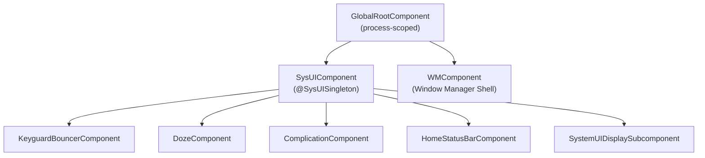

**GlobalRootComponent** is the top-level component.  It is bound to the
`Context` of the application and exposes the `SysUIComponent.Builder`:

```java
// frameworks/base/packages/SystemUI/src/com/android/systemui/dagger/
//   GlobalRootComponent.java
public interface GlobalRootComponent {
    interface Builder {
        @BindsInstance Builder context(Context context);
        @BindsInstance Builder instrumentationTest(@InstrumentationTest boolean test);
        GlobalRootComponent build();
    }

    WMComponent.Builder getWMComponentBuilder();
    SysUIComponent.Builder getSysUIComponent();
    InitializationChecker getInitializationChecker();
    @Main Looper getMainLooper();
}
```

**SysUIComponent** is the main subcomponent where most of SystemUI's singletons
live.  It installs a large number of Dagger modules:

```java
// frameworks/base/packages/SystemUI/src/com/android/systemui/dagger/
//   SysUIComponent.java
@SysUISingleton
@Subcomponent(modules = {
        DefaultComponentBinder.class,
        DependencyProvider.class,
        MultiUserUtilsModule.class,
        NotificationInsetsModule.class,
        QsFrameTranslateModule.class,
        ReferenceSystemUIModule.class,
        StartControlsStartableModule.class,
        StartBinderLoggerModule.class,
        SystemUIModule.class,
        SystemUICoreStartableModule.class,
        WallpaperModule.class})
public interface SysUIComponent {
    // ...
    Map<Class<?>, Provider<CoreStartable>> getStartables();
    @PerUser Map<Class<?>, Provider<CoreStartable>> getPerUserStartables();
}
```

The builder accepts shell interfaces from WMComponent, such as `Pip`,
`SplitScreen`, `Bubbles`, and `ShellTransitions`.  This is how SystemUI
integrates with the window manager shell process.

**SystemUIInitializer** orchestrates the Dagger graph construction:

```java
// frameworks/base/packages/SystemUI/src/com/android/systemui/SystemUIInitializer.java
public abstract class SystemUIInitializer {
    public void init(boolean fromTest) throws ExecutionException, InterruptedException {
        mRootComponent = getGlobalRootComponentBuilder()
                .context(mContext)
                .instrumentationTest(fromTest)
                .build();

        // Stand up WMComponent
        setupWmComponent(mContext);

        // Build SysUI, injecting Shell interfaces
        SysUIComponent.Builder builder = mRootComponent.getSysUIComponent();
        builder = prepareSysUIComponentBuilder(builder, mWMComponent)
                .setShell(mWMComponent.getShell())
                .setPip(mWMComponent.getPip())
                .setSplitScreen(mWMComponent.getSplitScreen())
                // ... more shell bindings
                ;
        mSysUIComponent = builder.build();

        Dependency dependency = mSysUIComponent.createDependency();
        dependency.start();
    }
}
```

### 47.1.3  CoreStartable -- The Service Lifecycle

Every major SystemUI feature is implemented as a `CoreStartable`.  This
interface defines the lifecycle that the application drives:

```
CoreStartable
  +-- start()          // Called once, in topological order
  +-- onBootCompleted()
  +-- isDumpCritical() // Included in bugreport CRITICAL section?
  +-- dump()           // For `adb shell dumpsys`
```

CoreStartables are registered in Dagger modules using multibinding:

```kotlin
// frameworks/base/packages/SystemUI/src/com/android/systemui/dagger/
//   SystemUICoreStartableModule.kt
@Module
abstract class SystemUICoreStartableModule {
    @Binds @IntoMap @ClassKey(KeyguardViewMediator::class)
    abstract fun bindKeyguardViewMediator(sysui: KeyguardViewMediator): CoreStartable

    @Binds @IntoMap @ClassKey(GlobalActionsComponent::class)
    abstract fun bindGlobalActionsComponent(sysui: GlobalActionsComponent): CoreStartable

    @Binds @IntoMap @ClassKey(WMShell::class)
    abstract fun bindWMShell(sysui: WMShell): CoreStartable

    // ... 30+ more bindings
}
```

The application starts them with a topological sort that respects declared
dependencies:

```java
// SystemUIApplicationImpl.java -- topological start loop
boolean startedAny = false;
ArrayDeque<Map.Entry<Class<?>, Provider<CoreStartable>>> queue;
ArrayDeque<Map.Entry<Class<?>, Provider<CoreStartable>>> nextQueue =
        new ArrayDeque<>(startables.entrySet());

do {
    startedAny = false;
    queue = nextQueue;
    nextQueue = new ArrayDeque<>(startables.size());
    while (!queue.isEmpty()) {
        Map.Entry<Class<?>, Provider<CoreStartable>> entry = queue.removeFirst();
        Class<?> cls = entry.getKey();
        Set<Class<? extends CoreStartable>> deps =
                mSysUIComponent.getStartableDependencies().get(cls);
        if (deps == null || startedStartables.containsAll(deps)) {
            mServices[i] = startStartable(clsName, entry.getValue());
            startedStartables.add(cls);
            startedAny = true;
        } else {
            nextQueue.add(entry);
        }
    }
} while (startedAny && !nextQueue.isEmpty());
```

If any startable's dependencies cannot be resolved, the process throws a
`RuntimeException` with details about which dependencies are missing.

### 47.1.4  Plugin System

SystemUI supports runtime extensibility through a plugin architecture.
Plugins are APKs that implement interfaces from the `plugin` source set:

```
frameworks/base/packages/SystemUI/plugin/src/com/android/systemui/plugins/
  qs/QSTile.java
  qs/QSFactory.java
  qs/QS.java
  GlobalActions.java
  VolumeDialogController.java
  ...
```

The `ExtensionController` discovers and loads plugins, with the
`GlobalActionsComponent` being a canonical example:

```java
// frameworks/base/packages/SystemUI/src/com/android/systemui/globalactions/
//   GlobalActionsComponent.java
@Override
public void start() {
    mExtension = mExtensionController.newExtension(GlobalActions.class)
            .withPlugin(GlobalActions.class)
            .withDefault(mGlobalActionsProvider::get)
            .withCallback(this::onExtensionCallback)
            .build();
    mPlugin = mExtension.get();
}
```

This pattern allows OEMs to replace the default power menu, volume dialog, or
QS tiles by shipping a plugin APK signed with the platform key.

### 47.1.5  Feature Flags

SystemUI uses Android's aconfig flag system for feature gating.  Flags are
defined in:

```
frameworks/base/packages/SystemUI/aconfig/
```

Code checks flags via generated accessors:

```java
import com.android.systemui.Flags;

if (Flags.predictiveBackAnimateShade()) {
    // new behavior
}
```

The QS pipeline has its own flag repository:

```kotlin
// frameworks/base/packages/SystemUI/src/com/android/systemui/qs/pipeline/shared/
//   QSPipelineFlagsRepository.kt
@SysUISingleton
class QSPipelineFlagsRepository @Inject constructor() {
    val tilesEnabled: Boolean
        get() = AconfigFlags.qsNewTiles()
}
```

### 47.1.6  Directory Structure

The following is an abbreviated listing of the 187+ sub-packages under
`src/com/android/systemui/`:

```
accessibility/    -- Magnification, floating menu
activity/         -- Activity lifecycle helpers
ambient/          -- Ambient display
authentication/   -- Device authentication domain layer
back/             -- Predictive back gesture
battery/          -- Battery state
biometrics/       -- Fingerprint, face, UDFPS
bluetooth/        -- Bluetooth QS tile data
bouncer/          -- Keyguard bouncer (MVI)
brightness/       -- Brightness slider
camera/           -- Camera access tracking
charging/         -- Charging animation
classifier/       -- Touch classifier (falsing)
clipboardoverlay/ -- Clipboard preview overlay
communal/         -- Communal (glanceable hub) mode
controls/         -- Device controls (home automation)
dagger/           -- DI components and modules
demomode/         -- Demo mode for screenshots
display/          -- Display management
doze/             -- Doze/AOD
dreams/           -- Screen saver (daydream)
flags/            -- Feature flag infrastructure
fragments/        -- Fragment host
globalactions/    -- Power menu
keyguard/         -- Lock screen
media/            -- Media controls, route picker
navigationbar/    -- Navigation bar and gesture nav
notifications/    -- Notification pipeline
plugins/          -- Plugin infrastructure
power/            -- Power domain layer
privacy/          -- Privacy indicators
qs/               -- Quick Settings
recents/          -- Recent apps
scene/            -- Scene container (next-gen UI)
screenshot/       -- Screenshot capture and editing
shade/            -- Notification shade
statusbar/        -- Status bar, icons, policies
volume/           -- Volume dialog
wallpapers/       -- Wallpaper management
wmshell/          -- WM Shell integration
```

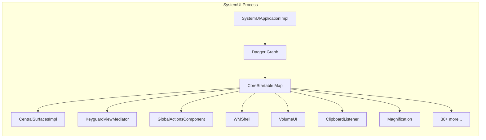

---

## 47.2  Status Bar

The status bar is the narrow strip at the top of the screen that displays the
clock, notification icons, battery level, signal strength, and system status
icons.  It is one of the first visual elements created during SystemUI startup.

### 47.2.1  CentralSurfaces -- The Orchestrator

`CentralSurfaces` is an interface extending both `CoreStartable` and
`LifecycleOwner`.  Its implementation, `CentralSurfacesImpl`, is a 3,291-line
class that historically served as the central coordinator for the status bar,
notification shade, keyguard, and more:

```java
// frameworks/base/packages/SystemUI/src/com/android/systemui/statusbar/phone/
//   CentralSurfaces.java
public interface CentralSurfaces extends Dumpable, LifecycleOwner, CoreStartable {
    String TAG = "CentralSurfaces";
    boolean SHOW_LOCKSCREEN_MEDIA_ARTWORK = true;
    long LAUNCH_TRANSITION_TIMEOUT_MS = 5000;
    // ...
}
```

`CentralSurfacesImpl` is injected with an enormous constructor -- it depends on
virtually every other SystemUI component.  It manages:

- Status bar window creation and positioning
- Notification shade expansion
- Keyguard/bouncer transitions
- Light bar (dark/light icon tinting)
- Biometric unlock animations
- Media artwork on lock screen
- Demo mode

The class is progressively being decomposed.  New code should depend on
narrower interfaces (e.g., `ShadeController`, `ShadeViewController`,
`KeyguardStateController`) rather than `CentralSurfaces` directly.

### 47.2.2  StatusBarWindowController

The status bar occupies a system window of type
`WindowManager.LayoutParams.TYPE_STATUS_BAR`.  Its window management is
encapsulated in `StatusBarWindowControllerImpl`:

```java
// frameworks/base/packages/SystemUI/src/com/android/systemui/statusbar/window/
//   StatusBarWindowControllerImpl.java
public class StatusBarWindowControllerImpl implements StatusBarWindowController {
    // Window type, insets configuration, cutout handling
}
```

Key aspects of the status bar window:

| Property | Value |
|---|---|
| Window type | `TYPE_STATUS_BAR` |
| Pixel format | `PixelFormat.TRANSLUCENT` |
| Cutout mode | `LAYOUT_IN_DISPLAY_CUTOUT_MODE_ALWAYS` |
| Gravity | `Gravity.TOP` |
| Flags | `FLAG_NOT_FOCUSABLE`, `FLAG_TOUCHABLE_WHEN_WAKING` |

The controller handles display cutouts (notches, punch-holes) and configures
`InsetsFrameProvider` so that the status bar participates in the inset system.
Applications receive `statusBars()` insets corresponding to the height of this
window.

### 47.2.3  CollapsedStatusBarFragment

The visible content of the status bar is managed by
`CollapsedStatusBarFragment`, a `Fragment` that inflates the
`R.layout.status_bar` layout:

```java
// frameworks/base/packages/SystemUI/src/com/android/systemui/statusbar/phone/
//   fragment/CollapsedStatusBarFragment.java
public class CollapsedStatusBarFragment extends Fragment
        implements CommandQueue.Callbacks,
                   StatusBarStateController.StateListener,
                   SystemStatusAnimationCallback {
    // Manages icon visibility, system event animations, ongoing call chip
}
```

The fragment listens to several signals:

- **CommandQueue.Callbacks** -- disable flags from `system_server` that hide icons
- **StatusBarStateController** -- state transitions (SHADE, KEYGUARD, SHADE_LOCKED)
- **SystemStatusAnimationCallback** -- animated chips for privacy indicators
- **ShadeExpansionStateManager** -- fading out icons during shade expansion

### 47.2.4  PhoneStatusBarView

`PhoneStatusBarView` is the root `View` of the collapsed status bar:

```java
// frameworks/base/packages/SystemUI/src/com/android/systemui/statusbar/phone/
//   PhoneStatusBarView.java
public class PhoneStatusBarView extends BaseStatusBarFrameLayout
        implements DarkReceiverImpl.DarkReceiver {
    // Touch handling, dark mode tinting
}
```

The view controller (`PhoneStatusBarViewController`) coordinates dark/light
icon tinting based on the underlying content, using region sampling to
determine whether the wallpaper or app content below the status bar is light or
dark.

### 47.2.5  Status Bar Icon Pipeline

Icons in the status bar flow through a multi-stage pipeline:

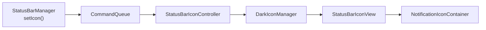

The `StatusBarIconController` maintains the list of icons and their visibility.
`DarkIconManager` applies tinting: white icons over dark backgrounds, dark
icons over light backgrounds.  The tinting boundary is computed by
`LightBarController` using the `Drawable` content of the window behind the
status bar.

### 47.2.6  Status Bar States

The status bar operates in several logical states managed by
`StatusBarStateControllerImpl`:

```java
// frameworks/base/packages/SystemUI/src/com/android/systemui/statusbar/
//   StatusBarState.java
public class StatusBarState {
    public static final int SHADE = 0;          // Normal unlocked
    public static final int KEYGUARD = 1;       // Lock screen
    public static final int SHADE_LOCKED = 2;   // Shade pulled down over keyguard
}
```

Transitions between states drive animations throughout SystemUI.  The state
controller broadcasts changes to all registered `StateListener` instances.

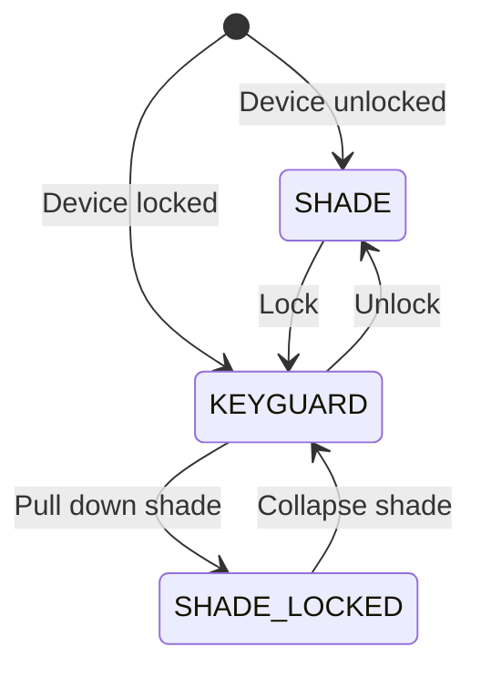

---

## 47.3  Notification Shade

The notification shade is the panel that slides down from the top of the
screen, revealing notifications and Quick Settings.  It is one of the most
complex UI components in Android.

### 47.3.1  Window Configuration

The notification shade occupies a separate window from the status bar.  Its
window type is `TYPE_NOTIFICATION_SHADE` (a special type that allows it to
receive input above other system windows):

```java
// frameworks/base/packages/SystemUI/src/com/android/systemui/shade/
//   NotificationShadeWindowControllerImpl.java
@SysUISingleton
public class NotificationShadeWindowControllerImpl
        implements NotificationShadeWindowController, Dumpable {
    // Manages the notification shade window parameters
    // Adjusts focus, touchability, and dimensions based on state
}
```

The window controller dynamically adjusts the window parameters based on the
current state:

| State | Window Behaviour |
|---|---|
| Shade collapsed | Not focusable, minimal height |
| Shade expanding | Expanding height, receives touch |
| Shade expanded | Full screen, focusable for remote input |
| Keyguard | Full screen, bouncer may be focusable |
| Dozing/AOD | Minimal, low power |

### 47.3.2  NotificationPanelViewController

At 4,329 lines, `NotificationPanelViewController` is the primary controller for
the shade panel.  It manages:

- Touch tracking and velocity-based expansion/collapse
- QS expansion within the shade
- Keyguard-specific behaviour (clock, notifications on lock screen)
- Split shade on large screens (notifications left, QS right)
- Blur effects during expansion

```java
// frameworks/base/packages/SystemUI/src/com/android/systemui/shade/
//   NotificationPanelViewController.java
public class NotificationPanelViewController
        implements Dumpable, ShadeViewController, ShadeSurface {
    // Handles all shade panel touch events and state transitions
}
```

Key touch handling flow:

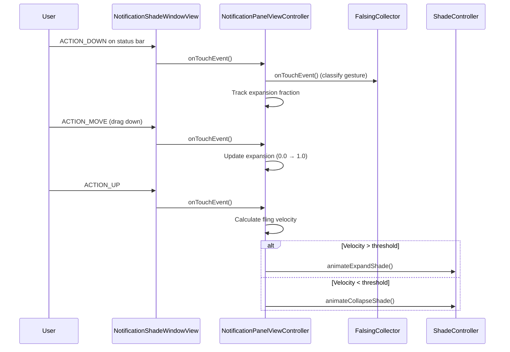

### 47.3.3  ShadeController

`ShadeController` is the interface that abstracts shade operations.  It extends
`CoreStartable`:

```java
// frameworks/base/packages/SystemUI/src/com/android/systemui/shade/
//   ShadeController.java
public interface ShadeController extends CoreStartable {
    boolean isShadeEnabled();
    void instantExpandShade();
    void instantCollapseShade();
    void animateCollapseShade(int flags, boolean force,
                              boolean delayed, float speedUpFactor);
    void animateExpandShade();
    void animateExpandQs();
    void cancelExpansionAndCollapseShade();
    boolean isShadeFullyOpen();
    boolean isExpandingOrCollapsing();
    void collapseShade();
    void collapseShadeForActivityStart();
    // ...
}
```

The default implementation is `ShadeControllerImpl`, while
`ShadeControllerSceneImpl` is the next-generation implementation for the scene
container architecture.

### 47.3.4  NotificationStackScrollLayout

The notification list is rendered by `NotificationStackScrollLayout`, a custom
`ViewGroup` that implements:

- Variable-height child views (notification rows)
- Over-scroll physics
- Dismissal gestures (swipe to dismiss)
- Grouping and section headers
- Heads-up notification insertion
- Shelf for overflow icons

Each notification row is an `ExpandableNotificationRow`, which itself contains
inflated notification views (contracted, expanded, heads-up variants).

### 47.3.5  Scrim Management

The scrim (dimming overlay) behind the shade is managed by `ScrimController`,
which handles multiple scrim layers:

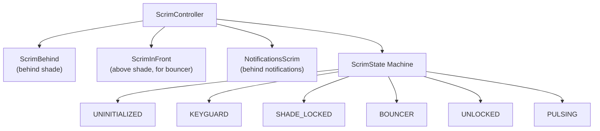

Each `ScrimState` defines alpha values and tint colours for the scrims.
Transitions between states animate these properties smoothly.

### 47.3.6  Lockscreen-to-Shade Transition

The `LockscreenShadeTransitionController` manages the drag-down gesture from
the lock screen into the shade.  It coordinates:

- QS expansion fraction
- Scrim alpha transitions
- Keyguard visibility
- Notification position interpolation

---

## 47.4  Quick Settings

Quick Settings (QS) is the tile grid accessible by pulling down the
notification shade.  The first pull shows a "Quick QS" strip of a few tiles;
a second pull expands to the full QS panel.

### 47.4.1  Architecture Overview

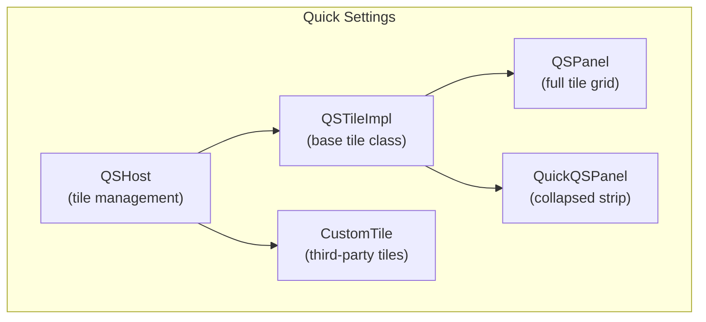

### 47.4.2  QSHost -- Tile Management

`QSHost` is the interface that manages the set of active QS tiles:

```java
// frameworks/base/packages/SystemUI/src/com/android/systemui/qs/QSHost.java
public interface QSHost {
    String TILES_SETTING = Settings.Secure.QS_TILES;

    static List<String> getDefaultSpecs(Resources res) {
        final ArrayList<String> tiles = new ArrayList();
        int resource = QsInCompose.isEnabled()
                ? R.string.quick_settings_tiles_new_default
                : R.string.quick_settings_tiles_default;
        final String defaultTileList = res.getString(resource);
        tiles.addAll(Arrays.asList(defaultTileList.split(",")));
        return tiles;
    }

    Collection<QSTile> getTiles();
    void addTile(String spec);
    void addTile(String spec, int requestPosition);
    void addTile(ComponentName tile);
    void removeTile(String tileSpec);
    QSTile createTile(String tileSpec);
    void changeTilesByUser(List<String> previousTiles, List<String> newTiles);
}
```

The tile configuration is stored in `Settings.Secure.QS_TILES` as a
comma-separated list of tile specs (e.g., `"wifi,bt,flashlight,rotation"`).
The default set is defined in a string resource, which OEMs commonly overlay.

### 47.4.3  QSTile Interface

Every QS tile implements the `QSTile` plugin interface:

```java
// frameworks/base/packages/SystemUI/plugin/src/com/android/systemui/plugins/qs/
//   QSTile.java
@ProvidesInterface(version = QSTile.VERSION)
public interface QSTile {
    int VERSION = 5;

    String getTileSpec();
    boolean isAvailable();
    void refreshState();
    void click(@Nullable Expandable expandable);
    void secondaryClick(@Nullable Expandable expandable);
    void longClick(@Nullable Expandable expandable);
    @NonNull State getState();
    CharSequence getTileLabel();
    void setListening(Object client, boolean listening);
    void destroy();
}
```

The `State` inner class carries all visual state:

| Field | Description |
|---|---|
| `state` | `Tile.STATE_ACTIVE`, `STATE_INACTIVE`, `STATE_UNAVAILABLE` |
| `icon` | Drawable or resource |
| `label` | Primary text |
| `secondaryLabel` | Secondary text (e.g., network name) |
| `contentDescription` | Accessibility |
| `dualTarget` | Whether long press has a separate action |

### 47.4.4  QSTileImpl -- Base Implementation

`QSTileImpl` is the abstract base class for built-in tiles:

```java
// frameworks/base/packages/SystemUI/src/com/android/systemui/qs/tileimpl/
//   QSTileImpl.java
public abstract class QSTileImpl<TState extends State>
        implements QSTile, LifecycleOwner, Dumpable {

    protected final QSHost mHost;
    private static final long DEFAULT_STALE_TIMEOUT = 10 * DateUtils.MINUTE_IN_MILLIS;

    // Subclasses must implement:
    // - newTileState()
    // - handleClick()
    // - handleUpdateState(TState state, Object arg)
    // - getLongClickIntent()
    // - getTileLabel()
}
```

State management runs on a background looper.  The flow is:

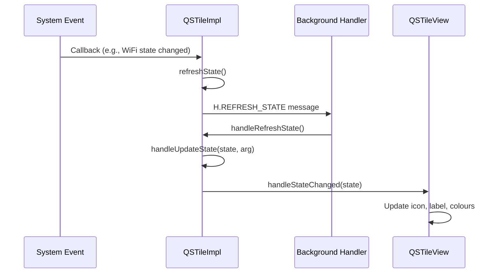

### 47.4.5  Built-in Tiles

AOSP ships approximately 35 built-in QS tiles:

```
frameworks/base/packages/SystemUI/src/com/android/systemui/qs/tiles/
  AirplaneModeTile.java        LocationTile.java
  AlarmTile.kt                 MicrophoneToggleTile.java
  BatterySaverTile.java        MobileDataTile.kt
  BluetoothTile.java           ModesDndTile.kt
  CameraToggleTile.java        NfcTile.java
  CastTile.java                NightDisplayTile.java
  ColorCorrectionTile.java     NotesTile.kt
  ColorInversionTile.java      OneHandedModeTile.java
  DataSaverTile.java           QRCodeScannerTile.java
  DeviceControlsTile.kt        QuickAccessWalletTile.java
  DreamTile.java               ReduceBrightColorsTile.java
  FlashlightTile.java          RotationLockTile.java
  FontScalingTile.kt           ScreenRecordTile.java
  HearingDevicesTile.java      UiModeNightTile.java
  HotspotTile.java             WifiTile.kt
  InternetTileNewImpl.kt       WorkModeTile.java
```

Each tile follows the same pattern.  Here is `FlashlightTile` as a
representative example:

```java
// frameworks/base/packages/SystemUI/src/com/android/systemui/qs/tiles/
//   FlashlightTile.java
public class FlashlightTile extends QSTileImpl<BooleanState>
        implements FlashlightController.FlashlightListener {

    public static final String TILE_SPEC = "flashlight";
    private final FlashlightController mFlashlightController;

    @Inject
    public FlashlightTile(
            QSHost host,
            QsEventLogger uiEventLogger,
            @Background Looper backgroundLooper,
            @Main Handler mainHandler,
            FalsingManager falsingManager,
            MetricsLogger metricsLogger,
            StatusBarStateController statusBarStateController,
            ActivityStarter activityStarter,
            QSLogger qsLogger,
            FlashlightController flashlightController) {
        super(host, uiEventLogger, backgroundLooper, mainHandler,
                falsingManager, metricsLogger, statusBarStateController,
                activityStarter, qsLogger);
        mFlashlightController = flashlightController;
        mFlashlightController.observe(getLifecycle(), this);
    }
}
```

Modern tiles like `WifiTile` use a layered architecture with domain
interactors:

```kotlin
// frameworks/base/packages/SystemUI/src/com/android/systemui/qs/tiles/
//   WifiTile.kt
class WifiTile @Inject constructor(
    private val host: QSHost,
    // ...
    private val dataInteractor: WifiTileDataInteractor,
    private val tileMapper: WifiTileMapper,
    private val userActionInteractor: WifiTileUserActionInteractor,
) : QSTileImpl<QSTile.State?>(/* ... */) {
    // Data flows through interactor -> mapper -> view
}
```

### 47.4.6  Custom Tiles (Third-Party)

Third-party apps can add QS tiles by implementing
`android.service.quicksettings.TileService`.  SystemUI manages these through
`CustomTile`:

```java
// frameworks/base/packages/SystemUI/src/com/android/systemui/qs/external/
//   CustomTile.java
public class CustomTile extends QSTileImpl<State>
        implements TileChangeListener, CustomTileInterface {
    public static final String PREFIX = "custom(";
    // Tile spec format: "custom(com.example.app/.MyTileService)"
}
```

The lifecycle of a custom tile is managed by `TileLifecycleManager`, which
binds to the third-party `TileService` and manages the `IQSTileService`
interface.  `TileServiceManager` throttles bindings to prevent resource
exhaustion.

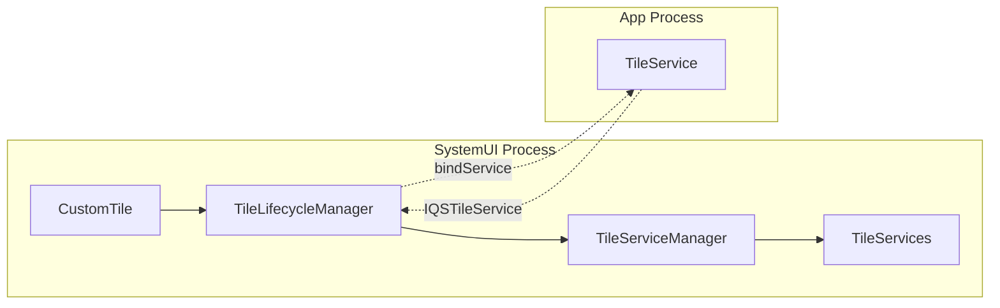

### 47.4.7  Auto-Add Tiles

Some tiles are automatically added when certain conditions are met (e.g., the
Work Profile tile appears when a managed profile is created).  This logic is
implemented in the QS pipeline's data layer:

```
frameworks/base/packages/SystemUI/src/com/android/systemui/qs/pipeline/
  data/    -- Repositories for tile data and auto-add rules
  domain/  -- Interactors for tile lifecycle
  shared/  -- Shared flags and models
```

### 47.4.8  QSPanel Layout

The full QS panel uses `QSPanel` with `TileLayout` (or `PagedTileLayout` for
pagination).  The Quick QS strip uses `QuickQSPanel` with `QuickTileLayout`.
Both are managed by their respective controllers (`QSPanelController`,
`QuickQSPanelController`).

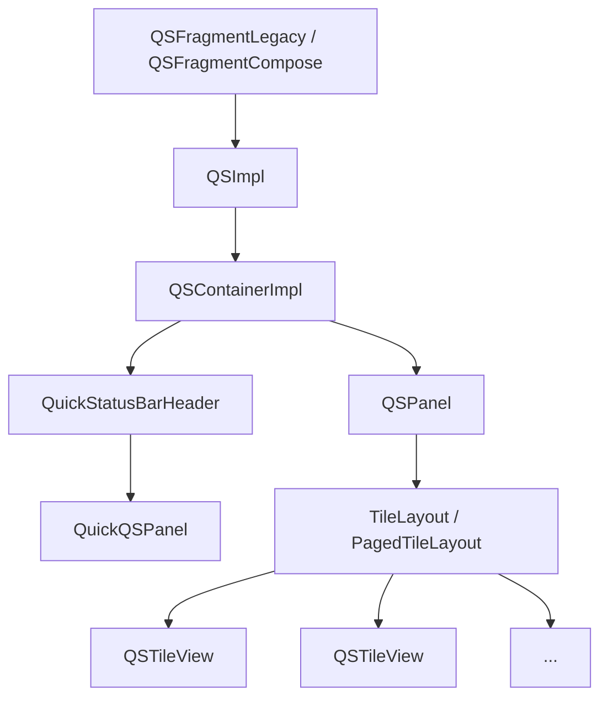

---

## 47.5  Lock Screen

The lock screen (keyguard) is a critical security surface.  It must display
before any user content is visible and must correctly manage authentication
(PIN, pattern, password, biometrics).

### 47.5.1  KeyguardViewMediator

`KeyguardViewMediator` is the largest CoreStartable in SystemUI at 4,573 lines.
It mediates between the `KeyguardService` (which receives lock/unlock commands
from the framework) and the keyguard UI:

```java
// frameworks/base/packages/SystemUI/src/com/android/systemui/keyguard/
//   KeyguardViewMediator.java
public class KeyguardViewMediator implements CoreStartable, Dumpable {
    // Manages keyguard lifecycle: show, hide, dismiss, lock
}
```

Key responsibilities:

| Responsibility | Description |
|---|---|
| Lock timeout | Schedules lock after screen-off timeout |
| Keyguard sounds | Lock/unlock sound effects |
| SIM PIN handling | Prompts for SIM unlock |
| Trust agents | Integrates with Smart Lock |
| Occlusion | Handles activities shown over keyguard |
| Unlock animation | Coordinates the unlock transition |

The mediator receives callbacks from `system_server` through
`ViewMediatorCallback`:

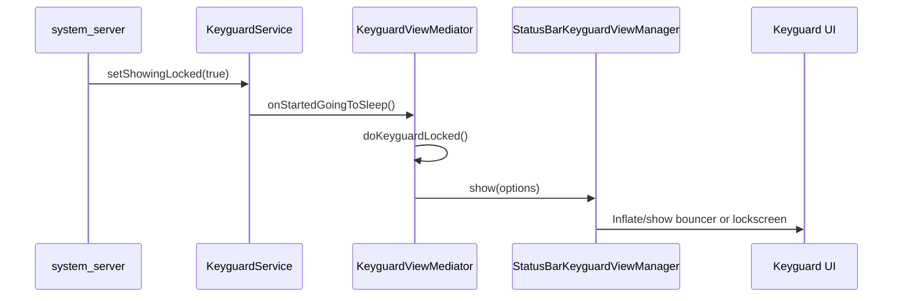

### 47.5.2  StatusBarKeyguardViewManager

`StatusBarKeyguardViewManager` bridges the mediator and the actual keyguard
views.  It manages the primary bouncer (PIN/pattern/password input), the
alternate bouncer (biometric prompt), and the keyguard-to-shade transitions:

```java
// frameworks/base/packages/SystemUI/src/com/android/systemui/statusbar/phone/
//   StatusBarKeyguardViewManager.java
@SysUISingleton
public class StatusBarKeyguardViewManager implements Dumpable {
    // Manages bouncer visibility, predictive back animation,
    // alternate bouncer, global actions visibility
}
```

It interacts with several domain interactors from the new MVI architecture:

- `PrimaryBouncerInteractor` -- shows/hides the PIN/pattern/password bouncer
- `AlternateBouncerInteractor` -- manages the biometric (UDFPS) bouncer
- `KeyguardDismissActionInteractor` -- handles dismiss actions after unlock
- `KeyguardTransitionInteractor` -- tracks keyguard state transitions

### 47.5.3  Bouncer

The bouncer is the security challenge (PIN, pattern, or password).  Its
implementation lives in:

```
frameworks/base/packages/SystemUI/src/com/android/systemui/bouncer/
  data/repository/BouncerRepositoryModule.kt
  domain/interactor/BouncerInteractor.kt
  domain/interactor/PrimaryBouncerInteractor.kt
  domain/interactor/AlternateBouncerInteractor.kt
  domain/startable/BouncerStartable.kt
  ui/BouncerView.kt
```

The bouncer follows the MVI pattern:

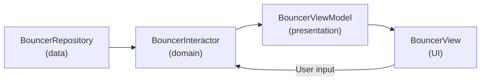

### 47.5.4  AOD (Always-On Display) Integration

When the device is dozing, the lock screen transitions to Always-On Display
mode.  This is coordinated by:

- **DozeServiceHost** -- bridges the `DreamService`-based doze with SystemUI
- **DozeScrimController** -- manages scrim opacity during doze
- **DozeParameters** -- configuration (pulse on notification, tap-to-check)

The keyguard state machine includes AOD-specific transitions:

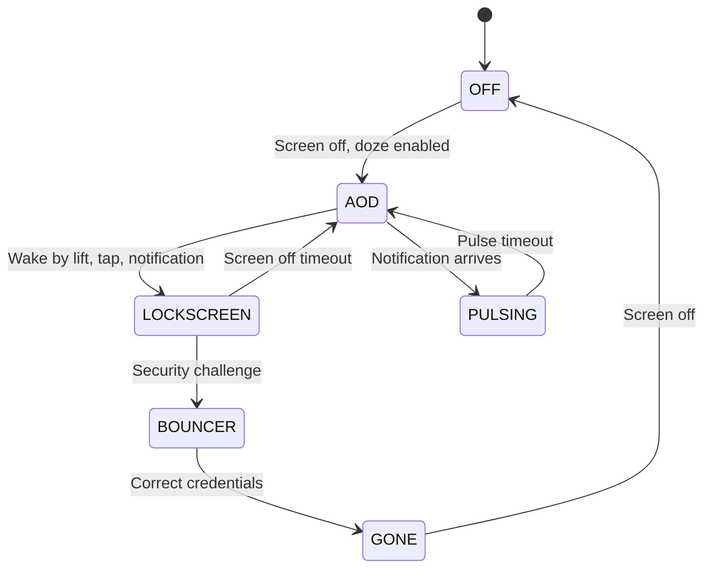

### 47.5.5  Lock Screen Customization

The lock screen supports:

- **Clock customization** -- pluggable clock faces via `ClockRegistryModule`
- **Quick affordances** -- shortcuts on the lock screen corners (camera, wallet)
- **Complication** -- weather, date, battery on AOD
- **Wallpaper** -- distinct lock screen wallpaper
- **Communal (Glanceable Hub)** -- widget surface accessible from lock screen

---

## 47.6  Recent Apps

SystemUI does not implement the Recents UI directly.  Instead, it delegates
to Launcher3 (or a Launcher-based quickstep implementation) through the
`OverviewProxy` pattern.

### 47.6.1  Recents Architecture

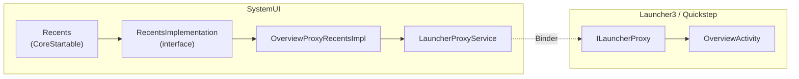

### 47.6.2  OverviewProxyRecentsImpl

The default `RecentsImplementation` proxies all calls to Launcher:

```java
// frameworks/base/packages/SystemUI/src/com/android/systemui/recents/
//   OverviewProxyRecentsImpl.java
@SysUISingleton
public class OverviewProxyRecentsImpl implements RecentsImplementation {

    @Override
    public void showRecentApps(boolean triggeredFromAltTab) {
        ILauncherProxy launcherProxy = mLauncherProxyService.getProxy();
        if (launcherProxy != null) {
            try {
                launcherProxy.onOverviewShown(triggeredFromAltTab);
            } catch (RemoteException e) {
                Log.e(TAG, "Failed to send overview show event to launcher.", e);
            }
        }
    }

    @Override
    public void toggleRecentApps() {
        ILauncherProxy launcherProxy = mLauncherProxyService.getProxy();
        if (launcherProxy != null) {
            final Runnable toggleRecents = () -> {
                try {
                    mLauncherProxyService.getProxy().onOverviewToggle();
                    mLauncherProxyService.notifyToggleRecentApps();
                } catch (RemoteException e) {
                    Log.e(TAG, "Cannot send toggle recents through proxy service.", e);
                }
            };
            if (mKeyguardStateController.isShowing()) {
                mActivityStarter.executeRunnableDismissingKeyguard(
                        () -> mHandler.post(toggleRecents), null, true, false, true);
            } else {
                toggleRecents.run();
            }
        }
    }
}
```

### 47.6.3  LauncherProxyService

The `LauncherProxyService` maintains the binder connection to Launcher's
overview implementation.  When the user swipes up from the navigation bar,
SystemUI routes the gesture to Launcher, which renders the task thumbnails and
handles task switching.

### 47.6.4  RecentsModule

The Dagger module binds the implementation:

```java
// frameworks/base/packages/SystemUI/src/com/android/systemui/recents/
//   RecentsModule.java
@Module
public abstract class RecentsModule {
    @Binds
    abstract RecentsImplementation bindRecentsImplementation(
            OverviewProxyRecentsImpl impl);
}
```

---

## 47.7  Volume Dialog

The volume dialog appears when the user presses hardware volume keys or when
system volume changes programmatically.

### 47.7.1  VolumeDialogControllerImpl

The controller is the source of truth for volume state.  It runs on a dedicated
background thread:

```java
// frameworks/base/packages/SystemUI/src/com/android/systemui/volume/
//   VolumeDialogControllerImpl.java
@SysUISingleton
public class VolumeDialogControllerImpl implements VolumeDialogController, Dumpable {
    // All work done on a dedicated background worker thread
    // Methods ending in "W" must be called on the worker thread
}
```

The controller:

- Registers an `IVolumeController` callback with `AudioManager`
- Tracks state for multiple audio streams (MUSIC, RING, ALARM, VOICE_CALL, ACCESSIBILITY)
- Monitors ringer mode (normal, vibrate, silent)
- Tracks DND (Do Not Disturb) state
- Manages media sessions for per-app volume

### 47.7.2  VolumeDialogImpl

The dialog UI is implemented as a `Dialog` with a custom layout:

```java
// frameworks/base/packages/SystemUI/src/com/android/systemui/volume/
//   VolumeDialogImpl.java  (2,859 lines)
public class VolumeDialogImpl implements VolumeDialog {
    // Window type: TYPE_VOLUME_OVERLAY
    // Displays seekbars for active audio streams
    // Handles ringer mode toggle (ring -> vibrate -> silent)
}
```

The dialog uses a vertical layout with one `SeekBar` per active stream:

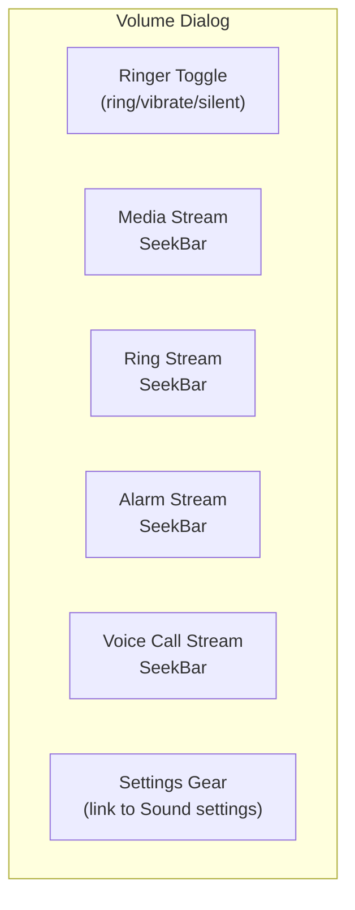

Key features:

| Feature | Implementation |
|---|---|
| Auto-dismiss | Timeout handler (default 3 seconds) |
| Live feedback | Updates as system volume changes |
| CSD warning | `CsdWarningDialog` for hearing safety |
| Safety warning | `SafetyWarningDialog` for media volume |
| Captions toggle | `CaptionsToggleImageButton` |
| Posture-aware | Dismiss on foldable posture change |

### 47.7.3  VolumeDialogComponent

`VolumeDialogComponent` wires the controller and dialog together as a
`CoreStartable`:

```java
// frameworks/base/packages/SystemUI/src/com/android/systemui/volume/
//   VolumeDialogComponent.java
public class VolumeDialogComponent implements VolumeComponent {
    // Integates VolumeDialogControllerImpl with VolumeDialogImpl
}
```

### 47.7.4  Volume Events

The `Events` class defines all volume-related telemetry events:

```java
// frameworks/base/packages/SystemUI/src/com/android/systemui/volume/Events.java
public class Events {
    public static final int EVENT_SHOW_DIALOG = 0;
    public static final int EVENT_DISMISS_DIALOG = 1;
    public static final int EVENT_ACTIVE_STREAM_CHANGED = 2;
    public static final int EVENT_LEVEL_CHANGED = 3;
    public static final int EVENT_RINGER_TOGGLE = 4;
    // ...
    public static final int DISMISS_REASON_SETTINGS_CLICKED = 7;
    public static final int DISMISS_REASON_POSTURE_CHANGED = 12;
}
```

---

## 47.8  Power Menu

The power menu (Global Actions) appears when the user long-presses the power
button.  It provides options to power off, restart, emergency call, and
optionally lockdown.

### 47.8.1  GlobalActionsComponent

`GlobalActionsComponent` is the CoreStartable entry point.  It uses the plugin
extension pattern to allow OEM replacement:

```java
// frameworks/base/packages/SystemUI/src/com/android/systemui/globalactions/
//   GlobalActionsComponent.java
@SysUISingleton
public class GlobalActionsComponent
        implements CoreStartable, Callbacks, GlobalActionsManager {

    @Override
    public void start() {
        mBarService = IStatusBarService.Stub.asInterface(
                ServiceManager.getService(Context.STATUS_BAR_SERVICE));
        mExtension = mExtensionController.newExtension(GlobalActions.class)
                .withPlugin(GlobalActions.class)
                .withDefault(mGlobalActionsProvider::get)
                .withCallback(this::onExtensionCallback)
                .build();
        mPlugin = mExtension.get();
        mCommandQueue.addCallback(this);
    }

    @Override
    public void handleShowGlobalActionsMenu() {
        mStatusBarKeyguardViewManager.setGlobalActionsVisible(true);
        mExtension.get().showGlobalActions(this);
    }

    @Override
    public void shutdown() {
        mBarService.shutdown();
    }

    @Override
    public void reboot(boolean safeMode) {
        mBarService.reboot(safeMode);
    }
}
```

### 47.8.2  GlobalActionsImpl

The default plugin implementation:

```java
// frameworks/base/packages/SystemUI/src/com/android/systemui/globalactions/
//   GlobalActionsImpl.java
public class GlobalActionsImpl implements GlobalActions, CommandQueue.Callbacks {

    @Override
    public void showGlobalActions(GlobalActionsManager manager) {
        if (mDisabled) return;
        mGlobalActionsDialog.showOrHideDialog(
                mKeyguardStateController.isShowing(),
                mDeviceProvisionedController.isDeviceProvisioned(),
                null /* view */,
                mContext.getDisplayId());
    }

    @Override
    public void showShutdownUi(boolean isReboot, String reason) {
        mShutdownUi.showShutdownUi(isReboot, reason);
        mShadeController.instantCollapseShade();
    }

    @Override
    public void disable(int displayId, int state1, int state2, boolean animate) {
        final boolean disabled = (state2 & DISABLE2_GLOBAL_ACTIONS) != 0;
        if (displayId != mContext.getDisplayId() || disabled == mDisabled) return;
        mDisabled = disabled;
        if (disabled) {
            mGlobalActionsDialog.dismissDialog();
        }
    }
}
```

### 47.8.3  GlobalActionsDialogLite

At 3,043 lines, `GlobalActionsDialogLite` implements the actual power menu
dialog:

```java
// frameworks/base/packages/SystemUI/src/com/android/systemui/globalactions/
//   GlobalActionsDialogLite.java
// Window type: TYPE_STATUS_BAR_SUB_PANEL
// Layout mode: LAYOUT_IN_DISPLAY_CUTOUT_MODE_ALWAYS
```

The dialog dynamically builds its action list based on device capabilities:

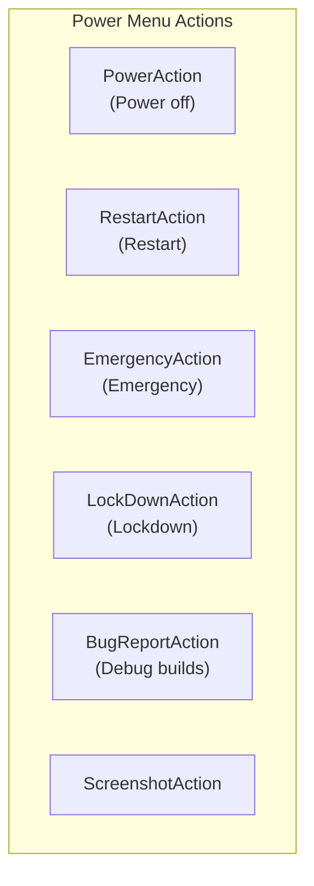

Action availability depends on:

| Condition | Effect |
|---|---|
| Device provisioned | All actions available |
| Keyguard showing | May restrict some actions |
| User lockdown | Changes lockdown button text |
| Airplane mode | Affects emergency dialer |
| Telephony available | Controls emergency action |
| Debug build | Enables bug report action |

### 47.8.4  ShutdownUi

When a shutdown or reboot is initiated, `ShutdownUi` displays a full-screen
progress animation while the system shuts down.  The shade is instantly
collapsed to prevent interaction during the shutdown sequence.

### 47.8.5  Power Menu Layouts

Multiple layout classes support different screen configurations:

```
GlobalActionsColumnLayout.java   -- Vertical column (phones, portrait)
GlobalActionsFlatLayout.java     -- Horizontal row
GlobalActionsGridLayout.java     -- Grid (tablets)
GlobalActionsLayoutLite.java     -- Base layout logic
GlobalActionsPowerDialog.java    -- Power-specific dialog variant
```

---

## 47.9  Screenshots

The screenshot system captures the screen content, displays a preview, and
provides editing/sharing actions.

### 47.9.1  TakeScreenshotService

Screenshot requests arrive from `system_server` via `TakeScreenshotService`,
a bound service:

```java
// frameworks/base/packages/SystemUI/src/com/android/systemui/screenshot/
//   TakeScreenshotService.java
public class TakeScreenshotService extends Service {
    // Receives screenshot requests from PhoneWindowManager
    // Routes to appropriate handler (headless or interactive)
}
```

### 47.9.2  ScreenshotController

`ScreenshotController` (Kotlin, using `@AssistedInject`) manages the entire
screenshot flow:

```kotlin
// frameworks/base/packages/SystemUI/src/com/android/systemui/screenshot/
//   ScreenshotController.kt
class ScreenshotController @AssistedInject internal constructor(
    appContext: Context,
    screenshotWindowFactory: ScreenshotWindow.Factory,
    viewProxyFactory: ScreenshotShelfViewProxy.Factory,
    screenshotNotificationsControllerFactory:
        ScreenshotNotificationsController.Factory,
    screenshotActionsControllerFactory:
        ScreenshotActionsController.Factory,
    actionExecutorFactory: ActionExecutor.Factory,
    private val screenshotSoundController: ScreenshotSoundController,
    private val uiEventLogger: UiEventLogger,
    private val imageExporter: ImageExporter,
    private val imageCapture: ImageCapture,
    private val scrollCaptureExecutor: ScrollCaptureExecutor,
    // ...
    @Assisted private val display: Display,
) : InteractiveScreenshotHandler {
```

### 47.9.3  Screenshot Flow

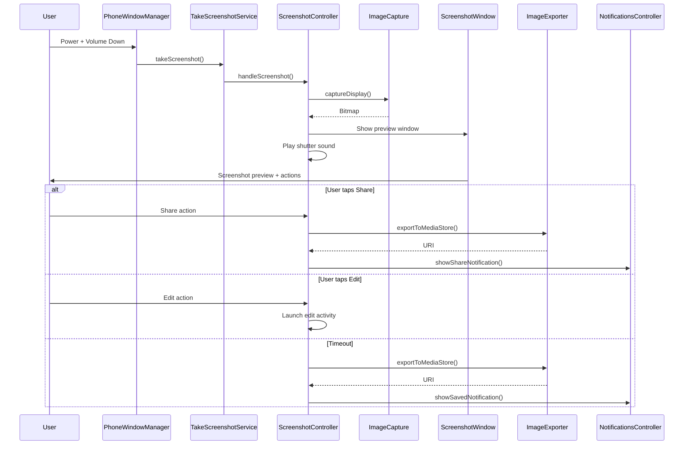

### 47.9.4  Screenshot Components

| Component | Role |
|---|---|
| `ImageCapture` / `ImageCaptureImpl` | Captures screen content as a `Bitmap` |
| `ScreenshotWindow` | Manages the preview overlay window |
| `ScreenshotShelfViewProxy` | Preview shelf UI (thumbnail + actions) |
| `ImageExporter` | Saves to `MediaStore` |
| `ScreenshotNotificationsController` | Shows save/share notifications |
| `ScreenshotSoundController` | Plays camera shutter sound |
| `ScrollCaptureExecutor` | Long/scrolling screenshot capture |
| `ScreenshotDetectionController` | Notifies apps of screenshot capture |
| `MessageContainerController` | Shows work profile messages |
| `TimeoutHandler` | Auto-dismisses after timeout |
| `ScreenshotActionsController` | Manages action buttons (share, edit) |
| `ActionIntentCreator` | Creates intents for share/edit |

### 47.9.5  Long Screenshots

The scroll capture system enables capturing content beyond the visible
viewport.  `ScrollCaptureExecutor` communicates with the app's
`ScrollCaptureCallback` to progressively capture tiles of content, which are
then stitched together into a single image.

### 47.9.6  Cross-Profile Screenshots

`ScreenshotCrossProfileService` handles screenshots that involve managed
profile content, using `ICrossProfileService` to proxy operations across
user boundaries.

---

## 47.10  Multi-Display SystemUI

Modern Android supports multiple displays (external monitors, foldables with
two screens, automotive secondary displays).  SystemUI must render appropriate
UI on each display.

### 47.10.1  PerDisplayRepository Pattern

The `PerDisplayRepository<T>` pattern (from `com.android.app.displaylib`)
maintains per-display instances of components:

```kotlin
// frameworks/base/packages/SystemUI/src/com/android/systemui/dagger/
//   PerDisplayRepositoriesModule.kt
@Module
interface PerDisplayRepositoriesModule {
    companion object {
        @SysUISingleton
        @Provides
        fun provideSysUiStateRepository(
            repositoryFactory: PerDisplayInstanceRepositoryImpl.Factory<SysUiState>,
            instanceProvider: SysUIStateInstanceProvider,
        ): PerDisplayRepository<SysUiState> {
            val debugName = "SysUiStatePerDisplayRepo"
            return if (ShadeWindowGoesAround.isEnabled) {
                repositoryFactory.create(debugName, instanceProvider)
            } else {
                DefaultDisplayOnlyInstanceRepositoryImpl(debugName, instanceProvider)
            }
        }
    }
}
```

When the `ShadeWindowGoesAround` flag is enabled, components like `SysUiState`
are instantiated per-display.  Otherwise, they fall back to default-display-only
behaviour.

### 47.10.2  Per-Display Status Bar

The status bar window controller uses `StatusBarWindowControllerStore` to
manage per-display instances:

```
frameworks/base/packages/SystemUI/src/com/android/systemui/statusbar/window/
  StatusBarWindowControllerStore.kt    -- Store for per-display controllers
  StatusBarWindowControllerImpl.java   -- Per-display window management
  StatusBarWindowStateController.kt    -- Per-display window state tracking
```

Each display gets its own status bar window with appropriate insets and
cutout handling.

### 47.10.3  Per-Display Navigation Bar

`NavigationBarControllerImpl` manages navigation bars on all displays:

```java
// frameworks/base/packages/SystemUI/src/com/android/systemui/navigationbar/
//   NavigationBarControllerImpl.java
@SysUISingleton
public class NavigationBarControllerImpl implements
        ConfigurationController.ConfigurationListener,
        NavigationModeController.ModeChangedListener,
        Dumpable, NavigationBarController {

    private final SparseArray<NavigationBar> mNavigationBars = new SparseArray<>();
    // SparseArray keyed by display ID
}
```

When a new display is added, `createNavigationBar()` is called.  When removed,
`removeNavigationBar()` cleans up.

### 47.10.4  Display Subcomponent

The `SystemUIDisplaySubcomponent` provides display-scoped dependencies:

```
frameworks/base/packages/SystemUI/src/com/android/systemui/display/
  dagger/SystemUIDisplaySubcomponent.java
  data/repository/DisplayComponentRepository.kt
```

Each display gets its own coroutine scope, configuration controller, and
set of display-aware UI components.

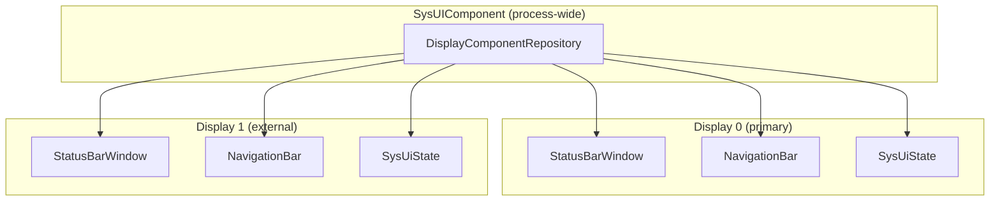

### 47.10.5  Connected Displays

The `StatusBarConnectedDisplays` flag gates the expansion of status bar
functionality to connected displays.  When enabled, `CollapsedStatusBarFragment`
instances are created per-display, each with its own icon pipeline and
visibility management.

---

## 47.11  Navigation Bar

The navigation bar provides the system navigation controls at the bottom (or
side) of the screen.  It supports three modes: 3-button, 2-button, and fully
gestural.

### 47.11.1  Navigation Mode Controller

`NavigationModeController` tracks the current navigation mode, which is
determined by an overlay package:

```java
// frameworks/base/packages/SystemUI/src/com/android/systemui/navigationbar/
//   NavigationModeController.java
@SysUISingleton
public class NavigationModeController implements Dumpable {
    public interface ModeChangedListener {
        void onNavigationModeChanged(int mode);
    }
    // Reads navigation mode from overlay applied to
    // com.android.internal.R.integer.config_navBarInteractionMode
}
```

The three modes are defined in `WindowManagerPolicyConstants`:

| Mode | Constant | Description |
|---|---|---|
| 3-button | `NAV_BAR_MODE_3BUTTON` | Back, Home, Recents buttons |
| 2-button | `NAV_BAR_MODE_2BUTTON` | Back gesture + Home pill |
| Gestural | `NAV_BAR_MODE_GESTURAL` | Full gesture navigation |

### 47.11.2  NavigationBarView

`NavigationBarView` is the root view for the navigation bar:

```java
// frameworks/base/packages/SystemUI/src/com/android/systemui/navigationbar/views/
//   NavigationBarView.java
public class NavigationBarView extends FrameLayout
        implements Gefingerpoken {
    // Contains ButtonDispatchers for Home, Back, Recents
    // Manages rotation, layout direction, and button visibility
}
```

The view uses `ButtonDispatcher` to abstract button behaviour across different
button implementations (physical, software, or gesture targets):

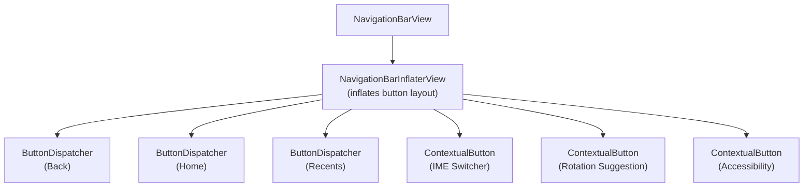

### 47.11.3  NavigationBarInflaterView

The button layout is defined by a string spec that
`NavigationBarInflaterView` parses:

```
// Default 3-button layout spec:
"back[1.0];home;recent[1.0]"

// 2-button layout spec:
"back[1.0];home;contextual[1.0]"

// Gestural layout (minimal):
"home_handle"
```

This allows OEMs to customise button order and sizes through overlays.

### 47.11.4  Gesture Navigation

In gestural mode, the navigation bar is replaced by a thin home indicator
handle.  Navigation gestures are handled by `EdgeBackGestureHandler`:

```java
// frameworks/base/packages/SystemUI/src/com/android/systemui/navigationbar/
//   gestural/EdgeBackGestureHandler.java
public class EdgeBackGestureHandler implements DisplayManager.DisplayListener,
        NavigationModeController.ModeChangedListener {
    // Handles edge swipe gestures for back navigation
    // Manages gesture exclusion zones
    // Integrates with predictive back animation
}
```

The gesture system:

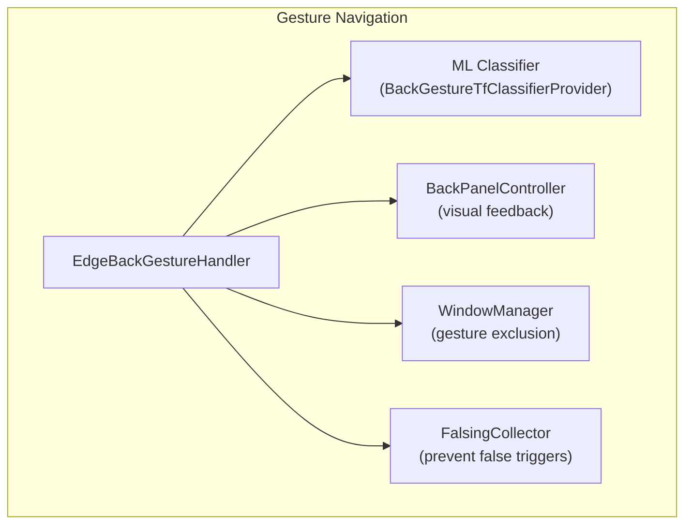

Edge back gesture detection:

1. The handler registers an input monitor for the display edges
2. When a touch starts within the edge zone (typically 24dp), tracking begins
3. A TensorFlow Lite classifier evaluates whether the gesture is a back swipe
   or an app gesture (e.g., drawer open)
4. If classified as back, the `BackPanelController` shows the visual arrow
5. The gesture is dispatched as a `BackEvent` to the focused window
6. If predictive back is enabled, the app can animate in response

### 47.11.5  DisplayBackGestureHandler

For multi-display support, `DisplayBackGestureHandler` wraps the per-display
gesture handling:

```kotlin
// frameworks/base/packages/SystemUI/src/com/android/systemui/navigationbar/
//   gestural/DisplayBackGestureHandler.kt
// Per-display back gesture handling
```

### 47.11.6  NavigationBarTransitions

`NavigationBarTransitions` manages the visual transitions of the navigation
bar between modes:

```
// Transition modes:
MODE_OPAQUE         -- Solid background (default)
MODE_SEMI_TRANSPARENT  -- Partially transparent
MODE_TRANSLUCENT    -- Fully transparent with scrim
MODE_LIGHTS_OUT     -- Dimmed (immersive mode)
MODE_TRANSPARENT    -- Fully transparent
```

### 47.11.7  Taskbar Integration

On large screens (tablets, foldables), the traditional navigation bar may be
replaced by a taskbar provided by Launcher.  `TaskbarDelegate` in SystemUI
coordinates with the Launcher-provided taskbar:

```java
// frameworks/base/packages/SystemUI/src/com/android/systemui/navigationbar/
//   TaskbarDelegate.java
public class TaskbarDelegate implements // ...
    // Routes navigation bar callbacks to the Launcher taskbar
    // Falls back to traditional nav bar when Launcher is unavailable
```

The `enableTaskbarOnPhones` feature flag controls whether the taskbar is also
available on phone form factors.

---

## 47.12  Monet / Dynamic Color / Material You

Android 12 introduced **Material You**, a design language where the entire
system UI derives its colour palette from the user's wallpaper.  The engine
behind this is called **Monet** -- a colour-science pipeline that extracts a
seed colour from `WallpaperColors`, generates tonal palettes through the
Material Color Utilities library, and applies the resulting colours as
fabricated resource overlays across every package.

### 47.12.1  End-to-End Pipeline

```mermaid
graph TB
    subgraph "Wallpaper Stack"
        WP[WallpaperManager]
        WC["WallpaperColors<br/>Primary / Secondary / Tertiary<br/>+ allColors population map"]
    end

    subgraph "SystemUI -- ThemeOverlayController"
        TOC["ThemeOverlayController<br/>CoreStartable"]
        SEED["getSeedColor()<br/>ColorScheme.getSeedColors()"]
        CS_DARK["ColorScheme<br/>(dark)"]
        CS_LIGHT["ColorScheme<br/>(light)"]
        FAB["FabricatedOverlay x3<br/>accent / neutral / dynamic"]
    end

    subgraph "Monet Library"
        HCT["Hct.fromInt(seed)"]
        SCHEME["DynamicScheme<br/>TonalSpot / Vibrant /<br/>Expressive / Neutral / ..."]
        TP["TonalPalette<br/>13 shade stops<br/>0..1000"]
    end

    subgraph "OverlayManager"
        OM["OverlayManagerService"]
        RES["android.R.color.system_*"]
    end

    subgraph "All Apps"
        APPS["Apps read<br/>system_accent1_500,<br/>system_neutral1_100, ..."]
    end

    WP -->|"onColorsChanged"| TOC
    TOC --> SEED
    SEED --> HCT
    HCT --> SCHEME
    SCHEME --> TP
    TP --> CS_DARK
    TP --> CS_LIGHT
    CS_DARK --> FAB
    CS_LIGHT --> FAB
    TOC -->|"applyCurrentUserOverlays()"| OM
    FAB --> OM
    OM -->|"registerFabricatedOverlay"| RES
    RES --> APPS
```

### 47.12.2  Colour Extraction -- Seed Selection

`ColorScheme.getSeedColors()` implements the Monet seed-selection algorithm.
Given `WallpaperColors` (which contains all quantized colours with population
data), it:

1. **Builds a hue histogram** -- 360 slots, each accumulating the proportion
   of colours with that hue.
2. **Scores each colour** by a weighted combination of hue proportion (70%)
   and chroma distance from the 48.0 target (30%).
3. **Filters low-chroma colours** (chroma < 5) which would produce grey
   themes.
4. **Selects hue-distinct seeds** -- iteratively reduces the minimum hue
   distance from 90 degrees down to 15, picking up to 4 seeds.
5. **Falls back to `GOOGLE_BLUE` (0xFF1b6ef3)** if no suitable colour
   exists.

```java
// frameworks/libs/systemui/monet/src/com/android/systemui/monet/ColorScheme.java
public static List<Integer> getSeedColors(WallpaperColors wallpaperColors, boolean filter) {
    // ...
    // Score: 0.7 * hueProportion + 0.3 * (chroma - 48)
    // Iterative hue-distance selection from 90° down to 15°
    // Fallback: GOOGLE_BLUE
}
```

For Live Wallpapers where quantization population is zero, the method trusts
the ordering of the three main colours directly, filtering only by minimum
chroma.

### 47.12.3  The ColorScheme Class

`ColorScheme` wraps the Material Color Utilities `DynamicScheme` and exposes
six `TonalPalette` instances:

```java
// frameworks/libs/systemui/monet/src/com/android/systemui/monet/ColorScheme.java
@Deprecated  // migrating to MaterialDynamicColors
public class ColorScheme {
    private final TonalPalette mAccent1;   // primaryPalette
    private final TonalPalette mAccent2;   // secondaryPalette
    private final TonalPalette mAccent3;   // tertiaryPalette
    private final TonalPalette mNeutral1;  // neutralPalette
    private final TonalPalette mNeutral2;  // neutralVariantPalette
    private final TonalPalette mError;     // errorPalette
}
```

Each palette is constructed from `Hct` (Hue-Chroma-Tone) colour space via
the Material library's `TonalPalette`.  The class delegates to a style-specific
`DynamicScheme` based on `ThemeStyle`:

| ThemeStyle | DynamicScheme | Character |
|---|---|---|
| `TONAL_SPOT` | `SchemeTonalSpot` | Default -- balanced, moderate chroma |
| `VIBRANT` | `SchemeVibrant` | Higher chroma for bolder colours |
| `EXPRESSIVE` | `SchemeExpressive` | Maximum chromatic variety |
| `SPRITZ` | `SchemeNeutral` | Desaturated, subdued |
| `RAINBOW` | `SchemeRainbow` | Full hue rotation |
| `FRUIT_SALAD` | `SchemeFruitSalad` | Playful multi-hue |
| `CONTENT` | `SchemeContent` | Faithful to source image |
| `MONOCHROMATIC` | `SchemeMonochrome` | Single-hue grayscale |
| `CLOCK` | `SchemeClock` | Custom SystemUI scheme for lock screen clocks |
| `CLOCK_VIBRANT` | `SchemeClockVibrant` | High-chroma clock variant |

### 47.12.4  TonalPalette and Shade Stops

Each `TonalPalette` contains 13 tonal stops:

```java
// frameworks/libs/systemui/monet/src/com/android/systemui/monet/TonalPalette.java
public static final List<Integer> SHADE_KEYS =
    Arrays.asList(0, 10, 50, 100, 200, 300, 400, 500, 600, 700, 800, 900, 1000);
```

Shade 0 is white, shade 1000 is black.  The `getAtTone(shade)` method maps
the 0-1000 range to the Material library's 0-100 tone scale via
`(1000 - shade) / 10`.  This produces Android's `system_accent1_0` through
`system_accent1_1000` resource colours.

### 47.12.5  ThemeOverlayController -- The Orchestrator

`ThemeOverlayController` is a `CoreStartable` that wires together wallpaper
change detection, colour scheme generation, and overlay application:

```java
// frameworks/base/packages/SystemUI/src/com/android/systemui/theme/
//   ThemeOverlayController.java
@SysUISingleton
public class ThemeOverlayController implements CoreStartable, Dumpable {
    // Key fields:
    protected ColorScheme mColorScheme;
    protected int mMainWallpaperColor = Color.TRANSPARENT;
    private int mThemeStyle = ThemeStyle.TONAL_SPOT;
    private double mContrast = 0.0;
    private FabricatedOverlay mAccentOverlay;
    private FabricatedOverlay mNeutralOverlay;
    private FabricatedOverlay mDynamicOverlay;
}
```

**Listeners registered on `start()`:**

| Listener | Purpose |
|---|---|
| `WallpaperManager.OnColorsChangedListener` | Detects wallpaper colour changes for all users |
| `SecureSettings` ContentObserver | Detects `THEME_CUSTOMIZATION_OVERLAY_PACKAGES` changes |
| `UserTracker.Callback` | Re-evaluates on user switch |
| `UiModeManager.ContrastChangeListener` | Re-evaluates when contrast level changes |
| `BroadcastReceiver` for `ACTION_PROFILE_ADDED` | Applies overlays to new managed profiles |
| `BroadcastReceiver` for `ACTION_WALLPAPER_CHANGED` | Re-enables colour event acceptance |
| `KeyguardTransitionInteractor` (asleep state) | Defers processing until screen off |

### 47.12.6  Colour Event Deferral

The controller uses a sophisticated deferral mechanism to avoid jarring
mid-use colour changes.  When the user is looking at the screen, colour
events are suppressed until the display goes off:

```mermaid
sequenceDiagram
    participant WM as WallpaperManager
    participant TOC as ThemeOverlayController
    participant KTI as KeyguardTransitionInteractor
    participant OMS as OverlayManagerService

    WM->>TOC: onColorsChanged(colors, userId)
    alt Screen is ON and acceptColorEvents=false
        TOC->>TOC: mDeferredWallpaperColors.put(userId, colors)
        Note over TOC: "Deferred until screen off"
    else acceptColorEvents=true
        TOC->>TOC: mAcceptColorEvents = false
        TOC->>TOC: handleWallpaperColors()
        TOC->>TOC: reevaluateSystemTheme()
    end

    KTI-->>TOC: isFinishedIn(DOZING) = true
    TOC->>TOC: Process deferred colours
    TOC->>TOC: createOverlays(seedColor)
    TOC->>OMS: applyCurrentUserOverlays()
```

The wallpaper picker sets `EXTRA_FROM_FOREGROUND_APP=true` on the
`ACTION_WALLPAPER_CHANGED` broadcast, which resets `mAcceptColorEvents` to
`true` -- so user-initiated changes apply immediately.

### 47.12.7  Overlay Creation and Application

The `createOverlays()` method produces three fabricated overlays:

```java
private void createOverlays(int color) {
    mDarkColorScheme = new ColorScheme(color, true, mThemeStyle, mContrast);
    mLightColorScheme = new ColorScheme(color, false, mThemeStyle, mContrast);

    mAccentOverlay = newFabricatedOverlay("accent");
    assignColorsToOverlay(mAccentOverlay, DynamicColors.getAllAccentPalette(), false);

    mNeutralOverlay = newFabricatedOverlay("neutral");
    assignColorsToOverlay(mNeutralOverlay, DynamicColors.getAllNeutralPalette(), false);

    mDynamicOverlay = newFabricatedOverlay("dynamic");
    assignColorsToOverlay(mDynamicOverlay, DynamicColors.getAllDynamicColorsMapped(), false);
    assignColorsToOverlay(mDynamicOverlay, DynamicColors.getFixedColorsMapped(), true);
    assignColorsToOverlay(mDynamicOverlay, DynamicColors.getCustomColorsMapped(), false);
}
```

For themed (non-fixed) colours, each resource has `_light` and `_dark`
variants:

```java
overlay.setResourceValue(prefix + "_light", TYPE_INT_COLOR_ARGB8,
    p.second.getArgb(mLightColorScheme.getMaterialScheme()), null);
overlay.setResourceValue(prefix + "_dark", TYPE_INT_COLOR_ARGB8,
    p.second.getArgb(mDarkColorScheme.getMaterialScheme()), null);
```

Fixed colours (e.g. `primaryFixed`) are not dark/light variant and use the
light scheme only.

### 47.12.8  DynamicColors Token Mapping

The `DynamicColors` class generates the full set of colour tokens:

```java
// frameworks/libs/systemui/monet/src/com/android/systemui/monet/DynamicColors.java
public class DynamicColors {
    // Palette colours: accent1_0..1000, accent2_*, accent3_*, neutral1_*, neutral2_*
    public static List<Pair<String, DynamicColor>> getAllAccentPalette();
    public static List<Pair<String, DynamicColor>> getAllNeutralPalette();

    // Material Dynamic Colors: primary, onPrimary, primaryContainer, ...
    public static List<Pair<String, DynamicColor>> getAllDynamicColorsMapped();

    // Fixed colours: primaryFixed, secondaryFixed, ...
    public static List<Pair<String, DynamicColor>> getFixedColorsMapped();

    // Custom SystemUI-specific colours
    public static List<Pair<String, DynamicColor>> getCustomColorsMapped();
}
```

The token names are mapped to Android resource names with the prefix
`android:color/system_`.  For example, `accent1_500` becomes
`android:color/system_accent1_500`.

### 47.12.9  ThemeOverlayApplier -- The Transaction

`ThemeOverlayApplier` takes the fabricated overlays and applies them via
`OverlayManager` in a single atomic transaction:

```java
// frameworks/base/packages/SystemUI/src/com/android/systemui/theme/
//   ThemeOverlayApplier.java
@SysUISingleton
public class ThemeOverlayApplier implements Dumpable {
    // Overlay categories applied in order:
    static final List<String> THEME_CATEGORIES = Lists.newArrayList(
        OVERLAY_CATEGORY_SYSTEM_PALETTE,    // Tonal palette
        OVERLAY_CATEGORY_ICON_LAUNCHER,     // Launcher icons
        OVERLAY_CATEGORY_SHAPE,             // Adaptive icon shape
        OVERLAY_CATEGORY_FONT,              // System font
        OVERLAY_CATEGORY_ACCENT_COLOR,      // Accent colour
        OVERLAY_CATEGORY_DYNAMIC_COLOR,     // Dynamic Material colours
        OVERLAY_CATEGORY_ICON_ANDROID,      // Framework icons
        OVERLAY_CATEGORY_ICON_SYSUI,        // SystemUI icons
        OVERLAY_CATEGORY_ICON_SETTINGS,     // Settings icons
        OVERLAY_CATEGORY_ICON_THEME_PICKER  // Theme picker icons
    );
}
```

The applier first disables all currently enabled overlays in the affected
categories, then registers new fabricated overlays, and enables them -- all
in a single `OverlayManagerTransaction` to minimise configuration changes.

Categories in `SYSTEM_USER_CATEGORIES` are applied to both the current user
and user 0 (system user), ensuring SystemUI and framework processes see the
correct colours.

### 47.12.10  Settings Integration

Theme customisation is persisted in
`Settings.Secure.THEME_CUSTOMIZATION_OVERLAY_PACKAGES` as a JSON object:

```json
{
  "android.theme.customization.system_palette": "1b6ef3",
  "android.theme.customization.accent_color": "1b6ef3",
  "android.theme.customization.color_source": "home_wallpaper",
  "android.theme.customization.theme_style": "TONAL_SPOT",
  "android.theme.customization.color_both": "1",
  "_applied_timestamp": 1234567890
}
```

The `ThemeOverlayController` monitors this setting and re-evaluates on every
change.  When the wallpaper changes and no preset colour is selected, it
updates this setting automatically, recording the colour source and timestamp.

### 47.12.11  Hardware Default Colours

Starting with Android 15, the `hardwareColorStyles` flag enables OEMs to
provide device-specific default colour palettes during the Setup Wizard.
Before the device is provisioned, the controller reads hardware defaults
(seed colour + style + source) and persists them as the initial theme
setting.

### 47.12.12  Contrast Support

`ThemeOverlayController` integrates with `UiModeManager.getContrast()` to
apply Material Design contrast levels.  When the user changes the display
contrast in Accessibility settings, the controller receives a callback,
passes the new contrast value to `ColorScheme`, and regenerates overlays:

```java
// In ColorScheme constructor:
new ColorScheme(seed, isDark, mThemeStyle, mContrast)
// mContrast flows through to DynamicScheme's contrastLevel parameter
```

This adjusts the tonal mapping so that foreground/background colour pairs
maintain the selected contrast ratio.

### 47.12.13  Key Source Paths (Monet)

| Path | Description |
|---|---|
| `frameworks/libs/systemui/monet/src/com/android/systemui/monet/ColorScheme.java` | Seed selection, palette generation |
| `frameworks/libs/systemui/monet/src/com/android/systemui/monet/TonalPalette.java` | 13-stop tonal palette wrapper |
| `frameworks/libs/systemui/monet/src/com/android/systemui/monet/DynamicColors.java` | Token-to-DynamicColor mapping |
| `frameworks/libs/systemui/monet/src/com/android/systemui/monet/CustomDynamicColors.java` | SystemUI-specific custom tokens |
| `frameworks/libs/systemui/monet/src/com/android/systemui/monet/Shades.java` | Legacy shade generation |
| `frameworks/libs/systemui/monet/src/com/android/systemui/monet/SchemeClock.java` | Clock face colour scheme |
| `frameworks/libs/systemui/monet/src/com/android/systemui/monet/SchemeClockVibrant.java` | Vibrant clock variant |
| `frameworks/base/packages/SystemUI/src/com/android/systemui/theme/ThemeOverlayController.java` | Orchestrator (CoreStartable) |
| `frameworks/base/packages/SystemUI/src/com/android/systemui/theme/ThemeOverlayApplier.java` | OverlayManager transaction |
| `frameworks/base/packages/SystemUI/src/com/android/systemui/theme/ThemeModule.java` | Dagger module |

---

## 47.13  Keyguard Deep Dive

Section 47.5 introduced the lock screen architecture.  This section explores
the internal state machine, biometric unlock modes, bouncer flow, AOD
transitions, and the MVI modernisation in much greater detail, drawing on the
full keyguard source tree.

### 47.13.1  Keyguard State Machine

The keyguard subsystem is fundamentally a state machine.  The
`KeyguardState` enum defines all possible states:

```kotlin
// frameworks/base/packages/SystemUI/src/com/android/systemui/keyguard/shared/model/
//   KeyguardState.kt
enum class KeyguardState {
    OFF,              // Display completely off, sensors disabled
    DOZING,           // Low-power mode, some sensors active
    DREAMING,         // Third-party dream (screensaver) showing
    AOD,              // Always-On Display showing minimal UI
    ALTERNATE_BOUNCER,// Biometric credential prompt (e.g. UDFPS)
    PRIMARY_BOUNCER,  // PIN / Pattern / Password prompt
    LOCKSCREEN,       // Full lock screen UI, device awake
    GLANCEABLE_HUB,   // Widget surface accessible from lock screen
    GONE,             // Keyguard dismissed, user in launcher/app
    UNDEFINED,        // Scene framework: any non-lockscreen scene
    OCCLUDED,         // Activity showing over keyguard
}
```

The full state transition graph:

```mermaid
stateDiagram-v2
    [*] --> OFF

    OFF --> DOZING : Screen off,<br/>sensors enabled
    OFF --> AOD : Screen off,<br/>AOD enabled

    DOZING --> AOD : AOD trigger
    DOZING --> LOCKSCREEN : Wake gesture<br/>lift/tap/power
    DOZING --> GONE : Fingerprint<br/>WAKE_AND_UNLOCK

    AOD --> LOCKSCREEN : Wake gesture
    AOD --> DOZING : AOD disabled
    AOD --> GONE : Fingerprint<br/>WAKE_AND_UNLOCK

    LOCKSCREEN --> PRIMARY_BOUNCER : Security challenge
    LOCKSCREEN --> ALTERNATE_BOUNCER : UDFPS prompt
    LOCKSCREEN --> AOD : Screen off timeout
    LOCKSCREEN --> DOZING : Screen off, no AOD
    LOCKSCREEN --> GONE : Swipe unlock<br/>no security
    LOCKSCREEN --> GLANCEABLE_HUB : Right edge swipe
    LOCKSCREEN --> OCCLUDED : showWhenLocked<br/>Activity
    LOCKSCREEN --> DREAMING : Dream starts

    PRIMARY_BOUNCER --> GONE : Correct credentials
    PRIMARY_BOUNCER --> LOCKSCREEN : Back / cancel

    ALTERNATE_BOUNCER --> GONE : Biometric match
    ALTERNATE_BOUNCER --> PRIMARY_BOUNCER : Fallback to PIN

    GLANCEABLE_HUB --> LOCKSCREEN : Left edge swipe
    GLANCEABLE_HUB --> PRIMARY_BOUNCER : Swipe up

    OCCLUDED --> LOCKSCREEN : Activity finishes
    OCCLUDED --> GONE : Unlock while occluded

    DREAMING --> LOCKSCREEN : Wake from dream
    DREAMING --> DOZING : Dream to doze

    GONE --> OFF : Screen off
    GONE --> DOZING : Screen off,<br/>sensors enabled
    GONE --> LOCKSCREEN : Lock timeout
```

States marked `@Deprecated` (`PRIMARY_BOUNCER`, `GLANCEABLE_HUB`, `GONE`,
`OCCLUDED`) are being replaced by the Scene Container framework, which maps
them to `UNDEFINED` and manages transitions through `SceneTransitionLayout`.

### 47.13.2  Awake vs Asleep State Classification

The `KeyguardState` companion object classifies each state for power
management:

| State | Awake | Asleep |
|---|:---:|:---:|
| OFF | | X |
| DOZING | | X |
| DREAMING | | X |
| AOD | | X |
| ALTERNATE_BOUNCER | X | |
| PRIMARY_BOUNCER | X | |
| LOCKSCREEN | X | |
| GLANCEABLE_HUB | X | |
| GONE | X | |
| OCCLUDED | X | |
| UNDEFINED | X | |

This classification drives the `ThemeOverlayController` deferred-colour
logic (section 47.12.6) and various power-dependent behaviours.

### 47.13.3  KeyguardTransitionInteractor

`KeyguardTransitionInteractor` is the primary API for observing and driving
transitions between keyguard states:

```kotlin
// frameworks/base/packages/SystemUI/src/com/android/systemui/keyguard/domain/interactor/
//   KeyguardTransitionInteractor.kt
@SysUISingleton
class KeyguardTransitionInteractor @Inject constructor(
    @Application val scope: CoroutineScope,
    private val repository: KeyguardTransitionRepository,
    private val sceneInteractor: SceneInteractor,
    private val powerInteractor: PowerInteractor,
) {
    // Core observable:
    val transitionState: StateFlow<TransitionStep>

    // Per-state transition value (0.0 to 1.0):
    // Caches a MutableSharedFlow per KeyguardState for efficiency
    private val transitionValueCache = mutableMapOf<KeyguardState, MutableSharedFlow<Float>>()
}
```

Each `TransitionStep` contains:

- `from: KeyguardState` -- source state
- `to: KeyguardState` -- destination state
- `value: Float` -- progress from 0.0 (start) to 1.0 (complete)
- `transitionState: TransitionState` -- STARTED, RUNNING, CANCELED, FINISHED

Per-edge flows allow specific interactors to observe only the transitions
they care about:

```kotlin
// Observe only LOCKSCREEN -> AOD transitions
keyguardTransitionInteractor.transition(Edge.create(from = LOCKSCREEN, to = AOD))
    .collect { step -> /* animate based on step.value */ }
```

### 47.13.4  Transition Interactor Hierarchy

Each state-to-state transition has a dedicated interactor:

```
FromAodTransitionInteractor
FromAlternateBouncerTransitionInteractor
FromDozingTransitionInteractor
FromDreamingTransitionInteractor
FromGlanceableHubTransitionInteractor
FromGoneTransitionInteractor
FromLockscreenTransitionInteractor
FromOccludedTransitionInteractor
FromPrimaryBouncerTransitionInteractor
```

These interactors listen for signals (power state changes, biometric events,
user gestures) and call `startTransition()` on the repository to move the
state machine forward.  The `StartKeyguardTransitionModule` wires them all
into Dagger.

### 47.13.5  KeyguardViewMediator Internals

`KeyguardViewMediator` (4,573 lines) remains the bridge between
`system_server` and SystemUI's keyguard.  Key internal mechanisms:

**Lock Timeout Scheduling:**

When the screen turns off, `onStartedGoingToSleep()` schedules a timeout via
`doKeyguardLocked()`.  The lock delay depends on:

- `Settings.Secure.LOCK_SCREEN_LOCK_AFTER_TIMEOUT` -- user-configured delay
- Trust agent state (Smart Lock may defer locking)
- Whether the device was locked manually (power button = immediate lock)

**SIM PIN Management:**

When the SIM requires a PIN, `KeyguardViewMediator` enters a special flow:

1. `onSimStateChanged()` detects `SIM_LOCKED` state
2. `doKeyguardLocked()` forces keyguard display regardless of other settings
3. The bouncer presents a SIM PIN input (distinct from the device PIN)
4. Upon successful verification, keyguard may dismiss or remain if device
   security is also pending

**Occlusion Handling:**

Activities declaring `showWhenLocked=true` can appear over the keyguard.
The mediator tracks occlusion via `setOccluded(boolean)` and coordinates
with `StatusBarKeyguardViewManager` to hide/show the underlying keyguard
views.

### 47.13.6  Biometric Unlock Modes

The `BiometricUnlockInteractor` translates integer mode constants from
`BiometricUnlockController` into the typed `BiometricUnlockMode` enum:

```kotlin
// frameworks/base/packages/SystemUI/src/com/android/systemui/keyguard/shared/model/
//   BiometricUnlockModel.kt
enum class BiometricUnlockMode {
    NONE,                      // No biometric action
    WAKE_AND_UNLOCK,           // Fingerprint while screen off -> wake + dismiss
    WAKE_AND_UNLOCK_PULSING,   // Fingerprint during AOD pulse -> fade out + dismiss
    SHOW_BOUNCER,              // Biometric failure -> show PIN/pattern
    ONLY_WAKE,                 // Wake device, keyguard stays
    UNLOCK_COLLAPSING,         // Face/fingerprint while keyguard visible
    DISMISS_BOUNCER,           // Biometric while bouncer visible -> dismiss
    WAKE_AND_UNLOCK_FROM_DREAM // Fingerprint while dreaming -> wake + dismiss
}
```

The mode determines the keyguard state transition:

```mermaid
graph TD
    FP["Fingerprint<br/>Acquired"]
    FACE["Face<br/>Acquired"]

    FP --> |"Screen OFF"| WAU["WAKE_AND_UNLOCK<br/>OFF/DOZING -> GONE"]
    FP --> |"AOD Pulsing"| WAUP["WAKE_AND_UNLOCK_PULSING<br/>AOD -> GONE"]
    FP --> |"Screen ON,<br/>Keyguard visible"| UC["UNLOCK_COLLAPSING<br/>LOCKSCREEN -> GONE"]
    FP --> |"Dreaming"| WAUD["WAKE_AND_UNLOCK_FROM_DREAM<br/>DREAMING -> GONE"]
    FP --> |"Bouncer visible"| DB["DISMISS_BOUNCER<br/>PRIMARY_BOUNCER -> GONE"]

    FACE --> |"Bypass enabled"| UC
    FACE --> |"Bypass disabled,<br/>on lockscreen"| OW["ONLY_WAKE<br/>Stay on LOCKSCREEN"]
    FACE --> |"Bouncer visible"| DB
    FACE --> |"Failed"| SB["SHOW_BOUNCER<br/>LOCKSCREEN -> PRIMARY_BOUNCER"]
```

The `BiometricUnlockModel` pairs the mode with a `BiometricUnlockSource`
(FINGERPRINT_SENSOR, FACE_SENSOR, etc.) for audit and animation purposes.

### 47.13.7  Bouncer Flow Detail

The bouncer subsystem uses the MVI pattern with a clear data/domain/UI
separation:

```
frameworks/base/packages/SystemUI/src/com/android/systemui/bouncer/
  data/repository/
    BouncerRepositoryModule.kt        -- Dagger bindings
    KeyguardBouncerRepository.kt      -- State repository
  domain/interactor/
    BouncerInteractor.kt              -- Main interactor
    PrimaryBouncerInteractor.kt       -- PIN/pattern/password
    AlternateBouncerInteractor.kt     -- UDFPS/biometric
  domain/startable/
    BouncerStartable.kt               -- CoreStartable wiring
  ui/
    BouncerView.kt                    -- Compose UI
```

**Primary Bouncer Lifecycle:**

```mermaid
sequenceDiagram
    participant User
    participant KTI as KeyguardTransitionInteractor
    participant PBI as PrimaryBouncerInteractor
    participant KBR as KeyguardBouncerRepository
    participant BV as BouncerView
    participant LPU as LockPatternUtils

    User->>KTI: Swipe up on lockscreen
    KTI->>KTI: startTransition(LOCKSCREEN -> PRIMARY_BOUNCER)
    KTI->>PBI: Transition triggers bouncer show
    PBI->>KBR: setPrimaryShow(true)
    KBR-->>BV: primaryBouncerShow flow emits true
    BV->>BV: Inflate PIN/Pattern/Password input

    User->>BV: Enter PIN "1234"
    BV->>PBI: onAuthenticate(pin)
    PBI->>LPU: checkCredential(pin, userId)

    alt Correct
        LPU-->>PBI: Success
        PBI->>KBR: setPrimaryShow(false)
        PBI->>KTI: startTransition(PRIMARY_BOUNCER -> GONE)
    else Wrong
        LPU-->>PBI: Failure
        PBI->>BV: showError("Wrong PIN")
        Note over BV: Lockout after N failures
    end
```

**Alternate Bouncer (UDFPS):**

When the device has an under-display fingerprint sensor, the alternate
bouncer presents a fingerprint icon overlay:

1. `AlternateBouncerInteractor` detects the device supports UDFPS
2. On lockscreen wake, it triggers `LOCKSCREEN -> ALTERNATE_BOUNCER`
3. The UDFPS overlay shows a fingerprint icon at the sensor location
4. If the user taps the sensor and fingerprint matches -> `GONE`
5. If the user wants PIN instead -> `ALTERNATE_BOUNCER -> PRIMARY_BOUNCER`

### 47.13.8  AOD Transition Pipeline

The Always-On Display transition involves multiple coordinated subsystems:

```mermaid
sequenceDiagram
    participant PM as PowerManager
    participant KVM as KeyguardViewMediator
    participant DSH as DozeServiceHost
    participant DSC as DozeScrimController
    participant KTI as KeyguardTransitionInteractor
    participant FADE as FromAodTransitionInteractor

    PM->>KVM: onStartedGoingToSleep()
    KVM->>KTI: startTransition(LOCKSCREEN -> AOD)
    KTI-->>DSC: transitionValue(AOD): 0.0 -> 1.0
    DSC->>DSC: Animate scrim alpha

    Note over DSH: Doze service starts
    DSH->>DSH: Set pulse parameters

    PM->>KVM: onFinishedGoingToSleep()
    Note over DSC: AOD UI fully visible

    Note over DSH: Notification arrives
    DSH->>KTI: startTransition(AOD -> LOCKSCREEN)
    KTI-->>FADE: FromAodTransitionInteractor triggers
    FADE->>DSC: Animate scrim to transparent
    FADE->>DSC: Wake screen
```

Doze parameters control AOD behaviour:

- **DozeParameters.getAlwaysOn()** -- whether AOD is enabled
- **DozeParameters.shouldControlScreenOff()** -- animation vs immediate off
- **DozeParameters.getPulseVisibleDuration()** -- how long notification
  pulse shows

### 47.13.9  KeyguardRepository -- The Data Layer

The `KeyguardRepository` interface centralises all keyguard state:

```
frameworks/base/packages/SystemUI/src/com/android/systemui/keyguard/data/repository/
  KeyguardRepository.kt               -- Core keyguard state
  BiometricSettingsRepository.kt       -- Biometric configuration
  DevicePostureRepository.kt           -- Fold state
  KeyguardBypassRepository.kt          -- Face bypass settings
  KeyguardClockRepository.kt           -- Clock face selection
  KeyguardOcclusionRepository.kt       -- Activity occlusion
  KeyguardQuickAffordanceRepository.kt -- Bottom shortcuts
  KeyguardSmartspaceRepository.kt      -- Smart suggestions
  KeyguardSurfaceBehindRepository.kt   -- Behind-keyguard surface
  InWindowLauncherUnlockAnimationRepository.kt -- Unlock animation
```

Key flows exposed by `KeyguardRepository`:

- `isKeyguardShowing: StateFlow<Boolean>`
- `isKeyguardOccluded: StateFlow<Boolean>`
- `biometricUnlockState: StateFlow<BiometricUnlockModel>`
- `isDozing: StateFlow<Boolean>`
- `isDreaming: StateFlow<Boolean>`
- `wakefulness: StateFlow<WakefulnessModel>`

### 47.13.10  Scene Container Migration

The keyguard is undergoing a major migration to the Scene Container
architecture.  Under this model:

```mermaid
graph TB
    subgraph "Legacy (being replaced)"
        KVM_L["KeyguardViewMediator<br/>manages show/hide"]
        SBKVM_L["StatusBarKeyguardViewManager<br/>bridges to views"]
        CS_L["CentralSurfacesImpl<br/>owns the window"]
    end

    subgraph "Scene Container (new)"
        STL["SceneTransitionLayout<br/>Compose-based scene manager"]
        LS["Lockscreen Scene"]
        BS["Bouncer Overlay"]
        GS["Gone Scene"]
        OS["Occluded Scene"]
        CHS["Communal Scene"]
    end

    KVM_L -.->|"migrating to"| STL
    SBKVM_L -.->|"migrating to"| LS
    CS_L -.->|"migrating to"| STL
```

`KeyguardState.mapToSceneContainerContent()` maps legacy states to scene
keys:

- `LOCKSCREEN`, `AOD`, `DOZING`, `DREAMING`, `OFF`, `ALTERNATE_BOUNCER`
  all map to `Scenes.Lockscreen`
- `PRIMARY_BOUNCER` maps to `Overlays.Bouncer`
- `GONE` maps to `Scenes.Gone`
- `OCCLUDED` maps to `Scenes.Occluded`
- `GLANCEABLE_HUB` maps to `Scenes.Communal`

The `SceneContainerFlag` controls whether the new path is active, with
`@Deprecated` annotations on states that will not exist post-migration.

### 47.13.11  Key Source Paths (Keyguard)

| Path | Description |
|---|---|
| `frameworks/base/packages/SystemUI/src/com/android/systemui/keyguard/KeyguardViewMediator.java` | 4,573-line mediator |
| `frameworks/base/packages/SystemUI/src/com/android/systemui/keyguard/KeyguardService.java` | system_server bridge |
| `frameworks/base/packages/SystemUI/src/com/android/systemui/keyguard/KeyguardLifecyclesDispatcher.java` | Lifecycle events |
| `frameworks/base/packages/SystemUI/src/com/android/systemui/keyguard/KeyguardUnlockAnimationController.kt` | Unlock animation |
| `frameworks/base/packages/SystemUI/src/com/android/systemui/keyguard/shared/model/KeyguardState.kt` | State enum (11 states) |
| `frameworks/base/packages/SystemUI/src/com/android/systemui/keyguard/shared/model/BiometricUnlockModel.kt` | Unlock mode enum (8 modes) |
| `frameworks/base/packages/SystemUI/src/com/android/systemui/keyguard/shared/model/TransitionStep.kt` | Transition progress |
| `frameworks/base/packages/SystemUI/src/com/android/systemui/keyguard/shared/model/TransitionState.kt` | Transition state (STARTED/RUNNING/CANCELED/FINISHED) |
| `frameworks/base/packages/SystemUI/src/com/android/systemui/keyguard/shared/model/DozeStateModel.kt` | Doze states |
| `frameworks/base/packages/SystemUI/src/com/android/systemui/keyguard/shared/model/DozeTransitionModel.kt` | Doze transitions |
| `frameworks/base/packages/SystemUI/src/com/android/systemui/keyguard/data/repository/KeyguardRepository.kt` | Core state repository |
| `frameworks/base/packages/SystemUI/src/com/android/systemui/keyguard/data/repository/KeyguardTransitionRepository.kt` | Transition state repository |
| `frameworks/base/packages/SystemUI/src/com/android/systemui/keyguard/data/repository/BiometricSettingsRepository.kt` | Biometric config repository |
| `frameworks/base/packages/SystemUI/src/com/android/systemui/keyguard/data/repository/KeyguardOcclusionRepository.kt` | Occlusion tracking repository |
| `frameworks/base/packages/SystemUI/src/com/android/systemui/keyguard/domain/interactor/KeyguardInteractor.kt` | General keyguard interactor |
| `frameworks/base/packages/SystemUI/src/com/android/systemui/keyguard/domain/interactor/KeyguardTransitionInteractor.kt` | Transition observation |
| `frameworks/base/packages/SystemUI/src/com/android/systemui/keyguard/domain/interactor/BiometricUnlockInteractor.kt` | Biometric mode mapping |
| `frameworks/base/packages/SystemUI/src/com/android/systemui/keyguard/domain/interactor/KeyguardDismissInteractor.kt` | Dismiss handling |
| `frameworks/base/packages/SystemUI/src/com/android/systemui/keyguard/domain/interactor/KeyguardEnabledInteractor.kt` | Enable/disable |
| `frameworks/base/packages/SystemUI/src/com/android/systemui/keyguard/domain/interactor/From*TransitionInteractor.kt` | Per-state transition drivers |
| `frameworks/base/packages/SystemUI/src/com/android/systemui/keyguard/domain/interactor/TrustInteractor.kt` | Smart Lock interactor |
| `frameworks/base/packages/SystemUI/src/com/android/systemui/keyguard/domain/interactor/DozeInteractor.kt` | Doze management |
| `frameworks/base/packages/SystemUI/src/com/android/systemui/keyguard/ui/KeyguardViewConfigurator.kt` | View setup |
| `frameworks/base/packages/SystemUI/src/com/android/systemui/bouncer/data/repository/KeyguardBouncerRepository.kt` | Bouncer repository |
| `frameworks/base/packages/SystemUI/src/com/android/systemui/bouncer/domain/interactor/PrimaryBouncerInteractor.kt` | Primary bouncer interactor |
| `frameworks/base/packages/SystemUI/src/com/android/systemui/bouncer/domain/interactor/AlternateBouncerInteractor.kt` | Alternate bouncer interactor |
| `frameworks/base/packages/SystemUI/src/com/android/systemui/bouncer/ui/BouncerView.kt` | Bouncer view |

---

## 47.14  Try It: Add a Custom QS Tile

This hands-on exercise demonstrates how to add a new built-in Quick Settings
tile to SystemUI.  We will create a "Caffeine" tile that keeps the screen awake.

### 47.14.1  Step 1: Create the Tile Class

Create a new file in the tiles directory:

```
frameworks/base/packages/SystemUI/src/com/android/systemui/qs/tiles/
  CaffeineTile.java
```

```java
package com.android.systemui.qs.tiles;

import android.content.Intent;
import android.os.Handler;
import android.os.Looper;
import android.os.PowerManager;
import android.service.quicksettings.Tile;

import androidx.annotation.Nullable;

import com.android.internal.logging.MetricsLogger;
import com.android.systemui.animation.Expandable;
import com.android.systemui.dagger.qualifiers.Background;
import com.android.systemui.dagger.qualifiers.Main;
import com.android.systemui.plugins.ActivityStarter;
import com.android.systemui.plugins.FalsingManager;
import com.android.systemui.plugins.qs.QSTile.BooleanState;
import com.android.systemui.plugins.statusbar.StatusBarStateController;
import com.android.systemui.qs.QSHost;
import com.android.systemui.qs.QsEventLogger;
import com.android.systemui.qs.logging.QSLogger;
import com.android.systemui.qs.tileimpl.QSTileImpl;
import com.android.systemui.res.R;

import javax.inject.Inject;

/**
 * Quick settings tile: Caffeine (keep screen awake).
 *
 * This tile acquires a partial wake lock to prevent the screen from
 * turning off.  The wake lock is released when the tile is toggled
 * off or when SystemUI is destroyed.
 */
public class CaffeineTile extends QSTileImpl<BooleanState> {

    public static final String TILE_SPEC = "caffeine";

    private final PowerManager.WakeLock mWakeLock;
    private boolean mIsActive = false;

    @Inject
    public CaffeineTile(
            QSHost host,
            QsEventLogger uiEventLogger,
            @Background Looper backgroundLooper,
            @Main Handler mainHandler,
            FalsingManager falsingManager,
            MetricsLogger metricsLogger,
            StatusBarStateController statusBarStateController,
            ActivityStarter activityStarter,
            QSLogger qsLogger,
            PowerManager powerManager) {
        super(host, uiEventLogger, backgroundLooper, mainHandler,
                falsingManager, metricsLogger, statusBarStateController,
                activityStarter, qsLogger);
        mWakeLock = powerManager.newWakeLock(
                PowerManager.FULL_WAKE_LOCK, "SystemUI:CaffeineTile");
    }

    @Override
    public BooleanState newTileState() {
        BooleanState state = new BooleanState();
        state.handlesLongClick = false;
        return state;
    }

    @Override
    protected void handleClick(@Nullable Expandable expandable) {
        mIsActive = !mIsActive;
        if (mIsActive) {
            mWakeLock.acquire();
        } else {
            if (mWakeLock.isHeld()) {
                mWakeLock.release();
            }
        }
        refreshState();
    }

    @Override
    protected void handleUpdateState(BooleanState state, Object arg) {
        state.value = mIsActive;
        state.state = mIsActive ? Tile.STATE_ACTIVE : Tile.STATE_INACTIVE;
        state.label = "Caffeine";
        state.contentDescription = "Keep screen awake";
        // Use an appropriate icon resource:
        state.icon = ResourceIcon.get(mIsActive
                ? R.drawable.ic_caffeine_on   // You must add these drawables
                : R.drawable.ic_caffeine_off);
    }

    @Override
    public int getMetricsCategory() {
        return 0; // Custom category or use MetricsEvent.QS_CUSTOM
    }

    @Override
    public Intent getLongClickIntent() {
        return new Intent(android.provider.Settings.ACTION_DISPLAY_SETTINGS);
    }

    @Override
    public CharSequence getTileLabel() {
        return "Caffeine";
    }

    @Override
    protected void handleDestroy() {
        super.handleDestroy();
        if (mWakeLock.isHeld()) {
            mWakeLock.release();
        }
    }
}
```

### 47.14.2  Step 2: Register the Tile in the QS Factory

The tile must be registered so `QSHost` can create it from its tile spec.
Find the tile creation factory (typically in the QS Dagger module or
`QSFactoryImpl`) and add a case for `"caffeine"`:

```java
// In the factory that maps tile specs to tile instances:
case CaffeineTile.TILE_SPEC:
    return mCaffeineTileProvider.get();
```

You also need to add the Dagger provider.  In the relevant Dagger module:

```java
@Binds
@IntoMap
@StringKey(CaffeineTile.TILE_SPEC)
abstract QSTile bindCaffeineTile(CaffeineTile tile);
```

### 47.14.3  Step 3: Add Drawable Resources

Add icon resources to the SystemUI `res/` directory:

```
frameworks/base/packages/SystemUI/res/drawable/
  ic_caffeine_on.xml    -- Filled coffee cup icon (active state)
  ic_caffeine_off.xml   -- Outlined coffee cup icon (inactive state)
```

For vector drawables, use 24x24dp with the appropriate tint.

### 47.14.4  Step 4: Add to Default Tile List (Optional)

To include the tile in the default QS panel, modify the string resource:

```xml
<!-- frameworks/base/packages/SystemUI/res/values/config.xml -->
<string name="quick_settings_tiles_default" translatable="false">
    wifi,cell,battery,flashlight,rotation,caffeine
</string>
```

### 47.14.5  Step 5: Build and Test

```bash
# Build SystemUI
m SystemUI

# Push to device
adb root
adb remount
adb sync system
adb shell stop
adb shell start

# Or for faster iteration, restart just SystemUI:
adb shell killall com.android.systemui
```

Verify the tile appears in the QS editor.  If not in the default list, open
the QS edit mode (pencil icon) and drag the "Caffeine" tile into the active
area.

### 47.14.6  Step 6: Verify Functionality

```bash
# Check wake lock state
adb shell dumpsys power | grep -i "wake lock"

# Toggle the tile and verify the wake lock appears/disappears
# Look for: "SystemUI:CaffeineTile" in the output
```

### 47.14.7  Architecture Summary of a QS Tile

```mermaid
graph TD
    subgraph "Your Tile"
        CT["CaffeineTile"]
        CT -->|"extends"| QTI["QSTileImpl<BooleanState>"]
        QTI -->|"implements"| QST["QSTile (plugin interface)"]
    end
    subgraph "QS Framework"
        QSH["QSHost"]
        QSF["QSFactory"]
        QSP["QSPanel"]
        QTV["QSTileView"]
    end
    subgraph "Dagger"
        MOD["Dagger Module<br/>@IntoMap @StringKey"]
    end
    MOD -->|"provides"| CT
    QSH -->|"creates via"| QSF
    QSF -->|"instantiates"| CT
    CT -->|"state updates"| QTV
    QTV -->|"displayed in"| QSP
```

### 47.14.8  Testing the Tile

For unit testing, follow the existing pattern in the SystemUI test directory:

```
frameworks/base/packages/SystemUI/multivalentTests/
```

Create a test class that:

1. Mocks `PowerManager` and `PowerManager.WakeLock`
2. Calls `handleClick()` and verifies wake lock acquisition
3. Calls `handleClick()` again and verifies wake lock release
4. Calls `handleDestroy()` and verifies cleanup

```java
@SmallTest
@RunWith(AndroidTestingRunner.class)
public class CaffeineTileTest extends SysuiTestCase {
    private CaffeineTile mTile;
    @Mock private PowerManager mPowerManager;
    @Mock private PowerManager.WakeLock mWakeLock;

    @Before
    public void setUp() {
        MockitoAnnotations.initMocks(this);
        when(mPowerManager.newWakeLock(anyInt(), anyString()))
                .thenReturn(mWakeLock);
        // Create tile with mocked dependencies
    }

    @Test
    public void testClick_acquiresWakeLock() {
        mTile.handleClick(null);
        verify(mWakeLock).acquire();
    }

    @Test
    public void testDoubleClick_releasesWakeLock() {
        when(mWakeLock.isHeld()).thenReturn(true);
        mTile.handleClick(null);  // ON
        mTile.handleClick(null);  // OFF
        verify(mWakeLock).release();
    }

    @Test
    public void testDestroy_releasesWakeLock() {
        when(mWakeLock.isHeld()).thenReturn(true);
        mTile.handleClick(null);  // ON
        mTile.handleDestroy();
        verify(mWakeLock).release();
    }
}
```

---

## Summary

SystemUI is a massive, continuously evolving codebase that implements nearly
every system-level UI surface on Android.  This chapter covered:

| Section | Key Classes | Lines of Code (approx.) |
|---|---|---|
| Architecture | `SystemUIApplicationImpl`, `GlobalRootComponent`, `SysUIComponent`, `CoreStartable` | ~500 |
| Status Bar | `CentralSurfacesImpl`, `StatusBarWindowControllerImpl`, `CollapsedStatusBarFragment` | ~3,300 |
| Notification Shade | `NotificationPanelViewController`, `ShadeController`, `NotificationStackScrollLayout` | ~4,300 |
| Quick Settings | `QSHost`, `QSTileImpl`, `QSPanel`, `CustomTile` | ~2,000 |
| Lock Screen | `KeyguardViewMediator`, `StatusBarKeyguardViewManager`, Bouncer | ~4,600 |
| Recent Apps | `OverviewProxyRecentsImpl`, `LauncherProxyService` | ~110 |
| Volume Dialog | `VolumeDialogControllerImpl`, `VolumeDialogImpl` | ~2,900 |
| Power Menu | `GlobalActionsComponent`, `GlobalActionsDialogLite` | ~3,100 |
| Screenshots | `ScreenshotController`, `ImageCapture`, `ImageExporter` | ~1,200 |
| Multi-Display | `PerDisplayRepository`, `StatusBarWindowControllerStore` | ~300 |
| Navigation Bar | `NavigationBarView`, `EdgeBackGestureHandler`, `NavigationModeController` | ~2,500 |
| Monet / Dynamic Color | `ThemeOverlayController`, `ColorScheme`, `TonalPalette`, `DynamicColors` | ~1,600 |
| Keyguard Deep Dive | `KeyguardState`, `KeyguardTransitionInteractor`, `BiometricUnlockInteractor` | ~4,600 |

The codebase is transitioning from monolithic controllers to an MVI
architecture with Dagger DI, Kotlin coroutines, and Jetpack Compose.  Key
modernisation efforts include:

- **Scene Container** -- replacing `CentralSurfaces` with a scene-based
  architecture
- **QS Compose** -- rewriting Quick Settings in Jetpack Compose
- **ShadeWindowGoesAround** -- per-display shade windows
- **Predictive Back** -- back gesture with animation preview
- **StatusBarConnectedDisplays** -- status bar on external displays

### Key Source Paths

| Path | Description |
|---|---|
| `frameworks/base/packages/SystemUI/AndroidManifest.xml` | Process declaration |
| `frameworks/base/packages/SystemUI/src/com/android/systemui/application/impl/SystemUIApplicationImpl.java` | App startup |
| `frameworks/base/packages/SystemUI/src/com/android/systemui/SystemUIService.java` | Entry service |
| `frameworks/base/packages/SystemUI/src/com/android/systemui/SystemUIInitializer.java` | Dagger initialisation |
| `frameworks/base/packages/SystemUI/src/com/android/systemui/dagger/GlobalRootComponent.java` | Root DI component |
| `frameworks/base/packages/SystemUI/src/com/android/systemui/dagger/SysUIComponent.java` | Main DI subcomponent |
| `frameworks/base/packages/SystemUI/src/com/android/systemui/dagger/SystemUICoreStartableModule.kt` | Startable bindings |
| `frameworks/base/packages/SystemUI/src/com/android/systemui/dagger/SystemUIModule.java` | Module aggregator |
| `frameworks/base/packages/SystemUI/src/com/android/systemui/dagger/PerDisplayRepositoriesModule.kt` | Multi-display DI |
| `frameworks/base/packages/SystemUI/src/com/android/systemui/statusbar/phone/CentralSurfaces.java` | Status bar interface |
| `frameworks/base/packages/SystemUI/src/com/android/systemui/statusbar/phone/CentralSurfacesImpl.java` | Status bar implementation |
| `frameworks/base/packages/SystemUI/src/com/android/systemui/statusbar/phone/StatusBarKeyguardViewManager.java` | Keyguard bridge |
| `frameworks/base/packages/SystemUI/src/com/android/systemui/statusbar/window/StatusBarWindowControllerImpl.java` | Status bar window |
| `frameworks/base/packages/SystemUI/src/com/android/systemui/statusbar/phone/fragment/CollapsedStatusBarFragment.java` | Status bar content |
| `frameworks/base/packages/SystemUI/src/com/android/systemui/shade/NotificationPanelViewController.java` | Shade panel |
| `frameworks/base/packages/SystemUI/src/com/android/systemui/shade/ShadeController.java` | Shade abstraction |
| `frameworks/base/packages/SystemUI/src/com/android/systemui/shade/NotificationShadeWindowControllerImpl.java` | Shade window |
| `frameworks/base/packages/SystemUI/src/com/android/systemui/qs/QSHost.java` | QS tile management |
| `frameworks/base/packages/SystemUI/src/com/android/systemui/qs/QSPanel.java` | QS tile grid |
| `frameworks/base/packages/SystemUI/src/com/android/systemui/qs/tileimpl/QSTileImpl.java` | Base tile |
| `frameworks/base/packages/SystemUI/src/com/android/systemui/qs/tiles/` | Built-in tiles |
| `frameworks/base/packages/SystemUI/src/com/android/systemui/qs/external/CustomTile.java` | Third-party tiles |
| `frameworks/base/packages/SystemUI/src/com/android/systemui/qs/pipeline/` | New tile pipeline |
| `frameworks/base/packages/SystemUI/src/com/android/systemui/keyguard/KeyguardViewMediator.java` | Lock screen logic |
| `frameworks/base/packages/SystemUI/src/com/android/systemui/bouncer/` | Bouncer (security challenge, MVI) |
| `frameworks/base/packages/SystemUI/src/com/android/systemui/navigationbar/NavigationBarControllerImpl.java` | Nav bar controller |
| `frameworks/base/packages/SystemUI/src/com/android/systemui/navigationbar/NavigationModeController.java` | Nav bar mode tracking |
| `frameworks/base/packages/SystemUI/src/com/android/systemui/navigationbar/views/NavigationBarView.java` | Nav bar view |
| `frameworks/base/packages/SystemUI/src/com/android/systemui/navigationbar/gestural/EdgeBackGestureHandler.java` | Gesture navigation |
| `frameworks/base/packages/SystemUI/src/com/android/systemui/volume/VolumeDialogControllerImpl.java` | Volume state |
| `frameworks/base/packages/SystemUI/src/com/android/systemui/volume/VolumeDialogImpl.java` | Volume UI |
| `frameworks/base/packages/SystemUI/src/com/android/systemui/globalactions/GlobalActionsComponent.java` | Power menu entry |
| `frameworks/base/packages/SystemUI/src/com/android/systemui/globalactions/GlobalActionsImpl.java` | Power menu default impl |
| `frameworks/base/packages/SystemUI/src/com/android/systemui/globalactions/GlobalActionsDialogLite.java` | Power menu dialog UI |
| `frameworks/base/packages/SystemUI/src/com/android/systemui/screenshot/ScreenshotController.kt` | Screenshot flow |
| `frameworks/base/packages/SystemUI/src/com/android/systemui/screenshot/TakeScreenshotService.java` | Screenshot service |
| `frameworks/base/packages/SystemUI/src/com/android/systemui/recents/OverviewProxyRecentsImpl.java` | Recents proxy |
| `frameworks/base/packages/SystemUI/src/com/android/systemui/display/dagger/SystemUIDisplaySubcomponent.java` | Display-scoped DI |
| `frameworks/base/packages/SystemUI/plugin/src/com/android/systemui/plugins/qs/QSTile.java` | Tile plugin interface |
| `frameworks/base/packages/SystemUI/plugin/src/com/android/systemui/plugins/GlobalActions.java` | Power menu plugin |
| `frameworks/base/packages/SystemUI/plugin/src/com/android/systemui/plugins/VolumeDialogController.java` | Volume plugin |

<!-- chapter:48-launcher3 -->
# Chapter 48: Launcher3 - The Android Home Screen

Launcher3 is the default home screen application in AOSP, responsible for the experience
users see first after unlocking their device. It manages app icons on the workspace,
the all-apps drawer, widgets, folders, drag-and-drop, the taskbar on large screens, and,
through its Quickstep integration, the recent-apps overview. The codebase lives in
`packages/apps/Launcher3/` and spans approximately 19 subdirectories of Java and Kotlin
source, plus a `quickstep/` module for gesture-navigation and recents features.

This chapter walks through the full architecture of Launcher3, from the model layer that
loads workspace data off a background thread, through the view hierarchy that renders
icons and widgets, to the drag-and-drop engine that ties it all together. Every section
references real AOSP source files and quotes key code constructs.

---

## 48.1 Launcher3 Architecture

### 48.1.1 Project Layout

The top-level directory of Launcher3 is organized as follows:

```
packages/apps/Launcher3/
  src/                     # Core launcher source
  quickstep/               # Gesture nav, recents, taskbar
  src_no_quickstep/        # Stubs for builds without quickstep
  src_plugins/             # Plugin interfaces
  src_build_config/        # Build-time configuration
  shared/                  # Code shared across variants
  res/                     # Resources (layouts, XML configs)
  protos/                  # Protocol buffer definitions
  compose/                 # Jetpack Compose integration
  dagger/                  # Dagger dependency injection modules
  tests/                   # Unit and integration tests
  tools/                   # Build tooling
  AndroidManifest.xml      # Application manifest
  Android.bp               # Soong build file
```

The primary source tree at `src/com/android/launcher3/` contains the following
key subdirectories:

| Subdirectory | Purpose |
|---|---|
| `allapps/` | All-apps drawer, alphabetical list, tabs |
| `dragndrop/` | Drag controller, drag layer, drag views |
| `folder/` | Folder icon, folder paged view, grid organizer |
| `widget/` | Widget host views, widget picker |
| `model/` | Data model, loader task, database |
| `icons/` | Icon cache, icon provider |
| `graphics/` | Theme manager, scrim, shape delegate |
| `statemanager/` | State machine for launcher states |
| `celllayout/` | Cell layout parameters, reorder algorithms |
| `search/` | Search algorithm interfaces |
| `responsive/` | Responsive grid specifications |
| `touch/` | Touch controllers, click handlers |
| `anim/` | Animation utilities |
| `config/` | Feature flags |
| `deviceprofile/` | Device-specific layout profiles |
| `views/` | Common view utilities |
| `popup/` | Long-press popup menus |
| `shortcuts/` | Deep shortcuts |
| `logging/` | Stats and event logging |

### 48.1.2 The Main Activity: Launcher

The entry point is `Launcher.java`, a 3065-line class that extends `StatefulActivity<LauncherState>`:

```java
// src/com/android/launcher3/Launcher.java
public class Launcher extends StatefulActivity<LauncherState>
        implements Callbacks, InvariantDeviceProfile.OnIDPChangeListener,
        PluginListener<LauncherOverlayPlugin> {
```

`StatefulActivity` is a generic base class that integrates with the `StateManager`
to handle transitions between launcher states (NORMAL, ALL_APPS, SPRING_LOADED,
EDIT_MODE, and others). The `Callbacks` interface is defined in `BgDataModel` and
provides the contract through which the model layer delivers loaded data to the UI.

The key member variables of `Launcher` establish the view hierarchy:

```java
// src/com/android/launcher3/Launcher.java
Workspace<?> mWorkspace;
DragLayer mDragLayer;
Hotseat mHotseat;
ActivityAllAppsContainerView<Launcher> mAppsView;
AllAppsTransitionController mAllAppsController;
ScrimView mScrimView;
LauncherDragController mDragController;
```

### 48.1.3 Launcher Lifecycle: onCreate

The `onCreate` method is the central initialization path. Here is the sequence:

```java
// src/com/android/launcher3/Launcher.java, onCreate()
protected void onCreate(Bundle savedInstanceState) {
    // 1. Startup tracing
    TraceHelper.INSTANCE.beginSection(ON_CREATE_EVT);

    super.onCreate(savedInstanceState);
    mWallpaperThemeManager = new WallpaperThemeManager(this);

    // 2. Obtain the application-wide state
    LauncherAppState app = LauncherAppState.getInstance(this);
    mModel = app.getModel();

    // 3. Initialize device profile and rotation
    mRotationHelper = new RotationHelper(this);
    InvariantDeviceProfile idp = app.getInvariantDeviceProfile();
    initDeviceProfile(idp);

    // 4. Set up drag controller and state manager
    initDragController();
    mAllAppsController = new AllAppsTransitionController(this);
    mStateManager = new StateManager<>(this, NORMAL);

    // 5. Widget infrastructure
    mAppWidgetManager = new WidgetManagerHelper(this);
    mAppWidgetHolder = LauncherWidgetHolder.newInstance(this);

    // 6. Inflate views
    setupViews();

    // 7. Start widget listening
    mAppWidgetHolder.startListening();

    // 8. Start model loading
    mModel.addCallbacksAndLoad(this);
}
```

The flow can be visualized:

```mermaid
sequenceDiagram
    participant System
    participant Launcher
    participant LauncherAppState
    participant LauncherModel
    participant LoaderTask
    participant DB as LauncherProvider

    System->>Launcher: onCreate()
    Launcher->>LauncherAppState: getInstance()
    LauncherAppState-->>Launcher: model, IDP, iconCache
    Launcher->>Launcher: initDeviceProfile()
    Launcher->>Launcher: setupViews()
    Launcher->>LauncherModel: addCallbacksAndLoad()
    LauncherModel->>LoaderTask: run() [MODEL_EXECUTOR]
    LoaderTask->>DB: loadWorkspace()
    LoaderTask->>DB: loadAllApps()
    LoaderTask-->>LauncherModel: data ready
    LauncherModel-->>Launcher: bindWorkspace()
    LauncherModel-->>Launcher: bindAllApps()
    LauncherModel-->>Launcher: bindWidgets()
```

### 48.1.4 LauncherAppState: The Singleton Hub

`LauncherAppState` (now a Kotlin `data class`) aggregates the core singletons:

```kotlin
// src/com/android/launcher3/LauncherAppState.kt
@Deprecated("Inject the specific targets directly instead of using LauncherAppState")
data class LauncherAppState
@Inject
constructor(
    @ApplicationContext val context: Context,
    val iconProvider: LauncherIconProvider,
    val iconCache: IconCache,
    val model: LauncherModel,
    val invariantDeviceProfile: InvariantDeviceProfile,
    @Named("SAFE_MODE") val isSafeModeEnabled: Boolean,
)
```

Note the `@Deprecated` annotation -- the codebase is migrating toward Dagger injection
of individual components rather than going through this singleton. The `companion object`
still exposes the legacy `INSTANCE` and `getInstance()` accessor for compatibility.

### 48.1.5 LauncherModel: The Data Backbone

`LauncherModel` is annotated `@LauncherAppSingleton` and manages all in-memory
launcher data. It is constructed via Dagger injection:

```kotlin
// src/com/android/launcher3/LauncherModel.kt
@LauncherAppSingleton
class LauncherModel
@Inject
constructor(
    @ApplicationContext private val context: Context,
    private val taskControllerProvider: Provider<ModelTaskController>,
    private val iconCache: IconCache,
    private val prefs: LauncherPrefs,
    private val installQueue: ItemInstallQueue,
    @Named("ICONS_DB") dbFileName: String?,
    initializer: ModelInitializer,
    lifecycle: DaggerSingletonTracker,
    val modelDelegate: ModelDelegate,
    private val mBgAllAppsList: AllAppsList,
    private val mBgDataModel: BgDataModel,
    private val loaderFactory: LoaderTaskFactory,
    private val binderFactory: BaseLauncherBinderFactory,
    val modelDbController: ModelDbController,
    dumpManager: DumpManager,
) : LauncherDumpable {
```

The model maintains two critical data structures:

- **`BgDataModel`** -- holds workspace items, folders, app widgets, and screen order
- **`AllAppsList`** -- holds the complete list of launchable activities

Loading runs on `MODEL_EXECUTOR` (a dedicated background thread). The model tracks load
state with `mModelLoaded`, `mLoaderTask`, and `lastLoadId`:

```kotlin
// src/com/android/launcher3/LauncherModel.kt
fun isModelLoaded() =
    synchronized(mLock) { mModelLoaded && mLoaderTask == null && !mModelDestroyed }
```

### 48.1.6 Model-View Separation

The architecture follows a strict model-view separation:

```mermaid
graph TD
    subgraph "Background Thread (MODEL_EXECUTOR)"
        LT[LoaderTask]
        BDM[BgDataModel]
        AAL[AllAppsList]
        DB[LauncherProvider / SQLite]
    end

    subgraph "Main Thread"
        L[Launcher Activity]
        WS[Workspace]
        HA[Hotseat]
        AA[AllAppsContainerView]
        WP[WidgetPicker]
    end

    LT -->|reads| DB
    LT -->|populates| BDM
    LT -->|populates| AAL
    BDM -->|bindWorkspace| L
    AAL -->|bindAllApps| L
    L -->|displays| WS
    L -->|displays| HA
    L -->|displays| AA
    L -->|displays| WP
```

The `Callbacks` interface (implemented by `Launcher`) defines the binding contract:

- `bindItems()` -- delivers workspace items (icons, shortcuts)
- `bindAppWidgets()` -- delivers widget instances
- `bindAllApplications()` -- delivers the full app list
- `bindWidgetsModel()` -- delivers widget catalog for the picker

Model writes go through `ModelWriter`, obtained via `LauncherModel.getWriter()`.
All database mutations happen on the model thread, ensuring consistency.

### 48.1.7 State Machine

`StateManager` is a generic state machine that drives animated transitions between
launcher states. Each state is a subclass of `LauncherState`:

```java
// src/com/android/launcher3/LauncherState.java
public abstract class LauncherState implements BaseState<LauncherState> {
    public static final int HOTSEAT_ICONS = 1 << 0;
    public static final int ALL_APPS_CONTENT = 1 << 1;
    public static final int WORKSPACE_PAGE_INDICATOR = 1 << 5;
    public static final int FLOATING_SEARCH_BAR = 1 << 7;
    // ...
    public static final int FLAG_MULTI_PAGE = BaseState.getFlag(0);
    public static final int FLAG_WORKSPACE_ICONS_CAN_BE_DRAGGED = BaseState.getFlag(2);
    public static final int FLAG_RECENTS_VIEW_VISIBLE = BaseState.getFlag(6);
```

The concrete states include:

| State | Ordinal | Description |
|---|---|---|
| `NORMAL` | 0 | Default workspace view |
| `SPRING_LOADED` | 1 | Workspace shrunk during drag |
| `ALL_APPS` | 2 | All-apps drawer open |
| `HINT_STATE` | 3 | Swipe-up hint indicator |
| `OVERVIEW` | 4 | Recents view (Quickstep) |
| `EDIT_MODE` | 5 | Workspace customization mode |
| `BACKGROUND_APP` | 6 | App is in foreground |
| `QUICK_SWITCH` | 7 | Quick switch gesture |
| `OVERVIEW_MODAL_TASK` | 8 | Task menu open |
| `OVERVIEW_SPLIT_SELECT` | 9 | Split-screen selection |

The `StateManager` drives transitions with animations:

```java
// src/com/android/launcher3/statemanager/StateManager.java
public class StateManager<S extends BaseState<S>, T extends StatefulContainer<S>> {
    private final AnimationState<S> mConfig = new AnimationState<>();
    private final T mContainer;
    private final ArrayList<StateListener<S>> mListeners = new ArrayList<>();
    private S mState;
    private S mLastStableState;
    private S mCurrentStableState;
```

State handlers (`StateHandler<S>[]`) are responsible for applying state-specific
property changes. For example, `AllAppsTransitionController` adjusts the vertical
position and alpha of the all-apps panel during transitions.

### 48.1.8 Dependency Injection with Dagger

The Launcher3 codebase uses Dagger for dependency injection, with key annotations:

- `@LauncherAppSingleton` -- scoped to the application lifecycle
- `@ApplicationContext` -- the application `Context`
- `@Inject` -- constructor injection
- `@Named` -- qualifier for specific instances (e.g., `"ICONS_DB"`)

The DI graph is rooted at `LauncherAppComponent`, which provides singletons like
`InvariantDeviceProfile`, `LauncherModel`, `IconCache`, and `ThemeManager`.

```mermaid
graph TD
    LAC[LauncherAppComponent] --> IDP[InvariantDeviceProfile]
    LAC --> LM[LauncherModel]
    LAC --> IC[IconCache]
    LAC --> TM[ThemeManager]
    LAC --> LP[LauncherPrefs]
    LM --> MTC[ModelTaskController]
    LM --> BDM[BgDataModel]
    LM --> AAL[AllAppsList]
    LM --> MDC[ModelDbController]
```

---

## 48.2 App Icons and Grid

### 48.2.1 ItemInfo Hierarchy

Every element on the launcher home screen -- app icons, shortcuts, widgets, folders --
is represented by a subclass of `ItemInfo`:

```java
// src/com/android/launcher3/model/data/ItemInfo.java
public class ItemInfo {
    public int id = NO_ID;
    public int itemType;
    public int container = NO_ID;
    public int screenId = -1;
    public int cellX = -1;
    public int cellY = -1;
    public int spanX = 1;
    public int spanY = 1;
    public int minSpanX = 1;
    public int minSpanY = 1;
    public int rank = 0;
    public CharSequence title;
```

The `itemType` field determines the concrete type:

| Constant | Value | Meaning |
|---|---|---|
| `ITEM_TYPE_APPLICATION` | 0 | App shortcut |
| `ITEM_TYPE_DEEP_SHORTCUT` | 6 | Pinned deep shortcut |
| `ITEM_TYPE_FOLDER` | 2 | Folder container |
| `ITEM_TYPE_APPWIDGET` | 4 | App widget |
| `ITEM_TYPE_APP_PAIR` | 15 | App pair for split screen |
| `ITEM_TYPE_TASK` | 7 | Task (recents) |
| `ITEM_TYPE_FILE_SYSTEM_FILE` | 8 | Home screen file |

The inheritance tree:

```mermaid
classDiagram
    class ItemInfo {
        +int id
        +int itemType
        +int container
        +int screenId
        +int cellX, cellY
        +int spanX, spanY
        +CharSequence title
    }

    class ItemInfoWithIcon {
        +BitmapInfo bitmap
        +int runtimeStatusFlags
    }

    class WorkspaceItemInfo {
        +Intent intent
        +int status
        +ShortcutInfo shortcutInfo
    }

    class AppInfo {
        +ComponentName componentName
        +Intent intent
    }

    class FolderInfo {
        +ArrayList~ItemInfo~ contents
        +CharSequence suggestedFolderNames
    }

    class LauncherAppWidgetInfo {
        +int appWidgetId
        +ComponentName providerName
    }

    class AppPairInfo {
        +List~WorkspaceItemInfo~ members
    }

    class PackageItemInfo {
        +String packageName
    }

    ItemInfo <|-- ItemInfoWithIcon
    ItemInfoWithIcon <|-- WorkspaceItemInfo
    ItemInfoWithIcon <|-- AppInfo
    ItemInfo <|-- FolderInfo
    ItemInfo <|-- LauncherAppWidgetInfo
    ItemInfo <|-- AppPairInfo
    ItemInfoWithIcon <|-- PackageItemInfo
```

The `container` field specifies where the item lives:

```java
// src/com/android/launcher3/LauncherSettings.java
public static final int CONTAINER_DESKTOP = -100;
public static final int CONTAINER_HOTSEAT = -101;
public static final int CONTAINER_ALL_APPS = -104;
```

### 48.2.2 CellLayout: The Grid Container

`CellLayout` is the fundamental grid container. Every workspace page and the hotseat
are `CellLayout` instances. It manages a grid of cells where items can be placed:

```java
// src/com/android/launcher3/CellLayout.java
public class CellLayout extends ViewGroup {
    @Thunk int mCellWidth;
    @Thunk int mCellHeight;
    protected Point mBorderSpace;
    protected int mCountX;
    protected int mCountY;
```

Each `CellLayout` maintains a `GridOccupancy` that tracks which cells are occupied:

```java
// src/com/android/launcher3/util/GridOccupancy.java
public class GridOccupancy {
    boolean[][] cells;
    int countX;
    int countY;
```

Items are positioned using `CellLayoutLayoutParams`:

```java
// src/com/android/launcher3/celllayout/CellLayoutLayoutParams.java
public class CellLayoutLayoutParams extends MarginLayoutParams {
    public int cellX;
    public int cellY;
    public int cellHSpan;
    public int cellVSpan;
    public int tmpCellX;
    public int tmpCellY;
```

The `CellLayout` uses a child container called `ShortcutAndWidgetContainer` that
performs the actual layout of children. This separation allows `CellLayout` to
manage the grid logic while the container handles `ViewGroup` layout mechanics.

### 48.2.3 Workspace: The Paging Container

`Workspace` extends `PagedView` and holds multiple `CellLayout` pages:

```java
// src/com/android/launcher3/Workspace.java
public class Workspace<T extends View & PageIndicator> extends PagedView<T>
        implements DropTarget, DragSource, View.OnTouchListener,
        LauncherOverlayCallbacks, Insettable {
```

The workspace supports:

- **Horizontal paging** between home screen pages
- **Drag-and-drop** of items between pages
- **Page creation and deletion** based on content
- **Wallpaper scrolling** via `WallpaperOffsetInterpolator`
- **Spring-loaded mode** where pages shrink during drag operations

### 48.2.4 BubbleTextView: The Icon View

`BubbleTextView` is the custom `TextView` subclass that renders app icons:

```java
// src/com/android/launcher3/BubbleTextView.java
public class BubbleTextView extends TextView
        implements ItemInfoUpdateReceiver, DraggableView, Poppable {
```

It renders both the icon (as a compound drawable on top) and the label text below.
Key features include:

- **Notification dots** -- rendered via `DotRenderer` when the app has notifications
- **Download progress** -- overlay progress ring during installation
- **Themed icons** -- monochrome icon rendering when Material You theming is active
- **Running app state** -- visual indicator on taskbar icons for running apps

The view supports multiple display contexts via constants:

```java
// src/com/android/launcher3/BubbleTextView.java
public static final int DISPLAY_WORKSPACE = 0;
public static final int DISPLAY_ALL_APPS = 1;
public static final int DISPLAY_FOLDER = 2;
public static final int DISPLAY_SEARCH_RESULT = 6;
public static final int DISPLAY_TASKBAR = 7;
```

### 48.2.5 Hotseat: The Bottom Row

The `Hotseat` is a specialized `CellLayout` that represents the persistent bottom row:

```java
// src/com/android/launcher3/Hotseat.java
public class Hotseat extends CellLayout implements Insettable {
```

It differs from workspace `CellLayout` instances in that:

- It uses a single-row grid (`mCountY = 1`)
- Items are not associated with a specific screen ID
- It participates in predictions (suggested apps appear here)

### 48.2.6 DeviceProfile and Grid Configuration

Launcher3 adapts its grid to different screen sizes through a two-tier system:

**InvariantDeviceProfile (IDP)** is the device-independent specification loaded from
`res/xml/device_profiles.xml`:

```xml
<!-- res/xml/device_profiles.xml -->
<grid-option
    launcher:name="4_by_4"
    launcher:numRows="4"
    launcher:numColumns="4"
    launcher:numFolderRows="3"
    launcher:numFolderColumns="4"
    launcher:numHotseatIcons="4"
    launcher:numExtendedHotseatIcons="6"
    launcher:dbFile="launcher_4_by_4.db"
    launcher:defaultLayoutId="@xml/default_workspace_4x4"
    launcher:deviceCategory="phone" >
```

The IDP supports multiple grid sizes (`3_by_3`, `4_by_4`, `5_by_5`, `6_by_5`)
plus a `fixed_landscape_mode` profile. Each grid definition includes display
options that specify icon sizes, text sizes, and border spacing for different
screen dimensions.

**DeviceProfile** is the runtime profile computed for the current display
configuration. It incorporates responsive specifications:

```java
// src/com/android/launcher3/DeviceProfile.java
public class DeviceProfile {
    public final InvariantDeviceProfile inv;
    public final boolean isQsbInline;
    public final boolean isLeftRightSplit;
    private final boolean mIsScalableGrid;
    private final boolean mIsResponsiveGrid;
```

The device profile delegates layout calculations to sub-profiles:

```mermaid
graph TD
    DP[DeviceProfile] --> WSP[WorkspaceProfile]
    DP --> HSP[HotseatProfile]
    DP --> FP[FolderProfile]
    DP --> AAP[AllAppsProfile]
    DP --> OP[OverviewProfile]
    DP --> TBP[TaskbarProfile]
    DP --> DTP[DropTargetProfile]
    DP --> BSP[BottomSheetProfile]
```

The device type classification determines layout behavior:

```java
// src/com/android/launcher3/InvariantDeviceProfile.java
public static final int TYPE_PHONE = 0;
public static final int TYPE_MULTI_DISPLAY = 1;
public static final int TYPE_TABLET = 2;
public static final int TYPE_DESKTOP = 3;
```

### 48.2.7 Icon Loading and Caching

The `IconCache` is responsible for loading and caching app icons. Icons are loaded
asynchronously on a background thread and cached in a SQLite database
(`app_icons.db` by default).

The icon loading pipeline:

```mermaid
sequenceDiagram
    participant UI as UI Thread
    participant IC as IconCache
    participant PM as PackageManager
    participant DB as Icons DB

    UI->>IC: getTitleAndIcon(info)
    IC->>DB: lookup(componentName, user)
    alt Cache hit
        DB-->>IC: cached BitmapInfo
        IC-->>UI: return cached icon
    else Cache miss
        IC->>PM: getActivityIcon()
        PM-->>IC: raw Drawable
        IC->>IC: normalize + theme icon
        IC->>DB: addOrUpdate(entry)
        IC-->>UI: return new icon
    end
```

The `LauncherIconProvider` handles icon loading with theme support. When themed
icons are enabled, it attempts to load a monochrome icon variant and applies
the user's wallpaper-based color palette.

### 48.2.8 Responsive Grid System

The responsive grid system in `src/com/android/launcher3/responsive/` dynamically
adjusts cell sizes and spacing based on available screen space:

```
responsive/
  ResponsiveSpec.kt              # Core spec definition
  ResponsiveSpecsProvider.kt     # Provider for workspace specs
  ResponsiveCellSpecsProvider.kt # Provider for cell specs
  HotseatSpecsProvider.kt        # Provider for hotseat specs
  SizeSpec.kt                    # Individual size specification
  ResponsiveSpecGroup.kt         # Grouping of specs
  ResponsiveSpecsParser.kt       # XML parser for spec files
```

Responsive specs are defined in XML resource files (e.g., `spec_col_count_3_row.xml`,
`spec_handheld_all_apps_3_row.xml`) and the system selects the appropriate spec
based on available dimensions at runtime.

---

## 48.3 Widget System

### 48.3.1 Widget Architecture Overview

Launcher3's widget system bridges the Android `AppWidgetManager` framework with the
launcher's own view hierarchy. The key classes form a layered architecture:

```mermaid
graph TD
    subgraph "Android Framework"
        AWM[AppWidgetManager]
        AWH_FW[AppWidgetHost]
        AWHV_FW[AppWidgetHostView]
    end

    subgraph "Launcher3 Widget Layer"
        LWH[LauncherWidgetHolder]
        LAWH[LauncherAppWidgetHost]
        LAWHV[LauncherAppWidgetHostView]
        LAWI[LauncherAppWidgetInfo]
        WMH[WidgetManagerHelper]
    end

    subgraph "Widget Picker"
        WFS[WidgetsFullSheet]
        WLA[WidgetsListAdapter]
        WC[WidgetCell]
        WPL[DatabaseWidgetPreviewLoader]
    end

    AWM --> WMH
    AWH_FW --> LAWH
    AWHV_FW --> LAWHV
    LWH --> LAWH
    WFS --> WLA
    WLA --> WC
    WC --> WPL
    LAWI -->|data| LAWHV
```

### 48.3.2 LauncherWidgetHolder

`LauncherWidgetHolder` wraps `AppWidgetHost` to allow widget operations from
background threads:

```java
// src/com/android/launcher3/widget/LauncherWidgetHolder.java
public class LauncherWidgetHolder {
    public static final int APPWIDGET_HOST_ID = 1024;

    protected static final int FLAG_LISTENING = 1;
    protected static final int FLAG_STATE_IS_NORMAL = 1 << 1;
    protected static final int FLAG_ACTIVITY_STARTED = 1 << 2;
    protected static final int FLAG_ACTIVITY_RESUMED = 1 << 3;

    @NonNull protected final Context mContext;
    @NonNull protected final ListenableAppWidgetHost mWidgetHost;
    @NonNull protected final SparseArray<LauncherAppWidgetHostView> mViews;
```

The holder tracks activity lifecycle flags to determine when to listen for updates.
Widget views only receive remote view updates when all `FLAGS_SHOULD_LISTEN` are set
(the activity is in NORMAL state, started, and resumed).

### 48.3.3 LauncherAppWidgetHost

`LauncherAppWidgetHost` extends `ListenableAppWidgetHost` and creates
`LauncherAppWidgetHostView` instances:

```java
// src/com/android/launcher3/widget/LauncherAppWidgetHost.java
class LauncherAppWidgetHost extends ListenableAppWidgetHost {
    @Override
    @NonNull
    public LauncherAppWidgetHostView onCreateView(Context context, int appWidgetId,
            AppWidgetProviderInfo appWidget) {
        ListenableHostView result =
                mViewToRecycle != null ? mViewToRecycle : new ListenableHostView(context);
        mViewToRecycle = null;
        return result;
    }
```

Note the view recycling mechanism: when a widget is reconfigured, the existing view
is passed to `recycleViewForNextCreation()` to avoid recreating the host view.

### 48.3.4 Widget Data: LauncherAppWidgetInfo

Widgets are represented in the model by `LauncherAppWidgetInfo`:

```java
// src/com/android/launcher3/model/data/LauncherAppWidgetInfo.java
public class LauncherAppWidgetInfo extends ItemInfo {
    public int appWidgetId;
    public ComponentName providerName;
    public int restoreStatus;
    public int installProgress;
```

The `restoreStatus` field tracks the restore lifecycle:

- `FLAG_ID_NOT_VALID` -- widget ID needs allocation
- `FLAG_PROVIDER_NOT_READY` -- provider not yet installed
- `FLAG_UI_NOT_READY` -- view not yet inflated
- `RESTORE_COMPLETED` -- fully restored

### 48.3.5 Widget Pinning Flow

When a user adds a widget from the widget picker, this flow executes:

```mermaid
sequenceDiagram
    participant User
    participant WFS as WidgetsFullSheet
    participant WC as WidgetCell
    participant PDH as PendingItemDragHelper
    participant L as Launcher
    participant WMH as WidgetManagerHelper
    participant AWM as AppWidgetManager
    participant WS as Workspace

    User->>WFS: Opens widget picker
    WFS->>WC: Displays widget previews
    User->>WC: Long-press widget
    WC->>PDH: startDrag()
    PDH->>L: beginDrag with PendingAddWidgetInfo
    User->>WS: Drop on workspace
    WS->>L: onDropCompleted()
    L->>AWM: bindAppWidgetIdIfAllowed()
    alt Bind allowed
        AWM-->>L: success
        L->>L: completeAddAppWidget()
    else Needs permission
        AWM-->>L: false
        L->>AWM: createBindConfirmation()
        AWM-->>User: Permission dialog
    end
    L->>WMH: Configure if needed
    L->>WS: Add LauncherAppWidgetHostView
```

### 48.3.6 Widget Picker: WidgetsFullSheet

The widget picker is a bottom sheet (`WidgetsFullSheet`) that displays available widgets:

```java
// src/com/android/launcher3/widget/picker/WidgetsFullSheet.java
public class WidgetsFullSheet extends BaseWidgetSheet {
```

It uses `WidgetsListAdapter` -- a `RecyclerView.Adapter` that supports two view types:

1. **`WidgetsListHeader`** -- the collapsed app entry showing app name and widget count
2. **`WidgetsListContentEntry`** -- the expanded table of widget previews

```java
// src/com/android/launcher3/widget/picker/WidgetsListAdapter.java
public class WidgetsListAdapter extends Adapter<ViewHolder>
        implements OnHeaderClickListener {
```

The adapter uses `DiffUtil` for efficient list updates and supports searching
via `WidgetsSearchBar`.

### 48.3.7 Widget Preview Rendering

`WidgetCell` displays a preview of the widget in the picker:

```java
// src/com/android/launcher3/widget/WidgetCell.java
public class WidgetCell extends LinearLayout {
    private WidgetImageView mWidgetImage;
    private TextView mWidgetName;
    private TextView mWidgetDims;
    private TextView mWidgetDescription;
    private Button mWidgetAddButton;
```

Widget previews are loaded by `DatabaseWidgetPreviewLoader`, which generates
preview bitmaps either from the widget's own preview image or by inflating a
dummy `RemoteViews` and rendering it to a bitmap.

### 48.3.8 Widget Resize

Placed widgets can be resized via `AppWidgetResizeFrame` (now a Kotlin file):

```
src/com/android/launcher3/AppWidgetResizeFrame.kt
```

The resize frame draws handles on the widget edges and updates the cell span
as the user drags. Minimum span constraints (`minSpanX`, `minSpanY`) and maximum
span constraints (from `AppWidgetProviderInfo.minResizeWidth/Height`) are enforced.

### 48.3.9 Widget Visibility Tracking

`WidgetVisibilityTracker` monitors which widgets are currently visible on screen
and notifies the `AppWidgetHost` accordingly, allowing the system to optimize
resource usage for off-screen widgets:

```java
// src/com/android/launcher3/widget/WidgetVisibilityTracker.java
// Initialized in Launcher.onCreate():
mWidgetVisibilityTracker = new WidgetVisibilityTracker(
    this, mAppWidgetHolder, mWorkspace, mStateManager);
```

---

## 48.4 Drag and Drop

### 48.4.1 Drag-and-Drop Architecture

The drag-and-drop system is one of the most complex subsystems in Launcher3, involving
multiple coordinating classes:

```mermaid
graph TD
    subgraph "Controllers"
        DC[DragController]
        LDC[LauncherDragController]
        SDC[SystemDragController]
        SLDC[SpringLoadedDragController]
    end

    subgraph "Visual Layer"
        DL[DragLayer]
        DV[DragView]
        LDV[LauncherDragView]
    end

    subgraph "Drop Targets"
        WS[Workspace]
        FL[Folder]
        HS[Hotseat]
        DTB[DropTargetBar]
        DD[DeleteDropTarget]
        SD[SecondaryDropTarget]
    end

    subgraph "Data"
        DO[DragObject]
        DI[DragOptions]
    end

    LDC --> DC
    SDC -.->|system drag| DC
    DC --> DL
    DC --> DV
    DV --> LDV
    DC -->|dispatches to| WS
    DC -->|dispatches to| FL
    DC -->|dispatches to| HS
    DC -->|dispatches to| DTB
    DTB --> DD
    DTB --> SD
    DC --> DO
    DC --> DI
    SLDC -->|timer| WS
```

### 48.4.2 DragController

`DragController` is the abstract base that manages the drag lifecycle:

```java
// src/com/android/launcher3/dragndrop/DragController.java
public abstract class DragController<T extends ActivityContext>
        implements DragDriver.EventListener, TouchController {

    private static final int DEEP_PRESS_DISTANCE_FACTOR = 3;

    protected final T mActivity;
    protected DragDriver mDragDriver = null;
    public DragOptions mOptions;
    protected final Point mMotionDown = new Point();
    protected final Point mLastTouch = new Point();

    public DropTarget.DragObject mDragObject;

    private final ArrayList<DropTarget> mDropTargets = new ArrayList<>();
    private final ArrayList<DragListener> mListeners = new ArrayList<>();
    protected DropTarget mLastDropTarget;
```

The drag lifecycle:

1. **Pre-drag** -- A long press is detected; the controller enters pre-drag mode
2. **Drag start** -- If the user moves beyond the threshold, `DragView` is created
3. **Drag move** -- Touch events update `DragView` position and find drop targets
4. **Drop** -- The item is released; the appropriate `DropTarget` receives it

### 48.4.3 DragLayer

`DragLayer` is a custom `ViewGroup` that sits at the root of the launcher's
view hierarchy and intercepts all touch events during a drag:

```java
// src/com/android/launcher3/dragndrop/DragLayer.java
public class DragLayer extends BaseDragLayer<Launcher>
        implements LauncherOverlayCallbacks {

    public static final int ALPHA_INDEX_OVERLAY = 0;
    public static final int ALPHA_INDEX_LOADER = 1;
```

It coordinates:

- Rendering the `DragView` above all other content
- Forwarding touch events to the `DragController`
- Playing drop animations
- Managing folder open/close overlay animations

### 48.4.4 DragView

`DragView` is the floating view that follows the user's finger during a drag:

```java
// src/com/android/launcher3/dragndrop/DragView.java
public abstract class DragView<T extends Context & ActivityContext>
        extends FrameLayout {

    public static final int VIEW_ZOOM_DURATION = 150;

    private final View mContent;
    private final int mWidth;
    private final int mHeight;
    private final int mBlurSizeOutline;
    protected final int mRegistrationX;
    protected final int mRegistrationY;
    private final float mInitialScale;
    private final float mEndScale;
    protected final float mScaleOnDrop;
```

The `DragView` uses spring animations for a natural feel:

```java
// Uses SpringAnimation from AndroidX dynamic animation
private SpringAnimation mSpring;
```

The `mRegistrationX/Y` values represent the offset from the touch point to the
drag view's origin, ensuring the view follows the finger naturally.

### 48.4.5 Drop Targets

The `DropTarget` interface defines how views accept drops:

```java
// src/com/android/launcher3/DropTarget.java
public interface DropTarget {
    boolean acceptDrop(DragObject dragObject);
    void onDrop(DragObject dragObject, DragOptions options);
    void onDragEnter(DragObject dragObject);
    void onDragOver(DragObject dragObject);
    void onDragExit(DragObject dragObject);
```

The main drop targets are:

- **`Workspace`** -- accepts icons, shortcuts, widgets on workspace pages
- **`Hotseat`** -- accepts icons in the bottom dock
- **`Folder`** -- accepts icons when dragged over a folder
- **`DeleteDropTarget`** -- removes items from the home screen
- **`SecondaryDropTarget`** -- provides "Uninstall" or "App info" actions

### 48.4.6 SpringLoadedDragController

When the user drags an item and hovers over a workspace page, the
`SpringLoadedDragController` manages page switching with a delay:

```kotlin
// src/com/android/launcher3/dragndrop/SpringLoadedDragController.kt
class SpringLoadedDragController(private val launcher: Launcher) : OnAlarmListener {
    internal val alarm = Alarm().also { it.setOnAlarmListener(this) }
    private var screen: CellLayout? = null

    fun setAlarm(cl: CellLayout?) {
        cancel()
        alarm.setAlarm(
            when {
                cl == null -> ENTER_SPRING_LOAD_CANCEL_HOVER_TIME
                Utilities.isRunningInTestHarness() -> ENTER_SPRING_LOAD_HOVER_TIME_IN_TEST
                else -> ENTER_SPRING_LOAD_HOVER_TIME
            }
        )
        screen = cl
    }

    override fun onAlarm(alarm: Alarm) {
        if (screen != null) {
            with(launcher.workspace) {
                if (!isVisible(screen) && launcher.dragController.mDistanceSinceScroll != 0) {
                    snapToPage(indexOfChild(screen))
                }
            }
        } else {
            launcher.dragController.cancelDrag()
        }
    }

    companion object {
        private const val ENTER_SPRING_LOAD_HOVER_TIME: Long = 500
        private const val ENTER_SPRING_LOAD_HOVER_TIME_IN_TEST: Long = 3000
        private const val ENTER_SPRING_LOAD_CANCEL_HOVER_TIME: Long = 950
    }
}
```

The 500ms hover delay before page switching is a deliberate UX choice to prevent
accidental page navigation during drag operations.

### 48.4.7 System Drag Support

Launcher3 also supports Android's system drag-and-drop API for cross-app drag:

```kotlin
// src/com/android/launcher3/dragndrop/SystemDragController.kt
```

`SystemDragController` handles drag events that originate from outside the launcher
(e.g., dragging a file from another app onto the home screen). It creates
`SystemDragItemInfo` to represent the dragged content and routes it through
the standard drop target mechanism.

### 48.4.8 The Complete Drag Flow

```mermaid
sequenceDiagram
    participant User
    participant BTV as BubbleTextView
    participant LDC as LauncherDragController
    participant DV as DragView
    participant DL as DragLayer
    participant WS as Workspace
    participant SLDC as SpringLoadedDragController
    participant SM as StateManager

    User->>BTV: Long press
    BTV->>LDC: beginDrag()
    LDC->>DV: create DragView
    LDC->>SM: goToState(SPRING_LOADED)
    SM->>WS: shrink workspace

    loop Drag movement
        User->>DL: touchMove(x, y)
        DL->>LDC: onDriverDragMove()
        LDC->>WS: onDragOver(dragObject)
        WS->>WS: showReorderHint()
        WS->>SLDC: setAlarm(targetPage)
    end

    User->>DL: touchUp(x, y)
    DL->>LDC: onDriverDragEnd()
    LDC->>WS: onDrop(dragObject)
    WS->>WS: addItemToCell()
    LDC->>SM: goToState(NORMAL)
    SM->>WS: unshrink workspace
    LDC->>DV: animateDrop()
```

### 48.4.9 Reorder Preview Animation

During drag, when items need to shift to make room, `CellLayout` shows reorder
preview animations:

```java
// src/com/android/launcher3/celllayout/ReorderPreviewAnimation.java
// src/com/android/launcher3/celllayout/ReorderAlgorithm.java
```

The reorder algorithm computes item configurations that minimize displacement
while fitting the dragged item, and `ReorderPreviewAnimation` smoothly
translates items to their new positions.

---

## 48.5 Recents Integration

### 48.5.1 Launcher as Recents Provider

In modern Android (since Android 10), Launcher3 serves as both the home screen
and the recent-apps provider when the Quickstep module is included. The class
`QuickstepLauncher` extends `Launcher` to add recents functionality:

```java
// quickstep/src/com/android/launcher3/uioverrides/QuickstepLauncher.java
public class QuickstepLauncher extends Launcher {
```

This integration is controlled by the system property and Quickstep's
`TouchInteractionService`, which intercepts gesture-navigation events and
routes them to either the launcher (for going home or showing recents) or
the foreground app.

### 48.5.2 Architecture Overview

```mermaid
graph TD
    subgraph "System UI"
        TIS[TouchInteractionService]
        SUI[SystemUI]
    end

    subgraph "Quickstep"
        OCH[OverviewCommandHelper]
        OCO[OverviewComponentObserver]
        ASH[AbsSwipeUpHandler]
        TAM[TaskAnimationManager]
    end

    subgraph "Launcher3 Views"
        QL[QuickstepLauncher]
        RV[RecentsView]
        TV[TaskView]
        OAV[OverviewActionsView]
    end

    SUI -->|gestures| TIS
    TIS -->|commands| OCH
    TIS -->|swipe up| ASH
    OCH -->|toggle/show| RV
    OCO -->|component info| OCH
    ASH -->|animate| TAM
    TAM -->|transition| QL
    QL --> RV
    RV --> TV
    RV --> OAV
```

### 48.5.3 OverviewCommandHelper

`OverviewCommandHelper` manages atomic commands for showing/hiding the recents view:

```kotlin
// quickstep/src/com/android/quickstep/OverviewCommandHelper.kt
class OverviewCommandHelper
@AssistedInject
constructor(
    @Assisted private val touchInteractionService: TouchInteractionService,
    private val overviewComponentObserver: OverviewComponentObserver,
    private val dispatcherProvider: DispatcherProvider,
    private val displayRepository: DisplayRepository,
    @Assisted private val taskbarManager: TaskbarManager,
    private val taskAnimationManagerRepository: PerDisplayRepository<TaskAnimationManager>,
    @ElapsedRealtimeLong private val elapsedRealtime: () -> Long,
    @Assisted private val systemUiProxy: SystemUiProxy,
) {
    private val coroutineScope =
        CoroutineScope(SupervisorJob() + dispatcherProvider.lightweightBackground)
    private val commandQueue = ConcurrentLinkedDeque<CommandInfo>()
```

The command types include:

```kotlin
enum class CommandType {
    HOME,
    TOGGLE,
    TOGGLE_WITH_FOCUS,
    TOGGLE_OVERVIEW_PREVIOUS,
    SHOW_WITH_FOCUS,
    SHOW_ALT_TAB,
    HIDE_ALT_TAB,
}
```

### 48.5.4 RecentsView

`RecentsView` is a horizontally-scrolling container for recent task thumbnails:

```java
// quickstep/src/com/android/quickstep/views/RecentsView.java
public abstract class RecentsView<ACTIVITY_TYPE extends StatefulActivity<STATE_TYPE>,
        STATE_TYPE extends BaseState<STATE_TYPE>>
        extends PagedView<PageIndicator> {
```

Key features of `RecentsView`:

- **Task cards** are `TaskView` instances showing app thumbnails
- **Clear All** button to dismiss all recent tasks
- **Split screen** initiation by dragging a task to the split placeholder
- **Desktop task views** for windowed/desktop mode tasks
- **Grid-only overview** mode where tasks are shown in a grid layout

### 48.5.5 TaskView

`TaskView` represents a single recent task:

```kotlin
// quickstep/src/com/android/quickstep/views/TaskView.kt
open class TaskView
@JvmOverloads
constructor(
    context: Context,
    attrs: AttributeSet? = null,
    defStyleAttr: Int = 0,
) : FrameLayout(context, attrs, defStyleAttr), Reusable {
```

Each `TaskView` contains:

- A task thumbnail (rendered from a recent screenshot)
- An icon chip showing the app icon
- An overlay for running state indicators
- Touch handling for launching, dismissing, and split-screen gestures

`GroupedTaskView` extends `TaskView` for split-screen task pairs, showing
two thumbnails side by side.

### 48.5.6 Launcher State Transitions for Recents

The `OVERVIEW` state is added by the Quickstep module:

```java
// quickstep/src/com/android/launcher3/uioverrides/states/OverviewState.java
public class OverviewState extends LauncherState {
```

The `RecentsViewStateController` handles animation between states:

```kotlin
// quickstep/src/com/android/launcher3/uioverrides/RecentsViewStateController.kt
```

Transitions between `NORMAL` and `OVERVIEW` involve:

1. Scaling the workspace down
2. Fading in the recents view
3. Showing/hiding overview action buttons
4. Adjusting the taskbar state

### 48.5.7 Gesture Navigation Flow

```mermaid
sequenceDiagram
    participant User
    participant NavBar as Navigation Bar
    participant TIS as TouchInteractionService
    participant ASH as AbsSwipeUpHandler
    participant QL as QuickstepLauncher
    participant RV as RecentsView

    User->>NavBar: Swipe up from bottom
    NavBar->>TIS: Gesture detected
    TIS->>ASH: create handler
    ASH->>ASH: Track finger movement

    alt Quick swipe (go home)
        ASH->>QL: goToState(NORMAL)
        QL->>QL: Show home screen
    else Slow swipe (show recents)
        ASH->>QL: goToState(OVERVIEW)
        QL->>RV: Show recents view
        RV->>RV: Layout task cards
    else Hold (app switch)
        ASH->>QL: goToState(QUICK_SWITCH)
        QL->>RV: Show task switcher
    end
```

---

## 48.6 Taskbar

### 48.6.1 Taskbar Architecture

The taskbar is a persistent navigation element on large screens (tablets,
foldables, desktop mode). It exists as a separate window managed by
`TaskbarActivityContext`:

```java
// quickstep/src/com/android/launcher3/taskbar/TaskbarActivityContext.java
public class TaskbarActivityContext extends BaseTaskbarContext {
```

The taskbar window is of type `TYPE_NAVIGATION_BAR`, placing it at the same
system UI level as the navigation bar. It uses `FLAG_NOT_FOCUSABLE` to avoid
stealing input focus from foreground apps.

### 48.6.2 Taskbar Controller Architecture

The taskbar uses a complex controller architecture where each aspect is managed
by a dedicated controller:

```mermaid
graph TD
    TAC[TaskbarActivityContext] --> TC[TaskbarControllers]
    TC --> TSC[TaskbarStashController]
    TC --> SHVC[StashedHandleViewController]
    TC --> TDC[TaskbarDragController]
    TC --> TDLC[TaskbarDragLayerController]
    TC --> NBVC[NavbarButtonsViewController]
    TC --> TIC[TaskbarInsetsController]
    TC --> TASC[TaskbarAutohideSuspendController]
    TC --> LTUC[LauncherTaskbarUIController]
    TC --> TDMC[TaskbarDesktopModeController]
    TC --> THTTC[TaskbarHoverToolTipController]
```

Key controllers:

- **`TaskbarStashController`** -- manages stashing/unstashing the taskbar
- **`StashedHandleViewController`** -- manages the small handle shown when stashed
- **`NavbarButtonsViewController`** -- manages the back/home/recents buttons
- **`TaskbarDragController`** -- handles drag from taskbar to workspace
- **`TaskbarInsetsController`** -- reports insets to the system

### 48.6.3 StashedHandleViewController

When the taskbar is stashed (hidden), a small handle is displayed that can be
swiped to reveal it:

```java
// quickstep/src/com/android/launcher3/taskbar/StashedHandleViewController.java
public class StashedHandleViewController
        implements TaskbarControllers.LoggableTaskbarController, NavHandle {

    public static final int ALPHA_INDEX_STASHED = 0;
    public static final int ALPHA_INDEX_HOME_DISABLED = 1;
    public static final int ALPHA_INDEX_ASSISTANT_INVOKED = 2;
    public static final int ALPHA_INDEX_HIDDEN_WHILE_DREAMING = 3;
    public static final int ALPHA_INDEX_NUDGED = 4;
    public static final int ALPHA_INDEX_ALL_SET_TRANSITION = 5;
    private static final int NUM_ALPHA_CHANNELS = 6;
```

The stashed handle has multiple alpha channels that control its visibility
in different scenarios. The handle uses region sampling to adapt its color
to the underlying content.

### 48.6.4 Taskbar on Different Form Factors

The taskbar adapts to different device types:

| Form Factor | Behavior |
|---|---|
| **Phone** | No taskbar; uses gesture nav bar |
| **Tablet** | Persistent taskbar with app icons |
| **Foldable** | Taskbar appears in unfolded state |
| **Desktop mode** | Full-featured taskbar with overflow |
| **Connected display** | Separate taskbar per display |

The `TaskbarDesktopModeController` handles desktop-specific behavior,
including:

- Pinned taskbar mode
- Auto-hide on immersive apps
- Overflow apps container for too many pinned apps
- Desktop experience flags integration

### 48.6.5 Taskbar-Launcher Communication

The taskbar communicates with the launcher through `LauncherTaskbarUIController`:

```java
// quickstep/src/com/android/launcher3/taskbar/LauncherTaskbarUIController.java
```

This controller synchronizes:

- Icon state between taskbar and launcher
- Stash state based on launcher state changes
- Drag operations between taskbar and workspace
- All-apps page progress for smooth transitions

### 48.6.6 Taskbar Icon Population

Taskbar icons are loaded from the same model as the hotseat. The
`TaskbarInteractor` manages the data flow:

```kotlin
// quickstep/src/com/android/launcher3/taskbar/TaskbarInteractor.kt
```

Running app state is tracked and displayed as a dot indicator under running
app icons, using `BubbleTextView.RunningAppState`:

```java
// src/com/android/launcher3/BubbleTextView.java
public enum RunningAppState {
    RUNNING,
    MINIMIZED,
}
```

---

## 48.7 Search Integration

### 48.7.1 Search Architecture

The All Apps drawer includes an integrated search system with a pluggable architecture:

```mermaid
graph TD
    subgraph "UI Layer"
        ACL[AppsSearchContainerLayout]
        SRV[SearchRecyclerView]
    end

    subgraph "Controller"
        AASBC[AllAppsSearchBarController]
        STC[SearchTransitionController]
    end

    subgraph "Algorithm"
        SA[SearchAlgorithm Interface]
        DASA[DefaultAppSearchAlgorithm]
        ExtSearch[External Search Provider]
    end

    subgraph "Adapter"
        SAP[SearchAdapterProvider]
        DSAP[DefaultSearchAdapterProvider]
    end

    ACL --> AASBC
    AASBC --> SA
    SA --> DASA
    SA -.-> ExtSearch
    SRV --> SAP
    SAP --> DSAP
```

### 48.7.2 AllAppsSearchBarController

The search bar controller manages text input and search dispatching:

```java
// src/com/android/launcher3/allapps/search/AllAppsSearchBarController.java
public class AllAppsSearchBarController
        implements TextWatcher, OnEditorActionListener,
        ExtendedEditText.OnBackKeyListener {

    protected SearchAlgorithm<AdapterItem> mSearchAlgorithm;
    protected SearchCallback<AdapterItem> mCallback;
    protected ExtendedEditText mInput;
    protected String mQuery;
```

Initialization connects the controller to the search algorithm and UI:

```java
public final void initialize(
        SearchAlgorithm<AdapterItem> searchAlgorithm,
        ExtendedEditText input,
        ActivityContext launcher,
        SearchCallback<AdapterItem> callback) {
    mCallback = callback;
    mLauncher = launcher;
    mInput = input;
    mInput.addTextChangedListener(this);
    mInput.setOnEditorActionListener(this);
    mInput.setOnBackKeyListener(this);
    mSearchAlgorithm = searchAlgorithm;
}
```

### 48.7.3 SearchAlgorithm Interface

The `SearchAlgorithm` interface allows different search implementations:

```java
// src/com/android/launcher3/search/SearchAlgorithm.java
public interface SearchAlgorithm<T> {
    void doSearch(String query, SearchCallback<T> callback);
    void cancel(boolean interruptActiveRequests);
}
```

### 48.7.4 DefaultAppSearchAlgorithm

The built-in search performs case-insensitive title matching:

```java
// src/com/android/launcher3/allapps/search/DefaultAppSearchAlgorithm.java
public class DefaultAppSearchAlgorithm implements SearchAlgorithm<AdapterItem> {

    private static final int MAX_RESULTS_COUNT = 5;

    @Override
    public void doSearch(String query, SearchCallback<AdapterItem> callback) {
        mAppState.getModel().enqueueModelUpdateTask(
            (taskController, dataModel, apps) -> {
                ArrayList<AdapterItem> result = getTitleMatchResult(apps.data, query);
                if (mAddNoResultsMessage && result.isEmpty()) {
                    result.add(getEmptyMessageAdapterItem(query));
                }
                mResultHandler.post(() -> callback.onSearchResult(query, result));
            });
    }
```

The search runs on the model thread to safely access `AllAppsList.data`, then
delivers results back on the main thread. `StringMatcherUtility` provides the
matching logic, supporting substring matching with word boundary awareness.

### 48.7.5 Search Transition

When the user types a search query, `SearchTransitionController` animates
the All Apps view from the alphabetical list to search results:

```java
// src/com/android/launcher3/allapps/SearchTransitionController.java
```

The transition involves:

1. Hiding the alphabetical fast scroller
2. Switching the RecyclerView adapter to the search adapter
3. Animating the tab indicator off-screen
4. Adjusting the header height

### 48.7.6 External Search Providers

Launcher3 supports external search via `SearchUiManager`:

```java
// src/com/android/launcher3/allapps/SearchUiManager.java
```

OEMs and Google Search can provide custom search experiences by implementing
the `AllAppsSearchUiDelegate` interface, which controls:

- The search input layout
- The search result adapter
- The search algorithm implementation

The `qsb/` package provides the Quick Search Bar integration on the workspace,
which is a separate search entry point that typically launches Google Search.

---

## 48.8 Folder System

### 48.8.1 Folder Architecture

Folders allow grouping multiple app icons. The system involves three key components:

```mermaid
graph TD
    subgraph "Workspace Representation"
        FI[FolderIcon]
        PB[PreviewBackground]
        PIM[PreviewItemManager]
    end

    subgraph "Open Folder View"
        F[Folder]
        FPV[FolderPagedView]
        FNE[FolderNameEditText]
    end

    subgraph "Data"
        FInfo[FolderInfo]
        FGO[FolderGridOrganizer]
        FNP[FolderNameProvider]
    end

    FI -->|on tap| F
    FI --> PB
    FI --> PIM
    F --> FPV
    F --> FNE
    FI --> FInfo
    FPV --> FGO
    FNP -->|suggests names| FNE
```

### 48.8.2 FolderIcon

`FolderIcon` is the view displayed on the workspace representing a folder:

```java
// src/com/android/launcher3/folder/FolderIcon.java
public class FolderIcon extends FrameLayout implements FloatingIconViewCompanion,
        DraggableView, Reorderable, Poppable {

    @Thunk ActivityContext mActivity;
    @Thunk Folder mFolder;
    public FolderInfo mInfo;
    static final int DROP_IN_ANIMATION_DURATION = 400;
    public static final boolean SPRING_LOADING_ENABLED = true;
    private static final int ON_OPEN_DELAY = 800;
```

The icon displays a preview of up to 4 items (controlled by
`MAX_NUM_ITEMS_IN_PREVIEW`) in a clipped layout managed by
`ClippedFolderIconLayoutRule`:

```java
// src/com/android/launcher3/folder/ClippedFolderIconLayoutRule.java
public static final int MAX_NUM_ITEMS_IN_PREVIEW = 4;
public static final float ICON_OVERLAP_FACTOR = 0.23f;
```

When an item is dragged over a `FolderIcon`, spring loading causes the folder
to open after an 800ms delay (`ON_OPEN_DELAY`).

### 48.8.3 FolderInfo: The Data Model

`FolderInfo` holds the folder's contents:

```java
// src/com/android/launcher3/model/data/FolderInfo.java
public class FolderInfo extends CollectionInfo {
    public ArrayList<ItemInfo> contents;
    public CharSequence suggestedFolderNames;
```

The `willAcceptItemType` static method determines which item types can be placed
in a folder:

```java
public static boolean willAcceptItemType(int itemType) {
    return (itemType == ITEM_TYPE_APPLICATION ||
            itemType == ITEM_TYPE_DEEP_SHORTCUT ||
            itemType == ITEM_TYPE_APP_PAIR);
}
```

### 48.8.4 Folder: The Open View

`Folder` is an `AbstractFloatingView` that appears when a folder icon is tapped:

```java
// src/com/android/launcher3/folder/Folder.java
public class Folder extends AbstractFloatingView implements
        ClipPathView, DragSource, DragListener {
```

Folder types:

```java
@IntDef({NORMAL, EMPTY_FOLDER_DEFAULT, WORK_FOLDER})
public @interface FolderType {}
```

The folder view includes:

- A `FolderPagedView` for paging through items
- A `FolderNameEditText` for editing the folder name
- Page indicators for multi-page folders
- Drag-and-drop support for reordering items within the folder

### 48.8.5 FolderPagedView

`FolderPagedView` extends `PagedView` to display folder contents in a grid:

```java
// src/com/android/launcher3/folder/FolderPagedView.java
public class FolderPagedView extends PagedView<PageIndicatorDots>
        implements ClipPathView {

    private static final int REORDER_ANIMATION_DURATION = 230;
    private static final int START_VIEW_REORDER_DELAY = 30;
    private static final float VIEW_REORDER_DELAY_FACTOR = 0.9f;

    private final FolderGridOrganizer mOrganizer;
    private int mGridCountX;
    private int mGridCountY;
```

Each page in the folder is a `CellLayout` with the folder's grid dimensions
(typically 3x4 or 4x4 depending on the device profile).

### 48.8.6 FolderGridOrganizer

`FolderGridOrganizer` manages item positions based on rank:

```java
// src/com/android/launcher3/folder/FolderGridOrganizer.java
public class FolderGridOrganizer {
    private final int mMaxCountX;
    private final int mMaxCountY;
    private final int mMaxItemsPerPage;
    private int mNumItemsInFolder;
    private int mCountX;
    private int mCountY;

    public static FolderGridOrganizer createFolderGridOrganizer(DeviceProfile profile) {
        return new FolderGridOrganizer(
                profile.getFolderProfile().getNumColumns(),
                profile.getFolderProfile().getNumRows()
        );
    }
```

The organizer dynamically adjusts the grid size based on content count:

- 1 item: 1x1 grid
- 2-3 items: 2x2 grid
- 4+ items: full grid dimensions

### 48.8.7 Auto-Organize and Folder Naming

When items are dragged together to create a folder, the system automatically
suggests a folder name using `FolderNameProvider`:

```java
// src/com/android/launcher3/folder/FolderNameProvider.java
public class FolderNameProvider {
    public static final int SUGGEST_MAX = 4;

    @Inject
    public FolderNameProvider() {
        Preconditions.assertWorkerThread();
    }
```

The naming algorithm examines the apps in the folder and attempts to find a
common category. It uses information from the model and can provide up to 4
name suggestions. The `FolderNameSuggestionLoader` coordinates loading suggestions
asynchronously:

```kotlin
// src/com/android/launcher3/folder/FolderNameSuggestionLoader.kt
```

### 48.8.8 Folder Open/Close Animation

The folder open animation is managed by `FolderAnimationManager`:

```java
// src/com/android/launcher3/folder/FolderAnimationManager.java
```

The animation includes:

1. **Preview-to-folder** -- the small preview icons scale up to the full folder
2. **Background reveal** -- the folder background circle expands
3. **Content fade-in** -- folder items fade in with a stagger
4. **Scrim darkening** -- the background dims behind the folder

Spring animations (`FolderSpringAnimatorSet`) provide a bouncy, natural feel:

```kotlin
// src/com/android/launcher3/folder/FolderSpringAnimatorSet.kt
```

The close animation reverses these steps. `FolderOpenCloseAnimationListener`
handles callbacks for animation lifecycle events.

### 48.8.9 Folder Creation via Drag

When the user drags one icon over another on the workspace, a folder is created:

```mermaid
sequenceDiagram
    participant User
    participant WS as Workspace
    participant CL as CellLayout
    participant L as Launcher
    participant MW as ModelWriter
    participant FI as FolderIcon

    User->>WS: Drag icon A over icon B
    WS->>CL: Detect overlap
    CL->>WS: Report merge candidate
    WS->>L: createFolder(itemA, itemB, cell)
    L->>MW: addToFolder(folderInfo)
    MW->>MW: Write to database
    L->>FI: Create FolderIcon
    FI->>FI: Animate preview
    WS->>WS: Replace icons with FolderIcon
```

---

## 48.9 Theming

### 48.9.1 ThemeManager

The `ThemeManager` is a Dagger singleton that centralizes icon theming:

```kotlin
// src/com/android/launcher3/graphics/ThemeManager.kt
@LauncherAppSingleton
class ThemeManager
@Inject
constructor(
    @ApplicationContext private val context: Context,
    @Ui private val uiExecutor: LooperExecutor,
    private val prefs: LauncherPrefs,
    private val themePreference: ThemePreference,
    @Named(ICON_FACTORY_DAGGER_KEY)
    private val iconThemeFactories: Map<String, IconThemeFactory>,
    @Ui mainExecutor: LooperExecutor,
    lifecycle: DaggerSingletonTracker,
) {
    private val _iconShapeData = MutableListenableRef(IconShape.EMPTY)
    val iconShapeData: ListenableRef<IconShape> = _iconShapeData.asListenable()
    var iconState = parseIconState(null)
```

The `ThemeManager` manages:

- **Icon shape** -- the adaptive icon mask shape (circle, squircle, etc.)
- **Icon theme** -- monochrome/themed icon rendering
- **Folder shape** -- the shape used for folder backgrounds
- **Theme controller** -- coordinates icon recoloring

### 48.9.2 Dynamic Color (Material You)

Launcher3 integrates with Android's Material You dynamic color system. The color
pipeline extracts colors from the wallpaper and applies them throughout the UI.

`WallpaperThemeManager` is initialized in `Launcher.onCreate()`:

```java
// src/com/android/launcher3/Launcher.java
mWallpaperThemeManager = new WallpaperThemeManager(this);
```

The wallpaper colors flow through the system:

```mermaid
graph LR
    WP[Wallpaper] -->|color extraction| WCE[WallpaperColors]
    WCE -->|to system| DCS[Dynamic Color Scheme]
    DCS -->|themed attrs| LA[Launcher Activity]
    LA -->|apply| WS[Workspace Scrim]
    LA -->|apply| AA[AllApps Background]
    LA -->|apply| TB[Taskbar Background]
    DCS -->|icon tinting| IC[Icon Cache]
    IC -->|mono icons| BTV[BubbleTextView]
```

### 48.9.3 Themed Icons

When themed icons are enabled, the `ThemeManager` applies monochrome icon
rendering:

```kotlin
// src/com/android/launcher3/graphics/ThemeManager.kt
@Deprecated("Use [ThemePreference] instead")
var isMonoThemeEnabled
    set(value) = themePreference.setValue(if (value) MONO_THEME_VALUE else null)
    get() = MONO_THEME_VALUE == themePreference.value
```

The themed icon pipeline:

1. Check if the app provides a monochrome icon in its `AdaptiveIconDrawable`
2. If available, extract the monochrome layer
3. Tint it with the wallpaper-derived palette color
4. Cache the themed version in the icon database

Apps that do not provide a monochrome layer receive a fallback treatment
(the full-color icon may be desaturated or overlaid).

### 48.9.4 Icon Shapes

Icon shapes are defined via `ShapeDelegate` and loaded from the system overlay:

```kotlin
// src/com/android/launcher3/graphics/ShapeDelegate.kt
```

The `ShapesProvider` loads available shapes:

```kotlin
// src/com/android/launcher3/shapes/ShapesProvider.kt
```

Supported shapes include circles, rounded squares, squircles, teardrops, and
custom SVG-based paths. The icon shape affects:

- App icon clipping
- Folder icon background
- Widget corner radius
- Notification dot positioning

### 48.9.5 Scrim and Background Treatment

Scrim views provide the visual background treatment:

```java
// src/com/android/launcher3/graphics/Scrim.java
// src/com/android/launcher3/graphics/SysUiScrim.java
```

`SysUiScrim` manages the gradient scrim over the system bars, while
the all-apps scrim provides the dark overlay when the drawer opens.

The `PillColorProvider` generates colors for rounded-pill UI elements:

```kotlin
// src/com/android/launcher3/PillColorProvider.kt
```

### 48.9.6 Wallpaper-Based Colors

The `LocalColorExtractor` extracts colors from the wallpaper behind each widget:

```java
// src/com/android/launcher3/widget/LocalColorExtractor.java
```

This allows widgets to adapt their appearance to the wallpaper region they
cover, providing a cohesive visual experience across the home screen.

### 48.9.7 Dark Mode Support

Launcher3 responds to system dark mode changes via `CONFIG_UI_MODE`:

```java
// src/com/android/launcher3/Launcher.java (imports)
import static android.content.pm.ActivityInfo.CONFIG_UI_MODE;
```

Dark mode affects:

- Workspace page indicators
- All-apps drawer background and text colors
- Folder backgrounds
- Widget background tinting
- Scrim colors and opacity
- Taskbar appearance

The `Themes` utility class provides helpers for reading themed attributes:

```java
// src/com/android/launcher3/util/Themes.java
```

---

## 48.10 Try It: Customize the Launcher Grid

This section walks through modifying the Launcher3 grid configuration to create
a custom layout. We will change the default phone grid from 4x5 to 6x5 and adjust
icon sizes accordingly.

### 48.10.1 Understanding the Grid System

The grid is defined in two files:

1. **`res/xml/device_profiles.xml`** -- declares grid options with row/column counts
2. **`InvariantDeviceProfile.java`** -- parses and selects the appropriate grid

The XML defines grid options like this:

```xml
<!-- res/xml/device_profiles.xml -->
<grid-option
    launcher:name="4_by_4"
    launcher:numRows="4"
    launcher:numColumns="4"
    launcher:numFolderRows="3"
    launcher:numFolderColumns="4"
    launcher:numHotseatIcons="4"
    launcher:dbFile="launcher_4_by_4.db"
    launcher:defaultLayoutId="@xml/default_workspace_4x4"
    launcher:deviceCategory="phone" >

    <display-option
        launcher:name="Super Short Stubby"
        launcher:minWidthDps="255"
        launcher:minHeightDps="300"
        launcher:iconImageSize="48"
        launcher:iconTextSize="13.0"
        launcher:allAppsBorderSpace="16"
        launcher:allAppsCellHeight="104"
        launcher:canBeDefault="true" />
```

### 48.10.2 Step 1: Add a New Grid Option

Add a new `grid-option` entry in `res/xml/device_profiles.xml`:

```xml
<grid-option
    launcher:name="6_by_5_custom"
    launcher:numRows="5"
    launcher:numColumns="6"
    launcher:numFolderRows="3"
    launcher:numFolderColumns="4"
    launcher:numHotseatIcons="6"
    launcher:dbFile="launcher_6_by_5_custom.db"
    launcher:defaultLayoutId="@xml/default_workspace_6x5"
    launcher:deviceCategory="phone" >

    <display-option
        launcher:name="Custom Dense Grid"
        launcher:minWidthDps="300"
        launcher:minHeightDps="500"
        launcher:iconImageSize="40"
        launcher:iconTextSize="11.0"
        launcher:allAppsBorderSpace="12"
        launcher:allAppsCellHeight="88"
        launcher:canBeDefault="true" />
</grid-option>
```

Key parameters:

- `numRows="5"` and `numColumns="6"` -- defines the 6x5 grid
- `iconImageSize="40"` -- smaller icons (48dp is the default)
- `iconTextSize="11.0"` -- smaller text to fit more columns
- `numHotseatIcons="6"` -- matches the column count
- `allAppsCellHeight="88"` -- compact cells for the all-apps drawer

### 48.10.3 Step 2: Create a Default Layout

Create `res/xml/default_workspace_6x5.xml` with the initial home screen content:

```xml
<?xml version="1.0" encoding="utf-8"?>
<favorites
    xmlns:launcher="http://schemas.android.com/apk/res-auto"
    xmlns:android="http://schemas.android.com/apk/res/android">

    <!-- First row: favorite apps -->
    <favorite
        launcher:packageName="com.android.dialer"
        launcher:className="com.android.dialer.main.impl.MainActivity"
        launcher:container="-101"
        launcher:screen="0"
        launcher:x="0"
        launcher:y="0" />

    <favorite
        launcher:packageName="com.android.contacts"
        launcher:className="com.android.contacts.activities.PeopleActivity"
        launcher:container="-101"
        launcher:screen="0"
        launcher:x="1"
        launcher:y="0" />

    <!-- Hotseat items -->
    <favorite
        launcher:packageName="com.android.messaging"
        launcher:className="com.android.messaging.ui.conversationlist.ConversationListActivity"
        launcher:container="-101"
        launcher:screen="0"
        launcher:x="2"
        launcher:y="0" />
</favorites>
```

### 48.10.4 Step 3: Update Grid Selection Logic

In `InvariantDeviceProfile.java`, the grid selection uses the `GRID_NAME` preference.
To force your custom grid during development, temporarily modify the initialization:

The relevant file is:
```
src/com/android/launcher3/InvariantDeviceProfile.java
```

The IDP reads the grid preference with:

```java
// InvariantDeviceProfile initialization
LauncherPrefs prefs = ...;
String gridName = prefs.get(GRID_NAME);
```

You can set the grid name to `"6_by_5_custom"` via the launcher settings UI
or by writing the preference directly in a debug build:

```java
// In a test or debug setup:
LauncherPrefs.getPrefs(context)
    .edit()
    .putString("idp_grid_name", "6_by_5_custom")
    .apply();
```

### 48.10.5 Step 4: Adjust Responsive Specs

For the denser grid, create or modify responsive spec XML files. The workspace
cell spec controls how much space each cell gets:

Create `res/xml/spec_workspace_6_by_5_custom.xml`:

```xml
<?xml version="1.0" encoding="utf-8"?>
<responsive-specs>
    <workspace-spec>
        <cell-size
            launcher:maxAvailableSize="600"
            launcher:iconSize="40dp"
            launcher:iconTextSize="11sp"
            launcher:iconDrawablePadding="4dp" />
        <cell-size
            launcher:maxAvailableSize="1200"
            launcher:iconSize="44dp"
            launcher:iconTextSize="12sp"
            launcher:iconDrawablePadding="5dp" />
    </workspace-spec>
</responsive-specs>
```

### 48.10.6 Step 5: Build and Test

Build the modified launcher:

```bash
# From AOSP root
source build/envsetup.sh
lunch <target>
m Launcher3
```

To test on an emulator, push the APK:

```bash
adb install -r out/target/product/<device>/system/priv-app/Launcher3/Launcher3.apk
adb shell am force-stop com.android.launcher3
```

### 48.10.7 Step 6: Verify Grid Metrics

Launch the Settings app on the device, navigate to the Launcher settings, and
select the custom grid. Alternatively, use the customization surface:

1. Long-press on the home screen to enter Edit Mode
2. The workspace should show the 6-column grid
3. Verify that icons are smaller but still readable
4. Check that the hotseat shows 6 slots
5. Open a folder and verify the 4x3 folder grid

### 48.10.8 Understanding the Grid Calculation

When a grid option is selected, `InvariantDeviceProfile` computes the device
profile through interpolation between defined display options:

```java
// InvariantDeviceProfile.java
private static final float KNEARESTNEIGHBOR = 3;
private static final float WEIGHT_POWER = 5;
private static final float WEIGHT_EFFICIENT = 100000f;
```

The algorithm:

1. Find the `K` nearest display options (by screen dimension distance)
2. Weight each option inversely proportional to distance raised to `WEIGHT_POWER`
3. Interpolate icon size, text size, and spacing between the options

This ensures smooth scaling across different screen sizes within a grid option.

### 48.10.9 Advanced: Adding a Two-Panel Grid

For foldable devices, you can define a two-panel grid option with separate
portrait and landscape configurations. The IDP supports four size indices:

```java
// InvariantDeviceProfile.java
static final int INDEX_DEFAULT = 0;         // Portrait
static final int INDEX_LANDSCAPE = 1;       // Landscape
static final int INDEX_TWO_PANEL_PORTRAIT = 2;  // Two-panel portrait
static final int INDEX_TWO_PANEL_LANDSCAPE = 3; // Two-panel landscape
```

Border spaces, cell heights, and other dimensions can be specified independently
for each index, allowing fine-grained control over the layout in each
configuration.

### 48.10.10 Key Files Reference

For the grid customization exercise, these are the essential files:

| File | Purpose |
|---|---|
| `res/xml/device_profiles.xml` | Grid option definitions |
| `src/.../InvariantDeviceProfile.java` | Grid selection and interpolation |
| `src/.../DeviceProfile.java` | Runtime layout computation |
| `src/.../CellLayout.java` | Grid cell rendering |
| `src/.../Workspace.java` | Page-level grid management |
| `src/.../Hotseat.java` | Bottom row grid |
| `res/xml/default_workspace_*.xml` | Default workspace layouts |
| `src/.../responsive/*.kt` | Responsive spec system |

---

## Summary

This chapter has explored the Launcher3 codebase in AOSP, covering:

- **Architecture** (Section 48.1): The model-view separation between `LauncherModel`
  (data loading on `MODEL_EXECUTOR`) and the view hierarchy rooted at `Launcher`.
  The `StateManager` drives animated transitions between states like NORMAL,
  ALL_APPS, SPRING_LOADED, and OVERVIEW. Dagger dependency injection manages the
  singleton graph.

- **App Icons and Grid** (Section 48.2): The `ItemInfo` hierarchy represents all
  launcher items. `CellLayout` provides the grid container, `BubbleTextView`
  renders icons, and the `DeviceProfile`/`InvariantDeviceProfile` system adapts
  the layout to different screen sizes via XML-defined grid options and responsive
  specifications.

- **Widget System** (Section 48.3): `LauncherWidgetHolder` wraps `AppWidgetHost`
  for lifecycle-aware widget management. The widget picker (`WidgetsFullSheet` and
  `WidgetsListAdapter`) presents available widgets, while `WidgetCell` renders
  previews. The pinning flow involves binding, configuration, and resize.

- **Drag and Drop** (Section 48.4): `DragController` manages the drag lifecycle
  with `DragView` as the visual feedback and `DragLayer` as the intercept layer.
  `SpringLoadedDragController` handles delayed page switching. Drop targets
  include `Workspace`, `Folder`, `Hotseat`, and `DeleteDropTarget`.

- **Recents Integration** (Section 48.5): `QuickstepLauncher` extends `Launcher`
  to serve as the recents provider. `OverviewCommandHelper` processes commands,
  `RecentsView` displays task cards, and `TaskView` renders individual tasks.
  Gesture navigation flows through `TouchInteractionService`.

- **Taskbar** (Section 48.6): `TaskbarActivityContext` manages a separate window
  for the taskbar on large screens. Multiple controllers handle stashing,
  drag-and-drop, desktop mode, and appearance. `StashedHandleViewController`
  shows the handle when the taskbar is hidden.

- **Search Integration** (Section 48.7): `AllAppsSearchBarController` dispatches
  queries to `SearchAlgorithm` implementations. `DefaultAppSearchAlgorithm`
  performs title matching on the model thread. External providers can replace
  the search implementation.

- **Folder System** (Section 48.8): `FolderIcon` represents folders on the
  workspace with a 4-item preview. `Folder` is the expanded view containing
  `FolderPagedView` for paged content. `FolderNameProvider` suggests names
  based on app categories. Spring animations provide natural folder open/close
  transitions.

- **Theming** (Section 48.9): `ThemeManager` centralizes icon shape and theme
  management. Material You integration extracts wallpaper colors for dynamic
  theming. Themed icons use monochrome layers tinted with the palette.
  `LocalColorExtractor` adapts widget backgrounds to the wallpaper.

- **Grid Customization** (Section 48.10): A hands-on exercise for adding a custom
  6x5 grid by modifying `device_profiles.xml`, creating default layouts, and
  adjusting responsive specs.

### Key Source Paths

All paths relative to `packages/apps/Launcher3/`:

| Component | Path |
|---|---|
| Launcher activity | `src/com/android/launcher3/Launcher.java` |
| Workspace | `src/com/android/launcher3/Workspace.java` |
| CellLayout | `src/com/android/launcher3/CellLayout.java` |
| BubbleTextView | `src/com/android/launcher3/BubbleTextView.java` |
| Hotseat | `src/com/android/launcher3/Hotseat.java` |
| LauncherModel | `src/com/android/launcher3/LauncherModel.kt` |
| LauncherAppState | `src/com/android/launcher3/LauncherAppState.kt` |
| InvariantDeviceProfile | `src/com/android/launcher3/InvariantDeviceProfile.java` |
| DeviceProfile | `src/com/android/launcher3/DeviceProfile.java` |
| LauncherState | `src/com/android/launcher3/LauncherState.java` |
| StateManager | `src/com/android/launcher3/statemanager/StateManager.java` |
| DragController | `src/com/android/launcher3/dragndrop/DragController.java` |
| DragLayer | `src/com/android/launcher3/dragndrop/DragLayer.java` |
| DragView | `src/com/android/launcher3/dragndrop/DragView.java` |
| SpringLoadedDragController | `src/com/android/launcher3/dragndrop/SpringLoadedDragController.kt` |
| FolderIcon | `src/com/android/launcher3/folder/FolderIcon.java` |
| Folder | `src/com/android/launcher3/folder/Folder.java` |
| FolderPagedView | `src/com/android/launcher3/folder/FolderPagedView.java` |
| FolderGridOrganizer | `src/com/android/launcher3/folder/FolderGridOrganizer.java` |
| FolderNameProvider | `src/com/android/launcher3/folder/FolderNameProvider.java` |
| LauncherWidgetHolder | `src/com/android/launcher3/widget/LauncherWidgetHolder.java` |
| LauncherAppWidgetHost | `src/com/android/launcher3/widget/LauncherAppWidgetHost.java` |
| WidgetCell | `src/com/android/launcher3/widget/WidgetCell.java` |
| WidgetsFullSheet | `src/com/android/launcher3/widget/picker/WidgetsFullSheet.java` |
| WidgetsListAdapter | `src/com/android/launcher3/widget/picker/WidgetsListAdapter.java` |
| ThemeManager | `src/com/android/launcher3/graphics/ThemeManager.kt` |
| AllAppsContainer | `src/com/android/launcher3/allapps/ActivityAllAppsContainerView.java` |
| AlphabeticalAppsList | `src/com/android/launcher3/allapps/AlphabeticalAppsList.java` |
| SearchBarController | `src/com/android/launcher3/allapps/search/AllAppsSearchBarController.java` |
| DefaultSearch | `src/com/android/launcher3/allapps/search/DefaultAppSearchAlgorithm.java` |
| ItemInfo | `src/com/android/launcher3/model/data/ItemInfo.java` |
| WorkspaceItemInfo | `src/com/android/launcher3/model/data/WorkspaceItemInfo.java` |
| Grid profiles | `res/xml/device_profiles.xml` |
| QuickstepLauncher | `quickstep/src/com/android/launcher3/uioverrides/QuickstepLauncher.java` |
| RecentsView | `quickstep/src/com/android/quickstep/views/RecentsView.java` |
| TaskView | `quickstep/src/com/android/quickstep/views/TaskView.kt` |
| OverviewCommandHelper | `quickstep/src/com/android/quickstep/OverviewCommandHelper.kt` |
| TaskbarActivityContext | `quickstep/src/com/android/launcher3/taskbar/TaskbarActivityContext.java` |
| StashedHandleVC | `quickstep/src/com/android/launcher3/taskbar/StashedHandleViewController.java` |

<!-- chapter:49-settings-app -->
# Chapter 49: Settings App

The Settings app is the primary user-facing interface for configuring an Android
device.  What appears to be a single monolithic application is in reality a
carefully layered system of activities, fragments, preference controllers,
content providers, and search indexers -- all working together to present hundreds
of configurable options in a discoverable, searchable, and extensible manner.
This chapter dissects the architecture of `packages/apps/Settings/` and its
companion service `frameworks/base/packages/SettingsProvider/`, tracing every
layer from the homepage dashboard down to the persistent key-value store that
backs `Settings.System`, `Settings.Secure`, and `Settings.Global`.

---

## 49.1 Settings Architecture

### 49.1.1 Directory Layout

The Settings app source tree lives under `packages/apps/Settings/`.  Its top
level contains the usual Android project files:

```
packages/apps/Settings/
  Android.bp              # Soong build definition
  AndroidManifest.xml     # 200+ activity declarations
  res/                    # Layouts, drawables, XML preference screens
  res-export/             # Resources exported to other modules
  res-product/            # Product-overlay resources
  src/                    # Java/Kotlin sources
  tests/                  # Robolectric and instrumentation tests
  proguard.flags          # R8 keep rules
```

The `src/com/android/settings/` directory is organised into feature packages
that mirror the top-level categories a user sees:

| Package | Purpose |
|---------|---------|
| `homepage/` | Homepage activity, TopLevelSettings, contextual cards |
| `dashboard/` | DashboardFragment, CategoryManager, tile injection |
| `core/` | SettingsBaseActivity, BasePreferenceController, SubSettingLauncher |
| `development/` | Developer Options -- 100+ preference controllers |
| `search/` | Search indexing infrastructure |
| `network/` | Wi-Fi, Mobile data, Tethering |
| `connecteddevice/` | Bluetooth, NFC, USB |
| `display/` | Brightness, Dark theme, Display size |
| `sound/` | Volume, Ringtone, Do-Not-Disturb |
| `security/` | Screen lock, Encryption, Biometrics |
| `privacy/` | Permission manager, Safety center |
| `fuelgauge/` | Battery stats and battery saver |
| `applications/` | App info, Default apps, Special access |
| `system/` | Languages, Date/time, Reset |
| `deviceinfo/` | About phone, Build number, IMEI |
| `accessibility/` | TalkBack, Magnification, Captions |
| `accounts/` | Account sync, Add account |
| `notification/` | Notification channels, DND modes |
| `activityembedding/` | Two-pane layout for large screens |
| `widget/` | Custom preference widgets |
| `slices/` | Settings Slices provider |
| `overlay/` | FeatureFactory for OEM customisation |
| `spa/` | Settings Page Architecture (new Compose-based UI) |

The total source tree contains well over 1,000 Java/Kotlin files -- making the
Settings app one of the largest applications in AOSP.

### 49.1.2 Class Hierarchy Overview

The following diagram shows the inheritance chain from the Android framework's
`FragmentActivity` all the way down to a concrete settings page such as
`TopLevelSettings` (the homepage) or `DevelopmentSettingsDashboardFragment`
(Developer Options):

```mermaid
classDiagram
    class FragmentActivity {
        +onCreate(Bundle)
    }
    class SettingsBaseActivity {
        #CategoryMixin mCategoryMixin
        #CollapsingToolbarLayout mCollapsingToolbarLayout
        +setTileEnabled(ComponentName, boolean)
        +setTitle(CharSequence)
    }
    class SettingsActivity {
        +EXTRA_SHOW_FRAGMENT
        +EXTRA_SHOW_FRAGMENT_ARGUMENTS
        -DashboardFeatureProvider mDashboardFeatureProvider
        +getSwitchBar()
        +launchSettingFragment(String, Intent)
        #switchToFragment(String, Bundle, boolean, int, CharSequence)
        #isValidFragment(String)
    }
    class Settings {
        <<top-level activity>>
    }
    class SubSettings {
        <<sub-page host>>
    }
    class SettingsPreferenceFragment {
        +getMetricsCategory()
        +getPreferenceScreenResId()
    }
    class DashboardFragment {
        #mPreferenceControllers : Map
        +getCategoryKey()
        +refreshDashboardTiles(String)
        +createPreferenceControllers(Context)
        +use(Class~T~) T
    }
    class TopLevelSettings {
        +SEARCH_INDEX_DATA_PROVIDER
    }
    class DevelopmentSettingsDashboardFragment {
        +onCheckedChanged()
    }
    class RestrictedDashboardFragment {
        +setIfOnlyAvailableForAdmins(boolean)
    }

    FragmentActivity <|-- SettingsBaseActivity
    SettingsBaseActivity <|-- SettingsActivity
    SettingsActivity <|-- Settings
    SettingsActivity <|-- SubSettings
    SettingsPreferenceFragment <|-- DashboardFragment
    DashboardFragment <|-- TopLevelSettings
    DashboardFragment <|-- RestrictedDashboardFragment
    RestrictedDashboardFragment <|-- DevelopmentSettingsDashboardFragment
```

**Source file**: `packages/apps/Settings/src/com/android/settings/SettingsActivity.java`

### 49.1.3 SettingsBaseActivity -- The Foundation

Every page in the Settings app (except the homepage) is hosted by a subclass of
`SettingsBaseActivity`.  This class, defined in
`packages/apps/Settings/src/com/android/settings/core/SettingsBaseActivity.java`,
performs several critical setup tasks during `onCreate()`:

1. **Edge-to-edge layout**: Calls `Utils.setupEdgeToEdge(this)` to enable
   immersive window insets.

2. **Toolbar inflation**: Selects either the expressive Material 3 collapsing
   toolbar or the traditional collapsing toolbar based on the current theme:

    ```java
    // SettingsBaseActivity.java
    int resId = SettingsThemeHelper.isExpressiveTheme(getApplicationContext())
            ? EXPRESSIVE_LAYOUT_ID : COLLAPSING_LAYOUT_ID;
    super.setContentView(resId);
    ```

3. **CategoryMixin**: Initialises `CategoryMixin`, which manages dashboard
   category change notifications across the activity lifecycle.

4. **Overlay protection**: Adds `HideNonSystemOverlayMixin` to the lifecycle
   to block non-system overlays from capturing sensitive settings.

5. **Tile enable/disable**: Exposes `setTileEnabled(ComponentName, boolean)` for
   dynamically showing/hiding feature tiles based on hardware capabilities.

### 49.1.4 SettingsActivity -- The Fragment Host

`SettingsActivity` extends `SettingsBaseActivity` and serves as the container
activity for all settings fragments.  Its key responsibilities include:

**Fragment routing via Intent extras**:

```java
// SettingsActivity.java, lines 101-114
public static final String EXTRA_SHOW_FRAGMENT = ":settings:show_fragment";
public static final String EXTRA_SHOW_FRAGMENT_ARGUMENTS = ":settings:show_fragment_args";
public static final String EXTRA_FRAGMENT_ARG_KEY = ":settings:fragment_args_key";
```

When another app (or Settings itself) launches a specific settings page, it
puts the fully-qualified fragment class name in `EXTRA_SHOW_FRAGMENT`.
`SettingsActivity` then validates this fragment against the allowlist in
`SettingsGateway.ENTRY_FRAGMENTS` and instantiates it:

```java
// SettingsActivity.java
void launchSettingFragment(String initialFragmentName, Intent intent) {
    if (initialFragmentName != null) {
        // ...
        switchToFragment(initialFragmentName, initialArguments, true,
                mInitialTitleResId, mInitialTitle);
    } else {
        switchToFragment(TopLevelSettings.class.getName(), null, false,
                mInitialTitleResId, mInitialTitle);
    }
}
```

**Security validation** -- The `isValidFragment()` method checks the fragment
name against the `SettingsGateway.ENTRY_FRAGMENTS` array:

```java
// SettingsActivity.java
protected boolean isValidFragment(String fragmentName) {
    for (int i = 0; i < SettingsGateway.ENTRY_FRAGMENTS.length; i++) {
        if (SettingsGateway.ENTRY_FRAGMENTS[i].equals(fragmentName)) return true;
    }
    return false;
}
```

This is a security measure introduced in Android 4.4 (KitKat) to prevent
malicious apps from injecting arbitrary fragments via intent extras.

**Source file**: `packages/apps/Settings/src/com/android/settings/core/gateway/SettingsGateway.java`

The `SettingsGateway.ENTRY_FRAGMENTS` array contains over 150 fragment class
names -- every fragment that is permitted to be hosted inside `SettingsActivity`.

### 49.1.5 The Settings.java Stub Classes

The file `packages/apps/Settings/src/com/android/settings/Settings.java`
contains an extraordinary pattern: it defines over 150 public static inner
classes, each extending `SettingsActivity`, with empty bodies:

```java
// Settings.java
public static class BluetoothSettingsActivity extends SettingsActivity { /* empty */ }
public static class WifiSettingsActivity extends SettingsActivity { /* empty */ }
public static class DevelopmentSettingsActivity extends SettingsActivity { /* empty */ }
public static class DisplaySettingsActivity extends SettingsActivity { /* empty */ }
// ... 150+ more
```

Each inner class is declared as a separate `<activity>` in
`AndroidManifest.xml` with metadata specifying which fragment to display.
This pattern allows each settings page to have its own `Intent` action and
`ComponentName` while sharing a single activity implementation.  The
`getStartingFragmentClass()` method in `SettingsActivity` resolves the fragment
class from the metadata:

```java
// SettingsActivity.java
private void getMetaData() {
    ActivityInfo ai = getPackageManager().getActivityInfo(getComponentName(),
            PackageManager.GET_META_DATA);
    if (ai == null || ai.metaData == null) return;
    mFragmentClass = ai.metaData.getString(META_DATA_KEY_FRAGMENT_CLASS);
    mHighlightMenuKey = ai.metaData.getString(META_DATA_KEY_HIGHLIGHT_MENU_KEY);
}
```

Some of the inner classes in `Settings.java` contain non-trivial logic.  For
instance, `SecurityDashboardActivity` redirects to SafetyCenter when it is
enabled, and `MobileNetworkActivity` handles intent conversion for SIM
subscriptions.

### 49.1.6 SettingsPreferenceFragment and PreferenceControllers

`SettingsPreferenceFragment` is the base class for all fragments that display
a `PreferenceScreen`.  It provides:

- Metrics reporting via `getMetricsCategory()`
- Help link support via `getHelpResource()`
- Highlight support for deep-linked preferences

The preference controller pattern is the primary mechanism for managing
individual setting items.  Each controller:

1. Extends `BasePreferenceController` (for XML-declared controllers) or
   `AbstractPreferenceController` (for code-declared controllers)

2. Declares an **availability status** via `getAvailabilityStatus()`
3. Manages state updates via `updateState(Preference)`
4. Handles click events via `handlePreferenceTreeClick(Preference)`

```java
// BasePreferenceController.java -- availability constants
public static final int AVAILABLE = 0;
public static final int AVAILABLE_UNSEARCHABLE = 1;
public static final int CONDITIONALLY_UNAVAILABLE = 2;
public static final int UNSUPPORTED_ON_DEVICE = 3;
public static final int DISABLED_FOR_USER = 4;
public static final int DISABLED_DEPENDENT_SETTING = 5;
```

Controllers can be declared in XML with the `settings:controller` attribute:

```xml
<SwitchPreferenceCompat
    android:key="wifi_calling"
    android:title="@string/wifi_calling_title"
    settings:controller="com.android.settings.wifi.calling.WifiCallingPreferenceController"/>
```

At fragment creation time, `PreferenceControllerListHelper.getPreferenceControllersFromXml()`
parses the XML and instantiates each controller via reflection.

### 49.1.7 The SubSettingLauncher

Rather than creating raw intents, Settings pages use `SubSettingLauncher` to
navigate to sub-pages.  This builder class sets the fragment name, arguments,
metrics category, title, and user handle before creating the intent:

```java
new SubSettingLauncher(getContext())
    .setDestination(AdbWirelessDebuggingFragment.class.getName())
    .setSourceMetricsCategory(SettingsEnums.SETTINGS_ADB_WIRELESS)
    .launch();
```

### 49.1.8 Lifecycle Flow

The complete lifecycle of loading a settings page is:

```mermaid
sequenceDiagram
    participant User
    participant SettingsActivity
    participant SettingsGateway
    participant DashboardFragment
    participant PreferenceController
    participant PreferenceScreen

    User->>SettingsActivity: startActivity(Intent)
    SettingsActivity->>SettingsActivity: getMetaData() -- resolve fragment class
    SettingsActivity->>SettingsGateway: isValidFragment(fragmentName)
    SettingsGateway-->>SettingsActivity: true
    SettingsActivity->>DashboardFragment: switchToFragment()
    DashboardFragment->>DashboardFragment: onAttach() -- create controllers
    DashboardFragment->>PreferenceController: createInstance() via reflection
    DashboardFragment->>DashboardFragment: onCreatePreferences()
    DashboardFragment->>PreferenceScreen: addPreferencesFromResource(xmlResId)
    DashboardFragment->>PreferenceController: displayPreference(screen)
    DashboardFragment->>DashboardFragment: refreshDashboardTiles()
    DashboardFragment->>DashboardFragment: updatePreferenceStates()
    DashboardFragment->>PreferenceController: updateState(preference)
    PreferenceController-->>PreferenceScreen: set summary, enabled, visible
    PreferenceScreen-->>User: Rendered preference list
```

---

## 49.2 Dashboard and Categories

### 49.2.1 What is a Dashboard?

In Settings terminology, a "dashboard" is a `PreferenceScreen` that combines
two sources of preference items:

1. **Static preferences** -- defined in an XML resource file (e.g.,
   `res/xml/top_level_settings.xml`).

2. **Dynamic tiles** -- injected at runtime from other apps or system
   components that declare matching `<intent-filter>` categories.

`DashboardFragment` is the abstract base class that orchestrates this merging.

**Source file**: `packages/apps/Settings/src/com/android/settings/dashboard/DashboardFragment.java`

### 49.2.2 DashboardFragment Internals

The `DashboardFragment` class extends `SettingsPreferenceFragment` and
implements several interfaces:

```java
public abstract class DashboardFragment extends SettingsPreferenceFragment
        implements CategoryListener, Indexable,
        PreferenceGroup.OnExpandButtonClickListener,
        BasePreferenceController.UiBlockListener {
```

Its core data structures are:

| Field | Type | Purpose |
|-------|------|---------|
| `mPreferenceControllers` | `Map<Class, List<AbstractPreferenceController>>` | All controllers, indexed by class |
| `mControllers` | `List<AbstractPreferenceController>` | Flat list of all controllers |
| `mDashboardTilePrefKeys` | `ArrayMap<String, List<DynamicDataObserver>>` | Keys of injected tiles with their data observers |
| `mBlockerController` | `UiBlockerController` | Coordinates async UI-blocking controllers |

The key lifecycle methods:

**`onAttach(Context)`** -- Creates preference controllers from two sources:

```java
// DashboardFragment.java
@Override
public void onAttach(Context context) {
    super.onAttach(context);
    // Load controllers from code (subclass override)
    final List<AbstractPreferenceController> controllersFromCode =
            createPreferenceControllers(context);
    // Load controllers from XML definition
    final List<BasePreferenceController> controllersFromXml =
            PreferenceControllerListHelper.getPreferenceControllersFromXml(
                context, getPreferenceScreenResId());
    // Filter duplicates
    final List<BasePreferenceController> uniqueControllerFromXml =
            PreferenceControllerListHelper.filterControllers(
                controllersFromXml, controllersFromCode);
    // Wire up with lifecycle
    uniqueControllerFromXml.forEach(controller -> {
        if (controller instanceof LifecycleObserver) {
            lifecycle.addObserver((LifecycleObserver) controller);
        }
    });
}
```

**`onCreatePreferences()`** -- Inflates the XML preference screen and
performs initial display:

```java
@Override
public void onCreatePreferences(Bundle savedInstanceState, String rootKey) {
    checkUiBlocker(mControllers);
    refreshAllPreferences(getLogTag());
}
```

**`refreshDashboardTiles()`** -- Queries the `DashboardFeatureProvider` for
tiles matching the fragment's category key and adds, updates, or removes
them from the `PreferenceScreen`.

### 49.2.3 Category Keys and the Registry

Each dashboard fragment is associated with a **category key** via the
`DashboardFragmentRegistry.PARENT_TO_CATEGORY_KEY_MAP`:

```java
// DashboardFragmentRegistry.java
static {
    PARENT_TO_CATEGORY_KEY_MAP = new ArrayMap<>();
    PARENT_TO_CATEGORY_KEY_MAP.put(
        TopLevelSettings.class.getName(), CategoryKey.CATEGORY_HOMEPAGE);
    PARENT_TO_CATEGORY_KEY_MAP.put(
        NetworkDashboardFragment.class.getName(), CategoryKey.CATEGORY_NETWORK);
    PARENT_TO_CATEGORY_KEY_MAP.put(
        ConnectedDeviceDashboardFragment.class.getName(), CategoryKey.CATEGORY_CONNECT);
    PARENT_TO_CATEGORY_KEY_MAP.put(
        DevelopmentSettingsDashboardFragment.class.getName(),
        CategoryKey.CATEGORY_SYSTEM_DEVELOPMENT);
    // ... 30+ mappings
}
```

**Source file**: `packages/apps/Settings/src/com/android/settings/dashboard/DashboardFragmentRegistry.java`

The complete set of category keys for the Settings homepage includes:

| Category Key | Host Fragment | Dashboard Page |
|-------------|---------------|----------------|
| `CATEGORY_HOMEPAGE` | `TopLevelSettings` | Main Settings screen |
| `CATEGORY_NETWORK` | `NetworkDashboardFragment` | Network & internet |
| `CATEGORY_CONNECT` | `ConnectedDeviceDashboardFragment` | Connected devices |
| `CATEGORY_APPS` | `AppDashboardFragment` | Apps |
| `CATEGORY_BATTERY` | `PowerUsageSummary` | Battery |
| `CATEGORY_DISPLAY` | `DisplaySettings` | Display |
| `CATEGORY_SOUND` | `SoundSettings` | Sound & vibration |
| `CATEGORY_STORAGE` | `StorageDashboardFragment` | Storage |
| `CATEGORY_SECURITY` | `SecuritySettings` | Security |
| `CATEGORY_ACCOUNT` | `AccountDashboardFragment` | Passwords & accounts |
| `CATEGORY_SYSTEM` | `SystemDashboardFragment` | System |
| `CATEGORY_SYSTEM_DEVELOPMENT` | `DevelopmentSettingsDashboardFragment` | Developer options |
| `CATEGORY_PRIVACY` | `PrivacyDashboardFragment` | Privacy |
| `CATEGORY_NOTIFICATIONS` | `ConfigureNotificationSettings` | Notifications |
| `CATEGORY_EMERGENCY` | `EmergencyDashboardFragment` | Emergency |

A reverse mapping (`CATEGORY_KEY_TO_PARENT_MAP`) allows the search system to
determine which fragment hosts a given category.

### 49.2.4 Tile Injection Mechanism

Third-party apps and system components can inject tiles into any dashboard by
declaring an `<activity>` with the appropriate `<intent-filter>` in their
manifest:

```xml
<activity android:name=".MySettingsActivity">
    <intent-filter>
        <action android:name="com.android.settings.action.EXTRA_SETTINGS"/>
        <category android:name="com.android.settings.category.ia.homepage"/>
    </intent-filter>
    <meta-data
        android:name="com.android.settings.title"
        android:resource="@string/my_tile_title"/>
    <meta-data
        android:name="com.android.settings.summary"
        android:resource="@string/my_tile_summary"/>
    <meta-data
        android:name="com.android.settings.icon"
        android:resource="@drawable/ic_my_tile"/>
</activity>
```

The injection flow:

```mermaid
flowchart TD
    A[PackageManager scans intents] --> B[TileUtils.getCategories]
    B --> C[CategoryManager groups tiles by category key]
    C --> D[DashboardFragment.refreshDashboardTiles]
    D --> E{Tile already in screen?}
    E -- Yes --> F[Rebind preference to tile]
    E -- No --> G[Create new Preference]
    G --> H[bindPreferenceToTileAndGetObservers]
    H --> I[Set title, summary, icon, click handler]
    I --> J[Add to PreferenceScreen]
    F --> K[Register DynamicDataObservers]
    J --> K
    K --> L[Tile visible to user]
```

### 49.2.5 DashboardFeatureProviderImpl

The `DashboardFeatureProviderImpl` class (source:
`packages/apps/Settings/src/com/android/settings/dashboard/DashboardFeatureProviderImpl.java`)
provides the concrete implementation for tile management.  Its key method is
`bindPreferenceToTileAndGetObservers()`, which:

1. Sets the preference key from the tile
2. Binds the title (static or dynamic via content URI)
3. Binds the summary (static or dynamic via content URI)
4. Binds the switch state if the tile declares a switch URI
5. Binds the icon (static, from content URI, or from the raw icon provider)
6. Sets the click handler for navigation or profile selection

Dynamic content is fetched by registering `DynamicDataObserver` instances that
watch content URIs.  When the backing data changes, the observer triggers a
background fetch and posts the result to the main thread:

```java
// DashboardFeatureProviderImpl.java
private void refreshSummary(Uri uri, Preference preference, DynamicDataObserver observer) {
    ThreadUtils.postOnBackgroundThread(() -> {
        final Map<String, IContentProvider> providerMap = new ArrayMap<>();
        final String summaryFromUri = TileUtils.getTextFromUri(
                mContext, uri, providerMap, META_DATA_PREFERENCE_SUMMARY);
        if (!TextUtils.equals(summaryFromUri, preference.getSummary())) {
            observer.post(() -> preference.setSummary(summaryFromUri));
        }
    });
}
```

### 49.2.6 The Homepage: TopLevelSettings

The top-level Settings screen is displayed by `TopLevelSettings`, which extends
`DashboardFragment`.  Its XML layout is defined in
`packages/apps/Settings/res/xml/top_level_settings.xml`.

The homepage is organised into `PreferenceCategory` groups:

| Category | Tiles |
|----------|-------|
| Accounts | Injected user account tiles |
| Connectivity | Network & internet, Connected devices |
| Personalise | Apps, Notifications, Sound, Display, Wallpaper, Priority modes, Communal |
| System Info | Storage, Battery, System, About device |
| Security & Privacy | Safety Center, Security, Privacy, Location, Accounts, Emergency |
| Support | Accessibility, Tips & support |

Each tile is a `HomepagePreference` widget with a `settings:controller` and a
`settings:highlightableMenuKey` for two-pane highlighting:

```xml
<com.android.settings.widget.HomepagePreference
    android:fragment="com.android.settings.network.NetworkDashboardFragment"
    android:icon="@drawable/ic_settings_wireless_filled"
    android:key="top_level_network"
    android:title="@string/network_dashboard_title"
    android:summary="@string/summary_placeholder"
    settings:highlightableMenuKey="@string/menu_key_network"
    settings:controller="com.android.settings.network.TopLevelNetworkEntryPreferenceController"/>
```

### 49.2.7 Conditional Tile Visibility

`SettingsActivity.doUpdateTilesList()` dynamically enables or disables tiles
based on hardware capabilities and user state:

```java
// SettingsActivity.java
private void doUpdateTilesList() {
    PackageManager pm = getPackageManager();
    final boolean isAdmin = um.isAdminUser();

    somethingChanged = setTileEnabled(changedList,
            new ComponentName(packageName, WifiSettingsActivity.class.getName()),
            pm.hasSystemFeature(PackageManager.FEATURE_WIFI), isAdmin)
            || somethingChanged;

    somethingChanged = setTileEnabled(changedList,
            new ComponentName(packageName,
                Settings.BluetoothSettingsActivity.class.getName()),
            pm.hasSystemFeature(PackageManager.FEATURE_BLUETOOTH), isAdmin)
            || somethingChanged;

    somethingChanged = setTileEnabled(changedList,
            new ComponentName(packageName,
                Settings.PowerUsageSummaryActivity.class.getName()),
            mBatteryPresent, isAdmin)
            || somethingChanged;
    // ...
}
```

For restricted (non-admin) users, only the fragments listed in
`SettingsGateway.SETTINGS_FOR_RESTRICTED` remain accessible.

---

## 49.3 Developer Options

### 49.3.1 The 7-Tap Easter Egg

Developer Options is hidden by default.  To reveal them, the user must tap the
"Build number" preference 7 times in the "About phone" screen.  This is
implemented in `BuildNumberPreferenceController`:

**Source file**: `packages/apps/Settings/src/com/android/settings/deviceinfo/BuildNumberPreferenceController.java`

```java
// BuildNumberPreferenceController.java
static final int TAPS_TO_BE_A_DEVELOPER = 7;

@Override
public void onStart() {
    mDevHitCountdown = DevelopmentSettingsEnabler.isDevelopmentSettingsEnabled(mContext)
            ? -1 : TAPS_TO_BE_A_DEVELOPER;
}

@Override
public boolean handlePreferenceTreeClick(Preference preference) {
    if (mDevHitCountdown > 0) {
        mDevHitCountdown--;
        if (mDevHitCountdown == 0 && !mProcessingLastDevHit) {
            mDevHitCountdown++;
            // Confirm device credentials before enabling
            mProcessingLastDevHit = builder
                    .setRequestCode(REQUEST_CONFIRM_PASSWORD_FOR_DEV_PREF)
                    .setTitle(title)
                    .show();
            if (!mProcessingLastDevHit) {
                enableDevelopmentSettings();
            }
        } else if (mDevHitCountdown > 0
                && mDevHitCountdown < (TAPS_TO_BE_A_DEVELOPER - 2)) {
            mDevHitToast = Toast.makeText(mContext,
                    StringUtil.getIcuPluralsString(mContext, mDevHitCountdown,
                            R.string.show_dev_countdown),
                    Toast.LENGTH_SHORT);
            mDevHitToast.show();
        }
    }
    return true;
}
```

The unlock flow includes several security gates:

```mermaid
flowchart TD
    A[User taps Build Number] --> B{mDevHitCountdown > 0?}
    B -- Yes --> C[Decrement counter]
    C --> D{Counter == 0?}
    D -- Yes --> E{Password confirmation needed?}
    E -- Yes --> F[ChooseLockSettingsHelper.show]
    F --> G{Password confirmed?}
    G -- Yes --> H{Biometric identity check needed?}
    H -- Yes --> I[BiometricPrompt]
    I --> J{Biometric OK?}
    J -- Yes --> K[enableDevelopmentSettings]
    H -- No --> K
    G -- No --> L[Cancelled]
    E -- No --> K
    D -- No --> M{Counter < 5?}
    M -- Yes --> N[Show toast: N steps to developer]
    M -- No --> O[Continue silently]
    B -- No --> P[Show already a developer toast]
    K --> Q[DevelopmentSettingsEnabler.setDevelopmentSettingsEnabled true]
    Q --> R[Settings.Global.DEVELOPMENT_SETTINGS_ENABLED = 1]
    R --> S[Developer options visible in System settings]
```

Once enabled, the method writes to `Settings.Global.DEVELOPMENT_SETTINGS_ENABLED`:

```java
// BuildNumberPreferenceController.java
private void enableDevelopmentSettings() {
    mDevHitCountdown = 0;
    DevelopmentSettingsEnabler.setDevelopmentSettingsEnabled(mContext, true);
    mDevHitToast = Toast.makeText(mContext, R.string.show_dev_on, Toast.LENGTH_LONG);
    mDevHitToast.show();
    FeatureFactory.getFeatureFactory().getSearchFeatureProvider()
            .sendPreIndexIntent(mContext);
}
```

### 49.3.2 DevelopmentSettingsDashboardFragment

The main developer options fragment lives at
`packages/apps/Settings/src/com/android/settings/development/DevelopmentSettingsDashboardFragment.java`.

It extends `RestrictedDashboardFragment` (which adds admin-user gating) and
implements a long list of dialog host interfaces:

```java
@SearchIndexable(forTarget = SearchIndexable.ALL & ~SearchIndexable.ARC)
public class DevelopmentSettingsDashboardFragment extends RestrictedDashboardFragment
        implements OnCheckedChangeListener, OemUnlockDialogHost, AdbDialogHost,
        AdbClearKeysDialogHost, LogPersistDialogHost,
        BluetoothRebootDialog.OnRebootDialogListener,
        AbstractBluetoothPreferenceController.Callback,
        NfcRebootDialog.OnNfcRebootDialogConfirmedListener, BluetoothSnoopLogHost {
```

The fragment manages a primary **master switch** (`SettingsMainSwitchBar`) at the
top of the screen.  Toggling it on shows the enable-warning dialog;  toggling it
off either disables immediately or shows a reboot-required dialog if Bluetooth
hardware offload settings have been changed.

### 49.3.3 Developer Option Categories

The developer options page contains over 100 individual preferences, managed by
dedicated `PreferenceController` classes in
`packages/apps/Settings/src/com/android/settings/development/`.

Here is a categorised overview of the most important options:

#### Debugging

| Controller | Setting | Effect |
|-----------|---------|--------|
| `AdbPreferenceController` | USB debugging | Enables `adbd` for development over USB |
| `AdbWirelessDebuggingPreferenceController` | Wireless debugging | ADB over Wi-Fi with pairing |
| `ClearAdbKeysPreferenceController` | Revoke USB debugging authorisations | Clears the authorized RSA key whitelist |
| `MockLocationAppPreferenceController` | Select mock location app | Allows an app to inject fake GPS data |
| `WaitForDebuggerPreferenceController` | Wait for debugger | Pauses app launch until JDWP debugger connects |
| `SelectDebugAppPreferenceController` | Select debug app | Designates the app to debug |
| `VerifyAppsOverUsbPreferenceController` | Verify apps over USB | Scans sideloaded apps for safety |
| `StrictModePreferenceController` | Strict mode enabled | Flashes the screen on main-thread violations |
| `BugReportPreferenceController` | Take bug report | Triggers `dumpstate` |

#### Drawing / GPU

| Controller | Setting | Effect |
|-----------|---------|--------|
| `ShowLayoutBoundsPreferenceController` | Show layout bounds | Draws clip bounds, margins, padding |
| `ShowKeyPressesPreferenceController` | Show key presses | Highlights keyboard interactions |
| `DebugGpuOverdrawPreferenceController` | Debug GPU overdraw | Colour-codes overlapping draws |
| `ProfileGpuRenderingPreferenceController` | Profile GPU rendering | Shows bars per frame |
| `ForceMSAAPreferenceController` | Force 4x MSAA | Anti-aliasing in OpenGL ES 2.0 apps |
| `HardwareLayersUpdatesPreferenceController` | Show hardware layers updates | Flashes green on HW layer updates |
| `HardwareOverlaysPreferenceController` | Disable HW overlays | Forces GPU composition |
| `GpuViewUpdatesPreferenceController` | Show GPU view updates | Flashes on window redraw |
| `ShowSurfaceUpdatesPreferenceController` | Show surface updates | SurfaceFlinger overlay |

#### Animation

| Controller | Setting | Effect |
|-----------|---------|--------|
| `WindowAnimationScalePreferenceController` | Window animation scale | 0.5x - 10x or disabled |
| `TransitionAnimationScalePreferenceController` | Transition animation scale | 0.5x - 10x or disabled |
| `AnimatorDurationScalePreferenceController` | Animator duration scale | 0.5x - 10x or disabled |

These three settings write to `Settings.Global.WINDOW_ANIMATION_SCALE`,
`Settings.Global.TRANSITION_ANIMATION_SCALE`, and
`Settings.Global.ANIMATOR_DURATION_SCALE` respectively.

#### Networking

| Controller | Setting | Effect |
|-----------|---------|--------|
| `MobileDataAlwaysOnPreferenceController` | Mobile data always active | Keeps mobile data up when Wi-Fi is active |
| `TetheringHardwareAccelPreferenceController` | Tethering hardware acceleration | Enables or disables hardware NAT |
| `WifiVerboseLoggingPreferenceController` | Wi-Fi verbose logging | Increase Wi-Fi log level |
| `WifiScanThrottlingPreferenceController` | Wi-Fi scan throttling | Limits background scans |

#### System

| Controller | Setting | Effect |
|-----------|---------|--------|
| `StayAwakePreferenceController` | Stay awake | Screen never sleeps while charging |
| `OemUnlockPreferenceController` | OEM unlocking | Allows bootloader unlock |
| `LocalTerminalPreferenceController` | Linux terminal | Enables embedded terminal |
| `KeepActivitiesPreferenceController` | Don't keep activities | Destroys every activity on leave |
| `BackgroundProcessLimitPreferenceController` | Background process limit | 0-4 or standard limit |
| `LogdSizePreferenceController` | Logger buffer sizes | 64K - 16M |

#### Bluetooth

| Controller | Setting | Effect |
|-----------|---------|--------|
| `BluetoothCodecListPreferenceController` | Bluetooth audio codec | SBC, AAC, aptX, LDAC |
| `BluetoothSampleRateDialogPreferenceController` | Sample rate | 44.1 / 48 / 88.2 / 96 kHz |
| `BluetoothBitPerSampleDialogPreferenceController` | Bits per sample | 16 / 24 / 32 |
| `BluetoothA2dpHwOffloadPreferenceController` | Disable BT A2DP HW offload | Force software encoding |
| `BluetoothLeAudioHwOffloadPreferenceController` | Disable BT LE audio HW offload | Force software for LE audio |
| `BluetoothSnoopLogPreferenceController` | Enable Bluetooth HCI snoop log | Full / filtered / disabled |

### 49.3.4 How Developer Options are Gated

Developer options are globally gated by `Settings.Global.DEVELOPMENT_SETTINGS_ENABLED`.
The fragment checks this at startup:

```java
// DevelopmentSettingsDashboardFragment.java
@Override
public void onCreate(Bundle icicle) {
    super.onCreate(icicle);
    if (!um.isAdminUser()) {
        Toast.makeText(context, R.string.dev_settings_available_to_admin_only_warning,
                Toast.LENGTH_SHORT).show();
        finish();
    } else if (!DevelopmentSettingsEnabler.isDevelopmentSettingsEnabled(context)) {
        Toast.makeText(context, R.string.dev_settings_disabled_warning,
                Toast.LENGTH_SHORT).show();
        finish();
    }
}
```

Additionally, the fragment registers a `ContentObserver` on the setting URI to
detect external changes (such as `adb shell settings put global
development_settings_enabled 0`) and auto-disables if needed:

```java
// DevelopmentSettingsDashboardFragment.java
private final ContentObserver mDeveloperSettingsObserver = new ContentObserver(...) {
    @Override
    public void onChange(boolean selfChange, Uri uri) {
        final boolean developmentEnabledState =
                DevelopmentSettingsEnabler.isDevelopmentSettingsEnabled(activity);
        final boolean switchState = mSwitchBar.isChecked();
        if (developmentEnabledState != switchState) {
            if (!developmentEnabledState) {
                disableDeveloperOptions();
                activity.runOnUiThread(() -> finishFragment());
            }
        }
    }
};
```

### 49.3.5 SystemProperties Integration

Many developer options write to both `Settings.Global` / `Settings.Secure` and
to `SystemProperties`.  The fragment registers a system-property change
callback:

```java
SystemProperties.addChangeCallback(mSystemPropertiesChanged);
```

When a system property changes, the callback triggers `updatePreferenceStates()`
on the UI thread to refresh all preference summaries and states.

After toggling developer options on or off, the fragment calls
`SystemPropPoker.getInstance().poke()` to notify all system services that
properties have changed.

---

## 49.4 Settings Provider

### 49.4.1 Overview

The `SettingsProvider` is a `ContentProvider` that serves as the persistent
storage backend for all system settings.  It is one of the first providers
initialised during boot and runs in the `system_server` process.

**Source file**: `frameworks/base/packages/SettingsProvider/src/com/android/providers/settings/SettingsProvider.java`

As the source documentation states:

> This class is a content provider that publishes the system settings.
> It can be accessed via the content provider APIs or via custom call
> commands.  The latter is a bit faster and is the preferred way to access
> the platform settings.

### 49.4.2 The Three Namespaces

Settings are divided into three namespaces, each with different access
controls and scoping:

| Namespace | Class | Scope | Permission | Examples |
|-----------|-------|-------|------------|----------|
| **System** | `Settings.System` | Per-user, per-device | `WRITE_SETTINGS` (dangerous) | Ring volume, screen brightness, font size |
| **Secure** | `Settings.Secure` | Per-user, per-device | Signature-level | Location mode, accessibility services, default input method |
| **Global** | `Settings.Global` | All users, device-wide | Signature-level | Airplane mode, development settings enabled, ADB enabled |

There are also two additional internal namespaces:

| Namespace | Purpose |
|-----------|---------|
| `SSAID` | Per-app unique IDs (`Settings.Secure.ANDROID_ID`) |
| `Config` | `DeviceConfig` flags (feature flags, server-pushed experiments) |

The provider defines table constants for each:

```java
// SettingsProvider.java
public static final String TABLE_SYSTEM = "system";
public static final String TABLE_SECURE = "secure";
public static final String TABLE_GLOBAL = "global";
public static final String TABLE_SSAID = "ssaid";
public static final String TABLE_CONFIG = "config";
```

### 49.4.3 Storage Mechanism

Settings are **not** stored in SQLite despite the legacy table names.  Modern
Android uses `SettingsState`, which stores each namespace as an XML file:

```
/data/system/users/<userId>/settings_system.xml
/data/system/users/<userId>/settings_secure.xml
/data/system/users/0/settings_global.xml
```

Each setting is a key-value pair, stored as:

```xml
<setting id="42" name="screen_brightness" value="128"
    package="com.android.settings" defaultValue="128"
    defaultSysSet="true" tag="" />
```

Settings are loaded synchronously on provider creation and persisted
asynchronously on mutation.  Critical settings (such as `DEVICE_PROVISIONED`)
are persisted synchronously:

```java
// SettingsProvider.java
private static final Set<String> CRITICAL_GLOBAL_SETTINGS = new ArraySet<>();
static {
    CRITICAL_GLOBAL_SETTINGS.add(Settings.Global.DEVICE_PROVISIONED);
}

private static final Set<String> CRITICAL_SECURE_SETTINGS = new ArraySet<>();
static {
    CRITICAL_SECURE_SETTINGS.add(Settings.Secure.USER_SETUP_COMPLETE);
}
```

### 49.4.4 The Call Method API

While `SettingsProvider` implements the standard `ContentProvider` query/insert
interface, the preferred access path is the `call()` method, which avoids
cursor overhead.  The `call()` method dispatches on method strings:

```java
// SettingsProvider.java
@Override
public Bundle call(String method, String name, Bundle args) {
    switch (method) {
        case Settings.CALL_METHOD_GET_GLOBAL -> {
            Setting setting = getGlobalSetting(name);
            return packageValueForCallResult(...);
        }
        case Settings.CALL_METHOD_GET_SECURE -> {
            Setting setting = getSecureSetting(name, requestingUserId, callingDeviceId);
            return packageValueForCallResult(...);
        }
        case Settings.CALL_METHOD_GET_SYSTEM -> {
            Setting setting = getSystemSetting(name, requestingUserId, callingDeviceId);
            return packageValueForCallResult(...);
        }
        case Settings.CALL_METHOD_PUT_GLOBAL -> {
            insertGlobalSetting(name, value, tag, makeDefault, requestingUserId, ...);
        }
        case Settings.CALL_METHOD_PUT_SECURE -> {
            insertSecureSetting(name, value, tag, makeDefault, requestingUserId, ...);
        }
        case Settings.CALL_METHOD_PUT_SYSTEM -> {
            insertSystemSetting(name, value, requestingUserId, overrideableByRestore);
        }
        // DELETE, RESET, LIST methods...
    }
}
```

### 49.4.5 Settings Migration

Settings move between namespaces across Android versions.  The provider
maintains static sets that track these migrations:

```java
// SettingsProvider.java
static final Set<String> sSecureMovedToGlobalSettings = new ArraySet<>();
static {
    Settings.Secure.getMovedToGlobalSettings(sSecureMovedToGlobalSettings);
}

static final Set<String> sSystemMovedToGlobalSettings = new ArraySet<>();
static {
    Settings.System.getMovedToGlobalSettings(sSystemMovedToGlobalSettings);
}

static final Set<String> sSystemMovedToSecureSettings = new ArraySet<>();
static {
    Settings.System.getMovedToSecureSettings(sSystemMovedToSecureSettings);
}
```

When a client queries `Settings.System` for a key that has been moved to
`Settings.Global`, the provider transparently redirects the query.

### 49.4.6 Content Observer Pattern

The `Settings` API provides a change-notification mechanism through
`ContentObserver`.  Any component can register to watch a specific setting:

```java
// Registering a content observer
ContentResolver cr = context.getContentResolver();
Uri uri = Settings.System.getUriFor(Settings.System.SCREEN_BRIGHTNESS);
cr.registerContentObserver(uri, false, new ContentObserver(handler) {
    @Override
    public void onChange(boolean selfChange) {
        int brightness = Settings.System.getInt(cr,
            Settings.System.SCREEN_BRIGHTNESS, 128);
        // React to brightness change
    }
});
```

The notification flow:

```mermaid
sequenceDiagram
    participant App as Settings App
    participant SP as SettingsProvider
    participant SS as SettingsState
    participant CR as ContentResolver
    participant Obs as ContentObserver

    App->>SP: call("PUT_SYSTEM", "screen_brightness", 200)
    SP->>SS: insertSettingLocked("screen_brightness", "200")
    SS->>SS: persistToXml (async)
    SP->>CR: notifyChange(uri)
    CR->>Obs: onChange(selfChange=false)
    Obs->>SP: call("GET_SYSTEM", "screen_brightness")
    SP-->>Obs: Bundle("value" = "200")
```

### 49.4.7 Validation

`Settings.System` values are validated using a framework of `Validator`
classes to prevent apps from writing invalid data:

```java
// SettingsProvider uses SystemSettingsValidators
import android.provider.settings.validators.SystemSettingsValidators;
import android.provider.settings.validators.Validator;
```

For example, `SCREEN_BRIGHTNESS` is validated to ensure it falls within the
hardware-supported range.  `Settings.Global` and `Settings.Secure` do not
undergo validation because they are only writable by privileged callers.

### 49.4.8 Per-User and Per-Device Settings

`Settings.System` and `Settings.Secure` are per-user: each Android user profile
has its own set of values.  `Settings.Global` is device-wide and stored under
user 0.

Starting with Android 14, settings also support per-virtual-device scoping.
When a setting is queried from a virtual device context, the provider first
checks for a device-specific override, falling back to the default device:

```java
// SettingsProvider.java, call() method
case Settings.CALL_METHOD_GET_SECURE -> {
    Setting setting = getSecureSetting(name, requestingUserId, callingDeviceId);
    if (callingDeviceId != Context.DEVICE_ID_DEFAULT
            && (setting == null || setting.isNull())) {
        setting = getSecureSetting(name, requestingUserId, Context.DEVICE_ID_DEFAULT);
    }
    return packageValueForCallResult(...);
}
```

### 49.4.9 Common Settings Reference

A quick reference for the most commonly used settings:

| Namespace | Key | Type | Description |
|-----------|-----|------|-------------|
| System | `screen_brightness` | int | Manual brightness (0-255) |
| System | `screen_brightness_mode` | int | 0=manual, 1=auto |
| System | `font_scale` | float | Display font scaling factor |
| System | `ringtone` | string | Default ringtone URI |
| Secure | `android_id` | string | Per-app unique device ID |
| Secure | `enabled_accessibility_services` | string | Colon-separated list of accessibility services |
| Secure | `location_mode` | int | Location access mode |
| Secure | `default_input_method` | string | Component name of the current IME |
| Global | `airplane_mode_on` | int | 0=off, 1=on |
| Global | `development_settings_enabled` | int | 0=hidden, 1=shown |
| Global | `adb_enabled` | int | 0=disabled, 1=enabled |
| Global | `window_animation_scale` | float | Window animation speed multiplier |
| Global | `transition_animation_scale` | float | Activity transition speed multiplier |
| Global | `animator_duration_scale` | float | ValueAnimator speed multiplier |
| Global | `device_provisioned` | int | 0=setup wizard pending, 1=provisioned |

---

## 49.5 Search and Indexing

### 49.5.1 Why Settings Search is Complex

The Settings app contains hundreds of individual preferences spread across
dozens of fragments.  Making all of these searchable requires an indexing
system that can:

1. Parse every XML preference screen to extract titles, summaries, and keys
2. Collect raw data from programmatically created preferences
3. Index injected tiles from third-party apps
4. Track which preferences are currently unavailable (non-indexable keys)
5. Provide this data to the Settings Intelligence app for ranking and display

### 49.5.2 The @SearchIndexable Annotation

Every fragment that participates in search is annotated with
`@SearchIndexable`:

```java
@SearchIndexable
public class MyDeviceInfoFragment extends DashboardFragment { ... }

@SearchIndexable(forTarget = SearchIndexable.ALL & ~SearchIndexable.ARC)
public class DevelopmentSettingsDashboardFragment extends RestrictedDashboardFragment { ... }
```

This annotation is processed at compile time by the Settings search annotation
processor, which generates a registry of all indexable classes.

### 49.5.3 BaseSearchIndexProvider

Each indexable fragment declares a `public static final BaseSearchIndexProvider
SEARCH_INDEX_DATA_PROVIDER` field.  This provider implements the
`Indexable.SearchIndexProvider` interface:

**Source file**: `packages/apps/Settings/src/com/android/settings/search/BaseSearchIndexProvider.java`

The provider supplies three types of data:

**XML resources** -- Preference screen XML files to parse:

```java
@Override
public List<SearchIndexableResource> getXmlResourcesToIndex(Context context, boolean enabled) {
    if (mXmlRes != 0) {
        final SearchIndexableResource sir = new SearchIndexableResource(context);
        sir.xmlResId = mXmlRes;
        return Arrays.asList(sir);
    }
    return null;
}
```

**Raw data** -- Programmatically generated search entries:

```java
@Override
public List<SearchIndexableRaw> getRawDataToIndex(Context context, boolean enabled) {
    final List<SearchIndexableRaw> raws = new ArrayList<>();
    final List<AbstractPreferenceController> controllers = getPreferenceControllers(context);
    for (AbstractPreferenceController controller : controllers) {
        if (controller instanceof BasePreferenceController) {
            ((BasePreferenceController) controller).updateRawDataToIndex(raws);
        }
    }
    return raws;
}
```

**Non-indexable keys** -- Keys to exclude from search results:

```java
@Override
@CallSuper
public List<String> getNonIndexableKeys(Context context) {
    final List<String> nonIndexableKeys = new ArrayList<>();
    if (!isPageSearchEnabled(context)) {
        nonIndexableKeys.addAll(getNonIndexableKeysFromXml(context, true));
        return nonIndexableKeys;
    }
    nonIndexableKeys.addAll(getNonIndexableKeysFromXml(context, false));
    updateNonIndexableKeysFromControllers(context, nonIndexableKeys);
    return nonIndexableKeys;
}
```

The non-indexable key mechanism ensures that preferences which are currently
unavailable (e.g., a USB debugging option when developer mode is off) are
excluded from search results.  This is driven by each controller's
`getAvailabilityStatus()`:

```java
// BasePreferenceController.java
public void updateNonIndexableKeys(List<String> keys) {
    final String key = getPreferenceKey();
    if (!keys.contains(key) && !isAvailableForSearch()) {
        keys.add(key);
    }
}
```

### 49.5.4 SettingsSearchIndexablesProvider

The `SettingsSearchIndexablesProvider` is a `ContentProvider` that the
Settings Intelligence app queries to build its search index.

**Source file**: `packages/apps/Settings/src/com/android/settings/search/SettingsSearchIndexablesProvider.java`

It implements the `SearchIndexablesContract` protocol, providing four types
of data through cursor-based queries:

```mermaid
flowchart LR
    SI[Settings Intelligence] -->|queryXmlResources| SSIP[SettingsSearchIndexablesProvider]
    SI -->|queryRawData| SSIP
    SI -->|queryNonIndexableKeys| SSIP
    SI -->|queryDynamicRawData| SSIP
    SI -->|querySiteMapPairs| SSIP
    SI -->|querySliceUriPairs| SSIP
    SSIP -->|iterates| SIR[SearchIndexableResources]
    SIR -->|getSearchIndexProvider| BSP[BaseSearchIndexProvider instances]
    BSP -->|getXmlResourcesToIndex| XML[XML Preference files]
    BSP -->|getRawDataToIndex| RAW[Raw search data]
    BSP -->|getNonIndexableKeys| NIK[Non-indexable keys]
```

The provider also builds a **site map** -- parent-child relationships between
fragments -- so that Settings Intelligence can show breadcrumb paths in
search results:

```java
// SettingsSearchIndexablesProvider.java
@Override
public Cursor querySiteMapPairs() {
    final MatrixCursor cursor = new MatrixCursor(SITE_MAP_COLUMNS);
    final List<DashboardCategory> categories =
            FeatureFactory.getFeatureFactory()
                .getDashboardFeatureProvider().getAllCategories();
    for (DashboardCategory category : categories) {
        final String parentClass = CATEGORY_KEY_TO_PARENT_MAP.get(category.key);
        for (Tile tile : category.getTiles()) {
            String childClass = tile.getMetaData().getString(
                    SettingsActivity.META_DATA_KEY_FRAGMENT_CLASS);
            cursor.newRow()
                    .add(SiteMapColumns.PARENT_CLASS, parentClass)
                    .add(SiteMapColumns.CHILD_CLASS, childClass);
        }
    }
    return cursor;
}
```

### 49.5.5 Injection Indexing

Third-party tiles injected via the dashboard system are also searchable.  The
`getInjectionIndexableRawData()` method iterates all categories and creates
`SearchIndexableRaw` entries for each eligible tile:

```java
// SettingsSearchIndexablesProvider.java
List<SearchIndexableRaw> getInjectionIndexableRawData(Context context) {
    for (DashboardCategory category : dashboardFeatureProvider.getAllCategories()) {
        for (Tile tile : category.getTiles()) {
            if (!isEligibleForIndexing(currentPackageName, tile)) {
                continue;
            }
            final SearchIndexableRaw raw = new SearchIndexableRaw(context);
            raw.title = tile.getTitle(context).toString();
            raw.key = dashboardFeatureProvider.getDashboardKeyForTile(tile);
            raw.summaryOn = tile.getSummary(context).toString();
            raw.className = CATEGORY_KEY_TO_PARENT_MAP.get(tile.getCategory());
            rawList.add(raw);
        }
    }
    return rawList;
}
```

The `isEligibleForIndexing()` method skips Settings' own activity tiles (which
are indexed through their own fragments) and respects the `isSearchable()` flag.

### 49.5.6 Dynamic Raw Data

Some search results need to be generated at query time rather than index time.
The `queryDynamicRawData()` method calls each provider's
`getDynamicRawDataToIndex()`:

```java
// BaseSearchIndexProvider.java
@Override
@CallSuper
public List<SearchIndexableRaw> getDynamicRawDataToIndex(Context context, boolean enabled) {
    final List<SearchIndexableRaw> dynamicRaws = new ArrayList<>();
    if (!isPageSearchEnabled(context)) {
        return dynamicRaws;
    }
    final List<AbstractPreferenceController> controllers = getPreferenceControllers(context);
    for (AbstractPreferenceController controller : controllers) {
        if (controller instanceof BasePreferenceController) {
            ((BasePreferenceController) controller).updateDynamicRawDataToIndex(dynamicRaws);
        }
    }
    return dynamicRaws;
}
```

This is used for preferences whose titles or summaries change dynamically
(e.g., the current Wi-Fi network name).

### 49.5.7 SearchFeatureProvider

The `SearchFeatureProvider` interface connects the Settings app to Settings
Intelligence:

**Source file**: `packages/apps/Settings/src/com/android/settings/search/SearchFeatureProvider.java`

It provides:

- `getSearchIndexableResources()` -- Returns the compile-time-generated registry
- `getSettingsIntelligencePkgName()` -- Returns the package name of the search app
- `initSearchToolbar()` -- Initialises the search bar on the homepage
- `buildSearchIntent()` -- Creates the intent to launch the search UI
- `sendPreIndexIntent()` -- Notifies Settings Intelligence to re-index

The search toolbar is initialised on the homepage and triggers a transition to
the Settings Intelligence search activity:

```java
// SearchFeatureProvider.java
default void initSearchToolbar(@NonNull FragmentActivity activity, @Nullable View toolbar,
        int pageId) {
    // ...
    final Intent intent = buildSearchIntent(context, pageId)
            .addFlags(Intent.FLAG_ACTIVITY_CLEAR_TOP);
    toolbar.setOnClickListener(tb -> startSearchActivity(context, activity, pageId, intent));
    toolbar.setHandwritingDelegatorCallback(
            () -> startSearchActivity(context, activity, pageId, intent));
}
```

### 49.5.8 End-to-End Search Flow

```mermaid
sequenceDiagram
    participant User
    participant Homepage as Settings Homepage
    participant SI as Settings Intelligence
    participant SSIP as SettingsSearchIndexablesProvider
    participant BSP as BaseSearchIndexProvider

    User->>Homepage: Tap search bar
    Homepage->>SI: startActivity(searchIntent)
    SI->>SSIP: queryXmlResources()
    SSIP->>BSP: getXmlResourcesToIndex()
    BSP-->>SSIP: List of XML resource IDs
    SI->>SSIP: queryRawData()
    SSIP->>BSP: getRawDataToIndex()
    BSP-->>SSIP: List of SearchIndexableRaw
    SI->>SSIP: queryNonIndexableKeys()
    SSIP->>BSP: getNonIndexableKeys()
    BSP-->>SSIP: List of excluded keys
    SI->>SSIP: querySiteMapPairs()
    SSIP-->>SI: Parent-child fragment map
    SI->>SI: Build search index
    User->>SI: Type query "bluetooth"
    SI->>SI: Search index for matches
    SI-->>User: Display results with breadcrumbs
    User->>SI: Tap result
    SI->>Homepage: Deep-link intent to fragment
```

---

## 49.6 Theming and UI

### 49.6.1 Material Design in Settings

The Settings app has evolved through multiple design languages:

- **Holo** (Android 4.x): Dark ActionBar with preference lists
- **Material Design 1** (Android 5.x-8.x): White cards, CollapsingToolbar
- **Material Design 2** (Android 9-11): Rounded corners, accent colours
- **Material Design 3 / Material You** (Android 12+): Dynamic colour, large headlines
- **Expressive Design** (Android 16+): New icon styles, enhanced typography

The current theme is selected at runtime:

```java
// SettingsBaseActivity.java
if (isToolbarEnabled() && !isAnySetupWizard) {
    int resId = SettingsThemeHelper.isExpressiveTheme(getApplicationContext())
            ? EXPRESSIVE_LAYOUT_ID : COLLAPSING_LAYOUT_ID;
    super.setContentView(resId);
}
```

For sub-settings pages, the theme is applied based on context:

```java
// SettingsActivity.java
if (isSubSettings(intent) && !WizardManagerHelper.isAnySetupWizard(getIntent())) {
    int themeId = SettingsThemeHelper.isExpressiveTheme(this)
            ? R.style.Theme_SubSettings_Expressive : R.style.Theme_SubSettings;
    setTheme(themeId);
}
```

### 49.6.2 Preference Widgets

The Settings app uses several custom preference widgets beyond the standard
AndroidX `Preference` library:

| Widget | Source | Purpose |
|--------|--------|---------|
| `HomepagePreference` | `widget/HomepagePreference.java` | Homepage tiles with icon, title, summary |
| `SettingsMainSwitchBar` | `widget/SettingsMainSwitchBar.java` | Page-level primary toggle (e.g., Wi-Fi, Developer options) |
| `PrimarySwitchPreference` | `settingslib/` | Preference with an independent switch on the right |
| `SummaryPreference` | `SummaryPreference.java` | Preference with primary/secondary text and chart |
| `RestrictedSwitchPreference` | `RestrictedSwitchPreference` | Switch that shows admin restriction info |
| `LayoutPreference` | `settingslib/` | Wraps a custom layout inside a preference row |
| `SelectorWithWidgetPreference` | `settingslib/` | Radio button preference |
| `CustomListPreference` | `CustomListPreference.java` | List preference with custom dialog |

### 49.6.3 Collapsing Toolbar

Both the homepage and sub-pages use a collapsing toolbar that shows a large
title when scrolled to the top and collapses into the action bar on scroll.

The toolbar implementation lives in `settingslib`:

```
frameworks/libs/settingslib/CollapsingToolbarBaseActivity/
    src/com/android/settingslib/collapsingtoolbar/
        CollapsingToolbarDelegate.java
        FloatingToolbarHandler.java
```

The `SettingsBaseActivity` initialises the toolbar delegate in `onCreate()`:

```java
// SettingsBaseActivity.java
mCollapsingToolbarLayout = findViewById(
    com.android.settingslib.collapsingtoolbar.R.id.collapsing_toolbar);
mAppBarLayout = findViewById(R.id.app_bar);
getToolbarDelegate().initCollapsingToolbar(mCollapsingToolbarLayout, mAppBarLayout);
```

### 49.6.4 Two-Pane Layout for Large Screens

On tablets and foldables, Settings uses **Activity Embedding** to show a
two-pane layout: the homepage list on the left and the selected settings
page on the right.

The key classes for this are in `packages/apps/Settings/src/com/android/settings/activityembedding/`:

| File | Purpose |
|------|---------|
| `ActivityEmbeddingUtils.java` | Checks if embedding is enabled and screen is large enough |
| `ActivityEmbeddingRulesController.java` | Registers `SplitPairRule` for Settings activities |
| `EmbeddedDeepLinkUtils.kt` | Handles deep links in two-pane mode |

The `SettingsHomepageActivity` detects the two-pane state:

```java
// SettingsHomepageActivity.java
mIsEmbeddingActivityEnabled = ActivityEmbeddingUtils.isEmbeddingActivityEnabled(this);
```

When embedding is active, clicking a homepage tile shows the sub-settings page
in the right pane while keeping the homepage visible on the left.  The
`TopLevelHighlightMixin` highlights the selected tile in the left pane.

The embedding rules are registered as `SplitPairRule` objects using the Jetpack
WindowManager library:

```mermaid
flowchart TD
    A[SettingsHomepageActivity.onCreate] --> B{Is Embedding Enabled?}
    B -- Yes --> C[Register SplitPairRules]
    C --> D[SplitController manages layout]
    D --> E{Screen wide enough?}
    E -- Yes --> F["Two-pane: Homepage + SubSettings"]
    E -- No --> G[Single-pane: full-screen navigation]
    B -- No --> G
    F --> H[TopLevelHighlightMixin highlights selected tile]
    H --> I[User sees selected tile highlighted on left]
```

When the activity is in two-pane mode, `SettingsActivity.shouldShowMultiPaneDeepLink()`
detects deep link intents and redirects them through the homepage trampoline to
ensure both panes are visible.

### 49.6.5 Homepage Icon Colour Scheme

In the expressive theme, homepage icons use a colour scheme system.  Each tile
can declare an icon colour scheme in its metadata:

```java
// DashboardFeatureProviderImpl.java
@VisibleForTesting
enum ColorScheme {
    blue_variant(R.color.homepage_blue_variant_fg, R.color.homepage_blue_variant_bg),
    blue(R.color.homepage_blue_fg, R.color.homepage_blue_bg),
    pink(R.color.homepage_pink_fg, R.color.homepage_pink_bg),
    orange(R.color.homepage_orange_fg, R.color.homepage_orange_bg),
    yellow(R.color.homepage_yellow_fg, R.color.homepage_yellow_bg),
    green(R.color.homepage_green_fg, R.color.homepage_green_bg),
    grey(R.color.homepage_grey_fg, R.color.homepage_grey_bg),
    cyan(R.color.homepage_cyan_fg, R.color.homepage_cyan_bg),
    red(R.color.homepage_red_fg, R.color.homepage_red_bg),
    purple(R.color.homepage_purple_fg, R.color.homepage_purple_bg);
}
```

The icon is rendered as an `AdaptiveIcon` with the foreground tinted and
the background filled with the scheme's background colour.

### 49.6.6 Setup Wizard Integration

When Settings is launched during the setup wizard, it applies special themes
and transitions:

```java
// SettingsBaseActivity.java
final boolean isAnySetupWizard = WizardManagerHelper.isAnySetupWizard(getIntent());
if (isAnySetupWizard) {
    TransitionHelper.applyForwardTransition(this);
    TransitionHelper.applyBackwardTransition(this);
    if (this instanceof SubSettings) {
        if (SettingsThemeHelper.isExpressiveTheme(this)) {
            setTheme(R.style.SettingsPreferenceTheme_SetupWizard_Expressive);
        } else {
            setTheme(R.style.SettingsPreferenceTheme_SetupWizard);
        }
        ThemeHelper.trySetSuwTheme(this);
    }
}
```

The setup wizard theme removes the toolbar, adds slide transitions, and
uses Google's SetupDesign library for consistent look-and-feel.

### 49.6.7 Edge-to-Edge Display

Modern Android Settings uses edge-to-edge display where the content extends
behind the system bars.  The `Utils.setupEdgeToEdge()` call in
`SettingsBaseActivity` enables this:

- Status bar is transparent
- Navigation bar is transparent
- Content uses `WindowInsetsCompat` for padding

### 49.6.8 Round-Corner Preference Adapter

On the homepage, preferences are rendered with rounded corners using
`RoundCornerPreferenceAdapter`:

```java
// TopLevelSettings.java
@Override
protected RecyclerView.Adapter onCreateAdapter(PreferenceScreen preferenceScreen) {
    if (mIsEmbeddingActivityEnabled && (getActivity() instanceof SettingsHomepageActivity)) {
        return mHighlightMixin.onCreateAdapter(this, preferenceScreen, mScrollNeeded);
    }
    return new RoundCornerPreferenceAdapter(preferenceScreen);
}
```

---

## 49.7 Deep Dive: CategoryManager and Tile Loading

### 49.7.1 CategoryManager as Singleton

The `CategoryManager` is a singleton that caches all dashboard tiles.  It is
the authoritative source for tile data in the Settings app.

**Source file**: `packages/apps/Settings/src/com/android/settings/dashboard/CategoryManager.java`

```java
// CategoryManager.java
public static CategoryManager get(Context context) {
    if (sInstance == null) {
        sInstance = new CategoryManager(context);
    }
    return sInstance;
}
```

Its core data structures:

| Field | Type | Purpose |
|-------|------|---------|
| `mTileByComponentCache` | `Map<Pair<String, String>, Tile>` | Package+Activity to Tile mapping |
| `mCategoryByKeyMap` | `Map<String, DashboardCategory>` | Category key to DashboardCategory |
| `mCategories` | `List<DashboardCategory>` | All categories in order |
| `mInterestingConfigChanges` | `InterestingConfigChanges` | Detects locale/density/theme changes |

### 49.7.2 Category Initialisation Flow

Categories are lazily initialised on first access via `tryInitCategories()`:

```java
// CategoryManager.java
private synchronized void tryInitCategories(Context context, boolean forceClearCache) {
    if (!WizardManagerHelper.isUserSetupComplete(context)) {
        return;  // Don't init during setup wizard
    }
    if (mCategories == null) {
        if (forceClearCache) {
            mTileByComponentCache.clear();
        }
        mCategoryByKeyMap.clear();
        mCategories = TileUtils.getCategories(context, mTileByComponentCache);
        for (DashboardCategory category : mCategories) {
            mCategoryByKeyMap.put(category.key, category);
        }
        backwardCompatCleanupForCategory(mTileByComponentCache, mCategoryByKeyMap);
        mergeSecurityPrivacyKeys(context, mTileByComponentCache, mCategoryByKeyMap);
        sortCategories(context, mCategoryByKeyMap);
        filterDuplicateTiles(mCategoryByKeyMap);
    }
}
```

`TileUtils.getCategories()` queries the `PackageManager` for all activities
with the `com.android.settings.action.EXTRA_SETTINGS` action and groups them
by their declared category.

### 49.7.3 Post-Processing Steps

After raw tiles are loaded, the `CategoryManager` applies several
post-processing steps:

```mermaid
flowchart TD
    A[TileUtils.getCategories] --> B[Build mCategoryByKeyMap]
    B --> C[backwardCompatCleanupForCategory]
    C --> D{Uses old category keys only?}
    D -- Yes --> E[Map to new category keys]
    D -- No --> F[Keep as-is]
    E --> G[mergeSecurityPrivacyKeys]
    F --> G
    G --> H{SafetyCenter enabled?}
    H -- Yes --> I[Merge SECURITY_ADVANCED + PRIVACY into MORE_SECURITY_PRIVACY]
    H -- No --> J[Keep separate]
    I --> K[sortCategories]
    J --> K
    K --> L[Sort tiles by priority then package name]
    L --> M[filterDuplicateTiles]
    M --> N[Remove duplicate ActivityTiles by component]
    N --> O[Remove duplicate ProviderTiles by description]
    O --> P[Categories ready for consumption]
```

**Backward compatibility**: Old category key constants (pre-Android P) are
mapped to current keys using `CategoryKey.KEY_COMPAT_MAP`.

**Security/Privacy merge**: When SafetyCenter is enabled, tiles from
`CATEGORY_SECURITY_ADVANCED_SETTINGS` and `CATEGORY_PRIVACY` are merged into
`CATEGORY_MORE_SECURITY_PRIVACY_SETTINGS`.

**Deduplication**: Tiles pointing to the same component are removed.  For
`ProviderTile` instances, deduplication is based on the tile description.

### 49.7.4 Tile Deny List

The `CategoryMixin` (managed by `SettingsBaseActivity`) maintains a deny list
of components that should be hidden:

```java
// CategoryManager.java
public synchronized void updateCategoryFromDenylist(Set<ComponentName> tileDenylist) {
    for (int i = 0; i < mCategories.size(); i++) {
        DashboardCategory category = mCategories.get(i);
        for (int j = 0; j < category.getTilesCount(); j++) {
            Tile tile = category.getTile(j);
            if (tileDenylist.contains(tile.getIntent().getComponent())) {
                category.removeTile(j--);
            }
        }
    }
}
```

This is used by `SettingsActivity.doUpdateTilesList()` when hardware features
are absent (e.g., no Wi-Fi chip, no battery).

---

## 49.8 Deep Dive: SettingsPreferenceFragment

### 49.8.1 Fragment Base Class

`SettingsPreferenceFragment` is the base class for all settings pages that
display a preference list.

**Source file**: `packages/apps/Settings/src/com/android/settings/SettingsPreferenceFragment.java`

```java
public abstract class SettingsPreferenceFragment extends InstrumentedPreferenceFragment
        implements DialogCreatable, HelpResourceProvider, Indexable {
```

It extends `InstrumentedPreferenceFragment`, which provides metrics/logging
integration, and implements:

- `DialogCreatable` -- Hosts dialog fragments with stable IDs
- `HelpResourceProvider` -- Provides help link URIs for the overflow menu
- `Indexable` -- Enables search indexing

### 49.8.2 Preference Highlighting

When a deep link targets a specific preference (e.g., from search results),
`SettingsPreferenceFragment` highlights it using
`HighlightablePreferenceGroupAdapter`:

The target preference key is passed via `EXTRA_FRAGMENT_ARG_KEY`:

```java
// SettingsActivity.java
public static final String EXTRA_FRAGMENT_ARG_KEY = ":settings:fragment_args_key";
```

The fragment reads this key and scrolls to/highlights the matching preference
when the view is created.

### 49.8.3 Dialog Management

`SettingsPreferenceFragment` provides a stable dialog hosting mechanism.  Each
dialog is identified by an integer ID, and the fragment manages the dialog
lifecycle across configuration changes using `SettingsDialogFragment`.

### 49.8.4 Loading State

For pages that load data asynchronously, `LoadingViewController` shows a
progress indicator until the data is ready.  This prevents the jarring
appearance of an empty screen followed by a sudden list.

### 49.8.5 RestrictedDashboardFragment

`RestrictedDashboardFragment` adds enterprise restriction support:

```java
// DevelopmentSettingsDashboardFragment.java
public DevelopmentSettingsDashboardFragment() {
    super(UserManager.DISALLOW_DEBUGGING_FEATURES);
}
```

When a user restriction is active, the fragment shows an admin-support dialog
or an empty state message instead of the preference list.

---

## 49.9 Deep Dive: The Complete Developer Options Controller List

### 49.9.1 Controller Registration

The `buildPreferenceControllers()` method in
`DevelopmentSettingsDashboardFragment` creates over 100 controller instances.
Here is the complete categorised list as found in the source:

**Source file**: `packages/apps/Settings/src/com/android/settings/development/DevelopmentSettingsDashboardFragment.java` (lines 706-849)

#### Memory and Diagnostics
- `MemoryUsagePreferenceController` -- Shows RAM usage
- `BugReportPreferenceController` -- Take a bug report
- `BugReportHandlerPreferenceController` -- Choose bug report handler app
- `SystemServerHeapDumpPreferenceController` -- Dump system_server heap
- `DevelopmentMemtagPagePreferenceController` -- Memory tagging (MTE)
- `AutomaticSystemServerHeapDumpPreferenceController` -- Auto heap dumps on low memory

#### Security and Boot
- `OemUnlockPreferenceController` -- Enable OEM bootloader unlocking
- `Enable16kPagesPreferenceController` -- Enable 16K page size (experimental)
- `LocalBackupPasswordPreferenceController` -- Desktop backup password

#### Debug Tools
- `AdbPreferenceController` -- USB debugging
- `ClearAdbKeysPreferenceController` -- Revoke USB debug authorisations
- `AdbWirelessDebuggingPreferenceController` -- Wireless debugging (ADB over Wi-Fi)
- `AdbAuthorizationTimeoutPreferenceController` -- ADB auth timeout
- `LocalTerminalPreferenceController` -- Enable local terminal app
- `LinuxTerminalPreferenceController` -- Linux terminal (Crostini-style)
- `BugReportInPowerPreferenceController` -- Bug report in power menu
- `MockLocationAppPreferenceController` -- Mock location provider
- `MockModemPreferenceController` -- Mock modem for telephony testing
- `DebugViewAttributesPreferenceController` -- View attribute inspection
- `SelectDebugAppPreferenceController` -- Select app to debug
- `WaitForDebuggerPreferenceController` -- Wait for debugger attach
- `EnableGpuDebugLayersPreferenceController` -- GPU debug layer support
- `GraphicsDriverEnableAngleAsSystemDriverController` -- Use ANGLE as system GPU driver
- `VerifyAppsOverUsbPreferenceController` -- Verify sideloaded apps
- `ArtVerifierPreferenceController` -- ART bytecode verification

#### Display and Rendering
- `PictureColorModePreferenceController` -- Wide colour gamut
- `WebViewAppPreferenceController` -- Choose WebView implementation
- `WebViewDevUiPreferenceController` -- WebView developer tools
- `CoolColorTemperaturePreferenceController` -- Cool colour temperature
- `ForcePeakRefreshRatePreferenceController` -- Force highest refresh rate
- `ShowTapsPreferenceController` -- Visual feedback for screen taps
- `PointerLocationPreferenceController` -- Overlay with pointer coordinates
- `ShowKeyPressesPreferenceController` -- Visual feedback for key presses
- `TouchpadVisualizerPreferenceController` -- Touchpad input visualizer
- `ShowSurfaceUpdatesPreferenceController` -- Flash on surface update
- `ShowLayoutBoundsPreferenceController` -- Draw layout bounds
- `ShowHdrSdrRatioPreferenceController` -- Show HDR/SDR brightness ratio
- `ShowRefreshRatePreferenceController` -- Overlay with current refresh rate
- `RtlLayoutPreferenceController` -- Force RTL layout direction
- `EmulateDisplayCutoutPreferenceController` -- Simulated display cutout
- `TransparentNavigationBarPreferenceController` -- Transparent nav bar
- `SecondaryDisplayPreferenceController` -- Simulated secondary display

#### Animation
- `WindowAnimationScalePreferenceController` -- Window animation speed
- `TransitionAnimationScalePreferenceController` -- Activity transition speed
- `AnimatorDurationScalePreferenceController` -- Animator duration multiplier

#### GPU Profiling
- `GpuViewUpdatesPreferenceController` -- Flash views on GPU draw
- `HardwareLayersUpdatesPreferenceController` -- Flash hardware layers
- `DebugGpuOverdrawPreferenceController` -- Colour-code overdraw regions
- `DebugNonRectClipOperationsPreferenceController` -- Non-rect clip debugging
- `ForceDarkPreferenceController` -- Force dark mode on all apps
- `EnableBlursPreferenceController` -- Window blur effects
- `ForceMSAAPreferenceController` -- Force 4x MSAA anti-aliasing
- `HardwareOverlaysPreferenceController` -- Disable HW overlays
- `SimulateColorSpacePreferenceController` -- Colour blindness simulation
- `ProfileGpuRenderingPreferenceController` -- Profile GPU rendering bars
- `GameDefaultFrameRatePreferenceController` -- Default game frame rate

#### Networking
- `WifiDisplayCertificationPreferenceController` -- Wi-Fi Display certification mode
- `WifiVerboseLoggingPreferenceController` -- Verbose Wi-Fi logging
- `WifiScanThrottlingPreferenceController` -- Wi-Fi scan throttling
- `WifiNonPersistentMacRandomizationPreferenceController` -- Non-persistent MAC
- `MobileDataAlwaysOnPreferenceController` -- Keep mobile data active
- `TetheringHardwareAccelPreferenceController` -- Tethering HW acceleration
- `IngressRateLimitPreferenceController` -- Network ingress rate limiting

#### Bluetooth
- `BluetoothDeviceNoNamePreferenceController` -- Show nameless devices
- `BluetoothAbsoluteVolumePreferenceController` -- Disable absolute volume
- `BluetoothAvrcpVersionPreferenceController` -- AVRCP version
- `BluetoothMapVersionPreferenceController` -- MAP version
- `BluetoothLeAudioPreferenceController` -- LE Audio feature toggle
- `BluetoothLeAudioModePreferenceController` -- LE Audio mode
- `BluetoothLeAudioDeviceDetailsPreferenceController` -- LE device info
- `BluetoothLeAudioAllowListPreferenceController` -- LE allowlist
- `BluetoothA2dpHwOffloadPreferenceController` -- Disable A2DP HW offload
- `BluetoothLeAudioHwOffloadPreferenceController` -- Disable LE audio HW offload
- `BluetoothMaxConnectedAudioDevicesPreferenceController` -- Max connected devices
- `BluetoothSnoopLogPreferenceController` -- HCI snoop log
- `BluetoothSnoopLogFilterProfileMapPreferenceController` -- Snoop log MAP filter
- `BluetoothSnoopLogFilterProfilePbapPreferenceController` -- Snoop log PBAP filter
- `BluetoothCodecListPreferenceController` -- Audio codec selection
- `BluetoothSampleRateDialogPreferenceController` -- Audio sample rate
- `BluetoothBitPerSampleDialogPreferenceController` -- Audio bit depth
- `BluetoothQualityDialogPreferenceController` -- Audio quality
- `BluetoothChannelModeDialogPreferenceController` -- Audio channel mode
- `BluetoothHDAudioPreferenceController` -- HD Audio toggle
- `BluetoothStackLogPreferenceController` -- Bluetooth stack log level

#### NFC
- `NfcSnoopLogPreferenceController` -- NFC HCI snoop log
- `NfcVerboseVendorLogPreferenceController` -- Verbose NFC vendor log

#### Audio
- `UsbAudioRoutingPreferenceController` -- Disable USB audio routing

#### Process Management
- `StayAwakePreferenceController` -- Screen stays on while charging
- `StrictModePreferenceController` -- StrictMode flash on violation
- `KeepActivitiesPreferenceController` -- Destroy activities on leave
- `BackgroundProcessLimitPreferenceController` -- Background process limit
- `CachedAppsFreezerPreferenceController` -- Freeze cached apps
- `ShowFirstCrashDialogPreferenceController` -- Show crash dialog on first crash
- `AppsNotRespondingPreferenceController` -- Show ANR dialog for background apps
- `NotificationChannelWarningsPreferenceController` -- Channel warning toasts
- `PhantomProcessPreferenceController` -- Phantom process monitoring

#### Logging
- `LogdSizePreferenceController` -- Logger buffer sizes (64K - 16M)
- `LogPersistPreferenceController` -- Persist logs across reboot
- `EnableVerboseVendorLoggingPreferenceController` -- Vendor verbose logging
- `PrintVerboseLoggingController` -- Print service verbose logging

#### Desktop and Windowing
- `ResizableActivityPreferenceController` -- Force activities resizable
- `FreeformWindowsPreferenceController` -- Freeform window support
- `DesktopModePreferenceController` -- Desktop mode
- `DesktopModeSecondaryDisplayPreferenceController` -- Desktop on secondary display
- `DesktopExperiencePreferenceController` -- Full desktop experience
- `NonResizableMultiWindowPreferenceController` -- Non-resizable in multi-window

#### Miscellaneous
- `AllowAppsOnExternalPreferenceController` -- Apps on external storage
- `ShortcutManagerThrottlingPreferenceController` -- Shortcut rate limiting
- `EnableGnssRawMeasFullTrackingPreferenceController` -- Raw GNSS measurements
- `DefaultUsbConfigurationPreferenceController` -- Default USB mode
- `OverlaySettingsPreferenceController` -- Overlay settings
- `StylusHandwritingPreferenceController` -- Stylus handwriting
- `ForceEnableNotesRolePreferenceController` -- Force Notes role
- `GrammaticalGenderPreferenceController` -- Grammatical gender override
- `SensitiveContentProtectionPreferenceController` -- Content sensitivity
- `SharedDataPreferenceController` -- Shared storage
- `DisableAutomaticUpdatesPreferenceController` -- Disable OTA updates
- `SelectDSUPreferenceController` -- Dynamic System Updates
- `AutofillCategoryController` -- Autofill settings
- `AutofillLoggingLevelPreferenceController` -- Autofill debug logging
- `AutofillResetOptionsPreferenceController` -- Reset autofill state

### 49.9.2 Enable/Disable Callbacks

When the master switch is toggled, every controller receives a callback:

```java
// DevelopmentSettingsDashboardFragment.java
private void enableDeveloperOptions() {
    DevelopmentSettingsEnabler.setDevelopmentSettingsEnabled(getContext(), true);
    for (AbstractPreferenceController controller : mPreferenceControllers) {
        if (controller instanceof DeveloperOptionsPreferenceController) {
            ((DeveloperOptionsPreferenceController) controller).onDeveloperOptionsEnabled();
        }
    }
}

private void disableDeveloperOptions() {
    DevelopmentSettingsEnabler.setDevelopmentSettingsEnabled(getContext(), false);
    final SystemPropPoker poker = SystemPropPoker.getInstance();
    poker.blockPokes();
    for (AbstractPreferenceController controller : mPreferenceControllers) {
        if (controller instanceof DeveloperOptionsPreferenceController) {
            ((DeveloperOptionsPreferenceController) controller).onDeveloperOptionsDisabled();
        }
    }
    poker.unblockPokes();
    poker.poke();
}
```

The `SystemPropPoker.blockPokes()` / `unblockPokes()` / `poke()` sequence
ensures that system property changes are batched and all services are notified
exactly once.

---

## 49.10 Deep Dive: SettingsProvider Internals

### 49.10.1 SettingsState and XML Persistence

Each namespace (system, secure, global) is backed by a `SettingsState` object
that handles in-memory caching and XML persistence.

**Source file**: `frameworks/base/packages/SettingsProvider/src/com/android/providers/settings/SettingsState.java`

Key characteristics:

- Settings are stored as an `ArrayMap<String, Setting>` for fast key lookup
- Writes are batched and persisted asynchronously via a `Handler` message
- The XML file uses a versioned format with support for default values
- A fallback copy mechanism creates `.bak` files for crash recovery

### 49.10.2 Setting Keys and Types

Each setting entry internally contains:

| Field | Description |
|-------|-------------|
| `name` | The setting key (e.g., "screen_brightness") |
| `value` | The current value as a string |
| `defaultValue` | The default value (used for reset operations) |
| `packageName` | The package that last wrote this setting |
| `tag` | Optional tag for selective reset |
| `defaultSystemSet` | Whether this was set by the system (not user-modified) |
| `id` | Auto-incrementing generation ID for change tracking |

### 49.10.3 Generation Tracking

The SettingsProvider uses a generation-tracking mechanism for efficient
change detection.  Each `SettingsState` maintains a `currentGeneration` counter
that increments on every write.  Clients can pass a generation number with their
read request, and the provider returns whether the data has changed:

```java
// In the call() method
return packageValueForCallResult(SETTINGS_TYPE_GLOBAL, name, requestingUserId,
        Context.DEVICE_ID_DEFAULT, setting, isTrackingGeneration(args));
```

The `Settings` framework class uses this on the client side to maintain a
local cache.  If the generation has not changed, the cached value is used
without IPC -- making settings reads extremely fast.

### 49.10.4 Broadcast Notifications

Beyond `ContentObserver`, certain settings changes trigger system-wide
broadcasts.  For example, changing `AIRPLANE_MODE_ON` triggers an
`ACTION_AIRPLANE_MODE_CHANGED` broadcast that all interested apps receive.

### 49.10.5 Permission Model

| Namespace | Read | Write |
|-----------|------|-------|
| `Settings.System` | All apps | `WRITE_SETTINGS` (dangerous permission, requires user grant) |
| `Settings.Secure` | All apps (public keys only) | Signature-level or `WRITE_SECURE_SETTINGS` |
| `Settings.Global` | All apps (public keys only) | Signature-level or `WRITE_SECURE_SETTINGS` |
| `DeviceConfig` | System apps | `WRITE_DEVICE_CONFIG` (signature) |

Starting from Android S, read access to non-public settings is restricted.
The provider maintains `sReadableSecureSettings`, `sReadableSystemSettings`,
and `sReadableGlobalSettings` sets that define which keys are publicly
readable.

### 49.10.6 Setting Limits for Third-Party Apps

To prevent abuse, the provider limits how many custom settings third-party
apps can add to `Settings.System`:

- Apps targeting API 22 (Lollipop MR1) or lower receive a warning when
  adding custom settings

- Apps targeting API 23+ are prohibited from adding custom system settings

When a package is uninstalled, all settings it added are automatically deleted.

---

## 49.11 Deep Dive: The FeatureFactory Extension Point

### 49.11.1 Architecture

The `FeatureFactory` is the primary OEM extension mechanism for the Settings
app.  It is an abstract class with factory methods for each subsystem provider:

**Source file**: `packages/apps/Settings/src/com/android/settings/overlay/FeatureFactory.java`

OEMs override it by specifying a custom implementation class in a resource
overlay:

```xml
<!-- res/values/config.xml (in OEM overlay) -->
<string name="config_featureFactory">
    com.myoem.settings.overlay.MyFeatureFactory
</string>
```

### 49.11.2 Available Providers

| Provider Interface | Default Implementation | OEM Can Customise |
|-------------------|----------------------|-------------------|
| `DashboardFeatureProvider` | `DashboardFeatureProviderImpl` | Tile binding, icon styling |
| `SearchFeatureProvider` | `SearchFeatureProviderImpl` | Search intelligence integration |
| `MetricsFeatureProvider` | `MetricsFeatureProviderImpl` | Analytics/logging backend |
| `SupportFeatureProvider` | (null) | Help & feedback integration |
| `SecurityFeatureProvider` | `SecurityFeatureProviderImpl` | Security settings customisation |
| `EnterprisePrivacyFeatureProvider` | `EnterprisePrivacyFeatureProviderImpl` | MDM controls |
| `AccountFeatureProvider` | `AccountFeatureProviderImpl` | Account management |

### 49.11.3 How the Factory is Loaded

```java
// FeatureFactory.java
public static FeatureFactory getFeatureFactory() {
    if (sFactory != null) {
        return sFactory;
    }
    // Read the class name from resources
    String clsName = context.getString(R.string.config_featureFactory);
    // Instantiate via reflection
    sFactory = (FeatureFactory) Class.forName(clsName).newInstance();
    return sFactory;
}
```

---

## 49.12 Deep Dive: Slices Integration

### 49.12.1 Settings Slices

Settings exposes individual preferences as Android **Slices** -- remote
UI snippets that can be embedded in other apps (like the Google app or
Quick Settings).

The `SettingsSliceProvider` (in `packages/apps/Settings/src/com/android/settings/slices/`)
maps preference keys to Slice URIs:

```
content://com.android.settings.slices/action/<preference_key>
```

Each `BasePreferenceController` can declare its slice type:

```java
// BasePreferenceController.java
@Override
public Uri getSliceUri() {
    return new Uri.Builder()
            .scheme(ContentResolver.SCHEME_CONTENT)
            .authority(SettingsSliceProvider.SLICE_AUTHORITY)
            .appendPath(SettingsSlicesContract.PATH_SETTING_ACTION)
            .appendPath(getPreferenceKey())
            .build();
}
```

### 49.12.2 Slice Types

| Type | Behaviour |
|------|-----------|
| `INTENT` | Clicking the slice opens the settings page |
| `SWITCH` | The slice contains an inline toggle switch |
| `SLIDER` | The slice contains an inline slider |

---

## 49.13 Deep Dive: The AndroidManifest

### 49.13.1 Scale and Permissions

The Settings app `AndroidManifest.xml` is one of the largest manifest files in
AOSP at over 6,000 lines.  It declares:

- Over 150 activities (one per settings page)
- Multiple content providers (search, slices, biometrics)
- Services (dump service, settings service)
- Broadcast receivers (boot, locale change, package change)

The app runs with `android.uid.system` shared UID, giving it system-level
access:

```xml
<manifest xmlns:android="http://schemas.android.com/apk/res/android"
    package="com.android.settings"
    coreApp="true"
    android:sharedUserId="android.uid.system">
```

It declares an extensive set of permissions including:

```xml
<uses-permission android:name="android.permission.WRITE_SETTINGS" />
<uses-permission android:name="android.permission.WRITE_SECURE_SETTINGS" />
<uses-permission android:name="android.permission.DEVICE_POWER" />
<uses-permission android:name="android.permission.CHANGE_CONFIGURATION" />
<uses-permission android:name="android.permission.BLUETOOTH_PRIVILEGED" />
<uses-permission android:name="android.permission.MASTER_CLEAR" />
<uses-permission android:name="android.permission.READ_PRIVILEGED_PHONE_STATE" />
<uses-permission android:name="android.permission.MANAGE_USB" />
<uses-permission android:name="android.permission.SET_TIME" />
<uses-permission android:name="android.permission.MANAGE_USERS" />
```

### 49.13.2 Activity Declaration Pattern

Each settings page activity is declared with metadata that maps it to a
fragment and a highlight menu key:

```xml
<activity
    android:name=".Settings$DevelopmentSettingsActivity"
    android:label="@string/development_settings_title"
    android:exported="true">
    <intent-filter android:priority="1">
        <action android:name="android.settings.APPLICATION_DEVELOPMENT_SETTINGS"/>
        <category android:name="android.intent.category.DEFAULT"/>
    </intent-filter>
    <meta-data
        android:name="com.android.settings.FRAGMENT_CLASS"
        android:value="com.android.settings.development.DevelopmentSettingsDashboardFragment"/>
    <meta-data
        android:name="com.android.settings.HIGHLIGHT_MENU_KEY"
        android:value="@string/menu_key_system"/>
</activity>
```

This pattern means that:

- External apps can launch `android.settings.APPLICATION_DEVELOPMENT_SETTINGS`
- `SettingsActivity` reads the `FRAGMENT_CLASS` metadata to know which
  fragment to display

- The `HIGHLIGHT_MENU_KEY` tells the two-pane layout which homepage tile
  to highlight

### 49.13.3 Tile Injection in Manifest

The Settings app also injects its own tiles into dashboard categories:

```xml
<activity
    android:name=".Settings$WifiSettingsActivity"
    ...>
    <intent-filter>
        <action android:name="com.android.settings.action.EXTRA_SETTINGS"/>
        <category android:name="com.android.settings.category.ia.homepage"/>
    </intent-filter>
    <meta-data android:name="com.android.settings.order" android:value="-20"/>
    <meta-data android:name="com.android.settings.icon_tintable" android:value="true"/>
</activity>
```

The `order` metadata controls the position within the category.

---

## 49.14 Deep Dive: Catalyst / Settings Page Architecture (SPA)

### 49.14.1 The Catalyst Migration

AOSP is gradually migrating Settings pages from the traditional
`DashboardFragment` + XML approach to a new architecture called **Catalyst**
(internally also referred to as SPA -- Settings Page Architecture).

**Source file**: `packages/apps/Settings/src/com/android/settings/CatalystSettingsActivity.kt`

Catalyst uses a declarative preference hierarchy defined in code (using
the `settingslib/metadata` APIs) rather than XML resources.  This enables:

- Type-safe preference definitions
- Programmatic preference composition
- Better testing support
- Gradual migration (hybrid mode)

### 49.14.2 CatalystSettingsActivity

The `CatalystSettingsActivity` is a Kotlin class that extends
`SettingsActivity` with support for binding to a preference screen by key:

```kotlin
// CatalystSettingsActivity.kt
open class CatalystSettingsActivity
@JvmOverloads
constructor(
    private val bindingScreenKey: String,
    private val fragmentClass: Class<out PreferenceFragment> = CatalystFragment::class.java,
) : SettingsActivity() {

    override fun isValidFragment(fragmentName: String?) = fragmentName == fragmentClass.name

    override fun getInitialFragmentName(intent: Intent?): String = fragmentClass.name

    override fun getInitialFragmentArguments(intent: Intent?): Bundle? =
        (super.getInitialFragmentArguments(intent) ?: Bundle()).apply {
            putString(EXTRA_BINDING_SCREEN_KEY, bindingScreenKey)
            putBundle(EXTRA_BINDING_SCREEN_ARGS,
                intent?.getBundleExtra(EXTRA_BINDING_SCREEN_ARGS))
        }
}
```

Several pages have already been migrated to Catalyst:

```java
// Settings.java -- Catalyst activities
public static class FirmwareVersionActivity extends CatalystSettingsActivity {
    public FirmwareVersionActivity() {
        super(FirmwareVersionScreen.KEY);
    }
}

public static class ResetDashboardActivity extends CatalystSettingsActivity {
    public ResetDashboardActivity() {
        super(ResetDashboardScreen.KEY, ResetDashboardFragment.class);
    }
}

public static class VibrationSettingsActivity extends CatalystSettingsActivity {
    public VibrationSettingsActivity() {
        super(VibrationScreen.KEY, VibrationSettings.class);
    }
}
```

### 49.14.3 CatalystFragment

The `CatalystFragment` is a `DashboardFragment` that creates its preference
screen programmatically from a `PreferenceScreenCreator`:

```kotlin
// CatalystSettingsActivity.kt
open class CatalystFragment : DashboardFragment() {
    override fun getPreferenceScreenResId() = 0  // No XML resource

    override fun onCreatePreferences(savedInstanceState: Bundle?, rootKey: String?) {
        preferenceScreen = createPreferenceScreen()
        refreshDashboardTiles(logTag)
    }
}
```

### 49.14.4 Hybrid Mode

During the migration, fragments can operate in **hybrid mode** where the
preference hierarchy comes from Catalyst but XML-defined controllers are
still used for some preferences.  The `DashboardFragment` handles this by
detecting hybrid mode and removing controllers for preferences that have
been migrated:

```java
// DashboardFragment.java
private void removeControllersForHybridMode() {
    Set<String> keys = getPreferenceKeysInHierarchy();
    Iterator<AbstractPreferenceController> iterator = mControllers.iterator();
    while (iterator.hasNext()) {
        AbstractPreferenceController controller = iterator.next();
        String key = controller.getPreferenceKey();
        if (keys.contains(key)) {
            Log.i(TAG, "Remove preference controller for " + key);
            iterator.remove();
        }
    }
}
```

---

## 49.15 Deep Dive: Testing the Settings App

### 49.15.1 Test Infrastructure

The Settings app has a comprehensive test suite under
`packages/apps/Settings/tests/`:

- **Robolectric tests**: Fast unit tests that run on the host JVM
- **Instrumentation tests**: On-device tests using AndroidX Test
- **Screenshot tests**: Visual regression tests for preference layouts

### 49.15.2 Testing Preference Controllers

Each `BasePreferenceController` is designed to be independently testable:

```java
// Example test structure
@RunWith(RobolectricTestRunner.class)
public class WifiCallingPreferenceControllerTest {
    private Context mContext;
    private WifiCallingPreferenceController mController;

    @Before
    public void setUp() {
        mContext = RuntimeEnvironment.application;
        mController = new WifiCallingPreferenceController(mContext, "test_key");
    }

    @Test
    public void getAvailabilityStatus_wifiCallingSupported_returnsAvailable() {
        // Configure shadow PackageManager to report FEATURE_WIFI
        assertThat(mController.getAvailabilityStatus())
                .isEqualTo(BasePreferenceController.AVAILABLE);
    }
}
```

### 49.15.3 Testing DashboardFragment

The `DashboardFragment` provides the `use()` method that makes it easy to
retrieve and test controllers:

```java
// In a fragment test
DevelopmentSettingsDashboardFragment fragment = new DevelopmentSettingsDashboardFragment();
AdbPreferenceController controller = fragment.use(AdbPreferenceController.class);
assertThat(controller).isNotNull();
```

### 49.15.4 Testing Search Indexing

The search system can be validated by checking that:

1. All indexable fragments declare `SEARCH_INDEX_DATA_PROVIDER`
2. Non-indexable keys match unavailable controllers
3. XML resources are parseable without errors

```bash
# Verify search indexing via adb
adb shell content query \
    --uri content://com.android.settings/indexables_xml_res \
    --projection xmlResId,className
```

---

## 49.16 Performance Considerations

### 49.16.1 Lazy Controller Initialisation

Preference controllers are instantiated via reflection during `onAttach()`,
which can be expensive for pages with many controllers (Developer Options
has 100+).  The Settings app mitigates this by:

1. Using `AsyncTask` for tile list updates
2. Implementing `UiBlocker` for controllers that need async data
3. Using `CountDownLatch` with a 50ms timeout for dynamic tile observers

```java
// DashboardFragment.java
private static final long TIMEOUT_MILLIS = 50L;

private void awaitObserverLatch(CountDownLatch latch) {
    try {
        latch.await(TIMEOUT_MILLIS, TimeUnit.MILLISECONDS);
    } catch (InterruptedException e) {
        // Do nothing
    }
}
```

### 49.16.2 UI Blocker Pattern

Some preferences need to wait for asynchronous data before they can determine
their visibility.  The `UiBlocker` interface marks these controllers:

```java
// BasePreferenceController.java
public interface UiBlocker {
}
```

The `UiBlockerController` in `DashboardFragment` hides all preferences until
every `UiBlocker` controller has reported completion.  This prevents jarky
layout changes as preferences appear one by one.

### 49.16.3 Settings Provider Caching

The `Settings` framework class maintains a per-process LRU cache of settings
values.  Combined with generation tracking, most `Settings.System.getInt()`
calls complete without any IPC.

### 49.16.4 Preference Comparison Callback

`DashboardFragment` sets a `SimplePreferenceComparisonCallback` on the
`PreferenceManager` to enable efficient RecyclerView animations when the
preference list changes:

```java
// DashboardFragment.java
@Override
public void onCreate(Bundle icicle) {
    super.onCreate(icicle);
    getPreferenceManager().setPreferenceComparisonCallback(
            new PreferenceManager.SimplePreferenceComparisonCallback());
}
```

---

## 49.17 Deep Dive: Activity Embedding for Two-Pane Layout

### 49.17.1 Architecture Overview

On large-screen devices (tablets, foldables, ChromeOS), Settings displays a
split layout: the homepage list on the left and the selected sub-page on the
right.  This is implemented using **Activity Embedding** from the Jetpack
WindowManager library.

**Source files**:

- `packages/apps/Settings/src/com/android/settings/activityembedding/ActivityEmbeddingUtils.java`
- `packages/apps/Settings/src/com/android/settings/activityembedding/ActivityEmbeddingRulesController.java`

### 49.17.2 Embedding Detection

`ActivityEmbeddingUtils.isEmbeddingActivityEnabled()` checks whether the
device and configuration support two-pane embedding:

- The screen must be wide enough (based on the smallest width)
- The feature flag must be enabled
- The device must not be in setup wizard

This is checked at multiple points: homepage creation, fragment transitions,
and deep link handling.

### 49.17.3 Split Pair Rules

`ActivityEmbeddingRulesController` registers `SplitPairRule` objects that
define how activities are paired in the split layout:

```mermaid
flowchart LR
    A[SettingsHomepageActivity] --> B[SplitPairRule]
    B --> C[Primary: SettingsHomepageActivity]
    B --> D[Secondary: SubSettings / SettingsActivity stubs]
    C --> E[Left pane: TopLevelSettings]
    D --> F[Right pane: Sub-page fragment]
```

Key rules:

- Homepage is always the primary (left) activity
- Any `SubSettings` or `Settings.*Activity` stub becomes the secondary (right)
- `clearTop` is set so navigating to a new sub-page replaces the right pane
- `finishSecondaryWithPrimary=true` so closing the homepage closes everything

### 49.17.4 Deep Link Handling in Two-Pane Mode

When Settings receives a deep link intent (e.g., from a notification or
another app), `SettingsActivity.shouldShowMultiPaneDeepLink()` determines
whether to show it in two-pane mode:

```java
// SettingsActivity.java
private boolean shouldShowMultiPaneDeepLink(Intent intent) {
    if (!ActivityEmbeddingUtils.isEmbeddingActivityEnabled(this)) {
        return false;
    }
    if (!isTaskRoot() && (intent.getFlags() & Intent.FLAG_ACTIVITY_NEW_TASK) == 0) {
        return false;
    }
    if (intent.getAction() == null) {
        return false;  // Not a deep link
    }
    if (isSubSettings(intent)) {
        return false;
    }
    return true;
}
```

If two-pane deep link is needed, `EmbeddedDeepLinkUtils.tryStartMultiPaneDeepLink()`
trampolines through the homepage activity to ensure both panes are visible.

### 49.17.5 Highlight Mixin

The `TopLevelHighlightMixin` manages visual highlighting of the selected
tile in the left pane.  When a sub-page is shown in the right pane, the
corresponding homepage tile gets a highlight background:

```java
// TopLevelSettings.java
@Override
public boolean onPreferenceTreeClick(Preference preference) {
    if (isDuplicateClick(preference)) {
        return true;  // Prevent re-launching the same page
    }
    ActivityEmbeddingRulesController.registerSubSettingsPairRule(
            getContext(), true /* clearTop */);
    setHighlightPreferenceKey(preference.getKey());
    return super.onPreferenceTreeClick(preference);
}
```

The highlight adapts to configuration changes (e.g., rotation) and
transitions between one-pane and two-pane modes.

### 49.17.6 SplitInfo Callback

The homepage activity listens for split layout changes via
`SplitControllerCallbackAdapter`:

```java
// SettingsHomepageActivity.java
private SplitControllerCallbackAdapter mSplitControllerAdapter;
private SplitInfoCallback mCallback;
```

When the split state changes (e.g., the device folds/unfolds), the callback
updates the homepage layout, icon visibility, and highlight state.

---

## 49.18 Common Debugging Techniques

### 49.18.1 Inspecting Settings Values

```bash
# Read a specific setting
adb shell settings get system screen_brightness
adb shell settings get secure enabled_accessibility_services
adb shell settings get global development_settings_enabled

# Write a setting
adb shell settings put global development_settings_enabled 1

# List all settings in a namespace
adb shell settings list system
adb shell settings list secure
adb shell settings list global

# Delete a setting
adb shell settings delete system custom_setting_key
```

### 49.18.2 Launching Specific Settings Pages

```bash
# Launch by action
adb shell am start -a android.settings.SETTINGS
adb shell am start -a android.settings.WIFI_SETTINGS
adb shell am start -a android.settings.BLUETOOTH_SETTINGS
adb shell am start -a android.settings.APPLICATION_DEVELOPMENT_SETTINGS
adb shell am start -a android.settings.DISPLAY_SETTINGS

# Launch by component
adb shell am start -n com.android.settings/.Settings\$DevelopmentSettingsActivity
adb shell am start -n com.android.settings/.Settings\$WifiSettingsActivity

# Launch a specific fragment
adb shell am start -n com.android.settings/.SubSettings \
    --es ":settings:show_fragment" \
    "com.android.settings.development.DevelopmentSettingsDashboardFragment"
```

### 49.18.3 Debugging Tile Injection

To see which tiles are loaded and their categories:

```bash
# Dump the Settings app state
adb shell dumpsys activity providers com.android.settings

# Check which activities have the settings action
adb shell pm query-activities -a com.android.settings.action.EXTRA_SETTINGS
```

### 49.18.4 Debugging Search Indexing

```bash
# Force re-index
adb shell am broadcast -a com.android.settings.intelligence.REINDEX

# Query the search provider directly
adb shell content query \
    --uri content://com.android.settings.intelligence.search.indexables/resource
```

### 49.18.5 Monitoring Settings Changes

```bash
# Watch for settings changes in real-time
adb shell settings monitor
```

This command prints all settings changes as they happen, showing the
namespace, key, value, and calling package.

### 49.18.6 SettingsProvider Dump

```bash
# Dump complete SettingsProvider state
adb shell dumpsys settings

# This shows:
# - All global, secure, and system settings for each user
# - Generation numbers
# - Default values
# - Package ownership
```

---

## 49.19 Key Source Files Reference

For easy reference, here is a consolidated list of all key source files
discussed in this chapter:

| File | Purpose |
|------|---------|
| `packages/apps/Settings/src/com/android/settings/SettingsActivity.java` | Fragment host activity |
| `packages/apps/Settings/src/com/android/settings/Settings.java` | 150+ activity stub classes |
| `packages/apps/Settings/src/com/android/settings/core/SettingsBaseActivity.java` | Base activity with toolbar, CategoryMixin |
| `packages/apps/Settings/src/com/android/settings/core/BasePreferenceController.java` | Preference controller base class |
| `packages/apps/Settings/src/com/android/settings/core/gateway/SettingsGateway.java` | Fragment allowlist for security |
| `packages/apps/Settings/src/com/android/settings/dashboard/DashboardFragment.java` | Dashboard fragment base class |
| `packages/apps/Settings/src/com/android/settings/dashboard/DashboardFragmentRegistry.java` | Category key to fragment mapping |
| `packages/apps/Settings/src/com/android/settings/dashboard/DashboardFeatureProviderImpl.java` | Tile binding implementation |
| `packages/apps/Settings/src/com/android/settings/dashboard/CategoryManager.java` | Singleton tile cache and loader |
| `packages/apps/Settings/src/com/android/settings/homepage/SettingsHomepageActivity.java` | Homepage activity with two-pane support |
| `packages/apps/Settings/src/com/android/settings/homepage/TopLevelSettings.java` | Homepage dashboard fragment |
| `packages/apps/Settings/src/com/android/settings/development/DevelopmentSettingsDashboardFragment.java` | Developer options page |
| `packages/apps/Settings/src/com/android/settings/development/BuildNumberPreferenceController.java` | 7-tap easter egg controller |
| `packages/apps/Settings/src/com/android/settings/search/BaseSearchIndexProvider.java` | Search index data provider base |
| `packages/apps/Settings/src/com/android/settings/search/SettingsSearchIndexablesProvider.java` | ContentProvider for search indexing |
| `packages/apps/Settings/src/com/android/settings/search/SearchFeatureProvider.java` | Search feature abstraction |
| `packages/apps/Settings/src/com/android/settings/SettingsPreferenceFragment.java` | Base preference fragment |
| `packages/apps/Settings/src/com/android/settings/deviceinfo/aboutphone/MyDeviceInfoFragment.java` | About phone page |
| `packages/apps/Settings/src/com/android/settings/activityembedding/ActivityEmbeddingUtils.java` | Two-pane detection |
| `packages/apps/Settings/res/xml/top_level_settings.xml` | Homepage XML layout |
| `frameworks/base/packages/SettingsProvider/src/com/android/providers/settings/SettingsProvider.java` | Settings content provider |
| `frameworks/base/packages/SettingsProvider/src/com/android/providers/settings/SettingsState.java` | Per-namespace settings storage |

---

## 49.20 Try It: Add a Custom Settings Page

This section walks through adding a complete custom settings page to the
Settings app, from XML definition through preference controller to search
integration.

### 49.20.1 Step 1: Define the Preference XML

Create a new XML preference screen.  For this example, we will build a
"Custom Lab" page with a toggle and a list preference:

```xml
<!-- res/xml/custom_lab_settings.xml -->
<?xml version="1.0" encoding="utf-8"?>
<PreferenceScreen
    xmlns:android="http://schemas.android.com/apk/res/android"
    xmlns:settings="http://schemas.android.com/apk/res-auto"
    android:title="@string/custom_lab_title">

    <SwitchPreferenceCompat
        android:key="custom_lab_feature_toggle"
        android:title="Enable Lab Feature"
        android:summary="Toggles the experimental lab feature"
        settings:controller="com.android.settings.development.CustomLabToggleController"/>

    <ListPreference
        android:key="custom_lab_mode"
        android:title="Lab Mode"
        android:summary="%s"
        android:entries="@array/custom_lab_mode_entries"
        android:entryValues="@array/custom_lab_mode_values"
        settings:controller="com.android.settings.development.CustomLabModeController"/>

    <Preference
        android:key="custom_lab_info"
        android:title="Lab Information"
        android:summary="Displays information about the custom lab"
        android:selectable="false"/>

</PreferenceScreen>
```

### 49.20.2 Step 2: Create the DashboardFragment

Create a new fragment that extends `DashboardFragment`:

```java
// src/com/android/settings/development/CustomLabFragment.java
package com.android.settings.development;

import android.app.settings.SettingsEnums;
import android.content.Context;
import com.android.settings.R;
import com.android.settings.dashboard.DashboardFragment;
import com.android.settings.search.BaseSearchIndexProvider;
import com.android.settingslib.search.SearchIndexable;

@SearchIndexable
public class CustomLabFragment extends DashboardFragment {

    private static final String TAG = "CustomLabFragment";

    @Override
    protected int getPreferenceScreenResId() {
        return R.xml.custom_lab_settings;
    }

    @Override
    protected String getLogTag() {
        return TAG;
    }

    @Override
    public int getMetricsCategory() {
        return SettingsEnums.PAGE_UNKNOWN;  // Use a proper enum in production
    }

    public static final BaseSearchIndexProvider SEARCH_INDEX_DATA_PROVIDER =
            new BaseSearchIndexProvider(R.xml.custom_lab_settings);
}
```

### 49.20.3 Step 3: Create Preference Controllers

Create a toggle controller that reads/writes a setting:

```java
// src/com/android/settings/development/CustomLabToggleController.java
package com.android.settings.development;

import android.content.Context;
import android.provider.Settings;
import com.android.settings.core.TogglePreferenceController;

public class CustomLabToggleController extends TogglePreferenceController {

    private static final String SETTING_KEY = "custom_lab_feature_enabled";

    public CustomLabToggleController(Context context, String preferenceKey) {
        super(context, preferenceKey);
    }

    @Override
    public int getAvailabilityStatus() {
        return AVAILABLE;
    }

    @Override
    public boolean isChecked() {
        return Settings.System.getInt(mContext.getContentResolver(),
                SETTING_KEY, 0) == 1;
    }

    @Override
    public boolean setChecked(boolean isChecked) {
        return Settings.System.putInt(mContext.getContentResolver(),
                SETTING_KEY, isChecked ? 1 : 0);
    }

    @Override
    public int getSliceHighlightMenuRes() {
        return 0;  // Not used in Slices
    }
}
```

### 49.20.4 Step 4: Register in SettingsGateway

Add the fragment to the `ENTRY_FRAGMENTS` array in `SettingsGateway.java` so
that `SettingsActivity` will accept it:

```java
// SettingsGateway.java
public static final String[] ENTRY_FRAGMENTS = {
    // ... existing entries ...
    CustomLabFragment.class.getName(),
};
```

### 49.20.5 Step 5: Create the Activity Stub

Add an inner class in `Settings.java`:

```java
// Settings.java
public static class CustomLabActivity extends SettingsActivity { /* empty */ }
```

### 49.20.6 Step 6: Declare in AndroidManifest.xml

Add the activity declaration with metadata pointing to the fragment:

```xml
<activity
    android:name="Settings$CustomLabActivity"
    android:label="@string/custom_lab_title"
    android:exported="true">
    <intent-filter android:priority="1">
        <action android:name="android.settings.CUSTOM_LAB_SETTINGS"/>
        <category android:name="android.intent.category.DEFAULT"/>
    </intent-filter>
    <meta-data
        android:name="com.android.settings.FRAGMENT_CLASS"
        android:value="com.android.settings.development.CustomLabFragment"/>
    <meta-data
        android:name="com.android.settings.HIGHLIGHT_MENU_KEY"
        android:value="@string/menu_key_system"/>
</activity>
```

### 49.20.7 Step 7: Add a Link from System Settings

To make the new page accessible, add a preference to an existing XML screen
(e.g., `res/xml/system_dashboard_fragment.xml`):

```xml
<Preference
    android:key="custom_lab"
    android:title="@string/custom_lab_title"
    android:summary="@string/custom_lab_summary"
    android:fragment="com.android.settings.development.CustomLabFragment"/>
```

### 49.20.8 Step 8: Make It Searchable

The `@SearchIndexable` annotation and the `SEARCH_INDEX_DATA_PROVIDER` field
we added in Step 2 are sufficient.  The compile-time annotation processor
will include the fragment in the search index.

To verify, you can query the index:

```bash
adb shell content query \
  --uri content://com.android.settings.intelligence.search.indexables/resource \
  | grep custom_lab
```

### 49.20.9 Complete Lifecycle Diagram

```mermaid
flowchart TD
    A[User navigates to System > Custom Lab] --> B[SettingsActivity.onCreate]
    B --> C[getMetaData: FRAGMENT_CLASS = CustomLabFragment]
    C --> D[isValidFragment: check SettingsGateway]
    D --> E[switchToFragment: CustomLabFragment]
    E --> F[CustomLabFragment.onAttach]
    F --> G[Parse custom_lab_settings.xml]
    G --> H[Instantiate CustomLabToggleController via reflection]
    H --> I[Instantiate CustomLabModeController via reflection]
    I --> J[onCreatePreferences: inflate XML]
    J --> K[displayPreference: bind controllers to screen]
    K --> L[updatePreferenceStates: read current values]
    L --> M[User sees Custom Lab page]
    M --> N{User toggles switch}
    N --> O[CustomLabToggleController.setChecked]
    O --> P[Settings.System.putInt]
    P --> Q[ContentResolver.notifyChange]
    Q --> R[Other observers notified]
```

### 49.20.10 Testing Your Custom Page

Run the Settings app on an emulator:

```bash
# Build and flash
m Settings -j$(nproc)
adb install -r $OUT/system/priv-app/Settings/Settings.apk

# Launch the custom page directly
adb shell am start -n com.android.settings/.Settings\$CustomLabActivity

# Or via the action
adb shell am start -a android.settings.CUSTOM_LAB_SETTINGS

# Verify the setting is written
adb shell settings get system custom_lab_feature_enabled
```

You can also test the search integration by opening Settings, tapping the
search bar, and typing "Lab".  The custom preferences should appear in the
results if the search index has been refreshed.

### 49.20.11 Advanced: Adding a Tile to the Homepage

To inject your page as a tile on the homepage, you would modify
`res/xml/top_level_settings.xml` to add a `HomepagePreference`:

```xml
<com.android.settings.widget.HomepagePreference
    android:fragment="com.android.settings.development.CustomLabFragment"
    android:icon="@drawable/ic_custom_lab"
    android:key="top_level_custom_lab"
    android:order="50"
    android:title="@string/custom_lab_title"
    android:summary="@string/custom_lab_summary"
    settings:highlightableMenuKey="@string/menu_key_custom_lab"
    settings:controller="com.android.settings.development.CustomLabHomepageController"/>
```

And register the category mapping in `DashboardFragmentRegistry`:

```java
PARENT_TO_CATEGORY_KEY_MAP.put(
    CustomLabFragment.class.getName(), "com.android.settings.category.custom_lab");
```

### 49.20.12 Advanced: OEM Customisation via FeatureFactory

OEMs can customise the Settings app without forking by implementing
a custom `FeatureFactory` via the overlay system.  The factory provides
feature-specific providers:

```
packages/apps/Settings/src/com/android/settings/overlay/FeatureFactory.java
```

Key extension points include:

| Provider | Purpose |
|----------|---------|
| `DashboardFeatureProvider` | Custom tile binding logic |
| `SearchFeatureProvider` | Custom search indexing |
| `MetricsFeatureProvider` | Custom analytics |
| `SecurityFeatureProvider` | Custom security settings |
| `SupportFeatureProvider` | Custom support/help integration |
| `EnterprisePrivacyFeatureProvider` | MDM integration |

OEMs declare their custom factory in a resource overlay:

```xml
<!-- overlay/res/values/config.xml -->
<string name="config_featureFactory">
    com.myoem.settings.MyFeatureFactoryImpl
</string>
```

---

## Summary

The Settings app is one of the most architecturally rich applications in
AOSP.  Its layered design -- from the `SettingsBaseActivity` foundation
through the `DashboardFragment` tile-injection system to the
`SettingsProvider` key-value store -- demonstrates how a complex user interface
can be built on top of Android's component model while remaining extensible
to OEMs and third-party developers.

Key takeaways:

1. **SettingsActivity** is a universal fragment host that routes to the
   correct page via `EXTRA_SHOW_FRAGMENT` and validates fragments through
   `SettingsGateway`.

2. **DashboardFragment** merges static XML preferences with dynamically
   injected tiles from the `CategoryManager`, enabling third-party and OEM
   settings integration.

3. **PreferenceControllers** encapsulate the logic for each setting --
   availability, display, click handling, search indexing, and Slice
   support -- in a single testable class.

4. **SettingsProvider** stores all settings as XML key-value files, with
   three namespaces (`System`, `Secure`, `Global`) that differ in scope and
   permission level.  The `call()` API is the fast path for reads and writes.

5. **Search indexing** operates at build time (annotation processing) and
   runtime (dynamic raw data, non-indexable key filtering) to make every
   preference discoverable through Settings Intelligence.

6. **Two-pane layout** via Activity Embedding allows the Settings app to
   provide a tablet-optimised experience using `SplitPairRule` from the
   Jetpack WindowManager library.

7. **Developer Options** is gated behind the 7-tap build-number easter egg,
   credential verification, and an optional biometric identity check -- a
   layered security model for exposing powerful debugging tools.

8. **CategoryManager** is the authoritative singleton for tile data, applying
   backward-compatible key mapping, security/privacy merging, sorting, and
   deduplication before tiles reach the UI.

9. **FeatureFactory** provides a clean OEM extension mechanism, allowing
   vendors to customise search, metrics, support, and security providers
   without forking the Settings source tree.

10. **Slices** expose individual settings as remotely embeddable UI
    components, enabling system surfaces like Quick Settings and the Google
    app to inline setting controls.

The next chapter examines AI, AppFunctions, and Computer Control -- how
Android exposes app capabilities to on-device AI and lets agents drive
the system on the user's behalf.

