# Part XIV: Device Support

AOSP Part XIV — Device Support. Use when reasoning about per-architecture
support (ARM 32/64, x86_64, RISC-V, ABI matrix, toolchains), the QEMU-based
Android emulator (AVD format, hardware acceleration, guest kernel),
DevicePolicyManager (work profiles, fully-managed devices, COPE,
enrollment), Android Automotive / TV / Wear (CarService, vehicle HAL,
Leanback, TIF, Wear OS specifics), Print Services (PrintManager, IPP,
PDF generation), or the Camera2 pipeline (Camera2 API, CaptureRequest/Result,
camera HAL3). Chapters 57–62.

## Chapter content

<!-- chapter:57-architecture-support -->
# Chapter 57: Architecture Support

Android runs on a wider range of processor architectures than any other major
operating system. From low-power ARM Cortex-A7 chips in entry-level phones to
high-performance Cortex-X4 cores in flagship devices, from Intel x86 in
Chromebooks and emulators to the emerging RISC-V ecosystem, the AOSP build
system must produce correct, optimized code for every target. This chapter
traces exactly how architecture support works -- from the Soong toolchain
definitions that select compiler flags, through the bionic libc assembly
routines hand-tuned for individual CPU cores, to the ART runtime entrypoints
that bridge managed Java code with native hardware.

Understanding this machinery matters for several audiences. Device bring-up
engineers need to add a new `BoardConfig.mk` that declares the right
`TARGET_ARCH` and `TARGET_CPU_VARIANT`. Performance engineers need to know where
architecture-specific hot paths live so they can tune or replace them. Platform
developers working on the build system need to understand the layered design of
Soong's `Toolchain` interface, its architecture variants, and the multilib
mechanism that lets a single `Android.bp` module produce both 32-bit and 64-bit
binaries.

---

## 57.1 Supported Architectures

AOSP officially supports five CPU architectures, each mapped to a specific
Soong `ArchType` and Clang target triple. These five architectures are
registered via `registerToolchainFactory()` calls in the files under
`build/soong/cc/config/`:

| Architecture | Soong ArchType | Clang Triple | Device Config File | Bits |
|---|---|---|---|---|
| ARM (32-bit) | `android.Arm` | `armv7a-linux-androideabi` | `arm_device.go` | 32 |
| ARM64 | `android.Arm64` | `aarch64-linux-android` | `arm64_device.go` | 64 |
| x86 (32-bit) | `android.X86` | `i686-linux-android` | `x86_device.go` | 32 |
| x86_64 | `android.X86_64` | `x86_64-linux-android` | `x86_64_device.go` | 64 |
| RISC-V 64 | `android.Riscv64` | `riscv64-linux-android` | `riscv64_device.go` | 64 |

Each architecture has a corresponding `*_device.go` file in
`build/soong/cc/config/` that defines architecture-specific compiler flags, CPU
variant tuning, and linker flags. These five files -- plus the shared
`global.go`, `toolchain.go`, `clang.go`, and `bionic.go` -- form the
foundation of AOSP's cross-compilation infrastructure.

### 57.1.1 Architecture Registration Flow

Every architecture registers itself with the build system during Go package
initialization. The pattern is identical across all five architectures. Here is
the registration from `arm64_device.go`:

```go
// build/soong/cc/config/arm64_device.go, line 210-212
func init() {
    registerToolchainFactory(android.Android, android.Arm64, arm64ToolchainFactory)
}
```

And the corresponding registration from `riscv64_device.go`:

```go
// build/soong/cc/config/riscv64_device.go, line 131-133
func init() {
    registerToolchainFactory(android.Android, android.Riscv64, riscv64ToolchainFactory)
}
```

The `registerToolchainFactory` function in `toolchain.go` stores these factories
in a two-dimensional map indexed by OS type and architecture type:

```go
// build/soong/cc/config/toolchain.go, line 32-39
var toolchainFactories = make(map[android.OsType]map[android.ArchType]toolchainFactory)

func registerToolchainFactory(os android.OsType, arch android.ArchType, factory toolchainFactory) {
    if toolchainFactories[os] == nil {
        toolchainFactories[os] = make(map[android.ArchType]toolchainFactory)
    }
    toolchainFactories[os][arch] = factory
}
```

When Soong needs to compile a module for a given OS and architecture, it looks
up the factory and calls it with the target `Arch` struct. The factory returns a
`Toolchain` implementation that provides all the flags needed:

```go
// build/soong/cc/config/toolchain.go, line 62-68
func findToolchain(os android.OsType, arch android.Arch) (Toolchain, error) {
    factory := toolchainFactories[os][arch.ArchType]
    if factory == nil {
        return nil, fmt.Errorf("Toolchain not found for %s arch %q", os.String(), arch.String())
    }
    return factory(arch), nil
}
```

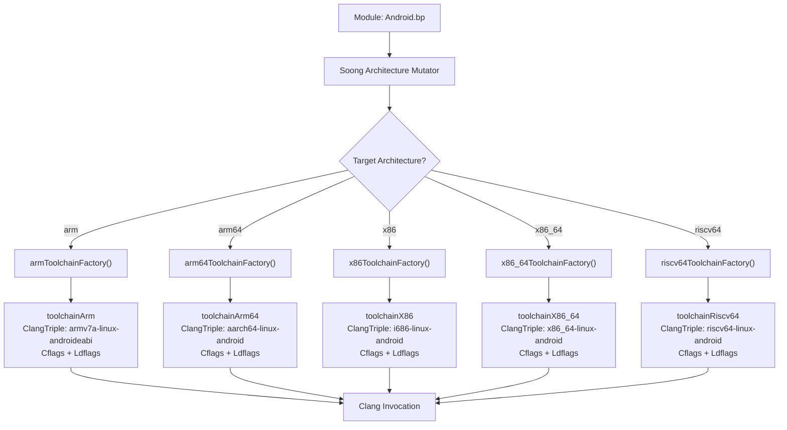

### 57.1.2 The Toolchain Interface

All architecture-specific toolchains implement the `Toolchain` interface defined
in `build/soong/cc/config/toolchain.go`. This is the central abstraction that
lets Soong compile C/C++ code without hard-coding any architecture details:

```go
// build/soong/cc/config/toolchain.go, line 70-112
type Toolchain interface {
    Name() string
    IncludeFlags() string
    ClangTriple() string
    ToolchainCflags() string
    ToolchainLdflags() string
    Asflags() string
    Cflags() string
    Cppflags() string
    Ldflags() string
    InstructionSetFlags(string) (string, error)
    ndkTriple() string
    YasmFlags() string
    Is64Bit() bool
    ShlibSuffix() string
    ExecutableSuffix() string
    LibclangRuntimeLibraryArch() string
    AvailableLibraries() []string
    CrtBeginStaticBinary() []string
    CrtBeginSharedBinary() []string
    CrtBeginSharedLibrary() []string
    CrtEndStaticBinary() []string
    CrtEndSharedBinary() []string
    CrtEndSharedLibrary() []string
    CrtPadSegmentSharedLibrary() []string
    DefaultSharedLibraries() []string
    Bionic() bool
    Glibc() bool
    Musl() bool
}
```

The interface breaks down into several logical groups:

**Identity**: `Name()` and `ClangTriple()` identify the target. `Name()`
returns a short identifier like `"arm64"` or `"x86"`. `ClangTriple()` returns
the full Clang target triple used with the `--target=` flag.

**Compilation flags**: `Cflags()`, `Cppflags()`, `ToolchainCflags()`, and
`Asflags()` provide the flags passed to the compiler at various levels.
`ToolchainCflags()` carries architecture-variant and CPU-variant specific flags
that are layered on top of the base `Cflags()`.

**Linking**: `Ldflags()`, `ToolchainLdflags()`, and the CRT (C Runtime)
methods control how binaries are linked. Every bionic-based toolchain uses CRT
objects like `crtbegin_dynamic` and `crtend_android`.

**Platform**: `Bionic()`, `Glibc()`, and `Musl()` indicate which C library the
toolchain links against.

The base types `toolchain64Bit` and `toolchain32Bit` provide the `Is64Bit()`
method, while `toolchainBionic` provides the Android-specific CRT objects and
default shared libraries:

```go
// build/soong/cc/config/bionic.go, line 17-46
type toolchainBionic struct {
    toolchainBase
}

var (
    bionicDefaultSharedLibraries = []string{"libc", "libm", "libdl"}
    bionicCrtBeginStaticBinary  = []string{"crtbegin_static"}
    bionicCrtEndStaticBinary    = []string{"crtend_android"}
    bionicCrtBeginSharedBinary  = []string{"crtbegin_dynamic"}
    bionicCrtEndSharedBinary    = []string{"crtend_android"}
    bionicCrtBeginSharedLibrary = []string{"crtbegin_so"}
    bionicCrtEndSharedLibrary   = []string{"crtend_so"}
    bionicCrtPadSegmentSharedLibrary = []string{"crt_pad_segment"}
)
```

### 57.1.3 The Arch Struct

Soong represents a target architecture using the `Arch` struct from
`build/soong/android/arch.go`. This struct carries all the information needed
to select the right toolchain, compiler flags, and source files:

```go
// build/soong/android/arch.go (around line 95-110)
type Arch struct {
    ArchType    ArchType
    ArchVariant string
    CpuVariant  string
    Abi         []string
    ArchFeatures []string
}
```

Each field has a specific role:

- **`ArchType`**: One of `Arm`, `Arm64`, `X86`, `X86_64`, or `Riscv64`. This
  determines which toolchain factory is used.

- **`ArchVariant`**: The ISA version, such as `"armv8-2a"` or `"haswell"`.
  Maps to `-march=` flags.

- **`CpuVariant`**: The specific CPU micro-architecture, such as
  `"cortex-a55"` or `"kryo385"`. Maps to `-mcpu=` flags.

- **`Abi`**: The list of Application Binary Interfaces supported, such as
  `["arm64-v8a"]` or `["armeabi-v7a", "armeabi"]`.

- **`ArchFeatures`**: Optional hardware features like `"branchprot"` or
  `"sse4_2"`.

The `ArchType` itself is defined as a simple struct with name and multilib
classification:

```go
// build/soong/android/arch.go (around line 128-138)
type ArchType struct {
    Name     string   // "arm", "arm64", "x86", "x86_64", or "riscv64"
    Field    string   // Property field name, e.g., "Arm64"
    Multilib string   // "lib32" or "lib64"
}
```

The five architecture types are registered as package-level variables:

```go
// build/soong/android/arch.go (around line 160-164)
Arm     = newArch("arm", "lib32")
Arm64   = newArch("arm64", "lib64")
Riscv64 = newArch("riscv64", "lib64")
X86     = newArch("x86", "lib32")
X86_64  = newArch("x86_64", "lib64")
```

When a `BoardConfig.mk` declares `TARGET_ARCH := arm64` and
`TARGET_ARCH_VARIANT := armv8-2a-dotprod`, Soong constructs an `Arch` struct
with `ArchType=Arm64`, `ArchVariant="armv8-2a-dotprod"`, and the appropriate
`CpuVariant` and `ArchFeatures`. This struct is then passed to
`arm64ToolchainFactory()`, which uses each field to select the right flags.

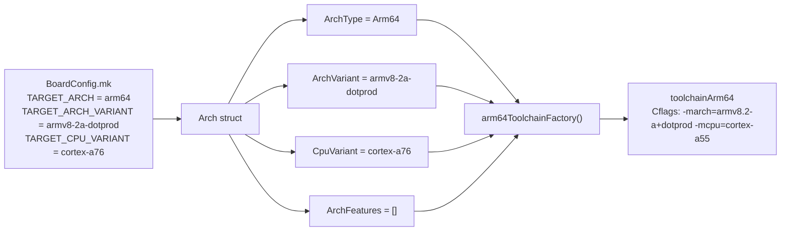

### 57.1.4 Architecture Hierarchy in the Toolchain

Each architecture toolchain is assembled from three layers through Go struct
embedding:

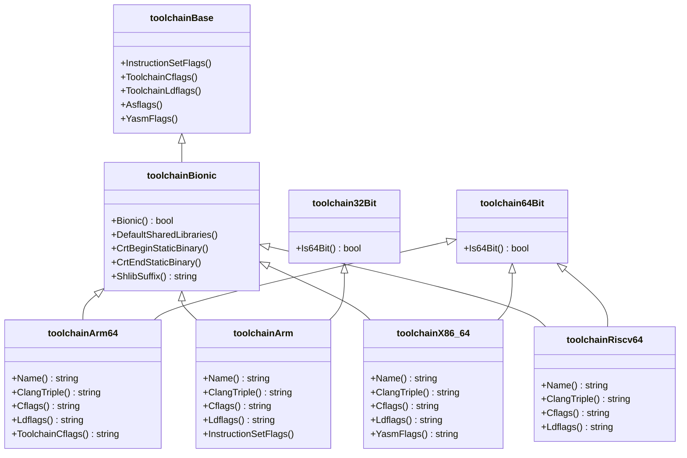

---

## 57.2 ARM64 (AArch64)

ARM64, formally AArch64, is the primary architecture for Android devices.
Virtually every phone, tablet, and wearable shipping today uses an ARM64
processor. The AOSP build system supports a wide range of ARM64
micro-architectures, from the original ARMv8-A through the latest ARMv9.4-A
extensions.

**Source file**: `build/soong/cc/config/arm64_device.go` (212 lines)

### 57.2.1 Architecture Variants

ARM64 supports ten architecture variants, each mapping to a specific `-march=`
compiler flag:

```go
// build/soong/cc/config/arm64_device.go, line 30-41
arm64ArchVariantCflags = map[string][]string{
    "armv8-a":            {"-march=armv8-a"},
    "armv8-a-branchprot": {"-march=armv8-a"},
    "armv8-2a":           {"-march=armv8.2-a"},
    "armv8-2a-dotprod":   {"-march=armv8.2-a+dotprod"},
    "armv8-5a":           {"-march=armv8.5-a"},
    "armv8-7a":           {"-march=armv8.7-a"},
    "armv9-a":            {"-march=armv9-a"},
    "armv9-2a":           {"-march=armv9.2-a"},
    "armv9-3a":           {"-march=armv9.3-a"},
    "armv9-4a":           {"-march=armv9.4-a"},
}
```

Each variant represents a generation of the ARM architecture specification,
adding features:

| Variant | ARM Spec | Key Additions |
|---|---|---|
| `armv8-a` | ARMv8.0-A | Base 64-bit, NEON, VFPv4, AES, SHA |
| `armv8-a-branchprot` | ARMv8.0-A + PAC/BTI | Branch protection (see below) |
| `armv8-2a` | ARMv8.2-A | FP16, statistical profiling |
| `armv8-2a-dotprod` | ARMv8.2-A + DotProd | INT8 dot product for ML |
| `armv8-5a` | ARMv8.5-A | MTE, BTI, RNG, FRINTTS |
| `armv8-7a` | ARMv8.7-A | Enhanced PAC, WFI/WFE with timeout |
| `armv9-a` | ARMv9.0-A | SVE2, RME, base for new generation |
| `armv9-2a` | ARMv9.2-A | SME (scalable matrix), ETE tracing |
| `armv9-3a` | ARMv9.3-A | SME2, extended BFloat16 |
| `armv9-4a` | ARMv9.4-A | Latest: SVE2.1, GCS |

The `armv8-a-branchprot` variant is notable: it uses the same `-march=armv8-a`
flag as plain `armv8-a`, but the build system knows to apply the `branchprot`
architecture feature, which adds compiler flags for hardware-enforced control
flow integrity.

### 57.2.2 Branch Protection: PAC and BTI

Pointer Authentication Codes (PAC) and Branch Target Identification (BTI) are
hardware security features that protect against control-flow hijacking attacks
like ROP (Return-Oriented Programming) and JOP (Jump-Oriented Programming).

When the `branchprot` feature is enabled, AOSP applies these compiler flags:

```go
// build/soong/cc/config/arm64_device.go, line 43-49
arm64ArchFeatureCflags = map[string][]string{
    "branchprot": {
        "-mbranch-protection=standard",
        "-fno-stack-protector",
    },
}
```

The `-mbranch-protection=standard` flag tells Clang to:

1. Sign return addresses with PAC instructions (`PACIASP` / `AUTIASP`)
2. Add BTI landing pads at function entries and branch targets

The `-fno-stack-protector` flag is deliberately paired with PAC because
PAC-signed return addresses already protect against stack buffer overflows that
corrupt the return address -- the primary threat that stack protectors also
defend against. Disabling the stack protector avoids the redundant canary check,
saving a few instructions per function entry/exit.

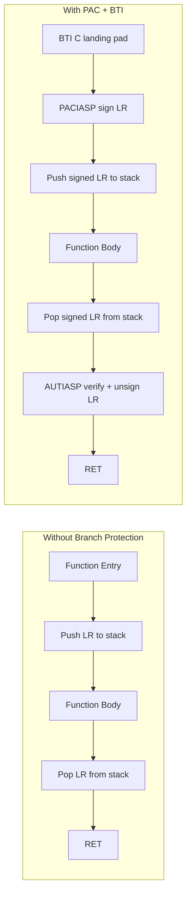

In the PAC+BTI flow, if an attacker overwrites the saved LR on the stack, the
`AUTIASP` instruction will fail to authenticate the corrupted pointer, causing a
fault. The BTI landing pad ensures that indirect branches can only land at
intended targets.

### 57.2.3 Memory Tagging Extension (MTE)

ARMv8.5-A introduced the Memory Tagging Extension (MTE), a hardware feature
that detects memory safety bugs such as use-after-free and buffer overflows.
AOSP has deep integration with MTE at the bionic level.

The file `bionic/libc/arch-arm64/bionic/note_memtag_heap_async.S` contains
an ELF note that requests the kernel to enable MTE for heap allocations:

```asm
// bionic/libc/arch-arm64/bionic/note_memtag_heap_async.S, line 34-46
  .section ".note.android.memtag", "a", %note
  .p2align 2
  .long 1f - 0f                 // int32_t namesz
  .long 3f - 2f                 // int32_t descsz
  .long NT_ANDROID_TYPE_MEMTAG  // int32_t type
0:
  .asciz "Android"              // char name[]
1:
  .p2align 2
2:
  .long (NT_MEMTAG_LEVEL_ASYNC | NT_MEMTAG_HEAP) // value
3:
  .p2align 2
```

Bionic's ifunc dispatchers also use MTE as a selection criterion, choosing
MTE-aware implementations when the hardware supports it. From
`bionic/libc/arch-arm64/ifuncs.cpp`:

```cpp
// bionic/libc/arch-arm64/ifuncs.cpp, line 54-60
DEFINE_IFUNC_FOR(memchr) {
  if (arg->_hwcap2 & HWCAP2_MTE) {
    RETURN_FUNC(memchr_func_t, __memchr_aarch64_mte);
  } else {
    RETURN_FUNC(memchr_func_t, __memchr_aarch64);
  }
}
```

MTE-aware string routines need special handling because the tag bits occupy the
upper bits of pointers. Regular pointer arithmetic or SIMD-based comparisons
might accidentally trip over the tag bits unless the code is written to be
tag-aware.

### 57.2.4 CPU Variant Tuning and big.LITTLE

ARM's big.LITTLE (and later DynamIQ) heterogeneous computing architecture pairs
high-performance "big" cores (e.g., Cortex-A76) with efficient "LITTLE" cores
(e.g., Cortex-A55). This creates a scheduling optimization challenge: code
compiled for the big core's pipeline might stall on the LITTLE core.

AOSP takes a pragmatic approach -- it tunes code for the LITTLE core, because
that code runs correctly (and acceptably fast) on both core types, while code
tuned for the big core might be pathologically slow on the LITTLE core:

```go
// build/soong/cc/config/arm64_device.go, line 65-77
"cortex-a75": []string{
    // Use the cortex-a55 since it is similar to the little
    // core (cortex-a55) and is sensitive to ordering.
    "-mcpu=cortex-a55",
},
"cortex-a76": []string{
    // Use the cortex-a55 since it is similar to the little
    // core (cortex-a55) and is sensitive to ordering.
    "-mcpu=cortex-a55",
},
```

This is not a mistake in the source code. The comments explain the reasoning:
the Cortex-A75 (big) and Cortex-A76 (big) variants deliberately use
`-mcpu=cortex-a55` (LITTLE) because the instruction scheduling for the little
core is "sensitive to ordering" -- meaning poor scheduling for the little core
causes significant performance degradation, whereas the big core's
out-of-order pipeline can compensate for sub-optimal scheduling.

The complete set of supported ARM64 CPU variants:

```go
// build/soong/cc/config/arm64_device.go, line 58-88
arm64CpuVariantCflags = map[string][]string{
    "cortex-a53": {"-mcpu=cortex-a53"},
    "cortex-a55": {"-mcpu=cortex-a55"},
    "cortex-a75": {"-mcpu=cortex-a55"},  // Uses little core tuning
    "cortex-a76": {"-mcpu=cortex-a55"},  // Uses little core tuning
    "kryo":       {"-mcpu=kryo"},
    "kryo385":    {"-mcpu=cortex-a53"},  // kryo385 not in clang
    "exynos-m1":  {"-mcpu=exynos-m1"},
    "exynos-m2":  {"-mcpu=exynos-m2"},
}
```

The mapping from CPU variant to compile flags is resolved through a two-level
lookup. First, the variant-to-variable map:

```go
// build/soong/cc/config/arm64_device.go, line 123-135
arm64CpuVariantCflagsVar = map[string]string{
    "cortex-a53": "${config.Arm64CortexA53Cflags}",
    "cortex-a55": "${config.Arm64CortexA55Cflags}",
    "cortex-a72": "${config.Arm64CortexA53Cflags}",
    "cortex-a73": "${config.Arm64CortexA53Cflags}",
    "cortex-a75": "${config.Arm64CortexA55Cflags}",
    "cortex-a76": "${config.Arm64CortexA55Cflags}",
    "kryo":       "${config.Arm64KryoCflags}",
    "kryo385":    "${config.Arm64CortexA53Cflags}",
    "exynos-m1":  "${config.Arm64ExynosM1Cflags}",
    "exynos-m2":  "${config.Arm64ExynosM2Cflags}",
}
```

Notice how the big cores (A72, A73, A75, A76) all map to their corresponding
LITTLE core flags (A53 or A55).

### 57.2.5 Cortex-A53 Erratum Workarounds

The Cortex-A53, one of the most widely deployed ARM cores in history, has two
notable hardware errata that AOSP works around at link time:

```go
// build/soong/cc/config/arm64_device.go, line 120
pctx.StaticVariable("Arm64FixCortexA53Ldflags", "-Wl,--fix-cortex-a53-843419")
```

```go
// build/soong/cc/config/arm64_device.go, line 137-144
arm64CpuVariantLdflags = map[string]string{
    "cortex-a53": "${config.Arm64FixCortexA53Ldflags}",
    "cortex-a72": "${config.Arm64FixCortexA53Ldflags}",
    "cortex-a73": "${config.Arm64FixCortexA53Ldflags}",
    "kryo":       "${config.Arm64FixCortexA53Ldflags}",
    "exynos-m1":  "${config.Arm64FixCortexA53Ldflags}",
    "exynos-m2":  "${config.Arm64FixCortexA53Ldflags}",
}
```

**Erratum 843419** causes incorrect execution when certain sequences of ADRP
instructions appear near page boundaries. The linker flag
`--fix-cortex-a53-843419` tells LLD to detect these problematic patterns and
insert veneer code to avoid them. Note that this fix is also applied to A72,
A73, Kryo, and Exynos cores, because they may be paired with A53 LITTLE cores
in big.LITTLE configurations.

### 57.2.6 ARM64 Toolchain Factory

The factory function assembles all the layers into a single toolchain:

```go
// build/soong/cc/config/arm64_device.go, line 187-208
func arm64ToolchainFactory(arch android.Arch) Toolchain {
    if _, ok := arm64ArchVariantCflags[arch.ArchVariant]; !ok {
        panic(fmt.Sprintf("Unknown ARM64 architecture version: %q", arch.ArchVariant))
    }

    toolchainCflags := []string{"${config.Arm64" + arch.ArchVariant + "VariantCflags}"}
    toolchainCflags = append(toolchainCflags,
        variantOrDefault(arm64CpuVariantCflagsVar, arch.CpuVariant))
    for _, feature := range arch.ArchFeatures {
        toolchainCflags = append(toolchainCflags, arm64ArchFeatureCflags[feature]...)
    }

    extraLdflags := variantOrDefault(arm64CpuVariantLdflags, arch.CpuVariant)
    return &toolchainArm64{
        ldflags: strings.Join([]string{
            "${config.Arm64Ldflags}",
            extraLdflags,
        }, " "),
        toolchainCflags: strings.Join(toolchainCflags, " "),
    }
}
```

The flags are layered in this order:

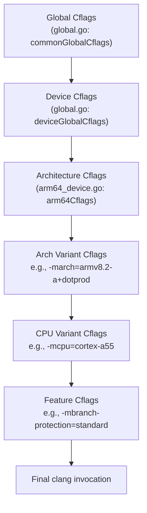

### 57.2.7 Page Size Configuration

ARM64 supports multiple page sizes (4KB, 16KB, 64KB). The linker flags enforce
the maximum page size for correct segment alignment:

```go
// build/soong/cc/config/arm64_device.go, line 92-96
pctx.VariableFunc("Arm64Ldflags", func(ctx android.PackageVarContext) string {
    maxPageSizeFlag := "-Wl,-z,max-page-size=" + ctx.Config().MaxPageSizeSupported()
    flags := append(arm64Ldflags, maxPageSizeFlag)
    return strings.Join(flags, " ")
})
```

The base linker flags also include segment separation for security:

```go
// build/soong/cc/config/arm64_device.go, line 51-54
arm64Ldflags = []string{
    "-Wl,-z,separate-code",
    "-Wl,-z,separate-loadable-segments",
}
```

These flags ensure that code segments, data segments, and read-only segments are
placed in separate memory pages, preventing accidental (or malicious) execution
of data or modification of code.

---

## 57.3 x86 and x86_64

The x86 architecture family serves two main roles in AOSP: as the target for
Chromebook and embedded devices, and as the native architecture for the Android
Emulator. The emulator historically ran ARM images under translation, but native
x86/x86_64 images provide dramatically better performance during development.

**Source files**:

- `build/soong/cc/config/x86_device.go` (193 lines)
- `build/soong/cc/config/x86_64_device.go` (200 lines)

### 57.3.1 x86 Architecture Variants

The x86 (32-bit) toolchain supports a wide range of Intel microarchitectures:

```go
// build/soong/cc/config/x86_device.go, line 38-86
x86ArchVariantCflags = map[string][]string{
    "": []string{
        "-march=prescott",
    },
    "x86_64": []string{
        "-march=prescott",
    },
    "alderlake": []string{"-march=alderlake"},
    "atom":      []string{"-march=atom"},
    "broadwell": []string{"-march=broadwell"},
    "goldmont":  []string{"-march=goldmont"},
    "goldmont-plus": []string{"-march=goldmont-plus"},
    "goldmont-without-sha-xsaves": []string{
        "-march=goldmont",
        "-mno-sha",
        "-mno-xsaves",
    },
    "haswell":     []string{"-march=core-avx2"},
    "ivybridge":   []string{"-march=core-avx-i"},
    "sandybridge": []string{"-march=corei7"},
    "silvermont":  []string{"-march=slm"},
    "skylake":     []string{"-march=skylake"},
    "stoneyridge": []string{"-march=bdver4"},
    "tremont":     []string{"-march=tremont"},
}
```

The x86_64 toolchain has the same set of microarchitecture variants:

```go
// build/soong/cc/config/x86_64_device.go, line 36-79
x86_64ArchVariantCflags = map[string][]string{
    "": []string{"-march=x86-64"},
    "alderlake":  []string{"-march=alderlake"},
    "broadwell":  []string{"-march=broadwell"},
    "goldmont":   []string{"-march=goldmont"},
    // ... same variants as x86
    "haswell":    []string{"-march=core-avx2"},
    "skylake":    []string{"-march=skylake"},
    "tremont":    []string{"-march=tremont"},
}
```

The default for x86 is `prescott` (Pentium 4 with SSE3), while x86_64 defaults
to the baseline `x86-64` instruction set.

### 57.3.2 SIMD Instruction Sets: SSE and AVX

The x86 SIMD landscape is more fragmented than ARM's NEON -- instead of a
single mandatory SIMD extension, x86 has a progression of optional extensions.
Both the x86 and x86_64 toolchains define feature flags for these:

```go
// build/soong/cc/config/x86_64_device.go, line 81-97
x86_64ArchFeatureCflags = map[string][]string{
    "ssse3":  []string{"-mssse3"},
    "sse4":   []string{"-msse4"},
    "sse4_1": []string{"-msse4.1"},
    "sse4_2": []string{"-msse4.2"},

    // Not all cases there is performance gain by enabling -mavx -mavx2
    // flags so these flags are not enabled by default.
    // if there is performance gain in individual library components,
    // the compiler flags can be set in corresponding bp files.
    // "avx":    []string{"-mavx"},
    // "avx2":   []string{"-mavx2"},
    // "avx512": []string{"-mavx512"}

    "popcnt": []string{"-mpopcnt"},
    "aes_ni": []string{"-maes"},
}
```

Note the commented-out AVX/AVX2/AVX512 entries. The comment explains the
reasoning: AVX does not always provide a performance gain. In fact, on some
Intel processors, AVX instructions cause the CPU to reduce its clock frequency
("AVX frequency throttling"), which can actually hurt performance for code that
mixes AVX and non-AVX instructions. Individual libraries can opt into AVX via
their `Android.bp` files when they know it helps.

### 57.3.3 x86-Specific Compiler Flags

The 32-bit x86 toolchain has several unique requirements:

```go
// build/soong/cc/config/x86_device.go, line 25-32
x86Cflags = []string{
    "-msse3",
    // -mstackrealign is needed to realign stack in native code
    // that could be called from JNI, so that movaps instruction
    // will work on assumed stack aligned local variables.
    "-mstackrealign",
}
```

The `-mstackrealign` flag addresses a subtle ABI issue. The i386 System V ABI
only requires 4-byte stack alignment, but SSE instructions like `movaps` require
16-byte alignment. When native code is called from JNI (through the Dalvik/ART
runtime), the stack may not be 16-byte aligned, causing crashes.
`-mstackrealign` inserts code at function entry to realign the stack.

The x86 toolchain also uses Yasm for assembly:

```go
// build/soong/cc/config/x86_device.go, line 117
pctx.StaticVariable("X86YasmFlags", "-f elf32 -m x86")
```

```go
// build/soong/cc/config/x86_64_device.go, line 124
pctx.StaticVariable("X86_64YasmFlags", "-f elf64 -m amd64")
```

### 57.3.4 x86 Toolchain Structure

Both x86 toolchains share the same pattern as ARM64:

```go
// build/soong/cc/config/x86_device.go, line 125-129
type toolchainX86 struct {
    toolchainBionic
    toolchain32Bit
    toolchainCflags string
}
```

```go
// build/soong/cc/config/x86_64_device.go, line 132-136
type toolchainX86_64 struct {
    toolchainBionic
    toolchain64Bit
    toolchainCflags string
}
```

The key difference from ARM64 is the explicit `-m32`/`-m64` toolchain flags
that control code generation model:

```go
// build/soong/cc/config/x86_device.go, line 107-108
pctx.StaticVariable("X86ToolchainCflags", "-m32")
pctx.StaticVariable("X86ToolchainLdflags", "-m32")
```

```go
// build/soong/cc/config/x86_64_device.go, line 101-102
pctx.StaticVariable("X86_64ToolchainCflags", "-m64")
pctx.StaticVariable("X86_64ToolchainLdflags", "-m64")
```

### 57.3.5 Native Bridge for ARM Compatibility

x86/x86_64 Android devices face a compatibility challenge: the vast majority of
Android NDK apps are compiled for ARM. To run these apps, AOSP includes the
Native Bridge infrastructure, which provides transparent binary translation.

The Native Bridge mechanism is defined in
`frameworks/libs/binary_translation/native_bridge/native_bridge.h`, which
declares the `NativeBridgeCallbacks` interface:

```cpp
// frameworks/libs/binary_translation/native_bridge/native_bridge.h, line 48-62
struct NativeBridgeCallbacks {
  uint32_t version;

  bool (*initialize)(const NativeBridgeRuntimeCallbacks* runtime_cbs,
                     const char* private_dir,
                     const char* instruction_set);

  void* (*loadLibrary)(const char* libpath, int flag);

  // Get a native bridge trampoline for specified native method.
  // The trampoline has same signature as the native method.
  ...
};
```

The Native Bridge works by intercepting library loads: when ART's class loader
encounters a native library compiled for a foreign architecture, it delegates
to the native bridge implementation, which translates the foreign code.

Three implementations exist:

- **Berberis** (open source, in `frameworks/libs/binary_translation/`) --
  Google's reference implementation for translating RISC-V to x86_64

- **Houdini** (proprietary, from Intel) -- translates ARM/ARM64 to x86/x86_64

- **DigitalisX64** (open source, <https://github.com/DigitalisX64>) --
  community implementation built on Berberis to support ARM64 to x86_64

The Emulator uses a different strategy: it runs the ARM system image under
QEMU-based full system emulation with hardware-accelerated virtualization, so
native bridge is not involved in the typical emulator workflow.

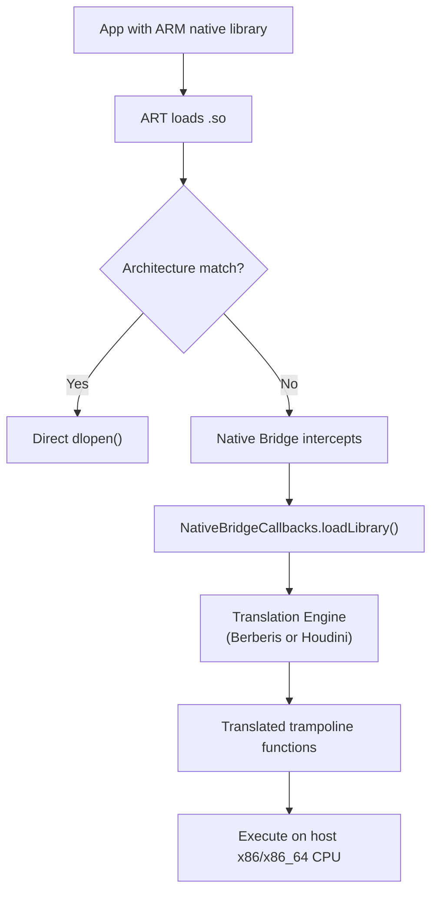

### 57.3.6 The Emulator Target

The default x86_64 generic device configuration targets the emulator:

```makefile
# device/generic/x86_64/BoardConfig.mk, line 9-15
TARGET_CPU_ABI := x86_64
TARGET_ARCH := x86_64
TARGET_ARCH_VARIANT := x86_64

TARGET_2ND_CPU_ABI := x86
TARGET_2ND_ARCH := x86
TARGET_2ND_ARCH_VARIANT := x86_64
```

The `goldmont-without-sha-xsaves` variant deserves special mention: it targets
Intel Goldmont (Apollo Lake) processors but disables SHA and XSAVES
instructions. This exists because some Chromebooks and embedded devices use
Goldmont-based processors that do not implement these optional extensions:

```go
"goldmont-without-sha-xsaves": []string{
    "-march=goldmont",
    "-mno-sha",
    "-mno-xsaves",
},
```

### 57.3.7 ARM 32-bit: The Legacy Secondary Architecture

ARM 32-bit support in AOSP exists primarily as the secondary architecture for
ARM64 devices, allowing legacy 32-bit apps to run. The ARM toolchain is the
most complex of all five architectures because it supports the widest range of
CPU variants (from ancient Cortex-A7 to modern Cortex-A76 in 32-bit mode) and
two instruction encodings (ARM and Thumb).

The ARM toolchain struct reflects its 32-bit nature:

```go
// build/soong/cc/config/arm_device.go (line 247-252)
type toolchainArm struct {
    toolchainBionic
    toolchain32Bit
    ldflags         string
    toolchainCflags string
}
```

The ARM factory function assembles three levels of flags:

```go
// build/soong/cc/config/arm_device.go (line 303-316)
func armToolchainFactory(arch android.Arch) Toolchain {
    toolchainCflags := make([]string, 2, 3)
    toolchainCflags[0] = "${config.ArmToolchainCflags}"
    toolchainCflags[1] = armArchVariantCflagsVar[arch.ArchVariant]
    toolchainCflags = append(toolchainCflags,
        variantOrDefault(armCpuVariantCflagsVar, arch.CpuVariant))
    return &toolchainArm{
        ldflags:         "${config.ArmLdflags}",
        toolchainCflags: strings.Join(toolchainCflags, " "),
    }
}
```

**Layer 1** -- `ArmToolchainCflags`: The `-msoft-float` flag, which is universal
for all ARM 32-bit Android targets.

**Layer 2** -- Arch variant: One of `armv7-a`, `armv7-a-neon`, `armv8-a`, or
`armv8-2a`, determining the baseline ISA and FPU configuration.

**Layer 3** -- CPU variant: The specific core tuning, selected from a map that
includes 18 different variants:

```go
// build/soong/cc/config/arm_device.go (line 225-244)
armCpuVariantCflagsVar = map[string]string{
    "":               "${config.ArmGenericCflags}",
    "cortex-a7":      "${config.ArmCortexA7Cflags}",
    "cortex-a8":      "${config.ArmCortexA8Cflags}",
    "cortex-a9":      "${config.ArmGenericCflags}",
    "cortex-a15":     "${config.ArmCortexA15Cflags}",
    "cortex-a32":     "${config.ArmCortexA32Cflags}",
    "cortex-a53":     "${config.ArmCortexA53Cflags}",
    "cortex-a53.a57": "${config.ArmCortexA53Cflags}",
    "cortex-a55":     "${config.ArmCortexA55Cflags}",
    "cortex-a72":     "${config.ArmCortexA53Cflags}",
    "cortex-a73":     "${config.ArmCortexA53Cflags}",
    "cortex-a75":     "${config.ArmCortexA55Cflags}",
    "cortex-a76":     "${config.ArmCortexA55Cflags}",
    "krait":          "${config.ArmKraitCflags}",
    "kryo":           "${config.ArmKryoCflags}",
    "kryo385":        "${config.ArmCortexA53Cflags}",
    "exynos-m1":      "${config.ArmCortexA53Cflags}",
    "exynos-m2":      "${config.ArmCortexA53Cflags}",
}
```

The Cortex-A8 erratum workaround is also specific to ARM 32-bit:

```go
// build/soong/cc/config/arm_device.go (line 45-47)
armFixCortexA8LdFlags   = []string{"-Wl,--fix-cortex-a8"}
armNoFixCortexA8LdFlags = []string{"-Wl,--no-fix-cortex-a8"}
```

The Cortex-A8 has a hardware bug that can cause incorrect execution in certain
branch-to-branch sequences. This is separate from the Cortex-A53 errata
handled in the ARM64 toolchain.

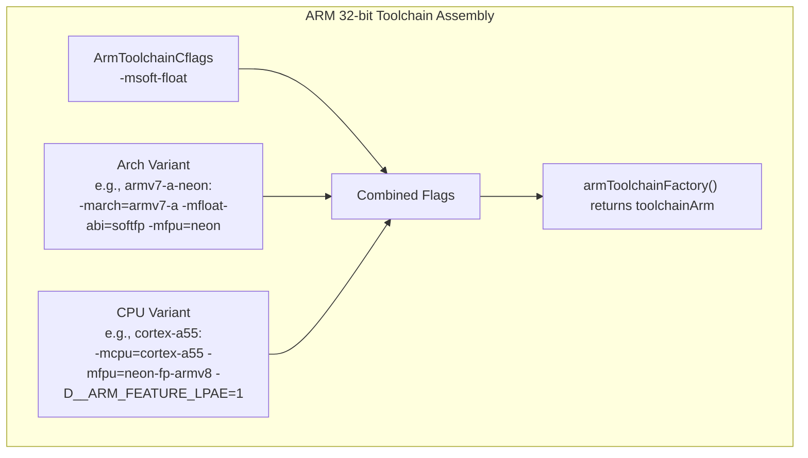

### 57.3.8 ARM 32-bit Linker Configuration

The ARM 32-bit linker has its own specific flags:

```go
// build/soong/cc/config/arm_device.go (line 39-43)
armLdflags = []string{
    "-Wl,-m,armelf",
    "-Wl,-mllvm", "-Wl,-enable-shrink-wrap=false",
}
```

The `-Wl,-m,armelf` flag tells the linker to use the ARM ELF format. The
`-enable-shrink-wrap=false` flags disable an LLVM optimization that was causing
incorrect code generation (tracked as bug b/322359235). The same workaround
appears in the compiler and linker flags, showing how hardware errata and
compiler bugs create a complex web of workarounds across the toolchain.

---

## 57.4 RISC-V 64

RISC-V is the newest architecture supported by AOSP, first added in 2022. It
is an open, royalty-free instruction set architecture that has generated
significant industry interest. The AOSP RISC-V port is still maturing, as
evidenced by the smaller configuration file and explicit workarounds for
incomplete toolchain support.

**Source file**: `build/soong/cc/config/riscv64_device.go` (133 lines)

### 57.4.1 Base ISA and Extensions

The RISC-V configuration specifies a rich set of extensions:

```go
// build/soong/cc/config/riscv64_device.go, line 25-36
riscv64Cflags = []string{
    "-Werror=implicit-function-declaration",
    // This is already the driver's Android default, but duplicated here (and
    // below) for ease of experimentation with additional extensions.
    "-march=rv64gcv_zba_zbb_zbs",
    // TODO: remove when qemu V works
    // (Note that we'll probably want to wait for berberis to be good enough
    // that most people don't care about qemu's V performance either!)
    "-mno-implicit-float",
}
```

The ISA string `-march=rv64gcv_zba_zbb_zbs` decodes as follows:

| Component | Meaning |
|---|---|
| `rv64` | 64-bit base integer ISA (RV64I) |
| `g` | "General" = `IMAFD` (Integer, Multiply, Atomic, Float, Double) |
| `c` | Compressed instructions (16-bit encodings for common ops) |
| `v` | Vector extension (RISC-V V 1.0) |
| `zba` | Address generation instructions (sh1add, sh2add, sh3add) |
| `zbb` | Basic bit manipulation (clz, ctz, cpop, rev8, etc.) |
| `zbs` | Single-bit instructions (bset, bclr, binv, bext) |

This is a notably modern baseline -- the Vector extension in particular enables
SIMD-like operations analogous to ARM's NEON or Intel's SSE, but with a
scalable design that does not hard-code the vector width.

### 57.4.2 QEMU and Berberis Workarounds

The RISC-V configuration contains a revealing TODO comment about the state of
the ecosystem:

```go
// TODO: remove when qemu V works (https://gitlab.com/qemu-project/qemu/-/issues/1976)
// (Note that we'll probably want to wait for berberis to be good enough
// that most people don't care about qemu's V performance either!)
"-mno-implicit-float",
```

This comment reveals the practical challenge of RISC-V development: QEMU's
Vector extension support is incomplete, and the Berberis binary translator
(which could translate RISC-V to x86_64 for development) is still maturing.
The `-mno-implicit-float` flag prevents the compiler from automatically using
floating-point or vector instructions for non-floating-point operations
(like structure copies), which works around QEMU V bugs.

### 57.4.3 Minimal Variant Configuration

Unlike ARM64 and x86, RISC-V has no CPU variant tuning:

```go
// build/soong/cc/config/riscv64_device.go, line 38-49
riscv64ArchVariantCflags = map[string][]string{}
riscv64CpuVariantCflags  = map[string][]string{}
```

The variant maps are empty, and the factory function only accepts the default
(empty string) variant:

```go
// build/soong/cc/config/riscv64_device.go, line 110-115
func riscv64ToolchainFactory(arch android.Arch) Toolchain {
    switch arch.ArchVariant {
    case "":
    default:
        panic(fmt.Sprintf("Unknown Riscv64 architecture version: %q", arch.ArchVariant))
    }
    // ...
}
```

This simplicity reflects the current state of the RISC-V Android ecosystem:
there is only one target configuration, and the hardware landscape has not yet
diversified to the point where micro-architecture-specific tuning is needed.

### 57.4.4 RISC-V Linker Configuration

The RISC-V linker flags are straightforward:

```go
// build/soong/cc/config/riscv64_device.go, line 40-45
riscv64Ldflags = []string{
    "-march=rv64gcv_zba_zbb_zbs",
    "-Wl,-z,max-page-size=4096",
}
```

Note the hardcoded 4KB page size, unlike ARM64 which uses a configurable
`MaxPageSizeSupported()`. RISC-V Android currently only supports 4KB pages.

### 57.4.5 Berberis Binary Translation

The `frameworks/libs/binary_translation/` directory contains Berberis, Google's
open-source binary translation framework. While primarily designed for
translating guest architectures to x86_64 host systems, Berberis is
strategically important for RISC-V development:

```
frameworks/libs/binary_translation/
    assembler/        - Code generation backend
    backend/          - Translation engine
    decoder/          - Guest instruction decoder
    guest_abi/        - ABI conversion layer
    guest_loader/     - Library loading and linking
    guest_state/      - CPU state abstraction
    interpreter/      - Interpreted execution fallback
    jni/              - JNI trampoline generation
    native_bridge/    - NativeBridge interface implementation
    android_api/      - Framework API proxies
    lite_translator/  - Lightweight translation path
    heavy_optimizer/  - Full optimization path
```

The Berberis `enable_riscv64_to_x86_64.mk` file in the top directory reveals
the primary translation direction: RISC-V 64 guest code running on an x86_64
host. This allows developers to work with RISC-V Android images on x86_64
workstations.

### 57.4.6 ART RISC-V Feature Detection

The ART runtime has full RISC-V support with its own ISA feature tracking. The
`Riscv64InstructionSetFeatures` class tracks extensions as a bitmap:

```cpp
// art/runtime/arch/riscv64/instruction_set_features_riscv64.h (line 31-39)
class Riscv64InstructionSetFeatures final : public InstructionSetFeatures {
 public:
  enum {
    kExtGeneric    = (1 << 0),  // G: IMAFD base set
    kExtCompressed = (1 << 1),  // C: compressed instructions
    kExtVector     = (1 << 2),  // V: vector instructions
    kExtZba        = (1 << 3),  // Zba: address generation
    kExtZbb        = (1 << 4),  // Zbb: basic bit-manipulation
    kExtZbs        = (1 << 5),  // Zbs: single-bit manipulation
  };
```

The feature methods allow ART's JIT compiler to query capabilities:

```cpp
// art/runtime/arch/riscv64/instruction_set_features_riscv64.h (line 71-79)
bool HasCompressed() const { return (bits_ & kExtCompressed) != 0; }
bool HasVector() const { return (bits_ & kExtVector) != 0; }
bool HasZba() const { return (bits_ & kExtZba) != 0; }
bool HasZbb() const { return (bits_ & kExtZbb) != 0; }
bool HasZbs() const { return (bits_ & kExtZbs) != 0; }
```

The `FromVariant()` implementation currently only recognizes the `"generic"`
variant and uses the full basic feature set:

```cpp
// art/runtime/arch/riscv64/instruction_set_features_riscv64.cc (line 30-46)
constexpr uint32_t BasicFeatures() {
  return Riscv64InstructionSetFeatures::kExtGeneric |
         Riscv64InstructionSetFeatures::kExtCompressed |
         Riscv64InstructionSetFeatures::kExtVector |
         Riscv64InstructionSetFeatures::kExtZba |
         Riscv64InstructionSetFeatures::kExtZbb |
         Riscv64InstructionSetFeatures::kExtZbs;
}

Riscv64FeaturesUniquePtr Riscv64InstructionSetFeatures::FromVariant(
    const std::string& variant, [[maybe_unused]] std::string* error_msg) {
  if (variant != "generic") {
    LOG(WARNING) << "Unexpected CPU variant for Riscv64 using defaults: " << variant;
  }
  return Riscv64FeaturesUniquePtr(
      new Riscv64InstructionSetFeatures(BasicFeatures()));
}
```

Feature detection from C preprocessor defines is also implemented, allowing
the build system to detect extensions at compile time:

```cpp
// art/runtime/arch/riscv64/instruction_set_features_riscv64.cc (line 52-71)
Riscv64FeaturesUniquePtr Riscv64InstructionSetFeatures::FromCppDefines() {
  uint32_t bits = kExtGeneric;
#ifdef __riscv_c
  bits |= kExtCompressed;
#endif
#ifdef __riscv_v
  bits |= kExtVector;
#endif
#ifdef __riscv_zba
  bits |= kExtZba;
#endif
#ifdef __riscv_zbb
  bits |= kExtZbb;
#endif
#ifdef __riscv_zbs
  bits |= kExtZbs;
#endif
  return FromBitmap(bits);
}
```

Note that the `FromCpuInfo()` and `FromHwcap()` methods are not yet implemented
for RISC-V:

```cpp
// art/runtime/arch/riscv64/instruction_set_features_riscv64.cc (line 73-80)
Riscv64FeaturesUniquePtr Riscv64InstructionSetFeatures::FromCpuInfo() {
  UNIMPLEMENTED(WARNING);
  return FromCppDefines();
}

Riscv64FeaturesUniquePtr Riscv64InstructionSetFeatures::FromHwcap() {
  UNIMPLEMENTED(WARNING);
  return FromCppDefines();
}
```

The `UNIMPLEMENTED(WARNING)` calls indicate that runtime hardware detection is
not yet complete for RISC-V, which is another marker of the architecture's
early-adoption status in AOSP.

### 57.4.7 Comparing RISC-V and ARM64 Feature Tracking

The contrast between RISC-V and ARM64 feature tracking in ART reveals the
maturity gap:

| Aspect | ARM64 | RISC-V 64 |
|---|---|---|
| CPU variants | 15+ recognized | Only "generic" |
| Feature flags | 7 (CRC, LSE, FP16, DotProd, SVE, errata) | 6 (G, C, V, Zba, Zbb, Zbs) |
| FromHwcap() | Fully implemented | UNIMPLEMENTED |
| FromCpuInfo() | Fully implemented | UNIMPLEMENTED |
| Errata tracking | A53 835769, A53 843419 | None |
| Runtime validation | Yes (Pixel 3a workaround) | No |
| SVE support | Defined but disabled (`kArm64AllowSVE = false`) | N/A |

The ARM64 feature header explicitly disables SVE:

```cpp
// art/runtime/arch/arm64/instruction_set_features_arm64.h (line 25-26)
// SVE is currently not enabled.
static constexpr bool kArm64AllowSVE = false;
```

This means that even though the Soong toolchain supports ARMv9 variants
(which include SVE2), ART's JIT compiler does not yet generate SVE
instructions. This is a pragmatic choice -- SVE support requires significant
changes to the register allocator and instruction selector.

### 57.4.8 ART ARM64 Feature Bitmap

ART stores ARM64 features as a compact bitmap for serialization:

```cpp
// art/runtime/arch/arm64/instruction_set_features_arm64.h (line 142-150)
enum {
    kA53Bitfield     = 1 << 0,
    kCRCBitField     = 1 << 1,
    kLSEBitField     = 1 << 2,
    kFP16BitField    = 1 << 3,
    kDotProdBitField = 1 << 4,
    kSVEBitField     = 1 << 5,
};
```

And the private member variables track each feature:

```cpp
// art/runtime/arch/arm64/instruction_set_features_arm64.h (line 152-158)
const bool fix_cortex_a53_835769_;
const bool fix_cortex_a53_843419_;
const bool has_crc_;      // optional in ARMv8.0, mandatory in ARMv8.1
const bool has_lse_;      // ARMv8.1 Large System Extensions
const bool has_fp16_;     // ARMv8.2 FP16 extensions
const bool has_dotprod_;  // optional in ARMv8.2, mandatory in ARMv8.4
const bool has_sve_;      // optional in ARMv8.2
```

The JIT compiler uses these feature flags to select instruction patterns.
For example, when `has_lse_` is true, atomic operations use the single-instruction
`LDADD`, `SWPAL`, etc., instead of the multi-instruction LL/SC loop
(`LDAXR` / `STLXR`). This can be 2-3x faster in high-contention scenarios.

### 57.4.9 RISC-V Device Configuration

The ART test device for RISC-V reveals the early-adoption nature of the port:

```makefile
# device/generic/art/riscv64/BoardConfig.mk
include device/generic/art/BoardConfigCommon.mk

TARGET_ARCH := riscv64
TARGET_CPU_ABI := riscv64
TARGET_CPU_VARIANT := generic
TARGET_ARCH_VARIANT :=

TARGET_SUPPORTS_64_BIT_APPS := true

# Temporary hack while prebuilt modules are missing riscv64.
ALLOW_MISSING_DEPENDENCIES := true
```

The `ALLOW_MISSING_DEPENDENCIES := true` line is significant -- it allows the
build to proceed even when some prebuilt modules do not have RISC-V binaries
yet. This is a temporary measure while the RISC-V ecosystem catches up.

---

## 57.5 Multi-Architecture Builds

Modern Android devices typically support multiple architectures simultaneously.
A 64-bit ARM device also runs 32-bit ARM code. An x86_64 device also runs
x86 code. AOSP's build system handles this through the "multilib" mechanism,
which builds the same module for multiple architectures.

### 57.5.1 Primary and Secondary Architectures

Device configurations declare a primary architecture and an optional secondary
architecture using `TARGET_ARCH` and `TARGET_2ND_ARCH`:

```makefile
# device/generic/arm64/BoardConfig.mk, line 10-19
TARGET_ARCH := arm64
TARGET_ARCH_VARIANT := armv8-a
TARGET_CPU_VARIANT := generic
TARGET_CPU_ABI := arm64-v8a

TARGET_2ND_ARCH := arm
TARGET_2ND_ARCH_VARIANT := armv7-a-neon
TARGET_2ND_CPU_VARIANT := cortex-a15
TARGET_2ND_CPU_ABI := armeabi-v7a
TARGET_2ND_CPU_ABI2 := armeabi
```

Similarly, for x86_64:

```makefile
# device/generic/x86_64/BoardConfig.mk, line 9-15
TARGET_CPU_ABI := x86_64
TARGET_ARCH := x86_64
TARGET_ARCH_VARIANT := x86_64

TARGET_2ND_CPU_ABI := x86
TARGET_2ND_ARCH := x86
TARGET_2ND_ARCH_VARIANT := x86_64
```

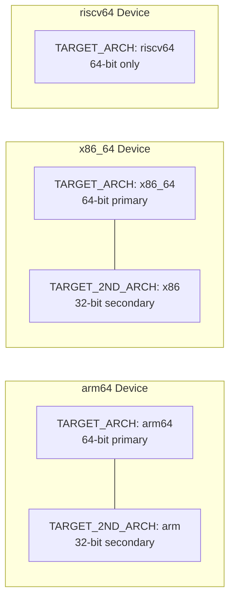

RISC-V currently has no secondary architecture -- it is 64-bit only. There is
no 32-bit RISC-V Android port.

### 57.5.2 Zygote Configuration

The multilib choice directly affects how Zygote processes are started. AOSP
includes several Zygote initialization scripts:

```makefile
# build/make/target/product/core_64_bit.mk, line 26-34
PRODUCT_PACKAGES += init.zygote64.rc init.zygote64_32.rc

# Set the zygote property to select the 64-bit primary, 32-bit secondary script
ifeq ($(ZYGOTE_FORCE_64),true)
PRODUCT_VENDOR_PROPERTIES += ro.zygote=zygote64
else
PRODUCT_VENDOR_PROPERTIES += ro.zygote=zygote64_32
endif

TARGET_SUPPORTS_32_BIT_APPS := true
TARGET_SUPPORTS_64_BIT_APPS := true
```

For 64-bit-only devices:

```makefile
# build/make/target/product/core_64_bit_only.mk, line 23-33
PRODUCT_PACKAGES += init.zygote64.rc

PRODUCT_VENDOR_PROPERTIES += ro.zygote=zygote64
PRODUCT_VENDOR_PROPERTIES += dalvik.vm.dex2oat64.enabled=true

TARGET_SUPPORTS_32_BIT_APPS := false
TARGET_SUPPORTS_64_BIT_APPS := true
TARGET_SUPPORTS_OMX_SERVICE := false
```

### 57.5.3 The compile_multilib Property

In `Android.bp` files, modules use the `compile_multilib` property to control
which architectures they are built for:

```
cc_library {
    name: "libexample",
    compile_multilib: "both",  // Build for both 32 and 64 bit
    srcs: ["example.cpp"],
}
```

The valid values are decoded by `decodeMultilibTargets()` in
`build/soong/android/arch.go`:

```go
// build/soong/android/arch.go, line 1939-1981
func decodeMultilibTargets(multilib string, targets []Target, prefer32 bool) ([]Target, error) {
    var buildTargets []Target
    switch multilib {
    case "common":
        buildTargets = getCommonTargets(targets)
    case "both":
        if prefer32 {
            buildTargets = append(buildTargets, filterMultilibTargets(targets, "lib32")...)
            buildTargets = append(buildTargets, filterMultilibTargets(targets, "lib64")...)
        } else {
            buildTargets = append(buildTargets, filterMultilibTargets(targets, "lib64")...)
            buildTargets = append(buildTargets, filterMultilibTargets(targets, "lib32")...)
        }
    case "32":
        buildTargets = filterMultilibTargets(targets, "lib32")
    case "64":
        buildTargets = filterMultilibTargets(targets, "lib64")
    case "first":
        if prefer32 {
            buildTargets = FirstTarget(targets, "lib32", "lib64")
        } else {
            buildTargets = FirstTarget(targets, "lib64", "lib32")
        }
    case "first_prefer32":
        buildTargets = FirstTarget(targets, "lib32", "lib64")
    case "prefer32":
        buildTargets = filterMultilibTargets(targets, "lib32")
        if len(buildTargets) == 0 {
            buildTargets = filterMultilibTargets(targets, "lib64")
        }
    // ...
    }
    return buildTargets, nil
}
```

| Value | Meaning |
|---|---|
| `"both"` | Build for both 32-bit and 64-bit |
| `"first"` | Build only for the primary architecture |
| `"32"` | Build only for 32-bit |
| `"64"` | Build only for 64-bit |
| `"prefer32"` | Build for 32-bit if available, else 64-bit |
| `"first_prefer32"` | Like `first` but prefers 32-bit |
| `"common"` | Architecture-independent (e.g., Java) |

### 57.5.4 Architecture-Specific Sources in Android.bp

The `arch:` block in `Android.bp` files allows modules to include
architecture-specific source files, compiler flags, or dependencies:

```
cc_library {
    name: "libexample",
    srcs: ["common.cpp"],
    arch: {
        arm: {
            srcs: ["arm_optimized.S"],
            cflags: ["-DHAS_NEON"],
        },
        arm64: {
            srcs: ["arm64_optimized.S"],
        },
        x86: {
            srcs: ["x86_optimized.S"],
            cflags: ["-DHAS_SSE"],
        },
        x86_64: {
            srcs: ["x86_64_optimized.S"],
        },
        riscv64: {
            srcs: ["riscv64_optimized.S"],
        },
    },
}
```

A real example from bionic shows this pattern at scale:

```
// bionic/libc/Android.bp (around line 980)
arch: {
    arm: {
        srcs: [
            "arch-arm/bionic/__aeabi_read_tp.S",
            "arch-arm/bionic/__bionic_clone.S",
            "arch-arm/bionic/__restore.S",
            "arch-arm/bionic/_exit_with_stack_teardown.S",
            "arch-arm/bionic/atomics_arm.c",
            "arch-arm/bionic/setjmp.S",
            "arch-arm/bionic/syscall.S",
            "arch-arm/bionic/vfork.S",

            "arch-arm/cortex-a7/string/memcpy.S",
            "arch-arm/cortex-a7/string/memset.S",
            "arch-arm/cortex-a9/string/memcpy.S",
            "arch-arm/cortex-a15/string/memcpy.S",
            // ... many more CPU-specific string routines
        ],
    },
    arm64: {
        srcs: [
            "arch-arm64/bionic/__bionic_clone.S",
            "arch-arm64/bionic/_exit_with_stack_teardown.S",
            "arch-arm64/bionic/setjmp.S",
            "arch-arm64/bionic/syscall.S",
            "arch-arm64/bionic/vfork.S",
            "arch-arm64/oryon/memcpy-nt.S",
            "arch-arm64/oryon/memset-nt.S",
        ],
    },
    riscv64: {
        srcs: [
            "arch-riscv64/bionic/__bionic_clone.S",
            "arch-riscv64/bionic/_exit_with_stack_teardown.S",
            "arch-riscv64/bionic/setjmp.S",
            "arch-riscv64/bionic/syscall.S",
            "arch-riscv64/bionic/vfork.S",
            "arch-riscv64/string/memchr.S",
            "arch-riscv64/string/memcmp.S",
            "arch-riscv64/string/memcpy.S",
            // ... more RISC-V string routines
        ],
    },
},
```

### 57.5.5 Output Directory Structure

The multilib mechanism produces output in separate directories. The 32-bit
secondary architecture outputs go to `obj_<arch>`:

```
out/target/product/generic_arm64/
    obj/              # 64-bit (primary) object files
    obj_arm/          # 32-bit (secondary) object files
    system/
        lib64/        # 64-bit shared libraries
        lib/          # 32-bit shared libraries
```

This is configured in `build/make/core/envsetup.mk`:

```makefile
# build/make/core/envsetup.mk, line 582-586
$(TARGET_2ND_ARCH_VAR_PREFIX)TARGET_OUT_INTERMEDIATES := \
    $(PRODUCT_OUT)/obj_$(TARGET_2ND_ARCH)
$(TARGET_2ND_ARCH_VAR_PREFIX)TARGET_OUT_SHARED_LIBRARIES := \
    $(target_out_shared_libraries_base)/lib
```

---

## 57.6 Compiler Configuration

The compiler configuration in AOSP is centralized in
`build/soong/cc/config/global.go` (633 lines) and applies to all architectures.
This file defines the common compilation flags, warning policies, debug
settings, and Clang toolchain paths that form the baseline for every native
build.

### 57.6.1 Common Global CFLAGS

The `commonGlobalCflags` array defines flags applied to every C/C++ compilation
in AOSP:

```go
// build/soong/cc/config/global.go, line 32-160
commonGlobalCflags = []string{
    "-O2",
    "-Wall",
    "-Wextra",
    "-Wpointer-arith",
    "-Wunguarded-availability",

    // Warnings treated as errors
    "-Werror=bool-operation",
    "-Werror=date-time",          // Nondeterministic builds
    "-Werror=int-conversion",
    "-Werror=multichar",
    "-Werror=pragma-pack",
    "-Werror=sizeof-array-div",
    "-Werror=sizeof-pointer-memaccess",
    "-Werror=string-plus-int",
    "-Werror=unreachable-code-loop-increment",
    // ...

    // Preprocessor defines
    "-DANDROID",
    "-DNDEBUG",
    "-UDEBUG",
    "-D__compiler_offsetof=__builtin_offsetof",
    "-D__ANDROID_UNAVAILABLE_SYMBOLS_ARE_WEAK__",

    // Code generation options
    "-faddrsig",
    "-fdebug-default-version=5",
    "-fcolor-diagnostics",
    "-ffp-contract=off",
    "-fno-exceptions",
    "-fno-strict-aliasing",
    "-fmessage-length=0",
    "-gsimple-template-names",
    "-gz=zstd",
    "-no-canonical-prefixes",
}
```

Several of these deserve explanation:

**`-O2`**: The default optimization level for all Android code. Not `-O3`,
because `-O3` enables aggressive optimizations (like loop unrolling and function
inlining) that can increase code size, which matters on mobile devices where
instruction cache pressure affects battery life.

**`-DANDROID`**: Defines the `ANDROID` preprocessor macro, which is checked by
thousands of `#ifdef ANDROID` blocks throughout AOSP and third-party code.

**`-DNDEBUG`**: Disables `assert()` in release builds. This is defined globally
because even debug builds of the platform generally do not want assert failures
in production code.

**`-fno-exceptions`**: Disables C++ exceptions globally. The Google C++ style
guide forbids exceptions, and bionic's C++ support library (libc++) is built
without exception support on Android.

**`-fno-strict-aliasing`**: Disables type-based alias analysis optimizations.
While this could improve performance, the comment explains the trade-off:
"The performance benefit of enabling them currently does not outweigh the risk
of hard-to-reproduce bugs."

**`-gz=zstd`**: Compresses debug information with Zstandard, significantly
reducing build output size without losing debug capability.

### 57.6.2 Device-Specific CFLAGS

Flags that apply only to device (not host) code:

```go
// build/soong/cc/config/global.go, line 172-193
deviceGlobalCflags = []string{
    "-ffunction-sections",
    "-fdata-sections",
    "-fno-short-enums",
    "-funwind-tables",
    "-fstack-protector-strong",
    "-Wa,--noexecstack",
    "-D_FORTIFY_SOURCE=3",

    "-Werror=non-virtual-dtor",
    "-Werror=address",
    "-Werror=sequence-point",
    "-Werror=format-security",
}
```

**`-ffunction-sections` / `-fdata-sections`**: Each function and data object
gets its own ELF section, enabling the linker to discard unused functions and
data via `--gc-sections`. This is critical for reducing binary size on mobile.

**`-fstack-protector-strong`**: Inserts stack canaries in functions that have
local arrays or take the address of a local variable. The "strong" variant
protects more functions than `-fstack-protector` but fewer than
`-fstack-protector-all`, balancing security with performance.

**`-D_FORTIFY_SOURCE=3`**: The highest level of compile-time and runtime
buffer overflow detection. Level 3 extends beyond the basic `memcpy` /
`strcpy` checks of level 2 to cover more functions and usage patterns.

### 57.6.3 Device Linker Flags

```go
// build/soong/cc/config/global.go, line 206-220
deviceGlobalLdflags = slices.Concat([]string{
    "-Wl,-z,noexecstack",
    "-Wl,-z,relro",
    "-Wl,-z,now",
    "-Wl,--build-id=md5",
    "-Wl,--fatal-warnings",
    "-Wl,--no-undefined-version",
    "-Wl,--exclude-libs,libgcc.a",
    "-Wl,--exclude-libs,libgcc_stripped.a",
    "-Wl,--exclude-libs,libunwind_llvm.a",
    "-Wl,--exclude-libs,libunwind.a",
    "-Wl,--compress-debug-sections=zstd",
}, commonGlobalLdflags)
```

The security-relevant flags:

- **`-Wl,-z,noexecstack`**: Marks the stack as non-executable (NX bit).
- **`-Wl,-z,relro`**: Read-only relocations -- makes GOT entries read-only
  after relocation.

- **`-Wl,-z,now`**: Immediate binding -- resolves all symbols at load time
  rather than lazily, eliminating the window where GOT entries are writable.

Together, these flags form a defense-in-depth strategy against exploitation.

The common linker flags shared between device and host:

```go
// build/soong/cc/config/global.go, line 195-199
commonGlobalLdflags = []string{
    "-fuse-ld=lld",
    "-Wl,--icf=safe",
    "-Wl,--no-demangle",
}
```

**`-fuse-ld=lld`**: Use LLVM's LLD linker instead of GNU ld. LLD is
significantly faster and is the only linker supported by AOSP.

**`-Wl,--icf=safe`**: Identical Code Folding -- merges functions with identical
machine code to save space. The "safe" mode only folds functions whose address
is never taken, avoiding subtle bugs.

### 57.6.4 Non-Overridable Flags

Some warnings are so important that modules cannot disable them even if they use
`-Wno-error` or similar flags in their `Android.bp`:

```go
// build/soong/cc/config/global.go, line 255-326
noOverrideGlobalCflags = []string{
    "-Werror=address-of-temporary",
    "-Werror=dangling",
    "-Werror=format-insufficient-args",
    "-Werror=fortify-source",
    "-Werror=incompatible-function-pointer-types",
    "-Werror=int-in-bool-context",
    "-Werror=int-to-pointer-cast",
    "-Werror=null-dereference",
    "-Werror=return-type",
    "-Werror=xor-used-as-pow",
    // ... plus many temporary compiler upgrade workarounds
}
```

These are appended *after* the module's own cflags, so they cannot be
overridden. The flags target critical safety issues: null dereference, dangling
pointers, format string bugs, and buffer overflows.

### 57.6.5 The Flag Layering Model

The complete set of flags applied to a compilation command is assembled in
layers:

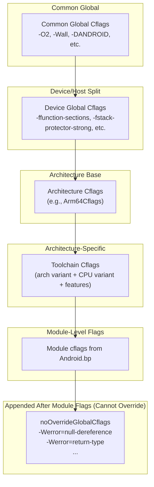

### 57.6.6 Clang Toolchain Version

Global.go also manages the Clang compiler version:

```go
// build/soong/cc/config/global.go, line 410-422
CStdVersion               = "gnu23"
CppStdVersion             = "gnu++20"
ExperimentalCStdVersion   = "gnu2y"
ExperimentalCppStdVersion = "gnu++2b"

ClangDefaultBase         = "prebuilts/clang/host"
ClangDefaultVersion      = "clang-r563880c"
ClangDefaultShortVersion = "21"
```

AOSP uses C23 (`gnu23`) for C code and C++20 (`gnu++20`) for C++ code.
The `gnu` prefix means GNU extensions are enabled. The specific Clang version
`clang-r563880c` (Clang 21) is pinned in the source and can be overridden
via environment variables.

### 57.6.7 Auto Variable Initialization

A notable security feature is automatic variable initialization:

```go
// build/soong/cc/config/global.go, line 454-463
if ctx.Config().IsEnvTrue("AUTO_ZERO_INITIALIZE") {
    flags = append(flags, "-ftrivial-auto-var-init=zero")
} else if ctx.Config().IsEnvTrue("AUTO_PATTERN_INITIALIZE") {
    flags = append(flags, "-ftrivial-auto-var-init=pattern")
} else if ctx.Config().IsEnvTrue("AUTO_UNINITIALIZE") {
    flags = append(flags, "-ftrivial-auto-var-init=uninitialized")
} else {
    // Default to zero initialization.
    flags = append(flags, "-ftrivial-auto-var-init=zero")
}
```

By default, all stack variables are zero-initialized. This eliminates an
entire class of uninitialized-variable bugs at a small runtime cost. The
comment references bug b/131390872, which tracked the rollout of this feature.

### 57.6.8 Sanitizer Runtime Libraries

The `toolchain.go` file defines helper functions for all the sanitizer runtime
libraries:

```go
// build/soong/cc/config/toolchain.go, line 219-265
func AddressSanitizerRuntimeLibrary() string {
    return LibclangRuntimeLibrary("asan")
}
func HWAddressSanitizerRuntimeLibrary() string {
    return LibclangRuntimeLibrary("hwasan")
}
func UndefinedBehaviorSanitizerRuntimeLibrary() string {
    return LibclangRuntimeLibrary("ubsan_standalone")
}
func ThreadSanitizerRuntimeLibrary() string {
    return LibclangRuntimeLibrary("tsan")
}
func ScudoRuntimeLibrary() string {
    return LibclangRuntimeLibrary("scudo")
}
func LibFuzzerRuntimeLibrary() string {
    return LibclangRuntimeLibrary("fuzzer")
}
```

These functions return library names like `libclang_rt.asan`, which are then
resolved to architecture-specific binaries using the
`LibclangRuntimeLibraryArch()` method from each toolchain (e.g., `"aarch64"` for
ARM64, `"i686"` for x86).

### 57.6.9 External Code Flags

Third-party code (anything under `external/`, most of `vendor/`, and most of
`hardware/`) gets relaxed warning treatment:

```go
// build/soong/cc/config/global.go (line 339-364)
extraExternalCflags = []string{
    "-Wno-enum-compare",
    "-Wno-enum-compare-switch",
    "-Wno-null-pointer-arithmetic",
    "-Wno-psabi",
    "-Wno-null-pointer-subtraction",
    "-Wno-string-concatenation",
    "-Wno-deprecated-non-prototype",
    "-Wno-unused",
    "-Wno-unused-but-set-variable",
    "-Wno-deprecated",
    "-Wno-tautological-constant-compare",
    "-Wno-error=range-loop-construct",
}
```

And the non-overridable flags for external code are even more permissive:

```go
// build/soong/cc/config/global.go (line 370-393)
noOverrideExternalGlobalCflags = []string{
    "-fcommon",
    "-Wno-format-insufficient-args",
    "-Wno-misleading-indentation",
    "-Wno-unused",
    "-Wno-unused-parameter",
    "-Wno-unused-but-set-parameter",
    "-Wno-unused-variable",
    "-Wno-unqualified-std-cast-call",
    "-Wno-array-parameter",
    "-Wno-gnu-offsetof-extensions",
    "-Wno-pessimizing-move",
    "-Wno-pointer-to-int-cast",
}
```

The `-fcommon` flag (marked with bug b/151457797) is particularly notable.
Modern C compilers default to `-fno-common`, which makes tentative definitions
of global variables into strong symbols. Many legacy C libraries rely on the
old behavior where tentative definitions are "common" symbols that can be
merged across translation units. Without `-fcommon`, these libraries fail to
link.

### 57.6.10 Illegal Flags

AOSP bans certain compiler flags entirely:

```go
// build/soong/cc/config/global.go (line 401-408)
IllegalFlags = []string{
    "-w",
    "-pedantic",
    "-pedantic-errors",
    "-Werror=pedantic",
    "-Wno-all",
    "-Wno-everything",
}
```

The `-w` flag suppresses all warnings, which would undermine the entire
warning infrastructure. `-Wno-all` and `-Wno-everything` have the same
effect. `-pedantic` flags are banned because they trigger thousands of
warnings from legitimate GNU extension usage throughout AOSP.

### 57.6.11 Language Standard Versions

AOSP specifies modern language standards:

```go
// build/soong/cc/config/global.go (line 410-413)
CStdVersion               = "gnu23"
CppStdVersion             = "gnu++20"
ExperimentalCStdVersion   = "gnu2y"
ExperimentalCppStdVersion = "gnu++2b"
```

- **C23** (`gnu23`): The latest C standard (ISO/IEC 9899:2024), with GNU
  extensions. This enables features like `typeof`, `auto`, `constexpr`, and
  improved `_Static_assert`.

- **C++20** (`gnu++20`): Enables concepts, ranges, coroutines, modules,
  three-way comparison, and many other major C++ features.

- The "experimental" versions (`gnu2y`, `gnu++2b`) target the next standard
  revision and are used for modules that opt into bleeding-edge features.

### 57.6.12 Clang Unknown Flags Filter

The `clang.go` file maintains a list of GCC flags that Clang does not
understand, which must be filtered out when processing legacy build files:

```go
// build/soong/cc/config/clang.go, line 25-74
var ClangUnknownCflags = sorted([]string{
    "-finline-functions",
    "-finline-limit=64",
    "-fno-canonical-system-headers",
    // ...
    // arm + arm64
    "-fgcse-after-reload",
    "-frerun-cse-after-loop",
    "-frename-registers",
    // arm
    "-mthumb-interwork",
    "-fno-caller-saves",
    // x86 + x86_64
    "-finline-limit=300",
    "-mfpmath=sse",
    "-mbionic",
    // windows
    "--enable-stdcall-fixup",
})
```

This list is a historical artifact -- AOSP used to support GCC compilation, and
many third-party projects still reference GCC-specific flags. The filter
silently removes these rather than causing build failures.

---

## 57.7 Generic Device Configurations

AOSP provides generic device configurations under `device/generic/` for
reference, testing, and emulator use. These configurations define the minimum
viable settings for each supported architecture.

### 57.7.1 Directory Structure

```
device/generic/
    arm64/            - 64-bit ARM reference device
    armv7-a-neon/     - 32-bit ARM with NEON
    x86/              - 32-bit x86
    x86_64/           - 64-bit x86
    art/              - ART runtime test devices
        armv8/        - ARM64 for ART testing
        riscv64/      - RISC-V for ART testing
        silvermont/   - x86 Silvermont for ART testing
        arm_krait/    - ARM Krait for ART testing
        arm_v7_v8/    - ARM v7/v8 for ART testing
        armv8_cortex_a55/  - ARM64 Cortex-A55 tuned
        armv8_kryo385/     - ARM64 Kryo 385 tuned
    car/              - Android Automotive targets
    trusty/           - Trusted Execution Environment
    common/           - Shared resources
    goldfish/         - Legacy emulator
```

### 57.7.2 ARM64 Generic Device

The ARM64 generic device is the most common reference target:

```makefile
# device/generic/arm64/BoardConfig.mk
TARGET_ARCH := arm64
TARGET_ARCH_VARIANT := armv8-a
TARGET_CPU_VARIANT := generic
TARGET_CPU_ABI := arm64-v8a

TARGET_2ND_ARCH := arm
TARGET_2ND_ARCH_VARIANT := armv7-a-neon
TARGET_2ND_CPU_VARIANT := cortex-a15
TARGET_2ND_CPU_ABI := armeabi-v7a
TARGET_2ND_CPU_ABI2 := armeabi
```

This configuration establishes a dual-architecture device:

- **Primary**: ARM64 with the baseline ARMv8-A ISA
- **Secondary**: 32-bit ARM with NEON, tuned for Cortex-A15

The product configuration inherits the 64-bit core and the common mini
configuration:

```makefile
# device/generic/arm64/mini_arm64.mk
$(call inherit-product, $(SRC_TARGET_DIR)/product/core_64_bit.mk)
$(call inherit-product, device/generic/armv7-a-neon/mini_common.mk)

PRODUCT_NAME := mini_arm64
PRODUCT_DEVICE := arm64
```

### 57.7.3 ARM 32-bit Generic Device

The 32-bit ARM device targets the ARMv7-A architecture with NEON:

```makefile
# device/generic/armv7-a-neon/BoardConfig.mk
TARGET_ARCH := arm
TARGET_ARCH_VARIANT := armv7-a-neon
TARGET_CPU_VARIANT := generic
TARGET_CPU_ABI := armeabi-v7a
TARGET_CPU_ABI2 := armeabi
```

This has no secondary architecture -- it is pure 32-bit. The `armeabi`
secondary ABI provides compatibility with ancient pre-NEON ARM code (ARMv5TE).

### 57.7.4 x86_64 Generic Device

```makefile
# device/generic/x86_64/BoardConfig.mk
TARGET_CPU_ABI := x86_64
TARGET_ARCH := x86_64
TARGET_ARCH_VARIANT := x86_64

TARGET_2ND_CPU_ABI := x86
TARGET_2ND_ARCH := x86
TARGET_2ND_ARCH_VARIANT := x86_64
```

### 57.7.5 ART Test Devices

The `device/generic/art/` directory contains specialized configurations for
testing the ART runtime on different CPU variants. These are not real devices
but rather build targets that exercise specific ISA features:

```makefile
# device/generic/art/BoardConfigCommon.mk
TARGET_NO_BOOTLOADER := true
TARGET_NO_KERNEL := true
TARGET_CPU_SMP := true
$(call soong_config_set,art_module,source_build,true)
```

```makefile
# device/generic/art/armv8/BoardConfig.mk
TARGET_ARCH := arm64
TARGET_CPU_ABI := arm64-v8a
TARGET_CPU_VARIANT := generic
TARGET_ARCH_VARIANT := armv8-a
TARGET_SUPPORTS_64_BIT_APPS := true
```

The ART test configurations also include vendor-specific variants:

| Directory | Configuration | Purpose |
|---|---|---|
| `armv8/` | Generic ARMv8-A | Baseline ARM64 testing |
| `armv8_cortex_a55/` | Cortex-A55 | LITTLE core testing |
| `armv8_kryo385/` | Kryo 385 | Qualcomm core testing |
| `arm_krait/` | Krait | Qualcomm 32-bit testing |
| `arm_v7_v8/` | ARMv7/v8 | Cross-version testing |
| `riscv64/` | RISC-V 64 | RISC-V ART testing |
| `silvermont/` | Silvermont | Intel Atom testing |

### 57.7.6 Android Automotive (Car)

The `device/generic/car/` directory demonstrates multi-architecture automotive
targets:

```
device/generic/car/
    emulator_car64_arm64/     - ARM64 automotive emulator
    emulator_car64_x86_64/    - x86_64 automotive emulator
    car_x86_64/               - x86_64 automotive device
    sdk_car_arm64.mk          - ARM64 SDK
    sdk_car_x86_64.mk         - x86_64 SDK
    sdk_car_md_arm64.mk       - Multi-display ARM64
    sdk_car_md_x86_64.mk      - Multi-display x86_64
    gsi_car_arm64.mk          - ARM64 GSI (Generic System Image)
    gsi_car_x86_64.mk         - x86_64 GSI
```

### 57.7.7 Trusty TEE

The Trusty Trusted Execution Environment provides a secure world that runs
alongside Android:

```makefile
# device/generic/trusty/qemu_trusty_arm64.mk
# (Trusty configuration for ARM64 QEMU)
```

Trusty runs as a separate OS in ARM TrustZone (or equivalent secure monitor
mode), and its build system must produce code for the secure world that is
compatible with the normal world's architecture.

### 57.7.8 The AOSP Product Build

The full AOSP product combines a generic device with system, vendor, and
product image configurations:

```makefile
# build/make/target/product/aosp_arm64.mk
$(call inherit-product, $(SRC_TARGET_DIR)/product/core_64_bit.mk)
$(call inherit-product, $(SRC_TARGET_DIR)/product/generic_system.mk)

PRODUCT_NAME := aosp_arm64
PRODUCT_DEVICE := generic_arm64
PRODUCT_BRAND := Android
PRODUCT_MODEL := AOSP on ARM64

PRODUCT_NO_BIONIC_PAGE_SIZE_MACRO := true
```

The `PRODUCT_NO_BIONIC_PAGE_SIZE_MACRO := true` flag is a recent addition that
prevents bionic from exposing a fixed `PAGE_SIZE` macro, allowing the system to
support 16KB pages on ARM64 (a kernel configuration option that improves TLB
performance).

---

## 57.8 Architecture-Specific Code Patterns

Across AOSP, several major components contain hand-tuned assembly code for each
supported architecture. This section examines the patterns used in bionic, ART,
and other performance-critical subsystems.

### 57.8.1 Bionic: Architecture Directories

Bionic organizes architecture-specific code in `arch-<arch>/` subdirectories:

```
bionic/libc/
    arch-arm/
        bionic/       - Low-level ARM32 routines (clone, setjmp, syscall)
        cortex-a7/    - Cortex-A7 tuned string functions
        cortex-a9/    - Cortex-A9 tuned string functions
        cortex-a15/   - Cortex-A15 tuned string functions
        cortex-a53/   - Cortex-A53 tuned string functions
        cortex-a55/   - Cortex-A55 tuned string functions
        generic/      - Generic ARM string functions
        krait/        - Qualcomm Krait tuned string functions
        kryo/         - Qualcomm Kryo tuned string functions
    arch-arm64/
        bionic/       - Low-level ARM64 routines
        string/       - ARM64 string function stubs
        oryon/        - Qualcomm Oryon tuned routines
    arch-x86/
        bionic/       - Low-level x86 routines
        string/       - x86 string functions
    arch-x86_64/
        bionic/       - Low-level x86_64 routines
        string/       - x86_64 string functions
    arch-riscv64/
        bionic/       - Low-level RISC-V routines
        string/       - RISC-V string functions (SiFive contributed)
```

### 57.8.2 Bionic: The ifunc Dispatch Pattern (ARM64)

ARM64 bionic uses the GNU indirect function (ifunc) mechanism to select the
best implementation of common functions at runtime. The ifunc resolver runs
during dynamic linking and chooses an implementation based on hardware
capabilities:

```cpp
// bionic/libc/arch-arm64/ifuncs.cpp (line 41-49)
static inline bool __bionic_is_oryon(unsigned long hwcap) {
  if (!(hwcap & HWCAP_CPUID)) return false;

  unsigned long midr;
  __asm__ __volatile__("mrs %0, MIDR_EL1" : "=r"(midr));

  // Check for implementor Qualcomm's parts 0..15 (Oryon).
  return implementer(midr) == 'Q' && part(midr) <= 15;
}
```

The `memcpy` ifunc resolver demonstrates the multi-level dispatch:

```cpp
// bionic/libc/arch-arm64/ifuncs.cpp (line 69-79)
DEFINE_IFUNC_FOR(memcpy) {
  if (arg->_hwcap2 & HWCAP2_MOPS) {
    RETURN_FUNC(memcpy_func_t, __memmove_aarch64_mops);
  } else if (__bionic_is_oryon(arg->_hwcap)) {
    RETURN_FUNC(memcpy_func_t, __memcpy_aarch64_nt);
  } else if (arg->_hwcap & HWCAP_ASIMD) {
    RETURN_FUNC(memcpy_func_t, __memcpy_aarch64_simd);
  } else {
    RETURN_FUNC(memcpy_func_t, __memcpy_aarch64);
  }
}
```

The priority order is:

1. **MOPS** (Memory Copy and Memory Set instructions, ARMv8.8-A) -- hardware
   `memcpy` instructions

2. **Oryon** -- Qualcomm's custom core with non-temporal store optimizations
3. **ASIMD** (Advanced SIMD, a.k.a. NEON) -- vectorized copy
4. **Fallback** -- scalar implementation

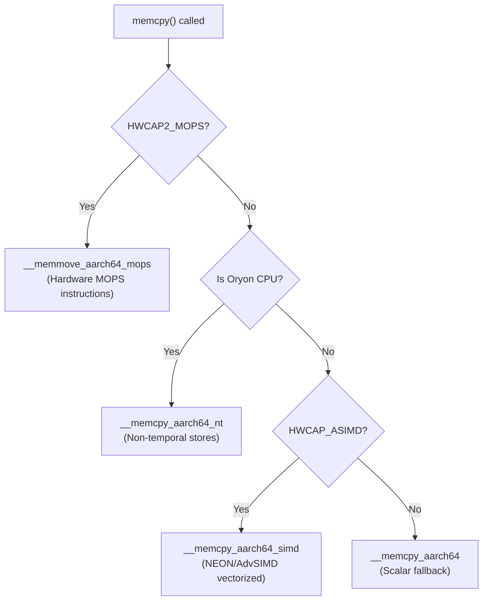

The same pattern applies to `memmove`, `memset`, `strlen`, `strchr`, and other
hot string functions. MTE-aware variants are selected when `HWCAP2_MTE` is
present:

```cpp
// bionic/libc/arch-arm64/ifuncs.cpp (line 100-108)
DEFINE_IFUNC_FOR(memset) {
  if (arg->_hwcap2 & HWCAP2_MOPS) {
    RETURN_FUNC(memset_func_t, __memset_aarch64_mops);
  } else if (__bionic_is_oryon(arg->_hwcap)) {
    RETURN_FUNC(memset_func_t, __memset_aarch64_nt);
  } else {
    RETURN_FUNC(memset_func_t, __memset_aarch64);
  }
}
```

```cpp
// bionic/libc/arch-arm64/ifuncs.cpp (line 117-123)
DEFINE_IFUNC_FOR(strchr) {
  if (arg->_hwcap2 & HWCAP2_MTE) {
    RETURN_FUNC(strchr_func_t, __strchr_aarch64_mte);
  } else {
    RETURN_FUNC(strchr_func_t, __strchr_aarch64);
  }
}
```

### 57.8.3 Bionic: ARM 32-bit CPU-Variant String Functions

ARM 32-bit bionic takes a different approach: instead of runtime ifunc dispatch,
it compiles multiple CPU-variant-specific implementations and selects at build
time based on the device's `TARGET_CPU_VARIANT`. The source tree contains
separate directories for each CPU variant:

```
arch-arm/cortex-a7/string/memcpy.S    - Tuned for A7's in-order pipeline
arch-arm/cortex-a9/string/memcpy.S    - Tuned for A9's partial out-of-order
arch-arm/cortex-a15/string/memcpy.S   - Tuned for A15's full out-of-order
arch-arm/cortex-a53/string/memcpy.S   - Tuned for A53's 64-bit in-order
arch-arm/cortex-a55/string/memcpy.S   - Tuned for A55's enhanced in-order
arch-arm/krait/string/memcpy.S        - Tuned for Qualcomm Krait
arch-arm/kryo/string/memcpy.S         - Tuned for Qualcomm Kryo
```

Each `memcpy.S` contains different hand-written assembly that exploits the
target core's pipeline characteristics -- prefetch distances, store buffer
depths, cache line sizes, and NEON instruction scheduling.

### 57.8.4 Bionic: RISC-V String Functions with Vector Extension

The RISC-V string implementations in bionic were contributed by SiFive and use
the RISC-V Vector extension:

```
bionic/libc/arch-riscv64/string/
    memchr.S    memcmp.S    memcpy.S    memmove.S    memset.S
    stpcpy.S    strcat.S    strchr.S    strcmp.S     strcpy.S
    strlen.S    strncat.S   strncmp.S   strncpy.S    strnlen.S
```

The copyright headers in these files attribute them to both "The Android Open
Source Project" and "SiFive, Inc." -- SiFive is a leading RISC-V chip designer
that contributed these optimized implementations.

### 57.8.5 Bionic: Low-Level Architecture Functions

Every architecture must implement a set of core low-level functions in assembly.
These cannot be written in C because they manipulate the stack, registers, or
execution context in ways that C cannot express:

| Function | Purpose | Why Assembly? |
|---|---|---|
| `__bionic_clone.S` | `clone()` syscall wrapper | Must set up child stack and call entry point |
| `_exit_with_stack_teardown.S` | Thread exit | Must deallocate own stack while running |
| `setjmp.S` / `longjmp.S` | Non-local jumps | Must save/restore all callee-saved registers |
| `syscall.S` | Raw syscall interface | Must move args to syscall registers |
| `vfork.S` | `vfork()` implementation | Must not clobber parent's stack frame |

The ARM64 `setjmp.S` shows the register-level detail required:

```asm
// bionic/libc/arch-arm64/bionic/setjmp.S (line 32-51)
// According to AARCH64 PCS document we need to save:
//   Core     x19 - x30, sp (see section 5.1.1)
//   VFP      d8 - d15 (see section 5.1.2)
//
// jmp_buf layout:
//   word   name            description
//   0      sigflag/cookie  setjmp cookie in top 31 bits, signal mask flag in low bit
//   1      sigmask         signal mask
//   2      core_base       base of core registers (x18-x30, sp)
//   16     float_base      base of float registers (d8-d15)
//   24     checksum        checksum of core registers
//   25     reserved        reserved entries (room to grow)
```

### 57.8.6 Bionic: MTE Integration

ARM64 bionic includes ELF notes that control MTE behavior. Two variants exist:

- `note_memtag_heap_async.S` -- Requests asynchronous MTE checking (lower
  overhead, delayed error reporting)

- `note_memtag_heap_sync.S` -- Requests synchronous MTE checking (higher
  overhead, immediate error reporting)

```asm
// bionic/libc/arch-arm64/bionic/note_memtag_heap_async.S (line 34-46)
  .section ".note.android.memtag", "a", %note
  .p2align 2
  .long 1f - 0f                 // int32_t namesz
  .long 3f - 2f                 // int32_t descsz
  .long NT_ANDROID_TYPE_MEMTAG  // int32_t type
0:
  .asciz "Android"              // char name[]
1:
  .p2align 2
2:
  .long (NT_MEMTAG_LEVEL_ASYNC | NT_MEMTAG_HEAP) // value
3:
```

These notes are linked into binaries that opt into MTE. The dynamic linker
reads them and configures the process's memory tagging mode before the main
program runs.

### 57.8.7 ART Runtime: Architecture-Specific Entrypoints

The Android Runtime (ART) contains extensive architecture-specific code for JIT
compilation, garbage collection, and JNI transitions. Each architecture has a
complete set of entrypoint files:

```
art/runtime/arch/arm64/
    asm_support_arm64.S              - Assembly constants and macros
    asm_support_arm64.h              - Shared constants
    callee_save_frame_arm64.h        - Callee-save frame layout
    context_arm64.cc                 - CPU context save/restore
    entrypoints_init_arm64.cc        - Entrypoint table initialization
    fault_handler_arm64.cc           - Signal handler for null checks
    instruction_set_features_arm64.cc - ISA feature detection
    jni_entrypoints_arm64.S          - JNI call trampolines
    quick_entrypoints_arm64.S        - Quick compiler entrypoints
    registers_arm64.cc               - Register definitions
    thread_arm64.cc                  - Thread-local storage access
```

The same structure is replicated for every architecture:

```
art/runtime/arch/
    arm/     - ARM32 entrypoints
    arm64/   - ARM64 entrypoints
    x86/     - x86 entrypoints
    x86_64/  - x86_64 entrypoints
    riscv64/ - RISC-V 64 entrypoints
```

### 57.8.8 ART: Instruction Set Feature Detection

ART's `instruction_set_features.cc` dispatches feature detection to
architecture-specific implementations:

```cpp
// art/runtime/arch/instruction_set_features.cc (line 33-53)
std::unique_ptr<const InstructionSetFeatures> InstructionSetFeatures::FromVariant(
    InstructionSet isa, const std::string& variant, std::string* error_msg) {
  switch (isa) {
    case InstructionSet::kArm:
    case InstructionSet::kThumb2:
      return ArmInstructionSetFeatures::FromVariant(variant, error_msg);
    case InstructionSet::kArm64:
      return Arm64InstructionSetFeatures::FromVariant(variant, error_msg);
    case InstructionSet::kRiscv64:
      return Riscv64InstructionSetFeatures::FromVariant(variant, error_msg);
    case InstructionSet::kX86:
      return X86InstructionSetFeatures::FromVariant(variant, error_msg);
    case InstructionSet::kX86_64:
      return X86_64InstructionSetFeatures::FromVariant(variant, error_msg);
    // ...
  }
}
```

The ARM64 feature detection (`instruction_set_features_arm64.cc`) is
particularly detailed, tracking specific CPU errata and optional ISA extensions:

```cpp
// art/runtime/arch/arm64/instruction_set_features_arm64.cc (line 52-85)
static const char* arm64_variants_with_a53_835769_bug[] = {
    "default", "generic",
    "cortex-a53", "cortex-a53.a57", "cortex-a53.a72",
    "cortex-a57", "cortex-a72", "cortex-a73",
};

static const char* arm64_variants_with_crc[] = {
    "default", "generic", "cortex-a35", "cortex-a53", ...
};

static const char* arm64_variants_with_lse[] = {
    "cortex-a55", "cortex-a75", "cortex-a76", "kryo385", "kryo785",
};

static const char* arm64_variants_with_fp16[] = {
    "cortex-a55", "cortex-a75", "cortex-a76", "kryo385", "kryo785",
};

static const char* arm64_variants_with_dotprod[] = {
    "cortex-a55", "cortex-a75", "cortex-a76",
};
```

These feature lists are used by the ART JIT compiler to decide which
instructions to emit. For example, if `has_lse` is true, the JIT can emit LSE
(Large System Extensions) atomic instructions instead of the slower LL/SC
(Load-Linked/Store-Conditional) loop sequences.

ART also validates the compile-time feature assumptions against runtime
hardware capabilities using `FromVariantAndHwcap()`:

```cpp
// art/runtime/arch/instruction_set_features.cc (line 55-80)
std::unique_ptr<const InstructionSetFeatures> InstructionSetFeatures::FromVariantAndHwcap(
    InstructionSet isa, const std::string& variant, std::string* error_msg) {
  auto variant_features = FromVariant(isa, variant, error_msg);
  if (variant_features == nullptr) return nullptr;

  // Pixel3a is wrongly reporting itself as cortex-a75, so validate the
  // features with hwcaps.
  if (isa == InstructionSet::kArm64) {
    auto new_features = down_cast<const Arm64InstructionSetFeatures*>(
        variant_features.get())->IntersectWithHwcap();
    if (!variant_features->Equals(new_features.get())) {
      LOG(WARNING) << "Mismatch between instruction set variant of device ("
            << *variant_features << ") and features returned by the hardware ("
            << *new_features << ")";
    }
    return new_features;
  }
  return variant_features;
}
```

The comment about Pixel 3a is instructive -- it shows that even Google's own
devices can have incorrect `TARGET_CPU_VARIANT` settings, making runtime
validation essential.

### 57.8.9 ART: Quick Entrypoints

The `quick_entrypoints_arm64.S` file contains the assembly routines that bridge
managed (Java/Kotlin) code with the ART runtime. These are some of the most
performance-critical code in Android. The file begins with callee-save frame
setup macros:

```asm
// art/runtime/arch/arm64/quick_entrypoints_arm64.S (line 45-60)
.macro SETUP_SAVE_REFS_AND_ARGS_FRAME
    LOAD_RUNTIME_INSTANCE xIP0
    ldr xIP0, [xIP0, RUNTIME_SAVE_REFS_AND_ARGS_METHOD_OFFSET]
    INCREASE_FRAME FRAME_SIZE_SAVE_REFS_AND_ARGS
    SETUP_SAVE_REFS_AND_ARGS_FRAME_INTERNAL sp
    str xIP0, [sp]
    mov xIP0, sp
    str xIP0, [xSELF, # THREAD_TOP_QUICK_FRAME_OFFSET]
.endm
```

These macros manage the transition between managed code (which uses ART's
calling convention) and native code (which uses the platform ABI). The
`THREAD_TOP_QUICK_FRAME_OFFSET` references the thread-local storage where ART
tracks the current managed stack frame -- essential for garbage collection, stack
walking, and exception handling.

### 57.8.10 ART: Multiple Feature Detection Strategies

ART implements six different strategies for detecting CPU features, reflecting
the reality that no single detection method is reliable across all devices:

```cpp
// art/runtime/arch/arm64/instruction_set_features_arm64.h (line 35-55)
// 1. FromVariant() - Parse a CPU variant string like "cortex-a75"
static Arm64FeaturesUniquePtr FromVariant(const std::string& variant, std::string* error_msg);

// 2. FromBitmap() - Parse a bitmap (used for serialization/deserialization)
static Arm64FeaturesUniquePtr FromBitmap(uint32_t bitmap);

// 3. FromCppDefines() - Use C preprocessor defines set by the compiler
static Arm64FeaturesUniquePtr FromCppDefines();

// 4. FromCpuInfo() - Parse /proc/cpuinfo
static Arm64FeaturesUniquePtr FromCpuInfo();

// 5. FromHwcap() - Use the kernel's AT_HWCAP auxiliary vector
static Arm64FeaturesUniquePtr FromHwcap();

// 6. FromAssembly() - Run assembly tests to probe feature availability
static Arm64FeaturesUniquePtr FromAssembly();

// 7. FromCpuFeatures() - Use external cpu_features library
static Arm64FeaturesUniquePtr FromCpuFeatures();

// 8. IntersectWithHwcap() - Validate variant features against hardware
Arm64FeaturesUniquePtr IntersectWithHwcap() const;
```

The preferred approach on ARM64 is `FromVariantAndHwcap()`, which first creates
features from the build-time variant string, then validates them against
runtime hardware capabilities. This two-step process catches cases like the
Pixel 3a, where the device incorrectly reports its CPU variant.

For RISC-V, only `FromVariant()` and `FromCppDefines()` are currently
functional -- the hardware detection paths remain as stubs.

### 57.8.11 Architecture-Specific Build Patterns Summary

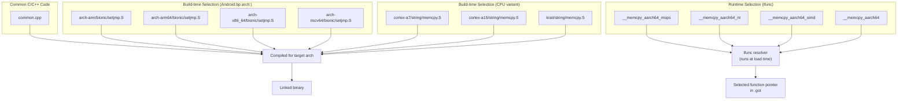

The three-level optimization strategy:

1. **Architecture selection** (build time): The `arch:` block in `Android.bp`
   selects completely different source files per architecture. This is for code
   that is fundamentally different between architectures (syscall wrappers,
   setjmp, thread creation).

2. **CPU variant selection** (build time): For ARM 32-bit, separate hand-tuned
   implementations exist for each major CPU variant. The build system compiles
   all of them into the same binary, with the appropriate one selected by the
   ifunc mechanism or by the linker based on device configuration.

3. **Runtime hardware detection** (load time): ARM64's ifunc resolvers check
   `hwcap` bits at library load time to select the best implementation for the
   actual hardware. This handles cases where the exact CPU model was not known
   at build time, or where a single binary must run on multiple hardware
   generations.

### 57.8.12 The ARM 32-bit Instruction Set: ARM vs. Thumb

ARM 32-bit has a unique feature among AOSP architectures: two instruction
encodings. The ARM toolchain supports switching between them:

```go
// build/soong/cc/config/arm_device.go (line 49-54)
armArmCflags = []string{}

armThumbCflags = []string{
    "-mthumb",
    "-Os",
}
```

The toolchain's `InstructionSetFlags()` method selects between them:

```go
// build/soong/cc/config/arm_device.go (line 288-297)
func (t *toolchainArm) InstructionSetFlags(isa string) (string, error) {
    switch isa {
    case "arm":
        return "${config.ArmArmCflags}", nil
    case "thumb", "":
        return "${config.ArmThumbCflags}", nil
    default:
        return t.toolchainBase.InstructionSetFlags(isa)
    }
}
```

**Thumb mode** (the default) uses 16-bit instruction encoding with `-Os`
(optimize for size). This reduces code size significantly -- critical for the
32-bit secondary architecture that exists primarily for compatibility.

**ARM mode** uses 32-bit instruction encoding. Modules can opt into ARM mode via
the `instruction_set: "arm"` property in their `Android.bp` when they need the
full 32-bit instruction set (e.g., for hand-tuned assembly that uses
instructions not available in Thumb).

### 57.8.13 The ARM 32-bit Soft Float and NEON

ARM 32-bit Android uses soft-float ABI (`-mfloat-abi=softfp`), meaning
floating-point values are passed in integer registers at function call
boundaries, even though the hardware FPU is used for computation:

```go
// build/soong/cc/config/arm_device.go (line 56-77)
armArchVariantCflags = map[string][]string{
    "armv7-a": []string{
        "-march=armv7-a",
        "-mfloat-abi=softfp",
        "-mfpu=vfpv3-d16",
    },
    "armv7-a-neon": []string{
        "-march=armv7-a",
        "-mfloat-abi=softfp",
        "-mfpu=neon",
    },
    "armv8-a": []string{
        "-march=armv8-a",
        "-mfloat-abi=softfp",
        "-mfpu=neon-fp-armv8",
    },
    "armv8-2a": []string{
        "-march=armv8.2-a",
        "-mfloat-abi=softfp",
        "-mfpu=neon-fp-armv8",
    },
}
```

The `-mfpu=` flag specifies the FPU type:

- `vfpv3-d16`: Basic VFP with 16 double-precision registers (no NEON)
- `neon`: Full NEON SIMD unit
- `neon-fp-armv8`: NEON with ARMv8 floating-point extensions

The `armv7-a-neon` variant is the most commonly used for modern 32-bit devices,
as it enables NEON SIMD optimizations.

### 57.8.14 Bionic Strip Configuration Per Architecture

Even the way binaries are stripped varies by architecture. Bionic's
`Android.bp` configures different strip behavior for each architecture:

```
// bionic/libc/Android.bp (around line 135-165)
arch: {
    arm: {
        // arm32 does not produce complete exidx unwind information,
        // so keep the .debug_frame which is relatively small and does
        // include needed unwind information.
        // See b/132992102 for details.
        strip: {
            keep_symbols_and_debug_frame: true,
        },
    },
    arm64: {
        strip: {
            keep_symbols: true,
        },
    },
    riscv64: {
        strip: {
            keep_symbols: true,
        },
    },
    x86: {
        strip: {
            keep_symbols: true,
        },
    },
    x86_64: {
        strip: {
            keep_symbols: true,
        },
    },
},
```

ARM 32-bit is the only architecture that needs `keep_symbols_and_debug_frame`.
This is because ARM 32-bit uses a different unwinding mechanism (EXIDX tables in
the `.ARM.exidx` section) that is incomplete in some cases, so the
`.debug_frame` section must be preserved as a fallback. All other architectures
use DWARF-based unwinding and only need the symbol table kept.

### 57.8.15 Page Size Macro Handling

The bionic page size macro handling is architecture-aware:

```go
// build/soong/cc/config/arm64_device.go (line 98-106)
pctx.VariableFunc("Arm64Cflags", func(ctx android.PackageVarContext) string {
    flags := arm64Cflags
    if ctx.Config().NoBionicPageSizeMacro() {
        flags = append(flags, "-D__BIONIC_NO_PAGE_SIZE_MACRO")
    } else {
        flags = append(flags, "-D__BIONIC_DEPRECATED_PAGE_SIZE_MACRO")
    }
    return strings.Join(flags, " ")
})
```

The same pattern exists for x86_64:

```go
// build/soong/cc/config/x86_64_device.go (line 111-119)
pctx.VariableFunc("X86_64Cflags", func(ctx android.PackageVarContext) string {
    flags := x86_64Cflags
    if ctx.Config().NoBionicPageSizeMacro() {
        flags = append(flags, "-D__BIONIC_NO_PAGE_SIZE_MACRO")
    } else {
        flags = append(flags, "-D__BIONIC_DEPRECATED_PAGE_SIZE_MACRO")
    }
    return strings.Join(flags, " ")
})
```

This is related to the ongoing effort to support 16KB pages on ARM64. The
`PAGE_SIZE` macro in `<unistd.h>` traditionally returns 4096, but this is
incorrect on devices running 16KB kernels. The
`__BIONIC_NO_PAGE_SIZE_MACRO` flag causes bionic to not define `PAGE_SIZE` at
all, forcing code to call `getpagesize()` or `sysconf(_SC_PAGE_SIZE)` at
runtime. The `__BIONIC_DEPRECATED_PAGE_SIZE_MACRO` flag keeps the macro but
marks it as deprecated, producing warnings when code uses it.

Product configurations opt into this behavior:

```makefile
# build/make/target/product/aosp_arm64.mk (line 80)
PRODUCT_NO_BIONIC_PAGE_SIZE_MACRO := true
```

### 57.8.16 ARM 32-bit LPAE Workaround

Several ARM 32-bit CPU variants require a manual define to advertise Large
Physical Address Extensions (LPAE) support:

```go
// build/soong/cc/config/arm_device.go (line 80-100)
"cortex-a7": []string{
    "-mcpu=cortex-a7",
    "-mfpu=neon-vfpv4",
    // Fake an ARM compiler flag as these processors support LPAE which clang
    // don't advertise.
    // TODO This is a hack and we need to add it for each processor that
    // supports LPAE until some better solution comes around. See Bug 27340895
    "-D__ARM_FEATURE_LPAE=1",
},
```

This is a long-standing workaround (Bug 27340895) where Clang does not
automatically define `__ARM_FEATURE_LPAE` for processors that support it. Code
that uses the LPAE-specific `ldrd`/`strd` instructions (64-bit atomic
load/store) relies on this macro to detect hardware support.

---

## 57.9 Try It

### Exercise 1: Inspect Architecture Flags for Your Device

Look up the `BoardConfig.mk` for your device (or a reference device) and trace
the compiler flags:

```bash
# 1. Find the architecture configuration
cat device/generic/arm64/BoardConfig.mk

# 2. Look up the arch variant flags
grep -A 3 '"armv8-a"' build/soong/cc/config/arm64_device.go

# 3. Look up the CPU variant flags
grep -A 3 '"cortex-a55"' build/soong/cc/config/arm64_device.go

# 4. Check what global flags are applied
head -60 build/soong/cc/config/global.go
```

**Questions to answer**:

- What `-march=` flag is used for your device?
- Is the Cortex-A53 erratum 843419 fix applied?
- What security features does your device enable (PAC/BTI, MTE)?

### Exercise 2: Add a New Architecture Variant

To add a hypothetical new ARM64 variant (e.g., ARMv9.5-A):

1. Add the variant to `arm64ArchVariantCflags` in `arm64_device.go`:

```go
"armv9-5a": {"-march=armv9.5-a"},
```

2. Create a `BoardConfig.mk` that uses it:

```makefile
TARGET_ARCH := arm64
TARGET_ARCH_VARIANT := armv9-5a
TARGET_CPU_VARIANT := generic
TARGET_CPU_ABI := arm64-v8a
```

3. Build and verify:

```bash
# The build system will validate the variant exists
m libc
```

### Exercise 3: Examine ifunc Dispatch

Study how bionic selects optimized implementations at runtime:

```bash
# 1. Read the ifunc resolver for memcpy
# File: bionic/libc/arch-arm64/ifuncs.cpp

# 2. Run on a device and check which implementation was selected
adb shell 'cat /proc/self/maps | grep memcpy'

# 3. Disassemble the selected implementation
adb shell 'objdump -d /apex/com.android.runtime/lib64/bionic/libc.so' | \
    grep -A 20 '__memcpy_aarch64_simd'
```

### Exercise 4: Compare String Functions Across Architectures

Compare how `memcpy` is implemented for different architectures:

```bash
# ARM 32-bit (multiple CPU-variant implementations)
ls bionic/libc/arch-arm/*/string/memcpy.S

# ARM64 (runtime-selected via ifunc)
cat bionic/libc/arch-arm64/ifuncs.cpp | grep -A 10 'DEFINE_IFUNC_FOR(memcpy)'

# RISC-V (vector extension based, from SiFive)
head -50 bionic/libc/arch-riscv64/string/memcpy.S

# x86_64 (SSE-based)
ls bionic/libc/arch-x86_64/string/
```

**Questions to answer**:

- How many distinct `memcpy` implementations exist for ARM 32-bit?
- What hardware feature does the ARM64 `memcpy` check first?
- What RISC-V extension does the RISC-V `memcpy` use?

### Exercise 5: Build for Multiple Architectures

Build the same module for different architectures to see the flag differences:

```bash
# Build for ARM64
lunch aosp_arm64-userdebug
m libcutils

# Build for x86_64
lunch aosp_x86_64-userdebug
m libcutils

# Compare the ninja commands to see different flags
cat out/build-aosp_arm64-userdebug.ninja | grep 'libcutils.*\.o' | head -1
cat out/build-aosp_x86_64-userdebug.ninja | grep 'libcutils.*\.o' | head -1
```

### Exercise 6: Trace the Full Flag Chain

For a specific module, reconstruct the complete list of compiler flags by
tracing through the Soong source:

1. Start with `commonGlobalCflags` in `global.go`
2. Add `deviceGlobalCflags` from `global.go`
3. Add the architecture-specific `Cflags()` (e.g., `Arm64Cflags`)
4. Add the `ToolchainCflags()` (arch variant + CPU variant)
5. Add the module's own `cflags` from its `Android.bp`
6. Append `noOverrideGlobalCflags` from `global.go`

Write out the complete flag list and verify it matches what Ninja generates.

### Exercise 7: Explore ART Architecture Support

Examine how ART handles architecture-specific code generation:

```bash
# 1. List all architecture-specific ART files
ls art/runtime/arch/arm64/
ls art/runtime/arch/riscv64/

# 2. Read the instruction set features for ARM64
cat art/runtime/arch/arm64/instruction_set_features_arm64.cc | head -100

# 3. Compare the entrypoint counts across architectures
wc -l art/runtime/arch/*/quick_entrypoints_*.S
```

**Questions to answer**:

- What CPU variants does ART recognize for ARM64?
- What errata does ART work around for Cortex-A53?
- Does ART have SVE support enabled for any ARM64 variant?

### Exercise 8: Investigate RISC-V Readiness

Assess the current state of RISC-V support in AOSP:

```bash
# 1. Check which prebuilt modules are missing for RISC-V
grep -r "ALLOW_MISSING_DEPENDENCIES" device/generic/art/riscv64/

# 2. Count RISC-V-specific source files in bionic
find bionic/libc/arch-riscv64 -name '*.S' | wc -l

# 3. Check the ISA string
grep 'march=' build/soong/cc/config/riscv64_device.go

# 4. Look at the Berberis translation framework
ls frameworks/libs/binary_translation/
```

**Questions to answer**:

- What RISC-V extensions does AOSP require?
- Why is `-mno-implicit-float` used?
- What is the page size for RISC-V Android?
- What translation direction does Berberis support?

---

### Exercise 9: Create a Minimal Device Configuration

Write a complete `BoardConfig.mk` for a hypothetical RISC-V device:

```makefile
# device/mycompany/myriscv/BoardConfig.mk
TARGET_NO_BOOTLOADER := true
TARGET_NO_KERNEL := true

TARGET_ARCH := riscv64
TARGET_CPU_ABI := riscv64
TARGET_CPU_VARIANT := generic
TARGET_ARCH_VARIANT :=

TARGET_SUPPORTS_64_BIT_APPS := true

# No secondary architecture for RISC-V
# (There is no 32-bit RISC-V Android port)

BOARD_SYSTEMIMAGE_PARTITION_SIZE := 2147483648
BOARD_USERDATAIMAGE_PARTITION_SIZE := 576716800
BOARD_FLASH_BLOCK_SIZE := 512
```

Then create the product configuration:

```makefile
# device/mycompany/myriscv/myriscv.mk
$(call inherit-product, $(SRC_TARGET_DIR)/product/core_64_bit_only.mk)
$(call inherit-product, $(SRC_TARGET_DIR)/product/generic_system.mk)

PRODUCT_NAME := myriscv
PRODUCT_DEVICE := myriscv
PRODUCT_BRAND := MyCompany
PRODUCT_MODEL := RISC-V Development Board
```

**Questions to answer**:

- Why does RISC-V use `core_64_bit_only.mk` instead of `core_64_bit.mk`?
- What happens if you set `TARGET_ARCH_VARIANT` to a non-empty value?
- What Zygote script will be included?

### Exercise 10: Analyze the Complete Flag Chain

Using the tools from this chapter, reconstruct the exact compiler invocation
for a specific file. Choose a simple module like `liblog`:

```bash
# 1. Find the ninja rule for a liblog source file
grep 'liblog.*logging.cpp.*\.o' out/combined-*.ninja | head -1

# 2. Extract and format the flags
# Look for the complete clang command line

# 3. Categorize each flag into its source:
#    - global.go commonGlobalCflags
#    - global.go deviceGlobalCflags
#    - arm64_device.go Arm64Cflags
#    - arm64_device.go toolchainCflags (arch variant + CPU variant)
#    - Module's own cflags from Android.bp
#    - global.go noOverrideGlobalCflags
```

This exercise demonstrates the practical result of the layered flag system
described in Section 57.6.5.

---

## Summary

Android's architecture support is a layered system built on a small set of
design principles:

1. **Toolchain abstraction**: The `Toolchain` interface in `toolchain.go`
   hides architecture details behind a uniform API. Each of the five supported
   architectures (ARM, ARM64, x86, x86_64, RISC-V 64) provides a factory that
   produces a `Toolchain` implementation configured with the right compiler
   flags.

2. **Three-tier flag layering**: Global flags (security, optimization, warnings)
   apply to all code. Architecture flags (`-march=`, `-mcpu=`) tune for the
   target ISA. Non-overridable flags enforce critical safety warnings.

3. **Multilib for dual-architecture**: The `compile_multilib` property and
   `TARGET_2ND_ARCH` mechanism let a single device support both 32-bit and
   64-bit code, essential for the ARM64 transition.

4. **Architecture-specific hot paths**: Performance-critical code in bionic and
   ART is hand-written in assembly for each architecture, with up to three
   levels of optimization selection (architecture, CPU variant, runtime hardware
   detection via ifunc).

5. **Pragmatic big.LITTLE tuning**: Rather than optimizing for the fastest
   core, AOSP tunes for the efficiency core to avoid pathological slowdowns
   in heterogeneous configurations.

6. **Native Bridge for cross-architecture compatibility**: The
   `NativeBridgeCallbacks` interface enables binary translation (Berberis,
   Houdini) for running foreign-architecture native code.

The following table summarizes the characteristics of each supported
architecture:

| Characteristic | ARM (32-bit) | ARM64 | x86 | x86_64 | RISC-V 64 |
|---|---|---|---|---|---|
| Bits | 32 | 64 | 32 | 64 | 64 |
| Clang Triple | `armv7a-linux-androideabi` | `aarch64-linux-android` | `i686-linux-android` | `x86_64-linux-android` | `riscv64-linux-android` |
| Arch Variants | 4 | 10 | 14 | 13 | 0 |
| CPU Variants | 18 | 10 | 0 | 0 | 0 |
| SIMD | NEON | NEON/SVE | SSE/AVX | SSE/AVX | RVV |
| Default `-march=` | `armv7-a` | `armv8-a` | `prescott` | `x86-64` | `rv64gcv_zba_zbb_zbs` |
| Instruction Sets | ARM + Thumb | AArch64 | x86 | x86-64 | RV64 + C |
| Errata Workarounds | Cortex-A8 | Cortex-A53 | None | None | QEMU V |
| Float ABI | Soft (`softfp`) | Hard | N/A | N/A | Hard |
| Yasm Support | No | No | Yes | Yes | No |
| Secondary Arch For | ARM64 | N/A | x86_64 | N/A | N/A |
| Toolchain Base | `toolchain32Bit` | `toolchain64Bit` | `toolchain32Bit` | `toolchain64Bit` | `toolchain64Bit` |

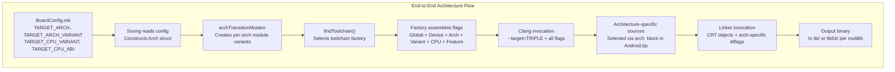

The key source files for architecture support are:

| File | Purpose |
|---|---|
| `build/soong/cc/config/arm64_device.go` | ARM64 toolchain configuration |
| `build/soong/cc/config/arm_device.go` | ARM 32-bit toolchain configuration |
| `build/soong/cc/config/x86_64_device.go` | x86_64 toolchain configuration |
| `build/soong/cc/config/x86_device.go` | x86 toolchain configuration |
| `build/soong/cc/config/riscv64_device.go` | RISC-V 64 toolchain configuration |
| `build/soong/cc/config/global.go` | Global compiler flags |
| `build/soong/cc/config/toolchain.go` | Toolchain interface and helpers |
| `build/soong/cc/config/clang.go` | Clang-specific flag filtering |
| `build/soong/cc/config/bionic.go` | Bionic CRT objects and defaults |
| `build/soong/android/arch.go` | Multilib and architecture mutators |
| `bionic/libc/arch-arm64/ifuncs.cpp` | ARM64 runtime function dispatch |
| `art/runtime/arch/instruction_set_features.cc` | ART ISA feature detection |
| `device/generic/arm64/BoardConfig.mk` | ARM64 reference device config |
| `build/make/target/product/core_64_bit.mk` | 64-bit product configuration |
| `frameworks/libs/binary_translation/` | Berberis binary translation |

<!-- chapter:58-emulator -->
# Chapter 58: Emulator Architecture

The Android Emulator is one of the most critical developer tools in the AOSP
ecosystem. Far more than a simple simulator, it is a full system-level virtual
machine that runs production Android system images inside a modified QEMU
hypervisor, with hardware acceleration via KVM on Linux and HAXM/Hypervisor
Framework on other platforms. This chapter dissects the emulator from the
inside out -- the QEMU execution engine, the Goldfish and Ranchu virtual
hardware platforms, the guest-side HAL implementations that bridge virtual
devices to the emulator host, the Cuttlefish cloud-oriented alternative, and
the rich set of developer-facing features (snapshots, multi-display, foldable
simulation) that make the emulator indispensable.

The device tree that underpins the emulator lives under
`device/generic/goldfish/` in the AOSP source. A second virtual device
platform, Cuttlefish, lives under `device/google/cuttlefish/`. Together these
two directories contain hundreds of thousands of lines of C++, shell scripts,
SELinux policy, and Makefile configuration that define what "an Android device"
means when there is no physical hardware.

---

## 58.1 Emulator Architecture Overview

### 58.1.1 The Software Stack

The Android Emulator is built on a custom fork of QEMU, the open-source
machine emulator and virtualizer. When a developer types `emulator` at the
command line, the following layered architecture comes into play:

```
Host machine (Linux/macOS/Windows)
  |
  +-- Android Emulator binary (emulator, qemu-system-*)
       |
       +-- QEMU core (TCG for software emulation, or KVM/HAXM for HW accel)
       |    |
       |    +-- Virtual CPU (vCPU) executing ARM/x86/RISC-V instructions
       |    +-- Virtual memory management (shadow page tables / EPT)
       |    +-- Interrupt controller (GICv2/v3 for ARM, IOAPIC for x86)
       |
       +-- Goldfish/Ranchu virtual hardware
       |    +-- goldfish-pipe: host<->guest communication channel
       |    +-- virtio-gpu: GPU passthrough / host rendering
       |    +-- virtio-net: virtual networking
       |    +-- virtio-input: touch, keyboard, sensors
       |    +-- virtio-blk: block device emulation
       |    +-- virtio-console: serial/console ports
       |
       +-- Emulator UI / gRPC control interface
            +-- Skin rendering, Extended Controls
            +-- Snapshot management
            +-- Location / Telephony / Battery simulation
```

### 58.1.2 Execution Modes

The emulator supports two fundamental execution modes:

1. **KVM-accelerated mode** (Linux): The guest code runs natively on the host
   CPU through the Kernel-based Virtual Machine (KVM) module. This is the
   fastest mode and is always preferred when the guest and host architectures
   match (x86 guest on x86 host, or ARM guest on ARM host). With KVM, most
   guest instructions execute at near-native speed. Only privileged operations
   (I/O, page table manipulation) trap to the emulator for handling.

2. **Software translation mode** (TCG): QEMU's Tiny Code Generator translates
   guest instructions to host instructions on the fly. This is used when
   architectures do not match (e.g., running an ARM guest image on an x86
   host). While significantly slower than KVM, TCG enables cross-architecture
   development.

On macOS, Apple's Hypervisor Framework replaces KVM; on Windows, the Intel
HAXM (Hardware Accelerated Execution Manager) or Windows Hypervisor Platform
(WHPX) serves the same role.

### 58.1.3 High-Level Data Flow

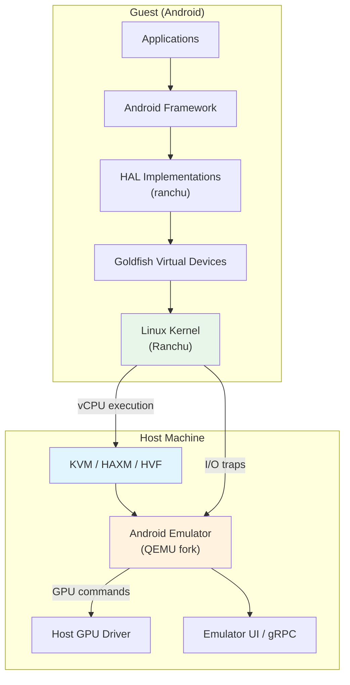

The critical insight is that the emulator is not "simulating" Android -- it is
_running_ Android. The kernel is a real Linux kernel. The userspace is the same
system image that ships on physical devices (or very close to it). The
emulator's job is to provide the virtual hardware that this real software
expects to find.

### 58.1.4 Key Source Directories

| Directory | Purpose |
|-----------|---------|
| `device/generic/goldfish/` | Goldfish virtual device definitions, HALs, init scripts |
| `device/google/cuttlefish/` | Cuttlefish virtual device definitions |
| `device/generic/goldfish/hals/` | Hardware Abstraction Layer implementations |
| `device/generic/goldfish/init/` | Init RC scripts for emulator boot |
| `device/generic/goldfish/sepolicy/` | SELinux policy for emulator-specific domains |
| `device/generic/goldfish/board/` | Board configuration (architecture-specific) |
| `device/generic/goldfish/product/` | Product configuration makefiles |

### 58.1.5 Product Configurations

The emulator defines several product targets, listed in
`device/generic/goldfish/AndroidProducts.mk`:

```makefile
# Source: device/generic/goldfish/AndroidProducts.mk
PRODUCT_MAKEFILES := \
    $(LOCAL_DIR)/64bitonly/product/sdk_phone64_x86_64.mk \
    $(LOCAL_DIR)/64bitonly/product/sdk_phone16k_x86_64.mk \
    $(LOCAL_DIR)/64bitonly/product/sdk_phone64_x86_64_minigbm.mk \
    $(LOCAL_DIR)/64bitonly/product/sdk_phone64_x86_64_riscv64.mk \
    $(LOCAL_DIR)/64bitonly/product/sdk_tablet_arm64.mk \
    $(LOCAL_DIR)/64bitonly/product/sdk_tablet_x86_64.mk \
    $(LOCAL_DIR)/64bitonly/product/sdk_phone64_arm64.mk \
    $(LOCAL_DIR)/64bitonly/product/sdk_phone64_arm64_minigbm.mk \
    $(LOCAL_DIR)/64bitonly/product/sdk_phone16k_arm64.mk \
    $(LOCAL_DIR)/64bitonly/product/sdk_phone64_arm64_riscv64.mk \
    $(LOCAL_DIR)/64bitonly/product/sdk_slim_x86_64.mk \
    $(LOCAL_DIR)/64bitonly/product/sdk_slim_arm64.mk
```

These targets cover x86_64, ARM64, and RISC-V architectures, as well as
specialized form factors (phone, tablet, slim) and graphics backends
(standard vs. minigbm).

---

## 58.2 The Goldfish Device Platform

"Goldfish" is the original virtual hardware platform for the Android Emulator.
The name refers to the collection of virtual devices (timers, interrupt
controllers, I/O buses, etc.) that QEMU presents to the guest kernel. Over
time, Goldfish has evolved significantly -- most of the original custom
Goldfish devices have been replaced by standard virtio devices in the modern
"Ranchu" platform, but the name persists in the AOSP source tree.

### 58.2.1 Product Configuration Hierarchy

The Goldfish product configuration follows a layered inheritance pattern:

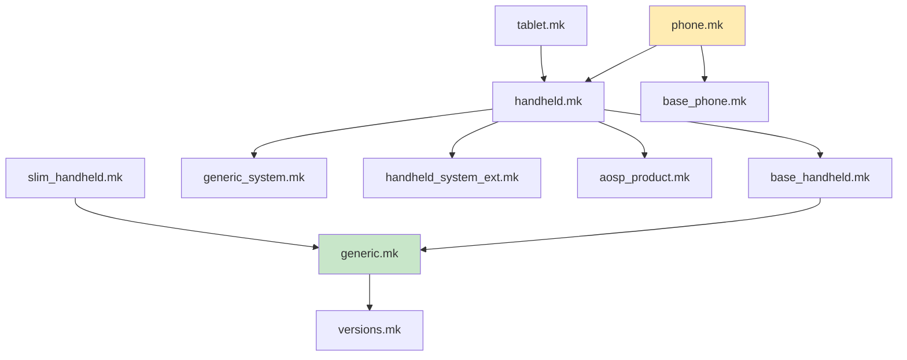

The root configuration file is `device/generic/goldfish/product/generic.mk`,
which establishes the core emulator device. From its contents:

```makefile
# Source: device/generic/goldfish/product/generic.mk (selected lines)
PRODUCT_VENDOR_PROPERTIES += \
    ro.hardware.power=ranchu \
    ro.kernel.qemu=1 \
    ro.soc.manufacturer=AOSP \
    ro.soc.model=ranchu \
```

The property `ro.kernel.qemu=1` is a well-known flag that the framework uses
to detect that it is running inside the emulator. The SoC model is reported as
"ranchu" -- the modern codename for the emulator's virtual platform.

### 58.2.2 Board Configuration

The board configuration lives in `device/generic/goldfish/board/`. Each
architecture variant has its own directory:

| Directory | Architecture |
|-----------|-------------|
| `board/emu64x/` | x86_64 |
| `board/emu64a/` | ARM64 |
| `board/emu64xr/` | x86_64 + RISC-V (native bridge) |
| `board/emu64ar/` | ARM64 + RISC-V (native bridge) |
| `board/emu64x16k/` | x86_64, 16KB pages |
| `board/emu64a16k/` | ARM64, 16KB pages |

All of them inherit from `board/BoardConfigCommon.mk`, which establishes
shared board-level settings:

```makefile
# Source: device/generic/goldfish/board/BoardConfigCommon.mk (key excerpts)
TARGET_BOOTLOADER_BOARD_NAME := goldfish_$(TARGET_ARCH)

# Build OpenGLES emulation guest and host libraries
BUILD_EMULATOR_OPENGL := true
BUILD_QEMU_IMAGES := true
USE_OPENGL_RENDERER := true

# Emulator doesn't support sparse image format.
TARGET_USERIMAGES_SPARSE_EXT_DISABLED := true

# emulator is Non-A/B device
AB_OTA_UPDATER := none

# emulator needs super.img
BOARD_BUILD_SUPER_IMAGE_BY_DEFAULT := true

# 8G + 8M
BOARD_SUPER_PARTITION_SIZE ?= 8598323200
BOARD_SUPER_PARTITION_GROUPS := emulator_dynamic_partitions
```

Key takeaways:

- The emulator uses the **super partition** with dynamic partitions, matching
  modern physical devices.

- It is a **Non-A/B device** (no seamless OTA dual partitions).
- OpenGL ES emulation libraries are built for both guest and host.
- The WiFi subsystem uses `NL80211` with the `mac80211_hwsim` kernel module
  to simulate a wireless network interface.

### 58.2.3 HAL Implementations

The heart of the Goldfish device platform is its collection of HAL
(Hardware Abstraction Layer) implementations. These are located under
`device/generic/goldfish/hals/` and provide the bridge between Android's
hardware interfaces and the emulator's virtual devices.

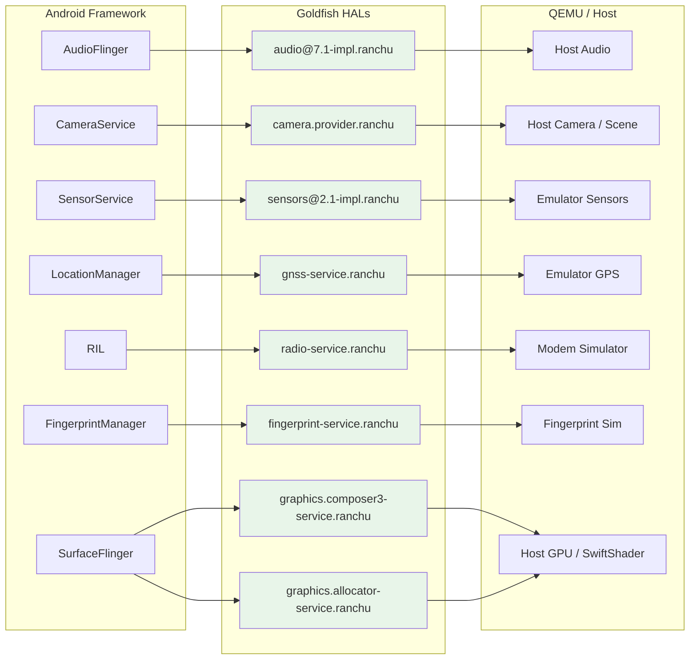

#### 58.2.3.1 Audio HAL

**Location:** `device/generic/goldfish/hals/audio/`

The audio HAL implements `android.hardware.audio@7.1`. It uses TinyALSA to
interface with a virtual sound card provided by QEMU. The implementation
includes:

- `primary_device.cpp` -- The main audio device, handling volume control, mic
  mute, and stream creation.

- `stream_out.cpp` / `stream_in.cpp` -- Output and input stream
  implementations.

- `talsa.cpp` -- TinyALSA wrapper layer.
- `device_port_sink.cpp` / `device_port_source.cpp` -- Port abstraction for
  audio routing.

From `device/generic/goldfish/hals/audio/primary_device.cpp`:

```cpp
// Source: device/generic/goldfish/hals/audio/primary_device.cpp
constexpr size_t kInBufferDurationMs = 15;
constexpr size_t kOutBufferDurationMs = 22;

Device::Device() {}

Return<Result> Device::initCheck() {
    return Result::OK;
}

Return<Result> Device::setMasterVolume(float volume) {
    if (isnan(volume) || volume < 0 || volume > 1.0) {
        return FAILURE(Result::INVALID_ARGUMENTS);
    }

    mMasterVolume = volume;
    updateOutputStreamVolume(mMasterMute ? 0.0f : volume);
    return Result::OK;
}
```

The audio latency configuration is set in the product makefile:

```makefile
# Source: device/generic/goldfish/product/generic.mk
PRODUCT_VENDOR_PROPERTIES += \
    ro.hardware.audio.tinyalsa.period_count=4 \
    ro.hardware.audio.tinyalsa.period_size_multiplier=2 \
    ro.hardware.audio.tinyalsa.host_latency_ms=80 \
```

The 80ms host latency is higher than a physical device (which targets 5-20ms)
because audio data must transit through QEMU's virtual sound card and the
host's audio subsystem.

#### 58.2.3.2 Camera HAL

**Location:** `device/generic/goldfish/hals/camera/`

The camera HAL implements the AIDL Camera Provider interface. It supports
multiple camera sources:

- **QEMU cameras** (`BaseQemuCamera`, `GasQemuCamera`,
  `MinigbmQemuCamera`) -- cameras backed by the host's webcam or a virtual
  scene, communicated through QEMU's pipe mechanism.

- **Fake rotating cameras** (`FakeRotatingCamera`) -- synthetic test cameras
  that render a rotating 3D pattern.

The communication with the QEMU host happens through the `qemu_channel`
abstraction. From `device/generic/goldfish/hals/camera/qemu_channel.cpp`:

```cpp
// Source: device/generic/goldfish/hals/camera/qemu_channel.cpp
const char kServiceName[] = "camera";

base::unique_fd qemuOpenChannel() {
    return base::unique_fd(qemud_channel_open(kServiceName));
}

int qemuRunQuery(const int fd,
                 const char* const query,
                 const size_t querySize,
                 std::vector<uint8_t>* result) {
    int e = qemu_pipe_write_fully(fd, query, querySize);
    if (e < 0) {
        return FAILURE(e);
    }

    std::vector<uint8_t> reply;
    e = qemuReceiveMessage(fd, &reply);
    if (e < 0) {
        return e;
    }
    // ... parse ok/ko response ...
}
```

The camera provider uses an ID scheme with the prefix
`device@1.1/internal/`:

```cpp
// Source: device/generic/goldfish/hals/camera/CameraProvider.cpp
constexpr char kCameraIdPrefix[] = "device@1.1/internal/";

std::string getLogicalCameraId(const int index) {
    char buf[sizeof(kCameraIdPrefix) + 8];
    snprintf(buf, sizeof(buf), "%s%d", kCameraIdPrefix, index);
    return buf;
}
```

#### 58.2.3.3 Sensors HAL

**Location:** `device/generic/goldfish/hals/sensors/`

The sensors HAL is one of the most instructive examples of how the emulator
virtualizes hardware. It implements `android.hardware.sensors@2.1` using
QEMU's sensor protocol.

**Sensor List:** The full list of emulated sensors is defined in
`device/generic/goldfish/hals/sensors/sensor_list.cpp`:

```cpp
// Source: device/generic/goldfish/hals/sensors/sensor_list.cpp
const char* const kQemuSensorName[] = {
    "acceleration",
    "gyroscope",
    "magnetic-field",
    "orientation",
    "temperature",
    "proximity",
    "light",
    "pressure",
    "humidity",
    "magnetic-field-uncalibrated",
    "gyroscope-uncalibrated",
    "hinge-angle0",
    "hinge-angle1",
    "hinge-angle2",
    "heart-rate",
    "rgbc-light",
    "wrist-tilt",
    "acceleration-uncalibrated",
    "heading",
};
```

This gives us 19 virtual sensors including:

| Sensor | Type | Reporting Mode |
|--------|------|---------------|
| Accelerometer | `ACCELEROMETER` | Continuous |
| Gyroscope | `GYROSCOPE` | Continuous |
| Magnetic field | `MAGNETIC_FIELD` | Continuous |
| Orientation | `ORIENTATION` | Continuous |
| Temperature | `AMBIENT_TEMPERATURE` | On-change |
| Proximity | `PROXIMITY` | On-change + wake-up |
| Light | `LIGHT` | On-change |
| Pressure | `PRESSURE` | Continuous |
| Humidity | `RELATIVE_HUMIDITY` | On-change |
| Hinge angle (x3) | `HINGE_ANGLE` | On-change + wake-up |
| Heart rate | `HEART_RATE` | On-change |
| Wrist tilt | `WRIST_TILT_GESTURE` | Special + wake-up |
| Heading | Custom type 42 | Continuous |

**Communication Protocol:** The sensor HAL communicates with QEMU using a
simple text-based protocol over the QEMU pipe. From
`device/generic/goldfish/hals/sensors/multihal_sensors_qemu.cpp`:

```cpp
// Source: device/generic/goldfish/hals/sensors/multihal_sensors_qemu.cpp
bool MultihalSensors::setSensorsReportingImpl(SensorsTransport& st,
                                              const int sensorHandle,
                                              const bool enabled) {
    char buffer[64];
    int len = snprintf(buffer, sizeof(buffer),
                       "set:%s:%d",
                       getQemuSensorNameByHandle(sensorHandle),
                       (enabled ? 1 : 0));

    if (st.Send(buffer, len) < 0) {
        ALOGE("%s:%d: send for %s failed", __func__, __LINE__, st.Name());
        return false;
    } else {
        return true;
    }
}
```

The protocol commands include:

- `list-sensors` -- query which sensors the host supports (returns a bitmask)
- `set:<sensor_name>:<0|1>` -- enable or disable a sensor
- `set-delay:<ms>` -- set the reporting interval in milliseconds
- `time:<ns>` -- synchronize the guest clock

**Parsing sensor events:** When the host sends sensor data, the guest parses
text messages like `acceleration:9.8:0.0:0.1`. The parsing is done in
`parseQemuSensorEventLocked`:

```cpp
// Source: device/generic/goldfish/hals/sensors/multihal_sensors_qemu.cpp
void MultihalSensors::parseQemuSensorEventLocked(QemuSensorsProtocolState* state) {
    char buf[256];
    const int len = m_sensorsTransport->Receive(buf, sizeof(buf) - 1);
    // ...
    if (const char* values = testPrefix(buf, end, "acceleration", ':')) {
        if (sscanf(values, "%f:%f:%f",
                   &vec3->x, &vec3->y, &vec3->z) == 3) {
            vec3->status = SensorStatus::ACCURACY_MEDIUM;
            event.timestamp = nowNs + state->timeBiasNs;
            event.sensorHandle = kSensorHandleAccelerometer;
            event.sensorType = SensorType::ACCELEROMETER;
            postSensorEventLocked(event);
            parsed = true;
        }
    }
    // ... similar blocks for gyroscope, magnetic, proximity, light, etc.
}
```

The architecture uses a dedicated listener thread (`qemuSensorListenerThread`)
and a batch thread (`batchThread`) for continuous-mode sensors:

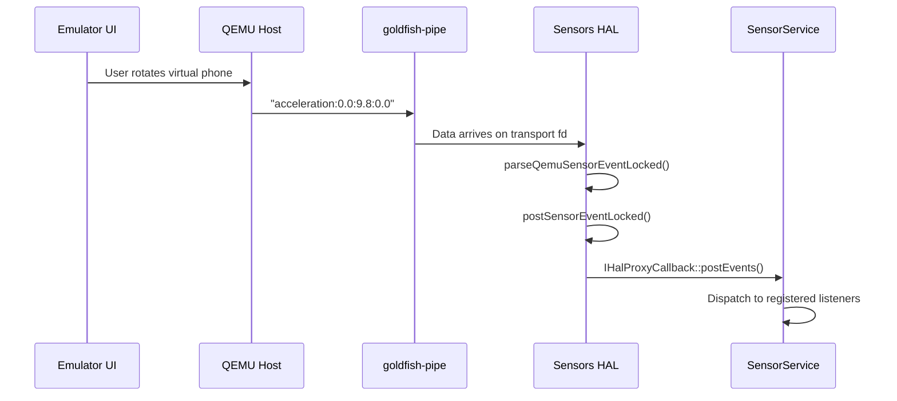

#### 58.2.3.4 GNSS HAL

**Location:** `device/generic/goldfish/hals/gnss/`

The GNSS (Global Navigation Satellite System) HAL provides virtual GPS data.
The key class is `GnssHwConn` which opens a QEMU pipe to the "gps" service:

```cpp
// Source: device/generic/goldfish/hals/gnss/GnssHwConn.cpp
GnssHwConn::GnssHwConn(IDataSink& sink) {
    mDevFd.reset(qemu_pipe_open_ns("qemud", "gps", O_RDWR));
    if (!mDevFd.ok()) {
        ALOGE("%s:%d: qemu_pipe_open_ns failed", __func__, __LINE__);
        return;
    }

    unique_fd threadsFd;
    if (!::android::base::Socketpair(AF_LOCAL, SOCK_STREAM, 0,
                                     &mCallersFd, &threadsFd)) {
        ALOGE("%s:%d: Socketpair failed", __func__, __LINE__);
        mDevFd.reset();
        return;
    }

    std::promise<void> isReadyPromise;
    const int devFd = mDevFd.get();
    mThread = std::thread([devFd, threadsFd = std::move(threadsFd), &sink,
                           &isReadyPromise]() {
        GnssHwListener listener(sink);
        isReadyPromise.set_value();
        workerThread(devFd, threadsFd.get(), listener);
    });

    isReadyPromise.get_future().wait();
}
```

The worker thread uses `epoll` to multiplex between the QEMU device fd (for
GPS data arriving from the host) and a command fd (for shutdown signals).
When the emulator's Extended Controls window sends a GPS fix, it flows
through QEMU's GPS service, through the pipe, into `GnssHwListener` which
parses NMEA sentences, and finally into Android's `LocationManager`.

The GNSS device node is created via a symlink in the init script:

```
# Source: device/generic/goldfish/init/init.ranchu.rc
on property:vendor.qemu.vport.gnss=*
    symlink ${vendor.qemu.vport.gnss} /dev/gnss0
```

The corresponding SELinux policy grants the GNSS HAL access to vsock
sockets:

```
# Source: device/generic/goldfish/sepolicy/vendor/hal_gnss_default.te
vndbinder_use(hal_gnss_default);
allow hal_gnss_default self:vsock_socket create_socket_perms_no_ioctl;
```

#### 58.2.3.5 Radio (Telephony) HAL

**Location:** `device/generic/goldfish/hals/radio/`

The radio HAL implements the full suite of telephony AIDL interfaces:

- `RadioModem` -- modem control (power on/off, IMEI, radio capability)
- `RadioSim` -- SIM card management
- `RadioNetwork` -- network registration, signal strength, cell info
- `RadioData` -- data calls and setup
- `RadioVoice` -- voice calls
- `RadioMessaging` -- SMS
- `RadioIms` -- IMS (IP Multimedia Subsystem)

The radio HAL communicates with a modem simulator using AT commands over a
channel. From `device/generic/goldfish/hals/radio/RadioModem.cpp`:

```cpp
// Source: device/generic/goldfish/hals/radio/RadioModem.cpp
constexpr char kBasebandversion[] = "1.0.0.0";
constexpr char kModemUuid[] = "com.android.modem.simulator";

ScopedAStatus RadioModem::getBasebandVersion(const int32_t serial) {
    NOT_NULL(mRadioModemResponse)->getBasebandVersionResponse(
            makeRadioResponseInfo(serial), kBasebandversion);
    return ScopedAStatus::ok();
}
```

The AT command interface uses a request-response pattern with an `AtChannel`
abstraction:

```cpp
// Source: device/generic/goldfish/hals/radio/RadioModem.cpp
ScopedAStatus RadioModem::getImei(const int32_t serial) {
    mAtChannel->queueRequester([this, serial](
            const AtChannel::RequestPipe requestPipe) -> bool {
        const AtResponsePtr response =
            mAtConversation(requestPipe, atCmds::getIMEI,
                            [](const AtResponse& response) -> bool {
                                return response.holds<std::string>();
                            });
        if (!response) {
            NOT_NULL(mRadioModemResponse)->getImeiResponse(
                    makeRadioResponseInfo(serial,
                        FAILURE(RadioError::INTERNAL_ERR)), {});
            return false;
        } else if (const std::string* imeiSvn =
                       response->get_if<std::string>()) {
            modem::ImeiInfo imeiInfo = {
                .type = modem::ImeiInfo::ImeiType::PRIMARY,
                .imei = imeiSvn->substr(0, 15),
                .svn = imeiSvn->substr(15, 2),
            };
            NOT_NULL(mRadioModemResponse)->getImeiResponse(
                makeRadioResponseInfo(serial), std::move(imeiInfo));
           return true;
        }
        // ...
    });
    return ScopedAStatus::ok();
}
```

The radio HAL also supports 5G NR, LTE, TD-SCDMA, CDMA, EVDO, GSM, and WCDMA
network types as configured in the product makefile:

```makefile
# Source: device/generic/goldfish/product/generic.mk
# NR 5G, LTE, TD-SCDMA, CDMA, EVDO, GSM and WCDMA
PRODUCT_VENDOR_PROPERTIES += ro.telephony.default_network=33
```

#### 58.2.3.6 Fingerprint HAL

**Location:** `device/generic/goldfish/hals/fingerprint/`

The fingerprint HAL is a relatively simple implementation that provides
AIDL `IFingerprint` service. From `device/generic/goldfish/hals/fingerprint/hal.cpp`:

```cpp
// Source: device/generic/goldfish/hals/fingerprint/hal.cpp
constexpr char HW_COMPONENT_ID[] = "FingerprintSensor";
constexpr char XW_VERSION[] = "ranchu/fingerprint/aidl";
constexpr char FW_VERSION[] = "1";
constexpr char SERIAL_NUMBER[] = "00000001";
constexpr char SW_COMPONENT_ID[] = "matchingAlgorithm";

ndk::ScopedAStatus Hal::getSensorProps(std::vector<SensorProps>* out) {
    // ...
    SensorProps props;
    props.commonProps.sensorId = 0;
    props.commonProps.sensorStrength = common::SensorStrength::STRONG;
    props.commonProps.maxEnrollmentsPerUser =
        Storage::getMaxEnrollmentsPerUser();
    props.sensorType = FingerprintSensorType::REAR;
    props.supportsNavigationGestures = false;
    props.supportsDetectInteraction = true;
    // ...
}
```

The emulator's Extended Controls window provides a virtual fingerprint
scanner that triggers authentication events through this HAL.

#### 58.2.3.7 Hardware Composer (HWC3) HAL

**Location:** `device/generic/goldfish/hals/hwc3/`

The hardware composer HAL has the richest implementation of all the
emulator HALs. It supports two composition modes:

1. **HostFrameComposer** -- delegates composition to the host GPU, achieving
   hardware-accelerated rendering.

2. **GuestFrameComposer** -- performs composition within the guest using DRM
   (Direct Rendering Manager) and libyuv.

The host frame composer uses the gfxstream protocol to send composition
commands to the emulator process:

```cpp
// Source: device/generic/goldfish/hals/hwc3/HostFrameComposer.cpp
#include "gfxstream/guest/goldfish_sync.h"
#include "virtgpu_drm.h"

namespace aidl::android::hardware::graphics::composer3::impl {
// ...
static bool isMinigbmFromProperty() {
    static constexpr const auto kGrallocProp = "ro.hardware.gralloc";
    const auto grallocProp =
        ::android::base::GetProperty(kGrallocProp, "");
    if (grallocProp == "minigbm") {
        return true;
    } else {
        return false;
    }
}
```

The guest frame composer is used as a fallback when host rendering is
unavailable:

```cpp
// Source: device/generic/goldfish/hals/hwc3/GuestFrameComposer.cpp
#include "Drm.h"
#include "Layer.h"
#include "DisplayFinder.h"

std::array<std::int8_t, 16> ToLibyuvColorMatrix(
        const std::array<float, 16>& in) {
    // Converts HAL color matrix to libyuv format
    std::array<std::int8_t, 16> out;
    for (int r = 0; r < 4; r++) {
        for (int c = 0; c < 4; c++) {
            int indexIn = (4 * r) + c;
            int indexOut = (4 * c) + r;
            float clampedValue = std::max(-128.0f,
                std::min(127.0f, in[indexIn] * 64.0f + 0.5f));
            out[indexOut] = static_cast<std::int8_t>(clampedValue);
        }
    }
    return out;
}
```

The HWC3 implementation supports DRM-based display management with proper
plane, CRTC, and connector abstractions -- visible in the extensive list of
DRM-related source files: `Drm.cpp`, `DrmClient.cpp`, `DrmConnector.cpp`,
`DrmCrtc.cpp`, `DrmDisplay.cpp`, `DrmPlane.cpp`, `DrmSwapchain.cpp`,
`DrmAtomicRequest.cpp`, `DrmBuffer.cpp`, `DrmEventListener.cpp`,
`DrmMode.cpp`.

#### 58.2.3.8 Gralloc (Graphics Allocator) HAL

**Location:** `device/generic/goldfish/hals/gralloc/`

The graphics allocator handles buffer allocation for both CPU and GPU
use. From `device/generic/goldfish/hals/gralloc/allocator.cpp`:

```cpp
// Source: device/generic/goldfish/hals/gralloc/allocator.cpp
struct GoldfishAllocator : public BnAllocator {
    GoldfishAllocator()
        : mHostConn(HostConnection::createUnique(kCapsetNone))
        , mDebugLevel(getDebugLevel()) {}

    ndk::ScopedAStatus allocate2(const BufferDescriptorInfo& desc,
                                 const int32_t count,
                                 AllocationResult* const outResult) override {
        // ...
        const uint64_t usage = toUsage64(desc.usage);

        if (needCpuBuffer(usage)) {
            req.needImageAllocation = true;
            // ...
        } else {
            req.needImageAllocation = false;
            // ...
        }
        // ...
    }
};
```

The key design decision is the split between **CPU buffers** (allocated in
guest memory via `GoldfishAddressSpaceBlock`) and **GPU buffers** (represented
as color buffers on the host). When a buffer needs GPU access, the allocator
creates a host-side color buffer through the render control encoder:

```cpp
// Source: device/generic/goldfish/hals/gralloc/allocator.cpp
if (needGpuBuffer(req.usage)) {
    hostHandleRefCountFd.reset(qemu_pipe_open("refcount"));

    hostHandle = rcEnc.rcCreateColorBufferDMA(
        &rcEnc, req.width, req.height,
        req.glFormat, static_cast<int>(req.emuFwkFormat));

    if (qemu_pipe_write(hostHandleRefCountFd.get(),
                        &hostHandle,
                        sizeof(hostHandle)) != sizeof(hostHandle)) {
        rcEnc.rcCloseColorBuffer(&rcEnc, hostHandle);
        return FAILURE(nullptr);
    }
}
```

The allocator supports a wide range of pixel formats including RGBA_8888,
RGB_565, RGBA_FP16, RGBA_1010102, YV12, YCBCR_420_888, and YCBCR_P010.
The mapper library suffix is "ranchu":

```cpp
ndk::ScopedAStatus getIMapperLibrarySuffix(std::string* outResult) override {
    *outResult = "ranchu";
    return ndk::ScopedAStatus::ok();
}
```

### 58.2.4 Init Scripts

The emulator's boot process is controlled by init scripts in
`device/generic/goldfish/init/`. The primary script is `init.ranchu.rc`:

```
# Source: device/generic/goldfish/init/init.ranchu.rc (key sections)
on early-init
    mount proc proc /proc remount hidepid=2,gid=3009
    setprop ro.cpuvulkan.version ${ro.boot.qemu.cpuvulkan.version}
    setprop ro.hardware.egl ${ro.boot.hardwareegl:-emulation}
    setprop ro.hardware.vulkan ${ro.boot.hardware.vulkan}
    setprop ro.opengles.version ${ro.boot.opengles.version}
    setprop dalvik.vm.heapsize ${ro.boot.dalvik.vm.heapsize:-192m}
    setprop debug.hwui.renderer ${ro.boot.debug.hwui.renderer:-skiagl}
    setprop vendor.qemu.dev.bootcomplete 0
    start vendor.dlkm_loader

on init
    write /sys/block/zram0/comp_algorithm lz4
    write /proc/sys/vm/page-cluster 0
    start qemu-props

on post-fs-data
    mkdir /data/vendor/var 0755 root root
    mkdir /data/vendor/var/run 0755 root root
    start ranchu-device-state
    start ranchu-adb-setup
```

Several services are defined for emulator-specific functionality:

- **`qemu-props`** -- reads boot properties from the emulator host and sets
  them as system properties.

- **`ranchu-adb-setup`** -- configures ADB for the emulator.
- **`ranchu-net`** -- sets up networking (VirtIO WiFi, inter-emulator
  connections).

- **`ranchu-setup`** -- performs post-boot-complete setup.
- **`goldfish-logcat`** -- forwards logcat output to the host via virtio
  console (`/dev/hvc1`).

- **`bt_vhci_forwarder`** -- forwards Bluetooth HCI traffic.

The rendering subsystem default is established at `early-init`:

```
# Source: device/generic/goldfish/init/init.ranchu.rc
setprop ro.hardware.egl ${ro.boot.hardwareegl:-emulation}
# default skiagl: skia uses gles to render
setprop debug.hwui.renderer ${ro.boot.debug.hwui.renderer:-skiagl}
# default skiaglthreaded
setprop debug.renderengine.backend \
    ${ro.boot.debug.renderengine.backend:-skiaglthreaded}
```

### 58.2.5 SELinux Policy

The emulator defines custom SELinux policy under
`device/generic/goldfish/sepolicy/`. The vendor policy directory contains
approximately 60 policy files covering all emulator-specific domains and
services.

Key policy files:

| File | Purpose |
|------|---------|
| `qemu_props.te` | Policy for the `qemu-props` property-setting service |
| `hal_sensors_default.te` | Sensors HAL access to vsock sockets |
| `hal_gnss_default.te` | GNSS HAL access to vsock and vnode binder |
| `hal_radio_default.te` | Radio HAL modem simulator access |
| `hal_camera_default.te` | Camera HAL QEMU pipe access |
| `hal_graphics_composer_default.te` | HWC3 DRM and GPU access |
| `hal_graphics_allocator_default.te` | Gralloc buffer allocation policy |
| `goldfish_setup.te` | Emulator setup scripts |
| `goldfish_ip.te` | Network configuration |

From `device/generic/goldfish/sepolicy/vendor/qemu_props.te`:

```
# Source: device/generic/goldfish/sepolicy/vendor/qemu_props.te
type qemu_props, domain;
type qemu_props_exec, vendor_file_type, exec_type, file_type;

init_daemon_domain(qemu_props)

set_prop(qemu_props, qemu_hw_prop)
set_prop(qemu_props, qemu_sf_lcd_density_prop)
set_prop(qemu_props, vendor_qemu_prop)
set_prop(qemu_props, vendor_net_share_prop)

allow qemu_props self:vsock_socket create_socket_perms_no_ioctl;
allow qemu_props sysfs:dir read;
allow qemu_props sysfs:dir open;
allow qemu_props sysfs:file getattr;
allow qemu_props sysfs:file read;
allow qemu_props sysfs:file open;
```

The `qemu_props` domain is granted permission to set specific property
categories and to communicate over vsock (VirtIO socket) -- the primary
communication channel between the guest kernel and the QEMU host.

### 58.2.6 Detailed Package Inventory

The emulator's product configuration pulls in a significant number of packages.
Here is a categorized breakdown from
`device/generic/goldfish/product/generic.mk`:

**Core Graphics Stack:**

```makefile
# Source: device/generic/goldfish/product/generic.mk
PRODUCT_PACKAGES += \
    vulkan.ranchu \
    libandroidemu \
    libOpenglCodecCommon \
    libOpenglSystemCommon \
    android.hardware.graphics.composer3-service.ranchu
```

The `vulkan.ranchu` package provides the Vulkan ICD (Installable Client
Driver) for the emulator. `libandroidemu` and the OpenGL codec/system
libraries implement the guest-side portion of the GPU emulation pipeline.

**OpenGL ES Emulation Libraries:**

```makefile
# Source: device/generic/goldfish/product/generic.mk
PRODUCT_PACKAGES += \
    libGLESv1_CM_emulation \
    lib_renderControl_enc \
    libEGL_emulation \
    libGLESv2_enc \
    libvulkan_enc \
    libGLESv2_emulation \
    libGLESv1_enc \
    libEGL_angle \
    libGLESv1_CM_angle \
    libGLESv2_angle
```

These libraries work in pairs:

- `lib*_emulation` -- guest-side EGL/GLES implementation that intercepts API
  calls

- `lib*_enc` -- encoders that serialize GLES/Vulkan commands into a binary
  stream for transport to the host

- `lib*_angle` -- ANGLE-based implementation for Vulkan-backed GLES

**Media Codecs:**

```makefile
# Source: device/generic/goldfish/product/generic.mk
PRODUCT_PACKAGES += \
    android.hardware.media.c2@1.0-service-goldfish \
    libcodec2_goldfish_vp8dec \
    libcodec2_goldfish_vp9dec \
    libcodec2_goldfish_avcdec \
    libcodec2_goldfish_hevcdec
```

The goldfish media codecs use the Codec2 framework and delegate video
decoding to the host through QEMU, enabling hardware-accelerated video
playback even inside the emulator.

**Compliance HALs ("Hello, world!" implementations):**

```makefile
# Source: device/generic/goldfish/product/generic.mk
PRODUCT_PACKAGES += \
    com.android.hardware.authsecret \
    com.android.hardware.contexthub \
    com.android.hardware.dumpstate \
    android.hardware.health-service.example \
    android.hardware.health.storage-service.default \
    android.hardware.lights-service.example \
    com.android.hardware.neuralnetworks \
    com.android.hardware.power \
    com.android.hardware.thermal \
    com.android.hardware.vibrator
```

These are minimal implementations that satisfy CTS requirements. They do not
perform real hardware operations but provide the AIDL service interfaces
that the framework expects.

**Conditional Package Selection:**

The product makefile uses several build flags to conditionally include
components:

| Flag | Default | Effect when `true` |
|------|---------|-------------------|
| `EMULATOR_DISABLE_RADIO` | false | Disables telephony HAL |
| `EMULATOR_VENDOR_NO_BIOMETRICS` | false | Disables fingerprint HAL |
| `EMULATOR_VENDOR_NO_GNSS` | false | Disables GNSS HAL |
| `EMULATOR_VENDOR_NO_SENSORS` | false | Disables sensors HAL |
| `EMULATOR_VENDOR_NO_CAMERA` | false | Disables camera HAL |
| `EMULATOR_VENDOR_NO_SOUND` | false | Disables audio HAL |
| `EMULATOR_VENDOR_NO_UWB` | false | Disables UWB HAL |
| `EMULATOR_VENDOR_NO_THREADNETWORK` | false | Disables Thread networking |
| `EMULATOR_VENDOR_NO_REBOOT_ESCROW` | false | Disables reboot escrow |

This allows building minimal emulator images for specialized testing where
only specific subsystems are needed.

---

## 58.3 Virtual Hardware

### 58.3.1 The Goldfish-Pipe: Host-Guest Communication

The goldfish-pipe is the central communication mechanism between the Android
guest and the QEMU host. It is a virtual device that provides a bidirectional
byte-stream interface, similar to a Unix pipe but crossing the VM boundary.

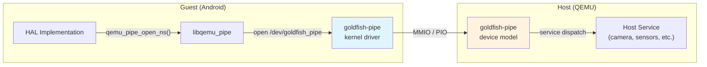

**Guest-side API:** The pipe is accessed through the `libqemu_pipe` library,
which provides functions like:

- `qemu_pipe_open_ns(namespace, name, flags)` -- opens a named pipe to a
  specific host service

- `qemu_pipe_write_fully(fd, data, size)` -- writes data to the pipe
- `qemu_pipe_read_fully(fd, data, size)` -- reads data from the pipe

The `qemud` layer adds multiplexing on top of the raw pipe. Multiple logical
channels can be opened through a single pipe connection. From
`device/generic/goldfish/hals/lib/qemud/qemud.cpp`:

```cpp
// Source: device/generic/goldfish/hals/lib/qemud/qemud.cpp
int qemud_channel_open(const char* name) {
    return qemu_pipe_open_ns("qemud", name, O_RDWR);
}

int qemud_channel_send(int pipe, const void* msg, int size) {
    char header[5];
    if (size < 0)
        size = strlen((const char*)msg);
    if (size == 0)
        return 0;

    if (size >= 64 * 1024) { // use binary encoding
        uint32_t length32be = htonl(size | (1U << 31));
        memcpy(header, &length32be, 4);
    } else { // use hex digit encoding
        snprintf(header, sizeof(header), "%04x", size);
    }

    if (qemu_pipe_write_fully(pipe, header, 4)) {
        return -1;
    }
    if (qemu_pipe_write_fully(pipe, msg, size)) {
        return -1;
    }
    return 0;
}

int qemud_channel_recv(int pipe, void* msg, int maxsize) {
    char header[5];
    int size;
    if (qemu_pipe_read_fully(pipe, header, 4)) {
        return -1;
    }
    header[4] = 0;
    if (sscanf(header, "%04x", &size) != 1) {
        return -1;
    }
    if (size > maxsize) {
        return -1;
    }
    if (qemu_pipe_read_fully(pipe, msg, size)) {
        return -1;
    }
    return size;
}
```

The protocol uses a simple length-prefixed framing:

- Messages under 64KB use a 4-character hex length prefix (e.g., `"001a"`)
- Messages of 64KB or larger use a 4-byte binary network-order length with
  the high bit set

### 58.3.2 The Sensor HAL Threading Model

The sensors HAL has a sophisticated multi-threaded architecture that merits
detailed examination. The `MultihalSensors` class header
(`device/generic/goldfish/hals/sensors/include/multihal_sensors.h`) reveals
the internal structure:

```cpp
// Source: device/generic/goldfish/hals/sensors/include/multihal_sensors.h
struct MultihalSensors : public ahs21::implementation::ISensorsSubHal {
    using SensorsTransportFactory =
        std::function<std::unique_ptr<SensorsTransport>()>;

    MultihalSensors(SensorsTransportFactory);
    ~MultihalSensors();

private:
    struct QemuSensorsProtocolState {
        int64_t timeBiasNs = -500000000;
        int32_t sensorsUpdateIntervalMs = 200;
        static constexpr float kSensorNoValue = -1e+30;

        // on change sensors (host does not support them)
        float lastAmbientTemperatureValue = kSensorNoValue;
        float lastProximityValue = kSensorNoValue;
        float lastLightValue = kSensorNoValue;
        float lastRelativeHumidityValue = kSensorNoValue;
        float lastHingeAngle0Value = kSensorNoValue;
        float lastHingeAngle1Value = kSensorNoValue;
        float lastHingeAngle2Value = kSensorNoValue;
        float lastHeartRateValue = kSensorNoValue;
        float lastWristTiltMeasurement = -1;
    };

    // batching
    struct BatchEventRef {
        int64_t  timestamp = -1;
        int      sensorHandle = -1;
        int      generation = 0;

        bool operator<(const BatchEventRef &rhs) const {
            // not a typo: we want top() to be smallest timestamp
            return timestamp > rhs.timestamp;
        }
    };

    struct BatchInfo {
        Event       event;
        int64_t     samplingPeriodNs = 0;
        int         generation = 0;
    };

    QemuSensorsProtocolState             m_protocolState;
    std::priority_queue<BatchEventRef>   m_batchQueue;
    std::vector<BatchInfo>               m_batchInfo;
    std::condition_variable              m_batchUpdated;
    std::thread                          m_batchThread;
    std::atomic<bool>                    m_batchRunning = true;
    mutable std::mutex                   m_mtx;
};
```

The threading model has three threads:

1. **Main thread** -- handles HIDL/AIDL calls from SensorService (`activate`,
   `batch`, `flush`, `injectSensorData_2_1`).

2. **Sensor listener thread** (`qemuSensorListenerThread`) -- reads sensor
   data from the QEMU transport and dispatches events. Uses `epoll` to
   multiplex between the transport fd and a command fd.

3. **Batch thread** (`batchThread`) -- implements continuous-mode sensor
   batching. Uses a priority queue ordered by timestamp to determine when to
   deliver the next sensor event.

The epoll-based listener thread implementation from
`device/generic/goldfish/hals/sensors/multihal_sensors_epoll.cpp`:

```cpp
// Source: device/generic/goldfish/hals/sensors/multihal_sensors_epoll.cpp
bool MultihalSensors::qemuSensorListenerThreadImpl(
        const int transportFd) {
    const unique_fd epollFd(epoll_create1(0));

    epollCtlAdd(epollFd.get(), transportFd);
    epollCtlAdd(epollFd.get(), m_sensorThreadFd.get());

    while (true) {
        struct epoll_event events[2];
        const int kTimeoutMs = 60000;
        const int n = TEMP_FAILURE_RETRY(epoll_wait(
            epollFd.get(), events, 2, kTimeoutMs));

        for (int i = 0; i < n; ++i) {
            const struct epoll_event* ev = &events[i];
            const int fd = ev->data.fd;

            if (fd == transportFd) {
                if (ev->events & EPOLLIN) {
                    std::unique_lock<std::mutex> lock(m_mtx);
                    parseQemuSensorEventLocked(&m_protocolState);
                }
            } else if (fd == m_sensorThreadFd.get()) {
                const int cmd = qemuSensortThreadRcvCommand(fd);
                switch (cmd) {
                case kCMD_QUIT: return false;
                case kCMD_RESTART: return true;
                }
            }
        }
    }
}
```

The `kCMD_RESTART` command is sent when the batch interval changes and the
transport needs to be reconfigured. The `kCMD_QUIT` command is sent during
shutdown. This design allows the sensor listener to be restarted without
tearing down the entire HAL.

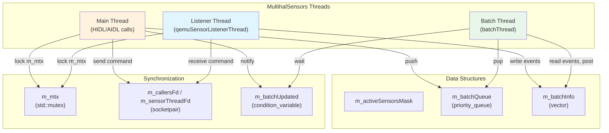

### 58.3.3 Display Discovery and VSync

The HWC3 HAL discovers displays by querying the QEMU host through the render
control encoder. From
`device/generic/goldfish/hals/hwc3/DisplayFinder.cpp`:

```cpp
// Source: device/generic/goldfish/hals/hwc3/DisplayFinder.cpp
static uint32_t getVsyncHzFromProperty() {
    static constexpr const auto kVsyncProp = "ro.boot.qemu.vsync";
    const auto vsyncProp =
        ::android::base::GetProperty(kVsyncProp, "");

    uint64_t vsyncPeriod;
    if (!::android::base::ParseUint(vsyncProp, &vsyncPeriod)) {
        return 60;  // default 60 Hz
    }
    return static_cast<uint32_t>(vsyncPeriod);
}

HWC3::Error findGoldfishPrimaryDisplay(
        std::vector<DisplayMultiConfigs>* outDisplays) {
    DEFINE_AND_VALIDATE_HOST_CONNECTION
    hostCon->lock();
    const int32_t vsyncPeriodNanos =
        HertzToPeriodNanos(getVsyncHzFromProperty());

    DisplayMultiConfigs display;
    display.displayId = 0;

    if (rcEnc->hasHWCMultiConfigs()) {
        int count = rcEnc->rcGetFBDisplayConfigsCount(rcEnc);
        display.activeConfigId =
            rcEnc->rcGetFBDisplayActiveConfig(rcEnc);

        for (int configId = 0; configId < count; configId++) {
            display.configs.push_back(DisplayConfig(
                configId,
                rcEnc->rcGetFBDisplayConfigsParam(
                    rcEnc, configId, FB_WIDTH),
                rcEnc->rcGetFBDisplayConfigsParam(
                    rcEnc, configId, FB_HEIGHT),
                rcEnc->rcGetFBDisplayConfigsParam(
                    rcEnc, configId, FB_XDPI),
                rcEnc->rcGetFBDisplayConfigsParam(
                    rcEnc, configId, FB_YDPI),
                vsyncPeriodNanos));
        }
    }
    // ...
}
```

The display finder queries the host for:

- **Resolution** (width, height) from `FB_WIDTH` and `FB_HEIGHT` parameters
- **DPI** (dots per inch) from `FB_XDPI` and `FB_YDPI` parameters
- **Refresh rate** from the `ro.boot.qemu.vsync` boot property

When the host supports multiple display configurations (multi-config mode),
the display finder enumerates all available configurations and presents them
to SurfaceFlinger through the HWC3 interface.

### 58.3.4 The Audio Write Thread

The audio HAL's output stream uses a dedicated write thread with FMQ (Fast
Message Queue) for low-latency communication with AudioFlinger. From
`device/generic/goldfish/hals/audio/stream_out.cpp`:

```cpp
// Source: device/generic/goldfish/hals/audio/stream_out.cpp
class WriteThread : public IOThread {
    typedef MessageQueue<IStreamOut::WriteCommand,
                         kSynchronizedReadWrite> CommandMQ;
    typedef MessageQueue<IStreamOut::WriteStatus,
                         kSynchronizedReadWrite> StatusMQ;
    typedef MessageQueue<uint8_t,
                         kSynchronizedReadWrite> DataMQ;

public:
    WriteThread(StreamOut *stream, const size_t mqBufferSize)
            : mStream(stream)
            , mCommandMQ(1)
            , mStatusMQ(1)
            , mDataMQ(mqBufferSize, true /* EventFlag */) {
        // ...
        EventFlag* rawEfGroup = nullptr;
        status_t status = EventFlag::createEventFlag(
            mDataMQ.getEventFlagWord(), &rawEfGroup);
        mEfGroup.reset(rawEfGroup);
        mThread = std::thread(&WriteThread::threadLoop, this);
    }
};
```

The FMQ mechanism allows AudioFlinger to write audio data without Binder
round-trips. The `EventFlag` provides lightweight signaling between the
AudioFlinger process and the HAL service process using shared memory.

### 58.3.5 Wake Lock Management

The emulator setup script manages power state through wake locks. From
`device/generic/goldfish/init/init.setup.ranchu.sh`:

```bash
# Source: device/generic/goldfish/init/init.setup.ranchu.sh
allowsuspend=`getprop ro.boot.qemu.allowsuspend`
case "$allowsuspend" in
    "") echo "emulator_wake_lock" > /sys/power/wake_lock
    ;;
    1) echo "emulator_wake_lock" > /sys/power/wake_unlock
    ;;
    *) echo "emulator_wake_lock" > /sys/power/wake_lock
    ;;
esac
```

By default, the emulator holds a permanent wake lock (`emulator_wake_lock`)
to prevent the guest from entering deep sleep. This is important for
development because a suspended emulator would be unresponsive. The
`ro.boot.qemu.allowsuspend=1` flag can be set to allow the guest to suspend,
which is useful for testing power management behavior.

### 58.3.6 The QEMU Properties Service

The `qemu-props` service (`device/generic/goldfish/qemu-props/qemu-props.cpp`)
is one of the first services started during emulator boot. It reads properties
from the emulator host and sets them as Android system properties:

```cpp
// Source: device/generic/goldfish/qemu-props/qemu-props.cpp
constexpr char kBootPropertiesService[] = "boot-properties";
constexpr char kHeartbeatService[] = "QemuMiscPipe";

int setBootProperties() {
    unique_fd qemud;
    for (int tries = 5; tries > 0; --tries) {
        qemud = unique_fd(qemud_channel_open(kBootPropertiesService));
        if (qemud.ok()) break;
        else if (tries > 1) sleep(1);
        else return FAILURE(1);
    }

    if (qemud_channel_send(qemud.get(), "list", -1) < 0) {
        return FAILURE(1);
    }

    while (true) {
        char temp[PROPERTY_KEY_MAX + PROPERTY_VALUE_MAX + 2];
        const int len = qemud_channel_recv(qemud.get(), temp, sizeof(temp) - 1);
        if (len < 0 || len > (sizeof(temp) - 1) || !temp[0]) break;

        temp[len] = '\0';
        char* prop_value = strchr(temp, '=');
        if (!prop_value) continue;
        *prop_value = 0;
        ++prop_value;

        // Properties are prefixed with "vendor." unless already prefixed
        // or in the system properties list
        if (need_prepend_prefix(temp, "vendor.")) {
            snprintf(renamed_property, sizeof(renamed_property),
                     "vendor.%s", temp);
            final_prop_name = renamed_property;
        }

        property_set(final_prop_name, prop_value);
    }
    return 0;
}
```

After setting properties, the service enters a heartbeat loop, periodically
sending "heartbeat" messages to the `QemuMiscPipe` service. This allows the
emulator host to detect if the guest is alive and responsive:

```cpp
// Source: device/generic/goldfish/qemu-props/qemu-props.cpp
int main(const int argc, const char* argv[]) {
    if ((argc == 2) && !strcmp(argv[1], "bootcomplete")) {
        sendMessage("bootcomplete");
        return 0;
    }

    int r = setBootProperties();
    parse_virtio_serial();
    sendHeartBeat();

    while (s_QemuMiscPipe >= 0) {
        if (android::base::WaitForProperty(
                    "vendor.qemu.dev.bootcomplete", "1",
                    std::chrono::seconds(5))) {
            break;
        }
        sendHeartBeat();
    }

    while (s_QemuMiscPipe >= 0) {
        usleep(30 * 1000000);  // 30 seconds
        sendHeartBeat();
    }
    // ...
}
```

### 58.3.7 Virtual Sensors

The virtual sensors (covered in detail in section 58.2.3.3) are driven by the
emulator's Extended Controls UI. When a user interacts with the sensor controls
(tilting the virtual device, changing proximity, adjusting light level), the
emulator host sends text-based sensor events through the QEMU pipe.

The sensor data flow:

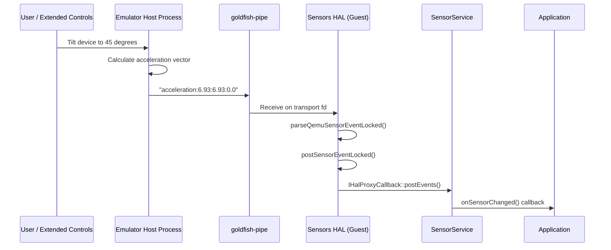

The sensor HAL adds calibration noise to uncalibrated sensor values to pass
CTS (Compatibility Test Suite):

```cpp
// Source: device/generic/goldfish/hals/sensors/multihal_sensors_qemu.cpp
} else if (const char* values = testPrefix(buf, end,
                                           "acceleration-uncalibrated", ':')) {
    if (sscanf(values, "%f:%f:%f",
               &uncal->x, &uncal->y, &uncal->z) == 3) {
        // A little bias noise to pass CTS
        uncal->x_bias = randomError(-0.003f, 0.003f);
        uncal->y_bias = randomError(-0.003f, 0.003f);
        uncal->z_bias = randomError(-0.003f, 0.003f);
        // ...
    }
}
```

### 58.3.8 Virtual GPS

GPS simulation flows through the GNSS HAL (section 58.2.3.4). The emulator
supports:

- Fixed GPS coordinates (set via Extended Controls)
- GPS routes (GPX/KML file playback)
- NMEA sentence injection

The GPS service is registered at the QEMU host level as the "gps" qemud
service. The `GnssHwListener` class on the guest side parses incoming NMEA
data and dispatches it to the Android location framework.

### 58.3.9 Virtual Camera

The camera subsystem supports multiple virtual camera backends:

1. **Host webcam passthrough** -- The emulator captures frames from the host's
   webcam and sends them to the guest through the QEMU "camera" service.

2. **Virtual scene** -- A 3D-rendered environment that responds to the virtual
   device's orientation sensors.

3. **Fake rotating camera** -- A synthetic test pattern (class
   `FakeRotatingCamera` in `device/generic/goldfish/hals/camera/`).

Camera data transfer uses the same qemud protocol, with a query-response
pattern:

```
Guest -> Host: "list"          (list available cameras)
Host -> Guest: "ok:<camera_list>"
Guest -> Host: "connect:<id>"  (connect to a specific camera)
Host -> Guest: "ok"
Guest -> Host: "start:<params>" (start capture)
Host -> Guest: "ok"
Host -> Guest: <frame_data>    (raw frame data)
```

### 58.3.10 Virtual Telephony

The telephony subsystem uses a full modem simulator that communicates with the
radio HAL via AT commands. The emulator supports:

- Voice calls (simulated call state machine)
- SMS sending and receiving
- Data connections
- SIM card simulation (ICC profile files are loaded from
  `data/misc/modem_simulator/`)

- Multiple radio access technologies (5G NR, LTE, GSM, etc.)

SIM profiles are pre-configured:

```makefile
# Source: device/generic/goldfish/product/generic.mk
PRODUCT_COPY_FILES += \
    device/generic/goldfish/hals/radio/data/apns-conf.xml:$(TARGET_COPY_OUT_VENDOR)/etc/apns/apns-conf.xml \
    device/generic/goldfish/hals/radio/data/iccprofile_for_sim0.xml:data/misc/modem_simulator/iccprofile_for_sim0.xml \
    device/generic/goldfish/hals/radio/data/numeric_operator.xml:data/misc/modem_simulator/etc/modem_simulator/files/numeric_operator.xml \
```

### 58.3.11 GPU Emulation

GPU emulation is one of the most architecturally complex parts of the
emulator. The system supports three rendering modes:

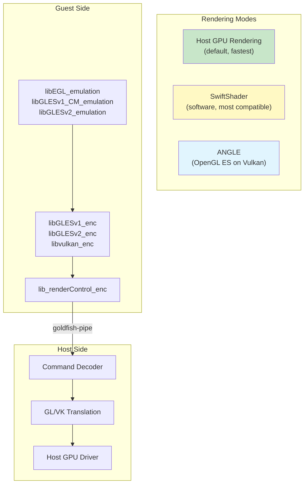

**Guest-side libraries** (installed into the system image):

```makefile
# Source: device/generic/goldfish/product/generic.mk
PRODUCT_PACKAGES += \
    libGLESv1_CM_emulation \
    lib_renderControl_enc \
    libEGL_emulation \
    libGLESv2_enc \
    libvulkan_enc \
    libGLESv2_emulation \
    libGLESv1_enc \
    libEGL_angle \
    libGLESv1_CM_angle \
    libGLESv2_angle
```

The guest-side EGL/GLES libraries serialize OpenGL ES commands into a binary
stream. This stream is sent to the host through the goldfish-pipe. On the
host side, the emulator decodes these commands and replays them against the
host's actual GPU driver.

When the host GPU is not available (e.g., on a headless CI server or a remote
SSH session), SwiftShader provides a software implementation of Vulkan that
runs entirely on the CPU.

ANGLE (Almost Native Graphics Layer Engine) provides an OpenGL ES
implementation on top of Vulkan, which is useful for hosts that have Vulkan
but not native OpenGL drivers (common on newer macOS systems).

The graphics rendering mode is selected via boot properties:

```
# Source: device/generic/goldfish/init/init.ranchu.rc
setprop ro.hardware.egl ${ro.boot.hardwareegl:-emulation}
setprop ro.hardware.vulkan ${ro.boot.hardware.vulkan}
setprop ro.opengles.version ${ro.boot.opengles.version}
```

The gralloc HAL creates host-side GPU resources ("color buffers") through the
render control encoder, as shown in section 58.2.3.8. This allows efficient
zero-copy rendering where the guest composes frames that are directly displayed
by the emulator's window.

---

## 58.4 Emulator Networking

### 58.4.1 Network Architecture

The emulator implements a virtual network that provides internet connectivity
to the guest while isolating it from the host's physical network. The
architecture uses a QEMU user-mode networking stack (SLIRP) by default, with
an optional TAP-based networking mode for advanced use cases.

```mermaid
graph TB
    subgraph "Guest Android"
        ETH0["eth0 / wlan0"]
        NET_STACK["Linux TCP/IP Stack"]
        APPS["Applications"]
    end

    subgraph "Emulator Virtual Router"
        ROUTER["Virtual Router<br/>10.0.2.1"]
        DNS["Virtual DNS<br/>10.0.2.3"]
        GW["Gateway to Host"]
    end

    subgraph "Host Machine"
        HOST_NET["Host Network Stack"]
        INTERNET["Internet"]
    end

    APPS --> NET_STACK
    NET_STACK --> ETH0
    ETH0 --> ROUTER
    ROUTER --> DNS
    ROUTER --> GW
    GW --> HOST_NET
    HOST_NET --> INTERNET

    style ROUTER fill:#e1f5fe
    style DNS fill:#e1f5fe
```

### 58.4.2 Default IP Addressing

Each emulator instance is assigned a unique IP address range:

| Component | Address |
|-----------|---------|
| Virtual router/gateway | 10.0.2.1 |
| Host loopback alias | 10.0.2.2 |
| DNS server | 10.0.2.3 |
| Guest eth0 | 10.0.2.15 (DHCP assigned) |

### 58.4.3 VirtIO WiFi

Modern emulator builds use VirtIO WiFi instead of the legacy `eth0` interface.
The networking script from
`device/generic/goldfish/init/init.net.ranchu.sh` handles this:

```bash
# Source: device/generic/goldfish/init/init.net.ranchu.sh
wifi_virtio=`getprop ro.boot.qemu.virtiowifi`
case "$wifi_virtio" in
    1) wifi_mac_prefix=`getprop vendor.net.wifi_mac_prefix`
      if [ -n "$wifi_mac_prefix" ]; then
          /vendor/bin/mac80211_create_radios 1 $wifi_mac_prefix || exit 1
      fi
      ;;
esac
```

When VirtIO WiFi is enabled, the `mac80211_hwsim` kernel module creates a
simulated WiFi radio. The `wpa_supplicant` service manages this virtual
interface:

```
# Source: device/generic/goldfish/init/init.ranchu.rc
service wpa_supplicant /vendor/bin/hw/wpa_supplicant \
    -Dnl80211 -iwlan0 \
    -c/vendor/etc/wifi/wpa_supplicant.conf \
    -g@android:wpa_wlan0
    interface aidl android.hardware.wifi.supplicant.ISupplicant/default
    socket wpa_wlan0 dgram 660 wifi wifi
    group system wifi inet
```

The VirtIO WiFi setup is triggered conditionally:

```
# Source: device/generic/goldfish/init/init.ranchu.rc
on post-fs-data && property:ro.boot.qemu.virtiowifi=1
    start ranchu-net
```

### 58.4.4 Port Forwarding and ADB Connection

The emulator supports TCP and UDP port forwarding between the host and guest.
ADB uses port forwarding to communicate with the guest:

- **Console port**: 5554 (first instance), 5556 (second), etc.
- **ADB port**: 5555 (first instance), 5557 (second), etc.

Port forwarding is configured through the emulator console:

```
# Forward host port 8080 to guest port 80
redir add tcp:8080:80

# Forward host port 5000 to guest port 5000
redir add tcp:5000:5000
```

The ADB daemon inside the guest listens on a well-known port. The emulator
automatically sets up the forwarding so that `adb devices` shows the emulator
instance as a connected device.

### 58.4.5 Inter-Emulator Networking

The networking script supports a secondary interface (`eth1`) for
inter-emulator communication:

```bash
# Source: device/generic/goldfish/init/init.net.ranchu.sh
# set up the second interface (for inter-emulator connections)
my_ip=`getprop vendor.net.shared_net_ip`
case "$my_ip" in
    "")
    ;;
    *) ifconfig eth1 "$my_ip" netmask 255.255.255.0 up
    ;;
esac
```

When multiple emulator instances need to communicate with each other (e.g.,
for testing multi-device scenarios), they can be configured with a shared
network where each instance gets a unique IP on the `eth1` interface.

### 58.4.6 Bluetooth Networking

Bluetooth is emulated through VirtIO console devices. The init script creates
a symlink for the Bluetooth device:

```
# Source: device/generic/goldfish/init/init.ranchu.rc
on property:vendor.qemu.vport.bluetooth=*
    symlink ${vendor.qemu.vport.bluetooth} /dev/bluetooth0

service bt_vhci_forwarder \
    /vendor/bin/bt_vhci_forwarder \
    -virtio_console_dev=/dev/bluetooth0
    class main
    user bluetooth
    group root bluetooth
```

The `bt_vhci_forwarder` service bridges between the VirtIO console device and
the Bluetooth VHCI (Virtual Host Controller Interface) driver, enabling the
guest to use the emulator's Bluetooth stack.

---

## 58.5 Ranchu vs. Goldfish Kernels

### 58.5.1 Historical Context

The emulator has gone through two major kernel generations:

1. **Goldfish kernel** (legacy): A custom-modified Linux kernel with
   Goldfish-specific device drivers for the original emulator virtual hardware
   (goldfish_timer, goldfish_fb, goldfish_audio, goldfish_battery, etc.).

2. **Ranchu kernel** (modern): A standard GKI (Generic Kernel Image) kernel
   that uses standard VirtIO devices instead of custom Goldfish devices. The
   name "ranchu" is a type of goldfish, reflecting the evolutionary
   relationship.

### 58.5.2 VirtIO Device Migration

The migration from custom Goldfish devices to standard VirtIO devices was a
major architectural improvement:

```mermaid
graph TB
    subgraph "Legacy Goldfish"
        GF_FB["goldfish_fb<br/>(framebuffer)"]
        GF_AUDIO["goldfish_audio"]
        GF_BATTERY["goldfish_battery"]
        GF_NET["goldfish_net"]
        GF_PIPE["goldfish_pipe"]
        GF_TIMER["goldfish_timer"]
    end

    subgraph "Modern Ranchu (VirtIO)"
        V_GPU["virtio-gpu"]
        V_SND["virtio-snd"]
        V_INPUT["virtio-input"]
        V_NET["virtio-net"]
        V_BLK["virtio-blk"]
        V_CONSOLE["virtio-console"]
        V_RNG["virtio-rng"]
        PIPE2["goldfish-pipe<br/>(retained)"]
    end

    GF_FB -.->|replaced by| V_GPU
    GF_AUDIO -.->|replaced by| V_SND
    GF_NET -.->|replaced by| V_NET
    GF_PIPE -.->|retained| PIPE2

    style GF_FB fill:#ffcdd2
    style GF_AUDIO fill:#ffcdd2
    style GF_BATTERY fill:#ffcdd2
    style GF_NET fill:#ffcdd2
    style V_GPU fill:#c8e6c9
    style V_SND fill:#c8e6c9
    style V_NET fill:#c8e6c9
    style V_BLK fill:#c8e6c9
```

The goldfish-pipe device was retained because it serves a unique role that
VirtIO does not directly address: a high-bandwidth, low-latency channel for
serialized GPU commands and other bulk data transfers between guest HALs and
host services.

### 58.5.3 Kernel Module Configuration

The modern Ranchu kernel uses loadable kernel modules for VirtIO devices. The
Cuttlefish board configuration (which uses the same kernel) shows the required
ramdisk modules:

```makefile
# Source: device/google/cuttlefish/shared/BoardConfig.mk
RAMDISK_KERNEL_MODULES ?= \
    failover.ko \
    nd_virtio.ko \
    net_failover.ko \
    virtio_dma_buf.ko \
    virtio-gpu.ko \
    virtio_input.ko \
    virtio_net.ko \
    virtio-rng.ko \
```

These are the modules that must be loaded in first-stage init for the system
to boot. Additional modules loaded later include:

- `virtio_blk.ko` -- block device emulation
- `virtio_console.ko` -- serial console and virtual ports
- `virtio_pci.ko` -- PCI transport for VirtIO
- `vmw_vsock_virtio_transport.ko` -- vsock transport for guest-host
  communication

- `mac80211_hwsim.ko` -- WiFi simulation
- `cfg80211.ko`, `mac80211.ko` -- wireless networking stack

### 58.5.4 Kernel Version Selection

The Cuttlefish configuration shows how kernel versions are selected:

```makefile
# Source: device/google/cuttlefish/shared/BoardConfig.mk
TARGET_KERNEL_USE ?= 6.12

SYSTEM_DLKM_SRC ?= \
    kernel/prebuilts/$(TARGET_KERNEL_USE)/$(TARGET_KERNEL_ARCH)
KERNEL_MODULES_PATH ?= \
    kernel/prebuilts/common-modules/virtual-device/\
$(TARGET_KERNEL_USE)/$(subst _,-,$(TARGET_KERNEL_ARCH))

TARGET_KERNEL_PATH ?= \
    $(SYSTEM_DLKM_SRC)/kernel-$(TARGET_KERNEL_USE)
```

The default kernel version is 6.12, with prebuilt kernels stored under
`kernel/prebuilts/`. The `common-modules/virtual-device/` directory contains
kernel modules specifically built for virtual device use.

### 58.5.5 ZRAM and Memory Configuration

The Ranchu kernel enables zram for memory compression:

```
# Source: device/generic/goldfish/init/init.ranchu.rc
on early-init
    exec u:r:modprobe:s0 -- /system/bin/modprobe -a -d \
        /system/lib/modules zram.ko

on init
    write /sys/block/zram0/comp_algorithm lz4
    write /proc/sys/vm/page-cluster 0

on sys-boot-completed-set && property:persist.sys.zram_enabled=1
    swapon_all /vendor/etc/fstab.${ro.hardware}
```

The zram compression uses LZ4 for fast compression/decompression. The
`page-cluster 0` setting tells the kernel to read one page at a time from
swap, which is optimal for zram since there is no seek penalty.

---

## 58.6 Cuttlefish: The Cloud-Friendly Alternative

### 58.6.1 What is Cuttlefish?

Cuttlefish is a configurable virtual Android device that runs in cloud
environments without requiring a physical display, audio device, or any
hardware-specific infrastructure. While Goldfish/Ranchu is designed primarily
for the Android Studio emulator (a desktop application with a GUI),
Cuttlefish is designed for server-side use cases: CI/CD, automated testing,
cloud gaming, and development on remote machines.

**Location:** `device/google/cuttlefish/`

### 58.6.2 Architecture Comparison

```mermaid
graph TB
    subgraph "Goldfish / Ranchu"
        GF_EMU["Android Emulator<br/>(QEMU + UI)"]
        GF_GUEST["Android Guest"]
        GF_DISPLAY["Desktop Window"]
        GF_CTRL["Extended Controls UI"]
    end

    subgraph "Cuttlefish"
        CF_CVD["CVD (Cuttlefish Virtual Device)"]
        CF_GUEST["Android Guest"]
        CF_WEBRTC["WebRTC Display"]
        CF_ADB["ADB / CLI Control"]
        CF_HOST["Host Tooling<br/>(launch_cvd, stop_cvd)"]
    end

    GF_EMU --> GF_GUEST
    GF_EMU --> GF_DISPLAY
    GF_EMU --> GF_CTRL

    CF_CVD --> CF_GUEST
    CF_CVD --> CF_WEBRTC
    CF_CVD --> CF_ADB
    CF_HOST --> CF_CVD

    style GF_EMU fill:#fff3e0
    style CF_CVD fill:#e8f5e9
```

| Feature | Goldfish/Ranchu | Cuttlefish |
|---------|----------------|------------|
| Primary use case | Desktop development | Cloud / CI |
| Display | Desktop window | WebRTC or VNC |
| Audio | Host audio output | Virtual audio |
| GPU | Host GPU passthrough | virtio-gpu / SwiftShader |
| Networking | User-mode (SLIRP) | TAP / bridge |
| Multi-instance | Multiple processes | `launch_cvd --num_instances=N` |
| OTA updates | Not supported | A/B updates supported |
| Snapshotting | QEMU snapshots | Not a primary feature |
| Form factors | Phone, Tablet | Phone, TV, Auto, Wear |
| Architecture | x86_64, ARM64, RISC-V | x86_64, ARM64, RISC-V |

### 58.6.3 Cuttlefish Device Targets

From `device/google/cuttlefish/AndroidProducts.mk` and the directory
structure, Cuttlefish supports a wider array of architectures and form factors:

| Directory | Architecture |
|-----------|-------------|
| `vsoc_x86_64/` | x86_64 |
| `vsoc_arm64/` | ARM64 |
| `vsoc_riscv64/` | RISC-V 64-bit |
| `vsoc_x86_64_only/` | x86_64 (64-bit only) |
| `vsoc_arm64_only/` | ARM64 (64-bit only) |
| `vsoc_x86_64_minidroid/` | Minimal x86_64 |
| `vsoc_arm64_minidroid/` | Minimal ARM64 |
| `vsoc_riscv64_minidroid/` | Minimal RISC-V |
| `vsoc_arm64_pgagnostic/` | ARM64 page-size agnostic |

The "vsoc" prefix stands for "Virtual System on Chip."

### 58.6.4 Host Tooling

Cuttlefish includes an extensive suite of host-side tools under
`device/google/cuttlefish/host/commands/`:

| Tool | Purpose |
|------|---------|
| `start/` | Launch the virtual device |
| `stop/` | Stop the virtual device |
| `run_cvd/` | Core virtual device runtime |
| `assemble_cvd/` | Assemble disk images and configuration |
| `cvd_env/` | Environment management |
| `console_forwarder/` | Serial console forwarding |
| `kernel_log_monitor/` | Kernel log monitoring |
| `log_tee/` | Log tee-ing and forwarding |
| `logcat_receiver/` | Logcat reception from guest |
| `modem_simulator/` | Modem simulation for telephony |
| `gnss_grpc_proxy/` | GNSS data proxy via gRPC |
| `display/` | Display management |
| `screen_recording_server/` | Screen recording service |
| `record_cvd/` | Recording utility |
| `secure_env/` | Security environment (KeyMint, etc.) |
| `sensors_simulator/` | Sensor simulation |
| `health/` | Device health monitoring |
| `host_bugreport/` | Bug report collection |
| `metrics/` | Metrics collection |
| `snapshot_util_cvd/` | Snapshot management |
| `powerbtn_cvd/` | Power button simulation |
| `powerwash_cvd/` | Factory reset simulation |
| `cvd_send_sms/` | SMS injection |
| `cvd_update_location/` | Location update injection |

### 58.6.5 Board Configuration Differences

The Cuttlefish board configuration
(`device/google/cuttlefish/shared/BoardConfig.mk`) differs from Goldfish in
several important ways:

**A/B OTA support:**
```makefile
# Source: device/google/cuttlefish/shared/BoardConfig.mk
AB_OTA_UPDATER := true
```

**More dynamic partitions:**
```makefile
# Source: device/google/cuttlefish/shared/BoardConfig.mk
BOARD_SUPER_PARTITION_SIZE := 8589934592  # 8GB
BOARD_SUPER_PARTITION_GROUPS := \
    google_system_dynamic_partitions \
    google_vendor_dynamic_partitions
BOARD_GOOGLE_SYSTEM_DYNAMIC_PARTITIONS_PARTITION_LIST := \
    product system system_ext system_dlkm
BOARD_GOOGLE_VENDOR_DYNAMIC_PARTITIONS_PARTITION_LIST := \
    odm vendor vendor_dlkm odm_dlkm
```

**Separate ODM and vendor_dlkm partitions:**
```makefile
# Source: device/google/cuttlefish/shared/BoardConfig.mk
BOARD_USES_ODMIMAGE := true
BOARD_USES_VENDOR_DLKMIMAGE := true
BOARD_USES_ODM_DLKMIMAGE := true
BOARD_USES_SYSTEM_DLKMIMAGE := true
```

**Kernel command line customization:**
```makefile
# Source: device/google/cuttlefish/shared/BoardConfig.mk
BOARD_KERNEL_CMDLINE += printk.devkmsg=on
BOARD_KERNEL_CMDLINE += audit=1
BOARD_KERNEL_CMDLINE += panic=-1
BOARD_KERNEL_CMDLINE += 8250.nr_uarts=1
BOARD_KERNEL_CMDLINE += binder.impl=rust
BOARD_KERNEL_CMDLINE += cma=0
BOARD_KERNEL_CMDLINE += firmware_class.path=/vendor/etc/
BOARD_KERNEL_CMDLINE += loop.max_part=7
BOARD_KERNEL_CMDLINE += init=/init
BOARD_BOOTCONFIG += androidboot.hardware=cutf_cvm
```

Notable Cuttlefish-specific kernel parameters:

- `binder.impl=rust` -- Uses the Rust binder driver implementation.
- `cma=0` -- Disables Contiguous Memory Allocator (not needed in a VM).
- `panic=-1` -- Reboots immediately on kernel panic.

### 58.6.6 Getting Started with Cuttlefish

From the official `device/google/cuttlefish/README.md`:

```bash
# 1. Ensure KVM is available
grep -c -w "vmx\|svm" /proc/cpuinfo

# 2. Install host packages
sudo apt install -y git devscripts config-package-dev \
    debhelper-compat golang curl
git clone https://github.com/google/android-cuttlefish
cd android-cuttlefish
./tools/buildutils/build_packages.sh
sudo dpkg -i ./cuttlefish-base_*_*64.deb || sudo apt-get install -f
sudo dpkg -i ./cuttlefish-user_*_*64.deb || sudo apt-get install -f
sudo usermod -aG kvm,cvdnetwork,render $USER
sudo reboot

# 3. Download images from ci.android.com
# 4. Launch
mkdir cf && cd cf
tar xvf /path/to/cvd-host_package.tar.gz
unzip /path/to/aosp_cf_x86_64_phone-img-xxxxxx.zip
HOME=$PWD ./bin/launch_cvd

# 5. Access via WebRTC at https://localhost:8443
# 6. Debug with ADB
./bin/adb -e shell

# 7. Stop
HOME=$PWD ./bin/stop_cvd
```

### 58.6.7 Cuttlefish VirtIO Module Dependencies

The Cuttlefish board configuration illustrates the full VirtIO stack required
for a virtual device. The modules are split between ramdisk (first-stage init)
and vendor partition (second-stage init):

**Ramdisk modules (required for boot):**

```makefile
# Source: device/google/cuttlefish/shared/BoardConfig.mk
RAMDISK_KERNEL_MODULES ?= \
    failover.ko \
    nd_virtio.ko \
    net_failover.ko \
    virtio_dma_buf.ko \
    virtio-gpu.ko \
    virtio_input.ko \
    virtio_net.ko \
    virtio-rng.ko \
```

These modules must be available in first-stage init because:

- `virtio-gpu.ko` -- required for display output
- `virtio_net.ko` -- required for network access during provisioning
- `virtio_input.ko` -- required for input events
- `nd_virtio.ko` -- VirtIO NUMA distance support
- `virtio-rng.ko` -- random number generation (required for crypto init)

**Transport modules:**

```makefile
# Source: device/google/cuttlefish/shared/BoardConfig.mk
BOARD_VENDOR_RAMDISK_KERNEL_MODULES += \
    $(SYSTEM_VIRTIO_PREBUILTS_PATH)/virtio_blk.ko \
    $(SYSTEM_VIRTIO_PREBUILTS_PATH)/virtio_console.ko \
    $(SYSTEM_VIRTIO_PREBUILTS_PATH)/virtio_pci.ko \
    $(SYSTEM_VIRTIO_PREBUILTS_PATH)/vmw_vsock_virtio_transport.ko
```

The VirtIO PCI transport module is the base for all VirtIO devices when
running on a PCI bus (which is the case for QEMU on x86). On ARM, VirtIO
MMIO transport (`virtio_mmio.ko`) may be used instead.

**WiFi modules (mac80211 stack):**

```makefile
# Source: device/google/cuttlefish/shared/BoardConfig.mk
BOARD_VENDOR_RAMDISK_KERNEL_MODULES += \
    $(wildcard $(SYSTEM_DLKM_SRC)/cfg80211.ko) \
    $(wildcard $(SYSTEM_DLKM_SRC)/libarc4.ko) \
    $(wildcard $(SYSTEM_DLKM_SRC)/mac80211.ko) \
    $(wildcard $(SYSTEM_DLKM_SRC)/rfkill.ko) \
    $(wildcard $(KERNEL_MODULES_PATH)/mac80211_hwsim.ko)
```

The `mac80211_hwsim` module provides software-simulated WiFi radios. This
module is loaded in first-stage init with `mac80211_hwsim.radios=0` to avoid
creating unwanted radios; the actual radio creation is done later by the
`mac80211_create_radios` tool.

### 58.6.8 Cuttlefish vs Goldfish: Architectural Differences

```mermaid
graph TB
    subgraph "Goldfish Architecture"
        GF_QEMU["QEMU Process<br/>(single binary)"]
        GF_UI["Emulator UI<br/>(Qt/SDL)"]
        GF_GUEST["Guest Android"]

        GF_QEMU --> GF_GUEST
        GF_QEMU --> GF_UI
    end

    subgraph "Cuttlefish Architecture"
        CF_LAUNCH["launch_cvd<br/>(orchestrator)"]
        CF_CVD["run_cvd<br/>(VM manager)"]
        CF_WEBRTC["WebRTC Server"]
        CF_MODEM["Modem Simulator"]
        CF_GNSS["GNSS Proxy"]
        CF_LOG["Log Monitors"]
        CF_GUEST2["Guest Android"]

        CF_LAUNCH --> CF_CVD
        CF_LAUNCH --> CF_WEBRTC
        CF_LAUNCH --> CF_MODEM
        CF_LAUNCH --> CF_GNSS
        CF_LAUNCH --> CF_LOG
        CF_CVD --> CF_GUEST2
    end

    style GF_QEMU fill:#fff3e0
    style CF_LAUNCH fill:#e8f5e9
```

Key architectural difference: Goldfish is a monolithic QEMU process that
handles everything (VM, display, device emulation), while Cuttlefish uses a
microservice architecture where each function (VM management, display,
modem, GNSS, logging) runs as a separate process. This makes Cuttlefish more
modular and easier to debug, but also more complex to set up.

### 58.6.9 When to Use Which

| Scenario | Recommended |
|----------|------------|
| Android Studio development | Goldfish/Ranchu (emulator) |
| Local debugging with UI | Goldfish/Ranchu (emulator) |
| CI/CD automated testing | Cuttlefish |
| Cloud-based development | Cuttlefish |
| Performance testing | Cuttlefish (more deterministic) |
| CTS/VTS testing | Cuttlefish (primary reference) |
| Multi-instance testing | Cuttlefish |
| Snapshot-based workflows | Goldfish/Ranchu (emulator) |
| Foldable device testing | Both (Goldfish has richer UI) |
| Automotive / TV / Wear | Cuttlefish (more form factors) |

Cuttlefish is increasingly becoming the primary virtual reference device in
AOSP. Google uses it internally for continuous testing, and it is the
recommended target for platform developers who do not need the interactive
GUI features of the Android Studio emulator.

### 58.6.10 Crosvm Device Architecture

Cuttlefish's default VMM is **crosvm** (Chrome OS Virtual Machine monitor),
a Rust-based VMM originally developed for Chrome OS. The VM manager code at
`device/google/cuttlefish/host/libs/vm_manager/crosvm_manager.cpp` (1076 lines)
constructs the crosvm command line with all virtio device parameters.

#### Virtio Device Map

Every I/O device exposed to the guest is a virtio device over PCI transport:

```mermaid
graph TB
    subgraph Guest["Cuttlefish Guest VM"]
        K["Linux Kernel"]
        K --> VG["virtio-gpu.ko<br/>PCI 00:02.0"]
        K --> VN["virtio-net.ko<br/>PCI 00:01.1-3"]
        K --> VI["virtio-input.ko"]
        K --> VB["virtio-blk.ko"]
        K --> VS["vsock.ko"]
        K --> VR["virtio-rng.ko"]
        K --> VC["virtio-console.ko<br/>18 HVC ports"]
    end

    subgraph Host["Cuttlefish Host"]
        CROSVM["crosvm"]
        CROSVM --> WGPU["vhost-user-gpu<br/>Wayland + gfxstream"]
        CROSVM --> VTAP["TAP device<br/>vhost-net"]
        CROSVM --> VINP["vhost-user-input<br/>keyboard/mouse/touch"]
        CROSVM --> VBLK["Composite Disk<br/>system + data"]
        CROSVM --> VVSOCK["vhost-device-vsock"]
        CROSVM --> VRNG["Built-in RNG"]
        CROSVM --> VCON["Serial sockets<br/>to host daemons"]
    end

    VG <-.->|"PCI"| CROSVM
    VN <-.->|"PCI"| CROSVM
    VI <-.->|"PCI"| CROSVM
    VB <-.->|"PCI"| CROSVM
    VS <-.->|"PCI"| CROSVM
    VR <-.->|"PCI"| CROSVM
    VC <-.->|"PCI"| CROSVM
```

#### PCI Slot Assignments

```cpp
// Source: device/google/cuttlefish/host/libs/vm_manager/vm_manager.h:86-89
static const int kNetPciDeviceNum = 1;     // Network on PCI slot 1
static const int kGpuPciSlotNum = 2;        // GPU on PCI slot 2
static const int kDefaultNumBootDevices = 2;
static const int kMaxDisks = 3;
```

Network interfaces are assigned sub-addresses on PCI slot 1:

| Interface | PCI Address | TAP Device | Purpose |
|---|---|---|---|
| Mobile | 00:01.1 | `cvd-mtap-NN` | Cellular data simulation |
| Ethernet | 00:01.2 | `cvd-etap-NN` | Wired network |
| WiFi | 00:01.3 | `cvd-wtap-NN` | Wireless (optional) |

### 58.6.11 Vhost-User Device Model

Cuttlefish uses the **vhost-user** protocol to run device backends as separate
host processes, rather than inside the crosvm process. This provides better
isolation, independent restartability, and allows device backends to be written
in different languages (the input device is in Rust, the audio server in C++).

```mermaid
graph LR
    subgraph crosvm["crosvm process"]
        VQ["Virtqueue<br/>ring buffer"]
    end

    subgraph vhost["vhost-user process"]
        DEV["Device Backend<br/>(GPU / Input / Block)"]
    end

    VQ <-->|"Unix socket<br/>vhost-user protocol"| DEV
```

```cpp
// Source: device/google/cuttlefish/host/libs/vm_manager/crosvm_builder.h:64
void AddVhostUser(const std::string& type, const std::string& socket_path,
                  int max_queue_size = 256);
```

Supported vhost-user device types:

| Type | Backend Process | Socket Path | Purpose |
|---|---|---|---|
| `gpu` | vhost-user-gpu | `gpu_socket_path()` | Graphics rendering |
| `input` | vhost_user_input (Rust) | `keyboard_socket_path()` etc. | Input events |
| `vsock` | vhost-device-vsock | `vhost_user_vsock_path()` | Host-guest communication |
| `block` | vhost-user-block | disk socket | Storage (disk 2 only) |
| `mac80211-hwsim` | WiFi simulator | hwsim socket | WiFi radio simulation |

The default virtqueue size is 256 entries (must be a power of 2).

### 58.6.12 HVC Port Map

Cuttlefish uses 18 **Hypervisor Virtual Console** (HVC) ports to tunnel
communication between guest HALs and host-side daemons. Each HVC port
appears as `/dev/hvcN` in the guest:

```cpp
// Source: device/google/cuttlefish/host/libs/vm_manager/crosvm_manager.cpp:768-946
```

| Port | Guest Device | Host Endpoint | Purpose |
|---|---|---|---|
| `/dev/hvc0` | Kernel console | `kernel_log_pipe` | Kernel output |
| `/dev/hvc1` | Serial console | `console_pipe` | Android serial console |
| `/dev/hvc2` | Logcat | `logcat_pipe` | System log forwarding |
| `/dev/hvc3` | Keymaster | `secure_env` daemon | C++ KeyMaster HAL |
| `/dev/hvc4` | Gatekeeper | `secure_env` daemon | Lock screen verification |
| `/dev/hvc5` | Bluetooth | `root_canal` simulator | Bluetooth HCI channel |
| `/dev/hvc6` | GNSS | `gnss_grpc_proxy` | GPS/GNSS location data |
| `/dev/hvc7` | Location | Location daemon | Injected location fixes |
| `/dev/hvc8` | ConfirmationUI | Trusty integration | Secure confirmation dialogs |
| `/dev/hvc9` | UWB | UWB daemon | Ultra-Wideband ranging |
| `/dev/hvc10` | OEMLock | OEMLock daemon | OEM bootloader unlock |
| `/dev/hvc11` | KeyMint | `secure_env` daemon | Rust KeyMint HAL |
| `/dev/hvc12` | NFC | NFC daemon | NFC emulation |
| `/dev/hvc13` | Sensors | `sensors_simulator` | Accelerometer/gyro/etc. |
| `/dev/hvc14` | MCU control | MCU daemon | Microcontroller control |
| `/dev/hvc15` | MCU UART | MCU daemon | Microcontroller serial |
| `/dev/hvc16` | Ti50 TPM | TPM daemon | TPM FIFO commands |
| `/dev/hvc17` | JCardSim | Java Card simulator | eSIM/secure element |

Each HVC port is backed by either a Unix socket or a pipe on the host side:

```cpp
// Source: device/google/cuttlefish/host/libs/vm_manager/crosvm_builder.h:42-45
void AddHvcSink();                         // null device (unused port)
void AddHvcReadOnly(Fd output, bool console); // one-way (kernel logs)
void AddHvcReadWrite(Fd output, Fd input);    // bidirectional
void AddHvcSocket(const std::string& socket); // Unix socket
```

### 58.6.13 GPU Pipeline and Display Modes

Cuttlefish supports multiple GPU rendering modes, configured via the
`--gpu_mode` flag:

| Mode | Description |
|---|---|
| `gfxstream` | Host GPU passthrough via gfxstream protocol (default) |
| `gfxstream_guest_angle` | ANGLE in guest, gfxstream transport to host GPU |
| `drm_virgl` | Virgl3D — OpenGL commands forwarded via virtio-gpu DRM |
| `guest_swiftshader` | Pure software rendering in guest (SwiftShader Vulkan) |
| `none` | No GPU — headless mode |

#### Display Architecture

```mermaid
graph LR
    subgraph Guest["Guest VM"]
        APP["Android App"] --> SF["SurfaceFlinger"]
        SF --> HWC["HWComposer HAL"]
        HWC --> VGPU["virtio-gpu driver"]
    end

    subgraph Host["Host"]
        VHGPU["vhost-user-gpu"] --> WAYLAND["Wayland Compositor"]
        WAYLAND --> WEB["WebRTC Server"]
        WAYLAND --> DISP["Local Display"]
    end

    VGPU <-->|"virtio-gpu<br/>PCI 00:02.0"| VHGPU
    WEB -->|"Browser"| USER["Developer Browser"]
```

The gfxstream mode achieves near-native GPU performance by forwarding
OpenGL ES / Vulkan commands directly to the host GPU driver. The virtio-gpu
device acts as a transport channel rather than a GPU emulator.

The Wayland compositor receives rendered frames and can forward them to:

- **WebRTC** — streaming to a browser (cloud use case)
- **Local display** — direct rendering on the host screen

```cpp
// Source: device/google/cuttlefish/host/libs/vm_manager/crosvm_manager.cpp:474-495
// Display configuration with width, height, DPI, and refresh rate
// Frames sent via Wayland socket to compositor
```

### 58.6.14 Networking Architecture

#### TAP Devices and Bridge Configuration

Cuttlefish creates TAP (network tap) devices on the host for each network
interface, bridging guest virtio-net to the host network:

```mermaid
graph LR
    subgraph Guest["Guest VM"]
        RMIL["RIL<br/>Mobile Data"] --> VN1["virtio-net<br/>00:01.1"]
        ETH["EthernetManager"] --> VN2["virtio-net<br/>00:01.2"]
        WIFI["WiFi<br/>mac80211_hwsim"] --> VN3["virtio-net<br/>00:01.3"]
    end

    subgraph Host["Host"]
        TAP1["cvd-mtap-NN"] --> BR["Network Bridge"]
        TAP2["cvd-etap-NN"] --> BR
        TAP3["cvd-wtap-NN"] --> BR
        BR --> HOST_NET["Host Network"]
    end

    VN1 <--> TAP1
    VN2 <--> TAP2
    VN3 <--> TAP3
```

```cpp
// Source: device/google/cuttlefish/host/libs/vm_manager/crosvm_manager.cpp:707-727
// Mobile TAP:   PCI 00:01:01
// Ethernet TAP: PCI 00:01:02
// WiFi TAP:     auto-assigned PCI (optional)
```

#### WiFi Simulation

Cuttlefish supports two WiFi simulation modes:

1. **TAP bridge** — simple network bridging (no WiFi-specific behavior)
2. **mac80211_hwsim** — kernel module that simulates 802.11 radios, enabling
   real WiFi scanning, association, and WPA authentication within the VM

```cpp
// Source: device/google/cuttlefish/host/libs/vm_manager/crosvm_manager.cpp
// WiFi via mac80211_hwsim when config.virtio_mac80211_hwsim() is true
```

#### vhost-net Acceleration

When enabled, `vhost-net` moves network packet processing from crosvm
userspace into the host kernel, significantly improving network throughput:

```cpp
// Source: device/google/cuttlefish/host/libs/vm_manager/crosvm_manager.cpp:591
if (instance.vhost_net()) {
    crosvm_cmd.Cmd().AddParameter("--vhost-net");
}
```

### 58.6.15 Guest HALs

Cuttlefish implements 21 HALs that bridge Android's HAL interfaces to
host-side daemons via virtio devices, vsock, or HVC serial ports:

```
device/google/cuttlefish/guest/hals/
├── audio/           # virtio-snd / audio server
├── bluetooth/       # HVC → root_canal simulator
├── camera/          # vsock → host camera streaming
├── confirmationui/  # HVC → Trusty integration
├── gatekeeper/      # HVC → secure_env daemon
├── health/          # Battery/charge monitoring
├── identity/        # Identity credential HAL
├── keymint/         # HVC → secure_env (KeyMint)
├── light/           # vsock → light control (Rust)
├── nfc/             # HVC → NFC daemon
├── oemlock/         # HVC → OEM unlock
├── ril/             # HVC → modem_simulator (telephony)
├── secure_element/  # eSIM / secure chip access
├── sensors/         # HVC → sensors_simulator
├── vehicle/         # vsock → automotive VHAL
└── vulkan/          # Graphics support
```

Each guest HAL typically reads/writes a virtio-console device (`/dev/hvcN`)
or establishes a vsock connection to its host-side counterpart. The HAL
interface exposed to Android frameworks is identical to what a real hardware
HAL would provide — the virtualization is transparent to higher layers.

#### Example: Camera HAL via Vsock

The camera HAL streams frames from the host via vsock, allowing the host
webcam to appear as the guest's camera:

```cpp
// Source: device/google/cuttlefish/guest/hals/camera/vsock_camera_server.cpp
// Receives MJPEG/H264 frames from host over vsock
// Exposes standard Camera2 HAL interface to CameraService
```

#### Example: Light HAL via Vsock (Rust)

```rust
// Source: device/google/cuttlefish/guest/hals/light/lights_vsock_server.rs
// Receives light state changes over vsock
// Controls notification LED, backlight, etc.
```

### 58.6.16 Host Microservice Orchestration

Cuttlefish runs as a collection of ~48 host processes orchestrated by
`launch_cvd` and `run_cvd`:

```mermaid
graph TB
    LAUNCH["launch_cvd<br/>Orchestrator"]
    LAUNCH --> ASSEMBLE["assemble_cvd<br/>Disk assembly & config"]
    LAUNCH --> RUN["run_cvd<br/>VM runtime manager"]

    RUN --> CROSVM["crosvm<br/>VMM"]
    RUN --> WEBRTC["webrtc_server<br/>Display streaming"]
    RUN --> MODEM["modem_simulator<br/>RIL backend"]
    RUN --> GNSS["gnss_grpc_proxy<br/>Location"]
    RUN --> SENSORS["sensors_simulator<br/>Accelerometer/gyro"]
    RUN --> SECURE["secure_env<br/>KeyMint/Gatekeeper"]
    RUN --> VHINPUT["vhost_user_input<br/>Keyboard/mouse"]
    RUN --> VHVSOCK["vhost_device_vsock<br/>Host-guest comms"]
    RUN --> CONSOLE["console_forwarder<br/>Serial I/O"]
    RUN --> LOGTEE["log_tee<br/>Log routing"]
    RUN --> TOMB["tombstone_receiver<br/>Crash data"]
    RUN --> ADB_CONN["adb_connector<br/>ADB over network"]

    style CROSVM fill:#e8f5e9,stroke:#2e7d32
    style LAUNCH fill:#fff3e0,stroke:#e65100
```

The `assemble_cvd` step builds composite disk images from individual partition
images (system, vendor, userdata, boot) and generates the crosvm configuration.
Then `run_cvd` launches crosvm and all supporting daemons, monitoring their
health and restarting them if they crash.

### 58.6.17 Vsock: The Glue Between Host and Guest

Vsock (Virtual Sockets) is the primary general-purpose communication channel
between the Cuttlefish host and guest. Unlike HVC ports (which are
point-to-point serial channels), vsock supports arbitrary TCP-like connections
with multiplexed ports:

```cpp
// Source: device/google/cuttlefish/host/libs/vm_manager/crosvm_manager.cpp:755-766
if (instance.vsock_guest_cid() >= 2) {
    if (instance.vhost_user_vsock()) {
        // vhost-user vsock (separate process)
        crosvm_cmd.AddVhostUser("vsock", socket_path);
    } else {
        // Built-in crosvm vsock
        crosvm_cmd.Cmd().AddParameter("--vsock=cid=",
                                       instance.vsock_guest_cid());
    }
}
```

Guest components that use vsock include:

- **Camera HAL** — streams frames from host webcam
- **Light HAL** — receives light state changes
- **Vehicle HAL** — automotive sensor data
- **V4L2 streamer** — video frame transfer
- **Socket proxy** — generic socket-to-vsock tunneling
  (`common/frontend/socket_vsock_proxy/`)

### 58.6.18 Multi-Instance Support

Cuttlefish can run multiple virtual devices simultaneously on a single host,
each with its own set of TAP devices, vsock CID, HVC ports, and display:

```bash
# Launch 3 concurrent Cuttlefish instances
launch_cvd --num_instances=3

# Each gets:
#   Instance 1: CID=3, TAP cvd-mtap-01, port 6520
#   Instance 2: CID=4, TAP cvd-mtap-02, port 6521
#   Instance 3: CID=5, TAP cvd-mtap-03, port 6522
```

Instance-specific paths are managed by `CuttlefishConfig::InstanceSpecific`,
which generates unique socket paths, FIFO paths, and log directories for each
instance. This enables large-scale parallel testing in CI/CD environments.

---

## 58.7 Emulator Features

### 58.7.1 Snapshots

Snapshots are one of the most powerful features of the Android Emulator. They
capture the complete state of the virtual machine -- CPU registers, memory
contents, device state, and disk state -- and save it to a file that can be
restored later.

```mermaid
graph LR
    subgraph "Snapshot Save"
        VM_STATE["VM State<br/>(CPU, Memory)"]
        DISK_STATE["Disk State<br/>(system, data)"]
        DEV_STATE["Device State<br/>(GPU, audio)"]
        SNAP_FILE["snapshot.pb<br/>+ ram.bin<br/>+ textures/"]
    end

    VM_STATE --> SNAP_FILE
    DISK_STATE --> SNAP_FILE
    DEV_STATE --> SNAP_FILE

    subgraph "Snapshot Load"
        SNAP_FILE2["snapshot.pb<br/>+ ram.bin<br/>+ textures/"]
        RESTORED["Restored VM"]
    end

    SNAP_FILE2 --> RESTORED

    style SNAP_FILE fill:#e8f5e9
    style SNAP_FILE2 fill:#e8f5e9
```

**Snapshot types:**

1. **QuickBoot snapshot** -- automatically saved when the emulator is closed
   and restored when it is next opened. This provides near-instant startup
   times (typically 2-5 seconds instead of 60+ seconds for a cold boot).

2. **Named snapshots** -- manually created by the user through the Extended
   Controls UI or the command line. These are used for saving specific device
   states (e.g., "logged in", "app installed", "specific screen").

Snapshots are stored in the emulator's AVD (Android Virtual Device) directory,
typically at `~/.android/avd/<name>.avd/snapshots/`.

**Snapshot contents:**

- `snapshot.pb` -- Protobuf metadata (machine configuration, timestamp)
- `ram.bin` -- Complete guest RAM contents
- `textures/` -- GPU texture and buffer data
- `<disk>-snapshot.img` -- Copy-on-write disk overlays

### 58.7.2 Screen Recording

The emulator supports screen recording in multiple formats:

- **WebM** (VP8/VP9 video, Vorbis/Opus audio)
- **GIF** (animated, for quick sharing)

Recording is started through the Extended Controls UI or via the gRPC
control interface. On the Cuttlefish side, the
`screen_recording_server` host command provides similar functionality.

### 58.7.3 Location Simulation

The emulator provides rich location simulation capabilities:

- **Single point** -- Set a specific latitude/longitude
- **Route playback** -- Play back a GPX or KML file along a route
- **Speed control** -- Adjust playback speed
- **Altitude** -- Set custom altitude values

These controls feed into the GNSS HAL through the QEMU GPS service.

### 58.7.4 Battery Simulation

The emulator simulates a virtual battery with configurable:

- Charge level (0-100%)
- Charging state (charging, discharging, full, not charging)
- AC/USB power connection status
- Battery health status
- Battery temperature

### 58.7.5 Multi-Display Support

The emulator supports multiple virtual displays, enabling developers to test
multi-screen scenarios. The `MultiDisplayProvider` package
(`device/generic/goldfish/MultiDisplayProvider/`) manages display
configuration on the guest side:

```makefile
# Source: device/generic/goldfish/product/multidisplay.mk
PRODUCT_PACKAGES += MultiDisplayProvider

PRODUCT_ARTIFACT_PATH_REQUIREMENT_ALLOWED_LIST += \
    system/lib/libemulator_multidisplay_jni.so \
    system/lib64/libemulator_multidisplay_jni.so \
    system/priv-app/MultiDisplayProvider/MultiDisplayProvider.apk \
```

The input device configuration supports up to 11 multi-touch input
devices (for 11 virtual displays):

```makefile
# Source: device/generic/goldfish/product/generic.mk
PRODUCT_COPY_FILES += \
    device/generic/goldfish/input/virtio_input_multi_touch_1.idc:... \
    device/generic/goldfish/input/virtio_input_multi_touch_2.idc:... \
    ...
    device/generic/goldfish/input/virtio_input_multi_touch_11.idc:...
```

### 58.7.6 Foldable Device Simulation

The emulator can simulate foldable devices, using the hinge angle sensors
defined in the sensors HAL. The goldfish source tree includes specific
configurations for foldable form factors:

**Pixel Fold configuration:**
`device/generic/goldfish/pixel_fold/` contains:

- `device_state_configuration.xml` -- defines physical states (folded, unfolded)
- `display_layout_configuration.xml` -- display layout for each state
- `display_settings.xml` -- display parameters
- `sensor_hinge_angle.xml` -- hinge angle sensor mapping

The sensors HAL supports three hinge angle sensors (hinge-angle0,
hinge-angle1, hinge-angle2), enabling simulation of devices with multiple
hinges:

```cpp
// Source: device/generic/goldfish/hals/sensors/sensor_list.cpp
{
    .sensorHandle = kSensorHandleHingeAngle0,
    .name = "Goldfish hinge sensor0 (in degrees)",
    .type = SensorType::HINGE_ANGLE,
    .maxRange = 360,
    .resolution = 1.0,
    .flags = SensorFlagBits::DATA_INJECTION |
             SensorFlagBits::ON_CHANGE_MODE |
             SensorFlagBits::WAKE_UP
},
```

The foldable emulation uses the existing device state framework. When the
user adjusts the hinge angle in the emulator UI, the change flows through:

```mermaid
sequenceDiagram
    participant UI as Emulator UI
    participant QEMU as QEMU Host
    participant SENSOR as Sensors HAL
    participant DSS as DeviceStateService
    participant WM as WindowManager

    UI->>QEMU: Hinge angle changed to 90 deg
    QEMU->>SENSOR: "hinge-angle0:90.0"
    SENSOR->>DSS: SensorType::HINGE_ANGLE event
    DSS->>DSS: Evaluate device state rules
    DSS->>WM: Device state: HALF_OPENED
    WM->>WM: Reconfigure displays and windows
```

### 58.7.7 Wear OS and Rotary Input

The emulator supports Wear OS form factors with rotary input simulation.
The input device configuration file for rotary input:

```
# Referenced from product/generic.mk
device/generic/goldfish/input/virtio_input_rotary.idc
```

This allows developers to test Wear OS apps that respond to the rotating
bezel or crown.

### 58.7.8 Virtual Device Property Configuration

The emulator uses a layered property system to configure virtual hardware
parameters. Properties can be set at multiple levels:

**Boot properties (kernel command line / androidboot):**
These are set by the emulator binary and passed to the kernel. They are
available as `ro.boot.*` properties during early-init.

**QEMU properties (qemu-props service):**
These are fetched from the emulator host via the goldfish-pipe after boot.
They configure display density, hardware features, and emulator-specific
behavior.

**Product properties:**
These are baked into the system image at build time. From
`device/generic/goldfish/product/generic.mk`:

```makefile
# Source: device/generic/goldfish/product/generic.mk
PRODUCT_VENDOR_PROPERTIES += \
    ro.control_privapp_permissions=enforce \
    ro.crypto.dm_default_key.options_format.version=2 \
    ro.crypto.volume.filenames_mode=aes-256-cts \
    ro.hardware.power=ranchu \
    ro.incremental.enable=yes \
    ro.logd.size=1M \
    ro.kernel.qemu=1 \
    ro.soc.manufacturer=AOSP \
    ro.soc.model=ranchu \
    ro.surface_flinger.has_HDR_display=false \
    ro.surface_flinger.has_wide_color_display=false \
    ro.surface_flinger.protected_contents=false \
    ro.surface_flinger.supports_background_blur=1 \
    ro.surface_flinger.use_color_management=false \
    ro.zygote.disable_gl_preload=1 \
    debug.sf.vsync_reactor_ignore_present_fences=true \
    debug.stagefright.c2inputsurface=-1 \
    debug.stagefright.ccodec=4 \
    graphics.gpu.profiler.support=false \
    persist.sys.zram_enabled=1 \
    wifi.direct.interface=p2p-dev-wlan0 \
    wifi.interface=wlan0 \
```

Notable property explanations:

| Property | Value | Purpose |
|----------|-------|---------|
| `ro.kernel.qemu` | `1` | Framework flag: running in emulator |
| `ro.soc.model` | `ranchu` | Identifies the virtual SoC |
| `ro.hardware.power` | `ranchu` | Power HAL selection |
| `ro.surface_flinger.has_HDR_display` | `false` | No HDR support in virtual display |
| `ro.surface_flinger.protected_contents` | `false` | No DRM-protected content support |
| `ro.zygote.disable_gl_preload` | `1` | Skip GL preloading (may not have GPU ready at zygote start) |
| `debug.sf.vsync_reactor_ignore_present_fences` | `true` | Simplify VSync handling for virtual displays |
| `debug.stagefright.ccodec` | `4` | Use Codec2 for media decoding |
| `persist.sys.zram_enabled` | `1` | Enable zram swap |

### 58.7.9 Emulator Configuration Files

The emulator uses INI-format configuration files stored in the AVD
directory and in the device source tree. From
`device/generic/goldfish/data/etc/`:

| File | Purpose |
|------|---------|
| `advancedFeatures.ini` | Enable/disable emulator features |
| `config.ini` | Default hardware configuration |
| `config.ini.nexus5` | Nexus 5 emulation config |
| `config.ini.foldable` | Foldable device config |
| `config.ini.freeform` | Free-form window mode config |
| `config.ini.desktop` | Desktop mode config |
| `config.ini.nexus7tab` | Tablet config |
| `config.ini.pixeltablet` | Pixel Tablet config |
| `config.ini.tv` | Android TV config |

The phone product configuration copies these files to the output:

```makefile
# Source: device/generic/goldfish/product/phone.mk
PRODUCT_COPY_FILES += \
    device/generic/goldfish/data/etc/advancedFeatures.ini:advancedFeatures.ini \
    device/generic/goldfish/data/etc/config.ini.nexus5:config.ini
```

### 58.7.10 Display Configuration Files

The emulator supports multiple display layout configurations for different
device form factors:

```makefile
# Source: device/generic/goldfish/product/generic.mk
PRODUCT_COPY_FILES += \
    device/generic/goldfish/display_settings_app_compat.xml:\
        $(TARGET_COPY_OUT_VENDOR)/etc/display_settings_app_compat.xml \
    device/generic/goldfish/display_settings_freeform.xml:\
        $(TARGET_COPY_OUT_VENDOR)/etc/display_settings_freeform.xml \
```

These XML files configure display properties like:

- Display resolution and density
- Window management mode (standard, freeform)
- App compatibility overrides (for apps that do not handle
  multi-window/foldable correctly)

### 58.7.11 UWB (Ultra-Wideband) Emulation


The emulator includes UWB HAL support through VirtIO console:

```
# Source: device/generic/goldfish/init/init.ranchu.rc
on property:vendor.qemu.vport.uwb=*
    symlink ${vendor.qemu.vport.uwb} /dev/hvc2
    start vendor.uwb_hal

service vendor.uwb_hal \
    /vendor/bin/hw/android.hardware.uwb-service /dev/hvc2
    class hal
    user uwb
    disabled
```

### 58.7.12 Thread Networking

Thread network support is provided through a simulated RCP (Radio
Co-Processor):

```makefile
# Source: device/generic/goldfish/product/generic.mk
ifneq ($(EMULATOR_VENDOR_NO_THREADNETWORK), true)
PRODUCT_PACKAGES += \
    com.android.hardware.threadnetwork-simulation-rcp
endif
```

---

## 58.8 Try It: Build and Launch a Custom Emulator Image

This section walks through building a custom emulator image from source and
launching it.

### 58.8.1 Building the Emulator System Image

```bash
# Step 1: Set up the build environment
cd /path/to/aosp
source build/envsetup.sh

# Step 2: Choose a target
# For x86_64 emulator (fastest on x86 host):
lunch sdk_phone64_x86_64-userdebug

# For ARM64 emulator:
# lunch sdk_phone64_arm64-userdebug

# Step 3: Build the system image
m -j$(nproc)
```

The build produces images in `$ANDROID_PRODUCT_OUT/`:

| Image | Description |
|-------|-------------|
| `system.img` | System partition |
| `vendor.img` | Vendor partition |
| `super.img` | Super partition (containing dynamic partitions) |
| `userdata.img` | User data partition |
| `kernel-ranchu` | Kernel binary |
| `ramdisk.img` | Initial ramdisk |
| `vendor_boot.img` | Vendor boot image |

### 58.8.2 Launching with the Emulator

```bash
# Launch the emulator with the built images
emulator

# Or with specific options:
emulator \
    -no-snapshot \          # cold boot (skip QuickBoot)
    -gpu host \             # use host GPU acceleration
    -memory 4096 \          # 4GB RAM
    -cores 4 \              # 4 CPU cores
    -no-audio \             # disable audio (faster boot)
    -verbose                # verbose logging
```

### 58.8.3 Building and Launching Cuttlefish

```bash
# Step 1: Choose Cuttlefish target
lunch aosp_cf_x86_64_phone-userdebug

# Step 2: Build
m -j$(nproc)

# Step 3: Launch (requires cuttlefish-base/user packages installed)
launch_cvd

# Step 4: Access
adb shell

# Step 5: For WebRTC access
# Open https://localhost:8443 in a browser
```

### 58.8.4 Customizing the Emulator Image

#### Adding a Custom HAL

To add a custom HAL implementation to the emulator, modify the product
makefile:

```makefile
# In your custom product .mk file
$(call inherit-product, device/generic/goldfish/product/phone.mk)

# Add your custom packages
PRODUCT_PACKAGES += \
    my.custom.hal-service

# Override properties
PRODUCT_VENDOR_PROPERTIES += \
    ro.my.custom.property=value
```

#### Modifying Init Behavior

Create a custom init RC file and add it to the product:

```makefile
PRODUCT_COPY_FILES += \
    my/custom/init.custom.rc:$(TARGET_COPY_OUT_VENDOR)/etc/init/init.custom.rc
```

#### Modifying SELinux Policy

Add custom SELinux policy:

```makefile
BOARD_VENDOR_SEPOLICY_DIRS += my/custom/sepolicy
```

### 58.8.5 Debugging the Emulator

#### Kernel Logs

```bash
# View kernel logs from the emulator
adb shell dmesg

# Or through the emulator's logcat forwarding
adb logcat -b kernel
```

#### HAL Debugging

```bash
# Enable verbose logging for sensors HAL
adb shell setprop log.tag.SensorsHAL VERBOSE

# View HAL service logs
adb logcat -s SensorsHAL:V

# Check if HAL services are running
adb shell dumpsys hwservicemanager
```

#### GPU Debugging

```bash
# Check which rendering mode is active
adb shell getprop ro.hardware.egl
# Expected: "emulation" for host GPU, "swiftshader" for software

# Check OpenGL ES version
adb shell getprop ro.opengles.version
# 196610 = OpenGL ES 3.2

# Enable ANGLE debug
adb shell setprop debug.angle.feature_overrides_enabled ...
```

#### Network Debugging

```bash
# Check network configuration inside the guest
adb shell ip addr show
adb shell ip route show

# Test connectivity
adb shell ping -c 3 google.com

# Check WiFi state
adb shell dumpsys wifi

# Port forwarding from host
adb forward tcp:8080 tcp:8080
```

### 58.8.6 Performance Tuning

#### CPU and Memory

```bash
# Launch with more resources
emulator -memory 8192 -cores 8

# Or set in the AVD configuration (config.ini):
hw.ramSize=8192
hw.cpu.ncore=8
```

#### GPU Acceleration

```bash
# Host GPU (fastest, requires compatible host GPU)
emulator -gpu host

# ANGLE on Vulkan (good compatibility)
emulator -gpu angle_indirect

# SwiftShader (software, most compatible, slowest)
emulator -gpu swiftshader_indirect

# Guest rendering (DRM-based, no host GPU needed)
emulator -gpu guest
```

#### Disk Performance

```bash
# Use SSD-backed storage for the AVD directory
# The emulator heavily uses random I/O for disk images

# Increase ZRAM to reduce I/O
# (configured automatically via init.ranchu.rc)
```

### 58.8.7 Advanced: Running Multiple Instances

#### Emulator

```bash
# First instance (default ports)
emulator -avd Phone1 &

# Second instance (automatic port assignment)
emulator -avd Phone2 &

# Verify both are running
adb devices
# List of devices attached
# emulator-5554   device
# emulator-5556   device
```

#### Cuttlefish

```bash
# Launch 3 instances at once
launch_cvd --num_instances=3

# Each instance gets its own:
# - ADB port
# - WebRTC port
# - Console port
```

### 58.8.8 Advanced: Custom Kernel

```bash
# Step 1: Check out the kernel source
repo init -u https://android.googlesource.com/kernel/manifest \
    -b common-android-mainline
repo sync

# Step 2: Build the kernel
BUILD_CONFIG=common/build.config.gki.x86_64 build/build.sh

# Step 3: Launch emulator with custom kernel
emulator -kernel /path/to/bzImage \
    -system $ANDROID_PRODUCT_OUT/system.img \
    -vendor $ANDROID_PRODUCT_OUT/vendor.img
```

### 58.8.9 Understanding the Build Product Configuration Chain

When building an emulator image, the product configuration follows a specific
chain of inheritance. Let us trace through the x86_64 phone target:

```
sdk_phone64_x86_64.mk
  -> phone.mk
       -> handheld.mk
            -> base_handheld.mk
                 -> generic.mk
                      -> versions.mk
            -> generic_system.mk
            -> handheld_system_ext.mk
            -> aosp_product.mk
       -> base_phone.mk
            -> phone_overlays.mk
```

Each level adds specific functionality:

1. **`versions.mk`** -- Sets version codes and API levels
2. **`generic.mk`** -- Core emulator device: HALs, packages, properties
3. **`base_handheld.mk`** -- Handheld-specific settings (dalvik heap, etc.)
4. **`handheld.mk`** -- Full handheld product with system, system_ext, product
5. **`base_phone.mk`** -- Phone-specific overlays
6. **`phone.mk`** -- Ties it all together, adds config.ini

This layered design means that adding a new emulator product (e.g., a new
form factor) requires only creating a thin top-level makefile that inherits
from the appropriate base.

### 58.8.10 Testing HAL Implementations

One of the most useful aspects of the emulator for platform developers is
the ability to test HAL implementations. Here is a workflow for testing a
modified sensors HAL:

```bash
# Step 1: Make changes to the sensors HAL
# Edit device/generic/goldfish/hals/sensors/multihal_sensors.cpp

# Step 2: Rebuild just the sensors module
m android.hardware.sensors@2.1-impl.ranchu

# Step 3: Push the updated library
adb root
adb remount
adb push $ANDROID_PRODUCT_OUT/vendor/lib64/hw/\
    android.hardware.sensors@2.1-impl.ranchu.so \
    /vendor/lib64/hw/

# Step 4: Restart the sensors HAL
adb shell stop
adb shell start

# Step 5: Verify
adb shell dumpsys sensorservice
```

For the camera HAL:

```bash
# Rebuild camera provider
m android.hardware.camera.provider.ranchu

# Push and restart
adb root && adb remount
adb push $ANDROID_PRODUCT_OUT/vendor/bin/hw/\
    android.hardware.camera.provider.ranchu \
    /vendor/bin/hw/
adb shell stop
adb shell start

# Verify cameras are available
adb shell dumpsys media.camera
```

### 58.8.11 Tracing Emulator Communication

To debug the communication between guest HALs and the QEMU host, several
techniques are available:

**1. Logcat filtering:**

```bash
# Sensor HAL messages
adb logcat -s goldfish:V MultihalSensors:V

# Camera HAL messages
adb logcat -s CameraProvider:V QemuCamera:V

# GNSS HAL messages
adb logcat -s GnssHwConn:V GnssHwListener:V

# Radio HAL messages
adb logcat -s RadioModem:V AtChannel:V
```

**2. Strace on HAL services:**

```bash
# Find the HAL process
adb shell ps -A | grep sensors

# Attach strace
adb shell strace -p <pid> -e trace=read,write,ioctl -s 256
```

**3. QEMU monitor commands:**

From the emulator console (telnet to the console port), you can inspect
the state of virtual devices:

```
# Show device tree
info qtree

# Show memory regions
info mtree

# Show I/O ports
info ioports
```

### 58.8.12 Building Slim Emulator Images

For CI/CD scenarios where boot time and image size matter, the "slim"
emulator variant strips out unnecessary components:

```bash
# Build a slim image
lunch sdk_slim_x86_64-userdebug
m -j$(nproc)
```

The slim variant (`device/generic/goldfish/product/slim_handheld.mk`)
inherits from `generic.mk` directly without the full handheld product
stack, resulting in a smaller system image that boots faster.

### 58.8.13 Running CTS on the Emulator

The emulator is a supported CTS (Compatibility Test Suite) target:

```bash
# Step 1: Launch emulator with CTS-compatible settings
emulator -gpu host -memory 4096 -cores 4

# Step 2: Wait for boot to complete
adb wait-for-device
adb shell getprop sys.boot_completed  # should return "1"

# Step 3: Run CTS
cd /path/to/cts
./android-cts/tools/cts-tradefed
> run cts --plan CTS

# Or run specific modules
> run cts -m CtsMediaTestCases
> run cts -m CtsSensorTestCases
```

Some CTS tests require specific sensor values or hardware capabilities that
the emulator provides through its virtual HALs. The data injection support
in the sensors HAL (`SensorFlagBits::DATA_INJECTION` flag on all sensors)
is specifically designed for CTS compliance.

### 58.8.14 Emulator Console Commands

The emulator exposes a telnet-based console for direct control:

```bash
# Connect to the console
telnet localhost 5554

# Useful commands:
# Power simulation
power capacity 50          # set battery to 50%
power status charging      # set charging state

# Network simulation
network speed gsm          # simulate GSM speeds
network delay gprs         # simulate GPRS latency

# SMS simulation
sms send 5551234567 Hello from the console!

# GPS simulation
geo fix -122.084 37.422   # set GPS to Google HQ

# Sensor simulation
sensor set acceleration 0:9.8:0  # set accelerometer

# Fingerprint simulation
finger touch 1             # simulate fingerprint touch

# Snapshot management
avd snapshot save mysnap
avd snapshot load mysnap
avd snapshot list
```

---

## Summary

The Android Emulator is a sophisticated virtualization platform that runs real
Android system images on virtual hardware. This chapter covered its layered
architecture:

1. **QEMU core** -- Provides CPU virtualization via KVM (hardware) or TCG
   (software translation), memory management, and device emulation.

2. **Goldfish/Ranchu virtual platform** -- A collection of virtual devices
   including VirtIO (gpu, net, blk, input, console, rng) and the
   goldfish-pipe for high-bandwidth host-guest communication.

3. **HAL implementations** -- Nine HAL modules (audio, camera, sensors, GNSS,
   radio, fingerprint, HWC3, gralloc, plus supporting libraries) that bridge
   Android's hardware interfaces to the emulator's virtual devices.

4. **GPU emulation** -- A command-stream architecture where guest GLES/Vulkan
   calls are serialized, sent to the host via goldfish-pipe, and replayed
   against the host's actual GPU.

5. **Networking** -- Virtual router, VirtIO WiFi, port forwarding, and
   inter-emulator networking.

6. **Cuttlefish** -- A cloud-oriented alternative that uses the same kernel
   and VirtIO devices but runs without a desktop GUI, making it ideal for
   CI/CD and server-side testing.

7. **Developer features** -- Snapshots for instant restore, multi-display
   support, foldable simulation, location/battery/telephony simulation, and
   rich console commands.

The key architectural principle throughout is that the emulator runs _real_
Android -- the same kernel, the same framework, the same system image format.
The virtual hardware layer is designed to be transparent to the software above
it, so that apps and platform code behave identically whether running on a
physical device or in the emulator.

### Key Source Files Reference

| File | Role |
|------|------|
| `device/generic/goldfish/AndroidProducts.mk` | Product target definitions |
| `device/generic/goldfish/board/BoardConfigCommon.mk` | Board configuration |
| `device/generic/goldfish/product/generic.mk` | Core product configuration |
| `device/generic/goldfish/product/handheld.mk` | Handheld product configuration |
| `device/generic/goldfish/init/init.ranchu.rc` | Init script (boot sequence) |
| `device/generic/goldfish/hals/sensors/multihal_sensors.cpp` | Sensors HAL core |
| `device/generic/goldfish/hals/sensors/multihal_sensors_qemu.cpp` | QEMU sensor protocol |
| `device/generic/goldfish/hals/sensors/sensor_list.cpp` | Sensor definitions |
| `device/generic/goldfish/hals/camera/CameraProvider.cpp` | Camera provider |
| `device/generic/goldfish/hals/camera/qemu_channel.cpp` | Camera QEMU pipe communication |
| `device/generic/goldfish/hals/gnss/GnssHwConn.cpp` | GNSS hardware connection |
| `device/generic/goldfish/hals/radio/RadioModem.cpp` | Radio modem HAL |
| `device/generic/goldfish/hals/fingerprint/hal.cpp` | Fingerprint HAL |
| `device/generic/goldfish/hals/hwc3/HostFrameComposer.cpp` | Host GPU composition |
| `device/generic/goldfish/hals/hwc3/GuestFrameComposer.cpp` | Guest DRM composition |
| `device/generic/goldfish/hals/gralloc/allocator.cpp` | Graphics buffer allocator |
| `device/generic/goldfish/hals/lib/qemud/qemud.cpp` | QEMU multiplexed pipe library |
| `device/generic/goldfish/qemu-props/qemu-props.cpp` | Boot property service |
| `device/generic/goldfish/init/init.net.ranchu.sh` | Network initialization |
| `device/generic/goldfish/sepolicy/vendor/qemu_props.te` | SELinux policy for qemu-props |
| `device/generic/goldfish/sepolicy/vendor/hal_gnss_default.te` | SELinux policy for GNSS HAL |
| `device/google/cuttlefish/shared/BoardConfig.mk` | Cuttlefish board config |
| `device/google/cuttlefish/README.md` | Cuttlefish getting started guide |

<!-- chapter:59-device-policy -->
# Chapter 59: Device Policy and Android Enterprise

Android Enterprise is the umbrella term for the collection of APIs,
infrastructure components, and management modes that allow organizations to
manage Android devices at scale.  At its core lies the **Device Policy
Framework** -- a system-server subsystem centered on `DevicePolicyManagerService`
(DPMS) that translates high-level enterprise intentions ("require a six-digit
PIN", "block the camera in the work profile") into concrete, enforced changes
across the Android stack.  This chapter traces every major path through the real
AOSP source code, from the XML metadata that declares an admin component, through
the 25,000-line DPMS implementation, into the policy-engine resolution layer and
out to the individual subsystem enforcers that make each policy stick.

---

## 59.1  Enterprise Architecture

### 59.1.1  The Problem Space

Enterprise mobility management (EMM) must reconcile two opposing requirements:

1. **Corporate control** -- the organization needs to enforce security policies,
   deploy apps, push configurations, wipe data on loss, and audit activity.

2. **User privacy** -- employees do not want their employer to see personal
   photos, read personal messages, or track their location after hours.

Android Enterprise solves this tension through a combination of user-space
isolation (work profiles), privilege tiers (Device Owner vs. Profile Owner),
and fine-grained policy APIs (over 250 individually controllable policies in
modern AOSP).

### 59.1.2  Management Modes

Android defines four primary management modes, each offering different
trade-offs between IT control and user freedom:

```
Management Mode       | Device Ownership | Profile Ownership | Typical Scenario
----------------------|------------------|-------------------|------------------
Fully Managed         | IT org           | N/A               | Company-issued device
Work Profile (BYOD)   | Employee         | IT org            | Personal device
COPE                  | IT org           | IT org            | Company device, personal use
Legacy Device Admin   | Employee         | N/A               | Pre-Android 5.0 compatibility
```

```mermaid
graph TB
    subgraph "Fully Managed Device"
        FMD_DO[Device Owner DPC]
        FMD_SYS[System Apps]
        FMD_WORK[Enterprise Apps]
        FMD_DO --> FMD_SYS
        FMD_DO --> FMD_WORK
    end

    subgraph "Work Profile (BYOD)"
        WP_PERSONAL["Personal Profile<br/>User 0"]
        WP_MANAGED["Work Profile<br/>User 10"]
        WP_PO[Profile Owner DPC]
        WP_PERSONAL -. "cross-profile<br/>intent filters" .-> WP_MANAGED
        WP_PO --> WP_MANAGED
    end

    subgraph "COPE"
        COPE_DO[Device Owner DPC]
        COPE_PERSONAL["Personal Profile<br/>User 0"]
        COPE_WORK["Work Profile<br/>User 10"]
        COPE_PO[Profile Owner DPC]
        COPE_DO --> COPE_PERSONAL
        COPE_PO --> COPE_WORK
        COPE_DO -. "org-owned<br/>restrictions" .-> COPE_PERSONAL
    end
```

### 59.1.3  Device Owner (DO)

A Device Owner is a Device Policy Client (DPC) app that has full management
authority over the entire device.  It is provisioned during the initial setup
wizard (or via `adb` for development).  In source terms, a Device Owner is
tracked in:

```
// frameworks/base/services/devicepolicy/java/com/android/server/devicepolicy/Owners.java
class Owners {
    @GuardedBy("mData")
    private final OwnersData mData;
    // mData.mDeviceOwner holds the OwnerInfo for the Device Owner
    // mData.mDeviceOwnerUserId identifies which user the DO runs as
}
```

Key characteristics:

- **Singleton**: exactly one Device Owner may exist per device.
- **Provisioning**: set during the out-of-box experience (OOBE) via NFC bump,
  QR code, zero-touch enrollment, or `adb shell dpm set-device-owner`.

- **Scope**: can set global policies (Wi-Fi, time zone, system update policy,
  factory reset protection) and per-user policies.

- **Cannot be removed**: once set, the Device Owner can only be removed by a
  factory reset (or the DO itself calling `clearDeviceOwnerApp()`).

The DPMS tracks management modes through stats logging constants:

```
// frameworks/base/services/devicepolicy/java/com/android/server/devicepolicy/
//   DevicePolicyManagerService.java (line ~244-250)
import static com.android.server.devicepolicy.DevicePolicyStatsLog
    .DEVICE_POLICY_MANAGEMENT_MODE__MANAGEMENT_MODE__DEVICE_OWNER;
import static com.android.server.devicepolicy.DevicePolicyStatsLog
    .DEVICE_POLICY_MANAGEMENT_MODE__MANAGEMENT_MODE__COPE;
import static com.android.server.devicepolicy.DevicePolicyStatsLog
    .DEVICE_POLICY_MANAGEMENT_MODE__MANAGEMENT_MODE__PROFILE_OWNER;
```

### 59.1.4  Profile Owner (PO)

A Profile Owner manages a single Android user (typically a managed profile).
Unlike a Device Owner, multiple Profile Owners can coexist on a device (one
per user).  The `Owners` class stores them in a `SparseArray`:

```
// Owners.java (within OwnersData)
// mData.mProfileOwners is SparseArray<OwnerInfo> keyed by userId
```

When the `Owners` class loads configuration from disk, it pushes owner
information to multiple subsystems:

```java
// Owners.java, load()
void load() {
    synchronized (mData) {
        int[] usersIds =
            mUserManager.getAliveUsers().stream().mapToInt(u -> u.id).toArray();
        mData.load(usersIds);
        // ... push to DeviceStateCache, ActivityTaskManager, PackageManager
        notifyChangeLocked();
        pushDeviceOwnerUidToActivityTaskManagerLocked();
        pushProfileOwnerUidsToActivityTaskManagerLocked();
    }
}
```

### 59.1.5  COPE (Corporate-Owned, Personally-Enabled)

COPE is a hybrid mode introduced in Android 11.  The device is corporate-owned
(a Device Owner exists), but the user also has a personal profile.  A Profile
Owner runs in the work profile, and the Device Owner can impose certain
restrictions on the personal side.

The COPE relationship is encoded in the provisioning parameters:

```java
// frameworks/base/core/java/android/app/admin/ManagedProfileProvisioningParams.java
public final class ManagedProfileProvisioningParams implements Parcelable {
    private final boolean mOrganizationOwnedProvisioning;
    // When true, the profile owner gains elevated privileges over
    // the personal profile (e.g., suspending personal apps).
}
```

The owner type tracking in `UserManagerInternal` distinguishes the three cases:

```java
// Referenced by DevicePolicyManagerService.java
import static com.android.server.pm.UserManagerInternal.OWNER_TYPE_DEVICE_OWNER;
import static com.android.server.pm.UserManagerInternal.OWNER_TYPE_PROFILE_OWNER;
import static com.android.server.pm.UserManagerInternal
    .OWNER_TYPE_PROFILE_OWNER_OF_ORGANIZATION_OWNED_DEVICE;
```

### 59.1.6  BYOD (Bring Your Own Device)

In BYOD mode, the device belongs to the employee.  Only a work profile is
created, and the Profile Owner manages only that profile.  The IT admin has no
control over the personal side.  This is the most privacy-respecting
management mode.

### 59.1.7  Management Mode Decision Flow

```mermaid
flowchart TD
    START([Device Setup Begins])
    Q1{Who owns the device?}
    Q2{Personal use needed?}
    Q3{Work profile only?}

    START --> Q1
    Q1 -- "Organization" --> Q2
    Q1 -- "Employee" --> Q3

    Q2 -- "Yes" --> COPE["COPE Mode<br/>DO + PO in work profile"]
    Q2 -- "No" --> FULLY["Fully Managed<br/>Device Owner only"]

    Q3 -- "Yes" --> BYOD["Work Profile / BYOD<br/>PO in managed profile"]
    Q3 -- "No" --> LEGACY["Legacy Device Admin<br/>Deprecated"]

    style COPE fill:#f9f,stroke:#333,stroke-width:2px
    style FULLY fill:#bbf,stroke:#333,stroke-width:2px
    style BYOD fill:#bfb,stroke:#333,stroke-width:2px
    style LEGACY fill:#fbb,stroke:#333,stroke-width:2px
```

### 59.1.8  Management Modes in Detail: Policy Scope Matrix

The following matrix shows which DPM APIs are available under each management
mode.  Understanding these scopes is essential when building a DPC.

```
API Category             | DO   | PO (BYOD) | PO (COPE) | Legacy Admin
-------------------------|------|-----------|-----------|-------------
Password quality         | Yes  | Work only | Work+Dev  | Yes
Camera disable           | Yes  | Work only | Work+Dev  | Yes
Screen capture disable   | Yes  | Work only | Work only | No
Wi-Fi configuration      | Yes  | No        | No        | No
System update policy     | Yes  | No        | No        | No
Factory reset            | Yes  | Profile   | Profile   | Yes
Lock now                 | Yes  | Work lock | Both      | Yes
Install CA cert          | Yes  | Work only | Work only | No
Security logging         | Yes  | No        | Yes       | No
Network logging          | Yes  | No        | Yes       | No
Personal app suspension  | N/A  | No        | Yes       | No
Always-on VPN            | Yes  | Work only | Work only | No
Cross-profile policies   | N/A  | Yes       | Yes       | No
Lock task mode           | Yes  | Yes       | Yes       | No
App restrictions         | Yes  | Work only | Work only | No
USB data signaling       | Yes  | No        | No        | No
```

### 59.1.9  Android Enterprise Feature Evolution

Android Enterprise capabilities have evolved significantly across platform
versions:

```
Android Version | Key Enterprise Features
----------------|------------------------
5.0 (Lollipop)  | Work profiles, Profile Owner, Device Owner
6.0 (M)         | COSU (Corporate-Owned Single-Use), always-on VPN
7.0 (Nougat)    | Network logging, security logging, DPC transfer
8.0 (Oreo)      | Ephemeral users, mandatory backup, companion DPC
9.0 (Pie)       | Compliance, QR provisioning improvements
10              | COPE (organization-owned managed profile)
11              | Personal app suspension, enhanced COPE
12              | Compliance acknowledgement, privacy dashboard
13              | Role-based management, fine-grained permissions
14              | DevicePolicyEngine, multi-admin resolution
15              | Enhanced MTE, audit logging, device theft API
```

### 59.1.10  Headless System User Mode

Modern Android supports headless system user mode, particularly relevant for
automotive and multi-user scenarios.  The `DeviceAdminInfo` class defines
three headless modes:

```java
// frameworks/base/core/java/android/app/admin/DeviceAdminInfo.java
public static final int HEADLESS_DEVICE_OWNER_MODE_UNSUPPORTED = 0;
public static final int HEADLESS_DEVICE_OWNER_MODE_AFFILIATED = 1;
public static final int HEADLESS_DEVICE_OWNER_MODE_SINGLE_USER = 2;
```

In affiliated mode, a Profile Owner is automatically added to all users
other than the system user (where the Device Owner runs).  In single-user
mode, the Device Owner is provisioned into the first secondary user, and
creation of additional secondary users is blocked.

---

## 59.2  DevicePolicyManagerService

### 59.2.1  Overview and Class Hierarchy

`DevicePolicyManagerService` is one of the largest system services in AOSP,
weighing in at over 25,000 lines.  It implements the `IDevicePolicyManager`
AIDL interface and runs inside the system server process.

```mermaid
classDiagram
    class IDevicePolicyManager {
        <<interface>>
        +setPasswordQuality()
        +setCameraDisabled()
        +wipeData()
        +addCrossProfileIntentFilter()
        +setApplicationRestrictions()
        +createAndProvisionManagedProfile()
        ... 250+ methods ...
    }

    class DevicePolicyManagerService {
        -Owners mOwners
        -DevicePolicyEngine mDevicePolicyEngine
        -SparseArray~DevicePolicyData~ mUserData
        -SecurityLogMonitor mSecurityLogMonitor
        -NetworkLogger mNetworkLogger
        -CertificateMonitor mCertificateMonitor
        +systemReady()
        +onBootPhase()
    }

    class DevicePolicyManager {
        -IDevicePolicyManager mService
        +setPasswordQuality()
        +setCameraDisabled()
        +wipeData()
    }

    class DevicePolicyEngine {
        -Map localPolicies
        -Map globalPolicies
        +setLocalPolicy()
        +setGlobalPolicy()
        +resolvePolicy()
    }

    class Owners {
        -OwnersData mData
        +hasDeviceOwner()
        +hasProfileOwner()
        +load()
    }

    class ActiveAdmin {
        +DeviceAdminInfo info
        +PasswordPolicy passwordPolicy
        +boolean disableCamera
        +boolean disableScreenCapture
        +int disabledKeyguardFeatures
    }

    IDevicePolicyManager <|.. DevicePolicyManagerService
    DevicePolicyManager --> IDevicePolicyManager : Binder proxy
    DevicePolicyManagerService --> DevicePolicyEngine
    DevicePolicyManagerService --> Owners
    DevicePolicyManagerService --> ActiveAdmin
```

Source file locations:

| Component | Path |
|-----------|------|
| AIDL interface | `frameworks/base/core/java/android/app/admin/IDevicePolicyManager.aidl` |
| Client API | `frameworks/base/core/java/android/app/admin/DevicePolicyManager.java` |
| Service impl | `frameworks/base/services/devicepolicy/java/com/android/server/devicepolicy/DevicePolicyManagerService.java` |
| Policy engine | `frameworks/base/services/devicepolicy/java/com/android/server/devicepolicy/DevicePolicyEngine.java` |
| Owner tracking | `frameworks/base/services/devicepolicy/java/com/android/server/devicepolicy/Owners.java` |
| Admin state | `frameworks/base/services/devicepolicy/java/com/android/server/devicepolicy/ActiveAdmin.java` |
| Per-user data | `frameworks/base/services/devicepolicy/java/com/android/server/devicepolicy/DevicePolicyData.java` |

### 59.2.2  DPMS Internal Architecture

Before diving into boot, it helps to see the internal components of DPMS
and how they relate:

```mermaid
graph TB
    subgraph "DevicePolicyManagerService"
        CORE["Core DPMS Logic<br/>25,000+ lines"]

        subgraph "State Management"
            OWNERS["Owners<br/>DO/PO tracking"]
            DPD["DevicePolicyData<br/>per-user state"]
            AA["ActiveAdmin<br/>per-admin policies"]
        end

        subgraph "Policy Engine"
            ENGINE[DevicePolicyEngine]
            PDEF["PolicyDefinition<br/>250+ policies"]
            RESOLVE["Resolution Mechanisms<br/>MostRestrictive / TopPriority"]
            ENFORCE["PolicyEnforcerCallbacks<br/>subsystem enforcement"]
        end

        subgraph "Monitoring"
            SECLOG["SecurityLogMonitor<br/>security events"]
            NETLOG["NetworkLogger<br/>DNS/TCP events"]
            CERTMON["CertificateMonitor<br/>CA certs"]
        end

        subgraph "Caching"
            DPCACHE["DevicePolicyCacheImpl<br/>fast reads"]
            DSCACHE["DeviceStateCacheImpl<br/>ownership state"]
        end

        subgraph "Utilities"
            PSH["PersonalAppsSuspensionHelper<br/>COPE suspend logic"]
            ESID["EnterpriseSpecificIdCalc<br/>privacy-preserving ID"]
            BUG["RemoteBugreportManager<br/>remote diagnostics"]
            FACT["FactoryResetter<br/>wipe logic"]
        end
    end

    CORE --> OWNERS
    CORE --> DPD
    CORE --> AA
    CORE --> ENGINE
    ENGINE --> PDEF
    ENGINE --> RESOLVE
    ENGINE --> ENFORCE
    CORE --> SECLOG
    CORE --> NETLOG
    CORE --> CERTMON
    CORE --> DPCACHE
    CORE --> DSCACHE
```

The separation into these components reflects years of refactoring.  The
original DPMS was a single monolithic class; the engine, monitors, and
helpers were extracted to improve maintainability and testability.

### 59.2.3  Service Registration and Boot

DPMS is registered as a system service by `SystemServer`.  Its boot lifecycle
follows the standard `SystemService` phases:

```mermaid
sequenceDiagram
    participant SS as SystemServer
    participant DPMS as DevicePolicyManagerService
    participant Owners as Owners
    participant Engine as DevicePolicyEngine

    SS->>DPMS: new DevicePolicyManagerService(context)
    DPMS->>Owners: new Owners(...)
    DPMS->>Engine: new DevicePolicyEngine(...)

    SS->>DPMS: onBootPhase(PHASE_LOCK_SETTINGS_READY)
    DPMS->>DPMS: loadOwners()

    SS->>DPMS: onBootPhase(PHASE_ACTIVITY_MANAGER_READY)
    DPMS->>DPMS: systemReady()
    Note over DPMS: Register broadcast receivers, load policies for all users

    SS->>DPMS: onBootPhase(PHASE_BOOT_COMPLETED)
    DPMS->>DPMS: factoryResetIfDelayedEarlier()
    DPMS->>DPMS: ensureDeviceOwnerUserStarted()
```

Upon `PHASE_BOOT_COMPLETED`, the service handles any delayed factory resets
and ensures the Device Owner user is started:

```java
// DevicePolicyManagerService.java, onBootPhase()
case SystemService.PHASE_BOOT_COMPLETED:
    // Ideally it should be done earlier, but currently it relies on
    // RecoverySystem, which would hang on earlier phases
    factoryResetIfDelayedEarlier();
    ensureDeviceOwnerUserStarted();
    break;
```

### 59.2.4  The Admin Component Model

An admin component is a `BroadcastReceiver` subclass that extends
`DeviceAdminReceiver`.  The system discovers it through manifest declarations:

```xml
<!-- Example: DPC app's AndroidManifest.xml -->
<receiver
    android:name=".MyDeviceAdminReceiver"
    android:permission="android.permission.BIND_DEVICE_ADMIN">
    <meta-data
        android:name="android.app.device_admin"
        android:resource="@xml/device_admin" />
    <intent-filter>
        <action android:name="android.app.action.DEVICE_ADMIN_ENABLED" />
    </intent-filter>
</receiver>
```

The referenced XML resource declares which policies the admin requires:

```xml
<!-- res/xml/device_admin.xml -->
<device-admin xmlns:android="http://schemas.android.com/apk/res/android">
    <uses-policies>
        <limit-password />
        <watch-login />
        <reset-password />
        <force-lock />
        <wipe-data />
        <encrypted-storage />
        <disable-camera />
        <disable-keyguard-features />
    </uses-policies>
</device-admin>
```

These policy tags map directly to constants in `DeviceAdminInfo`:

```java
// frameworks/base/core/java/android/app/admin/DeviceAdminInfo.java
public static final int USES_POLICY_LIMIT_PASSWORD = 0;
public static final int USES_POLICY_WATCH_LOGIN = 1;
public static final int USES_POLICY_RESET_PASSWORD = 2;
public static final int USES_POLICY_FORCE_LOCK = 3;
public static final int USES_POLICY_WIPE_DATA = 4;
public static final int USES_POLICY_SETS_GLOBAL_PROXY = 5;
public static final int USES_POLICY_EXPIRE_PASSWORD = 6;
public static final int USES_ENCRYPTED_STORAGE = 7;
public static final int USES_POLICY_DISABLE_CAMERA = 8;
public static final int USES_POLICY_DISABLE_KEYGUARD_FEATURES = 9;
```

### 59.2.5  ActiveAdmin: Per-Admin State

When an admin component is activated (either as a device admin, profile owner,
or device owner), DPMS creates an `ActiveAdmin` object that stores the complete
policy state for that admin:

```java
// frameworks/base/services/devicepolicy/java/com/android/server/devicepolicy/ActiveAdmin.java
class ActiveAdmin {
    DeviceAdminInfo info;
    PasswordPolicy passwordPolicy;
    boolean disableCamera;
    boolean disableScreenCapture;
    boolean disableCallerIdAccess;
    boolean disableContactsSearch;
    boolean disableBluetoothContactSharing;
    int disabledKeyguardFeatures;
    long maximumTimeToUnlock;
    int maximumFailedPasswordsForWipe;
    boolean encryptionRequested;
    boolean testOnlyAdmin;
    // ... dozens more policy fields
}
```

The `ActiveAdmin` class contains serialization tags for persisting every
policy field to XML:

```java
// ActiveAdmin.java
private static final String TAG_DISABLE_KEYGUARD_FEATURES = "disable-keyguard-features";
private static final String TAG_DISABLE_CAMERA = "disable-camera";
private static final String TAG_DISABLE_CALLER_ID = "disable-caller-id";
private static final String TAG_DISABLE_CONTACTS_SEARCH = "disable-contacts-search";
private static final String TAG_DISABLE_BLUETOOTH_CONTACT_SHARING =
    "disable-bt-contacts-sharing";
private static final String TAG_DISABLE_SCREEN_CAPTURE = "disable-screen-capture";
private static final String TAG_DISABLE_ACCOUNT_MANAGEMENT = "disable-account-management";
private static final String TAG_ENCRYPTION_REQUESTED = "encryption-requested";
private static final String TAG_MAX_FAILED_PASSWORD_WIPE = "max-failed-password-wipe";
private static final String TAG_MAX_TIME_TO_UNLOCK = "max-time-to-unlock";
private static final String TAG_PASSWORD_QUALITY = "password-quality";
private static final String TAG_MIN_PASSWORD_LENGTH = "min-password-length";
// ... many more
```

### 59.2.6  DevicePolicyData: Per-User State

Beyond individual admin state, DPMS maintains per-user data in
`DevicePolicyData`:

```java
// frameworks/base/services/devicepolicy/java/com/android/server/devicepolicy/
//   DevicePolicyData.java
class DevicePolicyData {
    private static final String TAG_ACCEPTED_CA_CERTIFICATES = "accepted-ca-certificate";
    private static final String TAG_LOCK_TASK_COMPONENTS = "lock-task-component";
    private static final String TAG_LOCK_TASK_FEATURES = "lock-task-features";
    private static final String TAG_STATUS_BAR = "statusbar";
    private static final String TAG_APPS_SUSPENDED = "apps-suspended";
    private static final String TAG_SECONDARY_LOCK_SCREEN = "secondary-lock-screen";
    private static final String TAG_AFFILIATION_ID = "affiliation-id";
    private static final String TAG_LAST_SECURITY_LOG_RETRIEVAL = "last-security-log-retrieval";
    private static final String TAG_LAST_BUG_REPORT_REQUEST = "last-bug-report-request";
    private static final String TAG_LAST_NETWORK_LOG_RETRIEVAL = "last-network-log-retrieval";
    // ...
}
```

Per-user data includes:

- **Lock task mode configuration** (allowed packages, features).
- **Accepted CA certificates** installed by the admin.
- **Affiliation IDs** used to determine if users are affiliated.
- **Factory reset tracking** (pending flags, reason).
- **Password token handle** for escrow tokens.

The data is persisted to XML files in each user's system directory:

```
/data/system/users/<userId>/device_policies.xml
/data/system/device_owner_2.xml
```

### 59.2.7  The DevicePolicyEngine: Multi-Admin Policy Resolution

Starting in Android 14, AOSP introduced the `DevicePolicyEngine` to handle
scenarios where multiple management admins set conflicting policies.  This is
critical for the coexistence of Device Owner, Profile Owner, and role-based
admins.

```mermaid
graph LR
    subgraph "Multiple Admins"
        A1["DPC Admin<br/>Camera Disabled: true"]
        A2["Role Admin<br/>Camera Disabled: false"]
        A3["Device Admin<br/>Camera Disabled: true"]
    end

    subgraph "DevicePolicyEngine"
        RESOLVE["Resolution Mechanism<br/>MostRestrictive / TopPriority"]
    end

    subgraph "Resolved Policy"
        RESULT["Camera Disabled: true<br/>Most restrictive wins"]
    end

    A1 --> RESOLVE
    A2 --> RESOLVE
    A3 --> RESOLVE
    RESOLVE --> RESULT
```

The engine stores policies at two scopes:

```java
// frameworks/base/services/devicepolicy/java/com/android/server/devicepolicy/
//   DevicePolicyEngine.java
final class DevicePolicyEngine {
    // Map of <userId, Map<policyKey, policyState>>
    @GuardedBy("mLock")
    private final Map<Integer, Map<PolicyKey, PolicyState<?>>> mLocalPolicies;

    // Map of <policyKey, policyState>
    @GuardedBy("mLock")
    private final Map<PolicyKey, PolicyState<?>> mGlobalPolicies;
}
```

### 59.2.8  Resolution Mechanisms

Each policy definition declares a resolution mechanism that determines how
conflicting values from multiple admins are reconciled:

```java
// frameworks/base/services/devicepolicy/java/com/android/server/devicepolicy/
//   PolicyDefinition.java
private static final MostRestrictive<Boolean> FALSE_MORE_RESTRICTIVE =
    new MostRestrictive<>(
        List.of(new BooleanPolicyValue(false), new BooleanPolicyValue(true)));

private static final MostRestrictive<Boolean> TRUE_MORE_RESTRICTIVE =
    new MostRestrictive<>(
        List.of(new BooleanPolicyValue(true), new BooleanPolicyValue(false)));
```

Four resolution mechanisms exist:

| Mechanism | Description | Example Policy |
|-----------|-------------|----------------|
| `MostRestrictive` | The most restrictive value wins | Camera disable, screen capture disable |
| `TopPriority` | Higher-priority admin wins | Lock task, persistent preferred activity |
| `PackageSetUnion` | Union of all admin values | User-control disabled packages |
| `MostRecent` | Last value set wins | Specific per-admin settings |

Example: Security logging is resolved with `TRUE_MORE_RESTRICTIVE`, meaning
if any admin enables security logging, it stays enabled:

```java
// PolicyDefinition.java
static PolicyDefinition<Boolean> SECURITY_LOGGING = new PolicyDefinition<>(
    new NoArgsPolicyKey(DevicePolicyIdentifiers.SECURITY_LOGGING_POLICY),
    TRUE_MORE_RESTRICTIVE,
    POLICY_FLAG_GLOBAL_ONLY_POLICY,
    PolicyEnforcerCallbacks::enforceSecurityLogging,
    new BooleanPolicySerializer());
```

### 59.2.9  Policy Flags

Each `PolicyDefinition` carries flags that control its scope and behavior:

```java
// PolicyDefinition.java
private static final int POLICY_FLAG_NONE = 0;
private static final int POLICY_FLAG_GLOBAL_ONLY_POLICY = 1;
private static final int POLICY_FLAG_LOCAL_ONLY_POLICY = 1 << 1;
private static final int POLICY_FLAG_INHERITABLE = 1 << 2;
private static final int POLICY_FLAG_NON_COEXISTABLE_POLICY = 1 << 3;
private static final int POLICY_FLAG_USER_RESTRICTION_POLICY = 1 << 4;
private static final int POLICY_FLAG_SKIP_ENFORCEMENT_IF_UNCHANGED = 1 << 5;
```

- **GLOBAL_ONLY**: the policy applies device-wide (e.g., auto time zone).
- **LOCAL_ONLY**: the policy applies per-user (e.g., permission grants).
- **INHERITABLE**: child profiles inherit the policy from their parent.
- **NON_COEXISTABLE**: admin values are kept separate (e.g., app restrictions).
- **USER_RESTRICTION**: marks user-restriction policies for special handling.

### 59.2.10  EnforcingAdmin: Admin Identity in the Policy Engine

The `EnforcingAdmin` class models the identity of an admin within the policy
engine.  It supports three authority types:

```java
// frameworks/base/services/devicepolicy/java/com/android/server/devicepolicy/
//   EnforcingAdmin.java
final class EnforcingAdmin {
    static final String DPC_AUTHORITY = "enterprise";
    static final String DEVICE_ADMIN_AUTHORITY = "device_admin";
    static final String DEFAULT_AUTHORITY = "default";
    static final String ROLE_AUTHORITY_PREFIX = "role:";

    private final String mPackageName;
    private final ComponentName mComponentName;
    private Set<String> mAuthorities;
    private final int mUserId;
    private final boolean mIsRoleAuthority;
}
```

Factory methods create the appropriate type:

```java
static EnforcingAdmin createEnterpriseEnforcingAdmin(
        ComponentName componentName, int userId) {
    return new EnforcingAdmin(
        componentName.getPackageName(), componentName,
        Set.of(DPC_AUTHORITY), userId);
}

static EnforcingAdmin createDeviceAdminEnforcingAdmin(
        ComponentName componentName, int userId) {
    // Uses DEVICE_ADMIN_AUTHORITY for legacy admins
}
```

### 59.2.11  Permission Model for Policy APIs

Starting in Android 13, many DPM APIs transitioned from requiring a specific
admin `ComponentName` to using fine-grained permissions.  The DPMS imports
dozens of `MANAGE_DEVICE_POLICY_*` permissions:

```java
// DevicePolicyManagerService.java (lines 19-49)
import static android.Manifest.permission.MANAGE_DEVICE_POLICY_ACCOUNT_MANAGEMENT;
import static android.Manifest.permission.MANAGE_DEVICE_POLICY_APPS_CONTROL;
import static android.Manifest.permission.MANAGE_DEVICE_POLICY_APP_RESTRICTIONS;
import static android.Manifest.permission.MANAGE_DEVICE_POLICY_CAMERA;
import static android.Manifest.permission.MANAGE_DEVICE_POLICY_CERTIFICATES;
import static android.Manifest.permission.MANAGE_DEVICE_POLICY_FACTORY_RESET;
import static android.Manifest.permission.MANAGE_DEVICE_POLICY_INPUT_METHODS;
import static android.Manifest.permission.MANAGE_DEVICE_POLICY_KEYGUARD;
import static android.Manifest.permission.MANAGE_DEVICE_POLICY_LOCK;
import static android.Manifest.permission.MANAGE_DEVICE_POLICY_LOCK_CREDENTIALS;
import static android.Manifest.permission.MANAGE_DEVICE_POLICY_LOCK_TASK;
import static android.Manifest.permission.MANAGE_DEVICE_POLICY_SCREEN_CAPTURE;
import static android.Manifest.permission.MANAGE_DEVICE_POLICY_SECURITY_LOGGING;
import static android.Manifest.permission.MANAGE_DEVICE_POLICY_WIPE_DATA;
// ... and many more
```

This allows non-DPC apps (such as role holders) to manage specific policies
without being a full Device Owner or Profile Owner.

### 59.2.12  Delegation: Sharing Admin Capabilities

A Device Owner or Profile Owner can delegate specific management capabilities
to other apps without granting them full admin status:

```java
// DevicePolicyManager.java
public static final String DELEGATION_APP_RESTRICTIONS = "delegation-app-restrictions";
public static final String DELEGATION_BLOCK_UNINSTALL = "delegation-block-uninstall";
public static final String DELEGATION_CERT_INSTALL = "delegation-cert-install";
public static final String DELEGATION_CERT_SELECTION = "delegation-cert-selection";
public static final String DELEGATION_ENABLE_SYSTEM_APP = "delegation-enable-system-app";
public static final String DELEGATION_INSTALL_EXISTING_PACKAGE =
    "delegation-install-existing-package";
public static final String DELEGATION_KEEP_UNINSTALLED_PACKAGES =
    "delegation-keep-uninstalled-packages";
public static final String DELEGATION_NETWORK_LOGGING = "delegation-network-logging";
public static final String DELEGATION_PACKAGE_ACCESS = "delegation-package-access";
public static final String DELEGATION_PERMISSION_GRANT = "delegation-permission-grant";
public static final String DELEGATION_SECURITY_LOGGING = "delegation-security-logging";
```

Delegated apps receive the `DelegatedAdminReceiver` callbacks:

```java
// frameworks/base/core/java/android/app/admin/DelegatedAdminReceiver.java
public class DelegatedAdminReceiver extends BroadcastReceiver {
    // Receives callbacks for delegated operations like
    // network logging, security logging, certificate selection
}
```

### 59.2.13  Policy Persistence and XML Format

DPMS persists all policy state to XML files.  Understanding the XML format
is essential for debugging and for reading the `dumpsys device_policy` output.

**Device Owner file** (`/data/system/device_owner_2.xml`):

```xml
<?xml version='1.0' encoding='utf-8' standalone='yes' ?>
<root>
    <device-owner
        package="com.example.dpc"
        name="Enterprise DPC"
        component="com.example.dpc/.MyDeviceAdminReceiver"
        userRestrictionsMigrated="true" />
    <device-owner-context userId="0" />
</root>
```

**Per-user policy file** (`/data/system/users/<userId>/device_policies.xml`):

```xml
<?xml version='1.0' encoding='utf-8' standalone='yes' ?>
<policies setup-complete="true" provisioning-state="3"
    permission-policy="0" device-paired="true"
    new-user-disclaimer="not_needed">
    <admin name="com.example.dpc/.MyDeviceAdminReceiver">
        <policies flags="255" />
        <password-quality value="327680" />
        <min-password-length value="6" />
        <password-history-length value="3" />
        <max-time-to-unlock value="300000" />
        <max-failed-password-wipe value="10" />
        <disable-camera value="true" />
        <disable-keyguard-features value="56" />
        <disable-screen-capture value="true" />
        <encryption-requested value="true" />
    </admin>
    <lock-task-component value="com.example.kiosk" />
    <lock-task-features value="16" />
    <affiliation-id id="enterprise-corp-123" />
</policies>
```

Key attributes in the policy XML:

| XML Tag | Description |
|---------|-------------|
| `password-quality` | Password quality level (hex-encoded constant) |
| `min-password-length` | Minimum password length |
| `max-time-to-unlock` | Maximum idle time before lock (milliseconds) |
| `max-failed-password-wipe` | Wipe after N failed attempts |
| `disable-camera` | Camera disabled flag |
| `disable-keyguard-features` | Bitmask of disabled keyguard features |
| `lock-task-component` | Allowed lock task packages |
| `affiliation-id` | Enterprise affiliation identifier |

### 59.2.14  Caller Identity and Permission Checking

Every DPM API call goes through rigorous caller identity verification.
The `CallerIdentity` class captures the calling context:

```java
// frameworks/base/services/devicepolicy/java/com/android/server/devicepolicy/
//   CallerIdentity.java
// Captures: calling UID, PID, package name, user ID
// Used to verify the caller is an active admin, DO, PO, or has
// the required MANAGE_DEVICE_POLICY_* permission
```

The typical permission check flow:

```mermaid
flowchart TD
    API[DPM API Called]
    CHECK1{"Is caller the<br/>admin component?"}
    CHECK2{Is caller DO?}
    CHECK3{Is caller PO?}
    CHECK4{"Has MANAGE_DEVICE_POLICY_*<br/>permission?"}
    CHECK5{"Is delegated<br/>admin?"}
    ALLOW[Allow]
    DENY[SecurityException]

    API --> CHECK1
    CHECK1 -- Yes --> ALLOW
    CHECK1 -- No --> CHECK2
    CHECK2 -- Yes --> ALLOW
    CHECK2 -- No --> CHECK3
    CHECK3 -- Yes --> ALLOW
    CHECK3 -- No --> CHECK4
    CHECK4 -- Yes --> ALLOW
    CHECK4 -- No --> CHECK5
    CHECK5 -- Yes --> ALLOW
    CHECK5 -- No --> DENY
```

### 59.2.15  Thread Safety and Locking

DPMS uses a global lock object for synchronization:

```java
// DevicePolicyManagerService.java
// getLockObject() returns the main synchronization lock
// Many methods are synchronized on this lock to ensure consistency
```

The `Owners` class uses its own lock (`mData`) to protect ownership data.
The `DevicePolicyEngine` uses `mLock` for policy state.  Care must be taken
to avoid deadlocks when acquiring multiple locks.

### 59.2.16  Policy Enforcement Flow

When an admin calls a DPM API, the request flows through several layers:

```mermaid
sequenceDiagram
    participant DPC as DPC App
    participant DPM as DevicePolicyManager (client)
    participant Binder as Binder IPC
    participant DPMS as DevicePolicyManagerService
    participant Engine as DevicePolicyEngine
    participant CB as PolicyEnforcerCallbacks
    participant SYS as Target Subsystem

    DPC->>DPM: setCameraDisabled(admin, true)
    DPM->>Binder: transact(SET_CAMERA_DISABLED)
    Binder->>DPMS: setCameraDisabled(admin, true)

    DPMS->>DPMS: checkCallerPermission()
    DPMS->>DPMS: validateAdminComponent()

    DPMS->>Engine: setLocalPolicy(CAMERA_DISABLED, admin, true)
    Engine->>Engine: resolve(MostRestrictive)
    Engine->>CB: enforcePolicy(resolvedValue)
    CB->>SYS: Apply to DevicePolicyCache

    DPMS->>DPMS: saveSettingsLocked()
    DPMS-->>DPC: return
```

### 59.2.17  Binder Caches

DPMS uses `IpcDataCache` to avoid repeated Binder calls for frequently
queried policy states.  The `DevicePolicyCacheImpl` class provides an
in-process cache for common queries:

```java
// frameworks/base/services/devicepolicy/java/com/android/server/devicepolicy/
//   DevicePolicyCacheImpl.java
// Caches: screen capture disabled, camera disabled, password complexity, etc.
```

When ownership changes, the cache is explicitly invalidated:

```java
// Owners.java
private void pushToDevicePolicyManager() {
    DevicePolicyManagerService.invalidateBinderCaches();
}
```

---

## 59.3  Work Profiles

### 59.3.1  Conceptual Model

A work profile is an Android managed profile -- a separate user space that
runs on the same device as the personal profile.  It has its own:

- App instances (separate copies of apps)
- Data directory (`/data/user/<profileUserId>/`)
- Contacts database
- Calendar storage
- Notification shade section
- Separate encryption keys (with File-Based Encryption)

The work profile appears to the user as a "Work" tab in the launcher and a
briefcase badge on work app icons.

```mermaid
graph TB
    subgraph "Android Device"
        subgraph "User 0 - Personal"
            PA1[Personal Gmail]
            PA2[Personal Photos]
            PA3[Personal Browser]
            PD["/data/user/0/"]
        end

        subgraph "User 10 - Work Profile"
            WA1[Work Gmail]
            WA2[Work Drive]
            WA3[Work Slack]
            WD["/data/user/10/"]
            PO[Profile Owner DPC]
        end

        CROSS["Cross-Profile<br/>Intent Filters"]
        PA1 -. "View work contact" .-> CROSS
        CROSS -. "Resolve in work" .-> WA1
    end
```

### 59.3.2  Managed Profile Creation

Work profiles are created through the `DevicePolicyManager` API.  The
primary entry point is `createAndProvisionManagedProfile()`:

```java
// DevicePolicyManager.java
// @SystemApi
public UserHandle createAndProvisionManagedProfile(
    @NonNull ManagedProfileProvisioningParams provisioningParams)
    throws ProvisioningException { ... }
```

The provisioning parameters control the profile setup:

```java
// ManagedProfileProvisioningParams.java
public final class ManagedProfileProvisioningParams implements Parcelable {
    @NonNull private final ComponentName mProfileAdminComponentName;
    @NonNull private final String mOwnerName;
    @Nullable private final String mProfileName;
    @Nullable private final Account mAccountToMigrate;
    private final boolean mLeaveAllSystemAppsEnabled;
    private final boolean mOrganizationOwnedProvisioning;
    private final boolean mKeepAccountOnMigration;
    @NonNull private final PersistableBundle mAdminExtras;
}
```

On the server side, DPMS orchestrates the creation:

```mermaid
sequenceDiagram
    participant DPC as DPC App
    participant DPMS as DPMS
    participant UM as UserManager
    participant PM as PackageManager
    participant PO as ProfileOwner

    DPC->>DPMS: createAndProvisionManagedProfile(params)

    DPMS->>DPMS: checkCanExecuteOrThrowUnsafe()<br/>Verify preconditions

    DPMS->>DPMS: onCreateAndProvisionManagedProfileStarted()

    DPMS->>UM: createProfileForUser()<br/>Create managed profile user

    DPMS->>PM: installExistingPackageAsUser()<br/>Install DPC in profile

    DPMS->>DPMS: setProfileOwnerOnOrganizationOwnedDevice()<br/>or setActiveAdmin()

    DPMS->>DPMS: enableNonRequiredApps()

    DPMS->>DPMS: setUserProvisioningState(FINALIZED)

    DPMS->>DPMS: onCreateAndProvisionManagedProfileCompleted()

    DPMS-->>DPC: return UserHandle of new profile
```

The DPMS implementation validates numerous preconditions before creating
the profile:

```java
// DevicePolicyManagerService.java, createAndProvisionManagedProfile()
@Override
public UserHandle createAndProvisionManagedProfile(
        @NonNull ManagedProfileProvisioningParams provisioningParams,
        @NonNull String callerPackage) {
    Objects.requireNonNull(provisioningParams, "provisioningParams is null");
    Objects.requireNonNull(callerPackage, "callerPackage is null");
    // ... permission checks, precondition validation, profile creation
}
```

### 59.3.3  Profile Provisioning Preconditions

DPMS checks extensive preconditions before allowing profile creation.  The
status codes reveal what can go wrong:

```java
// DevicePolicyManager.java
public static final int STATUS_OK = 0;
public static final int STATUS_ACCOUNTS_NOT_EMPTY = 3;
public static final int STATUS_CANNOT_ADD_MANAGED_PROFILE = 7;
public static final int STATUS_HAS_DEVICE_OWNER = 1;
public static final int STATUS_USER_HAS_PROFILE_OWNER = 2;
public static final int STATUS_USER_SETUP_COMPLETED = 4;
public static final int STATUS_MANAGED_USERS_NOT_SUPPORTED = 8;
public static final int STATUS_NOT_SYSTEM_USER = 9;
// ... and more
```

### 59.3.4  Cross-Profile Intent Filters

Cross-profile intent filters control which intents can be resolved across
the work/personal boundary.  The DPC configures them through:

```java
// DevicePolicyManager.java
public static final int FLAG_PARENT_CAN_ACCESS_MANAGED = 0x0001;
public static final int FLAG_MANAGED_CAN_ACCESS_PARENT = 0x0002;

@RequiresPermission(value = MANAGE_DEVICE_POLICY_PROFILE_INTERACTION,
                     conditional = true)
public void addCrossProfileIntentFilter(
    @Nullable ComponentName admin, IntentFilter filter, int flags) { ... }
```

When a personal app fires an intent that matches a cross-profile filter,
the system resolves it in the work profile (or vice versa, depending on
the flags).

Common cross-profile intent filter scenarios:

```mermaid
graph LR
    subgraph "Personal Profile"
        PHONE[Phone Dialer]
        CONTACTS[Contacts App]
        BROWSER[Browser]
    end

    subgraph "Cross-Profile Filter"
        F1["ACTION_DIAL<br/>FLAG_PARENT_CAN_ACCESS_MANAGED"]
        F2["ACTION_VIEW (http)<br/>FLAG_MANAGED_CAN_ACCESS_PARENT"]
    end

    subgraph "Work Profile"
        W_CONTACTS[Work Contacts]
        W_BROWSER[Work Browser]
    end

    PHONE --> F1 --> W_CONTACTS
    W_BROWSER --> F2 --> BROWSER
```

The `PolicyDefinition` for cross-profile widgets illustrates the engine
integration:

```java
// PolicyDefinition.java (referenced via ActiveAdmin)
private static final String TAG_CROSS_PROFILE_WIDGET_PROVIDERS =
    "cross-profile-widget-providers";
```

### 59.3.5  Work Mode Toggle

Users can turn the work profile on and off.  When the work profile is
paused, all work apps are suspended, notifications are hidden, and
work data is inaccessible.

The system broadcasts specific intents when the profile state changes:

```java
// DevicePolicyManagerService.java
import static android.content.Intent.ACTION_MANAGED_PROFILE_AVAILABLE;
import static android.content.Intent.ACTION_MANAGED_PROFILE_UNAVAILABLE;
```

The DPMS tracks the profile state and can suspend personal apps if the
work profile has been off for too long (COPE mode):

```java
// ActiveAdmin.java
private static final String TAG_SUSPEND_PERSONAL_APPS = "suspend-personal-apps";
private static final String TAG_PROFILE_MAXIMUM_TIME_OFF = "profile-max-time-off";
private static final String TAG_PROFILE_OFF_DEADLINE = "profile-off-deadline";
```

### 59.3.6  Personal Apps Suspension (COPE)

In organization-owned scenarios, the Profile Owner can suspend personal
apps if the work profile has been turned off beyond a configured deadline.
The `PersonalAppsSuspensionHelper` determines which personal apps to
suspend:

```java
// frameworks/base/services/devicepolicy/java/com/android/server/devicepolicy/
//   PersonalAppsSuspensionHelper.java
public final class PersonalAppsSuspensionHelper {
    // Determines which personal apps to suspend, excluding:
    // - IME apps
    // - Accessibility services
    // - Default SMS app
    // - Required system apps
}
```

The suspension states are tracked in `DevicePolicyManager`:

```java
// DevicePolicyManager.java
public static final int PERSONAL_APPS_NOT_SUSPENDED = 0;
public static final int PERSONAL_APPS_SUSPENDED_EXPLICITLY = 1;
public static final int PERSONAL_APPS_SUSPENDED_PROFILE_TIMEOUT = 2;
```

### 59.3.7  Work Profile Data Isolation

The work profile achieves data isolation through multiple mechanisms:

```mermaid
graph TB
    subgraph "Isolation Layers"
        subgraph "File System"
            FS_P["/data/user/0/<br/>Personal data"]
            FS_W["/data/user/10/<br/>Work data"]
            FBE["File-Based Encryption<br/>Separate CE/DE keys"]
        end

        subgraph "Content Providers"
            CP_P["Personal Contacts<br/>content://contacts (user 0)"]
            CP_W["Work Contacts<br/>content://contacts (user 10)"]
        end

        subgraph "Account Manager"
            AM_P["Personal Accounts"]
            AM_W["Work Accounts"]
        end

        subgraph "Notification Shade"
            NS_P["Personal Notifications"]
            NS_W["Work Notifications<br/>(badged with briefcase)"]
        end
    end

    FBE --> FS_P
    FBE --> FS_W
```

Each isolation boundary is enforced independently:

1. **File system**: each user gets its own directory under `/data/user/`.
   With File-Based Encryption (FBE), each user's credential-encrypted (CE)
   storage has its own key.  When the work profile is locked, the CE key is
   evicted, making work data inaccessible.

2. **Content providers**: the framework routes queries to the correct user's
   content provider instance.  A personal app querying `content://contacts`
   sees only personal contacts unless cross-profile access is explicitly
   granted.

3. **Package visibility**: by default, apps in one profile cannot see apps
   in another profile.  The `PackageManager` filters results based on the
   calling user.

4. **Network**: the work profile can have its own VPN, proxy, and network
   preferences.  The DPMS configures these through `ConnectivityManager`:

```java
// DevicePolicyManagerService.java
import static android.net.ConnectivityManager.PROFILE_NETWORK_PREFERENCE_DEFAULT;
import static android.net.ConnectivityManager.PROFILE_NETWORK_PREFERENCE_ENTERPRISE;
import static android.net.ConnectivityManager
    .PROFILE_NETWORK_PREFERENCE_ENTERPRISE_BLOCKING;
import static android.net.ConnectivityManager
    .PROFILE_NETWORK_PREFERENCE_ENTERPRISE_NO_FALLBACK;
```

### 59.3.8  Work Profile Managed Subscriptions

On devices with eSIM support, the work profile can have its own managed
subscription:

```java
// frameworks/base/core/java/android/app/admin/ManagedSubscriptionsPolicy.java
public final class ManagedSubscriptionsPolicy implements Parcelable {
    // Controls how managed subscriptions are handled in the work profile
}
```

### 59.3.9  Keep Profiles Running

A relatively new feature allows profiles to keep running even when they
are in the "quiet" state:

```java
// DevicePolicyData.java
private static final String TAG_KEEP_PROFILES_RUNNING = "keep-profiles-running";
```

This is important for scenarios where work apps need to receive push
notifications or sync data even when the work profile is "paused" from the
user's perspective.

### 59.3.10  Work Profile Telephony

Work profiles have implications for telephony.  When the work profile is
paused, the DPMS can show notifications about missed work calls:

```java
// DevicePolicyManagerService.java (referenced string resources)
import static android.app.admin.DevicePolicyResources.Strings.Core
    .WORK_PROFILE_TELEPHONY_PAUSED_BODY;
import static android.app.admin.DevicePolicyResources.Strings.Core
    .WORK_PROFILE_TELEPHONY_PAUSED_TITLE;
import static android.app.admin.DevicePolicyResources.Strings.Core
    .WORK_PROFILE_TELEPHONY_PAUSED_TURN_ON_BUTTON;
```

### 59.3.11  Work Profile Deletion

When a work profile is deleted (either by the user, the admin, or due to
policy violations), the DPMS sends appropriate notifications:

```java
// Referenced string resources
import static android.app.admin.DevicePolicyResources.Strings.Core
    .WORK_PROFILE_DELETED_FAILED_PASSWORD_ATTEMPTS_MESSAGE;
import static android.app.admin.DevicePolicyResources.Strings.Core
    .WORK_PROFILE_DELETED_GENERIC_MESSAGE;
import static android.app.admin.DevicePolicyResources.Strings.Core
    .WORK_PROFILE_DELETED_ORG_OWNED_MESSAGE;
import static android.app.admin.DevicePolicyResources.Strings.Core
    .WORK_PROFILE_DELETED_TITLE;
```

---

## 59.4  Device Administration

### 59.4.1  DeviceAdminReceiver: The Admin Callback Interface

`DeviceAdminReceiver` is the base class for all device admin components.  It
extends `BroadcastReceiver` and provides callback methods for policy events:

```java
// frameworks/base/core/java/android/app/admin/DeviceAdminReceiver.java
public class DeviceAdminReceiver extends BroadcastReceiver {
    // Lifecycle callbacks
    public static final String ACTION_DEVICE_ADMIN_ENABLED
        = "android.app.action.DEVICE_ADMIN_ENABLED";
    public static final String ACTION_DEVICE_ADMIN_DISABLE_REQUESTED
        = "android.app.action.DEVICE_ADMIN_DISABLE_REQUESTED";
    public static final String ACTION_DEVICE_ADMIN_DISABLED
        = "android.app.action.DEVICE_ADMIN_DISABLED";

    // Password callbacks
    public static final String ACTION_PASSWORD_CHANGED
        = "android.app.action.ACTION_PASSWORD_CHANGED";
    public static final String ACTION_PASSWORD_FAILED
        = "android.app.action.ACTION_PASSWORD_FAILED";
    public static final String ACTION_PASSWORD_SUCCEEDED
        = "android.app.action.ACTION_PASSWORD_SUCCEEDED";
    public static final String ACTION_PASSWORD_EXPIRING
        = "android.app.action.ACTION_PASSWORD_EXPIRING";
}
```

```mermaid
classDiagram
    class BroadcastReceiver {
        +onReceive(Context, Intent)
    }

    class DeviceAdminReceiver {
        +onEnabled(Context, Intent)
        +onDisabled(Context, Intent)
        +onDisableRequested(Context, Intent)
        +onPasswordChanged(Context, Intent, UserHandle)
        +onPasswordFailed(Context, Intent, UserHandle)
        +onPasswordSucceeded(Context, Intent, UserHandle)
        +onPasswordExpiring(Context, Intent, UserHandle)
        +onProfileProvisioningComplete(Context, Intent)
        +onLockTaskModeEntering(Context, Intent, String)
        +onLockTaskModeExiting(Context, Intent)
        +onTransferOwnership(Context, ComponentName, ComponentName, PersistableBundle)
        +onComplianceAcknowledgementRequired(Context, Intent)
    }

    BroadcastReceiver <|-- DeviceAdminReceiver
```

### 59.4.2  Admin Lifecycle

The admin lifecycle follows a specific sequence:

```mermaid
stateDiagram-v2
    [*] --> Inactive : App installed
    Inactive --> Requested : User or system activates
    Requested --> Active : ACTION_DEVICE_ADMIN_ENABLED
    Active --> DisableRequested : User requests disable
    DisableRequested --> Active : User cancels
    DisableRequested --> Disabled : ACTION_DEVICE_ADMIN_DISABLED
    Disabled --> [*]

    Active --> DeviceOwner : Set as DO
    Active --> ProfileOwner : Set as PO

    DeviceOwner --> Active : clearDeviceOwnerApp
    ProfileOwner --> Active : clearProfileOwner
```

### 59.4.3  Password Policies

Password policies are among the most commonly used device admin capabilities.
Android supports two approaches:

**Legacy quality-based approach** (deprecated but still supported):

```java
// DevicePolicyManager.java
public static final int PASSWORD_QUALITY_UNSPECIFIED = 0;
public static final int PASSWORD_QUALITY_BIOMETRIC_WEAK = 0x8000;
public static final int PASSWORD_QUALITY_SOMETHING = 0x10000;
public static final int PASSWORD_QUALITY_NUMERIC = 0x20000;
public static final int PASSWORD_QUALITY_NUMERIC_COMPLEX = 0x30000;
public static final int PASSWORD_QUALITY_ALPHABETIC = 0x40000;
public static final int PASSWORD_QUALITY_ALPHANUMERIC = 0x50000;
public static final int PASSWORD_QUALITY_COMPLEX = 0x60000;
```

**Modern complexity-based approach** (recommended):

```java
// DevicePolicyManager.java
public static final int PASSWORD_COMPLEXITY_NONE = 0;
public static final int PASSWORD_COMPLEXITY_LOW = 0x10000;
public static final int PASSWORD_COMPLEXITY_MEDIUM = 0x30000;
public static final int PASSWORD_COMPLEXITY_HIGH = 0x50000;
```

The complexity bands map to concrete requirements:

| Complexity | PIN | Pattern | Password |
|-----------|-----|---------|----------|
| LOW | 4+ digits | any | 4+ chars |
| MEDIUM | 4+ digits, no repeating/ordered | any | 4+ chars |
| HIGH | 8+ digits, no repeating/ordered | N/A | 6+ chars with letter+digit |

The `ActiveAdmin` class stores the password policy in a dedicated object:

```java
// ActiveAdmin.java
PasswordPolicy passwordPolicy = new PasswordPolicy();
// Fields include: quality, length, uppercase, lowercase,
// letters, numeric, symbols, nonletter, history length
```

### 59.4.4  Password Expiration

Admins can force periodic password changes:

```java
// ActiveAdmin.java
private static final String TAG_PASSWORD_EXPIRATION_DATE = "password-expiration-date";
private static final String TAG_PASSWORD_EXPIRATION_TIMEOUT = "password-expiration-timeout";
```

When a password expires, the `ACTION_PASSWORD_EXPIRING` broadcast is sent
to the admin.  The admin can then prompt the user to change their password.

### 59.4.5  Maximum Failed Password Attempts

Admins can configure automatic data wipe after too many failed unlock
attempts:

```java
// ActiveAdmin.java
private static final String TAG_MAX_FAILED_PASSWORD_WIPE = "max-failed-password-wipe";
```

When the threshold is exceeded, DPMS either wipes the work profile (for
a Profile Owner) or factory-resets the device (for a Device Owner).

### 59.4.6  Device Lock

The `USES_POLICY_FORCE_LOCK` policy allows an admin to immediately lock the
device or set a maximum idle time before automatic lock:

```java
// DeviceAdminInfo.java
public static final int USES_POLICY_FORCE_LOCK = 3;
```

```java
// ActiveAdmin.java
private static final String TAG_MAX_TIME_TO_UNLOCK = "max-time-to-unlock";
private static final String TAG_STRONG_AUTH_UNLOCK_TIMEOUT = "strong-auth-unlock-timeout";
```

When `lockNow()` is called, DPMS triggers strong authentication:

```java
// DevicePolicyManagerService.java (referenced constants)
import static com.android.internal.widget.LockPatternUtils.StrongAuthTracker
    .STRONG_AUTH_REQUIRED_AFTER_DPM_LOCK_NOW;
```

### 59.4.7  Encryption Policy

Admins can require storage encryption:

```java
// DeviceAdminInfo.java
public static final int USES_ENCRYPTED_STORAGE = 7;

// ActiveAdmin.java
private static final String TAG_ENCRYPTION_REQUESTED = "encryption-requested";
```

The DPMS queries encryption status through `DevicePolicyManager` constants:

```java
// DevicePolicyManager.java
public static final int ENCRYPTION_STATUS_ACTIVE_PER_USER = 5;
// Indicates file-based encryption is active
```

### 59.4.8  Camera Disable Policy

The camera disable policy is a boolean policy that can be set per-user or
globally:

```java
// DeviceAdminInfo.java
public static final int USES_POLICY_DISABLE_CAMERA = 8;

// ActiveAdmin.java
private static final String TAG_DISABLE_CAMERA = "disable-camera";
```

In the policy engine, camera disable uses the `TRUE_MORE_RESTRICTIVE`
resolution -- if any admin disables the camera, it stays disabled:

```mermaid
graph TD
    A1[Admin A: camera=disabled] --> ENGINE["Policy Engine<br/>MostRestrictive"]
    A2[Admin B: camera=enabled] --> ENGINE
    ENGINE --> RESULT[Resolved: camera=DISABLED]
    RESULT --> CACHE[DevicePolicyCache]
    CACHE --> CAMERA[CameraService checks cache]
```

### 59.4.9  Screen Capture Disable

Similar to camera disable, screen capture can be disabled per-user:

```java
// ActiveAdmin.java
private static final String TAG_DISABLE_SCREEN_CAPTURE = "disable-screen-capture";
```

### 59.4.10  Keyguard Feature Disable

Admins can selectively disable keyguard features:

```java
// DeviceAdminInfo.java
public static final int USES_POLICY_DISABLE_KEYGUARD_FEATURES = 9;

// DevicePolicyManager.java (lock task features, related)
public static final int LOCK_TASK_FEATURE_KEYGUARD = ...;
public static final int LOCK_TASK_FEATURE_NOTIFICATIONS = ...;
public static final int LOCK_TASK_FEATURE_OVERVIEW = ...;
public static final int LOCK_TASK_FEATURE_GLOBAL_ACTIONS = ...;
public static final int LOCK_TASK_FEATURE_HOME = ...;
```

The `KEYGUARD_DISABLED_FEATURES` policy is handled specially in the engine:

```java
// PolicyDefinition.java (referenced)
static final PolicyDefinition<Integer> KEYGUARD_DISABLED_FEATURES = ...;
```

### 59.4.11  Factory Reset (Wipe)

The most drastic admin action is wiping the device:

```java
// DeviceAdminInfo.java
public static final int USES_POLICY_WIPE_DATA = 4;

// DevicePolicyManager.java (wipe flags)
public static final int WIPE_EXTERNAL_STORAGE = 0x0001;
public static final int WIPE_RESET_PROTECTION_DATA = 0x0002;
public static final int WIPE_EUICC = 0x0004;
public static final int WIPE_SILENTLY = 0x0008;
```

The DPMS implementation delegates to a `FactoryResetter`:

```java
// DevicePolicyManagerService.java (Injector inner class)
.build().factoryReset();
```

Factory reset can be delayed if the system is not fully booted:

```java
// DevicePolicyData.java
public static final int FACTORY_RESET_FLAG_ON_BOOT = 1;
public static final int FACTORY_RESET_FLAG_WIPE_EXTERNAL_STORAGE = 2;
public static final int FACTORY_RESET_FLAG_WIPE_EUICC = 4;
public static final int FACTORY_RESET_FLAG_WIPE_FACTORY_RESET_PROTECTION = 8;
```

### 59.4.12  Factory Reset Protection (FRP)

FRP prevents unauthorized factory resets.  The admin can configure which
accounts are allowed to unlock after a factory reset:

```java
// frameworks/base/core/java/android/app/admin/FactoryResetProtectionPolicy.java
public final class FactoryResetProtectionPolicy implements Parcelable {
    // Contains list of allowed accounts and whether FRP is enabled
}
```

### 59.4.13  Account Management

Admins can control which account types can be added or removed:

```java
// ActiveAdmin.java
private static final String TAG_DISABLE_ACCOUNT_MANAGEMENT = "disable-account-management";
private static final String TAG_ACCOUNT_TYPE = "account-type";
```

### 59.4.14  VPN Policy

Admins can enforce always-on VPN with lockdown mode:

```mermaid
graph LR
    subgraph "VPN Policy"
        CONF["Admin configures<br/>always-on VPN"]
        VPN_APP[VPN App]
        LOCKDOWN[Lockdown Mode]
    end

    subgraph "Network Stack"
        CONN[ConnectivityManager]
        FW[Firewall Rules]
    end

    CONF --> VPN_APP
    CONF --> LOCKDOWN
    LOCKDOWN --> FW
    VPN_APP --> CONN
    FW --> |"Block non-VPN<br/>traffic"| CONN
```

When lockdown mode is enabled:

- All network traffic is blocked until the VPN connects.
- If the VPN disconnects, traffic is blocked again.
- Certain system-level traffic (captive portal detection) may be exempted.

### 59.4.15  Permitted Services Control

Admins can restrict which accessibility services and input methods are allowed:

```java
// ActiveAdmin.java
private static final String TAG_PERMITTED_ACCESSIBILITY_SERVICES =
    "permitted-accessiblity-services";  // Note: typo preserved from source
private static final String TAG_PERMITTED_IMES = "permitted-imes";
private static final String TAG_PERMITTED_NOTIFICATION_LISTENERS =
    "permitted-notification-listeners";
```

This ensures that only approved accessibility services and keyboards are
used in the managed environment, preventing data leakage through malicious
input methods or accessibility services.

### 59.4.16  Metered Data Control

Admins can prevent specific apps from using metered (cellular) data:

```java
// ActiveAdmin.java
private static final String TAG_METERED_DATA_DISABLED_PACKAGES =
    "metered_data_disabled_packages";
```

### 59.4.17  Trust Agent Management

Admins can control trust agents (Smart Lock features):

```java
// ActiveAdmin.java
private static final String TAG_MANAGE_TRUST_AGENT_FEATURES =
    "manage-trust-agent-features";
private static final String TAG_TRUST_AGENT_COMPONENT_OPTIONS =
    "trust-agent-component-options";
private static final String TAG_TRUST_AGENT_COMPONENT = "component";
```

### 59.4.18  Nearby Streaming Policies

Admins can control nearby streaming of notifications and apps:

```java
// ActiveAdmin.java
private static final String TAG_NEARBY_NOTIFICATION_STREAMING_POLICY =
    "nearby-notification-streaming-policy";
private static final String TAG_NEARBY_APP_STREAMING_POLICY =
    "nearby-app-streaming-policy";
```

### 59.4.19  Organization Identity

The admin can set organization name and color for branding:

```java
// ActiveAdmin.java
private static final String TAG_ORGANIZATION_COLOR = "organization-color";
private static final String TAG_ORGANIZATION_NAME = "organization-name";
```

The organization name appears in Settings and in notifications related to
the managed profile.

### 59.4.20  Support Messages

Admins can set short and long support messages displayed to users:

```java
// ActiveAdmin.java
private static final String TAG_SHORT_SUPPORT_MESSAGE = "short-support-message";
private static final String TAG_LONG_SUPPORT_MESSAGE = "long-support-message";
```

The short message appears in the Settings app next to the admin entry.
The long message provides detailed information about the management policies.

### 59.4.21  Session Messages (Multi-User)

For multi-user devices (e.g., shared tablets), admins can set session
start/end messages:

```java
// ActiveAdmin.java
private static final String TAG_START_USER_SESSION_MESSAGE = "start_user_session_message";
private static final String TAG_END_USER_SESSION_MESSAGE = "end_user_session_message";
```

### 59.4.22  User Restrictions

Beyond the specific policy APIs, Device Owners and Profile Owners can set
user restrictions that limit device functionality:

```java
// ActiveAdmin.java
private static final String TAG_USER_RESTRICTIONS = "user-restrictions";
private static final String TAG_DEFAULT_ENABLED_USER_RESTRICTIONS =
    "default-enabled-user-restrictions";
private static final String TAG_RESTRICTION = "restriction";
```

Common user restrictions include:

```
UserManager.DISALLOW_INSTALL_APPS
UserManager.DISALLOW_UNINSTALL_APPS
UserManager.DISALLOW_CONFIG_WIFI
UserManager.DISALLOW_SHARE_LOCATION
UserManager.DISALLOW_MODIFY_ACCOUNTS
UserManager.DISALLOW_CONFIG_BLUETOOTH
UserManager.DISALLOW_USB_FILE_TRANSFER
UserManager.DISALLOW_DEBUGGING_FEATURES
UserManager.DISALLOW_CONFIG_VPN
UserManager.DISALLOW_FACTORY_RESET
UserManager.DISALLOW_REMOVE_MANAGED_PROFILE
UserManager.DISALLOW_ADD_USER
UserManager.DISALLOW_MOUNT_PHYSICAL_MEDIA
UserManager.DISALLOW_OUTGOING_CALLS
UserManager.DISALLOW_SMS
UserManager.DISALLOW_CELLULAR_2G
```

The policy engine handles user restrictions specially:

```java
// PolicyDefinition.java
private static final int POLICY_FLAG_USER_RESTRICTION_POLICY = 1 << 4;
// "Add this flag to any policy that is a user restriction, the reason for
//  this is that there are some special APIs to handle user restriction
//  policies and this is the way we can identify them."
```

### 59.4.23  Lock Task Mode

Lock task mode pins the device to specific apps, useful for kiosks and
single-purpose devices:

```java
// DevicePolicyManager.java
public static final int LOCK_TASK_FEATURE_BLOCK_ACTIVITY_START_IN_TASK = ...;
public static final int LOCK_TASK_FEATURE_GLOBAL_ACTIONS = ...;
public static final int LOCK_TASK_FEATURE_HOME = ...;
public static final int LOCK_TASK_FEATURE_KEYGUARD = ...;
public static final int LOCK_TASK_FEATURE_NOTIFICATIONS = ...;
public static final int LOCK_TASK_FEATURE_OVERVIEW = ...;
public static final int LOCK_TASK_FEATURE_QUICK_SETTINGS = ...;
public static final int LOCK_TASK_FEATURE_SYSTEM_INFO = ...;
```

The policy definition uses `TopPriority` resolution:

```java
// PolicyDefinition.java
static PolicyDefinition<LockTaskPolicy> LOCK_TASK = new PolicyDefinition<>(
    new NoArgsPolicyKey(DevicePolicyIdentifiers.LOCK_TASK_POLICY),
    new TopPriority<>(List.of(
        EnforcingAdmin.getRoleAuthorityOf(ROLE_SYSTEM_FINANCED_DEVICE_CONTROLLER),
        EnforcingAdmin.DPC_AUTHORITY)),
    POLICY_FLAG_LOCAL_ONLY_POLICY,
    (LockTaskPolicy value, Context context, Integer userId, PolicyKey policyKey) ->
        PolicyEnforcerCallbacks.setLockTask(value, context, userId),
    new LockTaskPolicySerializer());
```

---

## 59.5  Managed Configurations

### 59.5.1  App Restrictions Framework

Managed configurations (also called app restrictions) allow an admin to
push key-value configuration to managed apps.  This is the primary mechanism
for configuring work apps without user interaction.

```mermaid
sequenceDiagram
    participant EMM as EMM Console
    participant DPC as DPC App
    participant DPM as DevicePolicyManager
    participant DPMS as DPMS
    participant APP as Managed App

    EMM->>DPC: Push config for com.example.mail
    DPC->>DPM: setApplicationRestrictions(admin,<br/>"com.example.mail", bundle)
    DPM->>DPMS: setApplicationRestrictions(...)
    DPMS->>DPMS: Persist to XML
    DPMS->>APP: Broadcast ACTION_APPLICATION_RESTRICTIONS_CHANGED

    APP->>DPM: getApplicationRestrictions(packageName)
    DPM->>DPMS: getApplicationRestrictions(...)
    DPMS-->>APP: Bundle with restrictions
```

### 59.5.2  Restriction Types

The restrictions are communicated as a `Bundle` containing typed key-value
pairs.  Apps declare their supported restrictions in an XML resource:

```xml
<!-- res/xml/app_restrictions.xml -->
<restrictions xmlns:android="http://schemas.android.com/apk/res/android">
    <restriction
        android:key="server_url"
        android:restrictionType="string"
        android:title="@string/server_url_title"
        android:description="@string/server_url_description"
        android:defaultValue="https://mail.example.com" />
    <restriction
        android:key="allow_personal_use"
        android:restrictionType="bool"
        android:title="@string/personal_use_title"
        android:defaultValue="false" />
    <restriction
        android:key="max_attachment_size"
        android:restrictionType="integer"
        android:title="@string/max_attachment_title"
        android:defaultValue="10" />
</restrictions>
```

Supported restriction types:

| Type | XML Value | Java Type |
|------|-----------|-----------|
| Boolean | `bool` | `boolean` |
| String | `string` | `String` |
| Integer | `integer` | `int` |
| Multi-select | `multi-select` | `String[]` |
| Choice | `choice` | `String` |
| Bundle | `bundle` | `Bundle` (nested) |
| Bundle array | `bundle_array` | `Parcelable[]` |

### 59.5.3  Delegation of App Restrictions

The app-restrictions capability can be delegated:

```java
// DevicePolicyManager.java
public static final String DELEGATION_APP_RESTRICTIONS = "delegation-app-restrictions";
```

This allows an EMM agent to delegate configuration management to a
purpose-built configuration app.

### 59.5.4  RestrictionsManager

Apps retrieve their managed configurations through `RestrictionsManager`:

```java
// android.content.RestrictionsManager
public Bundle getApplicationRestrictions() { ... }
public List<RestrictionEntry> getManifestRestrictions(String packageName) { ... }
```

The `RestrictionsReceiver` allows apps to receive asynchronous restriction
updates:

```java
// frameworks/base/core/java/android/service/restrictions/RestrictionsReceiver.java
// Referenced in DevicePolicyManager.java imports:
import android.service.restrictions.RestrictionsReceiver;
```

### 59.5.5  Policy Engine Treatment

App restrictions use the `NON_COEXISTABLE_POLICY` flag, meaning each admin's
restrictions are stored independently rather than being merged:

```java
// PolicyDefinition.java
// POLICY_FLAG_NON_COEXISTABLE_POLICY = 1 << 3
// "admin policies should be treated independently of each other and should not
//  have any resolution logic applied... e.g. application restrictions set by
//  different admins for a single package should not be merged, but saved and
//  queried independent of each other."
```

### 59.5.6  Managed Configurations Architecture

```mermaid
graph TB
    subgraph "EMM Server"
        CONSOLE[Admin Console]
    end

    subgraph "DPC on Device"
        DPC[Device Policy Controller]
        DPC_STORE[Restriction Cache]
    end

    subgraph "Android Framework"
        DPM[DevicePolicyManager]
        DPMS_R[DPMS: Restrictions Storage]
        RM[RestrictionsManager]
    end

    subgraph "Managed App"
        APP[App Code]
        APP_XML[app_restrictions.xml]
    end

    CONSOLE --> |"Push config"| DPC
    DPC --> |"setApplicationRestrictions()"| DPM
    DPM --> |"Binder"| DPMS_R
    DPMS_R --> |"ACTION_APPLICATION_<br/>RESTRICTIONS_CHANGED"| APP
    APP --> |"getApplicationRestrictions()"| RM
    RM --> |"Query"| DPMS_R

    APP_XML --> |"Declare supported<br/>restrictions"| CONSOLE
```

### 59.5.7  Managed App Config for Common Use Cases

Common managed configuration patterns:

**VPN Configuration**:
```xml
<restriction android:key="vpn_server" android:restrictionType="string" />
<restriction android:key="vpn_protocol" android:restrictionType="choice"
    android:entries="@array/vpn_protocols"
    android:entryValues="@array/vpn_protocol_values" />
```

**Email Configuration**:
```xml
<restriction android:key="email_server" android:restrictionType="string" />
<restriction android:key="email_port" android:restrictionType="integer" />
<restriction android:key="use_ssl" android:restrictionType="bool" />
```

**Wi-Fi Configuration** (via DPC):
```xml
<restriction android:key="wifi_ssid" android:restrictionType="string" />
<restriction android:key="wifi_security_type" android:restrictionType="choice" />
```

---

## 59.6  COPE and Fully Managed Devices

### 59.6.1  Fully Managed Device Provisioning

A fully managed device is provisioned during the initial setup through
`provisionFullyManagedDevice()`:

```java
// frameworks/base/core/java/android/app/admin/FullyManagedDeviceProvisioningParams.java
public final class FullyManagedDeviceProvisioningParams implements Parcelable {
    @NonNull private final ComponentName mDeviceAdminComponentName;
    @NonNull private final String mOwnerName;
    private final boolean mLeaveAllSystemAppsEnabled;
    @Nullable private final String mTimeZone;
    private final long mLocalTime;
    @Nullable private final Locale mLocale;
    private final boolean mDeviceOwnerCanGrantSensorsPermissions;
    @NonNull private final PersistableBundle mAdminExtras;
    private final boolean mDemoDevice;
}
```

### 59.6.2  Provisioning Methods

Android supports multiple provisioning entry points:

```mermaid
graph TB
    subgraph "Provisioning Methods"
        QR[QR Code Scan]
        NFC[NFC Bump]
        ZTE["Zero-Touch<br/>Enrollment"]
        ADB["adb shell dpm<br/>set-device-owner"]
        CLOUD["Cloud Enrollment<br/>Knox/ZTE portal"]
    end

    subgraph "ManagedProvisioning App"
        MP["Managed Provisioning<br/>System App"]
    end

    subgraph "DevicePolicyManagerService"
        DPMS_PROV["provisionFullyManagedDevice()"]
    end

    QR --> MP
    NFC --> MP
    ZTE --> MP
    ADB --> DPMS_PROV
    CLOUD --> MP
    MP --> DPMS_PROV
```

The provisioning intents:

```java
// DevicePolicyManager.java
public static final String ACTION_PROVISION_MANAGED_DEVICE
    = "android.app.action.PROVISION_MANAGED_DEVICE";
public static final String ACTION_PROVISION_MANAGED_PROFILE
    = "android.app.action.PROVISION_MANAGED_PROFILE";
public static final String ACTION_PROVISION_MANAGED_USER
    = "android.app.action.PROVISION_MANAGED_USER";
```

### 59.6.3  Device Owner Capabilities

A Device Owner has the broadest set of capabilities:

| Category | Capabilities |
|----------|-------------|
| **Network** | Set global proxy, configure Wi-Fi, set VPN, configure private DNS |
| **Security** | Enable security logging, enable network logging, generate attestation keys |
| **Apps** | Install/uninstall apps silently, hide apps, suspend apps, block uninstall |
| **System** | Set system update policy, reboot device, set time/timezone |
| **Users** | Create/remove users, switch users, set affiliation IDs |
| **Hardware** | Disable camera, disable screen capture, disable USB data |
| **Telephony** | Configure APNs, manage subscriptions |
| **Identity** | Set organization name, set device owner lock screen info |

### 59.6.4  COPE Architecture

COPE combines Device Owner authority on the personal side with Profile Owner
authority in the work profile.  The key distinction is the
`mOrganizationOwnedProvisioning` flag:

```java
// ManagedProfileProvisioningParams.java
private final boolean mOrganizationOwnedProvisioning;
```

When this flag is true, the Profile Owner gains additional capabilities over
the personal profile:

1. **Suspend personal apps** when the work profile is off too long.
2. **Enforce password policies** on the device-level lock screen.
3. **Control network logging** for the entire device.
4. **Query device identifiers** (IMEI, serial number).

```mermaid
graph TB
    subgraph "COPE Device"
        subgraph "Personal Profile (User 0)"
            PP_APPS[Personal Apps]
            PP_SETTINGS[Personal Settings]
            PP_RESTRICT["IT-restricted:<br/>- Password complexity<br/>- Camera policy<br/>- App suspension"]
        end

        subgraph "Work Profile (User 10)"
            WP_APPS[Work Apps]
            WP_DPC[Profile Owner DPC]
            WP_CONFIG[Managed Configs]
            WP_FULL["Full IT control:<br/>- App install/remove<br/>- App restrictions<br/>- VPN<br/>- Certificates"]
        end

        WP_DPC --> |"org-owned<br/>privileges"| PP_RESTRICT
        WP_DPC --> WP_FULL
    end
```

### 59.6.5  COPE vs. Fully Managed Comparison

```
Feature                  | Fully Managed | COPE
-------------------------|---------------|------
Device Owner present     | Yes           | No (profile owner with elevated rights)
Personal apps allowed    | IT decision   | Yes (primary purpose)
Personal app visibility  | IT can see    | IT cannot see
Work profile exists      | Optional      | Yes
User can remove work     | No            | No (org-owned)
Factory reset control    | Full          | Via FRP
Personal app suspension  | N/A           | Yes (if work off too long)
```

### 59.6.6  Financed Devices

Android also supports a "financed device" mode for devices under a financing
agreement:

```java
// DevicePolicyManager.java
public static final int DEVICE_OWNER_TYPE_DEFAULT = 0;
public static final int DEVICE_OWNER_TYPE_FINANCED = 1;
```

Financed device controllers use the `ROLE_SYSTEM_FINANCED_DEVICE_CONTROLLER`
role and have specific priority in policy resolution:

```java
// PolicyDefinition.java (example: Lock task)
new TopPriority<>(List.of(
    EnforcingAdmin.getRoleAuthorityOf(ROLE_SYSTEM_FINANCED_DEVICE_CONTROLLER),
    EnforcingAdmin.DPC_AUTHORITY))
```

### 59.6.7  System Update Policy

Device Owners can control how system updates are applied:

```java
// Referenced in Owners.java
import android.app.admin.SystemUpdatePolicy;
import android.app.admin.SystemUpdateInfo;
```

Four update strategies:

- **Automatic** -- install updates as soon as available.
- **Windowed** -- install during a configured maintenance window.
- **Postpone** -- postpone updates for up to 30 days.
- **Freeze periods** -- block updates entirely during specified date ranges.

```java
// DevicePolicyManager.java
// FreezePeriod allows blocking updates (e.g., during holiday sales)
import android.app.admin.FreezePeriod;
```

### 59.6.8  Always-On VPN

Device and profile owners can enforce always-on VPN:

```java
// ActiveAdmin.java
private static final String TAG_ALWAYS_ON_VPN_PACKAGE = "vpn-package";
```

When always-on VPN is configured, network traffic is blocked until the VPN
connects (lockdown mode).

---

## 59.7  Cross-Profile Communication

### 59.7.1  The Cross-Profile Boundary

The work/personal boundary is one of Android Enterprise's most important
security features.  By default, apps in one profile cannot see or interact
with apps or data in another profile.  Cross-profile communication must be
explicitly enabled through several mechanisms.

```mermaid
graph TB
    subgraph "Personal Profile"
        P_APP[Personal App]
        P_CONTACTS[Personal Contacts]
        P_CALENDAR[Personal Calendar]
    end

    subgraph "Cross-Profile Mechanisms"
        CPI["Cross-Profile<br/>Intent Filters"]
        CPA["CrossProfileApps<br/>API"]
        CPP["Cross-Profile<br/>Providers"]
        CPCP["Cross-Profile<br/>Calendar/Contacts"]
    end

    subgraph "Work Profile"
        W_APP[Work App]
        W_CONTACTS[Work Contacts]
        W_CALENDAR[Work Calendar]
    end

    P_APP --> CPI --> W_APP
    P_APP --> CPA --> W_APP
    P_CONTACTS <--> CPP <--> W_CONTACTS
    P_CALENDAR <--> CPCP <--> W_CALENDAR
```

### 59.7.2  Cross-Profile Intent Filters

The DPC controls which intents cross the profile boundary:

```java
// DevicePolicyManager.java
public void addCrossProfileIntentFilter(
    @Nullable ComponentName admin,
    IntentFilter filter,
    int flags) { ... }

public void clearCrossProfileIntentFilters(
    @Nullable ComponentName admin) { ... }
```

The flags control direction:

```java
// DevicePolicyManager.java
public static final int FLAG_PARENT_CAN_ACCESS_MANAGED = 0x0001;
// Personal apps can resolve intents to work apps

public static final int FLAG_MANAGED_CAN_ACCESS_PARENT = 0x0002;
// Work apps can resolve intents to personal apps
```

### 59.7.3  Default Cross-Profile Intent Filters

The system provides default cross-profile intent filters for essential
functionality even before the DPC configures any.  These typically include:

- **Phone calls**: allowing the personal dialer to show work contacts.
- **Web URLs**: allowing link navigation across profiles.
- **Settings**: allowing access to device settings from either profile.

### 59.7.4  CrossProfileApps API

The `CrossProfileApps` class provides a higher-level API for cross-profile
interaction:

```java
// frameworks/base/core/java/android/content/pm/CrossProfileApps.java
public class CrossProfileApps {

    public static final String ACTION_CAN_INTERACT_ACROSS_PROFILES_CHANGED =
        "android.content.pm.action.CAN_INTERACT_ACROSS_PROFILES_CHANGED";

    // Start an activity in another profile
    public void startMainActivity(
        ComponentName component, UserHandle targetUser) { ... }

    // Get profiles available for cross-profile interaction
    public List<UserHandle> getTargetUserProfiles() { ... }

    // Check if cross-profile interaction is allowed
    public boolean canInteractAcrossProfiles() { ... }
    public boolean canRequestInteractAcrossProfiles() { ... }
}
```

### 59.7.5  Cross-Profile App Manifest Declaration

Apps that want to interact across profiles declare this in their manifest:

```xml
<manifest>
    <application android:crossProfile="true">
        <!-- App can receive CAN_INTERACT_ACROSS_PROFILES_CHANGED
             in manifest receivers -->
    </application>
</manifest>
```

### 59.7.6  Work Contacts in Personal Apps

One of the most visible cross-profile features is showing work contacts
in the personal phone app.  This is controlled by multiple policies:

```java
// ActiveAdmin.java
private static final String TAG_DISABLE_CALLER_ID = "disable-caller-id";
private static final String TAG_DISABLE_CONTACTS_SEARCH = "disable-contacts-search";
private static final String TAG_DISABLE_BLUETOOTH_CONTACT_SHARING =
    "disable-bt-contacts-sharing";
```

The admin can independently control:

1. **Caller ID** across profiles (showing work contact names for incoming calls).
2. **Contact search** across profiles (finding work contacts from personal apps).
3. **Bluetooth contact sharing** (sharing work contacts via Bluetooth with car kits).

```mermaid
graph LR
    subgraph "Personal Side"
        DIALER[Phone Dialer]
        BT["Bluetooth<br/>Car Kit"]
    end

    subgraph "Policy Controls"
        CID["disableCallerIdAccess<br/>(per admin)"]
        CS["disableContactsSearch<br/>(per admin)"]
        BCS["disableBluetoothContactSharing<br/>(per admin)"]
    end

    subgraph "Work Contacts"
        WC[Work Contacts DB]
    end

    DIALER -->|"Caller ID lookup"| CID
    DIALER -->|"Contact search"| CS
    BT -->|"Contact sync"| BCS
    CID -->|"if allowed"| WC
    CS -->|"if allowed"| WC
    BCS -->|"if allowed"| WC
```

### 59.7.7  Cross-Profile Calendar

The admin can allow personal calendar apps to see work calendar events:

```java
// ActiveAdmin.java
private static final String TAG_CROSS_PROFILE_CALENDAR_PACKAGES =
    "cross-profile-calendar-packages";
private static final String TAG_CROSS_PROFILE_CALENDAR_PACKAGES_NULL =
    "cross-profile-calendar-packages-null";
```

### 59.7.8  Cross-Profile Widget Providers

Widget providers can be allowed to show work widgets on the personal
launcher:

```java
// ActiveAdmin.java
private static final String TAG_CROSS_PROFILE_WIDGET_PROVIDERS =
    "cross-profile-widget-providers";
private static final String TAG_PROVIDER = "provider";
```

The policy engine defines this as a specific policy:

```java
// PolicyDefinition.java (referenced)
static final PolicyDefinition<...> CROSS_PROFILE_WIDGET_PROVIDER = ...;
```

### 59.7.9  Cross-Profile Packages

Admins can configure a set of packages allowed for cross-profile communication:

```java
// ActiveAdmin.java
private static final String TAG_CROSS_PROFILE_PACKAGES = "cross-profile-packages";
```

### 59.7.10  Connected Work and Personal Apps

The `crossProfile` manifest attribute enables "connected" apps that work
across both profiles:

```xml
<!-- App manifest -->
<application android:crossProfile="true">
    <activity android:name=".MainActivity">
        <intent-filter>
            <action android:name="android.intent.action.MAIN" />
            <category android:name="android.intent.category.LAUNCHER" />
        </intent-filter>
    </activity>
</application>
```

When an app declares `crossProfile="true"`, it gains several capabilities:

1. It can receive the `CAN_INTERACT_ACROSS_PROFILES_CHANGED` broadcast
   in manifest receivers (not just dynamically registered ones).

2. The system may prompt the user to grant cross-profile interaction
   permission to the app.

3. The app can use `CrossProfileApps.canInteractAcrossProfiles()` to check
   whether it currently has permission.

### 59.7.11  Cross-Profile Data Sharing Patterns

Several patterns exist for sharing data across profiles:

```mermaid
graph TB
    subgraph "Pattern 1: Intent-Based"
        P1_SRC[Personal App] -->|"startActivity()"| P1_FILTER["Cross-Profile<br/>Intent Filter"]
        P1_FILTER -->|"Resolved"| P1_DST[Work App]
    end

    subgraph "Pattern 2: Provider-Based"
        P2_SRC[Personal App] -->|"ContentResolver.query()"| P2_PROV["Cross-Profile<br/>Content Provider"]
        P2_PROV -->|"Filtered results"| P2_DATA[Work Data]
    end

    subgraph "Pattern 3: Direct Start"
        P3_SRC[Personal App] -->|"CrossProfileApps<br/>.startMainActivity()"| P3_DST[Work App Instance]
    end

    subgraph "Pattern 4: Clipboard"
        P4_SRC["Work App<br/>(copy)"] -->|"Clipboard<br/>(if allowed)"| P4_DST["Personal App<br/>(paste)"]
    end
```

Each pattern has different security implications:

| Pattern | Control Level | Use Case |
|---------|--------------|----------|
| Intent-based | Admin configures filters | Opening links, sharing content |
| Provider-based | Admin + system control | Contacts, calendar lookup |
| Direct start | App + user + admin consent | Switching between personal/work instances |
| Clipboard | Admin-controlled | Copy-paste across profiles |

### 59.7.12  Cross-Profile Content Provider Access

The system provides special URIs for cross-profile provider access.
For contacts, the `ContactsContract.Directory` class provides:

```java
// DevicePolicyManager.java imports
import android.provider.ContactsContract.Directory;
```

Directories with the `ENTERPRISE` flag indicate work contacts available
to the personal profile.  The system enforces access based on the admin's
caller ID and contact search policies.

### 59.7.13  Profile Interaction Flow

The complete flow when a personal app tries to interact with a work app:

```mermaid
sequenceDiagram
    participant PA as Personal App
    participant AMS as ActivityManagerService
    participant PMS as PackageManagerService
    participant DPMS as DevicePolicyManagerService
    participant WA as Work App

    PA->>AMS: startActivity(intent)
    AMS->>PMS: resolveActivity(intent, userId=0)

    PMS->>PMS: Check local resolvers<br/>(personal profile)

    PMS->>DPMS: getCrossProfileIntentFilters()
    DPMS-->>PMS: List of IntentFilters

    PMS->>PMS: Match intent against<br/>cross-profile filters

    alt Match found with FLAG_MANAGED_CAN_ACCESS_PARENT
        PMS->>PMS: Resolve in work profile (userId=10)
        PMS-->>AMS: ResolveInfo (work app)
        AMS->>WA: Start activity in work profile
    else No match
        PMS-->>AMS: No cross-profile match
        AMS-->>PA: ActivityNotFoundException
    end
```

---

## 59.8  Compliance and Security

### 59.8.1  Security Logging

Security logging captures security-relevant events on the device.  The
`SecurityLogMonitor` class manages the log buffer:

```java
// frameworks/base/services/devicepolicy/java/com/android/server/devicepolicy/
//   SecurityLogMonitor.java
class SecurityLogMonitor implements Runnable {
    // "A class managing access to the security logs. It maintains an internal
    //  buffer of pending logs to be retrieved by the device owner. The logs are
    //  retrieved from the logd daemon via JNI binding, and kept until device
    //  owner has retrieved to prevent loss of logs. Access to the logs from
    //  the device owner is rate-limited, and device owner is notified when the
    //  logs are ready to be retrieved. This happens every two hours, or when
    //  our internal buffer is larger than a certain threshold."
}
```

```mermaid
graph LR
    subgraph "Kernel/System"
        LOGD[logd daemon]
    end

    subgraph "SecurityLogMonitor"
        JNI[JNI Bridge]
        BUFFER[Internal Buffer]
        TIMER[2-hour Timer]
        THRESHOLD["1024 Entry<br/>Threshold"]
    end

    subgraph "Device Owner"
        DPC_SEC[DPC App]
        DPC_CB["onSecurityLogsAvailable()"]
    end

    LOGD -->|"Security events"| JNI
    JNI --> BUFFER

    TIMER -->|"Notify"| DPC_CB
    THRESHOLD -->|"Notify"| DPC_CB
    DPC_SEC -->|"retrieveSecurityLogs()"| BUFFER
```

Security events include:

- ADB connection/disconnection
- App process start
- Keyguard dismissed/secured
- Media mount/unmount
- OS startup/shutdown
- Password changes/failures
- Certificate installs
- Key generation events

### 59.8.2  Audit Logging

In addition to security logging, Android supports audit logging:

```java
// PolicyDefinition.java
static PolicyDefinition<Boolean> AUDIT_LOGGING = new PolicyDefinition<>(
    new NoArgsPolicyKey(DevicePolicyIdentifiers.AUDIT_LOGGING_POLICY),
    TRUE_MORE_RESTRICTIVE,
    POLICY_FLAG_GLOBAL_ONLY_POLICY,
    PolicyEnforcerCallbacks::enforceAuditLogging,
    new BooleanPolicySerializer());
```

The audit log callback interface:

```java
// Referenced in SecurityLogMonitor.java
import android.app.admin.IAuditLogEventsCallback;
```

### 59.8.3  Network Logging

Network logging captures DNS queries and TCP connections:

```java
// frameworks/base/services/devicepolicy/java/com/android/server/devicepolicy/
//   NetworkLogger.java
final class NetworkLogger {
    private final DevicePolicyManagerService mDpm;
    private final PackageManagerInternal mPm;
    private final AtomicBoolean mIsLoggingEnabled = new AtomicBoolean(false);
    private final int mTargetUserId;
}
```

The `NetworkLogger` registers a `INetdEventCallback` to intercept network
events:

```java
// NetworkLogger.java
private final INetdEventCallback mNetdEventCallback = new BaseNetdEventCallback() {
    @Override
    public void onDnsEvent(int netId, int eventType, int returnCode,
            String hostname, String[] ipAddresses, int ipAddressesCount,
            long timestamp, int uid) {
        if (!mIsLoggingEnabled.get()) return;
        if (!shouldLogNetworkEvent(uid)) return;
        DnsEvent dnsEvent = new DnsEvent(hostname, ipAddresses,
            ipAddressesCount, mPm.getNameForUid(uid), timestamp);
        sendNetworkEvent(dnsEvent);
    }

    @Override
    public void onConnectEvent(String ipAddr, int port,
            long timestamp, int uid) {
        if (!mIsLoggingEnabled.get()) return;
        // ... similar filtering and event creation
    }
};
```

The network logging handler batches events:

```java
// NetworkLoggingHandler.java
// (companion to NetworkLogger, handles batching and delivery)
```

```mermaid
sequenceDiagram
    participant NET as Network Stack
    participant NL as NetworkLogger
    participant NLH as NetworkLoggingHandler
    participant DPMS as DPMS
    participant DPC as DPC App

    NET->>NL: onDnsEvent(hostname, ips, uid)
    NL->>NL: shouldLogNetworkEvent(uid)?
    NL->>NLH: sendNetworkEvent(DnsEvent)

    NLH->>NLH: Buffer events<br/>(batch by time/count)

    NLH->>DPMS: Notify batch ready
    DPMS->>DPC: ACTION_NETWORK_LOGS_AVAILABLE

    DPC->>DPMS: retrieveNetworkLogs(batchToken)
    DPMS-->>DPC: List<NetworkEvent>
```

### 59.8.4  Device Attestation

Device attestation allows the DPC to prove device identity to a remote
server using hardware-backed keys:

```java
// DevicePolicyManager.java
public static final int ID_TYPE_BASE_INFO = 1;   // Manufacturer info
public static final int ID_TYPE_SERIAL = 2;       // Serial number
public static final int ID_TYPE_IMEI = 4;         // IMEI
public static final int ID_TYPE_MEID = 8;         // MEID
public static final int ID_TYPE_INDIVIDUAL_ATTESTATION = 16; // Device-unique key
```

The attestation flow:

```mermaid
sequenceDiagram
    participant DPC as DPC App
    participant DPM as DevicePolicyManager
    participant KS as KeyStore
    participant TEE as TEE/StrongBox
    participant SRV as Remote Server

    DPC->>DPM: generateKeyPair("RSA", keySpec,<br/>ID_TYPE_SERIAL | ID_TYPE_IMEI)
    DPM->>KS: Generate key with attestation
    KS->>TEE: Create key in secure hardware
    TEE-->>KS: Attestation certificate chain

    KS-->>DPM: AttestedKeyPair
    DPM-->>DPC: AttestedKeyPair

    DPC->>DPC: Extract attestation certs
    DPC->>SRV: Send attestation chain

    SRV->>SRV: Verify chain against<br/>Google root certificate
    SRV->>SRV: Extract device properties<br/>from attestation extension
    SRV-->>DPC: Device verified
```

The generated key pair includes an attestation certificate chain that
can be verified against Google's root CA.  The attestation extension
contains device properties (OS version, patch level, boot state,
device IDs).

### 59.8.5  Attestation Certificate Chain Structure

The attestation certificate chain has a specific structure that remote
servers verify:

```mermaid
graph TB
    subgraph "Attestation Chain"
        ROOT["Google Hardware<br/>Attestation Root CA"]
        INTER["Intermediate CA<br/>Batch Certificate"]
        DEVICE["Device Attestation<br/>Certificate"]
        KEY["Key Attestation<br/>Certificate"]
    end

    ROOT --> INTER
    INTER --> DEVICE
    DEVICE --> KEY

    subgraph "Attestation Extension"
        EXT_OS["OS Version: 15"]
        EXT_PATCH["Patch Level: 2025-03-01"]
        EXT_BOOT["Boot State: verified"]
        EXT_ID["Device ID: serial/IMEI"]
        EXT_VB["Verified Boot State: green"]
        EXT_APP["App ID: SHA-256 of signing cert"]
    end

    KEY --> EXT_OS
    KEY --> EXT_PATCH
    KEY --> EXT_BOOT
    KEY --> EXT_ID
    KEY --> EXT_VB
    KEY --> EXT_APP
```

The attestation extension (OID 1.3.6.1.4.1.11129.2.1.17) contains:

| Field | Description |
|-------|-------------|
| `attestationVersion` | Attestation format version |
| `attestationSecurityLevel` | TEE or StrongBox |
| `keymasterVersion` | KeyMaster/KeyMint version |
| `keymasterSecurityLevel` | Execution environment |
| `attestationChallenge` | Server-provided challenge (nonce) |
| `uniqueId` | Device-unique ID (if requested) |
| `softwareEnforced` | Software-enforced key properties |
| `teeEnforced` | Hardware-enforced key properties |

Within `teeEnforced`, the server can verify:

- `osVersion` -- exact Android version
- `osPatchLevel` -- security patch level
- `rootOfTrust` -- verified boot state, public key, device locked state
- `attestationApplicationId` -- signing certificate of requesting app

### 59.8.6  Certificate Management

The DPC can install CA certificates and client certificates:

```java
// DevicePolicyManager.java (delegation)
public static final String DELEGATION_CERT_INSTALL = "delegation-cert-install";
public static final String DELEGATION_CERT_SELECTION = "delegation-cert-selection";
```

The `CertificateMonitor` tracks admin-installed certificates:

```java
// frameworks/base/services/devicepolicy/java/com/android/server/devicepolicy/
//   CertificateMonitor.java
// Monitors CA certificates installed by the admin
```

### 59.8.7  Password Compliance Checking

The DPC can check if the current password meets requirements:

```java
// DevicePolicyManager.java
// isActivePasswordSufficient() - checks against admin's password policy
// getPasswordComplexity() - returns current complexity level

@RequiresPermission(REQUEST_PASSWORD_COMPLEXITY)
public static final String EXTRA_PASSWORD_COMPLEXITY =
    "android.app.extra.PASSWORD_COMPLEXITY";
```

The compliance action:

```java
// DevicePolicyManager.java
public static final String ACTION_CHECK_POLICY_COMPLIANCE
    = "android.app.action.CHECK_POLICY_COMPLIANCE";
```

### 59.8.8  Compliance Acknowledgement

Starting in Android 12, the system requires DPCs to acknowledge compliance
status:

```java
// DeviceAdminReceiver.java
public static final String ACTION_COMPLIANCE_ACKNOWLEDGEMENT_REQUIRED
    = "android.app.action.COMPLIANCE_ACKNOWLEDGEMENT_REQUIRED";
```

### 59.8.9  Security Patching Verification

The DPC can query the device's security patch level and enforce minimum
levels.  The DPMS imports system update query permissions:

```java
// DevicePolicyManagerService.java
import static android.Manifest.permission
    .MANAGE_DEVICE_POLICY_QUERY_SYSTEM_UPDATES;
```

### 59.8.10  USB Data Signaling Control

For high-security environments, USB data can be disabled:

```java
// DevicePolicyManagerService.java
import static android.Manifest.permission
    .MANAGE_DEVICE_POLICY_USB_DATA_SIGNALLING;
```

### 59.8.11  Memory Tagging Extension (MTE)

On supported hardware, the DPC can enable MTE for enhanced memory safety:

```java
// DevicePolicyManagerService.java
import static android.Manifest.permission.MANAGE_DEVICE_POLICY_MTE;

// PolicyDefinition.java
import static android.app.admin.DevicePolicyIdentifiers.MEMORY_TAGGING_POLICY;
```

### 59.8.12  Content Protection

The DPC can control content protection features:

```java
// DevicePolicyManager.java
public static final int CONTENT_PROTECTION_DISABLED = 0;

// DevicePolicyManagerService.java
import static android.Manifest.permission
    .MANAGE_DEVICE_POLICY_CONTENT_PROTECTION;
```

### 59.8.13  Stolen Device State

Android supports a device theft API:

```java
// DevicePolicyManager.java (flags)
import static android.app.admin.flags.Flags.FLAG_DEVICE_THEFT_API_ENABLED;

// DevicePolicyManagerService.java
import static android.Manifest.permission.QUERY_DEVICE_STOLEN_STATE;
```

### 59.8.14  Device Policy State

The DPC can query the complete device policy state:

```java
// frameworks/base/core/java/android/app/admin/DevicePolicyState.java
public final class DevicePolicyState implements Parcelable {
    // Complete snapshot of all active policies on the device
}
```

### 59.8.15  Enterprise-Specific ID

For privacy-preserving device identification, Android generates
enterprise-specific IDs:

```java
// frameworks/base/services/devicepolicy/java/com/android/server/devicepolicy/
//   EnterpriseSpecificIdCalculator.java
// Generates a stable per-enterprise device ID without exposing
// hardware identifiers
```

### 59.8.16  Remote Bugreport

The DPC can request a bug report from the device:

```java
// frameworks/base/services/devicepolicy/java/com/android/server/devicepolicy/
//   RemoteBugreportManager.java
// Manages remote bug report requests from the admin

// DevicePolicyData.java
private static final String TAG_LAST_BUG_REPORT_REQUEST = "last-bug-report-request";
```

### 59.8.17  Wi-Fi SSID Policy

Admins can control which Wi-Fi networks the device can connect to:

```java
// ActiveAdmin.java references WifiSsidPolicy
import android.app.admin.WifiSsidPolicy;

// Two modes:
import static android.app.admin.WifiSsidPolicy.WIFI_SSID_POLICY_TYPE_ALLOWLIST;
import static android.app.admin.WifiSsidPolicy.WIFI_SSID_POLICY_TYPE_DENYLIST;
```

In allowlist mode, only specified SSIDs can be connected to.  In denylist
mode, specified SSIDs are blocked.

### 59.8.18  Private DNS Policy

The admin can configure private DNS (DNS-over-TLS) settings:

```java
// DevicePolicyManager.java
public static final int PRIVATE_DNS_MODE_OFF = 1;
public static final int PRIVATE_DNS_MODE_OPPORTUNISTIC = 2;
public static final int PRIVATE_DNS_MODE_PROVIDER_HOSTNAME = 3;
public static final int PRIVATE_DNS_MODE_UNKNOWN = 0;

public static final int PRIVATE_DNS_SET_NO_ERROR = 0;
public static final int PRIVATE_DNS_SET_ERROR_FAILURE_SETTING = 1;
```

### 59.8.19  Preferential Network Service

For enterprise scenarios requiring dedicated network paths:

```java
// Referenced in ActiveAdmin
import android.app.admin.PreferentialNetworkServiceConfig;
```

This allows the admin to configure enterprise network preferences, ensuring
work traffic uses specific network slices or enterprise APNs.

### 59.8.20  APN Configuration (Telephony)

Device Owners can manage APN (Access Point Name) settings:

```java
// DevicePolicyManagerService.java
import static android.provider.Telephony.Carriers.DPC_URI;
import static android.provider.Telephony.Carriers.ENFORCE_KEY;
import static android.provider.Telephony.Carriers.ENFORCE_MANAGED_URI;
import static android.provider.Telephony.Carriers.INVALID_APN_ID;
```

### 59.8.21  Package Policy

Admins can control which packages are allowed for specific purposes:

```java
// Referenced in DevicePolicyManager
import android.app.admin.PackagePolicy;
// PackagePolicy allows allowlist/denylist of packages for specific
// capabilities (e.g., cross-profile intent handling)
```

### 59.8.22  Ephemeral Users

Device Owners can force ephemeral user creation, ensuring all user data
is deleted when the user logs out:

```java
// ActiveAdmin.java
private static final String TAG_FORCE_EPHEMERAL_USERS = "force_ephemeral_users";
```

This is particularly useful for shared devices in education or retail
environments.

### 59.8.23  Protected Packages

The admin can protect specific packages from user interference:

```java
// DevicePolicyData.java
private static final String TAG_PROTECTED_PACKAGES = "protected-packages";
```

### 59.8.24  Bypass Role Qualifications

In some enterprise scenarios, the admin needs to grant roles to packages
that do not meet the normal qualification criteria:

```java
// DevicePolicyData.java
private static final String TAG_BYPASS_ROLE_QUALIFICATIONS =
    "bypass-role-qualifications";
```

### 59.8.25  Secondary Lock Screen

The admin can enable a secondary lock screen:

```java
// DevicePolicyData.java
private static final String TAG_SECONDARY_LOCK_SCREEN = "secondary-lock-screen";
```

This allows the DPC to implement an additional lock screen (e.g., for
compliance verification) that appears before or after the standard lock
screen.

### 59.8.26  App Exemptions

Admins can exempt specific apps from various system restrictions:

```java
// DevicePolicyManager.java
public static final int EXEMPT_FROM_ACTIVITY_BG_START_RESTRICTION = ...;
public static final int EXEMPT_FROM_DISMISSIBLE_NOTIFICATIONS = ...;
public static final int EXEMPT_FROM_HIBERNATION = ...;
public static final int EXEMPT_FROM_POWER_RESTRICTIONS = ...;
public static final int EXEMPT_FROM_SUSPENSION = ...;
```

These exemptions ensure that critical enterprise apps (like VPN clients
or management agents) continue to function even under battery optimization
or suspension policies.

### 59.8.27  Complete Compliance Architecture

```mermaid
graph TB
    subgraph "EMM Server"
        SRV_POLICY[Policy Configuration]
        SRV_COMPLIANCE[Compliance Engine]
        SRV_ATTEST[Attestation Verifier]
    end

    subgraph "Device"
        subgraph "DPC App"
            DPC_AGENT[Management Agent]
            DPC_COMPLIANCE[Compliance Checker]
        end

        subgraph "DPMS"
            SEC_LOG[Security Log Monitor]
            NET_LOG[Network Logger]
            CERT_MON[Certificate Monitor]
            ATTEST[Key Attestation]
        end

        subgraph "Hardware"
            TEE_HW[TEE / StrongBox]
            KS_HW[Hardware Keystore]
        end
    end

    SRV_POLICY --> |"Push policies"| DPC_AGENT
    DPC_AGENT --> |"Set policies"| SEC_LOG
    DPC_AGENT --> |"Set policies"| NET_LOG
    DPC_AGENT --> |"Install certs"| CERT_MON

    SEC_LOG --> |"Security events"| DPC_COMPLIANCE
    NET_LOG --> |"Network events"| DPC_COMPLIANCE
    DPC_COMPLIANCE --> |"Report status"| SRV_COMPLIANCE

    DPC_AGENT --> |"Request attestation"| ATTEST
    ATTEST --> |"Generate key"| TEE_HW
    TEE_HW --> |"Cert chain"| ATTEST
    ATTEST --> |"Attestation result"| SRV_ATTEST
```

---

## 59.9  Try It

This section provides hands-on exercises to explore the Device Policy
framework using the AOSP source code and Android development tools.

### 59.9.1  Exercise 1: Inspect the DPMS Source

Examine the scale of the Device Policy Manager Service:

```bash
# Count lines in the main service file
wc -l frameworks/base/services/devicepolicy/java/com/android/server/devicepolicy/DevicePolicyManagerService.java
# Expected: ~25,000 lines

# Count all Java files in the devicepolicy package
find frameworks/base/services/devicepolicy/ -name "*.java" | wc -l

# List all policy definition constants
grep -n "static PolicyDefinition" \
    frameworks/base/services/devicepolicy/java/com/android/server/devicepolicy/PolicyDefinition.java

# Count the MANAGE_DEVICE_POLICY_* permissions imported by DPMS
grep "MANAGE_DEVICE_POLICY_" \
    frameworks/base/services/devicepolicy/java/com/android/server/devicepolicy/DevicePolicyManagerService.java \
    | wc -l
```

### 59.9.2  Exercise 2: Explore the DPM Client API

```bash
# Count public API methods in DevicePolicyManager
grep -c "public.*(" \
    frameworks/base/core/java/android/app/admin/DevicePolicyManager.java

# List all delegation scopes
grep "DELEGATION_" \
    frameworks/base/core/java/android/app/admin/DevicePolicyManager.java \
    | grep "public static final"

# Find all PASSWORD_COMPLEXITY constants
grep "PASSWORD_COMPLEXITY_" \
    frameworks/base/core/java/android/app/admin/DevicePolicyManager.java

# List all provisioning-related actions
grep "ACTION_PROVISION" \
    frameworks/base/core/java/android/app/admin/DevicePolicyManager.java
```

### 59.9.3  Exercise 3: Build a Minimal Device Admin

Create a minimal device admin app to understand the admin component lifecycle.

**Step 1: Create the admin receiver**

```java
// MyDeviceAdminReceiver.java
package com.example.myadmin;

import android.app.admin.DeviceAdminReceiver;
import android.content.Context;
import android.content.Intent;
import android.os.UserHandle;
import android.util.Log;

public class MyDeviceAdminReceiver extends DeviceAdminReceiver {
    private static final String TAG = "MyDeviceAdmin";

    @Override
    public void onEnabled(Context context, Intent intent) {
        Log.i(TAG, "Device admin enabled");
    }

    @Override
    public void onDisabled(Context context, Intent intent) {
        Log.i(TAG, "Device admin disabled");
    }

    @Override
    public void onPasswordChanged(Context context, Intent intent,
            UserHandle user) {
        Log.i(TAG, "Password changed for user: " + user);
    }

    @Override
    public void onPasswordFailed(Context context, Intent intent,
            UserHandle user) {
        Log.i(TAG, "Password failed for user: " + user);
    }

    @Override
    public void onPasswordSucceeded(Context context, Intent intent,
            UserHandle user) {
        Log.i(TAG, "Password succeeded for user: " + user);
    }
}
```

**Step 2: Create the admin policies XML**

```xml
<!-- res/xml/device_admin.xml -->
<device-admin xmlns:android="http://schemas.android.com/apk/res/android">
    <uses-policies>
        <limit-password />
        <watch-login />
        <force-lock />
        <wipe-data />
        <disable-camera />
    </uses-policies>
</device-admin>
```

**Step 3: Declare in manifest**

```xml
<receiver
    android:name=".MyDeviceAdminReceiver"
    android:exported="true"
    android:permission="android.permission.BIND_DEVICE_ADMIN">
    <meta-data
        android:name="android.app.device_admin"
        android:resource="@xml/device_admin" />
    <intent-filter>
        <action android:name="android.app.action.DEVICE_ADMIN_ENABLED" />
    </intent-filter>
</receiver>
```

**Step 4: Create a management activity**

```java
// AdminActivity.java
package com.example.myadmin;

import android.app.Activity;
import android.app.admin.DevicePolicyManager;
import android.content.ComponentName;
import android.content.Context;
import android.os.Bundle;
import android.util.Log;

public class AdminActivity extends Activity {
    private static final String TAG = "MyDeviceAdmin";
    private DevicePolicyManager mDPM;
    private ComponentName mAdminComponent;

    @Override
    protected void onCreate(Bundle savedInstanceState) {
        super.onCreate(savedInstanceState);

        mDPM = (DevicePolicyManager)
            getSystemService(Context.DEVICE_POLICY_SERVICE);
        mAdminComponent = new ComponentName(this,
            MyDeviceAdminReceiver.class);

        if (mDPM.isAdminActive(mAdminComponent)) {
            Log.i(TAG, "Admin is active");
            logPolicyState();
        } else {
            Log.i(TAG, "Admin is NOT active");
        }
    }

    private void logPolicyState() {
        Log.i(TAG, "Password sufficient: "
            + mDPM.isActivePasswordSufficient());
        Log.i(TAG, "Encryption status: "
            + mDPM.getStorageEncryptionStatus());
        Log.i(TAG, "Camera disabled: "
            + mDPM.getCameraDisabled(mAdminComponent));
    }
}
```

### 59.9.4  Exercise 4: Set Up a Test Device Owner

Use ADB to explore device owner functionality on an emulator:

```bash
# Start a fresh emulator (factory reset state)
emulator -avd Pixel_8_API_35 -wipe-data

# After initial setup, set a device owner
# (must be done before the user completes setup)
adb shell dpm set-device-owner com.example.myadmin/.MyDeviceAdminReceiver

# Verify the device owner is set
adb shell dumpsys device_policy

# Examine the device policy XML
adb shell cat /data/system/device_owner_2.xml

# Inspect per-user policy data
adb shell cat /data/system/users/0/device_policies.xml
```

### 59.9.5  Exercise 5: Create and Inspect a Work Profile

```bash
# On an emulator with the DPC test app installed:

# List current users
adb shell pm list users

# Create a managed profile (using TestDPC or similar)
# After creation, list users again
adb shell pm list users
# Expected: UserInfo{10:Work profile:...}

# Inspect the work profile's policy data
adb shell cat /data/system/users/10/device_policies.xml

# List packages in the work profile
adb shell pm list packages --user 10

# Check cross-profile intent filters
adb shell dumpsys package intent-filter-verifications

# Toggle work mode
adb shell am broadcast -a android.intent.action.MANAGED_PROFILE_UNAVAILABLE \
    --user 0
```

### 59.9.6  Exercise 6: Explore Managed Configurations

```bash
# Set app restrictions for a package in the work profile
adb shell content call \
    --uri content://com.android.providers.settings \
    --method GET_system \
    --arg device_provisioned

# Dump the device policy state
adb shell dumpsys device_policy | grep -A 20 "Active Admins"

# Look for app restrictions in the policy dump
adb shell dumpsys device_policy | grep -A 10 "application-restrictions"
```

### 59.9.7  Exercise 7: Examine Policy Engine Resolution

Study how the policy engine resolves conflicting policies:

```bash
# Find all resolution mechanisms in the source
grep -r "class.*Resolution\|MostRestrictive\|TopPriority\|PackageSetUnion\|MostRecent" \
    frameworks/base/services/devicepolicy/java/com/android/server/devicepolicy/ \
    --include="*.java" -l

# List all policy definitions
grep "static.*PolicyDefinition" \
    frameworks/base/services/devicepolicy/java/com/android/server/devicepolicy/PolicyDefinition.java

# Find the policy enforcer callbacks
grep "static.*CompletableFuture" \
    frameworks/base/services/devicepolicy/java/com/android/server/devicepolicy/PolicyEnforcerCallbacks.java \
    | head -20
```

### 59.9.8  Exercise 8: Security and Network Logging

```bash
# Enable security logging (requires device owner)
adb shell dpm set-device-owner com.example.myadmin/.MyDeviceAdminReceiver
# Then programmatically:
# dpm.setSecurityLoggingEnabled(admin, true);

# Check security log state
adb shell dumpsys device_policy | grep -A 5 "Security Log"

# Check network logging state
adb shell dumpsys device_policy | grep -A 5 "Network Log"

# Examine the SecurityLogMonitor implementation
wc -l frameworks/base/services/devicepolicy/java/com/android/server/devicepolicy/SecurityLogMonitor.java

# Examine the NetworkLogger implementation
wc -l frameworks/base/services/devicepolicy/java/com/android/server/devicepolicy/NetworkLogger.java
```

### 59.9.9  Exercise 9: Trace a Policy Call Through the Stack

Follow the `setCameraDisabled()` call from the client API through to
enforcement:

```bash
# 1. Find the client-side method
grep -n "setCameraDisabled" \
    frameworks/base/core/java/android/app/admin/DevicePolicyManager.java | head -5

# 2. Find the AIDL interface method
grep -n "setCameraDisabled" \
    frameworks/base/core/java/android/app/admin/IDevicePolicyManager.aidl

# 3. Find the server-side implementation
grep -n "setCameraDisabled" \
    frameworks/base/services/devicepolicy/java/com/android/server/devicepolicy/DevicePolicyManagerService.java | head -5

# 4. Find how the policy is resolved
grep -n "CAMERA\|camera.*disable" \
    frameworks/base/services/devicepolicy/java/com/android/server/devicepolicy/PolicyDefinition.java

# 5. Find the enforcer callback
grep -n "camera\|Camera" \
    frameworks/base/services/devicepolicy/java/com/android/server/devicepolicy/PolicyEnforcerCallbacks.java | head -5

# 6. Find how CameraService checks the policy
grep -rn "DevicePolicyCache\|isCameraDisabled\|CAMERA_DISABLED" \
    frameworks/base/services/core/ --include="*.java" | head -10
```

### 59.9.10  Exercise 10: Build a Complete DPC with Managed Config

Create a DPC that demonstrates managed configurations:

**Step 1: Create the managed app's restriction schema**

```xml
<!-- managed-app/res/xml/app_restrictions.xml -->
<restrictions xmlns:android="http://schemas.android.com/apk/res/android">
    <restriction
        android:key="server_url"
        android:restrictionType="string"
        android:title="Server URL"
        android:description="The server URL for syncing data"
        android:defaultValue="https://default.example.com" />
    <restriction
        android:key="auto_sync"
        android:restrictionType="bool"
        android:title="Auto Sync"
        android:description="Enable automatic data synchronization"
        android:defaultValue="true" />
    <restriction
        android:key="sync_interval_minutes"
        android:restrictionType="integer"
        android:title="Sync Interval"
        android:description="Minutes between automatic syncs"
        android:defaultValue="30" />
    <restriction
        android:key="allowed_file_types"
        android:restrictionType="multi-select"
        android:title="Allowed File Types"
        android:entries="@array/file_types"
        android:entryValues="@array/file_type_values" />
</restrictions>
```

**Step 2: Create the DPC that pushes config**

```java
// DPC: pushing restrictions to a managed app
public void configureApp(ComponentName admin) {
    DevicePolicyManager dpm = getSystemService(DevicePolicyManager.class);

    Bundle restrictions = new Bundle();
    restrictions.putString("server_url", "https://corp.example.com");
    restrictions.putBoolean("auto_sync", true);
    restrictions.putInt("sync_interval_minutes", 15);
    restrictions.putStringArray("allowed_file_types",
        new String[]{"pdf", "docx", "xlsx"});

    dpm.setApplicationRestrictions(admin,
        "com.example.managedapp", restrictions);
}
```

**Step 3: Managed app reads restrictions**

```java
// Managed app: reading restrictions
public void loadConfig() {
    RestrictionsManager rm = getSystemService(RestrictionsManager.class);
    Bundle restrictions = rm.getApplicationRestrictions();

    String serverUrl = restrictions.getString("server_url",
        "https://default.example.com");
    boolean autoSync = restrictions.getBoolean("auto_sync", true);
    int syncInterval = restrictions.getInt("sync_interval_minutes", 30);

    Log.i(TAG, "Server: " + serverUrl);
    Log.i(TAG, "Auto sync: " + autoSync);
    Log.i(TAG, "Interval: " + syncInterval + " min");
}

// Register for restriction changes
private void registerForChanges() {
    IntentFilter filter = new IntentFilter(
        Intent.ACTION_APPLICATION_RESTRICTIONS_CHANGED);
    registerReceiver(new BroadcastReceiver() {
        @Override
        public void onReceive(Context context, Intent intent) {
            loadConfig(); // Reload restrictions
        }
    }, filter);
}
```

### 59.9.11  Exercise 11: Explore the Ownership Transfer API

Device and profile ownership can be transferred between DPC apps:

```java
// DevicePolicyManager API
public void transferOwnership(ComponentName admin,
    ComponentName target, PersistableBundle bundle) { ... }
```

```bash
# Find the transfer ownership implementation
grep -n "transferOwnership" \
    frameworks/base/services/devicepolicy/java/com/android/server/devicepolicy/DevicePolicyManagerService.java \
    | head -5

# Find the transfer metadata manager
cat frameworks/base/services/devicepolicy/java/com/android/server/devicepolicy/TransferOwnershipMetadataManager.java \
    | head -30
```

The `TransferOwnershipMetadataManager` tracks admin types during transfer:

```java
// TransferOwnershipMetadataManager.java
static final String ADMIN_TYPE_DEVICE_OWNER = "device-owner";
static final String ADMIN_TYPE_PROFILE_OWNER = "profile-owner";
```

### 59.9.12  Exercise 12: ADB Device Policy Commands

The DPMS provides a shell command interface:

```bash
# List all available dpm commands
adb shell dpm help

# Key commands:
adb shell dpm set-device-owner <component>
adb shell dpm set-profile-owner <component>
adb shell dpm remove-active-admin <component>
adb shell dpm set-active-admin <component>

# DevicePolicyManagerService also supports dumpsys
adb shell dumpsys device_policy

# Key sections in dumpsys output:
# - Device Owner
# - Profile Owner (per user)
# - Active Admins (per user)
# - Policy states
# - Affiliation IDs
# - Security/Network logging status
```

The shell command handler is implemented in:

```
frameworks/base/services/devicepolicy/java/com/android/server/devicepolicy/
    DevicePolicyManagerServiceShellCommand.java
```

### 59.9.13  Exercise 13: Cross-Profile Communication

Test cross-profile intent resolution:

```bash
# Verify the work profile exists
adb shell pm list users

# Check current cross-profile intent filters
adb shell dumpsys device_policy | grep -A 30 "cross-profile"

# Test intent resolution across profiles
# From personal profile, try to open a web URL
adb shell am start -a android.intent.action.VIEW \
    -d "https://example.com" --user 0

# Check if it resolves in the work profile
adb shell dumpsys activity activities | grep -B 2 -A 5 "example.com"
```

Programmatically configure cross-profile intent filters:

```java
// In the DPC, add a cross-profile filter for web browsing
DevicePolicyManager dpm = getSystemService(DevicePolicyManager.class);
ComponentName admin = new ComponentName(this,
    MyDeviceAdminReceiver.class);

IntentFilter filter = new IntentFilter();
filter.addAction(Intent.ACTION_VIEW);
filter.addCategory(Intent.CATEGORY_BROWSABLE);
filter.addDataScheme("https");

// Allow personal apps to open links in work browser
dpm.addCrossProfileIntentFilter(admin, filter,
    DevicePolicyManager.FLAG_PARENT_CAN_ACCESS_MANAGED);

// Allow work apps to open links in personal browser
dpm.addCrossProfileIntentFilter(admin, filter,
    DevicePolicyManager.FLAG_MANAGED_CAN_ACCESS_PARENT);
```

### 59.9.14  Exercise 14: Implement Password Complexity Enforcement

```java
// DPC: enforcing password complexity
public void enforcePasswordPolicy(ComponentName admin) {
    DevicePolicyManager dpm = getSystemService(DevicePolicyManager.class);

    // Modern approach: use password complexity
    // (requires targetSdk >= 31)
    dpm.setRequiredPasswordComplexity(PASSWORD_COMPLEXITY_HIGH);

    // Check if current password meets requirements
    boolean sufficient = dpm.isActivePasswordSufficient();
    Log.i(TAG, "Password sufficient: " + sufficient);

    if (!sufficient) {
        // Launch password change screen
        Intent intent = new Intent(
            DevicePolicyManager.ACTION_SET_NEW_PASSWORD);
        intent.putExtra(DevicePolicyManager.EXTRA_PASSWORD_COMPLEXITY,
            PASSWORD_COMPLEXITY_HIGH);
        startActivity(intent);
    }

    // Set maximum failed password attempts before wipe
    dpm.setMaximumFailedPasswordsForWipe(admin, 10);

    // Set maximum idle time before lock (5 minutes)
    dpm.setMaximumTimeToLock(admin, 5 * 60 * 1000);
}
```

### 59.9.15  Exercise 15: Device Attestation Verification

```java
// DPC: generate an attested key pair
public void performDeviceAttestation(ComponentName admin) {
    DevicePolicyManager dpm = getSystemService(DevicePolicyManager.class);

    try {
        KeyGenParameterSpec spec = new KeyGenParameterSpec.Builder(
                "attestation-key",
                KeyProperties.PURPOSE_SIGN | KeyProperties.PURPOSE_VERIFY)
            .setDigests(KeyProperties.DIGEST_SHA256)
            .setAttestationChallenge(
                generateServerChallenge()) // nonce from server
            .build();

        AttestedKeyPair keyPair = dpm.generateKeyPair(admin, "EC", spec,
            DevicePolicyManager.ID_TYPE_SERIAL
                | DevicePolicyManager.ID_TYPE_IMEI);

        if (keyPair != null) {
            List<Certificate> chain = keyPair.getAttestationRecord();
            Log.i(TAG, "Attestation chain length: " + chain.size());

            // Send chain to server for verification
            sendAttestationToServer(chain);
        }
    } catch (Exception e) {
        Log.e(TAG, "Attestation failed", e);
    }
}

private byte[] generateServerChallenge() {
    // In production, this comes from the EMM server
    byte[] challenge = new byte[32];
    new java.security.SecureRandom().nextBytes(challenge);
    return challenge;
}
```

### 59.9.16  Exercise 16: Work Profile with Managed Config End-to-End

This exercise combines profile creation, app installation, and managed
configuration in a complete flow:

```java
// Step 1: Create work profile
public void setupWorkProfile() {
    DevicePolicyManager dpm = getSystemService(DevicePolicyManager.class);

    ManagedProfileProvisioningParams params =
        new ManagedProfileProvisioningParams.Builder(
            new ComponentName("com.example.dpc",
                "com.example.dpc.MyDeviceAdminReceiver"),
            "Corporate IT")
        .setProfileName("Work")
        .setOrganizationOwnedProvisioning(false) // BYOD mode
        .build();

    try {
        UserHandle workProfile =
            dpm.createAndProvisionManagedProfile(params);
        Log.i(TAG, "Work profile created: " + workProfile);
        configureWorkProfile(workProfile);
    } catch (ProvisioningException e) {
        Log.e(TAG, "Provisioning failed", e);
    }
}

// Step 2: Configure the work profile
private void configureWorkProfile(UserHandle workProfile) {
    DevicePolicyManager dpm = getSystemService(DevicePolicyManager.class);
    ComponentName admin = new ComponentName("com.example.dpc",
        "com.example.dpc.MyDeviceAdminReceiver");

    // Set password policy for work profile
    dpm.setRequiredPasswordComplexity(PASSWORD_COMPLEXITY_MEDIUM);

    // Configure cross-profile contacts
    // (allow personal phone app to see work contacts)
    // dpm.setCrossProfileContactsSearchDisabled(admin, false);

    // Push managed configuration to work email app
    Bundle emailConfig = new Bundle();
    emailConfig.putString("server", "mail.corp.example.com");
    emailConfig.putInt("port", 993);
    emailConfig.putBoolean("use_ssl", true);
    dpm.setApplicationRestrictions(admin,
        "com.example.workmail", emailConfig);

    // Set organization name
    dpm.setOrganizationName(admin, "Example Corp");
}
```

### 59.9.17  Key Source Files Reference

For further exploration, here are the critical source files:

| File | Purpose |
|------|---------|
| `frameworks/base/core/java/android/app/admin/DevicePolicyManager.java` | Client API (18,700+ lines) |
| `frameworks/base/core/java/android/app/admin/DeviceAdminReceiver.java` | Admin callback interface |
| `frameworks/base/core/java/android/app/admin/DeviceAdminInfo.java` | Admin metadata parsing |
| `frameworks/base/core/java/android/app/admin/IDevicePolicyManager.aidl` | Binder interface |
| `frameworks/base/services/devicepolicy/java/com/android/server/devicepolicy/DevicePolicyManagerService.java` | Service implementation (25,000+ lines) |
| `frameworks/base/services/devicepolicy/java/com/android/server/devicepolicy/DevicePolicyEngine.java` | Multi-admin policy resolution |
| `frameworks/base/services/devicepolicy/java/com/android/server/devicepolicy/PolicyDefinition.java` | Policy definitions and resolution mechanisms |
| `frameworks/base/services/devicepolicy/java/com/android/server/devicepolicy/ActiveAdmin.java` | Per-admin policy state |
| `frameworks/base/services/devicepolicy/java/com/android/server/devicepolicy/Owners.java` | DO/PO tracking |
| `frameworks/base/services/devicepolicy/java/com/android/server/devicepolicy/DevicePolicyData.java` | Per-user policy data |
| `frameworks/base/services/devicepolicy/java/com/android/server/devicepolicy/EnforcingAdmin.java` | Admin identity in policy engine |
| `frameworks/base/services/devicepolicy/java/com/android/server/devicepolicy/SecurityLogMonitor.java` | Security event logging |
| `frameworks/base/services/devicepolicy/java/com/android/server/devicepolicy/NetworkLogger.java` | Network event logging |
| `frameworks/base/services/devicepolicy/java/com/android/server/devicepolicy/CertificateMonitor.java` | CA cert monitoring |
| `frameworks/base/services/devicepolicy/java/com/android/server/devicepolicy/PersonalAppsSuspensionHelper.java` | COPE personal app suspension |
| `frameworks/base/core/java/android/app/admin/ManagedProfileProvisioningParams.java` | Work profile provisioning params |
| `frameworks/base/core/java/android/app/admin/FullyManagedDeviceProvisioningParams.java` | Full management provisioning params |
| `frameworks/base/core/java/android/content/pm/CrossProfileApps.java` | Cross-profile interaction API |
| `frameworks/base/core/java/android/app/admin/FactoryResetProtectionPolicy.java` | FRP configuration |

---

## Summary

The Android Enterprise framework is one of the most complex subsystems in AOSP,
spanning over 40,000 lines of code just in the core service and client API.
Here are the key architectural insights:

1. **Management modes** (Fully Managed, Work Profile/BYOD, COPE) offer a
   spectrum from complete IT control to maximum user privacy.  The mode is
   determined at provisioning time and fundamentally shapes what policies can
   be enforced.

2. **DevicePolicyManagerService** is the central policy broker.  At 25,000+
   lines, it is one of AOSP's largest system services.  It validates caller
   permissions, delegates to the policy engine for resolution, persists state
   to XML, and notifies subsystems of policy changes.

3. **The DevicePolicyEngine** (introduced in Android 14) brings formal
   multi-admin policy resolution with four strategies: `MostRestrictive`,
   `TopPriority`, `PackageSetUnion`, and `MostRecent`.  This enables
   coexistence of DPC admins, role-based admins, and legacy device admins.

4. **Work profiles** leverage Android's multi-user infrastructure to create
   a cryptographically separate container for work data.  Cross-profile
   communication is tightly controlled through intent filters, provider
   access policies, and the `CrossProfileApps` API.

5. **Security infrastructure** includes security logging (events from logd),
   network logging (DNS and TCP events via netd), hardware-backed device
   attestation, certificate management, and compliance checking -- all
   designed to give enterprises verifiable assurance about device state.

6. **The permission model** has evolved from requiring a specific admin
   `ComponentName` to fine-grained `MANAGE_DEVICE_POLICY_*` permissions,
   enabling non-DPC apps to participate in device management through roles
   and delegation.

<!-- chapter:60-automotive-tv-wear -->
# Chapter 60: Automotive, TV, and Wear

Android is not a single-device operating system. The same platform that powers phones also drives
car dashboards, living-room televisions, and wrist-worn wearables. Each form factor imposes
radically different constraints -- an instrument cluster must never crash, a TV must respond to a
D-pad, a watch must survive on a tiny battery for days -- yet all three share the core Android
framework. This chapter dissects how AOSP adapts itself to three of its most divergent form
factors: Android Automotive OS (AAOS), Android TV, and Wear OS. We will trace each vertical from
the HAL layer through system services, window management, and specialized UI shells, quoting real
source code and referencing actual file paths throughout.

---

## 60.1 Automotive (AAOS)

Android Automotive OS is the most architecturally ambitious form-factor adaptation in AOSP. Unlike
Android Auto (a phone-projection protocol), AAOS runs as the primary head-unit operating system.
It controls HVAC, reads vehicle telemetry, manages multiple displays for driver and passengers,
handles power states tied to ignition, and enforces driver-distraction restrictions. The core
automotive code lives under:

```
packages/services/Car/           -- CarService and all car-specific system services
packages/apps/Car/               -- Car launcher, SystemUI, Settings, Cluster
hardware/interfaces/automotive/  -- Vehicle HAL, EVS, audio control, CAN
```

### 60.1.1 CarService: The Central Automotive Daemon

CarService is a persistent Android service that bootstraps all car-specific subsystems. Its
lifecycle begins in `CarServiceImpl`, which is the actual `Service` subclass:

```java
// packages/services/Car/service/src/com/android/car/CarServiceImpl.java

@Keep
public class CarServiceImpl extends ProxiedService {
    public static final String CAR_SERVICE_INIT_TIMING_TAG = "CAR.InitTiming";
    public static final int CAR_SERVICE_INIT_TIMING_MIN_DURATION_MS = 5;

    private ICarImpl mICarImpl;
    private VehicleStub mVehicle;

    @Override
    public void onCreate() {
        // ...
        mVehicle = VehicleStub.newVehicleStub();
        mICarImpl = new ICarImpl.Builder()
                .setServiceContext(this)
                .setBuiltInContext(getBuiltinPackageContext())
                .setVehicle(mVehicle)
                .setSystemInterface(
                        SystemInterface.Builder.defaultSystemInterface(this).build())
                .setVehicleInterfaceName(mVehicleInterfaceName)
                .build();
        mICarImpl.init();
        ServiceManagerHelper.addService("car_service", mICarImpl);
        SystemPropertiesHelper.set("boot.car_service_created", "1");
    }
}
```

The key pattern: `CarServiceImpl` creates a `VehicleStub` (the connection to the Vehicle HAL),
then constructs `ICarImpl`, which is the actual `ICar.Stub` binder service that clients connect
to. The `car_service` name is published to ServiceManager, making it globally accessible.

`ICarImpl` is where every individual car subsystem is instantiated. The constructor uses a
`CarServiceCreator` helper that manages dependency injection and tracing:

```java
// packages/services/Car/service/src/com/android/car/ICarImpl.java

public class ICarImpl extends ICar.Stub {
    private final VehicleHal mHal;
    private final CarPowerManagementService mCarPowerManagementService;
    private final CarOccupantZoneService mCarOccupantZoneService;
    private final FixedActivityService mFixedActivityService;
    private final CarAudioService mCarAudioService;
    private final CarPropertyService mCarPropertyService;
    private final CarDrivingStateService mCarDrivingStateService;
    private final CarUxRestrictionsManagerService mCarUXRestrictionsService;
    private final InstrumentClusterService mInstrumentClusterService;
    private final ClusterHomeService mClusterHomeService;
    private final CarEvsService mCarEvsService;
    private final GarageModeService mGarageModeService;
    private final CarBluetoothService mCarBluetoothService;
    private final CarUserService mCarUserService;
    private final CarWatchdogService mCarWatchdogService;
    private final CarTelemetryService mCarTelemetryService;
    private final CarActivityService mCarActivityService;
    private final CarOccupantConnectionService mCarOccupantConnectionService;
    private final CarRemoteDeviceService mCarRemoteDeviceService;
    private final CarRemoteAccessService mCarRemoteAccessService;
    // ... approximately 40 services total
}
```

The initialization ordering is critical. The HAL must be up before property services, which must
be up before driving-state services, which must be up before UX-restrictions. The
`CarServiceCreator.createService()` method ensures each service is added to a global list in
construction order:

```java
// packages/services/Car/service/src/com/android/car/ICarImpl.java

private ICarImpl(Builder builder) {
    // ...
    mHal = constructWithTrace(t, VehicleHal.class,
            () -> new VehicleHal(mContext, builder.mVehicle), allServices);
    mCarPropertyService = carServiceCreator.createService(
            CarPropertyService.class,
            () -> new CarPropertyService.Builder()
                    .setContext(mContext)
                    .setPropertyHalService(mHal.getPropertyHal())
                    .build());
    mCarDrivingStateService = carServiceCreator.createService(
            CarDrivingStateService.class,
            () -> new CarDrivingStateService(mContext, mCarPropertyService));
    mCarOccupantZoneService = carServiceCreator.createService(
            CarOccupantZoneService.class,
            () -> new CarOccupantZoneService(mContext));
    mCarUXRestrictionsService = carServiceCreator.createService(
            CarUxRestrictionsManagerService.class,
            () -> new CarUxRestrictionsManagerService(mContext, mCarDrivingStateService,
                    mCarPropertyService, mCarOccupantZoneService));
    // ...
}
```

The following diagram shows the overall CarService architecture:

```mermaid
graph TB
    subgraph "CarService Process"
        CSI["CarServiceImpl<br/>extends ProxiedService"]
        ICI["ICarImpl<br/>extends ICar.Stub"]

        subgraph "Vehicle Abstraction"
            VS[VehicleStub]
            AVS[AidlVehicleStub]
            HVS[HidlVehicleStub]
            FVS[FakeVehicleStub]
        end

        subgraph "HAL Layer"
            VH[VehicleHal]
            PHal[PowerHalService]
            PropHal[PropertyHalService]
            IHal[InputHalService]
            UHal[UserHalService]
            CHal[ClusterHalService]
            EHal[EvsHalService]
        end

        subgraph "Car Services"
            CPS[CarPropertyService]
            CPMS[CarPowerManagementService]
            COZS[CarOccupantZoneService]
            CDSS[CarDrivingStateService]
            CUXS[CarUxRestrictionsService]
            CAS[CarAudioService]
            CBS[CarBluetoothService]
            CUS[CarUserService]
            FAS[FixedActivityService]
            GMS[GarageModeService]
            ICS[InstrumentClusterService]
            CHS[ClusterHomeService]
            CEVS[CarEvsService]
            CTS[CarTelemetryService]
            CWS[CarWatchdogService]
            CACS[CarActivityService]
        end
    end

    subgraph "Hardware"
        VHAL["Vehicle HAL<br/>hardware/interfaces/automotive/vehicle/"]
        EVS_HAL["EVS HAL<br/>Camera subsystem"]
        AC_HAL[AudioControl HAL]
    end

    CSI --> ICI
    ICI --> VS
    VS --> AVS
    VS --> HVS
    VS --> FVS
    ICI --> VH
    VH --> PHal
    VH --> PropHal
    VH --> IHal
    VH --> UHal
    VH --> CHal
    VH --> EHal
    VH --> VS

    CPS --> PropHal
    CPMS --> PHal
    ICS --> CHal
    CHS --> CHal
    CEVS --> EHal

    AVS --> VHAL
    HVS --> VHAL
    CEVS --> EVS_HAL
    CAS --> AC_HAL
```

### 60.1.2 The Vehicle HAL

The Vehicle HAL is the boundary between Android and the vehicle's electronic control units (ECUs).
It defines a property-based abstraction: every piece of vehicle data (speed, gear, HVAC
temperature, door lock status) is exposed as a `VehicleProperty` with a property ID, area ID,
value type, and change mode.

The AIDL interface is defined at:
`hardware/interfaces/automotive/vehicle/aidl/android/hardware/automotive/vehicle/IVehicle.aidl`

```
@VintfStability
interface IVehicle {
    const long INVALID_MEMORY_ID = 0;
    const int MAX_SHARED_MEMORY_FILES_PER_CLIENT = 3;

    VehiclePropConfigs getAllPropConfigs();
    VehiclePropConfigs getPropConfigs(in int[] props);
    void getValues(IVehicleCallback callback, in GetValueRequests requests);
    void setValues(IVehicleCallback callback, in SetValueRequests requests);
    void subscribe(in IVehicleCallback callback, in SubscribeOptions[] options,
            int maxSharedMemoryFileCount);
    void unsubscribe(in IVehicleCallback callback, in int[] propIds);
    void returnSharedMemory(in IVehicleCallback callback, long sharedMemoryId);
    SupportedValuesListResults getSupportedValuesLists(in List<PropIdAreaId> propIdAreaIds);
    MinMaxSupportedValueResults getMinMaxSupportedValue(in List<PropIdAreaId> propIdAreaIds);
    void registerSupportedValueChangeCallback(
            in IVehicleCallback callback, in List<PropIdAreaId> propIdAreaIds);
    void unregisterSupportedValueChangeCallback(
            in IVehicleCallback callback, in List<PropIdAreaId> propIdAreaIds);
}
```

Key design decisions in the Vehicle HAL:

1. **Asynchronous operations**: `getValues()` and `setValues()` use callbacks, not blocking
   returns. This prevents the car service from stalling on slow ECU communication.

2. **Shared memory for large payloads**: The `returnSharedMemory` mechanism allows efficient
   transfer of bulk sensor data without repeated binder parceling.

3. **Property change modes**: Properties are either `STATIC` (never change, like VIN number),
   `ON_CHANGE` (event-driven, like door state), or `CONTINUOUS` (polled, like vehicle speed).

4. **Area IDs**: Properties can be scoped to vehicle areas. HVAC temperature might have
   different area IDs for driver-side and passenger-side. Seat-related properties use
   `VehicleAreaSeat` bit masks.

On the Java side, `VehicleHal` dispatches incoming property events to specialized
`HalServiceBase` implementations:

```java
// packages/services/Car/service/src/com/android/car/hal/VehicleHal.java

public class VehicleHal implements VehicleHalCallback, CarSystemService {
    private final PowerHalService mPowerHal;
    private final PropertyHalService mPropertyHal;
    private final InputHalService mInputHal;
    private final VmsHalService mVmsHal;
    private final UserHalService mUserHal;
    private final DiagnosticHalService mDiagnosticHal;
    private final ClusterHalService mClusterHalService;
    private final EvsHalService mEvsHal;
    private final TimeHalService mTimeHalService;
    // ...
}
```

Each `HalServiceBase` is responsible for subscribing to the VHAL properties it cares about,
converting raw `HalPropValue` events into higher-level data, and routing that data to the
corresponding `Car*Service`.

The event dispatch mechanism uses specialized `DispatchList` classes that route events
to the correct `HalServiceBase` on its dedicated executor:

```java
// packages/services/Car/service/src/com/android/car/hal/VehicleHal.java

private final class HalEventsDispatchList extends
        DispatchList<HalServiceBase, HalPropValue> {
    @Override
    protected void dispatchToClient(HalServiceBase service,
            List<HalPropValue> events) {
        var eventsCopy = List.copyOf(events);
        var executor = getExecutorForService(service);
        if (executor == null) return;
        executor.execute(() -> {
            service.onHalEvents(eventsCopy);
        });
    }
}

private final class PropertySetErrorDispatchList extends
        DispatchList<HalServiceBase, VehiclePropError> {
    @Override
    protected void dispatchToClient(HalServiceBase service,
            List<VehiclePropError> events) {
        var eventsCopy = List.copyOf(events);
        var executor = getExecutorForService(service);
        if (executor == null) return;
        executor.execute(() -> {
            service.onPropertySetError(eventsCopy);
        });
    }
}
```

The subscription system tracks rates and variable update rate (VUR) settings per
property-area pair:

```java
// packages/services/Car/service/src/com/android/car/hal/VehicleHal.java

/* package */ static final class HalSubscribeOptions {
    private final int mHalPropId;
    private final int[] mAreaIds;
    private final float mUpdateRateHz;
    private final boolean mEnableVariableUpdateRate;
    private final float mResolution;

    HalSubscribeOptions(int halPropId, int[] areaIds, float updateRateHz,
            boolean enableVariableUpdateRate, float resolution) {
        mHalPropId = halPropId;
        mAreaIds = areaIds;
        mUpdateRateHz = updateRateHz;
        mEnableVariableUpdateRate = enableVariableUpdateRate;
        mResolution = resolution;
    }
}
```

Variable Update Rate (VUR) is an important optimization: when enabled, the VHAL only delivers
events when the property value actually changes by more than the specified resolution, even if
the polling rate would trigger more frequent deliveries. This reduces CPU and binder overhead
for high-frequency properties like vehicle speed.

The `VehicleStub` abstraction supports both AIDL and legacy HIDL interfaces:

```java
// packages/services/Car/service/src/com/android/car/VehicleStub.java

public abstract class VehicleStub {
    public interface SubscriptionClient {
        void subscribe(SubscribeOptions[] options)
                throws RemoteException, ServiceSpecificException;
        void unsubscribe(int prop)
                throws RemoteException, ServiceSpecificException;
        void registerSupportedValuesChange(List<PropIdAreaId> propIdAreaIds);
        void unregisterSupportedValuesChange(List<PropIdAreaId> propIdAreaIds);
    }
    // ...
}
```

The concrete implementations `AidlVehicleStub` and `HidlVehicleStub` handle protocol-specific
details. A `FakeVehicleStub` (`SimulationVehicleStub`) exists for testing without real hardware.

```mermaid
graph LR
    subgraph "VehicleStub Hierarchy"
        VS["VehicleStub<br/>abstract"]
        AVS[AidlVehicleStub]
        HVS[HidlVehicleStub]
        FVS[FakeVehicleStub]
    end

    subgraph "VHAL Property Model"
        VP["VehicleProperty<br/>ID + AreaID"]
        VT["Value Types<br/>INT32, FLOAT, STRING,<br/>INT32_VEC, MIXED"]
        CM["Change Modes<br/>STATIC, ON_CHANGE,<br/>CONTINUOUS"]
        AT["Area Types<br/>GLOBAL, WINDOW,<br/>MIRROR, SEAT,<br/>DOOR, WHEEL"]
    end

    VS --> AVS
    VS --> HVS
    VS --> FVS
    VP --> VT
    VP --> CM
    VP --> AT
```

### 60.1.3 Car Property System

The car property system is the primary interface for applications to read and write vehicle data.
`CarPropertyService` exposes properties to apps through `CarPropertyManager`:

```java
// packages/services/Car/service/src/com/android/car/CarPropertyService.java
// (Referenced via ICarImpl constructor)

mCarPropertyService = carServiceCreator.createService(
        CarPropertyService.class,
        () -> new CarPropertyService.Builder()
                .setContext(mContext)
                .setPropertyHalService(mHal.getPropertyHal())
                .build());
```

The property flow from app to hardware:

```mermaid
sequenceDiagram
    participant App as Application
    participant CPM as CarPropertyManager
    participant CPS as CarPropertyService
    participant PHS as PropertyHalService
    participant VH as VehicleHal
    participant VS as VehicleStub
    participant VHAL as Vehicle HAL (Native)
    participant ECU as Vehicle ECU

    App->>CPM: getProperty(PERF_VEHICLE_SPEED, GLOBAL_AREA)
    CPM->>CPS: getProperty() [Binder IPC]
    CPS->>PHS: getProperty()
    PHS->>VH: get(halPropValue)
    VH->>VS: getValues(callback, requests)
    VS->>VHAL: getValues() [AIDL/HIDL]
    VHAL->>ECU: CAN/LIN bus read
    ECU-->>VHAL: Raw value
    VHAL-->>VS: GetValueResult
    VS-->>VH: Callback with result
    VH-->>PHS: HalPropValue
    PHS-->>CPS: CarPropertyValue
    CPS-->>CPM: CarPropertyValue [Binder]
    CPM-->>App: CarPropertyValue<Float>
```

For subscription-based access (event-driven properties like speed or gear), apps register
callbacks that fire when the HAL pushes new values:

```mermaid
sequenceDiagram
    participant App as Application
    participant CPM as CarPropertyManager
    participant CPS as CarPropertyService
    participant PHS as PropertyHalService
    participant VH as VehicleHal
    participant VHAL as Vehicle HAL

    App->>CPM: registerCallback(PERF_VEHICLE_SPEED, rate)
    CPM->>CPS: registerListener()
    CPS->>PHS: subscribeProperty()
    PHS->>VH: subscribeProperty()
    VH->>VHAL: subscribe(options)

    Note over VHAL: Vehicle speed changes
    VHAL-->>VH: onPropertyEvent()
    VH-->>PHS: onHalEvents()
    PHS-->>CPS: onPropertyChange()
    CPS-->>CPM: onChangeEvent [Binder callback]
    CPM-->>App: onChangeEvent(CarPropertyValue)
```

### 60.1.4 Occupant Zones

Multi-zone vehicles have separate displays and user sessions for different seating positions.
`CarOccupantZoneService` manages the mapping between physical seat positions, displays, Android
users, and input devices.

```java
// packages/services/Car/service/src/com/android/car/CarOccupantZoneService.java

public final class CarOccupantZoneService extends ICarOccupantZone.Stub
        implements CarServiceBase {

    public static final class DisplayConfig {
        public final int displayType;
        public final int occupantZoneId;
        public final int[] inputTypes;

        DisplayConfig(int displayType, int occupantZoneId, IntArray inputTypes) {
            this.displayType = displayType;
            this.occupantZoneId = occupantZoneId;
            this.inputTypes = inputTypes == null
                    ? EMPTY_INPUT_SUPPORT_TYPES : inputTypes.toArray();
        }
    }

    @VisibleForTesting
    static class OccupantConfig {
        public int userId = CarOccupantZoneManager.INVALID_USER_ID;
        public final ArrayList<DisplayInfo> displayInfos = new ArrayList<>();
        public int audioZoneId = CarAudioManager.INVALID_AUDIO_ZONE;
    }

    /** key : zoneId */
    @GuardedBy("mLock")
    private final SparseArray<OccupantConfig> mActiveOccupantConfigs = new SparseArray<>();

    @GuardedBy("mLock")
    private int mDriverZoneId = OccupantZoneInfo.INVALID_ZONE_ID;
}
```

The occupant zone model has several key concepts:

- **OccupantZoneInfo**: Represents a physical seating position (driver, front passenger, rear
  left, rear right, etc.), each identified by a unique zone ID.

- **DisplayConfig**: Maps a display type (main, instrument cluster, HUD) to an occupant zone and
  specifies what input types that display supports.

- **OccupantConfig**: The runtime state linking a zone to an Android user ID, a set of displays,
  and an audio zone.

```mermaid
graph TB
    subgraph "Occupant Zone Model"
        subgraph "Zone 0: Driver"
            Z0["OccupantZoneInfo<br/>zoneId=0, DRIVER"]
            D0["Display: Main<br/>displayType=MAIN"]
            D1["Display: Cluster<br/>displayType=INSTRUMENT_CLUSTER"]
            U0["User: owner (userId=0)"]
            A0[Audio Zone 0]
        end

        subgraph "Zone 1: Front Passenger"
            Z1["OccupantZoneInfo<br/>zoneId=1, FRONT_PASSENGER"]
            D2["Display: Passenger<br/>displayType=MAIN"]
            U1["User: passenger (userId=10)"]
            A1[Audio Zone 1]
        end

        subgraph "Zone 2: Rear Left"
            Z2["OccupantZoneInfo<br/>zoneId=2, REAR_LEFT"]
            D3["Display: Rear Left<br/>displayType=MAIN"]
            U2["User: child (userId=11)"]
            A2[Audio Zone 2]
        end
    end

    Z0 --> D0
    Z0 --> D1
    Z0 --> U0
    Z0 --> A0

    Z1 --> D2
    Z1 --> U1
    Z1 --> A1

    Z2 --> D3
    Z2 --> U2
    Z2 --> A2
```

The service listens for display changes and user lifecycle events to dynamically reconfigure
zones:

```java
// packages/services/Car/service/src/com/android/car/CarOccupantZoneService.java

@VisibleForTesting
final UserLifecycleListener mUserLifecycleListener = event -> {
    if (DBG) Slogf.d(TAG, "onEvent(%s)", event);
    boolean isUserSwitching =
            (event.getEventType() == USER_LIFECYCLE_EVENT_TYPE_SWITCHING);
    handleUserChange(isUserSwitching);
};

@VisibleForTesting
final DisplayManager.DisplayListener mDisplayListener =
        new DisplayManager.DisplayListener() {
            @Override
            public void onDisplayAdded(int displayId) {
                handleDisplayChange(displayId);
            }
            @Override
            public void onDisplayRemoved(int displayId) {
                handleDisplayChange(displayId);
            }
            @Override
            public void onDisplayChanged(int displayId) {
                // nothing to do
            }
        };
```

When a display is hotplugged (a rear-seat entertainment screen is connected, for example), the
service re-evaluates the zone-to-display mapping and notifies all registered callbacks.

The `init()` method shows the full initialization sequence:

```java
// packages/services/Car/service/src/com/android/car/CarOccupantZoneService.java

@Override
public void init() {
    Car car = new Car(mContext, /* service= */null, /* handler= */ null);
    CarInfoManager infoManager = new CarInfoManager(car,
            CarLocalServices.getService(CarPropertyService.class));
    int driverSeat = infoManager.getDriverSeat();
    synchronized (mLock) {
        mDriverSeat = driverSeat;
        parseOccupantZoneConfigsLocked();   // Read zone config from RRO
        parseDisplayConfigsLocked();         // Map displays to zones
        handleActiveDisplaysLocked();        // Activate connected displays
        handleAudioZoneChangesLocked();      // Set up audio routing
        handleUserChangesLocked();           // Assign users to zones
    }
    mCarUserService = CarLocalServices.getService(CarUserService.class);
    UserLifecycleEventFilter userEventFilter =
            new UserLifecycleEventFilter.Builder()
                .addEventType(USER_LIFECYCLE_EVENT_TYPE_SWITCHING)
                .addEventType(USER_LIFECYCLE_EVENT_TYPE_STOPPING)
                .build();
    mCarUserService.addUserLifecycleListener(userEventFilter,
            mUserLifecycleListener);
    mDisplayManager.registerDisplayListener(mDisplayListener,
            new Handler(Looper.getMainLooper()));

    CarServiceHelperWrapper.getInstance().runOnConnection(
            () -> doSyncWithCarServiceHelper(
                    /* updateDisplay= */ true, /* updateUser= */ true));
}
```

The occupant zone configuration is read from the RRO config resource
`config_occupant_zones`. If this resource is empty, the service automatically creates a
single driver zone. The configuration specifies seat positions, display types, and input
support for each zone.

The profile user assignment feature (`mEnableProfileUserAssignmentForMultiDisplay`) allows
different Android user profiles to be assigned to different zones. A child profile might
be assigned to the rear-seat display while the primary user controls the driver display.
This requires both the `enableProfileUserAssignmentForMultiDisplay` config boolean and the
`FEATURE_MANAGED_USERS` system feature.

### 60.1.5 Instrument Cluster

The instrument cluster is the display behind the steering wheel. AAOS supports rendering
navigation, phone-call, and media information on this display. The
`InstrumentClusterService` binds to a vendor-provided rendering service:

```java
// packages/services/Car/service/src/com/android/car/cluster/InstrumentClusterService.java

@SystemApi
public class InstrumentClusterService implements CarServiceBase, KeyEventListener,
        ClusterNavigationService.ClusterNavigationServiceCallback {

    private static final long RENDERER_SERVICE_WAIT_TIMEOUT_MS = 5000;
    private static final long RENDERER_WAIT_MAX_RETRY = 2;

    private final Context mContext;
    private final CarInputService mCarInputService;
    private final ClusterNavigationService mClusterNavigationService;
    // ...
    @GuardedBy("mLock")
    private IInstrumentCluster mRendererService;
}
```

The newer `ClusterHomeService` provides a more modern approach where the cluster display runs
a full Android activity (the "Cluster Home" app), and content is rendered via
`ClusterHalService` communicating cluster state through VHAL properties.

The sample cluster application lives at:
`packages/apps/Car/Cluster/ClusterOsDouble/`

This ClusterOsDouble acts as a testing app for the Cluster2 framework, handling Cluster VHAL
properties and performing Cluster OS role functions. It includes:

- `ClusterOsDoubleActivity` -- Main activity displaying cluster information
- `NavStateController` -- Handles navigation state display
- `ClusterViewModel` -- ViewModel for cluster data
- Sensor integration classes for vehicle telemetry visualization

The cluster rendering flow:

```mermaid
sequenceDiagram
    participant NavApp as Navigation App
    participant CNS as ClusterNavigationService
    participant ICS as InstrumentClusterService
    participant CHS as ClusterHalService
    participant Renderer as Cluster Renderer (Vendor App)
    participant ClusterDisplay as Instrument Cluster Display

    NavApp->>CNS: sendNavigationState(bundle)
    CNS->>ICS: onNavigationStateChanged()
    ICS->>Renderer: IInstrumentCluster.setNavigationState()
    Renderer->>ClusterDisplay: Render navigation turn card

    Note over CHS,Renderer: Cluster state changes via VHAL
    CHS-->>ICS: onClusterStateChanged()
    ICS->>Renderer: Update cluster mode
```

### 60.1.6 FixedActivityService

In automotive, certain displays must always show specific activities. The driver's instrument
cluster must always show the cluster UI; a rear-seat entertainment screen might always show a
media player. `FixedActivityService` guarantees that a designated activity is always in the
foreground on a given display, re-launching it if it crashes or is covered.

The service uses multiple monitoring mechanisms to detect when the fixed activity is no longer
visible and needs to be relaunched:

```java
// packages/services/Car/service/src/com/android/car/am/FixedActivityService.java

/**
 * Monitors top activity for a display and guarantee activity in fixed mode is
 * re-launched if it has crashed or gone to background for whatever reason.
 *
 * This component also monitors the update of the target package and re-launch
 * it once update is complete.
 */
public final class FixedActivityService implements CarServiceBase {

    private static final long RECHECK_INTERVAL_MS = 500;
    private static final int MAX_NUMBER_OF_CONSECUTIVE_CRASH_RETRY = 5;
    private static final long CRASH_FORGET_INTERVAL_MS = 2 * 60 * 1000; // 2 mins

    private static class RunningActivityInfo {
        @NonNull public final Intent intent;
        @NonNull public final Bundle activityOptions;
        @UserIdInt public final int userId;
        public boolean isVisible;
        public boolean isStarted;
        public long lastLaunchTimeMs;
        public int consecutiveRetries;
        public int taskId = INVALID_TASK_ID;
        public int previousTaskId = INVALID_TASK_ID;
        public boolean inBackground;
    }
}
```

The service maintains `RunningActivityInfo` records per display. Every 500ms it rechecks
whether the expected activity is on top. If the activity has crashed more than 5 times
consecutively, it backs off. After 2 minutes without a crash, the consecutive-retry counter
resets.

The monitoring infrastructure is comprehensive. `FixedActivityService` registers four
different event sources to detect when intervention is needed:

```java
// packages/services/Car/service/src/com/android/car/am/FixedActivityService.java

// 1. Process lifecycle monitoring
private final ProcessObserverCallback mProcessObserver = new ProcessObserverCallback() {
    @Override
    public void onForegroundActivitiesChanged(int pid, int uid,
            boolean foregroundActivities) {
        launchIfNecessary();
    }
    @Override
    public void onProcessDied(int pid, int uid) {
        launchIfNecessary();
    }
};

// 2. Package update monitoring
private final BroadcastReceiver mBroadcastReceiver = new BroadcastReceiver() {
    @Override
    public void onReceive(Context context, Intent intent) {
        String action = intent.getAction();
        if (Intent.ACTION_PACKAGE_CHANGED.equals(action)
                || Intent.ACTION_PACKAGE_REPLACED.equals(action)) {
            // Reset crash counter and relaunch
        }
    }
};

// 3. Display state monitoring
private final DisplayListener mDisplayListener = new DisplayListener() {
    @Override
    public void onDisplayChanged(int displayId) {
        launchForDisplay(displayId);
    }
};

// 4. Power state monitoring
private final CarPowerManager.CarPowerStateListener mCarPowerStateListener =
        (state) -> {
    if (state != CarPowerManager.STATE_ON) return;
    // Reset crash counters and relaunch on power on
    launchIfNecessary();
};
```

The `mRunningActivities` `SparseArray` maps display IDs to their `RunningActivityInfo`. The
default capacity is 1, optimized for the common case of a single instrument cluster:

```java
// key: displayId
@GuardedBy("mLock")
private final SparseArray<RunningActivityInfo> mRunningActivities =
        new SparseArray<>(/* capacity= */ 1); // default to one cluster only case
```

When `launchIfNecessary()` fires, it checks each monitored display, compares the current top
activity against the expected activity, and calls `startActivity()` if they differ. The
`activityOptions` Bundle in `RunningActivityInfo` contains the display ID targeting
information.

```mermaid
stateDiagram-v2
    [*] --> Monitoring: startFixedActivityModeForDisplay
    Monitoring --> ActivityVisible: Top activity matches
    ActivityVisible --> ActivityGone: Activity crashes/backgrounded
    ActivityGone --> Relaunching: recheck timer fires 500ms
    Relaunching --> ActivityVisible: startActivity succeeds
    Relaunching --> CrashBackoff: consecutiveRetries > 5
    CrashBackoff --> Relaunching: CRASH_FORGET_INTERVAL 2min
    Monitoring --> [*]: stopFixedActivityMode
```

### 60.1.7 CarActivityService

`CarActivityService` manages activity placement across multiple displays, handles launch-on-
display routing, and provides the `CarSystemUIProxy` interface that lets Car SystemUI control
task organization:

```java
// packages/services/Car/service/src/com/android/car/am/CarActivityService.java

public class CarActivityService extends ICarActivityService.Stub
        implements CarServiceBase {
    // Manages per-display task placement, blocking activities for
    // distraction optimization, and SystemUI proxy registration
}
```

This service works closely with `CarPackageManagerService` to enforce which activities are
allowed on which displays based on driving state and UX restrictions.

The `CarActivityService` provides several critical capabilities:

1. **Display-specific activity launching**: When an app targets a specific occupant zone,
   the service routes the activity to the correct display using `ActivityOptions`:

    ```java
    // Usage pattern for launching on a specific display:
    ActivityOptions options = ActivityOptions.makeBasic();
    options.setLaunchDisplayId(targetDisplayId);
    context.startActivity(intent, options.toBundle());
    ```

2. **SystemUI proxy registration**: Car SystemUI registers itself as a proxy through
   `ICarSystemUIProxy`, allowing the service to control task presentation:

    ```java
    // packages/services/Car/service/src/com/android/car/am/CarActivityService.java
    // (field declarations showing the proxy mechanism)
    // Uses ICarSystemUIProxy and ICarSystemUIProxyCallback
    ```

3. **Blocking activity management**: When a non-distraction-optimized activity attempts
   to display while driving, the service intercepts and replaces it with a blocking
   activity that shows a safety message. The display ID is passed via:

    ```java
    // From the import:
    // import static android.car.content.pm.CarPackageManager.BLOCKING_INTENT_EXTRA_DISPLAY_ID;
    ```

4. **Task mirroring and movement**: Tasks can be moved between displays (e.g., moving a
   passenger's navigation session to the driver's display).

```mermaid
sequenceDiagram
    participant App as Application
    participant AMS as ActivityManagerService
    participant CAS as CarActivityService
    participant CPMS2 as CarPackageManagerService
    participant CUXS2 as CarUxRestrictionsService
    participant Display as Target Display

    App->>AMS: startActivity(intent, displayId)
    AMS->>CAS: Check display routing
    CAS->>CPMS2: isActivityAllowed(activity, displayId)?
    CPMS2->>CUXS2: getCurrentRestrictions(displayId)

    alt Activity is distraction-optimized
        CUXS2-->>CPMS2: Restrictions OK
        CPMS2-->>CAS: Allowed
        CAS-->>AMS: Proceed
        AMS->>Display: Launch activity
    else Activity is NOT distraction-optimized AND driving
        CUXS2-->>CPMS2: Restrictions ACTIVE
        CPMS2-->>CAS: Blocked
        CAS->>AMS: Launch blocking activity instead
        AMS->>Display: Show blocking UI
    end
```

### 60.1.8 Car Power Management

Automotive power management differs fundamentally from mobile. A car's power state is driven
by the vehicle's ignition system, not a user pressing a power button. The
`CarPowerManagementService` manages transitions between power states:

```java
// packages/services/Car/service/src/com/android/car/power/CarPowerManagementService.java

public class CarPowerManagementService extends ICarPower.Stub implements
        CarServiceBase, PowerHalService.PowerEventListener {

    // Power state constants
    private static final int ACTION_ON_FINISH_SHUTDOWN = 0;
    private static final int ACTION_ON_FINISH_DEEP_SLEEP = 1;
    private static final int ACTION_ON_FINISH_HIBERNATION = 2;

    // Suspend retry with exponential backoff
    private static final long INITIAL_SUSPEND_RETRY_INTERVAL_MS = 10;
    private static final long MAX_RETRY_INTERVAL_MS = 100;

    // Garage mode constraints
    private static final int MIN_GARAGE_MODE_DURATION_MS = 15 * 60 * 1000; // 15 min
}
```

The automotive power state machine:

```mermaid
stateDiagram-v2
    [*] --> WaitForVhal: Boot
    WaitForVhal --> On: VHAL ready
    On --> ShutdownPrepare: AP_POWER_STATE_REQ = SHUTDOWN_PREPARE
    On --> PreShutdownPrepare: PRE_SHUTDOWN_PREPARE
    PreShutdownPrepare --> ShutdownPrepare: Listeners complete
    ShutdownPrepare --> GarageMode: canPostpone=true
    ShutdownPrepare --> Shutdown: canPostpone=false
    GarageMode --> DeepSleep: Garage tasks complete + DEEP_SLEEP requested
    GarageMode --> Hibernation: HIBERNATION requested
    GarageMode --> Shutdown: SHUTDOWN requested
    DeepSleep --> WaitForVhal: Resume from suspend
    Hibernation --> WaitForVhal: Resume from hibernate
    Shutdown --> [*]: Power off

    note right of GarageMode
        Runs deferred tasks:
        App updates,
        Data sync,
        Optimization jobs
    end note
```

The power policy system controls which hardware components are powered on in each state.
For example, during deep sleep, displays and audio might be off, but the cellular modem
stays on for remote access:

```java
// packages/services/Car/service/src/com/android/car/power/CarPowerManagementService.java

private static final String WIFI_STATE_FILENAME = "wifi_state";
private static final String TETHERING_STATE_FILENAME = "tethering_state";
private static final String COMPONENT_STATE_MODIFIED = "forcibly_disabled";
private static final String COMPONENT_STATE_ORIGINAL = "original";
```

Power policy definitions interact with the native power policy daemon at:
`android.frameworks.automotive.powerpolicy.internal.ICarPowerPolicySystemNotification`

### 60.1.9 Garage Mode

Garage Mode is the period after the driver turns off the ignition but before the vehicle
fully shuts down. During this window, AAOS performs maintenance tasks:

```java
// packages/services/Car/service/src/com/android/car/garagemode/GarageModeService.java

/**
 * Main service container for car Garage Mode.
 * Garage Mode enables idle time in cars.
 */
public class GarageModeService implements CarServiceBase {
    private final GarageModeController mController;
    // ...
}
```

The `GarageModeController` is the brain of garage mode, implementing `ICarPowerStateListener`
to respond to power state transitions:

```java
// packages/services/Car/service/src/com/android/car/garagemode/GarageModeController.java

public class GarageModeController extends ICarPowerStateListener.Stub {
    private final GarageMode mGarageMode;
    private CarPowerManagementService mCarPowerService;

    public void init() {
        mCarPowerService = CarLocalServices.getService(
                CarPowerManagementService.class);
        mCarPowerService.registerInternalListener(GarageModeController.this);
        mGarageMode.init();
    }

    @Override
    public void onStateChanged(int state, long expirationTimeMs) {
        switch (state) {
            case CarPowerManager.STATE_SHUTDOWN_CANCELLED:
                resetGarageMode(null);
                break;
            case CarPowerManager.STATE_SHUTDOWN_ENTER:
            case CarPowerManager.STATE_SUSPEND_ENTER:
            case CarPowerManager.STATE_HIBERNATION_ENTER:
                resetGarageMode(() -> {
                    mCarPowerService.completeHandlingPowerStateChange(state,
                            GarageModeController.this);
                });
                break;
            case CarPowerManager.STATE_SHUTDOWN_PREPARE:
                initiateGarageMode(
                        () -> mCarPowerService.completeHandlingPowerStateChange(
                                state, GarageModeController.this));
                break;
            default:
                break;
        }
    }
}
```

The critical state transition is `STATE_SHUTDOWN_PREPARE`, which triggers
`initiateGarageMode()`. When garage mode completes (either all jobs finish or the timeout
expires), it calls `completeHandlingPowerStateChange()` to signal that the power service
can proceed with the actual shutdown or suspend.

The controller coordinates with `JobScheduler` to run deferred jobs that have
the `REQUIRE_DEVICE_IDLE` constraint. OEMs configure the maximum garage mode duration
through the system property `android.car.garagemodeduration`. The minimum enforced duration
is 15 minutes, ensuring enough time for critical updates.

Garage mode also handles edge cases:

- `STATE_SHUTDOWN_CANCELLED`: If the driver turns the ignition back on during shutdown
  preparation, garage mode is immediately cancelled.

- `STATE_SUSPEND_ENTER` / `STATE_HIBERNATION_ENTER`: Different paths for deep sleep vs.
  hibernate, both requiring garage mode cleanup before proceeding.

- The completion callback pattern ensures the power state machine does not proceed until
  garage mode has properly cleaned up.

```mermaid
sequenceDiagram
    participant Ignition as Vehicle Ignition
    participant VHAL as Vehicle HAL
    participant CPMS as CarPowerManagementService
    participant GMS as GarageModeService
    participant GMC as GarageModeController
    participant JS as JobScheduler

    Ignition->>VHAL: Ignition OFF
    VHAL->>CPMS: AP_POWER_STATE_REQ = SHUTDOWN_PREPARE
    CPMS->>GMS: enterGarageMode()
    GMS->>GMC: enterGarageMode()
    GMC->>JS: Schedule deferred jobs

    Note over GMC,JS: Jobs run: app updates, data sync, optimization

    GMC-->>GMS: All jobs complete / timeout
    GMS-->>CPMS: Garage mode finished
    CPMS->>VHAL: AP_POWER_STATE_REPORT = DEEP_SLEEP_ENTRY
    Note over VHAL: System enters deep sleep
```

### 60.1.10 Car Audio Multi-Zone Architecture

Automotive audio is fundamentally more complex than phone audio. A car may have separate
speaker zones for driver, passenger, and rear seats, each playing different media. The
`CarAudioService` manages this through audio zone abstraction:

```mermaid
graph TB
    subgraph "Car Audio Architecture"
        subgraph "Apps"
            NavAudio["Navigation Audio<br/>Turn-by-turn"]
            MediaD["Media Player<br/>Driver zone"]
            MediaP["Media Player<br/>Passenger zone"]
            Phone["Phone Audio<br/>Driver zone"]
        end

        subgraph "CarAudioService"
            ZM["Zone Manager<br/>Route audio by zone"]
            FG["Focus Group<br/>Per-zone focus"]
            DG["Duck Group<br/>Cross-zone ducking"]
        end

        subgraph "AudioControl HAL"
            AC["AudioControl<br/>hardware/interfaces/<br/>automotive/audiocontrol/"]
        end

        subgraph "Speaker Zones"
            SZ0["Driver Speakers<br/>Audio Zone 0"]
            SZ1["Passenger Speakers<br/>Audio Zone 1"]
            SZ2["Rear Speakers<br/>Audio Zone 2"]
        end
    end

    NavAudio --> ZM
    MediaD --> ZM
    MediaP --> ZM
    Phone --> ZM
    ZM --> FG
    ZM --> DG
    ZM --> AC
    AC --> SZ0
    AC --> SZ1
    AC --> SZ2
```

Audio zones are mapped to occupant zones, so each passenger gets independent volume
control and audio focus. Navigation audio in the driver zone can duck the driver's music
without affecting the passenger's audio.

### 60.1.11 Driver Distraction and UX Restrictions

AAOS enforces safety by restricting UI complexity while driving. The
`CarDrivingStateService` monitors vehicle speed and gear to determine whether the car is
parked, idling, or moving. The `CarUxRestrictionsManagerService` translates driving state into
concrete UX restrictions that apps must obey:

```mermaid
graph LR
    CPS["CarPropertyService<br/>PERF_VEHICLE_SPEED<br/>GEAR_SELECTION"] --> CDSS["CarDrivingStateService<br/>PARKED / IDLING / MOVING"]
    CDSS --> CUXRS[CarUxRestrictionsService]
    CUXRS --> UXR["UX Restrictions<br/>NO_TEXT_INPUT<br/>NO_FILTERING<br/>LIMIT_STRING_LENGTH<br/>NO_VIDEO<br/>LIMIT_CONTENT"]
    UXR --> Apps["Applications<br/>must check restrictions"]
    UXR --> CPMS2["CarPackageManagerService<br/>blocks non-compliant activities"]
```

When the driving state is `MOVING`, activities that are not marked as distraction-optimized
are blocked and replaced with a blocking activity that informs the user.

### 60.1.12 Car-Specific SystemUI

AAOS replaces the phone's SystemUI with a car-specific variant located at:
`packages/apps/Car/SystemUI/`

This variant replaces the status bar with a car-specific system bar, adds HVAC controls, volume
controls tailored for multi-zone audio, and a user picker for multi-user vehicles.

```java
// packages/apps/Car/SystemUI/src/com/android/systemui/car/systembar/CarSystemBar.java

@SysUISingleton
public class CarSystemBar implements CoreStartable {
    private final CarSystemBarController mCarSystemBarController;

    @Inject
    public CarSystemBar(CarSystemBarController carSystemBarController) {
        mCarSystemBarController = carSystemBarController;
    }

    @Override
    public void start() {
        mCarSystemBarController.init();
    }
}
```

The Car SystemUI connects to CarService through `CarServiceProvider`:

```java
// packages/apps/Car/SystemUI/src/com/android/systemui/car/CarServiceProvider.java

@Singleton
public class CarServiceProvider {
    @Inject
    public CarServiceProvider(@CarSysUIDumpable Context context) {
        mCar = Car.createCar(mContext, null, Car.CAR_WAIT_TIMEOUT_DO_NOT_WAIT,
                (car, ready) -> {
                    synchronized (mCarLock) {
                        synchronized (mListeners) {
                            mIsCarReady = ready;
                            mCar = car;
                            if (ready) {
                                for (CarServiceOnConnectedListener listener : mListeners) {
                                    listener.onConnected(mCar);
                                }
                            }
                        }
                    }
                });
    }
}
```

Key Car SystemUI components:

| Component | Directory | Purpose |
|-----------|-----------|---------|
| System Bar | `car/systembar/` | Navigation bar replacement with car-specific buttons |
| HVAC Panel | `car/hvac/` | Climate control overlay |
| Volume UI | `car/volume/` | Multi-zone audio volume control |
| User Picker | `car/userpicker/` | Switch between vehicle occupant users |
| Keyguard | `car/keyguard/` | Car-specific lock screen |
| Notifications | `car/notification/` | Automotive notification handling |
| Status Icons | `car/statusicon/` | Vehicle status indicators |

The HVAC module demonstrates how Car SystemUI integrates with vehicle properties:

```
packages/apps/Car/SystemUI/src/com/android/systemui/car/hvac/
  HvacButtonController.java       -- Handles HVAC button interactions
  HvacPanelOverlayViewMediator.java -- Manages HVAC panel visibility
  HvacView.java                    -- Base HVAC view
  HvacPanelView.java               -- Full HVAC panel layout
  TemperatureControlView.java      -- Temperature adjustment widget
  referenceui/
    FanSpeedBar.java               -- Fan speed control
    FanDirectionButtons.java       -- Air direction buttons
```

### 60.1.13 Car Launcher

The automotive launcher is significantly different from the phone launcher. It provides a
home screen designed for large touchscreens with minimal distraction:

```
packages/apps/Car/Launcher/
  libs/
    appgrid/lib/src/com/android/car/carlauncher/
      AppLauncherUtils.java            -- App listing and filtering
      AppItem.java                     -- Data model for launcher items
      LauncherItemDiffCallback.java    -- Efficient list updates
      recyclerview/
        AppGridAdapter.java            -- Grid display adapter
        AppGridLayoutManager.java      -- Car-specific grid layout
  docklib/src/com/android/car/docklib/
    events/DockEventsReceiver.java     -- Dock state handling
    task/DockTaskStackChangeListener.java -- Task stack monitoring
```

The Car Launcher differs from phone Launcher3 in several fundamental ways:

1. **No home screen widgets**: The automotive home screen emphasizes quick app access
   and essential information (maps, media) rather than customizable widget grids.

2. **Dock-based navigation**: The dock at the bottom provides persistent access to
   navigation, phone, media, and app grid.

3. **Task stack awareness**: The `DockTaskStackChangeListener` monitors the task stack
   to keep the dock state synchronized with what is actually running.

4. **Package filtering**: `AppLauncherUtils` filters the app list to show only
   distraction-optimized applications when driving restrictions are active.

5. **Multi-display awareness**: The launcher must account for activities launching on
   different displays (driver vs passenger) and adjust its behavior accordingly.

```mermaid
graph TB
    subgraph "Car Launcher Components"
        subgraph HomeScreen["Home Screen"]
            Maps["Maps Card<br/>Always visible"]
            Media["Media Card<br/>Now playing"]
            AppGrid["App Grid<br/>Filtered by UX state"]
        end

        subgraph DockGroup["Dock"]
            NavBtn[Navigation]
            PhoneBtn[Phone]
            MediaBtn[Media]
            GridBtn[All Apps]
        end

        subgraph Infra["Infrastructure"]
            ALU["AppLauncherUtils<br/>App filtering"]
            DER["DockEventsReceiver<br/>Dock state"]
            TSL["DockTaskStackChangeListener<br/>Task monitoring"]
        end
    end

    DockGroup --> HomeScreen
    Infra --> HomeScreen
    Infra --> DockGroup
```

### 60.1.14 External View System (EVS)

The Exterior View System provides camera-based features like rearview, surround view, and
parking assistance. The EVS HAL is defined at:
`hardware/interfaces/automotive/evs/`

It supports both AIDL (current) and HIDL (legacy 1.1) interfaces. The `CarEvsService` in
CarService manages camera lifecycle, display routing, and integrates with the occupant zone
system to determine which display should show the camera feed.

### 60.1.15 Automotive HAL Directory Structure

The full set of automotive HAL interfaces:

```
hardware/interfaces/automotive/
  vehicle/       -- Vehicle property abstraction (AIDL + HIDL 2.0)
  evs/           -- Exterior View System cameras
  audiocontrol/  -- Multi-zone audio routing
  can/           -- CAN bus interface
  sv/            -- Surround View
  ivn_android_device/  -- In-Vehicle Networking
  occupant_awareness/  -- Occupant detection (presence, attention)
  remoteaccess/        -- Remote wake and task execution
```

### 60.1.16 Product Configuration

Automotive product builds are configured through makefiles in:
`packages/services/Car/car_product/build/`

```makefile
# packages/services/Car/car_product/build/car.mk

PRODUCT_PACKAGES += \
    Bluetooth \
    CarActivityResolver \
    CarDeveloperOptions \
    CarSettingsIntelligence \
    CarManagedProvisioning \
    StatementService \
    SystemUpdater

PRODUCT_PROPERTY_OVERRIDES += \
    ro.carrier=unknown \
    ro.hardware.type=automotive
```

The `ro.hardware.type=automotive` property is the fundamental flag that tells the framework
this is an automotive build. Feature flags, SEPolicy, and overlay configurations branch
on this property throughout the system.

Runtime Resource Overlays (RROs) customize the look and feel:

```
packages/services/Car/car_product/rro/
  CarSystemUIRRO/         -- SystemUI visual overrides
  DriveModeSportRRO/      -- Sport driving mode theme
  DriveModeEcoRRO/        -- Eco driving mode theme
  overlay-config/
    androidRRO/           -- Framework resource overrides
    SettingsProviderRRO/  -- Default settings values
    TelecommRRO/          -- Telecom UI adjustments
  oem-design-tokens/
    OEMDesignTokenRRO/    -- OEM visual design tokens
```

---

## 60.2 Android TV

Android TV transforms Android into a 10-foot UI experience. The framework additions focus on
three areas: a TV Input Framework (TIF) for managing broadcast and HDMI sources, HDMI-CEC
control for device coordination, and a specialized windowing system for D-pad navigation
and picture-in-picture.

### 60.2.1 TV Input Framework (TIF) Architecture

The TV Input Framework is the cornerstone of Android TV. It abstracts TV input sources --
built-in tuners, HDMI ports, IP streams, and third-party inputs -- into a uniform model.
The key system service is `TvInputManagerService`:

```java
// frameworks/base/services/core/java/com/android/server/tv/TvInputManagerService.java

public final class TvInputManagerService extends SystemService {
    private static final String TAG = "TvInputManagerService";
    private static final String DVB_DIRECTORY = "/dev/dvb";
    // ...
}
```

The TIF has four layers:

```mermaid
graph TB
    subgraph "Application Layer"
        TVApp[TV App / Live TV]
        TVView["TvView<br/>android.media.tv.TvView"]
        TIM["TvInputManager<br/>Client API"]
    end

    subgraph "Framework Layer"
        TIMS["TvInputManagerService<br/>System Service"]
        TIHM["TvInputHardwareManager<br/>Hardware input routing"]
        TIH["TvInputHal<br/>Native HAL bridge"]
        TRMS["TunerResourceManagerService<br/>Tuner resource arbitration"]
    end

    subgraph "Provider Layer"
        TIS1["TvInputService<br/>Built-in Tuner"]
        TIS2["TvInputService<br/>HDMI Input"]
        TIS3["TvInputService<br/>IP TV Provider"]
        TIS4["TvInputService<br/>Third-party"]
    end

    subgraph "HAL Layer"
        TVHAL["tv_input HAL<br/>hardware/interfaces/tv/input/"]
        TunerHAL["Tuner HAL<br/>hardware/interfaces/tv/tuner/"]
        CECHAL["CEC HAL<br/>hardware/interfaces/tv/cec/"]
    end

    TVApp --> TVView
    TVView --> TIM
    TIM --> TIMS
    TIMS --> TIHM
    TIHM --> TIH
    TIMS --> TIS1
    TIMS --> TIS2
    TIMS --> TIS3
    TIMS --> TIS4
    TIH --> TVHAL
    TIS1 --> TunerHAL
    TIHM --> CECHAL
    TIMS --> TRMS
```

### 60.2.2 TvInputService

`TvInputService` is the abstract base class that all TV input providers must extend. It follows
a pattern similar to `InputMethodService` -- each provider runs as a bound service that creates
sessions on demand:

```java
// frameworks/base/media/java/android/media/tv/TvInputService.java

public abstract class TvInputService extends Service {
    public static final String SERVICE_INTERFACE = "android.media.tv.TvInputService";
    public static final String SERVICE_META_DATA = "android.media.tv.input";

    // Priority hint use case types for tuner resource management
    @IntDef(prefix = "PRIORITY_HINT_USE_CASE_TYPE_",
            value = {PRIORITY_HINT_USE_CASE_TYPE_BACKGROUND,
                     PRIORITY_HINT_USE_CASE_TYPE_SCAN,
                     PRIORITY_HINT_USE_CASE_TYPE_PLAYBACK,
                     PRIORITY_HINT_USE_CASE_TYPE_LIVE,
                     PRIORITY_HINT_USE_CASE_TYPE_RECORD})
    public @interface PriorityHintUseCaseType {}
}
```

Each `TvInputService` creates `Session` objects that handle individual tuning requests.
The session lifecycle:

```mermaid
sequenceDiagram
    participant User as User
    participant TVApp as TV Application
    participant TvView as TvView
    participant TIMS as TvInputManagerService
    participant TIS as TvInputService
    participant Session as TvInputService.Session

    User->>TVApp: Select channel
    TVApp->>TvView: tune(inputId, channelUri)
    TvView->>TIMS: createSession(inputId)
    TIMS->>TIS: Bind to service
    TIS->>Session: onCreateSession()
    Session-->>TIMS: Session created
    TIMS->>Session: onSetSurface(surface)
    TIMS->>Session: onTune(channelUri)
    Session->>Session: Start decoding/rendering
    Session-->>TvView: Video frames on surface

    Note over Session: Channel change
    User->>TVApp: Next channel
    TVApp->>TvView: tune(inputId, newChannelUri)
    TvView->>TIMS: tune(sessionToken, newChannelUri)
    TIMS->>Session: onTune(newChannelUri)
```

A `TvInputService` declares itself in the manifest with the `BIND_TV_INPUT` permission:

```xml
<service android:name=".MyTvInputService"
    android:permission="android.permission.BIND_TV_INPUT">
    <intent-filter>
        <action android:name="android.media.tv.TvInputService" />
    </intent-filter>
    <meta-data android:name="android.media.tv.input"
        android:resource="@xml/tv_input" />
</service>
```

### 60.2.3 TvInputManagerService Internals

Looking deeper at `TvInputManagerService`, the service manages per-user state and handles
DVB device discovery:

```java
// frameworks/base/services/core/java/com/android/server/tv/TvInputManagerService.java

public final class TvInputManagerService extends SystemService {
    private static final String DVB_DIRECTORY = "/dev/dvb";

    // DVB frontend device patterns:
    // Format 1: /dev/dvb%d.frontend%d
    // Format 2: /dev/dvb/adapter%d/frontend%d
    private static final Pattern sFrontEndDevicePattern =
            Pattern.compile("^dvb([0-9]+)\\.frontend([0-9]+)$");
    private static final Pattern sAdapterDirPattern =
            Pattern.compile("^adapter([0-9]+)$");
    private static final Pattern sFrontEndInAdapterDirPattern =
            Pattern.compile("^frontend([0-9]+)$");

    private final TvInputHardwareManager mTvInputHardwareManager;
    private final UserManager mUserManager;

    @GuardedBy("mLock")
    private int mCurrentUserId = UserHandle.USER_SYSTEM;
    @GuardedBy("mLock")
    private String mOnScreenInputId = null;
    @GuardedBy("mLock")
    private SessionState mOnScreenSessionState = null;

    // Per-user state management
    @GuardedBy("mLock")
    private final SparseArray<UserState> mUserStates = new SparseArray<>();
    @GuardedBy("mLock")
    private final Map<String, SessionState> mSessionIdToSessionStateMap =
            new HashMap<>();

    private HdmiControlManager mHdmiControlManager = null;
    private HdmiTvClient mHdmiTvClient = null;
    private MediaQualityManager mMediaQualityManager = null;
}
```

The service constructor initializes the HDMI-CEC integration:

```java
// frameworks/base/services/core/java/com/android/server/tv/TvInputManagerService.java

public TvInputManagerService(Context context) {
    super(context);
    mTvInputHardwareManager = new TvInputHardwareManager(context,
            new HardwareListener());
    mHdmiControlManager = mContext.getSystemService(HdmiControlManager.class);
    if (mHdmiControlManager != null) {
        mHdmiTvClient = mHdmiControlManager.getTvClient();
    }
    // ...
}

@Override
public void onStart() {
    publishBinderService(Context.TV_INPUT_SERVICE, new BinderService());
    // Register for CEC active source management:
    // Monitors SCREEN_ON/SCREEN_OFF to claim active source status
}
```

When the TV wakes up, the service sends a delayed message to claim CEC active source
status. This message is cancelled if the TV switches inputs or goes back to sleep, preventing
unnecessary CEC traffic.

### 60.2.4 TvInputHardwareManager

`TvInputHardwareManager` bridges the framework with physical TV input hardware. It manages
HDMI port connections, routes audio/video, and tracks hardware-backed TV inputs:

```java
// frameworks/base/services/core/java/com/android/server/tv/TvInputHardwareManager.java

class TvInputHardwareManager implements TvInputHal.Callback {
    private final TvInputHal mHal = new TvInputHal(this);

    @GuardedBy("mLock")
    private final SparseArray<Connection> mConnections = new SparseArray<>();
    @GuardedBy("mLock")
    private final List<TvInputHardwareInfo> mHardwareList = new ArrayList<>();
    @GuardedBy("mLock")
    private final List<HdmiDeviceInfo> mHdmiDeviceList = new ArrayList<>();
    /* A map from a device ID to the matching TV input ID. */
    @GuardedBy("mLock")
    private final SparseArray<String> mHardwareInputIdMap = new SparseArray<>();
    /* A map from a HDMI logical address to the matching TV input ID. */
    @GuardedBy("mLock")
    private final SparseArray<String> mHdmiInputIdMap = new SparseArray<>();
}
```

When an HDMI device is connected or disconnected, the hardware manager receives callbacks
from the HDMI-CEC service and updates the input list accordingly. This enables automatic
input source discovery -- when a user plugs in a Blu-ray player, it appears as a TV input
without manual configuration.

### 60.2.5 Tuner Resource Manager

The `TunerResourceManagerService` arbitrates access to limited hardware tuner resources
(frontends, demuxes, LNBs, CAS sessions) among competing clients:

```java
// frameworks/base/services/core/java/com/android/server/tv/
//   tunerresourcemanager/TunerResourceManagerService.java

public class TunerResourceManagerService extends SystemService
        implements IBinder.DeathRecipient {
    public static final int INVALID_CLIENT_ID = -1;
    private static final int MAX_CLIENT_PRIORITY = 1000;
}
```

The resource manager uses a priority system. Live TV viewing gets higher priority than
background recording. When a higher-priority client needs a tuner that is already in use,
the resource manager can reclaim it from the lower-priority client:

```mermaid
graph TB
    subgraph "Tuner Resources"
        FE["Frontend Resources<br/>DVB-T, DVB-S, ATSC, etc."]
        DMX["Demux Resources<br/>TS demultiplexing"]
        LNB["LNB Resources<br/>Satellite dish control"]
        CAS["CAS Sessions<br/>Conditional access / DRM"]
        CICAM["CI-CAM Resources<br/>Common Interface modules"]
    end

    subgraph "Clients by Priority"
        LIVE["Live TV Playback<br/>Priority: HIGH"]
        REC["Recording<br/>Priority: MEDIUM"]
        SCAN["Channel Scan<br/>Priority: MEDIUM"]
        BG["Background Tasks<br/>Priority: LOW"]
    end

    subgraph "Tuner Resource Manager"
        TRM[TunerResourceManagerService]
        PRI["Priority Arbitration<br/>foreground > background<br/>use-case hints"]
        RCL["Resource Reclaim<br/>IResourcesReclaimListener"]
    end

    LIVE --> TRM
    REC --> TRM
    SCAN --> TRM
    BG --> TRM
    TRM --> PRI
    PRI --> RCL
    TRM --> FE
    TRM --> DMX
    TRM --> LNB
    TRM --> CAS
    TRM --> CICAM
```

Resource types managed by the service:

```
frameworks/base/services/core/java/com/android/server/tv/tunerresourcemanager/
  FrontendResource.java    -- Tuner frontend (demodulator) resources
  DemuxResource.java       -- Demultiplexer resources
  LnbResource.java         -- Low-noise block (satellite) resources
  CasResource.java         -- Conditional Access System resources
  CiCamResource.java       -- Common Interface CAM resources
  ClientProfile.java       -- Client registration and priority
  UseCasePriorityHints.java -- Use-case to priority mapping
  TunerResourceBasic.java  -- Base resource class
```

### 60.2.6 HDMI-CEC

Consumer Electronics Control (CEC) allows HDMI-connected devices to control each other.
When you turn on a TV, CEC can automatically turn on the connected soundbar and switch
inputs. The CEC HAL is defined at:
`hardware/interfaces/tv/cec/1.0/IHdmiCec.hal`

```
interface IHdmiCec {
    addLogicalAddress(CecLogicalAddress addr) generates (Result result);
    clearLogicalAddress();
    getPhysicalAddress() generates (Result result, uint16_t addr);
    sendMessage(CecMessage message) generates (SendMessageResult result);
    setCallback(IHdmiCecCallback callback);
    getCecVersion() generates (int32_t version);
    getVendorId() generates (uint32_t vendorId);
    getPortInfo() generates (vec<HdmiPortInfo> infos);
    setOption(OptionKey key, bool value);
    setLanguage(string language);
    enableAudioReturnChannel(int32_t portId, bool enable);
    isConnected(int32_t portId) generates (bool status);
};
```

The Java-side CEC implementation lives in the HDMI control service:

```
frameworks/base/services/core/java/com/android/server/hdmi/
  HdmiCecLocalDeviceTv.java      -- TV-type CEC device implementation
  HdmiCecLocalDevice.java        -- Base CEC device
  HdmiCecMessage.java            -- CEC message representation
  HdmiCecMessageBuilder.java     -- Message construction helpers
  HdmiControlService.java        -- Main HDMI control service
  HdmiCecStandbyModeHandler.java -- Standby mode CEC handling
  ActiveSourceHandler.java       -- Active source switching
  DeviceSelectActionFromTv.java  -- Device selection flow
  RoutingControlAction.java      -- Input routing
  ArcInitiationActionFromAvr.java -- Audio Return Channel setup
  NewDeviceAction.java           -- New device discovery
```

The `HdmiCecLocalDeviceTv` represents the TV endpoint in CEC communication:

```java
// frameworks/base/services/core/java/com/android/server/hdmi/HdmiCecLocalDeviceTv.java

public class HdmiCecLocalDeviceTv extends HdmiCecLocalDevice {
    // Whether ARC is available. "true" means ARC is established between
    // TV and AVR as audio receiver.
    @ServiceThreadOnly
    private boolean mArcEstablished = false;

    // Stores whether ARC feature is enabled per port.
    private final SparseBooleanArray mArcFeatureEnabled = new SparseBooleanArray();
}
```

CEC message flow for "one-touch play" (user presses Play on a Blu-ray remote):

```mermaid
sequenceDiagram
    participant BluRay as Blu-ray Player
    participant CEC_BUS as CEC Bus
    participant TV_HAL as TV CEC HAL
    participant HDMI_SVC as HdmiControlService
    participant TV_DEV as HdmiCecLocalDeviceTv
    participant TIMS as TvInputManagerService
    participant TVApp as TV Application

    BluRay->>CEC_BUS: <Active Source> (physical addr)
    BluRay->>CEC_BUS: <Image View On>
    CEC_BUS->>TV_HAL: CEC message received
    TV_HAL->>HDMI_SVC: onCecMessageReceived()
    HDMI_SVC->>TV_DEV: handleActiveSource()
    TV_DEV->>TIMS: Switch to HDMI input
    TIMS->>TVApp: Input state changed
    TVApp->>TVApp: Switch to Blu-ray input

    Note over TV_DEV: If TV was in standby
    TV_DEV->>TV_DEV: handleImageViewOn()
    TV_DEV->>TV_DEV: Wake up display
```

### 60.2.7 TV HAL Interfaces

The complete TV HAL surface:

```
hardware/interfaces/tv/
  input/          -- TV input hardware abstraction
  cec/
    1.0/          -- CEC HAL v1.0 (HIDL)
      IHdmiCec.hal
      IHdmiCecCallback.hal
      types.hal
    1.1/          -- CEC HAL v1.1 (HIDL, adds CEC 2.0)
      IHdmiCec.hal
      IHdmiCecCallback.hal
      types.hal
  hdmi/           -- HDMI connection management
  tuner/          -- Digital TV tuner HAL (AIDL)
    aidl/         -- Frontends, demuxes, filters, DVRs
  mediaquality/   -- Media quality processing HAL
```

The Tuner HAL (AIDL-based) provides a comprehensive digital TV stack:

```mermaid
graph TB
    subgraph "Tuner HAL Components"
        FE["Frontend<br/>Demodulation<br/>DVB-T/S/C, ATSC,<br/>ISDB, DTMB"]
        DMX["Demux<br/>TS Demultiplexing<br/>PID filtering"]
        FILT["Filters<br/>Section, PES,<br/>Audio, Video,<br/>Record, Download"]
        DVR["DVR<br/>Playback from<br/>file/Record to file"]
        DESC["Descrambler<br/>CA decryption"]
        LNB2["LNB<br/>Satellite dish<br/>control"]
    end

    FE --> DMX
    DMX --> FILT
    FILT --> DVR
    DESC --> DMX
    LNB2 --> FE
```

### 60.2.8 TV Picture-in-Picture (PIP)

Android TV has its own PIP implementation tailored for the big-screen experience. Unlike
the phone PIP (which shows a small floating window), TV PIP places the secondary content
in a fixed position appropriate for the lean-back experience:

```java
// frameworks/base/libs/WindowManager/Shell/src/com/android/wm/shell/pip/tv/TvPipController.java

public class TvPipController implements PipTransitionController.PipTransitionCallback,
        TvPipBoundsController.PipBoundsListener, TvPipMenuController.Delegate,
        DisplayController.OnDisplaysChangedListener, ConfigurationChangeListener,
        UserChangeListener {
    private static final String TAG = "TvPipController";
}
```

The TV PIP implementation consists of:

```
frameworks/base/libs/WindowManager/Shell/src/com/android/wm/shell/pip/tv/
  TvPipController.java            -- Main PIP controller for TV
  TvPipBoundsState.java           -- PIP window position/size state
  TvPipBoundsAlgorithm.java       -- Position calculation for TV layout
  TvPipBoundsController.java      -- Coordinates bounds changes
  TvPipMenuController.java        -- PIP overlay menu (play/close/etc.)
  TvPipMenuView.java              -- Menu visual layout
  TvPipNotificationController.java -- Notification when PIP is active
  TvPipTransition.java            -- Animations for PIP enter/exit
  TvPipAction.java                -- PIP action definitions
  TvPipCustomAction.java          -- App-provided custom actions
  TvPipActionsProvider.java       -- Action list management
  TvPipSystemAction.java          -- System-level PIP actions
  TvPipBackgroundView.java        -- Dimmed background behind PIP
  TvPipInterpolators.java         -- Animation curves
  TvPipMenuEduTextDrawer.java     -- Educational tooltip rendering
```

The `TvPipController` maintains a clear state machine for PIP lifecycle:

```java
// frameworks/base/libs/WindowManager/Shell/src/com/android/wm/shell/pip/tv/TvPipController.java

@Retention(RetentionPolicy.SOURCE)
@IntDef(prefix = {"STATE_"}, value = {
        STATE_NO_PIP,
        STATE_PIP,
        STATE_PIP_MENU,
})
public @interface State {}

private static final int STATE_NO_PIP = 0;   // No PIP window
private static final int STATE_PIP = 1;       // PIP at normal position
private static final int STATE_PIP_MENU = 2;  // PIP menu open, window centered

static final String ACTION_SHOW_PIP_MENU =
        "com.android.wm.shell.pip.tv.notification.action.SHOW_PIP_MENU";
static final String ACTION_CLOSE_PIP =
        "com.android.wm.shell.pip.tv.notification.action.CLOSE_PIP";
static final String ACTION_MOVE_PIP =
        "com.android.wm.shell.pip.tv.notification.action.MOVE_PIP";
static final String ACTION_TOGGLE_EXPANDED_PIP =
        "com.android.wm.shell.pip.tv.notification.action.TOGGLE_EXPANDED_PIP";
static final String ACTION_TO_FULLSCREEN =
        "com.android.wm.shell.pip.tv.notification.action.FULLSCREEN";
```

The TV PIP state machine:

```mermaid
stateDiagram-v2
    [*] --> STATE_NO_PIP
    STATE_NO_PIP --> STATE_PIP: App enters PIP mode
    STATE_PIP --> STATE_PIP_MENU: User presses select on PIP
    STATE_PIP_MENU --> STATE_PIP: Menu dismissed
    STATE_PIP_MENU --> STATE_NO_PIP: User closes PIP
    STATE_PIP --> STATE_NO_PIP: App exits PIP
    STATE_PIP_MENU --> [*]: ACTION_TO_FULLSCREEN returns to full screen

    note right of STATE_PIP
        Window at corner position,
        D-pad left/right to select PIP,
        Background content visible
    end note

    note right of STATE_PIP_MENU
        Window moves to center,
        Scaled up slightly,
        Action buttons visible,
        Background dimmed
    end note
```

The controller collaborates with an extensive set of components. The constructor takes
over 20 dependencies, demonstrating the complexity of TV PIP management:

```java
// frameworks/base/libs/WindowManager/Shell/src/com/android/wm/shell/pip/tv/TvPipController.java

private TvPipController(
        Context context,
        ShellInit shellInit,
        ShellController shellController,
        TvPipBoundsState tvPipBoundsState,
        PipDisplayLayoutState pipDisplayLayoutState,
        TvPipBoundsAlgorithm tvPipBoundsAlgorithm,
        TvPipBoundsController tvPipBoundsController,
        PipTransitionState pipTransitionState,
        PipAppOpsListener pipAppOpsListener,
        PipTaskOrganizer pipTaskOrganizer,
        PipTransitionController pipTransitionController,
        TvPipMenuController tvPipMenuController,
        PipMediaController pipMediaController,
        TvPipNotificationController pipNotificationController,
        TaskStackListenerImpl taskStackListener,
        PipParamsChangedForwarder pipParamsChangedForwarder,
        DisplayController displayController,
        WindowManagerShellWrapper wmShellWrapper,
        Handler mainHandler,
        ShellExecutor mainExecutor) {
    // ... initialization of all components
}
```

TV PIP key differences from phone PIP:

- Position is typically a fixed corner, not user-draggable
- Menu is accessed via D-pad, not touch gestures
- Background content dims to avoid visual competition
- Actions include media controls (play/pause) prominent in the menu
- Broadcast-based actions (`ACTION_SHOW_PIP_MENU`, `ACTION_CLOSE_PIP`) allow
  the notification system to control PIP remotely

The `TvPipModule` provides Dagger dependency injection:

```java
// frameworks/base/libs/WindowManager/Shell/src/com/android/wm/shell/dagger/pip/TvPipModule.java

@Module(includes = {
        WMShellBaseModule.class,
        Pip1SharedModule.class})
public abstract class TvPipModule {
    @WMSingleton
    @Provides
    static Optional<Pip> providePip(
            Context context,
            ShellInit shellInit,
            ShellController shellController,
            TvPipBoundsState tvPipBoundsState,
            // ... many dependencies
    ) { /* ... */ }
}
```

### 60.2.9 D-pad Navigation

Android TV uses D-pad (directional pad) navigation instead of touch. This fundamentally changes
how focus management works in the framework. The key infrastructure:

1. **Focus search algorithm**: `View.focusSearch()` uses `FocusFinder` to determine which view
   should receive focus when the user presses Up/Down/Left/Right.

2. **Touch mode**: TV devices are always in "non-touch" mode. Views must handle focus state
   drawing (focused rings, highlights) explicitly.

3. **BrowseFragment / Leanback library**: The `androidx.leanback` library provides pre-built
   UI components optimized for D-pad navigation: `BrowseFragment`, `DetailsFragment`,
   `SearchFragment`, `PlaybackFragment`.

4. **Sound feedback**: D-pad presses trigger audible click sounds for spatial feedback.

```mermaid
graph LR
    subgraph "D-pad Input Flow"
        Remote["TV Remote<br/>D-pad"]
        InputReader["InputReader<br/>KeyEvent"]
        WMS["WindowManagerService<br/>Key dispatch"]
        FocusedWindow["Focused Window<br/>ViewRootImpl"]
        FocusFinder["FocusFinder<br/>Next focus calculation"]
        NewFocus["New Focused View<br/>Highlight drawn"]
    end

    Remote --> InputReader
    InputReader --> WMS
    WMS --> FocusedWindow
    FocusedWindow --> FocusFinder
    FocusFinder --> NewFocus
```

### 60.2.10 TvSettings

Android TV uses a specialized settings application rather than the standard phone Settings app.
The TV Settings app (`packages/apps/TvSettings/` -- typically vendor-specific) provides a
sidebar navigation pattern appropriate for D-pad control, with large text and high-contrast
visual design.

TV-specific settings include:

- **Input management**: HDMI input naming and ordering
- **Display and Sound**: Resolution, HDR, Audio output (HDMI ARC, Bluetooth, etc.)
- **CEC controls**: Enable/disable HDMI-CEC, one-touch play, system audio
- **Screen saver (Daydream)**: Ambient mode displays (photos, clock, etc.)
- **Accessibility**: Large text, high contrast, TalkBack navigation

### 60.2.11 TV Interactive App Framework

The TV Interactive App framework extends TIF to support hybrid broadcast/broadband (HBB-TV),
interactive advertisements, and two-screen experiences:

```
frameworks/base/services/core/java/com/android/server/tv/interactive/
  TvInteractiveAppManagerService.java
```

This service manages `TvInteractiveAppService` instances that can overlay interactive content
on top of TV video streams, responding to both broadcast signals and internet data.

### 60.2.12 Media Quality HAL

The Media Quality HAL (`hardware/interfaces/tv/mediaquality/`) enables TV-specific video
processing features:

- Picture mode presets (Standard, Cinema, Vivid, Game)
- Dynamic backlight control
- Content-adaptive processing
- Ambient light backlight adjustment

```java
// frameworks/base/media/java/android/media/quality/AmbientBacklightSettings.java
// -- TV ambient backlight configuration
// frameworks/base/media/java/android/media/quality/AmbientBacklightEvent.java
// -- Ambient backlight event notifications
```

---

## 60.3 Wear OS

Wear OS adapts Android for wrist-worn devices with tiny circular displays, extreme battery
constraints, and a UI paradigm centered on glanceable information. While much of Wear OS's
proprietary implementation lives outside AOSP (in Google Play Services for Wear), the
framework-level adaptations are visible in the base platform.

### 60.3.1 Round Display Support

The most visible Wear adaptation is support for circular displays. The framework provides
several mechanisms:

**Window Insets for Round Screens**

The `WindowInsets` system reports whether the display is round via
`WindowInsets.isRound()`. Apps use this to adjust padding so content is not clipped
by the curved edges:

```mermaid
graph TB
    subgraph "Round Display Handling"
        Display["Round Display<br/>diameter: 390px"]
        Insets["WindowInsets<br/>isRound()=true"]
        WIC["WatchViewStub /<br/>BoxInsetLayout"]
        SafeArea["Safe Content Area<br/>Inscribed square"]
    end

    Display --> Insets
    Insets --> WIC
    WIC --> SafeArea
```

The `BoxInsetLayout` (from the Wear support library) automatically applies insets to child
views, ensuring content stays within the inscribed rectangle of a circular display. Without
this, content at the edges would be clipped or unreadable.

**Configuration Reporting**

The framework reports `Configuration.UI_MODE_TYPE_WATCH` for Wear devices. This allows
apps and the system to branch behavior:

```java
int uiMode = context.getResources().getConfiguration().uiMode;
boolean isWatch = (uiMode & Configuration.UI_MODE_TYPE_MASK)
        == Configuration.UI_MODE_TYPE_WATCH;
```

Resource qualifiers (`-watch`, `-round`, `-notround`) enable dimension, layout, and drawable
overrides per display shape.

### 60.3.2 Ambient Mode and Always-On Display

Wear devices support an ambient mode where the watch face continues to be visible but in a
low-power state. This involves:

1. **Reduced refresh rate**: The display drops to 1 Hz or lower update rate.
2. **Limited color palette**: The screen switches to a grayscale or limited-color mode to
   reduce OLED pixel power consumption.

3. **Simplified rendering**: Watch faces switch from full-color interactive mode to a
   simplified ambient rendering.

The `AmbientModeSupport` class (from the Wear support library) provides the lifecycle
callbacks:

```mermaid
stateDiagram-v2
    [*] --> Interactive: Wrist raise / tap
    Interactive --> Ambient: Timeout / wrist down
    Ambient --> Interactive: Wrist raise / tap
    Ambient --> Off: Extended inactivity
    Off --> Interactive: Button press / wrist raise

    note right of Interactive
        Full color rendering,
        Full frame rate,
        Touch input active,
        Sensor sampling active
    end note

    note right of Ambient
        Simplified rendering,
        1 Hz refresh,
        Grayscale / low color,
        No touch input,
        Reduced sensor sampling
    end note
```

### 60.3.3 Burn-in Protection

OLED displays on watches are susceptible to burn-in if static pixels remain illuminated
continuously. The framework implements burn-in protection through:

1. **Pixel shifting**: In ambient mode, the entire display content shifts by a few pixels
   periodically (every minute or so). This is handled at the WindowManager level.

2. **Outline-only rendering**: Watch faces in ambient mode use outlined digits rather than
   filled shapes, reducing the number of lit pixels.

3. **Low-bit ambient**: Some displays support a true low-bit mode where each pixel is either
   fully on or fully off (no anti-aliasing), further reducing burn-in risk.

The watch face framework exposes burn-in protection information via `WatchFaceService`:

```mermaid
graph LR
    subgraph "Burn-in Protection Strategies"
        PS["Pixel Shift<br/>Content moves<br/>periodically"]
        OL["Outline Rendering<br/>No solid fills<br/>in ambient"]
        LB["Low-bit Mode<br/>1-bit per pixel<br/>no anti-aliasing"]
        TC["Time Limiting<br/>Screen off after<br/>extended ambient"]
    end

    subgraph "Implementation Points"
        WM["WindowManager<br/>Applies pixel offset"]
        WFS["WatchFaceService<br/>Ambient drawing mode"]
        DP["Display Policy<br/>Screen timeout"]
    end

    PS --> WM
    OL --> WFS
    LB --> WFS
    TC --> DP
```

### 60.3.4 Watch Face Framework

Watch faces are the most distinctive Wear UI element. The framework defines a
`WatchFaceService` that extends `WallpaperService` to provide always-visible, continuously
updating face rendering:

The watch face lifecycle:

```mermaid
sequenceDiagram
    participant WFS as WatchFaceService
    participant Engine as Engine (WallpaperService.Engine)
    participant Canvas as Canvas / GL Surface
    participant WM as WindowManager
    participant AMS as AmbientModeSupport

    Note over WFS: Service starts
    WFS->>Engine: onCreateEngine()
    Engine->>Canvas: onSurfaceCreated()
    Engine->>Engine: onDraw() [interactive mode]

    Note over AMS: User lowers wrist
    AMS->>Engine: onEnterAmbient(burnInProtection)
    Engine->>Canvas: Draw simplified face
    Engine->>Engine: Reduce update frequency to 1/min

    Note over AMS: User raises wrist
    AMS->>Engine: onExitAmbient()
    Engine->>Canvas: Draw full interactive face
    Engine->>Engine: Resume normal update frequency

    Note over WM: Burn-in protection active
    WM->>WM: Apply pixel shift offset
```

Watch face complications (small data displays showing weather, steps, battery, etc.) are
provided through the Complication API:

```mermaid
graph TB
    subgraph "Watch Face Complications"
        WF["Watch Face<br/>WatchFaceService"]
        CP1["Complication Provider 1<br/>Weather"]
        CP2["Complication Provider 2<br/>Step Count"]
        CP3["Complication Provider 3<br/>Battery"]
        CP4["Complication Provider 4<br/>Next Calendar Event"]
    end

    subgraph "Complication Types"
        SHORT["SHORT_TEXT<br/>72F"]
        LONG["LONG_TEXT<br/>Meeting at 2:00 PM"]
        ICON["ICON<br/>Small icon"]
        RANGE["RANGED_VALUE<br/>Progress arc"]
        IMG["SMALL_IMAGE<br/>Photo or icon"]
    end

    WF --> CP1
    WF --> CP2
    WF --> CP3
    WF --> CP4

    CP1 --> SHORT
    CP2 --> SHORT
    CP3 --> RANGE
    CP4 --> LONG
```

### 60.3.5 Tiles API

Wear OS Tiles provide glanceable information surfaces that users swipe between from the
watch face. Unlike full activities, Tiles are declaratively defined using a layout DSL and
updated by a `TileService`:

```mermaid
graph LR
    subgraph "Tiles Architecture"
        TS["TileService<br/>Provider app"]
        TR["TileRenderer<br/>Layout rendering"]
        TH["Tile Host<br/>System UI"]
    end

    subgraph "Tile Lifecycle"
        REQ["onTileRequest()"]
        RES["onResourcesRequest()"]
        UPD["Update interval<br/>or user swipe"]
    end

    TH --> REQ
    REQ --> TS
    TS --> RES
    RES --> TR
    TR --> TH
    UPD --> REQ
```

Tiles are built using a protobuf-based layout schema:

- **LayoutElement**: Row, Column, Box, Spacer, Image, Text, Arc
- **TimelineEntry**: Tiles can define time-based layouts that automatically switch
- **Clickable**: Elements can trigger actions (launch activity, send message)

### 60.3.6 Reduced Windowing

Wear OS significantly simplifies the windowing system compared to phone:

1. **Single-task model**: Only one activity is visible at a time. There is no split-screen,
   freeform, or PIP support.

2. **No navigation bar**: The system back gesture is handled by the physical button or a
   swipe gesture, not an on-screen button.

3. **Simplified recent apps**: The recent apps list is either absent or a simple vertical
   scroll, not the full phone-style overview.

4. **Reduced display areas**: No status bar in the traditional sense. Notifications appear
   as cards swiped in from the bottom.

```mermaid
graph TB
    subgraph "Phone Windowing"
        PStatusBar[Status Bar]
        PContent[App Content Area]
        PNavBar[Navigation Bar]
        PSplit[Split Screen Support]
        PPip[PIP Support]
        PFreeform[Freeform Windows]
    end

    subgraph "Wear Windowing"
        WFace["Watch Face<br/>always behind"]
        WContent["Single App<br/>full screen"]
        WNotif["Notification Cards<br/>swipe up"]
        WTiles["Tiles<br/>swipe left/right"]
    end

    subgraph "Simplifications"
        NoSplit[No split screen]
        NoPip[No PIP]
        NoFreeform[No freeform]
        NoNavBar[No navigation bar]
    end
```

### 60.3.7 Battery Optimization for Wearables

Wear OS employs aggressive battery optimization beyond standard Android:

1. **Doze on wrist-down**: When the accelerometer detects the wrist is lowered, the device
   enters a doze-like state much faster than a phone would.

2. **Network efficiency**: Wearable devices preferentially route network requests through a
   connected phone (Bluetooth proxy) rather than using their own Wi-Fi or cellular radio,
   saving significant power.

3. **Sensor batching**: Sensors batch readings and deliver them in bursts rather than
   continuously, allowing the processor to sleep between batches.

4. **Reduced background activity**: `JobScheduler` constraints are tighter on Wear. Fewer
   concurrent background services are allowed.

5. **Bedtime mode**: A special mode that disables always-on display, notifications, and
   tilt-to-wake during sleep hours.

```mermaid
graph TB
    subgraph "Wear Battery Optimization Stack"
        subgraph "Hardware Level"
            OLED["OLED Display<br/>Per-pixel power control"]
            ULP["Ultra-Low-Power<br/>Co-processor"]
            BLE["Bluetooth LE<br/>Low-energy comms"]
        end

        subgraph "Framework Level"
            AOD["Always-On Display<br/>1Hz update, grayscale"]
            BIP["Burn-in Protection<br/>Pixel shifting"]
            DOZE["Aggressive Doze<br/>Wrist-down trigger"]
            BATCH["Sensor Batching<br/>Periodic bulk delivery"]
            PROXY["BT Network Proxy<br/>Route through phone"]
        end

        subgraph "App Level"
            COMP["Complications<br/>Push updates, not poll"]
            TILES["Tiles<br/>Declarative, no Activity"]
            AMBI["Ambient Mode<br/>Simplified rendering"]
        end
    end

    OLED --> AOD
    ULP --> DOZE
    BLE --> PROXY
    AOD --> AMBI
    DOZE --> BATCH
```

### 60.3.8 Wear-Specific Resource Qualifiers and Configuration

Wear devices use a comprehensive set of resource qualifiers for adapting layouts:

| Qualifier | Values | Purpose |
|-----------|--------|---------|
| `-watch` | N/A | Applied to watch devices |
| `-round` | N/A | Round display shape |
| `-notround` | N/A | Square or rectangular display |
| `UI_MODE_TYPE_WATCH` | 6 | Configuration UI mode |
| `smallestScreenWidthDp` | ~180-220dp | Typical watch screen sizes |

The framework reports several watch-specific configuration values:

```java
// Configuration checks in framework code:
boolean isWatch = (config.uiMode & Configuration.UI_MODE_TYPE_MASK)
        == Configuration.UI_MODE_TYPE_WATCH;

// Screen shape check:
boolean isRound = config.isScreenRound();

// Typical watch display metrics:
// 390x390 pixels at ~300+ dpi for round
// 320x320 pixels at ~280 dpi for smaller models
```

Layout adaptations for round displays follow a specific pattern:

```mermaid
graph TB
    subgraph "Round Display Layout Strategy"
        subgraph "Full Circle"
            FC["Total display area<br/>pi * r^2"]
        end
        subgraph "Safe Rectangle"
            SR["Inscribed square<br/>side = diameter / sqrt(2)<br/>~70.7% of diameter"]
        end
        subgraph "Content Zones"
            CZ1["Center: primary content<br/>Full readable area"]
            CZ2["Edges: decorative only<br/>Arc progress, bezels"]
        end
    end

    FC --> SR
    SR --> CZ1
    FC --> CZ2
```

Apps targeting Wear must account for the ~30% of screen area near the edges of a round
display being partially clipped. The `BoxInsetLayout` and curved text APIs help manage
this constraint automatically.

### 60.3.9 Wearable Sensing Framework

AOSP includes a framework for wearable-specific sensing capabilities:

```
frameworks/base/services/core/java/com/android/server/wearable/
  WearableSensingManagerService.java      -- System service
  WearableSensingManagerPerUserService.java -- Per-user management
  RemoteWearableSensingService.java       -- Remote service connection
  WearableSensingSecureChannel.java       -- Secure data channel
  WearableSensingShellCommand.java        -- Debug shell commands
```

```java
// frameworks/base/core/java/android/app/wearable/WearableSensingManager.java
// -- Client API for wearable sensing

// frameworks/base/core/java/android/service/wearable/WearableSensingService.java
// -- Service that processes wearable sensor data
```

The wearable sensing framework provides a secure channel for processing sensitive health
and activity data from wearable sensors. It supports:

- Accelerometer and gyroscope data for activity recognition
- Heart rate and SpO2 monitoring
- Fall detection algorithms
- Context-aware ambient computing

```mermaid
graph TB
    subgraph "Wearable Sensing Architecture"
        Sensors["Wearable Sensors<br/>Accel, Gyro, HR, SpO2"]
        WSS["WearableSensingService<br/>On-device processing"]
        SC["Secure Channel<br/>WearableSensingSecureChannel"]
        WSMS["WearableSensingManagerService<br/>System service"]
        WSM["WearableSensingManager<br/>Client API"]
        App[Health/Fitness App]
    end

    Sensors --> WSS
    WSS --> SC
    SC --> WSMS
    WSMS --> WSM
    WSM --> App
```

---

## 60.4 Form Factor Customization Points

The key architectural insight across all three form factors is that AOSP does not use
compile-time `#ifdef` branching. Instead, customization is achieved through runtime
overlays, Dagger module substitution, product configuration, and abstraction layers. This
section catalogs the specific customization points.

### 60.4.1 SystemUI Variants

SystemUI is the most visibly customized component. AOSP provides three variants:

```
frameworks/base/packages/SystemUI/       -- Phone/tablet SystemUI (default)
packages/apps/Car/SystemUI/              -- Automotive SystemUI
(vendor-specific)/TvSystemUI/            -- TV SystemUI (vendor-provided)
```

The phone SystemUI is the default and most feature-rich. Car SystemUI replaces it entirely
with automotive-specific UI components. TV SystemUI is typically much simpler, focusing on
a minimal notification system and settings access.

The selection is made at build time through product configuration:

```makefile
# For automotive builds:
PRODUCT_PACKAGES += CarSystemUI
# Instead of the default:
# PRODUCT_PACKAGES += SystemUI
```

### 60.4.2 WMShell Module Variants

The Window Manager Shell provides Dagger module variants for different form factors. The
base module is shared, with form-factor-specific modules layered on top:

```
frameworks/base/libs/WindowManager/Shell/src/com/android/wm/shell/dagger/
  WMShellBaseModule.java       -- Shared dependencies (all form factors)
  WMShellModule.java           -- Phone/tablet specific
  TvWMShellModule.java         -- TV specific
  WMShellConcurrencyModule.java -- Thread pool configuration
```

The `TvWMShellModule` substitutes TV-specific implementations:

```java
// frameworks/base/libs/WindowManager/Shell/src/com/android/wm/shell/dagger/
//   TvWMShellModule.java

@Module(includes = {TvPipModule.class})
public class TvWMShellModule {

    @WMSingleton
    @Provides
    @DynamicOverride
    static StartingWindowTypeAlgorithm provideStartingWindowTypeAlgorithm() {
        return new TvStartingWindowTypeAlgorithm();
    }

    @WMSingleton
    @Provides
    @DynamicOverride
    static SplitScreenController provideSplitScreenController(/* ... */) {
        return new TvSplitScreenController(/* ... */);
    }
}
```

Key substitutions made by `TvWMShellModule`:

| Component | Phone | TV |
|-----------|-------|----|
| StartingWindowTypeAlgorithm | Default | TvStartingWindowTypeAlgorithm |
| SplitScreenController | SplitScreenController | TvSplitScreenController |
| PIP | Pip1Module / Pip2Module | TvPipModule |
| PIP Controller | PipController | TvPipController |
| PIP Bounds | PipBoundsAlgorithm | TvPipBoundsAlgorithm |

```mermaid
graph TB
    subgraph "WMShell Module Architecture"
        BASE["WMShellBaseModule<br/>Shared infrastructure"]

        subgraph "Form Factor Modules"
            PHONE["WMShellModule<br/>Phone/Tablet"]
            TV["TvWMShellModule<br/>TV"]
            AUTO["Car uses separate<br/>SystemUI entirely"]
        end

        subgraph "PIP Modules"
            PIP1["Pip1Module<br/>Phone PIP v1"]
            PIP2["Pip2Module<br/>Phone PIP v2"]
            TVPIP["TvPipModule<br/>TV PIP"]
        end
    end

    BASE --> PHONE
    BASE --> TV
    PHONE --> PIP1
    PHONE --> PIP2
    TV --> TVPIP
```

### 60.4.3 Device Overlays (Runtime Resource Overlays)

Runtime Resource Overlays (RROs) are the primary mechanism for visual and behavioral
customization without source code changes. Each form factor uses RROs extensively:

**Automotive RROs:**
```
packages/services/Car/car_product/rro/
  CarSystemUIRRO/             -- SystemUI visual overrides
  DriveModeSportRRO/          -- Sport mode visuals
  DriveModeEcoRRO/            -- Eco mode visuals
  overlay-config/
    androidRRO/               -- Framework defaults
    SettingsProviderRRO/      -- Settings provider defaults
    CertInstallerRRO/         -- Certificate installer
    TelecommRRO/              -- Telecom UI
  oem-design-tokens/
    OEMDesignTokenRRO/        -- OEM design system tokens
    OEMDesignTokenFrameworkResRRO/  -- Framework token overlays
    OEMDesignTokenCarUiPluginRRO/   -- Car UI plugin tokens
```

**Distant Display RROs** (for secondary screens):
```
packages/services/Car/car_product/distant_display/rro/
  distant_display_rro.mk
  MediashellRRO/
  CarServiceRRO/
  DriverUiRRO/
```

RROs work by overlaying resource values at runtime without modifying the target APK. An
overlay package declares which target package and resources it overrides:

```xml
<!-- Example: CarSystemUIRRO/AndroidManifest.xml -->
<manifest>
    <overlay android:targetPackage="com.android.systemui"
             android:isStatic="true"
             android:priority="10" />
</manifest>
```

The overlay can then replace any resource -- colors, dimensions, layouts, strings, booleans --
in the target package. This is how OEMs customize the look and feel of the car UI without
forking SystemUI source code.

### 60.4.4 Product Configuration

Product configuration is where form-factor selection begins. The build system reads makefile
variables to determine which packages, overlays, and properties to include.

**Automotive product configuration:**

```makefile
# packages/services/Car/car_product/build/car_base.mk
# packages/services/Car/car_product/build/car.mk

# Key automotive properties:
PRODUCT_PROPERTY_OVERRIDES += \
    ro.hardware.type=automotive

# Key automotive packages:
PRODUCT_PACKAGES += \
    CarService \
    CarSystemUI \
    CarLauncher \
    CarSettings
```

The `car_product/build/` directory hierarchy:

| File | Purpose |
|------|---------|
| `car.mk` | Common packages for all car builds |
| `car_base.mk` | Base product definition |
| `car_product.mk` | Full product packages |
| `car_system.mk` | System partition packages |
| `car_system_ext.mk` | System extension packages |
| `car_vendor.mk` | Vendor partition packages |
| `car_generic_system.mk` | Generic system image |

**TV product configuration** typically includes:

```makefile
# (vendor-specific or device-specific makefile)
PRODUCT_PROPERTY_OVERRIDES += \
    ro.hardware.type=tv

PRODUCT_PACKAGES += \
    TvSettings \
    TvSystemUI \
    TvProvider \
    TvLauncher
```

**Wear product configuration** typically includes:

```makefile
# (vendor-specific)
PRODUCT_PROPERTY_OVERRIDES += \
    config.override_forced_orient=true \
    config.override_forced_orient_value=0

# Watch-specific features
PRODUCT_PACKAGES += \
    WearSettings \
    ClockworkHome \
    WearSystemUI
```

### 60.4.5 Feature Flags and Configuration

Beyond properties and overlays, form-factor behavior is controlled through:

1. **PackageManager feature flags**: Each form factor declares features in `system/etc/
   permissions/`:

```xml
<!-- Automotive -->
<feature name="android.hardware.type.automotive" />

<!-- TV -->
<feature name="android.software.leanback" />
<feature name="android.hardware.type.television" />

<!-- Wear -->
<feature name="android.hardware.type.watch" />
```

2. **Config resources**: `frameworks/base/core/res/res/values/config.xml` contains hundreds
   of configurable values. Form-factor overlays change these:

```xml
<!-- Example: config_supportsPictureInPicture -->
<!-- Phone: true, Watch: false -->
<!-- config_hasAutomotiveDock: true for automotive -->
```

3. **SELinux policies**: Each form factor has specific SELinux policies:

```
packages/services/Car/car_product/sepolicy/  -- Automotive SEPolicy
```

### 60.4.6 How OEMs Customize Per Form Factor

The OEM customization stack for any form factor follows a layered pattern:

```mermaid
graph TB
    subgraph "Customization Stack (Bottom to Top)"
        AOSP["AOSP Base<br/>frameworks/base, packages/"]
        FF["Form Factor Layer<br/>packages/services/Car/<br/>TV/Wear framework additions"]
        PROD["Product Configuration<br/>device/vendor/product.mk<br/>Package selection, properties"]
        RRO["Runtime Resource Overlays<br/>Visual customization<br/>Default value overrides"]
        OEM_APK["OEM Replacement APKs<br/>Custom Launcher, SystemUI<br/>Custom Settings"]
        VENDOR["Vendor Partition<br/>HAL implementations<br/>Proprietary services"]
    end

    AOSP --> FF
    FF --> PROD
    PROD --> RRO
    RRO --> OEM_APK
    OEM_APK --> VENDOR
```

Specific OEM customization patterns by form factor:

**Automotive OEM Customization:**

- Custom `IVehicle` HAL implementation mapping to their specific ECU protocol
- Custom instrument cluster renderer bound by `InstrumentClusterService`
- Custom HVAC control panel via RRO on Car SystemUI
- Custom car launcher with brand-specific widgets
- OEM design tokens for brand-consistent visual identity
- Custom audio routing through AudioControl HAL

**TV OEM Customization:**

- Custom `TvInputService` implementations for proprietary tuner hardware
- Custom TV launcher with brand-specific content recommendations
- Custom CEC behavior for their specific device ecosystem
- Picture quality processing via Media Quality HAL
- Custom remote control integration

**Wear OEM Customization:**

- Custom watch face packs
- Custom sensor implementations for health features
- Custom tiles for device-specific features
- Battery optimization tuning for specific hardware
- Custom complications providers for device sensors

### 60.4.7 Multi-Display Architecture Across Form Factors

Multi-display support varies dramatically across form factors:

```mermaid
graph TB
    subgraph "Phone"
        PD1[Primary Display]
        PD2[Optional: Cast / External]
    end

    subgraph "Automotive"
        AD1[Driver Main Display]
        AD2[Instrument Cluster]
        AD3[Passenger Display]
        AD4[Rear Seat Left]
        AD5[Rear Seat Right]
        AD6[HUD Display]
    end

    subgraph "TV"
        TD1["Main TV Output<br/>HDMI"]
        TD2["Optional PIP<br/>Same display, separate task"]
    end

    subgraph "Wear"
        WD1["Single Round Display<br/>Always-on capable"]
    end
```

Automotive has the most complex multi-display needs, which is why the occupant zone system
exists exclusively in the Car framework. TV handles multi-content through PIP on a single
display. Wear has the simplest model with a single, small display.

### 60.4.8 Service Registration Differences

Each form factor registers different system services during `SystemServer` startup:

```mermaid
graph TB
    subgraph "Common Services (All Form Factors)"
        AMS[ActivityManagerService]
        WMS[WindowManagerService]
        PMS[PackageManagerService]
        IPMS[InputMethodManagerService]
        NMS[NotificationManagerService]
    end

    subgraph "Automotive Additional Services"
        CS["CarService<br/>~40 internal services"]
        OAS[OccupantAwarenessService]
        VHAL_S[Vehicle HAL Service]
    end

    subgraph "TV Additional Services"
        TIMS2[TvInputManagerService]
        TRMS2[TunerResourceManagerService]
        HDMI[HdmiControlService]
        TVWS[TvWatchdogService]
    end

    subgraph "Wear Additional Services"
        WSMS2[WearableSensingManagerService]
        ACM[AmbientContextManagerService]
    end
```

The services are conditionally started based on device features:

```java
// Automotive: started when ro.hardware.type == automotive
// CarService is started as a persistent service

// TV: started when android.software.leanback feature present
if (pm.hasSystemFeature(PackageManager.FEATURE_LEANBACK)) {
    mSystemServiceManager.startService(TvInputManagerService.class);
}

// HDMI-CEC: started on TV devices
if (pm.hasSystemFeature(PackageManager.FEATURE_HDMI_CEC)) {
    // HdmiControlService starts
}
```

### 60.4.9 Input Model Differences

Each form factor has a fundamentally different input model:

```mermaid
graph TB
    subgraph "Phone Input"
        Touch[Multi-touch Screen]
        Gesture["System Gestures<br/>Back, Home, Recents"]
        VoiceP[Voice Assistant]
    end

    subgraph "Automotive Input"
        TouchA["Touchscreen<br/>Driver + Passenger"]
        Rotary["Rotary Controller<br/>Knob input"]
        Steering[Steering Wheel Buttons]
        VoiceA["Voice Assistant<br/>Primary while driving"]
    end

    subgraph "TV Input"
        DPad["D-pad Remote<br/>Up/Down/Left/Right/Select"]
        VoiceT[Voice Remote]
        GamePad[Game Controller]
        Mouse["Air Mouse / Pointer<br/>Optional"]
    end

    subgraph "Wear Input"
        TouchW["Touch Screen<br/>Limited due to size"]
        Crown["Rotary Side Button<br/>Scroll/Navigation"]
        Buttons["Physical Buttons<br/>Back, Home"]
        WristG[Wrist Gestures]
    end
```

For automotive, the `RotaryController` app (`packages/apps/Car/RotaryController/`) handles
rotary knob input, translating it into focus navigation similar to D-pad on TV. The
`CarInputService` in CarService manages input routing across occupant zones:

```java
// Referenced in ICarImpl field declarations:
private final CarInputService mCarInputService;
```

---

## 60.5 Try It

### Exercise 60.1: Explore CarService Services

List all services registered by `ICarImpl`:

```bash
# On an automotive emulator or device:
adb shell dumpsys car_service --services

# List all VHAL properties:
adb shell dumpsys car_service --hal

# Check occupant zone configuration:
adb shell dumpsys car_service --occ-zone
```

Examine the CarService initialization timing:

```bash
# View initialization trace:
adb shell dumpsys car_service --print-timing

# Or look at the system property:
adb shell getprop boot.car_service_created
```

### Exercise 60.2: Inspect Vehicle HAL Properties

Query vehicle properties using the car service shell:

```bash
# Get vehicle speed:
adb shell cmd car_service get-property PERF_VEHICLE_SPEED

# Get gear selection:
adb shell cmd car_service get-property GEAR_SELECTION

# List all available properties:
adb shell cmd car_service list-properties

# Set HVAC temperature (on emulator):
adb shell cmd car_service set-property HVAC_TEMPERATURE_SET \
    --area 49 --type 1 -- 22.5
```

### Exercise 60.3: Trace a VHAL Property Event

Use `atrace` to follow a property change through the stack:

```bash
# Start tracing with car_service tag:
adb shell atrace --async_start -c -b 8192 car_service

# Trigger a property change (e.g., change gear on emulator)
# ... interact with the emulator's vehicle controls ...

# Stop tracing:
adb shell atrace --async_stop > car_trace.html

# Look for spans:
# VehicleHal.onPropertyEvent
# PropertyHalService.onHalEvents
# CarPropertyService.onPropertyChange
```

### Exercise 60.4: Examine TV Input Framework

On a TV emulator or device:

```bash
# List registered TV inputs:
adb shell dumpsys tv_input

# List tuner resources:
adb shell dumpsys tv_tuner_resource_mgr

# Check HDMI-CEC state:
adb shell dumpsys hdmi_control

# Send a CEC message (requires root):
adb shell cmd hdmi_control cec_setting set hdmi_cec_enabled 1
```

### Exercise 60.5: Investigate TV PIP Behavior

On a TV emulator:

```bash
# Check PIP state:
adb shell dumpsys activity service SystemUIService | grep -A 20 "PipController"

# Enter PIP mode for current activity:
adb shell input keyevent KEYCODE_WINDOW

# D-pad navigation while in PIP:
adb shell input keyevent KEYCODE_DPAD_LEFT
adb shell input keyevent KEYCODE_DPAD_RIGHT
```

### Exercise 60.6: Check Device Form Factor

Determine the form factor programmatically:

```bash
# Check hardware type:
adb shell getprop ro.hardware.type
# Returns: "automotive", "tv", "watch", or empty (phone)

# Check UI mode:
adb shell dumpsys uimode | grep "mCurUiMode"

# Check features:
adb shell pm list features | grep -E "automotive|leanback|watch"
# android.hardware.type.automotive
# android.software.leanback
# android.hardware.type.watch
```

### Exercise 60.7: Inspect Automotive Power States

On an automotive emulator:

```bash
# Check current power state:
adb shell dumpsys car_service --power

# Simulate garage mode:
adb shell cmd car_service garage-mode on

# Check garage mode status:
adb shell cmd car_service garage-mode query

# Simulate shutdown prepare:
adb shell cmd car_service power-off --skip-garagemode
```

### Exercise 60.8: Explore Car SystemUI Components

```bash
# List Car SystemUI services:
adb shell dumpsys activity services com.android.systemui | grep car

# Check system bar state:
adb shell dumpsys car_service --act

# Inspect HVAC properties used by SystemUI:
adb shell cmd car_service get-property HVAC_TEMPERATURE_SET
adb shell cmd car_service get-property HVAC_FAN_SPEED
```

### Exercise 60.9: Examine Occupant Zones

```bash
# Dump occupant zone configuration:
adb shell dumpsys car_service --occ-zone

# Output shows:
# - Zone definitions (driver, passenger, rear)
# - Display assignments per zone
# - User assignments per zone
# - Audio zone mappings
# - Input type support per display
```

### Exercise 60.10: Build Automotive Emulator Image

```bash
# Set up the build environment:
source build/envsetup.sh

# Choose an automotive target:
lunch sdk_car_x86_64-userdebug

# Build the image:
m -j$(nproc)

# Launch the automotive emulator:
emulator -no-snapshot
```

### Exercise 60.11: Trace CEC Message Handling

```bash
# Enable CEC debug logging:
adb shell setprop log.tag.HdmiCecLocalDeviceTv DEBUG
adb shell setprop log.tag.HdmiControlService DEBUG

# Watch CEC messages:
adb logcat -s HdmiControlService:D HdmiCecLocalDeviceTv:D

# Simulate a CEC device connection (if supported):
adb shell cmd hdmi_control onetouchplay
```

### Exercise 60.12: Investigate WMShell Module Selection

Examine which WMShell module is active:

```bash
# On phone:
adb shell dumpsys activity service SystemUIService | grep "WMShell"

# On TV:
adb shell dumpsys activity service SystemUIService | grep "TvPip"

# Inspect the PIP implementation class:
adb shell dumpsys activity service SystemUIService | grep -A 5 "Pip"
```

Compare the `TvWMShellModule` dependencies with the default `WMShellModule` by examining:

```
frameworks/base/libs/WindowManager/Shell/src/com/android/wm/shell/dagger/WMShellModule.java
frameworks/base/libs/WindowManager/Shell/src/com/android/wm/shell/dagger/TvWMShellModule.java
```

### Exercise 60.13: Measure Wear Battery Impact of AOD

On a Wear emulator or device:

```bash
# Check display state:
adb shell dumpsys display | grep -A 5 "mScreenState"

# Monitor battery drain:
adb shell dumpsys battery

# Toggle ambient mode:
adb shell input keyevent KEYCODE_SLEEP
adb shell input keyevent KEYCODE_WAKEUP

# Check power stats:
adb shell dumpsys batterystats --checkin
```

### Exercise 60.14: Compare RRO Layering

Examine how RROs stack across an automotive product:

```bash
# List all overlays:
adb shell cmd overlay list

# Check overlay state for SystemUI:
adb shell cmd overlay list com.android.systemui

# Dump overlay priority ordering:
adb shell dumpsys overlay | grep -A 3 "car"
```

### Exercise 60.15: Source Code Exploration Tasks

Study the following files to understand form-factor abstractions:

1. **CarService bootstrap chain**:
      - `packages/services/Car/service/src/com/android/car/CarServiceImpl.java`
      - `packages/services/Car/service/src/com/android/car/ICarImpl.java`
      - `packages/services/Car/service/src/com/android/car/VehicleStub.java`

2. **Vehicle HAL interface**:
   - `hardware/interfaces/automotive/vehicle/aidl/android/hardware/automotive/vehicle/IVehicle.aidl`

3. **TV Input Framework**:
      - `frameworks/base/media/java/android/media/tv/TvInputService.java`
      - `frameworks/base/services/core/java/com/android/server/tv/TvInputManagerService.java`
      - `frameworks/base/services/core/java/com/android/server/tv/TvInputHardwareManager.java`

4. **HDMI-CEC**:
      - `hardware/interfaces/tv/cec/1.0/IHdmiCec.hal`
      - `frameworks/base/services/core/java/com/android/server/hdmi/HdmiCecLocalDeviceTv.java`

5. **WMShell TV variant**:
      - `frameworks/base/libs/WindowManager/Shell/src/com/android/wm/shell/dagger/TvWMShellModule.java`
      - `frameworks/base/libs/WindowManager/Shell/src/com/android/wm/shell/dagger/pip/TvPipModule.java`
      - `frameworks/base/libs/WindowManager/Shell/src/com/android/wm/shell/pip/tv/TvPipController.java`

6. **Car SystemUI**:
      - `packages/apps/Car/SystemUI/src/com/android/systemui/car/CarServiceProvider.java`
      - `packages/apps/Car/SystemUI/src/com/android/systemui/car/systembar/CarSystemBar.java`

7. **Occupant Zones**:
      - `packages/services/Car/service/src/com/android/car/CarOccupantZoneService.java`

8. **Fixed Activity**:
      - `packages/services/Car/service/src/com/android/car/am/FixedActivityService.java`

9. **Automotive Power**:
      - `packages/services/Car/service/src/com/android/car/power/CarPowerManagementService.java`
      - `packages/services/Car/service/src/com/android/car/garagemode/GarageModeService.java`

10. **Wearable Sensing**:
        - `frameworks/base/services/core/java/com/android/server/wearable/WearableSensingManagerService.java`
        - `frameworks/base/core/java/android/app/wearable/WearableSensingManager.java`

---

## Summary

### Form Factor Comparison Matrix

| Aspect | Phone | Automotive | TV | Wear |
|--------|-------|------------|----|----|
| **Primary input** | Touch | Touch + Rotary + Voice | D-pad remote | Touch + Crown button |
| **Display count** | 1-2 | 2-6+ | 1 | 1 |
| **Display shape** | Rectangle | Rectangle | Rectangle | Round or square |
| **SystemUI** | Default SystemUI | Car SystemUI | TV SystemUI | Wear SystemUI |
| **Launcher** | Launcher3 | Car Launcher | TV Launcher | Clock/Tiles |
| **WMShell module** | WMShellModule | N/A (own SystemUI) | TvWMShellModule | Simplified |
| **PIP support** | Full (touch, drag) | None (safety) | TV PIP (D-pad) | None |
| **Split screen** | Yes | Per-display | TV Split | No |
| **Navigation** | Gesture/3-button | System bar buttons | D-pad focus | Swipe + button |
| **Power model** | Battery + charger | Vehicle ignition | Wall power | Small battery |
| **Special power state** | Doze | Garage Mode | Screen saver | Ambient/AOD |
| **Multi-user** | Single active | Per-zone users | Single | Single |
| **Safety restrictions** | None | UX restrictions while driving | None | None |
| **Key HAL interfaces** | Standard | Vehicle, EVS, AudioControl | TvInput, CEC, Tuner | Sensors |
| **Feature flag** | (default) | android.hardware.type.automotive | android.software.leanback | android.hardware.type.watch |
| **hardware.type** | (none) | automotive | tv | watch |

### Key Source Trees by Form Factor

| Form Factor | Service Code | Apps | HAL Interfaces | Product Config |
|-------------|-------------|------|----------------|---------------|
| Automotive | `packages/services/Car/service/` | `packages/apps/Car/` | `hardware/interfaces/automotive/` | `packages/services/Car/car_product/` |
| TV | `frameworks/base/services/core/.../tv/` | (vendor-specific) | `hardware/interfaces/tv/` | (vendor-specific) |
| Wear | `frameworks/base/services/core/.../wearable/` | (vendor-specific) | Standard + sensors | (vendor-specific) |

Android's form-factor extensibility is one of its most impressive architectural features. Rather
than maintaining separate codebases, the platform uses a layered customization approach:

1. **HAL abstraction** separates hardware-specific details (Vehicle HAL, TV tuner HAL, CEC HAL)
   from framework logic.

2. **System services** extend the base framework with form-factor-specific functionality
   (CarService with ~40 subsystems, TvInputManagerService, TunerResourceManagerService).

3. **Dagger module substitution** (WMShellModule vs. TvWMShellModule) swaps entire subsystem
   implementations at build time without forking the base code.

4. **SystemUI replacement** (Car SystemUI, TV SystemUI) provides completely different user
   shells while sharing the underlying window management infrastructure.

5. **Runtime Resource Overlays** enable visual and behavioral customization without source
   changes, organized in product-specific overlay trees.

6. **Product configuration** (makefiles, properties, feature flags) wires everything together,
   selecting which packages, overlays, and policies constitute a complete form-factor product.

The automotive stack is by far the most complex, with multi-zone displays, vehicle power
management, driver distraction enforcement, and a complete Vehicle HAL abstraction. TV adds
the TIF, CEC, and specialized PIP. Wear strips away complexity, simplifying windowing and
adding round-display and battery-optimization support. All three prove that Android's
architecture -- despite its complexity -- is genuinely modular enough to serve radically
different device categories from a single codebase.

<!-- chapter:61-print-services -->
# Chapter 61: Print Services

Android's printing framework provides a complete system for discovering printers,
rendering documents, spooling print jobs, and delivering them to physical or
virtual printers. The framework uses a layered architecture: a system service
(`PrintManagerService`) manages per-user state and coordinates between
applications, a print spooler process manages the print queue, and pluggable
print services handle communication with specific printers or protocols.

This chapter examines the printing framework from the public API through the
system service internals, covering the print job lifecycle, document rendering,
printer discovery, and the spooler architecture.

---

## 61.1 Architecture Overview

The printing framework is organized into four major layers:

```mermaid
graph TB
    subgraph "Application Layer"
        APP["Application"]
        PM["PrintManager<br/>(client API)"]
        PDA["PrintDocumentAdapter<br/>(content provider)"]
    end

    subgraph "System Service Layer"
        PMS["PrintManagerService<br/>(SystemService)"]
        PMI["PrintManagerImpl<br/>(IPrintManager.Stub)"]
        US["UserState<br/>(per-user state)"]
    end

    subgraph "Spooler Layer"
        RPS["RemotePrintSpooler<br/>(proxy)"]
        SPOOLER["PrintSpooler<br/>(com.android.printspooler)"]
    end

    subgraph "Print Service Layer"
        RPSS["RemotePrintService<br/>(proxy)"]
        PS["PrintService<br/>(plugin)"]
        PDS["PrinterDiscoverySession"]
    end

    subgraph "Hardware / Output"
        PRINTER["Physical Printer"]
        PDF["PDF Output"]
    end

    APP --> PM
    APP --> PDA
    PM -->|"Binder IPC"| PMI
    PMI --> US
    US --> RPS
    US --> RPSS
    RPS -->|"bind service"| SPOOLER
    RPSS -->|"bind service"| PS
    PS --> PDS
    PS --> PRINTER
    SPOOLER --> PDF
```

**Key source files:**

| File | Path | Purpose |
|------|------|---------|
| `PrintManager.java` | `frameworks/base/core/java/android/print/` | Client-facing API |
| `PrintDocumentAdapter.java` | Same directory | App document rendering contract |
| `PrintJobInfo.java` | Same directory | Print job state representation |
| `PrintJob.java` | Same directory | Print job handle for apps |
| `PrintAttributes.java` | Same directory | Page size, margins, color mode |
| `PrintedPdfDocument.java` | `frameworks/base/core/java/android/print/pdf/` | PDF rendering helper |
| `PrintService.java` | `frameworks/base/core/java/android/printservice/` | Print service plugin base class |
| `PrinterDiscoverySession.java` | Same directory | Printer discovery lifecycle |
| `PrintManagerService.java` | `frameworks/base/services/print/java/com/android/server/print/` | System service entry point |
| `UserState.java` | Same directory | Per-user print state management |
| `RemotePrintSpooler.java` | Same directory | Spooler process proxy |
| `RemotePrintService.java` | Same directory | Print service process proxy |

---

## 61.2 PrintManager -- The Client API

`PrintManager` is the system service accessor for printing capabilities. It
is annotated as a `@SystemService` and requires `PackageManager.FEATURE_PRINTING`:

```java
// frameworks/base/core/java/android/print/PrintManager.java
@SystemService(Context.PRINT_SERVICE)
@RequiresFeature(PackageManager.FEATURE_PRINTING)
public final class PrintManager {
    public static final String PRINT_SPOOLER_PACKAGE_NAME = "com.android.printspooler";
```

### 61.2.1 Starting a Print Job

An application initiates printing by calling `PrintManager.print()` from an
Activity:

```java
// Application code
PrintManager printManager = (PrintManager) getSystemService(Context.PRINT_SERVICE);
PrintJob job = printManager.print("My Document", new MyPrintDocumentAdapter(), null);
```

The `print()` method:

1. Creates a `PrintDocumentAdapter` proxy for cross-process communication
2. Sends the print request to `PrintManagerImpl` via Binder IPC
3. The system launches the print UI (from the `com.android.printspooler` package)
4. Returns a `PrintJob` handle for tracking state

### 61.2.2 Querying Print Jobs

Applications can query their own print jobs (but not those of other apps):

```java
// Get all print jobs for this app
List<PrintJob> jobs = printManager.getPrintJobs();

// Check specific job state
for (PrintJob job : jobs) {
    PrintJobInfo info = job.getInfo();
    if (info.getState() == PrintJobInfo.STATE_COMPLETED) {
        // Job finished successfully
    }
}
```

### 61.2.3 Print Job State Change Listeners

Apps can register for state change notifications:

```java
// frameworks/base/core/java/android/print/PrintManager.java
private static final int MSG_NOTIFY_PRINT_JOB_STATE_CHANGED = 1;
```

The listener mechanism uses a handler-based callback to deliver state changes
on the main thread.

### 61.2.4 Service Selection Constants

```java
// frameworks/base/core/java/android/print/PrintManager.java
public static final int ENABLED_SERVICES = 1 << 0;
public static final int DISABLED_SERVICES = 1 << 1;
public static final int ALL_SERVICES = ENABLED_SERVICES | DISABLED_SERVICES;
```

These constants are used by system-level callers to query which print services
are currently enabled or disabled in Settings.

---

## 61.3 PrintDocumentAdapter -- The Rendering Contract

`PrintDocumentAdapter` is the abstract class that applications implement to
provide content for printing. It defines a strict lifecycle contract between
the application and the print framework.

### 61.3.1 Lifecycle

```mermaid
stateDiagram-v2
    [*] --> onStart: Print initiated
    onStart --> onLayout: Print attributes provided
    onLayout --> onWrite: Layout done, content changed
    onLayout --> onLayout: Attributes changed
    onWrite --> onLayout: Attributes changed
    onWrite --> onFinish: All pages written
    onLayout --> onFinish: User cancels
    onFinish --> [*]: Resources released
```

The lifecycle callbacks:

```java
// frameworks/base/core/java/android/print/PrintDocumentAdapter.java
public abstract class PrintDocumentAdapter {
    public static final String EXTRA_PRINT_PREVIEW = "EXTRA_PRINT_PREVIEW";

    // 1. Called once when printing starts
    public void onStart() { /* stub */ }

    // 2. Called when print attributes change (page size, density, etc.)
    public abstract void onLayout(PrintAttributes oldAttributes,
            PrintAttributes newAttributes,
            CancellationSignal cancellationSignal,
            LayoutResultCallback callback,
            Bundle extras);

    // 3. Called to render specific pages as PDF
    public abstract void onWrite(PageRange[] pages,
            ParcelFileDescriptor destination,
            CancellationSignal cancellationSignal,
            WriteResultCallback callback);

    // 4. Called once when printing finishes
    public void onFinish() { /* stub */ }
}
```

### 61.3.2 The Layout-Write Protocol

The interaction between the system and the adapter follows a callback protocol:

```mermaid
sequenceDiagram
    participant System as Print System
    participant Adapter as PrintDocumentAdapter
    participant Callback as LayoutResultCallback

    System->>Adapter: onStart()
    System->>Adapter: onLayout(oldAttrs, newAttrs, cancel, callback, extras)

    alt Layout succeeds
        Adapter->>Callback: onLayoutFinished(info, contentChanged=true)
        System->>Adapter: onWrite(pages, fd, cancel, writeCallback)
        Note over Adapter: Render pages as PDF to fd
        Adapter->>System: writeCallback.onWriteFinished(writtenPages)
    else Layout fails
        Adapter->>Callback: onLayoutFailed("reason")
    else Layout cancelled
        Adapter->>Callback: onLayoutCancelled()
    end

    System->>Adapter: onFinish()
```

Key rules:

- `onLayout()` is **not** complete until one callback method is invoked
- `onWrite()` is **not** complete until one callback method is invoked
- No other lifecycle method will be called until the current one completes
- The adapter **must** close the `ParcelFileDescriptor` passed to `onWrite()`
- The `extras` bundle contains `EXTRA_PRINT_PREVIEW` to indicate preview mode

### 61.3.3 Cancellation

The `CancellationSignal` parameter allows the system to request cancellation:

```java
cancellationSignal.setOnCancelListener(new OnCancelListener() {
    @Override
    public void onCancel() {
        // Stop layout or write work
    }
});
```

This is important when the user changes print options during an ongoing
layout -- the system cancels the current layout and requests a new one.

### 61.3.4 PrintDocumentInfo

After layout, the adapter reports document metadata:

```java
PrintDocumentInfo info = new PrintDocumentInfo.Builder("document.pdf")
        .setContentType(PrintDocumentInfo.CONTENT_TYPE_DOCUMENT)
        .setPageCount(pageCount)
        .build();
callback.onLayoutFinished(info, contentChanged);
```

The `contentChanged` flag is critical: if `false`, the system can reuse
previously rendered pages and skip the `onWrite()` call.

---

## 61.4 Print Job Lifecycle

A print job transitions through seven states, tracked by `PrintJobInfo`:

### 61.4.1 State Constants

```java
// frameworks/base/core/java/android/print/PrintJobInfo.java
public static final int STATE_CREATED = 1;   // Being created in print UI
public static final int STATE_QUEUED = 2;    // Ready for processing
public static final int STATE_STARTED = 3;   // Being printed
public static final int STATE_BLOCKED = 4;   // Temporarily blocked
public static final int STATE_COMPLETED = 5; // Successfully printed (terminal)
public static final int STATE_FAILED = 6;    // Printing failed
public static final int STATE_CANCELED = 7;  // Canceled (terminal)
```

### 61.4.2 State Machine

```mermaid
stateDiagram-v2
    [*] --> CREATED: print called
    CREATED --> QUEUED: User confirms<br/>in print UI

    QUEUED --> STARTED: PrintService starts<br/>processing
    QUEUED --> FAILED: Processing fails
    QUEUED --> CANCELED: User cancels

    STARTED --> COMPLETED: Print succeeds
    STARTED --> FAILED: Print fails
    STARTED --> CANCELED: User cancels
    STARTED --> BLOCKED: Printer problem<br/>paper jam, etc.

    BLOCKED --> STARTED: Problem resolved
    BLOCKED --> FAILED: Unrecoverable
    BLOCKED --> CANCELED: User cancels

    FAILED --> STARTED: User restarts
    FAILED --> CANCELED: User cancels

    COMPLETED --> [*]
    CANCELED --> [*]
```

### 61.4.3 Internal State Groupings

The system uses aggregate state constants for filtering:

| Constant | States Included | Purpose |
|----------|----------------|---------|
| `STATE_ANY` | All states | No filtering |
| `STATE_ANY_VISIBLE_TO_CLIENTS` | All except `CREATED` | Visible to the creating app |
| `STATE_ANY_ACTIVE` | `CREATED`, `QUEUED`, `STARTED`, `BLOCKED` | Non-terminal states |
| `STATE_ANY_SCHEDULED` | `QUEUED`, `STARTED`, `BLOCKED` | Delivered to print service |

### 61.4.4 PrintJob Wrapper

The `PrintJob` class provides a convenient wrapper for applications:

```java
// frameworks/base/core/java/android/print/PrintJob.java
public final class PrintJob {
    private final @NonNull PrintManager mPrintManager;
    private @NonNull PrintJobInfo mCachedInfo;

    public void cancel() {
        final int state = getInfo().getState();
        if (state == PrintJobInfo.STATE_QUEUED
                || state == PrintJobInfo.STATE_STARTED
                || state == PrintJobInfo.STATE_BLOCKED
                || state == PrintJobInfo.STATE_FAILED) {
            mPrintManager.cancelPrintJob(mCachedInfo.getId());
        }
    }
```

The cached `PrintJobInfo` is refreshed on each `getInfo()` call for active
jobs but returned directly for terminal states (completed/canceled), since
those cannot change.

---

## 61.5 PrintAttributes -- Describing Print Output

`PrintAttributes` encapsulates how content should be formatted for printing:

### 61.5.1 Media Size

Media sizes define page dimensions using the standard `MediaSize` class:

```java
// frameworks/base/core/java/android/print/PrintAttributes.java
// Standard sizes include:
MediaSize.ISO_A4       // 210 x 297mm
MediaSize.NA_LETTER    // 8.5 x 11 inches
MediaSize.NA_LEGAL     // 8.5 x 14 inches
MediaSize.JIS_B5       // 182 x 257mm
```

Sizes are stored in mils (thousandths of an inch) internally.

### 61.5.2 Color and Duplex Modes

```java
// Color modes
public static final int COLOR_MODE_MONOCHROME = 1; // Black & white
public static final int COLOR_MODE_COLOR = 2;      // Full color

// Duplex modes
public static final int DUPLEX_MODE_NONE = 1;       // Single-sided
public static final int DUPLEX_MODE_LONG_EDGE = 2;  // Book-style
public static final int DUPLEX_MODE_SHORT_EDGE = 4;  // Notepad-style
```

### 61.5.3 Resolution and Margins

`Resolution` defines DPI (dots per inch) for horizontal and vertical axes.
`Margins` define minimum margins in mils on all four sides.

---

## 61.6 PDF Rendering with PrintedPdfDocument

`PrintedPdfDocument` is a helper class that simplifies creating PDF output
from Android's Canvas-based graphics API:

```java
// frameworks/base/core/java/android/print/pdf/PrintedPdfDocument.java
public class PrintedPdfDocument extends PdfDocument {
    private static final int MILS_PER_INCH = 1000;
    private static final int POINTS_IN_INCH = 72;

    private final int mPageWidth;
    private final int mPageHeight;
    private final Rect mContentRect;
```

### 61.6.1 Coordinate System

The class converts between three coordinate systems:

```mermaid
flowchart LR
    subgraph "Input"
        MILS["PrintAttributes<br/>(mils: 1/1000 inch)"]
    end

    subgraph "Conversion"
        CALC["mils / 1000 * 72<br/>= PDF points"]
    end

    subgraph "Output"
        POINTS["PdfDocument<br/>(points: 1/72 inch)"]
    end

    MILS --> CALC --> POINTS
```

For an 8.5 x 11 inch letter page:

- Width: 8500 mils -> 612 points
- Height: 11000 mils -> 792 points

### 61.6.2 Usage Pattern

```java
// Typical implementation in a PrintDocumentAdapter
@Override
public void onWrite(PageRange[] pages, ParcelFileDescriptor destination,
        CancellationSignal cancel, WriteResultCallback callback) {

    PrintedPdfDocument document = new PrintedPdfDocument(context, printAttributes);

    for (int pageNum : pagesToWrite) {
        PdfDocument.Page page = document.startPage(pageNum);

        // Get the Canvas and draw content
        Canvas canvas = page.getCanvas();
        drawPageContent(canvas, pageNum);

        document.finishPage(page);
    }

    // Write to the file descriptor
    document.writeTo(new FileOutputStream(destination.getFileDescriptor()));
    document.close();

    callback.onWriteFinished(new PageRange[] { PageRange.ALL_PAGES });
}
```

### 61.6.3 Content Rect

The content rectangle accounts for margins, giving the drawable area:

```java
// frameworks/base/core/java/android/print/pdf/PrintedPdfDocument.java
Margins minMargins = attributes.getMinMargins();
final int marginLeft = (int) (((float) minMargins.getLeftMils() / MILS_PER_INCH)
        * POINTS_IN_INCH);
// ... similar for top, right, bottom
mContentRect = new Rect(marginLeft, marginTop,
        mPageWidth - marginRight, mPageHeight - marginBottom);
```

---

## 61.7 PrintManagerService -- The System Service

`PrintManagerService` wraps the `PrintManagerImpl` Binder service and integrates
with the `SystemService` lifecycle:

```java
// frameworks/base/services/print/java/com/android/server/print/PrintManagerService.java
public final class PrintManagerService extends SystemService {
    private final PrintManagerImpl mPrintManagerImpl;

    @Override
    public void onStart() {
        publishBinderService(Context.PRINT_SERVICE, mPrintManagerImpl);
    }

    @Override
    public void onUserUnlocking(@NonNull TargetUser user) {
        mPrintManagerImpl.handleUserUnlocked(user.getUserIdentifier());
    }

    @Override
    public void onUserStopping(@NonNull TargetUser user) {
        mPrintManagerImpl.handleUserStopped(user.getUserIdentifier());
    }
}
```

### 61.7.1 Multi-User Architecture

Each user gets an independent `UserState` instance that manages print services,
the spooler connection, and printer discovery:

```mermaid
graph TB
    subgraph "PrintManagerImpl"
        LOCK["Object mLock"]
        STATES["SparseArray<UserState><br/>mUserStates"]
    end

    subgraph "User 0 State"
        US0["UserState"]
        SPOOLER0["RemotePrintSpooler"]
        SERVICES0["RemotePrintService[]<br/>(active services)"]
    end

    subgraph "User 10 State"
        US10["UserState"]
        SPOOLER10["RemotePrintSpooler"]
        SERVICES10["RemotePrintService[]<br/>(active services)"]
    end

    STATES -->|"userId=0"| US0
    STATES -->|"userId=10"| US10
    US0 --> SPOOLER0
    US0 --> SERVICES0
    US10 --> SPOOLER10
    US10 --> SERVICES10
```

`UserState` is created on user unlock and destroyed on user stop:

```java
// frameworks/base/services/print/java/com/android/server/print/PrintManagerService.java
class PrintManagerImpl extends IPrintManager.Stub {
    private static final int BACKGROUND_USER_ID = -10;
    private final SparseArray<UserState> mUserStates = new SparseArray<>();
```

### 61.7.2 Permission Enforcement

The `print()` method in `PrintManagerImpl` validates:

1. The adapter is non-null
2. Printing is enabled (not disabled by device policy)
3. The calling user is valid

When printing is disabled by `DevicePolicyManager`, a toast message is shown
to the user explaining why.

### 61.7.3 Content Observers and Broadcast Receivers

`PrintManagerImpl` registers:

- **Content observers** on `Settings.Secure.ENABLED_PRINT_SERVICES` to track
  which print services the user has enabled in Settings

- **Package monitors** to detect installation, removal, or updates of print
  service packages

---

## 61.8 UserState -- Per-User Print Management

`UserState` is the core per-user coordinator. It implements three callback
interfaces:

```java
// frameworks/base/services/print/java/com/android/server/print/UserState.java
final class UserState implements
        PrintSpoolerCallbacks,       // Spooler lifecycle events
        PrintServiceCallbacks,       // Print service events
        RemotePrintServiceRecommendationServiceCallbacks {  // Recommendations
```

### 61.8.1 Internal State

```java
// Active (bound) print services
private final ArrayMap<ComponentName, RemotePrintService> mActiveServices;

// All installed print service packages
private final List<PrintServiceInfo> mInstalledServices;

// Disabled print services
private final Set<ComponentName> mDisabledServices;

// Cache of print jobs visible to apps
private final PrintJobForAppCache mPrintJobForAppCache;

// Printer discovery session mediator
private PrinterDiscoverySessionMediator mPrinterDiscoverySession;

// Spooler connection
private final RemotePrintSpooler mSpooler;
```

### 61.8.2 Service Discovery

When a user is unlocked, `UserState` discovers print services by querying
`PackageManager` for services with the action
`android.printservice.PrintService`:

```java
// frameworks/base/services/print/java/com/android/server/print/UserState.java
private final Intent mQueryIntent =
        new Intent(android.printservice.PrintService.SERVICE_INTERFACE);
```

Enabled services are stored in `Settings.Secure.ENABLED_PRINT_SERVICES` as
a colon-separated list of `ComponentName` strings.

### 61.8.3 Service Lifecycle Management

Active services are managed through `RemotePrintService` proxies:

```mermaid
flowchart TB
    UNLOCK["User Unlocked"]
    QUERY["Query PackageManager<br/>for PrintService implementations"]
    ENABLED["Check Settings.Secure<br/>ENABLED_PRINT_SERVICES"]
    BIND["Bind to enabled services<br/>(RemotePrintService)"]
    ACTIVE["Service active:<br/>can discover printers<br/>and process jobs"]

    STOP["User Stopped"]
    UNBIND["Unbind all services"]
    DESTROY["Destroy UserState"]

    UNLOCK --> QUERY --> ENABLED --> BIND --> ACTIVE
    STOP --> UNBIND --> DESTROY
```

When a service crashes, `RemotePrintService` receives the death notification
and schedules a restart after 500ms:

```java
// frameworks/base/services/print/java/com/android/server/print/UserState.java
private static final int SERVICE_RESTART_DELAY_MILLIS = 500;
```

---

## 61.9 PrintService -- The Plugin API

`PrintService` is the base class for print service plugins. Third-party apps
(e.g., HP Print Service, Mopria Print Service) extend this class to support
specific printers.

### 61.9.1 Service Declaration

A print service must declare itself in the manifest with specific permissions
and intent filters:

```xml
<service android:name=".MyPrintService"
         android:permission="android.permission.BIND_PRINT_SERVICE">
    <intent-filter>
        <action android:name="android.printservice.PrintService" />
    </intent-filter>
    <meta-data android:name="android.printservice"
               android:resource="@xml/printservice" />
</service>
```

The `BIND_PRINT_SERVICE` permission ensures only the system can bind to it.

### 61.9.2 Key Callbacks

```java
// frameworks/base/core/java/android/printservice/PrintService.java
public abstract class PrintService extends Service {

    // Called when the system needs to discover printers
    protected abstract PrinterDiscoverySession onCreatePrinterDiscoverySession();

    // Called when a print job is queued and ready for processing
    protected abstract void onPrintJobQueued(PrintJob printJob);

    // Called when the user requests cancellation of a print job
    protected abstract void onRequestCancelPrintJob(PrintJob printJob);

    // Called after the system binds
    protected void onConnected() { }

    // Called before the system unbinds
    protected void onDisconnected() { }
}
```

### 61.9.3 Print Job Processing Flow

```mermaid
sequenceDiagram
    participant User as User
    participant SpUI as Print UI
    participant Spooler as PrintSpooler
    participant PMS as PrintManagerService
    participant PS as PrintService

    User->>SpUI: Select printer & confirm
    SpUI->>Spooler: Spool document (PDF)
    Spooler->>PMS: Job state = QUEUED
    PMS->>PS: onPrintJobQueued(job)

    PS->>PS: job.start()
    Note over PS: State = STARTED

    PS->>PS: Read job.getDocument().getData()
    PS->>PS: Send data to printer

    alt Success
        PS->>PS: job.complete()
        Note over PS: State = COMPLETED
    else Failure
        PS->>PS: job.fail("reason")
        Note over PS: State = FAILED
    else Blocked
        PS->>PS: job.block("paper jam")
        Note over PS: State = BLOCKED
    end
```

### 61.9.4 Accessing Print Data

The print service accesses the spooled document through `PrintDocument`:

```java
// In the PrintService
@Override
protected void onPrintJobQueued(PrintJob printJob) {
    printJob.start();

    PrintDocument document = printJob.getDocument();
    InputStream data = new FileInputStream(
            document.getData().getFileDescriptor());

    // data is a PDF file -- send to printer
    sendToPrinter(data, printJob.getInfo());

    printJob.complete();
}
```

The data is always a PDF file, regardless of the original content format.

---

## 61.10 Printer Discovery

Printer discovery is managed through `PrinterDiscoverySession`, which has
its own lifecycle independent of the print service.

### 61.10.1 Discovery Lifecycle

```mermaid
stateDiagram-v2
    [*] --> Created: onCreatePrinterDiscoverySession
    Created --> Discovering: onStartPrinterDiscovery
    Discovering --> Discovering: addPrinters / removePrinters
    Discovering --> Idle: onStopPrinterDiscovery
    Idle --> Discovering: onStartPrinterDiscovery
    Idle --> Destroyed: onDestroy
    Discovering --> Destroyed: onDestroy
    Destroyed --> [*]
```

### 61.10.2 Key Methods

```java
// frameworks/base/core/java/android/printservice/PrinterDiscoverySession.java
public abstract class PrinterDiscoverySession {

    // System requests to start discovering printers
    public abstract void onStartPrinterDiscovery(List<PrinterId> priorityList);

    // System requests to stop discovering
    public abstract void onStopPrinterDiscovery();

    // System requests validation of specific printers
    public abstract void onValidatePrinters(List<PrinterId> printerIds);

    // System is interested in real-time updates for a printer
    public abstract void onStartPrinterStateTracking(PrinterId printerId);

    // System no longer needs real-time updates
    public abstract void onStopPrinterStateTracking(PrinterId printerId);

    // Session is being destroyed
    public abstract void onDestroy();

    // Services call these to report printers
    public final void addPrinters(List<PrinterInfo> printers);
    public final void removePrinters(List<PrinterId> printerIds);
}
```

### 61.10.3 PrinterInfo and Capabilities

Printers are described using `PrinterInfo`:

```java
PrinterInfo printer = new PrinterInfo.Builder(printerId, "My Printer",
        PrinterInfo.STATUS_IDLE)
    .setDescription("Color Laser Printer")
    .setCapabilities(capabilities)
    .build();
```

`PrinterCapabilitiesInfo` describes what a printer can do:

```mermaid
graph LR
    subgraph "PrinterCapabilitiesInfo"
        MS["Media Sizes<br/>(A4, Letter, etc.)"]
        RES["Resolutions<br/>(300dpi, 600dpi)"]
        CM["Color Modes<br/>(Mono, Color)"]
        DM["Duplex Modes<br/>(None, Long, Short)"]
        MG["Min Margins"]
    end
```

### 61.10.4 Priority List

The `priorityList` parameter in `onStartPrinterDiscovery()` contains printers
that should be discovered first -- typically printers the user has used
recently. This allows print services to prioritize network discovery for
known printers.

### 61.10.5 Printer State Tracking

When the user selects a printer in the print UI, the system calls
`onStartPrinterStateTracking()` for that printer. The service should then
provide real-time status updates (idle, busy, unavailable) and capabilities
if not yet provided. This lazy capability loading avoids querying all
discovered printers upfront.

---

## 61.11 The Print Spooler

The print spooler (`com.android.printspooler`) is a separate system process
that manages the print queue and hosts the print preview UI.

### 61.11.1 RemotePrintSpooler

`RemotePrintSpooler` is the system service's proxy to the spooler process:

```java
// frameworks/base/services/print/java/com/android/server/print/RemotePrintSpooler.java
final class RemotePrintSpooler {
    private static final long BIND_SPOOLER_SERVICE_TIMEOUT =
            (Build.IS_ENG) ? 120000 : 10000;

    private final ServiceConnection mServiceConnection = new MyServiceConnection();
    private IPrintSpooler mRemoteInstance;
```

### 61.11.2 Timed Remote Calls

All calls to the spooler use `TimedRemoteCaller` to enforce timeouts:

```java
// Individual timed callers for each operation
private final GetPrintJobInfosCaller mGetPrintJobInfosCaller;
private final GetPrintJobInfoCaller mGetPrintJobInfoCaller;
private final SetPrintJobStateCaller mSetPrintJobStatusCaller;
private final SetPrintJobTagCaller mSetPrintJobTagCaller;
```

The binding timeout is 10 seconds on production builds, 120 seconds on
engineering builds (to accommodate debugger attachment).

### 61.11.3 Spooler Binding Lifecycle

```mermaid
sequenceDiagram
    participant US as UserState
    participant RPS as RemotePrintSpooler
    participant SP as PrintSpooler (separate process)

    US->>RPS: getPrintJobInfos()
    RPS->>RPS: ensureBound()

    alt Not bound
        RPS->>SP: bindService(Intent)
        Note over RPS: Wait up to 10s
        SP-->>RPS: onServiceConnected()
    end

    RPS->>SP: IPrintSpooler.getPrintJobInfos()
    SP-->>RPS: results
    RPS-->>US: results

    Note over RPS: After idle period
    RPS->>SP: unbindService()
```

### 61.11.4 Spooler Callbacks

The spooler notifies the system service of state changes through
`PrintSpoolerCallbacks`:

```java
// frameworks/base/services/print/java/com/android/server/print/RemotePrintSpooler.java
public static interface PrintSpoolerCallbacks {
    public void onPrintJobQueued(PrintJobInfo printJob);
    public void onAllPrintJobsForServiceHandled(ComponentName printService);
    public void onPrintJobStateChanged(PrintJobInfo printJob);
}
```

---

## 61.12 RemotePrintService -- Service Process Proxy

`RemotePrintService` manages the lifecycle of a bound print service:

```java
// frameworks/base/services/print/java/com/android/server/print/RemotePrintService.java
final class RemotePrintService implements DeathRecipient {
    private final List<Runnable> mPendingCommands = new ArrayList<>();
    private IPrintService mPrintService;
    private boolean mBinding;
    private boolean mHasActivePrintJobs;
    private boolean mHasPrinterDiscoverySession;
```

### 61.12.1 Deferred Commands

If the service is not yet bound when a command arrives, it is added to
`mPendingCommands` and executed after binding completes:

```mermaid
flowchart TB
    CMD["Command arrives"]
    BOUND{"Service<br/>bound?"}
    EXEC["Execute immediately"]
    QUEUE["Add to mPendingCommands"]
    BIND["Initiate binding"]
    CONNECTED["onServiceConnected()"]
    FLUSH["Execute all pending commands"]

    CMD --> BOUND
    BOUND -->|"Yes"| EXEC
    BOUND -->|"No"| QUEUE
    QUEUE --> BIND
    BIND --> CONNECTED
    CONNECTED --> FLUSH
```

### 61.12.2 Death Handling

When a print service process dies:

```java
// frameworks/base/services/print/java/com/android/server/print/RemotePrintService.java
// implements DeathRecipient
```

The `RemotePrintService` detects the death, notifies `UserState` through
`PrintServiceCallbacks.onServiceDied()`, and the `UserState` schedules
a restart after 500ms.

### 61.12.3 Tracked Printers

The proxy tracks which printers are being actively monitored:

```java
@GuardedBy("mLock")
private List<PrinterId> mTrackedPrinterList;
```

This allows the proxy to re-request printer state tracking after a service
restart, providing seamless recovery from service crashes.

---

## 61.13 The Complete Print Flow

Here is the end-to-end flow from a user pressing "Print" in an application
to the document arriving at the printer:

```mermaid
sequenceDiagram
    participant User
    participant App as Application
    participant PM as PrintManager
    participant PMS as PrintManagerService
    participant US as UserState
    participant SP as PrintSpooler
    participant PUI as Print UI
    participant PDA as PrintDocumentAdapter
    participant RPS as RemotePrintService
    participant PS as PrintService
    participant Printer

    User->>App: Press "Print"
    App->>PM: print("doc", adapter, attrs)
    PM->>PMS: Binder: print()
    PMS->>US: print()
    US->>SP: createPrintJob()
    SP->>PUI: Launch print UI

    PUI->>PUI: Show printer selection

    Note over PUI,PS: Printer Discovery
    US->>RPS: createPrinterDiscoverySession()
    RPS->>PS: onCreatePrinterDiscoverySession()
    PS->>PS: Discover printers (mDNS, etc.)
    PS-->>RPS: addPrinters([...])
    RPS-->>PUI: Show discovered printers

    User->>PUI: Select printer & options

    Note over PUI,PDA: Document Rendering
    PUI->>PDA: onLayout(attributes)
    PDA-->>PUI: onLayoutFinished(info)
    PUI->>PDA: onWrite(pages, fd)
    PDA->>PDA: Render pages as PDF
    PDA-->>PUI: onWriteFinished(pages)

    User->>PUI: Press "Print" button

    Note over SP,Printer: Print Execution
    SP->>SP: Spool PDF document
    SP->>PMS: Job state = QUEUED
    PMS->>US: onPrintJobQueued()
    US->>RPS: onPrintJobQueued(job)
    RPS->>PS: onPrintJobQueued(job)

    PS->>PS: job.start()
    PS->>PS: Read PDF from job.getDocument()
    PS->>Printer: Send print data
    Printer-->>PS: Print complete
    PS->>PS: job.complete()
```

---

## 61.14 The print() Method Internals

The `UserState.print()` method reveals the internal mechanics of job creation:

```java
// frameworks/base/services/print/java/com/android/server/print/UserState.java
public Bundle print(@NonNull String printJobName, @NonNull IPrintDocumentAdapter adapter,
        @Nullable PrintAttributes attributes, @NonNull String packageName, int appId) {
    // Create print job place holder.
    final PrintJobInfo printJob = new PrintJobInfo();
    printJob.setId(new PrintJobId());
    printJob.setAppId(appId);
    printJob.setLabel(printJobName);
    printJob.setAttributes(attributes);
    printJob.setState(PrintJobInfo.STATE_CREATED);
    printJob.setCopies(1);
    printJob.setCreationTime(System.currentTimeMillis());

    // Track this job so we can forget it when the creator dies.
    if (!mPrintJobForAppCache.onPrintJobCreated(adapter.asBinder(), appId, printJob)) {
        return null; // Client is dead
    }

    Intent intent = new Intent(PrintManager.ACTION_PRINT_DIALOG);
    intent.setData(Uri.fromParts("printjob", printJob.getId().flattenToString(), null));
    intent.putExtra(PrintManager.EXTRA_PRINT_DOCUMENT_ADAPTER, adapter.asBinder());
    intent.putExtra(PrintManager.EXTRA_PRINT_JOB, printJob);
    intent.putExtra(Intent.EXTRA_PACKAGE_NAME, packageName);

    // Returns IntentSender to launch print dialog
    IntentSender intentSender = PendingIntent.getActivityAsUser(
            mContext, 0, intent, PendingIntent.FLAG_ONE_SHOT
                    | PendingIntent.FLAG_CANCEL_CURRENT | PendingIntent.FLAG_IMMUTABLE,
            activityOptions.toBundle(), new UserHandle(mUserId)).getIntentSender();
```

Key implementation details:

1. **Death tracking**: The adapter Binder is monitored via `PrintJobForAppCache` --
   if the creating app dies, its print jobs are cleaned up

2. **PendingIntent**: The print dialog is launched through a `PendingIntent`,
   ensuring proper security context even across process boundaries

3. **Background activity restriction**: Uses `MODE_BACKGROUND_ACTIVITY_START_DENIED`
   to prevent apps from launching the print dialog from the background

4. **Initial state**: Every print job starts as `STATE_CREATED` with 1 copy

### 61.14.1 PrintJobForAppCache

When applications create print jobs, they are tracked in a cache keyed by
app ID. This serves two purposes:

- **Job fusion**: The cache merges with spooler data in `getPrintJobInfos()`
  to provide a complete view. The spooler does not store terminal-state jobs,
  while the cache retains them until the app dies

- **Tag stripping**: Tags and advanced options are stripped when returning
  jobs to apps -- these are only visible to print services

```java
// frameworks/base/services/print/java/com/android/server/print/UserState.java
public List<PrintJobInfo> getPrintJobInfos(int appId) {
    List<PrintJobInfo> cachedPrintJobs = mPrintJobForAppCache.getPrintJobs(appId);
    // Note that the print spooler is not storing print jobs that
    // are in a terminal state as it is non-trivial to properly update
    // the spooler state for when to forget print jobs in terminal state.
    // Therefore, we fuse the cached print jobs for running apps (some
    // jobs are in a terminal state) with the ones that the print
    // spooler knows about (some jobs are being processed).
```

### 61.14.2 Cancel and Restart Flow

Canceling a print job involves both the spooler and the print service:

```mermaid
sequenceDiagram
    participant App
    participant US as UserState
    participant SP as RemotePrintSpooler
    participant PS as RemotePrintService

    App->>US: cancelPrintJob(jobId)
    US->>SP: setPrintJobCancelling(jobId, true)

    alt Job is not FAILED
        US->>PS: onRequestCancelPrintJob(jobInfo)
        Note over PS: Best-effort cancel
        PS->>SP: setPrintJobState(CANCELED)
    else Job is FAILED
        US->>SP: setPrintJobState(CANCELED)
        Note over US: No service cooperation needed
    end
```

Restarting a failed job simply transitions it back to `QUEUED`:

```java
// frameworks/base/services/print/java/com/android/server/print/UserState.java
public void restartPrintJob(@NonNull PrintJobId printJobId, int appId) {
    PrintJobInfo printJobInfo = getPrintJobInfo(printJobId, appId);
    if (printJobInfo == null || printJobInfo.getState() != PrintJobInfo.STATE_FAILED) {
        return;
    }
    mSpooler.setPrintJobState(printJobId, PrintJobInfo.STATE_QUEUED, null);
}
```

### 61.14.3 Job Routing to Services

When the spooler notifies that a job is queued, `UserState` routes it to the
correct print service based on the printer's `ComponentName`:

```java
// frameworks/base/services/print/java/com/android/server/print/UserState.java
@Override
public void onPrintJobQueued(PrintJobInfo printJob) {
    ComponentName printServiceName = printJob.getPrinterId().getServiceName();
    RemotePrintService service = mActiveServices.get(printServiceName);

    if (service != null) {
        service.onPrintJobQueued(printJob);
    } else {
        // The service is no longer enabled
        mSpooler.setPrintJobState(printJob.getId(), PrintJobInfo.STATE_FAILED,
                mContext.getString(R.string.reason_service_unavailable));
    }
}
```

If the targeted print service has been disabled between when the user selected
the printer and when the job was queued, the job immediately fails with
"service unavailable."

---

## 61.15 PrintManagerImpl Binder Service

The `PrintManagerImpl` inner class handles all Binder calls with careful
security enforcement:

### 61.15.1 User Resolution

Every API call resolves the calling user and validates permissions:

```java
// frameworks/base/services/print/java/com/android/server/print/PrintManagerService.java
final int resolvedUserId = resolveCallingUserEnforcingPermissions(userId);
final int resolvedAppId;
final UserState userState;
synchronized (mLock) {
    // Only the current group members can start new print jobs.
    if (resolveCallingProfileParentLocked(resolvedUserId) != getCurrentUserId()) {
        return null;
    }
    resolvedAppId = resolveCallingAppEnforcingPermissions(appId);
    resolvedPackageName = resolveCallingPackageNameEnforcingSecurity(packageName);
    userState = getOrCreateUserStateLocked(resolvedUserId, false);
}
```

### 61.15.2 Custom Printer Icon Security

Custom printer icons from print services undergo user boundary validation
to prevent cross-user information leakage:

```java
// frameworks/base/services/print/java/com/android/server/print/PrintManagerService.java
private Icon validateIconUserBoundary(Icon icon, int resolvedCallingId) {
    if (icon != null && (icon.getType() == Icon.TYPE_URI
            || icon.getType() == Icon.TYPE_URI_ADAPTIVE_BITMAP)) {
        final int iconUserId = ContentProvider.getUserIdFromAuthority(
                icon.getUri().getAuthority(), resolvedCallingId);
        synchronized (mLock) {
            if (resolveCallingProfileParentLocked(iconUserId) != getCurrentUserId()) {
                return null; // Block cross-user icon access
            }
        }
    }
    return icon;
}
```

### 61.15.3 Print Services Query

The `READ_PRINT_SERVICES` permission is required to enumerate print services:

```java
// frameworks/base/services/print/java/com/android/server/print/PrintManagerService.java
public List<PrintServiceInfo> getPrintServices(int selectionFlags, int userId) {
    Preconditions.checkFlagsArgument(selectionFlags,
            PrintManager.DISABLED_SERVICES | PrintManager.ENABLED_SERVICES);
    mContext.enforceCallingOrSelfPermission(
            android.Manifest.permission.READ_PRINT_SERVICES, null);
```

---

## 61.16 Print Service Recommendations

Android provides a recommendation system for suggesting print services that
the user might want to install. `RemotePrintServiceRecommendationService`
handles the connection to recommendation services:

```java
// frameworks/base/services/print/java/com/android/server/print/
// RemotePrintServiceRecommendationService.java
```

Recommendations are displayed in the print UI when no installed print service
can communicate with a discovered printer.

---

## 61.17 AIDL Interfaces

The print framework defines several AIDL interfaces for cross-process
communication:

| Interface | Direction | Purpose |
|-----------|-----------|---------|
| `IPrintManager` | App -> System | Print job creation, query, cancel |
| `IPrintDocumentAdapter` | System -> App | Layout and write callbacks |
| `IPrintDocumentAdapterObserver` | System -> App | Adapter lifecycle notifications |
| `IPrintSpooler` | System -> Spooler | Job management in spooler |
| `IPrintSpoolerCallbacks` | Spooler -> System | Job state change callbacks |
| `IPrintSpoolerClient` | System -> Spooler | Client registration |
| `IPrintService` | System -> Service | Print service control |
| `IPrintServiceClient` | Service -> System | Printer and job updates |
| `IPrintJobStateChangeListener` | System -> App | Job state notifications |
| `IPrintServicesChangeListener` | System -> App | Service list notifications |
| `IPrinterDiscoveryObserver` | System -> App | Printer discovery events |
| `ILayoutResultCallback` | App -> System | Layout result delivery |
| `IWriteResultCallback` | App -> System | Write result delivery |

### 61.17.1 Listener Interfaces

The `PrintManager` client API exposes three listener interfaces:

```java
// frameworks/base/core/java/android/print/PrintManager.java

// Notified when any print job state changes
public interface PrintJobStateChangeListener {
    void onPrintJobStateChanged(PrintJobId printJobId);
}

// Notified when the set of print services changes
@SystemApi
public interface PrintServicesChangeListener {
    void onPrintServicesChanged();
}

// Notified when print service recommendations change
@SystemApi
public interface PrintServiceRecommendationsChangeListener {
    void onPrintServiceRecommendationsChanged();
}
```

State change listeners are wrapped in Binder-compatible wrappers and delivered
through the main looper handler:

```java
// frameworks/base/core/java/android/print/PrintManager.java
mHandler = new Handler(context.getMainLooper(), null, false) {
    @Override
    public void handleMessage(Message message) {
        switch (message.what) {
            case MSG_NOTIFY_PRINT_JOB_STATE_CHANGED: {
                SomeArgs args = (SomeArgs) message.obj;
                PrintJobStateChangeListenerWrapper wrapper =
                        (PrintJobStateChangeListenerWrapper) args.arg1;
                PrintJobStateChangeListener listener = wrapper.getListener();
                if (listener != null) {
                    PrintJobId printJobId = (PrintJobId) args.arg2;
                    listener.onPrintJobStateChanged(printJobId);
                }
                args.recycle();
            } break;
        }
    }
};
```

### 61.17.2 PrintManager Internal Extras

The `PrintManager` uses several hidden extras for communication with the
print dialog activity:

```java
// frameworks/base/core/java/android/print/PrintManager.java
public static final String ACTION_PRINT_DIALOG = "android.print.PRINT_DIALOG";
public static final String EXTRA_PRINT_DIALOG_INTENT =
        "android.print.intent.extra.EXTRA_PRINT_DIALOG_INTENT";
public static final String EXTRA_PRINT_JOB =
        "android.print.intent.extra.EXTRA_PRINT_JOB";
public static final String EXTRA_PRINT_DOCUMENT_ADAPTER =
        "android.print.intent.extra.EXTRA_PRINT_DOCUMENT_ADAPTER";
public static final int APP_ID_ANY = -2;
```

The `APP_ID_ANY` constant is used by `getGlobalPrintManagerForUser()` to create
a `PrintManager` instance that can access all print jobs regardless of app ID.

---

## 61.18 PrintFileDocumentAdapter

For the common case of printing an existing file, Android provides
`PrintFileDocumentAdapter`:

```java
// frameworks/base/core/java/android/print/PrintFileDocumentAdapter.java
```

This adapter handles reading from a `File` and writing to the print
spooler without the application needing to implement the full
`PrintDocumentAdapter` contract.

---

## 61.19 Threading Model

The print framework uses careful threading to avoid blocking the UI:

| Component | Thread | Purpose |
|-----------|--------|---------|
| `PrintManager` callbacks | Main thread | Deliver state changes to app |
| `PrintDocumentAdapter.onLayout()` | Main thread | App-driven layout |
| `PrintDocumentAdapter.onWrite()` | Main thread | App-driven rendering |
| `PrintManagerImpl` operations | Binder thread | Service request handling |
| `RemotePrintSpooler` calls | Background thread | Spooler IPC (may block) |
| `RemotePrintService` binding | Background thread | Service binding |
| `UserState` state management | Synchronized on `mLock` | Thread-safe state access |

The documentation explicitly warns:

> The calls [to RemotePrintSpooler] might be blocking and need the main
> thread to be unblocked to finish. Hence do not call this while holding
> any monitors that might need to be acquired on the main thread.

---

## 61.20 Security Model

The print framework enforces several security boundaries:

### 61.20.1 Permission Requirements

| Permission | Purpose |
|-----------|---------|
| `BIND_PRINT_SERVICE` | Only system can bind to print services |
| `INTERACT_ACROSS_USERS_FULL` | Cross-user print management |
| Feature: `FEATURE_PRINTING` | Device must support printing |

### 61.20.2 App Isolation

Applications can only see their own print jobs. The `PrintJobForAppCache`
in `UserState` maintains per-app caches:

```java
// frameworks/base/services/print/java/com/android/server/print/UserState.java
private final PrintJobForAppCache mPrintJobForAppCache = new PrintJobForAppCache();
```

### 61.20.3 Device Policy Integration

Enterprise management can disable printing entirely through `DevicePolicyManager`:

```java
// frameworks/base/services/print/java/com/android/server/print/PrintManagerService.java
if (!isPrintingEnabled()) {
    DevicePolicyManagerInternal dpmi =
            LocalServices.getService(DevicePolicyManagerInternal.class);
    // Show disabled message to user
}
```

---

## 61.21 Debugging Print Services

### 61.21.1 Shell Commands

The `PrintShellCommand` class provides debugging commands:

```bash
# List print services
$ adb shell cmd print list-services

# Get print jobs
$ adb shell cmd print get-print-jobs

# Dump print service state
$ adb shell dumpsys print
```

### 61.21.2 Logging

Enable verbose logging for print components:

```bash
$ adb shell setprop log.tag.PrintManager VERBOSE
$ adb shell setprop log.tag.PrintManagerService VERBOSE
$ adb shell setprop log.tag.RemotePrintSpooler VERBOSE
$ adb shell setprop log.tag.RemotePrintService VERBOSE
$ adb shell setprop log.tag.UserState VERBOSE
```

### 61.21.3 Proto Dump

The print framework supports protobuf-based dumps for structured analysis:

```java
// frameworks/base/services/print/java/com/android/server/print/UserState.java
// Uses PrintUserStateProto, CachedPrintJobProto, InstalledPrintServiceProto,
// PrinterDiscoverySessionProto for structured dumps
```

---

## 61.22 Key Constants Reference

| Constant | Value | Location |
|----------|-------|----------|
| `PRINT_SPOOLER_PACKAGE_NAME` | `com.android.printspooler` | `PrintManager.java` |
| `BIND_SPOOLER_SERVICE_TIMEOUT` | 10,000ms (eng: 120,000ms) | `RemotePrintSpooler.java` |
| `SERVICE_RESTART_DELAY_MILLIS` | 500ms | `UserState.java` |
| `MILS_PER_INCH` | 1000 | `PrintedPdfDocument.java` |
| `POINTS_IN_INCH` | 72 | `PrintedPdfDocument.java` |
| `COMPONENT_NAME_SEPARATOR` | `:` | `UserState.java` |
| `BACKGROUND_USER_ID` | -10 | `PrintManagerImpl` |
| Service action | `android.printservice.PrintService` | `PrintService.java` |
| Meta-data key | `android.printservice` | `PrintService.java` |

---

## Summary

Android's printing framework is a well-structured system built on four layers:
the client API (`PrintManager`), the system service (`PrintManagerService` with
per-user `UserState`), the print spooler process (`com.android.printspooler`),
and pluggable print services (`PrintService`).

The `PrintDocumentAdapter` contract between applications and the print framework
ensures content can be re-laid-out for different print attributes, with the
framework always requesting PDF output. The seven-state print job lifecycle
(`CREATED` -> `QUEUED` -> `STARTED` -> `COMPLETED`/`FAILED`/`CANCELED`, with
`BLOCKED` as an intermediate state) provides fine-grained tracking of print
progress.

Printer discovery is handled through `PrinterDiscoverySession`, which supports
lazy capability loading and real-time printer state tracking. The session-based
design ensures that print services only perform expensive network discovery
when the system needs it.

The spooler and print service proxies (`RemotePrintSpooler` and
`RemotePrintService`) handle the complexities of cross-process communication,
including binding lifecycle, timeouts, crash recovery, and deferred command
queuing. The multi-user architecture ensures complete isolation between
users while sharing the underlying framework infrastructure.

<!-- chapter:62-camera2-pipeline -->
# Chapter 62: Camera2 Pipeline Deep Dive

The camera subsystem is among the most complex and performance-critical
pipelines in AOSP.  A single photo capture can involve dozens of metadata
keys, multiple output surfaces, 3A (auto-exposure, auto-focus,
auto-white-balance) convergence loops, hardware ISP configuration, and
multi-frame noise-reduction -- all orchestrated across Java framework code,
a native C++ `CameraService`, AIDL/HIDL HAL interfaces, and vendor silicon.

This chapter traces the entire path from the application-facing `CameraManager`
down through `CameraService`, `Camera3Device`, the camera HAL, and back up
through `CaptureResult` delivery.  Every class, callback, and thread mentioned
here is annotated with the exact AOSP source file where it lives.

---

## 62.1 Camera2 Architecture

### 62.1.1 The Four-Layer Stack

The Camera2 subsystem spans four layers:

1. **Framework Java** -- `android.hardware.camera2.*`.  Applications interact
   with `CameraManager`, `CameraDevice`, `CameraCaptureSession`,
   `CaptureRequest`, and `CaptureResult`.

2. **Camera Service (C++)** -- `CameraService`, `CameraDeviceClient`, and
   `Camera3Device` in `frameworks/av/services/camera/libcameraservice/`.  This
   native service runs as the `media.camera` Binder service, manages client
   connections, enforces permissions, and drives the HAL.

3. **Camera HAL** -- The vendor-supplied `ICameraDevice` / `ICameraDeviceSession`
   implementation (AIDL or HIDL).  The HAL translates Camera2 capture requests
   into hardware ISP register writes.

4. **Hardware ISP / Sensor** -- The actual image signal processor and sensor
   silicon.

### 62.1.2 End-to-End Architecture Diagram

```mermaid
graph TD
    subgraph "Application Process"
        APP[Application Code]
        CM[CameraManager]
        CD[CameraDevice]
        CCS[CameraCaptureSession]
        CR[CaptureRequest.Builder]
        IR[ImageReader / SurfaceTexture]
    end

    subgraph "system_server / cameraserver Process"
        CS["CameraService<br/>media.camera Binder"]
        CDC["CameraDeviceClient<br/>api2/"]
        C3D["Camera3Device<br/>device3/"]
        C3OS[Camera3OutputStream]
        RT[RequestThread]
        FP[FrameProcessorBase]
    end

    subgraph "Camera HAL Process"
        HAL["ICameraDeviceSession<br/>AIDL/HIDL HAL"]
        ISP[Image Signal Processor]
    end

    subgraph "Hardware"
        SENSOR[Camera Sensor Module]
    end

    APP --> CM
    CM -->|openCamera| CS
    CS -->|creates| CDC
    CDC -->|owns| C3D
    CD -->|createCaptureSession| CDC
    CCS -->|capture / setRepeatingRequest| CDC
    CR -->|metadata| CDC
    CDC -->|submitRequest| RT
    RT -->|processCaptureRequest| HAL
    HAL --> ISP
    ISP --> SENSOR
    SENSOR -->|raw data| ISP
    ISP -->|processed frames| HAL
    HAL -->|buffers + metadata| C3D
    C3D --> C3OS
    C3OS -->|buffer queue| IR
    C3D --> FP
    FP -->|CaptureResult| CD
```

### 62.1.3 CameraManager -- The Entry Point

`CameraManager` is the system service that applications obtain via
`Context.getSystemService(Context.CAMERA_SERVICE)`.  It is annotated with
`@SystemService(Context.CAMERA_SERVICE)` in the source.

```
Source: frameworks/base/core/java/android/hardware/camera2/CameraManager.java
```

Key responsibilities:

| Method | Purpose |
|--------|---------|
| `getCameraIdList()` | Returns String array of available camera IDs |
| `getCameraCharacteristics(id)` | Returns static metadata for a camera |
| `openCamera(id, callback, handler)` | Opens a camera device asynchronously |
| `registerAvailabilityCallback()` | Notifies when cameras become available/unavailable |
| `getConcurrentCameraIds()` | Returns sets of camera IDs that can operate simultaneously |

Internally, `CameraManager` obtains a reference to `ICameraService` via
`ServiceManager.getService("media.camera")` and caches it:

```java
// Simplified from CameraManager.java
private ICameraService getCameraServiceLocked() {
    IBinder cameraServiceBinder = ServiceManager.getService("media.camera");
    ICameraService cameraService = ICameraService.Stub.asInterface(cameraServiceBinder);
    // Register a listener for device status changes
    cameraService.addListener(mCameraServiceListener);
    return cameraService;
}
```

The `CameraManager` maintains three internal caches:

1. **Device ID cache** -- The list of camera IDs, updated via
   `ICameraServiceListener.onStatusChanged()` callbacks.

2. **Characteristics cache** -- `CameraCharacteristics` objects keyed by
   camera ID, populated lazily on first `getCameraCharacteristics()` call.

3. **Multi-resolution configuration cache** -- Maps logical camera IDs to
   physical camera stream configurations, cached because the computation
   requires many Binder calls.

### 62.1.4 CameraDevice -- The Device Handle

`CameraDevice` is an abstract class representing an opened camera.  The
concrete implementation is `CameraDeviceImpl` in the `impl/` package.

```
Source: frameworks/base/core/java/android/hardware/camera2/CameraDevice.java
        frameworks/base/core/java/android/hardware/camera2/impl/CameraDeviceImpl.java
```

CameraDevice defines the request template constants used to create
pre-configured capture requests:

| Template Constant | Value | Use Case |
|-------------------|-------|----------|
| `TEMPLATE_PREVIEW` | 1 | Preview with high frame rate priority |
| `TEMPLATE_STILL_CAPTURE` | 2 | Still image with quality priority |
| `TEMPLATE_RECORD` | 3 | Video recording with stable frame rate |
| `TEMPLATE_VIDEO_SNAPSHOT` | 4 | Still image during video recording |
| `TEMPLATE_ZERO_SHUTTER_LAG` | 5 | ZSL capture |
| `TEMPLATE_MANUAL` | 6 | Manual control with all auto disabled |

The `StateCallback` abstract inner class provides the lifecycle notifications:

```mermaid
stateDiagram-v2
    [*] --> Opening: openCamera
    Opening --> Opened: onOpened
    Opening --> Error: onError
    Opened --> Configured: createCaptureSession
    Configured --> Capturing: capture / setRepeatingRequest
    Capturing --> Configured: stopRepeating
    Configured --> Disconnected: onDisconnected
    Capturing --> Disconnected: onDisconnected
    Opened --> Closed: close
    Configured --> Closed: close
    Capturing --> Closed: close
    Disconnected --> Closed: close
    Error --> Closed: close
    Closed --> [*]
```

### 62.1.5 CameraDeviceImpl -- The Java-Side Implementation

`CameraDeviceImpl` is the concrete implementation of the abstract
`CameraDevice` class.  It lives in the application process and communicates
with `CameraDeviceClient` in the camera service via the `ICameraDeviceUser`
Binder interface.

```
Source: frameworks/base/core/java/android/hardware/camera2/impl/CameraDeviceImpl.java
```

Key internal components:

| Component | Purpose |
|-----------|---------|
| `ICameraDeviceUser mRemoteDevice` | Binder proxy to CameraDeviceClient |
| `FrameNumberTracker mFrameNumberTracker` | Orders result delivery |
| `SparseArray<CaptureCallbackHolder> mCaptureCallbackMap` | Maps sequence IDs to callbacks |
| `RequestLastFrameNumbersHolder` | Tracks last frame number per request type |
| `CameraDeviceCallbacks` | Inner class receiving results from service |

The `CameraDeviceCallbacks` inner class implements the
`ICameraDeviceCallbacks` AIDL interface and is the primary result delivery
path.  When the camera service completes processing a frame, it invokes
methods on this callback object:

```java
// Simplified from CameraDeviceImpl.CameraDeviceCallbacks
public class CameraDeviceCallbacks extends ICameraDeviceCallbacks.Stub {

    @Override
    public void onResultReceived(CameraMetadataNative result,
            CaptureResultExtras resultExtras,
            PhysicalCaptureResultInfo[] physicalResults) {
        // Match result to pending request using frame number
        // Deliver partial or total result to application callback
    }

    @Override
    public void onCaptureStarted(CaptureResultExtras resultExtras,
            long timestamp) {
        // Deliver shutter callback to application
    }

    @Override
    public void onDeviceError(int errorCode, CaptureResultExtras resultExtras) {
        // Handle device errors, notify StateCallback
    }
}
```

### 62.1.6 Hardware Support Levels

The Camera2 API defines hardware support levels that indicate what features
a device can provide.  These are queried via
`CameraCharacteristics.INFO_SUPPORTED_HARDWARE_LEVEL`:

| Level | Description |
|-------|-------------|
| `LEGACY` | Backward compatibility mode with minimal Camera2 support |
| `LIMITED` | Roughly equivalent to the deprecated Camera API |
| `EXTERNAL` | Removable camera (e.g., USB), slightly less than LIMITED |
| `FULL` | Full Camera2 feature set (manual control, per-frame control, RAW) |
| `LEVEL_3` | YUV reprocessing + RAW + full manual + all of FULL |

```
Source: frameworks/base/core/java/android/hardware/camera2/CameraCharacteristics.java
        frameworks/base/core/java/android/hardware/camera2/CameraMetadata.java
```

### 62.1.7 CameraCaptureSession -- The Configured Pipeline

A `CameraCaptureSession` represents a configured set of output surfaces.
Creating a session is expensive (hundreds of milliseconds) because the
camera device must configure its internal pipelines and allocate memory
buffers.

```
Source: frameworks/base/core/java/android/hardware/camera2/CameraCaptureSession.java
        frameworks/base/core/java/android/hardware/camera2/impl/CameraCaptureSessionImpl.java
```

The session provides two modes of capture submission:

1. **Single capture** -- `capture(CaptureRequest, CaptureCallback, Handler)`.
   Submits one request; used for still photos.

2. **Repeating request** -- `setRepeatingRequest(CaptureRequest, CaptureCallback, Handler)`.
   The request is re-submitted continuously until `stopRepeating()` is called
   or a new repeating request replaces it.  Used for preview and video.

The session also supports:

- **Burst capture** -- `captureBurst(List<CaptureRequest>, ...)` submits
  multiple requests atomically.

- **Buffer pre-allocation** -- `prepare(Surface)` pre-allocates output
  buffers to avoid first-frame allocation latency.

Session lifecycle callbacks:

```mermaid
stateDiagram-v2
    [*] --> Configuring: createCaptureSession
    Configuring --> Configured: onConfigured
    Configuring --> Failed: onConfigureFailed
    Configured --> Active: capture/setRepeatingRequest
    Active --> Ready: onReady - all requests processed
    Ready --> Active: new capture submitted
    Active --> Closed: close / new session created
    Ready --> Closed: close / new session created
    Configured --> Closed: close
    Failed --> [*]
    Closed --> [*]
```

### 62.1.8 Session Configuration via OutputConfiguration

Starting with API 24, sessions are configured using `SessionConfiguration`
and `OutputConfiguration` objects that provide more control over how output
streams are set up:

```
Source: frameworks/base/core/java/android/hardware/camera2/params/OutputConfiguration.java
        frameworks/base/core/java/android/hardware/camera2/params/SessionConfiguration.java
```

`OutputConfiguration` supports:

| Feature | Method | Purpose |
|---------|--------|---------|
| Surface sharing | `enableSurfaceSharing()` | Multiple consumers on one stream |
| Physical camera | `setPhysicalCameraId()` | Route stream to specific physical camera |
| Deferred surface | Constructor with `Size` + `Class` | Configure stream before Surface exists |
| Group ID | `OutputConfiguration(int, Surface)` | Group related outputs |

`SessionConfiguration` wraps the complete configuration:

```java
// Example: Creating a SessionConfiguration
List<OutputConfiguration> outputs = new ArrayList<>();
outputs.add(new OutputConfiguration(previewSurface));
outputs.add(new OutputConfiguration(imageReaderSurface));

SessionConfiguration config = new SessionConfiguration(
    SessionConfiguration.SESSION_REGULAR,  // or SESSION_HIGH_SPEED
    outputs,
    executor,
    stateCallback
);

cameraDevice.createCaptureSession(config);
```

---

## 62.2 CameraService Internals

### 62.2.1 CameraService -- The Native Gatekeeper

`CameraService` is the central native service that mediates all camera
access.  It runs in its own process (`cameraserver`) and is registered with
the service manager under the name `"media.camera"`.

```
Source: frameworks/av/services/camera/libcameraservice/CameraService.h
        frameworks/av/services/camera/libcameraservice/CameraService.cpp
```

The class hierarchy:

```mermaid
classDiagram
    class BinderService~CameraService~ {
        +getServiceName() "media.camera"
        +instantiate()
    }
    class BnCameraService {
        <<AIDL generated>>
        +getNumberOfCameras()
        +getCameraInfo()
        +connectDevice()
        +addListener()
    }
    class CameraProviderManager_StatusListener {
        <<interface>>
        +onDeviceStatusChanged()
        +onTorchStatusChanged()
        +onNewProviderRegistered()
    }
    class CameraService {
        -mServiceLock : Mutex
        -mCameraStates : map~String,CameraState~
        -mActiveClientManager : ClientManager
        -mCameraProviderManager : CameraProviderManager
        +connectDevice()
        +makeClient()
        +handleEvictionsLocked()
    }
    class BasicClient {
        #mCameraIdStr : String
        #mCameraFacing : int
        +initialize()
        +disconnect()
    }
    class CameraDeviceClient {
        -mDevice : Camera3Device
        +submitRequestList()
        +beginConfigure()
        +endConfigure()
        +createStream()
        +deleteStream()
    }

    BinderService~CameraService~ <|-- CameraService
    BnCameraService <|-- CameraService
    CameraProviderManager_StatusListener <|-- CameraService
    CameraService --> BasicClient
    BasicClient <|-- CameraDeviceClient
    CameraDeviceClient --> Camera3Device
```

### 62.2.2 Service Startup and Provider Registration

When `cameraserver` starts, `CameraService` enumerates camera providers
through `CameraProviderManager`.  The provider manager discovers camera
HAL implementations via the VINTF manifest and establishes connections:

```mermaid
sequenceDiagram
    participant CS as CameraService
    participant CPM as CameraProviderManager
    participant SM as ServiceManager
    participant HAL as ICameraProvider (HAL)

    CS->>CPM: initialize()
    CPM->>SM: Get ICameraProvider instances
    SM-->>CPM: Provider references
    CPM->>HAL: setCallback(listener)
    CPM->>HAL: getCameraIdList()
    HAL-->>CPM: Camera IDs
    loop For each camera
        CPM->>HAL: getCameraDeviceInterface(id)
        CPM->>HAL: getCameraCharacteristics(id)
    end
    CPM-->>CS: onNewProviderRegistered()
    CS->>CS: updateCameraNumAndIds()
```

```
Source: frameworks/av/services/camera/libcameraservice/common/CameraProviderManager.h
        frameworks/av/services/camera/libcameraservice/common/CameraProviderManager.cpp
```

### 62.2.3 Client Connection and Eviction

When an application calls `CameraManager.openCamera()`, the Java framework
connects to `CameraService` via AIDL.  The service performs several checks
and may evict existing camera clients:

```mermaid
sequenceDiagram
    participant App as Application
    participant CM as CameraManager (Java)
    participant CS as CameraService (C++)
    participant CDC as CameraDeviceClient
    participant C3D as Camera3Device

    App->>CM: openCamera(cameraId, callback, handler)
    CM->>CS: connectDevice(cameraId, ...)
    CS->>CS: validateConnectLocked() — permission/policy checks
    CS->>CS: handleEvictionsLocked() — evict lower priority
    CS->>CS: makeClient() — create CameraDeviceClient
    CS->>CDC: initialize()
    CDC->>C3D: initialize(providerManager)
    C3D->>C3D: Open HAL device session
    CS-->>CM: ICameraDeviceUser binder
    CM->>CM: Create CameraDeviceImpl wrapper
    CM-->>App: StateCallback.onOpened(CameraDevice)
```

The eviction policy is priority-based:

| Priority Level | Description |
|----------------|-------------|
| Foreground activity | Highest priority |
| Foreground service | High priority |
| Persistent system process | High priority |
| Top activity (not focused) | Medium priority |
| Visible activity | Medium priority |
| Background process | Lowest priority |

When a higher-priority client requests a camera already in use, the
`ClientManager` evicts the lower-priority client.  The evicted client
receives `CameraDevice.StateCallback.onDisconnected()`.

```
Source: frameworks/av/services/camera/libcameraservice/utils/ClientManager.h
```

### 62.2.4 CameraDeviceClient -- The API2 Entry Point

`CameraDeviceClient` is the per-client object that implements the
`ICameraDeviceUser` AIDL interface.  It receives capture requests from the
Java framework and translates them into `Camera3Device` operations.

```
Source: frameworks/av/services/camera/libcameraservice/api2/CameraDeviceClient.h
        frameworks/av/services/camera/libcameraservice/api2/CameraDeviceClient.cpp
```

Key operations:

| AIDL Method | CameraDeviceClient Method | Description |
|-------------|---------------------------|-------------|
| `submitRequestList` | `submitRequestList()` | Submit capture/repeating requests |
| `beginConfigure` | `beginConfigure()` | Start stream configuration |
| `endConfigure` | `endConfigure()` | Finalize stream configuration |
| `createStream` | `createStream()` | Create a new output stream |
| `deleteStream` | `deleteStream()` | Remove an output stream |
| `waitUntilIdle` | `waitUntilIdle()` | Block until pipeline drains |
| `flush` | `flush()` | Abort all pending requests |

### 62.2.5 Camera3Device -- The HAL Interface Driver

`Camera3Device` is the core engine that manages the Camera HAL v3+
interface.  It translates framework requests into HAL capture requests and
routes HAL results back to the framework.

```
Source: frameworks/av/services/camera/libcameraservice/device3/Camera3Device.h
        frameworks/av/services/camera/libcameraservice/device3/Camera3Device.cpp
```

Camera3Device inherits from `CameraDeviceBase` and implements multiple
interfaces:

```cpp
// From Camera3Device.h
class Camera3Device :
    public CameraDeviceBase,
    public camera3::SetErrorInterface,
    public camera3::InflightRequestUpdateInterface,
    public camera3::RequestBufferInterface,
    public camera3::FlushBufferInterface,
    public AttributionAndPermissionUtilsEncapsulator {
  friend class HidlCamera3Device;
  friend class AidlCamera3Device;
  // ...
};
```

It has two transport-specific subclasses:

- `HidlCamera3Device` -- for HIDL-based camera HALs
- `AidlCamera3Device` -- for AIDL-based camera HALs

### 62.2.6 Camera3Device Internal Threads

Camera3Device operates several internal threads:

```mermaid
graph LR
    subgraph C3T["Camera3Device Threads"]
        RT["RequestThread<br/>Submits requests to HAL"]
        FP["FrameProcessorBase<br/>Processes result metadata"]
        ST["StatusTracker<br/>Tracks component readiness"]
    end

    subgraph C3S["Camera3Device State"]
        IFR["InFlightRequest Map<br/>frame_number -> request info"]
        SQ["RequestQueue<br/>Pending requests"]
        STREAMS["Stream Map<br/>stream_id -> Camera3Stream"]
    end

    RT -->|dequeue| SQ
    RT -->|processCaptureRequest| HAL[Camera HAL]
    HAL -->|processCaptureResult| FP
    FP -->|update| IFR
    FP -->|notify callback| CDC[CameraDeviceClient]
    ST -->|track| STREAMS
```

**RequestThread** is the most critical thread.  It runs in a loop:

1. Dequeues the next `CaptureRequest` from the request queue
2. Applies any per-frame metadata overrides (3A settings, crop region, etc.)
3. Applies stream configuration mappers (distortion correction, zoom ratio,
   rotate-and-crop)

4. Calls `processCaptureRequest()` on the HAL interface
5. Tracks the request in the `InFlightRequest` map

**FrameProcessorBase** runs in a separate thread and processes results
returned by the HAL:

1. Receives partial and final `CaptureResult` metadata
2. Matches results to in-flight requests using frame numbers
3. Delivers results to `CameraDeviceClient` which forwards them to Java

**StatusTracker** monitors the readiness of all streams and the HAL.  It
coalesces status updates to avoid thrashing the "idle" / "active" state.

### 62.2.7 Metadata Mappers

Camera3Device applies several metadata mappers that transform coordinates
and values between the application coordinate space and the HAL coordinate
space:

| Mapper | Source File | Purpose |
|--------|-------------|---------|
| `DistortionMapper` | `device3/DistortionMapper.cpp` | Corrects for lens distortion in metadata |
| `ZoomRatioMapper` | `device3/ZoomRatioMapper.cpp` | Translates zoom ratio to crop region |
| `RotateAndCropMapper` | `device3/RotateAndCropMapper.cpp` | Adjusts metadata for rotate-and-crop |
| `UHRCropAndMeteringRegionMapper` | `device3/UHRCropAndMeteringRegionMapper.cpp` | Ultra-high-resolution crop mapping |

These mappers are applied in order during both request submission (converting
app coordinates to HAL coordinates) and result delivery (converting HAL
coordinates back to app coordinates).

### 62.2.8 CameraProviderManager -- HAL Discovery

`CameraProviderManager` is responsible for discovering, connecting to, and
managing camera HAL provider services.  It maintains the mapping between
camera IDs and their underlying HAL implementations.

```
Source: frameworks/av/services/camera/libcameraservice/common/CameraProviderManager.h
        frameworks/av/services/camera/libcameraservice/common/CameraProviderManager.cpp
```

The provider manager handles both AIDL and HIDL HAL providers:

```mermaid
graph TD
    subgraph CameraProviderManager
        CPM[CameraProviderManager]
        PH["ProviderInfo<br/>Per-provider state"]
        DH["DeviceInfo3<br/>Per-device metadata"]
    end

    subgraph AIDLP["AIDL Provider"]
        AP["ICameraProvider<br/>AIDL HAL"]
        AD1["ICameraDevice<br/>Camera 0"]
        AD2["ICameraDevice<br/>Camera 1"]
    end

    subgraph HIDLP["HIDL Provider"]
        HP["ICameraProvider@2.7<br/>HIDL HAL"]
        HD1["ICameraDevice@3.7<br/>Camera 2"]
    end

    CPM --> PH
    PH --> DH
    PH --> AP
    AP --> AD1
    AP --> AD2
    PH --> HP
    HP --> HD1
```

For each discovered camera, the provider manager caches:

- **Camera characteristics** -- Static metadata (sensor size, capabilities, etc.)
- **Resource cost** -- An integer indicating the resource consumption of this camera
- **Conflicting devices** -- Other cameras that cannot operate simultaneously
- **System camera kind** -- PUBLIC, SYSTEM_ONLY_CAMERA, or HIDDEN_SECURE_CAMERA

### 62.2.9 Camera Flash Control

`CameraFlashlight` manages the camera flashlight (torch mode) independently
of the camera capture pipeline:

```
Source: frameworks/av/services/camera/libcameraservice/CameraFlashlight.h
        frameworks/av/services/camera/libcameraservice/CameraFlashlight.cpp
```

Torch mode is controlled through `CameraManager.setTorchMode()` in the
framework, which translates to `CameraService::setTorchMode()`.  The torch
can be enabled without opening the camera device.

When a camera device is opened by an application, any active torch on that
camera is automatically turned off (since the ISP takes control of the flash
LED).

### 62.2.10 CameraService Watchdog

`CameraServiceWatchdog` is a dedicated thread that monitors camera
operations for timeouts.  If a camera HAL call takes longer than the
configured timeout, the watchdog can trigger recovery actions:

```
Source: frameworks/av/services/camera/libcameraservice/CameraServiceWatchdog.h
        frameworks/av/services/camera/libcameraservice/CameraServiceWatchdog.cpp
```

The watchdog helps detect and recover from vendor HAL hangs, which are one
of the most common sources of camera failures on production devices.

---

## 62.3 Capture Pipeline

### 62.3.1 The Request-Result Model

Camera2 uses a fully asynchronous **request-result pipeline**.  Every frame
captured by the camera is the result of a `CaptureRequest` submitted by the
application.  The application never "pulls" frames -- it configures the
desired output parameters and the camera pushes results back.

```mermaid
sequenceDiagram
    participant App as Application
    participant CDI as CameraDeviceImpl (Java)
    participant CDC as CameraDeviceClient (C++)
    participant RT as RequestThread
    participant HAL as Camera HAL
    participant FP as FrameProcessor

    Note over App,HAL: Request Path (App → HAL)
    App->>CDI: capture(request, callback)
    CDI->>CDI: Assign sequence number
    CDI->>CDC: submitRequestList(requests, streaming)
    CDC->>CDC: Validate targets, convert metadata
    CDC->>RT: Enqueue request
    RT->>RT: Apply metadata mappers
    RT->>HAL: processCaptureRequest(request)

    Note over App,HAL: Result Path (HAL → App)
    HAL-->>FP: processCaptureResult(result) [partial]
    FP-->>CDI: onCaptureProgressed(partialResult)
    CDI-->>App: CaptureCallback.onCaptureProgressed()
    HAL-->>FP: processCaptureResult(result) [final]
    HAL-->>FP: notify(shutter) — timestamp
    FP-->>CDI: onCaptureStarted(timestamp)
    CDI-->>App: CaptureCallback.onCaptureStarted()
    FP-->>CDI: onCaptureCompleted(totalResult)
    CDI-->>App: CaptureCallback.onCaptureCompleted()
```

### 62.3.2 CaptureRequest in Detail

A `CaptureRequest` is an immutable bundle of:

1. **Target Surfaces** -- The output surfaces that should receive image data
   for this request.

2. **Metadata Keys** -- Hundreds of camera control parameters.
3. **Tag** -- An optional application-defined tag for tracking.
4. **Physical Camera Settings** -- Per-physical-camera overrides for logical
   multi-camera devices.

```
Source: frameworks/base/core/java/android/hardware/camera2/CaptureRequest.java
```

The `CaptureRequest.Builder` is obtained from `CameraDevice`:

```java
// Creating a capture request
CaptureRequest.Builder builder = cameraDevice.createCaptureRequest(
    CameraDevice.TEMPLATE_STILL_CAPTURE
);
builder.addTarget(imageReaderSurface);
builder.set(CaptureRequest.CONTROL_AE_MODE, CameraMetadata.CONTROL_AE_MODE_ON);
builder.set(CaptureRequest.JPEG_QUALITY, (byte) 95);
builder.set(CaptureRequest.JPEG_ORIENTATION, orientation);
CaptureRequest request = builder.build();
```

Key metadata categories in CaptureRequest:

| Category | Example Keys | Description |
|----------|-------------|-------------|
| **3A Control** | `CONTROL_AE_MODE`, `CONTROL_AF_MODE`, `CONTROL_AWB_MODE` | Auto-exposure, focus, white balance |
| **Sensor** | `SENSOR_EXPOSURE_TIME`, `SENSOR_SENSITIVITY` | Direct sensor control (manual mode) |
| **Lens** | `LENS_FOCAL_LENGTH`, `LENS_FOCUS_DISTANCE`, `LENS_APERTURE` | Lens control |
| **Scaler** | `SCALER_CROP_REGION`, `CONTROL_ZOOM_RATIO` | Crop and zoom |
| **Flash** | `FLASH_MODE`, `CONTROL_AE_PRECAPTURE_TRIGGER` | Flash control |
| **JPEG** | `JPEG_QUALITY`, `JPEG_ORIENTATION`, `JPEG_THUMBNAIL_SIZE` | JPEG encoding parameters |
| **Noise Reduction** | `NOISE_REDUCTION_MODE` | Noise reduction level |
| **Edge Enhancement** | `EDGE_MODE` | Sharpening control |
| **Color Correction** | `COLOR_CORRECTION_MODE`, `COLOR_CORRECTION_TRANSFORM` | Color processing |
| **Tonemap** | `TONEMAP_MODE`, `TONEMAP_CURVE` | Tone mapping control |

### 62.3.3 CaptureResult in Detail

A `CaptureResult` contains the actual settings used by the camera device for
a particular frame, plus additional read-only metadata about the capture:

```
Source: frameworks/base/core/java/android/hardware/camera2/CaptureResult.java
        frameworks/base/core/java/android/hardware/camera2/TotalCaptureResult.java
```

The distinction between result types:

| Type | Class | Description |
|------|-------|-------------|
| **Partial** | `CaptureResult` | Subset of result metadata, delivered early |
| **Total** | `TotalCaptureResult` | Complete result with all available metadata |

Partial results allow applications to receive critical metadata (like 3A state)
before the full result is ready, reducing perceived latency.

Key read-only result metadata:

| Key | Description |
|-----|-------------|
| `SENSOR_TIMESTAMP` | Exact timestamp of frame start-of-exposure |
| `SENSOR_EXPOSURE_TIME` | Actual exposure time used |
| `SENSOR_SENSITIVITY` | Actual ISO used |
| `CONTROL_AE_STATE` | AE convergence state (SEARCHING/CONVERGED/LOCKED) |
| `CONTROL_AF_STATE` | AF convergence state |
| `CONTROL_AWB_STATE` | AWB convergence state |
| `LENS_STATE` | STATIONARY or MOVING |
| `STATISTICS_FACES` | Detected face rectangles, scores, IDs |
| `STATISTICS_LENS_SHADING_MAP` | Per-channel lens shading correction map |

### 62.3.4 Frame Number Tracking

Every request submitted through the pipeline is assigned a monotonically
increasing **frame number**.  This number ties together:

- The `CaptureRequest` submitted by the application
- The HAL `processCaptureRequest` call
- The shutter notification (`notify(SHUTTER, frameNumber, timestamp)`)
- The `CaptureResult` metadata
- The output image buffers

`CameraDeviceImpl` maintains a `FrameNumberTracker` that ensures results
are delivered to the application in order:

```
Source: frameworks/base/core/java/android/hardware/camera2/impl/FrameNumberTracker.java
```

```mermaid
graph LR
    subgraph FNF["Frame Number Flow"]
        REQ["CaptureRequest<br/>frame_number = N"]
        HAL_REQ["HAL processCaptureRequest<br/>frame_number = N"]
        SHUTTER["notify SHUTTER<br/>frame_number = N, timestamp T"]
        PARTIAL["processCaptureResult<br/>frame_number = N, partial"]
        TOTAL["processCaptureResult<br/>frame_number = N, final"]
        BUFFER["Output buffer<br/>frame_number = N"]
    end

    REQ --> HAL_REQ
    HAL_REQ --> SHUTTER
    HAL_REQ --> PARTIAL
    PARTIAL --> TOTAL
    HAL_REQ --> BUFFER
```

### 62.3.5 3A Convergence Loop

One of the most critical aspects of the capture pipeline is the
**3A convergence loop** -- the process by which auto-exposure (AE),
auto-focus (AF), and auto-white-balance (AWB) algorithms reach stable
settings before a photo is taken.

```mermaid
sequenceDiagram
    participant App as Application
    participant CS as CameraService
    participant HAL as Camera HAL

    Note over App,HAL: Pre-capture sequence for still photo

    App->>CS: setRepeatingRequest(preview, AF_TRIGGER=START)
    loop AF convergence
        CS->>HAL: processCaptureRequest (AF_TRIGGER=START)
        HAL-->>CS: CaptureResult (AF_STATE=ACTIVE_SCAN)
        CS-->>App: onCaptureCompleted (AF_STATE=ACTIVE_SCAN)
    end
    HAL-->>CS: CaptureResult (AF_STATE=FOCUSED_LOCKED)
    CS-->>App: onCaptureCompleted (AF_STATE=FOCUSED_LOCKED)

    App->>CS: capture(still, AE_PRECAPTURE_TRIGGER=START)
    loop AE convergence
        HAL-->>CS: CaptureResult (AE_STATE=PRECAPTURE)
        CS-->>App: AE_STATE=PRECAPTURE
    end
    HAL-->>CS: CaptureResult (AE_STATE=CONVERGED)
    CS-->>App: AE_STATE=CONVERGED

    App->>CS: capture(still, AF_TRIGGER=IDLE, AE_LOCK=true)
    HAL-->>CS: Shutter + Result + JPEG buffer
    CS-->>App: onCaptureCompleted + JPEG in ImageReader
```

The 3A state machines are defined in `CameraMetadata`:

**AF State Machine:**

| State | Meaning |
|-------|---------|
| `INACTIVE` | AF is not doing anything |
| `PASSIVE_SCAN` | Continuous AF is scanning |
| `PASSIVE_FOCUSED` | Continuous AF has focused |
| `PASSIVE_UNFOCUSED` | Continuous AF cannot find focus |
| `ACTIVE_SCAN` | Triggered AF scan in progress |
| `FOCUSED_LOCKED` | AF locked on target |
| `NOT_FOCUSED_LOCKED` | AF failed to focus, locked |

**AE State Machine:**

| State | Meaning |
|-------|---------|
| `INACTIVE` | AE is not active |
| `SEARCHING` | AE is converging |
| `CONVERGED` | AE has settled on exposure |
| `LOCKED` | AE is locked (user request) |
| `FLASH_REQUIRED` | Scene is too dark, needs flash |
| `PRECAPTURE` | Pre-capture metering in progress |

### 62.3.6 In-Flight Request Management

`Camera3Device` maintains an `InFlightRequest` map that tracks every
request currently being processed by the HAL:

```
Source: frameworks/av/services/camera/libcameraservice/device3/InFlightRequest.h
```

Each `InFlightRequest` stores:

- **Frame number** -- The unique identifier
- **Request metadata** -- The original CaptureRequest settings
- **Output buffer tracking** -- Which buffers have been returned
- **Result metadata** -- Accumulated partial + final metadata
- **Shutter timestamp** -- When the sensor exposure began
- **Error state** -- Whether any errors occurred

An in-flight request is removed from the map only when all of the following
have been received:

1. Shutter notification
2. All partial result metadata
3. Final result metadata
4. All output buffers

### 62.3.7 The HAL Contract

The camera HAL must satisfy a strict ordering contract:

1. **Shutter notifications** must arrive in frame-number order
2. **Result metadata** can arrive in any order (partial results may arrive
   before or after the shutter notification)

3. **Output buffers** may arrive in any order, but the HAL should prioritize
   returning preview buffers to minimize display latency

4. The HAL must return all outputs for frame N before accepting frame N + `maxPipelineDepth`

```
Source: hardware/interfaces/camera/device/aidl/android/hardware/camera/device/ICameraDeviceSession.aidl
```

### 62.3.8 Reprocessing

Camera2 supports reprocessing -- sending a previously captured image back
through the ISP for additional processing (e.g., ZSL capture):

```mermaid
sequenceDiagram
    participant App as Application
    participant CS as CameraService
    participant HAL as Camera HAL

    Note over App,HAL: Phase 1 — Capture ZSL buffer
    App->>CS: setRepeatingRequest(ZSL template)
    CS->>HAL: processCaptureRequest → ZSL output stream
    HAL-->>App: ZSL Image in ImageReader

    Note over App,HAL: Phase 2 — Reprocess
    App->>App: User taps shutter
    App->>CS: createReprocessCaptureRequest(inputResult)
    App->>CS: capture(reprocessRequest) with input Image
    CS->>HAL: processCaptureRequest (isReprocess=true)
    HAL->>HAL: Re-run ISP with better NR/HDR settings
    HAL-->>App: High-quality JPEG output
```

The key requirement is a **reprocessable capture session**, created with
`CameraDevice.createReprocessableCaptureSession()`.  This session has both
an input configuration (for receiving frames to reprocess) and output
configurations (for the reprocessed results).

### 62.3.9 DNG Raw Capture

Camera2 supports capturing DNG (Digital Negative) raw images for
professional photography workflows:

```
Source: frameworks/base/core/java/android/hardware/camera2/DngCreator.java
```

```java
// Check RAW capability
int[] capabilities = characteristics.get(
    CameraCharacteristics.REQUEST_AVAILABLE_CAPABILITIES);
boolean hasRaw = Arrays.stream(capabilities)
    .anyMatch(c -> c == CameraMetadata.REQUEST_AVAILABLE_CAPABILITIES_RAW);

if (hasRaw) {
    // Get RAW output sizes
    StreamConfigurationMap map = characteristics.get(
        CameraCharacteristics.SCALER_STREAM_CONFIGURATION_MAP);
    Size[] rawSizes = map.getOutputSizes(ImageFormat.RAW_SENSOR);

    // Create ImageReader for RAW
    ImageReader rawReader = ImageReader.newInstance(
        rawSizes[0].getWidth(), rawSizes[0].getHeight(),
        ImageFormat.RAW_SENSOR, 2);

    // After capturing, create DNG file
    DngCreator dngCreator = new DngCreator(characteristics, captureResult);
    dngCreator.setOrientation(ExifInterface.ORIENTATION_NORMAL);
    dngCreator.setDescription("AOSP Camera2 RAW capture");
    // Write DNG to output stream
    dngCreator.writeImage(outputStream, rawImage);
    dngCreator.close();
}
```

`DngCreator` embeds the camera calibration data, lens correction profiles,
color matrices, and noise model from `CameraCharacteristics` and
`CaptureResult` into the DNG file.  This enables desktop RAW processors
(Lightroom, RawTherapee) to correctly develop the image.

### 62.3.10 JPEG/R HDR Photos

Android 14 introduced JPEG/R (also called Ultra HDR), which embeds an
HDR gain map inside a standard JPEG file.  The camera service implements
this through `JpegRCompositeStream`:

```
Source: frameworks/av/services/camera/libcameraservice/api2/JpegRCompositeStream.h
        frameworks/av/services/camera/libcameraservice/api2/JpegRCompositeStream.cpp
```

```mermaid
graph LR
    subgraph CHO["Camera HAL Output"]
        YUV["YUV Frame<br/>HDR content"]
        SDR["JPEG Frame<br/>SDR content"]
    end

    subgraph JpegRCompositeStream
        GM["Gain Map<br/>Generator"]
        ENC["JPEG/R<br/>Encoder"]
    end

    subgraph Application
        IR["ImageReader<br/>JPEG_R format"]
    end

    YUV --> GM
    SDR --> GM
    GM --> ENC
    ENC --> IR
```

The JPEG/R file is backward-compatible: devices that don't understand HDR
display the SDR JPEG, while HDR-capable displays use the gain map to
reconstruct the full HDR content.

### 62.3.11 Flush and Idle

Applications can drain the pipeline using two mechanisms:

- **`flush()`** -- Aborts all pending and in-progress requests as quickly as
  possible.  Partially completed requests return with error status.  Used
  when switching modes or closing the camera.

- **`waitUntilIdle()`** -- Blocks until all submitted requests have completed
  normally.  Cannot be called while a repeating request is active.

```
Source: frameworks/av/services/camera/libcameraservice/device3/Camera3Device.cpp
  → Camera3Device::flush()
  → Camera3Device::waitUntilStateThenRelock()
```

---

## 62.4 Image Streams

### 62.4.1 Stream Architecture

Camera2 delivers image data through **streams**.  Each stream is backed by a
BufferQueue (producer-consumer pair) and is represented by a
`Camera3Stream` subclass in the camera service:

```
Source: frameworks/av/services/camera/libcameraservice/device3/Camera3Stream.h
        frameworks/av/services/camera/libcameraservice/device3/Camera3Stream.cpp
        frameworks/av/services/camera/libcameraservice/device3/Camera3OutputStream.h
        frameworks/av/services/camera/libcameraservice/device3/Camera3OutputStream.cpp
        frameworks/av/services/camera/libcameraservice/device3/Camera3InputStream.h
        frameworks/av/services/camera/libcameraservice/device3/Camera3InputStream.cpp
```

Stream types:

```mermaid
classDiagram
    class Camera3StreamInterface {
        <<interface>>
        +getId() int
        +getWidth() uint32_t
        +getHeight() uint32_t
        +getFormat() int
        +getOriginalDataSpace() android_dataspace
    }
    class Camera3IOStreamBase {
        #mTotalBufferCount: size_t
        #mHandoutTotalBufferCount: size_t
        #mHandoutOutputBufferCount: size_t
    }
    class Camera3OutputStream {
        -mConsumer: IGraphicBufferProducer
        +returnBufferLocked()
        +queueBufferToConsumer()
    }
    class Camera3InputStream {
        -mProducer: IGraphicBufferConsumer
        +getInputBufferLocked()
        +returnInputBufferLocked()
    }
    class Camera3SharedOutputStream {
        -mSurfaces: vector~IGraphicBufferProducer~
        +switchSurface()
    }

    Camera3StreamInterface <|-- Camera3IOStreamBase
    Camera3IOStreamBase <|-- Camera3OutputStream
    Camera3IOStreamBase <|-- Camera3InputStream
    Camera3OutputStream <|-- Camera3SharedOutputStream
```

### 62.4.2 ImageReader

`ImageReader` is the primary mechanism for applications to receive camera
image data for processing (as opposed to display):

```java
// Creating an ImageReader for JPEG capture
ImageReader imageReader = ImageReader.newInstance(
    4032, 3024,        // width x height
    ImageFormat.JPEG,  // format
    2                  // maxImages
);

imageReader.setOnImageAvailableListener(reader -> {
    Image image = reader.acquireLatestImage();
    if (image != null) {
        ByteBuffer buffer = image.getPlanes()[0].getBuffer();
        byte[] jpegBytes = new byte[buffer.remaining()];
        buffer.get(jpegBytes);
        // Save JPEG bytes
        image.close();
    }
}, backgroundHandler);
```

ImageReader supports multiple pixel formats:

| Format | `ImageFormat` Constant | Use Case |
|--------|----------------------|----------|
| JPEG | `JPEG` | Compressed still photos |
| YUV_420_888 | `YUV_420_888` | Flexible YUV for analysis |
| RAW_SENSOR | `RAW_SENSOR` | Bayer-pattern raw data |
| RAW10 | `RAW10` | 10-bit packed raw |
| DEPTH16 | `DEPTH16` | Depth maps |
| DEPTH_POINT_CLOUD | `DEPTH_POINT_CLOUD` | Point cloud data |
| HEIC | `HEIC` | HEIF-encoded still photos |
| JPEG_R | `JPEG_R` | JPEG with embedded gain map (HDR) |
| PRIVATE | `PRIVATE` | Opaque format for preview/video |

```
Source: frameworks/base/core/java/android/media/ImageReader.java
        frameworks/base/core/jni/android_media_ImageReader.cpp
```

### 62.4.3 SurfaceTexture for Preview

For camera preview, applications typically use `SurfaceTexture` (accessed via
`TextureView`) or `SurfaceView`.  The camera streams frames in `PRIVATE`
format, which the GPU can composite directly:

```mermaid
graph LR
    subgraph CS["Camera Service"]
        C3OS[Camera3OutputStream]
    end
    subgraph BufferQueue
        BQ["BufferQueue<br/>IGraphicBufferProducer ↔ IGraphicBufferConsumer"]
    end
    subgraph AP["Application Process"]
        ST["SurfaceTexture<br/>GL_TEXTURE_EXTERNAL_OES"]
        TV[TextureView / SurfaceView]
    end
    subgraph SurfaceFlinger
        SF[Display Composition]
    end

    C3OS -->|dequeueBuffer / queueBuffer| BQ
    BQ -->|acquireBuffer| ST
    ST -->|updateTexImage| TV
    TV --> SF
```

The preview stream uses the `PRIVATE` format because:

1. The exact pixel layout is device-specific (GPU-optimized)
2. No CPU access is needed -- pixels go directly from ISP to display
3. It avoids the overhead of format conversion

### 62.4.4 Multiple Simultaneous Streams

Camera2 supports multiple simultaneous output streams.  The guaranteed
stream combinations depend on the hardware level.  For a `FULL` device,
the minimum guaranteed combinations include:

| Preview | Still Capture | Recording | Analysis |
|---------|---------------|-----------|----------|
| `PRIVATE/MAXIMUM` | | | |
| `PRIVATE/PREVIEW` | `JPEG/MAXIMUM` | | |
| `PRIVATE/PREVIEW` | `PRIVATE/PREVIEW` | | |
| `PRIVATE/PREVIEW` | `YUV/PREVIEW` | | |
| `PRIVATE/PREVIEW` | `JPEG/MAXIMUM` | | `YUV/PREVIEW` |
| `PRIVATE/PREVIEW` | | `PRIVATE/MAXIMUM` | |
| `PRIVATE/PREVIEW` | `JPEG/MAXIMUM` | `PRIVATE/PREVIEW` | |

Applications can query the exact supported combinations via
`CameraCharacteristics.SCALER_STREAM_CONFIGURATION_MAP`:

```java
StreamConfigurationMap map = characteristics.get(
    CameraCharacteristics.SCALER_STREAM_CONFIGURATION_MAP);

// Get supported output sizes for JPEG
Size[] jpegSizes = map.getOutputSizes(ImageFormat.JPEG);

// Get supported output sizes for preview
Size[] previewSizes = map.getOutputSizes(SurfaceTexture.class);

// Get minimum frame duration for a specific size+format
long minDuration = map.getOutputMinFrameDuration(ImageFormat.JPEG, jpegSizes[0]);
```

### 62.4.5 High Speed Capture

Camera2 supports high-speed video capture (120fps or 240fps) through
`CameraConstrainedHighSpeedCaptureSession`:

```
Source: frameworks/base/core/java/android/hardware/camera2/CameraConstrainedHighSpeedCaptureSession.java
        frameworks/base/core/java/android/hardware/camera2/impl/CameraConstrainedHighSpeedCaptureSessionImpl.java
```

High-speed sessions have significant constraints:

| Constraint | Description |
|-----------|-------------|
| Max 2 output surfaces | Preview + recording only |
| Fixed FPS range | Must use one of the advertised high-speed FPS ranges |
| No per-frame control | Most metadata settings are fixed across the burst |
| No still capture | Cannot capture JPEG during high-speed recording |
| Batch requests | Multiple requests submitted as a single batch |

```java
// Query high-speed capabilities
StreamConfigurationMap map = characteristics.get(
    CameraCharacteristics.SCALER_STREAM_CONFIGURATION_MAP);
Size[] highSpeedSizes = map.getHighSpeedVideoSizes();

for (Size size : highSpeedSizes) {
    Range<Integer>[] fpsRanges =
        map.getHighSpeedVideoFpsRangesFor(size);
    for (Range<Integer> range : fpsRanges) {
        // e.g., Range(120, 120) or Range(240, 240)
        System.out.println(size + " @ " + range + " fps");
    }
}

// Create high-speed session
SessionConfiguration config = new SessionConfiguration(
    SessionConfiguration.SESSION_HIGH_SPEED,
    outputs,
    executor,
    stateCallback
);
cameraDevice.createCaptureSession(config);
```

The `createHighSpeedRequestList()` method generates a batch of requests
that the HAL processes as a group, enabling the high frame rate:

```java
CaptureRequest.Builder builder =
    cameraDevice.createCaptureRequest(CameraDevice.TEMPLATE_RECORD);
builder.addTarget(previewSurface);
builder.addTarget(recorderSurface);

// This creates a batch of requests for high-speed capture
CameraConstrainedHighSpeedCaptureSession highSpeedSession =
    (CameraConstrainedHighSpeedCaptureSession) session;
List<CaptureRequest> highSpeedRequests =
    highSpeedSession.createHighSpeedRequestList(builder.build());

highSpeedSession.setRepeatingBurst(highSpeedRequests, callback, handler);
```

### 62.4.6 Stream Use Cases (Android 13+)

Android 13 introduced `StreamUseCase` -- a hint that helps the camera HAL
optimize stream configuration:

| Use Case | Constant | Optimization |
|----------|----------|-------------|
| Default | `DEFAULT` | No specific optimization |
| Preview | `PREVIEW` | Optimized for display |
| Still Capture | `STILL_CAPTURE` | Optimized for quality |
| Video Record | `VIDEO_RECORD` | Optimized for encoding |
| Preview Video Still | `PREVIEW_VIDEO_STILL` | Balanced for all three |
| Video Call | `VIDEO_CALL` | Optimized for conferencing |
| Cropped RAW | `CROPPED_RAW` | RAW with crop applied |

### 62.4.7 Buffer Management

Camera3Device includes a `Camera3BufferManager` that provides two buffer
management strategies:

```
Source: frameworks/av/services/camera/libcameraservice/device3/Camera3BufferManager.h
        frameworks/av/services/camera/libcameraservice/device3/Camera3BufferManager.cpp
```

**Framework-managed buffers** (traditional):

- The camera service allocates buffers and provides them to the HAL
- `Camera3OutputStream.getBufferLocked()` dequeues from the consumer
- The service controls buffer allocation timing

**HAL-managed buffers** (modern):

- The HAL requests buffers on demand via `requestStreamBuffers()`
- Reduces buffer allocation overhead
- Allows the HAL to optimize buffer usage across streams

```mermaid
sequenceDiagram
    participant RT as RequestThread
    participant OS as Camera3OutputStream
    participant BQ as BufferQueue
    participant HAL as Camera HAL

    alt Framework-managed buffers
        RT->>OS: getBufferLocked()
        OS->>BQ: dequeueBuffer()
        BQ-->>OS: GraphicBuffer
        RT->>HAL: processCaptureRequest(request + buffer)
        HAL-->>RT: processCaptureResult(result + buffer)
        RT->>OS: returnBufferLocked(buffer)
        OS->>BQ: queueBuffer(buffer)
    else HAL-managed buffers
        RT->>HAL: processCaptureRequest(request, no buffer)
        HAL->>RT: requestStreamBuffers(streamId, count)
        RT->>OS: getBufferLocked()
        OS->>BQ: dequeueBuffer()
        BQ-->>RT: GraphicBuffer
        RT-->>HAL: buffers
        HAL-->>RT: processCaptureResult(result + buffer)
        RT->>OS: returnBufferLocked(buffer)
        OS->>BQ: queueBuffer(buffer)
    end
```

### 62.4.8 Composite Streams

The camera service implements several **composite streams** that perform
additional processing on HAL output before delivering to the application:

| Composite Stream | Source File | Description |
|-----------------|-------------|-------------|
| `DepthCompositeStream` | `api2/DepthCompositeStream.cpp` | Combines depth + color for dynamic depth JPEG |
| `HeicCompositeStream` | `api2/HeicCompositeStream.cpp` | Encodes HEIC using MediaCodec |
| `JpegRCompositeStream` | `api2/JpegRCompositeStream.cpp` | Creates JPEG/R (HDR photo with gain map) |

These composite streams are transparent to the application -- the app
requests a normal HEIC or DEPTH_JPEG output, and the camera service
internally sets up the composite processing pipeline.

---

## 62.5 Multi-Camera

### 62.5.1 Logical Camera Architecture

Starting with Android 9 (API 28), Camera2 introduced the **logical
multi-camera** model.  A logical camera is a virtual camera backed by two or
more physical cameras:

```mermaid
graph TD
    subgraph LCI["Logical Camera ID 0"]
        LC["Logical Camera<br/>CameraCharacteristics"]
    end

    subgraph PCS["Physical Cameras"]
        PC0["Physical Camera 2<br/>Wide Angle"]
        PC1["Physical Camera 3<br/>Ultra-Wide"]
        PC2["Physical Camera 4<br/>Telephoto"]
    end

    LC --> PC0
    LC --> PC1
    LC --> PC2

    subgraph AV["Application View"]
        APP["Application sees<br/>Camera ID 0<br/>with zoom range 0.5x - 10x"]
    end

    APP --> LC
```

The logical camera:

- Has its own `CameraCharacteristics` that represent the combined capabilities
- Automatically switches between physical cameras based on zoom ratio
- Handles ISP transitions, white balance matching, and exposure synchronization

```java
// Query physical camera IDs
Set<String> physicalCameraIds = characteristics.getPhysicalCameraIds();
// Returns e.g., {"2", "3", "4"}

// Check if this is a logical multi-camera
int[] capabilities = characteristics.get(
    CameraCharacteristics.REQUEST_AVAILABLE_CAPABILITIES);
boolean isLogicalMultiCamera = Arrays.stream(capabilities)
    .anyMatch(c -> c == CameraMetadata.REQUEST_AVAILABLE_CAPABILITIES_LOGICAL_MULTI_CAMERA);
```

### 62.5.2 Physical Camera Access

Applications can access individual physical cameras through the logical
camera for specialized use cases:

```java
// Route a specific stream to a physical camera
OutputConfiguration ultraWideConfig = new OutputConfiguration(ultraWideSurface);
ultraWideConfig.setPhysicalCameraId("3");  // Ultra-wide physical camera

OutputConfiguration teleConfig = new OutputConfiguration(teleSurface);
teleConfig.setPhysicalCameraId("4");  // Telephoto physical camera

SessionConfiguration sessionConfig = new SessionConfiguration(
    SessionConfiguration.SESSION_REGULAR,
    Arrays.asList(ultraWideConfig, teleConfig),
    executor, stateCallback
);
```

Physical camera result metadata is accessed through `TotalCaptureResult`:

```java
// Get the result for a specific physical camera
CaptureResult physicalResult = totalResult.getPhysicalCameraResults().get("3");
if (physicalResult != null) {
    Long timestamp = physicalResult.get(CaptureResult.SENSOR_TIMESTAMP);
}
```

### 62.5.3 Camera Characteristics for Multi-Camera

The `CameraCharacteristics` for a logical camera includes keys that describe
the multi-camera relationship:

| Key | Description |
|-----|-------------|
| `LOGICAL_MULTI_CAMERA_PHYSICAL_IDS` | Set of physical camera IDs |
| `LOGICAL_MULTI_CAMERA_SENSOR_SYNC_TYPE` | APPROXIMATE or CALIBRATED sync |
| `LENS_POSE_REFERENCE` | Coordinate origin (PRIMARY_CAMERA or UNDEFINED) |
| `LENS_POSE_ROTATION` | Rotation relative to reference |
| `LENS_POSE_TRANSLATION` | Translation relative to reference |
| `LENS_INTRINSIC_CALIBRATION` | Focal length and principal point |
| `LENS_DISTORTION` | Radial and tangential distortion coefficients |

```
Source: frameworks/base/core/java/android/hardware/camera2/CameraCharacteristics.java
```

### 62.5.4 Multi-Resolution Streams

For logical multi-cameras where physical cameras have different maximum
resolutions, `MultiResolutionImageReader` provides a unified interface:

```
Source: frameworks/base/core/java/android/hardware/camera2/MultiResolutionImageReader.java
```

```java
// Get multi-resolution stream configurations
MultiResolutionStreamConfigurationMap multiResMap = characteristics.get(
    CameraCharacteristics.SCALER_MULTI_RESOLUTION_STREAM_CONFIGURATION_MAP);

Collection<MultiResolutionStreamInfo> streams =
    multiResMap.getOutputInfo(ImageFormat.JPEG);

// Create a MultiResolutionImageReader
MultiResolutionImageReader multiResReader =
    new MultiResolutionImageReader(streams, ImageFormat.JPEG, 2);

multiResReader.setOnImageAvailableListener(reader -> {
    Image image = reader.acquireNextImage();
    // Image size may vary depending on which physical camera was active
    image.close();
}, handler);
```

### 62.5.5 Physical Camera Streams at the HAL Level

When physical camera streams are requested, the camera service configures
the HAL with annotated stream configurations:

```mermaid
graph TD
    subgraph AR["Application Requests"]
        R1["OutputConfiguration<br/>Surface A → Physical Camera 2"]
        R2["OutputConfiguration<br/>Surface B → Physical Camera 4"]
        R3["OutputConfiguration<br/>Surface C → Logical Camera"]
    end

    subgraph Camera3Device
        SC["Stream Configuration<br/>configureStreams()"]
    end

    subgraph HP["HAL Processing"]
        PS1["Physical Stream 1<br/>physicalCameraId = 2<br/>Wide angle sensor"]
        PS2["Physical Stream 2<br/>physicalCameraId = 4<br/>Telephoto sensor"]
        LS["Logical Stream<br/>No physicalCameraId<br/>Auto-selected sensor"]
    end

    R1 --> SC
    R2 --> SC
    R3 --> SC
    SC --> PS1
    SC --> PS2
    SC --> LS
```

The HAL receives `StreamConfiguration` entries with the `physicalCameraId`
field set for physical streams.  The HAL is responsible for:

1. Routing each stream to the correct physical sensor
2. Synchronizing exposures across physical cameras when
   `LOGICAL_MULTI_CAMERA_SENSOR_SYNC_TYPE` is `CALIBRATED`

3. Applying per-physical-camera metadata overrides
4. Color-matching outputs from different sensors

### 62.5.6 Camera Pose and Calibration

For augmented reality and computational photography applications, the
multi-camera framework provides precise geometric calibration data:

| Characteristic Key | Type | Description |
|--------------------|------|-------------|
| `LENS_POSE_ROTATION` | float[4] | Quaternion rotation relative to reference |
| `LENS_POSE_TRANSLATION` | float[3] | Translation in meters |
| `LENS_POSE_REFERENCE` | int | PRIMARY_CAMERA, GYROSCOPE, or UNDEFINED |
| `LENS_INTRINSIC_CALIBRATION` | float[5] | fx, fy, cx, cy, s (focal, principal, skew) |
| `LENS_DISTORTION` | float[6] | Radial k1-k3 and tangential p1-p2 + k4 |
| `LENS_RADIAL_DISTORTION` | float[6] | Deprecated -- use LENS_DISTORTION |

These values enable applications to:

- Compute depth from stereo camera pairs
- Project 3D points onto camera images
- Correct lens distortion in software
- Align images from different physical cameras

### 62.5.7 Concurrent Camera Access

Android 11 (API 30) introduced concurrent camera access, allowing
applications to open multiple cameras simultaneously:

```java
// Query which cameras can operate concurrently
Set<Set<String>> concurrentCameraIds = cameraManager.getConcurrentCameraIds();
// e.g., {{"0", "1"}} means front+back can be open simultaneously

// Check if a specific configuration is supported
boolean supported = cameraManager.isConcurrentSessionConfigurationSupported(
    Map.of(
        "0", sessionConfig0,  // Back camera config
        "1", sessionConfig1   // Front camera config
    )
);
```

### 62.5.8 Multi-Camera Data Flow

```mermaid
sequenceDiagram
    participant App as Application
    participant LC as Logical Camera (Camera3Device)
    participant PHY_W as Physical Camera 2 (Wide)
    participant PHY_UW as Physical Camera 3 (Ultra-Wide)
    participant PHY_T as Physical Camera 4 (Telephoto)

    App->>LC: setRepeatingRequest(request, zoomRatio=1.0)
    LC->>PHY_W: processCaptureRequest (active camera)
    PHY_W-->>LC: processCaptureResult + buffers
    LC-->>App: CaptureResult (ACTIVE_PHYSICAL_ID = "2")

    Note over App,PHY_T: User zooms to 5x
    App->>LC: setRepeatingRequest(request, zoomRatio=5.0)
    LC->>LC: Switch to telephoto
    LC->>PHY_T: processCaptureRequest
    PHY_T-->>LC: processCaptureResult + buffers
    LC-->>App: CaptureResult (ACTIVE_PHYSICAL_ID = "4")
```

---

### 62.5.9 Camera Offline Session

Android 11 introduced `CameraOfflineSession`, which allows an application
to disconnect from the camera device while preserving in-flight capture
requests.  This is useful for long-running multi-frame captures (like night
mode) where the application wants to release the camera for other apps:

```
Source: frameworks/base/core/java/android/hardware/camera2/CameraOfflineSession.java
        frameworks/av/services/camera/libcameraservice/device3/Camera3OfflineSession.h
        frameworks/av/services/camera/libcameraservice/device3/Camera3OfflineSession.cpp
        frameworks/av/services/camera/libcameraservice/api2/CameraOfflineSessionClient.h
```

```mermaid
sequenceDiagram
    participant App as Application
    participant Session as CameraCaptureSession
    participant Offline as CameraOfflineSession
    participant CS as CameraService
    participant HAL as Camera HAL

    App->>Session: capture(nightModeRequest)
    Note over App,HAL: Multi-frame capture begins

    App->>Session: switchToOffline(surfacesToKeep, executor, callback)
    Session->>CS: switchToOffline(outputConfigs)
    CS->>HAL: switchToOffline(streamsToKeep)
    HAL-->>CS: ICameraOfflineSession handle
    CS-->>Session: CameraOfflineSession
    Session-->>App: CameraOfflineSessionCallback.onReady()

    Note over App: Camera device is now free for other apps

    HAL->>HAL: Continue processing multi-frame capture
    HAL-->>CS: processCaptureResult (frame completed)
    CS-->>Offline: Result delivered
    Offline-->>App: onCaptureCompleted()
    Offline-->>App: CameraOfflineSessionCallback.onIdle()
```

---

## 62.6 Camera Extensions

### 62.6.1 Extensions Architecture

Camera Extensions (introduced in Android 12, `CameraExtensionSession`)
provide access to device-specific image processing algorithms that go
beyond standard Camera2 capabilities.  Extensions typically use multi-frame
capture and sophisticated post-processing.

```
Source: frameworks/base/core/java/android/hardware/camera2/CameraExtensionSession.java
        frameworks/base/core/java/android/hardware/camera2/CameraExtensionCharacteristics.java
        frameworks/base/core/java/android/hardware/camera2/impl/CameraAdvancedExtensionSessionImpl.java
        frameworks/base/core/java/android/hardware/camera2/impl/CameraExtensionSessionImpl.java
```

### 62.6.2 Supported Extension Types

| Extension Type | Constant | Description |
|---------------|----------|-------------|
| Night Mode | `EXTENSION_NIGHT` | Multi-frame low-light enhancement |
| HDR | `EXTENSION_HDR` | High dynamic range merging |
| Bokeh | `EXTENSION_BOKEH` | Background blur / portrait mode |
| Auto | `EXTENSION_AUTOMATIC` | Device-selected best mode |
| Face Retouch | `EXTENSION_FACE_RETOUCH` | Skin smoothing and beautification |
| Eyes Free Videography | `EXTENSION_EYES_FREE_VIDEOGRAPHY` | Stabilized hands-free video |

```java
// Query supported extensions
CameraExtensionCharacteristics extChars =
    cameraManager.getCameraExtensionCharacteristics(cameraId);

List<Integer> supportedExtensions = extChars.getSupportedExtensions();
for (int extension : supportedExtensions) {
    // Get supported sizes for this extension
    List<Size> sizes = extChars.getExtensionSupportedSizes(
        extension, ImageFormat.JPEG);
}
```

### 62.6.3 Extension Session Lifecycle

Creating an extension session replaces the standard `CameraCaptureSession`:

```mermaid
sequenceDiagram
    participant App as Application
    participant CDI as CameraDeviceImpl
    participant EXT as CameraExtensionSessionImpl
    participant HAL as Extension HAL Service

    App->>CDI: createExtensionSession(config)
    CDI->>EXT: Create extension session
    EXT->>HAL: Bind to extension service
    HAL-->>EXT: IAdvancedExtenderImpl / IImageCaptureExtenderImpl
    EXT->>EXT: Configure internal capture session
    EXT-->>App: StateCallback.onConfigured(CameraExtensionSession)

    App->>EXT: setRepeatingRequest(request, callback)
    EXT->>EXT: Translate to internal Camera2 requests
    EXT->>HAL: Process frames through extension pipeline
    HAL-->>EXT: Processed output
    EXT-->>App: ExtensionCaptureCallback.onCaptureProcessStarted()

    App->>EXT: capture(request, callback)
    Note over EXT,HAL: Multi-frame burst capture
    EXT->>HAL: Capture N frames
    HAL->>HAL: Post-process (NR, HDR, etc.)
    HAL-->>EXT: Final processed image
    EXT-->>App: ExtensionCaptureCallback.onCaptureResultAvailable()
```

### 62.6.4 Extension Implementation Architecture

Extensions have two implementation models:

**Basic Extender** (legacy):

- Uses `IImageCaptureExtenderImpl` and `IPreviewExtenderImpl`
- Framework manages the capture pipeline
- Extension processes individual frames

**Advanced Extender** (modern):

- Uses `IAdvancedExtenderImpl`
- Extension controls the entire camera pipeline
- Can issue its own capture requests
- More flexible, preferred for complex algorithms

```
Source: frameworks/base/core/java/android/hardware/camera2/extension/IAdvancedExtenderImpl.aidl
        frameworks/base/core/java/android/hardware/camera2/extension/IImageCaptureExtenderImpl.aidl
        frameworks/base/core/java/android/hardware/camera2/extension/IPreviewExtenderImpl.aidl
```

### 62.6.5 Extension Proxy Service

Camera extensions are delivered by OEM-provided APKs that expose their
functionality through a proxy service:

```
Source: frameworks/base/core/java/android/hardware/camera2/extension/ICameraExtensionsProxyService.aidl
```

The extension discovery process:

```mermaid
graph TD
    A[CameraExtensionCharacteristics] -->|bind to| B[ICameraExtensionsProxyService]
    B -->|query| C{Extension Type?}
    C -->|Advanced| D[IAdvancedExtenderImpl]
    C -->|Basic| E["IImageCaptureExtenderImpl<br/>+ IPreviewExtenderImpl"]
    D -->|isExtensionAvailable| F[Check hardware capability]
    E -->|isExtensionAvailable| F
    F -->|true| G[Extension available]
    F -->|false| H[Extension unavailable]
```

### 62.6.6 Extension Capture Callbacks

`CameraExtensionSession.ExtensionCaptureCallback` provides extension-specific
lifecycle callbacks:

```java
ExtensionCaptureCallback callback = new ExtensionCaptureCallback() {
    @Override
    public void onCaptureStarted(CameraExtensionSession session,
            CaptureRequest request, long timestamp) {
        // Shutter moment -- play sound, update UI
    }

    @Override
    public void onCaptureProcessStarted(CameraExtensionSession session,
            CaptureRequest request) {
        // Multi-frame capture complete, post-processing has begun
        // This is when the extension algorithm starts running
    }

    @Override
    public void onCaptureFailed(CameraExtensionSession session,
            CaptureRequest request) {
        // Extension capture failed
    }

    @Override
    public void onCaptureResultAvailable(CameraExtensionSession session,
            CaptureRequest request, TotalCaptureResult result) {
        // Result metadata available (API 34+)
    }
};
```

### 62.6.7 Extension Metadata Support

Starting with Android 14, extensions can report and accept a subset of
Camera2 metadata keys:

```java
// Query supported request keys for an extension
Set<CaptureRequest.Key> requestKeys =
    extChars.getAvailableCaptureRequestKeys(EXTENSION_NIGHT);

// Query available result keys
Set<CaptureResult.Key> resultKeys =
    extChars.getAvailableCaptureResultKeys(EXTENSION_NIGHT);

// Extensions may support keys like:
// - CONTROL_ZOOM_RATIO
// - CONTROL_AF_MODE
// - CONTROL_AE_MODE
// - JPEG_QUALITY
// - JPEG_ORIENTATION
```

### 62.6.8 Extension Strength Control (Android 15+)

Android 15 added extension strength control, allowing applications to
adjust the intensity of extension effects:

```java
// Check if strength control is supported
if (extChars.isPostviewAvailable(
        CameraExtensionCharacteristics.EXTENSION_BOKEH)) {

    // Query supported strength range
    Range<Integer> strengthRange =
        extChars.getExtensionSpecificStrengthRange(
            CameraExtensionCharacteristics.EXTENSION_BOKEH);
    // e.g., Range(0, 100) where 0 = no effect, 100 = maximum

    // Apply strength to capture request
    CaptureRequest.Builder builder =
        cameraDevice.createCaptureRequest(CameraDevice.TEMPLATE_STILL_CAPTURE);
    builder.set(CaptureRequest.EXTENSION_STRENGTH, 75);  // 75% bokeh
}
```

### 62.6.9 Extension Postview

Postview provides a quick, lower-resolution preview image while the
extension processes the full-resolution output:

```mermaid
sequenceDiagram
    participant App as Application
    participant EXT as CameraExtensionSession
    participant HAL as Extension HAL

    App->>EXT: capture(request)
    EXT->>HAL: Begin multi-frame capture
    HAL-->>EXT: Postview image (quick, lower quality)
    EXT-->>App: onCaptureProcessProgressed(100%)
    Note over App: Display postview as thumbnail
    HAL->>HAL: Full post-processing...
    HAL-->>EXT: Final high-quality image
    EXT-->>App: onCaptureResultAvailable()
    Note over App: Replace postview with final image
```

This pattern is visible in Google Camera and similar apps -- a slightly
blurred preview appears immediately, then sharpens when processing completes.

### 62.6.10 Extension Latency

Extensions can report their expected capture latency:

```java
// Get estimated capture latency range (milliseconds)
Range<Long> latencyRange = extChars.getEstimatedCaptureLatencyRangeMillis(
    EXTENSION_NIGHT, captureSize, outputFormat
);
// e.g., Range(2000, 5000) means 2-5 seconds for night mode
```

This allows the application to display a progress indicator during the
multi-frame capture and post-processing phase.

---

## 62.7 Camera NDK

### 62.7.1 NDK Camera API Overview

The Camera NDK (`libcamera2ndk.so`) provides C-language access to the
Camera2 pipeline for native applications.  It mirrors the Java API structure
with C function prefixes:

```
Source: frameworks/av/camera/ndk/NdkCameraManager.cpp
        frameworks/av/camera/ndk/NdkCameraDevice.cpp
        frameworks/av/camera/ndk/NdkCameraCaptureSession.cpp
        frameworks/av/camera/ndk/NdkCaptureRequest.cpp
        frameworks/av/camera/ndk/NdkCameraMetadata.cpp
```

Headers:

```
Source: frameworks/av/camera/ndk/include/camera/NdkCameraManager.h
        frameworks/av/camera/ndk/include/camera/NdkCameraDevice.h
        frameworks/av/camera/ndk/include/camera/NdkCameraCaptureSession.h
        frameworks/av/camera/ndk/include/camera/NdkCaptureRequest.h
        frameworks/av/camera/ndk/include/camera/NdkCameraMetadata.h
        frameworks/av/camera/ndk/include/camera/NdkCameraError.h
```

### 62.7.2 NDK API Mapping

| Java API | NDK Struct / Function Prefix | Header |
|----------|------------------------------|--------|
| `CameraManager` | `ACameraManager_*` | `NdkCameraManager.h` |
| `CameraDevice` | `ACameraDevice_*` | `NdkCameraDevice.h` |
| `CameraCaptureSession` | `ACameraCaptureSession_*` | `NdkCameraCaptureSession.h` |
| `CaptureRequest` | `ACaptureRequest_*` | `NdkCaptureRequest.h` |
| `CameraMetadata` | `ACameraMetadata_*` | `NdkCameraMetadata.h` |
| `CaptureResult` | Uses `ACameraMetadata` | `NdkCameraMetadata.h` |

### 62.7.3 NDK Camera Lifecycle

```c
// 1. Get camera manager
ACameraManager* manager = ACameraManager_create();

// 2. Get camera ID list
ACameraIdList* cameraIdList = NULL;
ACameraManager_getCameraIdList(manager, &cameraIdList);
const char* cameraId = cameraIdList->cameraIds[0];

// 3. Get camera characteristics
ACameraMetadata* characteristics = NULL;
ACameraManager_getCameraCharacteristics(manager, cameraId, &characteristics);

// 4. Open camera
ACameraDevice* device = NULL;
ACameraDevice_StateCallbacks deviceCallbacks = {
    .context = myContext,
    .onDisconnected = onDeviceDisconnected,
    .onError = onDeviceError,
};
ACameraManager_openCamera(manager, cameraId, &deviceCallbacks, &device);

// 5. Create capture request
ACaptureRequest* request = NULL;
ACameraDevice_createCaptureRequest(device, TEMPLATE_PREVIEW, &request);

// 6. Create output
ACaptureSessionOutput* output = NULL;
ACaptureSessionOutput_create(previewWindow, &output);
ACaptureSessionOutputContainer* outputs = NULL;
ACaptureSessionOutputContainer_create(&outputs);
ACaptureSessionOutputContainer_add(outputs, output);

// 7. Add target to request
ACameraOutputTarget* target = NULL;
ACameraOutputTarget_create(previewWindow, &target);
ACaptureRequest_addTarget(request, target);

// 8. Create capture session
ACameraCaptureSession* session = NULL;
ACameraCaptureSession_stateCallbacks sessionCallbacks = {
    .context = myContext,
    .onClosed = onSessionClosed,
    .onReady = onSessionReady,
    .onActive = onSessionActive,
};
ACameraDevice_createCaptureSession(device, outputs, &sessionCallbacks, &session);

// 9. Start repeating request
ACameraCaptureSession_setRepeatingRequest(session, NULL, 1, &request, NULL);
```

### 62.7.4 NDK Capture Callbacks

```c
ACameraCaptureSession_captureCallbacks captureCallbacks = {
    .context = myContext,
    .onCaptureStarted = onCaptureStarted,
    .onCaptureProgressed = NULL,
    .onCaptureCompleted = onCaptureCompleted,
    .onCaptureFailed = onCaptureFailed,
    .onCaptureSequenceCompleted = onCaptureSequenceCompleted,
    .onCaptureSequenceAborted = onCaptureSequenceAborted,
    .onCaptureBufferLost = NULL,
};

void onCaptureCompleted(void* context,
        ACameraCaptureSession* session,
        ACaptureRequest* request,
        const ACameraMetadata* result) {
    // Read result metadata
    ACameraMetadata_const_entry entry;
    ACameraMetadata_getConstEntry(result, ACAMERA_SENSOR_TIMESTAMP, &entry);
    int64_t timestamp = entry.data.i64[0];
}
```

### 62.7.5 NDK to Framework Mapping

Internally, the NDK camera calls go through the same `CameraService` as the
Java API.  The NDK implementation wraps `ICameraDeviceUser`:

```mermaid
graph TD
    subgraph NDKL["NDK Layer"]
        NC[NdkCameraDevice.cpp]
        NI[impl/ACameraDevice.cpp]
    end

    subgraph BIPC["Binder IPC"]
        BINDER[ICameraDeviceUser.aidl]
    end

    subgraph CSV["Camera Service"]
        CDC[CameraDeviceClient]
        C3D[Camera3Device]
    end

    NC --> NI
    NI -->|Binder| BINDER
    BINDER --> CDC
    CDC --> C3D
```

The NDK uses the same request templates, the same metadata tag space
(prefixed with `ACAMERA_` instead of `CaptureRequest.`), and the same
error codes (mapped to `camera_status_t` enum values).

### 62.7.6 NDK Window Targets

The NDK camera uses `ANativeWindow` as the surface abstraction.  This is
typically obtained from:

- `ANativeWindow_fromSurface()` -- from a Java `Surface` passed via JNI
- `ASurfaceTexture_acquireANativeWindow()` -- from an `ASurfaceTexture`
- `AImageReader_getWindow()` -- from an `AImageReader` for CPU processing

```c
// Using AImageReader with NDK camera
AImageReader* imageReader = NULL;
AImageReader_new(width, height, AIMAGE_FORMAT_JPEG, maxImages, &imageReader);

AImageReader_ImageListener listener = {
    .context = myContext,
    .onImageAvailable = onImageAvailable,
};
AImageReader_setImageListener(imageReader, &listener);

ANativeWindow* readerWindow = NULL;
AImageReader_getWindow(imageReader, &readerWindow);
// Use readerWindow as a capture target
```

### 62.7.7 NDK Physical Camera Access

The NDK camera API also supports multi-camera features (API level 29+):

```c
// Get physical camera IDs
ACameraMetadata* chars = NULL;
ACameraManager_getCameraCharacteristics(manager, logicalCameraId, &chars);

ACameraMetadata_const_entry physicalCameraIds;
ACameraMetadata_getConstEntry(chars,
    ACAMERA_LOGICAL_MULTI_CAMERA_PHYSICAL_IDS, &physicalCameraIds);

// Create physical camera aware capture request
ACaptureRequest* request = NULL;
const char* physicalIds[] = {"2", "4"};
ACameraDevice_createCaptureRequestForPhysicalCameras(
    device, TEMPLATE_PREVIEW,
    2, physicalIds,
    &request);

// Set physical camera ID on output target
ACameraOutputTarget* target = NULL;
ACameraOutputTarget_create(window, &target);
ACaptureRequest_addTarget(request, target);
ACaptureRequest_setPhysicalCameraTarget(request, target, "2");
```

### 62.7.8 NDK Metadata Access

The NDK provides typed metadata access through tag constants:

```c
// Read characteristics
ACameraMetadata_const_entry entry;

// Get sensor orientation
ACameraMetadata_getConstEntry(chars, ACAMERA_SENSOR_ORIENTATION, &entry);
int32_t orientation = entry.data.i32[0];

// Get supported output sizes for a format
ACameraMetadata_getConstEntry(chars,
    ACAMERA_SCALER_AVAILABLE_STREAM_CONFIGURATIONS, &entry);
// Entry contains quads of [format, width, height, input]
for (uint32_t i = 0; i < entry.count; i += 4) {
    int32_t format = entry.data.i32[i];
    int32_t width = entry.data.i32[i + 1];
    int32_t height = entry.data.i32[i + 2];
    int32_t isInput = entry.data.i32[i + 3];
    if (format == AIMAGE_FORMAT_JPEG && !isInput) {
        // Available JPEG output size: width x height
    }
}

// Set capture request parameters
uint8_t aeMode = ACAMERA_CONTROL_AE_MODE_ON;
ACaptureRequest_setEntry_u8(request,
    ACAMERA_CONTROL_AE_MODE, 1, &aeMode);

int32_t afRegion[] = {100, 100, 300, 300, 1000};  // x,y,w,h,weight
ACaptureRequest_setEntry_i32(request,
    ACAMERA_CONTROL_AF_REGIONS, 5, afRegion);

float zoomRatio = 2.0f;
ACaptureRequest_setEntry_float(request,
    ACAMERA_CONTROL_ZOOM_RATIO, 1, &zoomRatio);
```

### 62.7.9 NDK Error Handling

The NDK camera returns `camera_status_t` error codes:

| Error Code | Value | Meaning |
|------------|-------|---------|
| `ACAMERA_OK` | 0 | Success |
| `ACAMERA_ERROR_INVALID_PARAMETER` | -10002 | Invalid argument |
| `ACAMERA_ERROR_CAMERA_DISCONNECTED` | -10004 | Camera disconnected |
| `ACAMERA_ERROR_NOT_ENOUGH_MEMORY` | -10005 | Memory allocation failure |
| `ACAMERA_ERROR_METADATA_NOT_FOUND` | -10006 | Metadata key not in result |
| `ACAMERA_ERROR_CAMERA_DEVICE` | -10007 | Fatal camera device error |
| `ACAMERA_ERROR_CAMERA_SERVICE` | -10008 | Camera service error |
| `ACAMERA_ERROR_SESSION_CLOSED` | -10009 | Capture session closed |
| `ACAMERA_ERROR_CAMERA_IN_USE` | -10013 | Camera already open |
| `ACAMERA_ERROR_MAX_CAMERAS_IN_USE` | -10014 | Max simultaneous cameras |
| `ACAMERA_ERROR_CAMERA_DISABLED` | -10015 | Camera disabled by policy |
| `ACAMERA_ERROR_PERMISSION_DENIED` | -10016 | No camera permission |
| `ACAMERA_ERROR_UNSUPPORTED_OPERATION` | -10017 | Operation not supported |

```
Source: frameworks/av/camera/ndk/include/camera/NdkCameraError.h
```

---

## 62.8 Try It

### Exercise 62.1: Camera Device Enumeration

Enumerate all cameras on the device and print their characteristics:

```java
import android.hardware.camera2.*;
import android.util.Size;

public class CameraEnumerator {

    public void enumerateCameras(CameraManager cameraManager) throws Exception {
        String[] cameraIds = cameraManager.getCameraIdList();
        System.out.println("Found " + cameraIds.length + " cameras:");

        for (String id : cameraIds) {
            CameraCharacteristics chars =
                cameraManager.getCameraCharacteristics(id);

            // Facing direction
            Integer facing = chars.get(CameraCharacteristics.LENS_FACING);
            String facingStr = facing == CameraCharacteristics.LENS_FACING_FRONT
                ? "FRONT" : facing == CameraCharacteristics.LENS_FACING_BACK
                ? "BACK" : "EXTERNAL";

            // Hardware level
            Integer hwLevel = chars.get(
                CameraCharacteristics.INFO_SUPPORTED_HARDWARE_LEVEL);
            String levelStr;
            switch (hwLevel) {
                case CameraMetadata.INFO_SUPPORTED_HARDWARE_LEVEL_LEGACY:
                    levelStr = "LEGACY"; break;
                case CameraMetadata.INFO_SUPPORTED_HARDWARE_LEVEL_LIMITED:
                    levelStr = "LIMITED"; break;
                case CameraMetadata.INFO_SUPPORTED_HARDWARE_LEVEL_FULL:
                    levelStr = "FULL"; break;
                case CameraMetadata.INFO_SUPPORTED_HARDWARE_LEVEL_3:
                    levelStr = "LEVEL_3"; break;
                case CameraMetadata.INFO_SUPPORTED_HARDWARE_LEVEL_EXTERNAL:
                    levelStr = "EXTERNAL"; break;
                default: levelStr = "UNKNOWN"; break;
            }

            // Physical cameras
            Set<String> physicalIds = chars.getPhysicalCameraIds();

            // Max JPEG size
            StreamConfigurationMap map = chars.get(
                CameraCharacteristics.SCALER_STREAM_CONFIGURATION_MAP);
            Size[] jpegSizes = map.getOutputSizes(ImageFormat.JPEG);
            Size maxJpeg = jpegSizes[0]; // First is largest

            System.out.println("Camera " + id + ":");
            System.out.println("  Facing: " + facingStr);
            System.out.println("  HW Level: " + levelStr);
            System.out.println("  Max JPEG: " + maxJpeg);
            System.out.println("  Physical cameras: " + physicalIds);

            // Zoom range (API 30+)
            Range<Float> zoomRange = chars.get(
                CameraCharacteristics.CONTROL_ZOOM_RATIO_RANGE);
            if (zoomRange != null) {
                System.out.println("  Zoom range: " + zoomRange);
            }
        }
    }
}
```

**What to observe:**

- How logical cameras report physical camera IDs
- The relationship between hardware level and available features
- Zoom ratio ranges that indicate multi-camera stitching

---

### Exercise 62.2: Preview + Still Capture Pipeline

Build a minimal preview + still capture pipeline:

```java
import android.hardware.camera2.*;
import android.media.ImageReader;
import android.view.SurfaceHolder;

public class MinimalCameraCapture {

    private CameraDevice mCamera;
    private CameraCaptureSession mSession;
    private ImageReader mImageReader;

    public void startCamera(CameraManager manager, String cameraId,
            SurfaceHolder previewHolder) throws Exception {

        // Step 1: Create ImageReader for JPEG capture
        CameraCharacteristics chars =
            manager.getCameraCharacteristics(cameraId);
        StreamConfigurationMap map = chars.get(
            CameraCharacteristics.SCALER_STREAM_CONFIGURATION_MAP);
        Size maxJpeg = map.getOutputSizes(ImageFormat.JPEG)[0];
        mImageReader = ImageReader.newInstance(
            maxJpeg.getWidth(), maxJpeg.getHeight(),
            ImageFormat.JPEG, 2);

        mImageReader.setOnImageAvailableListener(reader -> {
            Image image = reader.acquireLatestImage();
            if (image != null) {
                // Process JPEG data
                System.out.println("Got JPEG: " +
                    image.getWidth() + "x" + image.getHeight());
                image.close();
            }
        }, backgroundHandler);

        // Step 2: Open camera
        manager.openCamera(cameraId, new CameraDevice.StateCallback() {
            @Override
            public void onOpened(CameraDevice camera) {
                mCamera = camera;
                createSession(previewHolder.getSurface());
            }
            @Override
            public void onDisconnected(CameraDevice camera) {
                camera.close();
            }
            @Override
            public void onError(CameraDevice camera, int error) {
                camera.close();
            }
        }, backgroundHandler);
    }

    private void createSession(Surface previewSurface) {
        try {
            // Step 3: Create session with preview + JPEG outputs
            SessionConfiguration config = new SessionConfiguration(
                SessionConfiguration.SESSION_REGULAR,
                Arrays.asList(
                    new OutputConfiguration(previewSurface),
                    new OutputConfiguration(mImageReader.getSurface())
                ),
                executor,
                new CameraCaptureSession.StateCallback() {
                    @Override
                    public void onConfigured(CameraCaptureSession session) {
                        mSession = session;
                        startPreview(previewSurface);
                    }
                    @Override
                    public void onConfigureFailed(CameraCaptureSession session) {
                        System.err.println("Session configuration failed!");
                    }
                }
            );
            mCamera.createCaptureSession(config);
        } catch (CameraAccessException e) {
            e.printStackTrace();
        }
    }

    private void startPreview(Surface previewSurface) {
        try {
            // Step 4: Start repeating preview request
            CaptureRequest.Builder previewBuilder =
                mCamera.createCaptureRequest(CameraDevice.TEMPLATE_PREVIEW);
            previewBuilder.addTarget(previewSurface);
            mSession.setRepeatingRequest(previewBuilder.build(),
                null, backgroundHandler);
        } catch (CameraAccessException e) {
            e.printStackTrace();
        }
    }

    public void captureStillPhoto() {
        try {
            // Step 5: Submit single still capture request
            CaptureRequest.Builder captureBuilder =
                mCamera.createCaptureRequest(CameraDevice.TEMPLATE_STILL_CAPTURE);
            captureBuilder.addTarget(mImageReader.getSurface());
            captureBuilder.set(CaptureRequest.JPEG_QUALITY, (byte) 95);

            mSession.capture(captureBuilder.build(),
                new CameraCaptureSession.CaptureCallback() {
                    @Override
                    public void onCaptureCompleted(
                            CameraCaptureSession session,
                            CaptureRequest request,
                            TotalCaptureResult result) {
                        Long exposureTime = result.get(
                            CaptureResult.SENSOR_EXPOSURE_TIME);
                        Integer sensitivity = result.get(
                            CaptureResult.SENSOR_SENSITIVITY);
                        System.out.println("Captured! Exposure: " +
                            exposureTime + "ns, ISO: " + sensitivity);
                    }
                }, backgroundHandler);
        } catch (CameraAccessException e) {
            e.printStackTrace();
        }
    }
}
```

**What to observe:**

- The asynchronous nature of every operation
- Preview runs as a repeating request; capture is a one-shot
- The session must be configured with ALL surfaces upfront
- JPEG images are received through `ImageReader`

---

### Exercise 62.3: YUV Frame Analysis Pipeline

Add real-time frame analysis using a YUV stream alongside preview:

```java
// Create YUV ImageReader for real-time analysis
ImageReader analysisReader = ImageReader.newInstance(
    640, 480,
    ImageFormat.YUV_420_888,
    3  // Triple-buffer
);

analysisReader.setOnImageAvailableListener(reader -> {
    Image image = reader.acquireLatestImage();
    if (image == null) return;

    // Access Y, U, V planes
    Image.Plane yPlane = image.getPlanes()[0];
    Image.Plane uPlane = image.getPlanes()[1];
    Image.Plane vPlane = image.getPlanes()[2];

    ByteBuffer yBuffer = yPlane.getBuffer();
    int yRowStride = yPlane.getRowStride();
    int yPixelStride = yPlane.getPixelStride();

    // Calculate average luminance (simple brightness meter)
    long totalLuminance = 0;
    int pixelCount = 0;
    for (int row = 0; row < image.getHeight(); row += 10) {
        for (int col = 0; col < image.getWidth(); col += 10) {
            totalLuminance += yBuffer.get(row * yRowStride + col) & 0xFF;
            pixelCount++;
        }
    }
    float avgBrightness = (float) totalLuminance / pixelCount;
    System.out.println("Average brightness: " + avgBrightness);

    image.close();  // CRITICAL: always close to return buffer
}, backgroundHandler);
```

**What to observe:**

- YUV_420_888 guarantees a device-independent YUV format
- PixelStride and RowStride must be respected (not always contiguous)
- `acquireLatestImage()` drops old frames, preventing pipeline backup
- `image.close()` is mandatory -- failing to close leaks buffers

---

### Exercise 62.4: Manual Exposure Control

Implement a manual exposure control demonstrating per-frame metadata:

```java
// Check if manual sensor control is available
int[] capabilities = characteristics.get(
    CameraCharacteristics.REQUEST_AVAILABLE_CAPABILITIES);
boolean hasManualSensor = Arrays.stream(capabilities)
    .anyMatch(c -> c == CameraMetadata
        .REQUEST_AVAILABLE_CAPABILITIES_MANUAL_SENSOR);

if (hasManualSensor) {
    // Get sensor exposure time range
    Range<Long> exposureRange = characteristics.get(
        CameraCharacteristics.SENSOR_INFO_EXPOSURE_TIME_RANGE);
    // e.g., Range(13000, 683709000) = 13us to 683ms

    // Get sensor sensitivity (ISO) range
    Range<Integer> isoRange = characteristics.get(
        CameraCharacteristics.SENSOR_INFO_SENSITIVITY_RANGE);
    // e.g., Range(100, 6400)

    // Create manual exposure request
    CaptureRequest.Builder builder =
        cameraDevice.createCaptureRequest(CameraDevice.TEMPLATE_MANUAL);
    builder.addTarget(previewSurface);

    // Set manual AE off and specify exposure + ISO
    builder.set(CaptureRequest.CONTROL_AE_MODE,
        CameraMetadata.CONTROL_AE_MODE_OFF);
    builder.set(CaptureRequest.SENSOR_EXPOSURE_TIME,
        33_333_333L);  // 1/30 second
    builder.set(CaptureRequest.SENSOR_SENSITIVITY, 800);  // ISO 800

    session.setRepeatingRequest(builder.build(),
        new CameraCaptureSession.CaptureCallback() {
            @Override
            public void onCaptureCompleted(
                    CameraCaptureSession session,
                    CaptureRequest request,
                    TotalCaptureResult result) {
                // Verify actual values used
                Long actualExposure = result.get(
                    CaptureResult.SENSOR_EXPOSURE_TIME);
                Integer actualIso = result.get(
                    CaptureResult.SENSOR_SENSITIVITY);
                // These may differ slightly from requested values
            }
        }, handler);
}
```

**What to observe:**

- Manual control requires `MANUAL_SENSOR` capability (FULL or higher)
- `CONTROL_AE_MODE` must be set to `OFF` for manual exposure
- The result reports ACTUAL values used, which may differ from requested
- Per-frame control means each frame can have different settings

---

### Exercise 62.5: Multi-Camera Zoom

Demonstrate smooth zoom across physical cameras:

```java
// Get zoom ratio range
Range<Float> zoomRange = characteristics.get(
    CameraCharacteristics.CONTROL_ZOOM_RATIO_RANGE);
// e.g., Range(0.5, 10.0) for ultra-wide to telephoto

// Smooth zoom animation
float startZoom = 1.0f;
float endZoom = 5.0f;
int steps = 30;

for (int i = 0; i <= steps; i++) {
    float zoom = startZoom + (endZoom - startZoom) * i / steps;

    CaptureRequest.Builder builder =
        cameraDevice.createCaptureRequest(CameraDevice.TEMPLATE_PREVIEW);
    builder.addTarget(previewSurface);
    builder.set(CaptureRequest.CONTROL_ZOOM_RATIO, zoom);

    session.capture(builder.build(),
        new CameraCaptureSession.CaptureCallback() {
            @Override
            public void onCaptureCompleted(
                    CameraCaptureSession session,
                    CaptureRequest request,
                    TotalCaptureResult result) {
                // Check which physical camera is active
                String activePhysicalId = result.get(
                    CaptureResult.LOGICAL_MULTI_CAMERA_ACTIVE_PHYSICAL_ID);
                Float actualZoom = result.get(
                    CaptureResult.CONTROL_ZOOM_RATIO);
                System.out.println("Zoom: " + actualZoom +
                    " Active camera: " + activePhysicalId);
            }
        }, handler);
}
```

**What to observe:**

- The logical camera automatically switches physical cameras as zoom changes
- `LOGICAL_MULTI_CAMERA_ACTIVE_PHYSICAL_ID` reveals which sensor is active
- The transition between cameras is seamless (ISP handles color/exposure matching)
- Zoom ratios below 1.0 indicate ultra-wide (if supported)

---

### Exercise 62.6: Camera Extensions -- Night Mode

Use camera extensions to capture a night mode photo:

```java
// Check if night mode extension is available
CameraExtensionCharacteristics extChars =
    cameraManager.getCameraExtensionCharacteristics(cameraId);

if (extChars.getSupportedExtensions().contains(
        CameraExtensionCharacteristics.EXTENSION_NIGHT)) {

    // Get supported sizes
    List<Size> nightSizes = extChars.getExtensionSupportedSizes(
        CameraExtensionCharacteristics.EXTENSION_NIGHT, ImageFormat.JPEG);
    Size captureSize = nightSizes.get(0);  // Largest

    // Check latency
    Range<Long> latency = extChars.getEstimatedCaptureLatencyRangeMillis(
        CameraExtensionCharacteristics.EXTENSION_NIGHT,
        captureSize, ImageFormat.JPEG);
    System.out.println("Night mode latency: " + latency + " ms");

    // Create extension session
    OutputConfiguration captureOutput = new OutputConfiguration(
        imageReader.getSurface());
    OutputConfiguration previewOutput = new OutputConfiguration(
        previewSurface);

    ExtensionSessionConfiguration extConfig =
        new ExtensionSessionConfiguration(
            CameraExtensionCharacteristics.EXTENSION_NIGHT,
            Arrays.asList(captureOutput, previewOutput),
            executor,
            new CameraExtensionSession.StateCallback() {
                @Override
                public void onConfigured(CameraExtensionSession session) {
                    // Start preview
                    CaptureRequest.Builder previewBuilder =
                        cameraDevice.createCaptureRequest(
                            CameraDevice.TEMPLATE_PREVIEW);
                    previewBuilder.addTarget(previewSurface);
                    session.setRepeatingRequest(previewBuilder.build(),
                        executor, extensionCallback);

                    // Capture night mode photo
                    CaptureRequest.Builder captureBuilder =
                        cameraDevice.createCaptureRequest(
                            CameraDevice.TEMPLATE_STILL_CAPTURE);
                    captureBuilder.addTarget(imageReader.getSurface());
                    session.capture(captureBuilder.build(),
                        executor, extensionCallback);
                }
                @Override
                public void onClosed(CameraExtensionSession session) {}
                @Override
                public void onConfigureFailed(CameraExtensionSession session) {}
            }
        );

    cameraDevice.createExtensionSession(extConfig);
}
```

**What to observe:**

- Extension sessions replace standard capture sessions entirely
- Night mode may take several seconds due to multi-frame capture
- The extension handles all the complexity of frame stacking and noise reduction
- Not all devices support extensions; always check `getSupportedExtensions()`

---

### Exercise 62.7: NDK Camera Preview

Implement a minimal NDK camera preview using the C API:

```c
#include <camera/NdkCameraManager.h>
#include <camera/NdkCameraDevice.h>
#include <camera/NdkCameraCaptureSession.h>
#include <camera/NdkCaptureRequest.h>

// Global state
static ACameraManager* cameraManager = NULL;
static ACameraDevice* cameraDevice = NULL;
static ACameraCaptureSession* captureSession = NULL;
static ACaptureRequest* captureRequest = NULL;

// Device callbacks
static void onDisconnected(void* ctx, ACameraDevice* dev) {
    LOGI("Camera disconnected");
}
static void onError(void* ctx, ACameraDevice* dev, int err) {
    LOGE("Camera error: %d", err);
}

// Session callbacks
static void onSessionReady(void* ctx, ACameraCaptureSession* session) {
    LOGI("Session ready");
}
static void onSessionActive(void* ctx, ACameraCaptureSession* session) {
    LOGI("Session active");
}
static void onSessionClosed(void* ctx, ACameraCaptureSession* session) {
    LOGI("Session closed");
}

camera_status_t startNdkPreview(ANativeWindow* window) {
    camera_status_t status;

    // Create camera manager
    cameraManager = ACameraManager_create();

    // Get first camera ID
    ACameraIdList* idList = NULL;
    status = ACameraManager_getCameraIdList(cameraManager, &idList);
    if (status != ACAMERA_OK || idList->numCameras < 1) return status;

    const char* cameraId = idList->cameraIds[0];

    // Open camera
    ACameraDevice_StateCallbacks deviceCb = {
        .onDisconnected = onDisconnected,
        .onError = onError,
    };
    status = ACameraManager_openCamera(cameraManager, cameraId,
        &deviceCb, &cameraDevice);
    if (status != ACAMERA_OK) return status;

    // Create request
    status = ACameraDevice_createCaptureRequest(cameraDevice,
        TEMPLATE_PREVIEW, &captureRequest);
    if (status != ACAMERA_OK) return status;

    // Setup output
    ACameraOutputTarget* outputTarget = NULL;
    ACameraOutputTarget_create(window, &outputTarget);
    ACaptureRequest_addTarget(captureRequest, outputTarget);

    ACaptureSessionOutput* sessionOutput = NULL;
    ACaptureSessionOutput_create(window, &sessionOutput);
    ACaptureSessionOutputContainer* outputs = NULL;
    ACaptureSessionOutputContainer_create(&outputs);
    ACaptureSessionOutputContainer_add(outputs, sessionOutput);

    // Create session
    ACameraCaptureSession_stateCallbacks sessionCb = {
        .onReady = onSessionReady,
        .onActive = onSessionActive,
        .onClosed = onSessionClosed,
    };
    status = ACameraDevice_createCaptureSession(cameraDevice,
        outputs, &sessionCb, &captureSession);
    if (status != ACAMERA_OK) return status;

    // Start repeating request
    status = ACameraCaptureSession_setRepeatingRequest(captureSession,
        NULL, 1, &captureRequest, NULL);

    // Cleanup ID list
    ACameraManager_deleteCameraIdList(idList);

    return status;
}

void stopNdkPreview() {
    if (captureSession) {
        ACameraCaptureSession_stopRepeating(captureSession);
        ACameraCaptureSession_close(captureSession);
        captureSession = NULL;
    }
    if (cameraDevice) {
        ACameraDevice_close(cameraDevice);
        cameraDevice = NULL;
    }
    if (cameraManager) {
        ACameraManager_delete(cameraManager);
        cameraManager = NULL;
    }
}
```

**What to observe:**

- The NDK API mirrors the Java API pattern exactly
- Resource cleanup is manual (no garbage collection)
- All operations are still asynchronous via callbacks
- The same `CameraService` is used under the hood

---

### Exercise 62.8: Tracing the Camera Pipeline with dumpsys

Use `dumpsys` to inspect the running camera state:

```bash
# List camera devices and their status
adb shell dumpsys media.camera

# Key sections in the output:
# 1. Camera provider HAL information
# 2. Active camera clients
# 3. Camera device state
# 4. Stream configurations
# 5. Last few capture requests/results
# 6. Error events

# Watch for specific tags during capture
adb shell dumpsys media.camera --watch \
    android.control.aeState \
    android.control.afState \
    android.sensor.exposureTime

# Trace camera HAL calls
adb shell atrace --async_start -c camera
# ... perform camera operations ...
adb shell atrace --async_stop -c camera -o /data/local/tmp/trace.txt
adb pull /data/local/tmp/trace.txt

# Monitor camera framerate
adb shell dumpsys SurfaceFlinger --latency <surface-name>
```

**What to observe:**

- Active client information (package name, PID, priority)
- Stream configuration details (resolution, format, usage flags)
- 3A convergence state in real-time
- Frame delivery latency from HAL to display

---

### Exercise 62.9: Source Code Exploration

Explore the camera source code to understand the architecture:

```bash
# Count classes in the Camera2 framework API
find frameworks/base/core/java/android/hardware/camera2/ \
    -name "*.java" | wc -l

# Explore the Camera3Device implementation
wc -l frameworks/av/services/camera/libcameraservice/device3/Camera3Device.cpp
# Typically 5000+ lines -- one of the largest files in the camera service

# Find all capture request metadata keys
grep -r "public static final Key" \
    frameworks/base/core/java/android/hardware/camera2/CaptureRequest.java \
    | wc -l
# Over 100 controllable parameters per frame

# See all stream types
ls frameworks/av/services/camera/libcameraservice/device3/Camera3*Stream*

# Find the HAL interface definition
find hardware/interfaces/camera/device/ -name "ICameraDeviceSession.aidl"

# Examine composite stream implementations
ls frameworks/av/services/camera/libcameraservice/api2/*CompositeStream*
```

**What to observe:**

- The sheer scale of the camera subsystem (>100K lines of code)
- The number of metadata keys available for per-frame control
- The multiple composite stream implementations for different output formats
- How the AIDL HAL interface maps to the framework concepts

---

## Summary

The Camera2 pipeline is one of AOSP's most sophisticated subsystems.  The
key architectural insights from this chapter:

1. **Request-result model** -- Every frame is explicitly requested, and results
   arrive asynchronously with precise per-frame metadata.

2. **Three process boundaries** -- Java framework to `cameraserver` (Binder),
   `cameraserver` to camera HAL (AIDL/HIDL), HAL to hardware.

3. **Camera3Device is the engine** -- It manages the HAL lifecycle,
   request queuing, result routing, and stream management through dedicated
   threads (RequestThread, FrameProcessor, StatusTracker).

4. **Streams are BufferQueues** -- Every output surface maps to a
   Camera3OutputStream backed by a producer-consumer buffer queue.

5. **Metadata mappers** -- Coordinate space transformations (distortion,
   zoom, rotation) are applied transparently between the app and HAL.

6. **Extensions extend without replacing** -- Camera Extensions build on top
   of Camera2, using the same infrastructure but adding OEM-specific
   multi-frame algorithms.

7. **NDK parity** -- The NDK camera API provides identical functionality to
   the Java API through the same underlying service.

The next chapter is the Custom ROM Guide -- the capstone that ties
together everything in the book by walking through how to build,
customize, and ship your own Android distribution.

