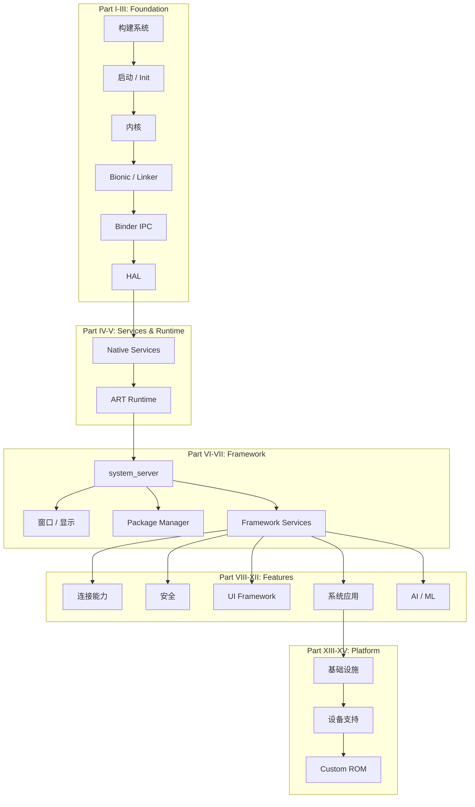

  <object data="cover.svg" type="image/svg+xml" style="max-width: 100%; max-height: 80vh;">
    AOSP Internals — Android Open Source Project 开发者指南
  </object>

---

## 许可证

本书采用 [GNU General Public License v3.0](https://www.gnu.org/licenses/gpl-3.0.html) 许可证发布。你可以按照 GPL-3.0 的条款自由分享和改编本作品。详情请参见 [LICENSE](https://github.com/anthropics/aosp-dev-book/blob/main/LICENSE) 文件。

本书基于对 [Android Open Source Project](https://source.android.com/) 的分析编写，而 AOSP 本身采用 Apache License 2.0 许可证。

## 如何阅读

请使用侧边栏按章节浏览内容。全书按照 Android 架构自底向上的顺序组织，每一章都可以单独阅读，但连续阅读会更容易建立完整的系统理解。

## 架构总览

