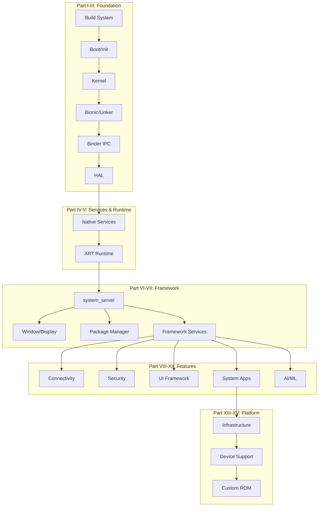

## License

This book is licensed under the [GNU General Public License v3.0](https://www.gnu.org/licenses/gpl-3.0.html). You are free to share and adapt this work under the terms of the GPL-3.0. See the [LICENSE](https://github.com/anthropics/aosp-dev-book/blob/main/LICENSE) file for details.

The book is based on analysis of the [Android Open Source Project](https://source.android.com/), which is licensed under the Apache License 2.0.

## How to Navigate

Use the sidebar to browse chapters organized bottom-to-top through the Android architecture. Each chapter is self-contained but builds on previous ones.

## Architecture Overview

