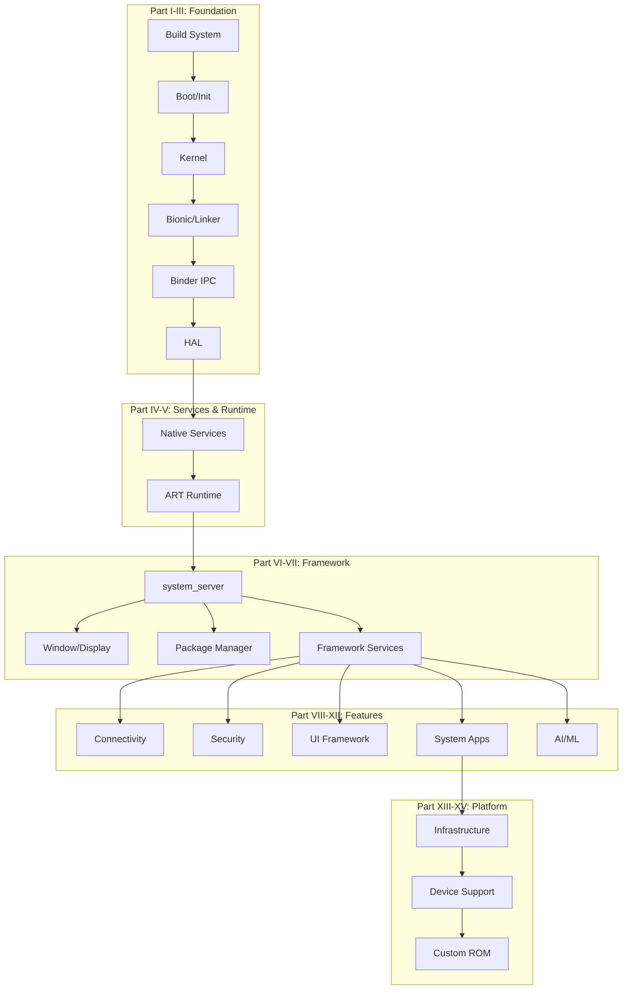

--8<-- "README.md:coverage"

## License

This book is licensed under the [Apache License 2.0](https://www.apache.org/licenses/LICENSE-2.0), matching the license of the [Android Open Source Project](https://source.android.com/) it analyzes. See the [LICENSE](https://github.com/aospbooks/aosp-internal-book/blob/main/LICENSE) file for details.

## How to Navigate

Use the sidebar to browse chapters organized bottom-to-top through the Android architecture. Each chapter is self-contained but builds on previous ones.

## Architecture Overview

## Support This Project

If this book has helped you understand AOSP, please consider showing your support:

- Star the [repository](https://github.com/aospbooks/aosp-internal-book) on GitHub so other developers can find it.
- Report errors or suggest improvements via the [issue tracker](https://github.com/aospbooks/aosp-internal-book/issues).
- Share the book with colleagues and communities working on Android.

Stars and feedback are the main signal that the work is useful, and they motivate continued writing and review.
